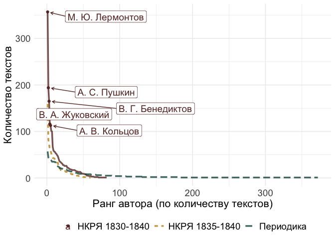

# Chapter 2.1

Notebook on comparison between canonic corpus and periodicals.

``` r
library(tidyverse)
```

    Warning: package 'ggplot2' was built under R version 4.3.1

    Warning: package 'lubridate' was built under R version 4.3.1

    ── Attaching core tidyverse packages ──────────────────────── tidyverse 2.0.0 ──
    ✔ dplyr     1.1.3     ✔ readr     2.1.4
    ✔ forcats   1.0.0     ✔ stringr   1.5.0
    ✔ ggplot2   3.4.4     ✔ tibble    3.2.1
    ✔ lubridate 1.9.3     ✔ tidyr     1.3.0
    ✔ purrr     1.0.2     
    ── Conflicts ────────────────────────────────────────── tidyverse_conflicts() ──
    ✖ dplyr::filter() masks stats::filter()
    ✖ dplyr::lag()    masks stats::lag()
    ℹ Use the conflicted package (<http://conflicted.r-lib.org/>) to force all conflicts to become errors

``` r
library(tidytext)

library(ggrepel)
```

    Warning: package 'ggrepel' was built under R version 4.3.1

``` r
library(MetBrewer)
library(wesanderson)
```

    Warning: package 'wesanderson' was built under R version 4.3.1

    Registered S3 method overwritten by 'wesanderson':
      method        from     
      print.palette MetBrewer

``` r
theme_set(theme_minimal())

# fix problems with cyrillics (for ipynb)
#library(extrafont)
#library(showtext)
#font_add("Arial", "/Library/Fonts/Arial.ttf") 
#showtext_auto()
```

Load RNC data

``` r
load("../../data/nkrja_19th_lem.Rda")
glimpse(c19)
```

    Rows: 15,569
    Columns: 41
    $ Unnamed..0          <int> 1, 2, 3, 4, 5, 6, 7, 8, 9, 10, 11, 12, 13, 14, 15,…
    $ path                <chr> "xix/1790-1810_poets/poets-001", "xix/1790-1810_po…
    $ author              <chr> "С. С. Бобров", "С. С. Бобров", "С. С. Бобров", "С…
    $ dub                 <lgl> NA, NA, NA, NA, NA, NA, NA, NA, NA, NA, NA, NA, NA…
    $ original            <chr> "", "", "Гораций", "", "", "", "", "", "", "", "",…
    $ language            <chr> "", "", "латинский", "", "", "", "", "", "", "", "…
    $ header              <chr> "Царство всеобщей любви : «Еще вкруг солнцев не вр…
    $ cyclus              <chr> "", "", "", "", "", "", "", "", "", "", "", "", ""…
    $ liber               <chr> "", "", "", "", "", "", "", "", "", "", "", "", ""…
    $ created             <chr> "1785", "1785", "1787", "1789", "1789", "1789", "1…
    $ start               <dbl> 1785, 1785, 1787, 1789, 1789, 1789, 1792, 1800, 18…
    $ end                 <dbl> NA, NA, NA, NA, NA, NA, 1800, NA, NA, 1803, 1803, …
    $ exact               <chr> "неточная", "неточная", "неточная", "неточная", "н…
    $ sphere              <chr> "художественная", "художественная", "художественна…
    $ genre_fi            <chr> "стихотворение", "стихотворение", "стихотворение :…
    $ audience_age        <chr> "н-возраст", "н-возраст", "н-возраст", "н-возраст"…
    $ audience_level      <chr> "н-уровень", "н-уровень", "н-уровень", "н-уровень"…
    $ audience_size       <chr> "большая", "большая", "большая", "большая", "больш…
    $ source              <chr> "Поэты 1790-1810-х годов. Библиотека поэта. Второе…
    $ publication         <chr> "", "", "", "", "", "", "", "", "", "", "", "", ""…
    $ publisher           <chr> "", "", "", "", "", "", "", "", "", "", "", "", ""…
    $ publ_year           <chr> "", "", "", "", "", "", "", "", "", "", "", "", ""…
    $ medium              <chr> "книга", "книга", "книга", "книга", "книга", "книг…
    $ subcorpus           <chr> "поэтический", "поэтический", "поэтический", "поэт…
    $ meter               <chr> "Я", "Я", "Я", "Я", "Я", "Я", "Я", "Х", "Я", "Я", …
    $ feet                <chr> "4", "6", "4", "4", "4", "6", "4(5)", "4", "4", "4…
    $ clausula            <chr> "регулярная : жмжм жж мжжм", "регулярная : жм", "р…
    $ strophe             <chr> "10 : одическая строфа", "4", "4", "10 : одическая…
    $ gr_strophe          <chr> "", "", "8", "", "", "вольная", "", "", "", "вольн…
    $ rhyme               <chr> "сложная : абаб вв гддг", "перекрестная : абаб", "…
    $ formula             <chr> "Я4жм", "Я6жм", "Я4жм", "Я4жм", "Я4жм", "Я6жжмм", …
    $ extra               <chr> "", "", "", "", "", "нарушения строфики", "", "", …
    $ verses              <dbl> 110, 36, 32, 70, 144, 56, 216, 8, 335, 66, 195, 23…
    $ location            <chr> "", "", "", "", "", "", "", "", "", "", "", "", ""…
    $ location_normalized <chr> "", "", "", "", "", "", "", "", "", "", "", "", ""…
    $ paths_tidy          <chr> "texts_plain/xix/1790-1810_poets/poets-001.txt", "…
    $ diff                <int> 0, 0, 0, 0, 0, 0, 8, 0, 0, 1, 1, 0, 0, 0, 0, 0, 9,…
    $ year                <int> 1785, 1785, 1787, 1789, 1789, 1789, 1800, 1800, 18…
    $ year_start          <int> 1785, 1785, 1787, 1789, 1789, 1789, 1792, 1800, 18…
    $ text_raw            <chr> "Еще вкруг солнцев не вращались \n В превыспренних…
    $ lemma               <chr> "еще вкруг солнцев не вращаться \n в превыспренний…

Create 1830-1840 and 1835-1840 sets

``` r
nkrja_1835 <- c19 %>% filter(year > 1834 & year < 1841)
nkrja_1830 <- c19 %>% filter(year > 1829 & year < 1841)
```

### General NKRJA overview

Create a function for displaying stats

``` r
stats_nkrja <- function(corpus) {
    print("Number of unique authors:")
    print(length(unique(corpus$author)))

    print("Number of poems:")
    print(nrow(corpus))

    print("Top authors:")
    corpus %>% 
        group_by(author) %>% 
        count(sort = T) %>% 
        mutate(perc = n / nrow(corpus) * 100) %>% 
        head(20) %>% print
    
    print("Sources:")
    
    corpus %>% 
        group_by(source) %>% 
        count(sort = T) %>% 
        mutate(perc = n/nrow(corpus)*100)
    }
```

#### 1835-1840

``` r
stats_nkrja(nkrja_1835)
```

    [1] "Number of unique authors:"
    [1] 60
    [1] "Number of poems:"
    [1] 1212
    [1] "Top authors:"
    # A tibble: 20 × 3
    # Groups:   author [20]
       author                n  perc
       <chr>             <int> <dbl>
     1 В. Г. Бенедиктов    159 13.1 
     2 М. Ю. Лермонтов      82  6.77
     3 А. В. Кольцов        74  6.11
     4 А. С. Пушкин         60  4.95
     5 Н. А. Некрасов       59  4.87
     6 А. А. Фет            53  4.37
     7 В. А. Жуковский      47  3.88
     8 Е. П. Ростопчина     43  3.55
     9 И. П. Мятлев         43  3.55
    10 А. Н. Майков         42  3.47
    11 П. П. Ершов          40  3.30
    12 Ф. И. Тютчев         37  3.05
    13 А. И. Полежаев       36  2.97
    14 Н. М. Языков         33  2.72
    15 Н. П. Огарев         33  2.72
    16 Н. В. Кукольник      25  2.06
    17 В. И. Соколовский    21  1.73
    18 Н. М. Сатин          21  1.73
    19 А. К. Толстой        17  1.40
    20 Д. В. Давыдов        17  1.40
    [1] "Sources:"

    # A tibble: 43 × 3
    # Groups:   source [43]
       source                                                                n  perc
       <chr>                                                             <int> <dbl>
     1 Поэты 1820-1830-х годов. Библиотека поэта. Второе издание. -- Л.…   166 13.7 
     2 В. Г. Бенедиктов. Стихотворения. -- Л.: Советский писатель, 1939…   159 13.1 
     3 М. Ю. Лермонтов. Полное собрание сочинений: В 5 т. -- М. Л.: Aca…    82  6.77
     4 А. В. Кольцов. Полное собрание стихотворений. -- Л.: Сов. писате…    74  6.11
     5 Н. А. Некрасов. Полное собрание стихотворений: В 3 тт. Библиотек…    59  4.87
     6 Пушкин А. С. Полное собрание сочинений, 1837-1937: В 16 т. Т. 3      58  4.79
     7 А. А. Фет. Стихотворения и поэмы. Библиотека поэта. Большая сери…    53  4.37
     8 Жуковский В. А. Полное собрание сочинений и писем. М.: Языки сла…    47  3.88
     9 Евдокия Ростопчина. Стихотворения Проза Письма. -- М., Сов. Росс…    43  3.55
    10 И. П. Мятлев. Стихотворения. Библиотека поэта. -- Л.: Советский …    43  3.55
    # ℹ 33 more rows

#### 1830-1840

``` r
stats_nkrja(nkrja_1830)
```

    [1] "Number of unique authors:"
    [1] 82
    [1] "Number of poems:"
    [1] 2409
    [1] "Top authors:"
    # A tibble: 20 × 3
    # Groups:   author [20]
       author                n  perc
       <chr>             <int> <dbl>
     1 М. Ю. Лермонтов     357 14.8 
     2 А. С. Пушкин        194  8.05
     3 В. Г. Бенедиктов    165  6.85
     4 В. А. Жуковский     116  4.82
     5 А. В. Кольцов       113  4.69
     6 Н. М. Языков        101  4.19
     7 А. И. Полежаев      100  4.15
     8 Ф. И. Тютчев         67  2.78
     9 Н. А. Некрасов       59  2.45
    10 И. П. Мятлев         57  2.37
    11 Е. П. Ростопчина     56  2.32
    12 А. А. Фет            53  2.20
    13 Е. А. Баратынский    52  2.16
    14 П. П. Ершов          49  2.03
    15 А. И. Одоевский      47  1.95
    16 А. Н. Майков         42  1.74
    17 А. С. Хомяков        37  1.54
    18 Н. В. Кукольник      35  1.45
    19 Н. П. Огарев         34  1.41
    20 Д. В. Давыдов        32  1.33
    [1] "Sources:"

    # A tibble: 50 × 3
    # Groups:   source [50]
       source                                                                n  perc
       <chr>                                                             <int> <dbl>
     1 Поэты 1820-1830-х годов. Библиотека поэта. Второе издание. -- Л.…   361 15.0 
     2 М. Ю. Лермонтов. Полное собрание сочинений: В 5 т. -- М. Л.: Aca…   357 14.8 
     3 Пушкин А. С. Полное собрание сочинений, 1837-1937: В 16 т. Т. 3     178  7.39
     4 В. Г. Бенедиктов. Стихотворения. -- Л.: Советский писатель, 1939…   165  6.85
     5 Жуковский В. А. Полное собрание сочинений и писем. М.: Языки сла…   116  4.82
     6 А. В. Кольцов. Полное собрание стихотворений. -- Л.: Сов. писате…   113  4.69
     7 Н. М. Языков. Полное собрание стихотворений                         101  4.19
     8 А. Полежаев. Стихотворения и поэмы. Библиотека поэта. Большая се…   100  4.15
     9 Тютчев Ф. И. Полное собрание стихотворений                           67  2.78
    10 Н. А. Некрасов. Полное собрание стихотворений: В 3 тт. Библиотек…    59  2.45
    # ℹ 40 more rows

``` r
# 80-20 test
print("30% of top authors gather how much of the corpus -- 1830-1840:")
```

    [1] "30% of top authors gather how much of the corpus -- 1830-1840:"

``` r
nkrja_1830 %>% 
        group_by(author) %>% 
        count(sort = T) %>% 
        mutate(perc = n / nrow(nkrja_1830) * 100) %>% 
        head(round(length(unique(nkrja_1830$author))*0.3)) %>% 
        ungroup() %>% 
        summarise(test = sum(perc)) %>% 
        print()
```

    # A tibble: 1 × 1
       test
      <dbl>
    1  79.1

``` r
print("30% of top authors gather how much of the corpus -- 1835-1840:")
```

    [1] "30% of top authors gather how much of the corpus -- 1835-1840:"

``` r
nkrja_1835 %>% 
        group_by(author) %>% 
        count(sort = T) %>% 
        mutate(perc = n / nrow(nkrja_1835) * 100) %>% 
        head(round(length(unique(nkrja_1835$author))*0.3)) %>% 
        ungroup() %>% 
        summarise(test = sum(perc))
```

    # A tibble: 1 × 1
       test
      <dbl>
    1  74.9

``` r
round(length(unique(nkrja_1830$author))*0.3)
```

    [1] 25

``` r
nkrja_1830 %>% 
        group_by(author) %>% 
        count(sort = T) %>% 
        mutate(perc = n / nrow(nkrja_1830) * 100) %>% 
        head(5) %>% 
        ungroup() %>% 
        summarise(test = sum(perc)) %>% 
        print()
```

    # A tibble: 1 × 1
       test
      <dbl>
    1  39.2

#### “Poet’s library” quick check

``` r
authors_1830 <- nkrja_1830$author

# select authors from 1830s and see their sources
test <- c19 %>% 
    filter(author %in% authors_1830) %>% 
    group_by(source) %>% 
    count(sort = T)

test
```

    # A tibble: 59 × 2
    # Groups:   source [59]
       source                                                                      n
       <chr>                                                                   <int>
     1 "Жуковский В. А. Полное собрание сочинений и писем. М.: Языки славянск…   671
     2 "Поэты 1820-1830-х годов. Библиотека поэта. Второе издание. -- Л.: Сов…   637
     3 "А. А. Фет. Стихотворения и поэмы. Библиотека поэта. Большая серия. Тр…   582
     4 "М. Ю. Лермонтов. Полное собрание сочинений: В 5 т. -- М. Л.: Academia…   474
     5 "Н. Ф. Щербина. Стихотворения. Библиотека поэта. -- Л.: Советский писа…   470
     6 "А. Н. Майков. Избранные произведения. Библиотека поэта. Большая серия…   419
     7 "И. И. Дмитриев. Полное собрание стихотворений. Библиотека поэта. Боль…   391
     8 "Пушкин А. С. Полное собрание сочинений, 1837-1937: В 16 т. Т.2"          381
     9 "Н. М. Языков. Полное собрание стихотворений"                             360
    10 ""                                                                        357
    # ℹ 49 more rows

``` r
# count withough author filter, but number of poem entries in each source
c19 %>% 
    filter(source %in% test$source) %>% 
    count(source, sort = T)
```

                                                                                                                                                                                                  source
    1                                                                                                         Поэты 1820-1830-х годов. Библиотека поэта. Второе издание. -- Л.: Советский писатель, 1972
    2                                                                                                            Жуковский В. А. Полное собрание сочинений и писем. М.: Языки славянской культуры, 2000-
    3                                                                                 А. А. Фет. Стихотворения и поэмы. Библиотека поэта. Большая серия. Третье издание. -- Л.: Советский писатель, 1986
    4                                                                                                                                Поэты XVIII века. Библиотека поэта. -- Л., Советский писатель, 1972
    5                                                                                                                   М. Ю. Лермонтов. Полное собрание сочинений: В 5 т. -- М. Л.: Academia, 1935-1937
    6                                                                                                                    Н. Ф. Щербина. Стихотворения. Библиотека поэта. -- Л.: Советский писатель, 1970
    7                                                                                                                                                                                                   
    8                                                                             А. Н. Майков. Избранные произведения. Библиотека поэта. Большая серия. Второе издание. -- Л.: Советский писатель, 1977
    9                                                                                    И. И. Дмитриев. Полное собрание стихотворений. Библиотека поэта. Большая серия. -- Л.: Советский писатель, 1967
    10                                                                                                                                    Пушкин А. С. Полное собрание сочинений, 1837-1937: В 16 т. Т.2
    11                                                                                                                                                       Н. М. Языков. Полное собрание стихотворений
    12                                                                                                                                                        Тютчев Ф. И. Полное собрание стихотворений
    13                                                                           Н. А. Некрасов. Полное собрание стихотворений: В 3 тт. Библиотека поэта. Большая серия. -- Л.: Советский писатель, 1967
    14                                                                                                                                   Пушкин А. С. Полное собрание сочинений, 1837-1937: В 16 т. Т. 3
    15                                                                                                  П. А. Вяземский. Стихотворения. Библиотека поэта. Большая серия. -- Л.: Советский писатель, 1986
    16                                                                                                        Поэты 1790-1810-х годов. Библиотека поэта. Второе издание. -- Л.: Советский писатель, 1971
    17                                                                   А. К. Толстой. Полное собрание стихотворений и поэм. Новая библиотека поэта. Большая серия. -- СПб.: Академический проект, 2006
    18                                                                                                        Поэты 1840-1850-х годов. Библиотека поэта. Второе издание. -- Л.: Советский писатель, 1972
    19                                                                                               В. Г. Бенедиктов. Стихотворения. -- Л.: Советский писатель, 1939. (Библиотека поэта. Большая серия)
    20                                                                                   Баратынский Е. А. Полное собрание стихотворений: В 2 т. Л.: Сов. писатель, 1936. -- (Б-ка поэта). Т. 1. -- 1936
    21                                                                                                                                Поэты-радищевцы. Библиотека поэта. -- Л., Советский писатель, 1979
    22                                                                                                                                                                           Мей Л. А. Стихотворения
    23                                                                                                                   А. А. Дельвиг. Сочинения. Библиотека поэта. Л.: Художественная литература, 1986
    24                                                                                                                          А. В. Кольцов. Полное собрание стихотворений. -- Л.: Сов. писатель, 1939
    25                                                                                             Н. П. Огарев. Стихотворения и поэмы. Библиотека поэта. Большая серия. -- М.: Советский писатель, 1956
    26                                                                                              А. Полежаев. Стихотворения и поэмы. Библиотека поэта. Большая серия. -- Л.: Советский писатель, 1957
    27                                                                                                                                    Пушкин А. С. Полное собрание сочинений, 1837-1937: В 16 т. Т.1
    28                                                                                                                          Евдокия Ростопчина. Стихотворения Проза Письма. -- М., Сов. Россия, 1986
    29                                                                                                                    И. П. Мятлев. Стихотворения. Библиотека поэта. -- Л.: Советский писатель, 1969
    30                                                                                                                     Русская литература. Век XVIII. Лирика. -- М., Художественная литература, 1990
    31                                                                            А. С. Хомяков. Стихотворения и драмы. Библиотека поэта. Большая серия. Второе издание. -- Л.: Советский писатель, 1969
    32                                                                                                                                                                        Ершов П. П., Стихотворения
    33                                                                                                            Поэты-петрашевцы. Библиотека поэта. Третье издание. -- М.-Л.: Советский писатель, 1966
    34                                                                                        Д. Давыдов. Стихотворения. Библиотека поэта. Большая серия. Издание второе. -- Л. Советский писатель, 1984
    35                                                                                       В. К. Кюхельбекер. Избранные произведения. Библиотека поэта. Большая серия. -- Л.: Советский писатель, 1959
    36                                                                                                                                Поэзия небес. Выпуск второй. Том I. -- СПб.: Библия для всех, 2001
    37                                                                                 А. И. Одоевский. Полное собрание стихотворений. Библиотека поэта. Второе издание. -- Л.: Советский писатель, 1958
    38                                                                                                       Н. И. Гнедич. Стихотворения. Большая серия. Второе издание. -- Л.: Советский писатель, 1956
    39                                                               Каролина Павлова. Полное собрание стихотворений. -- Библиотека поэта. Большая серия. -- Москва, Ленинград: Советский писатель, 1964
    40                                                                                           И. С. Тургенев. Стихотворения и поэмы. Библиотека поэта. Большая серия. -- Л.: Советский писатель, 1970
    41                                                                                                    С. П. Шевырев. Стихотворения. Библиотека поэта. Большая серия. -- Л.: Советский писатель, 1939
    42                                                                                                        Ф. Глинка. Стихотворения. Библиотека поэта. Большая серия. -- Л.: Советский писатель, 1957
    43                                                                           П. А. Катенин. Избранные произведения. Библиотека поэта. Большая серия. Издание второе. -- Л.: Советский писатель, 1965
    44                                                                                                   Русская басня XVIII-XIX веков. Библиотека поэта. Большая серия. -- Л.: Советский писатель, 1977
    45                                                                                       А. А. Бестужев-Марлинский. Собрание стихотворений. -- Библиотека поэта. -- Москва: Советский писатель, 1948
    46                                                                                     И. И. Козлов. Полное собрание стихотворений. Библиотека поэта. Большая серия. -- Л.: Советский писатель, 1960
    47                                                                                                        Катенин П. А. Избранные произведения. Библиотека поэта. -- М.-Л.: Советский писатель, 1965
    48                                                                                                                                    Пушкин А. С. Полное собрание сочинений, 1837-1937: В 16 т. Т.3
    49                                                                                                                                    Пушкин А. С. Полное собрание сочинений, 1837-1937: В 16 т. Т.4
    50                                                                                                                                    Пушкин А. С. Полное собрание сочинений, 1837-1937: В 16 т. Т.6
    51                                                                                                                                    Пушкин А. С. Полное собрание сочинений, 1837-1937: В 16 т. Т.5
    52                                                                                 Баратынский Е. А. Полное собрание стихотворений: В 2 т. -- Л.: Сов. писатель, 1936. -- (Б-ка поэта).Т. 2. -- 1936
    53                                                                                                                                А.К. Толстой. Собрание сочинений в четырех томах. М.: Правда, 1980
    54                                                                                                                                                                 Василий Пушкин Стихи Проза Письма
    55                                                                                                                                          Поэты-сатирики конца 18 -- начала 19 в. Библиотека поэта
    56                                                                                                                          А. В. Кольцов. Полное собрание стихотворений. -- Л.: Сов. Писатель, 1958
    57                                                                                                                                   Пушкин А. С. Полное собрание сочинений, 1837-1937: В 16 т. Т. 8
    58                                                                                                                                    Пушкин А. С. Полное собрание сочинений, 1837-1937: В 16 т. Т.8
    59 Пушкин А. С. Полное собрание сочинений: В 10 т. / АН СССР. Ин-т рус. лит. (Пушкин. дом) Текст проверен и примеч. сост. Б. В. Томашевским. -- 4-е изд. -- Л.: Наука. Ленингр. отд-ние, 1977--1979.
         n
    1  835
    2  671
    3  582
    4  512
    5  474
    6  470
    7  451
    8  419
    9  391
    10 384
    11 360
    12 358
    13 356
    14 349
    15 318
    16 293
    17 263
    18 262
    19 259
    20 238
    21 236
    22 222
    23 199
    24 187
    25 164
    26 137
    27 137
    28 131
    29 114
    30 114
    31 103
    32  97
    33  97
    34  95
    35  94
    36  92
    37  76
    38  71
    39  59
    40  57
    41  52
    42  41
    43  39
    44  39
    45  38
    46  36
    47  29
    48  16
    49  14
    50  13
    51   9
    52   7
    53   3
    54   3
    55   3
    56   1
    57   1
    58   1
    59   1

``` r
c19 %>% 
    filter(author == "К. К. Павлова") %>% 
    nrow()
```

    [1] 59

``` r
nkrja_1830 %>% 
    count(source, sort = T)
```

                                                                                                                                    source
    1                                           Поэты 1820-1830-х годов. Библиотека поэта. Второе издание. -- Л.: Советский писатель, 1972
    2                                                     М. Ю. Лермонтов. Полное собрание сочинений: В 5 т. -- М. Л.: Academia, 1935-1937
    3                                                                      Пушкин А. С. Полное собрание сочинений, 1837-1937: В 16 т. Т. 3
    4                                  В. Г. Бенедиктов. Стихотворения. -- Л.: Советский писатель, 1939. (Библиотека поэта. Большая серия)
    5                                              Жуковский В. А. Полное собрание сочинений и писем. М.: Языки славянской культуры, 2000-
    6                                                             А. В. Кольцов. Полное собрание стихотворений. -- Л.: Сов. писатель, 1939
    7                                                                                          Н. М. Языков. Полное собрание стихотворений
    8                                 А. Полежаев. Стихотворения и поэмы. Библиотека поэта. Большая серия. -- Л.: Советский писатель, 1957
    9                                                                                           Тютчев Ф. И. Полное собрание стихотворений
    10             Н. А. Некрасов. Полное собрание стихотворений: В 3 тт. Библиотека поэта. Большая серия. -- Л.: Советский писатель, 1967
    11                                                      И. П. Мятлев. Стихотворения. Библиотека поэта. -- Л.: Советский писатель, 1969
    12                                                            Евдокия Ростопчина. Стихотворения Проза Письма. -- М., Сов. Россия, 1986
    13                  А. А. Фет. Стихотворения и поэмы. Библиотека поэта. Большая серия. Третье издание. -- Л.: Советский писатель, 1986
    14                     Баратынский Е. А. Полное собрание стихотворений: В 2 т. Л.: Сов. писатель, 1936. -- (Б-ка поэта). Т. 1. -- 1936
    15                                                                                                          Ершов П. П., Стихотворения
    16                                          Поэты 1840-1850-х годов. Библиотека поэта. Второе издание. -- Л.: Советский писатель, 1972
    17                   А. И. Одоевский. Полное собрание стихотворений. Библиотека поэта. Второе издание. -- Л.: Советский писатель, 1958
    18                                                                                                                                    
    19              А. Н. Майков. Избранные произведения. Библиотека поэта. Большая серия. Второе издание. -- Л.: Советский писатель, 1977
    20              А. С. Хомяков. Стихотворения и драмы. Библиотека поэта. Большая серия. Второе издание. -- Л.: Советский писатель, 1969
    21                               Н. П. Огарев. Стихотворения и поэмы. Библиотека поэта. Большая серия. -- М.: Советский писатель, 1956
    22                          Д. Давыдов. Стихотворения. Библиотека поэта. Большая серия. Издание второе. -- Л. Советский писатель, 1984
    23                                    П. А. Вяземский. Стихотворения. Библиотека поэта. Большая серия. -- Л.: Советский писатель, 1986
    24                         В. К. Кюхельбекер. Избранные произведения. Библиотека поэта. Большая серия. -- Л.: Советский писатель, 1959
    25     А. К. Толстой. Полное собрание стихотворений и поэм. Новая библиотека поэта. Большая серия. -- СПб.: Академический проект, 2006
    26                                      С. П. Шевырев. Стихотворения. Библиотека поэта. Большая серия. -- Л.: Советский писатель, 1939
    27                                          Катенин П. А. Избранные произведения. Библиотека поэта. -- М.-Л.: Советский писатель, 1965
    28                                                                                                             Мей Л. А. Стихотворения
    29                                                     А. А. Дельвиг. Сочинения. Библиотека поэта. Л.: Художественная литература, 1986
    30                                         Н. И. Гнедич. Стихотворения. Большая серия. Второе издание. -- Л.: Советский писатель, 1956
    31                         А. А. Бестужев-Марлинский. Собрание стихотворений. -- Библиотека поэта. -- Москва: Советский писатель, 1948
    32                       И. И. Козлов. Полное собрание стихотворений. Библиотека поэта. Большая серия. -- Л.: Советский писатель, 1960
    33 Каролина Павлова. Полное собрание стихотворений. -- Библиотека поэта. Большая серия. -- Москва, Ленинград: Советский писатель, 1964
    34                             И. С. Тургенев. Стихотворения и поэмы. Библиотека поэта. Большая серия. -- Л.: Советский писатель, 1970
    35                                                                  Поэзия небес. Выпуск второй. Том I. -- СПб.: Библия для всех, 2001
    36                                          Ф. Глинка. Стихотворения. Библиотека поэта. Большая серия. -- Л.: Советский писатель, 1957
    37                                          Поэты 1790-1810-х годов. Библиотека поэта. Второе издание. -- Л.: Советский писатель, 1971
    38                                                                      Пушкин А. С. Полное собрание сочинений, 1837-1937: В 16 т. Т.1
    39                                              Поэты-петрашевцы. Библиотека поэта. Третье издание. -- М.-Л.: Советский писатель, 1966
    40                                                                      Пушкин А. С. Полное собрание сочинений, 1837-1937: В 16 т. Т.5
    41                                                     Н. Ф. Щербина. Стихотворения. Библиотека поэта. -- Л.: Советский писатель, 1970
    42                                                                      Пушкин А. С. Полное собрание сочинений, 1837-1937: В 16 т. Т.6
    43                                     Русская басня XVIII-XIX веков. Библиотека поэта. Большая серия. -- Л.: Советский писатель, 1977
    44                     И. И. Дмитриев. Полное собрание стихотворений. Библиотека поэта. Большая серия. -- Л.: Советский писатель, 1967
    45             П. А. Катенин. Избранные произведения. Библиотека поэта. Большая серия. Издание второе. -- Л.: Советский писатель, 1965
    46                                                                      Пушкин А. С. Полное собрание сочинений, 1837-1937: В 16 т. Т.3
    47                                                                            Поэты-сатирики конца 18 -- начала 19 в. Библиотека поэта
    48                                                                     Пушкин А. С. Полное собрание сочинений, 1837-1937: В 16 т. Т. 8
    49                                                                      Пушкин А. С. Полное собрание сочинений, 1837-1937: В 16 т. Т.2
    50                                                                      Пушкин А. С. Полное собрание сочинений, 1837-1937: В 16 т. Т.8
         n
    1  361
    2  357
    3  178
    4  165
    5  116
    6  113
    7  101
    8  100
    9   67
    10  59
    11  57
    12  56
    13  53
    14  52
    15  49
    16  49
    17  47
    18  45
    19  42
    20  37
    21  34
    22  33
    23  31
    24  21
    25  18
    26  16
    27  15
    28  15
    29  14
    30  13
    31  11
    32  10
    33   9
    34   8
    35   8
    36   7
    37   6
    38   6
    39   5
    40   5
    41   4
    42   3
    43   3
    44   2
    45   2
    46   2
    47   1
    48   1
    49   1
    50   1

``` r
print("Number of Pushkin's poems:")
```

    [1] "Number of Pushkin's poems:"

``` r
nkrja_1830 %>% 
    count(source, sort = T) %>% 
    filter(str_detect(source, "Пушкин")) %>% 
    summarise(sum(n)) %>% pull()
```

    [1] 197

``` r
nkrja_1830 %>% 
    count(source, sort = T) %>% 
    filter(!str_detect(source, "Поэты|Поэзия|Русская басня|Пушкин|Лермонтов|Жуковский")) %>% 

    # I manually checked whether Koltsov and others who have incomplete source description
    # are cited from BP and add them to the detection regex below
    mutate(edition = ifelse(str_detect(source, 
                                       "(Б|б)иблиотека поэта|Б-ка поэта|Кольцов|Тютчев|Языков"), 
                            "BP", "else")) %>% 
    group_by(edition) %>% 
    summarise(total_poems = sum(n))
```

    # A tibble: 2 × 2
      edition total_poems
      <chr>         <int>
    1 BP             1128
    2 else            178

Subset 1835-1840

``` r
nkrja_1835 %>% 
    count(source, sort = T)
```

                                                                                                                                    source
    1                                           Поэты 1820-1830-х годов. Библиотека поэта. Второе издание. -- Л.: Советский писатель, 1972
    2                                  В. Г. Бенедиктов. Стихотворения. -- Л.: Советский писатель, 1939. (Библиотека поэта. Большая серия)
    3                                                     М. Ю. Лермонтов. Полное собрание сочинений: В 5 т. -- М. Л.: Academia, 1935-1937
    4                                                             А. В. Кольцов. Полное собрание стихотворений. -- Л.: Сов. писатель, 1939
    5              Н. А. Некрасов. Полное собрание стихотворений: В 3 тт. Библиотека поэта. Большая серия. -- Л.: Советский писатель, 1967
    6                                                                      Пушкин А. С. Полное собрание сочинений, 1837-1937: В 16 т. Т. 3
    7                   А. А. Фет. Стихотворения и поэмы. Библиотека поэта. Большая серия. Третье издание. -- Л.: Советский писатель, 1986
    8                                              Жуковский В. А. Полное собрание сочинений и писем. М.: Языки славянской культуры, 2000-
    9                                                             Евдокия Ростопчина. Стихотворения Проза Письма. -- М., Сов. Россия, 1986
    10                                                      И. П. Мятлев. Стихотворения. Библиотека поэта. -- Л.: Советский писатель, 1969
    11              А. Н. Майков. Избранные произведения. Библиотека поэта. Большая серия. Второе издание. -- Л.: Советский писатель, 1977
    12                                                                                                          Ершов П. П., Стихотворения
    13                                                                                          Тютчев Ф. И. Полное собрание стихотворений
    14                                А. Полежаев. Стихотворения и поэмы. Библиотека поэта. Большая серия. -- Л.: Советский писатель, 1957
    15                                                                                         Н. М. Языков. Полное собрание стихотворений
    16                               Н. П. Огарев. Стихотворения и поэмы. Библиотека поэта. Большая серия. -- М.: Советский писатель, 1956
    17                                          Поэты 1840-1850-х годов. Библиотека поэта. Второе издание. -- Л.: Советский писатель, 1972
    18     А. К. Толстой. Полное собрание стихотворений и поэм. Новая библиотека поэта. Большая серия. -- СПб.: Академический проект, 2006
    19                          Д. Давыдов. Стихотворения. Библиотека поэта. Большая серия. Издание второе. -- Л. Советский писатель, 1984
    20                     Баратынский Е. А. Полное собрание стихотворений: В 2 т. Л.: Сов. писатель, 1936. -- (Б-ка поэта). Т. 1. -- 1936
    21                   А. И. Одоевский. Полное собрание стихотворений. Библиотека поэта. Второе издание. -- Л.: Советский писатель, 1958
    22              А. С. Хомяков. Стихотворения и драмы. Библиотека поэта. Большая серия. Второе издание. -- Л.: Советский писатель, 1969
    23                                                                                                             Мей Л. А. Стихотворения
    24                                    П. А. Вяземский. Стихотворения. Библиотека поэта. Большая серия. -- Л.: Советский писатель, 1986
    25                         В. К. Кюхельбекер. Избранные произведения. Библиотека поэта. Большая серия. -- Л.: Советский писатель, 1959
    26                             И. С. Тургенев. Стихотворения и поэмы. Библиотека поэта. Большая серия. -- Л.: Советский писатель, 1970
    27 Каролина Павлова. Полное собрание стихотворений. -- Библиотека поэта. Большая серия. -- Москва, Ленинград: Советский писатель, 1964
    28                                          Катенин П. А. Избранные произведения. Библиотека поэта. -- М.-Л.: Советский писатель, 1965
    29                                                                  Поэзия небес. Выпуск второй. Том I. -- СПб.: Библия для всех, 2001
    30                       И. И. Козлов. Полное собрание стихотворений. Библиотека поэта. Большая серия. -- Л.: Советский писатель, 1960
    31                                              Поэты-петрашевцы. Библиотека поэта. Третье издание. -- М.-Л.: Советский писатель, 1966
    32                                                     Н. Ф. Щербина. Стихотворения. Библиотека поэта. -- Л.: Советский писатель, 1970
    33                                          Ф. Глинка. Стихотворения. Библиотека поэта. Большая серия. -- Л.: Советский писатель, 1957
    34                                      С. П. Шевырев. Стихотворения. Библиотека поэта. Большая серия. -- Л.: Советский писатель, 1939
    35                                                                                                                                    
    36                         А. А. Бестужев-Марлинский. Собрание стихотворений. -- Библиотека поэта. -- Москва: Советский писатель, 1948
    37                     И. И. Дмитриев. Полное собрание стихотворений. Библиотека поэта. Большая серия. -- Л.: Советский писатель, 1967
    38             П. А. Катенин. Избранные произведения. Библиотека поэта. Большая серия. Издание второе. -- Л.: Советский писатель, 1965
    39                                          Поэты 1790-1810-х годов. Библиотека поэта. Второе издание. -- Л.: Советский писатель, 1971
    40                                                                            Поэты-сатирики конца 18 -- начала 19 в. Библиотека поэта
    41                                                                     Пушкин А. С. Полное собрание сочинений, 1837-1937: В 16 т. Т. 8
    42                                                                      Пушкин А. С. Полное собрание сочинений, 1837-1937: В 16 т. Т.3
    43                                                                      Пушкин А. С. Полное собрание сочинений, 1837-1937: В 16 т. Т.8
         n
    1  166
    2  159
    3   82
    4   74
    5   59
    6   58
    7   53
    8   47
    9   43
    10  43
    11  42
    12  40
    13  37
    14  36
    15  33
    16  33
    17  29
    18  17
    19  17
    20  16
    21  15
    22  15
    23  15
    24  13
    25   9
    26   8
    27   8
    28   7
    29   6
    30   5
    31   5
    32   4
    33   4
    34   3
    35   2
    36   2
    37   1
    38   1
    39   1
    40   1
    41   1
    42   1
    43   1

``` r
print("Number of Pushkin's poems:")
```

    [1] "Number of Pushkin's poems:"

``` r
nkrja_1835 %>% 
    count(source, sort = T) %>% 
    filter(str_detect(source, "Пушкин")) %>% 
    summarise(sum(n)) %>% pull
```

    [1] 61

``` r
nkrja_1835 %>% 
    count(source, sort = T) %>% 
    filter(!str_detect(source, "Поэты|Поэзия|Русская басня|Пушкин|Лермонтов|Жуковский")) %>% 

    # I manually checked whether Koltsov and others who have incomplete source description
    # are cited from BP and add them to the detection regex below
    mutate(edition = ifelse(str_detect(source, 
                                       "(Б|б)иблиотека поэта|Б-ка поэта|Кольцов|Тютчев|Языков"), 
                            "BP", "else")) %>% 
    group_by(edition) %>% 
    summarise(total_poems = sum(n))
```

    # A tibble: 2 × 2
      edition total_poems
      <chr>         <int>
    1 BP              714
    2 else            100

``` r
print("Percentages for 1830-40:")
```

    [1] "Percentages for 1830-40:"

``` r
tibble(x = c(361, 49, 15, 197, 357, 116, 1128, 178, 8),
                   total = rep(2409, 9)) %>% 
    mutate(perc = round(x/total*100, 1))
```

    # A tibble: 9 × 3
          x total  perc
      <dbl> <dbl> <dbl>
    1   361  2409  15  
    2    49  2409   2  
    3    15  2409   0.6
    4   197  2409   8.2
    5   357  2409  14.8
    6   116  2409   4.8
    7  1128  2409  46.8
    8   178  2409   7.4
    9     8  2409   0.3

``` r
print("Percentages for 1835-40:")
```

    [1] "Percentages for 1835-40:"

``` r
tibble(x = c(166, 29, 7, 61, 82, 47, 714, 100, 6),
      total = rep(1212, 9)) %>% 
    mutate(pers = round(x/total*100,1))
```

    # A tibble: 9 × 3
          x total  pers
      <dbl> <dbl> <dbl>
    1   166  1212  13.7
    2    29  1212   2.4
    3     7  1212   0.6
    4    61  1212   5  
    5    82  1212   6.8
    6    47  1212   3.9
    7   714  1212  58.9
    8   100  1212   8.3
    9     6  1212   0.5

### Plot 2.1

Retrieve rankings & n poems for authors from RNC

``` r
r35 <- nkrja_1835 %>% 
    count(author, sort = T) %>% 
    mutate(rank = row_number(), group = "НКРЯ 1835-1840")

r30 <- nkrja_1830 %>% 
    count(author, sort = T) %>% 
    mutate(rank = row_number(), group = "НКРЯ 1830-1840")

rankings_nkrja <- rbind(r35, r30)

head(rankings_nkrja)
```

                author   n rank          group
    1 В. Г. Бенедиктов 159    1 НКРЯ 1835-1840
    2  М. Ю. Лермонтов  82    2 НКРЯ 1835-1840
    3    А. В. Кольцов  74    3 НКРЯ 1835-1840
    4     А. С. Пушкин  60    4 НКРЯ 1835-1840
    5   Н. А. Некрасов  59    5 НКРЯ 1835-1840
    6        А. А. Фет  53    6 НКРЯ 1835-1840

## Periodicals data

``` r
per <- readRDS("../../data/corpus1835/corpus_1835.Rds") %>% 
  filter(corpus == "per") %>% 
  rename(author = author_text)

authors_meta <- read.delim("../../meta/authors.tsv", sep = "\t")

# attach only gender by A_ID
per <- per %>% 
  left_join(authors_meta %>% select(A_ID, RP, gender), by = "A_ID")

glimpse(per)
```

    Rows: 1,905
    Columns: 22
    $ text_id       <chr> "P_1", "P_10", "P_100", "P_1000", "P_1001", "P_1002", "P…
    $ A_ID          <chr> "", "A-50", "A-7", "A-41", "A-139", "A-11", "A-163", "A-…
    $ author_sign   <chr> "", "Л. Якубович", "Кольцов", "Ф. Глинка", "Н. Прокопови…
    $ author        <chr> "", "Якубович Л.А.", "Кольцов А.В.", "Глинка Ф.Н.", "Про…
    $ text_title    <chr> "Солдатская песня", "Молния", "Ночлег чумаков", "Утешите…
    $ text_subtitle <chr> "", "", "Сельские картины", "", "", "", "", "", "", "", …
    $ first_line    <chr> "Ох жизнь, молодецкая", "Зачем с небесной высоты", "В бл…
    $ year          <chr> "1835", "1835", "1836", "1838", "1838", "1838", "1838", …
    $ path_text     <chr> "../../data/corpus1835/periodicals/per_raw//P_1.txt", ".…
    $ source_text   <chr> "Сев_пч. 1835. №12. C. 46", "БдЧ. 1835. Т.8. Отд. 1. C. …
    $ COL_ID        <chr> "", "", "", "", "", "", "", "", "", "", "", "", "", "", …
    $ corpus        <chr> "per", "per", "per", "per", "per", "per", "per", "per", …
    $ text_raw      <chr> "Ох, жизнь молодецкая,\nБравая, солдатская!\nКак осенняя…
    $ text_cln      <chr> "Ох, жизнь молодецкая,\nБравая, солдатская!\nКак осенняя…
    $ text_lemm     <chr> "ох, жизнь молодецкий,\nбравый, солдатский!\nкак осенний…
    $ text_acc      <chr> "Ох, жизнь молоде'цкая,\nБра'вая, солда'тская!\nКак осе'…
    $ meter         <fct> Other?, Iamb, Iamb, Iamb, Trochee, Iamb, Trochee, Iamb, …
    $ feet          <chr> "?", "3", "4", "4", "4", "4", "other", "4", "6", "5", "4…
    $ formula       <chr> "Other?_?", "Iamb_3", "Iamb_4", "Iamb_4", "Trochee_4", "…
    $ n_lines       <int> 38, 16, 98, 77, 28, 12, 44, 25, 31, 28, 100, 16, 17, 60,…
    $ RP            <chr> NA, "", "3-33", "1-578", "5-151", "5", "2-13", "1-578", …
    $ gender        <chr> NA, "m", "m", "m", "m", "m", "m", "m", "m", "m", "m", "f…

``` r
rm(authors_meta)
```

``` r
print(paste0( "Number of recognised authors: ",  per %>% 
    filter(A_ID != "") %>% 
    select(author) %>% 
    distinct() %>% nrow )
    )
```

    [1] "Number of recognised authors: 191"

``` r
print(paste0( "Total number of authors (including signatures): ",  per %>% 
    #filter(A_ID != "") %>% 
    select(author) %>% 
    distinct() %>% nrow ))
```

    [1] "Total number of authors (including signatures): 373"

``` r
print(paste0( "Number of authors in RP: ",  per %>% 
    filter(RP != "") %>% 
    select(author) %>% 
    distinct() %>% nrow ))
```

    [1] "Number of authors in RP: 133"

``` r
nkrja_authors <- c19 %>% 
    select(author) %>% 
    distinct() %>% 
    mutate(author  = str_replace_all(author, 
                                     "(\\w\\.)[[:space:]]?(\\w?\\.?)[[:space:]](\\w+)", 
                                     "\\3 \\1\\2"))

#per %>% 
#    filter(A_ID != "") %>% select(author) %>% distinct() %>% nrow()

paste0("Number of authors included in NKRJA & found in periodicals: ",  per %>% 
    filter(A_ID != "") %>% 
    select(author) %>% 
    distinct() %>% 
    inner_join(nkrja_authors, by = "author") %>% nrow() 
       )
```

    [1] "Number of authors included in NKRJA & found in periodicals: 62"

``` r
per_authors <- per %>% 
    filter(author != "") %>% 
    count(author, sort = T) %>% 
    mutate(rank = row_number(), 
           group = "Периодика"
           ) 

per_authors %>% 
    mutate(perc = round( n/nrow(per)*100 ,2)) %>% head(20)
```

    # A tibble: 20 × 5
       author              n  rank group      perc
       <chr>           <int> <int> <chr>     <dbl>
     1 Якубович Л.А.      57     1 Периодика  2.99
     2 Ростопчина Е.П.    44     2 Периодика  2.31
     3 Кольцов А.В.       40     3 Периодика  2.1 
     4 Пушкин А.С.        40     4 Периодика  2.1 
     5 Тютчев Ф.И.        40     5 Периодика  2.1 
     6 Козлов И.И.        38     6 Периодика  1.99
     7 Бенедиктов В.Г.    35     7 Периодика  1.84
     8 Кони Ф.А.          35     8 Периодика  1.84
     9 Красов В.И.        35     9 Периодика  1.84
    10 Стромилов С.И.     35    10 Периодика  1.84
    11 Менцов Ф.Н.        34    11 Периодика  1.78
    12 Тимофеев А.В.      34    12 Периодика  1.78
    13 Айбулат К.М.       27    13 Периодика  1.42
    14 Корсаков П.А.      26    14 Периодика  1.36
    15 Кропоткин Д.А.     25    15 Периодика  1.31
    16 Губер Э.И.         24    16 Периодика  1.26
    17 Лермонтов М.Ю.     23    17 Периодика  1.21
    18 Бернет Е.          21    18 Периодика  1.1 
    19 Клюшников И.П.     21    19 Периодика  1.1 
    20 Гребенка Е.П.      20    20 Периодика  1.05

### Plot 2.1

-   retrieve data from periodicals;
-   bind rows from all groups
-   create plot

``` r
rankings_full <- rbind(per_authors, rankings_nkrja)
```

``` r
p1 <- rankings_full %>% 
    ggplot(aes(x = rank, y = n, group = group, color = group)) + 
    geom_line(linewidth = 1.2, alpha = 0.8) + 
    scale_color_manual(values = c(met.brewer("Veronese")[1], 
                                  met.brewer("Veronese")[3], 
                                  met.brewer("Veronese")[4])) +
    theme(axis.text = element_text(size = 14), 
          axis.title = element_text(size = 16),
          legend.text = element_text(size = 14), 
          legend.title = element_text(size = 14, face = "bold")) 
```

``` r
# annotation with annotate()
#p1 + labs(x = "Author rank", 
#         y = "N texts", 
#         color = "Corpus") + 
#    # add custom points & lables
#    geom_point(aes(x = 2, y = 194), size = 2) + 
#    annotate("segment", x = 12, y = 214, xend = 4, yend = 197, 
#              arrow = arrow(type = "closed", length = unit(0.02, "npc"))) + 
#    annotate("text", x = 20, y = 216, label = "Pushkin", size = 14/.pt)


# attach labels & axis titles in russian

top3 <- rankings_nkrja %>% filter(group == "НКРЯ 1830-1840") %>% head(5)
top3
```

                author   n rank          group
    1  М. Ю. Лермонтов 357    1 НКРЯ 1830-1840
    2     А. С. Пушкин 194    2 НКРЯ 1830-1840
    3 В. Г. Бенедиктов 165    3 НКРЯ 1830-1840
    4  В. А. Жуковский 116    4 НКРЯ 1830-1840
    5    А. В. Кольцов 113    5 НКРЯ 1830-1840

``` r
p_ru <- p1 + geom_label_repel(data = top3, aes(x = rank, y = n, label = author),
                      size = 5,
                      point.padding = 0.5, 
                     nudge_x = 80, nudge_y = -10, 
                     arrow = arrow(length = unit(0.015, 'npc'))) + 
    geom_point(data = top3) + 
    labs(x = "Ранг автора (по количеству текстов)", 
         y = "Количество текстов", 
         color = "Корпус")
```

``` r
ggsave(file = "plots/Fig_2-1-1.png", plot = p_ru, 
      dpi = 300, height = 7, width = 10, bg = "white")
```

``` r
p_ru
```



### Distribution of texts in periodicals

``` r
n_unique_author_per <- per %>% 
    filter(A_ID != "") %>% 
    select(author) %>% 
    distinct() %>% 
    nrow()

n_unique_author_per
```

    [1] 191

``` r
print("Top 5 authors presents % of texts:")
```

    [1] "Top 5 authors presents % of texts:"

``` r
per %>% 
        filter(A_ID != "") %>% 
        group_by(author) %>% 
        count(sort = T) %>% 
        mutate(perc = n / nrow(per) * 100) %>% 
        head(5) %>% 
        ungroup() %>% 
        summarise(test = sum(perc)) %>% 
        print()
```

    # A tibble: 1 × 1
       test
      <dbl>
    1  11.6

``` r
print("Top 30% authors presents % of texts:")
```

    [1] "Top 30% authors presents % of texts:"

``` r
per %>% 
        filter(A_ID != "") %>% 
        group_by(author) %>% 
        count(sort = T) %>% 
        mutate(perc = n / nrow(per) * 100) %>% 
        head(round(n_unique_author_per*0.3)) #%>% 
```

    # A tibble: 57 × 3
    # Groups:   author [57]
       author              n  perc
       <chr>           <int> <dbl>
     1 Якубович Л.А.      57  2.99
     2 Ростопчина Е.П.    44  2.31
     3 Кольцов А.В.       40  2.10
     4 Пушкин А.С.        40  2.10
     5 Тютчев Ф.И.        40  2.10
     6 Козлов И.И.        38  1.99
     7 Бенедиктов В.Г.    35  1.84
     8 Кони Ф.А.          35  1.84
     9 Красов В.И.        35  1.84
    10 Стромилов С.И.     35  1.84
    # ℹ 47 more rows

``` r
        #ungroup() %>% 
        #summarise(test = sum(perc)) %>% 
        #print()
```

#### Same distribution check but with number of words by author

``` r
# function to count number of tokens by each author in a corpus
count_tokens <- function(corpus) {
    tokens <- corpus %>% 
        unnest_tokens(input = text_raw, output = word, token = "words") %>% 
        filter(author != "NA") %>%
        group_by(author) %>% 
        count(sort = T) %>% 
        ungroup() %>% 
        mutate(rank = row_number())
    }
```

``` r
t30 <- count_tokens(nkrja_1830) %>% mutate(group = "RNC 1830-1840")
head(t30)
```

    # A tibble: 6 × 4
      author                n  rank group        
      <chr>             <int> <int> <chr>        
    1 М. Ю. Лермонтов  103065     1 RNC 1830-1840
    2 В. А. Жуковский   55817     2 RNC 1830-1840
    3 И. П. Мятлев      48800     3 RNC 1830-1840
    4 А. С. Пушкин      47553     4 RNC 1830-1840
    5 А. И. Полежаев    30887     5 RNC 1830-1840
    6 В. Г. Бенедиктов  26643     6 RNC 1830-1840

``` r
t35 <- count_tokens(nkrja_1835) %>% mutate(group = "RNC 1835-1840")
t_per <- count_tokens(per) %>% mutate(group = "Periodicals")
```

    Warning: Outer names are only allowed for unnamed scalar atomic inputs

``` r
rankings_tokens <- rbind(t30, t35, t_per)
```

``` r
top5 <- rankings_tokens %>% filter(group == "RNC 1830-1840") %>% head(5) 

p2 <- rankings_tokens %>% 
    ggplot(aes(x = rank, y = n, group = group, color = group)) + 
    geom_line(size = 1, alpha = 0.7) + 
    scale_color_manual(values = c(wes_palette("Zissou1")[1], 
                                  wes_palette("Zissou1")[5], 
                                  wes_palette("Zissou1")[4])) +
    theme(axis.text = element_text(size = 14), 
          axis.title = element_text(size = 16),
          legend.text = element_text(size = 14), 
          legend.title = element_text(size = 14)) 
```

    Warning: Using `size` aesthetic for lines was deprecated in ggplot2 3.4.0.
    ℹ Please use `linewidth` instead.

``` r
p2 + geom_label_repel(data = top5, aes(x = rank, y = n, label = author), 
                      point.padding = 0.5, 
                     nudge_x = 40, nudge_y = -10, 
                     arrow = arrow(length = unit(0.015, 'npc'))) + 
    geom_point(data = top5) + 
    labs(x = "Author rank", 
         y = "Number of tokens", 
         color = "Corpus")
```


``` r
head(t_per)
```

    # A tibble: 6 × 4
      author                n  rank group      
      <chr>             <int> <int> <chr>      
    1 ""                18043     1 Periodicals
    2 "Ростопчина Е.П." 10302     2 Periodicals
    3 "Тимофеев А.В."    9899     3 Periodicals
    4 "Бенедиктов В.Г."  8323     4 Periodicals
    5 "Пушкин А.С."      8278     5 Periodicals
    6 "Козлов И.И."      7259     6 Periodicals

``` r
ggsave(file = "plots/00_author_rankings_tokens.png", plot = last_plot(), 
      dpi = 300, height = 7, width = 10, bg = "white")
```
