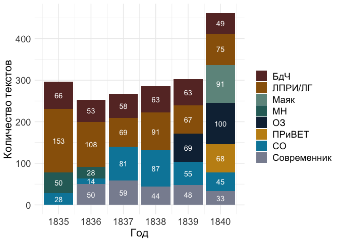
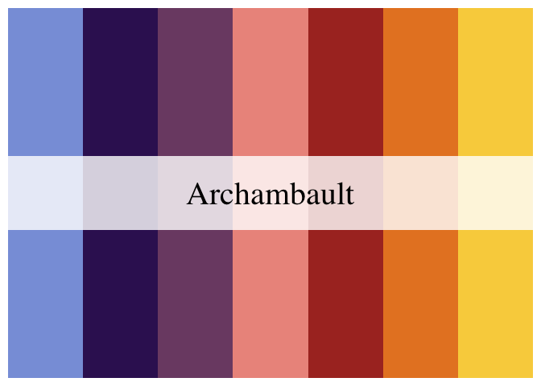
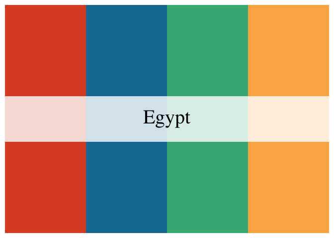
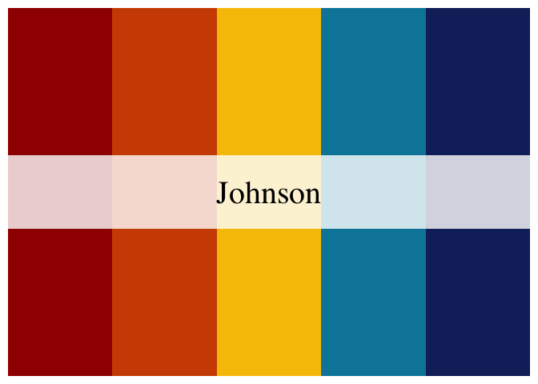
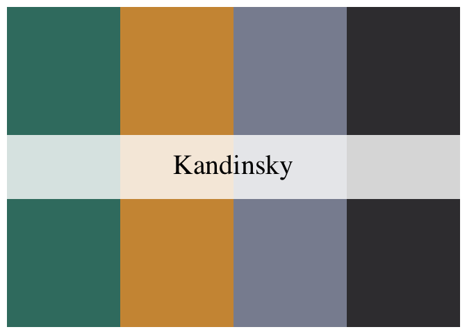
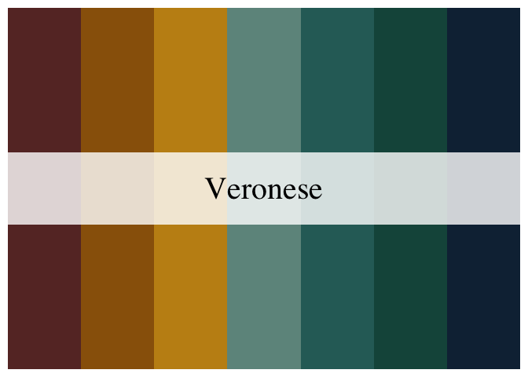
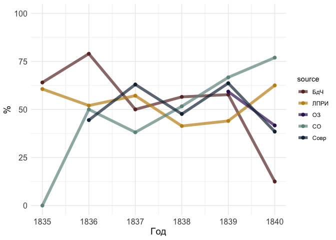
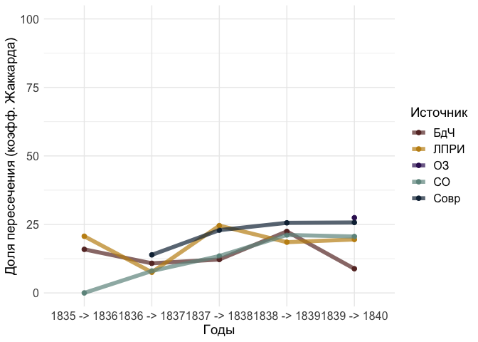
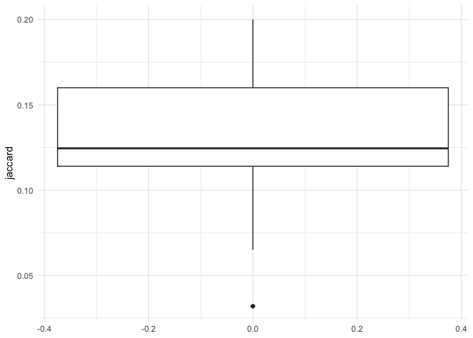
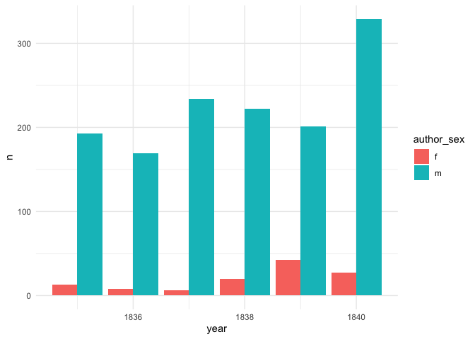

# Chapter 2.2. Poems in periodicals: statistics

``` r
library(tidyverse)
```

    Warning: package 'ggplot2' was built under R version 4.3.1

    Warning: package 'lubridate' was built under R version 4.3.1

    ── Attaching core tidyverse packages ──────────────────────── tidyverse 2.0.0 ──
    ✔ dplyr     1.1.3     ✔ readr     2.1.4
    ✔ forcats   1.0.0     ✔ stringr   1.5.0
    ✔ ggplot2   3.4.4     ✔ tibble    3.2.1
    ✔ lubridate 1.9.3     ✔ tidyr     1.3.0
    ✔ purrr     1.0.2     
    ── Conflicts ────────────────────────────────────────── tidyverse_conflicts() ──
    ✖ dplyr::filter() masks stats::filter()
    ✖ dplyr::lag()    masks stats::lag()
    ℹ Use the conflicted package (<http://conflicted.r-lib.org/>) to force all conflicts to become errors

``` r
library(treemap)
library(ggplotify)
theme_set(theme_minimal())
library(wesanderson)
```

    Warning: package 'wesanderson' was built under R version 4.3.1

``` r
library(MetBrewer)
```

    Registered S3 method overwritten by 'MetBrewer':
      method        from       
      print.palette wesanderson

``` r
# fix problems with cyrillics
# library(extrafont)
# library(showtext)
# font_add("Arial", "/Library/Fonts/Arial.ttf") 
# showtext_auto()
```

``` r
MetBrewer::colorblind_palettes
```

     [1] "Archambault" "Cassatt1"    "Cassatt2"    "Demuth"      "Derain"     
     [6] "Egypt"       "Greek"       "Hiroshige"   "Hokusai2"    "Hokusai3"   
    [11] "Ingres"      "Isfahan1"    "Isfahan2"    "Java"        "Johnson"    
    [16] "Kandinsky"   "Morgenstern" "OKeeffe1"    "OKeeffe2"    "Pillement"  
    [21] "Tam"         "Troy"        "VanGogh3"    "Veronese"   

``` r
met.brewer(MetBrewer::colorblind_palettes[24])
```


## Data compilation

Load full metadata

``` r
# load periodicals data stored separately
per_t <- readRDS("../../data/corpus1835/corpus_1835.Rds")

# read texts
per_texts <- read.csv("../../data/corpus1835/sql_db/texts_metadata.csv") %>% 
  filter(str_detect(text_id, "^P_"))

# read sources metadata
per_sources <- read.csv("../../data/corpus1835/sql_db/sources.csv") %>% 
  filter(type == "periodicals") %>% 
  # remove unnecessary vars
  select(source_id, book_title, year)

# attach sources to texts
per_full <- per_texts %>% 
  left_join(per_sources, by = "source_id") %>% 
  left_join(per_t %>% select(text_id, text_lemm))
```

    Joining with `by = join_by(text_id)`

``` r
glimpse(per_full)
```

    Rows: 1,905
    Columns: 14
    $ text_id       <chr> "P_1", "P_10", "P_100", "P_1000", "P_1001", "P_1002", "P…
    $ source_id     <chr> "Per_1", "Per_2", "Per_3", "Per_4", "Per_4", "Per_4", "P…
    $ A_ID          <chr> "", "A_50", "A_7", "A_41", "A_139", "A_11", "A_163", "A_…
    $ text_title    <chr> "Солдатская песня", "Молния", "Ночлег чумаков", "Утешите…
    $ text_subtitle <chr> "", "", "Сельские картины", "", "", "", "", "", "", "", …
    $ first_line    <chr> "Ох жизнь, молодецкая", "Зачем с небесной высоты", "В бл…
    $ text_page     <chr> "C. 46", "C. 21", "C. 9-12", "C. 172-174", "C. 175-176",…
    $ corpus        <chr> "per", "per", "per", "per", "per", "per", "per", "per", …
    $ meter         <chr> "Other", "Iamb", "Iamb", "Iamb", "Trochee", "Iamb", "Tro…
    $ feet          <chr> "other", "3", "4", "4", "4", "4", "other", "4", "6", "5"…
    $ n_lines       <int> 38, 16, 98, 77, 28, 12, 44, 25, 31, 28, 100, 16, 17, 60,…
    $ book_title    <chr> "Сев_пч", "БдЧ", "БдЧ", "Совр", "Совр", "Совр", "Совр", …
    $ year          <int> 1835, 1835, 1836, 1838, 1838, 1838, 1838, 1838, 1838, 18…
    $ text_lemm     <chr> "ох, жизнь молодецкий,\nбравый, солдатский!\nкак осенний…

Attach authors data: check if all author’s names are complete

``` r
# attach RP and gender columns from authors-meta
# load authors-meta
authors_meta <- read.csv("../../data/corpus1835/sql_db/authors.csv")

# glimpse(authors_meta)

# attach only gender by A_ID
per <- per_full %>% 
  left_join(authors_meta %>% 
              select(A_ID, author_name, RP_loc, author_sex,
                     year_birth, year_death), 
            by = "A_ID") %>% 
  rename(author_text = author_name)

glimpse(per)
```

    Rows: 1,905
    Columns: 19
    $ text_id       <chr> "P_1", "P_10", "P_100", "P_1000", "P_1001", "P_1002", "P…
    $ source_id     <chr> "Per_1", "Per_2", "Per_3", "Per_4", "Per_4", "Per_4", "P…
    $ A_ID          <chr> "", "A_50", "A_7", "A_41", "A_139", "A_11", "A_163", "A_…
    $ text_title    <chr> "Солдатская песня", "Молния", "Ночлег чумаков", "Утешите…
    $ text_subtitle <chr> "", "", "Сельские картины", "", "", "", "", "", "", "", …
    $ first_line    <chr> "Ох жизнь, молодецкая", "Зачем с небесной высоты", "В бл…
    $ text_page     <chr> "C. 46", "C. 21", "C. 9-12", "C. 172-174", "C. 175-176",…
    $ corpus        <chr> "per", "per", "per", "per", "per", "per", "per", "per", …
    $ meter         <chr> "Other", "Iamb", "Iamb", "Iamb", "Trochee", "Iamb", "Tro…
    $ feet          <chr> "other", "3", "4", "4", "4", "4", "other", "4", "6", "5"…
    $ n_lines       <int> 38, 16, 98, 77, 28, 12, 44, 25, 31, 28, 100, 16, 17, 60,…
    $ book_title    <chr> "Сев_пч", "БдЧ", "БдЧ", "Совр", "Совр", "Совр", "Совр", …
    $ year          <int> 1835, 1835, 1836, 1838, 1838, 1838, 1838, 1838, 1838, 18…
    $ text_lemm     <chr> "ох, жизнь молодецкий,\nбравый, солдатский!\nкак осенний…
    $ author_text   <chr> NA, "Якубович Л.А.", "Кольцов А.В.", "Глинка Ф.Н.", "Про…
    $ RP_loc        <chr> NA, NA, "3-33", "1-578", "5-151", "5", "2-13", "1-578", …
    $ author_sex    <chr> NA, "m", "m", "m", "m", "m", "m", "m", "m", "m", "m", "f…
    $ year_birth    <chr> NA, "1805", "1809", "1786", "1810", "1799", "1812", "178…
    $ year_death    <chr> NA, "1839", "1842", "1880", "1857", "1837", "1848", "188…

``` r
# fill NA as empty values
per[is.na(per)] <- ""

rm(per_full, per_t, per_sources, per_texts, authors_meta)
```

## RNC comparison

``` r
# RNC data
load("../../data/nkrja_19th_lem.Rda")

rnc_authors <- c19 %>% 
    select(author) %>% 
    mutate(author = str_remove_all(author, "[[:space:]]|[[:punct:]]")) %>% 
    distinct() %>% 
    pull()

head(rnc_authors)
```

    [1] "ССБобров"    "САТучков"    "ССПестов"    "ППСумароков" "НССмирнов"  
    [6] "ПАСловцов"  

``` r
# rm(c19)
```

## 2.1. Periodicals vs RNC

Comparison on number of authors

``` r
print("Total number of authors in periodicals:")
```

    [1] "Total number of authors in periodicals:"

``` r
per %>% 
    filter(A_ID != "" & author_text != "") %>% # nrow() # 1464 poems are with known author
    select(author_text) %>% 
    count(author_text, sort = T) %>% nrow() 
```

    [1] 186

``` r
print("Number of authors with biography in RP:")
```

    [1] "Number of authors with biography in RP:"

``` r
per %>% 
    filter(RP_loc != "") %>% # nrow() # 1197 poems by authors known by RP
    select(RP_loc) %>% 
    count(RP_loc, sort = T) %>% nrow() 
```

    [1] 128

``` r
print("Number of authors included in RNC")
```

    [1] "Number of authors included in RNC"

``` r
per %>% 
    filter(author_text != "") %>% 
    select(author_text) %>% 
    mutate(author = str_replace_all(author_text, 
                                    "(.*?[[:space:]])(\\w\\.\\w.)", 
                                    "\\2\\1")) %>% 
    mutate(author = str_remove_all(author, "[[:space:]]|[[:punct:]]")) %>% 
    distinct() %>% 
    filter(author %in% rnc_authors) %>% 
    nrow() # 58 
```

    [1] 58

### Textual intersections between RNC & periodicals

-   Create for each poem an id column containing two first lines
-   Mark the intersection with a special tag

``` r
periodicals <- per %>% 
    mutate(doublesCheck = str_extract(text_lemm, "^.*?\n.*?\n.*?\n")) %>% 
    mutate(doublesCheck = str_remove_all(doublesCheck, "[[:punct:]]|[[:space:]]")) 

glimpse(periodicals)
```

    Rows: 1,905
    Columns: 20
    $ text_id       <chr> "P_1", "P_10", "P_100", "P_1000", "P_1001", "P_1002", "P…
    $ source_id     <chr> "Per_1", "Per_2", "Per_3", "Per_4", "Per_4", "Per_4", "P…
    $ A_ID          <chr> "", "A_50", "A_7", "A_41", "A_139", "A_11", "A_163", "A_…
    $ text_title    <chr> "Солдатская песня", "Молния", "Ночлег чумаков", "Утешите…
    $ text_subtitle <chr> "", "", "Сельские картины", "", "", "", "", "", "", "", …
    $ first_line    <chr> "Ох жизнь, молодецкая", "Зачем с небесной высоты", "В бл…
    $ text_page     <chr> "C. 46", "C. 21", "C. 9-12", "C. 172-174", "C. 175-176",…
    $ corpus        <chr> "per", "per", "per", "per", "per", "per", "per", "per", …
    $ meter         <chr> "Other", "Iamb", "Iamb", "Iamb", "Trochee", "Iamb", "Tro…
    $ feet          <chr> "other", "3", "4", "4", "4", "4", "other", "4", "6", "5"…
    $ n_lines       <int> 38, 16, 98, 77, 28, 12, 44, 25, 31, 28, 100, 16, 17, 60,…
    $ book_title    <chr> "Сев_пч", "БдЧ", "БдЧ", "Совр", "Совр", "Совр", "Совр", …
    $ year          <int> 1835, 1835, 1836, 1838, 1838, 1838, 1838, 1838, 1838, 18…
    $ text_lemm     <chr> "ох, жизнь молодецкий,\nбравый, солдатский!\nкак осенний…
    $ author_text   <chr> "", "Якубович Л.А.", "Кольцов А.В.", "Глинка Ф.Н.", "Про…
    $ RP_loc        <chr> "", "", "3-33", "1-578", "5-151", "5", "2-13", "1-578", …
    $ author_sex    <chr> "", "m", "m", "m", "m", "m", "m", "m", "m", "m", "m", "f…
    $ year_birth    <chr> "", "1805", "1809", "1786", "1810", "1799", "1812", "178…
    $ year_death    <chr> "", "1839", "1842", "1880", "1857", "1837", "1848", "188…
    $ doublesCheck  <chr> "охжизньмолодецкийбравыйсолдатскийкакосеннийноченька", "…

``` r
nkrja19 <- c19 %>% 
    rename(index = `Unnamed..0`,
          text_lemm = lemma) %>% 
    select(index, author, text_lemm) %>%
    mutate(doublesCheck = str_extract(text_lemm, "^.*?\n.*?\n.*?\n")) %>% 
    mutate(doublesCheck = str_remove_all(doublesCheck, "[[:punct:]]|[[:space:]]"))

glimpse(nkrja19)
```

    Rows: 15,569
    Columns: 4
    $ index        <int> 1, 2, 3, 4, 5, 6, 7, 8, 9, 10, 11, 12, 13, 14, 15, 16, 17…
    $ author       <chr> "С. С. Бобров", "С. С. Бобров", "С. С. Бобров", "С. С. Бо…
    $ text_lemm    <chr> "еще вкруг солнцев не вращаться \n в превыспренний страна…
    $ doublesCheck <chr> "ещевкругсолнцевневращатьсявпревыспреннийстранамирещевхао…

``` r
doubles_id <- periodicals %>% 
    rename(per_text_lemm = text_lemm) %>% 
    inner_join(nkrja19, by = "doublesCheck") %>% 
    select(index, text_id, year, A_ID, author_text, author, doublesCheck, per_text_lemm, text_lemm) %>% 
  filter(doublesCheck != "")

doubles_id %>% select(-text_lemm, -per_text_lemm) %>% head
```

      index text_id year  A_ID   author_text         author
    1  1232    P_10 1835  A_50 Якубович Л.А. Л. А. Якубович
    2  6656   P_100 1836   A_7  Кольцов А.В.  А. В. Кольцов
    3 14680  P_1006 1838 A_154   Тютчев Ф.И.   Ф. И. Тютчев
    4 14682  P_1010 1838 A_154   Тютчев Ф.И.   Ф. И. Тютчев
    5 12483  P_1014 1838  A_11   Пушкин А.С.   А. С. Пушкин
    6  6729  P_1015 1838   A_7  Кольцов А.В.  А. В. Кольцов
                                                                            doublesCheck
    1                               зачемснебесныйвысотаизгорнийжильеналонобурямчатьсяты
    2                      вблизидорогастолбовойночеватьтаборкочевойсынукраинапривольный
    3 ираспроститьсястревогажитейскийикипарисныйрощазаслонясьблаженныйтеньтеньэлисейский
    4              смотретькакзападразгоратьсявечернийзареволучвостокпомеркнутьодеваться
    5                     какойночьморозтрескучийнанебониединыйтучакакшитьпологсинийсвод
    6                                      глубокийвечностьоглашатьсясловомтословодабыть

``` r
print("Total number of intersected texts:")
```

    [1] "Total number of intersected texts:"

``` r
nrow(doubles_id)
```

    [1] 323

``` r
print("Total number of texts in periodicals:")
```

    [1] "Total number of texts in periodicals:"

``` r
nrow(periodicals)
```

    [1] 1905

``` r
print("Total % of intersected texts out for all periodicals texts:")
```

    [1] "Total % of intersected texts out for all periodicals texts:"

``` r
round( (nrow(doubles_id)/nrow(periodicals))*100 , 2) 
```

    [1] 16.96

``` r
# glimpse(doubles_id)

doubles_counts <- doubles_id %>% 
    count(year) %>% 
    mutate(group = "Периодика и НКРЯ")

doubles_counts %>% pivot_wider(names_from = year, values_from = n)
```

    # A tibble: 1 × 7
      group            `1835` `1836` `1837` `1838` `1839` `1840`
      <chr>             <int>  <int>  <int>  <int>  <int>  <int>
    1 Периодика и НКРЯ     47     64     47     46     48     71

### Plot 2.2.1

``` r
rnc_1835 <- c19 %>% 
    rename(index = `Unnamed..0`) %>% 
    # remove intersection
    #anti_join(doubles_id %>% select(index), by = "index") %>%

    # calculate number of unique poems
    filter(year > 1834 & year < 1841) %>% 
    count(year, sort = F) %>% 
    mutate(group = "НКРЯ")

rnc_1835 %>% pivot_wider(names_from = year, values_from = n)
```

    # A tibble: 1 × 7
      group `1835` `1836` `1837` `1838` `1839` `1840`
      <chr>  <int>  <int>  <int>  <int>  <int>  <int>
    1 НКРЯ     196    149    180    146    238    303

``` r
counter_1835 <- per %>% 
    # remove intersection
    #anti_join(doubles_id %>% select(id), by = "id") %>%

    count(year, sort = F) %>% 
    mutate(group = "Периодика") %>%
    rbind(rnc_1835, doubles_counts)

counter_1835 %>% pivot_wider(names_from = year, values_from = n)
```

    # A tibble: 3 × 7
      group            `1835` `1836` `1837` `1838` `1839` `1840`
      <chr>             <int>  <int>  <int>  <int>  <int>  <int>
    1 Периодика           324    261    269    288    302    461
    2 НКРЯ                196    149    180    146    238    303
    3 Периодика и НКРЯ     47     64     47     46     48     71

``` r
p2_2_1 <- counter_1835 %>%
    ggplot(aes(x = year, y = n, fill = group)) + 
    geom_col(position = "dodge", width = 0.6) + 
    scale_fill_manual(values = c(met.brewer("Veronese")[7], # dark blue
                                 met.brewer("Veronese")[4], # light blue
                                 met.brewer("Veronese")[1] # dark red
                                )) + 
    scale_x_continuous(breaks = 1835:1840) +
    theme(axis.text = element_text(size = 14),
         axis.title = element_text(size = 16),
         legend.title = element_text(size = 16, face = "bold"),
         legend.text = element_text(size = 14)) + 
    labs(x = "Год",
        y = "Количество текстов",
        fill = "Корпус")

p2_2_1
```


``` r
ggsave(file = "plots/Fig_2_2_1.png", plot = p2_2_1, dpi = 300,
      width = 8, height = 6, bg = "white")
```

``` r
rm(c19, counter_1835, doubles_counts, doubles_id, nkrja19, p2_2_1, rnc_1835, rnc_authors)
```

## 2.2.1. Sources statistics

Analysis of poems published in different sources (journals & newspapers)
and by different authors

``` r
glimpse(per)
```

    Rows: 1,905
    Columns: 19
    $ text_id       <chr> "P_1", "P_10", "P_100", "P_1000", "P_1001", "P_1002", "P…
    $ source_id     <chr> "Per_1", "Per_2", "Per_3", "Per_4", "Per_4", "Per_4", "P…
    $ A_ID          <chr> "", "A_50", "A_7", "A_41", "A_139", "A_11", "A_163", "A_…
    $ text_title    <chr> "Солдатская песня", "Молния", "Ночлег чумаков", "Утешите…
    $ text_subtitle <chr> "", "", "Сельские картины", "", "", "", "", "", "", "", …
    $ first_line    <chr> "Ох жизнь, молодецкая", "Зачем с небесной высоты", "В бл…
    $ text_page     <chr> "C. 46", "C. 21", "C. 9-12", "C. 172-174", "C. 175-176",…
    $ corpus        <chr> "per", "per", "per", "per", "per", "per", "per", "per", …
    $ meter         <chr> "Other", "Iamb", "Iamb", "Iamb", "Trochee", "Iamb", "Tro…
    $ feet          <chr> "other", "3", "4", "4", "4", "4", "other", "4", "6", "5"…
    $ n_lines       <int> 38, 16, 98, 77, 28, 12, 44, 25, 31, 28, 100, 16, 17, 60,…
    $ book_title    <chr> "Сев_пч", "БдЧ", "БдЧ", "Совр", "Совр", "Совр", "Совр", …
    $ year          <int> 1835, 1835, 1836, 1838, 1838, 1838, 1838, 1838, 1838, 18…
    $ text_lemm     <chr> "ох, жизнь молодецкий,\nбравый, солдатский!\nкак осенний…
    $ author_text   <chr> "", "Якубович Л.А.", "Кольцов А.В.", "Глинка Ф.Н.", "Про…
    $ RP_loc        <chr> "", "", "3-33", "1-578", "5-151", "5", "2-13", "1-578", …
    $ author_sex    <chr> "", "m", "m", "m", "m", "m", "m", "m", "m", "m", "m", "f…
    $ year_birth    <chr> "", "1805", "1809", "1786", "1810", "1799", "1812", "178…
    $ year_death    <chr> "", "1839", "1842", "1880", "1857", "1837", "1848", "188…

``` r
per <- per %>% 
  rename(PER_ID = book_title)

unique(per$PER_ID)
```

     [1] "Сев_пч"   "БдЧ"      "Совр"     "ОЗ"       "ЛПРИ"     "ЛГ"      
     [7] "СО"       "МН"       "Маяк"     "Телескоп" "СОиСА"    "ПРиВЕТ"  

``` r
names <- tibble(PER_ID = unique(per$PER_ID),
       per_name = c("СП", "БдЧ", "Современник", "ОЗ", "ЛПРИ/ЛГ", "ЛПРИ/ЛГ", "СО",
                    "МН", "Маяк", "Телескоп", "СО", "ПРиВЕТ"))

per <- per %>% 
  left_join(names, by = "PER_ID")

rm(names)
```

``` r
per %>% 
  filter(!PER_ID %in% c("Молва", "Сев_пч", "Телескоп")) %>% 
  group_by(year, per_name) %>% 
  count() %>% 
  ggplot(aes(x = year, y = n, fill = per_name)) + 
  geom_col() + 
  geom_text(aes(x = year, y = n, label = n), 
            position = position_stack(vjust = .5), 
            color = "white") + 
  scale_x_continuous(breaks = 1835:1840) +
  scale_fill_manual(values = c(met.brewer("Veronese")[1:2], 
                               met.brewer("Veronese")[4:5],
                               met.brewer("Veronese")[7],
                               met.brewer("Veronese")[3],
                               met.brewer("Johnson")[4],
                               met.brewer("Kandinsky")[3])) + 
  theme(axis.text = element_text(size = 14),
         axis.title = element_text(size = 16),
         legend.title = element_text(size = 16, face = "bold"),
         legend.text = element_text(size = 14)) + 
  labs(x = "Год", y = "Количество текстов", fill = "")
```



``` r
ggsave(file = "plots/Fig_2_2_2.png", plot = last_plot(), dpi = 300,
      width = 8, height = 6, bg = "white")
```

### Plots 2.2.

Count total number of texts by different authors in each source

``` r
per %>%
  #filter(year == "1835") %>%
  filter(author_text != "" & !per_name %in% c("Телескоп", "СП")) %>%
  group_by(per_name, year) %>%
  count(author_text, sort = T) %>%
  slice_max(order_by = n, n = 5) %>%
  #ungroup() %>% 
  mutate(author_text = paste0(author_text, " (", n, ")")) %>% 
  select(-n) %>% 
  summarise(
    per_name = per_name,
    year = year,
    author_names = paste0(author_text, collapse = ", ")) %>% 
  ungroup() %>% 
  distinct() %>% 
  arrange(-desc(as.numeric(year))) 
```

    Warning: Returning more (or less) than 1 row per `summarise()` group was deprecated in
    dplyr 1.1.0.
    ℹ Please use `reframe()` instead.
    ℹ When switching from `summarise()` to `reframe()`, remember that `reframe()`
      always returns an ungrouped data frame and adjust accordingly.

    `summarise()` has grouped output by 'per_name', 'year'. You can override using
    the `.groups` argument.

    # A tibble: 29 × 3
       per_name     year author_names                                               
       <chr>       <int> <chr>                                                      
     1 БдЧ          1835 Пушкин А.С. (16), Козлов И.И. (11), Ершов П.П. (6), Якубов…
     2 ЛПРИ/ЛГ      1835 Глинка Ф.Н. (7), Менцов Ф.Н. (7), Галанин И.Д. (6), Демидо…
     3 МН           1835 Ознобишин Д.П. (5), Теплова Н.С. (5), Баратынский Е.А. (4)…
     4 СО           1835 Тимофеев А.В. (6), Шаликов П.И. (4), Булгаков А.И. (3), Во…
     5 БдЧ          1836 Козлов И.И. (12), Тимофеев А.В. (9), Бенедиктов В.Г. (6), …
     6 ЛПРИ/ЛГ      1836 Демидов М.А. (10), Мызников В.Я. (7), Фон-Бейер Г. (5), Гл…
     7 МН           1836 Стромилов С.И. (4), Волконская З.А. (3), Ознобишин Д.П. (3…
     8 СО           1836 Кони Ф.А. (3), Бороздна И.П. (2), Александров Б. (1), Крыл…
     9 Современник  1836 Тютчев Ф.И. (24), Пушкин А.С. (4), Давыдов Д.В. (3), Якубо…
    10 БдЧ          1837 Тимофеев А.В. (11), Бернет Е. (10), Кропоткин Д.А. (7), Ве…
    # ℹ 19 more rows

``` r
# %>% 
  #pivot_wider(names_from = "year", values_from = "author_names")


# tile plot attempt
# per %>% 
#   #filter(year == "1835") %>% 
#   filter(author_text != "" & !per_name %in% c("Телескоп", "СП")) %>% 
#   group_by(per_name, year) %>% 
#   count(author_text, sort = T) %>% 
#   slice_max(order_by = n, n = 3) %>% 
#   ungroup() %>% 
#   #mutate(author_text = paste0(per_name, "_", author_text)) %>% 
#   ggplot(aes(x = year, y = author_text, fill = n)) + 
#   geom_tile() 
```

``` r
# remove incomplete sources
periodicals <- per %>% 
  filter(!PER_ID %in% c("Молва", "МН", "Сев_пч"))

years_total <- periodicals %>% 
  count(year) %>% 
  mutate(year_label = paste0(year, " (N = ", n, ")"))

source_year_total <- periodicals %>% 
  count(PER_ID, year)
```

Count number of texts in each source by each author

``` r
authors_sources <- periodicals %>% 
    #filter(PER_ID != "Сев_пч") %>% 
    mutate(PER_ID = ifelse(str_detect(PER_ID,"СОиСА"), "СО", PER_ID)) %>% 
    filter(author_text != "") %>% 
    
    # grouping by author, year and source
    group_by(year, PER_ID, author_text) %>% 
    count(sort = T) %>% 
    ungroup() %>%
    
    # non-frequent authors grouped as "others"
    mutate(author_text = ifelse(n < 3, "Другие", author_text)) %>% 
    group_by(year, PER_ID, author_text) %>% 
    # sum poems by others
    summarise(n = sum(n)) %>% 
    mutate(author_label = paste0(author_text, " (", n, ")")) %>% 
    filter(author_text != "Другие")
```

    `summarise()` has grouped output by 'year', 'PER_ID'. You can override using
    the `.groups` argument.

``` r
head(authors_sources)
```

    # A tibble: 6 × 5
    # Groups:   year, PER_ID [2]
       year PER_ID author_text       n author_label     
      <int> <chr>  <chr>         <int> <chr>            
    1  1835 БдЧ    Ершов П.П.        6 Ершов П.П. (6)   
    2  1835 БдЧ    Козлов И.И.      11 Козлов И.И. (11) 
    3  1835 БдЧ    Пушкин А.С.      16 Пушкин А.С. (16) 
    4  1835 БдЧ    Якубович Л.А.     3 Якубович Л.А. (3)
    5  1835 ЛПРИ   Алипанов Е.И.     3 Алипанов Е.И. (3)
    6  1835 ЛПРИ   Бистром А.        4 Бистром А. (4)   

Select colours for charts

``` r
MetBrewer::colorblind_palettes
```

     [1] "Archambault" "Cassatt1"    "Cassatt2"    "Demuth"      "Derain"     
     [6] "Egypt"       "Greek"       "Hiroshige"   "Hokusai2"    "Hokusai3"   
    [11] "Ingres"      "Isfahan1"    "Isfahan2"    "Java"        "Johnson"    
    [16] "Kandinsky"   "Morgenstern" "OKeeffe1"    "OKeeffe2"    "Pillement"  
    [21] "Tam"         "Troy"        "VanGogh3"    "Veronese"   

``` r
met.brewer("Archambault")
```



``` r
met.brewer("Egypt")
```



``` r
met.brewer("Johnson")
```



``` r
met.brewer("Kandinsky")
```



``` r
met.brewer("Veronese")
```



``` r
# treemap: https://cran.r-project.org/web/packages/treemap/treemap.pdf

# x <- NULL
# 
# for (i in 1:length(unique(per$year))) {
#     
#     x <- unique(per$year)[i]
#     
#     filename = paste0("plots/treemaps/plot_", x, ".png")
# 
#     png(filename, width = 600, height = 600)
# 
#     t <- authors_sources %>% 
#         filter(year == x) %>% 
#         treemap(
#             index = c("PER_ID", "author_label"),
#             vSize = "n",
#             type = "index",
#             palette = light_palette,
#             fontsize.labels = c(20, 16),
#             #position.legend = "right",
#             overlap.labels = 1,
#             title = x,
#             fontsize.title = 22
#         )
# 
#     dev.off()
# }
```

``` r
years_total
```

      year   n     year_label
    1 1835 267 1835 (N = 267)
    2 1836 232 1836 (N = 232)
    3 1837 267 1837 (N = 267)
    4 1838 285 1838 (N = 285)
    5 1839 302 1839 (N = 302)
    6 1840 461 1840 (N = 461)

``` r
source_year_total %>% arrange(-desc(year))
```

         PER_ID year   n
    1       БдЧ 1835  66
    2      ЛПРИ 1835 153
    3     СОиСА 1835  28
    4  Телескоп 1835  20
    5       БдЧ 1836  53
    6      ЛПРИ 1836 108
    7        СО 1836  14
    8      Совр 1836  50
    9  Телескоп 1836   7
    10      БдЧ 1837  58
    11     ЛПРИ 1837  69
    12       СО 1837  81
    13     Совр 1837  59
    14      БдЧ 1838  63
    15     ЛПРИ 1838  91
    16    СОиСА 1838  87
    17     Совр 1838  44
    18      БдЧ 1839  63
    19     ЛПРИ 1839  67
    20       ОЗ 1839  69
    21       СО 1839  36
    22    СОиСА 1839  19
    23     Совр 1839  48
    24      БдЧ 1840  49
    25       ЛГ 1840  75
    26     Маяк 1840  91
    27       ОЗ 1840 100
    28   ПРиВЕТ 1840  68
    29       СО 1840  45
    30     Совр 1840  33

``` r
png("plots/treemaps/2-2-2_1835_v2.png", height = 650, width = 600)

tree_pal <- c(met.brewer("Veronese")[1], # BdCH
              met.brewer("Veronese")[3], # LPRI
              met.brewer("Veronese")[4], # SO
              met.brewer("Kandinsky")[3]) # Telescop

authors_sources %>% 
        filter(year == 1835) %>% 
        treemap(
            index = c("PER_ID", "author_label"),
            vSize = "n",
            type = "index",
            palette = tree_pal,
            fontsize.labels = c(24, 16),
            #position.legend = "right",
            overlap.labels = 1,
            title = "1835 (N = 269)",
            fontsize.title = 22
        )

dev.off()
```

    quartz_off_screen 
                    2 

``` r
png("plots/treemaps/2-2-2_1836_v2.png", height = 650, width = 600)

authors_sources %>% 
        filter(year == 1836) %>% 
        select(PER_ID) %>% distinct() %>% arrange(-desc(PER_ID))
```

    Adding missing grouping variables: `year`

    # A tibble: 4 × 2
    # Groups:   year, PER_ID [4]
       year PER_ID
      <int> <chr> 
    1  1836 БдЧ   
    2  1836 ЛПРИ  
    3  1836 СО    
    4  1836 Совр  

``` r
tree_pal <- c(met.brewer("Veronese")[1], # BdCH
              met.brewer("Veronese")[3], # LPRI
              met.brewer("Veronese")[4], # SO
              met.brewer("Veronese")[7], # Sovr
              met.brewer("Kandinsky")[3]) # Telescop

authors_sources %>% 
        filter(year == 1836) %>% 
        treemap(
            index = c("PER_ID", "author_label"),
            vSize = "n",
            type = "index",
            palette = tree_pal,
            fontsize.labels = c(24, 16),
            #position.legend = "right",
            overlap.labels = 1,
            title = "1836 (N = 238)",
            fontsize.title = 22
        )

dev.off()
```

    quartz_off_screen 
                    2 

``` r
png("plots/treemaps/2-2-2_1837_v2.png", height = 650, width = 600)

authors_sources %>% 
        filter(year == 1837) %>% 
        select(PER_ID) %>% distinct() %>% arrange(-desc(PER_ID))
```

    Adding missing grouping variables: `year`

    # A tibble: 4 × 2
    # Groups:   year, PER_ID [4]
       year PER_ID
      <int> <chr> 
    1  1837 БдЧ   
    2  1837 ЛПРИ  
    3  1837 СО    
    4  1837 Совр  

``` r
tree_pal <- c(met.brewer("Veronese")[1], # BdCH
              met.brewer("Veronese")[3], # LPRI
              met.brewer("Veronese")[4], # SO
              met.brewer("Veronese")[7]) # Sovr 

authors_sources %>%
        filter(year == 1837) %>%
        treemap(
            index = c("PER_ID", "author_label"),
            vSize = "n",
            type = "index",
            palette = tree_pal,
            fontsize.labels = c(24, 16),
            #position.legend = "right",
            overlap.labels = 1,
            title = "1837 (N = 282)",
            fontsize.title = 22
        )

dev.off()
```

    quartz_off_screen 
                    2 

``` r
png("plots/treemaps/2-2-2_1838_v2.png", height = 650, width = 600)

authors_sources %>% 
        filter(year == 1838) %>% 
        select(PER_ID) %>% distinct() %>% arrange(-desc(PER_ID))
```

    Adding missing grouping variables: `year`

    # A tibble: 4 × 2
    # Groups:   year, PER_ID [4]
       year PER_ID
      <int> <chr> 
    1  1838 БдЧ   
    2  1838 ЛПРИ  
    3  1838 СО    
    4  1838 Совр  

``` r
tree_pal <- c(met.brewer("Veronese")[1], # BdCH
              met.brewer("Veronese")[3], # LPRI
              met.brewer("Veronese")[4], # SO
              met.brewer("Veronese")[7]) # Sovr

authors_sources %>%
        filter(year == 1838) %>%
        treemap(
            index = c("PER_ID", "author_label"),
            vSize = "n",
            type = "index",
            palette = tree_pal,
            fontsize.labels = c(24, 16),
            #position.legend = "right",
            overlap.labels = 1,
            title = "1838 (N = 288)",
            fontsize.title = 22
        )

dev.off()
```

    quartz_off_screen 
                    2 

``` r
png("plots/treemaps/2-2-2_1839_v2.png", height = 650, width = 600)

authors_sources %>% 
        filter(year == 1839) %>% 
        select(PER_ID) %>% distinct() %>% arrange(-desc(PER_ID))
```

    Adding missing grouping variables: `year`

    # A tibble: 5 × 2
    # Groups:   year, PER_ID [5]
       year PER_ID
      <int> <chr> 
    1  1839 БдЧ   
    2  1839 ЛПРИ  
    3  1839 ОЗ    
    4  1839 СО    
    5  1839 Совр  

``` r
tree_pal <- c(met.brewer("Veronese")[1], # BdCH
              met.brewer("Veronese")[3], # LPRI
              met.brewer("Archambault")[2], # OZ
              met.brewer("Veronese")[4], # SO
              met.brewer("Veronese")[7]) # Sovr

authors_sources %>%
        filter(year == 1839) %>%
        treemap(
            index = c("PER_ID", "author_label"),
            vSize = "n",
            type = "index",
            palette = tree_pal,
            fontsize.labels = c(24, 16),
            #position.legend = "right",
            overlap.labels = 1,
            title = "1839 (N = 312)",
            fontsize.title = 22
        )

dev.off()
```

    quartz_off_screen 
                    2 

``` r
png("plots/treemaps/2-2-2_1840_v2.png", height = 700, width = 650)

authors_sources %>% 
        filter(year == 1840) %>% 
        select(PER_ID) %>% distinct() %>% arrange(-desc(PER_ID))
```

    Adding missing grouping variables: `year`

    # A tibble: 7 × 2
    # Groups:   year, PER_ID [7]
       year PER_ID
      <int> <chr> 
    1  1840 БдЧ   
    2  1840 ЛГ    
    3  1840 Маяк  
    4  1840 ОЗ    
    5  1840 ПРиВЕТ
    6  1840 СО    
    7  1840 Совр  

``` r
tree_pal <- c(met.brewer("Veronese")[1], # BdCH
              met.brewer("Veronese")[3], # LG
              met.brewer("Kandinsky")[3], # Mayak
              met.brewer("Archambault")[2], # OZ
              met.brewer("Egypt")[2], # PRiVET
              met.brewer("Veronese")[4], # SO
              met.brewer("Veronese")[7]) # Sovr

authors_sources %>%
        filter(year == 1840) %>%
        treemap(
            index = c("PER_ID", "author_label"),
            vSize = "n",
            type = "index",
            palette = tree_pal,
            fontsize.labels = c(24, 16),
            #position.legend = "right",
            overlap.labels = 1,
            title = "1840 (N = 461)",
            fontsize.title = 22
        )

dev.off()
```

    quartz_off_screen 
                    2 

### Authors rotation in journals

``` r
per %>% 
  filter(PER_ID == "БдЧ" & author_text != "") %>% 
  group_by(year) %>% 
  count(author_text, sort = T) %>% 
  mutate(rank = row_number()) %>% 
  ungroup() %>% 
  #filter(rank < 21) %>% 
  pivot_wider(!n, names_from = year, values_from = rank) %>% 
  select(author_text, `1835`, `1836`, `1837`, `1838`, `1839`, `1840`)
```

    Warning: Specifying the `id_cols` argument by position was deprecated in tidyr 1.3.0.
    ℹ Please explicitly name `id_cols`, like `id_cols = !n`.

    # A tibble: 76 × 7
       author_text    `1835` `1836` `1837` `1838` `1839` `1840`
       <chr>           <int>  <int>  <int>  <int>  <int>  <int>
     1 Пушкин А.С.         1     NA     13     NA     NA     NA
     2 Губер Э.И.         NA     NA     NA     NA     NA      1
     3 Козлов И.И.         2      1      8     NA     17     NA
     4 Тимофеев А.В.       9      2      1      4     22     NA
     5 Бернет Е.          NA     NA      2      8      4     NA
     6 Менцов Ф.Н.        22     NA     NA      1     10     NA
     7 Кропоткин Д.А.     NA     NA      3      3      1     NA
     8 Мейстер И.         NA     NA     NA      2      9     NA
     9 Греков Н.П.        NA     NA     NA     13     15      2
    10 Ершов П.П.          3     10     NA     15     NA      3
    # ℹ 66 more rows

``` r
  #filter(year == 1835)
```

``` r
# unite some journal's names
per <- per %>% 
  mutate(per_cln = ifelse(PER_ID == "СОиСА", "СО", PER_ID),
         per_cln = ifelse(PER_ID == "ЛГ", "ЛПРИ", per_cln))

# quick look on journal's existence (in data)
per %>% 
  count(year, per_cln) %>% 
  pivot_wider(names_from = year, values_from = n)
```

    # A tibble: 10 × 7
       per_cln  `1835` `1836` `1837` `1838` `1839` `1840`
       <chr>     <int>  <int>  <int>  <int>  <int>  <int>
     1 БдЧ          66     53     58     63     63     49
     2 ЛПРИ        153    108     69     91     67     75
     3 МН           50     28     NA     NA     NA     NA
     4 СО           28     14     81     87     55     45
     5 Сев_пч        7      1      2      3     NA     NA
     6 Телескоп     20      7     NA     NA     NA     NA
     7 Совр         NA     50     59     44     48     33
     8 ОЗ           NA     NA     NA     NA     69    100
     9 Маяк         NA     NA     NA     NA     NA     91
    10 ПРиВЕТ       NA     NA     NA     NA     NA     68

``` r
# selected journals
per_names <- c("БдЧ", "ЛПРИ", "СО", "Совр", "ОЗ")
```

``` r
# Kendall's ranking correlation calculation

# #length(unique(per_full$year))
# 
# per_names <- c("БдЧ", "ЛПРИ", "СО", "Совр", "ОЗ")
# 
# x <- NULL
# y <- NULL
# year1 <- NULL
# year2 <- NULL
# 
# x1 <- NULL
# x2 <- NULL
# k <- NULL
# 
# jou <- c("journal")
# years <- c("year")
# tau <- c("tau")
# 
# for (i in 1:length(per_names)) {
#   
#   x <- per %>%
#     filter(per_cln == per_names[i])
#   
#   # print(per_names[i])
#   
#   for (j in 1:(length(unique(x$year))-1)) {
#     year1 <- unique(x$year)[j]
#     year2 <- year1 + 1
# 
#     # print(c(year1, year2))
#     
#     y <- x %>% 
#       filter(!is.na(author)) %>% 
#       group_by(year) %>% 
#       count(author, sort = T) %>% 
#       mutate(rank = row_number()) %>% 
#       ungroup() %>% 
#       #filter(rank < 21) %>% 
#       filter(year %in% c(year1, year2)) %>% 
#       mutate(year = ifelse(year == year1, "year1", "year2")) %>% 
#       pivot_wider(id_cols = !n, names_from = year, values_from = rank) %>% 
#       drop_na
# 
#     #print(y)
#     
#     x1 <- as.vector(y$year1)
#     x2 <- as.vector(y$year2)
# 
#     print(c(per_names[i], year1, year2,  x1, "vs", x2))
#     
#     if (length(x1) > 0 & length(x2) > 0) {
#       k <- cor.test(x1, x2, method = "kendall")
#       
#       #print(unlist(k[[4]]))
#     
#       jou <- c(jou, per_names[i])
#       years <- c(years, paste0(year1, "_", year2))
#       tau <- c(tau, unlist(k[[4]]))
#     }
#   }
# }   
# tibble(journal = jou, 
#        year = years,
#        tau_val = tau) %>% 
#   filter(journal != "journal") %>% 
#   mutate(tau_val = round(as.numeric(tau_val), 4)) %>% 
#   pivot_wider(names_from = year, values_from = tau_val)
```

``` r
# per_names

p <- NULL
d <- NULL

for (i in 1:length(per_names)) {
  p <- per_names[i]
  
  print(p)
  
  d <- per %>% 
    filter(author_text != "") %>% 
    filter(per_cln == p) %>% 
    count(year, author_text) %>% 
    mutate(n = 1) %>% 
    pivot_wider(names_from = year, values_from = n, values_fill = 0) %>% 
    mutate(total = rowSums(select_if(., is.numeric))) %>% 
    arrange(desc(total))
  
  print(d)
  
}
```

    [1] "БдЧ"
    # A tibble: 76 × 8
       author_text     `1835` `1836` `1837` `1838` `1839` `1840` total
       <chr>            <dbl>  <dbl>  <dbl>  <dbl>  <dbl>  <dbl> <dbl>
     1 Тимофеев А.В.        1      1      1      1      1      0     5
     2 Ершов П.П.           1      1      0      1      0      1     4
     3 Козлов И.И.          1      1      1      0      1      0     4
     4 Бенедиктов В.Г.      0      1      1      0      1      1     4
     5 Менцов Ф.Н.          1      0      0      1      1      0     3
     6 Бернет Е.            0      0      1      1      1      0     3
     7 Кропоткин Д.А.       0      0      1      1      1      0     3
     8 Кукольник Н.В.       0      0      1      1      0      1     3
     9 Шахова Е.Н.          0      0      1      1      1      0     3
    10 Греков Н.П.          0      0      0      1      1      1     3
    # ℹ 66 more rows
    [1] "ЛПРИ"
    # A tibble: 99 × 8
       author_text      `1835` `1836` `1837` `1838` `1839` `1840` total
       <chr>             <dbl>  <dbl>  <dbl>  <dbl>  <dbl>  <dbl> <dbl>
     1 Якубович Л.А.         1      0      1      1      1      1     5
     2 Алексеев П.Ф.         1      1      0      1      1      0     4
     3 Менцов Ф.Н.           1      1      1      1      0      0     4
     4 Бенедиктов В.Г.       0      1      1      1      1      0     4
     5 Глинка Ф.Н.           1      1      1      0      0      0     3
     6 Греков Н.П.           1      0      0      0      1      1     3
     7 Федоров Б.М.          1      1      0      0      0      1     3
     8 Соколовский В.И.      0      0      1      1      1      0     3
     9 Стромилов С.И.        0      0      1      1      1      0     3
    10 Айбулат К.М.          0      0      0      1      1      1     3
    # ℹ 89 more rows
    [1] "СО"
    # A tibble: 65 × 8
       author_text     `1835` `1836` `1837` `1838` `1839` `1840` total
       <chr>            <dbl>  <dbl>  <dbl>  <dbl>  <dbl>  <dbl> <dbl>
     1 Гогниев И.Е.         1      0      0      1      1      1     4
     2 Кони Ф.А.            0      1      1      1      0      0     3
     3 Бенедиктов В.Г.      0      0      1      1      0      1     3
     4 Якубович Л.А.        0      0      1      1      1      0     3
     5 Кольцов А.В.         0      0      0      1      1      1     3
     6 Ростопчина Е.П.      0      0      0      1      1      1     3
     7 Сушков Д.П.          0      0      0      1      1      1     3
     8 Траум                0      0      0      1      1      1     3
     9 Менцов Ф.Н.          1      0      1      0      0      0     2
    10 Тимофеев А.В.        1      0      0      1      0      0     2
    # ℹ 55 more rows
    [1] "Совр"
    # A tibble: 51 × 7
       author_text      `1836` `1837` `1838` `1839` `1840` total
       <chr>             <dbl>  <dbl>  <dbl>  <dbl>  <dbl> <dbl>
     1 Баратынский Е.А.      1      1      1      1      1     5
     2 Жуковский В.А.        1      1      1      1      1     5
     3 Тютчев Ф.И.           1      1      1      1      1     5
     4 Пушкин А.С.           1      1      1      1      0     4
     5 Ростопчина Е.П.       0      1      1      1      1     4
     6 Вяземский П.А.        1      1      1      0      0     3
     7 Кольцов А.В.          1      0      1      1      0     3
     8 Якубович Л.А.         1      0      1      1      0     3
     9 Гребенка Е.П.         0      1      1      1      0     3
    10 Деларю М.Д.           0      1      1      1      0     3
    # ℹ 41 more rows
    [1] "ОЗ"
    # A tibble: 37 × 4
       author_text      `1839` `1840` total
       <chr>             <dbl>  <dbl> <dbl>
     1 Аксаков К.С.          1      1     2
     2 Баратынский Е.А.      1      1     2
     3 Вяземский П.А.        1      1     2
     4 Гребенка Е.П.         1      1     2
     5 Греков Н.П.           1      1     2
     6 Катков М.Н.           1      1     2
     7 Клюшников И.П.        1      1     2
     8 Кольцов А.В.          1      1     2
     9 Красов В.И.           1      1     2
    10 Лермонтов М.Ю.        1      1     2
    # ℹ 27 more rows

``` r
unique(per$year)
```

    [1] 1835 1836 1838 1839 1840 1837

``` r
unique(per$per_cln)
```

     [1] "Сев_пч"   "БдЧ"      "Совр"     "ОЗ"       "ЛПРИ"     "СО"      
     [7] "МН"       "Маяк"     "Телескоп" "ПРиВЕТ"  

``` r
x <- NULL
x1 <- NULL
y <- NULL
p <- NULL
years <- NULL
sources <- NULL
perc <- NULL

for (i in 1:length(unique(per$year))) {
  
  y <- unique(per$year)[i]
  
  for (j in 1:length(per_names)) {
    
    p <- per_names[j]
    
    x <- per %>% 
      filter(per_cln == p & year %in% c(y) & author_text != "") %>% 
      count(author_text, sort = T) %>% nrow()

    x1 <- per %>% 
      filter(per_cln == p & year %in% c(y) & author_text != "") %>% 
      count(author_text, sort = T) %>% 
      filter(n == 1) %>% nrow()
    
    print(c("source: ", p, "year:", y, 
            "total authors:", x, "onetimers:", x1, "perc:", round(x1/x*100,1)))
    
    years <- c(years, y)
    sources <- c(sources, p)
    perc <- c(perc, (x1/x)*100)
    
  }
  
}
```

     [1] "source: "       "БдЧ"            "year:"          "1835"          
     [5] "total authors:" "25"             "onetimers:"     "16"            
     [9] "perc:"          "64"            
     [1] "source: "       "ЛПРИ"           "year:"          "1835"          
     [5] "total authors:" "33"             "onetimers:"     "20"            
     [9] "perc:"          "60.6"          
     [1] "source: "       "СО"             "year:"          "1835"          
     [5] "total authors:" "6"              "onetimers:"     "0"             
     [9] "perc:"          "0"             
     [1] "source: "       "Совр"           "year:"          "1835"          
     [5] "total authors:" "0"              "onetimers:"     "0"             
     [9] "perc:"          "NaN"           
     [1] "source: "       "ОЗ"             "year:"          "1835"          
     [5] "total authors:" "0"              "onetimers:"     "0"             
     [9] "perc:"          "NaN"           
     [1] "source: "       "БдЧ"            "year:"          "1836"          
     [5] "total authors:" "19"             "onetimers:"     "15"            
     [9] "perc:"          "78.9"          
     [1] "source: "       "ЛПРИ"           "year:"          "1836"          
     [5] "total authors:" "25"             "onetimers:"     "13"            
     [9] "perc:"          "52"            
     [1] "source: "       "СО"             "year:"          "1836"          
     [5] "total authors:" "4"              "onetimers:"     "2"             
     [9] "perc:"          "50"            
     [1] "source: "       "Совр"           "year:"          "1836"          
     [5] "total authors:" "9"              "onetimers:"     "4"             
     [9] "perc:"          "44.4"          
     [1] "source: "       "ОЗ"             "year:"          "1836"          
     [5] "total authors:" "0"              "onetimers:"     "0"             
     [9] "perc:"          "NaN"           
     [1] "source: "       "БдЧ"            "year:"          "1838"          
     [5] "total authors:" "23"             "onetimers:"     "13"            
     [9] "perc:"          "56.5"          
     [1] "source: "       "ЛПРИ"           "year:"          "1838"          
     [5] "total authors:" "29"             "onetimers:"     "12"            
     [9] "perc:"          "41.4"          
     [1] "source: "       "СО"             "year:"          "1838"          
     [5] "total authors:" "31"             "onetimers:"     "16"            
     [9] "perc:"          "51.6"          
     [1] "source: "       "Совр"           "year:"          "1838"          
     [5] "total authors:" "21"             "onetimers:"     "10"            
     [9] "perc:"          "47.6"          
     [1] "source: "       "ОЗ"             "year:"          "1838"          
     [5] "total authors:" "0"              "onetimers:"     "0"             
     [9] "perc:"          "NaN"           
     [1] "source: "       "БдЧ"            "year:"          "1839"          
     [5] "total authors:" "26"             "onetimers:"     "15"            
     [9] "perc:"          "57.7"          
     [1] "source: "       "ЛПРИ"           "year:"          "1839"          
     [5] "total authors:" "25"             "onetimers:"     "11"            
     [9] "perc:"          "44"            
     [1] "source: "       "СО"             "year:"          "1839"          
     [5] "total authors:" "21"             "onetimers:"     "14"            
     [9] "perc:"          "66.7"          
     [1] "source: "       "Совр"           "year:"          "1839"          
     [5] "total authors:" "22"             "onetimers:"     "14"            
     [9] "perc:"          "63.6"          
     [1] "source: "       "ОЗ"             "year:"          "1839"          
     [5] "total authors:" "27"             "onetimers:"     "16"            
     [9] "perc:"          "59.3"          
     [1] "source: "       "БдЧ"            "year:"          "1840"          
     [5] "total authors:" "8"              "onetimers:"     "1"             
     [9] "perc:"          "12.5"          
     [1] "source: "       "ЛПРИ"           "year:"          "1840"          
     [5] "total authors:" "16"             "onetimers:"     "10"            
     [9] "perc:"          "62.5"          
     [1] "source: "       "СО"             "year:"          "1840"          
     [5] "total authors:" "13"             "onetimers:"     "10"            
     [9] "perc:"          "76.9"          
     [1] "source: "       "Совр"           "year:"          "1840"          
     [5] "total authors:" "13"             "onetimers:"     "5"             
     [9] "perc:"          "38.5"          
     [1] "source: "       "ОЗ"             "year:"          "1840"          
     [5] "total authors:" "24"             "onetimers:"     "10"            
     [9] "perc:"          "41.7"          
     [1] "source: "       "БдЧ"            "year:"          "1837"          
     [5] "total authors:" "18"             "onetimers:"     "9"             
     [9] "perc:"          "50"            
     [1] "source: "       "ЛПРИ"           "year:"          "1837"          
     [5] "total authors:" "28"             "onetimers:"     "16"            
     [9] "perc:"          "57.1"          
     [1] "source: "       "СО"             "year:"          "1837"          
     [5] "total authors:" "21"             "onetimers:"     "8"             
     [9] "perc:"          "38.1"          
     [1] "source: "       "Совр"           "year:"          "1837"          
     [5] "total authors:" "27"             "onetimers:"     "17"            
     [9] "perc:"          "63"            
     [1] "source: "       "ОЗ"             "year:"          "1837"          
     [5] "total authors:" "0"              "onetimers:"     "0"             
     [9] "perc:"          "NaN"           

``` r
tibble(year = years,
       source = sources,
       perc = perc) %>% 
  mutate(perc = round(perc, 2)) %>% 
  pivot_wider(names_from = year, values_from = perc)
```

    # A tibble: 5 × 7
      source `1835` `1836` `1838` `1839` `1840` `1837`
      <chr>   <dbl>  <dbl>  <dbl>  <dbl>  <dbl>  <dbl>
    1 БдЧ      64     79.0   56.5   57.7   12.5   50  
    2 ЛПРИ     60.6   52     41.4   44     62.5   57.1
    3 СО        0     50     51.6   66.7   76.9   38.1
    4 Совр    NaN     44.4   47.6   63.6   38.5   63.0
    5 ОЗ      NaN    NaN    NaN     59.3   41.7  NaN  

### unused plot (proportion of one-time printed authors)

``` r
tibble(year = years,
       source = sources,
       perc = perc) %>% 
  ggplot(aes(x = year, y = perc, color = source)) + 
  geom_point(size = 2) + 
  geom_line(linewidth = 2, alpha = 0.7) + 
  labs(#subtitle = "Доля авторов, опубликовавших только 1 стихотворение\nв течение года",
       x = "Год",
       y = "%") + 
  scale_color_manual(values = c(met.brewer("Veronese")[1], # BdCH
              met.brewer("Veronese")[3], # LPRI
              met.brewer("Archambault")[2], # OZ
              met.brewer("Veronese")[4], # SO
              met.brewer("Veronese")[7])) + # Sovr 
  scale_y_continuous(limits = c(0,100)) + 
  theme(#legend.position = "None",
        axis.text = element_text(size = 12),
        axis.title = element_text(size = 14), 
        plot.subtitle = element_text(size = 16))
```

    Warning: Removed 5 rows containing missing values (`geom_point()`).

    Warning: Removed 5 rows containing missing values (`geom_line()`).



``` r
# ggsave(filename = "plots/Fig_2-2-3-1.png", plot = last_plot(),
#         width = 8, height = 6, dpi = 300, bg = "white")
```

Another plot (not used)

``` r
p <- NULL
y <- NULL

intersection <- NULL
total <- NULL

sources <- NULL
years <- NULL

for (i in 1:length(unique(per$year))) {
  
  y <- unique(per$year)[i]
  
  if (y < 1840) {

    for (j in 1:length(per_names)) {
      
      p <- per_names[j]
  
      authors_y1 <- per %>% 
        filter(per_cln == p & year == y & author_text != "") %>% 
        count(author_text) %>% pull(author_text)
  
      authors_y2 <- per %>% 
        filter(per_cln == p & year == y+1 & author_text != "") %>% 
        count(author_text) %>% pull(author_text)
      
      #intersect(authors_y1, authors_y2)
      
      sources <- c(sources, p)
      
      years <- c(years, paste0(y, " -> ", y+1))
      
      intersection <- c(intersection, length(intersect(authors_y1, authors_y2)))
      
      total <- c(total, length(c(authors_y1, authors_y2)))
      
      }
  } 
} 

tibble(sources = sources,
       years = years,
       int = intersection,
       total = total) %>% 
  mutate(jaccard = round((int/total)*100, 2) ) %>% 
  #drop_na() %>% 
  select(sources, years, jaccard) %>% 
  pivot_wider(names_from = years, values_from = jaccard)
```

    # A tibble: 5 × 6
      sources `1835 -> 1836` `1836 -> 1837` `1838 -> 1839` `1839 -> 1840`
      <chr>            <dbl>          <dbl>          <dbl>          <dbl>
    1 БдЧ               15.9          10.8            22.4           8.82
    2 ЛПРИ              20.7           7.55           18.5          19.5 
    3 СО                 0             8              21.2          20.6 
    4 Совр               0            13.9            25.6          25.7 
    5 ОЗ               NaN           NaN               0            27.4 
    # ℹ 1 more variable: `1837 -> 1838` <dbl>

``` r
tibble(sources = sources,
       years = years,
       int = intersection,
       total = total) %>% 
  mutate(source = paste0(sources, "_", years)) %>% 
  filter(!source %in% c("Совр_1835 -> 1836", "ОЗ_1838 -> 1839")) %>% 
  mutate(jaccard = round((int/total)*100, 3) ) %>% 
  drop_na() %>% 
  ggplot(aes(x = years, y = jaccard, color = sources, group = sources)) + 
    geom_point(size = 2) + 
    geom_line(linewidth = 2, alpha = 0.7) + 
    scale_y_continuous(limits = c(0, 100)) + 
    scale_color_manual(values = c(met.brewer("Veronese")[1], # BdCH
              met.brewer("Veronese")[3], # LPRI
              met.brewer("Archambault")[2], # OZ
              met.brewer("Veronese")[4], # SO
              met.brewer("Veronese")[7])) + 
  labs(color = "Источник",
       x = "Годы", 
       y = "Доля пересечения (коэфф. Жаккарда)") + 
  theme(legend.text = element_text(size = 12),
        legend.title = element_text(size = 14),
        axis.text = element_text(size = 12),
        axis.title = element_text(size = 14))
```



``` r
# ggsave(filename = "plots/Fig_2-2-3-2.png", plot = last_plot(),
#        width = 8, height = 6, dpi = 300, bg = "white")
```

### Jaccard for total top authors in each source

``` r
t <- per %>% 
  filter(author_text != "") %>% 
  group_by(author_text, per_cln) %>% 
  count(sort = T) %>% 
  pivot_wider(names_from = per_cln, values_from = n)

summary(t)
```

     author_text             Совр             БдЧ              ЛПРИ       
     Length:186         Min.   : 1.000   Min.   : 1.000   Min.   : 1.000  
     Class :character   1st Qu.: 1.000   1st Qu.: 1.000   1st Qu.: 1.000  
     Mode  :character   Median : 2.000   Median : 2.000   Median : 2.000  
                        Mean   : 4.137   Mean   : 4.053   Mean   : 3.566  
                        3rd Qu.: 4.000   3rd Qu.: 4.000   3rd Qu.: 4.000  
                        Max.   :39.000   Max.   :27.000   Max.   :26.000  
                        NA's   :135      NA's   :110      NA's   :87      
           ОЗ               СО              Маяк            ПРиВЕТ      
     Min.   : 1.000   Min.   : 1.000   Min.   : 1.000   Min.   : 1.000  
     1st Qu.: 1.000   1st Qu.: 1.000   1st Qu.: 1.000   1st Qu.: 1.000  
     Median : 2.000   Median : 2.000   Median : 2.000   Median : 1.000  
     Mean   : 4.541   Mean   : 3.462   Mean   : 4.154   Mean   : 2.067  
     3rd Qu.: 4.000   3rd Qu.: 5.000   3rd Qu.: 3.000   3rd Qu.: 2.000  
     Max.   :21.000   Max.   :20.000   Max.   :20.000   Max.   :11.000  
     NA's   :149      NA's   :121      NA's   :173      NA's   :156     
           МН           Телескоп         Сев_пч   
     Min.   :1.000   Min.   :1.000   Min.   :1    
     1st Qu.:2.000   1st Qu.:2.000   1st Qu.:1    
     Median :4.000   Median :2.000   Median :1    
     Mean   :3.471   Mean   :3.333   Mean   :1    
     3rd Qu.:5.000   3rd Qu.:5.000   3rd Qu.:1    
     Max.   :8.000   Max.   :7.000   Max.   :1    
     NA's   :169     NA's   :180     NA's   :182  

``` r
per %>% 
  filter(!author_text %in% c("", "***", "N.N.") & per_cln %in% per_names) %>% 
  group_by(author_text, per_cln) %>% 
  count() %>% 
  ungroup() %>% 
  filter(n > 3) %>% 
  count(per_cln)
```

    # A tibble: 5 × 2
      per_cln     n
      <chr>   <int>
    1 БдЧ        21
    2 ЛПРИ       26
    3 ОЗ         11
    4 СО         22
    5 Совр       18

``` r
x <- per %>% 
  filter(!author_text %in% c("", "***", "N.N.") & per_cln %in% per_names) %>% 
  group_by(author_text, per_cln) %>% 
  count() %>% 
  ungroup() %>% 
  filter(n > 3)

x
```

    # A tibble: 98 × 3
       author_text      per_cln     n
       <chr>            <chr>   <int>
     1 Айбулат К.М.     ЛПРИ       13
     2 Айбулат К.М.     ОЗ          4
     3 Айбулат К.М.     Совр       10
     4 Алексеев П.Ф.    ЛПРИ        6
     5 Алексеев П.Ф.    СО          6
     6 Баратынский Е.А. Совр        8
     7 Бенедиктов В.Г.  БдЧ        13
     8 Бенедиктов В.Г.  ЛПРИ        9
     9 Бенедиктов В.Г.  СО          6
    10 Бернет Е.        БдЧ        15
    # ℹ 88 more rows

``` r
source1 <- NULL
source2 <- NULL
a1 <- NULL
a2 <- NULL
sources <- NULL
intersections <- NULL
union <- NULL

for (i in 1:length(per_names)) {
  
  for (j in 1:length(per_names)) {
   
    source1 <- per_names[i]
    
    if (j == length(per_names)) {
      source2 <- per_names[1]
    } else {source2 <- per_names[j+1]}
    
    a1 <- x %>% 
      filter(per_cln == source1) %>% 
      select(author_text) %>% 
      distinct() %>% 
      pull()
     
    a2 <- x %>% 
      filter(per_cln == source2) %>% 
      select(author_text) %>% 
      distinct() %>% 
      pull()
    
    sources <- c(sources, paste0(source1, "__", source2))
    intersections <- c(intersections, length(intersect(a1, a2)))
    union <- c(union, length(union(a1, a2)))
    
  }
}

tibble(sources = sources, 
       int =  intersections, 
       union = union) %>% 
  mutate(jaccard = round(int/union, 3) ) %>% 
  select(sources, jaccard) %>% 
  separate(sources, into = c("s1", "s2"), sep = "__") %>% 
  pivot_wider(names_from = s2, values_from = jaccard) %>% 
  select(s1, БдЧ, ЛПРИ, СО, Совр, ОЗ)
```

    # A tibble: 5 × 6
      s1      БдЧ  ЛПРИ    СО  Совр    ОЗ
      <chr> <dbl> <dbl> <dbl> <dbl> <dbl>
    1 БдЧ   1     0.119 0.162 0.114 0.032
    2 ЛПРИ  0.119 1     0.2   0.128 0.121
    3 СО    0.162 0.2   1     0.143 0.065
    4 Совр  0.114 0.128 0.143 1     0.16 
    5 ОЗ    0.032 0.121 0.065 0.16  1    

``` r
tibble(sources = sources, 
       int =  intersections, 
       total = total) %>% 
  mutate(jaccard = round(int/union, 3) ) %>% 
  select(sources, jaccard) %>% 
  filter(jaccard != 1) %>% 
  ggplot(aes(y = jaccard)) + geom_boxplot()
```



``` r
x <- tibble(sources = sources, 
       int =  intersections, 
       total = total) %>% 
  mutate(jaccard = round(int/union, 3) ) %>% 
  select(sources, jaccard) %>% 
  filter(jaccard != 1)

summary(x)
```

       sources             jaccard      
     Length:20          Min.   :0.0320  
     Class :character   1st Qu.:0.1140  
     Mode  :character   Median :0.1245  
                        Mean   :0.1244  
                        3rd Qu.:0.1600  
                        Max.   :0.2000  

``` r
# x <- per %>% 
#   filter(author != "" & per_cln %in% per_names) %>% 
#   group_by(year, author, per_cln) %>% 
#   count() %>% 
#   ungroup() %>% 
#   filter(n > 2)
# 
# k <- NULL
# year <- NULL
# source1 <- NULL
# source2 <- NULL
# a1 <- NULL
# a2 <- NULL
# 
# t <- tibble(source = "NULL",
#        int = 1,
#        uni = 1)
# 
#   
# 
# 
# 
#   for (i in 1:length(per_names)) {
#     
#     for (j in 1:length(per_names)) {
#       
#       for (k in 1:length(unique(per$year))) {
#   
#       year <- unique(per$year)[k]
#      
#       source1 <- per_names[i]
#       
#       if (j == length(per_names)) {
#         source2 <- per_names[1]
#       } else {source2 <- per_names[j+1]}
#       
#       a1 <- x %>%
#         filter(per_cln == source1) %>% 
#         filter(year %in% year) %>%
#         select(author) %>%
#         distinct() %>%
#         pull()
# 
#       a2 <- x %>%
#         filter(per_cln == source2) %>% 
#         filter(year %in% year) %>%
#         select(author) %>%
#         distinct() %>%
#         pull()
#        
#   
#       t <- t %>% 
#         add_row(source = paste0(source1, "__", source2, "_", year), 
#                 int = length(intersect(a1, a2)),
#                 uni = length(union(a1, a2))
#                 )
#       
#       # sources <- c(sources, paste0(source1, "__", source2, "_", year))
#       # intersections <- c(intersections, length(intersect(a1, a2)))
#       # union <- c(union, length(union(a1, a2)))
#       
#     }
#   }
# }
# 
# 
# t

# tibble(s = sources,
#        int = intersections,
#        union = union) #%>% 
  #mutate(jccd = round(int/union, 4)) # %>% 
  # select(s, jccd) %>% 
  # separate(s, into = c("s1", "s2"), sep = "__") %>% 
  # separate(s2, into = c("s2", "year"), sep = "_") %>% 
  # filter(jccd != 1) %>% 
  # filter(year == 1836) %>% 
  # ggplot(aes(x = year, y = jccd)) + geom_point()
```

### LPRI genre titles

``` r
print("LPRI is the only source for these genres in all corpus:")
```

    [1] "LPRI is the only source for these genres in all corpus:"

``` r
genres_legeres <- per %>% 
  #filter(PER_ID %in% c("ЛПРИ", "ЛГ")) %>% 
  filter(str_detect(text_title, 
                    "Шарада|Омоним|Анаграмма|Акростих|Логогриф|Эпиграмма|Загадка")) %>% 
  count(PER_ID, year) %>% 
  mutate(id = paste0(PER_ID, "_", year)) 

print(genres_legeres)
```

      PER_ID year  n         id
    1   ЛПРИ 1835 48  ЛПРИ_1835
    2   ЛПРИ 1836 41  ЛПРИ_1836
    3  СОиСА 1835  1 СОиСА_1835

``` r
per %>% 
  #filter(PER_ID %in% c("ЛПРИ", "ЛГ")) %>% 
  filter(str_detect(text_title, 
                    "шарада|омоним|анаграмма|акростих|логогриф|эпиграмма|загадка")) %>% 
  count(PER_ID, year)
```

      PER_ID year n
    1   ЛПРИ 1836 7

``` r
# per %>% 
#   #filter(PER_ID %in% c("ЛПРИ", "ЛГ")) %>% 
#   filter(str_detect(subtitle, 
#                     "Шарада|Омоним|Анаграмма|Акростих|Логогриф|Эпиграмма|Загадка")) %>% 
#   count(PER_ID, year)
```

``` r
print("Total number of poems in LPRI in 1835-1836")
```

    [1] "Total number of poems in LPRI in 1835-1836"

``` r
per %>% 
  filter(PER_ID == "ЛПРИ") %>% 
  count(PER_ID, year) %>% 
  rename(total = n) %>% 
  mutate(id = paste0(PER_ID, "_", year)) %>% 
  select(id, total) %>% 
  inner_join(genres_legeres %>% select(id, n), by = "id") %>% 
  mutate(perc = round((n/total)*100, 1) )
```

             id total  n perc
    1 ЛПРИ_1835   153 48 31.4
    2 ЛПРИ_1836   108 41 38.0

## 2.2.2 Female poetry in journals

Attach author’s gender from authors’ metadata table

``` r
per %>% 
  filter(author_sex != "") %>% 
  count(year, author_sex) %>% 
  #drop_na() %>% 
  ggplot(aes(x = year, y = n, fill = author_sex)) + 
    geom_col(position = "dodge")
```



``` r
per %>% 
  filter(author_sex != "") %>% 
  group_by(per_cln) %>% 
  count(year, author_sex) %>% 
  drop_na() %>% 
  pivot_wider(names_from = year, values_from = n, values_fill = 0 ) %>% 
  mutate(total = rowSums(across(where(is.numeric)))) 
```

    # A tibble: 19 × 9
    # Groups:   per_cln [10]
       per_cln  author_sex `1835` `1836` `1837` `1838` `1839` `1840` total
       <chr>    <chr>       <int>  <int>  <int>  <int>  <int>  <int> <dbl>
     1 БдЧ      f               1      4      2      7      2      0    16
     2 БдЧ      m              61     40     53     47     47     44   292
     3 ЛПРИ     f               2      0      3      3      7      1    16
     4 ЛПРИ     m              67     58     58     77     44     33   337
     5 МН       f              10      4      0      0      0      0    14
     6 МН       m              25     20      0      0      0      0    45
     7 Маяк     f               0      0      0      0      0      3     3
     8 Маяк     m               0      0      0      0      0     51    51
     9 ОЗ       f               0      0      0      0     20      6    26
    10 ОЗ       m               0      0      0      0     48     94   142
    11 ПРиВЕТ   f               0      0      0      0      0      5     5
    12 ПРиВЕТ   m               0      0      0      0      0     57    57
    13 СО       m              22      7     69     59     25     31   213
    14 СО       f               0      0      0      5      5      2    12
    15 Сев_пч   m               1      1      0      1      0      0     3
    16 Сев_пч   f               0      0      0      1      0      0     1
    17 Совр     m               0     40     54     38     37     19   188
    18 Совр     f               0      0      1      4      8     10    23
    19 Телескоп m              17      3      0      0      0      0    20

``` r
print(c("Total number of poems written by women poets in periodicals:", 
      per %>% filter(author_sex == "f") %>% nrow ) )
```

    [1] "Total number of poems written by women poets in periodicals:"
    [2] "116"                                                         

``` r
per %>% 
  filter(author_sex == "f") %>% 
  count(author_text, sort = T) %>% 
  mutate(perc = round((n/118)*100, 2))
```

             author_text  n  perc
    1    Ростопчина Е.П. 44 37.29
    2       Павлова К.К. 16 13.56
    3       Теплова Н.С. 14 11.86
    4        Шахова Е.Н. 13 11.02
    5    Волконская З.А.  5  4.24
    6      Макшеева В.Д.  5  4.24
    7      Аладьина Е.В.  3  2.54
    8       Корсакова Л.  3  2.54
    9      Афанасьева А.  2  1.69
    10     Лисицина М.А.  2  1.69
    11   Ростовская М.Ф.  2  1.69
    12    Анисимова Д.А.  1  0.85
    13 Годовниченкова Е.  1  0.85
    14       Жукова М.С.  1  0.85
    15        М-ва Мария  1  0.85
    16      Майкова Е.П.  1  0.85
    17       Падерная М.  1  0.85
    18        Языкова Л.  1  0.85
