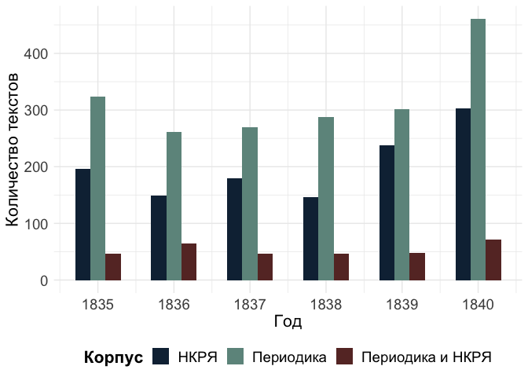
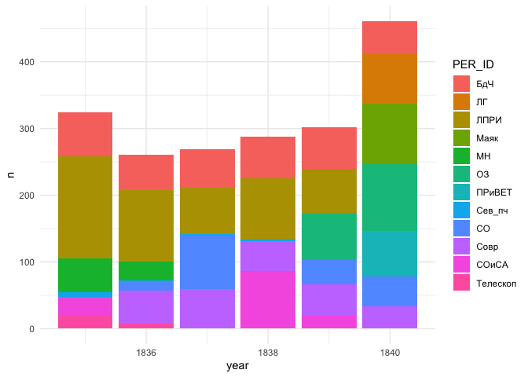
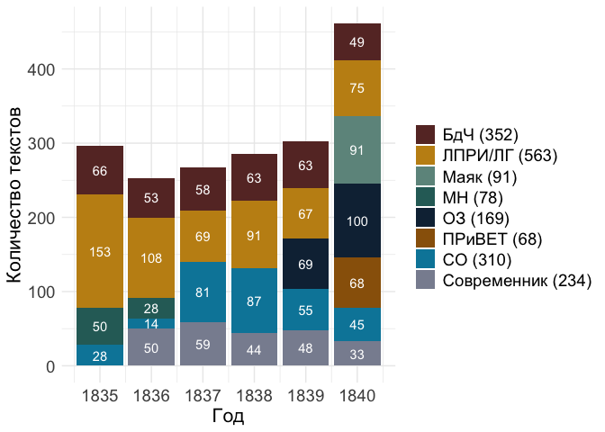
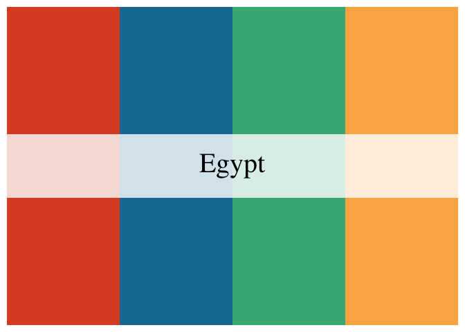
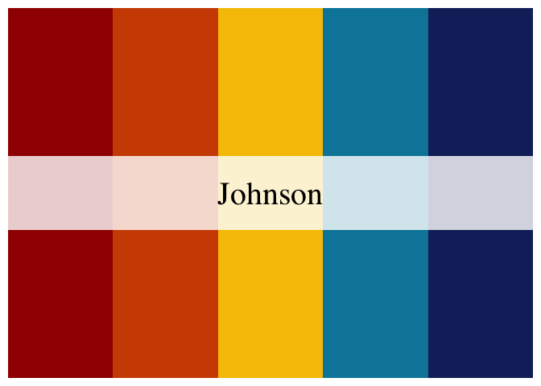
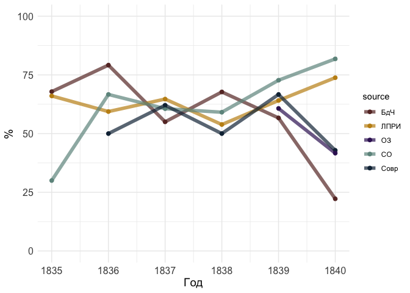
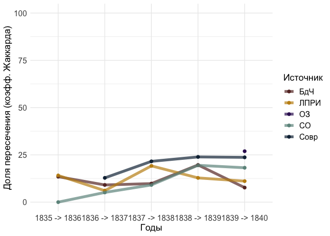
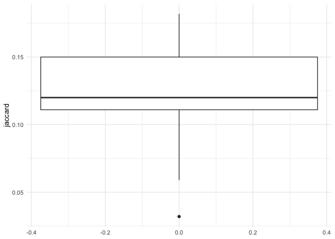
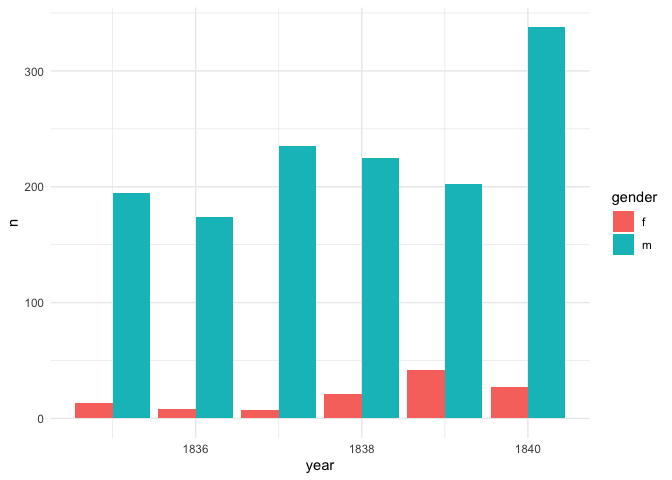

# Chapter 2.2. Poems in periodicals: statistics

``` r
library(tidyverse)
```

    Warning: package 'ggplot2' was built under R version 4.3.1

    Warning: package 'lubridate' was built under R version 4.3.1

    ── Attaching core tidyverse packages ──────────────────────── tidyverse 2.0.0 ──
    ✔ dplyr     1.1.3     ✔ readr     2.1.4
    ✔ forcats   1.0.0     ✔ stringr   1.5.0
    ✔ ggplot2   3.4.4     ✔ tibble    3.2.1
    ✔ lubridate 1.9.3     ✔ tidyr     1.3.0
    ✔ purrr     1.0.2     
    ── Conflicts ────────────────────────────────────────── tidyverse_conflicts() ──
    ✖ dplyr::filter() masks stats::filter()
    ✖ dplyr::lag()    masks stats::lag()
    ℹ Use the conflicted package (<http://conflicted.r-lib.org/>) to force all conflicts to become errors

``` r
library(treemap)
library(ggplotify)
theme_set(theme_minimal())
library(wesanderson)
```

    Warning: package 'wesanderson' was built under R version 4.3.1

``` r
library(MetBrewer)
```

    Registered S3 method overwritten by 'MetBrewer':
      method        from       
      print.palette wesanderson

``` r
# fix problems with cyrillics
# library(extrafont)
# library(showtext)
# font_add("Arial", "/Library/Fonts/Arial.ttf") 
# showtext_auto()
```

``` r
MetBrewer::colorblind_palettes
```

     [1] "Archambault" "Cassatt1"    "Cassatt2"    "Demuth"      "Derain"     
     [6] "Egypt"       "Greek"       "Hiroshige"   "Hokusai2"    "Hokusai3"   
    [11] "Ingres"      "Isfahan1"    "Isfahan2"    "Java"        "Johnson"    
    [16] "Kandinsky"   "Morgenstern" "OKeeffe1"    "OKeeffe2"    "Pillement"  
    [21] "Tam"         "Troy"        "VanGogh3"    "Veronese"   

``` r
met.brewer(MetBrewer::colorblind_palettes[24])
```


## Data compilation

Load full metadata

``` r
# load periodicals data stored separately
per_full <- readRDS("../../data/corpus1835/periodicals/periodicals_corpus_lemm_acc.Rds")

glimpse(per_full)
```

    Rows: 1,905
    Columns: 18
    $ text_id       <chr> "P_1", "P_10", "P_100", "P_1000", "P_1001", "P_1002", "P…
    $ A_ID          <chr> "", "A-50", "A-7", "A-41", "A-139", "A-11", "A-163", "A-…
    $ author_text   <chr> "", "Якубович Л.А.", "Кольцов А.В.", "Глинка Ф.Н.", "Про…
    $ author_sign   <chr> "", "Л. Якубович", "Кольцов", "Ф. Глинка", "Н. Прокопови…
    $ text_title    <chr> "Солдатская песня", "Молния", "Ночлег чумаков", "Утешите…
    $ first_line    <chr> "Ох жизнь, молодецкая", "Зачем с небесной высоты", "В бл…
    $ text_subtitle <chr> "", "", "Сельские картины", "", "", "", "", "", "", "", …
    $ PER_ID        <chr> "Сев_пч", "БдЧ", "БдЧ", "Совр", "Совр", "Совр", "Совр", …
    $ year          <int> 1835, 1835, 1836, 1838, 1838, 1838, 1838, 1838, 1838, 18…
    $ vol           <chr> "", "Т.8. Отд. 1", "Т. 16", "Т. 10. 3-ей паг", "Т. 10. 3…
    $ num           <chr> "12", "", "", "", "", "", "", "", "", "", "", "", "", ""…
    $ text_pages    <chr> "46", "21", "9-12", "172-174", "175-176", "177", "178-17…
    $ notes         <chr> "", "", "", "", "", "", "", "", "", "", "", "", "", "", …
    $ path          <chr> "../../data/corpus1835/periodicals/per_raw//P_1.txt", ".…
    $ text_raw      <chr> "Ох, жизнь молодецкая,\nБравая, солдатская!\nКак осенняя…
    $ text_cln      <chr> "Ох, жизнь молодецкая,\nБравая, солдатская!\nКак осенняя…
    $ text_lemm     <chr> "ох, жизнь молодецкий,\nбравый, солдатский!\nкак осенний…
    $ text_acc      <chr> "Ох, жизнь молоде'цкая,\nБра'вая, солда'тская!\nКак осе'…

Attach authors data: check if all author’s names are complete

``` r
# load latest ver of the corpus with authors' data cleaned
corpus_cln <- readRDS("../../data/corpus1835/corpus_1835.Rds")

glimpse(corpus_cln)
```

    Rows: 4,799
    Columns: 20
    $ text_id       <chr> "P_1", "P_10", "P_100", "P_1000", "P_1001", "P_1002", "P…
    $ A_ID          <chr> "", "A-50", "A-7", "A-41", "A-139", "A-11", "A-163", "A-…
    $ author_sign   <chr> "", "Л. Якубович", "Кольцов", "Ф. Глинка", "Н. Прокопови…
    $ author_text   <chr> "", "Якубович Л.А.", "Кольцов А.В.", "Глинка Ф.Н.", "Про…
    $ text_title    <chr> "Солдатская песня", "Молния", "Ночлег чумаков", "Утешите…
    $ text_subtitle <chr> "", "", "Сельские картины", "", "", "", "", "", "", "", …
    $ first_line    <chr> "Ох жизнь, молодецкая", "Зачем с небесной высоты", "В бл…
    $ year          <chr> "1835", "1835", "1836", "1838", "1838", "1838", "1838", …
    $ path_text     <chr> "../../data/corpus1835/periodicals/per_raw//P_1.txt", ".…
    $ source_text   <chr> "Сев_пч. 1835. №12. C. 46", "БдЧ. 1835. Т.8. Отд. 1. C. …
    $ COL_ID        <chr> "", "", "", "", "", "", "", "", "", "", "", "", "", "", …
    $ corpus        <chr> "per", "per", "per", "per", "per", "per", "per", "per", …
    $ text_raw      <chr> "Ох, жизнь молодецкая,\nБравая, солдатская!\nКак осенняя…
    $ text_cln      <chr> "Ох, жизнь молодецкая,\nБравая, солдатская!\nКак осенняя…
    $ text_lemm     <chr> "ох, жизнь молодецкий,\nбравый, солдатский!\nкак осенний…
    $ text_acc      <chr> "Ох, жизнь молоде'цкая,\nБра'вая, солда'тская!\nКак осе'…
    $ meter         <fct> Other?, Iamb, Iamb, Iamb, Trochee, Iamb, Trochee, Iamb, …
    $ feet          <chr> "?", "3", "4", "4", "4", "4", "other", "4", "6", "5", "4…
    $ formula       <chr> "Other?_?", "Iamb_3", "Iamb_4", "Iamb_4", "Trochee_4", "…
    $ n_lines       <int> 38, 16, 98, 77, 28, 12, 44, 25, 31, 28, 100, 16, 17, 60,…

``` r
glimpse(per_full)
```

    Rows: 1,905
    Columns: 18
    $ text_id       <chr> "P_1", "P_10", "P_100", "P_1000", "P_1001", "P_1002", "P…
    $ A_ID          <chr> "", "A-50", "A-7", "A-41", "A-139", "A-11", "A-163", "A-…
    $ author_text   <chr> "", "Якубович Л.А.", "Кольцов А.В.", "Глинка Ф.Н.", "Про…
    $ author_sign   <chr> "", "Л. Якубович", "Кольцов", "Ф. Глинка", "Н. Прокопови…
    $ text_title    <chr> "Солдатская песня", "Молния", "Ночлег чумаков", "Утешите…
    $ first_line    <chr> "Ох жизнь, молодецкая", "Зачем с небесной высоты", "В бл…
    $ text_subtitle <chr> "", "", "Сельские картины", "", "", "", "", "", "", "", …
    $ PER_ID        <chr> "Сев_пч", "БдЧ", "БдЧ", "Совр", "Совр", "Совр", "Совр", …
    $ year          <int> 1835, 1835, 1836, 1838, 1838, 1838, 1838, 1838, 1838, 18…
    $ vol           <chr> "", "Т.8. Отд. 1", "Т. 16", "Т. 10. 3-ей паг", "Т. 10. 3…
    $ num           <chr> "12", "", "", "", "", "", "", "", "", "", "", "", "", ""…
    $ text_pages    <chr> "46", "21", "9-12", "172-174", "175-176", "177", "178-17…
    $ notes         <chr> "", "", "", "", "", "", "", "", "", "", "", "", "", "", …
    $ path          <chr> "../../data/corpus1835/periodicals/per_raw//P_1.txt", ".…
    $ text_raw      <chr> "Ох, жизнь молодецкая,\nБравая, солдатская!\nКак осенняя…
    $ text_cln      <chr> "Ох, жизнь молодецкая,\nБравая, солдатская!\nКак осенняя…
    $ text_lemm     <chr> "ох, жизнь молодецкий,\nбравый, солдатский!\nкак осенний…
    $ text_acc      <chr> "Ох, жизнь молоде'цкая,\nБра'вая, солда'тская!\nКак осе'…

``` r
per <- per_full %>% 
  select(-author_text, -A_ID) %>% 
  left_join(corpus_cln %>% select(text_id, A_ID, author_text), by = "text_id") 


# attach RP and gender columns from authors-meta
# load authors-meta
authors_meta <- read.delim("../../meta/authors.tsv", sep = "\t")

# attach only gender by A_ID
per <- per %>% 
  left_join(authors_meta %>% select(A_ID, RP, gender), by = "A_ID")


# cleaning using authors-meta 
# 
# # create a table that checks if author's names in authors_metadata and in per_full are different
# authors_test <- per_full %>% 
#   select(A_ID, author_text) %>% 
#   rename(author_existing = author_text) %>% 
#   left_join(authors %>% select(A_ID, author, author_full_name), by = "A_ID") %>% 
#   distinct() %>% 
#   filter(author_existing != author)
# 
# # replace author_text column in per_full with more complete data
# # also add RP column
# per <- per_full %>% 
#   left_join(authors %>% select(A_ID, RP, author), by = "A_ID") %>% 
#   mutate(author_text = ifelse(A_ID %in% authors_test$A_ID, author, author_text)) %>% 
#   select(-author)

# replace NA appeared after coercion to blank
per[is.na(per)] <- ""

rm(per_full, corpus_cln, authors_meta)
```

## RNC comparison

``` r
# RNC data
load("../../data/nkrja_19th_lem.Rda")

rnc_authors <- c19 %>% 
    select(author) %>% 
    mutate(author = str_remove_all(author, "[[:space:]]|[[:punct:]]")) %>% 
    distinct() %>% 
    pull()

head(rnc_authors)
```

    [1] "ССБобров"    "САТучков"    "ССПестов"    "ППСумароков" "НССмирнов"  
    [6] "ПАСловцов"  

``` r
#rm(c19)
```

## 2.1. Periodicals vs RNC

Comparison on number of authors

``` r
print("Total number of authors in periodicals:")
```

    [1] "Total number of authors in periodicals:"

``` r
per %>% 
    filter(A_ID != "" & author_text != "") %>% # nrow() # 1464 poems are with known author
    select(author_text) %>% 
    count(author_text, sort = T) %>% nrow() 
```

    [1] 191

``` r
print("Number of authors with biography in RP:")
```

    [1] "Number of authors with biography in RP:"

``` r
per %>% 
    filter(RP != "") %>% # nrow() # 1197 poems by authors known by RP
    select(RP) %>% 
    count(RP, sort = T) %>% nrow() 
```

    [1] 132

``` r
print("Number of authors included in RNC")
```

    [1] "Number of authors included in RNC"

``` r
per %>% 
    filter(author_text != "") %>% 
    select(author_text) %>% 
    mutate(author = str_replace_all(author_text, 
                                    "(.*?[[:space:]])(\\w\\.\\w.)", 
                                    "\\2\\1")) %>% 
    mutate(author = str_remove_all(author, "[[:space:]]|[[:punct:]]")) %>% 
    distinct() %>% 
    filter(author %in% rnc_authors) %>% 
    nrow() # 58 ? 
```

    [1] 62

### Textual intersections between RNC & periodicals

-   Create for each poem an id column containing two first lines
-   Mark the intersection with a special tag

``` r
periodicals <- per %>% 
    mutate(doublesCheck = str_extract(text_lemm, "^.*?\n.*?\n.*?\n")) %>% 
    mutate(doublesCheck = str_remove_all(doublesCheck, "[[:punct:]]|[[:space:]]")) %>% 
    filter(text_raw != "") # remove empty lines

glimpse(periodicals)
```

    Rows: 1,905
    Columns: 21
    $ text_id       <chr> "P_1", "P_10", "P_100", "P_1000", "P_1001", "P_1002", "P…
    $ author_sign   <chr> "", "Л. Якубович", "Кольцов", "Ф. Глинка", "Н. Прокопови…
    $ text_title    <chr> "Солдатская песня", "Молния", "Ночлег чумаков", "Утешите…
    $ first_line    <chr> "Ох жизнь, молодецкая", "Зачем с небесной высоты", "В бл…
    $ text_subtitle <chr> "", "", "Сельские картины", "", "", "", "", "", "", "", …
    $ PER_ID        <chr> "Сев_пч", "БдЧ", "БдЧ", "Совр", "Совр", "Совр", "Совр", …
    $ year          <int> 1835, 1835, 1836, 1838, 1838, 1838, 1838, 1838, 1838, 18…
    $ vol           <chr> "", "Т.8. Отд. 1", "Т. 16", "Т. 10. 3-ей паг", "Т. 10. 3…
    $ num           <chr> "12", "", "", "", "", "", "", "", "", "", "", "", "", ""…
    $ text_pages    <chr> "46", "21", "9-12", "172-174", "175-176", "177", "178-17…
    $ notes         <chr> "", "", "", "", "", "", "", "", "", "", "", "", "", "", …
    $ path          <chr> "../../data/corpus1835/periodicals/per_raw//P_1.txt", ".…
    $ text_raw      <chr> "Ох, жизнь молодецкая,\nБравая, солдатская!\nКак осенняя…
    $ text_cln      <chr> "Ох, жизнь молодецкая,\nБравая, солдатская!\nКак осенняя…
    $ text_lemm     <chr> "ох, жизнь молодецкий,\nбравый, солдатский!\nкак осенний…
    $ text_acc      <chr> "Ох, жизнь молоде'цкая,\nБра'вая, солда'тская!\nКак осе'…
    $ A_ID          <chr> "", "A-50", "A-7", "A-41", "A-139", "A-11", "A-163", "A-…
    $ author_text   <chr> "", "Якубович Л.А.", "Кольцов А.В.", "Глинка Ф.Н.", "Про…
    $ RP            <chr> "", "", "3-33", "1-578", "5-151", "5", "2-13", "1-578", …
    $ gender        <chr> "", "m", "m", "m", "m", "m", "m", "m", "m", "m", "m", "f…
    $ doublesCheck  <chr> "охжизньмолодецкийбравыйсолдатскийкакосеннийноченька", "…

``` r
nkrja19 <- c19 %>% 
    rename(index = `Unnamed..0`,
          text_lemm = lemma) %>% 
    select(index, author, text_lemm) %>%
    mutate(doublesCheck = str_extract(text_lemm, "^.*?\n.*?\n.*?\n")) %>% 
    mutate(doublesCheck = str_remove_all(doublesCheck, "[[:punct:]]|[[:space:]]"))

glimpse(nkrja19)
```

    Rows: 15,569
    Columns: 4
    $ index        <int> 1, 2, 3, 4, 5, 6, 7, 8, 9, 10, 11, 12, 13, 14, 15, 16, 17…
    $ author       <chr> "С. С. Бобров", "С. С. Бобров", "С. С. Бобров", "С. С. Бо…
    $ text_lemm    <chr> "еще вкруг солнцев не вращаться \n в превыспренний страна…
    $ doublesCheck <chr> "ещевкругсолнцевневращатьсявпревыспреннийстранамирещевхао…

``` r
doubles_id <- periodicals %>% 
    inner_join(nkrja19, by = "doublesCheck") %>% 
    select(index, text_id, year, A_ID, author_text, author, doublesCheck, text_raw) %>% 
  filter(doublesCheck != "")

doubles_id %>% select(-text_raw) %>% head
```

    # A tibble: 6 × 7
      index text_id  year A_ID  author_text   author         doublesCheck           
      <int> <chr>   <int> <chr> <chr>         <chr>          <chr>                  
    1  1232 P_10     1835 A-50  Якубович Л.А. Л. А. Якубович зачемснебесныйвысотаиз…
    2  6656 P_100    1836 A-7   Кольцов А.В.  А. В. Кольцов  вблизидорогастолбовойн…
    3 14680 P_1006   1838 A-154 Тютчев Ф.И.   Ф. И. Тютчев   ираспроститьсястревога…
    4 14682 P_1010   1838 A-154 Тютчев Ф.И.   Ф. И. Тютчев   смотретькакзападразгор…
    5 12483 P_1014   1838 A-11  Пушкин А.С.   А. С. Пушкин   какойночьморозтрескучи…
    6  6729 P_1015   1838 A-7   Кольцов А.В.  А. В. Кольцов  глубокийвечностьоглаша…

``` r
print("Total number of intersected texts:")
```

    [1] "Total number of intersected texts:"

``` r
nrow(doubles_id)
```

    [1] 323

``` r
print("Total number of texts in periodicals:")
```

    [1] "Total number of texts in periodicals:"

``` r
nrow(periodicals)
```

    [1] 1905

``` r
print("Total % of intersected texts out for all periodicals texts:")
```

    [1] "Total % of intersected texts out for all periodicals texts:"

``` r
round( (nrow(doubles_id)/nrow(periodicals))*100 , 1) 
```

    [1] 17

``` r
glimpse(doubles_id)
```

    Rows: 323
    Columns: 8
    $ index        <int> 1232, 6656, 14680, 14682, 12483, 6729, 12889, 15279, 1465…
    $ text_id      <chr> "P_10", "P_100", "P_1006", "P_1010", "P_1014", "P_1015", …
    $ year         <int> 1835, 1836, 1838, 1838, 1838, 1838, 1838, 1838, 1838, 183…
    $ A_ID         <chr> "A-50", "A-7", "A-154", "A-154", "A-11", "A-7", "A-153", …
    $ author_text  <chr> "Якубович Л.А.", "Кольцов А.В.", "Тютчев Ф.И.", "Тютчев Ф…
    $ author       <chr> "Л. А. Якубович", "А. В. Кольцов", "Ф. И. Тютчев", "Ф. И.…
    $ doublesCheck <chr> "зачемснебесныйвысотаизгорнийжильеналонобурямчатьсяты", "…
    $ text_raw     <chr> "Зачем с небесной высоты, \nИз горнего жилья, \nНа лоне б…

``` r
doubles_counts <- doubles_id %>% 
    count(year) %>% 
    mutate(group = "Периодика и НКРЯ")

doubles_counts %>% pivot_wider(names_from = year, values_from = n)
```

    # A tibble: 1 × 7
      group            `1835` `1836` `1837` `1838` `1839` `1840`
      <chr>             <int>  <int>  <int>  <int>  <int>  <int>
    1 Периодика и НКРЯ     47     64     47     46     48     71

### Plot 2.2.1

``` r
rnc_1835 <- c19 %>% 
    rename(index = `Unnamed..0`) %>% 
    # remove intersection
    #anti_join(doubles_id %>% select(index), by = "index") %>%

    # calculate number of unique poems
    filter(year > 1834 & year < 1841) %>% 
    count(year, sort = F) %>% 
    mutate(group = "НКРЯ")

rnc_1835 %>% pivot_wider(names_from = year, values_from = n)
```

    # A tibble: 1 × 7
      group `1835` `1836` `1837` `1838` `1839` `1840`
      <chr>  <int>  <int>  <int>  <int>  <int>  <int>
    1 НКРЯ     196    149    180    146    238    303

``` r
counter_1835 <- per %>% 
    # remove intersection
    #anti_join(doubles_id %>% select(id), by = "id") %>%

    count(year, sort = F) %>% 
    mutate(group = "Периодика") %>%
    rbind(rnc_1835, doubles_counts)

counter_1835 %>% pivot_wider(names_from = year, values_from = n)
```

    # A tibble: 3 × 7
      group            `1835` `1836` `1837` `1838` `1839` `1840`
      <chr>             <int>  <int>  <int>  <int>  <int>  <int>
    1 Периодика           324    261    269    288    302    461
    2 НКРЯ                196    149    180    146    238    303
    3 Периодика и НКРЯ     47     64     47     46     48     71

``` r
p2_2_1 <- counter_1835 %>%
    ggplot(aes(x = year, y = n, fill = group)) + 
    geom_col(position = "dodge", width = 0.6) + 
    scale_fill_manual(values = c(met.brewer("Veronese")[7], # dark blue
                                 met.brewer("Veronese")[4], # light blue
                                 met.brewer("Veronese")[1] # dark red
                                )) + 
    scale_x_continuous(breaks = 1835:1840) +
    theme(axis.text = element_text(size = 14),
         axis.title = element_text(size = 16),
         legend.title = element_text(size = 16, face = "bold"),
         legend.text = element_text(size = 14),
         legend.position = "bottom") + 
    labs(x = "Год",
        y = "Количество текстов",
        fill = "Корпус")

p2_2_1
```



``` r
ggsave(file = "plots/Fig_2_2_1.png", plot = p2_2_1, dpi = 300,
      width = 8, height = 6, bg = "white")
```

## 2.2.1. Sources statistics

Analysis of poems published in different sources (journals & newspapers)
and by different authors

``` r
glimpse(per)
```

    Rows: 1,905
    Columns: 20
    $ text_id       <chr> "P_1", "P_10", "P_100", "P_1000", "P_1001", "P_1002", "P…
    $ author_sign   <chr> "", "Л. Якубович", "Кольцов", "Ф. Глинка", "Н. Прокопови…
    $ text_title    <chr> "Солдатская песня", "Молния", "Ночлег чумаков", "Утешите…
    $ first_line    <chr> "Ох жизнь, молодецкая", "Зачем с небесной высоты", "В бл…
    $ text_subtitle <chr> "", "", "Сельские картины", "", "", "", "", "", "", "", …
    $ PER_ID        <chr> "Сев_пч", "БдЧ", "БдЧ", "Совр", "Совр", "Совр", "Совр", …
    $ year          <int> 1835, 1835, 1836, 1838, 1838, 1838, 1838, 1838, 1838, 18…
    $ vol           <chr> "", "Т.8. Отд. 1", "Т. 16", "Т. 10. 3-ей паг", "Т. 10. 3…
    $ num           <chr> "12", "", "", "", "", "", "", "", "", "", "", "", "", ""…
    $ text_pages    <chr> "46", "21", "9-12", "172-174", "175-176", "177", "178-17…
    $ notes         <chr> "", "", "", "", "", "", "", "", "", "", "", "", "", "", …
    $ path          <chr> "../../data/corpus1835/periodicals/per_raw//P_1.txt", ".…
    $ text_raw      <chr> "Ох, жизнь молодецкая,\nБравая, солдатская!\nКак осенняя…
    $ text_cln      <chr> "Ох, жизнь молодецкая,\nБравая, солдатская!\nКак осенняя…
    $ text_lemm     <chr> "ох, жизнь молодецкий,\nбравый, солдатский!\nкак осенний…
    $ text_acc      <chr> "Ох, жизнь молоде'цкая,\nБра'вая, солда'тская!\nКак осе'…
    $ A_ID          <chr> "", "A-50", "A-7", "A-41", "A-139", "A-11", "A-163", "A-…
    $ author_text   <chr> "", "Якубович Л.А.", "Кольцов А.В.", "Глинка Ф.Н.", "Про…
    $ RP            <chr> "", "", "3-33", "1-578", "5-151", "5", "2-13", "1-578", …
    $ gender        <chr> "", "m", "m", "m", "m", "m", "m", "m", "m", "m", "m", "f…

``` r
per %>% group_by(year, PER_ID) %>% count() %>% 
    ggplot(aes(x = year, y = n, fill = PER_ID)) + geom_col() 
```



### Plots 2.2.2

Count number total number of texts in each source

``` r
# remove incomplete sources
periodicals <- per %>% 
  filter(!PER_ID %in% c("Молва", "МН", "Сев_пч"))

years_total <- periodicals %>% 
  count(year) %>% 
  mutate(year_label = paste0(year, " (N = ", n, ")"))

source_year_total <- periodicals %>% 
  count(PER_ID, year)
```

Count number of texts in each source by each author

``` r
authors_sources <- periodicals %>% 
    #filter(PER_ID != "Сев_пч") %>% 
    mutate(PER_ID = ifelse(str_detect(PER_ID,"СОиСА"), "СО", PER_ID)) %>% 
    filter(author_text != "") %>% 
    
    # grouping by author, year and source
    group_by(year, PER_ID, author_text) %>% 
    count(sort = T) %>% 
    ungroup() %>%
    
    # non-frequent authors grouped as "others"
    mutate(author_text = ifelse(n < 3, "Другие", author_text)) %>% 
    group_by(year, PER_ID, author_text) %>% 
    # sum poems by others
    summarise(n = sum(n)) %>% 
    mutate(author_label = paste0(author_text, " (", n, ")"))
```

    `summarise()` has grouped output by 'year', 'PER_ID'. You can override using
    the `.groups` argument.

``` r
head(authors_sources)
```

    # A tibble: 6 × 5
    # Groups:   year, PER_ID [2]
       year PER_ID author_text       n author_label     
      <int> <chr>  <chr>         <int> <chr>            
    1  1835 БдЧ    Другие           29 Другие (29)      
    2  1835 БдЧ    Ершов П.П.        6 Ершов П.П. (6)   
    3  1835 БдЧ    Козлов И.И.      11 Козлов И.И. (11) 
    4  1835 БдЧ    Пушкин А.С.      16 Пушкин А.С. (16) 
    5  1835 БдЧ    Якубович Л.А.     3 Якубович Л.А. (3)
    6  1835 ЛПРИ   13 — 18.          3 13 — 18. (3)     

Select colours for charts

``` r
MetBrewer::colorblind_palettes
```

     [1] "Archambault" "Cassatt1"    "Cassatt2"    "Demuth"      "Derain"     
     [6] "Egypt"       "Greek"       "Hiroshige"   "Hokusai2"    "Hokusai3"   
    [11] "Ingres"      "Isfahan1"    "Isfahan2"    "Java"        "Johnson"    
    [16] "Kandinsky"   "Morgenstern" "OKeeffe1"    "OKeeffe2"    "Pillement"  
    [21] "Tam"         "Troy"        "VanGogh3"    "Veronese"   

``` r
met.brewer("Archambault")
```



``` r
met.brewer("Egypt")
```



``` r
met.brewer("Johnson")
```



``` r
met.brewer("Kandinsky")[3]
```

    [1] "#898e9f"

``` r
met.brewer("Veronese")
```


``` r
# treemap: https://cran.r-project.org/web/packages/treemap/treemap.pdf

# x <- NULL
# 
# for (i in 1:length(unique(per$year))) {
#     
#     x <- unique(per$year)[i]
#     
#     filename = paste0("plots/treemaps/plot_", x, ".png")
# 
#     png(filename, width = 600, height = 600)
# 
#     t <- authors_sources %>% 
#         filter(year == x) %>% 
#         treemap(
#             index = c("PER_ID", "author_label"),
#             vSize = "n",
#             type = "index",
#             palette = light_palette,
#             fontsize.labels = c(20, 16),
#             #position.legend = "right",
#             overlap.labels = 1,
#             title = x,
#             fontsize.title = 22
#         )
# 
#     dev.off()
# }
```

``` r
years_total
```

    # A tibble: 6 × 3
       year     n year_label    
      <int> <int> <chr>         
    1  1835   267 1835 (N = 267)
    2  1836   232 1836 (N = 232)
    3  1837   267 1837 (N = 267)
    4  1838   285 1838 (N = 285)
    5  1839   302 1839 (N = 302)
    6  1840   461 1840 (N = 461)

``` r
source_year_total %>% arrange(-desc(year))
```

    # A tibble: 30 × 3
       PER_ID    year     n
       <chr>    <int> <int>
     1 БдЧ       1835    66
     2 ЛПРИ      1835   153
     3 СОиСА     1835    28
     4 Телескоп  1835    20
     5 БдЧ       1836    53
     6 ЛПРИ      1836   108
     7 СО        1836    14
     8 Совр      1836    50
     9 Телескоп  1836     7
    10 БдЧ       1837    58
    # ℹ 20 more rows

``` r
png("plots/treemaps/2-2-2_1835_v2.png", height = 650, width = 600)

tree_pal <- c(met.brewer("Veronese")[1], # BdCH
              met.brewer("Veronese")[3], # LPRI
              met.brewer("Veronese")[4], # SO
              met.brewer("Kandinsky")[3]) # Telescop

authors_sources %>% 
        filter(year == 1835) %>% 
        treemap(
            index = c("PER_ID", "author_label"),
            vSize = "n",
            type = "index",
            palette = tree_pal,
            fontsize.labels = c(24, 16),
            #position.legend = "right",
            overlap.labels = 1,
            title = "1835 (N = 269)",
            fontsize.title = 22
        )

dev.off()
```

    quartz_off_screen 
                    2 

``` r
png("plots/treemaps/2-2-2_1836_v2.png", height = 650, width = 600)

authors_sources %>% 
        filter(year == 1836) %>% 
        select(PER_ID) %>% distinct() %>% arrange(-desc(PER_ID))
```

    Adding missing grouping variables: `year`

    # A tibble: 5 × 2
    # Groups:   year, PER_ID [5]
       year PER_ID  
      <int> <chr>   
    1  1836 БдЧ     
    2  1836 ЛПРИ    
    3  1836 СО      
    4  1836 Совр    
    5  1836 Телескоп

``` r
tree_pal <- c(met.brewer("Veronese")[1], # BdCH
              met.brewer("Veronese")[3], # LPRI
              met.brewer("Veronese")[4], # SO
              met.brewer("Veronese")[7], # Sovr
              met.brewer("Kandinsky")[3]) # Telescop

authors_sources %>% 
        filter(year == 1836) %>% 
        treemap(
            index = c("PER_ID", "author_label"),
            vSize = "n",
            type = "index",
            palette = tree_pal,
            fontsize.labels = c(24, 16),
            #position.legend = "right",
            overlap.labels = 1,
            title = "1836 (N = 238)",
            fontsize.title = 22
        )

dev.off()
```

    quartz_off_screen 
                    2 

``` r
png("plots/treemaps/2-2-2_1837_v2.png", height = 650, width = 600)

authors_sources %>% 
        filter(year == 1837) %>% 
        select(PER_ID) %>% distinct() %>% arrange(-desc(PER_ID))
```

    Adding missing grouping variables: `year`

    # A tibble: 4 × 2
    # Groups:   year, PER_ID [4]
       year PER_ID
      <int> <chr> 
    1  1837 БдЧ   
    2  1837 ЛПРИ  
    3  1837 СО    
    4  1837 Совр  

``` r
tree_pal <- c(met.brewer("Veronese")[1], # BdCH
              met.brewer("Veronese")[3], # LPRI
              met.brewer("Veronese")[4], # SO
              met.brewer("Veronese")[7]) # Sovr 

authors_sources %>%
        filter(year == 1837) %>%
        treemap(
            index = c("PER_ID", "author_label"),
            vSize = "n",
            type = "index",
            palette = tree_pal,
            fontsize.labels = c(24, 16),
            #position.legend = "right",
            overlap.labels = 1,
            title = "1837 (N = 282)",
            fontsize.title = 22
        )

dev.off()
```

    quartz_off_screen 
                    2 

``` r
png("plots/treemaps/2-2-2_1838_v2.png", height = 650, width = 600)

authors_sources %>% 
        filter(year == 1838) %>% 
        select(PER_ID) %>% distinct() %>% arrange(-desc(PER_ID))
```

    Adding missing grouping variables: `year`

    # A tibble: 4 × 2
    # Groups:   year, PER_ID [4]
       year PER_ID
      <int> <chr> 
    1  1838 БдЧ   
    2  1838 ЛПРИ  
    3  1838 СО    
    4  1838 Совр  

``` r
tree_pal <- c(met.brewer("Veronese")[1], # BdCH
              met.brewer("Veronese")[3], # LPRI
              met.brewer("Veronese")[4], # SO
              met.brewer("Veronese")[7]) # Sovr

authors_sources %>%
        filter(year == 1838) %>%
        treemap(
            index = c("PER_ID", "author_label"),
            vSize = "n",
            type = "index",
            palette = tree_pal,
            fontsize.labels = c(24, 16),
            #position.legend = "right",
            overlap.labels = 1,
            title = "1838 (N = 288)",
            fontsize.title = 22
        )

dev.off()
```

    quartz_off_screen 
                    2 

``` r
png("plots/treemaps/2-2-2_1839_v2.png", height = 650, width = 600)

authors_sources %>% 
        filter(year == 1839) %>% 
        select(PER_ID) %>% distinct() %>% arrange(-desc(PER_ID))
```

    Adding missing grouping variables: `year`

    # A tibble: 5 × 2
    # Groups:   year, PER_ID [5]
       year PER_ID
      <int> <chr> 
    1  1839 БдЧ   
    2  1839 ЛПРИ  
    3  1839 ОЗ    
    4  1839 СО    
    5  1839 Совр  

``` r
tree_pal <- c(met.brewer("Veronese")[1], # BdCH
              met.brewer("Veronese")[3], # LPRI
              met.brewer("Archambault")[2], # OZ
              met.brewer("Veronese")[4], # SO
              met.brewer("Veronese")[7]) # Sovr

authors_sources %>%
        filter(year == 1839) %>%
        treemap(
            index = c("PER_ID", "author_label"),
            vSize = "n",
            type = "index",
            palette = tree_pal,
            fontsize.labels = c(24, 16),
            #position.legend = "right",
            overlap.labels = 1,
            title = "1839 (N = 312)",
            fontsize.title = 22
        )

dev.off()
```

    quartz_off_screen 
                    2 

``` r
png("plots/treemaps/2-2-2_1840_v2.png", height = 700, width = 650)

authors_sources %>% 
        filter(year == 1840) %>% 
        select(PER_ID) %>% distinct() %>% arrange(-desc(PER_ID))
```

    Adding missing grouping variables: `year`

    # A tibble: 7 × 2
    # Groups:   year, PER_ID [7]
       year PER_ID
      <int> <chr> 
    1  1840 БдЧ   
    2  1840 ЛГ    
    3  1840 Маяк  
    4  1840 ОЗ    
    5  1840 ПРиВЕТ
    6  1840 СО    
    7  1840 Совр  

``` r
tree_pal <- c(met.brewer("Veronese")[1], # BdCH
              met.brewer("Veronese")[3], # LG
              met.brewer("Kandinsky")[3], # Mayak
              met.brewer("Archambault")[2], # OZ
              met.brewer("Egypt")[2], # PRiVET
              met.brewer("Veronese")[4], # SO
              met.brewer("Veronese")[7]) # Sovr

authors_sources %>%
        filter(year == 1840) %>%
        treemap(
            index = c("PER_ID", "author_label"),
            vSize = "n",
            type = "index",
            palette = tree_pal,
            fontsize.labels = c(24, 16),
            #position.legend = "right",
            overlap.labels = 1,
            title = "1840 (N = 461)",
            fontsize.title = 22
        )

dev.off()
```

    quartz_off_screen 
                    2 

### Authors rotation in journals

``` r
per %>% 
  filter(PER_ID == "БдЧ" & author_text != "") %>% 
  group_by(year) %>% 
  count(author_text, sort = T) %>% 
  mutate(rank = row_number()) %>% 
  ungroup() %>% 
  #filter(rank < 21) %>% 
  pivot_wider(!n, names_from = year, values_from = rank) %>% 
  select(author_text, `1835`, `1836`, `1837`, `1838`, `1839`, `1840`)
```

    Warning: Specifying the `id_cols` argument by position was deprecated in tidyr 1.3.0.
    ℹ Please explicitly name `id_cols`, like `id_cols = !n`.

    # A tibble: 97 × 7
       author_text    `1835` `1836` `1837` `1838` `1839` `1840`
       <chr>           <int>  <int>  <int>  <int>  <int>  <int>
     1 Пушкин А.С.         1     NA     15     NA     NA     NA
     2 Губер Э.И.         NA     NA     NA     NA     NA      1
     3 Козлов И.И.         2      1      8     NA     20     NA
     4 Тимофеев А.В.       9      2      1      4     25     NA
     5 Бернет Е.          NA     NA      2      8      4     NA
     6 Менцов Ф.Н.        23     NA     NA      1     12     NA
     7 Ершов П.П.          3     12     NA     18     NA      2
     8 Кропоткин Д.А.     NA     NA      3      3      1     NA
     9 Мейстер И.         NA     NA     NA      2     11     NA
    10 Греков Н.П.        NA     NA     NA     15     18      3
    # ℹ 87 more rows

``` r
  #filter(year == 1835)
```

``` r
# unite some journal's names
per <- per %>% 
  mutate(per_cln = ifelse(PER_ID == "СОиСА", "СО", PER_ID),
         per_cln = ifelse(PER_ID == "ЛГ", "ЛПРИ", per_cln))

# quick look on journal's existence (in data)
per %>% 
  count(year, per_cln) %>% 
  pivot_wider(names_from = year, values_from = n)
```

    # A tibble: 10 × 7
       per_cln  `1835` `1836` `1837` `1838` `1839` `1840`
       <chr>     <int>  <int>  <int>  <int>  <int>  <int>
     1 БдЧ          66     53     58     63     63     49
     2 ЛПРИ        153    108     69     91     67     75
     3 МН           50     28     NA     NA     NA     NA
     4 СО           28     14     81     87     55     45
     5 Сев_пч        7      1      2      3     NA     NA
     6 Телескоп     20      7     NA     NA     NA     NA
     7 Совр         NA     50     59     44     48     33
     8 ОЗ           NA     NA     NA     NA     69    100
     9 Маяк         NA     NA     NA     NA     NA     91
    10 ПРиВЕТ       NA     NA     NA     NA     NA     68

``` r
# selected journals
per_names <- c("БдЧ", "ЛПРИ", "СО", "Совр", "ОЗ")
```

``` r
# Kendall's ranking correlation calculation

# #length(unique(per_full$year))
# 
# per_names <- c("БдЧ", "ЛПРИ", "СО", "Совр", "ОЗ")
# 
# x <- NULL
# y <- NULL
# year1 <- NULL
# year2 <- NULL
# 
# x1 <- NULL
# x2 <- NULL
# k <- NULL
# 
# jou <- c("journal")
# years <- c("year")
# tau <- c("tau")
# 
# for (i in 1:length(per_names)) {
#   
#   x <- per %>%
#     filter(per_cln == per_names[i])
#   
#   # print(per_names[i])
#   
#   for (j in 1:(length(unique(x$year))-1)) {
#     year1 <- unique(x$year)[j]
#     year2 <- year1 + 1
# 
#     # print(c(year1, year2))
#     
#     y <- x %>% 
#       filter(!is.na(author)) %>% 
#       group_by(year) %>% 
#       count(author, sort = T) %>% 
#       mutate(rank = row_number()) %>% 
#       ungroup() %>% 
#       #filter(rank < 21) %>% 
#       filter(year %in% c(year1, year2)) %>% 
#       mutate(year = ifelse(year == year1, "year1", "year2")) %>% 
#       pivot_wider(id_cols = !n, names_from = year, values_from = rank) %>% 
#       drop_na
# 
#     #print(y)
#     
#     x1 <- as.vector(y$year1)
#     x2 <- as.vector(y$year2)
# 
#     print(c(per_names[i], year1, year2,  x1, "vs", x2))
#     
#     if (length(x1) > 0 & length(x2) > 0) {
#       k <- cor.test(x1, x2, method = "kendall")
#       
#       #print(unlist(k[[4]]))
#     
#       jou <- c(jou, per_names[i])
#       years <- c(years, paste0(year1, "_", year2))
#       tau <- c(tau, unlist(k[[4]]))
#     }
#   }
# }   
# tibble(journal = jou, 
#        year = years,
#        tau_val = tau) %>% 
#   filter(journal != "journal") %>% 
#   mutate(tau_val = round(as.numeric(tau_val), 4)) %>% 
#   pivot_wider(names_from = year, values_from = tau_val)
```

``` r
# per_names

p <- NULL
d <- NULL

for (i in 1:length(per_names)) {
  p <- per_names[i]
  
  print(p)
  
  d <- per %>% 
    filter(author_text != "") %>% 
    filter(per_cln == p) %>% 
    count(year, author_text) %>% 
    mutate(n = 1) %>% 
    pivot_wider(names_from = year, values_from = n, values_fill = 0) %>% 
    mutate(total = rowSums(select_if(., is.numeric))) %>% 
    arrange(desc(total))
  
  print(d)
  
}
```

    [1] "БдЧ"
    # A tibble: 97 × 8
       author_text     `1835` `1836` `1837` `1838` `1839` `1840` total
       <chr>            <dbl>  <dbl>  <dbl>  <dbl>  <dbl>  <dbl> <dbl>
     1 Тимофеев А.В.        1      1      1      1      1      0     5
     2 Ершов П.П.           1      1      0      1      0      1     4
     3 Козлов И.И.          1      1      1      0      1      0     4
     4 Бенедиктов В.Г.      0      1      1      0      1      1     4
     5 Менцов Ф.Н.          1      0      0      1      1      0     3
     6 ***                  0      1      0      1      1      0     3
     7 Бернет Е.            0      0      1      1      1      0     3
     8 Кропоткин Д.А.       0      0      1      1      1      0     3
     9 Кукольник Н.В.       0      0      1      1      0      1     3
    10 Шахова Е.Н.          0      0      1      1      1      0     3
    # ℹ 87 more rows
    [1] "ЛПРИ"
    # A tibble: 181 × 8
       author_text      `1835` `1836` `1837` `1838` `1839` `1840` total
       <chr>             <dbl>  <dbl>  <dbl>  <dbl>  <dbl>  <dbl> <dbl>
     1 Якубович Л.А.         1      0      1      1      1      1     5
     2 Алексеев П.Ф.         1      1      0      1      1      0     4
     3 Менцов Ф.Н.           1      1      1      1      0      0     4
     4 Бенедиктов В.Г.       0      1      1      1      1      0     4
     5 Глинка Ф.Н.           1      1      1      0      0      0     3
     6 Греков Н.П.           1      0      0      0      1      1     3
     7 Федоров Б.М.          1      1      0      0      0      1     3
     8 Соколовский В.И.      0      0      1      1      1      0     3
     9 Стромилов С.И.        0      0      1      1      1      0     3
    10 Айбулат К.М.          0      0      0      1      1      1     3
    # ℹ 171 more rows
    [1] "СО"
    # A tibble: 109 × 8
       author_text     `1835` `1836` `1837` `1838` `1839` `1840` total
       <chr>            <dbl>  <dbl>  <dbl>  <dbl>  <dbl>  <dbl> <dbl>
     1 Гогниев И.Е.         1      0      0      1      1      1     4
     2 Кони Ф.А.            0      1      1      1      0      0     3
     3 Бенедиктов В.Г.      0      0      1      1      0      1     3
     4 Якубович Л.А.        0      0      1      1      1      0     3
     5 Б.Б.                 0      0      0      1      1      1     3
     6 Кольцов А.В.         0      0      0      1      1      1     3
     7 Ростопчина Е.П.      0      0      0      1      1      1     3
     8 Сушков Д.П.          0      0      0      1      1      1     3
     9 Траум                0      0      0      1      1      1     3
    10 Менцов Ф.Н.          1      0      1      0      0      0     2
    # ℹ 99 more rows
    [1] "Совр"
    # A tibble: 57 × 7
       author_text      `1836` `1837` `1838` `1839` `1840` total
       <chr>             <dbl>  <dbl>  <dbl>  <dbl>  <dbl> <dbl>
     1 Баратынский Е.А.      1      1      1      1      1     5
     2 Жуковский В.А.        1      1      1      1      1     5
     3 Тютчев Ф.И.           1      1      1      1      1     5
     4 Пушкин А.С.           1      1      1      1      0     4
     5 Ростопчина Е.П.       0      1      1      1      1     4
     6 Вяземский П.А.        1      1      1      0      0     3
     7 Кольцов А.В.          1      0      1      1      0     3
     8 Якубович Л.А.         1      0      1      1      0     3
     9 Гребенка Е.П.         0      1      1      1      0     3
    10 Деларю М.Д.           0      1      1      1      0     3
    # ℹ 47 more rows
    [1] "ОЗ"
    # A tibble: 38 × 4
       author_text      `1839` `1840` total
       <chr>             <dbl>  <dbl> <dbl>
     1 Аксаков К.С.          1      1     2
     2 Баратынский Е.А.      1      1     2
     3 Вяземский П.А.        1      1     2
     4 Гребенка Е.П.         1      1     2
     5 Греков Н.П.           1      1     2
     6 Катков М.Н.           1      1     2
     7 Клюшников И.П.        1      1     2
     8 Кольцов А.В.          1      1     2
     9 Красов В.И.           1      1     2
    10 Лермонтов М.Ю.        1      1     2
    # ℹ 28 more rows

``` r
unique(per$year)
```

    [1] 1835 1836 1838 1839 1840 1837

``` r
unique(per$per_cln)
```

     [1] "Сев_пч"   "БдЧ"      "Совр"     "ОЗ"       "ЛПРИ"     "СО"      
     [7] "МН"       "Маяк"     "Телескоп" "ПРиВЕТ"  

``` r
x <- NULL
x1 <- NULL
y <- NULL
p <- NULL
years <- NULL
sources <- NULL
perc <- NULL

for (i in 1:length(unique(per$year))) {
  
  y <- unique(per$year)[i]
  
  for (j in 1:length(per_names)) {
    
    p <- per_names[j]
    
    x <- per %>% 
      filter(per_cln == p & year %in% c(y) & author_text != "") %>% 
      count(author_text, sort = T) %>% nrow()

    x1 <- per %>% 
      filter(per_cln == p & year %in% c(y) & author_text != "") %>% 
      count(author_text, sort = T) %>% 
      filter(n == 1) %>% nrow()
    
    print(c("source: ", p, "year:", y, 
            "total authors:", x, "onetimers:", x1, "perc:", round(x1/x*100,1)))
    
    years <- c(years, y)
    sources <- c(sources, p)
    perc <- c(perc, (x1/x)*100)
    
  }
  
}
```

     [1] "source: "       "БдЧ"            "year:"          "1835"          
     [5] "total authors:" "28"             "onetimers:"     "19"            
     [9] "perc:"          "67.9"          
     [1] "source: "       "ЛПРИ"           "year:"          "1835"          
     [5] "total authors:" "53"             "onetimers:"     "35"            
     [9] "perc:"          "66"            
     [1] "source: "       "СО"             "year:"          "1835"          
     [5] "total authors:" "10"             "onetimers:"     "3"             
     [9] "perc:"          "30"            
     [1] "source: "       "Совр"           "year:"          "1835"          
     [5] "total authors:" "0"              "onetimers:"     "0"             
     [9] "perc:"          "NaN"           
     [1] "source: "       "ОЗ"             "year:"          "1835"          
     [5] "total authors:" "0"              "onetimers:"     "0"             
     [9] "perc:"          "NaN"           
     [1] "source: "       "БдЧ"            "year:"          "1836"          
     [5] "total authors:" "24"             "onetimers:"     "19"            
     [9] "perc:"          "79.2"          
     [1] "source: "       "ЛПРИ"           "year:"          "1836"          
     [5] "total authors:" "32"             "onetimers:"     "19"            
     [9] "perc:"          "59.4"          
     [1] "source: "       "СО"             "year:"          "1836"          
     [5] "total authors:" "6"              "onetimers:"     "4"             
     [9] "perc:"          "66.7"          
     [1] "source: "       "Совр"           "year:"          "1836"          
     [5] "total authors:" "10"             "onetimers:"     "5"             
     [9] "perc:"          "50"            
     [1] "source: "       "ОЗ"             "year:"          "1836"          
     [5] "total authors:" "0"              "onetimers:"     "0"             
     [9] "perc:"          "NaN"           
     [1] "source: "       "БдЧ"            "year:"          "1838"          
     [5] "total authors:" "31"             "onetimers:"     "21"            
     [9] "perc:"          "67.7"          
     [1] "source: "       "ЛПРИ"           "year:"          "1838"          
     [5] "total authors:" "39"             "onetimers:"     "21"            
     [9] "perc:"          "53.8"          
     [1] "source: "       "СО"             "year:"          "1838"          
     [5] "total authors:" "44"             "onetimers:"     "26"            
     [9] "perc:"          "59.1"          
     [1] "source: "       "Совр"           "year:"          "1838"          
     [5] "total authors:" "22"             "onetimers:"     "11"            
     [9] "perc:"          "50"            
     [1] "source: "       "ОЗ"             "year:"          "1838"          
     [5] "total authors:" "0"              "onetimers:"     "0"             
     [9] "perc:"          "NaN"           
     [1] "source: "       "БдЧ"            "year:"          "1839"          
     [5] "total authors:" "30"             "onetimers:"     "17"            
     [9] "perc:"          "56.7"          
     [1] "source: "       "ЛПРИ"           "year:"          "1839"          
     [5] "total authors:" "39"             "onetimers:"     "25"            
     [9] "perc:"          "64.1"          
     [1] "source: "       "СО"             "year:"          "1839"          
     [5] "total authors:" "33"             "onetimers:"     "24"            
     [9] "perc:"          "72.7"          
     [1] "source: "       "Совр"           "year:"          "1839"          
     [5] "total authors:" "24"             "onetimers:"     "16"            
     [9] "perc:"          "66.7"          
     [1] "source: "       "ОЗ"             "year:"          "1839"          
     [5] "total authors:" "28"             "onetimers:"     "17"            
     [9] "perc:"          "60.7"          
     [1] "source: "       "БдЧ"            "year:"          "1840"          
     [5] "total authors:" "9"              "onetimers:"     "2"             
     [9] "perc:"          "22.2"          
     [1] "source: "       "ЛПРИ"           "year:"          "1840"          
     [5] "total authors:" "42"             "onetimers:"     "31"            
     [9] "perc:"          "73.8"          
     [1] "source: "       "СО"             "year:"          "1840"          
     [5] "total authors:" "22"             "onetimers:"     "18"            
     [9] "perc:"          "81.8"          
     [1] "source: "       "Совр"           "year:"          "1840"          
     [5] "total authors:" "14"             "onetimers:"     "6"             
     [9] "perc:"          "42.9"          
     [1] "source: "       "ОЗ"             "year:"          "1840"          
     [5] "total authors:" "24"             "onetimers:"     "10"            
     [9] "perc:"          "41.7"          
     [1] "source: "       "БдЧ"            "year:"          "1837"          
     [5] "total authors:" "20"             "onetimers:"     "11"            
     [9] "perc:"          "55"            
     [1] "source: "       "ЛПРИ"           "year:"          "1837"          
     [5] "total authors:" "34"             "onetimers:"     "22"            
     [9] "perc:"          "64.7"          
     [1] "source: "       "СО"             "year:"          "1837"          
     [5] "total authors:" "33"             "onetimers:"     "20"            
     [9] "perc:"          "60.6"          
     [1] "source: "       "Совр"           "year:"          "1837"          
     [5] "total authors:" "29"             "onetimers:"     "18"            
     [9] "perc:"          "62.1"          
     [1] "source: "       "ОЗ"             "year:"          "1837"          
     [5] "total authors:" "0"              "onetimers:"     "0"             
     [9] "perc:"          "NaN"           

``` r
tibble(year = years,
       source = sources,
       perc = perc) %>% 
  mutate(perc = round(perc, 2)) %>% 
  pivot_wider(names_from = year, values_from = perc)
```

    # A tibble: 5 × 7
      source `1835` `1836` `1838` `1839` `1840` `1837`
      <chr>   <dbl>  <dbl>  <dbl>  <dbl>  <dbl>  <dbl>
    1 БдЧ      67.9   79.2   67.7   56.7   22.2   55  
    2 ЛПРИ     66.0   59.4   53.8   64.1   73.8   64.7
    3 СО       30     66.7   59.1   72.7   81.8   60.6
    4 Совр    NaN     50     50     66.7   42.9   62.1
    5 ОЗ      NaN    NaN    NaN     60.7   41.7  NaN  

### unused plot (proportion of one-time printed authors)

``` r
tibble(year = years,
       source = sources,
       perc = perc) %>% 
  ggplot(aes(x = year, y = perc, color = source)) + 
  geom_point(size = 2) + 
  geom_line(linewidth = 2, alpha = 0.7) + 
  labs(#subtitle = "Доля авторов, опубликовавших только 1 стихотворение\nв течение года",
       x = "Год",
       y = "%") + 
  scale_color_manual(values = c(met.brewer("Veronese")[1], # BdCH
              met.brewer("Veronese")[3], # LPRI
              met.brewer("Archambault")[2], # OZ
              met.brewer("Veronese")[4], # SO
              met.brewer("Veronese")[7])) + # Sovr 
  scale_y_continuous(limits = c(0,100)) + 
  theme(#legend.position = "None",
        axis.text = element_text(size = 12),
        axis.title = element_text(size = 14), 
        plot.subtitle = element_text(size = 16))
```

    Warning: Removed 5 rows containing missing values (`geom_point()`).

    Warning: Removed 5 rows containing missing values (`geom_line()`).



``` r
# ggsave(filename = "plots/Fig_2-2-3-1.png", plot = last_plot(),
#         width = 8, height = 6, dpi = 300, bg = "white")
```

Another plot (not used)

``` r
p <- NULL
y <- NULL

intersection <- NULL
total <- NULL

sources <- NULL
years <- NULL

for (i in 1:length(unique(per$year))) {
  
  y <- unique(per$year)[i]
  
  if (y < 1840) {

    for (j in 1:length(per_names)) {
      
      p <- per_names[j]
  
      authors_y1 <- per %>% 
        filter(per_cln == p & year == y & author_text != "") %>% 
        count(author_text) %>% pull(author_text)
  
      authors_y2 <- per %>% 
        filter(per_cln == p & year == y+1 & author_text != "") %>% 
        count(author_text) %>% pull(author_text)
      
      #intersect(authors_y1, authors_y2)
      
      sources <- c(sources, p)
      
      years <- c(years, paste0(y, " -> ", y+1))
      
      intersection <- c(intersection, length(intersect(authors_y1, authors_y2)))
      
      total <- c(total, length(c(authors_y1, authors_y2)))
      
      }
  } 
} 

tibble(sources = sources,
       years = years,
       int = intersection,
       total = total) %>% 
  mutate(jaccard = round((int/total)*100, 2) ) %>% 
  #drop_na() %>% 
  select(sources, years, jaccard) %>% 
  pivot_wider(names_from = years, values_from = jaccard)
```

    # A tibble: 5 × 6
      sources `1835 -> 1836` `1836 -> 1837` `1838 -> 1839` `1839 -> 1840`
      <chr>            <dbl>          <dbl>          <dbl>          <dbl>
    1 БдЧ               13.5           9.09           19.7           7.69
    2 ЛПРИ              14.1           6.06           12.8          11.1 
    3 СО                 0             5.13           19.5          18.2 
    4 Совр               0            12.8            23.9          23.7 
    5 ОЗ               NaN           NaN               0            26.9 
    # ℹ 1 more variable: `1837 -> 1838` <dbl>

``` r
tibble(sources = sources,
       years = years,
       int = intersection,
       total = total) %>% 
  mutate(source = paste0(sources, "_", years)) %>% 
  filter(!source %in% c("Совр_1835 -> 1836", "ОЗ_1838 -> 1839")) %>% 
  mutate(jaccard = round((int/total)*100, 3) ) %>% 
  drop_na() %>% 
  ggplot(aes(x = years, y = jaccard, color = sources, group = sources)) + 
    geom_point(size = 2) + 
    geom_line(linewidth = 2, alpha = 0.7) + 
    scale_y_continuous(limits = c(0, 100)) + 
    scale_color_manual(values = c(met.brewer("Veronese")[1], # BdCH
              met.brewer("Veronese")[3], # LPRI
              met.brewer("Archambault")[2], # OZ
              met.brewer("Veronese")[4], # SO
              met.brewer("Veronese")[7])) + 
  labs(color = "Источник",
       x = "Годы", 
       y = "Доля пересечения (коэфф. Жаккарда)") + 
  theme(legend.text = element_text(size = 12),
        legend.title = element_text(size = 14),
        axis.text = element_text(size = 12),
        axis.title = element_text(size = 14))
```



``` r
# ggsave(filename = "plots/Fig_2-2-3-2.png", plot = last_plot(),
#        width = 8, height = 6, dpi = 300, bg = "white")
```

### Jaccard for total top authors in each source

``` r
t <- per %>% 
  filter(author_text != "") %>% 
  group_by(author_text, per_cln) %>% 
  count(sort = T) %>% 
  pivot_wider(names_from = per_cln, values_from = n)

summary(t)
```

     author_text             Совр             БдЧ              ЛПРИ       
     Length:372         Min.   : 1.000   Min.   : 1.000   Min.   : 1.000  
     Class :character   1st Qu.: 1.000   1st Qu.: 1.000   1st Qu.: 1.000  
     Mode  :character   Median : 2.000   Median : 1.000   Median : 1.000  
                        Mean   : 3.895   Mean   : 3.474   Mean   : 2.514  
                        3rd Qu.: 4.000   3rd Qu.: 3.000   3rd Qu.: 2.000  
                        Max.   :39.000   Max.   :27.000   Max.   :26.000  
                        NA's   :315      NA's   :275      NA's   :191     
           ОЗ               СО              Маяк            ПРиВЕТ      
     Min.   : 1.000   Min.   : 1.000   Min.   : 1.000   Min.   : 1.000  
     1st Qu.: 1.000   1st Qu.: 1.000   1st Qu.: 1.000   1st Qu.: 1.000  
     Median : 2.000   Median : 1.000   Median : 1.000   Median : 1.000  
     Mean   : 4.447   Mean   : 2.716   Mean   : 2.368   Mean   : 2.032  
     3rd Qu.: 4.000   3rd Qu.: 3.000   3rd Qu.: 2.000   3rd Qu.: 2.000  
     Max.   :21.000   Max.   :20.000   Max.   :20.000   Max.   :11.000  
     NA's   :334      NA's   :263      NA's   :334      NA's   :341     
           МН           Телескоп        Сев_пч   
     Min.   :1.000   Min.   :1.00   Min.   :1    
     1st Qu.:1.000   1st Qu.:1.00   1st Qu.:1    
     Median :2.000   Median :1.50   Median :1    
     Mean   :2.679   Mean   :2.25   Mean   :1    
     3rd Qu.:4.000   3rd Qu.:2.00   3rd Qu.:1    
     Max.   :8.000   Max.   :7.00   Max.   :1    
     NA's   :344     NA's   :360    NA's   :366  

``` r
per %>% 
  filter(!author_text %in% c("", "***", "N.N.") & per_cln %in% per_names) %>% 
  group_by(author_text, per_cln) %>% 
  count() %>% 
  ungroup() %>% 
  filter(n > 3) %>% 
  count(per_cln)
```

    # A tibble: 5 × 2
      per_cln     n
      <chr>   <int>
    1 БдЧ        21
    2 ЛПРИ       27
    3 ОЗ         11
    4 СО         25
    5 Совр       19

``` r
x <- per %>% 
  filter(!author_text %in% c("", "***", "N.N.") & per_cln %in% per_names) %>% 
  group_by(author_text, per_cln) %>% 
  count() %>% 
  ungroup() %>% 
  filter(n > 3)

x
```

    # A tibble: 103 × 3
       author_text      per_cln     n
       <chr>            <chr>   <int>
     1 Айбулат К.М.     ЛПРИ       13
     2 Айбулат К.М.     ОЗ          4
     3 Айбулат К.М.     Совр       10
     4 Алексеев П.Ф.    ЛПРИ        6
     5 Алексеев П.Ф.    СО          6
     6 Б.Б.             СО          5
     7 Баратынский Е.А. Совр        8
     8 Бенедиктов В.Г.  БдЧ        13
     9 Бенедиктов В.Г.  ЛПРИ        9
    10 Бенедиктов В.Г.  СО          6
    # ℹ 93 more rows

``` r
source1 <- NULL
source2 <- NULL
a1 <- NULL
a2 <- NULL
sources <- NULL
intersections <- NULL
union <- NULL

for (i in 1:length(per_names)) {
  
  for (j in 1:length(per_names)) {
   
    source1 <- per_names[i]
    
    if (j == length(per_names)) {
      source2 <- per_names[1]
    } else {source2 <- per_names[j+1]}
    
    a1 <- x %>% 
      filter(per_cln == source1) %>% 
      select(author_text) %>% 
      distinct() %>% 
      pull()
     
    a2 <- x %>% 
      filter(per_cln == source2) %>% 
      select(author_text) %>% 
      distinct() %>% 
      pull()
    
    sources <- c(sources, paste0(source1, "__", source2))
    intersections <- c(intersections, length(intersect(a1, a2)))
    union <- c(union, length(union(a1, a2)))
    
  }
}

tibble(sources = sources, 
       int =  intersections, 
       union = union) %>% 
  mutate(jaccard = round(int/union, 3) ) %>% 
  select(sources, jaccard) %>% 
  separate(sources, into = c("s1", "s2"), sep = "__") %>% 
  pivot_wider(names_from = s2, values_from = jaccard) %>% 
  select(s1, БдЧ, ЛПРИ, СО, Совр, ОЗ)
```

    # A tibble: 5 × 6
      s1      БдЧ  ЛПРИ    СО  Совр    ОЗ
      <chr> <dbl> <dbl> <dbl> <dbl> <dbl>
    1 БдЧ   1     0.116 0.15  0.111 0.032
    2 ЛПРИ  0.116 1     0.182 0.122 0.118
    3 СО    0.15  0.182 1     0.128 0.059
    4 Совр  0.111 0.122 0.128 1     0.154
    5 ОЗ    0.032 0.118 0.059 0.154 1    

``` r
tibble(sources = sources, 
       int =  intersections, 
       total = total) %>% 
  mutate(jaccard = round(int/union, 3) ) %>% 
  select(sources, jaccard) %>% 
  filter(jaccard != 1) %>% 
  ggplot(aes(y = jaccard)) + geom_boxplot()
```



``` r
x <- tibble(sources = sources, 
       int =  intersections, 
       total = total) %>% 
  mutate(jaccard = round(int/union, 3) ) %>% 
  select(sources, jaccard) %>% 
  filter(jaccard != 1)

summary(x)
```

       sources             jaccard      
     Length:20          Min.   :0.0320  
     Class :character   1st Qu.:0.1110  
     Mode  :character   Median :0.1200  
                        Mean   :0.1172  
                        3rd Qu.:0.1500  
                        Max.   :0.1820  

``` r
# x <- per %>% 
#   filter(author != "" & per_cln %in% per_names) %>% 
#   group_by(year, author, per_cln) %>% 
#   count() %>% 
#   ungroup() %>% 
#   filter(n > 2)
# 
# k <- NULL
# year <- NULL
# source1 <- NULL
# source2 <- NULL
# a1 <- NULL
# a2 <- NULL
# 
# t <- tibble(source = "NULL",
#        int = 1,
#        uni = 1)
# 
#   
# 
# 
# 
#   for (i in 1:length(per_names)) {
#     
#     for (j in 1:length(per_names)) {
#       
#       for (k in 1:length(unique(per$year))) {
#   
#       year <- unique(per$year)[k]
#      
#       source1 <- per_names[i]
#       
#       if (j == length(per_names)) {
#         source2 <- per_names[1]
#       } else {source2 <- per_names[j+1]}
#       
#       a1 <- x %>%
#         filter(per_cln == source1) %>% 
#         filter(year %in% year) %>%
#         select(author) %>%
#         distinct() %>%
#         pull()
# 
#       a2 <- x %>%
#         filter(per_cln == source2) %>% 
#         filter(year %in% year) %>%
#         select(author) %>%
#         distinct() %>%
#         pull()
#        
#   
#       t <- t %>% 
#         add_row(source = paste0(source1, "__", source2, "_", year), 
#                 int = length(intersect(a1, a2)),
#                 uni = length(union(a1, a2))
#                 )
#       
#       # sources <- c(sources, paste0(source1, "__", source2, "_", year))
#       # intersections <- c(intersections, length(intersect(a1, a2)))
#       # union <- c(union, length(union(a1, a2)))
#       
#     }
#   }
# }
# 
# 
# t

# tibble(s = sources,
#        int = intersections,
#        union = union) #%>% 
  #mutate(jccd = round(int/union, 4)) # %>% 
  # select(s, jccd) %>% 
  # separate(s, into = c("s1", "s2"), sep = "__") %>% 
  # separate(s2, into = c("s2", "year"), sep = "_") %>% 
  # filter(jccd != 1) %>% 
  # filter(year == 1836) %>% 
  # ggplot(aes(x = year, y = jccd)) + geom_point()
```

### LPRI genre titles

``` r
print("LPRI is the only source for these genres in all corpus:")
```

    [1] "LPRI is the only source for these genres in all corpus:"

``` r
genres_legeres <- per %>% 
  #filter(PER_ID %in% c("ЛПРИ", "ЛГ")) %>% 
  filter(str_detect(text_title, 
                    "Шарада|Омоним|Анаграмма|Акростих|Логогриф|Эпиграмма|Загадка")) %>% 
  count(PER_ID, year) %>% 
  mutate(id = paste0(PER_ID, "_", year)) 

print(genres_legeres)
```

    # A tibble: 3 × 4
      PER_ID  year     n id        
      <chr>  <int> <int> <chr>     
    1 ЛПРИ    1835    48 ЛПРИ_1835 
    2 ЛПРИ    1836    41 ЛПРИ_1836 
    3 СОиСА   1835     1 СОиСА_1835

``` r
per %>% 
  #filter(PER_ID %in% c("ЛПРИ", "ЛГ")) %>% 
  filter(str_detect(text_title, 
                    "шарада|омоним|анаграмма|акростих|логогриф|эпиграмма|загадка")) %>% 
  count(PER_ID, year)
```

    # A tibble: 1 × 3
      PER_ID  year     n
      <chr>  <int> <int>
    1 ЛПРИ    1836     7

``` r
# per %>% 
#   #filter(PER_ID %in% c("ЛПРИ", "ЛГ")) %>% 
#   filter(str_detect(subtitle, 
#                     "Шарада|Омоним|Анаграмма|Акростих|Логогриф|Эпиграмма|Загадка")) %>% 
#   count(PER_ID, year)
```

``` r
print("Total number of poems in LPRI in 1835-1836")
```

    [1] "Total number of poems in LPRI in 1835-1836"

``` r
per %>% 
  filter(PER_ID == "ЛПРИ") %>% 
  count(PER_ID, year) %>% 
  rename(total = n) %>% 
  mutate(id = paste0(PER_ID, "_", year)) %>% 
  select(id, total) %>% 
  inner_join(genres_legeres %>% select(id, n), by = "id") %>% 
  mutate(perc = round((n/total)*100, 1) )
```

    # A tibble: 2 × 4
      id        total     n  perc
      <chr>     <int> <int> <dbl>
    1 ЛПРИ_1835   153    48  31.4
    2 ЛПРИ_1836   108    41  38  

## 2.2.2 Female poetry in journals

Attach author’s gender from authors’ metadata table

``` r
per %>% 
  filter(gender != "") %>% 
  count(year, gender) %>% 
  #drop_na() %>% 
  ggplot(aes(x = year, y = n, fill = gender)) + 
    geom_col(position = "dodge")
```



``` r
per %>% 
  filter(gender != "") %>% 
  group_by(per_cln) %>% 
  count(year, gender) %>% 
  drop_na() %>% 
  pivot_wider(names_from = year, values_from = n, values_fill = 0 ) %>% 
  mutate(total = rowSums(across(where(is.numeric)))) 
```

    # A tibble: 19 × 9
    # Groups:   per_cln [10]
       per_cln  gender `1835` `1836` `1837` `1838` `1839` `1840` total
       <chr>    <chr>   <int>  <int>  <int>  <int>  <int>  <int> <dbl>
     1 БдЧ      f           1      4      3      7      2      0    17
     2 БдЧ      m          61     41     53     47     47     46   295
     3 ЛПРИ     f           2      0      3      3      7      1    16
     4 ЛПРИ     m          68     59     58     78     44     34   341
     5 МН       f          10      4      0      0      0      0    14
     6 МН       m          25     20      0      0      0      0    45
     7 Маяк     f           0      0      0      0      0      3     3
     8 Маяк     m           0      0      0      0      0     57    57
     9 ОЗ       f           0      0      0      0     20      6    26
    10 ОЗ       m           0      0      0      0     48     94   142
    11 ПРиВЕТ   f           0      0      0      0      0      5     5
    12 ПРиВЕТ   m           0      0      0      0      0     57    57
    13 СО       m          23      7     69     61     26     31   217
    14 СО       f           0      0      0      6      5      2    13
    15 Сев_пч   m           1      1      0      1      0      0     3
    16 Сев_пч   f           0      0      0      1      0      0     1
    17 Совр     m           0     43     55     38     37     19   192
    18 Совр     f           0      0      1      4      8     10    23
    19 Телескоп m          17      3      0      0      0      0    20

``` r
print(c("Total number of poems written by women poets in periodicals:", 
      per %>% filter(gender == "f") %>% nrow ) )
```

    [1] "Total number of poems written by women poets in periodicals:"
    [2] "118"                                                         

``` r
per %>% 
  filter(gender == "f") %>% 
  count(author_text, sort = T) %>% 
  mutate(perc = round((n/118)*100, 2))
```

    # A tibble: 19 × 3
       author_text           n  perc
       <chr>             <int> <dbl>
     1 Ростопчина Е.П.      44 37.3 
     2 Павлова К.К.         16 13.6 
     3 Теплова Н.С.         14 11.9 
     4 Шахова Е.Н.          13 11.0 
     5 Волконская З.А.       5  4.24
     6 Макшеева В.Д.         5  4.24
     7 Аладьина Е.В.         4  3.39
     8 Корсакова Л.          3  2.54
     9 Афанасьева А.         2  1.69
    10 Лисицина М.А.         2  1.69
    11 Ростовская М.Ф.       2  1.69
    12 Анисимова Д.А.        1  0.85
    13 Годовниченкова Е.     1  0.85
    14 Жукова М.С.           1  0.85
    15 Киселева              1  0.85
    16 М-ва Мария            1  0.85
    17 Майкова Е.П.          1  0.85
    18 Падерная М.           1  0.85
    19 Языкова Л.            1  0.85
