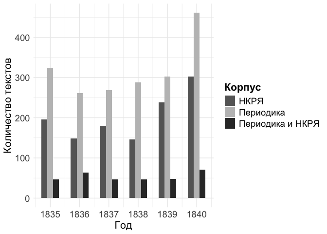
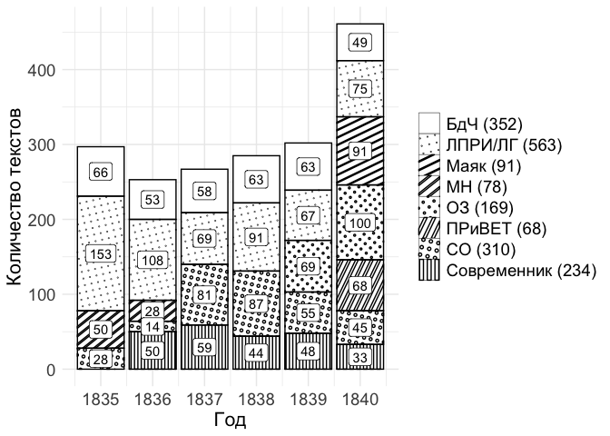

# Chapter 2.2. Poems in periodicals: statistics

``` r
library(tidyverse)
```

    ── Attaching core tidyverse packages ──────────────────────── tidyverse 2.0.0 ──
    ✔ dplyr     1.1.4     ✔ readr     2.1.4
    ✔ forcats   1.0.0     ✔ stringr   1.5.0
    ✔ ggplot2   3.5.1     ✔ tibble    3.2.1
    ✔ lubridate 1.9.3     ✔ tidyr     1.3.1
    ✔ purrr     1.0.2     
    ── Conflicts ────────────────────────────────────────── tidyverse_conflicts() ──
    ✖ dplyr::filter() masks stats::filter()
    ✖ dplyr::lag()    masks stats::lag()
    ℹ Use the conflicted package (<http://conflicted.r-lib.org/>) to force all conflicts to become errors

``` r
# library(treemap)
library(MetBrewer)
library(ggpattern)
theme_set(theme_minimal())
```

``` r
MetBrewer::colorblind_palettes

met.brewer(MetBrewer::colorblind_palettes[24])
```

## Data compilation

Load full metadata

``` r
# load periodicals data stored separately
per_t <- readRDS("../../data/corpus1835/corpus_1835.Rds")

# read texts
per_texts <- read.csv("../../data/corpus1835/sql_db/texts_metadata.csv") %>% 
  filter(str_detect(text_id, "^P_"))

# read sources metadata
per_sources <- read.csv("../../data/corpus1835/sql_db/sources.csv") %>% 
  filter(type == "periodicals") %>% 
  # remove unnecessary vars
  select(source_id, book_title, year)

# attach sources to texts
per_full <- per_texts %>% 
  left_join(per_sources, by = "source_id") %>% 
  left_join(per_t %>% select(text_id, text_lemm))
```

    Joining with `by = join_by(text_id)`

``` r
glimpse(per_full)
```

    Rows: 1,905
    Columns: 15
    $ X             <int> 1, 2, 3, 4, 5, 6, 7, 8, 9, 10, 11, 12, 13, 14, 15, 16, 1…
    $ text_id       <chr> "P_1", "P_10", "P_100", "P_1000", "P_1001", "P_1002", "P…
    $ source_id     <chr> "Per_1", "Per_2", "Per_3", "Per_4", "Per_4", "Per_4", "P…
    $ A_ID          <chr> "", "A_50", "A_7", "A_41", "A_139", "A_11", "A_163", "A_…
    $ text_title    <chr> "Солдатская песня", "Молния", "Ночлег чумаков", "Утешите…
    $ text_subtitle <chr> "", "", "Сельские картины", "", "", "", "", "", "", "", …
    $ first_line    <chr> "Ох жизнь, молодецкая", "Зачем с небесной высоты", "В бл…
    $ text_page     <chr> "C. 46", "C. 21", "C. 9-12", "C. 172-174", "C. 175-176",…
    $ corpus        <chr> "per", "per", "per", "per", "per", "per", "per", "per", …
    $ n_lines       <int> 38, 16, 98, 77, 28, 12, 44, 25, 31, 28, 100, 16, 17, 60,…
    $ meter         <chr> "Other", "Iamb", "Iamb", "Iamb", "Trochee", "Iamb", "Oth…
    $ feet          <chr> "?", "3", "4", "4", "4", "4", "?", "4", "6", "5", "4", "…
    $ book_title    <chr> "Сев_пч", "БдЧ", "БдЧ", "Совр", "Совр", "Совр", "Совр", …
    $ year          <int> 1835, 1835, 1836, 1838, 1838, 1838, 1838, 1838, 1838, 18…
    $ text_lemm     <chr> "ох, жизнь молодецкий,\nбравый, солдатский!\nкак осенний…

Attach authors data: check if all author’s names are complete

``` r
# attach RP and gender columns from authors-meta
# load authors-meta
authors_meta <- read.csv("../../data/corpus1835/sql_db/authors.csv")

# glimpse(authors_meta)

# attach only gender by A_ID
per <- per_full %>% 
  left_join(authors_meta %>% 
              select(A_ID, author_name, RP_loc, author_sex,
                     year_birth, year_death), 
            by = "A_ID") %>% 
  rename(author_text = author_name)

glimpse(per)
```

    Rows: 1,905
    Columns: 20
    $ X             <int> 1, 2, 3, 4, 5, 6, 7, 8, 9, 10, 11, 12, 13, 14, 15, 16, 1…
    $ text_id       <chr> "P_1", "P_10", "P_100", "P_1000", "P_1001", "P_1002", "P…
    $ source_id     <chr> "Per_1", "Per_2", "Per_3", "Per_4", "Per_4", "Per_4", "P…
    $ A_ID          <chr> "", "A_50", "A_7", "A_41", "A_139", "A_11", "A_163", "A_…
    $ text_title    <chr> "Солдатская песня", "Молния", "Ночлег чумаков", "Утешите…
    $ text_subtitle <chr> "", "", "Сельские картины", "", "", "", "", "", "", "", …
    $ first_line    <chr> "Ох жизнь, молодецкая", "Зачем с небесной высоты", "В бл…
    $ text_page     <chr> "C. 46", "C. 21", "C. 9-12", "C. 172-174", "C. 175-176",…
    $ corpus        <chr> "per", "per", "per", "per", "per", "per", "per", "per", …
    $ n_lines       <int> 38, 16, 98, 77, 28, 12, 44, 25, 31, 28, 100, 16, 17, 60,…
    $ meter         <chr> "Other", "Iamb", "Iamb", "Iamb", "Trochee", "Iamb", "Oth…
    $ feet          <chr> "?", "3", "4", "4", "4", "4", "?", "4", "6", "5", "4", "…
    $ book_title    <chr> "Сев_пч", "БдЧ", "БдЧ", "Совр", "Совр", "Совр", "Совр", …
    $ year          <int> 1835, 1835, 1836, 1838, 1838, 1838, 1838, 1838, 1838, 18…
    $ text_lemm     <chr> "ох, жизнь молодецкий,\nбравый, солдатский!\nкак осенний…
    $ author_text   <chr> NA, "Якубович Л.А.", "Кольцов А.В.", "Глинка Ф.Н.", "Про…
    $ RP_loc        <chr> NA, NA, "3-33", "1-578", "5-151", "5", "2-13", "1-578", …
    $ author_sex    <chr> NA, "m", "m", "m", "m", "m", "m", "m", "m", "m", "m", "f…
    $ year_birth    <chr> NA, "1805", "1809", "1786", "1810", "1799", "1812", "178…
    $ year_death    <chr> NA, "1839", "1842", "1880", "1857", "1837", "1848", "188…

``` r
# fill NA as empty values
per[is.na(per)] <- ""

rm(per_full, per_t, per_sources, per_texts, authors_meta)
```

## RNC comparison

``` r
# RNC data
load("../../data/nkrja_19th_lem.Rda")

rnc_authors <- c19 %>% 
    select(author) %>% 
    mutate(author = str_remove_all(author, "[[:space:]]|[[:punct:]]")) %>% 
    distinct() %>% 
    pull()

head(rnc_authors)
```

    [1] "ССБобров"    "САТучков"    "ССПестов"    "ППСумароков" "НССмирнов"  
    [6] "ПАСловцов"  

``` r
# rm(c19)
```

## 2.1. Periodicals vs RNC

Comparison on number of authors

``` r
print("Total number of authors in periodicals:")
```

    [1] "Total number of authors in periodicals:"

``` r
per %>% 
    filter(A_ID != "" & author_text != "") %>% # nrow() # 1464 poems are with known author
    select(author_text) %>% 
    count(author_text, sort = T) %>% nrow() 
```

    [1] 186

``` r
print("Number of authors with biography in RP:")
```

    [1] "Number of authors with biography in RP:"

``` r
per %>% 
    filter(RP_loc != "") %>% # nrow() # 1197 poems by authors known by RP
    select(RP_loc) %>% 
    count(RP_loc, sort = T) %>% nrow() 
```

    [1] 128

``` r
print("Number of authors included in RNC")
```

    [1] "Number of authors included in RNC"

``` r
per %>% 
    filter(author_text != "") %>% 
    select(author_text) %>% 
    mutate(author = str_replace_all(author_text, 
                                    "(.*?[[:space:]])(\\w\\.\\w.)", 
                                    "\\2\\1")) %>% 
    mutate(author = str_remove_all(author, "[[:space:]]|[[:punct:]]")) %>% 
    distinct() %>% 
    filter(author %in% rnc_authors) %>% 
    nrow() # 58 
```

    [1] 58

### Textual intersections between RNC & periodicals

-   Create for each poem an id column containing two first lines
-   Mark the intersection with a special tag

``` r
periodicals <- per %>% 
    mutate(doublesCheck = str_extract(text_lemm, "^.*?\n.*?\n.*?\n")) %>% 
    mutate(doublesCheck = str_remove_all(doublesCheck, "[[:punct:]]|[[:space:]]")) 

glimpse(periodicals)
```

    Rows: 1,905
    Columns: 21
    $ X             <int> 1, 2, 3, 4, 5, 6, 7, 8, 9, 10, 11, 12, 13, 14, 15, 16, 1…
    $ text_id       <chr> "P_1", "P_10", "P_100", "P_1000", "P_1001", "P_1002", "P…
    $ source_id     <chr> "Per_1", "Per_2", "Per_3", "Per_4", "Per_4", "Per_4", "P…
    $ A_ID          <chr> "", "A_50", "A_7", "A_41", "A_139", "A_11", "A_163", "A_…
    $ text_title    <chr> "Солдатская песня", "Молния", "Ночлег чумаков", "Утешите…
    $ text_subtitle <chr> "", "", "Сельские картины", "", "", "", "", "", "", "", …
    $ first_line    <chr> "Ох жизнь, молодецкая", "Зачем с небесной высоты", "В бл…
    $ text_page     <chr> "C. 46", "C. 21", "C. 9-12", "C. 172-174", "C. 175-176",…
    $ corpus        <chr> "per", "per", "per", "per", "per", "per", "per", "per", …
    $ n_lines       <int> 38, 16, 98, 77, 28, 12, 44, 25, 31, 28, 100, 16, 17, 60,…
    $ meter         <chr> "Other", "Iamb", "Iamb", "Iamb", "Trochee", "Iamb", "Oth…
    $ feet          <chr> "?", "3", "4", "4", "4", "4", "?", "4", "6", "5", "4", "…
    $ book_title    <chr> "Сев_пч", "БдЧ", "БдЧ", "Совр", "Совр", "Совр", "Совр", …
    $ year          <int> 1835, 1835, 1836, 1838, 1838, 1838, 1838, 1838, 1838, 18…
    $ text_lemm     <chr> "ох, жизнь молодецкий,\nбравый, солдатский!\nкак осенний…
    $ author_text   <chr> "", "Якубович Л.А.", "Кольцов А.В.", "Глинка Ф.Н.", "Про…
    $ RP_loc        <chr> "", "", "3-33", "1-578", "5-151", "5", "2-13", "1-578", …
    $ author_sex    <chr> "", "m", "m", "m", "m", "m", "m", "m", "m", "m", "m", "f…
    $ year_birth    <chr> "", "1805", "1809", "1786", "1810", "1799", "1812", "178…
    $ year_death    <chr> "", "1839", "1842", "1880", "1857", "1837", "1848", "188…
    $ doublesCheck  <chr> "охжизньмолодецкийбравыйсолдатскийкакосеннийноченька", "…

``` r
nkrja19 <- c19 %>% 
    rename(index = `Unnamed..0`,
          text_lemm = lemma) %>% 
    select(index, author, text_lemm) %>%
    mutate(doublesCheck = str_extract(text_lemm, "^.*?\n.*?\n.*?\n")) %>% 
    mutate(doublesCheck = str_remove_all(doublesCheck, "[[:punct:]]|[[:space:]]"))

glimpse(nkrja19)
```

    Rows: 15,569
    Columns: 4
    $ index        <int> 1, 2, 3, 4, 5, 6, 7, 8, 9, 10, 11, 12, 13, 14, 15, 16, 17…
    $ author       <chr> "С. С. Бобров", "С. С. Бобров", "С. С. Бобров", "С. С. Бо…
    $ text_lemm    <chr> "еще вкруг солнцев не вращаться \n в превыспренний страна…
    $ doublesCheck <chr> "ещевкругсолнцевневращатьсявпревыспреннийстранамирещевхао…

``` r
doubles_id <- periodicals %>% 
    rename(per_text_lemm = text_lemm) %>% 
    inner_join(nkrja19, by = "doublesCheck") %>% 
    select(index, text_id, year, A_ID, author_text, author, doublesCheck, per_text_lemm, text_lemm) %>% 
  filter(doublesCheck != "")

doubles_id %>% select(-text_lemm, -per_text_lemm) %>% head
```

      index text_id year  A_ID   author_text         author
    1  1232    P_10 1835  A_50 Якубович Л.А. Л. А. Якубович
    2  6656   P_100 1836   A_7  Кольцов А.В.  А. В. Кольцов
    3 14680  P_1006 1838 A_154   Тютчев Ф.И.   Ф. И. Тютчев
    4 14682  P_1010 1838 A_154   Тютчев Ф.И.   Ф. И. Тютчев
    5 12483  P_1014 1838  A_11   Пушкин А.С.   А. С. Пушкин
    6  6729  P_1015 1838   A_7  Кольцов А.В.  А. В. Кольцов
                                                                            doublesCheck
    1                               зачемснебесныйвысотаизгорнийжильеналонобурямчатьсяты
    2                      вблизидорогастолбовойночеватьтаборкочевойсынукраинапривольный
    3 ираспроститьсястревогажитейскийикипарисныйрощазаслонясьблаженныйтеньтеньэлисейский
    4              смотретькакзападразгоратьсявечернийзареволучвостокпомеркнутьодеваться
    5                     какойночьморозтрескучийнанебониединыйтучакакшитьпологсинийсвод
    6                                      глубокийвечностьоглашатьсясловомтословодабыть

``` r
print("Total number of intersected texts:")
```

    [1] "Total number of intersected texts:"

``` r
nrow(doubles_id)
```

    [1] 323

``` r
print("Total number of texts in periodicals:")
```

    [1] "Total number of texts in periodicals:"

``` r
nrow(periodicals)
```

    [1] 1905

``` r
print("Total % of intersected texts out for all periodicals texts:")
```

    [1] "Total % of intersected texts out for all periodicals texts:"

``` r
round( (nrow(doubles_id)/nrow(periodicals))*100 , 2) 
```

    [1] 16.96

``` r
# glimpse(doubles_id)

doubles_counts <- doubles_id %>% 
    count(year) %>% 
    mutate(group = "Периодика и НКРЯ")

doubles_counts %>% pivot_wider(names_from = year, values_from = n)
```

    # A tibble: 1 × 7
      group            `1835` `1836` `1837` `1838` `1839` `1840`
      <chr>             <int>  <int>  <int>  <int>  <int>  <int>
    1 Периодика и НКРЯ     47     64     47     46     48     71

### Plot 2.2.1

``` r
rnc_1835 <- c19 %>% 
    rename(index = `Unnamed..0`) %>% 
    # remove intersection
    #anti_join(doubles_id %>% select(index), by = "index") %>%

    # calculate number of unique poems
    filter(year > 1834 & year < 1841) %>% 
    count(year, sort = F) %>% 
    mutate(group = "НКРЯ")

rnc_1835 %>% pivot_wider(names_from = year, values_from = n)
```

    # A tibble: 1 × 7
      group `1835` `1836` `1837` `1838` `1839` `1840`
      <chr>  <int>  <int>  <int>  <int>  <int>  <int>
    1 НКРЯ     196    149    180    146    238    303

``` r
counter_1835 <- per %>% 
    # remove intersection
    #anti_join(doubles_id %>% select(id), by = "id") %>%

    count(year, sort = F) %>% 
    mutate(group = "Периодика") %>%
    rbind(rnc_1835, doubles_counts)

counter_1835 %>% pivot_wider(names_from = year, values_from = n)
```

    # A tibble: 3 × 7
      group            `1835` `1836` `1837` `1838` `1839` `1840`
      <chr>             <int>  <int>  <int>  <int>  <int>  <int>
    1 Периодика           324    261    269    288    302    461
    2 НКРЯ                196    149    180    146    238    303
    3 Периодика и НКРЯ     47     64     47     46     48     71

``` r
p2_2_1 <- counter_1835 %>%
    ggplot(aes(x = year, y = n, fill = group)) + 
    geom_col(position = "dodge", width = 0.6) + 
    scale_fill_manual(values = c(met.brewer("Veronese")[5], # dark green
                                 met.brewer("Veronese")[3], # light yellow
                                 met.brewer("Veronese")[1] # dark red
                                )) + 
    scale_x_continuous(breaks = 1835:1840) +
    theme(axis.text = element_text(size = 14),
         axis.title = element_text(size = 16),
         legend.title = element_text(size = 16, face = "bold"),
         legend.text = element_text(size = 14)) + 
    labs(x = "Год",
        y = "Количество текстов",
        fill = "Корпус")

p2_2_1
```


#### bw version

``` r
p2_2_1 <- counter_1835 %>%
    ggplot(aes(x = year, y = n, fill = group)) + 
    geom_col(position = "dodge", width = 0.6) + 
    scale_fill_manual(values = c("grey40",
                                 "grey75",
                                 "grey20"
                                )) + 
    scale_x_continuous(breaks = 1835:1840) +
    theme(axis.text = element_text(size = 14),
         axis.title = element_text(size = 16),
         legend.title = element_text(size = 16, face = "bold"),
         legend.text = element_text(size = 14)) + 
    labs(x = "Год",
        y = "Количество текстов",
        fill = "Корпус")

p2_2_1
```



``` r
ggsave(file = "plots/Fig_2-2-1.png", plot = p2_2_1, dpi = 300,
      width = 8, height = 6, bg = "white")

ggsave(file = "plots/bw/Fig_2-2-1.png", plot = p2_2_1, dpi = 300,
      width = 8, height = 6, bg = "white")
```

``` r
rm(c19, counter_1835, doubles_counts, doubles_id, nkrja19, p2_2_1, rnc_1835, rnc_authors)
```

## 2.2.1. Sources statistics

Analysis of poems published in different sources (journals & newspapers)
and by different authors

``` r
# glimpse(per)

per <- per %>% 
  rename(PER_ID = book_title)

unique(per$PER_ID)
```

     [1] "Сев_пч"   "БдЧ"      "Совр"     "ОЗ"       "ЛПРИ"     "ЛГ"      
     [7] "СО"       "МН"       "Маяк"     "Телескоп" "СОиСА"    "ПРиВЕТ"  

``` r
names <- tibble(PER_ID = unique(per$PER_ID),
       per_name = c("СП", "БдЧ", "Современник", "ОЗ", "ЛПРИ/ЛГ", "ЛПРИ/ЛГ", "СО",
                    "МН", "Маяк", "Телескоп", "СО", "ПРиВЕТ"))

per <- per %>% 
  left_join(names, by = "PER_ID")

rm(names)
```

### Plot 2.2.2

``` r
lbl <- per %>% 
  filter(!PER_ID %in% c("Молва", "Сев_пч", "Телескоп")) %>% 
  group_by(per_name) %>% 
  count() %>% 
  mutate(lable = paste0(per_name, " (", n, ")")) %>% 
  select(-n)
```

``` r
per %>% 
  filter(!PER_ID %in% c("Молва", "Сев_пч", "Телескоп")) %>% 
  group_by(year, per_name) %>% 
  count() %>% 
  left_join(lbl, by = "per_name") %>% 
  ggplot(aes(x = year, y = n, fill = lable)) + 
  geom_col() + 
  geom_text(aes(x = year, y = n, label = n), 
            position = position_stack(vjust = .5), 
            color = "white") + 
  scale_x_continuous(breaks = 1835:1840) +
  scale_fill_manual(values = c(met.brewer("Veronese")[1], 
                               met.brewer("Veronese")[3],
                               met.brewer("Veronese")[4:5],
                               met.brewer("Veronese")[7],
                               met.brewer("Veronese")[2],
                               met.brewer("Johnson")[4],
                               met.brewer("Kandinsky")[3])) + 
  theme(axis.text = element_text(size = 14),
         axis.title = element_text(size = 16),
         legend.title = element_text(size = 16, face = "bold"),
         legend.text = element_text(size = 14)) + 
  labs(x = "Год", y = "Количество текстов", fill = "")
```


``` r
ggsave(file = "plots/Fig_2-2-2.png", plot = last_plot(), dpi = 300,
      width = 8, height = 6, bg = "white")
```

#### bw version

``` r
per %>% 
  filter(!PER_ID %in% c("Молва", "Сев_пч", "Телескоп")) %>% 
  group_by(year, per_name) %>% 
  count() %>% 
  left_join(lbl, by = "per_name") %>% 
  #filter(per_name %in% c("БдЧ", "ЛПРИ/ЛГ", "Маяк", "МН", "ОЗ")) %>% 
  ggplot(aes(x = year, y = n, fill = lable)) + 
  geom_col_pattern(aes(pattern = lable, 
                       pattern_angle = lable,
                       pattern_density = lable),
                   #pattern = 'pch',
                   fill = 'white',
                   colour = 'black', 
                   #pattern_density = 0.5, 
                   pattern_fill = 'white',
                   pattern_colour  = 'black',
                   pattern_spacing = 0.02) +
  
  scale_pattern_manual(values=c('stripe', 'circle', 'stripe', 'stripe', 'pch',
                             'stripe', 'pch', 'stripe'
                             )) +
  # scale_pattern_type_manual(values=c(NA, NA, NA, 'triangle', 'sine')) 
  # 
  geom_label(aes(x = year, y = n, label = n, group = lable),
            position = position_stack(vjust=0.5),
            fill = "white"
            ) +
  scale_x_continuous(breaks = 1835:1840) +
  #scale_fill_manual(values = c()) +
  theme(axis.text = element_text(size = 14),
         axis.title = element_text(size = 16),
         #legend.title = element_text(size = 16, face = "bold"),
         legend.title = element_blank(),
         legend.text = element_text(size = 14)) +
  labs(x = "Год", y = "Количество текстов")
```



``` r
ggsave(file = "plots/bw/Fig_2-2-2.png", plot = last_plot(), dpi = 300,
      width = 8, height = 6, bg = "white")
```

## Table 2.2.4

-   count most prominent authors in a journal (total years) to highlight
    table 2.2.4

-   authors’ age info

Count total number of texts by different authors in each source

``` r
per %>%
  #filter(year == "1835") %>%
  filter(author_text != "" & !per_name %in% c("Телескоп", "СП")) %>%
  group_by(per_name, year) %>%
  count(author_text, sort = T) %>%
  slice_max(order_by = n, n = 5) %>%
  #ungroup() %>% 
  mutate(author_text = paste0(author_text, " (", n, ")")) %>% 
  select(-n) %>% 
  summarise(
    per_name = per_name,
    year = year,
    author_names = paste0(author_text, collapse = ", ")) %>% 
  ungroup() %>% 
  distinct() %>% 
  arrange(-desc(as.numeric(year))) 
```

    Warning: Returning more (or less) than 1 row per `summarise()` group was deprecated in
    dplyr 1.1.0.
    ℹ Please use `reframe()` instead.
    ℹ When switching from `summarise()` to `reframe()`, remember that `reframe()`
      always returns an ungrouped data frame and adjust accordingly.

    `summarise()` has grouped output by 'per_name', 'year'. You can override using
    the `.groups` argument.

    # A tibble: 29 × 3
       per_name     year author_names                                               
       <chr>       <int> <chr>                                                      
     1 БдЧ          1835 Пушкин А.С. (16), Козлов И.И. (11), Ершов П.П. (6), Якубов…
     2 ЛПРИ/ЛГ      1835 Глинка Ф.Н. (7), Менцов Ф.Н. (7), Галанин И.Д. (6), Демидо…
     3 МН           1835 Ознобишин Д.П. (5), Теплова Н.С. (5), Баратынский Е.А. (4)…
     4 СО           1835 Тимофеев А.В. (6), Шаликов П.И. (4), Булгаков А.И. (3), Во…
     5 БдЧ          1836 Козлов И.И. (12), Тимофеев А.В. (9), Бенедиктов В.Г. (6), …
     6 ЛПРИ/ЛГ      1836 Демидов М.А. (10), Мызников В.Я. (7), Фон-Бейер Г. (5), Гл…
     7 МН           1836 Стромилов С.И. (4), Волконская З.А. (3), Ознобишин Д.П. (3…
     8 СО           1836 Кони Ф.А. (3), Бороздна И.П. (2), Александров Б. (1), Крыл…
     9 Современник  1836 Тютчев Ф.И. (24), Пушкин А.С. (4), Давыдов Д.В. (3), Якубо…
    10 БдЧ          1837 Тимофеев А.В. (11), Бернет Е. (10), Кропоткин Д.А. (7), Ве…
    # ℹ 19 more rows

Table 2.2.4 most prominent authors highlighting base

``` r
per %>% 
  filter(author_text != "") %>% 
  group_by(per_name) %>%
  count(author_text, sort = T) %>% 
  slice_max(order_by = n, n = 6) %>% 
  arrange(-desc(per_name))
```

    # A tibble: 65 × 3
    # Groups:   per_name [10]
       per_name author_text          n
       <chr>    <chr>            <int>
     1 БдЧ      Тимофеев А.В.       27
     2 БдЧ      Козлов И.И.         26
     3 БдЧ      Кропоткин Д.А.      19
     4 БдЧ      Пушкин А.С.         17
     5 БдЧ      Бернет Е.           15
     6 БдЧ      Ершов П.П.          15
     7 ЛПРИ/ЛГ  Якубович Л.А.       26
     8 ЛПРИ/ЛГ  Соколовский В.И.    16
     9 ЛПРИ/ЛГ  Стромилов С.И.      16
    10 ЛПРИ/ЛГ  Демидов М.А.        15
    # ℹ 55 more rows

### authors age

``` r
glimpse(per)
```

    Rows: 1,905
    Columns: 21
    $ X             <int> 1, 2, 3, 4, 5, 6, 7, 8, 9, 10, 11, 12, 13, 14, 15, 16, 1…
    $ text_id       <chr> "P_1", "P_10", "P_100", "P_1000", "P_1001", "P_1002", "P…
    $ source_id     <chr> "Per_1", "Per_2", "Per_3", "Per_4", "Per_4", "Per_4", "P…
    $ A_ID          <chr> "", "A_50", "A_7", "A_41", "A_139", "A_11", "A_163", "A_…
    $ text_title    <chr> "Солдатская песня", "Молния", "Ночлег чумаков", "Утешите…
    $ text_subtitle <chr> "", "", "Сельские картины", "", "", "", "", "", "", "", …
    $ first_line    <chr> "Ох жизнь, молодецкая", "Зачем с небесной высоты", "В бл…
    $ text_page     <chr> "C. 46", "C. 21", "C. 9-12", "C. 172-174", "C. 175-176",…
    $ corpus        <chr> "per", "per", "per", "per", "per", "per", "per", "per", …
    $ n_lines       <int> 38, 16, 98, 77, 28, 12, 44, 25, 31, 28, 100, 16, 17, 60,…
    $ meter         <chr> "Other", "Iamb", "Iamb", "Iamb", "Trochee", "Iamb", "Oth…
    $ feet          <chr> "?", "3", "4", "4", "4", "4", "?", "4", "6", "5", "4", "…
    $ PER_ID        <chr> "Сев_пч", "БдЧ", "БдЧ", "Совр", "Совр", "Совр", "Совр", …
    $ year          <int> 1835, 1835, 1836, 1838, 1838, 1838, 1838, 1838, 1838, 18…
    $ text_lemm     <chr> "ох, жизнь молодецкий,\nбравый, солдатский!\nкак осенний…
    $ author_text   <chr> "", "Якубович Л.А.", "Кольцов А.В.", "Глинка Ф.Н.", "Про…
    $ RP_loc        <chr> "", "", "3-33", "1-578", "5-151", "5", "2-13", "1-578", …
    $ author_sex    <chr> "", "m", "m", "m", "m", "m", "m", "m", "m", "m", "m", "f…
    $ year_birth    <chr> "", "1805", "1809", "1786", "1810", "1799", "1812", "178…
    $ year_death    <chr> "", "1839", "1842", "1880", "1857", "1837", "1848", "188…
    $ per_name      <chr> "СП", "БдЧ", "БдЧ", "Современник", "Современник", "Совре…

``` r
per_total <- per %>% 
  count(per_name) %>% 
  rename(total = n)

authors_known <- per %>% 
  #filter(author_text != "") %>% 
  mutate(age_known = ifelse(year_birth != "",
                            1, 0)) %>% 
  select(year, per_name, author_text, age_known) #%>% 
  #distinct()

# % of texts with authors of known age
authors_known %>% 
  count(per_name, age_known) %>% 
  left_join(per_total, by = "per_name") %>% 
  mutate(perc = round((n/total)*100, 1 ))
```

          per_name age_known   n total perc
    1          БдЧ         0  87   352 24.7
    2          БдЧ         1 265   352 75.3
    3      ЛПРИ/ЛГ         0 270   563 48.0
    4      ЛПРИ/ЛГ         1 293   563 52.0
    5           МН         0  19    78 24.4
    6           МН         1  59    78 75.6
    7         Маяк         0  40    91 44.0
    8         Маяк         1  51    91 56.0
    9           ОЗ         0   2   169  1.2
    10          ОЗ         1 167   169 98.8
    11      ПРиВЕТ         0  10    68 14.7
    12      ПРиВЕТ         1  58    68 85.3
    13          СО         0 126   310 40.6
    14          СО         1 184   310 59.4
    15          СП         0   9    13 69.2
    16          СП         1   4    13 30.8
    17 Современник         0  31   234 13.2
    18 Современник         1 203   234 86.8
    19    Телескоп         0   7    27 25.9
    20    Телескоп         1  20    27 74.1

``` r
unique(per$year_birth)
```

     [1] ""        "1805"    "1809"    "1786"    "1810"    "1799"    "1812"   
     [8] "1803"    "1793"    "1811"    "1817"    "1779"    "1818"    "1815"   
    [15] "1792"    "ок 1810" "1807"    "1804"    "1822"    "1800"    "1783"   
    [22] "1784"    "1814"    "1808"    "1813"    "1819"    "1806"    "1798"   
    [29] "1801"    "1766"    "1788"    "1769"    "1772"    "1768"    "1795"   
    [36] "1797"    "1789"    "1790"    "1821"    "1777"    "1816"    "1754"   
    [43] "1776"    "1787"    "1820"    "1802"   

``` r
unique(per$year_death)
```

     [1] ""           "1839"       "1842"       "1880"       "1857"      
     [6] "1837"       "1848"       "1873"       "после 1846" "1858"      
    [11] "1865"       "1840"       "1875"       "1883"       "1868"      
    [16] "1893"       "1869"       "1853"       "после 1862" "1890"      
    [21] "ок 1846"    "1862"       "1894"       "1877"       "1887"      
    [26] "1899"       "1844"       "1864"       "1852"       "1895"      
    [31] "1812"       "1841"       "1860"       "1866"       "1855"      
    [36] "1878"       "1854"       "1838"       "1898"       "1879"      
    [41] "1882"       "1845"       "1874"       "1850"       "1831"      
    [46] "1870"       "1886"       "1843"       "1836"       "1856"      
    [51] "после 1837" "1888"       "после 1875" "1861"       "после 1852"
    [56] "1846"       "1847"       "до 1885"    "1876"       "1829"      
    [61] "1849"       "1832"       "1863"       "1896"       "после 1867"
    [66] "1891"       "1897"       "1867"       "после 1869" "1872"      
    [71] "1828"      

``` r
# mean and median age of authors for the whole period
per %>% 
  #filter(author_text != "") %>% 
  mutate(age_known = ifelse(year_birth != "",
                            1, 0)) %>% 
  filter(age_known == 1) %>% 
  mutate(year_birth = as.numeric(str_remove(year_birth, "^\\w+\\s")),
         age = year - year_birth) %>% 
  select(per_name, author_text, year_birth, year, age) %>% 
  group_by(per_name) %>% 
  summarise(per_name = per_name,
            mean_age = round(mean(age), 1),
            median_age = round(median(age), 1)
            ) %>% distinct() %>% 
  arrange(-desc(mean_age))
```

    Warning: Returning more (or less) than 1 row per `summarise()` group was deprecated in
    dplyr 1.1.0.
    ℹ Please use `reframe()` instead.
    ℹ When switching from `summarise()` to `reframe()`, remember that `reframe()`
      always returns an ungrouped data frame and adjust accordingly.

    `summarise()` has grouped output by 'per_name'. You can override using the
    `.groups` argument.

    # A tibble: 10 × 3
    # Groups:   per_name [10]
       per_name    mean_age median_age
       <chr>          <dbl>      <dbl>
     1 Телескоп        24.3         25
     2 ОЗ              30.2         30
     3 СО              30.3         29
     4 ЛПРИ/ЛГ         30.5         29
     5 МН              30.6         30
     6 ПРиВЕТ          30.9         31
     7 БдЧ             31.1         28
     8 Современник     32.5         33
     9 Маяк            35           36
    10 СП              55.2         57

``` r
# distribution of mean age over time
per %>% 
  #filter(author_text != "") %>% 
  mutate(age_known = ifelse(year_birth != "",
                            1, 0)) %>% 
  filter(age_known == 1) %>% 
  mutate(year_birth = as.numeric(str_remove(year_birth, "^\\w+\\s")),
         age = year - year_birth) %>% 
  select(per_name, author_text, year_birth, year, age) %>% 
  group_by(per_name, year) %>% 
  summarise(per_name = per_name,
            year = year,
            mean_age = round(mean(age), 1)) %>% distinct() %>% 
  arrange(-desc(mean_age)) %>% 
  arrange(-desc(year)) %>% 
  pivot_wider(names_from = year, values_from = mean_age)
```

    Warning: Returning more (or less) than 1 row per `summarise()` group was deprecated in
    dplyr 1.1.0.
    ℹ Please use `reframe()` instead.
    ℹ When switching from `summarise()` to `reframe()`, remember that `reframe()`
      always returns an ungrouped data frame and adjust accordingly.

    `summarise()` has grouped output by 'per_name', 'year'. You can override using
    the `.groups` argument.

    # A tibble: 10 × 7
    # Groups:   per_name [10]
       per_name    `1835` `1836` `1837` `1838` `1839` `1840`
       <chr>        <dbl>  <dbl>  <dbl>  <dbl>  <dbl>  <dbl>
     1 Телескоп      23.1   31     NA     NA     NA     NA  
     2 МН            29.9   31.5   NA     NA     NA     NA  
     3 ЛПРИ/ЛГ       31.9   31.5   31.7   31.2   27.6   27.5
     4 СО            32     35.3   30.4   29.7   29.3   29.9
     5 БдЧ           35.8   37.1   29.6   24.1   29     28.6
     6 СП            81     68     NA     36     NA     NA  
     7 Современник   NA     35.5   33.1   32.8   30.7   29.6
     8 ОЗ            NA     NA     NA     NA     30.7   29.9
     9 ПРиВЕТ        NA     NA     NA     NA     NA     30.9
    10 Маяк          NA     NA     NA     NA     NA     35  

``` r
# distribution of median age over time
per %>% 
  #filter(author_text != "") %>% 
  mutate(age_known = ifelse(year_birth != "",
                            1, 0)) %>% 
  filter(age_known == 1) %>% 
  mutate(year_birth = as.numeric(str_remove(year_birth, "^\\w+\\s")),
         age = year - year_birth) %>% 
  select(per_name, author_text, year_birth, year, age) %>% 
  group_by(per_name, year) %>% 
  summarise(per_name = per_name,
            year = year,
            mean_age = round(median(age), 1)) %>% distinct() %>% 
  arrange(-desc(mean_age)) %>% 
  arrange(-desc(year)) %>% 
  pivot_wider(names_from = year, values_from = mean_age)
```

    Warning: Returning more (or less) than 1 row per `summarise()` group was deprecated in
    dplyr 1.1.0.
    ℹ Please use `reframe()` instead.
    ℹ When switching from `summarise()` to `reframe()`, remember that `reframe()`
      always returns an ungrouped data frame and adjust accordingly.

    `summarise()` has grouped output by 'per_name', 'year'. You can override using
    the `.groups` argument.

    # A tibble: 10 × 7
    # Groups:   per_name [10]
       per_name    `1835` `1836` `1837` `1838` `1839` `1840`
       <chr>        <dbl>  <dbl>  <dbl>  <dbl>  <dbl>  <dbl>
     1 СО              23   29.5     30     28     29     32
     2 Телескоп        25   32       NA     NA     NA     NA
     3 МН              30   30       NA     NA     NA     NA
     4 ЛПРИ/ЛГ         31   32       29     29     26     26
     5 БдЧ             36   29       27     23     29     26
     6 СП              81   68       NA     36     NA     NA
     7 Современник     NA   33       34     32     28     29
     8 ОЗ              NA   NA       NA     NA     30     30
     9 ПРиВЕТ          NA   NA       NA     NA     NA     31
    10 Маяк            NA   NA       NA     NA     NA     36

``` r
per %>% 
  filter(per_name == "Маяк" & author_text != "") %>% 
  select(author_text, year_birth) %>% 
  distinct()
```

                     author_text year_birth
    1                Щеткин Я.А.       1817
    2              Корсаков П.А.       1790
    3              Макшеева В.Д.       1822
    4              Бороздна И.П.       1804
    5             Шаховской А.А.       1777
    6                Степанов С.           
    7                 Зотов В.Р.       1821
    8  Афанасьев-Чужбинский А.С.       1817
    9                Глебов А.Н.       1803
    10           Ободовский П.Г.       1803
    11              Корсакова Л.           
    12              Пальмин И.Д.       1803
    13            Кропоткин Д.А.       1818

### Authors rotation in journals

``` r
per %>% 
  filter(PER_ID == "БдЧ" & author_text != "") %>% 
  group_by(year) %>% 
  count(author_text, sort = T) %>% 
  mutate(rank = row_number()) %>% 
  ungroup() %>% 
  #filter(rank < 21) %>% 
  pivot_wider(!n, names_from = year, values_from = rank) %>% 
  select(author_text, `1835`, `1836`, `1837`, `1838`, `1839`, `1840`)
```

    Warning: Specifying the `id_cols` argument by position was deprecated in tidyr 1.3.0.
    ℹ Please explicitly name `id_cols`, like `id_cols = !n`.

    # A tibble: 76 × 7
       author_text    `1835` `1836` `1837` `1838` `1839` `1840`
       <chr>           <int>  <int>  <int>  <int>  <int>  <int>
     1 Пушкин А.С.         1     NA     13     NA     NA     NA
     2 Губер Э.И.         NA     NA     NA     NA     NA      1
     3 Козлов И.И.         2      1      8     NA     17     NA
     4 Тимофеев А.В.       9      2      1      4     22     NA
     5 Бернет Е.          NA     NA      2      8      4     NA
     6 Менцов Ф.Н.        22     NA     NA      1     10     NA
     7 Кропоткин Д.А.     NA     NA      3      3      1     NA
     8 Мейстер И.         NA     NA     NA      2      9     NA
     9 Греков Н.П.        NA     NA     NA     13     15      2
    10 Ершов П.П.          3     10     NA     15     NA      3
    # ℹ 66 more rows

``` r
  #filter(year == 1835)
```

``` r
# unite some journal's names
per <- per %>% 
  mutate(per_cln = ifelse(PER_ID == "СОиСА", "СО", PER_ID),
         per_cln = ifelse(PER_ID == "ЛГ", "ЛПРИ", per_cln))

# quick look on journal's existence (in data)
per %>% 
  count(year, per_cln) %>% 
  pivot_wider(names_from = year, values_from = n)
```

    # A tibble: 10 × 7
       per_cln  `1835` `1836` `1837` `1838` `1839` `1840`
       <chr>     <int>  <int>  <int>  <int>  <int>  <int>
     1 БдЧ          66     53     58     63     63     49
     2 ЛПРИ        153    108     69     91     67     75
     3 МН           50     28     NA     NA     NA     NA
     4 СО           28     14     81     87     55     45
     5 Сев_пч        7      1      2      3     NA     NA
     6 Телескоп     20      7     NA     NA     NA     NA
     7 Совр         NA     50     59     44     48     33
     8 ОЗ           NA     NA     NA     NA     69    100
     9 Маяк         NA     NA     NA     NA     NA     91
    10 ПРиВЕТ       NA     NA     NA     NA     NA     68

``` r
# selected journals
per_names <- c("БдЧ", "ЛПРИ", "СО", "Совр", "ОЗ")
```

Author’s appearances in a journal yearly

``` r
# per_names

p <- NULL
d <- NULL

for (i in 1:length(per_names)) {
  p <- per_names[i]
  
  print(p)
  
  d <- per %>% 
    filter(author_text != "") %>% 
    filter(per_cln == p) %>% 
    count(year, author_text) %>% 
    mutate(n = 1) %>% 
    pivot_wider(names_from = year, values_from = n, values_fill = 0) %>% 
    mutate(total = rowSums(select_if(., is.numeric))) %>% 
    arrange(desc(total))
  
  print(d)
  
}
```

    [1] "БдЧ"
    # A tibble: 76 × 8
       author_text     `1835` `1836` `1837` `1838` `1839` `1840` total
       <chr>            <dbl>  <dbl>  <dbl>  <dbl>  <dbl>  <dbl> <dbl>
     1 Тимофеев А.В.        1      1      1      1      1      0     5
     2 Ершов П.П.           1      1      0      1      0      1     4
     3 Козлов И.И.          1      1      1      0      1      0     4
     4 Бенедиктов В.Г.      0      1      1      0      1      1     4
     5 Менцов Ф.Н.          1      0      0      1      1      0     3
     6 Бернет Е.            0      0      1      1      1      0     3
     7 Кропоткин Д.А.       0      0      1      1      1      0     3
     8 Кукольник Н.В.       0      0      1      1      0      1     3
     9 Шахова Е.Н.          0      0      1      1      1      0     3
    10 Греков Н.П.          0      0      0      1      1      1     3
    # ℹ 66 more rows
    [1] "ЛПРИ"
    # A tibble: 99 × 8
       author_text      `1835` `1836` `1837` `1838` `1839` `1840` total
       <chr>             <dbl>  <dbl>  <dbl>  <dbl>  <dbl>  <dbl> <dbl>
     1 Якубович Л.А.         1      0      1      1      1      1     5
     2 Алексеев П.Ф.         1      1      0      1      1      0     4
     3 Менцов Ф.Н.           1      1      1      1      0      0     4
     4 Бенедиктов В.Г.       0      1      1      1      1      0     4
     5 Глинка Ф.Н.           1      1      1      0      0      0     3
     6 Греков Н.П.           1      0      0      0      1      1     3
     7 Федоров Б.М.          1      1      0      0      0      1     3
     8 Соколовский В.И.      0      0      1      1      1      0     3
     9 Стромилов С.И.        0      0      1      1      1      0     3
    10 Айбулат К.М.          0      0      0      1      1      1     3
    # ℹ 89 more rows
    [1] "СО"
    # A tibble: 65 × 8
       author_text     `1835` `1836` `1837` `1838` `1839` `1840` total
       <chr>            <dbl>  <dbl>  <dbl>  <dbl>  <dbl>  <dbl> <dbl>
     1 Гогниев И.Е.         1      0      0      1      1      1     4
     2 Кони Ф.А.            0      1      1      1      0      0     3
     3 Бенедиктов В.Г.      0      0      1      1      0      1     3
     4 Якубович Л.А.        0      0      1      1      1      0     3
     5 Кольцов А.В.         0      0      0      1      1      1     3
     6 Ростопчина Е.П.      0      0      0      1      1      1     3
     7 Сушков Д.П.          0      0      0      1      1      1     3
     8 Траум                0      0      0      1      1      1     3
     9 Менцов Ф.Н.          1      0      1      0      0      0     2
    10 Тимофеев А.В.        1      0      0      1      0      0     2
    # ℹ 55 more rows
    [1] "Совр"
    # A tibble: 51 × 7
       author_text      `1836` `1837` `1838` `1839` `1840` total
       <chr>             <dbl>  <dbl>  <dbl>  <dbl>  <dbl> <dbl>
     1 Баратынский Е.А.      1      1      1      1      1     5
     2 Жуковский В.А.        1      1      1      1      1     5
     3 Тютчев Ф.И.           1      1      1      1      1     5
     4 Пушкин А.С.           1      1      1      1      0     4
     5 Ростопчина Е.П.       0      1      1      1      1     4
     6 Вяземский П.А.        1      1      1      0      0     3
     7 Кольцов А.В.          1      0      1      1      0     3
     8 Якубович Л.А.         1      0      1      1      0     3
     9 Гребенка Е.П.         0      1      1      1      0     3
    10 Деларю М.Д.           0      1      1      1      0     3
    # ℹ 41 more rows
    [1] "ОЗ"
    # A tibble: 37 × 4
       author_text      `1839` `1840` total
       <chr>             <dbl>  <dbl> <dbl>
     1 Аксаков К.С.          1      1     2
     2 Баратынский Е.А.      1      1     2
     3 Вяземский П.А.        1      1     2
     4 Гребенка Е.П.         1      1     2
     5 Греков Н.П.           1      1     2
     6 Катков М.Н.           1      1     2
     7 Клюшников И.П.        1      1     2
     8 Кольцов А.В.          1      1     2
     9 Красов В.И.           1      1     2
    10 Лермонтов М.Ю.        1      1     2
    # ℹ 27 more rows

How many authors appeared in a journal only once (=with one poem) in a
year

``` r
unique(per$year)
```

    [1] 1835 1836 1838 1839 1840 1837

``` r
unique(per$per_cln)
```

     [1] "Сев_пч"   "БдЧ"      "Совр"     "ОЗ"       "ЛПРИ"     "СО"      
     [7] "МН"       "Маяк"     "Телескоп" "ПРиВЕТ"  

``` r
x <- NULL
x1 <- NULL
y <- NULL
p <- NULL
years <- NULL
sources <- NULL
perc <- NULL

for (i in 1:length(unique(per$year))) {
  
  y <- unique(per$year)[i]
  
  for (j in 1:length(per_names)) {
    
    p <- per_names[j]
    
    x <- per %>% 
      filter(per_cln == p & year %in% c(y) & author_text != "") %>% 
      count(author_text, sort = T) %>% nrow()

    x1 <- per %>% 
      filter(per_cln == p & year %in% c(y) & author_text != "") %>% 
      count(author_text, sort = T) %>% 
      filter(n == 1) %>% nrow()
    
    print(c("source: ", p, "year:", y, 
            "total authors:", x, "onetimers:", x1, "perc:", round(x1/x*100,1)))
    
    years <- c(years, y)
    sources <- c(sources, p)
    perc <- c(perc, (x1/x)*100)
    
  }
  
}
```

     [1] "source: "       "БдЧ"            "year:"          "1835"          
     [5] "total authors:" "25"             "onetimers:"     "16"            
     [9] "perc:"          "64"            
     [1] "source: "       "ЛПРИ"           "year:"          "1835"          
     [5] "total authors:" "33"             "onetimers:"     "20"            
     [9] "perc:"          "60.6"          
     [1] "source: "       "СО"             "year:"          "1835"          
     [5] "total authors:" "6"              "onetimers:"     "0"             
     [9] "perc:"          "0"             
     [1] "source: "       "Совр"           "year:"          "1835"          
     [5] "total authors:" "0"              "onetimers:"     "0"             
     [9] "perc:"          "NaN"           
     [1] "source: "       "ОЗ"             "year:"          "1835"          
     [5] "total authors:" "0"              "onetimers:"     "0"             
     [9] "perc:"          "NaN"           
     [1] "source: "       "БдЧ"            "year:"          "1836"          
     [5] "total authors:" "19"             "onetimers:"     "15"            
     [9] "perc:"          "78.9"          
     [1] "source: "       "ЛПРИ"           "year:"          "1836"          
     [5] "total authors:" "25"             "onetimers:"     "13"            
     [9] "perc:"          "52"            
     [1] "source: "       "СО"             "year:"          "1836"          
     [5] "total authors:" "4"              "onetimers:"     "2"             
     [9] "perc:"          "50"            
     [1] "source: "       "Совр"           "year:"          "1836"          
     [5] "total authors:" "9"              "onetimers:"     "4"             
     [9] "perc:"          "44.4"          
     [1] "source: "       "ОЗ"             "year:"          "1836"          
     [5] "total authors:" "0"              "onetimers:"     "0"             
     [9] "perc:"          "NaN"           
     [1] "source: "       "БдЧ"            "year:"          "1838"          
     [5] "total authors:" "23"             "onetimers:"     "13"            
     [9] "perc:"          "56.5"          
     [1] "source: "       "ЛПРИ"           "year:"          "1838"          
     [5] "total authors:" "29"             "onetimers:"     "12"            
     [9] "perc:"          "41.4"          
     [1] "source: "       "СО"             "year:"          "1838"          
     [5] "total authors:" "31"             "onetimers:"     "16"            
     [9] "perc:"          "51.6"          
     [1] "source: "       "Совр"           "year:"          "1838"          
     [5] "total authors:" "21"             "onetimers:"     "10"            
     [9] "perc:"          "47.6"          
     [1] "source: "       "ОЗ"             "year:"          "1838"          
     [5] "total authors:" "0"              "onetimers:"     "0"             
     [9] "perc:"          "NaN"           
     [1] "source: "       "БдЧ"            "year:"          "1839"          
     [5] "total authors:" "26"             "onetimers:"     "15"            
     [9] "perc:"          "57.7"          
     [1] "source: "       "ЛПРИ"           "year:"          "1839"          
     [5] "total authors:" "25"             "onetimers:"     "11"            
     [9] "perc:"          "44"            
     [1] "source: "       "СО"             "year:"          "1839"          
     [5] "total authors:" "21"             "onetimers:"     "14"            
     [9] "perc:"          "66.7"          
     [1] "source: "       "Совр"           "year:"          "1839"          
     [5] "total authors:" "22"             "onetimers:"     "14"            
     [9] "perc:"          "63.6"          
     [1] "source: "       "ОЗ"             "year:"          "1839"          
     [5] "total authors:" "27"             "onetimers:"     "16"            
     [9] "perc:"          "59.3"          
     [1] "source: "       "БдЧ"            "year:"          "1840"          
     [5] "total authors:" "8"              "onetimers:"     "1"             
     [9] "perc:"          "12.5"          
     [1] "source: "       "ЛПРИ"           "year:"          "1840"          
     [5] "total authors:" "16"             "onetimers:"     "10"            
     [9] "perc:"          "62.5"          
     [1] "source: "       "СО"             "year:"          "1840"          
     [5] "total authors:" "13"             "onetimers:"     "10"            
     [9] "perc:"          "76.9"          
     [1] "source: "       "Совр"           "year:"          "1840"          
     [5] "total authors:" "13"             "onetimers:"     "5"             
     [9] "perc:"          "38.5"          
     [1] "source: "       "ОЗ"             "year:"          "1840"          
     [5] "total authors:" "24"             "onetimers:"     "10"            
     [9] "perc:"          "41.7"          
     [1] "source: "       "БдЧ"            "year:"          "1837"          
     [5] "total authors:" "18"             "onetimers:"     "9"             
     [9] "perc:"          "50"            
     [1] "source: "       "ЛПРИ"           "year:"          "1837"          
     [5] "total authors:" "28"             "onetimers:"     "16"            
     [9] "perc:"          "57.1"          
     [1] "source: "       "СО"             "year:"          "1837"          
     [5] "total authors:" "21"             "onetimers:"     "8"             
     [9] "perc:"          "38.1"          
     [1] "source: "       "Совр"           "year:"          "1837"          
     [5] "total authors:" "27"             "onetimers:"     "17"            
     [9] "perc:"          "63"            
     [1] "source: "       "ОЗ"             "year:"          "1837"          
     [5] "total authors:" "0"              "onetimers:"     "0"             
     [9] "perc:"          "NaN"           

``` r
# percentage of onetimers in each journal in each year
tibble(year = years,
       source = sources,
       perc = perc) %>% 
  mutate(perc = round(perc, 2)) %>% 
  pivot_wider(names_from = year, values_from = perc)
```

    # A tibble: 5 × 7
      source `1835` `1836` `1838` `1839` `1840` `1837`
      <chr>   <dbl>  <dbl>  <dbl>  <dbl>  <dbl>  <dbl>
    1 БдЧ      64     79.0   56.5   57.7   12.5   50  
    2 ЛПРИ     60.6   52     41.4   44     62.5   57.1
    3 СО        0     50     51.6   66.7   76.9   38.1
    4 Совр    NaN     44.4   47.6   63.6   38.5   63.0
    5 ОЗ      NaN    NaN    NaN     59.3   41.7  NaN  

### Jaccard’s coefficient for total top authors in each source

``` r
t <- per %>% 
  filter(author_text != "") %>% 
  group_by(author_text, per_cln) %>% 
  count(sort = T) %>% 
  pivot_wider(names_from = per_cln, values_from = n)

summary(t)
```

     author_text             Совр             БдЧ              ЛПРИ       
     Length:186         Min.   : 1.000   Min.   : 1.000   Min.   : 1.000  
     Class :character   1st Qu.: 1.000   1st Qu.: 1.000   1st Qu.: 1.000  
     Mode  :character   Median : 2.000   Median : 2.000   Median : 2.000  
                        Mean   : 4.137   Mean   : 4.053   Mean   : 3.566  
                        3rd Qu.: 4.000   3rd Qu.: 4.000   3rd Qu.: 4.000  
                        Max.   :39.000   Max.   :27.000   Max.   :26.000  
                        NA's   :135      NA's   :110      NA's   :87      
           ОЗ               СО              Маяк            ПРиВЕТ      
     Min.   : 1.000   Min.   : 1.000   Min.   : 1.000   Min.   : 1.000  
     1st Qu.: 1.000   1st Qu.: 1.000   1st Qu.: 1.000   1st Qu.: 1.000  
     Median : 2.000   Median : 2.000   Median : 2.000   Median : 1.000  
     Mean   : 4.541   Mean   : 3.462   Mean   : 4.154   Mean   : 2.067  
     3rd Qu.: 4.000   3rd Qu.: 5.000   3rd Qu.: 3.000   3rd Qu.: 2.000  
     Max.   :21.000   Max.   :20.000   Max.   :20.000   Max.   :11.000  
     NA's   :149      NA's   :121      NA's   :173      NA's   :156     
           МН           Телескоп         Сев_пч   
     Min.   :1.000   Min.   :1.000   Min.   :1    
     1st Qu.:2.000   1st Qu.:2.000   1st Qu.:1    
     Median :4.000   Median :2.000   Median :1    
     Mean   :3.471   Mean   :3.333   Mean   :1    
     3rd Qu.:5.000   3rd Qu.:5.000   3rd Qu.:1    
     Max.   :8.000   Max.   :7.000   Max.   :1    
     NA's   :169     NA's   :180     NA's   :182  

``` r
per %>% 
  filter(!author_text %in% c("", "***", "N.N.") & per_cln %in% per_names) %>% 
  group_by(author_text, per_cln) %>% 
  count() %>% 
  ungroup() %>% 
  filter(n > 3) %>% 
  count(per_cln)
```

    # A tibble: 5 × 2
      per_cln     n
      <chr>   <int>
    1 БдЧ        21
    2 ЛПРИ       26
    3 ОЗ         11
    4 СО         22
    5 Совр       18

``` r
x <- per %>% 
  filter(!author_text %in% c("", "***", "N.N.") & per_cln %in% per_names) %>% 
  group_by(author_text, per_cln) %>% 
  count() %>% 
  ungroup() %>% 
  filter(n > 3)

x
```

    # A tibble: 98 × 3
       author_text      per_cln     n
       <chr>            <chr>   <int>
     1 Айбулат К.М.     ЛПРИ       13
     2 Айбулат К.М.     ОЗ          4
     3 Айбулат К.М.     Совр       10
     4 Алексеев П.Ф.    ЛПРИ        6
     5 Алексеев П.Ф.    СО          6
     6 Баратынский Е.А. Совр        8
     7 Бенедиктов В.Г.  БдЧ        13
     8 Бенедиктов В.Г.  ЛПРИ        9
     9 Бенедиктов В.Г.  СО          6
    10 Бернет Е.        БдЧ        15
    # ℹ 88 more rows

### Table 2.2.3

``` r
source1 <- NULL
source2 <- NULL
a1 <- NULL
a2 <- NULL
sources <- NULL
intersections <- NULL
union <- NULL

for (i in 1:length(per_names)) {
  
  for (j in 1:length(per_names)) {
   
    source1 <- per_names[i]
    
    if (j == length(per_names)) {
      source2 <- per_names[1]
    } else {source2 <- per_names[j+1]}
    
    a1 <- x %>% 
      filter(per_cln == source1) %>% 
      select(author_text) %>% 
      distinct() %>% 
      pull()
     
    a2 <- x %>% 
      filter(per_cln == source2) %>% 
      select(author_text) %>% 
      distinct() %>% 
      pull()
    
    sources <- c(sources, paste0(source1, "__", source2))
    intersections <- c(intersections, length(intersect(a1, a2)))
    union <- c(union, length(union(a1, a2)))
    
  }
}

tibble(sources = sources, 
       int =  intersections, 
       union = union) %>% 
  mutate(jaccard = round(int/union, 3) ) %>% 
  select(sources, jaccard) %>% 
  separate(sources, into = c("s1", "s2"), sep = "__") %>% 
  pivot_wider(names_from = s2, values_from = jaccard) %>% 
  select(s1, БдЧ, ЛПРИ, СО, Совр, ОЗ)
```

    # A tibble: 5 × 6
      s1      БдЧ  ЛПРИ    СО  Совр    ОЗ
      <chr> <dbl> <dbl> <dbl> <dbl> <dbl>
    1 БдЧ   1     0.119 0.162 0.114 0.032
    2 ЛПРИ  0.119 1     0.2   0.128 0.121
    3 СО    0.162 0.2   1     0.143 0.065
    4 Совр  0.114 0.128 0.143 1     0.16 
    5 ОЗ    0.032 0.121 0.065 0.16  1    

### LPRI genre titles

``` r
print("LPRI is the only source for these genres in all corpus:")
```

    [1] "LPRI is the only source for these genres in all corpus:"

``` r
genres_legeres <- per %>% 
  #filter(PER_ID %in% c("ЛПРИ", "ЛГ")) %>% 
  filter(str_detect(text_title, 
                    "Шарада|Омоним|Анаграмма|Акростих|Логогриф|Эпиграмма|Загадка")) %>% 
  count(PER_ID, year) %>% 
  mutate(id = paste0(PER_ID, "_", year)) 

print(genres_legeres)
```

      PER_ID year  n         id
    1   ЛПРИ 1835 48  ЛПРИ_1835
    2   ЛПРИ 1836 41  ЛПРИ_1836
    3  СОиСА 1835  1 СОиСА_1835

``` r
per %>% 
  #filter(PER_ID %in% c("ЛПРИ", "ЛГ")) %>% 
  filter(str_detect(text_title, 
                    "шарада|омоним|анаграмма|акростих|логогриф|эпиграмма|загадка")) %>% 
  count(PER_ID, year)
```

      PER_ID year n
    1   ЛПРИ 1836 7

``` r
# per %>% 
#   #filter(PER_ID %in% c("ЛПРИ", "ЛГ")) %>% 
#   filter(str_detect(subtitle, 
#                     "Шарада|Омоним|Анаграмма|Акростих|Логогриф|Эпиграмма|Загадка")) %>% 
#   count(PER_ID, year)
```

``` r
print("Total number of poems in LPRI in 1835-1836")
```

    [1] "Total number of poems in LPRI in 1835-1836"

``` r
per %>% 
  filter(PER_ID == "ЛПРИ") %>% 
  count(PER_ID, year) %>% 
  rename(total = n) %>% 
  mutate(id = paste0(PER_ID, "_", year)) %>% 
  select(id, total) %>% 
  inner_join(genres_legeres %>% select(id, n), by = "id") %>% 
  mutate(perc = round((n/total)*100, 1) )
```

             id total  n perc
    1 ЛПРИ_1835   153 48 31.4
    2 ЛПРИ_1836   108 41 38.0

## 2.2.2 Female poetry in journals

Attach author’s gender from authors’ metadata table

``` r
per %>% 
  filter(author_sex != "") %>% 
  count(year, author_sex) %>% 
  #drop_na() %>% 
  ggplot(aes(x = year, y = n, fill = author_sex)) + 
    geom_col(position = "dodge")
```


``` r
per %>% 
  filter(author_sex != "") %>% 
  group_by(per_cln) %>% 
  count(year, author_sex) %>% 
  drop_na() %>% 
  pivot_wider(names_from = year, values_from = n, values_fill = 0 ) %>% 
  mutate(total = rowSums(across(where(is.numeric)))) 
```

    # A tibble: 19 × 9
    # Groups:   per_cln [10]
       per_cln  author_sex `1835` `1836` `1837` `1838` `1839` `1840` total
       <chr>    <chr>       <int>  <int>  <int>  <int>  <int>  <int> <dbl>
     1 БдЧ      f               1      4      2      7      2      0    16
     2 БдЧ      m              61     40     53     47     47     44   292
     3 ЛПРИ     f               2      0      3      3      7      1    16
     4 ЛПРИ     m              67     58     58     77     44     33   337
     5 МН       f              10      4      0      0      0      0    14
     6 МН       m              25     20      0      0      0      0    45
     7 Маяк     f               0      0      0      0      0      3     3
     8 Маяк     m               0      0      0      0      0     51    51
     9 ОЗ       f               0      0      0      0     20      6    26
    10 ОЗ       m               0      0      0      0     48     94   142
    11 ПРиВЕТ   f               0      0      0      0      0      5     5
    12 ПРиВЕТ   m               0      0      0      0      0     57    57
    13 СО       m              22      7     69     59     25     31   213
    14 СО       f               0      0      0      5      5      2    12
    15 Сев_пч   m               1      1      0      1      0      0     3
    16 Сев_пч   f               0      0      0      1      0      0     1
    17 Совр     m               0     40     54     38     37     19   188
    18 Совр     f               0      0      1      4      8     10    23
    19 Телескоп m              17      3      0      0      0      0    20

``` r
print(c("Total number of poems written by women poets in periodicals:", 
      per %>% filter(author_sex == "f") %>% nrow ) )
```

    [1] "Total number of poems written by women poets in periodicals:"
    [2] "116"                                                         

``` r
per %>% 
  filter(author_sex == "f") %>% 
  count(author_text, sort = T) %>% 
  mutate(perc = round((n/118)*100, 2))
```

             author_text  n  perc
    1    Ростопчина Е.П. 44 37.29
    2       Павлова К.К. 16 13.56
    3       Теплова Н.С. 14 11.86
    4        Шахова Е.Н. 13 11.02
    5    Волконская З.А.  5  4.24
    6      Макшеева В.Д.  5  4.24
    7      Аладьина Е.В.  3  2.54
    8       Корсакова Л.  3  2.54
    9      Афанасьева А.  2  1.69
    10     Лисицина М.А.  2  1.69
    11   Ростовская М.Ф.  2  1.69
    12    Анисимова Д.А.  1  0.85
    13 Годовниченкова Е.  1  0.85
    14       Жукова М.С.  1  0.85
    15        М-ва Мария  1  0.85
    16      Майкова Е.П.  1  0.85
    17       Падерная М.  1  0.85
    18        Языкова Л.  1  0.85
