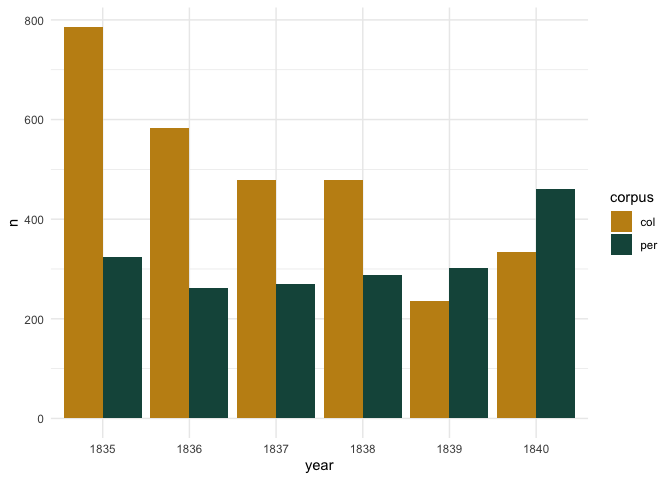
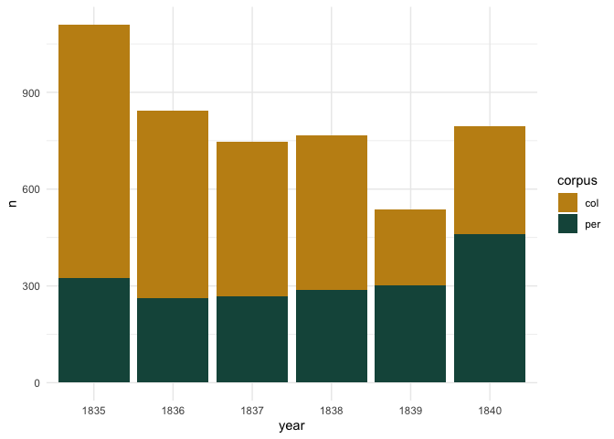
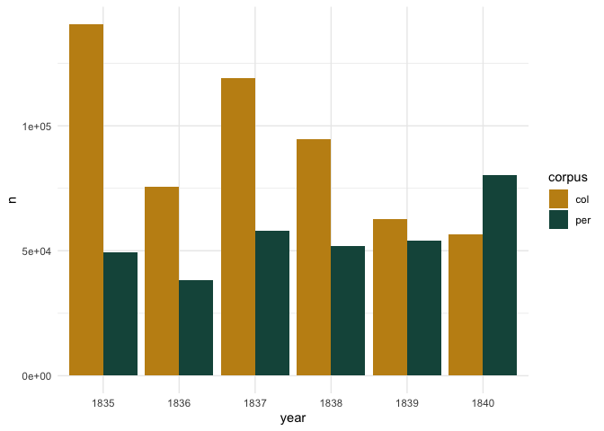

# 03_corpus_overview

# Corpus overview

## load pckg

``` r
library(tidyverse)
```

    Warning: package 'ggplot2' was built under R version 4.3.1

    Warning: package 'lubridate' was built under R version 4.3.1

    ── Attaching core tidyverse packages ──────────────────────── tidyverse 2.0.0 ──
    ✔ dplyr     1.1.3     ✔ readr     2.1.4
    ✔ forcats   1.0.0     ✔ stringr   1.5.0
    ✔ ggplot2   3.4.4     ✔ tibble    3.2.1
    ✔ lubridate 1.9.3     ✔ tidyr     1.3.0
    ✔ purrr     1.0.2     
    ── Conflicts ────────────────────────────────────────── tidyverse_conflicts() ──
    ✖ dplyr::filter() masks stats::filter()
    ✖ dplyr::lag()    masks stats::lag()
    ℹ Use the conflicted package (<http://conflicted.r-lib.org/>) to force all conflicts to become errors

``` r
library(tidytext)

library(MetBrewer)
theme_set(theme_minimal())
```

## load data

``` r
corpus_1835 <- readRDS("../../data/corpus1835/corpus_1835.Rds")
glimpse(corpus_1835)
```

    Rows: 4,799
    Columns: 20
    $ text_id       <chr> "P_1", "P_10", "P_100", "P_1000", "P_1001", "P_1002", "P…
    $ A_ID          <chr> "", "A-50", "A-7", "A-41", "A-139", "A-11", "A-163", "A-…
    $ author_sign   <chr> "", "Л. Якубович", "Кольцов", "Ф. Глинка", "Н. Прокопови…
    $ author_text   <chr> "", "Якубович Л.А.", "Кольцов А.В.", "Глинка Ф.Н.", "Про…
    $ text_title    <chr> "Солдатская песня", "Молния", "Ночлег чумаков", "Утешите…
    $ text_subtitle <chr> "", "", "Сельские картины", "", "", "", "", "", "", "", …
    $ first_line    <chr> "Ох жизнь, молодецкая", "Зачем с небесной высоты", "В бл…
    $ year          <chr> "1835", "1835", "1836", "1838", "1838", "1838", "1838", …
    $ path_text     <chr> "../../data/corpus1835/periodicals/per_raw//P_1.txt", ".…
    $ source_text   <chr> "Сев_пч. 1835. №12. C. 46", "БдЧ. 1835. Т.8. Отд. 1. C. …
    $ COL_ID        <chr> "", "", "", "", "", "", "", "", "", "", "", "", "", "", …
    $ corpus        <chr> "per", "per", "per", "per", "per", "per", "per", "per", …
    $ text_raw      <chr> "Ох, жизнь молодецкая,\nБравая, солдатская!\nКак осенняя…
    $ text_cln      <chr> "Ох, жизнь молодецкая,\nБравая, солдатская!\nКак осенняя…
    $ text_lemm     <chr> "ох, жизнь молодецкий,\nбравый, солдатский!\nкак осенний…
    $ text_acc      <chr> "Ох, жизнь молоде'цкая,\nБра'вая, солда'тская!\nКак осе'…
    $ meter         <fct> Other?, Iamb, Iamb, Iamb, Trochee, Iamb, Trochee, Iamb, …
    $ feet          <chr> "?", "3", "4", "4", "4", "4", "other", "4", "6", "5", "4…
    $ formula       <chr> "Other?_?", "Iamb_3", "Iamb_4", "Iamb_4", "Trochee_4", "…
    $ n_lines       <int> 38, 16, 98, 77, 28, 12, 44, 25, 31, 28, 100, 16, 17, 60,…

# Overview

Corpus overview in terms of poems’ length and sizes of subcorpora

## corpus total size

``` r
print(paste0("Number of poems: ", nrow(corpus_1835)))
```

    [1] "Number of poems: 4799"

``` r
print(paste0("Number of poems in periodicals: ", table(corpus_1835$corpus)[2]))
```

    [1] "Number of poems in periodicals: 1905"

``` r
print(paste0( "Number of poems in collections: ", table(corpus_1835$corpus)[1]))
```

    [1] "Number of poems in collections: 2894"

``` r
print("Number of lines:")
```

    [1] "Number of lines:"

``` r
corpus_1835 %>% 
  select(corpus, text_raw) %>% 
  separate_rows(text_raw, sep = "\n") %>% 
  filter(text_raw != "") %>% nrow()
```

    [1] 192157

``` r
corpus_1835 %>% 
  select(corpus, text_raw) %>% 
  separate_rows(text_raw, sep = "\n") %>% 
  filter(text_raw != "") %>% 
  count(corpus)
```

    # A tibble: 2 × 2
      corpus      n
      <chr>   <int>
    1 col    120403
    2 per     71754

``` r
print("Number of tokens:")
```

    [1] "Number of tokens:"

``` r
corpus_1835 %>% 
  select(corpus, text_lemm) %>% 
  unnest_tokens(input = text_lemm, output = word, token = "words") %>% 
  nrow()
```

    [1] 881120

``` r
corpus_1835 %>% 
  select(corpus, text_lemm) %>% 
  unnest_tokens(input = text_lemm, output = word, token = "words") %>% 
  count(corpus) 
```

    # A tibble: 2 × 2
      corpus      n
      <chr>   <int>
    1 col    549592
    2 per    331528

``` r
print("Number of lemmas:")
```

    [1] "Number of lemmas:"

``` r
corpus_1835 %>% 
  select(corpus, text_lemm) %>% 
  unnest_tokens(input = text_lemm, output = word, token = "words") %>% 
  count(word) %>% nrow
```

    [1] 30399

``` r
corpus_1835 %>% 
  select(corpus, text_lemm) %>% 
  unnest_tokens(input = text_lemm, output = word, token = "words") %>% 
  count(corpus, word) %>%
  select(-n) %>%
  ungroup() %>%
  count(corpus)
```

    # A tibble: 2 × 2
      corpus     n
      <chr>  <int>
    1 col    24795
    2 per    18686

Number of poems per year

``` r
corpus_1835 %>% 
  count(year, corpus) %>% 
  ggplot(aes(x = year, y = n, fill = corpus)) + 
  geom_col(position = "dodge") + 
  scale_fill_manual(values = c(met.brewer("Veronese")[3],
                               met.brewer("Veronese")[6]))
```



``` r
corpus_1835 %>% 
  count(year, corpus) %>% 
  ggplot(aes(x = year, y = n, fill = corpus)) + 
  geom_col(position = "stack") + 
  scale_fill_manual(values = c(met.brewer("Veronese")[3],
                               met.brewer("Veronese")[6]))
```



Number of tokens per year

``` r
tokens <- corpus_1835 %>% 
  select(corpus, year, text_lemm) %>% 
  unnest_tokens(input = text_lemm, output = word, token = "words") %>% 
  count(corpus, year) 
  
tokens %>%  
  ggplot(aes(x = year, y = n, fill = corpus)) + geom_col(position = "dodge") + 
  scale_fill_manual(values = c(met.brewer("Veronese")[3],
                               met.brewer("Veronese")[6]))
```



``` r
tokens %>% 
  ggplot(aes(x = year, y = n, fill = corpus)) + geom_col(position = "stack") + 
  scale_fill_manual(values = c(met.brewer("Veronese")[3],
                               met.brewer("Veronese")[6]))
```


``` r
sum(tokens$n)
```

    [1] 881120

## authors’ subcorpora

Poems

``` r
corpus_1835 %>%
  filter(author_text != "") %>% 
  count(author_text, corpus, sort = T) %>% head(20)
```

    # A tibble: 20 × 3
       author_text      corpus     n
       <chr>            <chr>  <int>
     1 Крылов И.А.      col      186
     2 Суханов М.Д.     col      132
     3 Баратынский Е.А. col      131
     4 Мейснер А.       col      109
     5 Быстроглазов А.  col       97
     6 Меркли М.М.      col       93
     7 Тимофеев А.В.    col       77
     8 Демидов М.А.     col       75
     9 Башкатов А.      col       69
    10 Жуковский В.А.   col       69
    11 Ушаков А.А.      col       65
    12 Алексеев П.Ф.    col       63
    13 Бенедиктов В.Г.  col       63
    14 Мартынов А.М.    col       57
    15 Якубович Л.А.    per       57
    16 Смирнова А.      col       55
    17 Теплова Н.С.     col       54
    18 Подолинский А.И. col       52
    19 Бернет Е.        col       51
    20 Бутырский Н.И.   col       51

``` r
corpus_1835 %>%
  filter(author_text != "") %>% 
  count(author_text, corpus, sort = T) %>% 
  ggplot(aes(x = reorder_within(author_text, -n, -n), y = n, fill = corpus)) + geom_col() + 
  theme(axis.text.x = element_blank()) + 
  scale_fill_manual(values = c(met.brewer("Veronese")[3],
                               met.brewer("Veronese")[6]))
```


Number of tokens by authors

``` r
corpus_1835 %>%
  #filter(author_text != "") %>% 
  select(author_text, corpus, text_lemm) %>% 
  unnest_tokens(input = text_lemm, output = word, token = "words") %>%
  count(author_text, sort = T) %>% head(30)
```

    # A tibble: 30 × 2
       author_text           n
       <chr>             <int>
     1 "Жуковский В.А."  36554
     2 "Крылов И.А."     34887
     3 ""                33293
     4 "Кульман Е.Б."    25338
     5 "Бернет Е."       22293
     6 "Тимофеев А.В."   20729
     7 "Бороздна И.П."   20096
     8 "Быстроглазов А." 19582
     9 "Смирнова А."     19216
    10 "Бенедиктов В.Г." 18315
    # ℹ 20 more rows

``` r
corpus_1835 %>%
  # filter(author != "") %>% 
  select(author_text, corpus, text_lemm) %>% 
  unnest_tokens(input = text_lemm, output = word, token = "words") %>%
  count(author_text, corpus, sort = T) %>% 
  ggplot(aes(x = reorder_within(author_text, -n, -n), y = n, fill = corpus)) + 
  geom_col() + 
  geom_hline(yintercept = 2000, color = "blue") + 
  theme(axis.text.x = element_blank()) + 
  scale_fill_manual(values = c(met.brewer("Veronese")[3],
                               met.brewer("Veronese")[6]))
```


# Subtitles & genres

Simple word counter for genres and keywords in titles

``` r
corpus_1835 %>% 
  mutate(title_words = paste(text_title, text_subtitle)) %>% 
  filter(text_title != "NA" & text_subtitle != "na") %>% 
  select(text_id, text_title, title_words) %>% 
  unnest_tokens(input = title_words, output = word, token = "words") %>%
  #filter(word == "е") #%>% 
  count(word, sort = T) 
```

    # A tibble: 4,432 × 2
       word              n
       <chr>         <int>
     1 к               379
     2 и               365
     3 из              256
     4 в               221
     5 на              189
     6 песня           154
     7 песни           136
     8 с                96
     9 романс           74
    10 стихотворения    63
    # ℹ 4,422 more rows

``` r
# things like separate letters ("e") came from titles with abbreviated names ("To E.E.")
```

``` r
titles <- corpus_1835 %>% 
  mutate(title_words = paste(text_title, text_subtitle)) %>% 
  filter(text_title != "NA" & text_subtitle != "na") %>% 
  select(text_id, text_title, title_words) %>% 
  unnest_tokens(input = title_words, output = word, token = "words") #%>%
  #filter(word == "е") #%>% 
  #count(word, sort = T) 

# write.csv(titles, "poems_titles.csv") # write to lemmatise
```

Load titles

``` r
titles <- read.csv("poems_titles.csv") %>% select(-X)

head(titles)
```

      text_id       text_title       word      lemma
    1     P_1 Солдатская песня солдатская солдатский
    2     P_1 Солдатская песня      песня      песня
    3    P_10           Молния     молния     молния
    4   P_100   Ночлег чумаков     ночлег     ночлег
    5   P_100   Ночлег чумаков    чумаков      чумак
    6   P_100   Ночлег чумаков   сельские   сельский

Count lemmas in titles

``` r
titles_counter <- titles %>% 
  count(lemma, sort = T)

titles_counter
```

                            lemma   n
    1                           к 379
    2                           и 365
    3                       песня 296
    4                          из 256
    5                           в 221
    6                          на 189
    7                      романс 115
    8                        поэт 106
    9                         два 100
    10                          с  96
    11                        мой  86
    12                      сонет  81
    13                    русский  75
    14                     элегия  73
    15              стихотворение  70
    16                      басня  69
    17                       ночь  60
    18                      песнь  58
    19                        год  55
    20                     альбом  53
    21                       дума  52
    22                        она  52
    23                     шарада  51
    24                     смерть  47
    25                    баллада  45
    26                    отрывок  45
    27                 подражание  45
    28                        три  45
    29                       друг  44
    30                      жизнь  44
    31                   послание  43
    32                          а  38
    33                         ву  38
    34                    молитва  36
    35                         он  36
    36                       день  35
    37                          о  35
    38               воспоминание  34
    39                     любовь  34
    40                       море  33
    41                          i  32
    42                          е  32
    43                        при  32
    44                     могила  31
    45                         ой  31
    46                          у  31
    47                     омоним  30
    48                  красавица  29
    49                   фантазия  29
    50                          я  29
    51                      поэма  28
    52                     псалом  28
    53                  эпиграмма  28
    54                          г  27
    55                       гете  27
    56                          л  26
    57                         не  26
    58                        сон  26
    59                          б  25
    60                    картина  25
    61                       роза  25
    62                       стих  25
    63                     цветок  25
    64                     память  24
    65                  последний  24
    66                       гюго  23
    67                    коринна  23
    68                          м  23
    69                    соловей  23
    70                         ii  22
    71                         na  22
    72                     звезда  22
    73                          н  22
    74                        вой  21
    75                       дева  21
    76                    мелодия  21
    77                    перевод  21
    78                      новый  20
    79                      певец  20
    80                    видение  19
    81                          й  19
    82                      мечта  19
    83                     первый  19
    84                    разлука  19
    85                   славянин  19
    86                 славянский  19
    87                      слеза  19
    88                      вечер  18
    89                     виктор  18
    90                          д  18
    91                посвящаться  18
    92                      станс  18
    93                          1  17
    94             антологический  17
    95                     аполог  17
    96                       быть  17
    97                         го  17
    98                       орел  17
    99                      ответ  17
    100                  памятник  17
    101                    сердце  17
    102                    сестра  17
    103                     ангел  16
    104                   великий  16
    105                      воин  16
    106                       все  16
    107                   желание  16
    108                      змея  16
    109                     мысль  16
    110               песнословие  16
    111                    письмо  16
    112                 признание  16
    113                  утешение  16
    114                   чувство  16
    115                    байрон  15
    116                      брат  15
    117               вдохновение  15
    118                     гений  15
    119                  западный  15
    120                      конь  15
    121                        по  15
    122                   портрет  15
    123                 посвящать  15
    124                    пушкин  15
    125                        св  15
    126                    сказка  15
    127                     совет  15
    128                         2  14
    129                александра  14
    130                     венок  14
    131                     время  14
    132                    грусть  14
    133                    девица  14
    134                крестьянин  14
    135                    лисица  14
    136                      мать  14
    137                    москва  14
    138                        му  14
    139                 присылать  14
    140                  прощание  14
    141                       iii  13
    142                        iv  13
    143                  германия  13
    144                   надпись  13
    145                     пасха  13
    146                    родина  13
    147                     тоска  13
    148                  экспромт  13
    149                    эпилог  13
    150                         5  12
    151                       а.с  12
    152                        во  12
    153               возрождение  12
    154                 восточный  12
    155                     голос  12
    156                      граф  12
    157                     гроза  12
    158                     канон  12
    159                       мир  12
    160                  наполеон  12
    161                    пловец  12
    162                солдатский  12
    163                     степь  12
    164                        ты  12
    165                   человек  12
    166                    черный  12
    167                    четыре  12
    168                         ш  12
    169                         4  11
    170                     весна  11
    171                      волк  11
    172                   девушка  11
    173                      душа  11
    174                        же  11
    175                   женщина  11
    176                       или  11
    177                  ламартин  11
    178                    ночной  11
    179                   оседать  11
    180                         п  11
    181                   посылка  11
    182             разочарование  11
    183                   рассказ  11
    184                     ручей  11
    185                      свет  11
    186                    шиллер  11
    187                      1837  10
    188                         3  10
    189                         7  10
    190                     война  10
    191                    вопрос  10
    192                   встреча  10
    193                      гора  10
    194                   древний  10
    195                     идеал  10
    196                     книга  10
    197                   кончина  10
    198                       лев  10
    199                     мария  10
    200                  младенец  10
    201                   невеста  10
    202                  немецкий  10
    203                  праздник  10
    204                 развалины  10
    205                  разговор  10
    206                   римский  10
    207                   счастие  10
    208                         т  10
    209                      утро  10
    210                         ф  10
    211                  художник  10
    212                     юноша  10
    213                        vi   9
    214                      буря   9
    215               возвращение   9
    216                        вы   9
    217                     гейне   9
    218                   декабрь   9
    219                     демон   9
    220                    дружба   9
    221                        за   9
    222                      заря   9
    223                  кладбище   9
    224                   княгиня   9
    225               колыбельный   9
    226                    куплет   9
    227                    любить   9
    228                       око   9
    229              предчувствие   9
    230                      река   9
    231                  рождение   9
    232                    случай   9
    233                    собака   9
    234                    судьба   9
    235                      царь   9
    236                      1836   8
    237                         v   8
    238                       vii   8
    239                       а.а   8
    240                       а.и   8
    241                 александр   8
    242                     берег   8
    243                       бог   8
    244                     волна   8
    245                      гимн   8
    246                   графиня   8
    247                  гробница   8
    248                   дельвиг   8
    249                       для   8
    250                       е.и   8
    251                    жалоба   8
    252                 император   8
    253                 индийский   8
    254                  источник   8
    255                      июль   8
    256                     казак   8
    257                   мотылек   8
    258                    музыка   8
    259                       над   8
    260                   надежда   8
    261                       наш   8
    262                       ной   8
    263                  ожидание   8
    264                      парк   8
    265                персидский   8
    266                 петербург   8
    267                      петь   8
    268                    писать   8
    269                   повесть   8
    270                      поле   8
    271                  посвящий   8
    272                    поэзия   8
    273                  предание   8
    274                   природа   8
    275                     пчела   8
    276                  раздумье   8
    277                  сельский   8
    278                    сирота   8
    279                     слово   8
    280                     тайна   8
    281                      туча   8
    282                украинский   8
    283                     упрек   8
    284             четверостишие   8
    285               эротический   8
    286                       n.n   7
    287                  акростих   7
    288                     амара   7
    289                       бал   7
    290                      быль   7
    291                   вальтер   7
    292                   василек   7
    293                     вновь   7
    294                государыня   7
    295                      гроб   7
    296                    добрый   7
    297                       дуб   7
    298                 жуковский   7
    299                 звездочка   7
    300             императорский   7
    301                     ирмос   7
    302                исправлять   7
    303                    кольцо   7
    304                   корабль   7
    305                       кто   7
    306                      луна   7
    307                   медведь   7
    308                        ми   7
    309                      муза   7
    310                     мунго   7
    311                  народный   7
    312                       нет   7
    313             новогреческий   7
    314                        ну   7
    315                       ода   7
    316               одиночество   7
    317                      опыт   7
    318                    отъезд   7
    319                    певица   7
    320                преложение   7
    321                   призрак   7
    322                 разбойник   7
    323                     скала   7
    324                    скорбь   7
    325                сновидение   7
    326                    солнце   7
    327                    станец   7
    328                    старый   7
    329                 страстный   7
    330                   суббота   7
    331                        ти   7
    332                     узник   7
    333                фракийский   7
    334               французский   7
    335                       час   7
    336                  шведский   7
    337                  эпитафия   7
    338                    юность   7
    339                      1839   6
    340                      viii   6
    341                        xi   6
    342                      xiii   6
    343                 анаграмма   6
    344                английский   6
    345                     барон   6
    346                     божий   6
    347                       век   6
    348                      вера   6
    349                  вечерний   6
    350                       вид   6
    351                   военный   6
    352                    ворона   6
    353                высочество   6
    354                     гость   6
    355                  государь   6
    356                   давыдов   6
    357                      дочь   6
    358                 еврейский   6
    359                     елена   6
    360                 жаворонок   6
    361                     жажда   6
    362                   загадка   6
    363                     замок   6
    364                    зимний   6
    365                       и.и   6
    366                      иван   6
    367                 искушение   6
    368                 испанский   6
    369                    италия   6
    370                       как   6
    371                      катс   6
    372                   красный   6
    373                    листок   6
    374                       май   6
    375                   мальчик   6
    376                 мгновение   6
    377                     месяц   6
    378                     милая   6
    379                    миньон   6
    380                      небо   6
    381               незабвенный   6
    382                    одесса   6
    383                      один   6
    384                   осенний   6
    385                     осень   6
    386                      петр   6
    387                      пора   6
    388                      посв   6
    389                     поход   6
    390        превосходительство   6
    391                прекрасный   6
    392                 призвание   6
    393                      путь   6
    394                         р   6
    395                       сад   6
    396                  свидание   6
    397                     скотт   6
    398                    старец   6
    399                    старик   6
    400                  турецкий   6
    401                   хороший   6
    402                       что   6
    403                   чужбина   6
    404                     шенье   6
    405                   эпиграм   6
    406                      юный   6
    407                      1831   5
    408                     lxvii   5
    409                       xiv   5
    410                        xv   5
    411                       а.г   5
    412                     автор   5
    413             безнадежность   5
    414                     битва   5
    415             благодарность   5
    416                       в.в   5
    417                  весенний   5
    418                     ветер   5
    419                     вздох   5
    420                   водопад   5
    421                     волга   5
    422                     ворон   5
    423                   всадник   5
    424                      глаз   5
    425               голландский   5
    426                     гусар   5
    427                       дар   5
    428                  дмитриев   5
    429                        до   5
    430                       дух   5
    431                       душ   5
    432                 завещание   5
    433                застольная   5
    434                       и.а   5
    435                  иванович   5
    436                 изгнанник   5
    437                     князь   5
    438                   который   5
    439                   кукушка   5
    440                    курица   5
    441                      лист   5
    442                       м.н   5
    443                  маменька   5
    444                надгробный   5
    445                  накануне   5
    446              несчастливец   5
    447                    облако   5
    448                     озеро   5
    449                        от   5
    450                       п.а   5
    451                    пальма   5
    452                     перед   5
    453                    печаль   5
    454                 пешеходец   5
    455                       пир   5
    456                 покрывало   5
    457                        пр   5
    458                   превосх   5
    459                      пред   5
    460                   просьба   5
    461                 пустынник   5
    462                    путник   5
    463                   радость   5
    464                  ревность   5
    465                  рунеберг   5
    466                  сербский   5
    467                     слава   5
    468                      слон   5
    469                  собрание   5
    470                     сокол   5
    471                 страдалец   5
    472                   товарищ   5
    473                 умирающий   5
    474                    утрата   5
    475                     фауст   5
    476                феодоровна   5
    477                       хор   5
    478                      храм   5
    479                      цвет   5
    480                    червяк   5
    481                  читатель   5
    482                   шекспир   5
    483               шотландский   5
    484                         ъ   5
    485                    январь   5
    486                        10   4
    487                      1833   4
    488                      1838   4
    489                         6   4
    490                        ix   4
    491                         x   4
    492                       xii   4
    493                       xix   4
    494                       xvi   4
    495                      xxiv   4
    496                       а.н   4
    497                       а.п   4
    498                 аллегория   4
    499                  арабский   4
    500               бенедиктова   4
    501                    беседа   4
    502                     бивак   4
    503              бильдердейка   4
    504            благословенный   4
    505                   большой   4
    506                  бумажный   4
    507                      бюст   4
    508                       в.г   4
    509                  вельможа   4
    510                    верить   4
    511                 воздушный   4
    512                    восток   4
    513                    второй   4
    514                 вяземский   4
    515                   генерал   4
    516                     гения   4
    517                      глас   4
    518                    горный   4
    519                 греческий   4
    520                       д.в   4
    521                    данный   4
    522                     днепр   4
    523                      доля   4
    524                       дом   4
    525                     дунай   4
    526                       е.а   4
    527                    жребий   4
    528                     завет   4
    529                  заветный   4
    530                      звук   4
    531                    земной   4
    532                      зима   4
    533                   золотой   4
    534               императрица   4
    535                   инвалид   4
    536                     иоанн   4
    537                    кавказ   4
    538                    кинжал   4
    539                   колокол   4
    540                   колонна   4
    541                       кот   4
    542                      край   4
    543                     крест   4
    544                     кубок   4
    545                       лес   4
    546                      лира   4
    547                  литургия   4
    548                  логогриф   4
    549                     локон   4
    550                    лунный   4
    551                       луч   4
    552                  любезный   4
    553                 маленький   4
    554                   малютка   4
    555                     милый   4
    556                  минувший   4
    557                    минута   4
    558                   молодой   4
    559                    мудрец   4
    560                      муха   4
    561                      мышь   4
    562                   неаполь   4
    563                      нева   4
    564                     недуг   4
    565                незнакомка   4
    566                     немой   4
    567                     нищий   4
    568                      овца   4
    569                     ольга   4
    570                    остров   4
    571                      отец   4
    572                       паж   4
    573                    пастух   4
    574                      пери   4
    575                  петрович   4
    576                       под   4
    577                     пожар   4
    578                  польский   4
    579                 поселянин   4
    580                      прах   4
    581                    притча   4
    582                  прогулка   4
    583                прощальный   4
    584                   прощать   4
    585            разочаровывать   4
    586               расставание   4
    587                   ребенок   4
    588                    россия   4
    589                   русалка   4
    590                    рыцарь   4
    591                       с.и   4
    592                 свадебный   4
    593                      себя   4
    594                  сентябрь   4
    595                  серенада   4
    596                      сила   4
    597                    синица   4
    598                   сказать   4
    599                 сожаление   4
    600                    страна   4
    601                     судья   4
    602                счастливец   4
    603                       сын   4
    604                   толстой   4
    605                      туда   4
    606                      утес   4
    607                   февраль   4
    608                     федор   4
    609                   философ   4
    610                 хранитель   4
    611                   цыганка   4
    612                 цыганский   4
    613                    челнок   4
    614                     череп   4
    615                     шутка   4
    616                   эмблема   4
    617                    юбилей   4
    618                     южный   4
    619                        17   3
    620                      1825   3
    621                      1828   3
    622                        21   3
    623                        26   3
    624                         8   3
    625                        du   3
    626                        la   3
    627                       lix   3
    628                    lxviii   3
    629                         n   3
    630                      xvii   3
    631                     xviii   3
    632                        xx   3
    633                       xxi   3
    634                     xxiii   3
    635                      xxix   3
    636                       xxv   3
    637                      xxvi   3
    638                     xxvii   3
    639                       xxx   3
    640                      xxxi   3
    641                    xxxiii   3
    642                     xxxiv   3
    643                      xxxv   3
    644                     xxxvi   3
    645                    xxxvii   3
    646                   xxxviii   3
    647                       а.в   3
    648                       а.д   3
    649                       а.е   3
    650                   азиатка   3
    651                  академия   3
    652                     алина   3
    653                     алмаз   3
    654                 андреевич   3
    655                    андрей   3
    656                    апрель   3
    657                      арфа   3
    658                   бабочка   3
    659                   бальный   3
    660                      бард   3
    661                      беда   3
    662                     белый   3
    663                бессмертие   3
    664                бессонница   3
    665              бильдербейка   3
    666                      бить   3
    667                  бородино   3
    668               бородинский   3
    669                   брюлову   3
    670                   будущее   3
    671                     былой   3
    672                       в.а   3
    673                       в.и   3
    674                       в.н   3
    675               вакхический   3
    676                       вал   3
    677                    взгляд   3
    678                    взятие   3
    679                    видеть   3
    680                      вино   3
    681                влюбленный   3
    682                    вместо   3
    683                     вождь   3
    684                воклюзский   3
    685                   вольный   3
    686                    вулкан   3
    687                    высота   3
    688                  гармония   3
    689               гвардейский   3
    690                       где   3
    691                     глава   3
    692                  говорить   3
    693                 годовщина   3
    694                      горе   3
    695                     горец   3
    696                     город   3
    697                     грена   3
    698                  гречанка   3
    699                      дама   3
    700               деревенский   3
    701                      диво   3
    702                    доктор   3
    703                       дон   3
    704                    дорога   3
    705                     драма   3
    706             драматический   3
    707                       е.н   3
    708                     ездок   3
    709                       еще   3
    710                  забывать   3
    711                  заданный   3
    712                     залив   3
    713                   записка   3
    714                      звон   3
    715                     зевес   3
    716                     земля   3
    717                        ив   3
    718                   идиллия   3
    719                    измена   3
    720                       иов   3
    721                  исповедь   3
    722                       к.а   3
    723                   казачий   3
    724                  кампания   3
    725                     карла   3
    726                     когда   3
    727                      коза   3
    728                   кокетка   3
    729                     комар   3
    730                    комета   3
    731                     кошка   3
    732                   красота   3
    733                    кремль   3
    734                    кролик   3
    735                    крылов   3
    736                  ласточка   3
    737                  левашова   3
    738                    летний   3
    739                      лиса   3
    740                     ловля   3
    741                 ломоносов   3
    742                    лошадь   3
    743                   лягушка   3
    744                       м.а   3
    745                       м.п   3
    746                  мадригал   3
    747                     месть   3
    748                       меч   3
    749                  мечтание   3
    750                 мечтатель   3
    751                   мильвуа   3
    752                    молния   3
    753                монография   3
    754                  мудрость   3
    755                     мужик   3
    756                       н.п   3
    757                  написать   3
    758                 наследник   3
    759                     наяда   3
    760                  небесный   3
    761                неизданный   3
    762                 новоселье   3
    763                        об   3
    764                      обед   3
    765                  обезьяна   3
    766                  обещание   3
    767                   озерова   3
    768                  открытие   3
    769                    ошибка   3
    770                       п.и   3
    771                     париж   3
    772                   пароход   3
    773                      паук   3
    774                      паша   3
    775                  перемена   3
    776                   песенка   3
    777                     пират   3
    778                  писатель   3
    779                   пленник   3
    780                   пленный   3
    781                погребение   3
    782                   подарок   3
    783                   подруга   3
    784              подсолнечник   3
    785                  подъячий   3
    786                   полдень   3
    787                 получение   3
    788                посвящение   3
    789                     после   3
    790               предисловие   3
    791                    призыв   3
    792                   примета   3
    793                приношение   3
    794               присутствие   3
    795                  приятель   3
    796            провинциальный   3
    797               продолжение   3
    798                  прометей   3
    799               проповедник   3
    800            простонародный   3
    801                 проходить   3
    802                   пустыня   3
    803               размышление   3
    804                   рассвет   3
    805                    ратный   3
    806                 рождество   3
    807             романтический   3
    808                        ру   3
    809                       с.п   3
    810                   свадьба   3
    811                    свинья   3
    812                      свой   3
    813                 сегидилья   3
    814                   селянин   3
    815                   сиротка   3
    816                   скворец   3
    817                    слепец   3
    818                     смотр   3
    819                   снежный   3
    820                   совесть   3
    821                    солдат   3
    822                     сосед   3
    823                 сочинение   3
    824                 спаситель   3
    825                     спать   3
    826                  сражение   3
    827                 старинный   3
    828                  старушка   3
    829                  странник   3
    830                   страсть   3
    831                стремление   3
    832                        су   3
    833                       суд   3
    834                     суета   3
    835                     сурок   3
    836            существенность   3
    837                счастливый   3
    838                  таганрог   3
    839                   темница   3
    840                      тень   3
    841                     терек   3
    842                    тишина   3
    843                        то   3
    844                       тот   3
    845                 тревожный   3
    846                    третий   3
    847                      удел   3
    848                     уланд   3
    849                    уланда   3
    850                     умный   3
    851                    уныние   3
    852               фельдмаршал   3
    853                    фонтан   3
    854                     франк   3
    855                фуссгэнгер   3
    856                хороводный   3
    857                    хребет   3
    858                   христос   3
    859                    царица   3
    860                   царский   3
    861                         ч   3
    862                        чу   3
    863                    чудный   3
    864                      щука   3
    865                       эхо   3
    866                      язык   3
    867                    языков   3
    868                      яков   3
    869                  якубович   3
    870                        11   2
    871                        12   2
    872                        13   2
    873                        14   2
    874                        16   2
    875                      1799   2
    876                        18   2
    877                      1817   2
    878                      1820   2
    879                      1830   2
    880                      1832   2
    881                      1834   2
    882                      1835   2
    883                        19   2
    884                        28   2
    885                        31   2
    886                         9   2
    887                    anhalt   2
    888                        ci   2
    889                      ciii   2
    890                     cxvii   2
    891                    cxviii   2
    892                       das   2
    893                      herz   2
    894                houwelijck   2
    895                    kennst   2
    896                         l   2
    897                      land   2
    898                        li   2
    899                       lii   2
    900                      liii   2
    901                       liv   2
    902                        lv   2
    903                       lvi   2
    904                      lvii   2
    905                     lviii   2
    906                        lx   2
    907                      lxii   2
    908                     lxiii   2
    909                      lxiv   2
    910                       lxv   2
    911                         m   2
    912                      xcvi   2
    913                        xl   2
    914                      xlii   2
    915                     xliii   2
    916                      xliv   2
    917                      xlvi   2
    918                     xlvii   2
    919                    xlviii   2
    920                      xxii   2
    921                    xxviii   2
    922                     xxxii   2
    923                     xxxix   2
    924                       а.о   2
    925                    август   2
    926                    аврора   2
    927                  аделаида   2
    928             александровна   2
    929           александровский   2
    930                      алый   2
    931                      араб   2
    932                    аравия   2
    933                 африканец   2
    934                   бабушка   2
    935                балтийский   2
    936                     баять   2
    937                   бегство   2
    938                    бедный   2
    939                    бедняк   2
    940                    бедуин   2
    941                       без   2
    942                 безродный   2
    943                  безумный   2
    944               бесстрастие   2
    945                   бистром   2
    946                       бит   2
    947                    биться   2
    948                 благовест   2
    949               благодетель   2
    950           благодетельница   2
    951                      близ   2
    952                  богатырь   2
    953                     богач   2
    954                   болезнь   2
    955                  бонапарт   2
    956                    боннет   2
    957                     бочка   2
    958                      брак   2
    959                  булгаков   2
    960                       в.м   2
    961                   василий   2
    962                  ватерлоо   2
    963                   вейдемф   2
    964                величество   2
    965             веневитиновый   2
    966                    венера   2
    967                   веселый   2
    968                     ветка   2
    969                    ветхий   2
    970                  виноград   2
    971                  висконти   2
    972                    витязь   2
    973                       вне   2
    974                      вода   2
    975                   водолаз   2
    976                   воевода   2
    977                 воззвание   2
    978                   воитель   2
    979                    войско   2
    980                волшебница   2
    981                 волшебный   2
    982                воспитание   2
    983                    восход   2
    984                    всегда   2
    985             всероссийский   2
    986                вспоминать   2
    987                     выбор   2
    988                   высокий   2
    989                       г.в   2
    990                       г.и   2
    991                    гайдук   2
    992                   гарольд   2
    993              гебеджинский   2
    994                  германка   2
    995                     герой   2
    996                    гигант   2
    997                  голубица   2
    998                   голубой   2
    999                    голубь   2
    1000                гондольер   2
    1001                    гонец   2
    1002                   гореть   2
    1003                 горлинка   2
    1004                  городок   2
    1005                  горский   2
    1006                  горячий   2
    1007                  госпожа   2
    1008                    греза   2
    1009                     грот   2
    1010                  грустно   2
    1011                    гурия   2
    1012                   гусляр   2
    1013                    давид   2
    1014                       де   2
    1015                  девятый   2
    1016                 действие   2
    1017                    делий   2
    1018                      дер   2
    1019                   дервиш   2
    1020                   дерево   2
    1021                 державин   2
    1022                  детский   2
    1023                    дикий   2
    1024                     дитя   2
    1025                  дмитрий   2
    1026                   долгий   2
    1027                   долина   2
    1028                  донской   2
    1029                 дорожный   2
    1030                достойный   2
    1031                    дурак   2
    1032                 духовный   2
    1033                 душевный   2
    1034                      дяд   2
    1035                  дядюшка   2
    1036                    е.а.м   2
    1037                    е.о.ш   2
    1038                   египет   2
    1039                     есть   2
    1040                    жених   2
    1041                   жертва   2
    1042                 жестокий   2
    1043                живописец   2
    1044                журналист   2
    1045                        з   2
    1046               задумчивый   2
    1047                    зазыв   2
    1048                    закон   2
    1049              замогильный   2
    1050                    затея   2
    1051                    зачем   2
    1052            здравствовать   2
    1053                 зейдлицо   2
    1054                  зеленый   2
    1055                   земляк   2
    1056                     злой   2
    1057                    знать   2
    1058                      и.н   2
    1059                      и.п   2
    1060                      и.ф   2
    1061                 ивановна   2
    1062                     игра   2
    1063                   играть   2
    1064                      ида   2
    1065                известный   2
    1066                  именины   2
    1067                      имя   2
    1068              иносказание   2
    1069                   иордан   2
    1070                искусство   2
    1071                   истина   2
    1072                 истинный   2
    1073                  история   2
    1074              итальянский   2
    1075                    калиш   2
    1076                   камень   2
    1077                 карлгофа   2
    1078                 катенька   2
    1079                   катсов   2
    1080                 катсовой   2
    1081                     киев   2
    1082                  кипарис   2
    1083                     клад   2
    1084                   клейст   2
    1085                   клятва   2
    1086                   княжна   2
    1087                       ко   2
    1088                   колпак   2
    1089                 компания   2
    1090                 конфуций   2
    1091                    коран   2
    1092                 королева   2
    1093                   король   2
    1094                   корпус   2
    1095              крузенштерн   2
    1096                 кудрявич   2
    1097                      кум   2
    1098                    купец   2
    1099                   курган   2
    1100                      л.а   2
    1101                      л.н   2
    1102                  лампада   2
    1103                   лебедь   2
    1104                  легенда   2
    1105               лезгинский   2
    1106                   ленора   2
    1107                     лень   2
    1108                     лжец   2
    1109                     лиза   2
    1110                 лизанька   2
    1111                     лина   2
    1112                литовский   2
    1113                    лихач   2
    1114                     лорд   2
    1115                  любимый   2
    1116                 любовник   2
    1117               любопытный   2
    1118                  людской   2
    1119                      м.в   2
    1120                      м.и   2
    1121               мадардский   2
    1122                  мадонна   2
    1123           малороссийский   2
    1124                 мальвина   2
    1125               мантейфель   2
    1126                маргарита   2
    1127                    марко   2
    1128                    маска   2
    1129                     матф   2
    1130              медицейский   2
    1131                   медный   2
    1132                  мельник   2
    1133                  мертвец   2
    1134                   метеор   2
    1135                      миг   2
    1136                   минуть   2
    1137               мироздание   2
    1138                     мода   2
    1139               молдованка   2
    1140                 молиться   2
    1141                монастырь   2
    1142                      мор   2
    1143                мордвинов   2
    1144                    моряк   2
    1145               московский   2
    1146                   моська   2
    1147                 мститель   2
    1148                 музыкант   2
    1149                  муравей   2
    1150                муравьева   2
    1151                       мы   2
    1152                      н.а   2
    1153                      н.и   2
    1154                      н.м   2
    1155                      н.н   2
    1156                нагробный   2
    1157                надгробие   2
    1158                    народ   2
    1159             невозвратный   2
    1160                     нега   2
    1161              негодование   2
    1162               недоумение   2
    1163                незабудка   2
    1164            непостоянство   2
    1165               несчастный   2
    1166               николаевич   2
    1167                  николай   2
    1168              ничтожество   2
    1169                 новгород   2
    1170                    новое   2
    1171                      о.р   2
    1172                     обет   2
    1173                    общий   2
    1174                   овидий   2
    1175                    огонь   2
    1176                   октава   2
    1177                      они   2
    1178                    орфей   2
    1179               осиротелый   2
    1180                 осуждать   2
    1181              отверженный   2
    1182                    отзыв   2
    1183                 отплытие   2
    1184              отправление   2
    1185                   отрада   2
    1186                отречение   2
    1187                 отринуть   2
    1188                    отряд   2
    1189                   отчего   2
    1190                  отчизна   2
    1191               охлаждение   2
    1192                  охотник   2
    1193          очаровательница   2
    1194                    очерк   2
    1195                      п.е   2
    1196                      п.н   2
    1197                   падать   2
    1198                  падение   2
    1199                  падучий   2
    1200                палестина   2
    1201                   парень   2
    1202                   парнас   2
    1203                   пенаты   2
    1204             перерождение   2
    1205              переселение   2
    1206                  переход   2
    1207                 петрарка   2
    1208                 петровна   2
    1209                  пирушка   2
    1210                     пить   2
    1211                 плавание   2
    1212                     плач   2
    1213                   пляска   2
    1214                   победа   2
    1215               победитель   2
    1216                   погоня   2
    1217             подслушивать   2
    1218                 покаяние   2
    1219                покинутый   2
    1220              покровитель   2
    1221                  полночь   2
    1222                  полтава   2
    1223                   польза   2
    1224                 понимать   2
    1225                    порок   2
    1226                посещение   2
    1227                    поток   2
    1228                  поцелуй   2
    1229                    почта   2
    1230          предостережение   2
    1231                  прежний   2
    1232              прелестница   2
    1233                 прелесть   2
    1234               преступник   2
    1235               привидение   2
    1236                   приезд   2
    1237                    принц   2
    1238                    приют   2
    1239              пробуждение   2
    1240        противоположность   2
    1241                 прохожий   2
    1242                прошедшее   2
    1243                   птичка   2
    1244           путешественник   2
    1245              путешествие   2
    1246         пятидесятилетний   2
    1247                    пятый   2
    1248                     пять   2
    1249                   радуга   2
    1250                   раздел   2
    1251                размолвка   2
    1252               разрушение   2
    1253              разуверение   2
    1254                раскаяние   2
    1255                   редкий   2
    1256                 репейник   2
    1257                      рим   2
    1258                   риццио   2
    1259                      род   2
    1260                     рожь   2
    1261                    рондо   2
    1262               российский   2
    1263                     роща   2
    1264                  рукоять   2
    1265                    рыбка   2
    1266                   рюкерт   2
    1267                      с.а   2
    1268                      с.м   2
    1269                      с.с   2
    1270                    саади   2
    1271               самоубийца   2
    1272                 сапожник   2
    1273                     сара   2
    1274                   сатана   2
    1275                     сафо   2
    1276                    света   2
    1277                  светлый   2
    1278                   свечка   2
    1279                  свирель   2
    1280                  свобода   2
    1281                   святой   2
    1282                    север   2
    1283                     село   2
    1284                 семейный   2
    1285                семейство   2
    1286                     сено   2
    1287                сергеевич   2
    1288               серебряный   2
    1289                 сказание   2
    1290                   скальд   2
    1291                   скряга   2
    1292                   скупой   2
    1293                   скучно   2
    1294                  славный   2
    1295                   слепой   2
    1296                     смех   2
    1297                 смирнова   2
    1298                 смотреть   2
    1299               смотритель   2
    1300                    снова   2
    1301              современник   2
    1302                 сознание   2
    1303                 сомнение   2
    1304               сослуживец   2
    1305                   софрон   2
    1306                    софья   2
    1307               сочинитель   2
    1308                 сочинять   2
    1309               сочувствие   2
    1310                    спуск   2
    1311                сравнение   2
    1312                       ст   2
    1313                 становой   2
    1314                 старость   2
    1315                  степной   2
    1316                стешневый   2
    1317               сторожевой   2
    1318                 страшный   2
    1319                   стюарт   2
    1320                    сцена   2
    1321              счастливица   2
    1322             таинственный   2
    1323                  татьяна   2
    1324                    театр   2
    1325                     тема   2
    1326                 терпение   2
    1327                  тиролец   2
    1328                    тифон   2
    1329                тленность   2
    1330                 трагедия   2
    1331                   тройка   2
    1332                   турнир   2
    1333                   турция   2
    1334                  тщетный   2
    1335                  увядший   2
    1336                   удалец   2
    1337                уединение   2
    1338                       уж   2
    1339                       ум   2
    1340                  умерший   2
    1341                  умирать   2
    1342                   ураган   2
    1343                 утренний   2
    1344                      феб   2
    1345                   фиалка   2
    1346                филимонов   2
    1347                философия   2
    1348                финляндия   2
    1349                  финский   2
    1350                   флейта   2
    1351                  фортуна   2
    1352                        х   2
    1353                   хандра   2
    1354               христианин   2
    1355             христианский   2
    1356                  царство   2
    1357                  цветник   2
    1358                цесаревич   2
    1359                   цирцея   2
    1360             человеческий   2
    1361                    через   2
    1362                   черкес   2
    1363             черноморский   2
    1364                    черта   2
    1365                четвертый   2
    1366                      чиж   2
    1367                   чистый   2
    1368                    чудак   2
    1369                    чумак   2
    1370               шебутовать   2
    1371                     шеви   2
    1372                   шестой   2
    1373                      шум   2
    1374                        э   2
    1375                    эдгар   2
    1376               эленшлегер   2
    1377                 эльборус   2
    1378                     эмма   2
    1379                    юрьев   2
    1380                  явление   2
    1381                  ягненок   2
    1382                 якутский   2
    1383                ярославль   2
    1384                      яша   2
    1385                  1,2,3,4   1
    1386                      120   1
    1387                      136   1
    1388                      143   1
    1389                      149   1
    1390                     1812   1
    1391                     1815   1
    1392                     1821   1
    1393                     1822   1
    1394                     1823   1
    1395                     1824   1
    1396                     1827   1
    1397                     1829   1
    1398                     1_na   1
    1399                       20   1
    1400                       23   1
    1401                       27   1
    1402                       29   1
    1403                     2_na   1
    1404                       30   1
    1405                       35   1
    1406                       37   1
    1407                       39   1
    1408                      39й   1
    1409                     3_na   1
    1410                     4_na   1
    1411                     5_na   1
    1412                       67   1
    1413                       68   1
    1414                     6_na   1
    1415                     7_na   1
    1416                       83   1
    1417                     8_na   1
    1418                       96   1
    1419                     9_na   1
    1420                        a   1
    1421                    acque   1
    1422                   adieux   1
    1423                       am   1
    1424                  amorosa   1
    1425                       an   1
    1426                      and   1
    1427                    annus   1
    1428                      ave   1
    1429                    belle   1
    1430            bergenstrohle   1
    1431                   cadets   1
    1432                 cancione   1
    1433                   chiare   1
    1434                      cii   1
    1435                      civ   1
    1436                      cix   1
    1437                    comte   1
    1438                       cv   1
    1439                      cvi   1
    1440                     cvii   1
    1441                    cviii   1
    1442                     cxii   1
    1443                    cxiii   1
    1444                     cxiv   1
    1445                     cxix   1
    1446                      cxv   1
    1447                      cxx   1
    1448                     cxxi   1
    1449                    cxxii   1
    1450                   cxxiii   1
    1451                    cxxiv   1
    1452                    cxxix   1
    1453                     cxxv   1
    1454                    cxxvi   1
    1455                   cxxvii   1
    1456                  cxxviii   1
    1457                     cxxx   1
    1458                    cxxxi   1
    1459                       de   1
    1460                  dediées   1
    1461                       do   1
    1462                    dolci   1
    1463                        e   1
    1464                     emma   1
    1465                  ennemie   1
    1466                      etc   1
    1467                      eva   1
    1468                 exordium   1
    1469                   extase   1
    1470                     free   1
    1471                  fresche   1
    1472                gathering   1
    1473                   hebrew   1
    1474                 inconnue   1
    1475                       je   1
    1476                    jenny   1
    1477                   jocely   1
    1478                    laury   1
    1479                      les   1
    1480                       ll   1
    1481                      lxi   1
    1482                     lxix   1
    1483                     lxvi   1
    1484                      lxx   1
    1485                     lxxi   1
    1486                    lxxii   1
    1487                   lxxiii   1
    1488                    lxxiv   1
    1489                    lxxix   1
    1490                     lxxv   1
    1491                    lxxvi   1
    1492                   lxxvii   1
    1493                  lxxviii   1
    1494                     lxxx   1
    1495                    lxxxi   1
    1496                   lxxxii   1
    1497                  lxxxiii   1
    1498                   lxxxiv   1
    1499                   lxxxix   1
    1500                    lxxxv   1
    1501                   lxxxvi   1
    1502                  lxxxvii   1
    1503                 lxxxviii   1
    1504              macgregor’s   1
    1505                    maria   1
    1506                    mater   1
    1507                     mein   1
    1508                 melodies   1
    1509                      mes   1
    1510                   mirage   1
    1511                    monte   1
    1512                     more   1
    1513                     mort   1
    1514                    n'est   1
    1515                      one   1
    1516                   parque   1
    1517                   pincio   1
    1518                     plus   1
    1519                   primus   1
    1520                profundis   1
    1521               qu'entends   1
    1522                     quoi   1
    1523                      sic   1
    1524                silentium   1
    1525                   stabat   1
    1526                   strand   1
    1527                 struggle   1
    1528                      sur   1
    1529                     vers   1
    1530                    villa   1
    1531                      weg   1
    1532                       xc   1
    1533                      xci   1
    1534                     xcii   1
    1535                    xciii   1
    1536                     xciv   1
    1537                     xcix   1
    1538                      xcv   1
    1539                    xcvii   1
    1540                   xcviii   1
    1541                      xli   1
    1542                     xlix   1
    1543                      xlv   1
    1544                      xvl   1
    1545                   xxii.i   1
    1546                  xxii.ii   1
    1547                 xxii.iii   1
    1548                  xxii.iv   1
    1549                        à   1
    1550                    а.а.г   1
    1551                    а.и.р   1
    1552                   а.кс.д   1
    1553                      а.м   1
    1554                    а.м.м   1
    1555                    а.м.с   1
    1556                    а.о.п   1
    1557                    а.п.г   1
    1558                    а.с.б   1
    1559                      а.т   1
    1560                      а.ю   1
    1561                      а.я   1
    1562                 августин   1
    1563                авдераман   1
    1564                    авель   1
    1565              австрийский   1
    1566            автобиография   1
    1567                   агнета   1
    1568                    адель   1
    1569                 адерсбах   1
    1570                адлерский   1
    1571                  адмирал   1
    1572           адмиралтейский   1
    1573              адрианополь   1
    1574                 адриатик   1
    1575                 адъютант   1
    1576                     азия   1
    1577                азиятский   1
    1578                     аист   1
    1579                  аквилон   1
    1580                   аккорд   1
    1581              акомпаниман   1
    1582                    алекс   1
    1583                 алексеев   1
    1584               алексеевна   1
    1585                  алексей   1
    1586                 алексндр   1
    1587                      али   1
    1588                 алкивиад   1
    1589                    алкид   1
    1590                   алупка   1
    1591                    алфей   1
    1592                    алчба   1
    1593                   алый.ф   1
    1594                 алябьева   1
    1595                 амазонка   1
    1596                   амалия   1
    1597                  амаранф   1
    1598                  анаграм   1
    1599                 анакреон   1
    1600                анастасия   1
    1601                   анемон   1
    1602                    анета   1
    1603                  анкудин   1
    1604                   аннета   1
    1605                  анталия   1
    1606                    антик   1
    1607                антология   1
    1608           анфологический   1
    1609                  апеллес   1
    1610                  аполлон   1
    1611                  апостол   1
    1612                  апполон   1
    1613                  арабеск   1
    1614               аравитянка   1
    1615                   арарат   1
    1616                  аретуза   1
    1617                 аркадиец   1
    1618                арнаутлар   1
    1619                  артамон   1
    1620                    артил   1
    1621                   атеист   1
    1622                  афенеть   1
    1623                  афоризм   1
    1624                       ах   1
    1625                   ахалук   1
    1626                    б.к.п   1
    1627              б.л.г.в.кой   1
    1628                    б.с.м   1
    1629                     баба   1
    1630                    балка   1
    1631               балканский   1
    1632                   балкон   1
    1633                бандурист   1
    1634                  барабан   1
    1635              баратынский   1
    1636                    барка   1
    1637                баркарола   1
    1638                баронесса   1
    1639                     барс   1
    1640                бартенева   1
    1641               бартоломей   1
    1642                      бас   1
    1643                      бат   1
    1644                 баталина   1
    1645                  батарея   1
    1646              батаровский   1
    1647                 батюшков   1
    1648                башкатова   1
    1649                    башня   1
    1650                   баюшки   1
    1651                 баядерка   1
    1652                   баязет   1
    1653                     баян   1
    1654                   беглец   1
    1655                 бедность   1
    1656                безбожник   1
    1657               безгласный   1
    1658                   бездна   1
    1659              бездыханный   1
    1660              безнадежный   1
    1661                  безумие   1
    1662               безутешный   1
    1663                    белка   1
    1664              белорусский   1
    1665                 бенамара   1
    1666               бенкендорф   1
    1667                 беранжер   1
    1668               бергенгейм   1
    1669                береговой   1
    1670                 березина   1
    1671               березников   1
    1672                   бернар   1
    1673                  берхман   1
    1674             беспокойство   1
    1675              бесполезный   1
    1676               бессильный   1
    1677               бесследный   1
    1678              бессмертный   1
    1679               бесхвостый   1
    1680                бесценный   1
    1681                  бибиков   1
    1682               библейский   1
    1683               библиотека   1
    1684                   бирюза   1
    1685                    благо   1
    1686        благовестительный   1
    1687             благовещение   1
    1688            благоговейный   1
    1689              благодеяние   1
    1690              благородный   1
    1691           благославенный   1
    1692            благословлять   1
    1693           благотворитель   1
    1694                блаженный   1
    1695               блаженство   1
    1696                     блан   1
    1697                  ближний   1
    1698                   блудов   1
    1699                     бобр   1
    1700               бобринская   1
    1701                богатство   1
    1702                  богатый   1
    1703                   богдан   1
    1704               богданович   1
    1705                 богослов   1
    1706                    бокал   1
    1707               болговский   1
    1708                бомбардир   1
    1709                      бор   1
    1710                    борис   1
    1711                  борисов   1
    1712                   борьба   1
    1713                   босфор   1
    1714                   боярин   1
    1715                       бр   1
    1716                  брайтон   1
    1717                  бранный   1
    1718                     бред   1
    1719                  бредина   1
    1720                  бредить   1
    1721                бриллиант   1
    1722                   бритва   1
    1723                    брить   1
    1724               броневский   1
    1725                     брут   1
    1726                     брюл   1
    1727                   будрыс   1
    1728                  будущий   1
    1729               будущность   1
    1730                    буква   1
    1731                    булат   1
    1732                 булгария   1
    1733                 булыжник   1
    1734                     буль   1
    1735                   бумага   1
    1736                     бунт   1
    1737                 бурмистр   1
    1738                   бурный   1
    1739                бурятский   1
    1740                   бывать   1
    1741                      быт   1
    1742                   бюргер   1
    1743                    в.а.д   1
    1744                    в.г.г   1
    1745                    в.и.к   1
    1746                      в.к   1
    1747                      в.п   1
    1748                    в.п.п   1
    1749                  в.рл.му   1
    1750                      в.с   1
    1751                      в.ф   1
    1752                      в.я   1
    1753                       ва   1
    1754                  вавилон   1
    1755               вазантазен   1
    1756                     вакх   1
    1757                 вакханка   1
    1758                  валахия   1
    1759                валахский   1
    1760                    вальд   1
    1761                    вальс   1
    1762                  варвара   1
    1763                  варшава   1
    1764               варшавский   1
    1765               васильевна   1
    1766                 василько   1
    1767                 вахрушев   1
    1768                    вахта   1
    1769                   вблизи   1
    1770                 введение   1
    1771                    вдали   1
    1772                     веда   1
    1773                   ведаил   1
    1774                    ведро   1
    1775                   ведьма   1
    1776                    везде   1
    1777                  везувий   1
    1778                  вейделя   1
    1779               веймарский   1
    1780                  величие   1
    1781              веневитинов   1
    1782                    венец   1
    1783                  венеция   1
    1784               венециянов   1
    1785                венстерна   1
    1786           верноподданный   1
    1787                 верность   1
    1788                     верх   1
    1789                  веселие   1
    1790                весенберг   1
    1791                    весло   1
    1792                     весь   1
    1793                   вецель   1
    1794                    вечно   1
    1795                   вечный   1
    1796                   вешний   1
    1797                   вещать   1
    1798                  взморье   1
    1799                     взор   1
    1800                  видимый   1
    1801                   видный   1
    1802                   виенна   1
    1803            вильгельмовна   1
    1804                     вина   1
    1805                виноватый   1
    1806                 виньетка   1
    1807           виртембергский   1
    1808                      вис   1
    1809                     вист   1
    1810            витгенштейнов   1
    1811                     вица   1
    1812                     вкус   1
    1813                 владимир   1
    1814                     влах   1
    1815                  влетать   1
    1816                   вместе   1
    1817                внезапный   1
    1818                     внук   1
    1819               внутренний   1
    1820                 водевиль   1
    1821                  водяной   1
    1822               воеводство   1
    1823                  воейков   1
    1824             возвращаться   1
    1825                воззрение   1
    1826            возобновление   1
    1827                  возраст   1
    1828                 воинство   1
    1829                 воклюзск   1
    1830                   воксал   1
    1831                      вол   1
    1832               волконская   1
    1833                    волхв   1
    1834                 волченок   1
    1835                  волынка   1
    1836                 вопиющий   1
    1837              воплощенный   1
    1838                    вопль   1
    1839                вордсворт   1
    1840                  ворожба   1
    1841                вороненок   1
    1842                 воскресе   1
    1843               воскресный   1
    1844           восстановление   1
    1845                  восторг   1
    1846                    впрок   1
    1847                       вр   1
    1848                     враг   1
    1849                    врево   1
    1850                 вручение   1
    1851                    вской   1
    1852                   вскоре   1
    1853               вступление   1
    1854                 вурдалак   1
    1855                     вход   1
    1856                    вчера   1
    1857                    въезд   1
    1858                  выворот   1
    1859                    выезд   1
    1860            выздоровление   1
    1861                    вызов   1
    1862                      вым   1
    1863                 вырезать   1
    1864                 вырывать   1
    1865         высоконареченный   1
    1866 высокопревосходительство   1
    1867                 выставка   1
    1868                  выстрел   1
    1869                     выть   1
    1870                 выходить   1
    1871                    г.в.п   1
    1872                      г.с   1
    1873                    г.с.п   1
    1874                   газель   1
    1875                  галатея   1
    1876                галенберг   1
    1877                     галя   1
    1878               гардемарин   1
    1879                    гарем   1
    1880                   гарсон   1
    1881                    гафиз   1
    1882                гванагани   1
    1883                  гвардия   1
    1884                    гвидо   1
    1885                  гвоздик   1
    1886                гвоздичка   1
    1887                    гебра   1
    1888                   гезиод   1
    1889                    гейер   1
    1890                гекзаметр   1
    1891                   гелика   1
    1892                гелинанта   1
    1893                   генрих   1
    1894             георгиевский   1
    1895                  георгий   1
    1896                   гердер   1
    1897            герменчугский   1
    1898                   гермес   1
    1899                геройский   1
    1900                   герцог   1
    1901                   гессен   1
    1902                   гетман   1
    1903                       гл   1
    1904                  главный   1
    1905                  гленара   1
    1906                   глория   1
    1907                  глотова   1
    1908                   глупый   1
    1909                  глядеть   1
    1910                     гнев   1
    1911                   гнездо   1
    1912                   голиаф   1
    1913                    голик   1
    1914               гомеопатия   1
    1915                  гораций   1
    1916               горделивый   1
    1917                 горемыка   1
    1918                  горлица   1
    1919                   горний   1
    1920                городской   1
    1921                гортензия   1
    1922                   горшок   1
    1923                  горький   1
    1924                 горюшкин   1
    1925                 господин   1
    1926                 гостиная   1
    1927                   гостья   1
    1928                  готгард   1
    1929               готовицкий   1
    1930                       гр   1
    1931                     град   1
    1932           градоначальник   1
    1933              гражданство   1
    1934               грамматика   1
    1935             грампианский   1
    1936                гранитный   1
    1937                  гребень   1
    1938                    греев   1
    1939                 гренадер   1
    1940                  гретхен   1
    1941             грехопадение   1
    1942                  грешник   1
    1943                 грешница   1
    1944              григориевич   1
    1945                григорьев   1
    1946                  грозный   1
    1947                     гром   1
    1948                 громовой   1
    1949                       гу   1
    1950                 губерния   1
    1951                      гуд   1
    1952                  гуляние   1
    1953                 гурьяныч   1
    1954                гусарский   1
    1955                     гусь   1
    1956                      д.а   1
    1957                  д.а.и.р   1
    1958                      д.и   1
    1959                    д.м.з   1
    1960                      д.н   1
    1961                      д.ф   1
    1962                      д.ю   1
    1963                       да   1
    1964                      даг   1
    1965             дагестанский   1
    1966                  далекий   1
    1967                   далеко   1
    1968            дармштадтский   1
    1969                  датский   1
    1970                     дача   1
    1971                 двадцать   1
    1972              двенадцатый   1
    1973           двойственность   1
    1974                     двор   1
    1975                   дворец   1
    1976                  дворник   1
    1977                 дворянин   1
    1978               дворянство   1
    1979               двоюродный   1
    1980                двуглавый   1
    1981                 двужница   1
    1982                   двуйно   1
    1983                    девич   1
    1984                  девичий   1
    1985                  девочка   1
    1986                   девять   1
    1987                дездемона   1
    1988              декабрьский   1
    1989                  делавин   1
    1990               делавинить   1
    1991                   делиля   1
    1992                делфинион   1
    1993                  демотик   1
    1994                демьянова   1
    1995                   деньги   1
    1996                   деньми   1
    1997                  деревня   1
    1998                державный   1
    1999                    дерпт   1
    2000                 десдемон   1
    2001                     десп   1
    2002               десятинный   1
    2003                  десятый   1
    2004                  детская   1
    2005                  детство   1
    2006                  дешевый   1
    2007                    джинн   1
    2008                   джияур   1
    2009                   джулио   1
    2010                 диаконов   1
    2011                   диалог   1
    2012                 димитрий   1
    2013                 директор   1
    2014                     дмит   1
    2015               дмитриевна   1
    2016              добродушный   1
    2017                  договор   1
    2018                    дождь   1
    2019            доколыбельный   1
    2020                      дол   1
    2021                     дома   1
    2022               домантович   1
    2023                 домашний   1
    2024               доменикино   1
    2025            доминикиновый   1
    2026                  домовой   1
    2027                   досада   1
    2028              доставление   1
    2029                    досуг   1
    2030                       др   1
    2031                   другой   1
    2032                дружеский   1
    2033                  дубрава   1
    2034                    думка   1
    2035                дурасовый   1
    2036                 дурацкий   1
    2037                    дурно   1
    2038                   дурной   1
    2039                     духи   1
    2040                      дым   1
    2041                      дюк   1
    2042                     дядя   1
    2043                    е.а.в   1
    2044                      е.д   1
    2045                    е.и.в   1
    2046                    е.и.с   1
    2047                    е.н.г   1
    2048                      е.п   1
    2049                    е.п.г   1
    2050                      е.с   1
    2051               евангелист   1
    2052                    евнух   1
    2053                    еврей   1
    2054                  еврейка   1
    2055                еврипский   1
    2056                   европа   1
    2057                     егер   1
    2058                египтянка   1
    2059                    едвин   1
    2060             единоборство   1
    2061              единородный   1
    2062             единственный   1
    2063                       еж   1
    2064                       ек   1
    2065          екатеринговский   1
    2066                елеонский   1
    2067                    елиса   1
    2068                елисавета   1
    2069                     елка   1
    2070                     емин   1
    2071                       ер   1
    2072                     есмь   1
    2073                    ехать   1
    2074                        ж   1
    2075                     жаль   1
    2076                      жан   1
    2077                    жатва   1
    2078                    ждать   1
    2079                жеманство   1
    2080                жемчужный   1
    2081                     жена   1
    2082                   женева   1
    2083                  женский   1
    2084                      жид   1
    2085                  жизнить   1
    2086                  жихарев   1
    2087                     жнец   1
    2088                     жрец   1
    2089                      жук   1
    2090                  журавль   1
    2091               журнальный   1
    2092                      з.а   1
    2093                    з.и.ю   1
    2094                 забвение   1
    2095                  забытье   1
    2096                завистник   1
    2097                  зависть   1
    2098              завоеватель   1
    2099               заздравный   1
    2100                    закат   1
    2101              заключенный   1
    2102                 заклятие   1
    2103              закубанский   1
    2104               закусывать   1
    2105                     зала   1
    2106                заложение   1
    2107                      зам   1
    2108                 замужний   1
    2109                    запад   1
    2110               запустение   1
    2111                  зародыш   1
    2112                 зарудный   1
    2113                   засада   1
    2114                заседание   1
    2115               заставлять   1
    2116                затворник   1
    2117               затворница   1
    2118                заточение   1
    2119              затруднение   1
    2120                 заходить   1
    2121                 защитник   1
    2122                     заяц   1
    2123                   званый   1
    2124                 звездный   1
    2125                    звено   1
    2126                    зверь   1
    2127                  здешний   1
    2128                  здорово   1
    2129                  здравие   1
    2130            землетрясение   1
    2131                 земляной   1
    2132                   зеница   1
    2133                  зеркало   1
    2134                    зерно   1
    2135                       зл   1
    2136                      зло   1
    2137                     змей   1
    2138                 знакомый   1
    2139               знаменитый   1
    2140                    знамя   1
    2141                      зов   1
    2142                     зоил   1
    2143                   золото   1
    2144                     зона   1
    2145                  зритель   1
    2146                     зрящ   1
    2147                      зуб   1
    2148                     зуев   1
    2149                  зюлейка   1
    2150                   зяблик   1
    2151                      и.д   1
    2152                      и.с   1
    2153                      и.я   1
    2154                   иакифа   1
    2155                  ив.н.вн   1
    2156                  игрушка   1
    2157                      иже   1
    2158                 известие   1
    2159                 изгнание   1
    2160                  издание   1
    2161                изменница   1
    2162                 изменять   1
    2163               изображать   1
    2164              изображение   1
    2165             изобретатель   1
    2166               изподтишка   1
    2167              израильский   1
    2168                  изумруд   1
    2169               изумрудный   1
    2170                    иисус   1
    2171                   илиада   1
    2172              иллирийский   1
    2173              илличевский   1
    2174                  индейка   1
    2175                    иоала   1
    2176                иосифиада   1
    2177               ипохондрик   1
    2178                     ирис   1
    2179                 иронеида   1
    2180                  искание   1
    2181                    искра   1
    2182                искренний   1
    2183                испытание   1
    2184                  истиный   1
    2185             исторический   1
    2186                исцеление   1
    2187                италианка   1
    2188                    италл   1
    2189                    иудей   1
    2190                     июнь   1
    2191                    к.а.и   1
    2192                    к.г.г   1
    2193                      к.и   1
    2194                      к.к   1
    2195                    к.м.п   1
    2196            к.р.п.н.к.вой   1
    2197                      к.т   1
    2198                    к.т.р   1
    2199                       ка   1
    2200               кавказский   1
    2201                кадетский   1
    2202                    кадом   1
    2203                   каждый   1
    2204                 казацкий   1
    2205                  казачка   1
    2206                   казбек   1
    2207                    казнь   1
    2208                кайсацкий   1
    2209                    какой   1
    2210               калабрийка   1
    2211                    калиф   1
    2212                калишский   1
    2213                 калмычка   1
    2214                кальдерон   1
    2215               кальянчить   1
    2216                  камбель   1
    2217                каменский   1
    2218                    камин   1
    2219                  камышка   1
    2220                канарейка   1
    2221                    канна   1
    2222                  кантата   1
    2223                  канцона   1
    2224                  каплица   1
    2225                   каприз   1
    2226                 кардинал   1
    2227                   карета   1
    2228                    карий   1
    2229               карикатура   1
    2230             карлебадский   1
    2231                 картинка   1
    2232                 карфаген   1
    2233                  касатка   1
    2234                   кассид   1
    2235              кастильянец   1
    2236                  катание   1
    2237                 кататься   1
    2238                 катинька   1
    2239                  каттсов   1
    2240                   кафтан   1
    2241              кахановский   1
    2242                 качество   1
    2243                   кашкин   1
    2244                    каюта   1
    2245                  квартет   1
    2246                квесторка   1
    2247                       ке   1
    2248                     кейф   1
    2249              кеннигсберг   1
    2250                       ки   1
    2251                киевлянка   1
    2252                   киргиз   1
    2253                кирпичник   1
    2254                  кирхгоф   1
    2255               кисловодск   1
    2256                    китти   1
    2257                киферский   1
    2258                     клан   1
    2259                  клапшов   1
    2260                    клара   1
    2261                  клевета   1
    2262                клеветник   1
    2263                   клеймо   1
    2264                  клемент   1
    2265              клеомениада   1
    2266                   клетка   1
    2267                 клопшток   1
    2268                     ключ   1
    2269                       кн   1
    2270            книгопродавец   1
    2271                   книжка   1
    2272                  книжник   1
    2273                  книжный   1
    2274                    ковер   1
    2275                    козак   1
    2276                    козел   1
    2277                   козлов   1
    2278                  козлова   1
    2279                  колизей   1
    2280                   колман   1
    2281                 колодник   1
    2282              колокольный   1
    2283              колокольчик   1
    2284                   коломб   1
    2285              коломяжский   1
    2286                    колос   1
    2287              колофонский   1
    2288                 колыбель   1
    2289                  кольцов   1
    2290                      ком   1
    2291                  комаров   1
    2292                  комедия   1
    2293                    конец   1
    2294                   конрад   1
    2295                  концерт   1
    2296                копайский   1
    2297                 кораблик   1
    2298            корделианский   1
    2299                  кордова   1
    2300                   корень   1
    2301                кормилица   1
    2302                   корова   1
    2303                королевич   1
    2304              королевский   1
    2305                   корсак   1
    2306                   косарь   1
    2307                    кость   1
    2308                    котел   1
    2309                  котенок   1
    2310                     кофе   1
    2311              красноречие   1
    2312                 креницын   1
    2313                 крестник   1
    2314              крестоносец   1
    2315                 крещение   1
    2316                   критик   1
    2317              критический   1
    2318                     крот   1
    2319                    кроун   1
    2320                     круа   1
    2321                 крушение   1
    2322                    крыло   1
    2323                    крыса   1
    2324                 ксантипп   1
    2325                 ксенофан   1
    2326                     куда   1
    2327                    кудри   1
    2328               кудрявцева   1
    2329                   кузина   1
    2330                  куколка   1
    2331             кулевчинский   1
    2332                     кума   1
    2333               кунерсдорф   1
    2334                    купол   1
    2335                    курис   1
    2336                  кутузов   1
    2337                 кушников   1
    2338                    л.а.ж   1
    2339                      л.к   1
    2340                      л.п   1
    2341                      л.я   1
    2342                       ла   1
    2343                   лаваль   1
    2344                    лавка   1
    2345                     лавр   1
    2346                 лавровый   1
    2347                   лагерь   1
    2348                     лалл   1
    2349             лампедузский   1
    2350                     лань   1
    2351                   ларчик   1
    2352                    ласка   1
    2353                     латы   1
    2354                    лаура   1
    2355                    лафар   1
    2356                 левкофей   1
    2357                   левшин   1
    2358                      лед   1
    2359                   леедан   1
    2360                     лейб   1
    2361          лейхтенбергский   1
    2362                     леля   1
    2363                  леонора   1
    2364                 леопольд   1
    2365                    леший   1
    2366                      лещ   1
    2367                      лже   1
    2368                       ли   1
    2369                     лида   1
    2370                  лизогуб   1
    2371                    лилея   1
    2372                     лиля   1
    2373                     липа   1
    2374                  лихонин   1
    2375                лицейский   1
    2376                   личико   1
    2377                 лодочник   1
    2378                   ложный   1
    2379                     ложь   1
    2380                     лоза   1
    2381                  лонгвуд   1
    2382                  лорелея   1
    2383                  лоренцо   1
    2384                      луг   1
    2385                  лунатик   1
    2386               лутковский   1
    2387             любительница   1
    2388                  людмила   1
    2389                  людовик   1
    2390                   лютцен   1
    2391                    м.а.б   1
    2392                    м.а.м   1
    2393                    м.в.а   1
    2394                      м.м   1
    2395                      м.о   1
    2396                      м.ф   1
    2397                      м.я   1
    2398                       ма   1
    2399               магланович   1
    2400                  магомет   1
    2401           мадагаскарский   1
    2402                мадарский   1
    2403                   мадона   1
    2404               майнотский   1
    2405                    майор   1
    2406                      мак   1
    2407                макгрегор   1
    2408              максимилиан   1
    2409                 малинков   1
    2410                малиновка   1
    2411                     мало   1
    2412             малоазийский   1
    2413                    малый   1
    2414                  малышев   1
    2415                  мальтиц   1
    2416              маляхинский   1
    2417                маменькин   1
    2418                   марево   1
    2419                    марка   1
    2420                 марнавич   1
    2421                 мартышка   1
    2422                     марш   1
    2423                    марья   1
    2424              маскарадный   1
    2425                масленица   1
    2426              массальский   1
    2427                      мат   1
    2428                  матвеев   1
    2429                     маша   1
    2430                 машенька   1
    2431                     маяк   1
    2432                    между   1
    2433                    мейер   1
    2434               меланхолик   1
    2435                   мелкий   1
    2436                   мемель   1
    2437                   менада   1
    2438                  мертвый   1
    2439                 мессиада   1
    2440                  мессина   1
    2441               метастазио   1
    2442                   метель   1
    2443              мефистофель   1
    2444                      мех   1
    2445                  механик   1
    2446               меццофантя   1
    2447            мечтательница   1
    2448                    мешок   1
    2449                мещеринов   1
    2450                мизантроп   1
    2451                    мизия   1
    2452                     мило   1
    2453                    милош   1
    2454                мильтиада   1
    2455                  мильтон   1
    2456            мимопролететь   1
    2457                   минван   1
    2458              минеральный   1
    2459                  минушея   1
    2460                   минхен   1
    2461                    мирза   1
    2462                    мирон   1
    2463                    мирра   1
    2464                  мирской   1
    2465                  миртвый   1
    2466                    мирто   1
    2467                 мистерия   1
    2468              мистический   1
    2469                   мнимый   1
    2470               мнительный   1
    2471                   многий   1
    2472                множество   1
    2473                       мо   1
    2474                  моврайя   1
    2475                могильный   1
    2476               могучивать   1
    2477                  могучий   1
    2478                    модно   1
    2479                   моисей   1
    2480                   мойный   1
    2481               молебствие   1
    2482                  моление   1
    2483                 молитесь   1
    2484                  молитка   1
    2485                 молодица   1
    2486                   мольба   1
    2487                      мон   1
    2488                    монах   1
    2489                 монахиня   1
    2490                 монмартр   1
    2491                 монумент   1
    2492                  морской   1
    2493                  мостить   1
    2494                      мот   1
    2495                 мужество   1
    2496                  мужской   1
    2497              музыкальный   1
    2498                    мулла   1
    2499                     мура   1
    2500                  мученик   1
    2501                 мученица   1
    2502                  мыльный   1
    2503                мышеловка   1
    2504                  мышенок   1
    2505                       мя   1
    2506                   мятлев   1
    2507                    н.а.и   1
    2508                    н.а.л   1
    2509                    н.в.к   1
    2510                    н.в.с   1
    2511                      н.р   1
    2512                      н.т   1
    2513                      н.ф   1
    2514                      н.я   1
    2515                    набег   1
    2516              наблюдатель   1
    2517                 навсегда   1
    2518                   нагель   1
    2519                  награда   1
    2520              награждение   1
    2521                    надин   1
    2522                    наезд   1
    2523                наездница   1
    2524              напоминание   1
    2525               напраслина   1
    2526                 напрасно   1
    2527                напрасный   1
    2528                 нарасный   1
    2529                 нарвский   1
    2530                  нардзан   1
    2531                 наружный   1
    2532                  нарцисс   1
    2533              наслаждение   1
    2534                наследний   1
    2535               настольный   1
    2536                   наташа   1
    2537                 находить   1
    2538                началеный   1
    2539                начальник   1
    2540                 начинать   1
    2541                 небосвод   1
    2542                  невежда   1
    2543                 неверный   1
    2544            невозможность   1
    2545                невольный   1
    2546                   неволя   1
    2547                  невский   1
    2548               негритянка   1
    2549            недоконченный   1
    2550                недоносок   1
    2551                    нежин   1
    2552               незавенный   1
    2553                незадолго   1
    2554                 незвгода   1
    2555                незнаемый   1
    2556              неизвестный   1
    2557               неизменный   1
    2558               нейбруннен   1
    2559               некотороым   1
    2560                некоторые   1
    2561                   нельзя   1
    2562                неминучий   1
    2563                ненависть   1
    2564             необдуманный   1
    2565            необходимость   1
    2566              неожиданный   1
    2567                неопасный   1
    2568           неосторожность   1
    2569             неосторожный   1
    2570               непонятный   1
    2571              непослушный   1
    2572            неразгаданный   1
    2573              несбывшийся   1
    2574                несчастие   1
    2575               нетерпение   1
    2576                  неудача   1
    2577               неумолимый   1
    2578                    неэре   1
    2579                     нива   1
    2580                    нигер   1
    2581                  никанор   1
    2582               николинька   1
    2583               никольское   1
    2584                    никто   1
    2585                     нила   1
    2586                    нимфа   1
    2587                     нина   1
    2588                  ниночка   1
    2589                     нить   1
    2590                   ничего   1
    2591              ничтожность   1
    2592                       но   1
    2593              новобрачная   1
    2594              новобрачный   1
    2595             новочеркаска   1
    2596                  ноготок   1
    2597                      нож   1
    2598                    ножка   1
    2599              норманнский   1
    2600               норманский   1
    2601                   ночлег   1
    2602                     ноша   1
    2603             нравственный   1
    2604                    нужда   1
    2605                    нужно   1
    2606                 нынешний   1
    2607                       нь   1
    2608                      нья   1
    2609                    о.м.м   1
    2610                      о.п   1
    2611                 обиралов   1
    2612                обиралова   1
    2613                обитатель   1
    2614                  облачко   1
    2615               обманывать   1
    2616                   обнова   1
    2617               обновление   1
    2618                ободрение   1
    2619                     обоз   1
    2620               оболенская   1
    2621                обоянский   1
    2622               образующий   1
    2623                    оброк   1
    2624                обручница   1
    2625                    обряд   1
    2626               объяснение   1
    2627                огородник   1
    2628                 одалиска   1
    2629                 одесский   1
    2630                  одинить   1
    2631             одиннадцатый   1
    2632                 одинокий   1
    2633                одноземец   1
    2634                одоевский   1
    2635                оживление   1
    2636                     окно   1
    2637                окончание   1
    2638                     окоп   1
    2639              окрестность   1
    2640                  октябрь   1
    2641              октябрьский   1
    2642            олденбургский   1
    2643                    олень   1
    2644                олимпиада   1
    2645                олонецкий   1
    2646                      оля   1
    2647                     омир   1
    2648                  онтарио   1
    2649             онуфривиевич   1
    2650                  опасный   1
    2651                    опера   1
    2652                описывать   1
    2653               оплакивать   1
    2654                ополчение   1
    2655               оправдание   1
    2656                 опричник   1
    2657                 оптимист   1
    2658                    опять   1
    2659                   оракул   1
    2660                    орган   1
    2661                 ореллана   1
    2662                  орианда   1
    2663                  оркестр   1
    2664                   орлова   1
    2665                орловский   1
    2666                    осада   1
    2667                освещение   1
    2668         освободительница   1
    2669               оседлывать   1
    2670                 осиповна   1
    2671                  осленок   1
    2672            останавливать   1
    2673             осуществлять   1
    2674                   осьмой   1
    2675               отагитянка   1
    2676                отаитянка   1
    2677                отвергать   1
    2678               отвержение   1
    2679                отголосок   1
    2680                    отдых   1
    2681                отечество   1
    2682               откровение   1
    2683            откровенность   1
    2684                 открытый   1
    2685                 откупщик   1
    2686               отправлять   1
    2687                    отрок   1
    2688               отроковица   1
    2689               отсутствие   1
    2690            отсутствующий   1
    2691                   отцвет   1
    2692                 отчаяние   1
    2693                     отче   1
    2694                    отчет   1
    2695                отшельник   1
    2696               отшельница   1
    2697              отъезжающая   1
    2698                     очки   1
    2699                      п.в   1
    2700                      п.к   1
    2701                    п.п.к   1
    2702                      п.ф   1
    2703                 павлович   1
    2704                 павловна   1
    2705                   падший   1
    2706                   палуба   1
    2707                   пандор   1
    2708                    пансо   1
    2709                  пантеон   1
    2710                     пара   1
    2711             парголовский   1
    2712                парижский   1
    2713                  парихин   1
    2714                паркетный   1
    2715                 партизан   1
    2716                    парус   1
    2717                   парфен   1
    2718                    пасть   1
    2719                  патриот   1
    2720                   пахарь   1
    2721                    пегас   1
    2722                    пение   1
    2723                перевести   1
    2724                  переезд   1
    2725               переживать   1
    2726               перелагать   1
    2727              перенесение   1
    2728                переписка   1
    2729                перепутие   1
    2730                перепутье   1
    2731              перестрелка   1
    2732                 пересуды   1
    2733                  перетта   1
    2734              переясловец   1
    2735               пермесский   1
    2736                     перо   1
    2737                 персепой   1
    2738                персеполь   1
    2739                  персона   1
    2740                 перстень   1
    2741               песнопевец   1
    2742                  песочек   1
    2743                    песть   1
    2744            петербургский   1
    2745                  петрарк   1
    2746                петраркин   1
    2747                   петров   1
    2748               петровский   1
    2749          петропавловский   1
    2750                    петух   1
    2751                     петя   1
    2752                печальный   1
    2753                   пиндар   1
    2754                пиршество   1
    2755              писаревский   1
    2756                 пистолет   1
    2757                    питер   1
    2758                   платон   1
    2759                   платье   1
    2760                плебеянка   1
    2761                племянник   1
    2762               племянница   1
    2763                     плен   1
    2764                  плетнев   1
    2765                 плотичка   1
    2766                   плохой   1
    2767                    плыть   1
    2768             победоносный   1
    2769                    повар   1
    2770                  поверие   1
    2771                 поверьев   1
    2772                 повытчик   1
    2773                  подагра   1
    2774                 подарить   1
    2775                   подвиг   1
    2776                поджогина   1
    2777                 подлость   1
    2778               поднесение   1
    2779                 подобный   1
    2780               подозрение   1
    2781                   подраж   1
    2782           подражательный   1
    2783                подробный   1
    2784                 подружка   1
    2785               познанский   1
    2786                    пойти   1
    2787                    покой   1
    2788                 покойник   1
    2789                покойница   1
    2790                 покорный   1
    2791                    полев   1
    2792                 полежаев   1
    2793                    полет   1
    2794                     полк   1
    2795               полководец   1
    2796               полнолуние   1
    2797                полночный   1
    2798               полтавцева   1
    2799               полуночный   1
    2800                 полярный   1
    2801               померкнуть   1
    2802                   помеха   1
    2803                  помнить   1
    2804                   помощь   1
    2805                   помпеи   1
    2806               помышление   1
    2807              понедельник   1
    2808                    попад   1
    2809                  поприще   1
    2810                 порстрет   1
    2811                 портфель   1
    2812                    порыв   1
    2813               порядовщик   1
    2814                 посадить   1
    2815              посвящяется   1
    2816               посетитель   1
    2817                посиделки   1
    2818               посредница   1
    2819               постоянный   1
    2820              постоянство   1
    2821                   потеря   1
    2822                 потухать   1
    2823               похвальный   1
    2824                похищение   1
    2825               похоронный   1
    2826                 похороны   1
    2827                  поцалуй   1
    2828                      поч   1
    2829                почерпать   1
    2830                почтенный   1
    2831              поэтический   1
    2832                   правда   1
    2833                  правило   1
    2834                   правод   1
    2835             праздненство   1
    2836              предведение   1
    2837              предвещание   1
    2838              предлежащий   1
    2839              предложение   1
    2840                  предмет   1
    2841           предназначение   1
    2842             предрассудок   1
    2843            представление   1
    2844            предубеждение   1
    2845               предыдущий   1
    2846                   прежде   1
    2847                презрение   1
    2848               презренный   1
    2849                прекрасно   1
    2850               прелестный   1
    2851             преображение   1
    2852               пресыщение   1
    2853                претензия   1
    2854                   привет   1
    2855                придавать   1
    2856                  приемыш   1
    2857               призывание   1
    2858                призывный   1
    2859                   прийти   1
    2860              приключение   1
    2861               примирение   1
    2862                принцесса   1
    2863                природный   1
    2864                присказка   1
    2865                 пристань   1
    2866                приходить   1
    2867               прихожанин   1
    2868                прихунова   1
    2869                  пришлец   1
    2870              приятностия   1
    2871               приятность   1
    2872               провидение   1
    2873                   прогон   1
    2874             производство   1
    2875            происхождение   1
    2876             происшествие   1
    2877                   пройти   1
    2878                проклятие   1
    2879           прообразование   1
    2880                   пророк   1
    2881                  просвет   1
    2882                  просить   1
    2883             простодушный   1
    2884                  простой   1
    2885              простолюдин   1
    2886                протекший   1
    2887        противуположность   1
    2888                     проч   1
    2889                   прочий   1
    2890                   прощай   1
    2891                 прощение   1
    2892               проявление   1
    2893                     пруд   1
    2894                 прусский   1
    2895                   прялка   1
    2896                   псарня   1
    2897                    птица   1
    2898              пугачевский   1
    2899                   пузырь   1
    2900               пустяковый   1
    2901          путешенственник   1
    2902                пушечкого   1
    2903                    пушка   1
    2904                   пфицер   1
    2905                   пылать   1
    2906                   пылкий   1
    2907                пятигорск   1
    2908               пятнадцать   1
    2909                      р.в   1
    2910                 работник   1
    2911              равнодушный   1
    2912                      раз   1
    2913                 разбитие   1
    2914              разборчивый   1
    2915             развращенный   1
    2916              разгораться   1
    2917                  разгоры   1
    2918                   разлив   1
    2919                различный   1
    2920               разлюблять   1
    2921                   размер   1
    2922                   разный   1
    2923                   разрыв   1
    2924                    раиса   1
    2925                      рай   1
    2926                      рак   1
    2927                   ракета   1
    2928                     рама   1
    2929                  раненый   1
    2930                   ранний   1
    2931                раскладка   1
    2932                 распутье   1
    2933             рассказывать   1
    2934                 рассудок   1
    2935                  рассчет   1
    2936                    расти   1
    2937                   расчет   1
    2938                  ратклиф   1
    2939                   ратмир   1
    2940                     рать   1
    2941                рауфенбах   1
    2942                   ребуля   1
    2943               ревельский   1
    2944                     рейн   1
    2945                   рекорд   1
    2946              религиозный   1
    2947                  ренегат   1
    2948                рецензент   1
    2949                 реченька   1
    2950                    речка   1
    2951                решимость   1
    2952                       ро   1
    2953                робеспьер   1
    2954                  рогович   1
    2955                   родной   1
    2956              родословная   1
    2957                розабелла   1
    2958                    розан   1
    2959                   роздых   1
    2960                 розенька   1
    2961                      рок   1
    2962                  роковой   1
    2963                    роман   1
    2964                    ромео   1
    2965                     роса   1
    2966                    росня   1
    2967                россиянка   1
    2968               ростовский   1
    2969               ростопчина   1
    2970                    ружье   1
    2971                     рука   1
    2972                     рыба   1
    2973                    рыбак   1
    2974                   рыбарь   1
    2975                 рыбацкий   1
    2976                  рыбачка   1
    2977                    рыбий   1
    2978                   рыбный   1
    2979                   рютмор   1
    2980                рязанский   1
    2981                      с.б   1
    2982                    с.б.п   1
    2983                      с.в   1
    2984                      с.г   1
    2985                      с.д   1
    2986                    с.е.е   1
    2987                    с.и.ш   1
    2988               с.с.еништа   1
    2989                      с.э   1
    2990                  саатырь   1
    2991                    сабля   1
    2992                 садиться   1
    2993                 садовник   1
    2994                саламанка   1
    2995                    салон   1
    2996             самозабвение   1
    2997                  самолет   1
    2998                    самум   1
    2999                     сани   1
    3000                    санкт   1
    3001             санскритский   1
    3002                    санхо   1
    3003              сарагоссать   1
    3004                 саранчов   1
    3005                  сарафан   1
    3006               сарафанчик   1
    3007                сатаниель   1
    3008                  сатирик   1
    3009             сатирический   1
    3010                     сбор   1
    3011                    сборы   1
    3012                    сваха   1
    3013                    свево   1
    3014                свербеева   1
    3015                 светлана   1
    3016                 светлица   1
    3017                   светло   1
    3018                светлость   1
    3019                 светский   1
    3020              свирговский   1
    3021                     свод   1
    3022              своевольный   1
    3023                 свойство   1
    3024                 северный   1
    3025                северянка   1
    3026                  сегодня   1
    3027              сегодняшний   1
    3028                  седьмой   1
    3029                      сей   1
    3030                   сельцо   1
    3031                семенович   1
    3032              сеннахерить   1
    3033                  серафим   1
    3034                 сердечко   1
    3035                сердиться   1
    3036                    серна   1
    3037                сетование   1
    3038                     сеть   1
    3039                  сибарит   1
    3040                   сидеть   1
    3041                силистрия   1
    3042                  сильный   1
    3043                 сильфида   1
    3044                 симпатия   1
    3045                  синоним   1
    3046                   синьор   1
    3047                     сион   1
    3048              сиятельство   1
    3049                    сиять   1
    3050                 сказочка   1
    3051            скандинавский   1
    3052                 скобелев   1
    3053                     ской   1
    3054                    скудо   1
    3055                    скука   1
    3056                 славянка   1
    3057                  слезать   1
    3058                   слезка   1
    3059                  сломать   1
    3060                 служанка   1
    3061                   служюы   1
    3062                    слуцк   1
    3063                случаться   1
    3064                   смелый   1
    3065                смертаить   1
    3066                 смертный   1
    3067               смоковница   1
    3068               смоленский   1
    3069                смуглянка   1
    3070               смягчаться   1
    3071                     снег   1
    3072                    снета   1
    3073                       со   1
    3074                  собачий   1
    3075               собиратель   1
    3076             соблазнитель   1
    3077                    собор   1
    3078                   собрат   1
    3079                     сова   1
    3080                 создание   1
    3081                 соковнин   1
    3082              соколовский   1
    3083                   сократ   1
    3084                соперница   1
    3085                  сорвать   1
    3086                  сорокин   1
    3087                сороковой   1
    3088                  сорочий   1
    3089                  соседка   1
    3090                 сосновый   1
    3091              состариться   1
    3092                состояние   1
    3093                    сотня   1
    3094                сотоварищ   1
    3095                      соч   1
    3096                сошествие   1
    3097                     спаг   1
    3098                спектакль   1
    3099                спекулянт   1
    3100               сперанский   1
    3101                     спор   1
    3102           справедливость   1
    3103             справедливый   1
    3104               спрашивать   1
    3105                    среди   1
    3106              средиземное   1
    3107                    ссора   1
    3108                  стадлер   1
    3109                     стан   1
    3110                   стануй   1
    3111                  старина   1
    3112                  старуха   1
    3113                   статуя   1
    3114                    стена   1
    3115               степановна   1
    3116            стихосложение   1
    3117                      сто   1
    3118                 столетие   1
    3119                     стон   1
    3120                   сторож   1
    3121                  сторона   1
    3122               страдалица   1
    3123               странность   1
    3124           странствование   1
    3125                    страх   1
    3126                 стрекоза   1
    3127               стрелицкий   1
    3128                строитель   1
    3129                струйский   1
    3130                    струя   1
    3131                  студент   1
    3132                   судить   1
    3133                  суженая   1
    3134                   супруг   1
    3135                  сусанин   1
    3136                 суханова   1
    3137                  сухачев   1
    3138               сухопутный   1
    3139            существование   1
    3140                   сходка   1
    3141                счастливо   1
    3142                   сшибка   1
    3143                 т.м.н.ск   1
    3144                    т.м.ш   1
    3145                    т.ф.л   1
    3146                    табор   1
    3147                    тавро   1
    3148           таинственность   1
    3149                    тайно   1
    3150                   тайный   1
    3151                      так   1
    3152                 талисман   1
    3153                  тальони   1
    3154                 тарутино   1
    3155                    тассо   1
    3156                  татарин   1
    3157                    тверь   1
    3158                   тегнер   1
    3159                    текло   1
    3160                     тело   1
    3161                    телят   1
    3162                   темный   1
    3163               темпейский   1
    3164                   теперь   1
    3165                  тетрадь   1
    3166                     течь   1
    3167                 тимашева   1
    3168                    тирза   1
    3169                   тироль   1
    3170                   тифлис   1
    3171                     тихо   1
    3172             тихомолковой   1
    3173                     тишь   1
    3174             товарищеский   1
    3175                  токарев   1
    3176                    толпа   1
    3177                      том   1
    3178                    томас   1
    3179                    томис   1
    3180                   томить   1
    3181                 томление   1
    3182                    топор   1
    3183            торжественный   1
    3184                 торквато   1
    3185                     тост   1
    3186                    траян   1
    3187                  тревога   1
    3188                  триолет   1
    3189                   триумф   1
    3190                  тришкин   1
    3191                     трое   1
    3192                троеженец   1
    3193                  троицын   1
    3194                   трость   1
    3195                  троянка   1
    3196                 трубадур   1
    3197                   трубач   1
    3198               трубинский   1
    3199                   трувер   1
    3200                     труд   1
    3201                трудиться   1
    3202             трудолюбивый   1
    3203                 труженик   1
    3204                     труп   1
    3205                 тургенев   1
    3206                    турок   1
    3207                 турчанка   1
    3208                     тьма   1
    3209                убеждение   1
    3210                   убитый   1
    3211                   уваров   1
    3212               увенчивать   1
    3213                 уверение   1
    3214                  увидеть   1
    3215                    уголь   1
    3216               удавленник   1
    3217                     удар   1
    3218                   украйн   1
    3219                  украйне   1
    3220                 украшать   1
    3221               укрепление   1
    3222                     улан   1
    3223                     улей   1
    3224                    улица   1
    3225                 умиление   1
    3226                     умов   1
    3227                 умолкать   1
    3228              университет   1
    3229                   упасть   1
    3230                 упование   1
    3231                  упоение   1
    3232                      ура   1
    3233                     урал   1
    3234                     уран   1
    3235                   урожай   1
    3236                     урок   1
    3237                   урюпин   1
    3238                   усилие   1
    3239                 условный   1
    3240                  усопший   1
    3241               успокоение   1
    3242                     уста   1
    3243                утешитель   1
    3244                     утка   1
    3245               утопленник   1
    3246              утопленница   1
    3247                      уха   1
    3248                  участие   1
    3249                   учение   1
    3250                   ученик   1
    3251                  ученица   1
    3252                   ученый   1
    3253                      ф.и   1
    3254                  фабрика   1
    3255                     фаня   1
    3256                  фарисей   1
    3257                   фатима   1
    3258                федорович   1
    3259                федоровна   1
    3260                   феодор   1
    3261                   фермор   1
    3262                    фетфа   1
    3263                       фи   1
    3264                   фигура   1
    3265              физикальный   1
    3266                фикельмон   1
    3267                 филалета   1
    3268                    филин   1
    3269                  фирдуся   1
    3270              фламандский   1
    3271              фланкерский   1
    3272                     флот   1
    3273                      фон   1
    3274               фортепьяно   1
    3275               фраголетта   1
    3276                  францен   1
    3277                 франциск   1
    3278                  франция   1
    3279                фридерика   1
    3280                     фукс   1
    3281                   футляр   1
    3282                    х.х.х   1
    3283                       ха   1
    3284                  ханжина   1
    3285                 характер   1
    3286                   харита   1
    3287                харитонов   1
    3288                  хвостов   1
    3289               хвощинский   1
    3290                  херувим   1
    3291                    химик   1
    3292                 хиосский   1
    3293                 хитрость   1
    3294                     хлоя   1
    3295                    хмель   1
    3296                   ходзен   1
    3297                  ходзько   1
    3298                   хозяин   1
    3299                 холодный   1
    3300                  хомутов   1
    3301                хомутовый   1
    3302                    хохот   1
    3303                   хризич   1
    3304                  христов   1
    3305                       хт   1
    3306                  хуторок   1
    3307                  царевич   1
    3308                  царицын   1
    3309           царскосельский   1
    3310                   цвести   1
    3311                    цвето   1
    3312              целительный   1
    3313                     цель   1
    3314                  церковь   1
    3315                    цефиз   1
    3316                  цицерон   1
    3317                    цыган   1
    3318                 цыганова   1
    3319               чадоубийца   1
    3320                      чай   1
    3321                    чайка   1
    3322                    чайлд   1
    3323                     чара   1
    3324                  чародей   1
    3325                чародейка   1
    3326                  часовня   1
    3327                  часомер   1
    3328                    часть   1
    3329                     часы   1
    3330                     чаша   1
    3331                     челн   1
    3332               челобитная   1
    3333                 червонец   1
    3334                 червоный   1
    3335                 червячок   1
    3336               черкешенка   1
    3337                 черновой   1
    3338               черногорец   1
    3339                черноокий   1
    3340                    честь   1
    3341                  четверг   1
    3342             четырестишие   1
    3343                    число   1
    3344             читательница   1
    3345                   читать   1
    3346              чрезвычайно   1
    3347              чувственный   1
    3348                  чудской   1
    3349                   чуждый   1
    3350                    чужой   1
    3351                      ш.к   1
    3352                    шалаш   1
    3353                  шанфари   1
    3354              швейцарский   1
    3355                     швея   1
    3356                 шиллеров   1
    3357                шиллерово   1
    3358                     шило   1
    3359                    школа   1
    3360                шотландец   1
    3361                шотландия   1
    3362                    штиль   1
    3363                    шторм   1
    3364                     штык   1
    3365                   штюмер   1
    3366                   шуберт   1
    3367                    шульц   1
    3368                   шуметь   1
    3369                   эверса   1
    3370                   эдвард   1
    3371                     эзоп   1
    3372             эйхштедтский   1
    3373                   экипаж   1
    3374              элегический   1
    3375                 элеонора   1
    3376               элизийский   1
    3377                  элизиум   1
    3378                  эльбрус   1
    3379                  эльвина   1
    3380              энгельгардт   1
    3381             эпиграммаять   1
    3382               эпиграммик   1
    3383                     эпид   1
    3384               эпиктетова   1
    3385             эпикурейский   1
    3386                     эрий   1
    3387                     эрих   1
    3388                  эрминия   1
    3389                     эски   1
    3390                    эскиз   1
    3391                   эстамп   1
    3392                  эфирный   1
    3393                   эшафот   1
    3394                        ю   1
    3395                      ю.м   1
    3396                       юг   1
    3397                 юзефович   1
    3398                     юлия   1
    3399                   юпитер   1
    3400                      юст   1
    3401                  юсупова   1
    3402                      я.м   1
    3403                      я.п   1
    3404                   яблоня   1
    3405                      яга   1
    3406                     ядро   1
    3407                     якац   1
    3408                  якобсон   1
    3409                    ямщик   1
    3410                     янко   1
    3411                     яныш   1
    3412                     ярмо   1
    3413              ярославский   1

Count N of periodicals and books texts

``` r
# total number of texts in periodicals and in collections
n_corpus <- corpus_1835 %>% 
  mutate(corpus = str_extract(text_id, "^\\w")) %>% 
  count(corpus) %>% 
  rename(total = n)

n_corpus
```

    # A tibble: 2 × 2
      corpus total
      <chr>  <int>
    1 C       2894
    2 P       1905

### genre titles

Look into particular lemmas

``` r
# genres

# шарада
# омоним
# русский

genres <- unlist(str_split(c("песня
романс
сонет
элегия
басня
песнь
альбом
дума
баллада
отрывок
подражание
послание
молитва
фантазия
псалом
эпиграмма
мелодия
антологический
аполог
сказка
экспромт
эпилог"), pattern = "\n"))

titles_counter %>% 
  filter(lemma %in% genres)
```

                lemma   n
    1           песня 296
    2          романс 115
    3           сонет  81
    4          элегия  73
    5           басня  69
    6           песнь  58
    7          альбом  53
    8            дума  52
    9         баллада  45
    10        отрывок  45
    11     подражание  45
    12       послание  43
    13        молитва  36
    14       фантазия  29
    15         псалом  28
    16      эпиграмма  28
    17        мелодия  21
    18 антологический  17
    19         аполог  17
    20         сказка  15
    21       экспромт  13
    22         эпилог  13

``` r
# roughly % of texts with genre titles
titles %>% 
  filter(lemma %in% genres) %>% 
  distinct(text_id) %>% 
  count() %>% 
  mutate(perc = n/nrow(corpus_1835)*100)
```

         n    perc
    1 1091 22.7339

``` r
# same % but divided for periodicals and collections
titles %>% 
  filter(lemma %in% genres) %>% 
  distinct(text_id) %>% 
  mutate(corpus = str_extract(text_id, "^\\w")) %>% 
  count(corpus) %>% 
  left_join(n_corpus, by = "corpus") %>% 
  mutate(perc = n/total*100)
```

      corpus   n total     perc
    1      C 604  2894 20.87077
    2      P 487  1905 25.56430

``` r
titles %>% 
  filter(lemma %in% genres) %>% 
  mutate(corpus = str_extract(text_id, "^\\w")) %>% 
  count(corpus, lemma, sort = T) %>% 
  left_join(n_corpus, by = "corpus") %>% 
  mutate(perc = round(n/total*100, 2)) %>% select(-n, -total) %>% 
  pivot_wider(names_from = corpus, values_from = perc)
```

    # A tibble: 22 × 3
       lemma        P     C
       <chr>    <dbl> <dbl>
     1 песня     8.61  4.56
     2 романс    1     3.32
     3 басня     0.63  1.97
     4 сонет     1.57  1.76
     5 элегия    1.52  1.52
     6 послание  0.31  1.28
     7 альбом    1     1.17
     8 дума      1.63  0.73
     9 песнь     1.47  1.04
    10 баллада   1.52  0.55
    # ℹ 12 more rows

``` r
titles %>% 
  filter(lemma %in% genres) %>% 
  mutate(corpus = str_extract(text_id, "^\\w")) %>% 
  count(corpus, lemma, sort = T) %>% 
  left_join(n_corpus, by = "corpus") %>% 
  mutate(perc = round(n/total*100, 2),
         corpus = ifelse(corpus == "P", "Периодика", "Отд. изд.")) %>% 
  select(-n, -total) %>% 
  ggplot(aes(x = reorder_within(lemma, by = perc, within = lemma), 
             y = perc, 
             fill = corpus)) + 
  scale_x_reordered() + 
  coord_flip() + 
  geom_col(position = "dodge",
           width = 0.8) + 
  labs(x = "", 
       y = "% от всех текстов",
       fill = "Корпус") +
  scale_fill_manual(values = c(met.brewer("Veronese")[3],
                               met.brewer("Veronese")[6])) + 
  theme(axis.text = element_text(size = 12))
```


Total hits

``` r
titles %>% 
  filter(lemma %in% genres) %>% 
  count(lemma, sort = T)
```

                lemma   n
    1           песня 296
    2          романс 115
    3           сонет  81
    4          элегия  73
    5           басня  69
    6           песнь  58
    7          альбом  53
    8            дума  52
    9         баллада  45
    10        отрывок  45
    11     подражание  45
    12       послание  43
    13        молитва  36
    14       фантазия  29
    15         псалом  28
    16      эпиграмма  28
    17        мелодия  21
    18 антологический  17
    19         аполог  17
    20         сказка  15
    21       экспромт  13
    22         эпилог  13

Songs by years

``` r
glimpse(corpus_1835)
```

    Rows: 4,799
    Columns: 20
    $ text_id       <chr> "P_1", "P_10", "P_100", "P_1000", "P_1001", "P_1002", "P…
    $ A_ID          <chr> "", "A-50", "A-7", "A-41", "A-139", "A-11", "A-163", "A-…
    $ author_sign   <chr> "", "Л. Якубович", "Кольцов", "Ф. Глинка", "Н. Прокопови…
    $ author_text   <chr> "", "Якубович Л.А.", "Кольцов А.В.", "Глинка Ф.Н.", "Про…
    $ text_title    <chr> "Солдатская песня", "Молния", "Ночлег чумаков", "Утешите…
    $ text_subtitle <chr> "", "", "Сельские картины", "", "", "", "", "", "", "", …
    $ first_line    <chr> "Ох жизнь, молодецкая", "Зачем с небесной высоты", "В бл…
    $ year          <chr> "1835", "1835", "1836", "1838", "1838", "1838", "1838", …
    $ path_text     <chr> "../../data/corpus1835/periodicals/per_raw//P_1.txt", ".…
    $ source_text   <chr> "Сев_пч. 1835. №12. C. 46", "БдЧ. 1835. Т.8. Отд. 1. C. …
    $ COL_ID        <chr> "", "", "", "", "", "", "", "", "", "", "", "", "", "", …
    $ corpus        <chr> "per", "per", "per", "per", "per", "per", "per", "per", …
    $ text_raw      <chr> "Ох, жизнь молодецкая,\nБравая, солдатская!\nКак осенняя…
    $ text_cln      <chr> "Ох, жизнь молодецкая,\nБравая, солдатская!\nКак осенняя…
    $ text_lemm     <chr> "ох, жизнь молодецкий,\nбравый, солдатский!\nкак осенний…
    $ text_acc      <chr> "Ох, жизнь молоде'цкая,\nБра'вая, солда'тская!\nКак осе'…
    $ meter         <fct> Other?, Iamb, Iamb, Iamb, Trochee, Iamb, Trochee, Iamb, …
    $ feet          <chr> "?", "3", "4", "4", "4", "4", "other", "4", "6", "5", "4…
    $ formula       <chr> "Other?_?", "Iamb_3", "Iamb_4", "Iamb_4", "Trochee_4", "…
    $ n_lines       <int> 38, 16, 98, 77, 28, 12, 44, 25, 31, 28, 100, 16, 17, 60,…

``` r
titles %>% 
  left_join(corpus_1835 %>% select(text_id, year), by = "text_id") %>% 
  mutate(corpus = str_extract(text_id, "^\\w")) %>% 
  count(corpus, year, lemma, sort = T) %>% 
  filter(lemma == "песня" | lemma == "романс") %>% 
  ggplot(aes(x = year, y = n, fill = corpus)) + 
  geom_col(position = "dodge") + 
  facet_wrap(~lemma, ncol = 1) + 
  scale_fill_manual(values = c(met.brewer("Veronese")[3],
                               met.brewer("Veronese")[6]))
```

    Warning in left_join(., corpus_1835 %>% select(text_id, year), by = "text_id"): Detected an unexpected many-to-many relationship between `x` and `y`.
    ℹ Row 9189 of `x` matches multiple rows in `y`.
    ℹ Row 1 of `y` matches multiple rows in `x`.
    ℹ If a many-to-many relationship is expected, set `relationship =
      "many-to-many"` to silence this warning.


Read full metadata with books & periodicals titles to count sources

``` r
sources <- read.csv("../../data/corpus1835/sql_db/sources.csv")
text_ids <- read.csv("../../data/corpus1835/sql_db/texts_metadata.csv")

glimpse(sources)
```

    Rows: 676
    Columns: 11
    $ source_id   <chr> "C_101", "C_1027", "C_107", "C_111", "C_112", "C_113", "C_…
    $ type        <chr> "book", "book", "book", "book", "book", "book", "book", "b…
    $ class       <chr> "col -- lyr", "col -- lyr", "col -- lyr", "col -- lyr", "c…
    $ book_title  <chr> "Сочинения Дмитрия Кашкина: В 3 т. Т. 1", "Стихотворения Н…
    $ city        <chr> "М.", "М.", "СПб.", "М.", "М.", "М.", "СПб.", "СПб.", "СПб…
    $ publisher   <chr> "Степанова", "Ун. тип", "Вингебера", "Семена", "Ун. тип", …
    $ year        <int> 1836, 1835, 1836, 1836, 1838, 1836, 1836, 1836, 1836, 1836…
    $ volume      <chr> "", "", "", "", "", "", "", "", "", "", "", "", "", "", ""…
    $ issue       <chr> "", "", "", "", "", "", "", "", "", "", "", "", "", "", ""…
    $ n_texts     <int> 47, 5, 17, 106, 16, 39, 62, 70, 21, 10, 9, 21, 31, 27, 12,…
    $ total_pages <int> 468, 24, 73, 270, 131, 95, 112, 110, 194, 32, 35, 27, 284,…

``` r
glimpse(text_ids)
```

    Rows: 4,797
    Columns: 11
    $ text_id       <chr> "P_1", "P_10", "P_100", "P_1000", "P_1001", "P_1002", "P…
    $ source_id     <chr> "Per_1", "Per_2", "Per_3", "Per_4", "Per_4", "Per_4", "P…
    $ A_ID          <chr> "", "A_50", "A_7", "A_41", "A_139", "A_11", "A_163", "A_…
    $ text_title    <chr> "Солдатская песня", "Молния", "Ночлег чумаков", "Утешите…
    $ text_subtitle <chr> "", "", "Сельские картины", "", "", "", "", "", "", "", …
    $ first_line    <chr> "Ох жизнь, молодецкая", "Зачем с небесной высоты", "В бл…
    $ text_page     <chr> "C. 46", "C. 21", "C. 9-12", "C. 172-174", "C. 175-176",…
    $ corpus        <chr> "per", "per", "per", "per", "per", "per", "per", "per", …
    $ meter         <chr> "Other", "Iamb", "Iamb", "Iamb", "Trochee", "Iamb", "Tro…
    $ feet          <chr> "other", "3", "4", "4", "4", "4", "other", "4", "6", "5"…
    $ n_lines       <int> 38, 16, 98, 77, 28, 12, 44, 25, 31, 28, 100, 16, 17, 60,…

``` r
sources <- text_ids %>% 
  select(text_id, source_id, meter, feet) %>% 
  left_join(sources, by = "source_id")

rm(text_ids)
```

Attach metadata to text titles data and count sources per year

``` r
songs_sources <- titles %>% 
  filter(lemma == "песня") %>% 
  select(text_id) %>% 
  left_join(sources, by = "text_id") %>% 
  count(type, year, book_title) %>% 
  arrange(-desc(year))

songs_sources %>% 
  filter(year == "1839" & type == "periodicals")
```

             type year book_title n
    1 periodicals 1839        БдЧ 8
    2 periodicals 1839       ЛПРИ 3
    3 periodicals 1839         ОЗ 3
    4 periodicals 1839         СО 3

``` r
songs_sources %>% 
  filter(year == "1840" & type == "periodicals") %>% 
  arrange(desc(n))
```

             type year book_title  n
    1 periodicals 1840         СО 19
    2 periodicals 1840         ЛГ 18
    3 periodicals 1840         ОЗ 14
    4 periodicals 1840     ПРиВЕТ  9
    5 periodicals 1840       Маяк  7
    6 periodicals 1840        БдЧ  3

``` r
# write full data for exploration
# write.csv(songs_sources, "03_1_genres_songs-sources.csv")
```

### genre and meters

``` r
titles %>% 
  filter(lemma %in% genres) %>% 
  # additional selection for a better plot
  filter(lemma %in% c("баллада", "басня", "дума", "мелодия", "молитва",
                      "отрывок", "песнь", "песня", "подражание", "послание", 
                      "псалом", "романс", "сонет", "элегия", "эпиграмма")) %>% 
  left_join(sources, by = "text_id") %>% 
  filter(meter != "Other") %>% 
  count(lemma, meter, sort = T) %>% 
  ggplot(aes(x = meter, y = n, fill = meter)) + 
  geom_col(position = "dodge") + 
  facet_wrap(~lemma, scales = "free") + 
  coord_flip() + 
  scale_fill_manual(values = c(met.brewer("Veronese")[6],
                               met.brewer("Veronese")[4],
                               met.brewer("Veronese")[7],
                               met.brewer("Veronese")[1],
                               met.brewer("Veronese")[3])) + 
  theme(text = element_text(size = 12)) + 
  labs(x = "", y = "Количество текстов")
```


Same for formulas

``` r
titles %>% 
  filter(lemma %in% genres) %>% 
  # additional selection for a better plot
  filter(lemma %in% c("баллада", "басня", "дума", "мелодия", "молитва",
                      "отрывок", "песнь", "песня", "подражание", "послание", 
                      "псалом", "романс", "сонет", "элегия", "эпиграмма")) %>% 
  left_join(sources, by = "text_id") %>% 
  filter(meter != "Other") %>% 
  mutate(formula = paste0(meter, "_", feet)) %>% 
  filter(formula %in% c("Iamb_4", "Iamb_5", "Iamb_6", "Iamb_other",
                        "Trochee_4", "Amphibrach_4")) %>% 
  count(lemma, formula, sort = T) %>% 
  ggplot(aes(x = formula, y = n, fill = formula)) + 
  geom_col(position = "dodge") + 
  facet_wrap(~lemma, scales = "free_x") + 
  coord_flip() + 
  scale_fill_manual(values = c(met.brewer("Veronese")[6],
                               met.brewer("Veronese")[1],
                               met.brewer("Veronese")[7],
                               met.brewer("Veronese")[4],
                               met.brewer("Veronese")[5],
                               met.brewer("Veronese")[3])) +
  theme(text = element_text(size = 12)) + 
  labs(x = "", y = "Количество текстов")
```


Only periodicals

``` r
titles %>% 
  filter(lemma %in% genres) %>% 
  # additional selection for a better plot
  filter(lemma %in% c("баллада", "басня", "дума", "мелодия", "молитва",
                      "отрывок", "песнь", "песня", "подражание", "послание", 
                      "псалом", "романс", "сонет", "элегия", "эпиграмма")) %>% 
  left_join(sources, by = "text_id") %>% 
  filter(meter != "Other" & type == "periodicals") %>% 
  mutate(formula = paste0(meter, "_", feet)) %>% 
  filter(formula %in% c("Iamb_4", "Iamb_5", "Iamb_6", "Iamb_other",
                        "Trochee_4", "Amphibrach_4")) %>% 
  count(lemma, formula, sort = T) %>% 
  ggplot(aes(x = formula, y = n, fill = formula)) + 
  geom_col(position = "dodge") + 
  facet_wrap(~lemma, scales = "free_x") + 
  coord_flip() + 
  scale_fill_manual(values = c(met.brewer("Veronese")[6],
                               met.brewer("Veronese")[1],
                               met.brewer("Veronese")[7],
                               met.brewer("Veronese")[4],
                               met.brewer("Veronese")[5],
                               met.brewer("Veronese")[3])) +
  theme(text = element_text(size = 12)) + 
  labs(x = "", y = "Количество текстов")
```


Only books

``` r
titles %>% 
  filter(lemma %in% genres) %>% 
  # additional selection for a better plot
  filter(lemma %in% c("баллада", "басня", "дума", "мелодия", "молитва",
                      "отрывок", "песнь", "песня", "подражание", "послание", 
                      "псалом", "романс", "сонет", "элегия", "эпиграмма")) %>% 
  left_join(sources, by = "text_id") %>% 
  filter(meter != "Other" & type == "book") %>% 
  mutate(formula = paste0(meter, "_", feet)) %>% 
  filter(formula %in% c("Iamb_4", "Iamb_5", "Iamb_6", "Iamb_other",
                        "Trochee_4", "Amphibrach_4")) %>% 
  count(lemma, formula, sort = T) %>% 
  ggplot(aes(x = formula, y = n, fill = formula)) + 
  geom_col(position = "dodge") + 
  facet_wrap(~lemma, scales = "free_x") + 
  coord_flip() + 
  scale_fill_manual(values = c(met.brewer("Veronese")[6],
                               met.brewer("Veronese")[1],
                               met.brewer("Veronese")[7],
                               met.brewer("Veronese")[4],
                               met.brewer("Veronese")[5],
                               met.brewer("Veronese")[3])) +
  theme(text = element_text(size = 12)) + 
  labs(x = "", y = "Количество текстов")
```


Topic titles (words with freq \> 10 are selected)

``` r
topics <- unlist(str_split("поэт
ночь
она
смерть
друг
жизнь
любовь
море
могила
красавица
сон
роза
цветок
соловей
звезда
дева
певец
видение
мечта
разлука
слеза
вечер
сердце
сестра
ангел
воин
желание
мысль
признание
утешение
чувство
вдохновение
гений
конь
время
грусть
девица
крестьянин
мать
родина
тоска
возрождение
гроза
пловец
степь
человек
весна
девушка
душа
ночной
свет
война
гора
древний
идеал
книга
младенец
невеста
развалины
счастие
утро
художник
юноша", pattern = "\n"))

# roughly % of texts with topic titles
titles %>% 
  filter(lemma %in% topics) %>% 
  distinct(text_id) %>% 
  count() %>% 
  mutate(perc = n/nrow(corpus_1835)*100)
```

         n     perc
    1 1138 23.71327

``` r
# same % but divided for periodicals and collections
titles %>% 
  filter(lemma %in% topics) %>% 
  distinct(text_id) %>% 
  mutate(corpus = str_extract(text_id, "^\\w")) %>% 
  count(corpus) %>% 
  left_join(n_corpus, by = "corpus") %>% 
  mutate(perc = n/total*100)
```

      corpus   n total     perc
    1      C 665  2894 22.97858
    2      P 473  1905 24.82940

``` r
titles %>% 
  filter(lemma %in% topics) %>% 
  mutate(corpus = str_extract(text_id, "^\\w")) %>% 
  count(corpus, lemma, sort = T) %>% 
  # left_join(n_corpus, by = "corpus") %>% 
  #mutate(perc = round(n/total*100, 2),
  #       corpus = ifelse(corpus == "P", "Периодика", "Отд. изд.")) %>% 
  # select(-n, -total) %>% 
  ggplot(aes(x = reorder_within(lemma, by = n, within = lemma), 
             y = n, 
             fill = corpus)) + 
  scale_x_reordered() + 
  coord_flip() + 
  geom_col(position = "dodge",
           width = 0.8) + 
  labs(x = "", 
       y = "% от всех текстов",
       fill = "Корпус") +
  scale_fill_manual(values = c(met.brewer("Veronese")[3],
                               met.brewer("Veronese")[6])) + 
  theme(axis.text = element_text(size = 12))
```


Total number of hits

``` r
titles %>% 
  filter(lemma %in% topics) %>% 
  count(lemma, sort = T) %>% 
  head(30)
```

           lemma   n
    1       поэт 106
    2       ночь  60
    3        она  52
    4     смерть  47
    5       друг  44
    6      жизнь  44
    7     любовь  34
    8       море  33
    9     могила  31
    10 красавица  29
    11       сон  26
    12      роза  25
    13    цветок  25
    14   соловей  23
    15    звезда  22
    16      дева  21
    17     певец  20
    18   видение  19
    19     мечта  19
    20   разлука  19
    21     слеза  19
    22     вечер  18
    23    сердце  17
    24    сестра  17
    25     ангел  16
    26      воин  16
    27   желание  16
    28     мысль  16
    29 признание  16
    30  утешение  16

### topics

Thematic words in titles distribution

``` r
titles %>% 
  filter(lemma %in% topics) %>% 
  distinct(text_id) %>%
  left_join(sources, by = "text_id") %>% 
  count(type, year) %>%
  ggplot(aes(x = year, y = n, fill = type)) + 
  geom_col(position = "dodge") + 
  scale_fill_manual(values = c(met.brewer("Veronese")[3],
                               met.brewer("Veronese")[6]))
```


Selected words appeared more than 16 times : поэт, ночь, жизнь, смерть,
море, любовь, могила, сон, крестьянин, мечта

``` r
titles %>% 
  filter(lemma %in% topics) %>% 
  left_join(sources, by = "text_id") %>% 
  filter(lemma %in% c("поэт", "ночь", "жизнь", "смерть",
                      "море", "любовь", "могила", "сон", "мечта", 
                      "звезда", "певец", "разлука", "слеза",
                      "ангел", "мысль", "родина")) %>% 
  count(type, year, lemma) %>% 
  ggplot(aes(x = year, y = n, fill = type)) + 
  geom_col(position = "dodge") + 
  facet_wrap(~lemma) + 
  scale_fill_manual(values = c(met.brewer("Veronese")[3],
                               met.brewer("Veronese")[6]))
```


Selected words and meters

``` r
titles %>% 
  filter(lemma %in% topics) %>% 
  left_join(sources, by = "text_id") %>% 
  filter(lemma %in% c("поэт", "ночь", "жизнь", "смерть",
                      "море", "любовь", "могила", "сон", "мечта", 
                      "звезда", "певец", "разлука", "слеза",
                      "ангел", "мысль", "родина")) %>% 
  count(meter, lemma) %>% 
  filter(meter != "Other") %>% 
  ggplot(aes(x = meter, y = n, fill = meter)) + 
  geom_col(position = "dodge") + 
  facet_wrap(~lemma, scales = "free") + 
  coord_flip() + 
  scale_fill_manual(values = c(met.brewer("Veronese")[6],
                               met.brewer("Veronese")[4],
                               met.brewer("Veronese")[7],
                               met.brewer("Veronese")[1],
                               met.brewer("Veronese")[3])) + 
  theme(text = element_text(size = 12)) + 
  labs(x = "", y = "Количество текстов")
```


Names

``` r
n <- unlist(str_split(
  "гете
гюго
байрон
пушкин
наполеон
ламартин
шиллер",
  pattern = "\n"
))

# roughly % of texts with topic titles
titles %>% 
  filter(lemma %in% n) %>% 
  distinct(text_id) %>% 
  count() %>% 
  mutate(perc = n/nrow(corpus_1835)*100)
```

        n     perc
    1 114 2.375495

``` r
# same % but divided for periodicals and collections
titles %>% 
  filter(lemma %in% n) %>% 
  distinct(text_id) %>% 
  mutate(corpus = str_extract(text_id, "^\\w")) %>% 
  count(corpus) %>% 
  left_join(n_corpus, by = "corpus") %>% 
  mutate(perc = n/total*100)
```

      corpus  n total     perc
    1      C 56  2894 1.935038
    2      P 58  1905 3.044619

``` r
titles %>% 
  filter(lemma %in% n) %>% 
  mutate(corpus = str_extract(text_id, "^\\w")) %>% 
  count(corpus, lemma, sort = T) %>% 
  left_join(n_corpus, by = "corpus") %>% 
  select(-total) %>% 
  pivot_wider(names_from = corpus, values_from = n)
```

    # A tibble: 7 × 3
      lemma        P     C
      <chr>    <int> <int>
    1 гюго        17     6
    2 гете        13    14
    3 шиллер       2     9
    4 байрон       9     6
    5 пушкин       8     7
    6 ламартин     4     7
    7 наполеон     5     7

Specific words

``` r
n <- unlist(str_split(
  "1837
русский
славянин
славянский
солдатский
москва",
  pattern = "\n"
))

# roughly % of texts with topic titles
titles %>% 
  filter(lemma %in% n) %>% 
  distinct(text_id) %>% 
  count() %>% 
  mutate(perc = n/nrow(corpus_1835)*100)
```

        n   perc
    1 146 3.0423

``` r
# same % but divided for periodicals and collections
titles %>% 
  filter(lemma %in% n) %>% 
  distinct(text_id) %>% 
  mutate(corpus = str_extract(text_id, "^\\w")) %>% 
  count(corpus) %>% 
  left_join(n_corpus, by = "corpus") %>% 
  mutate(perc = n/total*100)
```

      corpus   n total     perc
    1      C  39  2894 1.347616
    2      P 107  1905 5.616798

``` r
titles %>% 
  filter(lemma %in% n) %>% 
  mutate(corpus = str_extract(text_id, "^\\w")) %>% 
  count(corpus, lemma, sort = T) %>% 
  left_join(n_corpus, by = "corpus") %>% 
  select(-total) %>% 
  pivot_wider(names_from = corpus, values_from = n)
```

    # A tibble: 6 × 3
      lemma          P     C
      <chr>      <int> <int>
    1 русский       51    24
    2 славянский    19    NA
    3 славянин      17     2
    4 москва         6     8
    5 солдатский     8     4
    6 1837           7     3

# 
