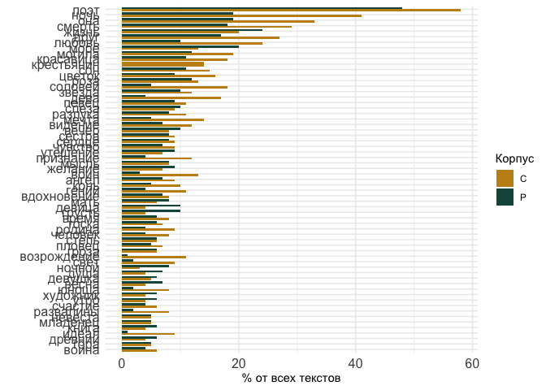

# 03_corpus_overview

# Corpus overview

## load pckg

``` r
library(tidyverse)
```

    Warning: package 'ggplot2' was built under R version 4.3.1

    Warning: package 'lubridate' was built under R version 4.3.1

    ── Attaching core tidyverse packages ──────────────────────── tidyverse 2.0.0 ──
    ✔ dplyr     1.1.3     ✔ readr     2.1.4
    ✔ forcats   1.0.0     ✔ stringr   1.5.0
    ✔ ggplot2   3.4.4     ✔ tibble    3.2.1
    ✔ lubridate 1.9.3     ✔ tidyr     1.3.0
    ✔ purrr     1.0.2     
    ── Conflicts ────────────────────────────────────────── tidyverse_conflicts() ──
    ✖ dplyr::filter() masks stats::filter()
    ✖ dplyr::lag()    masks stats::lag()
    ℹ Use the conflicted package (<http://conflicted.r-lib.org/>) to force all conflicts to become errors

``` r
library(tidytext)

library(MetBrewer)
theme_set(theme_minimal())
```

## load data

``` r
corpus_1835 <- readRDS("../../data/corpus1835/corpus_1835.Rds")
glimpse(corpus_1835)
```

    Rows: 4,799
    Columns: 20
    $ text_id       <chr> "P_1", "P_10", "P_100", "P_1000", "P_1001", "P_1002", "P…
    $ A_ID          <chr> "", "A-50", "A-7", "A-41", "A-139", "A-11", "A-163", "A-…
    $ author_sign   <chr> "", "Л. Якубович", "Кольцов", "Ф. Глинка", "Н. Прокопови…
    $ author_text   <chr> "", "Якубович Л.А.", "Кольцов А.В.", "Глинка Ф.Н.", "Про…
    $ text_title    <chr> "Солдатская песня", "Молния", "Ночлег чумаков", "Утешите…
    $ text_subtitle <chr> "", "", "Сельские картины", "", "", "", "", "", "", "", …
    $ first_line    <chr> "Ох жизнь, молодецкая", "Зачем с небесной высоты", "В бл…
    $ year          <chr> "1835", "1835", "1836", "1838", "1838", "1838", "1838", …
    $ path_text     <chr> "../../data/corpus1835/periodicals/per_raw//P_1.txt", ".…
    $ source_text   <chr> "Сев_пч. 1835. №12. C. 46", "БдЧ. 1835. Т.8. Отд. 1. C. …
    $ COL_ID        <chr> "", "", "", "", "", "", "", "", "", "", "", "", "", "", …
    $ corpus        <chr> "per", "per", "per", "per", "per", "per", "per", "per", …
    $ text_raw      <chr> "Ох, жизнь молодецкая,\nБравая, солдатская!\nКак осенняя…
    $ text_cln      <chr> "Ох, жизнь молодецкая,\nБравая, солдатская!\nКак осенняя…
    $ text_lemm     <chr> "ох, жизнь молодецкий,\nбравый, солдатский!\nкак осенний…
    $ text_acc      <chr> "Ох, жизнь молоде'цкая,\nБра'вая, солда'тская!\nКак осе'…
    $ meter         <fct> Other?, Iamb, Iamb, Iamb, Trochee, Iamb, Trochee, Iamb, …
    $ feet          <chr> "?", "3", "4", "4", "4", "4", "other", "4", "6", "5", "4…
    $ formula       <chr> "Other?_?", "Iamb_3", "Iamb_4", "Iamb_4", "Trochee_4", "…
    $ n_lines       <int> 38, 16, 98, 77, 28, 12, 44, 25, 31, 28, 100, 16, 17, 60,…

Read full metadata with books & periodicals titles to count sources

``` r
sources <- read.csv("../../data/corpus1835/sql_db/sources.csv")
text_ids <- read.csv("../../data/corpus1835/sql_db/texts_metadata.csv")

glimpse(sources)
```

    Rows: 676
    Columns: 11
    $ source_id   <chr> "C_101", "C_1027", "C_107", "C_111", "C_112", "C_113", "C_…
    $ type        <chr> "book", "book", "book", "book", "book", "book", "book", "b…
    $ class       <chr> "col -- lyr", "col -- lyr", "col -- lyr", "col -- lyr", "c…
    $ book_title  <chr> "Сочинения Дмитрия Кашкина: В 3 т. Т. 1", "Стихотворения Н…
    $ city        <chr> "М.", "М.", "СПб.", "М.", "М.", "М.", "СПб.", "СПб.", "СПб…
    $ publisher   <chr> "Степанова", "Ун. тип", "Вингебера", "Семена", "Ун. тип", …
    $ year        <int> 1836, 1835, 1836, 1836, 1838, 1836, 1836, 1836, 1836, 1836…
    $ volume      <chr> "", "", "", "", "", "", "", "", "", "", "", "", "", "", ""…
    $ issue       <chr> "", "", "", "", "", "", "", "", "", "", "", "", "", "", ""…
    $ n_texts     <int> 47, 5, 17, 106, 16, 39, 62, 70, 21, 10, 9, 21, 31, 27, 12,…
    $ total_pages <int> 468, 24, 73, 270, 131, 95, 112, 110, 194, 32, 35, 27, 284,…

``` r
glimpse(text_ids)
```

    Rows: 4,797
    Columns: 11
    $ text_id       <chr> "P_1", "P_10", "P_100", "P_1000", "P_1001", "P_1002", "P…
    $ source_id     <chr> "Per_1", "Per_2", "Per_3", "Per_4", "Per_4", "Per_4", "P…
    $ A_ID          <chr> "", "A_50", "A_7", "A_41", "A_139", "A_11", "A_163", "A_…
    $ text_title    <chr> "Солдатская песня", "Молния", "Ночлег чумаков", "Утешите…
    $ text_subtitle <chr> "", "", "Сельские картины", "", "", "", "", "", "", "", …
    $ first_line    <chr> "Ох жизнь, молодецкая", "Зачем с небесной высоты", "В бл…
    $ text_page     <chr> "C. 46", "C. 21", "C. 9-12", "C. 172-174", "C. 175-176",…
    $ corpus        <chr> "per", "per", "per", "per", "per", "per", "per", "per", …
    $ meter         <chr> "Other", "Iamb", "Iamb", "Iamb", "Trochee", "Iamb", "Tro…
    $ feet          <chr> "other", "3", "4", "4", "4", "4", "other", "4", "6", "5"…
    $ n_lines       <int> 38, 16, 98, 77, 28, 12, 44, 25, 31, 28, 100, 16, 17, 60,…

``` r
sources <- text_ids %>% 
  select(text_id, source_id, meter, feet) %>% 
  left_join(sources, by = "source_id")

rm(text_ids)
```

Helpers

``` r
meters_transl <- tibble(
  meter = c("Other?", "Iamb", "Trochee", "Amphibrach", "Anapest", "Dactyl"),
  meter_rus = c("Другой", "Ямб", "Хорей", "Амфибрахий", "Анапест", "Дактиль"),
  meter_short = c("Др", "Я", "Х", "Амф", "Ан", "Д")
)

unique(corpus_1835$meter)
```

    [1] Other?     Iamb       Trochee    Amphibrach Anapest    Dactyl    
    Levels: Amphibrach Anapest Dactyl Iamb Other? Trochee

# Overview

Corpus overview in terms of poems’ length and sizes of subcorpora

## corpus total size

``` r
print(paste0("Number of poems: ", nrow(corpus_1835)))
```

    [1] "Number of poems: 4799"

``` r
print(paste0("Number of poems in periodicals: ", table(corpus_1835$corpus)[2]))
```

    [1] "Number of poems in periodicals: 1905"

``` r
print(paste0( "Number of poems in collections: ", table(corpus_1835$corpus)[1]))
```

    [1] "Number of poems in collections: 2894"

``` r
print("Number of lines:")
```

    [1] "Number of lines:"

``` r
corpus_1835 %>% 
  select(corpus, text_raw) %>% 
  separate_rows(text_raw, sep = "\n") %>% 
  filter(text_raw != "") %>% nrow()
```

    [1] 192157

``` r
corpus_1835 %>% 
  select(corpus, text_raw) %>% 
  separate_rows(text_raw, sep = "\n") %>% 
  filter(text_raw != "") %>% 
  count(corpus)
```

    # A tibble: 2 × 2
      corpus      n
      <chr>   <int>
    1 col    120403
    2 per     71754

``` r
print("Number of tokens:")
```

    [1] "Number of tokens:"

``` r
corpus_1835 %>% 
  select(corpus, text_lemm) %>% 
  unnest_tokens(input = text_lemm, output = word, token = "words") %>% 
  nrow()
```

    [1] 881120

``` r
corpus_1835 %>% 
  select(corpus, text_lemm) %>% 
  unnest_tokens(input = text_lemm, output = word, token = "words") %>% 
  count(corpus) 
```

    # A tibble: 2 × 2
      corpus      n
      <chr>   <int>
    1 col    549592
    2 per    331528

``` r
print("Number of lemmas:")
```

    [1] "Number of lemmas:"

``` r
corpus_1835 %>% 
  select(corpus, text_lemm) %>% 
  unnest_tokens(input = text_lemm, output = word, token = "words") %>% 
  count(word) %>% nrow
```

    [1] 30399

``` r
corpus_1835 %>% 
  select(corpus, text_lemm) %>% 
  unnest_tokens(input = text_lemm, output = word, token = "words") %>% 
  count(corpus, word) %>%
  select(-n) %>%
  ungroup() %>%
  count(corpus)
```

    # A tibble: 2 × 2
      corpus     n
      <chr>  <int>
    1 col    24795
    2 per    18686

Number of poems per year

``` r
corpus_1835 %>% 
  count(year, corpus) %>% 
  ggplot(aes(x = year, y = n, fill = corpus)) + 
  geom_col(position = "dodge") + 
  scale_fill_manual(values = c(met.brewer("Veronese")[3],
                               met.brewer("Veronese")[6]))
```


``` r
corpus_1835 %>% 
  count(year, corpus) %>% 
  ggplot(aes(x = year, y = n, fill = corpus)) + 
  geom_col(position = "stack") + 
  scale_fill_manual(values = c(met.brewer("Veronese")[3],
                               met.brewer("Veronese")[6]))
```


Number of tokens per year

``` r
tokens <- corpus_1835 %>% 
  select(corpus, year, text_lemm) %>% 
  unnest_tokens(input = text_lemm, output = word, token = "words") %>% 
  count(corpus, year) 
  
tokens %>%  
  ggplot(aes(x = year, y = n, fill = corpus)) + geom_col(position = "dodge") + 
  scale_fill_manual(values = c(met.brewer("Veronese")[3],
                               met.brewer("Veronese")[6]))
```


``` r
tokens %>% 
  ggplot(aes(x = year, y = n, fill = corpus)) + geom_col(position = "stack") + 
  scale_fill_manual(values = c(met.brewer("Veronese")[3],
                               met.brewer("Veronese")[6]))
```


``` r
sum(tokens$n)
```

    [1] 881120

## authors’ subcorpora

Poems

``` r
corpus_1835 %>%
  filter(author_text != "") %>% 
  count(author_text, corpus, sort = T) %>% head(20)
```

    # A tibble: 20 × 3
       author_text      corpus     n
       <chr>            <chr>  <int>
     1 Крылов И.А.      col      186
     2 Суханов М.Д.     col      132
     3 Баратынский Е.А. col      131
     4 Мейснер А.       col      109
     5 Быстроглазов А.  col       97
     6 Меркли М.М.      col       93
     7 Тимофеев А.В.    col       77
     8 Демидов М.А.     col       75
     9 Башкатов А.      col       69
    10 Жуковский В.А.   col       69
    11 Ушаков А.А.      col       65
    12 Алексеев П.Ф.    col       63
    13 Бенедиктов В.Г.  col       63
    14 Мартынов А.М.    col       57
    15 Якубович Л.А.    per       57
    16 Смирнова А.      col       55
    17 Теплова Н.С.     col       54
    18 Подолинский А.И. col       52
    19 Бернет Е.        col       51
    20 Бутырский Н.И.   col       51

``` r
corpus_1835 %>%
  filter(author_text != "") %>% 
  count(author_text, corpus, sort = T) %>% 
  ggplot(aes(x = reorder_within(author_text, -n, -n), y = n, fill = corpus)) + geom_col() + 
  theme(axis.text.x = element_blank()) + 
  scale_fill_manual(values = c(met.brewer("Veronese")[3],
                               met.brewer("Veronese")[6]))
```


Number of tokens by authors

``` r
corpus_1835 %>%
  #filter(author_text != "") %>% 
  select(author_text, corpus, text_lemm) %>% 
  unnest_tokens(input = text_lemm, output = word, token = "words") %>%
  count(author_text, sort = T) %>% head(30)
```

    # A tibble: 30 × 2
       author_text           n
       <chr>             <int>
     1 "Жуковский В.А."  36554
     2 "Крылов И.А."     34887
     3 ""                33293
     4 "Кульман Е.Б."    25338
     5 "Бернет Е."       22293
     6 "Тимофеев А.В."   20729
     7 "Бороздна И.П."   20096
     8 "Быстроглазов А." 19582
     9 "Смирнова А."     19216
    10 "Бенедиктов В.Г." 18315
    # ℹ 20 more rows

``` r
corpus_1835 %>%
  # filter(author != "") %>% 
  select(author_text, corpus, text_lemm) %>% 
  unnest_tokens(input = text_lemm, output = word, token = "words") %>%
  count(author_text, corpus, sort = T) %>% 
  ggplot(aes(x = reorder_within(author_text, -n, -n), y = n, fill = corpus)) + 
  geom_col() + 
  geom_hline(yintercept = 2000, color = "blue") + 
  theme(axis.text.x = element_blank()) + 
  scale_fill_manual(values = c(met.brewer("Veronese")[3],
                               met.brewer("Veronese")[6]))
```


# Subtitles & genres

Simple word counter for genres and keywords in titles

``` r
corpus_1835 %>% 
  mutate(title_words = paste(text_title, text_subtitle)) %>% 
  filter(text_title != "NA" & text_subtitle != "na") %>% 
  select(text_id, text_title, title_words) %>% 
  unnest_tokens(input = title_words, output = word, token = "words") %>%
  #filter(word == "е") #%>% 
  count(word, sort = T) 
```

    # A tibble: 4,432 × 2
       word              n
       <chr>         <int>
     1 к               379
     2 и               365
     3 из              256
     4 в               221
     5 на              189
     6 песня           154
     7 песни           136
     8 с                96
     9 романс           74
    10 стихотворения    63
    # ℹ 4,422 more rows

``` r
# things like separate letters ("e") came from titles with abbreviated names ("To E.E.")
```

``` r
titles <- corpus_1835 %>% 
  mutate(title_words = paste(text_title, text_subtitle)) %>% 
  filter(text_title != "NA" & text_subtitle != "na") %>% 
  select(text_id, text_title, title_words) %>% 
  unnest_tokens(input = title_words, output = word, token = "words") #%>%
  #filter(word == "е") #%>% 
  #count(word, sort = T) 

# write.csv(titles, "poems_titles.csv") # write to lemmatise
```

Load titles

``` r
titles <- read.csv("poems_titles.csv") %>% select(-X)

head(titles)
```

      text_id       text_title       word      lemma
    1     P_1 Солдатская песня солдатская солдатский
    2     P_1 Солдатская песня      песня      песня
    3    P_10           Молния     молния     молния
    4   P_100   Ночлег чумаков     ночлег     ночлег
    5   P_100   Ночлег чумаков    чумаков      чумак
    6   P_100   Ночлег чумаков   сельские   сельский

Count lemmas in titles

``` r
titles_counter <- titles %>% 
  count(lemma, sort = T)

head(titles_counter, 215)
```

                 lemma   n
    1                к 379
    2                и 365
    3            песня 296
    4               из 256
    5                в 221
    6               на 189
    7           романс 115
    8             поэт 106
    9              два 100
    10               с  96
    11             мой  86
    12           сонет  81
    13         русский  75
    14          элегия  73
    15   стихотворение  70
    16           басня  69
    17            ночь  60
    18           песнь  58
    19             год  55
    20          альбом  53
    21            дума  52
    22             она  52
    23          шарада  51
    24          смерть  47
    25         баллада  45
    26         отрывок  45
    27      подражание  45
    28             три  45
    29            друг  44
    30           жизнь  44
    31        послание  43
    32               а  38
    33              ву  38
    34         молитва  36
    35              он  36
    36            день  35
    37               о  35
    38    воспоминание  34
    39          любовь  34
    40            море  33
    41               i  32
    42               е  32
    43             при  32
    44          могила  31
    45              ой  31
    46               у  31
    47          омоним  30
    48       красавица  29
    49        фантазия  29
    50               я  29
    51           поэма  28
    52          псалом  28
    53       эпиграмма  28
    54               г  27
    55            гете  27
    56               л  26
    57              не  26
    58             сон  26
    59               б  25
    60         картина  25
    61            роза  25
    62            стих  25
    63          цветок  25
    64          память  24
    65       последний  24
    66            гюго  23
    67         коринна  23
    68               м  23
    69         соловей  23
    70              ii  22
    71              na  22
    72          звезда  22
    73               н  22
    74             вой  21
    75            дева  21
    76         мелодия  21
    77         перевод  21
    78           новый  20
    79           певец  20
    80         видение  19
    81               й  19
    82           мечта  19
    83          первый  19
    84         разлука  19
    85        славянин  19
    86      славянский  19
    87           слеза  19
    88           вечер  18
    89          виктор  18
    90               д  18
    91     посвящаться  18
    92           станс  18
    93               1  17
    94  антологический  17
    95          аполог  17
    96            быть  17
    97              го  17
    98            орел  17
    99           ответ  17
    100       памятник  17
    101         сердце  17
    102         сестра  17
    103          ангел  16
    104        великий  16
    105           воин  16
    106            все  16
    107        желание  16
    108           змея  16
    109          мысль  16
    110    песнословие  16
    111         письмо  16
    112      признание  16
    113       утешение  16
    114        чувство  16
    115         байрон  15
    116           брат  15
    117    вдохновение  15
    118          гений  15
    119       западный  15
    120           конь  15
    121             по  15
    122        портрет  15
    123      посвящать  15
    124         пушкин  15
    125             св  15
    126         сказка  15
    127          совет  15
    128              2  14
    129     александра  14
    130          венок  14
    131          время  14
    132         грусть  14
    133         девица  14
    134     крестьянин  14
    135         лисица  14
    136           мать  14
    137         москва  14
    138             му  14
    139      присылать  14
    140       прощание  14
    141            iii  13
    142             iv  13
    143       германия  13
    144        надпись  13
    145          пасха  13
    146         родина  13
    147          тоска  13
    148       экспромт  13
    149         эпилог  13
    150              5  12
    151            а.с  12
    152             во  12
    153    возрождение  12
    154      восточный  12
    155          голос  12
    156           граф  12
    157          гроза  12
    158          канон  12
    159            мир  12
    160       наполеон  12
    161         пловец  12
    162     солдатский  12
    163          степь  12
    164             ты  12
    165        человек  12
    166         черный  12
    167         четыре  12
    168              ш  12
    169              4  11
    170          весна  11
    171           волк  11
    172        девушка  11
    173           душа  11
    174             же  11
    175        женщина  11
    176            или  11
    177       ламартин  11
    178         ночной  11
    179        оседать  11
    180              п  11
    181        посылка  11
    182  разочарование  11
    183        рассказ  11
    184          ручей  11
    185           свет  11
    186         шиллер  11
    187           1837  10
    188              3  10
    189              7  10
    190          война  10
    191         вопрос  10
    192        встреча  10
    193           гора  10
    194        древний  10
    195          идеал  10
    196          книга  10
    197        кончина  10
    198            лев  10
    199          мария  10
    200       младенец  10
    201        невеста  10
    202       немецкий  10
    203       праздник  10
    204      развалины  10
    205       разговор  10
    206        римский  10
    207        счастие  10
    208              т  10
    209           утро  10
    210              ф  10
    211       художник  10
    212          юноша  10
    213             vi   9
    214           буря   9
    215    возвращение   9

Count N of periodicals and books texts

``` r
# total number of texts in periodicals and in collections
n_corpus <- corpus_1835 %>% 
  mutate(corpus = str_extract(text_id, "^\\w")) %>% 
  count(corpus) %>% 
  rename(total = n)

n_corpus
```

    # A tibble: 2 × 2
      corpus total
      <chr>  <int>
    1 C       2894
    2 P       1905

### genre titles

Look into particular lemmas

``` r
genres <- unlist(str_split(c("песня
романс
сонет
элегия
басня
песнь
альбом
дума
баллада
отрывок
подражание
послание
молитва
фантазия
псалом
эпиграмма
мелодия
антологический
надпись
аполог
сказка
экспромт
эпилог
шарада
омоним
куплет
гимн
предание
акростих
быль
ода
преложение
анаграмма
эпиграм
застольная
надгробный
аллегория
логогриф
идиллия
нагробный
надгробие
рондо
анаграм
анфологический
газель
элегический
эпиграммаять
эпиграммик"), pattern = "\n"))

genres_shortlist <- unlist(str_split(c("песня
романс
сонет
элегия
басня
песнь
альбом
дума
баллада
отрывок
подражание
послание
молитва
фантазия
псалом
эпиграмма
мелодия
антологический
аполог
сказка
экспромт
надпись
эпилог"), pattern = "\n"))
```

Count number of texts that include genre words in title

``` r
titles_counter %>% 
  filter(lemma %in% genres)
```

                lemma   n
    1           песня 296
    2          романс 115
    3           сонет  81
    4          элегия  73
    5           басня  69
    6           песнь  58
    7          альбом  53
    8            дума  52
    9          шарада  51
    10        баллада  45
    11        отрывок  45
    12     подражание  45
    13       послание  43
    14        молитва  36
    15         омоним  30
    16       фантазия  29
    17         псалом  28
    18      эпиграмма  28
    19        мелодия  21
    20 антологический  17
    21         аполог  17
    22         сказка  15
    23        надпись  13
    24       экспромт  13
    25         эпилог  13
    26         куплет   9
    27           гимн   8
    28       предание   8
    29       акростих   7
    30           быль   7
    31            ода   7
    32     преложение   7
    33      анаграмма   6
    34        эпиграм   6
    35     застольная   5
    36     надгробный   5
    37      аллегория   4
    38       логогриф   4
    39        идиллия   3
    40      нагробный   2
    41      надгробие   2
    42          рондо   2
    43        анаграм   1
    44 анфологический   1
    45         газель   1
    46    элегический   1
    47   эпиграммаять   1
    48     эпиграммик   1

``` r
titles %>% 
  filter(lemma %in% genres) %>% 
  mutate(corpus = str_extract(text_id, "^\\w")) %>% 
  count(corpus, lemma, sort = T) %>% 
  pivot_wider(names_from = corpus, values_from = n)
```

    # A tibble: 48 × 3
       lemma        P     C
       <chr>    <int> <int>
     1 песня      164   132
     2 романс      19    96
     3 басня       12    57
     4 сонет       30    51
     5 шарада      51    NA
     6 элегия      29    44
     7 послание     6    37
     8 альбом      19    34
     9 дума        31    21
    10 песнь       28    30
    # ℹ 38 more rows

``` r
# roughly % of texts with genre titles
titles %>% 
  filter(lemma %in% genres) %>% 
  distinct(text_id) %>% 
  count() %>% 
  mutate(perc = n/nrow(corpus_1835)*100)
```

         n     perc
    1 1252 26.08877

``` r
# same % but divided for periodicals and collections
titles %>% 
  filter(lemma %in% genres) %>% 
  distinct(text_id) %>% 
  mutate(corpus = str_extract(text_id, "^\\w")) %>% 
  count(corpus) %>% 
  left_join(n_corpus, by = "corpus") %>% 
  mutate(perc = n/total*100)
```

      corpus   n total     perc
    1      C 663  2894 22.90947
    2      P 589  1905 30.91864

``` r
# remove LRPI data
titles %>% 
  filter(lemma %in% genres) %>% 
  filter(!lemma %in% c("шарада", "омоним", "акростих", "анаграм")) %>% 
  distinct(text_id) %>% 
  mutate(corpus = str_extract(text_id, "^\\w")) %>% 
  count(corpus) %>% 
  left_join(n_corpus, by = "corpus") %>% 
  mutate(perc = n/total*100)
```

      corpus   n total     perc
    1      C 657  2894 22.70214
    2      P 513  1905 26.92913

``` r
titles %>% 
  filter(lemma %in% genres_shortlist) %>% 
  mutate(corpus = str_extract(text_id, "^\\w")) %>% 
  count(corpus, lemma, sort = T) %>% 
  left_join(n_corpus, by = "corpus") %>% 
  mutate(perc = round(n/total*100, 2)) %>% select(-n, -total) %>% 
  pivot_wider(names_from = corpus, values_from = perc)
```

    # A tibble: 23 × 3
       lemma        P     C
       <chr>    <dbl> <dbl>
     1 песня     8.61  4.56
     2 романс    1     3.32
     3 басня     0.63  1.97
     4 сонет     1.57  1.76
     5 элегия    1.52  1.52
     6 послание  0.31  1.28
     7 альбом    1     1.17
     8 дума      1.63  0.73
     9 песнь     1.47  1.04
    10 баллада   1.52  0.55
    # ℹ 13 more rows

``` r
titles %>% 
  filter(lemma %in% genres_shortlist) %>% 
  mutate(corpus = str_extract(text_id, "^\\w")) %>% 
  count(corpus, lemma, sort = T) %>% 
  left_join(n_corpus, by = "corpus") %>% 
  mutate(perc = round(n/total*100, 2),
         corpus = ifelse(corpus == "P", "Периодика", "Отд. изд.")) %>% 
  select(-n, -total) %>% 
  ggplot(aes(x = reorder_within(lemma, by = perc, within = lemma), 
             y = perc, 
             fill = corpus)) + 
  scale_x_reordered() + 
  coord_flip() + 
  geom_col(position = "dodge",
           width = 0.8) + 
  labs(x = "", 
       y = "% от всех текстов",
       fill = "Корпус") +
  scale_fill_manual(values = c(met.brewer("Veronese")[3],
                               met.brewer("Veronese")[6])) + 
  theme(axis.text = element_text(size = 12))
```


Songs by years

``` r
glimpse(corpus_1835)
```

    Rows: 4,799
    Columns: 20
    $ text_id       <chr> "P_1", "P_10", "P_100", "P_1000", "P_1001", "P_1002", "P…
    $ A_ID          <chr> "", "A-50", "A-7", "A-41", "A-139", "A-11", "A-163", "A-…
    $ author_sign   <chr> "", "Л. Якубович", "Кольцов", "Ф. Глинка", "Н. Прокопови…
    $ author_text   <chr> "", "Якубович Л.А.", "Кольцов А.В.", "Глинка Ф.Н.", "Про…
    $ text_title    <chr> "Солдатская песня", "Молния", "Ночлег чумаков", "Утешите…
    $ text_subtitle <chr> "", "", "Сельские картины", "", "", "", "", "", "", "", …
    $ first_line    <chr> "Ох жизнь, молодецкая", "Зачем с небесной высоты", "В бл…
    $ year          <chr> "1835", "1835", "1836", "1838", "1838", "1838", "1838", …
    $ path_text     <chr> "../../data/corpus1835/periodicals/per_raw//P_1.txt", ".…
    $ source_text   <chr> "Сев_пч. 1835. №12. C. 46", "БдЧ. 1835. Т.8. Отд. 1. C. …
    $ COL_ID        <chr> "", "", "", "", "", "", "", "", "", "", "", "", "", "", …
    $ corpus        <chr> "per", "per", "per", "per", "per", "per", "per", "per", …
    $ text_raw      <chr> "Ох, жизнь молодецкая,\nБравая, солдатская!\nКак осенняя…
    $ text_cln      <chr> "Ох, жизнь молодецкая,\nБравая, солдатская!\nКак осенняя…
    $ text_lemm     <chr> "ох, жизнь молодецкий,\nбравый, солдатский!\nкак осенний…
    $ text_acc      <chr> "Ох, жизнь молоде'цкая,\nБра'вая, солда'тская!\nКак осе'…
    $ meter         <fct> Other?, Iamb, Iamb, Iamb, Trochee, Iamb, Trochee, Iamb, …
    $ feet          <chr> "?", "3", "4", "4", "4", "4", "other", "4", "6", "5", "4…
    $ formula       <chr> "Other?_?", "Iamb_3", "Iamb_4", "Iamb_4", "Trochee_4", "…
    $ n_lines       <int> 38, 16, 98, 77, 28, 12, 44, 25, 31, 28, 100, 16, 17, 60,…

``` r
titles %>% 
  left_join(corpus_1835 %>% select(text_id, year), by = "text_id") %>% 
  mutate(corpus = str_extract(text_id, "^\\w")) %>% 
  count(corpus, year, lemma, sort = T) %>% 
  filter(lemma == "песня" | lemma == "романс") %>% 
  ggplot(aes(x = year, y = n, fill = corpus)) + 
  geom_col(position = "dodge") + 
  facet_wrap(~lemma, ncol = 1) + 
  scale_fill_manual(values = c(met.brewer("Veronese")[3],
                               met.brewer("Veronese")[6]))
```

    Warning in left_join(., corpus_1835 %>% select(text_id, year), by = "text_id"): Detected an unexpected many-to-many relationship between `x` and `y`.
    ℹ Row 9189 of `x` matches multiple rows in `y`.
    ℹ Row 1 of `y` matches multiple rows in `x`.
    ℹ If a many-to-many relationship is expected, set `relationship =
      "many-to-many"` to silence this warning.


Attach metadata to text titles data and count sources per year

``` r
songs_sources <- titles %>% 
  filter(lemma == "песня") %>% 
  select(text_id) %>% 
  left_join(sources, by = "text_id") %>% 
  count(type, year, book_title) %>% 
  arrange(-desc(year))

songs_sources %>% 
  filter(year == "1839" & type == "periodicals")
```

             type year book_title n
    1 periodicals 1839        БдЧ 8
    2 periodicals 1839       ЛПРИ 3
    3 periodicals 1839         ОЗ 3
    4 periodicals 1839         СО 3

``` r
songs_sources %>% 
  filter(year == "1840" & type == "periodicals") %>% 
  arrange(desc(n))
```

             type year book_title  n
    1 periodicals 1840         СО 19
    2 periodicals 1840         ЛГ 18
    3 periodicals 1840         ОЗ 14
    4 periodicals 1840     ПРиВЕТ  9
    5 periodicals 1840       Маяк  7
    6 periodicals 1840        БдЧ  3

``` r
# write full data for exploration
# write.csv(songs_sources, "03_1_genres_songs-sources.csv")
```

Look into songs titles

``` r
titles %>% 
  filter(lemma == "песня") %>% 
  left_join(sources, by = "text_id") %>% 
  filter(year == "1840" & type == "periodicals") %>% 
  select(text_id, text_title, book_title)
```

       text_id                                  text_title book_title
    1   P_1163                   Казачья колыбельная песня         ОЗ
    2   P_1180                               Русская песня         ОЗ
    3   P_1182                                       Песня         ОЗ
    4   P_1190                                                     ОЗ
    5   P_1191                                                     ОЗ
    6   P_1194                               Веселая песня         ОЗ
    7   P_1197                                       Песня         ОЗ
    8   P_1202                                       Песня         ОЗ
    9   P_1205                                       Песня         ОЗ
    10  P_1208                            Песня разбойника         ОЗ
    11  P_1216                                       Песня         ОЗ
    12  P_1238                               Русская песня         ОЗ
    13  P_1248                               Русская песня         ОЗ
    14  P_1249                                       Песня         ОЗ
    15  P_1749                   Старинная свадебная песня         ЛГ
    16  P_1765                                       Песня         ЛГ
    17  P_1780                                       Песня         ЛГ
    18  P_1781                            Хороводная песня         ЛГ
    19  P_1794                                                     ЛГ
    20  P_1795                                                     ЛГ
    21  P_1797                               Русская песня         ЛГ
    22  P_1800                               Русская песня         ЛГ
    23  P_1800                               Русская песня         ЛГ
    24  P_1801                             Цыганская песня         ЛГ
    25  P_1801                             Цыганская песня         ЛГ
    26  P_1802                                                     ЛГ
    27  P_1803                                                     ЛГ
    28  P_1804                                                     ЛГ
    29  P_1805                                                     ЛГ
    30  P_1806                                                     ЛГ
    31  P_1807                                                     ЛГ
    32  P_1817                                       Песня         ЛГ
    33  P_1884 Старая песня, которую поет каждый по-своему       Маяк
    34  P_1891     Песня из собрания песен Русского моряка       Маяк
    35  P_1891     Песня из собрания песен Русского моряка       Маяк
    36  P_1911                               Русская песня       Маяк
    37  P_1926                                       Песня       Маяк
    38  P_1957                                  Песня швеи       Маяк
    39  P_1967                            Песня Калабрийки       Маяк
    40   P_314                           Колыбельная песня        БдЧ
    41   P_348     Прощальная песня из недоконченной поэмы        БдЧ
    42   P_360                               Русская песня        БдЧ
    43   P_705                               Русская песня         СО
    44   P_711           С девичьей жизнью минет и веселье         СО
    45   P_712                          Девица и ее личико         СО
    46   P_713                                   Обручница         СО
    47   P_714                            Сестры без брата         СО
    48   P_715                               Рыба и девица         СО
    49   P_716                                  На выворот         СО
    50   P_717                                   Проклятие         СО
    51   P_718                       Молитва на юрьев день         СО
    52   P_719                На кого глядя растут девицы?         СО
    53   P_720                    Что мило, то и прекрасно         СО
    54   P_721                                 Дурная мода         СО
    55   P_722                             Желание женское         СО
    56   P_723                             Желание мужское         СО
    57   P_724                                 Непослушная         СО
    58   P_725                         Как судить о девице         СО
    59   P_726                            Казнь горделивой         СО
    60   P_727                       Пей вино, люби девицу         СО
    61   P_728                                  Воспитание         СО
    62   P_799         Последняя русская песня Н. Цыганова     ПРиВЕТ
    63   P_806                               Русская песня     ПРиВЕТ
    64   P_807                  Колыбельная песня Пантеону     ПРиВЕТ
    65   P_813                           Колыбельная песня     ПРиВЕТ
    66   P_828                               Русская песня     ПРиВЕТ
    67   P_829                              Народная песня     ПРиВЕТ
    68   P_845                          Как она прекрасна!     ПРиВЕТ
    69   P_849                               Русская песня     ПРиВЕТ
    70   P_858                                Песня ямщика     ПРиВЕТ

``` r
# quick check on empty main titles
corpus_1835 %>% 
  filter(text_id %in% c("P_1190", "P_1191", "P_1794", "P_1795"))
```

    # A tibble: 4 × 20
      text_id A_ID  author_sign      author_text text_title text_subtitle first_line
      <chr>   <chr> <chr>            <chr>       <chr>      <chr>         <chr>     
    1 P_1190  "A-7" А. Кольцов       Кольцов А.… ""         Две русские … Греет сол…
    2 P_1191  "A-7" А. Кольцов       Кольцов А.… ""         Две русские … Без ума, …
    3 P_1794  ""    Крестьянин Ав. … Крестьянин… ""         Хороводные п… Как под б…
    4 P_1795  ""    Крестьянин Ав. … Крестьянин… ""         Хороводные п… Вдоль по …
    # ℹ 13 more variables: year <chr>, path_text <chr>, source_text <chr>,
    #   COL_ID <chr>, corpus <chr>, text_raw <chr>, text_cln <chr>,
    #   text_lemm <chr>, text_acc <chr>, meter <fct>, feet <chr>, formula <chr>,
    #   n_lines <int>

### genre and meters

Some work around texts with multiple genres in the title (“подражание
псалму”)

``` r
# multigenre <- titles %>% 
#   select(text_id, lemma) %>% 
#   filter(lemma %in% genres_shortlist) %>% 
#   group_by(text_id) %>% 
#   summarise(genre = paste0(lemma, collapse = " | ")) %>% 
#   filter(str_detect(genre, " \\| "))

# m <- corpus1835 %>% 
#   filter(text_id %in% multigenre$text_id) %>% 
#   select(text_id, text_title, text_subtitle) %>% 
#   left_join(multigenre %>% select(text_id, genre), by = "text_id")

# write.csv(m, "multigenre_texts.csv")

# read the data with normalised genres
m <- read.delim("multigenre_texts.csv", sep = ';') %>% select(-X)

glimpse(m)
```

    Rows: 91
    Columns: 5
    $ text_id       <chr> "P_114", "P_1326", "P_1378", "P_138", "P_139", "P_140", …
    $ text_title    <chr> "Обитатель Сиона", "Отрывок из Шиллеровой песни о колоко…
    $ text_subtitle <chr> "Подражание псалму", "", "Подражание французскому", "Сол…
    $ genre         <chr> "подражание | псалом", "отрывок | песня", "песнь | подра…
    $ true_genre    <chr> "псалом", "отрывок", "песнь", "песня", "песня", "песня",…

``` r
titles %>% 
  filter(lemma %in% genres) %>% 
  
  # attach cleaned genres data for selected texts
  left_join(m %>% select(text_id, true_genre), by = "text_id") %>% 
  mutate(lemma = ifelse(!is.na(true_genre), true_genre, lemma)) %>% 
  select(-true_genre) %>% 
  
  # additional selection for a better plot
  # additional selection for a better plot
  filter(lemma %in% c("баллада", "басня", 
                      "дума", "мелодия", #"молитва", "отрывок", 
                      "песнь", "песня", #"подражание", "послание", 
                      #"псалом", 
                      "романс", "сонет", "элегия"#, "эпиграмма"
                      )) %>% 
  # capitalisation for the plot
  mutate(lemma = tools::toTitleCase(lemma)) %>% 
  
  left_join(sources, by = "text_id") %>% 
  filter(meter != "Other") %>% 
  
  # attach rus meters for the plot
  left_join(meters_transl, by = "meter") %>% 
  
  count(lemma, meter_rus, sort = T) %>% 
  ggplot(aes(x = meter_rus, y = n, fill = meter_rus)) + 
  geom_col(position = "dodge") + 
  facet_wrap(~lemma, scales = "free_x") + 
  coord_flip() + 
  scale_fill_manual(values = c(met.brewer("Veronese")[6],
                               met.brewer("Veronese")[4],
                               met.brewer("Veronese")[7],
                               met.brewer("Veronese")[3],
                               met.brewer("Veronese")[1])) + 
  theme(text = element_text(size = 12), 
        legend.position = "None") + 
  labs(x = "", y = "Количество текстов") 
```


Same for formulas

``` r
titles %>% 
  filter(lemma %in% genres) %>% 
  
  # attach cleaned genres data for selected texts
  left_join(m %>% select(text_id, true_genre), by = "text_id") %>% 
  mutate(lemma = ifelse(!is.na(true_genre), true_genre, lemma)) %>% 
  select(-true_genre) %>% 
  
  # additional selection for a better plot
  filter(lemma %in% c("баллада", "басня", 
                      "дума", "мелодия", #"молитва", "отрывок", 
                      "песнь", "песня", #"подражание", "послание", 
                      #"псалом", 
                      "романс", "сонет", "элегия"#, "эпиграмма"
                      )) %>% 
  mutate(lemma = tools::toTitleCase(lemma)) %>% 
  
  left_join(sources, by = "text_id") %>% 
  filter(meter != "Other") %>% 
  
  left_join(meters_transl, by = "meter") %>% 
  
  mutate(formula = paste0(meter_short, feet)) %>% 
  filter(formula %in% c("Я4", "Я5", "Я6", "Яother",
                        "Х4", "Амф4")) %>% 
  mutate(formula = ifelse(formula == "Яother", "Яв", formula)) %>% 
  count(lemma, formula, sort = T) %>% 
  ggplot(aes(x = formula, y = n, fill = formula)) + 
  geom_col(position = "dodge") + 
  facet_wrap(~lemma, scales = "free_x") + 
  coord_flip() + 
  scale_fill_manual(values = c(met.brewer("Veronese")[5],
                               met.brewer("Veronese")[3],
                               met.brewer("Veronese")[1],
                               met.brewer("Veronese")[7],
                               met.brewer("Veronese")[4],
                               met.brewer("Veronese")[6])) +
  theme(text = element_text(size = 12), 
        legend.position = "None") + 
  labs(x = "", y = "Количество текстов")
```


Only periodicals

``` r
titles %>% 
  filter(lemma %in% genres) %>% 
  # additional selection for a better plot
  filter(lemma %in% c("баллада", "басня", "дума", "мелодия", "молитва",
                      "отрывок", "песнь", "песня", "подражание", "послание", 
                      "псалом", "романс", "сонет", "элегия", "эпиграмма")) %>% 
  left_join(sources, by = "text_id") %>% 
  filter(meter != "Other" & type == "periodicals") %>% 
  mutate(formula = paste0(meter, "_", feet)) %>% 
  filter(formula %in% c("Iamb_4", "Iamb_5", "Iamb_6", "Iamb_other",
                        "Trochee_4", "Amphibrach_4")) %>% 
  count(lemma, formula, sort = T) %>% 
  ggplot(aes(x = formula, y = n, fill = formula)) + 
  geom_col(position = "dodge") + 
  facet_wrap(~lemma, scales = "free_x") + 
  coord_flip() + 
  scale_fill_manual(values = c(met.brewer("Veronese")[6],
                               met.brewer("Veronese")[1],
                               met.brewer("Veronese")[7],
                               met.brewer("Veronese")[4],
                               met.brewer("Veronese")[5],
                               met.brewer("Veronese")[3])) +
  theme(text = element_text(size = 12)) + 
  labs(x = "", y = "Количество текстов", 
       title = "Only periodicals")
```


Only books

``` r
titles %>% 
  filter(lemma %in% genres) %>% 
  # additional selection for a better plot
  filter(lemma %in% c("баллада", "басня", "дума", "мелодия", "молитва",
                      "отрывок", "песнь", "песня", "подражание", "послание", 
                      "псалом", "романс", "сонет", "элегия", "эпиграмма")) %>% 
  left_join(sources, by = "text_id") %>% 
  filter(meter != "Other" & type == "book") %>% 
  mutate(formula = paste0(meter, "_", feet)) %>% 
  filter(formula %in% c("Iamb_4", "Iamb_5", "Iamb_6", "Iamb_other",
                        "Trochee_4", "Amphibrach_4")) %>% 
  count(lemma, formula, sort = T) %>% 
  ggplot(aes(x = formula, y = n, fill = formula)) + 
  geom_col(position = "dodge") + 
  facet_wrap(~lemma, scales = "free_x") + 
  coord_flip() + 
  scale_fill_manual(values = c(met.brewer("Veronese")[6],
                               met.brewer("Veronese")[1],
                               met.brewer("Veronese")[7],
                               met.brewer("Veronese")[4],
                               met.brewer("Veronese")[5],
                               met.brewer("Veronese")[3])) +
  theme(text = element_text(size = 12)) + 
  labs(x = "", y = "Количество текстов")
```


Topic titles (words with freq \> 10 are selected)

``` r
topics <- unlist(str_split("поэт
ночь
она
смерть
друг
жизнь
любовь
море
могила
красавица
сон
роза
цветок
соловей
звезда
дева
певец
видение
мечта
разлука
слеза
вечер
сердце
сестра
ангел
воин
желание
мысль
признание
утешение
чувство
вдохновение
гений
конь
время
грусть
девица
крестьянин
мать
родина
тоска
возрождение
гроза
пловец
степь
человек
весна
девушка
душа
ночной
свет
война
гора
древний
идеал
книга
младенец
невеста
развалины
счастие
утро
художник
юноша", pattern = "\n"))

# roughly % of texts with topic titles
titles %>% 
  filter(lemma %in% topics) %>% 
  distinct(text_id) %>% 
  count() %>% 
  mutate(perc = n/nrow(corpus_1835)*100)
```

         n     perc
    1 1138 23.71327

``` r
# same % but divided for periodicals and collections
titles %>% 
  filter(lemma %in% topics) %>% 
  distinct(text_id) %>% 
  mutate(corpus = str_extract(text_id, "^\\w")) %>% 
  count(corpus) %>% 
  left_join(n_corpus, by = "corpus") %>% 
  mutate(perc = n/total*100)
```

      corpus   n total     perc
    1      C 665  2894 22.97858
    2      P 473  1905 24.82940

``` r
titles %>% 
  filter(lemma %in% topics) %>% 
  mutate(corpus = str_extract(text_id, "^\\w")) %>% 
  count(corpus, lemma, sort = T) %>% 
  # left_join(n_corpus, by = "corpus") %>% 
  #mutate(perc = round(n/total*100, 2),
  #       corpus = ifelse(corpus == "P", "Периодика", "Отд. изд.")) %>% 
  # select(-n, -total) %>% 
  ggplot(aes(x = reorder_within(lemma, by = n, within = lemma), 
             y = n, 
             fill = corpus)) + 
  scale_x_reordered() + 
  coord_flip() + 
  geom_col(position = "dodge",
           width = 0.8) + 
  labs(x = "", 
       y = "% от всех текстов",
       fill = "Корпус") +
  scale_fill_manual(values = c(met.brewer("Veronese")[3],
                               met.brewer("Veronese")[6])) + 
  theme(axis.text = element_text(size = 12))
```



Total number of hits

``` r
titles %>% 
  filter(lemma %in% topics) %>% 
  count(lemma, sort = T) %>% 
  head(30)
```

           lemma   n
    1       поэт 106
    2       ночь  60
    3        она  52
    4     смерть  47
    5       друг  44
    6      жизнь  44
    7     любовь  34
    8       море  33
    9     могила  31
    10 красавица  29
    11       сон  26
    12      роза  25
    13    цветок  25
    14   соловей  23
    15    звезда  22
    16      дева  21
    17     певец  20
    18   видение  19
    19     мечта  19
    20   разлука  19
    21     слеза  19
    22     вечер  18
    23    сердце  17
    24    сестра  17
    25     ангел  16
    26      воин  16
    27   желание  16
    28     мысль  16
    29 признание  16
    30  утешение  16

### topics

Thematic words in titles distribution

``` r
titles %>% 
  filter(lemma %in% topics) %>% 
  distinct(text_id) %>%
  left_join(sources, by = "text_id") %>% 
  count(type, year) %>%
  ggplot(aes(x = year, y = n, fill = type)) + 
  geom_col(position = "dodge") + 
  scale_fill_manual(values = c(met.brewer("Veronese")[3],
                               met.brewer("Veronese")[6]))
```


Selected words appeared more than 16 times : поэт, ночь, жизнь, смерть,
море, любовь, могила, сон, крестьянин, мечта

``` r
titles %>% 
  filter(lemma %in% topics) %>% 
  left_join(sources, by = "text_id") %>% 
  filter(lemma %in% c("поэт", "ночь", "жизнь", "смерть",
                      "море", "любовь", "могила", "сон", "мечта", 
                      "звезда", "певец", "разлука", "слеза",
                      "ангел", "мысль", "родина")) %>% 
  count(type, year, lemma) %>% 
  ggplot(aes(x = year, y = n, fill = type)) + 
  geom_col(position = "dodge") + 
  facet_wrap(~lemma) + 
  scale_fill_manual(values = c(met.brewer("Veronese")[3],
                               met.brewer("Veronese")[6]))
```


Selected words and meters

``` r
titles %>% 
  filter(lemma %in% topics) %>% 
  left_join(sources, by = "text_id") %>% 
  filter(lemma %in% c("поэт", "ночь", "жизнь", "смерть",
                      "море", "любовь", "могила", "сон", "мечта", 
                      "звезда", "певец", "разлука", "слеза",
                      "ангел", "мысль", "родина")) %>% 
  count(meter, lemma) %>% 
  filter(meter != "Other") %>% 
  ggplot(aes(x = meter, y = n, fill = meter)) + 
  geom_col(position = "dodge") + 
  facet_wrap(~lemma, scales = "free") + 
  coord_flip() + 
  scale_fill_manual(values = c(met.brewer("Veronese")[6],
                               met.brewer("Veronese")[4],
                               met.brewer("Veronese")[7],
                               met.brewer("Veronese")[1],
                               met.brewer("Veronese")[3])) + 
  theme(text = element_text(size = 12)) + 
  labs(x = "", y = "Количество текстов")
```


Formulas

``` r
titles %>% 
  filter(lemma %in% topics) %>% 
  filter(lemma %in% c("поэт", "ночь", "жизнь", "смерть",
                      "море", "любовь", "могила", "сон", "мечта", 
                      "звезда", "певец", "разлука", "слеза",
                      "ангел", "мысль", "родина")) %>% 
  
  mutate(lemma = tools::toTitleCase(lemma)) %>% 
  
  left_join(sources, by = "text_id") %>% 
  filter(meter != "Other") %>% 
  
  left_join(meters_transl, by = "meter") %>% 
  
  mutate(formula = paste0(meter_short, feet)) %>% 
  filter(formula %in% c("Я4", "Я5", "Я6", "Яother",
                        "Х4", "Амф4")) %>% 
  mutate(formula = ifelse(formula == "Яother", "Яв", formula)) %>% 
  count(lemma, formula, sort = T) %>% 
  ggplot(aes(x = formula, y = n, fill = formula)) + 
  geom_col(position = "dodge") + 
  facet_wrap(~lemma, scales = "free_x") + 
  coord_flip() + 
  scale_fill_manual(values = c(met.brewer("Veronese")[5],
                               met.brewer("Veronese")[3],
                               met.brewer("Veronese")[1],
                               met.brewer("Veronese")[7],
                               met.brewer("Veronese")[4],
                               met.brewer("Veronese")[6])) +
  theme(text = element_text(size = 12), 
        legend.position = "None") + 
  labs(x = "", y = "Количество текстов")
```


Names

``` r
n <- unlist(str_split(
  "гете
гюго
байрон
пушкин
наполеон
ламартин
шиллер",
  pattern = "\n"
))

# roughly % of texts with topic titles
titles %>% 
  filter(lemma %in% n) %>% 
  distinct(text_id) %>% 
  count() %>% 
  mutate(perc = n/nrow(corpus_1835)*100)
```

        n     perc
    1 114 2.375495

``` r
# same % but divided for periodicals and collections
titles %>% 
  filter(lemma %in% n) %>% 
  distinct(text_id) %>% 
  mutate(corpus = str_extract(text_id, "^\\w")) %>% 
  count(corpus) %>% 
  left_join(n_corpus, by = "corpus") %>% 
  mutate(perc = n/total*100)
```

      corpus  n total     perc
    1      C 56  2894 1.935038
    2      P 58  1905 3.044619

``` r
titles %>% 
  filter(lemma %in% n) %>% 
  mutate(corpus = str_extract(text_id, "^\\w")) %>% 
  count(corpus, lemma, sort = T) %>% 
  left_join(n_corpus, by = "corpus") %>% 
  select(-total) %>% 
  pivot_wider(names_from = corpus, values_from = n)
```

    # A tibble: 7 × 3
      lemma        P     C
      <chr>    <int> <int>
    1 гюго        17     6
    2 гете        13    14
    3 шиллер       2     9
    4 байрон       9     6
    5 пушкин       8     7
    6 ламартин     4     7
    7 наполеон     5     7

Specific words

``` r
n <- unlist(str_split(
  "1837
русский
славянин
славянский
солдатский
москва",
  pattern = "\n"
))

# roughly % of texts with topic titles
titles %>% 
  filter(lemma %in% n) %>% 
  distinct(text_id) %>% 
  count() %>% 
  mutate(perc = n/nrow(corpus_1835)*100)
```

        n   perc
    1 146 3.0423

``` r
# same % but divided for periodicals and collections
titles %>% 
  filter(lemma %in% n) %>% 
  distinct(text_id) %>% 
  mutate(corpus = str_extract(text_id, "^\\w")) %>% 
  count(corpus) %>% 
  left_join(n_corpus, by = "corpus") %>% 
  mutate(perc = n/total*100)
```

      corpus   n total     perc
    1      C  39  2894 1.347616
    2      P 107  1905 5.616798

``` r
titles %>% 
  filter(lemma %in% n) %>% 
  mutate(corpus = str_extract(text_id, "^\\w")) %>% 
  count(corpus, lemma, sort = T) %>% 
  left_join(n_corpus, by = "corpus") %>% 
  select(-total) %>% 
  pivot_wider(names_from = corpus, values_from = n)
```

    # A tibble: 6 × 3
      lemma          P     C
      <chr>      <int> <int>
    1 русский       51    24
    2 славянский    19    NA
    3 славянин      17     2
    4 москва         6     8
    5 солдатский     8     4
    6 1837           7     3

# 
