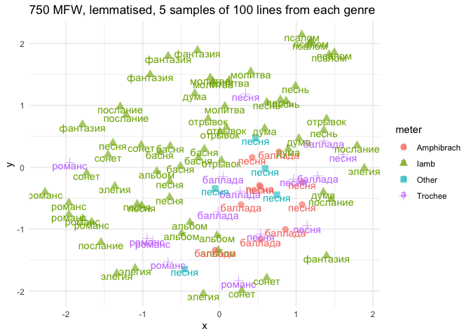

# 03_2_projections

# 3.1. Genres & words

This script analyses how words are distributed inside genres making UMAP
projections of distances based on MFW.

``` r
library(tidyverse)
```

    Warning: package 'ggplot2' was built under R version 4.3.1

    Warning: package 'lubridate' was built under R version 4.3.1

    ── Attaching core tidyverse packages ──────────────────────── tidyverse 2.0.0 ──
    ✔ dplyr     1.1.3     ✔ readr     2.1.4
    ✔ forcats   1.0.0     ✔ stringr   1.5.0
    ✔ ggplot2   3.4.4     ✔ tibble    3.2.1
    ✔ lubridate 1.9.3     ✔ tidyr     1.3.0
    ✔ purrr     1.0.2     
    ── Conflicts ────────────────────────────────────────── tidyverse_conflicts() ──
    ✖ dplyr::filter() masks stats::filter()
    ✖ dplyr::lag()    masks stats::lag()
    ℹ Use the conflicted package (<http://conflicted.r-lib.org/>) to force all conflicts to become errors

``` r
library(tidytext)

library(stylo)
```


    ### stylo version: 0.7.4 ###

    If you plan to cite this software (please do!), use the following reference:
        Eder, M., Rybicki, J. and Kestemont, M. (2016). Stylometry with R:
        a package for computational text analysis. R Journal 8(1): 107-121.
        <https://journal.r-project.org/archive/2016/RJ-2016-007/index.html>

    To get full BibTeX entry, type: citation("stylo")

``` r
library(seetrees)

library(umap)

library(MetBrewer)
theme_set(theme_minimal())
```

Load data

``` r
corpus1835 <- readRDS("../../data/corpus1835/corpus_1835.Rds")

titles <- read.csv("poems_titles.csv") %>% select(-X)
```

Attach titles data to the corpus: for genres only

``` r
genres <- unlist(str_split(c("песня
романс
сонет
элегия
басня
песнь
альбом
дума
баллада
отрывок
подражание
послание
молитва
фантазия
псалом
эпиграмма
мелодия
антологический
аполог
сказка
экспромт
надпись
эпилог"), pattern = "\n"))

multigenre <- titles %>% 
  select(text_id, lemma) %>% 
  filter(lemma %in% genres) %>% 
  group_by(text_id) %>% 
  summarise(genre = paste0(lemma, collapse = " | ")) %>% 
  filter(str_detect(genre, " \\| "))

m <- corpus1835 %>% 
  filter(text_id %in% multigenre$text_id) %>% 
  select(text_id, text_title, text_subtitle) %>% 
  left_join(multigenre %>% select(text_id, genre), by = "text_id")

# write.csv(m, "multigenre_texts.csv")
```

``` r
# read the data with normalised genres
m <- read.delim("multigenre_texts.csv", sep = ';') %>% select(-X)

glimpse(m)
```

    Rows: 91
    Columns: 5
    $ text_id       <chr> "P_114", "P_1326", "P_1378", "P_138", "P_139", "P_140", …
    $ text_title    <chr> "Обитатель Сиона", "Отрывок из Шиллеровой песни о колоко…
    $ text_subtitle <chr> "Подражание псалму", "", "Подражание французскому", "Сол…
    $ genre         <chr> "подражание | псалом", "отрывок | песня", "песнь | подра…
    $ true_genre    <chr> "псалом", "отрывок", "песнь", "песня", "песня", "песня",…

``` r
# attach normalised genres to other genre titles
ids_genres <- titles %>% 
  select(text_id, lemma) %>% 
  filter(lemma %in% genres) %>% 
  group_by(text_id) %>% 
  summarise(genre = paste0(lemma, collapse = " | ")) %>% 
  filter(!str_detect(genre, " \\| ")) %>% 
  rbind(m %>% 
          select(text_id, true_genre) %>% 
          rename(genre = true_genre)
          )

rm(m, multigenre, titles)
```

``` r
# glimpse(corpus1835)

corpus_genres <- corpus1835 %>% 
  select(text_id, author_text, text_title, year, 
         text_cln, text_lemm, 
         meter, feet, n_lines) %>% 
  left_join(ids_genres, by = "text_id") %>% 
  mutate(genre = ifelse(genre == "", NA, genre))

table(corpus_genres$genre)
```


            альбом антологический         аполог        баллада          басня 
                51             17             17             45             69 
              дума        мелодия        молитва        надпись        отрывок 
                51             21             32             12             43 
             песнь          песня     подражание       послание         псалом 
                57            242             29             39             27 
            романс         сказка          сонет       фантазия       экспромт 
               104             12             79             28             13 
            элегия      эпиграмма         эпилог 
                72             27             13 

## length in lines

texts with genre titles

``` r
corpus_genres %>% 
  filter(!is.na(genre)) %>% 
  select(-text_lemm) %>% 
  separate_rows(text_cln, sep = "\n") %>% 
  filter(text_cln != "" & !str_detect(text_cln, "^\\W+$")) %>% 
  count(genre, text_id) %>% 
  group_by(genre) %>% 
  summarise(mean_lines = round(mean(n),2),
            median_lines = round(median(n),2)) %>% 
  ungroup() %>% 
  pivot_longer(!genre, names_to = "metric", values_to = "n_lines") %>% 
  ggplot(aes(x = reorder_within(genre, n_lines, genre), y = n_lines, fill = metric)) + 
  geom_col(position = "dodge") + 
  coord_flip() + 
  scale_x_reordered() + 
  scale_fill_manual(values = c(met.brewer("Veronese")[3],
                               met.brewer("Veronese")[6])) + 
  labs(x = "",
       y = "Количество строк")
```


``` r
corpus_genres %>% 
  filter(!is.na(genre)) %>% 
  select(-text_lemm) %>% 
  separate_rows(text_cln, sep = "\n") %>% 
  filter(text_cln != "" & !str_detect(text_cln, "^\\W+$")) %>% 
  mutate(corpus = str_extract(text_id, "^\\w")) %>% 
  count(corpus, genre, text_id) %>% 
  group_by(genre, corpus) %>% 
  summarise(median_lines = round(median(n),2)) %>% 
  ungroup() %>% 
  ggplot(aes(x = reorder_within(genre, median_lines, genre), 
             y = median_lines, 
             fill = corpus)) + 
  geom_col(position = "dodge", width = 0.7) + 
  coord_flip() + 
  scale_x_reordered() + 
  scale_fill_manual(values = c(met.brewer("Veronese")[3],
                               met.brewer("Veronese")[6])) + 
  labs(x = "",
       y = "Количество строк")
```

    `summarise()` has grouped output by 'genre'. You can override using the
    `.groups` argument.


## Sampling

Take random samples of 25 lines from all texts longer than 25, filter
out texts shorter than 8 lines.

``` r
source("03_fn_sampling.R")
```

``` r
# filter out short poems (<7 lines)
corpus_genres <- corpus_genres %>% 
  filter(n_lines > 7)

# -260 poems
```

Sample lemmatised texts

``` r
genres_sampled <- sample_long(corpus_genres %>%  
                                #select(-text_lemm) %>% 
                                rename(#text_lemm = text_cln,
                                  id = text_id),
                        starting_n = 1,
                        sample_size = 25,
                        over9000 = 5)
```

    Redetermining length of poems...

    Preparing to sample...

    Sampling long poems...

    Warning: `cols` is now required when using `unnest()`.
    ℹ Please use `cols = c(text_lemm)`.

    `summarise()` has grouped output by 'id'. You can override using the `.groups`
    argument.

    Warning: `cols` is now required when using `unnest()`.
    ℹ Please use `cols = c(text_lemm)`.

    `summarise()` has grouped output by 'id'. You can override using the `.groups`
    argument.

    Warning: `cols` is now required when using `unnest()`.
    ℹ Please use `cols = c(text_lemm)`.

    `summarise()` has grouped output by 'id'. You can override using the `.groups`
    argument.

    Warning: `cols` is now required when using `unnest()`.
    ℹ Please use `cols = c(text_lemm)`.

    `summarise()` has grouped output by 'id'. You can override using the `.groups`
    argument.

    Sampling poems over 9000!!!...

    Warning: `cols` is now required when using `unnest()`.
    ℹ Please use `cols = c(text_lemm)`.

    `summarise()` has grouped output by 'id'. You can override using the `.groups`
    argument.

    Replacing long texts by samples...

Comparison on the number of genre-labelled poems before and after
sampling

``` r
corpus_genres %>% 
  filter(!is.na(genre)) %>% 
  nrow()
```

    [1] 1018

``` r
genres_sampled %>% 
  filter(!is.na(genre)) %>% 
  nrow()
```

    [1] 1310

Leave only the texts with genre titles

``` r
genres_only <- genres_sampled %>% 
  filter(!is.na(genre))

glimpse(genres_only)
```

    Rows: 1,310
    Columns: 10
    $ id          <chr> "P_1017", "P_1032", "P_1038", "P_1068", "P_1069", "P_1070"…
    $ author_text <chr> "Рудыковский Н.", "Катенин П.А.", "Петерсон К.А.", "Бараты…
    $ text_title  <chr> "Сонет Мильтона", "Песнь русского", "Сонет", "", "", "", "…
    $ year        <chr> "1838", "1839", "1839", "1839", "1839", "1839", "1840", "1…
    $ text_cln    <chr> "Когда придет мне в мысль, что я лишен очей,\nЕдва к полуп…
    $ text_lemm   <chr> "когда прийти я в мысль, что я лишать око,\nедва к полупут…
    $ meter       <fct> Iamb, Iamb, Iamb, Iamb, Trochee, Iamb, Dactyl, Other?, Iam…
    $ feet        <chr> "other", "other", "5", "5", "4", "6", "5.33333333333333", …
    $ n_lines     <int> 14, 12, 14, 10, 12, 8, 8, 9, 16, 9, 15, 14, 24, 12, 16, 10…
    $ genre       <chr> "сонет", "песнь", "сонет", "антологический", "антологическ…

Check sampling

``` r
genres_only %>% 
  #select(-text_lemm) %>% 
  separate_rows(text_lemm, sep = "\n") %>% 
  filter(text_lemm != "" & !str_detect(text_lemm, "^\\W+$")) %>% 
  count(id, genre) %>%  
  ggplot(aes(x = genre, y = n)) + geom_boxplot()
```


## Aggregation

### genres - n lines available

Number of lines after sampling

``` r
genres_only %>% 
  select(-text_cln) %>% 
  separate_rows(text_lemm, sep = "\n") %>% 
  group_by(genre) %>% 
  count(sort = T)
```

    # A tibble: 23 × 2
    # Groups:   genre [23]
       genre        n
       <chr>    <int>
     1 песня     5900
     2 романс    2288
     3 элегия    2284
     4 послание  2162
     5 баллада   2148
     6 песнь     1874
     7 отрывок   1644
     8 сонет     1408
     9 дума      1193
    10 басня     1103
    # ℹ 13 more rows

Number of lines in each meter

``` r
genres_only %>% 
  select(-text_cln) %>% 
  separate_rows(text_lemm, sep = "\n") %>% 
  group_by(genre, meter) %>% 
  count(sort = T)
```

    # A tibble: 89 × 3
    # Groups:   genre, meter [89]
       genre    meter       n
       <chr>    <fct>   <int>
     1 песня    Trochee  1937
     2 послание Iamb     1935
     3 элегия   Iamb     1912
     4 песня    Other?   1366
     5 отрывок  Iamb     1322
     6 песня    Iamb     1183
     7 романс   Iamb     1164
     8 сонет    Iamb     1158
     9 басня    Iamb     1091
    10 песнь    Iamb      932
    # ℹ 79 more rows

### grouping I - meters

preprocessing: all texts longer than 50 lines are sampled down to 25
lines, texts shorter than 8 lines excluded;

grouping 1: no meter division; for each genre a sample of 100 lines is
taken, each genre has 10 samples (1000 lines total)

``` r
genres_sampled <- genres_only %>%
  select(-text_cln) %>% 
  
  # filter only genres with > 1000 lines available
  filter(genre %in% c("песня", "романс", "элегия", "баллада", "послание", 
                      "песнь", "отрывок", "сонет", "басня", 
                      "дума")) %>% 
  
  separate_rows(text_lemm, sep = "\n") %>% 
  group_by(genre) %>% 
  sample_n(1000) %>% 
  mutate(sample_id = ceiling(1:1000),
         sample_id = floor(sample_id/100)+1, 
         sample_id = ifelse(sample_id == 11, 1, sample_id)) %>% 
  ungroup()

genres_sampled <- genres_sampled %>% 
  mutate(sample_id = paste0(genre, "_", sample_id)) %>% 
  group_by(sample_id) %>% 
  summarise(text = paste0(text_lemm, collapse = "     --     ")) 

str(genres_sampled)
```

    tibble [100 × 2] (S3: tbl_df/tbl/data.frame)
     $ sample_id: chr [1:100] "баллада_1" "баллада_10" "баллада_2" "баллада_3" ...
     $ text     : chr [1:100] "     --          --     голос песня ветерок ,     --          --     и как твой меч красный, - о?     --     оп"| __truncated__ "     --     напрасно! нет весть из вечный дом,     --     неприметно становиться шуба;     --     любо, что пер"| __truncated__ "\"так не даром же она     --     он умирать внезапно. уж генрих второй     --     — в полночный час, вчера днеп"| __truncated__ "     --     вдруг дверь боковой, греметь , растворяться.     --     твой конь уже быть старый и хилый,     --  "| __truncated__ ...

### grouping II - meters + genres

preprocessing: all texts longer than 50 lines are sampled down to 25
lines, texts shorter than 8 lines excluded;

grouping 2: genre and meter division; for each genre+metre a sample of
100 lines is taken, each category has 5 samples (500 lines total)

``` r
genres_meters_v <- genres_only %>% 
  select(-text_cln) %>% 
  filter(meter != "Other?") %>% 
  separate_rows(text_lemm, sep = "\n") %>% 
  mutate(genre_meter = paste0(genre, "_", meter)) %>% 
  count(genre_meter, sort = T)

head(genres_meters_v, 20)
```

    # A tibble: 20 × 2
       genre_meter            n
       <chr>              <int>
     1 песня_Trochee       1937
     2 послание_Iamb       1935
     3 элегия_Iamb         1912
     4 отрывок_Iamb        1322
     5 песня_Iamb          1183
     6 романс_Iamb         1164
     7 сонет_Iamb          1158
     8 басня_Iamb          1091
     9 песнь_Iamb           932
    10 песня_Amphibrach     823
    11 баллада_Trochee      814
    12 альбом_Iamb          757
    13 романс_Trochee       705
    14 дума_Iamb            617
    15 баллада_Amphibrach   558
    16 фантазия_Iamb        541
    17 молитва_Iamb         503
    18 псалом_Iamb          432
    19 баллада_Iamb         369
    20 баллада_Anapest      332

``` r
selected_gm <- genres_meters_v %>% filter(n > 500) %>% pull(genre_meter)
# selected_gm


genres_m_sampled <- genres_only %>%
  select(-text_cln) %>% 
  filter(meter != "Other?") %>% 
  
  mutate(genre_meter = paste0(genre, "_", meter)) %>% 
  
  # filter only genres-meters paits with > 500 lines available
  filter(genre_meter %in% selected_gm) %>% 
  
  separate_rows(text_lemm, sep = "\n") %>% 
  group_by(genre_meter) %>% 
  sample_n(500) %>% 
  mutate(sample_id = ceiling(1:500),
         sample_id = floor(sample_id/100)+1,
         sample_id = ifelse(sample_id == 6, 1, sample_id)) %>% 
  ungroup() 

genres_m_sampled <- genres_m_sampled %>% 
  mutate(sample_id = paste0(genre_meter, "__", sample_id)) %>% 
  group_by(sample_id) %>% 
  summarise(text = paste0(text_lemm, collapse = "     --     ")) 

str(genres_m_sampled)
```

    tibble [85 × 2] (S3: tbl_df/tbl/data.frame)
     $ sample_id: chr [1:85] "альбом_Iamb__1" "альбом_Iamb__2" "альбом_Iamb__3" "альбом_Iamb__4" ...
     $ text     : chr [1:85] "исчезать в память твой ;     --     картинный краса природа здешний;     --     пусть ваш юность цвести душа , "| __truncated__ "владетельница из тщеславие     --     я сердце пробуждать опять,      --     тогда в стена молитвенный дом     "| __truncated__ "     --     чтоб настоящий мгновение     --     хоть скоро наш жизнь течь     --     искать я друг, но не мочь "| __truncated__ "как мимолетный мечтание,     --     сверкнуть, взор ко я склонить;     --     под седина продолжать,     --    "| __truncated__ ...

## Projections

### Genres

#### 500 MFW

Ranks

``` r
ranks <- genres_sampled %>% 
  unnest_tokens(input = text, output = word, token = "words") %>% 
  count(word, sort = T) %>% 
  head(500)

head(ranks, 10)
```

    # A tibble: 10 × 2
       word      n
       <chr> <int>
     1 и      1739
     2 в      1233
     3 я       881
     4 не      797
     5 на      605
     6 с       563
     7 ты      540
     8 как     466
     9 он      452
    10 мой     356

``` r
tail(ranks, 10)
```

    # A tibble: 10 × 2
       word        n
       <chr>   <int>
     1 бояться    12
     2 бывать     12
     3 вдали      12
     4 видать     12
     5 виться     12
     6 влага      12
     7 глухой     12
     8 греметь    12
     9 дальний    12
    10 дитя       12

``` r
ranks %>% 
  mutate(rank = row_number()) %>% 
  sample_n(15) %>% 
  arrange(-desc(rank))
```

    # A tibble: 15 × 3
       word         n  rank
       <chr>    <int> <int>
     1 она        333    11
     2 все        221    19
     3 жизнь      128    36
     4 свет        86    56
     5 их          70    72
     6 лишь        70    73
     7 роза        28   193
     8 глядеть     25   212
     9 оно         21   273
    10 волнение    18   310
    11 исчезать    18   316
    12 уже         17   362
    13 узнавать    17   363
    14 быстро      15   391
    15 виться      12   495

Frequencies: count MFW freq in each sample

``` r
counter <- genres_sampled %>% 
  unnest_tokens(input = text, output = word, token = "words") %>% 
  group_by(sample_id) %>% 
  count(word) %>% 
  filter(word %in% ranks$word) %>% 
  ungroup()

counter %>% 
  sample_n(10)
```

    # A tibble: 10 × 3
       sample_id  word       n
       <chr>      <chr>  <int>
     1 басня_1    цвести     3
     2 баллада_7  милый      2
     3 дума_6     божий      3
     4 отрывок_1  душа       1
     5 романс_8   ваш        1
     6 дума_2     свет       3
     7 песня_8    ночь       2
     8 песня_5    хоть       1
     9 отрывок_10 пора       1
    10 отрывок_4  мой        3

Matrix

``` r
xxx <- counter %>% 
  pivot_wider(names_from = word, values_from = n, values_fill = 0)

mtrx <- xxx %>% 
  ungroup() %>% 
  select(-sample_id) %>% 
  scale()

dim(mtrx)
```

    [1] 100 500

``` r
u <- umap(mtrx)

dat <- tibble(x = u$layout[,1],
       y = u$layout[,2],
       sample_id = xxx$sample_id) %>% 
  mutate(genre = str_remove(sample_id, "_\\d+$"))
  
glimpse(dat)
```

    Rows: 100
    Columns: 4
    $ x         <dbl> -0.111628010, -0.365622926, 0.274730736, 0.022797022, 0.4619…
    $ y         <dbl> 0.52403836, 0.37008465, 0.07802798, -0.94438828, 0.07449585,…
    $ sample_id <chr> "баллада_1", "баллада_10", "баллада_2", "баллада_3", "баллад…
    $ genre     <chr> "баллада", "баллада", "баллада", "баллада", "баллада", "балл…

``` r
rm(ranks, counter, mtrx)
```

Plot

``` r
dat %>% 
  ggplot(aes(x, y, color = genre)) + 
  #geom_point(size = 5, alpha = 0.6) + 
  geom_text(aes(label = genre)) + 
  labs(title = "500 MFW, lemmatised, 10 samples of 100 lines from each genre")
```


#### 250 MFW

``` r
ranks <- genres_sampled %>% 
  unnest_tokens(input = text, output = word, token = "words") %>% 
  count(word, sort = T) %>% 
  head(250)

head(ranks, 10)
```

    # A tibble: 10 × 2
       word      n
       <chr> <int>
     1 и      1739
     2 в      1233
     3 я       881
     4 не      797
     5 на      605
     6 с       563
     7 ты      540
     8 как     466
     9 он      452
    10 мой     356

``` r
tail(ranks, 10)
```

    # A tibble: 10 × 2
       word        n
       <chr>   <int>
     1 золотой    23
     2 или        23
     3 красота    23
     4 крыло      23
     5 месяц      23
     6 много      23
     7 нежный     23
     8 новый      23
     9 опять      23
    10 пойти      23

``` r
ranks %>% 
  mutate(rank = row_number()) %>% 
  sample_n(15) %>% 
  arrange(-desc(rank))
```

    # A tibble: 15 × 3
       word       n  rank
       <chr>  <int> <int>
     1 с        563     6
     2 мы       246    16
     3 кто       99    49
     4 уж        75    66
     5 ж         74    67
     6 конь      63    77
     7 век       44   118
     8 глаз      43   124
     9 со        42   129
    10 еще       41   131
    11 песня     38   138
    12 туча      33   165
    13 перед     25   215
    14 черный    25   219
    15 месяц     23   245

``` r
counter <- genres_sampled %>% 
  unnest_tokens(input = text, output = word, token = "words") %>% 
  group_by(sample_id) %>% 
  count(word) %>% 
  filter(word %in% ranks$word) %>% 
  ungroup()

counter %>% 
  sample_n(10)
```

    # A tibble: 10 × 3
       sample_id  word        n
       <chr>      <chr>   <int>
     1 элегия_8   веселый     1
     2 послание_8 о           3
     3 дума_6     бог         1
     4 сонет_2    он          7
     5 романс_4   голос       1
     6 песня_5    мы          5
     7 басня_1    тот         1
     8 послание_5 со          1
     9 сонет_5    на          3
    10 сонет_2    когда       1

``` r
xxx <- counter %>% 
  pivot_wider(names_from = word, values_from = n, values_fill = 0)

mtrx <- xxx %>% 
  ungroup() %>% 
  select(-sample_id) %>% 
  scale()

dim(mtrx)
```

    [1] 100 250

``` r
u <- umap(mtrx)

dat <- tibble(x = u$layout[,1],
       y = u$layout[,2],
       sample_id = xxx$sample_id) %>% 
  mutate(genre = str_remove(sample_id, "_\\d+$"))
  
glimpse(dat)
```

    Rows: 100
    Columns: 4
    $ x         <dbl> -0.75517569, -0.78798640, -0.44519402, -0.07567723, -0.33738…
    $ y         <dbl> -0.06633743, -1.79126050, -0.74679284, -0.92776001, -0.95345…
    $ sample_id <chr> "баллада_1", "баллада_10", "баллада_2", "баллада_3", "баллад…
    $ genre     <chr> "баллада", "баллада", "баллада", "баллада", "баллада", "балл…

``` r
rm(ranks, counter, mtrx)
```

``` r
dat %>% 
  ggplot(aes(x, y, color = genre)) + 
  #geom_point(size = 5, alpha = 0.6) + 
  geom_text(aes(label = genre)) + 
  labs(title = "250 MFW, lemmatised, 10 samples of 100 lines from each genre")
```


#### 750 MFW

``` r
ranks <- genres_sampled %>% 
  unnest_tokens(input = text, output = word, token = "words") %>% 
  count(word, sort = T) %>% 
  head(750)

head(ranks, 10)
```

    # A tibble: 10 × 2
       word      n
       <chr> <int>
     1 и      1739
     2 в      1233
     3 я       881
     4 не      797
     5 на      605
     6 с       563
     7 ты      540
     8 как     466
     9 он      452
    10 мой     356

``` r
tail(ranks, 10)
```

    # A tibble: 10 × 2
       word          n
       <chr>     <int>
     1 близкий       8
     2 близко        8
     3 ведь          8
     4 видение       8
     5 влечь         8
     6 водопад       8
     7 воздушный     8
     8 вой           8
     9 волга         8
    10 вольный       8

``` r
ranks %>% 
  mutate(rank = row_number()) %>% 
  sample_n(15) %>% 
  arrange(-desc(rank))
```

    # A tibble: 15 × 3
       word        n  rank
       <chr>   <int> <int>
     1 тот       134    33
     2 над       121    40
     3 звезда     40   133
     4 дева       30   175
     5 певец      29   182
     6 слово      27   201
     7 про        22   262
     8 долго      18   313
     9 об         17   350
    10 нога       16   379
    11 темный     16   385
    12 высота     15   394
    13 змея       12   504
    14 горячий    10   603
    15 простой     9   711

``` r
counter <- genres_sampled %>% 
  unnest_tokens(input = text, output = word, token = "words") %>% 
  group_by(sample_id) %>% 
  count(word) %>% 
  filter(word %in% ranks$word) %>% 
  ungroup()

counter %>% 
  sample_n(10)
```

    # A tibble: 10 × 3
       sample_id word       n
       <chr>     <chr>  <int>
     1 элегия_5  слеза      3
     2 отрывок_2 друг       1
     3 элегия_8  о          3
     4 песнь_3   ты         8
     5 элегия_10 быть       3
     6 сонет_8   могила     1
     7 отрывок_2 ум         1
     8 дума_5    земной     1
     9 отрывок_5 она        3
    10 баллада_4 цветок     2

``` r
xxx <- counter %>% 
  pivot_wider(names_from = word, values_from = n, values_fill = 0)

mtrx <- xxx %>% 
  ungroup() %>% 
  select(-sample_id) %>% 
  scale()

dim(mtrx)
```

    [1] 100 750

``` r
u <- umap(mtrx)

dat <- tibble(x = u$layout[,1],
       y = u$layout[,2],
       sample_id = xxx$sample_id) %>% 
  mutate(genre = str_remove(sample_id, "_\\d+$"))
  
glimpse(dat)
```

    Rows: 100
    Columns: 4
    $ x         <dbl> 0.3424784, 0.4933782, 0.1714418, 0.6916190, 0.2730497, -0.29…
    $ y         <dbl> -0.1637214, -0.7873532, -1.5466396, -0.3944412, 1.0698735, -…
    $ sample_id <chr> "баллада_1", "баллада_10", "баллада_2", "баллада_3", "баллад…
    $ genre     <chr> "баллада", "баллада", "баллада", "баллада", "баллада", "балл…

``` r
rm(ranks, counter, mtrx)

dat %>% 
  ggplot(aes(x, y, color = genre)) + 
  #geom_point(size = 5, alpha = 0.6) + 
  geom_text(aes(label = genre)) + 
  labs(title = "750 MFW, lemmatised, 10 samples of 100 lines from each genre")
```


### Genres + meters

#### 500 MFW

``` r
ranks <- genres_m_sampled %>% 
  unnest_tokens(input = text, output = word, token = "words") %>% 
  count(word, sort = T) %>% 
  head(500)

head(ranks, 10)
```

    # A tibble: 10 × 2
       word      n
       <chr> <int>
     1 и      1500
     2 в      1006
     3 я       803
     4 не      624
     5 ты      466
     6 на      452
     7 с       450
     8 он      356
     9 как     352
    10 мой     337

``` r
tail(ranks, 10)
```

    # A tibble: 10 × 2
       word        n
       <chr>   <int>
     1 яркий      11
     2 альбом     10
     3 боже       10
     4 бояться    10
     5 вал        10
     6 верный     10
     7 веселие    10
     8 вид        10
     9 вино       10
    10 восторг    10

``` r
ranks %>% 
  mutate(rank = row_number()) %>% 
  sample_n(15) %>% 
  arrange(-desc(rank))
```

    # A tibble: 15 × 3
       word          n  rank
       <chr>     <int> <int>
     1 давать       60    70
     2 слава        51    83
     3 море         37   117
     4 пора         37   118
     5 солнце       29   161
     6 красота      26   181
     7 сиять        21   222
     8 черный       20   241
     9 конец        17   285
    10 скала        17   292
    11 меч          15   333
    12 вихорь       13   385
    13 чтобы        13   412
    14 чей          12   449
    15 волшебный    11   459

``` r
counter <- genres_m_sampled %>% 
  unnest_tokens(input = text, output = word, token = "words") %>% 
  group_by(sample_id) %>% 
  count(word) %>% 
  filter(word %in% ranks$word) %>% 
  ungroup()

counter %>% 
  sample_n(10)
```

    # A tibble: 10 × 3
       sample_id             word          n
       <chr>                 <chr>     <int>
     1 дума_Iamb__3          идти          1
     2 послание_Iamb__5      всегда        2
     3 отрывок_Iamb__4       или           1
     4 фантазия_Iamb__3      стезя         1
     5 песня_Iamb__5         открывать     1
     6 романс_Trochee__4     по            1
     7 басня_Iamb__4         взять         1
     8 дума_Iamb__1          нести         1
     9 песня_Amphibrach__5   муж           1
    10 баллада_Amphibrach__5 то            2

``` r
xxx <- counter %>% 
  pivot_wider(names_from = word, values_from = n, values_fill = 0)

mtrx <- xxx %>% 
  ungroup() %>% 
  select(-sample_id) %>% 
  scale()

dim(mtrx)
```

    [1]  85 500

``` r
u <- umap(mtrx)

dat <- tibble(x = u$layout[,1],
       y = u$layout[,2],
       sample_id = xxx$sample_id) %>% 
  mutate(genre = str_remove(sample_id, "_\\w+__\\d+$"),
         meter = str_extract(sample_id, "_\\w+__"),
         meter = str_remove_all(meter, "_"))
  
glimpse(dat)
```

    Rows: 85
    Columns: 5
    $ x         <dbl> -0.366671907, 0.021358786, -0.287284624, -0.294278499, -0.42…
    $ y         <dbl> -1.76153787, -2.06016466, -2.03687248, -1.94232821, -1.37585…
    $ sample_id <chr> "альбом_Iamb__1", "альбом_Iamb__2", "альбом_Iamb__3", "альбо…
    $ genre     <chr> "альбом", "альбом", "альбом", "альбом", "альбом", "баллада",…
    $ meter     <chr> "Iamb", "Iamb", "Iamb", "Iamb", "Iamb", "Amphibrach", "Amphi…

``` r
dat %>% 
  ggplot(aes(x, y, color = meter, shape = meter)) + 
  geom_point(size = 3, alpha = 0.6) + 
  geom_text(aes(label = genre), vjust=0.9) + 
  labs(title = "500 MFW, lemmatised, 5 samples of 100 lines from each genre")
```


#### 250 MFW

``` r
ranks <- genres_m_sampled %>% 
  unnest_tokens(input = text, output = word, token = "words") %>% 
  count(word, sort = T) %>% 
  head(250)

head(ranks, 10)
```

    # A tibble: 10 × 2
       word      n
       <chr> <int>
     1 и      1500
     2 в      1006
     3 я       803
     4 не      624
     5 ты      466
     6 на      452
     7 с       450
     8 он      356
     9 как     352
    10 мой     337

``` r
tail(ranks, 10)
```

    # A tibble: 10 × 2
       word        n
       <chr>   <int>
     1 черный     20
     2 это        20
     3 берег      19
     4 блеск      19
     5 бросать    19
     6 голубой    19
     7 дар        19
     8 дышать     19
     9 легкий     19
    10 могучий    19

``` r
ranks %>% 
  mutate(rank = row_number()) %>% 
  sample_n(15) %>% 
  arrange(-desc(rank))
```

    # A tibble: 15 × 3
       word         n  rank
       <chr>    <int> <int>
     1 мы         204    17
     2 то         183    19
     3 вы         130    26
     4 лишь        85    46
     5 вот         78    54
     6 сказать     65    65
     7 мочь        56    73
     8 слава       51    83
     9 ночь        49    90
    10 счастие     43    98
    11 этот        42   104
    12 какой       31   148
    13 тоска       31   150
    14 страна      23   205
    15 скрывать    20   236

``` r
counter <- genres_m_sampled %>% 
  unnest_tokens(input = text, output = word, token = "words") %>% 
  group_by(sample_id) %>% 
  count(word) %>% 
  filter(word %in% ranks$word) %>% 
  ungroup()

counter %>% 
  sample_n(10)
```

    # A tibble: 10 × 3
       sample_id           word         n
       <chr>               <chr>    <int>
     1 элегия_Iamb__1      для          3
     2 песня_Trochee__4    для          2
     3 дума_Iamb__3        счастие      1
     4 баллада_Trochee__4  и           17
     5 молитва_Iamb__4     исчезать     1
     6 фантазия_Iamb__3    со           2
     7 альбом_Iamb__5      бы           1
     8 песнь_Iamb__2       красота      1
     9 элегия_Iamb__2      взор         2
    10 песня_Amphibrach__1 на           3

``` r
xxx <- counter %>% 
  pivot_wider(names_from = word, values_from = n, values_fill = 0)

mtrx <- xxx %>% 
  ungroup() %>% 
  select(-sample_id) %>% 
  scale()

dim(mtrx)
```

    [1]  85 250

``` r
u <- umap(mtrx)

dat <- tibble(x = u$layout[,1],
       y = u$layout[,2],
       sample_id = xxx$sample_id) %>% 
  mutate(genre = str_remove(sample_id, "_\\w+__\\d+$"),
         meter = str_extract(sample_id, "_\\w+__"),
         meter = str_remove_all(meter, "_"))

glimpse(dat)
```

    Rows: 85
    Columns: 5
    $ x         <dbl> -2.2417647, -2.0079610, -2.2587395, -2.4515914, -2.1181395, …
    $ y         <dbl> 0.45886913, -0.32432822, 0.14603876, -0.02413463, 0.10798424…
    $ sample_id <chr> "альбом_Iamb__1", "альбом_Iamb__2", "альбом_Iamb__3", "альбо…
    $ genre     <chr> "альбом", "альбом", "альбом", "альбом", "альбом", "баллада",…
    $ meter     <chr> "Iamb", "Iamb", "Iamb", "Iamb", "Iamb", "Amphibrach", "Amphi…

``` r
rm(ranks, counter, mtrx)
```

``` r
dat %>% 
  ggplot(aes(x, y, color = meter, shape = meter)) + 
  geom_point(size = 3, alpha = 0.6) + 
  geom_text(aes(label = genre), vjust=0.9) + 
  labs(title = "250 MFW, lemmatised, 5 samples of 100 lines from each genre")
```


#### 750 MFW

``` r
ranks <- genres_m_sampled %>% 
  unnest_tokens(input = text, output = word, token = "words") %>% 
  count(word, sort = T) %>% 
  head(750)

head(ranks, 10)
```

    # A tibble: 10 × 2
       word      n
       <chr> <int>
     1 и      1500
     2 в      1006
     3 я       803
     4 не      624
     5 ты      466
     6 на      452
     7 с       450
     8 он      356
     9 как     352
    10 мой     337

``` r
tail(ranks, 10)
```

    # A tibble: 10 × 2
       word          n
       <chr>     <int>
     1 заглушать     7
     2 закон         7
     3 запад         7
     4 звездочка     7
     5 зыбь          7
     6 крепкий       7
     7 крик          7
     8 кумир         7
     9 куст          7
    10 лазурь        7

``` r
ranks %>% 
  mutate(rank = row_number()) %>% 
  sample_n(15) %>% 
  arrange(-desc(rank))
```

    # A tibble: 15 × 3
       word         n  rank
       <chr>    <int> <int>
     1 то         183    19
     2 наш         70    62
     3 светлый     34   134
     4 солнце      29   161
     5 младой      23   199
     6 крыло       21   220
     7 русский     15   344
     8 белый       14   352
     9 горе        12   418
    10 труд        11   486
    11 бояться     10   494
    12 труп        10   539
    13 замечать     8   647
    14 манить       8   660
    15 горний       7   729

``` r
counter <- genres_m_sampled %>% 
  unnest_tokens(input = text, output = word, token = "words") %>% 
  group_by(sample_id) %>% 
  count(word) %>% 
  filter(word %in% ranks$word) %>% 
  ungroup()

counter %>% 
  sample_n(10)
```

    # A tibble: 10 × 3
       sample_id             word           n
       <chr>                 <chr>      <int>
     1 элегия_Iamb__1        милый          1
     2 песня_Amphibrach__1   прелестный     1
     3 песня_Trochee__1      увидеть        1
     4 песня_Iamb__5         да             1
     5 баллада_Amphibrach__2 сердце         2
     6 баллада_Amphibrach__5 биться         2
     7 альбом_Iamb__5        благо          1
     8 романс_Trochee__3     реветь         1
     9 дума_Iamb__4          создание       1
    10 дума_Iamb__2          хороший        1

``` r
xxx <- counter %>% 
  pivot_wider(names_from = word, values_from = n, values_fill = 0)

mtrx <- xxx %>% 
  ungroup() %>% 
  select(-sample_id) %>% 
  scale()

dim(mtrx)
```

    [1]  85 750

``` r
u <- umap(mtrx)

dat <- tibble(x = u$layout[,1],
       y = u$layout[,2],
       sample_id = xxx$sample_id) %>% 
  mutate(genre = str_remove(sample_id, "_\\w+__\\d+$"),
         meter = str_extract(sample_id, "_\\w+__"),
         meter = str_remove_all(meter, "_"))

glimpse(dat)
```

    Rows: 85
    Columns: 5
    $ x         <dbl> -0.42069129, -0.18104963, -0.89878411, -0.80829785, -0.48357…
    $ y         <dbl> 1.6723248, 1.0683108, 1.8142523, 1.6698733, 1.4274081, -1.34…
    $ sample_id <chr> "альбом_Iamb__1", "альбом_Iamb__2", "альбом_Iamb__3", "альбо…
    $ genre     <chr> "альбом", "альбом", "альбом", "альбом", "альбом", "баллада",…
    $ meter     <chr> "Iamb", "Iamb", "Iamb", "Iamb", "Iamb", "Amphibrach", "Amphi…

``` r
rm(ranks, counter, mtrx)
```

``` r
dat %>% 
  ggplot(aes(x, y, color = meter, shape = meter)) + 
  geom_point(size = 3, alpha = 0.6) + 
  geom_text(aes(label = genre), vjust=0.9) + 
  labs(title = "750 MFW, lemmatised, 5 samples of 100 lines from each genre")
```


