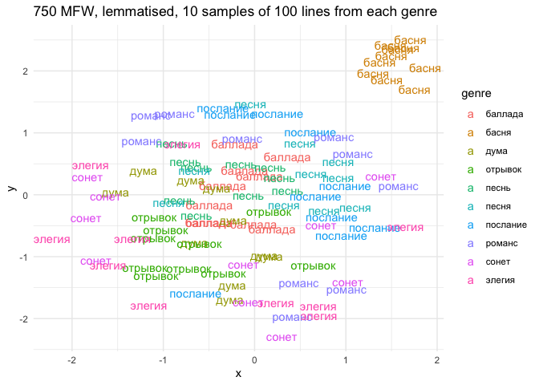
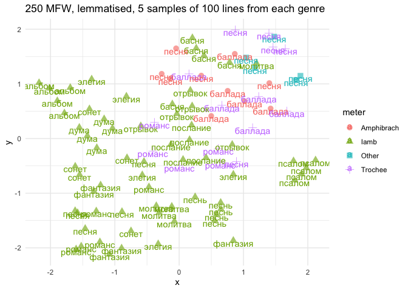

# 03_2_projections

# 3.1. Genres & words

This script analyses how words are distributed inside genres using UMAP
projections ( distances between samples based on the MFW frequency).

``` r
library(tidyverse)
```

    Warning: package 'ggplot2' was built under R version 4.3.1

    Warning: package 'tidyr' was built under R version 4.3.1

    Warning: package 'dplyr' was built under R version 4.3.1

    Warning: package 'lubridate' was built under R version 4.3.1

    ── Attaching core tidyverse packages ──────────────────────── tidyverse 2.0.0 ──
    ✔ dplyr     1.1.4     ✔ readr     2.1.4
    ✔ forcats   1.0.0     ✔ stringr   1.5.0
    ✔ ggplot2   3.5.1     ✔ tibble    3.2.1
    ✔ lubridate 1.9.3     ✔ tidyr     1.3.1
    ✔ purrr     1.0.2     
    ── Conflicts ────────────────────────────────────────── tidyverse_conflicts() ──
    ✖ dplyr::filter() masks stats::filter()
    ✖ dplyr::lag()    masks stats::lag()
    ℹ Use the conflicted package (<http://conflicted.r-lib.org/>) to force all conflicts to become errors

``` r
library(tidytext)

# library(stylo)
# library(seetrees)

library(umap)

library(MetBrewer)
theme_set(theme_minimal())
```

Load data

``` r
corpus1835 <- readRDS("../../data/corpus1835/corpus_1835.Rds")

titles <- read.csv("../../data/ch3/poems_titles.csv") %>% select(-X)
```

Attach titles data to the corpus: for genres only

``` r
genres <- unlist(str_split(c("песня
романс
сонет
элегия
басня
песнь
альбом
дума
баллада
отрывок
подражание
послание
молитва
фантазия
псалом
эпиграмма
мелодия
антологический
аполог
сказка
экспромт
надпись
эпилог"), pattern = "\n"))

multigenre <- titles %>% 
  select(text_id, lemma) %>% 
  filter(lemma %in% genres) %>% 
  group_by(text_id) %>% 
  summarise(genre = paste0(lemma, collapse = " | ")) %>% 
  filter(str_detect(genre, " \\| "))

m <- corpus1835 %>% 
  filter(text_id %in% multigenre$text_id) %>% 
  select(text_id, text_title, text_subtitle) %>% 
  left_join(multigenre %>% select(text_id, genre), by = "text_id")

# write.csv(m, "multigenre_texts.csv")
```

``` r
# read the data with normalised genres
m <- read.delim("../../data/ch3/multigenre_texts.csv", sep = ';') %>% select(-X)

glimpse(m)
```

    Rows: 91
    Columns: 5
    $ text_id       <chr> "P_114", "P_1326", "P_1378", "P_138", "P_139", "P_140", …
    $ text_title    <chr> "Обитатель Сиона", "Отрывок из Шиллеровой песни о колоко…
    $ text_subtitle <chr> "Подражание псалму", "", "Подражание французскому", "Сол…
    $ genre         <chr> "подражание | псалом", "отрывок | песня", "песнь | подра…
    $ true_genre    <chr> "псалом", "отрывок", "песнь", "песня", "песня", "песня",…

``` r
# attach normalised genres to other genre titles
ids_genres <- titles %>% 
  select(text_id, lemma) %>% 
  filter(lemma %in% genres) %>% 
  group_by(text_id) %>% 
  summarise(genre = paste0(lemma, collapse = " | ")) %>% 
  filter(!str_detect(genre, " \\| ")) %>% 
  rbind(m %>% 
          select(text_id, true_genre) %>% 
          rename(genre = true_genre)
          )

rm(m, multigenre, titles)
```

``` r
# glimpse(corpus1835)

corpus_genres <- corpus1835 %>% 
  select(text_id, author_text, text_title, year, 
         text_cln, text_lemm, 
         meter, feet, n_lines) %>% 
  left_join(ids_genres, by = "text_id") %>% 
  mutate(genre = ifelse(genre == "", NA, genre))

table(corpus_genres$genre)
```


            альбом антологический         аполог        баллада          басня 
                51             17             17             45             69 
              дума        мелодия        молитва        надпись        отрывок 
                51             21             32             12             43 
             песнь          песня     подражание       послание         псалом 
                57            242             29             39             27 
            романс         сказка          сонет       фантазия       экспромт 
               104             12             79             28             13 
            элегия      эпиграмма         эпилог 
                72             27             13 

## length in lines

Coun how long are the texts with genre titles

``` r
corpus_genres %>% 
  filter(!is.na(genre)) %>% 
  select(-text_lemm) %>% 
  separate_rows(text_cln, sep = "\n") %>% 
  filter(text_cln != "" & !str_detect(text_cln, "^\\W+$")) %>% 
  count(genre, text_id) %>% 
  group_by(genre) %>% 
  summarise(mean_lines = round(mean(n),2),
            median_lines = round(median(n),2)) %>% 
  ungroup() %>% 
  pivot_longer(!genre, names_to = "metric", values_to = "n_lines") %>% 
  ggplot(aes(x = reorder_within(genre, n_lines, genre), y = n_lines, fill = metric)) + 
  geom_col(position = "dodge") + 
  coord_flip() + 
  scale_x_reordered() + 
  scale_fill_manual(values = c(met.brewer("Veronese")[3],
                               met.brewer("Veronese")[6])) + 
  labs(x = "",
       y = "Количество строк")
```


Check if there is difference between periodicals and poetry collections

``` r
corpus_genres %>% 
  filter(!is.na(genre)) %>% 
  select(-text_lemm) %>% 
  separate_rows(text_cln, sep = "\n") %>% 
  filter(text_cln != "" & !str_detect(text_cln, "^\\W+$")) %>% 
  mutate(corpus = str_extract(text_id, "^\\w")) %>% 
  count(corpus, genre, text_id) %>% 
  group_by(genre, corpus) %>% 
  summarise(median_lines = round(median(n),2)) %>% 
  ungroup() %>% 
  ggplot(aes(x = reorder_within(genre, median_lines, genre), 
             y = median_lines, 
             fill = corpus)) + 
  geom_col(position = "dodge", width = 0.7) + 
  coord_flip() + 
  scale_x_reordered() + 
  scale_fill_manual(values = c(met.brewer("Veronese")[3],
                               met.brewer("Veronese")[6])) + 
  labs(x = "",
       y = "Количество строк")
```

    `summarise()` has grouped output by 'genre'. You can override using the
    `.groups` argument.


## Sampling

Take random samples of 25 lines from all texts longer than 25, filter
out texts shorter than 8 lines.

``` r
source("03_fn_sampling.R")
```

``` r
# filter out short poems (<7 lines)
corpus_genres <- corpus_genres %>% 
  filter(n_lines > 7)

# -260 poems
```

Sample lemmatised texts

``` r
genres_sampled <- sample_long(corpus_genres %>%  
                                #select(-text_lemm) %>% 
                                rename(#text_lemm = text_cln,
                                  id = text_id),
                        starting_n = 1,
                        sample_size = 25,
                        over9000 = 5)
```

    Redetermining length of poems...

    Preparing to sample...

    Sampling long poems...

    Warning: `cols` is now required when using `unnest()`.
    ℹ Please use `cols = c(text_lemm)`.

    `summarise()` has grouped output by 'id'. You can override using the `.groups`
    argument.

    Warning: `cols` is now required when using `unnest()`.
    ℹ Please use `cols = c(text_lemm)`.

    `summarise()` has grouped output by 'id'. You can override using the `.groups`
    argument.

    Warning: `cols` is now required when using `unnest()`.
    ℹ Please use `cols = c(text_lemm)`.

    `summarise()` has grouped output by 'id'. You can override using the `.groups`
    argument.

    Warning: `cols` is now required when using `unnest()`.
    ℹ Please use `cols = c(text_lemm)`.

    `summarise()` has grouped output by 'id'. You can override using the `.groups`
    argument.

    Sampling poems over 9000!!!...

    Warning: `cols` is now required when using `unnest()`.
    ℹ Please use `cols = c(text_lemm)`.

    `summarise()` has grouped output by 'id'. You can override using the `.groups`
    argument.

    Replacing long texts by samples...

Comparison on the number of genre-labelled poems before and after
sampling

``` r
corpus_genres %>% 
  filter(!is.na(genre)) %>% 
  nrow()
```

    [1] 1018

``` r
genres_sampled %>% 
  filter(!is.na(genre)) %>% 
  nrow()
```

    [1] 1310

Leave only the texts with genre titles

``` r
genres_only <- genres_sampled %>% 
  filter(!is.na(genre))

# glimpse(genres_only)
```

Check sampling

``` r
genres_only %>% 
  #select(-text_lemm) %>% 
  separate_rows(text_lemm, sep = "\n") %>% 
  filter(text_lemm != "" & !str_detect(text_lemm, "^\\W+$")) %>% 
  count(id, genre) %>%  
  ggplot(aes(x = genre, y = n)) + geom_boxplot()
```

## Aggregation

### genres - n lines available

Available number of lines for each genre after sampling

``` r
genres_only %>% 
  select(-text_cln) %>% 
  separate_rows(text_lemm, sep = "\n") %>% 
  group_by(genre) %>% 
  count(sort = T)
```

    # A tibble: 23 × 2
    # Groups:   genre [23]
       genre        n
       <chr>    <int>
     1 песня     5927
     2 элегия    2307
     3 романс    2300
     4 послание  2170
     5 баллада   2115
     6 песнь     1825
     7 отрывок   1645
     8 сонет     1408
     9 басня     1168
    10 дума      1127
    # ℹ 13 more rows

Number of lines in each meter

``` r
genres_only %>% 
  select(-text_cln) %>% 
  separate_rows(text_lemm, sep = "\n") %>% 
  group_by(genre, meter) %>% 
  count(sort = T)
```

    # A tibble: 89 × 3
    # Groups:   genre, meter [89]
       genre    meter       n
       <chr>    <chr>   <int>
     1 послание Iamb     1941
     2 песня    Trochee  1907
     3 элегия   Iamb     1869
     4 песня    Other    1841
     5 отрывок  Iamb     1270
     6 романс   Iamb     1192
     7 басня    Iamb     1168
     8 сонет    Iamb     1157
     9 песня    Iamb     1116
    10 баллада  Trochee   794
    # ℹ 79 more rows

### grouping I - meters

preprocessing: all texts longer than 50 lines are sampled down to 25
lines, texts shorter than 8 lines excluded;

grouping 1: no meter division; for each genre a sample of 100 lines is
taken, each genre has 10 samples (1000 lines total)

``` r
genres_sampled <- genres_only %>%
  select(-text_cln) %>% 
  
  # filter only genres with > 1000 lines available
  filter(genre %in% c("песня", "романс", "элегия", "баллада", "послание", 
                      "песнь", "отрывок", "сонет", "басня", 
                      "дума")) %>% 
  
  separate_rows(text_lemm, sep = "\n") %>% 
  group_by(genre) %>% 
  sample_n(1000) %>% 
  mutate(sample_id = ceiling(1:1000),
         sample_id = floor(sample_id/100)+1, 
         sample_id = ifelse(sample_id == 11, 1, sample_id)) %>% 
  ungroup()

genres_sampled <- genres_sampled %>% 
  mutate(sample_id = paste0(genre, "_", sample_id)) %>% 
  group_by(sample_id) %>% 
  summarise(text = paste0(text_lemm, collapse = "     --     ")) 

str(genres_sampled)
```

    tibble [100 × 2] (S3: tbl_df/tbl/data.frame)
     $ sample_id: chr [1:100] "баллада_1" "баллада_10" "баллада_2" "баллада_3" ...
     $ text     : chr [1:100] "от могильный курган,     --     былой отважность, что бой     --     славный прадед наследник,     --     шатки"| __truncated__ "смотреть, вот бросать я кубок златой, —     --          --     они мрачный лик, и видно, что с слеза     --    "| __truncated__ "казаться , ночь сам себя страшиться ,     --     он быть убивать, он мертвый быть!...     --     из вы кто дерз"| __truncated__ "мать! мать!     --          --     утро сумрак прогонять;     --     в он кипеть к убийца злоба;     --        "| __truncated__ ...

### grouping II - meters + genres

preprocessing: all texts longer than 50 lines are sampled down to 25
lines, texts shorter than 8 lines excluded;

grouping 2: genre and meter division; for each genre+metre a sample of
100 lines is taken, each category has 5 samples (500 lines total)

``` r
genres_meters_v <- genres_only %>% 
  select(-text_cln) %>% 
  filter(meter != "Other?") %>% 
  separate_rows(text_lemm, sep = "\n") %>% 
  mutate(genre_meter = paste0(genre, "_", meter)) %>% 
  count(genre_meter, sort = T)

head(genres_meters_v, 20)
```

    # A tibble: 20 × 2
       genre_meter            n
       <chr>              <int>
     1 послание_Iamb       1941
     2 песня_Trochee       1907
     3 элегия_Iamb         1869
     4 песня_Other         1841
     5 отрывок_Iamb        1270
     6 романс_Iamb         1192
     7 басня_Iamb          1168
     8 сонет_Iamb          1157
     9 песня_Iamb          1116
    10 баллада_Trochee      794
    11 песнь_Iamb           761
    12 альбом_Iamb          739
    13 романс_Trochee       642
    14 дума_Iamb            599
    15 фантазия_Iamb        552
    16 молитва_Iamb         521
    17 баллада_Amphibrach   518
    18 псалом_Iamb          510
    19 песня_Amphibrach     509
    20 песнь_Other          466

``` r
selected_gm <- genres_meters_v %>% filter(n > 500) %>% pull(genre_meter)
# selected_gm


genres_m_sampled <- genres_only %>%
  select(-text_cln) %>% 
  filter(meter != "Other?") %>% 
  
  mutate(genre_meter = paste0(genre, "_", meter)) %>% 
  
  # filter only genres-meters paits with > 500 lines available
  filter(genre_meter %in% selected_gm) %>% 
  
  separate_rows(text_lemm, sep = "\n") %>% 
  group_by(genre_meter) %>% 
  sample_n(500) %>% 
  mutate(sample_id = ceiling(1:500),
         sample_id = floor(sample_id/100)+1,
         sample_id = ifelse(sample_id == 6, 1, sample_id)) %>% 
  ungroup() 

genres_m_sampled <- genres_m_sampled %>% 
  mutate(sample_id = paste0(genre_meter, "__", sample_id)) %>% 
  group_by(sample_id) %>% 
  summarise(text = paste0(text_lemm, collapse = "     --     ")) 

str(genres_m_sampled)
```

    tibble [95 × 2] (S3: tbl_df/tbl/data.frame)
     $ sample_id: chr [1:95] "альбом_Iamb__1" "альбом_Iamb__2" "альбом_Iamb__3" "альбом_Iamb__4" ...
     $ text     : chr [1:95] "     --     себя надежда живить:     --          --     и вспомнить как ты любить он,      --     блаженный , к"| __truncated__ "когда и вечер уж наставать !     --     у алтарь чужий божество?     --     или блудить огонь.     --     с кто"| __truncated__ "вы просить я стишок вы написать     --     слагать вирши, юный муза     --     против желание опять я становить"| __truncated__ "     --     и прихоть дума коловратный,      --          --     кто чувство пламенный изящно не возвышать?     "| __truncated__ ...

## Projections

### Genres

#### 500 MFW

Ranks

``` r
ranks <- genres_sampled %>% 
  unnest_tokens(input = text, output = word, token = "words") %>% 
  count(word, sort = T) %>% 
  head(500)

head(ranks, 10)
```

    # A tibble: 10 × 2
       word      n
       <chr> <int>
     1 и      1781
     2 в      1255
     3 я       906
     4 не      754
     5 на      583
     6 ты      567
     7 с       525
     8 он      506
     9 как     481
    10 мой     359

``` r
tail(ranks, 10)
```

    # A tibble: 10 × 2
       word            n
       <chr>       <int>
     1 пламенный      13
     2 призрак        13
     3 прочь          13
     4 птица          13
     5 раздаваться    13
     6 разлука        13
     7 родина         13
     8 садиться       13
     9 сияние         13
    10 скала          13

``` r
ranks %>% 
  mutate(rank = row_number()) %>% 
  sample_n(15) %>% 
  arrange(-desc(rank))
```

    # A tibble: 15 × 3
       word            n  rank
       <chr>       <int> <int>
     1 а             127    36
     2 для           115    41
     3 мечта          73    66
     4 этот           51   106
     5 становиться    50   109
     6 луна           32   173
     7 черный         29   200
     8 прелестный     19   311
     9 даль           18   326
    10 месяц          15   403
    11 готовый        14   429
    12 парус          14   434
    13 долина         13   468
    14 звать          13   470
    15 ничто          13   484

Frequencies: count MFW freq in each sample

``` r
counter <- genres_sampled %>% 
  unnest_tokens(input = text, output = word, token = "words") %>% 
  group_by(sample_id) %>% 
  count(word) %>% 
  filter(word %in% ranks$word) %>% 
  ungroup()

counter %>% 
  sample_n(10)
```

    # A tibble: 10 × 3
       sample_id word        n
       <chr>     <chr>   <int>
     1 романс_7  себя        4
     2 дума_10   стоять      2
     3 баллада_8 лишь        1
     4 дума_9    их          1
     5 сонет_6   у           1
     6 песня_8   прежний     1
     7 баллада_6 наконец     1
     8 басня_6   от          6
     9 элегия_7  сердце      1
    10 дума_1    бог         1

Matrix

``` r
xxx <- counter %>% 
  pivot_wider(names_from = word, values_from = n, values_fill = 0)

mtrx <- xxx %>% 
  ungroup() %>% 
  select(-sample_id) %>% 
  scale()

dim(mtrx)
```

    [1] 100 500

``` r
u <- umap(mtrx)

dat <- tibble(x = u$layout[,1],
       y = u$layout[,2],
       sample_id = xxx$sample_id) %>% 
  mutate(genre = str_remove(sample_id, "_\\d+$"))
  
glimpse(dat)
```

    Rows: 100
    Columns: 4
    $ x         <dbl> -0.44213472, -1.00578045, 0.34135279, -0.73458856, -0.605648…
    $ y         <dbl> -0.007042314, -0.194714352, 1.108807176, -0.141829430, 0.478…
    $ sample_id <chr> "баллада_1", "баллада_10", "баллада_2", "баллада_3", "баллад…
    $ genre     <chr> "баллада", "баллада", "баллада", "баллада", "баллада", "балл…

``` r
rm(ranks, counter, mtrx)
```

Plot

``` r
dat %>% 
  ggplot(aes(x, y, color = genre)) + 
  #geom_point(size = 5, alpha = 0.6) + 
  geom_text(aes(label = genre)) + 
  labs(title = "500 MFW, lemmatised, 10 samples of 100 lines from each genre")
```


#### 250 MFW

``` r
ranks <- genres_sampled %>% 
  unnest_tokens(input = text, output = word, token = "words") %>% 
  count(word, sort = T) %>% 
  head(250)

head(ranks, 10)
```

    # A tibble: 10 × 2
       word      n
       <chr> <int>
     1 и      1781
     2 в      1255
     3 я       906
     4 не      754
     5 на      583
     6 ты      567
     7 с       525
     8 он      506
     9 как     481
    10 мой     359

``` r
tail(ranks, 10)
```

    # A tibble: 10 × 2
       word        n
       <chr>   <int>
     1 бой        23
     2 венец      23
     3 вихорь     23
     4 глава      23
     5 девица     23
     6 желание    23
     7 ко         23
     8 лежать     23
     9 оно        23
    10 печаль     23

``` r
ranks %>% 
  mutate(rank = row_number()) %>% 
  sample_n(15) %>% 
  arrange(-desc(rank))
```

    # A tibble: 15 × 3
       word        n  rank
       <chr>   <int> <int>
     1 то        184    22
     2 где       124    37
     3 кто       104    48
     4 ее         66    75
     5 у          66    77
     6 ах         56    89
     7 человек    53    98
     8 цветок     51   105
     9 тень       40   135
    10 гора       39   137
    11 кровь      36   150
    12 брег       33   166
    13 чистый     31   185
    14 мгла       25   226
    15 бой        23   241

``` r
counter <- genres_sampled %>% 
  unnest_tokens(input = text, output = word, token = "words") %>% 
  group_by(sample_id) %>% 
  count(word) %>% 
  filter(word %in% ranks$word) %>% 
  ungroup()

counter %>% 
  sample_n(10)
```

    # A tibble: 10 × 3
       sample_id  word        n
       <chr>      <chr>   <int>
     1 романс_9   вот         1
     2 песня_1    скоро       1
     3 баллада_7  пора        1
     4 послание_2 для         2
     5 отрывок_1  мир         1
     6 песнь_2    этот        2
     7 отрывок_4  весь        1
     8 дума_10    человек     1
     9 элегия_5   видеть      1
    10 элегия_10  немой       2

``` r
xxx <- counter %>% 
  pivot_wider(names_from = word, values_from = n, values_fill = 0)

mtrx <- xxx %>% 
  ungroup() %>% 
  select(-sample_id) %>% 
  scale()

dim(mtrx)
```

    [1] 100 250

``` r
u <- umap(mtrx)

dat <- tibble(x = u$layout[,1],
       y = u$layout[,2],
       sample_id = xxx$sample_id) %>% 
  mutate(genre = str_remove(sample_id, "_\\d+$"))
  
glimpse(dat)
```

    Rows: 100
    Columns: 4
    $ x         <dbl> -1.29244659, -0.76576123, -1.22454403, -0.82633676, -1.35183…
    $ y         <dbl> 0.70871611, -0.29673320, -1.14020201, -0.47266889, 0.0482925…
    $ sample_id <chr> "баллада_1", "баллада_10", "баллада_2", "баллада_3", "баллад…
    $ genre     <chr> "баллада", "баллада", "баллада", "баллада", "баллада", "балл…

``` r
rm(ranks, counter, mtrx)
```

``` r
dat %>% 
  ggplot(aes(x, y, color = genre)) + 
  #geom_point(size = 5, alpha = 0.6) + 
  geom_text(aes(label = genre)) + 
  labs(#title = "250 MFW, lemmatised, 10 samples of 100 lines from each genre",
       x = "", y = "") + 
  theme(legend.position = "None", 
        ) + 
  scale_color_manual(values = c(met.brewer("Veronese"),
                                met.brewer("Derain")[1],
                                met.brewer("Egypt")[2:4]))
```


``` r
# ggsave("plots/Fig_3-1-3.png", plot = last_plot(), dpi = 300,
#        bg = "white", width = 6, height = 4)

# ggsave("plots/Fig_3-1-3.png", plot = last_plot(), dpi = 300,
#         bg = "white", width = 7, height = 5)
```

#### 750 MFW

``` r
ranks <- genres_sampled %>% 
  unnest_tokens(input = text, output = word, token = "words") %>% 
  count(word, sort = T) %>% 
  head(750)

head(ranks, 10)
```

    # A tibble: 10 × 2
       word      n
       <chr> <int>
     1 и      1781
     2 в      1255
     3 я       906
     4 не      754
     5 на      583
     6 ты      567
     7 с       525
     8 он      506
     9 как     481
    10 мой     359

``` r
tail(ranks, 10)
```

    # A tibble: 10 × 2
       word        n
       <chr>   <int>
     1 томить      9
     2 трон        9
     3 удалой      9
     4 усталый     9
     5 хвала       9
     6 царство     9
     7 чудо        9
     8 язык        9
     9 близко      8
    10 быстрый     8

``` r
ranks %>% 
  mutate(rank = row_number()) %>% 
  sample_n(15) %>% 
  arrange(-desc(rank))
```

    # A tibble: 15 × 3
       word           n  rank
       <chr>      <int> <int>
     1 что          261    14
     2 лес           40   132
     3 дух           29   195
     4 венец         23   242
     5 искать        21   268
     6 прелестный    19   311
     7 миг           18   332
     8 прощать       18   336
     9 забота        15   399
    10 угрюмый       13   510
    11 суровый       12   564
    12 быстро        11   576
    13 океан         11   600
    14 свидание       9   727
    15 творение       9   740

``` r
counter <- genres_sampled %>% 
  unnest_tokens(input = text, output = word, token = "words") %>% 
  group_by(sample_id) %>% 
  count(word) %>% 
  filter(word %in% ranks$word) %>% 
  ungroup()

counter %>% 
  sample_n(10)
```

    # A tibble: 10 × 3
       sample_id  word            n
       <chr>      <chr>       <int>
     1 послание_3 быть            6
     2 песня_6    быть            2
     3 басня_8    сила            1
     4 баллада_2  добро           1
     5 сонет_9    сверкать        1
     6 отрывок_4  немой           1
     7 песня_6    становиться     2
     8 отрывок_2  сумрак          1
     9 песнь_2    ночь            1
    10 басня_7    к               6

``` r
xxx <- counter %>% 
  pivot_wider(names_from = word, values_from = n, values_fill = 0)

mtrx <- xxx %>% 
  ungroup() %>% 
  select(-sample_id) %>% 
  scale()

dim(mtrx)
```

    [1] 100 750

``` r
u <- umap(mtrx)

dat <- tibble(x = u$layout[,1],
       y = u$layout[,2],
       sample_id = xxx$sample_id) %>% 
  mutate(genre = str_remove(sample_id, "_\\d+$"))
  
glimpse(dat)
```

    Rows: 100
    Columns: 4
    $ x         <dbl> 0.05240711, -0.49573660, -0.35089774, -0.01137681, -0.110531…
    $ y         <dbl> 0.3094100, -0.4412028, 0.1502613, -0.4721548, 0.3967019, 0.8…
    $ sample_id <chr> "баллада_1", "баллада_10", "баллада_2", "баллада_3", "баллад…
    $ genre     <chr> "баллада", "баллада", "баллада", "баллада", "баллада", "балл…

``` r
rm(ranks, counter, mtrx)

dat %>% 
  ggplot(aes(x, y, color = genre)) + 
  #geom_point(size = 5, alpha = 0.6) + 
  geom_text(aes(label = genre)) + 
  labs(title = "750 MFW, lemmatised, 10 samples of 100 lines from each genre")
```



### Genres + meters

#### 500 MFW

``` r
ranks <- genres_m_sampled %>% 
  unnest_tokens(input = text, output = word, token = "words") %>% 
  count(word, sort = T) %>% 
  head(500)

head(ranks, 10)
```

    # A tibble: 10 × 2
       word      n
       <chr> <int>
     1 и      1708
     2 в      1136
     3 я       932
     4 не      698
     5 ты      607
     6 на      540
     7 с       508
     8 как     428
     9 он      424
    10 мой     408

``` r
tail(ranks, 10)
```

    # A tibble: 10 × 2
       word          n
       <chr>     <int>
     1 тайна        12
     2 увидеть      12
     3 упасть       12
     4 утро         12
     5 хвала        12
     6 хотя         12
     7 часто        12
     8 честь        12
     9 чуть         12
    10 богатство    11

``` r
ranks %>% 
  mutate(rank = row_number()) %>% 
  sample_n(15) %>% 
  arrange(-desc(rank))
```

    # A tibble: 15 × 3
       word         n  rank
       <chr>    <int> <int>
     1 твой       257    14
     2 мы         215    18
     3 час         54    88
     4 пред        46   105
     5 хотеть      42   121
     6 прах        41   127
     7 хоть        35   148
     8 ангел       27   181
     9 гроб        24   218
    10 речь        17   331
    11 средь       17   333
    12 посылать    13   440
    13 дружба      12   468
    14 раб         12   483
    15 суета       12   490

``` r
counter <- genres_m_sampled %>% 
  unnest_tokens(input = text, output = word, token = "words") %>% 
  group_by(sample_id) %>% 
  count(word) %>% 
  filter(word %in% ranks$word) %>% 
  ungroup()

counter %>% 
  sample_n(10)
```

    # A tibble: 10 × 3
       sample_id             word        n
       <chr>                 <chr>   <int>
     1 басня_Iamb__1         мы          1
     2 альбом_Iamb__4        прежний     1
     3 послание_Iamb__1      лишь        2
     4 сонет_Iamb__3         прах        1
     5 романс_Iamb__2        песнь       1
     6 песня_Iamb__4         судьба      1
     7 элегия_Iamb__2        любить      1
     8 романс_Trochee__4     мы          1
     9 дума_Iamb__3          наш         2
    10 баллада_Amphibrach__3 так         2

``` r
xxx <- counter %>% 
  pivot_wider(names_from = word, values_from = n, values_fill = 0)

mtrx <- xxx %>% 
  ungroup() %>% 
  select(-sample_id) %>% 
  scale()

dim(mtrx)
```

    [1]  95 500

``` r
u <- umap(mtrx)

dat <- tibble(x = u$layout[,1],
       y = u$layout[,2],
       sample_id = xxx$sample_id) %>% 
  mutate(genre = str_remove(sample_id, "_\\w+__\\d+$"),
         meter = str_extract(sample_id, "_\\w+__"),
         meter = str_remove_all(meter, "_"))
  
glimpse(dat)
```

    Rows: 95
    Columns: 5
    $ x         <dbl> -0.246871917, -0.225177286, -0.386972885, -0.370764527, 0.12…
    $ y         <dbl> 1.387781157, 1.737791762, 1.777395647, 1.578549678, 1.297771…
    $ sample_id <chr> "альбом_Iamb__1", "альбом_Iamb__2", "альбом_Iamb__3", "альбо…
    $ genre     <chr> "альбом", "альбом", "альбом", "альбом", "альбом", "баллада",…
    $ meter     <chr> "Iamb", "Iamb", "Iamb", "Iamb", "Iamb", "Amphibrach", "Amphi…

``` r
dat %>% 
  ggplot(aes(x, y, color = meter, shape = meter)) + 
  geom_point(size = 3, alpha = 0.6) + 
  geom_text(aes(label = genre), vjust=0.9) + 
  labs(title = "500 MFW, lemmatised, 5 samples of 100 lines from each genre")
```


#### 250 MFW

``` r
ranks <- genres_m_sampled %>% 
  unnest_tokens(input = text, output = word, token = "words") %>% 
  count(word, sort = T) %>% 
  head(250)

head(ranks, 10)
```

    # A tibble: 10 × 2
       word      n
       <chr> <int>
     1 и      1708
     2 в      1136
     3 я       932
     4 не      698
     5 ты      607
     6 на      540
     7 с       508
     8 как     428
     9 он      424
    10 мой     408

``` r
tail(ranks, 10)
```

    # A tibble: 10 × 2
       word           n
       <chr>      <int>
     1 поэт          23
     2 счастливый    23
     3 бой           22
     4 глава         22
     5 глядеть       22
     6 дом           22
     7 куда          22
     8 мольба        22
     9 песня         22
    10 пламенный     22

``` r
ranks %>% 
  mutate(rank = row_number()) %>% 
  sample_n(15) %>% 
  arrange(-desc(rank))
```

    # A tibble: 15 × 3
       word        n  rank
       <chr>   <int> <int>
     1 как       428     8
     2 душа      190    20
     3 друг      128    32
     4 кто       127    34
     5 где       113    43
     6 нет       105    44
     7 да         90    51
     8 знать      61    77
     9 год        50    94
    10 счастие    44   112
    11 какой      43   115
    12 дух        42   119
    13 полный     28   180
    14 воля       24   217
    15 куда       22   247

``` r
counter <- genres_m_sampled %>% 
  unnest_tokens(input = text, output = word, token = "words") %>% 
  group_by(sample_id) %>% 
  count(word) %>% 
  filter(word %in% ranks$word) %>% 
  ungroup()

counter %>% 
  sample_n(10)
```

    # A tibble: 10 × 3
       sample_id             word         n
       <chr>                 <chr>    <int>
     1 молитва_Iamb__1       много        1
     2 элегия_Iamb__3        под          2
     3 элегия_Iamb__2        б            2
     4 баллада_Trochee__3    уж           1
     5 песнь_Iamb__4         он           8
     6 романс_Iamb__4        надежда      1
     7 элегия_Iamb__2        на           8
     8 баллада_Amphibrach__1 взор         1
     9 элегия_Iamb__5        весна        2
    10 романс_Iamb__4        забывать     2

``` r
xxx <- counter %>% 
  pivot_wider(names_from = word, values_from = n, values_fill = 0)

mtrx <- xxx %>% 
  ungroup() %>% 
  select(-sample_id) %>% 
  scale()

dim(mtrx)
```

    [1]  95 250

``` r
u <- umap(mtrx)

dat <- tibble(x = u$layout[,1],
       y = u$layout[,2],
       sample_id = xxx$sample_id) %>% 
  mutate(genre = str_remove(sample_id, "_\\w+__\\d+$"),
         meter = str_extract(sample_id, "_\\w+__"),
         meter = str_remove_all(meter, "_"))

glimpse(dat)
```

    Rows: 95
    Columns: 5
    $ x         <dbl> -2.0158943, -1.8939323, -1.7839158, -2.1780090, -1.6927548, …
    $ y         <dbl> 0.91820646, 0.68998614, 0.46652302, 1.02013295, 0.93157123, …
    $ sample_id <chr> "альбом_Iamb__1", "альбом_Iamb__2", "альбом_Iamb__3", "альбо…
    $ genre     <chr> "альбом", "альбом", "альбом", "альбом", "альбом", "баллада",…
    $ meter     <chr> "Iamb", "Iamb", "Iamb", "Iamb", "Iamb", "Amphibrach", "Amphi…

``` r
rm(ranks, counter, mtrx)
```

``` r
dat %>% 
  ggplot(aes(x, y, color = meter, shape = meter)) + 
  geom_point(size = 3, alpha = 0.6) + 
  geom_text(aes(label = genre), vjust=0.9) + 
  labs(title = "250 MFW, lemmatised, 5 samples of 100 lines from each genre")
```



#### 750 MFW

``` r
ranks <- genres_m_sampled %>% 
  unnest_tokens(input = text, output = word, token = "words") %>% 
  count(word, sort = T) %>% 
  head(750)

head(ranks, 10)
```

    # A tibble: 10 × 2
       word      n
       <chr> <int>
     1 и      1708
     2 в      1136
     3 я       932
     4 не      698
     5 ты      607
     6 на      540
     7 с       508
     8 как     428
     9 он      424
    10 мой     408

``` r
tail(ranks, 10)
```

    # A tibble: 10 × 2
       word           n
       <chr>      <int>
     1 рассудок       8
     2 рваться        8
     3 рой            8
     4 рок            8
     5 роща           8
     6 рыцарь         8
     7 святыня        8
     8 сильно         8
     9 сколько        8
    10 скрываться     8

``` r
ranks %>% 
  mutate(rank = row_number()) %>% 
  sample_n(15) %>% 
  arrange(-desc(rank))
```

    # A tibble: 15 × 3
       word           n  rank
       <chr>      <int> <int>
     1 так          133    30
     2 да            90    51
     3 звезда        44   108
     4 вечный        31   166
     5 встречать     18   300
     6 долго         18   304
     7 сад           14   410
     8 стена         14   415
     9 часто         12   497
    10 простереть    11   533
    11 русский       11   536
    12 любимый        9   650
    13 глубина        8   696
    14 рой            8   743
    15 рыцарь         8   746

``` r
counter <- genres_m_sampled %>% 
  unnest_tokens(input = text, output = word, token = "words") %>% 
  group_by(sample_id) %>% 
  count(word) %>% 
  filter(word %in% ranks$word) %>% 
  ungroup()

counter %>% 
  sample_n(10)
```

    # A tibble: 10 × 3
       sample_id         word             n
       <chr>             <chr>        <int>
     1 песня_Trochee__5  могучий          1
     2 элегия_Iamb__4    таинственный     1
     3 романс_Iamb__5    там              1
     4 элегия_Iamb__1    наш              2
     5 послание_Iamb__1  любовь           3
     6 песня_Iamb__4     она              2
     7 романс_Trochee__2 ты               5
     8 фантазия_Iamb__1  предо            1
     9 отрывок_Iamb__3   сирота           1
    10 фантазия_Iamb__4  народ            1

``` r
xxx <- counter %>% 
  pivot_wider(names_from = word, values_from = n, values_fill = 0)

mtrx <- xxx %>% 
  ungroup() %>% 
  select(-sample_id) %>% 
  scale()

dim(mtrx)
```

    [1]  95 750

``` r
u <- umap(mtrx)

dat <- tibble(x = u$layout[,1],
       y = u$layout[,2],
       sample_id = xxx$sample_id) %>% 
  mutate(genre = str_remove(sample_id, "_\\w+__\\d+$"),
         meter = str_extract(sample_id, "_\\w+__"),
         meter = str_remove_all(meter, "_"))

glimpse(dat)
```

    Rows: 95
    Columns: 5
    $ x         <dbl> -0.38626174, -0.03175285, -0.01664375, -0.49420279, -0.81834…
    $ y         <dbl> -0.88918055, -1.09874347, -1.33756451, -1.06812259, -0.06234…
    $ sample_id <chr> "альбом_Iamb__1", "альбом_Iamb__2", "альбом_Iamb__3", "альбо…
    $ genre     <chr> "альбом", "альбом", "альбом", "альбом", "альбом", "баллада",…
    $ meter     <chr> "Iamb", "Iamb", "Iamb", "Iamb", "Iamb", "Amphibrach", "Amphi…

``` r
rm(ranks, counter, mtrx)
```

``` r
dat %>% 
  ggplot(aes(x, y, color = meter, shape = meter)) + 
  geom_point(size = 3, alpha = 0.6) + 
  geom_text(aes(label = genre), vjust=0.9) + 
  labs(title = "750 MFW, lemmatised, 5 samples of 100 lines from each genre")
```


