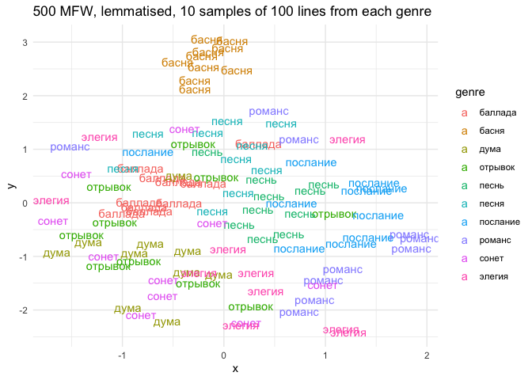

# 03_2_projections

# 3.1. Genres & words

This script analyses how words are distributed inside genres making UMAP
projections of distances based on MFW.

``` r
library(tidyverse)
```

    Warning: package 'ggplot2' was built under R version 4.3.1

    Warning: package 'lubridate' was built under R version 4.3.1

    ── Attaching core tidyverse packages ──────────────────────── tidyverse 2.0.0 ──
    ✔ dplyr     1.1.3     ✔ readr     2.1.4
    ✔ forcats   1.0.0     ✔ stringr   1.5.0
    ✔ ggplot2   3.4.4     ✔ tibble    3.2.1
    ✔ lubridate 1.9.3     ✔ tidyr     1.3.0
    ✔ purrr     1.0.2     
    ── Conflicts ────────────────────────────────────────── tidyverse_conflicts() ──
    ✖ dplyr::filter() masks stats::filter()
    ✖ dplyr::lag()    masks stats::lag()
    ℹ Use the conflicted package (<http://conflicted.r-lib.org/>) to force all conflicts to become errors

``` r
library(tidytext)

library(stylo)
```


    ### stylo version: 0.7.4 ###

    If you plan to cite this software (please do!), use the following reference:
        Eder, M., Rybicki, J. and Kestemont, M. (2016). Stylometry with R:
        a package for computational text analysis. R Journal 8(1): 107-121.
        <https://journal.r-project.org/archive/2016/RJ-2016-007/index.html>

    To get full BibTeX entry, type: citation("stylo")

``` r
library(seetrees)

library(umap)

library(MetBrewer)
theme_set(theme_minimal())
```

Load data

``` r
corpus1835 <- readRDS("../../data/corpus1835/corpus_1835.Rds")

titles <- read.csv("poems_titles.csv") %>% select(-X)
```

Attach titles data to the corpus: for genres only

``` r
genres <- unlist(str_split(c("песня
романс
сонет
элегия
басня
песнь
альбом
дума
баллада
отрывок
подражание
послание
молитва
фантазия
псалом
эпиграмма
мелодия
антологический
аполог
сказка
экспромт
надпись
эпилог"), pattern = "\n"))

multigenre <- titles %>% 
  select(text_id, lemma) %>% 
  filter(lemma %in% genres) %>% 
  group_by(text_id) %>% 
  summarise(genre = paste0(lemma, collapse = " | ")) %>% 
  filter(str_detect(genre, " \\| "))

m <- corpus1835 %>% 
  filter(text_id %in% multigenre$text_id) %>% 
  select(text_id, text_title, text_subtitle) %>% 
  left_join(multigenre %>% select(text_id, genre), by = "text_id")

# write.csv(m, "multigenre_texts.csv")
```

``` r
# read the data with normalised genres
m <- read.delim("multigenre_texts.csv", sep = ';') %>% select(-X)

glimpse(m)
```

    Rows: 91
    Columns: 5
    $ text_id       <chr> "P_114", "P_1326", "P_1378", "P_138", "P_139", "P_140", …
    $ text_title    <chr> "Обитатель Сиона", "Отрывок из Шиллеровой песни о колоко…
    $ text_subtitle <chr> "Подражание псалму", "", "Подражание французскому", "Сол…
    $ genre         <chr> "подражание | псалом", "отрывок | песня", "песнь | подра…
    $ true_genre    <chr> "псалом", "отрывок", "песнь", "песня", "песня", "песня",…

``` r
# attach normalised genres to other genre titles
ids_genres <- titles %>% 
  select(text_id, lemma) %>% 
  filter(lemma %in% genres) %>% 
  group_by(text_id) %>% 
  summarise(genre = paste0(lemma, collapse = " | ")) %>% 
  filter(!str_detect(genre, " \\| ")) %>% 
  rbind(m %>% 
          select(text_id, true_genre) %>% 
          rename(genre = true_genre)
          )

rm(m, multigenre, titles)
```

``` r
# glimpse(corpus1835)

corpus_genres <- corpus1835 %>% 
  select(text_id, author_text, text_title, year, 
         text_cln, text_lemm, 
         meter, feet, n_lines) %>% 
  left_join(ids_genres, by = "text_id") %>% 
  mutate(genre = ifelse(genre == "", NA, genre))

table(corpus_genres$genre)
```


            альбом антологический         аполог        баллада          басня 
                51             17             17             45             69 
              дума        мелодия        молитва        надпись        отрывок 
                51             21             32             12             43 
             песнь          песня     подражание       послание         псалом 
                57            242             29             39             27 
            романс         сказка          сонет       фантазия       экспромт 
               104             12             79             28             13 
            элегия      эпиграмма         эпилог 
                72             27             13 

## texts with genre titles

``` r
corpus_genres %>% 
  filter(!is.na(genre)) %>% 
  select(-text_lemm) %>% 
  separate_rows(text_cln, sep = "\n") %>% 
  filter(text_cln != "" & !str_detect(text_cln, "^\\W+$")) %>% 
  count(genre, text_id) %>% 
  group_by(genre) %>% 
  summarise(mean_lines = round(mean(n),2),
            median_lines = round(median(n),2)) %>% 
  ungroup() %>% 
  pivot_longer(!genre, names_to = "metric", values_to = "n_lines") %>% 
  ggplot(aes(x = reorder_within(genre, n_lines, genre), y = n_lines, fill = metric)) + 
  geom_col(position = "dodge") + 
  coord_flip() + 
  scale_x_reordered() + 
  scale_fill_manual(values = c(met.brewer("Veronese")[3],
                               met.brewer("Veronese")[6])) + 
  labs(x = "",
       y = "Количество строк")
```


``` r
corpus_genres %>% 
  filter(!is.na(genre)) %>% 
  select(-text_lemm) %>% 
  separate_rows(text_cln, sep = "\n") %>% 
  filter(text_cln != "" & !str_detect(text_cln, "^\\W+$")) %>% 
  mutate(corpus = str_extract(text_id, "^\\w")) %>% 
  count(corpus, genre, text_id) %>% 
  group_by(genre, corpus) %>% 
  summarise(median_lines = round(median(n),2)) %>% 
  ungroup() %>% 
  ggplot(aes(x = reorder_within(genre, median_lines, genre), 
             y = median_lines, 
             fill = corpus)) + 
  geom_col(position = "dodge", width = 0.7) + 
  coord_flip() + 
  scale_x_reordered() + 
  scale_fill_manual(values = c(met.brewer("Veronese")[3],
                               met.brewer("Veronese")[6])) + 
  labs(x = "",
       y = "Количество строк")
```

    `summarise()` has grouped output by 'genre'. You can override using the
    `.groups` argument.


## Sampling

Take random samples of 25 lines from all texts longer than 25, filter
out texts shorter than 8 lines.

``` r
source("03_fn_sampling.R")
```

``` r
# filter out short poems (<7 lines)
corpus_genres <- corpus_genres %>% 
  filter(n_lines > 7)

# -260 poems
```

Sample lemmatised texts

``` r
genres_sampled <- sample_long(corpus_genres %>%  
                                #select(-text_lemm) %>% 
                                rename(#text_lemm = text_cln,
                                  id = text_id),
                        starting_n = 1,
                        sample_size = 25,
                        over9000 = 5)
```

    Redetermining length of poems...

    Preparing to sample...

    Sampling long poems...

    Warning: `cols` is now required when using `unnest()`.
    ℹ Please use `cols = c(text_lemm)`.

    `summarise()` has grouped output by 'id'. You can override using the `.groups`
    argument.

    Warning: `cols` is now required when using `unnest()`.
    ℹ Please use `cols = c(text_lemm)`.

    `summarise()` has grouped output by 'id'. You can override using the `.groups`
    argument.

    Warning: `cols` is now required when using `unnest()`.
    ℹ Please use `cols = c(text_lemm)`.

    `summarise()` has grouped output by 'id'. You can override using the `.groups`
    argument.

    Warning: `cols` is now required when using `unnest()`.
    ℹ Please use `cols = c(text_lemm)`.

    `summarise()` has grouped output by 'id'. You can override using the `.groups`
    argument.

    Sampling poems over 9000!!!...

    Warning: `cols` is now required when using `unnest()`.
    ℹ Please use `cols = c(text_lemm)`.

    `summarise()` has grouped output by 'id'. You can override using the `.groups`
    argument.

    Replacing long texts by samples...

Comparison on the number of genre-labelled poems before and after
sampling

``` r
corpus_genres %>% 
  filter(!is.na(genre)) %>% 
  nrow()
```

    [1] 1018

``` r
genres_sampled %>% 
  filter(!is.na(genre)) %>% 
  nrow()
```

    [1] 1310

Leave only the texts with genre titles

``` r
genres_only <- genres_sampled %>% 
  filter(!is.na(genre))

glimpse(genres_only)
```

    Rows: 1,310
    Columns: 10
    $ id          <chr> "P_1017", "P_1032", "P_1038", "P_1068", "P_1069", "P_1070"…
    $ author_text <chr> "Рудыковский Н.", "Катенин П.А.", "Петерсон К.А.", "Бараты…
    $ text_title  <chr> "Сонет Мильтона", "Песнь русского", "Сонет", "", "", "", "…
    $ year        <chr> "1838", "1839", "1839", "1839", "1839", "1839", "1840", "1…
    $ text_cln    <chr> "Когда придет мне в мысль, что я лишен очей,\nЕдва к полуп…
    $ text_lemm   <chr> "когда прийти я в мысль, что я лишать око,\nедва к полупут…
    $ meter       <fct> Iamb, Iamb, Iamb, Iamb, Trochee, Iamb, Dactyl, Other?, Iam…
    $ feet        <chr> "other", "other", "5", "5", "4", "6", "5.33333333333333", …
    $ n_lines     <int> 14, 12, 14, 10, 12, 8, 8, 9, 16, 9, 15, 14, 24, 12, 16, 10…
    $ genre       <chr> "сонет", "песнь", "сонет", "антологический", "антологическ…

Check sampling

``` r
genres_only %>% 
  #select(-text_lemm) %>% 
  separate_rows(text_lemm, sep = "\n") %>% 
  filter(text_lemm != "" & !str_detect(text_lemm, "^\\W+$")) %>% 
  count(id, genre) %>%  
  ggplot(aes(x = genre, y = n)) + geom_boxplot()
```


## Projections

### lemmas

Test absolute word frequencies

``` r
genres_only %>% 
  unnest_tokens(input = text_lemm, output = word, token = "words") %>% 
  group_by(genre) %>% 
  count(word, sort = T) %>% 
  slice_max(n, n = 10) %>% 
  ungroup() %>% 
  pivot_wider(names_from = genre, values_from = n)
```

    # A tibble: 34 × 24
       word  альбом антологический аполог баллада басня  дума мелодия молитва
       <chr>  <int>          <int>  <int>   <int> <int> <int>   <int>   <int>
     1 и        142             14     32     385   207   260      75     151
     2 я        118              5     19     180    81    81      46      81
     3 в        106              6     24     212   141   193      53      98
     4 не        66              5     14     134   168    85      43      54
     5 вы        58             NA     NA      NA    NA    NA      NA      NA
     6 как       51              5      7      98    58    78      NA      NA
     7 ты        41              6     NA      96    56    52      24      57
     8 на        38             NA     11     138    81    68      26      NA
     9 быть      36             NA     NA      NA    62    NA      23      NA
    10 с         36              5     10     116    76    52      NA      32
    # ℹ 24 more rows
    # ℹ 15 more variables: надпись <int>, отрывок <int>, песнь <int>, песня <int>,
    #   подражание <int>, послание <int>, псалом <int>, романс <int>, сказка <int>,
    #   сонет <int>, фантазия <int>, экспромт <int>, элегия <int>, эпиграмма <int>,
    #   эпилог <int>

#### ranks - 1500 MFW

Extract MFW from the corpus

``` r
ranks <- genres_only %>% 
  unnest_tokens(input = text_lemm, output = word, token = "words") %>% 
  count(word, sort = T) %>% 
  head(1500)

head(ranks, 10)
```

    # A tibble: 10 × 2
       word      n
       <chr> <int>
     1 и      4596
     2 в      3236
     3 я      2641
     4 не     2112
     5 ты     1646
     6 на     1588
     7 с      1423
     8 он     1302
     9 как    1228
    10 мой    1113

``` r
tail(ranks, 10)
```

    # A tibble: 10 × 2
       word          n
       <chr>     <int>
     1 живо         10
     2 жизненный    10
     3 жизнить      10
     4 завет        10
     5 заключать    10
     6 закрывать    10
     7 запад        10
     8 звонкий      10
     9 злодейка     10
    10 идеал        10

``` r
ranks %>% 
  mutate(rank = row_number()) %>% 
  sample_n(15) %>% 
  arrange(-desc(rank))
```

    # A tibble: 15 × 3
       word           n  rank
       <chr>      <int> <int>
     1 до           116   126
     2 прах          89   162
     3 мчаться       35   476
     4 три           34   497
     5 родимый       24   690
     6 ласкать       20   807
     7 блестящий     17   919
     8 пол           16   992
     9 подходить     15  1052
    10 село          14  1142
    11 божество      13  1162
    12 приветный     13  1213
    13 улыбаться     13  1243
    14 молодецкий    12  1286
    15 свое          12  1316

Count N of MFW in each poem

``` r
counter <- genres_only %>% 
  unnest_tokens(input = text_lemm, output = word, token = "words") %>% 
  group_by(id) %>% 
  count(word) %>% 
  filter(word %in% ranks$word) %>% 
  ungroup()

counter %>% 
  sample_n(10)
```

    # A tibble: 10 × 3
       id          word          n
       <chr>       <chr>     <int>
     1 P_1741-2    подходить     1
     2 P_1544-1    день          2
     3 C_277__12-2 человек       1
     4 C_241__18   все           2
     5 P_422       звать         1
     6 C_143__35   страх         1
     7 P_25-1      ж             1
     8 C_117__1-2  путь          1
     9 P_1015-1    высокий       1
    10 C_318__2-2  сердце        1

Create a matrix & make a UMAP projection

``` r
xxx <- counter %>% 
  pivot_wider(names_from = word, values_from = n, values_fill = 0)

mtrx <- xxx %>% 
  ungroup() %>% 
  select(-id) %>% 
  scale()

dim(mtrx)
```

    [1] 1290 1500

``` r
u <- umap(mtrx)

dat <- tibble(x = u$layout[,1],
       y = u$layout[,2],
       id = xxx$id) %>% 
  left_join(genres_only, by = "id") 
  
table(genres_only$genre)
```


            альбом антологический         аполог        баллада          басня 
                42              6              7             95             65 
              дума        мелодия        молитва        надпись        отрывок 
                60             24             33              8             75 
             песнь          песня     подражание       послание         псалом 
                86            272             29             93             33 
            романс         сказка          сонет       фантазия       экспромт 
               111             13             79             47              5 
            элегия      эпиграмма         эпилог 
               108              6             13 

``` r
glimpse(dat)
```

    Rows: 1,310
    Columns: 12
    $ x           <dbl> -1.7605549, -3.0068728, -0.5121671, -2.9623811, -3.0815956…
    $ y           <dbl> 0.73588492, -0.06497558, -0.29764019, 0.40915321, 0.057255…
    $ id          <chr> "C_101__1-1", "C_101__10", "C_101__11-1", "C_101__12-1", "…
    $ author_text <chr> "Кашкин Д.Е.", "Кашкин Д.Е.", "Кашкин Д.Е.", "Кашкин Д.Е."…
    $ text_title  <chr> "Романс", "Романс", "Романс", "Романс", "Романс", "Романс"…
    $ year        <chr> "1836", "1836", "1836", "1836", "1836", "1836", "1836", "1…
    $ text_cln    <chr> "В власти - ль смертного забыть,\nЧто ему всего дороже?\nП…
    $ text_lemm   <chr> "в власть - ль смертный забывать,\nчто он все дорогой?\nпе…
    $ meter       <fct> Dactyl, Iamb, Trochee, Dactyl, Iamb, Iamb, Iamb, Trochee, …
    $ feet        <chr> "3", "3", "3", "3", "4", "4", "4", "4", "other", "4", "4",…
    $ n_lines     <int> 30, 24, 32, 32, 32, 48, 24, 36, 48, 28, 56, 56, 36, 40, 40…
    $ genre       <chr> "романс", "романс", "романс", "романс", "романс", "романс"…

#### plots

There is no meter clusters!

``` r
dat %>% 
  filter(meter != "Other?") %>% 
  ggplot(aes(x, y, color = meter, shape = meter)) + 
  geom_point(size = 5, alpha = 0.6) + 
  labs(title = "1500 MFW, lemmatised, pre-scaled abs freq")
```


``` r
dat %>% 
  filter(meter != "Other?") %>% 
  ggplot(aes(x, y, color = genre)) + 
  geom_point(size = 4, alpha = 0.6) + 
  theme(legend.position = "None") + 
  labs(title = "Colour = genre")
```


``` r
dat %>% 
  filter(meter != "Other?") %>% 
  ggplot(aes(x, y, color = author_text)) + 
  geom_point(size = 4, alpha = 0.6) + 
  theme(legend.position = "None") + 
  labs(title = "Colour = author")
```


``` r
dat %>% 
  filter(meter != "Other") %>% 
  
  filter(meter == "Iamb") %>% 
  
  filter(genre == "элегия") %>% 
  
  ggplot(aes(x, y, color = genre, shape = meter)) + 
  geom_point(size = 5, alpha = 0.7) + 
  geom_text(aes(label = author_text), size = 3, color = "black") + 
  scale_color_manual(values = c(met.brewer("Archambault"))) + 
  labs(title = "Only elegies")
```



``` r
dat %>% 
  mutate(first_line = str_extract(text_cln, "^(.*?)\n"),
         author_text = paste0(first_line)) %>% 
  filter(meter != "Other") %>% 
  
  filter(meter == "Iamb" | 
    meter == "Trochee") %>% 
  
  filter(genre == "песня") %>% 
  
  ggplot(aes(x, y, color = meter, shape = meter)) + 
  geom_point(size = 5, alpha = 0.7) + 
  geom_text(aes(label = author_text), size = 3) + 
  scale_color_manual(values = c(met.brewer("Archambault"))) + 
  labs(title = "only songs, first lines")
```


``` r
dat %>% 
  #mutate(first_line = str_extract(text_cln, "^(.*?)\n"),
  #       author_text = paste0(first_line)) %>% 
  filter(meter != "Other") %>% 
  
  filter(meter == "Iamb" | 
    meter == "Trochee") %>% 
  
  filter(genre == "песня") %>% 
  
  ggplot(aes(x, y, color = meter, shape = meter)) + 
  geom_point(size = 5, alpha = 0.7) + 
  geom_text(aes(label = author_text), size = 3) + 
  scale_color_manual(values = c(met.brewer("Archambault"))) + 
  labs(title = "only songs, authors")
```


``` r
dat %>% 
  filter(meter != "Other") %>% 
  
  filter(meter == "Trochee") %>% 
  
  filter(genre %in% c("баллада", 
                      "романс", 
                      "песня")) %>%
  
  ggplot(aes(x, y, color = author_text, shape = genre)) + 
  geom_point(size = 5, alpha = 0.7) + 
  geom_text(aes(label = author_text), size = 3) + 
  theme(legend.position = "None") + 
  labs(title = "6 genres, colours = authors, shapes = genres", 
       subtitle = "point = ballad, triangle = song, square = romance") 
```


``` r
dat %>% 
  filter(meter != "Other") %>% 
  
  filter(meter == "Trochee" | meter == "Iamb") %>% 
  
  filter(genre %in% c("песня",
                      "послание",
                      "басня",
                      "сонет",
                      "элегия",
                      #"баллада",
                      "псалом")) %>%
  
  ggplot(aes(x, y, color = genre, shape = meter)) + 
  geom_point(size = 5, alpha = 0.7) + 
  #geom_text(aes(label = author_text), size = 4) + theme(legend.position = "None")
  scale_color_manual(values = c(met.brewer("Archambault")))
```


### word bigrams

sampling of raw texts: non-lemmatized texts

``` r
genres_sampled <- sample_long(corpus_genres %>%  
                                select(-text_lemm) %>% 
                                rename(text_lemm = text_cln,
                                  id = text_id),
                        starting_n = 1,
                        sample_size = 25,
                        over9000 = 5)
```

    Redetermining length of poems...

    Preparing to sample...

    Sampling long poems...

    Warning: `cols` is now required when using `unnest()`.
    ℹ Please use `cols = c(text_lemm)`.

    `summarise()` has grouped output by 'id'. You can override using the `.groups`
    argument.

    Warning: `cols` is now required when using `unnest()`.
    ℹ Please use `cols = c(text_lemm)`.

    `summarise()` has grouped output by 'id'. You can override using the `.groups`
    argument.

    Warning: `cols` is now required when using `unnest()`.
    ℹ Please use `cols = c(text_lemm)`.

    `summarise()` has grouped output by 'id'. You can override using the `.groups`
    argument.

    Warning: `cols` is now required when using `unnest()`.
    ℹ Please use `cols = c(text_lemm)`.

    `summarise()` has grouped output by 'id'. You can override using the `.groups`
    argument.

    Sampling poems over 9000!!!...

    Warning: `cols` is now required when using `unnest()`.
    ℹ Please use `cols = c(text_lemm)`.

    `summarise()` has grouped output by 'id'. You can override using the `.groups`
    argument.

    Replacing long texts by samples...

``` r
genres_only <- genres_sampled %>% 
  filter(!is.na(genre))
```

ranks

``` r
ranks <- genres_only %>% 
  unnest_tokens(input = text_lemm, output = bigram, token = "ngrams", 
                n = 2) %>% 
  count(bigram, sort = T) %>% 
  head(200)

head(ranks, 10)
```

    # A tibble: 10 × 2
       bigram      n
       <chr>   <int>
     1 и в       210
     2 и с       114
     3 и на       79
     4 и не       73
     5 я не       61
     6 с тобой    58
     7 в нем      55
     8 в душе     52
     9 в ней      50
    10 с ним      50

``` r
tail(ranks, 10)
```

    # A tibble: 10 × 2
       bigram        n
       <chr>     <int>
     1 пред ним     13
     2 с небес      13
     3 с собою      13
     4 свет и       13
     5 что я        13
     6 в дали       12
     7 в даль       12
     8 в небесах    12
     9 в стране     12
    10 в этом       12

``` r
ranks %>% 
  mutate(rank = row_number()) %>% 
  sample_n(15) %>% 
  arrange(-desc(rank))
```

    # A tibble: 15 × 3
       bigram        n  rank
       <chr>     <int> <int>
     1 к тебе       43    17
     2 мой друг     40    20
     3 в груди      25    54
     4 души моей    21    72
     5 по сердцу    20    80
     6 и мне        19    84
     7 в грудь      17   100
     8 в очах       17   101
     9 для нас      17   102
    10 в море       16   120
    11 на сердце    16   126
    12 в тиши       15   134
    13 мне и        15   142
    14 на меня      15   144
    15 когда же     13   186

Count bigrams in texts

``` r
counter <- genres_only %>% 
  unnest_tokens(input = text_lemm, output = bigram, token = "ngrams", n = 2) %>% 
  group_by(id) %>% 
  count(bigram) %>% 
  filter(bigram %in% ranks$bigram) %>% 
  ungroup()

counter %>% 
  sample_n(10)
```

    # A tibble: 10 × 3
       id         bigram       n
       <chr>      <chr>    <int>
     1 P_366      я в          1
     2 P_1179     мой друг     1
     3 P_1927-1   с тобой      1
     4 P_1126-1   мне в        1
     5 C_124__28  в нем        1
     6 P_337-1    и с          2
     7 C_315__4-1 и без        1
     8 P_554-2    но в         1
     9 C_240__29  и что        1
    10 C_128__10  в ответ      1

Projection

``` r
xxx <- counter %>% 
  pivot_wider(names_from = bigram, values_from = n, values_fill = 0)

mtrx <- xxx %>% 
  ungroup() %>% 
  select(-id) %>% 
  scale()

dim(mtrx)
```

    [1] 1162  200

``` r
u <- umap(mtrx)

dat <- tibble(x = u$layout[,1],
       y = u$layout[,2],
       id = xxx$id) %>% 
  left_join(genres_only, by = "id") 
  
# table(genres_only$genre)

head(dat)
```

    # A tibble: 6 × 11
           x      y id    author_text text_title year  text_lemm meter feet  n_lines
       <dbl>  <dbl> <chr> <chr>       <chr>      <chr> <chr>     <fct> <chr>   <int>
    1  0.382  1.97  C_10… Кашкин Д.Е. Романс     1836  "Сердце … Dact… 3          30
    2 -0.273 -1.23  C_10… Кашкин Д.Е. Романс     1836  "Когда б… Iamb  3          24
    3  2.42  -0.852 C_10… Кашкин Д.Е. Романс     1836  "Мил сер… Troc… 3          32
    4 -0.247 -0.165 C_10… Кашкин Д.Е. Романс     1836  "Тогда -… Dact… 3          32
    5  1.69  -1.37  C_10… Кашкин Д.Е. Романс     1836  "Через с… Iamb  4          32
    6  0.973 -0.981 C_10… Кашкин Д.Е. Романс     1836  "Там Кат… Iamb  4          48
    # ℹ 1 more variable: genre <chr>

#### plots

Same projection tests

``` r
dat %>% 
  filter(meter != "Other?") %>% 
  ggplot(aes(x, y, color = meter, shape = meter)) + 
  geom_point(size = 5, alpha = 0.6) + 
  labs(title = "200 MF word bigrams, non-lemmatised, pre-scaled abs freq")
```


``` r
dat %>% 
  filter(meter != "Other?") %>% 
  ggplot(aes(x, y, color = genre)) + 
  geom_point(size = 4, alpha = 0.6) + 
  theme(legend.position = "None") + 
  labs(title = "Colour = genre")
```


``` r
dat %>% 
  filter(meter != "Other") %>% 
  
  filter(meter == "Iamb") %>% 
  
  filter(genre == "элегия") %>% 
  
  ggplot(aes(x, y, color = genre, shape = meter)) + 
  geom_point(size = 5, alpha = 0.7) + 
  geom_text(aes(label = author_text), size = 3, color = "black") + 
  scale_color_manual(values = c(met.brewer("Archambault"))) + 
  labs(title = "Only elegies")
```


``` r
dat %>% 
  mutate(first_line = str_extract(text_lemm, "^(.*?)\n"),
         author_text = paste0(first_line)) %>% 
  filter(meter != "Other") %>% 
  
  filter(meter == "Iamb" | 
    meter == "Trochee") %>% 
  
  filter(genre == "песня") %>% 
  
  ggplot(aes(x, y, color = meter, shape = meter)) + 
  geom_point(size = 5, alpha = 0.7) + 
  geom_text(aes(label = author_text), size = 3) + 
  scale_color_manual(values = c(met.brewer("Archambault"))) + 
  labs(title = "only songs, first lines")
```


``` r
dat %>% 
  filter(meter != "Other") %>% 
  
  filter(meter == "Trochee" | meter == "Iamb") %>% 
  
  filter(genre %in% c("песня",
                      "послание",
                      "басня",
                      "сонет",
                      "элегия",
                      #"баллада",
                      "псалом")) %>%
  
  ggplot(aes(x, y, color = genre, shape = meter)) + 
  geom_point(size = 5, alpha = 0.7) + 
  #geom_text(aes(label = author_text), size = 4) + theme(legend.position = "None")
  scale_color_manual(values = c(met.brewer("Archambault")))
```


### char ngrams

``` r
ranks <- genres_only %>% 
  unnest_tokens(input = text_lemm, output = ngram, 
                token = "character_shingles", n=5) %>% 
  count(ngram, sort = T) %>% 
  head(1000)

head(ranks, 10)
```

    # A tibble: 10 × 2
       ngram     n
       <chr> <int>
     1 сердц   492
     2 когда   367
     3 енный   295
     4 ердце   294
     5 адост   270
     6 небес   253
     7 счаст   239
     8 итель   236
     9 благо   206
    10 красн   206

``` r
tail(ranks, 10)
```

    # A tibble: 10 × 2
       ngram     n
       <chr> <int>
     1 дится    32
     2 евинн    32
     3 елюби    32
     4 енная    32
     5 естан    32
     6 иволн    32
     7 ильны    32
     8 лежит    32
     9 ливый    32
    10 ловно    32

``` r
ranks %>% 
  mutate(rank = row_number()) %>% 
  sample_n(15) %>% 
  arrange(-desc(rank))
```

    # A tibble: 15 × 3
       ngram     n  rank
       <chr> <int> <int>
     1 пусть   115    57
     2 далек    73   169
     3 устын    57   321
     4 насла    52   369
     5 еткак    50   388
     6 ванье    49   406
     7 город    49   410
     8 люблю    49   419
     9 таинс    49   427
    10 бесны    43   534
    11 меняп    42   568
    12 мойдр    41   598
    13 астно    37   718
    14 призр    36   790
    15 репещ    33   963

``` r
counter <- genres_only %>% 
  unnest_tokens(input = text_lemm, output = ngram, 
                token = "character_shingles", n=5) %>% 
  group_by(id) %>% 
  count(ngram) %>% 
  filter(ngram %in% ranks$ngram) %>% 
  ungroup()

counter %>% 
  sample_n(10)
```

    # A tibble: 10 × 3
       id          ngram     n
       <chr>       <chr> <int>
     1 C_240__7-1  расно     1
     2 P_762-2     мечта     1
     3 P_26        разлу     1
     4 C_92__26-1  есель     1
     5 P_79-1      есный     1
     6 C_92__56-2  сладо     2
     7 P_263-1     тайно     1
     8 C_92__1-1   юбовь     2
     9 C_316__20-1 красн     1
    10 P_1642      скрес     1

``` r
xxx <- counter %>% 
  pivot_wider(names_from = ngram, values_from = n, values_fill = 0)

mtrx <- xxx %>% 
  ungroup() %>% 
  select(-id) %>% 
  scale()

dim(mtrx)
```

    [1] 1291 1000

``` r
u <- umap(mtrx)

dat <- tibble(x = u$layout[,1],
       y = u$layout[,2],
       id = xxx$id) %>% 
  left_join(genres_only, by = "id") 
  
# table(genres_only$genre)

head(dat)
```

    # A tibble: 6 × 11
          x      y id     author_text text_title year  text_lemm meter feet  n_lines
      <dbl>  <dbl> <chr>  <chr>       <chr>      <chr> <chr>     <fct> <chr>   <int>
    1 -2.36 -1.03  C_101… Кашкин Д.Е. Романс     1836  "Сердце … Dact… 3          30
    2 -2.41 -1.41  C_101… Кашкин Д.Е. Романс     1836  "Когда б… Iamb  3          24
    3 -2.11 -1.19  C_101… Кашкин Д.Е. Романс     1836  "Мил сер… Troc… 3          32
    4 -2.18 -1.33  C_101… Кашкин Д.Е. Романс     1836  "Тогда -… Dact… 3          32
    5 -2.68 -0.970 C_101… Кашкин Д.Е. Романс     1836  "Через с… Iamb  4          32
    6 -2.18 -0.627 C_101… Кашкин Д.Е. Романс     1836  "Там Кат… Iamb  4          48
    # ℹ 1 more variable: genre <chr>

#### plots

``` r
dat %>% 
  filter(meter != "Other?") %>% 
  ggplot(aes(x, y, color = meter, shape = meter)) + 
  geom_point(size = 5, alpha = 0.6) + 
  labs(title = "1000 MF char 3-grams, non-lemmatised, pre-scaled abs freq")
```


``` r
dat %>% 
  filter(meter != "Other?") %>% 
  ggplot(aes(x, y, color = genre)) + 
  geom_point(size = 4, alpha = 0.6) + 
  theme(legend.position = "None") + 
  labs(title = "Colour = genre")
```


``` r
dat %>% 
  filter(meter != "Other") %>% 
  
  filter(meter == "Iamb") %>% 
  
  filter(genre == "элегия") %>% 
  
  ggplot(aes(x, y, color = genre, shape = meter)) + 
  geom_point(size = 5, alpha = 0.7) + 
  geom_text(aes(label = author_text), size = 3, color = "black") + 
  scale_color_manual(values = c(met.brewer("Archambault"))) + 
  labs(title = "Only elegies")
```


``` r
dat %>% 
  mutate(first_line = str_extract(text_lemm, "^(.*?)\n"),
         author_text = paste0(first_line)) %>% 
  filter(meter != "Other") %>% 
  
  filter(meter == "Iamb" | 
    meter == "Trochee") %>% 
  
  filter(genre == "песня") %>% 
  
  ggplot(aes(x, y, color = meter, shape = meter)) + 
  geom_point(size = 5, alpha = 0.7) + 
  geom_text(aes(label = author_text), size = 3) + 
  scale_color_manual(values = c(met.brewer("Archambault"))) + 
  labs(title = "only songs, first lines")
```


``` r
dat %>% 
  filter(meter != "Other") %>% 
  
  filter(meter == "Trochee" | meter == "Iamb") %>% 
  
  filter(genre %in% c("песня",
                      "послание",
                      "басня",
                      "сонет",
                      "элегия",
                      #"баллада",
                      "псалом")) %>%
  
  ggplot(aes(x, y, color = genre, shape = meter)) + 
  geom_point(size = 5, alpha = 0.7) + 
  #geom_text(aes(label = author_text), size = 4) + theme(legend.position = "None")
  scale_color_manual(values = c(met.brewer("Archambault")))
```


## Trees

Sample lemmatised texts

``` r
genres_sampled <- sample_long(corpus_genres %>%  
                                #select(-text_lemm) %>% 
                                rename(#text_lemm = text_cln,
                                  id = text_id),
                        starting_n = 1,
                        sample_size = 25,
                        over9000 = 5)
```

    Redetermining length of poems...

    Preparing to sample...

    Sampling long poems...

    Warning: `cols` is now required when using `unnest()`.
    ℹ Please use `cols = c(text_lemm)`.

    `summarise()` has grouped output by 'id'. You can override using the `.groups`
    argument.

    Warning: `cols` is now required when using `unnest()`.
    ℹ Please use `cols = c(text_lemm)`.

    `summarise()` has grouped output by 'id'. You can override using the `.groups`
    argument.

    Warning: `cols` is now required when using `unnest()`.
    ℹ Please use `cols = c(text_lemm)`.

    `summarise()` has grouped output by 'id'. You can override using the `.groups`
    argument.

    Warning: `cols` is now required when using `unnest()`.
    ℹ Please use `cols = c(text_lemm)`.

    `summarise()` has grouped output by 'id'. You can override using the `.groups`
    argument.

    Sampling poems over 9000!!!...

    Warning: `cols` is now required when using `unnest()`.
    ℹ Please use `cols = c(text_lemm)`.

    `summarise()` has grouped output by 'id'. You can override using the `.groups`
    argument.

    Replacing long texts by samples...

``` r
# glimpse(genres_sampled)

genres_only <- genres_sampled %>% 
  select(-text_cln) %>% 
  filter(!is.na(genre)) %>% 
  mutate(text_id = paste0(genre, "___", id)) %>% 
  filter(genre %in% c(
    "баллада", "басня", "дума", "мелодия", "песнь", "песня", "послание", 
    "романс", "сонет", "элегия"
  ))

nrow(genres_only)
```

    [1] 993

``` r
table(genres_only$genre)
```


     баллада    басня     дума  мелодия    песнь    песня послание   романс 
          95       65       60       24       86      272       93      111 
       сонет   элегия 
          79      108 

``` r
rm(genres_sampled, ids_genres)
```

Word ranks : MFW 500

``` r
ranks <- genres_only %>% 
  unnest_tokens(input = text_lemm, output = word, token = "words") %>% 
  count(word, sort = T) %>% 
  head(500)

head(ranks, 10)
```

    # A tibble: 10 × 2
       word      n
       <chr> <int>
     1 и      3372
     2 в      2339
     3 я      1925
     4 не     1631
     5 ты     1207
     6 на     1181
     7 с      1141
     8 он      917
     9 как     899
    10 мой     828

``` r
tail(ranks, 10)
```

    # A tibble: 10 × 2
       word         n
       <chr>    <int>
     1 молчать     25
     2 обнимать    25
     3 оно         25
     4 память      25
     5 победа      25
     6 полночь     25
     7 полюбить    25
     8 родимый     25
     9 самый       25
    10 свидание    25

### separate texts

``` r
do.call(file.remove, list(list.files("corpus_sampled/", full.names = TRUE)))
```

     [1] TRUE TRUE TRUE TRUE TRUE TRUE TRUE TRUE TRUE TRUE TRUE TRUE TRUE TRUE TRUE
    [16] TRUE TRUE TRUE TRUE TRUE TRUE TRUE TRUE TRUE TRUE TRUE TRUE TRUE TRUE TRUE
    [31] TRUE TRUE TRUE TRUE TRUE TRUE TRUE TRUE TRUE TRUE TRUE TRUE TRUE TRUE TRUE
    [46] TRUE TRUE TRUE TRUE TRUE

``` r
x <- genres_only %>% 
    group_by(genre) %>% 
    sample_n(10) %>% 
    mutate(path = paste0("corpus_sampled/", genre, "____", text_id))

for (i in 1:nrow(x)) {
    write_file(x$text_lemm[i], file = x$path[i])
  }
```

``` r
test1 <- stylo(
  gui = F,
  corpus.dir = "corpus_sampled/",
  corpus.lang = "Other",
  mfw.min = 500,
  mfw.max = 500,
  analyzed.features = "w", 
  ngram.size = 1,
  distance.measure = "wurzburg"
)
```

    using current directory...

    Performing no sampling (using entire text as sample)

    slicing input text into tokens...


    turning words into features, e.g. char n-grams (if applicable)...

    Total nr. of samples in the corpus: 100

    The corpus consists of 8733 tokens

    processing  100  text samples

    ..........
    combining frequencies into a table...


    culling @ 0 available features (words) 2648
    Calculating z-scores... 

    MFW used: 
    500 
    Processing metadata...


    Assigning plot colors according to file names...

     


``` r
do.call(file.remove, list(list.files("corpus_sampled/", full.names = TRUE)))
```

      [1] TRUE TRUE TRUE TRUE TRUE TRUE TRUE TRUE TRUE TRUE TRUE TRUE TRUE TRUE TRUE
     [16] TRUE TRUE TRUE TRUE TRUE TRUE TRUE TRUE TRUE TRUE TRUE TRUE TRUE TRUE TRUE
     [31] TRUE TRUE TRUE TRUE TRUE TRUE TRUE TRUE TRUE TRUE TRUE TRUE TRUE TRUE TRUE
     [46] TRUE TRUE TRUE TRUE TRUE TRUE TRUE TRUE TRUE TRUE TRUE TRUE TRUE TRUE TRUE
     [61] TRUE TRUE TRUE TRUE TRUE TRUE TRUE TRUE TRUE TRUE TRUE TRUE TRUE TRUE TRUE
     [76] TRUE TRUE TRUE TRUE TRUE TRUE TRUE TRUE TRUE TRUE TRUE TRUE TRUE TRUE TRUE
     [91] TRUE TRUE TRUE TRUE TRUE TRUE TRUE TRUE TRUE TRUE

``` r
x <- genres_only %>% 
    group_by(meter) %>% 
    sample_n(10) %>% 
    mutate(path = paste0("corpus_sampled/", meter, "____", text_id))

for (i in 1:nrow(x)) {
    write_file(x$text_lemm[i], file = x$path[i])
}

test1 <- stylo(
  gui = F,
  corpus.dir = "corpus_sampled/",
  corpus.lang = "Other",
  mfw.min = 100,
  mfw.max = 100,
  analyzed.features = "w", 
  ngram.size = 1,
  distance.measure = "wurzburg"
)
```


### combined samples

Sample 20 texts of each genre, select MFW, write files for stylo

``` r
do.call(file.remove, list(list.files("corpus_sampled/", full.names = TRUE)))
```

     [1] TRUE TRUE TRUE TRUE TRUE TRUE TRUE TRUE TRUE TRUE TRUE TRUE TRUE TRUE TRUE
    [16] TRUE TRUE TRUE TRUE TRUE TRUE TRUE TRUE TRUE TRUE TRUE TRUE TRUE TRUE TRUE
    [31] TRUE TRUE TRUE TRUE TRUE TRUE TRUE TRUE TRUE TRUE TRUE TRUE TRUE TRUE TRUE
    [46] TRUE TRUE TRUE TRUE TRUE TRUE TRUE TRUE TRUE TRUE TRUE TRUE TRUE TRUE TRUE

``` r
for (j in 1:5) {

  x <- genres_only %>% 
    group_by(genre) %>% 
    sample_n(10) %>% 
    summarise(text = paste0(text_lemm, collapse = "             ")) %>% 
    mutate(path = paste0("corpus_sampled/", genre, "_", j))
  
  for (i in 1:nrow(x)) {
    write_file(x$text[i], file = x$path[i])
  }

}
```

#### stylo

``` r
test1 <- stylo(
  gui = F,
  corpus.dir = "corpus_sampled/",
  corpus.lang = "Other",
  mfw.min = 200,
  mfw.max = 200,
  analyzed.features = "w", 
  ngram.size = 1,
  distance.measure = "wurzburg"
)
```


``` r
seetrees::view_tree(test1, k = 2, p = 0.01)
```


``` r
test1 <- stylo(
  gui = F,
  corpus.dir = "corpus_sampled/",
  corpus.lang = "Other",
  mfw.min = 500,
  mfw.max = 500,
  analyzed.features = "w", 
  ngram.size = 1,
  distance.measure = "wurzburg"
)
```


``` r
seetrees::view_tree(test1, k = 2, p = 0.01)
```


``` r
test1 <- stylo(
  gui = F,
  corpus.dir = "corpus_sampled/",
  corpus.lang = "Other",
  mfw.min = 1000,
  mfw.max = 1000,
  analyzed.features = "w", 
  ngram.size = 1,
  distance.measure = "wurzburg"
)
```


``` r
seetrees::view_tree(test1, k = 2, p = 0.01)
```


``` r
test1 <- stylo(
  gui = F,
  corpus.dir = "corpus_sampled/",
  corpus.lang = "Other",
  mfw.min = 100,
  mfw.max = 100,
  analyzed.features = "w", 
  ngram.size = 2,
  distance.measure = "wurzburg"
)
```


``` r
seetrees::view_tree(test1, k = 2, p = 0.01)
```


``` r
bct <- stylo(
  gui = F,
  corpus.dir = "corpus_sampled/",
  corpus.lang = "Other",
  analyzed.features = "w",
  ngram.size = 1,
  mfw.min = 200,
  mfw.max = 1000,
  mfw.incr = 1,
  distance.measure = "wurzburg",
  analysis.type = "BCT",
  consensus.strength = 0.5
)
```


