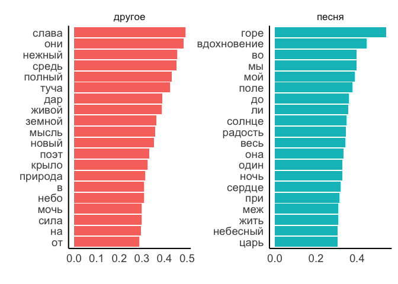
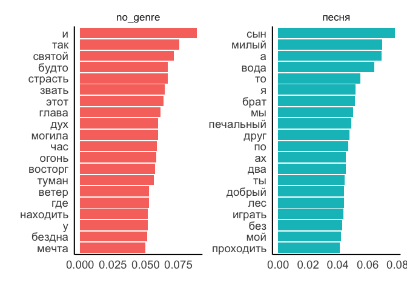
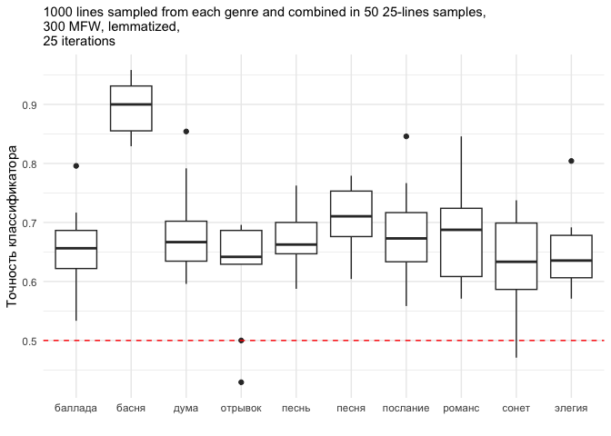
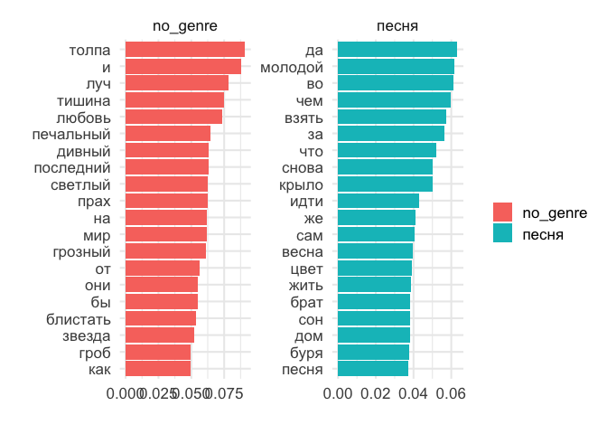

# 03_2_classification

## Classification

This notebook uses samples of different poetic genres from the
Corpus-1835 and try to classify them using SVM. The aim is to test
whether even basic MFW-based classification accuracy will be higher than
chance, and if yes, what are the “influential” words behind this result.

### load data

``` r
library(tidyverse)
```

    Warning: package 'ggplot2' was built under R version 4.3.1

    Warning: package 'tidyr' was built under R version 4.3.1

    Warning: package 'dplyr' was built under R version 4.3.1

    Warning: package 'lubridate' was built under R version 4.3.1

    ── Attaching core tidyverse packages ──────────────────────── tidyverse 2.0.0 ──
    ✔ dplyr     1.1.4     ✔ readr     2.1.4
    ✔ forcats   1.0.0     ✔ stringr   1.5.0
    ✔ ggplot2   3.5.1     ✔ tibble    3.2.1
    ✔ lubridate 1.9.3     ✔ tidyr     1.3.1
    ✔ purrr     1.0.2     
    ── Conflicts ────────────────────────────────────────── tidyverse_conflicts() ──
    ✖ dplyr::filter() masks stats::filter()
    ✖ dplyr::lag()    masks stats::lag()
    ℹ Use the conflicted package (<http://conflicted.r-lib.org/>) to force all conflicts to become errors

``` r
library(tidytext)

library(e1071)
library(caret)
```

    Loading required package: lattice

    Warning: package 'lattice' was built under R version 4.3.1


    Attaching package: 'caret'

    The following object is masked from 'package:purrr':

        lift

``` r
library(tidymodels)
```

    Warning: package 'tidymodels' was built under R version 4.3.1

    ── Attaching packages ────────────────────────────────────── tidymodels 1.2.0 ──
    ✔ broom        1.0.5      ✔ rsample      1.2.1 
    ✔ dials        1.2.1      ✔ tune         1.2.1 
    ✔ infer        1.0.7      ✔ workflows    1.1.4 
    ✔ modeldata    1.4.0      ✔ workflowsets 1.1.0 
    ✔ parsnip      1.2.1      ✔ yardstick    1.3.1 
    ✔ recipes      1.0.10     

    Warning: package 'dials' was built under R version 4.3.1

    Warning: package 'scales' was built under R version 4.3.1

    Warning: package 'infer' was built under R version 4.3.1

    Warning: package 'modeldata' was built under R version 4.3.3

    Warning: package 'parsnip' was built under R version 4.3.1

    Warning: package 'recipes' was built under R version 4.3.1

    Warning: package 'rsample' was built under R version 4.3.1

    Warning: package 'tune' was built under R version 4.3.1

    Warning: package 'workflows' was built under R version 4.3.1

    Warning: package 'workflowsets' was built under R version 4.3.1

    Warning: package 'yardstick' was built under R version 4.3.1

    ── Conflicts ───────────────────────────────────────── tidymodels_conflicts() ──
    ✖ scales::discard()        masks purrr::discard()
    ✖ dplyr::filter()          masks stats::filter()
    ✖ recipes::fixed()         masks stringr::fixed()
    ✖ dplyr::lag()             masks stats::lag()
    ✖ caret::lift()            masks purrr::lift()
    ✖ rsample::permutations()  masks e1071::permutations()
    ✖ yardstick::precision()   masks caret::precision()
    ✖ yardstick::recall()      masks caret::recall()
    ✖ yardstick::sensitivity() masks caret::sensitivity()
    ✖ yardstick::spec()        masks readr::spec()
    ✖ yardstick::specificity() masks caret::specificity()
    ✖ recipes::step()          masks stats::step()
    ✖ tune::tune()             masks parsnip::tune(), e1071::tune()
    • Dig deeper into tidy modeling with R at https://www.tmwr.org

``` r
library(textrecipes)
```

    Warning: package 'textrecipes' was built under R version 4.3.1

``` r
library(kernlab)
```


    Attaching package: 'kernlab'

    The following object is masked from 'package:scales':

        alpha

    The following object is masked from 'package:purrr':

        cross

    The following object is masked from 'package:ggplot2':

        alpha

``` r
library(MetBrewer)
theme_set(theme_minimal())
```

``` r
# main corpus
corpus1835 <- readRDS("../../data/corpus1835/corpus_1835.Rds")

# read genre titles
titles <- read.csv("../../data/ch3/poems_titles.csv") %>% select(-X)

# read the data with normalised genres
m <- read.delim("../../data/ch3/multigenre_texts.csv", sep = ';') %>% select(-X)

# list of genre words (longer)
genres <- unlist(str_split(c("песня
романс
сонет
элегия
басня
песнь
альбом
дума
баллада
отрывок
подражание
послание
молитва
фантазия
псалом
эпиграмма
мелодия
антологический
аполог
сказка
экспромт
надпись
эпилог"), pattern = "\n"))

# attach normalised genres to other genre titles
ids_genres <- titles %>% 
  select(text_id, lemma) %>% 
  filter(lemma %in% genres) %>% # select genres from the list
  group_by(text_id) %>% 
  summarise(genre = paste0(lemma, collapse = " | ")) %>% 
  filter(!str_detect(genre, " \\| ")) %>% # remove multigenre titles
  rbind(m %>% 
          select(text_id, true_genre) %>% 
          rename(genre = true_genre) # replace them with clean labels
          ) %>% 
  filter(genre != "")

rm(genres, m, titles)
```

``` r
glimpse(ids_genres)
```

    Rows: 1,100
    Columns: 2
    $ text_id <chr> "C_101__1", "C_101__10", "C_101__11", "C_101__12", "C_101__13"…
    $ genre   <chr> "романс", "романс", "романс", "романс", "романс", "романс", "р…

``` r
ids_genres %>% count(genre, sort = T)
```

    # A tibble: 23 × 2
       genre       n
       <chr>   <int>
     1 песня     242
     2 романс    104
     3 сонет      79
     4 элегия     72
     5 басня      69
     6 песнь      57
     7 альбом     51
     8 дума       51
     9 баллада    45
    10 отрывок    43
    # ℹ 13 more rows

Select only needed columns

``` r
corpus_genres <- corpus1835 %>% 
  left_join(ids_genres, by = "text_id") %>% 
  #filter(!is.na(genre)) %>% 
  select(text_id, genre, meter, text_lemm) %>% 
  mutate(genre = ifelse(is.na(genre), "no_genre", genre))
```

## poem-level classification

### ranks

Count word ranks (lemmatised corpus) for all genres

NB here poems without genre titles are NOT filtered out, “others” are
all possible other texts, both with and without genre titles.

``` r
ranks <- corpus_genres %>% 
  unnest_tokens(input = text_lemm, output = word, token = "words") %>% 
  count(word, sort = T) %>% 
  mutate(rank = row_number()) %>% 
  head(300)

head(ranks, 10)
```

    # A tibble: 10 × 3
       word      n  rank
       <chr> <int> <int>
     1 и     38454     1
     2 в     26906     2
     3 я     19065     3
     4 не    14993     4
     5 на    11839     5
     6 ты    11474     6
     7 с     11214     7
     8 он    10689     8
     9 как    9398     9
    10 мой    6852    10

``` r
tail(ranks, 10)
```

    # A tibble: 10 × 3
       word          n  rank
       <chr>     <int> <int>
     1 долго       419   291
     2 дом         418   292
     3 страшный    417   293
     4 могучий     412   294
     5 шуметь      410   295
     6 оставлять   409   296
     7 пламень     409   297
     8 помнить     409   298
     9 кипеть      407   299
    10 речь        407   300

### песня

Create genre lables

``` r
corpus_lbld <- corpus_genres %>% 
  mutate(text_genre = ifelse(genre == "песня", genre, "другое")) 
# leave only genre title of the needed class, rename the rest as 'other'

table(corpus_lbld$text_genre) # number of available texts
```


    другое  песня 
      4557    242 

Cound 300MFW freq in all texts in the labelled corpus

``` r
freqs <- corpus_lbld %>% 
  select(text_id, text_genre, text_lemm) %>% 
  unnest_tokens(input = text_lemm, output = word, token = "words") %>% 
  filter(word %in% ranks$word) %>% 
  group_by(text_id, text_genre) %>% 
  count(word) %>% 
  ungroup() %>% 
  pivot_wider(names_from = word, values_from = n, values_fill = 0) 

dim(freqs)
```

    [1] 4797  302

``` r
freqs[1:10, 1:10]
```

    # A tibble: 10 × 10
       text_id   text_genre     б  быть     в волна   все   дух    же  жить
       <chr>     <chr>      <int> <int> <int> <int> <int> <int> <int> <int>
     1 C_101__1  другое         1     1     3     1     1     5     1     1
     2 C_101__10 другое         1     0     1     0     2     0     0     0
     3 C_101__11 другое         0     0     4     0     2     0     0     0
     4 C_101__12 другое         4     1     4     0     0     0     0     2
     5 C_101__13 другое         0     1     6     0     0     0     1     0
     6 C_101__14 другое         0     1     5     0     0     0     0     1
     7 C_101__15 другое         0     1     2     0     0     0     0     0
     8 C_101__16 другое         0     0     5     0     0     0     1     0
     9 C_101__17 другое         0     0     5     0     0     0     0     0
    10 C_101__18 другое         0     0     3     0     0     0     0     1

Scaling

``` r
freqs_scaled <- freqs %>% 
  select(-text_id, -text_genre) %>% 
  scale() %>% 
  as.tibble()
```

    Warning: `as.tibble()` was deprecated in tibble 2.0.0.
    ℹ Please use `as_tibble()` instead.
    ℹ The signature and semantics have changed, see `?as_tibble`.

``` r
freqs_scaled[1:10, 1:10]
```

    # A tibble: 10 × 10
            б   быть       в  волна     все    дух     же   жить забывать   звук
        <dbl>  <dbl>   <dbl>  <dbl>   <dbl>  <dbl>  <dbl>  <dbl>    <dbl>  <dbl>
     1  1.16  -0.146 -0.342   0.778  0.0834  7.78   0.679  1.24     1.39   1.21 
     2  1.16  -0.562 -0.605  -0.327  0.683  -0.310 -0.403 -0.381   -0.313  1.21 
     3 -0.257 -0.562 -0.211  -0.327  0.683  -0.310 -0.403 -0.381   -0.313 -0.275
     4  5.43  -0.146 -0.211  -0.327 -0.516  -0.310 -0.403  2.85    -0.313 -0.275
     5 -0.257 -0.146  0.0513 -0.327 -0.516  -0.310  0.679 -0.381    1.39  -0.275
     6 -0.257 -0.146 -0.0799 -0.327 -0.516  -0.310 -0.403  1.24    -0.313 -0.275
     7 -0.257 -0.146 -0.473  -0.327 -0.516  -0.310 -0.403 -0.381   -0.313 -0.275
     8 -0.257 -0.562 -0.0799 -0.327 -0.516  -0.310  0.679 -0.381   -0.313 -0.275
     9 -0.257 -0.562 -0.0799 -0.327 -0.516  -0.310 -0.403 -0.381   -0.313 -0.275
    10 -0.257 -0.562 -0.342  -0.327 -0.516  -0.310 -0.403  1.24    -0.313 -0.275

``` r
# glimpse(freqs_scaled)

freqs_scaled <- tibble(text_id = freqs$text_id,
       freqs_scaled,
       text_genre = freqs$text_genre) %>% 
  mutate(text_id = row_number())

# glimpse(freqs_scaled)
```

Use tidymodels for 10-fold cross validation & fitting

``` r
tidy_corpus <- freqs_scaled %>% 
  group_by(text_genre) %>% 
  sample_n(242) %>%   # number of texts in the tested genre
  ungroup() %>% 
  select(-text_id)

## split the data into training and test sets
corpus_split <- initial_split(tidy_corpus, strata="text_genre", prop = 7.5/10)

corpus_split
```

    <Training/Testing/Total>
    <362/122/484>

``` r
training_set <- training(corpus_split)
test_set <- testing(corpus_split)

# colnames(training_set) == colnames(test_set)
```

Settings for the classifier

``` r
zscores_recipe <- recipe(text_genre ~ ., data = training_set) # all columns = all 300MFW freqs are used for the training

# 10-fold cross validation setup
folds <- vfold_cv(training_set, strata = "text_genre", v = 10)

# model specifications
svm_specs <- svm_poly(cost=1,degree = 1) %>% # linear kernel
  set_mode("classification") %>%
  set_engine("kernlab")

# add recipe and model specs to the workflow 
svm_wf <- workflow() %>%
  add_recipe(zscores_recipe) %>%
  add_model(svm_specs)
```

Fitting SVM

``` r
svm_res <- fit_resamples(
  svm_wf,
  folds,
  metrics = metric_set(accuracy),
  control = control_resamples(save_pred = TRUE)
)
```

``` r
metrics <- collect_metrics(svm_res)
metrics 
```

    # A tibble: 1 × 6
      .metric  .estimator  mean     n std_err .config             
      <chr>    <chr>      <dbl> <int>   <dbl> <chr>               
    1 accuracy binary     0.624    10  0.0228 Preprocessor1_Model1

``` r
svm_model <-svm(as.factor(text_genre)~.,  
                data = training_set, 
                method = "C-classification", 
                kernel = "linear", 
                cost = 1, 
                scale = T)

summary(svm_model) 
```


    Call:
    svm(formula = as.factor(text_genre) ~ ., data = training_set, method = "C-classification", 
        kernel = "linear", cost = 1, scale = T)


    Parameters:
       SVM-Type:  C-classification 
     SVM-Kernel:  linear 
           cost:  1 

    Number of Support Vectors:  199

     ( 102 97 )


    Number of Classes:  2 

    Levels: 
     другое песня

``` r
prediction <- predict(svm_model, test_set)
confusionMatrix(prediction, as.factor(test_set$text_genre)) # NB check if the same positive class used below in the plot
```

    Confusion Matrix and Statistics

              Reference
    Prediction другое песня
        другое     43    24
        песня      18    37
                                              
                   Accuracy : 0.6557          
                     95% CI : (0.5643, 0.7394)
        No Information Rate : 0.5             
        P-Value [Acc > NIR] : 0.0003704       
                                              
                      Kappa : 0.3115          
                                              
     Mcnemar's Test P-Value : 0.4404007       
                                              
                Sensitivity : 0.7049          
                Specificity : 0.6066          
             Pos Pred Value : 0.6418          
             Neg Pred Value : 0.6727          
                 Prevalence : 0.5000          
             Detection Rate : 0.3525          
       Detection Prevalence : 0.5492          
          Balanced Accuracy : 0.6557          
                                              
           'Positive' Class : другое          
                                              

``` r
words_coefs <- t(svm_model$coefs) %*% svm_model$SV
```

``` r
tibble(weight=words_coefs[1,], word=colnames(words_coefs)) %>% 
  mutate(genre = case_when(weight > 0 ~ "другое", 
                           weight < 0 ~ "песня")) %>%
  group_by(genre) %>% 
  mutate(abs=abs(weight)) %>%
  top_n(20,abs) %>% 
  ggplot(aes(reorder(word,abs), abs, fill=genre)) + geom_col() +
  coord_flip() + 
  facet_wrap(~genre,scales="free") +
  theme_minimal(base_size = 16) + 
  labs(x = "", 
       y = "",
       fill = "") + 
  #scale_fill_carto_d(palette = "Safe") + 
  theme(legend.position = "none") + 
  theme(axis.text = element_text(size = 14),
        axis.title = element_text(size = 14),
        plot.title = element_text(size = 14)) + 
  theme(panel.border = element_blank(), 
        panel.grid.major = element_blank(),
        panel.grid.minor = element_blank()) +
  theme(axis.line.x = element_line(color="black"), 
        axis.line.y = element_line(color="black"))
```



### романс

``` r
corpus_lbld <- corpus_genres %>% 
  mutate(text_genre = ifelse(genre == "романс", genre, "другое")) 
# leave only genre title of the needed class, rename the rest as 'other'

table(corpus_lbld$text_genre) # number of available texts
```


    другое романс 
      4695    104 

``` r
freqs <- corpus_lbld %>% 
  select(text_id, text_genre, text_lemm) %>% 
  unnest_tokens(input = text_lemm, output = word, token = "words") %>% 
  filter(word %in% ranks$word) %>% 
  group_by(text_id, text_genre) %>% 
  count(word) %>% 
  ungroup() %>% 
  pivot_wider(names_from = word, values_from = n, values_fill = 0) 

# dim(freqs)
# freqs[1:10, 1:10]

freqs_scaled <- freqs %>% 
  select(-text_id, -text_genre) %>% 
  scale() %>% 
  as.tibble()


# freqs_scaled[1:10, 1:10]

# glimpse(freqs_scaled)

freqs_scaled <- tibble(text_id = freqs$text_id,
       freqs_scaled,
       text_genre = freqs$text_genre) %>% 
  mutate(text_id = row_number())


tidy_corpus <- freqs_scaled %>% 
  group_by(text_genre) %>% 
  sample_n(104) %>%   # number of texts in the tested genre
  ungroup() %>% 
  select(-text_id)

## split the data into training and test sets
corpus_split <- initial_split(tidy_corpus, strata="text_genre", prop = 7.5/10)

corpus_split
```

    <Training/Testing/Total>
    <156/52/208>

``` r
training_set <- training(corpus_split)
test_set <- testing(corpus_split)

# colnames(training_set) == colnames(test_set)
zscores_recipe <- recipe(text_genre ~ ., data = training_set) # all columns = all 300MFW freqs are used for the training

# 10-fold cross validation setup
folds <- vfold_cv(training_set, strata = "text_genre", v = 10)

# model specifications
svm_specs <- svm_poly(cost=1,degree = 1) %>% # linear kernel
  set_mode("classification") %>%
  set_engine("kernlab")

# add recipe and model specs to the workflow 
svm_wf <- workflow() %>%
  add_recipe(zscores_recipe) %>%
  add_model(svm_specs)

# fit the model
svm_res <- fit_resamples(
  svm_wf,
  folds,
  metrics = metric_set(accuracy),
  control = control_resamples(save_pred = TRUE)
)
```

    → A | warning: Variable(s) `' constant. Cannot scale data.

    There were issues with some computations   A: x1

    There were issues with some computations   A: x2

``` r
metrics <- collect_metrics(svm_res)
metrics 
```

    # A tibble: 1 × 6
      .metric  .estimator  mean     n std_err .config             
      <chr>    <chr>      <dbl> <int>   <dbl> <chr>               
    1 accuracy binary     0.614    10  0.0226 Preprocessor1_Model1

``` r
# check the word coefficients with e1071
svm_model <-svm(as.factor(text_genre)~.,  
                data = training_set, 
                method = "C-classification", 
                kernel = "linear", 
                cost = 1, 
                scale = T)

summary(svm_model) 
```


    Call:
    svm(formula = as.factor(text_genre) ~ ., data = training_set, method = "C-classification", 
        kernel = "linear", cost = 1, scale = T)


    Parameters:
       SVM-Type:  C-classification 
     SVM-Kernel:  linear 
           cost:  1 

    Number of Support Vectors:  124

     ( 64 60 )


    Number of Classes:  2 

    Levels: 
     другое романс

``` r
prediction <- predict(svm_model, test_set)
confusionMatrix(prediction, as.factor(test_set$text_genre)) # NB check if the same positive class used below in the plot
```

    Confusion Matrix and Statistics

              Reference
    Prediction другое романс
        другое     17     13
        романс      9     13
                                             
                   Accuracy : 0.5769         
                     95% CI : (0.432, 0.7127)
        No Information Rate : 0.5            
        P-Value [Acc > NIR] : 0.1659         
                                             
                      Kappa : 0.1538         
                                             
     Mcnemar's Test P-Value : 0.5224         
                                             
                Sensitivity : 0.6538         
                Specificity : 0.5000         
             Pos Pred Value : 0.5667         
             Neg Pred Value : 0.5909         
                 Prevalence : 0.5000         
             Detection Rate : 0.3269         
       Detection Prevalence : 0.5769         
          Balanced Accuracy : 0.5769         
                                             
           'Positive' Class : другое         
                                             

``` r
words_coefs <- t(svm_model$coefs) %*% svm_model$SV

tibble(weight=words_coefs[1,], word=colnames(words_coefs)) %>% 
  mutate(genre = case_when(weight > 0 ~ "другое", 
                           weight < 0 ~ "романс")) %>%
  group_by(genre) %>% 
  mutate(abs=abs(weight)) %>%
  top_n(20,abs) %>% 
  ggplot(aes(reorder(word,abs), abs, fill=genre)) + geom_col() +
  coord_flip() + 
  facet_wrap(~genre,scales="free") +
  theme_minimal(base_size = 16) + 
  labs(x = "", 
       y = "",
       fill = "") + 
  #scale_fill_carto_d(palette = "Safe") + 
  theme(legend.position = "none") + 
  theme(axis.text = element_text(size = 14),
        axis.title = element_text(size = 14),
        plot.title = element_text(size = 14)) + 
  theme(panel.border = element_blank(), 
        panel.grid.major = element_blank(),
        panel.grid.minor = element_blank()) +
  theme(axis.line.x = element_line(color="black"), 
        axis.line.y = element_line(color="black"))
```


### элегия

``` r
corpus_lbld <- corpus_genres %>% 
  mutate(text_genre = ifelse(genre == "элегия", genre, "другое")) 
# leave only genre title of the needed class, rename the rest as 'other'

table(corpus_lbld$text_genre) # number of available texts
```


    другое элегия 
      4727     72 

``` r
freqs <- corpus_lbld %>% 
  select(text_id, text_genre, text_lemm) %>% 
  unnest_tokens(input = text_lemm, output = word, token = "words") %>% 
  filter(word %in% ranks$word) %>% 
  group_by(text_id, text_genre) %>% 
  count(word) %>% 
  ungroup() %>% 
  pivot_wider(names_from = word, values_from = n, values_fill = 0) 

# dim(freqs)
# freqs[1:10, 1:10]

freqs_scaled <- freqs %>% 
  select(-text_id, -text_genre) %>% 
  scale() %>% 
  as.tibble()


# freqs_scaled[1:10, 1:10]

# glimpse(freqs_scaled)

freqs_scaled <- tibble(text_id = freqs$text_id,
       freqs_scaled,
       text_genre = freqs$text_genre) %>% 
  mutate(text_id = row_number())


tidy_corpus <- freqs_scaled %>% 
  group_by(text_genre) %>% 
  sample_n(72) %>%   # number of texts in the tested genre
  ungroup() %>% 
  select(-text_id)

## split the data into training and test sets
corpus_split <- initial_split(tidy_corpus, strata="text_genre", prop = 7.5/10)

corpus_split
```

    <Training/Testing/Total>
    <108/36/144>

``` r
training_set <- training(corpus_split)
test_set <- testing(corpus_split)

# colnames(training_set) == colnames(test_set)
zscores_recipe <- recipe(text_genre ~ ., data = training_set) # all columns = all 300MFW freqs are used for the training

# 10-fold cross validation setup
folds <- vfold_cv(training_set, strata = "text_genre", v = 10)

# model specifications
svm_specs <- svm_poly(cost=1,degree = 1) %>% # linear kernel
  set_mode("classification") %>%
  set_engine("kernlab")

# add recipe and model specs to the workflow 
svm_wf <- workflow() %>%
  add_recipe(zscores_recipe) %>%
  add_model(svm_specs)

# fit the model
svm_res <- fit_resamples(
  svm_wf,
  folds,
  metrics = metric_set(accuracy),
  control = control_resamples(save_pred = TRUE)
)

metrics = collect_metrics(svm_res)
metrics 
```

    # A tibble: 1 × 6
      .metric  .estimator  mean     n std_err .config             
      <chr>    <chr>      <dbl> <int>   <dbl> <chr>               
    1 accuracy binary     0.605    10  0.0557 Preprocessor1_Model1

``` r
# check the word coefficients with e1071
svm_model <-svm(as.factor(text_genre)~.,  
                data = training_set, 
                method = "C-classification", 
                kernel = "linear", 
                cost = 1, 
                scale = T)

summary(svm_model) 
```


    Call:
    svm(formula = as.factor(text_genre) ~ ., data = training_set, method = "C-classification", 
        kernel = "linear", cost = 1, scale = T)


    Parameters:
       SVM-Type:  C-classification 
     SVM-Kernel:  linear 
           cost:  1 

    Number of Support Vectors:  91

     ( 48 43 )


    Number of Classes:  2 

    Levels: 
     другое элегия

``` r
prediction <- predict(svm_model, test_set)
confusionMatrix(prediction, as.factor(test_set$text_genre)) # NB check if the same positive class used below in the plot
```

    Confusion Matrix and Statistics

              Reference
    Prediction другое элегия
        другое     12      9
        элегия      6      9
                                              
                   Accuracy : 0.5833          
                     95% CI : (0.4076, 0.7449)
        No Information Rate : 0.5             
        P-Value [Acc > NIR] : 0.2025          
                                              
                      Kappa : 0.1667          
                                              
     Mcnemar's Test P-Value : 0.6056          
                                              
                Sensitivity : 0.6667          
                Specificity : 0.5000          
             Pos Pred Value : 0.5714          
             Neg Pred Value : 0.6000          
                 Prevalence : 0.5000          
             Detection Rate : 0.3333          
       Detection Prevalence : 0.5833          
          Balanced Accuracy : 0.5833          
                                              
           'Positive' Class : другое          
                                              

``` r
words_coefs <- t(svm_model$coefs) %*% svm_model$SV

tibble(weight=words_coefs[1,], word=colnames(words_coefs)) %>% 
  mutate(genre = case_when(weight > 0 ~ "другое", 
                           weight < 0 ~ "элегия")) %>%
  group_by(genre) %>% 
  mutate(abs=abs(weight)) %>%
  top_n(20,abs) %>% 
  ggplot(aes(reorder(word,abs), abs, fill=genre)) + geom_col() +
  coord_flip() + 
  facet_wrap(~genre,scales="free") +
  theme_minimal(base_size = 16) + 
  labs(x = "", 
       y = "",
       fill = "") + 
  #scale_fill_carto_d(palette = "Safe") + 
  theme(legend.position = "none") + 
  theme(axis.text = element_text(size = 14),
        axis.title = element_text(size = 14),
        plot.title = element_text(size = 14)) + 
  theme(panel.border = element_blank(), 
        panel.grid.major = element_blank(),
        panel.grid.minor = element_blank()) +
  theme(axis.line.x = element_line(color="black"), 
        axis.line.y = element_line(color="black"))
```


### басня

``` r
corpus_lbld <- corpus_genres %>% 
  mutate(text_genre = ifelse(genre == "басня", genre, "другое")) 
# leave only genre title of the needed class, rename the rest as 'other'

table(corpus_lbld$text_genre) # number of available texts
```


     басня другое 
        69   4730 

``` r
freqs <- corpus_lbld %>% 
  select(text_id, text_genre, text_lemm) %>% 
  unnest_tokens(input = text_lemm, output = word, token = "words") %>% 
  filter(word %in% ranks$word) %>% 
  group_by(text_id, text_genre) %>% 
  count(word) %>% 
  ungroup() %>% 
  pivot_wider(names_from = word, values_from = n, values_fill = 0) 

# dim(freqs)
# freqs[1:10, 1:10]

freqs_scaled <- freqs %>% 
  select(-text_id, -text_genre) %>% 
  scale() %>% 
  as.tibble()


# freqs_scaled[1:10, 1:10]

# glimpse(freqs_scaled)

freqs_scaled <- tibble(text_id = freqs$text_id,
       freqs_scaled,
       text_genre = freqs$text_genre) %>% 
  mutate(text_id = row_number())


tidy_corpus <- freqs_scaled %>% 
  group_by(text_genre) %>% 
  sample_n(69) %>%   # number of texts in the tested genre
  ungroup() %>% 
  select(-text_id)

## split the data into training and test sets
corpus_split <- initial_split(tidy_corpus, strata="text_genre", prop = 7.5/10)

corpus_split
```

    <Training/Testing/Total>
    <102/36/138>

``` r
training_set <- training(corpus_split)
test_set <- testing(corpus_split)

# colnames(training_set) == colnames(test_set)

# fit the model
svm_res <- fit_resamples(
  svm_wf,
  folds,
  metrics = metric_set(accuracy),
  control = control_resamples(save_pred = TRUE)
)

metrics = collect_metrics(svm_res)
metrics 
```

    # A tibble: 1 × 6
      .metric  .estimator  mean     n std_err .config             
      <chr>    <chr>      <dbl> <int>   <dbl> <chr>               
    1 accuracy binary     0.605    10  0.0557 Preprocessor1_Model1

``` r
# check the word coefficients with e1071
svm_model <-svm(as.factor(text_genre)~.,  
                data = training_set, 
                method = "C-classification", 
                kernel = "linear", 
                cost = 1, 
                scale = T)
```

    Warning in svm.default(x, y, scale = scale, ..., na.action = na.action):
    Variable(s) 'улыбка' and 'скала' and 'русский' constant. Cannot scale data.

``` r
summary(svm_model) 
```


    Call:
    svm(formula = as.factor(text_genre) ~ ., data = training_set, method = "C-classification", 
        kernel = "linear", cost = 1, scale = T)


    Parameters:
       SVM-Type:  C-classification 
     SVM-Kernel:  linear 
           cost:  1 

    Number of Support Vectors:  65

     ( 34 31 )


    Number of Classes:  2 

    Levels: 
     басня другое

``` r
prediction <- predict(svm_model, test_set)
confusionMatrix(prediction, as.factor(test_set$text_genre)) # NB check if the same positive class used below in the plot
```

    Confusion Matrix and Statistics

              Reference
    Prediction басня другое
        басня     13      2
        другое     5     16
                                              
                   Accuracy : 0.8056          
                     95% CI : (0.6398, 0.9181)
        No Information Rate : 0.5             
        P-Value [Acc > NIR] : 0.0001563       
                                              
                      Kappa : 0.6111          
                                              
     Mcnemar's Test P-Value : 0.4496918       
                                              
                Sensitivity : 0.7222          
                Specificity : 0.8889          
             Pos Pred Value : 0.8667          
             Neg Pred Value : 0.7619          
                 Prevalence : 0.5000          
             Detection Rate : 0.3611          
       Detection Prevalence : 0.4167          
          Balanced Accuracy : 0.8056          
                                              
           'Positive' Class : басня           
                                              

``` r
words_coefs <- t(svm_model$coefs) %*% svm_model$SV

tibble(weight=words_coefs[1,], word=colnames(words_coefs)) %>% 
  mutate(genre = case_when(weight > 0 ~ "басня", 
                           weight < 0 ~ "другое")) %>%
  group_by(genre) %>% 
  mutate(abs=abs(weight)) %>%
  top_n(20,abs) %>% 
  ggplot(aes(reorder(word,abs), abs, fill=genre)) + geom_col() +
  coord_flip() + 
  facet_wrap(~genre,scales="free") +
  theme_minimal(base_size = 16) + 
  labs(x = "", 
       y = "",
       fill = "") + 
  #scale_fill_carto_d(palette = "Safe") + 
  theme(legend.position = "none") + 
  theme(axis.text = element_text(size = 14),
        axis.title = element_text(size = 14),
        plot.title = element_text(size = 14)) + 
  theme(panel.border = element_blank(), 
        panel.grid.major = element_blank(),
        panel.grid.minor = element_blank()) +
  theme(axis.line.x = element_line(color="black"), 
        axis.line.y = element_line(color="black"))
```


## samples classification

Below aggregated samples are used for the classification, not individual
texts. One sample is 20 lines, 50 samples taken from each genre
(including ‘no_genre’ class).

### prepare samples

``` r
corpus_genres %>% count(genre, sort = T) %>% head()
```

    # A tibble: 6 × 2
      genre        n
      <chr>    <int>
    1 no_genre  3699
    2 песня      242
    3 романс     104
    4 сонет       79
    5 элегия      72
    6 басня       69

``` r
# select genres and take 1000 lines from each
genres_sampled <- corpus_genres %>%
  
  # filter only genres with > 1000 lines available
  filter(genre %in% c("песня", "романс", "элегия", "баллада", "послание", 
                      "песнь", "отрывок", "сонет", "басня", 
                      "дума", "no_genre")) %>% 
  
  separate_rows(text_lemm, sep = "\n") %>% 
  group_by(genre) %>% 
  sample_n(1000) %>% 
  mutate(sample_id = ceiling(1:1000),
         sample_id = floor(sample_id/20)+1,
         sample_id = ifelse(sample_id == 51, 1, sample_id)) %>% 
  ungroup() 
  
# summarise lines in one cell according to sample ids
genres_sampled <- genres_sampled %>% 
  mutate(sample_id = paste0(genre, "_", sample_id)) %>% 
  group_by(sample_id) %>% 
  summarise(text = paste0(text_lemm, collapse = "     --     ")) %>% 
  ungroup() %>% 
  mutate(genre = str_remove(sample_id, "_\\d+$"))

str(genres_sampled)
```

    tibble [550 × 3] (S3: tbl_df/tbl/data.frame)
     $ sample_id: chr [1:550] "no_genre_1" "no_genre_10" "no_genre_11" "no_genre_12" ...
     $ text     : chr [1:550] "все мочь выражать так чудно!     --     слава праведный венчать     --     так дорезать      --          --    "| __truncated__ "парить - и в пламенный моление     --     безнравственность порок.      --     чтоб после пред суд свой потомок"| __truncated__ "блистать из облак прозрачный туман,     --     и матвеев быть     --     и под покров хитрый маска      --     "| __truncated__ "или греза преисподняя,      --      перед ты много день:      --          --     и неразлучный в век со я.     "| __truncated__ ...
     $ genre    : chr [1:550] "no_genre" "no_genre" "no_genre" "no_genre" ...

``` r
unique(genres_sampled$genre)
```

     [1] "no_genre" "баллада"  "басня"    "дума"     "отрывок"  "песнь"   
     [7] "песня"    "послание" "романс"   "сонет"    "элегия"  

### ranks

Ranks

``` r
ranks <- genres_sampled %>% 
  unnest_tokens(input = text, output = word, token = "words") %>% 
  count(word, sort = T) %>% 
  head(300)

head(ranks, 10)
```

    # A tibble: 10 × 2
       word      n
       <chr> <int>
     1 и      1933
     2 в      1375
     3 я       941
     4 не      774
     5 на      683
     6 с       618
     7 он      582
     8 ты      565
     9 как     511
    10 мой     397

``` r
tail(ranks, 10)
```

    # A tibble: 10 × 2
       word        n
       <chr>   <int>
     1 уста       22
     2 белый      21
     3 блеск      21
     4 великий    21
     5 глава      21
     6 дикий      21
     7 добрый     21
     8 звать      21
     9 или        21
    10 лежать     21

Frequencies (for all genres)

``` r
genres_freqs <- genres_sampled %>% 
  unnest_tokens(input = text, output = word, token = "words") %>% 
  filter(word %in% ranks$word) %>% 
  group_by(sample_id) %>% 
  count(word) %>% 
  pivot_wider(names_from = word, values_from = n, values_fill = 0) %>% 
  ungroup() 

freqs_scaled <- genres_freqs %>% 
  select(-sample_id) %>% 
  scale() %>% 
  as_tibble()

freqs_scaled <- freqs_scaled %>% 
  mutate(sample_id = genres_freqs$sample_id) 
```

### SVM model

make a loop out of that and test classification

``` r
f <- freqs_scaled %>% 
  mutate(genre = str_remove(sample_id, "_\\d+$")) %>% 
  select(-sample_id)

table(f$genre) # number of samples for each genre
```


    no_genre  баллада    басня     дума  отрывок    песнь    песня послание 
          50       50       50       50       50       50       50       50 
      романс    сонет   элегия 
          50       50       50 

``` r
# filter out one genre
f1 <- f %>% 
  filter(genre == "no_genre" | genre == "песня")

table(f1$genre)
```


    no_genre    песня 
          50       50 

corpus split & tidymodels recipy

``` r
tidy_corpus <- f1 %>% 
  group_by(genre) %>% 
  sample_n(50) %>%   # number of texts in the tested genre
  ungroup() 

## split the data into training and test sets
corpus_split <- initial_split(tidy_corpus, strata="genre", prop = 7.5/10)

corpus_split
```

    <Training/Testing/Total>
    <74/26/100>

``` r
training_set <- training(corpus_split)
test_set <- testing(corpus_split)


# classifier settings
zscores_recipe <- recipe(genre ~ ., data = training_set) # all columns = all 300MFW freqs are used for the training

# 10-fold cross validation setup
folds <- vfold_cv(training_set, strata = "genre", v = 10)

# model specifications
svm_specs <- svm_poly(cost = 1,degree = 1) %>% # linear kernel
  set_mode("classification") %>%
  set_engine("kernlab")

# add recipe and model specs to the workflow 
svm_wf <- workflow() %>%
  add_recipe(zscores_recipe) %>%
  add_model(svm_specs)
```

``` r
svm_res <- fit_resamples(
  svm_wf,
  folds,
  metrics = metric_set(accuracy),
  control = control_resamples(save_pred = TRUE)
)
```

    → A | warning: Variable(s) `' constant. Cannot scale data.

    There were issues with some computations   A: x1

    There were issues with some computations   A: x4

    There were issues with some computations   A: x10

``` r
metrics = collect_metrics(svm_res)
metrics 
```

    # A tibble: 1 × 6
      .metric  .estimator  mean     n std_err .config             
      <chr>    <chr>      <dbl> <int>   <dbl> <chr>               
    1 accuracy binary     0.692    10  0.0399 Preprocessor1_Model1

e1071 model

``` r
svm_model <-svm(as.factor(genre)~.,  
                data = training_set, 
                method = "C-classification", 
                kernel = "linear", 
                cost = 1, 
                scale = T)
```

    Warning in svm.default(x, y, scale = scale, ..., na.action = na.action):
    Variable(s) 'кипеть' and 'народ' and 'светлый' and 'тишина' and 'лежать' and
    'страх' and 'след' and 'холм' and 'дар' constant. Cannot scale data.

``` r
summary(svm_model) 
```


    Call:
    svm(formula = as.factor(genre) ~ ., data = training_set, method = "C-classification", 
        kernel = "linear", cost = 1, scale = T)


    Parameters:
       SVM-Type:  C-classification 
     SVM-Kernel:  linear 
           cost:  1 

    Number of Support Vectors:  68

     ( 35 33 )


    Number of Classes:  2 

    Levels: 
     no_genre песня

``` r
prediction <- predict(svm_model, test_set)
confusionMatrix(prediction, as.factor(test_set$genre)) # NB check if the same positive class used below in the plot
```

    Confusion Matrix and Statistics

              Reference
    Prediction no_genre песня
      no_genre        8     7
      песня           5     6
                                              
                   Accuracy : 0.5385          
                     95% CI : (0.3337, 0.7341)
        No Information Rate : 0.5             
        P-Value [Acc > NIR] : 0.4225          
                                              
                      Kappa : 0.0769          
                                              
     Mcnemar's Test P-Value : 0.7728          
                                              
                Sensitivity : 0.6154          
                Specificity : 0.4615          
             Pos Pred Value : 0.5333          
             Neg Pred Value : 0.5455          
                 Prevalence : 0.5000          
             Detection Rate : 0.3077          
       Detection Prevalence : 0.5769          
          Balanced Accuracy : 0.5385          
                                              
           'Positive' Class : no_genre        
                                              

``` r
words_coefs <- t(svm_model$coefs) %*% svm_model$SV

tibble(weight=words_coefs[1,], word=colnames(words_coefs)) %>% 
  mutate(genre = case_when(weight > 0 ~ "no_genre", 
                           weight < 0 ~ "песня")) %>%
  group_by(genre) %>% 
  mutate(abs=abs(weight)) %>%
  top_n(20,abs) %>% 
  ggplot(aes(reorder(word,abs), abs, fill=genre)) + geom_col() +
  coord_flip() + 
  facet_wrap(~genre,scales="free") +
  theme_minimal(base_size = 16) + 
  labs(x = "", 
       y = "",
       fill = "") + 
  #scale_fill_carto_d(palette = "Safe") + 
  theme(legend.position = "none") + 
  theme(axis.text = element_text(size = 14),
        axis.title = element_text(size = 14),
        plot.title = element_text(size = 14)) + 
  theme(panel.border = element_blank(), 
        panel.grid.major = element_blank(),
        panel.grid.minor = element_blank()) +
  theme(axis.line.x = element_line(color="black"), 
        axis.line.y = element_line(color="black"))
```



### Loop

Ranks from the whole corpus

``` r
## Word ranks the whole corpus
ranks <- corpus_genres %>% 
    unnest_tokens(input = text_lemm, output = word, token = "words") %>% 
    count(word, sort = T) %>% 
    head(300)

head(ranks, 15)
```

    # A tibble: 15 × 2
       word      n
       <chr> <int>
     1 и     38454
     2 в     26906
     3 я     19065
     4 не    14993
     5 на    11839
     6 ты    11474
     7 с     11214
     8 он    10689
     9 как    9398
    10 мой    6852
    11 быть   6472
    12 но     5941
    13 что    5877
    14 она    5693
    15 к      4811

``` r
tail(ranks, 15)
```

    # A tibble: 15 × 2
       word          n
       <chr>     <int>
     1 пойти       425
     2 ко          421
     3 прощать     421
     4 дар         420
     5 гроза       419
     6 долго       419
     7 дом         418
     8 страшный    417
     9 могучий     412
    10 шуметь      410
    11 оставлять   409
    12 пламень     409
    13 помнить     409
    14 кипеть      407
    15 речь        407

``` r
res_save <- NULL # classification results
x <- list() # plots

# create a vector of genres
genre_list <- corpus_genres %>%
  # filter only genres with > 1000 lines available
  filter(genre %in% c("песня", "романс", "элегия", "баллада", "послание", 
                      "песнь", "отрывок", "сонет", "басня", 
                      "дума", "no_genre")) %>% 
  distinct(genre) %>% 
  arrange(-desc(genre)) %>% 
  pull(genre)
  

genre_selected <- NULL


# starting from 2 as the 1st genre is "no_genre"
for (j in 2:length(genre_list)) { 
  
  
  genre_selected <- genre_list[j] # select genre
  print(genre_selected)
  
  for (i in 1:25) {
    
    print(paste0("Taking sample: ", i))

    # 1. Take samples from the corpus & calculate frequencies
    # select genres and take 1000 lines from each
    genres_sampled <- corpus_genres %>%
    
      # filter only genres with > 1000 lines available
      filter(genre %in% c(#"песня", "романс", "элегия", "баллада", "послание", 
                          #"песнь", "отрывок", "сонет", "басня", "дума", 
                          genre_selected,
                          "no_genre")) %>% 
      
      separate_rows(text_lemm, sep = "\n") %>% 
      group_by(genre) %>% 
      sample_n(1000) %>% 
      mutate(sample_id = ceiling(1:1000),
             sample_id = floor(sample_id/20)+1,
             sample_id = ifelse(sample_id == 51, 1, sample_id)) %>% 
      ungroup() 
      
    # summarise lines in one cell according to sample ids
    genres_sampled <- genres_sampled %>% 
      mutate(sample_id = paste0(genre, "_", sample_id)) %>% 
      group_by(sample_id) %>% 
      summarise(text = paste0(text_lemm, collapse = "     --     ")) %>% 
      ungroup() %>% 
      mutate(genre = str_remove(sample_id, "_\\d+$"))
    

  
    # 2. Select the genre, calculate word frequencies & build an SVM model
    ## a) frequencies
      genres_freqs <- genres_sampled %>% 
        unnest_tokens(input = text, output = word, token = "words") %>% 
        filter(word %in% ranks$word) %>% 
        group_by(sample_id) %>% 
        count(word) %>% 
        pivot_wider(names_from = word, values_from = n, values_fill = 0) %>% 
        ungroup() 
      
      freqs_scaled <- genres_freqs %>% 
        select(-sample_id) %>% 
        scale() %>% 
        as_tibble()
      
      freqs_scaled <- freqs_scaled %>% 
        mutate(sample_id = genres_freqs$sample_id) 
      
      f <- freqs_scaled %>% 
        mutate(genre = str_remove(sample_id, "_\\d+$")) %>% 
        select(-sample_id)
      
      ## b) model settings
      tidy_corpus <- f %>% 
        group_by(genre) %>% 
        sample_n(50) %>%   # number of texts in the tested genre
        ungroup() 
      
      ## split the data into training and test sets
      corpus_split <- initial_split(tidy_corpus, strata="genre", prop = 7.5/10)
      
      corpus_split
      
      training_set <- training(corpus_split)
      test_set <- testing(corpus_split)
      
      
      # classifier settings
      zscores_recipe <- recipe(genre ~ ., data = training_set) # all columns = all 300MFW freqs are used for the training
      
      # 10-fold cross validation setup
      folds <- vfold_cv(training_set, strata = "genre", v = 10)
      
      # model specifications
      svm_specs <- svm_poly(cost = 1,degree = 1) %>% # linear kernel
        set_mode("classification") %>%
        set_engine("kernlab")
      
      # add recipe and model specs to the workflow 
      svm_wf <- workflow() %>%
        add_recipe(zscores_recipe) %>%
        add_model(svm_specs)
      
      ## fit the model
      svm_res <- fit_resamples(
        svm_wf,
        folds,
        metrics = metric_set(accuracy),
        control = control_resamples(save_pred = TRUE)
      )
      
      # 3. Store results of several SVM tests
      metrics <- collect_metrics(svm_res)
      
      res_save <- rbind(res_save, 
                        metrics %>% mutate(genre = genre_selected)
                        )
      
    
  }
  # 4. Take the last sample for one plot & store plots from the e1071 
    svm_model <- svm(as.factor(genre)~.,  
                    data = training_set, 
                    method = "C-classification", 
                    kernel = "linear", 
                    cost = 1, 
                    scale = T)
    
    # summary(svm_model) 
    prediction <- predict(svm_model, test_set)
    confusionMatrix(prediction, as.factor(test_set$genre)) # NB check if the same positive class used below in the plot
    
    words_coefs <- t(svm_model$coefs) %*% svm_model$SV
    
    p1 <- tibble(weight=words_coefs[1,], word=colnames(words_coefs)) %>% 
      mutate(genre = case_when(weight > 0 ~ "no_genre", 
                               weight < 0 ~ genre_selected)) %>%
      group_by(genre) %>% 
      mutate(abs=abs(weight)) %>%
      top_n(20,abs) %>% 
      ggplot(aes(reorder(word,abs), abs, fill=genre)) + geom_col() +
      coord_flip() + 
      facet_wrap(~genre,scales="free") +
      theme_minimal(base_size = 16) + 
      labs(x = "", 
           y = "",
           fill = "") 
    
    x[[j]] <- p1
}
```

``` r
# save(res_save, x, file = "genre_classification_10.Rda") # save results from 10 iterations

# save(res_save, x, file = "genre_classification_25.Rda") # save results from 25 iterations
```

### 10-iterations results

``` r
load("genre_classification_10.Rda")

res_save %>% 
  group_by(genre) %>% 
  summarise(mean = mean(mean))
```

    # A tibble: 10 × 2
       genre     mean
       <chr>    <dbl>
     1 баллада  0.657
     2 басня    0.895
     3 дума     0.686
     4 отрывок  0.622
     5 песнь    0.675
     6 песня    0.705
     7 послание 0.684
     8 романс   0.68 
     9 сонет    0.634
    10 элегия   0.65 

``` r
res_save %>% 
  ggplot(aes(x = genre, y = mean)) + 
  geom_boxplot() + 
  #geom_jitter(alpha = 0.4) + 
  geom_hline(yintercept = 0.5, lty = 2, color = "red") + 
  labs(x = "",
       y = "Точность классификатора",
       subtitle = "1000 lines sampled from each genre and combined in 50 25-lines samples,\n300 MFW, lemmatized,\n25 iterations")
```



``` r
for (i in 2:length(x)) {
  print(x[[i]])
}
```


### 25-iterations results

``` r
load("genre_classification_25.Rda")

res_save %>% 
  group_by(genre) %>% 
  summarise(mean = mean(mean))
```

    # A tibble: 10 × 2
       genre     mean
       <chr>    <dbl>
     1 баллада  0.708
     2 басня    0.893
     3 дума     0.674
     4 отрывок  0.576
     5 песнь    0.731
     6 песня    0.715
     7 послание 0.737
     8 романс   0.664
     9 сонет    0.606
    10 элегия   0.643

``` r
res_save %>% 
  ggplot(aes(x = genre, y = mean)) + 
  geom_boxplot() + 
  #geom_jitter(alpha = 0.4) + 
  geom_hline(yintercept = 0.5, lty = 2, color = "red") + 
  labs(x = "",
       y = "Точность классификатора",
       subtitle = "1000 lines sampled from each genre and combined in 50 25-lines samples,\n300 MFW, lemmatized,\n25 iterations")
```


``` r
for (i in 2:length(x)) {
  print(x[[i]])
}
```





NB mb classificator would work better with char ngrams
