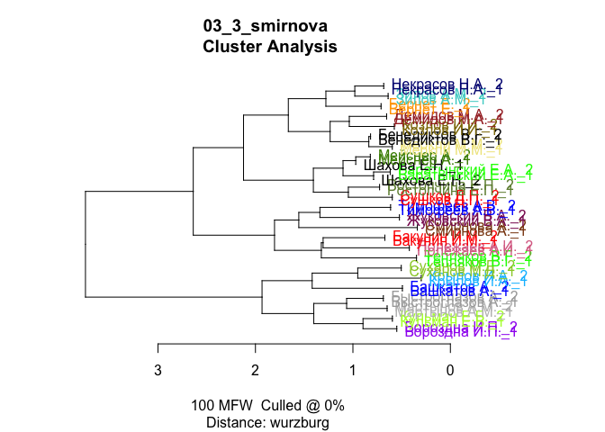

# 3_03_smirnova

## who was Anna Smirnova

Some tests on the attribution of poetry collection “The Works by Anna
Smirnova”

### load data & pckg

``` r
library(tidyverse)
library(tidytext)
library(stylo)
library(seetrees)
library(tinytex)

theme_set(theme_minimal())
library(MetBrewer)
```

``` r
corpus <- readRDS("../../../data/corpus1835/corpus_1835.Rds")

glimpse(corpus)
```

    Rows: 4,799
    Columns: 20
    $ text_id       <chr> "P_1", "P_10", "P_100", "P_1000", "P_1001", "P_1002", "P…
    $ A_ID          <chr> "", "A-50", "A-7", "A-41", "A-139", "A-11", "A-163", "A-…
    $ author_sign   <chr> "", "Л. Якубович", "Кольцов", "Ф. Глинка", "Н. Прокопови…
    $ author_text   <chr> "", "Якубович Л.А.", "Кольцов А.В.", "Глинка Ф.Н.", "Про…
    $ text_title    <chr> "Солдатская песня", "Молния", "Ночлег чумаков", "Утешите…
    $ text_subtitle <chr> "", "", "Сельские картины", "", "", "", "", "", "", "", …
    $ first_line    <chr> "Ох жизнь, молодецкая", "Зачем с небесной высоты", "В бл…
    $ year          <chr> "1835", "1835", "1836", "1838", "1838", "1838", "1838", …
    $ path_text     <chr> "../../data/corpus1835/periodicals/per_raw//P_1.txt", ".…
    $ source_text   <chr> "Сев_пч. 1835. №12. C. 46", "БдЧ. 1835. Т.8. Отд. 1. C. …
    $ COL_ID        <chr> "", "", "", "", "", "", "", "", "", "", "", "", "", "", …
    $ corpus        <chr> "per", "per", "per", "per", "per", "per", "per", "per", …
    $ text_raw      <chr> "Ох, жизнь молодецкая,\nБравая, солдатская!\nКак осенняя…
    $ text_cln      <chr> "Ох, жизнь молодецкая,\nБравая, солдатская!\nКак осенняя…
    $ text_lemm     <chr> "ох, жизнь молодецкий,\nбравый, солдатский!\nкак осенний…
    $ text_acc      <chr> "Ох, жизнь молоде'цкая,\nБра'вая, солда'тская!\nКак осе'…
    $ meter         <fct> Other?, Iamb, Iamb, Iamb, Trochee, Iamb, Trochee, Iamb, …
    $ feet          <chr> "?", "3", "4", "4", "4", "4", "other", "4", "6", "5", "4…
    $ formula       <chr> "Other?_?", "Iamb_3", "Iamb_4", "Iamb_4", "Trochee_4", "…
    $ n_lines       <int> 38, 16, 98, 77, 28, 12, 44, 25, 31, 28, 100, 16, 17, 60,…

### fn

``` r
sample_independent_opt <- function(tokenized_df,
  n_samples,
  sample_size,
  text_var = "word",
  folder = "corpus_sampled/", overwrite=T) {


  # create a folder
  dir.create(folder)
  
  # rewrite all files in the folder if the folder existed before
  if(overwrite) {
    do.call(file.remove, list(list.files(folder, full.names = TRUE)))
  }
  
  shuff <- tokenized_df %>%
    group_by(author) %>%
    sample_n(n_samples * sample_size) %>% # sample tokens
    # to each sampled token assign randomly a sample number
    mutate(sample_x = sample( # sample = reshuffle the numbers of samples repeated below
    rep( # repeat
      1:n_samples, # the numbers of samples (1, 2, 3...)
      each = sample_size # each is sample_size times repeated
      ))) %>%
    # create a column author_sampleX
    unite(sample_id, c(author, sample_x), remove = F) %>%
    # group and paste together by sample_id (some kind of special paste with !!sym() )
    group_by(sample_id) %>%
    summarise(text = paste(!!sym(text_var), collapse = " "))
    
    # write samples
    for(i in 1:nrow(shuff)) {
    write_file(file=paste0(folder, shuff$sample_id[i],".txt"), shuff$text[i])
  }
}
```

``` r
diy_stylo <- function(folder = "corpus_sampled/",
                      mfw = 200,
                      drop_words = T,
                      feature = "word",
                      n_gram = 1) {
  
  # read the sampled texts from the folder corpus_sampled/
  # the feature is either word or charaters
  # the tokenizer returns lists of tokens for each text from the folder
  tokenized.texts = load.corpus.and.parse(
    files = list.files(folder, full.names = T),
    features = feature,
    ngram.size = n_gram
  )
  # computing a list of most frequent words (trimmed to top 2000 items):
  features = make.frequency.list(tokenized.texts, head = 2000)
  # producing a table of relative frequencies:
  data = make.table.of.frequencies(tokenized.texts, features, relative = TRUE)#[,1:mfw]
  
  
  
  # --- cleaning ---
  # remove stop words
  s_words <- str_detect(colnames(data), str_dev_words) # output is a logical vector with the positions of the 
  if(drop_words) {
    data <- data[,!s_words]
  }
  # crop mfw
  data <- data[, 1:mfw]
  # clean document names
  
  rownames(data) <- str_remove_all(rownames(data), "corpus_sampled/") # Clean Rownammes
  rownames(data) <- str_remove_all(rownames(data), "^.*?//") # clean rownames from full paths
  
  
  # output
  return(data)
}
```

## data preparation

Count how many authors have a large set of Iamb-6 poems

``` r
corpus %>% 
  filter(formula == "Iamb_6" & author_text != "") %>% 
  unnest_tokens(input = text_cln, output = word, token = "words") %>% 
  count(author_text , sort = T) %>% 
  head(10)
```

    # A tibble: 10 × 2
       author_text          n
       <chr>            <int>
     1 Смирнова А.      17555
     2 Мартынов А.М.     8387
     3 Бернет Е.         5930
     4 Жуковский В.А.    5204
     5 Ростопчина Е.П.   3777
     6 Баратынский Е.А.  2516
     7 Козлов И.И.       2075
     8 Башкатов А.       1963
     9 Кашкин Д.Е.       1868
    10 Мейснер А.        1733

``` r
# obviously not enough data, nobody except Smirnova wrote in Iamb-6...
```

Iamb poems counter

``` r
corpus %>% 
  filter(meter == "Iamb" & author_text != "") %>% 
  unnest_tokens(input = text_cln, output = word, token = "words") %>% 
  count(author_text , sort = T) %>% 
  filter(n > 6000)
```

    # A tibble: 25 × 2
       author_text          n
       <chr>            <int>
     1 Крылов И.А.      34756
     2 Жуковский В.А.   30621
     3 Кульман Е.Б.     25338
     4 Бороздна И.П.    19498
     5 Смирнова А.      18566
     6 Баратынский Е.А. 15853
     7 Башкатов А.      15004
     8 Бернет Е.        13922
     9 Быстроглазов А.  11656
    10 Некрасов Н.А.    10248
    # ℹ 15 more rows

``` r
corpus %>% 
  filter(meter == "Iamb" & author_text != "") %>% 
  unnest_tokens(input = text_cln, output = word, token = "words") %>% 
  count(author_text , sort = T) %>% 
  filter(author_text == "Смирнова А.")
```

    # A tibble: 1 × 2
      author_text     n
      <chr>       <int>
    1 Смирнова А. 18566

Select Iambic words for each author & collapse

``` r
authors <- corpus %>% 
  filter(meter == "Iamb" & author_text != "") %>% 
  unnest_tokens(input = text_cln, output = word, token = "words") %>% 
  count(author_text, sort = T) %>% 
  filter(n > 6000) %>% 
  pull(author_text)

authors
```

     [1] "Крылов И.А."      "Жуковский В.А."   "Кульман Е.Б."     "Бороздна И.П."   
     [5] "Смирнова А."      "Баратынский Е.А." "Башкатов А."      "Бернет Е."       
     [9] "Быстроглазов А."  "Некрасов Н.А."    "Демидов М.А."     "Ростопчина Е.П." 
    [13] "Суханов М.Д."     "Мартынов А.М."    "Тепляков В.Г."    "Мейснер А."      
    [17] "Шахова Е.Н."      "Зилов А.М."       "Меркли М.М."      "Козлов И.И."     
    [21] "Тимофеев А.В."    "Сушков Д.П."      "Бакунин И.М."     "Бенедиктов В.Г." 
    [25] "Полежаев А.И."   

``` r
corpus_iambs <- corpus %>% 
  filter(meter == "Iamb" & author_text %in% authors) %>% 
  unnest_tokens(input = text_cln, output = word, token = "words") %>% 
  rename(author = author_text) %>% 
  select(author, word)

str(corpus_iambs)
```

    tibble [323,919 × 2] (S3: tbl_df/tbl/data.frame)
     $ author: chr [1:323919] "Ростопчина Е.П." "Ростопчина Е.П." "Ростопчина Е.П." "Ростопчина Е.П." ...
     $ word  : chr [1:323919] "тебе" "ль" "чугун" "тебе" ...

Check basic wordlist

``` r
corpus_iambs %>% 
  count(word, sort = T) %>% head(10)
```

    # A tibble: 10 × 2
       word      n
       <chr> <int>
     1 и     13582
     2 в      9662
     3 не     5663
     4 с      4171
     5 на     4137
     6 я      3813
     7 как    3095
     8 он     2423
     9 ты     2385
    10 но     2300

## simple tests

### tree mfw100

``` r
sample_independent_opt(tokenized_df = corpus_iambs,
  n_samples = 2,
  sample_size = 2000)

test1 <- stylo(
  gui = F,
  corpus.dir = "corpus_sampled/",
  corpus.lang = "Other",
  mfw.min = 100,
  mfw.max = 100,
  analyzed.features = "w",
  ngram.size = 1,
  distance.measure = "wurzburg"
  )
```



``` r
view_tree(test1, k=2)
```


### tree mfw200

``` r
sample_independent_opt(tokenized_df = corpus_iambs,
  n_samples = 2,
  sample_size = 2000)

test1 <- stylo(
  gui = F,
  corpus.dir = "corpus_sampled/",
  corpus.lang = "Other",
  mfw.min = 200,
  mfw.max = 200,
  analyzed.features = "w",
  ngram.size = 1,
  distance.measure = "wurzburg"
  )
```


``` r
seetrees::view_tree(test1, k=2)
```


### BCT 50-250

``` r
sample_independent_opt(tokenized_df = corpus_iambs,
  n_samples = 2,
  sample_size = 3000)

# bootstrap consensus tree
bct <- stylo(
  gui = F,
  corpus.dir = "corpus_sampled/",
  corpus.lang = "Other",
  analyzed.features = "w",
  ngram.size = 1,
  mfw.min = 50,
  mfw.max = 250,
  mfw.incr = 1,
  distance.measure = "wurzburg",
  analysis.type = "BCT",
  consensus.strength = 0.5
)
```


### BCT 50-450

``` r
sample_independent_opt(tokenized_df = corpus_iambs,
  n_samples = 2,
  sample_size = 3000)

# bootstrap consensus tree
bct <- stylo(
  gui = F,
  corpus.dir = "corpus_sampled/",
  corpus.lang = "Other",
  analyzed.features = "w",
  ngram.size = 1,
  mfw.min = 50,
  mfw.max = 450,
  mfw.incr = 1,
  distance.measure = "wurzburg",
  analysis.type = "BCT",
  consensus.strength = 0.5
)
```


## imposters

### all iambs

``` r
str_dev_words <- c("мир")
```

``` r
sample_independent_opt(tokenized_df = corpus_iambs,
  n_samples = 2,
  sample_size = 2000)

dtm <- diy_stylo(
  folder = "corpus_sampled/",
  mfw = 200,
  drop_words = F)

grep("Смирнова", rownames(dtm))

imp_res <- vector(mode = "list")
r <- NULL
counter <- 0

for (i in 1:50) {
  
  # create samples for each trial
  sample_independent_opt(
    tokenized_df = corpus_iambs, 
    n_samples = 2, 
    sample_size = 2000)
  
  # build doc-term matrix from the samples in the corpus_sampled folder
  data = diy_stylo(mfw = 200, 
                    feature = "word",
                    n_gram = 1)
  
  # test each of the true FV-L1 sets
  for (s in c(39, 40)) {
    
    # run imposters test
    r <- imposters(reference.set = data[-c(39, 40),], # remove test data from the ref
                   test = data[c(s),], # test one of the samples against the others
                   features = 0.5, # test 50% of the features in each trial
                   iterations = 100,
                   distance = "wurzburg"
                   )
    
    # count iterations
    counter <- counter + 1
    
    # store results
    
    imp_res[[counter]] <- tibble(candidate = names(r),
                                 proportion = r)
    
    print(counter)
  }
  
}

saveRDS(imp_res, "impr_smirnova.rds")
```

``` r
imp_res <- readRDS("impr_smirnova.rds")

imp_res %>%
  bind_rows() %>%  #stack all the optained prop tables into one
  mutate(candidate = str_remove(candidate, "^/")) %>% 
  ggplot(aes(x = reorder(candidate, - proportion),
  y = proportion)) +
  geom_boxplot() +
  theme_bw() + 
  labs(subtitle = "Proportion of cases where a sample from an author\nwas the closest to Smirnova (only iambic texts)") +
  theme(axis.text.x = element_text(angle = 25))
```


### all texts

``` r
authors <- corpus %>% 
  mutate(author = author_text,
         text = text_cln) %>% 
  select(author, text) %>% 
  filter(author != "") %>% 
  unnest_tokens(input = text, output = word, token = "words") %>% 
  count(author, sort = T) %>% 
  filter(n > 6000) %>% 
  pull(author)

length(authors)

corpus_all <- corpus %>% 
  mutate(author = author_text,
         text = text_cln) %>% 
  select(author, text) %>% 
  filter(author %in% authors) %>% 
  filter(author != "") %>% 
  unnest_tokens(input = text, output = word, token = "words")

sample_independent_opt(tokenized_df = corpus_all,
  n_samples = 2,
  sample_size = 2000)

dtm <- diy_stylo(
  folder = "corpus_sampled/",
  mfw = 200,
  drop_words = F)

grep("Смирнова", rownames(dtm))

imp_res <- vector(mode = "list")
r <- NULL
counter <- 0

for (i in 1:50) {
  
  # create samples for each trial
  sample_independent_opt(
    tokenized_df = corpus_all, 
    n_samples = 2, 
    sample_size = 2000)
  
  # build doc-term matrix from the samples in the corpus_sampled folder
  data = diy_stylo(mfw = 200, 
                    feature = "word",
                    n_gram = 1)
  
  # test each of the true FV-L1 sets
  for (s in c(59, 60)) {
    
    # run imposters test
    r <- imposters(reference.set = data[-c(59, 60),], # remove test data from the ref
                   test = data[c(s),], # test one of the samples against the others
                   features = 0.5, # test 50% of the features in each trial
                   iterations = 100,
                   distance = "wurzburg"
                   )
    
    # count iterations
    counter <- counter + 1
    
    # store results
    
    imp_res[[counter]] <- tibble(candidate = names(r),
                                 proportion = r)
    
    print(counter)
  }
  
}

saveRDS(imp_res, "impr_smirnova_all.rds")
```

``` r
imp_res <- readRDS("impr_smirnova_all.rds")

imp_res %>%
  bind_rows() %>%  #stack all the optained prop tables into one
  mutate(candidate = str_remove(candidate, "^/")) %>% 
  ggplot(aes(x = reorder(candidate, - proportion),
  y = proportion)) +
  geom_boxplot() +
  theme_bw() + 
  labs(subtitle = "Proportion of cases where a sample from an author\nwas the closest to Smirnova (all authors all meters)") +
  theme(axis.text.x = element_text(angle = 25))
```


