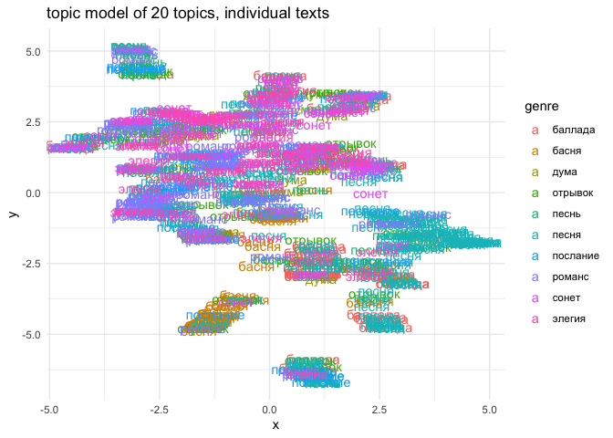

# 03_4_zeta_tm

# Exploration with Zeta and topic modeling

``` r
library(tidyverse)
library(tidytext)

library(topicmodels)

library(umap)
library(stylo) # zeta as oppose()

library(MetBrewer)
theme_set(theme_minimal())
```

## Genres

### load data

``` r
# main corpus
corpus1835 <- readRDS("../../data/corpus1835/corpus_1835.Rds")

# read genre titles
titles <- read.csv("poems_titles.csv") %>% select(-X)

# read the data with normalised genres
m <- read.delim("multigenre_texts.csv", sep = ';') %>% select(-X)

# list of genre words (longer)
genres <- unlist(str_split(c("песня
романс
сонет
элегия
басня
песнь
альбом
дума
баллада
отрывок
подражание
послание
молитва
фантазия
псалом
эпиграмма
мелодия
антологический
аполог
сказка
экспромт
надпись
эпилог"), pattern = "\n"))

# attach normalised genres to other genre titles
ids_genres <- titles %>% 
  select(text_id, lemma) %>% 
  filter(lemma %in% genres) %>% # select genres from the list
  group_by(text_id) %>% 
  summarise(genre = paste0(lemma, collapse = " | ")) %>% 
  filter(!str_detect(genre, " \\| ")) %>% # remove multigenre titles
  rbind(m %>% 
          select(text_id, true_genre) %>% 
          rename(genre = true_genre) # replace them with clean labels
          ) %>% 
  filter(genre != "")

corpus_genres <- corpus1835 %>% 
  left_join(ids_genres, by = "text_id") %>% 
  #filter(!is.na(genre)) %>% 
  select(text_id, genre, meter, text_lemm) %>% 
  mutate(genre = ifelse(is.na(genre), "no_genre", genre)) %>% 
  
  # filter only most freq genres
  filter(genre %in% c("песня", "романс", "элегия", "баллада", "послание", 
                      "песнь", "отрывок", "сонет", "басня", 
                      "дума", "no_genre"))

rm(genres, m, titles, ids_genres)
```

## keyness

### tf-idf

All genres

``` r
# remove proper names from tf-idf results
propnames <- unlist(str_split(c("эдвард
эльвина
альфред
параша
пань
гленара
марина
заира
клара
медор
агнета
демьян
федя
езерский
столбин
таня
нина
варвик
делийиталл
макгрегор
ютланд
каллироэ
гаральд
аминта
зара
нигер
фингал
бенамар
омар
бенамара
клоринда
бендамира
мальвина
ma
улица
палиха
елена
яныш
павел
марко
мунго"), pattern = "\n"))


corpus_genres %>% 
  unnest_tokens(input = text_lemm, output = word, token = "words") %>% 
  group_by(genre) %>% 
  count(word) %>% 
  ungroup() %>% 
  # remove frequent proper names
  filter(!word %in% propnames) %>% 
  bind_tf_idf(term = word, document = genre, n) %>% 
  arrange(desc(tf_idf)) %>% 
  group_by(genre) %>% 
  slice_max(order_by = tf_idf, n = 10)  %>%
  ungroup() %>% 
  filter(!str_detect(genre, "no_genre")) %>% 
  ggplot(aes(tf_idf, fct_reorder(word, tf_idf), fill = genre)) +
  geom_col(show.legend = FALSE) +
  facet_wrap(~genre, ncol = 3, scales = "free") +
  labs(x = "tf-idf", y = NULL)
```


word bi-grams

``` r
corpus_genres %>% 
  unnest_tokens(input = text_lemm, output = bigram, token = "ngrams", n = 2) %>% 
  group_by(genre) %>% 
  count(bigram) %>% 
  ungroup() %>% 
  # remove frequent proper names
  #filter(!word %in% propnames) %>% 
  bind_tf_idf(term = bigram, document = genre, n) %>% 
  arrange(desc(tf_idf)) %>% 
  group_by(genre) %>% 
  slice_max(order_by = tf_idf, n = 5)  %>%
  ungroup() %>% 
  filter(!str_detect(genre, "no_genre")) %>% 
  ggplot(aes(tf_idf, fct_reorder(bigram, tf_idf), fill = genre)) +
  geom_col(show.legend = FALSE) +
  facet_wrap(~genre, ncol = 3, scales = "free") +
  labs(x = "tf-idf", y = NULL)
```


### zeta

#### fable

``` r
# glimpse(corpus_genres)

corpus_genres %>% 
  filter(meter == "Iamb") %>% 
  mutate(genre = ifelse(genre == "басня", "басня", "другое")) %>% 
  separate_rows(text_lemm, sep = "\n") %>% 
  filter(!str_detect(text_lemm, "^\\W+$|^\\s+$") & text_lemm != "") %>% 
  count(genre, sort = T)
```

    # A tibble: 2 × 2
      genre       n
      <chr>   <int>
    1 другое 117465
    2 басня    1573

``` r
corpus_prepared <- corpus_genres %>% 
  filter(meter == "Iamb") %>% 
  mutate(genre = ifelse(genre == "басня", "басня", "другое")) %>% 
  separate_rows(text_lemm, sep = "\n") %>% 
  filter(!str_detect(text_lemm, "^\\W+$|^\\s+$") & text_lemm != "") %>% 
  group_by(genre) %>% 
  sample_n(1500) %>% 
  mutate(sample_id = ceiling(1:1500),
         sample_id = floor(sample_id/500)+1,
         sample_id = ifelse(sample_id == 4, 1, sample_id)) %>%
         # sample_id = floor(sample_id/100)+1, 
         # sample_id = ifelse(sample_id == 16, 1, sample_id)) %>%
  ungroup() %>% 
  mutate(sample_id = paste0(genre, "_", sample_id)) %>% 
  group_by(sample_id) %>% 
  summarise(text = paste0(text_lemm, collapse = " ------ ")) %>% 
  mutate(genre = str_remove(sample_id, "_\\d+$"), 
         path = ifelse(genre == "другое", "secondary_set/", "primary_set/"),
         path = paste0("zeta_tests/fable/", path, sample_id, ".txt"))

head(corpus_prepared)
```

    # A tibble: 6 × 4
      sample_id text                                                     genre path 
      <chr>     <chr>                                                    <chr> <chr>
    1 басня_1   "она увидеть дворник тут, ------ ни по чужой. ------ ра… басня zeta…
    2 басня_2   "как жребий твой жестокий ! . . . . ------ а милый боль… басня zeta…
    3 басня_3   "и тотчас цепь на шея. ------ и вы, сердце исполнять жа… басня zeta…
    4 другое_1  "к мой мечта: ------ от ранний утренний заря ------ что… друг… zeta…
    5 другое_2  "не навлекать тяжелый беда! ------ теперь, не лавра для… друг… zeta…
    6 другое_3  "бежать, меняться, наш год, ------ легко с полдюжины од… друг… zeta…

``` r
# sample sizes in words
corpus_prepared %>% 
  unnest_tokens(input = text, output = word, token = "words") %>% 
  count(sample_id)
```

    # A tibble: 6 × 2
      sample_id     n
      <chr>     <int>
    1 басня_1    2495
    2 басня_2    2504
    3 басня_3    2486
    4 другое_1   2352
    5 другое_2   2370
    6 другое_3   2309

Write sampled texts

``` r
do.call(file.remove, list(
  list.files("zeta_tests/fable//primary_set", full.names = TRUE)))
```

    [1] TRUE TRUE TRUE

``` r
do.call(file.remove, list(
  list.files("zeta_tests/fable//secondary_set", full.names = TRUE)))
```

    [1] TRUE TRUE TRUE

``` r
for (i in 1:nrow(corpus_prepared)) {
  writeLines(corpus_prepared$text[i], corpus_prepared$path[i])
}
```

Run stylo oppose()

``` r
oppose(
  gui = FALSE,
  path = "zeta_tests/fable/",
  corpus.lang = "Other",
  text.slice.length = 500,
  write.png.file = TRUE
)
```

    The subcorpora will be loaded from text files...

    slicing input text into tokens...


    turning words into features, e.g. char n-grams (if applicable)...

    slicing input text into tokens...


    turning words into features, e.g. char n-grams (if applicable)...

    Slicing the texts into samples...

    басня_1

        - text length (in words): 2494

        - nr. of samples: 4

        - nr. of words dropped at the end of the text: 494

    басня_2

        - text length (in words): 2504

        - nr. of samples: 5

        - nr. of words dropped at the end of the text: 4

    басня_3

        - text length (in words): 2487

        - nr. of samples: 4

        - nr. of words dropped at the end of the text: 487

    другое_1

        - text length (in words): 2351

        - nr. of samples: 4

        - nr. of words dropped at the end of the text: 351

    другое_2

        - text length (in words): 2370

        - nr. of samples: 4

        - nr. of words dropped at the end of the text: 370

    другое_3

        - text length (in words): 2309

        - nr. of samples: 4

        - nr. of words dropped at the end of the text: 309

    Extracting distinctive words... (this might take a while)

    Primary set...

    Secondary set...

    comparison done!

    No test set samples found (but this is totally OK in most cases!).
    Performing a simple comparison of the training samples...


    Function call:

    oppose(gui = FALSE, path = "zeta_tests/fable/", corpus.lang = "Other",     text.slice.length = 500, write.png.file = TRUE)

    Depending on your chosen options, some results should have been written

    into a few files; you should be able to find them in your current

    (working) directory. Usually, these include a list of words/features

    used to build a table of frequencies, the table itself, a file containing

    recent configuration, etc.

    Advanced users: you can pipe the results to a variable, e.g.:

         x = oppose()

    this will create a class "x" containing some presumably

    interesting stuff. The class created, you can type, e.g.:

         summary(x)

    to see which variables are stored there and how to use them.

    for suggestions how to cite this software, type: citation("stylo")

#### songs_iamb

``` r
corpus_genres %>% 
  filter(meter == "Iamb") %>% 
  mutate(genre = ifelse(genre == "песня", "песня", "другое")) %>% 
  separate_rows(text_lemm, sep = "\n") %>% 
  filter(!str_detect(text_lemm, "^\\W+$|^\\s+$") & text_lemm != "") %>% 
  count(genre, sort = T)
```

    # A tibble: 2 × 2
      genre       n
      <chr>   <int>
    1 другое 117792
    2 песня    1246

``` r
corpus_prepared <- corpus_genres %>% 
  filter(meter == "Iamb") %>% 
  mutate(genre = ifelse(genre == "песня", "песня", "другое")) %>% 
  separate_rows(text_lemm, sep = "\n") %>% 
  filter(!str_detect(text_lemm, "^\\W+$|^\\s+$") & text_lemm != "") %>% 
  group_by(genre) %>% 
  sample_n(1200) %>% 
  mutate(sample_id = ceiling(1:1200),
         sample_id = floor(sample_id/400)+1,
         sample_id = ifelse(sample_id == 4, 1, sample_id)) %>%
         # sample_id = floor(sample_id/100)+1, 
         # sample_id = ifelse(sample_id == 16, 1, sample_id)) %>%
  ungroup() %>% 
  mutate(sample_id = paste0(genre, "_", sample_id)) %>% 
  group_by(sample_id) %>% 
  summarise(text = paste0(text_lemm, collapse = " ------ ")) %>% 
  mutate(genre = str_remove(sample_id, "_\\d+$"), 
         path = ifelse(genre == "другое", "secondary_set/", "primary_set/"),
         path = paste0("zeta_tests/song_iamb/", path, sample_id, ".txt"))

head(corpus_prepared)
```

    # A tibble: 6 × 4
      sample_id text                                                     genre path 
      <chr>     <chr>                                                    <chr> <chr>
    1 другое_1  "и где - ж то резвый дитя ------ он твердо к цель назна… друг… zeta…
    2 другое_2  "стоять у дуб конь ретивый, ------ с что я сравнивать в… друг… zeta…
    3 другое_3  "на наш север упорный; ------ и лишь ее дыхание  ------… друг… zeta…
    4 песня_1   "и дух рваться к святой свой отчизна, ------ кто знать … песня zeta…
    5 песня_2   "любовь, усердие собралисить ------ как молодой он, как… песня zeta…
    6 песня_3   "носиться пагуба над я, ------ за день желанный, день о… песня zeta…

``` r
# sample sizes in words
corpus_prepared %>% 
  unnest_tokens(input = text, output = word, token = "words") %>% 
  count(sample_id)
```

    # A tibble: 6 × 2
      sample_id     n
      <chr>     <int>
    1 другое_1   1916
    2 другое_2   1894
    3 другое_3   1891
    4 песня_1    1780
    5 песня_2    1761
    6 песня_3    1826

``` r
for (i in 1:nrow(corpus_prepared)) {
  writeLines(corpus_prepared$text[i], corpus_prepared$path[i])
}
```

``` r
oppose(
  gui = FALSE,
  path = "zeta_tests/song_iamb/",
  corpus.lang = "Other",
  text.slice.length = 500,
  write.png.file = TRUE
)
```

    The subcorpora will be loaded from text files...

    slicing input text into tokens...


    turning words into features, e.g. char n-grams (if applicable)...

    slicing input text into tokens...


    turning words into features, e.g. char n-grams (if applicable)...

    Slicing the texts into samples...

    песня_1

        - text length (in words): 1762

        - nr. of samples: 3

        - nr. of words dropped at the end of the text: 262

    песня_2

        - text length (in words): 1771

        - nr. of samples: 3

        - nr. of words dropped at the end of the text: 271

    песня_3

        - text length (in words): 1817

        - nr. of samples: 3

        - nr. of words dropped at the end of the text: 317

    другое_1

        - text length (in words): 1853

        - nr. of samples: 3

        - nr. of words dropped at the end of the text: 353

    другое_2

        - text length (in words): 1936

        - nr. of samples: 3

        - nr. of words dropped at the end of the text: 436

    другое_3

        - text length (in words): 1880

        - nr. of samples: 3

        - nr. of words dropped at the end of the text: 380

    Extracting distinctive words... (this might take a while)

    Primary set...

    Secondary set...

    comparison done!

    No test set samples found (but this is totally OK in most cases!).
    Performing a simple comparison of the training samples...


    Function call:

    oppose(gui = FALSE, path = "zeta_tests/song_iamb/", corpus.lang = "Other",     text.slice.length = 500, write.png.file = TRUE)

    Depending on your chosen options, some results should have been written

    into a few files; you should be able to find them in your current

    (working) directory. Usually, these include a list of words/features

    used to build a table of frequencies, the table itself, a file containing

    recent configuration, etc.

    Advanced users: you can pipe the results to a variable, e.g.:

         blah.blah.blah = oppose()

    this will create a class "blah.blah.blah" containing some presumably

    interesting stuff. The class created, you can type, e.g.:

         summary(blah.blah.blah)

    to see which variables are stored there and how to use them.

    for suggestions how to cite this software, type: citation("stylo")

#### songs_trochee

``` r
corpus_genres %>% 
  filter(meter == "Trochee") %>% 
  mutate(genre = ifelse(genre == "песня", "песня", "другое")) %>% 
  separate_rows(text_lemm, sep = "\n") %>% 
  filter(!str_detect(text_lemm, "^\\W+$|^\\s+$") & text_lemm != "") %>% 
  count(genre, sort = T)
```

    # A tibble: 2 × 2
      genre      n
      <chr>  <int>
    1 другое 31634
    2 песня   2611

``` r
corpus_prepared <- corpus_genres %>% 
  filter(meter == "Trochee") %>% 
  mutate(genre = ifelse(genre == "песня", "песня", "другое")) %>% 
  separate_rows(text_lemm, sep = "\n") %>% 
  filter(!str_detect(text_lemm, "^\\W+$|^\\s+$") & text_lemm != "") %>% 
  group_by(genre) %>% 
  sample_n(2500) %>% 
  mutate(sample_id = ceiling(1:2500),
         sample_id = floor(sample_id/500)+1,
         sample_id = ifelse(sample_id == 6, 1, sample_id)) %>%
         # sample_id = floor(sample_id/100)+1, 
         # sample_id = ifelse(sample_id == 16, 1, sample_id)) %>%
  ungroup() %>% 
  mutate(sample_id = paste0(genre, "_", sample_id)) %>% 
  group_by(sample_id) %>% 
  summarise(text = paste0(text_lemm, collapse = " ------ ")) %>% 
  mutate(genre = str_remove(sample_id, "_\\d+$"), 
         path = ifelse(genre == "другое", "secondary_set/", "primary_set/"),
         path = paste0("zeta_tests/song_trochee/", path, sample_id, ".txt"))

head(corpus_prepared)
```

    # A tibble: 6 × 4
      sample_id text                                                     genre path 
      <chr>     <chr>                                                    <chr> <chr>
    1 другое_1  "конь скакун мой молодой. ------ и в песок чужой страна… друг… zeta…
    2 другое_2  "дева выгонять из тепло, ------ быстро мор распространя… друг… zeta…
    3 другое_3  "и мечта согревать сердце не сжималось  ------ оба взят… друг… zeta…
    4 другое_4  "и расти он так высоко, ------ чудный влечь к себя и се… друг… zeta…
    5 другое_5  "на ее жилец : ------ над его чело сверкать ------ пере… друг… zeta…
    6 песня_1   "услышать, о аллах, правоверный молитва! ------ темный … песня zeta…

``` r
# sample sizes in words
corpus_prepared %>% 
  unnest_tokens(input = text, output = word, token = "words") %>% 
  count(sample_id)
```

    # A tibble: 10 × 2
       sample_id     n
       <chr>     <int>
     1 другое_1   1989
     2 другое_2   2007
     3 другое_3   2007
     4 другое_4   1989
     5 другое_5   1985
     6 песня_1    2013
     7 песня_2    1977
     8 песня_3    2004
     9 песня_4    2006
    10 песня_5    1991

``` r
for (i in 1:nrow(corpus_prepared)) {
  writeLines(corpus_prepared$text[i], corpus_prepared$path[i])
}
```

``` r
oppose(
  gui = FALSE,
  path = "zeta_tests/song_trochee/",
  corpus.lang = "Other",
  text.slice.length = 500,
  write.png.file = TRUE
)
```

    The subcorpora will be loaded from text files...

    slicing input text into tokens...


    turning words into features, e.g. char n-grams (if applicable)...

    slicing input text into tokens...


    turning words into features, e.g. char n-grams (if applicable)...

    Slicing the texts into samples...

    песня_1

        - text length (in words): 2022

        - nr. of samples: 4

        - nr. of words dropped at the end of the text: 22

    песня_2

        - text length (in words): 1997

        - nr. of samples: 3

        - nr. of words dropped at the end of the text: 497

    песня_3

        - text length (in words): 1990

        - nr. of samples: 3

        - nr. of words dropped at the end of the text: 490

    песня_4

        - text length (in words): 1942

        - nr. of samples: 3

        - nr. of words dropped at the end of the text: 442

    песня_5

        - text length (in words): 2024

        - nr. of samples: 4

        - nr. of words dropped at the end of the text: 24

    другое_1

        - text length (in words): 1960

        - nr. of samples: 3

        - nr. of words dropped at the end of the text: 460

    другое_2

        - text length (in words): 1963

        - nr. of samples: 3

        - nr. of words dropped at the end of the text: 463

    другое_3

        - text length (in words): 1989

        - nr. of samples: 3

        - nr. of words dropped at the end of the text: 489

    другое_4

        - text length (in words): 1975

        - nr. of samples: 3

        - nr. of words dropped at the end of the text: 475

    другое_5

        - text length (in words): 2018

        - nr. of samples: 4

        - nr. of words dropped at the end of the text: 18

    Extracting distinctive words... (this might take a while)

    Primary set...

    Secondary set...

    comparison done!

    No test set samples found (but this is totally OK in most cases!).
    Performing a simple comparison of the training samples...


    Function call:

    oppose(gui = FALSE, path = "zeta_tests/song_trochee/", corpus.lang = "Other",     text.slice.length = 500, write.png.file = TRUE)

    Depending on your chosen options, some results should have been written

    into a few files; you should be able to find them in your current

    (working) directory. Usually, these include a list of words/features

    used to build a table of frequencies, the table itself, a file containing

    recent configuration, etc.

    Advanced users: you can pipe the results to a variable, e.g.:

         seems.to.be.a.discovery = oppose()

    this will create a class "seems.to.be.a.discovery" containing some presumably

    interesting stuff. The class created, you can type, e.g.:

         summary(seems.to.be.a.discovery)

    to see which variables are stored there and how to use them.

    for suggestions how to cite this software, type: citation("stylo")

#### songs iamb vs trochee

``` r
corpus_genres %>% 
  filter(meter == "Trochee" | meter == "Iamb") %>% 
  filter(genre == "песня") %>% 
  mutate(genre = ifelse(meter == "Iamb", "песня_ямб", "песня_хорей")) %>% 
  separate_rows(text_lemm, sep = "\n") %>% 
  filter(!str_detect(text_lemm, "^\\W+$|^\\s+$") & text_lemm != "") %>% 
  count(genre, sort = T)
```

    # A tibble: 2 × 2
      genre           n
      <chr>       <int>
    1 песня_хорей  2611
    2 песня_ямб    1246

``` r
corpus_prepared <- corpus_genres %>% 
  filter(meter == "Trochee" | meter == "Iamb") %>% 
  filter(genre == "песня") %>% 
  mutate(genre = ifelse(meter == "Iamb", "песня_ямб", "песня_хорей")) %>% 
  separate_rows(text_lemm, sep = "\n") %>% 
  filter(!str_detect(text_lemm, "^\\W+$|^\\s+$") & text_lemm != "") %>% 
  group_by(genre) %>% 
  sample_n(1200) %>% 
  mutate(sample_id = ceiling(1:1200),
         sample_id = floor(sample_id/400)+1,
         sample_id = ifelse(sample_id == 4, 1, sample_id)) %>%
         # sample_id = floor(sample_id/100)+1, 
         # sample_id = ifelse(sample_id == 16, 1, sample_id)) %>%
  ungroup() %>% 
  mutate(sample_id = paste0(genre, "_", sample_id)) %>% 
  group_by(sample_id) %>% 
  summarise(text = paste0(text_lemm, collapse = " ------ ")) %>% 
  mutate(genre = str_remove(sample_id, "_\\d+$"), 
         path = ifelse(genre == "песня_ямб", "secondary_set/", "primary_set/"),
         path = paste0("zeta_tests/song_iamb_vs_trochee/", path, sample_id, ".txt"))

head(corpus_prepared)
```

    # A tibble: 6 × 4
      sample_id     text                                                 genre path 
      <chr>         <chr>                                                <chr> <chr>
    1 песня_хорей_1 "вдохновенный как песнь его, ------ наш поле - вода… песн… zeta…
    2 песня_хорей_2 "да, вишь, старость скучный ------ где душа нет у с… песн… zeta…
    3 песня_хорей_3 "туча идти над она ------ становиться мати горевать… песн… zeta…
    4 песня_ямб_1   "искать спокойствие на дно  ------ цветок живой ков… песн… zeta…
    5 песня_ямб_2   "любовь без грусть и мучение ------ но впредь такой… песн… zeta…
    6 песня_ямб_3   "и молвить, вздыхаючи , ------ опять шуметь наровый… песн… zeta…

``` r
# sample sizes in words
corpus_prepared %>% 
  unnest_tokens(input = text, output = word, token = "words") %>% 
  count(sample_id)
```

    # A tibble: 6 × 2
      sample_id         n
      <chr>         <int>
    1 песня_хорей_1  1621
    2 песня_хорей_2  1590
    3 песня_хорей_3  1609
    4 песня_ямб_1    1811
    5 песня_ямб_2    1740
    6 песня_ямб_3    1799

``` r
for (i in 1:nrow(corpus_prepared)) {
  writeLines(corpus_prepared$text[i], corpus_prepared$path[i])
}
```

``` r
oppose(
  gui = FALSE,
  path = "zeta_tests/song_iamb_vs_trochee/",
  corpus.lang = "Other",
  text.slice.length = 500,
  write.png.file = TRUE
)
```

    The subcorpora will be loaded from text files...

    slicing input text into tokens...


    turning words into features, e.g. char n-grams (if applicable)...

    slicing input text into tokens...


    turning words into features, e.g. char n-grams (if applicable)...

    Slicing the texts into samples...

    песня_хорей_1

        - text length (in words): 1583

        - nr. of samples: 3

        - nr. of words dropped at the end of the text: 83

    песня_хорей_2

        - text length (in words): 1567

        - nr. of samples: 3

        - nr. of words dropped at the end of the text: 67

    песня_хорей_3

        - text length (in words): 1581

        - nr. of samples: 3

        - nr. of words dropped at the end of the text: 81

    песня_ямб_1

        - text length (in words): 1778

        - nr. of samples: 3

        - nr. of words dropped at the end of the text: 278

    песня_ямб_2

        - text length (in words): 1796

        - nr. of samples: 3

        - nr. of words dropped at the end of the text: 296

    песня_ямб_3

        - text length (in words): 1786

        - nr. of samples: 3

        - nr. of words dropped at the end of the text: 286

    Extracting distinctive words... (this might take a while)

    Primary set...

    Secondary set...

    comparison done!

    No test set samples found (but this is totally OK in most cases!).
    Performing a simple comparison of the training samples...


    Function call:

    oppose(gui = FALSE, path = "zeta_tests/song_iamb_vs_trochee/",     corpus.lang = "Other", text.slice.length = 500, write.png.file = TRUE)

    Depending on your chosen options, some results should have been written

    into a few files; you should be able to find them in your current

    (working) directory. Usually, these include a list of words/features

    used to build a table of frequencies, the table itself, a file containing

    recent configuration, etc.

    Advanced users: you can pipe the results to a variable, e.g.:

         my.stylometric.test = oppose()

    this will create a class "my.stylometric.test" containing some presumably

    interesting stuff. The class created, you can type, e.g.:

         summary(my.stylometric.test)

    to see which variables are stored there and how to use them.

    for suggestions how to cite this software, type: citation("stylo")

#### elegy

``` r
corpus_genres %>% 
  mutate(genre = ifelse(genre == "элегия", "элегия", "другое")) %>% 
  separate_rows(text_lemm, sep = "\n") %>% 
  filter(!str_detect(text_lemm, "^\\W+$|^\\s+$") & text_lemm != "") %>% 
  count(genre, sort = T)
```

    # A tibble: 2 × 2
      genre       n
      <chr>   <int>
    1 другое 180028
    2 элегия   3858

``` r
corpus_prepared <- corpus_genres %>% 
  mutate(genre = ifelse(genre == "элегия", "элегия", "другое")) %>% 
  separate_rows(text_lemm, sep = "\n") %>% 
  filter(!str_detect(text_lemm, "^\\W+$|^\\s+$") & text_lemm != "") %>% 
  group_by(genre) %>% 
  sample_n(3500) %>% 
  mutate(sample_id = ceiling(1:3500),
         sample_id = floor(sample_id/500)+1,
         sample_id = ifelse(sample_id == 8, 1, sample_id)) %>%
         # sample_id = floor(sample_id/100)+1, 
         # sample_id = ifelse(sample_id == 16, 1, sample_id)) %>%
  ungroup() %>% 
  mutate(sample_id = paste0(genre, "_", sample_id)) %>% 
  group_by(sample_id) %>% 
  summarise(text = paste0(text_lemm, collapse = " ------ ")) %>% 
  mutate(genre = str_remove(sample_id, "_\\d+$"), 
         path = ifelse(genre == "другое", "secondary_set/", "primary_set/"),
         path = paste0("zeta_tests/elegy/", path, sample_id, ".txt"))

tail(corpus_prepared)
```

    # A tibble: 6 × 4
      sample_id text                                                     genre path 
      <chr>     <chr>                                                    <chr> <chr>
    1 элегия_2  "когда ты веять аромат ------ как привидение, в туман п… элег… zeta…
    2 элегия_3  "прощать вы, благой начинание,  ------ в день солнечный… элег… zeta…
    3 элегия_4  "быть мочь, то душа несчастный , ------ огонь небесный … элег… zeta…
    4 элегия_5  "с ты, с один ты, в блаженный тишина,  ------ еще жить … элег… zeta…
    5 элегия_6  "пламень в живой струна вливать. но наука пред они  ---… элег… zeta…
    6 элегия_7  "последний мыслие б он быть. ------ злащать весна зелен… элег… zeta…

``` r
# sample sizes in words
corpus_prepared %>% 
  unnest_tokens(input = text, output = word, token = "words") %>% 
  count(sample_id)
```

    # A tibble: 14 × 2
       sample_id     n
       <chr>     <int>
     1 другое_1   2365
     2 другое_2   2265
     3 другое_3   2285
     4 другое_4   2318
     5 другое_5   2320
     6 другое_6   2305
     7 другое_7   2259
     8 элегия_1   2616
     9 элегия_2   2627
    10 элегия_3   2614
    11 элегия_4   2658
    12 элегия_5   2647
    13 элегия_6   2644
    14 элегия_7   2646

``` r
for (i in 1:nrow(corpus_prepared)) {
  writeLines(corpus_prepared$text[i], corpus_prepared$path[i])
}
```

``` r
oppose(
  gui = FALSE,
  path = "zeta_tests/elegy/",
  corpus.lang = "Other",
  text.slice.length = 500,
  write.png.file = TRUE
)
```

    The subcorpora will be loaded from text files...

    slicing input text into tokens...


    turning words into features, e.g. char n-grams (if applicable)...

    slicing input text into tokens...


    turning words into features, e.g. char n-grams (if applicable)...

    Slicing the texts into samples...

    элегия_1

        - text length (in words): 2586

        - nr. of samples: 5

        - nr. of words dropped at the end of the text: 86

    элегия_2

        - text length (in words): 2592

        - nr. of samples: 5

        - nr. of words dropped at the end of the text: 92

    элегия_3

        - text length (in words): 2618

        - nr. of samples: 5

        - nr. of words dropped at the end of the text: 118

    элегия_4

        - text length (in words): 2655

        - nr. of samples: 5

        - nr. of words dropped at the end of the text: 155

    элегия_5

        - text length (in words): 2653

        - nr. of samples: 5

        - nr. of words dropped at the end of the text: 153

    элегия_6

        - text length (in words): 2625

        - nr. of samples: 5

        - nr. of words dropped at the end of the text: 125

    элегия_7

        - text length (in words): 2674

        - nr. of samples: 5

        - nr. of words dropped at the end of the text: 174

    другое_1

        - text length (in words): 2255

        - nr. of samples: 4

        - nr. of words dropped at the end of the text: 255

    другое_2

        - text length (in words): 2317

        - nr. of samples: 4

        - nr. of words dropped at the end of the text: 317

    другое_3

        - text length (in words): 2302

        - nr. of samples: 4

        - nr. of words dropped at the end of the text: 302

    другое_4

        - text length (in words): 2298

        - nr. of samples: 4

        - nr. of words dropped at the end of the text: 298

    другое_5

        - text length (in words): 2291

        - nr. of samples: 4

        - nr. of words dropped at the end of the text: 291

    другое_6

        - text length (in words): 2313

        - nr. of samples: 4

        - nr. of words dropped at the end of the text: 313

    другое_7

        - text length (in words): 2317

        - nr. of samples: 4

        - nr. of words dropped at the end of the text: 317

    Extracting distinctive words... (this might take a while)

    Primary set...

    Secondary set...

    comparison done!

    No test set samples found (but this is totally OK in most cases!).
    Performing a simple comparison of the training samples...


    Function call:

    oppose(gui = FALSE, path = "zeta_tests/elegy/", corpus.lang = "Other",     text.slice.length = 500, write.png.file = TRUE)

    Depending on your chosen options, some results should have been written

    into a few files; you should be able to find them in your current

    (working) directory. Usually, these include a list of words/features

    used to build a table of frequencies, the table itself, a file containing

    recent configuration, etc.

    Advanced users: you can pipe the results to a variable, e.g.:

         hip.hip.hurrah = oppose()

    this will create a class "hip.hip.hurrah" containing some presumably

    interesting stuff. The class created, you can type, e.g.:

         summary(hip.hip.hurrah)

    to see which variables are stored there and how to use them.

    for suggestions how to cite this software, type: citation("stylo")

## topic model

Topic model based on the separate texts

``` r
table(corpus_genres$genre)
```


    no_genre  баллада    басня     дума  отрывок    песнь    песня послание 
        3699       45       69       51       43       57      242       39 
      романс    сонет   элегия 
         104       79       72 

``` r
corpus_genres <- corpus_genres %>% 
  filter(genre != "no_genre")
```

Create stoplist & rankings

``` r
stoplist <- c("и","в","во","не","что","он","на","я","с","со","как","а","то","все","она","так","его","но","ты","к","у","же","вы","за","бы","по","ее","мне","было","вот","от","меня","о","из","ему","теперь","даже","ну","ли","если","или","ни","быть","был","него","до","вас","нибудь","вам","сказал","себя","ей","может","они","есть","ней","для","мы","тебя","их","чем","была","сам","чтоб","без","будто","чего","себе","под","будет","ж","кто","этот","того","потому","этого","какой","ним","этом","мой","тем","чтобы","нее","были","куда","зачем","всех","можно","при","об","хоть","над","больше","тот","через","эти","нас","про","всего","них","какая","много","разве","сказала","три","эту","моя","свою","этой","перед","лучше","чуть","том","такой","им","более","всю","между","твой","весь")


ranks <- corpus_genres %>% 
  unnest_tokens(input = text_lemm, output = word, token = "words") %>% 
  count(word, sort = T) %>% 
  
  # remove words from the stoplist
  filter(!word %in% stoplist) %>% 
  head(5000)

head(ranks)
```

    # A tibble: 6 × 2
      word       n
      <chr>  <int>
    1 душа     653
    2 свой     645
    3 сердце   591
    4 друг     572
    5 нет      459
    6 небо     452

``` r
tail(ranks)
```

    # A tibble: 6 × 2
      word            n
      <chr>       <int>
    1 разметывать     3
    2 разнести        3
    3 разоблачать     3
    4 разъяренный     3
    5 рама            3
    6 рамена          3

#### genres

Create dtm and model, extract coefficients

``` r
dtm <- corpus_genres %>% 
  mutate(doc_id = paste0(genre, "___", text_id)) %>% 
  unnest_tokens(input = text_lemm, output = word, token = "words") %>% 
  filter(word %in% ranks$word) %>% 
  count(doc_id, word) %>% 
  cast_dtm(document = doc_id, term = word, value = n)

# Create a model with 20 topics
mod_20 <- LDA(dtm, k = 20, method = "Gibbs",
              control = list(alpha = 0.5, delta = 0.1, 
                             iter = 2000, seed = 1234, thin = 1))

# Extract coefficients
beta20 <- tidy(mod_20, matrix = "beta") 
gamma20 <- tidy(mod_20, matrix = "gamma")

save(beta20, gamma20, file = "lda_tm_genres_20.Rda")
```

``` r
load("lda_tm_genres_20.Rda")
```

Beta

``` r
#### Plot: words' probabilities in topics ####
beta20 %>% 
  group_by(topic) %>% 
  top_n(20, beta) %>% 
  ungroup() %>%
  arrange(topic, desc(beta)) %>% 
  ggplot(aes(reorder_within(term, beta, topic), beta, fill = factor(topic))) + 
  geom_col(show.legend = FALSE) + 
  facet_wrap(~topic, scales = "free") + 
  coord_flip() + 
  theme_minimal(base_size = 14) + 
  scale_x_reordered() + 
  labs(title = "Probability of top 20 words in topics",
       subtitle = "LDA model build with 'topicmodels' r package, 20 topics, alpha = 0,5, 2000 iterations") + 
  theme(axis.title.x = element_blank(),
        axis.title.y = element_blank())
```


``` r
ggsave("tm20_beta.png", plot = last_plot(),
       bg = "white", width = 15, height = 12)
```

Gamma

Distribution of topics in genres

``` r
# glimpse(gamma20)

gamma20 %>% 
  mutate(genre = str_extract(document, "^\\w+___"),
         genre = str_remove(genre, "___$")) %>% 
  group_by(genre, topic) %>% 
  summarise(mean_gamma = mean(gamma)) %>% 
  ungroup() %>% 
  ggplot(aes(x = genre, y = topic, fill = mean_gamma)) + 
  geom_tile() + 
  scale_fill_viridis_c() + 
  scale_y_continuous(breaks = 1:50) + 
  geom_text(aes(label = #round(mean_gamma, 3)
                  #paste0(topic, "\n", round(mean_gamma, 3))
                  topic
                ), colour = "white")
```


``` r
gamma20 %>% 
  mutate(genre = str_extract(document, "^\\w+___"),
         genre = str_remove(genre, "___$")) %>% 
  group_by(genre, topic) %>% 
  summarise(mean_gamma = mean(gamma)) %>% 
  ungroup() %>% 
  group_by(genre) %>% 
  slice_max(n = 5, order_by = mean_gamma) %>% 
  ggplot(aes(x = genre, y = mean_gamma, fill = as.factor(topic))) + 
  geom_col(position = "stack") + 
  geom_text(aes(label = topic), position = position_stack(vjust = 0.5)) + 
  theme(legend.position = "None")
```


Projection for texts based on vectors of topics

``` r
# glimpse(gamma20)

gamma_matrix <- gamma20 %>% 
  pivot_wider(names_from = topic, values_from = gamma) 
  #scale()

mtrx <- gamma_matrix %>% 
  select(-document) 
  
dim(mtrx)
```

    [1] 801  20

``` r
u <- umap(mtrx)

dat <- tibble(x = u$layout[,1],
       y = u$layout[,2],
       document = gamma_matrix$document) %>% 
  mutate(genre = str_remove(document, "___.*?$"))
  
glimpse(dat)
```

    Rows: 801
    Columns: 4
    $ x        <dbl> 3.8804864, 1.3913448, 2.6136387, 2.3626232, 1.7994611, -1.472…
    $ y        <dbl> -1.5299584, 1.1866068, -2.9168282, -4.2730705, 0.9859448, -1.…
    $ document <chr> "баллада___C_113__36", "баллада___C_118__8", "баллада___C_163…
    $ genre    <chr> "баллада", "баллада", "баллада", "баллада", "баллада", "балла…

``` r
dat %>% 
  mutate(genre_lbl = ifelse(genre == "песня", "песня", "другое")) %>% 
  ggplot(aes(x, y, color = genre_lbl)) + 
  geom_point(size = 4, alpha = 0.6) + 
  # geom_text(aes(label = genre)) + 
  labs(title = "topic model of 20 topics, individual texts")
```


``` r
dat %>% 
  mutate(genre_lbl = ifelse(genre == "элегия", "элегия", "другое")) %>% 
  ggplot(aes(x, y, color = genre_lbl)) + 
  geom_point(size = 4, alpha = 0.6) + 
  # geom_text(aes(label = genre)) + 
  labs(title = "topic model of 20 topics, individual texts")
```


``` r
dat %>% 
  mutate(genre_lbl = ifelse(genre == "басня", "басня", "другое")) %>% 
  ggplot(aes(x, y, color = genre_lbl)) + 
  geom_point(size = 4, alpha = 0.6) + 
  # geom_text(aes(label = genre)) + 
  labs(title = "topic model of 20 topics, individual texts")
```


``` r
dat %>% 
  ggplot(aes(x, y, color = genre)) + 
  #geom_point(size = 4, alpha = 0.6) + 
  geom_text(aes(label = genre)) + 
  labs(title = "topic model of 20 topics, individual texts")
```



#### genres + meters

``` r
mg_lable <- corpus_genres %>% 
  filter(meter %in% c("Iamb", "Trochee", "Amphibrach")) %>% 
  count(meter, genre, sort = T) %>% 
  filter(n > 7) %>% 
  mutate(mg = paste0(meter, "_", genre)) %>% 
  pull(mg)

mg_lable
```

     [1] "Trochee_песня"      "Iamb_басня"         "Iamb_сонет"        
     [4] "Iamb_романс"        "Iamb_элегия"        "Iamb_песня"        
     [7] "Iamb_отрывок"       "Iamb_послание"      "Amphibrach_песня"  
    [10] "Trochee_романс"     "Iamb_дума"          "Iamb_песнь"        
    [13] "Amphibrach_дума"    "Amphibrach_баллада" "Trochee_баллада"   
    [16] "Trochee_песнь"      "Iamb_баллада"       "Amphibrach_песнь"  
    [19] "Amphibrach_романс"  "Trochee_дума"      

``` r
dtm <- corpus_genres %>% 
  mutate(mg = paste0(meter, "_", genre)) %>% 
  filter(mg %in% mg_lable) %>% 
  mutate(doc_id = paste0(mg, "___", text_id)) %>% 
  unnest_tokens(input = text_lemm, output = word, token = "words") %>% 
  filter(word %in% ranks$word) %>% 
  count(doc_id, word) %>% 
  cast_dtm(document = doc_id, term = word, value = n)

# Create a model with 20 topics
mod_20 <- LDA(dtm, k = 20, method = "Gibbs",
              control = list(alpha = 0.5, delta = 0.1, 
                             iter = 2000, seed = 1234, thin = 1))

# Extract coefficients
beta20 <- tidy(mod_20, matrix = "beta") 
gamma20 <- tidy(mod_20, matrix = "gamma")

save(beta20, gamma20, file = "lda_tm_genres-meters_20.Rda")
```

``` r
load('lda_tm_genres-meters_20.Rda')
```

Beta

``` r
beta20 %>% 
  group_by(topic) %>% 
  top_n(20, beta) %>% 
  ungroup() %>%
  arrange(topic, desc(beta)) %>% 
  ggplot(aes(reorder_within(term, beta, topic), beta, fill = factor(topic))) + 
  geom_col(show.legend = FALSE) + 
  facet_wrap(~topic, scales = "free") + 
  coord_flip() + 
  theme_minimal(base_size = 14) + 
  scale_x_reordered() + 
  labs(title = "Probability of top 20 words in topics",
       subtitle = "LDA model build with 'topicmodels' r package, 20 topics, alpha = 0,5, 2000 iterations") + 
  theme(axis.title.x = element_blank(),
        axis.title.y = element_blank())
```


``` r
ggsave("tm20_meters_beta.png", plot = last_plot(),
       bg = "white", width = 15, height = 12)
```

Gamma

Distribution of topics in genres & meters

``` r
gamma20 %>% 
  mutate(genre = str_extract(document, "^\\w+___"),
         genre = str_remove(genre, "___$")) %>% 
  group_by(genre, topic) %>% 
  summarise(mean_gamma = mean(gamma)) %>% 
  ungroup() %>% 
  ggplot(aes(x = genre, y = topic, fill = mean_gamma)) + 
  geom_tile() + 
  scale_fill_viridis_c() + 
  scale_y_continuous(breaks = 1:50) + 
  geom_text(aes(label = #round(mean_gamma, 3)
                  #paste0(topic, "\n", round(mean_gamma, 3))
                  topic
                ), colour = "white") + 
  theme(axis.text.x = element_text(angle = 90))
```

    `summarise()` has grouped output by 'genre'. You can override using the
    `.groups` argument.


``` r
gamma20 %>% 
  mutate(genre = str_extract(document, "^\\w+___"),
         genre = str_remove(genre, "___$")) %>% 
  group_by(genre, topic) %>% 
  summarise(mean_gamma = mean(gamma)) %>% 
  ungroup() %>% 
  group_by(genre) %>% 
  slice_max(n = 5, order_by = mean_gamma) %>% 
  ggplot(aes(x = genre, y = mean_gamma, fill = as.factor(topic))) + 
  geom_col(position = "stack") + 
  geom_text(aes(label = topic), position = position_stack(vjust = 0.5)) + 
  theme(legend.position = "None") + 
  theme(axis.text.x = element_text(angle = 90))
```

    `summarise()` has grouped output by 'genre'. You can override using the
    `.groups` argument.


Projection

``` r
gamma_matrix <- gamma20 %>% 
  pivot_wider(names_from = topic, values_from = gamma) 
  #scale()

mtrx <- gamma_matrix %>% 
  select(-document) 
  
dim(mtrx)
```

    [1] 635  20

``` r
u <- umap(mtrx)

dat <- tibble(x = u$layout[,1],
       y = u$layout[,2],
       document = gamma_matrix$document) %>% 
  mutate(genre = str_remove(document, "___.*?$"))
  
unique(dat$genre)
```

     [1] "Amphibrach_баллада" "Amphibrach_дума"    "Amphibrach_песнь"  
     [4] "Amphibrach_песня"   "Amphibrach_романс"  "Iamb_баллада"      
     [7] "Iamb_басня"         "Iamb_дума"          "Iamb_отрывок"      
    [10] "Iamb_песнь"         "Iamb_песня"         "Iamb_послание"     
    [13] "Iamb_романс"        "Iamb_сонет"         "Iamb_элегия"       
    [16] "Trochee_баллада"    "Trochee_дума"       "Trochee_песнь"     
    [19] "Trochee_песня"      "Trochee_романс"    

``` r
dat %>% 
  mutate(genre_lbl = ifelse(genre == "Iamb_песня", "Iamb_песня", "другое")) %>% 
  ggplot(aes(x, y, color = genre_lbl)) + 
  geom_point(size = 4, alpha = 0.6) + 
  # geom_text(aes(label = genre)) + 
  labs(title = "topic model of 20 topics, individual texts")
```


``` r
dat %>% 
  mutate(genre_lbl = ifelse(genre == "Trochee_песня", "Trochee_песня", "другое")) %>% 
  ggplot(aes(x, y, color = genre_lbl)) + 
  geom_point(size = 4, alpha = 0.6) + 
  # geom_text(aes(label = genre)) + 
  labs(title = "topic model of 20 topics, individual texts")
```


``` r
dat %>% 
  mutate(genre_lbl = ifelse(genre == "Trochee_баллада", "Trochee_баллада", "другое")) %>% 
  ggplot(aes(x, y, color = genre_lbl)) + 
  geom_point(size = 4, alpha = 0.6) + 
  # geom_text(aes(label = genre)) + 
  labs(title = "topic model of 20 topics, individual texts")
```


``` r
dat %>% 
  mutate(genre_lbl = ifelse(genre == "Iamb_баллада", "Iamb_баллада", "другое")) %>% 
  ggplot(aes(x, y, color = genre_lbl)) + 
  geom_point(size = 4, alpha = 0.6) + 
  # geom_text(aes(label = genre)) + 
  labs(title = "topic model of 20 topics, individual texts")
```


``` r
dat %>% 
  mutate(genre_lbl = ifelse(genre == "Iamb_элегия", "элегия", "другое")) %>% 
  ggplot(aes(x, y, color = genre_lbl)) + 
  geom_point(size = 4, alpha = 0.6) + 
  # geom_text(aes(label = genre)) + 
  labs(title = "topic model of 20 topics, individual texts")
```


``` r
dat %>% 
  mutate(genre_lbl = ifelse(genre == "Iamb_басня", "басня", "другое")) %>% 
  ggplot(aes(x, y, color = genre_lbl)) + 
  geom_point(size = 4, alpha = 0.6) + 
  # geom_text(aes(label = genre)) + 
  labs(title = "topic model of 20 topics, individual texts")
```


``` r
dat %>% 
  mutate(meter = str_extract(genre, "^\\w+_")) %>% 
  ggplot(aes(x, y, color = meter)) + 
  geom_point(size = 3, alpha = 0.6) + 
  #geom_text(aes(label = genre)) + 
  labs(title = "topic model of 20 topics, individual texts")
```


