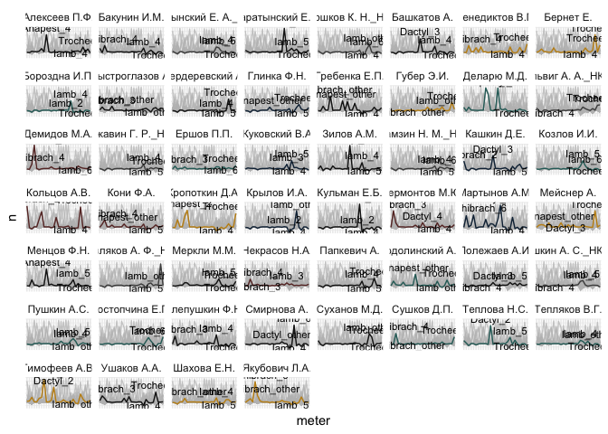
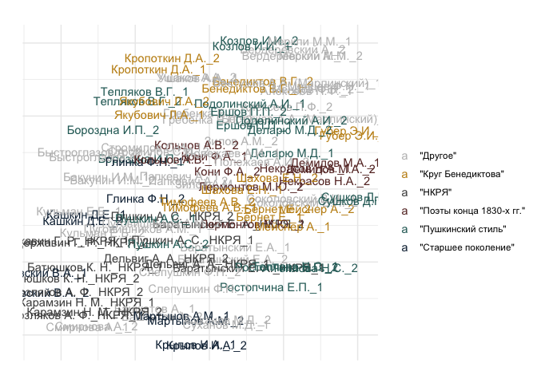
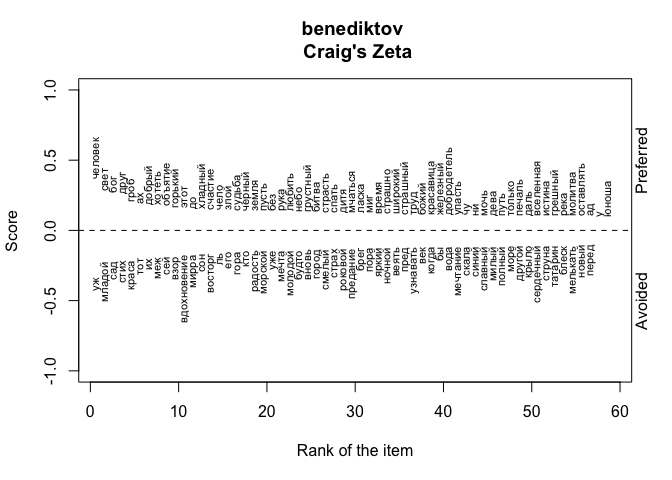
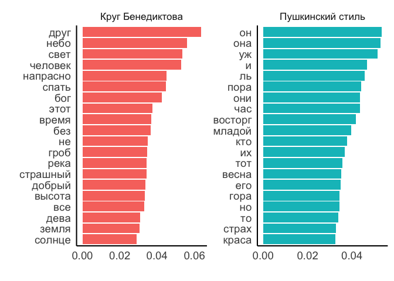
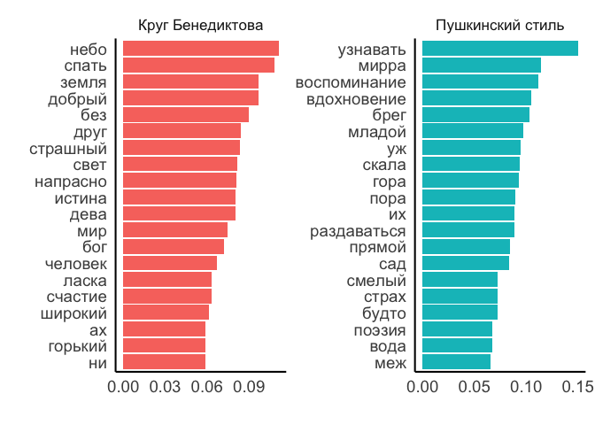

# 03_5_authors

## Exploration of the authors’ styles

This notebook takes samples of texts from known authors and tries to
analyse whether there are some clusters based on the MFW.

``` r
library(tidyverse)
library(tidytext)

library(stylo)

library(umap)

library(e1071)
library(caret)

library(tidymodels)
library(textrecipes)
library(kernlab)

library(MetBrewer)
library(gghighlight)
theme_set(theme_minimal())
```

Load data

``` r
corpus1835 <- readRDS("../../data/corpus1835/corpus_1835.Rds")

glimpse(corpus1835)
```

    Rows: 4,799
    Columns: 20
    $ text_id       <chr> "P_1", "P_10", "P_100", "P_1000", "P_1001", "P_1002", "P…
    $ A_ID          <chr> "", "A-50", "A-7", "A-41", "A-139", "A-11", "A-163", "A-…
    $ author_sign   <chr> "", "Л. Якубович", "Кольцов", "Ф. Глинка", "Н. Прокопови…
    $ author_text   <chr> "", "Якубович Л.А.", "Кольцов А.В.", "Глинка Ф.Н.", "Про…
    $ text_title    <chr> "Солдатская песня", "Молния", "Ночлег чумаков", "Утешите…
    $ text_subtitle <chr> "", "", "Сельские картины", "", "", "", "", "", "", "", …
    $ first_line    <chr> "Ох жизнь, молодецкая", "Зачем с небесной высоты", "В бл…
    $ year          <chr> "1835", "1835", "1836", "1838", "1838", "1838", "1838", …
    $ path_text     <chr> "../../data/corpus1835/periodicals/per_raw//P_1.txt", ".…
    $ source_text   <chr> "Сев_пч. 1835. №12. C. 46", "БдЧ. 1835. Т.8. Отд. 1. C. …
    $ COL_ID        <chr> "", "", "", "", "", "", "", "", "", "", "", "", "", "", …
    $ corpus        <chr> "per", "per", "per", "per", "per", "per", "per", "per", …
    $ text_raw      <chr> "Ох, жизнь молодецкая,\nБравая, солдатская!\nКак осенняя…
    $ text_cln      <chr> "Ох, жизнь молодецкая,\nБравая, солдатская!\nКак осенняя…
    $ text_lemm     <chr> "ох, жизнь молодецкий,\nбравый, солдатский!\nкак осенний…
    $ text_acc      <chr> "Ох, жизнь молоде'цкая,\nБра'вая, солда'тская!\nКак осе'…
    $ meter         <fct> Other?, Iamb, Iamb, Iamb, Trochee, Iamb, Trochee, Iamb, …
    $ feet          <chr> "?", "3", "4", "4", "4", "4", "other", "4", "6", "5", "4…
    $ formula       <chr> "Other?_?", "Iamb_3", "Iamb_4", "Iamb_4", "Trochee_4", "…
    $ n_lines       <int> 38, 16, 98, 77, 28, 12, 44, 25, 31, 28, 100, 16, 17, 60,…

#### RNC data

``` r
load("../../data/nkrja_19th_lem.Rda")


meters_trnsl <- tibble(
  meter_r = c("Я3", "Я4", "Я5", "Я6", "Х4", "Аф2", "Х6"),
  formula = c("Iamb_3", "Iamb_4", "Iamb_5", "Iamb_6", 
              "Trochee_4", "Amphibrach_2", "Trochee_6")
)

rnc_selected <- c19 %>% 
  filter(author %in% c("Г. Р. Державин", "Н. М. Карамзин", 
                       "К. Н. Батюшков", "А. А. Дельвиг", 
                       "А. Ф. Мерзляков", "А. С. Пушкин", 
                       "Е. А. Баратынский")) %>% 
  select(-formula) %>% 
  mutate(meter_r = paste0(meter, feet)) %>% 
  left_join(meters_trnsl, by = "meter_r") %>% 
  mutate(formula = ifelse(str_detect(meter_r, "Явольная"), 
                          "Iamb_other", formula),
         formula = ifelse(str_detect(meter_r, "Ярегулярная"), 
                          "Iamb_other", formula),
         formula = ifelse(str_detect(meter_r, "Хвольная|Хрегулярная"),
                          "Trochee_other", formula),
         meter = str_remove(formula, "_.*?$"),
         author_text = str_replace(author, 
                                   "(^\\w\\. \\w\\.) (\\w+)$",
                                   "\\2 \\1"),
         author_text = paste0(author_text, "_НКРЯ")) %>% 
  rename(text_lemm = lemma,
         text_id = `Unnamed..0`) %>% 
  select(text_id, author_text, meter, formula, text_lemm) %>% 
  separate_rows(text_lemm, sep = "\n") %>% 
  filter(text_lemm != "" & !str_detect(text_lemm, "^\\W+$|^\\s+$")) 

glimpse(rnc_selected)
```

    Rows: 94,131
    Columns: 5
    $ text_id     <int> 315, 315, 315, 315, 315, 315, 315, 315, 315, 315, 315, 315…
    $ author_text <chr> "Мерзляков А. Ф._НКРЯ", "Мерзляков А. Ф._НКРЯ", "Мерзляков…
    $ meter       <chr> "Iamb", "Iamb", "Iamb", "Iamb", "Iamb", "Iamb", "Iamb", "I…
    $ formula     <chr> "Iamb_3", "Iamb_3", "Iamb_3", "Iamb_3", "Iamb_3", "Iamb_3"…
    $ text_lemm   <chr> "среди долина ровный ", " на гладкий высота, ", " цвести, …

``` r
rnc_selected %>% 
  count(author_text, sort = T)
```

    # A tibble: 7 × 2
      author_text                n
      <chr>                  <int>
    1 Пушкин А. С._НКРЯ      39707
    2 Державин Г. Р._НКРЯ    20628
    3 Карамзин Н. М._НКРЯ     8414
    4 Баратынский Е. А._НКРЯ  8245
    5 Батюшков К. Н._НКРЯ     6641
    6 Мерзляков А. Ф._НКРЯ    5433
    7 Дельвиг А. А._НКРЯ      5063

``` r
rm(c19)
```

Number of Iamb-4 texts without genre title

``` r
# read genre titles
titles <- read.csv("poems_titles.csv") %>% select(-X)

# read the data with normalised genres
m <- read.delim("multigenre_texts.csv", sep = ';') %>% select(-X)

# list of genre words (longer)
genres <- unlist(str_split(c("песня
романс
сонет
элегия
басня
песнь
альбом
дума
баллада
отрывок
подражание
послание
молитва
фантазия
псалом
эпиграмма
мелодия
антологический
аполог
сказка
экспромт
надпись
эпилог"), pattern = "\n"))

# attach normalised genres to other genre titles
ids_genres <- titles %>% 
  select(text_id, lemma) %>% 
  filter(lemma %in% genres) %>% # select genres from the list
  group_by(text_id) %>% 
  summarise(genre = paste0(lemma, collapse = " | ")) %>% 
  filter(!str_detect(genre, " \\| ")) %>% # remove multigenre titles
  rbind(m %>% 
          select(text_id, true_genre) %>% 
          rename(genre = true_genre) # replace them with clean labels
          ) %>% 
  filter(genre != "")

corpus_genres <- corpus1835 %>% 
  left_join(ids_genres, by = "text_id") %>% 
  #filter(!is.na(genre)) %>% 
  select(text_id, genre, meter, feet, text_lemm) %>% 
  mutate(genre = ifelse(is.na(genre), "no_genre", genre)) 

glimpse(corpus_genres)
```

    Rows: 4,799
    Columns: 5
    $ text_id   <chr> "P_1", "P_10", "P_100", "P_1000", "P_1001", "P_1002", "P_100…
    $ genre     <chr> "песня", "no_genre", "no_genre", "no_genre", "no_genre", "no…
    $ meter     <fct> Other?, Iamb, Iamb, Iamb, Trochee, Iamb, Trochee, Iamb, Iamb…
    $ feet      <chr> "?", "3", "4", "4", "4", "4", "other", "4", "6", "5", "4", "…
    $ text_lemm <chr> "ох, жизнь молодецкий,\nбравый, солдатский!\nкак осенний ноч…

``` r
# for Iamb-4 only
corpus_genres %>% 
  mutate(formula = paste0(meter, "_", feet)) %>% 
  filter(formula == "Iamb_4") %>% 
  mutate(genre = ifelse(genre != "no_genre", "is_genre", genre)) %>% 
  count(genre)
```

    # A tibble: 2 × 2
      genre        n
      <chr>    <int>
    1 is_genre   251
    2 no_genre  1207

``` r
meters_total <- corpus_genres %>% 
  mutate(formula = paste0(meter, "_", feet)) %>% 
  filter(formula %in% c("Iamb_3", "Iamb_4", "Iamb_5", "Iamb_6",
                        "Iamb_other", "Trochee_4", "Amphigraph_4",
                        "Amphibrach_other", "Trochee_other")) %>% 
  count(formula) %>% rename(total = n)

#proportion of genre labeled texts for top-10 formulas
corpus_genres %>% 
  mutate(formula = paste0(meter, "_", feet)) %>% 
  filter(formula %in% c("Iamb_3", "Iamb_4", "Iamb_5", "Iamb_6",
                        "Iamb_other", "Trochee_4", "Amphigraph_4",
                        "Amphibrach_other", "Trochee_other")) %>% 
  mutate(genre = ifelse(genre != "no_genre", "is_genre", genre)) %>% 
  group_by(formula) %>% 
  count(genre) %>% 
  ungroup() %>% 
  left_join(meters_total, by = "formula") %>% 
  mutate(perc = round(n/total*100, 1)) %>% 
  select(-n, -total) %>% 
  pivot_wider(names_from = genre, values_from = perc) %>% 
  arrange(desc(is_genre))
```

    # A tibble: 8 × 3
      formula          is_genre no_genre
      <chr>               <dbl>    <dbl>
    1 Amphibrach_other     30.9     69.1
    2 Trochee_other        24.8     75.2
    3 Iamb_other           23.1     76.9
    4 Iamb_6               22.1     77.9
    5 Trochee_4            21.6     78.4
    6 Iamb_5               20.6     79.4
    7 Iamb_4               17.2     82.8
    8 Iamb_3               16.5     83.5

``` r
# total 1458 texts in Iamb-4,
# 251 text is with genre label, 1207 without

rm(corpus_genres, genres, m, titles, ids_genres, meters_total)
```

Number of non-empty lines by each author

``` r
authors_lines <- corpus1835 %>% 
  select(text_id, author_text, meter, text_lemm) %>% 
  separate_rows(text_lemm, sep = "\n") %>% 
  filter(text_lemm != "" & !str_detect(text_lemm, "^\\W+$|^\\s+$")) %>% 
  group_by(author_text) %>% 
  count(sort = T) %>% 
  ungroup() %>% 
  filter(n > 1000 & author_text != "")

authors_lines
```

    # A tibble: 49 × 2
       author_text          n
       <chr>            <int>
     1 Кульман Е.Б.      7851
     2 Жуковский В.А.    7766
     3 Крылов И.А.       6147
     4 Тимофеев А.В.     4887
     5 Бороздна И.П.     4834
     6 Бернет Е.         4654
     7 Быстроглазов А.   4335
     8 Бенедиктов В.Г.   4029
     9 Баратынский Е.А.  3906
    10 Башкатов А.       3451
    # ℹ 39 more rows

Number of lines in each meter

``` r
corpus1835 %>% 
  select(text_id, author_text, meter, text_lemm) %>% 
  separate_rows(text_lemm, sep = "\n") %>% 
  filter(text_lemm != "" & !str_detect(text_lemm, "^\\W+$|^\\s+$")) %>% 
  group_by(author_text, meter) %>% 
  count(sort = T) %>% 
  ungroup() %>% 
  filter(author_text %in% authors_lines$author_text) %>% 
  filter(meter != "Other?") %>% 
  arrange(-desc(author_text))
```

    # A tibble: 188 × 3
       author_text      meter          n
       <chr>            <fct>      <int>
     1 Алексеев П.Ф.    Iamb         800
     2 Алексеев П.Ф.    Trochee      508
     3 Алексеев П.Ф.    Anapest       99
     4 Алексеев П.Ф.    Amphibrach    89
     5 Бакунин И.М.     Iamb        1537
     6 Бакунин И.М.     Amphibrach   269
     7 Бакунин И.М.     Trochee       52
     8 Бакунин И.М.     Anapest       24
     9 Баратынский Е.А. Iamb        3411
    10 Баратынский Е.А. Trochee      329
    # ℹ 178 more rows

### metrical profile

Look into how authors are grouped based on their usage of different
meters

``` r
# table(corpus1835$feet)

metrical_mtrx <- corpus1835 %>% 
  # select most represented authors
  filter(author_text %in% authors_lines$author_text) %>% 
  
  # leave only clearly detected meters
  filter(meter != "Other?" & feet %in% c(2, 3, 4, 5, 6, "other")) %>% 
  mutate(formula = paste0(meter, "_", feet)) %>% 
  
  # count and sample lines
  separate_rows(text_lemm, sep = "\n") %>% 
  filter(text_lemm != "" & !str_detect(text_lemm, "^\\W+$|^\\s+$")) %>% 
  
  # remove authors who hasn't 1000 lines in selected meters
  filter(!author_text %in% c("Бестужев А.А. (Марлинский)", 
                             "Стромилов С.И.", 
                             "Соколовский В.И.", 
                             "Пуговишников А.М.")) %>% 
  
  # filter only needed columns
  select(text_id, author_text, meter, formula, text_lemm) %>% 
  
  # attach RNC data
  rbind(rnc_selected) %>% 
  filter(!is.na(formula)) %>% 
  
  group_by(author_text) %>% 
  sample_n(1000) %>% # sample 1000 lines from each author
  ungroup() %>% 
  
  # count number of lines of each meter
  group_by(author_text, formula) %>% 
  count() %>% 
  ungroup() %>% 
  pivot_wider(names_from = formula, values_from = n, values_fill = 0)

metrical_mtrx
```

    # A tibble: 52 × 28
       author_text   Amphibrach_4 Amphibrach_other Anapest_2 Anapest_4 Iamb_4 Iamb_5
       <chr>                <int>            <int>     <int>     <int>  <int>  <int>
     1 Алексеев П.Ф.           29               30        29        36    255     40
     2 Бакунин И.М.            92               17         0         0    581      0
     3 Баратынский …            0                0         0         0    655     84
     4 Баратынский …           12               12         0         0    419     77
     5 Батюшков К. …            0                0         0         0    133      0
     6 Башкатов А.              0                0         0         0    698      0
     7 Бенедиктов В…           93               88         0         0    220     94
     8 Бернет Е.               54               15         0         0    194     35
     9 Бороздна И.П.            0                0         0         0    948      5
    10 Быстроглазов…           27               86         0         0    411     57
    # ℹ 42 more rows
    # ℹ 21 more variables: Iamb_6 <int>, Iamb_other <int>, Trochee_4 <int>,
    #   Trochee_6 <int>, Trochee_other <int>, Amphibrach_2 <int>,
    #   Anapest_other <int>, Iamb_3 <int>, Amphibrach_3 <int>, Iamb_2 <int>,
    #   Dactyl_3 <int>, Anapest_3 <int>, Dactyl_other <int>, Trochee_5 <int>,
    #   Trochee_3 <int>, Anapest_5 <int>, Dactyl_6 <int>, Amphibrach_5 <int>,
    #   Dactyl_4 <int>, Amphibrach_6 <int>, Dactyl_2 <int>

Metrical variations taken into account:

``` r
# corpus1835 %>% 
#   # select most represented authors
#   filter(author_text %in% authors_lines$author_text) %>% 
#   
#   # leave only clearly detected meters
#   filter(meter != "Other?" & feet %in% c(2, 3, 4, 5, 6, "other")) %>% 
#   mutate(formula = paste0(meter, "_", feet)) %>% 
#   distinct(formula) %>% 
#   pull()

colnames(metrical_mtrx)
```

     [1] "author_text"      "Amphibrach_4"     "Amphibrach_other" "Anapest_2"       
     [5] "Anapest_4"        "Iamb_4"           "Iamb_5"           "Iamb_6"          
     [9] "Iamb_other"       "Trochee_4"        "Trochee_6"        "Trochee_other"   
    [13] "Amphibrach_2"     "Anapest_other"    "Iamb_3"           "Amphibrach_3"    
    [17] "Iamb_2"           "Dactyl_3"         "Anapest_3"        "Dactyl_other"    
    [21] "Trochee_5"        "Trochee_3"        "Anapest_5"        "Dactyl_6"        
    [25] "Amphibrach_5"     "Dactyl_4"         "Amphibrach_6"     "Dactyl_2"        

Projection

``` r
# scale matrix and remove author's column
mtrx <- metrical_mtrx %>% 
  select(-author_text) %>% 
  scale() 

dim(mtrx)
```

    [1] 52 27

``` r
u <- umap(mtrx)

dat <- tibble(x = u$layout[,1],
       y = u$layout[,2],
       author = metrical_mtrx$author_text) 
```

### author’s grouping

Some custom labeling according to grouping found in scholarship

``` r
# unique(dat$author)

authors_lbl <- tibble(
  author = unique(dat$author),
  author_group = c(
    "Другое", "Другое", "НКРЯ", 
    "Другое", "НКРЯ", "Другое", 
    "Круг Бенедиктова", "Круг Бенедиктова", "Пушкинский стиль", 
    "Другое", "Другое", "Старшее поколение",
    "Другое", "Круг Бенедиктова", "Пушкинский стиль", 
    "НКРЯ", "Поэты конца 1830-х гг.", "НКРЯ", 
    "Пушкинский стиль", "Старшее поколение", "Другое", 
    "НКРЯ", "Старшее поколение", "Пушкинский стиль", 
    "Поэты конца 1830-х гг.", "Поэты конца 1830-х гг.", "Круг Бенедиктова", 
    "Старшее поколение", "Другое", "Поэты конца 1830-х гг.",
    "Старшее поколение", "Круг Бенедиктова", "Другое", 
    "НКРЯ", "Другое", "Поэты конца 1830-х гг.", 
    "Другое", "Пушкинский стиль", "Другое", 
    "НКРЯ", "Пушкинский стиль", "Пушкинский стиль", 
    "Другое", "Другое", 
    "Другое", "Пушкинский стиль", "Пушкинский стиль",
    "Пушкинский стиль", "Круг Бенедиктова", "Другое", 
    "Круг Бенедиктова", "Круг Бенедиктова"
  )
) %>% 
  mutate(author_group = paste0('"', author_group, '"' ))

table(authors_lbl$author_group)
```


                    "Другое"       "Круг Бенедиктова"                   "НКРЯ" 
                          17                        8                        7 
    "Поэты конца 1830-х гг."       "Пушкинский стиль"      "Старшее поколение" 
                           5                       10                        5 

``` r
authors_lbl
```

    # A tibble: 52 × 2
       author                 author_group          
       <chr>                  <chr>                 
     1 Алексеев П.Ф.          "\"Другое\""          
     2 Бакунин И.М.           "\"Другое\""          
     3 Баратынский Е. А._НКРЯ "\"НКРЯ\""            
     4 Баратынский Е.А.       "\"Другое\""          
     5 Батюшков К. Н._НКРЯ    "\"НКРЯ\""            
     6 Башкатов А.            "\"Другое\""          
     7 Бенедиктов В.Г.        "\"Круг Бенедиктова\""
     8 Бернет Е.              "\"Круг Бенедиктова\""
     9 Бороздна И.П.          "\"Пушкинский стиль\""
    10 Быстроглазов А.        "\"Другое\""          
    # ℹ 42 more rows

#### proj

``` r
# plot
dat %>% 
  filter(author != "Кольцов А.В.") %>% 
  left_join(authors_lbl, by = "author") %>% 
  ggplot(aes(x, y, color = author_group)) + 
  #geom_point(size = 5, alpha = 0.6) + 
  geom_text(aes(label = author)) + 
  labs(title = "", x = "", y = "", color = "") + 
  scale_color_manual(values = c("gray",
                                 met.brewer("Veronese")[3],
                                 "gray30", #met.brewer("Veronese")[4],
                                 met.brewer("Veronese")[1],
                                 met.brewer("Veronese")[5],
                                 met.brewer("Veronese")[7])) + 
  theme(axis.text = element_blank())
```


``` r
ggsave("metrical_profile_projection_md.png", plot = last_plot(),
       bg = "white", dpi = 300, width = 8, height = 6)
```

#### lineplot

``` r
mtrx %>% 
  cbind(metrical_mtrx %>% select(author_text)) %>% 
  pivot_longer(!author_text,
               names_to = "meter",
               values_to = "n") %>% 
  left_join(authors_lbl %>% rename(author_text = author), 
            by = "author_text") %>% 
  ggplot(aes(x = meter,
             y = n, 
             group = author_text)) + 
  geom_line(aes(color = author_group), show.legend = FALSE) + 
  gghighlight(use_direct_label = FALSE#,
              #unhighlighted_params = list(colour = alpha("grey85", 1))
              ) + 
  facet_wrap(~author_text) + 
  geom_text(data = mtrx %>% cbind(metrical_mtrx %>% select(author_text)) %>% 
              pivot_longer(!author_text, names_to = "meter", values_to = "n") %>% 
              group_by(author_text) %>% 
              slice_max(order_by = n, n = 2),
            aes(y = n, label = meter),
            size = 3,
            vjust = -0.5,
            show.legend = FALSE
              ) +
  
  geom_text(data = mtrx %>% cbind(metrical_mtrx %>% select(author_text)) %>% 
              pivot_longer(!author_text, names_to = "meter", values_to = "n") %>% 
              group_by(author_text) %>% 
              slice_min(order_by = n, n = 1),
            aes(y = n, label = meter),
            size = 3,
            vjust = 0.5,
            show.legend = FALSE
              ) +
  
  scale_color_manual(values = c("gray9",
                                met.brewer("Veronese")[3],
                                "gray30",
                                met.brewer("Veronese")[1],
                                met.brewer("Veronese")[5],
                                met.brewer("Veronese")[7])) + 
  theme(axis.text = element_blank())
```



``` r
ggsave("metrical_profile_lineplot_md.png", plot = last_plot(),
       bg = "white", dpi = 300, width = 14, height = 10)
```

### MFW usage

Create MFW ranks based on the whole corpus

``` r
ranks <- corpus1835 %>% 
  unnest_tokens(input = "text_lemm", output = word, token = "words") %>% 
  count(word, sort = T) %>% 
  head(450) %>% 
  # remove first 50 MFW
  mutate(rank = row_number()) %>% 
  filter(rank > 50)

head(ranks)
```

    # A tibble: 6 × 3
      word      n  rank
      <chr> <int> <int>
    1 свет   1860    51
    2 себя   1825    52
    3 у      1803    53
    4 же     1786    54
    5 ли     1775    55
    6 ни     1755    56

``` r
tail(ranks)
```

    # A tibble: 6 × 3
      word          n  rank
      <chr>     <int> <int>
    1 открывать   281   445
    2 утро        281   446
    3 желать      280   447
    4 самый       280   448
    5 седой       280   449
    6 дрожать     279   450

``` r
nrow(ranks)
```

    [1] 400

#### select sample

``` r
counter <- corpus1835 %>% 
  filter(author_text %in% authors_lines$author_text) %>% 
  select(text_id, author_text, meter, text_lemm) %>% 
  separate_rows(text_lemm, sep = "\n") %>% 
  filter(text_lemm != "" & !str_detect(text_lemm, "^\\W+$|^\\s+$")) %>% 
  
  # filter only needed columns
  select(text_id, author_text, meter, text_lemm) %>% 
  
  # attach RNC data
  rbind(rnc_selected %>% select(-formula)) %>%
  
  
  group_by(author_text) %>% 
  sample_n(1000) %>% 
 
  
  # create two samples of 500 lines for each author
  mutate(sample_id = ceiling(1:1000),
         sample_id = floor(sample_id/500)+1,
         sample_id = ifelse(sample_id == 3, 1, sample_id),
         sample_id = paste0(author_text, "_", sample_id)) %>% 
  ungroup() %>% 
  
  # count words inside each sample
  unnest_tokens(input = text_lemm, output = word, token = "words") %>% 
  group_by(sample_id) %>% 
  count(word) %>% 
  ungroup() %>% 
  filter(word %in% ranks$word)

counter %>% sample_n(10)
```

    # A tibble: 10 × 3
       sample_id             word         n
       <chr>                 <chr>    <int>
     1 Крылов И.А._2         грустный     1
     2 Демидов М.А._2        только       1
     3 Крылов И.А._2         прежний      1
     4 Батюшков К. Н._НКРЯ_1 меч          3
     5 Пушкин А.С._2         какой        2
     6 Баратынский Е.А._2    грозный      1
     7 Некрасов Н.А._1       мука         2
     8 Бакунин И.М._2        давно        1
     9 Алексеев П.Ф._2       звать        1
    10 Дельвиг А. А._НКРЯ_1  еще          2

#### UMAP projection

``` r
xxx <- counter %>% 
  pivot_wider(names_from = word, values_from = n, values_fill = 0)

mtrx <- xxx %>% 
  ungroup() %>% 
  select(-sample_id) %>% 
  scale()

dim(mtrx)
```

    [1] 112 400

``` r
u <- umap(mtrx)

dat <- tibble(x = u$layout[,1],
       y = u$layout[,2],
       author = xxx$sample_id) 
  
# glimpse(dat)
```

``` r
dat %>% 
  mutate(sample_id = author,
    author = str_remove(author, "_\\d+$")) %>% 
  left_join(authors_lbl, by = "author") %>% 
  mutate(author_group = ifelse(is.na(author_group), '"Другое"', author_group)) %>% 
  ggplot(aes(x, y, color = author_group)) + 
  #geom_point(size = 5, alpha = 0.6) + 
  geom_text(aes(label = sample_id)) + 
  labs(title = "", x = "", y = "", color = "") + 
  scale_color_manual(values = c("gray", 
                                met.brewer("Veronese")[3],
                                "gray30",
                                met.brewer("Veronese")[1],
                                met.brewer("Veronese")[5],
                                met.brewer("Veronese")[7])) + 
  theme(axis.text = element_blank())
```



### zeta

Create & write samples

``` r
corpus_prepared <- corpus1835 %>% 
  filter(author_text %in% authors_lines$author_text) %>% 
  select(text_id, author_text, meter, text_lemm) %>% 
  separate_rows(text_lemm, sep = "\n") %>% 
  filter(text_lemm != "" & !str_detect(text_lemm, "^\\W+$|^\\s+$")) %>% 
  
  # attach lables
  left_join(authors_lbl %>% rename(author_text = author), by = "author_text") %>%   filter(author_group == '"Пушкинский стиль"' | author_group == '"Круг Бенедиктова"') %>% 
  mutate(author_group = str_remove_all(author_group, '"')) %>% 
  # both groups has ~20k tokens

  group_by(author_group) %>% 
  sample_n(20000) %>% 
  
  # create two samples of 500 lines for each author
  mutate(sample_id = ceiling(1:20000),
         sample_id = floor(sample_id/2000)+1,
         sample_id = ifelse(sample_id == 11, 1, sample_id),
         sample_id = paste0(author_group, "_", sample_id)) %>% 
  ungroup() %>% 
  
  group_by(sample_id) %>% 
  summarise(text = paste0(text_lemm, collapse = " ------ ")) %>% 
  ungroup() %>% 
  
  mutate(author_group = str_remove(sample_id, "_\\d+$"), 
         path = ifelse(author_group == "Пушкинский стиль", "secondary_set/", "primary_set/"),
         path = paste0("zeta_tests/benediktov/", path, sample_id, ".txt")) 

str(corpus_prepared)
```

    tibble [20 × 4] (S3: tbl_df/tbl/data.frame)
     $ sample_id   : chr [1:20] "Круг Бенедиктова_1" "Круг Бенедиктова_10" "Круг Бенедиктова_2" "Круг Бенедиктова_3" ...
     $ text        : chr [1:20] "конь вблизи играть; ------ хотеть сказать ты, о милый , ------ не принимать от он сердечный привет!  ------ сып"| __truncated__ "мой детский быт с его забава,  ------ пробивать за час час, исчезать за век век: ------ он ты нужный значит ста"| __truncated__ "кто мочь стоить чувство твой? ------ что в гроб единый в земля почивать, ------ под дубравный тень, ------ когд"| __truncated__ "и храбрый полк уснуть. ------ но он уже не муза подвижник ------ глубоко, до сердце он тронуть я, ------ трепет"| __truncated__ ...
     $ author_group: chr [1:20] "Круг Бенедиктова" "Круг Бенедиктова" "Круг Бенедиктова" "Круг Бенедиктова" ...
     $ path        : chr [1:20] "zeta_tests/benediktov/primary_set/Круг Бенедиктова_1.txt" "zeta_tests/benediktov/primary_set/Круг Бенедиктова_10.txt" "zeta_tests/benediktov/primary_set/Круг Бенедиктова_2.txt" "zeta_tests/benediktov/primary_set/Круг Бенедиктова_3.txt" ...

``` r
do.call(file.remove, list(
  list.files("zeta_tests/benediktov//primary_set", full.names = TRUE)))
```

     [1] TRUE TRUE TRUE TRUE TRUE TRUE TRUE TRUE TRUE TRUE

``` r
do.call(file.remove, list(
  list.files("zeta_tests/benediktov//secondary_set", full.names = TRUE)))
```

     [1] TRUE TRUE TRUE TRUE TRUE TRUE TRUE TRUE TRUE TRUE

``` r
for (i in 1:nrow(corpus_prepared)) {
  writeLines(corpus_prepared$text[i], corpus_prepared$path[i])
}
```

``` r
oppose(
  gui = FALSE,
  path = "zeta_tests/benediktov/",
  corpus.lang = "Other",
  text.slice.length = 500,
  write.png.file = TRUE
)
```

    The subcorpora will be loaded from text files...

    slicing input text into tokens...


    turning words into features, e.g. char n-grams (if applicable)...

    slicing input text into tokens...


    turning words into features, e.g. char n-grams (if applicable)...

    Slicing the texts into samples...

    Круг Бенедиктова_1

        - text length (in words): 9173

        - nr. of samples: 18

        - nr. of words dropped at the end of the text: 173

    Круг Бенедиктова_10

        - text length (in words): 9084

        - nr. of samples: 18

        - nr. of words dropped at the end of the text: 84

    Круг Бенедиктова_2

        - text length (in words): 9090

        - nr. of samples: 18

        - nr. of words dropped at the end of the text: 90

    Круг Бенедиктова_3

        - text length (in words): 9040

        - nr. of samples: 18

        - nr. of words dropped at the end of the text: 40

    Круг Бенедиктова_4

        - text length (in words): 9174

        - nr. of samples: 18

        - nr. of words dropped at the end of the text: 174

    Круг Бенедиктова_5

        - text length (in words): 9049

        - nr. of samples: 18

        - nr. of words dropped at the end of the text: 49

    Круг Бенедиктова_6

        - text length (in words): 9027

        - nr. of samples: 18

        - nr. of words dropped at the end of the text: 27

    Круг Бенедиктова_7

        - text length (in words): 9026

        - nr. of samples: 18

        - nr. of words dropped at the end of the text: 26

    Круг Бенедиктова_8

        - text length (in words): 9089

        - nr. of samples: 18

        - nr. of words dropped at the end of the text: 89

    Круг Бенедиктова_9

        - text length (in words): 9033

        - nr. of samples: 18

        - nr. of words dropped at the end of the text: 33

    Пушкинский стиль_1

        - text length (in words): 9445

        - nr. of samples: 18

        - nr. of words dropped at the end of the text: 445

    Пушкинский стиль_10

        - text length (in words): 9440

        - nr. of samples: 18

        - nr. of words dropped at the end of the text: 440

    Пушкинский стиль_2

        - text length (in words): 9436

        - nr. of samples: 18

        - nr. of words dropped at the end of the text: 436

    Пушкинский стиль_3

        - text length (in words): 9295

        - nr. of samples: 18

        - nr. of words dropped at the end of the text: 295

    Пушкинский стиль_4

        - text length (in words): 9455

        - nr. of samples: 18

        - nr. of words dropped at the end of the text: 455

    Пушкинский стиль_5

        - text length (in words): 9428

        - nr. of samples: 18

        - nr. of words dropped at the end of the text: 428

    Пушкинский стиль_6

        - text length (in words): 9436

        - nr. of samples: 18

        - nr. of words dropped at the end of the text: 436

    Пушкинский стиль_7

        - text length (in words): 9406

        - nr. of samples: 18

        - nr. of words dropped at the end of the text: 406

    Пушкинский стиль_8

        - text length (in words): 9399

        - nr. of samples: 18

        - nr. of words dropped at the end of the text: 399

    Пушкинский стиль_9

        - text length (in words): 9259

        - nr. of samples: 18

        - nr. of words dropped at the end of the text: 259

    Extracting distinctive words... (this might take a while)

    Primary set...

    Secondary set...

    comparison done!

    No test set samples found (but this is totally OK in most cases!).
    Performing a simple comparison of the training samples...



    Function call:

    oppose(gui = FALSE, path = "zeta_tests/benediktov/", corpus.lang = "Other",     text.slice.length = 500, write.png.file = TRUE)

    Depending on your chosen options, some results should have been written

    into a few files; you should be able to find them in your current

    (working) directory. Usually, these include a list of words/features

    used to build a table of frequencies, the table itself, a file containing

    recent configuration, etc.

    Advanced users: you can pipe the results to a variable, e.g.:

         I.love.this.stuff = oppose()

    this will create a class "I.love.this.stuff" containing some presumably

    interesting stuff. The class created, you can type, e.g.:

         summary(I.love.this.stuff)

    to see which variables are stored there and how to use them.

    for suggestions how to cite this software, type: citation("stylo")

#### classifier

Basic classification based on 400 MFW

##### MFW

``` r
ranks <- corpus1835 %>% 
  unnest_tokens(input = text_lemm, output = word, token = "words") %>% 
  count(word, sort = T) %>% 
  head(400) %>% 
  mutate(rank = row_number())

head(ranks)
```

    # A tibble: 6 × 3
      word      n  rank
      <chr> <int> <int>
    1 и     38454     1
    2 в     26906     2
    3 я     19065     3
    4 не    14993     4
    5 на    11839     5
    6 ты    11474     6

``` r
tail(ranks)
```

    # A tibble: 6 × 3
      word         n  rank
      <chr>    <int> <int>
    1 тайный     309   395
    2 голубой    308   396
    3 дорога     308   397
    4 напрасно   307   398
    5 чуждый     307   399
    6 брег       305   400

``` r
corpus_prepared <- corpus1835 %>% 
  filter(author_text %in% authors_lines$author_text) %>% 
  select(text_id, author_text, meter, text_lemm) %>% 
  separate_rows(text_lemm, sep = "\n") %>% 
  filter(text_lemm != "" & !str_detect(text_lemm, "^\\W+$|^\\s+$")) %>% 
  
  # attach lables
  left_join(authors_lbl %>% rename(author_text = author), by = "author_text") %>%   filter(author_group == '"Пушкинский стиль"' | author_group == '"Круг Бенедиктова"') %>% 
  mutate(author_group = str_remove_all(author_group, '"')) %>% 
  # both groups has ~20k tokens

  group_by(author_group) %>% 
  sample_n(20000) %>% 
  
  # create two samples of 500 lines for each author
  mutate(sample_id = ceiling(1:20000),
         sample_id = floor(sample_id/200)+1,
         sample_id = ifelse(sample_id == 101, 1, sample_id),
         sample_id = paste0(author_group, "_", sample_id)) %>% 
  ungroup() %>% 
  
  group_by(sample_id) %>% 
  summarise(text = paste0(text_lemm, collapse = " ------ ")) %>% 
  ungroup() %>% 
  
  mutate(author_group = str_remove(sample_id, "_\\d+$"))


table(corpus_prepared$author_group)
```


    Круг Бенедиктова Пушкинский стиль 
                 100              100 

``` r
str(corpus_prepared)
```

    tibble [200 × 3] (S3: tbl_df/tbl/data.frame)
     $ sample_id   : chr [1:200] "Круг Бенедиктова_1" "Круг Бенедиктова_10" "Круг Бенедиктова_100" "Круг Бенедиктова_11" ...
     $ text        : chr [1:200] "вчера лишь спорить с гроза; ------ роса он вседневный поливать, ------ и туча долу понестись! ------ среди толп"| __truncated__ "громкий слава звать: ------ вздыхать, зевнуть и — снова спать. ------ через дымка ночь;  ------ зачем, ретивый,"| __truncated__ "когда б я ждать, что надо я ------ и мчаться за план, и плакать над пепел, ------ что ты , жавронок, уныло ----"| __truncated__ "хотеть помериться с судьба, ------ сказать, резвый блондинка, ------ и чем смиряться перед ты ниже, ------ чувс"| __truncated__ ...
     $ author_group: chr [1:200] "Круг Бенедиктова" "Круг Бенедиктова" "Круг Бенедиктова" "Круг Бенедиктова" ...

``` r
freqs <- corpus_prepared %>% 
  mutate(text_genre = author_group) %>% 
  select(sample_id, text_genre, text) %>% 
  unnest_tokens(input = text, output = word, token = "words") %>% 
  filter(word %in% ranks$word) %>% 
  group_by(sample_id, text_genre) %>% 
  count(word) %>% 
  ungroup() %>% 
  pivot_wider(names_from = word, values_from = n, values_fill = 0) 

dim(freqs)
```

    [1] 200 402

``` r
freqs[1:10, 1:10]
```

    # A tibble: 10 × 10
       sample_id       text_genre     а ангел     б  беда белый берег блеск блистать
       <chr>           <chr>      <int> <int> <int> <int> <int> <int> <int>    <int>
     1 Круг Бенедикто… Круг Бене…     6     1     2     1     1     1     1        1
     2 Круг Бенедикто… Круг Бене…     1     0     0     1     1     0     1        1
     3 Круг Бенедикто… Круг Бене…     4     0     3     0     1     0     1        2
     4 Круг Бенедикто… Круг Бене…     2     0     0     1     2     0     0        1
     5 Круг Бенедикто… Круг Бене…     2     1     1     1     0     0     1        1
     6 Круг Бенедикто… Круг Бене…     1     0     2     0     1     1     0        1
     7 Круг Бенедикто… Круг Бене…     4     1     0     0     1     0     1        0
     8 Круг Бенедикто… Круг Бене…     3     2     0     1     0     0     0        0
     9 Круг Бенедикто… Круг Бене…     2     1     1     0     0     3     3        0
    10 Круг Бенедикто… Круг Бене…     1     0     1     1     0     0     1        1

``` r
freqs_scaled <- freqs %>% 
  select(-sample_id, -text_genre) %>% 
  scale() %>% 
  as.tibble()
```

    Warning: `as.tibble()` was deprecated in tibble 2.0.0.
    ℹ Please use `as_tibble()` instead.
    ℹ The signature and semantics have changed, see `?as_tibble`.

``` r
freqs_scaled[1:10, 1:10]
```

    # A tibble: 10 × 10
             а  ангел      б   беда  белый  берег  блеск блистать    бог    бой
         <dbl>  <dbl>  <dbl>  <dbl>  <dbl>  <dbl>  <dbl>    <dbl>  <dbl>  <dbl>
     1  1.67    0.533  1.31   0.782  0.759  0.597  0.439    0.344  1.41   2.79 
     2 -1.14   -0.800 -0.883  0.782  0.759 -0.715  0.439    0.344 -1.08   1.10 
     3  0.548  -0.800  2.41  -0.722  0.759 -0.715  0.439    1.55   3.08  -0.592
     4 -0.576  -0.800 -0.883  0.782  2.26  -0.715 -0.780    0.344 -1.08   1.10 
     5 -0.576   0.533  0.214  0.782 -0.744 -0.715  0.439    0.344 -1.08  -0.592
     6 -1.14   -0.800  1.31  -0.722  0.759  0.597 -0.780    0.344  0.582 -0.592
     7  0.548   0.533 -0.883 -0.722  0.759 -0.715  0.439   -0.863  1.41  -0.592
     8 -0.0140  1.87  -0.883  0.782 -0.744 -0.715 -0.780   -0.863  1.41   1.10 
     9 -0.576   0.533  0.214 -0.722 -0.744  3.22   2.88    -0.863  0.582 -0.592
    10 -1.14   -0.800  0.214  0.782 -0.744 -0.715  0.439    0.344  0.582 -0.592

``` r
freqs_scaled <- tibble(sample_id = freqs$sample_id,
       freqs_scaled,
       text_genre = freqs$text_genre) %>% 
  mutate(sample_id = row_number())

tidy_corpus <- freqs_scaled %>% 
  group_by(text_genre) %>% 
  sample_n(100) %>%   # number of texts in the tested genre
  ungroup() %>% 
  select(-sample_id)

## split the data into training and test sets
corpus_split <- initial_split(tidy_corpus, strata="text_genre", prop = 7.5/10)

corpus_split
```

    <Training/Testing/Total>
    <150/50/200>

``` r
training_set <- training(corpus_split)
test_set <- testing(corpus_split)

zscores_recipe <- recipe(text_genre ~ ., data = training_set) # all columns = all 300MFW freqs are used for the training

# 10-fold cross validation setup
folds <- vfold_cv(training_set, strata = "text_genre", v = 10)

# model specifications
svm_specs <- svm_poly(cost=1,degree = 1) %>% # linear kernel
  set_mode("classification") %>%
  set_engine("kernlab")

# add recipe and model specs to the workflow 
svm_wf <- workflow() %>%
  add_recipe(zscores_recipe) %>%
  add_model(svm_specs)

svm_res <- fit_resamples(
  svm_wf,
  folds,
  metrics = metric_set(accuracy),
  control = control_resamples(save_pred = TRUE)
)

metrics <- collect_metrics(svm_res)
metrics
```

    # A tibble: 1 × 6
      .metric  .estimator  mean     n std_err .config             
      <chr>    <chr>      <dbl> <int>   <dbl> <chr>               
    1 accuracy binary     0.988    10 0.00833 Preprocessor1_Model1

``` r
svm_model <-svm(as.factor(text_genre)~.,  
                data = training_set, 
                method = "C-classification", 
                kernel = "linear", 
                cost = 1, 
                scale = T)

summary(svm_model) 
```


    Call:
    svm(formula = as.factor(text_genre) ~ ., data = training_set, method = "C-classification", 
        kernel = "linear", cost = 1, scale = T)


    Parameters:
       SVM-Type:  C-classification 
     SVM-Kernel:  linear 
           cost:  1 

    Number of Support Vectors:  114

     ( 56 58 )


    Number of Classes:  2 

    Levels: 
     Круг Бенедиктова Пушкинский стиль

``` r
prediction <- predict(svm_model, test_set)
confusionMatrix(prediction, as.factor(test_set$text_genre)) # NB check if the same positive class used below in the plot
```

    Confusion Matrix and Statistics

                      Reference
    Prediction         Круг Бенедиктова Пушкинский стиль
      Круг Бенедиктова               24                1
      Пушкинский стиль                1               24
                                              
                   Accuracy : 0.96            
                     95% CI : (0.8629, 0.9951)
        No Information Rate : 0.5             
        P-Value [Acc > NIR] : 1.133e-12       
                                              
                      Kappa : 0.92            
                                              
     Mcnemar's Test P-Value : 1               
                                              
                Sensitivity : 0.96            
                Specificity : 0.96            
             Pos Pred Value : 0.96            
             Neg Pred Value : 0.96            
                 Prevalence : 0.50            
             Detection Rate : 0.48            
       Detection Prevalence : 0.50            
          Balanced Accuracy : 0.96            
                                              
           'Positive' Class : Круг Бенедиктова
                                              

``` r
words_coefs <- t(svm_model$coefs) %*% svm_model$SV

tibble(weight=words_coefs[1,], word=colnames(words_coefs)) %>% 
  mutate(genre = case_when(weight > 0 ~ "Круг Бенедиктова", 
                           weight < 0 ~ "Пушкинский стиль")) %>%
  group_by(genre) %>% 
  mutate(abs=abs(weight)) %>%
  top_n(20,abs) %>% 
  ggplot(aes(reorder(word,abs), abs, fill=genre)) + geom_col() +
  coord_flip() + 
  facet_wrap(~genre,scales="free") +
  theme_minimal(base_size = 16) + 
  labs(x = "", 
       y = "",
       fill = "") + 
  #scale_fill_carto_d(palette = "Safe") + 
  theme(legend.position = "none") + 
  theme(axis.text = element_text(size = 14),
        axis.title = element_text(size = 14),
        plot.title = element_text(size = 14)) + 
  theme(panel.border = element_blank(), 
        panel.grid.major = element_blank(),
        panel.grid.minor = element_blank()) +
  theme(axis.line.x = element_line(color="black"), 
        axis.line.y = element_line(color="black"))
```



##### zeta words

Import words from Zeta analysis (101 words altogether)

``` r
wordlist <- unlist(str_split(c("человек
свет
этот
бог
друг
без
хотеть
спать
страшный
хладный
земля
смерть
счастие
горький
ни
гроб
напрасно
ласка
река
любить
ах
широкий
божий
добрый
дитя
злой
мчаться
объятие
ночь
миг
молитва
плакать
бедный
истина
рука
чело
черный
печаль
дева
до
пусть
железный
небо
судьба
влага
ад
труд
мир
страсть
стоять
вселенная
чу
легкий
страшно
у
цветок
вера
уж
пора
их
сад
сей
младой
уже
молодой
краса
гора
стих
будто
восторг
мечта
мирра
то
раздаваться
берег
страх
вдохновение
морской
ль
скала
туда
вода
предание
поэзия
ли
пред
во
город
пленять
смелый
воспоминание
узнавать
меж
вновь
дальний
живой
о
брег
любимый
поверять
прямой"), pattern = "\n"))
```

Classification

``` r
freqs <- corpus_prepared %>% 
  mutate(text_genre = author_group) %>% 
  select(sample_id, text_genre, text) %>% 
  unnest_tokens(input = text, output = word, token = "words") %>% 
  filter(word %in% wordlist) %>% 
  group_by(sample_id, text_genre) %>% 
  count(word) %>% 
  ungroup() %>% 
  pivot_wider(names_from = word, values_from = n, values_fill = 0) 

dim(freqs)
```

    [1] 200 103

``` r
freqs[1:10, 1:10]
```

    # A tibble: 10 × 10
       sample_id          text_genre берег   бог  брег будто    во  вода  гора  гроб
       <chr>              <chr>      <int> <int> <int> <int> <int> <int> <int> <int>
     1 Круг Бенедиктова_1 Круг Бене…     1     3     1     1     1     1     2     1
     2 Круг Бенедиктова_… Круг Бене…     0     0     0     0     1     0     0     0
     3 Круг Бенедиктова_… Круг Бене…     0     5     0     0     2     0     0     0
     4 Круг Бенедиктова_… Круг Бене…     0     0     0     0     0     0     2     2
     5 Круг Бенедиктова_… Круг Бене…     0     0     0     0     2     1     0     0
     6 Круг Бенедиктова_… Круг Бене…     1     2     1     2     0     1     1     1
     7 Круг Бенедиктова_… Круг Бене…     0     3     0     0     0     1     0     0
     8 Круг Бенедиктова_… Круг Бене…     0     3     0     1     0     1     1     0
     9 Круг Бенедиктова_… Круг Бене…     3     2     0     1     1     0     2     0
    10 Круг Бенедиктова_… Круг Бене…     0     2     0     0     1     0     2     0

``` r
freqs_scaled <- freqs %>% 
  select(-sample_id, -text_genre) %>% 
  scale() %>% 
  as.tibble()


freqs_scaled[1:10, 1:10]
```

    # A tibble: 10 × 10
        берег    бог   брег  будто     во   вода   гора   гроб   дева   дитя
        <dbl>  <dbl>  <dbl>  <dbl>  <dbl>  <dbl>  <dbl>  <dbl>  <dbl>  <dbl>
     1  0.597  1.41   1.06   0.422 -0.217  0.455  1.35   0.510  2.45   2.99 
     2 -0.715 -1.08  -0.568 -0.820 -0.217 -0.846 -0.986 -0.705 -0.237  1.22 
     3 -0.715  3.08  -0.568 -0.820  0.602 -0.846 -0.986 -0.705 -0.237 -0.559
     4 -0.715 -1.08  -0.568 -0.820 -1.04  -0.846  1.35   1.73  -0.237 -0.559
     5 -0.715 -1.08  -0.568 -0.820  0.602  0.455 -0.986 -0.705 -0.237  1.22 
     6  0.597  0.582  1.06   1.67  -1.04   0.455  0.181  0.510 -0.237 -0.559
     7 -0.715  1.41  -0.568 -0.820 -1.04   0.455 -0.986 -0.705  0.657 -0.559
     8 -0.715  1.41  -0.568  0.422 -1.04   0.455  0.181 -0.705 -1.13   1.22 
     9  3.22   0.582 -0.568  0.422 -0.217 -0.846  1.35  -0.705  1.55   1.22 
    10 -0.715  0.582 -0.568 -0.820 -0.217 -0.846  1.35  -0.705  2.45  -0.559

``` r
freqs_scaled <- tibble(sample_id = freqs$sample_id,
       freqs_scaled,
       text_genre = freqs$text_genre) %>% 
  mutate(sample_id = row_number())

tidy_corpus <- freqs_scaled %>% 
  group_by(text_genre) %>% 
  sample_n(100) %>%   # number of texts in the tested genre
  ungroup() %>% 
  select(-sample_id)

## split the data into training and test sets
corpus_split <- initial_split(tidy_corpus, strata="text_genre", prop = 7.5/10)

corpus_split
```

    <Training/Testing/Total>
    <150/50/200>

``` r
training_set <- training(corpus_split)
test_set <- testing(corpus_split)

zscores_recipe <- recipe(text_genre ~ ., data = training_set) # all columns = all 300MFW freqs are used for the training

# 10-fold cross validation setup
folds <- vfold_cv(training_set, strata = "text_genre", v = 10)

# model specifications
svm_specs <- svm_poly(cost=1,degree = 1) %>% # linear kernel
  set_mode("classification") %>%
  set_engine("kernlab")

# add recipe and model specs to the workflow 
svm_wf <- workflow() %>%
  add_recipe(zscores_recipe) %>%
  add_model(svm_specs)

svm_res <- fit_resamples(
  svm_wf,
  folds,
  metrics = metric_set(accuracy),
  control = control_resamples(save_pred = TRUE)
)

metrics <- collect_metrics(svm_res)
metrics
```

    # A tibble: 1 × 6
      .metric  .estimator  mean     n std_err .config             
      <chr>    <chr>      <dbl> <int>   <dbl> <chr>               
    1 accuracy binary     0.993    10 0.00714 Preprocessor1_Model1

``` r
svm_model <-svm(as.factor(text_genre)~.,  
                data = training_set, 
                method = "C-classification", 
                kernel = "linear", 
                cost = 1, 
                scale = T)

summary(svm_model) 
```


    Call:
    svm(formula = as.factor(text_genre) ~ ., data = training_set, method = "C-classification", 
        kernel = "linear", cost = 1, scale = T)


    Parameters:
       SVM-Type:  C-classification 
     SVM-Kernel:  linear 
           cost:  1 

    Number of Support Vectors:  51

     ( 26 25 )


    Number of Classes:  2 

    Levels: 
     Круг Бенедиктова Пушкинский стиль

``` r
prediction <- predict(svm_model, test_set)
confusionMatrix(prediction, as.factor(test_set$text_genre)) # NB check if the same positive class used below in the plot
```

    Confusion Matrix and Statistics

                      Reference
    Prediction         Круг Бенедиктова Пушкинский стиль
      Круг Бенедиктова               25                2
      Пушкинский стиль                0               23
                                              
                   Accuracy : 0.96            
                     95% CI : (0.8629, 0.9951)
        No Information Rate : 0.5             
        P-Value [Acc > NIR] : 1.133e-12       
                                              
                      Kappa : 0.92            
                                              
     Mcnemar's Test P-Value : 0.4795          
                                              
                Sensitivity : 1.0000          
                Specificity : 0.9200          
             Pos Pred Value : 0.9259          
             Neg Pred Value : 1.0000          
                 Prevalence : 0.5000          
             Detection Rate : 0.5000          
       Detection Prevalence : 0.5400          
          Balanced Accuracy : 0.9600          
                                              
           'Positive' Class : Круг Бенедиктова
                                              

``` r
words_coefs <- t(svm_model$coefs) %*% svm_model$SV

tibble(weight=words_coefs[1,], word=colnames(words_coefs)) %>% 
  mutate(genre = case_when(weight > 0 ~ "Круг Бенедиктова", 
                           weight < 0 ~ "Пушкинский стиль")) %>%
  group_by(genre) %>% 
  mutate(abs=abs(weight)) %>%
  top_n(20,abs) %>% 
  ggplot(aes(reorder(word,abs), abs, fill=genre)) + geom_col() +
  coord_flip() + 
  facet_wrap(~genre,scales="free") +
  theme_minimal(base_size = 16) + 
  labs(x = "", 
       y = "",
       fill = "") + 
  #scale_fill_carto_d(palette = "Safe") + 
  theme(legend.position = "none") + 
  theme(axis.text = element_text(size = 14),
        axis.title = element_text(size = 14),
        plot.title = element_text(size = 14)) + 
  theme(panel.border = element_blank(), 
        panel.grid.major = element_blank(),
        panel.grid.minor = element_blank()) +
  theme(axis.line.x = element_line(color="black"), 
        axis.line.y = element_line(color="black"))
```


