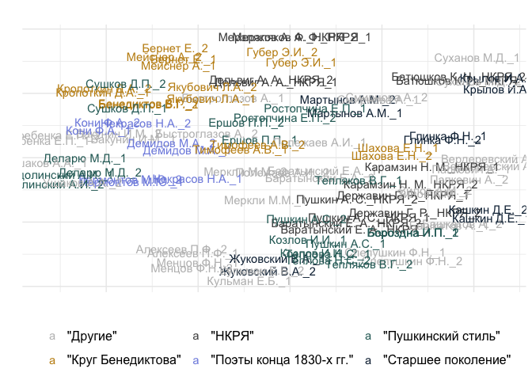
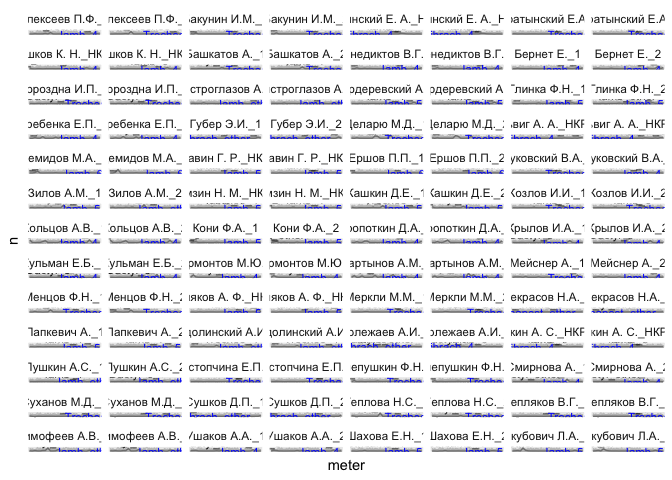
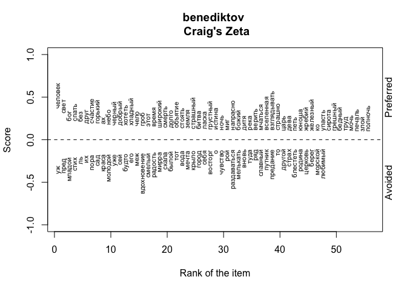
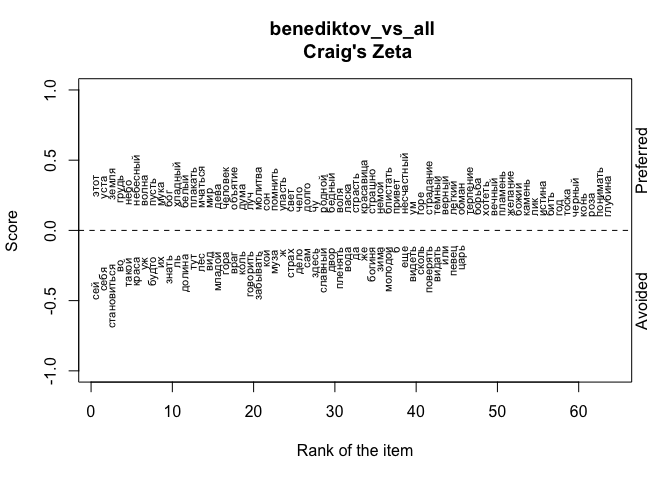

# 03_5_authors

## Exploration of the authors’ styles

This notebook takes samples of texts from known authors and tries to
analyse whether there are some clusters based on the MFW.

``` r
library(tidyverse)
library(tidytext)

library(stylo)

library(topicmodels)

library(umap)

library(e1071)
library(caret)

library(tidymodels)
library(textrecipes)
library(kernlab)

library(MetBrewer)
library(gghighlight)
theme_set(theme_minimal())
```

Load data

``` r
corpus1835 <- readRDS("../../data/corpus1835/corpus_1835.Rds")

glimpse(corpus1835)
```

    Rows: 4,799
    Columns: 20
    $ text_id       <chr> "P_1", "P_10", "P_100", "P_1000", "P_1001", "P_1002", "P…
    $ A_ID          <chr> "", "A-50", "A-7", "A-41", "A-139", "A-11", "A-163", "A-…
    $ author_sign   <chr> "", "Л. Якубович", "Кольцов", "Ф. Глинка", "Н. Прокопови…
    $ author_text   <chr> "", "Якубович Л.А.", "Кольцов А.В.", "Глинка Ф.Н.", "Про…
    $ text_title    <chr> "Солдатская песня", "Молния", "Ночлег чумаков", "Утешите…
    $ text_subtitle <chr> "", "", "Сельские картины", "", "", "", "", "", "", "", …
    $ first_line    <chr> "Ох жизнь, молодецкая", "Зачем с небесной высоты", "В бл…
    $ year          <chr> "1835", "1835", "1836", "1838", "1838", "1838", "1838", …
    $ path_text     <chr> "../../data/corpus1835/periodicals/per_raw//P_1.txt", ".…
    $ source_text   <chr> "Сев_пч. 1835. №12. C. 46", "БдЧ. 1835. Т.8. Отд. 1. C. …
    $ COL_ID        <chr> "", "", "", "", "", "", "", "", "", "", "", "", "", "", …
    $ corpus        <chr> "per", "per", "per", "per", "per", "per", "per", "per", …
    $ text_raw      <chr> "Ох, жизнь молодецкая,\nБравая, солдатская!\nКак осенняя…
    $ text_cln      <chr> "Ох, жизнь молодецкая,\nБравая, солдатская!\nКак осенняя…
    $ text_lemm     <chr> "ох, жизнь молодецкий,\nбравый, солдатский!\nкак осенний…
    $ text_acc      <chr> "Ох, жизнь молоде'цкая,\nБра'вая, солда'тская!\nКак осе'…
    $ meter         <fct> Other?, Iamb, Iamb, Iamb, Trochee, Iamb, Trochee, Iamb, …
    $ feet          <chr> "?", "3", "4", "4", "4", "4", "other", "4", "6", "5", "4…
    $ formula       <chr> "Other?_?", "Iamb_3", "Iamb_4", "Iamb_4", "Trochee_4", "…
    $ n_lines       <int> 38, 16, 98, 77, 28, 12, 44, 25, 31, 28, 100, 16, 17, 60,…

#### RNC data

``` r
load("../../data/nkrja_19th_lem.Rda")


meters_trnsl <- tibble(
  meter_r = c("Я3", "Я4", "Я5", "Я6", "Х4", "Аф2", "Х6"),
  formula = c("Iamb_3", "Iamb_4", "Iamb_5", "Iamb_6", 
              "Trochee_4", "Amphibrach_2", "Trochee_6")
)

rnc_selected <- c19 %>% 
  filter(author %in% c("Г. Р. Державин", "Н. М. Карамзин", 
                       "К. Н. Батюшков", "А. А. Дельвиг", 
                       "А. Ф. Мерзляков", "А. С. Пушкин", 
                       "Е. А. Баратынский")) %>% 
  select(-formula) %>% 
  mutate(meter_r = paste0(meter, feet)) %>% 
  left_join(meters_trnsl, by = "meter_r") %>% 
  mutate(formula = ifelse(str_detect(meter_r, "Явольная"), 
                          "Iamb_other", formula),
         formula = ifelse(str_detect(meter_r, "Ярегулярная"), 
                          "Iamb_other", formula),
         formula = ifelse(str_detect(meter_r, "Хвольная|Хрегулярная"),
                          "Trochee_other", formula),
         meter = str_remove(formula, "_.*?$"),
         author_text = str_replace(author, 
                                   "(^\\w\\. \\w\\.) (\\w+)$",
                                   "\\2 \\1"),
         author_text = paste0(author_text, "_НКРЯ")) %>% 
  rename(text_lemm = lemma,
         text_id = `Unnamed..0`) %>% 
  select(text_id, author_text, meter, formula, text_lemm) %>% 
  separate_rows(text_lemm, sep = "\n") %>% 
  filter(text_lemm != "" & !str_detect(text_lemm, "^\\W+$|^\\s+$")) 

glimpse(rnc_selected)
```

    Rows: 94,131
    Columns: 5
    $ text_id     <int> 315, 315, 315, 315, 315, 315, 315, 315, 315, 315, 315, 315…
    $ author_text <chr> "Мерзляков А. Ф._НКРЯ", "Мерзляков А. Ф._НКРЯ", "Мерзляков…
    $ meter       <chr> "Iamb", "Iamb", "Iamb", "Iamb", "Iamb", "Iamb", "Iamb", "I…
    $ formula     <chr> "Iamb_3", "Iamb_3", "Iamb_3", "Iamb_3", "Iamb_3", "Iamb_3"…
    $ text_lemm   <chr> "среди долина ровный ", " на гладкий высота, ", " цвести, …

``` r
rnc_selected %>% 
  count(author_text, sort = T)
```

    # A tibble: 7 × 2
      author_text                n
      <chr>                  <int>
    1 Пушкин А. С._НКРЯ      39707
    2 Державин Г. Р._НКРЯ    20628
    3 Карамзин Н. М._НКРЯ     8414
    4 Баратынский Е. А._НКРЯ  8245
    5 Батюшков К. Н._НКРЯ     6641
    6 Мерзляков А. Ф._НКРЯ    5433
    7 Дельвиг А. А._НКРЯ      5063

``` r
rm(c19)
```

Number of Iamb-4 texts without genre title

``` r
# read genre titles
titles <- read.csv("../../data/ch3/poems_titles.csv") %>% select(-X)

# read the data with normalised genres
m <- read.delim("../../data/ch3/multigenre_texts.csv", sep = ';') %>% select(-X)

# list of genre words (longer)
genres <- unlist(str_split(c("песня
романс
сонет
элегия
басня
песнь
альбом
дума
баллада
отрывок
подражание
послание
молитва
фантазия
псалом
эпиграмма
мелодия
антологический
аполог
сказка
экспромт
надпись
эпилог"), pattern = "\n"))

# attach normalised genres to other genre titles
ids_genres <- titles %>% 
  select(text_id, lemma) %>% 
  filter(lemma %in% genres) %>% # select genres from the list
  group_by(text_id) %>% 
  summarise(genre = paste0(lemma, collapse = " | ")) %>% 
  filter(!str_detect(genre, " \\| ")) %>% # remove multigenre titles
  rbind(m %>% 
          select(text_id, true_genre) %>% 
          rename(genre = true_genre) # replace them with clean labels
          ) %>% 
  filter(genre != "")

corpus_genres <- corpus1835 %>% 
  left_join(ids_genres, by = "text_id") %>% 
  #filter(!is.na(genre)) %>% 
  select(text_id, genre, meter, feet, text_lemm) %>% 
  mutate(genre = ifelse(is.na(genre), "no_genre", genre)) 

glimpse(corpus_genres)
```

    Rows: 4,799
    Columns: 5
    $ text_id   <chr> "P_1", "P_10", "P_100", "P_1000", "P_1001", "P_1002", "P_100…
    $ genre     <chr> "песня", "no_genre", "no_genre", "no_genre", "no_genre", "no…
    $ meter     <fct> Other?, Iamb, Iamb, Iamb, Trochee, Iamb, Trochee, Iamb, Iamb…
    $ feet      <chr> "?", "3", "4", "4", "4", "4", "other", "4", "6", "5", "4", "…
    $ text_lemm <chr> "ох, жизнь молодецкий,\nбравый, солдатский!\nкак осенний ноч…

``` r
# for Iamb-4 only
corpus_genres %>% 
  mutate(formula = paste0(meter, "_", feet)) %>% 
  filter(formula == "Iamb_4") %>% 
  mutate(genre = ifelse(genre != "no_genre", "is_genre", genre)) %>% 
  count(genre)
```

    # A tibble: 2 × 2
      genre        n
      <chr>    <int>
    1 is_genre   251
    2 no_genre  1207

``` r
meters_total <- corpus_genres %>% 
  mutate(formula = paste0(meter, "_", feet)) %>% 
  filter(formula %in% c("Iamb_3", "Iamb_4", "Iamb_5", "Iamb_6",
                        "Iamb_other", "Trochee_4", "Amphigraph_4",
                        "Amphibrach_other", "Trochee_other")) %>% 
  count(formula) %>% rename(total = n)

#proportion of genre labeled texts for top-10 formulas
corpus_genres %>% 
  mutate(formula = paste0(meter, "_", feet)) %>% 
  filter(formula %in% c("Iamb_3", "Iamb_4", "Iamb_5", "Iamb_6",
                        "Iamb_other", "Trochee_4", "Amphigraph_4",
                        "Amphibrach_other", "Trochee_other")) %>% 
  mutate(genre = ifelse(genre != "no_genre", "is_genre", genre)) %>% 
  group_by(formula) %>% 
  count(genre) %>% 
  ungroup() %>% 
  left_join(meters_total, by = "formula") %>% 
  mutate(perc = round(n/total*100, 1)) %>% 
  select(-n, -total) %>% 
  pivot_wider(names_from = genre, values_from = perc) %>% 
  arrange(desc(is_genre))
```

    # A tibble: 8 × 3
      formula          is_genre no_genre
      <chr>               <dbl>    <dbl>
    1 Amphibrach_other     30.9     69.1
    2 Trochee_other        24.8     75.2
    3 Iamb_other           23.1     76.9
    4 Iamb_6               22.1     77.9
    5 Trochee_4            21.6     78.4
    6 Iamb_5               20.6     79.4
    7 Iamb_4               17.2     82.8
    8 Iamb_3               16.5     83.5

``` r
# total 1458 texts in Iamb-4,
# 251 text is with genre label, 1207 without

rm(corpus_genres, genres, m, titles, ids_genres, meters_total)
```

Number of non-empty lines by each author

``` r
authors_lines <- corpus1835 %>% 
  select(text_id, author_text, meter, text_lemm) %>% 
  separate_rows(text_lemm, sep = "\n") %>% 
  filter(text_lemm != "" & !str_detect(text_lemm, "^\\W+$|^\\s+$")) %>% 
  group_by(author_text) %>% 
  count(sort = T) %>% 
  ungroup() %>% 
  filter(n > 1000 & author_text != "")

authors_lines
```

    # A tibble: 49 × 2
       author_text          n
       <chr>            <int>
     1 Кульман Е.Б.      7851
     2 Жуковский В.А.    7766
     3 Крылов И.А.       6147
     4 Тимофеев А.В.     4887
     5 Бороздна И.П.     4834
     6 Бернет Е.         4654
     7 Быстроглазов А.   4335
     8 Бенедиктов В.Г.   4029
     9 Баратынский Е.А.  3906
    10 Башкатов А.       3451
    # ℹ 39 more rows

Number of lines in each meter

``` r
corpus1835 %>% 
  select(text_id, author_text, meter, text_lemm) %>% 
  separate_rows(text_lemm, sep = "\n") %>% 
  filter(text_lemm != "" & !str_detect(text_lemm, "^\\W+$|^\\s+$")) %>% 
  group_by(author_text, meter) %>% 
  count(sort = T) %>% 
  ungroup() %>% 
  filter(author_text %in% authors_lines$author_text) %>% 
  filter(meter != "Other?") %>% 
  arrange(-desc(author_text))
```

    # A tibble: 188 × 3
       author_text      meter          n
       <chr>            <fct>      <int>
     1 Алексеев П.Ф.    Iamb         800
     2 Алексеев П.Ф.    Trochee      508
     3 Алексеев П.Ф.    Anapest       99
     4 Алексеев П.Ф.    Amphibrach    89
     5 Бакунин И.М.     Iamb        1537
     6 Бакунин И.М.     Amphibrach   269
     7 Бакунин И.М.     Trochee       52
     8 Бакунин И.М.     Anapest       24
     9 Баратынский Е.А. Iamb        3411
    10 Баратынский Е.А. Trochee      329
    # ℹ 178 more rows

### metrical profile

Look into how authors are grouped based on their usage of different
meters

``` r
# table(corpus1835$feet)

metrical_mtrx <- corpus1835 %>% 
  # select most represented authors
  filter(author_text %in% authors_lines$author_text) %>% 
  
  # leave only clearly detected meters
  filter(meter != "Other?" & feet %in% c(2, 3, 4, 5, 6, "other")) %>% 
  mutate(formula = paste0(meter, "_", feet)) %>% 
  
  # count and sample lines
  separate_rows(text_lemm, sep = "\n") %>% 
  filter(text_lemm != "" & !str_detect(text_lemm, "^\\W+$|^\\s+$")) %>% 
  
  # remove authors who hasn't 1000 lines in selected meters
  filter(!author_text %in% c("Бестужев А.А. (Марлинский)", 
                             "Стромилов С.И.", 
                             "Соколовский В.И.", 
                             "Пуговишников А.М.")) %>% 
  
  # filter only needed columns
  select(text_id, author_text, meter, formula, text_lemm) %>% 
  
  # attach RNC data
  rbind(rnc_selected) %>% 
  filter(!is.na(formula)) %>% 
  
  group_by(author_text) %>% 
  sample_n(1000) %>% # sample 1000 lines from each author
  #ungroup() %>% 
  
  # create two samples of 500 lines for each author
  mutate(sample_id = ceiling(1:1000),
         sample_id = floor(sample_id/500)+1,
         sample_id = ifelse(sample_id == 3, 1, sample_id),
         author_text = paste0(author_text, "_", sample_id)) %>% 
  ungroup() %>% 
  
  # count number of lines of each meter
  group_by(author_text, formula) %>% 
  count() %>% 
  ungroup() %>% 
  pivot_wider(names_from = formula, values_from = n, values_fill = 0)

metrical_mtrx
```

    # A tibble: 104 × 29
       author_text   Amphibrach_4 Amphibrach_other Anapest_2 Anapest_4 Iamb_4 Iamb_5
       <chr>                <int>            <int>     <int>     <int>  <int>  <int>
     1 Алексеев П.Ф…           21               15        20        11    125     16
     2 Алексеев П.Ф…           13               16        13        20    127     29
     3 Бакунин И.М.…           52                6         0         0    300      0
     4 Бакунин И.М.…           60               12         0         0    270      0
     5 Баратынский …            0                0         0         0    332     41
     6 Баратынский …            0                0         0         0    324     42
     7 Баратынский …            6                3         0         0    202     39
     8 Баратынский …            4                5         0         0    223     38
     9 Батюшков К. …            0                0         0         0     63      0
    10 Батюшков К. …            0                0         0         0     75      0
    # ℹ 94 more rows
    # ℹ 22 more variables: Iamb_6 <int>, Iamb_other <int>, Trochee_4 <int>,
    #   Trochee_6 <int>, Trochee_other <int>, Amphibrach_2 <int>,
    #   Anapest_other <int>, Iamb_3 <int>, Amphibrach_3 <int>, Iamb_2 <int>,
    #   Dactyl_3 <int>, Anapest_3 <int>, Dactyl_other <int>, Trochee_5 <int>,
    #   Trochee_3 <int>, Anapest_5 <int>, Dactyl_6 <int>, Amphibrach_5 <int>,
    #   Dactyl_4 <int>, Amphibrach_6 <int>, Dactyl_2 <int>, Dactyl_5 <int>

Metrical variations taken into account:

``` r
colnames(metrical_mtrx)
```

     [1] "author_text"      "Amphibrach_4"     "Amphibrach_other" "Anapest_2"       
     [5] "Anapest_4"        "Iamb_4"           "Iamb_5"           "Iamb_6"          
     [9] "Iamb_other"       "Trochee_4"        "Trochee_6"        "Trochee_other"   
    [13] "Amphibrach_2"     "Anapest_other"    "Iamb_3"           "Amphibrach_3"    
    [17] "Iamb_2"           "Dactyl_3"         "Anapest_3"        "Dactyl_other"    
    [21] "Trochee_5"        "Trochee_3"        "Anapest_5"        "Dactyl_6"        
    [25] "Amphibrach_5"     "Dactyl_4"         "Amphibrach_6"     "Dactyl_2"        
    [29] "Dactyl_5"        

Projection

``` r
# scale matrix and remove author's column
mtrx <- metrical_mtrx %>% 
  select(-author_text) %>% 
  scale() 

dim(mtrx)
```

    [1] 104  28

``` r
u <- umap(mtrx)

dat <- tibble(x = u$layout[,1],
       y = u$layout[,2],
       author_sample = metrical_mtrx$author_text) %>% 
  mutate(author = str_remove(author_sample, "_\\d$"))
```

### author’s grouping

Some custom labeling according to grouping found in scholarship

``` r
unique(dat$author)
```

     [1] "Алексеев П.Ф."          "Бакунин И.М."           "Баратынский Е. А._НКРЯ"
     [4] "Баратынский Е.А."       "Батюшков К. Н._НКРЯ"    "Башкатов А."           
     [7] "Бенедиктов В.Г."        "Бернет Е."              "Бороздна И.П."         
    [10] "Быстроглазов А."        "Вердеревский А."        "Глинка Ф.Н."           
    [13] "Гребенка Е.П."          "Губер Э.И."             "Деларю М.Д."           
    [16] "Дельвиг А. А._НКРЯ"     "Демидов М.А."           "Державин Г. Р._НКРЯ"   
    [19] "Ершов П.П."             "Жуковский В.А."         "Зилов А.М."            
    [22] "Карамзин Н. М._НКРЯ"    "Кашкин Д.Е."            "Козлов И.И."           
    [25] "Кольцов А.В."           "Кони Ф.А."              "Кропоткин Д.А."        
    [28] "Крылов И.А."            "Кульман Е.Б."           "Лермонтов М.Ю."        
    [31] "Мартынов А.М."          "Мейснер А."             "Менцов Ф.Н."           
    [34] "Мерзляков А. Ф._НКРЯ"   "Меркли М.М."            "Некрасов Н.А."         
    [37] "Папкевич А."            "Подолинский А.И."       "Полежаев А.И."         
    [40] "Пушкин А. С._НКРЯ"      "Пушкин А.С."            "Ростопчина Е.П."       
    [43] "Слепушкин Ф.Н."         "Смирнова А."            "Суханов М.Д."          
    [46] "Сушков Д.П."            "Теплова Н.С."           "Тепляков В.Г."         
    [49] "Тимофеев А.В."          "Ушаков А.А."            "Шахова Е.Н."           
    [52] "Якубович Л.А."         

``` r
authors_lbl <- tibble(
  author = unique(dat$author),
  author_group = c(
    "Другое", "Другое", "НКРЯ", 
    "Другое", "НКРЯ", "Другое", 
    "Круг Бенедиктова", "Круг Бенедиктова", "Пушкинский стиль", 
    "Другое", "Другое", "Старшее поколение",
    "Другое", "Круг Бенедиктова", "Пушкинский стиль", 
    "НКРЯ", "Поэты конца 1830-х гг.", "НКРЯ", 
    "Пушкинский стиль", "Старшее поколение", "Другое", 
    "НКРЯ", "Старшее поколение", "Пушкинский стиль", 
    "Поэты конца 1830-х гг.", "Поэты конца 1830-х гг.", "Круг Бенедиктова", 
    "Старшее поколение", "Другое", "Поэты конца 1830-х гг.",
    "Старшее поколение", "Круг Бенедиктова", "Другое", 
    "НКРЯ", "Другое", "Поэты конца 1830-х гг.", 
    "Другое", "Пушкинский стиль", "Другое", 
    "НКРЯ", "Пушкинский стиль", "Пушкинский стиль", 
    "Другое", "Другое", 
    "Другое", "Пушкинский стиль", "Пушкинский стиль",
    "Пушкинский стиль", "Круг Бенедиктова", "Другое", 
    "Круг Бенедиктова", "Круг Бенедиктова"
  )
) %>% 
  mutate(author_group = paste0('"', author_group, '"' ))

table(authors_lbl$author_group)
```


                    "Другое"       "Круг Бенедиктова"                   "НКРЯ" 
                          17                        8                        7 
    "Поэты конца 1830-х гг."       "Пушкинский стиль"      "Старшее поколение" 
                           5                       10                        5 

``` r
authors_lbl
```

    # A tibble: 52 × 2
       author                 author_group          
       <chr>                  <chr>                 
     1 Алексеев П.Ф.          "\"Другое\""          
     2 Бакунин И.М.           "\"Другое\""          
     3 Баратынский Е. А._НКРЯ "\"НКРЯ\""            
     4 Баратынский Е.А.       "\"Другое\""          
     5 Батюшков К. Н._НКРЯ    "\"НКРЯ\""            
     6 Башкатов А.            "\"Другое\""          
     7 Бенедиктов В.Г.        "\"Круг Бенедиктова\""
     8 Бернет Е.              "\"Круг Бенедиктова\""
     9 Бороздна И.П.          "\"Пушкинский стиль\""
    10 Быстроглазов А.        "\"Другое\""          
    # ℹ 42 more rows

#### proj

``` r
# plot
dat %>% 
  filter(author != "Кольцов А.В.") %>% 
  left_join(authors_lbl, by = "author") %>% 
  mutate(author_group = ifelse(author_group == '"Другое"', 
                               '"Другие"', author_group)) %>% 
  ggplot(aes(x, y, color = author_group)) + 
  #geom_point(size = 5, alpha = 0.6) + 
  geom_text(aes(label = author_sample)) + 
  labs(title = "", x = "", y = "", color = "") + 
  scale_color_manual(values = c("gray", 
                                met.brewer("Veronese")[3],
                                "gray30",
                                met.brewer("Derain")[5],
                                met.brewer("Veronese")[5],
                                met.brewer("Veronese")[7])) + 
  theme(axis.text = element_blank(), 
        legend.text = element_text(size = 12), 
        legend.position = "bottom")
```



``` r
# ggsave("plots/Fig_3-2-2.png", plot = last_plot(),
#        bg = "white", dpi = 300, width = 11, height = 7)
```

``` r
corpus1835 %>% 
  filter(author_text == "Суханов М.Д.") %>% 
  select(text_title, text_subtitle, source_text)
```

    # A tibble: 140 × 3
       text_title         text_subtitle                            source_text      
       <chr>              <chr>                                    <chr>            
     1 "К другу"          ""                                       ЛПРИ. 1835. Ч. 1…
     2 "Русская песня"    ""                                       ЛПРИ. 1835. Ч. 1…
     3 "К соседу"         ""                                       ЛПРИ. 1835. Ч. 1…
     4 "Затеи"            "Сказка"                                 ЛПРИ. 1836. Ч. 2…
     5 "Змея и кролик"    ""                                       ЛПРИ. 1836. Ч. 2…
     6 "Василек"          ""                                       ЛПРИ. 1836. Ч. 2…
     7 "Русская песня"    ""                                       ЛПРИ. 1836. Ч. 2…
     8 "Алмаз"            "Басня"                                  БдЧ. 1835. Т.12.…
     9 "Василек "         "Басня. Не в пору счастье нам не впрок!" Суханов М.Д. Вре…
    10 "Синица в клетке " "Басня"                                  Суханов М.Д. Вре…
    # ℹ 130 more rows

#### lineplot

``` r
mtrx %>% 
  cbind(metrical_mtrx %>% select(author_text)) %>% 
  pivot_longer(!author_text,
               names_to = "meter",
               values_to = "n") %>% 
  left_join(authors_lbl %>% rename(author_text = author), 
            by = "author_text") %>% 
  ggplot(aes(x = meter,
             y = n, 
             group = author_text)) + 
  geom_line(aes(color = author_group), show.legend = FALSE) + 
  gghighlight(use_direct_label = FALSE#,
              #unhighlighted_params = list(colour = alpha("grey85", 1))
              ) + 
  facet_wrap(~author_text, ncol=8) + 
  geom_text(data = mtrx %>% cbind(metrical_mtrx %>% select(author_text)) %>% 
              pivot_longer(!author_text, names_to = "meter", values_to = "n") %>% 
              group_by(author_text) %>% 
              slice_max(order_by = n, n = 2),
            aes(y = n, label = meter),
            size = 3,
            vjust = -0.5,
            hjust = 0.9,
            show.legend = FALSE
              ) +
  
  geom_text(data = mtrx %>% cbind(metrical_mtrx %>% select(author_text)) %>% 
              pivot_longer(!author_text, names_to = "meter", values_to = "n") %>% 
              group_by(author_text) %>% 
              slice_min(order_by = n, n = 1),
            aes(y = n, label = meter),
            size = 3,
            vjust = 0.5,
            show.legend = FALSE,
            color = "blue"
              ) +
  
  scale_color_manual(values = c("gray9",
                                met.brewer("Veronese")[3],
                                "gray30",
                                met.brewer("Veronese")[1],
                                met.brewer("Veronese")[5],
                                met.brewer("Veronese")[7])) + 
  theme(axis.text = element_blank())
```



``` r
# ggsave("plots/metrical_profile_lineplot_md.png", plot = last_plot(),
#        bg = "white", dpi = 300, width = 25, height = 15)
```

### MFW usage

Create MFW ranks based on the whole corpus

``` r
ranks <- corpus1835 %>% 
  unnest_tokens(input = "text_lemm", output = word, token = "words") %>% 
  count(word, sort = T) %>% 
  head(350) %>% 
  # remove first 50 MFW
  mutate(rank = row_number()) %>% 
  filter(rank > 50)

head(ranks)
```

    # A tibble: 6 × 3
      word      n  rank
      <chr> <int> <int>
    1 свет   1860    51
    2 себя   1825    52
    3 у      1803    53
    4 же     1786    54
    5 ли     1775    55
    6 ни     1755    56

``` r
tail(ranks)
```

    # A tibble: 6 × 3
      word          n  rank
      <chr>     <int> <int>
    1 унылый      356   345
    2 цвести      356   346
    3 глас        354   347
    4 понимать    353   348
    5 священный   353   349
    6 жена        352   350

``` r
nrow(ranks)
```

    [1] 300

#### select sample

``` r
counter <- corpus1835 %>% 
  filter(author_text %in% authors_lines$author_text) %>% 
  select(text_id, author_text, meter, text_lemm) %>% 
  separate_rows(text_lemm, sep = "\n") %>% 
  filter(text_lemm != "" & !str_detect(text_lemm, "^\\W+$|^\\s+$")) %>% 
  
  # filter only needed columns
  select(text_id, author_text, meter, text_lemm) %>% 
  
  # attach RNC data
  rbind(rnc_selected %>% select(-formula)) %>%
  
  
  group_by(author_text) %>% 
  sample_n(1000) %>% 
 
  
  # create two samples of 500 lines for each author
  mutate(sample_id = ceiling(1:1000),
         sample_id = floor(sample_id/500)+1,
         sample_id = ifelse(sample_id == 3, 1, sample_id),
         sample_id = paste0(author_text, "_", sample_id)) %>% 
  ungroup() %>% 
  
  # count words inside each sample
  unnest_tokens(input = text_lemm, output = word, token = "words") %>% 
  group_by(sample_id) %>% 
  count(word) %>% 
  ungroup() %>% 
  filter(word %in% ranks$word)

counter %>% sample_n(10)
```

    # A tibble: 10 × 3
       sample_id          word        n
       <chr>              <chr>   <int>
     1 Соколовский В.И._1 краса       1
     2 Мартынов А.М._2    шуметь      2
     3 Мейснер А._2       во          5
     4 Деларю М.Д._1      надежда     2
     5 Бакунин И.М._2     ясный       1
     6 Некрасов Н.А._2    море        1
     7 Шахова Е.Н._1      цвести      1
     8 Некрасов Н.А._1    поле        4
     9 Козлов И.И._1      во          4
    10 Сушков Д.П._1      это         1

``` r
counter %>% 
  count(sample_id, sort = T)
```

    # A tibble: 112 × 2
       sample_id             n
       <chr>             <int>
     1 Бенедиктов В.Г._2   241
     2 Мейснер А._2        241
     3 Бернет Е._2         238
     4 Демидов М.А._2      236
     5 Меркли М.М._2       235
     6 Некрасов Н.А._1     233
     7 Кропоткин Д.А._1    230
     8 Менцов Ф.Н._1       230
     9 Меркли М.М._1       230
    10 Ростопчина Е.П._1   230
    # ℹ 102 more rows

#### UMAP projection

``` r
xxx <- counter %>% 
  pivot_wider(names_from = word, values_from = n, values_fill = 0)

mtrx <- xxx %>% 
  ungroup() %>% 
  select(-sample_id) %>% 
  scale()

dim(mtrx)
```

    [1] 112 300

``` r
u <- umap(mtrx)

dat <- tibble(x = u$layout[,1],
       y = u$layout[,2],
       author = xxx$sample_id) 
  
# glimpse(dat)
```

``` r
dat %>% 
  mutate(sample_id = author,
    author = str_remove(author, "_\\d+$")) %>% 
  left_join(authors_lbl, by = "author") %>% 
  mutate(author_group = ifelse(is.na(author_group), '"Другое"', author_group),
         author_group = ifelse(author_group == '"Другое"', '"Другие"', author_group)) %>% 
  ggplot(aes(x, y, color = author_group)) + 
  #geom_point(size = 5, alpha = 0.6) + 
  geom_text(aes(label = sample_id), size = 4) + 
  labs(title = "", x = "", y = "", color = "") + 
  scale_color_manual(values = c("gray", 
                                met.brewer("Veronese")[3],
                                "gray30",
                                met.brewer("Derain")[5],
                                met.brewer("Veronese")[5],
                                met.brewer("Veronese")[7])) + 
  theme(axis.text = element_blank(), 
        legend.text = element_text(size = 12), 
        legend.position = "bottom")
```


``` r
# ggsave("plots/Fig_3-2-1.png", plot = last_plot(), dpi = 300,
#        bg = "white", width = 11, height = 7)
```

### zeta

#### Benediktov vs Pushkin

Create & write samples

``` r
corpus_prepared <- corpus1835 %>% 
  filter(author_text %in% authors_lines$author_text) %>% 
  select(text_id, author_text, meter, text_lemm) %>% 
  separate_rows(text_lemm, sep = "\n") %>% 
  filter(text_lemm != "" & !str_detect(text_lemm, "^\\W+$|^\\s+$")) %>% 
  
  # attach lables
  left_join(authors_lbl %>% rename(author_text = author), by = "author_text") %>%   filter(author_group == '"Пушкинский стиль"' | author_group == '"Круг Бенедиктова"') %>% 
  mutate(author_group = str_remove_all(author_group, '"')) %>% 
  # both groups has ~20k tokens

  group_by(author_group) %>% 
  sample_n(20000) %>% 
  
  # create two samples of 500 lines for each author
  mutate(sample_id = ceiling(1:20000),
         sample_id = floor(sample_id/2000)+1,
         sample_id = ifelse(sample_id == 11, 1, sample_id),
         sample_id = paste0(author_group, "_", sample_id)) %>% 
  ungroup() %>% 
  
  group_by(sample_id) %>% 
  summarise(text = paste0(text_lemm, collapse = " ------ ")) %>% 
  ungroup() %>% 
  
  mutate(author_group = str_remove(sample_id, "_\\d+$"), 
         path = ifelse(author_group == "Пушкинский стиль", "secondary_set/", "primary_set/"),
         path = paste0("zeta_tests/benediktov/", path, sample_id, ".txt")) 

str(corpus_prepared)
```

    tibble [20 × 4] (S3: tbl_df/tbl/data.frame)
     $ sample_id   : chr [1:20] "Круг Бенедиктова_1" "Круг Бенедиктова_10" "Круг Бенедиктова_2" "Круг Бенедиктова_3" ...
     $ text        : chr [1:20] "все пурпурный и широко ------ глядеть на мы... твой друг угрюмый ------ для то ли, что бы снова ------ но на ме"| __truncated__ "кто на долгий сок под ты зарывать? — ------ взглядывать на могила - огнистый клубок  ------ десп все понимать !"| __truncated__ "пред он, умилять, нередко молюся я бог, ------ какой прелесть исполнять ------ море спокойно, море уснуть; ----"| __truncated__ "все ползать пред он, как ползать гнусный сам. ------ и снести орел сумка пустой ко брат запол — пьянюга, ------"| __truncated__ ...
     $ author_group: chr [1:20] "Круг Бенедиктова" "Круг Бенедиктова" "Круг Бенедиктова" "Круг Бенедиктова" ...
     $ path        : chr [1:20] "zeta_tests/benediktov/primary_set/Круг Бенедиктова_1.txt" "zeta_tests/benediktov/primary_set/Круг Бенедиктова_10.txt" "zeta_tests/benediktov/primary_set/Круг Бенедиктова_2.txt" "zeta_tests/benediktov/primary_set/Круг Бенедиктова_3.txt" ...

``` r
corpus_prepared %>% 
  unnest_tokens(input = text, output = word, token = "words") %>% 
  count(sample_id)
```

    # A tibble: 20 × 2
       sample_id               n
       <chr>               <int>
     1 Круг Бенедиктова_1   9129
     2 Круг Бенедиктова_10  9106
     3 Круг Бенедиктова_2   9108
     4 Круг Бенедиктова_3   9105
     5 Круг Бенедиктова_4   9146
     6 Круг Бенедиктова_5   9004
     7 Круг Бенедиктова_6   9059
     8 Круг Бенедиктова_7   9153
     9 Круг Бенедиктова_8   9037
    10 Круг Бенедиктова_9   9011
    11 Пушкинский стиль_1   9388
    12 Пушкинский стиль_10  9368
    13 Пушкинский стиль_2   9352
    14 Пушкинский стиль_3   9307
    15 Пушкинский стиль_4   9378
    16 Пушкинский стиль_5   9477
    17 Пушкинский стиль_6   9431
    18 Пушкинский стиль_7   9389
    19 Пушкинский стиль_8   9385
    20 Пушкинский стиль_9   9495

``` r
do.call(file.remove, list(
  list.files("zeta_tests/benediktov//primary_set", full.names = TRUE)))
```

     [1] TRUE TRUE TRUE TRUE TRUE TRUE TRUE TRUE TRUE TRUE

``` r
do.call(file.remove, list(
  list.files("zeta_tests/benediktov//secondary_set", full.names = TRUE)))
```

     [1] TRUE TRUE TRUE TRUE TRUE TRUE TRUE TRUE TRUE TRUE

``` r
for (i in 1:nrow(corpus_prepared)) {
  writeLines(corpus_prepared$text[i], corpus_prepared$path[i])
}
```

``` r
oppose(
  gui = FALSE,
  path = "zeta_tests/benediktov/",
  corpus.lang = "Other",
  text.slice.length = 500,
  write.png.file = TRUE
)
```

    The subcorpora will be loaded from text files...

    slicing input text into tokens...


    turning words into features, e.g. char n-grams (if applicable)...

    slicing input text into tokens...


    turning words into features, e.g. char n-grams (if applicable)...

    Slicing the texts into samples...

    Круг Бенедиктова_1

        - text length (in words): 9128

        - nr. of samples: 18

        - nr. of words dropped at the end of the text: 128

    Круг Бенедиктова_10

        - text length (in words): 9105

        - nr. of samples: 18

        - nr. of words dropped at the end of the text: 105

    Круг Бенедиктова_2

        - text length (in words): 9106

        - nr. of samples: 18

        - nr. of words dropped at the end of the text: 106

    Круг Бенедиктова_3

        - text length (in words): 9105

        - nr. of samples: 18

        - nr. of words dropped at the end of the text: 105

    Круг Бенедиктова_4

        - text length (in words): 9145

        - nr. of samples: 18

        - nr. of words dropped at the end of the text: 145

    Круг Бенедиктова_5

        - text length (in words): 9004

        - nr. of samples: 18

        - nr. of words dropped at the end of the text: 4

    Круг Бенедиктова_6

        - text length (in words): 9059

        - nr. of samples: 18

        - nr. of words dropped at the end of the text: 59

    Круг Бенедиктова_7

        - text length (in words): 9153

        - nr. of samples: 18

        - nr. of words dropped at the end of the text: 153

    Круг Бенедиктова_8

        - text length (in words): 9037

        - nr. of samples: 18

        - nr. of words dropped at the end of the text: 37

    Круг Бенедиктова_9

        - text length (in words): 9011

        - nr. of samples: 18

        - nr. of words dropped at the end of the text: 11

    Пушкинский стиль_1

        - text length (in words): 9387

        - nr. of samples: 18

        - nr. of words dropped at the end of the text: 387

    Пушкинский стиль_10

        - text length (in words): 9368

        - nr. of samples: 18

        - nr. of words dropped at the end of the text: 368

    Пушкинский стиль_2

        - text length (in words): 9353

        - nr. of samples: 18

        - nr. of words dropped at the end of the text: 353

    Пушкинский стиль_3

        - text length (in words): 9307

        - nr. of samples: 18

        - nr. of words dropped at the end of the text: 307

    Пушкинский стиль_4

        - text length (in words): 9378

        - nr. of samples: 18

        - nr. of words dropped at the end of the text: 378

    Пушкинский стиль_5

        - text length (in words): 9477

        - nr. of samples: 18

        - nr. of words dropped at the end of the text: 477

    Пушкинский стиль_6

        - text length (in words): 9429

        - nr. of samples: 18

        - nr. of words dropped at the end of the text: 429

    Пушкинский стиль_7

        - text length (in words): 9389

        - nr. of samples: 18

        - nr. of words dropped at the end of the text: 389

    Пушкинский стиль_8

        - text length (in words): 9384

        - nr. of samples: 18

        - nr. of words dropped at the end of the text: 384

    Пушкинский стиль_9

        - text length (in words): 9496

        - nr. of samples: 18

        - nr. of words dropped at the end of the text: 496

    Extracting distinctive words... (this might take a while)

    Primary set...

    Secondary set...

    comparison done!

    No test set samples found (but this is totally OK in most cases!).
    Performing a simple comparison of the training samples...



    Function call:

    oppose(gui = FALSE, path = "zeta_tests/benediktov/", corpus.lang = "Other",     text.slice.length = 500, write.png.file = TRUE)

    Depending on your chosen options, some results should have been written

    into a few files; you should be able to find them in your current

    (working) directory. Usually, these include a list of words/features

    used to build a table of frequencies, the table itself, a file containing

    recent configuration, etc.

    Advanced users: you can pipe the results to a variable, e.g.:

         important.contribution = oppose()

    this will create a class "important.contribution" containing some presumably

    interesting stuff. The class created, you can type, e.g.:

         summary(important.contribution)

    to see which variables are stored there and how to use them.

    for suggestions how to cite this software, type: citation("stylo")

#### Benediktov vs all

``` r
corpus_prepared <- corpus1835 %>% 
  filter(author_text %in% authors_lines$author_text) %>% 
  select(text_id, author_text, meter, text_lemm) %>% 
  separate_rows(text_lemm, sep = "\n") %>% 
  filter(text_lemm != "" & !str_detect(text_lemm, "^\\W+$|^\\s+$")) %>% 
  
  # attach lables
  left_join(authors_lbl %>% rename(author_text = author), by = "author_text") %>%    
  # rewrite labels: Benediktov vs all
  mutate(author_group = str_remove_all(author_group, '"'),
         author_group = ifelse(author_group != "Круг Бенедиктова",
                               "Другие",
                               author_group)) %>% 
  filter(!is.na(author_group)) %>%  

  group_by(author_group) %>% 
  sample_n(20000) %>% 
  
  # create 10 samples of 2000 lines for each group
  mutate(sample_id = ceiling(1:20000),
         sample_id = floor(sample_id/2000)+1,
         sample_id = ifelse(sample_id == 11, 1, sample_id),
         sample_id = paste0(author_group, "_", sample_id)) %>% 
  ungroup() %>% 
  
  group_by(sample_id) %>% 
  summarise(text = paste0(text_lemm, collapse = " ------ ")) %>% 
  ungroup() %>% 
  
  mutate(author_group = str_remove(sample_id, "_\\d+$"), 
         path = ifelse(author_group == "Другие", "secondary_set/", "primary_set/"),
         path = paste0("zeta_tests/benediktov_vs_all/", path, sample_id, ".txt")) 

str(corpus_prepared)
```

    tibble [20 × 4] (S3: tbl_df/tbl/data.frame)
     $ sample_id   : chr [1:20] "Другие_1" "Другие_10" "Другие_2" "Другие_3" ...
     $ text        : chr [1:20] "легко себя он в рука  ------ и в смоленск на стена, ------ и точно мой петрушенька ------ на стена кой - где ка"| __truncated__ "в халат старый завертываться ------ не он ли создавать мы, чтоб кротость, терпение ------ и ночь мой полный сия"| __truncated__ "когда возникнуть мир цветущий ------ опять мы лошадь помчать— ------ ты до гроб я должный. ------ я надобно в д"| __truncated__ "и томный, и бледный, ------ от убивать дар  ------ афинянин восхищать ------ жилище посещать;  ------ лавровый "| __truncated__ ...
     $ author_group: chr [1:20] "Другие" "Другие" "Другие" "Другие" ...
     $ path        : chr [1:20] "zeta_tests/benediktov_vs_all/secondary_set/Другие_1.txt" "zeta_tests/benediktov_vs_all/secondary_set/Другие_10.txt" "zeta_tests/benediktov_vs_all/secondary_set/Другие_2.txt" "zeta_tests/benediktov_vs_all/secondary_set/Другие_3.txt" ...

``` r
do.call(file.remove, list(
  list.files("zeta_tests/benediktov_vs_all//primary_set", full.names = TRUE)))
```

     [1] TRUE TRUE TRUE TRUE TRUE TRUE TRUE TRUE TRUE TRUE

``` r
do.call(file.remove, list(
  list.files("zeta_tests/benediktov_vs_all//secondary_set", full.names = TRUE)))
```

     [1] TRUE TRUE TRUE TRUE TRUE TRUE TRUE TRUE TRUE TRUE

``` r
for (i in 1:nrow(corpus_prepared)) {
  writeLines(corpus_prepared$text[i], corpus_prepared$path[i])
}
```

``` r
oppose(
  gui = FALSE,
  path = "zeta_tests/benediktov_vs_all/",
  corpus.lang = "Other",
  text.slice.length = 500,
  write.png.file = TRUE
)
```



### classification

Basic classification based on 400 MFW

#### MFW - sampled lines

``` r
ranks <- corpus1835 %>% 
  unnest_tokens(input = text_lemm, output = word, token = "words") %>% 
  count(word, sort = T) %>% 
  head(350) %>% 
  # remove first 50 MFW
  mutate(rank = row_number()) %>% 
  filter(rank > 50)

head(ranks)
```

    # A tibble: 6 × 3
      word      n  rank
      <chr> <int> <int>
    1 свет   1860    51
    2 себя   1825    52
    3 у      1803    53
    4 же     1786    54
    5 ли     1775    55
    6 ни     1755    56

``` r
tail(ranks)
```

    # A tibble: 6 × 3
      word          n  rank
      <chr>     <int> <int>
    1 унылый      356   345
    2 цвести      356   346
    3 глас        354   347
    4 понимать    353   348
    5 священный   353   349
    6 жена        352   350

``` r
corpus_prepared <- corpus1835 %>% 
  filter(author_text %in% authors_lines$author_text) %>% 
  select(text_id, author_text, meter, text_lemm) %>% 
  separate_rows(text_lemm, sep = "\n") %>% 
  filter(text_lemm != "" & !str_detect(text_lemm, "^\\W+$|^\\s+$")) %>% 
  
  # attach lables
  left_join(authors_lbl %>% rename(author_text = author), by = "author_text") %>%   filter(author_group == '"Пушкинский стиль"' | author_group == '"Круг Бенедиктова"') %>% 
  mutate(author_group = str_remove_all(author_group, '"')) %>% 
  # both groups has ~20k tokens

  group_by(author_group) %>% 
  sample_n(20000) %>% 
  
  # create 200 samples of 100 lines
  mutate(sample_id = ceiling(1:20000),
         sample_id = floor(sample_id/100)+1,
         sample_id = ifelse(sample_id == 201, 1, sample_id),
         sample_id = paste0(author_group, "_", sample_id)) %>% 
  ungroup() %>% 
  
  group_by(sample_id) %>% 
  summarise(text = paste0(text_lemm, collapse = " ------ ")) %>% 
  ungroup() %>% 
  
  mutate(author_group = str_remove(sample_id, "_\\d+$"))


table(corpus_prepared$author_group)
```


    Круг Бенедиктова Пушкинский стиль 
                 200              200 

``` r
str(corpus_prepared)
```

    tibble [400 × 3] (S3: tbl_df/tbl/data.frame)
     $ sample_id   : chr [1:400] "Круг Бенедиктова_1" "Круг Бенедиктова_10" "Круг Бенедиктова_100" "Круг Бенедиктова_101" ...
     $ text        : chr [1:400] "слепец, в его суровый доля! ------ и друг и недруг : ------ молвить я однажды друг: ------ умирать, умирать!..."| __truncated__ "тут звук ласка и привет, ------ вы недостойный заблуждение! ------ так! тихо все вокруг; тревожный мир уснуть -"| __truncated__ "полагать кошелек ------ оковывать, друг, ты; ------ разве тот не знать страдание ------ за бутылка важно спать."| __truncated__ "пыль заботливо сдувать. ------ высоко, но и приковывать ------ и звучать небесный клир, ------ светоносный царь"| __truncated__ ...
     $ author_group: chr [1:400] "Круг Бенедиктова" "Круг Бенедиктова" "Круг Бенедиктова" "Круг Бенедиктова" ...

``` r
corpus_prepared %>% 
  unnest_tokens(input = text, output = word, token = "words") %>% 
  count(sample_id)
```

    # A tibble: 400 × 2
       sample_id                n
       <chr>                <int>
     1 Круг Бенедиктова_1     450
     2 Круг Бенедиктова_10    468
     3 Круг Бенедиктова_100   473
     4 Круг Бенедиктова_101   467
     5 Круг Бенедиктова_102   435
     6 Круг Бенедиктова_103   475
     7 Круг Бенедиктова_104   454
     8 Круг Бенедиктова_105   453
     9 Круг Бенедиктова_106   470
    10 Круг Бенедиктова_107   469
    # ℹ 390 more rows

``` r
freqs <- corpus_prepared %>% 
  mutate(text_genre = author_group) %>% 
  select(sample_id, text_genre, text) %>% 
  unnest_tokens(input = text, output = word, token = "words") %>% 
  filter(word %in% ranks$word) %>% 
  group_by(sample_id, text_genre) %>% 
  count(word) %>% 
  ungroup() %>% 
  pivot_wider(names_from = word, values_from = n, values_fill = 0) 

dim(freqs)
```

    [1] 400 302

``` r
freqs[1:10, 1:10]
```

    # A tibble: 10 × 10
       sample_id      text_genre ангел    ах  беда бедный   без блеск блистать   ваш
       <chr>          <chr>      <int> <int> <int>  <int> <int> <int>    <int> <int>
     1 Круг Бенедикт… Круг Бене…     1     1     2      1     1     1        1     1
     2 Круг Бенедикт… Круг Бене…     1     0     0      0     0     0        0     1
     3 Круг Бенедикт… Круг Бене…     0     1     0      1     2     0        0     1
     4 Круг Бенедикт… Круг Бене…     0     0     0      1     0     0        1     0
     5 Круг Бенедикт… Круг Бене…     1     0     0      0     2     0        0     0
     6 Круг Бенедикт… Круг Бене…     1     0     0      0     5     0        1     0
     7 Круг Бенедикт… Круг Бене…     0     0     1      0     1     0        1     0
     8 Круг Бенедикт… Круг Бене…     0     0     0      0     2     0        0     0
     9 Круг Бенедикт… Круг Бене…     0     0     2      0     1     0        0     1
    10 Круг Бенедикт… Круг Бене…     0     0     0      0     2     1        0     1

``` r
freqs_scaled <- freqs %>% 
  select(-sample_id, -text_genre) %>% 
  scale() %>% 
  as.tibble()
```

    Warning: `as.tibble()` was deprecated in tibble 2.0.0.
    ℹ Please use `as_tibble()` instead.
    ℹ The signature and semantics have changed, see `?as_tibble`.

``` r
freqs_scaled[1:10, 1:10]
```

    # A tibble: 10 × 10
        ангел     ах   беда бедный    без  блеск блистать    ваш    век видеть
        <dbl>  <dbl>  <dbl>  <dbl>  <dbl>  <dbl>    <dbl>  <dbl>  <dbl>  <dbl>
     1  1.35   1.59   3.57   1.43   0.111  1.18     1.11   0.735  0.828  0.710
     2  1.35  -0.481 -0.487 -0.511 -0.852 -0.606   -0.629  0.735  0.828 -0.747
     3 -0.577  1.59  -0.487  1.43   1.07  -0.606   -0.629  0.735 -0.650 -0.747
     4 -0.577 -0.481 -0.487  1.43  -0.852 -0.606    1.11  -0.671  0.828 -0.747
     5  1.35  -0.481 -0.487 -0.511  1.07  -0.606   -0.629 -0.671 -0.650  0.710
     6  1.35  -0.481 -0.487 -0.511  3.96  -0.606    1.11  -0.671  2.31  -0.747
     7 -0.577 -0.481  1.54  -0.511  0.111 -0.606    1.11  -0.671  0.828 -0.747
     8 -0.577 -0.481 -0.487 -0.511  1.07  -0.606   -0.629 -0.671  2.31   2.17 
     9 -0.577 -0.481  3.57  -0.511  0.111 -0.606   -0.629  0.735 -0.650 -0.747
    10 -0.577 -0.481 -0.487 -0.511  1.07   1.18    -0.629  0.735 -0.650  0.710

``` r
freqs_scaled <- tibble(sample_id = freqs$sample_id,
       freqs_scaled,
       text_genre = freqs$text_genre) %>% 
  mutate(sample_id = row_number())

tidy_corpus <- freqs_scaled %>% 
  group_by(text_genre) %>% 
  sample_n(200) %>%   # number of texts in the tested genre
  ungroup() %>% 
  select(-sample_id)

## split the data into training and test sets
corpus_split <- initial_split(tidy_corpus, strata="text_genre", prop = 7.5/10)

corpus_split
```

    <Training/Testing/Total>
    <300/100/400>

``` r
training_set <- training(corpus_split)
test_set <- testing(corpus_split)

zscores_recipe <- recipe(text_genre ~ ., data = training_set) # all columns = all 300MFW freqs are used for the training

# 10-fold cross validation setup
folds <- vfold_cv(training_set, strata = "text_genre", v = 10)

# model specifications
svm_specs <- svm_poly(cost=1,degree = 1) %>% # linear kernel
  set_mode("classification") %>%
  set_engine("kernlab")

# add recipe and model specs to the workflow 
svm_wf <- workflow() %>%
  add_recipe(zscores_recipe) %>%
  add_model(svm_specs)

svm_res <- fit_resamples(
  svm_wf,
  folds,
  metrics = metric_set(accuracy),
  control = control_resamples(save_pred = TRUE)
)

metrics <- collect_metrics(svm_res)
metrics
```

    # A tibble: 1 × 6
      .metric  .estimator  mean     n std_err .config             
      <chr>    <chr>      <dbl> <int>   <dbl> <chr>               
    1 accuracy binary     0.833    10  0.0141 Preprocessor1_Model1

``` r
svm_model <-svm(as.factor(text_genre)~.,  
                data = training_set, 
                method = "C-classification", 
                kernel = "linear", 
                cost = 1, 
                scale = T)

summary(svm_model) 
```


    Call:
    svm(formula = as.factor(text_genre) ~ ., data = training_set, method = "C-classification", 
        kernel = "linear", cost = 1, scale = T)


    Parameters:
       SVM-Type:  C-classification 
     SVM-Kernel:  linear 
           cost:  1 

    Number of Support Vectors:  163

     ( 82 81 )


    Number of Classes:  2 

    Levels: 
     Круг Бенедиктова Пушкинский стиль

``` r
prediction <- predict(svm_model, test_set)
confusionMatrix(prediction, as.factor(test_set$text_genre)) # NB check if the same positive class used below in the plot
```

    Confusion Matrix and Statistics

                      Reference
    Prediction         Круг Бенедиктова Пушкинский стиль
      Круг Бенедиктова               44                8
      Пушкинский стиль                6               42
                                              
                   Accuracy : 0.86            
                     95% CI : (0.7763, 0.9213)
        No Information Rate : 0.5             
        P-Value [Acc > NIR] : 4.142e-14       
                                              
                      Kappa : 0.72            
                                              
     Mcnemar's Test P-Value : 0.7893          
                                              
                Sensitivity : 0.8800          
                Specificity : 0.8400          
             Pos Pred Value : 0.8462          
             Neg Pred Value : 0.8750          
                 Prevalence : 0.5000          
             Detection Rate : 0.4400          
       Detection Prevalence : 0.5200          
          Balanced Accuracy : 0.8600          
                                              
           'Positive' Class : Круг Бенедиктова
                                              

``` r
words_coefs <- t(svm_model$coefs) %*% svm_model$SV

tibble(weight=words_coefs[1,], word=colnames(words_coefs)) %>% 
  mutate(genre = case_when(weight > 0 ~ "Круг Бенедиктова", 
                           weight < 0 ~ "Пушкинский стиль")) %>%
  group_by(genre) %>% 
  mutate(abs=abs(weight)) %>%
  top_n(20,abs) %>% 
  ggplot(aes(reorder(word,abs), abs, fill=genre)) + geom_col() +
  coord_flip() + 
  facet_wrap(~genre,scales="free") +
  theme_minimal(base_size = 16) + 
  labs(x = "", 
       y = "",
       fill = "") + 
  #scale_fill_carto_d(palette = "Safe") + 
  theme(legend.position = "none") + 
  theme(axis.text = element_text(size = 14),
        axis.title = element_text(size = 14),
        plot.title = element_text(size = 14)) + 
  theme(panel.border = element_blank(), 
        panel.grid.major = element_blank(),
        panel.grid.minor = element_blank()) +
  theme(axis.line.x = element_line(color="black"), 
        axis.line.y = element_line(color="black"))
```


``` r
authors_lbl$author_group
```

     [1] "\"Другое\""                 "\"Другое\""                
     [3] "\"НКРЯ\""                   "\"Другое\""                
     [5] "\"НКРЯ\""                   "\"Другое\""                
     [7] "\"Круг Бенедиктова\""       "\"Круг Бенедиктова\""      
     [9] "\"Пушкинский стиль\""       "\"Другое\""                
    [11] "\"Другое\""                 "\"Старшее поколение\""     
    [13] "\"Другое\""                 "\"Круг Бенедиктова\""      
    [15] "\"Пушкинский стиль\""       "\"НКРЯ\""                  
    [17] "\"Поэты конца 1830-х гг.\"" "\"НКРЯ\""                  
    [19] "\"Пушкинский стиль\""       "\"Старшее поколение\""     
    [21] "\"Другое\""                 "\"НКРЯ\""                  
    [23] "\"Старшее поколение\""      "\"Пушкинский стиль\""      
    [25] "\"Поэты конца 1830-х гг.\"" "\"Поэты конца 1830-х гг.\""
    [27] "\"Круг Бенедиктова\""       "\"Старшее поколение\""     
    [29] "\"Другое\""                 "\"Поэты конца 1830-х гг.\""
    [31] "\"Старшее поколение\""      "\"Круг Бенедиктова\""      
    [33] "\"Другое\""                 "\"НКРЯ\""                  
    [35] "\"Другое\""                 "\"Поэты конца 1830-х гг.\""
    [37] "\"Другое\""                 "\"Пушкинский стиль\""      
    [39] "\"Другое\""                 "\"НКРЯ\""                  
    [41] "\"Пушкинский стиль\""       "\"Пушкинский стиль\""      
    [43] "\"Другое\""                 "\"Другое\""                
    [45] "\"Другое\""                 "\"Пушкинский стиль\""      
    [47] "\"Пушкинский стиль\""       "\"Пушкинский стиль\""      
    [49] "\"Круг Бенедиктова\""       "\"Другое\""                
    [51] "\"Круг Бенедиктова\""       "\"Круг Бенедиктова\""      

``` r
authors_lbl %>% filter(author_group %in% c("\"Круг Бенедиктова\"",
                                           "\"Пушкинский стиль\"")) %>% 
  arrange(-desc(author_group))
```

    # A tibble: 18 × 2
       author           author_group          
       <chr>            <chr>                 
     1 Бенедиктов В.Г.  "\"Круг Бенедиктова\""
     2 Бернет Е.        "\"Круг Бенедиктова\""
     3 Губер Э.И.       "\"Круг Бенедиктова\""
     4 Кропоткин Д.А.   "\"Круг Бенедиктова\""
     5 Мейснер А.       "\"Круг Бенедиктова\""
     6 Тимофеев А.В.    "\"Круг Бенедиктова\""
     7 Шахова Е.Н.      "\"Круг Бенедиктова\""
     8 Якубович Л.А.    "\"Круг Бенедиктова\""
     9 Бороздна И.П.    "\"Пушкинский стиль\""
    10 Деларю М.Д.      "\"Пушкинский стиль\""
    11 Ершов П.П.       "\"Пушкинский стиль\""
    12 Козлов И.И.      "\"Пушкинский стиль\""
    13 Подолинский А.И. "\"Пушкинский стиль\""
    14 Пушкин А.С.      "\"Пушкинский стиль\""
    15 Ростопчина Е.П.  "\"Пушкинский стиль\""
    16 Сушков Д.П.      "\"Пушкинский стиль\""
    17 Теплова Н.С.     "\"Пушкинский стиль\""
    18 Тепляков В.Г.    "\"Пушкинский стиль\""

#### MFW - separate texts

``` r
corpus_prepared <- corpus1835 %>% 
  filter(author_text %in% authors_lines$author_text) %>% 
  select(text_id, author_text, meter, text_lemm) %>% 
  
  # attach lables
  left_join(authors_lbl %>% rename(author_text = author), by = "author_text") %>%   filter(author_group == '"Пушкинский стиль"' | author_group == '"Круг Бенедиктова"') %>% 
  mutate(author_group = str_remove_all(author_group, '"')) %>% 
  # both groups has > 400 texts

  group_by(author_group) %>% 
  
  sample_n(400) %>% 
  
  ungroup() %>% 
  
  rename(text = text_lemm) %>% 
  
  select(text_id, author_group, text)

table(corpus_prepared$author_group)
```


    Круг Бенедиктова Пушкинский стиль 
                 400              400 

``` r
str(corpus_prepared)
```

    tibble [800 × 3] (S3: tbl_df/tbl/data.frame)
     $ text_id     : chr [1:800] "P_316" "P_273" "C_325__20" "P_1775" ...
     $ author_group: chr [1:800] "Круг Бенедиктова" "Круг Бенедиктова" "Круг Бенедиктова" "Круг Бенедиктова" ...
     $ text        : chr [1:800] "все тихо и темно, повсюду сон глубокий ;\nлишь только поздний грех ночной искать тьма ;\nлишь горе красться тро"| __truncated__ "когда, в раздумье, молчаливо\nты на я, мой друг, глядеть,\nо, как тогда красноречиво \nмой душа ты говорить!\n\"| __truncated__ "не петь про ночь, красавица, уныло\nи грустный безмолвный не звать:\nмы небо в она часы определять\nдлить светл"| __truncated__ "утихнуть ветер; воздух боле\nсгущаться в небо голубой;\nлист не шелохнуть в чистый поле;\nчуть слышный отдаленн"| __truncated__ ...

Classifier

``` r
freqs <- corpus_prepared %>% 
  mutate(text_genre = author_group) %>% # rename for simplicity
  select(-author_group) %>% 
  # tokenize
  unnest_tokens(input = text, output = word, token = "words") %>% 
  
  # filter 400 MFW
  filter(word %in% ranks$word) %>% 
  
  # count words inside each text
  group_by(text_id, text_genre) %>% 
  count(word) %>% 
  ungroup() %>% 
  pivot_wider(names_from = word, values_from = n, values_fill = 0) 

dim(freqs)
```

    [1] 800 302

``` r
freqs[1:10, 1:10]
```

    # A tibble: 10 × 10
       text_id    text_genre     ах бедный   бог вдохновение встречать глядеть    да
       <chr>      <chr>       <int>  <int> <int>       <int>     <int>   <int> <int>
     1 C_111__1   Круг Бенед…     1      1     1           1         1       1     1
     2 C_111__100 Круг Бенед…     1      0     0           0         0       0     1
     3 C_111__101 Круг Бенед…     1      0     0           0         0       0     0
     4 C_111__102 Круг Бенед…     0      0     0           0         0       0     0
     5 C_111__104 Круг Бенед…     0      0     2           0         0       0     0
     6 C_111__105 Круг Бенед…     0      0     0           0         0       0     1
     7 C_111__106 Круг Бенед…     0      0     1           0         0       0     0
     8 C_111__11  Круг Бенед…     0      0     1           0         0       0     0
     9 C_111__14  Круг Бенед…     0      0     1           0         0       1     0
    10 C_111__15  Круг Бенед…     0      0     0           0         0       0     0
    # ℹ 1 more variable: дар <int>

``` r
freqs_scaled <- freqs %>% 
  select(-text_id, -text_genre) %>% 
  scale() %>% 
  as_tibble()


freqs_scaled[1:10, 1:10]
```

    # A tibble: 10 × 10
           ах бедный    бог вдохновение встречать глядеть     да    дар   дело
        <dbl>  <dbl>  <dbl>       <dbl>     <dbl>   <dbl>  <dbl>  <dbl>  <dbl>
     1  2.20   1.77   0.875       1.69      2.77    2.28   0.816  5.05   2.34 
     2  2.20  -0.274 -0.338      -0.327    -0.269  -0.267  0.816 -0.315  2.34 
     3  2.20  -0.274 -0.338      -0.327    -0.269  -0.267 -0.300 -0.315 -0.159
     4 -0.231 -0.274 -0.338      -0.327    -0.269  -0.267 -0.300 -0.315 -0.159
     5 -0.231 -0.274  2.09       -0.327    -0.269  -0.267 -0.300 -0.315 -0.159
     6 -0.231 -0.274 -0.338      -0.327    -0.269  -0.267  0.816 -0.315 -0.159
     7 -0.231 -0.274  0.875      -0.327    -0.269  -0.267 -0.300 -0.315 -0.159
     8 -0.231 -0.274  0.875      -0.327    -0.269  -0.267 -0.300 -0.315 -0.159
     9 -0.231 -0.274  0.875      -0.327    -0.269   2.28  -0.300 -0.315 -0.159
    10 -0.231 -0.274 -0.338      -0.327    -0.269  -0.267 -0.300 -0.315 -0.159
    # ℹ 1 more variable: ее <dbl>

``` r
freqs_scaled <- tibble(sample_id = freqs$text_id,
       freqs_scaled,
       text_genre = freqs$text_genre) %>% 
  mutate(sample_id = row_number())

tidy_corpus <- freqs_scaled %>% 
  #group_by(text_genre) %>% 
  #sample_n(100) %>%   # number of texts in the tested genre
  ungroup() %>% 
  select(-sample_id)

## split the data into training and test sets
corpus_split <- initial_split(tidy_corpus, strata="text_genre", prop = 7.5/10)

corpus_split
```

    <Training/Testing/Total>
    <600/200/800>

``` r
training_set <- training(corpus_split)
test_set <- testing(corpus_split)

zscores_recipe <- recipe(text_genre ~ ., data = training_set) # all columns = all 300MFW freqs are used for the training

# 10-fold cross validation setup
folds <- vfold_cv(training_set, strata = "text_genre", v = 10)

# model specifications
svm_specs <- svm_poly(cost=1,degree = 1) %>% # linear kernel
  set_mode("classification") %>%
  set_engine("kernlab")

# add recipe and model specs to the workflow 
svm_wf <- workflow() %>%
  add_recipe(zscores_recipe) %>%
  add_model(svm_specs)

svm_res <- fit_resamples(
  svm_wf,
  folds,
  metrics = metric_set(accuracy),
  control = control_resamples(save_pred = TRUE)
)

metrics <- collect_metrics(svm_res)
metrics # accuracy on separated texts is about 66%
```

    # A tibble: 1 × 6
      .metric  .estimator  mean     n std_err .config             
      <chr>    <chr>      <dbl> <int>   <dbl> <chr>               
    1 accuracy binary     0.613    10  0.0157 Preprocessor1_Model1

``` r
svm_model <-svm(as.factor(text_genre)~.,  
                data = training_set, 
                method = "C-classification", 
                kernel = "linear", 
                cost = 1, 
                scale = T)

summary(svm_model) 
```


    Call:
    svm(formula = as.factor(text_genre) ~ ., data = training_set, method = "C-classification", 
        kernel = "linear", cost = 1, scale = T)


    Parameters:
       SVM-Type:  C-classification 
     SVM-Kernel:  linear 
           cost:  1 

    Number of Support Vectors:  284

     ( 149 135 )


    Number of Classes:  2 

    Levels: 
     Круг Бенедиктова Пушкинский стиль

``` r
prediction <- predict(svm_model, test_set)
confusionMatrix(prediction, as.factor(test_set$text_genre)) # acc ~0.61
```

    Confusion Matrix and Statistics

                      Reference
    Prediction         Круг Бенедиктова Пушкинский стиль
      Круг Бенедиктова               66               35
      Пушкинский стиль               34               65
                                              
                   Accuracy : 0.655           
                     95% CI : (0.5847, 0.7206)
        No Information Rate : 0.5             
        P-Value [Acc > NIR] : 6.929e-06       
                                              
                      Kappa : 0.31            
                                              
     Mcnemar's Test P-Value : 1               
                                              
                Sensitivity : 0.6600          
                Specificity : 0.6500          
             Pos Pred Value : 0.6535          
             Neg Pred Value : 0.6566          
                 Prevalence : 0.5000          
             Detection Rate : 0.3300          
       Detection Prevalence : 0.5050          
          Balanced Accuracy : 0.6550          
                                              
           'Positive' Class : Круг Бенедиктова
                                              

``` r
words_coefs <- t(svm_model$coefs) %*% svm_model$SV

tibble(weight=words_coefs[1,], word=colnames(words_coefs)) %>% 
  mutate(genre = case_when(weight > 0 ~ "Круг Бенедиктова", 
                           weight < 0 ~ "Пушкинский стиль")) %>%
  group_by(genre) %>% 
  mutate(abs=abs(weight)) %>%
  top_n(20,abs) %>% 
  ggplot(aes(reorder(word,abs), abs, fill=genre)) + geom_col() +
  coord_flip() + 
  facet_wrap(~genre,scales="free") +
  theme_minimal(base_size = 16) + 
  labs(x = "", 
       y = "",
       fill = "") + 
  #scale_fill_carto_d(palette = "Safe") + 
  theme(legend.position = "none") + 
  theme(axis.text = element_text(size = 14),
        axis.title = element_text(size = 14),
        plot.title = element_text(size = 14)) + 
  theme(panel.border = element_blank(), 
        panel.grid.major = element_blank(),
        panel.grid.minor = element_blank()) +
  theme(axis.line.x = element_line(color="black"), 
        axis.line.y = element_line(color="black"))
```


#### MFW - Benediktov vs all

``` r
corpus_prepared <- corpus1835 %>% 
  filter(author_text %in% authors_lines$author_text) %>% 
  select(text_id, author_text, meter, text_lemm) %>% 
  separate_rows(text_lemm, sep = "\n") %>% 
  filter(text_lemm != "" & !str_detect(text_lemm, "^\\W+$|^\\s+$")) %>% 
  
  # attach lables
  left_join(authors_lbl %>% rename(author_text = author), by = "author_text") %>%   
  # rewrite labels: Benediktov vs all
  mutate(author_group = str_remove_all(author_group, '"'),
         author_group = ifelse(author_group != "Круг Бенедиктова",
                               "Другие",
                               author_group)) %>% 
  filter(!is.na(author_group)) %>% 

    group_by(author_group) %>% 
  sample_n(20000) %>% 
  
  # create 800 samples of 25 lines
  mutate(sample_id = ceiling(1:20000),
         sample_id = floor(sample_id/100)+1,
         sample_id = ifelse(sample_id == 201, 1, sample_id),
         sample_id = paste0(author_group, "_", sample_id)) %>% 
  ungroup() %>% 
  
  group_by(sample_id) %>% 
  summarise(text = paste0(text_lemm, collapse = " ------ ")) %>% 
  ungroup() %>% 
  
  mutate(author_group = str_remove(sample_id, "_\\d+$"))


table(corpus_prepared$author_group)
```


              Другие Круг Бенедиктова 
                 200              200 

``` r
str(corpus_prepared)
```

    tibble [400 × 3] (S3: tbl_df/tbl/data.frame)
     $ sample_id   : chr [1:400] "Другие_1" "Другие_10" "Другие_100" "Другие_101" ...
     $ text        : chr [1:400] "внезапно умирать от ужас баллада, ------ пойти совет, разговор, ------ чей пылкий дух в тишь безвестный, ------"| __truncated__ "и бледный зависть предмет неколебимый ------ не быть ли — ответ, вздох?— ------ там два топазовый фонтан  -----"| __truncated__ "смотреть на сцена, где греметь  ------ с заветный кобза за спина !  ------ ударять с гик, пыль по поле виться -"| __truncated__ "природа дикий, венец порфирный гора,  ------ сон не давать он, в таинственный час ночь — ------ как цепь альпы "| __truncated__ ...
     $ author_group: chr [1:400] "Другие" "Другие" "Другие" "Другие" ...

``` r
freqs <- corpus_prepared %>% 
  mutate(text_genre = author_group) %>% 
  select(sample_id, text_genre, text) %>% 
  unnest_tokens(input = text, output = word, token = "words") %>% 
  filter(word %in% ranks$word) %>% 
  group_by(sample_id, text_genre) %>% 
  count(word) %>% 
  ungroup() %>% 
  pivot_wider(names_from = word, values_from = n, values_fill = 0) 

dim(freqs)
```

    [1] 400 302

``` r
freqs[1:10, 1:10]
```

    # A tibble: 10 × 10
       sample_id  text_genre    ах     б бежать   бог  брат    бы вдохновение  взор
       <chr>      <chr>      <int> <int>  <int> <int> <int> <int>       <int> <int>
     1 Другие_1   Другие         1     1      1     2     1     1           1     1
     2 Другие_10  Другие         0     1      0     0     0     0           0     0
     3 Другие_100 Другие         0     1      0     1     0     0           0     1
     4 Другие_101 Другие         1     0      0     0     0     1           0     3
     5 Другие_102 Другие         0     1      0     1     0     0           0     1
     6 Другие_103 Другие         1     0      0     0     0     0           0     0
     7 Другие_104 Другие         0     0      0     0     1     0           0     0
     8 Другие_105 Другие         0     0      0     0     0     1           0     1
     9 Другие_106 Другие         1     2      2     0     0     0           0     0
    10 Другие_107 Другие         0     0      1     0     1     1           1     0

``` r
freqs_scaled <- freqs %>% 
  select(-sample_id, -text_genre) %>% 
  scale() %>% 
  as.tibble()


freqs_scaled[1:10, 1:10]
```

    # A tibble: 10 × 10
           ах      б бежать    бог   брат     бы вдохновение   взор  взять     во
        <dbl>  <dbl>  <dbl>  <dbl>  <dbl>  <dbl>       <dbl>  <dbl>  <dbl>  <dbl>
     1  1.25   0.795  1.28   1.54   1.37   0.323       1.63   0.245  1.61   1.59 
     2 -0.574  0.795 -0.535 -0.916 -0.480 -0.790      -0.514 -0.867  1.61   1.59 
     3 -0.574  0.795 -0.535  0.310 -0.480 -0.790      -0.514  0.245 -0.460  1.59 
     4  1.25  -0.644 -0.535 -0.916 -0.480  0.323      -0.514  2.47  -0.460 -0.809
     5 -0.574  0.795 -0.535  0.310 -0.480 -0.790      -0.514  0.245  1.61   0.390
     6  1.25  -0.644 -0.535 -0.916 -0.480 -0.790      -0.514 -0.867 -0.460 -0.809
     7 -0.574 -0.644 -0.535 -0.916  1.37  -0.790      -0.514 -0.867 -0.460 -0.809
     8 -0.574 -0.644 -0.535 -0.916 -0.480  0.323      -0.514  0.245 -0.460  1.59 
     9  1.25   2.23   3.09  -0.916 -0.480 -0.790      -0.514 -0.867 -0.460 -0.809
    10 -0.574 -0.644  1.28  -0.916  1.37   0.323       1.63  -0.867 -0.460  1.59 

``` r
freqs_scaled <- tibble(sample_id = freqs$sample_id,
       freqs_scaled,
       text_genre = freqs$text_genre) %>% 
  mutate(sample_id = row_number())

tidy_corpus <- freqs_scaled %>% 
  group_by(text_genre) %>% 
  sample_n(200) %>%   # number of texts in the tested genre
  ungroup() %>% 
  select(-sample_id)

## split the data into training and test sets
corpus_split <- initial_split(tidy_corpus, strata="text_genre", prop = 7.5/10)

corpus_split
```

    <Training/Testing/Total>
    <300/100/400>

``` r
training_set <- training(corpus_split)
test_set <- testing(corpus_split)

zscores_recipe <- recipe(text_genre ~ ., data = training_set) # all columns = all 300MFW freqs are used for the training

# 10-fold cross validation setup
folds <- vfold_cv(training_set, strata = "text_genre", v = 10)

# model specifications
svm_specs <- svm_poly(cost=1,degree = 1) %>% # linear kernel
  set_mode("classification") %>%
  set_engine("kernlab")

# add recipe and model specs to the workflow 
svm_wf <- workflow() %>%
  add_recipe(zscores_recipe) %>%
  add_model(svm_specs)

svm_res <- fit_resamples(
  svm_wf,
  folds,
  metrics = metric_set(accuracy),
  control = control_resamples(save_pred = TRUE)
)

metrics <- collect_metrics(svm_res)
metrics
```

    # A tibble: 1 × 6
      .metric  .estimator  mean     n std_err .config             
      <chr>    <chr>      <dbl> <int>   <dbl> <chr>               
    1 accuracy binary     0.777    10  0.0290 Preprocessor1_Model1

``` r
svm_model <-svm(as.factor(text_genre)~.,  
                data = training_set, 
                method = "C-classification", 
                kernel = "linear", 
                cost = 1, 
                scale = T)

summary(svm_model) 
```


    Call:
    svm(formula = as.factor(text_genre) ~ ., data = training_set, method = "C-classification", 
        kernel = "linear", cost = 1, scale = T)


    Parameters:
       SVM-Type:  C-classification 
     SVM-Kernel:  linear 
           cost:  1 

    Number of Support Vectors:  165

     ( 88 77 )


    Number of Classes:  2 

    Levels: 
     Другие Круг Бенедиктова

``` r
prediction <- predict(svm_model, test_set)
confusionMatrix(prediction, as.factor(test_set$text_genre)) # NB check if the same positive class used below in the plot
```

    Confusion Matrix and Statistics

                      Reference
    Prediction         Другие Круг Бенедиктова
      Другие               37                4
      Круг Бенедиктова     13               46
                                              
                   Accuracy : 0.83            
                     95% CI : (0.7418, 0.8977)
        No Information Rate : 0.5             
        P-Value [Acc > NIR] : 6.549e-12       
                                              
                      Kappa : 0.66            
                                              
     Mcnemar's Test P-Value : 0.05235         
                                              
                Sensitivity : 0.7400          
                Specificity : 0.9200          
             Pos Pred Value : 0.9024          
             Neg Pred Value : 0.7797          
                 Prevalence : 0.5000          
             Detection Rate : 0.3700          
       Detection Prevalence : 0.4100          
          Balanced Accuracy : 0.8300          
                                              
           'Positive' Class : Другие          
                                              

``` r
words_coefs <- t(svm_model$coefs) %*% svm_model$SV

tibble(weight=words_coefs[1,], word=colnames(words_coefs)) %>% 
  mutate(genre = case_when(weight > 0 ~ "Другие", 
                           weight < 0 ~ "Круг Бенедиктова")) %>%
  group_by(genre) %>% 
  mutate(abs=abs(weight)) %>%
  top_n(20,abs) %>% 
  ggplot(aes(reorder(word,abs), abs, fill=genre)) + geom_col() +
  coord_flip() + 
  facet_wrap(~genre,scales="free") +
  theme_minimal(base_size = 16) + 
  labs(x = "", 
       y = "",
       fill = "") + 
  #scale_fill_carto_d(palette = "Safe") + 
  theme(legend.position = "none") + 
  theme(axis.text = element_text(size = 14),
        axis.title = element_text(size = 14),
        plot.title = element_text(size = 14)) + 
  theme(panel.border = element_blank(), 
        panel.grid.major = element_blank(),
        panel.grid.minor = element_blank()) +
  theme(axis.line.x = element_line(color="black"), 
        axis.line.y = element_line(color="black"))
```


#### MFW RNC vs Benediktov

``` r
corpus_prepared <- corpus1835 %>% 
  filter(author_text %in% authors_lines$author_text) %>% 
  select(text_id, author_text, meter, text_lemm) %>% 
  
  # attach RNC data
  rbind(rnc_selected %>% select(-formula)) %>%
  
  separate_rows(text_lemm, sep = "\n") %>% 
  filter(text_lemm != "" & !str_detect(text_lemm, "^\\W+$|^\\s+$")) %>% 
  
  # attach lables
  left_join(authors_lbl %>% rename(author_text = author), by = "author_text") %>%   filter(author_group == '"НКРЯ"' | author_group == '"Круг Бенедиктова"') %>% 
  mutate(author_group = str_remove_all(author_group, '"')) %>% 
  
  # both groups has more than 20k tokens
  group_by(author_group) %>% 
  sample_n(20000) %>% 
  
  # create 800 samples of 25 lines
  mutate(sample_id = ceiling(1:20000),
         sample_id = floor(sample_id/100)+1,
         sample_id = ifelse(sample_id == 201, 1, sample_id),
         sample_id = paste0(author_group, "_", sample_id)) %>% 
  ungroup() %>% 
  
  group_by(sample_id) %>% 
  summarise(text = paste0(text_lemm, collapse = " ------ ")) %>% 
  ungroup() %>% 
  
  mutate(author_group = str_remove(sample_id, "_\\d+$"))


table(corpus_prepared$author_group)
```


    Круг Бенедиктова             НКРЯ 
                 200              200 

``` r
str(corpus_prepared)
```

    tibble [400 × 3] (S3: tbl_df/tbl/data.frame)
     $ sample_id   : chr [1:400] "Круг Бенедиктова_1" "Круг Бенедиктова_10" "Круг Бенедиктова_100" "Круг Бенедиктова_101" ...
     $ text        : chr [1:400] "геллеспонт реветь , крутить , ------ ее обручник сирота. ------ пора быть жертва обман,  ------ быть состояние "| __truncated__ "на бок валиться; тюрбан развязываться; ------ не ликовать расти,  ------ неделя в поход; казак не чуять, ------"| __truncated__ "впиваться мы в собственный грудь: ------ и долго, долго жадный уста ------ белый свет прискучивать, ------ так "| __truncated__ "весь вперед,, да вперед; ------ нерукотворный краса,  ------ они склоняться, и с шум тонуть дружно,-- ------ и "| __truncated__ ...
     $ author_group: chr [1:400] "Круг Бенедиктова" "Круг Бенедиктова" "Круг Бенедиктова" "Круг Бенедиктова" ...

``` r
freqs <- corpus_prepared %>% 
  mutate(text_genre = author_group) %>% 
  select(sample_id, text_genre, text) %>% 
  unnest_tokens(input = text, output = word, token = "words") %>% 
  filter(word %in% ranks$word) %>% 
  group_by(sample_id, text_genre) %>% 
  count(word) %>% 
  ungroup() %>% 
  pivot_wider(names_from = word, values_from = n, values_fill = 0) 

dim(freqs)
```

    [1] 400 302

``` r
freqs[1:10, 1:10]
```

    # A tibble: 10 × 10
       sample_id    text_genre ангел бедный блистать  брат будто вдруг   век веселый
       <chr>        <chr>      <int>  <int>    <int> <int> <int> <int> <int>   <int>
     1 Круг Бенеди… Круг Бене…     1      1        1     1     1     2     1       1
     2 Круг Бенеди… Круг Бене…     0      0        0     0     0     1     1       0
     3 Круг Бенеди… Круг Бене…     1      1        0     0     0     0     0       1
     4 Круг Бенеди… Круг Бене…     0      0        0     2     1     0     0       0
     5 Круг Бенеди… Круг Бене…     1      0        0     0     0     1     1       0
     6 Круг Бенеди… Круг Бене…     0      1        0     1     0     0     0       1
     7 Круг Бенеди… Круг Бене…     0      0        1     0     0     1     1       1
     8 Круг Бенеди… Круг Бене…     1      0        0     0     0     1     2       0
     9 Круг Бенеди… Круг Бене…     0      0        0     0     1     0     0       0
    10 Круг Бенеди… Круг Бене…     0      1        1     0     0     0     1       0

``` r
freqs_scaled <- freqs %>% 
  select(-sample_id, -text_genre) %>% 
  scale() %>% 
  as.tibble()


freqs_scaled[1:10, 1:10]
```

    # A tibble: 10 × 10
        ангел бедный блистать   брат  будто  вдруг    век веселый  ветер видеть
        <dbl>  <dbl>    <dbl>  <dbl>  <dbl>  <dbl>  <dbl>   <dbl>  <dbl>  <dbl>
     1  1.50   1.37     1.28   1.31   2.00   2.01   0.952   1.39   1.15   0.410
     2 -0.472 -0.540   -0.564 -0.483 -0.454  0.649  0.952  -0.554 -0.553 -0.779
     3  1.50   1.37    -0.564 -0.483 -0.454 -0.710 -0.655   1.39  -0.553 -0.779
     4 -0.472 -0.540   -0.564  3.09   2.00  -0.710 -0.655  -0.554  1.15  -0.779
     5  1.50  -0.540   -0.564 -0.483 -0.454  0.649  0.952  -0.554 -0.553 -0.779
     6 -0.472  1.37    -0.564  1.31  -0.454 -0.710 -0.655   1.39  -0.553 -0.779
     7 -0.472 -0.540    1.28  -0.483 -0.454  0.649  0.952   1.39   1.15  -0.779
     8  1.50  -0.540   -0.564 -0.483 -0.454  0.649  2.56   -0.554 -0.553 -0.779
     9 -0.472 -0.540   -0.564 -0.483  2.00  -0.710 -0.655  -0.554 -0.553 -0.779
    10 -0.472  1.37     1.28  -0.483 -0.454 -0.710  0.952  -0.554  2.85  -0.779

``` r
freqs_scaled <- tibble(sample_id = freqs$sample_id,
       freqs_scaled,
       text_genre = freqs$text_genre) %>% 
  mutate(sample_id = row_number())

tidy_corpus <- freqs_scaled %>% 
  group_by(text_genre) %>% 
  sample_n(200) %>%   # number of texts in the tested genre
  ungroup() %>% 
  select(-sample_id)

## split the data into training and test sets
corpus_split <- initial_split(tidy_corpus, strata="text_genre", prop = 7.5/10)

corpus_split
```

    <Training/Testing/Total>
    <300/100/400>

``` r
training_set <- training(corpus_split)
test_set <- testing(corpus_split)

zscores_recipe <- recipe(text_genre ~ ., data = training_set) # all columns = all 400MFW freqs are used for the training

# 10-fold cross validation setup
folds <- vfold_cv(training_set, strata = "text_genre", v = 10)

# model specifications
svm_specs <- svm_poly(cost=1,degree = 1) %>% # linear kernel
  set_mode("classification") %>%
  set_engine("kernlab")

# add recipe and model specs to the workflow 
svm_wf <- workflow() %>%
  add_recipe(zscores_recipe) %>%
  add_model(svm_specs)

svm_res <- fit_resamples(
  svm_wf,
  folds,
  metrics = metric_set(accuracy),
  control = control_resamples(save_pred = TRUE)
)

metrics <- collect_metrics(svm_res)
metrics
```

    # A tibble: 1 × 6
      .metric  .estimator  mean     n std_err .config             
      <chr>    <chr>      <dbl> <int>   <dbl> <chr>               
    1 accuracy binary     0.947    10  0.0124 Preprocessor1_Model1

``` r
svm_model <-svm(as.factor(text_genre)~.,  
                data = training_set, 
                method = "C-classification", 
                kernel = "linear", 
                cost = 1, 
                scale = T)

summary(svm_model) 
```


    Call:
    svm(formula = as.factor(text_genre) ~ ., data = training_set, method = "C-classification", 
        kernel = "linear", cost = 1, scale = T)


    Parameters:
       SVM-Type:  C-classification 
     SVM-Kernel:  linear 
           cost:  1 

    Number of Support Vectors:  146

     ( 71 75 )


    Number of Classes:  2 

    Levels: 
     Круг Бенедиктова НКРЯ

``` r
prediction <- predict(svm_model, test_set)
confusionMatrix(prediction, as.factor(test_set$text_genre)) # NB check if the same positive class used below in the plot
```

    Confusion Matrix and Statistics

                      Reference
    Prediction         Круг Бенедиктова НКРЯ
      Круг Бенедиктова               45    4
      НКРЯ                            5   46
                                              
                   Accuracy : 0.91            
                     95% CI : (0.836, 0.958)  
        No Information Rate : 0.5             
        P-Value [Acc > NIR] : <2e-16          
                                              
                      Kappa : 0.82            
                                              
     Mcnemar's Test P-Value : 1               
                                              
                Sensitivity : 0.9000          
                Specificity : 0.9200          
             Pos Pred Value : 0.9184          
             Neg Pred Value : 0.9020          
                 Prevalence : 0.5000          
             Detection Rate : 0.4500          
       Detection Prevalence : 0.4900          
          Balanced Accuracy : 0.9100          
                                              
           'Positive' Class : Круг Бенедиктова
                                              

``` r
words_coefs <- t(svm_model$coefs) %*% svm_model$SV

tibble(weight=words_coefs[1,], word=colnames(words_coefs)) %>% 
  mutate(genre = case_when(weight > 0 ~ "Круг Бенедиктова", 
                           weight < 0 ~ "НКРЯ")) %>%
  group_by(genre) %>% 
  mutate(abs=abs(weight)) %>%
  top_n(20,abs) %>% 
  ggplot(aes(reorder(word,abs), abs, fill=genre)) + geom_col() +
  coord_flip() + 
  facet_wrap(~genre,scales="free") +
  theme_minimal(base_size = 16) + 
  labs(x = "", 
       y = "",
       fill = "") + 
  #scale_fill_carto_d(palette = "Safe") + 
  theme(legend.position = "none") + 
  theme(axis.text = element_text(size = 14),
        axis.title = element_text(size = 14),
        plot.title = element_text(size = 14)) + 
  theme(panel.border = element_blank(), 
        panel.grid.major = element_blank(),
        panel.grid.minor = element_blank()) +
  theme(axis.line.x = element_line(color="black"), 
        axis.line.y = element_line(color="black"))
```


##### class w/zeta words

Import words from Zeta analysis (101 words altogether)

``` r
wordlist <- unlist(str_split(c("человек
свет
этот
бог
друг
без
хотеть
спать
страшный
хладный
земля
смерть
счастие
горький
ни
гроб
напрасно
ласка
река
любить
ах
широкий
божий
добрый
дитя
злой
мчаться
объятие
ночь
миг
молитва
плакать
бедный
истина
рука
чело
черный
печаль
дева
до
пусть
железный
небо
судьба
влага
ад
труд
мир
страсть
стоять
вселенная
чу
легкий
страшно
у
цветок
вера
уж
пора
их
сад
сей
младой
уже
молодой
краса
гора
стих
будто
восторг
мечта
мирра
то
раздаваться
берег
страх
вдохновение
морской
ль
скала
туда
вода
предание
поэзия
ли
пред
во
город
пленять
смелый
воспоминание
узнавать
меж
вновь
дальний
живой
о
брег
любимый
поверять
прямой"), pattern = "\n"))
```

Classification

``` r
freqs <- corpus_prepared %>% 
  mutate(text_genre = author_group) %>% 
  select(sample_id, text_genre, text) %>% 
  unnest_tokens(input = text, output = word, token = "words") %>% 
  filter(word %in% wordlist) %>% 
  group_by(sample_id, text_genre) %>% 
  count(word) %>% 
  ungroup() %>% 
  pivot_wider(names_from = word, values_from = n, values_fill = 0) 

dim(freqs)
freqs[1:10, 1:10]

freqs_scaled <- freqs %>% 
  select(-sample_id, -text_genre) %>% 
  scale() %>% 
  as.tibble()


freqs_scaled[1:10, 1:10]

freqs_scaled <- tibble(sample_id = freqs$sample_id,
       freqs_scaled,
       text_genre = freqs$text_genre) %>% 
  mutate(sample_id = row_number())

tidy_corpus <- freqs_scaled %>% 
  group_by(text_genre) %>% 
  sample_n(100) %>%   # number of texts in the tested genre
  ungroup() %>% 
  select(-sample_id)

## split the data into training and test sets
corpus_split <- initial_split(tidy_corpus, strata="text_genre", prop = 7.5/10)

corpus_split

training_set <- training(corpus_split)
test_set <- testing(corpus_split)

zscores_recipe <- recipe(text_genre ~ ., data = training_set) # all columns = all 300MFW freqs are used for the training

# 10-fold cross validation setup
folds <- vfold_cv(training_set, strata = "text_genre", v = 10)

# model specifications
svm_specs <- svm_poly(cost=1,degree = 1) %>% # linear kernel
  set_mode("classification") %>%
  set_engine("kernlab")

# add recipe and model specs to the workflow 
svm_wf <- workflow() %>%
  add_recipe(zscores_recipe) %>%
  add_model(svm_specs)

svm_res <- fit_resamples(
  svm_wf,
  folds,
  metrics = metric_set(accuracy),
  control = control_resamples(save_pred = TRUE)
)

metrics <- collect_metrics(svm_res)
metrics

svm_model <-svm(as.factor(text_genre)~.,  
                data = training_set, 
                method = "C-classification", 
                kernel = "linear", 
                cost = 1, 
                scale = T)

summary(svm_model) 
prediction <- predict(svm_model, test_set)
confusionMatrix(prediction, as.factor(test_set$text_genre)) # NB check if the same positive class used below in the plot

words_coefs <- t(svm_model$coefs) %*% svm_model$SV

tibble(weight=words_coefs[1,], word=colnames(words_coefs)) %>% 
  mutate(genre = case_when(weight > 0 ~ "Круг Бенедиктова", 
                           weight < 0 ~ "Пушкинский стиль")) %>%
  group_by(genre) %>% 
  mutate(abs=abs(weight)) %>%
  top_n(20,abs) %>% 
  ggplot(aes(reorder(word,abs), abs, fill=genre)) + geom_col() +
  coord_flip() + 
  facet_wrap(~genre,scales="free") +
  theme_minimal(base_size = 16) + 
  labs(x = "", 
       y = "",
       fill = "") + 
  #scale_fill_carto_d(palette = "Safe") + 
  theme(legend.position = "none") + 
  theme(axis.text = element_text(size = 14),
        axis.title = element_text(size = 14),
        plot.title = element_text(size = 14)) + 
  theme(panel.border = element_blank(), 
        panel.grid.major = element_blank(),
        panel.grid.minor = element_blank()) +
  theme(axis.line.x = element_line(color="black"), 
        axis.line.y = element_line(color="black"))
```

### tm

#### prepare data

``` r
corpus_prepared <- corpus1835 %>% 
  filter(author_text %in% authors_lines$author_text) %>% 
  select(text_id, author_text, meter, text_lemm) %>% 
  # separate_rows(text_lemm, sep = "\n") %>% 
  # filter(text_lemm != "" & !str_detect(text_lemm, "^\\W+$|^\\s+$")) %>% 
  
  # attach lables
  left_join(authors_lbl %>% rename(author_text = author), by = "author_text") %>%   filter(author_group == '"Пушкинский стиль"' | author_group == '"Круг Бенедиктова"') %>% 
  
  mutate(author_text = paste0(author_text, "__", author_group),
         author_text = str_remove_all(author_text, '\\"')) %>% 
  
  group_by(author_text) %>% 
  sample_n(20) %>% 
  
  
  # create two samples of 500 lines for each author
  # mutate(sample_id = ceiling(1:1000),
  #        sample_id = floor(sample_id/50)+1,
  #        sample_id = ifelse(sample_id == 21, 1, sample_id),
  #        sample_id = paste0(author_text, "_", sample_id)) %>% 
  # 
  # ungroup() %>% 
  # 
  # group_by(sample_id) %>% 
  
  #summarise(text = paste0(text_lemm, collapse = " ----- ")) %>% 
  ungroup() %>% 
  mutate(doc_id = paste0(author_text, "__", author_group, "_", row_number()),
         text = text_lemm) %>% 
  select(doc_id, text)
# samples of 1000 lines from each author, 20 samples of 50 lines for each author
str(corpus_prepared)
```

    tibble [360 × 2] (S3: tbl_df/tbl/data.frame)
     $ doc_id: chr [1:360] "Бенедиктов В.Г.__Круг Бенедиктова__\"Круг Бенедиктова\"_1" "Бенедиктов В.Г.__Круг Бенедиктова__\"Круг Бенедиктова\"_2" "Бенедиктов В.Г.__Круг Бенедиктова__\"Круг Бенедиктова\"_3" "Бенедиктов В.Г.__Круг Бенедиктова__\"Круг Бенедиктова\"_4" ...
     $ text  : chr [1:360] "ночь ! смыкаться туча\nлунный лик заволакивать;\nложиться по ветер дым летучий;\nмиг, — и вспыхивать вдали ’\nв"| __truncated__ "нет, красавица, напрасно \nтвой язык лепетать я, \nчто рождаться ты в ненастный, \nв наш хладный сторона. \nнет"| __truncated__ "нина, помнить ли мгновение, \nкак певец усердный твой, \nвесь исполнять волнение, \nочаровывать ты, \nв шумный "| __truncated__ "прощать, дорогой красавица брань! \nпрощать, благородный сабля мой! \nвлечь стремление новый желание, \nпойти я"| __truncated__ ...

Create a topic model to see the distribution of topics in the two
classes of authors

``` r
stoplist <- c("и","в","во","не","что","он","на","я","с","со","как","а","то","все","она","так","его","но","ты","к","у","же","вы","за","бы","по","ее","мне","было","вот","от","меня","о","из","ему","теперь","даже","ну","ли","если","или","ни","быть","был","него","до","вас","нибудь","вам","сказал","себя","ей","может","они","есть","ней","для","мы","тебя","их","чем","была","сам","чтоб","без","будто","чего","себе","под","будет","ж","кто","этот","того","потому","этого","какой","ним","этом","мой","тем","чтобы","нее","были","куда","зачем","всех","можно","при","об","хоть","над","больше","тот","через","эти","нас","про","всего","них","какая","много","разве","сказала","три","эту","моя","свою","этой","перед","лучше","чуть","том","такой","им","более","всю","между","твой","весь", "елена")


ranks <- corpus_prepared %>% 
  unnest_tokens(input = text, output = word, token = "words") %>% 
  count(word, sort = T) %>% 
  
  # remove words from the stoplist
  filter(!word %in% stoplist) %>% 
  head(3000)

head(ranks)
```

    # A tibble: 6 × 2
      word       n
      <chr>  <int>
    1 душа     464
    2 свой     439
    3 сердце   357
    4 небо     312
    5 где      305
    6 когда    304

``` r
tail(ranks)
```

    # A tibble: 6 × 2
      word            n
      <chr>       <int>
    1 хозяйка         4
    2 хранитель       4
    3 христос         4
    4 царский         4
    5 царствовать     4
    6 цветник         4

``` r
# total number of words in all samples
corpus_prepared %>% 
  unnest_tokens(input = text, output = word, token = "words") %>% nrow()
```

    [1] 91423

``` r
# number of texts
length(unique(corpus_prepared$doc_id))
```

    [1] 360

``` r
dtm <- corpus_prepared %>% 
  #rename(doc_id = sample_id) %>% 
  unnest_tokens(input = text, output = word, token = "words") %>% 
  filter(word %in% ranks$word) %>% 
  count(doc_id, word) %>% 
  cast_dtm(document = doc_id, term = word, value = n)


# Create a model with 20 topics
mod_75 <- LDA(dtm, k = 75, method = "Gibbs",
              control = list(alpha = 0.5, delta = 0.1, 
                             iter = 2000, seed = 1234, thin = 1))

# Extract coefficients
beta75 <- tidy(mod_75, matrix = "beta") 
gamma75 <- tidy(mod_75, matrix = "gamma")

save(beta75, gamma75, file = "lda_tm_authors_75.Rda")
```

``` r
load("lda_tm_authors_75.Rda")
```

``` r
#### Plot: words' probabilities in topics ####
beta75 %>% 
  group_by(topic) %>% 
  top_n(10, beta) %>% 
  ungroup() %>%
  arrange(topic, desc(beta)) %>% 
  ggplot(aes(reorder_within(term, beta, topic), beta, fill = factor(topic))) + 
  geom_col(show.legend = FALSE) + 
  facet_wrap(~topic, scales = "free") + 
  coord_flip() + 
  theme_minimal(base_size = 14) + 
  scale_x_reordered() + 
  labs(title = "Probability of top 10 words in topics",
       subtitle = "LDA model build with 'topicmodels' r package, 40 topics, alpha = 0,5, 2000 iterations") + 
  theme(axis.title.x = element_blank(),
        axis.title.y = element_blank())
```


``` r
ggsave("plots/tm75_authors_beta.png", plot = last_plot(),
       bg = "white", width = 20, height = 15)
```

Distribution of topics

``` r
# glimpse(gamma75)

gamma75 %>% 
  mutate(author = str_extract(document, "^\\w+\\s\\w\\.\\w?\\.?"),
         author = str_remove_all(author, "_"),
         author_group = str_extract(document, "__\\w+.\\w+_"),
         author_group = str_remove_all(author_group, "_")) %>% 
  group_by(author, author_group, topic) %>% 
  summarise(mean_gamma = mean(gamma)) %>% 
  ungroup() %>% 
  ggplot(aes(x = author, y = topic, fill = mean_gamma)) + 
  geom_tile() + 
  facet_wrap(~author_group, scales = "free") + 
  scale_fill_viridis_c(option = "plasma") + 
  scale_y_continuous(breaks = 1:75) + 
  #geom_text(aes(label = #round(mean_gamma, 3)
  #                #paste0(topic, "\n", round(mean_gamma, 3))
  #                topic
  #              ), colour = "white") + 
  theme(axis.text.x = element_text(angle = 90))
```

    `summarise()` has grouped output by 'author', 'author_group'. You can override
    using the `.groups` argument.


``` r
gamma75 %>% 
  mutate(author = str_extract(document, "^\\w+\\s\\w\\.\\w?\\.?"),
         author = str_remove_all(author, "_"),
         author_group = str_extract(document, "__\\w+.\\w+_"),
         author_group = str_remove_all(author_group, "_")) %>%  
  group_by(author, author_group, topic) %>% 
  summarise(mean_gamma = mean(gamma)) %>% 
  ungroup() %>% 
  group_by(author, author_group) %>% 
  slice_max(n = 10, order_by = mean_gamma) %>% 
  ggplot(aes(x = author, y = mean_gamma, fill = as.factor(topic))) + 
  geom_col(position = "stack") + 
  geom_text(aes(label = topic), position = position_stack(vjust = 0.5)) + 
  theme(legend.position = "None") + 
  facet_wrap(~author_group, scales = "free") 
```

    `summarise()` has grouped output by 'author', 'author_group'. You can override
    using the `.groups` argument.


``` r
glimpse(gamma75) 
```

    Rows: 27,000
    Columns: 3
    $ document <chr> "Бенедиктов В.Г.__Круг Бенедиктова__\"Круг Бенедиктова\"_1", …
    $ topic    <int> 1, 1, 1, 1, 1, 1, 1, 1, 1, 1, 1, 1, 1, 1, 1, 1, 1, 1, 1, 1, 1…
    $ gamma    <dbl> 0.0087463557, 0.0049751244, 0.0124688279, 0.1979695431, 0.011…

``` r
gamma_mtrx <- gamma75 %>% 
  mutate(author = str_extract(document, "^\\w+\\s\\w\\.\\w?\\.?"),
         author = str_remove_all(author, "_")) %>% 
  select(author, topic, gamma) %>% 
  group_by(author, topic) %>% 
  summarise(gamma_mean = mean(gamma)) %>% 
  ungroup() %>% 
  pivot_wider(names_from = topic, values_from = gamma_mean)
```

    `summarise()` has grouped output by 'author'. You can override using the
    `.groups` argument.

``` r
mtrx <- gamma_mtrx %>% 
  select(-author)

u <- umap(mtrx)

dat <- tibble(x = u$layout[,1],
       y = u$layout[,2],
       author = gamma_mtrx$author) 

dat %>% 
  # mutate(sample_id = author,
  #   author = str_remove(author, "_\\d+$")) %>% 
  left_join(authors_lbl, by = "author") %>% 
  mutate(author_group = ifelse(is.na(author_group), '"Другое"', author_group),
         author_group = ifelse(author_group == '"Другое"', '"Другие"', author_group)) %>% 
  ggplot(aes(x, y, color = author_group)) + 
  #geom_point(size = 5, alpha = 0.6) + 
  geom_text(aes(label = author), size = 4) + 
  labs(title = "", x = "", y = "", color = "") + 
  scale_color_manual(values = c(#"gray", 
                                #met.brewer("Veronese")[3],
                                #"gray30",
                                #met.brewer("Derain")[5],
                                met.brewer("Veronese")[3],
                                met.brewer("Veronese")[5])) + 
  theme(axis.text = element_blank(), 
        legend.text = element_text(size = 12), 
        legend.position = "bottom")
```


