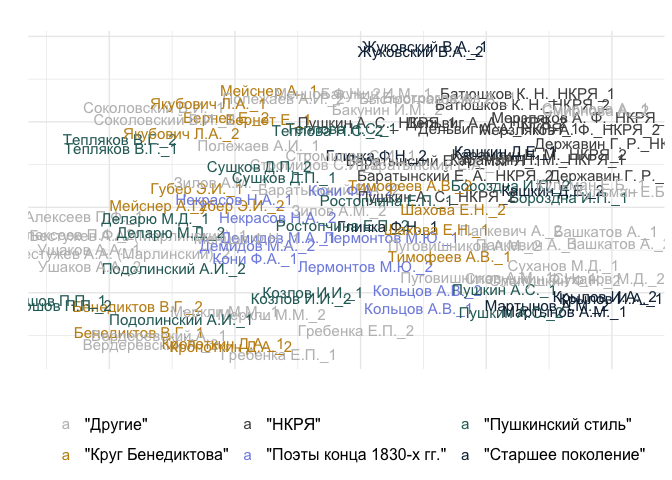

# 03_5_authors

## Exploration of the authors’ styles

This notebook takes samples of texts from known authors and tries to
analyse whether there are some clusters based on the MFW.

``` r
library(tidyverse)
```

    Warning: package 'ggplot2' was built under R version 4.3.1

    Warning: package 'tidyr' was built under R version 4.3.1

    Warning: package 'dplyr' was built under R version 4.3.1

    Warning: package 'lubridate' was built under R version 4.3.1

``` r
library(tidytext)

library(stylo)

library(umap)

library(e1071)
library(caret)
```

    Warning: package 'lattice' was built under R version 4.3.1

``` r
library(tidymodels)
```

    Warning: package 'tidymodels' was built under R version 4.3.1

    Warning: package 'dials' was built under R version 4.3.1

    Warning: package 'scales' was built under R version 4.3.1

    Warning: package 'infer' was built under R version 4.3.1

    Warning: package 'modeldata' was built under R version 4.3.3

    Warning: package 'parsnip' was built under R version 4.3.1

    Warning: package 'recipes' was built under R version 4.3.1

    Warning: package 'rsample' was built under R version 4.3.1

    Warning: package 'tune' was built under R version 4.3.1

    Warning: package 'workflows' was built under R version 4.3.1

    Warning: package 'workflowsets' was built under R version 4.3.1

    Warning: package 'yardstick' was built under R version 4.3.1

``` r
library(textrecipes)
```

    Warning: package 'textrecipes' was built under R version 4.3.1

``` r
library(kernlab)

library(MetBrewer)
library(gghighlight)
theme_set(theme_minimal())
```

Load data

``` r
corpus1835 <- readRDS("../../data/corpus1835/corpus_1835.Rds")

glimpse(corpus1835)
```

    Rows: 4,799
    Columns: 20
    $ text_id       <chr> "P_1", "P_10", "P_100", "P_1000", "P_1001", "P_1002", "P…
    $ A_ID          <chr> "", "A-50", "A-7", "A-41", "A-139", "A-11", "A-163", "A-…
    $ author_sign   <chr> "", "Л. Якубович", "Кольцов", "Ф. Глинка", "Н. Прокопови…
    $ author_text   <chr> "", "Якубович Л.А.", "Кольцов А.В.", "Глинка Ф.Н.", "Про…
    $ text_title    <chr> "Солдатская песня", "Молния", "Ночлег чумаков", "Утешите…
    $ text_subtitle <chr> "", "", "Сельские картины", "", "", "", "", "", "", "", …
    $ first_line    <chr> "Ох жизнь, молодецкая", "Зачем с небесной высоты", "В бл…
    $ year          <chr> "1835", "1835", "1836", "1838", "1838", "1838", "1838", …
    $ path_text     <chr> "../../data/corpus1835/periodicals/per_raw//P_1.txt", ".…
    $ source_text   <chr> "Сев_пч. 1835. №12. C. 46", "БдЧ. 1835. Т.8. Отд. 1. C. …
    $ COL_ID        <chr> "", "", "", "", "", "", "", "", "", "", "", "", "", "", …
    $ corpus        <chr> "per", "per", "per", "per", "per", "per", "per", "per", …
    $ text_raw      <chr> "Ох, жизнь молодецкая,\nБравая, солдатская!\nКак осенняя…
    $ text_cln      <chr> "Ох, жизнь молодецкая,\nБравая, солдатская!\nКак осенняя…
    $ text_lemm     <chr> "ох, жизнь молодецкий,\nбравый, солдатский!\nкак осенний…
    $ text_acc      <chr> "Ох, жизнь молоде'цкая,\nБра'вая, солда'тская!\nКак осе'…
    $ meter         <fct> Other?, Iamb, Iamb, Iamb, Trochee, Iamb, Trochee, Iamb, …
    $ feet          <chr> "?", "3", "4", "4", "4", "4", "other", "4", "6", "5", "4…
    $ formula       <chr> "Other?_?", "Iamb_3", "Iamb_4", "Iamb_4", "Trochee_4", "…
    $ n_lines       <int> 38, 16, 98, 77, 28, 12, 44, 25, 31, 28, 100, 16, 17, 60,…

Number of non-empty lines by each author

``` r
authors_lines <- corpus1835 %>% 
  select(text_id, author_text, meter, text_lemm) %>% 
  separate_rows(text_lemm, sep = "\n") %>% 
  filter(text_lemm != "" & !str_detect(text_lemm, "^\\W+$|^\\s+$")) %>% 
  group_by(author_text) %>% 
  count(sort = T) %>% 
  ungroup() %>% 
  filter(n > 1000 & author_text != "")

authors_lines
```

    # A tibble: 49 × 2
       author_text          n
       <chr>            <int>
     1 Кульман Е.Б.      7851
     2 Жуковский В.А.    7766
     3 Крылов И.А.       6147
     4 Тимофеев А.В.     4887
     5 Бороздна И.П.     4834
     6 Бернет Е.         4654
     7 Быстроглазов А.   4335
     8 Бенедиктов В.Г.   4029
     9 Баратынский Е.А.  3906
    10 Башкатов А.       3451
    # ℹ 39 more rows

Number of lines in each meter

``` r
corpus1835 %>% 
  select(text_id, author_text, meter, text_lemm) %>% 
  separate_rows(text_lemm, sep = "\n") %>% 
  filter(text_lemm != "" & !str_detect(text_lemm, "^\\W+$|^\\s+$")) %>% 
  group_by(author_text, meter) %>% 
  count(sort = T) %>% 
  ungroup() %>% 
  filter(author_text %in% authors_lines$author_text) %>% 
  filter(meter != "Other?") %>% 
  arrange(-desc(author_text))
```

    # A tibble: 188 × 3
       author_text      meter          n
       <chr>            <fct>      <int>
     1 Алексеев П.Ф.    Iamb         800
     2 Алексеев П.Ф.    Trochee      508
     3 Алексеев П.Ф.    Anapest       99
     4 Алексеев П.Ф.    Amphibrach    89
     5 Бакунин И.М.     Iamb        1537
     6 Бакунин И.М.     Amphibrach   269
     7 Бакунин И.М.     Trochee       52
     8 Бакунин И.М.     Anapest       24
     9 Баратынский Е.А. Iamb        3411
    10 Баратынский Е.А. Trochee      329
    # ℹ 178 more rows

### metrical profile

Look into how authors are grouped based on their usage of different
meters

``` r
# table(corpus1835$feet)

metrical_mtrx <- corpus1835 %>% 
  # select most represented authors
  filter(author_text %in% authors_lines$author_text) %>% 
  
  # leave only clearly detected meters
  filter(meter != "Other?" & feet %in% c(2, 3, 4, 5, 6, "other")) %>% 
  mutate(formula = paste0(meter, "_", feet)) %>% 
  
  # count and sample lines
  separate_rows(text_lemm, sep = "\n") %>% 
  filter(text_lemm != "" & !str_detect(text_lemm, "^\\W+$|^\\s+$")) %>% 
  
  # remove authors who hasn't 1000 lines in selected meters
  filter(!author_text %in% c("Бестужев А.А. (Марлинский)", 
                             "Стромилов С.И.", 
                             "Соколовский В.И.", 
                             "Пуговишников А.М.")) %>% 
  
  
  group_by(author_text) %>% 
  sample_n(1000) %>% # sample 1000 lines from each author
  ungroup() %>% 
  
  # count number of lines of each meter
  group_by(author_text, formula) %>% 
  count() %>% 
  ungroup() %>% 
  pivot_wider(names_from = formula, values_from = n, values_fill = 0)

metrical_mtrx
```

    # A tibble: 45 × 29
       author_text   Amphibrach_4 Amphibrach_other Anapest_2 Anapest_4 Iamb_4 Iamb_5
       <chr>                <int>            <int>     <int>     <int>  <int>  <int>
     1 Алексеев П.Ф.           39               26        26        42    256     40
     2 Бакунин И.М.           104               19         0         0    556      0
     3 Баратынский …           14               12         0         0    427     86
     4 Башкатов А.              0                0         0         0    715      0
     5 Бенедиктов В…          105               64         0         0    250     79
     6 Бернет Е.               58               23         0         0    178     41
     7 Бороздна И.П.            0                0         0         0    957      4
     8 Быстроглазов…           31              100         0         0    442     74
     9 Вердеревский…            0                0         0         0    369      0
    10 Глинка Ф.Н.              0                0         0         0    450      0
    # ℹ 35 more rows
    # ℹ 22 more variables: Iamb_6 <int>, Iamb_other <int>, Trochee_4 <int>,
    #   Trochee_6 <int>, Trochee_other <int>, Amphibrach_2 <int>,
    #   Anapest_other <int>, Amphibrach_3 <int>, Iamb_2 <int>, Iamb_3 <int>,
    #   Dactyl_3 <int>, Anapest_3 <int>, Dactyl_other <int>, Trochee_5 <int>,
    #   Trochee_3 <int>, Anapest_5 <int>, Dactyl_6 <int>, Amphibrach_5 <int>,
    #   Dactyl_4 <int>, Amphibrach_6 <int>, Dactyl_2 <int>, Dactyl_5 <int>

Metrical variations taken into account:

``` r
corpus1835 %>% 
  # select most represented authors
  filter(author_text %in% authors_lines$author_text) %>% 
  
  # leave only clearly detected meters
  filter(meter != "Other?" & feet %in% c(2, 3, 4, 5, 6, "other")) %>% 
  mutate(formula = paste0(meter, "_", feet)) %>% 
  distinct(formula) %>% 
  pull()
```

     [1] "Iamb_3"           "Iamb_4"           "Trochee_other"    "Iamb_other"      
     [5] "Amphibrach_2"     "Iamb_6"           "Amphibrach_4"     "Iamb_5"          
     [9] "Trochee_4"        "Anapest_2"        "Anapest_other"    "Amphibrach_3"    
    [13] "Dactyl_4"         "Trochee_3"        "Dactyl_3"         "Amphibrach_other"
    [17] "Dactyl_other"     "Anapest_4"        "Anapest_3"        "Trochee_5"       
    [21] "Dactyl_6"         "Amphibrach_6"     "Amphibrach_5"     "Trochee_6"       
    [25] "Anapest_5"        "Dactyl_2"         "Dactyl_5"         "Iamb_2"          

Projection

``` r
# scale matrix and remove author's column
mtrx <- metrical_mtrx %>% 
  select(-author_text) %>% 
  scale() 

dim(mtrx)
```

    [1] 45 28

``` r
u <- umap(mtrx)

dat <- tibble(x = u$layout[,1],
       y = u$layout[,2],
       author = metrical_mtrx$author_text) 
```

### author’s grouping

Some custom labeling according to grouping found in scholarship

``` r
# unique(dat$author)

authors_lbl <- tibble(
  author = unique(dat$author),
  author_group = c(
    "Другое", "Другое", "Другое", "Другое", "Круг Бенедиктова",
    "Круг Бенедиктова", "Пушкинский стиль", "Другое", "Другое", "Старшее поколение",
    "Другое", "Круг Бенедиктова", "Пушкинский стиль", "Поэты конца 1830-х гг.", "Пушкинский стиль",
    "Старшее поколение", "Другое", "Старшее поколение", "Пушкинский стиль", "Поэты конца 1830-х гг.",
    "Поэты конца 1830-х гг.", "Круг Бенедиктова", "Старшее поколение", "Другое", "Поэты конца 1830-х гг.",
    "Старшее поколение", "Круг Бенедиктова", "Другое", "Другое", "Поэты конца 1830-х гг.",
    "Другое", "Пушкинский стиль", "Другое", "Пушкинский стиль", "Пушкинский стиль",
    "Другое", "Другое", "Другое", "Пушкинский стиль", "Пушкинский стиль",
    "Пушкинский стиль", "Круг Бенедиктова", "Другое", "Круг Бенедиктова", "Круг Бенедиктова"
  )
) %>% 
  mutate(author_group = paste0('"', author_group, '"' ))

table(authors_lbl$author_group)
```


                    "Другое"       "Круг Бенедиктова" "Поэты конца 1830-х гг." 
                          17                        8                        5 
          "Пушкинский стиль"      "Старшее поколение" 
                          10                        5 

#### proj

``` r
# plot
dat %>% 
  filter(author != "Кольцов А.В.") %>% 
  left_join(authors_lbl, by = "author") %>% 
  ggplot(aes(x, y, color = author_group)) + 
  #geom_point(size = 5, alpha = 0.6) + 
  geom_text(aes(label = author)) + 
  labs(title = "", x = "", y = "", color = "") + 
  scale_color_manual(values = c("gray",
                                met.brewer("Veronese")[3],
                                met.brewer("Veronese")[1],
                                met.brewer("Veronese")[5],
                                met.brewer("Veronese")[7])) + 
  theme(axis.text = element_blank())
```


``` r
ggsave("metrical_profile_projection_md.png", plot = last_plot(),
       bg = "white", dpi = 300, width = 8, height = 6)
```

#### lineplot

``` r
mtrx %>% 
  cbind(metrical_mtrx %>% select(author_text)) %>% 
  pivot_longer(!author_text,
               names_to = "meter",
               values_to = "n") %>% 
  left_join(authors_lbl %>% rename(author_text = author), 
            by = "author_text") %>% 
  ggplot(aes(x = meter,
             y = n, 
             group = author_text)) + 
  geom_line(aes(color = author_group), show.legend = FALSE) + 
  gghighlight(use_direct_label = FALSE#,
              #unhighlighted_params = list(colour = alpha("grey85", 1))
              ) + 
  facet_wrap(~author_text) + 
  geom_text(data = mtrx %>% cbind(metrical_mtrx %>% select(author_text)) %>% 
              pivot_longer(!author_text, names_to = "meter", values_to = "n") %>% 
              group_by(author_text) %>% 
              slice_max(order_by = n, n = 2),
            aes(y = n, label = meter),
            size = 3,
            vjust = -0.5,
            show.legend = FALSE
              ) +
  scale_color_manual(values = c("gray9",
                                met.brewer("Veronese")[3],
                                met.brewer("Veronese")[1],
                                met.brewer("Veronese")[5],
                                met.brewer("Veronese")[7])) + 
  theme(axis.text = element_blank())
```


``` r
ggsave("metrical_profile_lineplot_md.png", plot = last_plot(),
       bg = "white", dpi = 300, width = 10, height = 8)
```

### MFW usage

Create MFW ranks based on the whole corpus

``` r
ranks <- corpus1835 %>% 
  unnest_tokens(input = "text_lemm", output = word, token = "words") %>% 
  count(word, sort = T) %>% 
  head(450) %>% 
  # remove first 50 MFW
  mutate(rank = row_number()) %>% 
  filter(rank > 50)

head(ranks)
```

    # A tibble: 6 × 3
      word      n  rank
      <chr> <int> <int>
    1 свет   1860    51
    2 себя   1825    52
    3 у      1803    53
    4 же     1786    54
    5 ли     1775    55
    6 ни     1755    56

``` r
tail(ranks)
```

    # A tibble: 6 × 3
      word          n  rank
      <chr>     <int> <int>
    1 открывать   281   445
    2 утро        281   446
    3 желать      280   447
    4 самый       280   448
    5 седой       280   449
    6 дрожать     279   450

``` r
nrow(ranks)
```

    [1] 400

#### select sample

``` r
counter <- corpus1835 %>% 
  filter(author_text %in% authors_lines$author_text) %>% 
  select(text_id, author_text, meter, text_lemm) %>% 
  separate_rows(text_lemm, sep = "\n") %>% 
  filter(text_lemm != "" & !str_detect(text_lemm, "^\\W+$|^\\s+$")) %>% 
  group_by(author_text) %>% 
  sample_n(1000) %>% 
 
  
  # create two samples of 500 lines for each author
  mutate(sample_id = ceiling(1:1000),
         sample_id = floor(sample_id/500)+1,
         sample_id = ifelse(sample_id == 3, 1, sample_id),
         sample_id = paste0(author_text, "_", sample_id)) %>% 
  ungroup() %>% 
  
  # count words inside each sample
  unnest_tokens(input = text_lemm, output = word, token = "words") %>% 
  group_by(sample_id) %>% 
  count(word) %>% 
  ungroup() %>% 
  filter(word %in% ranks$word)

counter %>% sample_n(10)
```

    # A tibble: 10 × 3
       sample_id         word         n
       <chr>             <chr>    <int>
     1 Кропоткин Д.А._2  забывать     2
     2 Полежаев А.И._2   брат         2
     3 Кропоткин Д.А._1  какой        2
     4 Менцов Ф.Н._1     наш          4
     5 Ростопчина Е.П._1 зачем        5
     6 Стромилов С.И._2  сидеть       1
     7 Вердеревский А._2 б            7
     8 Бенедиктов В.Г._2 бездна       1
     9 Вердеревский А._1 забывать     5
    10 Тимофеев А.В._1   бурный       2

#### UMAP projection

``` r
xxx <- counter %>% 
  pivot_wider(names_from = word, values_from = n, values_fill = 0)

mtrx <- xxx %>% 
  ungroup() %>% 
  select(-sample_id) %>% 
  scale()

dim(mtrx)
```

    [1]  98 400

``` r
u <- umap(mtrx)

dat <- tibble(x = u$layout[,1],
       y = u$layout[,2],
       author = xxx$sample_id) 
  
# glimpse(dat)
```

``` r
dat %>% 
  mutate(sample_id = author,
    author = str_remove(author, "_\\d+$")) %>% 
  left_join(authors_lbl, by = "author") %>% 
  mutate(author_group = ifelse(is.na(author_group), '"Другое"', author_group)) %>% 
  ggplot(aes(x, y, color = author_group)) + 
  #geom_point(size = 5, alpha = 0.6) + 
  geom_text(aes(label = sample_id)) + 
  labs(title = "", x = "", y = "", color = "") + 
  scale_color_manual(values = c("gray", 
                                met.brewer("Veronese")[3],
                                met.brewer("Veronese")[1],
                                met.brewer("Veronese")[5],
                                met.brewer("Veronese")[7])) + 
  theme(axis.text = element_blank())
```


### zeta

Create & write samples

``` r
corpus_prepared <- corpus1835 %>% 
  filter(author_text %in% authors_lines$author_text) %>% 
  select(text_id, author_text, meter, text_lemm) %>% 
  separate_rows(text_lemm, sep = "\n") %>% 
  filter(text_lemm != "" & !str_detect(text_lemm, "^\\W+$|^\\s+$")) %>% 
  
  # attach lables
  left_join(authors_lbl %>% rename(author_text = author), by = "author_text") %>%   filter(author_group == '"Пушкинский стиль"' | author_group == '"Круг Бенедиктова"') %>% 
  mutate(author_group = str_remove_all(author_group, '"')) %>% 
  # both groups has ~20k tokens

  group_by(author_group) %>% 
  sample_n(20000) %>% 
  
  # create two samples of 500 lines for each author
  mutate(sample_id = ceiling(1:20000),
         sample_id = floor(sample_id/2000)+1,
         sample_id = ifelse(sample_id == 11, 1, sample_id),
         sample_id = paste0(author_group, "_", sample_id)) %>% 
  ungroup() %>% 
  
  group_by(sample_id) %>% 
  summarise(text = paste0(text_lemm, collapse = " ------ ")) %>% 
  ungroup() %>% 
  
  mutate(author_group = str_remove(sample_id, "_\\d+$"), 
         path = ifelse(author_group == "Пушкинский стиль", "secondary_set/", "primary_set/"),
         path = paste0("zeta_tests/benediktov/", path, sample_id, ".txt")) 

str(corpus_prepared)
```

    tibble [20 × 4] (S3: tbl_df/tbl/data.frame)
     $ sample_id   : chr [1:20] "Круг Бенедиктова_1" "Круг Бенедиктова_10" "Круг Бенедиктова_2" "Круг Бенедиктова_3" ...
     $ text        : chr [1:20] "небо вечно голубой; ------ что уставлять вы ------ живой восторг сопровождать!... ------ бессмысленный ! толпа "| __truncated__ "ее прекрасный душа ------ друг на друг глядеть, ------ пусть помнить молиться обо я; ------ прижимать ты к серд"| __truncated__ "бедняк, согревать тусклый мечта ------ место дева занимать ? ------ чем эгоист и горделивец, ------ гроза и нен"| __truncated__ "на встреча глухой, надменный, мир. ------ и облегчать мой недуг. ------ сладкий воздух: в немой дрожать ------ "| __truncated__ ...
     $ author_group: chr [1:20] "Круг Бенедиктова" "Круг Бенедиктова" "Круг Бенедиктова" "Круг Бенедиктова" ...
     $ path        : chr [1:20] "zeta_tests/benediktov/primary_set/Круг Бенедиктова_1.txt" "zeta_tests/benediktov/primary_set/Круг Бенедиктова_10.txt" "zeta_tests/benediktov/primary_set/Круг Бенедиктова_2.txt" "zeta_tests/benediktov/primary_set/Круг Бенедиктова_3.txt" ...

``` r
do.call(file.remove, list(
  list.files("zeta_tests/benediktov//primary_set", full.names = TRUE)))
```

     [1] TRUE TRUE TRUE TRUE TRUE TRUE TRUE TRUE TRUE TRUE

``` r
do.call(file.remove, list(
  list.files("zeta_tests/benediktov//secondary_set", full.names = TRUE)))
```

     [1] TRUE TRUE TRUE TRUE TRUE TRUE TRUE TRUE TRUE TRUE

``` r
for (i in 1:nrow(corpus_prepared)) {
  writeLines(corpus_prepared$text[i], corpus_prepared$path[i])
}
```

``` r
oppose(
  gui = FALSE,
  path = "zeta_tests/benediktov/",
  corpus.lang = "Other",
  text.slice.length = 500,
  write.png.file = TRUE
)
```

    The subcorpora will be loaded from text files...

    slicing input text into tokens...


    turning words into features, e.g. char n-grams (if applicable)...

    slicing input text into tokens...


    turning words into features, e.g. char n-grams (if applicable)...

    Slicing the texts into samples...

    Круг Бенедиктова_1

        - text length (in words): 9018

        - nr. of samples: 18

        - nr. of words dropped at the end of the text: 18

    Круг Бенедиктова_10

        - text length (in words): 8878

        - nr. of samples: 17

        - nr. of words dropped at the end of the text: 378

    Круг Бенедиктова_2

        - text length (in words): 9167

        - nr. of samples: 18

        - nr. of words dropped at the end of the text: 167

    Круг Бенедиктова_3

        - text length (in words): 9185

        - nr. of samples: 18

        - nr. of words dropped at the end of the text: 185

    Круг Бенедиктова_4

        - text length (in words): 9189

        - nr. of samples: 18

        - nr. of words dropped at the end of the text: 189

    Круг Бенедиктова_5

        - text length (in words): 8956

        - nr. of samples: 17

        - nr. of words dropped at the end of the text: 456

    Круг Бенедиктова_6

        - text length (in words): 9122

        - nr. of samples: 18

        - nr. of words dropped at the end of the text: 122

    Круг Бенедиктова_7

        - text length (in words): 9164

        - nr. of samples: 18

        - nr. of words dropped at the end of the text: 164

    Круг Бенедиктова_8

        - text length (in words): 8965

        - nr. of samples: 17

        - nr. of words dropped at the end of the text: 465

    Круг Бенедиктова_9

        - text length (in words): 9092

        - nr. of samples: 18

        - nr. of words dropped at the end of the text: 92

    Пушкинский стиль_1

        - text length (in words): 9451

        - nr. of samples: 18

        - nr. of words dropped at the end of the text: 451

    Пушкинский стиль_10

        - text length (in words): 9358

        - nr. of samples: 18

        - nr. of words dropped at the end of the text: 358

    Пушкинский стиль_2

        - text length (in words): 9346

        - nr. of samples: 18

        - nr. of words dropped at the end of the text: 346

    Пушкинский стиль_3

        - text length (in words): 9389

        - nr. of samples: 18

        - nr. of words dropped at the end of the text: 389

    Пушкинский стиль_4

        - text length (in words): 9363

        - nr. of samples: 18

        - nr. of words dropped at the end of the text: 363

    Пушкинский стиль_5

        - text length (in words): 9424

        - nr. of samples: 18

        - nr. of words dropped at the end of the text: 424

    Пушкинский стиль_6

        - text length (in words): 9430

        - nr. of samples: 18

        - nr. of words dropped at the end of the text: 430

    Пушкинский стиль_7

        - text length (in words): 9418

        - nr. of samples: 18

        - nr. of words dropped at the end of the text: 418

    Пушкинский стиль_8

        - text length (in words): 9330

        - nr. of samples: 18

        - nr. of words dropped at the end of the text: 330

    Пушкинский стиль_9

        - text length (in words): 9455

        - nr. of samples: 18

        - nr. of words dropped at the end of the text: 455

    Extracting distinctive words... (this might take a while)

    Primary set...

    Secondary set...

    comparison done!

    No test set samples found (but this is totally OK in most cases!).
    Performing a simple comparison of the training samples...



    Function call:

    oppose(gui = FALSE, path = "zeta_tests/benediktov/", corpus.lang = "Other",     text.slice.length = 500, write.png.file = TRUE)

    Depending on your chosen options, some results should have been written

    into a few files; you should be able to find them in your current

    (working) directory. Usually, these include a list of words/features

    used to build a table of frequencies, the table itself, a file containing

    recent configuration, etc.

    Advanced users: you can pipe the results to a variable, e.g.:

         my.boss.will.love.it = oppose()

    this will create a class "my.boss.will.love.it" containing some presumably

    interesting stuff. The class created, you can type, e.g.:

         summary(my.boss.will.love.it)

    to see which variables are stored there and how to use them.

    for suggestions how to cite this software, type: citation("stylo")

#### classifier

Basic classification based on 400 MFW

##### MFW

``` r
ranks <- corpus1835 %>% 
  unnest_tokens(input = text_lemm, output = word, token = "words") %>% 
  count(word, sort = T) %>% 
  head(400) %>% 
  mutate(rank = row_number())

head(ranks)
```

    # A tibble: 6 × 3
      word      n  rank
      <chr> <int> <int>
    1 и     38454     1
    2 в     26906     2
    3 я     19065     3
    4 не    14993     4
    5 на    11839     5
    6 ты    11474     6

``` r
tail(ranks)
```

    # A tibble: 6 × 3
      word         n  rank
      <chr>    <int> <int>
    1 тайный     309   395
    2 голубой    308   396
    3 дорога     308   397
    4 напрасно   307   398
    5 чуждый     307   399
    6 брег       305   400

``` r
corpus_prepared <- corpus1835 %>% 
  filter(author_text %in% authors_lines$author_text) %>% 
  select(text_id, author_text, meter, text_lemm) %>% 
  separate_rows(text_lemm, sep = "\n") %>% 
  filter(text_lemm != "" & !str_detect(text_lemm, "^\\W+$|^\\s+$")) %>% 
  
  # attach lables
  left_join(authors_lbl %>% rename(author_text = author), by = "author_text") %>%   filter(author_group == '"Пушкинский стиль"' | author_group == '"Круг Бенедиктова"') %>% 
  mutate(author_group = str_remove_all(author_group, '"')) %>% 
  # both groups has ~20k tokens

  group_by(author_group) %>% 
  sample_n(20000) %>% 
  
  # create two samples of 500 lines for each author
  mutate(sample_id = ceiling(1:20000),
         sample_id = floor(sample_id/200)+1,
         sample_id = ifelse(sample_id == 101, 1, sample_id),
         sample_id = paste0(author_group, "_", sample_id)) %>% 
  ungroup() %>% 
  
  group_by(sample_id) %>% 
  summarise(text = paste0(text_lemm, collapse = " ------ ")) %>% 
  ungroup() %>% 
  
  mutate(author_group = str_remove(sample_id, "_\\d+$"))


table(corpus_prepared$author_group)
```


    Круг Бенедиктова Пушкинский стиль 
                 100              100 

``` r
str(corpus_prepared)
```

    tibble [200 × 3] (S3: tbl_df/tbl/data.frame)
     $ sample_id   : chr [1:200] "Круг Бенедиктова_1" "Круг Бенедиктова_10" "Круг Бенедиктова_100" "Круг Бенедиктова_11" ...
     $ text        : chr [1:200] "с он все говорить величаво, но внятно ------ в пыл несбыточный желание, ------ в последний раз ее мой жаворонок"| __truncated__ "он и нет!... пустой тварь, ------ тщетно конь свой ход торопить... ------ чаша небо голубой  ------ добрый день"| __truncated__ "смотреть с высота на я.  ------ в недоступный вышина!  ------ ты не ведать, что с ты ------ и спать, не смущать"| __truncated__ "угасать царь, и я скитаться ------ и ропот тяжкий печаль ------ цветок пожелтеть, как будто зима ------ слух он"| __truncated__ ...
     $ author_group: chr [1:200] "Круг Бенедиктова" "Круг Бенедиктова" "Круг Бенедиктова" "Круг Бенедиктова" ...

``` r
freqs <- corpus_prepared %>% 
  mutate(text_genre = author_group) %>% 
  select(sample_id, text_genre, text) %>% 
  unnest_tokens(input = text, output = word, token = "words") %>% 
  filter(word %in% ranks$word) %>% 
  group_by(sample_id, text_genre) %>% 
  count(word) %>% 
  ungroup() %>% 
  pivot_wider(names_from = word, values_from = n, values_fill = 0) 

dim(freqs)
```

    [1] 200 402

``` r
freqs[1:10, 1:10]
```

    # A tibble: 10 × 10
       sample_id     text_genre     а ангел  беда бедный блеск блистать божий бурный
       <chr>         <chr>      <int> <int> <int>  <int> <int>    <int> <int>  <int>
     1 Круг Бенедик… Круг Бене…     1     1     1      1     1        1     1      1
     2 Круг Бенедик… Круг Бене…     0     2     0      0     1        1     0      0
     3 Круг Бенедик… Круг Бене…     5     0     1      0     1        0     1      0
     4 Круг Бенедик… Круг Бене…     1     0     1      1     0        1     0      0
     5 Круг Бенедик… Круг Бене…     3     1     0      1     0        0     1      1
     6 Круг Бенедик… Круг Бене…     3     0     0      0     0        1     0      0
     7 Круг Бенедик… Круг Бене…     2     0     2      1     0        1     0      0
     8 Круг Бенедик… Круг Бене…     0     0     0      2     0        0     1      0
     9 Круг Бенедик… Круг Бене…     2     0     0      0     2        2     0      0
    10 Круг Бенедик… Круг Бене…     3     0     0      2     1        1     1      1

``` r
freqs_scaled <- freqs %>% 
  select(-sample_id, -text_genre) %>% 
  scale() %>% 
  as.tibble()
```

    Warning: `as.tibble()` was deprecated in tibble 2.0.0.
    ℹ Please use `as_tibble()` instead.
    ℹ The signature and semantics have changed, see `?as_tibble`.

``` r
freqs_scaled[1:10, 1:10]
```

    # A tibble: 10 × 10
             а  ангел   беда бедный  блеск блистать  божий бурный   буря     бы
         <dbl>  <dbl>  <dbl>  <dbl>  <dbl>    <dbl>  <dbl>  <dbl>  <dbl>  <dbl>
     1 -1.11    0.563  0.608  0.570  0.488    0.385  0.809  0.773  0.208 -0.374
     2 -1.69    1.90  -0.659 -0.711  0.488    0.385 -0.636 -0.699 -0.914 -1.13 
     3  1.19   -0.778  0.608 -0.711  0.488   -0.941  0.809 -0.699 -0.914 -0.374
     4 -1.11   -0.778  0.608  0.570 -0.868    0.385 -0.636 -0.699  1.33   0.382
     5  0.0403  0.563 -0.659  0.570 -0.868   -0.941  0.809  0.773  0.208 -0.374
     6  0.0403 -0.778 -0.659 -0.711 -0.868    0.385 -0.636 -0.699  1.33   0.382
     7 -0.536  -0.778  1.88   0.570 -0.868    0.385 -0.636 -0.699  1.33   0.382
     8 -1.69   -0.778 -0.659  1.85  -0.868   -0.941  0.809 -0.699 -0.914  1.14 
     9 -0.536  -0.778 -0.659 -0.711  1.85     1.71  -0.636 -0.699 -0.914 -1.13 
    10  0.0403 -0.778 -0.659  1.85   0.488    0.385  0.809  0.773 -0.914 -0.374

``` r
freqs_scaled <- tibble(sample_id = freqs$sample_id,
       freqs_scaled,
       text_genre = freqs$text_genre) %>% 
  mutate(sample_id = row_number())

tidy_corpus <- freqs_scaled %>% 
  group_by(text_genre) %>% 
  sample_n(100) %>%   # number of texts in the tested genre
  ungroup() %>% 
  select(-sample_id)

## split the data into training and test sets
corpus_split <- initial_split(tidy_corpus, strata="text_genre", prop = 7.5/10)

corpus_split
```

    <Training/Testing/Total>
    <150/50/200>

``` r
training_set <- training(corpus_split)
test_set <- testing(corpus_split)

zscores_recipe <- recipe(text_genre ~ ., data = training_set) # all columns = all 300MFW freqs are used for the training

# 10-fold cross validation setup
folds <- vfold_cv(training_set, strata = "text_genre", v = 10)

# model specifications
svm_specs <- svm_poly(cost=1,degree = 1) %>% # linear kernel
  set_mode("classification") %>%
  set_engine("kernlab")

# add recipe and model specs to the workflow 
svm_wf <- workflow() %>%
  add_recipe(zscores_recipe) %>%
  add_model(svm_specs)

svm_res <- fit_resamples(
  svm_wf,
  folds,
  metrics = metric_set(accuracy),
  control = control_resamples(save_pred = TRUE)
)

metrics <- collect_metrics(svm_res)
metrics
```

    # A tibble: 1 × 6
      .metric  .estimator  mean     n std_err .config             
      <chr>    <chr>      <dbl> <int>   <dbl> <chr>               
    1 accuracy binary     0.966    10  0.0156 Preprocessor1_Model1

``` r
svm_model <-svm(as.factor(text_genre)~.,  
                data = training_set, 
                method = "C-classification", 
                kernel = "linear", 
                cost = 1, 
                scale = T)

summary(svm_model) 
```


    Call:
    svm(formula = as.factor(text_genre) ~ ., data = training_set, method = "C-classification", 
        kernel = "linear", cost = 1, scale = T)


    Parameters:
       SVM-Type:  C-classification 
     SVM-Kernel:  linear 
           cost:  1 

    Number of Support Vectors:  101

     ( 46 55 )


    Number of Classes:  2 

    Levels: 
     Круг Бенедиктова Пушкинский стиль

``` r
prediction <- predict(svm_model, test_set)
confusionMatrix(prediction, as.factor(test_set$text_genre)) # NB check if the same positive class used below in the plot
```

    Confusion Matrix and Statistics

                      Reference
    Prediction         Круг Бенедиктова Пушкинский стиль
      Круг Бенедиктова               25                1
      Пушкинский стиль                0               24
                                              
                   Accuracy : 0.98            
                     95% CI : (0.8935, 0.9995)
        No Information Rate : 0.5             
        P-Value [Acc > NIR] : 4.53e-14        
                                              
                      Kappa : 0.96            
                                              
     Mcnemar's Test P-Value : 1               
                                              
                Sensitivity : 1.0000          
                Specificity : 0.9600          
             Pos Pred Value : 0.9615          
             Neg Pred Value : 1.0000          
                 Prevalence : 0.5000          
             Detection Rate : 0.5000          
       Detection Prevalence : 0.5200          
          Balanced Accuracy : 0.9800          
                                              
           'Positive' Class : Круг Бенедиктова
                                              

``` r
words_coefs <- t(svm_model$coefs) %*% svm_model$SV

tibble(weight=words_coefs[1,], word=colnames(words_coefs)) %>% 
  mutate(genre = case_when(weight > 0 ~ "Круг Бенедиктова", 
                           weight < 0 ~ "Пушкинский стиль")) %>%
  group_by(genre) %>% 
  mutate(abs=abs(weight)) %>%
  top_n(20,abs) %>% 
  ggplot(aes(reorder(word,abs), abs, fill=genre)) + geom_col() +
  coord_flip() + 
  facet_wrap(~genre,scales="free") +
  theme_minimal(base_size = 16) + 
  labs(x = "", 
       y = "",
       fill = "") + 
  #scale_fill_carto_d(palette = "Safe") + 
  theme(legend.position = "none") + 
  theme(axis.text = element_text(size = 14),
        axis.title = element_text(size = 14),
        plot.title = element_text(size = 14)) + 
  theme(panel.border = element_blank(), 
        panel.grid.major = element_blank(),
        panel.grid.minor = element_blank()) +
  theme(axis.line.x = element_line(color="black"), 
        axis.line.y = element_line(color="black"))
```


##### zeta words

Import words from Zeta analysis (101 words altogether)

``` r
wordlist <- unlist(str_split(c("человек
свет
этот
бог
друг
без
хотеть
спать
страшный
хладный
земля
смерть
счастие
горький
ни
гроб
напрасно
ласка
река
любить
ах
широкий
божий
добрый
дитя
злой
мчаться
объятие
ночь
миг
молитва
плакать
бедный
истина
рука
чело
черный
печаль
дева
до
пусть
железный
небо
судьба
влага
ад
труд
мир
страсть
стоять
вселенная
чу
легкий
страшно
у
цветок
вера
уж
пора
их
сад
сей
младой
уже
молодой
краса
гора
стих
будто
восторг
мечта
мирра
то
раздаваться
берег
страх
вдохновение
морской
ль
скала
туда
вода
предание
поэзия
ли
пред
во
город
пленять
смелый
воспоминание
узнавать
меж
вновь
дальний
живой
о
брег
любимый
поверять
прямой"), pattern = "\n"))
```

Classification

``` r
freqs <- corpus_prepared %>% 
  mutate(text_genre = author_group) %>% 
  select(sample_id, text_genre, text) %>% 
  unnest_tokens(input = text, output = word, token = "words") %>% 
  filter(word %in% wordlist) %>% 
  group_by(sample_id, text_genre) %>% 
  count(word) %>% 
  ungroup() %>% 
  pivot_wider(names_from = word, values_from = n, values_fill = 0) 

dim(freqs)
```

    [1] 200 103

``` r
freqs[1:10, 1:10]
```

    # A tibble: 10 × 10
       sample_id         text_genre бедный божий влага вновь  гора  гроб  дева    до
       <chr>             <chr>       <int> <int> <int> <int> <int> <int> <int> <int>
     1 Круг Бенедиктова… Круг Бене…      1     1     2     2     1     1     2     3
     2 Круг Бенедиктова… Круг Бене…      0     0     0     3     0     2     1     2
     3 Круг Бенедиктова… Круг Бене…      0     1     0     1     1     1     2     2
     4 Круг Бенедиктова… Круг Бене…      1     0     0     1     0     2     0     1
     5 Круг Бенедиктова… Круг Бене…      1     1     0     0     1     1     1     2
     6 Круг Бенедиктова… Круг Бене…      0     0     0     0     1     2     2     0
     7 Круг Бенедиктова… Круг Бене…      1     0     0     0     0     1     3     0
     8 Круг Бенедиктова… Круг Бене…      2     1     0     1     0     0     1     1
     9 Круг Бенедиктова… Круг Бене…      0     0     1     2     0     0     4     0
    10 Круг Бенедиктова… Круг Бене…      2     1     0     0     0     1     1     3

``` r
freqs_scaled <- freqs %>% 
  select(-sample_id, -text_genre) %>% 
  scale() %>% 
  as.tibble()


freqs_scaled[1:10, 1:10]
```

    # A tibble: 10 × 10
       бедный  божий  влага  вновь   гора   гроб   дева      до    живой   земля
        <dbl>  <dbl>  <dbl>  <dbl>  <dbl>  <dbl>  <dbl>   <dbl>    <dbl>   <dbl>
     1  0.570  0.809  3.67   1.53   0.219  0.485  0.622  1.99    1.98    -0.0947
     2 -0.711 -0.636 -0.489  2.70  -0.876  1.75  -0.280  1.02    1.98    -0.748 
     3 -0.711  0.809 -0.489  0.353  0.219  0.485  0.622  1.02   -0.995   -0.748 
     4  0.570 -0.636 -0.489  0.353 -0.876  1.75  -1.18   0.0532 -0.00495 -0.0947
     5  0.570  0.809 -0.489 -0.823  0.219  0.485 -0.280  1.02   -0.995    1.21  
     6 -0.711 -0.636 -0.489 -0.823  0.219  1.75   0.622 -0.915  -0.00495 -0.0947
     7  0.570 -0.636 -0.489 -0.823 -0.876  0.485  1.52  -0.915  -0.00495 -0.0947
     8  1.85   0.809 -0.489  0.353 -0.876 -0.775 -0.280  0.0532 -0.00495 -0.0947
     9 -0.711 -0.636  1.59   1.53  -0.876 -0.775  2.43  -0.915  -0.995    1.21  
    10  1.85   0.809 -0.489 -0.823 -0.876  0.485 -0.280  1.99   -0.995    0.558 

``` r
freqs_scaled <- tibble(sample_id = freqs$sample_id,
       freqs_scaled,
       text_genre = freqs$text_genre) %>% 
  mutate(sample_id = row_number())

tidy_corpus <- freqs_scaled %>% 
  group_by(text_genre) %>% 
  sample_n(100) %>%   # number of texts in the tested genre
  ungroup() %>% 
  select(-sample_id)

## split the data into training and test sets
corpus_split <- initial_split(tidy_corpus, strata="text_genre", prop = 7.5/10)

corpus_split
```

    <Training/Testing/Total>
    <150/50/200>

``` r
training_set <- training(corpus_split)
test_set <- testing(corpus_split)

zscores_recipe <- recipe(text_genre ~ ., data = training_set) # all columns = all 300MFW freqs are used for the training

# 10-fold cross validation setup
folds <- vfold_cv(training_set, strata = "text_genre", v = 10)

# model specifications
svm_specs <- svm_poly(cost=1,degree = 1) %>% # linear kernel
  set_mode("classification") %>%
  set_engine("kernlab")

# add recipe and model specs to the workflow 
svm_wf <- workflow() %>%
  add_recipe(zscores_recipe) %>%
  add_model(svm_specs)

svm_res <- fit_resamples(
  svm_wf,
  folds,
  metrics = metric_set(accuracy),
  control = control_resamples(save_pred = TRUE)
)

metrics <- collect_metrics(svm_res)
metrics
```

    # A tibble: 1 × 6
      .metric  .estimator  mean     n std_err .config             
      <chr>    <chr>      <dbl> <int>   <dbl> <chr>               
    1 accuracy binary     0.980    10  0.0100 Preprocessor1_Model1

``` r
svm_model <-svm(as.factor(text_genre)~.,  
                data = training_set, 
                method = "C-classification", 
                kernel = "linear", 
                cost = 1, 
                scale = T)

summary(svm_model) 
```


    Call:
    svm(formula = as.factor(text_genre) ~ ., data = training_set, method = "C-classification", 
        kernel = "linear", cost = 1, scale = T)


    Parameters:
       SVM-Type:  C-classification 
     SVM-Kernel:  linear 
           cost:  1 

    Number of Support Vectors:  47

     ( 23 24 )


    Number of Classes:  2 

    Levels: 
     Круг Бенедиктова Пушкинский стиль

``` r
prediction <- predict(svm_model, test_set)
confusionMatrix(prediction, as.factor(test_set$text_genre)) # NB check if the same positive class used below in the plot
```

    Confusion Matrix and Statistics

                      Reference
    Prediction         Круг Бенедиктова Пушкинский стиль
      Круг Бенедиктова               23                2
      Пушкинский стиль                2               23
                                              
                   Accuracy : 0.92            
                     95% CI : (0.8077, 0.9778)
        No Information Rate : 0.5             
        P-Value [Acc > NIR] : 2.231e-10       
                                              
                      Kappa : 0.84            
                                              
     Mcnemar's Test P-Value : 1               
                                              
                Sensitivity : 0.92            
                Specificity : 0.92            
             Pos Pred Value : 0.92            
             Neg Pred Value : 0.92            
                 Prevalence : 0.50            
             Detection Rate : 0.46            
       Detection Prevalence : 0.50            
          Balanced Accuracy : 0.92            
                                              
           'Positive' Class : Круг Бенедиктова
                                              

``` r
words_coefs <- t(svm_model$coefs) %*% svm_model$SV

tibble(weight=words_coefs[1,], word=colnames(words_coefs)) %>% 
  mutate(genre = case_when(weight > 0 ~ "Круг Бенедиктова", 
                           weight < 0 ~ "Пушкинский стиль")) %>%
  group_by(genre) %>% 
  mutate(abs=abs(weight)) %>%
  top_n(20,abs) %>% 
  ggplot(aes(reorder(word,abs), abs, fill=genre)) + geom_col() +
  coord_flip() + 
  facet_wrap(~genre,scales="free") +
  theme_minimal(base_size = 16) + 
  labs(x = "", 
       y = "",
       fill = "") + 
  #scale_fill_carto_d(palette = "Safe") + 
  theme(legend.position = "none") + 
  theme(axis.text = element_text(size = 14),
        axis.title = element_text(size = 14),
        plot.title = element_text(size = 14)) + 
  theme(panel.border = element_blank(), 
        panel.grid.major = element_blank(),
        panel.grid.minor = element_blank()) +
  theme(axis.line.x = element_line(color="black"), 
        axis.line.y = element_line(color="black"))
```


