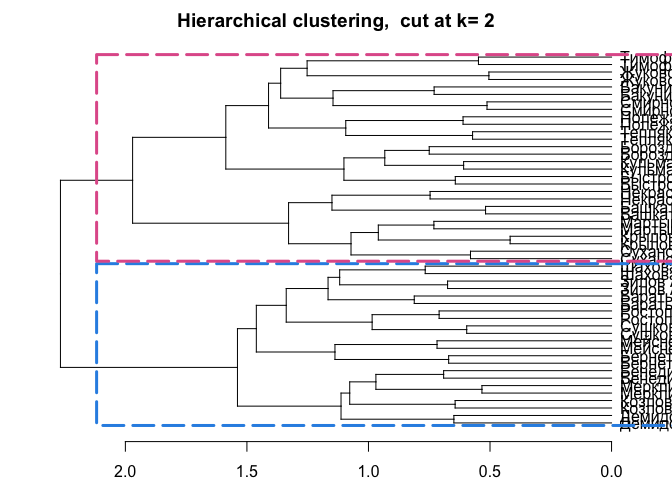
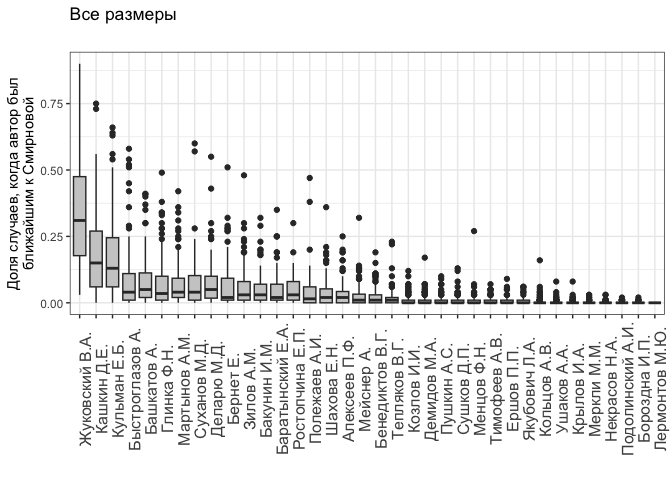
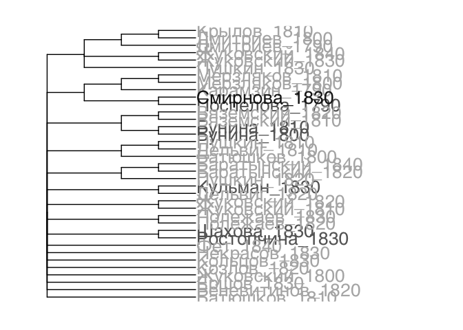

# 3_03_smirnova

## ch3.3.: who was Anna Smirnova?

Some tests on the attribution of the poetry collection “The Works by
Anna Smirnova”

### load data & pckg

``` r
library(tidyverse)
library(tidytext)
library(stylo)
library(seetrees)
library(tinytex)

library(ape)
library(ggtree)

#library(patchwork)
library(cowplot)

theme_set(theme_minimal())
library(MetBrewer)
```

``` r
corpus <- readRDS("../../../data/corpus1835/corpus_1835.Rds")

glimpse(corpus)
```

    Rows: 4,799
    Columns: 20
    $ text_id       <chr> "P_1", "P_10", "P_100", "P_1000", "P_1001", "P_1002", "P…
    $ A_ID          <chr> "", "A-50", "A-7", "A-41", "A-139", "A-11", "A-163", "A-…
    $ author_sign   <chr> "", "Л. Якубович", "Кольцов", "Ф. Глинка", "Н. Прокопови…
    $ author_text   <chr> "", "Якубович Л.А.", "Кольцов А.В.", "Глинка Ф.Н.", "Про…
    $ text_title    <chr> "Солдатская песня", "Молния", "Ночлег чумаков", "Утешите…
    $ text_subtitle <chr> "", "", "Сельские картины", "", "", "", "", "", "", "", …
    $ first_line    <chr> "Ох жизнь, молодецкая", "Зачем с небесной высоты", "В бл…
    $ year          <chr> "1835", "1835", "1836", "1838", "1838", "1838", "1838", …
    $ path_text     <chr> "../../data/corpus1835/periodicals/per_raw//P_1.txt", ".…
    $ source_text   <chr> "Сев_пч. 1835. №12. C. 46", "БдЧ. 1835. Т.8. Отд. 1. C. …
    $ COL_ID        <chr> "", "", "", "", "", "", "", "", "", "", "", "", "", "", …
    $ corpus        <chr> "per", "per", "per", "per", "per", "per", "per", "per", …
    $ text_raw      <chr> "Ох, жизнь молодецкая,\nБравая, солдатская!\nКак осенняя…
    $ text_cln      <chr> "Ох, жизнь молодецкая,\nБравая, солдатская!\nКак осенняя…
    $ text_lemm     <chr> "ох, жизнь молодецкий,\nбравый, солдатский!\nкак осенний…
    $ text_acc      <chr> "Ох, жизнь молоде'цкая,\nБра'вая, солда'тская!\nКак осе'…
    $ meter         <chr> "Other", "Iamb", "Iamb", "Iamb", "Trochee", "Iamb", "Oth…
    $ feet          <chr> "?", "3", "4", "4", "4", "4", "?", "4", "6", "5", "4", "…
    $ formula       <chr> "Other_?", "Iamb_3", "Iamb_4", "Iamb_4", "Trochee_4", "I…
    $ n_lines       <int> 38, 16, 98, 77, 28, 12, 44, 25, 31, 28, 100, 16, 17, 60,…

### fn

Import some functions for sampling and iterative imposters test

``` r
sample_independent_opt <- function(tokenized_df,
  n_samples,
  sample_size,
  text_var = "word",
  folder = "corpus_sampled/", overwrite=T) {


  # create a folder
  dir.create(folder)
  
  # rewrite all files in the folder if the folder existed before
  if(overwrite) {
    do.call(file.remove, list(list.files(folder, full.names = TRUE)))
  }
  
  shuff <- tokenized_df %>%
    group_by(author) %>%
    sample_n(n_samples * sample_size) %>% # sample tokens
    # to each sampled token assign randomly a sample number
    mutate(sample_x = sample( # sample = reshuffle the numbers of samples repeated below
    rep( # repeat
      1:n_samples, # the numbers of samples (1, 2, 3...)
      each = sample_size # each is sample_size times repeated
      ))) %>%
    # create a column author_sampleX
    unite(sample_id, c(author, sample_x), remove = F) %>%
    # group and paste together by sample_id (some kind of special paste with !!sym() )
    group_by(sample_id) %>%
    summarise(text = paste(!!sym(text_var), collapse = " "))
    
    # write samples
    for(i in 1:nrow(shuff)) {
    write_file(file=paste0(folder, shuff$sample_id[i],".txt"), shuff$text[i])
  }
}
```

``` r
diy_stylo <- function(folder = "corpus_sampled/",
                      mfw = 200,
                      drop_words = T,
                      feature = "word",
                      n_gram = 1) {
  
  # read the sampled texts from the folder corpus_sampled/
  # the feature is either word or charaters
  # the tokenizer returns lists of tokens for each text from the folder
  tokenized.texts = load.corpus.and.parse(
    files = list.files(folder, full.names = T),
    features = feature,
    ngram.size = n_gram
  )
  # computing a list of most frequent words (trimmed to top 2000 items):
  features = make.frequency.list(tokenized.texts, head = 2000)
  # producing a table of relative frequencies:
  data = make.table.of.frequencies(tokenized.texts, features, relative = TRUE)#[,1:mfw]
  
  
  
  # --- cleaning ---
  # remove stop words
  s_words <- str_detect(colnames(data), str_dev_words) # output is a logical vector with the positions of the 
  if(drop_words) {
    data <- data[,!s_words]
  }
  # crop mfw
  data <- data[, 1:mfw]
  # clean document names
  
  rownames(data) <- str_remove_all(rownames(data), "corpus_sampled/") # Clean Rownammes
  rownames(data) <- str_remove_all(rownames(data), "^.*?//") # clean rownames from full paths
  
  
  # output
  return(data)
}
```

## General Impostors

## data preparation

Count how many authors have a large set of Iamb-6 poems

``` r
corpus %>% 
  filter(formula == "Iamb_6" & author_text != "") %>% 
  unnest_tokens(input = text_cln, output = word, token = "words") %>% 
  count(author_text , sort = T) %>% 
  head(10)
```

    # A tibble: 10 × 2
       author_text          n
       <chr>            <int>
     1 Смирнова А.      17748
     2 Мартынов А.М.     8483
     3 Бернет Е.         5930
     4 Жуковский В.А.    5204
     5 Ростопчина Е.П.   3777
     6 Баратынский Е.А.  2516
     7 Козлов И.И.       2075
     8 Башкатов А.       2051
     9 Кашкин Д.Е.       1868
    10 Мейснер А.        1825

``` r
# obviously not enough data
```

Iamb poems counter

``` r
corpus %>% 
  filter(meter == "Iamb" & author_text != "") %>% 
  unnest_tokens(input = text_cln, output = word, token = "words") %>% 
  count(author_text , sort = T) %>% 
  filter(n > 6000)
```

    # A tibble: 25 × 2
       author_text          n
       <chr>            <int>
     1 Крылов И.А.      34756
     2 Жуковский В.А.   30715
     3 Кульман Е.Б.     25338
     4 Бороздна И.П.    19498
     5 Смирнова А.      18566
     6 Баратынский Е.А. 15899
     7 Башкатов А.      14282
     8 Бернет Е.        13783
     9 Быстроглазов А.  11603
    10 Демидов М.А.     10370
    # ℹ 15 more rows

``` r
corpus %>% 
  filter(meter == "Iamb" & author_text != "") %>% 
  unnest_tokens(input = text_cln, output = word, token = "words") %>% 
  count(author_text , sort = T) %>% 
  filter(author_text == "Смирнова А.")
```

    # A tibble: 1 × 2
      author_text     n
      <chr>       <int>
    1 Смирнова А. 18566

Select Iambic words for each author & collapse

``` r
authors <- corpus %>% 
  filter(meter == "Iamb" & author_text != "") %>% 
  unnest_tokens(input = text_cln, output = word, token = "words") %>% 
  count(author_text, sort = T) %>% 
  filter(n > 6000) %>% 
  pull(author_text)

authors
```

     [1] "Крылов И.А."      "Жуковский В.А."   "Кульман Е.Б."     "Бороздна И.П."   
     [5] "Смирнова А."      "Баратынский Е.А." "Башкатов А."      "Бернет Е."       
     [9] "Быстроглазов А."  "Демидов М.А."     "Ростопчина Е.П."  "Суханов М.Д."    
    [13] "Некрасов Н.А."    "Мартынов А.М."    "Мейснер А."       "Тепляков В.Г."   
    [17] "Шахова Е.Н."      "Зилов А.М."       "Меркли М.М."      "Сушков Д.П."     
    [21] "Тимофеев А.В."    "Козлов И.И."      "Бакунин И.М."     "Бенедиктов В.Г." 
    [25] "Полежаев А.И."   

``` r
corpus_iambs <- corpus %>% 
  filter(meter == "Iamb" & author_text %in% authors) %>% 
  unnest_tokens(input = text_cln, output = word, token = "words") %>% 
  rename(author = author_text) %>% 
  select(author, word)

str(corpus_iambs)
```

    tibble [322,974 × 2] (S3: tbl_df/tbl/data.frame)
     $ author: chr [1:322974] "Ростопчина Е.П." "Ростопчина Е.П." "Ростопчина Е.П." "Ростопчина Е.П." ...
     $ word  : chr [1:322974] "тебе" "ль" "чугун" "тебе" ...

Check basic wordlist

``` r
corpus_iambs %>% 
  count(word, sort = T) %>% head(10)
```

    # A tibble: 10 × 2
       word      n
       <chr> <int>
     1 и     13541
     2 в      9630
     3 не     5657
     4 с      4148
     5 на     4133
     6 я      3811
     7 как    3064
     8 он     2418
     9 ты     2365
    10 но     2301

## simple tests

### tree mfw100

``` r
sample_independent_opt(tokenized_df = corpus_iambs,
  n_samples = 2,
  sample_size = 2000)

test1 <- stylo(
  gui = F,
  corpus.dir = "corpus_sampled/",
  corpus.lang = "Other",
  mfw.min = 100,
  mfw.max = 100,
  analyzed.features = "w",
  ngram.size = 1,
  distance.measure = "wurzburg"
  )
```


``` r
view_tree(test1, k=2)
```


### tree mfw200

``` r
sample_independent_opt(tokenized_df = corpus_iambs,
  n_samples = 2,
  sample_size = 2000)

test1 <- stylo(
  gui = F,
  corpus.dir = "corpus_sampled/",
  corpus.lang = "Other",
  mfw.min = 200,
  mfw.max = 200,
  analyzed.features = "w",
  ngram.size = 1,
  distance.measure = "wurzburg"
  )
```


``` r
seetrees::view_tree(test1, k=2)
```




### BCT 50-250

``` r
sample_independent_opt(tokenized_df = corpus_iambs,
  n_samples = 2,
  sample_size = 3000)

# bootstrap consensus tree
bct <- stylo(
  gui = F,
  corpus.dir = "corpus_sampled/",
  corpus.lang = "Other",
  analyzed.features = "w",
  ngram.size = 1,
  mfw.min = 50,
  mfw.max = 250,
  mfw.incr = 1,
  distance.measure = "wurzburg",
  analysis.type = "BCT",
  consensus.strength = 0.5
)
```


### BCT 50-450

``` r
sample_independent_opt(tokenized_df = corpus_iambs,
  n_samples = 2,
  sample_size = 3000)

# bootstrap consensus tree
bct <- stylo(
  gui = F,
  corpus.dir = "corpus_sampled/",
  corpus.lang = "Other",
  analyzed.features = "w",
  ngram.size = 1,
  mfw.min = 50,
  mfw.max = 450,
  mfw.incr = 1,
  distance.measure = "wurzburg",
  analysis.type = "BCT",
  consensus.strength = 0.5
)
```


## imposters

### all iambs

``` r
str_dev_words <- c("мир")
```

``` r
sample_independent_opt(tokenized_df = corpus_iambs,
  n_samples = 2,
  sample_size = 2000)

dtm <- diy_stylo(
  folder = "corpus_sampled/",
  mfw = 200,
  drop_words = F)

grep("Смирнова", rownames(dtm))

imp_res <- vector(mode = "list")
r <- NULL
counter <- 0

for (i in 1:50) {
  
  # create samples for each trial
  sample_independent_opt(
    tokenized_df = corpus_iambs, 
    n_samples = 2, 
    sample_size = 2000)
  
  # build doc-term matrix from the samples in the corpus_sampled folder
  data = diy_stylo(mfw = 200, 
                    feature = "word",
                    n_gram = 1)
  
  # test each of the true FV-L1 sets
  for (s in c(39, 40)) {
    
    # run imposters test
    r <- imposters(reference.set = data[-c(39, 40),], # remove test data from the ref
                   test = data[c(s),], # test one of the samples against the others
                   features = 0.5, # test 50% of the features in each trial
                   iterations = 100,
                   distance = "wurzburg"
                   )
    
    # count iterations
    counter <- counter + 1
    
    # store results
    
    imp_res[[counter]] <- tibble(candidate = names(r),
                                 proportion = r)
    
    print(counter)
  }
  
}

saveRDS(imp_res, "impr_smirnova.rds")
```

``` r
imp_res <- readRDS("impr_smirnova.rds")

imp_res %>%
  bind_rows() %>%  #stack all the optained prop tables into one
  mutate(candidate = str_remove(candidate, "^/")) %>% 
  ggplot(aes(x = reorder(candidate, - proportion),
  y = proportion)) +
  geom_boxplot(fill = "grey80") +
  theme_bw() + 
  labs(subtitle = "", 
       x = "", 
       y = "Доля случаев, когда автор был\nближайшим к Смирновой", 
       title = "Ямбы") +
  theme(axis.text.x = element_text(angle = 90, size = 12))
```


``` r
ggsave("../plots/Fig_3-3-1-a.png", plot = last_plot(), dpi = 300, 
       bg = "white", width = 8, height = 6)
```

### all texts

``` r
authors <- corpus %>% 
  mutate(author = author_text,
         text = text_cln) %>% 
  select(author, text) %>% 
  filter(author != "") %>% 
  unnest_tokens(input = text, output = word, token = "words") %>% 
  count(author, sort = T) %>% 
  filter(n > 6000) %>% 
  pull(author)

length(authors)

corpus_all <- corpus %>% 
  mutate(author = author_text,
         text = text_cln) %>% 
  select(author, text) %>% 
  filter(author %in% authors) %>% 
  filter(author != "") %>% 
  unnest_tokens(input = text, output = word, token = "words")

sample_independent_opt(tokenized_df = corpus_all,
  n_samples = 2,
  sample_size = 2000)

dtm <- diy_stylo(
  folder = "corpus_sampled/",
  mfw = 200,
  drop_words = F)

grep("Смирнова", rownames(dtm))

imp_res <- vector(mode = "list")
r <- NULL
counter <- 0

for (i in 1:50) {
  
  # create samples for each trial
  sample_independent_opt(
    tokenized_df = corpus_all, 
    n_samples = 2, 
    sample_size = 2000)
  
  # build doc-term matrix from the samples in the corpus_sampled folder
  data = diy_stylo(mfw = 200, 
                    feature = "word",
                    n_gram = 1)
  
  # test each of the true FV-L1 sets
  for (s in c(59, 60)) {
    
    # run imposters test
    r <- imposters(reference.set = data[-c(59, 60),], # remove test data from the ref
                   test = data[c(s),], # test one of the samples against the others
                   features = 0.5, # test 50% of the features in each trial
                   iterations = 100,
                   distance = "wurzburg"
                   )
    
    # count iterations
    counter <- counter + 1
    
    # store results
    
    imp_res[[counter]] <- tibble(candidate = names(r),
                                 proportion = r)
    
    print(counter)
  }
  
}

saveRDS(imp_res, "impr_smirnova_all.rds")
```

``` r
imp_res <- readRDS("impr_smirnova_all.rds")

imp_res %>%
  bind_rows() %>%  #stack all the optained prop tables into one
  mutate(candidate = str_remove(candidate, "^/")) %>% 
  ggplot(aes(x = reorder(candidate, - proportion),
  y = proportion)) +
  geom_boxplot(fill = "grey80") +
  theme_bw() + 
  labs(subtitle = "", 
       x = "", 
       y = "Доля случаев, когда автор был\nближайшим к Смирновой",
       title = "Все размеры") +
  theme(axis.text.x = element_text(angle = 90, size = 12))
```



``` r
ggsave("../plots/Fig_3-3-1-b.png", plot = last_plot(), dpi = 300, 
       bg = "white", width = 8, height = 6)
```

### test Zhukovsky

``` r
authors <- corpus %>% 
  mutate(author = author_text,
         text = text_cln) %>% 
  select(author, text) %>% 
  filter(author != "") %>% 
  unnest_tokens(input = text, output = word, token = "words") %>% 
  count(author, sort = T) %>% 
  filter(n > 6000) %>% 
  pull(author)
length(authors)

sample_independent_opt(tokenized_df = corpus_iambs,
  n_samples = 2,
  sample_size = 2000)

dtm <- diy_stylo(
  folder = "corpus_sampled/",
  mfw = 200,
  drop_words = F)

grep("Жуковский", rownames(dtm))

# single test
imposters(reference.set = dtm[-26,], # remove test data from the ref
                   test = dtm[c(26),], # test one of the samples against the others
                   features = 0.5, # test 50% of the features in each trial
                   iterations = 100,
                   distance = "wurzburg"
                   )


# run loop to test whether one sample from Zhukovsky will be close to another sample from him
imp_res <- vector(mode = "list")
r <- NULL
counter <- 0

for (i in 1:50) {
  
  # create samples for each trial
  sample_independent_opt(
    tokenized_df = corpus_all, 
    n_samples = 2, 
    sample_size = 2000)
  
  # build doc-term matrix from the samples in the corpus_sampled folder
  data = diy_stylo(mfw = 200, 
                    feature = "word",
                    n_gram = 1)
  
  # test each of the true FV-L1 sets
  for (s in c(26)) {
    
    # run imposters test
    r <- imposters(reference.set = data[-c(26),], # remove test data from the ref
                   test = data[c(s),], # test one of the samples against the others
                   features = 0.5, # test 50% of the features in each trial
                   iterations = 100,
                   distance = "wurzburg"
                   )
    
    # count iterations
    counter <- counter + 1
    
    # store results
    
    imp_res[[counter]] <- tibble(candidate = names(r),
                                 proportion = r)
    
    print(counter)
  }
  
}

saveRDS(imp_res, "impr_zhukovsky_test.rds")
```

``` r
imp_res <- readRDS("impr_zhukovsky_test.rds")

imp_res %>%
  bind_rows() %>%  #stack all the optained prop tables into one
  mutate(candidate = str_remove(candidate, "^/")) %>% 
  ggplot(aes(x = reorder(candidate, - proportion),
  y = proportion)) +
  geom_boxplot(fill = "grey80") +
  theme_bw() + 
  labs(subtitle = "", 
       x = "", 
       y = "Доля случаев, когда автор был\nближайшим к Жуковскому",
       title = "Все размеры") +
  theme(axis.text.x = element_text(angle = 90, size = 12)) + 
  geom_hline(yintercept = 0.9, colour = "red") + 
  geom_hline(yintercept = 0.97, colour = "blue", lty=3)
```


``` r
ggsave("../plots/Fig_3-3-1-с.png", plot = last_plot(), dpi = 300, 
       bg = "white", width = 8, height = 6)
```

## Clusterisation

``` r
#### load prepared data ####

# unzip the reshuffled and lemmatised corpus
# unzip("data/corpus/corpus_chunks.zip", exdir = "data/corpus/corpus_chunks/")


# one file - texts from one author for one decade

files <- list.files(path = "corpus_chunks/", pattern = ".txt$", full.names = T)
head(files)
```

    [1] "corpus_chunks//Баратынский_1820.txt" "corpus_chunks//Баратынский_1840.txt"
    [3] "corpus_chunks//Батюшков_1800.txt"    "corpus_chunks//Батюшков_1810.txt"   
    [5] "corpus_chunks//Бунина_1800.txt"      "corpus_chunks//Бунина_1810.txt"     

``` r
length(files) # 37 chunks
```

    [1] 37

``` r
# read .txt files & compile the corpus

fem_corpus <- tibble(textpath = files,
                     texts = sapply(files, read_file))

fem_corpus <- fem_corpus %>%
  mutate(id = str_replace_all(textpath, "corpus_chunks//(.*?_\\d+).txt", "\\1")) %>% 
  mutate(texts = str_remove_all(texts, "[[:punct:]]"))

str(fem_corpus)
```

    tibble [37 × 3] (S3: tbl_df/tbl/data.frame)
     $ textpath: chr [1:37] "corpus_chunks//Баратынский_1820.txt" "corpus_chunks//Баратынский_1840.txt" "corpus_chunks//Батюшков_1800.txt" "corpus_chunks//Батюшков_1810.txt" ...
     $ texts   : chr [1:37] "пора покидать милый друг\nзнамя ветреный киприд\nи неизбежный обида\nпредупреждать пока досуг\nчей ожидать увещ"| __truncated__ "всегда и в пурпур и злато\nв краса негаснущий страсть\nты не вздыхать об утрата\nкакойто младость твой\nи юный "| __truncated__ "о сладостный мечта дщерь ночь молчаливый\nсходить ко я с небо в туманный облако\nиль в милый образ супруга бояз"| __truncated__ "твой друг ты навек отныне\nс рука сердце отдавать\nон отслуживать слепой богиня\nбесплодный мать суета\nувы мой"| __truncated__ ...
     $ id      : chr [1:37] "Баратынский_1820" "Баратынский_1840" "Батюшков_1800" "Батюшков_1810" ...

``` r
# Count number of tokens by each author 

author_counter <- fem_corpus %>% 
  unnest_tokens(input = texts, output = word, token = "words") %>% 
  count(id, sort = T)

head(author_counter)
```

    # A tibble: 6 × 2
      id                 n
      <chr>          <int>
    1 Пушкин_1820    96918
    2 Жуковский_1810 84566
    3 Жуковский_1830 52508
    4 Пушкин_1830    51242
    5 Бунина_1800    46028
    6 Бунина_1810    46028

``` r
word_counter <- fem_corpus %>% 
  unnest_tokens(input = texts, output = word, token = "words") %>% 
  count(word, sort = T)

head(word_counter)
```

    # A tibble: 6 × 2
      word      n
      <chr> <int>
    1 и     37252
    2 в     26429
    3 я     17974
    4 не    15225
    5 он    13180
    6 с     12836

``` r
n_iterations <- 100
list_of_trees <- vector(length=n_iterations, mode="list")
matrices <- list()

for(i in 1:n_iterations) {
  
  message(paste0("Iteration -- ", i))
  
  # random sampling; 8000 words were chosen from each author's corpus
  sampled <- fem_corpus %>% # fem_corpus is the variable containing the data: id = author's name, texts = all texts by the author merged together as a character vector
    unnest_tokens(input = texts, output = word, token = "words") %>% 
    group_by(id) %>% 
    sample_n(8000) %>% 
    ungroup()
  
  # counting word frequencies
  counted <- sampled %>% 
    count(word, sort = T)
  
  # long table to matrix
  wide <- sampled  %>% 
    group_by(id)  %>% 
    count(word) %>%
    mutate(n=n/sum(n)) %>% 
    spread(key=word, value=n, fill = 0)
  
  names <- wide$id
  matrix <- wide[,-1]
  
  # normalization
  mat_fin <- matrix[counted$word] %>% as.matrix() %>% scale()
  rownames(mat_fin) <- names
  
  # counting distances for 250 MFW starting from the 50th
  mat_fin <- mat_fin[,50:299]
  
  # store matrix
  matrices[[i]] <- mat_fin
  
  # calculating distances
  distances <- stylo::dist.wurzburg(mat_fin)
  
  # clusterisation 
  list_of_trees[[i]] <- distances %>% 
    hclust(method = "ward.D2") %>% 
    as.phylo()
  
}
```

``` r
save(list_of_trees, file = "Smirnova_list_of_trees__wurzburg.Rda")
save(matrices, file = "Smirnova_matrices__wurzburg.Rda")
```

Plots

``` r
load("Smirnova_list_of_trees__wurzburg.Rda")
```

``` r
# creating the consensus tree with 50% agreement
consensus = ape::consensus(list_of_trees, p=0.5)

# making the main plot
figure <- ggtree(consensus,
            size=0.5) 

# create a variable for adding additional colouring to tip.labels
# take tip.labels
tree_groups <- data.frame(
  "id" = c(consensus$tip.label))

# attach a grouping column
tree_groups <- tree_groups %>% 
  mutate(colour = ifelse(str_detect(id, "Бунина|Кульман|Ростопчина|Поспелова|Шахова"), 
                         "f", 
                         "m")) %>% 
  mutate(colour = ifelse(id == "Смирнова_1830", 
                         "target", 
                         colour))

head(tree_groups)
```

                    id colour
    1 Баратынский_1820      m
    2 Баратынский_1840      m
    3    Батюшков_1800      m
    4    Батюшков_1810      m
    5      Бунина_1800      f
    6      Бунина_1810      f

``` r
f2 <- figure %<+% tree_groups + 
  scale_color_manual(values = c(
    met.brewer("Veronese")[2], # female
    met.brewer("Veronese")[5], # male 
    met.brewer("Veronese")[1] # smirnova
    )) +
  geom_tiplab(aes(color = colour), size=7) + 
  #guides(color=F) + 
  theme(plot.margin = unit(rep(1,4), "cm"),
       legend.position = "None") + 
  xlim(0, 10) 

print(f2)
```


``` r
ggsave("../plots/Fig_3-3-2-a.png", plot = last_plot(), width = 10, height = 10, dpi = 300, bg = "white")
```

``` r
clade <- f2

f_zoom <- viewClade(clade, MRCA(clade, 
                               "Смирнова_1830", "Карамзин_1790"
                               ))

print(f_zoom)
```


``` r
ggsave("../plots/Fig_3-3-2-b.png", plot = last_plot(), width = 5, height = 5, dpi = 300, bg = "white")
```

``` r
# # plot merging and saving
# 
# layout <- "
# AAA##
# AAABB
# AAA##
# "
# 
# #f2 + f_zoom + plot_layout(design = layout)
# 
# ggsave("../plots/Fig_3-3-1b.png", plot = last_plot(), width = 15, height = 11, dpi = 300, bg = "white")
#   
```

#### BW

``` r
f2 <- figure %<+% tree_groups + 
  scale_color_manual(values = c(
    "grey40", # female
    "grey70", # male 
    "grey10" # smirnova
    )) +
  geom_tiplab(aes(color = colour), size=7) + 
  #guides(color=F) + 
  theme(plot.margin = unit(rep(1,4), "cm"),
       legend.position = "None") + 
  xlim(0, 10) 

print(f2)
```



``` r
ggsave("../plots/bw/Fig_3-3-2-a.png", plot = last_plot(), width = 10, height = 10, dpi = 300, bg = "white")

clade <- f2

f_zoom <- viewClade(clade, MRCA(clade, 
                               "Смирнова_1830", "Карамзин_1790"
                               ))

print(f_zoom)
```


``` r
ggsave("../plots/bw/Fig_3-3-2-b.png", plot = last_plot(), width = 5, height = 5, dpi = 300, bg = "white")
```
