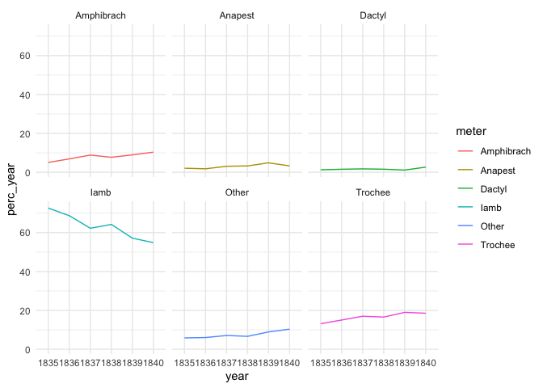
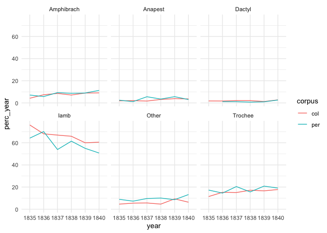

# 4.1 Meters: basic statistics

## Basic statistics

``` r
library(tidyverse)
```

    Warning: package 'ggplot2' was built under R version 4.3.1

    Warning: package 'tidyr' was built under R version 4.3.1

    Warning: package 'dplyr' was built under R version 4.3.1

    Warning: package 'lubridate' was built under R version 4.3.1

    ── Attaching core tidyverse packages ──────────────────────── tidyverse 2.0.0 ──
    ✔ dplyr     1.1.4     ✔ readr     2.1.4
    ✔ forcats   1.0.0     ✔ stringr   1.5.0
    ✔ ggplot2   3.5.1     ✔ tibble    3.2.1
    ✔ lubridate 1.9.3     ✔ tidyr     1.3.1
    ✔ purrr     1.0.2     
    ── Conflicts ────────────────────────────────────────── tidyverse_conflicts() ──
    ✖ dplyr::filter() masks stats::filter()
    ✖ dplyr::lag()    masks stats::lag()
    ℹ Use the conflicted package (<http://conflicted.r-lib.org/>) to force all conflicts to become errors

``` r
theme_set(theme_minimal())

corpus_1835 <- readRDS("../../data/corpus1835/corpus_1835.Rds")

glimpse(corpus_1835)
```

    Rows: 4,797
    Columns: 21
    $ text_id       <chr> "P_1", "P_10", "P_100", "P_1000", "P_1001", "P_1002", "P…
    $ A_ID          <chr> "", "A-50", "A-7", "A-41", "A-139", "A-11", "A-163", "A-…
    $ author_sign   <chr> "", "Л. Якубович", "Кольцов", "Ф. Глинка", "Н. Прокопови…
    $ author_text   <chr> "", "Якубович Л.А.", "Кольцов А.В.", "Глинка Ф.Н.", "Про…
    $ text_title    <chr> "Солдатская песня", "Молния", "Ночлег чумаков", "Утешите…
    $ text_subtitle <chr> "", "", "Сельские картины", "", "", "", "", "", "", "", …
    $ first_line    <chr> "Ох жизнь, молодецкая", "Зачем с небесной высоты", "В бл…
    $ year          <chr> "1835", "1835", "1836", "1838", "1838", "1838", "1838", …
    $ path_text     <chr> "../../data/corpus1835/periodicals/per_raw//P_1.txt", ".…
    $ source_text   <chr> "Сев_пч. 1835. №12. C. 46", "БдЧ. 1835. Т.8. Отд. 1. C. …
    $ COL_ID        <chr> "", "", "", "", "", "", "", "", "", "", "", "", "", "", …
    $ corpus        <chr> "per", "per", "per", "per", "per", "per", "per", "per", …
    $ text_raw      <chr> "Ох, жизнь молодецкая,\nБравая, солдатская!\nКак осенняя…
    $ text_cln      <chr> "Ох, жизнь молодецкая,\nБравая, солдатская!\nКак осенняя…
    $ text_lemm     <chr> "ох, жизнь молодецкий,\nбравый, солдатский!\nкак осенний…
    $ text_acc      <chr> "Ох, жизнь молоде'цкая,\nБра'вая, солда'тская!\nКак осе'…
    $ meter         <chr> "Other", "Iamb", "Iamb", "Iamb", "Trochee", "Iamb", "Oth…
    $ feet          <chr> "?", "3", "4", "4", "4", "4", "?", "4", "6", "5", "4", "…
    $ formula       <chr> "Other_?", "Iamb_3", "Iamb_4", "Iamb_4", "Trochee_4", "I…
    $ n_lines       <int> 38, 16, 98, 77, 28, 12, 44, 25, 31, 28, 100, 16, 17, 60,…
    $ feet_short    <chr> "other", "3", "4", "4", "4", "4", "other", "4", "6", "5"…

A small notebook counting number of poems of different meters

### n poems in groups

``` r
# number of texts from periodicals
n_texts_per <- corpus_1835 %>% filter(corpus == "per") %>% nrow()
n_texts_per
```

    [1] 1905

``` r
# number of texts from books ("collections")
n_texts_col <- corpus_1835 %>% filter(corpus == "col") %>% nrow()
n_texts_col
```

    [1] 2892

``` r
# total number of texts
n_texts_total <- corpus_1835 %>% nrow()
n_texts_total
```

    [1] 4797

### meters

``` r
meters_total <- corpus_1835 %>% 
  count(meter, sort = T) %>% 
  mutate(perc = round((n/n_texts_total) * 100, 1))

meters_total
```

    # A tibble: 6 × 3
      meter          n  perc
      <chr>      <int> <dbl>
    1 Iamb        3085  64.3
    2 Trochee      776  16.2
    3 Amphibrach   369   7.7
    4 Other        350   7.3
    5 Anapest      138   2.9
    6 Dactyl        79   1.6

Meters in periodicals

``` r
meters_p <- corpus_1835 %>% 
  filter(corpus == "per") %>% 
  count(meter, sort = T) %>% 
  mutate(perc = round((n / n_texts_per) * 100, 1 ))

meters_p
```

    # A tibble: 6 × 3
      meter          n  perc
      <chr>      <int> <dbl>
    1 Iamb        1113  58.4
    2 Trochee      345  18.1
    3 Other        190  10  
    4 Amphibrach   167   8.8
    5 Anapest       67   3.5
    6 Dactyl        23   1.2

Meters in books / collections

``` r
meters_b <- corpus_1835 %>% 
  filter(corpus == "col") %>% 
  count(meter, sort = T) %>% 
  mutate(perc = round( (n / n_texts_col) * 100, 1 ))

meters_b
```

    # A tibble: 6 × 3
      meter          n  perc
      <chr>      <int> <dbl>
    1 Iamb        1972  68.2
    2 Trochee      431  14.9
    3 Amphibrach   202   7  
    4 Other        160   5.5
    5 Anapest       71   2.5
    6 Dactyl        56   1.9

### formulas

``` r
# most used meters:
corpus_1835 %>% 
  count(formula, sort = T) %>% 
  head(20)
```

    # A tibble: 20 × 2
       formula              n
       <chr>            <int>
     1 Iamb_4            1515
     2 Iamb_v             712
     3 Trochee_4          674
     4 Iamb_6             380
     5 Other_?            350
     6 Iamb_5             254
     7 Amphibrach_4       213
     8 Iamb_3              89
     9 Anapest_other       73
    10 Amphibrach_43       52
    11 Iamb_43             43
    12 Anapest_2           34
    13 Amphibrach_3        30
    14 Trochee_3           28
    15 Amphibrach_2        24
    16 Dactyl_6            22
    17 Dactyl_3            21
    18 Trochee_43          21
    19 Trochee_5           20
    20 Amphibrach_other    18

Main metrical variations:

``` r
formula_main <- c("Iamb_3", "Iamb_4", "Iamb_5", "Iamb_6", "Iamb_v",
                  "Trochee_4", "Amphibrach_4", "Anapest_2", "Amphibrach_43",
                  "Iamb_43", "Amphibrach_3")

corpus_formula <- corpus_1835 %>% 
  select(corpus, formula) %>% 
  mutate(formula = ifelse(formula %in% formula_main, formula, "Other"))
```

``` r
formula_total <- corpus_formula %>% 
  select(formula) %>% 
  count(formula, sort = T) %>% 
  mutate(perc = round((n/n_texts_total)*100, 1))

formula_total
```

    # A tibble: 12 × 3
       formula           n  perc
       <chr>         <int> <dbl>
     1 Iamb_4         1515  31.6
     2 Other           801  16.7
     3 Iamb_v          712  14.8
     4 Trochee_4       674  14.1
     5 Iamb_6          380   7.9
     6 Iamb_5          254   5.3
     7 Amphibrach_4    213   4.4
     8 Iamb_3           89   1.9
     9 Amphibrach_43    52   1.1
    10 Iamb_43          43   0.9
    11 Anapest_2        34   0.7
    12 Amphibrach_3     30   0.6

formula periodicals

``` r
formula_per <- corpus_formula %>% 
  filter(corpus == "per") %>% 
  count(formula, sort = T) %>% 
  mutate(perc = round( (n/n_texts_per) *100, 1 ))

formula_per
```

    # A tibble: 12 × 3
       formula           n  perc
       <chr>         <int> <dbl>
     1 Iamb_4          540  28.3
     2 Other           384  20.2
     3 Trochee_4       293  15.4
     4 Iamb_v          245  12.9
     5 Iamb_6          154   8.1
     6 Iamb_5          109   5.7
     7 Amphibrach_4    101   5.3
     8 Amphibrach_43    23   1.2
     9 Anapest_2        19   1  
    10 Iamb_3           15   0.8
    11 Iamb_43          12   0.6
    12 Amphibrach_3     10   0.5

formula books

``` r
formula_col <- corpus_formula %>% 
  filter(corpus == "col") %>% 
  count(formula, sort = T) %>% 
  mutate(perc = round( (n/n_texts_col) *100, 1 ))

formula_col
```

    # A tibble: 12 × 3
       formula           n  perc
       <chr>         <int> <dbl>
     1 Iamb_4          975  33.7
     2 Iamb_v          467  16.1
     3 Other           417  14.4
     4 Trochee_4       381  13.2
     5 Iamb_6          226   7.8
     6 Iamb_5          145   5  
     7 Amphibrach_4    112   3.9
     8 Iamb_3           74   2.6
     9 Iamb_43          31   1.1
    10 Amphibrach_43    29   1  
    11 Amphibrach_3     20   0.7
    12 Anapest_2        15   0.5

#### dynamics btw 1835 and 1840

Percentage of meters in different years

Total

``` r
year_total <- corpus_1835 %>% 
  count(year) %>% 
  rename(year_n = n)

corpus_1835 %>% 
  filter(meter == "Iamb") %>% 
  count(year) %>% 
  left_join(year_total, by = "year") %>% 
  mutate(perc_year = n/year_n * 100) 
```

    # A tibble: 6 × 4
      year      n year_n perc_year
      <chr> <int>  <int>     <dbl>
    1 1835    806   1110      72.6
    2 1836    580    844      68.7
    3 1837    465    747      62.2
    4 1838    492    766      64.2
    5 1839    307    537      57.2
    6 1840    435    793      54.9

``` r
corpus_1835 %>% 
  group_by(meter, year) %>% 
  count() %>% 
  ungroup() %>% 
  left_join(year_total, by = "year") %>% 
  mutate(perc_year = n/year_n * 100) %>% 
  ggplot(aes(x = year, y = perc_year, colour = meter, group = meter)) + 
  geom_line() + facet_wrap(~meter)
```



In periodicals and collections separately

``` r
year_type_n <- corpus_1835 %>% 
  group_by(year, corpus) %>% 
  count() %>% 
  ungroup() %>% 
  mutate(year_corpus = paste0(year, "_", corpus)) %>% 
  rename(year_n = n) %>% 
  select(-year, -corpus)

year_type_n
```

    # A tibble: 12 × 2
       year_n year_corpus
        <int> <chr>      
     1    786 1835_col   
     2    324 1835_per   
     3    583 1836_col   
     4    261 1836_per   
     5    478 1837_col   
     6    269 1837_per   
     7    478 1838_col   
     8    288 1838_per   
     9    235 1839_col   
    10    302 1839_per   
    11    332 1840_col   
    12    461 1840_per   

``` r
corpus_1835 %>% 
  #filter(meter == "Iamb") %>% 
  count(meter, year, corpus) %>% 
  mutate(year_corpus = paste0(year, "_", corpus)) %>% 
  left_join(year_type_n, by = "year_corpus") %>% 
  select(-year_corpus) %>% 
  mutate(perc_year = n/year_n * 100) %>% 
  ggplot(aes(x = year, y = perc_year, colour = corpus, group = corpus)) + 
  geom_line() + facet_wrap(~meter)
```



``` r
corpus_1835 %>% 
  filter(meter == "Iamb") %>% 
  count(meter, year, corpus) %>% 
  mutate(year_corpus = paste0(year, "_", corpus)) %>% 
  left_join(year_type_n, by = "year_corpus") %>% 
  select(-year_corpus) %>% 
  mutate(perc_year = n/year_n * 100) %>% 
  arrange(desc(corpus))
```

    # A tibble: 12 × 6
       meter year  corpus     n year_n perc_year
       <chr> <chr> <chr>  <int>  <int>     <dbl>
     1 Iamb  1835  per      208    324      64.2
     2 Iamb  1836  per      183    261      70.1
     3 Iamb  1837  per      145    269      53.9
     4 Iamb  1838  per      177    288      61.5
     5 Iamb  1839  per      166    302      55.0
     6 Iamb  1840  per      234    461      50.8
     7 Iamb  1835  col      598    786      76.1
     8 Iamb  1836  col      397    583      68.1
     9 Iamb  1837  col      320    478      66.9
    10 Iamb  1838  col      315    478      65.9
    11 Iamb  1839  col      141    235      60  
    12 Iamb  1840  col      201    332      60.5

## RNC

Same statistics from the RNC

``` r
load("../../data/nkrja_19th_lem.Rda")

rnc_1830 <- c19 %>% 
  filter(year > 1830 & year < 1841)

rnc_1830 %>% 
  select(meter) %>% 
  count(meter, sort = T) %>% 
  mutate(perc = round((n / nrow(rnc_1830)) * 100, 1)) %>% 
  filter(meter %in% c("Я", "Х", "Д", "Аф", "Ан"))
```

      meter    n perc
    1     Я 1228 59.8
    2     Х  422 20.5
    3    Аф  132  6.4
    4    Ан   54  2.6
    5     Д   41  2.0

``` r
rnc_1830 %>% 
  select(meter, feet) %>% 
  mutate(feet = str_replace(feet, "вольная.*$", "вольная"),
    formula = paste0(meter, "_", feet)) %>% 
  count(formula, sort = T) %>% 
  mutate(perc = round((n / nrow(rnc_1830)) * 100, 1)) %>% 
  filter(formula %in% c("Я_3", "Я_4", "Я_5", "Я_6", "Я_вольная", 
                        "Я_регулярная : 4+3", "Х_4", "Аф_4", 
                        "Аф_регулярная : 4+3", "Ан_2"
                        )
         )
```

                   formula   n perc
    1                  Я_4 534 26.0
    2                  Х_4 337 16.4
    3            Я_вольная 191  9.3
    4                  Я_5 144  7.0
    5                  Я_6 121  5.9
    6                 Аф_4  62  3.0
    7                  Я_3  29  1.4
    8   Я_регулярная : 4+3  23  1.1
    9  Аф_регулярная : 4+3  16  0.8
    10                Ан_2  14  0.7
