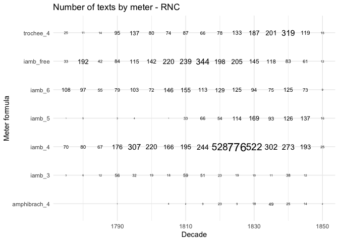

# 04_1_corpus_preparation

## 4.2.1. Corpus preparation

## load packages

``` r
library(tidyverse)
```

    Warning: package 'ggplot2' was built under R version 4.3.1

    Warning: package 'lubridate' was built under R version 4.3.1

    ── Attaching core tidyverse packages ──────────────────────── tidyverse 2.0.0 ──
    ✔ dplyr     1.1.3     ✔ readr     2.1.4
    ✔ forcats   1.0.0     ✔ stringr   1.5.0
    ✔ ggplot2   3.4.4     ✔ tibble    3.2.1
    ✔ lubridate 1.9.3     ✔ tidyr     1.3.0
    ✔ purrr     1.0.2     
    ── Conflicts ────────────────────────────────────────── tidyverse_conflicts() ──
    ✖ dplyr::filter() masks stats::filter()
    ✖ dplyr::lag()    masks stats::lag()
    ℹ Use the conflicted package (<http://conflicted.r-lib.org/>) to force all conflicts to become errors

``` r
library(tidytext)
library(stringdist)
```


    Attaching package: 'stringdist'

    The following object is masked from 'package:tidyr':

        extract

``` r
# library(tm)

# function for sampling
source("04_fn_sampling.R")

theme_set(theme_minimal())
```

## prepare data

### RNC

Upload RNC data (not publicly available)

``` r
load("../../data/nkrja_19th_lem.Rda")
glimpse(c19)
```

    Rows: 15,569
    Columns: 41
    $ Unnamed..0          <int> 1, 2, 3, 4, 5, 6, 7, 8, 9, 10, 11, 12, 13, 14, 15,…
    $ path                <chr> "xix/1790-1810_poets/poets-001", "xix/1790-1810_po…
    $ author              <chr> "С. С. Бобров", "С. С. Бобров", "С. С. Бобров", "С…
    $ dub                 <lgl> NA, NA, NA, NA, NA, NA, NA, NA, NA, NA, NA, NA, NA…
    $ original            <chr> "", "", "Гораций", "", "", "", "", "", "", "", "",…
    $ language            <chr> "", "", "латинский", "", "", "", "", "", "", "", "…
    $ header              <chr> "Царство всеобщей любви : «Еще вкруг солнцев не вр…
    $ cyclus              <chr> "", "", "", "", "", "", "", "", "", "", "", "", ""…
    $ liber               <chr> "", "", "", "", "", "", "", "", "", "", "", "", ""…
    $ created             <chr> "1785", "1785", "1787", "1789", "1789", "1789", "1…
    $ start               <dbl> 1785, 1785, 1787, 1789, 1789, 1789, 1792, 1800, 18…
    $ end                 <dbl> NA, NA, NA, NA, NA, NA, 1800, NA, NA, 1803, 1803, …
    $ exact               <chr> "неточная", "неточная", "неточная", "неточная", "н…
    $ sphere              <chr> "художественная", "художественная", "художественна…
    $ genre_fi            <chr> "стихотворение", "стихотворение", "стихотворение :…
    $ audience_age        <chr> "н-возраст", "н-возраст", "н-возраст", "н-возраст"…
    $ audience_level      <chr> "н-уровень", "н-уровень", "н-уровень", "н-уровень"…
    $ audience_size       <chr> "большая", "большая", "большая", "большая", "больш…
    $ source              <chr> "Поэты 1790-1810-х годов. Библиотека поэта. Второе…
    $ publication         <chr> "", "", "", "", "", "", "", "", "", "", "", "", ""…
    $ publisher           <chr> "", "", "", "", "", "", "", "", "", "", "", "", ""…
    $ publ_year           <chr> "", "", "", "", "", "", "", "", "", "", "", "", ""…
    $ medium              <chr> "книга", "книга", "книга", "книга", "книга", "книг…
    $ subcorpus           <chr> "поэтический", "поэтический", "поэтический", "поэт…
    $ meter               <chr> "Я", "Я", "Я", "Я", "Я", "Я", "Я", "Х", "Я", "Я", …
    $ feet                <chr> "4", "6", "4", "4", "4", "6", "4(5)", "4", "4", "4…
    $ clausula            <chr> "регулярная : жмжм жж мжжм", "регулярная : жм", "р…
    $ strophe             <chr> "10 : одическая строфа", "4", "4", "10 : одическая…
    $ gr_strophe          <chr> "", "", "8", "", "", "вольная", "", "", "", "вольн…
    $ rhyme               <chr> "сложная : абаб вв гддг", "перекрестная : абаб", "…
    $ formula             <chr> "Я4жм", "Я6жм", "Я4жм", "Я4жм", "Я4жм", "Я6жжмм", …
    $ extra               <chr> "", "", "", "", "", "нарушения строфики", "", "", …
    $ verses              <dbl> 110, 36, 32, 70, 144, 56, 216, 8, 335, 66, 195, 23…
    $ location            <chr> "", "", "", "", "", "", "", "", "", "", "", "", ""…
    $ location_normalized <chr> "", "", "", "", "", "", "", "", "", "", "", "", ""…
    $ paths_tidy          <chr> "texts_plain/xix/1790-1810_poets/poets-001.txt", "…
    $ diff                <int> 0, 0, 0, 0, 0, 0, 8, 0, 0, 1, 1, 0, 0, 0, 0, 0, 9,…
    $ year                <int> 1785, 1785, 1787, 1789, 1789, 1789, 1800, 1800, 18…
    $ year_start          <int> 1785, 1785, 1787, 1789, 1789, 1789, 1792, 1800, 18…
    $ text_raw            <chr> "Еще вкруг солнцев не вращались \n В превыспренних…
    $ lemma               <chr> "еще вкруг солнцев не вращаться \n в превыспренний…

Cleaning

``` r
#### Subsetting ####
dat <- c19 %>% 
  filter(diff < 10) %>% # alternative to 'date_reliable' - remove texts with wide date ranges
  filter(year > 1774 & year < 1851) %>% # select roughly the 1st half of the 19th century
  filter(verses > 3) # remove all small, incl. one-line poems (these are mostly unfinished drafts included to the corpus)


#### Cleaning ####
# change column names for script
names(dat)[names(dat) == "Unnamed..0"] <- "id"
names(dat)[names(dat) == "lemma"] <- "text_lemm"

## meters and feet cleaning
# main meters
meters_count <- dat %>% 
  group_by(meter) %>% 
  count(sort = T)
head(meters_count, 10)
```

    # A tibble: 10 × 2
    # Groups:   meter [10]
       meter                         n
       <chr>                     <int>
     1 Я                          7360
     2 Х                          1539
     3 Аф                          446
     4 Д                           212
     5 Ан                          154
     6 Д, тонический : Гек + Пен    99
     7 Д, тонический : Гек          75
     8 Х, Я                         32
     9 Ан, Аф                       18
    10 Я # Х                        18

``` r
# store main meters as a vector
meters <- as.vector(meters_count$meter[1:5])

#### cleaning ####
dat <- dat %>% 
  mutate(meter_gr = ifelse(!meter %in% meters, "other", meter)) %>% 
  # most of dactyl formulas are detailed like "Д тонический: Дк + Пен", summarise them into one
  mutate(meter_gr = ifelse(str_detect(meter_gr, "Д|!Аф"), "Д", meter_gr)) %>% 
  # label all combinations of free iamb as "В"
  mutate(feet_gr = ifelse(str_detect(feet, "вольная"), "В", feet)) %>% 
  # ALL feet written as 6(5) to 6 (remove everything in brackets)
  mutate(feet_gr = str_replace_all(feet_gr, "(\\d)\\(\\d.*?\\)", "\\1")) %>% 
  # remove spaces for everything else for easier notation
  mutate(feet_gr = str_remove_all(feet_gr, "[[:space:]]"))

# test  
unique(dat$meter_gr)
```

    [1] "Я"     "Х"     "Д"     "other" "Ан"    "Аф"   

``` r
head(unique(dat$feet_gr))
```

    [1] "4"                          "6"                         
    [3] "3"                          "В"                         
    [5] "регулярная:4+4+4+4+2+2+2+2" "5"                         

Sampling

``` r
ru19_fin <- sample_long(dat,
                        starting_n = 1,
                        sample_size = "corpus median",
                        over9000 = 6)
```

    Redetermining length of poems...

    Preparing to sample...

    Sampling long poems...

    `summarise()` has grouped output by 'id'. You can override using the `.groups`
    argument.
    `summarise()` has grouped output by 'id'. You can override using the `.groups`
    argument.
    `summarise()` has grouped output by 'id'. You can override using the `.groups`
    argument.
    `summarise()` has grouped output by 'id'. You can override using the `.groups`
    argument.
    Sampling poems over 9000!!!...
    `summarise()` has grouped output by 'id'. You can override using the `.groups`
    argument.
    Replacing long texts by samples...

Final cleaning & renaming

``` r
nkrja19 <- ru19_fin %>% 
  # rename meters
  mutate(text_raw = "",
         meter_gr = recode(meter_gr, 
                           "Х" = "trochee",
                           "Я" = "iamb", 
                           "Аф" = "amphibrach",
                           "Ан" = "anapaest", 
                           "Д" = "dactyl"),
         feet_gr = recode(feet_gr, "В" = "free"),
         formula = paste0(meter_gr, "_", feet_gr),
         # add id referring to nkrja
         id = paste0("N_", id)) %>% 
  # select only needed columns
  # remove raw texts because of licencing
  select(id, author, text_lemm, year, formula, meter_gr, feet_gr, verses) %>% 
  filter(verses > 3) %>% # filter poems shorter than 4 lines

  # attach true length of poems/samples
  separate_rows(text_lemm, sep = "\\n") %>% 
    filter(text_lemm != "") %>% 
    group_by(id) %>% 
    mutate(n_lines_check = row_number(),
           n_lines_check = max(n_lines_check)) %>% 
    mutate(text_lemm = paste0(text_lemm, collapse = "\\n")) %>% 
    distinct() %>% 
    ungroup() %>%
    
  # rename columns
  rename("meter" = "meter_gr",
         "feet" = "feet_gr",
         "n_lines" = "n_lines_check") 

glimpse(nkrja19) 
```

    Rows: 13,896
    Columns: 9
    $ id        <chr> "N_8", "N_12", "N_14", "N_22", "N_25", "N_26", "N_28", "N_30…
    $ author    <chr> "С. С. Бобров", "С. С. Бобров", "С. С. Бобров", "С. С. Бобро…
    $ text_lemm <chr> "страшный отрасль день небесный, \\n вестник таинство неизве…
    $ year      <int> 1800, 1802, 1804, 1805, 1789, 1789, 1789, 1789, 1802, 1790, …
    $ formula   <chr> "trochee_4", "iamb_4", "dactyl_3", "iamb_4", "iamb_6", "othe…
    $ meter     <chr> "trochee", "iamb", "dactyl", "iamb", "iamb", "other", "iamb"…
    $ feet      <chr> "4", "4", "3", "4", "6", "4", "6", "6", "free", "free", "6",…
    $ verses    <dbl> 8, 23, 24, 24, 14, 14, 6, 12, 8, 8, 4, 4, 6, 8, 4, 5, 5, 8, …
    $ n_lines   <int> 8, 23, 24, 24, 14, 14, 6, 12, 8, 8, 4, 4, 6, 8, 4, 5, 5, 8, …

Save

``` r
saveRDS(nkrja19, file = "../../data/ch4/nkrja_sampled_iamb4_experiment.Rds")
```

### Corpus 1835

``` r
corpus_1835 <- readRDS("../../data/corpus1835/corpus_1835.Rds")
glimpse(corpus_1835)
```

    Rows: 4,797
    Columns: 20
    $ text_id       <chr> "P_1", "P_10", "P_100", "P_1000", "P_1001", "P_1002", "P…
    $ A_ID          <chr> "", "A-50", "A-7", "A-41", "A-139", "A-11", "A-163", "A-…
    $ author_text   <chr> "", "Якубович Л.А.", "Кольцов А.В.", "Глинка Ф.Н.", "Про…
    $ author_sign   <chr> "", "Л. Якубович", "Кольцов", "Ф. Глинка", "Н. Прокопови…
    $ text_title    <chr> "Солдатская песня", "Молния", "Ночлег чумаков", "Утешите…
    $ text_subtitle <chr> "", "", "Сельские картины", "", "", "", "", "", "", "", …
    $ first_line    <chr> "Ох жизнь, молодецкая", "Зачем с небесной высоты", "В бл…
    $ year          <chr> "1835", "1835", "1836", "1838", "1838", "1838", "1838", …
    $ path_text     <chr> "../../data/corpus1835/periodicals/per_raw//P_1.txt", ".…
    $ source_text   <chr> "Сев_пч. 1835. №12. C. 46", "БдЧ. 1835. Т.8. Отд. 1. C. …
    $ COL_ID        <chr> "", "", "", "", "", "", "", "", "", "", "", "", "", "", …
    $ corpus        <chr> "per", "per", "per", "per", "per", "per", "per", "per", …
    $ text_raw      <chr> "Ох, жизнь молодецкая,\nБравая, солдатская!\nКак осенняя…
    $ text_cln      <chr> "Ох, жизнь молодецкая,\nБравая, солдатская!\nКак осенняя…
    $ text_lemm     <chr> "ох, жизнь молодецкий,\nбравый, солдатский!\nкак осенний…
    $ text_acc      <chr> "Ох, жизнь молоде'цкая,\nБра'вая, солда'тская!\nКак осе'…
    $ meter         <fct> Other?, Iamb, Iamb, Iamb, Trochee, Iamb, Trochee, Iamb, …
    $ feet          <chr> "?", "3", "4", "4", "4", "4", "other", "4", "6", "5", "4…
    $ formula       <chr> "Other?_?", "Iamb_3", "Iamb_4", "Iamb_4", "Trochee_4", "…
    $ n_lines       <int> 38, 16, 98, 77, 28, 12, 44, 25, 31, 28, 100, 16, 17, 60,…

Select only needed columns

``` r
corpus_35_short <- corpus_1835 %>% 
  mutate(text_id = paste0("M_", text_id),# m for marginal
         verses = ""
         ) %>% 
  rename(author = author_text) %>% 
  select(text_id, author, year, 
         text_raw, text_lemm, 
         n_lines, meter, feet, formula, verses)

glimpse(corpus_35_short)
```

    Rows: 4,797
    Columns: 10
    $ text_id   <chr> "M_P_1", "M_P_10", "M_P_100", "M_P_1000", "M_P_1001", "M_P_1…
    $ author    <chr> "", "Якубович Л.А.", "Кольцов А.В.", "Глинка Ф.Н.", "Прокопо…
    $ year      <chr> "1835", "1835", "1836", "1838", "1838", "1838", "1838", "183…
    $ text_raw  <chr> "Ох, жизнь молодецкая,\nБравая, солдатская!\nКак осенняя ноч…
    $ text_lemm <chr> "ох, жизнь молодецкий,\nбравый, солдатский!\nкак осенний ноч…
    $ n_lines   <int> 38, 16, 98, 77, 28, 12, 44, 25, 31, 28, 100, 16, 17, 60, 8, …
    $ meter     <fct> Other?, Iamb, Iamb, Iamb, Trochee, Iamb, Trochee, Iamb, Iamb…
    $ feet      <chr> "?", "3", "4", "4", "4", "4", "other", "4", "6", "5", "4", "…
    $ formula   <chr> "Other?_?", "Iamb_3", "Iamb_4", "Iamb_4", "Trochee_4", "Iamb…
    $ verses    <chr> "", "", "", "", "", "", "", "", "", "", "", "", "", "", "", …

#### Remove doubles

Load RNC

``` r
load("../../data/nkrja_19th_lem.Rda")

corpus1835_check <- corpus_35_short %>% 
    filter(n_lines > 3) %>%
    mutate(doublesCheck = str_extract(text_lemm, "^.*?\n.*?\n.*?\n")) %>% 
    mutate(doublesCheck = str_remove_all(doublesCheck, "[[:punct:]]|[[:space:]]")) %>% 
    select(text_id, author, year, doublesCheck, text_raw)

nkrja19_check <- c19 %>% 
    filter(diff < 10) %>% 
    filter(year > 1774 & year < 1851) %>% 
    filter(verses > 1) %>% 
    rename(n_lines = verses,
           text_lemm = lemma) %>% 
    filter(n_lines > 3) %>%
    mutate(doublesCheck = str_extract(text_lemm, "^.*?\n.*?\n.*?\n")) %>% 
    mutate(doublesCheck = str_remove_all(doublesCheck, "[[:punct:]]|[[:space:]]")) %>% 
    select(Unnamed..0, author, year, doublesCheck, text_raw)

doubles <- nkrja19_check %>% 
  inner_join(corpus1835_check, by = "doublesCheck")  
```

    Warning in inner_join(., corpus1835_check, by = "doublesCheck"): Detected an unexpected many-to-many relationship between `x` and `y`.
    ℹ Row 923 of `x` matches multiple rows in `y`.
    ℹ Row 3388 of `y` matches multiple rows in `x`.
    ℹ If a many-to-many relationship is expected, set `relationship =
      "many-to-many"` to silence this warning.

``` r
glimpse(doubles)  
```

    Rows: 991
    Columns: 9
    $ Unnamed..0   <int> 246, 542, 726, 807, 808, 809, 811, 815, 816, 818, 819, 82…
    $ author.x     <chr> "П. И. Шаликов", "Д. П. Ознобишин", "В. И. Панаев", "В. И…
    $ year.x       <int> 1837, 1840, 1826, 1830, 1830, 1831, 1832, 1833, 1833, 183…
    $ doublesCheck <chr> "вотславачистыйкаксолнцевясныйденьвотистинныйталантприман…
    $ text_raw.x   <chr> "Вот слава чистая, как солнце в ясный день, \n Вот истинн…
    $ text_id      <chr> "M_P_943", "M_P_1245", "M_P_1259", "M_P_978", "M_P_981", …
    $ author.y     <chr> "Шаликов П.И.", "Ознобишин Д.П.", "", "Туманский В.И.", "…
    $ year.y       <chr> "1837", "1840", "1835", "1837", "1837", "1837", "1837", "…
    $ text_raw.y   <chr> "Вот слава чистая, как солнце в ясный день; \nВот истинны…

``` r
# write.csv(doubles, file = "doubles.csv")
```

``` r
print(paste0("Number of intersections between RNC & corpus_1835: ", nrow(doubles)))
```

    [1] "Number of intersections between RNC & corpus_1835: 991"

``` r
doubles %>% 
  count(author.x, author.y, sort = T)
```

                          author.x                   author.y   n
    1                 И. А. Крылов                Крылов И.А. 168
    2            Е. А. Баратынский           Баратынский Е.А. 131
    3             В. Г. Бенедиктов            Бенедиктов В.Г.  73
    4              В. А. Жуковский             Жуковский В.А.  72
    5               Н. А. Некрасов              Некрасов Н.А.  53
    6                А. В. Кольцов               Кольцов А.В.  46
    7              М. Ю. Лермонтов             Лермонтов М.Ю.  45
    8                    А. А. Фет                   Фет А.А.  40
    9                 Ф. И. Тютчев                Тютчев Ф.И.  39
    10                А. С. Пушкин                Пушкин А.С.  37
    11              А. И. Полежаев              Полежаев А.И.  24
    12   А. А. Бестужев-Марлинский Бестужев А.А. (Марлинский)  21
    13                М. Д. Деларю                Деларю М.Д.  16
    14            Е. П. Ростопчина            Ростопчина Е.П.  15
    15              В. Г. Тепляков              Тепляков В.Г.  14
    16               Н. С. Теплова            Надежда Теплова  13
    17                 П. П. Ершов                 Ершов П.П.  13
    18              А. В. Тимофеев              Тимофеев А.В.   9
    19              А. И. Полежаев          Елизавета Кульман   9
    20               А. С. Хомяков               Хомяков А.С.   9
    21             В. И. Туманский             Туманский В.И.   9
    22                   Е. Бернет                  Бернет Е.   7
    23              Л. А. Якубович              Якубович Л.А.   7
    24           А. И. Подолинский           Подолинский А.И.   6
    25             Д. П. Ознобишин             Ознобишин Д.П.   6
    26             П. А. Вяземский             Вяземский П.А.   6
    27                 Э. И. Губер                 Губер Э.И.   6
    28               Д. В. Давыдов               Давыдов Д.В.   4
    29             Н. В. Кукольник             Кукольник Н.В.   4
    30                Н. М. Языков                Языков Н.М.   4
    31               Н. С. Теплова               Теплова Н.С.   4
    32             А. С. Грибоедов             Грибоедов А.С.   3
    33 Д. Ю. Струйский (Трилунный)             Струйский Д.Ю.   3
    34              Е. П. Гребенка              Гребенка Е.П.   3
    35                И. И. Козлов                Козлов И.И.   3
    36             М. Ю. Лермонтов               М. Лермонтов   3
    37               А. В. Кольцов                 А. Кольцов   2
    38              А. И. Полежаев              Тимофеев А.В.   2
    39                А. Н. Майков                Майков А.Н.   2
    40                А. С. Пушкин                              2
    41                А. С. Пушкин                А.С. Пушкин   2
    42            В. Г. Бенедиктов              В. Бенедиктов   2
    43              И. С. Тургенев              Тургенев И.С.   2
    44               К. К. Павлова               Павлова К.К.   2
    45                   Л. А. Мей                  Зелинский   2
    46             Н. В. Кукольник               Н. Кукольник   2
    47                Н. М. Коншин                     Н. К-н   2
    48             П. А. Вяземский              Кн. Вяземский   2
    49                 П. П. Ершов                   П. Ершов   2
    50               С. П. Шевырев               Шевырев С.П.   2
    51   А. А. Бестужев-Марлинский                              1
    52               А. А. Дельвиг               Дельвиг А.А.   1
    53              А. И. Полежаев              Алексеев П.Ф.   1
    54              А. И. Полежаев                         С.   1
    55              А. И. Полежаев                 Сатин Н.М.   1
    56                А. Н. Майков                        М.    1
    57                А. П. Крюков                  А. Крюков   1
    58                А. С. Пушкин                  А. Пушкин   1
    59             В. А. Жуковский                  Жуковский   1
    60            В. Г. Бенедиктов             В. Бенедиктов    1
    61                В. И. Панаев                              1
    62           В. И. Соколовский             В. Соколовский   1
    63             В. Н. Григорьев                       П.М.   1
    64               Д. В. Давыдов                         Н.   1
    65              Е. П. Гребенка                Е. Гребенка   1
    66                И. И. Козлов                              1
    67                И. И. Козлов                  И. Козлов   1
    68              К. А. Бахтурин              Бахтурин К.А.   1
    69              Л. А. Якубович                Л. Якубович   1
    70                М. Д. Деларю                  М. Деларю   1
    71              Н. А. Некрасов                              1
    72             Н. В. Кукольник                              1
    73                 Н. М. Сатин                 Сатин Н.М.   1
    74                Н. М. Языков                              1
    75                Н. П. Огарев                Огарев Н.П.   1
    76               Н. Ф. Щербина                Н. Щербинин   1
    77               П. А. Катенин                              1
    78               П. А. Катенин               Катенин П.А.   1
    79               П. И. Шаликов               Шаликов П.И.   1
    80                 П. П. Ершов                              1
    81                 П. П. Ершов                   Ершов П.   1
    82                 П. П. Ершов                 Петр Ершов   1
    83                  С. Е. Раич                       Раич   1
    84                  С. Е. Раич                    С. Раич   1
    85                  Ф. А. Кони                  Кони Ф.А.   1
    86                  Ф. А. Кони                 Федор Кони   1
    87                Ф. Н. Глинка               Федор Глинка   1
    88                 Э. И. Губер               Эдуард Губер   1

``` r
doubles %>% 
  select(text_id) %>% 
  mutate(text_id = str_remove_all(text_id, "M_")) %>% 
  separate(text_id, into = c("corpus", "id"), sep = "_") %>% 
  count(corpus)
```

    Warning: Expected 2 pieces. Additional pieces discarded in 666 rows [16, 17, 18, 19, 20,
    21, 22, 23, 24, 25, 26, 27, 28, 29, 30, 31, 32, 34, 35, 36, ...].

      corpus   n
    1      C 666
    2      P 325

``` r
# remove some issue with detecting Kulman's texts as doubles to Polezhaev
doubles <- doubles %>% 
  filter(author.y != "Елизавета Кульман")
```

Remove doubles from corpus_1835

``` r
head(doubles$text_id)
```

    [1] "M_P_943"  "M_P_1245" "M_P_1259" "M_P_978"  "M_P_981"  "M_P_973" 

``` r
corpus_35_short_nd <- corpus_35_short %>% 
  filter(!text_id %in% doubles$text_id) %>% 
  rename(id = text_id)

nrow(corpus_35_short_nd)
```

    [1] 3817

#### sampling corpus-1835

``` r
corpus_1835_sampled <- sample_long(corpus_35_short_nd,
                            starting_n = 1,
                            sample_size = 22, # use the median size as in RNC
                            over9000 = 6)
```

    Redetermining length of poems...

    Preparing to sample...

    Sampling long poems...

    `summarise()` has grouped output by 'id'. You can override using the `.groups`
    argument.
    `summarise()` has grouped output by 'id'. You can override using the `.groups`
    argument.
    `summarise()` has grouped output by 'id'. You can override using the `.groups`
    argument.
    `summarise()` has grouped output by 'id'. You can override using the `.groups`
    argument.
    Sampling poems over 9000!!!...
    `summarise()` has grouped output by 'id'. You can override using the `.groups`
    argument.
    Replacing long texts by samples...

``` r
nrow(corpus_1835_sampled)
```

    [1] 4755

Save

``` r
saveRDS(corpus_1835_sampled, file = "../../data/ch4/corpus_1835_sampled.Rds")
saveRDS(corpus_35_short_nd, file = "../../data/ch4/corpus_35_short_nd.Rds")
```

## load data

``` r
nkrja19 <- readRDS("../../data/ch4/nkrja_sampled_iamb4_experiment.Rds")
corpus_1835_sampled <- readRDS("../../data/ch4/corpus_1835_sampled.Rds")

glimpse(nkrja19)
```

    Rows: 13,899
    Columns: 9
    $ id        <chr> "N_8", "N_12", "N_14", "N_22", "N_25", "N_26", "N_28", "N_30…
    $ author    <chr> "С. С. Бобров", "С. С. Бобров", "С. С. Бобров", "С. С. Бобро…
    $ text_lemm <chr> "страшный отрасль день небесный, \\n вестник таинство неизве…
    $ year      <int> 1800, 1802, 1804, 1805, 1789, 1789, 1789, 1789, 1802, 1790, …
    $ formula   <chr> "trochee_4", "iamb_4", "dactyl_3", "iamb_4", "iamb_6", "othe…
    $ meter     <chr> "trochee", "iamb", "dactyl", "iamb", "iamb", "other", "iamb"…
    $ feet      <chr> "4", "4", "3", "4", "6", "4", "6", "6", "free", "free", "6",…
    $ verses    <dbl> 8, 23, 24, 24, 14, 14, 6, 12, 8, 8, 4, 4, 6, 8, 4, 5, 5, 8, …
    $ n_lines   <int> 8, 23, 24, 24, 14, 14, 6, 12, 8, 8, 4, 4, 6, 8, 4, 5, 5, 8, …

``` r
glimpse(corpus_1835_sampled)
```

    Rows: 4,755
    Columns: 10
    $ id        <chr> "M_P_1002", "M_P_1008", "M_P_1009", "M_P_1013", "M_P_1017", …
    $ author    <chr> "Пушкин А.С.", "Ростопчина Е.П.", "Айбулат К.М.", "Якубович …
    $ year      <chr> "1838", "1838", "1838", "1838", "1838", "1838", "1838", "183…
    $ text_raw  <chr> "Я слушал вас... я прочитал\nСии небрежные созданья,\nГде ва…
    $ text_lemm <chr> "я слушать вы... я прочитывать\nсей небрежный создание,\nгде…
    $ n_lines   <int> 12, 16, 17, 22, 14, 15, 8, 8, 4, 12, 15, 12, 20, 8, 14, 14, …
    $ meter     <fct> Iamb, Iamb, Iamb, Iamb, Iamb, Iamb, Iamb, Iamb, Other?, Troc…
    $ feet      <chr> "4", "other", "other", "4", "other", "other", "6", "6", "?",…
    $ formula   <chr> "Iamb_4", "Iamb_other", "Iamb_other", "Iamb_4", "Iamb_other"…
    $ verses    <chr> "", "", "", "", "", "", "", "", "", "", "", "", "", "", "", …

fast check sampling

``` r
corpus_1835_sampled %>% 
  separate_rows(text_lemm, sep = "\n") %>% 
  filter(text_lemm != "") %>% 
  group_by(id) %>% 
  mutate(n_lines_sampled = row_number()) %>% 
  slice_max(n_lines_sampled, n = 1) %>% 
  select(id, n_lines, n_lines_sampled) %>% 
  pivot_longer(!id, names_to = "N", values_to = "n_lines") %>% 
  ggplot(aes(x = N, y = n_lines)) + geom_boxplot()
```


### merge

``` r
c35_to_merge <- corpus_1835_sampled %>% 
  select(id, author, text_lemm, year, formula, meter, feet, n_lines) %>% 
  mutate(meter = tolower(meter),
         formula = paste0(meter, "_", feet))

rnc_to_merge <- nkrja19 %>% 
  select(-verses)

# check same-labeled meters
intersect(unique(c35_to_merge$formula), unique(nkrja19$formula))
```

     [1] "iamb_4"       "iamb_6"       "trochee_4"    "amphibrach_4" "iamb_5"      
     [6] "iamb_3"       "trochee_6"    "amphibrach_3" "dactyl_4"     "amphibrach_6"
    [11] "amphibrach_2" "dactyl_6"     "trochee_3"    "dactyl_3"     "trochee_5"   
    [16] "amphibrach_5" "dactyl_2"     "dactyl_5"     "iamb_2"      

``` r
# final check before merging:
glimpse(c35_to_merge)
```

    Rows: 4,755
    Columns: 8
    $ id        <chr> "M_P_1002", "M_P_1008", "M_P_1009", "M_P_1013", "M_P_1017", …
    $ author    <chr> "Пушкин А.С.", "Ростопчина Е.П.", "Айбулат К.М.", "Якубович …
    $ text_lemm <chr> "я слушать вы... я прочитывать\nсей небрежный создание,\nгде…
    $ year      <chr> "1838", "1838", "1838", "1838", "1838", "1838", "1838", "183…
    $ formula   <chr> "iamb_4", "iamb_other", "iamb_other", "iamb_4", "iamb_other"…
    $ meter     <chr> "iamb", "iamb", "iamb", "iamb", "iamb", "iamb", "iamb", "iam…
    $ feet      <chr> "4", "other", "other", "4", "other", "other", "6", "6", "?",…
    $ n_lines   <int> 12, 16, 17, 22, 14, 15, 8, 8, 4, 12, 15, 12, 20, 8, 14, 14, …

``` r
glimpse(rnc_to_merge)
```

    Rows: 13,899
    Columns: 8
    $ id        <chr> "N_8", "N_12", "N_14", "N_22", "N_25", "N_26", "N_28", "N_30…
    $ author    <chr> "С. С. Бобров", "С. С. Бобров", "С. С. Бобров", "С. С. Бобро…
    $ text_lemm <chr> "страшный отрасль день небесный, \\n вестник таинство неизве…
    $ year      <int> 1800, 1802, 1804, 1805, 1789, 1789, 1789, 1789, 1802, 1790, …
    $ formula   <chr> "trochee_4", "iamb_4", "dactyl_3", "iamb_4", "iamb_6", "othe…
    $ meter     <chr> "trochee", "iamb", "dactyl", "iamb", "iamb", "other", "iamb"…
    $ feet      <chr> "4", "4", "3", "4", "6", "4", "6", "6", "free", "free", "6",…
    $ n_lines   <int> 8, 23, 24, 24, 14, 14, 6, 12, 8, 8, 4, 4, 6, 8, 4, 5, 5, 8, …

``` r
corpus_merged <- rbind(c35_to_merge, rnc_to_merge)
glimpse(corpus_merged)
```

    Rows: 18,654
    Columns: 8
    $ id        <chr> "M_P_1002", "M_P_1008", "M_P_1009", "M_P_1013", "M_P_1017", …
    $ author    <chr> "Пушкин А.С.", "Ростопчина Е.П.", "Айбулат К.М.", "Якубович …
    $ text_lemm <chr> "я слушать вы... я прочитывать\nсей небрежный создание,\nгде…
    $ year      <chr> "1838", "1838", "1838", "1838", "1838", "1838", "1838", "183…
    $ formula   <chr> "iamb_4", "iamb_other", "iamb_other", "iamb_4", "iamb_other"…
    $ meter     <chr> "iamb", "iamb", "iamb", "iamb", "iamb", "iamb", "iamb", "iam…
    $ feet      <chr> "4", "other", "other", "4", "other", "other", "6", "6", "?",…
    $ n_lines   <int> 12, 16, 17, 22, 14, 15, 8, 8, 4, 12, 15, 12, 20, 8, 14, 14, …

``` r
# fast check number of poems
corpus_merged %>% 
  mutate(corpus = str_extract(id, "^\\w")) %>% 
  count(corpus)
```

    # A tibble: 2 × 2
      corpus     n
      <chr>  <int>
    1 M       4755
    2 N      13899

``` r
# add two essential columns
corpus_merged <- corpus_merged %>% 
  mutate(corpus = str_extract(id, "^\\w"),
         year = as.numeric(year),
         decade = floor(year/5)*5)
```

``` r
# remove obsolete files
rm(corpus_1835_sampled, nkrja19, c35_to_merge, rnc_to_merge)

saveRDS(corpus_merged, file = "../../data/ch4/corpus_merged.Rds")
```

## Corpus size

``` r
corpus_merged <- readRDS("../../data/ch4/corpus_merged.Rds")
```

### n poems

``` r
# number of texts in each time chunk
corpus_merged %>% 
  count(decade)
```

    # A tibble: 16 × 2
       decade     n
        <dbl> <int>
     1   1775   267
     2   1780   401
     3   1785   214
     4   1790   537
     5   1795   769
     6   1800   648
     7   1805   729
     8   1810   929
     9   1815  1127
    10   1820  1274
    11   1825  1706
    12   1830  1544
    13   1835  5143
    14   1840  2145
    15   1845  1112
    16   1850   109

``` r
# number of tokens
corpus_merged %>% 
  unnest_tokens(input = text_lemm, output = word, token = "words") %>% 
  count(decade, corpus) 
```

    # A tibble: 18 × 3
       decade corpus      n
        <dbl> <chr>   <int>
     1   1775 N       27774
     2   1780 N       41278
     3   1785 N       22224
     4   1790 N       51419
     5   1795 N       71803
     6   1800 N       62125
     7   1805 N       70834
     8   1810 N       90790
     9   1815 N       99529
    10   1820 N      119053
    11   1825 N      146793
    12   1830 N      146654
    13   1835 M      301608
    14   1835 N      105425
    15   1840 M       55881
    16   1840 N      132208
    17   1845 N      128260
    18   1850 N       10643

### n tokens

``` r
corpus_merged %>% 
    unnest_tokens(input = text_lemm, output = word, token = "words") %>% 
    mutate(word = str_remove_all(word, "\\d+|[[:punct:]]")) %>%
    group_by(corpus, year) %>% 
    count() %>% 
    ggplot(aes(x = year, y = n, fill = corpus)) + geom_col() + theme_minimal()
```


### meter distribution

``` r
main_meters <- corpus_merged %>% 
    # filter RNC texts in main meter
    filter(corpus == "N" & formula %in% c("iamb_4", "iamb_6", "trochee_4", "iamb_free")) %>% 
    # count number of poems in each slice in each meter
    group_by(decade, formula) %>% 
    count() %>% 
    pivot_wider(names_from = decade, values_from = n) %>%
    ungroup() %>% 
    select(-`1850`) %>% 
    # calculate total number of poems in each meter
    rowwise(formula) %>% mutate(total = sum(across(where(is.numeric))))

other_meters <- corpus_merged %>% 
    # calculate number of all other meters except for selected 4
    filter(corpus == "N" & !formula %in% c("iamb_4", "iamb_6", "trochee_4", "iamb_free")) %>% 
    group_by(decade) %>% 
    count() %>% 
    pivot_wider(names_from = decade, values_from = n) 

# attach meter labels as "other" and calculate sum
other_meters <- cbind(formula = "other", other_meters) %>% 
    ungroup() %>% 
    select(-`1850`) %>% 
    rowwise(formula) %>% mutate(total = sum(across(where(is.numeric))))

counts <- rbind(main_meters, other_meters)
counts
```

    # A tibble: 5 × 17
    # Rowwise:  formula
      formula  `1775` `1780` `1785` `1790` `1795` `1800` `1805` `1810` `1815` `1820`
      <chr>     <int>  <int>  <int>  <int>  <int>  <int>  <int>  <int>  <int>  <int>
    1 iamb_4       70     80     67    176    307    220    165    195    245    528
    2 iamb_6      108     97     55     79    103     72    145    156    112    128
    3 iamb_fr…     32    192     42     85    114    144    220    239    342    196
    4 trochee…     25     11     14     95    137     82     73     88     66     76
    5 other        32     21     36    102    108    130    126    251    362    346
    # ℹ 6 more variables: `1825` <int>, `1830` <int>, `1835` <int>, `1840` <int>,
    #   `1845` <int>, total <int>

``` r
counts %>% ungroup() %>% summarise_if(is.numeric, sum)
```

    # A tibble: 1 × 16
      `1775` `1780` `1785` `1790` `1795` `1800` `1805` `1810` `1815` `1820` `1825`
       <int>  <int>  <int>  <int>  <int>  <int>  <int>  <int>  <int>  <int>  <int>
    1    267    401    214    537    769    648    729    929   1127   1274   1706
    # ℹ 5 more variables: `1830` <int>, `1835` <int>, `1840` <int>, `1845` <int>,
    #   total <int>

``` r
#colSums(counts[,-1])

# percentage
print("Total percentage in the corpus of each meter")
```

    [1] "Total percentage in the corpus of each meter"

``` r
counts[,17] %>% mutate(perc = round(total/colSums(counts[,17])*100, 1))
```

    # A tibble: 5 × 2
    # Rowwise: 
      total  perc
      <int> <dbl>
    1  4115  29.8
    2  1549  11.2
    3  2218  16.1
    4  1626  11.8
    5  4282  31.1

``` r
top_meters <- corpus_merged %>% 
    group_by(formula) %>% 
    count(sort = T) %>% 
    ungroup() %>%
    top_n(10)
```

    Selecting by n

``` r
top_meters
```

    # A tibble: 10 × 2
       formula          n
       <chr>        <int>
     1 iamb_4        5725
     2 trochee_4     2296
     3 iamb_free     2230
     4 iamb_6        1920
     5 iamb_5        1011
     6 iamb_other     686
     7 iamb_3         557
     8 other_6        377
     9 amphibrach_4   352
    10 other_free     232

``` r
corpus_merged %>% 
    filter(corpus != "M") %>% 
    filter(formula %in% top_meters$formula & !str_detect(formula, "other")) %>%
    mutate(formula = str_remove_all(formula, "регулярная:")) %>% 
    group_by(decade, formula) %>% 
    count() %>% 
    ggplot(aes(x = decade, y = formula, size = n)) + 
        geom_text(aes(label=n)) + 
        theme_minimal() + 
        labs(x = "Decade", y = "Meter formula", title = "Number of texts by meter - RNC") + 
        theme(legend.position = "None")
```


``` r
corpus_merged %>% 
    filter(corpus != "N") %>% 
    filter(formula %in% top_meters$formula & !str_detect(formula, "other")) %>%
    mutate(formula = str_remove_all(formula, "регулярная:")) %>% 
    group_by(decade, formula) %>% 
    count() %>% 
    ggplot(aes(x = decade, y = formula, size = n)) + 
        geom_text(aes(label=n)) + 
        theme_minimal() + 
        labs(x = "Decade", y = "Meter formula", title = "Number of texts by meter - marginals") + 
        theme(legend.position = "None")
```


``` r
corpus_merged %>% 
    filter(corpus != "M") %>% 
    filter(year > 1834 & year < 1841) %>% 
    filter(formula %in% top_meters$formula & !str_detect(formula, "other|free")) %>%
    mutate(formula = str_remove_all(formula, "регулярная:")) %>% 
    group_by(year, formula) %>% 
    count() %>% 
    ggplot(aes(x = year, y = formula, size = n)) + 
        geom_text(aes(label=n)) + 
        theme_minimal() + 
        labs(x = "Year", y = "Meter formula", title = "Number of texts by meter - RNC") + 
        theme(legend.position = "None")
```



``` r
corpus_merged %>% 
    filter(corpus != "N") %>% 
    filter(formula %in% top_meters$formula & !str_detect(formula, "other")) %>%
    #mutate(formula = str_remove_all(formula, "регулярная:")) %>% 
    group_by(year, formula) %>% 
    count() %>% 
    ggplot(aes(x = year, y = formula, size = n)) + 
        geom_text(aes(label=n)) + 
        theme_minimal() + 
        labs(x = "Year", y = "Meter formula", title = "Number of texts by meter - marginals") + 
        theme(legend.position = "None")
```


Iamb-3 unexpected presence in 1839:

``` r
corpus_merged %>% 
  filter(corpus == "M"& formula == "iamb_3", year == 1839) %>% 
  select(author) %>% count(author)
```

    # A tibble: 2 × 2
      author                n
      <chr>             <int>
    1 Елизавета Кульман   146
    2 Карамзин А.Н.         1

## DTM creation

``` r
# load stoplist
ru_stop <- tibble(word = readLines("../../data/stopwords_ru.txt"))

# load data
# load("../data/corpus_merged.Rda")
```

``` r
glimpse(corpus_merged)
```

    Rows: 18,654
    Columns: 10
    $ id        <chr> "M_P_1002", "M_P_1008", "M_P_1009", "M_P_1013", "M_P_1017", …
    $ author    <chr> "Пушкин А.С.", "Ростопчина Е.П.", "Айбулат К.М.", "Якубович …
    $ text_lemm <chr> "я слушать вы... я прочитывать\nсей небрежный создание,\nгде…
    $ year      <dbl> 1838, 1838, 1838, 1838, 1838, 1838, 1838, 1838, 1838, 1839, …
    $ formula   <chr> "iamb_4", "iamb_other", "iamb_other", "iamb_4", "iamb_other"…
    $ meter     <chr> "iamb", "iamb", "iamb", "iamb", "iamb", "iamb", "iamb", "iam…
    $ feet      <chr> "4", "other", "other", "4", "other", "other", "6", "6", "?",…
    $ n_lines   <int> 12, 16, 17, 22, 14, 15, 8, 8, 4, 12, 15, 12, 20, 8, 14, 14, …
    $ corpus    <chr> "M", "M", "M", "M", "M", "M", "M", "M", "M", "M", "M", "M", …
    $ decade    <dbl> 1835, 1835, 1835, 1835, 1835, 1835, 1835, 1835, 1835, 1835, …

Clean

``` r
corpus_merged <- corpus_merged %>% 
  mutate(text_lemm = str_replace_all(text_lemm, "\\\n", " ")) 
```

Prepare id for dtm

``` r
corpus_to_dtm <- corpus_merged %>% 
    # create first column id
    mutate(first_line = str_extract(text_lemm, "^.*?\\n")) %>% 
    mutate(first_line = str_to_title(first_line)) %>% 
    mutate(first_line = str_remove_all(first_line, "\\n|\\s|\\W+")) %>% 
    mutate(author = str_remove_all(author, "\\s|\\W+")) %>% 
    # unite main columns to doc-id
    unite(doc, c("id", "year", "author", "formula"), sep = "___") %>% 
    # select only id and text in the final df
    select(doc, text_lemm) 
```

``` r
# tokenisation
corpus_tokens <- corpus_to_dtm %>% 
  unnest_tokens(input = text_lemm, output = word, token = "words") %>% 
  anti_join(ru_stop, by = "word") %>% 
  filter(str_detect(word, "[А-Яа-я]"))

 head(corpus_tokens)
```

    # A tibble: 6 × 2
      doc                                 word       
      <chr>                               <chr>      
    1 M_P_1002___1838___ПушкинАС___iamb_4 слушать    
    2 M_P_1002___1838___ПушкинАС___iamb_4 прочитывать
    3 M_P_1002___1838___ПушкинАС___iamb_4 небрежный  
    4 M_P_1002___1838___ПушкинАС___iamb_4 создание   
    5 M_P_1002___1838___ПушкинАС___iamb_4 томный     
    6 M_P_1002___1838___ПушкинАС___iamb_4 мечтание   

``` r
# count words in each document
tokens_count <- corpus_tokens %>% 
  group_by(doc) %>% 
  count(word)

# fast check distribution of words in documents
tokens_count %>% 
  summarise(total_w = sum(n)) %>% ggplot(aes(x = total_w)) + geom_density()
```


``` r
# count 5k MFW
ranks <- corpus_tokens %>% 
  count(word, sort = TRUE) %>% 
  head(5000) %>% 
  select(-n)

head(ranks, 10)
```

    # A tibble: 10 × 1
       word  
       <chr> 
     1 душа  
     2 сердце
     3 друг  
     4 день  
     5 любовь
     6 жизнь 
     7 небо  
     8 мир   
     9 свет  
    10 рука  

``` r
# select only MFW
counts_dtm <- tokens_count %>% 
  right_join(ranks, by = "word")

# check
length(unique(counts_dtm$word))
```

    [1] 5000

``` r
# cast dtm
dtm_iamb4_experiment <- counts_dtm %>% cast_dtm(document = doc,
                                       term = word,
                                       value = n)

dtm_iamb4_experiment
```

    <<DocumentTermMatrix (documents: 18604, terms: 5000)>>
    Non-/sparse entries: 707273/92312727
    Sparsity           : 99%
    Maximal term length: 15
    Weighting          : term frequency (tf)

``` r
saveRDS(dtm_iamb4_experiment, file = "../../data/ch4/dtm_iamb4_experiment.Rds")
```
