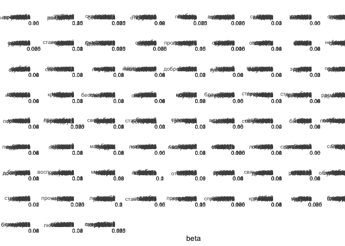
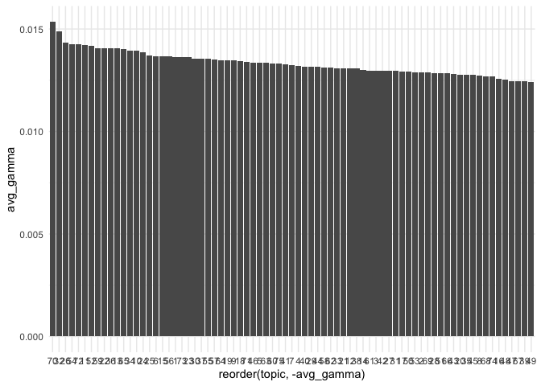
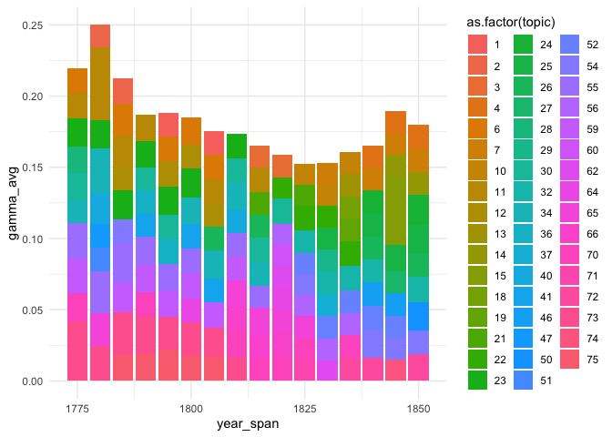

# 04_2_LDA

# 4.2. LDA model creation

``` r
library(tidyverse)
```

    Warning: package 'ggplot2' was built under R version 4.3.1

    Warning: package 'lubridate' was built under R version 4.3.1

    ── Attaching core tidyverse packages ──────────────────────── tidyverse 2.0.0 ──
    ✔ dplyr     1.1.3     ✔ readr     2.1.4
    ✔ forcats   1.0.0     ✔ stringr   1.5.0
    ✔ ggplot2   3.4.4     ✔ tibble    3.2.1
    ✔ lubridate 1.9.3     ✔ tidyr     1.3.0
    ✔ purrr     1.0.2     
    ── Conflicts ────────────────────────────────────────── tidyverse_conflicts() ──
    ✖ dplyr::filter() masks stats::filter()
    ✖ dplyr::lag()    masks stats::lag()
    ℹ Use the conflicted package (<http://conflicted.r-lib.org/>) to force all conflicts to become errors

``` r
library(tidytext)
library(topicmodels)

theme_set(theme_minimal())
```

``` r
dtm_iamb4_experiment <- readRDS("../../data/ch4/dtm_iamb4_experiment.Rds")
dtm_iamb4_experiment
```

## Build the model

``` r
iamb4_model <- LDA(dtm_iamb4_experiment,
                    k = 75,
                    method = "Gibbs",
                    control = list(seed = 2105, 
                        alpha = 0.5, delta = 0.1))
```

``` r
# retrieve and save beta & gamma probs
beta <- iamb4_model %>% tidy(matrix = "beta")

gamma <- iamb4_model %>% tidy(matrix = "gamma") %>% 
    # separate document id into meaningful columns
    separate(document, into = c("index", "year", "first_line", "formula"), sep = "___") %>% 
    mutate(corpus = str_extract(index, "^\\w"))
```

``` r
save(beta, gamma, file = "../../data/ch4/lda75_output.Rda")
```

## Exploration

``` r
load("../../data/ch4/lda75_output.Rda")
```

``` r
glimpse(beta)
```

    Rows: 375,000
    Columns: 3
    $ topic <int> 1, 2, 3, 4, 5, 6, 7, 8, 9, 10, 11, 12, 13, 14, 15, 16, 17, 18, 1…
    $ term  <chr> "боле", "боле", "боле", "боле", "боле", "боле", "боле", "боле", …
    $ beta  <dbl> 8.797396e-06, 1.102867e-04, 9.748489e-06, 9.475081e-06, 9.183580…

``` r
glimpse(gamma)
```

    Rows: 1,397,250
    Columns: 7
    $ index      <chr> "M_C_101__1-1", "M_C_101__11-1", "M_C_101__12-1", "M_C_101_…
    $ year       <chr> "1836", "1836", "1836", "1836", "1836", "1836", "1836", "18…
    $ first_line <chr> "КашкинДЕ", "КашкинДЕ", "КашкинДЕ", "КашкинДЕ", "КашкинДЕ",…
    $ formula    <chr> "dactyl_3", "trochee_3", "dactyl_3", "iamb_4", "iamb_4", "t…
    $ topic      <int> 1, 1, 1, 1, 1, 1, 1, 1, 1, 1, 1, 1, 1, 1, 1, 1, 1, 1, 1, 1,…
    $ gamma      <dbl> 0.019108280, 0.008695652, 0.082802548, 0.244755245, 0.00751…
    $ corpus     <chr> "M", "M", "M", "M", "M", "M", "M", "M", "M", "M", "M", "M",…

``` r
beta  %>% 
  mutate(topic = as.factor(topic))  %>% 
  group_by(topic) %>%
  top_n(15, beta) %>%
  ungroup() %>%
  ggplot(aes(x = reorder_within(term, beta, topic), 
    y = beta, fill = topic)) +
  scale_x_reordered() + 
  geom_col() +
  coord_flip() +
  facet_wrap(~topic, scales = "free") +
  guides(fill="none") +
  theme(axis.text = element_text(size = 8))
```



``` r
ggsave(filename = "plots/Fig_4-2-0.png", plot = last_plot(), 
      width = 16, height = 14, dpi = 300, bg = "white")
```

Distribution of topic probs

``` r
topic_probs <- gamma %>%
  group_by(topic) %>%
  summarise(avg_gamma = mean(gamma)) %>% 
  ungroup() %>% 
  arrange(desc(avg_gamma))

print("Most probable topics (avg)")
```

    [1] "Most probable topics (avg)"

``` r
head(topic_probs, 10)
```

    # A tibble: 10 × 2
       topic avg_gamma
       <int>     <dbl>
     1    70    0.0154
     2    32    0.0149
     3    26    0.0143
     4    54    0.0142
     5    72    0.0142
     6    11    0.0142
     7    52    0.0142
     8    59    0.0141
     9    22    0.0141
    10    36    0.0141

``` r
topic_probs %>% 
  ggplot(aes(reorder(topic,-avg_gamma), avg_gamma)) + geom_col()
```



``` r
# topic distribution in one text
# gamma %>% filter(corpus == "N")

gamma %>% 
    filter(corpus == "N" & index == "N_1-1") %>% 
    arrange(desc(gamma)) %>% head(10)
```

    # A tibble: 10 × 7
       index year  first_line formula topic  gamma corpus
       <chr> <chr> <chr>      <chr>   <int>  <dbl> <chr> 
     1 N_1-1 1785  ССБобров   iamb_4     41 0.148  N     
     2 N_1-1 1785  ССБобров   iamb_4     19 0.0820 N     
     3 N_1-1 1785  ССБобров   iamb_4     23 0.0601 N     
     4 N_1-1 1785  ССБобров   iamb_4     44 0.0492 N     
     5 N_1-1 1785  ССБобров   iamb_4      2 0.0383 N     
     6 N_1-1 1785  ССБобров   iamb_4     22 0.0383 N     
     7 N_1-1 1785  ССБобров   iamb_4     10 0.0273 N     
     8 N_1-1 1785  ССБобров   iamb_4     18 0.0273 N     
     9 N_1-1 1785  ССБобров   iamb_4     27 0.0273 N     
    10 N_1-1 1785  ССБобров   iamb_4      5 0.0164 N     

``` r
gamma %>% 
    filter(corpus == "N" & index == "N_3-1") %>% 
    arrange(desc(gamma)) %>% head(10)
```

    # A tibble: 10 × 7
       index year  first_line formula topic  gamma corpus
       <chr> <chr> <chr>      <chr>   <int>  <dbl> <chr> 
     1 N_3-1 1787  ССБобров   iamb_4     44 0.0657 N     
     2 N_3-1 1787  ССБобров   iamb_4     10 0.0511 N     
     3 N_3-1 1787  ССБобров   iamb_4     30 0.0511 N     
     4 N_3-1 1787  ССБобров   iamb_4     71 0.0511 N     
     5 N_3-1 1787  ССБобров   iamb_4     25 0.0365 N     
     6 N_3-1 1787  ССБобров   iamb_4     26 0.0365 N     
     7 N_3-1 1787  ССБобров   iamb_4     47 0.0365 N     
     8 N_3-1 1787  ССБобров   iamb_4     53 0.0365 N     
     9 N_3-1 1787  ССБобров   iamb_4      2 0.0219 N     
    10 N_3-1 1787  ССБобров   iamb_4      5 0.0219 N     

``` r
# top metrical forms
gamma %>% 
  group_by(formula) %>% 
  count(sort = T) %>% 
  head(20)
```

    # A tibble: 20 × 2
    # Groups:   formula [20]
       formula                  n
       <chr>                <int>
     1 iamb_4              428325
     2 trochee_4           171975
     3 iamb_free           167475
     4 iamb_6              144000
     5 iamb_5               76050
     6 iamb_other           51675
     7 iamb_3               39825
     8 other_6              28275
     9 amphibrach_4         26400
    10 other_free           17550
    11 other?_?             14475
    12 amphibrach_other     11400
    13 iamb_регулярная:4+3  11325
    14 trochee_other         9450
    15 amphibrach_3          8775
    16 trochee_3             7950
    17 amphibrach_2          6975
    18 other_3               6525
    19 other_4               6525
    20 anapest_other         6300

``` r
gamma %>% 
  mutate(year_span = floor(as.numeric(year)/5)*5) %>% 
  group_by(year_span, topic) %>% 
  summarise(gamma_avg = mean(gamma)) %>% 
  top_n(10) %>% 
  ggplot(aes(x = year_span, y = gamma_avg, fill = as.factor(topic))) + geom_col()
```

    `summarise()` has grouped output by 'year_span'. You can override using the
    `.groups` argument.
    Selecting by gamma_avg


