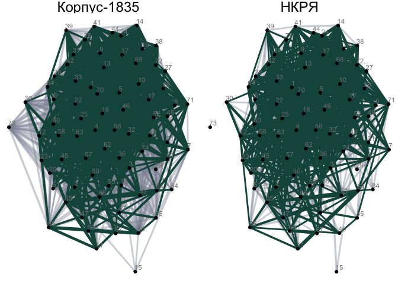
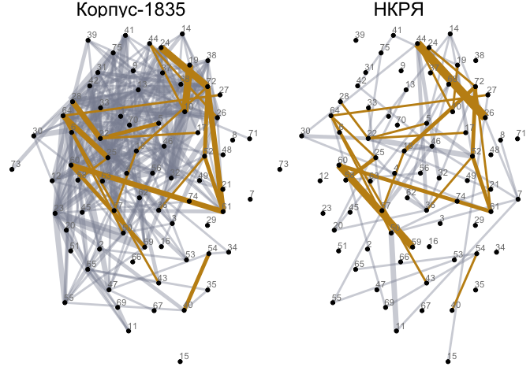

# 04_3_networks

# 4.2. Networks building

## load pckg

``` r
library(tidyverse)
```

    Warning: package 'ggplot2' was built under R version 4.3.1

    Warning: package 'lubridate' was built under R version 4.3.1

    ── Attaching core tidyverse packages ──────────────────────── tidyverse 2.0.0 ──
    ✔ dplyr     1.1.3     ✔ readr     2.1.4
    ✔ forcats   1.0.0     ✔ stringr   1.5.0
    ✔ ggplot2   3.4.4     ✔ tibble    3.2.1
    ✔ lubridate 1.9.3     ✔ tidyr     1.3.0
    ✔ purrr     1.0.2     
    ── Conflicts ────────────────────────────────────────── tidyverse_conflicts() ──
    ✖ dplyr::filter() masks stats::filter()
    ✖ dplyr::lag()    masks stats::lag()
    ℹ Use the conflicted package (<http://conflicted.r-lib.org/>) to force all conflicts to become errors

``` r
# networks
library(igraph)
```


    Attaching package: 'igraph'

    The following objects are masked from 'package:lubridate':

        %--%, union

    The following objects are masked from 'package:dplyr':

        as_data_frame, groups, union

    The following objects are masked from 'package:purrr':

        compose, simplify

    The following object is masked from 'package:tidyr':

        crossing

    The following object is masked from 'package:tibble':

        as_data_frame

    The following objects are masked from 'package:stats':

        decompose, spectrum

    The following object is masked from 'package:base':

        union

``` r
library(ggraph)
library(ggrepel)
```

    Warning: package 'ggrepel' was built under R version 4.3.1

``` r
# basic colouring and layout options
library(wesanderson)
```

    Warning: package 'wesanderson' was built under R version 4.3.1

``` r
library(patchwork)
theme_set(theme_minimal())
```

## load data

``` r
# load model output
load("../../data/ch4/lda75_output.Rda")

# load code for edges calculation
source("04_fn_calculate_edges.R")

# function to extract topic lables:
get_topic_labels = function(x, n_labels = 10) {
  
  #takes beta-matrix as an input
  top_terms = x %>%
    group_by(topic) %>%
    top_n(20, beta) %>%
    ungroup() %>%
    arrange(topic, -beta)
  
  topic_labels = top_terms %>%
    group_by(topic) %>%
    top_n(n_labels, beta) %>%
    summarise(label=paste(term, collapse=" ")) %>%
    mutate(label = paste(topic, label, sep="_"))
  
  return(topic_labels)
}

# prepare gamma data
gamma_rnc <- gamma %>% 
    # select ONLY RNC connections & topics
    filter(corpus == "N") %>% 
    # add index for create_edges function
    # mutate(index = paste0(corpus, "_", id)) %>% 
    # fix typo
    rename(author = first_line)

gamma <- gamma %>% 
  rename(author = first_line)

glimpse(gamma)
```

    Rows: 1,395,300
    Columns: 7
    $ index   <chr> "M_C_101__1-1", "M_C_101__11-1", "M_C_101__12-1", "M_C_101__13…
    $ year    <chr> "1836", "1836", "1836", "1836", "1836", "1836", "1836", "1836"…
    $ author  <chr> "КашкинДЕ", "КашкинДЕ", "КашкинДЕ", "КашкинДЕ", "КашкинДЕ", "К…
    $ formula <chr> "dactyl_3", "trochee_3", "dactyl_3", "iamb_4", "iamb_4", "troc…
    $ topic   <int> 1, 1, 1, 1, 1, 1, 1, 1, 1, 1, 1, 1, 1, 1, 1, 1, 1, 1, 1, 1, 1,…
    $ gamma   <dbl> 0.006369427, 0.008695652, 0.021582734, 0.005405405, 0.00591716…
    $ corpus  <chr> "M", "M", "M", "M", "M", "M", "M", "M", "M", "M", "M", "M", "M…

``` r
glimpse(gamma_rnc)
```

    Rows: 1,042,275
    Columns: 7
    $ index   <chr> "N_1-1", "N_1-2", "N_1-3", "N_10-1", "N_10-2", "N_100-1", "N_1…
    $ year    <chr> "1785", "1785", "1785", "1803", "1803", "1810", "1810", "1810"…
    $ author  <chr> "ССБобров", "ССБобров", "ССБобров", "ССБобров", "ССБобров", "А…
    $ formula <chr> "iamb_4", "iamb_4", "iamb_4", "iamb_4", "iamb_4", "iamb_6", "i…
    $ topic   <int> 1, 1, 1, 1, 1, 1, 1, 1, 1, 1, 1, 1, 1, 1, 1, 1, 1, 1, 1, 1, 1,…
    $ gamma   <dbl> 0.005714286, 0.005586592, 0.017142857, 0.029239766, 0.01554404…
    $ corpus  <chr> "N", "N", "N", "N", "N", "N", "N", "N", "N", "N", "N", "N", "N…

### extract topic labels

``` r
topic_labels <- get_topic_labels(beta, n_labels = 5)
head(topic_labels)
```

    # A tibble: 6 × 2
      topic label                              
      <int> <chr>                              
    1     1 1_луч заря солнце небо блистать    
    2     2 2_слава муза певец лира венец      
    3     3 3_стих писать поэт читать перо     
    4     4 4_дева прекрасный юный младой юноша
    5     5 5_два другой брат первый три       
    6     6 6_слышать внимать шум глас голос   

``` r
# write.csv(topic_labels, file = "data/topic_labels.csv")
```

# RNC

## Create edges

### compute edges

``` r
edges_raw <- compute_edges(gamma_rnc,
                           gamma_thresh = 0.05,
                           time_slice = 5)

head(edges_raw)
```

    # A tibble: 6 × 13
    # Groups:   index, edge_id [6]
      index   year  author    formula  topic  gamma corpus  from    to slice edge_id
      <chr>   <chr> <chr>     <chr>    <int>  <dbl> <chr>  <int> <int> <dbl> <chr>  
    1 N_10233 1814  АННахимов iamb_6       1 0.0769 N          1    27  1810 1 27   
    2 N_10235 1814  АННахимов iamb_6       1 0.0515 N          1    13  1810 1 13   
    3 N_10235 1814  АННахимов iamb_6       1 0.0515 N          1    71  1810 1 71   
    4 N_1023  1830  АПКрюков  trochee…     1 0.0811 N          1     2  1830 1 2    
    5 N_10275 1814  АННахимов iamb_fr…     1 0.0922 N          1    54  1810 1 54   
    6 N_1031  1831  ЕФРозен   iamb_5       1 0.0549 N          1    13  1830 1 13   
    # ℹ 2 more variables: source <chr>, target <chr>

### calc top meters

``` r
# select top meters
meter_counts <- gamma %>% 
  mutate(year_span = floor(as.numeric(year)/5)*5) %>% 
  rename("meter" = "formula") %>% 
  filter(!str_detect(meter, "other")) %>% 
  group_by(year_span, meter) %>% 
  count(sort = T) %>% 
  ungroup() %>% 
  filter(n > 10 & year_span != 1850)

head(meter_counts)
```

    # A tibble: 6 × 3
      year_span meter          n
          <dbl> <chr>      <int>
    1      1835 iamb_4    124500
    2      1825 iamb_4     58200
    3      1835 trochee_4  54750
    4      1820 iamb_4     39600
    5      1830 iamb_4     38925
    6      1840 iamb_4     35775

``` r
# group meter counts in a variable
top_meters <- meter_counts %>% 
  group_by(meter) %>%
  summarise(total = sum(n)) %>% 
  arrange(desc(total))

head(top_meters, 15)
```

    # A tibble: 15 × 2
       meter                      total
       <chr>                      <int>
     1 iamb_4                    425850
     2 trochee_4                 170700
     3 iamb_free                 166350
     4 iamb_6                    143325
     5 iamb_5                     74625
     6 iamb_3                     39975
     7 amphibrach_4               26250
     8 iamb_регулярная:4+3        11250
     9 amphibrach_3                8550
    10 trochee_3                   7725
    11 amphibrach_2                6900
    12 trochee_регулярная:4+3      5625
    13 dactyl_4                    5175
    14 amphibrach_регулярная:4+3   5025
    15 iamb_регулярная:6+4         4950

### create links

``` r
# create links
links <- edges_raw %>% 
  mutate(meter = formula) %>%
  # filter out only 8 most interesting meters
  filter(meter %in% top_meters$meter[1:8]) %>% 
  # group and count edges
  group_by(slice, meter, corpus) %>% 
  count(slice, meter, edge_id, source, target, sort = T) %>% 
  # filter non-frequent edges
  filter(n > 2) %>% 
  ungroup() 

# quick check
head(links)
```

    # A tibble: 6 × 7
      slice meter     corpus edge_id source                             target     n
      <dbl> <chr>     <chr>  <chr>   <chr>                              <chr>  <int>
    1  1780 iamb_free N      36 43   36_другой становиться иной хотеть… 43_ле…    29
    2  1840 trochee_4 N      17 22   17_стоять дом дверь окно сидеть    22_да…    26
    3  1780 iamb_free N      22 36   22_давать пойти сказать большой б… 36_др…    23
    4  1780 iamb_free N      36 47   36_другой становиться иной хотеть… 47_де…    23
    5  1780 iamb_free N      35 36   35_богатый давать дом становиться… 36_др…    19
    6  1840 trochee_4 N      22 47   22_давать пойти сказать большой б… 47_де…    19

### create edgelist

``` r
edgelist <- links %>% 
  select(source, target, n, meter, slice, corpus) %>% 
  mutate(width = n/10) %>% 
  filter(slice != 1850) %>% 
  rename(N_connections = n) %>% 
  mutate(facet_title = slice)

nodelist <- tibble(source = unique(c(links$target, links$source))) %>% 
  mutate(idn = as.numeric(str_replace(source, "^([0-9].*?)_.*", "\\1"))) 

head(edgelist)
```

    # A tibble: 6 × 8
      source               target N_connections meter slice corpus width facet_title
      <chr>                <chr>          <int> <chr> <dbl> <chr>  <dbl>       <dbl>
    1 36_другой становить… 43_ле…            29 iamb…  1780 N        2.9        1780
    2 17_стоять дом дверь… 22_да…            26 troc…  1840 N        2.6        1840
    3 22_давать пойти ска… 36_др…            23 iamb…  1780 N        2.3        1780
    4 36_другой становить… 47_де…            23 iamb…  1780 N        2.3        1780
    5 35_богатый давать д… 36_др…            19 iamb…  1780 N        1.9        1780
    6 22_давать пойти ска… 47_де…            19 troc…  1840 N        1.9        1840

``` r
head(nodelist) 
```

    # A tibble: 6 × 2
      source                                       idn
      <chr>                                      <dbl>
    1 43_лев становиться зверь волк говорить        43
    2 22_давать пойти сказать большой беда          22
    3 36_другой становиться иной хотеть говорить    36
    4 47_дело чин рад очень князь                   47
    5 62_зреть глас дух коль смертный               62
    6 49_враг бой меч герой брань                   49

``` r
nrow(nodelist)
```

    [1] 75

## create network

``` r
net <- graph_from_data_frame(d = edgelist, vertices = nodelist, directed = F)
net
```

    IGRAPH 82d9e2e UN-- 75 4577 -- 
    + attr: name (v/c), idn (v/n), N_connections (e/n), meter (e/c), slice
    | (e/n), corpus (e/c), width (e/n), facet_title (e/n)
    + edges from 82d9e2e (vertex names):
    [1] 43_лев становиться зверь волк говорить    --36_другой становиться иной хотеть говорить
    [2] 22_давать пойти сказать большой беда      --17_стоять дом дверь окно сидеть           
    [3] 22_давать пойти сказать большой беда      --36_другой становиться иной хотеть говорить
    [4] 36_другой становиться иной хотеть говорить--47_дело чин рад очень князь               
    [5] 36_другой становиться иной хотеть говорить--35_богатый давать дом становиться взять   
    [6] 22_давать пойти сказать большой беда      --47_дело чин рад очень князь               
    + ... omitted several edges

### viz fn

``` r
# function for network visualisation

# taken as input net, meter as a string & colour palette value

network <- function(network, meter_value, palette_v) { 
  ggraph(network, layout = "stress") +
    geom_edge_fan(aes(color = meter,
                      filter = meter %in% c(meter_value)
                      #,
                      #width = N_connections
                     ),
                      alpha = 0.6, width = 1) +
    geom_node_point() +
    #geom_node_text(aes(label=idn), 
    #               hjust=0.1, 
    #               vjust=-0.4, 
    #               size=3, 
    #               color="grey50") +
    theme_void() + 
    theme(strip.text = element_text(size = 12)) + 
    scale_edge_color_manual(values = palette_v, aesthetics = "edge_colour") #+ 
    #theme(legend.position = "None")
}
```

``` r
unique(edgelist$meter)
```

    [1] "iamb_free"           "trochee_4"           "iamb_4"             
    [4] "iamb_6"              "iamb_5"              "amphibrach_4"       
    [7] "iamb_3"              "iamb_регулярная:4+3"

### all RNC viz (check)

Meters without Iamb-4

``` r
all_nkrja <- network(net, c("iamb_6", "iamb_free",# "iamb_4", 
                            "trochee_4"), 
                     c(wes_palette("Darjeeling1")[4], 
                       wes_palette("Moonrise3")[1],
                       #wes_palette("Darjeeling1")[3], 
                       wes_palette("Darjeeling1")[1])) 
                

all_nkrja + facet_wrap(~slice, 
                        scales="free_x", 
                        drop=T,
                        ncol = 5) + 
    labs(edge_colour = "Meter") + 
    theme(strip.text = element_text(size = 16),
         legend.text = element_text(size = 14), 
         legend.title = element_text(size = 16),
         panel.spacing = unit(1.4, "lines"),
         legend.position = "bottom")
```

    Warning: Using the `size` aesthetic in this geom was deprecated in ggplot2 3.4.0.
    ℹ Please use `linewidth` in the `default_aes` field and elsewhere instead.


### iamb-4

``` r
iamb_4 <- network(net, c("iamb_4"), wes_palette("Darjeeling1")[2])
    
iamb_4 + facet_wrap(~slice, 
                 scales="free_x", 
                 drop=T,
                 ncol = 5) + 
    theme(legend.position = "None",
         strip.text = element_text(size = 16),
         legend.text = element_text(size = 14), 
         legend.title = element_text(size = 16))
```


### iamb-6

``` r
iamb_6 <- network(net, c("iamb_6"), wes_palette("Darjeeling1")[4])
iamb_6 + facet_wrap(~slice, 
                 scales="free_x", 
                 drop=T,
                 ncol = 5) + 
    theme(legend.position = "None",
         strip.text = element_text(size = 16),
         legend.text = element_text(size = 14), 
         legend.title = element_text(size = 16))
```


### trochee-4

``` r
trochee_4 <- network(net, c("trochee_4"), wes_palette("Darjeeling1")[1])
trochee_4 + facet_wrap(~slice, 
                 scales="free_x", 
                 drop=T,
                 ncol = 5) + 
    theme(legend.position = "None",
         strip.text = element_text(size = 16),
         legend.text = element_text(size = 14), 
         legend.title = element_text(size = 16))
```


## Network stats

### density

Calculate network density taking separately each time slice and each
meter. The density of a graph is the ratio of the number of edges and
the number of possible edges.

``` r
density_vector <- function(formula) {
    densities <- vector()
    e1 <- NULL
    for (i in 1:length(unique(edgelist$slice))) {
        e1 <- edgelist %>% 
            filter(meter == formula & slice == unique(edgelist$slice)[i] & corpus == "N")

            net_test <- graph_from_data_frame(d = e1, vertices = nodelist, directed = F)

            densities[i] <- edge_density(net_test, loops = F)
    }
    densities
}
```

``` r
length(unique(edgelist$slice))
```

    [1] 15

``` r
density_table <- tibble(meter = c(rep("iamb_4", 15), rep("iamb_6", 15), 
                 rep("iamb_free", 15), rep("trochee_4", 15)),
      slice = rep(unique(edgelist$slice), 4),
      density = round(c(density_vector("iamb_4"),
                       density_vector("iamb_6"),
                       density_vector("iamb_free"), 
                       density_vector("trochee_4")), 3)) %>% 
    arrange(desc(-slice)) 

density_table %>% 
    # pivot for easier reading
    pivot_wider(names_from = slice, values_from = density)
```

    # A tibble: 4 × 16
      meter    `1775` `1780` `1785` `1790` `1795` `1800` `1805` `1810` `1815` `1820`
      <chr>     <dbl>  <dbl>  <dbl>  <dbl>  <dbl>  <dbl>  <dbl>  <dbl>  <dbl>  <dbl>
    1 iamb_4    0.005  0.01   0.004  0.043  0.079  0.049  0.025  0.028  0.028  0.137
    2 iamb_6    0.021  0.018  0.009  0.014  0.011  0.006  0.024  0.028  0.006  0.019
    3 iamb_fr…  0.004  0.039  0.005  0.008  0.014  0.022  0.038  0.039  0.054  0.028
    4 trochee…  0      0      0      0.006  0.023  0.002  0.004  0.004  0.001  0.002
    # ℹ 5 more variables: `1825` <dbl>, `1830` <dbl>, `1835` <dbl>, `1840` <dbl>,
    #   `1845` <dbl>

``` r
summary(density_table$density)
```

       Min. 1st Qu.  Median    Mean 3rd Qu.    Max. 
    0.00000 0.00500 0.01400 0.02587 0.02800 0.24900 

``` r
density_table %>% 
    ggplot(aes(x = meter, y = density, fill = meter)) + geom_boxplot() + 
    scale_fill_manual(values = c(wes_palette("Darjeeling1")[2], 
                                wes_palette("Darjeeling1")[4],
                                wes_palette("Moonrise3")[1],
                                wes_palette("Darjeeling1")[1]))
```


# RNC vs marginal corpus

``` r
glimpse(gamma)
```

    Rows: 1,395,300
    Columns: 7
    $ index   <chr> "M_C_101__1-1", "M_C_101__11-1", "M_C_101__12-1", "M_C_101__13…
    $ year    <chr> "1836", "1836", "1836", "1836", "1836", "1836", "1836", "1836"…
    $ author  <chr> "КашкинДЕ", "КашкинДЕ", "КашкинДЕ", "КашкинДЕ", "КашкинДЕ", "К…
    $ formula <chr> "dactyl_3", "trochee_3", "dactyl_3", "iamb_4", "iamb_4", "troc…
    $ topic   <int> 1, 1, 1, 1, 1, 1, 1, 1, 1, 1, 1, 1, 1, 1, 1, 1, 1, 1, 1, 1, 1,…
    $ gamma   <dbl> 0.006369427, 0.008695652, 0.021582734, 0.005405405, 0.00591716…
    $ corpus  <chr> "M", "M", "M", "M", "M", "M", "M", "M", "M", "M", "M", "M", "M…

``` r
t <- gamma %>% 
  filter(index == "M_P_1733" & gamma > 0.04) %>% 
  left_join(topic_labels, by = "topic")

t
```

    # A tibble: 4 × 8
      index    year  author    formula   topic  gamma corpus label                  
      <chr>    <chr> <chr>     <chr>     <int>  <dbl> <chr>  <chr>                  
    1 M_P_1733 1839  ЦыгановНФ trochee_6     7 0.166  M      7_милый девица ах крас…
    2 M_P_1733 1839  ЦыгановНФ trochee_6    26 0.0596 M      26_ах увы умирать оста…
    3 M_P_1733 1839  ЦыгановНФ trochee_6    55 0.0596 M      55_цветок роза цвет цв…
    4 M_P_1733 1839  ЦыгановНФ trochee_6    74 0.0596 M      74_жена старый старик …

``` r
gamma %>% 
    filter(index == "M_P_1733") %>% 
    ungroup() %>% 
    ggplot(aes(x = topic, y = gamma)) + 
        geom_line() + 
        
        # threshold line
        geom_hline(yintercept = 0.044, 
                   linetype = 2,
                   linewidth = 1.5,
                   colour = wes_palette("Darjeeling1")[2]) + 
        
        geom_point(data = gamma %>% filter(index == "M_P_1733" & gamma > 0.04), 
                   size = 2) + 
  
        geom_label_repel(data = t %>% filter(topic == "73"),
                   aes(label = label ),
                   nudge_y = 0.055,
                   nudge_x = -0.5
                  ) + 
        geom_label_repel(data = t %>% filter(topic == "56"),
                   aes(label = label ),
                   nudge_y = 0.025,
                   nudge_x = -5
                  ) + 
        geom_label_repel(data = t %>% filter(!topic %in% c("56", "73")),
                   aes(label = label ),
                   nudge_y = 0.01,
                   nudge_x = 0.5
                  ) + 
        
        labs(x = "Topic", y = "Topic probability") + 
        expand_limits(x = 80, y = 0.15) + 
        scale_x_continuous(breaks = seq(10, 70, 10)) +
        scale_y_continuous(breaks = seq(0, 0.15, 0.025)) + 
        theme(axis.text = element_text(size = 14),
             axis.title = element_text(size = 16))
```


``` r
# ggsave("plots/demo.png", plot = last_plot(), dpi = 300,
#        bg = "white", width = 8, height = 6)
```

``` r
topic_probs <- gamma %>%
  group_by(topic) %>%
  summarise(avg_gamma = mean(gamma)) %>% 
  ungroup() %>% 
  arrange(desc(avg_gamma))

print("Most probable topics (avg)")
```

    [1] "Most probable topics (avg)"

``` r
head(topic_probs, 10)
```

    # A tibble: 10 × 2
       topic avg_gamma
       <int>     <dbl>
     1    49    0.0154
     2    28    0.0152
     3    58    0.0144
     4    70    0.0142
     5    29    0.0142
     6    39    0.0140
     7    47    0.0140
     8    36    0.0139
     9    27    0.0139
    10    13    0.0139

``` r
topic_probs %>% 
  ggplot(aes(reorder(topic,-avg_gamma), avg_gamma)) + geom_col()
```


``` r
gamma %>% 
  mutate(year_span = floor(as.numeric(year)/5)*5) %>% 
  group_by(year_span, topic) %>% 
  summarise(gamma_avg = mean(gamma)) %>% 
  top_n(10) %>% 
  ggplot(aes(x = year_span, y = gamma_avg, fill = as.factor(topic))) + geom_col()
```

    `summarise()` has grouped output by 'year_span'. You can override using the
    `.groups` argument.
    Selecting by gamma_avg


### sampling

Check distribution in number of texts

``` r
gamma %>% 
  select(author, year, corpus, index) %>% 
  distinct() %>% 
  count(author, corpus, sort = T) %>% 
  filter(author != "" & corpus == "M")
```

    # A tibble: 526 × 3
       author           corpus     n
       <chr>            <chr>  <int>
     1 СухановМД        M        138
     2 ТимофеевАВ       M        125
     3 ЕлизаветаКульман M        122
     4 БыстроглазовА    M        120
     5 МейснерАЯ        M        116
     6 БашкатовА        M        103
     7 ДемидовМА        M        101
     8 БернетЕ          M         93
     9 МерклиММ         M         89
    10 МартыновА        M         83
    # ℹ 516 more rows

``` r
gamma %>% 
  select(author, year, corpus, index) %>% 
  distinct() %>% 
  count(author, corpus, sort = T) %>% 
  filter(author != "" & corpus == "M") %>% summary
```

        author             corpus                n          
     Length:526         Length:526         Min.   :  1.000  
     Class :character   Class :character   1st Qu.:  1.000  
     Mode  :character   Mode  :character   Median :  2.000  
                                           Mean   :  8.418  
                                           3rd Qu.:  6.000  
                                           Max.   :138.000  

``` r
gamma %>% 
  select(author, year, corpus, index) %>% 
  distinct() %>% 
  count(author, corpus, sort = T) %>% 
  filter(author != "" & corpus == "N")
```

    # A tibble: 239 × 3
       author        corpus     n
       <chr>         <chr>  <int>
     1 ВАЖуковский   N       1148
     2 АСПушкин      N       1124
     3 МЮЛермонтов   N        602
     4 ГРДержавин    N        592
     5 НМЯзыков      N        450
     6 ИИДмитриев    N        446
     7 ААФет         N        315
     8 ЕАБаратынский N        280
     9 ПАВяземский   N        275
    10 ВВКапнист     N        265
    # ℹ 229 more rows

``` r
gamma %>% 
  select(author, year, corpus, index) %>% 
  distinct() %>% 
  count(author, corpus, sort = T) %>% 
  filter(author != "" & corpus == "N") %>% summary
```

        author             corpus                n          
     Length:239         Length:239         Min.   :   1.00  
     Class :character   Class :character   1st Qu.:   5.00  
     Mode  :character   Mode  :character   Median :  15.00  
                                           Mean   :  58.15  
                                           3rd Qu.:  46.50  
                                           Max.   :1148.00  

Select top authors - rnc

``` r
n_texts_rnc <- gamma %>% 
  filter(corpus == "N") %>% 
  mutate(decade = floor(as.numeric(year)/5)*5) %>% 
  filter(decade %in% c(1830, 1835)) %>% 
  select(index) %>% distinct() %>% nrow()

rnc_authors <- gamma %>% 
    filter(corpus == "N") %>% 
    mutate(decade = floor(as.numeric(year)/5)*5) %>% 
    filter(decade %in% c(1830, 1835)) %>% 
    group_by(author) %>% 
    summarise(n_gamma = sum(n()),
             n_texts = n_gamma/75) %>% 
    arrange(desc(n_texts))

rnc_authors %>% 
    ungroup() %>%
    summarise(total_texts = sum(n_texts))
```

    # A tibble: 1 × 1
      total_texts
            <dbl>
    1        2671

``` r
rnc_authors <- rnc_authors %>% 
    mutate(percentage = (n_texts/n_texts_rnc) *100)

head(rnc_authors, 20)
```

    # A tibble: 20 × 4
       author        n_gamma n_texts percentage
       <chr>           <int>   <dbl>      <dbl>
     1 МЮЛермонтов     32400     432      16.2 
     2 АСПушкин        20775     277      10.4 
     3 ВГБенедиктов    14025     187       7.00
     4 ВАЖуковский     12150     162       6.07
     5 АИПолежаев      11250     150       5.62
     6 НМЯзыков         8700     116       4.34
     7 АВКольцов        8175     109       4.08
     8 ППЕршов          5025      67       2.51
     9 НАНекрасов       4725      63       2.36
    10 ФИТютчев         4650      62       2.32
    11 ЕПРостопчина     4200      56       2.10
    12 ЕАБаратынский    3900      52       1.95
    13 АИОдоевский      3825      51       1.91
    14 ПАВяземский      3225      43       1.61
    15 АИПодолинский    3150      42       1.57
    16 ПАКатенин        3000      40       1.50
    17 АСХомяков        2925      39       1.46
    18 ВИСоколовский    2700      36       1.35
    19 ДВДавыдов        2625      35       1.31
    20 НВКукольник      2550      34       1.27

``` r
summary(rnc_authors$n_texts)
```

       Min. 1st Qu.  Median    Mean 3rd Qu.    Max. 
       1.00    3.00   16.00   34.24   33.25  432.00 

``` r
# filter overpresented authors
top_authors <- rnc_authors %>% 
    filter(n_texts > 30) %>% select(author) # 19 authors

top_authors
```

    # A tibble: 21 × 1
       author      
       <chr>       
     1 МЮЛермонтов 
     2 АСПушкин    
     3 ВГБенедиктов
     4 ВАЖуковский 
     5 АИПолежаев  
     6 НМЯзыков    
     7 АВКольцов   
     8 ППЕршов     
     9 НАНекрасов  
    10 ФИТютчев    
    # ℹ 11 more rows

``` r
# randomly select 30 texts by each author
sampled_id <- gamma %>% 
    filter(corpus == "N") %>% 
    # select slice
    filter(year > 1829 & year < 1840) %>%
    select(index, author) %>% 
    distinct() %>% 
    filter(author %in% top_authors$author) %>% 
    group_by(author) %>% 
    sample_n(30) %>% 
    ungroup() %>%
    select(-author)

# retrieve gamma values for samples for these authors
gamma_top <- inner_join(sampled_id, gamma, by = "index", multiple = "all")
```

Select top authors - corpus_1830

``` r
m_authors <- gamma %>% 
    filter(corpus == "M" & author != "") %>% 
    mutate(decade = floor(as.numeric(year)/5)*5) %>% 
    filter(decade %in% c(1830, 1835)) %>% 
    group_by(author) %>% 
    summarise(n_gamma = sum(n()),
             n_texts = n_gamma/75) %>% 
    arrange(desc(n_texts))

m_authors %>% 
    ungroup() %>%
    summarise(total_texts = sum(n_texts))
```

    # A tibble: 1 × 1
      total_texts
            <dbl>
    1        3739

``` r
m_authors <- m_authors %>% 
    mutate(percentage = n_texts/3739*100)

head(m_authors, 20)
```

    # A tibble: 20 × 4
       author           n_gamma n_texts percentage
       <chr>              <int>   <dbl>      <dbl>
     1 СухановМД          10350     138       3.69
     2 ТимофеевАВ          9375     125       3.34
     3 ЕлизаветаКульман    9150     122       3.26
     4 БыстроглазовА       9000     120       3.21
     5 МейснерАЯ           8700     116       3.10
     6 БашкатовА           7725     103       2.75
     7 БернетЕ             6975      93       2.49
     8 МерклиММ            6675      89       2.38
     9 МартыновА           6225      83       2.22
    10 АннаСмирнова        6000      80       2.14
    11 ЗиловАМ             5925      79       2.11
    12 УшаковАА            5325      71       1.90
    13 БорозднаИП          5100      68       1.82
    14 ДемидовМА           4950      66       1.77
    15 БакунинИМ           4350      58       1.55
    16 КашкинДЕ            4200      56       1.50
    17 СушковДП            4125      55       1.47
    18 БутырскийНИ         3825      51       1.36
    19 ПодолинскийАИ       3300      44       1.18
    20 МенцовФН            3225      43       1.15

``` r
summary(m_authors$n_texts)
```

       Min. 1st Qu.  Median    Mean 3rd Qu.    Max. 
      1.000   1.000   2.000   8.798   6.000 138.000 

``` r
m_top_authors <- m_authors %>% 
  filter(n_texts > 30) %>% select(author) # 30 authors

sampled_id_m <- gamma %>% 
    filter(corpus == "M") %>% 
    # select slice
    filter(year > 1829 & year < 1840) %>%
    select(index, author) %>% 
    distinct() %>% 
    filter(author %in% m_top_authors$author) %>% 
    group_by(author) %>% 
    sample_n(30) %>% 
    ungroup() %>%
    select(-author)

m_gamma_top <- inner_join(sampled_id_m, gamma, by = "index", multiple = "all")
```

Merging

``` r
# select texts from RNC by non-prevalent authors
gamma_nontop <- gamma %>% 
    filter(corpus == "N" & !author %in% top_authors$author) %>% 
    filter(year > 1829 & year < 1840)

# retrieve all the gamma values for texts from periodicals
m_gamma_nontop <- gamma %>%
    filter(corpus == "M" & !author %in% m_top_authors$author) %>%
    filter(year > 1829 & year < 1840)

# merge the three together
gamma1830 <- rbind(gamma_top, gamma_nontop, 
                   m_gamma_top, m_gamma_nontop)

head(gamma1830)
```

    # A tibble: 6 × 7
      index    year  author    formula topic   gamma corpus
      <chr>    <chr> <chr>     <chr>   <int>   <dbl> <chr> 
    1 N_6738-1 1837  АВКольцов iamb_1      1 0.00935 N     
    2 N_6738-1 1837  АВКольцов iamb_1      2 0.00935 N     
    3 N_6738-1 1837  АВКольцов iamb_1      3 0.00935 N     
    4 N_6738-1 1837  АВКольцов iamb_1      4 0.00935 N     
    5 N_6738-1 1837  АВКольцов iamb_1      5 0.0280  N     
    6 N_6738-1 1837  АВКольцов iamb_1      6 0.00935 N     

``` r
print("Number of texts in each corpus after sampling:")
```

    [1] "Number of texts in each corpus after sampling:"

``` r
gamma1830 %>% 
    select(index, corpus) %>% 
    distinct() %>% 
    group_by(corpus) %>% 
    count()
```

    # A tibble: 2 × 2
    # Groups:   corpus [2]
      corpus     n
      <chr>  <int>
    1 M       2840
    2 N       1217

``` r
gamma %>% 
  filter(year > 1829 & year < 1840) %>% 
  select(index, corpus) %>% 
  distinct() %>% 
  group_by(corpus) %>% 
  count()
```

    # A tibble: 2 × 2
    # Groups:   corpus [2]
      corpus     n
      <chr>  <int>
    1 M       3972
    2 N       2671

``` r
saveRDS(gamma1830, file = "../../data/ch4/gamma_1830_sampled.Rds")
```

### corpus stats

``` r
glimpse(gamma1830)
```

    Rows: 304,275
    Columns: 7
    $ index   <chr> "N_6738-1", "N_6738-1", "N_6738-1", "N_6738-1", "N_6738-1", "N…
    $ year    <chr> "1837", "1837", "1837", "1837", "1837", "1837", "1837", "1837"…
    $ author  <chr> "АВКольцов", "АВКольцов", "АВКольцов", "АВКольцов", "АВКольцов…
    $ formula <chr> "iamb_1", "iamb_1", "iamb_1", "iamb_1", "iamb_1", "iamb_1", "i…
    $ topic   <int> 1, 2, 3, 4, 5, 6, 7, 8, 9, 10, 11, 12, 13, 14, 15, 16, 17, 18,…
    $ gamma   <dbl> 0.009345794, 0.009345794, 0.009345794, 0.009345794, 0.02803738…
    $ corpus  <chr> "N", "N", "N", "N", "N", "N", "N", "N", "N", "N", "N", "N", "N…

``` r
print("Total number of unique poems in marginals corpus (after sampling):")
```

    [1] "Total number of unique poems in marginals corpus (after sampling):"

``` r
gamma1830 %>% 
    filter(corpus == "M") %>%  
    select(index) %>% 
    distinct() %>%
    nrow()
```

    [1] 2840

### meter counts

#### iamb_other == iamb_free

``` r
gamma1830 <- gamma1830 %>% 
  mutate(formula = ifelse(formula == "iamb_other", "iamb_free", formula)) 
```

``` r
# temporary make all iamb_other == iamb_free

counts_main <- gamma1830 %>% 
    select(index, corpus, formula) %>% 
    filter(formula %in% c("iamb_4", "iamb_6", "iamb_free", "trochee_4")) %>% 
    distinct() %>% 
    group_by(corpus, formula) %>% 
    count(sort = T) %>% 
    pivot_wider(names_from = formula, values_from = n)

rnc_others <- gamma1830 %>% 
    select(index, corpus, formula) %>% 
    distinct() %>% 
    filter(corpus == "N" & !formula %in% c("iamb_4", "iamb_6", "iamb_free", "trochee_4")) %>% 
    count() %>% 
    pull()

m_others <- gamma1830 %>% 
    select(index, corpus, formula) %>% 
    distinct() %>% 
    filter(corpus == "M" & !formula %in% c("iamb_4", "iamb_6", "iamb_free", "trochee_4")) %>% 
    count() %>% 
    pull()

counts <- cbind(counts_main, other = c(rnc_others, m_others))

counts_fin <- counts %>% 
    ungroup() %>% 
    rowwise(corpus) %>% mutate(total = sum(across(where(is.numeric))))

counts_fin
```

    # A tibble: 2 × 7
    # Rowwise:  corpus
      corpus iamb_4 iamb_free trochee_4 iamb_6 other total
      <chr>   <int>     <int>     <int>  <int> <int> <int>
    1 M        1004       437       392    202   473  2508
    2 N         351       138       168     87   805  1549

``` r
counts_fin[2,7][[1]]
```

    [1] 1549

``` r
counts_fin %>% 
    pivot_longer(!corpus, names_to = "formula", values_to = "n") %>% 
    group_by(corpus, formula) %>% 
    mutate(perc = ifelse(corpus == "N",
               round(n/counts_fin[2,7][[1]]*100,1),
               round(n/counts_fin[1,7][[1]]*100,1)))
```

    # A tibble: 12 × 4
    # Groups:   corpus, formula [12]
       corpus formula       n  perc
       <chr>  <chr>     <int> <dbl>
     1 M      iamb_4     1004  40  
     2 M      iamb_free   437  17.4
     3 M      trochee_4   392  15.6
     4 M      iamb_6      202   8.1
     5 M      other       473  18.9
     6 M      total      2508 100  
     7 N      iamb_4      351  22.7
     8 N      iamb_free   138   8.9
     9 N      trochee_4   168  10.8
    10 N      iamb_6       87   5.6
    11 N      other       805  52  
    12 N      total      1549 100  

### network

### topic labels & edges

``` r
topic_labels <- get_topic_labels(beta, n_labels = 5)
head(topic_labels)
```

    # A tibble: 6 × 2
      topic label                              
      <int> <chr>                              
    1     1 1_луч заря солнце небо блистать    
    2     2 2_слава муза певец лира венец      
    3     3 3_стих писать поэт читать перо     
    4     4 4_дева прекрасный юный младой юноша
    5     5 5_два другой брат первый три       
    6     6 6_слышать внимать шум глас голос   

``` r
edges_1830 <- compute_edges(gamma1830,
                           gamma_thresh = 0.05,
                           time_slice = 5)

head(edges_1830)
```

    # A tibble: 6 × 13
    # Groups:   index, edge_id [6]
      index    year  author    formula topic  gamma corpus  from    to slice edge_id
      <chr>    <chr> <chr>     <chr>   <int>  <dbl> <chr>  <int> <int> <dbl> <chr>  
    1 N_6738-1 1837  АВКольцов iamb_1      7 0.0654 N          7    18  1835 7 18   
    2 N_6738-1 1837  АВКольцов iamb_1      7 0.0654 N          7    42  1835 7 42   
    3 N_6738-1 1837  АВКольцов iamb_1     18 0.0654 N         18    42  1835 18 42  
    4 N_6737-1 1837  АВКольцов other_…    10 0.0588 N         10    27  1835 10 27  
    5 N_6737-1 1837  АВКольцов other_…    10 0.0588 N         10    46  1835 10 46  
    6 N_6737-1 1837  АВКольцов other_…    27 0.0756 N         27    46  1835 27 46  
    # ℹ 2 more variables: source <chr>, target <chr>

``` r
# select top meters
meter_counts_1830 <- gamma1830 %>% 
  rename("meter" = "formula") %>% 
  filter(!str_detect(meter, "other") & meter != "NA") %>% 
  group_by(meter, corpus) %>% 
  count(sort = T) %>% 
  mutate(n_texts = n/75) %>%
  ungroup() %>% 
  filter(n > 10)

top_meters_1830 <- meter_counts_1830 %>% 
  group_by(meter) %>%
  summarise(total = sum(n)) %>% 
  arrange(desc(total))

top_meters_1830$meter[1:8]
```

    [1] "iamb_4"       "iamb_free"    "trochee_4"    "iamb_6"       "iamb_5"      
    [6] "amphibrach_4" "iamb_3"       "amphibrach_2"

``` r
links_1830 <- edges_1830 %>% 
  mutate(meter = formula) %>%
  # filter out only 8 most interesting meters
  filter(meter %in% top_meters_1830$meter[1:8]) %>% 
  # group and count edges
  group_by(meter, corpus) %>% 
  count(meter, edge_id, source, target, sort = T) %>% 
  # filter non-frequent edges
  filter(n > 2) %>% 
  ungroup() 

# quick check
head(links_1830)
```

    # A tibble: 6 × 6
      meter  corpus edge_id source                            target               n
      <chr>  <chr>  <chr>   <chr>                             <chr>            <int>
    1 iamb_4 M      13 16   13_небо звезда солнце луч сиять   16_земной небо …    23
    2 iamb_4 M      16 57   16_земной небо мир земля небесный 57_петь песня з…    18
    3 iamb_4 M      16 73   16_земной небо мир земля небесный 73_слеза сердце…    18
    4 iamb_4 M      16 61   16_земной небо мир земля небесный 61_мир бог дух …    17
    5 iamb_4 M      16 24   16_земной небо мир земля небесный 24_душа поэт ми…    15
    6 iamb_4 M      1 13    1_луч заря солнце небо блистать   13_небо звезда …    14

``` r
edges_rnc <- links_1830 %>% 
    mutate(meter_edge = paste0(meter, "__", edge_id)) %>% 
    filter(corpus == "N") %>% 
    pull(meter_edge)

edges_m <- links_1830 |> 
    mutate(meter_edge = paste0(meter, "__", edge_id)) %>% 
    filter(corpus == "M") %>% 
    pull(meter_edge)

head(edges_rnc)
```

    [1] "iamb_4__34 73"    "iamb_4__24 66"    "iamb_4__27 29"    "iamb_4__29 55"   
    [5] "iamb_4__33 34"    "iamb_free__22 47"

``` r
head(edges_m)
```

    [1] "iamb_4__13 16" "iamb_4__16 57" "iamb_4__16 73" "iamb_4__16 61"
    [5] "iamb_4__16 24" "iamb_4__1 13" 

``` r
edges_intersection <- intersect(edges_rnc, edges_m)
print("Intersection between built edges:")
```

    [1] "Intersection between built edges:"

``` r
head(edges_intersection)
```

    [1] "iamb_4__34 73"    "iamb_4__24 66"    "iamb_4__27 29"    "iamb_4__29 55"   
    [5] "iamb_4__33 34"    "iamb_free__22 47"

``` r
length(edges_rnc)
```

    [1] 338

``` r
length(edges_m)
```

    [1] 1604

``` r
length(edges_intersection)
```

    [1] 187

### edgelist & nodelist

``` r
edgelist <- links_1830 %>% 
    mutate(meter_edge = paste0(meter, "__", edge_id),
           # create a column indicating if an edge is present in both corpora
          group = ifelse(meter_edge %in% edges_intersection, "Both corpora", "Unique edge")) %>% 
    select(source, target, n, meter, corpus, group) %>% 
    mutate(width = n/10,
          corpus_fullname = ifelse(corpus == "M", "corpus_1830", "RNC"))

nodelist <- tibble(source = unique(c(links_1830$target, links_1830$source))) %>% 
  mutate(idn = as.numeric(str_replace(source, "^([0-9].*?)_.*", "\\1"))) 

head(edgelist)
```

    # A tibble: 6 × 8
      source                   target     n meter corpus group width corpus_fullname
      <chr>                    <chr>  <int> <chr> <chr>  <chr> <dbl> <chr>          
    1 13_небо звезда солнце л… 16_зе…    23 iamb… M      Uniq…   2.3 corpus_1830    
    2 16_земной небо мир земл… 57_пе…    18 iamb… M      Uniq…   1.8 corpus_1830    
    3 16_земной небо мир земл… 73_сл…    18 iamb… M      Both…   1.8 corpus_1830    
    4 16_земной небо мир земл… 61_ми…    17 iamb… M      Uniq…   1.7 corpus_1830    
    5 16_земной небо мир земл… 24_ду…    15 iamb… M      Both…   1.5 corpus_1830    
    6 1_луч заря солнце небо … 13_не…    14 iamb… M      Uniq…   1.4 corpus_1830    

``` r
head(nodelist) 
```

    # A tibble: 6 × 2
      source                                idn
      <chr>                               <dbl>
    1 16_земной небо мир земля небесный      16
    2 57_петь песня звук песнь струна        57
    3 73_слеза сердце лить плакать скорбь    73
    4 61_мир бог дух творец природа          61
    5 24_душа поэт мир мечта вдохновение     24
    6 13_небо звезда солнце луч сиять        13

``` r
nrow(nodelist)
```

    [1] 75

## Network viz

``` r
net1830 <- graph_from_data_frame(d = edgelist, vertices = nodelist, directed = F)
net1830
```

    IGRAPH 80b0b43 UN-- 75 1942 -- 
    + attr: name (v/c), idn (v/n), n (e/n), meter (e/c), corpus (e/c),
    | group (e/c), width (e/n), corpus_fullname (e/c)
    + edges from 80b0b43 (vertex names):
    [1] 16_земной небо мир земля небесный--13_небо звезда солнце луч сиять    
    [2] 16_земной небо мир земля небесный--57_петь песня звук песнь струна    
    [3] 16_земной небо мир земля небесный--73_слеза сердце лить плакать скорбь
    [4] 16_земной небо мир земля небесный--61_мир бог дух творец природа      
    [5] 16_земной небо мир земля небесный--24_душа поэт мир мечта вдохновение 
    [6] 13_небо звезда солнце луч сиять  --1_луч заря солнце небо блистать    
    [7] 13_небо звезда солнце луч сиять  --32_ночь луна ночной тихий тень     
    + ... omitted several edges

### viz fn

``` r
# function for network visualisation

# taken as input net, meter as a string & colour palette value

network <- function(network, meter_value, palette_v) {
  ggraph(network, layout = "kk") +
    # one layer for edges which are unique for each corpus (RNC or Periodicals)
    geom_edge_fan(aes(color = group,
                      filter = meter %in% c(meter_value) & group == "Unique edge", 
                      width = n), 
                      alpha = 0.4) +
    
    # second layer for intersected edges
    geom_edge_fan(aes(color = group,
                      filter = meter %in% c(meter_value) & group == "Both corpora", 
                      width = n), 
                      alpha = 1) +
    
    geom_node_point() +
    #geom_node_text(aes(label=idn), 
    #               hjust=0.1, 
    #               vjust=-0.4, 
    #               size=3, 
    #               color="grey50") +
    theme_void() + 
    theme(strip.text = element_text(size = 18)) +
    facet_wrap(~corpus_fullname, 
               scales="free_x", 
               drop=T,
               ncol = 2) + 
    scale_edge_color_manual(values = palette_v) + 
    #labs(title = meter_value) + 
    theme(legend.position = "None")
}
```

### iamb-4

``` r
network(net1830, "iamb_4", c(wes_palette("Darjeeling1")[2], wes_palette("Royal1")[1]))
```


### iamb-6

``` r
network(net1830, "iamb_6", c(wes_palette("Darjeeling1")[3], wes_palette("Royal1")[1]))
```



### trochee-4

``` r
network(net1830, "trochee_4", c(wes_palette("Darjeeling1")[1], wes_palette("Royal1")[1]))
```



### comparison of connections

``` r
links_n <- links_1830 %>% 
  filter(corpus == "N" & meter %in% c("iamb_4", "iamb_6", "iamb_free", "trochee_4")) %>% 
  mutate(connection = paste0(meter, "__", edge_id)) %>% 
  select(connection) 

links_m <- links_1830 %>% 
  filter(corpus == "M" & meter %in% c("iamb_4", "iamb_6", "iamb_free", "trochee_4")) %>% 
  mutate(connection = paste0(meter, "__", edge_id)) %>% 
  select(connection) 
  
t <- intersect(links_n$connection, links_m$connection)

head(t)
```

    [1] "iamb_4__34 73"    "iamb_4__24 66"    "iamb_4__27 29"    "iamb_4__29 55"   
    [5] "iamb_4__33 34"    "iamb_free__22 47"

``` r
length(t)
```

    [1] 184

``` r
links_1830 %>% 
  filter(meter %in% c("iamb_4", "iamb_6", "iamb_free", "trochee_4")) %>% 
  mutate(connection = paste0(meter, "__", edge_id)) %>% 
  mutate(corpus_new = ifelse(connection %in% t, "Both corpora", corpus)) %>% 
  mutate(corpus_new = recode(corpus_new, 
                           "N" = "National corpus only", 
                           "M" = "Marginals only")) %>% 
  # first select unique connections and assign to both/P/N
  group_by(corpus_new, meter, edge_id) %>%
  count() %>% 
  select(-n) %>% 
  distinct() %>%
  # ungroup & count by large groups again
  ungroup() %>% 
  group_by(corpus_new, meter) %>% 
  count(sort = T) %>% 
  arrange(desc(meter)) %>% 
  ggplot(aes(x = meter,
           y = n,
           group = corpus_new,
           fill = corpus_new)) +
  geom_col(position = "dodge") +
  labs(x = "Meter",
       y = "", 
       fill = "Corpus",
       subtitle = "Number of unique connections found in RNC vs Periodicals") + 
  scale_fill_manual(values = c(wes_palette("Rushmore1")[3:5])) + 
  theme(axis.text = element_text(size = 11), 
        plot.subtitle = element_text(hjust = 0.5))
```


## No-sampling data

``` r
topic_labels <- get_topic_labels(beta, n_labels = 5)
head(topic_labels)
```

    # A tibble: 6 × 2
      topic label                              
      <int> <chr>                              
    1     1 1_луч заря солнце небо блистать    
    2     2 2_слава муза певец лира венец      
    3     3 3_стих писать поэт читать перо     
    4     4 4_дева прекрасный юный младой юноша
    5     5 5_два другой брат первый три       
    6     6 6_слышать внимать шум глас голос   

``` r
glimpse(gamma)
```

    Rows: 1,395,300
    Columns: 7
    $ index   <chr> "M_C_101__1-1", "M_C_101__11-1", "M_C_101__12-1", "M_C_101__13…
    $ year    <chr> "1836", "1836", "1836", "1836", "1836", "1836", "1836", "1836"…
    $ author  <chr> "КашкинДЕ", "КашкинДЕ", "КашкинДЕ", "КашкинДЕ", "КашкинДЕ", "К…
    $ formula <chr> "dactyl_3", "trochee_3", "dactyl_3", "iamb_4", "iamb_4", "troc…
    $ topic   <int> 1, 1, 1, 1, 1, 1, 1, 1, 1, 1, 1, 1, 1, 1, 1, 1, 1, 1, 1, 1, 1,…
    $ gamma   <dbl> 0.006369427, 0.008695652, 0.021582734, 0.005405405, 0.00591716…
    $ corpus  <chr> "M", "M", "M", "M", "M", "M", "M", "M", "M", "M", "M", "M", "M…

``` r
gamma1830_ns <- gamma %>% 
  filter(year > 1829 & year < 1841)

gamma1830_ns %>% 
  select(index, corpus) %>% 
  distinct() %>% 
  count(corpus)
```

    # A tibble: 2 × 2
      corpus     n
      <chr>  <int>
    1 M       4707
    2 N       3120

``` r
edges_1830_ns <- compute_edges(gamma1830_ns,
                           gamma_thresh = 0.05,
                           time_slice = 5)

head(edges_1830_ns)
```

    # A tibble: 6 × 13
    # Groups:   index, edge_id [6]
      index       year  author formula topic  gamma corpus  from    to slice edge_id
      <chr>       <chr> <chr>  <chr>   <int>  <dbl> <chr>  <int> <int> <dbl> <chr>  
    1 M_C_111__1… 1836  Мейсн… amphib…     1 0.111  M          1    14  1835 1 14   
    2 M_C_111__1… 1836  Мейсн… amphib…     1 0.111  M          1    45  1835 1 45   
    3 M_C_111__1… 1836  Мейсн… amphib…     1 0.111  M          1    50  1835 1 50   
    4 M_C_111__1… 1836  Мейсн… amphib…     1 0.111  M          1    55  1835 1 55   
    5 M_C_111__1… 1836  Мейсн… amphib…     1 0.111  M          1    70  1835 1 70   
    6 M_C_111__1… 1836  Мейсн… iamb_4      1 0.0446 M          1     7  1835 1 7    
    # ℹ 2 more variables: source <chr>, target <chr>

``` r
edges_1830_ns %>% 
  filter(index == "M_P_1733") 
```

    # A tibble: 6 × 13
    # Groups:   index, edge_id [6]
      index    year  author    formula topic  gamma corpus  from    to slice edge_id
      <chr>    <chr> <chr>     <chr>   <int>  <dbl> <chr>  <int> <int> <dbl> <chr>  
    1 M_P_1733 1839  ЦыгановНФ troche…     7 0.166  M          7    26  1835 7 26   
    2 M_P_1733 1839  ЦыгановНФ troche…     7 0.166  M          7    55  1835 7 55   
    3 M_P_1733 1839  ЦыгановНФ troche…     7 0.166  M          7    74  1835 7 74   
    4 M_P_1733 1839  ЦыгановНФ troche…    26 0.0596 M         26    55  1835 26 55  
    5 M_P_1733 1839  ЦыгановНФ troche…    26 0.0596 M         26    74  1835 26 74  
    6 M_P_1733 1839  ЦыгановНФ troche…    55 0.0596 M         55    74  1835 55 74  
    # ℹ 2 more variables: source <chr>, target <chr>

``` r
gamma %>% 
  filter(index == "M_P_1733" & topic == 73) 
```

    # A tibble: 1 × 7
      index    year  author    formula   topic   gamma corpus
      <chr>    <chr> <chr>     <chr>     <int>   <dbl> <chr> 
    1 M_P_1733 1839  ЦыгановНФ trochee_6    73 0.00662 M     

``` r
demo_edges <- edges_1830_ns %>% 
  ungroup() %>% 
  filter(index == "M_P_1733") %>% 
  select(source, target) 

demo_nodes <- tibble(source = unique(c(demo_edges$source, demo_edges$target)),
                     idn = str_extract(source, "^\\d+"))

demo_net <- graph_from_data_frame(demo_edges, demo_nodes, directed = F)

demo_graph <- ggraph(demo_net, "stress") + 
    geom_edge_fan(width = 1) + 
    geom_node_point(colour = wes_palette("Darjeeling1")[2], size = 14) + 
    geom_node_text(aes(label = idn), size = 8, colour = "white") + 
    scale_x_continuous(expand = c(0,0.7)) + 
    scale_y_continuous(expand = c(0, 0.7))

demo_graph
```


``` r
top_meters <- c("iamb_4", "iamb_free", "trochee_4", "iamb_6")


links_1830_ns <- edges_1830_ns %>% 
  mutate(meter = formula) %>%
  # filter out only 8 most interesting meters
  filter(meter %in% top_meters) %>% 
  # group and count edges
  group_by(meter, corpus) %>% 
  count(meter, edge_id, source, target, sort = T) %>% 
  # filter non-frequent edges
  filter(n > 2) %>% 
  ungroup() 

# quick check
head(links_1830_ns)
```

    # A tibble: 6 × 6
      meter     corpus edge_id source                             target           n
      <chr>     <chr>  <chr>   <chr>                              <chr>        <int>
    1 trochee_4 N      17 22   17_стоять дом дверь окно сидеть    22_давать п…    27
    2 iamb_4    M      13 16   13_небо звезда солнце луч сиять    16_земной н…    25
    3 iamb_4    M      49 58   49_враг бой меч герой брань        58_царь сла…    25
    4 trochee_4 M      28 39   28_волна море берег вода брег      39_буря туч…    22
    5 iamb_4    M      16 73   16_земной небо мир земля небесный  73_слеза се…    21
    6 iamb_4    M      24 34   24_душа поэт мир мечта вдохновение 34_мечта ду…    21

``` r
edges_rnc <- links_1830_ns %>% 
    mutate(meter_edge = paste0(meter, "__", edge_id)) %>% 
    filter(corpus == "N") %>% 
    pull(meter_edge)

edges_m <- links_1830_ns %>% 
    mutate(meter_edge = paste0(meter, "__", edge_id)) %>% 
    filter(corpus == "M") %>% 
    pull(meter_edge)

head(edges_rnc)
```

    [1] "trochee_4__17 22" "trochee_4__22 47" "iamb_4__27 28"    "iamb_4__27 29"   
    [5] "iamb_4__11 21"    "iamb_4__24 66"   

``` r
head(edges_m)
```

    [1] "iamb_4__13 16"    "iamb_4__49 58"    "trochee_4__28 39" "iamb_4__16 73"   
    [5] "iamb_4__24 34"    "iamb_4__34 66"   

``` r
edges_intersection <- intersect(edges_rnc, edges_m)
print("Intersection between built edges:")
```

    [1] "Intersection between built edges:"

``` r
head(edges_intersection)
```

    [1] "trochee_4__22 47" "iamb_4__27 28"    "iamb_4__27 29"    "iamb_4__11 21"   
    [5] "iamb_4__24 66"    "iamb_4__27 32"   

``` r
length(edges_rnc)
```

    [1] 1373

``` r
length(edges_m)
```

    [1] 2298

``` r
length(edges_intersection)
```

    [1] 762

``` r
edgelist_ns <- links_1830_ns %>% 
    mutate(meter_edge = paste0(meter, "__", edge_id),
           # create a column indicating if an edge is present in both corpora
          group = ifelse(meter_edge %in% edges_intersection, 
                         "Both corpora", 
                         "Unique edge")) %>% 
    select(source, target, n, meter, corpus, group) %>% 
    mutate(width = n/10,
          corpus_fullname = ifelse(corpus == "M", "Корпус-1835", "НКРЯ"))

nodelist_ns <- tibble(source = unique(c(links_1830_ns$target, links_1830_ns$source))) %>% 
  mutate(idn = as.numeric(str_replace(source, "^([0-9].*?)_.*", "\\1"))) 

head(edgelist_ns)
```

    # A tibble: 6 × 8
      source                   target     n meter corpus group width corpus_fullname
      <chr>                    <chr>  <int> <chr> <chr>  <chr> <dbl> <chr>          
    1 17_стоять дом дверь окн… 22_да…    27 troc… N      Uniq…   2.7 НКРЯ           
    2 13_небо звезда солнце л… 16_зе…    25 iamb… M      Both…   2.5 Корпус-1835    
    3 49_враг бой меч герой б… 58_ца…    25 iamb… M      Both…   2.5 Корпус-1835    
    4 28_волна море берег вод… 39_бу…    22 troc… M      Both…   2.2 Корпус-1835    
    5 16_земной небо мир земл… 73_сл…    21 iamb… M      Both…   2.1 Корпус-1835    
    6 24_душа поэт мир мечта … 34_ме…    21 iamb… M      Both…   2.1 Корпус-1835    

``` r
head(nodelist_ns) 
```

    # A tibble: 6 × 2
      source                                   idn
      <chr>                                  <dbl>
    1 22_давать пойти сказать большой беда      22
    2 16_земной небо мир земля небесный         16
    3 58_царь слава народ русский великий       58
    4 39_буря туча ветер гром небо              39
    5 73_слеза сердце лить плакать скорбь       73
    6 34_мечта душа надежда сон воспоминание    34

``` r
nrow(nodelist_ns)
```

    [1] 75

``` r
net1830_ns <- graph_from_data_frame(d = edgelist_ns, vertices = nodelist_ns, directed = F)
net1830_ns
```

    IGRAPH 07815f7 UN-- 75 3671 -- 
    + attr: name (v/c), idn (v/n), n (e/n), meter (e/c), corpus (e/c),
    | group (e/c), width (e/n), corpus_fullname (e/c)
    + edges from 07815f7 (vertex names):
    [1] 22_давать пойти сказать большой беда  --17_стоять дом дверь окно сидеть    
    [2] 16_земной небо мир земля небесный     --13_небо звезда солнце луч сиять    
    [3] 58_царь слава народ русский великий   --49_враг бой меч герой брань        
    [4] 39_буря туча ветер гром небо          --28_волна море берег вода брег      
    [5] 16_земной небо мир земля небесный     --73_слеза сердце лить плакать скорбь
    [6] 34_мечта душа надежда сон воспоминание--24_душа поэт мир мечта вдохновение 
    + ... omitted several edges

``` r
network(net1830_ns, "iamb_4", c(wes_palette("Darjeeling1")[2], wes_palette("Royal1")[1]))
```


``` r
ggsave("plots/Fig_4-2-4_iamb4.png", plot = last_plot(), bg = "white",
      dpi = 300, width = 8, height = 4)
```

``` r
network(net1830_ns, "iamb_6", c(wes_palette("Darjeeling1")[3], wes_palette("Royal1")[1]))
```


``` r
ggsave("plots/Fig_4-2-4_iamb6.png", plot = last_plot(), bg = "white",
      dpi = 300, width = 8, height = 4)
```

``` r
network(net1830_ns, "trochee_4", c(wes_palette("Darjeeling1")[1], wes_palette("Royal1")[1]))
```


``` r
ggsave("plots/Fig_4-2-4_trochee4.png", plot = last_plot(), bg = "white",
      dpi = 300, width = 8, height = 4)
```

Note: calculate density for the corpus-1835 networks & see as ratio to
the number or texts

table: n_texts in a meter / n_edges (total) / n_unique edges / density

this is an argument to the claim that thematic variability is a function
of sample size =\> thus non-selective samples are needed in order to
study semantic shifts inside meters?
