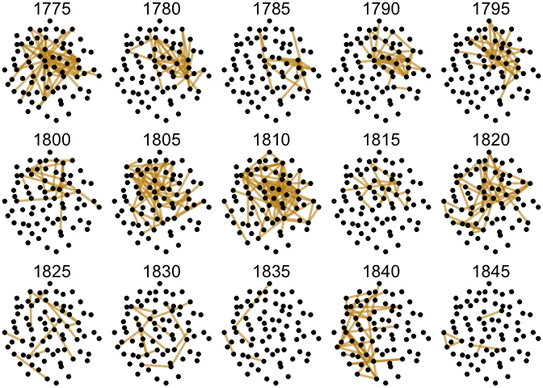

# 04_3_networks

# 4.2. Networks building

## load pckg

``` r
library(tidyverse)

# networks
library(igraph)
library(ggraph)
library(ggrepel)

# basic colouring and layout options
library(wesanderson)
library(patchwork)
theme_set(theme_minimal())
library(MetBrewer)
```

### colour palette

``` r
# MetBrewer::colorblind_palettes

met.brewer(MetBrewer::colorblind_palettes[24])
```


``` r
# met.brewer(name = "Veronese")
# met.brewer(MetBrewer::colorblind_palettes[16]) # Kandinsky

plt <- c(met.brewer(name = "Veronese")[1], # dark red
         met.brewer(name = "Veronese")[3], # yellow
         met.brewer(name = "Veronese")[4], # light blue
         met.brewer(name = "Veronese")[6], # green
         met.brewer(name = "Veronese")[7], # dark blue
         met.brewer(name = "Kandinsky")[3] # gray
         )
```

## load data & fn

``` r
# load model output
load("../../data/ch4/lda75_output.Rda")

# load function for edges calculation
source("04_fn_calculate_edges.R")

# function to extract topic lables:
get_topic_labels = function(x, n_labels = 10) {
  
  #takes beta-matrix as an input
  top_terms = x %>%
    group_by(topic) %>%
    top_n(20, beta) %>%
    ungroup() %>%
    arrange(topic, -beta)
  
  topic_labels = top_terms %>%
    group_by(topic) %>%
    top_n(n_labels, beta) %>%
    summarise(label=paste(term, collapse=" ")) %>%
    mutate(label = paste(topic, label, sep="_"))
  
  return(topic_labels)
}

# graph viz fn
# function for network visualisation: 
# taken as input net, meter as a string & colour palette value
network <- function(network, meter_value, palette_v) { 
  ggraph(network, layout = "stress") +
    geom_edge_fan(aes(color = meter,
                      filter = meter %in% c(meter_value)
                      #,
                      #width = N_connections
                     ),
                      alpha = 0.6, width = 1) +
    geom_node_point() +
    #geom_node_text(aes(label=idn), 
    #               hjust=0.1, 
    #               vjust=-0.4, 
    #               size=3, 
    #               color="grey50") +
    theme_void() + 
    theme(strip.text = element_text(size = 12)) + 
    scale_edge_color_manual(values = palette_v, aesthetics = "edge_colour") #+ 
    #theme(legend.position = "None")
}

network_compare <- function(network, meter_value, palette_v) {
  ggraph(network, layout = "kk") +
    # one layer for edges which are unique for each corpus (RNC or Periodicals)
    geom_edge_fan(aes(color = group,
                      filter = meter %in% c(meter_value) & group == "Unique edge", 
                      width = n), 
                      alpha = 0.4) +
    
    # second layer for intersected edges
    geom_edge_fan(aes(color = group,
                      filter = meter %in% c(meter_value) & group == "Both corpora", 
                      width = n), 
                      alpha = 1) + 
    
    geom_node_text(aes(label=idn), 
                   hjust=0.1, 
                   vjust=-0.4, 
                   size=3, 
                   color="grey50") +
    
    geom_node_point() +
    theme_void() + 
    theme(strip.text = element_text(size = 18)) +
    facet_wrap(~corpus_fullname, 
               scales="free_x", 
               drop=T,
               ncol = 2) + 
    scale_edge_color_manual(values = palette_v) + 
    #labs(title = meter_value) + 
    theme(legend.position = "None")
}


gamma <- gamma %>% 
  rename(author = first_line)

glimpse(gamma)
```

    Rows: 1,397,250
    Columns: 7
    $ index   <chr> "M_C_101__1-1", "M_C_101__11-1", "M_C_101__12-1", "M_C_101__13…
    $ year    <chr> "1836", "1836", "1836", "1836", "1836", "1836", "1836", "1836"…
    $ author  <chr> "КашкинДЕ", "КашкинДЕ", "КашкинДЕ", "КашкинДЕ", "КашкинДЕ", "К…
    $ formula <chr> "dactyl_3", "trochee_3", "dactyl_3", "iamb_4", "iamb_4", "troc…
    $ topic   <int> 1, 1, 1, 1, 1, 1, 1, 1, 1, 1, 1, 1, 1, 1, 1, 1, 1, 1, 1, 1, 1,…
    $ gamma   <dbl> 0.019108280, 0.008695652, 0.082802548, 0.244755245, 0.00751879…
    $ corpus  <chr> "M", "M", "M", "M", "M", "M", "M", "M", "M", "M", "M", "M", "M…

### extract topic labels

``` r
topic_labels <- get_topic_labels(beta, n_labels = 5)
head(topic_labels)
```

    # A tibble: 6 × 2
      topic label                                 
      <int> <chr>                                 
    1     1 1_слеза плакать лить скорбь тоска     
    2     2 2_человек свет век жить добрый        
    3     3 3_радость день жизнь счастливый юность
    4     4 4_душа чувство мысль сердце понимать  
    5     5 5_любовь огонь грудь сердце кровь     
    6     6 6_мир вечный природа творец земля     

``` r
# write.csv(topic_labels, file = "data/topic_labels.csv")
```

# demo plot

Calculate upper 5% of distribution

``` r
summary(gamma$gamma)
```

        Min.  1st Qu.   Median     Mean  3rd Qu.     Max. 
    0.002053 0.005848 0.007407 0.013333 0.012048 0.580994 

``` r
quantile(gamma$gamma, probs = c(0.05, 0.5, 0.75, 0.95))
```

             5%         50%         75%         95% 
    0.004694836 0.007407407 0.012048193 0.042253521 

``` r
quantile_95 <- quantile(gamma$gamma, probs = 0.95)[[1]]
quantile_95
```

    [1] 0.04225352

Extract data for one poem & create the lineplot

``` r
t <- gamma %>% 
  filter(index == "M_P_1733" & gamma > quantile_95) %>% 
  left_join(topic_labels, by = "topic")

t
```

    # A tibble: 3 × 8
      index    year  author    formula   topic  gamma corpus label                  
      <chr>    <chr> <chr>     <chr>     <int>  <dbl> <chr>  <chr>                  
    1 M_P_1733 1839  ЦыгановНГ trochee_6    29 0.205  M      29_девица молодой крас…
    2 M_P_1733 1839  ЦыгановНГ trochee_6    36 0.0596 M      36_цветок роза весна ц…
    3 M_P_1733 1839  ЦыгановНГ trochee_6    43 0.0596 M      43_ах оставлять горе б…

``` r
# Line plot
demo_lineplot <- gamma %>% 
    filter(index == "M_P_1733") %>% 
    ungroup() %>% 
    ggplot(aes(x = topic, y = gamma)) + 
        geom_line() + 
        
        # threshold line
        geom_hline(yintercept = quantile_95, 
                   linetype = 2,
                   linewidth = 0.7,
                   colour = plt[3]) + 
        
        geom_point(data = gamma %>% filter(index == "M_P_1733" & gamma > quantile_95), 
                   size = 2) + 
  
        geom_label_repel(data = t %>% filter(topic == "29"),
                   aes(label = label ),
                   nudge_y = 0.025,
                   nudge_x = -0.5
                  ) + 
        geom_label_repel(data = t %>% filter(topic == "36"),
                   aes(label = label ),
                   nudge_y = 0.055,
                   nudge_x = 15
                  ) + 
        geom_label_repel(data = t %>% filter(!topic %in% c("29", "36")),
                   aes(label = label ),
                   nudge_y = 0.02,
                   nudge_x = 24
                  ) + 
        
        labs(x = "Топик", y = "Вероятность топика") + 
        expand_limits(x = 80, y = 0.26) + 
        scale_x_continuous(breaks = seq(5, 70, 5)) +
        scale_y_continuous(breaks = seq(0, 0.25, 0.05)) + 
        theme(axis.text = element_text(size = 14),
             axis.title = element_text(size = 16))

demo_lineplot
```


``` r
ggsave("plots/demo_lineplot.png", plot = last_plot(), dpi = 300,
        bg = "white", width = 8, height = 6)
```

Demo - graph

``` r
t <- gamma %>% 
  filter(index == "M_P_1733") 

demo_edges <- compute_edges(t, time_slice = 5)

demo_edges <- demo_edges %>% 
  ungroup() %>% 
  select(source, target)

demo_nodes <- tibble(source = unique(c(demo_edges$source, demo_edges$target)),
                     idn = str_extract(source, "^\\d+"))

demo_net <- graph_from_data_frame(demo_edges, demo_nodes, directed = F)

demo_graph <- ggraph(demo_net, "stress") + 
    geom_edge_fan(width = 1) + 
    geom_node_point(colour = plt[3], size = 14) + 
    geom_node_text(aes(label = idn), size = 8, colour = "white") + 
    scale_x_continuous(expand = c(0,0.7)) + 
    scale_y_continuous(expand = c(0, 0.7))

demo_graph
```

    Warning: Using the `size` aesthetic in this geom was deprecated in ggplot2 3.4.0.
    ℹ Please use `linewidth` in the `default_aes` field and elsewhere instead.


Combine two graphs with patchwork

``` r
layout <- "
AAAAAAAA###
AAAAAAAABBB
AAAAAAAABBB
AAAAAAAA###
"

demo_lineplot + demo_graph + plot_layout(design = layout)

ggsave(filename = "plots/demo.png", plot = last_plot(),
       height = 7, width = 10, bg = "white", dpi = 300)
```

``` r
rm(demo_edges, demo_nodes, demo_lineplot, demo_graph, demo_net, t)
```

# RNC

Select corpus

``` r
# prepare gamma data
gamma_rnc <- gamma %>% 
    # select ONLY RNC connections & topics
    filter(corpus == "N") 
    # add index for create_edges function
    # mutate(index = paste0(corpus, "_", id)) 
```

## Create edges

### compute edges

``` r
edges_raw <- compute_edges(gamma_rnc,
                           gamma_thresh = 0.05,
                           time_slice = 5)

head(edges_raw)
```

    # A tibble: 6 × 13
    # Groups:   index, edge_id [6]
      index     year  author   formula topic  gamma corpus  from    to slice edge_id
      <chr>     <chr> <chr>    <chr>   <int>  <dbl> <chr>  <int> <int> <dbl> <chr>  
    1 N_1012-1  1832  ВНЩастн… iamb_6      1 0.0498 N          1     7  1830 1 7    
    2 N_1012-1  1832  ВНЩастн… iamb_6      1 0.0498 N          1    28  1830 1 28   
    3 N_10222   1814  АННахим… iamb_6      1 0.0722 N          1    54  1810 1 54   
    4 N_10299-1 1850  НАНекра… iamb_5      1 0.0838 N          1    41  1850 1 41   
    5 N_10304   1850  НАНекра… troche…     1 0.0515 N          1    16  1850 1 16   
    6 N_10304   1850  НАНекра… troche…     1 0.0515 N          1    50  1850 1 50   
    # ℹ 2 more variables: source <chr>, target <chr>

### calc top meters

``` r
# select top meters
meter_counts <- gamma %>% 
  mutate(year_span = floor(as.numeric(year)/5)*5) %>% 
  rename("meter" = "formula") %>% 
  filter(!str_detect(meter, "other")) %>% 
  group_by(year_span, meter) %>% 
  count(sort = T) %>% 
  ungroup() %>% 
  filter(n > 10 & year_span != 1850)

head(meter_counts)
```

    # A tibble: 6 × 3
      year_span meter          n
          <dbl> <chr>      <int>
    1      1835 iamb_4    124725
    2      1825 iamb_4     58200
    3      1835 trochee_4  54900
    4      1820 iamb_4     39600
    5      1830 iamb_4     39150
    6      1840 iamb_4     36075

``` r
# group meter counts in a variable
top_meters <- meter_counts %>% 
  group_by(meter) %>%
  summarise(total = sum(n)) %>% 
  arrange(desc(total))

head(top_meters, 15)
```

    # A tibble: 15 × 2
       meter                      total
       <chr>                      <int>
     1 iamb_4                    426450
     2 trochee_4                 170775
     3 iamb_free                 166575
     4 iamb_6                    143325
     5 iamb_5                     74850
     6 iamb_3                     39825
     7 amphibrach_4               26250
     8 iamb_регулярная:4+3        11325
     9 amphibrach_3                8550
    10 trochee_3                   7800
    11 amphibrach_2                6975
    12 trochee_регулярная:4+3      5625
    13 dactyl_4                    5325
    14 amphibrach_регулярная:4+3   5025
    15 iamb_регулярная:6+4         5025

### create links

``` r
# create links
links <- edges_raw %>% 
  mutate(meter = formula) %>%
  # filter out only 8 most present meters
  filter(meter %in% top_meters$meter[1:8]) %>% 
  # group and count edges
  group_by(slice, meter, corpus) %>% 
  count(slice, meter, edge_id, source, target, sort = T) %>% 
  # filter non-frequent edges
  filter(n > 2) %>% 
  ungroup() 

# quick check
head(links)
```

    # A tibble: 6 × 7
      slice meter     corpus edge_id source                             target     n
      <dbl> <chr>     <chr>  <chr>   <chr>                              <chr>  <int>
    1  1780 iamb_free N      11 34   11_знать другой говорить дело ста… 34_ле…    34
    2  1780 iamb_free N      11 55   11_знать другой говорить дело ста… 55_ум…    22
    3  1840 trochee_4 N      7 54    7_стоять окно дверь стена дом      54_ск…    22
    4  1780 iamb_free N      11 40   11_знать другой говорить дело ста… 40_бо…    20
    5  1815 iamb_free N      11 34   11_знать другой говорить дело ста… 34_ле…    17
    6  1825 iamb_4    N      5 22    5_любовь огонь грудь сердце кровь  22_ду…    17

``` r
unique(links$meter)     
```

    [1] "iamb_free"           "trochee_4"           "iamb_4"             
    [4] "iamb_6"              "iamb_5"              "iamb_3"             
    [7] "iamb_регулярная:4+3" "amphibrach_4"       

### create edgelist

``` r
edgelist <- links %>% 
  select(source, target, n, meter, slice, corpus) %>% 
  mutate(width = n/10) %>% 
  filter(slice != 1850) %>% 
  rename(N_connections = n) %>% 
  mutate(facet_title = slice)

nodelist <- tibble(source = unique(c(links$target, links$source))) %>% 
  mutate(idn = as.numeric(str_replace(source, "^([0-9].*?)_.*", "\\1"))) 

head(edgelist)
```

    # A tibble: 6 × 8
      source               target N_connections meter slice corpus width facet_title
      <chr>                <chr>          <int> <chr> <dbl> <chr>  <dbl>       <dbl>
    1 11_знать другой гов… 34_ле…            34 iamb…  1780 N        3.4        1780
    2 11_знать другой гов… 55_ум…            22 iamb…  1780 N        2.2        1780
    3 7_стоять окно дверь… 54_ск…            22 troc…  1840 N        2.2        1840
    4 11_знать другой гов… 40_бо…            20 iamb…  1780 N        2          1780
    5 11_знать другой гов… 34_ле…            17 iamb…  1815 N        1.7        1815
    6 5_любовь огонь груд… 22_ду…            17 iamb…  1825 N        1.7        1825

``` r
head(nodelist) 
```

    # A tibble: 6 × 2
      source                                   idn
      <chr>                                  <dbl>
    1 34_лев становиться зверь волк говорить    34
    2 55_ум иметь большой труд дело             55
    3 54_сказать князь де очень садиться        54
    4 40_богатый нужда хлеб отдавать деньги     40
    5 22_душа мечта поэт вдохновение восторг    22
    6 59_царь народ слава великий россия        59

``` r
nrow(nodelist)
```

    [1] 75

## create network

``` r
net <- graph_from_data_frame(d = edgelist, vertices = nodelist, directed = F)
net
```

    IGRAPH 641a6a3 UN-- 75 4571 -- 
    + attr: name (v/c), idn (v/n), N_connections (e/n), meter (e/c), slice
    | (e/n), corpus (e/c), width (e/n), facet_title (e/n)
    + edges from 641a6a3 (vertex names):
    [1] 34_лев становиться зверь волк говорить--11_знать другой говорить дело становиться
    [2] 55_ум иметь большой труд дело         --11_знать другой говорить дело становиться
    [3] 54_сказать князь де очень садиться    --7_стоять окно дверь стена дом            
    [4] 40_богатый нужда хлеб отдавать деньги --11_знать другой говорить дело становиться
    [5] 34_лев становиться зверь волк говорить--11_знать другой говорить дело становиться
    [6] 22_душа мечта поэт вдохновение восторг--5_любовь огонь грудь сердце кровь        
    + ... omitted several edges

``` r
unique(edgelist$meter)
```

    [1] "iamb_free"           "trochee_4"           "iamb_4"             
    [4] "iamb_6"              "iamb_5"              "iamb_3"             
    [7] "iamb_регулярная:4+3" "amphibrach_4"       

### all RNC viz (check)

Meters without Iamb-4

``` r
# plt <- c(met.brewer(name = "Veronese")[1], # 1 dark red
#          met.brewer(name = "Veronese")[3], # 2 yellow
#          met.brewer(name = "Veronese")[4], # 3 light blue
#          met.brewer(name = "Veronese")[6], # 4 green
#          met.brewer(name = "Veronese")[7] # 5 dark blue
#          )

all_nkrja <- network(net, c("iamb_4", 
                            "iamb_6", 
                            "iamb_free", 
                            "trochee_4"), 
                     c(plt[4],
                       plt[2],
                       plt[3],
                       plt[1]
                       ) 
                     )
                


all_nkrja + facet_wrap(~slice, 
                        scales="free_x", 
                        drop=T,
                        ncol = 5) + 
    labs(edge_colour = "Meter") + 
    theme(strip.text = element_text(size = 16),
         legend.text = element_text(size = 14), 
         legend.title = element_text(size = 16),
         panel.spacing = unit(1.4, "lines"),
         legend.position = "bottom")
```


All without Iamb-4

``` r
all_nkrja <- network(net, c("iamb_6", "iamb_free", #"iamb_4", 
                            "trochee_4"), 
                     c(plt[2], 
                       plt[3],
                       # plt[5]], 
                       plt[1])) 
                

all_nkrja + facet_wrap(~slice, 
                        scales="free_x", 
                        drop=T,
                        ncol = 5) + 
    labs(edge_colour = "Meter") + 
    theme(strip.text = element_text(size = 16),
         legend.text = element_text(size = 14), 
         legend.title = element_text(size = 16),
         panel.spacing = unit(1.4, "lines"),
         legend.position = "bottom")
```


### iamb-4

``` r
iamb_4 <- network(net, c("iamb_4"), plt[4])
    
iamb_4 + facet_wrap(~slice, 
                 scales="free_x", 
                 drop=T,
                 ncol = 5) + 
    theme(legend.position = "None",
         strip.text = element_text(size = 16),
         legend.text = element_text(size = 14), 
         legend.title = element_text(size = 16))
```


### iamb-6

``` r
iamb_6 <- network(net, c("iamb_6"), plt[2])
iamb_6 + facet_wrap(~slice, 
                 scales="free_x", 
                 drop=T,
                 ncol = 5) + 
    theme(legend.position = "None",
         strip.text = element_text(size = 16),
         legend.text = element_text(size = 14), 
         legend.title = element_text(size = 16))
```



### trochee-4

``` r
trochee_4 <- network(net, c("trochee_4"), plt[1])
trochee_4 + facet_wrap(~slice, 
                 scales="free_x", 
                 drop=T,
                 ncol = 5) + 
    theme(legend.position = "None",
         strip.text = element_text(size = 16),
         legend.text = element_text(size = 14), 
         legend.title = element_text(size = 16))
```


## Network stats

### density

Calculate network density taking separately each time slice and each
meter. The density of a graph is the ratio of the number of edges and
the number of possible edges.

``` r
density_vector <- function(formula) {
    densities <- vector()
    e1 <- NULL
    for (i in 1:length(unique(edgelist$slice))) {
        e1 <- edgelist %>% 
            filter(meter == formula & slice == unique(edgelist$slice)[i] & corpus == "N")

            net_test <- graph_from_data_frame(d = e1, vertices = nodelist, directed = F)

            densities[i] <- edge_density(net_test, loops = F)
    }
    densities
}
```

``` r
length(unique(edgelist$slice))
```

    [1] 15

``` r
density_table <- tibble(meter = c(rep("iamb_4", 15), rep("iamb_6", 15), 
                 rep("iamb_free", 15), rep("trochee_4", 15)),
      slice = rep(unique(edgelist$slice), 4),
      density = round(c(density_vector("iamb_4"),
                       density_vector("iamb_6"),
                       density_vector("iamb_free"), 
                       density_vector("trochee_4")), 3)) %>% 
    arrange(desc(-slice)) 

density_table %>% 
    # pivot for easier reading
    pivot_wider(names_from = slice, values_from = density)
```

    # A tibble: 4 × 16
      meter    `1775` `1780` `1785` `1790` `1795` `1800` `1805` `1810` `1815` `1820`
      <chr>     <dbl>  <dbl>  <dbl>  <dbl>  <dbl>  <dbl>  <dbl>  <dbl>  <dbl>  <dbl>
    1 iamb_4    0.01   0.012  0.006  0.039  0.084  0.049  0.031  0.035  0.037  0.131
    2 iamb_6    0.021  0.015  0.009  0.012  0.012  0.008  0.019  0.029  0.006  0.015
    3 iamb_fr…  0.001  0.04   0.003  0.013  0.01   0.018  0.049  0.036  0.052  0.027
    4 trochee…  0      0      0      0.007  0.022  0.006  0.005  0.002  0.001  0.004
    # ℹ 5 more variables: `1825` <dbl>, `1830` <dbl>, `1835` <dbl>, `1840` <dbl>,
    #   `1845` <dbl>

``` r
summary(density_table$density)
```

       Min. 1st Qu.  Median    Mean 3rd Qu.    Max. 
    0.00000 0.00600 0.01250 0.02615 0.03200 0.23600 

``` r
density_table %>% 
    ggplot(aes(x = meter, y = density, fill = meter)) + geom_boxplot() + 
    scale_fill_manual(values = c(plt[4],
                                 plt[2],
                                 plt[3],
                                 plt[1])
                      )
```


Remove obsolete objects

``` r
rm(all_nkrja, density_table, edgelist, gamma_rnc, 
   iamb_4, iamb_6, links, meter_counts, net, nodelist, top_meters, trochee_4)
```

## RNC - iou

This is the part there number of the same edges in meters pairwise
calculated in comparison with a random baseline. The code is based on
the previous work: (Martynenko, Sela 2023).

Load functions

``` r
calculate_real_iou  <- function(x, s = "iamb_4", t) {
    # first, select meters and get edges per time slice
    edges_meters  <- x  %>%
        filter(meter %in% c(s, t)) %>%
        group_by(slice, meter)  %>%
        count(edge_id)  %>% 
      #  filter(n>1)  %>% # filter if you want
        select(-n)

    # prepare a table with two meters as columns and lists of their connections per each time slice
    connections <- edges_meters  %>% 
        ungroup()  %>% 
        nest(edge_id)  %>%
        pivot_wider(names_from = meter, values_from = data)

    # calculate intersection, union, and iou
    int_union  <- connections  %>% 
        rowwise()  %>% 
        mutate(inter=list(intersect(unlist(!! sym(s)), unlist(!! sym(t)))), # intersection of edges
               uni=list(union(unlist(unlist(!! sym(s))), unlist(!! sym(t)))), # union of edges
               iou=length(inter)/length(uni)) # intersection over union

    int_union  <- int_union  %>% select(slice, iou)
    return(int_union)
}


sample_random_edges  <- function(edges_df = edges_raw,
                                 target_meter = "iamb_free") {

    
    pool <- edges_df %>% ungroup()  
    l <- nrow(pool)

    sample_sizes <- edges_raw  %>%
        ungroup()  %>% 
        filter(meter == target_meter) %>%
        count(slice,meter)  %>% 
        select(slice,meter,n)

    df  <- NULL

    for(i in 1:nrow(sample_sizes)) {

        s <- pool[sample(l, sample_sizes$n[i]),]

        edges_random <- s %>%
            count(edge_id) %>% 
            mutate(meter = "random",slice = sample_sizes$slice[i]) %>% 
            select(-n)

        df  <- bind_rows(df,edges_random)
    }

    return(df)   
}

# random intersection calculation
calculate_random_iou <- function(x, i4_df = i4) {
    
    edges_meters <- i4_df %>%
        bind_rows(x)  %>% # bind sample
        group_by(slice,meter)  %>%
        count(edge_id)  %>% 
        select(-n)

    # prepare a table with two meters as columns 
    # and lists of their connections per each time slice
    connections=edges_meters  %>% 
        ungroup()  %>% 
        nest(edge_id)  %>%
        pivot_wider(names_from = meter,values_from = data)

    iou_random  <- connections  %>% 
        rowwise()  %>% 
        mutate(inter=list(intersect(unlist(`iamb_4`), unlist(`random`))), # intersection of edges
               uni=list(union(unlist(`iamb_4`), unlist(`random`))), # union of edges
               iou=length(inter)/length(uni))  %>% # intersection over union  
        select(slice, iou)

    return(iou_random)

}
```

Calculate real intersections

``` r
target_meters  <- c("iamb_free", "iamb_6", 
                    "trochee_4")

int_union  <- NULL

edges_raw <- edges_raw %>% rename(meter = formula)

suppressWarnings(for (m in target_meters) {

    df <- calculate_real_iou(edges_raw,s = "iamb_4", t = m) %>% 
        mutate(meter = m)

    int_union  <- rbind(int_union,df)  

})

head(int_union)
```

    # A tibble: 6 × 3
    # Rowwise: 
      slice    iou meter    
      <dbl>  <dbl> <chr>    
    1  1775 0.0732 iamb_free
    2  1780 0.126  iamb_free
    3  1785 0.149  iamb_free
    4  1790 0.143  iamb_free
    5  1795 0.221  iamb_free
    6  1800 0.229  iamb_free

Calculate random baseline

``` r
N = 1000

i4  <- edges_raw %>% ungroup() %>% filter(meter == "iamb_4")

iou_ci  <- NULL

suppressWarnings(for(m in target_meters) {

    for(i in 1:N) {
    
        s  <- sample_random_edges(edges_raw,target_meter = m)
    
        iou_random  <- calculate_random_iou(s, i4)  %>% mutate(meter=m)
    
        iou_ci  <- bind_rows(iou_ci, iou_random)  
    }    
})

iou_ribbon  <- iou_ci %>% 
    group_by(slice, meter) %>%  
    summarise(lower = quantile(iou, 0.025),
              upper = quantile(iou, 0.975),
              iou = mean(iou))
```

Save data

``` r
saveRDS(iou_ribbon, "../../data/ch4/iou_ribbon.Rds")
```

### Figure 4-2-3

``` r
iou_ribbon <- readRDS("../../data/ch4/iou_ribbon.Rds")

trans_meter  <- tibble(meter = int_union$meter  %>% unique(),
                       meter_t = c("Я4 vs Вольный ямб", 
                                   #"Iamb_5", 
                                   "Я4 vs 6-ст. ямб", 
                                   "Я4 vs 4-ст. хорей" ))


int_union %>% 
    #ungroup() %>%  
    left_join(trans_meter, by = "meter")  %>% 
  
    filter(slice != 1850) %>% 
    ggplot(aes(slice, iou, color = meter_t)) + 
    geom_line(size = 2) + 
    labs(x = "", 
         y = "Proportion of shared connections vs. chance", 
         #title="Iamb-4 vs. others"
        ) + 
    geom_line(data = iou_ribbon %>% left_join(trans_meter, by = "meter"), 
              color = "black", size = 0.5, linetype = 5) + 
    geom_ribbon(data = iou_ribbon %>% left_join(trans_meter,by="meter"), 
                aes(slice, iou, color = NULL,
                    ymin = lower, ymax = upper),
                fill = "darkgray", alpha = 0.5) +
    facet_wrap(~meter_t, ncol = 3) + 
    scale_color_manual(values = c(plt[3],
                                 plt[2],
                                 plt[1])) + 
    guides(color = "none") +
    theme(text = element_text(size = 16),
          axis.text = element_text(size = 14),
          strip.text = element_text(size = 14),
          panel.spacing = unit(1.5, "cm")) +
    scale_x_continuous(breaks = seq(1780, 1840, 20) , 
                       limits = c(1775, 1849)
                      )
```


``` r
ggsave("plots/Fig_4-2-3.png", plot = last_plot(), width = 9, height = 5,
      dpi = 300, bg = "white")
```

# RNC vs Corpus-1835

``` r
glimpse(gamma)
```

    Rows: 1,397,250
    Columns: 7
    $ index   <chr> "M_C_101__1-1", "M_C_101__11-1", "M_C_101__12-1", "M_C_101__13…
    $ year    <chr> "1836", "1836", "1836", "1836", "1836", "1836", "1836", "1836"…
    $ author  <chr> "КашкинДЕ", "КашкинДЕ", "КашкинДЕ", "КашкинДЕ", "КашкинДЕ", "К…
    $ formula <chr> "dactyl_3", "trochee_3", "dactyl_3", "iamb_4", "iamb_4", "troc…
    $ topic   <int> 1, 1, 1, 1, 1, 1, 1, 1, 1, 1, 1, 1, 1, 1, 1, 1, 1, 1, 1, 1, 1,…
    $ gamma   <dbl> 0.019108280, 0.008695652, 0.082802548, 0.244755245, 0.00751879…
    $ corpus  <chr> "M", "M", "M", "M", "M", "M", "M", "M", "M", "M", "M", "M", "M…

Check topic prob distribution

``` r
topic_probs <- gamma %>%
  group_by(topic) %>%
  summarise(avg_gamma = mean(gamma)) %>% 
  ungroup() %>% 
  arrange(desc(avg_gamma))

print("Most probable topics (avg)")

head(topic_probs, 10)

topic_probs %>% 
  ggplot(aes(reorder(topic,-avg_gamma), avg_gamma)) + geom_col()

gamma %>% 
  mutate(year_span = floor(as.numeric(year)/5)*5) %>% 
  group_by(year_span, topic) %>% 
  summarise(gamma_avg = mean(gamma)) %>% 
  top_n(10) %>% 
  ggplot(aes(x = year_span, y = gamma_avg, fill = as.factor(topic))) + geom_col()
```

## 1830s: No-sampling data

``` r
# glimpse(gamma)

gamma1830_ns <- gamma %>% 
  filter(year > 1829 & year < 1841) %>% 
  mutate(formula = ifelse(formula == "iamb_other", "iamb_free", formula))

gamma1830_ns %>% 
  select(index, corpus) %>% 
  distinct() %>% 
  count(corpus)
```

    # A tibble: 2 × 2
      corpus     n
      <chr>  <int>
    1 M       4718
    2 N       3123

``` r
edges_1830_ns <- compute_edges(gamma1830_ns,
                           gamma_thresh = 0.05,
                           time_slice = 5)

head(edges_1830_ns)
```

    # A tibble: 6 × 13
    # Groups:   index, edge_id [6]
      index       year  author formula topic  gamma corpus  from    to slice edge_id
      <chr>       <chr> <chr>  <chr>   <int>  <dbl> <chr>  <int> <int> <dbl> <chr>  
    1 M_C_101__1… 1836  Кашки… dactyl…     1 0.0828 M          1    37  1835 1 37   
    2 M_C_101__1… 1836  Кашки… dactyl…     1 0.0828 M          1    38  1835 1 38   
    3 M_C_101__2… 1836  Кашки… troche…     1 0.0710 M          1    14  1835 1 14   
    4 M_C_101__2… 1836  Кашки… troche…     1 0.0710 M          1    49  1835 1 49   
    5 M_C_101__2… 1836  Кашки… troche…     1 0.0710 M          1    75  1835 1 75   
    6 M_C_101__3… 1836  Кашки… iamb_6      1 0.103  M          1     9  1835 1 9    
    # ℹ 2 more variables: source <chr>, target <chr>

``` r
top_meters <- c("iamb_4", "iamb_free", "trochee_4", "iamb_6")


links_1830_ns <- edges_1830_ns %>% 
  mutate(meter = formula) %>%
  # filter out only 8 most interesting meters
  filter(meter %in% top_meters) %>% 
  # group and count edges
  group_by(meter, corpus) %>% 
  count(meter, edge_id, source, target, sort = T) %>% 
  # filter non-frequent edges
  filter(n > 2) %>% 
  ungroup() 

# quick check
head(links_1830_ns)
```

    # A tibble: 6 × 6
      meter  corpus edge_id source                                 target          n
      <chr>  <chr>  <chr>   <chr>                                  <chr>       <int>
    1 iamb_4 M      18 22   18_небо мир земля земной небесный      22_душа ме…    28
    2 iamb_4 M      22 56   22_душа мечта поэт вдохновение восторг 56_мечта д…    28
    3 iamb_4 M      4 22    4_душа чувство мысль сердце понимать   22_душа ме…    28
    4 iamb_4 M      22 25   22_душа мечта поэт вдохновение восторг 25_душа ст…    27
    5 iamb_4 M      22 63   22_душа мечта поэт вдохновение восторг 63_любовь …    27
    6 iamb_4 M      9 22    9_звук струна внимать глас лира        22_душа ме…    27

``` r
edges_rnc <- links_1830_ns %>% 
    mutate(meter_edge = paste0(meter, "__", edge_id)) %>% 
    filter(corpus == "N") %>% 
    pull(meter_edge)

edges_m <- links_1830_ns %>% 
    mutate(meter_edge = paste0(meter, "__", edge_id)) %>% 
    filter(corpus == "M") %>% 
    pull(meter_edge)

head(edges_rnc)
```

    [1] "trochee_4__7 54"  "trochee_4__11 54" "iamb_4__10 19"    "iamb_4__22 25"   
    [5] "iamb_4__4 22"     "trochee_4__40 54"

``` r
head(edges_m)
```

    [1] "iamb_4__18 22" "iamb_4__22 56" "iamb_4__4 22"  "iamb_4__22 25"
    [5] "iamb_4__22 63" "iamb_4__9 22" 

``` r
edges_intersection <- intersect(edges_rnc, edges_m)
# print("Intersection between built edges:")
# head(edges_intersection)

edges_1830_ns %>% 
  ungroup() %>% 
  select(index, corpus) %>% 
  distinct() %>% 
  count(corpus)
```

    # A tibble: 2 × 2
      corpus     n
      <chr>  <int>
    1 M       4413
    2 N       2917

``` r
print(paste("Number of edges in C-1835 (M):", length(edges_m)))
```

    [1] "Number of edges in C-1835 (M): 2760"

``` r
print(paste("Number of edges in RNC:", length(edges_rnc)))
```

    [1] "Number of edges in RNC: 1337"

``` r
print(paste("Number of intersections in edges:",length(edges_intersection) ))
```

    [1] "Number of intersections in edges: 855"

``` r
edges_1830_ns %>% 
  filter(formula %in% top_meters) %>% 
  group_by(corpus, formula) %>% 
  count() %>% 
  arrange(desc(formula))
```

    # A tibble: 8 × 3
    # Groups:   corpus, formula [8]
      corpus formula       n
      <chr>  <chr>     <int>
    1 M      trochee_4  3941
    2 N      trochee_4  3076
    3 M      iamb_free  4256
    4 N      iamb_free  1945
    5 M      iamb_6     2508
    6 N      iamb_6     1333
    7 M      iamb_4     9716
    8 N      iamb_4     5074

``` r
edgelist_ns <- links_1830_ns %>% 
    mutate(meter_edge = paste0(meter, "__", edge_id),
           # create a column indicating if an edge is present in both corpora
          group = ifelse(meter_edge %in% edges_intersection, 
                         "Both corpora", 
                         "Unique edge")) %>% 
    select(source, target, n, meter, corpus, group) %>% 
    mutate(width = n/10,
          corpus_fullname = ifelse(corpus == "M", "Корпус-1835", "НКРЯ"))

nodelist_ns <- tibble(source = unique(c(links_1830_ns$target, links_1830_ns$source))) %>% 
  mutate(idn = as.numeric(str_replace(source, "^([0-9].*?)_.*", "\\1"))) 

# head(edgelist_ns)
# head(nodelist_ns) 
# nrow(nodelist_ns)
```

### graph

``` r
net1830_ns <- graph_from_data_frame(d = edgelist_ns, vertices = nodelist_ns, directed = F)
net1830_ns
```

    IGRAPH a41367d UN-- 75 4097 -- 
    + attr: name (v/c), idn (v/n), n (e/n), meter (e/c), corpus (e/c),
    | group (e/c), width (e/n), corpus_fullname (e/c)
    + edges from a41367d (vertex names):
    [1] 22_душа мечта поэт вдохновение восторг--18_небо мир земля земной небесный   
    [2] 22_душа мечта поэт вдохновение восторг--56_мечта душа сон воспоминание пора 
    [3] 22_душа мечта поэт вдохновение восторг--4_душа чувство мысль сердце понимать
    [4] 22_душа мечта поэт вдохновение восторг--25_душа страсть страдание мука тоска
    [5] 22_душа мечта поэт вдохновение восторг--63_любовь сердце надежда душа верить
    [6] 22_душа мечта поэт вдохновение восторг--9_звук струна внимать глас лира     
    + ... omitted several edges

``` r
network_compare(net1830_ns, "iamb_4", c(plt[4], plt[6]))
```


``` r
# ggsave("plots/Fig_4-2-4_iamb4.png", plot = last_plot(), bg = "white",
#       dpi = 300, width = 8, height = 4)
```

``` r
network_compare(net1830_ns, "iamb_6", c(plt[2], plt[6]))
```


``` r
# ggsave("plots/Fig_4-2-4_iamb6.png", plot = last_plot(), bg = "white",
#       dpi = 300, width = 8, height = 4)
```

``` r
network_compare(net1830_ns, "trochee_4", c(plt[1], plt[6]))
```


``` r
# ggsave("plots/Fig_4-2-4_trochee4.png", plot = last_plot(), bg = "white",
#       dpi = 300, width = 8, height = 4)
```

## Density - corpus-1835

``` r
# glimpse(edgelist_ns)

# filter only corpus-1835
x <- edgelist_ns %>% filter(corpus == "M")
meters <- c("iamb_4", "trochee_4", "iamb_6")  # take only i4, i6, t4 -- three meters in total


# return densities for each meter in a loop (corpus-35)
density_35 <- NULL

for (i in 1:length(meters)) {
  e_35 <- edgelist_ns %>% filter(meter == meters[i] & corpus == "M")
  net_test <- graph_from_data_frame(d = e_35, vertices = nodelist_ns, directed = F)
  density_35[i] <- edge_density(net_test, loops = F)
}

density_35
```

    [1] 0.5095495 0.1765766 0.1005405

``` r
# return densities for each meter in a loop (RNC 30s)
density_rnc <- NULL

for (i in 1:length(meters)) {
  e_35 <- edgelist_ns %>% filter(meter == meters[i] & corpus == "N")
  net_test <- graph_from_data_frame(d = e_35, vertices = nodelist_ns, directed = F)
  density_rnc[i] <- edge_density(net_test, loops = F)
}

density_rnc
```

    [1] 0.28000000 0.12036036 0.02306306

``` r
rm(e_35, net_test)
```

Compare network densities & n of edges in comparison to the sample size
(n of poems)

``` r
# glimpse(gamma1830_ns)

# calculate number of texts in each meter in each corpus
n_texts <- gamma1830_ns %>% 
  select(index, formula, corpus) %>% 
  distinct() %>% 
  filter(formula %in% meters) %>% 
  count(corpus, formula) %>% 
  mutate(id = paste0(corpus, "__", formula))

# calculate number of edges in each meter in each corpus
n_edges <- edgelist_ns %>% 
  count(corpus, meter) %>% 
  rename(n_edges = n) %>% 
  mutate(id = paste0(corpus, "__", meter))

# summarise results in a table
tibble(
  meter = meters,
  density_35 = density_35,
  density_rnc = density_rnc
) %>% 
  pivot_longer(!meter) %>% 
  rename(corpus = name,
         density = value) %>% 
  mutate(corpus = ifelse(corpus == "density_35", "M", "N"),
         id = paste0(corpus, "__", meter)) %>% 
  left_join(n_edges %>% select(id, n_edges), 
            by = "id") %>% 
  left_join(n_texts %>% select(id, n), 
            by = "id") %>% 
  select(-id) %>% 
  rename(n_texts = n) %>% 
  mutate(n_edges_texts_ratio = round(n_edges/n_texts, 3)) 
```

    # A tibble: 6 × 6
      meter     corpus density n_edges n_texts n_edges_texts_ratio
      <chr>     <chr>    <dbl>   <int>   <int>               <dbl>
    1 iamb_4    M       0.510     1414    1569               0.901
    2 iamb_4    N       0.28       777     876               0.887
    3 trochee_4 M       0.177      490     651               0.753
    4 trochee_4 N       0.120      334     571               0.585
    5 iamb_6    M       0.101      279     362               0.771
    6 iamb_6    N       0.0231      64     191               0.335

``` r
rm(edgelist_ns, edges_1830_ns, gamma1830_ns, links_1830_ns,
   n_edges, n_texts, net1830_ns, nodelist_ns, x, density_35, density_rnc,
   edges_intersection, edges_m, edges_rnc, i, meters, top_meters)
```

## Sampling & stable edges calculation

Outline:

-   problem 1: inequality in author-text ratio

-   problem 2: inequality in texts in two corpora

-   idea:

    -   take X random samples from each author in a corpus ——— say, max
        20

    -   take Y texts from each corpus ——— say, 1000

    -   compute edges

    -   store edges

    -   summarise the most (?) stable edges and visualise them only ———
        50% of trials?

    -   use that for further vis & community search

``` r
# get both corpora & sample overrepresented authors
glimpse(gamma)

# upd a variable for meters of interest
top_meters <- c("iamb_4", "trochee_4", "iamb_6")

# count authors
n_texts <- gamma %>% 
  filter(formula %in% top_meters) %>% # filter only the poems of selected meters
  select(index, author) %>% 
  distinct() %>% 
  count(author, sort = T) 

summary(n_texts$n) # median 4, mean 18

# var for unique texts & authors
texts_authors <- gamma %>% 
  filter(formula %in% top_meters) %>% # filter only the poems of selected meters
  select(index, author, formula) %>% 
  distinct() 

# get list of authors with more than 30 poems
large_authors <- n_texts %>% 
  filter(n > 40) # authors with at least double corpus from mean

head(large_authors$author)
tail(large_authors$author)
length(large_authors$author) 
```

Collect all texts by authors with small samples

``` r
gamma_small <- gamma %>% 
  filter(formula %in% top_meters) %>%
  filter(!author %in% large_authors$author)
```

### Sampling - loop

``` r
# empty variables to store the unique edges of each trial
m_edgeid_list <- NULL
rnc_edgeid_list <- NULL
m <- NULL

m_edgemeter_list <- NULL
rnc_edgemeter_list <- NULL

for (j in 1:length(top_meters)) {
  
  m <- top_meters[j]

  for (i in 1:100) {
    
    # SAMPLING I
    # sample texts by overrepresented authors
    large_sampled <- texts_authors %>% 
      # select only indexes of poems from overrepresented authors
      filter(author %in% large_authors$author) %>% 
      group_by(author) %>% 
      sample_n(20) %>% # sample 20 poems
      ungroup() %>% 
      select(index) %>% pull()
    
    # check
    # head(large_sampled)
    # length(large_sampled)
    
    # extract gamma values for sampled texts
    gamma_large <- gamma %>% 
      filter(index %in% large_sampled)
    
    # merge sampled & short data
    gamma_sampled <- rbind(gamma_small, gamma_large)
    
    # head(gamma_sampled)
    
    # ------------------------------------------------
    # SAMPLING II - 1000 random poems from both corpora
    # sample 1000 poems from each corpus & write id
    corpus_samples_id <- gamma_sampled %>% 
      select(index, corpus) %>% 
      distinct() %>%
      group_by(corpus) %>% 
      sample_n(1000) %>% 
      ungroup() %>% 
      select(index) %>% pull()
    
    # sample by id gamma values for 2k sampled poems
    gamma_double_sampled <- gamma_sampled %>% filter(index %in% corpus_samples_id)
    
    # create edges
    edges_sampled <- compute_edges(gamma_double_sampled,
                               gamma_thresh = 0.05,
                               time_slice = 5)
    
    head(edges_sampled)
    
    # retrieve & write in the list edges from Margianls corpus
    m_edgeid_list[[i]] <- edges_sampled %>% 
      ungroup() %>% 
      filter(corpus == "M" & formula == top_meters[j]) %>% 
      select(edge_id) %>% 
      distinct() %>% pull
    
    # retrieve & write in the list edges from RNC corpus
    rnc_edgeid_list[[i]] <- edges_sampled %>% 
      ungroup() %>% 
      filter(corpus == "N" & formula == top_meters[j]) %>% 
      select(edge_id) %>% 
      distinct() %>% pull
    
  
  }
  
  m_edgemeter_list[[j]] <- unlist(m_edgeid_list) # all edges in a selected meter
  rnc_edgemeter_list[[j]] <- unlist(rnc_edgeid_list)

}

# as.data.frame(table(unlist(x)))
```

``` r
# m_edgeid <- as.data.frame(table(unlist(m_edgeid_list))) 
# rnc_edgeid <- as.data.frame(table(unlist(rnc_edgeid_list)))

m_edgeid_iamb4 <- as.data.frame(table(m_edgemeter_list[[1]]))
rnc_edgeid_iamb4 <- as.data.frame(table(rnc_edgemeter_list[[1]]))

m_edgeid_iamb4
rnc_edgeid_iamb4

# m_edgeid %>% 
#   rename(edge = Var1,
#          n = Freq) %>% 
#   arrange(desc(n))

summary(m_edgeid_iamb4$Freq)
# m_edgeid %>% 
#   ggplot(aes(x = Freq)) + geom_density() + 
#   geom_vline(xintercept = 90, colour = "darkgreen") + 
#   geom_vline(xintercept = 81.45, colour = "pink") + 
#   geom_vline(xintercept = c(71, 98), colour = "lightblue", lty = 2)

summary(rnc_edgeid_iamb4$Freq)

m_edgeid_iamb4 %>% 
  mutate(corpus = "M") %>% 
  rbind(rnc_edgeid_iamb4 %>% mutate(corpus = "RNC")) %>% 
  #ggplot(aes(y = Freq, group = corpus)) + geom_boxplot()
  ggplot(aes(x = Freq, group = corpus, colour = corpus)) + geom_density() + 
  
  geom_vline(xintercept = 78, colour = "green", lty = 4) + # median m
  geom_vline(xintercept = 71.13, colour = "green", lty = 2) + # mean m
  geom_vline(xintercept = c(56, 93), colour = "green", lty = 3) + # 1st to 3rd q

  geom_vline(xintercept = 68, colour = "blue", lty = 4) + # median
  geom_vline(xintercept = 62.43, colour = "blue", lty = 2) + # mean
  geom_vline(xintercept = c(43, 86), colour = "blue", lty = 3) +  # 1st to 3rd q
  scale_color_manual(values = c("green", "blue")) + 
  labs(title = "Iamb-4")
```

``` r
m_edgeid_iamb6 <- as.data.frame(table(m_edgemeter_list[[3]]))
rnc_edgeid_iamb6 <- as.data.frame(table(rnc_edgemeter_list[[3]]))

m_edgeid_iamb6
rnc_edgeid_iamb6


summary(m_edgeid_iamb6$Freq)

summary(rnc_edgeid_iamb6$Freq)

m_edgeid_iamb6 %>% 
  mutate(corpus = "M") %>% 
  rbind(rnc_edgeid_iamb6 %>% mutate(corpus = "RNC")) %>% 
  #ggplot(aes(y = Freq, group = corpus)) + geom_boxplot()
  ggplot(aes(x = Freq, group = corpus, colour = corpus)) + geom_density() + 
  
  geom_vline(xintercept = 51, colour = "green", lty = 4) + # median m
  geom_vline(xintercept = 46.82, colour = "green", lty = 2) + # mean m
  geom_vline(xintercept = c(24, 64), colour = "green", lty = 3) + # 1st to 3rd q

  geom_vline(xintercept = 45, colour = "blue", lty = 4) + # median
  geom_vline(xintercept = 45.99, colour = "blue", lty = 2) + # mean
  geom_vline(xintercept = c(21, 67), colour = "blue", lty = 3) +  # 1st to 3rd q
  scale_color_manual(values = c("green", "blue")) + 
  labs(title = "Iamb-6")
```

``` r
m_edgeid_tr4 <- as.data.frame(table(m_edgemeter_list[[2]]))
rnc_edgeid_tr4 <- as.data.frame(table(rnc_edgemeter_list[[2]]))

m_edgeid_tr4
rnc_edgeid_tr4


summary(m_edgeid_tr4$Freq)

summary(rnc_edgeid_tr4$Freq)

m_edgeid_tr4 %>% 
  mutate(corpus = "M") %>% 
  rbind(rnc_edgeid_tr4 %>% mutate(corpus = "RNC")) %>% 
  #ggplot(aes(y = Freq, group = corpus)) + geom_boxplot()
  ggplot(aes(x = Freq, group = corpus, colour = corpus)) + geom_density() + 
  
  geom_vline(xintercept = 58, colour = "green", lty = 4) + # median m
  geom_vline(xintercept = 56.89, colour = "green", lty = 2) + # mean m
  geom_vline(xintercept = c(41, 78), colour = "green", lty = 3) + # 1st to 3rd q

  geom_vline(xintercept = 37, colour = "blue", lty = 4) + # median
  geom_vline(xintercept = 36.35, colour = "blue", lty = 2) + # mean
  geom_vline(xintercept = c(13, 54), colour = "blue", lty = 3) +  # 1st to 3rd q
  scale_color_manual(values = c("green", "blue")) + 
  labs(title = "Trochee-4")
```

``` r
m_alledges <- m_edgeid_iamb4 %>% 
  mutate(meter = "Iamb_4") %>% 
  rbind(m_edgeid_iamb6 %>% mutate(meter = "Iamb_6")) %>% 
  rbind(m_edgeid_tr4 %>% mutate(meter = "Trochee_4"))

m_alledges %>% count(meter)

rnc_alledges <- rnc_edgeid_iamb4 %>% 
  mutate(meter = "Iamb_4") %>% 
  rbind(rnc_edgeid_iamb6 %>% mutate(meter = "Iamb_6")) %>% 
  rbind(rnc_edgeid_tr4 %>% mutate(meter = "Trochee_4"))

rnc_alledges %>% count(meter)

all_edges <- m_alledges %>% mutate(corpus = "M") %>% 
  rbind(rnc_alledges %>% mutate(corpus = "RNC"))
```

``` r
saveRDS(all_edges, file = "../../data/ch4/edge_stability.Rds")
```

``` r
all_edges <- readRDS(file = "../../data/ch4/edge_stability.Rds")

# create a variable for meters of interest
top_meters <- c("iamb_4", "trochee_4", "iamb_6")

all_edges %>% 
  ggplot(aes(x = meter, y = Freq, , fill = corpus)) + geom_boxplot()
```


## Summaries

### Iamb-4

``` r
# summary for corpus-1835
all_edges %>% filter(meter == "Iamb_4" & corpus == "M") %>% summary()
```

          Var1           Freq           meter              corpus         
     1 10   :   1   Min.   :  4.00   Length:2462        Length:2462       
     1 11   :   1   1st Qu.: 56.00   Class :character   Class :character  
     1 12   :   1   Median : 78.00   Mode  :character   Mode  :character  
     1 13   :   1   Mean   : 71.13                                        
     1 14   :   1   3rd Qu.: 93.00                                        
     1 16   :   1   Max.   :100.00                                        
     (Other):2456                                                         

``` r
# summary for RNC
all_edges %>% filter(meter == "Iamb_4" & corpus == "RNC") %>% summary()
```

          Var1           Freq           meter              corpus         
     1 10   :   1   Min.   :  1.00   Length:2744        Length:2744       
     1 11   :   1   1st Qu.: 43.00   Class :character   Class :character  
     1 12   :   1   Median : 68.00   Mode  :character   Mode  :character  
     1 13   :   1   Mean   : 62.43                                        
     1 14   :   1   3rd Qu.: 86.00                                        
     1 16   :   1   Max.   :100.00                                        
     (Other):2738                                                         

``` r
# calculate number of edges to plot in case of selecting ones above mean
all_edges %>% 
  filter(meter == "Iamb_4" & corpus == "M") %>% 
  filter(Freq > 71) %>% nrow() # filter starting from mean?
```

    [1] 1430

``` r
all_edges %>% 
  filter(meter == "Iamb_4" & corpus == "RNC") %>% 
  filter(Freq > 62) %>% nrow()
```

    [1] 1541

``` r
# retrieve stable edges for both corpora 
stable_edges_i4_m <- all_edges %>% 
  filter(meter == "Iamb_4" & corpus == "M") %>% 
  filter(Freq > 71) %>% select(Var1) %>% pull()

stable_edges_i4_n <- all_edges %>% 
  filter(meter == "Iamb_4" & corpus == "RNC") %>% 
  filter(Freq > 62) %>% select(Var1) %>% pull()
```

Create edgelist from all corpus (no chronological or other limits)

``` r
edges_all <- compute_edges(gamma, time_slice = 5)
head(edges_all)
```

    # A tibble: 6 × 13
    # Groups:   index, edge_id [6]
      index       year  author formula topic  gamma corpus  from    to slice edge_id
      <chr>       <chr> <chr>  <chr>   <int>  <dbl> <chr>  <int> <int> <dbl> <chr>  
    1 M_C_101__1… 1836  Кашки… dactyl…     1 0.0828 M          1    37  1835 1 37   
    2 M_C_101__1… 1836  Кашки… dactyl…     1 0.0828 M          1    38  1835 1 38   
    3 M_C_101__2… 1836  Кашки… troche…     1 0.0710 M          1    14  1835 1 14   
    4 M_C_101__2… 1836  Кашки… troche…     1 0.0710 M          1    49  1835 1 49   
    5 M_C_101__2… 1836  Кашки… troche…     1 0.0710 M          1    75  1835 1 75   
    6 M_C_101__3… 1836  Кашки… iamb_6      1 0.103  M          1     9  1835 1 9    
    # ℹ 2 more variables: source <chr>, target <chr>

Retrieve stable edges for both corpora

``` r
# retrieve all links
links_all <- edges_all %>% 
  
  # select only 1830s & rewrite column
  filter(slice %in% c(1830, 1835)) %>% 
  mutate(meter = formula) %>%
  
  # filter out only 8 most interesting meters
  filter(meter %in% top_meters) %>% 
  # group and count edges
  group_by(meter, corpus) %>% 
  count(meter, edge_id, source, target, sort = T) %>% 
  # filter non-frequent edges
  filter(n > 2) %>% 
  ungroup() 

head(links_all)
```

    # A tibble: 6 × 6
      meter     corpus edge_id source                                 target       n
      <chr>     <chr>  <chr>   <chr>                                  <chr>    <int>
    1 iamb_4    M      5 22    5_любовь огонь грудь сердце кровь      22_душа…    26
    2 iamb_4    M      22 56   22_душа мечта поэт вдохновение восторг 56_мечт…    25
    3 trochee_4 M      19 32   19_ветер туча буря небо гроза          32_волн…    24
    4 iamb_4    M      18 22   18_небо мир земля земной небесный      22_душа…    23
    5 iamb_4    M      9 22    9_звук струна внимать глас лира        22_душа…    23
    6 iamb_4    M      22 63   22_душа мечта поэт вдохновение восторг 63_любо…    22

``` r
edges_rnc <- links_all %>% 
    filter(corpus == "N" & meter == "iamb_4") %>% 
    filter(edge_id %in% stable_edges_i4_n) 

edges_m <- links_all %>% 
    filter(corpus == "M" & meter == "iamb_4") %>% 
    filter(edge_id %in% stable_edges_i4_m) 

head(edges_rnc)
```

    # A tibble: 6 × 6
      meter  corpus edge_id source                                 target          n
      <chr>  <chr>  <chr>   <chr>                                  <chr>       <int>
    1 iamb_4 N      10 19   10_гора скала лес стоять дикий         19_ветер т…    13
    2 iamb_4 N      22 25   22_душа мечта поэт вдохновение восторг 25_душа ст…    13
    3 iamb_4 N      10 71   10_гора скала лес стоять дикий         71_конь по…    11
    4 iamb_4 N      22 38   22_душа мечта поэт вдохновение восторг 38_дева лю…    11
    5 iamb_4 N      25 63   25_душа страсть страдание мука тоска   63_любовь …    11
    6 iamb_4 N      4 22    4_душа чувство мысль сердце понимать   22_душа ме…    11

``` r
head(edges_m)
```

    # A tibble: 6 × 6
      meter  corpus edge_id source                                 target          n
      <chr>  <chr>  <chr>   <chr>                                  <chr>       <int>
    1 iamb_4 M      5 22    5_любовь огонь грудь сердце кровь      22_душа ме…    26
    2 iamb_4 M      22 56   22_душа мечта поэт вдохновение восторг 56_мечта д…    25
    3 iamb_4 M      18 22   18_небо мир земля земной небесный      22_душа ме…    23
    4 iamb_4 M      9 22    9_звук струна внимать глас лира        22_душа ме…    23
    5 iamb_4 M      22 63   22_душа мечта поэт вдохновение восторг 63_любовь …    22
    6 iamb_4 M      4 22    4_душа чувство мысль сердце понимать   22_душа ме…    22

``` r
nrow(edges_rnc) # total number of edges in the rnc network
```

    [1] 601

``` r
nrow(edges_m) # total number of edges in the corpus-1835 network
```

    [1] 1148

``` r
edges_intersection_i4 <- intersect(edges_rnc$edge_id, edges_m$edge_id)
length(edges_intersection_i4) # number of intersected edges
```

    [1] 446

``` r
links_i4 <- rbind(edges_rnc, edges_m)
head(links_i4)
```

    # A tibble: 6 × 6
      meter  corpus edge_id source                                 target          n
      <chr>  <chr>  <chr>   <chr>                                  <chr>       <int>
    1 iamb_4 N      10 19   10_гора скала лес стоять дикий         19_ветер т…    13
    2 iamb_4 N      22 25   22_душа мечта поэт вдохновение восторг 25_душа ст…    13
    3 iamb_4 N      10 71   10_гора скала лес стоять дикий         71_конь по…    11
    4 iamb_4 N      22 38   22_душа мечта поэт вдохновение восторг 38_дева лю…    11
    5 iamb_4 N      25 63   25_душа страсть страдание мука тоска   63_любовь …    11
    6 iamb_4 N      4 22    4_душа чувство мысль сердце понимать   22_душа ме…    11

``` r
edgelist_i4 <- links_i4 %>% 
    mutate(group = ifelse(edge_id %in% edges_intersection_i4, 
                         "Both corpora", 
                         "Unique edge")) %>% 
    select(source, target, n, meter, corpus, group) %>% 
    mutate(width = n/10,
          corpus_fullname = ifelse(corpus == "M", "Корпус-1835", "НКРЯ"))

head(edgelist_i4)
```

    # A tibble: 6 × 8
      source                   target     n meter corpus group width corpus_fullname
      <chr>                    <chr>  <int> <chr> <chr>  <chr> <dbl> <chr>          
    1 10_гора скала лес стоят… 19_ве…    13 iamb… N      Both…   1.3 НКРЯ           
    2 22_душа мечта поэт вдох… 25_ду…    13 iamb… N      Both…   1.3 НКРЯ           
    3 10_гора скала лес стоят… 71_ко…    11 iamb… N      Both…   1.1 НКРЯ           
    4 22_душа мечта поэт вдох… 38_де…    11 iamb… N      Both…   1.1 НКРЯ           
    5 25_душа страсть страдан… 63_лю…    11 iamb… N      Both…   1.1 НКРЯ           
    6 4_душа чувство мысль се… 22_ду…    11 iamb… N      Both…   1.1 НКРЯ           

``` r
table(edgelist_i4$group)
```


    Both corpora  Unique edge 
             892          857 

``` r
nodelist_i4 <- tibble(source = unique(c(links_i4$target, links_i4$source))) %>% 
  mutate(idn = as.numeric(str_replace(source, "^([0-9].*?)_.*", "\\1"))) 
```

``` r
net_comp_i4 <- graph_from_data_frame(d = edgelist_i4, vertices = nodelist_i4, directed = F)
net_comp_i4

network_compare(net_comp_i4, "iamb_4", c(plt[4], plt[6]))
```

### iamb-6

Select stable edges

``` r
# summary for corpus-1835
all_edges %>% filter(meter == "Iamb_6" & corpus == "M") %>% summary()
```

          Var1           Freq           meter              corpus         
     1 10   :   1   Min.   :  3.00   Length:1419        Length:1419       
     1 12   :   1   1st Qu.: 24.00   Class :character   Class :character  
     1 13   :   1   Median : 51.00   Mode  :character   Mode  :character  
     1 14   :   1   Mean   : 46.82                                        
     1 16   :   1   3rd Qu.: 64.00                                        
     1 18   :   1   Max.   :100.00                                        
     (Other):1413                                                         

``` r
# summary for RNC
all_edges %>% filter(meter == "Iamb_6" & corpus == "RNC") %>% summary()
```

          Var1           Freq           meter              corpus         
     1 10   :   1   Min.   :  1.00   Length:2437        Length:2437       
     1 11   :   1   1st Qu.: 21.00   Class :character   Class :character  
     1 12   :   1   Median : 45.00   Mode  :character   Mode  :character  
     1 13   :   1   Mean   : 45.99                                        
     1 14   :   1   3rd Qu.: 67.00                                        
     1 16   :   1   Max.   :100.00                                        
     (Other):2431                                                         

``` r
# calculate number of edges to plot in case of selecting ones above mean
all_edges %>% 
  filter(meter == "Iamb_6" & corpus == "M") %>% 
  filter(Freq > 46) %>% nrow() # filter starting from mean
```

    [1] 804

``` r
all_edges %>% 
  filter(meter == "Iamb_6" & corpus == "RNC") %>% 
  filter(Freq > 45) %>% nrow()
```

    [1] 1198

``` r
# retrieve stable edges for both corpora 
stable_edges_i6_m <- all_edges %>% 
  filter(meter == "Iamb_6" & corpus == "M") %>% 
  filter(Freq > 46) %>% select(Var1) %>% pull()

stable_edges_i6_n <- all_edges %>% 
  filter(meter == "Iamb_6" & corpus == "RNC") %>% 
  filter(Freq > 45) %>% select(Var1) %>% pull()
```

Create edgelists & filter only 1830s texts

``` r
# head(links_all) # this variable is created for iamb-4 already

edges_rnc <- links_all %>% 
    filter(corpus == "N" & meter == "iamb_6") %>% 
    filter(edge_id %in% stable_edges_i6_n) 

edges_m <- links_all %>% 
    filter(corpus == "M" & meter == "iamb_6") %>% 
    filter(edge_id %in% stable_edges_i6_m) 

head(edges_rnc)
```

    # A tibble: 6 × 6
      meter  corpus edge_id source                                    target       n
      <chr>  <chr>  <chr>   <chr>                                     <chr>    <int>
    1 iamb_6 N      11 50   11_знать другой говорить дело становиться 50_толп…     5
    2 iamb_6 N      22 52   22_душа мечта поэт вдохновение восторг    52_уста…     5
    3 iamb_6 N      26 44   26_лес тень лист луг роща                 44_вода…     5
    4 iamb_6 N      59 60   59_царь народ слава великий россия        60_слав…     5
    5 iamb_6 N      22 30   22_душа мечта поэт вдохновение восторг    30_муза…     4
    6 iamb_6 N      32 44   32_волна море берег вода брег             44_вода…     4

``` r
nrow(edges_rnc) # total number of edges in the rnc network
```

    [1] 40

``` r
nrow(edges_m) # total number of edges in the corpus-1835 network
```

    [1] 191

``` r
edges_intersection_i6 <- intersect(edges_rnc$edge_id, edges_m$edge_id)
length(edges_intersection_i6) # number of intersected edges
```

    [1] 11

``` r
links_i6 <- rbind(edges_rnc, edges_m)
head(links_i6)
```

    # A tibble: 6 × 6
      meter  corpus edge_id source                                    target       n
      <chr>  <chr>  <chr>   <chr>                                     <chr>    <int>
    1 iamb_6 N      11 50   11_знать другой говорить дело становиться 50_толп…     5
    2 iamb_6 N      22 52   22_душа мечта поэт вдохновение восторг    52_уста…     5
    3 iamb_6 N      26 44   26_лес тень лист луг роща                 44_вода…     5
    4 iamb_6 N      59 60   59_царь народ слава великий россия        60_слав…     5
    5 iamb_6 N      22 30   22_душа мечта поэт вдохновение восторг    30_муза…     4
    6 iamb_6 N      32 44   32_волна море берег вода брег             44_вода…     4

``` r
edgelist_i6 <- links_i6 %>% 
    mutate(group = ifelse(edge_id %in% edges_intersection_i6, 
                         "Both corpora", 
                         "Unique edge")) %>% 
    select(source, target, n, meter, corpus, group) %>% 
    mutate(width = n/10,
          corpus_fullname = ifelse(corpus == "M", "Корпус-1835", "НКРЯ"))

table(edgelist_i6$group)
```


    Both corpora  Unique edge 
              22          209 

``` r
nodelist_i6 <- tibble(source = unique(c(links_i6$target, links_i6$source))) %>% 
  mutate(idn = as.numeric(str_replace(source, "^([0-9].*?)_.*", "\\1"))) 
```

Create network & viz

``` r
net_comp_i6 <- graph_from_data_frame(d = edgelist_i6, vertices = nodelist_i6, directed = F)
#net_comp_i6

network_compare(net_comp_i6, "iamb_6", c(plt[2], plt[6]))
```

### trochee-4

Calculate most stable edges

``` r
# summary for corpus-1835
all_edges %>% filter(meter == "Trochee_4" & corpus == "M") %>% summary()
```

          Var1           Freq           meter              corpus         
     1 10   :   1   Min.   :  1.00   Length:1830        Length:1830       
     1 12   :   1   1st Qu.: 41.00   Class :character   Class :character  
     1 13   :   1   Median : 58.00   Mode  :character   Mode  :character  
     1 14   :   1   Mean   : 56.89                                        
     1 16   :   1   3rd Qu.: 78.00                                        
     1 17   :   1   Max.   :100.00                                        
     (Other):1824                                                         

``` r
# summary for RNC
all_edges %>% filter(meter == "Trochee_4" & corpus == "RNC") %>% summary()
```

          Var1           Freq           meter              corpus         
     1 10   :   1   Min.   :  1.00   Length:2475        Length:2475       
     1 11   :   1   1st Qu.: 13.00   Class :character   Class :character  
     1 12   :   1   Median : 37.00   Mode  :character   Mode  :character  
     1 13   :   1   Mean   : 36.35                                        
     1 14   :   1   3rd Qu.: 54.00                                        
     1 16   :   1   Max.   :100.00                                        
     (Other):2469                                                         

``` r
# calculate number of edges to plot in case of selecting ones above mean
all_edges %>% 
  filter(meter == "Trochee_4" & corpus == "M") %>% 
  filter(Freq > 56) %>% nrow() # filter starting from mean
```

    [1] 965

``` r
all_edges %>% 
  filter(meter == "Trochee_4" & corpus == "RNC") %>% 
  filter(Freq > 36) %>% nrow()
```

    [1] 1250

``` r
# retrieve stable edges for both corpora 
stable_edges_t4_m <- all_edges %>% 
  filter(meter == "Trochee_4" & corpus == "M") %>% 
  filter(Freq > 56) %>% select(Var1) %>% pull()

stable_edges_t4_n <- all_edges %>% 
  filter(meter == "Trochee_4" & corpus == "RNC") %>% 
  filter(Freq > 36) %>% select(Var1) %>% pull()
```

Create edgelist & select only 1830s

``` r
# head(links_all) # this variable is created for iamb-4 already

edges_rnc <- links_all %>% 
    filter(corpus == "N" & meter == "trochee_4") %>% 
    filter(edge_id %in% stable_edges_t4_n) 

edges_m <- links_all %>% 
    filter(corpus == "M" & meter == "trochee_4") %>% 
    filter(edge_id %in% stable_edges_t4_m) 

head(edges_rnc)
```

    # A tibble: 6 × 6
      meter     corpus edge_id source                        target                n
      <chr>     <chr>  <chr>   <chr>                         <chr>             <int>
    1 trochee_4 N      52 72   52_уста око грудь кудри нега  72_луч небо заря…    12
    2 trochee_4 N      19 70   19_ветер туча буря небо гроза 70_враг бой меч …    10
    3 trochee_4 N      32 72   32_волна море берег вода брег 72_луч небо заря…    10
    4 trochee_4 N      7 29    7_стоять окно дверь стена дом 29_девица молодо…     9
    5 trochee_4 N      19 32   19_ветер туча буря небо гроза 32_волна море бе…     8
    6 trochee_4 N      19 71   19_ветер туча буря небо гроза 71_конь поле сте…     8

``` r
head(edges_m)
```

    # A tibble: 6 × 6
      meter     corpus edge_id source                         target               n
      <chr>     <chr>  <chr>   <chr>                          <chr>            <int>
    1 trochee_4 M      19 32   19_ветер туча буря небо гроза  32_волна море б…    24
    2 trochee_4 M      13 72   13_небо звезда солнце луч свет 72_луч небо зар…    13
    3 trochee_4 M      70 71   70_враг бой меч герой брань    71_конь поле ст…    13
    4 trochee_4 M      32 72   32_волна море берег вода брег  72_луч небо зар…    12
    5 trochee_4 M      52 72   52_уста око грудь кудри нега   72_луч небо зар…    12
    6 trochee_4 M      21 70   21_пить вино чаша пир веселие  70_враг бой меч…    11

``` r
nrow(edges_rnc) # total number of edges in the rnc network
```

    [1] 179

``` r
nrow(edges_m) # total number of edges in the corpus-1835 network
```

    [1] 376

``` r
edges_intersection_t4 <- intersect(edges_rnc$edge_id, edges_m$edge_id)
length(edges_intersection_t4) # number of intersected edges
```

    [1] 82

``` r
links_t4 <- rbind(edges_rnc, edges_m)
head(links_t4)
```

    # A tibble: 6 × 6
      meter     corpus edge_id source                        target                n
      <chr>     <chr>  <chr>   <chr>                         <chr>             <int>
    1 trochee_4 N      52 72   52_уста око грудь кудри нега  72_луч небо заря…    12
    2 trochee_4 N      19 70   19_ветер туча буря небо гроза 70_враг бой меч …    10
    3 trochee_4 N      32 72   32_волна море берег вода брег 72_луч небо заря…    10
    4 trochee_4 N      7 29    7_стоять окно дверь стена дом 29_девица молодо…     9
    5 trochee_4 N      19 32   19_ветер туча буря небо гроза 32_волна море бе…     8
    6 trochee_4 N      19 71   19_ветер туча буря небо гроза 71_конь поле сте…     8

``` r
edgelist_t4 <- links_t4 %>% 
    mutate(group = ifelse(edge_id %in% edges_intersection_t4, 
                         "Both corpora", 
                         "Unique edge")) %>% 
    select(source, target, n, meter, corpus, group) %>% 
    mutate(width = n/10,
          corpus_fullname = ifelse(corpus == "M", "Корпус-1835", "НКРЯ"))

table(edgelist_t4$group)
```


    Both corpora  Unique edge 
             164          391 

``` r
nodelist_t4 <- tibble(source = unique(c(links_t4$target, links_t4$source))) %>% 
  mutate(idn = as.numeric(str_replace(source, "^([0-9].*?)_.*", "\\1"))) 
```

Network viz

``` r
net_comp_t4 <- graph_from_data_frame(d = edgelist_t4, vertices = nodelist_t4, directed = F)
#net_comp_i6

network_compare(net_comp_t4, "trochee_4", c(plt[1], plt[6]))
```

## comparison network (all)

Create network

``` r
# bind together all edgelists (for all 3 meters)
edgelist_all_1830 <- rbind(edgelist_i4, edgelist_i6, edgelist_t4)

# create a network
net_comp <- graph_from_data_frame(edgelist_all_1830, vertices = nodelist_i4, directed = F)
```

### meter stats (d, n_union)

Statistics for each meter (for labels)

``` r
# ------------- Densities ----------------
# fn to calculate network densities
density_vector <- function(edgelist, formula) {
    densities <- vector()
    e1 <- NULL
    for (i in 1:length(unique(edgelist$corpus))) {
        e1 <- edgelist %>% 
            filter(meter == formula & corpus == unique(edgelist$corpus)[i])

        net_test <- graph_from_data_frame(d = e1, 
                                          vertices = nodelist_i4, 
                                          directed = F)

        densities[i] <- edge_density(net_test, loops = F)
    }
    densities
}

densities <- tibble(
      corpus = c("N", "M"),
      iamb_4 = round(density_vector(edgelist_all_1830, "iamb_4"), 3),
      iamb_6 = round(density_vector(edgelist_all_1830, "iamb_6"), 3),
      trochee_4 = round(density_vector(edgelist_all_1830, "trochee_4"), 3),
      ) 

# ------------- Edges intersection ----------------
# create a list of intersected edges

n_intersections <- tibble(
    # create a tibble out of vector edges intersection
    edge = c(edges_intersection_i4, edges_intersection_i6, edges_intersection_t4),
    meter = c(rep("iamb_4", length(edges_intersection_i4)),
            rep("iamb_6", length(edges_intersection_i6)),
            rep("trochee_4", length(edges_intersection_t4)))
    ) %>% 
    # count n intersections
    count(meter, sort = T) %>% 
    rename(n_intersections = n)


# get statistics for each meter from the edgelist
meters_stats <- edgelist_all_1830 %>% 
    # count total number of connections
    #filter(meter %in% c("iamb_4", "iamb_6", "trochee_4")) %>% 
    group_by(meter, corpus) %>% 
    count(sort = F) %>% 
    rename(n_edges_total = n) %>% 

    # add data on densities
    unite("corpus_meter", corpus:meter, sep = "__")  %>% 
    left_join(densities %>% 
              pivot_longer(!corpus, names_to = "meter", values_to = "density") %>% 
              unite("corpus_meter", corpus:meter,  sep = "__"), 
             by = "corpus_meter") %>% 
    separate(corpus_meter, into = c("corpus", "meter"), sep = "__") %>% 

    # add column on number of intersections
    left_join(n_intersections, by = "meter") %>% 
    mutate(perc_intersected = round((n_intersections/n_edges_total)*100, 1))

# transform to labels
meters_stats <- meters_stats %>% 
    mutate(corpus_fullname = ifelse(corpus == "N", "НКРЯ", "Корпус-1835")) %>% 
    mutate(
        label = paste0("N связей = ", n_edges_total, 
                       "\nd = ", density, 
                       "\n% общих связей = ", perc_intersected))

meters_stats
```

    # A tibble: 6 × 8
      corpus meter     n_edges_total density n_intersections perc_intersected
      <chr>  <chr>             <int>   <dbl>           <int>            <dbl>
    1 M      iamb_4             1148   0.414             446             38.9
    2 N      iamb_4              601   0.217             446             74.2
    3 M      iamb_6              191   0.069              11              5.8
    4 N      iamb_6               40   0.014              11             27.5
    5 M      trochee_4           376   0.135              82             21.8
    6 N      trochee_4           179   0.065              82             45.8
    # ℹ 2 more variables: corpus_fullname <chr>, label <chr>

``` r
network_labels <- function(network, meter_value, palette_v) {
  ggraph(network, layout = "kk") +
    # one layer for edges which are unique for each corpus (RNC or Periodicals)
    geom_edge_fan(aes(color = group,
                      filter = meter %in% c(meter_value) & group == "Unique edge", 
                      width = n), 
                      alpha = 0.5) +
    
    # second layer for intersected edges
    geom_edge_fan(aes(color = group,
                      filter = meter %in% c(meter_value) & group == "Both corpora", 
                      width = n), 
                      alpha = 0.8) +
    
    geom_node_point() +
    theme_void() + 
    facet_wrap(~corpus_fullname, 
               scales="free_x", 
               drop=T,
               ncol = 2,
               labeller = as_labeller(facet_labels)) + 
    scale_edge_color_manual(values = palette_v) + 
    theme(legend.position = "None",
         strip.text = element_text(size = 18, hjust = 0), 
         plot.title = element_text(size = 22, hjust = 0, face = "bold"))
}
```

``` r
labels_df <- meters_stats %>% 
    filter(meter == "iamb_4") 

facet_labels <- setNames(as.character(labels_df$label), labels_df$corpus_fullname)
                         
p_i4 <- network_labels(network = net_comp, 
                       meter_value = "iamb_4", 
                       palette_v = c(plt[4], plt[6])) + 
  ggtitle("4-ст. ямб") 

network_labels(network = net_comp, 
                       meter_value = "iamb_4", 
                       palette_v = c(plt[4], plt[6])) + 
  ggtitle("4-ст. ямб") + 
  # added the topic numbers to look into the topics
  geom_node_text(aes(label=idn), 
                   hjust=0.1, 
                   vjust=-0.4, 
                   size=3, 
                   color="grey20") 
```


``` r
labels_df <- meters_stats %>% 
    filter(meter == "iamb_6") 

facet_labels <- setNames(as.character(labels_df$label), labels_df$corpus_fullname)
                         
p_i6 <- network_labels(network = net_comp, 
                       meter_value = "iamb_6", 
                       palette_v = c(plt[2], plt[6])) + 
  ggtitle("6-ст. ямб")

network_labels(network = net_comp, 
                       meter_value = "iamb_6", 
                       palette_v = c(plt[2], plt[6])) + 
  ggtitle("6-ст. ямб") + 
  geom_node_text(aes(label=idn), 
                   hjust=0.1, 
                   vjust=-0.4, 
                   size=3, 
                   color="grey20") 
```


``` r
labels_df <- meters_stats %>% 
    filter(meter == "trochee_4") 

facet_labels <- setNames(as.character(labels_df$label), labels_df$corpus_fullname)
                         
p_t4 <- network_labels(network = net_comp, 
                       meter_value = "trochee_4", 
                       palette_v = c(plt[1], plt[6])) + 
  ggtitle("4-ст. хорей")

network_labels(network = net_comp, 
                       meter_value = "trochee_4", 
                       palette_v = c(plt[1], plt[6])) + 
  ggtitle("4-ст. хорей") + 
  geom_node_text(aes(label=idn), 
                   hjust=0.1, 
                   vjust=-0.4, 
                   size=3, 
                   color="grey20") 
```


### figure

``` r
p_i4 / p_i6 / p_t4 + plot_annotation(
  title = "Корпус-1835            vs              НКРЯ",
  theme = theme(plot.title = element_text(size = 26, 
                                          face = "bold")))
```


``` r
ggsave(file = "plots/Fig_4-0-0.png", plot = last_plot(),
      dpi = 300, width = 8, height = 16, bg = "white")
```

## old code

Check distribution in number of texts

``` r
# number of texts by author in corpus-35
gamma %>% 
  select(author, year, corpus, index) %>% 
  distinct() %>% 
  count(author, corpus, sort = T) %>% 
  filter(author != "" & corpus == "M")

# summary
gamma %>% 
  select(author, year, corpus, index) %>% 
  distinct() %>% 
  count(author, corpus, sort = T) %>% 
  filter(author != "" & corpus == "M") %>% summary


# number of texts by author in RNC
gamma %>% 
  select(author, year, corpus, index) %>% 
  distinct() %>% 
  count(author, corpus, sort = T) %>% 
  filter(author != "" & corpus == "N")

# distribution
gamma %>% 
  select(author, year, corpus, index) %>% 
  distinct() %>% 
  count(author, corpus, sort = T) %>% 
  filter(author != "" & corpus == "N") %>% summary
```

Select top authors - rnc

``` r
n_texts_rnc <- gamma %>% 
  filter(corpus == "N") %>% 
  mutate(decade = floor(as.numeric(year)/5)*5) %>% 
  filter(decade %in% c(1830, 1835)) %>% 
  select(index) %>% distinct() %>% nrow()

rnc_authors <- gamma %>% 
    filter(corpus == "N") %>% 
    mutate(decade = floor(as.numeric(year)/5)*5) %>% 
    filter(decade %in% c(1830, 1835)) %>% 
    group_by(author) %>% 
    summarise(n_gamma = sum(n()),
             n_texts = n_gamma/75) %>% 
    arrange(desc(n_texts))

rnc_authors %>% 
    ungroup() %>%
    summarise(total_texts = sum(n_texts))

rnc_authors <- rnc_authors %>% 
    mutate(percentage = (n_texts/n_texts_rnc) *100)

head(rnc_authors, 20)
summary(rnc_authors$n_texts)
```

``` r
# filter overpresented authors
top_authors <- rnc_authors %>% 
    filter(n_texts > 30) %>% select(author) # 19 authors

top_authors

# randomly select 30 texts by each author
sampled_id <- gamma %>% 
    filter(corpus == "N") %>% 
    # select slice
    filter(year > 1829 & year < 1840) %>%
    select(index, author) %>% 
    distinct() %>% 
    filter(author %in% top_authors$author) %>% 
    group_by(author) %>% 
    sample_n(30) %>% 
    ungroup() %>%
    select(-author)

# retrieve gamma values for samples for these authors
gamma_top <- inner_join(sampled_id, gamma, by = "index", multiple = "all")
```

Select top authors - corpus_1830

``` r
m_authors <- gamma %>% 
    filter(corpus == "M" & author != "") %>% 
    mutate(decade = floor(as.numeric(year)/5)*5) %>% 
    filter(decade %in% c(1830, 1835)) %>% 
    group_by(author) %>% 
    summarise(n_gamma = sum(n()),
             n_texts = n_gamma/75) %>% 
    arrange(desc(n_texts))

m_authors %>% 
    ungroup() %>%
    summarise(total_texts = sum(n_texts))

m_authors <- m_authors %>% 
    mutate(percentage = n_texts/3739*100)

head(m_authors, 20)
summary(m_authors$n_texts)

m_top_authors <- m_authors %>% 
  filter(n_texts > 30) %>% select(author) # 30 authors

sampled_id_m <- gamma %>% 
    filter(corpus == "M") %>% 
    # select slice
    filter(year > 1829 & year < 1840) %>%
    select(index, author) %>% 
    distinct() %>% 
    filter(author %in% m_top_authors$author) %>% 
    group_by(author) %>% 
    sample_n(30) %>% 
    ungroup() %>%
    select(-author)

m_gamma_top <- inner_join(sampled_id_m, gamma, by = "index", multiple = "all")
```

Merging

``` r
# select texts from RNC by non-prevalent authors
gamma_nontop <- gamma %>% 
    filter(corpus == "N" & !author %in% top_authors$author) %>% 
    filter(year > 1829 & year < 1840)

# retrieve all the gamma values for texts from periodicals
m_gamma_nontop <- gamma %>%
    filter(corpus == "M" & !author %in% m_top_authors$author) %>%
    filter(year > 1829 & year < 1840)

# merge the three together
gamma1830 <- rbind(gamma_top, gamma_nontop, 
                   m_gamma_top, m_gamma_nontop)

head(gamma1830)

print("Number of texts in each corpus after sampling:")
gamma1830 %>% 
    select(index, corpus) %>% 
    distinct() %>% 
    group_by(corpus) %>% 
    count()
```

``` r
# initial number of texts (before sampling)
gamma %>% 
  filter(year > 1829 & year < 1840) %>% 
  select(index, corpus) %>% 
  distinct() %>% 
  group_by(corpus) %>% 
  count()
```

``` r
saveRDS(gamma1830, file = "../../data/ch4/gamma_1830_sampled.Rds")
```

``` r
# temporary make all iamb_other == iamb_free

counts_main <- gamma1830 %>% 
    select(index, corpus, formula) %>% 
    filter(formula %in% c("iamb_4", "iamb_6", "iamb_free", "trochee_4")) %>% 
    distinct() %>% 
    group_by(corpus, formula) %>% 
    count(sort = T) %>% 
    pivot_wider(names_from = formula, values_from = n)

rnc_others <- gamma1830 %>% 
    select(index, corpus, formula) %>% 
    distinct() %>% 
    filter(corpus == "N" & !formula %in% c("iamb_4", "iamb_6", "iamb_free", "trochee_4")) %>% 
    count() %>% 
    pull()

m_others <- gamma1830 %>% 
    select(index, corpus, formula) %>% 
    distinct() %>% 
    filter(corpus == "M" & !formula %in% c("iamb_4", "iamb_6", "iamb_free", "trochee_4")) %>% 
    count() %>% 
    pull()

counts <- cbind(counts_main, other = c(rnc_others, m_others))

counts_fin <- counts %>% 
    ungroup() %>% 
    rowwise(corpus) %>% mutate(total = sum(across(where(is.numeric))))

counts_fin

counts_fin[2,7][[1]]

counts_fin %>% 
    pivot_longer(!corpus, names_to = "formula", values_to = "n") %>% 
    group_by(corpus, formula) %>% 
    mutate(perc = ifelse(corpus == "N",
               round(n/counts_fin[2,7][[1]]*100,1),
               round(n/counts_fin[1,7][[1]]*100,1)))
```

Network

topic labels & edges

``` r
topic_labels <- get_topic_labels(beta, n_labels = 5)
head(topic_labels)

edges_1830 <- compute_edges(gamma1830,
                           gamma_thresh = 0.05,
                           time_slice = 5)

head(edges_1830)
```

``` r
# select top meters
meter_counts_1830 <- gamma1830 %>% 
  rename("meter" = "formula") %>% 
  filter(!str_detect(meter, "other") & meter != "NA") %>% 
  group_by(meter, corpus) %>% 
  count(sort = T) %>% 
  mutate(n_texts = n/75) %>%
  ungroup() %>% 
  filter(n > 10)

top_meters_1830 <- meter_counts_1830 %>% 
  group_by(meter) %>%
  summarise(total = sum(n)) %>% 
  arrange(desc(total))

top_meters_1830$meter[1:8]
```

``` r
links_1830 <- edges_1830 %>% 
  mutate(meter = formula) %>%
  # filter out only 8 most interesting meters
  filter(meter %in% top_meters_1830$meter[1:8]) %>% 
  # group and count edges
  group_by(meter, corpus) %>% 
  count(meter, edge_id, source, target, sort = T) %>% 
  # filter non-frequent edges
  filter(n > 2) %>% 
  ungroup() 

# quick check
head(links_1830)
```

``` r
edges_rnc <- links_1830 %>% 
    mutate(meter_edge = paste0(meter, "__", edge_id)) %>% 
    filter(corpus == "N") %>% 
    pull(meter_edge)

edges_m <- links_1830 |> 
    mutate(meter_edge = paste0(meter, "__", edge_id)) %>% 
    filter(corpus == "M") %>% 
    pull(meter_edge)

head(edges_rnc)
head(edges_m)

edges_intersection <- intersect(edges_rnc, edges_m)
print("Intersection between built edges:")
head(edges_intersection)

length(edges_rnc)
length(edges_m)

length(edges_intersection)
```

edgelist & nodelist

``` r
edgelist <- links_1830 %>% 
    mutate(meter_edge = paste0(meter, "__", edge_id),
           # create a column indicating if an edge is present in both corpora
          group = ifelse(meter_edge %in% edges_intersection, "Both corpora", "Unique edge")) %>% 
    select(source, target, n, meter, corpus, group) %>% 
    mutate(width = n/10,
          corpus_fullname = ifelse(corpus == "M", "corpus_1830", "RNC"))

nodelist <- tibble(source = unique(c(links_1830$target, links_1830$source))) %>% 
  mutate(idn = as.numeric(str_replace(source, "^([0-9].*?)_.*", "\\1"))) 

head(edgelist)
head(nodelist) 
nrow(nodelist)
```

network viz

``` r
net1830 <- graph_from_data_frame(d = edgelist, vertices = nodelist, directed = F)
net1830
```

viz fn

``` r
# function for network visualisation

# taken as input net, meter as a string & colour palette value

network <- function(network, meter_value, palette_v) {
  ggraph(network, layout = "kk") +
    # one layer for edges which are unique for each corpus (RNC or Periodicals)
    geom_edge_fan(aes(color = group,
                      filter = meter %in% c(meter_value) & group == "Unique edge", 
                      width = n), 
                      alpha = 0.4) +
    
    # second layer for intersected edges
    geom_edge_fan(aes(color = group,
                      filter = meter %in% c(meter_value) & group == "Both corpora", 
                      width = n), 
                      alpha = 1) +
    
    geom_node_point() +
    #geom_node_text(aes(label=idn), 
    #               hjust=0.1, 
    #               vjust=-0.4, 
    #               size=3, 
    #               color="grey50") +
    theme_void() + 
    theme(strip.text = element_text(size = 18)) +
    facet_wrap(~corpus_fullname, 
               scales="free_x", 
               drop=T,
               ncol = 2) + 
    scale_edge_color_manual(values = palette_v) + 
    #labs(title = meter_value) + 
    theme(legend.position = "None")
}
```

### 

iamb-4

``` r
network(net1830, "iamb_4", c(wes_palette("Darjeeling1")[2], wes_palette("Royal1")[1]))
```

### 

iamb-6

``` r
network(net1830, "iamb_6", c(wes_palette("Darjeeling1")[3], wes_palette("Royal1")[1]))
```

### 

trochee-4

``` r
network(net1830, "trochee_4", c(wes_palette("Darjeeling1")[1], wes_palette("Royal1")[1]))
```

### 

comparison of connections

``` r
links_n <- links_1830 %>% 
  filter(corpus == "N" & meter %in% c("iamb_4", "iamb_6", "iamb_free", "trochee_4")) %>% 
  mutate(connection = paste0(meter, "__", edge_id)) %>% 
  select(connection) 

links_m <- links_1830 %>% 
  filter(corpus == "M" & meter %in% c("iamb_4", "iamb_6", "iamb_free", "trochee_4")) %>% 
  mutate(connection = paste0(meter, "__", edge_id)) %>% 
  select(connection) 
  
t <- intersect(links_n$connection, links_m$connection)

head(t)
length(t)
```

``` r
links_1830 %>% 
  filter(meter %in% c("iamb_4", "iamb_6", "iamb_free", "trochee_4")) %>% 
  mutate(connection = paste0(meter, "__", edge_id)) %>% 
  mutate(corpus_new = ifelse(connection %in% t, "Both corpora", corpus)) %>% 
  mutate(corpus_new = recode(corpus_new, 
                           "N" = "National corpus only", 
                           "M" = "Marginals only")) %>% 
  # first select unique connections and assign to both/P/N
  group_by(corpus_new, meter, edge_id) %>%
  count() %>% 
  select(-n) %>% 
  distinct() %>%
  # ungroup & count by large groups again
  ungroup() %>% 
  group_by(corpus_new, meter) %>% 
  count(sort = T) %>% 
  arrange(desc(meter)) %>% 
  ggplot(aes(x = meter,
           y = n,
           group = corpus_new,
           fill = corpus_new)) +
  geom_col(position = "dodge") +
  labs(x = "Meter",
       y = "", 
       fill = "Corpus",
       subtitle = "Number of unique connections found in RNC vs Periodicals") + 
  scale_fill_manual(values = c(wes_palette("Rushmore1")[3:5])) + 
  theme(axis.text = element_text(size = 11), 
        plot.subtitle = element_text(hjust = 0.5))
```

x
