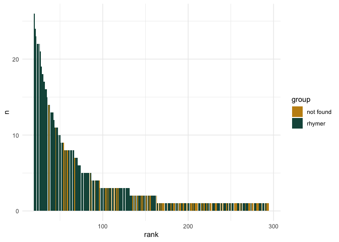

# 05_3-1_rhymer

## Rhymer analysis

Exploratory analysis of the rhymer (1836) data in comparison with actual
rhymes obtained from RNC & corpus-1835

``` r
library(tidyverse)
```

    Warning: package 'ggplot2' was built under R version 4.3.1

    Warning: package 'lubridate' was built under R version 4.3.1

    ── Attaching core tidyverse packages ──────────────────────── tidyverse 2.0.0 ──
    ✔ dplyr     1.1.3     ✔ readr     2.1.4
    ✔ forcats   1.0.0     ✔ stringr   1.5.0
    ✔ ggplot2   3.4.4     ✔ tibble    3.2.1
    ✔ lubridate 1.9.3     ✔ tidyr     1.3.0
    ✔ purrr     1.0.2     
    ── Conflicts ────────────────────────────────────────── tidyverse_conflicts() ──
    ✖ dplyr::filter() masks stats::filter()
    ✖ dplyr::lag()    masks stats::lag()
    ℹ Use the conflicted package (<http://conflicted.r-lib.org/>) to force all conflicts to become errors

``` r
library(MetBrewer)
library(stringr)

theme_set(theme_minimal())
```

### Load data

Load digitised rhymer fragment

``` r
rhymer <- read_file("../../data/ch5/rhymer.txt")

rhymer <- tibble(word = rhymer) %>% 
  separate_rows(word, sep = "\n") %>% 
  filter(word != "") %>% 
  mutate(word = tolower(word)) 

nrow(rhymer) # 1000 
```

    [1] 1000

``` r
head(rhymer)
```

    # A tibble: 6 × 1
      word   
      <chr>  
    1 араба  
    2 баба   
    3 жаба   
    4 маштаба
    5 ухаба  
    6 штаба  

load RNC & Corpus-1835 rhymes

``` r
rnc_rhymes <- read.csv("../../data/ch5/rnc_rhymes.csv") %>% select(-X)

c1835_rhymes <- read.csv("../../data/ch5/rhymes_parsed.csv") %>% select(-X)
```

### RNC comparison

``` r
# glimpse(rnc_rhymes)

rnc_rhymes %>% 
  select(from, to, poem_id) %>% 
  pivot_longer(!poem_id, names_to = "group", values_to = "word") %>% 
  mutate(word = tolower(word)) %>% 
  count(word, sort = T) %>% 
  mutate(ending = ifelse(nchar(word) < 2, paste0("_", word), word),
         ending = str_extract(ending, "\\w{2}$")) %>% 
  filter(ending %in% c("ба", "ва", "га")) # 545 rows / words on ba-va-ga
```

    # A tibble: 515 × 3
       word          n ending
       <chr>     <int> <chr> 
     1 слова       195 ва    
     2 друга       132 га    
     3 бога        129 га    
     4 снова       115 ва    
     5 слава        84 ва    
     6 чувства      75 ва    
     7 искусства    73 ва    
     8 голова       70 ва    
     9 неба         69 ба    
    10 гроба        63 ба    
    # ℹ 505 more rows

``` r
# join rhymer & rnc data
rnc_rhymer <- rnc_rhymes %>% 
  select(from, to, poem_id) %>% 
  pivot_longer(!poem_id, names_to = "group", values_to = "word") %>% 
  mutate(word = tolower(word)) %>% 
  count(word, sort = T) %>% 
  mutate(ending = ifelse(nchar(word) < 2, paste0("_", word), word),
         ending = str_extract(ending, "\\w{2}$")) %>% 
  filter(ending %in% c("ба", "ва", "га")) %>% 
  # group_by(ending) %>% 
  mutate(rank = row_number()) %>% 
  # ungroup() %>% 
  left_join(rhymer %>% mutate(group = "rhymer"), 
             by = "word") %>% 
  distinct() 

head(rnc_rhymer, 15)
```

    # A tibble: 15 × 5
       word          n ending  rank group 
       <chr>     <int> <chr>  <int> <chr> 
     1 слова       195 ва         1 rhymer
     2 друга       132 га         2 rhymer
     3 бога        129 га         3 rhymer
     4 снова       115 ва         4 rhymer
     5 слава        84 ва         5 rhymer
     6 чувства      75 ва         6 rhymer
     7 искусства    73 ва         7 rhymer
     8 голова       70 ва         8 rhymer
     9 неба         69 ба         9 rhymer
    10 гроба        63 ба        10 rhymer
    11 божества     59 ва        11 rhymer
    12 дорога       57 га        12 rhymer
    13 луга         54 га        13 rhymer
    14 супруга      48 га        14 rhymer
    15 подруга      45 га        15 rhymer

``` r
rnc_rhymer[is.na(rnc_rhymer)] <- "not_found"

# distribution of intersections on a rank-based axis
rnc_rhymer %>% 
  ggplot(aes(x = rank, y = n, fill = group)) + geom_col() + 
  scale_fill_manual(values = c(met.brewer(name = "Veronese")[3],
                               met.brewer(name = "Veronese")[6]))#+ 
```


``` r
  #facet_wrap(~ending, scales = "free")

# tail fragment
rnc_rhymer %>% 
  filter(rank > 49) %>% 
  ggplot(aes(x = rank, y = n, fill = group)) + geom_col() + 
  scale_fill_manual(values = c(met.brewer(name = "Veronese")[3],
                               met.brewer(name = "Veronese")[6])) #+ 
```


``` r
  #facet_wrap(~ending, scales = "free")

# percentage of found / not found rhymes IN RHYMER
rnc_rhymer %>% 
  count(group, sort = T) %>% 
  mutate(perc = round(n / nrow(rnc_rhymer) * 100, 1))
```

    # A tibble: 2 × 3
      group         n  perc
      <chr>     <int> <dbl>
    1 rhymer      280  54.4
    2 not_found   235  45.6

### C-1835 comparison

``` r
c1835_rhymes %>% 
  select(id, from, to) %>% 
  pivot_longer(!id, names_to = "group", values_to = "word") %>% 
  mutate(word = tolower(word)) %>% 
  count(word, sort = T) %>% 
  mutate(ending = ifelse(nchar(word) < 2, paste0("_", word), word),
         ending = str_extract(word, "\\w{2}$")) %>% 
  filter(ending %in% c("ба", "ва", "га")) # 309 
```

    # A tibble: 294 × 3
       word          n ending
       <chr>     <int> <chr> 
     1 бога        104 га    
     2 слова        89 ва    
     3 друга        84 га    
     4 слава        62 ва    
     5 снова        56 ва    
     6 чувства      50 ва    
     7 дева         49 ва    
     8 судьба       46 ба    
     9 подруга      41 га    
    10 искусства    40 ва    
    # ℹ 284 more rows

``` r
c1835_rhymer <- c1835_rhymes %>% 
  select(id, from, to) %>% 
  pivot_longer(!id, names_to = "group", values_to = "word") %>% 
  mutate(word = tolower(word)) %>% 
  count(word, sort = T) %>% 
  mutate(ending = ifelse(nchar(word) < 2, paste0("_", word), word),
         ending = str_extract(word, "\\w{2}$")) %>% 
  filter(ending %in% c("ба", "ва", "га")) %>% 
  #group_by(ending) %>% 
  mutate(rank = row_number()) %>% 
  #ungroup() %>% 
  left_join(rhymer %>% mutate(group = "rhymer"), 
             by = "word") %>% 
  distinct()

head(c1835_rhymer, 15)
```

    # A tibble: 15 × 5
       word          n ending  rank group 
       <chr>     <int> <chr>  <int> <chr> 
     1 бога        104 га         1 rhymer
     2 слова        89 ва         2 rhymer
     3 друга        84 га         3 rhymer
     4 слава        62 ва         4 rhymer
     5 снова        56 ва         5 rhymer
     6 чувства      50 ва         6 rhymer
     7 дева         49 ва         7 rhymer
     8 судьба       46 ба         8 rhymer
     9 подруга      41 га         9 rhymer
    10 искусства    40 ва        10 rhymer
    11 гроба        39 ба        11 rhymer
    12 голова       37 ва        12 rhymer
    13 дорога       36 га        13 rhymer
    14 недуга       35 га        14 rhymer
    15 неба         34 ба        15 rhymer

``` r
c1835_rhymer[is.na(c1835_rhymer)] <- "not found"

c1835_rhymer %>% 
  ggplot(aes(x = rank, y = n, fill = group)) + geom_col() + 
  scale_fill_manual(values = c(met.brewer(name = "Veronese")[3],
                               met.brewer(name = "Veronese")[6])) # + 
```


``` r
  #facet_wrap(~ending, scales = "free")

c1835_rhymer %>% 
  filter(rank > 19) %>% 
  ggplot(aes(x = rank, y = n, fill = group)) + geom_col() + 
  scale_fill_manual(values = c(met.brewer(name = "Veronese")[3],
                               met.brewer(name = "Veronese")[6])) # + 
```


``` r
  # facet_wrap(~ending, scales = "free")

c1835_rhymer %>% 
  count(group, sort = T) %>% 
  mutate(perc = round(n / nrow(c1835_rhymer) * 100, 1))
```

    # A tibble: 2 × 3
      group         n  perc
      <chr>     <int> <dbl>
    1 rhymer      203    69
    2 not found    91    31

### RNC / C-1835 intersection

Rhymes intersection between the same -ba-va-ga sets in rnc / c1835

``` r
rnc_bavaga <- rnc_rhymes %>% 
  select(from, to, poem_id) %>% 
  pivot_longer(!poem_id, names_to = "group", values_to = "word") %>% 
  mutate(word = tolower(word)) %>% 
  count(word, sort = T) %>% 
  mutate(ending = ifelse(nchar(word) < 2, paste0("_", word), word),
         ending = str_extract(ending, "\\w{2}$")) %>% 
  filter(ending %in% c("ба", "ва", "га")) %>% 
  mutate(rank_rnc = row_number())

c1835_bavaga <- c1835_rhymes %>% 
  select(id, from, to) %>% 
  pivot_longer(!id, names_to = "group", values_to = "word") %>% 
  mutate(word = tolower(word)) %>% 
  count(word, sort = T) %>% 
  mutate(ending = ifelse(nchar(word) < 2, paste0("_", word), word),
         ending = str_extract(word, "\\w{2}$")) %>% 
  filter(ending %in% c("ба", "ва", "га")) %>% 
  mutate(rank_1835 = row_number())

bavaga_full <- rnc_bavaga %>% 
  mutate(perc_rnc = round( n / nrow(rnc_bavaga) * 100, 1 )) %>% 
  select(-n, -ending) %>% 
  full_join(c1835_bavaga %>% 
              mutate(perc_1835 = round( n / nrow(c1835_bavaga) * 100, 1 )) %>% 
              select(-n, -ending), 
            by = "word")

bavaga_full[is.na(bavaga_full)] <- 0
head(bavaga_full, 10)
```

    # A tibble: 10 × 5
       word      rank_rnc perc_rnc rank_1835 perc_1835
       <chr>        <int>    <dbl>     <int>     <dbl>
     1 слова            1     37.9         2      30.3
     2 друга            2     25.6         3      28.6
     3 бога             3     25           1      35.4
     4 снова            4     22.3         5      19  
     5 слава            5     16.3         4      21.1
     6 чувства          6     14.6         6      17  
     7 искусства        7     14.2        10      13.6
     8 голова           8     13.6        12      12.6
     9 неба             9     13.4        15      11.6
    10 гроба           10     12.2        11      13.3

``` r
nrow(bavaga_full)
```

    [1] 577

``` r
bavaga_full %>% 
  mutate(present_rnc = ifelse(rank_rnc == 0, "not present", "present"),
         present_35 = ifelse(rank_1835 == 0, "not present", "present"),
         present_both = ifelse(present_rnc == "present" & present_35 == "present", 
                               "both", 
                               "only RNC"), 
         present_both = ifelse(rank_rnc == 0 & present_both != "both", 
                               "only C1835", present_both)) %>% 
  count(present_both) %>% 
  mutate(perc = round( n / nrow(bavaga_full) * 100, 1 ))
```

    # A tibble: 3 × 3
      present_both     n  perc
      <chr>        <int> <dbl>
    1 both           232  40.2
    2 only C1835      62  10.7
    3 only RNC       283  49  

``` r
bavaga_full %>% 
  mutate(present_rnc = ifelse(rank_rnc == 0, "not present", "present"),
         present_35 = ifelse(rank_1835 == 0, "not present", "present"),
         present_both = ifelse(present_rnc == "present" & present_35 == "present", 
                               "both", 
                               "only RNC"), 
         present_both = ifelse(rank_rnc == 0 & present_both != "both", 
                               "only C1835", present_both)) %>%  
  filter(present_both != "only C1835") %>% 
  ggplot(aes(x = rank_rnc, y = perc_rnc, fill = present_both)) + 
  geom_col() + 
  scale_fill_manual(values = c(met.brewer(name = "Veronese")[3],
                               met.brewer(name = "Veronese")[6]))
```


``` r
bavaga_full %>% 
  mutate(present_rnc = ifelse(rank_rnc == 0, "not present", "present"),
         present_35 = ifelse(rank_1835 == 0, "not present", "present"),
         present_both = ifelse(present_rnc == "present" & present_35 == "present", 
                               "both", 
                               "only RNC"), 
         present_both = ifelse(rank_rnc == 0 & present_both != "both", 
                               "only C1835", present_both)) %>%  
  filter(present_both != "only RNC") %>% 
  ggplot(aes(x = rank_1835, y = perc_1835, fill = present_both)) + 
  geom_col() + 
  scale_fill_manual(values = c(met.brewer(name = "Veronese")[3],
                               met.brewer(name = "Veronese")[6]))
```


