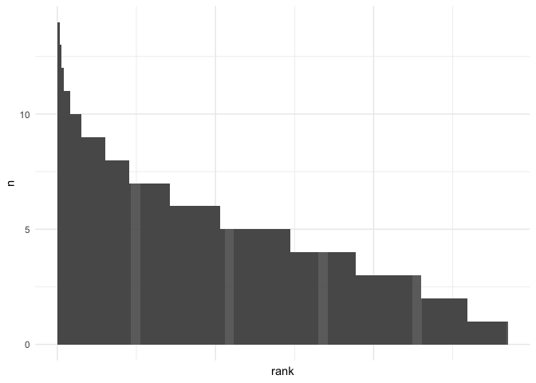

# 05_3_rhyme_bigrams

### load pckg

``` r
library(tidyverse)
library(tidytext)

library(MetBrewer)
theme_set(theme_minimal())
```

### load data

#### Corpus-1835

``` r
rhymes_1835 <- read.csv("../../data/ch5/rhymes_parsed.csv") %>% 
  select(-X) %>% # distinct() %>% # fix bag 
  mutate(corpus = "M",
         id = str_remove(id, "M__")) %>% 
  # fix lowering everything
  mutate(rhyme_alph = tolower(rhyme_alph),
         rhyme_pair = tolower(rhyme_pair),
         from = tolower(from),
         to = tolower(to)) %>% 
  # fix typo
  mutate(from = ifelse(from == "искуства", "искусства", from),
         to = ifelse(to == "искуства", "искусства", to))

glimpse(rhymes_1835)
```

    Rows: 81,746
    Columns: 10
    $ id         <chr> "P_1938", "P_1938", "P_1938", "C_156__20", "C_156__20", "C_…
    $ rhyme_pair <chr> "краса небеса", "огневым земным", "красавицей красавице", "…
    $ from       <chr> "краса", "огневым", "красавицей", "око", "силки", "стонет",…
    $ to         <chr> "небеса", "земным", "красавице", "высоко", "легки", "догони…
    $ from_feats <chr> "S,жен,неод=им,ед", "S,фам,муж,од=(дат,мн|твор,ед)", "S,жен…
    $ from_pos   <chr> "S", "S", "S", "S", "S", "V", "S", "S", "S", "S", "APRO", "…
    $ to_feats   <chr> "S,сред,неод=(вин,мн|им,мн)", "A=(дат,мн,полн|твор,ед,полн,…
    $ to_pos     <chr> "S", "A", "S", "ADV", "A", "V", "S", "A", "S", "S", "SPRO",…
    $ rhyme_alph <chr> "краса небеса", "земным огневым", "красавице красавицей", "…
    $ corpus     <chr> "M", "M", "M", "M", "M", "M", "M", "M", "M", "M", "M", "M",…

#### Corpus-1835 metadata

``` r
corpus_1835 <- readRDS("../../data/corpus1835/corpus_1835.Rds")

# attach year to rhyme data
rhymes_1835 <- rhymes_1835 %>% 
  left_join(corpus_1835 %>% 
              select(text_id, year) %>% 
              rename(id = text_id),
              by = "id"
              )
```

    Warning in left_join(., corpus_1835 %>% select(text_id, year) %>% rename(id = text_id), : Detected an unexpected many-to-many relationship between `x` and `y`.
    ℹ Row 2118 of `x` matches multiple rows in `y`.
    ℹ Row 1014 of `y` matches multiple rows in `x`.
    ℹ If a many-to-many relationship is expected, set `relationship =
      "many-to-many"` to silence this warning.

``` r
# select & reorder columns for merge
rhymes_1835 <- rhymes_1835 %>% 
  select(corpus, id, year, rhyme_pair, rhyme_alph, from, to)
```

#### RNC

``` r
# load already parsed data
rnc_rhymes <- read.csv("../../data/ch5/rnc_rhymes.csv") %>% select(-X)

rnc_rhymes <- rnc_rhymes %>% 
  mutate(poem_id = str_replace(poem_id, "RNC_", "RNC__")) %>% 
  separate(poem_id, into = c("corpus", "id"), sep = "__") %>% 
  separate(id, into = c("id", "year"), sep = "_") 

glimpse(rnc_rhymes)
```

    Rows: 146,159
    Columns: 11
    $ corpus     <chr> "RNC", "RNC", "RNC", "RNC", "RNC", "RNC", "RNC", "RNC", "RN…
    $ id         <chr> "3870", "3870", "3870", "3870", "7600", "7600", "7600", "76…
    $ year       <chr> "1777", "1777", "1777", "1777", "1832", "1832", "1832", "18…
    $ rhyme_pair <chr> "Кантемир сатир", "равнялись пленялись", "блистал стал", "н…
    $ from       <chr> "Кантемир", "равнялись", "блистал", "находился", "вечно", "…
    $ to         <chr> "сатир", "пленялись", "стал", "дивился", "бесконечно", "обм…
    $ from_upos  <chr> "NOUN", "VERB", "VERB", "VERB", "ADV", "VERB", "NOUN", "NOU…
    $ from_feats <chr> "Animacy=Anim|Case=Nom|Gender=Masc|Number=Sing", "Animacy=I…
    $ to_upos    <chr> "NOUN", "VERB", "VERB", "VERB", "ADV", "VERB", "ADJ", "NOUN…
    $ to_feats   <chr> "Animacy=Anim|Case=Nom|Gender=Masc|Number=Sing", "Animacy=I…
    $ rhyme_alph <chr> "Кантемир сатир", "пленялись равнялись", "блистал стал", "д…

``` r
rnc_rhymes <- rnc_rhymes %>% 
  # select & reorder columns for merge
  select(corpus, id, year, rhyme_pair, rhyme_alph, from, to)
```

Merge two corpora

``` r
rhymes <- rbind(rhymes_1835, rnc_rhymes)

glimpse(rhymes)
```

    Rows: 227,931
    Columns: 7
    $ corpus     <chr> "M", "M", "M", "M", "M", "M", "M", "M", "M", "M", "M", "M",…
    $ id         <chr> "P_1938", "P_1938", "P_1938", "C_156__20", "C_156__20", "C_…
    $ year       <chr> "1840", "1840", "1840", "1837", "1837", "1837", "1837", "18…
    $ rhyme_pair <chr> "краса небеса", "огневым земным", "красавицей красавице", "…
    $ rhyme_alph <chr> "краса небеса", "земным огневым", "красавице красавицей", "…
    $ from       <chr> "краса", "огневым", "красавицей", "око", "силки", "стонет",…
    $ to         <chr> "небеса", "земным", "красавице", "высоко", "легки", "догони…

``` r
table(rhymes$corpus) # quick check in the number of rhymes found
```


         M    RNC 
     81772 146159 

## Fig. 5-1-1. Bigram freq

Count frequencies in Corpus-1835 in general

``` r
# count unigram frequencies
unigram_freq_full <- corpus_1835 %>% 
  unnest_tokens(input = text_raw, output = word, token = "words") %>% 
  group_by(word) %>% 
  count(sort = T) %>% 
  mutate(group = "Корпус-1835: отд. слова")

# count bigram frequencies
bigram_freq_full <- corpus_1835 %>% 
  unnest_tokens(input = text_raw, output = bigram, token = "ngrams", n = 2) %>% 
  group_by(bigram) %>% 
  count(sort = T) %>% 
  mutate(group = "Корпус-1835: биграммы")
```

Count unigram & bigram freq in rhyme data

``` r
unigram_freq_rhymes <- rhymes_1835 %>% 
  unnest_tokens(input = rhyme_pair, output = word, token = "words") %>% 
  group_by(word) %>% 
  count(sort = T) %>% 
  mutate(group = "Рифмы: отд. слова")

bigram_freq_rhymes <- rhymes_1835 %>% 
  group_by(rhyme_pair) %>% 
  count(sort = T) %>% 
  rename(bigram = rhyme_pair) %>% 
  mutate(group = "Рифмы: биграммы")
```

Plot

``` r
rbind(unigram_freq_full, unigram_freq_rhymes,
      bigram_freq_full, bigram_freq_rhymes) %>% 
  group_by(group) %>% 
  mutate(rank = row_number()) %>% 
  slice_head(n = 1000) %>% 
  ggplot(aes(x = rank, y = n, group = group, color = group)) + 
  geom_line() + 
  facet_wrap(~group, scales = "free") + 
  theme(legend.position = "None") + 
  labs(x = "Ранг", y = "Частотность") + 
  scale_color_manual(values = c(met.brewer(name = "Veronese")[1],
                                met.brewer(name = "Veronese")[2],
                                met.brewer(name = "Veronese")[4],
                                met.brewer(name = "Veronese")[6])) + 
  
  # fill the area under the curve with colour
  geom_area(aes(fill = group, group = group), alpha = 0.3) + 
  scale_fill_manual(values = c(met.brewer(name = "Veronese")[1],
                                met.brewer(name = "Veronese")[2],
                                met.brewer(name = "Veronese")[4],
                                met.brewer(name = "Veronese")[6]))
```


``` r
ggsave("plots/fig_5-1-1.png", plot = last_plot(), dpi = 300,
       width = 8, height = 6, bg = "white")
```

Q: would it be feasible to try to fit the zipfR model ?

<https://zipfr.r-forge.r-project.org>

Number of rhymes found in the two corpora is very different (considerbly
more texts in corpus-1835 for the respective years)

``` r
rhymes %>% 
  filter(year %in% c("1835", "1836", "1837", "1838", "1839", "1840")) %>% 
  count(year, corpus) %>% 
  ggplot(aes(x = year, y = n, fill = corpus)) + 
  geom_col(position = "dodge") + 
  scale_fill_manual(values = c(met.brewer(name = "Veronese")[4],
                               met.brewer(name = "Veronese")[7]))
```


## Hapax richness

Percentage of hapax legomena overall

``` r
rhymes %>% 
  group_by(corpus, rhyme_alph) %>% 
  count(sort = T) %>% 
  filter(n == 1) %>% 
  ungroup() %>% 
  count(corpus) %>% 
  mutate(perc_rnc = round((n / nrow(rnc_rhymes)) * 100, 2),
         perc_1835 = round((n / nrow(rhymes_1835)) * 100, 2))
```

    # A tibble: 2 × 4
      corpus     n perc_rnc perc_1835
      <chr>  <int>    <dbl>     <dbl>
    1 M      43966     30.1      53.8
    2 RNC    76086     52.1      93.0

Number of hapax legomena in each 5-year period in RNC

``` r
library(wesanderson)

total_count <- rnc_rhymes %>% 
  mutate(decade = floor( as.numeric(year) / 5) * 5) %>% 
  count(decade) %>% 
  rename(Total = n)

rnc_rhymes %>% 
  mutate(decade = floor( as.numeric(year) / 5) * 5) %>% 
  select(rhyme_pair, decade) %>% 
  distinct() %>%
  count(decade) %>% 
  rename(`Unique rhymes` = n) %>% 
  left_join(total_count, by = "decade") %>% 
  pivot_longer(!decade, names_to = "group") %>% 
  ggplot(aes(x = decade, y = value, fill = group)) +
    geom_col(width = 3, position = "dodge") +
    scale_fill_manual(values = c(wes_palette("Royal1")[1],
                                 wes_palette("Royal1")[2])) + 
    scale_x_continuous(breaks = seq(1775, 1845, 10)) +
    labs(
         y = "Number of rhymes detected",
         fill = "",
         title = "Number of rhymes per period",
         subtitle = "Canonical corpus") + 
  theme(legend.position = "bottom",
        axis.title.x = element_blank(),
        legend.text = element_text(size = 14))
```


Hapax richness in each year in corpus-1835

``` r
# count number of hapaxes only
hapax_per_year <- rhymes_1835 %>% 
  group_by(year) %>% 
  count(rhyme_alph) %>% 
  ungroup() %>% 
  filter(n == 1) %>% 
  count(year) %>% 
  rename(hapax = n)

head(hapax_per_year)
```

    # A tibble: 6 × 2
      year  hapax
      <chr> <int>
    1 1835  12573
    2 1836   8362
    3 1837  12252
    4 1838   9778
    5 1839   6650
    6 1840   9262

``` r
# total number of rhymes
total <- rhymes_1835 %>% 
  group_by(year) %>% 
  count(rhyme_alph) %>% 
  ungroup() %>% 
  count(year) %>% 
  rename(total = n)

# % of hapaxes
hapax_archive <- hapax_per_year %>% 
  left_join(total, by = "year") %>% 
  mutate(perc_archive = round( (hapax / total)*100, 1 ),
         year = as.character(year))

hapax_archive
```

    # A tibble: 6 × 4
      year  hapax total perc_archive
      <chr> <int> <int>        <dbl>
    1 1835  12573 14244         88.3
    2 1836   8362  9362         89.3
    3 1837  12252 13773         89  
    4 1838   9778 11257         86.9
    5 1839   6650  7352         90.5
    6 1840   9262 10463         88.5

``` r
# Discard unused vars
rm(bigram_freq_full, bigram_freq_rhymes, hapax_archive, hapax_per_year,
   total, total_count, unigram_freq_full, unigram_freq_rhymes)
```

## Fig. 5-1-2. RNC / C1835 - Random samples rhyme intersection

Select only rhymes before year 1830 from canonic corpus

``` r
rnc_rhymes_before1830 <- rnc_rhymes %>% 
  filter(as.numeric(year) < 1830)
```

Run loop that will take 100 random samples from each year of Corpus-1835
and compare it with the full set of rhymes from RNC

``` r
x_1 <- NULL
x_2 <- NULL
year_count <- NULL
perc_intersect <- NULL

random <- NULL
df <- NULL


for (j in 1:100) { # take 100 random samples for each year
  
  for (i in 1:length(unique(rhymes_1835$year))) {
  
    y <- unique(rhymes_1835$year)[i]
    year_count[i] <- y
  
    # select all unique rhymes from canonic corpus before 1830
    x_1 <- rnc_rhymes_before1830 %>% 
      #filter(as.numeric(year) < as.numeric(y)) %>% 
      select(rhyme_alph) %>% 
      distinct() %>% 
      pull(rhyme_alph)
    
    # take 100 random rhymes from corpus-1835
    x_2 <- rhymes_1835 %>% 
      filter(as.numeric(year) %in% as.numeric(y)) %>% 
      select(rhyme_alph) %>% 
      distinct() %>% 
      sample_n(100) %>% 
      pull(rhyme_alph)
    
    # length(x_1) # all rhymes before year x
    # length(x_2) # 100 random unique rhymes
    
    # count number of intersections
    test <- length(intersect(x_1, x_2))
    # length(test)
  
    perc_intersect[i] <- test
  }
  
  random <- tibble(
      a = j,
      year_count = unlist(year_count),
      n = unlist(perc_intersect))
  
    df <- rbind(df, random)
}

head(df)
```

    # A tibble: 6 × 3
          a year_count     n
      <int> <chr>      <int>
    1     1 1840          33
    2     1 1837          26
    3     1 1838          35
    4     1 1836          34
    5     1 1835          44
    6     1 1839          33

``` r
glimpse(df)
```

    Rows: 600
    Columns: 3
    $ a          <int> 1, 1, 1, 1, 1, 1, 2, 2, 2, 2, 2, 2, 3, 3, 3, 3, 3, 3, 4, 4,…
    $ year_count <chr> "1840", "1837", "1838", "1836", "1835", "1839", "1840", "18…
    $ n          <int> 33, 26, 35, 34, 44, 33, 28, 31, 31, 27, 46, 34, 31, 30, 31,…

``` r
df %>% 
  ggplot(aes(x = as.numeric(year_count), 
             y = n, group = year_count)) + 
  geom_boxplot() + 
  geom_jitter(alpha = 0.3, color = met.brewer(name = "Veronese")[5]) + 
  scale_y_continuous(limits = c(0,100)) + 
  scale_x_continuous(breaks = c(1835:1840)) + 
  labs(x = "Год",
       y = "Число пересечений (из 100 возможных)" #,
       #title = "Количество пересечений", 
       #subtitle = "между случайной выборкой рифм из Корпуса-1835 (100 рифм, 100 итераций)\nи всеми известными рифмами из НКРЯ, датированными до соответствующего года"
       )
```


``` r
ggsave(filename = "plots/fig_5-1-2.png", plot = last_plot(), dpi = 300,
       width = 6, height = 4, bg = "white")
```

Some more analysis for 1835 rhymes? why the mean is so different?

``` r
glimpse(rhymes_1835)
```

    Rows: 81,772
    Columns: 7
    $ corpus     <chr> "M", "M", "M", "M", "M", "M", "M", "M", "M", "M", "M", "M",…
    $ id         <chr> "P_1938", "P_1938", "P_1938", "C_156__20", "C_156__20", "C_…
    $ year       <chr> "1840", "1840", "1840", "1837", "1837", "1837", "1837", "18…
    $ rhyme_pair <chr> "краса небеса", "огневым земным", "красавицей красавице", "…
    $ rhyme_alph <chr> "краса небеса", "земным огневым", "красавице красавицей", "…
    $ from       <chr> "краса", "огневым", "красавицей", "око", "силки", "стонет",…
    $ to         <chr> "небеса", "земным", "красавице", "высоко", "легки", "догони…

``` r
glimpse(corpus_1835)
```

    Rows: 4,799
    Columns: 20
    $ text_id       <chr> "P_1", "P_10", "P_100", "P_1000", "P_1001", "P_1002", "P…
    $ A_ID          <chr> "", "A-50", "A-7", "A-41", "A-139", "A-11", "A-163", "A-…
    $ author_sign   <chr> "", "Л. Якубович", "Кольцов", "Ф. Глинка", "Н. Прокопови…
    $ author_text   <chr> "", "Якубович Л.А.", "Кольцов А.В.", "Глинка Ф.Н.", "Про…
    $ text_title    <chr> "Солдатская песня", "Молния", "Ночлег чумаков", "Утешите…
    $ text_subtitle <chr> "", "", "Сельские картины", "", "", "", "", "", "", "", …
    $ first_line    <chr> "Ох жизнь, молодецкая", "Зачем с небесной высоты", "В бл…
    $ year          <chr> "1835", "1835", "1836", "1838", "1838", "1838", "1838", …
    $ path_text     <chr> "../../data/corpus1835/periodicals/per_raw//P_1.txt", ".…
    $ source_text   <chr> "Сев_пч. 1835. №12. C. 46", "БдЧ. 1835. Т.8. Отд. 1. C. …
    $ COL_ID        <chr> "", "", "", "", "", "", "", "", "", "", "", "", "", "", …
    $ corpus        <chr> "per", "per", "per", "per", "per", "per", "per", "per", …
    $ text_raw      <chr> "Ох, жизнь молодецкая,\nБравая, солдатская!\nКак осенняя…
    $ text_cln      <chr> "Ох, жизнь молодецкая,\nБравая, солдатская!\nКак осенняя…
    $ text_lemm     <chr> "ох, жизнь молодецкий,\nбравый, солдатский!\nкак осенний…
    $ text_acc      <chr> "Ох, жизнь молоде'цкая,\nБра'вая, солда'тская!\nКак осе'…
    $ meter         <fct> Other?, Iamb, Iamb, Iamb, Trochee, Iamb, Trochee, Iamb, …
    $ feet          <chr> "?", "3", "4", "4", "4", "4", "other", "4", "6", "5", "4…
    $ formula       <chr> "Other?_?", "Iamb_3", "Iamb_4", "Iamb_4", "Trochee_4", "…
    $ n_lines       <int> 38, 16, 98, 77, 28, 12, 44, 25, 31, 28, 100, 16, 17, 60,…

``` r
rhymes_1835 %>%
  filter(year == "1835") %>% 
  left_join(corpus_1835 %>% select(text_id, author_text) %>% rename(id = text_id),
            by = "id") %>% 
  count(author_text, sort = T) %>% 
  filter(author_text != "" & n > 50)
```

            author_text    n
    1    Жуковский В.А. 3400
    2       Крылов И.А. 3160
    3  Баратынский Е.А. 1759
    4        Зилов А.М. 1292
    5   Бенедиктов В.Г.  845
    6     Тимофеев А.В.  655
    7       Меркли М.М.  554
    8       Деларю М.Д.  403
    9      Савурский Н.  386
    10      Пушкин А.С.  340
    11        Венгер Н.  279
    12    Геевский С.Л.  255
    13      Менцов Ф.Н.  227
    14       Ершов П.П.  203
    15     Кольцов А.В.  176
    16      Глинка Ф.Н.  175
    17  Прокопович Н.Я.  175
    18      Козлов И.И.  155
    19       Лебедев В.  136
    20     Аксаков К.С.  125
    21     Сорокин М.П.  122
    22   Ознобишин Д.П.  112
    23      Красов В.И.   87
    24     Гогниев И.Е.   86
    25  Ростопчина Е.П.   81
    26      Глинка А.П.   76
    27    Алипанов Е.И.   75
    28      Банников А.   75
    29    Якубович Л.А.   72
    30     Галанин И.Д.   71
    31             П.П.   65
    32               С.   62
    33          Е. Ш-ий   58
    34      Языков Н.М.   56
    35          Лихачев   53
    36      Ставелов Н.   53
    37     Хомяков А.С.   52

There is definitely a bias because of dates incompatibility in RNC &
Corpus-1835 (e.g. reprints of Zhukovsky’s poems included in C-1835 but
also found in RNC before 1830). Perform the same loop without four
canonical most frequent authors.

We can also take into account if the intersected rhyme was in the list
of the most frequent rhymes in general. That would mean that these
rhymes are stable & redundant.

To count which of the top rhymes are repeated: change to \_, paste
rhymes & then count.

``` r
# filter out authors
rhymes_test <- rhymes_1835 %>%
  left_join(corpus_1835 %>% select(text_id, author_text) %>% rename(id = text_id),
            by = "id") %>% 
  filter(!author_text %in% c("Жуковский В.А.", "Крылов И.А.", "Баратынский Е.А.",
                             "Пушкин А.С.")) %>% 
  mutate(rhyme_alph = str_replace(rhyme_alph, " ", "_"))
```

    Warning in left_join(., corpus_1835 %>% select(text_id, author_text) %>% : Detected an unexpected many-to-many relationship between `x` and `y`.
    ℹ Row 2118 of `x` matches multiple rows in `y`.
    ℹ Row 1014 of `y` matches multiple rows in `x`.
    ℹ If a many-to-many relationship is expected, set `relationship =
      "many-to-many"` to silence this warning.

``` r
rnc_rhymes_before1830 <- rnc_rhymes_before1830 %>% 
  mutate(rhyme_alph = str_replace(rhyme_alph, " ", "_"))

# count most freq rhymes
top_rnc <- rnc_rhymes_before1830 %>% 
  count(rhyme_alph, sort = T) 

head(top_rnc)
```

        rhyme_alph   n
    1     нет_свет 167
    2      нас_час 124
    3  век_человек 121
    4    день_тень 119
    5 кровь_любовь 118
    6        моя_я 116

``` r
top_rnc %>% pull(n) %>% quantile(c(0.5, 0.9, 0.95, 0.98, 0.99, 0.991, 1))
```

      50%   90%   95%   98%   99% 99.1%  100% 
        1     2     3     6     9    10   167 

``` r
top_rnc_rhymes <- top_rnc %>% 
  filter(n > 9) %>% 
  pull(rhyme_alph)

print(paste("Length of the vector of rhymes appearing more than 10 times:", 
            length(top_rnc_rhymes))) 
```

    [1] "Length of the vector of rhymes appearing more than 10 times: 643"

``` r
# loop

x_1 <- NULL
x_2 <- NULL
year_count <- NULL
perc_intersect <- NULL
perc_top <- NULL
top_counter <- NULL

t <- NULL
random <- NULL
df <- NULL


for (j in 1:100) { # take 100 random samples for each year
  
  for (i in 1:length(unique(rhymes_test$year))) {
  
    y <- unique(rhymes_test$year)[i]
    year_count[i] <- y
  
    # select all unique rhymes from canonic corpus before 1830
    x_1 <- rnc_rhymes_before1830 %>% 
      #filter(as.numeric(year) < as.numeric(y)) %>% 
      select(rhyme_alph) %>% 
      distinct() %>% 
      pull(rhyme_alph)
    
    # take 100 random rhymes from corpus-1835
    x_2 <- rhymes_test %>% 
      filter(as.numeric(year) %in% as.numeric(y)) %>% 
      select(rhyme_alph) %>% 
      distinct() %>% 
      sample_n(100) %>% 
      pull(rhyme_alph)
    
    # length(x_1) # all rhymes before year x
    # length(x_2) # 100 random unique rhymes
    
    # count number of intersections
    test <- length(intersect(x_1, x_2))
    # length(test)
  
    perc_intersect[i] <- test
    
    t <- intersect(x_1, x_2)
    perc_top[i] <- length(intersect(t, top_rnc_rhymes))
    top_counter[i] <- paste(intersect(t, top_rnc_rhymes), collapse = " ")
    
  }
  
  random <- tibble(
      a = j,
      year_count = unlist(year_count),
      n = unlist(perc_intersect),
      perc_top = unlist(perc_top),
      rhymes_top = unlist(top_counter))
  
    df <- rbind(df, random)
}

head(df)
```

    # A tibble: 6 × 5
          a year_count     n perc_top rhymes_top                                    
      <int> <chr>      <int>    <int> <chr>                                         
    1     1 1840          26        7 бед_свет закон_сон вино_оно заря_царя леса_не…
    2     1 1837          37        4 нет_ответ звуки_муки мечты_цветы морозы_розы  
    3     1 1838          30        5 волны_полный милой_унылой милый_силой дубравы…
    4     1 1836          31        3 красота_мечта друг_дух вдохновений_гений      
    5     1 1835          45        6 волю_долю мечты_ты краса_небеса дали_печали б…
    6     1 1839          24        4 взор_гор дней_своей богу_дорогу моей_своей    

``` r
glimpse(df)
```

    Rows: 600
    Columns: 5
    $ a          <int> 1, 1, 1, 1, 1, 1, 2, 2, 2, 2, 2, 2, 3, 3, 3, 3, 3, 3, 4, 4,…
    $ year_count <chr> "1840", "1837", "1838", "1836", "1835", "1839", "1840", "18…
    $ n          <int> 26, 37, 30, 31, 45, 24, 23, 28, 36, 27, 35, 26, 25, 28, 33,…
    $ perc_top   <int> 7, 4, 5, 3, 6, 4, 4, 7, 4, 3, 6, 4, 3, 2, 5, 4, 4, 1, 5, 2,…
    $ rhymes_top <chr> "бед_свет закон_сон вино_оно заря_царя леса_небеса бытия_мо…

Look into the top-freq RNC pairs which were found in trials most
frequently

``` r
# top rhymes
df %>% 
  select(rhymes_top) %>% 
  separate_rows(rhymes_top, sep = " ") %>% 
  count(rhymes_top, sort = T) %>% 
  head(20)
```

    # A tibble: 20 × 2
       rhymes_top                  n
       <chr>                   <int>
     1 лет_след                   14
     2 милой_унылой               14
     3 муки_разлуки               14
     4 горе_море                  13
     5 побед_свет                 13
     6 вершины_долины             12
     7 высоты_ты                  12
     8 много_строго               12
     9 блаженства_совершенства    11
    10 вдохновений_гений          11
    11 волны_полны                11
    12 друзья_я                   11
    13 думы_угрюмый               11
    14 звуки_руки                 11
    15 меня_я                     11
    16 муку_руку                  11
    17 брани_длани                10
    18 вас_раз                    10
    19 взор_приговор              10
    20 воле_поле                  10

``` r
# distribution
df %>% 
  select(rhymes_top) %>% 
  separate_rows(rhymes_top, sep = " ") %>% 
  count(rhymes_top, sort = T) %>% 
  mutate(rank = row_number()) %>% 
  ggplot(aes(x = rank, y = n)) + geom_col() + theme(axis.text.x = element_blank())
```



Create a boxplot for percentage of intersections

``` r
glimpse(df)
```

    Rows: 600
    Columns: 5
    $ a          <int> 1, 1, 1, 1, 1, 1, 2, 2, 2, 2, 2, 2, 3, 3, 3, 3, 3, 3, 4, 4,…
    $ year_count <chr> "1840", "1837", "1838", "1836", "1835", "1839", "1840", "18…
    $ n          <int> 26, 37, 30, 31, 45, 24, 23, 28, 36, 27, 35, 26, 25, 28, 33,…
    $ perc_top   <int> 7, 4, 5, 3, 6, 4, 4, 7, 4, 3, 6, 4, 3, 2, 5, 4, 4, 1, 5, 2,…
    $ rhymes_top <chr> "бед_свет закон_сон вино_оно заря_царя леса_небеса бытия_мо…

``` r
df %>% 
  select(-rhymes_top, -a) %>% 
  pivot_longer(!year_count) %>% 
  mutate(name = ifelse(name == "n", "Всего пересечений", "Пересечений среди частотных рифм НКРЯ")) %>% 
  ggplot(aes(x = as.factor(year_count), 
             y = value, color = name)) + 
  
  geom_boxplot(position = "dodge") + 
  
  geom_point(position = position_jitterdodge(), alpha = 0.2) + 
  
  scale_color_manual(values = c(met.brewer("Veronese")[5],
                                met.brewer("Veronese")[3])) + 
  expand_limits(y = c(0, 100)) + 
  labs(x = "Год", 
       y = "Число пересечений (из 100 возможных)",
       color = "") +
  theme(legend.position = "bottom", 
        axis.text = element_text(size = 10),
        axis.title = element_text(size = 12),
        legend.text = element_text(size = 12))
```


``` r
ggsave(filename = "plots/fig_5-1-2.png", plot = last_plot(), dpi = 300,
       width = 8, height = 6, bg = "white")
```

``` r
# earlier version of the plot
# df
#   ggplot(aes(x = as.numeric(year_count), 
#              y = n, group = year_count)) + 
#   geom_boxplot(color = met.brewer("Veronese")[7]) + 
#   geom_jitter(alpha = 0.3, color = met.brewer(name = "Veronese")[5]) + 
#   
#   geom_boxplot(data = df, 
#                aes(x = as.numeric(year_count), 
#                    y = perc_top, 
#                    group = year_count), 
#                color = met.brewer("Veronese")[1]) + 
#   geom_jitter(data = df, aes(x = as.numeric(year_count), 
#                              y = perc_top, group = year_count), 
#               colour = met.brewer("Veronese")[3], alpha = 0.2) + 
#   scale_y_continuous(limits = c(0,100)) + 
#   scale_x_continuous(breaks = c(1835:1840)) + 
#   labs(x = "Год",
#        y = "Число пересечений (из 100 возможных)" #,
#        #title = "Количество пересечений", 
#        #subtitle = "между случайной выборкой рифм из Корпуса-1835 (100 рифм, 100 итераций)\nи всеми известными рифмами из НКРЯ, датированными до соответствующего года"
#        )
```
