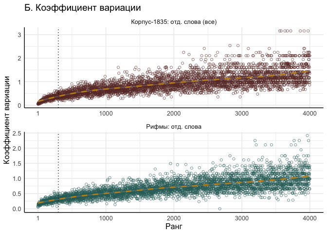
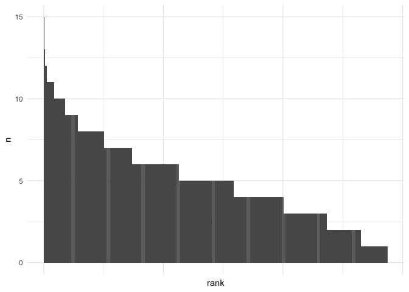
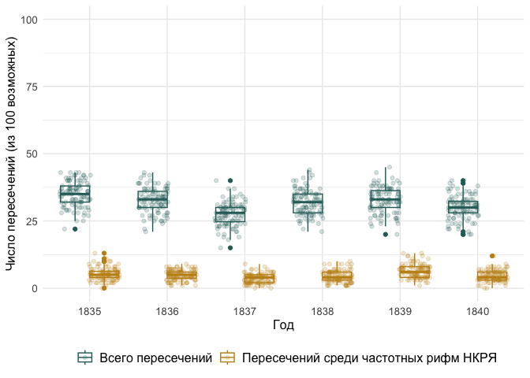

# 05_3_rhyme_bigrams

# Chapter 5.1

This notebook displays the analysis of rhyme words described in Chapter
5.1. The main focus is on the rhyme pairs lexical frequencies and how it
relates to the overall word bigrams frequencies in the corpus.

### load pckg

``` r
library(tidyverse)
library(tidytext)

library(MetBrewer)
# library(patchwork)
library(cowplot)
theme_set(theme_minimal())
```

### load data

#### Corpus-1835

``` r
rhymes_1835 <- read_csv("../../data/corpus1835/sql_db/rhyme_pairs.csv") %>% 
  rename(text_id = poem_id) %>% 
  # remove Kulman texts
  filter(!str_detect(text_id, "C_264"))
```

    Rows: 81746 Columns: 4
    ── Column specification ────────────────────────────────────────────────────────
    Delimiter: ","
    chr (4): poem_id, from, to, rhyme_alph

    ℹ Use `spec()` to retrieve the full column specification for this data.
    ℹ Specify the column types or set `show_col_types = FALSE` to quiet this message.

``` r
glimpse(rhymes_1835)
```

    Rows: 81,247
    Columns: 4
    $ text_id    <chr> "P_1938", "P_1938", "P_1938", "C_156__20", "C_156__20", "C_…
    $ from       <chr> "краса", "огневым", "красавицей", "око", "силки", "стонет",…
    $ to         <chr> "небеса", "земным", "красавице", "высоко", "легки", "догони…
    $ rhyme_alph <chr> "краса небеса", "земным огневым", "красавице красавицей", "…

#### C-35 metadata

``` r
corpus_1835 <- readRDS("../../data/corpus1835/corpus_1835.Rds")

# attach year to rhyme data
rhymes_1835 <- rhymes_1835 %>% 
  left_join(corpus_1835 %>% 
              select(text_id, year), by = "text_id") %>% 
  mutate(corpus = "M")
```

    Warning in left_join(., corpus_1835 %>% select(text_id, year), by = "text_id"): Detected an unexpected many-to-many relationship between `x` and `y`.
    ℹ Row 2118 of `x` matches multiple rows in `y`.
    ℹ Row 1014 of `y` matches multiple rows in `x`.
    ℹ If a many-to-many relationship is expected, set `relationship =
      "many-to-many"` to silence this warning.

Number of lines to the number of rhymes (% of rhymed lines detected)

``` r
rhymes_t <- rhymes_1835 %>% 
  left_join(corpus_1835 %>% select(text_id, n_lines), by = "text_id")
```

    Warning in left_join(., corpus_1835 %>% select(text_id, n_lines), by = "text_id"): Detected an unexpected many-to-many relationship between `x` and `y`.
    ℹ Row 2118 of `x` matches multiple rows in `y`.
    ℹ Row 1014 of `y` matches multiple rows in `x`.
    ℹ If a many-to-many relationship is expected, set `relationship =
      "many-to-many"` to silence this warning.

``` r
glimpse(rhymes_t)
```

    Rows: 81,325
    Columns: 7
    $ text_id    <chr> "P_1938", "P_1938", "P_1938", "C_156__20", "C_156__20", "C_…
    $ from       <chr> "краса", "огневым", "красавицей", "око", "силки", "стонет",…
    $ to         <chr> "небеса", "земным", "красавице", "высоко", "легки", "догони…
    $ rhyme_alph <chr> "краса небеса", "земным огневым", "красавице красавицей", "…
    $ year       <chr> "1840", "1840", "1840", "1837", "1837", "1837", "1837", "18…
    $ corpus     <chr> "M", "M", "M", "M", "M", "M", "M", "M", "M", "M", "M", "M",…
    $ n_lines    <int> 19, 19, 19, 18, 18, 18, 18, 18, 18, 18, 46, 46, 46, 46, 46,…

``` r
rhymes_t %>% 
  mutate(n_line_pairs = n_lines / 2) %>% 
  group_by(text_id, n_line_pairs) %>% 
  count() %>% 
  ungroup() %>% 
  mutate(perc_rhymed = round((n / n_line_pairs)*100, 2),
         perc_rhymed = ifelse(perc_rhymed > 100, 100, perc_rhymed)) %>% 
  
  summary()
```

       text_id           n_line_pairs          n           perc_rhymed    
     Length:4688        Min.   :  1.00   Min.   :  1.00   Min.   :  1.82  
     Class :character   1st Qu.:  8.00   1st Qu.:  7.00   1st Qu.: 83.33  
     Mode  :character   Median : 13.00   Median : 11.00   Median : 95.83  
                        Mean   : 19.44   Mean   : 17.35   Mean   : 87.33  
                        3rd Qu.: 22.00   3rd Qu.: 20.00   3rd Qu.:100.00  
                        Max.   :423.50   Max.   :408.00   Max.   :100.00  

``` r
  # ggplot(aes(x = perc_rhymed)) + geom_boxplot() + 
  # scale_x_continuous(breaks = seq(1, 100, 5))

# 1st qu. ~83% rhymed lines, avg 87% of pairs as rhymed 

# likely unrhymed texts:
rhymes_t %>% 
  mutate(n_line_pairs = n_lines / 2) %>% 
  group_by(text_id, n_line_pairs) %>% 
  count() %>% 
  ungroup() %>% 
  mutate(perc_rhymed = round((n / n_line_pairs)*100, 2),
         perc_rhymed = ifelse(perc_rhymed > 100, 100, perc_rhymed)) %>% 
  filter(perc_rhymed < 50) %>% count() # approx. number -- less than 50% of lines detected as rhymed
```

    # A tibble: 1 × 1
          n
      <int>
    1   313

``` r
print(paste("Approx. number of rhymed texts:", length(unique(rhymes_t$text_id)) - 263,
  "\nPercentage of rhymed texts out of total:",
  (round( (length(unique(rhymes_t$text_id)) - 313) / 
            length(unique(corpus_1835$text_id))*100, 2))
  ))
```

    [1] "Approx. number of rhymed texts: 4425 \nPercentage of rhymed texts out of total: 91.2"

``` r
rm(rhymes_t)
```

#### RNC

Load RNC rhymes data

``` r
# load already parsed data
rnc_rhymes <- read.csv("../../data/ch5/rnc_rhymes.csv") %>% select(-X)

rnc_rhymes <- rnc_rhymes %>% 
  mutate(poem_id = str_replace(poem_id, "RNC_", "RNC__")) %>% 
  separate(poem_id, into = c("corpus", "id"), sep = "__") %>% 
  separate(id, into = c("text_id", "year"), sep = "_") 

glimpse(rnc_rhymes)
```

    Rows: 146,159
    Columns: 11
    $ corpus     <chr> "RNC", "RNC", "RNC", "RNC", "RNC", "RNC", "RNC", "RNC", "RN…
    $ text_id    <chr> "3870", "3870", "3870", "3870", "7600", "7600", "7600", "76…
    $ year       <chr> "1777", "1777", "1777", "1777", "1832", "1832", "1832", "18…
    $ rhyme_pair <chr> "Кантемир сатир", "равнялись пленялись", "блистал стал", "н…
    $ from       <chr> "Кантемир", "равнялись", "блистал", "находился", "вечно", "…
    $ to         <chr> "сатир", "пленялись", "стал", "дивился", "бесконечно", "обм…
    $ from_upos  <chr> "NOUN", "VERB", "VERB", "VERB", "ADV", "VERB", "NOUN", "NOU…
    $ from_feats <chr> "Animacy=Anim|Case=Nom|Gender=Masc|Number=Sing", "Animacy=I…
    $ to_upos    <chr> "NOUN", "VERB", "VERB", "VERB", "ADV", "VERB", "ADJ", "NOUN…
    $ to_feats   <chr> "Animacy=Anim|Case=Nom|Gender=Masc|Number=Sing", "Animacy=I…
    $ rhyme_alph <chr> "Кантемир сатир", "пленялись равнялись", "блистал стал", "д…

``` r
rnc_rhymes <- rnc_rhymes %>% 
  # select & reorder columns for merge
  select(text_id, from, to, rhyme_alph, year, corpus)
```

Merge two corpora

``` r
rhymes <- rbind(rhymes_1835, rnc_rhymes)

glimpse(rhymes)
```

    Rows: 227,432
    Columns: 6
    $ text_id    <chr> "P_1938", "P_1938", "P_1938", "C_156__20", "C_156__20", "C_…
    $ from       <chr> "краса", "огневым", "красавицей", "око", "силки", "стонет",…
    $ to         <chr> "небеса", "земным", "красавице", "высоко", "легки", "догони…
    $ rhyme_alph <chr> "краса небеса", "земным огневым", "красавице красавицей", "…
    $ year       <chr> "1840", "1840", "1840", "1837", "1837", "1837", "1837", "18…
    $ corpus     <chr> "M", "M", "M", "M", "M", "M", "M", "M", "M", "M", "M", "M",…

``` r
table(rhymes$corpus) # quick check in the number of rhymes found
```


         M    RNC 
     81273 146159 

### Overview

#### most frequent rhymes

``` r
rhymes_1835 %>% 
  count(rhyme_alph, sort = T) %>% 
  mutate(perc = round((n / nrow(rhymes_1835)) * 100, 3 )) %>% 
  head(10)
```

    # A tibble: 10 × 3
       rhyme_alph       n  perc
       <chr>        <int> <dbl>
     1 ночи очи       173 0.213
     2 нет свет       126 0.155
     3 грудь путь     107 0.132
     4 мечты ты       102 0.126
     5 вновь любовь   100 0.123
     6 день тень       99 0.122
     7 моя я           96 0.118
     8 кровь любовь    88 0.108
     9 дня меня        86 0.106
    10 бытия я         85 0.105

#### top 5 rhymes in each year

``` r
total_year <- rhymes_1835 %>% 
  count(year)

total_year
```

    # A tibble: 6 × 2
      year      n
      <chr> <int>
    1 1835  17873
    2 1836  11313
    3 1837  16751
    4 1838  14259
    5 1839   8173
    6 1840  12904

``` r
rhymes_1835 %>% 
  group_by(year) %>% 
  count(rhyme_alph, sort = T) %>% 
  mutate(rank = row_number()) %>% 
  top_n(n, n = 10) %>% 
  arrange(-desc(year)) %>% 
  ungroup() %>% 
  left_join(total_year %>% rename(total = n), by = "year") %>% 
  mutate(perc = round((n / total) * 100, 2)) 
```

    # A tibble: 72 × 6
       year  rhyme_alph       n  rank total  perc
       <chr> <chr>        <int> <int> <int> <dbl>
     1 1835  нет свет        44     1 17873  0.25
     2 1835  ночи очи        32     2 17873  0.18
     3 1835  нас час         24     3 17873  0.13
     4 1835  меня огня       23     4 17873  0.13
     5 1835  мечты ты        23     5 17873  0.13
     6 1835  вновь любовь    22     6 17873  0.12
     7 1835  глас час        21     7 17873  0.12
     8 1835  дней моей       19     8 17873  0.11
     9 1835  дня меня        19     9 17873  0.11
    10 1835  грудь путь      18    10 17873  0.1 
    # ℹ 62 more rows

``` r
rhymes_1835 %>% 
  group_by(year) %>% 
  count(rhyme_alph, sort = T) %>% 
  mutate(rank = row_number()) %>% 
  top_n(n, n = 5) %>% 
  arrange(-desc(year)) %>% 
  ungroup() %>% 
  left_join(total_year %>% rename(total = n), by = "year") %>% 
  mutate(perc = round((n / total) * 100, 2)) %>% 
  group_by(year) %>%
  summarise(
    sum_perc = sum(perc))
```

    # A tibble: 6 × 2
      year  sum_perc
      <chr>    <dbl>
    1 1835      0.82
    2 1836      0.92
    3 1837      0.81
    4 1838      1.09
    5 1839      1.34
    6 1840      1.03

## 5.1. stats

Number of hapax legomena in C-35

``` r
rhymes_1835 %>% 
  count(rhyme_alph, sort = T) %>% 
  filter(n == 1) %>% 
  count() %>% 
  mutate(perc_total = n/nrow(rhymes_1835)*100)
```

    # A tibble: 1 × 2
          n perc_total
      <int>      <dbl>
    1 43533       53.6

Number of rhyme pairs repeated \>=10 times

``` r
rhymes_1835 %>% 
  count(rhyme_alph, sort = T) %>% 
  filter(n >= 10) %>% nrow()
```

    [1] 545

### Number of only masc / only fem rhymes poems

Separate words from pairs

``` r
w1 <- rhymes_1835 %>% 
  select(text_id, from) %>% 
  rename(word = from)

w2 <- rhymes_1835 %>% 
  select(text_id, to) %>% 
  rename(word = to)

rhyme_words <- rbind(w1, w2)
```

Attach data about rhyme words endings

``` r
rhyme_words_meta <- read_csv("../../data/corpus1835/sql_db/rhyme_words.csv")
```

    Rows: 34801 Columns: 8
    ── Column specification ────────────────────────────────────────────────────────
    Delimiter: ","
    chr (7): word, word_acc, stress_pattern, closure, pos, feats, ending_st
    dbl (1): closure_pattern

    ℹ Use `spec()` to retrieve the full column specification for this data.
    ℹ Specify the column types or set `show_col_types = FALSE` to quiet this message.

``` r
rhyme_words <- rhyme_words %>% 
  left_join(rhyme_words_meta %>% select(word, closure), by = "word") 

rm(rhyme_words_meta, w1, w2)
```

Count percent of pairs in each poem

``` r
# calculate total number of FOUND rhymes in each poem

total_id <- rhyme_words %>% 
  group_by(text_id) %>% 
  count() %>% ungroup() %>% rename(n_lines = n)

rhyme_words %>% 
  filter(!is.na(closure) & closure != "other") %>% 
  # attach total number of lines in the poem
  left_join(total_id, by = "text_id") %>% 
  group_by(text_id) %>% 
  count(closure, n_lines) %>% 
  ungroup() %>% 
  mutate(perc_closure = round((n/n_lines)*100, 1)) %>% 
  #filter(perc_closure < 100) %>% 
  ggplot(aes(x = perc_closure, fill = closure)) + geom_boxplot()


# find statistics for the most of the mass 
rhyme_words %>% 
  filter(!is.na(closure) & closure != "other") %>% 
  # attach total number of lines in the poem
  left_join(total_id, by = "text_id") %>% 
  group_by(text_id) %>% 
  count(closure, n_lines) %>% 
  ungroup() %>% 
  mutate(perc_closure = round((n/n_lines)*100, 1)) %>% 
  
  # control for non-rhymed texts:
  left_join(corpus_1835 %>% 
              select(text_id, text_raw, n_lines) %>% 
              rename(n_lines_total = n_lines), by = "text_id") %>% 
  mutate(perc_rhymed = round((n_lines / n_lines_total) * 100, 1)) %>%
  
  filter(closure == "masc" & perc_rhymed > 50) %>% 
  summary()

rhyme_words %>% 
  filter(!is.na(closure) & closure != "other") %>% 
  # attach total number of lines in the poem
  left_join(total_id, by = "text_id") %>% 
  group_by(text_id) %>% 
  count(closure, n_lines) %>% 
  ungroup() %>% 
  mutate(perc_closure = round((n/n_lines)*100, 1)) %>% 
  # control for non-rhymed texts:
  left_join(corpus_1835 %>% 
              select(text_id, text_raw, n_lines) %>% 
              rename(n_lines_total = n_lines), by = "text_id") %>% 
  mutate(perc_rhymed = round((n_lines / n_lines_total) * 100, 1)) %>%
  
  filter(closure == "fem" & perc_rhymed > 50) %>% 
  summary()
```

Text ids for mostly feminine rhymes

``` r
rhyme_words %>% 
  filter(!is.na(closure) & closure != "other") %>% 
  # attach total number of lines in the poem
  left_join(total_id, by = "text_id") %>% 
  group_by(text_id) %>% 
  count(closure, n_lines) %>% 
  ungroup() %>% 
  mutate(perc_closure = round((n/n_lines)*100, 1)) %>% 
  filter(closure == "fem" & perc_closure > 85) %>% 
  # control for non-rhymed texts:
  left_join(corpus_1835 %>% 
              select(text_id, text_raw, n_lines) %>% 
              rename(n_lines_total = n_lines), by = "text_id") %>% 
  mutate(perc_rhymed = round((n_lines / n_lines_total) * 100, 1)) %>%
  filter(perc_rhymed > 50) %>% 
  select(text_id) %>% distinct() %>% 
  nrow() # number of potentionally only-fem rhyme poems?

# sample
s <- rhyme_words %>% 
  filter(!is.na(closure) & closure != "other") %>% 
  # attach total number of lines in the poem
  left_join(total_id, by = "text_id") %>% 
  group_by(text_id) %>% 
  count(closure, n_lines) %>% 
  ungroup() %>% 
  mutate(perc_closure = round((n/n_lines)*100, 1)) %>% 
  filter(closure == "fem" & perc_closure > 85) %>% 
  # control for non-rhymed texts:
  left_join(corpus_1835 %>% 
              select(text_id, text_raw, n_lines) %>% 
              rename(n_lines_total = n_lines), by = "text_id") %>% 
  mutate(perc_rhymed = round((n_lines / n_lines_total) * 100, 1)) %>%
  filter(perc_rhymed > 50) %>% 
  select(text_id, text_raw) %>% distinct() #%>% 
  #sample_n(20)

write.csv(s, file = "mostly_fem_clausula.csv")
```

Mostly masculine rhymes

``` r
rhyme_words %>% 
  filter(!is.na(closure) & closure != "other") %>% 
  # attach total number of lines in the poem
  left_join(total_id, by = "text_id") %>% 
  group_by(text_id) %>% 
  count(closure, n_lines) %>% 
  ungroup() %>% 
  mutate(perc_closure = round((n/n_lines)*100, 1)) %>% 
  filter(closure == "masc" & perc_closure > 85) %>% 
  # control for non-rhymed texts:
  left_join(corpus_1835 %>% 
              select(text_id, text_raw, n_lines) %>% 
              rename(n_lines_total = n_lines), by = "text_id") %>% 
  mutate(perc_rhymed = round((n_lines / n_lines_total) * 100, 1)) %>%
  filter(perc_rhymed > 50) %>%  # select only at least halfly rhyme-detected texts
  select(text_id) %>% distinct() %>% 
  nrow() # number of potentionally only-masc rhyme poems?

# sample
s <- rhyme_words %>% 
  filter(!is.na(closure) & closure != "other") %>% 
  # attach total number of lines in the poem
  left_join(total_id, by = "text_id") %>% 
  group_by(text_id) %>% 
  count(closure, n_lines) %>% 
  ungroup() %>% 
  mutate(perc_closure = round((n/n_lines)*100, 1)) %>% 
  filter(closure == "masc" & perc_closure > 85) %>% 
  # control for non-rhymed texts:
  left_join(corpus_1835 %>% 
              select(text_id, text_raw, n_lines) %>% 
              rename(n_lines_total = n_lines), by = "text_id") %>% 
  mutate(perc_rhymed = round((n_lines / n_lines_total) * 100, 1)) %>%
  filter(perc_rhymed > 50) %>% 
  select(text_id, text_raw) %>% distinct() #%>% 
  #sample_n(20)

write.csv(s, file = "mostly_masc_clausula.csv")
```

## Fig. 5-1-1. Bigram freq

Count frequencies in Corpus-1835 in general

``` r
# count unigram frequencies
unigram_freq_full <- corpus_1835 %>% 
  unnest_tokens(input = text_raw, output = word, token = "words") %>% 
  group_by(word) %>% 
  count(sort = T) %>% 
  mutate(group = "Корпус-1835: отд. слова (все)")

# count bigram frequencies
bigram_freq_full <- corpus_1835 %>% 
  unnest_tokens(input = text_raw, output = bigram, token = "ngrams", n = 2) %>% 
  group_by(bigram) %>% 
  count(sort = T) %>% 
  mutate(group = "Корпус-1835: словосочетания (все)")
```

Count unigram & bigram freq in rhyme data

``` r
unigram_freq_rhymes <- rhymes_1835 %>% 
  unnest_tokens(input = rhyme_alph, output = word, token = "words") %>% 
  group_by(word) %>% 
  count(sort = T) %>% 
  mutate(group = "Рифмы: отд. слова")

bigram_freq_rhymes <- rhymes_1835 %>% 
  group_by(rhyme_alph) %>% 
  count(sort = T) %>% 
  rename(bigram = rhyme_alph) %>% 
  mutate(group = "Рифмы: рифмопары")
```

Plot

``` r
w_freq <- rbind(unigram_freq_full, unigram_freq_rhymes,
      bigram_freq_full, bigram_freq_rhymes) %>% 
  group_by(group) %>% 
  mutate(rank = row_number()) %>% 
  #slice_head(n = 1000) %>% 
  ggplot(aes(x = log(rank), y = log(n), group = group, color = group)) + 
  geom_line(linewidth = 1) + 
  facet_wrap(~group, scales = "free") + 
  theme(legend.position = "None") + 
  labs(x = "Ранг (log)", y = "Частотность (log)", 
       title = "A. Распределение абсолютных частот") + 
  #scale_x_continuous(breaks = c(1, seq(250, 1000, 250))) + 
  scale_color_manual(values = c(met.brewer(name = "Veronese")[1],
                                met.brewer(name = "Veronese")[2],
                                met.brewer(name = "Veronese")[4],
                                met.brewer(name = "Veronese")[6])) + 
  
  # # fill the area under the curve with colour
  # geom_area(aes(fill = group, group = group), alpha = 0.3) + 
  # scale_fill_manual(values = c(met.brewer(name = "Veronese")[1],
  #                               met.brewer(name = "Veronese")[2],
  #                               met.brewer(name = "Veronese")[4],
  #                               met.brewer(name = "Veronese")[6])) + 
  theme(text = element_text(size = 12))

w_freq
```


### Coefficient of variation

Rhyme words

``` r
all_ranks <- rhyme_words %>% 
  count(word, sort = T) %>% 
  mutate(rel_freq_total = n / nrow(rhyme_words))

all_ranks
```

    # A tibble: 34,510 × 3
       word      n rel_freq_total
       <chr> <int>          <dbl>
     1 я       766        0.00471
     2 меня    531        0.00327
     3 она     521        0.00321
     4 свет    471        0.00290
     5 мне     409        0.00252
     6 моей    401        0.00247
     7 нет     393        0.00242
     8 ты      392        0.00241
     9 тобой   387        0.00238
    10 мечты   371        0.00228
    # ℹ 34,500 more rows

``` r
v <- NULL

for (i in 1:100) {
  sample_rhymes <- rhyme_words %>% 
    sample_n(20000) %>% 
    count(word, sort = T) %>% 
    mutate(rel_freq = n / 20000) %>% 
    select(-n) 
  
  x <- all_ranks %>% 
    left_join(sample_rhymes, by = "word") %>% 
    mutate(rel_freq = ifelse(is.na(rel_freq), 0, rel_freq)) %>% 
    pull(rel_freq)
  
  v[[i]] <- x
  
}

res <- as.data.frame(do.call(cbind, v)) %>% 
  cbind(all_ranks$word) %>% 
  rename(word = `all_ranks$word`) %>% 
  head(4000) %>% # top 1000 ranked words
  rowwise() %>% 
  mutate(Mean = mean(c_across(V1:V10)),
         SD = sd(c_across(V1:V10)),
         CV = SD/Mean)  %>% 
  ungroup() %>% 
  mutate(rank = row_number())

res %>% 
  select(V1:V5, word, Mean, SD, CV) %>% head()
```

    # A tibble: 6 × 9
           V1      V2      V3      V4      V5 word     Mean       SD     CV
        <dbl>   <dbl>   <dbl>   <dbl>   <dbl> <chr>   <dbl>    <dbl>  <dbl>
    1 0.0043  0.00505 0.0043  0.00515 0.00545 я     0.00482 0.000428 0.0887
    2 0.00345 0.00325 0.0034  0.00285 0.0039  меня  0.00322 0.000335 0.104 
    3 0.0029  0.00255 0.00355 0.0031  0.00375 она   0.00312 0.000394 0.127 
    4 0.0026  0.0029  0.00275 0.00245 0.00315 свет  0.00272 0.000389 0.143 
    5 0.0027  0.0022  0.00285 0.0026  0.0028  мне   0.00266 0.000279 0.105 
    6 0.0023  0.0029  0.0021  0.0025  0.0021  моей  0.00251 0.000315 0.126 

``` r
# subset for plot
cv_rhymes <- res %>% 
  select(rank, CV) %>% 
  mutate(corpus = "Рифмы: отд. слова")
```

Inline words

``` r
total_ranks <- corpus_1835 %>% 
  unnest_tokens(input = text_raw, output = word, token = "words") %>% 
  group_by(word) %>% 
  count(sort = T)

head(total_ranks)
```

    # A tibble: 6 × 2
    # Groups:   word [6]
      word      n
      <chr> <int>
    1 и     38473
    2 в     26921
    3 не    14983
    4 на    11842
    5 с     11217
    6 я     10975

``` r
v <- NULL

for (i in 1:100) {
  sample_words <- corpus_1835 %>% 
    unnest_tokens(input = text_raw, output = word, token = "words") %>% 
    sample_n(20000) %>% 
    count(word) %>% 
    mutate(rel_freq = n / 20000) %>% 
    select(-n) 
  
  x <- total_ranks %>% 
    left_join(sample_words, by = "word") %>% 
    mutate(rel_freq = ifelse(is.na(rel_freq), 0, rel_freq)) %>% 
    pull(rel_freq)
  
  v[[i]] <- x
  
}

res_all <- as.data.frame(do.call(cbind, v)) %>% 
  cbind(total_ranks$word) %>% 
  rename(word = `total_ranks$word`) %>% 
  head(4000) %>% # top 1000 ranked words
  rowwise() %>% 
  mutate(Mean = mean(c_across(V1:V10)),
         SD = sd(c_across(V1:V10)),
         CV = SD/Mean)  %>% 
  ungroup() %>% 
  mutate(rank = row_number())

res_all %>%  
  select(V1:V5, word, Mean, SD, CV) %>% head()
```

    # A tibble: 6 × 9
          V1     V2     V3     V4     V5 word    Mean       SD     CV
       <dbl>  <dbl>  <dbl>  <dbl>  <dbl> <chr>  <dbl>    <dbl>  <dbl>
    1 0.0424 0.0440 0.0453 0.0455 0.0445 и     0.0441 0.000923 0.0209
    2 0.0278 0.0328 0.0339 0.0316 0.0313 в     0.0313 0.00181  0.0579
    3 0.0167 0.0178 0.0168 0.0176 0.0182 не    0.0173 0.000804 0.0466
    4 0.0136 0.0131 0.0127 0.012  0.0134 на    0.0132 0.000840 0.0635
    5 0.0138 0.0109 0.0142 0.0133 0.0134 с     0.0127 0.00110  0.0863
    6 0.0124 0.0112 0.014  0.0122 0.0126 я     0.0124 0.00114  0.0922

``` r
# subset for plot & merge with rhymes CV data
cv_all <- res_all %>% 
  select(rank, CV) %>% 
  mutate(corpus = "Корпус-1835: отд. слова (все)") 
  
  
cv_plt <- rbind(cv_rhymes, cv_all) %>% 
  ggplot(aes(x = rank, y = CV, color = corpus)) + 
  geom_point(shape = 1, alpha = 0.6) + 
  geom_vline(xintercept = 300, lty = 3) + 
  geom_smooth(color = met.brewer("Veronese")[3], lty = 2) + 
  labs(x = "Ранг", y = "Коэффициент вариации",
       title = "Б. Коэффициент вариации") + 
  facet_wrap(~corpus, scales = "free", ncol = 1) + 
  scale_x_continuous(breaks = c(1, seq(1000, 4000, 1000))) + 
  scale_color_manual(values = c(met.brewer("Veronese")[1],
                                met.brewer("Veronese")[5])) + 
  theme(axis.line.x.bottom = element_line(colour = "black"),
        axis.line.y.left = element_line(colour = "black"), 
        text = element_text(size = 12), 
        legend.position = "None")

cv_plt
```

    `geom_smooth()` using method = 'gam' and formula = 'y ~ s(x, bs = "cs")'



``` r
# layout <- "
# AAAAAAA#BBBB
# AAAAAAA#BBBB
# AAAAAAA#BBBB
# AAAAAAA#BBBB
# "
# 
# w_freq + cv_plt + plot_layout(design = layout)

plot_grid(w_freq, cv_plt, 
          labels = NULL,
          rel_widths = c(2,1),
          ncol=2)
```

    `geom_smooth()` using method = 'gam' and formula = 'y ~ s(x, bs = "cs")'


``` r
ggsave("plots/fig_5-1-1.png", plot = last_plot(), dpi = 300,
       width = 10, height = 6, bg = "white")
```

#### bw version

``` r
w_freq <- rbind(unigram_freq_full, unigram_freq_rhymes,
      bigram_freq_full, bigram_freq_rhymes) %>% 
  group_by(group) %>% 
  mutate(rank = row_number()) %>% 
  #slice_head(n = 1000) %>% 
  ggplot(aes(x = log(rank), y = log(n), group = group, color = group)) + 
  geom_line(linewidth = 1) + 
  facet_wrap(~group, scales = "free") + 
  theme(legend.position = "None") + 
  labs(x = "Ранг (log)", y = "Частотность (log)", 
       title = "A. Распределение абсолютных частот") + 
  #scale_x_continuous(breaks = c(1, seq(250, 1000, 250))) + 
  scale_color_manual(values = c("grey10", "grey10", "grey30", "grey30")) + 
  
  theme(text = element_text(size = 12))


cv_plt <- rbind(cv_rhymes, cv_all) %>% 
  ggplot(aes(x = rank, y = CV, color = corpus)) + 
  geom_point(shape = 1, alpha = 0.6) + 
  geom_vline(xintercept = 300, lty = 3) + 
  geom_smooth(color = "grey80", lty = 2) + 
  labs(x = "Ранг", y = "Коэффициент вариации",
       title = "Б. Коэффициент вариации") + 
  facet_wrap(~corpus, scales = "free", ncol = 1) + 
  scale_x_continuous(breaks = c(1, seq(1000, 4000, 1000))) + 
  scale_color_manual(values = c("grey10", "grey20")) + 
  theme(# axis.line.x.bottom = element_line(colour = "black"),
        # axis.line.y.left = element_line(colour = "black"), 
        text = element_text(size = 12), 
        legend.position = "None")

plot_grid(w_freq, cv_plt, 
          labels = NULL,
          rel_widths = c(2,1),
          ncol=2)

ggsave("plots/bw/fig_5-1-1.png", plot = last_plot(), dpi = 300,
       width = 10, height = 6, bg = "white")
```

### C-1835 vs RNC comparison

Number of rhymes found in the RNC & Corpus-1835 is very different
(considerbly more texts in corpus-1835 for the respective years)

``` r
rhymes %>% 
  filter(year %in% c("1835", "1836", "1837", "1838", "1839", "1840")) %>% 
  count(year, corpus) %>% 
  ggplot(aes(x = year, y = n, fill = corpus)) + 
  geom_col(position = "dodge") + 
  scale_fill_manual(values = c(met.brewer(name = "Veronese")[4],
                               met.brewer(name = "Veronese")[7]))
```


## Hapax richness

Percentage of hapax legomena overall - ~52%

``` r
rhymes %>% 
  group_by(corpus, rhyme_alph) %>% 
  count(sort = T) %>% 
  filter(n == 1) %>% 
  ungroup() %>% 
  count(corpus) %>% 
  mutate(perc_rnc = round((n / nrow(rnc_rhymes)) * 100, 2),
         perc_1835 = round((n / nrow(rhymes_1835)) * 100, 2))
```

    # A tibble: 2 × 4
      corpus     n perc_rnc perc_1835
      <chr>  <int>    <dbl>     <dbl>
    1 M      43533     29.8      53.6
    2 RNC    76086     52.1      93.6

Number of hapax legomena in each 5-year period in RNC

Hapax richness in each year in corpus-1835

``` r
# count number of hapaxes only
hapax_per_year <- rhymes_1835 %>% 
  group_by(year) %>% 
  count(rhyme_alph) %>% 
  ungroup() %>% 
  filter(n == 1) %>% 
  count(year) %>% 
  rename(hapax = n)

head(hapax_per_year)
```

    # A tibble: 6 × 2
      year  hapax
      <chr> <int>
    1 1835  12573
    2 1836   8362
    3 1837  12252
    4 1838   9778
    5 1839   6175
    6 1840   9262

``` r
# total number of rhymes
total <- rhymes_1835 %>% 
  group_by(year) %>% 
  count(rhyme_alph) %>% 
  ungroup() %>% 
  count(year) %>% 
  rename(total = n)

# % of hapaxes
hapax_archive <- hapax_per_year %>% 
  left_join(total, by = "year") %>% 
  mutate(perc_archive = round( (hapax / total)*100, 1 ),
         year = as.character(year))

hapax_archive
```

    # A tibble: 6 × 4
      year  hapax total perc_archive
      <chr> <int> <int>        <dbl>
    1 1835  12573 14244         88.3
    2 1836   8362  9362         89.3
    3 1837  12252 13773         89  
    4 1838   9778 11257         86.9
    5 1839   6175  6867         89.9
    6 1840   9262 10463         88.5

## Fig. 5-1-2. RNC / C1835 - Random samples rhyme intersection

Select only rhymes before year 1830 from canonic corpus

``` r
rnc_rhymes_before1830 <- rnc_rhymes %>% 
  filter(as.numeric(year) < 1830)
```

Run loop that will take 100 random samples from each year of Corpus-1835
and compare it with the full set of rhymes from RNC

``` r
x_1 <- NULL
x_2 <- NULL
year_count <- NULL
perc_intersect <- NULL

random <- NULL
df <- NULL


for (j in 1:100) { # take 100 random samples for each year
  
  for (i in 1:length(unique(rhymes_1835$year))) {
  
    y <- unique(rhymes_1835$year)[i]
    year_count[i] <- y
  
    # select all unique rhymes from canonic corpus before 1830
    x_1 <- rnc_rhymes_before1830 %>% 
      #filter(as.numeric(year) < as.numeric(y)) %>% 
      select(rhyme_alph) %>% 
      distinct() %>% 
      pull(rhyme_alph)
    
    # take 100 random rhymes from corpus-1835
    x_2 <- rhymes_1835 %>% 
      filter(as.numeric(year) %in% as.numeric(y)) %>% 
      select(rhyme_alph) %>% 
      distinct() %>% 
      sample_n(100) %>% 
      pull(rhyme_alph)
    
    # length(x_1) # all rhymes before year x
    # length(x_2) # 100 random unique rhymes
    
    # count number of intersections
    test <- length(intersect(x_1, x_2))
    # length(test)
  
    perc_intersect[i] <- test
  }
  
  random <- tibble(
      a = j,
      year_count = unlist(year_count),
      n = unlist(perc_intersect))
  
    df <- rbind(df, random)
}

head(df)
glimpse(df)
```

``` r
df %>% 
  ggplot(aes(x = as.numeric(year_count), 
             y = n, group = year_count)) + 
  geom_boxplot() + 
  geom_jitter(alpha = 0.3, color = met.brewer(name = "Veronese")[5]) + 
  scale_y_continuous(limits = c(0,100)) + 
  scale_x_continuous(breaks = c(1835:1840)) + 
  labs(x = "Год",
       y = "Число пересечений (из 100 возможных)" #,
       #title = "Количество пересечений", 
       #subtitle = "между случайной выборкой рифм из Корпуса-1835 (100 рифм, 100 итераций)\nи всеми известными рифмами из НКРЯ, датированными до соответствующего года"
       )
```

``` r
ggsave(filename = "plots/fig_5-1-2.png", plot = last_plot(), dpi = 300,
       width = 6, height = 4, bg = "white")
```

Some more analysis for 1835 rhymes? why the mean is so different?

``` r
glimpse(rhymes_1835)
```

    Rows: 81,273
    Columns: 6
    $ text_id    <chr> "P_1938", "P_1938", "P_1938", "C_156__20", "C_156__20", "C_…
    $ from       <chr> "краса", "огневым", "красавицей", "око", "силки", "стонет",…
    $ to         <chr> "небеса", "земным", "красавице", "высоко", "легки", "догони…
    $ rhyme_alph <chr> "краса небеса", "земным огневым", "красавице красавицей", "…
    $ year       <chr> "1840", "1840", "1840", "1837", "1837", "1837", "1837", "18…
    $ corpus     <chr> "M", "M", "M", "M", "M", "M", "M", "M", "M", "M", "M", "M",…

``` r
glimpse(corpus_1835)
```

    Rows: 4,799
    Columns: 20
    $ text_id       <chr> "P_1", "P_10", "P_100", "P_1000", "P_1001", "P_1002", "P…
    $ A_ID          <chr> "", "A-50", "A-7", "A-41", "A-139", "A-11", "A-163", "A-…
    $ author_sign   <chr> "", "Л. Якубович", "Кольцов", "Ф. Глинка", "Н. Прокопови…
    $ author_text   <chr> "", "Якубович Л.А.", "Кольцов А.В.", "Глинка Ф.Н.", "Про…
    $ text_title    <chr> "Солдатская песня", "Молния", "Ночлег чумаков", "Утешите…
    $ text_subtitle <chr> "", "", "Сельские картины", "", "", "", "", "", "", "", …
    $ first_line    <chr> "Ох жизнь, молодецкая", "Зачем с небесной высоты", "В бл…
    $ year          <chr> "1835", "1835", "1836", "1838", "1838", "1838", "1838", …
    $ path_text     <chr> "../../data/corpus1835/periodicals/per_raw//P_1.txt", ".…
    $ source_text   <chr> "Сев_пч. 1835. №12. C. 46", "БдЧ. 1835. Т.8. Отд. 1. C. …
    $ COL_ID        <chr> "", "", "", "", "", "", "", "", "", "", "", "", "", "", …
    $ corpus        <chr> "per", "per", "per", "per", "per", "per", "per", "per", …
    $ text_raw      <chr> "Ох, жизнь молодецкая,\nБравая, солдатская!\nКак осенняя…
    $ text_cln      <chr> "Ох, жизнь молодецкая,\nБравая, солдатская!\nКак осенняя…
    $ text_lemm     <chr> "ох, жизнь молодецкий,\nбравый, солдатский!\nкак осенний…
    $ text_acc      <chr> "Ох, жизнь молоде'цкая,\nБра'вая, солда'тская!\nКак осе'…
    $ meter         <chr> "Other", "Iamb", "Iamb", "Iamb", "Trochee", "Iamb", "Oth…
    $ feet          <chr> "?", "3", "4", "4", "4", "4", "?", "4", "6", "5", "4", "…
    $ formula       <chr> "Other_?", "Iamb_3", "Iamb_4", "Iamb_4", "Trochee_4", "I…
    $ n_lines       <int> 38, 16, 98, 77, 28, 12, 44, 25, 31, 28, 100, 16, 17, 60,…

``` r
rhymes_1835 %>%
  filter(year == "1835") %>% 
  left_join(corpus_1835 %>% select(text_id, author_text),
            by = "text_id") %>% 
  count(author_text, sort = T) %>% 
  filter(author_text != "" & n > 50)
```

    # A tibble: 37 × 2
       author_text          n
       <chr>            <int>
     1 Жуковский В.А.    3400
     2 Крылов И.А.       3160
     3 Баратынский Е.А.  1759
     4 Зилов А.М.        1292
     5 Бенедиктов В.Г.    845
     6 Тимофеев А.В.      655
     7 Меркли М.М.        554
     8 Деларю М.Д.        403
     9 Савурский Н.       386
    10 Пушкин А.С.        340
    # ℹ 27 more rows

There is definitely a bias because of dates incompatibility in RNC &
Corpus-1835 (e.g. reprints of Zhukovsky’s poems included in C-1835 but
also found in RNC before 1830). Perform the same loop without four
canonical most frequent authors.

We can also take into account if the intersected rhyme was in the list
of the most frequent rhymes in general. That would mean that these
rhymes are stable & redundant.

To count which of the top rhymes are repeated: change to \_, paste
rhymes & then count.

``` r
# filter out authors
rhymes_test <- rhymes_1835 %>%
  left_join(corpus_1835 %>% select(text_id, author_text),
            by = "text_id") %>% 
  filter(!author_text %in% c("Жуковский В.А.", "Крылов И.А.", "Баратынский Е.А.",
                             "Пушкин А.С.")) %>% 
  mutate(rhyme_alph = str_replace(rhyme_alph, " ", "_"))
```

    Warning in left_join(., corpus_1835 %>% select(text_id, author_text), by = "text_id"): Detected an unexpected many-to-many relationship between `x` and `y`.
    ℹ Row 2118 of `x` matches multiple rows in `y`.
    ℹ Row 1014 of `y` matches multiple rows in `x`.
    ℹ If a many-to-many relationship is expected, set `relationship =
      "many-to-many"` to silence this warning.

``` r
rnc_rhymes_before1830 <- rnc_rhymes_before1830 %>% 
  mutate(rhyme_alph = str_replace(rhyme_alph, " ", "_"))

# count most freq rhymes
top_rnc <- rnc_rhymes_before1830 %>% 
  count(rhyme_alph, sort = T) 

head(top_rnc)
```

        rhyme_alph   n
    1     нет_свет 167
    2      нас_час 124
    3  век_человек 121
    4    день_тень 119
    5 кровь_любовь 118
    6        моя_я 116

``` r
top_rnc %>% pull(n) %>% quantile(c(0.5, 0.9, 0.95, 0.98, 0.99, 0.991, 1))
```

      50%   90%   95%   98%   99% 99.1%  100% 
        1     2     3     6     9    10   167 

``` r
top_rnc_rhymes <- top_rnc %>% 
  filter(n > 9) %>% 
  pull(rhyme_alph)

print(paste("Length of the vector of rhymes appearing more than 10 times:", 
            length(top_rnc_rhymes))) 
```

    [1] "Length of the vector of rhymes appearing more than 10 times: 643"

``` r
# loop

x_1 <- NULL
x_2 <- NULL
year_count <- NULL
perc_intersect <- NULL
perc_top <- NULL
top_counter <- NULL

t <- NULL
random <- NULL
df <- NULL


for (j in 1:100) { # take 100 random samples for each year
  
  for (i in 1:length(unique(rhymes_test$year))) {
  
    y <- unique(rhymes_test$year)[i]
    year_count[i] <- y
  
    # select all unique rhymes from canonic corpus before 1830
    x_1 <- rnc_rhymes_before1830 %>% 
      #filter(as.numeric(year) < as.numeric(y)) %>% 
      select(rhyme_alph) %>% 
      distinct() %>% 
      pull(rhyme_alph)
    
    # take 100 random rhymes from corpus-1835
    x_2 <- rhymes_test %>% 
      filter(as.numeric(year) %in% as.numeric(y)) %>% 
      select(rhyme_alph) %>% 
      distinct() %>% 
      sample_n(100) %>% 
      pull(rhyme_alph)
    
    # length(x_1) # all rhymes before year x
    # length(x_2) # 100 random unique rhymes
    
    # count number of intersections
    test <- length(intersect(x_1, x_2))
    # length(test)
  
    perc_intersect[i] <- test
    
    t <- intersect(x_1, x_2)
    perc_top[i] <- length(intersect(t, top_rnc_rhymes))
    top_counter[i] <- paste(intersect(t, top_rnc_rhymes), collapse = " ")
    
  }
  
  random <- tibble(
      a = j,
      year_count = unlist(year_count),
      n = unlist(perc_intersect),
      perc_top = unlist(perc_top),
      rhymes_top = unlist(top_counter))
  
    df <- rbind(df, random)
}

head(df)
```

    # A tibble: 6 × 5
          a year_count     n perc_top rhymes_top                                    
      <int> <chr>      <int>    <int> <chr>                                         
    1     1 1840          29        3 нет_цвет себе_судьбе душой_мной               
    2     1 1837          30        6 всех_утех дум_ум лес_небес друзей_людей ему_у…
    3     1 1838          31        4 воды_свободы ново_слово вас_час моей_ней      
    4     1 1836          37        7 покой_твой думой_угрюмой природы_свободы верш…
    5     1 1835          36        8 друзья_я его_него брани_длани младость_сладос…
    6     1 1839          31        3 горе_море судьбе_тебе нам_там                 

``` r
glimpse(df)
```

    Rows: 600
    Columns: 5
    $ a          <int> 1, 1, 1, 1, 1, 1, 2, 2, 2, 2, 2, 2, 3, 3, 3, 3, 3, 3, 4, 4,…
    $ year_count <chr> "1840", "1837", "1838", "1836", "1835", "1839", "1840", "18…
    $ n          <int> 29, 30, 31, 37, 36, 31, 32, 30, 36, 31, 36, 37, 32, 28, 34,…
    $ perc_top   <int> 3, 6, 4, 7, 8, 3, 3, 5, 5, 6, 6, 12, 0, 5, 4, 5, 6, 6, 3, 6…
    $ rhymes_top <chr> "нет_цвет себе_судьбе душой_мной", "всех_утех дум_ум лес_не…

Look into the top-freq RNC pairs which were found in trials most
frequently

``` r
# top rhymes
df %>% 
  select(rhymes_top) %>% 
  separate_rows(rhymes_top, sep = " ") %>% 
  count(rhymes_top, sort = T) %>% 
  head(20)
```

    # A tibble: 20 × 2
       rhymes_top         n
       <chr>          <int>
     1 вас_раз           14
     2 взоры_горы        14
     3 битвы_молитвы     13
     4 дочь_ночь         13
     5 мою_свою          13
     6 вершины_долины    12
     7 грехи_стихи       12
     8 их_них            12
     9 могилой_унылой    12
    10 взор_приговор     11
    11 дали_печали       11
    12 дней_людей        11
    13 дней_ней          11
    14 друзей_людей      11
    15 душой_мной        11
    16 земля_поля        11
    17 красоты_цветы     11
    18 милый_могилой     11
    19 милый_могилы      11
    20 нет_поэт          11

``` r
# distribution
df %>% 
  select(rhymes_top) %>% 
  separate_rows(rhymes_top, sep = " ") %>% 
  count(rhymes_top, sort = T) %>% 
  mutate(rank = row_number()) %>% 
  ggplot(aes(x = rank, y = n)) + geom_col() + theme(axis.text.x = element_blank())
```



Create a boxplot for percentage of intersections

``` r
glimpse(df)
```

    Rows: 600
    Columns: 5
    $ a          <int> 1, 1, 1, 1, 1, 1, 2, 2, 2, 2, 2, 2, 3, 3, 3, 3, 3, 3, 4, 4,…
    $ year_count <chr> "1840", "1837", "1838", "1836", "1835", "1839", "1840", "18…
    $ n          <int> 29, 30, 31, 37, 36, 31, 32, 30, 36, 31, 36, 37, 32, 28, 34,…
    $ perc_top   <int> 3, 6, 4, 7, 8, 3, 3, 5, 5, 6, 6, 12, 0, 5, 4, 5, 6, 6, 3, 6…
    $ rhymes_top <chr> "нет_цвет себе_судьбе душой_мной", "всех_утех дум_ум лес_не…

``` r
df %>% 
  select(-rhymes_top, -a) %>% 
  pivot_longer(!year_count) %>% 
  mutate(name = ifelse(name == "n", "Всего пересечений", "Пересечений среди частотных рифм НКРЯ")) %>% 
  ggplot(aes(x = as.factor(year_count), 
             y = value, color = name)) + 
  
  geom_boxplot(position = "dodge") + 
  
  geom_point(position = position_jitterdodge(), alpha = 0.2) + 
  
  scale_color_manual(values = c(met.brewer("Veronese")[5],
                                met.brewer("Veronese")[3])) + 
  expand_limits(y = c(0, 100)) + 
  labs(x = "Год", 
       y = "Число пересечений (из 100 возможных)",
       color = "") +
  theme(legend.position = "bottom", 
        axis.text = element_text(size = 10),
        axis.title = element_text(size = 12),
        legend.text = element_text(size = 12))
```



``` r
ggsave(filename = "plots/fig_5-1-2.png", plot = last_plot(), dpi = 300,
       width = 8, height = 6, bg = "white")
```

#### bw

``` r
df %>% 
  select(-rhymes_top, -a) %>% 
  pivot_longer(!year_count) %>% 
  mutate(name = ifelse(name == "n", "Всего пересечений", "Пересечений среди частотных рифм НКРЯ")) %>% 
  ggplot(aes(x = as.factor(year_count), 
             y = value, color = name)) + 
  
  geom_boxplot(position = "dodge") + 
  
  geom_point(position = position_jitterdodge(), alpha = 0.2) + 
  
  scale_color_manual(values = c("grey5", "grey70")) + 
  expand_limits(y = c(0, 100)) + 
  labs(x = "Год", 
       y = "Число пересечений (из 100 возможных)",
       color = "") +
  theme(legend.position = "bottom", 
        axis.text = element_text(size = 10),
        axis.title = element_text(size = 12),
        legend.text = element_text(size = 12))

ggsave(filename = "plots/bw/fig_5-1-2.png", plot = last_plot(), dpi = 300,
       width = 8, height = 6, bg = "white")
```

## Kendall rank cor

sHow much rankings within language are similar to those in rhyme freq

### inline freq

Calculate frequency of words which are not in rhyme position

``` r
inline_freq <- corpus_1835 %>% 
  select(text_raw) %>% 
  separate_rows(text_raw, sep = "\n") %>% 
  
  # remove last word in a line
  
  # remove lines with no words
  filter(text_raw != "" & !str_detect(text_raw, "^[[:punct:]]+$|^[[:space:]]+$")) %>% 
  # remove spaced & punctuation in the end of the line
  mutate(text_cln = str_remove_all(text_raw, "\\W+$|\\s+$"),
         # replace the last word as endword tag
         text_cln = str_replace_all(text_cln, "\\w+$", "_ENDWORD_")) %>% 
  select(text_cln) %>% 
  # remove endword tags
  mutate(text_cln = str_remove_all(text_cln, "_ENDWORD_")) %>% 
  
  # count remaining words
  unnest_tokens(input = text_cln, output = word, token = "words") %>% 
  count(word, sort = T) %>% 
  mutate(rank_inline = row_number())

head(inline_freq)
```

    # A tibble: 6 × 3
      word      n rank_inline
      <chr> <int>       <int>
    1 и     38458           1
    2 в     26917           2
    3 не    14983           3
    4 на    11841           4
    5 с     11214           5
    6 я     10187           6

### rhyme words freq

``` r
rhyme_freq <- rhymes_1835 %>% 
  unnest_tokens(input = rhyme_alph, output = word, token = "words") %>% 
  count(word, sort = T) %>% 
  mutate(rank_rhyme = row_number())

head(rhyme_freq)
```

    # A tibble: 6 × 3
      word      n rank_rhyme
      <chr> <int>      <int>
    1 я       766          1
    2 меня    531          2
    3 она     521          3
    4 свет    471          4
    5 мне     409          5
    6 моей    401          6

### ranks cor test

Comparison of ranked lists demonstration (tau max = 1, tau min = -1):

``` r
cor.test(c(1,2,3,4,5), c(1,2,3,4,5), method = "kendall")
```


        Kendall's rank correlation tau

    data:  c(1, 2, 3, 4, 5) and c(1, 2, 3, 4, 5)
    T = 10, p-value = 0.01667
    alternative hypothesis: true tau is not equal to 0
    sample estimates:
    tau 
      1 

``` r
cor.test(c(1,2,3,4,5), c(3,2,5,1,4), method = "kendall")
```


        Kendall's rank correlation tau

    data:  c(1, 2, 3, 4, 5) and c(3, 2, 5, 1, 4)
    T = 5, p-value = 1
    alternative hypothesis: true tau is not equal to 0
    sample estimates:
    tau 
      0 

``` r
cor.test(c(1,2,3,4,5), c(5,4,3,2,1), method = "kendall")
```


        Kendall's rank correlation tau

    data:  c(1, 2, 3, 4, 5) and c(5, 4, 3, 2, 1)
    T = 0, p-value = 0.01667
    alternative hypothesis: true tau is not equal to 0
    sample estimates:
    tau 
     -1 

#### mfw 100

``` r
mfw_100_rhyme <- rhyme_freq %>% 
  head(100) %>% 
  select(-n) %>% 
  left_join(inline_freq %>% select(-n), by = "word") %>% 
  drop_na()

cor.test(mfw_100_rhyme$rank_rhyme, mfw_100_rhyme$rank_inline, method = "kendall")
```


        Kendall's rank correlation tau

    data:  mfw_100_rhyme$rank_rhyme and mfw_100_rhyme$rank_inline
    z = 4.0502, p-value = 5.117e-05
    alternative hypothesis: true tau is not equal to 0
    sample estimates:
          tau 
    0.2747475 

``` r
mfw_100_rhyme %>% 
  arrange(-desc(rank_rhyme)) %>% 
  head(25)
```

    # A tibble: 25 × 3
       word  rank_rhyme rank_inline
       <chr>      <int>       <int>
     1 я              1           6
     2 меня           2          43
     3 она            3          45
     4 свет           4         119
     5 мне            5          13
     6 моей           6          95
     7 нет            7          33
     8 ты             8           8
     9 тобой          9         169
    10 мечты         10         230
    # ℹ 15 more rows

``` r
nrow(mfw_100_rhyme)
```

    [1] 100

#### mfw 1000

``` r
mfw_1000_rhyme <- rhyme_freq %>% 
  head(1000) %>% 
  select(-n) %>% 
  left_join(inline_freq %>% select(-n), by = "word") %>% 
  drop_na()

head(mfw_1000_rhyme)
```

    # A tibble: 6 × 3
      word  rank_rhyme rank_inline
      <chr>      <int>       <int>
    1 я              1           6
    2 меня           2          43
    3 она            3          45
    4 свет           4         119
    5 мне            5          13
    6 моей           6          95

``` r
cor.test(mfw_1000_rhyme$rank_rhyme, mfw_1000_rhyme$rank_inline, method = "kendall")
```


        Kendall's rank correlation tau

    data:  mfw_1000_rhyme$rank_rhyme and mfw_1000_rhyme$rank_inline
    z = 17.084, p-value < 2.2e-16
    alternative hypothesis: true tau is not equal to 0
    sample estimates:
         tau 
    0.361329 

#### mfw 10000

``` r
mfw_10000_rhyme <- rhyme_freq %>% 
  head(10000) %>% 
  select(-n) %>% 
  left_join(inline_freq %>% select(-n), by = "word") %>% 
  drop_na()

cor.test(mfw_10000_rhyme$rank_rhyme, mfw_10000_rhyme$rank_inline, method = "kendall")
```


        Kendall's rank correlation tau

    data:  mfw_10000_rhyme$rank_rhyme and mfw_10000_rhyme$rank_inline
    z = 54.965, p-value < 2.2e-16
    alternative hypothesis: true tau is not equal to 0
    sample estimates:
          tau 
    0.3913013 

### iamb & trochee cor test separately

#### iamb freq

Calculate inline & rhyme freqs in iambic poems

``` r
iamb_inline_freq <- corpus_1835 %>% 
  filter(meter == "Iamb") %>% 
  select(text_raw) %>% 
  separate_rows(text_raw, sep = "\n") %>% 
  
  # remove last word in a line
  
  # remove lines with no words
  filter(text_raw != "" & !str_detect(text_raw, "^[[:punct:]]+$|^[[:space:]]+$")) %>% 
  # remove spaced & punctuation in the end of the line
  mutate(text_cln = str_remove_all(text_raw, "\\W+$|\\s+$"),
         # replace the last word as endword tag
         text_cln = str_replace_all(text_cln, "\\w+$", "_ENDWORD_")) %>% 
  select(text_cln) %>% 
  # remove endword tags
  mutate(text_cln = str_remove_all(text_cln, "_ENDWORD_")) %>% 
  
  # count remaining words
  unnest_tokens(input = text_cln, output = word, token = "words") %>% 
  count(word, sort = T) %>% 
  mutate(rank_inline = row_number())

head(iamb_inline_freq)
```

    # A tibble: 6 × 3
      word      n rank_inline
      <chr> <int>       <int>
    1 и     25736           1
    2 в     17457           2
    3 не     9949           3
    4 на     7400           4
    5 с      7330           5
    6 я      6989           6

``` r
iamb_rhyme_freq <- rhymes_1835 %>% 
  # filter only iambic poems
  left_join(corpus_1835 %>% select(text_id, meter),
            by = "text_id") %>% 
  filter(meter == "Iamb") %>% 
  # count words
  unnest_tokens(input = rhyme_alph, output = word, token = "words") %>% 
  count(word, sort = T) %>% 
  mutate(rank_rhyme = row_number())
```

    Warning in left_join(., corpus_1835 %>% select(text_id, meter), by = "text_id"): Detected an unexpected many-to-many relationship between `x` and `y`.
    ℹ Row 2118 of `x` matches multiple rows in `y`.
    ℹ Row 1014 of `y` matches multiple rows in `x`.
    ℹ If a many-to-many relationship is expected, set `relationship =
      "many-to-many"` to silence this warning.

``` r
head(iamb_rhyme_freq)
```

    # A tibble: 6 × 3
      word      n rank_rhyme
      <chr> <int>      <int>
    1 я       471          1
    2 свет    322          2
    3 меня    313          3
    4 она     300          4
    5 тобой   293          5
    6 нет     291          6

#### cor texts

``` r
mfw_100_rhyme <- iamb_rhyme_freq %>% 
  head(100) %>% 
  select(-n) %>% 
  left_join(iamb_inline_freq %>% select(-n), by = "word") %>% 
  drop_na()

cor.test(mfw_100_rhyme$rank_rhyme, mfw_100_rhyme$rank_inline, method = "kendall")
```


        Kendall's rank correlation tau

    data:  mfw_100_rhyme$rank_rhyme and mfw_100_rhyme$rank_inline
    z = 3.9311, p-value = 8.455e-05
    alternative hypothesis: true tau is not equal to 0
    sample estimates:
          tau 
    0.2666667 

``` r
mfw_100_rhyme %>% 
  arrange(-desc(rank_rhyme)) %>% 
  head(50)
```

    # A tibble: 50 × 3
       word  rank_rhyme rank_inline
       <chr>      <int>       <int>
     1 я              1           6
     2 свет           2         122
     3 меня           3          40
     4 она            4          35
     5 тобой          5         148
     6 нет            6          31
     7 ты             7           8
     8 моей           8          89
     9 мечты          9         190
    10 дней          10         225
    # ℹ 40 more rows

``` r
nrow(mfw_100_rhyme)
```

    [1] 100

``` r
### --- tests for 1000 and 10 000 MFW --- 
mfw_1000_rhyme <- iamb_rhyme_freq %>% 
  head(1000) %>% 
  select(-n) %>% 
  left_join(iamb_inline_freq %>% select(-n), by = "word") %>% 
  drop_na()

cor.test(mfw_1000_rhyme$rank_rhyme, mfw_1000_rhyme$rank_inline, method = "kendall")
```


        Kendall's rank correlation tau

    data:  mfw_1000_rhyme$rank_rhyme and mfw_1000_rhyme$rank_inline
    z = 15.492, p-value < 2.2e-16
    alternative hypothesis: true tau is not equal to 0
    sample estimates:
          tau 
    0.3291494 

``` r
mfw_1000_rhyme %>% 
  arrange(-desc(rank_rhyme)) %>% 
  tail(25)
```

    # A tibble: 25 × 3
       word    rank_rhyme rank_inline
       <chr>        <int>       <int>
     1 никак          976        1801
     2 ногами         977        8988
     3 огней          978        5790
     4 око            979        7651
     5 плоды          980         996
     6 пожар          981        2141
     7 поймет         982        1747
     8 пою            983        2047
     9 пройдет        984         821
    10 прости         985         237
    # ℹ 15 more rows

``` r
# 10 000 

mfw_10000_rhyme <- iamb_rhyme_freq %>% 
  head(10000) %>% 
  select(-n) %>% 
  left_join(iamb_inline_freq %>% select(-n), by = "word") %>% 
  drop_na()

cor.test(mfw_10000_rhyme$rank_rhyme, mfw_10000_rhyme$rank_inline, method = "kendall")
```


        Kendall's rank correlation tau

    data:  mfw_10000_rhyme$rank_rhyme and mfw_10000_rhyme$rank_inline
    z = 47.516, p-value < 2.2e-16
    alternative hypothesis: true tau is not equal to 0
    sample estimates:
         tau 
    0.359658 

``` r
mfw_10000_rhyme %>% 
  arrange(-desc(rank_rhyme)) %>% 
  tail(25)
```

    # A tibble: 25 × 3
       word          rank_rhyme rank_inline
       <chr>              <int>       <int>
     1 неровный            9953       38145
     2 неси                9954        3851
     3 несметных           9956       20200
     4 несправедливы       9958       38219
     5 несчастен           9961       38245
     6 несчастливец        9962       20211
     7 несчастны           9963       20217
     8 несчастным          9964        5150
     9 несчетны            9965       38262
    10 нетленны            9969       38289
    # ℹ 15 more rows

#### trochee freqs

``` r
tr_inline_freq <- corpus_1835 %>% 
  filter(meter == "Trochee") %>% 
  select(text_raw) %>% 
  separate_rows(text_raw, sep = "\n") %>% 
  
  # remove last word in a line
  
  # remove lines with no words
  filter(text_raw != "" & !str_detect(text_raw, "^[[:punct:]]+$|^[[:space:]]+$")) %>% 
  # remove spaced & punctuation in the end of the line
  mutate(text_cln = str_remove_all(text_raw, "\\W+$|\\s+$"),
         # replace the last word as endword tag
         text_cln = str_replace_all(text_cln, "\\w+$", "_ENDWORD_")) %>% 
  select(text_cln) %>% 
  # remove endword tags
  mutate(text_cln = str_remove_all(text_cln, "_ENDWORD_")) %>% 
  
  # count remaining words
  unnest_tokens(input = text_cln, output = word, token = "words") %>% 
  count(word, sort = T) %>% 
  mutate(rank_inline = row_number())

head(tr_inline_freq)
```

    # A tibble: 6 × 3
      word      n rank_inline
      <chr> <int>       <int>
    1 и      4767           1
    2 в      4054           2
    3 не     2051           3
    4 на     1686           4
    5 с      1590           5
    6 как    1304           6

``` r
tr_rhyme_freq <- rhymes_1835 %>% 
  # filter only iambic poems
  left_join(corpus_1835 %>% select(text_id, meter),
            by = "text_id") %>% 
  filter(meter == "Trochee") %>% 
  # count words
  unnest_tokens(input = rhyme_alph, output = word, token = "words") %>% 
  count(word, sort = T) %>% 
  mutate(rank_rhyme = row_number())
```

    Warning in left_join(., corpus_1835 %>% select(text_id, meter), by = "text_id"): Detected an unexpected many-to-many relationship between `x` and `y`.
    ℹ Row 2118 of `x` matches multiple rows in `y`.
    ℹ Row 1014 of `y` matches multiple rows in `x`.
    ℹ If a many-to-many relationship is expected, set `relationship =
      "many-to-many"` to silence this warning.

``` r
head(tr_rhyme_freq)
```

    # A tibble: 6 × 3
      word      n rank_rhyme
      <chr> <int>      <int>
    1 я       118          1
    2 она     102          2
    3 мне      85          3
    4 меня     81          4
    5 свет     79          5
    6 лет      64          6

Cor tests

``` r
mfw_100_rhyme <- tr_rhyme_freq %>% 
  head(100) %>% 
  select(-n) %>% 
  left_join(tr_inline_freq %>% select(-n), by = "word") %>% 
  drop_na()

cor.test(mfw_100_rhyme$rank_rhyme, mfw_100_rhyme$rank_inline, method = "kendall")
```


        Kendall's rank correlation tau

    data:  mfw_100_rhyme$rank_rhyme and mfw_100_rhyme$rank_inline
    z = 3.3224, p-value = 0.0008924
    alternative hypothesis: true tau is not equal to 0
    sample estimates:
          tau 
    0.2265512 

``` r
mfw_100_rhyme %>% 
  arrange(-desc(rank_rhyme)) %>% 
  head(50)
```

    # A tibble: 50 × 3
       word  rank_rhyme rank_inline
       <chr>      <int>       <int>
     1 я              1           7
     2 она            2          60
     3 мне            3          14
     4 меня           4          46
     5 свет           5         110
     6 лет            6         287
     7 очи            7         105
     8 моей           8         109
     9 ночи           9         311
    10 моя           10         100
    # ℹ 40 more rows

``` r
nrow(mfw_100_rhyme)
```

    [1] 99

``` r
### --- tests for 1000 and 10 000 MFW --- 
mfw_1000_rhyme <- tr_rhyme_freq %>% 
  head(1000) %>% 
  select(-n) %>% 
  left_join(tr_inline_freq %>% select(-n), by = "word") %>% 
  drop_na()

cor.test(mfw_1000_rhyme$rank_rhyme, mfw_1000_rhyme$rank_inline, method = "kendall")
```


        Kendall's rank correlation tau

    data:  mfw_1000_rhyme$rank_rhyme and mfw_1000_rhyme$rank_inline
    z = 12.728, p-value < 2.2e-16
    alternative hypothesis: true tau is not equal to 0
    sample estimates:
          tau 
    0.2837049 

``` r
mfw_1000_rhyme %>% 
  arrange(-desc(rank_rhyme)) %>% 
  tail(25)
```

    # A tibble: 25 × 3
       word     rank_rhyme rank_inline
       <chr>         <int>       <int>
     1 забвенья        972        3329
     2 зари            973        1042
     3 зимой           975        2496
     4 златая          976        5153
     5 знамя           977        2503
     6 золотая         978       10841
     7 золотит         979        5173
     8 золотом         980         934
     9 играть          982       10892
    10 играя           983        5190
    # ℹ 15 more rows

``` r
# 10 000 

mfw_10000_rhyme <- tr_rhyme_freq %>% 
  head(10000) %>% 
  select(-n) %>% 
  left_join(tr_inline_freq %>% select(-n), by = "word") %>% 
  drop_na()

cor.test(mfw_10000_rhyme$rank_rhyme, mfw_10000_rhyme$rank_inline, method = "kendall")
```


        Kendall's rank correlation tau

    data:  mfw_10000_rhyme$rank_rhyme and mfw_10000_rhyme$rank_inline
    z = 32.254, p-value < 2.2e-16
    alternative hypothesis: true tau is not equal to 0
    sample estimates:
          tau 
    0.3265279 

``` r
mfw_10000_rhyme %>% 
  arrange(-desc(rank_rhyme)) %>% 
  tail(25)
```

    # A tibble: 25 × 3
       word         rank_rhyme rank_inline
       <chr>             <int>       <int>
     1 снедает            9878       17198
     2 снежный            9879       17204
     3 снесу              9880       17211
     4 сновиденья         9885       17216
     5 сова               9901       17251
     6 совершенства       9904        6721
     7 согреет            9913       17276
     8 сожжет             9924       17291
     9 создам             9929       17298
    10 сойдут             9936       17316
    # ℹ 15 more rows
