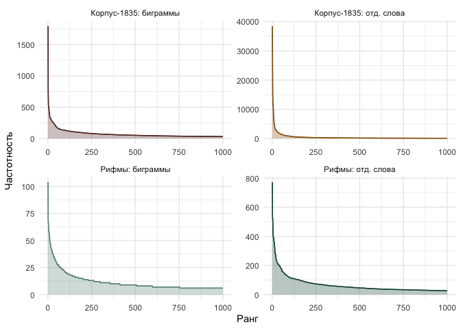
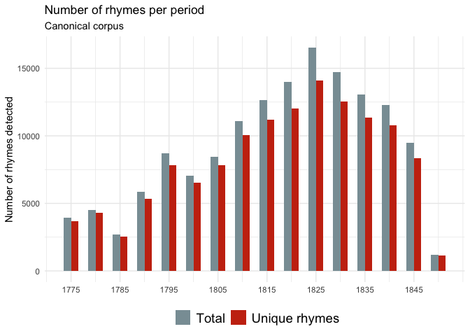
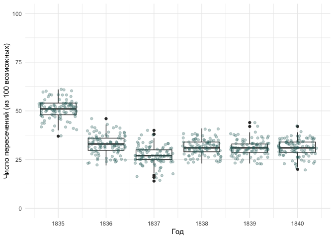
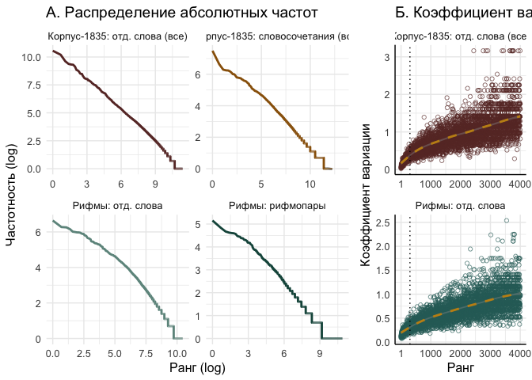

# 05_3_rhyme_bigrams

### load pckg

``` r
library(tidyverse)
library(tidytext)

library(MetBrewer)
theme_set(theme_minimal())
```

### load data

#### Corpus-1835

``` r
rhymes_1835 <- read.csv("../../data/ch5/rhymes_parsed.csv") %>% 
  select(-X) %>% distinct() %>% # fix bag 
  mutate(corpus = "M",
         id = str_remove(id, "M__"))

glimpse(rhymes_1835)
```

    Rows: 81,334
    Columns: 10
    $ id         <chr> "P_1938", "P_1938", "P_1938", "C_156__20", "C_156__20", "C_…
    $ rhyme_pair <chr> "краса небеса", "огневым земным", "красавицей красавице", "…
    $ from       <chr> "краса", "огневым", "красавицей", "око", "силки", "стонет",…
    $ to         <chr> "небеса", "земным", "красавице", "высоко", "легки", "догони…
    $ from_feats <chr> "S,жен,неод=им,ед", "S,фам,муж,од=(дат,мн|твор,ед)", "S,жен…
    $ from_pos   <chr> "S", "S", "S", "S", "S", "V", "S", "S", "S", "S", "APRO", "…
    $ to_feats   <chr> "S,сред,неод=(вин,мн|им,мн)", "A=(дат,мн,полн|твор,ед,полн,…
    $ to_pos     <chr> "S", "A", "S", "ADV", "A", "V", "S", "A", "S", "S", "SPRO",…
    $ rhyme_alph <chr> "краса небеса", "земным огневым", "красавице красавицей", "…
    $ corpus     <chr> "M", "M", "M", "M", "M", "M", "M", "M", "M", "M", "M", "M",…

#### Corpus-1835 metadata

``` r
corpus_1835 <- readRDS("../../data/corpus1835/corpus_1835.Rds")

# attach year to rhyme data
rhymes_1835 <- rhymes_1835 %>% 
  left_join(corpus_1835 %>% 
              select(text_id, year) %>% 
              rename(id = text_id),
              by = "id"
              )
```

    Warning in left_join(., corpus_1835 %>% select(text_id, year) %>% rename(id = text_id), : Detected an unexpected many-to-many relationship between `x` and `y`.
    ℹ Row 2118 of `x` matches multiple rows in `y`.
    ℹ Row 1014 of `y` matches multiple rows in `x`.
    ℹ If a many-to-many relationship is expected, set `relationship =
      "many-to-many"` to silence this warning.

``` r
# select & reorder columns for merge
rhymes_1835 <- rhymes_1835 %>% 
  select(corpus, id, year, rhyme_pair, rhyme_alph, from, to)
```

#### RNC

``` r
# load already parsed data
rnc_rhymes <- read.csv("../../data/ch5/rnc_rhymes.csv") %>% select(-X)

rnc_rhymes <- rnc_rhymes %>% 
  mutate(poem_id = str_replace(poem_id, "RNC_", "RNC__")) %>% 
  separate(poem_id, into = c("corpus", "id"), sep = "__") %>% 
  separate(id, into = c("id", "year"), sep = "_") 

glimpse(rnc_rhymes)
```

    Rows: 146,159
    Columns: 11
    $ corpus     <chr> "RNC", "RNC", "RNC", "RNC", "RNC", "RNC", "RNC", "RNC", "RN…
    $ id         <chr> "3870", "3870", "3870", "3870", "7600", "7600", "7600", "76…
    $ year       <chr> "1777", "1777", "1777", "1777", "1832", "1832", "1832", "18…
    $ rhyme_pair <chr> "Кантемир сатир", "равнялись пленялись", "блистал стал", "н…
    $ from       <chr> "Кантемир", "равнялись", "блистал", "находился", "вечно", "…
    $ to         <chr> "сатир", "пленялись", "стал", "дивился", "бесконечно", "обм…
    $ from_upos  <chr> "NOUN", "VERB", "VERB", "VERB", "ADV", "VERB", "NOUN", "NOU…
    $ from_feats <chr> "Animacy=Anim|Case=Nom|Gender=Masc|Number=Sing", "Animacy=I…
    $ to_upos    <chr> "NOUN", "VERB", "VERB", "VERB", "ADV", "VERB", "ADJ", "NOUN…
    $ to_feats   <chr> "Animacy=Anim|Case=Nom|Gender=Masc|Number=Sing", "Animacy=I…
    $ rhyme_alph <chr> "Кантемир сатир", "пленялись равнялись", "блистал стал", "д…

``` r
rnc_rhymes <- rnc_rhymes %>% 
  # select & reorder columns for merge
  select(corpus, id, year, rhyme_pair, rhyme_alph, from, to)
```

Merge two corpora

``` r
rhymes <- rbind(rhymes_1835, rnc_rhymes)

glimpse(rhymes)
```

    Rows: 227,519
    Columns: 7
    $ corpus     <chr> "M", "M", "M", "M", "M", "M", "M", "M", "M", "M", "M", "M",…
    $ id         <chr> "P_1938", "P_1938", "P_1938", "C_156__20", "C_156__20", "C_…
    $ year       <chr> "1840", "1840", "1840", "1837", "1837", "1837", "1837", "18…
    $ rhyme_pair <chr> "краса небеса", "огневым земным", "красавицей красавице", "…
    $ rhyme_alph <chr> "краса небеса", "земным огневым", "красавице красавицей", "…
    $ from       <chr> "краса", "огневым", "красавицей", "око", "силки", "стонет",…
    $ to         <chr> "небеса", "земным", "красавице", "высоко", "легки", "догони…

``` r
table(rhymes$corpus) # quick check in the number of rhymes found
```


         M    RNC 
     81360 146159 

## Fig. 5-1-1. Bigram freq

Count frequencies in Corpus-1835 in general

``` r
# count unigram frequencies
unigram_freq_full <- corpus_1835 %>% 
  unnest_tokens(input = text_raw, output = word, token = "words") %>% 
  group_by(word) %>% 
  count(sort = T) %>% 
  mutate(group = "Корпус-1835: отд. слова")

# count bigram frequencies
bigram_freq_full <- corpus_1835 %>% 
  unnest_tokens(input = text_raw, output = bigram, token = "ngrams", n = 2) %>% 
  group_by(bigram) %>% 
  count(sort = T) %>% 
  mutate(group = "Корпус-1835: биграммы")
```

Count unigram & bigram freq in rhyme data

``` r
unigram_freq_rhymes <- rhymes_1835 %>% 
  unnest_tokens(input = rhyme_pair, output = word, token = "words") %>% 
  group_by(word) %>% 
  count(sort = T) %>% 
  mutate(group = "Рифмы: отд. слова")

bigram_freq_rhymes <- rhymes_1835 %>% 
  group_by(rhyme_pair) %>% 
  count(sort = T) %>% 
  rename(bigram = rhyme_pair) %>% 
  mutate(group = "Рифмы: биграммы")
```

Plot

``` r
rbind(unigram_freq_full, unigram_freq_rhymes,
      bigram_freq_full, bigram_freq_rhymes) %>% 
  group_by(group) %>% 
  mutate(rank = row_number()) %>% 
  slice_head(n = 1000) %>% 
  ggplot(aes(x = rank, y = n, group = group, color = group)) + 
  geom_line() + 
  facet_wrap(~group, scales = "free") + 
  theme(legend.position = "None") + 
  labs(x = "Ранг", y = "Частотность") + 
  scale_color_manual(values = c(met.brewer(name = "Veronese")[1],
                                met.brewer(name = "Veronese")[2],
                                met.brewer(name = "Veronese")[4],
                                met.brewer(name = "Veronese")[6])) + 
  
  # fill the area under the curve with colour
  geom_area(aes(fill = group, group = group), alpha = 0.3) + 
  scale_fill_manual(values = c(met.brewer(name = "Veronese")[1],
                                met.brewer(name = "Veronese")[2],
                                met.brewer(name = "Veronese")[4],
                                met.brewer(name = "Veronese")[6]))
```



``` r
ggsave("plots/fig_5-1-1.png", plot = last_plot(), dpi = 300,
       width = 8, height = 6, bg = "white")
```

Q: would it be feasible to try to fit the zipfR model ?

<https://zipfr.r-forge.r-project.org>

Number of rhymes found in the two corpora is very different (considerbly
more texts in corpus-1835 for the respective years)

``` r
rhymes %>% 
  filter(year %in% c("1835", "1836", "1837", "1838", "1839", "1840")) %>% 
  count(year, corpus) %>% 
  ggplot(aes(x = year, y = n, fill = corpus)) + 
  geom_col(position = "dodge") + 
  scale_fill_manual(values = c(met.brewer(name = "Veronese")[4],
                               met.brewer(name = "Veronese")[7]))
```


## Hapax richness

Percentage of hapax legomena overall

``` r
rhymes %>% 
  group_by(corpus, rhyme_alph) %>% 
  count(sort = T) %>% 
  filter(n == 1) %>% 
  ungroup() %>% 
  count(corpus) %>% 
  mutate(perc_rnc = round((n / nrow(rnc_rhymes)) * 100, 2),
         perc_1835 = round((n / nrow(rhymes_1835)) * 100, 2))
```

    # A tibble: 2 × 4
      corpus     n perc_rnc perc_1835
      <chr>  <int>    <dbl>     <dbl>
    1 M      44808     30.7      55.1
    2 RNC    76086     52.1      93.5

Number of hapax legomena in each 5-year period in RNC

``` r
library(wesanderson)

total_count <- rnc_rhymes %>% 
  mutate(decade = floor( as.numeric(year) / 5) * 5) %>% 
  count(decade) %>% 
  rename(Total = n)

rnc_rhymes %>% 
  mutate(decade = floor( as.numeric(year) / 5) * 5) %>% 
  select(rhyme_pair, decade) %>% 
  distinct() %>%
  count(decade) %>% 
  rename(`Unique rhymes` = n) %>% 
  left_join(total_count, by = "decade") %>% 
  pivot_longer(!decade, names_to = "group") %>% 
  ggplot(aes(x = decade, y = value, fill = group)) +
    geom_col(width = 3, position = "dodge") +
    scale_fill_manual(values = c(wes_palette("Royal1")[1],
                                 wes_palette("Royal1")[2])) + 
    scale_x_continuous(breaks = seq(1775, 1845, 10)) +
    labs(
         y = "Number of rhymes detected",
         fill = "",
         title = "Number of rhymes per period",
         subtitle = "Canonical corpus") + 
  theme(legend.position = "bottom",
        axis.title.x = element_blank(),
        legend.text = element_text(size = 14))
```



Hapax richness in each year in corpus-1835

``` r
# count number of hapaxes only
hapax_per_year <- rhymes_1835 %>% 
  group_by(year) %>% 
  count(rhyme_alph) %>% 
  ungroup() %>% 
  filter(n == 1) %>% 
  count(year) %>% 
  rename(hapax = n)

head(hapax_per_year)
```

    # A tibble: 6 × 2
      year  hapax
      <chr> <int>
    1 1835  12782
    2 1836   8447
    3 1837  12364
    4 1838   9911
    5 1839   6700
    6 1840   9372

``` r
# total number of rhymes
total <- rhymes_1835 %>% 
  group_by(year) %>% 
  count(rhyme_alph) %>% 
  ungroup() %>% 
  count(year) %>% 
  rename(total = n)

# % of hapaxes
hapax_archive <- hapax_per_year %>% 
  left_join(total, by = "year") %>% 
  mutate(perc_archive = round( (hapax / total)*100, 1 ),
         year = as.character(year))

hapax_archive
```

    # A tibble: 6 × 4
      year  hapax total perc_archive
      <chr> <int> <int>        <dbl>
    1 1835  12782 14394         88.8
    2 1836   8447  9413         89.7
    3 1837  12364 13846         89.3
    4 1838   9911 11349         87.3
    5 1839   6700  7381         90.8
    6 1840   9372 10533         89  

``` r
# Discard unused vars
rm(bigram_freq_full, bigram_freq_rhymes, hapax_archive, hapax_per_year,
   total, total_count, unigram_freq_full, unigram_freq_rhymes)
```

## Fig. 5-1-2. RNC / C1835 - Random samples rhyme intersection

Select only rhymes before year 1830 from canonic corpus

``` r
rnc_rhymes_before1830 <- rnc_rhymes %>% 
  filter(as.numeric(year) < 1830)
```

Run loop that will take 100 random samples from each year of Corpus-1835
and compare it with the full set of rhymes from RNC

``` r
x_1 <- NULL
x_2 <- NULL
year_count <- NULL
perc_intersect <- NULL

random <- NULL
df <- NULL


for (j in 1:100) { # take 100 random samples for each year
  
  for (i in 1:length(unique(rhymes_1835$year))) {
  
    y <- unique(rhymes_1835$year)[i]
    year_count[i] <- y
  
    # select all unique rhymes from canonic corpus before 1830
    x_1 <- rnc_rhymes_before1830 %>% 
      #filter(as.numeric(year) < as.numeric(y)) %>% 
      select(rhyme_alph) %>% 
      distinct() %>% 
      pull(rhyme_alph)
    
    # take 100 random rhymes from corpus-1835
    x_2 <- rhymes_1835 %>% 
      filter(as.numeric(year) %in% as.numeric(y)) %>% 
      select(rhyme_alph) %>% 
      distinct() %>% 
      sample_n(100) %>% 
      pull(rhyme_alph)
    
    # length(x_1) # all rhymes before year x
    # length(x_2) # 100 random unique rhymes
    
    # count number of intersections
    test <- length(intersect(x_1, x_2))
    # length(test)
  
    perc_intersect[i] <- test
  }
  
  random <- tibble(
      a = j,
      year_count = unlist(year_count),
      n = unlist(perc_intersect))
  
    df <- rbind(df, random)
}

head(df)
```

    # A tibble: 6 × 3
          a year_count     n
      <int> <chr>      <int>
    1     1 1840          21
    2     1 1837          25
    3     1 1838          32
    4     1 1836          37
    5     1 1835          55
    6     1 1839          29

``` r
glimpse(df)
```

    Rows: 600
    Columns: 3
    $ a          <int> 1, 1, 1, 1, 1, 1, 2, 2, 2, 2, 2, 2, 3, 3, 3, 3, 3, 3, 4, 4,…
    $ year_count <chr> "1840", "1837", "1838", "1836", "1835", "1839", "1840", "18…
    $ n          <int> 21, 25, 32, 37, 55, 29, 27, 23, 38, 32, 54, 31, 27, 26, 32,…

``` r
df %>% 
  ggplot(aes(x = as.numeric(year_count), 
             y = n, group = year_count)) + 
  geom_boxplot() + 
  geom_jitter(alpha = 0.3, color = met.brewer(name = "Veronese")[5]) + 
  scale_y_continuous(limits = c(0,100)) + 
  scale_x_continuous(breaks = c(1835:1840)) + 
  labs(x = "Год",
       y = "Число пересечений (из 100 возможных)" #,
       #title = "Количество пересечений", 
       #subtitle = "между случайной выборкой рифм из Корпуса-1835 (100 рифм, 100 итераций)\nи всеми известными рифмами из НКРЯ, датированными до соответствующего года"
       )
```



``` r
ggsave(filename = "plots/fig_5-1-2.png", plot = last_plot(), dpi = 300,
       width = 6, height = 4, bg = "white")
```

Some more analysis for 1835 rhymes? why the mean is so different?

``` r
glimpse(rhymes_1835)
```

    Rows: 81,360
    Columns: 7
    $ corpus     <chr> "M", "M", "M", "M", "M", "M", "M", "M", "M", "M", "M", "M",…
    $ id         <chr> "P_1938", "P_1938", "P_1938", "C_156__20", "C_156__20", "C_…
    $ year       <chr> "1840", "1840", "1840", "1837", "1837", "1837", "1837", "18…
    $ rhyme_pair <chr> "краса небеса", "огневым земным", "красавицей красавице", "…
    $ rhyme_alph <chr> "краса небеса", "земным огневым", "красавице красавицей", "…
    $ from       <chr> "краса", "огневым", "красавицей", "око", "силки", "стонет",…
    $ to         <chr> "небеса", "земным", "красавице", "высоко", "легки", "догони…

``` r
glimpse(corpus_1835)
```

    Rows: 4,799
    Columns: 20
    $ text_id       <chr> "P_1", "P_10", "P_100", "P_1000", "P_1001", "P_1002", "P…
    $ A_ID          <chr> "", "A-50", "A-7", "A-41", "A-139", "A-11", "A-163", "A-…
    $ author_sign   <chr> "", "Л. Якубович", "Кольцов", "Ф. Глинка", "Н. Прокопови…
    $ author_text   <chr> "", "Якубович Л.А.", "Кольцов А.В.", "Глинка Ф.Н.", "Про…
    $ text_title    <chr> "Солдатская песня", "Молния", "Ночлег чумаков", "Утешите…
    $ text_subtitle <chr> "", "", "Сельские картины", "", "", "", "", "", "", "", …
    $ first_line    <chr> "Ох жизнь, молодецкая", "Зачем с небесной высоты", "В бл…
    $ year          <chr> "1835", "1835", "1836", "1838", "1838", "1838", "1838", …
    $ path_text     <chr> "../../data/corpus1835/periodicals/per_raw//P_1.txt", ".…
    $ source_text   <chr> "Сев_пч. 1835. №12. C. 46", "БдЧ. 1835. Т.8. Отд. 1. C. …
    $ COL_ID        <chr> "", "", "", "", "", "", "", "", "", "", "", "", "", "", …
    $ corpus        <chr> "per", "per", "per", "per", "per", "per", "per", "per", …
    $ text_raw      <chr> "Ох, жизнь молодецкая,\nБравая, солдатская!\nКак осенняя…
    $ text_cln      <chr> "Ох, жизнь молодецкая,\nБравая, солдатская!\nКак осенняя…
    $ text_lemm     <chr> "ох, жизнь молодецкий,\nбравый, солдатский!\nкак осенний…
    $ text_acc      <chr> "Ох, жизнь молоде'цкая,\nБра'вая, солда'тская!\nКак осе'…
    $ meter         <fct> Other?, Iamb, Iamb, Iamb, Trochee, Iamb, Trochee, Iamb, …
    $ feet          <chr> "?", "3", "4", "4", "4", "4", "other", "4", "6", "5", "4…
    $ formula       <chr> "Other?_?", "Iamb_3", "Iamb_4", "Iamb_4", "Trochee_4", "…
    $ n_lines       <int> 38, 16, 98, 77, 28, 12, 44, 25, 31, 28, 100, 16, 17, 60,…

``` r
rhymes_1835 %>%
  filter(year == "1835") %>% 
  left_join(corpus_1835 %>% select(text_id, author_text) %>% rename(id = text_id),
            by = "id") %>% 
  count(author_text, sort = T) %>% 
  filter(author_text != "" & n > 50)
```

            author_text    n
    1    Жуковский В.А. 3351
    2       Крылов И.А. 3160
    3  Баратынский Е.А. 1758
    4        Зилов А.М. 1282
    5   Бенедиктов В.Г.  845
    6     Тимофеев А.В.  653
    7       Меркли М.М.  554
    8       Деларю М.Д.  403
    9      Савурский Н.  386
    10      Пушкин А.С.  338
    11        Венгер Н.  279
    12    Геевский С.Л.  255
    13      Менцов Ф.Н.  227
    14       Ершов П.П.  202
    15     Кольцов А.В.  176
    16  Прокопович Н.Я.  175
    17      Глинка Ф.Н.  171
    18      Козлов И.И.  155
    19       Лебедев В.  136
    20     Аксаков К.С.  125
    21     Сорокин М.П.  122
    22   Ознобишин Д.П.  107
    23      Красов В.И.   87
    24     Гогниев И.Е.   86
    25  Ростопчина Е.П.   81
    26      Глинка А.П.   76
    27    Алипанов Е.И.   75
    28      Банников А.   75
    29    Якубович Л.А.   72
    30     Галанин И.Д.   68
    31             П.П.   65
    32               С.   62
    33      Языков Н.М.   56
    34          Е. Ш-ий   54
    35          Лихачев   53
    36      Ставелов Н.   53
    37     Хомяков А.С.   52

There is definitely a bias because of dates incompatibility in RNC &
Corpus-1835 (e.g. reprints of Zhukovsky’s poems included in C-1835 but
also found in RNC before 1830). Perform the same loop without four
canonical most frequent authors:

``` r
# filter out authors
rhymes_test <- rhymes_1835 %>%
  left_join(corpus_1835 %>% select(text_id, author_text) %>% rename(id = text_id),
            by = "id") %>% 
  filter(!author_text %in% c("Жуковский В.А.", "Крылов И.А.", "Баратынский Е.А.",
                             "Пушкин А.С."))
```

    Warning in left_join(., corpus_1835 %>% select(text_id, author_text) %>% : Detected an unexpected many-to-many relationship between `x` and `y`.
    ℹ Row 2118 of `x` matches multiple rows in `y`.
    ℹ Row 1014 of `y` matches multiple rows in `x`.
    ℹ If a many-to-many relationship is expected, set `relationship =
      "many-to-many"` to silence this warning.

``` r
# loop

x_1 <- NULL
x_2 <- NULL
year_count <- NULL
perc_intersect <- NULL

random <- NULL
df <- NULL


for (j in 1:100) { # take 100 random samples for each year
  
  for (i in 1:length(unique(rhymes_test$year))) {
  
    y <- unique(rhymes_test$year)[i]
    year_count[i] <- y
  
    # select all unique rhymes from canonic corpus before 1830
    x_1 <- rnc_rhymes_before1830 %>% 
      #filter(as.numeric(year) < as.numeric(y)) %>% 
      select(rhyme_alph) %>% 
      distinct() %>% 
      pull(rhyme_alph)
    
    # take 100 random rhymes from corpus-1835
    x_2 <- rhymes_test %>% 
      filter(as.numeric(year) %in% as.numeric(y)) %>% 
      select(rhyme_alph) %>% 
      distinct() %>% 
      sample_n(100) %>% 
      pull(rhyme_alph)
    
    # length(x_1) # all rhymes before year x
    # length(x_2) # 100 random unique rhymes
    
    # count number of intersections
    test <- length(intersect(x_1, x_2))
    # length(test)
  
    perc_intersect[i] <- test
  }
  
  random <- tibble(
      a = j,
      year_count = unlist(year_count),
      n = unlist(perc_intersect))
  
    df <- rbind(df, random)
}

head(df)
```

    # A tibble: 6 × 3
          a year_count     n
      <int> <chr>      <int>
    1     1 1840          30
    2     1 1837          25
    3     1 1838          34
    4     1 1836          35
    5     1 1835          35
    6     1 1839          34

``` r
glimpse(df)
```

    Rows: 600
    Columns: 3
    $ a          <int> 1, 1, 1, 1, 1, 1, 2, 2, 2, 2, 2, 2, 3, 3, 3, 3, 3, 3, 4, 4,…
    $ year_count <chr> "1840", "1837", "1838", "1836", "1835", "1839", "1840", "18…
    $ n          <int> 30, 25, 34, 35, 35, 34, 31, 21, 23, 33, 28, 29, 34, 30, 34,…

Plot

``` r
df %>% 
  ggplot(aes(x = as.numeric(year_count), 
             y = n, group = year_count)) + 
  geom_boxplot() + 
  geom_jitter(alpha = 0.3, color = met.brewer(name = "Veronese")[5]) + 
  scale_y_continuous(limits = c(0,100)) + 
  scale_x_continuous(breaks = c(1835:1840)) + 
  labs(x = "Год",
       y = "Число пересечений (из 100 возможных)" #,
       #title = "Количество пересечений", 
       #subtitle = "между случайной выборкой рифм из Корпуса-1835 (100 рифм, 100 итераций)\nи всеми известными рифмами из НКРЯ, датированными до соответствующего года"
       )
```



``` r
ggsave(filename = "plots/fig_5-1-2.png", plot = last_plot(), dpi = 300,
       width = 6, height = 4, bg = "white")
```
