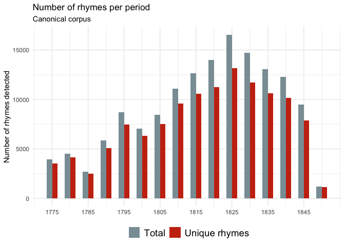
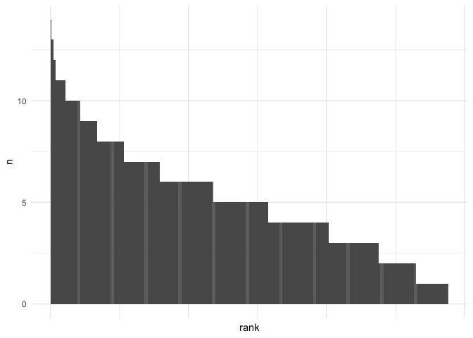
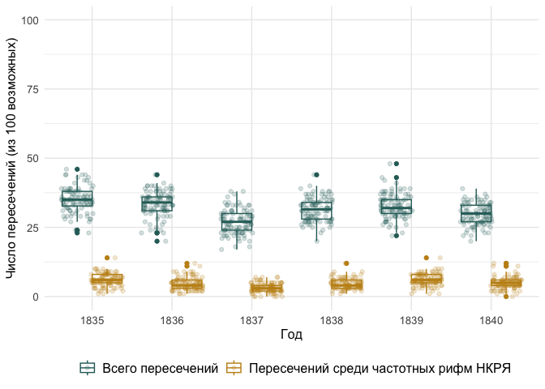

# 05_3_rhyme_bigrams

### load pckg

``` r
library(tidyverse)
library(tidytext)

library(MetBrewer)
theme_set(theme_minimal())
```

### load data

#### Corpus-1835

``` r
rhymes_1835 <- read_csv("../../data/corpus1835/sql_db/rhyme_pairs.csv") %>% 
  rename(text_id = poem_id) %>% 
  # remove Kulman texts
  filter(!str_detect(text_id, "C_264"))
```

    Rows: 81746 Columns: 4
    ── Column specification ────────────────────────────────────────────────────────
    Delimiter: ","
    chr (4): poem_id, from, to, rhyme_alph

    ℹ Use `spec()` to retrieve the full column specification for this data.
    ℹ Specify the column types or set `show_col_types = FALSE` to quiet this message.

``` r
glimpse(rhymes_1835)
```

    Rows: 81,247
    Columns: 4
    $ text_id    <chr> "P_1938", "P_1938", "P_1938", "C_156__20", "C_156__20", "C_…
    $ from       <chr> "краса", "огневым", "красавицей", "око", "силки", "стонет",…
    $ to         <chr> "небеса", "земным", "красавице", "высоко", "легки", "догони…
    $ rhyme_alph <chr> "краса небеса", "земным огневым", "красавице красавицей", "…

``` r
# rhymes_1835 <- read.csv("../../data/ch5/rhymes_parsed.csv") %>% 
#   select(-X) %>% distinct() %>% # fix bag 
#   mutate(corpus = "M",
#          id = str_remove(id, "M__")) %>% 
#   # fix lowering everything
#   mutate(rhyme_alph = tolower(rhyme_alph),
#          rhyme_pair = tolower(rhyme_pair),
#          from = tolower(from),
#          to = tolower(to)) %>% 
#   # fix typo
#   mutate(from = ifelse(from == "искуства", "искусства", from),
#          to = ifelse(to == "искуства", "искусства", to))
# 
# glimpse(rhymes_1835)
```

#### C-35 metadata

``` r
corpus_1835 <- readRDS("../../data/corpus1835/corpus_1835_metrics.Rds")

# attach year to rhyme data
rhymes_1835 <- rhymes_1835 %>% 
  left_join(corpus_1835 %>% 
              select(text_id, year), by = "text_id") %>% 
  mutate(corpus = "M")

# select & reorder columns for merge
# rhymes_1835 <- rhymes_1835 %>% 
#   select(corpus, id, year, rhyme_pair, rhyme_alph, from, to)
```

Number of lines to the number of rhymes (% of rhymed lines detected)

``` r
rhymes_t <- rhymes_1835 %>% 
  left_join(corpus_1835 %>% select(text_id, n_lines), by = "text_id")

glimpse(rhymes_t)
```

    Rows: 81,247
    Columns: 7
    $ text_id    <chr> "P_1938", "P_1938", "P_1938", "C_156__20", "C_156__20", "C_…
    $ from       <chr> "краса", "огневым", "красавицей", "око", "силки", "стонет",…
    $ to         <chr> "небеса", "земным", "красавице", "высоко", "легки", "догони…
    $ rhyme_alph <chr> "краса небеса", "земным огневым", "красавице красавицей", "…
    $ year       <chr> "1840", "1840", "1840", "1837", "1837", "1837", "1837", "18…
    $ corpus     <chr> "M", "M", "M", "M", "M", "M", "M", "M", "M", "M", "M", "M",…
    $ n_lines    <int> 19, 19, 19, 18, 18, 18, 18, 18, 18, 18, 46, 46, 46, 46, 46,…

``` r
rhymes_t %>% 
  mutate(n_line_pairs = n_lines / 2) %>% 
  group_by(text_id, n_line_pairs) %>% 
  count() %>% 
  ungroup() %>% 
  mutate(perc_rhymed = round((n / n_line_pairs)*100, 2),
         perc_rhymed = ifelse(perc_rhymed > 100, 100, perc_rhymed)) %>% 
  
  summary()
```

       text_id           n_line_pairs          n           perc_rhymed    
     Length:4688        Min.   :  1.00   Min.   :  1.00   Min.   :  1.82  
     Class :character   1st Qu.:  8.00   1st Qu.:  7.00   1st Qu.: 83.33  
     Mode  :character   Median : 13.00   Median : 11.00   Median : 95.83  
                        Mean   : 19.44   Mean   : 17.33   Mean   : 87.33  
                        3rd Qu.: 22.00   3rd Qu.: 20.00   3rd Qu.:100.00  
                        Max.   :423.50   Max.   :408.00   Max.   :100.00  

``` r
  # ggplot(aes(x = perc_rhymed)) + geom_boxplot() + 
  # scale_x_continuous(breaks = seq(1, 100, 5))

# 1st qu. ~83% rhymed lines, avg 87% of pairs as rhymed 

# likely unrhymed texts:
rhymes_t %>% 
  mutate(n_line_pairs = n_lines / 2) %>% 
  group_by(text_id, n_line_pairs) %>% 
  count() %>% 
  ungroup() %>% 
  mutate(perc_rhymed = round((n / n_line_pairs)*100, 2),
         perc_rhymed = ifelse(perc_rhymed > 100, 100, perc_rhymed)) %>% 
  filter(perc_rhymed < 50) %>% count() # approx. number -- less than 50% of lines detected as rhymed
```

    # A tibble: 1 × 1
          n
      <int>
    1   313

``` r
print(paste("Approx. number of rhymed texts:", length(unique(rhymes_t$text_id)) - 263,
  "\nPercentage of rhymed texts out of total:",
  (round( (length(unique(rhymes_t$text_id)) - 313) / 
            length(unique(corpus_1835$text_id))*100, 2))
  ))
```

    [1] "Approx. number of rhymed texts: 4425 \nPercentage of rhymed texts out of total: 91.2"

``` r
rm(rhymes_t)
```

#### RNC

``` r
# load already parsed data
rnc_rhymes <- read.csv("../../data/ch5/rnc_rhymes.csv") %>% select(-X)

rnc_rhymes <- rnc_rhymes %>% 
  mutate(poem_id = str_replace(poem_id, "RNC_", "RNC__")) %>% 
  separate(poem_id, into = c("corpus", "id"), sep = "__") %>% 
  separate(id, into = c("text_id", "year"), sep = "_") 

glimpse(rnc_rhymes)
```

    Rows: 146,159
    Columns: 11
    $ corpus     <chr> "RNC", "RNC", "RNC", "RNC", "RNC", "RNC", "RNC", "RNC", "RN…
    $ text_id    <chr> "3870", "3870", "3870", "3870", "7600", "7600", "7600", "76…
    $ year       <chr> "1777", "1777", "1777", "1777", "1832", "1832", "1832", "18…
    $ rhyme_pair <chr> "Кантемир сатир", "равнялись пленялись", "блистал стал", "н…
    $ from       <chr> "Кантемир", "равнялись", "блистал", "находился", "вечно", "…
    $ to         <chr> "сатир", "пленялись", "стал", "дивился", "бесконечно", "обм…
    $ from_upos  <chr> "NOUN", "VERB", "VERB", "VERB", "ADV", "VERB", "NOUN", "NOU…
    $ from_feats <chr> "Animacy=Anim|Case=Nom|Gender=Masc|Number=Sing", "Animacy=I…
    $ to_upos    <chr> "NOUN", "VERB", "VERB", "VERB", "ADV", "VERB", "ADJ", "NOUN…
    $ to_feats   <chr> "Animacy=Anim|Case=Nom|Gender=Masc|Number=Sing", "Animacy=I…
    $ rhyme_alph <chr> "Кантемир сатир", "пленялись равнялись", "блистал стал", "д…

``` r
rnc_rhymes <- rnc_rhymes %>% 
  # select & reorder columns for merge
  select(text_id, from, to, rhyme_alph, year, corpus)
```

Merge two corpora

``` r
rhymes <- rbind(rhymes_1835, rnc_rhymes)

glimpse(rhymes)
```

    Rows: 227,406
    Columns: 6
    $ text_id    <chr> "P_1938", "P_1938", "P_1938", "C_156__20", "C_156__20", "C_…
    $ from       <chr> "краса", "огневым", "красавицей", "око", "силки", "стонет",…
    $ to         <chr> "небеса", "земным", "красавице", "высоко", "легки", "догони…
    $ rhyme_alph <chr> "краса небеса", "земным огневым", "красавице красавицей", "…
    $ year       <chr> "1840", "1840", "1840", "1837", "1837", "1837", "1837", "18…
    $ corpus     <chr> "M", "M", "M", "M", "M", "M", "M", "M", "M", "M", "M", "M",…

``` r
table(rhymes$corpus) # quick check in the number of rhymes found
```


         M    RNC 
     81247 146159 

### table 5-1-1: Pull top 5 rhymes in each year

``` r
total_year <- rhymes_1835 %>% 
  count(year)

total_year
```

    # A tibble: 6 × 2
      year      n
      <chr> <int>
    1 1835  17873
    2 1836  11313
    3 1837  16751
    4 1838  14259
    5 1839   8173
    6 1840  12878

``` r
rhymes_1835 %>% 
  group_by(year) %>% 
  count(rhyme_alph, sort = T) %>% 
  mutate(rank = row_number()) %>% 
  top_n(n, n = 10) %>% 
  arrange(-desc(year)) %>% 
  ungroup() %>% 
  left_join(total_year %>% rename(total = n), by = "year") %>% 
  mutate(perc = round((n / total) * 100, 2)) 
```

    # A tibble: 72 × 6
       year  rhyme_alph       n  rank total  perc
       <chr> <chr>        <int> <int> <int> <dbl>
     1 1835  нет свет        44     1 17873  0.25
     2 1835  ночи очи        32     2 17873  0.18
     3 1835  нас час         24     3 17873  0.13
     4 1835  меня огня       23     4 17873  0.13
     5 1835  мечты ты        23     5 17873  0.13
     6 1835  вновь любовь    22     6 17873  0.12
     7 1835  глас час        21     7 17873  0.12
     8 1835  дней моей       19     8 17873  0.11
     9 1835  дня меня        19     9 17873  0.11
    10 1835  грудь путь      18    10 17873  0.1 
    # ℹ 62 more rows

``` r
rhymes_1835 %>% 
  group_by(year) %>% 
  count(rhyme_alph, sort = T) %>% 
  mutate(rank = row_number()) %>% 
  top_n(n, n = 5) %>% 
  arrange(-desc(year)) %>% 
  ungroup() %>% 
  left_join(total_year %>% rename(total = n), by = "year") %>% 
  mutate(perc = round((n / total) * 100, 2)) %>% 
  group_by(year) %>%
  summarise(
    sum_perc = sum(perc))
```

    # A tibble: 6 × 2
      year  sum_perc
      <chr>    <dbl>
    1 1835      0.82
    2 1836      0.92
    3 1837      0.81
    4 1838      1.09
    5 1839      1.34
    6 1840      1.05

## Fig. 5-1-1. Bigram freq

Count frequencies in Corpus-1835 in general

``` r
# count unigram frequencies
unigram_freq_full <- corpus_1835 %>% 
  unnest_tokens(input = text_raw, output = word, token = "words") %>% 
  group_by(word) %>% 
  count(sort = T) %>% 
  mutate(group = "Корпус-1835: отд. слова")

# count bigram frequencies
bigram_freq_full <- corpus_1835 %>% 
  unnest_tokens(input = text_raw, output = bigram, token = "ngrams", n = 2) %>% 
  group_by(bigram) %>% 
  count(sort = T) %>% 
  mutate(group = "Корпус-1835: словосочетания")
```

Count unigram & bigram freq in rhyme data

``` r
unigram_freq_rhymes <- rhymes_1835 %>% 
  unnest_tokens(input = rhyme_alph, output = word, token = "words") %>% 
  group_by(word) %>% 
  count(sort = T) %>% 
  mutate(group = "Рифмы: отд. слова")

bigram_freq_rhymes <- rhymes_1835 %>% 
  group_by(rhyme_alph) %>% 
  count(sort = T) %>% 
  rename(bigram = rhyme_alph) %>% 
  mutate(group = "Рифмы: рифмопары")
```

Plot

``` r
rbind(unigram_freq_full, unigram_freq_rhymes,
      bigram_freq_full, bigram_freq_rhymes) %>% 
  group_by(group) %>% 
  mutate(rank = row_number()) %>% 
  slice_head(n = 1000) %>% 
  ggplot(aes(x = rank, y = n, group = group, color = group)) + 
  geom_line() + 
  facet_wrap(~group, scales = "free") + 
  theme(legend.position = "None") + 
  labs(x = "Ранг", y = "Частотность") + 
  scale_color_manual(values = c(met.brewer(name = "Veronese")[1],
                                met.brewer(name = "Veronese")[2],
                                met.brewer(name = "Veronese")[4],
                                met.brewer(name = "Veronese")[6])) + 
  
  # fill the area under the curve with colour
  geom_area(aes(fill = group, group = group), alpha = 0.3) + 
  scale_fill_manual(values = c(met.brewer(name = "Veronese")[1],
                                met.brewer(name = "Veronese")[2],
                                met.brewer(name = "Veronese")[4],
                                met.brewer(name = "Veronese")[6])) + 
  theme(text = element_text(size = 12))
```


``` r
ggsave("plots/fig_5-1-1.png", plot = last_plot(), dpi = 300,
       width = 8, height = 6, bg = "white")
```

Q: would it be feasible to try to fit the zipfR model ?

<https://zipfr.r-forge.r-project.org>

Number of rhymes found in the two corpora is very different (considerbly
more texts in corpus-1835 for the respective years)

``` r
rhymes %>% 
  filter(year %in% c("1835", "1836", "1837", "1838", "1839", "1840")) %>% 
  count(year, corpus) %>% 
  ggplot(aes(x = year, y = n, fill = corpus)) + 
  geom_col(position = "dodge") + 
  scale_fill_manual(values = c(met.brewer(name = "Veronese")[4],
                               met.brewer(name = "Veronese")[7]))
```


## Hapax richness

Percentage of hapax legomena overall - ~52%

``` r
rhymes %>% 
  group_by(corpus, rhyme_alph) %>% 
  count(sort = T) %>% 
  filter(n == 1) %>% 
  ungroup() %>% 
  count(corpus) %>% 
  mutate(perc_rnc = round((n / nrow(rnc_rhymes)) * 100, 2),
         perc_1835 = round((n / nrow(rhymes_1835)) * 100, 2))
```

    # A tibble: 2 × 4
      corpus     n perc_rnc perc_1835
      <chr>  <int>    <dbl>     <dbl>
    1 M      43533     29.8      53.6
    2 RNC    76086     52.1      93.6

Number of hapax legomena in each 5-year period in RNC

``` r
library(wesanderson)

total_count <- rnc_rhymes %>% 
  mutate(decade = floor( as.numeric(year) / 5) * 5) %>% 
  count(decade) %>% 
  rename(Total = n)

rnc_rhymes %>% 
  mutate(decade = floor( as.numeric(year) / 5) * 5) %>% 
  select(rhyme_alph, decade) %>% 
  distinct() %>%
  count(decade) %>% 
  rename(`Unique rhymes` = n) %>% 
  left_join(total_count, by = "decade") %>% 
  pivot_longer(!decade, names_to = "group") %>% 
  ggplot(aes(x = decade, y = value, fill = group)) +
    geom_col(width = 3, position = "dodge") +
    scale_fill_manual(values = c(wes_palette("Royal1")[1],
                                 wes_palette("Royal1")[2])) + 
    scale_x_continuous(breaks = seq(1775, 1845, 10)) +
    labs(
         y = "Number of rhymes detected",
         fill = "",
         title = "Number of rhymes per period",
         subtitle = "Canonical corpus") + 
  theme(legend.position = "bottom",
        axis.title.x = element_blank(),
        legend.text = element_text(size = 14))
```



Hapax richness in each year in corpus-1835

``` r
# count number of hapaxes only
hapax_per_year <- rhymes_1835 %>% 
  group_by(year) %>% 
  count(rhyme_alph) %>% 
  ungroup() %>% 
  filter(n == 1) %>% 
  count(year) %>% 
  rename(hapax = n)

head(hapax_per_year)
```

    # A tibble: 6 × 2
      year  hapax
      <chr> <int>
    1 1835  12573
    2 1836   8362
    3 1837  12252
    4 1838   9778
    5 1839   6175
    6 1840   9262

``` r
# total number of rhymes
total <- rhymes_1835 %>% 
  group_by(year) %>% 
  count(rhyme_alph) %>% 
  ungroup() %>% 
  count(year) %>% 
  rename(total = n)

# % of hapaxes
hapax_archive <- hapax_per_year %>% 
  left_join(total, by = "year") %>% 
  mutate(perc_archive = round( (hapax / total)*100, 1 ),
         year = as.character(year))

hapax_archive
```

    # A tibble: 6 × 4
      year  hapax total perc_archive
      <chr> <int> <int>        <dbl>
    1 1835  12573 14244         88.3
    2 1836   8362  9362         89.3
    3 1837  12252 13773         89  
    4 1838   9778 11257         86.9
    5 1839   6175  6867         89.9
    6 1840   9262 10463         88.5

``` r
# Discard unused vars
rm(bigram_freq_full, bigram_freq_rhymes, hapax_archive, hapax_per_year,
   total, total_count, unigram_freq_full, unigram_freq_rhymes)
```

## Fig. 5-1-2. RNC / C1835 - Random samples rhyme intersection

Select only rhymes before year 1830 from canonic corpus

``` r
rnc_rhymes_before1830 <- rnc_rhymes %>% 
  filter(as.numeric(year) < 1830)
```

Run loop that will take 100 random samples from each year of Corpus-1835
and compare it with the full set of rhymes from RNC

``` r
x_1 <- NULL
x_2 <- NULL
year_count <- NULL
perc_intersect <- NULL

random <- NULL
df <- NULL


for (j in 1:100) { # take 100 random samples for each year
  
  for (i in 1:length(unique(rhymes_1835$year))) {
  
    y <- unique(rhymes_1835$year)[i]
    year_count[i] <- y
  
    # select all unique rhymes from canonic corpus before 1830
    x_1 <- rnc_rhymes_before1830 %>% 
      #filter(as.numeric(year) < as.numeric(y)) %>% 
      select(rhyme_alph) %>% 
      distinct() %>% 
      pull(rhyme_alph)
    
    # take 100 random rhymes from corpus-1835
    x_2 <- rhymes_1835 %>% 
      filter(as.numeric(year) %in% as.numeric(y)) %>% 
      select(rhyme_alph) %>% 
      distinct() %>% 
      sample_n(100) %>% 
      pull(rhyme_alph)
    
    # length(x_1) # all rhymes before year x
    # length(x_2) # 100 random unique rhymes
    
    # count number of intersections
    test <- length(intersect(x_1, x_2))
    # length(test)
  
    perc_intersect[i] <- test
  }
  
  random <- tibble(
      a = j,
      year_count = unlist(year_count),
      n = unlist(perc_intersect))
  
    df <- rbind(df, random)
}

head(df)
glimpse(df)
```

``` r
df %>% 
  ggplot(aes(x = as.numeric(year_count), 
             y = n, group = year_count)) + 
  geom_boxplot() + 
  geom_jitter(alpha = 0.3, color = met.brewer(name = "Veronese")[5]) + 
  scale_y_continuous(limits = c(0,100)) + 
  scale_x_continuous(breaks = c(1835:1840)) + 
  labs(x = "Год",
       y = "Число пересечений (из 100 возможных)" #,
       #title = "Количество пересечений", 
       #subtitle = "между случайной выборкой рифм из Корпуса-1835 (100 рифм, 100 итераций)\nи всеми известными рифмами из НКРЯ, датированными до соответствующего года"
       )
```

``` r
ggsave(filename = "plots/fig_5-1-2.png", plot = last_plot(), dpi = 300,
       width = 6, height = 4, bg = "white")
```

Some more analysis for 1835 rhymes? why the mean is so different?

``` r
glimpse(rhymes_1835)
```

    Rows: 81,247
    Columns: 6
    $ text_id    <chr> "P_1938", "P_1938", "P_1938", "C_156__20", "C_156__20", "C_…
    $ from       <chr> "краса", "огневым", "красавицей", "око", "силки", "стонет",…
    $ to         <chr> "небеса", "земным", "красавице", "высоко", "легки", "догони…
    $ rhyme_alph <chr> "краса небеса", "земным огневым", "красавице красавицей", "…
    $ year       <chr> "1840", "1840", "1840", "1837", "1837", "1837", "1837", "18…
    $ corpus     <chr> "M", "M", "M", "M", "M", "M", "M", "M", "M", "M", "M", "M",…

``` r
glimpse(corpus_1835)
```

    Rows: 4,797
    Columns: 20
    $ text_id       <chr> "P_1", "P_10", "P_100", "P_1000", "P_1001", "P_1002", "P…
    $ A_ID          <chr> "", "A-50", "A-7", "A-41", "A-139", "A-11", "A-163", "A-…
    $ author_text   <chr> "", "Якубович Л.А.", "Кольцов А.В.", "Глинка Ф.Н.", "Про…
    $ author_sign   <chr> "", "Л. Якубович", "Кольцов", "Ф. Глинка", "Н. Прокопови…
    $ text_title    <chr> "Солдатская песня", "Молния", "Ночлег чумаков", "Утешите…
    $ text_subtitle <chr> "", "", "Сельские картины", "", "", "", "", "", "", "", …
    $ first_line    <chr> "Ох жизнь, молодецкая", "Зачем с небесной высоты", "В бл…
    $ year          <chr> "1835", "1835", "1836", "1838", "1838", "1838", "1838", …
    $ path_text     <chr> "../../data/corpus1835/periodicals/per_raw//P_1.txt", ".…
    $ source_text   <chr> "Сев_пч. 1835. №12. C. 46", "БдЧ. 1835. Т.8. Отд. 1. C. …
    $ COL_ID        <chr> "", "", "", "", "", "", "", "", "", "", "", "", "", "", …
    $ corpus        <chr> "per", "per", "per", "per", "per", "per", "per", "per", …
    $ text_raw      <chr> "Ох, жизнь молодецкая,\nБравая, солдатская!\nКак осенняя…
    $ text_cln      <chr> "Ох, жизнь молодецкая,\nБравая, солдатская!\nКак осенняя…
    $ text_lemm     <chr> "ох, жизнь молодецкий,\nбравый, солдатский!\nкак осенний…
    $ text_acc      <chr> "Ох, жизнь молоде'цкая,\nБра'вая, солда'тская!\nКак осе'…
    $ meter         <fct> Other?, Iamb, Iamb, Iamb, Trochee, Iamb, Trochee, Iamb, …
    $ feet          <chr> "?", "3", "4", "4", "4", "4", "other", "4", "6", "5", "4…
    $ formula       <chr> "Other?_?", "Iamb_3", "Iamb_4", "Iamb_4", "Trochee_4", "…
    $ n_lines       <int> 38, 16, 98, 77, 28, 12, 44, 25, 31, 28, 100, 16, 17, 60,…

``` r
rhymes_1835 %>%
  filter(year == "1835") %>% 
  left_join(corpus_1835 %>% select(text_id, author_text),
            by = "text_id") %>% 
  count(author_text, sort = T) %>% 
  filter(author_text != "" & n > 50)
```

    # A tibble: 36 × 2
       author_text          n
       <chr>            <int>
     1 Жуковский В.А.    3400
     2 Крылов И.А.       3160
     3 Баратынский Е.А.  1759
     4 Зилов А.М.        1292
     5 Бенедиктов В.Г.    823
     6 Тимофеев А.В.      655
     7 Меркли М.М.        554
     8 Деларю М.Д.        403
     9 Савурский Н.       386
    10 Пушкин А.С.        340
    # ℹ 26 more rows

There is definitely a bias because of dates incompatibility in RNC &
Corpus-1835 (e.g. reprints of Zhukovsky’s poems included in C-1835 but
also found in RNC before 1830). Perform the same loop without four
canonical most frequent authors.

We can also take into account if the intersected rhyme was in the list
of the most frequent rhymes in general. That would mean that these
rhymes are stable & redundant.

To count which of the top rhymes are repeated: change to \_, paste
rhymes & then count.

``` r
# filter out authors
rhymes_test <- rhymes_1835 %>%
  left_join(corpus_1835 %>% select(text_id, author_text),
            by = "text_id") %>% 
  filter(!author_text %in% c("Жуковский В.А.", "Крылов И.А.", "Баратынский Е.А.",
                             "Пушкин А.С.")) %>% 
  mutate(rhyme_alph = str_replace(rhyme_alph, " ", "_"))


rnc_rhymes_before1830 <- rnc_rhymes_before1830 %>% 
  mutate(rhyme_alph = str_replace(rhyme_alph, " ", "_"))

# count most freq rhymes
top_rnc <- rnc_rhymes_before1830 %>% 
  count(rhyme_alph, sort = T) 

head(top_rnc)
```

        rhyme_alph   n
    1     нет_свет 167
    2      нас_час 124
    3  век_человек 121
    4    день_тень 119
    5 кровь_любовь 118
    6        моя_я 116

``` r
top_rnc %>% pull(n) %>% quantile(c(0.5, 0.9, 0.95, 0.98, 0.99, 0.991, 1))
```

      50%   90%   95%   98%   99% 99.1%  100% 
        1     2     3     6     9    10   167 

``` r
top_rnc_rhymes <- top_rnc %>% 
  filter(n > 9) %>% 
  pull(rhyme_alph)

print(paste("Length of the vector of rhymes appearing more than 10 times:", 
            length(top_rnc_rhymes))) 
```

    [1] "Length of the vector of rhymes appearing more than 10 times: 643"

``` r
# loop

x_1 <- NULL
x_2 <- NULL
year_count <- NULL
perc_intersect <- NULL
perc_top <- NULL
top_counter <- NULL

t <- NULL
random <- NULL
df <- NULL


for (j in 1:100) { # take 100 random samples for each year
  
  for (i in 1:length(unique(rhymes_test$year))) {
  
    y <- unique(rhymes_test$year)[i]
    year_count[i] <- y
  
    # select all unique rhymes from canonic corpus before 1830
    x_1 <- rnc_rhymes_before1830 %>% 
      #filter(as.numeric(year) < as.numeric(y)) %>% 
      select(rhyme_alph) %>% 
      distinct() %>% 
      pull(rhyme_alph)
    
    # take 100 random rhymes from corpus-1835
    x_2 <- rhymes_test %>% 
      filter(as.numeric(year) %in% as.numeric(y)) %>% 
      select(rhyme_alph) %>% 
      distinct() %>% 
      sample_n(100) %>% 
      pull(rhyme_alph)
    
    # length(x_1) # all rhymes before year x
    # length(x_2) # 100 random unique rhymes
    
    # count number of intersections
    test <- length(intersect(x_1, x_2))
    # length(test)
  
    perc_intersect[i] <- test
    
    t <- intersect(x_1, x_2)
    perc_top[i] <- length(intersect(t, top_rnc_rhymes))
    top_counter[i] <- paste(intersect(t, top_rnc_rhymes), collapse = " ")
    
  }
  
  random <- tibble(
      a = j,
      year_count = unlist(year_count),
      n = unlist(perc_intersect),
      perc_top = unlist(perc_top),
      rhymes_top = unlist(top_counter))
  
    df <- rbind(df, random)
}

head(df)
```

    # A tibble: 6 × 5
          a year_count     n perc_top rhymes_top                                    
      <int> <chr>      <int>    <int> <chr>                                         
    1     1 1840          27        5 меня_тебя богу_дорогу ненастья_счастья поэта_…
    2     1 1837          30        4 семья_я бед_след прах_страх глаза_слеза       
    3     1 1838          34        4 звезд_мест мне_стране звуки_муки взор_приговор
    4     1 1836          34        7 день_сень очах_устах своей_царей неволе_поле …
    5     1 1835          33        6 меня_тебя глубине_мне нет_ответ взор_хор руко…
    6     1 1839          30        4 будь_грудь взор_укор живет_нет мой_покой      

``` r
glimpse(df)
```

    Rows: 600
    Columns: 5
    $ a          <int> 1, 1, 1, 1, 1, 1, 2, 2, 2, 2, 2, 2, 3, 3, 3, 3, 3, 3, 4, 4,…
    $ year_count <chr> "1840", "1837", "1838", "1836", "1835", "1839", "1840", "18…
    $ n          <int> 27, 30, 34, 34, 33, 30, 30, 31, 33, 33, 35, 37, 25, 31, 27,…
    $ perc_top   <int> 5, 4, 4, 7, 6, 4, 4, 2, 3, 5, 6, 14, 2, 6, 4, 2, 6, 5, 6, 0…
    $ rhymes_top <chr> "меня_тебя богу_дорогу ненастья_счастья поэта_света воля_до…

Look into the top-freq RNC pairs which were found in trials most
frequently

``` r
# top rhymes
df %>% 
  select(rhymes_top) %>% 
  separate_rows(rhymes_top, sep = " ") %>% 
  count(rhymes_top, sort = T) %>% 
  head(20)
```

    # A tibble: 20 × 2
       rhymes_top            n
       <chr>             <int>
     1 свет_след            14
     2 вышине_мне           13
     3 их_моих              13
     4 кровь_любовь         13
     5 века_человека        12
     6 мне_сне              12
     7 радость_сладость     12
     8 бури_лазури          11
     9 вдохновений_гений    11
    10 глаз_раз             11
    11 глаза_слеза          11
    12 голова_слова         11
    13 дар_жар              11
    14 ей_своей             11
    15 забавы_славы         11
    16 красоты_ты           11
    17 мечты_суеты          11
    18 мною_рукою           11
    19 могилы_силы          11
    20 себе_судьбе          11

``` r
# distribution
df %>% 
  select(rhymes_top) %>% 
  separate_rows(rhymes_top, sep = " ") %>% 
  count(rhymes_top, sort = T) %>% 
  mutate(rank = row_number()) %>% 
  ggplot(aes(x = rank, y = n)) + geom_col() + theme(axis.text.x = element_blank())
```



Create a boxplot for percentage of intersections

``` r
glimpse(df)
```

    Rows: 600
    Columns: 5
    $ a          <int> 1, 1, 1, 1, 1, 1, 2, 2, 2, 2, 2, 2, 3, 3, 3, 3, 3, 3, 4, 4,…
    $ year_count <chr> "1840", "1837", "1838", "1836", "1835", "1839", "1840", "18…
    $ n          <int> 27, 30, 34, 34, 33, 30, 30, 31, 33, 33, 35, 37, 25, 31, 27,…
    $ perc_top   <int> 5, 4, 4, 7, 6, 4, 4, 2, 3, 5, 6, 14, 2, 6, 4, 2, 6, 5, 6, 0…
    $ rhymes_top <chr> "меня_тебя богу_дорогу ненастья_счастья поэта_света воля_до…

``` r
df %>% 
  select(-rhymes_top, -a) %>% 
  pivot_longer(!year_count) %>% 
  mutate(name = ifelse(name == "n", "Всего пересечений", "Пересечений среди частотных рифм НКРЯ")) %>% 
  ggplot(aes(x = as.factor(year_count), 
             y = value, color = name)) + 
  
  geom_boxplot(position = "dodge") + 
  
  geom_point(position = position_jitterdodge(), alpha = 0.2) + 
  
  scale_color_manual(values = c(met.brewer("Veronese")[5],
                                met.brewer("Veronese")[3])) + 
  expand_limits(y = c(0, 100)) + 
  labs(x = "Год", 
       y = "Число пересечений (из 100 возможных)",
       color = "") +
  theme(legend.position = "bottom", 
        axis.text = element_text(size = 10),
        axis.title = element_text(size = 12),
        legend.text = element_text(size = 12))
```



``` r
ggsave(filename = "plots/fig_5-1-2.png", plot = last_plot(), dpi = 300,
       width = 8, height = 6, bg = "white")
```

``` r
# earlier version of the plot
# df
#   ggplot(aes(x = as.numeric(year_count), 
#              y = n, group = year_count)) + 
#   geom_boxplot(color = met.brewer("Veronese")[7]) + 
#   geom_jitter(alpha = 0.3, color = met.brewer(name = "Veronese")[5]) + 
#   
#   geom_boxplot(data = df, 
#                aes(x = as.numeric(year_count), 
#                    y = perc_top, 
#                    group = year_count), 
#                color = met.brewer("Veronese")[1]) + 
#   geom_jitter(data = df, aes(x = as.numeric(year_count), 
#                              y = perc_top, group = year_count), 
#               colour = met.brewer("Veronese")[3], alpha = 0.2) + 
#   scale_y_continuous(limits = c(0,100)) + 
#   scale_x_continuous(breaks = c(1835:1840)) + 
#   labs(x = "Год",
#        y = "Число пересечений (из 100 возможных)" #,
#        #title = "Количество пересечений", 
#        #subtitle = "между случайной выборкой рифм из Корпуса-1835 (100 рифм, 100 итераций)\nи всеми известными рифмами из НКРЯ, датированными до соответствующего года"
#        )
```

## Kendall rank cor

sHow much rankings within language are similar to those in rhyme freq

### inline freq

Calculate frequency of words which are not in rhyme position

``` r
inline_freq <- corpus_1835 %>% 
  select(text_raw) %>% 
  separate_rows(text_raw, sep = "\n") %>% 
  
  # remove last word in a line
  
  # remove lines with no words
  filter(text_raw != "" & !str_detect(text_raw, "^[[:punct:]]+$|^[[:space:]]+$")) %>% 
  # remove spaced & punctuation in the end of the line
  mutate(text_cln = str_remove_all(text_raw, "\\W+$|\\s+$"),
         # replace the last word as endword tag
         text_cln = str_replace_all(text_cln, "\\w+$", "_ENDWORD_")) %>% 
  select(text_cln) %>% 
  # remove endword tags
  mutate(text_cln = str_remove_all(text_cln, "_ENDWORD_")) %>% 
  
  # count remaining words
  unnest_tokens(input = text_cln, output = word, token = "words") %>% 
  count(word, sort = T) %>% 
  mutate(rank_inline = row_number())

head(inline_freq)
```

    # A tibble: 6 × 3
      word      n rank_inline
      <chr> <int>       <int>
    1 и     38456           1
    2 в     26909           2
    3 не    14983           3
    4 на    11839           4
    5 с     11212           5
    6 я     10183           6

### rhyme words freq

``` r
rhyme_freq <- rhymes_1835 %>% 
  unnest_tokens(input = rhyme_alph, output = word, token = "words") %>% 
  count(word, sort = T) %>% 
  mutate(rank_rhyme = row_number())

head(rhyme_freq)
```

    # A tibble: 6 × 3
      word      n rank_rhyme
      <chr> <int>      <int>
    1 я       766          1
    2 меня    531          2
    3 она     521          3
    4 свет    471          4
    5 мне     409          5
    6 моей    401          6

### ranks cor test

Comparison of ranked lists demonstration (tau max = 1, tau min = -1):

``` r
cor.test(c(1,2,3,4,5), c(1,2,3,4,5), method = "kendall")
```


        Kendall's rank correlation tau

    data:  c(1, 2, 3, 4, 5) and c(1, 2, 3, 4, 5)
    T = 10, p-value = 0.01667
    alternative hypothesis: true tau is not equal to 0
    sample estimates:
    tau 
      1 

``` r
cor.test(c(1,2,3,4,5), c(3,2,5,1,4), method = "kendall")
```


        Kendall's rank correlation tau

    data:  c(1, 2, 3, 4, 5) and c(3, 2, 5, 1, 4)
    T = 5, p-value = 1
    alternative hypothesis: true tau is not equal to 0
    sample estimates:
    tau 
      0 

``` r
cor.test(c(1,2,3,4,5), c(5,4,3,2,1), method = "kendall")
```


        Kendall's rank correlation tau

    data:  c(1, 2, 3, 4, 5) and c(5, 4, 3, 2, 1)
    T = 0, p-value = 0.01667
    alternative hypothesis: true tau is not equal to 0
    sample estimates:
    tau 
     -1 

#### mfw 100

``` r
mfw_100_rhyme <- rhyme_freq %>% 
  head(100) %>% 
  select(-n) %>% 
  left_join(inline_freq %>% select(-n), by = "word") %>% 
  drop_na()

cor.test(mfw_100_rhyme$rank_rhyme, mfw_100_rhyme$rank_inline, method = "kendall")
```


        Kendall's rank correlation tau

    data:  mfw_100_rhyme$rank_rhyme and mfw_100_rhyme$rank_inline
    z = 4.0562, p-value = 4.988e-05
    alternative hypothesis: true tau is not equal to 0
    sample estimates:
          tau 
    0.2751515 

``` r
mfw_100_rhyme %>% 
  arrange(-desc(rank_rhyme)) %>% 
  head(25)
```

    # A tibble: 25 × 3
       word  rank_rhyme rank_inline
       <chr>      <int>       <int>
     1 я              1           6
     2 меня           2          43
     3 она            3          45
     4 свет           4         119
     5 мне            5          13
     6 моей           6          95
     7 нет            7          33
     8 ты             8           8
     9 тобой          9         169
    10 мечты         10         230
    # ℹ 15 more rows

``` r
nrow(mfw_100_rhyme)
```

    [1] 100

#### mfw 1000

``` r
mfw_1000_rhyme <- rhyme_freq %>% 
  head(1000) %>% 
  select(-n) %>% 
  left_join(inline_freq %>% select(-n), by = "word") %>% 
  drop_na()

head(mfw_1000_rhyme)
```

    # A tibble: 6 × 3
      word  rank_rhyme rank_inline
      <chr>      <int>       <int>
    1 я              1           6
    2 меня           2          43
    3 она            3          45
    4 свет           4         119
    5 мне            5          13
    6 моей           6          95

``` r
cor.test(mfw_1000_rhyme$rank_rhyme, mfw_1000_rhyme$rank_inline, method = "kendall")
```


        Kendall's rank correlation tau

    data:  mfw_1000_rhyme$rank_rhyme and mfw_1000_rhyme$rank_inline
    z = 17.075, p-value < 2.2e-16
    alternative hypothesis: true tau is not equal to 0
    sample estimates:
          tau 
    0.3611558 

#### mfw 10000

``` r
mfw_10000_rhyme <- rhyme_freq %>% 
  head(10000) %>% 
  select(-n) %>% 
  left_join(inline_freq %>% select(-n), by = "word") %>% 
  drop_na()

cor.test(mfw_10000_rhyme$rank_rhyme, mfw_10000_rhyme$rank_inline, method = "kendall")
```


        Kendall's rank correlation tau

    data:  mfw_10000_rhyme$rank_rhyme and mfw_10000_rhyme$rank_inline
    z = 55.003, p-value < 2.2e-16
    alternative hypothesis: true tau is not equal to 0
    sample estimates:
          tau 
    0.3915479 

### iamb & trochee cor test separately

#### iamb freq

Calculate inline & rhyme freqs in iambic poems

``` r
iamb_inline_freq <- corpus_1835 %>% 
  filter(meter == "Iamb") %>% 
  select(text_raw) %>% 
  separate_rows(text_raw, sep = "\n") %>% 
  
  # remove last word in a line
  
  # remove lines with no words
  filter(text_raw != "" & !str_detect(text_raw, "^[[:punct:]]+$|^[[:space:]]+$")) %>% 
  # remove spaced & punctuation in the end of the line
  mutate(text_cln = str_remove_all(text_raw, "\\W+$|\\s+$"),
         # replace the last word as endword tag
         text_cln = str_replace_all(text_cln, "\\w+$", "_ENDWORD_")) %>% 
  select(text_cln) %>% 
  # remove endword tags
  mutate(text_cln = str_remove_all(text_cln, "_ENDWORD_")) %>% 
  
  # count remaining words
  unnest_tokens(input = text_cln, output = word, token = "words") %>% 
  count(word, sort = T) %>% 
  mutate(rank_inline = row_number())

head(iamb_inline_freq)
```

    # A tibble: 6 × 3
      word      n rank_inline
      <chr> <int>       <int>
    1 и     25843           1
    2 в     17546           2
    3 не     9979           3
    4 на     7413           4
    5 с      7373           5
    6 я      7025           6

``` r
iamb_rhyme_freq <- rhymes_1835 %>% 
  # filter only iambic poems
  left_join(corpus_1835 %>% select(text_id, meter),
            by = "text_id") %>% 
  filter(meter == "Iamb") %>% 
  # count words
  unnest_tokens(input = rhyme_alph, output = word, token = "words") %>% 
  count(word, sort = T) %>% 
  mutate(rank_rhyme = row_number())

head(iamb_rhyme_freq)
```

    # A tibble: 6 × 3
      word      n rank_rhyme
      <chr> <int>      <int>
    1 я       484          1
    2 свет    325          2
    3 меня    318          3
    4 тобой   300          4
    5 она     299          5
    6 нет     294          6

#### cor texts

``` r
mfw_100_rhyme <- iamb_rhyme_freq %>% 
  head(100) %>% 
  select(-n) %>% 
  left_join(iamb_inline_freq %>% select(-n), by = "word") %>% 
  drop_na()

cor.test(mfw_100_rhyme$rank_rhyme, mfw_100_rhyme$rank_inline, method = "kendall")
```


        Kendall's rank correlation tau

    data:  mfw_100_rhyme$rank_rhyme and mfw_100_rhyme$rank_inline
    z = 3.8656, p-value = 0.0001108
    alternative hypothesis: true tau is not equal to 0
    sample estimates:
          tau 
    0.2622222 

``` r
mfw_100_rhyme %>% 
  arrange(-desc(rank_rhyme)) %>% 
  head(50)
```

    # A tibble: 50 × 3
       word  rank_rhyme rank_inline
       <chr>      <int>       <int>
     1 я              1           6
     2 свет           2         121
     3 меня           3          40
     4 тобой          4         148
     5 она            5          36
     6 нет            6          31
     7 ты             7           8
     8 моей           8          88
     9 мечты          9         189
    10 дней          10         228
    # ℹ 40 more rows

``` r
nrow(mfw_100_rhyme)
```

    [1] 100

``` r
### --- tests for 1000 and 10 000 MFW --- 
mfw_1000_rhyme <- iamb_rhyme_freq %>% 
  head(1000) %>% 
  select(-n) %>% 
  left_join(iamb_inline_freq %>% select(-n), by = "word") %>% 
  drop_na()

cor.test(mfw_1000_rhyme$rank_rhyme, mfw_1000_rhyme$rank_inline, method = "kendall")
```


        Kendall's rank correlation tau

    data:  mfw_1000_rhyme$rank_rhyme and mfw_1000_rhyme$rank_inline
    z = 15.727, p-value < 2.2e-16
    alternative hypothesis: true tau is not equal to 0
    sample estimates:
          tau 
    0.3339897 

``` r
mfw_1000_rhyme %>% 
  arrange(-desc(rank_rhyme)) %>% 
  tail(25)
```

    # A tibble: 25 × 3
       word    rank_rhyme rank_inline
       <chr>        <int>       <int>
     1 любимой        976        5119
     2 младые         977         939
     3 можно          978         565
     4 муз            979         714
     5 награда        980        6594
     6 напев          981        2391
     7 наряд          982        2259
     8 неволе         983        7633
     9 нее            984         437
    10 несется        985        1029
    # ℹ 15 more rows

``` r
# 10 000 

mfw_10000_rhyme <- iamb_rhyme_freq %>% 
  head(10000) %>% 
  select(-n) %>% 
  left_join(iamb_inline_freq %>% select(-n), by = "word") %>% 
  drop_na()

cor.test(mfw_10000_rhyme$rank_rhyme, mfw_10000_rhyme$rank_inline, method = "kendall")
```


        Kendall's rank correlation tau

    data:  mfw_10000_rhyme$rank_rhyme and mfw_10000_rhyme$rank_inline
    z = 47.34, p-value < 2.2e-16
    alternative hypothesis: true tau is not equal to 0
    sample estimates:
          tau 
    0.3580691 

``` r
mfw_10000_rhyme %>% 
  arrange(-desc(rank_rhyme)) %>% 
  tail(25)
```

    # A tibble: 25 × 3
       word       rank_rhyme rank_inline
       <chr>           <int>       <int>
     1 неложно          9957       37893
     2 немногу          9960       37916
     3 немые            9961       11088
     4 ненавидеть       9963       20183
     5 ненавидит        9964       37939
     6 ненавидя         9965       37940
     7 ненастных        9966       37967
     8 необозримы       9968       37988
     9 необходим        9970       37997
    10 необъятную       9972       38009
    # ℹ 15 more rows

#### trochee freqs

``` r
tr_inline_freq <- corpus_1835 %>% 
  filter(meter == "Trochee") %>% 
  select(text_raw) %>% 
  separate_rows(text_raw, sep = "\n") %>% 
  
  # remove last word in a line
  
  # remove lines with no words
  filter(text_raw != "" & !str_detect(text_raw, "^[[:punct:]]+$|^[[:space:]]+$")) %>% 
  # remove spaced & punctuation in the end of the line
  mutate(text_cln = str_remove_all(text_raw, "\\W+$|\\s+$"),
         # replace the last word as endword tag
         text_cln = str_replace_all(text_cln, "\\w+$", "_ENDWORD_")) %>% 
  select(text_cln) %>% 
  # remove endword tags
  mutate(text_cln = str_remove_all(text_cln, "_ENDWORD_")) %>% 
  
  # count remaining words
  unnest_tokens(input = text_cln, output = word, token = "words") %>% 
  count(word, sort = T) %>% 
  mutate(rank_inline = row_number())

head(tr_inline_freq)
```

    # A tibble: 6 × 3
      word      n rank_inline
      <chr> <int>       <int>
    1 и      5637           1
    2 в      4532           2
    3 не     2281           3
    4 на     1937           4
    5 с      1776           5
    6 как    1498           6

``` r
tr_rhyme_freq <- rhymes_1835 %>% 
  # filter only iambic poems
  left_join(corpus_1835 %>% select(text_id, meter),
            by = "text_id") %>% 
  filter(meter == "Trochee") %>% 
  # count words
  unnest_tokens(input = rhyme_alph, output = word, token = "words") %>% 
  count(word, sort = T) %>% 
  mutate(rank_rhyme = row_number())

head(tr_rhyme_freq)
```

    # A tibble: 6 × 3
      word      n rank_rhyme
      <chr> <int>      <int>
    1 я       134          1
    2 она     117          2
    3 мне      96          3
    4 меня     86          4
    5 свет     86          5
    6 моей     71          6

Cor tests

``` r
mfw_100_rhyme <- tr_rhyme_freq %>% 
  head(100) %>% 
  select(-n) %>% 
  left_join(tr_inline_freq %>% select(-n), by = "word") %>% 
  drop_na()

cor.test(mfw_100_rhyme$rank_rhyme, mfw_100_rhyme$rank_inline, method = "kendall")
```


        Kendall's rank correlation tau

    data:  mfw_100_rhyme$rank_rhyme and mfw_100_rhyme$rank_inline
    z = 3.7275, p-value = 0.0001934
    alternative hypothesis: true tau is not equal to 0
    sample estimates:
          tau 
    0.2541744 

``` r
mfw_100_rhyme %>% 
  arrange(-desc(rank_rhyme)) %>% 
  head(50)
```

    # A tibble: 50 × 3
       word  rank_rhyme rank_inline
       <chr>      <int>       <int>
     1 я              1           7
     2 она            2          55
     3 мне            3          14
     4 меня           4          43
     5 свет           5         105
     6 моей           6         112
     7 моя            7          91
     8 очи            8         114
     9 лет            9         308
    10 ночи          10         278
    # ℹ 40 more rows

``` r
nrow(mfw_100_rhyme)
```

    [1] 99

``` r
### --- tests for 1000 and 10 000 MFW --- 
mfw_1000_rhyme <- tr_rhyme_freq %>% 
  head(1000) %>% 
  select(-n) %>% 
  left_join(tr_inline_freq %>% select(-n), by = "word") %>% 
  drop_na()

cor.test(mfw_1000_rhyme$rank_rhyme, mfw_1000_rhyme$rank_inline, method = "kendall")
```


        Kendall's rank correlation tau

    data:  mfw_1000_rhyme$rank_rhyme and mfw_1000_rhyme$rank_inline
    z = 13.912, p-value < 2.2e-16
    alternative hypothesis: true tau is not equal to 0
    sample estimates:
          tau 
    0.3080526 

``` r
mfw_1000_rhyme %>% 
  arrange(-desc(rank_rhyme)) %>% 
  tail(25)
```

    # A tibble: 25 × 3
       word     rank_rhyme rank_inline
       <chr>         <int>       <int>
     1 сказать         970        1675
     2 скала           971        1676
     3 скользит        973        3203
     4 сладко          974         221
     5 снега           975        4518
     6 снов            976        3224
     7 соловья         977        4532
     8 сталь           978        2489
     9 стекло          979       19466
    10 стоят           980        2495
    # ℹ 15 more rows

``` r
# 10 000 

mfw_10000_rhyme <- tr_rhyme_freq %>% 
  head(10000) %>% 
  select(-n) %>% 
  left_join(tr_inline_freq %>% select(-n), by = "word") %>% 
  drop_na()

cor.test(mfw_10000_rhyme$rank_rhyme, mfw_10000_rhyme$rank_inline, method = "kendall")
```


        Kendall's rank correlation tau

    data:  mfw_10000_rhyme$rank_rhyme and mfw_10000_rhyme$rank_inline
    z = 32.736, p-value < 2.2e-16
    alternative hypothesis: true tau is not equal to 0
    sample estimates:
          tau 
    0.3217603 

``` r
mfw_10000_rhyme %>% 
  arrange(-desc(rank_rhyme)) %>% 
  tail(25)
```

    # A tibble: 25 × 3
       word        rank_rhyme rank_inline
       <chr>            <int>       <int>
     1 развился          9875       17566
     2 разврата          9882       17571
     3 разгар            9888       17577
     4 раздавались       9897       17601
     5 раздавался        9898       17602
     6 раздавить         9899        7178
     7 разлетелась       9914       17646
     8 разлука           9922        7191
     9 разлукой          9923       17668
    10 разлюбил          9926        4373
    # ℹ 15 more rows
