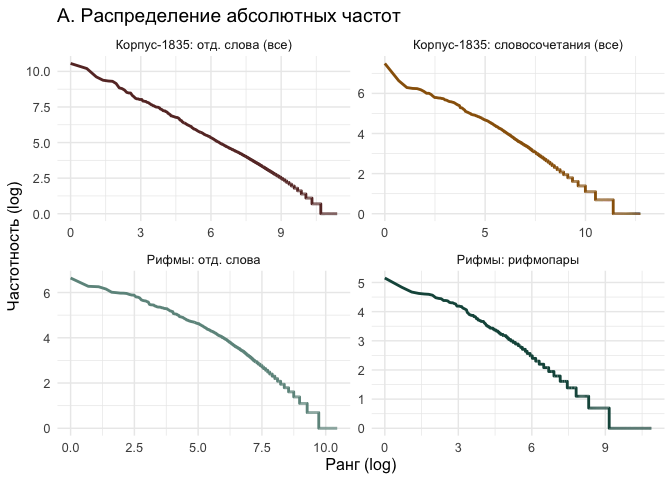

# 05_3_rhyme_bigrams

### load pckg

``` r
library(tidyverse)
library(tidytext)

library(MetBrewer)
theme_set(theme_minimal())
```

### load data

#### Corpus-1835

``` r
rhymes_1835 <- read.csv("../../data/ch5/rhymes_parsed.csv") %>% 
  select(-X) %>% distinct() %>% # fix bag 
  mutate(corpus = "M",
         id = str_remove(id, "M__")) %>% 
  # fix lowering everything
  mutate(rhyme_alph = tolower(rhyme_alph),
         rhyme_pair = tolower(rhyme_pair),
         from = tolower(from),
         to = tolower(to)) %>% 
  # fix typo
  mutate(from = ifelse(from == "искуства", "искусства", from),
         to = ifelse(to == "искуства", "искусства", to))

glimpse(rhymes_1835)
```

    Rows: 81,334
    Columns: 10
    $ id         <chr> "P_1938", "P_1938", "P_1938", "C_156__20", "C_156__20", "C_…
    $ rhyme_pair <chr> "краса небеса", "огневым земным", "красавицей красавице", "…
    $ from       <chr> "краса", "огневым", "красавицей", "око", "силки", "стонет",…
    $ to         <chr> "небеса", "земным", "красавице", "высоко", "легки", "догони…
    $ from_feats <chr> "S,жен,неод=им,ед", "S,фам,муж,од=(дат,мн|твор,ед)", "S,жен…
    $ from_pos   <chr> "S", "S", "S", "S", "S", "V", "S", "S", "S", "S", "APRO", "…
    $ to_feats   <chr> "S,сред,неод=(вин,мн|им,мн)", "A=(дат,мн,полн|твор,ед,полн,…
    $ to_pos     <chr> "S", "A", "S", "ADV", "A", "V", "S", "A", "S", "S", "SPRO",…
    $ rhyme_alph <chr> "краса небеса", "земным огневым", "красавице красавицей", "…
    $ corpus     <chr> "M", "M", "M", "M", "M", "M", "M", "M", "M", "M", "M", "M",…

#### Corpus-1835 metadata

``` r
corpus_1835 <- readRDS("../../data/corpus1835/corpus_1835.Rds")

# attach year to rhyme data
rhymes_1835 <- rhymes_1835 %>% 
  left_join(corpus_1835 %>% 
              select(text_id, year) %>% 
              rename(id = text_id),
              by = "id"
              )
```

    Warning in left_join(., corpus_1835 %>% select(text_id, year) %>% rename(id = text_id), : Detected an unexpected many-to-many relationship between `x` and `y`.
    ℹ Row 2118 of `x` matches multiple rows in `y`.
    ℹ Row 1014 of `y` matches multiple rows in `x`.
    ℹ If a many-to-many relationship is expected, set `relationship =
      "many-to-many"` to silence this warning.

``` r
# select & reorder columns for merge
rhymes_1835 <- rhymes_1835 %>% 
  select(corpus, id, year, rhyme_pair, rhyme_alph, from, to)
```

#### RNC

``` r
# load already parsed data
rnc_rhymes <- read.csv("../../data/ch5/rnc_rhymes.csv") %>% select(-X)

rnc_rhymes <- rnc_rhymes %>% 
  mutate(poem_id = str_replace(poem_id, "RNC_", "RNC__")) %>% 
  separate(poem_id, into = c("corpus", "id"), sep = "__") %>% 
  separate(id, into = c("id", "year"), sep = "_") 

glimpse(rnc_rhymes)
```

    Rows: 146,159
    Columns: 11
    $ corpus     <chr> "RNC", "RNC", "RNC", "RNC", "RNC", "RNC", "RNC", "RNC", "RN…
    $ id         <chr> "3870", "3870", "3870", "3870", "7600", "7600", "7600", "76…
    $ year       <chr> "1777", "1777", "1777", "1777", "1832", "1832", "1832", "18…
    $ rhyme_pair <chr> "Кантемир сатир", "равнялись пленялись", "блистал стал", "н…
    $ from       <chr> "Кантемир", "равнялись", "блистал", "находился", "вечно", "…
    $ to         <chr> "сатир", "пленялись", "стал", "дивился", "бесконечно", "обм…
    $ from_upos  <chr> "NOUN", "VERB", "VERB", "VERB", "ADV", "VERB", "NOUN", "NOU…
    $ from_feats <chr> "Animacy=Anim|Case=Nom|Gender=Masc|Number=Sing", "Animacy=I…
    $ to_upos    <chr> "NOUN", "VERB", "VERB", "VERB", "ADV", "VERB", "ADJ", "NOUN…
    $ to_feats   <chr> "Animacy=Anim|Case=Nom|Gender=Masc|Number=Sing", "Animacy=I…
    $ rhyme_alph <chr> "Кантемир сатир", "пленялись равнялись", "блистал стал", "д…

``` r
rnc_rhymes <- rnc_rhymes %>% 
  # select & reorder columns for merge
  select(corpus, id, year, rhyme_pair, rhyme_alph, from, to)
```

Merge two corpora

``` r
rhymes <- rbind(rhymes_1835, rnc_rhymes)

glimpse(rhymes)
```

    Rows: 227,519
    Columns: 7
    $ corpus     <chr> "M", "M", "M", "M", "M", "M", "M", "M", "M", "M", "M", "M",…
    $ id         <chr> "P_1938", "P_1938", "P_1938", "C_156__20", "C_156__20", "C_…
    $ year       <chr> "1840", "1840", "1840", "1837", "1837", "1837", "1837", "18…
    $ rhyme_pair <chr> "краса небеса", "огневым земным", "красавицей красавице", "…
    $ rhyme_alph <chr> "краса небеса", "земным огневым", "красавице красавицей", "…
    $ from       <chr> "краса", "огневым", "красавицей", "око", "силки", "стонет",…
    $ to         <chr> "небеса", "земным", "красавице", "высоко", "легки", "догони…

``` r
table(rhymes$corpus) # quick check in the number of rhymes found
```


         M    RNC 
     81360 146159 

### table 5-1-1: Pull top 5 rhymes in each year

``` r
total_year <- rhymes_1835 %>% 
  count(year)

total_year
```

      year     n
    1 1835 17768
    2 1836 11237
    3 1837 16656
    4 1838 14217
    5 1839  8633
    6 1840 12849

``` r
rhymes_1835 %>% 
  group_by(year) %>% 
  count(rhyme_alph, sort = T) %>% 
  mutate(rank = row_number()) %>% 
  top_n(n, n = 10) %>% 
  arrange(-desc(year)) %>% 
  ungroup() %>% 
  left_join(total_year %>% rename(total = n), by = "year") %>% 
  mutate(perc = round((n / total) * 100, 2)) 
```

    # A tibble: 67 × 6
       year  rhyme_alph       n  rank total  perc
       <chr> <chr>        <int> <int> <int> <dbl>
     1 1835  нет свет        44     1 17768  0.25
     2 1835  ночи очи        32     2 17768  0.18
     3 1835  нас час         24     3 17768  0.14
     4 1835  меня огня       23     4 17768  0.13
     5 1835  мечты ты        23     5 17768  0.13
     6 1835  вновь любовь    22     6 17768  0.12
     7 1835  глас час        21     7 17768  0.12
     8 1835  дней моей       19     8 17768  0.11
     9 1835  дня меня        19     9 17768  0.11
    10 1835  грудь путь      18    10 17768  0.1 
    # ℹ 57 more rows

``` r
rhymes_1835 %>% 
  group_by(year) %>% 
  count(rhyme_alph, sort = T) %>% 
  mutate(rank = row_number()) %>% 
  top_n(n, n = 5) %>% 
  arrange(-desc(year)) %>% 
  ungroup() %>% 
  left_join(total_year %>% rename(total = n), by = "year") %>% 
  mutate(perc = round((n / total) * 100, 2)) %>% 
  group_by(year) %>%
  summarise(
    sum_perc = sum(perc))
```

    # A tibble: 6 × 2
      year  sum_perc
      <chr>    <dbl>
    1 1835      0.83
    2 1836      1.12
    3 1837      0.7 
    4 1838      1.09
    5 1839      1.08
    6 1840      1.05

## Fig. 5-1-1. Bigram freq

Count frequencies in Corpus-1835 in general

``` r
# count unigram frequencies
unigram_freq_full <- corpus_1835 %>% 
  unnest_tokens(input = text_raw, output = word, token = "words") %>% 
  group_by(word) %>% 
  count(sort = T) %>% 
  mutate(group = "Корпус-1835: отд. слова")

# count bigram frequencies
bigram_freq_full <- corpus_1835 %>% 
  unnest_tokens(input = text_raw, output = bigram, token = "ngrams", n = 2) %>% 
  group_by(bigram) %>% 
  count(sort = T) %>% 
  mutate(group = "Корпус-1835: биграммы")
```

Count unigram & bigram freq in rhyme data

``` r
unigram_freq_rhymes <- rhymes_1835 %>% 
  unnest_tokens(input = rhyme_pair, output = word, token = "words") %>% 
  group_by(word) %>% 
  count(sort = T) %>% 
  mutate(group = "Рифмы: отд. слова")

bigram_freq_rhymes <- rhymes_1835 %>% 
  group_by(rhyme_pair) %>% 
  count(sort = T) %>% 
  rename(bigram = rhyme_pair) %>% 
  mutate(group = "Рифмы: биграммы")
```

Plot

``` r
rbind(unigram_freq_full, unigram_freq_rhymes,
      bigram_freq_full, bigram_freq_rhymes) %>% 
  group_by(group) %>% 
  mutate(rank = row_number()) %>% 
  slice_head(n = 1000) %>% 
  ggplot(aes(x = rank, y = n, group = group, color = group)) + 
  geom_line() + 
  facet_wrap(~group, scales = "free") + 
  theme(legend.position = "None") + 
  labs(x = "Ранг", y = "Частотность") + 
  scale_color_manual(values = c(met.brewer(name = "Veronese")[1],
                                met.brewer(name = "Veronese")[2],
                                met.brewer(name = "Veronese")[4],
                                met.brewer(name = "Veronese")[6])) + 
  
  # fill the area under the curve with colour
  geom_area(aes(fill = group, group = group), alpha = 0.3) + 
  scale_fill_manual(values = c(met.brewer(name = "Veronese")[1],
                                met.brewer(name = "Veronese")[2],
                                met.brewer(name = "Veronese")[4],
                                met.brewer(name = "Veronese")[6])) + 
  theme(text = element_text(size = 12))
```


``` r
ggsave("plots/fig_5-1-1.png", plot = last_plot(), dpi = 300,
       width = 8, height = 6, bg = "white")
```

Q: would it be feasible to try to fit the zipfR model ?

<https://zipfr.r-forge.r-project.org>

Number of rhymes found in the two corpora is very different (considerbly
more texts in corpus-1835 for the respective years)

``` r
rhymes %>% 
  filter(year %in% c("1835", "1836", "1837", "1838", "1839", "1840")) %>% 
  count(year, corpus) %>% 
  ggplot(aes(x = year, y = n, fill = corpus)) + 
  geom_col(position = "dodge") + 
  scale_fill_manual(values = c(met.brewer(name = "Veronese")[4],
                               met.brewer(name = "Veronese")[7]))
```


## Hapax richness

Percentage of hapax legomena overall

``` r
rhymes %>% 
  group_by(corpus, rhyme_alph) %>% 
  count(sort = T) %>% 
  filter(n == 1) %>% 
  ungroup() %>% 
  count(corpus) %>% 
  mutate(perc_rnc = round((n / nrow(rnc_rhymes)) * 100, 2),
         perc_1835 = round((n / nrow(rhymes_1835)) * 100, 2))
```

    # A tibble: 2 × 4
      corpus     n perc_rnc perc_1835
      <chr>  <int>    <dbl>     <dbl>
    1 M      44026     30.1      54.1
    2 RNC    76086     52.1      93.5

Number of hapax legomena in each 5-year period in RNC

``` r
library(wesanderson)

total_count <- rnc_rhymes %>% 
  mutate(decade = floor( as.numeric(year) / 5) * 5) %>% 
  count(decade) %>% 
  rename(Total = n)

rnc_rhymes %>% 
  mutate(decade = floor( as.numeric(year) / 5) * 5) %>% 
  select(rhyme_pair, decade) %>% 
  distinct() %>%
  count(decade) %>% 
  rename(`Unique rhymes` = n) %>% 
  left_join(total_count, by = "decade") %>% 
  pivot_longer(!decade, names_to = "group") %>% 
  ggplot(aes(x = decade, y = value, fill = group)) +
    geom_col(width = 3, position = "dodge") +
    scale_fill_manual(values = c(wes_palette("Royal1")[1],
                                 wes_palette("Royal1")[2])) + 
    scale_x_continuous(breaks = seq(1775, 1845, 10)) +
    labs(
         y = "Number of rhymes detected",
         fill = "",
         title = "Number of rhymes per period",
         subtitle = "Canonical corpus") + 
  theme(legend.position = "bottom",
        axis.title.x = element_blank(),
        legend.text = element_text(size = 14))
```


Hapax richness in each year in corpus-1835

``` r
# count number of hapaxes only
hapax_per_year <- rhymes_1835 %>% 
  group_by(year) %>% 
  count(rhyme_alph) %>% 
  ungroup() %>% 
  filter(n == 1) %>% 
  count(year) %>% 
  rename(hapax = n)

head(hapax_per_year)
```

    # A tibble: 6 × 2
      year  hapax
      <chr> <int>
    1 1835  12587
    2 1836   8373
    3 1837  12275
    4 1838   9788
    5 1839   6662
    6 1840   9277

``` r
# total number of rhymes
total <- rhymes_1835 %>% 
  group_by(year) %>% 
  count(rhyme_alph) %>% 
  ungroup() %>% 
  count(year) %>% 
  rename(total = n)

# % of hapaxes
hapax_archive <- hapax_per_year %>% 
  left_join(total, by = "year") %>% 
  mutate(perc_archive = round( (hapax / total)*100, 1 ),
         year = as.character(year))

hapax_archive
```

    # A tibble: 6 × 4
      year  hapax total perc_archive
      <chr> <int> <int>        <dbl>
    1 1835  12587 14244         88.4
    2 1836   8373  9362         89.4
    3 1837  12275 13773         89.1
    4 1838   9788 11257         87  
    5 1839   6662  7352         90.6
    6 1840   9277 10463         88.7

``` r
# Discard unused vars
rm(bigram_freq_full, bigram_freq_rhymes, hapax_archive, hapax_per_year,
   total, total_count, unigram_freq_full, unigram_freq_rhymes)
```

## Fig. 5-1-2. RNC / C1835 - Random samples rhyme intersection

Select only rhymes before year 1830 from canonic corpus

``` r
rnc_rhymes_before1830 <- rnc_rhymes %>% 
  filter(as.numeric(year) < 1830)
```

Run loop that will take 100 random samples from each year of Corpus-1835
and compare it with the full set of rhymes from RNC

``` r
x_1 <- NULL
x_2 <- NULL
year_count <- NULL
perc_intersect <- NULL

random <- NULL
df <- NULL


for (j in 1:100) { # take 100 random samples for each year
  
  for (i in 1:length(unique(rhymes_1835$year))) {
  
    y <- unique(rhymes_1835$year)[i]
    year_count[i] <- y
  
    # select all unique rhymes from canonic corpus before 1830
    x_1 <- rnc_rhymes_before1830 %>% 
      #filter(as.numeric(year) < as.numeric(y)) %>% 
      select(rhyme_alph) %>% 
      distinct() %>% 
      pull(rhyme_alph)
    
    # take 100 random rhymes from corpus-1835
    x_2 <- rhymes_1835 %>% 
      filter(as.numeric(year) %in% as.numeric(y)) %>% 
      select(rhyme_alph) %>% 
      distinct() %>% 
      sample_n(100) %>% 
      pull(rhyme_alph)
    
    # length(x_1) # all rhymes before year x
    # length(x_2) # 100 random unique rhymes
    
    # count number of intersections
    test <- length(intersect(x_1, x_2))
    # length(test)
  
    perc_intersect[i] <- test
  }
  
  random <- tibble(
      a = j,
      year_count = unlist(year_count),
      n = unlist(perc_intersect))
  
    df <- rbind(df, random)
}

head(df)
```

    # A tibble: 6 × 3
          a year_count     n
      <int> <chr>      <int>
    1     1 1840          34
    2     1 1837          21
    3     1 1838          34
    4     1 1836          34
    5     1 1835          60
    6     1 1839          25

``` r
glimpse(df)
```

    Rows: 600
    Columns: 3
    $ a          <int> 1, 1, 1, 1, 1, 1, 2, 2, 2, 2, 2, 2, 3, 3, 3, 3, 3, 3, 4, 4,…
    $ year_count <chr> "1840", "1837", "1838", "1836", "1835", "1839", "1840", "18…
    $ n          <int> 34, 21, 34, 34, 60, 25, 27, 29, 29, 30, 48, 46, 28, 26, 30,…

``` r
df %>% 
  ggplot(aes(x = as.numeric(year_count), 
             y = n, group = year_count)) + 
  geom_boxplot() + 
  geom_jitter(alpha = 0.3, color = met.brewer(name = "Veronese")[5]) + 
  scale_y_continuous(limits = c(0,100)) + 
  scale_x_continuous(breaks = c(1835:1840)) + 
  labs(x = "Год",
       y = "Число пересечений (из 100 возможных)" #,
       #title = "Количество пересечений", 
       #subtitle = "между случайной выборкой рифм из Корпуса-1835 (100 рифм, 100 итераций)\nи всеми известными рифмами из НКРЯ, датированными до соответствующего года"
       )
```



``` r
ggsave(filename = "plots/fig_5-1-2.png", plot = last_plot(), dpi = 300,
       width = 6, height = 4, bg = "white")
```

Some more analysis for 1835 rhymes? why the mean is so different?

``` r
glimpse(rhymes_1835)
```

    Rows: 81,360
    Columns: 7
    $ corpus     <chr> "M", "M", "M", "M", "M", "M", "M", "M", "M", "M", "M", "M",…
    $ id         <chr> "P_1938", "P_1938", "P_1938", "C_156__20", "C_156__20", "C_…
    $ year       <chr> "1840", "1840", "1840", "1837", "1837", "1837", "1837", "18…
    $ rhyme_pair <chr> "краса небеса", "огневым земным", "красавицей красавице", "…
    $ rhyme_alph <chr> "краса небеса", "земным огневым", "красавице красавицей", "…
    $ from       <chr> "краса", "огневым", "красавицей", "око", "силки", "стонет",…
    $ to         <chr> "небеса", "земным", "красавице", "высоко", "легки", "догони…

``` r
glimpse(corpus_1835)
```

    Rows: 4,799
    Columns: 20
    $ text_id       <chr> "P_1", "P_10", "P_100", "P_1000", "P_1001", "P_1002", "P…
    $ A_ID          <chr> "", "A-50", "A-7", "A-41", "A-139", "A-11", "A-163", "A-…
    $ author_sign   <chr> "", "Л. Якубович", "Кольцов", "Ф. Глинка", "Н. Прокопови…
    $ author_text   <chr> "", "Якубович Л.А.", "Кольцов А.В.", "Глинка Ф.Н.", "Про…
    $ text_title    <chr> "Солдатская песня", "Молния", "Ночлег чумаков", "Утешите…
    $ text_subtitle <chr> "", "", "Сельские картины", "", "", "", "", "", "", "", …
    $ first_line    <chr> "Ох жизнь, молодецкая", "Зачем с небесной высоты", "В бл…
    $ year          <chr> "1835", "1835", "1836", "1838", "1838", "1838", "1838", …
    $ path_text     <chr> "../../data/corpus1835/periodicals/per_raw//P_1.txt", ".…
    $ source_text   <chr> "Сев_пч. 1835. №12. C. 46", "БдЧ. 1835. Т.8. Отд. 1. C. …
    $ COL_ID        <chr> "", "", "", "", "", "", "", "", "", "", "", "", "", "", …
    $ corpus        <chr> "per", "per", "per", "per", "per", "per", "per", "per", …
    $ text_raw      <chr> "Ох, жизнь молодецкая,\nБравая, солдатская!\nКак осенняя…
    $ text_cln      <chr> "Ох, жизнь молодецкая,\nБравая, солдатская!\nКак осенняя…
    $ text_lemm     <chr> "ох, жизнь молодецкий,\nбравый, солдатский!\nкак осенний…
    $ text_acc      <chr> "Ох, жизнь молоде'цкая,\nБра'вая, солда'тская!\nКак осе'…
    $ meter         <fct> Other?, Iamb, Iamb, Iamb, Trochee, Iamb, Trochee, Iamb, …
    $ feet          <chr> "?", "3", "4", "4", "4", "4", "other", "4", "6", "5", "4…
    $ formula       <chr> "Other?_?", "Iamb_3", "Iamb_4", "Iamb_4", "Trochee_4", "…
    $ n_lines       <int> 38, 16, 98, 77, 28, 12, 44, 25, 31, 28, 100, 16, 17, 60,…

``` r
rhymes_1835 %>%
  filter(year == "1835") %>% 
  left_join(corpus_1835 %>% select(text_id, author_text) %>% rename(id = text_id),
            by = "id") %>% 
  count(author_text, sort = T) %>% 
  filter(author_text != "" & n > 50)
```

            author_text    n
    1    Жуковский В.А. 3351
    2       Крылов И.А. 3160
    3  Баратынский Е.А. 1758
    4        Зилов А.М. 1282
    5   Бенедиктов В.Г.  845
    6     Тимофеев А.В.  653
    7       Меркли М.М.  554
    8       Деларю М.Д.  403
    9      Савурский Н.  386
    10      Пушкин А.С.  338
    11        Венгер Н.  279
    12    Геевский С.Л.  255
    13      Менцов Ф.Н.  227
    14       Ершов П.П.  202
    15     Кольцов А.В.  176
    16  Прокопович Н.Я.  175
    17      Глинка Ф.Н.  171
    18      Козлов И.И.  155
    19       Лебедев В.  136
    20     Аксаков К.С.  125
    21     Сорокин М.П.  122
    22   Ознобишин Д.П.  107
    23      Красов В.И.   87
    24     Гогниев И.Е.   86
    25  Ростопчина Е.П.   81
    26      Глинка А.П.   76
    27    Алипанов Е.И.   75
    28      Банников А.   75
    29    Якубович Л.А.   72
    30     Галанин И.Д.   68
    31             П.П.   65
    32               С.   62
    33      Языков Н.М.   56
    34          Е. Ш-ий   54
    35          Лихачев   53
    36      Ставелов Н.   53
    37     Хомяков А.С.   52

There is definitely a bias because of dates incompatibility in RNC &
Corpus-1835 (e.g. reprints of Zhukovsky’s poems included in C-1835 but
also found in RNC before 1830). Perform the same loop without four
canonical most frequent authors.

We can also take into account if the intersected rhyme was in the list
of the most frequent rhymes in general. That would mean that these
rhymes are stable & redundant.

To count which of the top rhymes are repeated: change to \_, paste
rhymes & then count.

``` r
# filter out authors
rhymes_test <- rhymes_1835 %>%
  left_join(corpus_1835 %>% select(text_id, author_text) %>% rename(id = text_id),
            by = "id") %>% 
  filter(!author_text %in% c("Жуковский В.А.", "Крылов И.А.", "Баратынский Е.А.",
                             "Пушкин А.С.")) %>% 
  mutate(rhyme_alph = str_replace(rhyme_alph, " ", "_"))
```

    Warning in left_join(., corpus_1835 %>% select(text_id, author_text) %>% : Detected an unexpected many-to-many relationship between `x` and `y`.
    ℹ Row 2118 of `x` matches multiple rows in `y`.
    ℹ Row 1014 of `y` matches multiple rows in `x`.
    ℹ If a many-to-many relationship is expected, set `relationship =
      "many-to-many"` to silence this warning.

``` r
rnc_rhymes_before1830 <- rnc_rhymes_before1830 %>% 
  mutate(rhyme_alph = str_replace(rhyme_alph, " ", "_"))

# count most freq rhymes
top_rnc <- rnc_rhymes_before1830 %>% 
  count(rhyme_alph, sort = T) 

head(top_rnc)
```

        rhyme_alph   n
    1     нет_свет 167
    2      нас_час 124
    3  век_человек 121
    4    день_тень 119
    5 кровь_любовь 118
    6        моя_я 116

``` r
top_rnc %>% pull(n) %>% quantile(c(0.5, 0.9, 0.95, 0.98, 0.99, 0.991, 1))
```

      50%   90%   95%   98%   99% 99.1%  100% 
        1     2     3     6     9    10   167 

``` r
top_rnc_rhymes <- top_rnc %>% 
  filter(n > 9) %>% 
  pull(rhyme_alph)

print(paste("Length of the vector of rhymes appearing more than 10 times:", 
            length(top_rnc_rhymes))) 
```

    [1] "Length of the vector of rhymes appearing more than 10 times: 643"

``` r
# loop

x_1 <- NULL
x_2 <- NULL
year_count <- NULL
perc_intersect <- NULL
perc_top <- NULL
top_counter <- NULL

t <- NULL
random <- NULL
df <- NULL


for (j in 1:100) { # take 100 random samples for each year
  
  for (i in 1:length(unique(rhymes_test$year))) {
  
    y <- unique(rhymes_test$year)[i]
    year_count[i] <- y
  
    # select all unique rhymes from canonic corpus before 1830
    x_1 <- rnc_rhymes_before1830 %>% 
      #filter(as.numeric(year) < as.numeric(y)) %>% 
      select(rhyme_alph) %>% 
      distinct() %>% 
      pull(rhyme_alph)
    
    # take 100 random rhymes from corpus-1835
    x_2 <- rhymes_test %>% 
      filter(as.numeric(year) %in% as.numeric(y)) %>% 
      select(rhyme_alph) %>% 
      distinct() %>% 
      sample_n(100) %>% 
      pull(rhyme_alph)
    
    # length(x_1) # all rhymes before year x
    # length(x_2) # 100 random unique rhymes
    
    # count number of intersections
    test <- length(intersect(x_1, x_2))
    # length(test)
  
    perc_intersect[i] <- test
    
    t <- intersect(x_1, x_2)
    perc_top[i] <- length(intersect(t, top_rnc_rhymes))
    top_counter[i] <- paste(intersect(t, top_rnc_rhymes), collapse = " ")
    
  }
  
  random <- tibble(
      a = j,
      year_count = unlist(year_count),
      n = unlist(perc_intersect),
      perc_top = unlist(perc_top),
      rhymes_top = unlist(top_counter))
  
    df <- rbind(df, random)
}

head(df)
```

    # A tibble: 6 × 5
          a year_count     n perc_top rhymes_top                                    
      <int> <chr>      <int>    <int> <chr>                                         
    1     1 1840          33        6 его_моего ночи_очи судьбою_тобою мести_чести …
    2     1 1837          29        5 закон_трон ней_своей волны_полны мою_свою вер…
    3     1 1838          35        6 вышине_мне там_храм дней_страстей власти_стра…
    4     1 1836          24        4 быть_любить меня_стеня ненастье_счастье он_ст…
    5     1 1835          34        6 бывало_мало боле_воле небесам_там мне_тишине …
    6     1 1839          34        8 быть_любить будь_грудь себе_тебе меня_огня со…

``` r
glimpse(df)
```

    Rows: 600
    Columns: 5
    $ a          <int> 1, 1, 1, 1, 1, 1, 2, 2, 2, 2, 2, 2, 3, 3, 3, 3, 3, 3, 4, 4,…
    $ year_count <chr> "1840", "1837", "1838", "1836", "1835", "1839", "1840", "18…
    $ n          <int> 33, 29, 35, 24, 34, 34, 30, 19, 40, 38, 33, 38, 28, 17, 30,…
    $ perc_top   <int> 6, 5, 6, 4, 6, 8, 5, 1, 3, 2, 5, 5, 2, 2, 4, 5, 5, 7, 4, 3,…
    $ rhymes_top <chr> "его_моего ночи_очи судьбою_тобою мести_чести мне_стране не…

Look into the top-freq RNC pairs which were found in trials most
frequently

``` r
# top rhymes
df %>% 
  select(rhymes_top) %>% 
  separate_rows(rhymes_top, sep = " ") %>% 
  count(rhymes_top, sort = T) %>% 
  head(20)
```

    # A tibble: 20 × 2
       rhymes_top        n
       <chr>         <int>
     1 раз_час          15
     2 вод_свод         12
     3 красота_мечта    12
     4 красота_уста     12
     5 меня_огня        12
     6 битвы_молитвы    11
     7 венца_певца      11
     8 гроба_злоба      11
     9 дней_своей       11
    10 дни_они          11
    11 души_тиши        11
    12 меня_я           11
    13 моей_своей       11
    14 мой_твой         11
    15 он_сон           11
    16 очи_полуночи     11
    17 розы_слезы       11
    18 вас_нас          10
    19 взор_укор        10
    20 воле_поле        10

``` r
# distribution
df %>% 
  select(rhymes_top) %>% 
  separate_rows(rhymes_top, sep = " ") %>% 
  count(rhymes_top, sort = T) %>% 
  mutate(rank = row_number()) %>% 
  ggplot(aes(x = rank, y = n)) + geom_col() + theme(axis.text.x = element_blank())
```


Create a boxplot for percentage of intersections

``` r
glimpse(df)
```

    Rows: 600
    Columns: 5
    $ a          <int> 1, 1, 1, 1, 1, 1, 2, 2, 2, 2, 2, 2, 3, 3, 3, 3, 3, 3, 4, 4,…
    $ year_count <chr> "1840", "1837", "1838", "1836", "1835", "1839", "1840", "18…
    $ n          <int> 33, 29, 35, 24, 34, 34, 30, 19, 40, 38, 33, 38, 28, 17, 30,…
    $ perc_top   <int> 6, 5, 6, 4, 6, 8, 5, 1, 3, 2, 5, 5, 2, 2, 4, 5, 5, 7, 4, 3,…
    $ rhymes_top <chr> "его_моего ночи_очи судьбою_тобою мести_чести мне_стране не…

``` r
df %>% 
  select(-rhymes_top, -a) %>% 
  pivot_longer(!year_count) %>% 
  mutate(name = ifelse(name == "n", "Всего пересечений", "Пересечений среди частотных рифм НКРЯ")) %>% 
  ggplot(aes(x = as.factor(year_count), 
             y = value, color = name)) + 
  
  geom_boxplot(position = "dodge") + 
  
  geom_point(position = position_jitterdodge(), alpha = 0.2) + 
  
  scale_color_manual(values = c(met.brewer("Veronese")[5],
                                met.brewer("Veronese")[3])) + 
  expand_limits(y = c(0, 100)) + 
  labs(x = "Год", 
       y = "Число пересечений (из 100 возможных)",
       color = "") +
  theme(legend.position = "bottom", 
        axis.text = element_text(size = 10),
        axis.title = element_text(size = 12),
        legend.text = element_text(size = 12))
```


``` r
ggsave(filename = "plots/fig_5-1-2.png", plot = last_plot(), dpi = 300,
       width = 8, height = 6, bg = "white")
```

``` r
# earlier version of the plot
# df
#   ggplot(aes(x = as.numeric(year_count), 
#              y = n, group = year_count)) + 
#   geom_boxplot(color = met.brewer("Veronese")[7]) + 
#   geom_jitter(alpha = 0.3, color = met.brewer(name = "Veronese")[5]) + 
#   
#   geom_boxplot(data = df, 
#                aes(x = as.numeric(year_count), 
#                    y = perc_top, 
#                    group = year_count), 
#                color = met.brewer("Veronese")[1]) + 
#   geom_jitter(data = df, aes(x = as.numeric(year_count), 
#                              y = perc_top, group = year_count), 
#               colour = met.brewer("Veronese")[3], alpha = 0.2) + 
#   scale_y_continuous(limits = c(0,100)) + 
#   scale_x_continuous(breaks = c(1835:1840)) + 
#   labs(x = "Год",
#        y = "Число пересечений (из 100 возможных)" #,
#        #title = "Количество пересечений", 
#        #subtitle = "между случайной выборкой рифм из Корпуса-1835 (100 рифм, 100 итераций)\nи всеми известными рифмами из НКРЯ, датированными до соответствующего года"
#        )
```

## Kendall rank cor

How much rankings within language are similar to those in rhyme freq

### inline freq

Calculate frequency of words which are not in rhyme position

``` r
inline_freq <- corpus_1835 %>% 
  select(text_raw) %>% 
  separate_rows(text_raw, sep = "\n") %>% 
  
  # remove last word in a line
  
  # remove lines with no words
  filter(text_raw != "" & !str_detect(text_raw, "^[[:punct:]]+$|^[[:space:]]+$")) %>% 
  # remove spaced & punctuation in the end of the line
  mutate(text_cln = str_remove_all(text_raw, "\\W+$|\\s+$"),
         # replace the last word as endword tag
         text_cln = str_replace_all(text_cln, "\\w+$", "_ENDWORD_")) %>% 
  select(text_cln) %>% 
  # remove endword tags
  mutate(text_cln = str_remove_all(text_cln, "_ENDWORD_")) %>% 
  
  # count remaining words
  unnest_tokens(input = text_cln, output = word, token = "words") %>% 
  count(word, sort = T) %>% 
  mutate(rank_inline = row_number())

head(inline_freq)
```

    # A tibble: 6 × 3
      word      n rank_inline
      <chr> <int>       <int>
    1 и     38458           1
    2 в     26917           2
    3 не    14983           3
    4 на    11841           4
    5 с     11214           5
    6 я     10187           6

### rhyme words freq

``` r
rhyme_freq <- rhymes_1835 %>% 
  unnest_tokens(input = rhyme_pair, output = word, token = "words") %>% 
  count(word, sort = T) %>% 
  mutate(rank_rhyme = row_number())

head(rhyme_freq)
```

      word   n rank_rhyme
    1    я 764          1
    2 меня 524          2
    3  она 514          3
    4 свет 467          4
    5  мне 403          5
    6 моей 401          6

### ranks cor test

Comparison of ranked lists demonstration (tau max = 1, tau min = -1):

``` r
cor.test(c(1,2,3,4,5), c(1,2,3,4,5), method = "kendall")
```


        Kendall's rank correlation tau

    data:  c(1, 2, 3, 4, 5) and c(1, 2, 3, 4, 5)
    T = 10, p-value = 0.01667
    alternative hypothesis: true tau is not equal to 0
    sample estimates:
    tau 
      1 

``` r
cor.test(c(1,2,3,4,5), c(3,2,5,1,4), method = "kendall")
```


        Kendall's rank correlation tau

    data:  c(1, 2, 3, 4, 5) and c(3, 2, 5, 1, 4)
    T = 5, p-value = 1
    alternative hypothesis: true tau is not equal to 0
    sample estimates:
    tau 
      0 

``` r
cor.test(c(1,2,3,4,5), c(5,4,3,2,1), method = "kendall")
```


        Kendall's rank correlation tau

    data:  c(1, 2, 3, 4, 5) and c(5, 4, 3, 2, 1)
    T = 0, p-value = 0.01667
    alternative hypothesis: true tau is not equal to 0
    sample estimates:
    tau 
     -1 

#### mfw 100

``` r
mfw_100_rhyme <- rhyme_freq %>% 
  head(100) %>% 
  select(-n) %>% 
  left_join(inline_freq %>% select(-n), by = "word") %>% 
  drop_na()

cor.test(mfw_100_rhyme$rank_rhyme, mfw_100_rhyme$rank_inline, method = "kendall")
```


        Kendall's rank correlation tau

    data:  mfw_100_rhyme$rank_rhyme and mfw_100_rhyme$rank_inline
    z = 4.622, p-value = 3.8e-06
    alternative hypothesis: true tau is not equal to 0
    sample estimates:
          tau 
    0.3135354 

``` r
mfw_100_rhyme %>% 
  arrange(-desc(rank_rhyme)) %>% 
  head(25)
```

         word rank_rhyme rank_inline
    1       я          1           6
    2    меня          2          43
    3     она          3          45
    4    свет          4         119
    5     мне          5          13
    6    моей          6          95
    7     нет          7          33
    8      ты          8           8
    9   тобой          9         169
    10  мечты         10         230
    11     он         11           9
    12   мной         12         219
    13  людей         13         221
    14  своей         14         120
    15   дней         15         256
    16    мой         16          27
    17  душой         17         305
    18    моя         18         111
    19    лет         19         296
    20 любовь         20         115
    21    час         21         103
    22  тобою         22         332
    23   мною         23         393
    24  любви         24          73
    25    очи         25         196

``` r
nrow(mfw_100_rhyme)
```

    [1] 100

#### mfw 1000

``` r
mfw_1000_rhyme <- rhyme_freq %>% 
  head(1000) %>% 
  select(-n) %>% 
  left_join(inline_freq %>% select(-n), by = "word") %>% 
  drop_na()

head(mfw_1000_rhyme)
```

      word rank_rhyme rank_inline
    1    я          1           6
    2 меня          2          43
    3  она          3          45
    4 свет          4         119
    5  мне          5          13
    6 моей          6          95

``` r
cor.test(mfw_1000_rhyme$rank_rhyme, mfw_1000_rhyme$rank_inline, method = "kendall")
```


        Kendall's rank correlation tau

    data:  mfw_1000_rhyme$rank_rhyme and mfw_1000_rhyme$rank_inline
    z = 16.98, p-value < 2.2e-16
    alternative hypothesis: true tau is not equal to 0
    sample estimates:
          tau 
    0.3591296 

#### mfw 10000

``` r
mfw_10000_rhyme <- rhyme_freq %>% 
  head(10000) %>% 
  select(-n) %>% 
  left_join(inline_freq %>% select(-n), by = "word") %>% 
  drop_na()

cor.test(mfw_10000_rhyme$rank_rhyme, mfw_10000_rhyme$rank_inline, method = "kendall")
```


        Kendall's rank correlation tau

    data:  mfw_10000_rhyme$rank_rhyme and mfw_10000_rhyme$rank_inline
    z = 55.273, p-value < 2.2e-16
    alternative hypothesis: true tau is not equal to 0
    sample estimates:
          tau 
    0.3932886 

### iamb & trochee cor test separately

#### iamb freq

Calculate inline & rhyme freqs in iambic poems

``` r
iamb_inline_freq <- corpus_1835 %>% 
  filter(meter == "Iamb") %>% 
  select(text_raw) %>% 
  separate_rows(text_raw, sep = "\n") %>% 
  
  # remove last word in a line
  
  # remove lines with no words
  filter(text_raw != "" & !str_detect(text_raw, "^[[:punct:]]+$|^[[:space:]]+$")) %>% 
  # remove spaced & punctuation in the end of the line
  mutate(text_cln = str_remove_all(text_raw, "\\W+$|\\s+$"),
         # replace the last word as endword tag
         text_cln = str_replace_all(text_cln, "\\w+$", "_ENDWORD_")) %>% 
  select(text_cln) %>% 
  # remove endword tags
  mutate(text_cln = str_remove_all(text_cln, "_ENDWORD_")) %>% 
  
  # count remaining words
  unnest_tokens(input = text_cln, output = word, token = "words") %>% 
  count(word, sort = T) %>% 
  mutate(rank_inline = row_number())

head(iamb_inline_freq)
```

    # A tibble: 6 × 3
      word      n rank_inline
      <chr> <int>       <int>
    1 и     25843           1
    2 в     17546           2
    3 не     9979           3
    4 на     7413           4
    5 с      7373           5
    6 я      7025           6

``` r
iamb_rhyme_freq <- rhymes_1835 %>% 
  # filter only iambic poems
  left_join(corpus_1835 %>% select(text_id, meter) %>% rename(id = text_id),
            by = "id") %>% 
  filter(meter == "Iamb") %>% 
  # count words
  unnest_tokens(input = rhyme_pair, output = word, token = "words") %>% 
  count(word, sort = T) %>% 
  mutate(rank_rhyme = row_number())
```

    Warning in left_join(., corpus_1835 %>% select(text_id, meter) %>% rename(id = text_id), : Detected an unexpected many-to-many relationship between `x` and `y`.
    ℹ Row 2118 of `x` matches multiple rows in `y`.
    ℹ Row 1014 of `y` matches multiple rows in `x`.
    ℹ If a many-to-many relationship is expected, set `relationship =
      "many-to-many"` to silence this warning.

``` r
head(iamb_rhyme_freq)
```

       word   n rank_rhyme
    1     я 490          1
    2  свет 323          2
    3  меня 315          3
    4   она 298          4
    5   нет 293          5
    6 тобой 293          6

#### cor texts

``` r
mfw_100_rhyme <- iamb_rhyme_freq %>% 
  head(100) %>% 
  select(-n) %>% 
  left_join(iamb_inline_freq %>% select(-n), by = "word") %>% 
  drop_na()

cor.test(mfw_100_rhyme$rank_rhyme, mfw_100_rhyme$rank_inline, method = "kendall")
```


        Kendall's rank correlation tau

    data:  mfw_100_rhyme$rank_rhyme and mfw_100_rhyme$rank_inline
    z = 4.497, p-value = 6.893e-06
    alternative hypothesis: true tau is not equal to 0
    sample estimates:
          tau 
    0.3050505 

``` r
mfw_100_rhyme %>% 
  arrange(-desc(rank_rhyme)) %>% 
  head(50)
```

           word rank_rhyme rank_inline
    1         я          1           6
    2      свет          2         121
    3      меня          3          40
    4       она          4          36
    5       нет          5          31
    6     тобой          6         148
    7        ты          7           8
    8      моей          8          88
    9     мечты          9         189
    10     дней         10         228
    11       он         11          10
    12     мной         12         213
    13    людей         13         208
    14    своей         14         113
    15      мне         15          13
    16      мой         16          29
    17   любовь         17         105
    18    душой         18         265
    19      час         19         102
    20      лет         20         266
    21    тобою         21         324
    22     мною         22         517
    23  красоты         23        1250
    24    бытия         24        1175
    25    любви         25          71
    26    света         26         442
    27      моя         27         117
    28    собой         28         323
    29    славы         29         260
    30 страстей         30         354
    31    душою         31         453
    32      ней         32          66
    33     поэт         33         237
    34   святой         34         343
    35      сон         35         206
    36      нас         36          64
    37    небес         37         165
    38     взор         38          99
    39     тебя         39          33
    40  природы         40         444
    41    рукой         41         501
    42    грудь         42         125
    43  молодой         43        3054
    44     очей         44         616
    45     твой         45          50
    46    покой         46         508
    47   небеса         47         682
    48      очи         48         393
    49     путь         49         135
    50    поэта         50         483

``` r
nrow(mfw_100_rhyme)
```

    [1] 100

``` r
### --- tests for 1000 and 10 000 MFW --- 
mfw_1000_rhyme <- iamb_rhyme_freq %>% 
  head(1000) %>% 
  select(-n) %>% 
  left_join(iamb_inline_freq %>% select(-n), by = "word") %>% 
  drop_na()

cor.test(mfw_1000_rhyme$rank_rhyme, mfw_1000_rhyme$rank_inline, method = "kendall")
```


        Kendall's rank correlation tau

    data:  mfw_1000_rhyme$rank_rhyme and mfw_1000_rhyme$rank_inline
    z = 15.758, p-value < 2.2e-16
    alternative hypothesis: true tau is not equal to 0
    sample estimates:
          tau 
    0.3346324 

``` r
mfw_1000_rhyme %>% 
  arrange(-desc(rank_rhyme)) %>% 
  tail(25)
```

           word rank_rhyme rank_inline
    965   напев        976        2391
    966   наряд        977        2259
    967  неволе        978        7633
    968     нее        979         437
    969   никак        980        1810
    970  ногами        981        9006
    971   нужды        982        1114
    972    обет        983        1812
    973   огней        984        5836
    974    оком        985        5184
    975   плоды        986        1030
    976   пожар        987        2154
    977 покрова        988        9197
    978     пою        989        2070
    979 пройдет        990         829
    980  прости        991         236
    981 простор        992        3930
    982 родимой        993        2556
    983 роковая        994       22638
    984   ропот        995        1338
    985    роса        996        3948
    986   руках        997         832
    987    руке        998        1002
    988     сад        999         686
    989 селенья       1000       47956

``` r
# 10 000 

mfw_10000_rhyme <- iamb_rhyme_freq %>% 
  head(10000) %>% 
  select(-n) %>% 
  left_join(iamb_inline_freq %>% select(-n), by = "word") %>% 
  drop_na()

cor.test(mfw_10000_rhyme$rank_rhyme, mfw_10000_rhyme$rank_inline, method = "kendall")
```


        Kendall's rank correlation tau

    data:  mfw_10000_rhyme$rank_rhyme and mfw_10000_rhyme$rank_inline
    z = 47.244, p-value < 2.2e-16
    alternative hypothesis: true tau is not equal to 0
    sample estimates:
          tau 
    0.3572304 

``` r
mfw_10000_rhyme %>% 
  arrange(-desc(rank_rhyme)) %>% 
  tail(25)
```

                  word rank_rhyme rank_inline
    7753       насытил       9956       37376
    7754        наташа       9957       19997
    7755        научит       9961       37408
    7756         научу       9962       37409
    7757      находишь       9965       11033
    7758        начала       9968        3548
    7759        началу       9970       11036
    7760         нашло       9973       20022
    7761          небе       9974         235
    7762        небеси       9975       37477
    7763      небесная       9976        1735
    7764       небесно       9977        8948
    7765       небесны       9979        8950
    7766         небом       9982         544
    7767     небосводе       9983       37489
    7768     небрежный       9985       37497
    7769      невестой       9989        4245
    7770       невесту       9990        6606
    7771      невзгоде       9991       37536
    7772     невзначай       9993       14139
    7773    невидимкой       9994       37547
    7774     невидимый       9996        4645
    7775      невинный       9997        4247
    7776 невозвратимых       9998       20061
    7777  невозвратный       9999       37575

#### trochee freqs

``` r
tr_inline_freq <- corpus_1835 %>% 
  filter(meter == "Trochee") %>% 
  select(text_raw) %>% 
  separate_rows(text_raw, sep = "\n") %>% 
  
  # remove last word in a line
  
  # remove lines with no words
  filter(text_raw != "" & !str_detect(text_raw, "^[[:punct:]]+$|^[[:space:]]+$")) %>% 
  # remove spaced & punctuation in the end of the line
  mutate(text_cln = str_remove_all(text_raw, "\\W+$|\\s+$"),
         # replace the last word as endword tag
         text_cln = str_replace_all(text_cln, "\\w+$", "_ENDWORD_")) %>% 
  select(text_cln) %>% 
  # remove endword tags
  mutate(text_cln = str_remove_all(text_cln, "_ENDWORD_")) %>% 
  
  # count remaining words
  unnest_tokens(input = text_cln, output = word, token = "words") %>% 
  count(word, sort = T) %>% 
  mutate(rank_inline = row_number())

head(tr_inline_freq)
```

    # A tibble: 6 × 3
      word      n rank_inline
      <chr> <int>       <int>
    1 и      5639           1
    2 в      4540           2
    3 не     2281           3
    4 на     1939           4
    5 с      1778           5
    6 как    1500           6

``` r
tr_rhyme_freq <- rhymes_1835 %>% 
  # filter only iambic poems
  left_join(corpus_1835 %>% select(text_id, meter) %>% rename(id = text_id),
            by = "id") %>% 
  filter(meter == "Trochee") %>% 
  # count words
  unnest_tokens(input = rhyme_pair, output = word, token = "words") %>% 
  count(word, sort = T) %>% 
  mutate(rank_rhyme = row_number())
```

    Warning in left_join(., corpus_1835 %>% select(text_id, meter) %>% rename(id = text_id), : Detected an unexpected many-to-many relationship between `x` and `y`.
    ℹ Row 2118 of `x` matches multiple rows in `y`.
    ℹ Row 1014 of `y` matches multiple rows in `x`.
    ℹ If a many-to-many relationship is expected, set `relationship =
      "many-to-many"` to silence this warning.

``` r
head(tr_rhyme_freq)
```

      word   n rank_rhyme
    1    я 132          1
    2  она 114          2
    3  мне  95          3
    4 меня  85          4
    5 свет  84          5
    6 моей  71          6

Cor tests

``` r
mfw_100_rhyme <- tr_rhyme_freq %>% 
  head(100) %>% 
  select(-n) %>% 
  left_join(tr_inline_freq %>% select(-n), by = "word") %>% 
  drop_na()

cor.test(mfw_100_rhyme$rank_rhyme, mfw_100_rhyme$rank_inline, method = "kendall")
```


        Kendall's rank correlation tau

    data:  mfw_100_rhyme$rank_rhyme and mfw_100_rhyme$rank_inline
    z = 3.5522, p-value = 0.000382
    alternative hypothesis: true tau is not equal to 0
    sample estimates:
          tau 
    0.2422181 

``` r
mfw_100_rhyme %>% 
  arrange(-desc(rank_rhyme)) %>% 
  head(50)
```

           word rank_rhyme rank_inline
    1         я          1           7
    2       она          2          55
    3       мне          3          14
    4      меня          4          43
    5      свет          5         105
    6      моей          6         112
    7       очи          7         114
    8       моя          8          91
    9      ночи          9         278
    10       он         10           9
    11      лет         11         310
    12    мечты         12         380
    13    людей         13         331
    14    тобой         14         195
    15     очей         15         497
    16       ты         16           8
    17      нет         17          33
    18      мой         18          28
    19    земли         19         222
    20    небес         20         251
    21   небеса         21         978
    22    любви         22          90
    23    собой         23         477
    24    грудь         24          80
    25     море         25          77
    26     мной         26         229
    27   святой         27         766
    28  красоты         28        2889
    29    полна         29        1402
    30    своей         30         158
    31  молодой         31        1098
    32    душой         32         488
    33      нас         33          68
    34    волны         34         106
    35     дней         35         400
    36     путь         36         136
    37     тебя         37          50
    38    горит         38         349
    39     мною         39         416
    40    покой         40         822
    41     взор         42          98
    42    земле         43         207
    43     огня         44        1931
    44 страстей         45         588
    45     луна         46         493
    46      ней         47          58
    47     поет         48         406
    48      сон         49         153
    49     тучи         50         225
    50      мир         51          67

``` r
nrow(mfw_100_rhyme)
```

    [1] 99

``` r
### --- tests for 1000 and 10 000 MFW --- 
mfw_1000_rhyme <- tr_rhyme_freq %>% 
  head(1000) %>% 
  select(-n) %>% 
  left_join(tr_inline_freq %>% select(-n), by = "word") %>% 
  drop_na()

cor.test(mfw_1000_rhyme$rank_rhyme, mfw_1000_rhyme$rank_inline, method = "kendall")
```


        Kendall's rank correlation tau

    data:  mfw_1000_rhyme$rank_rhyme and mfw_1000_rhyme$rank_inline
    z = 13.823, p-value < 2.2e-16
    alternative hypothesis: true tau is not equal to 0
    sample estimates:
          tau 
    0.3065853 

``` r
mfw_1000_rhyme %>% 
  arrange(-desc(rank_rhyme)) %>% 
  tail(25)
```

              word rank_rhyme rank_inline
    883     сладко        971         215
    884      снега        972        4525
    885       снов        973        3234
    886    соловья        974        4539
    887      сталь        975        2498
    888     стекло        976       19467
    889      стоят        977        2504
    890   страдает        978        4589
    891     струей        980       19628
    892      струи        981        1266
    893     судьбы        983         478
    894     твоего        984        4638
    895      твоим        985         544
    896     тоскую        986        3308
    897     трещит        987        7859
    898     тропой        988        7871
    899     трудов        989        7876
    900     тумане        990        3312
    901       тьмы        991        1141
    902       упал        994        3338
    903      устам        996        2551
    904 утомленный        997        4725
    905    участье        998        7999
    906    участья        999        8000
    907      хотел       1000        1019

``` r
# 10 000 

mfw_10000_rhyme <- tr_rhyme_freq %>% 
  head(10000) %>% 
  select(-n) %>% 
  left_join(tr_inline_freq %>% select(-n), by = "word") %>% 
  drop_na()

cor.test(mfw_10000_rhyme$rank_rhyme, mfw_10000_rhyme$rank_inline, method = "kendall")
```


        Kendall's rank correlation tau

    data:  mfw_10000_rhyme$rank_rhyme and mfw_10000_rhyme$rank_inline
    z = 32.796, p-value < 2.2e-16
    alternative hypothesis: true tau is not equal to 0
    sample estimates:
          tau 
    0.3223499 

``` r
mfw_10000_rhyme %>% 
  arrange(-desc(rank_rhyme)) %>% 
  tail(25)
```

                word rank_rhyme rank_inline
    4580    развился       9875       17567
    4581    разврата       9882       17572
    4582      разгар       9888       17578
    4583 раздавались       9897       17602
    4584  раздавался       9898       17603
    4585   раздавить       9899        7181
    4586 разлетелась       9914       17647
    4587     разлука       9922        7194
    4588    разлукой       9923       17669
    4589    разлюбил       9926        4380
    4590     размечу       9937       17692
    4591  разовьется       9946        7203
    4592  разольется       9950        7204
    4593       разом       9952         989
    4594     разрушу       9965       17754
    4595    разрывая       9967       17756
    4596    разумный       9971        7210
    4597 разыгрались       9974       17778
    4598 разыгралось       9975       17779
    4599     райские       9977        4382
    4600      ранняя       9982        7218
    4601    раскажет       9984       17805
    4602  раскатился       9989       17811
    4603  распахнула       9996       17839
    4604   распевает       9998       17842
