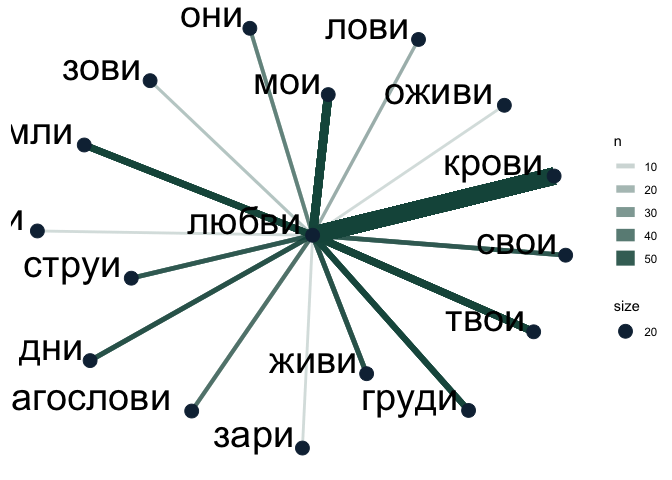
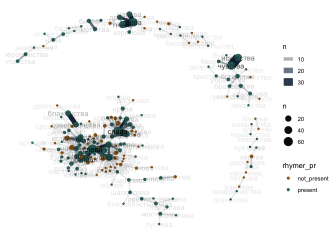
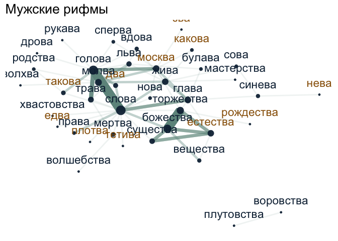
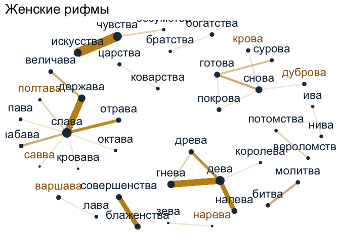
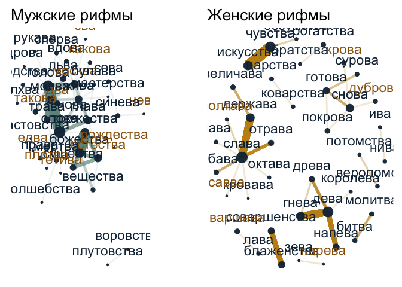
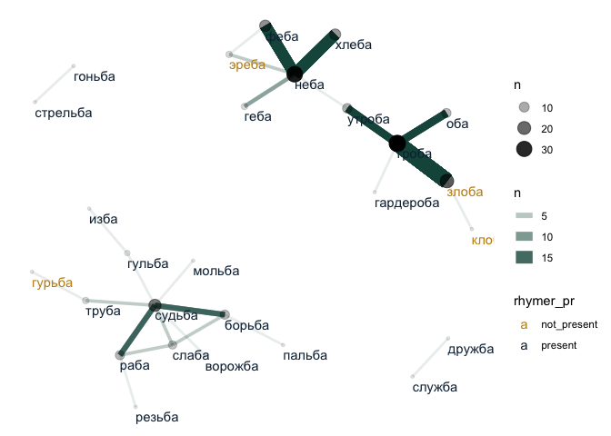
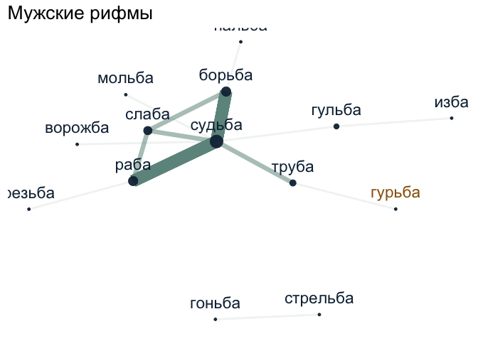
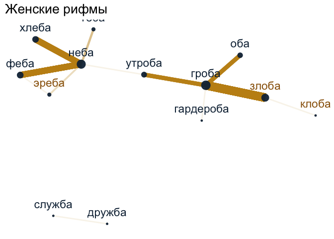
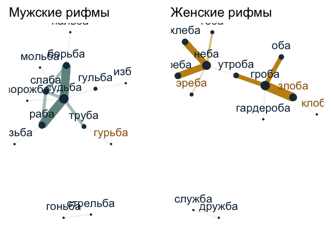

# 05_3_rhymes_freq

### load pckg

``` r
library(tidyverse)
library(tidytext)

# library(igraph)
library(tidygraph)
library(ggraph)

library(MetBrewer)
library(patchwork)
theme_set(theme_minimal())
```

### load data

``` r
rhymes <- read.csv("../../data/ch5/rhymes_parsed_closure.csv") %>% 
  select(-X) %>% 
  distinct() %>%  # if redubplicated for some reason
  mutate(rhyme_alph = tolower(rhyme_alph),
         rhyme_pair = tolower(rhyme_pair),
         from = tolower(from),
         to = tolower(to)) %>% 
  # fix typo
  mutate(from = ifelse(from == "искуства", "искусства", from),
         to = ifelse(to == "искуства", "искусства", to))

glimpse(rhymes)
```

    Rows: 81,334
    Columns: 13
    $ id                   <chr> "M__P_1938", "M__P_1938", "M__P_1938", "M__C_156_…
    $ rhyme_pair           <chr> "краса небеса", "огневым земным", "красавицей кра…
    $ from                 <chr> "краса", "огневым", "красавицей", "око", "силки",…
    $ to                   <chr> "небеса", "земным", "красавице", "высоко", "легки…
    $ from_feats           <chr> "S,жен,неод=им,ед", "S,фам,муж,од=(дат,мн|твор,ед…
    $ from_pos             <chr> "S", "S", "S", "S", "S", "V", "S", "S", "S", "S",…
    $ to_feats             <chr> "S,сред,неод=(вин,мн|им,мн)", "A=(дат,мн,полн|тво…
    $ to_pos               <chr> "S", "A", "S", "ADV", "A", "V", "S", "A", "S", "S…
    $ rhyme_alph           <chr> "краса небеса", "земным огневым", "красавице крас…
    $ from_closure         <chr> "masc", "masc", "dactylic", "fem", "masc", "fem",…
    $ from_closure_pattern <int> 1, 1, 100, 10, 1, 10, 1, 10, 10, 1, 1, 1, NA, 1, …
    $ to_closure           <chr> "masc", "masc", "dactylic", "masc", "masc", "fem"…
    $ to_closure_pattern   <int> 1, 1, 100, 1, 1, 10, 1, 10, 10, 1, 1, 1, NA, 1, 1…

``` r
print(paste("Total number of rhymed texts:", 
            rhymes %>% 
              select(id) %>% distinct() %>% nrow(),
            "\nTotal number of rhymes:", nrow(rhymes)
  ))
```

    [1] "Total number of rhymed texts: 4719 \nTotal number of rhymes: 81334"

Check rhyme detection

``` r
rhymes %>% 
  filter(id == "M__P_1938")
```

             id           rhyme_pair       from        to
    1 M__P_1938         краса небеса      краса    небеса
    2 M__P_1938       огневым земным    огневым    земным
    3 M__P_1938 красавицей красавице красавицей красавице
    4 M__P_1938       стояла мечтала     стояла   мечтала
    5 M__P_1938      мечтала вперяла    мечтала   вперяла
    6 M__P_1938          собою порою      собою     порою
    7 M__P_1938       порою заветную      порою  заветную
                         from_feats from_pos
    1              S,жен,неод=им,ед        S
    2 S,фам,муж,од=(дат,мн|твор,ед)        S
    3              S,жен,од=твор,ед        S
    4  V,несов,нп=прош,ед,изъяв,жен        V
    5  V,несов,нп=прош,ед,изъяв,жен        V
    6                     SPRO=твор     SPRO
    7            S,жен,неод=твор,ед        S
                                                to_feats to_pos
    1                         S,сред,неод=(вин,мн|им,мн)      S
    2 A=(дат,мн,полн|твор,ед,полн,муж|твор,ед,полн,сред)      A
    3                            S,жен,од=(пр,ед|дат,ед)      S
    4                       V,несов,нп=прош,ед,изъяв,жен      V
    5                       V,пе=прош,ед,изъяв,жен,несов      V
    6                                 S,жен,неод=твор,ед      S
    7                                  A=вин,ед,полн,жен      A
                rhyme_alph from_closure from_closure_pattern to_closure
    1         краса небеса         masc                    1       masc
    2       земным огневым         masc                    1       masc
    3 красавице красавицей     dactylic                  100   dactylic
    4       мечтала стояла          fem                   10        fem
    5      вперяла мечтала          fem                   10        fem
    6          порою собою          fem                   10        fem
    7       заветную порою          fem                   10   dactylic
      to_closure_pattern
    1                  1
    2                  1
    3                100
    4                 10
    5                 10
    6                 10
    7                100

Translate POS tags

``` r
unique(c(rhymes$from_pos, rhymes$to_pos))
```

     [1] "S"      "V"      "APRO"   "SPRO"   "A"      "ADV"    "NUM"    "ADVPRO"
     [9] "INTJ"   NA       "PART"   "PR"     "ANUM"   "CONJ"  

``` r
rhymes %>% 
  filter(from_pos == "INTJ") %>% 
  select(from, from_pos, from_feats) %>% 
  sample_n(5)
```

      from from_pos from_feats
    1 боже     INTJ      INTJ=
    2 стоп     INTJ      INTJ=
    3   ах     INTJ      INTJ=
    4  ура     INTJ      INTJ=
    5  ура     INTJ      INTJ=

``` r
# translation based on this descr: https://ruscorpora.ru/page/instruction-morph/ 
pos_transl <- tibble(old_tag = c("S", "V", "APRO", "SPRO", 
                   "A", "ADV", "NUM", "ADVPRO",
                   "INTJ", "PART", "PR", "ANUM", "CONJ"),
       pos = c("NOUN", "VERB", "aPRON", "nPRON", 
               "ADJ", "ADV", "NUM", "advPRON",
               "INTJ", "PART", "ADP", "adjNUM", "CONJ"),
       upos = c("NOUN", "VERB", "PRON", "PRON", 
               "ADJ", "ADV", "NUM", "PRON",
               "INTJ", "PART", "ADP", "NUM", "CONJ"))
```

Metadata

``` r
corpus_1835 <- readRDS("../../data/corpus1835/corpus_1835.Rds")

# attach meter & formula data to rhymes data
rhymes <- rhymes %>% 
  mutate(text_id = str_remove(id, "M__")) %>% 
  left_join(corpus_1835 %>% select(text_id, meter, formula), by = "text_id")
```

    Warning in left_join(., corpus_1835 %>% select(text_id, meter, formula), : Detected an unexpected many-to-many relationship between `x` and `y`.
    ℹ Row 2118 of `x` matches multiple rows in `y`.
    ℹ Row 1014 of `y` matches multiple rows in `x`.
    ℹ If a many-to-many relationship is expected, set `relationship =
      "many-to-many"` to silence this warning.

Import rhymer data

``` r
rhymer <- read_file("../../data/ch5/rhymer.txt")

rhymer <- tibble(word = rhymer) %>% 
  separate_rows(word, sep = "\n") %>% 
  filter(word != "") %>% 
  mutate(word = tolower(word)) 
```

# words

## basic stats

``` r
#glimpse(rhymes)

print(paste("Total number of found rhymes in corpus-1835:", nrow(rhymes)))
```

    [1] "Total number of found rhymes in corpus-1835: 81360"

``` r
print(paste("Number of unique (alph. reordered) rhymes:", length(unique(rhymes$rhyme_alph))))
```

    [1] "Number of unique (alph. reordered) rhymes: 53471"

``` r
# Percent of rhymes with FREQ = 1
n_hapax_legomenas <- rhymes %>% 
  count(rhyme_alph) %>% filter(n == 1) %>% nrow()

print( paste( "Percent of rhymes encountered only once in Corpus-1835:", 
              round((n_hapax_legomenas / nrow(rhymes)) * 100, 2) ))
```

    [1] "Percent of rhymes encountered only once in Corpus-1835: 54.11"

``` r
# total distribution features
print("Distribution of the rhyme bigramm frequencies")
```

    [1] "Distribution of the rhyme bigramm frequencies"

``` r
rhymes %>% 
  count(rhyme_alph) %>% summary()
```

      rhyme_alph              n          
     Length:53471       Min.   :  1.000  
     Class :character   1st Qu.:  1.000  
     Mode  :character   Median :  1.000  
                        Mean   :  1.522  
                        3rd Qu.:  1.000  
                        Max.   :172.000  

``` r
rhymes %>% 
  count(rhyme_alph) %>% pull(n) %>% quantile(c(0.90, 0.95, 0.97, 0.99, 0.991, 1))
```

      90%   95%   97%   99% 99.1%  100% 
        2     3     5     9    10   172 

``` r
print("Number of rhymes enountered more than 9 times (99% percentile)")
```

    [1] "Number of rhymes enountered more than 9 times (99% percentile)"

``` r
rhymes %>% 
  count(rhyme_alph, sort = T) %>% 
  filter(n > 9) %>% 
  nrow()
```

    [1] 533

Examples of top rhymes in Corpus-1835

``` r
rhymes %>% 
  count(rhyme_alph, sort = T) %>% 
  head(30)
```

             rhyme_alph   n
    1          ночи очи 172
    2          нет свет 126
    3        грудь путь 107
    4          мечты ты 101
    5      вновь любовь  99
    6         день тень  99
    7             моя я  90
    8          дня меня  86
    9      кровь любовь  86
    10          бытия я  85
    11          нас час  80
    12           он сон  80
    13        меня огня  79
    14        дней моей  74
    15        души тиши  74
    16         лет свет  73
    17    красоты мечты  72
    18           дум ум  71
    19      век человек  66
    20        горе море  65
    21        лес небес  65
    22      поэта света  65
    23           меня я  64
    24     волны полный  60
    25       звуки муки  60
    26        она полна  60
    27      крови любви  58
    28      мне стороне  54
    29 младость радость  53
    30      даль печаль  52

Example of rhymes with Warsaw

``` r
# glimpse(rhymes)

rhymes %>% 
  filter(str_detect(from, "варшав") | str_detect(to, "варшав"))
```

                 id        rhyme_pair      from        to
    1     M__P_1904 кровавой варшавой  кровавой  варшавой
    2   M__C_142__6     варшава слава   варшава     слава
    3   M__C_142__7  варшава величава   варшава  величава
    4     M__P_1324    варшаву управу   варшаву    управу
    5   M__C_202__2     славы варшавы     славы   варшавы
    6     M__P_1557     славы варшавы     славы   варшавы
    7      M__P_140      варшава пава   варшава      пава
    8      M__P_140     славе варшаве     славе   варшаве
    9        M__P_8     славы варшавы     славы   варшавы
    10       M__P_8      лава варшава      лава   варшава
    11 M__C_101__19     славу варшаву     славу   варшаву
    12  M__C_203__1     славы варшавы     славы   варшавы
    13  M__C_203__1      лава варшава      лава   варшава
    14     M__P_140     нрава варшава     нрава   варшава
    15     M__P_140   варшава варшава   варшава   варшава
    16  M__C_202__4 двуглавый варшавы двуглавый   варшавы
    17  M__C_202__4 варшавы двуглавый   варшавы двуглавый
    18   M__C_91__5     славы варшавы     славы   варшавы
                                                                from_feats from_pos
    1  A=(пр,ед,полн,жен|дат,ед,полн,жен|род,ед,полн,жен|твор,ед,полн,жен)        A
    2                                                 S,гео,жен,неод=им,ед        S
    3                                                 S,гео,жен,неод=им,ед        S
    4                                                S,гео,жен,неод=вин,ед        S
    5                                     S,жен,неод=(вин,мн|род,ед|им,мн)        S
    6                                     S,жен,неод=(вин,мн|род,ед|им,мн)        S
    7                                                 S,гео,жен,неод=им,ед        S
    8                                            S,жен,неод=(пр,ед|дат,ед)        S
    9                                     S,жен,неод=(вин,мн|род,ед|им,мн)        S
    10                                                    S,жен,неод=им,ед        S
    11                                                   S,жен,неод=вин,ед        S
    12                                    S,жен,неод=(вин,мн|род,ед|им,мн)        S
    13                                                    S,жен,неод=им,ед        S
    14                                                   S,муж,неод=род,ед        S
    15                                                S,гео,жен,неод=им,ед        S
    16                                  A,полн=(вин,ед,муж,неод|им,ед,муж)        A
    17                                S,гео,жен,неод=(вин,мн|род,ед|им,мн)        S
    18                                    S,жен,неод=(вин,мн|род,ед|им,мн)        S
                                   to_feats to_pos        rhyme_alph from_closure
    1                S,гео,жен,неод=твор,ед      S варшавой кровавой          fem
    2                      S,жен,неод=им,ед      S     варшава слава          fem
    3                           A=ед,кр,жен      A  варшава величава          fem
    4                     S,жен,неод=вин,ед      S    варшаву управу          fem
    5  S,гео,жен,неод=(вин,мн|род,ед|им,мн)      S     варшавы славы          fem
    6  S,гео,жен,неод=(вин,мн|род,ед|им,мн)      S     варшавы славы          fem
    7                        S,жен,од=им,ед      S      варшава пава          fem
    8         S,гео,жен,неод=(пр,ед|дат,ед)      S     варшаве славе          fem
    9  S,гео,жен,неод=(вин,мн|род,ед|им,мн)      S     варшавы славы          fem
    10                 S,гео,жен,неод=им,ед      S      варшава лава          fem
    11                S,гео,жен,неод=вин,ед      S     варшаву славу          fem
    12 S,гео,жен,неод=(вин,мн|род,ед|им,мн)      S     варшавы славы          fem
    13                 S,гео,жен,неод=им,ед      S      варшава лава          fem
    14                 S,гео,жен,неод=им,ед      S     варшава нрава          fem
    15                 S,гео,жен,неод=им,ед      S   варшава варшава          fem
    16 S,гео,жен,неод=(вин,мн|род,ед|им,мн)      S варшавы двуглавый          fem
    17   A,полн=(вин,ед,муж,неод|им,ед,муж)      A варшавы двуглавый          fem
    18 S,гео,жен,неод=(вин,мн|род,ед|им,мн)      S     варшавы славы          fem
       from_closure_pattern to_closure to_closure_pattern   text_id   meter
    1                    10        fem                 10    P_1904 Trochee
    2                    10        fem                 10  C_142__6    Iamb
    3                    10        fem                 10  C_142__7    Iamb
    4                    10        fem                 10    P_1324 Trochee
    5                    10        fem                 10  C_202__2    Iamb
    6                    10        fem                 10    P_1557    Iamb
    7                    10        fem                 10     P_140 Trochee
    8                    10        fem                 10     P_140 Trochee
    9                    10        fem                 10       P_8    Iamb
    10                   10        fem                 10       P_8    Iamb
    11                   10        fem                 10 C_101__19    Iamb
    12                   10        fem                 10  C_203__1    Iamb
    13                   10        fem                 10  C_203__1    Iamb
    14                   10        fem                 10     P_140 Trochee
    15                   10        fem                 10     P_140 Trochee
    16                   10        fem                 10  C_202__4 Trochee
    17                   10        fem                 10  C_202__4 Trochee
    18                   10        fem                 10   C_91__5    Iamb
          formula
    1   Trochee_4
    2      Iamb_4
    3      Iamb_4
    4   Trochee_4
    5      Iamb_5
    6      Iamb_4
    7   Trochee_4
    8   Trochee_4
    9      Iamb_4
    10     Iamb_4
    11     Iamb_4
    12     Iamb_4
    13     Iamb_4
    14  Trochee_4
    15  Trochee_4
    16  Trochee_4
    17  Trochee_4
    18 Iamb_other

### one-word network test

``` r
# glimpse(rhymes)

rhymes %>% 
  unnest_tokens(input = rhyme_pair, output = word, token = "words") %>% 
  count(word, sort = T)
```

                        word   n
    1                      я 764
    2                   меня 524
    3                    она 514
    4                   свет 467
    5                    мне 403
    6                   моей 401
    7                    нет 391
    8                     ты 387
    9                  тобой 380
    10                 мечты 370
    11                    он 360
    12                  мной 358
    13                 людей 332
    14                 своей 318
    15                  дней 316
    16                   мой 288
    17                 душой 278
    18                   моя 274
    19                   лет 271
    20                любовь 267
    21                   час 264
    22                 тобою 242
    23                  мною 238
    24                 любви 231
    25                   очи 231
    26                  тебя 229
    27                   ней 222
    28                 собой 221
    29                 небес 215
    30               красоты 213
    31                 грудь 212
    32                   нас 211
    33                 бытия 210
    34               молодой 210
    35                 земли 206
    36                  очей 205
    37                  ночи 203
    38                небеса 202
    39                  взор 199
    40                святой 198
    41                 полна 197
    42                  путь 197
    43                 света 197
    44              страстей 197
    45                   сон 190
    46                 покой 188
    47                 рукой 184
    48                  поэт 183
    49                 славы 179
    50                 горит 178
    51                 душою 177
    52                   его 175
    53                 волны 174
    54                  огня 173
    55               природы 173
    56                 порой 160
    57                   дня 159
    58                  твой 157
    59                   нам 156
    60                  души 155
    61                  море 155
    62                 твоей 155
    63                  луна 153
    64                   мир 150
    65                   там 150
    66                 рукою 149
    67                 поэта 147
    68                  день 145
    69                 собою 144
    70                родной 143
    71               небесах 140
    72             страданья 140
    73                 порою 139
    74                 звуки 137
    75                земной 137
    76                 земле 136
    77                   бой 134
    78                 вновь 134
    79                  была 133
    80                 летит 133
    81                тоской 133
    82               говорит 131
    83                   вас 129
    84               судьбою 129
    85                  нами 128
    86                  одна 128
    87                  прах 128
    88           вдохновенья 127
    89                 кровь 125
    90                    их 124
    91                 цветы 124
    92                печали 123
    93                  тень 123
    94                друзей 120
    95                 ночей 120
    96                  свой 120
    97               небесам 119
    98                  воды 117
    99               судьбой 117
    100               тишине 117
    101              молодая 116
    102                венец 115
    103                   ей 115
    104                груди 114
    105               могила 114
    106               печаль 114
    107                 себя 114
    108                  сил 114
    109                  мою 113
    110                  ему 112
    111                 мира 112
    112               могилы 112
    113               привет 112
    114                 чело 112
    115               друзья 111
    116                живой 111
    117                мечта 111
    118                  раз 111
    119                  дум 110
    120                лучей 110
    121               мечтой 110
    122                 рука 110
    123                волна 109
    124                 муки 109
    125                 уста 109
    126                 друг 108
    127                  рая 108
    128              человек 108
    129                 глас 107
    130                 поет 107
    131                 глаз 106
    132                певец 106
    133                   ум 106
    134            вселенной 105
    135                  лес 105
    136                устах 105
    137                 цвет 105
    138               волной 104
    139               глядит 104
    140             красотой 104
    141                 поле 104
    142              стороне 104
    143                  нем 103
    144               толпой 103
    145                 бога 102
    146                  гор 102
    147               мечтою 102
    148                народ 102
    149                гений 101
    150                страх 101
    151                милой 100
    152                 тучи 100
    153              головой  98
    154                 горе  98
    155               кругом  98
    156               любить  98
    157                  них  98
    158                стоит  98
    159              радость  97
    160               святая  97
    161               тоскою  97
    162                 очах  96
    163                  дух  95
    164                краса  95
    165              могилой  95
    166                  бед  94
    167                 быть  94
    168              золотой  94
    169                 руки  94
    170              свободы  94
    171                 тиши  94
    172                 годы  92
    173                  ним  92
    174                силой  92
    175               ночной  91
    176                 след  91
    177                  был  90
    178                 тебе  90
    179               звезда  89
    180                 свою  89
    181                 силы  89
    182                слова  89
    183                  сна  89
    184                конец  88
    185                полей  88
    186              соловей  88
    187                 дитя  87
    188                  дни  87
    189                земля  87
    190                 идет  87
    191                суеты  87
    192                  вод  86
    193              волнами  86
    194               врагов  86
    195                  сне  86
    196                  век  85
    197              желанья  85
    198                живет  85
    199                 слез  85
    200                друга  84
    201                  мог  84
    202                 один  84
    203                 пути  84
    204                 даль  83
    205               другой  82
    206                 заря  82
    207                  вид  81
    208                 горы  81
    209                 коня  81
    210               тишина  81
    211                взоры  80
    212                  дом  80
    213                 края  80
    214                 мгле  80
    215                ответ  80
    216                 удел  80
    217                  бог  79
    218                 сила  79
    219                детей  78
    220              мечтами  78
    221              облаков  78
    222               слезой  78
    223                слезы  78
    224                 язык  78
    225                 душа  77
    226              красота  77
    227                любил  77
    228                очами  77
    229                 твоя  77
    230                 царя  77
    231               взгляд  76
    232              говорят  76
    233                 отца  76
    234                слеза  76
    235              цветами  76
    236                 гром  75
    237                  они  75
    238                тоска  75
    239                шумит  75
    240              блестит  74
    241                кипит  74
    242                милый  74
    243                речей  74
    244               сердца  74
    245                 челе  74
    246                вдруг  73
    247                крови  73
    248             мечтанья  73
    249                 ночь  73
    250                  пир  73
    251               полный  73
    252               высоты  72
    253               главой  72
    254                 жить  72
    255              любовью  72
    256             небесами  72
    257              никогда  72
    258                 стон  72
    259               цветок  72
    260                 воле  71
    261                   вы  71
    262                знает  71
    263          наслажденья  71
    264                  оно  71
    265                 розы  71
    266               цветов  71
    267                веков  70
    268               грозой  70
    269             младость  70
    270           прекрасной  70
    271                рекой  70
    272                 боле  69
    273                 вами  69
    274          вдохновений  69
    275               долины  69
    276                идеал  69
    277                 край  69
    278             небесной  69
    279                 него  69
    280                 спит  69
    281                 было  68
    282                  дар  68
    283                  жар  68
    284                 лета  68
    285               родная  68
    286              слезами  68
    287               унылой  68
    288                весны  67
    289              крылами  67
    290                люблю  67
    291                огнем  67
    292                свете  67
    293               своего  67
    294                своих  67
    295                челом  67
    296              голубой  66
    297             напрасно  66
    298                одной  66
    299                 хочу  66
    300          вдохновенье  65
    301               вышине  65
    302                опять  65
    303              природа  65
    304               толпою  65
    305               всегда  64
    306              головою  64
    307                 лира  64
    308                 мать  64
    309                 моих  64
    310                 слов  64
    311               судьбе  64
    312                тогда  64
    313                  вам  63
    314               ветвей  63
    315                конца  63
    316                   мы  63
    317               скорей  63
    318               землею  62
    319                 знаю  62
    320              наконец  62
    321                 пора  62
    322                 свод  62
    323               сердец  62
    324               славой  62
    325                черты  62
    326                 горя  61
    327                 девы  61
    328                 звук  61
    329               красой  61
    330                слава  61
    331                  туч  61
    332                 храм  61
    333                царей  61
    334              ветерок  60
    335             волненья  60
    336               вперед  60
    337                глаза  60
    338                готов  60
    339                 ждет  60
    340                зовет  60
    341              золотые  60
    342                 любя  60
    343                морей  60
    344              берегов  59
    345               играет  59
    346                  луч  59
    347               лучами  59
    348                  мои  59
    349              надежды  59
    350               напевы  59
    351               народы  59
    352                немой  59
    353             одинокой  59
    354           прекрасный  59
    355                ручей  59
    356                своим  59
    357              счастья  59
    358                весна  58
    359                лежит  58
    360                 мгла  58
    361                океан  58
    362              привета  58
    363                седой  58
    364               сказал  58
    365                 тени  58
    366               тишины  58
    367                  бою  57
    368                венца  57
    369                горят  57
    370            мгновенье  57
    371               младой  57
    372             неземной  57
    373                  сны  57
    374               сторон  57
    375                туман  57
    376                 богу  56
    377                время  56
    378               главою  56
    379                домой  56
    380                 звон  56
    381            небосклон  56
    382                побед  56
    383              разлуки  56
    384            священный  56
    385                снова  56
    386               унылый  56
    387                 чела  56
    388               гремит  55
    389                  миг  55
    390                  мое  55
    391                 одно  55
    392                  сам  55
    393                  сей  55
    394                строй  55
    395                  сын  55
    396               творца  55
    397              глубине  54
    398             гробовой  54
    399                 дыша  54
    400                 моря  54
    401             навсегда  54
    402           провиденье  54
    403             просторе  54
    404                стало  54
    405             упованья  54
    406                 беда  53
    407             волненье  53
    408                горой  53
    409                 дело  53
    410                душею  53
    411                 есть  53
    412                жизни  53
    413                   им  53
    414             красотою  53
    415            мгновенья  53
    416                 огне  53
    417                 отец  53
    418               светом  53
    419                 стал  53
    420              старины  53
    421                  вой  52
    422                давно  52
    423                закон  52
    424                исчез  52
    425               ничего  52
    426                полны  52
    427                  рай  52
    428                сияет  52
    429               степей  52
    430                 твои  52
    431                уныло  52
    432                 века  51
    433              востока  51
    434             глубокой  51
    435               гробов  51
    436                   ее  51
    437                 жена  51
    438                певца  51
    439                 скал  51
    440             созданье  51
    441             созданья  51
    442               струны  51
    443               тумана  51
    444                честь  51
    445                эфира  51
    446                миров  50
    447               молчит  50
    448            отдохнуть  50
    449               отрада  50
    450                полет  50
    451                сидит  50
    452                скалы  50
    453             сладость  50
    454                хотел  50
    455              чувства  50
    456                  шум  50
    457                брани  49
    458                 дева  49
    459                 стан  49
    460            страданье  49
    461                 твою  49
    462                чужой  49
    463                богов  48
    464         воспоминанья  48
    465               высоко  48
    466               грозою  48
    467               далеко  48
    468             звездами  48
    469              летучий  48
    470               нибудь  48
    471              объятья  48
    472               покров  48
    473                поток  48
    474                 роса  48
    475                  том  48
    476                 укор  48
    477                 упал  48
    478               устами  48
    479                 валы  47
    480               волною  47
    481               дорогу  47
    482                лесов  47
    483                 мире  47
    484               родные  47
    485              роковой  47
    486               слезах  47
    487                чудес  47
    488               бывало  46
    489                вдали  46
    490              виденья  46
    491               вполне  46
    492                 круг  46
    493               младая  46
    494                может  46
    495                 поля  46
    496              пустыне  46
    497               судьба  46
    498              счастье  46
    499             украдкой  46
    500               хороша  46
    501             человека  46
    502              вершины  45
    503               весною  45
    504                видна  45
    505              глубоко  45
    506                гроза  45
    507              желаний  45
    508             колыбели  45
    509                 коне  45
    510               красою  45
    511             мечтаний  45
    512              обитель  45
    513                 река  45
    514                 руку  45
    515                 свои  45
    516            страданий  45
    517              стрелой  45
    518                твоих  45
    519             творенья  45
    520               творец  45
    521             трепещет  45
    522            благодать  44
    523                брата  44
    524                 веет  44
    525              звездой  44
    526                 лица  44
    527               облака  44
    528              отчизны  44
    529                  ряд  44
    530             свиданья  44
    531                 себе  44
    532               фимиам  44
    533                 брат  43
    534                 жаль  43
    535             непогоды  43
    536              несется  43
    537                обман  43
    538              соловья  43
    539                струя  43
    540                  щит  43
    541                  вал  42
    542               восток  42
    543              высокой  42
    544                глуши  42
    545                   же  42
    546               забавы  42
    547             забвенья  42
    548                 иной  42
    549             исчезает  42
    550               лазури  42
    551                 леса  42
    552                 оков  42
    553               отрады  42
    554                  рок  42
    555                руках  42
    556                 слух  42
    557              стороны  42
    558                сынов  42
    559                бежит  41
    560                 бури  41
    561              вековой  41
    562              глазами  41
    563               гостей  41
    564               гранит  41
    565                 дана  41
    566               злодей  41
    567               кровью  41
    568              мученья  41
    569           очарованья  41
    570               печать  41
    571            покрывало  41
    572               прежде  41
    573               пустой  41
    574                 реке  41
    575                ручья  41
    576             сверкает  41
    577             сомненья  41
    578               ураган  41
    579         вдохновенный  40
    580                герой  40
    581              дыханье  40
    582            искусства  40
    583               камень  40
    584                летят  40
    585                 луны  40
    586                моего  40
    587                рекою  40
    588                  рой  40
    589               руками  40
    590                семья  40
    591               слезою  40
    592                слово  40
    593              страсти  40
    594                 эфир  40
    595                 были  39
    596               волнам  39
    597               горами  39
    598                гроба  39
    599               густой  39
    600                 дано  39
    601              картины  39
    602                ланит  39
    603             мечтанье  39
    604               одинок  39
    605            печальной  39
    606            печальный  39
    607              пламень  39
    608              подруга  39
    609                 поют  39
    610             приговор  39
    611                 сыны  39
    612                  той  39
    613                чести  39
    614               блещет  38
    615                вежды  38
    616                водой  38
    617              денницы  38
    618                 доле  38
    619                кумир  38
    620                листы  38
    621                 люди  38
    622                назад  38
    623          наслаждений  38
    624             небесный  38
    625           очарованье  38
    626              пеленою  38
    627                погас  38
    628                приют  38
    629              скорбей  38
    630             упованье  38
    631               аромат  37
    632               бледна  37
    633                бремя  37
    634                валов  37
    635                водою  37
    636              державы  37
    637               кудрей  37
    638                манит  37
    639                мечей  37
    640               мечтам  37
    641              надежде  37
    642               найдет  37
    643               народа  37
    644               нежной  37
    645                огонь  37
    646               просит  37
    647             разговор  37
    648                 сени  37
    649              сказать  37
    650             спасенья  37
    651               судьбы  37
    652                узнал  37
    653             укоризны  37
    654             чудесный  37
    655                будет  36
    656         вдохновенной  36
    657            величавый  36
    658               голова  36
    659              громады  36
    660                 дает  36
    661               дорога  36
    662                завет  36
    663                красы  36
    664              крестом  36
    665             кровавый  36
    666               летает  36
    667              могучий  36
    668              мольбой  36
    669              морской  36
    670          наслажденье  36
    671                оковы  36
    672              пеленой  36
    673               предел  36
    674           прелестной  36
    675               придет  36
    676                 речи  36
    677                 рока  36
    678            священной  36
    679               страна  36
    680                 того  36
    681              улыбкой  36
    682                 царь  36
    683               цветет  36
    684                 шутя  36
    685                   яд  36
    686               боевой  35
    687         воспоминанье  35
    688                героя  35
    689              голубые  35
    690                  дна  35
    691               дрожит  35
    692              желанье  35
    693               земное  35
    694                искал  35
    695                  лик  35
    696              молитвы  35
    697             мятежной  35
    698              огневой  35
    699                покое  35
    700           провиденья  35
    701              пророка  35
    702              простой  35
    703               светло  35
    704                 снов  35
    705                стоят  35
    706               стране  35
    707                суета  35
    708                сырой  35
    709               теперь  35
    710                  тут  35
    711             чудесной  35
    712                   ад  34
    713                венок  34
    714               весной  34
    715               взором  34
    716                видал  34
    717               глазах  34
    718               глухой  34
    719                горою  34
    720                 дали  34
    721                  дев  34
    722                 дети  34
    723                думой  34
    724                духов  34
    725                дышит  34
    726              звездою  34
    727               иногда  34
    728                 луне  34
    729               мечтах  34
    730              мольбою  34
    731                 неба  34
    732             ненастья  34
    733           песнопенья  34
    734                  пор  34
    735                порок  34
    736               проник  34
    737                  рад  34
    738               сиянье  34
    739                 сует  34
    740                такой  34
    741             творенье  34
    742                  ура  34
    743               чудеса  34
    744                берет  33
    745               братья  33
    746                ведет  33
    747                велик  33
    748            вздохнуть  33
    749               видать  33
    750                 волн  33
    751               волнах  33
    752               готова  33
    753               девица  33
    754                  дел  33
    755                 змея  33
    756              красоте  33
    757                краше  33
    758               льется  33
    759                милей  33
    760               недуга  33
    761                несет  33
    762                новой  33
    763              природу  33
    764                прочь  33
    765           разрушенья  33
    766                 стих  33
    767               стихов  33
    768               страха  33
    769              суровый  33
    770               твоего  33
    771            уединенья  33
    772                богат  32
    773              вдалеке  32
    774                 вино  32
    775            властелин  32
    776               власти  32
    777               вокруг  32
    778               высоте  32
    779                гнева  32
    780                 дочь  32
    781             друзьями  32
    782                  дым  32
    783               кинжал  32
    784               крылом  32
    785                лицом  32
    786                лугов  32
    787                лучах  32
    788                ногой  32
    789               ответа  32
    790                пенье  32
    791                пожар  32
    792              простор  32
    793                  рук  32
    794              светило  32
    795               светла  32
    796                 туда  32
    797               уголок  32
    798              угрюмый  32
    799                 умом  32
    800                битвы  31
    801       благословенный  31
    802              блестят  31
    803         вдохновеньем  31
    804                 всех  31
    805               вьется  31
    806             говорила  31
    807               громов  31
    808                  дал  31
    809              далекой  31
    810                дарит  31
    811                длани  31
    812               землей  31
    813              золотое  31
    814                 идут  31
    815                 конь  31
    816              красоту  31
    817                луной  31
    818              моленья  31
    819             молчанье  31
    820             облаками  31
    821                огней  31
    822               океана  31
    823                 орел  31
    824                парит  31
    825           песнопений  31
    826                покою  31
    827                полях  31
    828              поцелуя  31
    829            прекрасно  31
    830                птицы  31
    831            раздается  31
    832               рядами  31
    833              свобода  31
    834                 свое  31
    835               святою  31
    836                смело  31
    837                 сном  31
    838                 цели  31
    839                чиста  31
    840                шумят  31
    841                ясный  31
    842                 боже  30
    843                  бор  30
    844                  боя  30
    845               водами  30
    846               врагам  30
    847                всего  30
    848                главу  30
    849             говорить  30
    850                 град  30
    851              громами  30
    852                желаю  30
    853                живая  30
    854                живых  30
    855                забот  30
    856               заботы  30
    857                  зла  30
    858               играть  30
    859             издалека  30
    860                летал  30
    861                мечту  30
    862                много  30
    863              молодые  30
    864            надменный  30
    865                нужды  30
    866                  роз  30
    867                 руке  30
    868               святую  30
    869                 сень  30
    870                славу  30
    871              словами  30
    872            сожаленья  30
    873             страдать  30
    874             судьбины  30
    875                твоим  30
    876                труда  30
    877             утешенье  30
    878              участья  30
    879              веселит  29
    880               времен  29
    881              времена  29
    882                  все  29
    883               вышины  29
    884              говорил  29
    885                 двор  29
    886                женой  29
    887                живые  29
    888                 зари  29
    889              золотую  29
    890            изголовью  29
    891                кости  29
    892               могилу  29
    893                наряд  29
    894                  ног  29
    895                 обет  29
    896              облаках  29
    897                 очам  29
    898           прелестный  29
    899               пылает  29
    900                своды  29
    901               слышит  29
    902               старик  29
    903              старика  29
    904               стопой  29
    905               страны  29
    906               струею  29
    907                струи  29
    908               трудов  29
    909               удалой  29
    910                 урок  29
    911               царица  29
    912               царицы  29
    913                цвела  29
    914               челнок  29
    915                ясной  29
    916              берегам  28
    917             блистает  28
    918              взгляды  28
    919                  год  28
    920               девицы  28
    921              держава  28
    922                добра  28
    923                долин  28
    924              дорогой  28
    925                 думы  28
    926                дышал  28
    927                затей  28
    928               звучит  28
    929               земная  28
    930               земных  28
    931                играя  28
    932                 клад  28
    933                 кров  28
    934                легко  28
    935                 лицо  28
    936                луною  28
    937                мглою  28
    938                могил  28
    939                 ныне  28
    940                 орла  28
    941                  пал  28
    942               певцов  28
    943               плывет  28
    944                покоя  28
    945                 пыли  28
    946              свободу  28
    947              святого  28
    948                стали  28
    949              тревога  28
    950             утешенья  28
    951              берегах  27
    952                 благ  27
    953               бродит  27
    954              видений  27
    955               врагом  27
    956               глядят  27
    957            державный  27
    958               долине  27
    959                забыл  27
    960               земною  27
    961                злата  27
    962                 знал  27
    963              золотая  27
    964              исполин  27
    965              картина  27
    966                когда  27
    967                летел  27
    968             лобзанья  27
    969                 лучи  27
    970              любимой  27
    971              мученье  27
    972               неволе  27
    973                  нею  27
    974                  оне  27
    975                падет  27
    976                  пел  27
    977         погребальный  27
    978              полночи  27
    979            презренья  27
    980              пройдет  27
    981               прости  27
    982                 сама  27
    983                стран  27
    984               страну  27
    985              толпами  27
    986                  ума  27
    987              упоенье  27
    988                 утех  27
    989               христа  27
    990                цепей  27
    991             божества  26
    992                 бьет  26
    993              виденье  26
    994                 дала  26
    995                 дела  26
    996               делами  26
    997              денница  26
    998              дубравы  26
    999                зарею  26
    1000              знаешь  26
    1001               игрой  26
    1002             клеветы  26
    1003              колени  26
    1004               лежат  26
    1005                  ли  26
    1006             любимый  26
    1007                моим  26
    1008             награда  26
    1009            ненастье  26
    1010             природе  26
    1011              пропал  26
    1012             пустыни  26
    1013             ресницы  26
    1014               свету  26
    1015               своею  26
    1016              святые  26
    1017             сказала  26
    1018             сладкой  26
    1019             страдал  26
    1020              стрела  26
    1021             струями  26
    1022               хочет  26
    1023                часы  26
    1024         благородной  25
    1025              богата  25
    1026               былое  25
    1027             великан  25
    1028              весела  25
    1029               висит  25
    1030                враг  25
    1031            громовой  25
    1032                диво  25
    1033                днем  25
    1034             дремлет  25
    1035            забвенье  25
    1036             земного  25
    1037            изгнанья  25
    1038            кораблей  25
    1039                лень  25
    1040                льет  25
    1041            мелькает  25
    1042             моленье  25
    1043              москвы  25
    1044               напев  25
    1045                нивы  25
    1046              обнять  25
    1047              одному  25
    1048            отвечает  25
    1049              палаты  25
    1050             пожаром  25
    1051               позор  25
    1052               праха  25
    1053                речь  25
    1054             родимой  25
    1055            рожденья  25
    1056               росой  25
    1057               садов  25
    1058               скуки  25
    1059                смех  25
    1060              снегов  25
    1061               совет  25
    1062             старине  25
    1063              стопою  25
    1064           страстной  25
    1065                суда  25
    1066              суетой  25
    1067            терпенье  25
    1068             тишиной  25
    1069            умиленья  25
    1070              упадет  25
    1071                фиал  25
    1072           хранитель  25
    1073              цветка  25
    1074                ясно  25
    1075                 бег  24
    1076                буду  24
    1077              бьется  24
    1078             внимает  24
    1079                вода  24
    1080         воображенья  24
    1081             впереди  24
    1082             глубина  24
    1083              грозит  24
    1084              гуляет  24
    1085                дома  24
    1086              других  24
    1087               желал  24
    1088               звено  24
    1089               злоба  24
    1090               зовут  24
    1091                 ищу  24
    1092            кровавой  24
    1093              крылья  24
    1094                 мая  24
    1095                мглы  24
    1096                 мук  24
    1097                муку  24
    1098            невольно  24
    1099                окна  24
    1100                окно  24
    1101                 око  24
    1102               плоды  24
    1103           послушный  24
    1104              растет  24
    1105                 род  24
    1106              родных  24
    1107               ропот  24
    1108             светила  24
    1109            свиданье  24
    1110              святое  24
    1111              святых  24
    1112           сердечной  24
    1113                силу  24
    1114            скрижали  24
    1115              слегка  24
    1116           спаситель  24
    1117                стою  24
    1118             стрелою  24
    1119                 суд  24
    1120                  то  24
    1121              тропой  24
    1122               тучей  24
    1123                угас  24
    1124            холодной  24
    1125             хохочет  24
    1126              чертог  24
    1127               читал  24
    1128                 ада  23
    1129         безнадежной  23
    1130             богатый  23
    1131               брань  23
    1132              бывает  23
    1133              вечной  23
    1134               взора  23
    1135                вина  23
    1136               гляжу  23
    1137                года  23
    1138               горам  23
    1139            движенья  23
    1140             другого  23
    1141         заблуждений  23
    1142              забыть  23
    1143               залог  23
    1144               клики  23
    1145              ланиты  23
    1146               лилея  23
    1147                мало  23
    1148                 меч  23
    1149               могла  23
    1150             могучей  23
    1151                моею  23
    1152               недуг  23
    1153                 нее  23
    1154            обнимает  23
    1155             остался  23
    1156             паденья  23
    1157                плод  23
    1158              победы  23
    1159              поклон  23
    1160            полуночи  23
    1161             поцелуй  23
    1162                 пою  23
    1163          прекрасных  23
    1164            простоты  23
    1165             равнины  23
    1166               ревет  23
    1167              родное  23
    1168             роковая  23
    1169                 сад  23
    1170               скале  23
    1171       сладострастья  23
    1172             суждено  23
    1173             суровой  23
    1174                 так  23
    1175              творит  23
    1176                трон  23
    1177                труд  23
    1178                тьмы  23
    1179             умереть  23
    1180                 уму  23
    1181             чувство  23
    1182                 шаг  23
    1183             широкой  23
    1184                этом  23
    1185                 юга  23
    1186                ясен  23
    1187               бегут  22
    1188              больно  22
    1189                будь  22
    1190            величаво  22
    1191              власть  22
    1192              влечет  22
    1193                воли  22
    1194               врага  22
    1195             встречи  22
    1196             голубое  22
    1197               горах  22
    1198                 дан  22
    1199                 дне  22
    1200              желает  22
    1201         заблужденья  22
    1202              земные  22
    1203              златая  22
    1204               косой  22
    1205                крик  22
    1206              лелеет  22
    1207              листок  22
    1208               лихой  22
    1209                луга  22
    1210              льются  22
    1211              любила  22
    1212             мертвец  22
    1213             мечтает  22
    1214                мило  22
    1215                могу  22
    1216                 муз  22
    1217               найти  22
    1218            неземная  22
    1219              ногами  22
    1220                одну  22
    1221             оставил  22
    1222             отвечал  22
    1223               пиров  22
    1224              племен  22
    1225             покрова  22
    1226             понимаю  22
    1227              порока  22
    1228           прекрасен  22
    1229            приветом  22
    1230              пучины  22
    1231             селенья  22
    1232             стихами  22
    1233            страстно  22
    1234           стремится  22
    1235              струей  22
    1236               стыда  22
    1237               сулит  22
    1238                тело  22
    1239             хладной  22
    1240                чаши  22
    1241                чудо  22
    1242               бедой  21
    1243          бесплодной  21
    1244               бытие  21
    1245               везде  21
    1246             великий  21
    1247             глубину  21
    1248              глядел  21
    1249                дань  21
    1250                дать  21
    1251               дверь  21
    1252                деды  21
    1253            исполина  21
    1254             корабли  21
    1255              кумира  21
    1256                миру  21
    1257              младые  21
    1258               можно  21
    1259              мщенья  21
    1260             награды  21
    1261              нежный  21
    1262                ними  21
    1263              огнями  21
    1264                оком  21
    1265              перуны  21
    1266              поймет  21
    1267             полками  21
    1268               полки  21
    1269            поскорей  21
    1270              похвал  21
    1271                сады  21
    1272              скажет  21
    1273              скалой  21
    1274            случайно  21
    1275          сновиденье  21
    1276            сомненье  21
    1277               споре  21
    1278              стеной  21
    1279          стремленье  21
    1280           торжества  21
    1281             тоскует  21
    1282               трава  21
    1283             ужасный  21
    1284              усилья  21
    1285               устам  21
    1286          утомленный  21
    1287             холмами  21
    1288                 хор  21
    1289              шумной  21
    1290                 баю  20
    1291           бесценный  20
    1292        благодаренье  20
    1293             больной  20
    1294                бурь  20
    1295              венцом  20
    1296               весне  20
    1297             ветерка  20
    1298            взглядом  20
    1299              внимая  20
    1300               волне  20
    1301                 вон  20
    1302         воображенье  20
    1303              встает  20
    1304                гроб  20
    1305                даны  20
    1306                жало  20
    1307                живу  20
    1308               житье  20
    1309             закипит  20
    1310                злой  20
    1311                змей  20
    1312               знамя  20
    1313               знать  20
    1314                идти  20
    1315               коней  20
    1316                коса  20
    1317              лазурь  20
    1318             лампада  20
    1319               летая  20
    1320                лечу  20
    1321                лире  20
    1322             лукавый  20
    1323               места  20
    1324              мечтал  20
    1325                 мил  20
    1326             молодую  20
    1327              мчится  20
    1328                надо  20
    1329        наслаждаться  20
    1330             находит  20
    1331         незабвенный  20
    1332          несчастной  20
    1333             обитает  20
    1334              отраду  20
    1335               отцов  20
    1336               палат  20
    1337                пели  20
    1338               пламя  20
    1339             полетел  20
    1340              полоса  20
    1341             предмет  20
    1342                рать  20
    1343                реки  20
    1344              родную  20
    1345           свободной  20
    1346              своему  20
    1347               сияла  20
    1348             скалами  20
    1349               сосед  20
    1350               спать  20
    1351              судьбу  20
    1352          счастливой  20
    1353            терпенья  20
    1354               трона  20
    1355              тумане  20
    1356              туманы  20
    1357              ужасно  20
    1358             участье  20
    1359                челн  20
    1360         безотрадной  19
    1361           благодати  19
    1362                бред  19
    1363               былые  19
    1364                бьют  19
    1365               вздор  19
    1366             виноват  19
    1367                воет  19
    1368               войне  19
    1369            волнений  19
    1370             впервые  19
    1371              вскоре  19
    1372               высот  19
    1373             глубины  19
    1374               голос  19
    1375               горел  19
    1376               греха  19
    1377                 гул  19
    1378               далек  19
    1379             дальной  19
    1380               даром  19
    1381                дары  19
    1382           двуглавый  19
    1383              долина  19
    1384               долой  19
    1385                доля  19
    1386             дорогие  19
    1387              другая  19
    1388            желанный  19
    1389               живит  19
    1390              зажгла  19
    1391              заката  19
    1392               злато  19
    1393             знамена  19
    1394               имена  19
    1395            исполины  19
    1396              костей  19
    1397              креста  19
    1398              крутой  19
    1399               кусты  19
    1400                 лев  19
    1401                 лир  19
    1402                лицу  19
    1403               мглой  19
    1404            мертвеца  19
    1405               мести  19
    1406               месть  19
    1407             мечтать  19
    1408               миром  19
    1409               могли  19
    1410                мука  19
    1411               найду  19
    1412               науки  19
    1413              начало  19
    1414               никак  19
    1415            объемлет  19
    1416             огневые  19
    1417               одета  19
    1418             одиноко  19
    1419              отныне  19
    1420                 пой  19
    1421              потока  19
    1422             потоком  19
    1423               потом  19
    1424              правил  19
    1425           прекрасна  19
    1426              привык  19
    1427           простотою  19
    1428          прощальный  19
    1429               птица  19
    1430            разгадал  19
    1431            раздался  19
    1432                 ран  19
    1433                 рев  19
    1434                 рек  19
    1435           свидетель  19
    1436             свободе  19
    1437             сердцах  19
    1438             сильней  19
    1439               скала  19
    1440              сладко  19
    1441               следа  19
    1442                снег  19
    1443         состраданья  19
    1444                спор  19
    1445               стоны  19
    1446          страданьем  19
    1447             страдаю  19
    1448             супруга  19
    1449               текли  19
    1450               течет  19
    1451               толпы  19
    1452               тоски  19
    1453              тревог  19
    1454               труды  19
    1455                тьма  19
    1456              тяжело  19
    1457          уединенной  19
    1458               узнаю  19
    1459                умел  19
    1460            умиленье  19
    1461           умиленьем  19
    1462               умрет  19
    1463           упованьем  19
    1464            упоенный  19
    1465              холмов  19
    1466              хороши  19
    1467               хотят  19
    1468                цепи  19
    1469             чередой  19
    1470              чистой  19
    1471             чистоты  19
    1472             чужбине  19
    1473               чужды  19
    1474               чужих  19
    1475              явился  19
    1476         благодатной  18
    1477         благословил  18
    1478          блаженства  18
    1479               бокал  18
    1480               булат  18
    1481                  бы  18
    1482              веками  18
    1483             веселье  18
    1484               вздох  18
    1485             взойдет  18
    1486               взяла  18
    1487              внимал  18
    1488            возврата  18
    1489               волос  18
    1490        воспоминаний  18
    1491           встречает  18
    1492              глазки  18
    1493            говорили  18
    1494               годов  18
    1495               грезы  18
    1496              густые  18
    1497               длань  18
    1498                душу  18
    1499                  ея  18
    1500               ждать  18
    1501               жених  18
    1502            жестокой  18
    1503                 зло  18
    1504               знают  18
    1505                 зов  18
    1506              кольцо  18
    1507               крест  18
    1508                лени  18
    1509               лесах  18
    1510            лобзанье  18
    1511              метеор  18
    1512              младую  18
    1513              могиле  18
    1514             молодых  18
    1515              молчал  18
    1516          молчаливой  18
    1517             мотылек  18
    1518                мрак  18
    1519        наслажденьем  18
    1520                наше  18
    1521                нему  18
    1522              никому  18
    1523               одною  18
    1524            ожиданья  18
    1525            перстами  18
    1526                плен  18
    1527           поколений  18
    1528               поник  18
    1529              порывы  18
    1530                пьет  18
    1531            раздолье  18
    1532             рассвет  18
    1533          расстаться  18
    1534            расцвела  18
    1535                ряды  18
    1536               своем  18
    1537            сердцами  18
    1538               сетей  18
    1539             сиротой  18
    1540               следы  18
    1541              слепой  18
    1542                смею  18
    1543        совершенства  18
    1544                спал  18
    1545              станет  18
    1546              стезею  18
    1547              стекло  18
    1548               стене  18
    1549               степи  18
    1550              стихах  18
    1551               стихи  18
    1552             столицы  18
    1553            страдает  18
    1554           страстями  18
    1555               такое  18
    1556            твердыни  18
    1557               теней  18
    1558              тоскуя  18
    1559               угрюм  18
    1560             умирать  18
    1561               холод  18
    1562             хоровод  18
    1563              цепями  18
    1564              шагами  18
    1565         белоснежной  17
    1566           беспечной  17
    1567         благородный  17
    1568           божеством  17
    1569                боях  17
    1570                брег  17
    1571              брегов  17
    1572             быстрей  17
    1573           быстротой  17
    1574             веселей  17
    1575               весть  17
    1576               взять  17
    1577              видали  17
    1578               вином  17
    1579              внимаю  17
    1580                воин  17
    1581               войны  17
    1582             волнует  17
    1583               ворот  17
    1584         впечатлений  17
    1585                всем  17
    1586             главами  17
    1587              говоря  17
    1588              годами  17
    1589               гости  17
    1590               грехи  17
    1591            гробницы  17
    1592                 дам  17
    1593               дерев  17
    1594         добродетель  17
    1595              должна  17
    1596             дорогая  17
    1597             дружины  17
    1598            дыханьем  17
    1599                ждут  17
    1600               живым  17
    1601              житель  17
    1602              забудь  17
    1603               закат  17
    1604               зимою  17
    1605              златые  17
    1606               знали  17
    1607             игривой  17
    1608               игрою  17
    1609         истребитель  17
    1610               кипят  17
    1611              красот  17
    1612               круга  17
    1613               ладья  17
    1614                лиры  17
    1615               лугам  17
    1616           любовался  17
    1617             людской  17
    1618            мавзолей  17
    1619              мечтаю  17
    1620              мечтая  17
    1621          мирозданья  17
    1622               могуч  17
    1623               морях  17
    1624              мудрец  17
    1625             найдешь  17
    1626            наполеон  17
    1627             невежды  17
    1628               несут  17
    1629             несутся  17
    1630             объятий  17
    1631              одного  17
    1632           оставляет  17
    1633            очарован  17
    1634               плачу  17
    1635               племя  17
    1636               полям  17
    1637             постели  17
    1638              поэтом  17
    1639               поэту  17
    1640            преданье  17
    1641           проклятья  17
    1642            пустился  17
    1643             равнине  17
    1644             разлуку  17
    1645                рвут  17
    1646             роковое  17
    1647               роком  17
    1648               росою  17
    1649             свирели  17
    1650              святым  17
    1651             серебра  17
    1652               сидел  17
    1653                сижу  17
    1654              следит  17
    1655             согрета  17
    1656                союз  17
    1657            спасенье  17
    1658               сталь  17
    1659              стеною  17
    1660              тайной  17
    1661                твое  17
    1662               текла  17
    1663              тленья  17
    1664                 ток  17
    1665               толпа  17
    1666                убил  17
    1667             угрюмой  17
    1668              удалая  17
    1669                удар  17
    1670             ужасной  17
    1671                 умы  17
    1672             упоений  17
    1673             упоенья  17
    1674               утрат  17
    1675                феба  17
    1676                хаты  17
    1677              хранит  17
    1678                худо  17
    1679              цветах  17
    1680              червей  17
    1681               штыки  17
    1682              алтарь  16
    1683              бедный  16
    1684         благодатный  16
    1685              блещут  16
    1686            блистала  16
    1687              братий  16
    1688             вековые  16
    1689              венком  16
    1690                веры  16
    1691            взглянул  16
    1692             взирает  16
    1693              взирал  16
    1694               взоре  16
    1695             внемлет  16
    1696               война  16
    1697             врагами  16
    1698            встречаю  16
    1699            глубоком  16
    1700             голубая  16
    1701              гремят  16
    1702                грех  16
    1703              дверей  16
    1704               дикой  16
    1705            довольно  16
    1706                дому  16
    1707              дороже  16
    1708              досуга  16
    1709              другим  16
    1710            душистой  16
    1711                  ею  16
    1712                жену  16
    1713                жены  16
    1714                живо  16
    1715               живую  16
    1716                 жил  16
    1717                жили  16
    1718              жилище  16
    1719            замирает  16
    1720              зверей  16
    1721               зерно  16
    1722               зефир  16
    1723               зимой  16
    1724               знала  16
    1725                зная  16
    1726                зной  16
    1727                зову  16
    1728             изменил  16
    1729           искусство  16
    1730           испытанья  16
    1731            кладбище  16
    1732                ключ  16
    1733               легла  16
    1734               легли  16
    1735               лести  16
    1736              летать  16
    1737                ложе  16
    1738               любим  16
    1739                 мал  16
    1740                мглу  16
    1741                мест  16
    1742               милее  16
    1743               моему  16
    1744               молва  16
    1745                мочи  16
    1746              мщенье  16
    1747              надежд  16
    1748                наши  16
    1749            небесных  16
    1750               нежно  16
    1751         незабвенной  16
    1752          неизменный  16
    1753         ненаглядная  16
    1754              никого  16
    1755               нравы  16
    1756              огонек  16
    1757             ожидает  16
    1758             озаряет  16
    1759               окном  16
    1760               орлов  16
    1761          откровений  16
    1762               пером  16
    1763               песен  16
    1764               песок  16
    1765               петра  16
    1766              писать  16
    1767              питает  16
    1768         поднебесной  16
    1769              пойдет  16
    1770            полетели  16
    1771              понять  16
    1772                пору  16
    1773             потерял  16
    1774               пошли  16
    1775            преграды  16
    1776             пределы  16
    1777           призванье  16
    1778              принес  16
    1779            природой  16
    1780            приходит  16
    1781           промчится  16
    1782         просвещенья  16
    1783              прошла  16
    1784              пучина  16
    1785            разлюбил  16
    1786             раскаты  16
    1787             сверкая  16
    1788               свода  16
    1789              сестра  16
    1790              скелет  16
    1791            скрывает  16
    1792              словам  16
    1793               стала  16
    1794            страстью  16
    1795              супруг  16
    1796          счастливый  16
    1797                сюда  16
    1798                тела  16
    1799             темница  16
    1800             тревоги  16
    1801              тропою  16
    1802              трудом  16
    1803                тьме  16
    1804                тьму  16
    1805              угрозы  16
    1806           улыбнется  16
    1807             упадает  16
    1808            упований  16
    1809              утраты  16
    1810              хотите  16
    1811             часовой  16
    1812            чистотой  16
    1813              читает  16
    1814             шатрами  16
    1815                 эта  16
    1816                 яву  16
    1817                беду  15
    1818                беды  15
    1819             блистая  15
    1820              борьбе  15
    1821            вечерком  15
    1822           взглянуть  15
    1823                взял  15
    1824                воля  15
    1825             высоких  15
    1826               главы  15
    1827              глазам  15
    1828                гнев  15
    1829            государь  15
    1830                грез  15
    1831               грозы  15
    1832               грущу  15
    1833              гулять  15
    1834              дождем  15
    1835                 дол  15
    1836               досуг  15
    1837              древес  15
    1838               жаром  15
    1839                ждал  15
    1840              желать  15
    1841              журчит  15
    1842         заблужденье  15
    1843              забыли  15
    1844              завета  15
    1845            заветный  15
    1846            зеленеет  15
    1847          знаменитый  15
    1848             золотых  15
    1849                иная  15
    1850          искупленья  15
    1851             испытал  15
    1852               какой  15
    1853             картечи  15
    1854                кони  15
    1855             кустами  15
    1856               ласки  15
    1857              лесной  15
    1858                лето  15
    1859                лист  15
    1860             ложится  15
    1861               мечте  15
    1862           могильный  15
    1863           надменной  15
    1864              напева  15
    1865          напоминает  15
    1866              настал  15
    1867              ночная  15
    1868              обмана  15
    1869              обняла  15
    1870            огнистой  15
    1871                одет  15
    1872                одни  15
    1873             окружен  15
    1874           отзовется  15
    1875             отчизне  15
    1876              парнас  15
    1877           пламенеет  15
    1878              плачет  15
    1879              подруг  15
    1880           поколенья  15
    1881             пополам  15
    1882             порфира  15
    1883              послал  15
    1884              постиг  15
    1885               пошла  15
    1886               поэты  15
    1887           приветный  15
    1888             приятно  15
    1889              проказ  15
    1890              пророк  15
    1891            простоте  15
    1892              прямой  15
    1893             пустота  15
    1894                 пух  15
    1895              работы  15
    1896             рассказ  15
    1897                рати  15
    1898                сети  15
    1899              скалою  15
    1900            скитался  15
    1901                смел  15
    1902             смотрел  15
    1903            сраженья  15
    1904             страшна  15
    1905               струй  15
    1906              стучит  15
    1907               судей  15
    1908                  та  15
    1909              тайком  15
    1910            теснится  15
    1911              тесной  15
    1912               томим  15
    1913              тоскую  15
    1914              травою  15
    1915             тревогу  15
    1916          трепетанье  15
    1917              ударом  15
    1918              укором  15
    1919                умею  15
    1920             умирает  15
    1921              умирая  15
    1922                утес  15
    1923              утрата  15
    1924             учитель  15
    1925                хлад  15
    1926            хлопочет  15
    1927               ходит  15
    1928            холодный  15
    1929                чада  15
    1930              чистых  15
    1931              широко  15
    1932               щеках  15
    1933             явилась  15
    1934               ясней  15
    1935              бездны  14
    1936            безумной  14
    1937         бесконечной  14
    1938                боги  14
    1939              боевые  14
    1940                боец  14
    1941              борьбы  14
    1942               боюсь  14
    1943               бывал  14
    1944           веселится  14
    1945            вечность  14
    1946             взгляда  14
    1947            вздыхает  14
    1948           винограда  14
    1949                волю  14
    1950                всей  14
    1951            глубокий  14
    1952               грома  14
    1953               даров  14
    1954              девицу  14
    1955                доли  14
    1956                долю  14
    1957              дороге  14
    1958              другие  14
    1959               другу  14
    1960              жадной  14
    1961               ждала  14
    1962            желаньем  14
    1963                жива  14
    1964               живут  14
    1965               жилец  14
    1966               забав  14
    1967             забывал  14
    1968            заветной  14
    1969              законы  14
    1970               зарей  14
    1971              звезды  14
    1972               землю  14
    1973                зимы  14
    1974              златой  14
    1975              златом  14
    1976             игривый  14
    1977            изменила  14
    1978                имею  14
    1979              искали  14
    1980            клеветой  14
    1981             кончины  14
    1982            коснется  14
    1983              кричит  14
    1984                куда  14
    1985             кудрями  14
    1986               купил  14
    1987                 лад  14
    1988              ласкал  14
    1989                леты  14
    1990               лучом  14
    1991               любит  14
    1992           мертвецов  14
    1993               молвы  14
    1994               молил  14
    1995            молодого  14
    1996             молчать  14
    1997              мольбы  14
    1998              морозы  14
    1999             наедине  14
    2000          назначенье  14
    2001            народной  14
    2002               нашей  14
    2003               нашел  14
    2004               нашла  14
    2005               наяву  14
    2006                 нег  14
    2007                нега  14
    2008              нейдет  14
    2009          несчастный  14
    2010               новый  14
    2011               обета  14
    2012             обовьет  14
    2013              озарил  14
    2014             опасный  14
    2015                орлы  14
    2016               отрад  14
    2017            отрадный  14
    2018          очарований  14
    2019                пали  14
    2020              песков  14
    2021                пить  14
    2022            пламенея  14
    2023               показ  14
    2024             полосою  14
    2025              пороки  14
    2026          презреньем  14
    2027          прекрасным  14
    2028             престол  14
    2029            приволье  14
    2030            призывал  14
    2031              приник  14
    2032             приняла  14
    2033           простотой  14
    2034             пустоты  14
    2035             пустыня  14
    2036               путем  14
    2037              пучине  14
    2038               разит  14
    2039                раны  14
    2040                 раю  14
    2041             ретивое  14
    2042              речами  14
    2043             родного  14
    2044            роптанье  14
    2045              садами  14
    2046            светлеет  14
    2047             светлей  14
    2048              свинец  14
    2049              своими  14
    2050            сединами  14
    2051             селенье  14
    2052                сечи  14
    2053              сирота  14
    2054               скалу  14
    2055            скользит  14
    2056              скорее  14
    2057              скучно  14
    2058               смеет  14
    2059              смелый  14
    2060            смотреть  14
    2061                срок  14
    2062               стада  14
    2063             степной  14
    2064             столица  14
    2065             стопами  14
    2066             сторона  14
    2067              стояли  14
    2068            струится  14
    2069             струнам  14
    2070            схоронил  14
    2071           счастливы  14
    2072                сына  14
    2073               сынам  14
    2074                 тая  14
    2075             творцом  14
    2076                 тем  14
    2077                тоже  14
    2078            томленья  14
    2079            тревожит  14
    2080               тьмою  14
    2081                 увы  14
    2082          уединенный  14
    2083              укажет  14
    2084             фортуны  14
    2085              цветут  14
    2086             челноке  14
    2087             чередою  14
    2088              чистый  14
    2089              читать  14
    2090              языком  14
    2091              авроры  13
    2092               алмаз  13
    2093            аполлона  13
    2094               бежал  13
    2095              берегу  13
    2096          блаженство  13
    2097             бледный  13
    2098              брегам  13
    2099             брегами  13
    2100                буди  13
    2101               вдаль  13
    2102               векам  13
    2103               вечно  13
    2104            вздохнул  13
    2105             владыки  13
    2106             водопад  13
    2107                воду  13
    2108            возможно  13
    2109              вослед  13
    2110               всему  13
    2111               вслед  13
    2112             выходит  13
    2113               глава  13
    2114              глагол  13
    2115            господин  13
    2116           гражданин  13
    2117              далека  13
    2118               делах  13
    2119               делил  13
    2120                 дно  13
    2121              другом  13
    2122              другую  13
    2123               дугой  13
    2124               дуная  13
    2125                душе  13
    2126                живи  13
    2127              забуду  13
    2128             заводит  13
    2129              звучал  13
    2130              звучат  13
    2131               зевес  13
    2132             золотою  13
    2133                имел  13
    2134              искала  13
    2135               казни  13
    2136             кипучий  13
    2137            колыбель  13
    2138             кольцом  13
    2139             кумиром  13
    2140              кустов  13
    2141                лесу  13
    2142             летаешь  13
    2143               летом  13
    2144                лики  13
    2145                 луг  13
    2146             миллион  13
    2147             молодец  13
    2148             молодое  13
    2149              москва  13
    2150                музы  13
    2151             награду  13
    2152              недели  13
    2153           ненастной  13
    2154             николая  13
    2155               ногою  13
    2156              обожаю  13
    2157             образец  13
    2158              одежды  13
    2159            одинокий  13
    2160            осталась  13
    2161              отдать  13
    2162            отдыхает  13
    2163                отцу  13
    2164             ошибкой  13
    2165                петь  13
    2166                пили  13
    2167                пира  13
    2168             пленяет  13
    2169              плещет  13
    2170              подает  13
    2171               поешь  13
    2172            позабыть  13
    2173           показался  13
    2174            покровом  13
    2175           покрывает  13
    2176              полечу  13
    2177              полков  13
    2178             полюбил  13
    2179              полями  13
    2180              поныне  13
    2181              поняла  13
    2182             поражен  13
    2183              порога  13
    2184                поры  13
    2185               порыв  13
    2186            пособить  13
    2187               поход  13
    2188           предстала  13
    2189          презренный  13
    2190           презренье  13
    2191           прекрасны  13
    2192           призванья  13
    2193            прикован  13
    2194         прихотливой  13
    2195              пробил  13
    2196           проглянет  13
    2197           проливает  13
    2198              пылала  13
    2199               рабов  13
    2200             равнина  13
    2201               равно  13
    2202          равнодушно  13
    2203                реку  13
    2204             ретивый  13
    2205              рожден  13
    2206             роковые  13
    2207            роптанья  13
    2208              россии  13
    2209              ручеек  13
    2210                сами  13
    2211              светил  13
    2212               свист  13
    2213             святыни  13
    2214               седые  13
    2215             сильнее  13
    2216             сиротою  13
    2217              скачет  13
    2218             славный  13
    2219              словах  13
    2220              словом  13
    2221              слышна  13
    2222               слёзы  13
    2223               снега  13
    2224          сновиденья  13
    2225         сокровенной  13
    2226              соседа  13
    2227             старики  13
    2228              столом  13
    2229               стона  13
    2230              стонет  13
    2231            сторожит  13
    2232           страдания  13
    2233              стрелы  13
    2234              струна  13
    2235            струнами  13
    2236                стук  13
    2237            судьбами  13
    2238            судьбине  13
    2239          счастливых  13
    2240              твоему  13
    2241               тоске  13
    2242               тоску  13
    2243              травой  13
    2244            трепетал  13
    2245             туманом  13
    2246             тяготит  13
    2247              убогой  13
    2248              узнала  13
    2249               уйдет  13
    2250               укора  13
    2251                умен  13
    2252               успел  13
    2253               хлеба  13
    2254             холодна  13
    2255            хороводы  13
    2256                чаша  13
    2257                чего  13
    2258               шагов  13
    2259               шепот  13
    2260                штык  13
    2261               эфире  13
    2262                 юны  13
    2263                юный  13
    2264              ятаган  13
    2265              алтаря  12
    2266          безвестной  12
    2267          безвестный  12
    2268       благословенье  12
    2269             богачей  12
    2270             большой  12
    2271              боязни  12
    2272              бродил  12
    2273             бросает  12
    2274              бушует  12
    2275             вековых  12
    2276               велит  12
    2277           величавой  12
    2278             веселый  12
    2279             веселья  12
    2280               вести  12
    2281             ветвями  12
    2282              вещает  12
    2283                веют  12
    2284             внимали  12
    2285            вниманья  12
    2286       воспоминаньем  12
    2287             восстал  12
    2288              восход  12
    2289               врата  12
    2290          вспоминает  12
    2291        встрепенется  12
    2292            встречал  12
    2293                выше  12
    2294              головы  12
    2295              города  12
    2296             городов  12
    2297               грады  12
    2298             границы  12
    2299              громад  12
    2300               громы  12
    2301             грустит  12
    2302              грядою  12
    2303            губитель  12
    2304              густая  12
    2305                дани  12
    2306              делить  12
    2307             десница  12
    2308             десницу  12
    2309                днях  12
    2310              должно  12
    2311              дороги  12
    2312              досады  12
    2313               древа  12
    2314               други  12
    2315                дума  12
    2316               дурак  12
    2317             дыханья  12
    2318              единый  12
    2319                 ели  12
    2320              желала  12
    2321                 жен  12
    2322                жила  12
    2323            забывает  12
    2324             забываю  12
    2325              забыла  12
    2326             забытый  12
    2327            заменяет  12
    2328             замирая  12
    2329          запоздалый  12
    2330             зарницы  12
    2331                звал  12
    2332              звенит  12
    2333              земную  12
    2334              земным  12
    2335                зима  12
    2336                злая  12
    2337             знойной  12
    2338                 зол  12
    2339               играл  12
    2340             изменит  12
    2341              именье  12
    2342                 ими  12
    2343              кавказ  12
    2344              кипело  12
    2345                кого  12
    2346             кочевой  12
    2347               красе  12
    2348              кремля  12
    2349             лампады  12
    2350                латы  12
    2351               легло  12
    2352               лепет  12
    2353              летели  12
    2354             листами  12
    2355            лобзаний  12
    2356           лобзаньем  12
    2357               мечом  12
    2358             мечтала  12
    2359            младенца  12
    2360            молиться  12
    2361             молодою  12
    2362               науку  12
    2363            небрежно  12
    2364               невою  12
    2365         неизвестной  12
    2366            непогода  12
    2367           несчастья  12
    2368                нить  12
    2369               обеты  12
    2370             обманет  12
    2371          обольщенья  12
    2372              оживит  12
    2373              океане  12
    2374          отдаленный  12
    2375              отравы  12
    2376             отцвела  12
    2377              паруса  12
    2378              пелена  12
    2379                 пил  12
    2380             пирамид  12
    2381                пиры  12
    2382             племена  12
    2383          повелитель  12
    2384                полн  12
    2385              помочь  12
    2386              пощады  12
    2387          предавался  12
    2388          прелестных  12
    2389        преступленья  12
    2390              припал  12
    2391            пролетит  12
    2392           проникает  12
    2393           простился  12
    2394            прохлады  12
    2395            прощанье  12
    2396              пустая  12
    2397              пучину  12
    2398           разговоры  12
    2399           расцветет  12
    2400            ревнивый  12
    2401               речах  12
    2402              родным  12
    2403            рожденье  12
    2404            сверкают  12
    2405             свистит  12
    2406               свято  12
    2407           сердечный  12
    2408            серебром  12
    2409              сильна  12
    2410      сладострастной  12
    2411              следов  12
    2412             смеется  12
    2413               сосуд  12
    2414            спокойно  12
    2415               стать  12
    2416              стезей  12
    2417                стен  12
    2418                стол  12
    2419             страсть  12
    2420          стремленья  12
    2421           стремнины  12
    2422              строго  12
    2423             стройна  12
    2424            судьбина  12
    2425              суетою  12
    2426             счастью  12
    2427              таится  12
    2428            талисман  12
    2429             твердит  12
    2430                  те  12
    2431               текут  12
    2432               темно  12
    2433             темноты  12
    2434               тенью  12
    2435            теплотой  12
    2436                тише  12
    2437              тишину  12
    2438               томит  12
    2439              трепет  12
    2440            туманной  12
    2441             тяжелой  12
    2442            увлекает  12
    2443             улетает  12
    2444              уменье  12
    2445               упала  12
    2446          успокоенья  12
    2447              уставы  12
    2448                утра  12
    2449               ходил  12
    2450              храним  12
    2451             цевницы  12
    2452               часть  12
    2453              шатров  12
    2454              являет  12
    2455               барон  11
    2456               бедою  11
    2457              бежать  11
    2458          безбрежной  11
    2459             бездной  11
    2460       благосклонной  11
    2461         благоуханье  11
    2462             блеснет  11
    2463               богам  11
    2464             богатой  11
    2465              борьба  11
    2466             вековая  11
    2467            великана  11
    2468              вершин  11
    2469            виноград  11
    2470               висят  11
    2471             властью  11
    2472              влекут  11
    2473            вниманье  11
    2474               водах  11
    2475             военной  11
    2476             возьмет  11
    2477              войной  11
    2478               волну  11
    2479        воображеньем  11
    2480             восторг  11
    2481          восхищенья  11
    2482            восходит  11
    2483               враги  11
    2484         вспоминанье  11
    2485         вспоминанья  11
    2486            встретил  11
    2487            встретит  11
    2488           выплывает  11
    2489              гибкой  11
    2490              гложет  11
    2491              гнетет  11
    2492             голубом  11
    2493                гора  11
    2494          горделивый  11
    2495               грани  11
    2496               греет  11
    2497             грустна  11
    2498              грусть  11
    2499              грядет  11
    2500              грядой  11
    2501               дадут  11
    2502             дальный  11
    2503               двора  11
    2504              должны  11
    2505             дорогих  11
    2506             достать  11
    2507            душистых  11
    2508              дышали  11
    2509              дышать  11
    2510               ездок  11
    2511            естества  11
    2512               женою  11
    2513                жжет  11
    2514               живее  11
    2515               живою  11
    2516            забвенью  11
    2517             забывая  11
    2518           заговорит  11
    2519             заиграл  11
    2520            заключен  11
    2521             замирал  11
    2522               запел  11
    2523             зарница  11
    2524               звезд  11
    2525             звучали  11
    2526              земном  11
    2527               злого  11
    2528                злою  11
    2529               змеею  11
    2530                зрит  11
    2531            изменяет  11
    2532              искать  11
    2533               канет  11
    2534             киприды  11
    2535             кипучей  11
    2536            клеветою  11
    2537  коленопреклоненный  11
    2538               концу  11
    2539                краю  11
    2540              кружок  11
    2541             кручины  11
    2542            крылатый  11
    2543              курган  11
    2544            лазурной  11
    2545             ласкает  11
    2546           лепетанье  11
    2547               лесть  11
    2548             летучей  11
    2549               лишен  11
    2550             лукавой  11
    2551                луну  11
    2552              любили  11
    2553              людьми  11
    2554              метели  11
    2555              мнится  11
    2556               могло  11
    2557              молвой  11
    2558             молился  11
    2559          молчаливый  11
    2560               мороз  11
    2561            мятежный  11
    2562              наград  11
    2563           наказанье  11
    2564           наполеона  11
    2565              народу  11
    2566             находил  11
    2567            начинает  11
    2568         невозвратно  11
    2569               нежна  11
    2570          неизбежной  11
    2571              нельзя  11
    2572           новоселье  11
    2573               носит  11
    2574               нужно  11
    2575             обещает  11
    2576              ожидал  11
    2577             опасной  11
    2578              орлами  11
    2579               орлом  11
    2580          осиротелый  11
    2581             отвагой  11
    2582          откровенья  11
    2583              отрава  11
    2584             отравой  11
    2585            отрадной  11
    2586            отражает  11
    2587               отцом  11
    2588             отчизну  11
    2589               охоты  11
    2590            парусами  11
    2591                пени  11
    2592                пера  11
    2593               песку  11
    2594            пировали  11
    2595               плеча  11
    2596             повесть  11
    2597        погребальной  11
    2598             подруги  11
    2599            подходит  11
    2600             позабыл  11
    2601              поляны  11
    2602               попал  11
    2603          пораженный  11
    2604            посмотри  11
    2605              постой  11
    2606            посылает  11
    2607             поцелую  11
    2608                прав  11
    2609            предмета  11
    2610              призыв  11
    2611           призывает  11
    2612             принять  11
    2613              пришла  11
    2614         пробужденья  11
    2615             пролила  11
    2616             пропало  11
    2617              просил  11
    2618           проснется  11
    2619            проходит  11
    2620              прошли  11
    2621                рабы  11
    2622          раздавался  11
    2623                рано  11
    2624            рассвета  11
    2625              растут  11
    2626                рвет  11
    2627             ребенок  11
    2628             реснице  11
    2629                рога  11
    2630             родимый  11
    2631                роет  11
    2632             роковую  11
    2633              россия  11
    2634             ручьями  11
    2635               рядом  11
    2636            свободно  11
    2637            свободой  11
    2638             святыня  11
    2639                села  11
    2640               сидят  11
    2641               сияло  11
    2642             сияньем  11
    2643              сиянья  11
    2644               скажу  11
    2645              сказки  11
    2646             славной  11
    2647              слыхал  11
    2648          сновидений  11
    2649        совершенство  11
    2650             совесть  11
    2651              совета  11
    2652           сокрылась  11
    2653                спас  11
    2654              спасет  11
    2655               стана  11
    2656               стану  11
    2657            старушка  11
    2658            стенанье  11
    2659              стенах  11
    2660             столицу  11
    2661              стояла  11
    2662              стоять  11
    2663            страстям  11
    2664              строем  11
    2665               струю  11
    2666              стыдно  11
    2667               судия  11
    2668               суету  11
    2669               сумой  11
    2670               суров  11
    2671               таков  11
    2672              темной  11
    2673            темнотой  11
    2674           терпеньем  11
    2675              терплю  11
    2676               тесен  11
    2677               топот  11
    2678               трели  11
    2679           трепетала  11
    2680              тяжела  11
    2681                убор  11
    2682                увял  11
    2683              удалую  11
    2684              удалые  11
    2685            удальцов  11
    2686               удары  11
    2687           уединенье  11
    2688               узрел  11
    2689              улетел  11
    2690              улетит  11
    2691                умна  11
    2692               унылы  11
    2693             упоеньи  11
    2694             утешает  11
    2695              ученья  11
    2696               фатой  11
    2697              хотела  11
    2698                цель  11
    2699               чашей  11
    2700            человеки  11
    2701               черны  11
    2702             чертами  11
    2703               чужда  11
    2704               чужие  11
    2705             шевелит  11
    2706                 шею  11
    2707              штыков  11
    2708                 это  11
    2709                ясна  11
    2710              балкон  10
    2711         безмятежный  10
    2712           бесценной  10
    2713        благодаренья  10
    2714       благословенья  10
    2715             блеском  10
    2716               ближе  10
    2717              богаты  10
    2718              боится  10
    2719               болит  10
    2720              боязнь  10
    2721               былом  10
    2722             быстрее  10
    2723               вашей  10
    2724              вдвоем  10
    2725               вдова  10
    2726                веки  10
    2727             веленье  10
    2728             великой  10
    2729             веселее  10
    2730             веселой  10
    2731               видит  10
    2732          властитель  10
    2733             внимала  10
    2734                воде  10
    2735               водил  10
    2736            водопады  10
    2737             воевода  10
    2738          возвратить  10
    2739           воздушной  10
    2740               войну  10
    2741            волненьи  10
    2742           воспевают  10
    2743          восхищенье  10
    2744            вселенны  10
    2745          вспоминать  10
    2746             высотам  10
    2747              высоту  10
    2748              вьются  10
    2749              героев  10
    2750              гласит  10
    2751             глубока  10
    2752          голосистой  10
    2753            горевать  10
    2754                гору  10
    2755               гость  10
    2756              готовы  10
    2757            гремучий  10
    2758              густою  10
    2759              далёко  10
    2760              дарами  10
    2761            десницей  10
    2762              деянья  10
    2763               диком  10
    2764             доброты  10
    2765             достоин  10
    2766             дремоты  10
    2767            дремучий  10
    2768             дрожала  10
    2769              дрожат  10
    2770              другою  10
    2771              дружин  10
    2772              дружно  10
    2773               дубов  10
    2774            душистый  10
    2775              жениха  10
    2776             женихов  10
    2777                живы  10
    2778            забвеньи  10
    2779              забота  10
    2780            загремел  10
    2781              закона  10
    2782            замолчал  10
    2783               затих  10
    2784             зашумит  10
    2785              звонок  10
    2786              зефира  10
    2787              злодея  10
    2788              злости  10
    2789                злые  10
    2790               знаем  10
    2791            золотого  10
    2792              зыбкой  10
    2793                игра  10
    2794              играла  10
    2795              играли  10
    2796            известно  10
    2797             казался  10
    2798               казнь  10
    2799              кипела  10
    2800            клубится  10
    2801              клюкой  10
    2802            коварной  10
    2803              колена  10
    2804             колышет  10
    2805             костями  10
    2806                косы  10
    2807            кружится  10
    2808            крылатой  10
    2809             кургана  10
    2810             курганы  10
    2811              кустах  10
    2812             лебедей  10
    2813                 лед  10
    2814             ледяной  10
    2815               лежал  10
    2816              лететь  10
    2817                лиру  10
    2818               ловлю  10
    2819              лугами  10
    2820              любови  10
    2821            магомета  10
    2822                медь  10
    2823              местах  10
    2824             молений  10
    2825            молодцом  10
    2826            молчалив  10
    2827            мольбами  10
    2828             морская  10
    2829             морщины  10
    2830            мотылька  10
    2831                мочь  10
    2832             мучений  10
    2833              наготы  10
    2834            настанет  10
    2835              нахожу  10
    2836                наша  10
    2837          небожитель  10
    2838          небосклона  10
    2839              неволи  10
    2840            неземною  10
    2841            неземные  10
    2842          неизменной  10
    2843             неслись  10
    2844               новом  10
    2845                ноги  10
    2846               носил  10
    2847               ночам  10
    2848              ночном  10
    2849               обиды  10
    2850            обильный  10
    2851             облакам  10
    2852                огни  10
    2853            одиноком  10
    2854                одне  10
    2855               одном  10
    2856              оживет  10
    2857             озарена  10
    2858                 ока  10
    2859                окон  10
    2860            окружена  10
    2861            оставляя  10
    2862            остается  10
    2863           остановил  10
    2864            отвечали  10
    2865               отдам  10
    2866             отдыхал  10
    2867             отрадно  10
    2868            очутился  10
    2869             паденье  10
    2870               палит  10
    2871                 пар  10
    2872             паркета  10
    2873             парусах  10
    2874             передам  10
    2875               перун  10
    2876             печалью  10
    2877             пленяют  10
    2878                плеч  10
    2879               плечи  10
    2880              плывут  10
    2881               плыла  10
    2882            погружен  10
    2883             погубил  10
    2884             подругу  10
    2885                поем  10
    2886            позабудь  10
    2887          покрывалом  10
    2888             полосой  10
    2889             поможет  10
    2890           понеслись  10
    2891             постель  10
    2892            постигаю  10
    2893              почему  10
    2894           предается  10
    2895           признанья  10
    2896           прилетает  10
    2897            принесть  10
    2898            приятель  10
    2899            пробудит  10
    2900          пробуждает  10
    2901         пробужденье  10
    2902           проклятий  10
    2903            проливал  10
    2904          простирает  10
    2905          прощальной  10
    2906              пустые  10
    2907               пылал  10
    2908                раба  10
    2909         равнодушный  10
    2910             разврат  10
    2911          разговором  10
    2912           раздаются  10
    2913           разделить  10
    2914           разливает  10
    2915            разобьет  10
    2916           расстался  10
    2917          рассуждать  10
    2918            расцвело  10
    2919                 рим  10
    2920             родился  10
    2921             родится  10
    2922                росы  10
    2923             свирель  10
    2924              сводит  10
    2925           священным  10
    2926               семей  10
    2927             сестрою  10
    2928                силе  10
    2929               сияют  10
    2930            склонила  10
    2931            скрижаль  10
    2932             скрылся  10
    2933             служить  10
    2934           смиренной  10
    2935           смиренный  10
    2936           сожаленье  10
    2937            сознанья  10
    2938             сокрыла  10
    2939            сольется  10
    2940           сочетанье  10
    2941              спасти  10
    2942               спеша  10
    2943                спят  10
    2944            стальной  10
    2945                стая  10
    2946             столбом  10
    2947              стопам  10
    2948             страдая  10
    2949           страстный  10
    2950             страхом  10
    2951           стремился  10
    2952            стремнин  10
    2953             струнах  10
    2954             суждена  10
    2955       существованье  10
    2956            счастлив  10
    2957            счастьем  10
    2958                тает  10
    2959                 тел  10
    2960               темна  10
    2961            томленье  10
    2962          торжествуя  10
    2963             тревоге  10
    2964           тревожной  10
    2965               троне  10
    2966              тужить  10
    2967              убитый  10
    2968               уборы  10
    2969              увядая  10
    2970                углу  10
    2971              узнали  10
    2972                 узы  10
    2973              указал  10
    2974               умеет  10
    2975              умерла  10
    2976             унывать  10
    2977             упорный  10
    2978                урны  10
    2979               уроки  10
    2980           утешитель  10
    2981              утроба  10
    2982               хвала  10
    2983              хвалою  10
    2984                хоры  10
    2985              хотели  10
    2986                хуже  10
    2987             царство  10
    2988                царю  10
    2989                 чад  10
    2990               часах  10
    2991           черноокой  10
    2992              чертах  10
    2993                чета  10
    2994              чудный  10
    2995                 эти  10
    2996                 эту  10
    2997                  юг  10
    2998             явленье  10
    2999               языка  10
    3000               ясные  10
    3001           ароматной   9
    3002             батарей   9
    3003                беде   9
    3004          безмятежно   9
    3005              берега   9
    3006            берегами   9
    3007               берут   9
    3008              беседа   9
    3009              беседы   9
    3010       бесконечность   9
    3011               битву   9
    3012           блаженный   9
    3013            блистать   9
    3014            блистают   9
    3015             блуждал   9
    3016           богатства   9
    3017               богом   9
    3018            божество   9
    3019               бойца   9
    3020              братом   9
    3021               брови   9
    3022             вдовицы   9
    3023                вежд   9
    3024            величава   9
    3025             венками   9
    3026             венцами   9
    3027               венцу   9
    3028              верить   9
    3029              веслом   9
    3030               весну   9
    3031            вечереет   9
    3032            взглянет   9
    3033            виденьем   9
    3034               видно   9
    3035               виной   9
    3036           волненьем   9
    3037           воскресит   9
    3038           воспевать   9
    3039                 вот   9
    3040               вошел   9
    3041        вседержитель   9
    3042           вспоминай   9
    3043          встревожит   9
    3044            встречая   9
    3045               вчера   9
    3046            выражает   9
    3047           выраженье   9
    3048           выраженья   9
    3049              высока   9
    3050             высотах   9
    3051            глубоких   9
    3052              говорю   9
    3053               горда   9
    3054            гордился   9
    3055             гордыни   9
    3056              горела   9
    3057             господа   9
    3058             гостями   9
    3059              гривой   9
    3060              гробах   9
    3061               гробе   9
    3062             громада   9
    3063            громовая   9
    3064               губит   9
    3065               гудит   9
    3066             далекий   9
    3067               дарил   9
    3068                дают   9
    3069                деле   9
    3070             десницы   9
    3071              деяний   9
    3072                 дик   9
    3073               днями   9
    3074              дойдет   9
    3075              доныне   9
    3076              доской   9
    3077               драки   9
    3078             дуброва   9
    3079               дунай   9
    3080              дышала   9
    3081              дышало   9
    3082                елей   9
    3083              желали   9
    3084              жесток   9
    3085                жилы   9
    3086             заботой   9
    3087             забудет   9
    3088            завсегда   9
    3089           заглянуть   9
    3090           загорится   9
    3091            загремит   9
    3092            задрожал   9
    3093             зажжена   9
    3094             закатом   9
    3095            засыпает   9
    3096              захочу   9
    3097             звездам   9
    3098              златых   9
    3099             знакома   9
    3100                зноя   9
    3101             золотит   9
    3102               зреет   9
    3103              игриво   9
    3104               имеет   9
    3105               испил   9
    3106           испытаний   9
    3107         истребленье   9
    3108             кабинет   9
    3109             катился   9
    3110           колесницы   9
    3111               косит   9
    3112               косою   9
    3113              красив   9
    3114               красу   9
    3115              кресты   9
    3116              крутом   9
    3117             крыльцо   9
    3118               ладью   9
    3119               лесам   9
    3120              лесами   9
    3121              летами   9
    3122              листов   9
    3123                лить   9
    3124                лице   9
    3125              лишена   9
    3126             лобзать   9
    3127               лугах   9
    3128                  ль   9
    3129               льешь   9
    3130            любезный   9
    3131          любоваться   9
    3132               маски   9
    3133              местам   9
    3134               милая   9
    3135                моды   9
    3136               молод   9
    3137             молодца   9
    3138             мольбам   9
    3139               морям   9
    3140              морями   9
    3141         награжденье   9
    3142         надзвездный   9
    3143              найдут   9
    3144             налегла   9
    3145               налой   9
    3146             напасти   9
    3147               напор   9
    3148            направил   9
    3149              народе   9
    3150              наряды   9
    3151               нашли   9
    3152             невеста   9
    3153            незримый   9
    3154               немая   9
    3155              немеет   9
    3156               немом   9
    3157               несли   9
    3158           несчастье   9
    3159           нетленный   9
    3160               никто   9
    3161                новы   9
    3162                ноет   9
    3163             носился   9
    3164                обед   9
    3165               облек   9
    3166             обоймет   9
    3167          обольщенье   9
    3168              ограда   9
    3169               одним   9
    3170               ожила   9
    3171            окружают   9
    3172          окруженный   9
    3173               оливы   9
    3174                орлу   9
    3175                осел   9
    3176          осиротелой   9
    3177              отваги   9
    3178             ответом   9
    3179          отдаленной   9
    3180           отдаленье   9
    3181           отдаленья   9
    3182               отдаю   9
    3183             отрадой   9
    3184         очарованьем   9
    3185                пена   9
    3186              пеньем   9
    3187            пережить   9
    3188           перечесть   9
    3189             печален   9
    3190            пировать   9
    3191               питая   9
    3192               пишет   9
    3193               платы   9
    3194              плечам   9
    3195             плечами   9
    3196               плечо   9
    3197          победитель   9
    3198           повторяет   9
    3199             подарил   9
    3200            подымает   9
    3201              познал   9
    3202             полевой   9
    3203             полетит   9
    3204             полтавы   9
    3205             получил   9
    3206              полюбя   9
    3207               помог   9
    3208            понимать   9
    3209             портрет   9
    3210             порфире   9
    3211           потрясает   9
    3212               потух   9
    3213               пошел   9
    3214           правдивый   9
    3215        православной   9
    3216              прахом   9
    3217            предстал   9
    3218          прекрасная   9
    3219         приближенье   9
    3220            принесли   9
    3221              приход   9
    3222             причину   9
    3223              пришел   9
    3224             пришлец   9
    3225              пришли   9
    3226            пробежит   9
    3227           прозвучит   9
    3228           проклинал   9
    3229               прошу   9
    3230           пустынный   9
    3231               пышно   9
    3232               равны   9
    3233                рады   9
    3234           разгадать   9
    3235              разлив   9
    3236            рассудку   9
    3237              расчет   9
    3238              рвется   9
    3239                 ров   9
    3240               родня   9
    3241                роды   9
    3242             рождены   9
    3243                роза   9
    3244               рыдая   9
    3245                сада   9
    3246               садах   9
    3247           свободный   9
    3248         серебристой   9
    3249              сетями   9
    3250              сидеть   9
    3251             синевою   9
    3252               сиона   9
    3253              сироты   9
    3254                сиял   9
    3255               сияли   9
    3256             скажите   9
    3257              скакал   9
    3258              скучаю   9
    3259            славянин   9
    3260               слезу   9
    3261             слились   9
    3262              слышно   9
    3263              смешна   9
    3264            смиренья   9
    3265             смущена   9
    3266            смятенье   9
    3267               собор   9
    3268              совсем   9
    3269           согласный   9
    3270           сохранила   9
    3271               споря   9
    3272            спросила   9
    3273          сребристой   9
    3274             старину   9
    3275             стенами   9
    3276               стеня   9
    3277              стихии   9
    3278           страстных   9
    3279             страшен   9
    3280               струн   9
    3281             ступени   9
    3282           стыдливой   9
    3283               тайно   9
    3284               такою   9
    3285               такую   9
    3286               твоем   9
    3287              творцу   9
    3288             темноте   9
    3289               тепла   9
    3290            терзанья   9
    3291             терпеть   9
    3292             теченье   9
    3293                 тих   9
    3294               ткани   9
    3295              томный   9
    3296                тому   9
    3297               траву   9
    3298           трескучий   9
    3299               троны   9
    3300            тростник   9
    3301               трубы   9
    3302             трудами   9
    3303            трудился   9
    3304               тьмой   9
    3305               уборе   9
    3306              увидал   9
    3307             угасает   9
    3308              угодно   9
    3309           удивленье   9
    3310           удивленья   9
    3311              узнает   9
    3312              узнать   9
    3313               узрит   9
    3314           умиленной   9
    3315             унывает   9
    3316              упокой   9
    3317              устала   9
    3318              утопая   9
    3319               хвост   9
    3320               храма   9
    3321            хранимый   9
    3322               храня   9
    3323                цари   9
    3324              цветам   9
    3325               цвете   9
    3326             целовал   9
    3327                цены   9
    3328              чарует   9
    3329               часов   9
    3330                чашу   9
    3331               челны   9
    3332              череда   9
    3333              чертой   9
    3334               чисто   9
    3335              чредою   9
    3336               шатры   9
    3337           шевелится   9
    3338                шума   9
    3339             эфирной   9
    3340             аквилон   8
    3341              алтари   8
    3342           ароматный   8
    3343                  ах   8
    3344               балах   8
    3345             бальзам   8
    3346             бедняка   8
    3347              бежала   8
    3348            безделья   8
    3349           безмолвно   8
    3350         безмятежной   8
    3351              белеет   8
    3352            белизной   8
    3353               белый   8
    3354               берег   8
    3355             берегла   8
    3356            бессилья   8
    3357        благоговенья   8
    3358          благодарим   8
    3359              благой   8
    3360          благослови   8
    3361               блеск   8
    3362             блистал   8
    3363             боренье   8
    3364             бородой   8
    3365              борьбу   8
    3366              бразды   8
    3367              бранью   8
    3368               брега   8
    3369               будем   8
    3370            булатный   8
    3371                быль   8
    3372             варшава   8
    3373             вековою   8
    3374             вековую   8
    3375            великаны   8
    3376             венчает   8
    3377          венчальный   8
    3378            вертится   8
    3379                веру   8
    3380            ветерком   8
    3381              вечный   8
    3382            вздыхать   8
    3383             взирать   8
    3384              взоров   8
    3385             взывает   8
    3386                вине   8
    3387              влагой   8
    3388          властелины   8
    3389               власы   8
    3390            влеченью   8
    3391                вмиг   8
    3392             внимать   8
    3393             водяной   8
    3394              вождей   8
    3395               вождь   8
    3396           воздаянья   8
    3397              возник   8
    3398              возьми   8
    3399             вольный   8
    3400          воскресает   8
    3401         впечатленья   8
    3402              вражда   8
    3403             враждой   8
    3404              вскочу   8
    3405               встал   8
    3406              встала   8
    3407           встречать   8
    3408            вступает   8
    3409             выводит   8
    3410             высоком   8
    3411               вьюга   8
    3412                 где   8
    3413             генерал   8
    3414             глядеть   8
    3415            головами   8
    3416            голубого   8
    3417             голубых   8
    3418             гонимый   8
    3419             городок   8
    3420              горячо   8
    3421             гребцов   8
    3422              гремел   8
    3423            гробница   8
    3424            гробовом   8
    3425            гробовым   8
    3426              грызет   8
    3427              далеки   8
    3428             дальний   8
    3429               далью   8
    3430              дерзаю   8
    3431              дивный   8
    3432             дикарей   8
    3433               дикий   8
    3434              дитяти   8
    3435              добром   8
    3436               дождь   8
    3437               домов   8
    3438             дорогое   8
    3439              досель   8
    3440         драгоценной   8
    3441              дрожал   8
    3442               душно   8
    3443               дышет   8
    3444                дышу   8
    3445               жадно   8
    3446              жаждет   8
    3447            желанной   8
    3448             женихом   8
    3449            жестокий   8
    3450              жилища   8
    3451             забавой   8
    3452             забытой   8
    3453             забытьи   8
    3454            забьется   8
    3455            завывает   8
    3456              зажжет   8
    3457            закипели   8
    3458             заменит   8
    3459             заметит   8
    3460             затворы   8
    3461          затрепетал   8
    3462               зачем   8
    3463               здесь   8
    3464            здоровье   8
    3465              зеницы   8
    3466           зиждитель   8
    3467              злость   8
    3468                злых   8
    3469              знаком   8
    3470              знамен   8
    3471               зубов   8
    3472               ивана   8
    3473              играют   8
    3474               игрив   8
    3475                идей   8
    3476                избе   8
    3477          изнуренный   8
    3478          искупитель   8
    3479            искуства   8
    3480           искушенья   8
    3481            испытала   8
    3482            испытать   8
    3483              казаки   8
    3484             катится   8
    3485                клик   8
    3486               ключи   8
    3487               конем   8
    3488               концы   8
    3489               корой   8
    3490              корона   8
    3491       красноречивый   8
    3492             крестов   8
    3493               крова   8
    3494              крутит   8
    3495              крутых   8
    3496            лавровый   8
    3497            лазурный   8
    3498             ласкала   8
    3499             ласкать   8
    3500         легкокрылый   8
    3501              лежали   8
    3502              летела   8
    3503           ликованья   8
    3504                 лил   8
    3505              лилета   8
    3506              ложный   8
    3507                льва   8
    3508                меры   8
    3509            миллионы   8
    3510              милого   8
    3511                милы   8
    3512              минуты   8
    3513             мирской   8
    3514                млад   8
    3515                моде   8
    3516              молвою   8
    3517             молитва   8
    3518             молитву   8
    3519             молодом   8
    3520             молодым   8
    3521             молчала   8
    3522           молчаливо   8
    3523                молю   8
    3524           монастырь   8
    3525             мужчины   8
    3526           мусульман   8
    3527            навевает   8
    3528             назвать   8
    3529             назовет   8
    3530            написать   8
    3531           напрасный   8
    3532                наук   8
    3533            небесным   8
    3534            невзгоды   8
    3535                неге   8
    3536                неги   8
    3537            неземное   8
    3538            неземных   8
    3539            незнаком   8
    3540         неизвестный   8
    3541             немного   8
    3542               немую   8
    3543               немых   8
    3544         необозримой   8
    3545               нигде   8
    3546             нищетой   8
    3547              нищеты   8
    3548                ново   8
    3549                нога   8
    3550                 оба   8
    3551            обвивает   8
    3552            обмануть   8
    3553             обнимал   8
    3554                овец   8
    3555           огорчений   8
    3556            огромный   8
    3557            оживлять   8
    3558            ожиданий   8
    3559           ожиданьем   8
    3560              озарен   8
    3561       окровавленный   8
    3562              октавы   8
    3563              опасно   8
    3564             опустил   8
    3565           опустился   8
    3566             орошает   8
    3567           осененный   8
    3568              осенил   8
    3569              осенит   8
    3570           оставляют   8
    3571              отвага   8
    3572            отвечать   8
    3573               отвык   8
    3574              отдает   8
    3575              отдала   8
    3576           отдаленьи   8
    3577              отдана   8
    3578           отозвался   8
    3579                отцы   8
    3580               охота   8
    3581            охраняет   8
    3582             пеленок   8
    3583                пены   8
    3584      первоначальной   8
    3585            передать   8
    3586                пире   8
    3587               плена   8
    3588                плуг   8
    3589              поверь   8
    3590            подарила   8
    3591         подстерегал   8
    3592               пойду   8
    3593            покаянья   8
    3594             покидая   8
    3595             полевая   8
    3596              полета   8
    3597            полсвета   8
    3598             полубог   8
    3599                полю   8
    3600            полюбила   8
    3601            поневоле   8
    3602             попался   8
    3603           послушной   8
    3604              потоки   8
    3605               прахе   8
    3606             предана   8
    3607      предназначенье   8
    3608           прельщает   8
    3609          привиденье   8
    3610             прижать   8
    3611            призываю   8
    3612            принесет   8
    3613           принимает   8
    3614             причины   8
    3615           пробегает   8
    3616         пробудилась   8
    3617           пробуждая   8
    3618             пробьет   8
    3619           прокричит   8
    3620             прольет   8
    3621            пропадет   8
    3622         просвещенье   8
    3623           прославил   8
    3624              протек   8
    3625            прохлада   8
    3626              прошло   8
    3627                пруд   8
    3628               пруды   8
    3629              пугает   8
    3630             пустоту   8
    3631               путей   8
    3632               пылая   8
    3633                пыль   8
    3634            разврата   8
    3635              раздор   8
    3636             разлуке   8
    3637                рану   8
    3638          расцветает   8
    3639               ревут   8
    3640               робея   8
    3641              родною   8
    3642             рождена   8
    3643             роптать   8
    3644            сверкали   8
    3645             светлее   8
    3646              свищет   8
    3647                своя   8
    3648              седока   8
    3649              семена   8
    3650             сердцем   8
    3651            серебрит   8
    3652             сзывает   8
    3653              сидели   8
    3654              синеве   8
    3655             сказали   8
    3656              сказку   8
    3657               слаба   8
    3658              славян   8
    3659              сладка   8
    3660              следам   8
    3661              слепец   8
    3662              смелей   8
    3663            смятенья   8
    3664             сначала   8
    3665                снял   8
    3666            собирает   8
    3667           собрались   8
    3668            согласно   8
    3669              согрет   8
    3670          содроганье   8
    3671         содроганьем   8
    3672            сокрылся   8
    3673            сомнений   8
    3674            сохранит   8
    3675             сошлись   8
    3676                спою   8
    3677           сравненье   8
    3678             сразила   8
    3679                стад   8
    3680              сталью   8
    3681               степь   8
    3682            стеснена   8
    3683             столице   8
    3684          страданьях   8
    3685             страной   8
    3686              страхе   8
    3687               стрел   8
    3688             стремит   8
    3689            стройной   8
    3690              струях   8
    3691             суетами   8
    3692               сферы   8
    3693               сырая   8
    3694              сыскал   8
    3695             сыскать   8
    3696               тайны   8
    3697                тать   8
    3698               тварь   8
    3699               твоею   8
    3700             терзает   8
    3701               тесно   8
    3702                тиха   8
    3703             томимый   8
    3704              томной   8
    3705                 тон   8
    3706               топор   8
    3707           торговать   8
    3708           торжество   8
    3709                 тот   8
    3710           трепетали   8
    3711             трепещу   8
    3712            трепещут   8
    3713              трещит   8
    3714            туманный   8
    3715             увядает   8
    3716              увянет   8
    3717          удивленьем   8
    3718                  уз   8
    3719               укоры   8
    3720            украшают   8
    3721             улетели   8
    3722               умчит   8
    3723              унесет   8
    3724              унесло   8
    3725               урода   8
    3726              уронил   8
    3727               уснул   8
    3728           усыпленье   8
    3729           утешеньем   8
    3730                ушла   8
    3731                 фей   8
    3732                флот   8
    3733             херувим   8
    3734             хладный   8
    3735              ходила   8
    3736               хором   8
    3737              хранил   8
    3738            хранится   8
    3739              храпит   8
    3740             царицей   8
    3741              царицу   8
    3742            целовать   8
    3743                цепь   8
    3744               цепью   8
    3745               цепях   8
    3746             чародей   8
    3747                часа   8
    3748                 чем   8
    3749               черед   8
    3750             чернеет   8
    3751              черные   8
    3752             чертога   8
    3753              честей   8
    3754              читали   8
    3755                чтут   8
    3756            чудесных   8
    3757               чужая   8
    3758               чужую   8
    3759                шаги   8
    3760              шатром   8
    3761                 шел   8
    3762              шептал   8
    3763              шумный   8
    3764               эдема   8
    3765            являлась   8
    3766               ямщик   8
    3767              альбом   7
    3768                 бал   7
    3769               башен   7
    3770                беги   7
    3771               бедам   7
    3772               бедна   7
    3773           бездушный   7
    3774         беззаботной   7
    3775          безмолвный   7
    3776            безумный   7
    3777            беспечно   7
    3778           беспечный   7
    3779              битвой   7
    3780              благие   7
    3781              благих   7
    3782          благодарит   7
    3783           благодарю   7
    3784          благодатью   7
    3785              богами   7
    3786           богатырей   7
    3787             богатых   7
    3788                боев   7
    3789                боем   7
    3790             большие   7
    3791             борьбой   7
    3792              бранят   7
    3793               брату   7
    3794             бродить   7
    3795              бурный   7
    3796                буря   7
    3797              былого   7
    3798               былых   7
    3799              бьются   7
    3800             валится   7
    3801             варшавы   7
    3802               вдвое   7
    3803               велел   7
    3804             веленья   7
    3805           великаном   7
    3806               венцы   7
    3807                вера   7
    3808              верной   7
    3809             вершина   7
    3810             вершину   7
    3811            веселюсь   7
    3812               весло   7
    3813           взглянула   7
    3814            вздохнет   7
    3815             вздыхая   7
    3816             взлетит   7
    3817              взывал   7
    3818              видала   7
    3819                виду   7
    3820               виною   7
    3821              витает   7
    3822             влачить   7
    3823               внуки   7
    3824               водам   7
    3825               водит   7
    3826             водомет   7
    3827             военный   7
    3828         вожделенный   7
    3829             возврат   7
    3830           возвратит   7
    3831           воздушный   7
    3832         возрожденье   7
    3833            волновал   7
    3834           волшебный   7
    3835           вопрошает   7
    3836                 вор   7
    3837             воскрес   7
    3838            воспарит   7
    3839            восстали   7
    3840           восстанет   7
    3841           восхищает   7
    3842         восхищенный   7
    3843              впопад   7
    3844            временам   7
    3845               всеми   7
    3846          всесильный   7
    3847              встают   7
    3848              второй   7
    3849              вулкан   7
    3850               высок   7
    3851                вьет   7
    3852            геликона   7
    3853            глубиной   7
    3854             глядела   7
    3855             глядели   7
    3856               гляди   7
    3857            говоришь   7
    3858               голов   7
    3859              голоса   7
    3860            голубицы   7
    3861              горели   7
    3862               горем   7
    3863             городах   7
    3864           городской   7
    3865                горю   7
    3866              горяча   7
    3867           господина   7
    3868              гостью   7
    3869              готово   7
    3870             готовый   7
    3871             гранита   7
    3872             граница   7
    3873             гробами   7
    3874            гробовою   7
    3875            гробовые   7
    3876            грустить   7
    3877            грустней   7
    3878              грянет   7
    3879              грянул   7
    3880                губя   7
    3881              густых   7
    3882              дается   7
    3883             далеких   7
    3884              даришь   7
    3885                 два   7
    3886            движенье   7
    3887              дворец   7
    3888               делам   7
    3889           державной   7
    3890            державой   7
    3891        дерзновенной   7
    3892             дивлюсь   7
    3893              дивной   7
    3894             дневной   7
    3895            добротой   7
    3896               добру   7
    3897             догорая   7
    3898               долей   7
    3899              долину   7
    3900            дорогого   7
    3901            достанет   7
    3902           достойный   7
    3903           достоянье   7
    3904             дохнуть   7
    3905            дремлите   7
    3906              другое   7
    3907           екатерины   7
    3908                жару   7
    3909                 жду   7
    3910          животворит   7
    3911                жило   7
    3912               житья   7
    3913              забава   7
    3914            забилось   7
    3915             забывай   7
    3916            забывают   7
    3917              забыто   7
    3918            заветных   7
    3919             завещал   7
    3920            закипела   7
    3921            заключил   7
    3922               залив   7
    3923            заменить   7
    3924           замолчали   7
    3925            замолчит   7
    3926               занес   7
    3927             заносит   7
    3928            застонал   7
    3929          заструится   7
    3930              затаил   7
    3931             захотел   7
    3932            зашумели   7
    3933               звука   7
    3934              зданья   7
    3935             зерцало   7
    3936              златую   7
    3937               злобе   7
    3938               злобы   7
    3939                злую   7
    3940                змия   7
    3941             знакомы   7
    3942            значенья   7
    3943                зови   7
    3944             зритель   7
    3945              зубами   7
    3946               зыбей   7
    3947                 ивы   7
    3948               играй   7
    3949           идеальный   7
    3950                 иду   7
    3951            изгнанье   7
    3952            изнывает   7
    3953         изображенье   7
    3954           изумленье   7
    3955           искушенье   7
    3956            исчезают   7
    3957               казак   7
    3958              каймой   7
    3959              картин   7
    3960            картиной   7
    3961             картину   7
    3962             кипяток   7
    3963              кладет   7
    3964             клевета   7
    3965              кликом   7
    3966                клир   7
    3967           коварство   7
    3968              ковром   7
    3969           колеснице   7
    3970             кончине   7
    3971              корней   7
    3972               кость   7
    3973         красноречив   7
    3974             кровавы   7
    3975              крошки   7
    3976               крыле   7
    3977              кстати   7
    3978              купцов   7
    3979                куры   7
    3980              лежать   7
    3981            лепетать   7
    3982               лесок   7
    3983              летала   7
    3984              летело   7
    3985              летишь   7
    3986               лилей   7
    3987                 лиц   7
    3988               ложно   7
    3989               локон   7
    3990                лоне   7
    3991               лучам   7
    3992               льдов   7
    3993              любило   7
    3994              любите   7
    3995              магнит   7
    3996            мальвина   7
    3997               маску   7
    3998             матерей   7
    3999          мгновенный   7
    4000            мерцанье   7
    4001                мила   7
    4002              минуту   7
    4003              младых   7
    4004                моем   7
    4005            молитвой   7
    4006              молить   7
    4007          молодецкая   7
    4008             молодцы   7
    4009             молчите   7
    4010               молчу   7
    4011              мольбе   7
    4012               морем   7
    4013              москву   7
    4014            мститель   7
    4015             мудреца   7
    4016               мужей   7
    4017                муке   7
    4018               мукой   7
    4019            мучитель   7
    4020             наводит   7
    4021               нагая   7
    4022            надеждой   7
    4023            надежный   7
    4024           надменных   7
    4025              найдем   7
    4026              начать   7
    4027            начертал   7
    4028                небе   7
    4029            небосвод   7
    4030              невежд   7
    4031             невесте   7
    4032          невозможно   7
    4033         неотразимый   7
    4034             непогод   7
    4035        непостижимый   7
    4036          неразлучно   7
    4037                 нес   7
    4038               несла   7
    4039               несть   7
    4040         нетерпеньем   7
    4041                ниже   7
    4042           ниспадает   7
    4043                 ниц   7
    4044           ничтожный   7
    4045               ногам   7
    4046                ногу   7
    4047                 нос   7
    4048              ночные   7
    4049                нрав   7
    4050               нужна   7
    4051             обаянья   7
    4052               обеда   7
    4053              обещал   7
    4054              обманы   7
    4055             обнимая   7
    4056              обниму   7
    4057             обречен   7
    4058             огневая   7
    4059           огорченья   7
    4060              ограды   7
    4061               одеты   7
    4062             оживает   7
    4063              оживил   7
    4064             оживлен   7
    4065            оживляет   7
    4066             ожидать   7
    4067              ожидаю   7
    4068             озарены   7
    4069                опор   7
    4070               орфея   7
    4071         ослепленный   7
    4072           осторожно   7
    4073             осужден   7
    4074            отвечала   7
    4075             отвечая   7
    4076            отдается   7
    4077              отраву   7
    4078           отразится   7
    4079                очес   7
    4080               палач   7
    4081               парад   7
    4082               паром   7
    4083             парусов   7
    4084              певица   7
    4085              певицы   7
    4086                 пей   7
    4087            переливы   7
    4088            перемены   7
    4089           перенесть   7
    4090             переход   7
    4091              пещеры   7
    4092            письмена   7
    4093               питал   7
    4094              питать   7
    4095           пламенела   7
    4096                плач   7
    4097               плену   7
    4098                плут   7
    4099                плыл   7
    4100          повстречал   7
    4101              погоди   7
    4102              погоды   7
    4103            погребла   7
    4104             погубит   7
    4105            погубить   7
    4106              подать   7
    4107           подбегает   7
    4108           поднимает   7
    4109            поднялся   7
    4110             подруге   7
    4111              пожара   7
    4112              позора   7
    4113                поит   7
    4114         покровитель   7
    4115             покровы   7
    4116           покрывала   7
    4117              ползет   7
    4118             положил   7
    4119                полу   7
    4120               полян   7
    4121            понимает   7
    4122             понимая   7
    4123            поражена   7
    4124               порог   7
    4125             порхает   7
    4126            послушны   7
    4127             потомки   7
    4128             потонул   7
    4129              похода   7
    4130            почивает   7
    4131            почтенье   7
    4132               право   7
    4133             преград   7
    4134            преданья   7
    4135        представляет   7
    4136           предстоит   7
    4137           презирает   7
    4138           презирать   7
    4139           презирают   7
    4140           преклонил   7
    4141          прекрасном   7
    4142              препон   7
    4143             препоны   7
    4144        преступленье   7
    4145            приведет   7
    4146           приветной   7
    4147              придут   7
    4148            приемлет   7
    4149             прикрас   7
    4150            прилетит   7
    4151            примечал   7
    4152          примиренья   7
    4153            принесла   7
    4154            припадет   7
    4155              приюта   7
    4156             приятен   7
    4157            пробежал   7
    4158          пробудился   7
    4159         провиденьем   7
    4160            прометей   7
    4161            прометея   7
    4162             пропала   7
    4163            пророком   7
    4164            протянул   7
    4165           прохладой   7
    4166            прочитал   7
    4167              прощай   7
    4168            прощанья   7
    4169                пуст   7
    4170            пустотой   7
    4171        путеводитель   7
    4172              пылали   7
    4173               пышет   7
    4174                рада   7
    4175             радости   7
    4176            развалин   7
    4177           разговоре   7
    4178           раздались   7
    4179             разливы   7
    4180            разлился   7
    4181         разъяренный   7
    4182         разъяренных   7
    4183            рассекал   7
    4184            рассудка   7
    4185           рассыпает   7
    4186             решился   7
    4187            родилась   7
    4188               родне   7
    4189            рокового   7
    4190             роковою   7
    4191               росли   7
    4192               ручьи   7
    4193             рыданья   7
    4194               рыщет   7
    4195             садится   7
    4196            свалился   7
    4197             сверкал   7
    4198          светлоокой   7
    4199                свят   7
    4200              святом   7
    4201            священны   7
    4202               седая   7
    4203             сединою   7
    4204              седины   7
    4205             седоком   7
    4206              сейчас   7
    4207                сели   7
    4208                село   7
    4209               сенью   7
    4210             сердцам   7
    4211            сестрица   7
    4212             сестрой   7
    4213               сечет   7
    4214              сидела   7
    4215               силен   7
    4216                сияя   7
    4217               скажи   7
    4218             склонил   7
    4219           склонился   7
    4220              сковал   7
    4221               скоро   7
    4222         скоротечной   7
    4223           скрывался   7
    4224               скука   7
    4225               скуку   7
    4226             слетела   7
    4227              слетит   7
    4228             сливает   7
    4229               слуга   7
    4230           случайный   7
    4231              смелее   7
    4232              смелой   7
    4233            смертных   7
    4234                смея   7
    4235               смола   7
    4236            смотрите   7
    4237              смотрю   7
    4238             снегами   7
    4239              собаки   7
    4240            собранье   7
    4241           согревает   7
    4242            созерцал   7
    4243              солдат   7
    4244             солдата   7
    4245             солдату   7
    4246              солнце   7
    4247            солнышко   7
    4248              сонной   7
    4249             сочетал   7
    4250               спаси   7
    4251              спасла   7
    4252              спешат   7
    4253              спится   7
    4254               споры   7
    4255             станешь   7
    4256             станицы   7
    4257             старина   7
    4258              стенам   7
    4259               стены   7
    4260              степью   7
    4261              степях   7
    4262            стережет   7
    4263               стоял   7
    4264            страдала   7
    4265             странам   7
    4266            страницы   7
    4267          стремились   7
    4268             строгой   7
    4269               судов   7
    4270            судьбину   7
    4271            супостат   7
    4272            существа   7
    4273                таит   7
    4274               татар   7
    4275              твоими   7
    4276            темнотою   7
    4277               тепло   7
    4278              терять   7
    4279                 тех   7
    4280               тиран   7
    4281             тишиною   7
    4282           толковали   7
    4283              томило   7
    4284             томится   7
    4285         торжествует   7
    4286           тосковать   7
    4287               точит   7
    4288           трепетало   7
    4289              тризну   7
    4290              трубой   7
    4291              трудам   7
    4292              трудах   7
    4293              трудно   7
    4294        трудолюбивый   7
    4295             тяжелый   7
    4296            увенчали   7
    4297             увлечен   7
    4298               удара   7
    4299               узоры   7
    4300            укоризну   7
    4301           украшенья   7
    4302           умиленный   7
    4303              унесла   7
    4304           уничтожит   7
    4305              уносит   7
    4306               уныла   7
    4307               упоен   7
    4308            упоеньем   7
    4309              упрека   7
    4310            ураганом   7
    4311             ураганы   7
    4312                  ус   7
    4313              услугу   7
    4314             услыхал   7
    4315                 уст   7
    4316               устал   7
    4317             усталый   7
    4318           усыпленья   7
    4319               утеса   7
    4320             утешать   7
    4321          утомленной   7
    4322              уходит   7
    4323              ученье   7
    4324             фонтана   7
    4325             фонтаны   7
    4326             хвалами   7
    4327              хлопот   7
    4328                 ход   7
    4329               холмы   7
    4330            холодеет   7
    4331               хохот   7
    4332              хребты   7
    4333            христиан   7
    4334               царям   7
    4335               цвело   7
    4336           цветистый   7
    4337              целует   7
    4338                чаше   7
    4339             червяка   7
    4340              черней   7
    4341              черной   7
    4342              черный   7
    4343             чертоги   7
    4344               черту   7
    4345              чистом   7
    4346               читаю   7
    4347                чуда   7
    4348                чуду   7
    4349                 шар   7
    4350               шатер   7
    4351                шлет   7
    4352               шумел   7
    4353               шутку   7
    4354               эмаль   7
    4355               яснее   7
    4356               ясным   7
    4357                адом   6
    4358              алмазы   6
    4359             алтарей   6
    4360             аполлон   6
    4361            ароматом   6
    4362               атлет   6
    4363            багровый   6
    4364               барин   6
    4365           безводной   6
    4366           бездушной   6
    4367          безответен   6
    4368              белеют   6
    4369               белой   6
    4370             бережет   6
    4371               берез   6
    4372              березы   6
    4373                 бес   6
    4374               бесед   6
    4375              билось   6
    4376                битв   6
    4377               битва   6
    4378              битвою   6
    4379          благодарил   6
    4380         благодатных   6
    4381         благословит   6
    4382       благословляет   6
    4383        благословлял   6
    4384       благотворенья   6
    4385        благотворной   6
    4386             блеснул   6
    4387              блестя   6
    4388              близка   6
    4389            блистали   6
    4390           блистанья   6
    4391            богатыря   6
    4392              богини   6
    4393              богиня   6
    4394              боевую   6
    4395              бойцов   6
    4396             бренной   6
    4397              бросал   6
    4398             бросала   6
    4399              бросая   6
    4400              булата   6
    4401             булатом   6
    4402              булаты   6
    4403              бушуют   6
    4404               бываю   6
    4405           быстротою   6
    4406                ваша   6
    4407                ваши   6
    4408            вдохнуть   6
    4409               ведут   6
    4410           великанов   6
    4411             великом   6
    4412               венце   6
    4413              венчал   6
    4414               верна   6
    4415              вернее   6
    4416         вероломство   6
    4417                верь   6
    4418             веселил   6
    4419            веселить   6
    4420             ветрила   6
    4421            взвились   6
    4422             взгляну   6
    4423              взошло   6
    4424                видя   6
    4425                вижу   6
    4426               влаги   6
    4427              владея   6
    4428             властей   6
    4429          властелина   6
    4430              влекла   6
    4431            влеченье   6
    4432                влил   6
    4433           влюбиться   6
    4434               внуку   6
    4435            водопада   6
    4436         возвратился   6
    4437          возвратись   6
    4438         возвышались   6
    4439           возвышают   6
    4440            воздадим   6
    4441            возмутил   6
    4442            возросла   6
    4443               волен   6
    4444              вольна   6
    4445          восклицает   6
    4446         воскресенья   6
    4447          воскрешают   6
    4448            воспарил   6
    4449            воспевал   6
    4450         воспоминать   6
    4451            восстает   6
    4452            востоком   6
    4453          восхищался   6
    4454         восхищеньем   6
    4455          враждебный   6
    4456               вреда   6
    4457               вслух   6
    4458             всплыла   6
    4459           вспоминал   6
    4460           встречала   6
    4461           встречали   6
    4462             встречу   6
    4463              входит   6
    4464             вызывал   6
    4465                 выи   6
    4466                 выл   6
    4467             высоким   6
    4468           выступает   6
    4469              гадать   6
    4470               герои   6
    4471             глотает   6
    4472              глупец   6
    4473           гнездится   6
    4474                году   6
    4475             головах   6
    4476              голове   6
    4477             голосов   6
    4478             голубую   6
    4479             гоненья   6
    4480          горделивой   6
    4481             горнило   6
    4482              горюет   6
    4483             господь   6
    4484           гранитной   6
    4485               грань   6
    4486              грехов   6
    4487               греют   6
    4488               гробы   6
    4489                гроз   6
    4490              громах   6
    4491                грот   6
    4492              грудей   6
    4493              грусти   6
    4494              гуляли   6
    4495              давала   6
    4496                даже   6
    4497                дале   6
    4498             даровал   6
    4499             дворцов   6
    4500               девиц   6
    4501              девице   6
    4502             девицей   6
    4503                 дед   6
    4504              дерева   6
    4505             дивится   6
    4506            дивиться   6
    4507              дланью   6
    4508                 дну   6
    4509             доверял   6
    4510             доволен   6
    4511           дожидался   6
    4512             долинах   6
    4513               домах   6
    4514                домы   6
    4515             дорогую   6
    4516              дорожа   6
    4517              дотоле   6
    4518             дочерей   6
    4519             древами   6
    4520             другому   6
    4521             дружина   6
    4522             дружину   6
    4523              дружок   6
    4524                дугу   6
    4525                духа   6
    4526              душами   6
    4527             дымится   6
    4528              жадный   6
    4529               жалея   6
    4530               жалом   6
    4531             желания   6
    4532              жемчуг   6
    4533              живешь   6
    4534               жреца   6
    4535             забавно   6
    4536           заблестит   6
    4537          заблистали   6
    4538            забывать   6
    4539              забыло   6
    4540              завеса   6
    4541              завесу   6
    4542           завыванье   6
    4543               завыл   6
    4544              завыла   6
    4545            загадкой   6
    4546            заглянет   6
    4547           заговорил   6
    4548             загорит   6
    4549               зажег   6
    4550            заиграло   6
    4551             залегла   6
    4552             замерла   6
    4553              запела   6
    4554             заперла   6
    4555              заразы   6
    4556          засверкали   6
    4557              заслуг   6
    4558           заставить   6
    4559          заставляет   6
    4560               затая   6
    4561              защита   6
    4562               звала   6
    4563              звезде   6
    4564             звенеть   6
    4565               зверь   6
    4566                 зев   6
    4567              земель   6
    4568              златое   6
    4569                злом   6
    4570                знай   6
    4571               зовем   6
    4572             золотом   6
    4573                зрел   6
    4574                зрим   6
    4575               зубах   6
    4576           идеальной   6
    4577             избыток   6
    4578              излить   6
    4579              измена   6
    4580           измененье   6
    4581            изменило   6
    4582          изменилось   6
    4583           изменился   6
    4584              измену   6
    4585             изнемог   6
    4586             изнывая   6
    4587          изумленный   6
    4588          изумрудной   6
    4589               иметь   6
    4590               имеют   6
    4591             иордана   6
    4592          искуситель   6
    4593           искушений   6
    4594          исполненье   6
    4595              исторг   6
    4596           истребить   6
    4597           истязаний   6
    4598                ищет   6
    4599             кавказа   6
    4600              казака   6
    4601              каймою   6
    4602              камней   6
    4603              карете   6
    4604             каскады   6
    4605            катились   6
    4606              качает   6
    4607            кашемира   6
    4608             кинжала   6
    4609              клевет   6
    4610            клокочет   6
    4611              ключом   6
    4612               ключу   6
    4613              клянет   6
    4614              князей   6
    4615            коварный   6
    4616              колеса   6
    4617           колесница   6
    4618           колоколов   6
    4619                 ком   6
    4620                кому   6
    4621               конях   6
    4622               копье   6
    4623              короля   6
    4624              короны   6
    4625              костры   6
    4626              костях   6
    4627           красавица   6
    4628            красивой   6
    4629              красна   6
    4630            крестами   6
    4631               крики   6
    4632             кричать   6
    4633             кровать   6
    4634         кровожадный   6
    4635            крокодил   6
    4636            круговой   6
    4637            круговую   6
    4638               крутя   6
    4639            кручиной   6
    4640              крылов   6
    4641              кустом   6
    4642             ласкали   6
    4643              лаская   6
    4644               лелея   6
    4645                лети   6
    4646              ливана   6
    4647              лизета   6
    4648               ликуя   6
    4649                лила   6
    4650               лилеи   6
    4651              лисица   6
    4652            листками   6
    4653           лицемеров   6
    4654                лицы   6
    4655              лишены   6
    4656              лобзал   6
    4657                лови   6
    4658                лоза   6
    4659                лозы   6
    4660                лоно   6
    4661              лукаво   6
    4662                люби   6
    4663          любовались   6
    4664            маскерад   6
    4665                маяк   6
    4666           мгновений   6
    4667          мгновенной   6
    4668                меру   6
    4669                мечи   6
    4670           мечтатель   6
    4671           мимоходом   6
    4672              минута   6
    4673           младенцем   6
    4674              мнений   6
    4675              молила   6
    4676              молись   6
    4677            молчанья   6
    4678             морском   6
    4679             москвой   6
    4680                мост   6
    4681            мостовой   6
    4682              мрачна   6
    4683               навек   6
    4684               нагой   6
    4685              наготе   6
    4686            надменно   6
    4687            названья   6
    4688            наизусть   6
    4689             наперед   6
    4690          направляет   6
    4691             направо   6
    4692           напрасной   6
    4693             наравне   6
    4694            народный   6
    4695             народом   6
    4696             настала   6
    4697           наступает   6
    4698            наступил   6
    4699                 наш   6
    4700               наяды   6
    4701       неблагодарный   6
    4702             небытия   6
    4703                невы   6
    4704             негодуя   6
    4705              нежных   6
    4706          ненасытный   6
    4707          необъятный   6
    4708            непогоду   6
    4709            несешься   6
    4710        несравненный   6
    4711               нести   6
    4712         нетерпеливо   6
    4713        нетерпеливый   6
    4714                нету   6
    4715            никакого   6
    4716             никакой   6
    4717                нила   6
    4718               ничто   6
    4719               нищий   6
    4720                 нов   6
    4721              ночлег   6
    4722               нраву   6
    4723                нужд   6
    4724              обетом   6
    4725             обещали   6
    4726              обилья   6
    4727          облегченья   6
    4728             облетал   6
    4729            облечена   6
    4730            обливает   6
    4731            обломков   6
    4732             обманом   6
    4733             обнимет   6
    4734         обновленной   6
    4735              обожал   6
    4736          обольщений   6
    4737            обращает   6
    4738          обреченный   6
    4739         обручальный   6
    4740               обряд   6
    4741             объятый   6
    4742              огород   6
    4743               оживи   6
    4744            оживился   6
    4745             оживлял   6
    4746             ожидала   6
    4747             ожидало   6
    4748            ожиданье   6
    4749             ожидают   6
    4750             озарило   6
    4751            означает   6
    4752             океаном   6
    4753              окован   6
    4754              окрест   6
    4755              онемел   6
    4756              опасен   6
    4757             осветит   6
    4758             осеняет   6
    4759            осиротел   6
    4760          оставаться   6
    4761            остались   6
    4762         остановился   6
    4763             осыпает   6
    4764              отвагу   6
    4765              ответы   6
    4766          отдаленных   6
    4767            отдыхать   6
    4768              открою   6
    4769             открыть   6
    4770             оторвал   6
    4771             отходит   6
    4772              оценит   6
    4773              палата   6
    4774           палестины   6
    4775              париже   6
    4776               паров   6
    4777                паши   6
    4778               певцы   6
    4779                пела   6
    4780           перенесет   6
    4781           перестала   6
    4782               песке   6
    4783          песнопенье   6
    4784               петух   6
    4785            печальны   6
    4786           печальным   6
    4787              пирами   6
    4788              пирует   6
    4789               питье   6
    4790                пиши   6
    4791             пленяла   6
    4792              пловец   6
    4793             плодами   6
    4794              плодов   6
    4795             плясать   6
    4796               побег   6
    4797             победил   6
    4798             победит   6
    4799             побежал   6
    4800           побледнел   6
    4801              повеет   6
    4802             поверял   6
    4803            повторял   6
    4804             погляжу   6
    4805           погребено   6
    4806             подняла   6
    4807             подошла   6
    4808            подышать   6
    4809           позабудем   6
    4810            позабуду   6
    4811          поздравляю   6
    4812          показалась   6
    4813          показаться   6
    4814            покидает   6
    4815             покидал   6
    4816             покинет   6
    4817             покинул   6
    4818            поклоном   6
    4819            покорной   6
    4820             покрыла   6
    4821             полетом   6
    4822            полнотой   6
    4823           полночный   6
    4824            полусвет   6
    4825            помогать   6
    4826            понимала   6
    4827            понимают   6
    4828           попустому   6
    4829             порфиру   6
    4830            посвятил   6
    4831             посетил   6
    4832            поскакал   6
    4833            посланье   6
    4834            послушна   6
    4835            поставил   6
    4836            постылой   6
    4837             потекли   6
    4838            потомков   6
    4839             потомок   6
    4840           потомство   6
    4841              потому   6
    4842             потонет   6
    4843            потухает   6
    4844              потуши   6
    4845             похитил   6
    4846              походы   6
    4847           почтенный   6
    4848               почуя   6
    4849                поят   6
    4850               права   6
    4851            праздной   6
    4852          превозмочь   6
    4853          превращает   6
    4854            преданий   6
    4855             предела   6
    4856            презирая   6
    4857           пренебрег   6
    4858            престоле   6
    4859           приветных   6
    4860             приветы   6
    4861          привидений   6
    4862          привиденья   6
    4863               приди   6
    4864               приду   6
    4865           прижимать   6
    4866           признанье   6
    4867           признаюсь   6
    4868            прильнет   6
    4869             примета   6
    4870           примчался   6
    4871            принимая   6
    4872            принялся   6
    4873           приходила   6
    4874         прихотливый   6
    4875            приятный   6
    4876        пробужденной   6
    4877              провел   6
    4878          продолжает   6
    4879             прожить   6
    4880           прозвучал   6
    4881             прозрел   6
    4882             проказы   6
    4883            пролетал   6
    4884           пролетели   6
    4885           проливать   6
    4886          пронеслась   6
    4887          пронеслись   6
    4888             просить   6
    4889             простое   6
    4890           простонал   6
    4891            протекло   6
    4892            проходят   6
    4893             прочтет   6
    4894           прошептал   6
    4895            прощенья   6
    4896             птенцов   6
    4897              птицей   6
    4898              пустил   6
    4899           пустилась   6
    4900              пустое   6
    4901              пустом   6
    4902               пучин   6
    4903               пушки   6
    4904              пылало   6
    4905                 пью   6
    4906               пятою   6
    4907             работой   6
    4908             развела   6
    4909            развивал   6
    4910           разгадали   6
    4911           раздробил   6
    4912              разлад   6
    4913             разлука   6
    4914             размаха   6
    4915         размышленье   6
    4916         размышленья   6
    4917               разом   6
    4918          разрушенье   6
    4919             разумею   6
    4920           распустил   6
    4921           расцветая   6
    4922               резец   6
    4923            рисовать   6
    4924                 рог   6
    4925                рода   6
    4926              родник   6
    4927              родном   6
    4928               родов   6
    4929              роптал   6
    4930               росла   6
    4931               рукам   6
    4932       рукоплесканий   6
    4933             румянец   6
    4934             ручейка   6
    4935               рядов   6
    4936              самого   6
    4937               самой   6
    4938              самому   6
    4939           свершится   6
    4940              светел   6
    4941            светлица   6
    4942               свечи   6
    4943           свинцовой   6
    4944         своенравной   6
    4945             свысока   6
    4946              святей   6
    4947               святы   6
    4948             святыне   6
    4949           священных   6
    4950               седин   6
    4951                 сел   6
    4952              семьей   6
    4953             серафим   6
    4954            сердитый   6
    4955              сердце   6
    4956         серебристый   6
    4957          серебрится   6
    4958                сечу   6
    4959                сечь   6
    4960              символ   6
    4961             синевой   6
    4962              синеет   6
    4963                 сир   6
    4964              сироту   6
    4965              сияешь   6
    4966              сияньи   6
    4967          склонилась   6
    4968              склоня   6
    4969                скок   6
    4970            скончала   6
    4971             скучать   6
    4972              скучен   6
    4973             скучной   6
    4974             слабеет   6
    4975               славе   6
    4976              сладок   6
    4977       сладострастно   6
    4978              следил   6
    4979              слезам   6
    4980             слезной   6
    4981           сливались   6
    4982                слит   6
    4983                слуг   6
    4984              служил   6
    4985              служит   6
    4986               слуха   6
    4987             слыхала   6
    4988             слыхать   6
    4989             сменила   6
    4990             смертей   6
    4991            смотрела   6
    4992            смрадной   6
    4993           смятенный   6
    4994              сносит   6
    4995               собак   6
    4996             собирая   6
    4997             собрата   6
    4998             собрату   6
    4999            согласен   6
    5000             согреет   6
    5001          соединенье   6
    5002            соединит   6
    5003              сожжет   6
    5004           создатель   6
    5005             созидал   6
    5006                 сок   6
    5007         сокрушенный   6
    5008             солдаты   6
    5009           сомненьем   6
    5010                 сор   6
    5011               сосет   6
    5012        состраданьем   6
    5013            сотворил   6
    5014              сотрет   6
    5015             сохрани   6
    5016             спесиво   6
    5017              спешит   6
    5018           спокойной   6
    5019           спустился   6
    5020            сравнить   6
    5021           сраженный   6
    5022            сраженье   6
    5023              сразит   6
    5024             средине   6
    5025              сродно   6
    5026             срывает   6
    5027             стадами   6
    5028               стадо   6
    5029              станут   6
    5030            старался   6
    5031              старая   6
    5032            стариной   6
    5033             стеклом   6
    5034               стена   6
    5035              стихом   6
    5036           столбовой   6
    5037              стонал   6
    5038            сторонам   6
    5039            страждет   6
    5040           страшится   6
    5041             стройно   6
    5042              строки   6
    5043              стыдом   6
    5044               судил   6
    5045               сулят   6
    5046               сумою   6
    5047                суму   6
    5048           супостата   6
    5049             суровом   6
    5050           счастливо   6
    5051              съесть   6
    5052             сыновей   6
    5053             тавриды   6
    5054              такого   6
    5055            телесный   6
    5056            тенистый   6
    5057            теплотою   6
    5058            терновый   6
    5059              тлится   6
    5060               толку   6
    5061               томил   6
    5062          торжеством   6
    5063           торопливо   6
    5064            тосковал   6
    5065           тосковала   6
    5066                 тою   6
    5067               трачу   6
    5068               треск   6
    5069             треском   6
    5070              тризны   6
    5071               тронь   6
    5072                трус   6
    5073              тщетно   6
    5074               убить   6
    5075               убьет   6
    5076            уваженье   6
    5077             увенчал   6
    5078             увядать   6
    5079             удается   6
    5080              удалых   6
    5081            удалялся   6
    5082              ужасны   6
    5083              узреть   6
    5084            украшает   6
    5085            украшали   6
    5086              украшу   6
    5087             улетают   6
    5088             улетела   6
    5089              умирал   6
    5090               умней   6
    5091           упиваться   6
    5092              уповаю   6
    5093               упрек   6
    5094             урагана   6
    5095             урочный   6
    5096             усладит   6
    5097           услаждать   6
    5098              успели   6
    5099               успею   6
    5100             успокою   6
    5101               устав   6
    5102           устремила   6
    5103          устремлены   6
    5104                 усы   6
    5105             утонуть   6
    5106             утопает   6
    5107                ушей   6
    5108                флаг   6
    5109               харит   6
    5110                хату   6
    5111               хвалы   6
    5112              ходить   6
    5113              холмом   6
    5114              хребет   6
    5115                хулы   6
    5116             царства   6
    5117              цвести   6
    5118                 чар   6
    5119           чаровница   6
    5120               части   6
    5121               челна   6
    5122               числа   6
    5123             чистоту   6
    5124             чудесно   6
    5125                чужд   6
    5126               чужом   6
    5127             шалунья   6
    5128             шептала   6
    5129             широкий   6
    5130             широком   6
    5131               шутка   6
    5132             щедроты   6
    5133             эвксина   6
    5134             эмпирея   6
    5135             эфирный   6
    5136                 юге   6
    5137               юдоли   6
    5138            юдольной   6
    5139             явленья   6
    5140               ядром   6
    5141              янтаря   6
    5142               ярмом   6
    5143              яснеет   6
    5144               ясном   6
    5145                ясны   6
    5146               ясных   6
    5147                 аду   5
    5148               алеет   5
    5149               аллах   5
    5150            алмазной   5
    5151                алой   5
    5152              арарат   5
    5153             ароматы   5
    5154               атлас   5
    5155           багратион   5
    5156            багровой   5
    5157                бала   5
    5158              беглец   5
    5159               бегом   5
    5160                бегу   5
    5161              бедами   5
    5162              бедняк   5
    5163              бедуин   5
    5164              бежали   5
    5165         беззащитный   5
    5166          безмолвной   5
    5167           безмолвны   5
    5168          безопасной   5
    5169         безотрадная   5
    5170             безумье   5
    5171             безумья   5
    5172                бела   5
    5173               белее   5
    5174              беседу   5
    5175         беспокойной   5
    5176         беспощадной   5
    5177       беспредельное   5
    5178          бессильный   5
    5179         бесстрастью   5
    5180         бесстрастья   5
    5181                 бил   5
    5182               бился   5
    5183               битве   5
    5184       благоговеньем   5
    5185         благодетель   5
    5186         благодеянья   5
    5187      благословенной   5
    5188        благословляю   5
    5189             блестел   5
    5190           блестящей   5
    5191           блестящий   5
    5192           блестящих   5
    5193             богатом   5
    5194           богатство   5
    5195              богине   5
    5196          боготворил   5
    5197              боевое   5
    5198              боевом   5
    5199        божественный   5
    5200                бока   5
    5201              бокалы   5
    5202               болен   5
    5203              болота   5
    5204              больна   5
    5205             большая   5
    5206            бородино   5
    5207                бору   5
    5208              бостон   5
    5209              боялся   5
    5210            браздами   5
    5211             бранной   5
    5212              брегах   5
    5213               брегу   5
    5214               бреет   5
    5215            бременит   5
    5216               брожу   5
    5217               броня   5
    5218              бросит   5
    5219              буйные   5
    5220              бурной   5
    5221              бурном   5
    5222            бушевали   5
    5223               бытье   5
    5224            вавилона   5
    5225            вакханка   5
    5226              валами   5
    5227              ватага   5
    5228             вдвойне   5
    5229               везет   5
    5230               веках   5
    5231                веку   5
    5232                вела   5
    5233            вельможи   5
    5234               велят   5
    5235               верен   5
    5236           вереницей   5
    5237         вероломства   5
    5238                верю   5
    5239            весельем   5
    5240                весь   5
    5241              ветров   5
    5242             вечерам   5
    5243             вздохну   5
    5244           вздохнула   5
    5245              взираю   5
    5246              взошла   5
    5247            взыванья   5
    5248               видел   5
    5249              видеть   5
    5250              визжит   5
    5251              вились   5
    5252             вкушать   5
    5253             владеет   5
    5254            владенье   5
    5255              влекли   5
    5256              влеком   5
    5257             влетела   5
    5258          влюбленный   5
    5259              внемлю   5
    5260             внимают   5
    5261                воем   5
    5262              вождям   5
    5263                 воз   5
    5264           возвестит   5
    5265            возводит   5
    5266        возвратиться   5
    5267          возвращена   5
    5268          возвышался   5
    5269         возможность   5
    5270         возрожденья   5
    5271             воитель   5
    5272              войною   5
    5273                волк   5
    5274              волкан   5
    5275           волнистой   5
    5276           волновали   5
    5277           волшебной   5
    5278             вольнее   5
    5279              вольно   5
    5280             вольной   5
    5281            вопрошал   5
    5282           вопрошать   5
    5283            вороного   5
    5284             вороные   5
    5285              ворота   5
    5286            воротить   5
    5287            ворочусь   5
    5288         восклицанья   5
    5289         воскресенье   5
    5290           восторгом   5
    5291         впечатленье   5
    5292              вручил   5
    5293            всечасно   5
    5294         вспоминаний   5
    5295       встрепенулась   5
    5296           встретить   5
    5297           встречают   5
    5298            вылетает   5
    5299             выражал   5
    5300            выражали   5
    5301             высокий   5
    5302              высота   5
    5303             выходил   5
    5304              вышина   5
    5305               вьюги   5
    5306             гаданье   5
    5307                 гас   5
    5308             геликон   5
    5309            геркулес   5
    5310            глубоким   5
    5311              глупей   5
    5312              глупца   5
    5313              глухую   5
    5314            глядится   5
    5315              гневом   5
    5316              говори   5
    5317          говорливой   5
    5318            головкой   5
    5319             головку   5
    5320               голод   5
    5321            голодный   5
    5322             голубей   5
    5323            голубица   5
    5324             голубок   5
    5325             гоненье   5
    5326               гонит   5
    5327           горделивы   5
    5328            горизонт   5
    5329               город   5
    5330              горячи   5
    5331       гостеприимной   5
    5332       гостеприимный   5
    5333              гостям   5
    5334               града   5
    5335              градом   5
    5336              границ   5
    5337              грехах   5
    5338               греху   5
    5339               гривы   5
    5340              грозил   5
    5341               груды   5
    5342              грудью   5
    5343                груз   5
    5344            грустила   5
    5345             грядами   5
    5346               губим   5
    5347              гуляла   5
    5348              гуляют   5
    5349             гурьбой   5
    5350               гусар   5
    5351               давай   5
    5352               давал   5
    5353              далеке   5
    5354             далеком   5
    5355              далече   5
    5356             дальней   5
    5357              дворцы   5
    5358                деву   5
    5359              делили   5
    5360            деревнях   5
    5361               дерет   5
    5362             дерзает   5
    5363               диана   5
    5364             дивился   5
    5365               дивит   5
    5366              дивных   5
    5367             длиннее   5
    5368             доброта   5
    5369              добычу   5
    5370             догорал   5
    5371             догорит   5
    5372            дождевой   5
    5373              докажу   5
    5374              домами   5
    5375             домовой   5
    5376               домок   5
    5377                 дон   5
    5378               дорог   5
    5379             дорогою   5
    5380              дорожу   5
    5381              доселе   5
    5382              достиг   5
    5383            достигал   5
    5384            достойно   5
    5385              досуге   5
    5386              досуги   5
    5387               доход   5
    5388              дремал   5
    5389              дробит   5
    5390               друге   5
    5391            дружиной   5
    5392              дружны   5
    5393             друзьях   5
    5394              дубров   5
    5395                дубы   5
    5396                думу   5
    5397           дуновенье   5
    5398                дуть   5
    5399                духу   5
    5400              дымкой   5
    5401              дымной   5
    5402              единой   5
    5403            ежечасно   5
    5404               елица   5
    5405              жаждой   5
    5406             жалость   5
    5407                жара   5
    5408               ждали   5
    5409            железный   5
    5410                жене   5
    5411             женился   5
    5412             жертвой   5
    5413               живей   5
    5414               живем   5
    5415               живое   5
    5416           живописал   5
    5417                жмет   5
    5418                жрец   5
    5419               жрицы   5
    5420              журнал   5
    5421            журчанье   5
    5422           забавляет   5
    5423            заблещет   5
    5424               забор   5
    5425            забывали   5
    5426               забыт   5
    5427          загляденье   5
    5428             задаток   5
    5429            зазвучал   5
    5430              зайдет   5
    5431              займет   5
    5432             закипел   5
    5433           заключить   5
    5434             закован   5
    5435              закону   5
    5436             закрыты   5
    5437                зале   5
    5438             залетит   5
    5439              залива   5
    5440              залила   5
    5441            зальется   5
    5442             замечал   5
    5443             замлела   5
    5444             западет   5
    5445             заперта   5
    5446             заплачу   5
    5447           заповедал   5
    5448              запоет   5
    5449               запор   5
    5450            запылает   5
    5451            запылали   5
    5452             зарыдал   5
    5453            зарыдала   5
    5454             зарытый   5
    5455            заслонил   5
    5456            заставит   5
    5457             засыпал   5
    5458            затмился   5
    5459         затрепетала   5
    5460             заходит   5
    5461              звоном   5
    5462            зеленели   5
    5463            зеленеют   5
    5464             земными   5
    5465             зефиром   5
    5466           злодеянье   5
    5467                змею   5
    5468           знаменами   5
    5469            значенье   5
    5470          золотистой   5
    5471          золотистых   5
    5472             золотым   5
    5473            золотыми   5
    5474               зорки   5
    5475               зрели   5
    5476              зрится   5
    5477                 зрю   5
    5478                зубы   5
    5479             зыбучих   5
    5480                ивой   5
    5481                 игр   5
    5482             игрушка   5
    5483             игрушки   5
    5484                игры   5
    5485                 иди   5
    5486          избавленья   5
    5487           избалован   5
    5488           избранный   5
    5489            издалёка   5
    5490             изливал   5
    5491          изменилась   5
    5492             изменой   5
    5493              измены   5
    5494             изменял   5
    5495             измерял   5
    5496             изнывал   5
    5497          изображает   5
    5498               изрек   5
    5499            изумился   5
    5500             изумлен   5
    5501          изумрудный   5
    5502               иконы   5
    5503             именины   5
    5504                иную   5
    5505               ирана   5
    5506            искушать   5
    5507              испуга   5
    5508            истребил   5
    5509         истребленья   5
    5510             исчезал   5
    5511                  ка   5
    5512               казал   5
    5513             казбека   5
    5514              казнит   5
    5515               какая   5
    5516         капитанской   5
    5517             картине   5
    5518              каскад   5
    5519               катит   5
    5520            кинжалом   5
    5521             киприда   5
    5522             кипучих   5
    5523             кипящий   5
    5524            кладбища   5
    5525              кладут   5
    5526              клеймо   5
    5527              клетку   5
    5528             клубами   5
    5529               клюют   5
    5530             коврами   5
    5531               козак   5
    5532            кольчуги   5
    5533             колючий   5
    5534              комета   5
    5535             кончину   5
    5536             корабля   5
    5537              короне   5
    5538               корою   5
    5539            косматый   5
    5540               кошки   5
    5541             красами   5
    5542              краски   5
    5543               краях   5
    5544              криком   5
    5545              кричал   5
    5546               кроет   5
    5547               кроют   5
    5548             кручина   5
    5549             кручине   5
    5550             кручину   5
    5551               крылы   5
    5552             крыльца   5
    5553            кудрявый   5
    5554                 кум   5
    5555              кумиры   5
    5556             купидон   5
    5557              купить   5
    5558               кусок   5
    5559              кустам   5
    5560                лава   5
    5561               лавой   5
    5562                лани   5
    5563                 лгу   5
    5564               легка   5
    5565                 лей   5
    5566               лелею   5
    5567              лелеют   5
    5568              лелеял   5
    5569             ленивый   5
    5570             лепотою   5
    5571              леском   5
    5572               летаю   5
    5573                лету   5
    5574             летучим   5
    5575             летучих   5
    5576             ликовал   5
    5577               ликом   5
    5578               лирой   5
    5579                 лих   5
    5580               лихая   5
    5581             лишился   5
    5582                 лоб   5
    5583              лобзая   5
    5584                ложа   5
    5585                лона   5
    5586             лошадей   5
    5587             луговой   5
    5588                лугу   5
    5589               лужок   5
    5590               лукав   5
    5591            льстецов   5
    5592             льстило   5
    5593                льют   5
    5594            любезных   5
    5595              любишь   5
    5596             людмила   5
    5597             людская   5
    5598                 май   5
    5599              манила   5
    5600              маской   5
    5601           мастерица   5
    5602            маститый   5
    5603            мелькают   5
    5604             мелькая   5
    5605             мертвит   5
    5606               месте   5
    5607                мета   5
    5608              метель   5
    5609             мечтают   5
    5610              мешает   5
    5611               мешал   5
    5612               милых   5
    5613               минет   5
    5614          миновалась   5
    5615              мирами   5
    5616             мириады   5
    5617                миры   5
    5618             младого   5
    5619               млеет   5
    5620                млел   5
    5621              мненье   5
    5622           могильной   5
    5623                 мод   5
    5624               моими   5
    5625              молитв   5
    5626              молчат   5
    5627               молчи   5
    5628              мороза   5
    5629             морских   5
    5630             москвою   5
    5631               мосты   5
    5632           мотыльков   5
    5633           мотыльком   5
    5634               мрака   5
    5635                музу   5
    5636               мучит   5
    5637                мчал   5
    5638              мчатся   5
    5639               мышей   5
    5640              мятели   5
    5641               набег   5
    5642            нагорный   5
    5643            наградил   5
    5644            называет   5
    5645              наклад   5
    5646             наметом   5
    5647               напал   5
    5648              напоил   5
    5649             напоказ   5
    5650           наполняет   5
    5651            напрасен   5
    5652            напрасны   5
    5653             народов   5
    5654            наскучит   5
    5655         насладиться   5
    5656         наслаждался   5
    5657         наслаждаюсь   5
    5658         наслажденью   5
    5659             настает   5
    5660              натуре   5
    5661               научу   5
    5662             находят   5
    5663           начертать   5
    5664                нашу   5
    5665               наяда   5
    5666              небеси   5
    5667            небесная   5
    5668          невидимкою   5
    5669               невой   5
    5670            невпопад   5
    5671            недвижим   5
    5672           недостоин   5
    5673              нежней   5
    5674              нежным   5
    5675            неземную   5
    5676            незримой   5
    5677             нелюдим   5
    5678            немножко   5
    5679         ненаглядной   5
    5680         ненаглядный   5
    5681           ненастный   5
    5682         неосторожно   5
    5683           несчастий   5
    5684             несётся   5
    5685          нетерпенья   5
    5686           нетленной   5
    5687          неумолимой   5
    5688          неумолимый   5
    5689                нива   5
    5690            ничтожно   5
    5691           ничтожной   5
    5692           новоселья   5
    5693               ногах   5
    5694             ноздрей   5
    5695                норы   5
    5696             ночлега   5
    5697                ношу   5
    5698               нрава   5
    5699               нужны   5
    5700               обвал   5
    5701               обвит   5
    5702         обетованной   5
    5703         обетованный   5
    5704            обильной   5
    5705          обладатель   5
    5706          облегченье   5
    5707           облегчить   5
    5708            облекает   5
    5709             облекла   5
    5710           облеклась   5
    5711             облекли   5
    5712            облечено   5
    5713               облит   5
    5714             обломок   5
    5715              обовью   5
    5716             обожать   5
    5717                обоз   5
    5718             оборона   5
    5719              оборот   5
    5720            обращала   5
    5721            обращены   5
    5722             обрести   5
    5723               оброк   5
    5724             огневое   5
    5725            огнистых   5
    5726               огнях   5
    5727             огороде   5
    5728                одел   5
    5729               одела   5
    5730             одеяньи   5
    5731            одинокая   5
    5732           одобренья   5
    5733        одушевленный   5
    5734            оживится   5
    5735             оживить   5
    5736          оживленной   5
    5737           озаренный   5
    5738             озарено   5
    5739             озарила   5
    5740             озирает   5
    5741           окрестных   5
    5742          окрыленный   5
    5743               омира   5
    5744              опасны   5
    5745             опасных   5
    5746             описать   5
    5747               оплот   5
    5748           ополченья   5
    5749               опора   5
    5750            опускает   5
    5751         опустошенья   5
    5752                опыт   5
    5753                орды   5
    5754               орлам   5
    5755            освежает   5
    5756            освещает   5
    5757              осенен   5
    5758                осла   5
    5759           ослепляет   5
    5760          оставалось   5
    5761           оставался   5
    5762            остаться   5
    5763          отверженья   5
    5764            отвратил   5
    5765            отгадать   5
    5766             отдадут   5
    5767             откроет   5
    5768           открывает   5
    5769            открывал   5
    5770           открывают   5
    5771             открыто   5
    5772            открытой   5
    5773            открытый   5
    5774              отняла   5
    5775              отнять   5
    5776           отпечаток   5
    5777           отражаясь   5
    5778              отстал   5
    5779              отчего   5
    5780         отчужденный   5
    5781          отягченный   5
    5782             офицеры   5
    5783              очертя   5
    5784            ощущений   5
    5785                пава   5
    5786               падут   5
    5787                пала   5
    5788                пало   5
    5789             паренье   5
    5790              парить   5
    5791             парящий   5
    5792                паук   5
    5793              певцом   5
    5794              пелену   5
    5795              пенаты   5
    5796               пеной   5
    5797            пепелище   5
    5798             перевес   5
    5799           передавал   5
    5800             перекор   5
    5801             перенес   5
    5802            перестал   5
    5803              персты   5
    5804             песками   5
    5805              пехоты   5
    5806           печальная   5
    5807             печатью   5
    5808              пещера   5
    5809             пировал   5
    5810                пиру   5
    5811            писатель   5
    5812               питья   5
    5813                пишу   5
    5814            пламенею   5
    5815              планет   5
    5816               плата   5
    5817              пленит   5
    5818             пленять   5
    5819              пленяя   5
    5820              плещут   5
    5821               плода   5
    5822              пляшут   5
    5823                 пня   5
    5824             поведет   5
    5825            повилики   5
    5826       повстречаться   5
    5827             повсюду   5
    5828             повязка   5
    5829             повязку   5
    5830            погибает   5
    5831           поглотила   5
    5832             погляди   5
    5833              погони   5
    5834          погрузился   5
    5835            погубишь   5
    5836            погулять   5
    5837             подадут   5
    5838             подарит   5
    5839             подковы   5
    5840           поднялись   5
    5841            подойдет   5
    5842           подражать   5
    5843              пожать   5
    5844             пожилой   5
    5845             позовет   5
    5846                поил   5
    5847              пойдем   5
    5848              пойдут   5
    5849             покажет   5
    5850          показались   5
    5851            показать   5
    5852          покатилась   5
    5853            покаянье   5
    5854             покидаю   5
    5855           поколенье   5
    5856            покорный   5
    5857            покрывал   5
    5858            покрытой   5
    5859             покрыты   5
    5860            покрытый   5
    5861             полвека   5
    5862              полете   5
    5863             полетят   5
    5864              полной   5
    5865               полон   5
    5866              полосе   5
    5867             полотне   5
    5868            полтавой   5
    5869           полуживой   5
    5870            полукруг   5
    5871            полюбить   5
    5872           помечтать   5
    5873            помогают   5
    5874          помышленья   5
    5875           помышлять   5
    5876           понесется   5
    5877           понеслась   5
    5878            понимаем   5
    5879             понимал   5
    5880                понт   5
    5881            поражает   5
    5882              порогу   5
    5883             пороком   5
    5884         посвященный   5
    5885           поселился   5
    5886          посетитель   5
    5887              посеял   5
    5888          посмотрела   5
    5889           поставлен   5
    5890           постигает   5
    5891             посылаю   5
    5892             потекла   5
    5893            потеряла   5
    5894          потревожит   5
    5895              потряс   5
    5896            потрясла   5
    5897              поутру   5
    5898           похвалами   5
    5899             похвалу   5
    5900            похищает   5
    5901            похмелья   5
    5902            поцелуем   5
    5903              почтил   5
    5904              пошлет   5
    5905              правый   5
    5906         предложенье   5
    5907            предмете   5
    5908          прекрасные   5
    5909          преступной   5
    5910            приведут   5
    5911            приветит   5
    5912            приветно   5
    5913           привлечет   5
    5914            приводит   5
    5915           привольно   5
    5916            привязан   5
    5917        приготовляет   5
    5918             придает   5
    5919              прижал   5
    5920          признаться   5
    5921             призрак   5
    5922           призывать   5
    5923          прикликала   5
    5924         приключений   5
    5925             примера   5
    5926             приметы   5
    5927           принимать   5
    5928            принимаю   5
    5929             припала   5
    5930            пристало   5
    5931              притек   5
    5932              притом   5
    5933             причина   5
    5934             приязни   5
    5935            приятной   5
    5936           пробежала   5
    5937         пробудились   5
    5938           пробудить   5
    5939           пробужден   5
    5940             провела   5
    5941          провиденью   5
    5942            провожая   5
    5943          провождает   5
    5944          проговорит   5
    5945             продать   5
    5946               прозы   5
    5947            произвол   5
    5948             пройдем   5
    5949             пройдут   5
    5950           проклиная   5
    5951           пролетела   5
    5952           пролетело   5
    5953            пролетят   5
    5954              пролью   5
    5955            променял   5
    5956          пронесется   5
    5957            проникал   5
    5958             пропали   5
    5959            пророчит   5
    5960        просвещенный   5
    5961             простая   5
    5962        простодушной   5
    5963             простую   5
    5964            протекла   5
    5965            протекли   5
    5966          прохладной   5
    5967            прощаясь   5
    5968              прямою   5
    5969                псов   5
    5970              пустых   5
    5971               пусть   5
    5972             пучиной   5
    5973               пылаю   5
    5974                пьют   5
    5975               рабом   5
    5976              работу   5
    5977              разбей   5
    5978             разбила   5
    5979           разбирает   5
    5980           разбирать   5
    5981              разбой   5
    5982            разбудит   5
    5983           развернул   5
    5984         развлеченья   5
    5985          разгорался   5
    5986           разделяет   5
    5987           раздирает   5
    5988             раздоле   5
    5989            раздумье   5
    5990            раздумья   5
    5991           разлилась   5
    5992              разлит   5
    5993          разлученья   5
    5994            разлучит   5
    5995            разметал   5
    5996         размышлений   5
    5997            разовьет   5
    5998           разрушает   5
    5999             разрушу   5
    6000                 рам   5
    6001           распустив   5
    6002            рассвете   5
    6003            рассекая   5
    6004         расстилался   5
    6005           расцветал   5
    6006          расцветала   5
    6007              ратной   5
    6008               рдеет   5
    6009               ревел   5
    6010               речью   5
    6011                ризу   5
    6012              рогами   5
    6013               рогов   5
    6014             родимая   5
    6015            родиться   5
    6016                роду   5
    6017             роковых   5
    6018               роман   5
    6019                росе   5
    6020                рост   5
    6021                рощи   5
    6022               роями   5
    6023              рублей   5
    6024                русь   5
    6025             рыданий   5
    6026               самим   5
    6027        самозабвенья   5
    6028         самолюбивой   5
    6029                 сан   5
    6030              сберег   5
    6031            сбирался   5
    6032             сбылись   5
    6033              светит   5
    6034            светлице   5
    6035            светлицы   5
    6036              свечей   5
    6037             свистят   5
    6038             связали   5
    6039            святыней   5
    6040              сгорая   5
    6041             сгоряча   5
    6042             сгубили   5
    6043                 сед   5
    6044              седого   5
    6045               седок   5
    6046               седых   5
    6047             селянин   5
    6048                 сем   5
    6049                семя   5
    6050               сесть   5
    6051                 сеч   5
    6052                сидя   5
    6053            сиротами   5
    6054              сироте   5
    6055            сказанья   5
    6056               скаку   5
    6057                скат   5
    6058            склонить   5
    6059                скор   5
    6060             скорбит   5
    6061             скромна   5
    6062          скрываться   5
    6063             скрывая   5
    6064            скрылась   5
    6065                слаб   5
    6066           славянина   5
    6067      сладострастных   5
    6068               слежу   5
    6069             слетает   5
    6070             слетали   5
    6071             слетели   5
    6072               слито   5
    6073             слиянье   5
    6074           служитель   5
    6075           случайной   5
    6076           случилось   5
    6077            случился   5
    6078             слушать   5
    6079             слыхали   5
    6080              слышны   5
    6081               смеха   5
    6082            смеяться   5
    6083            смиренье   5
    6084           смущенной   5
    6085            смущенье   5
    6086               снами   5
    6087              снегах   5
    6088                 сну   5
    6089                 сов   5
    6090          соединенья   5
    6091              сожмет   5
    6092            созвучий   5
    6093             создает   5
    6094             создала   5
    6095             создана   5
    6096           созерцает   5
    6097           созерцать   5
    6098              сокрыт   5
    6099            солдатам   5
    6100             соломон   5
    6101              сорвал   5
    6102             сорвали   5
    6103              сорвет   5
    6104                сору   5
    6105               сосна   5
    6106          составляет   5
    6107                 сот   5
    6108           сочиненье   5
    6109             спадает   5
    6110              спасая   5
    6111               спесь   5
    6112             спешишь   5
    6113              спиной   5
    6114           спокойный   5
    6115             спросил   5
    6116           сравненья   5
    6117           сравнится   5
    6118            сражался   5
    6119            сражений   5
    6120              сразил   5
    6121              ставит   5
    6122             ставить   5
    6123              стадом   5
    6124            стариков   5
    6125            старость   5
    6126             старуха   5
    6127             статься   5
    6128            стебелек   5
    6129              степям   5
    6130             столбов   5
    6131          сторожевой   5
    6132            стороною   5
    6133           страданьи   5
    6134             странах   5
    6135            страница   5
    6136            страшней   5
    6137            стрелять   5
    6138          стремилась   5
    6139            стремись   5
    6140              стремя   5
    6141             стремят   5
    6142               строю   5
    6143           струилась   5
    6144            стучится   5
    6145               судом   5
    6146             судьбин   5
    6147            сужденья   5
    6148              сурова   5
    6149              сурово   5
    6150       существованья   5
    6151              сходил   5
    6152           схоронили   5
    6153             считает   5
    6154              считал   5
    6155             считать   5
    6156           съединяет   5
    6157               съела   5
    6158              сынами   5
    6159              тайною   5
    6160               такая   5
    6161              такова   5
    6162              таковы   5
    6163             таскает   5
    6164                 таю   5
    6165             твердил   5
    6166             творить   5
    6167             творишь   5
    6168                теле   5
    6169             темнеет   5
    6170             темницы   5
    6171              темные   5
    6172             теплота   5
    6173             теплоты   5
    6174             терзали   5
    6175            терзаний   5
    6176            терзанье   5
    6177             терзать   5
    6178              теряют   5
    6179              теснит   5
    6180              тесный   5
    6181             теченья   5
    6182                тигр   5
    6183                толк   5
    6184               толпе   5
    6185            томилась   5
    6186             томился   5
    6187               тонет   5
    6188                тоны   5
    6189               траве   5
    6190            тревогой   5
    6191              трещат   5
    6192            трикраты   5
    6193                трое   5
    6194               тропы   5
    6195               труба   5
    6196           трудиться   5
    6197               тужит   5
    6198             туманов   5
    6199                туче   5
    6200             тяжелых   5
    6201           убежденье   5
    6202              уверен   5
    6203             увидать   5
    6204            увлекало   5
    6205          увлеченный   5
    6206            уврачует   5
    6207               увяло   5
    6208             угадать   5
    6209           удивляюсь   5
    6210              ужасен   5
    6211             ужасных   5
    6212                 уже   5
    6213              узрели   5
    6214                уйти   5
    6215             украшал   5
    6216            украшать   5
    6217            укромной   5
    6218              улетал   5
    6219               улечу   5
    6220            улыбался   5
    6221            улыбаясь   5
    6222             улыбкою   5
    6223                 уме   5
    6224               умела   5
    6225               умели   5
    6226               умнее   5
    6227                умно   5
    6228            умолкают   5
    6229             умолкая   5
    6230               умрут   5
    6231            униженья   5
    6232         уничтоженья   5
    6233              унывай   5
    6234              унывая   5
    6235              унылых   5
    6236              упадая   5
    6237               упало   5
    6238              упасть   5
    6239             упиться   5
    6240             упоения   5
    6241           управляет   5
    6242             упреком   5
    6243              уроком   5
    6244              услада   5
    6245             условье   5
    6246               успех   5
    6247          успокоенье   5
    6248            устрояет   5
    6249              утешал   5
    6250              утолит   5
    6251             утомлен   5
    6252              утрачу   5
    6253              утробе   5
    6254              учился   5
    6255                 уши   5
    6256             фимиама   5
    6257                хате   5
    6258             хвостом   5
    6259            херувимы   5
    6260               хлада   5
    6261              хлещет   5
    6262              ходили   5
    6263              холмам   5
    6264             хочется   5
    6265               храме   5
    6266             хранить   5
    6267              хранят   5
    6268               цвели   5
    6269             цветной   5
    6270             цветные   5
    6271               целой   5
    6272               ценит   5
    6273               ценою   5
    6274                цену   5
    6275            цепенеет   5
    6276               цыган   5
    6277              чалмою   5
    6278                чары   5
    6279             челнока   5
    6280           человеком   5
    6281               черна   5
    6282               четой   5
    6283              четыре   5
    6284             чистота   5
    6285               члены   5
    6286                 что   5
    6287                 чту   5
    6288              чувств   5
    6289            чувством   5
    6290              чугуна   5
    6291               чудно   5
    6292              чудной   5
    6293         чудотворной   5
    6294               чужое   5
    6295                шали   5
    6296               шатра   5
    6297             шелковы   5
    6298             шептали   5
    6299               шипит   5
    6300              широка   5
    6301             широких   5
    6302                 шла   5
    6303               шпоры   5
    6304             штыками   5
    6305              шумели   5
    6306              шумите   5
    6307                шуму   5
    6308                шумя   5
    6309               шутки   5
    6310               щитом   5
    6311                эдем   5
    6312              эфиром   5
    6313               явила   5
    6314             явились   5
    6315              являли   5
    6316                ядом   5
    6317               язвит   5
    6318                ярмо   5
    6319               ярчей   5
    6320           азовского   4
    6321               алела   4
    6322              алтарю   4
    6323             альбион   4
    6324             альбома   4
    6325             альфред   4
    6326                аман   4
    6327               аркан   4
    6328              атаман   4
    6329           багряница   4
    6330          багряницей   4
    6331               базар   4
    6332        байкальского   4
    6333              балами   4
    6334                бале   4
    6335             барабан   4
    6336            барабаны   4
    6337              барбос   4
    6338           басурманы   4
    6339               баяна   4
    6340                беге   4
    6341              бедной   4
    6342            безбожно   4
    6343          безгласную   4
    6344              бездну   4
    6345           бездонной   4
    6346         беззакатная   4
    6347         безнадежный   4
    6348          безымянной   4
    6349               белел   4
    6350             белизны   4
    6351                бело   4
    6352          бесплодный   4
    6353       беспредельный   4
    6354         беспрерывно   4
    6355           бессонный   4
    6356              биенье   4
    6357              бирюза   4
    6358             бирюзою   4
    6359                 бич   4
    6360      благовеститель   4
    6361         благоговеет   4
    6362        благоговенье   4
    6363         благодарной   4
    6364       благословляли   4
    6365        благословляя   4
    6366          благоухает   4
    6367               благу   4
    6368           блаженной   4
    6369            бледнеет   4
    6370             бледней   4
    6371            бледнела   4
    6372             бледнея   4
    6373            блеснула   4
    6374            блестела   4
    6375           блистанье   4
    6376            блуждали   4
    6377              боевым   4
    6378               бойцы   4
    6379               болот   4
    6380            больницы   4
    6381              больше   4
    6382            большого   4
    6383             боннета   4
    6384             боренья   4
    6385              борода   4
    6386         бородинской   4
    6387           браниться   4
    6388             бранных   4
    6389            братство   4
    6390              брашен   4
    6391              бредет   4
    6392             бренный   4
    6393               броне   4
    6394              бронею   4
    6395             бросать   4
    6396              бросят   4
    6397            бряцанье   4
    6398                 буг   4
    6399             буграми   4
    6400                бужу   4
    6401              бурлит   4
    6402               бурно   4
    6403              бурное   4
    6404               бурны   4
    6405               бушуя   4
    6406             бывалой   4
    6407               былая   4
    6408               былой   4
    6409              быстры   4
    6410              важной   4
    6411            вакханки   4
    6412             василек   4
    6413                ваше   4
    6414                вашу   4
    6415              вверяю   4
    6416              вверяя   4
    6417              вводит   4
    6418               вволю   4
    6419                вдов   4
    6420             вдовица   4
    6421        вдохновенные   4
    6422        вдохновенным   4
    6423        вдохновенных   4
    6424             вековом   4
    6425              велела   4
    6426            величавы   4
    6427            величает   4
    6428            вельможе   4
    6429              венцах   4
    6430           венчанный   4
    6431            вереница   4
    6432            вереницы   4
    6433               верил   4
    6434              верней   4
    6435               верны   4
    6436              верный   4
    6437             вершине   4
    6438               весах   4
    6439               весел   4
    6440           веселился   4
    6441            веселись   4
    6442           веселятся   4
    6443           ветвистых   4
    6444            ветерков   4
    6445             ветрило   4
    6446             вечерок   4
    6447               вещал   4
    6448              вещала   4
    6449                 вея   4
    6450          взволнован   4
    6451           взволнует   4
    6452              вздоры   4
    6453             вздыхал   4
    6454             взирали   4
    6455              взирая   4
    6456           взовьется   4
    6457         взревновали   4
    6458               взрыв   4
    6459            взываний   4
    6460              взываю   4
    6461             виденьи   4
    6462            винтовку   4
    6463                вину   4
    6464                вины   4
    6465              вкусил   4
    6466               влага   4
    6467              владею   4
    6468          власяницей   4
    6469            влекомый   4
    6470             влюблен   4
    6471          влюбленной   4
    6472             вместит   4
    6473            внимаешь   4
    6474           вниманьем   4
    6475                внук   4
    6476              внятен   4
    6477             внятный   4
    6478               вовек   4
    6479             воеводы   4
    6480             вожатый   4
    6481            возбудит   4
    6482            возврати   4
    6483         возвратится   4
    6484         возвращался   4
    6485         возвращаюсь   4
    6486           возвращен   4
    6487           возвышает   4
    6488           воздаяний   4
    6489           воздаянье   4
    6490            возмутит   4
    6491            возмущал   4
    6492            возмущен   4
    6493                 вол   4
    6494               волей   4
    6495         волновалась   4
    6496           волновало   4
    6497              волоса   4
    6498           воображаю   4
    6499             вопреки   4
    6500              вороты   4
    6501          воскресила   4
    6502           воспарила   4
    6503           воспевает   4
    6504              воспел   4
    6505      воспламененный   4
    6506       воспламенится   4
    6507         воспоминает   4
    6508        воспоминания   4
    6509           восстанья   4
    6510         восхищенной   4
    6511                 воя   4
    6512              впивал   4
    6513             впилась   4
    6514             враждою   4
    6515                вран   4
    6516                врат   4
    6517                вред   4
    6518              вредят   4
    6519            вселенну   4
    6520          всемогущий   4
    6521             вскипит   4
    6522           вспоминаю   4
    6523           вспоминая   4
    6524             встанет   4
    6525              встарь   4
    6526        встрепенулся   4
    6527         встречались   4
    6528             всходит   4
    6529               всюду   4
    6530               вуаль   4
    6531               выйду   4
    6532            выписные   4
    6533             высотой   4
    6534              вялого   4
    6535               гарем   4
    6536              гарема   4
    6537            генерала   4
    6538              героем   4
    6539               герою   4
    6540               гиены   4
    6541              главам   4
    6542                глад   4
    6543              гладит   4
    6544             глупцов   4
    6545               глухо   4
    6546             глядишь   4
    6547                гнал   4
    6548            говорило   4
    6549             говорим   4
    6550               годам   4
    6551          голосистых   4
    6552             голубит   4
    6553             голубым   4
    6554               гонец   4
    6555           горделиво   4
    6556           гордилась   4
    6557             гордись   4
    6558               гордо   4
    6559              гордый   4
    6560             горевал   4
    6561              горишь   4
    6562           городских   4
    6563             горячей   4
    6564             госпожу   4
    6565              гостях   4
    6566             готовой   4
    6567             граниты   4
    6568                граф   4
    6569              граций   4
    6570           гренадеры   4
    6571              грехам   4
    6572             грехами   4
    6573              гробам   4
    6574             гробниц   4
    6575            гробнице   4
    6576           гробницей   4
    6577            гробницу   4
    6578            гробовая   4
    6579              грозна   4
    6580             грозной   4
    6581              грохот   4
    6582               груда   4
    6583               гряда   4
    6584                губи   4
    6585               гудел   4
    6586             гулянье   4
    6587               гусей   4
    6588             густыми   4
    6589                  да   4
    6590           дагестана   4
    6591               данью   4
    6592          дарованьем   4
    6593              дарует   4
    6594               даруя   4
    6595                 даю   4
    6596               двери   4
    6597              дверям   4
    6598             дверями   4
    6599           движеньем   4
    6600                двое   4
    6601          двоеглавый   4
    6602            дворянин   4
    6603                двух   4
    6604             дебелых   4
    6605                делю   4
    6606             денницу   4
    6607             державу   4
    6608             держать   4
    6609             детской   4
    6610              детями   4
    6611              дианою   4
    6612               диван   4
    6613              дивана   4
    6614            диванной   4
    6615                дика   4
    6616             длинной   4
    6617                дном   4
    6618                 дню   4
    6619                дням   4
    6620            добиться   4
    6621              добрые   4
    6622           договором   4
    6623            дождался   4
    6624              дождей   4
    6625               дождя   4
    6626            докучной   4
    6627              долгов   4
    6628             долетит   4
    6629             долинам   4
    6630             домосед   4
    6631              доскою   4
    6632           достойную   4
    6633              дохнет   4
    6634         драгоценный   4
    6635             драться   4
    6636           древесной   4
    6637             дремало   4
    6638            дробится   4
    6639               дрожа   4
    6640              дружбы   4
    6641             дружной   4
    6642              дугами   4
    6643               дугою   4
    6644                 дул   4
    6645             думушку   4
    6646            духовный   4
    6647               духом   4
    6648              душной   4
    6649                дыму   4
    6650                един   4
    6651                  ел   4
    6652               елена   4
    6653           ерусалима   4
    6654            естеству   4
    6655                 еще   4
    6656                   ж   4
    6657               жажду   4
    6658               жажды   4
    6659                жала   4
    6660               жалею   4
    6661              жгучий   4
    6662                ждем   4
    6663               ждешь   4
    6664               желая   4
    6665            железной   4
    6666           жемчугами   4
    6667           жемчужная   4
    6668             жеребца   4
    6669             жестоко   4
    6670                 жив   4
    6671               живом   4
    6672        животворящий   4
    6673             живущий   4
    6674                жнут   4
    6675              забаву   4
    6676           забвенный   4
    6677           забвенных   4
    6678           забвеньем   4
    6679          заблистала   4
    6680        заблуждаться   4
    6681             забрало   4
    6682            забушует   4
    6683          забываться   4
    6684            заветная   4
    6685              завоет   4
    6686            завывают   4
    6687               завял   4
    6688            заглушал   4
    6689             загляну   4
    6690            заградил   4
    6691           загремели   4
    6692            загремят   4
    6693           загрустит   4
    6694            зажглась   4
    6695              зажгло   4
    6696            зажигает   4
    6697            заиграла   4
    6698          закатилась   4
    6699          закатилось   4
    6700            закипело   4
    6701          заклинанья   4
    6702           заключает   4
    6703           заключена   4
    6704         заключенный   4
    6705                 зал   4
    6706            залетает   4
    6707             залогом   4
    6708             заманит   4
    6709             заметил   4
    6710              замрет   4
    6711             занесла   4
    6712            занимать   4
    6713             заносил   4
    6714               запас   4
    6715              запели   4
    6716          запечатлел   4
    6717            заплатил   4
    6718               зараз   4
    6719              заране   4
    6720                заре   4
    6721             заронил   4
    6722            заронила   4
    6723              зарыли   4
    6724               заряд   4
    6725               зарёю   4
    6726         засветилась   4
    6727              заснул   4
    6728         заструились   4
    6729            затихает   4
    6730           заточенья   4
    6731            затрещал   4
    6732            захотела   4
    6733             захочет   4
    6734               звать   4
    6735            звездной   4
    6736              звезду   4
    6737               звуку   4
    6738             звучней   4
    6739             здравый   4
    6740             зеленая   4
    6741             зеленый   4
    6742              землёю   4
    6743             земному   4
    6744               злате   4
    6745              златою   4
    6746              златым   4
    6747              злодеи   4
    6748          злодейских   4
    6749              злодею   4
    6750                злое   4
    6751               змеей   4
    6752                знак   4
    6753          знаменитых   4
    6754        знаменованье   4
    6755             знойную   4
    6756             знойный   4
    6757                зною   4
    6758              зрелой   4
    6759              зренья   4
    6760             зыбучий   4
    6761                 зык   4
    6762                иван   4
    6763             играешь   4
    6764               идешь   4
    6765             избавил   4
    6766            избирает   4
    6767              избрал   4
    6768           издевался   4
    6769            изменили   4
    6770            изменник   4
    6771             измеряя   4
    6772            изнывать   4
    6773             изнываю   4
    6774          изобразила   4
    6775             изумруд   4
    6776         изумрудного   4
    6777             изъятья   4
    6778              имеешь   4
    6779               имели   4
    6780               иного   4
    6781                иные   4
    6782                иных   4
    6783                ироя   4
    6784              искони   4
    6785            искупить   4
    6786             искусил   4
    6787            искусств   4
    6788         исполинский   4
    6789            исполину   4
    6790          исполненья   4
    6791               испуг   4
    6792        исступленный   4
    6793         исступленье   4
    6794            истребит   4
    6795           истуканом   4
    6796           исцеленья   4
    6797            исчезать   4
    6798               ищите   4
    6799              кадила   4
    6800              каждой   4
    6801               кажет   4
    6802              казнил   4
    6803               казну   4
    6804                 как   4
    6805               камен   4
    6806              камина   4
    6807                кара   4
    6808             караван   4
    6809              карета   4
    6810             картечь   4
    6811                кары   4
    6812             каскада   4
    6813         каспийского   4
    6814            кататься   4
    6815            катилась   4
    6816              качали   4
    6817            квартиры   4
    6818               келье   4
    6819              кидает   4
    6820               кипел   4
    6821              кипели   4
    6822               клада   4
    6823              классе   4
    6824              клонит   4
    6825              клубит   4
    6826             клубком   4
    6827              клюкою   4
    6828              ключей   4
    6829               кляну   4
    6830             клянусь   4
    6831               кляня   4
    6832                книг   4
    6833              князья   4
    6834           коварства   4
    6835               ковры   4
    6836              когтей   4
    6837           колебался   4
    6838               колен   4
    6839           колесницу   4
    6840              колосс   4
    6841           колыбелью   4
    6842             колыхал   4
    6843            колыхнет   4
    6844            командир   4
    6845           командиры   4
    6846              концом   4
    6847             кончает   4
    6848             кончина   4
    6849              конями   4
    6850               копыт   4
    6851               коран   4
    6852              корана   4
    6853             кормило   4
    6854              кормою   4
    6855               кормы   4
    6856              корону   4
    6857                 кот   4
    6858           кошельком   4
    6859             красиво   4
    6860             красней   4
    6861             краснея   4
    6862        красноречиво   4
    6863           красотами   4
    6864            красотах   4
    6865          кремнистой   4
    6866              кровию   4
    6867           крокодила   4
    6868              кругов   4
    6869            круговая   4
    6870              кружку   4
    6871          кручинушка   4
    6872               кручу   4
    6873                крыл   4
    6874             крылаты   4
    6875                 кто   4
    6876              кубани   4
    6877              кумиру   4
    6878               кусту   4
    6879              кушать   4
    6880            лазурных   4
    6881               ларец   4
    6882            ласкаешь   4
    6883            ласкаясь   4
    6884               ласку   4
    6885                 лат   4
    6886              легион   4
    6887         легкокрылой   4
    6888                 лен   4
    6889             ленивой   4
    6890              летали   4
    6891                лете   4
    6892              летите   4
    6893              листка   4
    6894             листков   4
    6895               лихие   4
    6896          лицемерить   4
    6897              личины   4
    6898             лобзали   4
    6899                 лов   4
    6900              ловить   4
    6901              ломает   4
    6902          лучезарной   4
    6903          лучезарный   4
    6904            лучистая   4
    6905               льнет   4
    6906              льстит   4
    6907            любезной   4
    6908          любовалась   4
    6909            любовный   4
    6910              любого   4
    6911               любят   4
    6912             людские   4
    6913             людскою   4
    6914               ляжет   4
    6915                 лях   4
    6916                лёля   4
    6917          мановеньем   4
    6918              махнул   4
    6919          мгновеньем   4
    6920                 мед   4
    6921            мелькнет   4
    6922            мелькнул   4
    6923              мертва   4
    6924             мерцает   4
    6925               место   4
    6926              метлой   4
    6927                меты   4
    6928                меча   4
    6929             мечтали   4
    6930             мещанин   4
    6931               милое   4
    6932             милость   4
    6933               милою   4
    6934                мимо   4
    6935             минарет   4
    6936             миновал   4
    6937           миновался   4
    6938            минутной   4
    6939               мирит   4
    6940               мирно   4
    6941              мирный   4
    6942             мировой   4
    6943             мирских   4
    6944              мишура   4
    6945             мишурой   4
    6946            младенец   4
    6947              младое   4
    6948            младости   4
    6949              младою   4
    6950                млат   4
    6951             могилою   4
    6952             могучею   4
    6953             могучих   4
    6954                моду   4
    6955              можешь   4
    6956               молву   4
    6957            молилась   4
    6958             молитве   4
    6959            молитвою   4
    6960            молодице   4
    6961            молодицы   4
    6962            молодцов   4
    6963              молоко   4
    6964           молчалива   4
    6965              молюсь   4
    6966           монастыря   4
    6967               монах   4
    6968                 мор   4
    6969             морские   4
    6970              морщин   4
    6971                морю   4
    6972             моряков   4
    6973             мрачной   4
    6974            мудрецов   4
    6975                муза   4
    6976             муравей   4
    6977            мученьем   4
    6978                мчит   4
    6979               мысли   4
    6980             мятежей   4
    6981             мятежно   4
    6982            навещать   4
    6983           навстречу   4
    6984            наградой   4
    6985          награждает   4
    6986           награжден   4
    6987             надежда   4
    6988            наделила   4
    6989         надзвездной   4
    6990           надоедает   4
    6991             надоела   4
    6992             назовут   4
    6993             называл   4
    6994            называют   4
    6995            наказует   4
    6996             налетел   4
    6997            налетели   4
    6998             нападет   4
    6999             напевай   4
    7000             напиток   4
    7001          наполняешь   4
    7002            наполнял   4
    7003             народно   4
    7004              нарушу   4
    7005              наряда   4
    7006           наследник   4
    7007           настоящим   4
    7008           наступила   4
    7009              научил   4
    7010            находила   4
    7011            находить   4
    7012            началась   4
    7013           начинанья   4
    7014             небесны   4
    7015       неблагодарной   4
    7016                небо   4
    7017           небосвода   4
    7018                нева   4
    7019           невдалеке   4
    7020          невидимкой   4
    7021            невинную   4
    7022                неву   4
    7023                негу   4
    7024             недавно   4
    7025             недалек   4
    7026             недаром   4
    7027              нежною   4
    7028         незабвенных   4
    7029                 неи   4
    7030           неизбежно   4
    7031          неизбежный   4
    7032                нема   4
    7033              немало   4
    7034               немые   4
    7035            ненавижу   4
    7036         необозримый   4
    7037          необъятная   4
    7038         неотразимой   4
    7039         непогодушка   4
    7040            неправый   4
    7041        непреклонной   4
    7042              несешь   4
    7043             несмело   4
    7044          несчастных   4
    7045            нетленья   4
    7046         неукротимой   4
    7047          неуловимый   4
    7048          неутомимый   4
    7049               никем   4
    7050             николай   4
    7051            нисходит   4
    7052         ничтожность   4
    7053             нищетою   4
    7054                нова   4
    7055             новизны   4
    7056            носилась   4
    7057              ночною   4
    7058              ночную   4
    7059                нощи   4
    7060               нужда   4
    7061          обагренных   4
    7062              обвела   4
    7063             обвивая   4
    7064               обвил   4
    7065          обворожает   4
    7066               обеды   4
    7067            обещался   4
    7068              обидно   4
    7069              обитал   4
    7070             облачил   4
    7071             облегли   4
    7072             обломки   4
    7073             обманут   4
    7074             обнажал   4
    7075            обнажила   4
    7076             обнесен   4
    7077          обновленье   4
    7078            обнялись   4
    7079             обожали   4
    7080             обожают   4
    7081        обольститель   4
    7082         обольщенный   4
    7083              обрели   4
    7084             обретал   4
    7085            обречена   4
    7086            обширный   4
    7087            оглашает   4
    7088           оглянулся   4
    7089             огневых   4
    7090             огнисты   4
    7091            огнистый   4
    7092             огоньки   4
    7093            огоньком   4
    7094             оградил   4
    7095         огражденный   4
    7096               одежд   4
    7097              одежде   4
    7098               одето   4
    7099            одиноким   4
    7100               одних   4
    7101        однообразной   4
    7102                одра   4
    7103           одушевлен   4
    7104            ожерелье   4
    7105         ожесточенья   4
    7106             оживало   4
    7107             ожидали   4
    7108              ожидая   4
    7109           озаренную   4
    7110            озарился   4
    7111              озарит   4
    7112              озарял   4
    7113              озаряя   4
    7114                окне   4
    7115              опочил   4
    7116          определила   4
    7117           опустелый   4
    7118             орлиной   4
    7119             орлиный   4
    7120               орлят   4
    7121              оросил   4
    7122              оросит   4
    7123       освобожденный   4
    7124             освятит   4
    7125             осенила   4
    7126               осеня   4
    7127           осиротела   4
    7128          ослепленье   4
    7129               ослов   4
    7130           основанья   4
    7131          оставляешь   4
    7132           оставляли   4
    7133            осталось   4
    7134          остановить   4
    7135            отвергал   4
    7136              ответе   4
    7137             ответит   4
    7138           отвечаешь   4
    7139            отвечают   4
    7140            отворяет   4
    7141             отдавал   4
    7142            отдавать   4
    7143             отдаваю   4
    7144               отдай   4
    7145           отдалении   4
    7146           отзывался   4
    7147              отзывы   4
    7148               отказ   4
    7149             отказал   4
    7150           отказался   4
    7151         откровенный   4
    7152         откровенным   4
    7153              открыл   4
    7154             отлетел   4
    7155              отливы   4
    7156            отмщенья   4
    7157              отошел   4
    7158            отрадных   4
    7159             отражал   4
    7160              отсюда   4
    7161              оттуда   4
    7162             отцвели   4
    7163             отчизна   4
    7164            отягчает   4
    7165             охотник   4
    7166               охоту   4
    7167              ощущал   4
    7168            паденьем   4
    7169             паденьи   4
    7170                пажа   4
    7171             пальбой   4
    7172             пароход   4
    7173               пасть   4
    7174             певцами   4
    7175               певцу   4
    7176               пенья   4
    7177           перевесть   4
    7178          переговоры   4
    7179            перейдет   4
    7180       перекрестился   4
    7181             перелив   4
    7182             перелью   4
    7183        переменилась   4
    7184           перенести   4
    7185            переходы   4
    7186             перешел   4
    7187             перешла   4
    7188          перламутра   4
    7189            пернатый   4
    7190                перо   4
    7191            перстней   4
    7192             перстом   4
    7193               песка   4
    7194           пестротой   4
    7195           петроград   4
    7196          петрограда   4
    7197              петухи   4
    7198                печи   4
    7199             пешеход   4
    7200                пиит   4
    7201            пирамиды   4
    7202                пищи   4
    7203           пламенели   4
    7204           пламенеть   4
    7205             планеты   4
    7206             платком   4
    7207              платон   4
    7208            племенам   4
    7209             пленник   4
    7210            пленяешь   4
    7211            пленялся   4
    7212           пленяться   4
    7213           плесканье   4
    7214               плети   4
    7215              плечах   4
    7216               плоть   4
    7217         побежденный   4
    7218          побледнели   4
    7219              повела   4
    7220          повелевает   4
    7221          повидаться   4
    7222              повода   4
    7223            повторяю   4
    7224               погиб   4
    7225           поглядеть   4
    7226              погода   4
    7227              погоде   4
    7228           погребены   4
    7229          погребенье   4
    7230            погребли   4
    7231            погребут   4
    7232         погруженный   4
    7233            погружён   4
    7234            погубила   4
    7235             подавал   4
    7236               подаю   4
    7237          подвластны   4
    7238           подводной   4
    7239            поделись   4
    7240          поделиться   4
    7241             подмогу   4
    7242             подобен   4
    7243             подошел   4
    7244            подругой   4
    7245               подул   4
    7246           подъемлет   4
    7247               пожал   4
    7248              пожары   4
    7249            пожелать   4
    7250           пожелтели   4
    7251          поживиться   4
    7252           позабудет   4
    7253           позабывая   4
    7254             позором   4
    7255            поискать   4
    7256             поймать   4
    7257             поймешь   4
    7258               пойму   4
    7259            покинуть   4
    7260             покойно   4
    7261            покойную   4
    7262            покойный   4
    7263             покорил   4
    7264            покорять   4
    7265             покроет   4
    7266           покрывают   4
    7267            покрывая   4
    7268              покуда   4
    7269                 пол   4
    7270             полевые   4
    7271            поливала   4
    7272              полкам   4
    7273              полнее   4
    7274               полно   4
    7275          полуночной   4
    7276          полюбилась   4
    7277             полюбит   4
    7278               помех   4
    7279              помеха   4
    7280           помешался   4
    7281              помчал   4
    7282            помчался   4
    7283            помышлял   4
    7284           понемногу   4
    7285             понесла   4
    7286           понимаешь   4
    7287            понимали   4
    7288             понятен   4
    7289            попадает   4
    7290             попадет   4
    7291             поросла   4
    7292             порфиры   4
    7293            посадила   4
    7294               посев   4
    7295             посетит   4
    7296           последний   4
    7297            поспешал   4
    7298                пост   4
    7299            поставит   4
    7300          постепенно   4
    7301            постигал   4
    7302             построю   4
    7303             посылал   4
    7304               потек   4
    7305              потери   4
    7306              потерю   4
    7307             потолок   4
    7308            потушить   4
    7309            похмелье   4
    7310              похожа   4
    7311             похорон   4
    7312             поцалуя   4
    7313          поцеловать   4
    7314            почернел   4
    7315            почивать   4
    7316               почил   4
    7317               поэте   4
    7318             правота   4
    7319             правоты   4
    7320               правы   4
    7321           пребывает   4
    7322      превознесенный   4
    7323           превратит   4
    7324            преграда   4
    7325             предков   4
    7326             предлог   4
    7327            предметы   4
    7328           предпочла   4
    7329           преклонив   4
    7330          преклоняет   4
    7331          прекрасное   4
    7332           прелестно   4
    7333           прельщала   4
    7334        преображенья   4
    7335           прерывала   4
    7336           пресвятой   4
    7337          пресыщенья   4
    7338            прибегал   4
    7339            прибежал   4
    7340          прибрежной   4
    7341            приведен   4
    7342             привела   4
    7343             привете   4
    7344            приветен   4
    7345             привету   4
    7346          привольной   4
    7347           привыкать   4
    7348       пригвожденный   4
    7349             прижмет   4
    7350             признаю   4
    7351              приказ   4
    7352             прилечу   4
    7353            прильнул   4
    7354           примечает   4
    7355             примечу   4
    7356           принимают   4
    7357            приносит   4
    7358              присел   4
    7359          притворной   4
    7360            приходил   4
    7361            причиной   4
    7362             причуды   4
    7363             приятны   4
    7364           пробудила   4
    7365         пробудилось   4
    7366            провести   4
    7367            проводил   4
    7368           проводить   4
    7369            провожал   4
    7370           провожать   4
    7371          проглянула   4
    7372           прогремит   4
    7373           произвела   4
    7374            произнес   4
    7375          произнесла   4
    7376          произносит   4
    7377                прок   4
    7378          проклинать   4
    7379           проклятый   4
    7380            пролетел   4
    7381           проливала   4
    7382          промчалась   4
    7383           промчался   4
    7384         проповедник   4
    7385        просвещенной   4
    7386        просвещенных   4
    7387        просвещеньем   4
    7388              просим   4
    7389          прославить   4
    7390          прославлен   4
    7391         прославлять   4
    7392          проснулась   4
    7393           проснулся   4
    7394              проста   4
    7395           простирал   4
    7396           простираю   4
    7397            простись   4
    7398          проститься   4
    7399            простота   4
    7400            простоту   4
    7401             простою   4
    7402             простые   4
    7403             простыл   4
    7404              просят   4
    7405             прохлад   4
    7406          прохладный   4
    7407            проходил   4
    7408             прощает   4
    7409              прощал   4
    7410            прощался   4
    7411              прощаю   4
    7412               пруда   4
    7413              прудом   4
    7414              прямая   4
    7415               прямо   4
    7416              прямое   4
    7417              прямые   4
    7418              прямых   4
    7419                птиц   4
    7420               пуста   4
    7421             пустоте   4
    7422            пустотою   4
    7423              пустую   4
    7424           пустынную   4
    7425            пустякам   4
    7426            пустяков   4
    7427              путями   4
    7428              пылают   4
    7429                пьем   4
    7430               пятам   4
    7431               работ   4
    7432            работали   4
    7433              рабыня   4
    7434               равна   4
    7435            равниной   4
    7436          равнодушен   4
    7437                раза   4
    7438          разбегаясь   4
    7439           разбивает   4
    7440            разбитый   4
    7441           развернет   4
    7442        развернулась   4
    7443           развивает   4
    7444            развязка   4
    7445              разгар   4
    7446          разговоров   4
    7447          разделенье   4
    7448           раздольно   4
    7449            разливая   4
    7450            разлукой   4
    7451            разлучил   4
    7452          разлучился   4
    7453         разлучиться   4
    7454              размах   4
    7455           размышляя   4
    7456            разнесет   4
    7457            разносит   4
    7458            разогнал   4
    7459            разорвут   4
    7460           разорился   4
    7461         разочарован   4
    7462           разрешить   4
    7463         разрушеньем   4
    7464               разят   4
    7465         распаленный   4
    7466              распев   4
    7467         расправляет   4
    7468         распрощался   4
    7469           рассветом   4
    7470           расскажет   4
    7471            расскажу   4
    7472          рассказать   4
    7473         расставанье   4
    7474         расставанья   4
    7475          рассуждает   4
    7476           рассыпную   4
    7477            расточал   4
    7478           расточать   4
    7479          расцветают   4
    7480           расцветит   4
    7481           расцветут   4
    7482             рвалась   4
    7483               ребят   4
    7484            ревнивой   4
    7485                реет   4
    7486              реками   4
    7487               реках   4
    7488             ремесло   4
    7489               решен   4
    7490              решена   4
    7491              решено   4
    7492            решиться   4
    7493                ржет   4
    7494                рима   4
    7495               римом   4
    7496               родит   4
    7497            родитель   4
    7498             родными   4
    7499                роем   4
    7500               рожок   4
    7501             роковом   4
    7502             роптали   4
    7503             россиян   4
    7504                 рот   4
    7505             рубежей   4
    7506               ружье   4
    7507               руины   4
    7508       рукоплесканья   4
    7509             русские   4
    7510             русских   4
    7511               ручью   4
    7512              рыбака   4
    7513             рыбаков   4
    7514              рыбаку   4
    7515              рыдает   4
    7516               рыдал   4
    7517               рябит   4
    7518             салгира   4
    7519          самобытной   4
    7520        самозабвеньи   4
    7521               самом   4
    7522             сапфира   4
    7523             сарафан   4
    7524              сатиры   4
    7525            сберегла   4
    7526            сберется   4
    7527             сбылось   4
    7528            сверкала   4
    7529           сверкнула   4
    7530            свершала   4
    7531            свершено   4
    7532          свершилось   4
    7533               свети   4
    7534            светлела   4
    7535            светлеют   4
    7536            светской   4
    7537               свеча   4
    7538             свечами   4
    7539              свинца   4
    7540             свистом   4
    7541            свободны   4
    7542             святому   4
    7543             святыню   4
    7544             сгорает   4
    7545                сего   4
    7546               седою   4
    7547               седую   4
    7548               седым   4
    7549             секирой   4
    7550              секрет   4
    7551             семьями   4
    7552              сердит   4
    7553             серебро   4
    7554              серпом   4
    7555                сеть   4
    7556                сече   4
    7557                сжат   4
    7558              сжимал   4
    7559               сидим   4
    7560               силах   4
    7561             сильный   4
    7562              синева   4
    7563               сирот   4
    7564                 сих   4
    7565                 сию   4
    7566             сиянием   4
    7567               сиять   4
    7568             скакуне   4
    7569              скалам   4
    7570           скатилась   4
    7571             склонит   4
    7572             склоняя   4
    7573             сковать   4
    7574            скользят   4
    7575          скончалась   4
    7576              скорбя   4
    7577            скромный   4
    7578             скрывай   4
    7579            скрывала   4
    7580            скрылись   4
    7581            скрылось   4
    7582               скуке   4
    7583              скупец   4
    7584              слабея   4
    7585             славить   4
    7586              славою   4
    7587      сладкогласного   4
    7588       сладкогласной   4
    7589             следить   4
    7590             слепоты   4
    7591              слепца   4
    7592           слетались   4
    7593             слетают   4
    7594              слетел   4
    7595            сливался   4
    7596                слил   4
    7597                слог   4
    7598                слон   4
    7599              службы   4
    7600             служила   4
    7601             служили   4
    7602               слыла   4
    7603               смели   4
    7604               смелы   4
    7605         смертельный   4
    7606              смерти   4
    7607               сметь   4
    7608             смешной   4
    7609              смешон   4
    7610             смеются   4
    7611            смеялась   4
    7612            смиренно   4
    7613             смущает   4
    7614            смущенья   4
    7615           смятенных   4
    7616            снеговой   4
    7617               снесу   4
    7618             снимает   4
    7619              снится   4
    7620             собакой   4
    7621          собеседник   4
    7622             собирал   4
    7623           собралися   4
    7624            собранья   4
    7625             соверша   4
    7626           совершила   4
    7627              совете   4
    7628              советы   4
    7629               содом   4
    7630          соединится   4
    7631           сожалений   4
    7632          сожаленьем   4
    7633             сожалея   4
    7634              сожгла   4
    7635            сожигает   4
    7636            созданий   4
    7637            созданью   4
    7638             создать   4
    7639            созерцаю   4
    7640            созревал   4
    7641               сокол   4
    7642         сокровенный   4
    7643         сокровенных   4
    7644            соловьев   4
    7645              сольем   4
    7646              сольет   4
    7647             сорвала   4
    7648               сорву   4
    7649              сорили   4
    7650               сохой   4
    7651           сохранить   4
    7652           сочетанья   4
    7653             сочинил   4
    7654               союзу   4
    7655               спали   4
    7656             спасать   4
    7657           спасенной   4
    7658              спасло   4
    7659            спесивой   4
    7660             спешите   4
    7661               спине   4
    7662            сплетает   4
    7663                сплю   4
    7664               споет   4
    7665             спокоен   4
    7666              споров   4
    7667            спросили   4
    7668           сраженным   4
    7669              сребра   4
    7670          сребристых   4
    7671              стакан   4
    7672             стакана   4
    7673            станицей   4
    7674          становился   4
    7675              станую   4
    7676            старанья   4
    7677            стараюсь   4
    7678            стариком   4
    7679              статья   4
    7680            стенанья   4
    7681             степями   4
    7682          стесненный   4
    7683             стеснил   4
    7684              стихам   4
    7685              стихию   4
    7686              стоишь   4
    7687            столбами   4
    7688            столетий   4
    7689               столу   4
    7690             стонала   4
    7691           страдаешь   4
    7692            страдали   4
    7693           страданью   4
    7694          страданьям   4
    7695             страною   4
    7696          страстного   4
    7697           страстьми   4
    7698          страшилась   4
    7699            страшись   4
    7700          страшиться   4
    7701            страшнее   4
    7702            стрелами   4
    7703              стрелу   4
    7704         стремленьем   4
    7705           стремнину   4
    7706           стремятся   4
    7707               строг   4
    7708              строги   4
    7709               строе   4
    7710              строев   4
    7711            стройный   4
    7712            стройным   4
    7713               строя   4
    7714           струились   4
    7715             струною   4
    7716              ступай   4
    7717                стыд   4
    7718            стыдится   4
    7719            стыдлива   4
    7720            стыдливо   4
    7721           стыдливый   4
    7722               судах   4
    7723               судеб   4
    7724              судила   4
    7725                суду   4
    7726               судья   4
    7727               суете   4
    7728            суетится   4
    7729            суждений   4
    7730              сундук   4
    7731             супруги   4
    7732               сутки   4
    7733               сухой   4
    7734             схватил   4
    7735               схожи   4
    7736           схоронила   4
    7737                счет   4
    7738               счету   4
    7739             считала   4
    7740             сыпучий   4
    7741                сыщу   4
    7742             таврида   4
    7743             твердят   4
    7744            творений   4
    7745              творил   4
    7746              творцы   4
    7747              творят   4
    7748              телами   4
    7749             темницу   4
    7750               темны   4
    7751              тенями   4
    7752               терек   4
    7753           терпеливо   4
    7754               тесна   4
    7755             тесноте   4
    7756            тисненья   4
    7757                тихо   4
    7758              тишком   4
    7759              тканью   4
    7760             тленный   4
    7761              тмится   4
    7762               товар   4
    7763            томиться   4
    7764           томленьем   4
    7765                тону   4
    7766                торг   4
    7767             тоскуют   4
    7768           тревожный   4
    7769         треволнений   4
    7770         треволненья   4
    7771         трепетаньем   4
    7772           трепетать   4
    7773                 три   4
    7774               троих   4
    7775               трону   4
    7776           тростнике   4
    7777              трофеи   4
    7778                труп   4
    7779            трясется   4
    7780              тупыми   4
    7781            тускнеет   4
    7782             тягость   4
    7783              убегая   4
    7784            убеждена   4
    7785          убежденьем   4
    7786              убиваю   4
    7787             убирает   4
    7788               убоги   4
    7789              убогий   4
    7790              убором   4
    7791              убрана   4
    7792           убранство   4
    7793            убраться   4
    7794              уважаю   4
    7795             увидала   4
    7796            увлечена   4
    7797             увлечет   4
    7798               увяла   4
    7799               углам   4
    7800           угожденья   4
    7801              угрюмо   4
    7802            удалился   4
    7803             ударяли   4
    7804               удела   4
    7805            удивился   4
    7806               уздой   4
    7807             узнавал   4
    7808                узор   4
    7809               укажи   4
    7810           украшенье   4
    7811              уловил   4
    7812           улыбается   4
    7813           улыбались   4
    7814              улыбка   4
    7815          улыбнешься   4
    7816           улыбнулся   4
    7817               умами   4
    7818              умеешь   4
    7819              уменья   4
    7820               умеют   4
    7821            умиленьи   4
    7822            умираешь   4
    7823             умирали   4
    7824                умны   4
    7825            умолкает   4
    7826             умоляет   4
    7827              умчали   4
    7828             умчится   4
    7829                унес   4
    7830            унеслась   4
    7831              унесли   4
    7832              унесут   4
    7833           униженный   4
    7834           униженьем   4
    7835              унываю   4
    7836             унывают   4
    7837              унылым   4
    7838            упивался   4
    7839              уплыла   4
    7840              уповал   4
    7841            упования   4
    7842             уповать   4
    7843             упоенью   4
    7844             упорной   4
    7845           управлять   4
    7846            уразумел   4
    7847             уронить   4
    7848            усладить   4
    7849             услышит   4
    7850              уснула   4
    7851              успеха   4
    7852            успокоит   4
    7853             успокой   4
    7854            устремил   4
    7855         устремились   4
    7856             устроил   4
    7857             уступал   4
    7858             уступая   4
    7859              утешай   4
    7860            утешался   4
    7861                утих   4
    7862             утихает   4
    7863              утолил   4
    7864              утопал   4
    7865             утопать   4
    7866              утрату   4
    7867              уцелел   4
    7868                учит   4
    7869                ушах   4
    7870                ушли   4
    7871             уязвлен   4
    7872            уязвляет   4
    7873            филомела   4
    7874             фимиаме   4
    7875                 хат   4
    7876                хата   4
    7877              хвалил   4
    7878               хвать   4
    7879            хвостами   4
    7880           херувимом   4
    7881               хилый   4
    7882              хладен   4
    7883              хладом   4
    7884                хлеб   4
    7885               ходят   4
    7886            холодная   4
    7887               хотим   4
    7888             хранимы   4
    7889            христовы   4
    7890            хрусталь   4
    7891         хрустальный   4
    7892              царями   4
    7893               цвета   4
    7894             цветком   4
    7895             цевницу   4
    7896               целую   4
    7897              целуют   4
    7898              ценить   4
    7899                ценя   4
    7900               чаешь   4
    7901               чалма   4
    7902              чалмах   4
    7903               чалмы   4
    7904             чародея   4
    7905                чему   4
    7906           черноокая   4
    7907            чертогах   4
    7908                четы   4
    7909              чешуей   4
    7910                 чин   4
    7911               чинов   4
    7912               читая   4
    7913                чище   4
    7914               чреда   4
    7915             чудесен   4
    7916            чудесным   4
    7917             чужбины   4
    7918            чуждался   4
    7919              чуждый   4
    7920               чужим   4
    7921              чёрной   4
    7922              шажком   4
    7923             шалашах   4
    7924              шалаше   4
    7925               шведа   4
    7926             шебутуй   4
    7927             шелкова   4
    7928            шелковые   4
    7929               шелом   4
    7930              шепнет   4
    7931              шерсть   4
    7932               шипок   4
    7933               шквал   4
    7934                 шло   4
    7935                шубы   4
    7936              шумело   4
    7937              шутить   4
    7938            щеголять   4
    7939               щемит   4
    7940                щиты   4
    7941              эллады   4
    7942               эреба   4
    7943               юдоле   4
    7944             являлся   4
    7945              язвили   4
    7946                  __   3
    7947            аббадона   3
    7948               авось   3
    7949              азраил   3
    7950              акаций   3
    7951               алели   3
    7952               алкая   3
    7953              аллаха   3
    7954            алмазным   3
    7955             алмазом   3
    7956              алтаре   3
    7957                алые   3
    7958             арарата   3
    7959             аристид   3
    7960              армады   3
    7961              арнаут   3
    7962              астора   3
    7963           атмосферы   3
    7964           багряницу   3
    7965            багряный   3
    7966             балкана   3
    7967             балканы   3
    7968            баловать   3
    7969             бальной   3
    7970            барабана   3
    7971              барыша   3
    7972              барыши   3
    7973            бахрамою   3
    7974                бега   3
    7975               бедах   3
    7976               беден   3
    7977              бедным   3
    7978           безгласен   3
    7979            безделки   3
    7980         беззаботный   3
    7981            безлюдью   3
    7982         безмятежном   3
    7983           безобидно   3
    7984           безопасно   3
    7985          безответно   3
    7986         безответной   3
    7987            безумных   3
    7988           безумства   3
    7989                 бел   3
    7990               белея   3
    7991             белизна   3
    7992             белизне   3
    7993              белого   3
    7994             бенамар   3
    7995            бенамара   3
    7996            берегите   3
    7997             берегут   3
    7998             березка   3
    7999              беремя   3
    8000         бесконечный   3
    8001         беспечность   3
    8002          бесплодных   3
    8003          бесплотный   3
    8004         беспокойным   3
    8005       беспредельной   3
    8006      беспристрастно   3
    8007          бессменной   3
    8008        бесстрастной   3
    8009         бестелесной   3
    8010         бестелесный   3
    8011           бестолков   3
    8012           бесценным   3
    8013               бивак   3
    8014              биваки   3
    8015              билеты   3
    8016                били   3
    8017              бились   3
    8018           бирюзовый   3
    8019               блага   3
    8020              благая   3
    8021              благим   3
    8022         благовонный   3
    8023          благоговею   3
    8024          благоговея   3
    8025         благодарить   3
    8026          благодарно   3
    8027       благодарность   3
    8028          благодатна   3
    8029         благодеянье   3
    8030          благороден   3
    8031          благородно   3
    8032         благородных   3
    8033        благосклонно   3
    8034       благосклонный   3
    8035         благословен   3
    8036       благословений   3
    8037      благословенных   3
    8038      благотворитель   3
    8039        благотворить   3
    8040          благоухали   3
    8041       благочестивый   3
    8042              блажен   3
    8043            блаженны   3
    8044             бледная   3
    8045             бледной   3
    8046              близок   3
    8047            блистало   3
    8048          блистаньем   3
    8049            блуждает   3
    8050            блуждать   3
    8051               блюдо   3
    8052            богатырь   3
    8053               богач   3
    8054                боге   3
    8055                 бое   3
    8056              боевых   3
    8057        божественной   3
    8058            божеству   3
    8059                 бои   3
    8060             боишься   3
    8061              бойцом   3
    8062              болван   3
    8063                боли   3
    8064             больная   3
    8065             большое   3
    8066             большою   3
    8067           бородатый   3
    8068            бородина   3
    8069             бородою   3
    8070              бортам   3
    8071                 бот   3
    8072               браво   3
    8073              браней   3
    8074             бранный   3
    8075             братски   3
    8076            братства   3
    8077               брать   3
    8078               бреге   3
    8079            бременил   3
    8080              бродят   3
    8081              бросаю   3
    8082               брошу   3
    8083             бряцать   3
    8084              будешь   3
    8085              булава   3
    8086            бушевать   3
    8087              бывать   3
    8088              бывают   3
    8089               былою   3
    8090        быстротечной   3
    8091            быстроты   3
    8092              бытием   3
    8093               бытию   3
    8094         бытописаний   3
    8095                быту   3
    8096               валах   3
    8097               валит   3
    8098               валяй   3
    8099                 ваш   3
    8100              введет   3
    8101         вдохновенью   3
    8102             вдохнул   3
    8103               ведал   3
    8104              ведите   3
    8105               ведра   3
    8106                 вел   3
    8107             велений   3
    8108             веленью   3
    8109                вели   3
    8110              велика   3
    8111             великим   3
    8112             великих   3
    8113            величали   3
    8114            величать   3
    8115            вельможа   3
    8116              венков   3
    8117              венцов   3
    8118            венчайте   3
    8119           венчались   3
    8120          венчальной   3
    8121              венчая   3
    8122               верно   3
    8123            верность   3
    8124            верхушки   3
    8125            вершинах   3
    8126             веселых   3
    8127             веселью   3
    8128             веселят   3
    8129               весла   3
    8130              вестей   3
    8131            вестовой   3
    8132                весы   3
    8133           ветвистый   3
    8134             ветерке   3
    8135               ветки   3
    8136              ветрил   3
    8137            вечерняя   3
    8138            вещества   3
    8139                веял   3
    8140            взвилась   3
    8141             взгляде   3
    8142           взглянешь   3
    8143            вздорной   3
    8144              вздору   3
    8145           вздохнешь   3
    8146             вздыхаю   3
    8147              взирай   3
    8148             взирала   3
    8149            взлетает   3
    8150             взлетел   3
    8151           взываньем   3
    8152             взывать   3
    8153             взыграл   3
    8154               взяли   3
    8155             видение   3
    8156               видны   3
    8157                виды   3
    8158             висящий   3
    8159              витают   3
    8160                вкус   3
    8161             вкусить   3
    8162             вкушает   3
    8163               влаге   3
    8164               влагу   3
    8165             владеть   3
    8166          владислава   3
    8167              владык   3
    8168             владыко   3
    8169         властелином   3
    8170               влачу   3
    8171              влезть   3
    8172             влетели   3
    8173            влеченья   3
    8174             вливает   3
    8175               влила   3
    8176               влить   3
    8177            влюбился   3
    8178            влюблена   3
    8179          влюбляться   3
    8180              вместе   3
    8181             вмещает   3
    8182            внимания   3
    8183            внушений   3
    8184               внуши   3
    8185           водворила   3
    8186          водворится   3
    8187              водила   3
    8188           водопадом   3
    8189            водружен   3
    8190             воевать   3
    8191              вождем   3
    8192        возбужденный   3
    8193           возвестил   3
    8194        возвеститель   3
    8195           возвещает   3
    8196            возвещал   3
    8197           возвратил   3
    8198            возврату   3
    8199          возвращает   3
    8200             воздвиг   3
    8201           воздымает   3
    8202          воздыханий   3
    8203           воззванье   3
    8204              возмог   3
    8205           возмущает   3
    8206           возмущена   3
    8207              вознес   3
    8208            вознесен   3
    8209            вознесла   3
    8210            возносил   3
    8211             возопил   3
    8212          возрастает   3
    8213          возродится   3
    8214            возьмите   3
    8215              возьму   3
    8216               войду   3
    8217             волкана   3
    8218              волков   3
    8219           волнистых   3
    8220          волнованье   3
    8221             волнуют   3
    8222            волосами   3
    8223             волосах   3
    8224             волюшку   3
    8225          вообразила   3
    8226         вооруженный   3
    8227              вопиет   3
    8228         воплощенный   3
    8229             воротил   3
    8230           воротился   3
    8231           воротится   3
    8232          воротиться   3
    8233          восклицают   3
    8234            восковые   3
    8235           воскресил   3
    8236          воскреснет   3
    8237           воспалила   3
    8238            воспеваю   3
    8239          воспоминая   3
    8240              воспою   3
    8241           воспрянет   3
    8242           воспрянул   3
    8243            восстань   3
    8244             востоке   3
    8245        восторженьем   3
    8246           восхищала   3
    8247         восхищаться   3
    8248             восхода   3
    8249            восходом   3
    8250          воцарилась   3
    8251                 вою   3
    8252              вперил   3
    8253              вперёд   3
    8254              вплела   3
    8255               врагу   3
    8256                врак   3
    8257             вратами   3
    8258           врачевать   3
    8259             вредить   3
    8260              вредна   3
    8261            временах   3
    8262              вручаю   3
    8263             вручила   3
    8264              вручим   3
    8265                вряд   3
    8266             вскочит   3
    8267          вспоминали   3
    8268          вспоминают   3
    8269           вспорхнет   3
    8270           вспрыснет   3
    8271            вспыхнет   3
    8272              вспять   3
    8273              встать   3
    8274          встречался   3
    8275             встрече   3
    8276             вступил   3
    8277              всякой   3
    8278            выбегает   3
    8279            вызывает   3
    8280            вызывать   3
    8281             вылетал   3
    8282          выпускаешь   3
    8283             выражаю   3
    8284          выраженьем   3
    8285             вырывал   3
    8286             высокая   3
    8287             высотою   3
    8288          выставлять   3
    8289            выступая   3
    8290               высью   3
    8291                вьюг   3
    8292                вьют   3
    8293             гаданья   3
    8294             ганеман   3
    8295                геба   3
    8296               гимны   3
    8297               главе   3
    8298              гладко   3
    8299             гладкой   3
    8300               гладь   3
    8301              глазом   3
    8302             глодать   3
    8303            глубокая   3
    8304              глухая   3
    8305              глухою   3
    8306               глядь   3
    8307              глянец   3
    8308               гнать   3
    8309               гневе   3
    8310             гнедого   3
    8311              гнедой   3
    8312           говорится   3
    8313          говорливых   3
    8314           говорящих   3
    8315              године   3
    8316              годины   3
    8317             годунов   3
    8318             головам   3
    8319             головка   3
    8320            головкою   3
    8321          голосистый   3
    8322             голосок   3
    8323           голубицей   3
    8324            голубкой   3
    8325             голубку   3
    8326            голубому   3
    8327             голубыя   3
    8328               гонят   3
    8329            горделив   3
    8330          горделивым   3
    8331          горделивых   3
    8332             гордеца   3
    8333            гордится   3
    8334            гордлива   3
    8335            гордливу   3
    8336              горело   3
    8337              гореть   3
    8338             горжусь   3
    8339             горниле   3
    8340              горный   3
    8341             городка   3
    8342             гортани   3
    8343             госпожа   3
    8344         государство   3
    8345          гражданина   3
    8346                гран   3
    8347             гранаты   3
    8348            границей   3
    8349             границу   3
    8350                грек   3
    8351             гремела   3
    8352             гремело   3
    8353             греметь   3
    8354            гремящий   3
    8355              грехом   3
    8356            гречанка   3
    8357               греши   3
    8358               гробу   3
    8359             грозные   3
    8360               грозу   3
    8361            громадой   3
    8362            громовою   3
    8363            громовые   3
    8364            громовым   3
    8365         громогласно   3
    8366            грохотал   3
    8367            грохочет   3
    8368               гроша   3
    8369              грызут   3
    8370               гряди   3
    8371               грянь   3
    8372               губил   3
    8373              губить   3
    8374               губки   3
    8375               гублю   3
    8376                гула   3
    8377              гуляем   3
    8378               гуляя   3
    8379              густом   3
    8380              давали   3
    8381              давать   3
    8382               давит   3
    8383               даешь   3
    8384             дальною   3
    8385                дара   3
    8386              дарила   3
    8387              дарили   3
    8388           дарований   3
    8389           дарованье   3
    8390           дарованья   3
    8391                дарю   3
    8392              дважды   3
    8393             дверьми   3
    8394             двойной   3
    8395               дворе   3
    8396              дворца   3
    8397            дворцами   3
    8398           двуглавой   3
    8399                деда   3
    8400               делец   3
    8401             делился   3
    8402               делом   3
    8403                деля   3
    8404             деревне   3
    8405           держаться   3
    8406              дерзал   3
    8407        дерзновенный   3
    8408             дерзнул   3
    8409               дерут   3
    8410               деток   3
    8411            диадимой   3
    8412               дианы   3
    8413               дивом   3
    8414             дивятся   3
    8415                дики   3
    8416               диким   3
    8417             добежал   3
    8418             добился   3
    8419         добровольно   3
    8420               добры   3
    8421            доверяет   3
    8422             догарая   3
    8423             догонит   3
    8424            догоняет   3
    8425           дождались   3
    8426           дождаться   3
    8427            дождевою   3
    8428            дождевых   3
    8429            докучали   3
    8430               долга   3
    8431            долетает   3
    8432             долиной   3
    8433                долы   3
    8434              дольше   3
    8435               домам   3
    8436                дона   3
    8437             дорогом   3
    8438              досада   3
    8439             досадно   3
    8440               доска   3
    8441           доставало   3
    8442              достал   3
    8443           достигает   3
    8444            достигая   3
    8445            доступны   3
    8446            досягает   3
    8447              дохнул   3
    8448             дохнула   3
    8449               дошел   3
    8450              драгая   3
    8451              драгие   3
    8452              драгое   3
    8453          драгоценна   3
    8454         драгоценных   3
    8455               древе   3
    8456             древний   3
    8457               древо   3
    8458             дремоту   3
    8459             дремучи   3
    8460            дремучих   3
    8461            дрожащий   3
    8462               дрожу   3
    8463             другова   3
    8464            дружечик   3
    8465             дружище   3
    8466             друзьям   3
    8467              дубину   3
    8468             дубрава   3
    8469                дует   3
    8470                думе   3
    8471             дураках   3
    8472                дуры   3
    8473              духами   3
    8474               душах   3
    8475                дыбы   3
    8476              дымный   3
    8477               дышим   3
    8478               дышут   3
    8479          единоверца   3
    8480           екатерина   3
    8481                 ель   3
    8482            ерусалим   3
    8483               жаден   3
    8484                 жал   3
    8485              жалеет   3
    8486             жалеешь   3
    8487               жалей   3
    8488               жалел   3
    8489               жаров   3
    8490                жары   3
    8491                жгла   3
    8492                жгут   3
    8493                 жег   3
    8494             желаешь   3
    8495            желанным   3
    8496             желанью   3
    8497              желают   3
    8498            железных   3
    8499            жемчугов   3
    8500           жемчужный   3
    8501              женись   3
    8502            жениться   3
    8503             жеребец   3
    8504              жертвы   3
    8505            жестоким   3
    8506            жестоких   3
    8507            жестоком   3
    8508              живали   3
    8509        животворящей   3
    8510               живёт   3
    8511               жилах   3
    8512            жильцами   3
    8513             жильцов   3
    8514              жрецом   3
    8515               жрецы   3
    8516            журавлей   3
    8517             журавли   3
    8518                 жён   3
    8519              забаве   3
    8520           забавляли   3
    8521           забавлять   3
    8522         забавляться   3
    8523           забавляют   3
    8524            забавляя   3
    8525             забияки   3
    8526           заблестел   3
    8527           заблестят   3
    8528         заблуждался   3
    8529              забора   3
    8530              заборы   3
    8531             забудем   3
    8532           забывайте   3
    8533           забывался   3
    8534           забываюсь   3
    8535              забыта   3
    8536              забыты   3
    8537             забытым   3
    8538             заведут   3
    8539             заветом   3
    8540            завещала   3
    8541            завивает   3
    8542               завод   3
    8543             заводят   3
    8544           заволокло   3
    8545             завывал   3
    8546           заглушают   3
    8547            заглушая   3
    8548            заглушен   3
    8549             заговор   3
    8550           заговорят   3
    8551          заграждена   3
    8552             задавит   3
    8553               задом   3
    8554            задремал   3
    8555           задрожала   3
    8556             задушит   3
    8557            зажглися   3
    8558              зажгут   3
    8559            зажжется   3
    8560           зажигался   3
    8561           зазвучала   3
    8562            зазвучат   3
    8563            заиграет   3
    8564              закату   3
    8565           заклеймил   3
    8566            заключаю   3
    8567           заключают   3
    8568             заключу   3
    8569             законов   3
    8570             законом   3
    8571            закричал   3
    8572             закрыла   3
    8573              закрыт   3
    8574             закрыта   3
    8575                зала   3
    8576           заласкает   3
    8577          залепетали   3
    8578            залетать   3
    8579              залечу   3
    8580             залился   3
    8581              залить   3
    8582                залы   3
    8583             заменен   3
    8584            заменило   3
    8585              заменя   3
    8586            замирала   3
    8587            замирали   3
    8588            замирало   3
    8589             замками   3
    8590         замогильной   3
    8591               замок   3
    8592             замолчи   3
    8593             занавес   3
    8594             занесен   3
    8595            занимает   3
    8596           занимаешь   3
    8597              заныло   3
    8598              занять   3
    8599              запало   3
    8600            записали   3
    8601            заплачет   3
    8602           запретила   3
    8603          запустенье   3
    8604          запустенья   3
    8605             запылал   3
    8606            запылало   3
    8607             заревел   3
    8608            зарницей   3
    8609            заронено   3
    8610            заростет   3
    8611                зарю   3
    8612             зарядом   3
    8613          засверкало   3
    8614           засвистал   3
    8615           засвистел   3
    8616              заснет   3
    8617             заснули   3
    8618             заснуть   3
    8619           застилает   3
    8620            застилая   3
    8621           застонала   3
    8622            засыпала   3
    8623             затаено   3
    8624               затаю   3
    8625          затвердили   3
    8626           затвердят   3
    8627              затвор   3
    8628               затем   3
    8629              затмил   3
    8630           затмилась   3
    8631              затмит   3
    8632            затмится   3
    8633           затоскует   3
    8634           заточенье   3
    8635           заунывную   3
    8636            захохочу   3
    8637             зацепил   3
    8638               зашел   3
    8639              защиты   3
    8640               звали   3
    8641             звездны   3
    8642               звеня   3
    8643               звери   3
    8644              зверям   3
    8645             звонкой   3
    8646              звукам   3
    8647               звуча   3
    8648             звучала   3
    8649             звучало   3
    8650             звучать   3
    8651                 зги   3
    8652              здоров   3
    8653            здоровья   3
    8654              здравы   3
    8655              зевеса   3
    8656              зевесу   3
    8657             зеленой   3
    8658             зеленые   3
    8659          зеркальной   3
    8660              зефиры   3
    8661             златого   3
    8662              злобен   3
    8663             злобных   3
    8664             злостью   3
    8665              знавал   3
    8666               знаки   3
    8667            знакомый   3
    8668               знало   3
    8669            знаменам   3
    8670           знаменует   3
    8671                зное   3
    8672               зноем   3
    8673            золотила   3
    8674          золотилось   3
    8675           золотится   3
    8676             золотят   3
    8677                зрак   3
    8678              зренье   3
    8679               зримы   3
    8680              зримый   3
    8681             зыбучей   3
    8682              зыбями   3
    8683                 ива   3
    8684             игривых   3
    8685                игру   3
    8686              идеала   3
    8687                идем   3
    8688                идея   3
    8689                идёт   3
    8690              иегова   3
    8691                изба   3
    8692            избавить   3
    8693           избранной   3
    8694           извергают   3
    8695            известны   3
    8696           известный   3
    8697           извиваясь   3
    8698             изженет   3
    8699              излечу   3
    8700           измененья   3
    8701          изменилося   3
    8702             измерил   3
    8703             измучен   3
    8704             изнанку   3
    8705          изнемогает   3
    8706           изнемогал   3
    8707        изнеможенный   3
    8708              изныла   3
    8709           изображая   3
    8710           изобразил   3
    8711             изрекла   3
    8712             изрекут   3
    8713              изумит   3
    8714          изумленным   3
    8715           изумрудом   3
    8716            изумруды   3
    8717           изъявляли   3
    8718               изъян   3
    8719             именами   3
    8720           именовали   3
    8721                имея   3
    8722             инвалид   3
    8723                иней   3
    8724                иное   3
    8725            ипполита   3
    8726             искошаю   3
    8727             искупил   3
    8728            искуство   3
    8729            испещрен   3
    8730          исподтишка   3
    8731           исполином   3
    8732            исправил   3
    8733           испускает   3
    8734           испытанье   3
    8735         исступленьи   3
    8736            истленье   3
    8737                иуда   3
    8738            кабинета   3
    8739            кабинете   3
    8740             казаков   3
    8741            казалась   3
    8742            казалось   3
    8743              казною   3
    8744               казны   3
    8745               какие   3
    8746              калине   3
    8747             каменья   3
    8748               камин   3
    8749             кандалы   3
    8750               канут   3
    8751            капризны   3
    8752            каравана   3
    8753              карает   3
    8754               карал   3
    8755            карамзин   3
    8756            карандаш   3
    8757               карет   3
    8758            картинки   3
    8759            касались   3
    8760             касался   3
    8761             касаясь   3
    8762               качал   3
    8763              качать   3
    8764            каштанов   3
    8765            квартире   3
    8766             кипенье   3
    8767              кипишь   3
    8768               кипуч   3
    8769            кипятком   3
    8770               клади   3
    8771            кладовые   3
    8772             клевету   3
    8773              клиром   3
    8774                клок   3
    8775              клонят   3
    8776            клубился   3
    8777            ключевою   3
    8778               кляла   3
    8779              княжна   3
    8780               ковер   3
    8781              коврам   3
    8782                коже   3
    8783                кожи   3
    8784             колдуны   3
    8785          колебалась   3
    8786   коленопреклоненье   3
    8787             колесах   3
    8788           колоколен   3
    8789              колоны   3
    8790              кольцу   3
    8791              кометы   3
    8792              концов   3
    8793            кончиной   3
    8794            кораблях   3
    8795             корнета   3
    8796            королева   3
    8797             коротка   3
    8798                косе   3
    8799            косматой   3
    8800            косматых   3
    8801           коснулась   3
    8802            коснулся   3
    8803              костер   3
    8804               котлы   3
    8805            крапивой   3
    8806            красивый   3
    8807             краской   3
    8808             красная   3
    8809             красной   3
    8810             красные   3
    8811                крат   3
    8812             краткой   3
    8813             кремень   3
    8814             крепись   3
    8815             крестам   3
    8816              кресте   3
    8817              кресту   3
    8818          крещенские   3
    8819                крил   3
    8820             кричали   3
    8821               кричу   3
    8822            кровавым   3
    8823              кровом   3
    8824              кропит   3
    8825             кругами   3
    8826              кругах   3
    8827               круге   3
    8828               кругу   3
    8829            круженье   3
    8830               круть   3
    8831          кручинушку   3
    8832            крушенья   3
    8833           крушиться   3
    8834               крыла   3
    8835             крылата   3
    8836             крыльце   3
    8837             крыльцу   3
    8838               крыши   3
    8839            кудрявой   3
    8840           кукушечка   3
    8841             куманек   3
    8842               купец   3
    8843            купидона   3
    8844               купит   3
    8845            куплетом   3
    8846             куплеты   3
    8847               купцы   3
    8848             курений   3
    8849             куренье   3
    8850             куренья   3
    8851              курили   3
    8852               куска   3
    8853               куста   3
    8854                куют   3
    8855                лавы   3
    8856              ладонь   3
    8857                ладу   3
    8858                лажу   3
    8859            лазурном   3
    8860               лакей   3
    8861             ласкают   3
    8862              лаской   3
    8863            ласточка   3
    8864            легионов   3
    8865             легионы   3
    8866               легки   3
    8867               легок   3
    8868             ледяная   3
    8869             ледяные   3
    8870                лежа   3
    8871              лежала   3
    8872               леита   3
    8873               лелей   3
    8874             лепетал   3
    8875             лепечет   3
    8876               леска   3
    8877            лестнице   3
    8878               летах   3
    8879                лжет   3
    8880                лиет   3
    8881              лизете   3
    8882            ликовала   3
    8883            ликовало   3
    8884           ликованье   3
    8885              ликует   3
    8886              ликуют   3
    8887              лились   3
    8888              лисицы   3
    8889              листах   3
    8890             листках   3
    8891          литературу   3
    8892                лихо   3
    8893              лихова   3
    8894          лицемерной   3
    8895             лобзает   3
    8896             лобызал   3
    8897           лобызанья   3
    8898               ловил   3
    8899              ловкой   3
    8900               ложью   3
    8901             локоток   3
    8902             лошадка   3
    8903                луже   3
    8904                луча   3
    8905               лучем   3
    8906                лучу   3
    8907                лучь   3
    8908              львами   3
    8909                львы   3
    8910              льдины   3
    8911             льстись   3
    8912             любимая   3
    8913             любимым   3
    8914             людских   3
    8915             людскую   3
    8916               лютая   3
    8917            ляпунова   3
    8918               лётом   3
    8919          малодушный   3
    8920             малютка   3
    8921              манило   3
    8922              маните   3
    8923              марать   3
    8924               мария   3
    8925              маруся   3
    8926             матушка   3
    8927               машут   3
    8928                меди   3
    8929               медом   3
    8930             мелькал   3
    8931            мелькали   3
    8932            мелькало   3
    8933           мелькнула   3
    8934           мелькнуло   3
    8935             меньшая   3
    8936                мере   3
    8937               мерил   3
    8938              мерить   3
    8939          мертвецами   3
    8940           мертвецом   3
    8941            мертвецы   3
    8942             мерцала   3
    8943                мете   3
    8944              мечами   3
    8945               мечем   3
    8946            мечтаешь   3
    8947           мечтаньем   3
    8948           мечтаньях   3
    8949                мечь   3
    8950              мешают   3
    8951               мешка   3
    8952              мешков   3
    8953              мешком   3
    8954              милион   3
    8955          милосердый   3
    8956               милую   3
    8957               милым   3
    8958          мимолетной   3
    8959          мимолетный   3
    8960            минарета   3
    8961             миновав   3
    8962            миновали   3
    8963            миновало   3
    8964          миновалось   3
    8965            миновать   3
    8966            минувших   3
    8967               минул   3
    8968               минут   3
    8969              мирной   3
    8970          мирозданье   3
    8971             мирские   3
    8972             мирском   3
    8973          мистицизма   3
    8974                млея   3
    8975              множит   3
    8976               множь   3
    8977                моги   3
    8978              могучи   3
    8979             могучим   3
    8980             могучую   3
    8981             могущий   3
    8982               можем   3
    8983              молода   3
    8984            молодица   3
    8985           молодцами   3
    8986             молоком   3
    8987               молот   3
    8988             молчало   3
    8989           молчаньем   3
    8990             молчишь   3
    8991             моровая   3
    8992              морфей   3
    8993          московской   3
    8994              мрачен   3
    8995              мрачит   3
    8996            мрачится   3
    8997             мрачней   3
    8998              мрачны   3
    8999             мрачный   3
    9000             мудрено   3
    9001                 муж   3
    9002             муравою   3
    9003              мутной   3
    9004             мученьи   3
    9005              мучить   3
    9006              мучишь   3
    9007              мчался   3
    9008              мыслит   3
    9009            мышлений   3
    9010            мышленья   3
    9011                мышь   3
    9012             мясного   3
    9013            мятежных   3
    9014              мяучит   3
    9015               набат   3
    9016              набега   3
    9017             навевал   3
    9018              навеет   3
    9019               навел   3
    9020               навет   3
    9021             навещай   3
    9022            нагорной   3
    9023              наготу   3
    9024           наградить   3
    9025         награжденья   3
    9026             надежду   3
    9027            надежным   3
    9028             надейся   3
    9029             наделен   3
    9030           надменным   3
    9031             надоели   3
    9032              назади   3
    9033            названье   3
    9034               назло   3
    9035            назначен   3
    9036          назначенья   3
    9037             называю   3
    9038             найдёте   3
    9039             найтить   3
    9040             наказал   3
    9041          накатилась   3
    9042             накличу   3
    9043           накрывает   3
    9044              налево   3
    9045             налегли   3
    9046            налетали   3
    9047             налетит   3
    9048            наливает   3
    9049               налою   3
    9050              нальет   3
    9051               намек   3
    9052             намерен   3
    9053               нанес   3
    9054             напасть   3
    9055            напастью   3
    9056              напеву   3
    9057        напечатленье   3
    9058            напилась   3
    9059             напишет   3
    9060             наповал   3
    9061           наполняют   3
    9062            наполняя   3
    9063           напрасных   3
    9064            например   3
    9065              нарева   3
    9066            наречена   3
    9067            народном   3
    9068             нарочно   3
    9069            нарушает   3
    9070             нарушит   3
    9071            нарядная   3
    9072            нарядной   3
    9073             наседку   3
    9074            населяет   3
    9075            населять   3
    9076          насладился   3
    9077        наслаждались   3
    9078         наслажденьи   3
    9079         наставленье   3
    9080           настоящем   3
    9081           наступают   3
    9082             насытил   3
    9083              наташа   3
    9084             натянул   3
    9085               наука   3
    9086              наукой   3
    9087            научился   3
    9088             находка   3
    9089           начальной   3
    9090           начертала   3
    9091              начнем   3
    9092               небом   3
    9093          небосклоне   3
    9094            небрежен   3
    9095                небу   3
    9096             небылиц   3
    9097            небылицы   3
    9098              невест   3
    9099             невесту   3
    9100           невзначай   3
    9101          невинность   3
    9102            невинные   3
    9103            невинных   3
    9104           невнятный   3
    9105       невозвратимый   3
    9106             неволей   3
    9107              неволю   3
    9108            невредим   3
    9109         невыносимой   3
    9110             негодую   3
    9111         недовольный   3
    9112         недоставало   3
    9113         недоступный   3
    9114              недуги   3
    9115             недугом   3
    9116               нежен   3
    9117              нежная   3
    9118          незабвенны   3
    9119           незнакома   3
    9120          неизбежных   3
    9121          неизвестно   3
    9122           неизменно   3
    9123          неизменным   3
    9124          неизъясним   3
    9125             немногу   3
    9126              немого   3
    9127            ненавидя   3
    9128           ненароком   3
    9129           ненастьем   3
    9130         необычайный   3
    9131          неодолимой   3
    9132         неоцененный   3
    9133         непобедимый   3
    9134          непокорный   3
    9135           непонятно   3
    9136        непостижимой   3
    9137       непостоянство   3
    9138          неприметно   3
    9139        непритворной   3
    9140          непробудно   3
    9141          неразлучен   3
    9142        несравненной   3
    9143         нестерпимой   3
    9144           несчастен   3
    9145          несчастная   3
    9146           несчастью   3
    9147             несытой   3
    9148             несытый   3
    9149        нетерпеливой   3
    9150          нетерпенье   3
    9151            нетрудно   3
    9152         неукротимый   3
    9153          неутолимой   3
    9154                 низ   3
    9155            низойдет   3
    9156               низок   3
    9157                низу   3
    9158              никуда   3
    9159              ниспал   3
    9160              нищета   3
    9161               новою   3
    9162               новым   3
    9163               ножка   3
    9164              ножкой   3
    9165               ножом   3
    9166               норки   3
    9167              носили   3
    9168             носится   3
    9169              носить   3
    9170                носу   3
    9171               носят   3
    9172              ночное   3
    9173              ношуся   3
    9174                 ноя   3
    9175               нужен   3
    9176              ныряет   3
    9177             обведен   3
    9178            обвивала   3
    9179            обвилась   3
    9180              обвита   3
    9181             обвитый   3
    9182             обводит   3
    9183          обворожала   3
    9184           обворожен   3
    9185             обгонял   3
    9186               обету   3
    9187            обещанье   3
    9188               обида   3
    9189             обитать   3
    9190              обитаю   3
    9191             обитают   3
    9192             обладал   3
    9193            обладать   3
    9194             облачен   3
    9195             облегла   3
    9196             облекло   3
    9197             облетел   3
    9198          облеченная   3
    9199          облеченный   3
    9200            облечены   3
    9201           обливался   3
    9202              облила   3
    9203             облитый   3
    9204            обложило   3
    9205            обнажена   3
    9206          обнаженной   3
    9207            обнимала   3
    9208          обновилась   3
    9209         обновленный   3
    9210              обновы   3
    9211             обовьют   3
    9212            обожанье   3
    9213               обозы   3
    9214               обоих   3
    9215            обольщал   3
    9216              оболью   3
    9217           образован   3
    9218             обратил   3
    9219             обратно   3
    9220             обращал   3
    9221           обращался   3
    9222             обращаю   3
    9223               обрек   3
    9224             обретаю   3
    9225            обручена   3
    9226             объемлю   3
    9227            объятьях   3
    9228              обязан   3
    9229             огласки   3
    9230          оглянуться   3
    9231             огневою   3
    9232             огневым   3
    9233               огнём   3
    9234            огорчает   3
    9235             оградой   3
    9236           ограждены   3
    9237            огромном   3
    9238             одеждой   3
    9239             оделось   3
    9240             одеянье   3
    9241            одеяньем   3
    9242           одолженье   3
    9243        одушевленной   3
    9244             оживать   3
    9245              оживаю   3
    9246            оживлена   3
    9247            ожидаешь   3
    9248            ожидания   3
    9249                ожил   3
    9250               озари   3
    9251             озаряла   3
    9252            озаряюсь   3
    9253               озноб   3
    9254            окаменел   3
    9255              океану   3
    9256             окликал   3
    9257           окованный   3
    9258           околдован   3
    9259              окошка   3
    9260              окошко   3
    9261           окрестной   3
    9262             окропил   3
    9263            окружены   3
    9264             окрылен   3
    9265              октава   3
    9266               олень   3
    9267                олив   3
    9268             онемеет   3
    9269              опалит   3
    9270            опальной   3
    9271              опасна   3
    9272           опененной   3
    9273            опередит   3
    9274              опишет   3
    9275             оплошал   3
    9276           оправдать   3
    9277         определенье   3
    9278             опустел   3
    9279            опустели   3
    9280           опустелой   3
    9281            опустила   3
    9282             опущены   3
    9283              орлица   3
    9284              орлицы   3
    9285              орошал   3
    9286              орудий   3
    9287               орфей   3
    9288             осветил   3
    9289             освещая   3
    9290           освободил   3
    9291           осененной   3
    9292               осени   3
    9293             осенило   3
    9294              осеняя   3
    9295               осины   3
    9296               основ   3
    9297             основал   3
    9298           основанье   3
    9299             оставит   3
    9300            оставить   3
    9301            оставлял   3
    9302            оставляю   3
    9303              оставь   3
    9304            остаются   3
    9305            остротою   3
    9306            остряков   3
    9307              острят   3
    9308               остыл   3
    9309              осудит   3
    9310             осушить   3
    9311         осуществить   3
    9312             осыпала   3
    9313             отважно   3
    9314            отважный   3
    9315            отвергая   3
    9316             отводит   3
    9317         отвращеньем   3
    9318             отгадал   3
    9319            отдалась   3
    9320            отдалено   3
    9321          отдаленьем   3
    9322           отдалится   3
    9323              отдают   3
    9324          отделенной   3
    9325          отделилась   3
    9326        отдохновенья   3
    9327            отдыхала   3
    9328             отдыхая   3
    9329           отзовутся   3
    9330              открой   3
    9331             открыло   3
    9332            открылся   3
    9333              открыт   3
    9334             открыты   3
    9335            отлетела   3
    9336             отлетит   3
    9337               отлив   3
    9338            отличены   3
    9339             отойдет   3
    9340            отомстил   3
    9341           отомстить   3
    9342             оторвет   3
    9343               отпор   3
    9344            отравила   3
    9345            отравить   3
    9346             отражен   3
    9347            отражены   3
    9348          отразились   3
    9349             отринет   3
    9350             отстала   3
    9351            оттеняет   3
    9352              оттоле   3
    9353               отцам   3
    9354             отцвело   3
    9355            отцвесть   3
    9356             отыскал   3
    9357              охапку   3
    9358              охотно   3
    9359            охранять   3
    9360          оцепененьи   3
    9361           очаровать   3
    9362            очищенья   3
    9363           очутиться   3
    9364              ощутил   3
    9365            палаткой   3
    9366           палестине   3
    9367              палить   3
    9368                 пан   3
    9369              паркет   3
    9370            пароходы   3
    9371                паря   3
    9372               парят   3
    9373              пастух   3
    9374             пастуха   3
    9375             пасутся   3
    9376              пахнет   3
    9377               пашни   3
    9378              певцам   3
    9379              пегаса   3
    9380            пеленами   3
    9381                пену   3
    9382              пенька   3
    9383               пенью   3
    9384          первенство   3
    9385             перевод   3
    9386          передавать   3
    9387             передай   3
    9388            передала   3
    9389           переживет   3
    9390            пережили   3
    9391           перелетал   3
    9392          переливает   3
    9393            перельет   3
    9394             перемен   3
    9395            перемена   3
    9396            перемену   3
    9397           перемешаю   3
    9398          перенимать   3
    9399           переносит   3
    9400            перервет   3
    9401        переселилась   3
    9402            пересечь   3
    9403           перестать   3
    9404         перестрелке   3
    9405           перетянет   3
    9406           переходит   3
    9407            перловый   3
    9408              перста   3
    9409               перья   3
    9410                 пес   3
    9411              песках   3
    9412               пески   3
    9413         песнопеньем   3
    9414              пестра   3
    9415             пестрел   3
    9416            пестрели   3
    9417             пестрея   3
    9418            петрарки   3
    9419            печальна   3
    9420            печально   3
    9421           печальною   3
    9422               печет   3
    9423               печки   3
    9424                пиво   3
    9425               пиеса   3
    9426               пилит   3
    9427              пираты   3
    9428               пирах   3
    9429              пирной   3
    9430           пированья   3
    9431             пирушки   3
    9432              пируют   3
    9433            пистолет   3
    9434             письмен   3
    9435              питали   3
    9436            питаться   3
    9437                пища   3
    9438            пламенел   3
    9439           пламенеют   3
    9440            пламенит   3
    9441             планете   3
    9442              платил   3
    9443              платок   3
    9444             платоны   3
    9445              платья   3
    9446               плаха   3
    9447            плачется   3
    9448               плачь   3
    9449              пленен   3
    9450              пленил   3
    9451             пленили   3
    9452             пленить   3
    9453           пленялась   3
    9454             пленяло   3
    9455          плескались   3
    9456             плеснул   3
    9457              плетет   3
    9458              плетут   3
    9459               плечу   3
    9460              плеяды   3
    9461              плитою   3
    9462              пловца   3
    9463             пловцов   3
    9464                плох   3
    9465              плывёт   3
    9466              пляски   3
    9467            плясовую   3
    9468            победный   3
    9469            побеждал   3
    9470           побеждать   3
    9471            побелеет   3
    9472            побелело   3
    9473            поберечь   3
    9474              поблек   3
    9475          побужденья   3
    9476            повевает   3
    9477             поведут   3
    9478               повей   3
    9479           повеленье   3
    9480             поверил   3
    9481             повесил   3
    9482              повеял   3
    9483        повиноваться   3
    9484           поволокою   3
    9485           повторило   3
    9486            повторяй   3
    9487            погасила   3
    9488            поглотил   3
    9489           поглотило   3
    9490            поглощен   3
    9491        погребальным   3
    9492            погребен   3
    9493          погребенья   3
    9494           погружена   3
    9495           погубляет   3
    9496              погубя   3
    9497            подарить   3
    9498             подарок   3
    9499              подают   3
    9500          подбираешь   3
    9501             поделом   3
    9502          подземелье   3
    9503              подков   3
    9504           подмывает   3
    9505         поднебесное   3
    9506            поднесть   3
    9507            подносит   3
    9508             поднять   3
    9509           подняться   3
    9510            подобных   3
    9511          подозренья   3
    9512             подпоры   3
    9513           подражает   3
    9514          подружился   3
    9515          подскакать   3
    9516          подымалась   3
    9517            подымать   3
    9518             пожалей   3
    9519             пождать   3
    9520             пожелал   3
    9521             пожирал   3
    9522              пожить   3
    9523              пожрал   3
    9524          позабавить   3
    9525           позабываю   3
    9526            позабыла   3
    9527            позабыли   3
    9528           позабытый   3
    9529              позади   3
    9530              позвал   3
    9531          позволенье   3
    9532        поздравленье   3
    9533           позлащает   3
    9534              познай   3
    9535            познаний   3
    9536            познанья   3
    9537              поймут   3
    9538             показал   3
    9539          покатились   3
    9540           покидаешь   3
    9541             покидай   3
    9542              покину   3
    9543          поклонений   3
    9544          поклонился   3
    9545           покорился   3
    9546             покрыли   3
    9547             полагаю   3
    9548            поливает   3
    9549            поливать   3
    9550            полились   3
    9551                полк   3
    9552              полней   3
    9553          полнолунья   3
    9554             полнота   3
    9555             полноты   3
    9556           полночной   3
    9557              полные   3
    9558            половина   3
    9559            половине   3
    9560            половину   3
    9561               полог   3
    9562            положила   3
    9563            положили   3
    9564            положите   3
    9565              положу   3
    9566             полотно   3
    9567           полпивную   3
    9568             полтава   3
    9569           полуживая   3
    9570           полунагая   3
    9571         полуоткрыты   3
    9572           полусвета   3
    9573          полусонный   3
    9574                полы   3
    9575           польстило   3
    9576            полюбило   3
    9577              поляна   3
    9578              поляне   3
    9579             помогла   3
    9580          помолились   3
    9581              помпея   3
    9582           помрачили   3
    9583           помчались   3
    9584            помчится   3
    9585          помышлений   3
    9586               понес   3
    9587             понесли   3
    9588           поношенья   3
    9589            попивают   3
    9590           поправить   3
    9591             попрать   3
    9592         порабощенье   3
    9593          пораженной   3
    9594          пораженных   3
    9595           пораженье   3
    9596             поразит   3
    9597            поразить   3
    9598              пороге   3
    9599              пороги   3
    9600              порода   3
    9601            породила   3
    9602          породнился   3
    9603              породы   3
    9604               порои   3
    9605             пороков   3
    9606            порочной   3
    9607           поруганье   3
    9608              порхал   3
    9609              порхая   3
    9610             порывом   3
    9611           посвятить   3
    9612           посвящать   3
    9613           посвящена   3
    9614             поседел   3
    9615            поседели   3
    9616           поселенца   3
    9617             поселил   3
    9618          поселились   3
    9619            посещает   3
    9620           посещенье   3
    9621             послали   3
    9622             послами   3
    9623            посланья   3
    9624           последним   3
    9625            послушен   3
    9626             посмеет   3
    9627           посмотрел   3
    9628            пособляю   3
    9629             поспело   3
    9630           поспешает   3
    9631             поспеши   3
    9632             постеле   3
    9633           постигаем   3
    9634             постичь   3
    9635              постом   3
    9636           поступают   3
    9637             постыла   3
    9638            постылый   3
    9639                 пот   3
    9640           потаенный   3
    9641             потачку   3
    9642               потей   3
    9643              потерь   3
    9644            потерять   3
    9645           потомства   3
    9646            потонула   3
    9647            потонуть   3
    9648             потребе   3
    9649           потрясена   3
    9650           потускнел   3
    9651            потухать   3
    9652            поученье   3
    9653             походил   3
    9654             похудел   3
    9655           поцеловал   3
    9656            поцелует   3
    9657             почитал   3
    9658             почитая   3
    9659          пошатнулся   3
    9660               пошло   3
    9661              пощади   3
    9662             пощадил   3
    9663            пощадила   3
    9664              пощаду   3
    9665              поэтов   3
    9666           появилась   3
    9667           появленье   3
    9668           поясненье   3
    9669                поёт   3
    9670           правдивых   3
    9671             править   3
    9672              правой   3
    9673               праву   3
    9674                праг   3
    9675            праотцов   3
    9676          пребольшие   3
    9677           пребывают   3
    9678           превозмог   3
    9679        превосходный   3
    9680           превратно   3
    9681           преградой   3
    9682            предавал   3
    9683         предаваться   3
    9684            предался   3
    9685             преданы   3
    9686          предвечный   3
    9687        предводитель   3
    9688         предпочитаю   3
    9689        предсказанье   3
    9690         представлял   3
    9691        представляли   3
    9692        представляют   3
    9693           предстало   3
    9694          предстанет   3
    9695          презренной   3
    9696           презренью   3
    9697          прекрасней   3
    9698            прекрати   3
    9699        прекратилась   3
    9700         прекратился   3
    9701           прелестна   3
    9702          прелестная   3
    9703           прелестны   3
    9704         прельстился   3
    9705          прельщайся   3
    9706           преодолев   3
    9707             прервал   3
    9708           пресвятая   3
    9709             пресечь   3
    9710        пресмыкаться   3
    9711            престола   3
    9712        преступление   3
    9713        преступлений   3
    9714           преступно   3
    9715          преступный   3
    9716        приближается   3
    9717           приведешь   3
    9718              привел   3
    9719          привлекает   3
    9720           привлекая   3
    9721            привычке   3
    9722           привычной   3
    9723            привязал   3
    9724             прижала   3
    9725           призванью   3
    9726              призма   3
    9727           призренья   3
    9728           призывный   3
    9729             призывы   3
    9730              прийти   3
    9731          приклонить   3
    9732            приковал   3
    9733            прилетай   3
    9734            прилетел   3
    9735           прилетела   3
    9736           прилететь   3
    9737            приливом   3
    9738            приличья   3
    9739             прильну   3
    9740           прильнула   3
    9741           прильнуть   3
    9742            приманит   3
    9743              пример   3
    9744            приметам   3
    9745            приметил   3
    9746           приметных   3
    9747           примечали   3
    9748               прими   3
    9749             примите   3
    9750           принесены   3
    9751          принеслась   3
    9752             принесу   3
    9753            приносил   3
    9754            приносят   3
    9755             приношу   3
    9756          принуждает   3
    9757        принужденной   3
    9758         принужденья   3
    9759          приобресть   3
    9760           приписать   3
    9761         приподнимая   3
    9762         приподнялся   3
    9763           природный   3
    9764           прискакал   3
    9765           приставил   3
    9766           пристойно   3
    9767           приступил   3
    9768           присудила   3
    9769           притворно   3
    9770             приходи   3
    9771           приходили   3
    9772              причин   3
    9773            пришлеца   3
    9774              пришло   3
    9775             приютил   3
    9776           пробегают   3
    9777            пробегая   3
    9778          пробудится   3
    9779          пробуждают   3
    9780        пробужденный   3
    9781           проведены   3
    9782            проведет   3
    9783           проводила   3
    9784           провожают   3
    9785            проворен   3
    9786            проворно   3
    9787           проглянул   3
    9788             прогнал   3
    9789           прогоняет   3
    9790           прогремел   3
    9791           продавали   3
    9792             продают   3
    9793           продлится   3
    9794           продолжал   3
    9795          продолжать   3
    9796           проезжает   3
    9797             прожгла   3
    9798              прожил   3
    9799               прозе   3
    9800          прозрачный   3
    9801            прозрела   3
    9802              пройти   3
    9803          проклинает   3
    9804           проклятье   3
    9805              пролей   3
    9806            проливая   3
    9807              пролил   3
    9808         промелькнет   3
    9809           променяли   3
    9810            променяю   3
    9811            пронзает   3
    9812            пропасть   3
    9813             пропели   3
    9814             пророки   3
    9815         просветлеет   3
    9816      просвещенность   3
    9817        просвещенным   3
    9818               проси   3
    9819             просила   3
    9820            просится   3
    9821        прославленья   3
    9822          прославлял   3
    9823          простились   3
    9824            простите   3
    9825           простится   3
    9826             простом   3
    9827         просыпались   3
    9828            протекал   3
    9829           протекала   3
    9830           протекают   3
    9831           процветая   3
    9832              прочел   3
    9833            прочесть   3
    9834           прочитать   3
    9835            прочтешь   3
    9836            прочтите   3
    9837             прочтут   3
    9838              прошел   3
    9839            прощайте   3
    9840            прощаюсь   3
    9841             прощусь   3
    9842               пруду   3
    9843               псков   3
    9844              птичка   3
    9845             пускает   3
    9846             пустому   3
    9847              пустою   3
    9848              пустым   3
    9849           пустынной   3
    9850             пустыню   3
    9851             пустырь   3
    9852               путям   3
    9853               путях   3
    9854             пыльный   3
    9855               пылью   3
    9856              пышнее   3
    9857                пьян   3
    9858               пятен   3
    9859                пяты   3
    9860           пятьдесят   3
    9861                 раб   3
    9862               рабой   3
    9863              работа   3
    9864             работаю   3
    9865            работник   3
    9866             рабочий   3
    9867              равнин   3
    9868            равнинах   3
    9869          равнодушна   3
    9870          равнодушны   3
    9871             радивоя   3
    9872             разбило   3
    9873            разбирая   3
    9874             разбору   3
    9875             развеет   3
    9876         развернется   3
    9877         развернулся   3
    9878         развеселить   3
    9879           развилась   3
    9880           развились   3
    9881             развиты   3
    9882         развращенье   3
    9883          развязался   3
    9884            разгоняя   3
    9885             раздели   3
    9886            разделим   3
    9887           разделите   3
    9888            разделял   3
    9889          раздольной   3
    9890             раздора   3
    9891             раздоры   3
    9892       раздробленный   3
    9893            разливай   3
    9894              разлил   3
    9895             разлила   3
    9896           разлились   3
    9897         разлучаться   3
    9898           разлучить   3
    9899           разлюбила   3
    9900            размахом   3
    9901        размышленьем   3
    9902            разнесло   3
    9903         разнородных   3
    9904        разноцветных   3
    9905         разоблачать   3
    9906        разоблачился   3
    9907           разогнать   3
    9908           разогреет   3
    9909             разолью   3
    9910          разольются   3
    9911            разорвал   3
    9912          разрешенье   3
    9913            разрываю   3
    9914         разуверенье   3
    9915           разумеешь   3
    9916            разумная   3
    9917         разъяренной   3
    9918             разящий   3
    9919              рамена   3
    9920            раменами   3
    9921                рана   3
    9922         раскаленный   3
    9923           раскалило   3
    9924              раскат   3
    9925          распадется   3
    9926           распевает   3
    9927        распростился   3
    9928        распрощаться   3
    9929        распускаться   3
    9930            рассвело   3
    9931             рассеет   3
    9932           рассказал   3
    9933          рассказала   3
    9934          рассказали   3
    9935            рассказы   3
    9936          расстается   3
    9937          рассталася   3
    9938          расстаются   3
    9939         расстилаясь   3
    9940        расступилась   3
    9941            рассудок   3
    9942          рассуждают   3
    9943           рассуждая   3
    9944         рассужденья   3
    9945          рассыпался   3
    9946           рассыпают   3
    9947          рассыпаясь   3
    9948          растворена   3
    9949           растворил   3
    9950            растений   3
    9951            растенья   3
    9952           растерзал   3
    9953           расточает   3
    9954             расцвел   3
    9955            расцвели   3
    9956             расчеты   3
    9957                рвал   3
    9958               рвать   3
    9959             рвеньем   3
    9960              рвутся   3
    9961                 рвы   3
    9962               рдели   3
    9963               рдеют   3
    9964              ребята   3
    9965              ревнив   3
    9966             ревнива   3
    9967           ревнитель   3
    9968           ревновать   3
    9969             ревнует   3
    9970               ревом   3
    9971             ревучий   3
    9972              редеет   3
    9973               редел   3
    9974              ресниц   3
    9975             ретивой   3
    9976               речам   3
    9977             решенье   3
    9978             рисовал   3
    9979           рисований   3
    9980              робеть   3
    9981               ровно   3
    9982               родни   3
    9983             родному   3
    9984             родовой   3
    9985           рожденной   3
    9986           рожденный   3
    9987           рожденьем   3
    9988               рожка   3
    9989                 рои   3
    9990               ропщи   3
    9991               ропщу   3
    9992                росс   3
    9993              россов   3
    9994                росу   3
    9995              рубины   3
    9996               рубит   3
    9997           рукавицей   3
    9998             рукавов   3
    9999         руководимый   3
    10000           рукоятью   3
    10001              румян   3
    10002            румяная   3
    10003            румяной   3
    10004            румяный   3
    10005            ручейке   3
    10006            рыданье   3
    10007             рысаке   3
    10008              рядах   3
    10009              садам   3
    10010            садился   3
    10011              самих   3
    10012        самовластно   3
    10013          сапфирной   3
    10014            сарматы   3
    10015               саша   3
    10016           сберегли   3
    10017           сберегло   3
    10018          сбирались   3
    10019             сбираю   3
    10020            сбирают   3
    10021              сборы   3
    10022            свадьбы   3
    10023           свалится   3
    10024               сват   3
    10025              свежа   3
    10026               свел   3
    10027           свергает   3
    10028          свершился   3
    10029             свесть   3
    10030          светилась   3
    10031           светлана   3
    10032              свечу   3
    10033          свиданьем   3
    10034           свирепея   3
    10035            свиснул   3
    10036             сводом   3
    10037              своду   3
    10038         своевольно   3
    10039         своенравно   3
    10040              свожу   3
    10041             связан   3
    10042            связана   3
    10043              свята   3
    10044             святее   3
    10045           священна   3
    10046            сгорела   3
    10047            сгорело   3
    10048            сгубила   3
    10049             сгубит   3
    10050          сдружился   3
    10051           сдружить   3
    10052             седеет   3
    10053             седине   3
    10054            сединой   3
    10055              седле   3
    10056               сеет   3
    10057               селы   3
    10058           сельские   3
    10059             семьею   3
    10060           серафимы   3
    10061            сердито   3
    10062            сердиты   3
    10063             сердцу   3
    10064        серебристая   3
    10065        серебристою   3
    10066             сестер   3
    10067             сестры   3
    10068                сею   3
    10069               сеют   3
    10070               сжал   3
    10071              сжата   3
    10072            сжимает   3
    10073               сиди   3
    10074             сильно   3
    10075             сильны   3
    10076            сильным   3
    10077           сильфида   3
    10078             синему   3
    10079             сирени   3
    10080            сиротам   3
    10081             сияние   3
    10082            скажешь   3
    10083           сказаний   3
    10084           сказанье   3
    10085            сказкой   3
    10086            скакать   3
    10087            скакуна   3
    10088             скамья   3
    10089          скатились   3
    10090           скатился   3
    10091            скирдов   3
    10092          скитаться   3
    10093           скитаюсь   3
    10094            складки   3
    10095           склонена   3
    10096         склоненный   3
    10097             склони   3
    10098           склоняет   3
    10099         склонялась   3
    10100          склоняясь   3
    10101             скован   3
    10102           скользил   3
    10103            скользя   3
    10104         скончались   3
    10105      скоротечность   3
    10106             скосил   3
    10107            скрипит   3
    10108           скромной   3
    10109            скромны   3
    10110              скрою   3
    10111         скрывается   3
    10112          скрываешь   3
    10113           скрывать   3
    10114             скрыто   3
    10115             скрыть   3
    10116             скучна   3
    10117            скучных   3
    10118             славен   3
    10119             славил   3
    10120             славно   3
    10121            сладкою   3
    10122     сладострастный   3
    10123      сладострастье   3
    10124     сладострастьем   3
    10125              слаще   3
    10126               слег   3
    10127             слезны   3
    10128             слепое   3
    10129            слетело   3
    10130            сливаем   3
    10131             сливал   3
    10132              слита   3
    10133              слиты   3
    10134              слить   3
    10135            слиться   3
    10136             сложил   3
    10137             сломал   3
    10138             сломил   3
    10139              слона   3
    10140              служу   3
    10141             слухом   3
    10142              слуху   3
    10143          случиться   3
    10144             слывет   3
    10145             слышат   3
    10146             слышим   3
    10147               слёз   3
    10148            смекает   3
    10149              смела   3
    10150              смены   3
    10151          сменялись   3
    10152           смертная   3
    10153             смехом   3
    10154             смешно   3
    10155             смеюсь   3
    10156              смеют   3
    10157             смирен   3
    10158          смиренных   3
    10159             смирил   3
    10160          смиритель   3
    10161           смоляной   3
    10162           смотрели   3
    10163             смотри   3
    10164               смут   3
    10165             смутит   3
    10166            смутясь   3
    10167             смутят   3
    10168          смущеньем   3
    10169           смягчает   3
    10170            смягчал   3
    10171          смятенной   3
    10172               снам   3
    10173               снах   3
    10174             снегом   3
    10175             снесет   3
    10176             снести   3
    10177              сниму   3
    10178            снопами   3
    10179           собратий   3
    10180               сова   3
    10181           совершая   3
    10182         совершился   3
    10183        совершитель   3
    10184            совершу   3
    10185               совы   3
    10186         согласится   3
    10187           согласны   3
    10188           согретый   3
    10189             согрею   3
    10190             содома   3
    10191          соединила   3
    10192            сожалею   3
    10193           сожитель   3
    10194           созвучья   3
    10195             создам   3
    10196            созданы   3
    10197          созревает   3
    10198             созрел   3
    10199            созрели   3
    10200           созрелый   3
    10201             сойдет   3
    10202              сойти   3
    10203          соколиные   3
    10204          сокрушила   3
    10205          сокрушило   3
    10206          сокрушить   3
    10207           сокрытой   3
    10208            сокрыты   3
    10209           сокрытый   3
    10210               соли   3
    10211            сольюсь   3
    10212           сомкнуть   3
    10213           сомненью   3
    10214              сонет   3
    10215           сооружен   3
    10216           сорванец   3
    10217          сороковой   3
    10218          сотворены   3
    10219               соты   3
    10220          соучастья   3
    10221              сохою   3
    10222         сохранится   3
    10223          сохраняет   3
    10224          сочиненья   3
    10225              сошел   3
    10226              союза   3
    10227            спасает   3
    10228             спасал   3
    10229            спасена   3
    10230          спасеньем   3
    10231             спасли   3
    10232            спесива   3
    10233            спесиву   3
    10234              спеши   3
    10235            спешила   3
    10236          спокойных   3
    10237              спору   3
    10238        справедливо   3
    10239            спускаю   3
    10240         спустилась   3
    10241          сражались   3
    10242           сразится   3
    10243          срисовать   3
    10244              срока   3
    10245              ссоры   3
    10246            стаканы   3
    10247           стальное   3
    10248           стальную   3
    10249             станем   3
    10250            станица   3
    10251             стануй   3
    10252            стареет   3
    10253          старинный   3
    10254           старичок   3
    10255           старушки   3
    10256             статуя   3
    10257               стаю   3
    10258             стезёю   3
    10259            стенает   3
    10260           стережёт   3
    10261            стеречь   3
    10262            стеснен   3
    10263           стесняли   3
    10264            стирает   3
    10265            стихает   3
    10266              стога   3
    10267               стой   3
    10268          стократно   3
    10269         столпились   3
    10270             столпы   3
    10271             стоном   3
    10272             стонут   3
    10273         сторожевые   3
    10274               стоя   3
    10275           страдают   3
    10276             страже   3
    10277           страницу   3
    10278           странник   3
    10279           странной   3
    10280           странный   3
    10281           странных   3
    10282           страстях   3
    10283           страшное   3
    10284            стрелки   3
    10285         стремиться   3
    10286            стремлю   3
    10287          стремнина   3
    10288          стремнине   3
    10289         стремниной   3
    10290             строга   3
    10291             строит   3
    10292          строитель   3
    10293            стройны   3
    10294         строптивый   3
    10295          струистый   3
    10296             струне   3
    10297             ступая   3
    10298            ступень   3
    10299           ступеням   3
    10300             стучат   3
    10301           стяжанья   3
    10302              судит   3
    10303             судить   3
    10304             судьей   3
    10305             судьею   3
    10306              судью   3
    10307            суждены   3
    10308              сулил   3
    10309             сулила   3
    10310            султана   3
    10311            супруге   3
    10312           супругой   3
    10313           супругом   3
    10314              сурка   3
    10315            суровым   3
    10316              сурок   3
    10317              сухие   3
    10318               сушу   3
    10319           существо   3
    10320         существует   3
    10321           схватили   3
    10322          схватился   3
    10323             сходит   3
    10324           схоронит   3
    10325          схоронить   3
    10326            счастию   3
    10327          счастлива   3
    10328         счастливец   3
    10329         счастливые   3
    10330             счесть   3
    10331             съедят   3
    10332                сый   3
    10333               сыне   3
    10334             сюртук   3
    10335            сюртуке   3
    10336                сям   3
    10337              табак   3
    10338            табунов   3
    10339               таил   3
    10340              таима   3
    10341              тайна   3
    10342             тайный   3
    10343              таким   3
    10344           талантом   3
    10345              танца   3
    10346            тащился   3
    10347           твердили   3
    10348            твердый   3
    10349           творится   3
    10350              творя   3
    10351             телега   3
    10352             телеги   3
    10353            темнице   3
    10354            темноту   3
    10355             темный   3
    10356               темя   3
    10357           тенистых   3
    10358           терзаюсь   3
    10359             терний   3
    10360          тернистой   3
    10361            терпели   3
    10362           терпеньи   3
    10363             теряет   3
    10364            терялся   3
    10365           теряться   3
    10366              теряя   3
    10367            теснота   3
    10368            теченью   3
    10369               течь   3
    10370            тимпаны   3
    10371               тишь   3
    10372              ткань   3
    10373              тлеет   3
    10374               тлен   3
    10375            тленной   3
    10376             тленье   3
    10377             товары   3
    10378                тож   3
    10379               току   3
    10380              толки   3
    10381          толковать   3
    10382              толпу   3
    10383           томленью   3
    10384            томлюсь   3
    10385               тона   3
    10386              тонок   3
    10387            тополей   3
    10388            топором   3
    10389           торговал   3
    10390      торжествовали   3
    10391          торопился   3
    10392         торопливый   3
    10393             торчат   3
    10394           тоскуешь   3
    10395             тотчас   3
    10396              точно   3
    10397          тревожить   3
    10398            тревожь   3
    10399            трезвон   3
    10400             тризне   3
    10401               трои   3
    10402             тронет   3
    10403            тропами   3
    10404             трофей   3
    10405             трубит   3
    10406             трубою   3
    10407           трудится   3
    10408            трудных   3
    10409        трудолюбивы   3
    10410              трушу   3
    10411             трясет   3
    10412             туалет   3
    10413           туманная   3
    10414         тщеславных   3
    10415                тыл   3
    10416            тюрьмой   3
    10417             тюрьмы   3
    10418           тяготеет   3
    10419            тяжелей   3
    10420            убегает   3
    10421             убегал   3
    10422               убей   3
    10423             убийцы   3
    10424               убог   3
    10425              убога   3
    10426          убранства   3
    10427            уважают   3
    10428           уверенья   3
    10429           увлекают   3
    10430          увлеченье   3
    10431             уводит   3
    10432           увяданье   3
    10433           увяданья   3
    10434              увяли   3
    10435             угадал   3
    10436               угла   3
    10437        углубленный   3
    10438               углы   3
    10439          угнетенье   3
    10440            угодить   3
    10441           угождает   3
    10442            угостит   3
    10443            угощает   3
    10444            угощают   3
    10445              угроз   3
    10446            угрюмом   3
    10447             угрюмы   3
    10448             удалец   3
    10449           удалится   3
    10450             удалою   3
    10451             удалый   3
    10452             удалым   3
    10453             ударов   3
    10454            ударяет   3
    10455             ударял   3
    10456             ударяя   3
    10457           удержала   3
    10458         удивленный   3
    10459          удивлялся   3
    10460         удивляться   3
    10461          уединения   3
    10462         уединенным   3
    10463         уединенных   3
    10464          уединеньи   3
    10465            уезжает   3
    10466              ужели   3
    10467               узды   3
    10468             узнают   3
    10469             узором   3
    10470               указ   3
    10471          укатилась   3
    10472           укоризне   3
    10473             укоров   3
    10474           украдкою   3
    10475          украшался   3
    10476            украшен   3
    10477         укротитель   3
    10478              укрою   3
    10479           укрывает   3
    10480           укрыться   3
    10481            улетаем   3
    10482             улетаю   3
    10483             улетая   3
    10484             уловка   3
    10485             уловку   3
    10486          улыбалась   3
    10487          улыбаться   3
    10488             улыбки   3
    10489         улыбнулась   3
    10490               умей   3
    10491          умиленным   3
    10492            умирают   3
    10493            умолять   3
    10494             умоляю   3
    10495             умрешь   3
    10496              умчал   3
    10497           умчалась   3
    10498             унесен   3
    10499            унывали   3
    10500               уныл   3
    10501              упади   3
    10502              упали   3
    10503             уповая   3
    10504           управляя   3
    10505               урод   3
    10506              урока   3
    10507           ускоряет   3
    10508              услуг   3
    10509             услуга   3
    10510           усмирять   3
    10511              уснет   3
    10512               усну   3
    10513             успеем   3
    10514             успела   3
    10515          успокоить   3
    10516            усталой   3
    10517            усталых   3
    10518            устанет   3
    10519         устремился   3
    10520         устремлять   3
    10521             усыпит   3
    10522             утаено   3
    10523          утверждаю   3
    10524           утешаясь   3
    10525           утешений   3
    10526           утешения   3
    10527           утоляешь   3
    10528           утомлена   3
    10529              утону   3
    10530             утонул   3
    10531            утопить   3
    10532            утратой   3
    10533                ухи   3
    10534                ухо   3
    10535             уходил   3
    10536            участия   3
    10537           участьем   3
    10538               учил   3
    10539              учила   3
    10540             учтиво   3
    10541         уязвленной   3
    10542             фатима   3
    10543              фатою   3
    10544               фебу   3
    10545                фею   3
    10546              флоты   3
    10547           фонтанов   3
    10548              фризы   3
    10549              фрунт   3
    10550             ханжей   3
    10551               ханы   3
    10552               хаос   3
    10553              хвалу   3
    10554              хвата   3
    10555            хватает   3
    10556             хватом   3
    10557              хваты   3
    10558                хил   3
    10559              хитон   3
    10560            хищенья   3
    10561               ходи   3
    10562               ходу   3
    10563               хожу   3
    10564               холе   3
    10565            холодно   3
    10566               хора   3
    10567           хороводе   3
    10568             хоромы   3
    10569            хоронил   3
    10570           хоронить   3
    10571             хорька   3
    10572           хотелось   3
    10573           хохотала   3
    10574              храни   3
    10575            хранима   3
    10576             христе   3
    10577       христианства   3
    10578            хрустит   3
    10579                худ   3
    10580             худого   3
    10581           художник   3
    10582               худы   3
    10583              хулой   3
    10584              царем   3
    10585            царский   3
    10586            царской   3
    10587            цветешь   3
    10588            цветник   3
    10589          цветником   3
    10590             цветом   3
    10591           цветочек   3
    10592              цвету   3
    10593           цветущий   3
    10594                цел   3
    10595           целебной   3
    10596           целитель   3
    10597           целовала   3
    10598         целоваться   3
    10599              целый   3
    10600           цепенеют   3
    10601            церквей   3
    10602            цицерон   3
    10603            цыганка   3
    10604             чалмой   3
    10605              часам   3
    10606              часок   3
    10607               часу   3
    10608                чаш   3
    10609                чая   3
    10610                чей   3
    10611          человеков   3
    10612          человечью   3
    10613               челу   3
    10614             червяк   3
    10615           червячок   3
    10616             черкес   3
    10617             чернее   3
    10618            чернела   3
    10619            чернели   3
    10620            чернеют   3
    10621              черни   3
    10622            черного   3
    10623        чернокрылый   3
    10624              черти   3
    10625             чертою   3
    10626             честны   3
    10627             честью   3
    10628              четою   3
    10629                чик   3
    10630             чинами   3
    10631              чинах   3
    10632              число   3
    10633               чист   3
    10634           чистотою   3
    10635            читаешь   3
    10636              читай   3
    10637             читают   3
    10638               чолн   3
    10639             чредой   3
    10640               чтил   3
    10641              чтить   3
    10642              чудак   3
    10643             чудаки   3
    10644            чудесам   3
    10645            чудесах   3
    10646             чудным   3
    10647               чует   3
    10648            чужбину   3
    10649          чуждалась   3
    10650             чужого   3
    10651             чужому   3
    10652              чужою   3
    10653                чуя   3
    10654             шагнул   3
    10655              шагом   3
    10656             шалаша   3
    10657          шаловлива   3
    10658             шалуна   3
    10659            шалунов   3
    10660             шатрах   3
    10661          шевелился   3
    10662                шеи   3
    10663              шесть   3
    10664             шибкой   3
    10665            широкая   3
    10666            широким   3
    10667            широкое   3
    10668              шопот   3
    10669              штуки   3
    10670              штыка   3
    10671             штыком   3
    10672               шуме   3
    10673             шумела   3
    10674              шумом   3
    10675              шутил   3
    10676             шутила   3
    10677              щадит   3
    10678            щебечет   3
    10679             щедрот   3
    10680                щек   3
    10681              щитах   3
    10682              щитов   3
    10683               щука   3
    10684            эвменид   3
    10685             элизей   3
    10686             эмалью   3
    10687           эрмитаже   3
    10688            этикета   3
    10689               этим   3
    10690              эфиру   3
    10691                югу   3
    10692               юных   3
    10693               явил   3
    10694              явили   3
    10695              явить   3
    10696            явлений   3
    10697           явленьем   3
    10698              являл   3
    10699           являлись   3
    10700           являлось   3
    10701            ягненка   3
    10702                яда   3
    10703           ядовитой   3
    10704                яду   3
    10705             язвить   3
    10706               ярко   3
    10707               ярый   3
    10708              ясное   3
    10709           ятаганом   3
    10710          аббадонны   2
    10711             аврора   2
    10712      авситидийских   2
    10713              адель   2
    10714            адеоном   2
    10715           адмиралу   2
    10716             айдесу   2
    10717           академию   2
    10718            аккорды   2
    10719              актер   2
    10720              алина   2
    10721              алине   2
    10722              алкею   2
    10723              алкид   2
    10724             алмаза   2
    10725            алмазах   2
    10726           алмазные   2
    10727              алфея   2
    10728           альбиона   2
    10729             альдан   2
    10730        альдеборана   2
    10731               амур   2
    10732              амуры   2
    10733           анакреон   2
    10734             ананас   2
    10735           анахорет   2
    10736             анбары   2
    10737       ангелоубийца   2
    10738           англичан   2
    10739           анесмоны   2
    10740              анета   2
    10741           аннибала   2
    10742              аонид   2
    10743           апеллеса   2
    10744          апельсины   2
    10745           аппенины   2
    10746            апполон   2
    10747               араб   2
    10748              араша   2
    10749            ариоста   2
    10750            арканом   2
    10751             арканы   2
    10752             армяке   2
    10753             артели   2
    10754           архангел   2
    10755          архипелаг   2
    10756              аршин   2
    10757         ассигнаций   2
    10758              атаки   2
    10759           атласной   2
    10760              атомы   2
    10761         аттестацию   2
    10762                аул   2
    10763               аула   2
    10764         аустерлица   2
    10765           афродита   2
    10766                  б   2
    10767             багрон   2
    10768          багрянице   2
    10769          багряницы   2
    10770             байрон   2
    10771           балаганы   2
    10772           балагуры   2
    10773           балконом   2
    10774        балтийского   2
    10775               балу   2
    10776               бани   2
    10777            банкеты   2
    10778             барана   2
    10779            барклай   2
    10780             барона   2
    10781             бароны   2
    10782           барышами   2
    10783            барышей   2
    10784            батюшка   2
    10785         бахчисарай   2
    10786              башни   2
    10787             бденье   2
    10788          бегемотов   2
    10789             бегите   2
    10790            беготня   2
    10791           бегунами   2
    10792             бедное   2
    10793           бедняжка   2
    10794            бедняки   2
    10795           бедняком   2
    10796              бедре   2
    10797             бежишь   2
    10798         безбрежный   2
    10799           безверца   2
    10800         безвестные   2
    10801          безводных   2
    10802          безгласны   2
    10803         безгласный   2
    10804       безграничною   2
    10805          бездарной   2
    10806           безделке   2
    10807           безделье   2
    10808          бездомной   2
    10809        бездыханный   2
    10810        беззаботная   2
    10811        беззакатною   2
    10812          безлюдной   2
    10813          безлюдных   2
    10814          безмерной   2
    10815       безмогильною   2
    10816        безмятежная   2
    10817        безмятежную   2
    10818        безмятежных   2
    10819         безнадежно   2
    10820        безобразной   2
    10821         безобразны   2
    10822          безопасен   2
    10823         безопасным   2
    10824         безоружной   2
    10825         безответна   2
    10826        безответный   2
    10827        безответных   2
    10828         безродного   2
    10829          безродной   2
    10830          безродный   2
    10831           безумная   2
    10832           безумным   2
    10833           безумьем   2
    10834         безутратна   2
    10835              белей   2
    10836           белизною   2
    10837            белизну   2
    10838             белила   2
    10839              белка   2
    10840            беллоне   2
    10841              белом   2
    10842        белоснежных   2
    10843              белою   2
    10844            бельмом   2
    10845          бенингсон   2
    10846          беранжеры   2
    10847            берегли   2
    10848         бережливой   2
    10849            бережок   2
    10850             береза   2
    10851            берется   2
    10852            берлоги   2
    10853            берлогу   2
    10854             берусь   2
    10855             берёзы   2
    10856        бесконечным   2
    10857          бескрылый   2
    10858          беспечных   2
    10859         бесплодные   2
    10860         беспокойна   2
    10861         беспокойно   2
    10862         бесполезно   2
    10863        бесполезной   2
    10864         беспорядке   2
    10865         беспорядок   2
    10866         беспощадно   2
    10867      беспредельную   2
    10868       беспрерывной   2
    10869        бесприютной   2
    10870        бесприютный   2
    10871        бесприютным   2
    10872       беспробудный   2
    10873         бессильным   2
    10874          бесславим   2
    10875          бесславит   2
    10876         бесславить   2
    10877          бесславно   2
    10878         бесславной   2
    10879         бесславный   2
    10880          бесславью   2
    10881          бесславья   2
    10882         бессмертию   2
    10883        бессмертный   2
    10884        бесстрастия   2
    10885        бесстрастье   2
    10886           бесценна   2
    10887           бесчинно   2
    10888             бешмет   2
    10889         библиотеке   2
    10890             биваке   2
    10891          бирюзовым   2
    10892            бирюзой   2
    10893             бирюзы   2
    10894             биться   2
    10895             благия   2
    10896         благовонии   2
    10897        благовонной   2
    10898        благовонных   2
    10899       благоговеньи   2
    10900         благодарен   2
    10901        благодарили   2
    10902        благодарный   2
    10903          благодаря   2
    10904        благодатная   2
    10905        благодатней   2
    10906       благодатного   2
    10907        благодатное   2
    10908        благодатную   2
    10909             благое   2
    10910            благому   2
    10911       благополучен   2
    10912      благополучной   2
    10913     благопристойно   2
    10914        благородная   2
    10915        благородней   2
    10916      благославлять   2
    10917       благословило   2
    10918     благословляешь   2
    10919      благословляла   2
    10920      благословляют   2
    10921        благословят   2
    10922         благостыне   2
    10923      благотворений   2
    10924      благотворенье   2
    10925       благотворишь   2
    10926       благотворный   2
    10927       благотворным   2
    10928         благотворя   2
    10929      благотворящий   2
    10930        благоухаешь   2
    10931          благоухал   2
    10932       благоуханный   2
    10933       благоуханьем   2
    10934         благоухают   2
    10935          благоухая   2
    10936        благочестив   2
    10937      благочестивых   2
    10938        блаженством   2
    10939          бледнеешь   2
    10940            бледнел   2
    10941             бледно   2
    10942            блеснёт   2
    10943          блестящие   2
    10944          блестящим   2
    10945            блеянье   2
    10946          блистаний   2
    10947           блуждала   2
    10948           блуждают   2
    10949            блуждая   2
    10950              блузу   2
    10951             блюдет   2
    10952         блюститель   2
    10953             богато   2
    10954           богатств   2
    10955          богатству   2
    10956        богатырскою   2
    10957             богаче   2
    10958             богачи   2
    10959         богомольно   2
    10960        богомольной   2
    10961          боготворю   2
    10962       божественные   2
    10963              божий   2
    10964              божью   2
    10965              бойня   2
    10966             бойцам   2
    10967             бокала   2
    10968            бокалом   2
    10969             болели   2
    10970            болотам   2
    10971            болтает   2
    10972            болтуна   2
    10973           болтунов   2
    10974            больней   2
    10975            больное   2
    10976          бонапарты   2
    10977              борей   2
    10978           бородине   2
    10979           боролись   2
    10980              бором   2
    10981             боръбу   2
    10982            борьбою   2
    10983             босфор   2
    10984               бось   2
    10985              боюся   2
    10986          боязливый   2
    10987               бояр   2
    10988           боярская   2
    10989           боярскую   2
    10990             боятся   2
    10991            бояться   2
    10992              брага   2
    10993             брадою   2
    10994              брала   2
    10995              брали   2
    10996            бранить   2
    10997              брате   2
    10998             братия   2
    10999            браться   2
    11000             братью   2
    11001             брегом   2
    11002            бредней   2
    11003              бреду   2
    11004              брежу   2
    11005             брести   2
    11006           бригадир   2
    11007             бритву   2
    11008             бровей   2
    11009              бровь   2
    11010             бровью   2
    11011            бровями   2
    11012            бродили   2
    11013              броду   2
    11014              брони   2
    11015             бронях   2
    11016            бросали   2
    11017           бросался   2
    11018            бросишь   2
    11019              будил   2
    11020              будит   2
    11021             буйный   2
    11022              букет   2
    11023           булатной   2
    11024            бульвар   2
    11025             бумаги   2
    11026            бумагой   2
    11027           бумажный   2
    11028               бунт   2
    11029            бунчуки   2
    11030             бурана   2
    11031            бураном   2
    11032              бурей   2
    11033              бурею   2
    11034           бурливый   2
    11035             бурною   2
    11036             бурных   2
    11037            бурьяна   2
    11038           бушевало   2
    11039             бывала   2
    11040             бывали   2
    11041           бывалого   2
    11042            былинки   2
    11043              былую   2
    11044             быстра   2
    11045           быстрину   2
    11046       быстробежной   2
    11047      быстрокрылого   2
    11048       быстрокрылый   2
    11049       быстролетной   2
    11050        быстроногая   2
    11051        быстроногом   2
    11052              бытии   2
    11053        бытописанья   2
    11054              бьешь   2
    11055             бьития   2
    11056              бьлые   2
    11057             бьётся   2
    11058              важен   2
    11059             важная   2
    11060             важней   2
    11061             важным   2
    11062            вальков   2
    11063            валялся   2
    11064            валятся   2
    11065            варшаву   2
    11066          василечик   2
    11067          василисою   2
    11068             вассал   2
    11069            ватагой   2
    11070            вбегает   2
    11071             вблизи   2
    11072            введена   2
    11073           вверяйся   2
    11074             вдовец   2
    11075              вдовы   2
    11076       вдохновенная   2
    11077      вдохновленный   2
    11078         вдохновлял   2
    11079             вдыхал   2
    11080              ведай   2
    11081            ведется   2
    11082            ведущее   2
    11083              везут   2
    11084            вековое   2
    11085            вековым   2
    11086              веком   2
    11087              векон   2
    11088             велики   2
    11089             велико   2
    11090          величавых   2
    11091            величал   2
    11092         величались   2
    11093           величают   2
    11094          вельможей   2
    11095             венера   2
    11096             венках   2
    11097            венчала   2
    11098           венчанна   2
    11099           венчанье   2
    11100            венчают   2
    11101           веретено   2
    11102          веретеном   2
    11103             веригу   2
    11104              верит   2
    11105           вернется   2
    11106            верного   2
    11107             верную   2
    11108             верные   2
    11109            верстах   2
    11110             версту   2
    11111            вертели   2
    11112          вертоград   2
    11113             верхам   2
    11114            верхами   2
    11115            верчусь   2
    11116              верят   2
    11117            веселею   2
    11118         веселилась   2
    11119           веселили   2
    11120         веселились   2
    11121          веселимся   2
    11122         веселитесь   2
    11123         веселиться   2
    11124            весельи   2
    11125           весенний   2
    11126            вестник   2
    11127           вестовая   2
    11128        вестовщиков   2
    11129           весточку   2
    11130              весты   2
    11131             вестью   2
    11132              ветер   2
    11133            ветерки   2
    11134             веткой   2
    11135            ветрами   2
    11136               вече   2
    11137              вечен   2
    11138              вечер   2
    11139             вечера   2
    11140            вечерах   2
    11141           вечерние   2
    11142          вечерницы   2
    11143           вечерния   2
    11144            вечеров   2
    11145            вечного   2
    11146             вечную   2
    11147             вечным   2
    11148             вешней   2
    11149             вещали   2
    11150             вещами   2
    11151              вещаю   2
    11152              вещие   2
    11153                вею   2
    11154         взбираться   2
    11155           взвалили   2
    11156          взвивался   2
    11157         взволновал   2
    11158      взволновалася   2
    11159           взглядов   2
    11160            взгляни   2
    11161          взгляните   2
    11162           вздымает   2
    11163         вздымалась   2
    11164            вздымая   2
    11165           вздыхала   2
    11166           взлелеян   2
    11167            взлетай   2
    11168              взмах   2
    11169           взмахнул   2
    11170            взнесет   2
    11171           взовьюсь   2
    11172           взойтить   2
    11173             взорам   2
    11174             взорах   2
    11175              взору   2
    11176            взрывая   2
    11177            взывала   2
    11178           взыграет   2
    11179            взялись   2
    11180            взяться   2
    11181               вида   2
    11182             виднее   2
    11183              видом   2
    11184              видят   2
    11185            визжала   2
    11186             визжат   2
    11187              виллы   2
    11188              вился   2
    11189             винить   2
    11190           виноваты   2
    11191           виновных   2
    11192         виноградом   2
    11193               виню   2
    11194              виски   2
    11195             витать   2
    11196              вкось   2
    11197              вкуса   2
    11198             вкусна   2
    11199            вкушала   2
    11200            вкушали   2
    11201            вкушают   2
    11202           владений   2
    11203           владенья   2
    11204            владыке   2
    11205            влажной   2
    11206             власах   2
    11207             власов   2
    11208            властен   2
    11209      властолюбивый   2
    11210          власяницы   2
    11211             влачил   2
    11212            влетает   2
    11213           влечения   2
    11214             вливал   2
    11215            вливать   2
    11216            вливают   2
    11217             вложил   2
    11218            вменяет   2
    11219            вместил   2
    11220             внемля   2
    11221               вниз   2
    11222             внутри   2
    11223             внучек   2
    11224            внушена   2
    11225            внушила   2
    11226               внял   2
    11227         вображенье   2
    11228          водворены   2
    11229            водимый   2
    11230           водитель   2
    11231             водный   2
    11232          водоворот   2
    11233           водрузил   2
    11234            водяная   2
    11235           водяница   2
    11236           водяницу   2
    11237             воевал   2
    11238        вожделенной   2
    11239         вожделенья   2
    11240            вождями   2
    11241             вожусь   2
    11242          возбраняя   2
    11243         возбуждать   2
    11244           возведен   2
    11245           возведет   2
    11246       возвеселится   2
    11247          возвещают   2
    11248           возвещая   2
    11249       возвратилась   2
    11250       возвратились   2
    11251          возвратом   2
    11252       возвращалась   2
    11253       возвращенный   2
    11254         возвращено   2
    11255         возвышаешь   2
    11256           возвышал   2
    11257        возвышалась   2
    11258        возвышаться   2
    11259           возвышая   2
    11260        возвышенной   2
    11261         возвышенья   2
    11262        возгордился   2
    11263        возгордится   2
    11264         возгорится   2
    11265          возгремел   2
    11266           воздадут   2
    11267            воздать   2
    11268         воздаяньем   2
    11269         воздаятель   2
    11270          воздвигал   2
    11271        воздвигнуть   2
    11272           воздохну   2
    11273          воздушных   2
    11274           воздымая   2
    11275           воздыхая   2
    11276             возжег   2
    11277           возиться   2
    11278           возлежат   2
    11279          возлелеял   2
    11280           возлетел   2
    11281           возлетит   2
    11282             возмет   2
    11283           возмужал   2
    11284          возмутила   2
    11285          возмутили   2
    11286         возмутился   2
    11287          возмутить   2
    11288           возмутят   2
    11289          возмущала   2
    11290           возмущая   2
    11291        вознесенный   2
    11292           вознесли   2
    11293         вознеслись   2
    11294           возносит   2
    11295           возносят   2
    11296          возношуся   2
    11297       возобновится   2
    11298              возов   2
    11299          возрастет   2
    11300       возрожденный   2
    11301           возросло   2
    11302            возьмем   2
    11303       воинственный   2
    11304             войдет   2
    11305             войска   2
    11306             войско   2
    11307               вола   2
    11308              волку   2
    11309          волнистый   2
    11310          волновала   2
    11311            волнуем   2
    11312             волнуй   2
    11313             волнуя   2
    11314           волоском   2
    11315             волчец   2
    11316        волшебством   2
    11317      вольнолюбивой   2
    11318             вольны   2
    11319             вонзая   2
    11320             вонзил   2
    11321          вонзилась   2
    11322            вонзить   2
    11323        воображению   2
    11324        воображеньи   2
    11325        воображенью   2
    11326         вооружился   2
    11327          вопиющего   2
    11328             вопрос   2
    11329          вопрошали   2
    11330            вопьюсь   2
    11331          ворвались   2
    11332          ворковала   2
    11333           воркуешь   2
    11334            воркуют   2
    11335          воровства   2
    11336              ворон   2
    11337            воротам   2
    11338           воротами   2
    11339               вору   2
    11340              ворча   2
    11341            ворчали   2
    11342             ворчит   2
    11343         восклицали   2
    11344        восклицанье   2
    11345         восклицать   2
    11346           воскреси   2
    11347         воскресить   2
    11348          воскресят   2
    11349         воскрешает   2
    11350         воскрешали   2
    11351         воскрешать   2
    11352        воспаленной   2
    11353        воспаленный   2
    11354           воспалил   2
    11355            воспарю   2
    11356            воспело   2
    11357            воспеты   2
    11358        воспламенит   2
    11359            воспоет   2
    11360         воспоминал   2
    11361       воспоминание   2
    11362       воспоминанью   2
    11363         воспоминаю   2
    11364          воспрянут   2
    11365           воспрянь   2
    11366           воспыдая   2
    11367             воссев   2
    11368           восстало   2
    11369        восстановил   2
    11370           восстану   2
    11371          восстанье   2
    11372           восстают   2
    11373           востечет   2
    11374            востоку   2
    11375           восторга   2
    11376           восторги   2
    11377          восторгов   2
    11378        восторжений   2
    11379          восточной   2
    11380          восточный   2
    11381           воструху   2
    11382          вострушки   2
    11383          вострушку   2
    11384          восхваляю   2
    11385           восхитит   2
    11386           восхищал   2
    11387        восхищалось   2
    11388         восхищаюсь   2
    11389           восхищая   2
    11390        восхищенным   2
    11391         восхищеньи   2
    11392           восходил   2
    11393               воют   2
    11394            впервой   2
    11395          вперились   2
    11396            вперяет   2
    11397            впивать   2
    11398             вписал   2
    11399          вполовину   2
    11400           впотьмах   2
    11401              впрок   2
    11402         враждебной   2
    11403             вражду   2
    11404          враждуешь   2
    11405              враки   2
    11406              врала   2
    11407             вранов   2
    11408              враны   2
    11409               врач   2
    11410             вредны   2
    11411            вредный   2
    11412              вреду   2
    11413          временщик   2
    11414             времён   2
    11415         врожденная   2
    11416             вручая   2
    11417            вручить   2
    11418          всевышний   2
    11419         всегдашний   2
    11420          вселенная   2
    11421            вселяет   2
    11422          всемирной   2
    11423         всесветная   2
    11424         всесильной   2
    11425         всесильною   2
    11426             вскачь   2
    11427           вскипает   2
    11428             вскипы   2
    11429          вскормили   2
    11430            вскочил   2
    11431           вскричал   2
    11432          всмотрись   2
    11433             вспало   2
    11434          вспомянем   2
    11435          вспомянет   2
    11436           вспомяни   2
    11437         вспомянуть   2
    11438            вспотел   2
    11439          вспрыгнул   2
    11440            вставал   2
    11441           вставала   2
    11442           вставать   2
    11443        встревожишь   2
    11444      встрепенулись   2
    11445           встретят   2
    11446             встреч   2
    11447        встречаемый   2
    11448         встречаешь   2
    11449         встречаюсь   2
    11450            вступал   2
    11451           вступать   2
    11452            вступая   2
    11453           вступила   2
    11454          вступился   2
    11455           вступить   2
    11456         вступиться   2
    11457         вступленье   2
    11458                вся   2
    11459               всяк   2
    11460             всякий   2
    11461             втайне   2
    11462            втащили   2
    11463           втолкнет   2
    11464             вторая   2
    11465             второе   2
    11466              вторя   2
    11467            вулкана   2
    11468               вход   2
    11469             входят   2
    11470              вхожу   2
    11471           вцепился   2
    11472           выбирала   2
    11473           выбирать   2
    11474            выбирая   2
    11475            выводил   2
    11476                вые   2
    11477           выжидали   2
    11478           выжимает   2
    11479           вызывную   2
    11480             выйдут   2
    11481               выла   2
    11482            вылетая   2
    11483           вынимает   2
    11484            выносит   2
    11485              выпал   2
    11486           выпивает   2
    11487         выражается   2
    11488         выражались   2
    11489          вырастает   2
    11490        высокомерья   2
    11491              вытье   2
    11492          выхвалять   2
    11493             выходя   2
    11494             выхожу   2
    11495              вышел   2
    11496             вышину   2
    11497                выю   2
    11498             вьюгой   2
    11499               вьюк   2
    11500             вязнет   2
    11501               вязу   2
    11502              вялый   2
    11503            гаврила   2
    11504             газеты   2
    11505             гальет   2
    11506                гам   2
    11507            гаральд   2
    11508            гардины   2
    11509          гастроном   2
    11510        гвардейской   2
    11511           гвоздями   2
    11512        геликонской   2
    11513          геройской   2
    11514         геройством   2
    11515               гете   2
    11516             гетман   2
    11517             гибкий   2
    11518            гибнуть   2
    11519          гиероглиф   2
    11520        гильдейских   2
    11521             гимена   2
    11522            гименей   2
    11523             гимета   2
    11524          гиппогриф   2
    11525              гирея   2
    11526            главным   2
    11527           глаголом   2
    11528            глаголы   2
    11529          глазунова   2
    11530              гласа   2
    11531             гласят   2
    11532              глины   2
    11533            глотать   2
    11534           глубинам   2
    11535          глубинами   2
    11536           глубинах   2
    11537             глубок   2
    11538           глубокия   2
    11539           глубокое   2
    11540               глуп   2
    11541           глупцами   2
    11542            глупцом   2
    11543              глупы   2
    11544               глух   2
    11545             глухие   2
    11546             глухом   2
    11547              глыбы   2
    11548            глядите   2
    11549          гневливый   2
    11550            гневный   2
    11551           гнездами   2
    11552             гнезде   2
    11553            гнездом   2
    11554             гнезды   2
    11555              гнета   2
    11556             гнетом   2
    11557             гнилое   2
    11558             гнилой   2
    11559           говорите   2
    11560           говорлив   2
    11561          говорлива   2
    11562         говорливый   2
    11563              годен   2
    11564             година   2
    11565            годится   2
    11566           голкоиды   2
    11567            головки   2
    11568             голову   2
    11569          головушку   2
    11570           голодной   2
    11571           голубеет   2
    11572            голубка   2
    11573            голубои   2
    11574            голубою   2
    11575          голубушка   2
    11576           гомеопат   2
    11577              гоним   2
    11578            гонимым   2
    11579             гонись   2
    11580           гонитель   2
    11581              гонцы   2
    11582               гоня   2
    11583             гоняет   2
    11584             горазд   2
    11585             горбов   2
    11586               горд   2
    11587             гордая   2
    11588         горделивец   2
    11589          гордились   2
    11590          гордиться   2
    11591           гордыней   2
    11592            гордыня   2
    11593          гореванье   2
    11594         горемышную   2
    11595            горенка   2
    11596             горите   2
    11597           городами   2
    11598            горькая   2
    11599            горьком   2
    11600            горячий   2
    11601            горящий   2
    11602             господ   2
    11603           господам   2
    11604         господином   2
    11605           гостинец   2
    11606           гостиной   2
    11607             гостит   2
    11608          грабитель   2
    11609              граде   2
    11610            грамады   2
    11611           грамотеи   2
    11612           грамотей   2
    11613            граниту   2
    11614             гранью   2
    11615          грациозно   2
    11616              грачи   2
    11617         гребенской   2
    11618           гребцами   2
    11619             грезах   2
    11620              грела   2
    11621              грели   2
    11622              грело   2
    11623             гремуч   2
    11624              гремя   2
    11625           гренадер   2
    11626          гречанкой   2
    11627              греша   2
    11628             грешна   2
    11629           гробовое   2
    11630            грозили   2
    11631           грозимым   2
    11632           грозится   2
    11633            грозная   2
    11634            грознее   2
    11635             грозны   2
    11636             грозят   2
    11637            громили   2
    11638           громимый   2
    11639          громовому   2
    11640             громок   2
    11641             громом   2
    11642       громоносного   2
    11643        громоносное   2
    11644            громчей   2
    11645            грудами   2
    11646              груду   2
    11647              груза   2
    11648           грустишь   2
    11649             грустя   2
    11650              грушу   2
    11651           грызутся   2
    11652             грядах   2
    11653           грядущей   2
    11654           грядущих   2
    11655              грязи   2
    11656              грёзы   2
    11657           губернии   2
    11658              губят   2
    11659               гугу   2
    11660               гуди   2
    11661             гульба   2
    11662              гуляй   2
    11663              гулял   2
    11664             гусары   2
    11665              гусли   2
    11666             густую   2
    11667            давайте   2
    11668             давида   2
    11669              давку   2
    11670         дагерротип   2
    11671              дадим   2
    11672                дай   2
    11673            далекая   2
    11674            далеким   2
    11675           дальними   2
    11676            дальном   2
    11677             дальня   2
    11678            дальняя   2
    11679            далёкой   2
    11680               дама   2
    11681              даней   2
    11682           даровать   2
    11683             дарьял   2
    11684              дарят   2
    11685             даются   2
    11686             даянье   2
    11687               даёт   2
    11688                две   2
    11689             дверях   2
    11690           движений   2
    11691             двинул   2
    11692              двоих   2
    11693           двойника   2
    11694            двойною   2
    11695             двором   2
    11696            дворцом   2
    11697           двоячать   2
    11698           двурогий   2
    11699           девались   2
    11700            девался   2
    11701          девальсон   2
    11702              девку   2
    11703            девятый   2
    11704              дедам   2
    11705              дедов   2
    11706            дедушка   2
    11707               дели   2
    11708           делитель   2
    11709           делиться   2
    11710            деловой   2
    11711              демид   2
    11712           демократ   2
    11713             демьян   2
    11714            демьяна   2
    11715              денек   2
    11716           денницей   2
    11717           деревень   2
    11718            деревни   2
    11719           державен   2
    11720             держал   2
    11721            держала   2
    11722            держали   2
    11723            дерзают   2
    11724            дерзкий   2
    11725        дерзновенно   2
    11726        дерзновенье   2
    11727           дерновый   2
    11728            деснице   2
    11729             десную   2
    11730             детина   2
    11731            детство   2
    11732            детству   2
    11733            диадиму   2
    11734            диадимы   2
    11735             диване   2
    11736             диваны   2
    11737              дивен   2
    11738            дивлюся   2
    11739             дивная   2
    11740               дико   2
    11741              дичью   2
    11742             длился   2
    11743             длинна   2
    11744            длинные   2
    11745            длинный   2
    11746            дневные   2
    11747          днепровое   2
    11748               днём   2
    11749           добегает   2
    11750          добивался   2
    11751              добре   2
    11752             добрее   2
    11753        добродушной   2
    11754            добудет   2
    11755           добывать   2
    11756            добывая   2
    11757            доверяя   2
    11758            доводен   2
    11759           довольны   2
    11760          довольный   2
    11761         довольство   2
    11762            догадок   2
    11763           догарает   2
    11764             догнал   2
    11765           догоняем   2
    11766           догорает   2
    11767           догорают   2
    11768             дожгло   2
    11769          дождалося   2
    11770           дождевые   2
    11771           дождется   2
    11772              дожди   2
    11773            дождила   2
    11774           дождливы   2
    11775            дождусь   2
    11776           доживает   2
    11777              дозор   2
    11778            дозором   2
    11779           доказать   2
    11780             доклад   2
    11781          докончать   2
    11782           докучает   2
    11783             долами   2
    11784              долго   2
    11785              долез   2
    11786            долетел   2
    11787           долететь   2
    11788            долетят   2
    11789             долечу   2
    11790              долог   2
    11791               долу   2
    11792            дольной   2
    11793          домовитый   2
    11794             домчит   2
    11795           донесена   2
    11796            донской   2
    11797           допивать   2
    11798          допускала   2
    11799             дораша   2
    11800            дорогим   2
    11801            дорожат   2
    11802            дорожит   2
    11803            дорожка   2
    11804           дорожкой   2
    11805            досадой   2
    11806             досаду   2
    11807          досаждали   2
    11808              доски   2
    11809         доставляют   2
    11810            достает   2
    11811          достается   2
    11812            достало   2
    11813          достанешь   2
    11814           достойны   2
    11815            досугом   2
    11816             досугу   2
    11817            досужно   2
    11818           досчатый   2
    11819        досчитались   2
    11820           досыпала   2
    11821          досягнуть   2
    11822            доходил   2
    11823           доходили   2
    11824            доходит   2
    11825             доходы   2
    11826            дочерям   2
    11827              дошла   2
    11828              дошли   2
    11829              дошло   2
    11830        драгоценная   2
    11831         драгоценны   2
    11832        драгоценным   2
    11833            дразнит   2
    11834               драм   2
    11835         дребезжала   2
    11836          древесный   2
    11837            древние   2
    11838            дремала   2
    11839            дремали   2
    11840            дремать   2
    11841            дремлют   2
    11842           дремотой   2
    11843              дриад   2
    11844              дриры   2
    11845           дробимой   2
    11846            дрожали   2
    11847             дружбу   2
    11848             дружек   2
    11849             дружка   2
    11850            дружней   2
    11851           дружочек   2
    11852              дрянь   2
    11853           дряхлеет   2
    11854             дубами   2
    11855            дублеты   2
    11856            дубовый   2
    11857             дубрав   2
    11858           дубравам   2
    11859          дубравная   2
    11860           дубравой   2
    11861            дубраву   2
    11862          дубровной   2
    11863            дубровы   2
    11864             дубыня   2
    11865              дуешь   2
    11866              дунае   2
    11867              дунаю   2
    11868         дуновеньем   2
    11869          дуновенья   2
    11870             дурака   2
    11871            дураков   2
    11872            дурачит   2
    11873               дурь   2
    11874              духах   2
    11875           духовной   2
    11876             духоты   2
    11877                душ   2
    11878              душам   2
    11879           душевным   2
    11880              душен   2
    11881             душист   2
    11882             душный   2
    11883              душои   2
    11884              дуэль   2
    11885               дыма   2
    11886            дымился   2
    11887             дымкою   2
    11888              дымок   2
    11889              дымом   2
    11890            дымятся   2
    11891            дыхание   2
    11892              дышат   2
    11893             дышишь   2
    11894                  е   2
    11895           европеец   2
    11896        европейских   2
    11897             европы   2
    11898              еговы   2
    11899               едал   2
    11900               едва   2
    11901              едина   2
    11902       единственный   2
    11903               едут   2
    11904               едят   2
    11905          ежечасной   2
    11906             ездока   2
    11907           езерский   2
    11908                ела   2
    11909              елену   2
    11910              елены   2
    11911           елеонору   2
    11912             елизар   2
    11913             ермака   2
    11914            ермолов   2
    11915           естество   2
    11916          жаворонок   2
    11917             жадною   2
    11918              жадны   2
    11919               жали   2
    11920              жарко   2
    11921             жаркое   2
    11922             жаркой   2
    11923               жгло   2
    11924           желалось   2
    11925          желанного   2
    11926            желаньи   2
    11927           желаньям   2
    11928           железным   2
    11929             железы   2
    11930           жемчугом   2
    11931          жемчужина   2
    11932          жемчужной   2
    11933          жемчужною   2
    11934             женаты   2
    11935              женах   2
    11936            женихам   2
    11937            жеребцы   2
    11938              жертв   2
    11939   жертвосовершенье   2
    11940           жестокая   2
    11941           жестокою   2
    11942               жечь   2
    11943             живила   2
    11944             живило   2
    11945        живительный   2
    11946             живого   2
    11947             живому   2
    11948        животворила   2
    11949        животворили   2
    11950      животворитель   2
    11951       животворится   2
    11952            живущих   2
    11953             живыми   2
    11954             жилица   2
    11955              жирна   2
    11956             жирней   2
    11957          житейской   2
    11958             житьем   2
    11959              жмуря   2
    11960             жнецов   2
    11961             жрецов   2
    11962             жужжал   2
    11963            журнала   2
    11964          журналист   2
    11965           журчаньи   2
    11966             журчат   2
    11967            заалеет   2
    11968           забавить   2
    11969           забавная   2
    11970             забвен   2
    11971           забвенны   2
    11972            забежал   2
    11973         заблестели   2
    11974          заблистал   2
    11975         заблистало   2
    11976          заблистаю   2
    11977       заблужденьям   2
    11978            забодал   2
    11979           заботных   2
    11980             заботу   2
    11981           забрался   2
    11982          забросает   2
    11983            забылся   2
    11984            забытом   2
    11985           забыться   2
    11986        завальсирую   2
    11987            заведет   2
    11988           завезено   2
    11989             завела   2
    11990           завелись   2
    11991         завернулся   2
    11992              завес   2
    11993            завесою   2
    11994           заветную   2
    11995           завещали   2
    11996           завивать   2
    11997         завиваться   2
    11998            завидно   2
    11999           завидных   2
    12000           завитках   2
    12001           завлечён   2
    12002          заворкует   2
    12003            завоюют   2
    12004           завывали   2
    12005          завываний   2
    12006          завыванья   2
    12007            завывая   2
    12008             завыли   2
    12009            завянет   2
    12010            загадал   2
    12011           загибает   2
    12012            заглуши   2
    12013            загляни   2
    12014           заговора   2
    12015         заговорила   2
    12016       заговорились   2
    12017         заговорило   2
    12018           загорает   2
    12019         загорелась   2
    12020          загородил   2
    12021            загорят   2
    12022          загубится   2
    12023            загудит   2
    12024             задаем   2
    12025            задарит   2
    12026             задели   2
    12027           задолжал   2
    12028             задоре   2
    12029       задребезжала   2
    12030          задрожало   2
    12031           задрожит   2
    12032             задует   2
    12033              задул   2
    12034         задушевная   2
    12035               зады   2
    12036          задымится   2
    12037           задышало   2
    12038             зажгли   2
    12039           зажглось   2
    12040             зажечь   2
    12041          зажигаешь   2
    12042           зажигала   2
    12043          зазвенели   2
    12044          зазвучали   2
    12045           зазвучит   2
    12046         заздравный   2
    12047           зазренья   2
    12048          заигрался   2
    12049          заикнётся   2
    12050             зайдут   2
    12051              займы   2
    12052              заказ   2
    12053            закален   2
    12054             закалю   2
    12055          закатился   2
    12056           закидаем   2
    12057            закидаю   2
    12058            закинул   2
    12059           закипала   2
    12060             заклад   2
    12061         заклеймила   2
    12062          заклеймит   2
    12063          заключали   2
    12064          заключать   2
    12065          заключены   2
    12066          заключила   2
    12067       законодатель   2
    12068           закормил   2
    12069          закричали   2
    12070             закрой   2
    12071        закружились   2
    12072             закрыв   2
    12073           закрытой   2
    12074            закрыть   2
    12075            залегло   2
    12076            залетал   2
    12077           залетная   2
    12078           залетные   2
    12079         заливалась   2
    12080           заливной   2
    12081            заливом   2
    12082           залилась   2
    12083           заложена   2
    12084            заляжет   2
    12085           заманили   2
    12086           заманить   2
    12087           заманишь   2
    12088           замедлял   2
    12089         замелькает   2
    12090              замен   2
    12091           заменены   2
    12092            заменил   2
    12093           заменила   2
    12094             замену   2
    12095           заменяют   2
    12096          замерзают   2
    12097           заметить   2
    12098            заметок   2
    12099            заметою   2
    12100             заметь   2
    12101            замираю   2
    12102           замкнула   2
    12103          замолчала   2
    12104          замолчало   2
    12105          замолчать   2
    12106          заморские   2
    12107       замысловатый   2
    12108           замышлял   2
    12109            занемог   2
    12110           занесена   2
    12111            занесет   2
    12112            занесло   2
    12113            занесут   2
    12114           занимала   2
    12115         занималась   2
    12116           занимали   2
    12117             заняла   2
    12118            занятья   2
    12119             заодно   2
    12120            заочной   2
    12121            западут   2
    12122              запал   2
    12123             запала   2
    12124             запали   2
    12125           запивали   2
    12126            записан   2
    12127           записные   2
    12128            заплата   2
    12129           заплатит   2
    12130         заплескали   2
    12131         заплескать   2
    12132           заплечью   2
    12133         заповедная   2
    12134            запоешь   2
    12135         запоздалых   2
    12136             запоре   2
    12137              запою   2
    12138          запрещено   2
    12139           запылаем   2
    12140           запылала   2
    12141             зараза   2
    12142           зарастет   2
    12143           заревела   2
    12144            заревой   2
    12145             зарему   2
    12146             зароет   2
    12147         заронилось   2
    12148            заронит   2
    12149       зарукоплещет   2
    12150           зарыдает   2
    12151           зарыдали   2
    12152             зарыты   2
    12153            заряжай   2
    12154             зарями   2
    12155            зарятся   2
    12156           засадные   2
    12157          засверкал   2
    12158         засверкала   2
    12159           засветил   2
    12160        засветилось   2
    12161           засветит   2
    12162          засветлел   2
    12163         засветлели   2
    12164            засвечу   2
    12165         засвистели   2
    12166          засвистит   2
    12167           заседает   2
    12168             засели   2
    12169          заслоняет   2
    12170           заслужил   2
    12171          заслужила   2
    12172          заслужили   2
    12173           засмеюся   2
    12174           заставил   2
    12175           заставлю   2
    12176          заставляй   2
    12177            застали   2
    12178          застонало   2
    12179          заступами   2
    12180           заступая   2
    12181           застучал   2
    12182           застынет   2
    12183            засыпаю   2
    12184           засыхает   2
    12185            затаена   2
    12186             затаив   2
    12187            затаила   2
    12188           затворен   2
    12189           затвором   2
    12190          затворюсь   2
    12191           затевает   2
    12192          затеваешь   2
    12193           затевают   2
    12194              затеи   2
    12195           затихать   2
    12196            затихая   2
    12197            затмило   2
    12198        затолпилось   2
    12199        затрепетало   2
    12200           затрубил   2
    12201           затрубит   2
    12202        затрудненья   2
    12203          заучённым   2
    12204          захватили   2
    12205          захворают   2
    12206           заходило   2
    12207          заходящий   2
    12208           захотело   2
    12209           захочешь   2
    12210            зацвели   2
    12211           зацветет   2
    12212            зачатий   2
    12213              зачах   2
    12214       зашевелилась   2
    12215       зашевелилось   2
    12216        зашевелился   2
    12217           зашипела   2
    12218            зашипят   2
    12219              зашла   2
    12220           зашумела   2
    12221            зашумят   2
    12222            защитой   2
    12223            защищаю   2
    12224            защищен   2
    12225         защищенных   2
    12226             званые   2
    12227             званье   2
    12228            званьем   2
    12229              зведы   2
    12230            звездах   2
    12231            звенели   2
    12232             звеном   2
    12233              звену   2
    12234             зверек   2
    12235            зверями   2
    12236             звуках   2
    12237             звуков   2
    12238            звучнее   2
    12239             звучны   2
    12240            здается   2
    12241             зданий   2
    12242             зданье   2
    12243            здорова   2
    12244            здоровы   2
    12245            здравой   2
    12246               зева   2
    12247             зевает   2
    12248              зевай   2
    12249             зевать   2
    12250             зевнёт   2
    12251            зеленее   2
    12252           зеленому   2
    12253               зело   2
    12254           землякам   2
    12255          земляками   2
    12256            земляки   2
    12257             землях   2
    12258        земнородных   2
    12259           зеркалах   2
    12260             зимной   2
    12261             златит   2
    12262        златокрылый   2
    12263            златыми   2
    12264            злачный   2
    12265                зле   2
    12266            злились   2
    12267            злобной   2
    12268             злобой   2
    12269              злобу   2
    12270           зловещие   2
    12271           злодейка   2
    12272           злодейку   2
    12273         злодейской   2
    12274         злодейству   2
    12275          злодеянья   2
    12276        злополучный   2
    12277         злополучья   2
    12278         злословьем   2
    12279          злословья   2
    12280         злощастный   2
    12281                злы   2
    12282             злятся   2
    12283               змеи   2
    12284             змейка   2
    12285            знавший   2
    12286           знакомое   2
    12287         знакомство   2
    12288           знакомые   2
    12289             знался   2
    12290          знамениты   2
    12291            знамены   2
    12292             знанья   2
    12293             знатен   2
    12294             знаток   2
    12295             значит   2
    12296           значками   2
    12297             знобит   2
    12298            знойною   2
    12299            знойным   2
    12300            знойных   2
    12301           зовущего   2
    12302            зовущий   2
    12303               зоил   2
    12304               зола   2
    12305              золой   2
    12306          золотился   2
    12307       золотобрегою   2
    12308             золотя   2
    12309          золоченую   2
    12310                зою   2
    12311              зреть   2
    12312              зреют   2
    12313               зрея   2
    12314              зрима   2
    12315             зримой   2
    12316            зубцами   2
    12317           зубчатых   2
    12318             зыбкою   2
    12319                  и   2
    12320            ибрагим   2
    12321           ибрагима   2
    12322                 ив   2
    12323              ивану   2
    12324              иглой   2
    12325               иглы   2
    12326             иголки   2
    12327           играньем   2
    12328            игранья   2
    12329          игривость   2
    12330            игривою   2
    12331            игривые   2
    12332            игрушек   2
    12333           игрушкою   2
    12334             идеалы   2
    12335          идеальною   2
    12336               идею   2
    12337              идите   2
    12338             иеговы   2
    12339         избавитель   2
    12340         избавленье   2
    12341          избавляли   2
    12342           избегать   2
    12343            избежал   2
    12344          избиравши   2
    12345            избитой   2
    12346            избитый   2
    12347          избранных   2
    12348            избушки   2
    12349           избывает   2
    12350         извалялась   2
    12351             изваяю   2
    12352         известился   2
    12353           известна   2
    12354           извлекал   2
    12355           извлекли   2
    12356            изволил   2
    12357             изгибы   2
    12358           изгложет   2
    12359           изгнания   2
    12360            изгнать   2
    12361          изголовье   2
    12362           изгоняет   2
    12363           изгрызут   2
    12364           издавала   2
    12365            издавна   2
    12366             издали   2
    12367           издыхает   2
    12368              изиды   2
    12369            излетит   2
    12370             излечи   2
    12371           излечить   2
    12372           изливает   2
    12373          изливаясь   2
    12374              излил   2
    12375              излит   2
    12376           изловить   2
    12377              измен   2
    12378          изменений   2
    12379           изменишь   2
    12380           изменять   2
    12381           измерить   2
    12382             измяты   2
    12383            измятый   2
    12384         изнемогала   2
    12385          изнемогаю   2
    12386          изнемогая   2
    12387          изнемогла   2
    12388           изнемогу   2
    12389        изнеможенье   2
    12390        изнеможеньи   2
    12391              изною   2
    12392          изнуренья   2
    12393           изнурила   2
    12394        изображаешь   2
    12395         изображали   2
    12396          изображаю   2
    12397       изображенный   2
    12398       изображеньем   2
    12399        изображенья   2
    12400             изолью   2
    12401            изорвал   2
    12402         изощренный   2
    12403           изрекает   2
    12404            изувера   2
    12405             изумил   2
    12406           изумлены   2
    12407          изумленья   2
    12408         изумрудная   2
    12409             изучал   2
    12410             изучая   2
    12411         изъявляюсь   2
    12412          изъяснену   2
    12413               икон   2
    12414             илиона   2
    12415               ильи   2
    12416               илья   2
    12417              имеем   2
    12418               имей   2
    12419              имела   2
    12420             именам   2
    12421             именья   2
    12422               инат   2
    12423          индостана   2
    12424           инкерман   2
    12425              иному   2
    12426       иноплеменный   2
    12427       иноплеменных   2
    12428            интерес   2
    12429               иным   2
    12430               иныя   2
    12431             иоанна   2
    12432                ира   2
    12433            искажен   2
    12434           искатель   2
    12435         исключений   2
    12436         исключенья   2
    12437        искрометной   2
    12438              искры   2
    12439           искупила   2
    12440            искупит   2
    12441            искусны   2
    12442         искусством   2
    12443           искуству   2
    12444         искушеньем   2
    12445           испаряет   2
    12446          испепелит   2
    12447        испепелится   2
    12448              испив   2
    12449        исполинской   2
    12450        исполнитель   2
    12451            испугом   2
    12452             испугу   2
    12453         испытавшие   2
    12454           испытали   2
    12455         испытаньем   2
    12456           испытают   2
    12457           испытует   2
    12458         иссеченный   2
    12459       исступленьем   2
    12460        исступленья   2
    12461        иссушенному   2
    12462            иссушит   2
    12463          истлевает   2
    12464            истлеет   2
    12465          истленный   2
    12466            истлеют   2
    12467            истомит   2
    12468            история   2
    12469           источены   2
    12470          истребило   2
    12471           истребят   2
    12472          истуканов   2
    12473          исцеленье   2
    12474             исцели   2
    12475           исцеляет   2
    12476          исчезаешь   2
    12477           исчезала   2
    12478           исчезали   2
    12479            исчезаю   2
    12480            исчезая   2
    12481          исчисляет   2
    12482        итальянский   2
    12483               итог   2
    12484               итти   2
    12485                ищи   2
    12486               ищут   2
    12487              кабак   2
    12488         кабардинец   2
    12489           каблуках   2
    12490          каватиною   2
    12491            кавказу   2
    12492             кагула   2
    12493               кади   2
    12494              кадил   2
    12495             кадило   2
    12496             кадилы   2
    12497            кадрили   2
    12498             каждый   2
    12499            казаком   2
    12500             казала   2
    12501             казали   2
    12502           казались   2
    12503           казаться   2
    12504          казненный   2
    12505            казнишь   2
    12506              кайма   2
    12507              каким   2
    12508             какова   2
    12509             каково   2
    12510             какого   2
    12511              какою   2
    12512           калачами   2
    12513             калачи   2
    12514            каленые   2
    12515             калина   2
    12516             кальян   2
    12517            кальяна   2
    12518           каменеет   2
    12519            каменея   2
    12520             камены   2
    12521            камином   2
    12522             камину   2
    12523             камины   2
    12524             камыша   2
    12525            камышах   2
    12526            камышей   2
    12527             каналы   2
    12528          каннибалы   2
    12529             кановы   2
    12530           канонада   2
    12531             капели   2
    12532            капитал   2
    12533            капитан   2
    12534           караваны   2
    12535          карантине   2
    12536           каратель   2
    12537            караула   2
    12538         карикатуре   2
    12539           карманов   2
    12540            карманы   2
    12541              карой   2
    12542           картиною   2
    12543          картонным   2
    12544          картофель   2
    12545               кару   2
    12546          касаточки   2
    12547            касаюсь   2
    12548             катаем   2
    12549            катанье   2
    12550             катать   2
    12551           катиться   2
    12552              катят   2
    12553            кафтаны   2
    12554           качаться   2
    12555              качая   2
    12556               каше   2
    12557              кашей   2
    12558               кашу   2
    12559           квартеры   2
    12560            квартет   2
    12561           квартира   2
    12562       квартировать   2
    12563               квит   2
    12564             кенкет   2
    12565            киверах   2
    12566             кидали   2
    12567           кидались   2
    12568            кидался   2
    12569             кимвал   2
    12570              кинул   2
    12571           кипридой   2
    12572            кипучие   2
    12573            кипящей   2
    12574            кирасир   2
    12575            кирпичи   2
    12576                кит   2
    12577          китайский   2
    12578            киченью   2
    12579           кичились   2
    12580           кичливый   2
    12581              клады   2
    12582              клала   2
    12583             клевал   2
    12584          клеветали   2
    12585          клеветать   2
    12586         клеветника   2
    12587           клевещет   2
    12588             клетке   2
    12589               клим   2
    12590            климена   2
    12591             клинок   2
    12592              клира   2
    12593              клита   2
    12594             кличет   2
    12595              кличу   2
    12596              ключа   2
    12597            клялася   2
    12598              кляни   2
    12599              клячу   2
    12600             кнутов   2
    12601             княжну   2
    12602              князь   2
    12603             коврах   2
    12604              ковру   2
    12605             ковчег   2
    12606             ковшом   2
    12607             ковыль   2
    12608            когтями   2
    12609             когтях   2
    12610               кожу   2
    12611            козаков   2
    12612              козой   2
    12613            колдуна   2
    12614           колдунье   2
    12615           колдунья   2
    12616            колебал   2
    12617          колебанье   2
    12618           колеблет   2
    12619              колес   2
    12620         колесницей   2
    12621             колета   2
    12622              колец   2
    12623            колмара   2
    12624             колода   2
    12625             колоду   2
    12626             колпак   2
    12627            колпаки   2
    12628            колпаку   2
    12629           колчаном   2
    12630           колыхает   2
    12631          колыханье   2
    12632            колыхая   2
    12633            колышит   2
    12634             кольца   2
    12635           кольцами   2
    12636            кольчуг   2
    12637          кольчугой   2
    12638           кольчугу   2
    12639            коляске   2
    12640            коляски   2
    12641              комар   2
    12642            комаром   2
    12643              комок   2
    12644                кон   2
    12645            конечно   2
    12646    константинополь   2
    12647             концах   2
    12648               коню   2
    12649            копытом   2
    12650             копыты   2
    12651            корабле   2
    12652           кораблям   2
    12653          кораблями   2
    12654            коралла   2
    12655           корилася   2
    12656            кормили   2
    12657         кормилицей   2
    12658             кормой   2
    12659              корму   2
    12660            корнями   2
    12661           коробыня   2
    12662          королевич   2
    12663             королю   2
    12664         коромыслов   2
    12665            короток   2
    12666            корсете   2
    12667             космой   2
    12668          косогором   2
    12669            костров   2
    12670           костяных   2
    12671               кота   2
    12672            котенка   2
    12673            котенок   2
    12674          котильона   2
    12675            которой   2
    12676            который   2
    12677            коточек   2
    12678              котят   2
    12679           котёнком   2
    12680            кочевал   2
    12681            кочевые   2
    12682             кочует   2
    12683            кошелек   2
    12684              кошка   2
    12685         крайностью   2
    12686            крамолы   2
    12687         крамольной   2
    12688            красивы   2
    12689           красивых   2
    12690           красками   2
    12691             красно   2
    12692           красного   2
    12693            красное   2
    12694       красноречивы   2
    12695      красноречивых   2
    12696            красную   2
    12697        красовалась   2
    12698        красоваться   2
    12699           красотам   2
    12700           красотка   2
    12701           красотки   2
    12702             красть   2
    12703              краям   2
    12704             кремле   2
    12705         кремнистый   2
    12706         кремнистых   2
    12707           крепился   2
    12708             крепка   2
    12709           крепость   2
    12710             кресел   2
    12711            крестит   2
    12712           крещеная   2
    12713             кривая   2
    12714             кривит   2
    12715              криво   2
    12716             кривой   2
    12717           крикнуть   2
    12718              крику   2
    12719               крин   2
    12720            кристал   2
    12721        кристальной   2
    12722            критона   2
    12723             кричат   2
    12724            кровава   2
    12725            кровати   2
    12726           кроватью   2
    12727             кровли   2
    12728            кровные   2
    12729            кровных   2
    12730        кровожадной   2
    12731           кровосос   2
    12732          кромешную   2
    12733            кропила   2
    12734           кропимом   2
    12735             кротка   2
    12736           кротость   2
    12737             крошка   2
    12738               кроя   2
    12739              круги   2
    12740           круглоту   2
    12741           круговою   2
    12742           круговые   2
    12743          кружились   2
    12744             крупин   2
    12745             крутая   2
    12746          крутизной   2
    12747           крутизну   2
    12748           крутизны   2
    12749            крутишь   2
    12750             крутою   2
    12751             крутую   2
    12752             крутые   2
    12753              кручи   2
    12754           крушился   2
    12755           крушимый   2
    12756           крушится   2
    12757            крыжами   2
    12758           крылатом   2
    12759           крылатых   2
    12760             крылия   2
    12761            кряхтит   2
    12762              кубок   2
    12763            кукуешь   2
    12764             кумире   2
    12765             купать   2
    12766             купели   2
    12767             купель   2
    12768           купились   2
    12769             куплет   2
    12770            куплете   2
    12771              куплю   2
    12772             купцам   2
    12773             купцом   2
    12774           курганом   2
    12775              курок   2
    12776               курю   2
    12777              курят   2
    12778            кусками   2
    12779              куски   2
    12780               куст   2
    12781            кутузов   2
    12782            кушаком   2
    12783               кущи   2
    12784              лабаз   2
    12785             лавина   2
    12786              ладия   2
    12787              ладно   2
    12788              ладов   2
    12789               лады   2
    12790             ладьею   2
    12791             ладьёю   2
    12792           лазурная   2
    12793           лазурное   2
    12794           лазурным   2
    12795           ламбрико   2
    12796           лампадой   2
    12797               лань   2
    12798          ласкается   2
    12799          ласкались   2
    12800              лауру   2
    12801              лафет   2
    12802             лафета   2
    12803            лачужка   2
    12804               лают   2
    12805               лбом   2
    12806                лбу   2
    12807                лбы   2
    12808             лгунья   2
    12809          лебединой   2
    12810          лебединою   2
    12811          лебединый   2
    12812            лебедки   2
    12813              левее   2
    12814           левкофеи   2
    12815                лег   2
    12816            леднике   2
    12817            ледяною   2
    12818            лежанку   2
    12819               лежу   2
    12820         лезгистана   2
    12821            лелеяла   2
    12822            лелеять   2
    12823               леля   2
    12824            ленивец   2
    12825             лентою   2
    12826              ленты   2
    12827             ленюсь   2
    12828           лепетала   2
    12829         лепетаньем   2
    12830             лепоте   2
    12831             лепоту   2
    12832            лесенка   2
    12833            лесочек   2
    12834            лесочка   2
    12835              летай   2
    12836              летам   2
    12837            летанье   2
    12838            летунья   2
    12839           лечиться   2
    12840               лечь   2
    12841               лжец   2
    12842             лживых   2
    12843              лиешь   2
    12844              лижет   2
    12845             лизету   2
    12846           ликовать   2
    12847           ликующей   2
    12848             лилась   2
    12849             лилеею   2
    12850           лилейной   2
    12851              лилия   2
    12852              лисиц   2
    12853              лисой   2
    12854              листа   2
    12855             листам   2
    12856            листком   2
    12857           листопад   2
    12858         литературы   2
    12859              лихую   2
    12860          лицемерит   2
    12861             личину   2
    12862            лишений   2
    12863           лишенный   2
    12864            лишенья   2
    12865              лишил   2
    12866           лишилась   2
    12867           лишиться   2
    12868                лия   2
    12869            лобзала   2
    12870           лобзаньи   2
    12871           лобызает   2
    12872         лобызались   2
    12873          лобызаюсь   2
    12874           лобызают   2
    12875            ловитва   2
    12876            ловитвы   2
    12877             ловкою   2
    12878              ловли   2
    12879            ложатся   2
    12880             ложной   2
    12881              ложны   2
    12882                лоз   2
    12883            локлина   2
    12884              ломал   2
    12885          ломоносов   2
    12886               лора   2
    12887           лоснится   2
    12888             лотком   2
    12889              лощин   2
    12890                лук   2
    12891             лукава   2
    12892            лукавых   2
    12893              лунои   2
    12894        лучезарного   2
    12895         лучезарном   2
    12896             лучину   2
    12897            лучисто   2
    12898             львицы   2
    12899               льву   2
    12900             льдами   2
    12901              льдин   2
    12902             льдине   2
    12903           льдистых   2
    12904              льдом   2
    12905             льнешь   2
    12906               льны   2
    12907             льстец   2
    12908           льстивой   2
    12909            льстила   2
    12910             льстят   2
    12911                лью   2
    12912            льякоса   2
    12913            льякосу   2
    12914            любезен   2
    12915           любезная   2
    12916           любезней   2
    12917            любезны   2
    12918             любимо   2
    12919            любимом   2
    12920            любимца   2
    12921           любитель   2
    12922            любовию   2
    12923            любовно   2
    12924       любопытством   2
    12925            любуюсь   2
    12926            любуясь   2
    12927           людмилой   2
    12928            людоеды   2
    12929            людским   2
    12930           людского   2
    12931            людское   2
    12932              лютую   2
    12933            магазин   2
    12934            магнита   2
    12935            магомед   2
    12936             мадона   2
    12937           мадригал   2
    12938            майский   2
    12939              макар   2
    12940            макушке   2
    12941            малость   2
    12942            малюток   2
    12943              манил   2
    12944             манили   2
    12945             маниок   2
    12946             манишь   2
    12947          мановенья   2
    12948           мантилью   2
    12949               маня   2
    12950              манят   2
    12951            маранье   2
    12952              марии   2
    12953           маскарад   2
    12954           маститых   2
    12955            матрена   2
    12956            матушки   2
    12957             махает   2
    12958            маханье   2
    12959              машет   2
    12960         мгновенных   2
    12961           медведей   2
    12962             медной   2
    12963             медный   2
    12964               мель   2
    12965        мелькнувших   2
    12966              менад   2
    12967           меньшими   2
    12968           меньшого   2
    12969               мера   2
    12970              мертв   2
    12971           мертвеце   2
    12972           мертвецу   2
    12973            мертвых   2
    12974          мертвящий   2
    12975           мерцаньи   2
    12976             мерцая   2
    12977            местами   2
    12978        местоименье   2
    12979             местью   2
    12980            метался   2
    12981              метут   2
    12982        мефистофель   2
    12983                мех   2
    12984             мехами   2
    12985              мечам   2
    12986              мечет   2
    12987           мечтания   2
    12988          мечтаньям   2
    12989        мечтательна   2
    12990               мечу   2
    12991             мешала   2
    12992              мешок   2
    12993              мещут   2
    12994             мигает   2
    12995         милосердии   2
    12996         мимолетною   2
    12997          мимолетом   2
    12998            миндаль   2
    12999         миновались   2
    13000           минувшие   2
    13001           минутный   2
    13002            миньона   2
    13003             мирзою   2
    13004          мириадами   2
    13005       миросозданья   2
    13006            мирския   2
    13007           мирскому   2
    13008              млада   2
    13009             младым   2
    13010            младыми   2
    13011              млеют   2
    13012             мненью   2
    13013             мненья   2
    13014               мнил   2
    13015               мнит   2
    13016        многодумная   2
    13017             многом   2
    13018       многоречивых   2
    13019       многотрудный   2
    13020        многоценная   2
    13021            множить   2
    13022            могилах   2
    13023          могильном   2
    13024          могильным   2
    13025               мода   2
    13026             модной   2
    13027               моеи   2
    13028             моисея   2
    13029              молве   2
    13030            молвила   2
    13031           моленьем   2
    13032           молились   2
    13033             молися   2
    13034         молодецкою   2
    13035            молодея   2
    13036            молодка   2
    13037           молодому   2
    13038           молодыми   2
    13039             моложе   2
    13040            молотом   2
    13041            молчали   2
    13042           молчании   2
    13043             молчим   2
    13044             мольбу   2
    13045             молюся   2
    13046         монастырям   2
    13047           монголов   2
    13048             монету   2
    13049             мордой   2
    13050              морит   2
    13051             морозе   2
    13052             морочь   2
    13053            морское   2
    13054            морскою   2
    13055            морскую   2
    13056              моряк   2
    13057             москве   2
    13058       москворецкая   2
    13059             мостят   2
    13060             мотать   2
    13061           мотыльки   2
    13062                мох   2
    13063              мошек   2
    13064            мрачные   2
    13065               мрей   2
    13066           мудрецом   2
    13067            мудрецы   2
    13068         мудрованья   2
    13069               мужа   2
    13070           мужаться   2
    13071               муже   2
    13072             мужика   2
    13073            мужичок   2
    13074             мужчин   2
    13075              музой   2
    13076        музыкальный   2
    13077             музыки   2
    13078              мукам   2
    13079              муках   2
    13080              мулла   2
    13081             мундир   2
    13082            мундиры   2
    13083      мусульманской   2
    13084             мутном   2
    13085               мухи   2
    13086            мученью   2
    13087               мучь   2
    13088               мхом   2
    13089                мча   2
    13090            мчалась   2
    13091            мшистый   2
    13092            мыслете   2
    13093            мыслить   2
    13094             мычьки   2
    13095              мышам   2
    13096            мышенок   2
    13097            мяснова   2
    13098              мятеж   2
    13099           мятежная   2
    13100           мятежные   2
    13101           мятежным   2
    13102            мятелью   2
    13103           набегает   2
    13104            набежал   2
    13105           набирала   2
    13106              набит   2
    13107             набиты   2
    13108            набитый   2
    13109             набить   2
    13110           навевала   2
    13111            наведет   2
    13112             навеки   2
    13113             навела   2
    13114             навели   2
    13115              навес   2
    13116            навесом   2
    13117           навестит   2
    13118          навестить   2
    13119             навесы   2
    13120             навета   2
    13121            навечно   2
    13122           навещает   2
    13123            навещал   2
    13124            нависли   2
    13125            наводил   2
    13126         наводненье   2
    13127          наводняют   2
    13128            наводят   2
    13129              нагих   2
    13130             нагнал   2
    13131            нагнала   2
    13132           нагнулся   2
    13133             нагота   2
    13134            награди   2
    13135          наградили   2
    13136           наградою   2
    13137         награждать   2
    13138         награждена   2
    13139        награждений   2
    13140           нагрянет   2
    13141           надарила   2
    13142         надгробной   2
    13143         надгробный   2
    13144           надевала   2
    13145            надеваю   2
    13146           надевают   2
    13147           надеждою   2
    13148           надежной   2
    13149         наделенный   2
    13150            наделил   2
    13151           наделили   2
    13152             надень   2
    13153             надиво   2
    13154       надмогильные   2
    13155             надоел   2
    13156            надоело   2
    13157           надоесть   2
    13158              надут   2
    13159            наемный   2
    13160           назарета   2
    13161            названа   2
    13162         назначаешь   2
    13163           назначил   2
    13164          назовется   2
    13165             назови   2
    13166             назову   2
    13167          называешь   2
    13168           называла   2
    13169           называли   2
    13170           называть   2
    13171           найдется   2
    13172            накажет   2
    13173             накажи   2
    13174           наказать   2
    13175            накинет   2
    13176            накинул   2
    13177           накинуть   2
    13178        наклоненной   2
    13179         наклонился   2
    13180            наклоня   2
    13181           накрываю   2
    13182           накрывая   2
    13183           налагали   2
    13184            налагая   2
    13185              налет   2
    13186           налетать   2
    13187           налетают   2
    13188           налетела   2
    13189            налетят   2
    13190             налечу   2
    13191            наливай   2
    13192           наливных   2
    13193              налит   2
    13194             налиты   2
    13195           наложила   2
    13196          наложницы   2
    13197             наложу   2
    13198       налюбоваться   2
    13199            намекну   2
    13200          наместник   2
    13201             наобум   2
    13202            напавши   2
    13203            нападал   2
    13204             напала   2
    13205             напали   2
    13206           напевает   2
    13207           напевала   2
    13208           напевали   2
    13209           напевают   2
    13210            напевая   2
    13211            напевом   2
    13212          наперерыв   2
    13213             напеты   2
    13214         напечатлел   2
    13215            написал   2
    13216           написала   2
    13217         напитаться   2
    13218           напиться   2
    13219             напоен   2
    13220            напоила   2
    13221              напой   2
    13222        напоминаешь   2
    13223          напоминал   2
    13224         напоминали   2
    13225          напоминаю   2
    13226         напоминают   2
    13227          напомянет   2
    13228         напоследок   2
    13229              напою   2
    13230          направить   2
    13231        направляешь   2
    13232         напропалую   2
    13233           напрягая   2
    13234        напряженьем   2
    13235            напугал   2
    13236           напускал   2
    13237            нарекли   2
    13238          нарисовал   2
    13239            нарушай   2
    13240            нарушаю   2
    13241             наряде   2
    13242            нарядил   2
    13243             наряду   2
    13244         населенный   2
    13245            населял   2
    13246           населяют   2
    13247             насилу   2
    13248           наскучил   2
    13249        насладилась   2
    13250        наслаждайся   2
    13251        наслаждение   2
    13252        наслаждения   2
    13253       наслажденьям   2
    13254       наслажденьях   2
    13255        наслонялась   2
    13256           наставил   2
    13257        наставления   2
    13258         наставляет   2
    13259            настали   2
    13260            настрою   2
    13261           наступит   2
    13262            насыпаю   2
    13263             натуры   2
    13264           натянешь   2
    13265             наутек   2
    13266            научает   2
    13267            научила   2
    13268             научит   2
    13269          нахальной   2
    13270        нахвалиться   2
    13271            нахлыну   2
    13272            нахмуря   2
    13273           находило   2
    13274          находился   2
    13275           находишь   2
    13276            находку   2
    13277           нахожусь   2
    13278             начала   2
    13279           начались   2
    13280             началу   2
    13281          начинаешь   2
    13282            начинай   2
    13283            начиная   2
    13284           начинена   2
    13285             начнет   2
    13286              нашим   2
    13287              нашло   2
    13288            небесно   2
    13289           небесною   2
    13290            небесну   2
    13291          небогатый   2
    13292          небольшою   2
    13293          небольшую   2
    13294          небосводе   2
    13295          небоскате   2
    13296        небосклоном   2
    13297          небрежный   2
    13298          небывалых   2
    13299           небылица   2
    13300               неве   2
    13301           неверный   2
    13302           невесела   2
    13303           невестой   2
    13304           невзгоде   2
    13305          невзгодой   2
    13306          невзгодою   2
    13307          невзлюбил   2
    13308          невидимку   2
    13309          невидимый   2
    13310           невинной   2
    13311           невинный   2
    13312       невместимого   2
    13313      невозвратимых   2
    13314       невозвратная   2
    13315       невозвратный   2
    13316       невозвратным   2
    13317          невольной   2
    13318          невольный   2
    13319             неволя   2
    13320          невредимы   2
    13321        невыразимой   2
    13322        невыразимый   2
    13323              негам   2
    13324           негодной   2
    13325           негодный   2
    13326        негодованье   2
    13327           негодует   2
    13328           недалеко   2
    13329          недалекой   2
    13330         недвижимый   2
    13331             неделе   2
    13332           недобрая   2
    13333           недобром   2
    13334      недоброхотная   2
    13335        недовольной   2
    13336          недожатый   2
    13337          недоносок   2
    13338          недопетой   2
    13339        недостойной   2
    13340        недостойным   2
    13341         недоступно   2
    13342        недоступное   2
    13343               недр   2
    13344             недуге   2
    13345          нежданный   2
    13346         нежеланная   2
    13347        нежитейские   2
    13348             нежнее   2
    13349           нежность   2
    13350              нежны   2
    13351             нежные   2
    13352        незабвенная   2
    13353        незаменимой   2
    13354          неземного   2
    13355           неземном   2
    13356           неземным   2
    13357          неземными   2
    13358         незнакомке   2
    13359         незнакомый   2
    13360           незнанья   2
    13361            незримо   2
    13362           незримом   2
    13363            незримы   2
    13364         неизбежном   2
    13365          неизбежну   2
    13366        неизвестных   2
    13367          неизменну   2
    13368         неизменную   2
    13369          неизменны   2
    13370         неизменные   2
    13371            нейдешь   2
    13372          неколебим   2
    13373        неколебимый   2
    13374           некрасив   2
    13375           некривую   2
    13376            нелегко   2
    13377          нелестною   2
    13378          нелетящим   2
    13379            неложно   2
    13380           немезиды   2
    13381              немел   2
    13382             немеют   2
    13383              немея   2
    13384          ненавидел   2
    13385         ненавидеть   2
    13386          ненавидит   2
    13387          ненавидят   2
    13388       ненаглядного   2
    13389        ненаглядное   2
    13390        ненарушимой   2
    13391          ненастная   2
    13392          ненастных   2
    13393         ненасытной   2
    13394           ненужное   2
    13395         необозримы   2
    13396        необозримых   2
    13397          необходим   2
    13398        необходимым   2
    13399         необъятной   2
    13400         необъятную   2
    13401         неодолимый   2
    13402        неосторожны   2
    13403       неосторожный   2
    13404          непобедим   2
    13405          непогодну   2
    13406          непогодой   2
    13407       неподдельные   2
    13408         неподкупен   2
    13409        непокрывает   2
    13410         непокрытою   2
    13411         непонятная   2
    13412         непонятной   2
    13413         непонятный   2
    13414         непорочной   2
    13415      непосвященной   2
    13416      непосрамленны   2
    13417        непостижима   2
    13418        непостижимо   2
    13419       непреклонный   2
    13420        непреложный   2
    13421         непременно   2
    13422       неприволеная   2
    13423        непривычный   2
    13424        неприличной   2
    13425         неприметна   2
    13426        неприметных   2
    13427       неприступной   2
    13428       неприступном   2
    13429          неприятен   2
    13430      непросвещенья   2
    13431       непроходимый   2
    13432        непроходное   2
    13433           непрочно   2
    13434          непрочной   2
    13435           нерадивы   2
    13436        неразлучных   2
    13437       нерастленною   2
    13438           неровный   2
    13439        несвободная   2
    13440               неси   2
    13441          несметных   2
    13442            несомый   2
    13443             несплю   2
    13444      несправедливы   2
    13445           несроден   2
    13446          несродный   2
    13447         нестройный   2
    13448               несу   2
    13449             несусь   2
    13450       несчастливец   2
    13451       несчастливца   2
    13452       несчастливый   2
    13453          несчастны   2
    13454         несчастным   2
    13455         несчастьем   2
    13456           несчетны   2
    13457         нетелесная   2
    13458           нетленну   2
    13459           нетленны   2
    13460             неубит   2
    13461         неугасимой   2
    13462         неугасимый   2
    13463        неугомонный   2
    13464           неудачей   2
    13465            неужели   2
    13466           неуменья   2
    13467           неумолим   2
    13468          неутешный   2
    13469         нечестивой   2
    13470           нечистой   2
    13471         нечистотой   2
    13472           нечистый   2
    13473          нещастной   2
    13474                нея   2
    13475             неясно   2
    13476          нзпепелит   2
    13477              нивой   2
    13478            низвели   2
    13479           низринул   2
    13480            никаких   2
    13481             николе   2
    13482          ниспадали   2
    13483          ниспадают   2
    13484           ниспадая   2
    13485          ниспослал   2
    13486           ниспошли   2
    13487           нисходил   2
    13488              нитки   2
    13489              ничем   2
    13490                 но   2
    13491            новизне   2
    13492           новизной   2
    13493              новую   2
    13494               ножа   2
    13495              ножки   2
    13496              ножку   2
    13497               ноле   2
    13498              норны   2
    13499             носами   2
    13500            носимый   2
    13501             ночами   2
    13502            ночевал   2
    13503           ночевать   2
    13504            ночлеге   2
    13505                ною   2
    13506            нравных   2
    13507          нуждалось   2
    13508             нуждой   2
    13509             нужная   2
    13510             нужнее   2
    13511               ныло   2
    13512               няни   2
    13513         обагренной   2
    13514           обагрены   2
    13515           обаянный   2
    13516           обведена   2
    13517            обвивал   2
    13518           обвились   2
    13519          обвинения   2
    13520           обвинили   2
    13521            обвитая   2
    13522            обвитой   2
    13523            обводил   2
    13524           обводили   2
    13525       обвороженный   2
    13526        обвороженье   2
    13527         обворожила   2
    13528           обернись   2
    13529         обетованье   2
    13530        обетованьях   2
    13531           обещанья   2
    13532          обещаньям   2
    13533            обещают   2
    13534             обидит   2
    13535            обидной   2
    13536             обидой   2
    13537             обижал   2
    13538           обильных   2
    13539           обиняков   2
    13540            обитала   2
    13541          обитатель   2
    13542             обитая   2
    13543            облегло   2
    13544        облегченьем   2
    13545         облегченью   2
    13546         облекалась   2
    13547          облекался   2
    13548            облекаю   2
    13549           облекают   2
    13550             облеку   2
    13551             облети   2
    13552            облечен   2
    13553            облечет   2
    13554             облечу   2
    13555            обливал   2
    13556            облитое   2
    13557           обличает   2
    13558            обличит   2
    13559         обложилось   2
    13560            обложит   2
    13561            облучок   2
    13562             обмане   2
    13563            обманем   2
    13564            обманов   2
    13565          обманулся   2
    13566           обмахнул   2
    13567           обнажает   2
    13568            обнажил   2
    13569             обнажу   2
    13570         обнимается   2
    13571           обнимали   2
    13572         обнимались   2
    13573            обнимаю   2
    13574           обнимают   2
    13575        обновленным   2
    13576          обобрался   2
    13577            ободрал   2
    13578            ободрил   2
    13579         ободрялось   2
    13580           ободряют   2
    13581            обожала   2
    13582           обожанья   2
    13583           обозрели   2
    13584            обойдет   2
    13585             обойму   2
    13586           обойтись   2
    13587          обольстил   2
    13588         обольстить   2
    13589        обольщеньях   2
    13590            обороны   2
    13591          оборонять   2
    13592            обороты   2
    13593             обошли   2
    13594           образами   2
    13595            обратив   2
    13596           обратите   2
    13597          обратится   2
    13598           обращали   2
    13599          обращаясь   2
    13600            обращен   2
    13601         обращенный   2
    13602          обращенья   2
    13603          обрекался   2
    13604            обрекла   2
    13605            обрекли   2
    13606            обресть   2
    13607           обретает   2
    13608            обретет   2
    13609             обрили   2
    13610             оброки   2
    13611            обрубку   2
    13612            обручен   2
    13613          обручения   2
    13614          обрученье   2
    13615           обрывает   2
    13616             обрывы   2
    13617            обрызни   2
    13618              обрыт   2
    13619             обряда   2
    13620              обсев   2
    13621             обсели   2
    13622           обступит   2
    13623            обсушит   2
    13624           обтянули   2
    13625               обут   2
    13626          обхватили   2
    13627          обхватить   2
    13628            обходит   2
    13629           объезжай   2
    13630          объявляет   2
    13631         объяснился   2
    13632              объят   2
    13633             объята   2
    13634            объятия   2
    13635            объятью   2
    13636             обычай   2
    13637            обычной   2
    13638             обычью   2
    13639               овес   2
    13640           овладеет   2
    13641            овладел   2
    13642           овладела   2
    13643           овладело   2
    13644           овладеть   2
    13645              овраг   2
    13646             овраги   2
    13647               овца   2
    13648            овчарню   2
    13649             огарок   2
    13650            огласил   2
    13651         огласилась   2
    13652           огласило   2
    13653          огласился   2
    13654          огласится   2
    13655            оглашал   2
    13656           оглашали   2
    13657            оглашая   2
    13658         оглашенный   2
    13659            оглушит   2
    13660            оглядки   2
    13661         огнекрылой   2
    13662           огнистом   2
    13663           огнистою   2
    13664               огню   2
    13665             огонёк   2
    13666          огорченье   2
    13667          огорченьи   2
    13668              оград   2
    13669           оградила   2
    13670             ограду   2
    13671        огражденном   2
    13672           огромной   2
    13673             огурец   2
    13674            одарила   2
    13675            одевала   2
    13676            одевать   2
    13677             одежда   2
    13678             одежду   2
    13679              одели   2
    13680              одену   2
    13681              одень   2
    13682             одетый   2
    13683            одинаки   2
    13684           одинакой   2
    13685            одинока   2
    13686           одиноких   2
    13687            одиссей   2
    13688           одичалый   2
    13689            однажды   2
    13690             одними   2
    13691        однозвучной   2
    13692      одноплеменный   2
    13693          одобрений   2
    13694          одолевает   2
    13695              одром   2
    13696                оду   2
    13697           одушевил   2
    13698        одушевилось   2
    13699         одушевится   2
    13700                оды   2
    13701       ожесточенный   2
    13702       ожесточенных   2
    13703        ожесточился   2
    13704            оживись   2
    13705         оживленною   2
    13706         оживленный   2
    13707           оживлено   2
    13708           оживлены   2
    13709           оживляла   2
    13710          оживляясь   2
    13711           озаренье   2
    13712               озер   2
    13713              озеры   2
    13714           озирался   2
    13715            озирают   2
    13716           озираясь   2
    13717           означают   2
    13718         озолотился   2
    13719         окаменелый   2
    13720             окатил   2
    13721           окаянный   2
    13722             океаны   2
    13723              окиан   2
    13724         оклеветать   2
    13725             окнами   2
    13726            оковала   2
    13727           околдует   2
    13728             окошек   2
    13729           окошечко   2
    13730             окошки   2
    13731             окошку   2
    13732         окриленная   2
    13733         окриленной   2
    13734          окровенил   2
    13735            окропит   2
    13736            окружал   2
    13737           окружали   2
    13738           окружену   2
    13739           окружили   2
    13740             окружу   2
    13741            окружён   2
    13742         окрыленной   2
    13743         окрыленных   2
    13744             окрыли   2
    13745            окрылит   2
    13746              окуну   2
    13747               окую   2
    13748                оле   2
    13749         оледенелой   2
    13750         оледенелый   2
    13751           оледенит   2
    13752               олей   2
    13753              олени   2
    13754            олтарей   2
    13755                олю   2
    13756              омара   2
    13757              омоет   2
    13758         омраченный   2
    13759          омрачится   2
    13760             омываю   2
    13761              омыла   2
    13762             омылся   2
    13763              омыты   2
    13764              омыть   2
    13765             онегин   2
    13766            онемели   2
    13767           онемелой   2
    13768             опадет   2
    13769          опаленный   2
    13770             опалил   2
    13771           опальный   2
    13772          опередила   2
    13773          оперенный   2
    13774           оперился   2
    13775           опираясь   2
    13776              опоил   2
    13777          ополчений   2
    13778         ополченный   2
    13779           ополчены   2
    13780              опору   2
    13781              опоры   2
    13782         оправданье   2
    13783       определенной   2
    13784        определенья   2
    13785          определил   2
    13786           опрокину   2
    13787            опускаю   2
    13788           опускают   2
    13789           опустеет   2
    13790          опустелым   2
    13791         опустилась   2
    13792           опустили   2
    13793         опустились   2
    13794         опустошает   2
    13795        опустошений   2
    13796             опытом   2
    13797              орган   2
    13798             органы   2
    13799              оргий   2
    13800               орду   2
    13801               орех   2
    13802              ореха   2
    13803            орлицей   2
    13804             оробел   2
    13805            оросила   2
    13806             осадил   2
    13807             осанка   2
    13808             освети   2
    13809           осветило   2
    13810           осветить   2
    13811           освещать   2
    13812           освещена   2
    13813          освободит   2
    13814           освящена   2
    13815            оседали   2
    13816            осенены   2
    13817            осенили   2
    13818            осенней   2
    13819             осенял   2
    13820            осеняют   2
    13821       осеребрилась   2
    13822             осиной   2
    13823           осиротил   2
    13824           осиявает   2
    13825          осквернил   2
    13826          осквернял   2
    13827           оскорбил   2
    13828        оскорбленья   2
    13829         ослабевала   2
    13830           ослеплен   2
    13831        ослепленной   2
    13832         ослепленны   2
    13833        ослепленьем   2
    13834           ослеплял   2
    13835        ослепляться   2
    13836             осмеет   2
    13837             осмеют   2
    13838            осмеять   2
    13839          осмотрюсь   2
    13840             основа   2
    13841            основой   2
    13842            оставим   2
    13843           оставлен   2
    13844            оставлю   2
    13845          оставляла   2
    13846           останови   2
    13847         остановила   2
    13848       остановились   2
    13849         остановлен   2
    13850      остановлялись   2
    13851            остаток   2
    13852        остереженье   2
    13853          осторожны   2
    13854           островов   2
    13855           остротой   2
    13856            остроты   2
    13857           остывает   2
    13858            остываю   2
    13859            остынет   2
    13860             осудил   2
    13861            осудили   2
    13862            осуждаю   2
    13863           осуждена   2
    13864         осужденным   2
    13865          осужденье   2
    13866          осужденья   2
    13867         осуществит   2
    13868                ось   2
    13869             осязаю   2
    13870              отбил   2
    13871              отбою   2
    13872             отваге   2
    13873           отвадить   2
    13874            отважен   2
    13875             отведи   2
    13876          отвергала   2
    13877          отвергать   2
    13878          отвергают   2
    13879            отвесть   2
    13880            ответил   2
    13881           ответить   2
    13882             отвожу   2
    13883            отворил   2
    13884            отврати   2
    13885          отвратили   2
    13886          отвращает   2
    13887          отголоски   2
    13888         отголоском   2
    13889          отголосок   2
    13890          отдавался   2
    13891         отдаленную   2
    13892         отдалилась   2
    13893           отдаляет   2
    13894              отдел   2
    13895          отделения   2
    13896          отделенья   2
    13897         отделиться   2
    13898           отдохнет   2
    13899            отдохни   2
    13900           отдохнут   2
    13901            отдыхаю   2
    13902            отецкая   2
    13903             отжила   2
    13904           отзвучья   2
    13905           отзовусь   2
    13906           отзывный   2
    13907            отзывом   2
    13908            отирает   2
    13909           откажись   2
    13910             откажу   2
    13911           отказали   2
    13912         откровенно   2
    13913        откровенной   2
    13914        откровенных   2
    13915         откровенье   2
    13916         открывался   2
    13917          открывать   2
    13918          открылась   2
    13919           открытая   2
    13920           открытом   2
    13921         откупщиков   2
    13922            отлетая   2
    13923             отлете   2
    13924         отмежевали   2
    13925          отмеривал   2
    13926            отметит   2
    13927            отмстит   2
    13928           отмстить   2
    13929            отнимай   2
    13930           отнимают   2
    13931          отодвинул   2
    13932         отозвалась   2
    13933           отозвана   2
    13934            оторвав   2
    13935           оторопев   2
    13936             отошла   2
    13937             отошло   2
    13938           отпевает   2
    13939             отпели   2
    13940           отплатил   2
    13941           отплываю   2
    13942             отпоет   2
    13943        отправленья   2
    13944          отпустить   2
    13945          отпущенья   2
    13946              отрав   2
    13947            отравил   2
    13948           отравили   2
    13949          отравлено   2
    13950            отравлю   2
    13951           отрадная   2
    13952           отраднее   2
    13953           отрадней   2
    13954           отрадную   2
    13955           отрадным   2
    13956           отражали   2
    13957         отражались   2
    13958         отражалось   2
    13959          отражался   2
    13960            отражая   2
    13961           отражена   2
    13962         отраженьем   2
    13963           отразила   2
    13964          отразился   2
    13965            отразит   2
    13966          отреченья   2
    13967            отрывал   2
    13968             отсель   2
    13969          отставной   2
    13970            отстает   2
    13971            отстать   2
    13972          отступали   2
    13973          отступить   2
    13974        оттоманской   2
    13975            отучишь   2
    13976               отце   2
    13977          отцовская   2
    13978            отчасти   2
    13979           отчизной   2
    13980          отыскался   2
    13981           отыскать   2
    13982           отягчала   2
    13983           отягчали   2
    13984           отягчают   2
    13985            отягчен   2
    13986          отягченны   2
    13987          отягченья   2
    13988           охладеет   2
    13989            охладел   2
    13990           охладела   2
    13991           охладели   2
    13992        охлажденная   2
    13993             охотой   2
    13994             охотою   2
    13995            охранит   2
    13996          оцененной   2
    13997            оценить   2
    13998             оценят   2
    13999          оцепенели   2
    14000         оцепененье   2
    14001          очаровала   2
    14002            очарует   2
    14003            очаруют   2
    14004          очертания   2
    14005            очертил   2
    14006           очищенье   2
    14007               очки   2
    14008           ошибался   2
    14009             ошибки   2
    14010            ошибкою   2
    14011             ошибку   2
    14012            ощипали   2
    14013            ощутила   2
    14014           павлиною   2
    14015             падают   2
    14016             падите   2
    14017           падишаху   2
    14018              падок   2
    14019               паду   2
    14020            падучей   2
    14021            падучий   2
    14022           паладину   2
    14023             палача   2
    14024             палимы   2
    14025            палимый   2
    14026            палицей   2
    14027           пальмира   2
    14028           панорамы   2
    14029            пантеон   2
    14030               паре   2
    14031             парики   2
    14032             парила   2
    14033           паркетов   2
    14034            парнаса   2
    14035            парнасе   2
    14036              парод   2
    14037            парчами   2
    14038           парчевое   2
    14039               парю   2
    14040                пас   2
    14041           пастухов   2
    14042           пастухом   2
    14043           пастушка   2
    14044           пастушки   2
    14045           пастушок   2
    14046     патриархальный   2
    14047              паука   2
    14048            паутину   2
    14049             пахать   2
    14050             пахома   2
    14051              пашою   2
    14052               пашу   2
    14053              певал   2
    14054             певала   2
    14055              певиц   2
    14056             певицу   2
    14057            певучей   2
    14058            певучий   2
    14059            певучую   2
    14060             певцах   2
    14061            педагог   2
    14062              пекло   2
    14063              пелен   2
    14064            пеленах   2
    14065               пело   2
    14066             пелось   2
    14067             пеняет   2
    14068           пепелища   2
    14069           первенец   2
    14070           первенца   2
    14071        первобытную   2
    14072   первопрестольный   2
    14073        первородный   2
    14074             первые   2
    14075         перебегала   2
    14076        переворотов   2
    14077          передадут   2
    14078           передает   2
    14079            передал   2
    14080           передают   2
    14081          передовой   2
    14082        переживаешь   2
    14083           переживу   2
    14084            перекат   2
    14085         перекатная   2
    14086         перекатный   2
    14087        перекрестил   2
    14088     перекрестились   2
    14089       перекрестясь   2
    14090         перелетали   2
    14091          перелетая   2
    14092           перелечу   2
    14093          переливах   2
    14094            перелил   2
    14095         перельются   2
    14096          переметил   2
    14097          перенесен   2
    14098          переносил   2
    14099           перенять   2
    14100       перепахивать   2
    14101       переродиться   2
    14102       переродишься   2
    14103          пересадил   2
    14104          пересадит   2
    14105          переселил   2
    14106        переселился   2
    14107        пересказать   2
    14108        перескочишь   2
    14109         перестанет   2
    14110        перестанешь   2
    14111          перестану   2
    14112            перешли   2
    14113            перешло   2
    14114             перины   2
    14115           перловой   2
    14116            перловы   2
    14117           перловым   2
    14118           пернатом   2
    14119           пернатою   2
    14120            перстам   2
    14121             песком   2
    14122            песочек   2
    14123          пестротою   2
    14124          пеструшки   2
    14125           песчаный   2
    14126           песчинки   2
    14127                пет   2
    14128              петел   2
    14129             петров   2
    14130              петру   2
    14131               петы   2
    14132             пехоту   2
    14133             печале   2
    14134          печальном   2
    14135         печальному   2
    14136           пешехода   2
    14137             пешком   2
    14138          пигмалион   2
    14139             пигмей   2
    14140                пик   2
    14141               пила   2
    14142              пирам   2
    14143            пирушка   2
    14144          пистолета   2
    14145         пистолетом   2
    14146            питаешь   2
    14147            питался   2
    14148             питают   2
    14149            питомец   2
    14150             питьем   2
    14151             пифона   2
    14152             пищали   2
    14153               пищу   2
    14154             пиэрид   2
    14155             плавно   2
    14156          пламенная   2
    14157            планету   2
    14158             планов   2
    14159            платить   2
    14160            платона   2
    14161              плача   2
    14162          плачевной   2
    14163            плачешь   2
    14164               плащ   2
    14165          плененный   2
    14166            пленила   2
    14167       пленительным   2
    14168            пленный   2
    14169            пленяли   2
    14170              плеск   2
    14171           плескает   2
    14172            плеском   2
    14173          плечистый   2
    14174             плечом   2
    14175           плещется   2
    14176              плещи   2
    14177               плит   2
    14178         плодовитой   2
    14179            плотица   2
    14180             плошки   2
    14181           площадей   2
    14182            площади   2
    14183              плуги   2
    14184           плутовка   2
    14185             плутон   2
    14186              плыли   2
    14187              плыть   2
    14188             плющем   2
    14189             плющом   2
    14190               пляс   2
    14191             пляске   2
    14192         побаловать   2
    14193          побасенок   2
    14194             побеги   2
    14195            побегут   2
    14196             победа   2
    14197            победам   2
    14198           победами   2
    14199           победила   2
    14200      победительный   2
    14201           победить   2
    14202           победной   2
    14203            победой   2
    14204             победу   2
    14205           побежали   2
    14206           побежден   2
    14207            побежит   2
    14208           побелела   2
    14209            поберег   2
    14210         побожиться   2
    14211           побранит   2
    14212             побрел   2
    14213            побрела   2
    14214         побужденье   2
    14215           побывает   2
    14216            побывал   2
    14217          повалился   2
    14218            поваров   2
    14219           поведать   2
    14220            поведёт   2
    14221            повезет   2
    14222              повел   2
    14223            повелел   2
    14224          повеликой   2
    14225       повеличаться   2
    14226          повергает   2
    14227         поверглись   2
    14228           повернул   2
    14229           поверять   2
    14230            повесит   2
    14231           повестей   2
    14232              повил   2
    14233          повиликой   2
    14234        повиновенье   2
    14235           повислою   2
    14236             поводу   2
    14237        повстречали   2
    14238      повстречались   2
    14239        повстречать   2
    14240       повстречаюсь   2
    14241         повторенье   2
    14242            повтори   2
    14243           повторил   2
    14244          повторила   2
    14245          повторяла   2
    14246          повторять   2
    14247          повторяют   2
    14248          повышения   2
    14249            повязки   2
    14250           погибали   2
    14251           погибнут   2
    14252           погладит   2
    14253        поглащенный   2
    14254          поглотили   2
    14255          поглощает   2
    14256           поглядит   2
    14257             погоду   2
    14258             погост   2
    14259            погости   2
    14260          погостить   2
    14261           погребая   2
    14262        погребенный   2
    14263          погружает   2
    14264        погруженной   2
    14265        погруженным   2
    14266          погружены   2
    14267          погружусь   2
    14268         погрузится   2
    14269           погубили   2
    14270           погублен   2
    14271        погубленьем   2
    14272         погубленья   2
    14273            погублю   2
    14274           погуляли   2
    14275           подавать   2
    14276            подавит   2
    14277            подавлю   2
    14278             подала   2
    14279              подам   2
    14280           подарили   2
    14281           подаришь   2
    14282            подарка   2
    14283             подарю   2
    14284             подаст   2
    14285           податель   2
    14286           подаянья   2
    14287           подбежал   2
    14288        подвластной   2
    14289        подвластных   2
    14290          подгорные   2
    14291          поджидает   2
    14292          поджидать   2
    14293          поджидают   2
    14294               поди   2
    14295           подковой   2
    14296           подкосит   2
    14297          подкрался   2
    14298           подлетел   2
    14299           подлетит   2
    14300           подметил   2
    14301           подмешал   2
    14302          подмывать   2
    14303        поднебесную   2
    14304        поднебесным   2
    14305          поднесена   2
    14306           поднесет   2
    14307           поднесла   2
    14308         поднимаешь   2
    14309             поднос   2
    14310             поднял   2
    14311          поднялась   2
    14312          поднялось   2
    14313            подобна   2
    14314            подобны   2
    14315           подобный   2
    14316           подобным   2
    14317        подозреньем   2
    14318           подплыла   2
    14319            подпруг   2
    14320           подпруга   2
    14321           подражал   2
    14322        подражатель   2
    14323           подражая   2
    14324           подругою   2
    14325           подружка   2
    14326           подсекая   2
    14327           подсобит   2
    14328        подстрекнет   2
    14329         подступает   2
    14330           подсядет   2
    14331             подует   2
    14332           подходил   2
    14333           подходят   2
    14334          подчинены   2
    14335          подчинить   2
    14336         подъемлешь   2
    14337           подымали   2
    14338           подымают   2
    14339            подымая   2
    14340            подымет   2
    14341             подыша   2
    14342             поедет   2
    14343           пожалеть   2
    14344            пожалею   2
    14345            пожалея   2
    14346          пожарский   2
    14347             пожару   2
    14348           пожелали   2
    14349         пожелтелый   2
    14350          поживаешь   2
    14351           пожирает   2
    14352             пожрет   2
    14353          позабавил   2
    14354          позабывал   2
    14355          позабытой   2
    14356           позабыты   2
    14357          позабытых   2
    14358       поздравленья   2
    14359        поздравляли   2
    14360        позлащенной   2
    14361             познав   2
    14362            познает   2
    14363            познали   2
    14364             познаю   2
    14365           поиграть   2
    14366              поишь   2
    14367            пойдешь   2
    14368               пока   2
    14369             покажи   2
    14370           показали   2
    14371          покатился   2
    14372           покачала   2
    14373          покаянием   2
    14374           покидали   2
    14375           покидать   2
    14376           покидают   2
    14377           поклонов   2
    14378          поклонясь   2
    14379         поклянется   2
    14380        поклянитесь   2
    14381             покоем   2
    14382             покоен   2
    14383         поколебать   2
    14384            покорен   2
    14385         покоренный   2
    14386            покорит   2
    14387            покорна   2
    14388         покорность   2
    14389             покорю   2
    14390           покоряет   2
    14391          покрывали   2
    14392             покрыл   2
    14393           покрылся   2
    14394             покрыт   2
    14395          покушенья   2
    14396         полагаться   2
    14397          полдороги   2
    14398           полезной   2
    14399           полетела   2
    14400           полететь   2
    14401             ползут   2
    14402            поливал   2
    14403        полицейских   2
    14404           полканов   2
    14405             полная   2
    14406         полнолунье   2
    14407           полнотою   2
    14408           половины   2
    14409           половить   2
    14410            положен   2
    14411             положи   2
    14412         положивших   2
    14413            положит   2
    14414           положить   2
    14415           положусь   2
    14416           полонены   2
    14417           полосами   2
    14418          полосатой   2
    14419           полотном   2
    14420           полубога   2
    14421          полубогов   2
    14422        полувековую   2
    14423           полуднем   2
    14424         полудороги   2
    14425          полуживую   2
    14426       полузакрытый   2
    14427         полукругом   2
    14428        полумертвой   2
    14429           получает   2
    14430            получит   2
    14431           получить   2
    14432            полушар   2
    14433            полчаса   2
    14434             польет   2
    14435           польется   2
    14436           польстил   2
    14437            полюбив   2
    14438          полюбился   2
    14439           полюбишь   2
    14440            поляков   2
    14441            поляной   2
    14442            помавая   2
    14443         поменялася   2
    14444          померанца   2
    14445         помертвело   2
    14446           поместил   2
    14447             помина   2
    14448           поминает   2
    14449          поминайте   2
    14450            поминал   2
    14451           поминать   2
    14452             помине   2
    14453            поминки   2
    14454        поминовенья   2
    14455            помнить   2
    14456           помогает   2
    14457             помоги   2
    14458           помогите   2
    14459             помогу   2
    14460          помолился   2
    14461         помолодеть   2
    14462          помрачают   2
    14463           помрачил   2
    14464         помрачился   2
    14465          помрачить   2
    14466            помчали   2
    14467          помыкался   2
    14468           помыкать   2
    14469           помянуть   2
    14470            понесет   2
    14471          понеслися   2
    14472           понесусь   2
    14473           понесуся   2
    14474            поносит   2
    14475            поносят   2
    14476           понятнее   2
    14477                поп   2
    14478              попад   2
    14479          попадался   2
    14480          попадется   2
    14481           попадешь   2
    14482           попалась   2
    14483            попасть   2
    14484          попеченье   2
    14485             попить   2
    14486           поплавка   2
    14487           попранны   2
    14488            попрошу   2
    14489            попугай   2
    14490        порабощенья   2
    14491            поражай   2
    14492           поражала   2
    14493           поражали   2
    14494           поражают   2
    14495            поражая   2
    14496            поражон   2
    14497            поразил   2
    14498           поразила   2
    14499      порасчесывать   2
    14500             порвет   2
    14501             породе   2
    14502           породнил   2
    14503             пороку   2
    14504            порочит   2
    14505             порочь   2
    14506            порошок   2
    14507            портной   2
    14508           портфель   2
    14509            порукой   2
    14510             поруку   2
    14511            поручил   2
    14512           порфирой   2
    14513           порхнула   2
    14514            порывах   2
    14515            порывов   2
    14516           порядком   2
    14517            порядок   2
    14518           посадили   2
    14519             посбил   2
    14520           посвятит   2
    14521        посвященных   2
    14522          посвящены   2
    14523             посевы   2
    14524          поседелый   2
    14525             посели   2
    14526          поселянин   2
    14527         поселянина   2
    14528           посетила   2
    14529            посещал   2
    14530           посещать   2
    14531             посещу   2
    14532            посидел   2
    14533           посинело   2
    14534          посинелый   2
    14535           поскорее   2
    14536            послать   2
    14537             послов   2
    14538          послужили   2
    14539          послушных   2
    14540             посмел   2
    14541         посмотреть   2
    14542         посмотрите   2
    14543              посол   2
    14544            поспеет   2
    14545          поспешила   2
    14546          поспешило   2
    14547           поспешно   2
    14548          посрамили   2
    14549            посреди   2
    14550          посредине   2
    14551              поста   2
    14552          поставить   2
    14553           постелию   2
    14554          постигать   2
    14555           постигая   2
    14556             постои   2
    14557         постоянные   2
    14558           постоять   2
    14559          пострадал   2
    14560         пострадать   2
    14561            пострел   2
    14562           построил   2
    14563          поступать   2
    14564            постыло   2
    14565           посылала   2
    14566            посылая   2
    14567               пота   2
    14568          потаенной   2
    14569             потеет   2
    14570            потекут   2
    14571           потемней   2
    14572           потемнел   2
    14573          потемнели   2
    14574           потеряли   2
    14575            потерян   2
    14576            потеряю   2
    14577             потехи   2
    14578             потоке   2
    14579            потолку   2
    14580           потонули   2
    14581           потонуло   2
    14582            потонут   2
    14583              потоп   2
    14584            потопаю   2
    14585           потопить   2
    14586          потрясали   2
    14587           потрясая   2
    14588           потрясен   2
    14589         потрясенья   2
    14590         потрясется   2
    14591           потрясли   2
    14592           потупила   2
    14593           потупляя   2
    14594         потускнеет   2
    14595            поумней   2
    14596            похвала   2
    14597           похвалой   2
    14598            похвалы   2
    14599           похитрее   2
    14600            похищал   2
    14601           похищать   2
    14602            походит   2
    14603           походный   2
    14604            походов   2
    14605              похож   2
    14606       поцеловались   2
    14607            поцелуе   2
    14608          почерпает   2
    14609           почестей   2
    14610            почивая   2
    14611           почивших   2
    14612             почила   2
    14613           почитает   2
    14614           почитать   2
    14615              почия   2
    14616             почтен   2
    14617           почтенья   2
    14618             почтет   2
    14619            почтите   2
    14620            почтить   2
    14621              пошлю   2
    14622              поэму   2
    14623              поэмы   2
    14624        поэтической   2
    14625             поются   2
    14626          появились   2
    14627           появился   2
    14628         появленьем   2
    14629            правдив   2
    14630           правдиво   2
    14631          правитель   2
    14632      правительство   2
    14633       православное   2
    14634      православному   2
    14635         правосудно   2
    14636             правую   2
    14637             правых   2
    14638              правь   2
    14639           праздник   2
    14640           праздным   2
    14641               пращ   2
    14642                пре   2
    14643         пребыванья   2
    14644          пребывать   2
    14645          превзошел   2
    14646        превосходит   2
    14647        превосходно   2
    14648       превратилась   2
    14649         превратный   2
    14650          превышала   2
    14651         преградить   2
    14652           предавай   2
    14653            предает   2
    14654         предаешься   2
    14655             предан   2
    14656            предать   2
    14657         предвечной   2
    14658        предвещанье   2
    14659           пределам   2
    14660         предлагает   2
    14661          предлагал   2
    14662         предлагают   2
    14663          предметов   2
    14664          предметом   2
    14665        предоставил   2
    14666        предполагал   2
    14667       предпочтенье   2
    14668        предпринять   2
    14669        предреканья   2
    14670          предрекаю   2
    14671       предсказанья   2
    14672        представить   2
    14673     представляется   2
    14674       представлять   2
    14675          предстает   2
    14676          предтечет   2
    14677           предтечи   2
    14678            прежнюю   2
    14679           презирал   2
    14680           презираю   2
    14681        преисподней   2
    14682            прейдет   2
    14683         преклонены   2
    14684         преклонила   2
    14685       преклонилась   2
    14686        преклонился   2
    14687          преклонит   2
    14688         прекраснее   2
    14689         прекрасную   2
    14690        прекратится   2
    14691         прекратить   2
    14692       прекурьезная   2
    14693          прелестен   2
    14694         прелестней   2
    14695          прелестну   2
    14696         прелестным   2
    14697         прельстясь   2
    14698         прельщался   2
    14699         прельщений   2
    14700        прельщенный   2
    14701         прельщенье   2
    14702       пренебрегает   2
    14703       пренебрегать   2
    14704             прений   2
    14705      преображенный   2
    14706       преображенье   2
    14707          прервался   2
    14708            прервет   2
    14709          прервется   2
    14710          прерывает   2
    14711          прерывают   2
    14712           прерывая   2
    14713       преставленье   2
    14714           престану   2
    14715          престолом   2
    14716           престолу   2
    14717       пресурьезные   2
    14718          претерпел   2
    14719           прибавлю   2
    14720         прибавлять   2
    14721          прибаутку   2
    14722             прибег   2
    14723          прибегает   2
    14724           прибегаю   2
    14725         приближает   2
    14726         прибрежных   2
    14727            привале   2
    14728           приведем   2
    14729            приведу   2
    14730           привезет   2
    14731            привело   2
    14732           привесть   2
    14733           приветил   2
    14734          приветным   2
    14735            привечу   2
    14736          привлекал   2
    14737     привлекательна   2
    14738          привлекло   2
    14739         привлечена   2
    14740           привлечь   2
    14741           приводил   2
    14742           привычен   2
    14743          привычный   2
    14744          привязать   2
    14745         приглашали   2
    14746            пригнал   2
    14747            пригоже   2
    14748         приголубит   2
    14749       приготовляла   2
    14750      приготовлялся   2
    14751       приготовляют   2
    14752           пригреет   2
    14753            придала   2
    14754           придется   2
    14755         придраться   2
    14756           придумаю   2
    14757            приемля   2
    14758             прижав   2
    14759         прижимаешь   2
    14760           прижимал   2
    14761          прижимала   2
    14762           прижимаю   2
    14763           прижимая   2
    14764           прижмите   2
    14765             прижму   2
    14766          призвавши   2
    14767          призвания   2
    14768         признается   2
    14769          призывала   2
    14770          призывали   2
    14771          призывают   2
    14772           призывая   2
    14773          прийдется   2
    14774            прийдут   2
    14775           прикажет   2
    14776         приказание   2
    14777        прикасалась   2
    14778          приклонит   2
    14779          прикованы   2
    14780          приколочу   2
    14781         прикрывает   2
    14782            прикует   2
    14783           прилагал   2
    14784         приласкает   2
    14785          приласкал   2
    14786           прилегла   2
    14787           прилежно   2
    14788          прилежной   2
    14789         прилеплюся   2
    14790           прилетал   2
    14791          прилетало   2
    14792            прилечь   2
    14793             прилив   2
    14794           прилично   2
    14795           приложил   2
    14796         приложился   2
    14797           приложит   2
    14798           прильнут   2
    14799           приманка   2
    14800          применять   2
    14801           примером   2
    14802            примеру   2
    14803            примеры   2
    14804             примет   2
    14805            примете   2
    14806           приметен   2
    14807           примечаю   2
    14808         примиренье   2
    14809         примиренью   2
    14810          примирила   2
    14811         примирился   2
    14812          примирить   2
    14813         примиряюсь   2
    14814           примчала   2
    14815         примчалась   2
    14816         примчались   2
    14817          примчится   2
    14818        принадлежит   2
    14819         принадлежу   2
    14820           принимал   2
    14821          принимала   2
    14822         принимался   2
    14823          приносила   2
    14824         приношенье   2
    14825          принпмает   2
    14826          принуждал   2
    14827          приосенит   2
    14828             припав   2
    14829           припадал   2
    14830          припекать   2
    14831          приподнял   2
    14832        припоминать   2
    14833         припоминаю   2
    14834        присвистнет   2
    14835           присесть   2
    14836         присмирело   2
    14837            пристал   2
    14838           пристала   2
    14839           пристали   2
    14840         пристойный   2
    14841        пристрастия   2
    14842       пристрастной   2
    14843        пристрастью   2
    14844        пристрастья   2
    14845         приступает   2
    14846         приступают   2
    14847         приступите   2
    14848            притаив   2
    14849          притаился   2
    14850          приткните   2
    14851           приуныло   2
    14852            приучил   2
    14853           приучила   2
    14854          приучился   2
    14855           приучить   2
    14856          приходило   2
    14857           приходом   2
    14858           приходят   2
    14859         прихотлива   2
    14860        прихотливей   2
    14861         прихотливо   2
    14862            причалу   2
    14863             причуд   2
    14864            пришибу   2
    14865            пришлет   2
    14866          пришлецов   2
    14867           приютила   2
    14868             приюту   2
    14869              приял   2
    14870            приятна   2
    14871           приятная   2
    14872           приятней   2
    14873         приятность   2
    14874          пробежали   2
    14875          пробежало   2
    14876           пробивая   2
    14877         проблестит   2
    14878            пробуди   2
    14879           пробудил   2
    14880          пробудили   2
    14881        пробудитель   2
    14882        пробуждаешь   2
    14883          пробуждал   2
    14884         пробуждать   2
    14885            провели   2
    14886            провело   2
    14887         провидение   2
    14888          проводили   2
    14889          провожаем   2
    14890          провожает   2
    14891         провожанье   2
    14892          провождаю   2
    14893            провожу   2
    14894          проворный   2
    14895           прогнать   2
    14896         проговорил   2
    14897            прогони   2
    14898          прогремят   2
    14899             продал   2
    14900             продам   2
    14901             продаю   2
    14902             продли   2
    14903         продлились   2
    14904           продлить   2
    14905         продолжала   2
    14906            прожила   2
    14907          прожурчит   2
    14908           прожурчу   2
    14909              проза   2
    14910          прозванье   2
    14911         прозвучало   2
    14912           прозвучу   2
    14913          прозренья   2
    14914            прозрит   2
    14915          прозябать   2
    14916           произвел   2
    14917         произвесть   2
    14918         произволом   2
    14919        произносила   2
    14920           пройдешь   2
    14921           прокляла   2
    14922          проклятия   2
    14923          прокричал   2
    14924              проку   2
    14925           пролагал   2
    14926          пролагали   2
    14927           пролагая   2
    14928           пролазов   2
    14929          пролетает   2
    14930          пролетала   2
    14931          пролетали   2
    14932          пролетало   2
    14933           пролетая   2
    14934        проливаемый   2
    14935         проливаешь   2
    14936          проливали   2
    14937           проливаю   2
    14938          пролилась   2
    14939            пролита   2
    14940            пролить   2
    14941          прольется   2
    14942           прольешь   2
    14943            прольют   2
    14944          прольются   2
    14945          променяет   2
    14946         промчишься   2
    14947          пронесись   2
    14948           пронесла   2
    14949          проникнут   2
    14950          пропадали   2
    14951             пропел   2
    14952            пропеть   2
    14953           пропивай   2
    14954         проповедал   2
    14955            пропоет   2
    14956         проречений   2
    14957           пророков   2
    14958            прорыла   2
    14959             просак   2
    14960       просветитель   2
    14961         просветлел   2
    14962        просветлела   2
    14963       просветленья   2
    14964          просвещен   2
    14965        просвещенъе   2
    14966         просвистит   2
    14967           просидим   2
    14968            просили   2
    14969            просите   2
    14970           просияла   2
    14971         проскакать   2
    14972          прославим   2
    14973       прославленье   2
    14974        прославляют   2
    14975        прослезился   2
    14976        прослезится   2
    14977          проснутся   2
    14978         проснуться   2
    14979              прост   2
    14980            простер   2
    14981        простираешь   2
    14982         простирала   2
    14983             просто   2
    14984       простодушный   2
    14985           простора   2
    14986       пространстве   2
    14987       пространство   2
    14988           простыла   2
    14989       просыпленная   2
    14990          протекает   2
    14991           протекая   2
    14992           протечет   2
    14993           протянет   2
    14994          протянешь   2
    14995            протяни   2
    14996          протянуть   2
    14997        прохлаждают   2
    14998          проходили   2
    14999          проходить   2
    15000           прохожий   2
    15001         процветают   2
    15002          процветет   2
    15003             прочен   2
    15004          прошедшее   2
    15005           прошенье   2
    15006           прошенья   2
    15007         прошептали   2
    15008           прошумят   2
    15009          прощалася   2
    15010        прощальному   2
    15011         прощальною   2
    15012             прощая   2
    15013            прощена   2
    15014           прощенье   2
    15015          прощеньем   2
    15016            проявил   2
    15017          проявился   2
    15018         проявленье   2
    15019          проявляет   2
    15020          прояснила   2
    15021        прубужденья   2
    15022              пруде   2
    15023            прудком   2
    15024             прудят   2
    15025          пруссакам   2
    15026               прут   2
    15027             прыжки   2
    15028            прыжков   2
    15029             прыток   2
    15030             прядут   2
    15031               прям   2
    15032           прямизна   2
    15033          прямизною   2
    15034            прямого   2
    15035             прямым   2
    15036             психея   2
    15037           пташечки   2
    15038             птенцы   2
    15039           птицелов   2
    15040             пугала   2
    15041             пугать   2
    15042               пули   2
    15043               пуль   2
    15044           пунцовой   2
    15045          пурпурною   2
    15046          пурпурные   2
    15047          пуститься   2
    15048          пустоцвет   2
    15049           пустыней   2
    15050          пустынная   2
    15051            пустынь   2
    15052           пустынях   2
    15053             пустяк   2
    15054           пустяках   2
    15055            путевой   2
    15056               путы   2
    15057              путём   2
    15058               пуху   2
    15059           пушистую   2
    15060              пушок   2
    15061               пущу   2
    15062               пчел   2
    15063             пчелок   2
    15064             пыльны   2
    15065           пыталась   2
    15066             пытать   2
    15067             пыткой   2
    15068              пышен   2
    15069              пышна   2
    15070             пышней   2
    15071              пышут   2
    15072             пьяная   2
    15073              пьяны   2
    15074                пят   2
    15075             пятами   2
    15076              пятно   2
    15077              пятой   2
    15078              пятый   2
    15079               пять   2
    15080             рабами   2
    15081           работает   2
    15082           работать   2
    15083           работают   2
    15084            рабству   2
    15085            раввины   2
    15086           равнинам   2
    15087           равниною   2
    15088        равнодушной   2
    15089             равной   2
    15090           равняешь   2
    15091               радо   2
    15092            радушно   2
    15093               раем   2
    15094            разбега   2
    15095        разбежались   2
    15096        разбивалися   2
    15097             разбил   2
    15098            разбито   2
    15099            разбиты   2
    15100           разбитых   2
    15101         разбогател   2
    15102         разбрелись   2
    15103           разбудил   2
    15104        развевались   2
    15105         развевался   2
    15106           разведет   2
    15107             развей   2
    15108            развели   2
    15109         развернула   2
    15110         развернуть   2
    15111      развеселилась   2
    15112        развивались   2
    15113             развил   2
    15114            развить   2
    15115            развожу   2
    15116        разволнован   2
    15117       развращенной   2
    15118          разгадала   2
    15119           разгадаю   2
    15120          разглядит   2
    15121        разгоралась   2
    15122          разгребал   2
    15123             разгул   2
    15124        раздавались   2
    15125        раздавалось   2
    15126        раздаваться   2
    15127            разданы   2
    15128            раздела   2
    15129            разделе   2
    15130           разделил   2
    15131          разделили   2
    15132            разделю   2
    15133          разделять   2
    15134           разделяю   2
    15135          разделяют   2
    15136           раздирал   2
    15137           раздирая   2
    15138         раздовался   2
    15139        раздраживши   2
    15140          раздробит   2
    15141          раздувает   2
    15142          раздумьем   2
    15143           разжимал   2
    15144          разливных   2
    15145            разлита   2
    15146          различаем   2
    15147          разложены   2
    15148           разлукою   2
    15149          разлучили   2
    15150        разлучилось   2
    15151            разлюби   2
    15152          разлюбить   2
    15153           разлюблю   2
    15154             размер   2
    15155           размеров   2
    15156           размилую   2
    15157           разминая   2
    15158           размплую   2
    15159           размытой   2
    15160             разнес   2
    15161         разнеслась   2
    15162           разнесут   2
    15163           разносил   2
    15164       разноцветной   2
    15165        разоблачает   2
    15166         разоблачал   2
    15167      разоблаченный   2
    15168         разоблачил   2
    15169         разоблачит   2
    15170            разобью   2
    15171           разобьют   2
    15172          разогреть   2
    15173          разодетая   2
    15174         разольется   2
    15175          разомкнул   2
    15176           разопьем   2
    15177           разорвав   2
    15178          разорвать   2
    15179           разорвет   2
    15180            разорви   2
    15181          разорвите   2
    15182          разоренье   2
    15183       разостлалась   2
    15184     разочарованный   2
    15185            разочтя   2
    15186         разразился   2
    15187       разрастались   2
    15188           разрешая   2
    15189            разроет   2
    15190           разрушай   2
    15191           разрушал   2
    15192           разрушая   2
    15193         разрушения   2
    15194         разрушенью   2
    15195        разрывалась   2
    15196           разрывая   2
    15197        разукрашает   2
    15198              разум   2
    15199           разумеет   2
    15200          разуменье   2
    15201           разумной   2
    15202           разумный   2
    15203        разыгралась   2
    15204        разыгрались   2
    15205               разя   2
    15206               рака   2
    15207               рама   2
    15208            раменам   2
    15209              ранен   2
    15210              ранцы   2
    15211           раскажет   2
    15212        раскатилась   2
    15213         раскатился   2
    15214           раскатом   2
    15215           раскинул   2
    15216         раскладают   2
    15217           расколот   2
    15218          раскрываю   2
    15219        распаленной   2
    15220         распахнула   2
    15221          расписной   2
    15222      расплескалася   2
    15223            расплох   2
    15224        располагает   2
    15225           расправа   2
    15226       распростирая   2
    15227        распускался   2
    15228           распятия   2
    15229             рассей   2
    15230             рассек   2
    15231          рассекает   2
    15232           рассекай   2
    15233            рассеял   2
    15234           рассказа   2
    15235       рассмотренье   2
    15236        рассмотреть   2
    15237        расставался   2
    15238       расставаться   2
    15239         расстались   2
    15240          расстаюся   2
    15241         расстилает   2
    15242         расстоянии   2
    15243           расстрою   2
    15244         рассуждали   2
    15245        рассужденье   2
    15246       рассужденьем   2
    15247        рассыпалась   2
    15248        рассыпались   2
    15249          рассыпать   2
    15250           рассыпая   2
    15251       растворились   2
    15252        растворился   2
    15253          растворяя   2
    15254         растерзают   2
    15255          растеряла   2
    15256          растеряли   2
    15257          растерять   2
    15258           растопил   2
    15259         расточаешь   2
    15260           расточая   2
    15261        растравлять   2
    15262              расту   2
    15263         растянулся   2
    15264             растёт   2
    15265          расцвесть   2
    15266           расцвета   2
    15267         расцвечает   2
    15268          расцвечен   2
    15269            расчета   2
    15270          расшибуся   2
    15271             ратном   2
    15272             ратный   2
    15273              ратью   2
    15274           раченьем   2
    15275             рвался   2
    15276             рванет   2
    15277             рвенье   2
    15278                рву   2
    15279           ребенком   2
    15280              ребро   2
    15281             ревели   2
    15282             ревело   2
    15283            ревниво   2
    15284           ревнивых   2
    15285             ревнуя   2
    15286              редко   2
    15287              редут   2
    15288             редуты   2
    15289               реже   2
    15290             резвая   2
    15291          резвились   2
    15292          резвиться   2
    15293             резеды   2
    15294              резня   2
    15295              резца   2
    15296            резьбою   2
    15297                рей   2
    15298              рекла   2
    15299              рекли   2
    15300              рекои   2
    15301            ремнями   2
    15302           репейник   2
    15303            ресница   2
    15304              речки   2
    15305             речная   2
    15306            решенья   2
    15307             решили   2
    15308             решить   2
    15309                рею   2
    15310                рея   2
    15311              ризой   2
    15312           рисовала   2
    15313           рисовали   2
    15314             рисует   2
    15315             робеет   2
    15316             рогаты   2
    15317            рогатый   2
    15318               роги   2
    15319            роговой   2
    15320           родились   2
    15321           родилось   2
    15322             родныя   2
    15323              родом   2
    15324            родства   2
    15325            родятся   2
    15326                рож   2
    15327          рождества   2
    15328          рождество   2
    15329               рожу   2
    15330         розабеллой   2
    15331            рокочет   2
    15332               року   2
    15333               роли   2
    15334               рома   2
    15335          романтизм   2
    15336               рона   2
    15337              ронит   2
    15338           росистый   2
    15339              росло   2
    15340           росписан   2
    15341          росписные   2
    15342             россию   2
    15343                роя   2
    15344             рубака   2
    15345            рубежах   2
    15346             рубежу   2
    15347            рубился   2
    15348             рубить   2
    15349        ругательств   2
    15350             ружьем   2
    15351              ружью   2
    15352             рукава   2
    15353          рукоделье   2
    15354             рулями   2
    15355             румяна   2
    15356            румянит   2
    15357             румяно   2
    15358            румянца   2
    15359               руно   2
    15360              русла   2
    15361            русский   2
    15362           русскому   2
    15363            ручками   2
    15364             ручной   2
    15365             ручьев   2
    15366             ручьем   2
    15367             рыбаки   2
    15368              рыбку   2
    15369            рыболов   2
    15370              рыдай   2
    15371             рыдала   2
    15372           рыданьем   2
    15373              рыдаю   2
    15374              рыжак   2
    15375              рылся   2
    15376              рынку   2
    15377              рынок   2
    15378              рысью   2
    15379             рычали   2
    15380              рыщут   2
    15381             рябины   2
    15382              рядит   2
    15383           рядитесь   2
    15384             рядком   2
    15385            рядовой   2
    15386             саваоф   2
    15387              савва   2
    15388           садитесь   2
    15389           садиться   2
    15390            садовой   2
    15391            садовым   2
    15392              садом   2
    15393               саду   2
    15394              сажен   2
    15395       самовластный   2
    15396      самодержавной   2
    15397       самозабвенье   2
    15398      самозабвеньем   2
    15399           самолета   2
    15400        самолюбивый   2
    15401       самопознанье   2
    15402         самородных   2
    15403               сана   2
    15404          сановитый   2
    15405              санях   2
    15406           сапожник   2
    15407             сапфир   2
    15408           сапфиром   2
    15409              сарай   2
    15410              сарая   2
    15411             сармат   2
    15412             сатана   2
    15413             сатане   2
    15414            сатаной   2
    15415             сатаны   2
    15416             сатире   2
    15417            сатирой   2
    15418             сатрап   2
    15419            сбегали   2
    15420           сберегай   2
    15421            сбереги   2
    15422           сбережет   2
    15423             сбился   2
    15424            сбирала   2
    15425          сбираться   2
    15426           сближать   2
    15427         сближаться   2
    15428          сближенье   2
    15429             свалки   2
    15430             сватая   2
    15431              сваты   2
    15432             сватья   2
    15433            сведешь   2
    15434              сведу   2
    15435             свежая   2
    15436             свежей   2
    15437              свела   2
    15438          сверкаешь   2
    15439           сверкнет   2
    15440            сверлит   2
    15441            сверчки   2
    15442            сверчок   2
    15443           свершает   2
    15444           свершить   2
    15445            светает   2
    15446          светились   2
    15447           светился   2
    15448            светилы   2
    15449          светланою   2
    15450            светлел   2
    15451           светлели   2
    15452            светлею   2
    15453           светлицу   2
    15454         светлоокая   2
    15455             светлы   2
    15456            светлые   2
    15457        светозарная   2
    15458        светозарной   2
    15459               свеч   2
    15460            свечной   2
    15461              свешу   2
    15462           свиданий   2
    15463           свиданью   2
    15464            свилась   2
    15465              свили   2
    15466           свинцову   2
    15467           свирелью   2
    15468          свирепеет   2
    15469           свирепел   2
    15470         свирепость   2
    15471            свистал   2
    15472            свистел   2
    15473            свищешь   2
    15474             свищут   2
    15475          свободнее   2
    15476          свободные   2
    15477             сводов   2
    15478          своеволье   2
    15479        своевольной   2
    15480        своевольным   2
    15481        своенравным   2
    15482              свыше   2
    15483          связаться   2
    15484             связей   2
    15485              связи   2
    15486              связь   2
    15487           святится   2
    15488         святослава   2
    15489       святотатство   2
    15490             сгнили   2
    15491            сгорать   2
    15492            сгоришь   2
    15493            сгубить   2
    15494            сдалась   2
    15495           сдержали   2
    15496            сдирать   2
    15497              сдули   2
    15498              сдуру   2
    15499        севастополь   2
    15500            сегодня   2
    15501              седел   2
    15502              седло   2
    15503            седоков   2
    15504          секретарь   2
    15505           секретом   2
    15506            секутся   2
    15507            селадон   2
    15508               селе   2
    15509            селение   2
    15510            селений   2
    15511            селения   2
    15512           семейной   2
    15513          семейства   2
    15514         семирамиды   2
    15515              семью   2
    15516           семьянин   2
    15517          семьянина   2
    15518            сенегал   2
    15519            сенокос   2
    15520           серафима   2
    15521           сердечно   2
    15522          сердиться   2
    15523        серебрилась   2
    15524        серебристым   2
    15525        серебристых   2
    15526             серной   2
    15527              серпы   2
    15528           сестрицы   2
    15529             сестру   2
    15530              сетку   2
    15531              сетун   2
    15532              сетям   2
    15533              сеять   2
    15534              сжала   2
    15535             сжатой   2
    15536             сжатый   2
    15537            сжились   2
    15538            сжимала   2
    15539             сжимаю   2
    15540            сибарит   2
    15541              сивка   2
    15542             сигнал   2
    15543             сидите   2
    15544            сидится   2
    15545              силлы   2
    15546              силок   2
    15547              силою   2
    15548            сильной   2
    15549            сильных   2
    15550                сим   2
    15551           символом   2
    15552           симфонии   2
    15553              синая   2
    15554       синеатласный   2
    15555             синего   2
    15556              синее   2
    15557              синею   2
    15558              синея   2
    15559              синие   2
    15560             синица   2
    15561               синь   2
    15562               сион   2
    15563              сионе   2
    15564             сирены   2
    15565             сирень   2
    15566           сиротеть   2
    15567          сиротливы   2
    15568          сиротства   2
    15569                сия   2
    15570             скажут   2
    15571           скакунов   2
    15572            скалить   2
    15573             скальд   2
    15574           скатится   2
    15575              скаты   2
    15576             скачку   2
    15577            скверны   2
    15578            скворец   2
    15579            скелета   2
    15580            скептик   2
    15581           скиталец   2
    15582            складом   2
    15583           скликает   2
    15584         склоненной   2
    15585         склонились   2
    15586           склонясь   2
    15587            скобкою   2
    15588           скончали   2
    15589          скончался   2
    15590            скончаю   2
    15591           скопляет   2
    15592         скоплялась   2
    15593            скорбим   2
    15594             скорой   2
    15595             скорый   2
    15596            скотина   2
    15597           скрежеща   2
    15598             скроил   2
    15599           скрывало   2
    15600           скрывают   2
    15601              скрыл   2
    15602             скрыло   2
    15603          скрыпучей   2
    15604              скрыт   2
    15605            скудеют   2
    15606              скует   2
    15607             скукой   2
    15608             скупой   2
    15609           скучаешь   2
    15610             скучал   2
    15611            скучала   2
    15612            скучали   2
    15613            скучают   2
    15614            скучный   2
    15615            слабеют   2
    15616              слабы   2
    15617            славней   2
    15618            славным   2
    15619            слагали   2
    15620            сладить   2
    15621      сладкогласный   2
    15622      сладкозвучной   2
    15623           сладости   2
    15624          сладостно   2
    15625         сладостной   2
    15626      сладострастен   2
    15627      сладострастна   2
    15628     сладострастном   2
    15629             сласть   2
    15630             следом   2
    15631              следя   2
    15632           слезится   2
    15633              слепа   2
    15634            слепого   2
    15635            слепота   2
    15636            слепоте   2
    15637           слепотой   2
    15638             слепою   2
    15639             слепые   2
    15640           слепящий   2
    15641             слетим   2
    15642            сливать   2
    15643          сливаться   2
    15644             сливая   2
    15645            слилась   2
    15646            слилися   2
    15647            слилось   2
    15648             слитый   2
    15649              слове   2
    15650             словес   2
    15651           словечко   2
    15652            сложила   2
    15653             сложит   2
    15654            сломило   2
    15655             слоями   2
    15656              слуги   2
    15657             слугой   2
    15658             служба   2
    15659             службу   2
    15660           служенье   2
    15661             слупит   2
    15662          случайною   2
    15663           случайны   2
    15664           случится   2
    15665              слыву   2
    15666               слыл   2
    15667              слыть   2
    15668              слыша   2
    15669             слышен   2
    15670            слышишь   2
    15671            смазлив   2
    15672             смеешь   2
    15673           смеешься   2
    15674             смежил   2
    15675            смежной   2
    15676             смелая   2
    15677             смелом   2
    15678             смелым   2
    15679          сменилась   2
    15680           сменился   2
    15681              смену   2
    15682            сменяли   2
    15683             сменяя   2
    15684            смертию   2
    15685           смертным   2
    15686             смерть   2
    15687            смертью   2
    15688            сметала   2
    15689             сметет   2
    15690              сметы   2
    15691             смешит   2
    15692            смешное   2
    15693             смешны   2
    15694              смешу   2
    15695            смеялся   2
    15696             смеясь   2
    15697           смиренью   2
    15698             смирит   2
    15699              смолы   2
    15700           смоляные   2
    15701          смутилась   2
    15702           смутился   2
    15703            смутном   2
    15704            смущают   2
    15705          смущенный   2
    15706            смывает   2
    15707             смысла   2
    15708             смычек   2
    15709             смычок   2
    15710            смягчил   2
    15711               смят   2
    15712           смятений   2
    15713           смятеньи   2
    15714             снаряд   2
    15715           снаряжал   2
    15716           снаряжая   2
    15717            снастей   2
    15718             снегам   2
    15719              снеги   2
    15720           снеговые   2
    15721              снегу   2
    15722            снедает   2
    15723            снежной   2
    15724            снежный   2
    15725             снежок   2
    15726             снимая   2
    15727       снисхожденье   2
    15728         сновидение   2
    15729        сновиденьем   2
    15730         сновиденьи   2
    15731           сноровку   2
    15732            сносить   2
    15733              снует   2
    15734             снурка   2
    15735           снуровку   2
    15736              сняты   2
    15737              снять   2
    15738            соберет   2
    15739             соберу   2
    15740            соберут   2
    15741          соберутся   2
    15742         собиралась   2
    15743           собирали   2
    15744             собора   2
    15745            собором   2
    15746             собрат   2
    15747           собратья   2
    15748           совершен   2
    15749          совершена   2
    15750      совершенством   2
    15751          совершены   2
    15752            соверши   2
    15753           совершил   2
    15754          совершили   2
    15755         совершится   2
    15756          совершить   2
    15757        совратиться   2
    15758        современным   2
    15759        современных   2
    15760             соврет   2
    15761         согласился   2
    15762           согласим   2
    15763        согласиться   2
    15764          соглашать   2
    15765        соглашенною   2
    15766          соглашуся   2
    15767           согнутся   2
    15768          сограждан   2
    15769          согревают   2
    15770            согреть   2
    15771            согрешу   2
    15772             содому   2
    15773       содрогнулась   2
    15774          соединить   2
    15775        соединиться   2
    15776          соединюсь   2
    15777         соединяешь   2
    15778           соединял   2
    15779             сожгли   2
    15780             сожгло   2
    15781            сожжена   2
    15782            сожжено   2
    15783           сожмется   2
    15784            сожмешь   2
    15785           созвучит   2
    15786           создавал   2
    15787         созерцанье   2
    15788        созерцатель   2
    15789           созерцая   2
    15790            созидаю   2
    15791           сознавая   2
    15792           созрелых   2
    15793            созывая   2
    15794            сойдусь   2
    15795             сойдут   2
    15796             сократ   2
    15797            сократа   2
    15798        сокровенная   2
    15799         сокровенно   2
    15800        сокрушалася   2
    15801        сокрушенной   2
    15802         сокрушенье   2
    15803        сокрушеньем   2
    15804         сокрушенья   2
    15805     сокрушительной   2
    15806          сокрылись   2
    15807          сокрылось   2
    15808             солнца   2
    15809             солнцу   2
    15810           солнышка   2
    15811           соловьем   2
    15812            соловьи   2
    15813         соловьином   2
    15814         соловьиный   2
    15815            соловью   2
    15816           соломона   2
    15817            соломою   2
    15818              солью   2
    15819           сольются   2
    15820           сомкнула   2
    15821           сомнения   2
    15822           соорудил   2
    15823        сопровождал   2
    15824          сопряжено   2
    15825           сопутник   2
    15826          сорвалась   2
    15827          сорванцов   2
    15828            сорвать   2
    15829              сорви   2
    15830             сороку   2
    15831              сором   2
    15832              сорят   2
    15833             сосали   2
    15834            соседей   2
    15835            соседке   2
    15836            соседок   2
    15837            соснами   2
    15838           сосновый   2
    15839              сосну   2
    15840              сосны   2
    15841          составить   2
    15842          составлен   2
    15843          состоянье   2
    15844        сотворенный   2
    15845          сотворено   2
    15846           сотрется   2
    15847          сохранена   2
    15848          сохранено   2
    15849          сохранены   2
    15850        сохранилась   2
    15851          сохранили   2
    15852          сохранило   2
    15853           сохраняю   2
    15854           сохраняя   2
    15855               соху   2
    15856           сочетали   2
    15857           сочетать   2
    15858             сочтет   2
    15859            сошлюся   2
    15860             спадет   2
    15861              спала   2
    15862             спалил   2
    15863          спасаться   2
    15864             спасен   2
    15865           спасенью   2
    15866             сперва   2
    15867              спешу   2
    15868            списать   2
    15869              спить   2
    15870           сплетали   2
    15871           сплетена   2
    15872         сплетенный   2
    15873            сплетут   2
    15874             сполна   2
    15875          спорхнула   2
    15876     справедливость   2
    15877            спросит   2
    15878           спросить   2
    15879         спроситься   2
    15880            спросят   2
    15881              спуда   2
    15882         спускаться   2
    15883           спускают   2
    15884            спустил   2
    15885           спустите   2
    15886          сравнялся   2
    15887            сражает   2
    15888            сражать   2
    15889          сражаться   2
    15890           сражаясь   2
    15891            сражена   2
    15892            сразили   2
    15893          сразиться   2
    15894         сребристый   2
    15895         сребристым   2
    15896          сребрится   2
    15897            средину   2
    15898           средства   2
    15899             сробею   2
    15900             сродни   2
    15901            сроднил   2
    15902         сроднилось   2
    15903          сроднился   2
    15904            сродным   2
    15905              сроки   2
    15906            срывала   2
    15907             срываю   2
    15908             срывая   2
    15909             ссудил   2
    15910               став   2
    15911           стаканом   2
    15912           стальною   2
    15913           стальные   2
    15914           стальных   2
    15915            стамбул   2
    15916           стамбула   2
    15917              стане   2
    15918            станице   2
    15919        становилась   2
    15920         становится   2
    15921          становище   2
    15922         становлюсь   2
    15923             станом   2
    15924          стараньем   2
    15925            стареть   2
    15926            старику   2
    15927             старой   2
    15928            старуху   2
    15929           старушек   2
    15930           старушке   2
    15931             старый   2
    15932             статей   2
    15933             статен   2
    15934            статный   2
    15935             статьи   2
    15936             стволу   2
    15937          стекались   2
    15938           стекался   2
    15939           стеклись   2
    15940          стекляный   2
    15941            стенала   2
    15942              стену   2
    15943             степан   2
    15944            степных   2
    15945           степовые   2
    15946             стерег   2
    15947           стерегут   2
    15948           стерпеть   2
    15949          стесненну   2
    15950          стесненье   2
    15951         стеснилась   2
    15952         стеснилось   2
    15953          стеснится   2
    15954            стесняю   2
    15955              стиль   2
    15956            стирать   2
    15957              стиха   2
    15958             стихия   2
    15959            стихнет   2
    15960      стихотворенье   2
    15961      стихотворенья   2
    15962           стклянки   2
    15963               стог   2
    15964        стозвездный   2
    15965             стоить   2
    15966              стола   2
    15967             столах   2
    15968          столичной   2
    15969              столы   2
    15970            стонешь   2
    15971               стоп   2
    15972              стопы   2
    15973           сторожат   2
    15974           сторонах   2
    15975           стороной   2
    15976            сторону   2
    15977          страдалец   2
    15978         страдальцы   2
    15979            стражду   2
    15980           странами   2
    15981           странице   2
    15982           страстию   2
    15983          страстная   2
    15984           страстны   2
    15985          страстным   2
    15986            страшат   2
    15987           страшили   2
    15988            страшны   2
    15989           страшусь   2
    15990           стращает   2
    15991             стрдла   2
    15992           стрегомы   2
    15993            стрежет   2
    15994             стреле   2
    15995           стрелков   2
    15996            стрелку   2
    15997           стрельба   2
    15998           стрельбе   2
    15999            стреляй   2
    16000           стреляли   2
    16001            стреляю   2
    16002          стремглав   2
    16003           стремена   2
    16004         стремишься   2
    16005         стремленьи   2
    16006         стремленью   2
    16007        стремнинной   2
    16008            строгих   2
    16009            строгом   2
    16010             строен   2
    16011           строенье   2
    16012             строже   2
    16013           стройнее   2
    16014           стройней   2
    16015              строк   2
    16016             строка   2
    16017         строптивой   2
    16018              строф   2
    16019            стругов   2
    16020             струит   2
    16021            струной   2
    16022             струям   2
    16023           струятся   2
    16024           студеной   2
    16025              стуке   2
    16026           ступайте   2
    16027              ступе   2
    16028             ступил   2
    16029            ступила   2
    16030           стыдился   2
    16031          стыдливая   2
    16032          стыдливых   2
    16033            стяжать   2
    16034             стянул   2
    16035            суворов   2
    16036             сугроб   2
    16037               суди   2
    16038             судили   2
    16039              судим   2
    16040            судьбам   2
    16041          судьбиной   2
    16042             суетам   2
    16043             сужден   2
    16044                сук   2
    16045             султан   2
    16046               сума   2
    16047             сумами   2
    16048            сундуке   2
    16049          супостату   2
    16050            супругу   2
    16051             сурков   2
    16052               сухи   2
    16053      существованью   2
    16054          существом   2
    16055          существую   2
    16056              сущий   2
    16057              сфере   2
    16058           схватила   2
    16059         схватились   2
    16060            сходила   2
    16061            сходили   2
    16062            сходило   2
    16063             сходны   2
    16064          схоронены   2
    16065              сцены   2
    16066           сцепился   2
    16067          сцепленье   2
    16068            счастия   2
    16069         счастливей   2
    16070       счастливится   2
    16071             считаю   2
    16072               сшиб   2
    16073             сшибал   2
    16074          съединили   2
    16075           съединяю   2
    16076               съел   2
    16077              съели   2
    16078               сыну   2
    16079            сыпучих   2
    16080              сыром   2
    16081            сыскала   2
    16082                сыт   2
    16083               сычи   2
    16084              сыщут   2
    16085              сюжет   2
    16086              таила   2
    16087            таилась   2
    16088       таинственной   2
    16089       таинственный   2
    16090              таить   2
    16091              таишь   2
    16092            тайгета   2
    16093             тайник   2
    16094            тайника   2
    16095              тайну   2
    16096              такие   2
    16097              таких   2
    16098          таланится   2
    16099         талисманов   2
    16100             тамани   2
    16101          танцевала   2
    16102             танцор   2
    16103             танцую   2
    16104          тароватый   2
    16105           таскался   2
    16106            татарин   2
    16107              тащит   2
    16108               таят   2
    16109              тверд   2
    16110           твердило   2
    16111             тверды   2
    16112          твердыней   2
    16113             твержу   2
    16114           творения   2
    16115          твореньем   2
    16116              творю   2
    16117             телеге   2
    16118            теленок   2
    16119           телесной   2
    16120             тельца   2
    16121             темнее   2
    16122             темнел   2
    16123            темнела   2
    16124          темнились   2
    16125            темнота   2
    16126            тенисты   2
    16127               теоя   2
    16128             теплее   2
    16129            теплице   2
    16130           теплицей   2
    16131             теплом   2
    16132            теплоте   2
    16133           терзался   2
    16134           терзанью   2
    16135             терпел   2
    16136         терпеливым   2
    16137           терпения   2
    16138           терпенью   2
    16139         терроризма   2
    16140             теряем   2
    16141              теряй   2
    16142              терял   2
    16143            теряясь   2
    16144          теснилось   2
    16145            тесноты   2
    16146             тесным   2
    16147             тесных   2
    16148            теченьи   2
    16149            тильзит   2
    16150            тимпана   2
    16151               типы   2
    16152             тирана   2
    16153              тихая   2
    16154         тиховейной   2
    16155         тихомолком   2
    16156                тла   2
    16157              тлела   2
    16158           тленного   2
    16159              тлеют   2
    16160            товаром   2
    16161            толкают   2
    16162           толпится   2
    16163           толпятся   2
    16164             толчки   2
    16165            толчков   2
    16166             только   2
    16167            томанов   2
    16168             томила   2
    16169             томима   2
    16170            томимых   2
    16171           томлений   2
    16172            томлюся   2
    16173             томных   2
    16174             тонкой   2
    16175             тонуть   2
    16176             топить   2
    16177             топора   2
    16178            топтали   2
    16179             торгаш   2
    16180           торговый   2
    16181             торгом   2
    16182             торгую   2
    16183      торжественной   2
    16184      торжественный   2
    16185      торжествовала   2
    16186      торжествовало   2
    16187         торопились   2
    16188           торопясь   2
    16189         тоскованье   2
    16190             тоскуй   2
    16191              точки   2
    16192             точным   2
    16193               точь   2
    16194             тошней   2
    16195              тошно   2
    16196             травка   2
    16197              травы   2
    16198           трактире   2
    16199              траты   2
    16200              трать   2
    16201           тревожил   2
    16202           тревожно   2
    16203          тревожных   2
    16204       треволненьем   2
    16205              трель   2
    16206            трепеща   2
    16207               трет   2
    16208            трещали   2
    16209             тризна   2
    16210          трисвятая   2
    16211          трисвятой   2
    16212             триста   2
    16213        триумвирата   2
    16214             тронул   2
    16215             тропам   2
    16216          тростника   2
    16217         тростниках   2
    16218         тростников   2
    16219            трофеев   2
    16220                тру   2
    16221         трубадуров   2
    16222             трубок   2
    16223              труде   2
    16224          трудились   2
    16225            трудись   2
    16226            трудной   2
    16227            трудную   2
    16228            трудный   2
    16229             трунят   2
    16230             трусит   2
    16231              труся   2
    16232           трясутся   2
    16233            туалета   2
    16234            тубероз   2
    16235               туго   2
    16236              тужил   2
    16237               тужу   2
    16238            туманах   2
    16239           туманным   2
    16240                туп   2
    16241              тупик   2
    16242              тупое   2
    16243           турецкий   2
    16244             турнир   2
    16245            турнира   2
    16246              тучею   2
    16247             тучков   2
    16248          тщеславью   2
    16249              тщета   2
    16250              тщету   2
    16251               тылу   2
    16252        тысячелетий   2
    16253             тычину   2
    16254             тюрьме   2
    16255            тюрьмою   2
    16256             тюрьму   2
    16257           тягаться   2
    16258           тяготила   2
    16259            тяготят   2
    16260             тягчит   2
    16261             тяжеле   2
    16262              тянет   2
    16263             тёмный   2
    16264            убежала   2
    16265          убеждений   2
    16266          убежденья   2
    16267            убивает   2
    16268            убивают   2
    16269           убиенных   2
    16270              убила   2
    16271              убило   2
    16272             убился   2
    16273             убирал   2
    16274            убирали   2
    16275              убита   2
    16276              убиты   2
    16277             убитым   2
    16278             убитых   2
    16279              убого   2
    16280               убой   2
    16281            уборной   2
    16282             убрала   2
    16283            убрался   2
    16284          увереньям   2
    16285          увернется   2
    16286          увиваться   2
    16287            увидали   2
    16288           увидимся   2
    16289              увито   2
    16290             увитый   2
    16291              увлек   2
    16292          увлекаешь   2
    16293            увлекал   2
    16294            увлекая   2
    16295            увлекла   2
    16296            увлекло   2
    16297            увлекут   2
    16298          увлечений   2
    16299         увлеченная   2
    16300             увядаю   2
    16301            увядают   2
    16302              увяну   2
    16303             увянут   2
    16304            угадали   2
    16305             угасал   2
    16306             угасая   2
    16307          углубится   2
    16308            угнетал   2
    16309           угостить   2
    16310            угостят   2
    16311           уготован   2
    16312             угощал   2
    16313           угрожает   2
    16314          угрызенья   2
    16315            угрюмую   2
    16316            угрюмые   2
    16317           удавился   2
    16318             удален   2
    16319          удаленный   2
    16320          удалилась   2
    16321          удалились   2
    16322          удалиться   2
    16323             удалыя   2
    16324            удальца   2
    16325            удалюся   2
    16326          удаляться   2
    16327           удаляюсь   2
    16328           удаляясь   2
    16329              удару   2
    16330              удачу   2
    16331             удвоит   2
    16332            удвоить   2
    16333           удержать   2
    16334            удивила   2
    16335            удивить   2
    16336         удивленным   2
    16337           удивлены   2
    16338          удивленьи   2
    16339           удивляла   2
    16340            удивляю   2
    16341               удил   2
    16342         удрученный   2
    16343            удушить   2
    16344         уединенном   2
    16345            ужасная   2
    16346          ужаснется   2
    16347            ужасное   2
    16348            ужаснут   2
    16349            ужасным   2
    16350               ужин   2
    16351            ужиться   2
    16352              уздою   2
    16353              узкий   2
    16354               узла   2
    16355              узлом   2
    16356           узнавать   2
    16357            узнаешь   2
    16358            узорный   2
    16359           узорочны   2
    16360             узрела   2
    16361              уйдем   2
    16362              уйдёт   2
    16363             укажут   2
    16364            указала   2
    16365            указует   2
    16366             укорам   2
    16367           укоризна   2
    16368            укоряют   2
    16369           украйною   2
    16370          украшайся   2
    16371           украшало   2
    16372            украшаю   2
    16373         украшенный   2
    16374         украшеньем   2
    16375            укрепил   2
    16376            укрепит   2
    16377           укромный   2
    16378            укротим   2
    16379            укротит   2
    16380          укротится   2
    16381             укротя   2
    16382           укрощаем   2
    16383           укрощать   2
    16384             укусил   2
    16385             укусит   2
    16386            улетать   2
    16387            улететь   2
    16388             улетят   2
    16389              улики   2
    16390            уловить   2
    16391             уловлю   2
    16392            уложили   2
    16393             уложит   2
    16394              улуча   2
    16395         улыбайтесь   2
    16396          улыбалось   2
    16397          улыбалося   2
    16398           умаливал   2
    16399             умащал   2
    16400          уменьшает   2
    16401          уменьшить   2
    16402            умерить   2
    16403           умертвил   2
    16404           умертвит   2
    16405          умерщвлен   2
    16406               умея   2
    16407          умиленных   2
    16408            умильно   2
    16409           умильной   2
    16410             умираю   2
    16411           умножает   2
    16412          умножения   2
    16413          умножится   2
    16414           умножить   2
    16415               умов   2
    16416              умолк   2
    16417             умолку   2
    16418             умолял   2
    16419             умоляя   2
    16420               умри   2
    16421             умрите   2
    16422            умывала   2
    16423           унеслись   2
    16424              унесу   2
    16425            унесусь   2
    16426             унесёт   2
    16427          унижалась   2
    16428           униженно   2
    16429        униженность   2
    16430          униженным   2
    16431           униженье   2
    16432           униженьи   2
    16433             унизит   2
    16434            уносила   2
    16435           унываешь   2
    16436             унывал   2
    16437            унывала   2
    16438           уныванья   2
    16439             унылом   2
    16440              унять   2
    16441            упадали   2
    16442              упаду   2
    16443             уповай   2
    16444           упование   2
    16445           упоевает   2
    16446            упоении   2
    16447           упоенная   2
    16448           упоенную   2
    16449             упорно   2
    16450          упорность   2
    16451             упорны   2
    16452         употреблен   2
    16453       употребленье   2
    16454        употреблять   2
    16455           употребя   2
    16456         управитель   2
    16457         упражненье   2
    16458       упразднивший   2
    16459             упреки   2
    16460              упрям   2
    16461             упрямо   2
    16462            упрёком   2
    16463              урной   2
    16464              уроде   2
    16465             уроков   2
    16466             уронит   2
    16467            уронишь   2
    16468              усами   2
    16469               усач   2
    16470            уселись   2
    16471           усердных   2
    16472              усеян   2
    16473      усладительный   2
    16474             услады   2
    16475          услаждает   2
    16476          услаждали   2
    16477           услаждаю   2
    16478           услаждая   2
    16479         услажденья   2
    16480           условьем   2
    16481            условья   2
    16482           услыхала   2
    16483            услышим   2
    16484            усмирит   2
    16485             уснули   2
    16486             уснуть   2
    16487           успевает   2
    16488             успеет   2
    16489             успехи   2
    16490             уставу   2
    16491            устарел   2
    16492              устаю   2
    16493           устилала   2
    16494           устилают   2
    16495            устлала   2
    16496            устоять   2
    16497        устрашенный   2
    16498           устремив   2
    16499          устремили   2
    16500           устремит   2
    16501         устремится   2
    16502          устремлен   2
    16503         устремлено   2
    16504         устремляет   2
    16505          устремлял   2
    16506           устроить   2
    16507              уступ   2
    16508          уступаешь   2
    16509            уступаю   2
    16510           уступают   2
    16511           уступила   2
    16512            уступки   2
    16513            уступлю   2
    16514          устыдился   2
    16515             усыпил   2
    16516           усыплена   2
    16517           усыплены   2
    16518             утаила   2
    16519           утвердил   2
    16520         утверждали   2
    16521             утекли   2
    16522              утесы   2
    16523              утехи   2
    16524           утешаешь   2
    16525            утешала   2
    16526          утешалась   2
    16527          утешаться   2
    16528            утешают   2
    16529          утешеньях   2
    16530             утихал   2
    16531            утихают   2
    16532           утоленья   2
    16533            утолить   2
    16534            утонула   2
    16535            утопала   2
    16536            утопила   2
    16537          утопилась   2
    16538              утрам   2
    16539            утратах   2
    16540             утрате   2
    16541            утратит   2
    16542              утроб   2
    16543             утробы   2
    16544               утру   2
    16545              утяты   2
    16546             ухвате   2
    16547            ухватил   2
    16548         ухитриться   2
    16549          ухищренья   2
    16550            уцелеет   2
    16551            уцелела   2
    16552            уцелели   2
    16553           уцелелый   2
    16554            участит   2
    16555            участью   2
    16556             ученик   2
    16557           ученость   2
    16558            ученьем   2
    16559          учтивость   2
    16560              учусь   2
    16561               ушам   2
    16562               ушло   2
    16563             ущелия   2
    16564             уязвит   2
    16565           уязвлена   2
    16566         уязвленный   2
    16567                  ф   2
    16568              фавор   2
    16569               фани   2
    16570             фантом   2
    16571             фараон   2
    16572        фарисейских   2
    16573            фарфоры   2
    16574              фебом   2
    16575             федору   2
    16576              федул   2
    16577             фелицы   2
    16578             фемиды   2
    16579            фестоны   2
    16580             фетиши   2
    16581              фиала   2
    16582             фиалом   2
    16583               фивы   2
    16584           фиглярин   2
    16585         фигурантов   2
    16586             фигуры   2
    16587         физиономия   2
    16588              филат   2
    16589           филомелы   2
    16590           фимиамом   2
    16591               фиту   2
    16592             флером   2
    16593              флоры   2
    16594          флюгерами   2
    16595               фока   2
    16596               фоки   2
    16597               фоку   2
    16598          фольварок   2
    16599               фому   2
    16600            фонарей   2
    16601             фонари   2
    16602             фонтан   2
    16603         фортепьяно   2
    16604               фраз   2
    16605             франты   2
    16606            француз   2
    16607          французов   2
    16608        французских   2
    16609            фрегата   2
    16610         халдейских   2
    16611                хан   2
    16612               хана   2
    16613             хандра   2
    16614            ханской   2
    16615             харита   2
    16616             хариты   2
    16617              хатой   2
    16618           хваленье   2
    16619            хвалили   2
    16620            хвалить   2
    16621             хвалой   2
    16622              хвалю   2
    16623         хвастливых   2
    16624             хватал   2
    16625            хватски   2
    16626              хворы   2
    16627             хвоста   2
    16628                 хи   2
    16629              хилой   2
    16630              хилых   2
    16631             химеры   2
    16632             хитрец   2
    16633            хладела   2
    16634             хладна   2
    16635       хладнокровно   2
    16636            хладные   2
    16637              хлебе   2
    16638               хлев   2
    16639               хлоп   2
    16640               хлою   2
    16641             хлынет   2
    16642            хлыстом   2
    16643             хмелем   2
    16644              хмель   2
    16645           хмельная   2
    16646             ходило   2
    16647           хозяйкой   2
    16648              холма   2
    16649             холмах   2
    16650              холме   2
    16651           холмится   2
    16652             холода   2
    16653          холодного   2
    16654            холодны   2
    16655           холодных   2
    16656             хомуты   2
    16657          хороводом   2
    16658              хорош   2
    16659             хотеть   2
    16660           хохлатый   2
    16661            хохотал   2
    16662             хочешь   2
    16663          храбрецов   2
    16664           храбрецы   2
    16665              храмы   2
    16666            хранили   2
    16667           хранимая   2
    16668           хранимой   2
    16669              храню   2
    16670             хребта   2
    16671            хребтах   2
    16672             хребте   2
    16673            хребтом   2
    16674         христианин   2
    16675       христианской   2
    16676          христовой   2
    16677          христовою   2
    16678            христом   2
    16679        хрустальной   2
    16680               худа   2
    16681              худой   2
    16682               худу   2
    16683              хулою   2
    16684             хутора   2
    16685            хуторам   2
    16686              царап   2
    16687            царевич   2
    16688          цареграде   2
    16689              царит   2
    16690              цариц   2
    16691            царицею   2
    16692            царская   2
    16693           царскому   2
    16694             царств   2
    16695          царьграда   2
    16696             цветем   2
    16697           цветисты   2
    16698          цветистых   2
    16699           цветника   2
    16700            цветною   2
    16701           цветущей   2
    16702           цветущие   2
    16703              целит   2
    16704               целы   2
    16705              целью   2
    16706              ценил   2
    16707           ценитель   2
    16708              ценой   2
    16709            цербера   2
    16710          церемонии   2
    16711             церера   2
    16712             цирцею   2
    16713           цицерона   2
    16714             цыгана   2
    16715            цыганки   2
    16716               чаду   2
    16717               чаем   2
    16718               чает   2
    16719              чалме   2
    16720          чарованье   2
    16721          чародейка   2
    16722         чародейный   2
    16723        чародейские   2
    16724        чародейство   2
    16725              чаруя   2
    16726             часами   2
    16727           часового   2
    16728            часовую   2
    16729            частной   2
    16730             частям   2
    16731             чахнет   2
    16732               чаще   2
    16733             чекана   2
    16734            чекмень   2
    16735              челне   2
    16736           человеку   2
    16737            червями   2
    16738            чередои   2
    16739           черепаха   2
    16740             чернея   2
    16741              черно   2
    16742        чернобровой   2
    16743      чернокудрявый   2
    16744           чернышов   2
    16745             чертам   2
    16746             чертей   2
    16747           чертовка   2
    16748            чертоге   2
    16749            чертогу   2
    16750             честен   2
    16751            честней   2
    16752               чету   2
    16753               чины   2
    16754             читаем   2
    16755           читатель   2
    16756               член   2
    16757              чолны   2
    16758        чрезвычайно   2
    16759              чтеца   2
    16760              чтила   2
    16761               чтит   2
    16762              чтобы   2
    16763              чубук   2
    16764            чувству   2
    16765              чугун   2
    16766           чугунной   2
    16767           чудесною   2
    16768           чудесную   2
    16769             чудная   2
    16770            чудного   2
    16771             чудную   2
    16772             чуждые   2
    16773               чуже   2
    16774              чужей   2
    16775              чулке   2
    16776            чулочки   2
    16777               чума   2
    16778              чумой   2
    16779            чуприну   2
    16780              чутки   2
    16781              чутье   2
    16782              шагая   2
    16783            шагнуть   2
    16784               шагу   2
    16785              шалаш   2
    16786         шаловливой   2
    16787         шаловливый   2
    16788            шалость   2
    16789            шалунам   2
    16790               шаль   2
    16791              шалят   2
    16792        шамаханская   2
    16793              шапку   2
    16794            шарлоты   2
    16795              шаров   2
    16796              шаром   2
    16797              шасть   2
    16798           шевелили   2
    16799           шевелить   2
    16800             шевеля   2
    16801            шевелят   2
    16802          шевелятся   2
    16803           шелковая   2
    16804           шелковый   2
    16805         шелохнется   2
    16806         шелохнутся   2
    16807             шепнул   2
    16808           шептанье   2
    16809            шептать   2
    16810                шея   2
    16811               шила   2
    16812             шипами   2
    16813           шиповник   2
    16814            шипящий   2
    16815               шире   2
    16816             ширины   2
    16817       ширококрылый   2
    16818             широты   2
    16819               шиши   2
    16820              школы   2
    16821              шкуру   2
    16822              шкуры   2
    16823              шлеме   2
    16824                шли   2
    16825              шляпу   2
    16826             шнурок   2
    16827              шоссе   2
    16828          шотландии   2
    16829              шпаги   2
    16830             шпорой   2
    16831            шрусами   2
    16832       штукодейских   2
    16833              шубой   2
    16834             шуметь   2
    16835           шумливой   2
    16836              шумна   2
    16837              шумно   2
    16838            шумного   2
    16839             шумном   2
    16840             шумным   2
    16841             шумных   2
    16842              шутит   2
    16843           шутливой   2
    16844               щадя   2
    16845               щажу   2
    16846            щебещут   2
    16847            щеголек   2
    16848              щедры   2
    16849              щекам   2
    16850               щеке   2
    16851               щеки   2
    16852               щеку   2
    16853            щелкают   2
    16854              щенок   2
    16855              щепой   2
    16856                щук   2
    16857                эак   2
    16858             эгидом   2
    16859             эгоист   2
    16860             экипаж   2
    16861            экипажи   2
    16862               элей   2
    16863             элладе   2
    16864            эмблема   2
    16865            эмпирей   2
    16866          эпиграмма   2
    16867         эпиграммой   2
    16868          эпикуреец   2
    16869             эполет   2
    16870              эрева   2
    16871           эрзерума   2
    16872            эривани   2
    16873         эриванской   2
    16874               эрот   2
    16875              эрота   2
    16876              эроту   2
    16877           эскулапу   2
    16878           эстетику   2
    16879              этаже   2
    16880               этны   2
    16881               этой   2
    16882            эфирным   2
    16883             эшафот   2
    16884             юбилей   2
    16885               югом   2
    16886           юдольных   2
    16887              южней   2
    16888              южной   2
    16889              южною   2
    16890                юла   2
    16891             юности   2
    16892             явится   2
    16893            явиться   2
    16894            явление   2
    16895           явленный   2
    16896           явленьях   2
    16897           ядовитая   2
    16898           ядовитою   2
    16899           ядовитым   2
    16900              языки   2
    16901               ямки   2
    16902             ямщика   2
    16903             янычар   2
    16904              яркие   2
    16905              яркий   2
    16906               ярма   2
    16907              cтены   1
    16908                  а   1
    16909           абазинец   1
    16910             абдиил   1
    16911              абеон   1
    16912            абукира   1
    16913           авангард   1
    16914          аванпоста   1
    16915         авантажная   1
    16916            авзонии   1
    16917           авиньона   1
    16918            авророй   1
    16919             аврору   1
    16920      авситидийской   1
    16921            авторов   1
    16922                ага   1
    16923          агамемнон   1
    16924         агамемнона   1
    16925              агата   1
    16926             агифон   1
    16927              аглая   1
    16928           агрономы   1
    16929                аде   1
    16930              адели   1
    16931          адельстан   1
    16932            адмирал   1
    16933           адмиралы   1
    16934        адрианополь   1
    16935          адъютанта   1
    16936              азарт   1
    16937             азарте   1
    16938           азийский   1
    16939                аид   1
    16940               аида   1
    16941              аиста   1
    16942             аистом   1
    16943             айдеса   1
    16944           аквилоны   1
    16945       аккуратности   1
    16946             акорды   1
    16947            аксенья   1
    16948            актриса   1
    16949           актрисою   1
    16950               алая   1
    16951           албионца   1
    16952          алгамброй   1
    16953               алее   1
    16954             алеешь   1
    16955         александра   1
    16956               алел   1
    16957              алеша   1
    16958               алея   1
    16959              алжир   1
    16960          алжирской   1
    16961                али   1
    16962              алины   1
    16963            алистым   1
    16964             алкать   1
    16965             алкиду   1
    16966              аллан   1
    16967             аллана   1
    16968            алланом   1
    16969            аллахом   1
    16970             аллаху   1
    16971            аллегро   1
    16972              аллее   1
    16973              аллей   1
    16974            аллейки   1
    16975              аллея   1
    16976          аллигатор   1
    16977              алого   1
    16978              алтай   1
    16979            алтарем   1
    16980            алтарём   1
    16981              алтая   1
    16982              алфей   1
    16983          альбомный   1
    16984          алькорана   1
    16985               альп   1
    16986         альпийских   1
    16987              альта   1
    16988           амазонка   1
    16989          амазонкой   1
    16990             амбары   1
    16991             амброй   1
    16992       американской   1
    16993             аммона   1
    16994          амстердам   1
    16995           амфиарая   1
    16996         амфибрахий   1
    16997            амфиона   1
    16998          амфитриды   1
    16999          амфитрита   1
    17000          анакреона   1
    17001          анакреоты   1
    17002          анахорета   1
    17003              анбар   1
    17004            ангарою   1
    17005              ангел   1
    17006         ангельских   1
    17007             андрей   1
    17008            андруся   1
    17009             анемон   1
    17010           анемоном   1
    17011           аничкина   1
    17012             аннета   1
    17013             аннете   1
    17014             аннеты   1
    17015            анннбал   1
    17016           антигона   1
    17017              антип   1
    17018          антиподов   1
    17019            антоний   1
    17020            антраша   1
    17021        антресолями   1
    17022            апеллес   1
    17023           апельсин   1
    17024        апеннинских   1
    17025          аполлонов   1
    17026           аполлону   1
    17027            аппетит   1
    17028           апполоне   1
    17029             аптеке   1
    17030             аптеку   1
    17031         аравийских   1
    17032         аравийской   1
    17033               арак   1
    17034              арака   1
    17035               арап   1
    17036              аргун   1
    17037               арей   1
    17038              арена   1
    17039           арендарь   1
    17040             аресте   1
    17041               арея   1
    17042             ариман   1
    17043             ариста   1
    17044           аристиды   1
    17045            аристип   1
    17046         аристократ   1
    17047       аристократов   1
    17048         арифметику   1
    17049               арка   1
    17050              аркад   1
    17051          аркесилая   1
    17052             армада   1
    17053          армейской   1
    17054             армида   1
    17055             армиды   1
    17056           армянина   1
    17057            арнаута   1
    17058            арнауты   1
    17059            аромата   1
    17060          ароматней   1
    17061         ароматного   1
    17062          ароматным   1
    17063          ароматных   1
    17064           ароматов   1
    17065          арраратом   1
    17066             артель   1
    17067            артелью   1
    17068      артиллеристов   1
    17069               арфы   1
    17070           археолог   1
    17071            архивов   1
    17072         архипелага   1
    17073        архитектуре   1
    17074             аршина   1
    17075             арьона   1
    17076             астреи   1
    17077          астрономы   1
    17078           атаганом   1
    17079            атамана   1
    17080            атаману   1
    17081           атеистом   1
    17082           атласный   1
    17083             атлета   1
    17084             атлету   1
    17085          атмосфере   1
    17086          атмосферу   1
    17087              атроп   1
    17088             атропу   1
    17089           аттестат   1
    17090                ату   1
    17091             ауреол   1
    17092         аустерлицу   1
    17093           афериста   1
    17094               афин   1
    17095             афиной   1
    17096              афины   1
    17097           афишками   1
    17098        африканской   1
    17099          африканца   1
    17100             ахалук   1
    17101            ахиллес   1
    17102           ахиллеса   1
    17103             аюдага   1
    17104            багдада   1
    17105        багратионов   1
    17106          багрились   1
    17107            багровы   1
    17108           багровым   1
    17109           багрянец   1
    17110              бадья   1
    17111               база   1
    17112             базары   1
    17113             байона   1
    17114            байрона   1
    17115            байроне   1
    17116          байронизм   1
    17117             бакона   1
    17118          балаклавы   1
    17119          балалайки   1
    17120         балалайкой   1
    17121              балет   1
    17122             балете   1
    17123           балетной   1
    17124             балкан   1
    17125           балканов   1
    17126           балканом   1
    17127         балканской   1
    17128            балкану   1
    17129            балкона   1
    17130            балконе   1
    17131            баллада   1
    17132            балладе   1
    17133            балладу   1
    17134            баллады   1
    17135           бальзака   1
    17136             бамбук   1
    17137             банана   1
    17138          бандурист   1
    17139           банкиром   1
    17140           банковых   1
    17141              банку   1
    17142               баню   1
    17143          барабанов   1
    17144            баранов   1
    17145              барды   1
    17146         баркаролла   1
    17147          баркаролу   1
    17148             баркас   1
    17149          баронесса   1
    17150            баронов   1
    17151           бархатов   1
    17152              барыш   1
    17153            барышам   1
    17154           барышком   1
    17155                бас   1
    17156              басен   1
    17157          бассурман   1
    17158           бастиона   1
    17159              басто   1
    17160           басурман   1
    17161         басурманка   1
    17162        батальйоном   1
    17163            батареи   1
    17164           батогами   1
    17165             батрак   1
    17166            батраки   1
    17167           батраков   1
    17168           батраком   1
    17169            батраку   1
    17170              батыя   1
    17171            батюшки   1
    17172            батюшку   1
    17173                бах   1
    17174           бахрамой   1
    17175         бахчисарая   1
    17176               бачу   1
    17177             башлык   1
    17178            башмаке   1
    17179           башмачек   1
    17180           башмачки   1
    17181           башмачок   1
    17182              башне   1
    17183               баян   1
    17184             баяном   1
    17185              баярд   1
    17186               бдел   1
    17187             бдений   1
    17188            бденьем   1
    17189           беглецов   1
    17190           беглецом   1
    17191           беглянка   1
    17192           беглянку   1
    17193            беговым   1
    17194              бегун   1
    17195            бегунам   1
    17196            бегунов   1
    17197            бегущий   1
    17198            бегущих   1
    17199             бедная   1
    17200             бедней   1
    17201             беднея   1
    17202            бедного   1
    17203            бедному   1
    17204          бедностью   1
    17205             бедных   1
    17206         бедняжечка   1
    17207           бедняжке   1
    17208          бедняками   1
    17209           бедняках   1
    17210           бедняков   1
    17211         бедоносной   1
    17212         бедоносных   1
    17213         бедоносцев   1
    17214              бедра   1
    17215              бедру   1
    17216            бедства   1
    17217           бедствий   1
    17218            бедуина   1
    17219           бедуинов   1
    17220            бедуину   1
    17221           бедушных   1
    17222              бежат   1
    17223          безансона   1
    17224          безбожный   1
    17225           безбожью   1
    17226       безбоязненно   1
    17227       безбрежность   1
    17228      безбрежностью   1
    17229          безбрежну   1
    17230         безбрежную   1
    17231         безбрежных   1
    17232          безбурных   1
    17233           безверен   1
    17234           безверья   1
    17235          безвестен   1
    17236           безвинно   1
    17237         безвластны   1
    17238           безводну   1
    17239          безводные   1
    17240      безвозвратный   1
    17241      безвозмездной   1
    17242          безвреден   1
    17243         безвредный   1
    17244          безглавый   1
    17245          безгласно   1
    17246         безгласной   1
    17247         безгласным   1
    17248       безграничных   1
    17249         безгранном   1
    17250          безгрешна   1
    17251         безгрешное   1
    17252         безгробной   1
    17253           бездарен   1
    17254        бездарность   1
    17255           безделка   1
    17256          безделкой   1
    17257           безделью   1
    17258          бездетная   1
    17259            безднам   1
    17260           безднами   1
    17261            бездною   1
    17262         бездоленая   1
    17263         бездольное   1
    17264          бездомных   1
    17265          бездонный   1
    17266           бездушен   1
    17267           бездушна   1
    17268          бездушные   1
    17269          бездушных   1
    17270         бездыханен   1
    17271        бездыханной   1
    17272       безжалостный   1
    17273        безжизненно   1
    17274         беззаботно   1
    17275        беззаботных   1
    17276        беззаветном   1
    17277        беззакатной   1
    17278        беззатейном   1
    17279       беззащитного   1
    17280         беззвучный   1
    17281          беззнойно   1
    17282         безименной   1
    17283          безлесной   1
    17284          безлунной   1
    17285          безлюдный   1
    17286           безлюдья   1
    17287             безмен   1
    17288            безмены   1
    17289           безмерно   1
    17290        безмерность   1
    17291          безмерный   1
    17292         безместный   1
    17293          безмолвии   1
    17294         безмолвном   1
    17295         безмолвным   1
    17296          безмолвью   1
    17297          безмолвья   1
    17298         безмятежен   1
    17299         безмятежна   1
    17300        безмятежные   1
    17301       безнаградный   1
    17302      безнадежность   1
    17303        безнадежною   1
    17304         безначален   1
    17305        безоградной   1
    17306         безопасней   1
    17307         безоружный   1
    17308       безосторожно   1
    17309        безответную   1
    17310        безотзывные   1
    17311         безотказно   1
    17312        безотлучной   1
    17313        безотменную   1
    17314         безотрадно   1
    17315         безотчетно   1
    17316        безотчетной   1
    17317        безотчётной   1
    17318       безотъездная   1
    17319        безрадостно   1
    17320       безрадостной   1
    17321       безразрывный   1
    17322        безразсуден   1
    17323        безразсудно   1
    17324       безразсудный   1
    17325       безразсудных   1
    17326        безрассудно   1
    17327        безрубашный   1
    17328        безрубежной   1
    17329           безрукий   1
    17330          безсонный   1
    17331        безстрастье   1
    17332            безумно   1
    17333          безумного   1
    17334           безумном   1
    17335         безумством   1
    17336            безумца   1
    17337            безумцы   1
    17338         безусловно   1
    17339      безусловность   1
    17340          безутешен   1
    17341         безучастья   1
    17342      безъизвестный   1
    17343       безъотвязных   1
    17344         безыменной   1
    17345         безыменных   1
    17346         безымянный   1
    17347                бей   1
    17348            бейрона   1
    17349              бекас   1
    17350              белая   1
    17351             белела   1
    17352           белелись   1
    17353             белены   1
    17354              белит   1
    17355             белица   1
    17356              белки   1
    17357            беллини   1
    17358         белобрысый   1
    17359             белова   1
    17360        белоголовой   1
    17361              белое   1
    17362       белокаменная   1
    17363         белокрылой   1
    17364          белоногой   1
    17365        белостенной   1
    17366               белы   1
    17367              белым   1
    17368              белых   1
    17369           бенареса   1
    17370            бенвеню   1
    17371             бенмор   1
    17372            беранже   1
    17373          бердышами   1
    17374             береги   1
    17375           берегись   1
    17376         берегитесь   1
    17377          береговом   1
    17378          береговые   1
    17379          береговых   1
    17380            бережем   1
    17381            бережку   1
    17382          бережлива   1
    17383          бережливо   1
    17384            березку   1
    17385          березовой   1
    17386             береки   1
    17387           берендей   1
    17388             берета   1
    17389             беречи   1
    17390             берите   1
    17391               беру   1
    17392              берёт   1
    17393               беса   1
    17394            беседки   1
    17395            беседуй   1
    17396          беседушке   1
    17397            беседую   1
    17398            бесенок   1
    17399              бесил   1
    17400           бесилась   1
    17401             бесили   1
    17402            бесился   1
    17403         бесконечна   1
    17404         бесконечны   1
    17405        бесконечные   1
    17406       бескорыстной   1
    17407              бесом   1
    17408          беспенный   1
    17409       беспечальной   1
    17410       беспечальных   1
    17411        беспечности   1
    17412          беспечною   1
    17413           беспечны   1
    17414          бесплодну   1
    17415         бесплотной   1
    17416          беспокоен   1
    17417         беспокоить   1
    17418       беспокойного   1
    17419        беспокойною   1
    17420        беспокойный   1
    17421        беспокойных   1
    17422        беспокойств   1
    17423       беспокойства   1
    17424         беспокойся   1
    17425           беспокоя   1
    17426        бесполезная   1
    17427        бесполезных   1
    17428     беспредельного   1
    17429      беспредельном   1
    17430       беспредельну   1
    17431       беспредметна   1
    17432      беспредметной   1
    17433      беспредметный   1
    17434       беспрерывные   1
    17435       беспрерывный   1
    17436        беспримерны   1
    17437       беспримерный   1
    17438     беспристрастен   1
    17439    беспристрастной   1
    17440    беспристрастный   1
    17441    беспристрастным   1
    17442    беспристрастных   1
    17443       беспритворна   1
    17444       бесприютного   1
    17445       бессердечный   1
    17446           бессилен   1
    17447          бессильно   1
    17448         бессильном   1
    17449          бесславил   1
    17450          бесславны   1
    17451         бесславным   1
    17452       бессловесных   1
    17453         бессмертие   1
    17454        бессмертной   1
    17455        бессмертным   1
    17456         бессмертья   1
    17457       бессовестных   1
    17458    бессознательный   1
    17459          бессонных   1
    17460           бессонья   1
    17461       бесстрастная   1
    17462        бесстрастно   1
    17463       бесстрастный   1
    17464       бесстрастьем   1
    17465         бесстрашен   1
    17466        бесстрашный   1
    17467       бесстыдством   1
    17468        бесталанная   1
    17469        бесталанную   1
    17470         бестелесно   1
    17471        бестелесных   1
    17472           бестенны   1
    17473        бестолковой   1
    17474         бестолковы   1
    17475        бестолковый   1
    17476       бестревожных   1
    17477          бесцветно   1
    17478         бесцветной   1
    17479       бесчеловечно   1
    17480    бесчеловечность   1
    17481         бесчестный   1
    17482          бесчестью   1
    17483          бесчетных   1
    17484     бесчувственной   1
    17485           бетховен   1
    17486             бешусь   1
    17487                бея   1
    17488         библиотеки   1
    17489             бивуак   1
    17490           биготини   1
    17491             биенья   1
    17492               биет   1
    17493               бике   1
    17494             билась   1
    17495              билет   1
    17496            билетов   1
    17497           билиарте   1
    17498             билося   1
    17499              битки   1
    17500               бить   1
    17501              битье   1
    17502             бичами   1
    17503              бичем   1
    17504            благими   1
    17505      благовествует   1
    17506        благовестит   1
    17507       благовестите   1
    17508       благовестить   1
    17509     благоветствует   1
    17510       благоволенье   1
    17511        благоволить   1
    17512         благовония   1
    17513         благовонна   1
    17514        благовонным   1
    17515            благого   1
    17516         благоговей   1
    17517       благоговейно   1
    17518         благоговел   1
    17519        благоговели   1
    17520        благоговеют   1
    17521          благодари   1
    17522         благодарна   1
    17523        благодарным   1
    17524       благодарящий   1
    17525         благодатен   1
    17526         благодатно   1
    17527        благодатным   1
    17528        благодеяний   1
    17529        благодушной   1
    17530        благонравно   1
    17531       благополучию   1
    17532       благополучно   1
    17533       благополучны   1
    17534      благополучный   1
    17535      благоприятель   1
    17536      благоприятный   1
    17537      благоразумный   1
    17538         благородна   1
    17539        благородном   1
    17540       благородному   1
    17541      благородность   1
    17542         благородны   1
    17543      благосклонная   1
    17544       благославите   1
    17545     благословенным   1
    17546     благословеньем   1
    17547       благословила   1
    17548       благословите   1
    17549       благословить   1
    17550    благословленьем   1
    17551      благословляло   1
    17552      благословлять   1
    17553         благостыни   1
    17554           благость   1
    17555        благотворит   1
    17556       благотворите   1
    17557       благотворных   1
    17558         благоухала   1
    17559        благоуханий   1
    17560       благоуханной   1
    17561       благоуханным   1
    17562        благоуханья   1
    17563         благоухать   1
    17564       благоухающий   1
    17565      благочестивой   1
    17566       благочестных   1
    17567             благою   1
    17568               блаж   1
    17569           блаженна   1
    17570          блаженные   1
    17571          блаженным   1
    17572          блаженных   1
    17573             блажит   1
    17574           блажнова   1
    17575          бланманже   1
    17576           бланских   1
    17577               блат   1
    17578              блата   1
    17579            бледнее   1
    17580          бледнеете   1
    17581           бледнело   1
    17582           бледнеть   1
    17583            бледные   1
    17584            бледных   1
    17585             блеска   1
    17586             блеску   1
    17587           блеснешь   1
    17588            блеснут   1
    17589           блеснуть   1
    17590           блестели   1
    17591           блестишь   1
    17592           блестнет   1
    17593           блестяща   1
    17594            блещите   1
    17595            блеяньи   1
    17596           ближнего   1
    17597            ближних   1
    17598            близкие   1
    17599            близкой   1
    17600          близорука   1
    17601          близоруки   1
    17602         блиставших   1
    17603          блистаешь   1
    17604         блистаньях   1
    17605       блистательна   1
    17606            блистаю   1
    17607          блондинка   1
    17608           блудницу   1
    17609            блуждаю   1
    17610          блуждаюсь   1
    17611              блюда   1
    17612                боб   1
    17613              бобах   1
    17614            бобрами   1
    17615             бобров   1
    17616           бобровая   1
    17617           бобровый   1
    17618             бобром   1
    17619               бобы   1
    17620               бову   1
    17621          богатеешь   1
    17622           богатеть   1
    17623           богатеют   1
    17624            богатея   1
    17625          богатстве   1
    17626         богатством   1
    17627            богатым   1
    17628       богатырского   1
    17629         богатырями   1
    17630             богача   1
    17631            богачам   1
    17632            богачем   1
    17633             богачу   1
    17634             богдан   1
    17635            богемец   1
    17636             богиню   1
    17637      богоизбранный   1
    17638       богомятежных   1
    17639      богопротивный   1
    17640           богослов   1
    17641      боготвореньем   1
    17642        боготворила   1
    17643         боготворим   1
    17644        боготворима   1
    17645       боготворимой   1
    17646       боготворимый   1
    17647        боготворить   1
    17648             боднет   1
    17649             бодрее   1
    17650             бодрей   1
    17651             боевая   1
    17652            боевого   1
    17653             боевои   1
    17654             боевою   1
    17655          божествам   1
    17656              божии   1
    17657             божиим   1
    17658            божился   1
    17659           божницей   1
    17660              божок   1
    17661             божуся   1
    17662              божье   1
    17663               бозе   1
    17664             боимся   1
    17665             бойкий   1
    17666             бойкой   1
    17667             бойниц   1
    17668              бойцу   1
    17669            бокалов   1
    17670              боках   1
    17671              боков   1
    17672            боковых   1
    17673               боку   1
    17674            болвана   1
    17675           болванам   1
    17676           болваном   1
    17677            болвану   1
    17678            болваны   1
    17679            болезни   1
    17680           болезнью   1
    17681              болел   1
    17682             болети   1
    17683              болею   1
    17684           болканов   1
    17685            болонка   1
    17686            болонку   1
    17687           болотный   1
    17688           болотных   1
    17689             болоты   1
    17690           болтаешь   1
    17691           болтанье   1
    17692          болтаньем   1
    17693            болтают   1
    17694          болтливей   1
    17695          болтливой   1
    17696           болтовне   1
    17697          болтушкой   1
    17698           больницу   1
    17699           больнова   1
    17700           больного   1
    17701             больны   1
    17702            больные   1
    17703            больных   1
    17704            большею   1
    17705            большия   1
    17706              болят   1
    17707          бомбардир   1
    17708              борам   1
    17709               боре   1
    17710            борений   1
    17711            бореньи   1
    17712            боренью   1
    17713              борея   1
    17714             борзая   1
    17715             борзых   1
    17716          борисфена   1
    17717          бородатой   1
    17718          бородачей   1
    17719             бороде   1
    17720        бородинских   1
    17721        бородинское   1
    17722           бородину   1
    17723         бородобрею   1
    17724             бороды   1
    17725           бороздам   1
    17726           бороздах   1
    17727           бороздит   1
    17728           бороздой   1
    17729           бороздою   1
    17730            борцами   1
    17731             борцов   1
    17732              борцы   1
    17733               боры   1
    17734            борющий   1
    17735          босоногий   1
    17736            бостоне   1
    17737           бостоном   1
    17738            бостону   1
    17739            босфора   1
    17740            боченка   1
    17741              бочки   1
    17742             бочком   1
    17743           бочёнком   1
    17744           боязлива   1
    17745          боязливой   1
    17746          боязливым   1
    17747            боялась   1
    17748            боялись   1
    17749               боян   1
    17750             боярам   1
    17751              бояре   1
    17752             боярин   1
    17753           боярских   1
    17754           боярской   1
    17755             бравою   1
    17756             бравый   1
    17757             бравых   1
    17758              брагу   1
    17759             брадой   1
    17760             бразда   1
    17761            браздам   1
    17762            браздит   1
    17763           браздить   1
    17764           браздишь   1
    17765            браздой   1
    17766            браздят   1
    17767               брак   1
    17768              браке   1
    17769              браки   1
    17770               брал   1
    17771              брама   1
    17772           брамбеус   1
    17773          брамбеуса   1
    17774             брамин   1
    17775            бранила   1
    17776            бранили   1
    17777             бранит   1
    17778          бранишься   1
    17779            бранчив   1
    17780           бранятся   1
    17781            браслет   1
    17782           братался   1
    17783            братины   1
    17784           братской   1
    17785          братством   1
    17786              браты   1
    17787            брачной   1
    17788            брачный   1
    17789              бреги   1
    17790           бреговое   1
    17791             бредем   1
    17792             бредом   1
    17793             бредут   1
    17794         бременился   1
    17795            бренных   1
    17796             бренты   1
    17797             бретон   1
    17798             бреюсь   1
    17799              бреют   1
    17800            бриарей   1
    17801            бригада   1
    17802          британцев   1
    17803             бритый   1
    17804             бровку   1
    17805               брод   1
    17806            бродила   1
    17807            бродишь   1
    17808           бродячий   1
    17809           бродящий   1
    17810           бродящих   1
    17811           броженье   1
    17812           броженья   1
    17813             броней   1
    17814              броню   1
    17815            бронями   1
    17816            бросаем   1
    17817           бросаешь   1
    17818             бросай   1
    17819          бросались   1
    17820            бросало   1
    17821           бросаюсь   1
    17822            бросают   1
    17823             бросил   1
    17824           бросился   1
    17825             бросим   1
    17826              брось   1
    17827             бруски   1
    17828          брусникой   1
    17829               брут   1
    17830              брута   1
    17831            брыжами   1
    17832             брызги   1
    17833         брюзгливой   1
    17834            брюллов   1
    17835             брюлов   1
    17836              брюхо   1
    17837            бряцала   1
    17838             бряцая   1
    17839          бсздвльем   1
    17840            бубнами   1
    17841           бубновым   1
    17842             буграм   1
    17843              бугры   1
    17844             будили   1
    17845             будите   1
    17846             будить   1
    17847             будуар   1
    17848            будуаре   1
    17849              будут   1
    17850            будущей   1
    17851            буераки   1
    17852             буиным   1
    17853           буйдукан   1
    17854          буйдукану   1
    17855             буйное   1
    17856            буйства   1
    17857            букашки   1
    17858          буквально   1
    17859         буквальном   1
    17860            букварь   1
    17861              букой   1
    17862            буланой   1
    17863            булатна   1
    17864           булатном   1
    17865            булатны   1
    17866             бумага   1
    17867             бумагу   1
    17868            бумажки   1
    17869            бумажку   1
    17870           бумажной   1
    17871            бунчуги   1
    17872          бунчуками   1
    17873              буран   1
    17874            бурбона   1
    17875           бурбонов   1
    17876              бурке   1
    17877             бурлак   1
    17878            бурлаки   1
    17879            бурливо   1
    17880           бурливых   1
    17881             бурная   1
    17882      бурнопогодной   1
    17883             бурным   1
    17884             буруны   1
    17885            бурьяны   1
    17886              бурям   1
    17887            бурятом   1
    17888          бусурманы   1
    17889               бусы   1
    17890            бутылок   1
    17891            бушевал   1
    17892           бушевала   1
    17893          бушеванье   1
    17894            бушуйте   1
    17895               буян   1
    17896               бъет   1
    17897             бываем   1
    17898            бывалое   1
    17899             бывшей   1
    17900             бывшим   1
    17901                бык   1
    17902               быки   1
    17903              былий   1
    17904            былинка   1
    17905             былицу   1
    17906             былова   1
    17907              былым   1
    17908             былыми   1
    17909              былью   1
    17910           быстрине   1
    17911       быстробежный   1
    17912            быстрой   1
    17913       быстролетный   1
    17914          быстроног   1
    17915         быстроноги   1
    17916        быстроногий   1
    17917         быстроокий   1
    17918      быстротекущие   1
    17919       быстротечный   1
    17920            быстрою   1
    17921            быстрый   1
    17922        бытописанье   1
    17923              бьгут   1
    17924               бьем   1
    17925            бьетесь   1
    17926            бьешься   1
    17927              бьюся   1
    17928               бьёт   1
    17929            вавилон   1
    17930           вавилоне   1
    17931        вавилонских   1
    17932             вавилу   1
    17933             ваграм   1
    17934              вадим   1
    17935             вадима   1
    17936         вадремнуть   1
    17937              важно   1
    17938             важный   1
    17939               ваза   1
    17940              вазам   1
    17941             ваката   1
    17942          вакханкой   1
    17943            валгала   1
    17944             валдай   1
    17945         валдайском   1
    17946     валежирствовал   1
    17947         валтасаром   1
    17948               валу   1
    17949            валяйся   1
    17950             вампир   1
    17951             вандал   1
    17952           варварин   1
    17953            варвару   1
    17954           варвиком   1
    17955            варенья   1
    17956              варим   1
    17957             варить   1
    17958              варом   1
    17959        варфоломеич   1
    17960            варшаве   1
    17961           варшавой   1
    17962          василиска   1
    17963         васильками   1
    17964           васильки   1
    17965          васильков   1
    17966          васильком   1
    17967             ваську   1
    17968            вбегала   1
    17969            вбежала   1
    17970            вбиться   1
    17971               вбок   1
    17972             введен   1
    17973            введено   1
    17974           введенье   1
    17975              введи   1
    17976             введут   1
    17977              ввеки   1
    17978               ввел   1
    17979              ввели   1
    17980           ввергали   1
    17981          ввергнуть   1
    17982            вверить   1
    17983             вверяй   1
    17984         вверяйтесь   1
    17985             вверял   1
    17986            вверяла   1
    17987           вверялся   1
    17988            вверяте   1
    17989             ввесть   1
    17990             вводят   1
    17991              ввуки   1
    17992          вгрызется   1
    17993            вдвинул   1
    17994             вдовам   1
    17995              вдове   1
    17996            вдовице   1
    17997            вдовицу   1
    17998             вдовой   1
    17999              вдову   1
    18000             вдовым   1
    18001             вдовье   1
    18002            вдохнет   1
    18003          вдохновен   1
    18004        вдохновение   1
    18005        вдохновения   1
    18006        вдохновенна   1
    18007        вдохновенно   1
    18008        вдохновенну   1
    18009        вдохновенны   1
    18010        вдохновеньи   1
    18011       вдохновеньям   1
    18012       вдохновитель   1
    18013    вдохновительной   1
    18014        вдохновляет   1
    18015        вдохновляли   1
    18016           вдохнула   1
    18017         вдоховенье   1
    18018               вдуй   1
    18019            вдыхает   1
    18020               вебе   1
    18021              ведая   1
    18022              ведем   1
    18023            ведений   1
    18024             ведешь   1
    18025         ведливость   1
    18026              ведом   1
    18027             ведром   1
    18028           ведрышко   1
    18029            ведутся   1
    18030            ведьмак   1
    18031           ведьмака   1
    18032          ведьмаков   1
    18033            ведьмою   1
    18034            ведётся   1
    18035              веешь   1
    18036             веждам   1
    18037         вездесущий   1
    18038              везло   1
    18039            везущих   1
    18040              везёт   1
    18041               веке   1
    18042           вековать   1
    18043         вековечная   1
    18044          вековечно   1
    18045            вековыя   1
    18046        велегласной   1
    18047            велелее   1
    18048             велели   1
    18049         велемудрые   1
    18050           веленьям   1
    18051           великане   1
    18052           великану   1
    18053          великанша   1
    18054            великие   1
    18055           великого   1
    18056        великодушно   1
    18057       великодушный   1
    18058       великодушных   1
    18059        великолепно   1
    18060       великолепных   1
    18061      великопостные   1
    18062            величав   1
    18063           величаем   1
    18064          величайся   1
    18065        величайтесь   1
    18066           величала   1
    18067          величался   1
    18068          величанье   1
    18069         величаться   1
    18070            величаю   1
    18071         величеству   1
    18072          величиной   1
    18073            величье   1
    18074            величья   1
    18075             велишь   1
    18076         вельможной   1
    18077         вельможный   1
    18078               велю   1
    18079          вензелями   1
    18080              венки   1
    18081            веночик   1
    18082            веночки   1
    18083        венценосцев   1
    18084           венчаешь   1
    18085             венчай   1
    18086            венчали   1
    18087           венчался   1
    18088         венчанного   1
    18089          венчанной   1
    18090          венчанным   1
    18091          венчанных   1
    18092           венчанья   1
    18093          венчаться   1
    18094            веприце   1
    18095          верблюдов   1
    18096           верблюды   1
    18097               вере   1
    18098            веревку   1
    18099           веренице   1
    18100         веретеница   1
    18101         веретеницы   1
    18102             вериги   1
    18103             веришь   1
    18104             верная   1
    18105          вернейший   1
    18106           верняков   1
    18107              верой   1
    18108          вероломны   1
    18109         вероломных   1
    18110        вероломстве   1
    18111        вероломству   1
    18112          вероникой   1
    18113            верстою   1
    18114            вертене   1
    18115            вертепы   1
    18116             вертит   1
    18117          вертишься   1
    18118          вертляный   1
    18119         вертограда   1
    18120        вертопрашен   1
    18121           вертушек   1
    18122              верть   1
    18123              верхи   1
    18124             верхов   1
    18125          верховной   1
    18126          верховный   1
    18127           верховой   1
    18128           вершиной   1
    18129               веря   1
    18130                вес   1
    18131              весам   1
    18132             весами   1
    18133               весе   1
    18134            веселел   1
    18135            веселея   1
    18136           веселило   1
    18137         веселитель   1
    18138            веселию   1
    18139             весело   1
    18140             веселы   1
    18141            веселым   1
    18142          весельчак   1
    18143             веселю   1
    18144           весенних   1
    18145           весенной   1
    18146            веслами   1
    18147          весновать   1
    18148           весоходы   1
    18149              веста   1
    18150            вестимо   1
    18151           вестовою   1
    18152          вестовщиц   1
    18153          весточкой   1
    18154            весёлый   1
    18155            ветвист   1
    18156          ветвистой   1
    18157             ветвям   1
    18158             ветвях   1
    18159          ветерочек   1
    18160              ветке   1
    18161              ветку   1
    18162            ветошку   1
    18163              ветра   1
    18164           ветрилах   1
    18165           ветрогон   1
    18166              ветры   1
    18167          ветсрочек   1
    18168       ветхозданный   1
    18169            ветчины   1
    18170           ветшалой   1
    18171               вехи   1
    18172            вечевой   1
    18173            вечерел   1
    18174           вечерело   1
    18175           вечерней   1
    18176           вечерний   1
    18177           вечерним   1
    18178          вечерочек   1
    18179           вечеряет   1
    18180               вечи   1
    18181             вечная   1
    18182             вечное   1
    18183             вечном   1
    18184           вечности   1
    18185              вечны   1
    18186             вечных   1
    18187            вещанье   1
    18188           вещатель   1
    18189             вещают   1
    18190              вещая   1
    18191       вещественной   1
    18192             вещуна   1
    18193            вещунья   1
    18194               вещь   1
    18195              веять   1
    18196           взаимный   1
    18197             взамен   1
    18198            взбегут   1
    18199           взберись   1
    18200          взбесился   1
    18201           взбешуся   1
    18202            взбудит   1
    18203           взбушует   1
    18204           взвевала   1
    18205         взведенных   1
    18206         взвеселюсь   1
    18207            взвешен   1
    18208         взвивалась   1
    18209         взвиваться   1
    18210           взвилася   1
    18211            взвился   1
    18212             взводи   1
    18213            взводом   1
    18214        взволновала   1
    18215      взволновалась   1
    18216        взволновали   1
    18217        взволновало   1
    18218      взволнованный   1
    18219           взволную   1
    18220          взволнуют   1
    18221              взвыл   1
    18222            взгляду   1
    18223           взглянем   1
    18224          взглянули   1
    18225           взглянут   1
    18226            взглянь   1
    18227         взговорили   1
    18228          взголубит   1
    18229          взгремели   1
    18230       взгромождены   1
    18231       взгромоздясь   1
    18232          вздвигать   1
    18233             вздора   1
    18234             вздоре   1
    18235           вздорней   1
    18236            вздохам   1
    18237             вздохи   1
    18238           вздохнем   1
    18239          вздохнули   1
    18240           вздохнут   1
    18241            вздохов   1
    18242          вздрогнет   1
    18243          вздрогнул   1
    18244         вздрогнули   1
    18245             вздует   1
    18246             вздула   1
    18247            вздымал   1
    18248          вздымался   1
    18249          вздымаясь   1
    18250           вздыхали   1
    18251          вздыханий   1
    18252          вздыхаючи   1
    18253           взираешь   1
    18254            взлелей   1
    18255           взлелеял   1
    18256          взлелеяла   1
    18257          взлелеяны   1
    18258           взлетело   1
    18259           взлететь   1
    18260             взлетя   1
    18261             взлюбя   1
    18262          взмахните   1
    18263            взмахну   1
    18264          взмахнули   1
    18265            взначай   1
    18266            взнесла   1
    18267          взнеслась   1
    18268            взнесли   1
    18269          взнеслись   1
    18270          взнесутся   1
    18271          взнесётся   1
    18272           взойдешь   1
    18273             взойди   1
    18274             взойду   1
    18275            взойдёт   1
    18276            взорвет   1
    18277            взорвут   1
    18278            взревел   1
    18279           взревели   1
    18280              взрос   1
    18281            взросла   1
    18282           взростил   1
    18283            взрость   1
    18284          взррстила   1
    18285           взрывали   1
    18286             взрывы   1
    18287            взывали   1
    18288          взываньях   1
    18289             взывая   1
    18290           взыграло   1
    18291          взысканьи   1
    18292              взяло   1
    18293              взята   1
    18294             взятки   1
    18295             взятой   1
    18296              взяты   1
    18297            видался   1
    18298              видах   1
    18299               виде   1
    18300           видением   1
    18301            видении   1
    18302            видения   1
    18303            виденью   1
    18304            видится   1
    18305            виднели   1
    18306          виднелось   1
    18307             видных   1
    18308               виет   1
    18309           византии   1
    18310              визги   1
    18311             визжал   1
    18312             визиря   1
    18313             визиты   1
    18314                вил   1
    18315               вила   1
    18316             вилась   1
    18317             вилася   1
    18318             вилися   1
    18319              вилой   1
    18320             вилось   1
    18321                вин   1
    18322              виним   1
    18323             вините   1
    18324           виновата   1
    18325          виноватый   1
    18326         виноградик   1
    18327        виноградник   1
    18328              винты   1
    18329              винца   1
    18330              винят   1
    18331              вирах   1
    18332           виргилий   1
    18333             висела   1
    18334             висели   1
    18335             висишь   1
    18336             вискам   1
    18337              виску   1
    18338            виссоне   1
    18339               вист   1
    18340            висячим   1
    18341              витал   1
    18342              витаю   1
    18343              витой   1
    18344               вить   1
    18345            вифлеем   1
    18346      вихревращенье   1
    18347            вичинку   1
    18348            вклеено   1
    18349            включим   1
    18350            вколочу   1
    18351        вкорененный   1
    18352              вкруг   1
    18353              вкупе   1
    18354             вкусен   1
    18355            вкусила   1
    18356            вкусиль   1
    18357             вкусит   1
    18358             вкусны   1
    18359            вкусный   1
    18360             вкушал   1
    18361            вкушало   1
    18362           вкушений   1
    18363          вкушенной   1
    18364            влагаем   1
    18365            влагает   1
    18366             владел   1
    18367           владелец   1
    18368           владенью   1
    18369          владеньям   1
    18370            владыка   1
    18371           владыкой   1
    18372          владычица   1
    18373             влажна   1
    18374               влас   1
    18375              власа   1
    18376             власам   1
    18377            власами   1
    18378          власянице   1
    18379          власяницу   1
    18380              влача   1
    18381            влачила   1
    18382             влачит   1
    18383              влево   1
    18384               влей   1
    18385               влек   1
    18386             влекло   1
    18387           влеклось   1
    18388            влекома   1
    18389             влетал   1
    18390             влетел   1
    18391             влечен   1
    18392          влеченьем   1
    18393           вливаешь   1
    18394            вливали   1
    18395              влили   1
    18396               влит   1
    18397              влиял   1
    18398            влиянье   1
    18399            влиянья   1
    18400            вловить   1
    18401            вложили   1
    18402            вложить   1
    18403          влюбилась   1
    18404          влюбленно   1
    18405        влюбленного   1
    18406          влюбленны   1
    18407         влюбленным   1
    18408         влюбленных   1
    18409           влюблены   1
    18410         влюблённый   1
    18411             вменил   1
    18412          вместилищ   1
    18413          вместится   1
    18414           вмешаешь   1
    18415          вмешаться   1
    18416          вмещалась   1
    18417            вмещены   1
    18418           внемлешь   1
    18419             внемли   1
    18420           внемлите   1
    18421          внесенный   1
    18422             внести   1
    18423             внесть   1
    18424              внизу   1
    18425             вникал   1
    18426             внимай   1
    18427              внове   1
    18428              внука   1
    18429         внутренней   1
    18430             внучам   1
    18431            внушает   1
    18432             внушал   1
    18433            внушали   1
    18434            внушают   1
    18435           внушенье   1
    18436           внушенью   1
    18437           внушенья   1
    18438             внушит   1
    18439          внушитель   1
    18440            внятней   1
    18441             внятно   1
    18442            внятным   1
    18443            внятных   1
    18444              внять   1
    18445           вображаю   1
    18446          вобрались   1
    18447             вовлек   1
    18448          водворена   1
    18449        водворенных   1
    18450            водвори   1
    18451        водворилось   1
    18452          водворите   1
    18453           водворяя   1
    18454             водили   1
    18455           водились   1
    18456           водилось   1
    18457             водиму   1
    18458           водитесь   1
    18459            водится   1
    18460             водица   1
    18461             водицу   1
    18462             водицы   1
    18463             водишь   1
    18464              водка   1
    18465             водной   1
    18466             водною   1
    18467             водных   1
    18468        водоворотом   1
    18469           водомета   1
    18470          водометов   1
    18471          водометом   1
    18472           водометы   1
    18473            водопою   1
    18474           водоскат   1
    18475           водяного   1
    18476                вое   1
    18477               воев   1
    18478         воеводстве   1
    18479            воеводу   1
    18480             военны   1
    18481            вожатой   1
    18482            вожатых   1
    18483         вожделений   1
    18484        вожделенным   1
    18485         вожделенье   1
    18486              вождя   1
    18487               вожу   1
    18488             возами   1
    18489              возах   1
    18490          возбудило   1
    18491          возбудишь   1
    18492         возбуждает   1
    18493         возбуждают   1
    18494          возведена   1
    18495             возвел   1
    18496            возвела   1
    18497           возвести   1
    18498       возвестивший   1
    18499          возвестят   1
    18500          возвещали   1
    18501            возвещу   1
    18502          возводило   1
    18503            возвожу   1
    18504      возвратившись   1
    18505         возвратила   1
    18506         возвратило   1
    18507       возвратилось   1
    18508         возвратися   1
    18509       возвратитесь   1
    18510         возвратишь   1
    18511       возвратишься   1
    18512          возвратно   1
    18513         возвратный   1
    18514          возвратят   1
    18515          возвращал   1
    18516       возвращались   1
    18517       возвращаться   1
    18518         возвращают   1
    18519        возвращенья   1
    18520           возвращу   1
    18521          возвысить   1
    18522           возвышай   1
    18523          возвышали   1
    18524           возвышен   1
    18525         возвышений   1
    18526        возвышенном   1
    18527        возвышенный   1
    18528        возвышеньем   1
    18529         возвышенью   1
    18530        возвышеньях   1
    18531          возгласил   1
    18532          возгласит   1
    18533          возгласят   1
    18534         возглашаем   1
    18535          возглашал   1
    18536        возгордятся   1
    18537          возгремим   1
    18538          возгремит   1
    18539           воздавал   1
    18540          воздавали   1
    18541            воздаем   1
    18542            воздает   1
    18543             воздал   1
    18544         воздвигать   1
    18545         воздвигают   1
    18546         воздвизать   1
    18547             воздев   1
    18548        воздержанье   1
    18549         воздохнешь   1
    18550           воздушна   1
    18551        воздымались   1
    18552           воздыхал   1
    18553         воздыханье   1
    18554         воздыханья   1
    18555           возжгите   1
    18556           возженья   1
    18557             возжет   1
    18558            возжжен   1
    18559        возжигались   1
    18560            воззвал   1
    18561          воззванья   1
    18562           воззвать   1
    18563          воззовешь   1
    18564            воззрел   1
    18565          воззренье   1
    18566          воззренья   1
    18567             воззрю   1
    18568              возил   1
    18569             возила   1
    18570             возить   1
    18571             возлег   1
    18572           возлегла   1
    18573          возлелеет   1
    18574           возлелей   1
    18575          возлелеян   1
    18576          возлетает   1
    18577           возлетая   1
    18578         возложенье   1
    18579           возложит   1
    18580           возлюбил   1
    18581          возмездье   1
    18582          возмешают   1
    18583            возмите   1
    18584            возмнил   1
    18585           возможен   1
    18586           возморье   1
    18587         возмужалая   1
    18588        возмущавший   1
    18589           возмущай   1
    18590          возмущали   1
    18591          возмущать   1
    18592         возмущений   1
    18593          возмущены   1
    18594        возмущеньям   1
    18595        вознаградил   1
    18596       вознаградить   1
    18597        вознаградят   1
    18598       вознагражден   1
    18599     вознагражденьи   1
    18600       возненавидел   1
    18601      возненавидеть   1
    18602       возненавидит   1
    18603        возненавидя   1
    18604          вознесена   1
    18605        вознесенной   1
    18606         вознесенье   1
    18607           вознесет   1
    18608         вознесется   1
    18609         вознеслась   1
    18610           вознесть   1
    18611           вознесён   1
    18612           вознесёт   1
    18613         вознесётся   1
    18614          возникали   1
    18615          возникало   1
    18616          возникнул   1
    18617          возникнут   1
    18618          возносила   1
    18619        возносились   1
    18620         возносился   1
    18621           возносим   1
    18622          возносись   1
    18623        возноситесь   1
    18624          возносить   1
    18625        возноситься   1
    18626          возношусь   1
    18627             вознёс   1
    18628          возобнови   1
    18629      возобновилось   1
    18630         возобновит   1
    18631       возобновлена   1
    18632              возом   1
    18633           возопили   1
    18634          возопияли   1
    18635         возраженье   1
    18636           возразил   1
    18637          возразила   1
    18638           возрасла   1
    18639           возрасли   1
    18640         возрастали   1
    18641         возрастало   1
    18642         возрастать   1
    18643         возрастают   1
    18644          возрастая   1
    18645          возрастил   1
    18646          возрастим   1
    18647          возрастит   1
    18648         возрастить   1
    18649        возращенный   1
    18650        возродилась   1
    18651        возрождаюсь   1
    18652         возрождают   1
    18653        возрожденна   1
    18654       возрожденная   1
    18655           возросли   1
    18656           возходит   1
    18657           возыметь   1
    18658          возьмется   1
    18659            возьмут   1
    18660              воине   1
    18661           воинские   1
    18662           воинский   1
    18663              воины   1
    18664            войдешь   1
    18665            войнами   1
    18666       войнолюбивой   1
    18667           войсками   1
    18668            войсках   1
    18669            войском   1
    18670              войти   1
    18671            вокзала   1
    18672            воклюзы   1
    18673            волгами   1
    18674              волги   1
    18675              волею   1
    18676              волка   1
    18677            волками   1
    18678              волки   1
    18679             волком   1
    18680          волненеем   1
    18681           волнение   1
    18682           волнении   1
    18683           волненью   1
    18684          волненьях   1
    18685           волнисты   1
    18686          волнистые   1
    18687          волнистым   1
    18688        волновались   1
    18689        волновалось   1
    18690          волновать   1
    18691           волновая   1
    18692       волнообразна   1
    18693           волнуешь   1
    18694             волную   1
    18695           волнуясь   1
    18696              волов   1
    18697            волокит   1
    18698            волосов   1
    18699            волосок   1
    18700          волочился   1
    18701            волтеры   1
    18702             волхва   1
    18703        волхвованья   1
    18704           волченок   1
    18705           волченят   1
    18706           волчцами   1
    18707          волшебник   1
    18708          волшебные   1
    18709          волшебным   1
    18710          волшебных   1
    18711         волшебства   1
    18712            волынки   1
    18713            волынку   1
    18714       вольнодумной   1
    18715       вольнодумный   1
    18716        вольнодумца   1
    18717            вольным   1
    18718           вольтере   1
    18719            вонзает   1
    18720            вонзали   1
    18721          воображал   1
    18722        вообразился   1
    18723             вообще   1
    18724        вооружались   1
    18725           вооружая   1
    18726          вооружили   1
    18727          вооружись   1
    18728         вооружится   1
    18729           вооружён   1
    18730              вопил   1
    18731              вопит   1
    18732              вопию   1
    18733             вопиют   1
    18734           воплотил   1
    18735         воплотился   1
    18736         воплощался   1
    18737          воплощена   1
    18738        воплощенной   1
    18739            вопроса   1
    18740           вопросил   1
    18741          вопросить   1
    18742            вопросы   1
    18743          вопрошаем   1
    18744          вопрошают   1
    18745           вопрошая   1
    18746             вопьет   1
    18747            вопьюся   1
    18748               вора   1
    18749               воре   1
    18750            воркует   1
    18751           воркуйте   1
    18752              воров   1
    18753           воровать   1
    18754            ворожба   1
    18755           ворожбой   1
    18756            ворожит   1
    18757           ворожить   1
    18758             ворона   1
    18759            вороная   1
    18760          вороненка   1
    18761            вороной   1
    18762            вороном   1
    18763          воронцова   1
    18764            вороных   1
    18765            воротах   1
    18766           воротили   1
    18767         воротились   1
    18768         воротишься   1
    18769         ворохнутся   1
    18770             ворочу   1
    18771            воружен   1
    18772         воруженный   1
    18773            ворчать   1
    18774             ворчим   1
    18775           воскипел   1
    18776         воскликнул   1
    18777         восклицало   1
    18778       восклицаньям   1
    18779          восклицая   1
    18780           восковая   1
    18781            восковы   1
    18782          восковыми   1
    18783             воском   1
    18784          воскресал   1
    18785         воскресало   1
    18786          воскресаю   1
    18787        воскресенью   1
    18788       воскресивший   1
    18789         воскресили   1
    18790         воскресило   1
    18791         воскресный   1
    18792         воскресший   1
    18793          воскрешай   1
    18794          воскрешаю   1
    18795           воскрешу   1
    18796       воскрыленной   1
    18797           воспален   1
    18798          воспалена   1
    18799        воспаливший   1
    18800          воспалить   1
    18801           воспалят   1
    18802          воспарить   1
    18803           воспарял   1
    18804          воспевала   1
    18805          воспевали   1
    18806         воспеваний   1
    18807           воспевая   1
    18808            воспели   1
    18809             воспет   1
    18810           воспетый   1
    18811            воспеть   1
    18812           воспитал   1
    18813          воспитала   1
    18814         воспитанье   1
    18815         воспитанья   1
    18816        воспитатель   1
    18817          воспитать   1
    18818        воспламенен   1
    18819      воспламенений   1
    18820      воспламененны   1
    18821        воспламенив   1
    18822        воспламенил   1
    18823       воспламенили   1
    18824     воспламенились   1
    18825       воспламенить   1
    18826     воспламениться   1
    18827     воспламенишься   1
    18828       воспламеняла   1
    18829     воспламенялась   1
    18830      воспламенялся   1
    18831       воспламенять   1
    18832          восплещет   1
    18833           воспоена   1
    18834          воспоется   1
    18835           воспоешь   1
    18836            воспоим   1
    18837       воспоминаешь   1
    18838         воспоминай   1
    18839      воспоминанием   1
    18840      воспоминаньям   1
    18841      воспоминаньях   1
    18842         воспоминий   1
    18843        воспомянешь   1
    18844          воспомяни   1
    18845        воспомяните   1
    18846           воспряну   1
    18847           воспылал   1
    18848          воспылала   1
    18849          воспылали   1
    18850           восседал   1
    18851           восседая   1
    18852            воссиял   1
    18853           воссияло   1
    18854         восскорбил   1
    18855        воссозданья   1
    18856            восстав   1
    18857        восставайте   1
    18858          восставая   1
    18859          восставит   1
    18860          восстаешь   1
    18861           восстала   1
    18862       восстановить   1
    18863          восстанут   1
    18864           восстать   1
    18865            восстаю   1
    18866         восстающий   1
    18867         восстенали   1
    18868          воссылаем   1
    18869          воссылает   1
    18870           воссылал   1
    18871          воссылала   1
    18872          воссылать   1
    18873          воссылают   1
    18874           воссылая   1
    18875          востекает   1
    18876       восторженный   1
    18877        восторженье   1
    18878      восторжествую   1
    18879      вострепенулся   1
    18880        вострепетал   1
    18881       вострепещите   1
    18882            вострою   1
    18883          вострубят   1
    18884           воструха   1
    18885          вострушка   1
    18886         восхваляли   1
    18887        восхииценны   1
    18888           восхитил   1
    18889     восхитительной   1
    18890         восхитится   1
    18891        восхищается   1
    18892        восхищалась   1
    18893          восхищают   1
    18894         восхищаясь   1
    18895         восхищении   1
    18896        восхищенных   1
    18897        восходивший   1
    18898          восходили   1
    18899          восходило   1
    18900            восходу   1
    18901        восхожденье   1
    18902        восхожденья   1
    18903           воткнули   1
    18904           вотрутся   1
    18905              вотще   1
    18906         воцаренной   1
    18907           воцаряет   1
    18908              воюет   1
    18909             воюешь   1
    18910            впадали   1
    18911              впало   1
    18912          вперенный   1
    18913              вперя   1
    18914             вперял   1
    18915            вперяла   1
    18916             вперяя   1
    18917         впечатлело   1
    18918          впечатлен   1
    18919        впечатления   1
    18920       впечатленных   1
    18921         впечатлены   1
    18922       впечатленьем   1
    18923       впечатленьям   1
    18924         впечатлеть   1
    18925       впечатлились   1
    18926            впивает   1
    18927          впивается   1
    18928         впиваешься   1
    18929         впивайтесь   1
    18930          впивалась   1
    18931          впивались   1
    18932           впивался   1
    18933          впиваться   1
    18934            впилася   1
    18935            впились   1
    18936            впилось   1
    18937             впился   1
    18938            вписали   1
    18939            вписать   1
    18940              впиши   1
    18941           вплетает   1
    18942          вплетется   1
    18943            вползла   1
    18944            вползло   1
    18945        вполоткрыта   1
    18946           впопыхах   1
    18947              впору   1
    18948             вправо   1
    18949              впрах   1
    18950             впредь   1
    18951          впряглись   1
    18952              впрям   1
    18953            впустил   1
    18954           впустили   1
    18955             врагах   1
    18956         враждебным   1
    18957       враждовавших   1
    18958               враз   1
    18959            вразрез   1
    18960         вразумлена   1
    18961        вразумленья   1
    18962               врал   1
    18963              враль   1
    18964              врана   1
    18965             враном   1
    18966              врача   1
    18967         врачеванье   1
    18968         врачеванья   1
    18969             врачей   1
    18970             врачом   1
    18971            врачует   1
    18972          врачующий   1
    18973             врачуя   1
    18974            вращает   1
    18975          вращались   1
    18976            вращают   1
    18977           вращаясь   1
    18978              вреди   1
    18979             вредим   1
    18980             вредит   1
    18981            вредите   1
    18982            вредней   1
    18983             врезал   1
    18984            врезала   1
    18985            времени   1
    18986          временным   1
    18987         временщика   1
    18988             времян   1
    18989               врет   1
    18990           врождена   1
    18991         врожденной   1
    18992              врозь   1
    18993               врос   1
    18994               врут   1
    18995             вручал   1
    18996            вручала   1
    18997            вручена   1
    18998          врученный   1
    18999            вручили   1
    19000           вручился   1
    19001            вручите   1
    19002              врыть   1
    19003             всадил   1
    19004            всадник   1
    19005          всеблагие   1
    19006          всеблагий   1
    19007         всеблагими   1
    19008         всеблагого   1
    19009         всеблагому   1
    19010          всеблагою   1
    19011        всевластной   1
    19012        всевластный   1
    19013        всегубитель   1
    19014       вседержавный   1
    19015       вседержителя   1
    19016         вседневной   1
    19017          всезнанье   1
    19018          всезрящий   1
    19019          всезрящим   1
    19020          вселенную   1
    19021          вселенныя   1
    19022             вселил   1
    19023           вселился   1
    19024           вселится   1
    19025          всеместно   1
    19026         всеместный   1
    19027           всемирна   1
    19028         всемогучей   1
    19029          всемогуща   1
    19030         всемогущей   1
    19031         всемогущею   1
    19032          всемогущи   1
    19033         всемогущим   1
    19034           всеночно   1
    19035          всенощный   1
    19036          всесветно   1
    19037         всесветным   1
    19038          всесвятом   1
    19039          всесильны   1
    19040         всесильным   1
    19041       всескорбящею   1
    19042     всесовершенный   1
    19043        всесожженье   1
    19044        всетворящий   1
    19045        всехвальная   1
    19046          всечасный   1
    19047              всеян   1
    19048           вскакали   1
    19049              вскач   1
    19050            вскинул   1
    19051           вскипала   1
    19052           вскипают   1
    19053            вскипел   1
    19054            вскипят   1
    19055         вскипятило   1
    19056           всклепал   1
    19057           всклубит   1
    19058       всколебались   1
    19059       всколыхнется   1
    19060      всколыхнулись   1
    19061         вскормлена   1
    19062        вскосматишь   1
    19063         вскппячуся   1
    19064          вскрикнет   1
    19065           вскричит   1
    19066            вскричу   1
    19067          вскружило   1
    19068          вскрывать   1
    19069         вскуковала   1
    19070            всласть   1
    19071            вспахал   1
    19072      вспламененный   1
    19073        вспламеняла   1
    19074         всплачется   1
    19075          всплеском   1
    19076          всплеснул   1
    19077        всплеснулся   1
    19078          всплывает   1
    19079          всплывало   1
    19080            вспомин   1
    19081         вспоминала   1
    19082        вспоминание   1
    19083           вспомним   1
    19084          вспомнить   1
    19085            вспомню   1
    19086        вспоможенье   1
    19087         вспомяните   1
    19088          вспомянул   1
    19089          вспомянут   1
    19090           вспороли   1
    19091         вспорхнешь   1
    19092         вспорхнула   1
    19093          вспорхнут   1
    19094         вспорхнуть   1
    19095         вспрыгнула   1
    19096          вспрянуль   1
    19097           вспылала   1
    19098          вспыхнуло   1
    19099              встав   1
    19100          вставайте   1
    19101            вставая   1
    19102           вставить   1
    19103             встаем   1
    19104            встаешь   1
    19105             встали   1
    19106             встань   1
    19107           встарину   1
    19108              встаю   1
    19109      встосковалась   1
    19110        встрепенись   1
    19111      встрепенулось   1
    19112       встрепенутся   1
    19113      встрепенуться   1
    19114          встретила   1
    19115           встретим   1
    19116          встретишь   1
    19117            встреча   1
    19118          встречаем   1
    19119         встречайте   1
    19120          встречало   1
    19121        встречалось   1
    19122         встречаясь   1
    19123           встречей   1
    19124          встречный   1
    19125          встречным   1
    19126            встречь   1
    19127          вступаешь   1
    19128           вступали   1
    19129         вступаться   1
    19130            вступаю   1
    19131           вступают   1
    19132           вступили   1
    19133         вступленьи   1
    19134               всуе   1
    19135            всходил   1
    19136           всходила   1
    19137           всходило   1
    19138             всходы   1
    19139            всшипят   1
    19140         втеснилось   1
    19141            втиснул   1
    19142              втиши   1
    19143           втоптала   1
    19144             вторил   1
    19145          вторились   1
    19146             вторит   1
    19147             второю   1
    19148              вторы   1
    19149             вторым   1
    19150             вторят   1
    19151              втуне   1
    19152           втюрился   1
    19153            вубчаты   1
    19154            вулкане   1
    19155           вулканом   1
    19156            вулканы   1
    19157           вурдалак   1
    19158          вурдалака   1
    19159              входи   1
    19160            входила   1
    19161         вцепляться   1
    19162          вчерашний   1
    19163          вчетвером   1
    19164           въедался   1
    19165            въехали   1
    19166            выбегая   1
    19167           выбивает   1
    19168           выбивали   1
    19169            выбивая   1
    19170           выбирает   1
    19171          выбираешь   1
    19172            выбирай   1
    19173           выводила   1
    19174            выводим   1
    19175            выворот   1
    19176           выгибать   1
    19177          выглянешь   1
    19178          выгружают   1
    19179            выдавал   1
    19180         выдираться   1
    19181            выезжай   1
    19182           выжидает   1
    19183          вызываешь   1
    19184           вызывают   1
    19185           выказате   1
    19186           выказные   1
    19187          выкликало   1
    19188           выкупало   1
    19189           вылетали   1
    19190               выли   1
    19191            выливал   1
    19192          выливался   1
    19193               выло   1
    19194           вымоляет   1
    19195          вымышляет   1
    19196              вынет   1
    19197            вынимай   1
    19198            вынимал   1
    19199            вынимаю   1
    19200           вынимают   1
    19201            вынимая   1
    19202            выносил   1
    19203           выносимо   1
    19204              вынул   1
    19205           выписная   1
    19206           выписною   1
    19207          выплывают   1
    19208          выполняем   1
    19209          выполнять   1
    19210           выполняя   1
    19211       выправляться   1
    19212        выпрямлялся   1
    19213          выпускаем   1
    19214          выражайте   1
    19215           выражала   1
    19216           выражать   1
    19217           выражают   1
    19218          выраженее   1
    19219          выростешь   1
    19220           выручать   1
    19221            вырывай   1
    19222           вырывали   1
    19223          вырываясь   1
    19224              вырыл   1
    19225          высказате   1
    19226             высоки   1
    19227            высокие   1
    19228            высокое   1
    19229            высокои   1
    19230       высокомерных   1
    19231       высокомочный   1
    19232     высокопарность   1
    19233           высотами   1
    19234          выставляю   1
    19235         выставляют   1
    19236            выстрой   1
    19237         выступайте   1
    19238           выступал   1
    19239           высыхают   1
    19240             высясь   1
    19241            вытирал   1
    19242               выть   1
    19243          выхваляет   1
    19244           выходила   1
    19245           выходили   1
    19246            выходят   1
    19247          вычитание   1
    19248           вышибает   1
    19249              вышин   1
    19250            вышинам   1
    19251            вышиной   1
    19252            вышиною   1
    19253             вышней   1
    19254              вьешь   1
    19255            вьешься   1
    19256              вьюге   1
    19257             вьюгою   1
    19258              вьюсь   1
    19259             вьётся   1
    19260           вэдохнул   1
    19261                вяз   1
    19262            вязанки   1
    19263            вязанку   1
    19264               вяло   1
    19265              вялое   1
    19266               вялы   1
    19267              вянет   1
    19268              вянут   1
    19269               вянь   1
    19270           гаванной   1
    19271            гавриил   1
    19272            гаврилы   1
    19273              гадал   1
    19274           гаданьям   1
    19275              гадаю   1
    19276             гадают   1
    19277              гадок   1
    19278               гаже   1
    19279                газ   1
    19280             газель   1
    19281             газета   1
    19282               газы   1
    19283           гайдуком   1
    19284            галатеи   1
    19285            галатею   1
    19286            галереи   1
    19287            галерей   1
    19288            галерею   1
    19289            галилей   1
    19290          галиматьи   1
    19291          галиматья   1
    19292              галки   1
    19293           галлереи   1
    19294              галоп   1
    19295            галушки   1
    19296         гамадрияда   1
    19297             гамлет   1
    19298              гамму   1
    19299              гаммы   1
    19300             гамулы   1
    19301          гардероба   1
    19302             гареме   1
    19303            гаремов   1
    19304            гаркнул   1
    19305           гармонии   1
    19306      гармонической   1
    19307           гарольда   1
    19308              гарус   1
    19309          гарцевать   1
    19310             гасишь   1
    19311             гаснет   1
    19312              гафиз   1
    19313          гванагани   1
    19314           гвичиоли   1
    19315               гебе   1
    19316              гебеи   1
    19317            геброса   1
    19318            гезиоду   1
    19319             геката   1
    19320            гелладе   1
    19321        геллеспонта   1
    19322               гелы   1
    19323           гельвета   1
    19324          генералом   1
    19325         гениальный   1
    19326         гениальным   1
    19327             гением   1
    19328              генью   1
    19329            георгий   1
    19330           гераклит   1
    19331               герб   1
    19332            гербами   1
    19333             гербом   1
    19334              гербы   1
    19335         геркулесом   1
    19336          геркулесу   1
    19337            германа   1
    19338           германец   1
    19339           германка   1
    19340           германца   1
    19341            германы   1
    19342          герменчуг   1
    19343           героизма   1
    19344          геройских   1
    19345          геройском   1
    19346          геройства   1
    19347          геройство   1
    19348          герострат   1
    19349             героям   1
    19350            герцина   1
    19351           гесперид   1
    19352      гесперидскийи   1
    19353             гибель   1
    19354             гибнет   1
    19355             гибнут   1
    19356              гибок   1
    19357          гиганский   1
    19358         гигантской   1
    19359              гиена   1
    19360            гиерилы   1
    19361           гименеем   1
    19362            гименею   1
    19363            гименея   1
    19364             гимену   1
    19365              гиреи   1
    19366            гирлянд   1
    19367             гитана   1
    19368              гитар   1
    19369             гитара   1
    19370           гитарист   1
    19371          гитариста   1
    19372            гитарой   1
    19373             гитару   1
    19374             главах   1
    19375            главный   1
    19376           глаголам   1
    19377            глаголу   1
    19378              глада   1
    19379             гладка   1
    19380            гладный   1
    19381             гладом   1
    19382              гладу   1
    19383             гладят   1
    19384            глазеют   1
    19385           глазками   1
    19386             гласом   1
    19387           глашатай   1
    19388             глашая   1
    19389            гликону   1
    19390              глину   1
    19391            глодала   1
    19392             гложем   1
    19393              гложу   1
    19394             гложут   1
    19395            глотаем   1
    19396             глотал   1
    19397            глотала   1
    19398             глотаю   1
    19399               глох   1
    19400              глуби   1
    19401           глубиною   1
    19402            глубоки   1
    19403           глубокие   1
    19404      глубокодумных   1
    19405              глупа   1
    19406            глупить   1
    19407              глупо   1
    19408           глупость   1
    19409              глуха   1
    19410             глухим   1
    19411             глухих   1
    19412             глухое   1
    19413         глухонемой   1
    19414             глушат   1
    19415            глядясь   1
    19416            глянешь   1
    19417              гляну   1
    19418        глянцовитый   1
    19419             глянцы   1
    19420              гнали   1
    19421              гневи   1
    19422            гневись   1
    19423            гневлив   1
    19424            гневным   1
    19425              гневу   1
    19426            гнедова   1
    19427            гнедому   1
    19428             гнезда   1
    19429          гнездышку   1
    19430          гнездятся   1
    19431               гнет   1
    19432             гнется   1
    19433             гнетут   1
    19434           гнетучий   1
    19435           гнетущий   1
    19436            гниенье   1
    19437              гнили   1
    19438              гниют   1
    19439            гниющий   1
    19440            гноенья   1
    19441               гной   1
    19442              гнула   1
    19443             гнулся   1
    19444             гнутся   1
    19445           гнушаясь   1
    19446             гнётом   1
    19447              говор   1
    19448         говорилось   1
    19449          говорливо   1
    19450          говорливы   1
    19451          говорунов   1
    19452          говорящим   1
    19453              годах   1
    19454            годился   1
    19455              годин   1
    19456             годину   1
    19457           годитесь   1
    19458              годна   1
    19459          годовщину   1
    19460          годовщины   1
    19461           годунова   1
    19462           годфреда   1
    19463            годятся   1
    19464             гожусь   1
    19465             гожуся   1
    19466                гол   1
    19467             голгоф   1
    19468              голик   1
    19469           головной   1
    19470           головную   1
    19471        головоломом   1
    19472          головосек   1
    19473         головушкой   1
    19474           голодает   1
    19475           голодали   1
    19476            голодна   1
    19477           голодная   1
    19478              голом   1
    19479            голосам   1
    19480            голосах   1
    19481          голосисто   1
    19482          голосисты   1
    19483         голосистые   1
    19484           голоском   1
    19485           голубели   1
    19486           голубело   1
    19487        голубенький   1
    19488          голубиный   1
    19489           голубить   1
    19490            голубиц   1
    19491           голубишь   1
    19492            голубки   1
    19493           голубком   1
    19494         голубоокой   1
    19495          голубочек   1
    19496          голубочик   1
    19497          голубушки   1
    19498            голубца   1
    19499           голубчик   1
    19500           голубыми   1
    19501            голубят   1
    19502               голы   1
    19503              голый   1
    19504              голью   1
    19505          гомеопаты   1
    19506             гомера   1
    19507             гомере   1
    19508            гомеров   1
    19509            гомером   1
    19510             гондол   1
    19511            гондола   1
    19512            гондолу   1
    19513            гонений   1
    19514             гонимы   1
    19515           гонителя   1
    19516             гонишь   1
    19517            гоношит   1
    19518             гонцом   1
    19519             гоньба   1
    19520             гонюсь   1
    19521             гонюся   1
    19522            гонялся   1
    19523            гонятся   1
    19524           гоняться   1
    19525            гоняюсь   1
    19526            гоняясь   1
    19527           горбиной   1
    19528          горделива   1
    19529             гордец   1
    19530           гордецов   1
    19531           гордецом   1
    19532            гордецы   1
    19533           гордианы   1
    19534          гордилось   1
    19535            гордися   1
    19536          гордитесь   1
    19537          гордишься   1
    19538             гордой   1
    19539           гордости   1
    19540           гордость   1
    19541             гордую   1
    19542              горды   1
    19543            гордыне   1
    19544            гордясь   1
    19545           горевала   1
    19546           горевати   1
    19547           горевшей   1
    19548            горелке   1
    19549            горелки   1
    19550         горемыкать   1
    19551         горемычная   1
    19552        горемычного   1
    19553         горемычное   1
    19554         горемышная   1
    19555         горемышное   1
    19556            горести   1
    19557          горестных   1
    19558            горесть   1
    19559           гористой   1
    19560             горкам   1
    19561              горку   1
    19562          горланишь   1
    19563            горлица   1
    19564            горлицу   1
    19565              горло   1
    19566            горнила   1
    19567            горница   1
    19568             горным   1
    19569             горных   1
    19570            городам   1
    19571            городит   1
    19572            городке   1
    19573            городки   1
    19574          городская   1
    19575          городские   1
    19576          городское   1
    19577          городском   1
    19578         городскому   1
    19579              горои   1
    19580           горстями   1
    19581            гортань   1
    19582              горца   1
    19583           горчаков   1
    19584            горшках   1
    19585             горшки   1
    19586             горшок   1
    19587             горыня   1
    19588             горька   1
    19589            горькие   1
    19590            горькою   1
    19591            горюешь   1
    19592             горючи   1
    19593            горючий   1
    19594            горючую   1
    19595          горюшкина   1
    19596            горюшко   1
    19597           горюющей   1
    19598            горячие   1
    19599            горячим   1
    19600          горячится   1
    19601            горячую   1
    19602             горящи   1
    19603            горящих   1
    19604          господами   1
    19605          господней   1
    19606           господни   1
    19607          господнин   1
    19608          господних   1
    19609           господню   1
    19610         господской   1
    19611            господу   1
    19612         господчика   1
    19613          господыни   1
    19614          госпожами   1
    19615      гостеприимном   1
    19616      гостеприимным   1
    19617             гостил   1
    19618            гостили   1
    19619          гостиницы   1
    19620           гостинку   1
    19621          гостинцем   1
    19622            гостишь   1
    19623            гостьми   1
    19624             гостья   1
    19625             гостят   1
    19626         государеву   1
    19627          государей   1
    19628        государства   1
    19629        государстве   1
    19630            готовит   1
    19631          готовится   1
    19632           готовишь   1
    19633            готовлю   1
    19634         готовность   1
    19635            готовым   1
    19636            готовых   1
    19637             готовь   1
    19638            готовят   1
    19639              гппел   1
    19640             грабеж   1
    19641          грабежами   1
    19642            грабежи   1
    19643      грабительство   1
    19644             градах   1
    19645           градовой   1
    19646            граждан   1
    19647           граждане   1
    19648          гражданка   1
    19649        гражданский   1
    19650        гражданской   1
    19651    грамматикальный   1
    19652          грамотеям   1
    19653             гранат   1
    19654            граната   1
    19655          граненный   1
    19656           гранитах   1
    19657          гранитных   1
    19658           гранитом   1
    19659            границе   1
    19660           гранёный   1
    19661           грассини   1
    19662            графине   1
    19663            графова   1
    19664       грациозность   1
    19665             гребет   1
    19666           гребешок   1
    19667          гребнишка   1
    19668            гребные   1
    19669             греешь   1
    19670              греза   1
    19671             грезой   1
    19672             греков   1
    19673            грелись   1
    19674          гремевший   1
    19675            гремели   1
    19676            гремите   1
    19677           гремучей   1
    19678           гремучим   1
    19679           гремучих   1
    19680           гремушки   1
    19681           гремящей   1
    19682           гремящих   1
    19683          гренадера   1
    19684              греть   1
    19685              грехе   1
    19686          греховной   1
    19687        греховодник   1
    19688              гречи   1
    19689             грешен   1
    19690             грешил   1
    19691            грешней   1
    19692             грешно   1
    19693            грешной   1
    19694            грешною   1
    19695            грешный   1
    19696            грешных   1
    19697               грею   1
    19698               гриб   1
    19699        грибовников   1
    19700              грибы   1
    19701              грива   1
    19702             гривну   1
    19703             гривны   1
    19704              гриву   1
    19705         грисельгам   1
    19706         гробницами   1
    19707          гробовова   1
    19708           гробовую   1
    19709           гробовых   1
    19710              грожу   1
    19711            грозами   1
    19712           гроздами   1
    19713            грозила   1
    19714          грозилась   1
    19715            грозишь   1
    19716             грозно   1
    19717            грозное   1
    19718              грозя   1
    19719           грозящий   1
    19720             громам   1
    19721              громе   1
    19722             громит   1
    19723             громки   1
    19724            громкий   1
    19725            громкою   1
    19726           громобой   1
    19727        громовержец   1
    19728           громовое   1
    19729           громовых   1
    19730        громогласен   1
    19731       громогласный   1
    19732     громодержитель   1
    19733        громозвучен   1
    19734       громозвучной   1
    19735          громоздил   1
    19736         громоздить   1
    19737          громоздят   1
    19738        громоносные   1
    19739     громопризывной   1
    19740              гроши   1
    19741             грубой   1
    19742              грубы   1
    19743             грубый   1
    19744             грудам   1
    19745           грудными   1
    19746             грудой   1
    19747             грудям   1
    19748            грудями   1
    19749            грузные   1
    19750              грунт   1
    19751             группы   1
    19752             грусте   1
    19753            грустил   1
    19754           грустнее   1
    19755            грустно   1
    19756           грустных   1
    19757               гряд   1
    19758             грядам   1
    19759              гряде   1
    19760            грязные   1
    19761             грянут   1
    19762                губ   1
    19763             губами   1
    19764             губила   1
    19765             губили   1
    19766             губило   1
    19767             губишь   1
    19768               губу   1
    19769               губы   1
    19770           губящего   1
    19771            губящий   1
    19772              гудет   1
    19773             гудеть   1
    19774              гудке   1
    19775           гудочник   1
    19776              гудят   1
    19777            гулевая   1
    19778              гулит   1
    19779           гулливой   1
    19780              гулом   1
    19781               гулы   1
    19782           гульбище   1
    19783          гульливой   1
    19784             гуляка   1
    19785             гуляки   1
    19786              гумне   1
    19787              гурий   1
    19788             гурьба   1
    19789            гурьбою   1
    19790            гусаром   1
    19791          гусарский   1
    19792            гусиной   1
    19793             гуслей   1
    19794            гуслист   1
    19795            густеет   1
    19796             густей   1
    19797            густого   1
    19798             густое   1
    19799            густоте   1
    19800            густоту   1
    19801              густы   1
    19802               гусь   1
    19803             гутком   1
    19804            гуторят   1
    19805             давало   1
    19806              давая   1
    19807             давила   1
    19808              давки   1
    19809             давней   1
    19810             дадите   1
    19811             далася   1
    19812            далекие   1
    19813              далею   1
    19814             дались   1
    19815               дало   1
    19816             дальна   1
    19817            дальнее   1
    19818            дальние   1
    19819            дальным   1
    19820               даля   1
    19821            далёкий   1
    19822            далёких   1
    19823            дамских   1
    19824               даму   1
    19825               дамы   1
    19826              данай   1
    19827             данник   1
    19828             данные   1
    19829             данный   1
    19830              дарам   1
    19831              дарах   1
    19832             дарвас   1
    19833            даренья   1
    19834              дарим   1
    19835             дарить   1
    19836           даровала   1
    19837           даровали   1
    19838              даруй   1
    19839              дарую   1
    19840             даруют   1
    19841               даря   1
    19842               даст   1
    19843             дастся   1
    19844            датских   1
    19845               дача   1
    19846              дачей   1
    19847               дачу   1
    19848              дашка   1
    19849             дающей   1
    19850          двадцатый   1
    19851           двадцать   1
    19852             двести   1
    19853            двигнет   1
    19854           движеньи   1
    19855           движенью   1
    19856           движимый   1
    19857             двиною   1
    19858            двойник   1
    19859             дворах   1
    19860           дворовый   1
    19861              двору   1
    19862             дворце   1
    19863             дворян   1
    19864         дворянской   1
    19865         дворянства   1
    19866         дворянство   1
    19867               двоя   1
    19868            двоякой   1
    19869         двуглавого   1
    19870          двуглавым   1
    19871         двукратной   1
    19872           двуличья   1
    19873           двурогой   1
    19874         двухглавым   1
    19875         двухолмных   1
    19876            дебелой   1
    19877            дебелый   1
    19878     дебоширствовал   1
    19879              дебрь   1
    19880             дебрях   1
    19881             девать   1
    19882           деваться   1
    19883               деве   1
    19884            девичья   1
    19885        девкалионов   1
    19886         девкалионы   1
    19887              девой   1
    19888        девственной   1
    19889            девство   1
    19890           девчонка   1
    19891       девятнадцать   1
    19892           девятого   1
    19893            девятом   1
    19894               деду   1
    19895            дееилей   1
    19896        дееписатель   1
    19897               деет   1
    19898          дездемона   1
    19899          дездемоны   1
    19900           действие   1
    19901      действительно   1
    19902         деквалионы   1
    19903             делась   1
    19904             делать   1
    19905            деления   1
    19906            деленьи   1
    19907           делибаши   1
    19908         деликатная   1
    19909             делила   1
    19910              делит   1
    19911          делишечки   1
    19912          делишками   1
    19913            деловые   1
    19914               делу   1
    19915        дельфийский   1
    19916        дельфийском   1
    19917           дельфины   1
    19918            делятся   1
    19919       демикотонной   1
    19920           демокрит   1
    19921           денженок   1
    19922            деннице   1
    19923           денницею   1
    19924             денный   1
    19925           деньгами   1
    19926             денька   1
    19927           деньской   1
    19928       департаменте   1
    19929          депутатов   1
    19930           деревами   1
    19931        деревенской   1
    19932         деревеньку   1
    19933          деревушке   1
    19934           деревцам   1
    19935            деревцо   1
    19936         деревянный   1
    19937         деревянным   1
    19938            дерется   1
    19939             дерешь   1
    19940              держа   1
    19941         державному   1
    19942          державным   1
    19943          держалась   1
    19944           держащий   1
    19945            держись   1
    19946            держите   1
    19947          держитель   1
    19948            дерзаем   1
    19949            дерзало   1
    19950            дерзнет   1
    19951       дерзновенных   1
    19952       дерзновеньем   1
    19953           дерзнули   1
    19954           дерзость   1
    19955               дерн   1
    19956              дерна   1
    19957           дерновой   1
    19958            дерутся   1
    19959              дерёт   1
    19960             дерёшь   1
    19961          десдемона   1
    19962             десная   1
    19963             десной   1
    19964              десят   1
    19965           десятины   1
    19966             детине   1
    19967            детиной   1
    19968             детину   1
    19969          детинушка   1
    19970            детками   1
    19971            детский   1
    19972            детских   1
    19973            детстве   1
    19974             детьми   1
    19975              детях   1
    19976            дефилей   1
    19977               дечь   1
    19978             деянье   1
    19979            деяньям   1
    19980          джембулат   1
    19981             джирит   1
    19982            диадема   1
    19983           диадемой   1
    19984          диалектом   1
    19985              диане   1
    19986            диваном   1
    19987             дивану   1
    19988           дививший   1
    19989           дивилась   1
    19990           дивилось   1
    19991            дивимся   1
    19992             дивить   1
    19993            дивного   1
    19994              дивну   1
    19995             дивным   1
    19996         дивовались   1
    19997          дивовался   1
    19998               дида   1
    19999           дидероты   1
    20000             дикарь   1
    20001             дикаря   1
    20002              дикие   1
    20003              диких   1
    20004           диктатор   1
    20005               дику   1
    20006          дилижанец   1
    20007           дипломат   1
    20008         дипломатов   1
    20009          дипломату   1
    20010                дир   1
    20011              дитею   1
    20012            дичатся   1
    20013               дичи   1
    20014             дичись   1
    20015               дичь   1
    20016             дланей   1
    20017             дланям   1
    20018            длились   1
    20019           длинноты   1
    20020            длинным   1
    20021              длины   1
    20022               длят   1
    20023            дневном   1
    20024             днепра   1
    20025             днепре   1
    20026            днепром   1
    20027             днепру   1
    20028              днесь   1
    20029              днище   1
    20030            добавку   1
    20031            добавок   1
    20032            добегал   1
    20033          доберутся   1
    20034         добиваться   1
    20035         добирались   1
    20036              добор   1
    20037          добралась   1
    20038          добрались   1
    20039           добрался   1
    20040          добраться   1
    20041             добрая   1
    20042             добрей   1
    20043              добро   1
    20044       добровольной   1
    20045       добровольный   1
    20046            доброго   1
    20047             доброй   1
    20048     добросердечной   1
    20049           добротою   1
    20050            доброту   1
    20051           доброхот   1
    20052        доброхотной   1
    20053        доброхотный   1
    20054          доброхоты   1
    20055             добуду   1
    20056            добывай   1
    20057           добывают   1
    20058             добыто   1
    20059             добыча   1
    20060            добычей   1
    20061             довека   1
    20062         доверитель   1
    20063          довершает   1
    20064          довершать   1
    20065           довершил   1
    20066          довершили   1
    20067          довершишь   1
    20068            доверяй   1
    20069          доверяйте   1
    20070           доверяли   1
    20071            доверяю   1
    20072              довод   1
    20073          довольной   1
    20074          довольным   1
    20075          довольств   1
    20076         довольства   1
    20077        довременный   1
    20078         догадалась   1
    20079          догадался   1
    20080         догадаться   1
    20081            догадка   1
    20082           догадкам   1
    20083            догадки   1
    20084           догарало   1
    20085           договора   1
    20086           договоре   1
    20087         договорить   1
    20088           договору   1
    20089           договоры   1
    20090             догоню   1
    20091           догорала   1
    20092           догорате   1
    20093            догорел   1
    20094           догорели   1
    20095          догремела   1
    20096          догулялся   1
    20097            додайте   1
    20098            доднесь   1
    20099              додой   1
    20100            додором   1
    20101            доедала   1
    20102             доедут   1
    20103          дождалися   1
    20104           дождевая   1
    20105           дождемся   1
    20106          дождливей   1
    20107            дождуся   1
    20108           доживать   1
    20109            доживаю   1
    20110           доживешь   1
    20111           доживший   1
    20112           дожидает   1
    20113         дожидаться   1
    20114          дозволено   1
    20115           дозволил   1
    20116           дозволим   1
    20117          дозволишь   1
    20118           дозволяю   1
    20119            дознали   1
    20120          дозревало   1
    20121            дозрела   1
    20122          дозрелыми   1
    20123            дозреть   1
    20124              доить   1
    20125             дойдем   1
    20126             дойдут   1
    20127              дойти   1
    20128               дока   1
    20129            докажем   1
    20130            докажет   1
    20131           докажешь   1
    20132            доказал   1
    20133      доказательств   1
    20134           доканать   1
    20135            докладе   1
    20136             доколе   1
    20137            доктилы   1
    20138            доктора   1
    20139           докторам   1
    20140          документы   1
    20141           докучный   1
    20142           докучных   1
    20143               дола   1
    20144              долам   1
    20145            долгами   1
    20146             долгах   1
    20147              долги   1
    20148             долгий   1
    20149         долговечно   1
    20150       долгоденства   1
    20151        долголетной   1
    20152         долгоруков   1
    20153        долгорукого   1
    20154            долгота   1
    20155      долготерпенье   1
    20156      долготерпенья   1
    20157            долготы   1
    20158              долгу   1
    20159           долетали   1
    20160           долетают   1
    20161           долетела   1
    20162           должника   1
    20163          должникам   1
    20164            должной   1
    20165         должностям   1
    20166           долинных   1
    20167           доложить   1
    20168            долотом   1
    20169            долыман   1
    20170            дольные   1
    20171            дольный   1
    20172           домашний   1
    20173            домбаля   1
    20174               доме   1
    20175              домик   1
    20176             домком   1
    20177           домовиты   1
    20178         домогались   1
    20179        домогильный   1
    20180              домом   1
    20181           домчится   1
    20182            донесет   1
    20183          донеслась   1
    20184            донесть   1
    20185              донец   1
    20186          донкихоты   1
    20187          донкишета   1
    20188          донкишота   1
    20189              донос   1
    20190            доносил   1
    20191          доносился   1
    20192          доношенье   1
    20193            донская   1
    20194           донскова   1
    20195           донского   1
    20196            донское   1
    20197            донцами   1
    20198           допевает   1
    20199             допела   1
    20200            допивал   1
    20201            допиваю   1
    20202          доплывает   1
    20203             допоет   1
    20204         дополненью   1
    20205           дополнит   1
    20206         доправлять   1
    20207            допроси   1
    20208         допросится   1
    20209          допускать   1
    20210          допустили   1
    20211             дорида   1
    20212            дорогах   1
    20213           дорогими   1
    20214          дородстве   1
    20215         дороженька   1
    20216         дороженьку   1
    20217            дорожил   1
    20218           дорожили   1
    20219           дорожите   1
    20220           дорожить   1
    20221           дорожишь   1
    20222            дорожки   1
    20223            дорожку   1
    20224              досад   1
    20225             досаде   1
    20226            досаден   1
    20227            досадил   1
    20228           досадила   1
    20229            досадны   1
    20230             досажу   1
    20231           досказал   1
    20232              доске   1
    20233          досмешить   1
    20234              досок   1
    20235           доспехам   1
    20236             досплю   1
    20237           доспъхах   1
    20238        доставалось   1
    20239         доставался   1
    20240          доставать   1
    20241          доставить   1
    20242           доставлю   1
    20243         доставляет   1
    20244        доставляешь   1
    20245          доставляю   1
    20246            достала   1
    20247          досталась   1
    20248          достались   1
    20249           достался   1
    20250           достанем   1
    20251            достану   1
    20252          достатком   1
    20253          достаются   1
    20254          достигала   1
    20255          достигать   1
    20256           достигаю   1
    20257          достигают   1
    20258         достигнуть   1
    20259         достиженье   1
    20260       достодолжное   1
    20261          достойной   1
    20262          достойных   1
    20263       достославный   1
    20264       достославных   1
    20265             доступ   1
    20266           доступен   1
    20267          доступной   1
    20268           досужный   1
    20269           досчатой   1
    20270           досыпает   1
    20271           дохватит   1
    20272              дохну   1
    20273            дохнули   1
    20274             дохнут   1
    20275            доходов   1
    20276            доходят   1
    20277           доцвесть   1
    20278           доченька   1
    20279           дочерней   1
    20280            дочитав   1
    20281              дочки   1
    20282            дощаный   1
    20283                дпя   1
    20284            драгого   1
    20285             драгой   1
    20286           драгоман   1
    20287       драгоценного   1
    20288        драгоценное   1
    20289      драгоценность   1
    20290             драгою   1
    20291           дразнило   1
    20292           дразнить   1
    20293               драк   1
    20294              драке   1
    20295             дракой   1
    20296            дракона   1
    20297           драконов   1
    20298              драку   1
    20299            дралась   1
    20300            дрались   1
    20301             дрался   1
    20302              драма   1
    20303             драмой   1
    20304          дребезжит   1
    20305               древ   1
    20306          древесных   1
    20307            древней   1
    20308          древность   1
    20309             древом   1
    20310              древу   1
    20311            дремоте   1
    20312             дремуч   1
    20313           дремучем   1
    20314           дремучие   1
    20315           дремучим   1
    20316             дриады   1
    20317              дроби   1
    20318           дробимый   1
    20319              дробя   1
    20320           дробятся   1
    20321               дров   1
    20322              дрова   1
    20323             дровам   1
    20324            дровами   1
    20325            дровнях   1
    20326           дровосек   1
    20327            дрогнет   1
    20328            дрожало   1
    20329             дрожек   1
    20330            дрожишь   1
    20331            дроздам   1
    20332            другими   1
    20333           дружатся   1
    20334             дружба   1
    20335             дружбе   1
    20336             дружен   1
    20337             дружим   1
    20338           дружинам   1
    20339            дружине   1
    20340           дружится   1
    20341          дружиться   1
    20342            дружкою   1
    20343             дружку   1
    20344            дружнее   1
    20345            дружнею   1
    20346            дружним   1
    20347            дружный   1
    20348           дружочик   1
    20349            дружусь   1
    20350               дсех   1
    20351                дуб   1
    20352            дубиной   1
    20353            дубовой   1
    20354           дубравах   1
    20355            дубраве   1
    20356          дубравный   1
    20357          дубравным   1
    20358           дубровой   1
    20359            дуброву   1
    20360               дубу   1
    20361             дубьем   1
    20362               дуги   1
    20363              дудку   1
    20364             дуется   1
    20365             дукаты   1
    20366               дула   1
    20367               дуло   1
    20368             дулями   1
    20369              думам   1
    20370             думать   1
    20371            думушка   1
    20372              дунул   1
    20373           дупельки   1
    20374              дупле   1
    20375              дупло   1
    20376           дупнатом   1
    20377               дура   1
    20378             дураки   1
    20379             дураку   1
    20380           дурачишь   1
    20381            дурдков   1
    20382               дури   1
    20383              дурна   1
    20384             дурней   1
    20385             дурной   1
    20386               дуру   1
    20387              дутой   1
    20388               духе   1
    20389           духовную   1
    20390           духовным   1
    20391           душевной   1
    20392         душегрейки   1
    20393              душей   1
    20394           душенкой   1
    20395           душенька   1
    20396            душиста   1
    20397           душистей   1
    20398           душистои   1
    20399           душистым   1
    20400             душить   1
    20401              дуэли   1
    20402              дщери   1
    20403              дымил   1
    20404              дымку   1
    20405             дымном   1
    20406            дымовой   1
    20407               дыни   1
    20408           дыханеем   1
    20409           дыханием   1
    20410            дыханий   1
    20411            дыханью   1
    20412             дыхнул   1
    20413            дьявола   1
    20414               дяде   1
    20415               дяди   1
    20416             дядька   1
    20417               евва   1
    20418             евдора   1
    20419                еве   1
    20420         евлашеньку   1
    20421          еврейской   1
    20422             еврипа   1
    20423        европейской   1
    20424             европу   1
    20425                еву   1
    20426          египтянка   1
    20427              егоза   1
    20428               егор   1
    20429               едем   1
    20430        единодушной   1
    20431         единодушны   1
    20432       единокровной   1
    20433       единокровный   1
    20434              едину   1
    20435             единым   1
    20436               едой   1
    20437               едок   1
    20438                 еж   1
    20439           ежегодно   1
    20440          ежедневно   1
    20441                ежи   1
    20442              езжал   1
    20443             езжали   1
    20444          екатерине   1
    20445             еленой   1
    20446              елень   1
    20447         елисейских   1
    20448              елицу   1
    20449              елями   1
    20450                 ем   1
    20451              емеле   1
    20452              емель   1
    20453             енисей   1
    20454             епанча   1
    20455            епиграм   1
    20456                 ер   1
    20457             ералаш   1
    20458             еретик   1
    20459              ермак   1
    20460           еруслану   1
    20461              ершей   1
    20462                ест   1
    20463          естеством   1
    20464                еус   1
    20465             ехидну   1
    20466               жабы   1
    20467             жадней   1
    20468             жадные   1
    20469             жадным   1
    20470             жадных   1
    20471            жаждешь   1
    20472             жалеть   1
    20473              жалит   1
    20474             жалить   1
    20475              жалко   1
    20476              жалоб   1
    20477             жалобы   1
    20478              жанны   1
    20479             жаркие   1
    20480             жаркий   1
    20481             жарким   1
    20482           жаровней   1
    20483              жарче   1
    20484            жасмина   1
    20485            жасмины   1
    20486             жатвой   1
    20487             жвачку   1
    20488            жданный   1
    20489              ждите   1
    20490             ждущий   1
    20491               ждёт   1
    20492             жезлом   1
    20493           желавшей   1
    20494             желаем   1
    20495             желало   1
    20496           желанием   1
    20497           желанная   1
    20498           желанных   1
    20499          желаньями   1
    20500           желаньях   1
    20501              желез   1
    20502           железная   1
    20503           железном   1
    20504           железные   1
    20505             железо   1
    20506            желтели   1
    20507            желудок   1
    20508           жеманном   1
    20509          жеманство   1
    20510             жемков   1
    20511           жемчугах   1
    20512            жемчуги   1
    20513            жемчугу   1
    20514           жемчужин   1
    20515          жемчужину   1
    20516           жемчужно   1
    20517          жемчужное   1
    20518              женат   1
    20519             женевы   1
    20520             женили   1
    20521           женились   1
    20522              женит   1
    20523            женихах   1
    20524             женихи   1
    20525           женихова   1
    20526          женишонки   1
    20527        женолюбивой   1
    20528               женю   1
    20529              женят   1
    20530         жеребенком   1
    20531           жеребята   1
    20532               жерл   1
    20533              жерле   1
    20534             жерлом   1
    20535            жернова   1
    20536            жестока   1
    20537            жестоки   1
    20538          жестокого   1
    20539          жестокому   1
    20540      жестокосердый   1
    20541             живете   1
    20542            живется   1
    20543              живил   1
    20544            живимый   1
    20545             живите   1
    20546        живительным   1
    20547           живодеры   1
    20548         живописной   1
    20549          живописны   1
    20550         живописует   1
    20551           живостью   1
    20552              живот   1
    20553       животворенья   1
    20554        животворить   1
    20555        животворной   1
    20556        животворный   1
    20557          животворя   1
    20558             животе   1
    20559           животики   1
    20560           животным   1
    20561            живущем   1
    20562             живущи   1
    20563            живчика   1
    20564              живыя   1
    20565              живят   1
    20566            жиденка   1
    20567              жидку   1
    20568            жидовка   1
    20569               жиже   1
    20570         жизнедавца   1
    20571        жизнодарная   1
    20572             жилицы   1
    20573              жилищ   1
    20574              жилье   1
    20575             жильцу   1
    20576             жильцы   1
    20577              жилья   1
    20578                жир   1
    20579               жире   1
    20580              жирею   1
    20581             жирнее   1
    20582              жирны   1
    20583            жировка   1
    20584              жиром   1
    20585         жительства   1
    20586               жити   1
    20587              житии   1
    20588              житьё   1
    20589           жлудовым   1
    20590              жлуды   1
    20591             жмется   1
    20592              жмешь   1
    20593             жмудью   1
    20594             жмутся   1
    20595               жнем   1
    20596                жни   1
    20597               жнёт   1
    20598           жозефина   1
    20599        жолкиевский   1
    20600         жолковской   1
    20601              жонку   1
    20602             жребий   1
    20603             жребию   1
    20604            жрецами   1
    20605              жрецу   1
    20606           жужжания   1
    20607           жужжанье   1
    20608           жужжанья   1
    20609             жужжит   1
    20610               жужу   1
    20611                жук   1
    20612          жуковской   1
    20613              журил   1
    20614             журила   1
    20615            журнале   1
    20616         журналиста   1
    20617        журналистов   1
    20618           журналом   1
    20619            журналы   1
    20620         журнальной   1
    20621              журча   1
    20622          журчаньем   1
    20623           журчанью   1
    20624              жучек   1
    20625               жыты   1
    20626               жёны   1
    20627            заалела   1
    20628            забавам   1
    20629            забавит   1
    20630         забавляешь   1
    20631         забавляйся   1
    20632           забавлял   1
    20633        забавлялись   1
    20634        забавлялось   1
    20635           забавляю   1
    20636           забавных   1
    20637          забавятся   1
    20638           забвенея   1
    20639           забвенна   1
    20640          забвенной   1
    20641        забвенность   1
    20642           забвенну   1
    20643          забвенным   1
    20644           забегает   1
    20645            забежит   1
    20646           забилась   1
    20647             забили   1
    20648             забило   1
    20649             забияк   1
    20650            забияку   1
    20651           заблеяла   1
    20652         заблистает   1
    20653         заблистать   1
    20654         заблудился   1
    20655        заблудишься   1
    20656          заблудший   1
    20657         заблудятся   1
    20658       заблужденьем   1
    20659        заблужденьи   1
    20660            заболит   1
    20661            заболят   1
    20662             заборе   1
    20663        забормотали   1
    20664            забором   1
    20665            заботах   1
    20666           заботлив   1
    20667            заботно   1
    20668           забралом   1
    20669          забраться   1
    20670           забредут   1
    20671            забрела   1
    20672           забрести   1
    20673           забросил   1
    20674           заброшен   1
    20675          забряцали   1
    20676          забудется   1
    20677           забудешь   1
    20678            забудут   1
    20679            забушую   1
    20680          забываешь   1
    20681           забывала   1
    20682         забывалась   1
    20683           забывало   1
    20684           забылась   1
    20685            забытья   1
    20686              завал   1
    20687            завален   1
    20688           завалили   1
    20689         завалиться   1
    20690            заведем   1
    20691           заведите   1
    20692           заведёшь   1
    20693             завели   1
    20694        завеличался   1
    20695             завело   1
    20696       завернувшись   1
    20697           завернут   1
    20698          завернуть   1
    20699             завесы   1
    20700            заветно   1
    20701           заветною   1
    20702           заветные   1
    20703           заветным   1
    20704          заветными   1
    20705         завечереет   1
    20706          завещанье   1
    20707          завещанья   1
    20708           завивала   1
    20709          завивался   1
    20710          завивщика   1
    20711            завидел   1
    20712          завидного   1
    20713           завидной   1
    20714            завидят   1
    20715           завизжал   1
    20716            завился   1
    20717           зависеть   1
    20718            зависть   1
    20719            завитые   1
    20720          завладеть   1
    20721          завлекает   1
    20722           завлечен   1
    20723        завлеченный   1
    20724           завлечет   1
    20725            заводим   1
    20726           заводишь   1
    20727            заводов   1
    20728             заводы   1
    20729              завой   1
    20730          заволокли   1
    20731          заворожен   1
    20732             завоют   1
    20733             завоюю   1
    20734           заврётся   1
    20735            завывай   1
    20736          завыванью   1
    20737           завывать   1
    20738             завыло   1
    20739           завьется   1
    20740              завяз   1
    20741            завязал   1
    20742             завяли   1
    20743             завяло   1
    20744            завялой   1
    20745            загадка   1
    20746            загадки   1
    20747            загадку   1
    20748            загадок   1
    20749         загашенный   1
    20750          загибаясь   1
    20751            заглуша   1
    20752          заглушает   1
    20753         заглушаешь   1
    20754          заглушали   1
    20755          заглушена   1
    20756         заглушенны   1
    20757          заглушены   1
    20758          заглушила   1
    20759          заглушили   1
    20760          заглушило   1
    20761          заглушить   1
    20762          заглушишь   1
    20763          заглянешь   1
    20764           заглянул   1
    20765            загнала   1
    20766            загнаны   1
    20767            загнела   1
    20768             загнет   1
    20769        заговаривал   1
    20770           заговела   1
    20771         заговорите   1
    20772         заговорить   1
    20773         заговоришь   1
    20774          заголосит   1
    20775              загон   1
    20776             загону   1
    20777         загорались   1
    20778          загорался   1
    20779          загорелый   1
    20780           загорюет   1
    20781         заграждены   1
    20782          загремела   1
    20783           загрести   1
    20784        загробность   1
    20785           загрозит   1
    20786        загромоздил   1
    20787        загромоздят   1
    20788         загрохочет   1
    20789           загрызаю   1
    20790            загубил   1
    20791           загудает   1
    20792            загудил   1
    20793           загуляли   1
    20794           задавили   1
    20795           задавить   1
    20796            задачей   1
    20797           задвинул   1
    20798           задворье   1
    20799           задевать   1
    20800             задела   1
    20801          задержать   1
    20802              задир   1
    20803           задорной   1
    20804           задорный   1
    20805          задремала   1
    20806          задремлет   1
    20807          задрожали   1
    20808          задрожишь   1
    20809           задувает   1
    20810         задумалась   1
    20811            задумаю   1
    20812        задушевного   1
    20813         задушевные   1
    20814            задушен   1
    20815             задуши   1
    20816             задушу   1
    20817            задушён   1
    20818         задымились   1
    20819          задыхаюсь   1
    20820          задыхаясь   1
    20821              заеду   1
    20822             заезды   1
    20823            заезжай   1
    20824              зажги   1
    20825            зажгись   1
    20826           зажглася   1
    20827           зажглись   1
    20828             зажжем   1
    20829          зажженный   1
    20830            зажжены   1
    20831             зажжён   1
    20832            заживем   1
    20833            заживет   1
    20834        зажигаешься   1
    20835            зажигал   1
    20836         зажигалась   1
    20837            зажигаю   1
    20838            зажигая   1
    20839             зажила   1
    20840         зажмурился   1
    20841            зажмуря   1
    20842          зажужжало   1
    20843           зажурчал   1
    20844          зажурчали   1
    20845              зажёг   1
    20846           зазвенел   1
    20847            зазвучи   1
    20848         зазеленели   1
    20849         зазеленело   1
    20850            зазжена   1
    20851            зазжены   1
    20852           зазнался   1
    20853         зазнобушки   1
    20854            зазоров   1
    20855              зазыв   1
    20856           заиграли   1
    20857           заиграть   1
    20858         заикнешься   1
    20859          заикнулся   1
    20860              заира   1
    20861              заиру   1
    20862              заиры   1
    20863            закажет   1
    20864            заказан   1
    20865           заказаны   1
    20866           заказные   1
    20867             заказу   1
    20868              закал   1
    20869           закалена   1
    20870         закаленную   1
    20871           закалено   1
    20872            закалил   1
    20873            закалит   1
    20874        закалякался   1
    20875             закате   1
    20876        закатившись   1
    20877         закатились   1
    20878           закатись   1
    20879          закатится   1
    20880           закатной   1
    20881           закатных   1
    20882           закачала   1
    20883          закачался   1
    20884         закелейный   1
    20885            закидал   1
    20886           закипали   1
    20887           закипало   1
    20888           закипишь   1
    20889            закипят   1
    20890          закланных   1
    20891           заклевал   1
    20892          заклевать   1
    20893          заклеймен   1
    20894       заклеймились   1
    20895            заклепы   1
    20896          закликать   1
    20897           заклинал   1
    20898          заклинала   1
    20899          заклинали   1
    20900         заклинаний   1
    20901        заклокотала   1
    20902        заклубилась   1
    20903         заклубился   1
    20904         заключаешь   1
    20905           заключал   1
    20906        заключались   1
    20907         заключении   1
    20908          заключено   1
    20909         заключенье   1
    20910        заключеньях   1
    20911            заключи   1
    20912        заключилась   1
    20913          заклянись   1
    20914           заклятий   1
    20915            заклято   1
    20916           заклятой   1
    20917           заклятые   1
    20918           заклятый   1
    20919           заклятья   1
    20920           заковали   1
    20921           заковать   1
    20922         заколдован   1
    20923        заколебался   1
    20924         заколеблет   1
    20925            законам   1
    20926           законной   1
    20927           законный   1
    20928           законных   1
    20929           закопает   1
    20930        закорючками   1
    20931          закорючки   1
    20932         закоснелый   1
    20933          закрались   1
    20934          закричала   1
    20935            закроем   1
    20936            закроет   1
    20937             закрою   1
    20938         закружится   1
    20939         закрутился   1
    20940          закрывает   1
    20941          закрывали   1
    20942          закрывало   1
    20943           закрывая   1
    20944          закрылася   1
    20945            закрыли   1
    20946           закрытый   1
    20947           закусить   1
    20948           закуской   1
    20949              залах   1
    20950              залаю   1
    20951            залаяли   1
    20952          залежалый   1
    20953           залететь   1
    20954            залетны   1
    20955             залеты   1
    20956             залетя   1
    20957           залечили   1
    20958            залечит   1
    20959           заливает   1
    20960          заливался   1
    20961         заливаться   1
    20962            заливах   1
    20963            заливая   1
    20964             заливы   1
    20965         заликовала   1
    20966           залилася   1
    20967           залились   1
    20968            залитой   1
    20969           залиться   1
    20970            заложил   1
    20971           заложила   1
    20972            заложит   1
    20973           заложить   1
    20974             заложу   1
    20975               залп   1
    20976           залучишь   1
    20977             зальет   1
    20978          зальешься   1
    20979            зальюсь   1
    20980             зальют   1
    20981            заманив   1
    20982            заманил   1
    20983            заманки   1
    20984           заманчив   1
    20985           замашках   1
    20986           замглось   1
    20987          замедляет   1
    20988          замедляют   1
    20989             замена   1
    20990             замени   1
    20991            заменив   1
    20992         заменилось   1
    20993            заменим   1
    20994             заменю   1
    20995            заменял   1
    20996         заменялась   1
    20997            заменят   1
    20998           заменять   1
    20999            заменяя   1
    21000          замерзает   1
    21001         замерзанья   1
    21002            замести   1
    21003           заместят   1
    21004           заметает   1
    21005            заметен   1
    21006            заметет   1
    21007           заметкой   1
    21008            заметна   1
    21009           заметной   1
    21010           заметный   1
    21011           заметным   1
    21012            заметят   1
    21013           замечаем   1
    21014           замечает   1
    21015           замечали   1
    21016          замечаний   1
    21017           замечать   1
    21018            замечаю   1
    21019            замечая   1
    21020            замечен   1
    21021         замечтался   1
    21022             замечу   1
    21023           замирают   1
    21024           замкнули   1
    21025          замкнутый   1
    21026           замкнуть   1
    21027             замлел   1
    21028        замнородный   1
    21029        замогильный   1
    21030        замогильным   1
    21031             замолк   1
    21032          замолкает   1
    21033           замолкла   1
    21034           замолчат   1
    21035          замолчите   1
    21036          замолчишь   1
    21037            замолчу   1
    21038           заморски   1
    21039             заморю   1
    21040           замостит   1
    21041              замру   1
    21042             замрут   1
    21043            замучен   1
    21044            замучит   1
    21045           замывает   1
    21046           замывало   1
    21047            замыкал   1
    21048         замыкались   1
    21049         замысловат   1
    21050          замышляет   1
    21051          замышляют   1
    21052          занавеска   1
    21053          занавеску   1
    21054               зане   1
    21055         занебесной   1
    21056           занемеет   1
    21057            занемею   1
    21058         занесенный   1
    21059           занесите   1
    21060            занимай   1
    21061          занимайся   1
    21062         занимались   1
    21063          занимался   1
    21064         заниматься   1
    21065          занимаюсь   1
    21066          занимаясь   1
    21067             заноет   1
    21068             заноза   1
    21069           заносили   1
    21070          заносился   1
    21071         заноситься   1
    21072           заношусь   1
    21073           занывает   1
    21074            занялся   1
    21075             занята   1
    21076            занятая   1
    21077            занятий   1
    21078         заопасится   1
    21079        заостренной   1
    21080             заочно   1
    21081             заочны   1
    21082            заочный   1
    21083            западал   1
    21084            западня   1
    21085            запален   1
    21086         запалились   1
    21087              запах   1
    21088           запевает   1
    21089           запевало   1
    21090         запекаются   1
    21091          запеклися   1
    21092         запенились   1
    21093           запертая   1
    21094         запестрели   1
    21095             запеть   1
    21096      запечатлевает   1
    21097      запечатлевший   1
    21098        запечатлели   1
    21099      запечатленный   1
    21100           запивает   1
    21101            запивай   1
    21102            запивая   1
    21103           запипела   1
    21104            запирал   1
    21105           запирать   1
    21106           запирают   1
    21107         запировала   1
    21108       запировались   1
    21109           запирует   1
    21110          записался   1
    21111           записать   1
    21112           записных   1
    21113            запишет   1
    21114             запишу   1
    21115         запламенел   1
    21116           заплатах   1
    21117            заплати   1
    21118          заплатить   1
    21119             заплел   1
    21120           заплетая   1
    21121            заплетя   1
    21122           запляшет   1
    21123          запнешься   1
    21124          заповедан   1
    21125         запоздалой   1
    21126             запоры   1
    21127            запрети   1
    21128           запретил   1
    21129          запретили   1
    21130           запретит   1
    21131          запретный   1
    21132          запрещает   1
    21133         запрещаешь   1
    21134          запрещала   1
    21135        запрещалось   1
    21136         запрещенья   1
    21137            заприся   1
    21138          запродают   1
    21139           запросил   1
    21140            запрошу   1
    21141            запрусь   1
    21142            запруся   1
    21143           запрутся   1
    21144           запрягал   1
    21145          запрягать   1
    21146           запрягут   1
    21147           запряжку   1
    21148          запустели   1
    21149          запустелы   1
    21150         запустенью   1
    21151          запустила   1
    21152            запущен   1
    21153            запылит   1
    21154          запятнает   1
    21155            запятой   1
    21156            запятых   1
    21157         зараждаешь   1
    21158             заразу   1
    21159            заранее   1
    21160            зардеет   1
    21161             зардел   1
    21162            заревая   1
    21163           заревели   1
    21164            заревут   1
    21165            заревёт   1
    21166             зарежу   1
    21167           зарезать   1
    21168             зарема   1
    21169             заржал   1
    21170            заржали   1
    21171             зарниц   1
    21172            зарнице   1
    21173           зарницею   1
    21174           зародила   1
    21175          зародился   1
    21176          зарождена   1
    21177          зарокотал   1
    21178         заронилась   1
    21179         заронились   1
    21180           зароняет   1
    21181              зарою   1
    21182             зароют   1
    21183            зарубил   1
    21184           зарубить   1
    21185              зарыв   1
    21186          зарываешь   1
    21187            зарыдав   1
    21188              зарыл   1
    21189              зарыт   1
    21190            зарытых   1
    21191           зарядить   1
    21192           заряжена   1
    21193              зарят   1
    21194             засаде   1
    21195            засадой   1
    21196             засады   1
    21197         засверкают   1
    21198        засветились   1
    21199         засветился   1
    21200         засветится   1
    21201         засветлела   1
    21202         засветлело   1
    21203            засветя   1
    21204         засвистала   1
    21205         засвистали   1
    21206           засевали   1
    21207          заседанье   1
    21208           заседать   1
    21209             засеку   1
    21210             засела   1
    21211           заселены   1
    21212       засеребрился   1
    21213             засечь   1
    21214             засеял   1
    21215         засиделись   1
    21216         засинеется   1
    21217           засинели   1
    21218           засипела   1
    21219             засиял   1
    21220            засияла   1
    21221            засияли   1
    21222            засияют   1
    21223          заскребет   1
    21224          заскрипел   1
    21225            заслали   1
    21226           заслепят   1
    21227        заслонилась   1
    21228          заслоните   1
    21229            заслоню   1
    21230          заслонять   1
    21231           заслужив   1
    21232            заслужу   1
    21233          засмеется   1
    21234         засмеялась   1
    21235          засмеялся   1
    21236             заснем   1
    21237              засну   1
    21238             заснут   1
    21239              засох   1
    21240       засребрилась   1
    21241           заставал   1
    21242          заставишь   1
    21243         заставляют   1
    21244          заставляя   1
    21245           заставой   1
    21246           заставят   1
    21247            застала   1
    21248          застегнул   1
    21249          застенали   1
    21250          застилала   1
    21251           застлала   1
    21252          застонали   1
    21253           застонут   1
    21254        застрелился   1
    21255        заструилась   1
    21256         заструился   1
    21257          заступает   1
    21258          заступают   1
    21259           заступит   1
    21260          заступник   1
    21261           застучат   1
    21262           застучит   1
    21263        застыдилась   1
    21264            застыло   1
    21265           застылый   1
    21266          застынула   1
    21267              засух   1
    21268             засухе   1
    21269             засухи   1
    21270           засыпали   1
    21271            засыпая   1
    21272           засыплет   1
    21273           засыхают   1
    21274            засядут   1
    21275          затаились   1
    21276            затаишь   1
    21277          затаскают   1
    21278         затвердела   1
    21279          затвердив   1
    21280         затвердило   1
    21281         затвердить   1
    21282            затвора   1
    21283           затворах   1
    21284            затворе   1
    21285           затворив   1
    21286        затворилось   1
    21287         затворница   1
    21288          затворяет   1
    21289            затеешь   1
    21290           затейник   1
    21291           затейной   1
    21292            затекал   1
    21293          затемнена   1
    21294           затемнил   1
    21295        затемнявших   1
    21296           затемнял   1
    21297          затемняют   1
    21298         затерялося   1
    21299          затерялся   1
    21300           затерять   1
    21301         затесалась   1
    21302         затесаться   1
    21303              затею   1
    21304             затеют   1
    21305             затеял   1
    21306             затеям   1
    21307           затихала   1
    21308           затихало   1
    21309           затихают   1
    21310           затихнет   1
    21311            заткана   1
    21312            заткнут   1
    21313            затлеет   1
    21314          затмевает   1
    21315         затмевался   1
    21316          затмевают   1
    21317           затмений   1
    21318           затменья   1
    21319            затмила   1
    21320            затмись   1
    21321           затмятся   1
    21322              затон   1
    21323           затопите   1
    21324           затопить   1
    21325        затопленным   1
    21326           затоптал   1
    21327          затоптали   1
    21328           затоскую   1
    21329          заточеньи   1
    21330            заточил   1
    21331          затравили   1
    21332      затрепетавшую   1
    21333         затрепещет   1
    21334       затрепещется   1
    21335         затрепещут   1
    21336          затрещали   1
    21337          затрещало   1
    21338           затрещит   1
    21339        затрудненье   1
    21340          затуманит   1
    21341           затычкин   1
    21342            затянул   1
    21343           затянуть   1
    21344           заунывно   1
    21345           заунывны   1
    21346          заунывный   1
    21347          заунывных   1
    21348             зауряд   1
    21349         заутренней   1
    21350             заучен   1
    21351          захахочет   1
    21352             захват   1
    21353           захворал   1
    21354           захирела   1
    21355           захирело   1
    21356         захлебнусь   1
    21357           заходила   1
    21358            заходят   1
    21359           захотели   1
    21360          захохотал   1
    21361          захохочет   1
    21362           захрапел   1
    21363          захрапишь   1
    21364           захраплю   1
    21365           зацарюет   1
    21366            зацвело   1
    21367           зацветут   1
    21368           зацелует   1
    21369         зацепилась   1
    21370          зацепился   1
    21371            зацепит   1
    21372        зацеплялась   1
    21373         зачерпнуть   1
    21374              зачин   1
    21375             зачину   1
    21376           зачислит   1
    21377           зачитали   1
    21378         зашатается   1
    21379          зашатался   1
    21380         зашвырнули   1
    21381          зашевелил   1
    21382       зашевелились   1
    21383        зашевелится   1
    21384        зашевелятся   1
    21385          зашептали   1
    21386            зашибло   1
    21387            зашумел   1
    21388           зашумила   1
    21389           зашумите   1
    21390           защитить   1
    21391           защитник   1
    21392           защищает   1
    21393            защищал   1
    21394           защищать   1
    21395         защищаться   1
    21396           защищают   1
    21397            защищая   1
    21398              збрую   1
    21399                зва   1
    21400               зван   1
    21401             званий   1
    21402             званию   1
    21403         звездистой   1
    21404          звездится   1
    21405            звездна   1
    21406           звездном   1
    21407     звездообразный   1
    21408         звездочета   1
    21409         звездочету   1
    21410         звездочкою   1
    21411              звени   1
    21412             звенья   1
    21413             звенят   1
    21414           зверолов   1
    21415          зверолова   1
    21416            зверька   1
    21417           зверьков   1
    21418            зверьми   1
    21419              зверю   1
    21420              зверя   1
    21421             зверях   1
    21422            звинова   1
    21423              звона   1
    21424            звонарь   1
    21425             звонка   1
    21426             звонки   1
    21427            звонкие   1
    21428            звонкий   1
    21429            звонков   1
    21430              звону   1
    21431              звоны   1
    21432              звоня   1
    21433                зву   1
    21434             звуком   1
    21435             звучен   1
    21436            звучите   1
    21437            звучишь   1
    21438            звучной   1
    21439      звучнокопытый   1
    21440            звучною   1
    21441            звучным   1
    21442            звучных   1
    21443           згибенек   1
    21444            згложет   1
    21445              здесе   1
    21446            здешней   1
    21447           здоровей   1
    21448            здорово   1
    21449           здоровых   1
    21450          здоровьем   1
    21451           здоровью   1
    21452             здраво   1
    21453            здравым   1
    21454              зебрь   1
    21455             зеваки   1
    21456              зеваю   1
    21457             зевнул   1
    21458            зевнуть   1
    21459            зевотой   1
    21460             зелена   1
    21461            зеленей   1
    21462            зеленея   1
    21463            зелёной   1
    21464            зембора   1
    21465           земледел   1
    21466         земледелец   1
    21467        земледельем   1
    21468        земледельца   1
    21469      землетрясенье   1
    21470             земляк   1
    21471            земляка   1
    21472            землями   1
    21473           землянят   1
    21474           землячка   1
    21475        земнородный   1
    21476        земнородным   1
    21477             земныя   1
    21478             земпая   1
    21479            земской   1
    21480            земфира   1
    21481           зендолет   1
    21482              зенит   1
    21483             зеница   1
    21484             зеницу   1
    21485             зеннца   1
    21486            зеркала   1
    21487           зеркалам   1
    21488          зеркалами   1
    21489          зеркально   1
    21490         зеркальном   1
    21491         зеркальных   1
    21492              зерне   1
    21493             зерном   1
    21494            зерцала   1
    21495            зерцале   1
    21496           зерцалом   1
    21497           зефирной   1
    21498             зефиру   1
    21499                зим   1
    21500               зиме   1
    21501            зимовые   1
    21502               зиму   1
    21503           зимцерла   1
    21504            зиновия   1
    21505              зияет   1
    21506              зияла   1
    21507              зияли   1
    21508              зияют   1
    21509             златил   1
    21510            златила   1
    21511           златимым   1
    21512        златовласая   1
    21513        златозарных   1
    21514        златокрылой   1
    21515      златооправный   1
    21516       златопольной   1
    21517         златорогой   1
    21518        златорунным   1
    21519      златострунной   1
    21520       златотканной   1
    21521         златоясный   1
    21522             златыя   1
    21523            злачным   1
    21524               злее   1
    21525               злея   1
    21526             злился   1
    21527            злобный   1
    21528            злодеев   1
    21529        злополучное   1
    21530        злополучной   1
    21531        злополучную   1
    21532          злословит   1
    21533          злословлю   1
    21534          злословью   1
    21535           злословя   1
    21536        злосчастной   1
    21537        злосчастных   1
    21538         злосчастьи   1
    21539         злочестивы   1
    21540         злоэхидная   1
    21541              змеек   1
    21542       змееобразным   1
    21543             змейки   1
    21544             змеями   1
    21545               змий   1
    21546            знавать   1
    21547             знавши   1
    21548           знакомец   1
    21549           знакомку   1
    21550           знакомом   1
    21551         знакомства   1
    21552           знакомца   1
    21553              знаку   1
    21554         знаменитой   1
    21555        знаменитыми   1
    21556          знаменуют   1
    21557           знаменуя   1
    21558            знамёна   1
    21559             знаний   1
    21560             знания   1
    21561              знати   1
    21562            знатное   1
    21563            знатной   1
    21564          знатность   1
    21565            знатный   1
    21566            знатным   1
    21567           знатоков   1
    21568           знатоком   1
    21569            знаться   1
    21570            зноился   1
    21571           знойного   1
    21572             зовешь   1
    21573              зовом   1
    21574             зовёте   1
    21575            зодотой   1
    21576              зоилы   1
    21577            зойлова   1
    21578               золе   1
    21579            золотил   1
    21580           золотило   1
    21581         золотистым   1
    21582           золотишь   1
    21583       золотоглавый   1
    21584            золотои   1
    21585       золотокрылой   1
    21586           золотому   1
    21587          золотящий   1
    21588          золоченом   1
    21589          золоченые   1
    21590          золоченым   1
    21591             золочу   1
    21592              золою   1
    21593             зоркие   1
    21594              зорко   1
    21595                зоя   1
    21596              зрела   1
    21597              зрело   1
    21598             зрелым   1
    21599             зрелых   1
    21600            зреньем   1
    21601             зримей   1
    21602            зриться   1
    21603              зруку   1
    21604               зрят   1
    21605             зрящий   1
    21606             зрящих   1
    21607             зубком   1
    21608              зубом   1
    21609         зубоскалов   1
    21610           зубчатый   1
    21611             зумбул   1
    21612            зумбуль   1
    21613               зфир   1
    21614            зыбится   1
    21615             зыбучи   1
    21616              зёрен   1
    21617              иазад   1
    21618             иваном   1
    21619            иваныча   1
    21620               ивах   1
    21621             ивашку   1
    21622               игла   1
    21623             иглами   1
    21624             играем   1
    21625             играло   1
    21626            играний   1
    21627            игранью   1
    21628            играючи   1
    21629           играющий   1
    21630             игрива   1
    21631            игривей   1
    21632             игривы   1
    21633            игроков   1
    21634         игролучной   1
    21635            игрушку   1
    21636            игрывой   1
    21637                ида   1
    21638                иде   1
    21639          идеализма   1
    21640          идеальным   1
    21641               идеи   1
    21642              идилы   1
    21643               идём   1
    21644               иена   1
    21645          иерусалим   1
    21646         иерусалима   1
    21647           изабелой   1
    21648           избавлен   1
    21649        избавленным   1
    21650        избавленьям   1
    21651            избавлю   1
    21652          избавляет   1
    21653         избавляешь   1
    21654           избавлял   1
    21655          избавляют   1
    21656         избаловать   1
    21657            избегал   1
    21658            избегну   1
    21659           избежала   1
    21660           избежать   1
    21661            изберет   1
    21662             избери   1
    21663             избила   1
    21664           избочась   1
    21665            избрала   1
    21666          избранник   1
    21667          избранные   1
    21668            избраны   1
    21669           избранью   1
    21670            избрать   1
    21671               избу   1
    21672            избушка   1
    21673            избушке   1
    21674           избытков   1
    21675           избытком   1
    21676            избытку   1
    21677           изваяний   1
    21678           изваянье   1
    21679           изваянья   1
    21680            изведал   1
    21681            изведет   1
    21682            извезть   1
    21683             извели   1
    21684           извергал   1
    21685           извергая   1
    21686        изверженный   1
    21687         изверженья   1
    21688        известились   1
    21689          известной   1
    21690          известную   1
    21691          известным   1
    21692          известьем   1
    21693           извещают   1
    21694           извивает   1
    21695             извивы   1
    21696          извиненье   1
    21697         извиненьем   1
    21698           извинить   1
    21699          извинтите   1
    21700             извлек   1
    21701          извлекают   1
    21702           извлекая   1
    21703            извлеку   1
    21704           извлекут   1
    21705           извлечем   1
    21706           извлечен   1
    21707        извлеченный   1
    21708          извлечены   1
    21709           извлечет   1
    21710              извне   1
    21711            изволит   1
    21712           изволишь   1
    21713           извольте   1
    21714         изворотлив   1
    21715             изгажу   1
    21716              изгиб   1
    21717         изгибаться   1
    21718          изгибаясь   1
    21719           изглажен   1
    21720          изгложешь   1
    21721            изгнала   1
    21722          изгнанник   1
    21723         изгнанника   1
    21724         изгнанники   1
    21725         изгнанница   1
    21726          изгнаньем   1
    21727         изголовьем   1
    21728          изголовья   1
    21729           изгрызет   1
    21730           издавать   1
    21731            издадут   1
    21732             издает   1
    21733              издал   1
    21734              издам   1
    21735          издевайся   1
    21736           издельем   1
    21737           издержал   1
    21738              издох   1
    21739          издохнуть   1
    21740            изженен   1
    21741            изжился   1
    21742              излей   1
    21743           излетает   1
    21744           излетают   1
    21745           излетела   1
    21746           излечена   1
    21747           изливаем   1
    21748           изливают   1
    21749            изливая   1
    21750           излилась   1
    21751            излилял   1
    21752            излитая   1
    21753            излишка   1
    21754            излишни   1
    21755           излишних   1
    21756            излияла   1
    21757           излияний   1
    21758           излиянье   1
    21759          излияньем   1
    21760           излиянья   1
    21761           изловили   1
    21762            изломал   1
    21763         изломалась   1
    21764           изломать   1
    21765            измаила   1
    21766          измайлове   1
    21767             измене   1
    21768           изменено   1
    21769         изменились   1
    21770          изменится   1
    21771           изменить   1
    21772             изменю   1
    21773             изменя   1
    21774         изменяется   1
    21775          изменяешь   1
    21776            изменят   1
    21777         изменяться   1
    21778           изменяют   1
    21779            измерен   1
    21780          измеренья   1
    21781            измерит   1
    21782             измеря   1
    21783          измеряешь   1
    21784            измлада   1
    21785        изможденный   1
    21786           измождят   1
    21787          измолвить   1
    21788            измучил   1
    21789          измучился   1
    21790            измучит   1
    21791           измучить   1
    21792              измял   1
    21793             измяла   1
    21794            изнежен   1
    21795          изнемогли   1
    21796       изнеможенной   1
    21797        изнеможенну   1
    21798        изнеможенья   1
    21799           изнемочь   1
    21800            износив   1
    21801         износилась   1
    21802          износится   1
    21803            изношен   1
    21804             изноют   1
    21805           изнуряют   1
    21806             изныло   1
    21807         изобильной   1
    21808          изображал   1
    21809         изображала   1
    21810         изображать   1
    21811         изображают   1
    21812          изображен   1
    21813        изображение   1
    21814       изображеньях   1
    21815         изобразили   1
    21816        изобразился   1
    21817         изобразить   1
    21818        изобретений   1
    21819        изобретенья   1
    21820          изоженный   1
    21821            изомнет   1
    21822           изорвало   1
    21823            изорвет   1
    21824           изострив   1
    21825             изошел   1
    21826         изощренные   1
    21827           изощряет   1
    21828      израсходовать   1
    21829           изрекали   1
    21830             изреки   1
    21831            изречен   1
    21832             изроет   1
    21833            изрыгая   1
    21834             изрыла   1
    21835             изрыли   1
    21836             изрыто   1
    21837            изрытой   1
    21838             изрыты   1
    21839            изрытый   1
    21840             изрыть   1
    21841            изрьито   1
    21842           изрядное   1
    21843       изстрадалась   1
    21844           изуверов   1
    21845            изумили   1
    21846           изумлена   1
    21847          изумлении   1
    21848          изумленна   1
    21849         изумленных   1
    21850         изумленьем   1
    21851          изумленьи   1
    21852           изумляет   1
    21853            изумлял   1
    21854           изумлять   1
    21855           изумруда   1
    21856         изумрудами   1
    21857         изумрудном   1
    21858         изумрудным   1
    21859          изурочный   1
    21860            изустно   1
    21861            изучена   1
    21862           изученье   1
    21863             изучил   1
    21864           изъявила   1
    21865        изъявлением   1
    21866         изъявленья   1
    21867          изъявляет   1
    21868         изъявлялся   1
    21869          изъявляют   1
    21870          изъязвить   1
    21871        изъяснитель   1
    21872          изъяснить   1
    21873         изъяснялся   1
    21874           изъясняю   1
    21875         изъясняюсь   1
    21876             иисусу   1
    21877               икар   1
    21878              икара   1
    21879              иконе   1
    21880             иконой   1
    21881             илиаду   1
    21882            иликона   1
    21883              илион   1
    21884               илия   1
    21885               илом   1
    21886               илью   1
    21887               имен   1
    21888         именинницы   1
    21889           именован   1
    21890         именованье   1
    21891             именуя   1
    21892            именьем   1
    21893          император   1
    21894        императрицы   1
    21895            имянины   1
    21896              иначе   1
    21897           инвалиде   1
    21898           инвалиды   1
    21899          индейской   1
    21900              инова   1
    21901           иноверца   1
    21902          иноверцем   1
    21903          иноземцев   1
    21904               ином   1
    21905       иноплеменной   1
    21906        иностранной   1
    21907        иностранным   1
    21908        иностранцев   1
    21909               иною   1
    21910          интересен   1
    21911            интрига   1
    21912              иными   1
    21913            иоанном   1
    21914        иокловилася   1
    21915             иордан   1
    21916         иорданских   1
    21917           ипокрена   1
    21918          ипокреной   1
    21919           ипокрены   1
    21920          иппократа   1
    21921          иппокрены   1
    21922            ипполит   1
    21923              иране   1
    21924             ирисах   1
    21925              ироях   1
    21926         искаженных   1
    21927          искаженье   1
    21928           исказило   1
    21929           исканным   1
    21930            исканье   1
    21931           исканьем   1
    21932          исключили   1
    21933           исключит   1
    21934          искренней   1
    21935       искривленный   1
    21936        искробьющий   1
    21937           искромет   1
    21938        искрометный   1
    21939             искрою   1
    21940            искупая   1
    21941         искуплений   1
    21942        искупленный   1
    21943        искупленных   1
    21944            искуплю   1
    21945              искус   1
    21946             искуса   1
    21947            искусал   1
    21948            искусен   1
    21949            искусно   1
    21950           искусный   1
    21951          искусству   1
    21952            искуств   1
    21953         искушенный   1
    21954          исламизма   1
    21955          испанский   1
    21956          испарений   1
    21957       испепеленный   1
    21958       испепелились   1
    21959       испепелилось   1
    21960           испепелю   1
    21961         испестрили   1
    21962            испечен   1
    21963        испещренный   1
    21964           испивает   1
    21965             испила   1
    21966            исписан   1
    21967             испить   1
    21968         исплакался   1
    21969             испода   1
    21970           исподний   1
    21971           исполать   1
    21972        исполинских   1
    21973        исполинское   1
    21974        исполненьем   1
    21975        исполнилось   1
    21976          исполнить   1
    21977         исполняешь   1
    21978           исполнял   1
    21979         исполнялся   1
    21980          исполнять   1
    21981           исполняю   1
    21982          исправить   1
    21983          исправишь   1
    21984        исправность   1
    21985          испросили   1
    21986             испуге   1
    21987           испускал   1
    21988           испускаю   1
    21989          испускают   1
    21990           испустив   1
    21991           испустил   1
    21992          испустили   1
    21993             испущу   1
    21994          испытавши   1
    21995         испытавших   1
    21996           испытает   1
    21997          испытания   1
    21998          испытаньи   1
    21999         испытаньях   1
    22000            испытаю   1
    22001          испытуйте   1
    22002           испытуют   1
    22003            иссечен   1
    22004             иссопа   1
    22005              иссох   1
    22006           иссохлый   1
    22007       исступленной   1
    22008           иссушало   1
    22009          иссушенну   1
    22010           иссушила   1
    22011           иссушили   1
    22012          иссушится   1
    22013             иссушу   1
    22014           иссыхать   1
    22015              иссяк   1
    22016          истаевали   1
    22017           истаеваю   1
    22018             истает   1
    22019           истаивая   1
    22020           истамбул   1
    22021          истамбула   1
    22022           истекает   1
    22023           истерзал   1
    22024          истерзали   1
    22025          истлевали   1
    22026           истлевая   1
    22027            истлеем   1
    22028             истлел   1
    22029            истлели   1
    22030            истлело   1
    22031           истленью   1
    22032           истленья   1
    22033            истлеть   1
    22034             истлею   1
    22035            истлило   1
    22036              истлю   1
    22037              исток   1
    22038             истока   1
    22039             истома   1
    22040          истомился   1
    22041        истомленной   1
    22042             истомы   1
    22043           истомясь   1
    22044            истомят   1
    22045        истоскуется   1
    22046            источал   1
    22047           истощала   1
    22048          истощался   1
    22049          истощанье   1
    22050           истощать   1
    22051            истощаю   1
    22052            истощен   1
    22053           истощены   1
    22054           истощила   1
    22055         истощилась   1
    22056          истощился   1
    22057          истощимый   1
    22058        истребились   1
    22059        истребилось   1
    22060     истребительный   1
    22061         истребится   1
    22062          истреблен   1
    22063       истребленный   1
    22064        истребленью   1
    22065        истребляешь   1
    22066         истребляла   1
    22067         истреблять   1
    22068         истребляют   1
    22069          истребляя   1
    22070            истребя   1
    22071            истукан   1
    22072           истукана   1
    22073          истуканам   1
    22074          иступится   1
    22075           иступишь   1
    22076        иступленной   1
    22077        иступленный   1
    22078         иступленье   1
    22079        иступленьем   1
    22080              истцу   1
    22081              истый   1
    22082         истязаньем   1
    22083             исходе   1
    22084            исходив   1
    22085         исцеленьем   1
    22086            исцелит   1
    22087        исцелителей   1
    22088         исцелитель   1
    22089           исцелить   1
    22090            исцелял   1
    22091            исцеляю   1
    22092            исчезло   1
    22093           исчезнет   1
    22094            исчезни   1
    22095            исчесть   1
    22096            исчисли   1
    22097           исчислил   1
    22098           исчислит   1
    22099          исчислить   1
    22100            исшлело   1
    22101               итак   1
    22102         италийский   1
    22103              итогу   1
    22104           итонский   1
    22105               иуду   1
    22106                 ич   1
    22107           ичеглана   1
    22108              ищешь   1
    22109             йована   1
    22110            кабакам   1
    22111           кабинеты   1
    22112          кабриолет   1
    22113            кавалер   1
    22114       кавалеристов   1
    22115          кавалером   1
    22116           кавказом   1
    22117              кадет   1
    22118            кадетом   1
    22119             кадить   1
    22120         кадмейской   1
    22121            кадрели   1
    22122            кадушка   1
    22123              кадят   1
    22124            каждого   1
    22125             кажешь   1
    22126             кажусь   1
    22127              кажут   1
    22128             казало   1
    22129            казамат   1
    22130           казамата   1
    22131             казани   1
    22132          казанских   1
    22133             казать   1
    22134           казацкой   1
    22135            казачка   1
    22136            казачку   1
    22137             казбек   1
    22138           казначей   1
    22139            казнена   1
    22140            казнило   1
    22141            казнить   1
    22142             казной   1
    22143             казнят   1
    22144           казнятся   1
    22145           каймаков   1
    22146           кайсаров   1
    22147             какаду   1
    22148              каких   1
    22149              каков   1
    22150              каком   1
    22151          каламбуры   1
    22152             калача   1
    22153            калачем   1
    22154           калачова   1
    22155            калачом   1
    22156               кале   1
    22157        калейдоскоп   1
    22158              калек   1
    22159             калека   1
    22160            калекою   1
    22161             калеку   1
    22162             калена   1
    22163         календарей   1
    22164              калил   1
    22165            калинах   1
    22166             калины   1
    22167            калитку   1
    22168           калканов   1
    22169              калке   1
    22170           калмыков   1
    22171          калмычкой   1
    22172               калы   1
    22173            камелек   1
    22174           камелька   1
    22175             камена   1
    22176             камене   1
    22177         каменистой   1
    22178            каменой   1
    22179             камену   1
    22180            каменье   1
    22181            камзолы   1
    22182             камине   1
    22183              камне   1
    22184             камнем   1
    22185            камнями   1
    22186          камукинец   1
    22187          камчатною   1
    22188              камыш   1
    22189           камышами   1
    22190            канавой   1
    22191             канаву   1
    22192          канарейки   1
    22193              канве   1
    22194          кандалами   1
    22195           кандалов   1
    22196            канджар   1
    22197            кановой   1
    22198          канонером   1
    22199         кантемирах   1
    22200              канул   1
    22201             кануры   1
    22202             кануть   1
    22203             капает   1
    22204            капелла   1
    22205             капель   1
    22206          капитаном   1
    22207          капитолии   1
    22208          капитолий   1
    22209            каплица   1
    22210            каплицы   1
    22211           каплунов   1
    22212            каплуны   1
    22213             капоте   1
    22214             капрая   1
    22215             капрея   1
    22216            капризы   1
    22217            капуцин   1
    22218                кар   1
    22219            карабах   1
    22220          караваном   1
    22221             караим   1
    22222              карай   1
    22223             карала   1
    22224             карало   1
    22225          карамзина   1
    22226           карантин   1
    22227             карать   1
    22228             караул   1
    22229            карауле   1
    22230             карают   1
    22231             кареты   1
    22232          карикатур   1
    22233        карияглядят   1
    22234            каркнул   1
    22235             карлос   1
    22236             карман   1
    22237            кармана   1
    22238            кармане   1
    22239             кармин   1
    22240           карнавал   1
    22241          карнавала   1
    22242            карнизы   1
    22243               карт   1
    22244           картвеле   1
    22245           картинах   1
    22246          картинкой   1
    22247          картинным   1
    22248           картинок   1
    22249              карты   1
    22250           карфаген   1
    22251       карфагенский   1
    22252       карфагенской   1
    22253             карьер   1
    22254           касалась   1
    22255            касатка   1
    22256          касаточка   1
    22257           касаться   1
    22258           каскадом   1
    22259            кассавы   1
    22260              кассе   1
    22261             кассид   1
    22262          кастаньет   1
    22263           кастелан   1
    22264           каталани   1
    22265          катанской   1
    22266           катерами   1
    22267           катерина   1
    22268               кати   1
    22269             катила   1
    22270           катилися   1
    22271             катися   1
    22272             катках   1
    22273          католичка   1
    22274              катон   1
    22275            катятся   1
    22276             кафтан   1
    22277            кафтане   1
    22278          кацавейку   1
    22279             качала   1
    22280           качалась   1
    22281             качало   1
    22282            качался   1
    22283           качаньем   1
    22284            качаясь   1
    22285               качу   1
    22286               каша   1
    22287               каши   1
    22288             кашкин   1
    22289             каштан   1
    22290            каштану   1
    22291             кащеев   1
    22292              каюсь   1
    22293              каюта   1
    22294               квак   1
    22295           квартеру   1
    22296          квесторка   1
    22297             квирит   1
    22298          квитанции   1
    22299               кедр   1
    22300           кедровой   1
    22301           кедровый   1
    22302           келейниц   1
    22303           келейной   1
    22304                кем   1
    22305           кенкетов   1
    22306         керманских   1
    22307              керхи   1
    22308              киана   1
    22309             кивает   1
    22310             кивали   1
    22311             кивера   1
    22312             кивнёт   1
    22313              кивот   1
    22314            кидаешь   1
    22315              кидал   1
    22316            кимвалы   1
    22317            кимряки   1
    22318            кинжале   1
    22319            кинжалы   1
    22320            кинкеты   1
    22321               кину   1
    22322              кинут   1
    22323             киоски   1
    22324               киот   1
    22325            кипарис   1
    22326            кипенее   1
    22327              киплю   1
    22328              кипой   1
    22329             кипуча   1
    22330            кипучем   1
    22331            кипучею   1
    22332             кипучи   1
    22333               кипя   1
    22334            кипятит   1
    22335            кипятят   1
    22336            кипящем   1
    22337            кипящие   1
    22338            кипящим   1
    22339            кипящих   1
    22340            киргиса   1
    22341            кирпича   1
    22342           кирпичей   1
    22343          кирпичных   1
    22344             кисеей   1
    22345              кисеи   1
    22346           кисейный   1
    22347            кислоты   1
    22348            кистень   1
    22349            кистями   1
    22350             китаем   1
    22351            киченье   1
    22352              кички   1
    22353           кичливой   1
    22354           кичливою   1
    22355           кичливых   1
    22356            клавира   1
    22357            кладбищ   1
    22358           кладбищу   1
    22359           кладенец   1
    22360            кладешь   1
    22361           кладовой   1
    22362           кладовых   1
    22363             кладом   1
    22364            кладёшь   1
    22365               клал   1
    22366               клан   1
    22367              клара   1
    22368               клас   1
    22369        классицизма   1
    22370               клев   1
    22371            клевали   1
    22372          клеветник   1
    22373          клевретам   1
    22374            клейнод   1
    22375               клен   1
    22376           кленовой   1
    22377              клены   1
    22378           клеомена   1
    22379            клепать   1
    22380              клети   1
    22381               клещ   1
    22382            клиенты   1
    22383             кликну   1
    22384              клико   1
    22385              клима   1
    22386              клиру   1
    22387               клит   1
    22388              клича   1
    22389              кличь   1
    22390              клоба   1
    22391           клобуком   1
    22392            клоками   1
    22393           клокотал   1
    22394          клокотала   1
    22395          клокотало   1
    22396             клонил   1
    22397          клонилось   1
    22398           клонился   1
    22399            клонишь   1
    22400             клочку   1
    22401               клуб   1
    22402          клубились   1
    22403            клубишь   1
    22404             клубок   1
    22405             клубом   1
    22406              клубы   1
    22407              клубя   1
    22408            клубясь   1
    22409            клубяся   1
    22410            клыками   1
    22411              клыки   1
    22412              клюет   1
    22413            ключами   1
    22414           ключевая   1
    22415           ключевой   1
    22416             ключем   1
    22417              клюёт   1
    22418           клянется   1
    22419            клянися   1
    22420            кляните   1
    22421             клянут   1
    22422           клянутся   1
    22423             клянёт   1
    22424            клятвой   1
    22425               кляч   1
    22426              кляче   1
    22427              клёву   1
    22428              книга   1
    22429              книги   1
    22430      книгопродавца   1
    22431      книгохранилищ   1
    22432              книгу   1
    22433              книда   1
    22434             книжка   1
    22435            книжник   1
    22436             книжно   1
    22437               кнут   1
    22438              кнута   1
    22439             кнутом   1
    22440            княгине   1
    22441            княгини   1
    22442          княжниным   1
    22443             княжны   1
    22444            кобеняк   1
    22445             кобыла   1
    22446                ков   1
    22447            коварен   1
    22448           коварная   1
    22449           коварней   1
    22450            коварно   1
    22451          коварного   1
    22452            коварны   1
    22453           коварным   1
    22454           коварных   1
    22455         коварством   1
    22456              ковра   1
    22457              ковре   1
    22458             ковров   1
    22459            ковшами   1
    22460              ковши   1
    22461               ковы   1
    22462            ковылью   1
    22463             когтям   1
    22464               кожа   1
    22465              кожей   1
    22466             кожной   1
    22467               коза   1
    22468            козаком   1
    22469              козла   1
    22470           козленка   1
    22471             козлов   1
    22472         козлоногий   1
    22473          козлёнком   1
    22474               козу   1
    22475               козы   1
    22476           козыряем   1
    22477           козыряет   1
    22478           козырять   1
    22479           козьмичу   1
    22480          кокетство   1
    22481         кокетством   1
    22482          кокетству   1
    22483           колдунов   1
    22484         колебаньем   1
    22485              колеи   1
    22486 коленопреклоненных   1
    22487            колечка   1
    22488           колечках   1
    22489            колечки   1
    22490            колечко   1
    22491              колит   1
    22492          колоброда   1
    22493         колобродит   1
    22494        коловратной   1
    22495      коловратности   1
    22496            колодой   1
    22497         колоколами   1
    22498        колокольный   1
    22499        колокотрони   1
    22500            колорит   1
    22501              колос   1
    22502        колосальный   1
    22503            колосок   1
    22504       колоссальной   1
    22505            колоссы   1
    22506            колотит   1
    22507             колоча   1
    22508             колочи   1
    22509           колпаках   1
    22510            колпаке   1
    22511           колпаком   1
    22512            колпицы   1
    22513             колчан   1
    22514            колчана   1
    22515            колчаны   1
    22516         колченогих   1
    22517          колыбелей   1
    22518        колыбельном   1
    22519         колыхалась   1
    22520         колыхались   1
    22521          колыхался   1
    22522         колыхнется   1
    22523          колышется   1
    22524            колышут   1
    22525            кольнет   1
    22526            кольнул   1
    22527           кольнуло   1
    22528             кольце   1
    22529          кольчатою   1
    22530           кольчуге   1
    22531            колючих   1
    22532             колёсы   1
    22533            комаров   1
    22534             комары   1
    22535            кометой   1
    22536             комода   1
    22537           компанию   1
    22538             компас   1
    22539         комплемент   1
    22540       комплиментом   1
    22541        комплименты   1
    22542          кондитера   1
    22543          кондитере   1
    22544           конклаве   1
    22545            коннала   1
    22546             конник   1
    22547             конных   1
    22548             конрад   1
    22549            конторе   1
    22550            контору   1
    22551           контузию   1
    22552            конурке   1
    22553            конфете   1
    22554            конфеты   1
    22555           конфузию   1
    22556           концерты   1
    22557             кончай   1
    22558           кончался   1
    22559            кончать   1
    22560           кончаясь   1
    22561            кончена   1
    22562            коньках   1
    22563            коньяку   1
    22564              коням   1
    22565              конёк   1
    22566              копал   1
    22567            копейка   1
    22568            копейки   1
    22569            копеком   1
    22570              копец   1
    22571             копить   1
    22572            копнами   1
    22573             копной   1
    22574              копца   1
    22575             копыта   1
    22576             копьем   1
    22577               кора   1
    22578        корабельной   1
    22579        корабельною   1
    22580           коренной   1
    22581            коренья   1
    22582            корешки   1
    22583          корзинках   1
    22584           коридоре   1
    22585            коринна   1
    22586             корину   1
    22587              корит   1
    22588             корите   1
    22589            корифей   1
    22590              корки   1
    22591             кормил   1
    22592            кормила   1
    22593            кормить   1
    22594             кормлю   1
    22595             корнет   1
    22596              коров   1
    22597             корова   1
    22598            коровий   1
    22599            коровка   1
    22600            коровки   1
    22601            коровку   1
    22602             корову   1
    22603        королевичей   1
    22604            королем   1
    22605            королям   1
    22606              корон   1
    22607           коронует   1
    22608           коротать   1
    22609           корпусам   1
    22610            корсета   1
    22611               кору   1
    22612          корченной   1
    22613             корчмы   1
    22614               коры   1
    22615             корыте   1
    22616              корят   1
    22617                кос   1
    22618             косари   1
    22619             косарь   1
    22620           косаткой   1
    22621           косилась   1
    22622            косичку   1
    22623           косматым   1
    22624             коснит   1
    22625          коснулись   1
    22626          коснулось   1
    22627           косогора   1
    22628         косоплетки   1
    22629             костеи   1
    22630            костелы   1
    22631          костенели   1
    22632             костра   1
    22633           костылем   1
    22634           костылях   1
    22635            костьми   1
    22636             костям   1
    22637           костяной   1
    22638           костяные   1
    22639               косу   1
    22640              косые   1
    22641              котел   1
    22642           котильон   1
    22643          котильоне   1
    22644              котла   1
    22645              котов   1
    22646            котомка   1
    22647         кочевавший   1
    22648            кочевую   1
    22649            кочевых   1
    22650            кочергу   1
    22651              кочки   1
    22652            кочубея   1
    22653           кочующий   1
    22654              кошек   1
    22655           кошелька   1
    22656          кошелькам   1
    22657          кошельках   1
    22658           кошельки   1
    22659          кошельков   1
    22660              кошку   1
    22661               крае   1
    22662              краев   1
    22663              краем   1
    22664              крали   1
    22665              крало   1
    22666            крамолу   1
    22667            крапива   1
    22668           красавиц   1
    22669          красавице   1
    22670         красавицей   1
    22671             красам   1
    22672             красах   1
    22673            красива   1
    22674        красивостью   1
    22675             краску   1
    22676          краснеешь   1
    22677         краснейший   1
    22678            краснел   1
    22679          краснеясь   1
    22680          краснобай   1
    22681           краснова   1
    22682        красноватый   1
    22683       красноречива   1
    22684      красноречивой   1
    22685        краснощекой   1
    22686            красный   1
    22687            красных   1
    22688        красовались   1
    22689         красовался   1
    22690           красоток   1
    22691          красуется   1
    22692         красуешься   1
    22693           красуйся   1
    22694           красуясь   1
    22695            кратком   1
    22696            краткую   1
    22697         кратцеслов   1
    22698             краями   1
    22699             кредит   1
    22700         кредиторов   1
    22701               крез   1
    22702              крезы   1
    22703        кремлевский   1
    22704            кремней   1
    22705         кремнистом   1
    22706             крепил   1
    22707             крепит   1
    22708           крепкого   1
    22709            крепкую   1
    22710             крепок   1
    22711          крепостей   1
    22712         крепостною   1
    22713            крестил   1
    22714          крестница   1
    22715           крестный   1
    22716           крестным   1
    22717          крестовый   1
    22718           крестьян   1
    22719       крестьянской   1
    22720             крехтя   1
    22721           крещенья   1
    22722         кривизнами   1
    22723            кривить   1
    22724       кривосмыслов   1
    22725             кривую   1
    22726             кривых   1
    22727              крика   1
    22728          крикливый   1
    22729             криков   1
    22730           крикунов   1
    22731            крикуну   1
    22732           крикунья   1
    22733              крилы   1
    22734           кристала   1
    22735          кристалла   1
    22736          кристалле   1
    22737         кристаллом   1
    22738          кристаллы   1
    22739        кристальные   1
    22740        кристальный   1
    22741            критика   1
    22742              криты   1
    22743           кровавая   1
    22744           кровавом   1
    22745            кроваву   1
    22746           кровавых   1
    22747             кровей   1
    22748          кровелька   1
    22749            кровлею   1
    22750             кровля   1
    22751            кровную   1
    22752             кровны   1
    22753        кровожадные   1
    22754        кровожадных   1
    22755         кровопийца   1
    22756              кровы   1
    22757           кровяной   1
    22758             кролей   1
    22759          кромешный   1
    22760              крона   1
    22761            кропает   1
    22762            кропимы   1
    22763        кропотливой   1
    22764             кротко   1
    22765            кроткой   1
    22766           кротости   1
    22767             крошек   1
    22768           крошенку   1
    22769           крошечка   1
    22770             крошку   1
    22771             кругам   1
    22772            круглой   1
    22773        круглолицой   1
    22774         круглолицы   1
    22775            круглые   1
    22776      круговращенье   1
    22777      круговращенья   1
    22778           кружатся   1
    22779          кружевами   1
    22780           круженья   1
    22781            кружили   1
    22782           кружился   1
    22783             кружит   1
    22784          кружиться   1
    22785           кружками   1
    22786             кружке   1
    22787            кружкой   1
    22788          крузетила   1
    22789             крупей   1
    22790           крупинки   1
    22791            крупною   1
    22792             крутее   1
    22793          крутизнам   1
    22794         крутизнами   1
    22795          крутизною   1
    22796             крутил   1
    22797          крутились   1
    22798           крутился   1
    22799           крутится   1
    22800              круто   1
    22801            крутого   1
    22802          крутогоре   1
    22803             крутым   1
    22804             крутят   1
    22805           крутятся   1
    22806         кручинушки   1
    22807           крушений   1
    22808            крушима   1
    22809            крушись   1
    22810            крушися   1
    22811             крушит   1
    22812          крушитель   1
    22813          крушишься   1
    22814           крылатке   1
    22815             крылах   1
    22816             крылец   1
    22817           крылечко   1
    22818              крыло   1
    22819            крылова   1
    22820           крыльцом   1
    22821              крыма   1
    22822             крынки   1
    22823              крыше   1
    22824             крышей   1
    22825            крышкой   1
    22826              крышу   1
    22827               крюк   1
    22828             крючей   1
    22829             крючек   1
    22830            крючков   1
    22831            крючком   1
    22832           кубышкой   1
    22833        кувыркнется   1
    22834           кувырком   1
    22835             кугула   1
    22836           кудесник   1
    22837             кудреи   1
    22838              кудри   1
    22839            кудряво   1
    22840           кудрявым   1
    22841           кудрявых   1
    22842             кудрях   1
    22843               кует   1
    22844             кузину   1
    22845          кузнечиха   1
    22846            кузница   1
    22847           кузовком   1
    22848             кузьма   1
    22849           куковала   1
    22850               куку   1
    22851           кукуреку   1
    22852            кукушка   1
    22853           кукушкой   1
    22854              кукую   1
    22855              кулак   1
    22856          куликалов   1
    22857             кулики   1
    22858               куль   1
    22859            кульком   1
    22860           культуры   1
    22861               кума   1
    22862             кумани   1
    22863              кумой   1
    22864              кумою   1
    22865            куницын   1
    22866          купайтесь   1
    22867           купалась   1
    22868           купальне   1
    22869           купальня   1
    22870            купанье   1
    22871            купанья   1
    22872         купеческой   1
    22873               купи   1
    22874            куплета   1
    22875              купца   1
    22876            купцами   1
    22877             купчик   1
    22878            купчина   1
    22879            купчины   1
    22880                кур   1
    22881             кураже   1
    22882          куралесит   1
    22883           курганах   1
    22884            кургане   1
    22885           курганов   1
    22886            кургану   1
    22887             курдюк   1
    22888             курень   1
    22889          курчёнком   1
    22890             курьоз   1
    22891                кус   1
    22892             кусает   1
    22893             кусала   1
    22894             кусать   1
    22895             кусают   1
    22896             кускам   1
    22897             куском   1
    22898            кусочек   1
    22899             кусток   1
    22900           кусточка   1
    22901               куте   1
    22902           кутерьма   1
    22903           кутерьму   1
    22904              кутил   1
    22905            кухарку   1
    22906              кучей   1
    22907             кушаке   1
    22908            кушачек   1
    22909              кушки   1
    22910              лbлей   1
    22911                 ла   1
    22912            лабазов   1
    22913             лабете   1
    22914         лавировать   1
    22915              лавка   1
    22916              лавки   1
    22917              лавку   1
    22918              лавок   1
    22919               лавр   1
    22920           лавровым   1
    22921               лаву   1
    22922              лагун   1
    22923             лагуны   1
    22924              ладей   1
    22925              ладом   1
    22926               ладь   1
    22927              ладьи   1
    22928             ладьях   1
    22929               лажи   1
    22930            лазейку   1
    22931            лазурны   1
    22932           лазурные   1
    22933              лаиса   1
    22934                лай   1
    22935         лакедемона   1
    22936      лакедемонской   1
    22937              лакеи   1
    22938          лакейских   1
    22939          лакейской   1
    22940              лакея   1
    22941          ламартины   1
    22942             ламать   1
    22943              ламою   1
    22944               ламп   1
    22945              лампы   1
    22946           ланжерон   1
    22947                лап   1
    22948              лапах   1
    22949             лапкою   1
    22950          лапландца   1
    22951               лапу   1
    22952               ларе   1
    22953              ларов   1
    22954              ларца   1
    22955              ласка   1
    22956            ласкава   1
    22957          ласкалась   1
    22958            ласкало   1
    22959          ласкалось   1
    22960           ласкался   1
    22961            ласками   1
    22962          ласкаться   1
    22963             ласкаю   1
    22964           ласковой   1
    22965          лафонтена   1
    22966             лачуге   1
    22967            лачужке   1
    22968                лаю   1
    22969              лгать   1
    22970               лгут   1
    22971          лебединая   1
    22972          лебединую   1
    22973          лебединые   1
    22974           лебедями   1
    22975            лебёдка   1
    22976               леве   1
    22977          левиафану   1
    22978            левкада   1
    22979               лево   1
    22980            легатов   1
    22981           легионом   1
    22982          легистана   1
    22983              легке   1
    22984         легковерен   1
    22985         легковерий   1
    22986         легковерна   1
    22987         легконогой   1
    22988       легконравной   1
    22989           легонько   1
    22990            леденея   1
    22991            леденит   1
    22992             ледник   1
    22993          ледовитое   1
    22994           ледяного   1
    22995            ледяное   1
    22996            ледяном   1
    22997             лежите   1
    22998             лежишь   1
    22999             лезвее   1
    23000              лезть   1
    23001              леила   1
    23002              леиту   1
    23003              лейны   1
    23004        лейпцигских   1
    23005            лекарей   1
    23006          лекарства   1
    23007              лелем   1
    23008           лелеянья   1
    23009               лель   1
    23010               лена   1
    23011               лене   1
    23012             лениво   1
    23013            ленивцы   1
    23014            ленился   1
    23015             ленися   1
    23016            ленский   1
    23017             лентах   1
    23018             лентой   1
    23019             лентяя   1
    23020              ленье   1
    23021              ленью   1
    23022              леона   1
    23023             леонид   1
    23024            леонида   1
    23025              леону   1
    23026           леопарды   1
    23027          лепестком   1
    23028           лепетали   1
    23029         лепетанием   1
    23030             лепечу   1
    23031            лесного   1
    23032            лесовой   1
    23033              лесом   1
    23034            лестной   1
    23035             лестны   1
    23036             лестью   1
    23037             летаем   1
    23038            летаеть   1
    23039             летают   1
    23040      летосчисленье   1
    23041            летунов   1
    23042           летуньей   1
    23043            летунью   1
    23044            летучем   1
    23045            летучею   1
    23046             летучи   1
    23047            летучие   1
    23048            летучии   1
    23049            летящей   1
    23050            летящий   1
    23051            летящим   1
    23052            летящих   1
    23053              лечил   1
    23054             лечить   1
    23055              леший   1
    23056           лжесынов   1
    23057          лжеученья   1
    23058              лжешь   1
    23059               лжив   1
    23060              лживо   1
    23061          ливанских   1
    23062             ливный   1
    23063             ливреи   1
    23064             ливрей   1
    23065                лиг   1
    23066             лиется   1
    23067           лизандра   1
    23068            лизгоре   1
    23069              лизет   1
    23070               лизы   1
    23071               лика   1
    23072              ликах   1
    23073           ликовали   1
    23074          ликований   1
    23075            ликуйте   1
    23076              ликую   1
    23077             лилася   1
    23078              лилее   1
    23079           лилейную   1
    23080           лилейный   1
    23081             лилету   1
    23082             лилеты   1
    23083              лилею   1
    23084               лили   1
    23085              лилий   1
    23086          лилиябела   1
    23087               лило   1
    23088            лиловые   1
    23089              лился   1
    23090             лимана   1
    23091            лиманах   1
    23092             лиманы   1
    23093             лимена   1
    23094              лимон   1
    23095            лимонад   1
    23096           лимонада   1
    23097            лимоном   1
    23098            линдсей   1
    23099             линнея   1
    23100            линяешь   1
    23101              лиона   1
    23102              липки   1
    23103              липой   1
    23104               липы   1
    23105             лирной   1
    23106             лирный   1
    23107              лисах   1
    23108            лисицей   1
    23109             лисицу   1
    23110              лисою   1
    23111            листкам   1
    23112             листки   1
    23113           листочка   1
    23114          листочкам   1
    23115          листочках   1
    23116               лису   1
    23117             литавр   1
    23118            литавра   1
    23119              литве   1
    23120              литвы   1
    23121         литературе   1
    23122        литературой   1
    23123              литое   1
    23124             лихачи   1
    23125             лихвой   1
    23126              лихим   1
    23127              лихих   1
    23128             лихого   1
    23129            лиходеи   1
    23130              лихом   1
    23131          лихорадка   1
    23132          лихорадки   1
    23133         лихорадкой   1
    23134              лицей   1
    23135              лицем   1
    23136            лицемер   1
    23137           лицемера   1
    23138          лицемерий   1
    23139         лицемерный   1
    23140           лицемеры   1
    23141          лицемерье   1
    23142          лицемерят   1
    23143        лицеприязни   1
    23144            личиной   1
    23145              лички   1
    23146              лишаю   1
    23147            лишаюсь   1
    23148            лишаясь   1
    23149           лишенной   1
    23150            лишечки   1
    23151             лишила   1
    23152           лишились   1
    23153           лишилось   1
    23154              лишит   1
    23155            лишится   1
    23156             лишишь   1
    23157             лишний   1
    23158               лишь   1
    23159             лиются   1
    23160                лку   1
    23161          лобзаньям   1
    23162             лобзаю   1
    23163          лобызаний   1
    23164          лобызанье   1
    23165         лобызаньем   1
    23166           лобызать   1
    23167             ловило   1
    23168             ловитв   1
    23169            ловитву   1
    23170             ловите   1
    23171           ловитель   1
    23172           ловиться   1
    23173             ловишь   1
    23174              ловко   1
    23175            ловушку   1
    23176              ловца   1
    23177             ловцов   1
    23178              ловцы   1
    23179                лог   1
    23180              лодки   1
    23181            ложбине   1
    23182           ложилась   1
    23183            ложился   1
    23184           ложиться   1
    23185             ложном   1
    23186             ложных   1
    23187             лозами   1
    23188              лозою   1
    23189               лозу   1
    23190            локотке   1
    23191            лолитву   1
    23192             ломаем   1
    23193           ломались   1
    23194             ломать   1
    23195              ломаю   1
    23196            ломаюсь   1
    23197              ломая   1
    23198           ломились   1
    23199              ломки   1
    23200               лону   1
    23201             лопаты   1
    23202               лоре   1
    23203            лорелея   1
    23204             лорнет   1
    23205            лорнета   1
    23206               лоры   1
    23207             лоском   1
    23208          лоскутков   1
    23209           лоскуток   1
    23210               лось   1
    23211              лоток   1
    23212           лоханкой   1
    23213             лохань   1
    23214            лохлина   1
    23215           лошадкам   1
    23216            лошадку   1
    23217            лошадям   1
    23218           лошадями   1
    23219              лощен   1
    23220              лощит   1
    23221          лубенский   1
    23222              лубны   1
    23223           лубочной   1
    23224               луге   1
    23225            луговое   1
    23226            луговою   1
    23227              лугом   1
    23228            лужайке   1
    23229            лужайки   1
    23230               лужи   1
    23231              лужку   1
    23232               лука   1
    23233            лукавит   1
    23234           лукавить   1
    23235             лукавы   1
    23236              луком   1
    23237          лукоморье   1
    23238                лун   1
    23239              лупит   1
    23240               луче   1
    23241          лучезарна   1
    23242         лучезарней   1
    23243          лучезарно   1
    23244         лучезарную   1
    23245         лучезарным   1
    23246         лучезарных   1
    23247            лучиной   1
    23248             лучины   1
    23249           лучистее   1
    23250           лучистой   1
    23251           лучистый   1
    23252             лучшей   1
    23253             лучшею   1
    23254             лучший   1
    23255             лучьми   1
    23256              лучём   1
    23257               лыки   1
    23258              лысый   1
    23259             лычкин   1
    23260            львенок   1
    23261            львиным   1
    23262             львица   1
    23263            львицей   1
    23264              львом   1
    23265              льдам   1
    23266             льдина   1
    23267           льдистою   1
    23268            льдисты   1
    23269               льды   1
    23270            льдяное   1
    23271            льдяной   1
    23272            льдяном   1
    23273            льетесь   1
    23274            льстеца   1
    23275           льстецом   1
    23276            льстецы   1
    23277           льстивый   1
    23278           льстивых   1
    23279            льстили   1
    23280           льстится   1
    23281          льститься   1
    23282          льстишься   1
    23283           льстящий   1
    23284             льющий   1
    23285               льёт   1
    23286             льётся   1
    23287             любара   1
    23288            любезна   1
    23289           любезном   1
    23290         любезность   1
    23291            любезну   1
    23292           любезные   1
    23293          любезными   1
    23294           любзаешь   1
    23295            любиить   1
    23296             любима   1
    23297           любимого   1
    23298            любимую   1
    23299            любимцы   1
    23300             любимы   1
    23301            любимых   1
    23302         любовалось   1
    23303           любовать   1
    23304             любове   1
    23305            любовна   1
    23306           любовник   1
    23307           любовной   1
    23308            любовны   1
    23309           любовных   1
    23310              любой   1
    23311         любопытном   1
    23312         любопытный   1
    23313            любрвью   1
    23314           любуется   1
    23315          любуешься   1
    23316            любушка   1
    23317              любую   1
    23318            любуюся   1
    23319           любызает   1
    23320          любызаний   1
    23321            людмиле   1
    23322            людмилы   1
    23323            людоеда   1
    23324           людскими   1
    23325           людьмила   1
    23326              людям   1
    23327             людями   1
    23328             лютеет   1
    23329              лютою   1
    23330               люту   1
    23331         лютценских   1
    23332               люты   1
    23333              лютый   1
    23334                 ля   1
    23335             лягнул   1
    23336            лягнуть   1
    23337               лягу   1
    23338            лягушка   1
    23339              ляжем   1
    23340             ляжешь   1
    23341                ляп   1
    23342            ляпунов   1
    23343               ляха   1
    23344                лёд   1
    23345                лёт   1
    23346              лётит   1
    23347           мавзолее   1
    23348           магазины   1
    23349          магдалина   1
    23350         магдалиной   1
    23351               маги   1
    23352          магнетизм   1
    23353         магнитными   1
    23354              магом   1
    23355           магомеда   1
    23356            магомет   1
    23357              мадон   1
    23358            мадонна   1
    23359           мадонной   1
    23360            мадонны   1
    23361             мадоны   1
    23362             мадрид   1
    23363               маем   1
    23364              майне   1
    23365             майнот   1
    23366            майноты   1
    23367            майской   1
    23368           макароны   1
    23369            малахай   1
    23370             малаше   1
    23371             малина   1
    23372          малодушно   1
    23373         малодушной   1
    23374              малой   1
    23375              малом   1
    23376              малый   1
    23377           мальвине   1
    23378           мальвины   1
    23379            мальчик   1
    23380          мальчишка   1
    23381          мальчишки   1
    23382            малютке   1
    23383            малютку   1
    23384          малюточка   1
    23385             мамона   1
    23386             манежу   1
    23387              манер   1
    23388             манеры   1
    23389             манить   1
    23390        мансанареса   1
    23391             маныча   1
    23392               мара   1
    23393             марает   1
    23394            мараешь   1
    23395              марай   1
    23396             мараки   1
    23397            маранья   1
    23398            марафон   1
    23399              мараю   1
    23400           маренгом   1
    23401             марина   1
    23402            мариула   1
    23403              марка   1
    23404              марки   1
    23405           мартышка   1
    23406             марьяж   1
    23407              маска   1
    23408          маскерада   1
    23409          маскераде   1
    23410            массену   1
    23411            мастера   1
    23412           мастерам   1
    23413          мастерицы   1
    23414          мастерище   1
    23415         мастерская   1
    23416          мастерски   1
    23417         мастерскою   1
    23418         мастерства   1
    23419           маститой   1
    23420              масть   1
    23421                мат   1
    23422            матадор   1
    23423               мати   1
    23424              матом   1
    23425            матросы   1
    23426            матушке   1
    23427            матушку   1
    23428           мафусаил   1
    23429          мафусаила   1
    23430             махали   1
    23431              махая   1
    23432             махнет   1
    23433            махнула   1
    23434            махнуть   1
    23435           махровый   1
    23436             машина   1
    23437         машинально   1
    23438             машину   1
    23439               машу   1
    23440              маюсь   1
    23441              маяка   1
    23442            маяками   1
    23443             мглами   1
    23444           мглистый   1
    23445          мгновенея   1
    23446          мгновенно   1
    23447          мгновенны   1
    23448         мгновенным   1
    23449          мгновенью   1
    23450         мгновеньях   1
    23451             мегера   1
    23452             медали   1
    23453             медаль   1
    23454         медальонов   1
    23455            медведь   1
    23456           медвежей   1
    23457           медвяных   1
    23458             медине   1
    23459             медину   1
    23460           медицина   1
    23461            медлить   1
    23462             медная   1
    23463             медных   1
    23464        медоточивых   1
    23465               меду   1
    23466          медяницею   1
    23467            медяный   1
    23468         междометий   1
    23469              между   1
    23470             мезени   1
    23471              мезон   1
    23472               мела   1
    23473             мелеса   1
    23474               мели   1
    23475             мелина   1
    23476              мелка   1
    23477              мелки   1
    23478             мелком   1
    23479              мелок   1
    23480            меломан   1
    23481           мелочами   1
    23482            мелочей   1
    23483          мелочники   1
    23484           мелочной   1
    23485               мелу   1
    23486           мелькала   1
    23487          мельканье   1
    23488           мелькать   1
    23489       мелькнувшего   1
    23490          мелькнули   1
    23491          мелькнуть   1
    23492            мельком   1
    23493         мельпомена   1
    23494             мемнон   1
    23495            мемнона   1
    23496               мене   1
    23497              мента   1
    23498              менты   1
    23499           меньшего   1
    23500            меньшой   1
    23501            меньшую   1
    23502           меняется   1
    23503             менять   1
    23504             меняют   1
    23505                мер   1
    23506           мердвена   1
    23507          мерещится   1
    23508           мерзость   1
    23509          мерканьем   1
    23510             мерной   1
    23511             мерный   1
    23512           мертвеет   1
    23513          мертвецах   1
    23514         мертвецкий   1
    23515           мертвець   1
    23516         мертвечины   1
    23517           мертвила   1
    23518           мертвить   1
    23519            мертвое   1
    23520            мертвой   1
    23521            мертвят   1
    23522          мертвящей   1
    23523             мерцал   1
    23524            мерцают   1
    23525               мерь   1
    23526              мерят   1
    23527         мессалиной   1
    23528             мессия   1
    23529           местечка   1
    23530           местечко   1
    23531        местоименья   1
    23532              месту   1
    23533             месяце   1
    23534             месяцы   1
    23535                мет   1
    23536             метала   1
    23537           металась   1
    23538             метали   1
    23539           метались   1
    23540            металла   1
    23541             метать   1
    23542           метаться   1
    23543         метафорной   1
    23544           метелица   1
    23545           метелицу   1
    23546           метеором   1
    23547            метеоры   1
    23548              метим   1
    23549              метко   1
    23550              метла   1
    23551              метлы   1
    23552          метнулось   1
    23553            методой   1
    23554              метой   1
    23555              метры   1
    23556              метьё   1
    23557           механика   1
    23558              мехов   1
    23559               меху   1
    23560           мецената   1
    23561             мечети   1
    23562            мечтаем   1
    23563             мечтай   1
    23564          мечталось   1
    23565          мечталося   1
    23566           мечтался   1
    23567           мечтаньи   1
    23568           мечтанью   1
    23569       мечтательной   1
    23570          мечтателя   1
    23571              мешай   1
    23572             мешало   1
    23573            мешался   1
    23574            мешками   1
    23575              мешки   1
    23576              мещет   1
    23577               мзда   1
    23578               мзду   1
    23579              мигая   1
    23580              мигну   1
    23581            миговое   1
    23582              мигом   1
    23583             мидаса   1
    23584         микроскопы   1
    23585          миленький   1
    23586         миллионами   1
    23587          миллионом   1
    23588           миллиону   1
    23589           милльоны   1
    23590             милова   1
    23591           милолики   1
    23592              милом   1
    23593              милон   1
    23594             милорд   1
    23595           милосерд   1
    23596         милосердию   1
    23597         милосердия   1
    23598          милосерду   1
    23599         милосердье   1
    23600           милостею   1
    23601              милые   1
    23602            мильтон   1
    23603          мильтонов   1
    23604          мильтоном   1
    23605             милями   1
    23606              мимик   1
    23607              мимоз   1
    23608          минаретов   1
    23609          минаретом   1
    23610            минвана   1
    23611            минваны   1
    23612         миндальной   1
    23613            минервы   1
    23614           миновала   1
    23615         миновалася   1
    23616              миной   1
    23617          минотавра   1
    23618          минувшего   1
    23619           минувшей   1
    23620           минувшем   1
    23621           минувший   1
    23622             минуем   1
    23623             минует   1
    23624             минула   1
    23625             минули   1
    23626           минутном   1
    23627           минутным   1
    23628           минутных   1
    23629              миную   1
    23630              минуя   1
    23631              мирам   1
    23632              мирах   1
    23633            мирился   1
    23634        мирительный   1
    23635            мирится   1
    23636           мириться   1
    23637             миришь   1
    23638             мирном   1
    23639             мирною   1
    23640              мирну   1
    23641             мирные   1
    23642             мирным   1
    23643             мирных   1
    23644               миро   1
    23645           мирового   1
    23646            мировую   1
    23647             мироед   1
    23648         мирозданий   1
    23649              мирон   1
    23650      мироправленья   1
    23651      миротворитель   1
    23652         миротворца   1
    23653            мирская   1
    23654            мирским   1
    23655            мирское   1
    23656            мирскою   1
    23657            мирскую   1
    23658            мирянам   1
    23659              мирят   1
    23660        мистицизмом   1
    23661             мисхор   1
    23662            мисхора   1
    23663          митридата   1
    23664             михаил   1
    23665            михаила   1
    23666           мицкевич   1
    23667              мишка   1
    23668       младенчества   1
    23669             младом   1
    23670          младостью   1
    23671           мледость   1
    23672         млековидны   1
    23673              млело   1
    23674            млечном   1
    23675            мненьем   1
    23676              мнила   1
    23677              мнило   1
    23678             мнился   1
    23679             мнимый   1
    23680             многих   1
    23681    многоглагольный   1
    23682        многодумный   1
    23683             многой   1
    23684         многолетны   1
    23685        многолюдной   1
    23686        многолюдный   1
    23687        многолюдных   1
    23688       многоплодной   1
    23689     многоразливной   1
    23690       многословных   1
    23691        многословье   1
    23692   многострадальная   1
    23693        многотомный   1
    23694        многотомных   1
    23695        многоценной   1
    23696       многошумящий   1
    23697          множество   1
    23698             мнтели   1
    23699               мнут   1
    23700             мнятся   1
    23701              мобов   1
    23702             моврай   1
    23703       могаметанкой   1
    23704          могильных   1
    23705          могильщик   1
    23706            могучая   1
    23707             могуче   1
    23708            могучем   1
    23709           могучему   1
    23710           могучила   1
    23711             модных   1
    23712              модой   1
    23713              мозга   1
    23714           мозолями   1
    23715            моисеем   1
    23716             молвам   1
    23717            молвами   1
    23718            молебой   1
    23719            моленью   1
    23720           молилось   1
    23721             молилъ   1
    23722              молит   1
    23723          молитвами   1
    23724           молитесь   1
    23725             молнии   1
    23726             молния   1
    23727           молодеет   1
    23728          молодецки   1
    23729         молодецкий   1
    23730         молодецкое   1
    23731         молодецкой   1
    23732         молодецкую   1
    23733            молодею   1
    23734            молодки   1
    23735          молодушки   1
    23736          молодушье   1
    23737           молодцам   1
    23738            молодце   1
    23739            молодцу   1
    23740          молодчика   1
    23741             молока   1
    23742            молотил   1
    23743            молотит   1
    23744            молотка   1
    23745           молотком   1
    23746            молоток   1
    23747         молчаливом   1
    23748       молчаливость   1
    23749          молчаливы   1
    23750         молчаливые   1
    23751           молчаньи   1
    23752             мольба   1
    23753            мольбах   1
    23754           мольером   1
    23755             моляся   1
    23756             момент   1
    23757           моментом   1
    23758          монастыре   1
    23759       монастырской   1
    23760        монастырями   1
    23761           монблана   1
    23762            монголы   1
    23763              монет   1
    23764             монета   1
    23765            монетой   1
    23766            монисты   1
    23767           мономаха   1
    23768            морвена   1
    23769          моргунова   1
    23770              морду   1
    23771           мореглот   1
    23772            мореход   1
    23773          мореходцу   1
    23774           морозной   1
    23775            морозом   1
    23776              мором   1
    23777            морочит   1
    23778            морским   1
    23779           морского   1
    23780             мортир   1
    23781            мортире   1
    23782            морщина   1
    23783           морщиной   1
    23784           моряками   1
    23785             моряку   1
    23786           москалей   1
    23787            москаль   1
    23788            москалю   1
    23789            москвич   1
    23790         московский   1
    23791              мости   1
    23792             мостик   1
    23793             мостов   1
    23794           мостовая   1
    23795           мостовую   1
    23796             мосток   1
    23797              мосту   1
    23798                мот   1
    23799             мотивы   1
    23800               моты   1
    23801          мотылечек   1
    23802           мохнатый   1
    23803              мочит   1
    23804           мошенник   1
    23805              мошка   1
    23806              мошну   1
    23807             мощами   1
    23808              мощен   1
    23809               мощи   1
    23810             мощный   1
    23811             мощных   1
    23812               мощь   1
    23813              мраке   1
    23814              мраки   1
    23815             мрачат   1
    23816             мрачно   1
    23817            мрачных   1
    23818              мрего   1
    23819              мрлуг   1
    23820               мрут   1
    23821              мстил   1
    23822             мстить   1
    23823              мстят   1
    23824            мстящий   1
    23825             мудрей   1
    23826             мудрен   1
    23827           мудреней   1
    23828           мудреном   1
    23829           мудрецам   1
    23830          мудриться   1
    23831              мужай   1
    23832              мужам   1
    23833             мужают   1
    23834           муженька   1
    23835            мужечек   1
    23836           мужиками   1
    23837            мужиков   1
    23838            мужиком   1
    23839             мужику   1
    23840           мужичков   1
    23841            мужской   1
    23842            мужскую   1
    23843               мужу   1
    23844              мужья   1
    23845              музам   1
    23846             музеев   1
    23847          музульман   1
    23848        музыкальной   1
    23849        музыкальных   1
    23850          музыканты   1
    23851            музыкой   1
    23852             музыку   1
    23853           мундиром   1
    23854            мундиру   1
    23855           мундштук   1
    23856             мураве   1
    23857         муравейник   1
    23858            муравке   1
    23859            муравой   1
    23860             муравы   1
    23861            муравья   1
    23862               муры   1
    23863            мусикию   1
    23864         мусульмана   1
    23865             мутили   1
    23866              мутит   1
    23867             мутите   1
    23868             мутить   1
    23869              мутны   1
    23870              мутят   1
    23871            мутятся   1
    23872                мух   1
    23873               муха   1
    23874          мухаммеда   1
    23875               муху   1
    23876            мучение   1
    23877            мучения   1
    23878              мучил   1
    23879             мучило   1
    23880        мучительной   1
    23881           мучителя   1
    23882             мучити   1
    23883              мушка   1
    23884            мущиной   1
    23885             мущины   1
    23886                мхи   1
    23887            мчались   1
    23888              мчало   1
    23889            мчаться   1
    23890            мчишься   1
    23891              мчусь   1
    23892            мшистой   1
    23893            мшистых   1
    23894             мщению   1
    23895            мщеньем   1
    23896             мщенью   1
    23897             мыкати   1
    23898               мыли   1
    23899            мыльный   1
    23900            мыслями   1
    23901             мыслят   1
    23902               мысу   1
    23903          мытарства   1
    23904          мытарство   1
    23905              мычат   1
    23906            мышенка   1
    23907               мыши   1
    23908              мышка   1
    23909        мягкорунных   1
    23910                мял   1
    23911               мяли   1
    23912          мясницкою   1
    23913             мясной   1
    23914             мятежа   1
    23915           мятежами   1
    23916           мятежник   1
    23917           мятежном   1
    23918           мятежною   1
    23919           мятежную   1
    23920            мятежны   1
    23921            мятелей   1
    23922             мятель   1
    23923              мятет   1
    23924             мятися   1
    23925             мятусь   1
    23926             мятуся   1
    23927              мятут   1
    23928                 на   1
    23929           набежала   1
    23930            набежит   1
    23931          набекрень   1
    23932              набил   1
    23933             набила   1
    23934          наблюдаем   1
    23935          наблюдает   1
    23936           наблюдал   1
    23937        наблюдатель   1
    23938          наблюдают   1
    23939         наблюдений   1
    23940            набойки   1
    23941           наболело   1
    23942          набранные   1
    23943           набресть   1
    23944            набьешь   1
    23945          навеваешь   1
    23946            навевай   1
    23947           навевало   1
    23948           навевают   1
    23949            навевая   1
    23950            наведен   1
    23951           наведены   1
    23952             наведу   1
    23953              навей   1
    23954             навело   1
    23955         навернется   1
    23956        навернулась   1
    23957            навести   1
    23958           навестил   1
    23959          навестите   1
    23960        навеститель   1
    23961            навесть   1
    23962           навестят   1
    23963             навесу   1
    23964            наветки   1
    23965           навещала   1
    23966             навеют   1
    23967              навея   1
    23968             навеял   1
    23969             навеян   1
    23970            навеять   1
    23971           навзикая   1
    23972            навзрыд   1
    23973              навис   1
    23974            навлечь   1
    23975             наводи   1
    23976           наводили   1
    23977           наводило   1
    23978           наводите   1
    23979           наводить   1
    23980           наводнил   1
    23981          наводнить   1
    23982          наводящий   1
    23983             навожу   1
    23984          навосельи   1
    23985        навострился   1
    23986           навредил   1
    23987        навстречной   1
    23988               нага   1
    23989           нагайкой   1
    23990               наги   1
    23991           нагибает   1
    23992              нагие   1
    23993             нагими   1
    23994        нагляделись   1
    23995        наглядеться   1
    23996         нагнувшись   1
    23997           нагнутся   1
    23998              нагое   1
    23999           нагоняет   1
    24000          нагостила   1
    24001        нагостилась   1
    24002           наготове   1
    24003            наготой   1
    24004            наготою   1
    24005           наградах   1
    24006          наградила   1
    24007           наградит   1
    24008        наградиться   1
    24009           наградят   1
    24010         награждали   1
    24011       награждалось   1
    24012        награждался   1
    24013        награждаюсь   1
    24014         награждают   1
    24015          награждая   1
    24016         награждены   1
    24017           нагретом   1
    24018          нагрешите   1
    24019           нагрубил   1
    24020           нагружен   1
    24021           нагрянул   1
    24022              нагую   1
    24023               нада   1
    24024        надавездный   1
    24025            надвину   1
    24026           надвинул   1
    24027         надгробных   1
    24028           надевает   1
    24029          надеваешь   1
    24030           надевали   1
    24031           надеждам   1
    24032           надежней   1
    24033            надежно   1
    24034            надежну   1
    24035            надежны   1
    24036          наделеньи   1
    24037           наделить   1
    24038           наделишь   1
    24039             надета   1
    24040             надеты   1
    24041            надеюсь   1
    24042           надеянья   1
    24043            надеясь   1
    24044         надзвездну   1
    24045         надзвездны   1
    24046        надзвездные   1
    24047        надзиратель   1
    24048            надзора   1
    24049         надивились   1
    24050         надивиться   1
    24051          надлежало   1
    24052          надлунных   1
    24053        надменность   1
    24054          надменною   1
    24055           надменны   1
    24056           надменья   1
    24057        надмерность   1
    24058       надмогильный   1
    24059          надоедают   1
    24060          надоедите   1
    24061            надоест   1
    24062           надорвал   1
    24063           надосуге   1
    24064        надрывается   1
    24065          надрывала   1
    24066        надрывалась   1
    24067              надув   1
    24068            надувал   1
    24069         надуваться   1
    24070             надует   1
    24071            надутом   1
    24072             надуты   1
    24073             надуть   1
    24074            надёжей   1
    24075          наедаться   1
    24076           наедимся   1
    24077           наездник   1
    24078            наемной   1
    24079            нажжена   1
    24080           наживать   1
    24081          наживемся   1
    24082          наживётся   1
    24083             нажито   1
    24084            нажитое   1
    24085             назвал   1
    24086          назначаем   1
    24087          назначает   1
    24088           назначал   1
    24089         назначенее   1
    24090        назначеньем   1
    24091         назначеньи   1
    24092         назначенью   1
    24093         назначится   1
    24094           назовешь   1
    24095              назон   1
    24096             назона   1
    24097             назону   1
    24098            назусте   1
    24099           называем   1
    24100        называйтесь   1
    24101          назывался   1
    24102         называться   1
    24103          наизворот   1
    24104          наизнанку   1
    24105              наины   1
    24106            найдете   1
    24107              найди   1
    24108           найдутся   1
    24109            найдёшь   1
    24110             наймет   1
    24111              найму   1
    24112             накажу   1
    24113           наказали   1
    24114          наказанья   1
    24115             наказу   1
    24116            наказуя   1
    24117          накатился   1
    24118          накатится   1
    24119            накладе   1
    24120             наклею   1
    24121          накликает   1
    24122            накличь   1
    24123        наклоненный   1
    24124        наклоненных   1
    24125        наклонились   1
    24126          наклонной   1
    24127          наклоняет   1
    24128         наковальне   1
    24129            наколка   1
    24130           накормлю   1
    24131          накрапать   1
    24132            накроет   1
    24133          накрылась   1
    24134             накрыт   1
    24135            накрыты   1
    24136         накупалась   1
    24137           налагает   1
    24138            налагал   1
    24139            налгали   1
    24140              налег   1
    24141            налегая   1
    24142            налетая   1
    24143            налетом   1
    24144             налетя   1
    24145           наливаем   1
    24146          наливайку   1
    24147          наливайте   1
    24148           наливала   1
    24149              налил   1
    24150           налились   1
    24151           налилися   1
    24152              налое   1
    24153           наложило   1
    24154              налоя   1
    24155            наляжет   1
    24156              налёт   1
    24157            налётом   1
    24158             намеки   1
    24159          намекнули   1
    24160            намеком   1
    24161              намет   1
    24162        намогильные   1
    24163           намостил   1
    24164           нанесено   1
    24165            нанесет   1
    24166             нанеси   1
    24167            нанесть   1
    24168            нанижет   1
    24169           нанимали   1
    24170             нанина   1
    24171             нанины   1
    24172           нанковых   1
    24173             нанята   1
    24174            нанятая   1
    24175           наоборот   1
    24176          нападеньи   1
    24177            нападки   1
    24178          напахнула   1
    24179            напевал   1
    24180           напевать   1
    24181             напели   1
    24182             напень   1
    24183          наперекор   1
    24184         наперехват   1
    24185         напечатлей   1
    24186        напечатлела   1
    24187           напились   1
    24188            напился   1
    24189           напирает   1
    24190            напирал   1
    24191           напирала   1
    24192           напирали   1
    24193           написано   1
    24194           напитает   1
    24195         напиталась   1
    24196            напитая   1
    24197           напитком   1
    24198           напишешь   1
    24199             напишу   1
    24200         наплачемся   1
    24201          напоенной   1
    24202            напоено   1
    24203          напоивших   1
    24204            напоили   1
    24205             напоит   1
    24206            напоить   1
    24207          наполеоне   1
    24208         наполеоном   1
    24209          наполеону   1
    24210          наполнить   1
    24211          наполняла   1
    24212          наполняли   1
    24213        наполнялись   1
    24214        наполнялось   1
    24215          наполнять   1
    24216           наполняю   1
    24217          напольный   1
    24218        напоминанье   1
    24219       напоминаньем   1
    24220           напомяни   1
    24221             напора   1
    24222             напоре   1
    24223             напоры   1
    24224           напояешь   1
    24225             напоён   1
    24226          направишь   1
    24227        направлений   1
    24228          направляй   1
    24229          направлял   1
    24230         направляла   1
    24231         направлять   1
    24232         направляют   1
    24233          напримете   1
    24234           напрокат   1
    24235          напропало   1
    24236         напророчил   1
    24237          напрягает   1
    24238        напряженный   1
    24239           напрясны   1
    24240         напыщенный   1
    24241            напьюсь   1
    24242                нар   1
    24243         наразмашку   1
    24244           нарастая   1
    24245             нарвал   1
    24246             нарвой   1
    24247             нарвут   1
    24248             нареву   1
    24249              нарек   1
    24250          нареканий   1
    24251          нареканье   1
    24252           нарекать   1
    24253             нареку   1
    24254            нарекут   1
    24255            наречен   1
    24256         нареченная   1
    24257         нареченной   1
    24258         нареченный   1
    24259            наречий   1
    24260             нарове   1
    24261            наровит   1
    24262            наровне   1
    24263          народится   1
    24264           народные   1
    24265           народных   1
    24266          нарохтяся   1
    24267           наружный   1
    24268         нарумянишь   1
    24269           нарушали   1
    24270           нарушать   1
    24271         нарушеньем   1
    24272           нарушить   1
    24273          нарышкина   1
    24274            нарядах   1
    24275           нарядней   1
    24276            нарядно   1
    24277           нарядный   1
    24278           наряжает   1
    24279        наряжайтесь   1
    24280         наряжаться   1
    24281             насади   1
    24282            насадил   1
    24283           насадила   1
    24284           насадили   1
    24285          насаждает   1
    24286          насаждена   1
    24287        насажденном   1
    24288        насажденных   1
    24289            наседка   1
    24290            наседок   1
    24291              насел   1
    24292           населена   1
    24293          населится   1
    24294           населяем   1
    24295           насесток   1
    24296            насилья   1
    24297          наскакали   1
    24298           насквозь   1
    24299             наскок   1
    24300          наскочили   1
    24301          наскочить   1
    24302           наскучат   1
    24303          наскучать   1
    24304       насладившись   1
    24305          насладись   1
    24306         насладится   1
    24307         насладятся   1
    24308       наслаждается   1
    24309       наслаждалася   1
    24310        наслаждаясь   1
    24311       наслаждением   1
    24312             наслал   1
    24313            наслать   1
    24314         наследство   1
    24315          насмеется   1
    24316          насмешишь   1
    24317          наснежная   1
    24318            насолил   1
    24319           наставит   1
    24320          наставить   1
    24321        наставленья   1
    24322           наставлю   1
    24323            настало   1
    24324             настиг   1
    24325           настигал   1
    24326           настигаю   1
    24327          настигнет   1
    24328          настигнут   1
    24329         настигнуть   1
    24330         настижению   1
    24331             настой   1
    24332         настоящего   1
    24333           настроил   1
    24334           настроют   1
    24335           наступал   1
    24336          наступать   1
    24337          наступило   1
    24338       наступленьем   1
    24339           насупить   1
    24340           насчитал   1
    24341          насчитать   1
    24342          насылаешь   1
    24343            насылал   1
    24344           насыпной   1
    24345           насыщает   1
    24346          насыщаясь   1
    24347            натацию   1
    24348            натекла   1
    24349           натирает   1
    24350         наткнулось   1
    24351          натолкнул   1
    24352             натуги   1
    24353             натура   1
    24354         натурально   1
    24355           натяжкой   1
    24356            натянет   1
    24357           натяните   1
    24358           натянула   1
    24359           научался   1
    24360            научать   1
    24361          научилась   1
    24362            научили   1
    24363          научитесь   1
    24364            научить   1
    24365            научишь   1
    24366            научусь   1
    24367            нахалов   1
    24368             нахалы   1
    24369         нахальства   1
    24370           нахватал   1
    24371        нахлобучишь   1
    24372         находилась   1
    24373            находки   1
    24374           находкой   1
    24375     национальность   1
    24376              начал   1
    24377            началом   1
    24378         начальства   1
    24379             начата   1
    24380            начаток   1
    24381          начертали   1
    24382         начертанье   1
    24383           начертил   1
    24384          начертила   1
    24385            начинал   1
    24386           начинала   1
    24387           начинало   1
    24388           начинать   1
    24389            начинаю   1
    24390           начнется   1
    24391              начни   1
    24392              начну   1
    24393            начнёте   1
    24394            нашелся   1
    24395            нашесте   1
    24396             нашими   1
    24397           нашколил   1
    24398             нашлет   1
    24399              нашёл   1
    24400            нащипок   1
    24401               наяд   1
    24402             наядой   1
    24403              нббес   1
    24404            небасах   1
    24405       небезплодной   1
    24406            небесен   1
    24407          небесного   1
    24408           небесное   1
    24409           небесном   1
    24410           небесные   1
    24411    неблагодарность   1
    24412      неблагодарным   1
    24413      неблагодарных   1
    24414       неблагородно   1
    24415    неблагосклонных   1
    24416           небогаты   1
    24417         небожителя   1
    24418          небольшая   1
    24419          небольшое   1
    24420         небосводов   1
    24421          небосводы   1
    24422          небоската   1
    24423         небосклону   1
    24424          небоцвете   1
    24425        небреженьем   1
    24426          небрежной   1
    24427        небрежность   1
    24428          небрежных   1
    24429            небудет   1
    24430           небывало   1
    24431          небывалой   1
    24432          небывалую   1
    24433           небывшим   1
    24434           небылицу   1
    24435            небытие   1
    24436            небытию   1
    24437           неважный   1
    24438            невдали   1
    24439             невежа   1
    24440            невежда   1
    24441           невеждой   1
    24442            невежей   1
    24443          невеликих   1
    24444           невелико   1
    24445            неверна   1
    24446           неверной   1
    24447           неверным   1
    24448            неверье   1
    24449          невеселой   1
    24450          невеселый   1
    24451           невестку   1
    24452            невесты   1
    24453           невзгода   1
    24454           невзгоду   1
    24455        невзначайно   1
    24456           невидать   1
    24457           невидима   1
    24458          невидимка   1
    24459           невидимо   1
    24460          невидимые   1
    24461          невидимым   1
    24462            невинно   1
    24463            невинну   1
    24464          невластно   1
    24465            невмочь   1
    24466           невнятен   1
    24467       невозвратима   1
    24468     невозвратимого   1
    24469      невозвратимой   1
    24470       невозвратное   1
    24471       невозвратной   1
    24472       невозвратные   1
    24473       невозвратных   1
    24474        невозможной   1
    24475            неволен   1
    24476            неволил   1
    24477            неволит   1
    24478        невольникам   1
    24479          неволюшка   1
    24480          невредимо   1
    24481           невсгоде   1
    24482           невысоко   1
    24483          неглубоко   1
    24484            негодны   1
    24485        негодованьи   1
    24486        негодованья   1
    24487          негодуешь   1
    24488          негодятся   1
    24489            негодяя   1
    24490              негой   1
    24491            негораз   1
    24492              негою   1
    24493          негреющей   1
    24494              негры   1
    24495           негрянку   1
    24496          недалеким   1
    24497          недальной   1
    24498           недалёко   1
    24499          недвижима   1
    24500            недивно   1
    24501          недоверье   1
    24502          недоволен   1
    24503         недовольно   1
    24504        недождались   1
    24505           недоимка   1
    24506            недопит   1
    24507            недород   1
    24508           недороже   1
    24509          недостает   1
    24510        недостатком   1
    24511         недостаток   1
    24512       недостижимой   1
    24513         недостойна   1
    24514         недостойно   1
    24515         недоступна   1
    24516        недоступной   1
    24517        недоступном   1
    24518         недоступны   1
    24519          недосугом   1
    24520       недосчитался   1
    24521         недоуменье   1
    24522         недоуменья   1
    24523           недоучки   1
    24524           недочеты   1
    24525           недружна   1
    24526           недужный   1
    24527           недужным   1
    24528            недурна   1
    24529           недурная   1
    24530           нежданно   1
    24531          нежданной   1
    24532          нежданным   1
    24533         нежеланный   1
    24534           неживого   1
    24535            неживой   1
    24536             нежили   1
    24537            нежному   1
    24538              нежну   1
    24539        незабвенное   1
    24540        незабвенном   1
    24541        незабвенную   1
    24542        незабвенные   1
    24543        незабвенным   1
    24544          незабудка   1
    24545          незабудок   1
    24546         незабывала   1
    24547          незабытой   1
    24548          незабытый   1
    24549          незавидна   1
    24550       незаглушенно   1
    24551         незаконной   1
    24552          незаметен   1
    24553         незаметная   1
    24554          незаметно   1
    24555         незаметной   1
    24556          незаметны   1
    24557         незаметный   1
    24558          незамечен   1
    24559       незамеченный   1
    24560      незаслуженный   1
    24561        незаходимой   1
    24562        незаходимый   1
    24563           незваная   1
    24564          незванных   1
    24565           нездоров   1
    24566          незлобной   1
    24567         незнакомец   1
    24568         незнакомка   1
    24569         незнакомки   1
    24570         незнакомом   1
    24571             незнал   1
    24572             незнаю   1
    24573             незрим   1
    24574           незримым   1
    24575           незыбкой   1
    24576         неиглистых   1
    24577        неизбежимой   1
    24578          неизбежна   1
    24579        неизбежному   1
    24580         неизвестны   1
    24581        неизлечимых   1
    24582         неизменима   1
    24583         неизменней   1
    24584         неизменном   1
    24585          неизмерим   1
    24586        неизмеримых   1
    24587       неизреченной   1
    24588       неизреченный   1
    24589       неизреченным   1
    24590         неизсякаем   1
    24591        неизъяснима   1
    24592       неизъяснимою   1
    24593       неизъяснимый   1
    24594       неизъяснимым   1
    24595         неискусной   1
    24596        неистощимой   1
    24597         неистощимы   1
    24598        неистощимый   1
    24599        неисходимый   1
    24600        неисцелимый   1
    24601         неисчетные   1
    24602             нейдут   1
    24603             неймет   1
    24604           неказист   1
    24605        некончаемой   1
    24606             нектар   1
    24607            нектара   1
    24608            неладно   1
    24609            нелегка   1
    24610             нелепо   1
    24611           нелестно   1
    24612          нелестной   1
    24613        нелицемерен   1
    24614     нелицемерность   1
    24615           неловкой   1
    24616           неложный   1
    24617           неложным   1
    24618          нелюбимую   1
    24619          нелюдимую   1
    24620          нелюдимца   1
    24621            немалой   1
    24622             немели   1
    24623          неметеный   1
    24624             неметь   1
    24625              немец   1
    24626           немецкий   1
    24627           немецкой   1
    24628              немею   1
    24629            немилый   1
    24630          неминучей   1
    24631          неминучий   1
    24632           немногим   1
    24633           немногих   1
    24634          немогучей   1
    24635              немое   1
    24636            неможно   1
    24637             немому   1
    24638              немою   1
    24639          немстящей   1
    24640          немудрено   1
    24641             немцев   1
    24642               немы   1
    24643             немыми   1
    24644         ненавистно   1
    24645           ненавкус   1
    24646        ненаглядных   1
    24647         ненадежной   1
    24648         ненарядная   1
    24649          ненастать   1
    24650           ненастен   1
    24651           ненастны   1
    24652           ненастью   1
    24653         ненасытную   1
    24654         ненасытным   1
    24655          ненаходит   1
    24656             неновы   1
    24657           ненужный   1
    24658       необагренный   1
    24659        необожатель   1
    24660         необоримый   1
    24661         необходимо   1
    24662          необъятен   1
    24663         необъятней   1
    24664         необъятном   1
    24665       необъятность   1
    24666         необъятных   1
    24667        необычайной   1
    24668         необычайну   1
    24669         неоглядкой   1
    24670        неограничен   1
    24671           неодинок   1
    24672           неодолим   1
    24673          неодолима   1
    24674          неодолимо   1
    24675        неоконфужен   1
    24676         неопасенье   1
    24677          неопрятен   1
    24678         неопрятным   1
    24679       неосторожной   1
    24680     неосторожность   1
    24681        неотвратимо   1
    24682       неотвратимой   1
    24683          неотразим   1
    24684        неотступный   1
    24685           неохотно   1
    24686         неоценимой   1
    24687        непобедимой   1
    24688         непобедимы   1
    24689        непобедимым   1
    24690        непобедимых   1
    24691         непобежден   1
    24692         непогодный   1
    24693          непогодою   1
    24694          непогожую   1
    24695         неподвижен   1
    24696         неподвижно   1
    24697        неподкупной   1
    24698      непозволенной   1
    24699          непокорно   1
    24700       непокорность   1
    24701         непомерной   1
    24702          непонятен   1
    24703         непонятном   1
    24704          непонятны   1
    24705         непонятные   1
    24706         непонятным   1
    24707          непорочен   1
    24708          непорочны   1
    24709         непорочный   1
    24710         непорочным   1
    24711         непослушна   1
    24712     непостижимость   1
    24713       непостоянной   1
    24714       непостоянный   1
    24715       непостоянных   1
    24716         непочтенье   1
    24717             неправ   1
    24718            неправа   1
    24719       неправедливо   1
    24720     неправославных   1
    24721            неправы   1
    24722         непреложно   1
    24723        непреложной   1
    24724        непреложным   1
    24725        непременной   1
    24726        непрерывная   1
    24727        непрестанно   1
    24728    непреткновенным   1
    24729        неприветным   1
    24730         неприлично   1
    24731        неприметный   1
    24732       непримиримой   1
    24733       непримиримый   1
    24734        непринимает   1
    24735     непринужденной   1
    24736        неприступен   1
    24737        непритворно   1
    24738       непритворным   1
    24739      непритворство   1
    24740      неприхотливой   1
    24741       неприхотливу   1
    24742       неприхотливы   1
    24743          неприязни   1
    24744        неприятства   1
    24745         непробуден   1
    24746        непробудным   1
    24747      непроницаемых   1
    24748          непростое   1
    24749           неравном   1
    24750          нераденья   1
    24751     неразвращенный   1
    24752        неразвязным   1
    24753      неразделенный   1
    24754         неразлучна   1
    24755         неразлучны   1
    24756        неразлучный   1
    24757        неразлучным   1
    24758         неразрывен   1
    24759         неразрывно   1
    24760        неразрывным   1
    24761        нераскрытых   1
    24762       нерассудливы   1
    24763            нередко   1
    24764             нереид   1
    24765            нереиду   1
    24766            нереиды   1
    24767           неровней   1
    24768             нерона   1
    24769              нерун   1
    24770          нерушимой   1
    24771           несветло   1
    24772            несвиже   1
    24773              несем   1
    24774             несись   1
    24775             несися   1
    24776          нескладно   1
    24777         нескладный   1
    24778            нескоро   1
    24779         нескромный   1
    24780         нескромным   1
    24781            неслася   1
    24782         неслыханно   1
    24783           неслышно   1
    24784            несмеет   1
    24785           несмелой   1
    24786          несметной   1
    24787          несметною   1
    24788          несметный   1
    24789           несносно   1
    24790        несогласных   1
    24791        несомненной   1
    24792        несомненную   1
    24793     несомнительный   1
    24794            несомой   1
    24795            несомом   1
    24796     несправедливых   1
    24797        несравненна   1
    24798      несравненство   1
    24799        несраженный   1
    24800           несродно   1
    24801        нестерпимом   1
    24802        нестерпимую   1
    24803         нестройной   1
    24804         нестройным   1
    24805           несурово   1
    24806             несуся   1
    24807            несущей   1
    24808      несчастливого   1
    24809       несчастливой   1
    24810      несчастливому   1
    24811          несчастна   1
    24812          несчастьи   1
    24813          несчетных   1
    24814              несёт   1
    24815          нетвердой   1
    24816          нетвердый   1
    24817         нетерпеньи   1
    24818           нетления   1
    24819          нетленных   1
    24820           нетопыри   1
    24821           нетопырь   1
    24822           неугасим   1
    24823         неугасимым   1
    24824           неугодно   1
    24825        неугомонной   1
    24826        неугомонным   1
    24827           неудобно   1
    24828        неукратимой   1
    24829          неукротим   1
    24830        неукротимым   1
    24831       неукрощенный   1
    24832           неуловим   1
    24833         неуловимой   1
    24834         неуловимых   1
    24835          неуместна   1
    24836         неуместной   1
    24837         неумолимей   1
    24838          неумолимо   1
    24839         неуротимой   1
    24840            неуспех   1
    24841       неустрашимых   1
    24842           неутешно   1
    24843         неутолимый   1
    24844           неутомим   1
    24845          неучастья   1
    24846             нехудо   1
    24847           нечаянно   1
    24848        нечестивому   1
    24849         нечестивый   1
    24850         нечестивых   1
    24851             нечист   1
    24852            нечисто   1
    24853   нечувствительный   1
    24854            неясный   1
    24855            неясных   1
    24856               ниву   1
    24857             низала   1
    24858            низанье   1
    24859           низведен   1
    24860           низведет   1
    24861            низвела   1
    24862         низвергает   1
    24863       низвергались   1
    24864          низводила   1
    24865              низко   1
    24866          низлетает   1
    24867           низлетел   1
    24868          низлетела   1
    24869           низлился   1
    24870        низложенной   1
    24871         низложенны   1
    24872         низложенье   1
    24873         низложенья   1
    24874            низложи   1
    24875           низложит   1
    24876          низложить   1
    24877            низойди   1
    24878            низойду   1
    24879          низринешь   1
    24880          низринусь   1
    24881           никакова   1
    24882            никанор   1
    24883           николаем   1
    24884             николя   1
    24885            никошки   1
    24886                нил   1
    24887             нимало   1
    24888               нина   1
    24889               нине   1
    24890               нины   1
    24891            нипочем   1
    24892          нисколько   1
    24893           ниспадут   1
    24894            ниспала   1
    24895            ниспали   1
    24896         ниспослали   1
    24897          ниспошлет   1
    24898          нисходила   1
    24899           нисходят   1
    24900             ничему   1
    24901             ничком   1
    24902            ничтожа   1
    24903        ничтожества   1
    24904           ничтожна   1
    24905          ничтожных   1
    24906            ничьего   1
    24907              ничья   1
    24908              нищей   1
    24909             нищете   1
    24910             нищету   1
    24911               нищу   1
    24912             ннбудь   1
    24913            новинки   1
    24914            новинок   1
    24915        новодевичий   1
    24916              новое   1
    24917      новорожденный   1
    24918         новосельем   1
    24919           новостей   1
    24920            новость   1
    24921           новоторы   1
    24922              новых   1
    24923            ноготок   1
    24924            ногтями   1
    24925              ноешь   1
    24926                нож   1
    24927              ножек   1
    24928              ножен   1
    24929           ноженьки   1
    24930               ножи   1
    24931             ножнах   1
    24932           ноздрями   1
    24933              номер   1
    24934               ноне   1
    24935                нор   1
    24936               нора   1
    24937              норах   1
    24938            нормане   1
    24939            норманы   1
    24940              норою   1
    24941             носила   1
    24942           носились   1
    24943           носилках   1
    24944             носило   1
    24945              носим   1
    24946             носите   1
    24947           носиться   1
    24948             носишь   1
    24949             носком   1
    24950              носок   1
    24951            носочки   1
    24952               нося   1
    24953             носясь   1
    24954            носящий   1
    24955              нотам   1
    24956             нотами   1
    24957           нотациях   1
    24958           ноченька   1
    24959           ночлегом   1
    24960            ночного   1
    24961            ночному   1
    24962             ночных   1
    24963              ночью   1
    24964             ношусь   1
    24965               нощь   1
    24966              нраве   1
    24967           нравится   1
    24968             нравом   1
    24969        нравоученье   1
    24970        нравоученью   1
    24971             нсется   1
    24972          нскуством   1
    24973              нудит   1
    24974          нуждаться   1
    24975           нуждаюсь   1
    24976              нужду   1
    24977             нужный   1
    24978               нуль   1
    24979             нумеру   1
    24980                 нх   1
    24981             нырнул   1
    24982              ныряй   1
    24983             нырять   1
    24984               ныти   1
    24985            ньютона   1
    24986               няне   1
    24987               няня   1
    24988                нём   1
    24989                оаз   1
    24990           обагрена   1
    24991         обагренный   1
    24992           обагрила   1
    24993          обагрился   1
    24994           обагрите   1
    24995          обагрится   1
    24996           обагряла   1
    24997         обанкротит   1
    24998              обаян   1
    24999            обаяний   1
    25000            обаяньи   1
    25001        обаятельной   1
    25002             обвала   1
    25003       обвалившийся   1
    25004             обвалы   1
    25005           обвевает   1
    25006            обведем   1
    25007         обведенный   1
    25008            обведет   1
    25009             обвело   1
    25010        обвенчалася   1
    25011         обвенчался   1
    25012          обвенчать   1
    25013        обвенчаться   1
    25014          обвенчают   1
    25015            обверну   1
    25016        обвернулась   1
    25017           обветшал   1
    25018         обветшалой   1
    25019         обветшалом   1
    25020          обветшалы   1
    25021         обветшалый   1
    25022         обветшалых   1
    25023          обветшают   1
    25024              обвею   1
    25025             обвеял   1
    25026            обвеяла   1
    25027             обвеян   1
    25028             обвила   1
    25029            обвинил   1
    25030         обвинитель   1
    25031           обвиняет   1
    25032          обвиняешь   1
    25033            обвитых   1
    25034           обводила   1
    25035           обводить   1
    25036           обводишь   1
    25037         обворожать   1
    25038       обвороженной   1
    25039          обворожит   1
    25040              обгон   1
    25041           обгоняют   1
    25042            обгоняя   1
    25043           обгорелы   1
    25044            обдавал   1
    25045           обдавало   1
    25046             обдает   1
    25047           обдается   1
    25048             обдаст   1
    25049            обделен   1
    25050            обделил   1
    25051                обе   1
    25052             обедай   1
    25053            обедать   1
    25054            обеднел   1
    25055             обедом   1
    25056              обеду   1
    25057             обежал   1
    25058         обезглавил   1
    25059        обезглавлен   1
    25060            обезьян   1
    25061           оберегал   1
    25062          оберегала   1
    25063             оберет   1
    25064          обернется   1
    25065           обернули   1
    25066          обеспечен   1
    25067              обете   1
    25068         обетований   1
    25069        обетованная   1
    25070         обетованья   1
    25071          обещанный   1
    25072          обещаться   1
    25073             обещаю   1
    25074           обещаюсь   1
    25075           обжектом   1
    25076         обзаведись   1
    25077               обид   1
    25078             обидел   1
    25079            обидеть   1
    25080           обидного   1
    25081             обидны   1
    25082            обидным   1
    25083              обиду   1
    25084              обидь   1
    25085            обижать   1
    25086             обижен   1
    25087             обилен   1
    25088            обильна   1
    25089           обильным   1
    25090           обитаешь   1
    25091            обитали   1
    25092            обкатил   1
    25093        облагорожен   1
    25094          обладаешь   1
    25095           обладали   1
    25096          обладанье   1
    25097            обладаю   1
    25098          обласкать   1
    25099           облачает   1
    25100         облачалась   1
    25101           облачена   1
    25102         облачилась   1
    25103         облачились   1
    25104           облачите   1
    25105          облачится   1
    25106            облегал   1
    25107           облегала   1
    25108          облегчает   1
    25109          облегчала   1
    25110          облегчали   1
    25111           облегчат   1
    25112          облегчать   1
    25113          облегчают   1
    25114        облегченной   1
    25115        облегченный   1
    25116            облегчи   1
    25117           облегчил   1
    25118           облегчим   1
    25119           облегчит   1
    25120        облегчитель   1
    25121            облегчу   1
    25122            облежит   1
    25123           облекали   1
    25124           облекать   1
    25125          облекаясь   1
    25126          облеклася   1
    25127          облеклось   1
    25128           облекусь   1
    25129            облепил   1
    25130            облетаю   1
    25131            облетая   1
    25132         облетевших   1
    25133         облеченной   1
    25134         обливались   1
    25135           обливать   1
    25136            обливая   1
    25137           облилось   1
    25138          облистало   1
    25139         облистанье   1
    25140         облистаньи   1
    25141             облито   1
    25142             облиты   1
    25143            облитые   1
    25144            облитых   1
    25145           облиться   1
    25146           обличать   1
    25147         обличенный   1
    25148          обличенье   1
    25149          обличенья   1
    25150         обличеньях   1
    25151            обличил   1
    25152           обличить   1
    25153        облобызавши   1
    25154           обложила   1
    25155            обломал   1
    25156            обломам   1
    25157           обломкам   1
    25158           обломках   1
    25159           обманешь   1
    25160             обману   1
    25161         обманувших   1
    25162           обманула   1
    25163         обманулись   1
    25164         обманулось   1
    25165           обманчив   1
    25166           обмелело   1
    25167            обменял   1
    25168           обменяли   1
    25169          обменялся   1
    25170           обменять   1
    25171            обмирал   1
    25172          обморозил   1
    25173        обморозился   1
    25174          обморочит   1
    25175           обмывать   1
    25176             обмыла   1
    25177           обнажала   1
    25178            обнажен   1
    25179          обнаженна   1
    25180          обнаженну   1
    25181           обнажены   1
    25182            обнажив   1
    25183          обнаживши   1
    25184         обнаживший   1
    25185           обнажили   1
    25186         обнажились   1
    25187            обнажит   1
    25188            обнажён   1
    25189         обнажённых   1
    25190       обнародовать   1
    25191           обнаружа   1
    25192         обнаружена   1
    25193              обнес   1
    25194           обнизать   1
    25195           обнимаем   1
    25196          обнимаешь   1
    25197            обнимай   1
    25198           обнимать   1
    25199         обниматься   1
    25200             обними   1
    25201           обнимуся   1
    25202            обнимут   1
    25203             обнова   1
    25204             обнове   1
    25205            обновив   1
    25206          обновился   1
    25207            обновит   1
    25208         обновителю   1
    25209           обновить   1
    25210         обновиться   1
    25211            обновку   1
    25212        обновленная   1
    25213         обновленны   1
    25214        обновленьем   1
    25215         обновленья   1
    25216            обновлю   1
    25217        обновлялась   1
    25218          обновлять   1
    25219        обновляться   1
    25220            обновок   1
    25221              обняв   1
    25222           обнялася   1
    25223            обнялся   1
    25224           обобрали   1
    25225          обовьется   1
    25226           обовьюсь   1
    25227          обовьются   1
    25228          обогатеем   1
    25229           обогатил   1
    25230           обогащен   1
    25231            обогнул   1
    25232           обогнули   1
    25233           обогнуть   1
    25234         ободренной   1
    25235         ободренный   1
    25236           ободрись   1
    25237           ободряет   1
    25238            ободрял   1
    25239          ободрялся   1
    25240            обожает   1
    25241           обожаешь   1
    25242             обожая   1
    25243           обождите   1
    25244           обожжена   1
    25245           обожжены   1
    25246            обожжет   1
    25247              обоза   1
    25248         обозженный   1
    25249         обозревать   1
    25250          обозревая   1
    25251           обозреть   1
    25252           обозрите   1
    25253             обойду   1
    25254            обойдут   1
    25255             обойдя   1
    25256           обоймешь   1
    25257            обоймёт   1
    25258           оболочке   1
    25259            обольет   1
    25260          обольется   1
    25261           обольнет   1
    25262          обольстит   1
    25263    обольстительный   1
    25264          обольщает   1
    25265         обольщайте   1
    25266          обольщать   1
    25267        обольщающей   1
    25268           обольщен   1
    25269        обольщенной   1
    25270        обольщенных   1
    25271        обольщеньем   1
    25272           обольюсь   1
    25273           обольюся   1
    25274            обольют   1
    25275            обомлел   1
    25276           обомлела   1
    25277          обопрется   1
    25278              обора   1
    25279           оборвала   1
    25280           оборвали   1
    25281            оборвут   1
    25282             оборки   1
    25283           обороной   1
    25284            оборону   1
    25285          обороняет   1
    25286          обороняли   1
    25287        обороняться   1
    25288        оборотиться   1
    25289           оборотов   1
    25290            обосжет   1
    25291             обошел   1
    25292            образов   1
    25293        образованье   1
    25294            образок   1
    25295           образуют   1
    25296            образца   1
    25297          образцами   1
    25298           образцов   1
    25299           образцом   1
    25300            образцы   1
    25301         образчиков   1
    25302             обрати   1
    25303           обратила   1
    25304           обратило   1
    25305         обратилось   1
    25306          обратился   1
    25307            обратим   1
    25308            обратит   1
    25309         обратиться   1
    25310           обратишь   1
    25311         обратишься   1
    25312          обратятся   1
    25313           обращаем   1
    25314         обращается   1
    25315            обращай   1
    25316         обращалась   1
    25317            обращая   1
    25318           обращусь   1
    25319           обращуся   1
    25320           обрекает   1
    25321           обрекала   1
    25322             обрела   1
    25323             обрело   1
    25324       обремененный   1
    25325           обретать   1
    25326            обретая   1
    25327           обретешь   1
    25328             обрету   1
    25329            обретут   1
    25330         обреченной   1
    25331         обреченных   1
    25332           обречено   1
    25333           обречены   1
    25334             оброка   1
    25335            оброком   1
    25336           оброслый   1
    25337           обрубать   1
    25338           обручаем   1
    25339           обручает   1
    25340           обручают   1
    25341          обрученны   1
    25342         обручилась   1
    25343           обручило   1
    25344          обручился   1
    25345            обрушит   1
    25346          обрываючи   1
    25347            обрывом   1
    25348            обрядов   1
    25349           обскакал   1
    25350          обскакали   1
    25351      обстоятельств   1
    25352         обсушиться   1
    25353            обтечет   1
    25354           обтянула   1
    25355             обуешь   1
    25356            обуздал   1
    25357             обузой   1
    25358               обум   1
    25359        обуроченной   1
    25360              обуть   1
    25361               обух   1
    25362              обухе   1
    25363          обучаться   1
    25364              обуял   1
    25365           обхватив   1
    25366           обхватил   1
    25367           обхватит   1
    25368           обходить   1
    25369          обхохотав   1
    25370            обчелся   1
    25371           обширнее   1
    25372            объедок   1
    25373            объявил   1
    25374         объявленью   1
    25375         объявленья   1
    25376         объявляешь   1
    25377          объявлять   1
    25378          объявляют   1
    25379            объявши   1
    25380           объявшую   1
    25381             объяла   1
    25382         объяснений   1
    25383         объясненье   1
    25384        объяснилась   1
    25385         объяснится   1
    25386           объяснял   1
    25387            объятых   1
    25388            объятье   1
    25389               обык   1
    25390        обыкновенно   1
    25391       обыкновенной   1
    25392        обыкновенье   1
    25393            обыкнул   1
    25394            обычном   1
    25395           обьемлет   1
    25396       обязательств   1
    25397             обятый   1
    25398             овечка   1
    25399             овечку   1
    25400               овин   1
    25401            овощной   1
    25402             оврага   1
    25403            оврагам   1
    25404            оврагов   1
    25405            оврагом   1
    25406             оврагу   1
    25407             овсеца   1
    25408              овсом   1
    25409              овцой   1
    25410               овцу   1
    25411               овцы   1
    25412               овёс   1
    25413            огибает   1
    25414            огласив   1
    25415           огласили   1
    25416         огласились   1
    25417            огласит   1
    25418           огласишь   1
    25419            огласку   1
    25420         оглашалась   1
    25421           оглашено   1
    25422            огложет   1
    25423            оглушен   1
    25424         оглушенный   1
    25425           оглушило   1
    25426             оглушу   1
    25427          оглядится   1
    25428            оглядок   1
    25429          оглянется   1
    25430           оглянись   1
    25431         оглянитесь   1
    25432          оглянувся   1
    25433           огневого   1
    25434            огневом   1
    25435           огневому   1
    25436           огневыми   1
    25437        огнедышащий   1
    25438           огнейвой   1
    25439       огнекрылатый   1
    25440         огнеметный   1
    25441        огнецветной   1
    25442        огнецветном   1
    25443             огниво   1
    25444            огнисто   1
    25445           огнистым   1
    25446              огням   1
    25447            оголела   1
    25448            огоньку   1
    25449            огорода   1
    25450          огородник   1
    25451            огороду   1
    25452            огороды   1
    25453         огорчаться   1
    25454           огорчена   1
    25455          огорчении   1
    25456          огорченно   1
    25457         огорченный   1
    25458         огорчилась   1
    25459           огорчить   1
    25460         оградилась   1
    25461            оградим   1
    25462          ограждает   1
    25463           ограждай   1
    25464          ограждала   1
    25465          ограждена   1
    25466        огражденных   1
    25467          ограждено   1
    25468            огромен   1
    25469            огурцов   1
    25470                ода   1
    25471          одаренный   1
    25472            одарены   1
    25473                оде   1
    25474               одев   1
    25475            одевает   1
    25476           одеваешь   1
    25477             одевал   1
    25478           одевался   1
    25479          одеваться   1
    25480             одеваю   1
    25481            одеждою   1
    25482            оделись   1
    25483              одело   1
    25484             оделся   1
    25485             одесса   1
    25486             одессы   1
    25487             одетом   1
    25488              одету   1
    25489              одеян   1
    25490            одеянья   1
    25491              одина   1
    25492            одинила   1
    25493            одиноки   1
    25494          одинокому   1
    25495           одинокую   1
    25496           одиночку   1
    25497           одичалой   1
    25498             однако   1
    25499              однех   1
    25500          одноверца   1
    25501        однокровных   1
    25502        однообразна   1
    25503         однородные   1
    25504          однорукой   1
    25505        одноцветных   1
    25506            одобряя   1
    25507               одой   1
    25508            одолеем   1
    25509             одолел   1
    25510            одолели   1
    25511            одолеть   1
    25512           одолжать   1
    25513            одолжен   1
    25514             одрами   1
    25515               одре   1
    25516               одру   1
    25517             одурел   1
    25518          одушевила   1
    25519          одушевили   1
    25520          одушевить   1
    25521        одушевленья   1
    25522         одушевляет   1
    25523       одушевлённый   1
    25524           оженывся   1
    25525          ожерельем   1
    25526             оживал   1
    25527             оживив   1
    25528            оживила   1
    25529          оживилась   1
    25530            оживило   1
    25531          оживилось   1
    25532            оживишь   1
    25533         оживленная   1
    25534         оживленном   1
    25535          оживленье   1
    25536             оживлю   1
    25537           оживлюсь   1
    25538            оживляй   1
    25539         оживлялись   1
    25540         оживлялось   1
    25541          оживлялся   1
    25542           оживляют   1
    25543            оживляя   1
    25544             оживут   1
    25545             оживши   1
    25546             ожидай   1
    25547           ожиданьи   1
    25548          ожиданьям   1
    25549        озабоченной   1
    25550        озабоченный   1
    25551           озаренна   1
    25552          озаренной   1
    25553           озаренны   1
    25554          озаренных   1
    25555          озарились   1
    25556            озарись   1
    25557           озарится   1
    25558            озарить   1
    25559              озарю   1
    25560              озаря   1
    25561          озаряется   1
    25562            озаряли   1
    25563          озарялись   1
    25564          озарялось   1
    25565          озеленяет   1
    25566            озерами   1
    25567             озерку   1
    25568           озираешь   1
    25569            озирать   1
    25570          озираться   1
    25571           озлатила   1
    25572           озлатило   1
    25573          озлащался   1
    25574         озлащенном   1
    25575           озлились   1
    25576            озлился   1
    25577        ознакомился   1
    25578            означал   1
    25579            означен   1
    25580            означил   1
    25581           означишь   1
    25582             ознобе   1
    25583          озолотила   1
    25584          озолотило   1
    25585         озолотится   1
    25586                 ой   1
    25587             оказал   1
    25588          окаменеет   1
    25589         окаменелой   1
    25590           окарнали   1
    25591                оке   1
    25592             окинул   1
    25593            окказия   1
    25594              оклад   1
    25595             оклада   1
    25596            окликаю   1
    25597            окликая   1
    25598               окну   1
    25599             оковал   1
    25600            оковать   1
    25601              оковь   1
    25602         околдовали   1
    25603            околела   1
    25604           околодке   1
    25605           окончает   1
    25606          окончаешь   1
    25607          окончанье   1
    25608             окопав   1
    25609          окостенел   1
    25610       окрававленну   1
    25611            окрепла   1
    25612            окрепни   1
    25613           окрестил   1
    25614         окриленный   1
    25615      окровавленной   1
    25616       окровавленну   1
    25617           окропили   1
    25618            окроплю   1
    25619           окропляй   1
    25620          окропляли   1
    25621             округа   1
    25622             округе   1
    25623          округлено   1
    25624        округлилась   1
    25625           окружает   1
    25626            окружат   1
    25627            окружая   1
    25628         окруженной   1
    25629          окружится   1
    25630            окружно   1
    25631            окружон   1
    25632           окрылены   1
    25633            окрылил   1
    25634           окрылить   1
    25635           окрыляет   1
    25636              октав   1
    25637            октавой   1
    25638             октаву   1
    25639                оку   1
    25640              окует   1
    25641               окуй   1
    25642             окунул   1
    25643            олеарий   1
    25644               олег   1
    25645              олега   1
    25646           оледенев   1
    25647        оледеневших   1
    25648          оледенела   1
    25649           оледенил   1
    25650          олимпиада   1
    25651          олимпиаде   1
    25652           оловяный   1
    25653           олтарями   1
    25654                оля   1
    25655              омана   1
    25656           оманских   1
    25657               омар   1
    25658          омерзенье   1
    25659         омертвелые   1
    25660         омертвелый   1
    25661             омиром   1
    25662               омой   1
    25663          омоффором   1
    25664             омочил   1
    25665               омою   1
    25666            омрачал   1
    25667            омрачен   1
    25668           омрачена   1
    25669         омраченной   1
    25670         омраченным   1
    25671         омраченных   1
    25672           омрачены   1
    25673          омраченье   1
    25674            омрачил   1
    25675           омрачила   1
    25676         омрачилась   1
    25677         омрачилось   1
    25678               омут   1
    25679             омывал   1
    25680            омывают   1
    25681             омытый   1
    25682             омытым   1
    25683            онемело   1
    25684           онемелый   1
    25685          онеменьем   1
    25686           онеменьи   1
    25687            онеметь   1
    25688            онемеют   1
    25689             онмиам   1
    25690               оных   1
    25691            ооречен   1
    25692            опадали   1
    25693             опадая   1
    25694             опадут   1
    25695               опал   1
    25696              опала   1
    25697          опаленной   1
    25698          опаленных   1
    25699            опалила   1
    25700             опалой   1
    25701             опалом   1
    25702             опаляя   1
    25703          опасались   1
    25704           опасаюсь   1
    25705           опасений   1
    25706           опасенье   1
    25707           опасенья   1
    25708           опекунов   1
    25709          опененных   1
    25710              опере   1
    25711          оперенная   1
    25712            оперили   1
    25713          оперились   1
    25714          оперилось   1
    25715           оперится   1
    25716           опечалил   1
    25717           опечалит   1
    25718           опечатки   1
    25719           опечаток   1
    25720           опирался   1
    25721             опирая   1
    25722             описал   1
    25723           описанье   1
    25724           описанья   1
    25725              опишу   1
    25726            оплачет   1
    25727             оплачу   1
    25728              оплел   1
    25729            оплесть   1
    25730            оплетал   1
    25731            оплеухи   1
    25732            оплеуху   1
    25733            оплечью   1
    25734           оплошала   1
    25735           оплывной   1
    25736           опоздала   1
    25737             ополет   1
    25738          ополчался   1
    25739          ополчатся   1
    25740            ополчен   1
    25741         ополченная   1
    25742         ополченной   1
    25743          ополченны   1
    25744         ополченным   1
    25745          ополченье   1
    25746         ополчилась   1
    25747         ополчилася   1
    25748          ополчился   1
    25749          ополчится   1
    25750         ополчишься   1
    25751             опорой   1
    25752            опостыл   1
    25753           опостыла   1
    25754             опочив   1
    25755          опочивать   1
    25756          опочивших   1
    25757            опочила   1
    25758            опочило   1
    25759             опочку   1
    25760           опоясана   1
    25761            опояшет   1
    25762             оправа   1
    25763          оправдала   1
    25764         оправданий   1
    25765             оправе   1
    25766            оправил   1
    25767           оправлен   1
    25768          опраженья   1
    25769          определен   1
    25770       определенное   1
    25771       определеньем   1
    25772         определило   1
    25773          опрокинул   1
    25774          опрокинут   1
    25775           опускала   1
    25776         опускались   1
    25777            опуская   1
    25778          опускаясь   1
    25779           опустело   1
    25780            опустив   1
    25781           опустись   1
    25782           опустите   1
    25783       опустошались   1
    25784       опустошенную   1
    25785       опустошенных   1
    25786         опустошила   1
    25787       опустошитель   1
    25788         опустошить   1
    25789           опустяся   1
    25790            опушена   1
    25791          опушенную   1
    25792           опушится   1
    25793              опушу   1
    25794             опушён   1
    25795             опущен   1
    25796          опыленный   1
    25797             оратай   1
    25798             органа   1
    25799           организм   1
    25800               орда   1
    25801             ордами   1
    25802           орденами   1
    25803            орденов   1
    25804              ореад   1
    25805          орестеона   1
    25806              орехи   1
    25807           оржанова   1
    25808         оригиналов   1
    25809     оригинальность   1
    25810          оризмадом   1
    25811               орле   1
    25812             орлины   1
    25813            орлиные   1
    25814            орлиным   1
    25815             оробев   1
    25816            оробеем   1
    25817              ороси   1
    25818            оросить   1
    25819            орошали   1
    25820            орошают   1
    25821             орошен   1
    25822          орошенной   1
    25823             орошён   1
    25824             орудью   1
    25825          оружейные   1
    25826             оружие   1
    25827             оружий   1
    25828             орфеем   1
    25829           орхомепа   1
    25830              оршад   1
    25831                оса   1
    25832            осадили   1
    25833            осадить   1
    25834             осадка   1
    25835              осады   1
    25836           осаждали   1
    25837           осаждены   1
    25838             осанки   1
    25839             осанку   1
    25840         освежалась   1
    25841           освежали   1
    25842           освежать   1
    25843           освежают   1
    25844          освежение   1
    25845         освежились   1
    25846            освежит   1
    25847           освежить   1
    25848         освежиться   1
    25849             освежу   1
    25850         осветивший   1
    25851             освечу   1
    25852            освещал   1
    25853           освещало   1
    25854            освещаю   1
    25855           освещают   1
    25856            освещен   1
    25857         освещенный   1
    25858          освещенье   1
    25859          освещенья   1
    25860        освирепелый   1
    25861           освободи   1
    25862       освободивший   1
    25863         освободила   1
    25864         освободить   1
    25865       освободиться   1
    25866       освобождаешь   1
    25867         освобожден   1
    25868            освятил   1
    25869           освятило   1
    25870          освятится   1
    25871           освящает   1
    25872            освящал   1
    25873         освященным   1
    25874            оседлал   1
    25875           оседлали   1
    25876               осей   1
    25877              осело   1
    25878           осеменил   1
    25879             осенив   1
    25880           осенивый   1
    25881          осенилась   1
    25882          осенилось   1
    25883            осенить   1
    25884            осенний   1
    25885             осенью   1
    25886            осеняем   1
    25887           осеняешь   1
    25888            осеняла   1
    25889         осердилась   1
    25890          осеребрил   1
    25891          осеребряя   1
    25892             осетит   1
    25893              осине   1
    25894        осиротевший   1
    25895          осиротели   1
    25896          осиротелы   1
    25897           осиротею   1
    25898           осиявала   1
    25899              осиян   1
    25900         оскабленье   1
    25901             оскалю   1
    25902            оскаляя   1
    25903             оскара   1
    25904          осквернен   1
    25905       оскверненный   1
    25906       оскверненных   1
    25907        оскверненье   1
    25908        оскверненья   1
    25909         осквернила   1
    25910       осквернитель   1
    25911         оскверняет   1
    25912          оскверняй   1
    25913         осквернять   1
    25914         осклабляют   1
    25915           оскорбит   1
    25916          оскорбить   1
    25917          оскорблен   1
    25918        оскорбленье   1
    25919           оскорблю   1
    25920         оскорбляет   1
    25921           оскудеет   1
    25922              ослаб   1
    25923          ослабевал   1
    25924            ослабел   1
    25925           ослабело   1
    25926           ослабеть   1
    25927            ославил   1
    25928              ослам   1
    25929            ослепил   1
    25930           ослепила   1
    25931           ослепили   1
    25932            ослепит   1
    25933         ослеплений   1
    25934         ослепления   1
    25935         ослепленья   1
    25936          ослепляли   1
    25937            ослепни   1
    25938            ослиной   1
    25939            ослином   1
    25940             ослова   1
    25941             ослово   1
    25942              ослом   1
    25943            ослушен   1
    25944           ослушной   1
    25945              ослят   1
    25946            осмелен   1
    25947             осмины   1
    25948          осмотреть   1
    25949         основатель   1
    25950           основные   1
    25951             основы   1
    25952               особ   1
    25953         особнячком   1
    25954              особо   1
    25955             особой   1
    25956              особы   1
    25957              осоки   1
    25958             осокой   1
    25959             осокою   1
    25960              осоку   1
    25961             оспорю   1
    25962        осребренной   1
    25963        осребренный   1
    25964            оссиаду   1
    25965            оссиана   1
    25966           оставишь   1
    25967        оставленьем   1
    25968         оставляйте   1
    25969          оставляло   1
    25970            оставят   1
    25971          остаешься   1
    25972          остальной   1
    25973          остальную   1
    25974          остальные   1
    25975          останется   1
    25976            останки   1
    25977       остановилась   1
    25978         остановили   1
    25979         остановило   1
    25980       остановилось   1
    25981         остановись   1
    25982         остановишь   1
    25983          остановлю   1
    25984           остатков   1
    25985            остаюся   1
    25986        остепенился   1
    25987         остепенись   1
    25988              остер   1
    25989          остерегла   1
    25990         остеречься   1
    25991           остермам   1
    25992             остиды   1
    25993         остолбенел   1
    25994       осторожность   1
    25995          острацизм   1
    25996             острие   1
    25997            острием   1
    25998            острили   1
    25999           остриями   1
    26000            острова   1
    26001          островами   1
    26002           островах   1
    26003           островок   1
    26004            острову   1
    26005          остроумно   1
    26006              остру   1
    26007              остры   1
    26008             острый   1
    26009           острятся   1
    26010            остудил   1
    26011             остуду   1
    26012         оступиться   1
    26013             остыла   1
    26014             остыло   1
    26015            осудила   1
    26016            осудишь   1
    26017           осуждает   1
    26018          осуждаешь   1
    26019           осуждали   1
    26020           осуждало   1
    26021           осуждать   1
    26022          осуждений   1
    26023         осужденный   1
    26024         осужденных   1
    26025           осуждено   1
    26026           осуждены   1
    26027         осужденьем   1
    26028             осужен   1
    26029           осушайте   1
    26030          осушалась   1
    26031            осушали   1
    26032             осушая   1
    26033          осушенной   1
    26034             осушил   1
    26035          осушились   1
    26036           осушится   1
    26037      осущественные   1
    26038        осуществила   1
    26039      осуществилось   1
    26040       осуществляет   1
    26041                осы   1
    26042           осыпаешь   1
    26043            осыпали   1
    26044            осыпают   1
    26045           отбегали   1
    26046              отбей   1
    26047           отберешь   1
    26048             отбили   1
    26049           отбились   1
    26050             отбиты   1
    26051            отбитый   1
    26052             отбить   1
    26053              отбой   1
    26054              отбор   1
    26055           отборные   1
    26056            отбреют   1
    26057          отбрызнет   1
    26058              отваг   1
    26059           отважной   1
    26060         отважность   1
    26061           отважным   1
    26062             отвала   1
    26063            отвевая   1
    26064            отведал   1
    26065           отведать   1
    26066         отведенной   1
    26067           отведены   1
    26068            отведет   1
    26069            отведут   1
    26070              отвей   1
    26071             отвела   1
    26072             отвели   1
    26073          отвергает   1
    26074         отвергаешь   1
    26075         отвергнуть   1
    26076         отверженье   1
    26077          отверзает   1
    26078          отверзали   1
    26079         отверзенья   1
    26080          отверзнет   1
    26081              отвес   1
    26082            отвесно   1
    26083            отвести   1
    26084           ответишь   1
    26085           ответный   1
    26086           ответным   1
    26087            ответов   1
    26088        ответствует   1
    26089             ответу   1
    26090           отвечало   1
    26091            отвечаю   1
    26092             отвлек   1
    26093          отвлечена   1
    26094           отвлечет   1
    26095            отвлечь   1
    26096           отводила   1
    26097           отворили   1
    26098         отворились   1
    26099          отворился   1
    26100            отворяю   1
    26101           отворяют   1
    26102         отвратимый   1
    26103           отвратит   1
    26104            отвсюду   1
    26105           отвыкнет   1
    26106           отвыкнут   1
    26107        отвязавшись   1
    26108            отвязал   1
    26109          отгадайте   1
    26110           отгадали   1
    26111          отглашает   1
    26112          отголоске   1
    26113            отгонял   1
    26114            отгоняю   1
    26115          отдаваешь   1
    26116           отдавала   1
    26117           отдавали   1
    26118            отдавая   1
    26119           отдавший   1
    26120           отдадите   1
    26121            отдайте   1
    26122           отдалася   1
    26123          отдалений   1
    26124          отдаленны   1
    26125         отдаленным   1
    26126         отдаленьях   1
    26127           отдалили   1
    26128           отдалось   1
    26129            отдался   1
    26130         отдаляться   1
    26131            отдаляю   1
    26132             отдано   1
    26133            отдарил   1
    26134            отдарит   1
    26135             отдарю   1
    26136           отдаются   1
    26137            отделен   1
    26138         отделились   1
    26139           отделило   1
    26140          отдельной   1
    26141           отдохнем   1
    26142       отдохновений   1
    26143       отдохновенье   1
    26144       отдохновенью   1
    26145        отдохнувший   1
    26146          отдохнула   1
    26147          отдохнули   1
    26148              отдых   1
    26149           отдыхали   1
    26150           отдыхают   1
    26151         отдышавший   1
    26152            отдышит   1
    26153          отечества   1
    26154          отечество   1
    26155             отжени   1
    26156             отженю   1
    26157           отживешь   1
    26158           отжившим   1
    26159              отжил   1
    26160             отжили   1
    26161             отжить   1
    26162          отзвучало   1
    26163           отзвучий   1
    26164         отзеленеет   1
    26165         отзовешься   1
    26166          отзовётся   1
    26167         отзывалась   1
    26168         отзываться   1
    26169          отзываясь   1
    26170           отираешь   1
    26171            отирала   1
    26172            откажет   1
    26173             отказа   1
    26174           отказала   1
    26175           отказать   1
    26176            отказом   1
    26177              откат   1
    26178           откипели   1
    26179        откликается   1
    26180         откликайся   1
    26181      откликновенья   1
    26182           отклонив   1
    26183          отклонила   1
    26184          отклоняет   1
    26185           отклонял   1
    26186             отколе   1
    26187             отколь   1
    26188           откочуют   1
    26189         откровения   1
    26190      откровенность   1
    26191         откровенны   1
    26192        откровеньям   1
    26193         открываешь   1
    26194          открывала   1
    26195           открываю   1
    26196         открываясь   1
    26197            открыла   1
    26198            открыли   1
    26199            открыта   1
    26200           открытую   1
    26201          открыться   1
    26202             откуда   1
    26203          откупщику   1
    26204           откусили   1
    26205           откушать   1
    26206            отладки   1
    26207              отлет   1
    26208           отлетает   1
    26209            отлетай   1
    26210           отлетала   1
    26211           отлетать   1
    26212           отлетели   1
    26213           отлетело   1
    26214             отлива   1
    26215           отливать   1
    26216            отливах   1
    26217             отлили   1
    26218            отлитая   1
    26219            отлитые   1
    26220           отличает   1
    26221         отличается   1
    26222            отличал   1
    26223          отличался   1
    26224           отличать   1
    26225            отличен   1
    26226          отличился   1
    26227            отличим   1
    26228            отлички   1
    26229            отлично   1
    26230          отличными   1
    26231           отличных   1
    26232            отличье   1
    26233           отложить   1
    26234         отложиться   1
    26235         отлучишься   1
    26236        отменнейший   1
    26237            отмерил   1
    26238          отмечаешь   1
    26239           отмечают   1
    26240            отмстил   1
    26241            отмщает   1
    26242             отмщен   1
    26243           отмщенье   1
    26244           отмщенью   1
    26245              отнес   1
    26246           отнесите   1
    26247            отнесли   1
    26248           отнимает   1
    26249            отнимая   1
    26250            отнимет   1
    26251             отниму   1
    26252          отношений   1
    26253             отняли   1
    26254            отнятой   1
    26255            отобьет   1
    26256           отогреет   1
    26257            отогрея   1
    26258          отодвинет   1
    26259         отодвинуть   1
    26260         отозвалася   1
    26261          отольются   1
    26262            отомщен   1
    26263             отопри   1
    26264           оторвала   1
    26265           оторвали   1
    26266           оторвать   1
    26267         оторваться   1
    26268           оторвите   1
    26269            оторвут   1
    26270          оторопели   1
    26271             отошли   1
    26272             отошёл   1
    26273          отпаивает   1
    26274              отпел   1
    26275            отперла   1
    26276          отперлась   1
    26277              отпет   1
    26278             отпеты   1
    26279          отпечатку   1
    26280        отпечатлела   1
    26281       отпечатленье   1
    26282           отпирают   1
    26283         отпировали   1
    26284          отплывает   1
    26285             отплыл   1
    26286            отплыла   1
    26287             отпоют   1
    26288           отправит   1
    26289        отправлялся   1
    26290         отпрыскнул   1
    26291          отпрыснул   1
    26292           отпрянул   1
    26293          отпускной   1
    26294          отпустили   1
    26295          отпустите   1
    26296             отраве   1
    26297             отрави   1
    26298            отравит   1
    26299           отравлен   1
    26300          отравлена   1
    26301          отравляет   1
    26302           отравлял   1
    26303          отравляли   1
    26304          отравлять   1
    26305             отраде   1
    26306          отрадушки   1
    26307          отражаешь   1
    26308            отражай   1
    26309           отражало   1
    26310         отражалося   1
    26311           отражают   1
    26312          отраженны   1
    26313         отраженный   1
    26314          отраженья   1
    26315         отразилось   1
    26316          отразимых   1
    26317           отразить   1
    26318          отрекаюсь   1
    26319          отреклась   1
    26320            отрекся   1
    26321           отрекусь   1
    26322              отрет   1
    26323             отреша   1
    26324               отри   1
    26325           отринешь   1
    26326          отриновен   1
    26327       отриновеньем   1
    26328            отринул   1
    26329         отроковица   1
    26330        отроковицей   1
    26331           отростил   1
    26332           отростке   1
    26333            отрывая   1
    26334              отряд   1
    26335             отряде   1
    26336           отрясешь   1
    26337           отряхнем   1
    26338           отряхнет   1
    26339           отряхнув   1
    26340         отряхнулся   1
    26341           отсветит   1
    26342            отсекут   1
    26343           отслужил   1
    26344          отслужить   1
    26345           отставай   1
    26346          отставать   1
    26347           отстаешь   1
    26348           отсталая   1
    26349            отстали   1
    26350           отстанут   1
    26351             отстаю   1
    26352           отстоять   1
    26353       отстрадалась   1
    26354      отстранившись   1
    26355        отстранится   1
    26356          отступает   1
    26357          отступала   1
    26358           отступил   1
    26359        отступлений   1
    26360        отступленье   1
    26361          отступник   1
    26362         отсутствие   1
    26363           отсюдова   1
    26364            оттащил   1
    26365         оттененный   1
    26366           оттеняла   1
    26367           оттеняли   1
    26368         оттенялось   1
    26369           оттеняют   1
    26370          оттолкнет   1
    26371          оттолкнул   1
    26372         оттолкнули   1
    26373          оттолкнут   1
    26374         оттолкнуть   1
    26375             оттоль   1
    26376            оттоман   1
    26377              оттон   1
    26378          отторгает   1
    26379          отторгать   1
    26380         отторженны   1
    26381         отторженья   1
    26382            отучают   1
    26383        отхватывать   1
    26384             отходи   1
    26385             отцами   1
    26386              отцах   1
    26387             отцвел   1
    26388          отцветает   1
    26389         отцветанье   1
    26390           отцветет   1
    26391           отцветут   1
    26392          отцветшей   1
    26393           отцветёт   1
    26394          отцовские   1
    26395        отчаиваться   1
    26396         отчаявался   1
    26397           отчаянно   1
    26398              отчет   1
    26399             отчета   1
    26400           отчужден   1
    26401         отчужденье   1
    26402             отчёта   1
    26403          отшельник   1
    26404          отшельниц   1
    26405             отъезд   1
    26406          отъезжает   1
    26407             отъели   1
    26408         отыграться   1
    26409           отыскала   1
    26410           отыскали   1
    26411          отяготить   1
    26412           отягощен   1
    26413          отягчаешь   1
    26414         отягчались   1
    26415            отягчаю   1
    26416           отягчена   1
    26417          отягченна   1
    26418          отягченно   1
    26419         отягченным   1
    26420           офицером   1
    26421          официанты   1
    26422               охам   1
    26423         охаменувся   1
    26424           охватила   1
    26425           охватило   1
    26426         охладевшей   1
    26427           охладело   1
    26428          охладелой   1
    26429          охладелых   1
    26430          охладится   1
    26431           охлаждай   1
    26432           охлаждая   1
    26433        охлажденной   1
    26434        охлажденных   1
    26435          охлаждены   1
    26436         охлажденья   1
    26437          охмеленье   1
    26438          охолодила   1
    26439           охолодит   1
    26440          охотского   1
    26441          охраненье   1
    26442           охранили   1
    26443      охранительный   1
    26444            охранял   1
    26445           охраняют   1
    26446            охраняя   1
    26447            оценило   1
    26448            оценяет   1
    26449             оценяю   1
    26450           оцепенел   1
    26451         оцепенелой   1
    26452           оцепенил   1
    26453               очаг   1
    26454        очаровавшею   1
    26455           очаровал   1
    26456          очаровало   1
    26457        очарованием   1
    26458         очарования   1
    26459        очарованный   1
    26460        очарованным   1
    26461          очарованы   1
    26462         очарованьи   1
    26463        очарованьях   1
    26464        очарователь   1
    26465      очаровательна   1
    26466             очаруя   1
    26467           очевидно   1
    26468               очеи   1
    26469          очередной   1
    26470        очерствелой   1
    26471            очертит   1
    26472              очеса   1
    26473             очесам   1
    26474            очестей   1
    26475             очищай   1
    26476             очищая   1
    26477              очках   1
    26478              очков   1
    26479            очнется   1
    26480          очутилась   1
    26481          очутились   1
    26482            очутюся   1
    26483            ошейник   1
    26484          ошеломила   1
    26485             ошибка   1
    26486             ошибок   1
    26487            ощипать   1
    26488            ощутило   1
    26489            ощутить   1
    26490            ощущает   1
    26491            ощущать   1
    26492             ощущаю   1
    26493           ощущенья   1
    26494            павилик   1
    26495           павилики   1
    26496             падает   1
    26497            падевая   1
    26498            падежей   1
    26499             падежи   1
    26500             падешь   1
    26501               пади   1
    26502            падишах   1
    26503           падишаха   1
    26504            падучим   1
    26505            падущих   1
    26506             падших   1
    26507             падёшь   1
    26508               пажи   1
    26509              пакет   1
    26510            паладин   1
    26511            палатам   1
    26512           палатках   1
    26513            палатки   1
    26514            палаток   1
    26515             палату   1
    26516            палачей   1
    26517              палея   1
    26518              палил   1
    26519             палила   1
    26520             палили   1
    26521             палима   1
    26522           палисада   1
    26523           палисады   1
    26524              палки   1
    26525             пальба   1
    26526           пальмиры   1
    26527             пальцы   1
    26528            пальчик   1
    26529            палящей   1
    26530            палящий   1
    26531            палящую   1
    26532           памятней   1
    26533             память   1
    26534               пана   1
    26535              панаш   1
    26536            пандоре   1
    26537          панибрата   1
    26538         панихидную   1
    26539          панихидою   1
    26540           панихиду   1
    26541           пантелею   1
    26542           пантеона   1
    26543            пантеры   1
    26544             панфил   1
    26545         папильотки   1
    26546               пара   1
    26547           парадный   1
    26548          параличем   1
    26549             парами   1
    26550            параход   1
    26551             параша   1
    26552         парашеньку   1
    26553            паренек   1
    26554             парень   1
    26555            паренья   1
    26556            паренёк   1
    26557              париж   1
    26558             парижу   1
    26559              парик   1
    26560              парил   1
    26561             парили   1
    26562           паркетам   1
    26563          паркетной   1
    26564            паркету   1
    26565             пармен   1
    26566           парнассе   1
    26567         парнасский   1
    26568            парники   1
    26569            паровоз   1
    26570           паровоза   1
    26571             парома   1
    26572           парохода   1
    26573           пароходу   1
    26574          партизана   1
    26575               пару   1
    26576             парфен   1
    26577         парфениона   1
    26578          парфениты   1
    26579             парчей   1
    26580             парчею   1
    26581              парчи   1
    26582           парчовый   1
    26583            парящим   1
    26584           пасквиль   1
    26585              пасли   1
    26586          пастухами   1
    26587            пастухи   1
    26588          пастушком   1
    26589             пасует   1
    26590             пататы   1
    26591            патенты   1
    26592     патриархальной   1
    26593            патриот   1
    26594           патриоту   1
    26595           патриоты   1
    26596           патрокла   1
    26597            патрули   1
    26598            пауками   1
    26599              пауки   1
    26600             пауков   1
    26601             пауком   1
    26602              пауку   1
    26603            паутина   1
    26604           паутиной   1
    26605                паф   1
    26606             пахала   1
    26607            пахнуло   1
    26608            пахнуть   1
    26609              пахуч   1
    26610            пахучей   1
    26611            пахучих   1
    26612              пашет   1
    26613               пеан   1
    26614             певали   1
    26615            певунью   1
    26616           певучему   1
    26617              певце   1
    26618             певчие   1
    26619             педант   1
    26620          педантизм   1
    26621           педантом   1
    26622        педантством   1
    26623             пейрон   1
    26624           пеленает   1
    26625             пелены   1
    26626          пелеринка   1
    26627         пелопонеса   1
    26628               пель   1
    26629             пелюся   1
    26630              пелён   1
    26631             пената   1
    26632            пенатам   1
    26633            пенатов   1
    26634             пенату   1
    26635              пеней   1
    26636            пенивал   1
    26637              пение   1
    26638              пении   1
    26639              пенит   1
    26640             пенной   1
    26641             пенный   1
    26642             пенным   1
    26643              пеною   1
    26644             пенуар   1
    26645               пень   1
    26646             пеньки   1
    26647           пеньуаре   1
    26648            пеняешь   1
    26649              пеняй   1
    26650            пеняйте   1
    26651             пеняли   1
    26652             пеняют   1
    26653              пепел   1
    26654            пепелит   1
    26655           пепелишь   1
    26656            пепелят   1
    26657              пепла   1
    26658             пеплом   1
    26659             первая   1
    26660         первернуть   1
    26661        первобытных   1
    26662            первого   1
    26663     перводержавной   1
    26664       первозданной   1
    26665        первозданья   1
    26666             первой   1
    26667       первокласный   1
    26668            первому   1
    26669     первоначаленый   1
    26670     первоначальных   1
    26671   первопрестольной   1
    26672        первородным   1
    26673      первосозданья   1
    26674            пергама   1
    26675         перебегает   1
    26676          перебегая   1
    26677           переберу   1
    26678        перебесился   1
    26679          перебивал   1
    26680           перебить   1
    26681         перебрался   1
    26682         перебросит   1
    26683         перебывало   1
    26684            перевал   1
    26685       перевалилась   1
    26686       переведаться   1
    26687            перевел   1
    26688         перевернет   1
    26689          перевести   1
    26690            перевит   1
    26691          перевитой   1
    26692           перевода   1
    26693          переводил   1
    26694          переводит   1
    26695           переводы   1
    26696          переводят   1
    26697           перевожу   1
    26698            перевью   1
    26699         перевязали   1
    26700         перегнулся   1
    26701         перегорела   1
    26702        перегорелой   1
    26703          переграды   1
    26704          перегубят   1
    26705              перед   1
    26706          передаешь   1
    26707           передашь   1
    26708      передзакатный   1
    26709           передней   1
    26710           передний   1
    26711          передовые   1
    26712         передушила   1
    26713           переждет   1
    26714         переживает   1
    26715            пережил   1
    26716           пережила   1
    26717          перезрели   1
    26718         переиначил   1
    26719           перейдем   1
    26720            перейду   1
    26721           перейдут   1
    26722            перейдя   1
    26723           перекаты   1
    26724       перекликался   1
    26725         переколело   1
    26726     перекрестилась   1
    26727        перекрещусь   1
    26728            перелег   1
    26729            перелей   1
    26730         перелетает   1
    26731          перелетев   1
    26732          перелетел   1
    26733         перелетный   1
    26734         перелетным   1
    26735        переливался   1
    26736        переливаясь   1
    26737         переливной   1
    26738         перельется   1
    26739          переманил   1
    26740          переманит   1
    26741           перемене   1
    26742        переменивши   1
    26743          переменил   1
    26744         переменила   1
    26745       переменились   1
    26746       переменилось   1
    26747       переменилося   1
    26748        переменился   1
    26749          переменит   1
    26750         переменить   1
    26751          переменно   1
    26752          переменой   1
    26753          переменяю   1
    26754          переметны   1
    26755          переможет   1
    26756       перемолвится   1
    26757           перемрут   1
    26758        перемчалась   1
    26759          перенесем   1
    26760          перенесла   1
    26761          перенесли   1
    26762          перенесло   1
    26763         перенесусь   1
    26764         перенимают   1
    26765       переносились   1
    26766         переносить   1
    26767         переносишь   1
    26768         переодетых   1
    26769         перепадать   1
    26770           перепали   1
    26771        переплавить   1
    26772        переплелись   1
    26773           переплет   1
    26774        переплетает   1
    26775    переплетичьками   1
    26776         переплывал   1
    26777         переплывет   1
    26778         переползти   1
    26779         переполняя   1
    26780            перепою   1
    26781          переправу   1
    26782          перепугал   1
    26783        перепугался   1
    26784          перепёлки   1
    26785          перервать   1
    26786        переродился   1
    26787         переродишь   1
    26788       перерожденье   1
    26789            перерос   1
    26790          переросла   1
    26791         перерывает   1
    26792        перерывался   1
    26793           перерыли   1
    26794         пересадила   1
    26795         пересадили   1
    26796            пересев   1
    26797            пересек   1
    26798         пересекают   1
    26799        переселенец   1
    26800        переселенца   1
    26801        переселенье   1
    26802        переселенья   1
    26803       переселеньях   1
    26804      переселившись   1
    26805          пересечет   1
    26806         перескажут   1
    26807        переслушать   1
    26808      пересоздались   1
    26809        переспелого   1
    26810         переспелый   1
    26811          переспоря   1
    26812           перестав   1
    26813          перестали   1
    26814          перестало   1
    26815         перестанут   1
    26816          перестань   1
    26817        перестрелка   1
    26818       перестрелкой   1
    26819        перестрелку   1
    26820        переступать   1
    26821        переступили   1
    26822        переступить   1
    26823           пересуды   1
    26824        пересчитать   1
    26825         перетаскал   1
    26826          перетлели   1
    26827        перехватить   1
    26828          перехвачу   1
    26829         переходили   1
    26830          переходим   1
    26831          переходят   1
    26832           перехожу   1
    26833         перецвесть   1
    26834          перечтешь   1
    26835          перечтите   1
    26836         перешагнем   1
    26837        перешагнула   1
    26838        перешагнуть   1
    26839            перешед   1
    26840           перешлет   1
    26841       перещеголяют   1
    26842              перил   1
    26843             перилы   1
    26844              перин   1
    26845            периной   1
    26846             перину   1
    26847               перл   1
    26848              перла   1
    26849        перламутром   1
    26850          перлетает   1
    26851           перловое   1
    26852           пернатой   1
    26853            перовой   1
    26854          персеполя   1
    26855          персиянин   1
    26856             персон   1
    26857       перспективой   1
    26858            перстах   1
    26859           перунный   1
    26860              перхи   1
    26861              перцу   1
    26862           перчатки   1
    26863           перчатку   1
    26864           перчаток   1
    26865            песенку   1
    26866             пескам   1
    26867              песни   1
    26868             песнию   1
    26869         песнопевца   1
    26870             песнью   1
    26871            песнями   1
    26872           пестреет   1
    26873           пестрела   1
    26874           пестреют   1
    26875             пестро   1
    26876           пестрота   1
    26877           пестроты   1
    26878            пестрый   1
    26879            пестрят   1
    26880          песчаного   1
    26881           песчинке   1
    26882              петом   1
    26883            петрова   1
    26884           петровой   1
    26885             петром   1
    26886        петрушенька   1
    26887           петрушка   1
    26888            петрушу   1
    26889             петуха   1
    26890            петухом   1
    26891             петуху   1
    26892             пехота   1
    26893         пехотинцем   1
    26894            пехотой   1
    26895                печ   1
    26896          печаленый   1
    26897            печалею   1
    26898          печальную   1
    26899          печальных   1
    26900           печалями   1
    26901            печалях   1
    26902             печати   1
    26903           печатной   1
    26904            печеный   1
    26905          печерской   1
    26906             печкой   1
    26907              печью   1
    26908              пеший   1
    26909              пещер   1
    26910            пещерах   1
    26911           пещерные   1
    26912             пещеру   1
    26913             пещись   1
    26914               пива   1
    26915              пивал   1
    26916              пивом   1
    26917         пигмалиона   1
    26918              пиебе   1
    26919             пиерид   1
    26920            пиитика   1
    26921              пииту   1
    26922               пика   1
    26923              пикет   1
    26924               пики   1
    26925            пикнуть   1
    26926               пику   1
    26927              пилад   1
    26928             пилада   1
    26929             пилами   1
    26930              пилат   1
    26931           пилигрим   1
    26932         пилигримок   1
    26933          пиндарить   1
    26934           пирамида   1
    26935          пирамидах   1
    26936           пирамиде   1
    26937          пирамидой   1
    26938           пирамиду   1
    26939              пират   1
    26940            пировой   1
    26941            пирогом   1
    26942           пирожник   1
    26943              пиром   1
    26944             пирона   1
    26945             пируем   1
    26946            пирушек   1
    26947            пирушку   1
    26948              пируя   1
    26949          пиршества   1
    26950         пиршествах   1
    26951              писал   1
    26952            писанья   1
    26953             писати   1
    26954             письма   1
    26955             письме   1
    26956           письмецо   1
    26957             письмо   1
    26958             питаем   1
    26959              питай   1
    26960           питалась   1
    26961             питало   1
    26962            питанье   1
    26963            питанья   1
    26964              питаю   1
    26965            питаясь   1
    26966           питейные   1
    26967             питера   1
    26968             питере   1
    26969            питомца   1
    26970              пишем   1
    26971             пишите   1
    26972              пишут   1
    26973              пищал   1
    26974              пищей   1
    26975            плавала   1
    26976            плавный   1
    26977            плавным   1
    26978            плакала   1
    26979            плакать   1
    26980           плакучей   1
    26981            плакучи   1
    26982           плакучих   1
    26983             пламен   1
    26984          пламенами   1
    26985         пламенеешь   1
    26986          пламенело   1
    26987        пламенеющей   1
    26988           пламенил   1
    26989           пламеним   1
    26990               план   1
    26991            планета   1
    26992        плантагенет   1
    26993              планы   1
    26994               плат   1
    26995            платана   1
    26996            платаны   1
    26997           платежом   1
    26998         платейском   1
    26999             платея   1
    27000              плати   1
    27001            платила   1
    27002            платили   1
    27003             платит   1
    27004            платишь   1
    27005             платке   1
    27006             платов   1
    27007             платой   1
    27008           платонов   1
    27009           платочке   1
    27010              плату   1
    27011             платью   1
    27012             плафон   1
    27013              плахи   1
    27014              плаху   1
    27015              плаче   1
    27016          плачевным   1
    27017             плачут   1
    27018              плаща   1
    27019             плащах   1
    27020              плаще   1
    27021             плащом   1
    27022              плели   1
    27023          племенами   1
    27024           племенах   1
    27025            племени   1
    27026             племён   1
    27027          плененной   1
    27028           плененны   1
    27029           плененья   1
    27030          пленивший   1
    27031          пленилась   1
    27032          пленились   1
    27033            пленило   1
    27034           пленился   1
    27035          пленитель   1
    27036       пленительный   1
    27037            пленной   1
    27038            пленюся   1
    27039          пленяется   1
    27040           пленяйте   1
    27041         пленяйтесь   1
    27042          пленялись   1
    27043            пленясь   1
    27044            пленяся   1
    27045             пленят   1
    27046           пленяюсь   1
    27047           пленяясь   1
    27048          плесканий   1
    27049          плесканья   1
    27050           плескать   1
    27051            плеская   1
    27052             плеску   1
    27053           плеснула   1
    27054             плести   1
    27055           плетется   1
    27056            плетнем   1
    27057              плече   1
    27058             плечеи   1
    27059             плечей   1
    27060            плечист   1
    27061            плечьми   1
    27062           плеядами   1
    27063              плита   1
    27064             плитой   1
    27065              плиты   1
    27066            пловцам   1
    27067           пловцами   1
    27068            пловцом   1
    27069             плодам   1
    27070             плодах   1
    27071             плодом   1
    27072            плоский   1
    27073             плотва   1
    27074            плотней   1
    27075            плотник   1
    27076             плотны   1
    27077            плотным   1
    27078             плотов   1
    27079             плотью   1
    27080           плотятся   1
    27081             плохая   1
    27082          плоховаты   1
    27083             плохое   1
    27084            плохому   1
    27085            плошней   1
    27086          площадная   1
    27087          площадной   1
    27088         площадному   1
    27089           площадях   1
    27090              плуге   1
    27091             плугов   1
    27092             плугом   1
    27093              плугу   1
    27094           плутишка   1
    27095           плутовки   1
    27096          плутовкой   1
    27097           плутовку   1
    27098         плутовства   1
    27099        плутовством   1
    27100             плывем   1
    27101              плыви   1
    27102           плывущий   1
    27103           плывущих   1
    27104           плюмажем   1
    27105             плюнул   1
    27106            плясали   1
    27107           плясовой   1
    27108             пляшет   1
    27109                пни   1
    27110               пням   1
    27111              пнями   1
    27112          побасенка   1
    27113             побега   1
    27114            побегом   1
    27115             побегу   1
    27116            победах   1
    27117            победим   1
    27118           победите   1
    27119       победоносных   1
    27120           побежало   1
    27121           побеждай   1
    27122        побежденным   1
    27123         побежденья   1
    27124         побелённых   1
    27125         побеситься   1
    27126             побита   1
    27127            побитой   1
    27128           побиться   1
    27129         побледнеют   1
    27130            поближе   1
    27131              побой   1
    27132          побольнее   1
    27133           побольше   1
    27134           побоялся   1
    27135          побранить   1
    27136        побрататься   1
    27137            побреду   1
    27138          побродили   1
    27139             побудь   1
    27140          побуждают   1
    27141        побужденных   1
    27142             побьем   1
    27143            повадка   1
    27144           поважней   1
    27145         повалилась   1
    27146           повалили   1
    27147          повалятся   1
    27148              повар   1
    27149            поварен   1
    27150            поварню   1
    27151            повевая   1
    27152          поведенье   1
    27153         поведеньем   1
    27154             поведу   1
    27155            повезло   1
    27156            повезут   1
    27157          повелевай   1
    27158          повелевал   1
    27159         повелевать   1
    27160          повелевая   1
    27161         повелевший   1
    27162         повеленьям   1
    27163             повели   1
    27164           повелики   1
    27165             повело   1
    27166          повергали   1
    27167          повергать   1
    27168           повергаю   1
    27169         повергнуть   1
    27170           поверить   1
    27171           поверней   1
    27172          повернула   1
    27173          повернули   1
    27174           повертит   1
    27175          повершила   1
    27176            поверья   1
    27177             поверя   1
    27178           поверяет   1
    27179             повеса   1
    27180       повеселиться   1
    27181      повествованье   1
    27182      повествованья   1
    27183     повествованьях   1
    27184         повествуют   1
    27185            повесте   1
    27186             повесу   1
    27187              повет   1
    27188          повечерел   1
    27189           повешуся   1
    27190           повидать   1
    27191             повили   1
    27192            повилик   1
    27193         повинность   1
    27194       повиновеньем   1
    27195        повиновенья   1
    27196          повинуюсь   1
    27197            повисла   1
    27198          повиснула   1
    27199             повита   1
    27200          повитушек   1
    27201            повитые   1
    27202            повлачу   1
    27203              повод   1
    27204            поводит   1
    27205           поводить   1
    27206            поводов   1
    27207            поволок   1
    27208          повольнее   1
    27209          повольней   1
    27210            поворот   1
    27211          поворотил   1
    27212       поворотилась   1
    27213       поворотилось   1
    27214            поворчу   1
    27215           повредит   1
    27216        повременить   1
    27217       повстречавши   1
    27218     повстречавшись   1
    27219        повстречает   1
    27220        повстречала   1
    27221       повстречался   1
    27222         повторений   1
    27223         повторенно   1
    27224         повторенья   1
    27225          повторили   1
    27226        повторились   1
    27227           повторит   1
    27228          повторить   1
    27229          повторишь   1
    27230          повторяли   1
    27231        повторялись   1
    27232           повытчик   1
    27233             повьет   1
    27234        погарцовать   1
    27235            погасал   1
    27236           погасать   1
    27237           погасают   1
    27238           погасило   1
    27239           погасить   1
    27240           погашать   1
    27241           погашена   1
    27242           погибать   1
    27243           погибели   1
    27244           погибель   1
    27245           погибнет   1
    27246           погибший   1
    27247         поглотится   1
    27248          поглотить   1
    27249           поглотят   1
    27250          поглощаем   1
    27251         поглощаешь   1
    27252          поглощены   1
    27253           поглядел   1
    27254           поглядим   1
    27255            погнала   1
    27256              погну   1
    27257            поговею   1
    27258          поговорил   1
    27259         поговорили   1
    27260          поговорит   1
    27261          поговорки   1
    27262           погодите   1
    27263           погодить   1
    27264           погоняла   1
    27265            погоняя   1
    27266           погорели   1
    27267            погосте   1
    27268           погостив   1
    27269           погостим   1
    27270           погребал   1
    27271       погребальном   1
    27272        погребальны   1
    27273          погребена   1
    27274         погребение   1
    27275        погребеньем   1
    27276         погребенью   1
    27277           погребет   1
    27278            погребя   1
    27279        погремушкой   1
    27280         погрешенья   1
    27281           погрозив   1
    27282         погрозится   1
    27283          погружали   1
    27284        погружались   1
    27285         погружался   1
    27286        погружаться   1
    27287         погружаюсь   1
    27288         погружаясь   1
    27289         погруженны   1
    27290        погруженных   1
    27291          погружено   1
    27292           погружон   1
    27293          погружуся   1
    27294          погрузила   1
    27295        погрузилось   1
    27296          погрузить   1
    27297         погрустить   1
    27298           погубило   1
    27299           погубите   1
    27300           погубити   1
    27301          погублена   1
    27302        погубленный   1
    27303        погубленным   1
    27304         погубляешь   1
    27305            погубят   1
    27306           погуляют   1
    27307          подавился   1
    27308          подавляла   1
    27309          подавлять   1
    27310           подается   1
    27311              подай   1
    27312             подана   1
    27313           подарена   1
    27314         подаренные   1
    27315          подаренье   1
    27316             подари   1
    27317            подарки   1
    27318            подарят   1
    27319             подашь   1
    27320           подаянье   1
    27321          подаяньем   1
    27322           подбавил   1
    27323           подбегая   1
    27324          подбежала   1
    27325          подбирают   1
    27326          подведены   1
    27327            подвело   1
    27328        подвенечная   1
    27329         подвергать   1
    27330       подвергаться   1
    27331        подвергнуть   1
    27332           подвесть   1
    27333          подвижник   1
    27334          подвижную   1
    27335         подвластен   1
    27336         подвластна   1
    27337         подвластно   1
    27338           подводит   1
    27339           подводят   1
    27340         подворотни   1
    27341           подворье   1
    27342           подвязал   1
    27343          подвязали   1
    27344        подвязались   1
    27345         подглядели   1
    27346          подгорной   1
    27347           поддавай   1
    27348        поддавались   1
    27349           поддадут   1
    27350          поддались   1
    27351         подданстве   1
    27352         поддержать   1
    27353          подерутся   1
    27354           поджавши   1
    27355          поджигало   1
    27356          поджидали   1
    27357         поджидаючи   1
    27358         подземельи   1
    27359       подземельный   1
    27360         подземелья   1
    27361           подземны   1
    27362          подземных   1
    27363            подзову   1
    27364             подзор   1
    27365          подзорною   1
    27366          подивился   1
    27367            подивим   1
    27368           подивись   1
    27369         подивиться   1
    27370             подите   1
    27371          подкидает   1
    27372          подкинуть   1
    27373            подкова   1
    27374           подконец   1
    27375          подкосить   1
    27376         подкошеная   1
    27377         подкрались   1
    27378          подкрепит   1
    27379      подкрепленный   1
    27380        подкрепляет   1
    27381           подкупил   1
    27382          подлетает   1
    27383         подлетаешь   1
    27384           подлетая   1
    27385           подлетев   1
    27386          подлетела   1
    27387             подлец   1
    27388           подлецом   1
    27389           подливая   1
    27390           подлогом   1
    27391          подлунной   1
    27392          подлунный   1
    27393          подметишь   1
    27394          подмечали   1
    27395            подмоет   1
    27396           подмывал   1
    27397           подмывая   1
    27398        поднебесный   1
    27399           поднесли   1
    27400           поднести   1
    27401            поднесь   1
    27402           поднимал   1
    27403        поднималась   1
    27404        поднимаются   1
    27405            подниму   1
    27406           поднимут   1
    27407           подножье   1
    27408           подножью   1
    27409          подносила   1
    27410          поднялася   1
    27411            подняли   1
    27412          поднялися   1
    27413           поднятый   1
    27414           подобает   1
    27415         подогнулся   1
    27416          подождать   1
    27417           подождем   1
    27418          подождите   1
    27419           подозвав   1
    27420           подозвал   1
    27421         подозренье   1
    27422            подойдя   1
    27423           подойник   1
    27424           подольет   1
    27425           подольше   1
    27426          подорвали   1
    27427          подорвать   1
    27428         подорожной   1
    27429          подоспели   1
    27430          подпадают   1
    27431            подпала   1
    27432          подпирает   1
    27433          подпирали   1
    27434           подпирая   1
    27435         подплывает   1
    27436           подполье   1
    27437           подпорой   1
    27438           подпруги   1
    27439         подпустить   1
    27440            подпути   1
    27441          подражаем   1
    27442         подражаешь   1
    27443         подражайте   1
    27444          подражали   1
    27445         подражанья   1
    27446          подражают   1
    27447           подрасти   1
    27448          подрастут   1
    27449          подраться   1
    27450          подремать   1
    27451           подробно   1
    27452           подросли   1
    27453        подружилась   1
    27454        подружилися   1
    27455        подружилось   1
    27456           подружку   1
    27457          подружусь   1
    27458            подряды   1
    27459            подсади   1
    27460          подсекало   1
    27461            подсела   1
    27462            подсилу   1
    27463          подскакал   1
    27464         подскакали   1
    27465          подскочив   1
    27466        подсластить   1
    27467        подсмотрела   1
    27468        подсмотреть   1
    27469         подспорить   1
    27470          подспорье   1
    27471        подстерегли   1
    27472         подстеречь   1
    27473        подстрекает   1
    27474         подстрекаю   1
    27475           подстриг   1
    27476         подступала   1
    27477         подступила   1
    27478        подтвердила   1
    27479           подточил   1
    27480          подточила   1
    27481        подтянуться   1
    27482             подуло   1
    27483          подурнеть   1
    27484            подучил   1
    27485            подушки   1
    27486           подушкою   1
    27487            подушку   1
    27488           подхвати   1
    27489         подхватили   1
    27490           подхвачу   1
    27491            подходи   1
    27492          подходила   1
    27493             подчас   1
    27494         подшивалов   1
    27495          подшутила   1
    27496           подъезда   1
    27497         подъезжает   1
    27498         подъезжают   1
    27499             подъем   1
    27500            подъема   1
    27501           подъемлю   1
    27502          подъемлют   1
    27503             подъят   1
    27504          подымаешь   1
    27505           подымала   1
    27506          подымался   1
    27507             подыми   1
    27508             подыму   1
    27509            подышал   1
    27510          подьячего   1
    27511              поезд   1
    27512            поезжай   1
    27513             поется   1
    27514            поехали   1
    27515           пожалеет   1
    27516          пожалеешь   1
    27517          пожалейте   1
    27518           пожалели   1
    27519           пожалело   1
    27520            пожарам   1
    27521           пожарной   1
    27522          пожарских   1
    27523          пожарской   1
    27524             пождем   1
    27525             пождет   1
    27526              пожег   1
    27527            пожелай   1
    27528           пожелают   1
    27529           пожелтел   1
    27530           поживешь   1
    27531          поживился   1
    27532            поживой   1
    27533             поживу   1
    27534             пожила   1
    27535            пожилая   1
    27536           пожилого   1
    27537           пожимает   1
    27538          пожиманье   1
    27539           пожирать   1
    27540            пожираю   1
    27541           пожирают   1
    27542            пожирая   1
    27543            пожитки   1
    27544             пожмет   1
    27545            пожмете   1
    27546             пожнет   1
    27547             пожнут   1
    27548           пожранье   1
    27549            пожрать   1
    27550           пожурить   1
    27551         позабудешь   1
    27552            позабыв   1
    27553         позабывать   1
    27554          позабывши   1
    27555           позабыло   1
    27556            позабыт   1
    27557           позабыта   1
    27558          позабытым   1
    27559         позагуляли   1
    27560        позаставишь   1
    27561            позашиб   1
    27562            позвала   1
    27563         позволенья   1
    27564           позволил   1
    27565           позволит   1
    27566             поздай   1
    27567            поздним   1
    27568             поздно   1
    27569            поздное   1
    27570          поздравил   1
    27571         поздравить   1
    27572       поздравлений   1
    27573      поздравленьем   1
    27574         поздравляй   1
    27575        поздравлять   1
    27576           позевает   1
    27577            позеваю   1
    27578        позеленелой   1
    27579          позеленил   1
    27580         позлатятся   1
    27581           позлащая   1
    27582        позлащенный   1
    27583           познавал   1
    27584          познавать   1
    27585            познаем   1
    27586            познают   1
    27587          позолотит   1
    27588       позолоченной   1
    27589       позолоченный   1
    27590             позоре   1
    27591           позорной   1
    27592           позорную   1
    27593           позорных   1
    27594             позору   1
    27595         позументах   1
    27596            поиграв   1
    27597            поиграл   1
    27598              поила   1
    27599            поимала   1
    27600            поискал   1
    27601              поите   1
    27602             пойдёт   1
    27603              пойле   1
    27604              пойло   1
    27605            поймает   1
    27606             поймал   1
    27607            поймают   1
    27608            поймете   1
    27609              пойми   1
    27610            поймите   1
    27611             покажу   1
    27612           покажуся   1
    27613            показав   1
    27614           показала   1
    27615           показало   1
    27616           показный   1
    27617            показуя   1
    27618            покарал   1
    27619              покат   1
    27620         покататься   1
    27621            покатил   1
    27622           покатило   1
    27623         покатилось   1
    27624            покатит   1
    27625            покачав   1
    27626            покачал   1
    27627          покиваешь   1
    27628           покидало   1
    27629           покинула   1
    27630           поклажей   1
    27631            поклажи   1
    27632           поклонах   1
    27633            поклоне   1
    27634         поклоненье   1
    27635        поклоненьем   1
    27636       поклонившись   1
    27637        поклонилась   1
    27638        поклониться   1
    27639          поклонник   1
    27640        поклонялись   1
    27641        поклопилася   1
    27642         поклявшись   1
    27643          поклялась   1
    27644           поклялся   1
    27645              покои   1
    27646             покоит   1
    27647            покоить   1
    27648           покойной   1
    27649          поколдует   1
    27650       поколебалась   1
    27651        поколебался   1
    27652          поколеньи   1
    27653           покорена   1
    27654         покоренных   1
    27655           покорены   1
    27656           покорила   1
    27657         покорилась   1
    27658         покорилася   1
    27659         покорилось   1
    27660          покоримся   1
    27661         покоритель   1
    27662         покоритесь   1
    27663            покорны   1
    27664           покорныи   1
    27665           покорным   1
    27666           покорных   1
    27667          покорство   1
    27668         покорством   1
    27669             покоря   1
    27670        покоряйтесь   1
    27671          покорялся   1
    27672            покоясь   1
    27673             покоят   1
    27674         покраснеет   1
    27675          покраснею   1
    27676           покровам   1
    27677        покровенной   1
    27678          покровкою   1
    27679             покрой   1
    27680            покроют   1
    27681             покроя   1
    27682            покроях   1
    27683         покружился   1
    27684             покрыв   1
    27685          покрывале   1
    27686           покрываю   1
    27687          покрывшей   1
    27688          покрылись   1
    27689            покрыло   1
    27690          покрылось   1
    27691            покрыта   1
    27692            покрыто   1
    27693           покрытым   1
    27694           покрытых   1
    27695            покрыть   1
    27696           покудова   1
    27697            покупал   1
    27698           покупала   1
    27699           покупали   1
    27700         покупатель   1
    27701           покупать   1
    27702            покупки   1
    27703           покупщик   1
    27704          покупщики   1
    27705          покусится   1
    27706            покушай   1
    27707          покушался   1
    27708         покушаться   1
    27709          покушений   1
    27710           полагает   1
    27711          полагайся   1
    27712           полагали   1
    27713           полагать   1
    27714            полагая   1
    27715            поладил   1
    27716            поладим   1
    27717              полам   1
    27718          поларшина   1
    27719          поласкает   1
    27720         поласкаешь   1
    27721             полают   1
    27722       полвселенной   1
    27723            полгода   1
    27724         полдневный   1
    27725          полдневой   1
    27726            полднем   1
    27727            полевых   1
    27728            полезна   1
    27729           полезней   1
    27730         полезность   1
    27731            полезны   1
    27732           полезный   1
    27733           полезным   1
    27734           полезных   1
    27735             полена   1
    27736         полениться   1
    27737             полено   1
    27738           поленять   1
    27739            полетай   1
    27740             полети   1
    27741            полетим   1
    27742           полетите   1
    27743           полетишь   1
    27744         полечились   1
    27745           полживой   1
    27746           ползвука   1
    27747            ползком   1
    27748           ползучий   1
    27749           ползущим   1
    27750           ползущих   1
    27751           полидору   1
    27752            полижет   1
    27753          поликлесу   1
    27754             полила   1
    27755           полилась   1
    27756          полисадой   1
    27757           политика   1
    27758            полицей   1
    27759           полковая   1
    27760        полковников   1
    27761           полковую   1
    27762              полку   1
    27763         полмертвой   1
    27764        полмиллиона   1
    27765          полнедели   1
    27766            полнеют   1
    27767        полновесной   1
    27768        полнокровье   1
    27769            полноте   1
    27770            полноту   1
    27771          полнощных   1
    27772             полною   1
    27773           положена   1
    27774          положении   1
    27775           положены   1
    27776          положенье   1
    27777           положило   1
    27778            положим   1
    27779         положиться   1
    27780           положишь   1
    27781           полонеза   1
    27782            полонил   1
    27783           полонили   1
    27784           полонило   1
    27785            полоски   1
    27786             полосы   1
    27787            полотну   1
    27788            полотны   1
    27789          полпохода   1
    27790            полпути   1
    27791           полслова   1
    27792           полсотни   1
    27793           полстепи   1
    27794         полубогами   1
    27795          полубогом   1
    27796           полубогу   1
    27797            полувек   1
    27798      полувоздушный   1
    27799         полувозник   1
    27800            полугар   1
    27801           полугару   1
    27802         полуденном   1
    27803          полудикий   1
    27804         полуживого   1
    27805       полузабвеньи   1
    27806        полузабытых   1
    27807        полузакрыты   1
    27808         полукавить   1
    27809       полукафтанье   1
    27810          полукруге   1
    27811        полуленивый   1
    27812           полумглы   1
    27813         полумертвы   1
    27814        полумертвый   1
    27815         полумудрец   1
    27816          полунагие   1
    27817          полунамек   1
    27818         полуночный   1
    27819         полунощныя   1
    27820          полуодета   1
    27821       полуотверсты   1
    27822         полуоткрыт   1
    27823      полупечальный   1
    27824       полуразвитую   1
    27825          полусвете   1
    27826         полусвятая   1
    27827       полускромных   1
    27828          полуслова   1
    27829            полусне   1
    27830           полусном   1
    27831            полусон   1
    27832          полусонно   1
    27833         полусонной   1
    27834       полутелесных   1
    27835         полутемной   1
    27836           полутени   1
    27837            полутмы   1
    27838           полутода   1
    27839           полутьма   1
    27840           полуусов   1
    27841            получал   1
    27842            получаю   1
    27843           получают   1
    27844           получены   1
    27845             получу   1
    27846          полушаром   1
    27847             полыне   1
    27848             полыни   1
    27849        польстилось   1
    27850          польстить   1
    27851           польстят   1
    27852             польше   1
    27853           польются   1
    27854             полюби   1
    27855           полюбили   1
    27856         полюбиться   1
    27857            полюбят   1
    27858          полюднеет   1
    27859              поляк   1
    27860             поляки   1
    27861           полянами   1
    27862             поляну   1
    27863           полярную   1
    27864              полёт   1
    27865         помаленьку   1
    27866           поманишь   1
    27867             помеле   1
    27868         помелькает   1
    27869         поменялись   1
    27870          поменяюсь   1
    27871              помер   1
    27872          померанец   1
    27873           померкал   1
    27874          померкала   1
    27875          померкало   1
    27876          помертвел   1
    27877         помертвела   1
    27878           померших   1
    27879            помесит   1
    27880          поместили   1
    27881        поместились   1
    27882           поместью   1
    27883         пометались   1
    27884             помехи   1
    27885            помехой   1
    27886           помешает   1
    27887           помешало   1
    27888            помешан   1
    27889            помещаю   1
    27890          помещенье   1
    27891           помещица   1
    27892            помилуй   1
    27893            поминай   1
    27894          поминанья   1
    27895           поминают   1
    27896            помирил   1
    27897         помирилась   1
    27898           помирись   1
    27899            помирит   1
    27900           помирить   1
    27901           помирюсь   1
    27902             помним   1
    27903              помню   1
    27904           помогаем   1
    27905          помогаешь   1
    27906           помогала   1
    27907           помогали   1
    27908         помолилась   1
    27909           помолися   1
    27910          помолодею   1
    27911           помоложе   1
    27912           помолчим   1
    27913           помолюся   1
    27914           помолясь   1
    27915            поморье   1
    27916             помост   1
    27917           помощник   1
    27918          помрачает   1
    27919          помрачала   1
    27920        помрачалось   1
    27921         помрачатся   1
    27922          помрачать   1
    27923          помрачены   1
    27924            помутит   1
    27925       помуштровали   1
    27926           помчатся   1
    27927          помчитесь   1
    27928          помчишься   1
    27929            помчусь   1
    27930            помчуся   1
    27931           помыкает   1
    27932          помылывся   1
    27933           помыслил   1
    27934            помыслу   1
    27935            помыслы   1
    27936         помышленье   1
    27937        помышленьем   1
    27938          помышляла   1
    27939           помышляю   1
    27940           помышляя   1
    27941              помял   1
    27942            помянем   1
    27943           помянешь   1
    27944     понаддвинулась   1
    27945          понаелись   1
    27946           понамарь   1
    27947         понапугали   1
    27948      понахмурилась   1
    27949           поневоли   1
    27950        понедельник   1
    27951           понежней   1
    27952           понесешь   1
    27953           понесися   1
    27954         понеситесь   1
    27955             понесу   1
    27956            понесут   1
    27957          понесутся   1
    27958             пониже   1
    27959            поникая   1
    27960            понимай   1
    27961           поносной   1
    27962          поношенье   1
    27963              понта   1
    27964          понуждает   1
    27965           понуждал   1
    27966           понявшей   1
    27967              понял   1
    27968              понят   1
    27969            понятий   1
    27970            понятна   1
    27971            понятно   1
    27972           понятной   1
    27973            понятны   1
    27974           понятный   1
    27975          пообедать   1
    27976         поочередно   1
    27977              попав   1
    27978          попадайся   1
    27979            попадаю   1
    27980         попадешься   1
    27981           попадись   1
    27982          попадутся   1
    27983             попала   1
    27984             попали   1
    27985             попало   1
    27986            попевая   1
    27987             попели   1
    27988            поперег   1
    27989            поперек   1
    27990          попечений   1
    27991          попеченью   1
    27992          попеченья   1
    27993           попирают   1
    27994           попируем   1
    27995            поплачу   1
    27996          поплетусь   1
    27997           поплывем   1
    27998           поплывет   1
    27999           поплывёт   1
    28000            поплыла   1
    28001            поплыло   1
    28002           попляшем   1
    28003            попляши   1
    28004            попойку   1
    28005          пополнеет   1
    28006             попоны   1
    28007           поправлю   1
    28008         поправлять   1
    28009         поправляют   1
    28010            попрала   1
    28011             попрет   1
    28012           попросил   1
    28013              попру   1
    28014           попугаем   1
    28015            попугаи   1
    28016           попустил   1
    28017               попы   1
    28018            попытай   1
    28019           попытали   1
    28020           попытать   1
    28021         попытаться   1
    28022       поработитель   1
    28023          порабощен   1
    28024       порабощенной   1
    28025         поравнялся   1
    28026         порадовать   1
    28027          поражаешь   1
    28028           поражать   1
    28029           поражено   1
    28030           поражены   1
    28031          пораженый   1
    28032          пораженьи   1
    28033           поразило   1
    28034           поразите   1
    28035            поразят   1
    28036        порасказать   1
    28037      пораскинулась   1
    28038             порвав   1
    28039        порезвились   1
    28040            порицал   1
    28041          порицанья   1
    28042         поровнялся   1
    28043            порогом   1
    28044       породнившись   1
    28045            породой   1
    28046            поройся   1
    28047            порокам   1
    28048            поросли   1
    28049          пороховой   1
    28050           порочный   1
    28051             пороша   1
    28052            порталы   1
    28053            портные   1
    28054           портрета   1
    28055             порука   1
    28056             поруки   1
    28057           поручают   1
    28058           поручено   1
    28059          порученье   1
    28060           поручили   1
    28061           поручило   1
    28062          порфирной   1
    28063      порфироносной   1
    28064            порхали   1
    28065           порханье   1
    28066            порхать   1
    28067            порхают   1
    28068            порхнул   1
    28069           порхнуло   1
    28070             порыва   1
    28071           порывает   1
    28072         порывалась   1
    28073          порывался   1
    28074          порываюсь   1
    28075         порывистых   1
    28076           порывный   1
    28077            порядку   1
    28078           поряжена   1
    28079            посадам   1
    28080            посадил   1
    28081         посадились   1
    28082           посадите   1
    28083           посадить   1
    28084            посажен   1
    28085         посаженный   1
    28086           посажены   1
    28087             посажу   1
    28088         посвернуть   1
    28089         посветлело   1
    28090          посвящает   1
    28091         посвящайте   1
    28092           посвящал   1
    28093          посвящала   1
    28094           посвящаю   1
    28095          посвящено   1
    28096         посвященья   1
    28097             посева   1
    28098            поседев   1
    28099           поседеет   1
    28100           поседела   1
    28101          поседелом   1
    28102           поседеют   1
    28103          поселенец   1
    28104         поселилась   1
    28105             поселю   1
    28106            поселян   1
    28107          поселянки   1
    28108          поселянку   1
    28109          поселятся   1
    28110        посеребрила   1
    28111      посеребрились   1
    28112           посетили   1
    28113           посетить   1
    28114            посетят   1
    28115            посечет   1
    28116            посещай   1
    28117           посещало   1
    28118           посещают   1
    28119          посещенья   1
    28120              посею   1
    28121          посиделки   1
    28122          посидится   1
    28123          посильней   1
    28124            посинел   1
    28125          поскакало   1
    28126            поскачу   1
    28127      поскользнулся   1
    28128      поскользнётся   1
    28129      поскорешенько   1
    28130         поскромней   1
    28131           послабее   1
    28132          посланник   1
    28133            послати   1
    28134         последнего   1
    28135          последнюю   1
    28136           пословна   1
    28137             послом   1
    28138          послужных   1
    28139           послушай   1
    28140          послушать   1
    28141         послушливы   1
    28142           послушно   1
    28143          послушным   1
    28144          послышных   1
    28145           посмейся   1
    28146            посмели   1
    28147          посмеялся   1
    28148         посмеяньем   1
    28149          посмеянья   1
    28150         посмотрело   1
    28151           посмотрю   1
    28152           посмотря   1
    28153          пособрать   1
    28154           посошком   1
    28155            посошок   1
    28156          поспевать   1
    28157            поспели   1
    28158            поспеть   1
    28159          поспешала   1
    28160          поспешали   1
    28161           поспешат   1
    28162           поспешая   1
    28163           поспешил   1
    28164            поспорю   1
    28165            поспоря   1
    28166           посрамим   1
    28167          посрамлен   1
    28168       посрамленный   1
    28169        посрамленье   1
    28170        посрамленью   1
    28171        посрамленья   1
    28172          посрывало   1
    28173           поставим   1
    28174         поставлены   1
    28175           поставлю   1
    28176         поставляет   1
    28177          поставляй   1
    28178         поставляют   1
    28179            поставь   1
    28180           поставят   1
    28181     постановленный   1
    28182              посте   1
    28183           постелью   1
    28184            постелю   1
    28185         постигаешь   1
    28186         постигайте   1
    28187          постигала   1
    28188          постигнет   1
    28189         постигнуть   1
    28190          постижимо   1
    28191          постилали   1
    28192           постлала   1
    28193             постоя   1
    28194          постоянно   1
    28195         постоянной   1
    28196         постоянный   1
    28197        постоянства   1
    28198         пострадаем   1
    28199        пострадаешь   1
    28200         пострадала   1
    28201          пострелом   1
    28202         пострелять   1
    28203        постриженья   1
    28204          постройка   1
    28205          поступает   1
    28206           поступал   1
    28207          поступила   1
    28208          поступках   1
    28209           поступки   1
    28210            поступь   1
    28211              посты   1
    28212          постыдной   1
    28213          постыдным   1
    28214          постыдных   1
    28215             постыл   1
    28216          постылого   1
    28217           постылым   1
    28218            посулил   1
    28219           посылать   1
    28220            посыпал   1
    28221           посыпали   1
    28222           посягать   1
    28223           потайной   1
    28224            потакал   1
    28225           потакать   1
    28226             потами   1
    28227          потаскали   1
    28228             потеку   1
    28229              потел   1
    28230          потемнеет   1
    28231           потемнил   1
    28232           потемнит   1
    28233             потеря   1
    28234            потеряв   1
    28235           потеряло   1
    28236              потех   1
    28237             потеха   1
    28238            потехой   1
    28239            потечем   1
    28240             потешу   1
    28241             потише   1
    28242           потоками   1
    28243            потоков   1
    28244          потолками   1
    28245         потолстела   1
    28246           потомкам   1
    28247           потомках   1
    28248          потомству   1
    28249             потони   1
    28250         потонувшем   1
    28251             потопа   1
    28252         потопленья   1
    28253            потопчу   1
    28254          потратили   1
    28255           потратим   1
    28256           потребит   1
    28257            потроха   1
    28258          потрохами   1
    28259           потрошат   1
    28260          потрудись   1
    28261        потрудитесь   1
    28262          потрудней   1
    28263            потрушу   1
    28264        потрясавший   1
    28265         потрясаешь   1
    28266           потрясал   1
    28267        потрясалось   1
    28268         потрясений   1
    28269        потрясенных   1
    28270           потрясет   1
    28271         потряслись   1
    28272         потрясутся   1
    28273           потужити   1
    28274           потупить   1
    28275         потускнело   1
    28276         потухавший   1
    28277            потухал   1
    28278           потухали   1
    28279            потухаю   1
    28280           потухают   1
    28281           потухнет   1
    28282             потушу   1
    28283            потушён   1
    28284            потьмах   1
    28285            потянет   1
    28286             потяну   1
    28287         потянулась   1
    28288         потянулись   1
    28289          потянулся   1
    28290           поубавят   1
    28291           поудалей   1
    28292         поудержися   1
    28293          поумнеешь   1
    28294           поучений   1
    28295           поучился   1
    28296           похвалах   1
    28297           похвалил   1
    28298           похвалит   1
    28299          похвалить   1
    28300           похвалою   1
    28301         похвальный   1
    28302        похваляется   1
    28303             похеря   1
    28304         похититель   1
    28305         похищенной   1
    28306          похищенье   1
    28307           походами   1
    28308             походе   1
    28309           походила   1
    28310           походить   1
    28311            походом   1
    28312         похожденья   1
    28313             похоже   1
    28314            похожей   1
    28315             похожи   1
    28316            похожим   1
    28317          похоронен   1
    28318          похоронил   1
    28319         похоронной   1
    28320         похоронном   1
    28321           похороны   1
    28322         похорошеть   1
    28323          поцалуешь   1
    28324         поцеловало   1
    28325       поцеловаться   1
    28326            поцелуи   1
    28327              почву   1
    28328              почем   1
    28329          почернели   1
    28330          почернело   1
    28331         почернелый   1
    28332           почестую   1
    28333           почетный   1
    28334               почи   1
    28335          почиваешь   1
    28336            почивал   1
    28337           почивала   1
    28338           почивали   1
    28339         почивальне   1
    28340           почивший   1
    28341             почило   1
    28342          почитался   1
    28343         почитатель   1
    28344            почитаю   1
    28345             почить   1
    28346             почиют   1
    28347              почла   1
    28348           почтение   1
    28349       почтеннейший   1
    28350          почтеньем   1
    28351            почтила   1
    28352             почтим   1
    28353        почтительно   1
    28354           почтовой   1
    28355           почтовые   1
    28356           почтовый   1
    28357             почтут   1
    28358             почуем   1
    28359           пошалить   1
    28360           пошатнул   1
    28361           пошевеля   1
    28362            пошлюся   1
    28363           пошлются   1
    28364           поштучно   1
    28365           пошутить   1
    28366              пошёл   1
    28367             пощада   1
    28368           пощадите   1
    28369           пощадить   1
    28370           пощажена   1
    28371           пощажены   1
    28372            пощажён   1
    28373         пощеголять   1
    28374             пощуся   1
    28375         поэзияодна   1
    28376               поэм   1
    28377              поэма   1
    28378             поющей   1
    28379             поющих   1
    28380                поя   1
    28381          появление   1
    28382          появленья   1
    28383         появлялась   1
    28384         появлялись   1
    28385           появятся   1
    28386               пояс   1
    28387              пояса   1
    28388            поясним   1
    28389           пояснить   1
    28390             поясню   1
    28391             поёмны   1
    28392              поёшь   1
    28393            правами   1
    28394              праве   1
    28395             правит   1
    28396          правленье   1
    28397          правленью   1
    28398          правленья   1
    28399        правоверным   1
    28400             правод   1
    28401           праводах   1
    28402             правом   1
    28403        православна   1
    28404       православная   1
    28405       православный   1
    28406       православных   1
    28407        правосудный   1
    28408         правосудья   1
    28409           правотой   1
    28410           правотою   1
    28411            правоту   1
    28412            правьте   1
    28413             прагой   1
    28414              прагу   1
    28415            прадеда   1
    28416        праздненств   1
    28417      празднолюбивы   1
    28418         праздность   1
    28419        прародитель   1
    28420             пращей   1
    28421       преблаженную   1
    28422         пребогатом   1
    28423       преболтливых   1
    28424         пребольшой   1
    28425           пребудет   1
    28426          пребудешь   1
    28427            пребуду   1
    28428         пребываешь   1
    28429          пребывали   1
    28430          пребывало   1
    28431         пребыванье   1
    28432         пребыванью   1
    28433           пребываю   1
    28434           пребывая   1
    28435          преважный   1
    28436         превеликой   1
    28437          превечным   1
    28438         превзойдет   1
    28439        превозможет   1
    28440        превознесен   1
    28441        превозносит   1
    28442        превозносят   1
    28443        превосходен   1
    28444        превосходну   1
    28445        превосходны   1
    28446       превратилось   1
    28447        превратился   1
    28448         превратить   1
    28449         превратном   1
    28450          превратны   1
    28451       превращались   1
    28452         превращают   1
    28453        превращений   1
    28454       превращенный   1
    28455          превысоку   1
    28456          превышают   1
    28457          преградил   1
    28458         преградила   1
    28459          преградит   1
    28460           преграду   1
    28461         преграждал   1
    28462        преграждала   1
    28463        прегрешенье   1
    28464        прегрешенья   1
    28465          предавала   1
    28466        предавалась   1
    28467          предавают   1
    28468         предадимся   1
    28469           предадут   1
    28470             предал   1
    28471            предала   1
    28472          предалось   1
    28473             предам   1
    28474          преданьем   1
    28475          преданьям   1
    28476          предатель   1
    28477       предательств   1
    28478             предаю   1
    28479            предают   1
    28480          предаются   1
    28481        предвестила   1
    28482         предвещает   1
    28483          предвещал   1
    28484         предвещали   1
    28485        предвещанья   1
    28486         предвидеть   1
    28487      предвозвещали   1
    28488     предвозвещанье   1
    28489         преддверье   1
    28490            пределе   1
    28491           пределом   1
    28492        предисловий   1
    28493        предисловье   1
    28494       предкновений   1
    28495          предлагаю   1
    28496          предлагая   1
    28497           предлоги   1
    28498       предложением   1
    28499        предложенья   1
    28500          предложит   1
    28501     предназначался   1
    28502       предназначен   1
    28503     предназначенью   1
    28504     предназначенья   1
    28505       предназначит   1
    28506       предначертал   1
    28507      предосвещенье   1
    28508        предоставлю   1
    28509        предостерег   1
    28510       предохраняет   1
    28511         предписать   1
    28512       предполагает   1
    28513       предполагали   1
    28514          предпочел   1
    28515        предпочитая   1
    28516          предпочли   1
    28517       предпочтенья   1
    28518         предпочтет   1
    28519        предприятий   1
    28520    предразсужденья   1
    28521       предрассудки   1
    28522    предрассужденья   1
    28523         предрекает   1
    28524         предрекают   1
    28525          предрекла   1
    28526          предрекли   1
    28527         предречена   1
    28528         предсказал   1
    28529        предсказали   1
    28530       предсказаний   1
    28531       предсказанью   1
    28532        предсказать   1
    28533         представил   1
    28534        представлен   1
    28535       представлены   1
    28536         представлю   1
    28537       представляла   1
    28538      представлялся   1
    28539        представляю   1
    28540        представляя   1
    28541        представшею   1
    28542          предстали   1
    28543        предстанешь   1
    28544          предстану   1
    28545        предстатель   1
    28546          предстать   1
    28547           предтеча   1
    28548          предтечей   1
    28549          предтечью   1
    28550       предугаданья   1
    28551          предузнал   1
    28552        предупредил   1
    28553       предупредить   1
    28554       предупреждаю   1
    28555       предупреждая   1
    28556        предуставил   1
    28557       предчувствия   1
    28558              преже   1
    28559            прежней   1
    28560           прежнему   1
    28561             прежну   1
    28562            презент   1
    28563         президенты   1
    28564        презиравших   1
    28565          презирала   1
    28566          презненья   1
    28567            презрев   1
    28568         презревших   1
    28569            презрел   1
    28570           презрела   1
    28571          презрению   1
    28572        презренного   1
    28573         презренном   1
    28574          презренну   1
    28575         презренным   1
    28576         презренных   1
    28577           презреть   1
    28578         преизбыток   1
    28579        преисподних   1
    28580       преклоненной   1
    28581       преклоненный   1
    28582         преклонили   1
    28583         преклонись   1
    28584           преклоня   1
    28585          преклонял   1
    28586         преклоняли   1
    28587        преклонялся   1
    28588          преклонят   1
    28589          преклоняю   1
    28590        преклоняюсь   1
    28591          преклоняя   1
    28592        преклоняясь   1
    28593        прекословит   1
    28594        прекосматый   1
    28595        прекрасного   1
    28596         прекрасною   1
    28597          прекратил   1
    28598         прекратила   1
    28599       прекратились   1
    28600       прекратилось   1
    28601          прекратит   1
    28602       прекращалось   1
    28603         прекращена   1
    28604         прекрутого   1
    28605           прелесте   1
    28606      прелестнейших   1
    28607        прелестницу   1
    28608         прелестное   1
    28609         прелестном   1
    28610           прелесть   1
    28611          преливает   1
    28612           преломив   1
    28613          преломила   1
    28614          преломить   1
    28615          преломляя   1
    28616    прельстительный   1
    28617         прельщаешь   1
    28618           прельщал   1
    28619         прельщатся   1
    28620          прельщать   1
    28621           прельщен   1
    28622          прельщена   1
    28623         прельщение   1
    28624          прельщену   1
    28625         прельщенья   1
    28626         прелюбодею   1
    28627        прематерого   1
    28628             премию   1
    28629         пренебреги   1
    28630      пренепорочную   1
    28631          преносить   1
    28632        преображаем   1
    28633         преображен   1
    28634      преображенной   1
    28635      преображенным   1
    28636     преображенской   1
    28637         преображён   1
    28638      преобразились   1
    28639       преобразился   1
    28640       преобразится   1
    28641         преобразуя   1
    28642         преобратил   1
    28643       преобратился   1
    28644        преобращало   1
    28645         преобращен   1
    28646        преогромных   1
    28647         препинания   1
    28648            препнет   1
    28649        преподобных   1
    28650         препокойно   1
    28651           препонов   1
    28652         препоручил   1
    28653       препроводила   1
    28654      препровождать   1
    28655           прервала   1
    28656           прервана   1
    28657         прерванный   1
    28658            прервут   1
    28659           прерывал   1
    28660          прерывать   1
    28661           пресекал   1
    28662         пресекался   1
    28663          пресекать   1
    28664         преселенец   1
    28665          преселюся   1
    28666        преселяться   1
    28667        пресерьезно   1
    28668         пресеченья   1
    28669        пресмыкался   1
    28670        пресмыкаюсь   1
    28671        пресмыкаясь   1
    28672            пресной   1
    28673          преставаю   1
    28674          преставая   1
    28675           престает   1
    28676          престанут   1
    28677        престарелой   1
    28678        престарелый   1
    28679          престолах   1
    28680          престрого   1
    28681          преступил   1
    28682       преступления   1
    28683       преступленьи   1
    28684      преступленьям   1
    28685      преступленьях   1
    28686          преступна   1
    28687         преступник   1
    28688          преступны   1
    28689          пресытясь   1
    28690           пресыщен   1
    28691        пресыщенный   1
    28692       претерпевший   1
    28693        претерпений   1
    28694         претерпеть   1
    28695       преткновенья   1
    28696        преуспевать   1
    28697          преуспеет   1
    28698             приама   1
    28699           прибавил   1
    28700           прибавок   1
    28701          прибаутки   1
    28702         прибауткой   1
    28703          прибегала   1
    28704          прибегали   1
    28705          прибегать   1
    28706           прибегну   1
    28707          прибежища   1
    28708           приберёт   1
    28709      приближайтесь   1
    28710       приближались   1
    28711       приближалось   1
    28712        приближался   1
    28713        приближаясь   1
    28714       приближеньем   1
    28715        приближенья   1
    28716         приближуся   1
    28717             прибой   1
    28718           прибором   1
    28719            прибрал   1
    28720           прибудет   1
    28721          прибывают   1
    28722          прибывшей   1
    28723            прибыла   1
    28724            прибыли   1
    28725          привадить   1
    28726        приведенный   1
    28727        приведенных   1
    28728          приведено   1
    28729           приведёт   1
    28730             привез   1
    28731          привезена   1
    28732          привезено   1
    28733            привели   1
    28734           привести   1
    28735           приветам   1
    28736          приветить   1
    28737        приветливей   1
    28738           приветят   1
    28739          прививать   1
    28740        прививаться   1
    28741        привиденеем   1
    28742        привиденьем   1
    28743             привил   1
    28744          привилась   1
    28745           привитое   1
    28746          привишают   1
    28747            привлек   1
    28748         привлекаем   1
    28749        привлекаешь   1
    28750         привлекали   1
    28751         привлекают   1
    28752          привлекла   1
    28753          привлекли   1
    28754       привлеченный   1
    28755       привлеченных   1
    28756          приводили   1
    28757          приводить   1
    28758            привожу   1
    28759         привольная   1
    28760         привольное   1
    28761         привольный   1
    28762       привременный   1
    28763         привстанет   1
    28764          привыкает   1
    28765           привыкал   1
    28766         привыкнуть   1
    28767           привычка   1
    28768          привычкой   1
    28769           привычку   1
    28770           привычно   1
    28771          привычною   1
    28772          привычных   1
    28773           привьюся   1
    28774          привяжешь   1
    28775            привяжи   1
    28776          привязала   1
    28777        привязаться   1
    28778          привязной   1
    28779         пригвожден   1
    28780        пригвоздили   1
    28781         приглашает   1
    28782          приглашаю   1
    28783         приглашают   1
    28784        приглашений   1
    28785        приглашенна   1
    28786        приглядимся   1
    28787      приговаривает   1
    28788          приговора   1
    28789        приговорили   1
    28790         приговором   1
    28791         пригодится   1
    28792          пригодной   1
    28793       пригоженький   1
    28794       пригоженьких   1
    28795           пригожий   1
    28796          пригожусь   1
    28797          пригожуся   1
    28798         приголубят   1
    28799           пригорки   1
    28800     пригорюнившись   1
    28801       приготовился   1
    28802         приготовит   1
    28803     приготовлялась   1
    28804     приготовлялись   1
    28805       приготовлять   1
    28806     приготовляться   1
    28807        приготовляю   1
    28808          приготовь   1
    28809           пригряну   1
    28810          придавали   1
    28811          придавало   1
    28812           придаваю   1
    28813           придавил   1
    28814          придавили   1
    28815          придавлен   1
    28816           приданом   1
    28817           приданым   1
    28818           придаток   1
    28819            придать   1
    28820            придачу   1
    28821            придашь   1
    28822            придают   1
    28823         придвигать   1
    28824             придел   1
    28825            придешь   1
    28826             придёт   1
    28827            приедет   1
    28828              прием   1
    28829            приемлю   1
    28830           приемлют   1
    28831            приемом   1
    28832          прижалася   1
    28833           прижался   1
    28834            прижила   1
    28835          прижимаем   1
    28836          прижимает   1
    28837           прижимай   1
    28838          прижимают   1
    28839           прижимку   1
    28840             прижми   1
    28841           прижмись   1
    28842           прижмуся   1
    28843          прижмутся   1
    28844     призадумавшись   1
    28845      призадумались   1
    28846            призвал   1
    28847           призвала   1
    28848         призванная   1
    28849         призванный   1
    28850         призваньем   1
    28851           призвать   1
    28852          признавал   1
    28853         признавала   1
    28854          признавая   1
    28855            признал   1
    28856           признала   1
    28857         признались   1
    28858          признаний   1
    28859      признательной   1
    28860          признаюся   1
    28861           призовем   1
    28862           призовет   1
    28863          призовешь   1
    28864            призови   1
    28865            призову   1
    28866           призовут   1
    28867           призрака   1
    28868           призраки   1
    28869         призренный   1
    28870            призыва   1
    28871         призываешь   1
    28872          призывало   1
    28873        призываньем   1
    28874          призывной   1
    28875           призывом   1
    28876            приидет   1
    28877             прииду   1
    28878           приимной   1
    28879           приискал   1
    28880            приишел   1
    28881            прийдет   1
    28882          прикажешь   1
    28883           приказал   1
    28884          приказали   1
    28885          приказана   1
    28886         приказаний   1
    28887          приказный   1
    28888        прикасаться   1
    28889           прикатил   1
    28890        прикатилась   1
    28891           прикащик   1
    28892            приклад   1
    28893          прикладом   1
    28894           приклеил   1
    28895     приклонившийся   1
    28896          приклонил   1
    28897         приклонись   1
    28898          приклоняю   1
    28899        приклоняюсь   1
    28900        приключенье   1
    28901          приковала   1
    28902          приковало   1
    28903          приковать   1
    28904          прикормлю   1
    28905     прикосновеньем   1
    28906      прикосновенья   1
    28907       прикоснулась   1
    28908         прикоснуся   1
    28909       прикоснуться   1
    28910          прикраски   1
    28911           прикрасы   1
    28912        прикреплена   1
    28913         прикрикнет   1
    28914     прикручинились   1
    28915         прикрывали   1
    28916          прикрывая   1
    28917            прикрыл   1
    28918           прикрыла   1
    28919            прикрыт   1
    28920          прикрытый   1
    28921          прилагает   1
    28922          прилагать   1
    28923          приласкай   1
    28924         приласкала   1
    28925           прилежна   1
    28926          прилеплен   1
    28927          прилетают   1
    28928           прилетев   1
    28929        прилетевший   1
    28930          прилетели   1
    28931            прилети   1
    28932          прилетишь   1
    28933           прилетят   1
    28934             прилип   1
    28935          прилипнет   1
    28936           приличий   1
    28937           приличию   1
    28938         приличными   1
    28939          приложено   1
    28940          приложили   1
    28941          приложить   1
    28942          прилучной   1
    28943          прильется   1
    28944          прильнешь   1
    28945           прильнув   1
    28946          прильпнет   1
    28947            примани   1
    28948           приманил   1
    28949          приманишь   1
    28950          приманкой   1
    28951           приманят   1
    28952           примерил   1
    28953           примерно   1
    28954           примерну   1
    28955          примерный   1
    28956          примерять   1
    28957           приметит   1
    28958           приметна   1
    28959          приметной   1
    28960          примечаем   1
    28961         примечаешь   1
    28962          примечать   1
    28963        примиренной   1
    28964        примиренным   1
    28965           примирит   1
    28966        примиритель   1
    28967        примириться   1
    28968          примирять   1
    28969          примкнуть   1
    28970            примчат   1
    28971          примчатся   1
    28972        принадлежал   1
    28973       принадлежала   1
    28974    принадлежностью   1
    28975       принарядится   1
    28976        принаряжена   1
    28977         приневолим   1
    28978        принесенный   1
    28979        принесенным   1
    28980          принесено   1
    28981           принесло   1
    28982           принести   1
    28983         принимаешь   1
    28984           принимай   1
    28985          принимали   1
    28986        принимались   1
    28987        приниматься   1
    28988           приносим   1
    28989          приносить   1
    28990         приношений   1
    28991        приношеньем   1
    28992        принуждаешь   1
    28993         принуждали   1
    28994       принуждаться   1
    28995         принуждают   1
    28996        принуждений   1
    28997        принужденно   1
    28998       принужденный   1
    28999        принужденье   1
    29000            принята   1
    29001             принёс   1
    29002       приободрится   1
    29003           приобрел   1
    29004       приобретенья   1
    29005         приобретет   1
    29006          приобщают   1
    29007        приобщенный   1
    29008          приосенил   1
    29009         припадаешь   1
    29010          припадали   1
    29011           припадая   1
    29012           припадки   1
    29013            припаду   1
    29014            припали   1
    29015             припев   1
    29016          припевает   1
    29017          припевать   1
    29018           приписан   1
    29019            припиши   1
    29020       приплатиться   1
    29021         приплелась   1
    29022          приплесть   1
    29023           приплыли   1
    29024        приподнимет   1
    29025       приподнимусь   1
    29026       приподнялась   1
    29027        приподнятый   1
    29028        приподымает   1
    29029          припомнит   1
    29030       приравняться   1
    29031         прирастает   1
    29032          природной   1
    29033           природну   1
    29034           природою   1
    29035           присвоил   1
    29036           присвоит   1
    29037           приседит   1
    29038            присест   1
    29039         прискакали   1
    29040          прискачет   1
    29041           прислали   1
    29042          прислонен   1
    29043         прислужуся   1
    29044          присмирел   1
    29045        присмирелой   1
    29046         приснилось   1
    29047          приснится   1
    29048        присносущий   1
    29049            приспел   1
    29050           приспели   1
    29051         приставала   1
    29052          пристаней   1
    29053          пристанет   1
    29054           пристану   1
    29055           пристают   1
    29056           пристоен   1
    29057          пристойна   1
    29058       пристрастных   1
    29059         приступила   1
    29060          пристыдят   1
    29061          пристяжку   1
    29062         пристяжной   1
    29063          присудило   1
    29064          присудить   1
    29065         присуждена   1
    29066         присуждено   1
    29067        присутствие   1
    29068       присутствует   1
    29069          присылают   1
    29070            присягу   1
    29071           присядку   1
    29072          присяжный   1
    29073          присяжным   1
    29074           притаила   1
    29075         притаилась   1
    29076           притаись   1
    29077            притвор   1
    29078         притворный   1
    29079       притворяться   1
    29080           притекли   1
    29081           притекло   1
    29082        притеснений   1
    29083        притесненье   1
    29084       притеснитель   1
    29085         притесняет   1
    29086             притин   1
    29087             притих   1
    29088             приток   1
    29089          притоптал   1
    29090          притупила   1
    29091          притупили   1
    29092           притупит   1
    29093         притупится   1
    29094        притупляешь   1
    29095           притянул   1
    29096     приуготовленья   1
    29097           приуныла   1
    29098          приучаешь   1
    29099            приучал   1
    29100         приучались   1
    29101           приучало   1
    29102           приучать   1
    29103            приучен   1
    29104            приучит   1
    29105          прихватит   1
    29106        прихлыстнут   1
    29107            прихода   1
    29108         приходится   1
    29109          приходить   1
    29110          приходишь   1
    29111         приходской   1
    29112            приходу   1
    29113            приходя   1
    29114           прихожей   1
    29115          прихотлив   1
    29116        прихотливом   1
    29117         прихотливы   1
    29118        прихотливых   1
    29119         прицепился   1
    29120          причастен   1
    29121          причастна   1
    29122         причастной   1
    29123         причастных   1
    29124          причесать   1
    29125             причет   1
    29126          причиняли   1
    29127          причислят   1
    29128           причудой   1
    29129           пришеств   1
    29130          пришивать   1
    29131            пришили   1
    29132           пришлецу   1
    29133           пришпорю   1
    29134            прищуря   1
    29135         приютилась   1
    29136         приютились   1
    29137         приютилось   1
    29138            приютит   1
    29139          приютится   1
    29140         приютиться   1
    29141           приютном   1
    29142           приявшие   1
    29143             прияла   1
    29144             прияли   1
    29145             прияло   1
    29146           приятеля   1
    29147           приятнее   1
    29148           приятных   1
    29149          приятства   1
    29150          приятстве   1
    29151             приять   1
    29152          пробавить   1
    29153          пробегала   1
    29154             пробей   1
    29155          проберусь   1
    29156         пробираюсь   1
    29157         пробираясь   1
    29158            пробита   1
    29159           пробитом   1
    29160         проблеснет   1
    29161         проблеснул   1
    29162          пробренчу   1
    29163           пробудим   1
    29164          пробудися   1
    29165          пробудите   1
    29166        пробуждайся   1
    29167       пробуждалась   1
    29168        пробуждался   1
    29169          пробуждаю   1
    29170        пробуждаясь   1
    29171         пробуждена   1
    29172       пробужденные   1
    29173         пробуждены   1
    29174       пробужденьем   1
    29175            пробыла   1
    29176             провал   1
    29177        провалилось   1
    29178          проведать   1
    29179          проведено   1
    29180            проведи   1
    29181          проведите   1
    29182            проведу   1
    29183           проведут   1
    29184         провеслася   1
    29185           провесть   1
    29186          провещала   1
    29187          провещало   1
    29188          провизжит   1
    29189         провинциал   1
    29190        провинциала   1
    29191        провинциалу   1
    29192          провлачит   1
    29193           проводим   1
    29194           проводит   1
    29195          проводишь   1
    29196          проводник   1
    29197        проводником   1
    29198          провожали   1
    29199         провожатой   1
    29200         провожатый   1
    29201         провождала   1
    29202         провождали   1
    29203        провоженный   1
    29204     провозвестницу   1
    29205       провозгласил   1
    29206       провозгласит   1
    29207      провозглашали   1
    29208        проволочить   1
    29209          проворных   1
    29210          проглотит   1
    29211         проглотить   1
    29212           прогляни   1
    29213         проглянули   1
    29214          проглянут   1
    29215         проглянуть   1
    29216         прогневать   1
    29217         прогневили   1
    29218        проговорила   1
    29219        проговорили   1
    29220          прогонять   1
    29221          прогостит   1
    29222         прогреметь   1
    29223          прогрянет   1
    29224        прогуляться   1
    29225           продавал   1
    29226        продавалась   1
    29227          продавать   1
    29228            продажи   1
    29229           продажно   1
    29230           проделку   1
    29231         продержали   1
    29232         продлилась   1
    29233            продлит   1
    29234         продолжаем   1
    29235          продолжай   1
    29236       продолжалась   1
    29237         продолжали   1
    29238          продолжая   1
    29239            продрал   1
    29240          продрался   1
    29241      продребезжала   1
    29242            продрог   1
    29243           проедают   1
    29244           проезжал   1
    29245           проехать   1
    29246             прожал   1
    29247            прожгли   1
    29248            прожгло   1
    29249            прождав   1
    29250            прожжен   1
    29251         прожжённый   1
    29252          проживает   1
    29253           проживет   1
    29254          проживешь   1
    29255           прожигал   1
    29256            прожили   1
    29257             прожёг   1
    29258           прозвали   1
    29259          прозвание   1
    29260          прозванья   1
    29261         прозвучала   1
    29262         прозвучали   1
    29263         прозвучать   1
    29264      проздравленье   1
    29265         прозерпине   1
    29266        прозорливый   1
    29267          прозренье   1
    29268          прозябает   1
    29269         прозябанье   1
    29270         прозябенье   1
    29271          проиграет   1
    29272           проиграл   1
    29273      произведенный   1
    29274       произведенья   1
    29275      произведеньях   1
    29276          произвели   1
    29277        производила   1
    29278          производя   1
    29279          произвола   1
    29280        произвольно   1
    29281       произвольной   1
    29282         произнесет   1
    29283         произнесть   1
    29284         произносил   1
    29285           произнёс   1
    29286       произрастает   1
    29287       произрастают   1
    29288      произрастенья   1
    29289       произрощаешь   1
    29290      происхожденье   1
    29291        происшедших   1
    29292             пройди   1
    29293            пройдёт   1
    29294           пройтить   1
    29295          проказник   1
    29296            проказу   1
    29297             прокат   1
    29298           прокатил   1
    29299        прокатилась   1
    29300         прокатился   1
    29301         прокатится   1
    29302         проклинаем   1
    29303         проклинали   1
    29304          проклинаю   1
    29305           прокляни   1
    29306           прокляну   1
    29307          проклянут   1
    29308          проклятое   1
    29309          проклятой   1
    29310         проклятьях   1
    29311          прокрался   1
    29312          прокричим   1
    29313          прокурора   1
    29314           прокутят   1
    29315            пролазу   1
    29316             пролез   1
    29317           пролейте   1
    29318             пролет   1
    29319          пролетают   1
    29320           пролетим   1
    29321          пролетишь   1
    29322          пролетной   1
    29323          пролетных   1
    29324            пролечу   1
    29325             пролив   1
    29326         проливайте   1
    29327          проливают   1
    29328          проливной   1
    29329            пролиет   1
    29330           пролиешь   1
    29331          пролилася   1
    29332           пролитая   1
    29333           пролитой   1
    29334           проложен   1
    29335        проложенных   1
    29336           проложит   1
    29337            проложу   1
    29338        промахнулся   1
    29339        промелькало   1
    29340        промелькнул   1
    29341       промелькнула   1
    29342         променяешь   1
    29343          променять   1
    29344         промечтали   1
    29345             промок   1
    29346          промолчал   1
    29347         проморгнет   1
    29348           промотал   1
    29349             промча   1
    29350            промчал   1
    29351           промчали   1
    29352         промчалося   1
    29353          промчатся   1
    29354         промчаться   1
    29355           промысла   1
    29356         промышляет   1
    29357         промышляли   1
    29358         пронеслася   1
    29359           пронесли   1
    29360         пронеслися   1
    29361         пронеслося   1
    29362         пронесутся   1
    29363           пронзать   1
    29364           пронзают   1
    29365           пронзена   1
    29366         пронзенный   1
    29367            пронзил   1
    29368           пронзили   1
    29369           пронзило   1
    29370           пронзить   1
    29371         проникаешь   1
    29372          проникали   1
    29373          проникало   1
    29374          проникать   1
    29375           проникну   1
    29376         проницаешь   1
    29377           проницал   1
    29378          пропадаем   1
    29379          пропадает   1
    29380           пропадал   1
    29381          пропадало   1
    29382          пропадать   1
    29383          пропадают   1
    29384          пропастях   1
    29385            пропела   1
    29386           пропетид   1
    29387         пропитанье   1
    29388         проплывешь   1
    29389         проплясать   1
    29390         проповедуй   1
    29391          пропоется   1
    29392             пропой   1
    29393         пропорхнул   1
    29394         пропускает   1
    29395         пропускают   1
    29396         пропустили   1
    29397            прорвал   1
    29398         прорвались   1
    29399          прорвался   1
    29400            прорвут   1
    29401          проревело   1
    29402        прорезалася   1
    29403          прорекали   1
    29404         прорицанья   1
    29405        прорицатель   1
    29406           пророкам   1
    29407            пророку   1
    29408            пророча   1
    29409         просверлил   1
    29410          просверлю   1
    29411           просвети   1
    29412          просветил   1
    29413       просветителю   1
    29414         просветить   1
    29415         просветлей   1
    29416        просветлена   1
    29417        просветлеют   1
    29418        просветлила   1
    29419         просвещает   1
    29420         просвещать   1
    29421        просвещению   1
    29422       просвещённых   1
    29423            просебя   1
    29424            просижу   1
    29425          просились   1
    29426          просилось   1
    29427           просился   1
    29428          проситель   1
    29429           просияет   1
    29430          просияеше   1
    29431          просияешь   1
    29432           просияли   1
    29433           просияло   1
    29434          проскакал   1
    29435         проскачешь   1
    29436       проскользнет   1
    29437      проскользнула   1
    29438      проскользнуть   1
    29439         прославишь   1
    29440      прославленной   1
    29441          прославлю   1
    29442        прославляет   1
    29443        прославляли   1
    29444           прославь   1
    29445         прослезила   1
    29446       прослезились   1
    29447          прослывут   1
    29448           проснись   1
    29449           проснися   1
    29450         проснулось   1
    29451           проснусь   1
    29452           просонья   1
    29453          прососала   1
    29454            проспал   1
    29455         проспаться   1
    29456        простережет   1
    29457            простил   1
    29458         простилась   1
    29459         простилася   1
    29460           простили   1
    29461          простимся   1
    29462       простиралась   1
    29463         простирать   1
    29464         простирают   1
    29465          простирая   1
    29466            простит   1
    29467           простить   1
    29468         простишься   1
    29469           простого   1
    29470        простодушно   1
    29471        простоквашу   1
    29472          простонет   1
    29473          просторен   1
    29474          просторно   1
    29475          просторны   1
    29476         просторный   1
    29477           просторы   1
    29478    простосердечным   1
    29479       простофилями   1
    29480        пространный   1
    29481        пространных   1
    29482        пространств   1
    29483      пространством   1
    29484          простудит   1
    29485         простудить   1
    29486         проступках   1
    29487           простыло   1
    29488          простяков   1
    29489            простят   1
    29490         просыпайся   1
    29491           просыпал   1
    29492         просыпался   1
    29493         просыпаюсь   1
    29494          протанцуй   1
    29495             протей   1
    29496         протекаешь   1
    29497          протекали   1
    29498             протер   1
    29499       протеснилась   1
    29500           противен   1
    29501       противоборца   1
    29502           протопоп   1
    29503          проточной   1
    29504      протпвопутный   1
    29505           протрубя   1
    29506        протяженных   1
    29507         протяженья   1
    29508          протяжной   1
    29509            протяну   1
    29510        протянулись   1
    29511         протянулся   1
    29512           проучишь   1
    29513             профан   1
    29514          прохладит   1
    29515         прохладная   1
    29516         прохладней   1
    29517          прохладно   1
    29518         прохладных   1
    29519        прохлаждает   1
    29520         прохлаждал   1
    29521        прохлаждать   1
    29522       прохлажденья   1
    29523             проход   1
    29524        проходившим   1
    29525           проходны   1
    29526           прохожим   1
    29527            прохожу   1
    29528           процвело   1
    29529          процвесть   1
    29530         процветает   1
    29531          процветал   1
    29532         процветали   1
    29533           прочитав   1
    29534           прочитай   1
    29535          прочитали   1
    29536            прочнее   1
    29537            прочный   1
    29538             прочти   1
    29539             прочту   1
    29540        прошаталась   1
    29541          прошедший   1
    29542           прошепчу   1
    29543          прошумела   1
    29544          прошумели   1
    29545           прошумит   1
    29546           прощаешь   1
    29547          прощались   1
    29548            прощать   1
    29549          прощаться   1
    29550             прощен   1
    29551              прощу   1
    29552         проявилось   1
    29553           проявить   1
    29554         проявленья   1
    29555         проявляешь   1
    29556           прояснел   1
    29557            проясни   1
    29558        прояснились   1
    29559        прояснилось   1
    29560        прояснитель   1
    29561         прояснится   1
    29562        проясниться   1
    29563           прояснял   1
    29564           прояснят   1
    29565           прптопчу   1
    29566              пруги   1
    29567              пруди   1
    29568            прудили   1
    29569             прутом   1
    29570           прыгнула   1
    29571             прыжка   1
    29572            прыжком   1
    29573            прыснет   1
    29574            прыснул   1
    29575             прыщет   1
    29576           прядется   1
    29577         прядильщик   1
    29578              прядь   1
    29579              пряже   1
    29580             пряжку   1
    29581             прямее   1
    29582             прямик   1
    29583           прямиком   1
    29584        прямодушной   1
    29585            прямота   1
    29586             прямую   1
    29587              прямы   1
    29588            прямыми   1
    29589            пряника   1
    29590             прянут   1
    29591            прянуть   1
    29592             прясть   1
    29593            прячешь   1
    29594              прячу   1
    29595                пса   1
    29596             псалом   1
    29597           псалтырь   1
    29598             псарню   1
    29599          псковской   1
    29600          пскусгвом   1
    29601                псы   1
    29602           пташечка   1
    29603            пташкой   1
    29604             птенец   1
    29605             птенца   1
    29606            птенцам   1
    29607              птице   1
    29608              птицу   1
    29609             птичке   1
    29610             птоуса   1
    29611          публичный   1
    29612             пугаем   1
    29613            пугайся   1
    29614          пугайтесь   1
    29615             пугали   1
    29616            пуглива   1
    29617           пугливый   1
    29618                пуд   1
    29619             пузыри   1
    29620                пук   1
    29621               пука   1
    29622           пуншевой   1
    29623           пуншевым   1
    29624           пуритане   1
    29625          пурпурное   1
    29626          пурпурной   1
    29627          пурпуровы   1
    29628             пускай   1
    29629            пускали   1
    29630            пускать   1
    29631           пускаюсь   1
    29632            пустеет   1
    29633             пустей   1
    29634              пусти   1
    29635             пустив   1
    29636            пустила   1
    29637            пустили   1
    29638          пустились   1
    29639            пустися   1
    29640            пустите   1
    29641            пустить   1
    29642              пусто   1
    29643            пустого   1
    29644         пустодомке   1
    29645          пустомеле   1
    29646          пустомели   1
    29647          пустомеля   1
    29648        пустословья   1
    29649        пустоцветом   1
    29650              пусты   1
    29651            пустыми   1
    29652           пустынею   1
    29653          пустынник   1
    29654     пустынножитель   1
    29655          пустынном   1
    29656          пустынных   1
    29657           пустырях   1
    29658    путеводительной   1
    29659         путеводной   1
    29660         путеводный   1
    29661            путевою   1
    29662             путник   1
    29663            пуховик   1
    29664           пуховика   1
    29665          пуховиках   1
    29666            пуховом   1
    29667            пуховые   1
    29668            пуховый   1
    29669              пухом   1
    29670            пуццоли   1
    29671              пушек   1
    29672           пушистей   1
    29673            пушисто   1
    29674           пушистых   1
    29675           пушкарей   1
    29676            пушкарь   1
    29677             пушкин   1
    29678               пуще   1
    29679              пчела   1
    29680              пчеле   1
    29681              пчелу   1
    29682              пчелы   1
    29683           пшеницей   1
    29684            пшеницы   1
    29685           пшеничка   1
    29686             пшеном   1
    29687              пшены   1
    29688                пыл   1
    29689           пылавших   1
    29690            пылаешь   1
    29691            пылание   1
    29692            пылинка   1
    29693            пылинки   1
    29694             пылишь   1
    29695             пылкий   1
    29696              пылок   1
    29697              пылом   1
    29698               пылу   1
    29699            пыльной   1
    29700            пыльном   1
    29701             пытает   1
    29702            пытаясь   1
    29703              пытка   1
    29704           пытливый   1
    29705            пыхтела   1
    29706             пышешь   1
    29707             пышной   1
    29708             пышном   1
    29709              пышны   1
    29710             пышным   1
    29711             пышных   1
    29712          пьедестал   1
    29713              пьесу   1
    29714              пьешь   1
    29715             пьяниц   1
    29716             пьяный   1
    29717              пьянь   1
    29718             пьётся   1
    29719            пятнать   1
    29720            пятницу   1
    29721             пятном   1
    29722               пяту   1
    29723                пёс   1
    29724            пёстрый   1
    29725              рабам   1
    29726          раболепно   1
    29727            работал   1
    29728              рабою   1
    29729             рабыни   1
    29730              равен   1
    29731            равнину   1
    29732            равного   1
    29733        равнодушным   1
    29734             равный   1
    29735             равных   1
    29736            равняет   1
    29737             равняй   1
    29738          равнялись   1
    29739              радел   1
    29740            раденье   1
    29741            раденья   1
    29742              радея   1
    29743               ради   1
    29744              радив   1
    29745            радовал   1
    29746           радостей   1
    29747           радостно   1
    29748          радостной   1
    29749          радостный   1
    29750           радостью   1
    29751           радостях   1
    29752            радугой   1
    29753           радушной   1
    29754            радушны   1
    29755           радушный   1
    29756                рае   1
    29757        разбегается   1
    29758        разбегаются   1
    29759           разберет   1
    29760           разбесил   1
    29761           разбивал   1
    29762        разбивались   1
    29763          разбивать   1
    29764           разбивая   1
    29765          разбилась   1
    29766          разбились   1
    29767           разбился   1
    29768             разбит   1
    29769           разбитое   1
    29770           разбитой   1
    29771            разбить   1
    29772          разбойник   1
    29773         разболятся   1
    29774             разбор   1
    29775            разбора   1
    29776            разборе   1
    29777            разборы   1
    29778             разбою   1
    29779             разбоя   1
    29780           разброде   1
    29781          разбросав   1
    29782          разбросал   1
    29783         разбросать   1
    29784            разбуди   1
    29785           разбудят   1
    29786            разбужу   1
    29787      разбушевалась   1
    29788          разбьется   1
    29789         разбьешься   1
    29790             развал   1
    29791        развалилось   1
    29792         развалился   1
    29793          развалюся   1
    29794          развеваем   1
    29795          развевает   1
    29796           развевал   1
    29797          развеется   1
    29798          развелась   1
    29799       развеличался   1
    29800            развело   1
    29801          развелось   1
    29802         развенчает   1
    29803      развеселилось   1
    29804         развеселит   1
    29805       развеселится   1
    29806       развесистого   1
    29807           развесть   1
    29808             развею   1
    29809           развеяла   1
    29810         развивайте   1
    29811        развивалась   1
    29812          развивало   1
    29813        развивалось   1
    29814        развивалося   1
    29815         развивался   1
    29816        развиваются   1
    29817           развивая   1
    29818            развила   1
    29819          развилася   1
    29820           развился   1
    29821             развит   1
    29822            развита   1
    29823            развито   1
    29824           развитые   1
    29825        развлекаясь   1
    29826        развлечений   1
    29827       развлеченный   1
    29828         развлечены   1
    29829        развлеченье   1
    29830       развлеченьем   1
    29831        развлеченьи   1
    29832       развлеченьям   1
    29833          разводили   1
    29834           разводит   1
    29835          развозило   1
    29836         развозился   1
    29837         разволнует   1
    29838         развратной   1
    29839          развратны   1
    29840         развратных   1
    29841          развратом   1
    29842     развращенность   1
    29843       развращенные   1
    29844       развращенным   1
    29845       развращенных   1
    29846       развращеньем   1
    29847        развращенья   1
    29848          развяжите   1
    29849           развязки   1
    29850           развязку   1
    29851          развязных   1
    29852           развязок   1
    29853          развёрнул   1
    29854           разгадав   1
    29855          разгадает   1
    29856         разгадаешь   1
    29857        разгадалось   1
    29858           разгадка   1
    29859         разгадливы   1
    29860            разгара   1
    29861         разгарайся   1
    29862         разгибаясь   1
    29863         разглядишь   1
    29864           разгнала   1
    29865          разгневлю   1
    29866          разговору   1
    29867           разгонят   1
    29868        разгоралася   1
    29869        разгорелись   1
    29870         разгорелся   1
    29871         разгорится   1
    29872          разгромил   1
    29873          разгромит   1
    29874         разгромить   1
    29875         разгульной   1
    29876         разгуляйся   1
    29877        разгуляться   1
    29878          раздавить   1
    29879         раздадутся   1
    29880            раздает   1
    29881          раздалася   1
    29882          раздалось   1
    29883          раздалося   1
    29884          раздастся   1
    29885            раздать   1
    29886            раздают   1
    29887          раздаётся   1
    29888          раздвигая   1
    29889          раздвинет   1
    29890          раздвоена   1
    29891           раздвоил   1
    29892        раздвоилось   1
    29893          раздвоить   1
    29894             раздел   1
    29895        разделенный   1
    29896         разделенья   1
    29897          разделила   1
    29898        разделились   1
    29899          разделима   1
    29900          разделкой   1
    29901          разделяли   1
    29902        разделялись   1
    29903            раздеру   1
    29904            раздета   1
    29905          раздирали   1
    29906         раздольные   1
    29907          раздражал   1
    29908       раздраженной   1
    29909         раздражены   1
    29910        раздраженье   1
    29911        раздразнить   1
    29912         раздробила   1
    29913        раздробился   1
    29914        раздробится   1
    29915         раздроблен   1
    29916        раздроблены   1
    29917        раздробляет   1
    29918       раздробляешь   1
    29919      раздроблялись   1
    29920      раздружаешься   1
    29921        раздружился   1
    29922           раздувал   1
    29923          раздувать   1
    29924           раздувая   1
    29925            раздует   1
    29926            раздуло   1
    29927             раздут   1
    29928           раздутый   1
    29929          раздушена   1
    29930        раздушенных   1
    29931            разживу   1
    29932          разжигает   1
    29933           разжился   1
    29934          разжиться   1
    29935         раззолотил   1
    29936              разил   1
    29937             разили   1
    29938             разишь   1
    29939          разлагать   1
    29940          разлается   1
    29941            разлажу   1
    29942             разлей   1
    29943        разлетались   1
    29944        разлетелась   1
    29945        разливается   1
    29946         разливайся   1
    29947           разливал   1
    29948          разливала   1
    29949        разливалась   1
    29950         разливался   1
    29951          разливают   1
    29952         разливаясь   1
    29953         разливного   1
    29954           разливом   1
    29955          разлилася   1
    29956          разлилися   1
    29957            разлиты   1
    29958          различает   1
    29959          различать   1
    29960           различая   1
    29961           различно   1
    29962          различным   1
    29963            разлиян   1
    29964           разложён   1
    29965          разлучает   1
    29966          разлучать   1
    29967           разлучая   1
    29968           разлучен   1
    29969          разлучены   1
    29970         разлученье   1
    29971          разлучила   1
    29972        разлучилась   1
    29973         разлучится   1
    29974        разлучишься   1
    29975           разлучна   1
    29976           разлучно   1
    29977            разлучу   1
    29978          разлучусь   1
    29979          разлучуся   1
    29980          разлюбили   1
    29981           разлюбит   1
    29982          разлюбишь   1
    29983            разлюбя   1
    29984         размахнешь   1
    29985          размахнул   1
    29986        размежевало   1
    29987           разменяв   1
    29988           разменял   1
    29989         разменялся   1
    29990          разметали   1
    29991          разметают   1
    29992           разметут   1
    29993         разметутся   1
    29994            размечу   1
    29995       размноженный   1
    29996          размозжил   1
    29997           размучен   1
    29998          размыкать   1
    29999        размышленьи   1
    30000        размышленью   1
    30001       размышленьях   1
    30002         размышляет   1
    30003         размышляли   1
    30004         размышлять   1
    30005           разнежит   1
    30006        разнесенный   1
    30007         разнесется   1
    30008        разнесешься   1
    30009           разнести   1
    30010         разноверца   1
    30011      разновещающей   1
    30012       разногласной   1
    30013      разнообразный   1
    30014        разносилась   1
    30015           разносол   1
    30016           разность   1
    30017           разносят   1
    30018       разноцветною   1
    30019             разные   1
    30020             разных   1
    30021           разнятый   1
    30022        разоблачила   1
    30023      разоблачилась   1
    30024        разоблачись   1
    30025         разобрался   1
    30026          разобрать   1
    30027        разобраться   1
    30028           разобьёт   1
    30029         разовьется   1
    30030            разовью   1
    30031         разогнется   1
    30032           разогрет   1
    30033          разогрета   1
    30034           разодето   1
    30035          разодетой   1
    30036          разодетый   1
    30037           разожгла   1
    30038          разозлена   1
    30039         разойдутся   1
    30040           разольет   1
    30041          разольюсь   1
    30042          разорвала   1
    30043          разорвали   1
    30044         разорвется   1
    30045          разорвуся   1
    30046         разоренный   1
    30047          разоренья   1
    30048         разоритель   1
    30049         разоритесь   1
    30050           разорити   1
    30051          разостлал   1
    30052       разостлались   1
    30053        разочаруюсь   1
    30054          разошлась   1
    30055           разошлет   1
    30056          разошлись   1
    30057         разработал   1
    30058         разработка   1
    30059           разразил   1
    30060          разразила   1
    30061        разразилась   1
    30062        разразились   1
    30063         разразится   1
    30064        разразиться   1
    30065           разрбьет   1
    30066       разрезвились   1
    30067          разрешает   1
    30068           разрешат   1
    30069          разрешили   1
    30070           разрешит   1
    30071          разрешите   1
    30072         разрисован   1
    30073         разродятся   1
    30074         разроились   1
    30075       разружившись   1
    30076         разрутпает   1
    30077          разрушаем   1
    30078         разрушаешь   1
    30079          разрушали   1
    30080         разрушенея   1
    30081         разрушеньи   1
    30082           разрушит   1
    30083        разрушитель   1
    30084     разрушительный   1
    30085         разрушится   1
    30086           разрывал   1
    30087         разрываясь   1
    30088             разрыт   1
    30089            разрыто   1
    30090            разрыты   1
    30091            разряда   1
    30092               разу   1
    30093        разуверенья   1
    30094         разуверять   1
    30095          разудалую   1
    30096       разукрасится   1
    30097            разумей   1
    30098            разумел   1
    30099           разумела   1
    30100         разуменьем   1
    30101             разуть   1
    30102          разучился   1
    30103            разъезд   1
    30104         разъезжает   1
    30105         разъезжать   1
    30106       разъезжаться   1
    30107       разъигрались   1
    30108            разъяли   1
    30109      разъяренность   1
    30110        разъяренным   1
    30111        разъярились   1
    30112         разъярится   1
    30113        разыграется   1
    30114         разыграйся   1
    30115        разыгралось   1
    30116         разыгрался   1
    30117        разыграться   1
    30118              раины   1
    30119            райские   1
    30120            райский   1
    30121                рак   1
    30122             ракеты   1
    30123            раковое   1
    30124              рамах   1
    30125            рамбова   1
    30126            раменах   1
    30127              рамой   1
    30128              ранам   1
    30129               ране   1
    30130             ранний   1
    30131             ранняя   1
    30132              раной   1
    30133            рапирой   1
    30134            расином   1
    30135         раскаешься   1
    30136           расказом   1
    30137            расказы   1
    30138           раскален   1
    30139          раскалена   1
    30140        раскаленная   1
    30141        раскаленном   1
    30142           раскалят   1
    30143        раскалённый   1
    30144           раскатах   1
    30145       расквитаться   1
    30146        раскидывать   1
    30147           раскинув   1
    30148          раскинуты   1
    30149            раскинь   1
    30150            расклад   1
    30151          раскладке   1
    30152           расклали   1
    30153          раскласть   1
    30154           расколах   1
    30155           раскопал   1
    30156       раскрасавица   1
    30157            раскрой   1
    30158         раскрывала   1
    30159         раскрывать   1
    30160          раскрывая   1
    30161          раскрывши   1
    30162           раскрыла   1
    30163           раскрыли   1
    30164         раскрылось   1
    30165          раскрылся   1
    30166           раскрыта   1
    30167          раскрытой   1
    30168           раскрыть   1
    30169           раскупил   1
    30170          раскусить   1
    30171              расли   1
    30172         распадайся   1
    30173        распадалось   1
    30174          распадают   1
    30175          распалась   1
    30176           распален   1
    30177        распаленных   1
    30178           распалял   1
    30179         распахнуло   1
    30180        распахнулся   1
    30181         распахнуть   1
    30182           распашку   1
    30183          распашной   1
    30184          распашную   1
    30185           распевал   1
    30186        распевались   1
    30187         распеванье   1
    30188          распевать   1
    30189          распевают   1
    30190           расписан   1
    30191          расписных   1
    30192          расплавил   1
    30193           расплате   1
    30194           расплела   1
    30195        расплеснула   1
    30196           расплету   1
    30197          распоется   1
    30198        распознавал   1
    30199         распознать   1
    30200        располагать   1
    30201         располагая   1
    30202       расположился   1
    30203       распорядился   1
    30204         распочнешь   1
    30205          расправит   1
    30206         расправлял   1
    30207          распросах   1
    30208      распростертый   1
    30209      распростились   1
    30210   распространенный   1
    30211   распространилась   1
    30212    распространится   1
    30213     распространяет   1
    30214    распространялся   1
    30215           распросы   1
    30216       распрощалась   1
    30217         распрощусь   1
    30218         распускает   1
    30219       распускались   1
    30220         распускают   1
    30221       распускаются   1
    30222          распуская   1
    30223      распустившись   1
    30224         распустила   1
    30225       распустились   1
    30226        распустился   1
    30227           распутны   1
    30228           распущен   1
    30229          распущена   1
    30230          распущены   1
    30231           распятию   1
    30232          распятого   1
    30233           распятья   1
    30234          рассадили   1
    30235          рассадник   1
    30236        рассветлеет   1
    30237         рассветной   1
    30238         рассветный   1
    30239          рассевает   1
    30240           рассевая   1
    30241           рассейся   1
    30242          рассекаем   1
    30243          рассекала   1
    30244          рассекать   1
    30245           рассекаю   1
    30246          рассекают   1
    30247           рассекла   1
    30248          расселась   1
    30249          расселили   1
    30250          расселись   1
    30251       рассердивших   1
    30252        рассердился   1
    30253           рассечёт   1
    30254             рассею   1
    30255            рассеян   1
    30256           рассеять   1
    30257           расскажи   1
    30258         расскажите   1
    30259          рассказам   1
    30260          рассказом   1
    30261       расслабленье   1
    30262         рассмешить   1
    30263       рассмотревши   1
    30264          рассорить   1
    30265     рассположились   1
    30266           расспрос   1
    30267         расспросят   1
    30268       расставалась   1
    30269       расставалася   1
    30270       расставались   1
    30271         рассталось   1
    30272        расстанемся   1
    30273       расстеганчик   1
    30274           расстели   1
    30275        расстерзали   1
    30276          расстилал   1
    30277       расстилалась   1
    30278         расстилали   1
    30279       расстилалось   1
    30280         расстилают   1
    30281          расстилая   1
    30282        расстояньем   1
    30283         расстояньи   1
    30284        расстравляй   1
    30285       расстройства   1
    30286       расступается   1
    30287       расступились   1
    30288        расступился   1
    30289            рассуди   1
    30290           рассудил   1
    30291          рассудили   1
    30292           рассудит   1
    30293        рассуждаешь   1
    30294         рассуждала   1
    30295         рассуждало   1
    30296           рассчета   1
    30297          рассчитал   1
    30298         рассыпаешь   1
    30299          рассыпала   1
    30300        рассыпалися   1
    30301          рассыпало   1
    30302          рассыпной   1
    30303          рассыпные   1
    30304        рассыпчатых   1
    30305        раставадася   1
    30306         раставанье   1
    30307           растаешь   1
    30308         растаскали   1
    30309             растаю   1
    30310          растворен   1
    30311       растворилась   1
    30312          растворит   1
    30313           растворю   1
    30314          растворяю   1
    30315         растекаюсь   1
    30316           растенье   1
    30317           растенью   1
    30318         растераций   1
    30319         растерзали   1
    30320         растерзать   1
    30321         растеряешь   1
    30322         растерялся   1
    30323            растешь   1
    30324              расти   1
    30325             растил   1
    30326        растилается   1
    30327         растленний   1
    30328         растлилось   1
    30329        растопились   1
    30330         растопился   1
    30331           растопит   1
    30332       растоплялись   1
    30333            расторг   1
    30334         расторгает   1
    30335         расторгали   1
    30336           расточай   1
    30337         расточенны   1
    30338           расточил   1
    30339          расточила   1
    30340         растравить   1
    30341         растравлял   1
    30342           растраты   1
    30343       растревожить   1
    30344           растущих   1
    30345           растяжку   1
    30346           растянет   1
    30347          растянули   1
    30348      расфрантишься   1
    30349            расхват   1
    30350         расхватили   1
    30351          расхищает   1
    30352          расхищала   1
    30353          расхищено   1
    30354         расхищенье   1
    30355             расход   1
    30356        расходились   1
    30357           расходов   1
    30358           расхожей   1
    30359           расцалую   1
    30360          расцвести   1
    30361            расцвет   1
    30362        расцветаете   1
    30363         расцвететь   1
    30364          расцветил   1
    30365       расцветились   1
    30366          расцвечай   1
    30367       расцвеченным   1
    30368           расцелую   1
    30369            расчете   1
    30370            расчету   1
    30371         расчисляет   1
    30372          расчищали   1
    30373           расчищая   1
    30374       расччитаться   1
    30375           расчётах   1
    30376            расчёты   1
    30377          расшибать   1
    30378        расширялось   1
    30379        расшутилась   1
    30380              ратий   1
    30381             ратник   1
    30382              ратны   1
    30383          ратоборец   1
    30384          ратоборцы   1
    30385            ратовал   1
    30386            рафаэль   1
    30387             рахили   1
    30388            раченью   1
    30389           рачитель   1
    30390              рвами   1
    30391           рванулся   1
    30392            рваться   1
    30393                рве   1
    30394             рвенья   1
    30395                рви   1
    30396              рвусь   1
    30397                рвя   1
    30398               рвёт   1
    30399              рдела   1
    30400            рделись   1
    30401               рдея   1
    30402              рдяну   1
    30403            ребенка   1
    30404              ребра   1
    30405             ребром   1
    30406            ребятам   1
    30407          ребятишки   1
    30408            ребёнок   1
    30409               рева   1
    30410             ревешь   1
    30411           ревнивою   1
    30412            ревнивы   1
    30413           ревность   1
    30414             ревную   1
    30415               реву   1
    30416            ревучей   1
    30417            ревущей   1
    30418            ревущий   1
    30419            ревущим   1
    30420            ревшиво   1
    30421             редела   1
    30422             редели   1
    30423             редело   1
    30424              редею   1
    30425              редея   1
    30426              редит   1
    30427             редкий   1
    30428              редок   1
    30429            резаком   1
    30430             резвее   1
    30431             резвей   1
    30432          резвилась   1
    30433           резвился   1
    30434           резвимся   1
    30435          резвишься   1
    30436           резвлюся   1
    30437           резвоног   1
    30438              резвы   1
    30439           резвятся   1
    30440              резки   1
    30441             резных   1
    30442             резцом   1
    30443             резьба   1
    30444            резьбой   1
    30445                реи   1
    30446              рейна   1
    30447              рекам   1
    30448            ремесла   1
    30449             ремнем   1
    30450              ремни   1
    30451          ремонтёру   1
    30452            ренегат   1
    30453          ресницами   1
    30454           ресницей   1
    30455           ресницой   1
    30456            ресницу   1
    30457            ретивые   1
    30458            ретивых   1
    30459           ретирада   1
    30460        ретировался   1
    30461            речиста   1
    30462           речистой   1
    30463              речка   1
    30464              речке   1
    30465             речные   1
    30466              речъю   1
    30467             решает   1
    30468           решается   1
    30469              решай   1
    30470            решатся   1
    30471            решаюсь   1
    30472              решая   1
    30473            решение   1
    30474           решеньем   1
    30475            решетка   1
    30476            решетки   1
    30477            решетом   1
    30478        решеточками   1
    30479           решилась   1
    30480           решились   1
    30481               реям   1
    30482             ржавит   1
    30483             ржаная   1
    30484             ржанье   1
    30485            ржаньем   1
    30486               ржей   1
    30487           рикошеты   1
    30488          рискачева   1
    30489             рисков   1
    30490           рисовало   1
    30491          рисовался   1
    30492            рисуешь   1
    30493            рисуйся   1
    30494                рит   1
    30495               рифа   1
    30496              рифея   1
    30497         рифмобесью   1
    30498         рифмованья   1
    30499          рифмодеев   1
    30500        рифмотворцы   1
    30501              робей   1
    30502              робер   1
    30503         робеспьеру   1
    30504              робею   1
    30505             робеют   1
    30506              робка   1
    30507             робкой   1
    30508            робость   1
    30509              ровен   1
    30510           ровесник   1
    30511        ровнехонько   1
    30512              ровны   1
    30513             ровным   1
    30514            ровнять   1
    30515              рогат   1
    30516            рогатой   1
    30517            рогатым   1
    30518             рогоже   1
    30519            рогожей   1
    30520            рогожку   1
    30521              родил   1
    30522             родила   1
    30523          родимушка   1
    30524            родимую   1
    30525            родимых   1
    30526             роднею   1
    30527           родникам   1
    30528           родником   1
    30529          роднились   1
    30530            роднися   1
    30531             роднит   1
    30532              родню   1
    30533      родоначальник   1
    30534             родясь   1
    30535               рожа   1
    30536            рождает   1
    30537           рождаешь   1
    30538          рождались   1
    30539            рождать   1
    30540           рожденну   1
    30541           рожденны   1
    30542          рожденных   1
    30543           рожденьи   1
    30544         рождеством   1
    30545               роже   1
    30546               рожи   1
    30547             рожком   1
    30548          розабелла   1
    30549          розабелле   1
    30550             розами   1
    30551              розах   1
    30552             розгой   1
    30553         розмарином   1
    30554              розно   1
    30555            розовой   1
    30556              розой   1
    30557            роились   1
    30558               роки   1
    30559            роковым   1
    30560              рокот   1
    30561           рокотали   1
    30562          романиста   1
    30563            романом   1
    30564         романтизма   1
    30565           ромарину   1
    30566            ромашки   1
    30567               рому   1
    30568               роню   1
    30569             роняем   1
    30570             роняла   1
    30571             ронять   1
    30572             ропота   1
    30573            ропотом   1
    30574            роптала   1
    30575           роптаний   1
    30576          роптаньем   1
    30577           роптаньи   1
    30578              росил   1
    30579           роскошно   1
    30580          роскошный   1
    30581          роскошных   1
    30582          росписным   1
    30583          росписных   1
    30584         российский   1
    30585         российских   1
    30586         российской   1
    30587            россини   1
    30588           росслина   1
    30589           росслине   1
    30590              россы   1
    30591            ростает   1
    30592             ростет   1
    30593          ростовщик   1
    30594              росту   1
    30595               роте   1
    30596            ротозей   1
    30597               роту   1
    30598               роще   1
    30599              рощей   1
    30600                рою   1
    30601               роют   1
    30602              рояль   1
    30603              роясь   1
    30604                рта   1
    30605                рте   1
    30606              ртуть   1
    30607              рубах   1
    30608             рубаха   1
    30609           рубашках   1
    30610            рубашки   1
    30611            рубашку   1
    30612              рубеж   1
    30613             рубежи   1
    30614            рубежом   1
    30615             рубина   1
    30616            рубином   1
    30617              рубли   1
    30618              рублю   1
    30619            рублями   1
    30620              рубят   1
    30621             ругает   1
    30622            ругался   1
    30623            руганья   1
    30624           руганьям   1
    30625            рудокоп   1
    30626              ружей   1
    30627               руин   1
    30628              руину   1
    30629              рукав   1
    30630           рукавами   1
    30631           рукавицу   1
    30632         руководима   1
    30633         руководимы   1
    30634          руководит   1
    30635            руковую   1
    30636         рукодельем   1
    30637        рукодельная   1
    30638          рукожатье   1
    30639          рукожатью   1
    30640              рукои   1
    30641         рукопашный   1
    30642       рукоплескает   1
    30643        рукоплескал   1
    30644     рукоплесканьях   1
    30645         рукоплещет   1
    30646            рукоять   1
    30647               рукь   1
    30648            рулевые   1
    30649               руля   1
    30650           румянцем   1
    30651             румяны   1
    30652            румяным   1
    30653               руны   1
    30654            рупасам   1
    30655              русая   1
    30656            руслана   1
    30657              русло   1
    30658            русская   1
    30659        русскиязаря   1
    30660           русского   1
    30661            русское   1
    30662            русской   1
    30663            русском   1
    30664            русскою   1
    30665             руссов   1
    30666              русые   1
    30667           ручеечек   1
    30668            ручейки   1
    30669           ручейком   1
    30670              ручек   1
    30671           рученкой   1
    30672              ручье   1
    30673             ручьём   1
    30674              рушат   1
    30675               рушу   1
    30676              рыбак   1
    30677             рыдаем   1
    30678             рыдают   1
    30679             рыдван   1
    30680           рыкавший   1
    30681              рыком   1
    30682               рыла   1
    30683               рыло   1
    30684              рылом   1
    30685             рымник   1
    30686           рысистой   1
    30687               рыть   1
    30688             рыщешь   1
    30689             рьяный   1
    30690              рябин   1
    30691              рядам   1
    30692             рядили   1
    30693            рядится   1
    30694             рядить   1
    30695           рядиться   1
    30696            рядовые   1
    30697               ряду   1
    30698          рязанской   1
    30699            саатыри   1
    30700              сабли   1
    30701              саблю   1
    30702              савка   1
    30703               сагу   1
    30704              садик   1
    30705           садилось   1
    30706             садись   1
    30707             садить   1
    30708            садочке   1
    30709            садятся   1
    30710             сажает   1
    30711              сажей   1
    30712               сажу   1
    30713             сажусь   1
    30714          саламанке   1
    30715          саламанки   1
    30716           салфетку   1
    30717       сальсапарели   1
    30718               само   1
    30719            самовар   1
    30720     самовластитель   1
    30721       самовластное   1
    30722       самовластной   1
    30723        самовластья   1
    30724       самовольстве   1
    30725      самодержавный   1
    30726       самодержавья   1
    30727         самодержец   1
    30728      самодовольный   1
    30729     самодовольство   1
    30730         самозванца   1
    30731         самознанья   1
    30732         самокатная   1
    30733            самолет   1
    30734         самолюбива   1
    30735         самолюбиво   1
    30736        самопрялках   1
    30737         самородный   1
    30738       самосознанье   1
    30739       самосознанья   1
    30740         самоубийца   1
    30741         самоубийцы   1
    30742  самоузнанияслезой   1
    30743       самоцветными   1
    30744        самоцветных   1
    30745          самоцветы   1
    30746              самый   1
    30747        сандрильона   1
    30748              саней   1
    30749            сановит   1
    30750               сану   1
    30751             сапога   1
    30752           сапогами   1
    30753            сапогах   1
    30754          сапфирами   1
    30755           сапфирах   1
    30756          сапфирный   1
    30757            саранчи   1
    30758         сарафанчик   1
    30759          сарацином   1
    30760             сардам   1
    30761           саркофаг   1
    30762          саркофаги   1
    30763         саркофагом   1
    30764            сармата   1
    30765           сарматом   1
    30766          саровской   1
    30767             сарона   1
    30768            сатаною   1
    30769              сатир   1
    30770             сатира   1
    30771            сатирах   1
    30772             сатиру   1
    30773             сатурн   1
    30774              сафар   1
    30775           сафирной   1
    30776           сафирный   1
    30777            сафиром   1
    30778             сафьян   1
    30779          сафьянные   1
    30780          сафьяноса   1
    30781            сахарны   1
    30782          сбегались   1
    30783            сбегают   1
    30784             сбежат   1
    30785          сберегает   1
    30786         сберегаешь   1
    30787          сберегать   1
    30788            сберегу   1
    30789           сберегут   1
    30790          сбережено   1
    30791          сбережены   1
    30792             сберет   1
    30793            сберечь   1
    30794              сберу   1
    30795            сбивает   1
    30796               сбил   1
    30797              сбила   1
    30798              сбили   1
    30799            сбираем   1
    30800            сбирает   1
    30801          сбиралась   1
    30802           сбираюсь   1
    30803             сбирая   1
    30804         сбитеньком   1
    30805         сбитепьком   1
    30806             сбитый   1
    30807           сближает   1
    30808            сближал   1
    30809            сближая   1
    30810           сближена   1
    30811           сближено   1
    30812          сближеньи   1
    30813            сблизит   1
    30814               сбор   1
    30815             сбором   1
    30816              сброд   1
    30817           сбродных   1
    30818            сбросит   1
    30819           сбудется   1
    30820           сбывался   1
    30821             сбылся   1
    30822              сбыть   1
    30823            сбыться   1
    30824         свалившись   1
    30825             свалил   1
    30826            свалило   1
    30827             свалке   1
    30828            свалюсь   1
    30829          свалялась   1
    30830             сваран   1
    30831            сварена   1
    30832              свары   1
    30833              свата   1
    30834               свах   1
    30835            сведена   1
    30836             сведет   1
    30837            свединю   1
    30838             свеешь   1
    30839               свеж   1
    30840             свежат   1
    30841             свежее   1
    30842            свежеет   1
    30843            свежусь   1
    30844            свезены   1
    30845             свезли   1
    30846              свело   1
    30847           свенчали   1
    30848          свергаясь   1
    30849           сверкало   1
    30850          сверканий   1
    30851          сверканье   1
    30852         сверканьем   1
    30853           сверкать   1
    30854          сверкнули   1
    30855           сверкнут   1
    30856             сверля   1
    30857         свернулись   1
    30858          свернутся   1
    30859           свертела   1
    30860          свершаешь   1
    30861         свершались   1
    30862         свершалось   1
    30863           свершать   1
    30864            свершен   1
    30865          свершенье   1
    30866          свершенья   1
    30867          свершивши   1
    30868            свершил   1
    30869         свершилась   1
    30870         свершились   1
    30871            свесило   1
    30872            свесьте   1
    30873            светать   1
    30874             светец   1
    30875          светилось   1
    30876            светилу   1
    30877         светильник   1
    30878            светить   1
    30879            светлая   1
    30880          светлеешь   1
    30881         светлейший   1
    30882           светлело   1
    30883           светлеть   1
    30884            светлея   1
    30885            светлиц   1
    30886        светлоликой   1
    30887          светлоока   1
    30888         светлооких   1
    30889          светлотой   1
    30890          световида   1
    30891        светозарных   1
    30892            светски   1
    30893           светских   1
    30894             светце   1
    30895              светы   1
    30896           светящим   1
    30897             свечам   1
    30898             свечах   1
    30899              свече   1
    30900             свечею   1
    30901             свечке   1
    30902             свечки   1
    30903            свечкой   1
    30904             свечою   1
    30905              свеял   1
    30906            свивает   1
    30907            свивала   1
    30908          свивалася   1
    30909            свивать   1
    30910             свивая   1
    30911           свиваясь   1
    30912           свидание   1
    30913           свидания   1
    30914      свидетельство   1
    30915               свил   1
    30916            свились   1
    30917             свиней   1
    30918          свинцовый   1
    30919            свинцом   1
    30920             свинья   1
    30921          свирепела   1
    30922          свирепели   1
    30923          свирепеют   1
    30924           свирепый   1
    30925             свисли   1
    30926             свиста   1
    30927           свистали   1
    30928           свистать   1
    30929           свистком   1
    30930           свистнет   1
    30931           свистнул   1
    30932            свистов   1
    30933             свистя   1
    30934               свит   1
    30935              свите   1
    30936             свиток   1
    30937              свиту   1
    30938              свить   1
    30939              свищи   1
    30940           свободен   1
    30941           свободна   1
    30942          свободней   1
    30943          свободном   1
    30944          свободным   1
    30945          свободных   1
    30946              своде   1
    30947            сводите   1
    30948            сводишь   1
    30949             сводят   1
    30950       своевластной   1
    30951         своевольем   1
    30952        своевольное   1
    30953        своевольных   1
    30954       своевольныхь   1
    30955       своевольства   1
    30956         своенравна   1
    30957        своенравней   1
    30958        своенравный   1
    30959          своеручно   1
    30960              своры   1
    30961              своём   1
    30962          свыкалася   1
    30963             связал   1
    30964            связала   1
    30965            связаны   1
    30966            связать   1
    30967            связкой   1
    30968              свяли   1
    30969             святои   1
    30970           святости   1
    30971           святость   1
    30972        святотатной   1
    30973            святыми   1
    30974           святынею   1
    30975             святят   1
    30976          священней   1
    30977           священно   1
    30978          священном   1
    30979             сгануй   1
    30980             сгарай   1
    30981            сгарала   1
    30982             сгарая   1
    30983           сгибался   1
    30984             сгибло   1
    30985             сгинул   1
    30986            сгложет   1
    30987             сгниет   1
    30988              сгнил   1
    30989        сговоренный   1
    30990          сговорили   1
    30991            сголицу   1
    30992           сголовью   1
    30993             сгораю   1
    30994          сгорблена   1
    30995            сгорели   1
    30996           сгорелой   1
    30997             сгорит   1
    30998              сгорю   1
    30999              сгреб   1
    31000        сгрустнется   1
    31001             сгубил   1
    31002            сгубило   1
    31003              сгубя   1
    31004             сгубят   1
    31005         сгустилась   1
    31006         сгустились   1
    31007            сгустит   1
    31008          сгущенной   1
    31009          сгущенный   1
    31010             сдавил   1
    31011               сдал   1
    31012            сдалися   1
    31013               сдам   1
    31014            сдаётся   1
    31015             сдерет   1
    31016         сдобровать   1
    31017         сдружаться   1
    31018           сдружают   1
    31019         сдружилась   1
    31020          сдружится   1
    31021         сдружиться   1
    31022             сдувал   1
    31023                 се   1
    31024          седелечка   1
    31025          седелечко   1
    31026            седлать   1
    31027             седлом   1
    31028              седлу   1
    31029             седова   1
    31030              седом   1
    31031             седыми   1
    31032              сейна   1
    31033             секира   1
    31034             секиру   1
    31035             секиры   1
    31036         секретарей   1
    31037         секретарем   1
    31038       секретарской   1
    31039         секретарям   1
    31040            секрете   1
    31041          секретной   1
    31042          секретных   1
    31043            секрету   1
    31044            селенея   1
    31045             селены   1
    31046            селенью   1
    31047              селил   1
    31048              селом   1
    31049               сель   1
    31050           сельской   1
    31051           селянина   1
    31052           семейном   1
    31053           семейный   1
    31054          семейство   1
    31055          семейству   1
    31056              семен   1
    31057       семизвездная   1
    31058              семьи   1
    31059              семян   1
    31060               сена   1
    31061             сената   1
    31062              сеней   1
    31063              сенит   1
    31064           сенокосу   1
    31065        сентябревое   1
    31066          сентябрем   1
    31067          сентябрём   1
    31068              сенца   1
    31069               сены   1
    31070          серафимов   1
    31071           сердечко   1
    31072           сердечна   1
    31073          сердечная   1
    31074          сердечное   1
    31075          сердечные   1
    31076          сердечным   1
    31077          сердечных   1
    31078          сердилась   1
    31079            сердили   1
    31080           сердился   1
    31081           сердитое   1
    31082           сердитых   1
    31083        сердцегубки   1
    31084            серебре   1
    31085         серебрецом   1
    31086           серебрил   1
    31087         серебрился   1
    31088          серебрист   1
    31089        серебристои   1
    31090        серебристом   1
    31091         серебристы   1
    31092     сереброзвучный   1
    31093            серебру   1
    31094           середине   1
    31095          середовые   1
    31096             сереет   1
    31097           сережкой   1
    31098           серенады   1
    31099            сержусь   1
    31100               серп   1
    31101              серпа   1
    31102            сертуке   1
    31103           сертуков   1
    31104           серьезно   1
    31105            сестрам   1
    31106       сестренцевич   1
    31107            сестриц   1
    31108          сестрицей   1
    31109            сетится   1
    31110              сетки   1
    31111             сеткой   1
    31112              сеток   1
    31113              сетуй   1
    31114              сетью   1
    31115                сея   1
    31116               сеял   1
    31117          сжалилась   1
    31118              сжато   1
    31119              сжать   1
    31120             сжется   1
    31121              сжечь   1
    31122            сжигает   1
    31123             сжигая   1
    31124           сжимаешь   1
    31125          сжималось   1
    31126          сжималося   1
    31127           сзывайте   1
    31128             сзывал   1
    31129           сзывного   1
    31130             сибири   1
    31131             сибирь   1
    31132                сив   1
    31133            сивилла   1
    31134            сивушка   1
    31135              сигар   1
    31136             сигару   1
    31137             сигары   1
    31138            сигналу   1
    31139            сиденья   1
    31140             сизеет   1
    31141            сизовка   1
    31142         сизокрылый   1
    31143                сии   1
    31144           сикомора   1
    31145             силами   1
    31146             силача   1
    31147              силки   1
    31148              силла   1
    31149           сильнеет   1
    31150           сильного   1
    31151             силясь   1
    31152        симферополь   1
    31153             синдук   1
    31154          синеватой   1
    31155          синеватых   1
    31156             синевы   1
    31157            синелях   1
    31158             синеют   1
    31159              синий   1
    31160              синиц   1
    31161          синичкина   1
    31162             синода   1
    31163               синя   1
    31164              синяя   1
    31165             сионом   1
    31166           сионских   1
    31167              сипит   1
    31168           сипруной   1
    31169              сирой   1
    31170           сиротеет   1
    31171            сиротел   1
    31172           сиротела   1
    31173          сиротелой   1
    31174            сиротея   1
    31175        сиротинушка   1
    31176       сиротинушкой   1
    31177            сиротка   1
    31178           сироткой   1
    31179            сиротку   1
    31180          сиротливо   1
    31181               сиры   1
    31182             систем   1
    31183           системой   1
    31184             сияния   1
    31185             сияной   1
    31186             сиянью   1
    31187             скажем   1
    31188            сказало   1
    31189             сказка   1
    31190             сказок   1
    31191          сказывать   1
    31192            скакала   1
    31193            скакали   1
    31194           скакунам   1
    31195          скалистый   1
    31196          скалистых   1
    31197           скамейка   1
    31198           скамейку   1
    31199             скамьи   1
    31200            скамьях   1
    31201             скатам   1
    31202          скатилось   1
    31203             скатим   1
    31204              скачи   1
    31205            скачите   1
    31206            скачков   1
    31207             скачут   1
    31208         сквернится   1
    31209           сквозили   1
    31210          сквознику   1
    31211            скелете   1
    31212         скептицизм   1
    31213        скептицизма   1
    31214       скептицизмом   1
    31215         скиклалась   1
    31216             скинет   1
    31217             скинул   1
    31218            скинуть   1
    31219           скирдами   1
    31220          скитались   1
    31221          скиталось   1
    31222          скитальца   1
    31223          скитальцы   1
    31224           скитаний   1
    31225               скиф   1
    31226              склад   1
    31227            складны   1
    31228            складок   1
    31229              склеп   1
    31230           скликала   1
    31231             склоне   1
    31232         склоненных   1
    31233            склонив   1
    31234         склонилось   1
    31235           склонись   1
    31236           склонишь   1
    31237         склонность   1
    31238           склонный   1
    31239            склоном   1
    31240             склоню   1
    31241           склонюся   1
    31242         склоняется   1
    31243            склонял   1
    31244          склонялся   1
    31245           склонять   1
    31246            склоняю   1
    31247            склочет   1
    31248            склянка   1
    31249           склянкой   1
    31250            склянку   1
    31251            сковала   1
    31252            сковало   1
    31253          скованным   1
    31254          скользило   1
    31255            сколько   1
    31256          скомарохи   1
    31257           скоморох   1
    31258         скончанных   1
    31259           скончать   1
    31260           скончают   1
    31261            скорбел   1
    31262           скорбеть   1
    31263           скорбите   1
    31264           скорбных   1
    31265            скорбях   1
    31266          скорбящей   1
    31267          скорбящих   1
    31268        скорехонько   1
    31269          скорлупки   1
    31270       скороспелкой   1
    31271         скоротечен   1
    31272         скоротечна   1
    31273         скоротечно   1
    31274           скорпион   1
    31275              скоры   1
    31276            скосили   1
    31277          скосились   1
    31278             скосит   1
    31279               скот   1
    31280            скотину   1
    31281            скребет   1
    31282          скрежещет   1
    31283          скрежещут   1
    31284             скрепи   1
    31285            скрепил   1
    31286           скрепили   1
    31287          скреплено   1
    31288          скреплены   1
    31289          скрепляла   1
    31290           скрестив   1
    31291          скрестила   1
    31292            скрестя   1
    31293          скрижалях   1
    31294            скрипки   1
    31295             скрипы   1
    31296            скроешь   1
    31297            скромно   1
    31298         скромность   1
    31299           скромных   1
    31300          скруглено   1
    31301          скруглены   1
    31302         скруглится   1
    31303           скрутила   1
    31304              скрыв   1
    31305        скрываешься   1
    31306            скрывал   1
    31307           скрывали   1
    31308         скрывалось   1
    31309            скрываю   1
    31310          скрываясь   1
    31311           скрыжаль   1
    31312           скрыпела   1
    31313            скрыпит   1
    31314          скрыпучих   1
    31315            скрыпят   1
    31316          скрыпящих   1
    31317             скрыта   1
    31318           скрытной   1
    31319          скрытными   1
    31320            скрытой   1
    31321            скрытою   1
    31322              скряг   1
    31323            скудеет   1
    31324            скуднее   1
    31325             скудно   1
    31326            скудный   1
    31327          скуковала   1
    31328            скупают   1
    31329            скупого   1
    31330            скупому   1
    31331           скупость   1
    31332            скупцов   1
    31333             скупят   1
    31334            скучает   1
    31335            скучало   1
    31336             скучая   1
    31337            скучная   1
    31338            скучнее   1
    31339             скушал   1
    31340            скушать   1
    31341              скуют   1
    31342             слабей   1
    31343            слабели   1
    31344            слабеть   1
    31345           слабодух   1
    31346        слабодушный   1
    31347             слабых   1
    31348             славит   1
    31349            славнее   1
    31350           славного   1
    31351            славных   1
    31352       славолюбивой   1
    31353             славят   1
    31354            слагает   1
    31355             слагал   1
    31356            слагать   1
    31357             слагаю   1
    31358             сладит   1
    31359            сладкие   1
    31360       сладкогласен   1
    31361       сладкогласна   1
    31362      сладкогласней   1
    31363       сладкогласны   1
    31364      сладкогласных   1
    31365       сладкозвучна   1
    31366      сладкозвучная   1
    31367      сладкозвучный   1
    31368            сладком   1
    31369       сладкопеньем   1
    31370      сладкоречивый   1
    31371            сладкую   1
    31372      сладострастью   1
    31373          сладостях   1
    31374         сладчайший   1
    31375            сластей   1
    31376           сластями   1
    31377              слева   1
    31378              следи   1
    31379            следила   1
    31380             следим   1
    31381           следимый   1
    31382          следствий   1
    31383              следу   1
    31384             следуй   1
    31385             следят   1
    31386            слезает   1
    31387             слезин   1
    31388             слезку   1
    31389            слезный   1
    31390               слеп   1
    31391             слепая   1
    31392              слепо   1
    31393           слепотою   1
    31394             слепцы   1
    31395              слепы   1
    31396             слепых   1
    31397            слетала   1
    31398             слетая   1
    31399            слетите   1
    31400           слетится   1
    31401             слетят   1
    31402              слива   1
    31403           сливайся   1
    31404             сливаю   1
    31405           сливаюсь   1
    31406            сливают   1
    31407          сливаются   1
    31408           сливаясь   1
    31409              сливы   1
    31410              слила   1
    31411            слилася   1
    31412              слило   1
    31413             слитой   1
    31414             слитую   1
    31415             слитые   1
    31416            слияньи   1
    31417             слияся   1
    31418            словарь   1
    31419            словеса   1
    31420          словесник   1
    31421           словесно   1
    31422            словите   1
    31423             словно   1
    31424       словоохотной   1
    31425             словца   1
    31426             словцо   1
    31427            словцом   1
    31428              слога   1
    31429              слоги   1
    31430             слогом   1
    31431              слоем   1
    31432              сложа   1
    31433             сложен   1
    31434            сложена   1
    31435           сложения   1
    31436            сложены   1
    31437            сложить   1
    31438               слой   1
    31439            сломали   1
    31440            сломила   1
    31441            сломили   1
    31442            сломить   1
    31443              слону   1
    31444              слугу   1
    31445              служа   1
    31446           служанка   1
    31447             службе   1
    31448           служивый   1
    31449             слупят   1
    31450              слухе   1
    31451              слухи   1
    31452       случайностью   1
    31453          случайным   1
    31454          случалось   1
    31455              случи   1
    31456             слушал   1
    31457             слушая   1
    31458              слыли   1
    31459             слыхав   1
    31460            слыхало   1
    31461             слышал   1
    31462             слышет   1
    31463           слышится   1
    31464            слышнее   1
    31465            слышным   1
    31466              слышу   1
    31467           слюбится   1
    31468            сманила   1
    31469            сманило   1
    31470              смеем   1
    31471            смежает   1
    31472            смежила   1
    31473          смежились   1
    31474           смежился   1
    31475            смежить   1
    31476          смежность   1
    31477            смежный   1
    31478               смей   1
    31479             смейся   1
    31480           смекайте   1
    31481             смелеи   1
    31482             смелея   1
    31483           смелость   1
    31484             смелою   1
    31485             смелых   1
    31486          смельчака   1
    31487         смельчакам   1
    31488             сменил   1
    31489            сменили   1
    31490            сменило   1
    31491             сменит   1
    31492           сменится   1
    31493             сменой   1
    31494              сменя   1
    31495            сменяет   1
    31496          сменялась   1
    31497          сменялось   1
    31498             сменят   1
    31499            сменяют   1
    31500         смеркаться   1
    31501        смертельной   1
    31502           смертной   1
    31503           смертные   1
    31504           смертный   1
    31505        смертоносны   1
    31506            смерчем   1
    31507            смерчом   1
    31508              смесь   1
    31509             сметал   1
    31510            сметать   1
    31511              смете   1
    31512             сметил   1
    31513              смехи   1
    31514              смеху   1
    31515          смешались   1
    31516           смешенье   1
    31517           смешенья   1
    31518              смеши   1
    31519             смешки   1
    31520            смешнее   1
    31521            смешную   1
    31522             смешён   1
    31523             смеюся   1
    31524           смеялася   1
    31525           смеялись   1
    31526             смеяся   1
    31527            смеётся   1
    31528          смирением   1
    31529           смиренна   1
    31530          смиренная   1
    31531          смиренниц   1
    31532          смиренным   1
    31533          смиреньем   1
    31534          смирились   1
    31535            смирило   1
    31536           смирился   1
    31537          смиритесь   1
    31538           смирится   1
    31539            смирнее   1
    31540            смирней   1
    31541            смирнея   1
    31542             смирну   1
    31543             смирны   1
    31544              смирю   1
    31545            смирюся   1
    31546              смиря   1
    31547            смиряет   1
    31548             смирял   1
    31549           смирялся   1
    31550           смирятся   1
    31551             смогло   1
    31552              смогу   1
    31553              смоле   1
    31554           смолевых   1
    31555           смолкает   1
    31556            смолчим   1
    31557           смольный   1
    31558           смотрело   1
    31559          смотренья   1
    31560         смотритесь   1
    31561         смотришься   1
    31562             смотру   1
    31563             смотры   1
    31564             смотря   1
    31565           смотрящи   1
    31566             смочил   1
    31567             смугла   1
    31568        смугловатой   1
    31569            смуглой   1
    31570          смуглянка   1
    31571          смуглянку   1
    31572             смуром   1
    31573         смутившись   1
    31574             смутил   1
    31575            смутило   1
    31576            смутись   1
    31577           смутится   1
    31578             смутно   1
    31579            смутной   1
    31580            смутный   1
    31581            смутных   1
    31582            смущаем   1
    31583             смущай   1
    31584           смущайся   1
    31585            смущали   1
    31586           смущался   1
    31587           смущаясь   1
    31588             смущен   1
    31589           смущений   1
    31590            смущены   1
    31591          смущеньях   1
    31592            смывала   1
    31593             смыкал   1
    31594            смыкала   1
    31595             смыкаю   1
    31596             смыкая   1
    31597              смыто   1
    31598              смыты   1
    31599             смычка   1
    31600            смычков   1
    31601           смышлена   1
    31602           смышлены   1
    31603           смягчать   1
    31604         смягченной   1
    31605            смягчит   1
    31606           смягчишь   1
    31607               смял   1
    31608           смятенна   1
    31609          смятеньем   1
    31610          смятеньям   1
    31611          смятеньях   1
    31612          снаровкой   1
    31613          снарядили   1
    31614        снарядились   1
    31615         снаряжайте   1
    31616         снаряжался   1
    31617           снаряжен   1
    31618            снастям   1
    31619           снастями   1
    31620         снегобелой   1
    31621           снеговым   1
    31622           снеговых   1
    31623            снежным   1
    31624            снежных   1
    31625               снес   1
    31626             снесем   1
    31627            снесены   1
    31628            снесите   1
    31629             снесть   1
    31630             снесут   1
    31631            снидешь   1
    31632             снидут   1
    31633              снизу   1
    31634            снилось   1
    31635             снимай   1
    31636            снимала   1
    31637            снимать   1
    31638            снимают   1
    31639             снимет   1
    31640            снимите   1
    31641      снисхожденьем   1
    31642       снисхожденья   1
    31643        снихожденья   1
    31644        сновиденьям   1
    31645        сновиденьях   1
    31646             снопов   1
    31647              снопы   1
    31648             сносил   1
    31649             сносна   1
    31650            сносней   1
    31651           сношеньи   1
    31652           сношенья   1
    31653            снуется   1
    31654               снье   1
    31655              сняла   1
    31656              сняли   1
    31657            снялись   1
    31658             снятым   1
    31659             собака   1
    31660            собачку   1
    31661          собачонка   1
    31662          соберется   1
    31663           собираем   1
    31664         собирались   1
    31665           собирать   1
    31666            собираю   1
    31667          собираюсь   1
    31668           собирают   1
    31669         собираются   1
    31670           соблазна   1
    31671          соблазнил   1
    31672          соблазнит   1
    31673       соблазнитель   1
    31674         соблюдаешь   1
    31675          соблюдала   1
    31676           соблюдая   1
    31677          соболиная   1
    31678           соборный   1
    31679             собрал   1
    31680          собралась   1
    31681           собрался   1
    31682            собраны   1
    31683          собраньем   1
    31684           собратах   1
    31685           собратом   1
    31686            событье   1
    31687           совались   1
    31688               сове   1
    31689         соверилить   1
    31690          совершает   1
    31691           совершал   1
    31692          совершало   1
    31693        совершалось   1
    31694         совершатся   1
    31695        совершенней   1
    31696         совершенны   1
    31697        совершенный   1
    31698        совершенным   1
    31699         совершенье   1
    31700         совершенья   1
    31701         совершивый   1
    31702        совершиться   1
    31703          совершишь   1
    31704           совершён   1
    31705            совесте   1
    31706         советовать   1
    31707            советом   1
    31708             совету   1
    31709            совлеки   1
    31710          совместен   1
    31711          совместил   1
    31712         совместник   1
    31713              совой   1
    31714         совокупись   1
    31715       совокупленье   1
    31716         совратится   1
    31717           совращен   1
    31718        современный   1
    31719          согбенный   1
    31720           согласие   1
    31721          согласила   1
    31722           согласна   1
    31723          согласней   1
    31724          согласное   1
    31725          согласной   1
    31726          согласных   1
    31727           согласуй   1
    31728          соглашено   1
    31729           соглашон   1
    31730            согнали   1
    31731           согнется   1
    31732            согнешь   1
    31733            согниют   1
    31734             согнул   1
    31735            согнули   1
    31736          согревала   1
    31737        согревалось   1
    31738          согревать   1
    31739        согреваться   1
    31740             согрел   1
    31741            согрели   1
    31742            согрело   1
    31743            согрето   1
    31744            согреты   1
    31745           согретых   1
    31746          согреться   1
    31747         согрешенья   1
    31748           согрешил   1
    31749         содвигнуть   1
    31750         содержанье   1
    31751          содержать   1
    31752           содетель   1
    31753        содраганьям   1
    31754        содроганеем   1
    31755         содроганья   1
    31756        содрогнется   1
    31757         содрогнись   1
    31758       содрогнулось   1
    31759        содружилась   1
    31760        соеденитесь   1
    31761           соединен   1
    31762         соединенью   1
    31763           соединил   1
    31764          соединили   1
    31765        соединились   1
    31766          соединило   1
    31767           соединим   1
    31768          соединюся   1
    31769           соединят   1
    31770           соединяю   1
    31771           соединяя   1
    31772              сожал   1
    31773           сожалеет   1
    31774            сожалел   1
    31775           сожалеть   1
    31776             сожжен   1
    31777          сожженный   1
    31778           сожигают   1
    31779             сожрал   1
    31780           созаряет   1
    31781          созвавших   1
    31782             созвал   1
    31783            созваны   1
    31784            созвать   1
    31785          созвездье   1
    31786          создавала   1
    31787          создавали   1
    31788         создавался   1
    31789            создаем   1
    31790             создай   1
    31791             создал   1
    31792          создались   1
    31793          созданьях   1
    31794          создателя   1
    31795        созерцаньем   1
    31796         созерцаньи   1
    31797         созерцанью   1
    31798         созидались   1
    31799           созидало   1
    31800          созидался   1
    31801           созидать   1
    31802           сознавал   1
    31803            сознает   1
    31804             сознал   1
    31805           сознался   1
    31806           сознания   1
    31807           сознанье   1
    31808          сознаньем   1
    31809           сознанью   1
    31810          сознаться   1
    31811             сознаю   1
    31812           сознаюсь   1
    31813            созовем   1
    31814           созреешь   1
    31815            созрела   1
    31816            созрело   1
    31817           созрелой   1
    31818            созреют   1
    31819          соименным   1
    31820          соименных   1
    31821             сойдем   1
    31822            сойдите   1
    31823              сойду   1
    31824           сойдутся   1
    31825            сойтись   1
    31826               соки   1
    31827           соколины   1
    31828            соколов   1
    31829          соколочек   1
    31830              соком   1
    31831          сократить   1
    31832          сокращает   1
    31833         сокровенна   1
    31834        сокровенным   1
    31835             сокрой   1
    31836             сокрою   1
    31837            сокроют   1
    31838            сокруша   1
    31839          сокрушает   1
    31840           сокрушал   1
    31841           сокрушат   1
    31842           сокрушаю   1
    31843           сокрушен   1
    31844         сокрушенно   1
    31845        сокрушенное   1
    31846        сокрушенным   1
    31847         сокрушеньи   1
    31848        сокрушились   1
    31849         сокрушился   1
    31850           сокрушит   1
    31851        сокрушитель   1
    31852      сокрушительно   1
    31853          сокрывает   1
    31854         сокрываешь   1
    31855        сокрываться   1
    31856          сокрылася   1
    31857            сокрыли   1
    31858            сокрыта   1
    31859            сокрыто   1
    31860           сокрытом   1
    31861         солдатская   1
    31862         солдатскою   1
    31863           солидной   1
    31864            солнцем   1
    31865            соловея   1
    31866            соловка   1
    31867          соловушко   1
    31868         соловьиная   1
    31869           сологубу   1
    31870             солома   1
    31871           соломата   1
    31872         соломинкой   1
    31873             солому   1
    31874             соломы   1
    31875              солон   1
    31876            сольешь   1
    31877          сольешься   1
    31878             сомкну   1
    31879            сомкнул   1
    31880         сомкнулись   1
    31881          сомкнутся   1
    31882            сомлела   1
    31883        сомневались   1
    31884        сомневаться   1
    31885           сомненьи   1
    31886          сомненьям   1
    31887               сони   1
    31888           сонливом   1
    31889         сонливость   1
    31890             сонный   1
    31891             сонным   1
    31892        соображенье   1
    31893        соображенья   1
    31894           сообщать   1
    31895           сообщены   1
    31896          соорудила   1
    31897          соорудили   1
    31898           соперниц   1
    31899        соплетенный   1
    31900           сопостат   1
    31901          сопостата   1
    31902          сопостаты   1
    31903       сопровождать   1
    31904       сопровождают   1
    31905        сопровожден   1
    31906     сопровожденный   1
    31907      сопротивленье   1
    31908     сопротивляться   1
    31909         сопротивны   1
    31910           сопрутся   1
    31911           сопрягла   1
    31912          сопряжена   1
    31913        сопряженный   1
    31914           сопряжон   1
    31915          сорвались   1
    31916            сорвало   1
    31917           сорвался   1
    31918            сорвана   1
    31919            сорвано   1
    31920           сорвется   1
    31921            сорвешь   1
    31922            сорвись   1
    31923            сорвёте   1
    31924             сорить   1
    31925              сорок   1
    31926             сорока   1
    31927          сороковая   1
    31928          сороковую   1
    31929            сорочий   1
    31930              сорта   1
    31931              сосал   1
    31932            соседка   1
    31933           соседним   1
    31934           соседних   1
    31935            соседом   1
    31936          соседскую   1
    31937          соседстве   1
    31938          соседство   1
    31939             соседу   1
    31940          соскребла   1
    31941         соскучился   1
    31942             сослал   1
    31943           сословье   1
    31944           сословья   1
    31945         сослуживцы   1
    31946              сосни   1
    31947             сосною   1
    31948             состав   1
    31949         составляла   1
    31950       составлялось   1
    31951          составляю   1
    31952         составляют   1
    31953            составы   1
    31954        состарелись   1
    31955            состоит   1
    31956          состояний   1
    31957          состоянья   1
    31958        состраданий   1
    31959        состраданье   1
    31960          состражду   1
    31961          состряпал   1
    31962         состязался   1
    31963         состязанье   1
    31964         состязанья   1
    31965        состязаться   1
    31966             сосуде   1
    31967            сосудом   1
    31968            сосцами   1
    31969          сосчитают   1
    31970           сотворен   1
    31971        сотворенных   1
    31972          сотворила   1
    31973          сотворили   1
    31974         соткнулись   1
    31975             соткут   1
    31976           сотлеешь   1
    31977           сотлелый   1
    31978            сотлеть   1
    31979           сотняжку   1
    31980            сотовой   1
    31981              сотом   1
    31982            сотрешь   1
    31983              сотру   1
    31984          сотрудник   1
    31985             сотряс   1
    31986               соха   1
    31987             сохами   1
    31988           сохранен   1
    31989        сохраненный   1
    31990        сохранивший   1
    31991           сохранил   1
    31992        сохранилось   1
    31993         сохранился   1
    31994          сохраните   1
    31995            сохраню   1
    31996            сохраня   1
    31997          сохраняло   1
    31998          сохраняют   1
    31999         сочетались   1
    32000         сочинитель   1
    32001             сочиню   1
    32002            сочинял   1
    32003            сочиняю   1
    32004              сочла   1
    32005              сочли   1
    32006             сочный   1
    32007            сочтена   1
    32008          сочтешься   1
    32009           сошедший   1
    32010              сошла   1
    32011            сошлась   1
    32012             сошлет   1
    32013              сошли   1
    32014              сошло   1
    32015                спа   1
    32016             спагов   1
    32017             спадут   1
    32018           спальной   1
    32019           спальном   1
    32020           спальный   1
    32021        спартанской   1
    32022              спаса   1
    32023             спасай   1
    32024           спасайте   1
    32025          спасатель   1
    32026           спасения   1
    32027           спасенны   1
    32028          спасенный   1
    32029            спасены   1
    32030           спасется   1
    32031            спасите   1
    32032        спасительно   1
    32033       спасительной   1
    32034       спасительный   1
    32035          спасителя   1
    32036              спасу   1
    32037            спасуся   1
    32038             спасут   1
    32039           спасутся   1
    32040             спашет   1
    32041           спеленай   1
    32042             спелых   1
    32043             сперло   1
    32044          спермацет   1
    32045         спесивится   1
    32046             спесью   1
    32047            спешили   1
    32048             спивал   1
    32049            спилась   1
    32050              спина   1
    32051             спинои   1
    32052             спиною   1
    32053              спину   1
    32054            спирает   1
    32055            списков   1
    32056              спишь   1
    32057           сплелись   1
    32058          сплетаешь   1
    32059            сплетаю   1
    32060           сплетают   1
    32061            сплетая   1
    32062         сплетенной   1
    32063           сплетены   1
    32064          сплетенье   1
    32065           сплетней   1
    32066          сплетутся   1
    32067         сплетённых   1
    32068              сплин   1
    32069             сплина   1
    32070         сплотилось   1
    32071          сплотился   1
    32072        сповидиньем   1
    32073             споешь   1
    32074         спозаранку   1
    32075       спознаваться   1
    32076               спой   1
    32077          спокойном   1
    32078           спокойны   1
    32079          спокойным   1
    32080         спокойство   1
    32081             спокою   1
    32082              спора   1
    32083             спорит   1
    32084           спорится   1
    32085             спором   1
    32086           спорхнул   1
    32087        способность   1
    32088         споткнётся   1
    32089        спотыкаться   1
    32090         спотыкаясь   1
    32091        спохватился   1
    32092              споют   1
    32093             справа   1
    32094         справедлив   1
    32095       справедливый   1
    32096            справку   1
    32097         справлялся   1
    32098            справок   1
    32099            спроста   1
    32100            спрятал   1
    32101            спугнет   1
    32102               спуд   1
    32103           спускала   1
    32104           спустили   1
    32105         спустились   1
    32106           спустить   1
    32107             спустя   1
    32108            спутник   1
    32109          спущенный   1
    32110             спящей   1
    32111             спящих   1
    32112          сравнений   1
    32113         сравнивать   1
    32114            сравнил   1
    32115         сравнилась   1
    32116           сравнили   1
    32117         сравнялись   1
    32118         сравняться   1
    32119            сражала   1
    32120          сражалась   1
    32121             сражен   1
    32122          сраженную   1
    32123           сраженьи   1
    32124           сразбега   1
    32125          сразились   1
    32126           сразился   1
    32127          сразитесь   1
    32128               срам   1
    32129              срама   1
    32130          срамиться   1
    32131         сребристая   1
    32132         сребристые   1
    32133           сребрись   1
    32134             сребро   1
    32135       среброводной   1
    32136       сребровпдных   1
    32137      среброзвонный   1
    32138      среброзвучной   1
    32139            сребром   1
    32140        среброногой   1
    32141            средина   1
    32142             средою   1
    32143              среды   1
    32144            сринуть   1
    32145             сроден   1
    32146           сроднило   1
    32147          сроднится   1
    32148             сродны   1
    32149           сродства   1
    32150              сроку   1
    32151             сронил   1
    32152            срубить   1
    32153            срубишь   1
    32154             срывал   1
    32155            срывать   1
    32156              сряду   1
    32157              ссора   1
    32158             ссорит   1
    32159          ссориться   1
    32160              ссору   1
    32161            ссорюся   1
    32162              ссуды   1
    32163            ссужает   1
    32164             ссылки   1
    32165            ставишь   1
    32166             ставлю   1
    32167              ставь   1
    32168            ставьте   1
    32169             ставят   1
    32170             стадам   1
    32171              стаде   1
    32172              стаду   1
    32173             стаить   1
    32174           стальном   1
    32175           стальным   1
    32176          стальными   1
    32177          стамбулом   1
    32178         становлюся   1
    32179            станции   1
    32180        стаповилася   1
    32181               стар   1
    32182              стара   1
    32183         старайтесь   1
    32184          старалась   1
    32185           стараний   1
    32186           старанью   1
    32187          стараться   1
    32188             старей   1
    32189            стареют   1
    32190          стариками   1
    32191           стариках   1
    32192           старинку   1
    32193          старинная   1
    32194          старинным   1
    32195           стариною   1
    32196          стариться   1
    32197            старнну   1
    32198           старовер   1
    32199          старовера   1
    32200         староверца   1
    32201          старожила   1
    32202             старом   1
    32203            старому   1
    32204      старосветский   1
    32205            старухе   1
    32206            старухи   1
    32207          старушкой   1
    32208           старушку   1
    32209             старца   1
    32210             старцу   1
    32211          старшинам   1
    32212            статней   1
    32213            статной   1
    32214           статской   1
    32215               стах   1
    32216             стволы   1
    32217         стебелечик   1
    32218         стебелечку   1
    32219          стебелька   1
    32220         стебельках   1
    32221          стебельке   1
    32222             стебле   1
    32223            стеблей   1
    32224             стебля   1
    32225              стези   1
    32226              стезя   1
    32227            стезями   1
    32228            стекает   1
    32229            стекала   1
    32230             стекле   1
    32231           стеклися   1
    32232         стеклянный   1
    32233          стеклярус   1
    32234           стелется   1
    32235           стелннье   1
    32236              стеля   1
    32237          стемнятся   1
    32238             стенал   1
    32239           стенаньи   1
    32240           стенанью   1
    32241          стенаньях   1
    32242            стенать   1
    32243             стенаю   1
    32244             стеная   1
    32245            стенные   1
    32246            степана   1
    32247           степеней   1
    32248          степенный   1
    32249            степная   1
    32250            степною   1
    32251            степным   1
    32252           степняка   1
    32253           степовая   1
    32254           степовой   1
    32255           степовых   1
    32256           стерегла   1
    32257           стерегли   1
    32258           стерегло   1
    32259            стерегу   1
    32260         стерегутся   1
    32261          стережешь   1
    32262            стереть   1
    32263            стерпев   1
    32264           стерпели   1
    32265            стерплю   1
    32266         стесненной   1
    32267           стеснено   1
    32268           стеснены   1
    32269           стеснили   1
    32270         стеснились   1
    32271            стеснит   1
    32272         стеснитесь   1
    32273           стеченье   1
    32274             стирал   1
    32275           стираючи   1
    32276            стиснут   1
    32277            стихают   1
    32278             стихий   1
    32279          стиходеем   1
    32280           стиходей   1
    32281        стихотворец   1
    32282       стихотворной   1
    32283       стихотворных   1
    32284             стишок   1
    32285           стклянка   1
    32286           сткляной   1
    32287             стогны   1
    32288              стоил   1
    32289             стойле   1
    32290             стойло   1
    32291       стокольцовой   1
    32292            стократ   1
    32293            столами   1
    32294             столба   1
    32295            столбах   1
    32296            столбец   1
    32297          столбовая   1
    32298          столбовою   1
    32299          столбовые   1
    32300           столетья   1
    32301             столиц   1
    32302           столицах   1
    32303          столичный   1
    32304          столичным   1
    32305          столичных   1
    32306        столкнешься   1
    32307       столкновений   1
    32308           столкнул   1
    32309          столкнула   1
    32310          столкнуть   1
    32311           столовых   1
    32312           столпами   1
    32313     столпотворенья   1
    32314          столпятся   1
    32315            стонали   1
    32316            стонало   1
    32317           стонаньи   1
    32318            стонать   1
    32319            стоокий   1
    32320              стопа   1
    32321              стопу   1
    32322           сторицей   1
    32323           сторожил   1
    32324          сторожили   1
    32325          сторожить   1
    32326          сторожишь   1
    32327            сторожу   1
    32328             сторой   1
    32329           сторонку   1
    32330         сторонушке   1
    32331        стосковался   1
    32332         стоэтажной   1
    32333             стояло   1
    32334            стоящий   1
    32335           страдаем   1
    32336          страдайте   1
    32337           страдало   1
    32338        страдальный   1
    32339         страдальца   1
    32340        страданьями   1
    32341           страдате   1
    32342      страдательный   1
    32343           страднья   1
    32344              страж   1
    32345          страждешь   1
    32346             стражи   1
    32347            странен   1
    32348            страниц   1
    32349          страницах   1
    32350          странники   1
    32351          странница   1
    32352           страстен   1
    32353          страстное   1
    32354             страху   1
    32355         страшились   1
    32356           страшило   1
    32357          страшимся   1
    32358            страшит   1
    32359         страшитесь   1
    32360         страшишься   1
    32361            страшно   1
    32362          страшного   1
    32363           страшной   1
    32364           страшные   1
    32365           страшный   1
    32366           страшуся   1
    32367            стращал   1
    32368         стрегитесь   1
    32369           стрекоза   1
    32370           стрекозы   1
    32371          стрекочет   1
    32372            стрелок   1
    32373          стрельнул   1
    32374          стрельцов   1
    32375           стрельцы   1
    32376           стреляет   1
    32377          стреляешь   1
    32378            стрелял   1
    32379          стрелялся   1
    32380           стреляют   1
    32381            стремен   1
    32382          стременах   1
    32383           стремено   1
    32384            стремим   1
    32385          стремимся   1
    32386         стремитесь   1
    32387         стремлений   1
    32388          стремлюся   1
    32389         стремянные   1
    32390          стремящий   1
    32391        стрепенутся   1
    32392            строгий   1
    32393           строевой   1
    32394           строенья   1
    32395              строи   1
    32396            строить   1
    32397           стройных   1
    32398            строках   1
    32399            строкой   1
    32400             строку   1
    32401         строптивых   1
    32402            строфой   1
    32403             строют   1
    32404             строям   1
    32405            строями   1
    32406             строят   1
    32407            стругам   1
    32408           струевые   1
    32409           струился   1
    32410          струистым   1
    32411          струистых   1
    32412           струйный   1
    32413             струну   1
    32414             струся   1
    32415            струясь   1
    32416          стряхнуть   1
    32417            студент   1
    32418           студеный   1
    32419           студёной   1
    32420              стуже   1
    32421             стужей   1
    32422              стужу   1
    32423              стуле   1
    32424            ступает   1
    32425            ступала   1
    32426            ступали   1
    32427           ступенью   1
    32428           ступенях   1
    32429           ступивши   1
    32430            ступили   1
    32431             ступит   1
    32432             ступку   1
    32433             стучал   1
    32434            стучали   1
    32435          стыдились   1
    32436           стыдимся   1
    32437          стыдитесь   1
    32438          стыдиться   1
    32439          стыдишься   1
    32440            стыдлив   1
    32441        стыдливость   1
    32442          стыдливою   1
    32443            стыдясь   1
    32444             стыдят   1
    32445            стяжали   1
    32446           стяжанье   1
    32447            стяжают   1
    32448           стязался   1
    32449             стянет   1
    32450                 су   1
    32451              суана   1
    32452           субботам   1
    32453            субботы   1
    32454             судами   1
    32455            судебою   1
    32456            судибою   1
    32457             судией   1
    32458             судило   1
    32459      судостроитель   1
    32460               суды   1
    32461          судьбинах   1
    32462            судьями   1
    32463             суевер   1
    32464            суевера   1
    32465           суеверна   1
    32466          суеверный   1
    32467           суеверья   1
    32468          суесловью   1
    32469           суетился   1
    32470           суетлива   1
    32471          суетливой   1
    32472          суетливый   1
    32473          суетливых   1
    32474           суетятся   1
    32475           сужденью   1
    32476          сужденьях   1
    32477             сукном   1
    32478          сукромной   1
    32479               суку   1
    32480             сулили   1
    32481             сулило   1
    32482             сулить   1
    32483             сулишь   1
    32484         султанской   1
    32485            султану   1
    32486           султанша   1
    32487               сулю   1
    32488          сумароков   1
    32489          сумасброд   1
    32490       сумасбродный   1
    32491      сумасбродства   1
    32492        сумасшедший   1
    32493             сумеет   1
    32494              сумей   1
    32495             сумели   1
    32496              сумею   1
    32497           сумятицу   1
    32498          сундуками   1
    32499           сундуках   1
    32500           сундуков   1
    32501                суп   1
    32502            суповой   1
    32503         супостатов   1
    32504              сурки   1
    32505            суровою   1
    32506             суровы   1
    32507            суровые   1
    32508              сусли   1
    32509              суток   1
    32510             сухари   1
    32511              сухих   1
    32512              сухия   1
    32513              сухою   1
    32514              сухую   1
    32515             сучила   1
    32516             сучкам   1
    32517               суша   1
    32518              сушат   1
    32519              сушит   1
    32520              сущая   1
    32521       существовало   1
    32522               сфер   1
    32523              сферу   1
    32524           схватись   1
    32525           схватить   1
    32526         схватиться   1
    32527            схватке   1
    32528               сход   1
    32529             сходен   1
    32530          сходиться   1
    32531             сходно   1
    32532            сходный   1
    32533           сходство   1
    32534              схоже   1
    32535             схожий   1
    32536            схороню   1
    32537              сцена   1
    32538              сцену   1
    32539         сцеплялись   1
    32540            сципион   1
    32541           сципионы   1
    32542            счастие   1
    32543            счастии   1
    32544         счастливом   1
    32545          счастливу   1
    32546         счастливца   1
    32547         счастливым   1
    32548      счастьедатной   1
    32549               счел   1
    32550             счетом   1
    32551              счеты   1
    32552          счисленья   1
    32553           считаешь   1
    32554             считая   1
    32555              счёту   1
    32556          сшибались   1
    32557            съедают   1
    32558             съедая   1
    32559        съединенная   1
    32560         съединенье   1
    32561         съединеньи   1
    32562           съединил   1
    32563          съединила   1
    32564         съединился   1
    32565        съединитесь   1
    32566          съединюся   1
    32567         съеднились   1
    32568           съеднняя   1
    32569             съезде   1
    32570         съезжались   1
    32571           съезжают   1
    32572               съем   1
    32573              съест   1
    32574             съумел   1
    32575              сынах   1
    32576           сыновьям   1
    32577          сыновьями   1
    32578              сынок   1
    32579              сыном   1
    32580             сыплет   1
    32581               сыру   1
    32582              сырую   1
    32583           сыскался   1
    32584               сыта   1
    32585              сытей   1
    32586             сытней   1
    32587              сытою   1
    32588               сыты   1
    32589        сьедшиняешь   1
    32590               сюды   1
    32591           сюртуках   1
    32592              сядем   1
    32593               сядь   1
    32594                сяк   1
    32595               сёлы   1
    32596            табаном   1
    32597           табачный   1
    32598            табунам   1
    32599           табунами   1
    32600            тавриду   1
    32601            тавриса   1
    32602              тагов   1
    32603              таеше   1
    32604              таешь   1
    32605        таинственна   1
    32606        таинственно   1
    32607              таите   1
    32608             тайное   1
    32609          тайностью   1
    32610            таковой   1
    32611             такову   1
    32612              таком   1
    32613               такт   1
    32614          талисмана   1
    32615         талисманом   1
    32616             талмуд   1
    32617            тальках   1
    32618          тальников   1
    32619           танкреда   1
    32620          танцевать   1
    32621            танцора   1
    32622           танцуешь   1
    32623               таня   1
    32624                тар   1
    32625           тараканы   1
    32626          таракашки   1
    32627              тарас   1
    32628             тарифа   1
    32629          тарканкут   1
    32630            тароват   1
    32631           таровата   1
    32632          тароватой   1
    32633           тароваты   1
    32634          таскаться   1
    32635             таскаю   1
    32636              таску   1
    32637             тасует   1
    32638          татарский   1
    32639             татьбу   1
    32640           татьяной   1
    32641             тацита   1
    32642            тащится   1
    32643              таюсь   1
    32644               тают   1
    32645               таял   1
    32646             таятся   1
    32647             тверда   1
    32648           твердила   1
    32649            твердим   1
    32650           твердить   1
    32651           твердишь   1
    32652             твердо   1
    32653            твердой   1
    32654             тверду   1
    32655           твердыне   1
    32656           твердынь   1
    32657           твердыня   1
    32658             твердь   1
    32659              тверь   1
    32660           творение   1
    32661           творенью   1
    32662            творила   1
    32663             творим   1
    32664          творитель   1
    32665             творце   1
    32666            творцов   1
    32667           творятся   1
    32668           творящих   1
    32669             твёрды   1
    32670             театре   1
    32671            тевтоны   1
    32672                теж   1
    32673            текучей   1
    32674              телег   1
    32675            телегой   1
    32676            теленка   1
    32677              телес   1
    32678             телеса   1
    32679           телесней   1
    32680            телесны   1
    32681              телом   1
    32682               телу   1
    32683              телят   1
    32684             темень   1
    32685               теми   1
    32686             темире   1
    32687             темиру   1
    32688             темней   1
    32689            темнеют   1
    32690             темнея   1
    32691            темните   1
    32692           темнится   1
    32693           темницей   1
    32694          темничной   1
    32695          темничный   1
    32696      темнобагровый   1
    32697       темноголубые   1
    32698             темное   1
    32699             темном   1
    32700          темнорусы   1
    32701       темноцветных   1
    32702             темною   1
    32703             темным   1
    32704               темы   1
    32705               тене   1
    32706             тенета   1
    32707           тенистой   1
    32708           тенистым   1
    32709              тению   1
    32710            теодора   1
    32711            теодоре   1
    32712           тепелени   1
    32713             теплей   1
    32714            теплицу   1
    32715            теребит   1
    32716            теремах   1
    32717           теремное   1
    32718            теремов   1
    32719          теремочка   1
    32720             терему   1
    32721            терзаем   1
    32722           терзаешь   1
    32723          терзалась   1
    32724           терзаньи   1
    32725          терзаться   1
    32726             терзая   1
    32727               терн   1
    32728              терна   1
    32729             терние   1
    32730             тернии   1
    32731          тернистых   1
    32732           терновом   1
    32733           терновым   1
    32734           терпелив   1
    32735         терпеливей   1
    32736         терпеливый   1
    32737           терпение   1
    32738           терпений   1
    32739         терпсихоры   1
    32740           терпънья   1
    32741            теряюсь   1
    32742            тесмами   1
    32743             теснее   1
    32744            теснила   1
    32745          теснились   1
    32746            теснило   1
    32747            теснима   1
    32748            теснимо   1
    32749             тесном   1
    32750             теснят   1
    32751            тесьмою   1
    32752             тетива   1
    32753             тетиву   1
    32754             тетивы   1
    32755              тетки   1
    32756           теченьем   1
    32757             течешь   1
    32758           тешиться   1
    32759              тигра   1
    32760           тигранов   1
    32761            тигрица   1
    32762              тидея   1
    32763            тилемах   1
    32764         тилемахиды   1
    32765           тимофеич   1
    32766            тимофея   1
    32767               тина   1
    32768               тине   1
    32769              тиной   1
    32770               тину   1
    32771                тир   1
    32772               тира   1
    32773           тиранишь   1
    32774            тиранов   1
    32775           тирански   1
    32776          тиранство   1
    32777             тираны   1
    32778                тит   1
    32779              титан   1
    32780            титанов   1
    32781             титаны   1
    32782              тифон   1
    32783             тифона   1
    32784              тихом   1
    32785         тихомолков   1
    32786          тихомолку   1
    32787           тихонько   1
    32788       тихоструйной   1
    32789       тихоструйный   1
    32790       тихострунным   1
    32791            тишиине   1
    32792              ткали   1
    32793             тканье   1
    32794             тканья   1
    32795              ткать   1
    32796             тлеешь   1
    32797              тлели   1
    32798             тленее   1
    32799             тления   1
    32800             тленно   1
    32801             тленны   1
    32802            тленных   1
    32803         тлетворной   1
    32804              тлеть   1
    32805               тлею   1
    32806               тлея   1
    32807             тлился   1
    32808               тлят   1
    32809             тлятся   1
    32810            тмилась   1
    32811            тмились   1
    32812                тму   1
    32813                тмы   1
    32814             товару   1
    32815             товоже   1
    32816               тога   1
    32817             тодора   1
    32818               тока   1
    32819               токи   1
    32820              током   1
    32821                тол   1
    32822           толиился   1
    32823            толикой   1
    32824            толиком   1
    32825            толкает   1
    32826            толкнул   1
    32827             толков   1
    32828           толковал   1
    32829         толкованье   1
    32830           толковит   1
    32831           толковой   1
    32832             толком   1
    32833            толкует   1
    32834            толкуют   1
    32835            толокно   1
    32836          толпилась   1
    32837          толпились   1
    32838          толпилось   1
    32839           толстеет   1
    32840            толстел   1
    32841            толстяк   1
    32842             толчку   1
    32843             толчок   1
    32844              томах   1
    32845             томили   1
    32846           томилось   1
    32847            томимой   1
    32848            томимом   1
    32849             томить   1
    32850             томней   1
    32851           томность   1
    32852             томною   1
    32853             томные   1
    32854             томясь   1
    32855              томят   1
    32856             томяща   1
    32857               тоне   1
    32858             тонетъ   1
    32859              тонки   1
    32860             тонкий   1
    32861             тонком   1
    32862              тоном   1
    32863             тонула   1
    32864              тонут   1
    32865              топаз   1
    32866             топазы   1
    32867             топила   1
    32868              топит   1
    32869           топленье   1
    32870              топлю   1
    32871            топоров   1
    32872             топтал   1
    32873             топчет   1
    32874                тор   1
    32875             торбою   1
    32876            торгами   1
    32877            торгаша   1
    32878           торгашам   1
    32879           торгашей   1
    32880            торгаши   1
    32881           торгашит   1
    32882        торговались   1
    32883         торговался   1
    32884           торговка   1
    32885          торговкой   1
    32886           торговля   1
    32887           торговой   1
    32888           торговых   1
    32889       торжественна   1
    32890       торжественно   1
    32891     торжествованье   1
    32892     торжествованья   1
    32893      торжествовать   1
    32894          торжеству   1
    32895        торжествуем   1
    32896         торжествую   1
    32897              торит   1
    32898           торквато   1
    32899            торопил   1
    32900           торопила   1
    32901         торопилась   1
    32902           торопили   1
    32903            торопит   1
    32904           торопите   1
    32905         торопиться   1
    32906         торопливой   1
    32907         торопливым   1
    32908          тороплюся   1
    32909            торопях   1
    32910              торою   1
    32911             торчит   1
    32912               торы   1
    32913              торят   1
    32914          тоскливой   1
    32915            тоскуем   1
    32916          тоскующей   1
    32917          тоскующий   1
    32918               тост   1
    32919              точен   1
    32920        тошнешенько   1
    32921               тоща   1
    32922              тощий   1
    32923               трав   1
    32924             травку   1
    32925             травлю   1
    32926         транспаран   1
    32927             тратил   1
    32928             тратит   1
    32929              трату   1
    32930             траяна   1
    32931         требизонды   1
    32932           тревожен   1
    32933        тревожиться   1
    32934          тревожишь   1
    32935          тревожном   1
    32936          тревожною   1
    32937           тревожны   1
    32938         трезвонить   1
    32939           трельные   1
    32940             трелью   1
    32941               трем   1
    32942          треножник   1
    32943            треньем   1
    32944           трепачка   1
    32945         трепетанью   1
    32946            трепещи   1
    32947          трескучей   1
    32948            треснет   1
    32949             третей   1
    32950              трети   1
    32951             третий   1
    32952              треух   1
    32953             треуха   1
    32954               треф   1
    32955      трехбунчужный   1
    32956        трехцветный   1
    32957             трещал   1
    32958            трещало   1
    32959              трещу   1
    32960            трибуны   1
    32961            тризной   1
    32962              трико   1
    32963         трисвятого   1
    32964          трисвятый   1
    32965          трисвятым   1
    32966           трнкраты   1
    32967         троекратно   1
    32968             тройки   1
    32969            тройкой   1
    32970             тройку   1
    32971            тройным   1
    32972             тронам   1
    32973               троп   1
    32974            тропине   1
    32975            тропкой   1
    32976        тростинками   1
    32977             трость   1
    32978            тротуар   1
    32979          тротуаром   1
    32980             трофим   1
    32981             трошке   1
    32982               трою   1
    32983               троя   1
    32984            троянки   1
    32985               труб   1
    32986             трубач   1
    32987            трубача   1
    32988            трубачь   1
    32989              труби   1
    32990            трубкой   1
    32991             трубку   1
    32992              трубя   1
    32993             трувер   1
    32994             труден   1
    32995              труди   1
    32996            трудить   1
    32997            труднее   1
    32998            трудней   1
    32999           трудовую   1
    33000           трудовых   1
    33001       трудолюбивой   1
    33002       трудолюбивых   1
    33003           трудятся   1
    33004             трунил   1
    33005             трупов   1
    33006              трупы   1
    33007             трюмов   1
    33008           тряслась   1
    33009             трясти   1
    33010                тся   1
    33011                 ту   1
    33012            туалете   1
    33013              тугая   1
    33014              тугие   1
    33015               туды   1
    33016               тужи   1
    33017             тужите   1
    33018                тук   1
    33019           тулумбас   1
    33020             тулупы   1
    33021             тумака   1
    33022           туманами   1
    33023            туманит   1
    33024            туманно   1
    33025           туманное   1
    33026           туманную   1
    33027           туманных   1
    33028             туману   1
    33029            туникой   1
    33030              тупая   1
    33031              тупея   1
    33032               тупо   1
    33033              тупом   1
    33034               тупы   1
    33035           турниром   1
    33036          турчанкой   1
    33037           тусклеет   1
    33038                тух   1
    33039               туча   1
    33040              тучах   1
    33041              тучеи   1
    33042             тучных   1
    33043               тучу   1
    33044               тучь   1
    33045              тушат   1
    33046               туши   1
    33047               тушу   1
    33048              тшета   1
    33049          тщедушный   1
    33050          тщеславья   1
    33051             тщетой   1
    33052              тщеты   1
    33053            тщитесь   1
    33054      тысячегласный   1
    33055              тычин   1
    33056            тьмущая   1
    33057           тюльпана   1
    33058           тюльпаны   1
    33059             тюрбан   1
    33060            тюфяком   1
    33061          тягостной   1
    33062          тягостный   1
    33063            тяготел   1
    33064           тяготело   1
    33065          тяготенья   1
    33066            тяготил   1
    33067           тяготило   1
    33068          тяготился   1
    33069           тяготить   1
    33070             тяготы   1
    33071             тягчил   1
    33072           тягчимый   1
    33073              тяжел   1
    33074            тяжелая   1
    33075         тяжеленька   1
    33076          тяжеловат   1
    33077             тяжелы   1
    33078            тяжелым   1
    33079             тяжкие   1
    33080              тяжко   1
    33081             тяжкой   1
    33082             тянися   1
    33083             тянули   1
    33084             тянуть   1
    33085               тяте   1
    33086             тёмной   1
    33087                  у   1
    33088             убавит   1
    33089         убавлялись   1
    33090            убегала   1
    33091            убегали   1
    33092            убегать   1
    33093             убегаю   1
    33094            убегают   1
    33095              убеги   1
    33096              убегу   1
    33097            убедила   1
    33098            убедюся   1
    33099             убежав   1
    33100             убежал   1
    33101            убежали   1
    33102            убежать   1
    33103          убеждайте   1
    33104            убеждал   1
    33105         убежденьям   1
    33106             убежит   1
    33107            убежища   1
    33108          убелелись   1
    33109            убелили   1
    33110            убелило   1
    33111          убелённых   1
    33112             уберег   1
    33113             уберет   1
    33114            уберечь   1
    33115              уберу   1
    33116             уберёт   1
    33117            убивали   1
    33118            убивать   1
    33119          убиенного   1
    33120             убийце   1
    33121            убийцей   1
    33122             убийцу   1
    33123              убили   1
    33124            убираем   1
    33125           убирайся   1
    33126           убирайте   1
    33127          убираться   1
    33128             убирая   1
    33129               убит   1
    33130             убитой   1
    33131             убитом   1
    33132          ублажайте   1
    33133           ублажать   1
    33134            ублажая   1
    33135            ублюдок   1
    33136             убогим   1
    33137             убогом   1
    33138              убогу   1
    33139              убора   1
    33140             уборов   1
    33141          убранстве   1
    33142         убранством   1
    33143             убудет   1
    33144            убывает   1
    33145            убывало   1
    33146            убытков   1
    33147              убьют   1
    33148           уважаешь   1
    33149             уважал   1
    33150           уважение   1
    33151          уваженьем   1
    33152           уваженьи   1
    33153           уваженью   1
    33154           уваженья   1
    33155               увды   1
    33156             уведал   1
    33157         увековечит   1
    33158         увенчавают   1
    33159           увенчает   1
    33160            увенчай   1
    33161         увенчались   1
    33162           увенчало   1
    33163           увенчать   1
    33164          уверенный   1
    33165           уверенье   1
    33166         увернулось   1
    33167            уверяет   1
    33168             уверяю   1
    33169         увеселенье   1
    33170          увеселяла   1
    33171           увеселяя   1
    33172             увечит   1
    33173            увечных   1
    33174             увешан   1
    33175          увещавать   1
    33176         увещеваний   1
    33177          увивались   1
    33178             увидав   1
    33179            увидает   1
    33180             увидел   1
    33181             увидит   1
    33182              увидя   1
    33183              увижу   1
    33184               увит   1
    33185              увита   1
    33186             увитом   1
    33187              увиты   1
    33188             увитые   1
    33189          увлекайся   1
    33190           увлекала   1
    33191          увлекался   1
    33192           увлекать   1
    33193         увлекаться   1
    33194          увлекаюсь   1
    33195          увлекаясь   1
    33196        увлеклекают   1
    33197            увлекся   1
    33198             увлеку   1
    33199         увлеченьем   1
    33200          увлеченья   1
    33201             увлечь   1
    33202            увлечён   1
    33203            увольте   1
    33204          уврачеван   1
    33205            увядала   1
    33206           увядание   1
    33207            увядших   1
    33208             увязал   1
    33209             увялой   1
    33210             увялых   1
    33211              увянь   1
    33212            угадает   1
    33213              угара   1
    33214         угаранской   1
    33215              угаре   1
    33216             угаром   1
    33217            угасают   1
    33218            угасила   1
    33219            угасите   1
    33220            угаснет   1
    33221            угашать   1
    33222             угашен   1
    33223              углей   1
    33224          углубился   1
    33225          углублена   1
    33226        углублялись   1
    33227         углубляюсь   1
    33228            углядят   1
    33229           угнетает   1
    33230         угнетенной   1
    33231          угнетенны   1
    33232         угнетенный   1
    33233           уговором   1
    33234             угодил   1
    33235             угодим   1
    33236            угодный   1
    33237            угождал   1
    33238            угождаю   1
    33239         угожденьям   1
    33240              угожу   1
    33241             уголка   1
    33242             уголке   1
    33243             уголку   1
    33244         угомонился   1
    33245           угомоним   1
    33246            угорели   1
    33247         угостились   1
    33248           угостишь   1
    33249       уготовляется   1
    33250            уготовь   1
    33251            угощали   1
    33252            угощать   1
    33253           угощенье   1
    33254           угощенью   1
    33255           угрожать   1
    33256         угроженьях   1
    33257            угрожён   1
    33258          угрызений   1
    33259            угрюмым   1
    33260               угря   1
    33261          удавалось   1
    33262          удавиться   1
    33263               удал   1
    33264            удалась   1
    33265              удали   1
    33266             удалил   1
    33267            удалили   1
    33268            удались   1
    33269            удалися   1
    33270             удалит   1
    33271              удало   1
    33272            удалого   1
    33273            удалось   1
    33274          удальцами   1
    33275           удальцом   1
    33276            удальцу   1
    33277            удальцы   1
    33278            удаляет   1
    33279           удаляйся   1
    33280          удалялось   1
    33281             удалят   1
    33282             удаляя   1
    33283             ударам   1
    33284             ударил   1
    33285              ударь   1
    33286            удастся   1
    33287               удач   1
    33288              удача   1
    33289              удачи   1
    33290            удачный   1
    33291             удвоил   1
    33292            удвояет   1
    33293             уделен   1
    33294              уделы   1
    33295            уделяем   1
    33296             уделён   1
    33297            удержал   1
    33298           удержали   1
    33299           удивится   1
    33300            удивишь   1
    33301            удивлен   1
    33302           удивлена   1
    33303         удивленной   1
    33304         удивленных   1
    33305          удивляйся   1
    33306        удивляйтесь   1
    33307         удивлялись   1
    33308           удивлять   1
    33309            удивляя   1
    33310             удивят   1
    33311            удирает   1
    33312               удит   1
    33313             удобно   1
    33314          удолжатся   1
    33315           удостоил   1
    33316          удостоить   1
    33317           удружите   1
    33318           удружишь   1
    33319           удручают   1
    33320            удручен   1
    33321           удручена   1
    33322             удушая   1
    33323             удушье   1
    33324          уединение   1
    33325          уединений   1
    33326          уединенно   1
    33327          уединялся   1
    33328           уединясь   1
    33329               уеду   1
    33330               уезд   1
    33331              уезде   1
    33332             уезжай   1
    33333             уезжал   1
    33334            уезжать   1
    33335            уезжают   1
    33336                 уж   1
    33337             ужалил   1
    33338            ужалила   1
    33339            ужасает   1
    33340             ужасал   1
    33341           ужасался   1
    33342             ужасаю   1
    33343           ужасаюсь   1
    33344            ужаснее   1
    33345            ужасней   1
    33346            ужаснет   1
    33347           ужаснись   1
    33348            ужасном   1
    33349            ужаснул   1
    33350         ужаснулись   1
    33351          ужаснулся   1
    33352           ужаснуть   1
    33353         ужаснуться   1
    33354              ужель   1
    33355                ужи   1
    33356           уживется   1
    33357             ужимок   1
    33358            узденей   1
    33359             узденя   1
    33360            уздечки   1
    33361              уздцы   1
    33362           узелочек   1
    33363              узких   1
    33364              узком   1
    33365              узлов   1
    33366              узнав   1
    33367           узнавала   1
    33368           узнавали   1
    33369           узнавших   1
    33370            узнаете   1
    33371             узнало   1
    33372            узнанья   1
    33373              узная   1
    33374             узница   1
    33375              узора   1
    33376            узорной   1
    33377            узорных   1
    33378             узоров   1
    33379              узрев   1
    33380              узрим   1
    33381               уйду   1
    33382              уймет   1
    33383             уймешь   1
    33384             уйтить   1
    33385             укажем   1
    33386           указанья   1
    33387            указать   1
    33388            указный   1
    33389             указую   1
    33390            указуют   1
    33391          укатились   1
    33392            укатить   1
    33393             укатов   1
    33394              укачу   1
    33395           укладках   1
    33396            укладки   1
    33397          уклоненья   1
    33398            уклонка   1
    33399             укорах   1
    33400              укоре   1
    33401        укоризненно   1
    33402             укорил   1
    33403             укорит   1
    33404          укоротили   1
    33405           укорочен   1
    33406            укоряет   1
    33407           украдком   1
    33408            украйна   1
    33409            украйны   1
    33410            украсть   1
    33411          украшаешь   1
    33412           украшала   1
    33413         украшаться   1
    33414          украшение   1
    33415          украшений   1
    33416         украшенным   1
    33417         укрепилось   1
    33418         укрепитесь   1
    33419           укрепить   1
    33420         укрепиться   1
    33421         укреплений   1
    33422        укрепленный   1
    33423        укрепленных   1
    33424          укреплено   1
    33425          укреплены   1
    33426          укреплюсь   1
    33427         укрепляешь   1
    33428             укроти   1
    33429            укротил   1
    33430         укротилась   1
    33431           укротися   1
    33432           укрощает   1
    33433            укрощаю   1
    33434           укрываем   1
    33435           укрывала   1
    33436          укрывался   1
    33437           укрывают   1
    33438            укрытом   1
    33439            укусило   1
    33440            уладить   1
    33441               улан   1
    33442           уланском   1
    33443           улеглась   1
    33444           улеглася   1
    33445           улеглись   1
    33446           улеглися   1
    33447             улемов   1
    33448           улетаешь   1
    33449             улетай   1
    33450            улетали   1
    33451            улетело   1
    33452          улетучить   1
    33453           улизнула   1
    33454              улика   1
    33455             уликой   1
    33456              улику   1
    33457             улитки   1
    33458            уличена   1
    33459             уловит   1
    33460           уловлять   1
    33461           уложенье   1
    33462              уложи   1
    33463            уложила   1
    33464           уложился   1
    33465            улучили   1
    33466          улучшенья   1
    33467           улучшить   1
    33468           улыбайся   1
    33469           улыбаюсь   1
    33470             улыбке   1
    33471           улыбнись   1
    33472         улыбнулось   1
    33473          улыбнутся   1
    33474            ульнула   1
    33475             ульями   1
    33476             умалят   1
    33477               умам   1
    33478           умастите   1
    33479               умах   1
    33480          умащенный   1
    33481            умащено   1
    33482              умеем   1
    33483              умело   1
    33484            уменьем   1
    33485          уменьшало   1
    33486         уменьшится   1
    33487          умеренный   1
    33488            умертви   1
    33489          умертвить   1
    33490       умерщвленный   1
    33491         умерщвляли   1
    33492             умерял   1
    33493            уместил   1
    33494           умиграем   1
    33495          умилением   1
    33496           умиления   1
    33497           умиленью   1
    33498             умилит   1
    33499          умилиться   1
    33500            умиляет   1
    33501           умилялся   1
    33502            умирала   1
    33503            умирало   1
    33504              умири   1
    33505             умножа   1
    33506          умножаясь   1
    33507            умножил   1
    33508            умножит   1
    33509              умной   1
    33510              умный   1
    33511              умных   1
    33512          умозрений   1
    33513           умоленья   1
    33514             умолил   1
    33515            умолить   1
    33516             умолка   1
    33517           умолкала   1
    33518            умолкаю   1
    33519            умоляла   1
    33520            умоляте   1
    33521            умоляют   1
    33522        уморительно   1
    33523             уморят   1
    33524              умрем   1
    33525               умру   1
    33526              умрёт   1
    33527          умудрился   1
    33528          умудримся   1
    33529           умудряет   1
    33530           умчались   1
    33531           умчалось   1
    33532              умчат   1
    33533             умчать   1
    33534           умчаться   1
    33535             умчусь   1
    33536           умывался   1
    33537             умылся   1
    33538            умягчая   1
    33539          умягченны   1
    33540            унесешь   1
    33541           унеслися   1
    33542             унесть   1
    33543           унесутся   1
    33544              унечи   1
    33545            унижает   1
    33546             унижал   1
    33547          унижались   1
    33548          унижаться   1
    33549            унижают   1
    33550             унижен   1
    33551           униженны   1
    33552           униженью   1
    33553              унижу   1
    33554            унижусь   1
    33555            уникнул   1
    33556            унимала   1
    33557            унимали   1
    33558           унимался   1
    33559        уничиженьем   1
    33560         уничиженья   1
    33561         уничтожать   1
    33562         уничтожают   1
    33563          уничтожен   1
    33564        уничтоженье   1
    33565       уничтоженьем   1
    33566          уничтожил   1
    33567          уничтожим   1
    33568         уничтожишь   1
    33569          уносилась   1
    33570          уносились   1
    33571             уносят   1
    33572            унывало   1
    33573          унываньям   1
    33574            унывная   1
    33575             унылая   1
    33576          унылостею   1
    33577           унылость   1
    33578             уныние   1
    33579            унялась   1
    33580               унёс   1
    33581             упадал   1
    33582            упадать   1
    33583             упадаю   1
    33584            упадают   1
    33585             упадок   1
    33586             упадут   1
    33587              упаси   1
    33588           уперлись   1
    33589           упиваясь   1
    33590          упиралась   1
    33591           упирался   1
    33592             упирая   1
    33593             уплату   1
    33594            уповаем   1
    33595            уповает   1
    33596           уповаешь   1
    33597           упованьи   1
    33598           упованью   1
    33599             упоена   1
    33600           упоенной   1
    33601           упоенных   1
    33602              упоил   1
    33603         упоительно   1
    33604        упоительный   1
    33605        упоительным   1
    33606            упоится   1
    33607         упокоилось   1
    33608             упокою   1
    33609             упокоя   1
    33610            упорном   1
    33611            упорною   1
    33612            упорных   1
    33613          упорством   1
    33614          упорхнула   1
    33615           упосанье   1
    33616          употребил   1
    33617         употребить   1
    33618       употребленья   1
    33619         употреблял   1
    33620              упоят   1
    33621         управленье   1
    33622         управляешь   1
    33623        управлялись   1
    33624          управляло   1
    33625        управляться   1
    33626            управой   1
    33627             управу   1
    33628         упражнений   1
    33629        упражненьем   1
    33630         упражнялся   1
    33631         упразднили   1
    33632           упредить   1
    33633          упреждает   1
    33634           упреждал   1
    33635           упрекаем   1
    33636          упрекаете   1
    33637            упрекай   1
    33638            упрекам   1
    33639           упрекнет   1
    33640          упрекнешь   1
    33641             упреку   1
    33642            упрочил   1
    33643            упругом   1
    33644            упряжку   1
    33645             упрямы   1
    33646            упрямый   1
    33647             упрёки   1
    33648             упьюсь   1
    33649         уравнялось   1
    33650            урагане   1
    33651           ураганов   1
    33652          уразумеет   1
    33653          уразумело   1
    33654             урбина   1
    33655          урезонить   1
    33656          уреченный   1
    33657                урн   1
    33658               урна   1
    33659             уродит   1
    33660             уродов   1
    33661            урожаем   1
    33662             урожай   1
    33663               урон   1
    33664            уроните   1
    33665              уроню   1
    33666            урочной   1
    33667               урус   1
    33668              урчит   1
    33669            усадьбы   1
    33670               усах   1
    33671              усача   1
    33672              усачи   1
    33673              усачь   1
    33674            усвоишь   1
    33675            усвоюся   1
    33676           усердной   1
    33677            усердье   1
    33678             усилий   1
    33679             усилия   1
    33680            ускакал   1
    33681         ускользнул   1
    33682        ускользнула   1
    33683        ускользнули   1
    33684        ускользнуть   1
    33685         ускоренная   1
    33686           ускорить   1
    33687            ускоряй   1
    33688            ускоряя   1
    33689             услади   1
    33690          усладивши   1
    33691           усладите   1
    33692      усладительной   1
    33693           усладишь   1
    33694             усладу   1
    33695            усладят   1
    33696          услаждают   1
    33697         услажденье   1
    33698            уследит   1
    33699            условий   1
    33700            условно   1
    33701           условной   1
    33702          услужении   1
    33703          услуженье   1
    33704           услужили   1
    33705           услыхать   1
    33706            услышан   1
    33707           услышишь   1
    33708             усмири   1
    33709         усмирились   1
    33710           усмирило   1
    33711         усмирилось   1
    33712           усмирись   1
    33713          усмирится   1
    33714             усмирю   1
    33715           усмиряет   1
    33716            усмиряю   1
    33717           усмотрел   1
    33718          усмотрела   1
    33719            усмотрю   1
    33720             уснешь   1
    33721               усни   1
    33722           уснувшей   1
    33723           уснувшие   1
    33724           уснувших   1
    33725              уснут   1
    33726        усовершаешь   1
    33727        усовершенья   1
    33728             успеть   1
    33729            успехом   1
    33730           успокоив   1
    33731           успокоил   1
    33732          успокоюсь   1
    33733            уставал   1
    33734            уставам   1
    33735            усталая   1
    33736          усталость   1
    33737             усталы   1
    33738            усталые   1
    33739           устанешь   1
    33740             устану   1
    33741           устарело   1
    33742             устать   1
    33743       устепененный   1
    33744           устилает   1
    33745            устилал   1
    33746            устлать   1
    33747             устоял   1
    33748         устрашаешь   1
    33749         устрашался   1
    33750        устрашенной   1
    33751         устрашится   1
    33752            устреми   1
    33753        устремилась   1
    33754         устремимся   1
    33755        устремитесь   1
    33756          устремить   1
    33757        устремишься   1
    33758           устремлю   1
    33759         устремлюсь   1
    33760        устремляешь   1
    33761         устремляла   1
    33762          устремляю   1
    33763          устремляя   1
    33764            устроит   1
    33765         устроитель   1
    33766             устрой   1
    33767         устройство   1
    33768             устрою   1
    33769            устрояя   1
    33770           уступает   1
    33771           уступало   1
    33772           уступить   1
    33773            уступов   1
    33774              устье   1
    33775          усугубляй   1
    33776          усумнился   1
    33777            усынови   1
    33778            усыпила   1
    33779            усыпили   1
    33780          усыпились   1
    33781       усыпительной   1
    33782            усыпить   1
    33783         усыпленном   1
    33784         усыпленный   1
    33785         усыпленьем   1
    33786          усыпленью   1
    33787           усыпляет   1
    33788            усыплял   1
    33789           усыпляют   1
    33790           утаенный   1
    33791           утаилося   1
    33792             утаить   1
    33793        утвердилась   1
    33794          утвердили   1
    33795          утвердило   1
    33796          утвердюся   1
    33797            утекали   1
    33798            утекают   1
    33799             утекет   1
    33800             утекло   1
    33801              утеку   1
    33802           утерпела   1
    33803            утерплю   1
    33804             утесам   1
    33805          утеснений   1
    33806         утеснитель   1
    33807             утехам   1
    33808              утеху   1
    33809             утечёт   1
    33810            утешали   1
    33811            утешало   1
    33812           утешаюсь   1
    33813             утешая   1
    33814             утешен   1
    33815           утешение   1
    33816           утешению   1
    33817           утешеньи   1
    33818           утешенью   1
    33819          утешеньям   1
    33820        утешительно   1
    33821             утешна   1
    33822            утешную   1
    33823            утешуся   1
    33824              утешь   1
    33825           утирался   1
    33826            утихнет   1
    33827           утишился   1
    33828             утишит   1
    33829          утишитель   1
    33830           утишится   1
    33831               утка   1
    33832               утки   1
    33833           утоление   1
    33834           утоленье   1
    33835              утоли   1
    33836            утолила   1
    33837             утолок   1
    33838             утолял   1
    33839            утомила   1
    33840          утомились   1
    33841           утомился   1
    33842           утомимся   1
    33843           утомится   1
    33844            утомить   1
    33845          утомленно   1
    33846          утомленны   1
    33847         утомленные   1
    33848         утомленных   1
    33849           утомлено   1
    33850          утомленья   1
    33851         утомлялась   1
    33852            утомяся   1
    33853              утони   1
    33854            утонуло   1
    33855         утонченным   1
    33856         утонченных   1
    33857          утонченье   1
    33858            утопаем   1
    33859            утопали   1
    33860              утопи   1
    33861             утопив   1
    33862             утопит   1
    33863             утопят   1
    33864           утренней   1
    33865               утро   1
    33866             утробу   1
    33867              утром   1
    33868         утрудились   1
    33869          утучнится   1
    33870              утуши   1
    33871               утёс   1
    33872              утёса   1
    33873              утёсы   1
    33874                 ух   1
    33875                уха   1
    33876              ухабы   1
    33877            ухватит   1
    33878            ухватка   1
    33879            ухватки   1
    33880            ухватку   1
    33881          ухитряясь   1
    33882         ухищренный   1
    33883         ухищренных   1
    33884         ухищреньем   1
    33885          ухищреньи   1
    33886           ухищряли   1
    33887             уходят   1
    33888           уходятся   1
    33889              ухожу   1
    33890            уцепясь   1
    33891               учат   1
    33892            учебный   1
    33893               учен   1
    33894           учеников   1
    33895           учеником   1
    33896           ученицей   1
    33897            ученицы   1
    33898             ученый   1
    33899              учили   1
    33900            училось   1
    33901              учись   1
    33902              учить   1
    33903            учиться   1
    33904            учредил   1
    33905           учредить   1
    33906          учреждать   1
    33907          учреждены   1
    33908        учрежденьем   1
    33909              учуся   1
    33910           учёность   1
    33911              ушата   1
    33912              ушате   1
    33913               ушел   1
    33914               ушка   1
    33915               ушки   1
    33916               ушёл   1
    33917             ущелья   1
    33918            ущипнет   1
    33919           уязвляло   1
    33920          фабричный   1
    33921          фабричных   1
    33922             фавора   1
    33923            фавором   1
    33924              фагот   1
    33925           фаетонах   1
    33926             факира   1
    33927        факультетов   1
    33928            фальшив   1
    33929            фамилия   1
    33930           фанатизм   1
    33931          фанатизма   1
    33932     фантастической   1
    33933              фанты   1
    33934              фаона   1
    33935           фараонов   1
    33936             фаросс   1
    33937             фарфор   1
    33938            фарфора   1
    33939             фатема   1
    33940               фаты   1
    33941                феб   1
    33942             фебуса   1
    33943            федоном   1
    33944             федону   1
    33945             федота   1
    33946             фелонь   1
    33947             фемана   1
    33948                фен   1
    33949               феры   1
    33950             фетиду   1
    33951                фея   1
    33952              фиале   1
    33953             фиалка   1
    33954             фигляр   1
    33955              фигур   1
    33956        фигуральном   1
    33957             фигуре   1
    33958            фигурой   1
    33959              филин   1
    33960          филомелой   1
    33961            филоном   1
    33962            философ   1
    33963             филями   1
    33964            фимиаму   1
    33965            фимиамы   1
    33966                фин   1
    33967               фина   1
    33968              финал   1
    33969             фингал   1
    33970            финской   1
    33971             фирман   1
    33972            фитилей   1
    33973             фитили   1
    33974              флага   1
    33975           фланкёры   1
    33976               флер   1
    33977              фляги   1
    33978              флягу   1
    33979             флёром   1
    33980            фокиона   1
    33981          фолиантом   1
    33982               фоме   1
    33983           фонарным   1
    33984            фонарям   1
    33985           фонтанку   1
    33986          формально   1
    33987          форнарины   1
    33988          фортепьян   1
    33989            фортуна   1
    33990            фортуне   1
    33991           фортуной   1
    33992               фрак   1
    33993              фраке   1
    33994           франкони   1
    33995             франта   1
    33996            франтов   1
    33997        франтовство   1
    33998        французский   1
    33999              фрины   1
    34000             фуляры   1
    34001         фундаменте   1
    34002             халате   1
    34003                хам   1
    34004          хамелеона   1
    34005             хандру   1
    34006              ханжа   1
    34007           харчевне   1
    34008          хвалебной   1
    34009          хвалебный   1
    34010           хвалений   1
    34011              хвали   1
    34012          хвалилась   1
    34013           хвалился   1
    34014             хвалим   1
    34015             хвалит   1
    34016            хвалите   1
    34017          хвалитесь   1
    34018          хвалиться   1
    34019        хвалынскому   1
    34020             хвалят   1
    34021        хвастовства   1
    34022               хват   1
    34023           хватаешь   1
    34024            хватать   1
    34025             хватаю   1
    34026            хватают   1
    34027             хватил   1
    34028           хватился   1
    34029         хворостина   1
    34030        хворостиной   1
    34031            хвостой   1
    34032             хвосты   1
    34033           херсонес   1
    34034          херсонесу   1
    34035           херувима   1
    34036          херувимов   1
    34037             хижине   1
    34038             хижины   1
    34039               хило   1
    34040               хилы   1
    34041             химера   1
    34042            химерам   1
    34043            химерой   1
    34044             химеру   1
    34045              химик   1
    34046              хиоса   1
    34047              хирел   1
    34048             хитоне   1
    34049            хитоном   1
    34050              хитра   1
    34051             хитрей   1
    34052            хитреца   1
    34053            хищений   1
    34054            хищенье   1
    34055           хищников   1
    34056            хладеет   1
    34057            хладеть   1
    34058            хладеют   1
    34059             хладно   1
    34060      хладнокровной   1
    34061      хладнокровный   1
    34062             хладны   1
    34063            хладным   1
    34064            хладных   1
    34065               хлам   1
    34066            хлебали   1
    34067            хлебнул   1
    34068           хлебнула   1
    34069           хлебнуть   1
    34070             хлебом   1
    34071           хлебосол   1
    34072          хлебосолы   1
    34073       хлебосольств   1
    34074      хлебосольства   1
    34075      хлебосольство   1
    34076          хлопотали   1
    34077          хлопотать   1
    34078           хлопушка   1
    34079             хлынул   1
    34080           хлыстами   1
    34081            хмелеть   1
    34082           хмельных   1
    34083              хмеля   1
    34084              хмуря   1
    34085            хныкать   1
    34086        ходаковский   1
    34087             ходите   1
    34088             ходишь   1
    34089             ходыты   1
    34090           хождение   1
    34091            хозяйка   1
    34092            хозяйки   1
    34093        хозяйничать   1
    34094             холера   1
    34095              холил   1
    34096              холит   1
    34097             холить   1
    34098             холмик   1
    34099       холмогорский   1
    34100              холму   1
    34101           холодела   1
    34102            холодит   1
    34103           холоднее   1
    34104           холодном   1
    34105            холодну   1
    34106           холодным   1
    34107             холоду   1
    34108              холоп   1
    34109            холосте   1
    34110           холостой   1
    34111             холсте   1
    34112           холулями   1
    34113               холю   1
    34114               холя   1
    34115            хомутом   1
    34116              хорал   1
    34117              хорей   1
    34118              хоров   1
    34119          хороводах   1
    34120         хороводный   1
    34121           хоромана   1
    34122            хоромах   1
    34123           хоронили   1
    34124           хоронишь   1
    34125             хороню   1
    34126            хорошая   1
    34127        хорошеньких   1
    34128         хорошенько   1
    34129             хорошо   1
    34130           хорькова   1
    34131             хотело   1
    34132            хотенье   1
    34133               хотя   1
    34134          хохлацкой   1
    34135              хохлы   1
    34136            хохотав   1
    34137           хохотали   1
    34138          хохотунья   1
    34139           хохочешь   1
    34140             хохочу   1
    34141             храбер   1
    34142          храбрецом   1
    34143          храбрился   1
    34144           храбрися   1
    34145          храбрость   1
    34146             храмах   1
    34147             храмом   1
    34148              храму   1
    34149            хранила   1
    34150            хранило   1
    34151           хранимым   1
    34152            храните   1
    34153          хранителя   1
    34154            хранюсь   1
    34155              храпя   1
    34156            хребтам   1
    34157           хребтами   1
    34158               хрен   1
    34159             хрипел   1
    34160             хрипят   1
    34161        христиански   1
    34162       христианских   1
    34163           христово   1
    34164           христову   1
    34165            христос   1
    34166             христу   1
    34167         хромоногий   1
    34168             хрупка   1
    34169          хрусталях   1
    34170             худеет   1
    34171              худел   1
    34172         художества   1
    34173             хулами   1
    34174              хулит   1
    34175               хулу   1
    34176              хулят   1
    34177            хуторах   1
    34178            хуторов   1
    34179           цаловать   1
    34180             цалует   1
    34181              цалуя   1
    34182          царевичей   1
    34183            царевны   1
    34184            царевой   1
    34185          цареграда   1
    34186              царил   1
    34187             царице   1
    34188            царицын   1
    34189            царскую   1
    34190            царстве   1
    34191           царством   1
    34192          царьграду   1
    34193               цвел   1
    34194            цветете   1
    34195              цвети   1
    34196           цветисто   1
    34197          цветистой   1
    34198            цветкам   1
    34199             цветки   1
    34200            цветков   1
    34201             цветку   1
    34202             цветна   1
    34203           цветному   1
    34204            цветным   1
    34205           цветными   1
    34206            цветных   1
    34207          цветочкам   1
    34208           цветочке   1
    34209           цветочки   1
    34210           цветочку   1
    34211          цветочный   1
    34212            цветущи   1
    34213           цветущих   1
    34214              цветя   1
    34215            цевница   1
    34216            цевнице   1
    34217           цевницей   1
    34218           цевницею   1
    34219             цейлан   1
    34220           целебный   1
    34221           целебных   1
    34222              целей   1
    34223            целенья   1
    34224            целится   1
    34225           целковых   1
    34226         целовались   1
    34227         целовалося   1
    34228          целовался   1
    34229        целовальник   1
    34230         целованьем   1
    34231              целом   1
    34232           целуется   1
    34233              целуй   1
    34234              целуя   1
    34235             целыми   1
    34236               целю   1
    34237              целям   1
    34238               цена   1
    34239             ценили   1
    34240             цените   1
    34241             ценишь   1
    34242               ценю   1
    34243             ценюсь   1
    34244           цепенеть   1
    34245            цепенея   1
    34246           цепляясь   1
    34247             цепною   1
    34248              цепов   1
    34249              цепок   1
    34250            церерой   1
    34251            церквам   1
    34252           церквами   1
    34253            церквям   1
    34254          церковной   1
    34255          церковным   1
    34256              цимле   1
    34257          цинциннат   1
    34258             цирцея   1
    34259            цитереи   1
    34260                цуг   1
    34261             цыгане   1
    34262            цыганом   1
    34263             цыганю   1
    34264            цыплята   1
    34265            цыпляты   1
    34266              цьеты   1
    34267              чадам   1
    34268          чадолюбив   1
    34269        чадолюбивый   1
    34270                чае   1
    34271              чайка   1
    34272              чайку   1
    34273            чалмами   1
    34274             чапрак   1
    34275            чапрака   1
    34276               чара   1
    34277           чаровало   1
    34278          чарований   1
    34279          чарованья   1
    34280           чаровать   1
    34281         чаровницей   1
    34282          чаровницу   1
    34283          чаровницы   1
    34284            чародеи   1
    34285          чародейке   1
    34286          чародейки   1
    34287          чародейку   1
    34288        чародейства   1
    34289            чародею   1
    34290             чаруем   1
    34291            чаруешь   1
    34292             чаруют   1
    34293            часовые   1
    34294            часовых   1
    34295              часом   1
    34296            часочик   1
    34297             частей   1
    34298          частенько   1
    34299           частички   1
    34300            частных   1
    34301              часто   1
    34302             частою   1
    34303            частьми   1
    34304             частью   1
    34305            чахотки   1
    34306               чащи   1
    34307                чаю   1
    34308               чаял   1
    34309           чванство   1
    34310            чебурах   1
    34311             чевяки   1
    34312             челнах   1
    34313            челноки   1
    34314           челноком   1
    34315         челобитчик   1
    34316          челобитье   1
    34317       человечества   1
    34318          человечка   1
    34319           челокека   1
    34320             чепуха   1
    34321              чепце   1
    34322             чепцов   1
    34323              чепцы   1
    34324             чепчик   1
    34325           червонца   1
    34326              червя   1
    34327           червячек   1
    34328          червячком   1
    34329            чердака   1
    34330           чердакам   1
    34331            чердаке   1
    34332           чердаков   1
    34333             череде   1
    34334             череду   1
    34335             череды   1
    34336              черен   1
    34337            черенок   1
    34338            черепах   1
    34339          черепицей   1
    34340            черепки   1
    34341           чересчур   1
    34342            черкеса   1
    34343          черкизове   1
    34344           чернавки   1
    34345             черная   1
    34346          чернебога   1
    34347             чернел   1
    34348             чернил   1
    34349            чернила   1
    34350            чернили   1
    34351            чернилы   1
    34352        чернобривой   1
    34353        чернобровый   1
    34354             черном   1
    34355         черномазым   1
    34356           черноока   1
    34357          черноокий   1
    34358         черноокого   1
    34359        чернорунных   1
    34360            черноте   1
    34361           чернушку   1
    34362             черную   1
    34363             черныи   1
    34364             черным   1
    34365             черных   1
    34366            черпнул   1
    34367              черта   1
    34368           чертенка   1
    34369             чертит   1
    34370            чертить   1
    34371           чертогов   1
    34372             чертям   1
    34373              черёд   1
    34374             чесмой   1
    34375            честить   1
    34376             честна   1
    34377             честно   1
    34378            честной   1
    34379            честным   1
    34380        честолюбиво   1
    34381             четами   1
    34382          четвергом   1
    34383           четверке   1
    34384           четверку   1
    34385               чете   1
    34386              четки   1
    34387            четырех   1
    34388             чешуею   1
    34389            чешуями   1
    34390             чешуёю   1
    34391              чижей   1
    34392               чина   1
    34393              чинам   1
    34394               чине   1
    34395             чинной   1
    34396           чиновник   1
    34397              чином   1
    34398            числить   1
    34399             числом   1
    34400             чистая   1
    34401             чистое   1
    34402      чистосердечно   1
    34403     чистосердечной   1
    34404              чисты   1
    34405             чистые   1
    34406             чистым   1
    34407            читайте   1
    34408             читала   1
    34409              чреве   1
    34410              чрево   1
    34411              чреду   1
    34412              чреды   1
    34413       чрезвычайным   1
    34414         чрезмерной   1
    34415             чтенья   1
    34416             чтецам   1
    34417             чтецов   1
    34418              чтецы   1
    34419               чтим   1
    34420             чтимый   1
    34421            чтитель   1
    34422              чтоже   1
    34423             чубами   1
    34424             чубука   1
    34425           чубуками   1
    34426            чубуков   1
    34427            чубуком   1
    34428           чувствам   1
    34429      чувствительно   1
    34430        чувствовать   1
    34431            чугуном   1
    34432             чудака   1
    34433            чудаков   1
    34434             чудаку   1
    34435              чуден   1
    34436           чудесами   1
    34437        чудеснейших   1
    34438          чудесница   1
    34439           чудесном   1
    34440            чудесны   1
    34441           чудесные   1
    34442              чудна   1
    34443             чуднее   1
    34444             чудных   1
    34445              чудом   1
    34446         чудотворно   1
    34447        чудотворный   1
    34448        чудотворным   1
    34449               чуды   1
    34450            чудятся   1
    34451            чужбина   1
    34452           чуждаюсь   1
    34453             чуждой   1
    34454              чужее   1
    34455         чужеземный   1
    34456          чужеземцу   1
    34457        чужестранец   1
    34458        чужестранца   1
    34459              чужия   1
    34460             чуланы   1
    34461             чумака   1
    34462            чумаков   1
    34463            чумаком   1
    34464               чуме   1
    34465              чумою   1
    34466                чур   1
    34467             чурбан   1
    34468               чуть   1
    34469            чухонка   1
    34470             чучело   1
    34471               чучи   1
    34472                чую   1
    34473               чуют   1
    34474                чья   1
    34475              чёлны   1
    34476             чёрный   1
    34477             чёрным   1
    34478               шага   1
    34479             шагает   1
    34480              шагал   1
    34481             шагали   1
    34482              шагах   1
    34483            шагнули   1
    34484            шайтаны   1
    34485            шалашам   1
    34486            шалашей   1
    34487              шалил   1
    34488              шалит   1
    34489             шалить   1
    34490             шалишь   1
    34491          шаловливу   1
    34492              шалью   1
    34493               шалю   1
    34494            шаманов   1
    34495        шамаханских   1
    34496            шандалы   1
    34497            шапелен   1
    34498             шапкою   1
    34499             шапсук   1
    34500           шапченку   1
    34501               шара   1
    34502           шаркунов   1
    34503             шатает   1
    34504           шатается   1
    34505             шатком   1
    34506           шатнется   1
    34507           шатнулся   1
    34508         шатобриана   1
    34509              шатре   1
    34510          шаховской   1
    34511              шахом   1
    34512              шашен   1
    34513              шашку   1
    34514               швед   1
    34515             шведах   1
    34516           шведской   1
    34517              шведы   1
    34518               швеи   1
    34519               швея   1
    34520            швырнул   1
    34521                 ше   1
    34522          шевардино   1
    34523             шевели   1
    34524           шевелило   1
    34525           шевелися   1
    34526         шевелиться   1
    34527          шевельнет   1
    34528        шевельнется   1
    34529             шевелю   1
    34530                шее   1
    34531                шей   1
    34532              шейка   1
    34533              шейке   1
    34534                шек   1
    34535              шеках   1
    34536            шекспир   1
    34537           шекспира   1
    34538          шекспирам   1
    34539          шелестили   1
    34540           шелестят   1
    34541            шелками   1
    34542              шелки   1
    34543        шелковистая   1
    34544        шелковистой   1
    34545         шелковисты   1
    34546        шелковистый   1
    34547         шелковитый   1
    34548           шелковиц   1
    34549          шелковицы   1
    34550           шелковой   1
    34551           шелковою   1
    34552           шелковую   1
    34553             шелома   1
    34554            шеломом   1
    34555              шенье   1
    34556            шепнете   1
    34557            шепнуло   1
    34558             шепота   1
    34559          шептались   1
    34560            шептало   1
    34561             шепчет   1
    34562             шербет   1
    34563           шеренгам   1
    34564          шерстяной   1
    34565             шестая   1
    34566         шестиглава   1
    34567             шестов   1
    34568             шецтой   1
    34569              шибко   1
    34570            шиворот   1
    34571            шильвар   1
    34572             шинели   1
    34573               шипа   1
    34574            шипенье   1
    34575             шипеть   1
    34576              шипом   1
    34577            шипучей   1
    34578               шипя   1
    34579             шираса   1
    34580             ширина   1
    34581            ширинки   1
    34582            шириною   1
    34583             ширину   1
    34584              широк   1
    34585       широкогрудый   1
    34586            широкои   1
    34587       ширококрылой   1
    34588            широкою   1
    34589            широкую   1
    34590             широте   1
    34591             широту   1
    34592               ширь   1
    34593             ширяет   1
    34594            шишаках   1
    34595             шишаке   1
    34596             шишков   1
    34597               школ   1
    34598              шкура   1
    34599             шляпою   1
    34600               шлях   1
    34601              шмель   1
    34602             шнурах   1
    34603              шорох   1
    34604             шпагой   1
    34605            шпилями   1
    34606               шпиц   1
    34607              шпица   1
    34608              шпору   1
    34609               штат   1
    34610                што   1
    34611              шторы   1
    34612               штоф   1
    34613         штукатуром   1
    34614              штуке   1
    34615              штуку   1
    34616                шуб   1
    34617               шубе   1
    34618            шубейки   1
    34619              шубку   1
    34620           шумливый   1
    34621           шумливых   1
    34622             шумней   1
    34623            шумящих   1
    34624                шут   1
    34625               шути   1
    34626           шутивший   1
    34627             шутишь   1
    34628            шутливо   1
    34629           шутливых   1
    34630              шутов   1
    34631              шуток   1
    34632              шутом   1
    34633          шутствует   1
    34634               шьют   1
    34635              шёлка   1
    34636              щадил   1
    34637             щадила   1
    34638              щадят   1
    34639           щебетали   1
    34640          щебетаний   1
    34641          щебетанье   1
    34642           щегленка   1
    34643          щегленком   1
    34644           щегленок   1
    34645           щегольки   1
    34646         щегольнуть   1
    34647         щегольская   1
    34648         щегольские   1
    34649         щегольском   1
    34650           щеголяют   1
    34651               щедр   1
    34652            щедрота   1
    34653           щедротою   1
    34654              щекой   1
    34655           щекотать   1
    34656             щепать   1
    34657             щепляю   1
    34658            щербета   1
    34659             щетина   1
    34660             щиплет   1
    34661          щиплитесь   1
    34662            щипцами   1
    34663               щита   1
    34664               щите   1
    34665               щёки   1
    34666                  ы   1
    34667                эва   1
    34668             эвлиса   1
    34669           эвменида   1
    34670             эвфрат   1
    34671               эгид   1
    34672              эгова   1
    34673             эгоизм   1
    34674            эгоизма   1
    34675             эдрене   1
    34676                эды   1
    34677            экватор   1
    34678           экивоков   1
    34679            экипаже   1
    34680           экипажем   1
    34681            экосеза   1
    34682             экрана   1
    34683        экскузациях   1
    34684           элевзины   1
    34685            элейной   1
    34686           элеоноры   1
    34687              элизе   1
    34688         элисейской   1
    34689             эллада   1
    34690             элоизе   1
    34691            элоизой   1
    34692           эльборус   1
    34693          эльборуса   1
    34694            эльвины   1
    34695            эльвиру   1
    34696            эльмиры   1
    34697              эмали   1
    34698           эндимион   1
    34699          эндимиона   1
    34700               эола   1
    34701               эолу   1
    34702              эпакт   1
    34703          эпиграмму   1
    34704            эпиктет   1
    34705           эпиктета   1
    34706             эпикур   1
    34707            эполета   1
    34708            эполеты   1
    34709            эривань   1
    34710           эриванью   1
    34711              эскиз   1
    34712         эсмеральда   1
    34713            эстампы   1
    34714               этаж   1
    34715             этажей   1
    34716               этак   1
    34717            эфемеры   1
    34718             эфирна   1
    34719             эфирно   1
    34720            эфирною   1
    34721            эфирных   1
    34722             эхидна   1
    34723            эшафоту   1
    34724                  ю   1
    34725            юбилеем   1
    34726       юговосточные   1
    34727              юдоль   1
    34728         юдольникам   1
    34729               юмор   1
    34730                юмы   1
    34731                 юн   1
    34732               юнея   1
    34733            юнкеров   1
    34734               юной   1
    34735              юному   1
    34736              юноне   1
    34737               юные   1
    34738               юным   1
    34739            юркнула   1
    34740               юста   1
    34741               юсуф   1
    34742            явилося   1
    34743              явись   1
    34744              явися   1
    34745            явленью   1
    34746             явлюсь   1
    34747           является   1
    34748            являешь   1
    34749             являла   1
    34750             являть   1
    34751              являя   1
    34752            являясь   1
    34753               явно   1
    34754              явное   1
    34755              явной   1
    34756           ягненком   1
    34757             ягнята   1
    34758             ягняты   1
    34759            ягнёнка   1
    34760               ягод   1
    34761               ягой   1
    34762               ядра   1
    34763               ядро   1
    34764                яды   1
    34765              язвил   1
    34766            языками   1
    34767              языке   1
    34768             языков   1
    34769           ямайский   1
    34770                ямб   1
    34771             ямщики   1
    34772                ямы   1
    34773                яна   1
    34774              янины   1
    34775               яном   1
    34776            янтарей   1
    34777             янтари   1
    34778           янтарная   1
    34779           янтарной   1
    34780           янтарном   1
    34781           янтарный   1
    34782           янтарных   1
    34783             янтарь   1
    34784           янтарями   1
    34785                яор   1
    34786               ярем   1
    34787              ярким   1
    34788             яровые   1
    34789              ярого   1
    34790               ярой   1
    34791               ярок   1
    34792               яром   1
    34793           ярославу   1
    34794           яростный   1
    34795               ярче   1
    34796              ярчее   1
    34797           ясминных   1
    34798              ясная   1
    34799              яснел   1
    34800             яснели   1
    34801             яснеют   1
    34802             ясного   1
    34803              ясною   1
    34804          ястребами   1
    34805               ящик   1
    34806             ящиков   1
    34807               ёлку   1

``` r
# select the words that rhyme with a particular word and look into it
word <- rhymes %>% 
  filter(str_detect(from, "любви") | str_detect(to, "любви")) %>% 
  filter(str_detect(from, "и$") & str_detect(to, "и$"))

print(paste("Number of rhyme pairs including the word 'любви':", nrow(word)))
```

    [1] "Number of rhyme pairs including the word 'любви': 228"

Fastly create a network out of these words and look at the frequency of
words & pairs

``` r
node_freq <- word %>% 
  unnest_tokens(input = rhyme_pair, output = word, token = "words") %>% 
  count(word, sort = T) %>% 
  rename(source = word)

nodelist <- tibble(source = unique(c(word$from, word$to))) %>% 
  #mutate(idn = row_number()) %>% 
  left_join(node_freq, by = "source")
nodelist
```

    # A tibble: 49 × 2
       source        n
       <chr>     <int>
     1 любви       228
     2 прошли        1
     3 твои         19
     4 крови        58
     5 свои          9
     6 груди        14
     7 мои          24
     8 они           6
     9 возобнови     1
    10 земли        17
    # ℹ 39 more rows

``` r
edges_freq <- word %>% 
  count(rhyme_alph)

edgelist <- word %>% 
  left_join(edges_freq, by = "rhyme_alph") %>% 
  select(from, to, n, from_pos, to_pos)

word_net <- tbl_graph(nodes = nodelist,
                       edges = edgelist, 
                       directed = FALSE)

word_net %>% 
  # activate(edges) %>% 
  # filter(n > 1) %>% 
  ggraph('kk') + 
  geom_edge_link(aes(width = n, alpha = n), color = met.brewer("Veronese")[6]) + 
  geom_node_point(aes(size = 20), color = met.brewer("Veronese")[7]) + 
  geom_node_text(aes(label = source) , 
                 hjust = 0.5, vjust = -0.8,
                 size = 6
                 )
```

    Warning: Using the `size` aesthetic in this geom was deprecated in ggplot2 3.4.0.
    ℹ Please use `linewidth` in the `default_aes` field and elsewhere instead.


Same net but without non-frequent edges

``` r
edges_freq <- word %>% 
  count(rhyme_alph) %>% 
  filter(n > 1)

edgelist <- word %>% 
  inner_join(edges_freq, by = "rhyme_alph") %>% 
  select(from, to, n, from_pos, to_pos)

node_freq <- word %>% 
  unnest_tokens(input = rhyme_pair, output = word, token = "words") %>% 
  count(word, sort = T) %>% 
  rename(source = word) 

nodelist <- tibble(source = unique(c(edgelist$from, edgelist$to))) %>% 
  #mutate(idn = row_number()) %>% 
  left_join(node_freq, by = "source")
nodelist
```

    # A tibble: 17 × 2
       source         n
       <chr>      <int>
     1 любви        228
     2 твои          19
     3 крови         58
     4 свои           9
     5 груди         14
     6 мои           24
     7 они            6
     8 земли         17
     9 струи          9
    10 благослови     7
    11 зари           2
    12 живи          10
    13 зови           3
    14 дни           10
    15 лови           4
    16 оживи          2
    17 назови         2

``` r
word_net <- tbl_graph(nodes = nodelist,
                       edges = edgelist, 
                       directed = FALSE)

# same with no edges with freq 1
word_net %>% 
  # activate(edges) %>% 
  # filter(n > 1) %>% 
  ggraph('kk') + 
  geom_edge_link(aes(width = n, alpha = n), color = met.brewer("Veronese")[6]) + 
  geom_node_point(aes(size = 20), color = met.brewer("Veronese")[7]) + 
  geom_node_text(aes(label = source) , 
                 hjust = 1.1, vjust = -.05,
                 size = 10
                 )
```



# Meters division

``` r
# glimpse(rhymes)
# glimpse(corpus_1835)

# Number of rhymes by meter
rhymes %>% 
  count(meter, sort = T)
```

           meter     n
    1       Iamb 54679
    2    Trochee 15276
    3 Amphibrach  6448
    4     Other?  2107
    5    Anapest  1923
    6     Dactyl   927

``` r
# extract only iambs
iamb_rhymes <- rhymes %>% 
  filter(meter == "Iamb")

# extract only trochees
tr_rhymes <- rhymes %>% 
  filter(meter == "Trochee")

# number of rhyme pairs in iamb and in trochee
nrow(iamb_rhymes)
```

    [1] 54679

``` r
nrow(tr_rhymes)
```

    [1] 15276

Attach upos tags to metadata

``` r
iamb_rhymes <- iamb_rhymes %>% 
  left_join(pos_transl %>% 
              select(old_tag, upos) %>% 
              rename(from_pos = old_tag,
                     from_upos = upos),
            by = "from_pos") %>% 
  left_join(pos_transl %>% 
              select(old_tag, upos) %>% 
              rename(to_pos = old_tag,
                     to_upos = upos),
            by = "to_pos") 

tr_rhymes <- tr_rhymes %>% 
  left_join(pos_transl %>% 
              select(old_tag, upos) %>% 
              rename(from_pos = old_tag,
                     from_upos = upos),
            by = "from_pos") %>% 
  left_join(pos_transl %>% 
              select(old_tag, upos) %>% 
              rename(to_pos = old_tag,
                     to_upos = upos),
            by = "to_pos") 
```

### closures in meters

``` r
# types of closures in meters (percentage)
# table(iamb_rhymes$from_closure)/nrow(iamb_rhymes)*100
# table(tr_rhymes$from_closure)/nrow(tr_rhymes)*100
# table(tr_rhymes$to_closure)/nrow(tr_rhymes)*100

closures <- rhymes %>% 
  select(id, from_closure, to_closure, meter, formula) 

total_meters <- closures %>% count(meter) %>% rename(total = n)

# count only matching closure types
closures %>% 
  filter(from_closure == to_closure) %>% 
  count(from_closure, meter, sort = T) %>% 
  left_join(total_meters, by = "meter") %>% 
  mutate(perc = round((n / total) * 100, 2)) %>% 
  arrange(-desc(meter))
```

       from_closure      meter     n total  perc
    1          masc Amphibrach  3025  6448 46.91
    2           fem Amphibrach  2248  6448 34.86
    3      dactylic Amphibrach   136  6448  2.11
    4               Amphibrach     1  6448  0.02
    5          masc    Anapest  1176  1923 61.15
    6           fem    Anapest   456  1923 23.71
    7      dactylic    Anapest    14  1923  0.73
    8          masc     Dactyl   428   927 46.17
    9           fem     Dactyl   219   927 23.62
    10     dactylic     Dactyl   109   927 11.76
    11         masc       Iamb 23465 54679 42.91
    12          fem       Iamb 22782 54679 41.66
    13     dactylic       Iamb   287 54679  0.52
    14                    Iamb     3 54679  0.01
    15         masc     Other?   874  2107 41.48
    16          fem     Other?   658  2107 31.23
    17     dactylic     Other?   199  2107  9.44
    18         masc    Trochee  6527 15276 42.73
    19          fem    Trochee  5901 15276 38.63
    20     dactylic    Trochee   390 15276  2.55
    21                 Trochee     1 15276  0.01

``` r
total_formula <- closures %>% 
  count(formula, sort = T) %>% 
  rename(total = n) 
  
# same for formulas
# count only matching closure types
closures %>% 
  filter(from_closure == to_closure) %>% 
  count(from_closure, formula, sort = T) %>% 
  left_join(total_formula, by = "formula") %>% 
  mutate(perc = round((n / total) * 100, 2)) %>% 
  arrange(-desc(formula))
```

       from_closure          formula     n total  perc
    1           fem     Amphibrach_2    84   212 39.62
    2          masc     Amphibrach_2    79   212 37.26
    3      dactylic     Amphibrach_2    10   212  4.72
    4           fem     Amphibrach_3   123   290 42.41
    5          masc     Amphibrach_3   112   290 38.62
    6      dactylic     Amphibrach_3     3   290  1.03
    7          masc     Amphibrach_4  1534  3221 47.62
    8           fem     Amphibrach_4  1181  3221 36.67
    9      dactylic     Amphibrach_4     6  3221  0.19
    10                  Amphibrach_4     1  3221  0.03
    11         masc     Amphibrach_5    39    81 48.15
    12          fem     Amphibrach_5    30    81 37.04
    13         masc     Amphibrach_6     1     3 33.33
    14         masc Amphibrach_other  1195  2399 49.81
    15          fem Amphibrach_other   798  2399 33.26
    16     dactylic Amphibrach_other    34  2399  1.42
    17         masc        Anapest_1    24    36 66.67
    18          fem        Anapest_1     5    36 13.89
    19         masc        Anapest_2   429   577 74.35
    20          fem        Anapest_2    60   577 10.40
    21     dactylic        Anapest_2     7   577  1.21
    22          fem        Anapest_3    83   158 52.53
    23         masc        Anapest_3    48   158 30.38
    24     dactylic        Anapest_3     6   158  3.80
    25         masc        Anapest_4    68   104 65.38
    26          fem        Anapest_4    20   104 19.23
    27     dactylic        Anapest_4     6   104  5.77
    28          fem        Anapest_5     1     2 50.00
    29         masc    Anapest_other   632  1095 57.72
    30          fem    Anapest_other   289  1095 26.39
    31     dactylic    Anapest_other     2  1095  0.18
    32          fem         Dactyl_2     6    23 26.09
    33         masc         Dactyl_2     6    23 26.09
    34     dactylic         Dactyl_2     4    23 17.39
    35         masc         Dactyl_3    78   202 38.61
    36          fem         Dactyl_3    71   202 35.15
    37     dactylic         Dactyl_3     8   202  3.96
    38         masc         Dactyl_4   128   228 56.14
    39          fem         Dactyl_4    39   228 17.11
    40     dactylic         Dactyl_4    38   228 16.67
    41          fem         Dactyl_6    10    17 58.82
    42         masc     Dactyl_other   222   467 47.54
    43          fem     Dactyl_other    94   467 20.13
    44     dactylic     Dactyl_other    59   467 12.63
    45     dactylic           Iamb_1     6    11 54.55
    46         masc           Iamb_1     2    11 18.18
    47         masc           Iamb_2    42    84 50.00
    48          fem           Iamb_2    29    84 34.52
    49          fem           Iamb_3   845  1833 46.10
    50         masc           Iamb_3   596  1833 32.52
    51     dactylic           Iamb_3    97  1833  5.29
    52         masc           Iamb_4 12950 29643 43.69
    53          fem           Iamb_4 12196 29643 41.14
    54     dactylic           Iamb_4    92 29643  0.31
    55                        Iamb_4     3 29643  0.01
    56         masc           Iamb_5  1648  3843 42.88
    57          fem           Iamb_5  1619  3843 42.13
    58     dactylic           Iamb_5    16  3843  0.42
    59          fem           Iamb_6  3045  6403 47.56
    60         masc           Iamb_6  2406  6403 37.58
    61     dactylic           Iamb_6    18  6403  0.28
    62         masc       Iamb_other  5919 13095 45.20
    63          fem       Iamb_other  5126 13095 39.14
    64     dactylic       Iamb_other    66 13095  0.50
    65         masc         Other?_?   907  2288 39.64
    66          fem         Other?_?   686  2288 29.98
    67     dactylic         Other?_?   275  2288 12.02
    68          fem        Trochee_3   104   265 39.25
    69         masc        Trochee_3    74   265 27.92
    70     dactylic        Trochee_3    30   265 11.32
    71                     Trochee_3     1   265  0.38
    72         masc        Trochee_4  5192 12114 42.86
    73          fem        Trochee_4  4766 12114 39.34
    74     dactylic        Trochee_4   229 12114  1.89
    75         masc        Trochee_5   133   305 43.61
    76          fem        Trochee_5   126   305 41.31
    77         masc        Trochee_6    68   114 59.65
    78          fem        Trochee_6    28   114 24.56
    79         masc    Trochee_other   963  2247 42.86
    80          fem    Trochee_other   800  2247 35.60
    81     dactylic    Trochee_other   123  2247  5.47

not only matching pairs but all words as they are annotated

``` r
# meters
closures %>% 
  select(-id, -formula) %>% 
  pivot_longer(!meter) %>% 
  count(meter, value) %>% 
  left_join(closures %>% 
    select(-id, -formula) %>% 
    pivot_longer(!meter) %>% 
    count(meter) %>% 
    rename(total = n), by = "meter") %>% 
  mutate(perc = round((n / total) * 100, 2)) %>% 
  arrange(-desc(meter)) 
```

    # A tibble: 29 × 5
       meter      value          n total  perc
       <fct>      <chr>      <int> <int> <dbl>
     1 Amphibrach ""            13 12896  0.1 
     2 Amphibrach "dactylic"   466 12896  3.61
     3 Amphibrach "fem"       5220 12896 40.5 
     4 Amphibrach "masc"      6742 12896 52.3 
     5 Amphibrach  <NA>        455 12896  3.53
     6 Anapest    "dactylic"    58  3846  1.51
     7 Anapest    "fem"       1100  3846 28.6 
     8 Anapest    "masc"      2546  3846 66.2 
     9 Anapest     <NA>        142  3846  3.69
    10 Dactyl     ""             5  1854  0.27
    # ℹ 19 more rows

``` r
# formulas
closures %>% 
  select(-id, -meter) %>% 
  pivot_longer(!formula) %>% 
  count(formula, value) %>% 
  left_join(closures %>% 
    select(-id, -meter) %>% 
    pivot_longer(!formula) %>% 
    count(formula) %>% 
    rename(total = n), by = "formula") %>% 
  mutate(perc = round((n / total) * 100, 2)) %>% 
  filter(str_detect(formula, "Iamb|Trochee") & value != "" & !is.na(value)) %>% 
  arrange(-desc(formula)) 
```

    # A tibble: 36 × 5
       formula value        n total  perc
       <chr>   <chr>    <int> <int> <dbl>
     1 Iamb_1  dactylic    14    22 63.6 
     2 Iamb_1  fem          1    22  4.55
     3 Iamb_1  masc         7    22 31.8 
     4 Iamb_2  dactylic     1   168  0.6 
     5 Iamb_2  fem         70   168 41.7 
     6 Iamb_2  masc        95   168 56.6 
     7 Iamb_3  dactylic   295  3666  8.05
     8 Iamb_3  fem       1908  3666 52.0 
     9 Iamb_3  masc      1341  3666 36.6 
    10 Iamb_4  dactylic  1034 59286  1.74
    # ℹ 26 more rows

### fn

Functions to count and print different metrics

``` r
top_pairs <- function(rhymes_df, clausula, n = 20) {
  rhymes_df %>% 
    filter(from_closure == clausula & to_closure == clausula) %>% 
    count(rhyme_alph, sort = T) %>% 
    head(n)
}

# NB create upos columns for this fn
pos_pairs <- function(rhymes_df, clausula, n = 20) {
  rhymes_df %>% 
  filter(from_closure == clausula & to_closure == clausula) %>% 
  mutate(pos_pair = paste(from_upos, "-", to_upos)) %>% 
  count(pos_pair, sort = T) %>% 
  mutate(perc = round((n / nrow(rhymes_df %>% 
                                  filter(from_closure == clausula & 
                                           to_closure == clausula))
                       ) * 100, 2)) %>% 
  head(n)
}
```

### top rhyme pairs

``` r
# masc
print("Top pairs in iamb w/ masculine clausula:")
```

    [1] "Top pairs in iamb w/ masculine clausula:"

``` r
top_pairs(iamb_rhymes, "masc", 20)
```

          rhyme_alph  n
    1       нет свет 86
    2   вновь любовь 80
    3      день тень 75
    4       мечты ты 74
    5        бытия я 66
    6      дней моей 62
    7     грудь путь 61
    8          моя я 61
    9         он сон 60
    10  кровь любовь 59
    11 красоты мечты 57
    12       нас час 53
    13     меня огня 51
    14      дня меня 50
    15        дум ум 47
    16   век человек 46
    17     лес небес 46
    18      лет свет 46
    19        меня я 41
    20      глас час 40

``` r
print("Top pairs in trochee w/ masculine clausula:")
```

    [1] "Top pairs in trochee w/ masculine clausula:"

``` r
top_pairs(tr_rhymes, "masc", 20)
```

         rhyme_alph  n
    1    грудь путь 25
    2      нет свет 20
    3      лет свет 18
    4      мечты ты 18
    5   мне стороне 18
    6     день тень 16
    7  вновь любовь 14
    8        дум ум 14
    9    земле мгле 14
    10       он сон 14
    11    она полна 14
    12      бытия я 13
    13   земле челе 13
    14 краса небеса 13
    15   красоты ты 13
    16    меня огня 13
    17       меня я 13
    18      мир пир 13
    19        моя я 13
    20     дня меня 12

``` r
# fem
print("Top pairs in iamb w/ feminine clausula:")
```

    [1] "Top pairs in iamb w/ feminine clausula:"

``` r
top_pairs(iamb_rhymes, "fem", 20)
```

              rhyme_alph  n
    1           ночи очи 92
    2        поэта света 52
    3          души тиши 44
    4       волны полный 41
    5   младость радость 37
    6        могилы силы 35
    7          горе море 34
    8        девы напевы 34
    9     надежде прежде 30
    10 искусства чувства 29
    11         лира мира 28
    12   природы свободы 27
    13        взоры горы 26
    14  радость сладость 25
    15       бремя время 23
    16       бури лазури 23
    17    камень пламень 22
    18       брани длани 21
    19     вежды надежды 21
    20        звуки руки 21

``` r
print("Top pairs in trochee w/ feminine clausula:")
```

    [1] "Top pairs in trochee w/ feminine clausula:"

``` r
top_pairs(tr_rhymes, "fem", 20)
```

             rhyme_alph  n
    1          ночи очи 46
    2         горе море 17
    3         воле поле 16
    4      волны полный 14
    5         души тиши 14
    6      летучий тучи 11
    7        мира эфира 11
    8     море просторе 11
    9       богу дорогу  9
    10      волос голос  9
    11       гнева дева  9
    12   камень пламень  9
    13     милой унылой  9
    14 прекрасный ясный  9
    15    битвы молитвы  8
    16      бремя время  8
    17      бури лазури  8
    18      девы напевы  8
    19   жизни укоризны  8
    20   кровью любовью  8

``` r
# dactyllic
print("Top pairs in iamb w/ dactyllic clausula:")
```

    [1] "Top pairs in iamb w/ dactyllic clausula:"

``` r
top_pairs(iamb_rhymes, "dactylic", 20)
```

                       rhyme_alph n
    1      благодатная непонятная 2
    2          виденья успокоенья 2
    3             главами толпами 2
    4            дедушка солнышко 2
    5         изгнанья провиденья 2
    6             катится хочется 2
    7          кружится шевелится 2
    8            младости радости 2
    9          мученье провиденье 2
    10         мученья облегченья 2
    11         обвинения сомнения 2
    12          плачется скатится 2
    13        провиденью сомненью 2
    14     провиденья уничтоженья 2
    15       прощалася рассталася 2
    16          авантажная важная 1
    17      академию прекурьезная 1
    18            академию премию 1
    19 аккуратности коловратности 1
    20         актрисою василисою 1

``` r
print("Top pairs in trochee w/ dactyllic clausula:")
```

    [1] "Top pairs in trochee w/ dactyllic clausula:"

``` r
top_pairs(tr_rhymes, "dactylic", 20)
```

                       rhyme_alph n
    1             бывалого вялого 2
    2             волнами скалами 2
    3          вопиющего зовущего 2
    4     встречаемый проливаемый 2
    5           вялого страстного 2
    6               дианою жадною 2
    7            дианою светланою 2
    8  изумрудного сладкогласного 2
    9          касаточки пташечки 2
    10            льякоса льякосу 2
    11         мученье провиденье 2
    12           прекрасные ясные 2
    13           радости сладости 2
    14  сладкогласного страстного 2
    15           авзонии симфонии 1
    16           алмазные грязные 1
    17             алмазные яркие 1
    18    ароматного благодатного 1
    19            батюшку матушку 1
    20           бедная бездетная 1

### Top POS in pairs

``` r
# masc
print("Top POS pairs in iamb w/ masculine clausula:")
```

    [1] "Top POS pairs in iamb w/ masculine clausula:"

``` r
pos_pairs(iamb_rhymes, "masc", 20)
```

          pos_pair    n  perc
    1  NOUN - NOUN 8721 37.17
    2  VERB - VERB 3951 16.84
    3  NOUN - PRON 1677  7.15
    4  PRON - NOUN 1617  6.89
    5  NOUN - VERB 1182  5.04
    6  PRON - PRON 1010  4.30
    7  VERB - NOUN  898  3.83
    8   ADJ - NOUN  655  2.79
    9   NOUN - ADJ  635  2.71
    10  ADV - NOUN  410  1.75
    11  NOUN - ADV  354  1.51
    12   ADJ - ADJ  340  1.45
    13  ADJ - PRON  318  1.36
    14  PRON - ADJ  278  1.18
    15 PRON - VERB  209  0.89
    16 VERB - PRON  171  0.73
    17 NOUN - PART  146  0.62
    18 PART - NOUN  139  0.59
    19  ADV - PRON   97  0.41
    20  PRON - ADV   91  0.39

``` r
print("Top POS pairs in trochee w/ masculine clausula:")
```

    [1] "Top POS pairs in trochee w/ masculine clausula:"

``` r
pos_pairs(tr_rhymes, "masc", 20)
```

          pos_pair    n  perc
    1  NOUN - NOUN 2487 38.10
    2  VERB - VERB 1087 16.65
    3  NOUN - PRON  422  6.47
    4  PRON - NOUN  409  6.27
    5  NOUN - VERB  325  4.98
    6  PRON - PRON  261  4.00
    7  VERB - NOUN  256  3.92
    8   NOUN - ADJ  203  3.11
    9   ADJ - NOUN  200  3.06
    10  ADV - NOUN  122  1.87
    11  NOUN - ADV  114  1.75
    12   ADJ - ADJ   97  1.49
    13  PRON - ADJ   85  1.30
    14  ADJ - PRON   79  1.21
    15 VERB - PRON   38  0.58
    16 PRON - VERB   35  0.54
    17   ADV - ADV   32  0.49
    18  ADV - PRON   29  0.44
    19 NOUN - PART   29  0.44
    20  PRON - ADV   29  0.44

``` r
# fem
print("Top POS pairs in iamb w/ feminine clausula:")
```

    [1] "Top POS pairs in iamb w/ feminine clausula:"

``` r
pos_pairs(iamb_rhymes, "fem", 20)
```

          pos_pair    n  perc
    1  NOUN - NOUN 9745 42.77
    2  VERB - VERB 5538 24.31
    3    ADJ - ADJ 2811 12.34
    4   ADJ - NOUN  682  2.99
    5   NOUN - ADJ  645  2.83
    6  NOUN - VERB  396  1.74
    7  VERB - NOUN  388  1.70
    8  PRON - NOUN  305  1.34
    9    ADV - ADV  286  1.26
    10 NOUN - PRON  278  1.22
    11  ADV - NOUN  261  1.15
    12  ADJ - VERB  228  1.00
    13  NOUN - ADV  212  0.93
    14   ADV - ADJ  177  0.78
    15  VERB - ADJ  169  0.74
    16   ADJ - ADV  165  0.72
    17  PRON - ADJ   78  0.34
    18  ADJ - PRON   71  0.31
    19  ADV - VERB   70  0.31
    20 PRON - PRON   68  0.30

``` r
print("Top POS pairs in trochee w/ feminine clausula:")
```

    [1] "Top POS pairs in trochee w/ feminine clausula:"

``` r
pos_pairs(tr_rhymes, "fem", 20)
```

          pos_pair    n  perc
    1  NOUN - NOUN 2508 42.50
    2  VERB - VERB 1247 21.13
    3    ADJ - ADJ  797 13.51
    4   ADJ - NOUN  213  3.61
    5   NOUN - ADJ  204  3.46
    6  NOUN - VERB  138  2.34
    7  VERB - NOUN  113  1.91
    8    ADV - ADV   83  1.41
    9   ADJ - VERB   75  1.27
    10  ADV - NOUN   75  1.27
    11 PRON - NOUN   68  1.15
    12   ADV - ADJ   61  1.03
    13  NOUN - ADV   56  0.95
    14 NOUN - PRON   53  0.90
    15   ADJ - ADV   51  0.86
    16  VERB - ADJ   47  0.80
    17  PRON - ADJ   28  0.47
    18  ADV - VERB   20  0.34
    19  VERB - ADV   18  0.31
    20  ADJ - PRON   13  0.22

``` r
print("Top POS pairs in trochee w/ dactyllic clausula:")
```

    [1] "Top POS pairs in trochee w/ dactyllic clausula:"

``` r
pos_pairs(tr_rhymes, "dactylic", 20)
```

          pos_pair   n  perc
    1    ADJ - ADJ 173 44.36
    2  NOUN - NOUN 116 29.74
    3  VERB - VERB  34  8.72
    4   NOUN - ADJ  20  5.13
    5   ADJ - NOUN  19  4.87
    6   ADJ - VERB  10  2.56
    7  NOUN - VERB   5  1.28
    8   VERB - ADJ   4  1.03
    9    ADV - ADV   3  0.77
    10 VERB - NOUN   2  0.51
    11   ADJ - ADV   1  0.26
    12   ADV - ADJ   1  0.26
    13  NUM - VERB   1  0.26
    14  PRON - ADJ   1  0.26

### perc of POS

POS freq in rhymes

``` r
iamb_rhymes %>% 
  select(id, from_upos, to_upos) %>% 
  pivot_longer(!id) %>% 
  count(value, sort = T) %>% 
  mutate(perc = round( n / (iamb_rhymes %>% 
              select(id, from_upos, to_upos) %>% 
              pivot_longer(!id) %>% 
              nrow()) 
              * 100, 2)
         )
```

    # A tibble: 11 × 3
       value     n  perc
       <chr> <int> <dbl>
     1 NOUN  56353 51.5 
     2 VERB  27997 25.6 
     3 ADJ   12686 11.6 
     4 PRON   8541  7.81
     5 ADV    3087  2.82
     6 PART    477  0.44
     7 NUM      95  0.09
     8 INTJ     76  0.07
     9 ADP      17  0.02
    10 CONJ     15  0.01
    11 <NA>     14  0.01

``` r
tr_rhymes %>% 
  select(id, from_upos, to_upos) %>% 
  pivot_longer(!id) %>% 
  count(value, sort = T) %>% 
  mutate(perc = round( n / (tr_rhymes %>% 
              select(id, from_upos, to_upos) %>% 
              pivot_longer(!id) %>% 
              nrow()) 
              * 100, 2)
         )
```

    # A tibble: 10 × 3
       value     n  perc
       <chr> <int> <dbl>
     1 NOUN  15606 51.1 
     2 VERB   7529 24.6 
     3 ADJ    4116 13.5 
     4 PRON   2184  7.15
     5 ADV     947  3.1 
     6 PART    103  0.34
     7 INTJ     28  0.09
     8 NUM      26  0.09
     9 <NA>      8  0.03
    10 ADP       5  0.02

Inline pos

``` r
all_pos <- read.csv("../../data/ch5/corpus_1835_pos.csv") %>% 
  select(-X) %>% 
  mutate(pos_feats = pos,
         pos = str_extract(pos, "^\\w+="),
         pos = str_remove(pos, "="),
         pos = ifelse(is.na(pos), str_extract(pos_feats, "^\\w+,"), pos),
         pos = str_remove(pos, ",")) %>% 
  left_join(pos_transl %>% rename(pos_plus = pos, 
                                  pos = old_tag), 
            by = "pos")

glimpse(all_pos)
```

    Rows: 88,660
    Columns: 6
    $ word_from <chr> "и", "в", "не", "на", "с", "я", "как", "ты", "он", "но", "чт…
    $ lemma     <chr> "и", "в", "не", "на", "с", "я", "как", "ты", "он", "но", "чт…
    $ pos       <chr> "CONJ", "S", "PART", "PR", "S", "SPRO", "ADVPRO", "SPRO", "S…
    $ pos_feats <chr> "CONJ=", "S,сокр=(пр,мн|пр,ед|вин,мн|вин,ед|дат,мн|дат,ед|ро…
    $ pos_plus  <chr> "CONJ", "NOUN", "PART", "ADP", "NOUN", "nPRON", "advPRON", "…
    $ upos      <chr> "CONJ", "NOUN", "PART", "ADP", "NOUN", "PRON", "PRON", "PRON…

``` r
head(all_pos, 250)
```

        word_from       lemma    pos
    1           и           и   CONJ
    2           в           в      S
    3          не          не   PART
    4          на          на     PR
    5           с           с      S
    6           я           я   SPRO
    7         как         как ADVPRO
    8          ты          ты   SPRO
    9          он          он   SPRO
    10         но          но   CONJ
    11        что         что   SPRO
    12        мне           я   SPRO
    13          к           к      S
    14        все         все   SPRO
    15          о           о   INTJ
    16         за          за     PR
    17          а           а   PART
    18         то          то   PART
    19         их         они   SPRO
    20         от          от     PR
    21        его          он   SPRO
    22         по          по     PR
    23        так         так ADVPRO
    24        мой         мой   APRO
    25        где         где ADVPRO
    26      когда       когда ADVPRO
    27        там         там ADVPRO
    28         из          из     PR
    29        нет         нет   PART
    30       меня           я   SPRO
    31        для         для     PR
    32        она         она   SPRO
    33        над         над     PR
    34        под         под     PR
    35        кто         кто   SPRO
    36       тебя          ты   SPRO
    37        вот         вот   PART
    38         ее         она   SPRO
    39          у           у     PR
    40         же          же   PART
    41         мы          мы   SPRO
    42         ли          ли   PART
    43         ни          ни   PART
    44       лишь        лишь   PART
    45        без         без     PR
    46     сердце      сердце      S
    47       твой        твой   APRO
    48        был        быть      V
    49       тебе          ты   SPRO
    50         уж          уж   PART
    51         во          во   PART
    52          ж           ж   PART
    53         вы          вы   SPRO
    54         да          да   PART
    55        нам          мы   SPRO
    56      здесь       здесь ADVPRO
    57         бы          бы   PART
    58        нас          мы   SPRO
    59        ней         она   SPRO
    60         ль          ль   PART
    61      жизни       жизнь      S
    62      жизнь       жизнь      S
    63        мир         мир      S
    64       пред        пред     PR
    65      любви      любовь      S
    66       моей         мой   APRO
    67       друг        друг      S
    68        иль         иль   CONJ
    69       свой        свой   APRO
    70      вдруг       вдруг    ADV
    71       быть        быть      V
    72       свет        свет      S
    73       чтоб        чтоб   CONJ
    74        они         они   SPRO
    75        час         час      S
    76       души        душа      S
    77         до          до     PR
    78         ей         она   SPRO
    79        тот         тот   APRO
    80        вас          вы   SPRO
    81       день        день      S
    82        них         они   SPRO
    83       взор        взор      S
    84      тогда       тогда ADVPRO
    85         им         они   SPRO
    86       всех         все   SPRO
    87        моя         мой   APRO
    88        ним          он   SPRO
    89      своей        свой   APRO
    90         со          со     PR
    91     любовь      любовь      S
    92          б           б   PART
    93      грудь       грудь      S
    94       есть        быть      V
    95        еще         еще    ADV
    96       душа        душа      S
    97        нем       немой      A
    98        ему          он   SPRO
    99     теперь      теперь    ADV
    100       наш         наш   APRO
    101    только      только   PART
    102       чем         что   SPRO
    103       вам          вы   SPRO
    104    сердца      сердце      S
    105     может       может    ADV
    106       всё         все   SPRO
    107       сей         сей   APRO
    108      один        один   APRO
    109      путь        путь      S
    110     тобой          ты   SPRO
    111       дух         дух      S
    112      душе        душа      S
    113     будет        быть      V
    114     пусть       пусть   PART
    115      море        море      S
    116        ах          ах   INTJ
    117     будто       будто   PART
    118      весь        весь   APRO
    119       при         при     PR
    120     груди       грудь      S
    121      мной           я   SPRO
    122       меж         меж     PR
    123       сам         сам   APRO
    124      себя        себя   SPRO
    125     людей     человек      S
    126       это         это   SPRO
    127     мечты       мечта      S
    128      если        если   CONJ
    129     давно       давно    ADV
    130      хоть        хоть   PART
    131       мои         мой   APRO
    132      себе        себя   SPRO
    133      было        быть      V
    134       дни        день      S
    135     небес        небо      S
    136     земли       земля      S
    137       очи         око      S
    138     много       много    ADV
    139     твоей        твой   APRO
    140      дней        день      S
    141      небо        небо      S
    142     перед       перед     PR
    143       или         или   CONJ
    144       сон         сон      S
    145     вновь       вновь    ADV
    146      ночь        ночь      S
    147    солнце      солнце      S
    148       век         век      S
    149      твои        твой   APRO
    150      была        быть      V
    151     волны       волна      S
    152       раз         раз      S
    153   радость     радость      S
    154       уже         уже    ADV
    155     зачем       зачем ADVPRO
    156     время       время      S
    157       бог         бог      S
    158     земле       земля      S
    159       тем          то   SPRO
    160    всегда      всегда ADVPRO
    161       тут         тут ADVPRO
    162     твоих        твой   APRO
    163      всем         все   SPRO
    164      душу        душа      S
    165       лет         год      S
    166     душой        душа      S
    167      неба        небо      S
    168     опять       опять    ADV
    169     слезы       слеза      S
    170      ночи        ночь      S
    171     средь       средь     PR
    172      прах        прах      S
    173     милый       милый      A
    174     снова       снова    ADV
    175      тихо        тихо    ADV
    176     люблю      любить      V
    177      одна        один   APRO
    178      моих         мой   APRO
    179     своих        свой   APRO
    180        ко          ко     PR
    181     голос       голос      S
    182    смерть      смерть      S
    183     долго       долго    ADV
    184       миг         миг      S
    185      дева        дева      S
    186      него          он   SPRO
    187     славы       слава      S
    188     тобою          ты   SPRO
    189     собой        себя   SPRO
    190      твоя        твой   APRO
    191        ум          ум      S
    192     горит      гореть      V
    193    сердцу      сердце      S
    194       луч         луч      S
    195      поле        поле      S
    196      чего         что   SPRO
    197      этот        этот   APRO
    198     друга        друг      S
    199       оно         оно   SPRO
    200      куда        куда ADVPRO
    201      горе        горе      S
    202      край        край      S
    203      царь        царь      S
    204      поэт        поэт      S
    205       тех         тот   APRO
    206      мире         мир      S
    207      свою        свой   APRO
    208       мою         мой   APRO
    209        те         тот   APRO
    210    друзья        друг      S
    211      мною           я   SPRO
    212       той         тот   APRO
    213     часто       часто    ADV
    214      стал становиться      V
    215    святой      святой      A
    216      люди     человек      S
    217      свои        свой   APRO
    218      туда        туда ADVPRO
    219      мира         мир      S
    220       вся        весь   APRO
    221     света        свет      S
    222     какой       какой   APRO
    223      небе        небо      S
    224     землю       земля      S
    225       мое         мой   APRO
    226       дум        дума      S
    227     ветер       ветер      S
    228    кругом      кругом    ADV
    229      будь        быть      V
    230      жить        жить      V
    231  страстей     страсть      S
    232      тень        тень      S
    233     среди       среди     PR
    234     земля       земля      S
    235     певец       певец      S
    236       сын         сын      S
    237     между       между     PR
    238      конь        конь      S
    239     звуки        звук      S
    240   счастье     счастие      S
    241     своим        свой   APRO
    242     кровь       кровь      S
    243       дня        день      S
    244     блеск       блеск      S
    245     порой        пора      S
    246     скажи     сказать      V
    247      девы        дева      S
    248      звук        звук      S
    249     летит      лететь      V
    250    сквозь      сквозь     PR
                                                                                                                                                                                                         pos_feats
    1                                                                                                                                                                                                        CONJ=
    2                                                                                                                   S,сокр=(пр,мн|пр,ед|вин,мн|вин,ед|дат,мн|дат,ед|род,мн|род,ед|твор,мн|твор,ед|им,мн|им,ед)
    3                                                                                                                                                                                                        PART=
    4                                                                                                                                                                                                          PR=
    5                                                                                                                   S,сокр=(пр,мн|пр,ед|вин,мн|вин,ед|дат,мн|дат,ед|род,мн|род,ед|твор,мн|твор,ед|им,мн|им,ед)
    6                                                                                                                                                                                               SPRO,ед,1-л=им
    7                                                                                                                                                                                                      ADVPRO=
    8                                                                                                                                                                                               SPRO,ед,2-л=им
    9                                                                                                                                                                                           SPRO,ед,3-л,муж=им
    10                                                                                                                                                                                                       CONJ=
    11                                                                                                                                                                                  SPRO,ед,сред,неод=(вин|им)
    12                                                                                                                                                                                        SPRO,ед,1-л=(пр|дат)
    13                                                                                                                  S,сокр=(пр,мн|пр,ед|вин,мн|вин,ед|дат,мн|дат,ед|род,мн|род,ед|твор,мн|твор,ед|им,мн|им,ед)
    14                                                                                                                                                                                            SPRO,мн=(вин|им)
    15                                                                                                                                                                                                       INTJ=
    16                                                                                                                                                                                                         PR=
    17                                                                                                                                                                                                       PART=
    18                                                                                                                                                                                                       PART=
    19                                                                                                                                                                                           SPRO,мн=(вин|род)
    20                                                                                                                                                                                                         PR=
    21                                                                                                                                                                                   SPRO,ед,3-л,муж=(вин|род)
    22                                                                                                                                                                                                         PR=
    23                                                                                                                                                                                                     ADVPRO=
    24                                                                                                                                                                            APRO=(вин,ед,муж,неод|им,ед,муж)
    25                                                                                                                                                                                                     ADVPRO=
    26                                                                                                                                                                                                     ADVPRO=
    27                                                                                                                                                                                                     ADVPRO=
    28                                                                                                                                                                                                         PR=
    29                                                                                                                                                                                                       PART=
    30                                                                                                                                                                                       SPRO,ед,1-л=(вин|род)
    31                                                                                                                                                                                                         PR=
    32                                                                                                                                                                                          SPRO,ед,3-л,жен=им
    33                                                                                                                                                                                                         PR=
    34                                                                                                                                                                                                         PR=
    35                                                                                                                                                                                           SPRO,ед,муж,од=им
    36                                                                                                                                                                                       SPRO,ед,2-л=(вин|род)
    37                                                                                                                                                                                                       PART=
    38                                                                                                                                                                                   SPRO,ед,3-л,жен=(вин|род)
    39                                                                                                                                                                                                         PR=
    40                                                                                                                                                                                                       PART=
    41                                                                                                                                                                                              SPRO,мн,1-л=им
    42                                                                                                                                                                                                       PART=
    43                                                                                                                                                                                                       PART=
    44                                                                                                                                                                                                       PART=
    45                                                                                                                                                                                                         PR=
    46                                                                                                                                                                            S,сред,неод=(пр,ед|вин,ед|им,ед)
    47                                                                                                                                                                            APRO=(вин,ед,муж,неод|им,ед,муж)
    48                                                                                                                                                                                V,нп=прош,ед,изъяв,муж,несов
    49                                                                                                                                                                                        SPRO,ед,2-л=(пр|дат)
    50                                                                                                                                                                                                       PART=
    51                                                                                                                                                                                                       PART=
    52                                                                                                                                                                                                       PART=
    53                                                                                                                                                                                              SPRO,мн,2-л=им
    54                                                                                                                                                                                                       PART=
    55                                                                                                                                                                                             SPRO,мн,1-л=дат
    56                                                                                                                                                                                                     ADVPRO=
    57                                                                                                                                                                                                       PART=
    58                                                                                                                                                                                    SPRO,мн,1-л=(пр|вин|род)
    59                                                                                                                                                                           SPRO,ед,3-л,жен=(пр|дат|род|твор)
    60                                                                                                                                                                                                       PART=
    61                                                                                                                                                               S,жен,неод=(пр,ед|вин,мн|дат,ед|род,ед|им,мн)
    62                                                                                                                                                                                   S,жен,неод=(вин,ед|им,ед)
    63                                                                                                                                                                                   S,муж,неод=(вин,ед|им,ед)
    64                                                                                                                                                                                                         PR=
    65                                                                                                                                                               S,жен,неод=(пр,ед|вин,мн|дат,ед|род,ед|им,мн)
    66                                                                                                                                                          APRO=(пр,ед,жен|дат,ед,жен|род,ед,жен|твор,ед,жен)
    67                                                                                                                                                                                              S,муж,од=им,ед
    68                                                                                                                                                                                                       CONJ=
    69                                                                                                                                                                            APRO=(вин,ед,муж,неод|им,ед,муж)
    70                                                                                                                                                                                                        ADV=
    71                                                                                                                                                                                              V,нп=инф,несов
    72                                                                                                                                                                                      S,ед,муж,неод=(вин|им)
    73                                                                                                                                                                                                       CONJ=
    74                                                                                                                                                                                                  SPRO,мн=им
    75                                                                                                                                                                                   S,муж,неод=(вин,ед|им,ед)
    76                                                                                                                                                                            S,жен,неод=(вин,мн|род,ед|им,мн)
    77                                                                                                                                                                                                         PR=
    78                                                                                                                                                                                  SPRO,ед,3-л,жен=(дат|твор)
    79                                                                                                                                                                            APRO=(вин,ед,муж,неод|им,ед,муж)
    80                                                                                                                                                                                    SPRO,мн,2-л=(пр|вин|род)
    81                                                                                                                                                                                   S,муж,неод=(вин,ед|им,ед)
    82                                                                                                                                                                                        SPRO,мн=(пр|вин|род)
    83                                                                                                                                                                                   S,муж,неод=(вин,ед|им,ед)
    84                                                                                                                                                                                                     ADVPRO=
    85                                                                                                                                                                                                 SPRO,мн=дат
    86                                                                                                                                                                                        SPRO,мн=(пр|вин|род)
    87                                                                                                                                                                                              APRO=им,ед,жен
    88                                                                                                                                                                                        SPRO,ед,3-л,муж=твор
    89                                                                                                                                                          APRO=(пр,ед,жен|дат,ед,жен|род,ед,жен|твор,ед,жен)
    90                                                                                                                                                                                                         PR=
    91                                                                                                                                                                                   S,жен,неод=(вин,ед|им,ед)
    92                                                                                                                                                                                                       PART=
    93                                                                                                                                                                                   S,жен,неод=(вин,ед|им,ед)
    94  V,нп=(непрош,ед,изъяв,3-л,несов|непрош,мн,изъяв,3-л,несов|наст,мн,изъяв,1-л,несов|наст,ед,изъяв,1-л,несов|наст,мн,изъяв,2-л,несов|наст,ед,изъяв,2-л,несов|наст,мн,изъяв,3-л,несов|наст,ед,изъяв,3-л,несов)
    95                                                                                                                                                                                                        ADV=
    96                                                                                                                                                                                            S,жен,неод=им,ед
    97                                                                                                                                                                                                 A=ед,кр,муж
    98                                                                                                                                                                                         SPRO,ед,3-л,муж=дат
    99                                                                                                                                                                                                        ADV=
    100                                                                                                                                                                           APRO=(вин,ед,муж,неод|им,ед,муж)
    101                                                                                                                                                                                                      PART=
    102                                                                                                                                                                                SPRO,ед,сред,неод=(пр|твор)
    103                                                                                                                                                                                            SPRO,мн,2-л=дат
    104                                                                                                                                                                          S,сред,неод=(вин,мн|род,ед|им,мн)
    105                                                                                                                                                                                                 ADV,вводн=
    106                                                                                                                                                                                           SPRO,мн=(вин|им)
    107                                                                                                                               APRO=(пр,ед,жен|дат,ед,жен|род,ед,жен|твор,ед,жен|вин,ед,муж,неод|им,ед,муж)
    108                                                                                                                                                                           APRO=(вин,ед,муж,неод|им,ед,муж)
    109                                                                                                                                                                                  S,муж,неод=(вин,ед|им,ед)
    110                                                                                                                                                                                           SPRO,ед,2-л=твор
    111                                                                                                                                                                                  S,муж,неод=(вин,ед|им,ед)
    112                                                                                                                                                                                  S,жен,неод=(пр,ед|дат,ед)
    113                                                                                                                                                                                   V,нп=непрош,ед,изъяв,3-л
    114                                                                                                                                                                                                      PART=
    115                                                                                                                                                                           S,сред,неод=(пр,ед|вин,ед|им,ед)
    116                                                                                                                                                                                                      INTJ=
    117                                                                                                                                                                                                      PART=
    118                                                                                                                                                                           APRO=(вин,ед,муж,неод|им,ед,муж)
    119                                                                                                                                                                                                        PR=
    120                                                                                                                                                              S,жен,неод=(пр,ед|вин,мн|дат,ед|род,ед|им,мн)
    121                                                                                                                                                                                           SPRO,ед,1-л=твор
    122                                                                                                                                                                                                        PR=
    123                                                                                                                                                                           APRO=(вин,ед,муж,неод|им,ед,муж)
    124                                                                                                                                                                                             SPRO=(вин|род)
    125                                                                                                                                                                                   S,муж,од=(вин,мн|род,мн)
    126                                                                                                                                                                                 SPRO,ед,сред,неод=(вин|им)
    127                                                                                                                                                                           S,жен,неод=(вин,мн|род,ед|им,мн)
    128                                                                                                                                                                                                      CONJ=
    129                                                                                                                                                                                                       ADV=
    130                                                                                                                                                                                                      PART=
    131                                                                                                                                                                                   APRO=(им,мн|вин,мн,неод)
    132                                                                                                                                                                                              SPRO=(пр|дат)
    133                                                                                                                                                                              V,нп=прош,ед,изъяв,сред,несов
    134                                                                                                                                                                                  S,муж,неод=(вин,мн|им,мн)
    135                                                                                                                                                                                         S,сред,неод=род,мн
    136                                                                                                                                                                           S,жен,неод=(вин,мн|род,ед|им,мн)
    137                                                                                                                                                                                 S,сред,неод=(вин,мн|им,мн)
    138                                                                                                                                                                                                  ADV,прдк=
    139                                                                                                                                                         APRO=(пр,ед,жен|дат,ед,жен|род,ед,жен|твор,ед,жен)
    140                                                                                                                                                                                          S,муж,неод=род,мн
    141                                                                                                                                                                                 S,сред,неод=(вин,ед|им,ед)
    142                                                                                                                                                                                                        PR=
    143                                                                                                                                                                                                      CONJ=
    144                                                                                                                                                                                  S,муж,неод=(вин,ед|им,ед)
    145                                                                                                                                                                                                       ADV=
    146                                                                                                                                                                                  S,жен,неод=(вин,ед|им,ед)
    147                                                                                                                                                                           S,сред,неод=(пр,ед|вин,ед|им,ед)
    148                                                                                                                                                                                  S,муж,неод=(вин,ед|им,ед)
    149                                                                                                                                                                                   APRO=(им,мн|вин,мн,неод)
    150                                                                                                                                                                               V,нп=прош,ед,изъяв,жен,несов
    151                                                                                                                                                                           S,жен,неод=(вин,мн|род,ед|им,мн)
    152                                                                                                                                                                           S,муж,неод=(вин,ед|род,мн|им,ед)
    153                                                                                                                                                                                  S,жен,неод=(вин,ед|им,ед)
    154                                                                                                                                                                                                       ADV=
    155                                                                                                                                                                                                    ADVPRO=
    156                                                                                                                                                                                 S,сред,неод=(вин,ед|им,ед)
    157                                                                                                                                                                                             S,муж,од=им,ед
    158                                                                                                                                                                                  S,жен,неод=(пр,ед|дат,ед)
    159                                                                                                                                                                                     SPRO,ед,сред,неод=твор
    160                                                                                                                                                                                                    ADVPRO=
    161                                                                                                                                                                                                    ADVPRO=
    162                                                                                                                                                                              APRO=(пр,мн|род,мн|вин,мн,од)
    163                                                                                                                                                                                                SPRO,мн=дат
    164                                                                                                                                                                                          S,жен,неод=вин,ед
    165                                                                                                                                                                                          S,муж,неод=род,мн
    166                                                                                                                                                                                         S,жен,неод=твор,ед
    167                                                                                                                                                                          S,сред,неод=(вин,мн|род,ед|им,мн)
    168                                                                                                                                                                                                       ADV=
    169                                                                                                                                                                           S,жен,неод=(вин,мн|род,ед|им,мн)
    170                                                                                                                                                     S,жен,неод=(пр,ед|вин,мн|дат,ед|род,ед|им,мн|местн,ед)
    171                                                                                                                                                                                                        PR=
    172                                                                                                                                                                                  S,муж,неод=(вин,ед|им,ед)
    173                                                                                                                                                                    A=(вин,ед,полн,муж,неод|им,ед,полн,муж)
    174                                                                                                                                                                                                       ADV=
    175                                                                                                                                                                                                       ADV=
    176                                                                                                                                                                             V,несов,пе=непрош,ед,изъяв,1-л
    177                                                                                                                                                                                             APRO=им,ед,жен
    178                                                                                                                                                                              APRO=(пр,мн|род,мн|вин,мн,од)
    179                                                                                                                                                                              APRO=(пр,мн|род,мн|вин,мн,од)
    180                                                                                                                                                                                                        PR=
    181                                                                                                                                                                                  S,муж,неод=(вин,ед|им,ед)
    182                                                                                                                                                                                  S,жен,неод=(вин,ед|им,ед)
    183                                                                                                                                                                                                       ADV=
    184                                                                                                                                                                                  S,муж,неод=(вин,ед|им,ед)
    185                                                                                                                                                                                             S,жен,од=им,ед
    186                                                                                                                                                                                  SPRO,ед,3-л,муж=(вин|род)
    187                                                                                                                                                                           S,жен,неод=(вин,мн|род,ед|им,мн)
    188                                                                                                                                                                                           SPRO,ед,2-л=твор
    189                                                                                                                                                                                                  SPRO=твор
    190                                                                                                                                                                                             APRO=им,ед,жен
    191                                                                                                                                                                                  S,муж,неод=(вин,ед|им,ед)
    192                                                                                                                                                                             V,несов,нп=непрош,ед,изъяв,3-л
    193                                                                                                                                                                                         S,сред,неод=дат,ед
    194                                                                                                                                                                                  S,муж,неод=(вин,ед|им,ед)
    195                                                                                                                                                                           S,сред,неод=(пр,ед|вин,ед|им,ед)
    196                                                                                                                                                                                      SPRO,ед,сред,неод=род
    197                                                                                                                                                                           APRO=(вин,ед,муж,неод|им,ед,муж)
    198                                                                                                                                                                                   S,муж,од=(вин,ед|род,ед)
    199                                                                                                                                                                                        SPRO,ед,3-л,сред=им
    200                                                                                                                                                                                                    ADVPRO=
    201                                                                                                                                                                                 S,ед,сред,неод=(пр|вин|им)
    202                                                                                                                                                                                  S,муж,неод=(вин,ед|им,ед)
    203                                                                                                                                                                                             S,муж,од=им,ед
    204                                                                                                                                                                                             S,муж,од=им,ед
    205                                                                                                                                                                              APRO=(пр,мн|род,мн|вин,мн,од)
    206                                                                                                                                                                                           S,муж,неод=пр,ед
    207                                                                                                                                                                                            APRO=вин,ед,жен
    208                                                                                                                                                                                            APRO=вин,ед,жен
    209                                                                                                                                                                                   APRO=(им,мн|вин,мн,неод)
    210                                                                                                                                                                                             S,муж,од=им,мн
    211                                                                                                                                                                                           SPRO,ед,1-л=твор
    212                                                                                                                                                         APRO=(пр,ед,жен|дат,ед,жен|род,ед,жен|твор,ед,жен)
    213                                                                                                                                                                                                       ADV=
    214                                                                                                                                                                                 V,нп=прош,ед,изъяв,муж,сов
    215                                                                                                    A=(вин,ед,полн,муж,неод|им,ед,полн,муж|пр,ед,полн,жен|дат,ед,полн,жен|род,ед,полн,жен|твор,ед,полн,жен)
    216                                                                                                                                                                                             S,муж,од=им,мн
    217                                                                                                                                                                                   APRO=(им,мн|вин,мн,неод)
    218                                                                                                                                                                                                    ADVPRO=
    219                                                                                                                                                                                          S,муж,неод=род,ед
    220                                                                                                                                                                                             APRO=им,ед,жен
    221                                                                                                                                                                                          S,ед,муж,неод=род
    222                                                                                                                               APRO=(пр,ед,жен|дат,ед,жен|род,ед,жен|твор,ед,жен|вин,ед,муж,неод|им,ед,муж)
    223                                                                                                                                                                                          S,сред,неод=пр,ед
    224                                                                                                                                                                                          S,жен,неод=вин,ед
    225                                                                                                                                                                              APRO=(вин,ед,сред|им,ед,сред)
    226                                                                                                                                                                                          S,жен,неод=род,мн
    227                                                                                                                                                                                  S,муж,неод=(вин,ед|им,ед)
    228                                                                                                                                                                                                       ADV=
    229                                                                                                                                                                                            V,нп=ед,пов,2-л
    230                                                                                                                                                                                             V,несов,нп=инф
    231                                                                                                                                                                                          S,жен,неод=род,мн
    232                                                                                                                                                                                  S,жен,неод=(вин,ед|им,ед)
    233                                                                                                                                                                                                        PR=
    234                                                                                                                                                                                           S,жен,неод=им,ед
    235                                                                                                                                                                                             S,муж,од=им,ед
    236                                                                                                                                                                                             S,муж,од=им,ед
    237                                                                                                                                                                                                        PR=
    238                                                                                                                                                                                             S,муж,од=им,ед
    239                                                                                                                                                                                  S,муж,неод=(вин,мн|им,мн)
    240                                                                                                                                                                           S,сред,неод=(пр,ед|вин,ед|им,ед)
    241                                                                                                                                                                     APRO=(дат,мн|твор,ед,муж|твор,ед,сред)
    242                                                                                                                                                                                  S,жен,неод=(вин,ед|им,ед)
    243                                                                                                                                                                                          S,муж,неод=род,ед
    244                                                                                                                                                                                  S,муж,неод=(вин,ед|им,ед)
    245                                                                                                                                                                                         S,жен,неод=твор,ед
    246                                                                                                                                                                                        V,сов,пе=ед,пов,2-л
    247                                                                                                                                                                                    S,жен,од=(род,ед|им,мн)
    248                                                                                                                                                                                  S,муж,неод=(вин,ед|им,ед)
    249                                                                                                                                                                             V,несов,нп=непрош,ед,изъяв,3-л
    250                                                                                                                                                                                                        PR=
        pos_plus upos
    1       CONJ CONJ
    2       NOUN NOUN
    3       PART PART
    4        ADP  ADP
    5       NOUN NOUN
    6      nPRON PRON
    7    advPRON PRON
    8      nPRON PRON
    9      nPRON PRON
    10      CONJ CONJ
    11     nPRON PRON
    12     nPRON PRON
    13      NOUN NOUN
    14     nPRON PRON
    15      INTJ INTJ
    16       ADP  ADP
    17      PART PART
    18      PART PART
    19     nPRON PRON
    20       ADP  ADP
    21     nPRON PRON
    22       ADP  ADP
    23   advPRON PRON
    24     aPRON PRON
    25   advPRON PRON
    26   advPRON PRON
    27   advPRON PRON
    28       ADP  ADP
    29      PART PART
    30     nPRON PRON
    31       ADP  ADP
    32     nPRON PRON
    33       ADP  ADP
    34       ADP  ADP
    35     nPRON PRON
    36     nPRON PRON
    37      PART PART
    38     nPRON PRON
    39       ADP  ADP
    40      PART PART
    41     nPRON PRON
    42      PART PART
    43      PART PART
    44      PART PART
    45       ADP  ADP
    46      NOUN NOUN
    47     aPRON PRON
    48      VERB VERB
    49     nPRON PRON
    50      PART PART
    51      PART PART
    52      PART PART
    53     nPRON PRON
    54      PART PART
    55     nPRON PRON
    56   advPRON PRON
    57      PART PART
    58     nPRON PRON
    59     nPRON PRON
    60      PART PART
    61      NOUN NOUN
    62      NOUN NOUN
    63      NOUN NOUN
    64       ADP  ADP
    65      NOUN NOUN
    66     aPRON PRON
    67      NOUN NOUN
    68      CONJ CONJ
    69     aPRON PRON
    70       ADV  ADV
    71      VERB VERB
    72      NOUN NOUN
    73      CONJ CONJ
    74     nPRON PRON
    75      NOUN NOUN
    76      NOUN NOUN
    77       ADP  ADP
    78     nPRON PRON
    79     aPRON PRON
    80     nPRON PRON
    81      NOUN NOUN
    82     nPRON PRON
    83      NOUN NOUN
    84   advPRON PRON
    85     nPRON PRON
    86     nPRON PRON
    87     aPRON PRON
    88     nPRON PRON
    89     aPRON PRON
    90       ADP  ADP
    91      NOUN NOUN
    92      PART PART
    93      NOUN NOUN
    94      VERB VERB
    95       ADV  ADV
    96      NOUN NOUN
    97       ADJ  ADJ
    98     nPRON PRON
    99       ADV  ADV
    100    aPRON PRON
    101     PART PART
    102    nPRON PRON
    103    nPRON PRON
    104     NOUN NOUN
    105      ADV  ADV
    106    nPRON PRON
    107    aPRON PRON
    108    aPRON PRON
    109     NOUN NOUN
    110    nPRON PRON
    111     NOUN NOUN
    112     NOUN NOUN
    113     VERB VERB
    114     PART PART
    115     NOUN NOUN
    116     INTJ INTJ
    117     PART PART
    118    aPRON PRON
    119      ADP  ADP
    120     NOUN NOUN
    121    nPRON PRON
    122      ADP  ADP
    123    aPRON PRON
    124    nPRON PRON
    125     NOUN NOUN
    126    nPRON PRON
    127     NOUN NOUN
    128     CONJ CONJ
    129      ADV  ADV
    130     PART PART
    131    aPRON PRON
    132    nPRON PRON
    133     VERB VERB
    134     NOUN NOUN
    135     NOUN NOUN
    136     NOUN NOUN
    137     NOUN NOUN
    138      ADV  ADV
    139    aPRON PRON
    140     NOUN NOUN
    141     NOUN NOUN
    142      ADP  ADP
    143     CONJ CONJ
    144     NOUN NOUN
    145      ADV  ADV
    146     NOUN NOUN
    147     NOUN NOUN
    148     NOUN NOUN
    149    aPRON PRON
    150     VERB VERB
    151     NOUN NOUN
    152     NOUN NOUN
    153     NOUN NOUN
    154      ADV  ADV
    155  advPRON PRON
    156     NOUN NOUN
    157     NOUN NOUN
    158     NOUN NOUN
    159    nPRON PRON
    160  advPRON PRON
    161  advPRON PRON
    162    aPRON PRON
    163    nPRON PRON
    164     NOUN NOUN
    165     NOUN NOUN
    166     NOUN NOUN
    167     NOUN NOUN
    168      ADV  ADV
    169     NOUN NOUN
    170     NOUN NOUN
    171      ADP  ADP
    172     NOUN NOUN
    173      ADJ  ADJ
    174      ADV  ADV
    175      ADV  ADV
    176     VERB VERB
    177    aPRON PRON
    178    aPRON PRON
    179    aPRON PRON
    180      ADP  ADP
    181     NOUN NOUN
    182     NOUN NOUN
    183      ADV  ADV
    184     NOUN NOUN
    185     NOUN NOUN
    186    nPRON PRON
    187     NOUN NOUN
    188    nPRON PRON
    189    nPRON PRON
    190    aPRON PRON
    191     NOUN NOUN
    192     VERB VERB
    193     NOUN NOUN
    194     NOUN NOUN
    195     NOUN NOUN
    196    nPRON PRON
    197    aPRON PRON
    198     NOUN NOUN
    199    nPRON PRON
    200  advPRON PRON
    201     NOUN NOUN
    202     NOUN NOUN
    203     NOUN NOUN
    204     NOUN NOUN
    205    aPRON PRON
    206     NOUN NOUN
    207    aPRON PRON
    208    aPRON PRON
    209    aPRON PRON
    210     NOUN NOUN
    211    nPRON PRON
    212    aPRON PRON
    213      ADV  ADV
    214     VERB VERB
    215      ADJ  ADJ
    216     NOUN NOUN
    217    aPRON PRON
    218  advPRON PRON
    219     NOUN NOUN
    220    aPRON PRON
    221     NOUN NOUN
    222    aPRON PRON
    223     NOUN NOUN
    224     NOUN NOUN
    225    aPRON PRON
    226     NOUN NOUN
    227     NOUN NOUN
    228      ADV  ADV
    229     VERB VERB
    230     VERB VERB
    231     NOUN NOUN
    232     NOUN NOUN
    233      ADP  ADP
    234     NOUN NOUN
    235     NOUN NOUN
    236     NOUN NOUN
    237      ADP  ADP
    238     NOUN NOUN
    239     NOUN NOUN
    240     NOUN NOUN
    241    aPRON PRON
    242     NOUN NOUN
    243     NOUN NOUN
    244     NOUN NOUN
    245     NOUN NOUN
    246     VERB VERB
    247     NOUN NOUN
    248     NOUN NOUN
    249     VERB VERB
    250      ADP  ADP

Extract freqs of inline words and add pos tags

``` r
inline_freq <- corpus_1835 %>% 
  select(text_raw, meter) %>% 
  separate_rows(text_raw, sep = "\n") %>% 
  
  # remove last word in a line
  
  # remove lines with no words
  filter(text_raw != "" & !str_detect(text_raw, "^[[:punct:]]+$|^[[:space:]]+$")) %>% 
  # remove spaced & punctuation in the end of the line
  mutate(text_cln = str_remove_all(text_raw, "\\W+$|\\s+$"),
         # replace the last word as endword tag
         text_cln = str_replace_all(text_cln, "\\w+$", "_ENDWORD_")) %>% 
  select(text_cln, meter) %>% 
  # remove endword tags
  mutate(text_cln = str_remove_all(text_cln, "_ENDWORD_")) %>% 
  
  # count remaining words
  unnest_tokens(input = text_cln, output = word, token = "words") %>% 
  count(word, meter, sort = T) 

head(inline_freq, 20)
```

    # A tibble: 20 × 3
       word  meter          n
       <chr> <fct>      <int>
     1 и     Iamb       25843
     2 в     Iamb       17546
     3 не    Iamb        9979
     4 на    Iamb        7413
     5 с     Iamb        7373
     6 я     Iamb        7025
     7 как   Iamb        6094
     8 и     Trochee     5639
     9 в     Trochee     4540
    10 ты    Iamb        4420
    11 и     Amphibrach  4219
    12 но    Iamb        4126
    13 он    Iamb        3983
    14 что   Iamb        3411
    15 к     Iamb        3183
    16 мне   Iamb        2870
    17 в     Amphibrach  2680
    18 все   Iamb        2647
    19 о     Iamb        2636
    20 не    Trochee     2281

``` r
total_meters <- inline_freq %>% 
  count(meter) %>% rename(total = n)

inline_freq %>% 
  left_join(all_pos %>% rename(word = word_from), by = "word") %>% 
  count(upos, meter, sort = TRUE) %>% 
  left_join(total_meters, by = "meter") %>% 
  mutate(perc = round((n / total) * 100 , 2)) %>% 
  arrange(-desc(meter))
```

    # A tibble: 66 × 5
       upos  meter          n total  perc
       <chr> <fct>      <int> <int> <dbl>
     1 NOUN  Amphibrach  6187 16635 37.2 
     2 VERB  Amphibrach  5535 16635 33.3 
     3 ADJ   Amphibrach  3862 16635 23.2 
     4 ADV   Amphibrach   562 16635  3.38
     5 PRON  Amphibrach   300 16635  1.8 
     6 NUM   Amphibrach    51 16635  0.31
     7 ADP   Amphibrach    43 16635  0.26
     8 PART  Amphibrach    43 16635  0.26
     9 <NA>  Amphibrach    24 16635  0.14
    10 CONJ  Amphibrach    15 16635  0.09
    # ℹ 56 more rows

Top words in iamb masc / fem rhymes

``` r
iamb_rhymes %>% 
  filter(from_closure == "masc" & to_closure == "masc") %>% 
  select(id, from, to) %>% 
  pivot_longer(!id) %>% 
  count(value, sort = T) %>% head(20)
```

    # A tibble: 20 × 2
       value      n
       <chr>  <int>
     1 меня     300
     2 я        294
     3 свет     286
     4 тобой    280
     5 она      278
     6 моей     273
     7 нет      257
     8 дней     254
     9 мной     246
    10 ты       235
    11 мечты    232
    12 людей    227
    13 мне      220
    14 своей    220
    15 мой      207
    16 любовь   200
    17 он       198
    18 душой    196
    19 час      196
    20 лет      174

``` r
iamb_rhymes %>% 
  filter(from_closure == "fem" & to_closure == "fem") %>% 
  select(id, from, to) %>% 
  pivot_longer(!id) %>% 
  count(value, sort = T) %>% head(20)
```

    # A tibble: 20 × 2
       value           n
       <chr>       <int>
     1 тобою         163
     2 мною          147
     3 света         146
     4 славы         129
     5 душою         122
     6 поэта         114
     7 рукою         100
     8 страданья     100
     9 ночи           98
    10 вдохновенья    93
    11 очи            93
    12 печали         90
    13 судьбою        90
    14 нами           88
    15 собою          88
    16 природы        87
    17 гений          79
    18 порою          78
    19 мира           76
    20 море           76

``` r
tr_rhymes %>% 
  filter(from_closure == "masc" & to_closure == "masc") %>% 
  select(id, from, to) %>% 
  pivot_longer(!id) %>% 
  count(value, sort = T) %>% head(20)
```

    # A tibble: 20 × 2
       value      n
       <chr>  <int>
     1 она      104
     2 мне       90
     3 меня      82
     4 свет      77
     5 я         71
     6 моей      66
     7 лет       56
     8 людей     54
     9 тобой     53
    10 мечты     51
    11 очей      51
    12 небеса    50
    13 мой       46
    14 небес     45
    15 нет       45
    16 собой     45
    17 ты        45
    18 мной      43
    19 он        43
    20 грудь     42

``` r
tr_rhymes %>% 
  filter(from_closure == "fem" & to_closure == "fem") %>% 
  select(id, from, to) %>% 
  pivot_longer(!id) %>% 
  count(value, sort = T) %>% head(20)
```

    # A tibble: 20 × 2
       value       n
       <chr>   <int>
     1 ночи       53
     2 очи        49
     3 море       44
     4 могила     32
     5 тучи       31
     6 света      28
     7 поле       27
     8 милой      26
     9 могилой    26
    10 тобою      26
    11 горе       25
    12 милый      25
    13 волны      24
    14 мною       23
    15 порою      23
    16 летучий    22
    17 молодая    22
    18 рая        22
    19 родная     22
    20 славы      22

## Endings

### Freq of char 2grams

#### IAMB - extract endings

``` r
# glimpse(iamb_rhymes)

iamb_endings <- iamb_rhymes %>% 

  # add char if word is too short
  mutate(from = ifelse(nchar(from) < 2, paste0("_", from), from),
         to = ifelse(nchar(to) < 2, paste0("_", to), to)) %>% 
  
  # create paired vars
  mutate(ending = paste0("-",str_extract(from, "\\w{2}$"), 
                         " -", str_extract(to, "\\w{2}$")),
         upos_pair = paste(from_upos, to_upos),
         feats_pair = paste(from_feats, " ---- ", to_feats),
         closure_pair = paste(from_closure, to_closure)) %>% 
  select(meter, rhyme_pair, ending, upos_pair, closure_pair, feats_pair)

glimpse(iamb_endings)
```

    Rows: 54,679
    Columns: 6
    $ meter        <fct> Iamb, Iamb, Iamb, Iamb, Iamb, Iamb, Iamb, Iamb, Iamb, Iam…
    $ rhyme_pair   <chr> "твоя я", "тишине полотне", "поймет сотрет", "гордись воз…
    $ ending       <chr> "-оя -_я", "-не -не", "-ет -ет", "-сь -сь", "-ло -ло", "-…
    $ upos_pair    <chr> "PRON PRON", "NOUN NOUN", "VERB VERB", "VERB VERB", "NOUN…
    $ closure_pair <chr> "masc masc", "masc masc", "NA NA", "masc masc", "masc mas…
    $ feats_pair   <chr> "APRO=им,ед,жен  ----  SPRO,ед,1-л=им", "S,ед,жен,неод=(п…

#### all bigram endings stats

``` r
iamb_endings %>% 
  count(ending, sort = T) %>% 
  mutate(perc = round((n / nrow(iamb_endings)) * 100, 2)) %>% 
  head(30)
```

        ending    n perc
    1  -ой -ой 3908 7.15
    2  -ет -ет 2196 4.02
    3  -ей -ей 1699 3.11
    4  -ть -ть 1582 2.89
    5  -ья -ья 1280 2.34
    6  -ся -ся 1212 2.22
    7  -ла -ла 1140 2.08
    8  -ье -ье 1060 1.94
    9  -ою -ою 1004 1.84
    10 -ми -ми  994 1.82
    11 -ом -ом  952 1.74
    12 -ли -ли  947 1.73
    13 -на -на  939 1.72
    14 -ит -ит  891 1.63
    15 -ал -ал  879 1.61
    16 -ый -ый  860 1.57
    17 -ов -ов  727 1.33
    18 -сь -сь  697 1.27
    19 -ты -ты  621 1.14
    20 -ны -ны  599 1.10
    21 -та -та  543 0.99
    22 -ил -ил  540 0.99
    23 -ая -ая  524 0.96
    24 -ам -ам  490 0.90
    25 -ий -ий  489 0.89
    26 -ло -ло  476 0.87
    27 -ем -ем  460 0.84
    28 -но -но  457 0.84
    29 -ах -ах  448 0.82
    30 -не -не  440 0.80

``` r
# masculine endings
iamb_endings %>% 
  filter(str_detect(closure_pair, "masc")) %>% 
  count(ending, sort = T) %>% 
  mutate(perc = round(n / nrow(iamb_endings %>% 
                                  filter(str_detect(closure_pair, "masc"))) * 100, 2)) %>% 
  head(20)
```

        ending    n perc
    1  -ой -ой 2654 9.35
    2  -ей -ей 1613 5.68
    3  -ть -ть 1346 4.74
    4  -ал -ал  868 3.06
    5  -ит -ит  666 2.35
    6  -ов -ов  654 2.30
    7  -на -на  648 2.28
    8  -ет -ет  637 2.24
    9  -ил -ил  477 1.68
    10 -ты -ты  477 1.68
    11 -ам -ам  471 1.66
    12 -ом -ом  452 1.59
    13 -ах -ах  417 1.47
    14 -ла -ла  366 1.29
    15 -он -он  330 1.16
    16 -не -не  328 1.16
    17 -ны -ны  294 1.04
    18 -ел -ел  285 1.00
    19 -ор -ор  263 0.93
    20 -ец -ец  244 0.86

``` r
# fem endings
iamb_endings %>% 
  filter(str_detect(closure_pair, "fem")) %>% 
  count(ending, sort = T) %>% 
  mutate(perc = round(n / nrow(iamb_endings %>% 
                                  filter(str_detect(closure_pair, "fem"))) * 100, 2)) %>% 
  head(20)
```

        ending    n perc
    1  -ой -ой 1284 4.47
    2  -ет -ет 1259 4.38
    3  -ья -ья 1223 4.26
    4  -ье -ье 1044 3.64
    5  -ся -ся 1024 3.57
    6  -ою -ою  966 3.36
    7  -ми -ми  950 3.31
    8  -ла -ла  825 2.87
    9  -ли -ли  825 2.87
    10 -ый -ый  757 2.64
    11 -сь -сь  550 1.92
    12 -ом -ом  526 1.83
    13 -ая -ая  501 1.74
    14 -ий -ий  487 1.70
    15 -ны -ны  408 1.42
    16 -та -та  399 1.39
    17 -ды -ды  398 1.39
    18 -ит -ит  376 1.31
    19 -ло -ло  356 1.24
    20 -ки -ки  343 1.19

#### oi-oi analysis

``` r
iamb_endings %>% 
  count(ending, closure_pair, sort = T) %>% 
  mutate(perc = round((n / nrow(iamb_endings)) * 100, 2)) %>% 
  filter(ending == "-ой -ой")
```

        ending  closure_pair    n perc
    1  -ой -ой     masc masc 2564 4.69
    2  -ой -ой       fem fem 1057 1.93
    3  -ой -ой        NA fem   74 0.14
    4  -ой -ой        fem NA   53 0.10
    5  -ой -ой      fem masc   50 0.09
    6  -ой -ой         NA NA   43 0.08
    7  -ой -ой      masc fem   31 0.06
    8  -ой -ой  fem dactylic   11 0.02
    9  -ой -ой  dactylic fem    8 0.01
    10 -ой -ой   NA dactylic    6 0.01
    11 -ой -ой masc dactylic    4 0.01
    12 -ой -ой dactylic masc    3 0.01
    13 -ой -ой   dactylic NA    2 0.00
    14 -ой -ой       NA masc    1 0.00
    15 -ой -ой       masc NA    1 0.00

``` r
iamb_endings %>% 
  filter(ending == "-ой -ой" & closure_pair == "fem fem") %>% head()
```

      meter               rhyme_pair  ending upos_pair closure_pair
    1  Iamb чудотворной благотворной -ой -ой   ADJ ADJ      fem fem
    2  Iamb          битвой молитвой -ой -ой NOUN NOUN      fem fem
    3  Iamb   условной хладнокровной -ой -ой   ADJ ADJ      fem fem
    4  Iamb          чистой лучистой -ой -ой   ADJ ADJ      fem fem
    5  Iamb       мутной бесприютной -ой -ой   ADJ ADJ      fem fem
    6  Iamb        небесной чудесной -ой -ой   ADJ ADJ      fem fem
                                                                                                                                          feats_pair
    1 A=(пр,ед,полн,жен|дат,ед,полн,жен|род,ед,полн,жен|твор,ед,полн,жен)  ----  A=(пр,ед,полн,жен|дат,ед,полн,жен|род,ед,полн,жен|твор,ед,полн,жен)
    2                                                                                                   S,жен,неод=твор,ед  ----  S,жен,неод=твор,ед
    3 A=(пр,ед,полн,жен|дат,ед,полн,жен|род,ед,полн,жен|твор,ед,полн,жен)  ----  A=(пр,ед,полн,жен|дат,ед,полн,жен|род,ед,полн,жен|твор,ед,полн,жен)
    4 A=(пр,ед,полн,жен|дат,ед,полн,жен|род,ед,полн,жен|твор,ед,полн,жен)  ----  A=(пр,ед,полн,жен|дат,ед,полн,жен|род,ед,полн,жен|твор,ед,полн,жен)
    5 A=(пр,ед,полн,жен|дат,ед,полн,жен|род,ед,полн,жен|твор,ед,полн,жен)  ----  A=(пр,ед,полн,жен|дат,ед,полн,жен|род,ед,полн,жен|твор,ед,полн,жен)
    6 A=(пр,ед,полн,жен|дат,ед,полн,жен|род,ед,полн,жен|твор,ед,полн,жен)  ----  A=(пр,ед,полн,жен|дат,ед,полн,жен|род,ед,полн,жен|твор,ед,полн,жен)

``` r
iamb_endings %>% 
  filter(ending == "-ой -ой") %>% 
  count(upos_pair, sort = T) 
```

       upos_pair    n
    1    ADJ ADJ 1019
    2  NOUN NOUN  753
    3   ADJ NOUN  443
    4   NOUN ADJ  371
    5  PRON NOUN  317
    6  NOUN PRON  294
    7   ADJ PRON  192
    8   PRON ADJ  172
    9  PRON PRON  160
    10  VERB ADJ   31
    11  ADJ VERB   24
    12 VERB VERB   18
    13  ADV NOUN   16
    14 VERB NOUN   16
    15  PRON ADV   15
    16 NOUN VERB   13
    17   ADJ ADV   12
    18  NOUN ADV   11
    19  ADV PRON   10
    20 PRON VERB    6
    21   ADV ADJ    5
    22 VERB PRON    4
    23  NUM NOUN    2
    24   ADJ NUM    1
    25  NOUN NUM    1
    26 PRON INTJ    1
    27  VERB ADV    1

``` r
iamb_endings %>% 
  filter(ending == "-ой -ой") %>% 
  count(feats_pair, sort = T) %>% 
  head(25)
```

                                                                                                                                                                                                                   feats_pair
    1                                                                          A=(пр,ед,полн,жен|дат,ед,полн,жен|род,ед,полн,жен|твор,ед,полн,жен)  ----  A=(пр,ед,полн,жен|дат,ед,полн,жен|род,ед,полн,жен|твор,ед,полн,жен)
    2                                                                                                                                                                            S,жен,неод=твор,ед  ----  S,жен,неод=твор,ед
    3                                                                                       A=(вин,ед,полн,муж,неод|им,ед,полн,муж|пр,ед,полн,жен|дат,ед,полн,жен|род,ед,полн,жен|твор,ед,полн,жен)  ----  S,жен,неод=твор,ед
    4                                                                                       S,жен,неод=твор,ед  ----  A=(вин,ед,полн,муж,неод|им,ед,полн,муж|пр,ед,полн,жен|дат,ед,полн,жен|род,ед,полн,жен|твор,ед,полн,жен)
    5  A=(вин,ед,полн,муж,неод|им,ед,полн,муж|пр,ед,полн,жен|дат,ед,полн,жен|род,ед,полн,жен|твор,ед,полн,жен)  ----  A=(вин,ед,полн,муж,неод|им,ед,полн,муж|пр,ед,полн,жен|дат,ед,полн,жен|род,ед,полн,жен|твор,ед,полн,жен)
    6                                                                                                                           A=(пр,ед,полн,жен|дат,ед,полн,жен|род,ед,полн,жен|твор,ед,полн,жен)  ----  S,жен,неод=твор,ед
    7                                                                                                                                                              APRO=(вин,ед,муж,неод|им,ед,муж)  ----  S,жен,неод=твор,ед
    8                                                                                                                                                              S,жен,неод=твор,ед  ----  APRO=(вин,ед,муж,неод|им,ед,муж)
    9                                                                                                                                                                              SPRO,ед,2-л=твор  ----  S,жен,неод=твор,ед
    10                                                                                                                          S,жен,неод=твор,ед  ----  A=(пр,ед,полн,жен|дат,ед,полн,жен|род,ед,полн,жен|твор,ед,полн,жен)
    11                                                                                                                                                                    S,муж,неод=(вин,ед|им,ед)  ----  S,жен,неод=твор,ед
    12                                                                                                                                                                    S,жен,неод=твор,ед  ----  S,муж,неод=(вин,ед|им,ед)
    13                                                                                                                                                                             SPRO,ед,1-л=твор  ----  S,жен,неод=твор,ед
    14                                                                        APRO=(вин,ед,муж,неод|им,ед,муж)  ----  A=(вин,ед,полн,муж,неод|им,ед,полн,муж|пр,ед,полн,жен|дат,ед,полн,жен|род,ед,полн,жен|твор,ед,полн,жен)
    15                                                                        A=(вин,ед,полн,муж,неод|им,ед,полн,муж|пр,ед,полн,жен|дат,ед,полн,жен|род,ед,полн,жен|твор,ед,полн,жен)  ----  APRO=(вин,ед,муж,неод|им,ед,муж)
    16                                                                                                                                                                             S,жен,неод=твор,ед  ----  SPRO,ед,1-л=твор
    17                                                                                        A=(вин,ед,полн,муж,неод|им,ед,полн,муж|пр,ед,полн,жен|дат,ед,полн,жен|род,ед,полн,жен|твор,ед,полн,жен)  ----  SPRO,ед,1-л=твор
    18                                                                                                                                                                             S,жен,неод=твор,ед  ----  SPRO,ед,2-л=твор
    19                                                                                                                                                                                    S,жен,неод=твор,ед  ----  SPRO=твор
    20                                                                               S,муж,неод=(вин,ед|им,ед)  ----  A=(вин,ед,полн,муж,неод|им,ед,полн,муж|пр,ед,полн,жен|дат,ед,полн,жен|род,ед,полн,жен|твор,ед,полн,жен)
    21                                                                               A=(вин,ед,полн,муж,неод|им,ед,полн,муж|пр,ед,полн,жен|дат,ед,полн,жен|род,ед,полн,жен|твор,ед,полн,жен)  ----  S,муж,неод=(вин,ед|им,ед)
    22                                                                                                                                                                           S,ед,жен,неод=твор  ----  S,жен,неод=твор,ед
    23                                                                                        A=(вин,ед,полн,муж,неод|им,ед,полн,муж|пр,ед,полн,жен|дат,ед,полн,жен|род,ед,полн,жен|твор,ед,полн,жен)  ----  SPRO,ед,2-л=твор
    24                                                                                        SPRO,ед,2-л=твор  ----  A=(вин,ед,полн,муж,неод|им,ед,полн,муж|пр,ед,полн,жен|дат,ед,полн,жен|род,ед,полн,жен|твор,ед,полн,жен)
    25                                                                                        SPRO,ед,1-л=твор  ----  A=(вин,ед,полн,муж,неод|им,ед,полн,муж|пр,ед,полн,жен|дат,ед,полн,жен|род,ед,полн,жен|твор,ед,полн,жен)
         n
    1  779
    2  403
    3  211
    4  192
    5  190
    6   81
    7   71
    8   70
    9   62
    10  61
    11  58
    12  55
    13  51
    14  50
    15  46
    16  45
    17  43
    18  43
    19  42
    20  42
    21  41
    22  39
    23  36
    24  32
    25  29

### -oi inline freq

``` r
glimpse(inline_freq)
```

    Rows: 113,045
    Columns: 3
    $ word  <chr> "и", "в", "не", "на", "с", "я", "как", "и", "в", "ты", "и", "но"…
    $ meter <fct> Iamb, Iamb, Iamb, Iamb, Iamb, Iamb, Iamb, Trochee, Trochee, Iamb…
    $ n     <int> 25843, 17546, 9979, 7413, 7373, 7025, 6094, 5639, 4540, 4420, 42…

``` r
meters_total <- inline_freq %>% 
  group_by(meter) %>% 
  summarise(meter = meter,
              total = sum(n)) %>% distinct()
```

    Warning: Returning more (or less) than 1 row per `summarise()` group was deprecated in
    dplyr 1.1.0.
    ℹ Please use `reframe()` instead.
    ℹ When switching from `summarise()` to `reframe()`, remember that `reframe()`
      always returns an ungrouped data frame and adjust accordingly.

    `summarise()` has grouped output by 'meter'. You can override using the
    `.groups` argument.

``` r
inline_freq %>% 
  mutate(word = ifelse(nchar(word) < 2, paste0("_", word), word),
         ending = str_extract(word, "\\w{2}$")) %>% 
  count(meter, ending, sort = T) %>% 
  left_join(meters_total, by = "meter") %>% 
  mutate(perc = round((n / total) * 100, 2) ) %>% 
  group_by(meter) %>% 
  slice_max(order_by = perc, n = 5)
```

    # A tibble: 30 × 5
    # Groups:   meter [6]
       meter      ending     n total  perc
       <fct>      <chr>  <int> <int> <dbl>
     1 Amphibrach ся       811 67779  1.2 
     2 Amphibrach ой       728 67779  1.07
     3 Amphibrach ый       578 67779  0.85
     4 Amphibrach сь       560 67779  0.83
     5 Amphibrach ет       507 67779  0.75
     6 Anapest    ой       357 22808  1.57
     7 Anapest    ся       313 22808  1.37
     8 Anapest    ть       242 22808  1.06
     9 Anapest    ый       241 22808  1.06
    10 Anapest    сь       238 22808  1.04
    # ℹ 20 more rows

-oi rhyme freq

``` r
meters_total <- rhymes %>% 
  select(meter, from, to) %>% 
  count(meter, sort = T) %>% 
  rename(total = n)

rhymes %>% 
  select(meter, from, to) %>% 
  pivot_longer(!meter, values_to = "word") %>% 
  mutate(word = ifelse(nchar(word) < 2, paste0("_", word), word),
         ending = str_extract(word, "\\w{2}$")) %>% 
  count(ending, meter) %>% 
  left_join(meters_total, by = "meter") %>% 
  mutate(perc = round((n / total) * 100, 2) ) %>% 
  group_by(meter) %>% 
  slice_max(order_by = perc, n = 5)
```

    # A tibble: 30 × 5
    # Groups:   meter [6]
       ending meter          n total  perc
       <chr>  <fct>      <int> <int> <dbl>
     1 ой     Amphibrach   974  6448 15.1 
     2 ет     Amphibrach   626  6448  9.71
     3 ей     Amphibrach   439  6448  6.81
     4 ит     Amphibrach   376  6448  5.83
     5 ою     Amphibrach   351  6448  5.44
     6 ой     Anapest      310  1923 16.1 
     7 ет     Anapest      212  1923 11.0 
     8 ей     Anapest      143  1923  7.44
     9 ть     Anapest      121  1923  6.29
    10 ит     Anapest      107  1923  5.56
    # ℹ 20 more rows

``` r
# freq in only masculine rhymes
all_masc_words <- rhymes %>% 
  select(meter, from, to, from_closure, to_closure) %>% 
  mutate(from = paste0(from, "__", from_closure),
         to = paste0(to, "__", to_closure)) %>% 
  select(-from_closure, -to_closure) %>% 
  pivot_longer(!meter, values_to = "word") %>% 
  filter(str_detect(word, "__masc")) %>% 
  select(-name) %>% 
  mutate(word = str_remove(word, "__masc"))
  

meters_total <- all_masc_words %>% count(meter) %>% rename(total = n)

all_masc_words %>% 
  mutate(word = ifelse(nchar(word) < 2, paste0("_", word), word),
         ending = str_extract(word, "\\w{2}$")) %>% 
  count(ending, meter) %>% 
  left_join(meters_total, by = "meter") %>% 
  mutate(perc = round((n / total) * 100, 2) ) %>% 
  group_by(meter) %>% 
  slice_max(order_by = perc, n = 5)
```

    # A tibble: 30 × 5
    # Groups:   meter [6]
       ending meter          n total  perc
       <chr>  <fct>      <int> <int> <dbl>
     1 ой     Amphibrach   612  6742  9.08
     2 ей     Amphibrach   376  6742  5.58
     3 ть     Amphibrach   314  6742  4.66
     4 ит     Amphibrach   264  6742  3.92
     5 на     Amphibrach   238  6742  3.53
     6 ой     Anapest      256  2546 10.0 
     7 ей     Anapest      134  2546  5.26
     8 ть     Anapest      105  2546  4.12
     9 ал     Anapest       95  2546  3.73
    10 на     Anapest       92  2546  3.61
    # ℹ 20 more rows

### TROCHEE

``` r
tr_endings <- tr_rhymes %>% 

  # add char if word is too short
  mutate(from = ifelse(nchar(from) < 2, paste0("_", from), from),
         to = ifelse(nchar(to) < 2, paste0("_", to), to)) %>% 
  
  # create paired vars
  mutate(ending = paste0("-",str_extract(from, "\\w{2}$"), 
                         " -", str_extract(to, "\\w{2}$")),
         upos_pair = paste(from_upos, to_upos),
         feats_pair = paste(from_feats, " ---- ", to_feats),
         closure_pair = paste(from_closure, to_closure)) %>% 
  select(meter, rhyme_pair, ending, upos_pair, closure_pair, feats_pair)

glimpse(tr_endings)
```

    Rows: 15,276
    Columns: 6
    $ meter        <fct> Trochee, Trochee, Trochee, Trochee, Trochee, Trochee, Tro…
    $ rhyme_pair   <chr> "око высоко", "силки легки", "стонет догонит", "спор прос…
    $ ending       <chr> "-ко -ко", "-ки -ки", "-ет -ит", "-ор -ор", "-чи -ий", "-…
    $ upos_pair    <chr> "NOUN ADV", "NOUN ADJ", "VERB VERB", "NOUN NOUN", "NOUN A…
    $ closure_pair <chr> "fem masc", "masc masc", "fem fem", "masc masc", "fem fem…
    $ feats_pair   <chr> "S,сред,неод=(вин,ед|им,ед)  ----  ADV=", "S,муж,неод=(ви…

#### all endings stats

``` r
tr_endings %>% 
  count(ending, sort = T) %>% 
  mutate(perc = round((n / nrow(tr_endings)) * 100, 2)) %>% 
  head(30)
```

        ending    n perc
    1  -ой -ой 1038 6.79
    2  -ет -ет  666 4.36
    3  -ей -ей  451 2.95
    4  -ть -ть  382 2.50
    5  -ит -ит  327 2.14
    6  -на -на  308 2.02
    7  -ся -ся  297 1.94
    8  -ла -ла  294 1.92
    9  -ом -ом  269 1.76
    10 -ою -ою  258 1.69
    11 -ый -ый  255 1.67
    12 -ья -ья  240 1.57
    13 -ая -ая  239 1.56
    14 -ли -ли  228 1.49
    15 -ми -ми  228 1.49
    16 -не -не  185 1.21
    17 -ье -ье  178 1.17
    18 -сь -сь  175 1.15
    19 -ны -ны  174 1.14
    20 -ов -ов  172 1.13
    21 -ал -ал  171 1.12
    22 -ил -ил  151 0.99
    23 -ка -ка  148 0.97
    24 -ло -ло  141 0.92
    25 -ты -ты  136 0.89
    26 -та -та  133 0.87
    27 -ах -ах  127 0.83
    28 -ам -ам  126 0.82
    29 -но -но  122 0.80
    30 -го -го  108 0.71

``` r
# masculine endings
tr_endings %>% 
  filter(str_detect(closure_pair, "masc")) %>% 
  count(ending, sort = T) %>% 
  mutate(perc = round(n / nrow(tr_endings %>% 
                                  filter(str_detect(closure_pair, "masc"))) * 100, 2)) %>% 
  head(20)
```

        ending   n perc
    1  -ой -ой 701 8.72
    2  -ей -ей 419 5.21
    3  -ть -ть 348 4.33
    4  -ит -ит 255 3.17
    5  -на -на 214 2.66
    6  -ет -ет 176 2.19
    7  -ал -ал 171 2.13
    8  -ов -ов 157 1.95
    9  -не -не 147 1.83
    10 -ил -ил 136 1.69
    11 -ом -ом 135 1.68
    12 -ам -ам 121 1.50
    13 -ах -ах 116 1.44
    14 -ты -ты 103 1.28
    15 -ла -ла 100 1.24
    16 -ны -ны  86 1.07
    17 -ка -ка  77 0.96
    18 -ок -ок  77 0.96
    19 -он -он  77 0.96
    20 -ел -ел  74 0.92

``` r
# fem endings
tr_endings %>% 
  filter(str_detect(closure_pair, "fem")) %>% 
  count(ending, sort = T) %>% 
  mutate(perc = round(n / nrow(tr_endings %>% 
                                  filter(str_detect(closure_pair, "fem"))) * 100, 2)) %>% 
  head(20)
```

        ending   n perc
    1  -ет -ет 353 4.64
    2  -ой -ой 340 4.47
    3  -ья -ья 236 3.10
    4  -ый -ый 219 2.88
    5  -ми -ми 214 2.81
    6  -ся -ся 212 2.79
    7  -ла -ла 205 2.69
    8  -ою -ою 204 2.68
    9  -ая -ая 190 2.50
    10 -ли -ли 182 2.39
    11 -ье -ье 170 2.23
    12 -ом -ом 139 1.83
    13 -ит -ит 131 1.72
    14 -ны -ны 123 1.62
    15 -сь -сь 120 1.58
    16 -ло -ло 107 1.41
    17 -ый -ой  99 1.30
    18 -на -на  94 1.23
    19 -ий -ий  90 1.18
    20 -чи -чи  90 1.18

``` r
# dactyllic
tr_endings %>% 
  filter(str_detect(closure_pair, "dactylic")) %>% 
  count(ending, sort = T) %>% 
  mutate(perc = round(n / nrow(tr_endings %>% 
                                  filter(str_detect(closure_pair, "dactylic"))) * 100, 2)) %>% 
  head(20)
```

        ending  n perc
    1  -ми -ми 61 6.92
    2  -ою -ою 61 6.92
    3  -ся -ся 61 6.92
    4  -ая -ая 55 6.24
    5  -ья -ья 49 5.56
    6  -го -го 32 3.63
    7  -ые -ые 32 3.63
    8  -ье -ье 29 3.29
    9  -на -на 26 2.95
    10 -ое -ое 24 2.72
    11 -ую -ую 21 2.38
    12 -ый -ый 21 2.38
    13 -ия -ия 19 2.16
    14 -ой -ой 18 2.04
    15 -ны -ны 15 1.70
    16 -чи -чи 15 1.70
    17 -ие -ие 13 1.48
    18 -ою -ая 12 1.36
    19 -ем -ем 10 1.14
    20 -ее -ее  8 0.91

#### oi oi analysis

``` r
tr_endings %>% 
  count(ending, closure_pair, sort = T) %>% 
  mutate(perc = round((n / nrow(tr_endings)) * 100, 2)) %>% 
  filter(ending == "-ой -ой")
```

        ending      closure_pair   n perc
    1  -ой -ой         masc masc 670 4.39
    2  -ой -ой           fem fem 283 1.85
    3  -ой -ой            fem NA  18 0.12
    4  -ой -ой          masc fem  15 0.10
    5  -ой -ой            NA fem  12 0.08
    6  -ой -ой dactylic dactylic  11 0.07
    7  -ой -ой             NA NA   9 0.06
    8  -ой -ой          fem masc   9 0.06
    9  -ой -ой     dactylic masc   3 0.02
    10 -ой -ой           NA masc   2 0.01
    11 -ой -ой              fem    2 0.01
    12 -ой -ой     masc dactylic   2 0.01
    13 -ой -ой       dactylic NA   1 0.01
    14 -ой -ой      fem dactylic   1 0.01

``` r
tr_endings %>% 
  filter(ending == "-ой -ой" & closure_pair == "fem fem") %>% head()
```

        meter        rhyme_pair  ending upos_pair closure_pair
    1 Trochee  утратой крылатой -ой -ой  NOUN ADJ      fem fem
    2 Trochee унылой огнекрылой -ой -ой   ADJ ADJ      fem fem
    3 Trochee кровавой варшавой -ой -ой  ADJ NOUN      fem fem
    4 Trochee     милой могилой -ой -ой NOUN NOUN      fem fem
    5 Trochee чудесной небесной -ой -ой   ADJ ADJ      fem fem
    6 Trochee   державой славой -ой -ой NOUN NOUN      fem fem
                                                                                                                                          feats_pair
    1                                                  S,жен,неод=твор,ед  ----  A=(пр,ед,полн,жен|дат,ед,полн,жен|род,ед,полн,жен|твор,ед,полн,жен)
    2                A=(пр,ед,полн,жен|дат,ед,полн,жен|род,ед,полн,жен|твор,ед,полн,жен)  ----  A,полн=(пр,ед,жен|дат,ед,жен|род,ед,жен|твор,ед,жен)
    3                                              A=(пр,ед,полн,жен|дат,ед,полн,жен|род,ед,полн,жен|твор,ед,полн,жен)  ----  S,гео,жен,неод=твор,ед
    4                                                                               S,жен,од=(пр,ед|дат,ед|род,ед|твор,ед)  ----  S,жен,неод=твор,ед
    5 A=(пр,ед,полн,жен|дат,ед,полн,жен|род,ед,полн,жен|твор,ед,полн,жен)  ----  A=(пр,ед,полн,жен|дат,ед,полн,жен|род,ед,полн,жен|твор,ед,полн,жен)
    6                                                                                                   S,жен,неод=твор,ед  ----  S,жен,неод=твор,ед

``` r
tr_endings %>% 
  filter(ending == "-ой -ой") %>% 
  count(upos_pair, sort = T) 
```

       upos_pair   n
    1    ADJ ADJ 253
    2  NOUN NOUN 208
    3   NOUN ADJ 131
    4   ADJ NOUN 123
    5  PRON NOUN  76
    6  NOUN PRON  70
    7   ADJ PRON  48
    8   PRON ADJ  46
    9  PRON PRON  25
    10  ADJ VERB  11
    11  NOUN ADV   6
    12  VERB ADJ   6
    13   ADJ ADV   5
    14   ADV ADJ   5
    15  ADV NOUN   4
    16 NOUN VERB   4
    17  PRON ADV   4
    18  NUM NOUN   3
    19  ADV PRON   2
    20 VERB NOUN   2
    21 VERB PRON   2
    22 VERB VERB   2
    23   ADJ NUM   1
    24  NOUN NUM   1

``` r
tr_endings %>% 
  filter(ending == "-ой -ой") %>% 
  count(feats_pair, sort = T) %>% 
  head(25)
```

                                                                                                                                                                                                                   feats_pair
    1                                                                          A=(пр,ед,полн,жен|дат,ед,полн,жен|род,ед,полн,жен|твор,ед,полн,жен)  ----  A=(пр,ед,полн,жен|дат,ед,полн,жен|род,ед,полн,жен|твор,ед,полн,жен)
    2                                                                                                                                                                            S,жен,неод=твор,ед  ----  S,жен,неод=твор,ед
    3                                                                                       S,жен,неод=твор,ед  ----  A=(вин,ед,полн,муж,неод|им,ед,полн,муж|пр,ед,полн,жен|дат,ед,полн,жен|род,ед,полн,жен|твор,ед,полн,жен)
    4                                                                                       A=(вин,ед,полн,муж,неод|им,ед,полн,муж|пр,ед,полн,жен|дат,ед,полн,жен|род,ед,полн,жен|твор,ед,полн,жен)  ----  S,жен,неод=твор,ед
    5  A=(вин,ед,полн,муж,неод|им,ед,полн,муж|пр,ед,полн,жен|дат,ед,полн,жен|род,ед,полн,жен|твор,ед,полн,жен)  ----  A=(вин,ед,полн,муж,неод|им,ед,полн,муж|пр,ед,полн,жен|дат,ед,полн,жен|род,ед,полн,жен|твор,ед,полн,жен)
    6                                                                                                                                                              APRO=(вин,ед,муж,неод|им,ед,муж)  ----  S,жен,неод=твор,ед
    7                                                                                                                           S,жен,неод=твор,ед  ----  A=(пр,ед,полн,жен|дат,ед,полн,жен|род,ед,полн,жен|твор,ед,полн,жен)
    8                                                                                                                                                                     S,жен,неод=твор,ед  ----  S,муж,неод=(вин,ед|им,ед)
    9                                                                                S,муж,неод=(вин,ед|им,ед)  ----  A=(вин,ед,полн,муж,неод|им,ед,полн,муж|пр,ед,полн,жен|дат,ед,полн,жен|род,ед,полн,жен|твор,ед,полн,жен)
    10                                                                                                                          A=(пр,ед,полн,жен|дат,ед,полн,жен|род,ед,полн,жен|твор,ед,полн,жен)  ----  S,жен,неод=твор,ед
    11                                                                                                                                                             S,жен,неод=твор,ед  ----  APRO=(вин,ед,муж,неод|им,ед,муж)
    12                                                                               A=(вин,ед,полн,муж,неод|им,ед,полн,муж|пр,ед,полн,жен|дат,ед,полн,жен|род,ед,полн,жен|твор,ед,полн,жен)  ----  S,муж,неод=(вин,ед|им,ед)
    13                                                                                        A=(вин,ед,полн,муж,неод|им,ед,полн,муж|пр,ед,полн,жен|дат,ед,полн,жен|род,ед,полн,жен|твор,ед,полн,жен)  ----  SPRO,ед,2-л=твор
    14                                                                        APRO=(вин,ед,муж,неод|им,ед,муж)  ----  A=(вин,ед,полн,муж,неод|им,ед,полн,муж|пр,ед,полн,жен|дат,ед,полн,жен|род,ед,полн,жен|твор,ед,полн,жен)
    15                                                                                                                                                                    S,муж,неод=(вин,ед|им,ед)  ----  S,жен,неод=твор,ед
    16                                                                                                                                                                             SPRO,ед,2-л=твор  ----  S,жен,неод=твор,ед
    17                                                                        A=(вин,ед,полн,муж,неод|им,ед,полн,муж|пр,ед,полн,жен|дат,ед,полн,жен|род,ед,полн,жен|твор,ед,полн,жен)  ----  APRO=(вин,ед,муж,неод|им,ед,муж)
    18                                                      APRO=(пр,ед,жен|дат,ед,жен|род,ед,жен|твор,ед,жен)  ----  A=(вин,ед,полн,муж,неод|им,ед,полн,муж|пр,ед,полн,жен|дат,ед,полн,жен|род,ед,полн,жен|твор,ед,полн,жен)
    19                                                                                                                                                                             S,жен,неод=твор,ед  ----  SPRO,ед,1-л=твор
    20                                                                                                                                                                                    S,жен,неод=твор,ед  ----  SPRO=твор
    21                                                                                                                                                                                    SPRO=твор  ----  S,жен,неод=твор,ед
    22                                                                                          A=(вин,ед,полн,муж,неод|им,ед,полн,муж|пр,ед,полн,жен|дат,ед,полн,жен|род,ед,полн,жен|твор,ед,полн,жен)  ----  S,муж,од=им,ед
    23                                                                                               SPRO=твор  ----  A=(вин,ед,полн,муж,неод|им,ед,полн,муж|пр,ед,полн,жен|дат,ед,полн,жен|род,ед,полн,жен|твор,ед,полн,жен)
    24                                                                                               A=(вин,ед,полн,муж,неод|им,ед,полн,муж|пр,ед,полн,жен|дат,ед,полн,жен|род,ед,полн,жен|твор,ед,полн,жен)  ----  SPRO=твор
    25                                                                                                                                                                             S,жен,неод=твор,ед  ----  SPRO,ед,2-л=твор
         n
    1  193
    2  122
    3   66
    4   62
    5   53
    6   22
    7   21
    8   17
    9   17
    10  16
    11  16
    12  14
    13  11
    14  11
    15  11
    16  10
    17   9
    18   9
    19   9
    20   9
    21   9
    22   8
    23   8
    24   7
    25   7

## Freq of char 3grams

``` r
iamb_endings_3 <- iamb_rhymes %>% 

  # add char if word is too short
  mutate(from = ifelse(nchar(from) < 2, paste0("_", from), from),
         to = ifelse(nchar(to) < 2, paste0("_", to), to)) %>% 
  mutate(from = ifelse(nchar(from) < 3, paste0("_", from), from),
         to = ifelse(nchar(to) < 3, paste0("_", to), to)) %>% 
  
  # create paired vars
  mutate(ending = paste0("-",str_extract(from, "\\w{3}$"), 
                         " -", str_extract(to, "\\w{3}$")),
         upos_pair = paste(from_upos, to_upos),
         feats_pair = paste(from_feats, " ---- ", to_feats),
         closure_pair = paste(from_closure, to_closure)) %>% 
  select(meter, rhyme_pair, ending, upos_pair, closure_pair, feats_pair)

tr_endings_3 <- tr_rhymes %>% 

  # add char if word is too short
  mutate(from = ifelse(nchar(from) < 2, paste0("_", from), from),
         to = ifelse(nchar(to) < 2, paste0("_", to), to)) %>% 
  mutate(from = ifelse(nchar(from) < 3, paste0("_", from), from),
         to = ifelse(nchar(to) < 3, paste0("_", to), to)) %>% 
  
  # create paired vars
  mutate(ending = paste0("-",str_extract(from, "\\w{3}$"), 
                         " -", str_extract(to, "\\w{3}$")),
         upos_pair = paste(from_upos, to_upos),
         feats_pair = paste(from_feats, " ---- ", to_feats),
         closure_pair = paste(from_closure, to_closure)) %>% 
  select(meter, rhyme_pair, ending, upos_pair, closure_pair, feats_pair)

glimpse(iamb_endings_3)
```

    Rows: 54,679
    Columns: 6
    $ meter        <fct> Iamb, Iamb, Iamb, Iamb, Iamb, Iamb, Iamb, Iamb, Iamb, Iam…
    $ rhyme_pair   <chr> "твоя я", "тишине полотне", "поймет сотрет", "гордись воз…
    $ ending       <chr> "-воя -__я", "-ине -тне", "-мет -рет", "-ись -ись", "-ело…
    $ upos_pair    <chr> "PRON PRON", "NOUN NOUN", "VERB VERB", "VERB VERB", "NOUN…
    $ closure_pair <chr> "masc masc", "masc masc", "NA NA", "masc masc", "masc mas…
    $ feats_pair   <chr> "APRO=им,ед,жен  ----  SPRO,ед,1-л=им", "S,ед,жен,неод=(п…

``` r
glimpse(tr_endings_3)
```

    Rows: 15,276
    Columns: 6
    $ meter        <fct> Trochee, Trochee, Trochee, Trochee, Trochee, Trochee, Tro…
    $ rhyme_pair   <chr> "око высоко", "силки легки", "стонет догонит", "спор прос…
    $ ending       <chr> "-око -око", "-лки -гки", "-нет -нит", "-пор -тор", "-учи…
    $ upos_pair    <chr> "NOUN ADV", "NOUN ADJ", "VERB VERB", "NOUN NOUN", "NOUN A…
    $ closure_pair <chr> "fem masc", "masc masc", "fem fem", "masc masc", "fem fem…
    $ feats_pair   <chr> "S,сред,неод=(вин,ед|им,ед)  ----  ADV=", "S,муж,неод=(ви…

### Iamb

``` r
iamb_endings_3 %>% 
  count(ending, sort = T) %>% 
  mutate(perc = round((n/nrow(iamb_endings_3)) * 100, 2))
```

             ending    n perc
    1     -нья -нья 1120 2.05
    2     -нье -нье  977 1.79
    3     -ной -ной  783 1.43
    4     -ами -ами  733 1.34
    5     -ный -ный  643 1.18
    6     -ает -ает  568 1.04
    7     -ать -ать  519 0.95
    8     -лся -лся  461 0.84
    9     -тся -тся  432 0.79
    10    -ний -ний  368 0.67
    11    -али -али  348 0.64
    12    -ить -ить  332 0.61
    13    -ала -ала  305 0.56
    14    -сть -сть  303 0.55
    15    -ила -ила  269 0.49
    16    -кой -кой  241 0.44
    17    -ьем -ьем  236 0.43
    18    -ись -ись  233 0.43
    19    -ься -ься  232 0.42
    20    -ный -ной  226 0.41
    21    -ных -ных  214 0.39
    22    -вой -вой  205 0.37
    23    -ешь -ешь  205 0.37
    24    -ной -ный  202 0.37
    25    -ель -ель  199 0.36
    26    -оды -оды  195 0.36
    27    -ась -ась  177 0.32
    28    -ают -ают  174 0.32
    29    -уки -уки  157 0.29
    30    -овь -овь  150 0.27
    31    -ели -ели  145 0.27
    32    -ень -ень  144 0.26
    33    -ало -ало  143 0.26
    34    -той -той  143 0.26
    35    -ета -ета  141 0.26
    36    -ины -ины  136 0.25
    37    -ком -ком  133 0.24
    38    -очи -очи  126 0.23
    39    -еет -еет  123 0.22
    40    -оле -оле  122 0.22
    41    -ным -ным  119 0.22
    42    -лой -лой  118 0.22
    43    -его -его  112 0.20
    44    -или -или  111 0.20
    45    -ира -ира  111 0.20
    46    -авы -авы  108 0.20
    47    -том -том  108 0.20
    48    -оре -оре  103 0.19
    49    -ает -яет  100 0.18
    50    -тва -тва  100 0.18
    51    -оры -оры   99 0.18
    52    -сти -сти   99 0.18
    53    -ами -ями   97 0.18
    54    -вет -вет   96 0.18
    55    -ела -ела   96 0.18
    56    -ицы -ицы   96 0.18
    57    -ром -ром   90 0.16
    58    -вет -нет   88 0.16
    59    -яет -ает   87 0.16
    60    -ело -ело   86 0.16
    61    -ица -ица   86 0.16
    62    -ода -ода   85 0.16
    63    -дит -дит   83 0.15
    64    -ина -ина   83 0.15
    65    -ней -оей   83 0.15
    66    -тья -тья   83 0.15
    67    -ите -ите   82 0.15
    68    -ова -ова   82 0.15
    69    -аль -аль   81 0.15
    70    -ном -ном   81 0.15
    71    -ого -ого   79 0.14
    72    -ять -ать   79 0.14
    73    -ана -ана   78 0.14
    74    -ями -ами   76 0.14
    75    -оей -ней   75 0.14
    76    -ада -ада   74 0.14
    77    -ать -ять   74 0.14
    78    -ней -ней   74 0.14
    79    -нет -вет   73 0.13
    80    -ось -ось   72 0.13
    81    -удь -уть   72 0.13
    82    -чей -чей   71 0.13
    83    -нью -нью   70 0.13
    84    -еть -еть   68 0.12
    85    -ило -ило   66 0.12
    86    -уть -уть   66 0.12
    87    -ата -ата   65 0.12
    88    -ета -эта   65 0.12
    89    -мой -мой   65 0.12
    90    -она -она   65 0.12
    91    -уть -удь   64 0.12
    92    -бой -ной   62 0.11
    93    -ишь -ишь   62 0.11
    94    -нет -нет   61 0.11
    95    -ады -ады   60 0.11
    96    -вый -вый   59 0.11
    97    -юсь -юсь   59 0.11
    98    -бой -бой   58 0.11
    99    -тво -тво   58 0.11
    100   -тый -тый   58 0.11
    101   -ясь -ясь   58 0.11
    102   -жды -жды   57 0.10
    103   -ной -бой   57 0.10
    104   -ньи -ньи   57 0.10
    105   -оты -оты   57 0.10
    106   -вой -ной   56 0.10
    107   -той -ной   56 0.10
    108   -ена -ена   55 0.10
    109   -ыть -ить   55 0.10
    110   -ава -ава   54 0.10
    111   -жно -жно   54 0.10
    112   -ока -ока   54 0.10
    113   -бой -вой   53 0.10
    114   -век -век   53 0.10
    115   -илы -илы   53 0.10
    116   -ной -вой   53 0.10
    117   -вой -бой   52 0.10
    118   -мый -мый   52 0.10
    119   -эта -ета   52 0.10
    120   -лет -вет   51 0.09
    121   -очь -очь   51 0.09
    122   -ете -ете   49 0.09
    123   -ной -той   49 0.09
    124   -ога -ога   49 0.09
    125   -уга -уга   49 0.09
    126   -_ты -оты   48 0.09
    127   -вет -лет   48 0.09
    128   -нул -нул   48 0.09
    129   -оду -оду   48 0.09
    130   -ени -ени   47 0.09
    131   -руг -руг   47 0.09
    132   -аны -аны   46 0.08
    133   -рит -рит   46 0.08
    134   -дет -дет   45 0.08
    135   -емя -емя   45 0.08
    136   -иво -иво   45 0.08
    137   -мне -ине   45 0.08
    138   -дом -дом   44 0.08
    139   -чей -оей   44 0.08
    140   -еса -еса   43 0.08
    141   -оты -чты   43 0.08
    142   -тых -тых   43 0.08
    143   -яет -яет   43 0.08
    144   -__я -тия   42 0.08
    145   -дой -дой   42 0.08
    146   -лый -лый   42 0.08
    147   -ник -ник   42 0.08
    148   -сон -_он   42 0.08
    149   -тье -тье   42 0.08
    150   -уку -уку   42 0.08
    151   -чты -оты   42 0.08
    152   -вал -вал   41 0.07
    153   -оей -чей   41 0.07
    154   -той -бой   41 0.07
    155   -дно -дно   40 0.07
    156   -кой -бой   40 0.07
    157   -мой -ной   40 0.07
    158   -ной -кой   40 0.07
    159   -ною -ною   40 0.07
    160   -сно -сно   40 0.07
    161   -тей -оей   40 0.07
    162   -али -яли   39 0.07
    163   -ани -ани   39 0.07
    164   -бою -бою   39 0.07
    165   -вом -вом   39 0.07
    166   -ире -ире   39 0.07
    167   -ков -ков   39 0.07
    168   -ует -ует   39 0.07
    169   -_ты -чты   38 0.07
    170   -аем -аем   38 0.07
    171   -бой -той   38 0.07
    172   -бою -ною   38 0.07
    173   -вец -нец   38 0.07
    174   -ена -она   38 0.07
    175   -еты -еты   38 0.07
    176   -жет -жет   38 0.07
    177   -она -ена   38 0.07
    178   -кий -кий   37 0.07
    179   -сен -сен   37 0.07
    180   -вью -вью   36 0.07
    181   -ека -ека   36 0.07
    182   -огу -огу   36 0.07
    183   -оде -оде   36 0.07
    184   -оты -_ты   36 0.07
    185   -сит -сит   36 0.07
    186   -той -вой   36 0.07
    187   -чты -_ты   36 0.07
    188   -ыло -ило   36 0.07
    189   -ять -ять   36 0.07
    190   -бой -кой   35 0.06
    191   -лый -лой   35 0.06
    192   -яла -ала   35 0.06
    193   -арь -арь   34 0.06
    194   -евы -евы   34 0.06
    195   -ены -ены   34 0.06
    196   -ину -ину   34 0.06
    197   -рок -рок   34 0.06
    198   -той -кой   34 0.06
    199   -чет -чет   34 0.06
    200   -щет -щет   34 0.06
    201   -вил -вил   33 0.06
    202   -вой -вый   33 0.06
    203   -ови -бви   33 0.06
    204   -тью -тью   33 0.06
    205   -час -нас   33 0.06
    206   -щий -щий   33 0.06
    207   -__я -моя   32 0.06
    208   -вый -авы   32 0.06
    209   -жде -жде   32 0.06
    210   -ине -ине   32 0.06
    211   -оей -дей   32 0.06
    212   -тит -тит   32 0.06
    213   -удь -удь   32 0.06
    214   -яли -али   32 0.06
    215   -ала -яла   31 0.06
    216   -вых -вых   31 0.06
    217   -гой -гой   31 0.06
    218   -мой -бой   31 0.06
    219   -ною -бою   31 0.06
    220   -ора -ора   31 0.06
    221   -оэт -вет   31 0.06
    222   -ток -ток   31 0.06
    223   -ьно -ьно   31 0.06
    224   -бою -кою   30 0.05
    225   -ебя -ебя   30 0.05
    226   -ему -ему   30 0.05
    227   -еня -гня   30 0.05
    228   -еют -еют   30 0.05
    229   -жит -жит   30 0.05
    230   -ить -ыть   30 0.05
    231   -ней -чей   30 0.05
    232   -оте -оте   30 0.05
    233   -ста -ста   30 0.05
    234   -бви -ови   29 0.05
    235   -дей -тей   29 0.05
    236   -дня -еня   29 0.05
    237   -кой -вой   29 0.05
    238   -лет -нет   29 0.05
    239   -лья -лья   29 0.05
    240   -моя -__я   29 0.05
    241   -оей -тей   29 0.05
    242   -ому -ому   29 0.05
    243   -оны -оны   29 0.05
    244   -ыла -ила   29 0.05
    245   -гда -гда   28 0.05
    246   -нец -нец   28 0.05
    247   -ной -дой   28 0.05
    248   -ого -его   28 0.05
    249   -оей -оей   28 0.05
    250   -рой -вой   28 0.05
    251   -тей -тей   28 0.05
    252   -уши -уши   28 0.05
    253   -яют -ают   28 0.05
    254   -вой -рой   27 0.05
    255   -вый -вой   27 0.05
    256   -дей -оей   27 0.05
    257   -иши -уши   27 0.05
    258   -ких -ких   27 0.05
    259   -кой -ной   27 0.05
    260   -ной -шой   27 0.05
    261   -оба -оба   27 0.05
    262   -рай -рай   27 0.05
    263   -рой -рой   27 0.05
    264   -уши -иши   27 0.05
    265   -авы -вый   26 0.05
    266   -ань -ань   26 0.05
    267   -ают -яют   26 0.05
    268   -бес -лес   26 0.05
    269   -вет -оэт   26 0.05
    270   -вой -дой   26 0.05
    271   -гом -гом   26 0.05
    272   -дей -ней   26 0.05
    273   -дел -дел   26 0.05
    274   -дой -ной   26 0.05
    275   -ерь -ерь   26 0.05
    276   -ечи -ечи   26 0.05
    277   -ине -мне   26 0.05
    278   -ицу -ицу   26 0.05
    279   -лен -лен   26 0.05
    280   -лет -лет   26 0.05
    281   -ный -лны   26 0.05
    282   -оги -оги   26 0.05
    283   -рей -оей   26 0.05
    284   -рой -ной   26 0.05
    285   -тия -__я   26 0.05
    286   -тно -тно   26 0.05
    287   -шой -ной   26 0.05
    288   -аву -аву   25 0.05
    289   -вой -кой   25 0.05
    290   -дал -дал   25 0.05
    291   -ева -ева   25 0.05
    292   -лны -ный   25 0.05
    293   -лом -лом   25 0.05
    294   -лье -лье   25 0.05
    295   -нит -нит   25 0.05
    296   -ной -мой   25 0.05
    297   -око -око   25 0.05
    298   -тал -тал   25 0.05
    299   -_ум -дум   24 0.04
    300   -дар -жар   24 0.04
    301   -дой -вой   24 0.04
    302   -еня -__я   24 0.04
    303   -еня -дня   24 0.04
    304   -еры -еры   24 0.04
    305   -ила -ыла   24 0.04
    306   -лей -ней   24 0.04
    307   -мой -вой   24 0.04
    308   -нас -час   24 0.04
    309   -ней -тей   24 0.04
    310   -нов -нов   24 0.04
    311   -оря -аря   24 0.04
    312   -ров -ров   24 0.04
    313   -ула -ула   24 0.04
    314   -ури -ури   24 0.04
    315   -чей -ней   24 0.04
    316   -ыли -или   24 0.04
    317   -аса -еса   23 0.04
    318   -аха -аха   23 0.04
    319   -вой -той   23 0.04
    320   -дум -_ум   23 0.04
    321   -есь -есь   23 0.04
    322   -или -ыли   23 0.04
    323   -кой -дой   23 0.04
    324   -кой -той   23 0.04
    325   -ова -ого   23 0.04
    326   -рок -ток   23 0.04
    327   -там -там   23 0.04
    328   -тит -рит   23 0.04
    329   -ыне -ыне   23 0.04
    330   -аря -аря   22 0.04
    331   -вод -вод   22 0.04
    332   -гня -еня   22 0.04
    333   -дей -дей   22 0.04
    334   -дна -она   22 0.04
    335   -еты -оты   22 0.04
    336   -зья -__я   22 0.04
    337   -кою -бою   22 0.04
    338   -лес -бес   22 0.04
    339   -лны -лны   22 0.04
    340   -мир -мир   22 0.04
    341   -ней -дей   22 0.04
    342   -оля -оля   22 0.04
    343   -ору -ору   22 0.04
    344   -рей -рей   22 0.04
    345   -рит -тит   22 0.04
    346   -тая -тая   22 0.04
    347   -тен -тен   22 0.04
    348   -цом -цом   22 0.04
    349   -ьях -ьях   22 0.04
    350   -аты -аты   21 0.04
    351   -ван -ван   21 0.04
    352   -ено -ено   21 0.04
    353   -зор -вор   21 0.04
    354   -лас -час   21 0.04
    355   -лна -она   21 0.04
    356   -нно -нно   21 0.04
    357   -овы -овы   21 0.04
    358   -оже -оже   21 0.04
    359   -ома -ома   21 0.04
    360   -оты -еты   21 0.04
    361   -сно -ной   21 0.04
    362   -тил -тил   21 0.04
    363   -тою -бою   21 0.04
    364   -тою -тою   21 0.04
    365   -чты -еты   21 0.04
    366   -ями -ями   21 0.04
    367   -_он -сон   20 0.04
    368   -вей -вей   20 0.04
    369   -дет -вет   20 0.04
    370   -еба -еба   20 0.04
    371   -ебя -юбя   20 0.04
    372   -еты -чты   20 0.04
    373   -жар -дар   20 0.04
    374   -зни -зны   20 0.04
    375   -ивы -ивы   20 0.04
    376   -иды -иды   20 0.04
    377   -лей -оей   20 0.04
    378   -лой -лый   20 0.04
    379   -нам -нам   20 0.04
    380   -ная -ная   20 0.04
    381   -ней -рей   20 0.04
    382   -ною -тою   20 0.04
    383   -она -лна   20 0.04
    384   -рой -кой   20 0.04
    385   -сны -сны   20 0.04
    386   -тая -рая   20 0.04
    387   -тей -дей   20 0.04
    388   -той -шой   20 0.04
    389   -час -лас   20 0.04
    390   -шит -шит   20 0.04
    391   -ыни -ыни   20 0.04
    392   -юбя -ебя   20 0.04
    393   -_ты -еты   19 0.03
    394   -гов -ков   19 0.03
    395   -ебе -ьбе   19 0.03
    396   -илу -илу   19 0.03
    397   -ище -ище   19 0.03
    398   -йте -йте   19 0.03
    399   -ков -гов   19 0.03
    400   -лый -илы   19 0.03
    401   -нам -сам   19 0.03
    402   -нец -вец   19 0.03
    403   -оту -оту   19 0.03
    404   -твы -твы   19 0.03
    405   -той -мой   19 0.03
    406   -уны -уны   19 0.03
    407   -__я -еня   18 0.03
    408   -ась -ось   18 0.03
    409   -бой -шой   18 0.03
    410   -вас -час   18 0.03
    411   -гда -зда   18 0.03
    412   -гор -зор   18 0.03
    413   -дел -мел   18 0.03
    414   -дел -тел   18 0.03
    415   -дой -бой   18 0.03
    416   -ени -ний   18 0.03
    417   -ечь -ечь   18 0.03
    418   -зда -гда   18 0.03
    419   -зор -гор   18 0.03
    420   -ины -ены   18 0.03
    421   -лей -лей   18 0.03
    422   -мир -пир   18 0.03
    423   -нем -нем   18 0.03
    424   -нны -нны   18 0.03
    425   -ные -ные   18 0.03
    426   -оей -рей   18 0.03
    427   -оем -оем   18 0.03
    428   -озы -езы   18 0.03
    429   -оих -_их   18 0.03
    430   -оля -мля   18 0.03
    431   -оне -мне   18 0.03
    432   -ота -ота   18 0.03
    433   -рит -ает   18 0.03
    434   -тей -ней   18 0.03
    435   -ток -рок   18 0.03
    436   -угу -угу   18 0.03
    437   -ука -ука   18 0.03
    438   -час -вас   18 0.03
    439   -шой -той   18 0.03
    440   -_их -оих   17 0.03
    441   -аду -аду   17 0.03
    442   -бой -рой   17 0.03
    443   -бою -тою   17 0.03
    444   -бою -шою   17 0.03
    445   -вет -дет   17 0.03
    446   -вой -мой   17 0.03
    447   -вой -шой   17 0.03
    448   -дой -той   17 0.03
    449   -дут -дут   17 0.03
    450   -ебе -ебе   17 0.03
    451   -еда -еда   17 0.03
    452   -ена -лна   17 0.03
    453   -еты -_ты   17 0.03
    454   -зны -зны   17 0.03
    455   -има -има   17 0.03
    456   -ков -ров   17 0.03
    457   -кою -вою   17 0.03
    458   -мой -той   17 0.03
    459   -мом -мом   17 0.03
    460   -нам -там   17 0.03
    461   -нее -нее   17 0.03
    462   -нет -дет   17 0.03
    463   -ний -ени   17 0.03
    464   -ной -пой   17 0.03
    465   -ной -рой   17 0.03
    466   -ною -кою   17 0.03
    467   -оей -лей   17 0.03
    468   -оки -оки   17 0.03
    469   -оря -оря   17 0.03
    470   -ось -ась   17 0.03
    471   -рец -нец   17 0.03
    472   -тал -вал   17 0.03
    473   -тый -аты   17 0.03
    474   -уду -уду   17 0.03
    475   -учи -чий   17 0.03
    476   -чно -чно   17 0.03
    477   -шен -шен   17 0.03
    478   -ыне -ине   17 0.03
    479   -ьям -ьям   17 0.03
    480   -ает -тит   16 0.03
    481   -аше -аше   16 0.03
    482   -бед -лед   16 0.03
    483   -вит -вит   16 0.03
    484   -вые -вые   16 0.03
    485   -дет -нет   16 0.03
    486   -дит -рит   16 0.03
    487   -дна -ена   16 0.03
    488   -его -ого   16 0.03
    489   -еды -еды   16 0.03
    490   -ежд -ежд   16 0.03
    491   -езы -озы   16 0.03
    492   -еса -аса   16 0.03
    493   -ики -ики   16 0.03
    494   -ило -ыло   16 0.03
    495   -иры -иры   16 0.03
    496   -ист -ист   16 0.03
    497   -йно -йно   16 0.03
    498   -кал -тал   16 0.03
    499   -кою -кою   16 0.03
    500   -лна -ена   16 0.03
    501   -мый -мой   16 0.03
    502   -нок -нок   16 0.03
    503   -ною -рою   16 0.03
    504   -она -дна   16 0.03
    505   -они -дни   16 0.03
    506   -пот -пот   16 0.03
    507   -рая -тая   16 0.03
    508   -сна -она   16 0.03
    509   -тах -тах   16 0.03
    510   -фир -мир   16 0.03
    511   -цей -цей   16 0.03
    512   -чий -учи   16 0.03
    513   -шки -шки   16 0.03
    514   -шою -бою   16 0.03
    515   -ьбе -ебе   16 0.03
    516   -али -мли   15 0.03
    517   -алы -алы   15 0.03
    518   -ари -ари   15 0.03
    519   -ары -ары   15 0.03
    520   -бой -мой   15 0.03
    521   -был -бил   15 0.03
    522   -вет -бед   15 0.03
    523   -дет -ьет   15 0.03
    524   -дух -лух   15 0.03
    525   -дят -дят   15 0.03
    526   -ела -гла   15 0.03
    527   -ену -ену   15 0.03
    528   -ету -ету   15 0.03
    529   -зни -зни   15 0.03
    530   -ими -ими   15 0.03
    531   -иру -иру   15 0.03
    532   -ися -ися   15 0.03
    533   -кой -мой   15 0.03
    534   -луч -туч   15 0.03
    535   -мен -мен   15 0.03
    536   -мне -оне   15 0.03
    537   -нет -оэт   15 0.03
    538   -ому -ему   15 0.03
    539   -оэт -нет   15 0.03
    540   -рах -рах   15 0.03
    541   -рей -ней   15 0.03
    542   -рой -бой   15 0.03
    543   -сам -там   15 0.03
    544   -сей -оей   15 0.03
    545   -ста -ота   15 0.03
    546   -той -рой   15 0.03
    547   -той -тый   15 0.03
    548   -тою -ною   15 0.03
    549   -туч -луч   15 0.03
    550   -уна -она   15 0.03
    551   -чах -тах   15 0.03
    552   -чей -тей   15 0.03
    553   -чен -чен   15 0.03
    554   -чит -чит   15 0.03
    555   -ших -ших   15 0.03
    556   -шой -бой   15 0.03
    557   -ыла -ела   15 0.03
    558   -ады -яды   14 0.03
    559   -ане -ане   14 0.03
    560   -бес -дес   14 0.03
    561   -бог -мог   14 0.03
    562   -вал -тал   14 0.03
    563   -вор -зор   14 0.03
    564   -вым -вым   14 0.03
    565   -дов -тов   14 0.03
    566   -еда -гда   14 0.03
    567   -еле -мле   14 0.03
    568   -ети -ети   14 0.03
    569   -жен -жен   14 0.03
    570   -жет -жит   14 0.03
    571   -илы -лый   14 0.03
    572   -ине -ыне   14 0.03
    573   -ков -тов   14 0.03
    574   -лью -лью   14 0.03
    575   -мой -кой   14 0.03
    576   -ней -лей   14 0.03
    577   -нет -лед   14 0.03
    578   -нет -лет   14 0.03
    579   -нка -нка   14 0.03
    580   -оне -оне   14 0.03
    581   -онь -онь   14 0.03
    582   -ост -ост   14 0.03
    583   -ота -чта   14 0.03
    584   -рая -рая   14 0.03
    585   -рей -тей   14 0.03
    586   -рил -рил   14 0.03
    587   -рою -бою   14 0.03
    588   -ски -ски   14 0.03
    589   -тей -рей   14 0.03
    590   -тел -рел   14 0.03
    591   -тел -тел   14 0.03
    592   -тит -дит   14 0.03
    593   -тло -ело   14 0.03
    594   -тов -тов   14 0.03
    595   -чал -чал   14 0.03
    596   -шей -шей   14 0.03
    597   -ший -ший   14 0.03
    598   -щут -щут   14 0.03
    599   -ыша -уша   14 0.03
    600   -юсь -усь   14 0.03
    601   -ает -рит   13 0.02
    602   -бою -вою   13 0.02
    603   -вет -ает   13 0.02
    604   -вый -ивы   13 0.02
    605   -гла -гла   13 0.02
    606   -гле -мле   13 0.02
    607   -дая -вая   13 0.02
    608   -зей -оей   13 0.02
    609   -зор -кор   13 0.02
    610   -ива -ива   13 0.02
    611   -ивы -вый   13 0.02
    612   -ила -ела   13 0.02
    613   -кой -рой   13 0.02
    614   -кою -ною   13 0.02
    615   -лых -лых   13 0.02
    616   -мел -дел   13 0.02
    617   -мле -еле   13 0.02
    618   -мне -сне   13 0.02
    619   -ная -рая   13 0.02
    620   -ная -тая   13 0.02
    621   -нит -тит   13 0.02
    622   -ния -ния   13 0.02
    623   -ной -дно   13 0.02
    624   -ови -ови   13 0.02
    625   -ово -ово   13 0.02
    626   -ого -ова   13 0.02
    627   -озы -озы   13 0.02
    628   -оих -оих   13 0.02
    629   -оли -оли   13 0.02
    630   -олю -олю   13 0.02
    631   -оса -еса   13 0.02
    632   -рою -кою   13 0.02
    633   -тит -ает   13 0.02
    634   -уги -уги   13 0.02
    635   -уда -гда   13 0.02
    636   -уда -уда   13 0.02
    637   -удо -удо   13 0.02
    638   -усь -усь   13 0.02
    639   -уша -ыша   13 0.02
    640   -цов -цов   13 0.02
    641   -чез -бес   13 0.02
    642   -чей -лей   13 0.02
    643   -чий -чий   13 0.02
    644   -шой -кой   13 0.02
    645   -ыть -ыть   13 0.02
    646   -ьбы -ьбы   13 0.02
    647   -яли -яли   13 0.02
    648   -_он -лон   12 0.02
    649   -_он -рон   12 0.02
    650   -ада -яда   12 0.02
    651   -ает -дет   12 0.02
    652   -ана -она   12 0.02
    653   -ату -ату   12 0.02
    654   -ваю -ваю   12 0.02
    655   -вей -оей   12 0.02
    656   -вно -вно   12 0.02
    657   -вою -ною   12 0.02
    658   -гда -уда   12 0.02
    659   -гов -ров   12 0.02
    660   -дал -вал   12 0.02
    661   -дам -нам   12 0.02
    662   -дей -рей   12 0.02
    663   -дни -они   12 0.02
    664   -дух -руг   12 0.02
    665   -ебя -еня   12 0.02
    666   -еки -еки   12 0.02
    667   -ела -ыла   12 0.02
    668   -ена -дна   12 0.02
    669   -еня -ебя   12 0.02
    670   -еня -еня   12 0.02
    671   -ета -нья   12 0.02
    672   -ими -ыми   12 0.02
    673   -ине -оне   12 0.02
    674   -итя -утя   12 0.02
    675   -йно -ной   12 0.02
    676   -йся -йся   12 0.02
    677   -кон -_он   12 0.02
    678   -лик -ник   12 0.02
    679   -лне -мне   12 0.02
    680   -лон -_он   12 0.02
    681   -ман -ман   12 0.02
    682   -мит -рит   12 0.02
    683   -мли -али   12 0.02
    684   -мой -мый   12 0.02
    685   -нах -нах   12 0.02
    686   -нес -лез   12 0.02
    687   -нец -рец   12 0.02
    688   -них -оих   12 0.02
    689   -ное -тое   12 0.02
    690   -ной -лой   12 0.02
    691   -ную -ную   12 0.02
    692   -нца -нца   12 0.02
    693   -оей -_ей   12 0.02
    694   -оей -зей   12 0.02
    695   -оня -еня   12 0.02
    696   -ота -ста   12 0.02
    697   -пой -кой   12 0.02
    698   -раз -вас   12 0.02
    699   -рах -сах   12 0.02
    700   -рей -дей   12 0.02
    701   -рей -лей   12 0.02
    702   -ров -гов   12 0.02
    703   -ров -ков   12 0.02
    704   -род -род   12 0.02
    705   -ств -ств   12 0.02
    706   -тах -рах   12 0.02
    707   -тая -ная   12 0.02
    708   -тва -тво   12 0.02
    709   -тво -тва   12 0.02
    710   -тву -тву   12 0.02
    711   -тей -чей   12 0.02
    712   -тий -тий   12 0.02
    713   -тые -тые   12 0.02
    714   -ули -ули   12 0.02
    715   -ути -сти   12 0.02
    716   -хом -хом   12 0.02
    717   -чих -чих   12 0.02
    718   -чта -ота   12 0.02
    719   -шум -дум   12 0.02
    720   -щих -щих   12 0.02
    721   -ыло -лой   12 0.02
    722   -яды -ады   12 0.02
    723   -_он -тон   11 0.02
    724   -ает -нит   11 0.02
    725   -аки -аки   11 0.02
    726   -амя -амя   11 0.02
    727   -ара -ара   11 0.02
    728   -асы -асы   11 0.02
    729   -аша -аша   11 0.02
    730   -бед -вет   11 0.02
    731   -боя -роя   11 0.02
    732   -вал -гал   11 0.02
    733   -вые -тые   11 0.02
    734   -гов -гов   11 0.02
    735   -гой -ной   11 0.02
    736   -дая -дая   11 0.02
    737   -дел -рел   11 0.02
    738   -дес -бес   11 0.02
    739   -дил -тил   11 0.02
    740   -дов -дов   11 0.02
    741   -дум -шум   11 0.02
    742   -еке -еке   11 0.02
    743   -елы -елы   11 0.02
    744   -епи -епи   11 0.02
    745   -ины -сны   11 0.02
    746   -ице -ице   11 0.02
    747   -каз -нас   11 0.02
    748   -ков -цов   11 0.02
    749   -лаз -раз   11 0.02
    750   -лед -вет   11 0.02
    751   -лет -оэт   11 0.02
    752   -лил -лил   11 0.02
    753   -мая -рая   11 0.02
    754   -нам -гам   11 0.02
    755   -нки -нки   11 0.02
    756   -нна -нна   11 0.02
    757   -ное -ное   11 0.02
    758   -ной -сно   11 0.02
    759   -ной -тно   11 0.02
    760   -ною -вою   11 0.02
    761   -ною -шою   11 0.02
    762   -нут -нут   11 0.02
    763   -ные -вые   11 0.02
    764   -ный -нны   11 0.02
    765   -овь -гов   11 0.02
    766   -оем -нем   11 0.02
    767   -олн -олн   11 0.02
    768   -она -ана   11 0.02
    769   -ону -ону   11 0.02
    770   -пет -пет   11 0.02
    771   -пир -мир   11 0.02
    772   -пит -рит   11 0.02
    773   -рам -сам   11 0.02
    774   -рел -дел   11 0.02
    775   -рит -дит   11 0.02
    776   -рит -нит   11 0.02
    777   -ром -дом   11 0.02
    778   -тал -дал   11 0.02
    779   -тах -чах   11 0.02
    780   -тел -дел   11 0.02
    781   -тет -дет   11 0.02
    782   -той -дой   11 0.02
    783   -той -пой   11 0.02
    784   -тою -мою   11 0.02
    785   -тца -нца   11 0.02
    786   -урь -урь   11 0.02
    787   -ути -йти   11 0.02
    788   -час -лаз   11 0.02
    789   -чей -дей   11 0.02
    790   -чей -рей   11 0.02
    791   -шою -кою   11 0.02
    792   -_ей -оей   10 0.02
    793   -_им -оим   10 0.02
    794   -ала -гла   10 0.02
    795   -ало -яло   10 0.02
    796   -ану -ану   10 0.02
    797   -аны -сны   10 0.02
    798   -ася -ася   10 0.02
    799   -ати -ати   10 0.02
    800   -бес -лез   10 0.02
    801   -бес -чез   10 0.02
    802   -бил -нил   10 0.02
    803   -вал -кал   10 0.02
    804   -вал -чал   10 0.02
    805   -вей -чей   10 0.02
    806   -вор -пор   10 0.02
    807   -вою -бою   10 0.02
    808   -вою -тою   10 0.02
    809   -вые -ные   10 0.02
    810   -вый -овы   10 0.02
    811   -гда -еда   10 0.02
    812   -гом -дом   10 0.02
    813   -дая -рая   10 0.02
    814   -дей -зей   10 0.02
    815   -дей -чей   10 0.02
    816   -ден -ден   10 0.02
    817   -дет -мет   10 0.02
    818   -дит -тит   10 0.02
    819   -дой -кой   10 0.02
    820   -док -док   10 0.02
    821   -дом -том   10 0.02
    822   -дые -вые   10 0.02
    823   -еле -еле   10 0.02
    824   -ера -ера   10 0.02
    825   -еса -оса   10 0.02
    826   -ета -чта   10 0.02
    827   -ешь -ишь   10 0.02
    828   -иже -иже   10 0.02
    829   -иле -иле   10 0.02
    830   -кал -вал   10 0.02
    831   -лаз -час   10 0.02
    832   -лас -нас   10 0.02
    833   -лет -лед   10 0.02
    834   -лов -лов   10 0.02
    835   -лой -вой   10 0.02
    836   -лой -ыло   10 0.02
    837   -ман -тан   10 0.02
    838   -мет -нет   10 0.02
    839   -мою -вою   10 0.02
    840   -ней -пей   10 0.02
    841   -ним -оим   10 0.02
    842   -ной -гой   10 0.02
    843   -ной -зой   10 0.02
    844   -нца -рца   10 0.02
    845   -нца -тца   10 0.02
    846   -ные -тые   10 0.02
    847   -обе -обе   10 0.02
    848   -оих -тих   10 0.02
    849   -пой -вой   10 0.02
    850   -рат -рат   10 0.02
    851   -рах -чах   10 0.02
    852   -рек -век   10 0.02
    853   -рел -тел   10 0.02
    854   -ров -овь   10 0.02
    855   -рой -той   10 0.02
    856   -ром -гом   10 0.02
    857   -рою -рою   10 0.02
    858   -руг -дух   10 0.02
    859   -сах -сах   10 0.02
    860   -сах -чах   10 0.02
    861   -сей -ней   10 0.02
    862   -сне -мне   10 0.02
    863   -сон -лон   10 0.02
    864   -сты -сты   10 0.02
    865   -сят -сят   10 0.02
    866   -там -рам   10 0.02
    867   -тая -дая   10 0.02
    868   -тки -тки   10 0.02
    869   -тны -тны   10 0.02
    870   -тов -ров   10 0.02
    871   -тон -_он   10 0.02
    872   -уры -уры   10 0.02
    873   -ушу -ушу   10 0.02
    874   -час -раз   10 0.02
    875   -чил -чил   10 0.02
    876   -чит -тит   10 0.02
    877   -шка -шка   10 0.02
    878   -шно -шно   10 0.02
    879   -ыми -ими   10 0.02
    880   -ыня -ыня   10 0.02
    881   -юга -уга   10 0.02
    882   -юди -уди   10 0.02
    883   -яло -ало   10 0.02
    884   -яют -яют   10 0.02
    885   -__я -ебя    9 0.02
    886   -__я -зья    9 0.02
    887   -_он -вон    9 0.02
    888   -_он -жен    9 0.02
    889   -_ум -шум    9 0.02
    890   -аво -аво    9 0.02
    891   -ает -лит    9 0.02
    892   -ает -пит    9 0.02
    893   -аза -еза    9 0.02
    894   -ака -ека    9 0.02
    895   -аря -оря    9 0.02
    896   -бед -нет    9 0.02
    897   -бей -оей    9 0.02
    898   -бит -бит    9 0.02
    899   -бой -дой    9 0.02
    900   -бою -пою    9 0.02
    901   -бою -рою    9 0.02
    902   -вая -дая    9 0.02
    903   -вая -тая    9 0.02
    904   -вес -бес    9 0.02
    905   -вод -род    9 0.02
    906   -вца -дца    9 0.02
    907   -гда -ода    9 0.02
    908   -гня -дня    9 0.02
    909   -гул -нул    9 0.02
    910   -дая -ная    9 0.02
    911   -дел -пел    9 0.02
    912   -дет -ает    9 0.02
    913   -дет -ред    9 0.02
    914   -дин -дин    9 0.02
    915   -дит -дет    9 0.02
    916   -дна -дна    9 0.02
    917   -дно -ной    9 0.02
    918   -дой -рой    9 0.02
    919   -ега -ега    9 0.02
    920   -еди -уди    9 0.02
    921   -езы -езы    9 0.02
    922   -ека -ука    9 0.02
    923   -ена -сна    9 0.02
    924   -жал -вал    9 0.02
    925   -жал -жал    9 0.02
    926   -зор -пор    9 0.02
    927   -ида -ида    9 0.02
    928   -ина -дна    9 0.02
    929   -иты -ыты    9 0.02
    930   -ишь -ешь    9 0.02
    931   -ках -ках    9 0.02
    932   -ким -ким    9 0.02
    933   -ков -бов    9 0.02
    934   -ков -лов    9 0.02
    935   -ков -нов    9 0.02
    936   -ком -лом    9 0.02
    937   -кор -зор    9 0.02
    938   -лах -лах    9 0.02
    939   -лед -бед    9 0.02
    940   -лез -бес    9 0.02
    941   -лет -дет    9 0.02
    942   -лил -дил    9 0.02
    943   -лин -дин    9 0.02
    944   -лит -ает    9 0.02
    945   -лой -мой    9 0.02
    946   -луг -руг    9 0.02
    947   -ляд -рят    9 0.02
    948   -мир -фир    9 0.02
    949   -мог -бог    9 0.02
    950   -мой -рой    9 0.02
    951   -нас -лас    9 0.02
    952   -ная -вая    9 0.02
    953   -нее -лее    9 0.02
    954   -ней -_ей    9 0.02
    955   -ник -зык    9 0.02
    956   -нит -рит    9 0.02
    957   -ной -жно    9 0.02
    958   -ном -ным    9 0.02
    959   -овы -вый    9 0.02
    960   -ого -ога    9 0.02
    961   -оет -оет    9 0.02
    962   -оин -оин    9 0.02
    963   -оих -них    9 0.02
    964   -она -сна    9 0.02
    965   -оне -ине    9 0.02
    966   -они -они    9 0.02
    967   -пит -тит    9 0.02
    968   -плю -блю    9 0.02
    969   -пой -бой    9 0.02
    970   -рай -вай    9 0.02
    971   -рам -иам    9 0.02
    972   -рая -вая    9 0.02
    973   -рит -мит    9 0.02
    974   -рит -пит    9 0.02
    975   -рою -ною    9 0.02
    976   -рою -тою    9 0.02
    977   -рят -рят    9 0.02
    978   -сам -нам    9 0.02
    979   -ста -чта    9 0.02
    980   -тал -нал    9 0.02
    981   -там -гам    9 0.02
    982   -тан -ман    9 0.02
    983   -тах -зах    9 0.02
    984   -тве -тве    9 0.02
    985   -тит -нит    9 0.02
    986   -тит -пит    9 0.02
    987   -том -нем    9 0.02
    988   -тою -пою    9 0.02
    989   -тою -шою    9 0.02
    990   -тут -тут    9 0.02
    991   -тым -тым    9 0.02
    992   -тья -тье    9 0.02
    993   -тят -тят    9 0.02
    994   -ума -ума    9 0.02
    995   -уна -дна    9 0.02
    996   -уся -уся    9 0.02
    997   -ход -вод    9 0.02
    998   -час -каз    9 0.02
    999   -чет -вет    9 0.02
    1000  -чит -ает    9 0.02
    1001  -чно -ной    9 0.02
    1002  -шит -шет    9 0.02
    1003  -шою -тою    9 0.02
    1004  -_он -ион    8 0.01
    1005  -аты -тый    8 0.01
    1006  -аши -аши    8 0.01
    1007  -ашу -ашу    8 0.01
    1008  -бви -вои    8 0.01
    1009  -бес -вес    8 0.01
    1010  -бой -пой    8 0.01
    1011  -бою -__я    8 0.01
    1012  -бою -зою    8 0.01
    1013  -был -был    8 0.01
    1014  -вал -дал    8 0.01
    1015  -вей -дей    8 0.01
    1016  -вет -рет    8 0.01
    1017  -влю -влю    8 0.01
    1018  -вно -ено    8 0.01
    1019  -вою -вою    8 0.01
    1020  -вут -дут    8 0.01
    1021  -вца -нца    8 0.01
    1022  -гой -той    8 0.01
    1023  -дал -тал    8 0.01
    1024  -дем -дем    8 0.01
    1025  -дет -рет    8 0.01
    1026  -дил -дил    8 0.01
    1027  -дут -тут    8 0.01
    1028  -ело -кло    8 0.01
    1029  -елы -лый    8 0.01
    1030  -ему -ому    8 0.01
    1031  -еру -еру    8 0.01
    1032  -еса -еза    8 0.01
    1033  -ест -ест    8 0.01
    1034  -еял -еял    8 0.01
    1035  -жил -жил    8 0.01
    1036  -жит -жет    8 0.01
    1037  -зал -тал    8 0.01
    1038  -зма -зма    8 0.01
    1039  -ина -лна    8 0.01
    1040  -ина -ына    8 0.01
    1041  -ита -ита    8 0.01
    1042  -иты -иты    8 0.01
    1043  -кам -кам    8 0.01
    1044  -ков -хов    8 0.01
    1045  -кое -тое    8 0.01
    1046  -ком -дом    8 0.01
    1047  -ком -том    8 0.01
    1048  -кон -рон    8 0.01
    1049  -лас -вас    8 0.01
    1050  -лей -вей    8 0.01
    1051  -лей -тей    8 0.01
    1052  -лей -чей    8 0.01
    1053  -лея -лея    8 0.01
    1054  -лив -лив    8 0.01
    1055  -лит -рит    8 0.01
    1056  -лки -лки    8 0.01
    1057  -лна -лна    8 0.01
    1058  -лов -гов    8 0.01
    1059  -лов -дов    8 0.01
    1060  -лов -ков    8 0.01
    1061  -лой -ной    8 0.01
    1062  -лом -ном    8 0.01
    1063  -лух -дух    8 0.01
    1064  -ман -ран    8 0.01
    1065  -миг -ник    8 0.01
    1066  -мли -ели    8 0.01
    1067  -мне -лне    8 0.01
    1068  -мои -бви    8 0.01
    1069  -мой -дой    8 0.01
    1070  -мою -бою    8 0.01
    1071  -мою -ною    8 0.01
    1072  -мым -мым    8 0.01
    1073  -нал -тал    8 0.01
    1074  -нас -вас    8 0.01
    1075  -нас -гас    8 0.01
    1076  -нах -рах    8 0.01
    1077  -ние -ние    8 0.01
    1078  -ник -рик    8 0.01
    1079  -нил -тил    8 0.01
    1080  -нну -нну    8 0.01
    1081  -нов -ков    8 0.01
    1082  -ный -ины    8 0.01
    1083  -оге -оге    8 0.01
    1084  -оев -оев    8 0.01
    1085  -оет -дет    8 0.01
    1086  -оза -оза    8 0.01
    1087  -олн -елн    8 0.01
    1088  -омы -омы    8 0.01
    1089  -орг -орг    8 0.01
    1090  -оту -чту    8 0.01
    1091  -оты -рты    8 0.01
    1092  -пой -ной    8 0.01
    1093  -пою -вою    8 0.01
    1094  -рад -рад    8 0.01
    1095  -раз -каз    8 0.01
    1096  -раз -нас    8 0.01
    1097  -рал -рал    8 0.01
    1098  -рам -там    8 0.01
    1099  -рах -зах    8 0.01
    1100  -рах -нах    8 0.01
    1101  -рей -чей    8 0.01
    1102  -род -вод    8 0.01
    1103  -рой -дой    8 0.01
    1104  -руг -вук    8 0.01
    1105  -руг -луг    8 0.01
    1106  -руг -суг    8 0.01
    1107  -сил -нил    8 0.01
    1108  -ска -ука    8 0.01
    1109  -сла -сла    8 0.01
    1110  -сна -сна    8 0.01
    1111  -сне -ине    8 0.01
    1112  -сны -ены    8 0.01
    1113  -сой -ной    8 0.01
    1114  -сте -сте    8 0.01
    1115  -сын -дин    8 0.01
    1116  -там -дам    8 0.01
    1117  -там -нам    8 0.01
    1118  -тел -пел    8 0.01
    1119  -тет -вет    8 0.01
    1120  -тия -моя    8 0.01
    1121  -тно -сно    8 0.01
    1122  -ток -нок    8 0.01
    1123  -тою -дою    8 0.01
    1124  -тою -кою    8 0.01
    1125  -тье -тья    8 0.01
    1126  -уге -уге    8 0.01
    1127  -уди -юди    8 0.01
    1128  -узы -узы    8 0.01
    1129  -уна -ена    8 0.01
    1130  -уся -юся    8 0.01
    1131  -уют -уют    8 0.01
    1132  -цов -ков    8 0.01
    1133  -чам -там    8 0.01
    1134  -чей -чий    8 0.01
    1135  -чит -рит    8 0.01
    1136  -чта -ста    8 0.01
    1137  -шет -шит    8 0.01
    1138  -ыми -ыми    8 0.01
    1139  -юся -юся    8 0.01
    1140  -__я -руя    7 0.01
    1141  -_ей -чей    7 0.01
    1142  -_мы -ьмы    7 0.01
    1143  -_ты -сты    7 0.01
    1144  -аво -вой    7 0.01
    1145  -ага -ага    7 0.01
    1146  -аги -аги    7 0.01
    1147  -ада -адо    7 0.01
    1148  -азы -азы    7 0.01
    1149  -ака -ака    7 0.01
    1150  -ала -ела    7 0.01
    1151  -ама -ама    7 0.01
    1152  -ана -ена    7 0.01
    1153  -бви -дни    7 0.01
    1154  -бви -мли    7 0.01
    1155  -бою -дою    7 0.01
    1156  -бые -тые    7 0.01
    1157  -вал -рал    7 0.01
    1158  -вас -нас    7 0.01
    1159  -вас -раз    7 0.01
    1160  -вая -вая    7 0.01
    1161  -вая -ная    7 0.01
    1162  -вей -лей    7 0.01
    1163  -вей -ней    7 0.01
    1164  -век -рек    7 0.01
    1165  -вил -сил    7 0.01
    1166  -вит -рит    7 0.01
    1167  -вку -вку    7 0.01
    1168  -влю -блю    7 0.01
    1169  -вой -лой    7 0.01
    1170  -вор -вор    7 0.01
    1171  -вою -кою    7 0.01
    1172  -вою -шою    7 0.01
    1173  -вык -зык    7 0.01
    1174  -вье -вье    7 0.01
    1175  -ган -еан    7 0.01
    1176  -гас -час    7 0.01
    1177  -гих -_их    7 0.01
    1178  -гих -оих    7 0.01
    1179  -гла -ела    7 0.01
    1180  -гли -мли    7 0.01
    1181  -гов -нов    7 0.01
    1182  -гов -цов    7 0.01
    1183  -гой -дой    7 0.01
    1184  -дна -уна    7 0.01
    1185  -дно -ено    7 0.01
    1186  -дня -гня    7 0.01
    1187  -дов -ков    7 0.01
    1188  -дой -мой    7 0.01
    1189  -дою -ною    7 0.01
    1190  -дца -нца    7 0.01
    1191  -дца -рца    7 0.01
    1192  -дца -тца    7 0.01
    1193  -еал -вал    7 0.01
    1194  -еан -ган    7 0.01
    1195  -еге -еге    7 0.01
    1196  -еда -уда    7 0.01
    1197  -ека -ока    7 0.01
    1198  -еко -око    7 0.01
    1199  -еку -еку    7 0.01
    1200  -ела -ело    7 0.01
    1201  -ела -яла    7 0.01
    1202  -ели -мли    7 0.01
    1203  -ело -ела    7 0.01
    1204  -ему -уму    7 0.01
    1205  -ено -оно    7 0.01
    1206  -еск -еск    7 0.01
    1207  -жит -рит    7 0.01
    1208  -жит -тит    7 0.01
    1209  -жой -ной    7 0.01
    1210  -зей -дей    7 0.01
    1211  -зей -ней    7 0.01
    1212  -зни -зне    7 0.01
    1213  -зну -зну    7 0.01
    1214  -зык -ник    7 0.01
    1215  -идя -идя    7 0.01
    1216  -имы -мый    7 0.01
    1217  -ихи -ехи    7 0.01
    1218  -ища -ища    7 0.01
    1219  -ках -сах    7 0.01
    1220  -кие -вые    7 0.01
    1221  -кло -ело    7 0.01
    1222  -ком -ном    7 0.01
    1223  -кою -рою    7 0.01
    1224  -кою -тою    7 0.01
    1225  -лаз -нас    7 0.01
    1226  -лее -лее    7 0.01
    1227  -лей -рей    7 0.01
    1228  -лек -рок    7 0.01
    1229  -лек -ток    7 0.01
    1230  -лел -тел    7 0.01
    1231  -лет -бед    7 0.01
    1232  -лик -лик    7 0.01
    1233  -лод -лод    7 0.01
    1234  -лос -лос    7 0.01
    1235  -ман -ган    7 0.01
    1236  -мая -вая    7 0.01
    1237  -мит -нит    7 0.01
    1238  -мит -тит    7 0.01
    1239  -мли -бви    7 0.01
    1240  -мли -шли    7 0.01
    1241  -млю -млю    7 0.01
    1242  -мля -оля    7 0.01
    1243  -мна -она    7 0.01
    1244  -мне -гне    7 0.01
    1245  -ная -кая    7 0.01
    1246  -нем -дем    7 0.01
    1247  -нец -дец    7 0.01
    1248  -нил -бил    7 0.01
    1249  -ной -йно    7 0.01
    1250  -ном -ром    7 0.01
    1251  -ною -дою    7 0.01
    1252  -ною -зою    7 0.01
    1253  -нца -вца    7 0.01
    1254  -ным -ном    7 0.01
    1255  -овь -ков    7 0.01
    1256  -овь -ров    7 0.01
    1257  -ого -ово    7 0.01
    1258  -ода -уда    7 0.01
    1259  -оет -ьет    7 0.01
    1260  -оею -мею    7 0.01
    1261  -око -еко    7 0.01
    1262  -оно -ено    7 0.01
    1263  -оэт -лет    7 0.01
    1264  -пал -тал    7 0.01
    1265  -пой -мой    7 0.01
    1266  -пой -рой    7 0.01
    1267  -пой -той    7 0.01
    1268  -пою -бою    7 0.01
    1269  -пою -ною    7 0.01
    1270  -раз -лаз    7 0.01
    1271  -рах -ках    7 0.01
    1272  -рая -дая    7 0.01
    1273  -рен -рен    7 0.01
    1274  -рет -дет    7 0.01
    1275  -рил -нил    7 0.01
    1276  -рит -чит    7 0.01
    1277  -ров -лов    7 0.01
    1278  -ров -тов    7 0.01
    1279  -рок -нок    7 0.01
    1280  -ряд -рят    7 0.01
    1281  -сах -рах    7 0.01
    1282  -сах -тах    7 0.01
    1283  -сех -тех    7 0.01
    1284  -сил -вил    7 0.01
    1285  -сил -дил    7 0.01
    1286  -сил -сил    7 0.01
    1287  -сли -сли    7 0.01
    1288  -сно -тно    7 0.01
    1289  -сны -ины    7 0.01
    1290  -сын -лин    7 0.01
    1291  -тал -жал    7 0.01
    1292  -тах -ках    7 0.01
    1293  -тех -мех    7 0.01
    1294  -тна -тна    7 0.01
    1295  -тое -ное    7 0.01
    1296  -том -гом    7 0.01
    1297  -том -мом    7 0.01
    1298  -тра -ора    7 0.01
    1299  -тут -дут    7 0.01
    1300  -тые -дые    7 0.01
    1301  -тый -той    7 0.01
    1302  -тят -рят    7 0.01
    1303  -уди -уди    7 0.01
    1304  -ует -оэт    7 0.01
    1305  -ука -ска    7 0.01
    1306  -уна -лна    7 0.01
    1307  -усь -юсь    7 0.01
    1308  -уша -оша    7 0.01
    1309  -уши -оши    7 0.01
    1310  -ход -род    7 0.01
    1311  -цом -лом    7 0.01
    1312  -чал -вал    7 0.01
    1313  -час -гас    7 0.01
    1314  -чах -рах    7 0.01
    1315  -чей -вей    7 0.01
    1316  -чек -чек    7 0.01
    1317  -чка -чка    7 0.01
    1318  -чки -чки    7 0.01
    1319  -чта -ета    7 0.01
    1320  -шою -ною    7 0.01
    1321  -шум -_ум    7 0.01
    1322  -щей -щей    7 0.01
    1323  -щим -щим    7 0.01
    1324  -ывы -ивы    7 0.01
    1325  -ыли -мли    7 0.01
    1326  -ыли -ыли    7 0.01
    1327  -ыло -ыло    7 0.01
    1328  -ыль -ыль    7 0.01
    1329  -ьбу -ьбу    7 0.01
    1330  -ьми -ьми    7 0.01
    1331  -ьно -ной    7 0.01
    1332  -ьцо -ицо    7 0.01
    1333  -эту -ету    7 0.01
    1334  -__я -луя    6 0.01
    1335  -__я -рая    6 0.01
    1336  -__я -тья    6 0.01
    1337  -_ей -ней    6 0.01
    1338  -_мы -умы    6 0.01
    1339  -ава -ова    6 0.01
    1340  -аем -яем    6 0.01
    1341  -ает -оет    6 0.01
    1342  -аза -аза    6 0.01
    1343  -але -але    6 0.01
    1344  -ано -ено    6 0.01
    1345  -ата -ато    6 0.01
    1346  -ато -ата    6 0.01
    1347  -ахе -ахе    6 0.01
    1348  -ачу -ачу    6 0.01
    1349  -бви -мои    6 0.01
    1350  -бил -тил    6 0.01
    1351  -блю -плю    6 0.01
    1352  -бов -гов    6 0.01
    1353  -бов -ков    6 0.01
    1354  -бой -зой    6 0.01
    1355  -бою -лою    6 0.01
    1356  -был -дил    6 0.01
    1357  -был -жил    6 0.01
    1358  -вал -нал    6 0.01
    1359  -вал -пал    6 0.01
    1360  -вам -нам    6 0.01
    1361  -вас -лас    6 0.01
    1362  -вая -рая    6 0.01
    1363  -вет -лед    6 0.01
    1364  -вет -мет    6 0.01
    1365  -вет -ьет    6 0.01
    1366  -вец -вец    6 0.01
    1367  -вид -нит    6 0.01
    1368  -вка -вка    6 0.01
    1369  -вог -бог    6 0.01
    1370  -вое -вое    6 0.01
    1371  -вое -кое    6 0.01
    1372  -вои -бви    6 0.01
    1373  -вой -зой    6 0.01
    1374  -вон -рон    6 0.01
    1375  -вон -тон    6 0.01
    1376  -воя -__я    6 0.01
    1377  -воя -тия    6 0.01
    1378  -вым -ным    6 0.01
    1379  -гам -нам    6 0.01
    1380  -гая -дая    6 0.01
    1381  -гие -ные    6 0.01
    1382  -гие -тые    6 0.01
    1383  -гла -ала    6 0.01
    1384  -гов -тов    6 0.01
    1385  -гой -кой    6 0.01
    1386  -дая -гая    6 0.01
    1387  -дей -лей    6 0.01
    1388  -дет -тет    6 0.01
    1389  -дец -рец    6 0.01
    1390  -дим -ним    6 0.01
    1391  -дки -тки    6 0.01
    1392  -дко -кой    6 0.01
    1393  -дны -дны    6 0.01
    1394  -дой -шой    6 0.01
    1395  -дом -ном    6 0.01
    1396  -дою -бою    6 0.01
    1397  -дые -тые    6 0.01
    1398  -дым -оим    6 0.01
    1399  -ебя -__я    6 0.01
    1400  -ебя -аря    6 0.01
    1401  -ега -уга    6 0.01
    1402  -еду -еду    6 0.01
    1403  -еко -гко    6 0.01
    1404  -ела -ила    6 0.01
    1405  -ела -шла    6 0.01
    1406  -ено -дно    6 0.01
    1407  -епь -епь    6 0.01
    1408  -еты -эты    6 0.01
    1409  -еха -уха    6 0.01
    1410  -жал -дал    6 0.01
    1411  -жал -пал    6 0.01
    1412  -жен -сон    6 0.01
    1413  -жил -бил    6 0.01
    1414  -зал -зал    6 0.01
    1415  -зей -тей    6 0.01
    1416  -зей -чей    6 0.01
    1417  -зит -ает    6 0.01
    1418  -зки -ски    6 0.01
    1419  -зой -ной    6 0.01
    1420  -зор -еор    6 0.01
    1421  -ижу -ижу    6 0.01
    1422  -ика -ика    6 0.01
    1423  -ики -ыки    6 0.01
    1424  -имо -имо    6 0.01
    1425  -ина -ена    6 0.01
    1426  -ина -уна    6 0.01
    1427  -ицо -ьцо    6 0.01
    1428  -кал -жал    6 0.01
    1429  -кал -нал    6 0.01
    1430  -кий -ики    6 0.01
    1431  -кий -оки    6 0.01
    1432  -ков -дов    6 0.01
    1433  -кон -кон    6 0.01
    1434  -куя -__я    6 0.01
    1435  -лик -зык    6 0.01
    1436  -лит -лит    6 0.01
    1437  -лку -лку    6 0.01
    1438  -лна -дна    6 0.01
    1439  -лна -уна    6 0.01
    1440  -лне -ине    6 0.01
    1441  -лов -овь    6 0.01
    1442  -лом -том    6 0.01
    1443  -лых -ных    6 0.01
    1444  -мах -рах    6 0.01
    1445  -маю -наю    6 0.01
    1446  -мею -мею    6 0.01
    1447  -миг -тиг    6 0.01
    1448  -мир -лир    6 0.01
    1449  -мит -чит    6 0.01
    1450  -мли -кли    6 0.01
    1451  -мля -мля    6 0.01
    1452  -мне -ане    6 0.01
    1453  -мне -ебе    6 0.01
    1454  -мой -пой    6 0.01
    1455  -мой -шой    6 0.01
    1456  -моя -тия    6 0.01
    1457  -мся -мся    6 0.01
    1458  -муз -оюз    6 0.01
    1459  -мук -вук    6 0.01
    1460  -мых -мых    6 0.01
    1461  -мья -мья    6 0.01
    1462  -нал -вал    6 0.01
    1463  -нал -пал    6 0.01
    1464  -ная -дая    6 0.01
    1465  -нее -рее    6 0.01
    1466  -ней -сей    6 0.01
    1467  -нец -тец    6 0.01
    1468  -нит -ает    6 0.01
    1469  -нит -лит    6 0.01
    1470  -них -_их    6 0.01
    1471  -нов -ров    6 0.01
    1472  -ном -ком    6 0.01
    1473  -ную -тую    6 0.01
    1474  -нью -нья    6 0.01
    1475  -нят -нят    6 0.01
    1476  -обы -обы    6 0.01
    1477  -ога -ого    6 0.01
    1478  -ода -гда    6 0.01
    1479  -оей -вей    6 0.01
    1480  -оже -_же    6 0.01
    1481  -оил -оил    6 0.01
    1482  -оим -ним    6 0.01
    1483  -оит -дит    6 0.01
    1484  -оит -рит    6 0.01
    1485  -оле -оли    6 0.01
    1486  -олк -олк    6 0.01
    1487  -олы -олы    6 0.01
    1488  -оны -ены    6 0.01
    1489  -оты -оды    6 0.01
    1490  -очу -ечу    6 0.01
    1491  -пал -чал    6 0.01
    1492  -пей -оей    6 0.01
    1493  -пел -мел    6 0.01
    1494  -пит -мит    6 0.01
    1495  -пор -зор    6 0.01
    1496  -рай -най    6 0.01
    1497  -рак -рак    6 0.01
    1498  -рал -пал    6 0.01
    1499  -ран -ман    6 0.01
    1500  -рах -тах    6 0.01
    1501  -рет -вет    6 0.01
    1502  -рим -оим    6 0.01
    1503  -рит -лит    6 0.01
    1504  -рки -рки    6 0.01
    1505  -ров -хов    6 0.01
    1506  -род -дет    6 0.01
    1507  -роз -лез    6 0.01
    1508  -роз -роз    6 0.01
    1509  -рой -пой    6 0.01
    1510  -рок -лок    6 0.01
    1511  -ром -том    6 0.01
    1512  -рон -_он    6 0.01
    1513  -руг -дуг    6 0.01
    1514  -руг -лух    6 0.01
    1515  -рца -нца    6 0.01
    1516  -рят -тят    6 0.01
    1517  -сил -бил    6 0.01
    1518  -сил -был    6 0.01
    1519  -сит -рит    6 0.01
    1520  -ски -зки    6 0.01
    1521  -сна -ина    6 0.01
    1522  -сна -лна    6 0.01
    1523  -сой -кой    6 0.01
    1524  -сой -рой    6 0.01
    1525  -сот -сот    6 0.01
    1526  -тал -кал    6 0.01
    1527  -тал -шал    6 0.01
    1528  -там -вам    6 0.01
    1529  -тах -сах    6 0.01
    1530  -тил -бил    6 0.01
    1531  -тил -вил    6 0.01
    1532  -тил -дил    6 0.01
    1533  -тит -мит    6 0.01
    1534  -тов -лов    6 0.01
    1535  -тог -бог    6 0.01
    1536  -ток -док    6 0.01
    1537  -ток -лек    6 0.01
    1538  -том -дом    6 0.01
    1539  -тою -вою    6 0.01
    1540  -тух -дух    6 0.01
    1541  -тые -вые    6 0.01
    1542  -тья -__я    6 0.01
    1543  -уга -__я    6 0.01
    1544  -уда -еда    6 0.01
    1545  -ует -вет    6 0.01
    1546  -ука -ака    6 0.01
    1547  -уне -ине    6 0.01
    1548  -чал -кал    6 0.01
    1549  -чен -_он    6 0.01
    1550  -чет -дет    6 0.01
    1551  -чим -чим    6 0.01
    1552  -чит -чет    6 0.01
    1553  -чку -чку    6 0.01
    1554  -чте -оте    6 0.01
    1555  -шал -шал    6 0.01
    1556  -шей -аше    6 0.01
    1557  -шек -шек    6 0.01
    1558  -шна -она    6 0.01
    1559  -шою -вою    6 0.01
    1560  -ыла -ыла    6 0.01
    1561  -ыло -ила    6 0.01
    1562  -ьба -ьба    6 0.01
    1563  -ьет -вет    6 0.01
    1564  -ьет -дет    6 0.01
    1565  -яды -яды    6 0.01
    1566  -__я -воя    5 0.01
    1567  -__я -ная    5 0.01
    1568  -__я -ною    5 0.01
    1569  -__я -тая    5 0.01
    1570  -_вы -квы    5 0.01
    1571  -_ее -нее    5 0.01
    1572  -_ей -тей    5 0.01
    1573  -_их -тих    5 0.01
    1574  -_ль -аль    5 0.01
    1575  -_те -оте    5 0.01
    1576  -_то -кто    5 0.01
    1577  -_ты -рты    5 0.01
    1578  -аба -ьба    5 0.01
    1579  -аде -аде    5 0.01
    1580  -ает -зит    5 0.01
    1581  -ает -мит    5 0.01
    1582  -ает -оит    5 0.01
    1583  -ает -чит    5 0.01
    1584  -аже -аже    5 0.01
    1585  -ажи -ажи    5 0.01
    1586  -ала -ыла    5 0.01
    1587  -алу -алу    5 0.01
    1588  -ана -яна    5 0.01
    1589  -ане -мне    5 0.01
    1590  -ано -дно    5 0.01
    1591  -ану -ину    5 0.01
    1592  -ару -ару    5 0.01
    1593  -аса -оса    5 0.01
    1594  -ате -ате    5 0.01
    1595  -ачу -очу    5 0.01
    1596  -аше -шей    5 0.01
    1597  -бед -бед    5 0.01
    1598  -бет -бед    5 0.01
    1599  -бил -бил    5 0.01
    1600  -бил -лил    5 0.01
    1601  -бил -рил    5 0.01
    1602  -бим -ним    5 0.01
    1603  -бли -мли    5 0.01
    1604  -бой -гой    5 0.01
    1605  -бой -лой    5 0.01
    1606  -бор -гор    5 0.01
    1607  -бра -бра    5 0.01
    1608  -был -сил    5 0.01
    1609  -бят -бят    5 0.01
    1610  -вал -еал    5 0.01
    1611  -вал -нял    5 0.01
    1612  -вам -вам    5 0.01
    1613  -вес -лес    5 0.01
    1614  -вет -оет    5 0.01
    1615  -вет -чет    5 0.01
    1616  -вец -рец    5 0.01
    1617  -вид -рит    5 0.01
    1618  -вид -тит    5 0.01
    1619  -вой -жой    5 0.01
    1620  -вор -бор    5 0.01
    1621  -вою -мою    5 0.01
    1622  -вук -руг    5 0.01
    1623  -вые -дые    5 0.01
    1624  -вых -них    5 0.01
    1625  -гах -сах    5 0.01
    1626  -гда -ыда    5 0.01
    1627  -гий -оги    5 0.01
    1628  -гло -ело    5 0.01
    1629  -гов -лов    5 0.01
    1630  -гов -мов    5 0.01
    1631  -гой -бой    5 0.01
    1632  -гой -ога    5 0.01
    1633  -гом -ром    5 0.01
    1634  -гра -ора    5 0.01
    1635  -дал -лал    5 0.01
    1636  -дал -лял    5 0.01
    1637  -дал -пал    5 0.01
    1638  -дах -дах    5 0.01
    1639  -дах -рах    5 0.01
    1640  -дая -тая    5 0.01
    1641  -дев -пев    5 0.01
    1642  -дем -ьем    5 0.01
    1643  -ден -лен    5 0.01
    1644  -дет -дит    5 0.01
    1645  -дет -сет    5 0.01
    1646  -дет -чет    5 0.01
    1647  -дец -нец    5 0.01
    1648  -дил -бил    5 0.01
    1649  -дил -лил    5 0.01
    1650  -дил -мил    5 0.01
    1651  -дил -нил    5 0.01
    1652  -дил -рил    5 0.01
    1653  -дин -нин    5 0.01
    1654  -дит -лит    5 0.01
    1655  -дит -нит    5 0.01
    1656  -дна -ана    5 0.01
    1657  -дне -мне    5 0.01
    1658  -дня -оня    5 0.01
    1659  -дов -гов    5 0.01
    1660  -дом -нем    5 0.01
    1661  -дор -зор    5 0.01
    1662  -дою -кою    5 0.01
    1663  -дти -ути    5 0.01
    1664  -дут -вут    5 0.01
    1665  -дут -оют    5 0.01
    1666  -дца -вца    5 0.01
    1667  -ебя -убя    5 0.01
    1668  -еды -оды    5 0.01
    1669  -езд -ест    5 0.01
    1670  -ела -кла    5 0.01
    1671  -еле -гле    5 0.01
    1672  -ело -зло    5 0.01
    1673  -ени -они    5 0.01
    1674  -ены -ины    5 0.01
    1675  -еня -оня    5 0.01
    1676  -ера -бра    5 0.01
    1677  -ере -ере    5 0.01
    1678  -ери -ери    5 0.01
    1679  -ест -езд    5 0.01
    1680  -есу -есу    5 0.01
    1681  -ета -ота    5 0.01
    1682  -еха -еха    5 0.01
    1683  -ече -ече    5 0.01
    1684  -еша -уша    5 0.01
    1685  -жал -мал    5 0.01
    1686  -жал -рал    5 0.01
    1687  -жей -жей    5 0.01
    1688  -жен -_он    5 0.01
    1689  -жил -был    5 0.01
    1690  -жит -мит    5 0.01
    1691  -жна -она    5 0.01
    1692  -жно -ной    5 0.01
    1693  -зал -жал    5 0.01
    1694  -зал -чал    5 0.01
    1695  -зан -зан    5 0.01
    1696  -зах -лаг    5 0.01
    1697  -зах -сах    5 0.01
    1698  -зец -нец    5 0.01
    1699  -зка -зка    5 0.01
    1700  -зны -зни    5 0.01
    1701  -знь -знь    5 0.01
    1702  -зой -бой    5 0.01
    1703  -зой -вой    5 0.01
    1704  -зой -кой    5 0.01
    1705  -зом -зом    5 0.01
    1706  -зор -тор    5 0.01
    1707  -иам -нам    5 0.01
    1708  -иам -сам    5 0.01
    1709  -иду -иду    5 0.01
    1710  -изм -изм    5 0.01
    1711  -ина -она    5 0.01
    1712  -ина -сна    5 0.01
    1713  -ине -ины    5 0.01
    1714  -ине -лне    5 0.01
    1715  -ины -ный    5 0.01
    1716  -ины -уны    5 0.01
    1717  -ины -ыны    5 0.01
    1718  -ион -_он    5 0.01
    1719  -итв -итв    5 0.01
    1720  -иты -тый    5 0.01
    1721  -иха -еха    5 0.01
    1722  -ише -ыше    5 0.01
    1723  -каз -лаз    5 0.01
    1724  -как -рак    5 0.01
    1725  -кал -кал    5 0.01
    1726  -кал -пал    5 0.01
    1727  -кам -вам    5 0.01
    1728  -ках -чах    5 0.01
    1729  -кна -уна    5 0.01
    1730  -ков -овь    5 0.01
    1731  -кой -зой    5 0.01
    1732  -кой -лой    5 0.01
    1733  -кой -шой    5 0.01
    1734  -ком -ром    5 0.01
    1735  -куя -луя    5 0.01
    1736  -лад -лад    5 0.01
    1737  -лад -рад    5 0.01
    1738  -лас -гас    5 0.01
    1739  -лат -рат    5 0.01
    1740  -лед -лет    5 0.01
    1741  -лед -нет    5 0.01
    1742  -лез -роз    5 0.01
    1743  -лен -жен    5 0.01
    1744  -лен -лин    5 0.01
    1745  -лил -нил    5 0.01
    1746  -лил -рил    5 0.01
    1747  -лил -тил    5 0.01
    1748  -лит -тит    5 0.01
    1749  -лов -тов    5 0.01
    1750  -лом -ком    5 0.01
    1751  -лон -сон    5 0.01
    1752  -лою -бою    5 0.01
    1753  -лые -ные    5 0.01
    1754  -лый -елы    5 0.01
    1755  -ляд -рад    5 0.01
    1756  -ляю -ляю    5 0.01
    1757  -мал -тал    5 0.01
    1758  -мей -рей    5 0.01
    1759  -мел -мел    5 0.01
    1760  -мел -тел    5 0.01
    1761  -мен -_он    5 0.01
    1762  -мле -гле    5 0.01
    1763  -мли -сли    5 0.01
    1764  -мои -вои    5 0.01
    1765  -мой -зой    5 0.01
    1766  -мой -лой    5 0.01
    1767  -мою -блю    5 0.01
    1768  -мою -пою    5 0.01
    1769  -моя -тою    5 0.01
    1770  -мый -умы    5 0.01
    1771  -най -рай    5 0.01
    1772  -нал -чал    5 0.01
    1773  -нас -нас    5 0.01
    1774  -нах -сах    5 0.01
    1775  -наю -даю    5 0.01
    1776  -наю -лаю    5 0.01
    1777  -наю -маю    5 0.01
    1778  -ная -мая    5 0.01
    1779  -ней -зей    5 0.01
    1780  -нет -нит    5 0.01
    1781  -нет -оет    5 0.01
    1782  -нет -рет    5 0.01
    1783  -нея -лея    5 0.01
    1784  -нил -нил    5 0.01
    1785  -нин -нин    5 0.01
    1786  -нин -сын    5 0.01
    1787  -нит -вид    5 0.01
    1788  -нит -дит    5 0.01
    1789  -них -ных    5 0.01
    1790  -ниц -ниц    5 0.01
    1791  -нку -нку    5 0.01
    1792  -нов -гов    5 0.01
    1793  -нов -овь    5 0.01
    1794  -ной -чно    5 0.01
    1795  -ной -шно    5 0.01
    1796  -нок -ток    5 0.01
    1797  -ною -моя    5 0.01
    1798  -ною -пою    5 0.01
    1799  -нты -нты    5 0.01
    1800  -нца -еца    5 0.01
    1801  -ные -лые    5 0.01
    1802  -ный -ний    5 0.01
    1803  -ный -уны    5 0.01
    1804  -ным -вым    5 0.01
    1805  -ным -дым    5 0.01
    1806  -ных -них    5 0.01
    1807  -ных -тых    5 0.01
    1808  -ова -ава    5 0.01
    1809  -ово -ого    5 0.01
    1810  -оды -оты    5 0.01
    1811  -оды -чты    5 0.01
    1812  -оет -ает    5 0.01
    1813  -оею -нею    5 0.01
    1814  -ожа -ожа    5 0.01
    1815  -оза -еза    5 0.01
    1816  -озы -ёзы    5 0.01
    1817  -оим -_им    5 0.01
    1818  -оит -ает    5 0.01
    1819  -оих -гих    5 0.01
    1820  -оих -тых    5 0.01
    1821  -оку -оку    5 0.01
    1822  -онт -онт    5 0.01
    1823  -оря -оре    5 0.01
    1824  -ота -ета    5 0.01
    1825  -оты -сты    5 0.01
    1826  -очу -ачу    5 0.01
    1827  -пал -вал    5 0.01
    1828  -пал -пал    5 0.01
    1829  -пев -рев    5 0.01
    1830  -пил -тил    5 0.01
    1831  -пит -ает    5 0.01
    1832  -пит -пит    5 0.01
    1833  -пор -вор    5 0.01
    1834  -пор -кор    5 0.01
    1835  -раз -час    5 0.01
    1836  -рал -вал    5 0.01
    1837  -рам -нам    5 0.01
    1838  -рев -дев    5 0.01
    1839  -ред -вет    5 0.01
    1840  -ред -дет    5 0.01
    1841  -рее -лее    5 0.01
    1842  -рез -лез    5 0.01
    1843  -рей -пей    5 0.01
    1844  -рет -оэт    5 0.01
    1845  -рец -дец    5 0.01
    1846  -рец -рец    5 0.01
    1847  -рит -жит    5 0.01
    1848  -рит -яет    5 0.01
    1849  -ров -нов    5 0.01
    1850  -ров -цов    5 0.01
    1851  -род -рот    5 0.01
    1852  -рой -шой    5 0.01
    1853  -ром -лом    5 0.01
    1854  -рот -вод    5 0.01
    1855  -рою -пою    5 0.01
    1856  -роя -боя    5 0.01
    1857  -руг -рук    5 0.01
    1858  -рун -рун    5 0.01
    1859  -рца -дца    5 0.01
    1860  -ряд -ляд    5 0.01
    1861  -сам -дам    5 0.01
    1862  -сах -зах    5 0.01
    1863  -сел -шел    5 0.01
    1864  -сех -рех    5 0.01
    1865  -сил -лил    5 0.01
    1866  -сил -чил    5 0.01
    1867  -ска -ека    5 0.01
    1868  -сов -лов    5 0.01
    1869  -сов -сов    5 0.01
    1870  -сой -вой    5 0.01
    1871  -сой -дой    5 0.01
    1872  -сти -ути    5 0.01
    1873  -сто -той    5 0.01
    1874  -сты -чты    5 0.01
    1875  -сын -нин    5 0.01
    1876  -тал -иял    5 0.01
    1877  -тал -лял    5 0.01
    1878  -там -рям    5 0.01
    1879  -там -том    5 0.01
    1880  -тая -кая    5 0.01
    1881  -тая -мая    5 0.01
    1882  -тва -ова    5 0.01
    1883  -тей -зей    5 0.01
    1884  -тет -ает    5 0.01
    1885  -тет -тет    5 0.01
    1886  -тех -сех    5 0.01
    1887  -тец -вец    5 0.01
    1888  -тец -нец    5 0.01
    1889  -тие -мое    5 0.01
    1890  -тит -лит    5 0.01
    1891  -тих -них    5 0.01
    1892  -тку -тку    5 0.01
    1893  -тно -ной    5 0.01
    1894  -тов -овь    5 0.01
    1895  -тое -кое    5 0.01
    1896  -тое -тое    5 0.01
    1897  -ток -сок    5 0.01
    1898  -том -вом    5 0.01
    1899  -тон -сон    5 0.01
    1900  -тор -зор    5 0.01
    1901  -тою -зою    5 0.01
    1902  -тую -ную    5 0.01
    1903  -тям -там    5 0.01
    1904  -убы -убы    5 0.01
    1905  -убя -ебя    5 0.01
    1906  -уди -ути    5 0.01
    1907  -уды -оды    5 0.01
    1908  -уем -уем    5 0.01
    1909  -уже -уже    5 0.01
    1910  -уке -уке    5 0.01
    1911  -уки -уке    5 0.01
    1912  -уки -уши    5 0.01
    1913  -уны -юны    5 0.01
    1914  -утя -итя    5 0.01
    1915  -уха -уха    5 0.01
    1916  -учи -учи    5 0.01
    1917  -хов -лов    5 0.01
    1918  -хой -мой    5 0.01
    1919  -цов -ров    5 0.01
    1920  -чал -дал    5 0.01
    1921  -чей -_ей    5 0.01
    1922  -чет -ьет    5 0.01
    1923  -чил -рил    5 0.01
    1924  -чит -вид    5 0.01
    1925  -чты -рты    5 0.01
    1926  -чья -вья    5 0.01
    1927  -чья -чья    5 0.01
    1928  -шал -вал    5 0.01
    1929  -шел -шел    5 0.01
    1930  -шет -шет    5 0.01
    1931  -шим -шим    5 0.01
    1932  -шла -ыла    5 0.01
    1933  -шло -ело    5 0.01
    1934  -шой -вой    5 0.01
    1935  -шой -рой    5 0.01
    1936  -шою -__я    5 0.01
    1937  -щей -щий    5 0.01
    1938  -щий -щей    5 0.01
    1939  -ыны -ены    5 0.01
    1940  -ыты -иты    5 0.01
    1941  -ьба -аба    5 0.01
    1942  -ьет -нет    5 0.01
    1943  -ьна -она    5 0.01
    1944  -яет -рит    5 0.01
    1945  -яла -ела    5 0.01
    1946  -ёзы -озы    5 0.01
    1947  -__я -ния    4 0.01
    1948  -__я -шою    4 0.01
    1949  -_вы -лвы    4 0.01
    1950  -_ее -вое    4 0.01
    1951  -_он -ден    4 0.01
    1952  -_он -чен    4 0.01
    1953  -авы -_ты    4 0.01
    1954  -авы -аво    4 0.01
    1955  -ага -ога    4 0.01
    1956  -агу -агу    4 0.01
    1957  -ады -оды    4 0.01
    1958  -ает -вет    4 0.01
    1959  -ает -нет    4 0.01
    1960  -али -_ли    4 0.01
    1961  -ама -ума    4 0.01
    1962  -ами -ими    4 0.01
    1963  -ано -оно    4 0.01
    1964  -ану -сну    4 0.01
    1965  -ану -яну    4 0.01
    1966  -ань -янь    4 0.01
    1967  -арю -арю    4 0.01
    1968  -аса -аса    4 0.01
    1969  -асу -есу    4 0.01
    1970  -аук -рук    4 0.01
    1971  -аши -уши    4 0.01
    1972  -ают -вут    4 0.01
    1973  -бах -ках    4 0.01
    1974  -бви -иви    4 0.01
    1975  -бви -уди    4 0.01
    1976  -бед -лет    4 0.01
    1977  -бес -нес    4 0.01
    1978  -бил -был    4 0.01
    1979  -бил -сил    4 0.01
    1980  -блю -влю    4 0.01
    1981  -блю -олю    4 0.01
    1982  -бог -тог    4 0.01
    1983  -бое -тое    4 0.01
    1984  -бой -сой    4 0.01
    1985  -бом -ром    4 0.01
    1986  -бор -зор    4 0.01
    1987  -бра -ора    4 0.01
    1988  -бра -тра    4 0.01
    1989  -был -мил    4 0.01
    1990  -был -рил    4 0.01
    1991  -вал -зал    4 0.01
    1992  -вам -дам    4 0.01
    1993  -вас -лаз    4 0.01
    1994  -вая -гая    4 0.01
    1995  -вая -мая    4 0.01
    1996  -вет -тет    4 0.01
    1997  -вец -дец    4 0.01
    1998  -вец -тец    4 0.01
    1999  -вил -дил    4 0.01
    2000  -вно -дно    4 0.01
    2001  -вно -ино    4 0.01
    2002  -вны -лны    4 0.01
    2003  -вои -мои    4 0.01
    2004  -вой -пой    4 0.01
    2005  -вой -хой    4 0.01
    2006  -вон -сон    4 0.01
    2007  -вор -гор    4 0.01
    2008  -вою -пою    4 0.01
    2009  -вук -мук    4 0.01
    2010  -вут -вут    4 0.01
    2011  -вут -тут    4 0.01
    2012  -вую -тую    4 0.01
    2013  -вые -бые    4 0.01
    2014  -вья -вья    4 0.01
    2015  -гам -сам    4 0.01
    2016  -гах -рах    4 0.01
    2017  -гая -__я    4 0.01
    2018  -гая -тая    4 0.01
    2019  -гда -еня    4 0.01
    2020  -гил -нил    4 0.01
    2021  -гка -ска    4 0.01
    2022  -гко -око    4 0.01
    2023  -гли -гли    4 0.01
    2024  -гли -кли    4 0.01
    2025  -гов -дов    4 0.01
    2026  -гов -сов    4 0.01
    2027  -гое -вое    4 0.01
    2028  -гой -вой    4 0.01
    2029  -гом -ном    4 0.01
    2030  -дал -еал    4 0.01
    2031  -дал -нал    4 0.01
    2032  -дал -рал    4 0.01
    2033  -дам -дам    4 0.01
    2034  -дам -сам    4 0.01
    2035  -дан -ман    4 0.01
    2036  -даю -ваю    4 0.01
    2037  -даю -таю    4 0.01
    2038  -дая -мая    4 0.01
    2039  -ден -мен    4 0.01
    2040  -дет -лет    4 0.01
    2041  -дил -сил    4 0.01
    2042  -дин -сын    4 0.01
    2043  -дин -чин    4 0.01
    2044  -дит -ает    4 0.01
    2045  -дка -тка    4 0.01
    2046  -дна -лна    4 0.01
    2047  -дне -ине    4 0.01
    2048  -дни -яни    4 0.01
    2049  -дно -оно    4 0.01
    2050  -дны -ный    4 0.01
    2051  -дой -пой    4 0.01
    2052  -дом -гом    4 0.01
    2053  -дом -ром    4 0.01
    2054  -дою -вою    4 0.01
    2055  -дою -тою    4 0.01
    2056  -дут -иют    4 0.01
    2057  -дца -ица    4 0.01
    2058  -дый -дый    4 0.01
    2059  -дых -оих    4 0.01
    2060  -дят -рят    4 0.01
    2061  -еал -иал    4 0.01
    2062  -еан -кан    4 0.01
    2063  -еан -ман    4 0.01
    2064  -ева -ова    4 0.01
    2065  -еве -еве    4 0.01
    2066  -еги -еги    4 0.01
    2067  -его -тво    4 0.01
    2068  -еза -аза    4 0.01
    2069  -ека -ака    4 0.01
    2070  -ека -ика    4 0.01
    2071  -еке -уке    4 0.01
    2072  -ела -ала    4 0.01
    2073  -ела -зла    4 0.01
    2074  -ели -или    4 0.01
    2075  -ело -гло    4 0.01
    2076  -ело -пло    4 0.01
    2077  -еля -еля    4 0.01
    2078  -ема -ема    4 0.01
    2079  -еми -ами    4 0.01
    2080  -ена -ина    4 0.01
    2081  -ена -уна    4 0.01
    2082  -ени -дни    4 0.01
    2083  -ены -ыны    4 0.01
    2084  -еня -аня    4 0.01
    2085  -еон -_он    4 0.01
    2086  -ета -ста    4 0.01
    2087  -ету -оту    4 0.01
    2088  -ету -эту    4 0.01
    2089  -еты -оды    4 0.01
    2090  -еты -сты    4 0.01
    2091  -ечу -ачу    4 0.01
    2092  -ечу -ечу    4 0.01
    2093  -жда -гда    4 0.01
    2094  -жду -жду    4 0.01
    2095  -жой -бой    4 0.01
    2096  -жой -вой    4 0.01
    2097  -жок -жок    4 0.01
    2098  -жон -_он    4 0.01
    2099  -жён -_он    4 0.01
    2100  -зам -сам    4 0.01
    2101  -зах -рах    4 0.01
    2102  -зда -уда    4 0.01
    2103  -зде -зде    4 0.01
    2104  -зей -лей    4 0.01
    2105  -зку -зку    4 0.01
    2106  -зла -ела    4 0.01
    2107  -зло -ело    4 0.01
    2108  -зна -зна    4 0.01
    2109  -зне -зне    4 0.01
    2110  -зов -лов    4 0.01
    2111  -зой -дой    4 0.01
    2112  -зой -зой    4 0.01
    2113  -зок -зок    4 0.01
    2114  -зою -бою    4 0.01
    2115  -зык -вык    4 0.01
    2116  -зык -рик    4 0.01
    2117  -иви -бви    4 0.01
    2118  -или -ели    4 0.01
    2119  -или -мли    4 0.01
    2120  -илы -ылы    4 0.01
    2121  -имы -имы    4 0.01
    2122  -ине -сне    4 0.01
    2123  -ину -ену    4 0.01
    2124  -ины -лны    4 0.01
    2125  -ита -ета    4 0.01
    2126  -итя -ебя    4 0.01
    2127  -ице -ицы    4 0.01
    2128  -йду -йду    4 0.01
    2129  -йны -йны    4 0.01
    2130  -йти -ути    4 0.01
    2131  -каз -каз    4 0.01
    2132  -каз -раз    4 0.01
    2133  -кал -дал    4 0.01
    2134  -кам -нам    4 0.01
    2135  -ках -рах    4 0.01
    2136  -кий -кой    4 0.01
    2137  -ких -_их    4 0.01
    2138  -кли -кли    4 0.01
    2139  -ков -мов    4 0.01
    2140  -кое -вое    4 0.01
    2141  -кое -гое    4 0.01
    2142  -кое -кое    4 0.01
    2143  -кой -дко    4 0.01
    2144  -кой -пой    4 0.01
    2145  -кон -сон    4 0.01
    2146  -кор -вор    4 0.01
    2147  -кор -пор    4 0.01
    2148  -кою -дою    4 0.01
    2149  -кою -зою    4 0.01
    2150  -кою -шою    4 0.01
    2151  -кум -_ум    4 0.01
    2152  -лад -рят    4 0.01
    2153  -лаз -каз    4 0.01
    2154  -лая -лая    4 0.01
    2155  -лен -_он    4 0.01
    2156  -лен -мен    4 0.01
    2157  -лес -вес    4 0.01
    2158  -лес -чез    4 0.01
    2159  -лец -вец    4 0.01
    2160  -лец -лец    4 0.01
    2161  -лец -нец    4 0.01
    2162  -лил -бил    4 0.01
    2163  -лин -лен    4 0.01
    2164  -лин -лин    4 0.01
    2165  -лин -сын    4 0.01
    2166  -лир -мир    4 0.01
    2167  -лит -пит    4 0.01
    2168  -лке -лке    4 0.01
    2169  -лки -ыки    4 0.01
    2170  -лов -ров    4 0.01
    2171  -лог -бог    4 0.01
    2172  -лог -лог    4 0.01
    2173  -лод -род    4 0.01
    2174  -лой -бой    4 0.01
    2175  -лой -кой    4 0.01
    2176  -лой -той    4 0.01
    2177  -лом -вом    4 0.01
    2178  -лом -дом    4 0.01
    2179  -лом -ром    4 0.01
    2180  -лою -вою    4 0.01
    2181  -лою -лою    4 0.01
    2182  -лух -руг    4 0.01
    2183  -лым -лым    4 0.01
    2184  -ляд -ряд    4 0.01
    2185  -ляя -тая    4 0.01
    2186  -ман -кан    4 0.01
    2187  -мет -вет    4 0.01
    2188  -меч -ечь    4 0.01
    2189  -мея -__я    4 0.01
    2190  -мея -тия    4 0.01
    2191  -миг -оих    4 0.01
    2192  -мит -пит    4 0.01
    2193  -мки -мки    4 0.01
    2194  -мли -ыли    4 0.01
    2195  -мля -еня    4 0.01
    2196  -мне -мле    4 0.01
    2197  -мов -ков    4 0.01
    2198  -мов -нов    4 0.01
    2199  -мог -мог    4 0.01
    2200  -мог -рог    4 0.01
    2201  -мое -тие    4 0.01
    2202  -мок -мок    4 0.01
    2203  -моя -еня    4 0.01
    2204  -мый -имы    4 0.01
    2205  -нал -дал    4 0.01
    2206  -нам -рам    4 0.01
    2207  -нас -лаз    4 0.01
    2208  -нах -тах    4 0.01
    2209  -наю -мою    4 0.01
    2210  -наю -тою    4 0.01
    2211  -ней -вей    4 0.01
    2212  -ней -мей    4 0.01
    2213  -нел -тел    4 0.01
    2214  -нем -гом    4 0.01
    2215  -нем -оем    4 0.01
    2216  -нем -том    4 0.01
    2217  -нем -чем    4 0.01
    2218  -нет -бед    4 0.01
    2219  -нет -бет    4 0.01
    2220  -нет -мет    4 0.01
    2221  -нив -лив    4 0.01
    2222  -ний -ней    4 0.01
    2223  -ник -лик    4 0.01
    2224  -нил -рил    4 0.01
    2225  -ним -гим    4 0.01
    2226  -ним -ним    4 0.01
    2227  -нин -лин    4 0.01
    2228  -нит -вит    4 0.01
    2229  -нит -нет    4 0.01
    2230  -нит -чит    4 0.01
    2231  -них -тих    4 0.01
    2232  -нов -лов    4 0.01
    2233  -ног -мог    4 0.01
    2234  -ное -бое    4 0.01
    2235  -ной -сой    4 0.01
    2236  -ной -хой    4 0.01
    2237  -нок -рок    4 0.01
    2238  -ном -гом    4 0.01
    2239  -ною -сою    4 0.01
    2240  -нул -дул    4 0.01
    2241  -ную -вую    4 0.01
    2242  -нуя -__я    4 0.01
    2243  -нца -дца    4 0.01
    2244  -ные -дые    4 0.01
    2245  -ный -дны    4 0.01
    2246  -ный -тны    4 0.01
    2247  -ных -жих    4 0.01
    2248  -нья -нью    4 0.01
    2249  -ово -вой    4 0.01
    2250  -ода -оды    4 0.01
    2251  -оды -_ты    4 0.01
    2252  -оей -бей    4 0.01
    2253  -оен -оин    4 0.01
    2254  -ожи -ожи    4 0.01
    2255  -ожу -ожу    4 0.01
    2256  -ожу -яжу    4 0.01
    2257  -ока -кой    4 0.01
    2258  -ока -тка    4 0.01
    2259  -оке -еке    4 0.01
    2260  -око -гко    4 0.01
    2261  -олу -глу    4 0.01
    2262  -олу -олу    4 0.01
    2263  -оль -оль    4 0.01
    2264  -омы -мый    4 0.01
    2265  -она -еня    4 0.01
    2266  -она -жна    4 0.01
    2267  -оне -йне    4 0.01
    2268  -оно -ано    4 0.01
    2269  -ора -ера    4 0.01
    2270  -ора -тра    4 0.01
    2271  -оре -оря    4 0.01
    2272  -осс -осс    4 0.01
    2273  -оши -уши    4 0.01
    2274  -оях -рах    4 0.01
    2275  -пал -жал    4 0.01
    2276  -пал -нал    4 0.01
    2277  -пей -тей    4 0.01
    2278  -пей -чей    4 0.01
    2279  -пил -дил    4 0.01
    2280  -пил -сил    4 0.01
    2281  -пор -пор    4 0.01
    2282  -пью -пью    4 0.01
    2283  -пях -рах    4 0.01
    2284  -раг -рах    4 0.01
    2285  -раг -шаг    4 0.01
    2286  -рад -лад    4 0.01
    2287  -рай -лай    4 0.01
    2288  -рам -рам    4 0.01
    2289  -рат -зад    4 0.01
    2290  -рат -лат    4 0.01
    2291  -рая -гая    4 0.01
    2292  -рая -лая    4 0.01
    2293  -рая -ная    4 0.01
    2294  -рег -бег    4 0.01
    2295  -ред -лет    4 0.01
    2296  -ред -рет    4 0.01
    2297  -рел -лел    4 0.01
    2298  -рел -рел    4 0.01
    2299  -рел -шел    4 0.01
    2300  -рем -рем    4 0.01
    2301  -рен -лен    4 0.01
    2302  -рет -нет    4 0.01
    2303  -рет -рет    4 0.01
    2304  -рея -бея    4 0.01
    2305  -рил -дил    4 0.01
    2306  -рил -пил    4 0.01
    2307  -рил -чил    4 0.01
    2308  -рим -рим    4 0.01
    2309  -рин -рин    4 0.01
    2310  -рит -еет    4 0.01
    2311  -рла -ела    4 0.01
    2312  -рна -рна    4 0.01
    2313  -рно -ной    4 0.01
    2314  -рны -рны    4 0.01
    2315  -ров -дов    4 0.01
    2316  -род -год    4 0.01
    2317  -роз -нес    4 0.01
    2318  -рой -лой    4 0.01
    2319  -рой -сой    4 0.01
    2320  -рок -лек    4 0.01
    2321  -ром -бом    4 0.01
    2322  -рон -вон    4 0.01
    2323  -рон -кон    4 0.01
    2324  -рот -дет    4 0.01
    2325  -рою -зою    4 0.01
    2326  -рою -шою    4 0.01
    2327  -роя -коя    4 0.01
    2328  -роя -роя    4 0.01
    2329  -рты -_ты    4 0.01
    2330  -рты -оты    4 0.01
    2331  -рты -чты    4 0.01
    2332  -руд -дут    4 0.01
    2333  -руи -мои    4 0.01
    2334  -руй -луй    4 0.01
    2335  -рья -рья    4 0.01
    2336  -рюм -дум    4 0.01
    2337  -рят -ват    4 0.01
    2338  -рят -дят    4 0.01
    2339  -рят -мат    4 0.01
    2340  -ряя -рая    4 0.01
    2341  -сад -мат    4 0.01
    2342  -сам -рам    4 0.01
    2343  -сам -сам    4 0.01
    2344  -сах -гах    4 0.01
    2345  -сед -вет    4 0.01
    2346  -сед -нет    4 0.01
    2347  -сей -рей    4 0.01
    2348  -сем -дем    4 0.01
    2349  -сил -гил    4 0.01
    2350  -сир -мир    4 0.01
    2351  -ска -ска    4 0.01
    2352  -ске -еке    4 0.01
    2353  -сна -ена    4 0.01
    2354  -сов -гов    4 0.01
    2355  -сов -цов    4 0.01
    2356  -сой -бой    4 0.01
    2357  -сон -кон    4 0.01
    2358  -сон -тон    4 0.01
    2359  -сою -тою    4 0.01
    2360  -так -как    4 0.01
    2361  -тал -гал    4 0.01
    2362  -тал -пал    4 0.01
    2363  -тал -рал    4 0.01
    2364  -тал -чал    4 0.01
    2365  -тал -щал    4 0.01
    2366  -там -сам    4 0.01
    2367  -там -тям    4 0.01
    2368  -там -чам    4 0.01
    2369  -тах -гах    4 0.01
    2370  -таю -ваю    4 0.01
    2371  -таю -даю    4 0.01
    2372  -таю -маю    4 0.01
    2373  -таю -таю    4 0.01
    2374  -тая -__я    4 0.01
    2375  -тая -жая    4 0.01
    2376  -тая -пая    4 0.01
    2377  -тей -_ей    4 0.01
    2378  -тец -дец    4 0.01
    2379  -тие -вое    4 0.01
    2380  -тил -лил    4 0.01
    2381  -тил -пил    4 0.01
    2382  -тил -рил    4 0.01
    2383  -тил -сил    4 0.01
    2384  -тит -нет    4 0.01
    2385  -тит -чит    4 0.01
    2386  -тих -оих    4 0.01
    2387  -тих -тих    4 0.01
    2388  -тия -руя    4 0.01
    2389  -тны -ный    4 0.01
    2390  -тов -хов    4 0.01
    2391  -тое -вое    4 0.01
    2392  -тое -дое    4 0.01
    2393  -той -гой    4 0.01
    2394  -той -лой    4 0.01
    2395  -той -сой    4 0.01
    2396  -том -ром    4 0.01
    2397  -том -цом    4 0.01
    2398  -тон -вон    4 0.01
    2399  -тою -моя    4 0.01
    2400  -тою -сою    4 0.01
    2401  -тою -тия    4 0.01
    2402  -тою -шею    4 0.01
    2403  -тра -тра    4 0.01
    2404  -тся -ица    4 0.01
    2405  -тут -вут    4 0.01
    2406  -тую -дую    4 0.01
    2407  -тые -гие    4 0.01
    2408  -тые -ные    4 0.01
    2409  -тых -оих    4 0.01
    2410  -уда -зда    4 0.01
    2411  -уди -бви    4 0.01
    2412  -уди -еди    4 0.01
    2413  -уды -уды    4 0.01
    2414  -ует -нет    4 0.01
    2415  -ужд -ужд    4 0.01
    2416  -ука -гка    4 0.01
    2417  -ука -ика    4 0.01
    2418  -ула -уло    4 0.01
    2419  -уме -уме    4 0.01
    2420  -уму -уму    4 0.01
    2421  -ура -ора    4 0.01
    2422  -уре -уре    4 0.01
    2423  -уру -уру    4 0.01
    2424  -уст -уст    4 0.01
    2425  -ути -уди    4 0.01
    2426  -уху -уху    4 0.01
    2427  -уша -рша    4 0.01
    2428  -фей -оей    4 0.01
    2429  -хов -гов    4 0.01
    2430  -хов -дов    4 0.01
    2431  -хов -ков    4 0.01
    2432  -хов -тов    4 0.01
    2433  -хом -ком    4 0.01
    2434  -хор -зор    4 0.01
    2435  -цем -цем    4 0.01
    2436  -ций -ций    4 0.01
    2437  -цов -тов    4 0.01
    2438  -цом -том    4 0.01
    2439  -чал -жал    4 0.01
    2440  -чал -пал    4 0.01
    2441  -чах -чах    4 0.01
    2442  -чаю -ваю    4 0.01
    2443  -чем -чем    4 0.01
    2444  -чил -нил    4 0.01
    2445  -чил -сил    4 0.01
    2446  -чил -тил    4 0.01
    2447  -чит -лит    4 0.01
    2448  -чту -оту    4 0.01
    2449  -чью -чью    4 0.01
    2450  -шал -еал    4 0.01
    2451  -шал -кал    4 0.01
    2452  -шею -тою    4 0.01
    2453  -шит -жит    4 0.01
    2454  -шно -ной    4 0.01
    2455  -шно -ный    4 0.01
    2456  -шой -мой    4 0.01
    2457  -шою -зою    4 0.01
    2458  -щит -мит    4 0.01
    2459  -щит -рит    4 0.01
    2460  -ыки -ики    4 0.01
    2461  -ыла -гла    4 0.01
    2462  -ыла -рла    4 0.01
    2463  -ыла -шла    4 0.01
    2464  -ырь -ырь    4 0.01
    2465  -ыты -ыты    4 0.01
    2466  -ьбе -мне    4 0.01
    2467  -ьбе -ьбе    4 0.01
    2468  -ьет -ает    4 0.01
    2469  -ьет -ьет    4 0.01
    2470  -ько -ько    4 0.01
    2471  -ься -тся    4 0.01
    2472  -ьше -ьше    4 0.01
    2473  -эта -нья    4 0.01
    2474  -юда -уда    4 0.01
    2475  -юны -уны    4 0.01
    2476  -юся -уся    4 0.01
    2477  -яву -иву    4 0.01
    2478  -яда -ада    4 0.01
    2479  -яла -яла    4 0.01
    2480  -яна -ана    4 0.01
    2481  -__я -__я    3 0.01
    2482  -__я -_ея    3 0.01
    2483  -__я -бою    3 0.01
    2484  -__я -вая    3 0.01
    2485  -__я -дья    3 0.01
    2486  -__я -мою    3 0.01
    2487  -__я -мья    3 0.01
    2488  -__я -ога    3 0.01
    2489  -__я -рою    3 0.01
    2490  -__я -уга    3 0.01
    2491  -__я -чаю    3 0.01
    2492  -__я -чья    3 0.01
    2493  -_вы -ины    3 0.01
    2494  -_ее -мое    3 0.01
    2495  -_ее -тье    3 0.01
    2496  -_ей -рей    3 0.01
    2497  -_ею -оею    3 0.01
    2498  -_ея -тия    3 0.01
    2499  -_же -иже    3 0.01
    2500  -_им -ним    3 0.01
    2501  -_их -вых    3 0.01
    2502  -_их -них    3 0.01
    2503  -_их -ных    3 0.01
    2504  -_он -лен    3 0.01
    2505  -_он -рен    3 0.01
    2506  -_он -шен    3 0.01
    2507  -_ус -рус    3 0.01
    2508  -_юг -руг    3 0.01
    2509  -_яд -_ад    3 0.01
    2510  -абы -ьбы    3 0.01
    2511  -ава -аво    3 0.01
    2512  -аве -аве    3 0.01
    2513  -аву -ову    3 0.01
    2514  -авы -овы    3 0.01
    2515  -аги -еги    3 0.01
    2516  -ада -ата    3 0.01
    2517  -адо -ада    3 0.01
    2518  -адо -адо    3 0.01
    2519  -аду -яду    3 0.01
    2520  -ает -дит    3 0.01
    2521  -ает -сит    3 0.01
    2522  -ает -ует    3 0.01
    2523  -ажу -ажу    3 0.01
    2524  -аза -еса    3 0.01
    2525  -аза -оза    3 0.01
    2526  -але -али    3 0.01
    2527  -алы -глы    3 0.01
    2528  -алы -улы    3 0.01
    2529  -аме -аме    3 0.01
    2530  -ана -гда    3 0.01
    2531  -ано -ана    3 0.01
    2532  -аны -яны    3 0.01
    2533  -арю -орю    3 0.01
    2534  -ата -ета    3 0.01
    2535  -ата -ята    3 0.01
    2536  -ато -ято    3 0.01
    2537  -аты -яты    3 0.01
    2538  -ают -дут    3 0.01
    2539  -ают -уют    3 0.01
    2540  -бак -рак    3 0.01
    2541  -бах -рах    3 0.01
    2542  -бег -рег    3 0.01
    2543  -бед -оэт    3 0.01
    2544  -бет -вет    3 0.01
    2545  -бил -дил    3 0.01
    2546  -бил -ель    3 0.01
    2547  -бил -пил    3 0.01
    2548  -бим -оим    3 0.01
    2549  -бит -рит    3 0.01
    2550  -блю -блю    3 0.01
    2551  -блю -вою    3 0.01
    2552  -блю -мою    3 0.01
    2553  -бов -тов    3 0.01
    2554  -бог -лог    3 0.01
    2555  -бог -ног    3 0.01
    2556  -бог -рог    3 0.01
    2557  -бое -ное    3 0.01
    2558  -бом -ком    3 0.01
    2559  -бом -нем    3 0.01
    2560  -бом -ном    3 0.01
    2561  -бот -лот    3 0.01
    2562  -бою -мою    3 0.01
    2563  -бою -сою    3 0.01
    2564  -боя -коя    3 0.01
    2565  -бук -рук    3 0.01
    2566  -был -выл    3 0.01
    2567  -был -рыл    3 0.01
    2568  -был -тыл    3 0.01
    2569  -вал -лал    3 0.01
    2570  -вал -хал    3 0.01
    2571  -вам -кам    3 0.01
    2572  -вам -рам    3 0.01
    2573  -вам -там    3 0.01
    2574  -ваю -ляю    3 0.01
    2575  -ваю -раю    3 0.01
    2576  -вая -ляя    3 0.01
    2577  -вей -рей    3 0.01
    2578  -вей -тей    3 0.01
    2579  -век -тек    3 0.01
    2580  -вел -шел    3 0.01
    2581  -вем -дем    3 0.01
    2582  -вен -вен    3 0.01
    2583  -вет -бет    3 0.01
    2584  -вет -сед    3 0.01
    2585  -вец -зец    3 0.01
    2586  -вец -лец    3 0.01
    2587  -вид -ает    3 0.01
    2588  -вил -пил    3 0.01
    2589  -вим -вим    3 0.01
    2590  -вит -дит    3 0.01
    2591  -вки -вки    3 0.01
    2592  -вно -кно    3 0.01
    2593  -вно -рно    3 0.01
    2594  -вод -вет    3 0.01
    2595  -вод -оет    3 0.01
    2596  -вод -рот    3 0.01
    2597  -вод -ход    3 0.01
    2598  -вое -_ее    3 0.01
    2599  -вое -лое    3 0.01
    2600  -вое -мое    3 0.01
    2601  -вое -тое    3 0.01
    2602  -вои -руи    3 0.01
    2603  -вой -аво    3 0.01
    2604  -вой -гой    3 0.01
    2605  -вой -сой    3 0.01
    2606  -вол -зол    3 0.01
    2607  -вом -ном    3 0.01
    2608  -вон -_он    3 0.01
    2609  -вою -гою    3 0.01
    2610  -все -мое    3 0.01
    2611  -вук -рук    3 0.01
    2612  -вут -сут    3 0.01
    2613  -вую -вую    3 0.01
    2614  -вую -дую    3 0.01
    2615  -вую -ную    3 0.01
    2616  -вца -ица    3 0.01
    2617  -вши -вши    3 0.01
    2618  -вые -гие    3 0.01
    2619  -вые -кие    3 0.01
    2620  -вым -ним    3 0.01
    2621  -вых -_их    3 0.01
    2622  -вых -лых    3 0.01
    2623  -вых -ных    3 0.01
    2624  -вых -оих    3 0.01
    2625  -вых -тых    3 0.01
    2626  -вья -__я    3 0.01
    2627  -вья -моя    3 0.01
    2628  -вял -дал    3 0.01
    2629  -вят -вят    3 0.01
    2630  -гал -вал    3 0.01
    2631  -гал -щал    3 0.01
    2632  -гам -дам    3 0.01
    2633  -гам -там    3 0.01
    2634  -ган -ман    3 0.01
    2635  -гас -вас    3 0.01
    2636  -гас -лас    3 0.01
    2637  -гас -нас    3 0.01
    2638  -гат -рад    3 0.01
    2639  -гах -ках    3 0.01
    2640  -гая -гая    3 0.01
    2641  -гая -рая    3 0.01
    2642  -гда -дна    3 0.01
    2643  -гда -ена    3 0.01
    2644  -гим -оим    3 0.01
    2645  -гих -них    3 0.01
    2646  -гих -тих    3 0.01
    2647  -гле -еле    3 0.01
    2648  -глы -алы    3 0.01
    2649  -гне -ине    3 0.01
    2650  -гне -оне    3 0.01
    2651  -гов -бов    3 0.01
    2652  -гов -овь    3 0.01
    2653  -гов -хов    3 0.01
    2654  -год -вод    3 0.01
    2655  -год -род    3 0.01
    2656  -год -ход    3 0.01
    2657  -гом -лом    3 0.01
    2658  -гом -нем    3 0.01
    2659  -гом -том    3 0.01
    2660  -гою -бою    3 0.01
    2661  -гую -лую    3 0.01
    2662  -дал -зал    3 0.01
    2663  -дал -чал    3 0.01
    2664  -дам -вам    3 0.01
    2665  -дам -рам    3 0.01
    2666  -дам -там    3 0.01
    2667  -дар -чар    3 0.01
    2668  -дах -лаг    3 0.01
    2669  -даю -мою    3 0.01
    2670  -дая -кая    3 0.01
    2671  -дая -няя    3 0.01
    2672  -дей -бей    3 0.01
    2673  -дей -пей    3 0.01
    2674  -дей -сей    3 0.01
    2675  -дел -лел    3 0.01
    2676  -дем -нем    3 0.01
    2677  -ден -рен    3 0.01
    2678  -дет -бед    3 0.01
    2679  -дет -жет    3 0.01
    2680  -дец -вец    3 0.01
    2681  -дец -тец    3 0.01
    2682  -дея -фея    3 0.01
    2683  -дил -пил    3 0.01
    2684  -дим -аем    3 0.01
    2685  -дим -бим    3 0.01
    2686  -дин -лин    3 0.01
    2687  -дит -вит    3 0.01
    2688  -дит -дят    3 0.01
    2689  -дка -дка    3 0.01
    2690  -дки -дки    3 0.01
    2691  -дку -тку    3 0.01
    2692  -дна -еня    3 0.01
    2693  -дна -шна    3 0.01
    2694  -дни -дни    3 0.01
    2695  -дни -ени    3 0.01
    2696  -дни -мои    3 0.01
    2697  -дну -дну    3 0.01
    2698  -дов -лов    3 0.01
    2699  -дов -мов    3 0.01
    2700  -дов -нов    3 0.01
    2701  -дов -овь    3 0.01
    2702  -дов -цов    3 0.01
    2703  -дое -кое    3 0.01
    2704  -дой -гой    3 0.01
    2705  -дой -зой    3 0.01
    2706  -дой -лой    3 0.01
    2707  -док -ток    3 0.01
    2708  -дом -цом    3 0.01
    2709  -дор -пор    3 0.01
    2710  -дох -мог    3 0.01
    2711  -дти -сти    3 0.01
    2712  -дуг -руг    3 0.01
    2713  -дул -нул    3 0.01
    2714  -дут -ают    3 0.01
    2715  -дут -бут    3 0.01
    2716  -дут -рут    3 0.01
    2717  -дух -тух    3 0.01
    2718  -дую -вую    3 0.01
    2719  -дые -ные    3 0.01
    2720  -дым -бым    3 0.01
    2721  -дым -ним    3 0.01
    2722  -дым -ным    3 0.01
    2723  -дью -раю    3 0.01
    2724  -дья -зья    3 0.01
    2725  -дят -пят    3 0.01
    2726  -дят -тят    3 0.01
    2727  -еал -дал    3 0.01
    2728  -еал -жал    3 0.01
    2729  -ебя -воя    3 0.01
    2730  -ебя -ьба    3 0.01
    2731  -еву -еву    3 0.01
    2732  -евы -_вы    3 0.01
    2733  -евы -ины    3 0.01
    2734  -егу -егу    3 0.01
    2735  -едь -еть    3 0.01
    2736  -еек -ток    3 0.01
    2737  -еем -еем    3 0.01
    2738  -еке -оке    3 0.01
    2739  -ела -тла    3 0.01
    2740  -елн -олн    3 0.01
    2741  -ело -сло    3 0.01
    2742  -ель -нил    3 0.01
    2743  -ель -сил    3 0.01
    2744  -ему -уку    3 0.01
    2745  -ена -ана    3 0.01
    2746  -ена -жна    3 0.01
    2747  -ено -вно    3 0.01
    2748  -ено -ино    3 0.01
    2749  -ены -аты    3 0.01
    2750  -ены -сны    3 0.01
    2751  -ены -уны    3 0.01
    2752  -еня -аря    3 0.01
    2753  -еня -дна    3 0.01
    2754  -еня -его    3 0.01
    2755  -еня -ина    3 0.01
    2756  -еня -моя    3 0.01
    2757  -еон -рон    3 0.01
    2758  -еор -зор    3 0.01
    2759  -ерю -ерю    3 0.01
    2760  -еса -аза    3 0.01
    2761  -еса -еня    3 0.01
    2762  -еса -уса    3 0.01
    2763  -есу -оду    3 0.01
    2764  -ете -оте    3 0.01
    2765  -ети -ете    3 0.01
    2766  -ети -тий    3 0.01
    2767  -ето -это    3 0.01
    2768  -ету -чту    3 0.01
    2769  -ехи -ихи    3 0.01
    2770  -еца -нца    3 0.01
    2771  -еча -ста    3 0.01
    2772  -ечо -ячо    3 0.01
    2773  -ечу -очу    3 0.01
    2774  -ечь -леч    3 0.01
    2775  -ечь -меч    3 0.01
    2776  -еши -уши    3 0.01
    2777  -жал -гал    3 0.01
    2778  -жал -кал    3 0.01
    2779  -жал -тал    3 0.01
    2780  -жар -вар    3 0.01
    2781  -жаю -жаю    3 0.01
    2782  -жая -рая    3 0.01
    2783  -жда -жда    3 0.01
    2784  -жды -чты    3 0.01
    2785  -ждь -ждь    3 0.01
    2786  -жей -тей    3 0.01
    2787  -жен -шен    3 0.01
    2788  -жит -дит    3 0.01
    2789  -жих -оих    3 0.01
    2790  -жку -жку    3 0.01
    2791  -жны -жны    3 0.01
    2792  -жут -жут    3 0.01
    2793  -зад -рад    3 0.01
    2794  -зад -ряд    3 0.01
    2795  -зам -зам    3 0.01
    2796  -зах -ках    3 0.01
    2797  -зах -тах    3 0.01
    2798  -зды -зды    3 0.01
    2799  -зей -рей    3 0.01
    2800  -зею -вою    3 0.01
    2801  -зит -дит    3 0.01
    2802  -зит -зит    3 0.01
    2803  -зны -чты    3 0.01
    2804  -зов -зов    3 0.01
    2805  -зор -бор    3 0.01
    2806  -зою -вою    3 0.01
    2807  -зть -сть    3 0.01
    2808  -зья -моя    3 0.01
    2809  -зья -мья    3 0.01
    2810  -иво -ивы    3 0.01
    2811  -иву -яву    3 0.01
    2812  -ивы -ывы    3 0.01
    2813  -ием -ием    3 0.01
    2814  -ижу -ожу    3 0.01
    2815  -ика -ука    3 0.01
    2816  -ики -кий    3 0.01
    2817  -ику -ику    3 0.01
    2818  -имы -_мы    3 0.01
    2819  -ине -уне    3 0.01
    2820  -ине -ыни    3 0.01
    2821  -ино -ено    3 0.01
    2822  -ину -дну    3 0.01
    2823  -ину -лну    3 0.01
    2824  -ины -аны    3 0.01
    2825  -иня -ыня    3 0.01
    2826  -ито -ыто    3 0.01
    2827  -ица -нца    3 0.01
    2828  -ицу -ица    3 0.01
    2829  -ицы -ице    3 0.01
    2830  -ищу -ущу    3 0.01
    2831  -кав -рав    3 0.01
    2832  -кал -гал    3 0.01
    2833  -кал -рал    3 0.01
    2834  -кал -рял    3 0.01
    2835  -кам -гам    3 0.01
    2836  -кам -сам    3 0.01
    2837  -кан -дан    3 0.01
    2838  -кан -тан    3 0.01
    2839  -ках -тах    3 0.01
    2840  -кая -вая    3 0.01
    2841  -кая -дая    3 0.01
    2842  -кая -ная    3 0.01
    2843  -квы -авы    3 0.01
    2844  -кет -вет    3 0.01
    2845  -кий -ыки    3 0.01
    2846  -ким -_им    3 0.01
    2847  -ких -оих    3 0.01
    2848  -кли -ели    3 0.01
    2849  -кно -ено    3 0.01
    2850  -ков -сов    3 0.01
    2851  -кое -лое    3 0.01
    2852  -кою -лою    3 0.01
    2853  -кою -моя    3 0.01
    2854  -кою -пою    3 0.01
    2855  -кут -вут    3 0.01
    2856  -лаг -раг    3 0.01
    2857  -лад -ляд    3 0.01
    2858  -лад -рат    3 0.01
    2859  -лад -тят    3 0.01
    2860  -лаз -вас    3 0.01
    2861  -лал -вал    3 0.01
    2862  -лал -дал    3 0.01
    2863  -лал -зал    3 0.01
    2864  -лал -пал    3 0.01
    2865  -лал -щал    3 0.01
    2866  -лаю -даю    3 0.01
    2867  -лая -тая    3 0.01
    2868  -лва -ова    3 0.01
    2869  -лев -рев    3 0.01
    2870  -лее -вее    3 0.01
    2871  -лез -нес    3 0.01
    2872  -лез -рез    3 0.01
    2873  -лей -зей    3 0.01
    2874  -лей -пей    3 0.01
    2875  -лек -лек    3 0.01
    2876  -лен -сон    3 0.01
    2877  -лен -чен    3 0.01
    2878  -лет -мет    3 0.01
    2879  -лет -сед    3 0.01
    2880  -лею -нею    3 0.01
    2881  -лею -ною    3 0.01
    2882  -лею -оею    3 0.01
    2883  -лив -рив    3 0.01
    2884  -лик -миг    3 0.01
    2885  -лик -рик    3 0.01
    2886  -лин -жин    3 0.01
    2887  -лит -вит    3 0.01
    2888  -лит -мит    3 0.01
    2889  -лит -чит    3 0.01
    2890  -лиц -виц    3 0.01
    2891  -лки -уки    3 0.01
    2892  -лны -ины    3 0.01
    2893  -лны -ной    3 0.01
    2894  -лны -оды    3 0.01
    2895  -лов -цов    3 0.01
    2896  -лод -вод    3 0.01
    2897  -лод -ход    3 0.01
    2898  -лое -вое    3 0.01
    2899  -лое -ное    3 0.01
    2900  -лое -тое    3 0.01
    2901  -лой -дой    3 0.01
    2902  -лой -рой    3 0.01
    2903  -лок -ток    3 0.01
    2904  -лом -гом    3 0.01
    2905  -лом -мом    3 0.01
    2906  -лон -кон    3 0.01
    2907  -лою -ною    3 0.01
    2908  -луй -руй    3 0.01
    2909  -лут -ьют    3 0.01
    2910  -лчи -учи    3 0.01
    2911  -лые -вые    3 0.01
    2912  -лые -дые    3 0.01
    2913  -лые -тые    3 0.01
    2914  -ляд -зад    3 0.01
    2915  -ляд -тят    3 0.01
    2916  -лял -лял    3 0.01
    2917  -лял -тал    3 0.01
    2918  -лят -рят    3 0.01
    2919  -лях -рах    3 0.01
    2920  -ляя -вая    3 0.01
    2921  -мал -рал    3 0.01
    2922  -мал -рял    3 0.01
    2923  -мал -чал    3 0.01
    2924  -маю -ваю    3 0.01
    2925  -маю -маю    3 0.01
    2926  -мая -кая    3 0.01
    2927  -мей -оей    3 0.01
    2928  -мел -вел    3 0.01
    2929  -мел -рел    3 0.01
    2930  -мер -мер    3 0.01
    2931  -мет -дет    3 0.01
    2932  -мет -рет    3 0.01
    2933  -мет -сет    3 0.01
    2934  -мет -тет    3 0.01
    2935  -мет -ьет    3 0.01
    2936  -мех -рех    3 0.01
    2937  -мех -тех    3 0.01
    2938  -мец -мец    3 0.01
    2939  -мею -__я    3 0.01
    2940  -мею -дею    3 0.01
    2941  -мею -оею    3 0.01
    2942  -мея -лея    3 0.01
    2943  -миг -лик    3 0.01
    2944  -миг -рик    3 0.01
    2945  -мил -бил    3 0.01
    2946  -мит -дит    3 0.01
    2947  -мле -мле    3 0.01
    2948  -мли -гли    3 0.01
    2949  -мли -или    3 0.01
    2950  -мне -йне    3 0.01
    2951  -мно -кно    3 0.01
    2952  -мов -дов    3 0.01
    2953  -мог -вог    3 0.01
    2954  -мог -ног    3 0.01
    2955  -мог -нок    3 0.01
    2956  -мое -_ее    3 0.01
    2957  -мом -нем    3 0.01
    2958  -мом -ром    3 0.01
    2959  -мою -даю    3 0.01
    2960  -мою -рою    3 0.01
    2961  -моя -бою    3 0.01
    2962  -моя -ною    3 0.01
    2963  -мца -мца    3 0.01
    2964  -мье -мье    3 0.01
    2965  -мья -__я    3 0.01
    2966  -мья -зья    3 0.01
    2967  -мья -рая    3 0.01
    2968  -мят -дят    3 0.01
    2969  -мят -рят    3 0.01
    2970  -мят -тят    3 0.01
    2971  -най -най    3 0.01
    2972  -нак -рак    3 0.01
    2973  -нал -шал    3 0.01
    2974  -нам -зам    3 0.01
    2975  -нам -ном    3 0.01
    2976  -нам -цам    3 0.01
    2977  -нас -раз    3 0.01
    2978  -наю -вою    3 0.01
    2979  -наю -раю    3 0.01
    2980  -наю -таю    3 0.01
    2981  -ная -хая    3 0.01
    2982  -нег -бег    3 0.01
    2983  -нел -дел    3 0.01
    2984  -нем -лом    3 0.01
    2985  -нен -_он    3 0.01
    2986  -нет -жет    3 0.01
    2987  -нет -сет    3 0.01
    2988  -нец -зец    3 0.01
    2989  -нец -лец    3 0.01
    2990  -нец -пец    3 0.01
    2991  -нея -нея    3 0.01
    2992  -нил -дил    3 0.01
    2993  -нил -лил    3 0.01
    2994  -нил -сил    3 0.01
    2995  -ним -_им    3 0.01
    2996  -ним -рим    3 0.01
    2997  -нин -жин    3 0.01
    2998  -нит -мит    3 0.01
    2999  -них -тых    3 0.01
    3000  -нны -ный    3 0.01
    3001  -ног -бог    3 0.01
    3002  -нок -лек    3 0.01
    3003  -нок -лок    3 0.01
    3004  -ном -лом    3 0.01
    3005  -ном -нам    3 0.01
    3006  -ном -том    3 0.01
    3007  -ною -лею    3 0.01
    3008  -ною -шею    3 0.01
    3009  -ноя -коя    3 0.01
    3010  -нут -вут    3 0.01
    3011  -нут -дут    3 0.01
    3012  -нут -тут    3 0.01
    3013  -нца -ица    3 0.01
    3014  -нце -ице    3 0.01
    3015  -нцы -нцы    3 0.01
    3016  -ный -дно    3 0.01
    3017  -ный -сны    3 0.01
    3018  -ный -шно    3 0.01
    3019  -ных -вых    3 0.01
    3020  -ных -лых    3 0.01
    3021  -нял -жал    3 0.01
    3022  -нял -зал    3 0.01
    3023  -ням -там    3 0.01
    3024  -ова -ква    3 0.01
    3025  -ово -ова    3 0.01
    3026  -овы -_вы    3 0.01
    3027  -овь -лов    3 0.01
    3028  -овь -тов    3 0.01
    3029  -ога -ова    3 0.01
    3030  -оге -оги    3 0.01
    3031  -оди -уди    3 0.01
    3032  -оды -еты    3 0.01
    3033  -оды -оры    3 0.01
    3034  -оей -мей    3 0.01
    3035  -оей -пей    3 0.01
    3036  -оей -сей    3 0.01
    3037  -оет -вет    3 0.01
    3038  -оец -нец    3 0.01
    3039  -ожь -ожь    3 0.01
    3040  -оза -еса    3 0.01
    3041  -озе -озе    3 0.01
    3042  -оим -оим    3 0.01
    3043  -оит -оит    3 0.01
    3044  -оит -пит    3 0.01
    3045  -оих -ких    3 0.01
    3046  -ока -ека    3 0.01
    3047  -оке -оке    3 0.01
    3048  -она -ина    3 0.01
    3049  -она -йна    3 0.01
    3050  -она -ыла    3 0.01
    3051  -оне -гле    3 0.01
    3052  -оне -гне    3 0.01
    3053  -оне -сне    3 0.01
    3054  -оры -ары    3 0.01
    3055  -орю -арю    3 0.01
    3056  -орю -орю    3 0.01
    3057  -оса -аса    3 0.01
    3058  -осы -осы    3 0.01
    3059  -оту -ету    3 0.01
    3060  -оты -авы    3 0.01
    3061  -оша -уша    3 0.01
    3062  -ощи -ощи    3 0.01
    3063  -оэт -дет    3 0.01
    3064  -оэт -рет    3 0.01
    3065  -оюз -муз    3 0.01
    3066  -оют -иют    3 0.01
    3067  -оют -оют    3 0.01
    3068  -оят -ряд    3 0.01
    3069  -пал -кал    3 0.01
    3070  -пал -мал    3 0.01
    3071  -пал -рал    3 0.01
    3072  -пев -дев    3 0.01
    3073  -пец -нец    3 0.01
    3074  -пил -лил    3 0.01
    3075  -пил -пил    3 0.01
    3076  -пир -лир    3 0.01
    3077  -пит -вит    3 0.01
    3078  -пит -нит    3 0.01
    3079  -пит -оит    3 0.01
    3080  -пой -дой    3 0.01
    3081  -пой -шой    3 0.01
    3082  -поп -роб    3 0.01
    3083  -пор -гор    3 0.01
    3084  -пор -дор    3 0.01
    3085  -пот -пыт    3 0.01
    3086  -пою -дою    3 0.01
    3087  -пою -кою    3 0.01
    3088  -пою -шою    3 0.01
    3089  -пят -тят    3 0.01
    3090  -рав -тав    3 0.01
    3091  -рад -гат    3 0.01
    3092  -рад -мат    3 0.01
    3093  -раз -раз    3 0.01
    3094  -рай -дай    3 0.01
    3095  -рай -ряй    3 0.01
    3096  -рай -тай    3 0.01
    3097  -рал -дал    3 0.01
    3098  -рам -гам    3 0.01
    3099  -ран -еан    3 0.01
    3100  -рат -ват    3 0.01
    3101  -рах -бах    3 0.01
    3102  -рах -лах    3 0.01
    3103  -рах -мах    3 0.01
    3104  -рах -нях    3 0.01
    3105  -рая -кая    3 0.01
    3106  -рая -пая    3 0.01
    3107  -рды -еды    3 0.01
    3108  -рев -пев    3 0.01
    3109  -рег -рег    3 0.01
    3110  -ред -род    3 0.01
    3111  -рее -нее    3 0.01
    3112  -рез -роз    3 0.01
    3113  -рей -зей    3 0.01
    3114  -рел -пел    3 0.01
    3115  -рем -дем    3 0.01
    3116  -рет -лет    3 0.01
    3117  -рец -вец    3 0.01
    3118  -рик -лик    3 0.01
    3119  -рил -был    3 0.01
    3120  -рка -ука    3 0.01
    3121  -рлы -алы    3 0.01
    3122  -рна -она    3 0.01
    3123  -рно -оно    3 0.01
    3124  -рно -рно    3 0.01
    3125  -рны -ный    3 0.01
    3126  -роб -роб    3 0.01
    3127  -ров -бов    3 0.01
    3128  -род -ход    3 0.01
    3129  -рое -кое    3 0.01
    3130  -рой -мой    3 0.01
    3131  -рок -жок    3 0.01
    3132  -рок -мок    3 0.01
    3133  -рок -нек    3 0.01
    3134  -рон -жен    3 0.01
    3135  -рот -род    3 0.01
    3136  -рот -рот    3 0.01
    3137  -руг -тук    3 0.01
    3138  -руд -суд    3 0.01
    3139  -руи -бви    3 0.01
    3140  -рца -тца    3 0.01
    3141  -рыл -был    3 0.01
    3142  -рюм -_ум    3 0.01
    3143  -ряд -лад    3 0.01
    3144  -ряд -ряд    3 0.01
    3145  -рял -тал    3 0.01
    3146  -рях -рах    3 0.01
    3147  -сад -рад    3 0.01
    3148  -сал -сал    3 0.01
    3149  -сам -иам    3 0.01
    3150  -сам -кам    3 0.01
    3151  -сам -хам    3 0.01
    3152  -сан -сан    3 0.01
    3153  -сах -лах    3 0.01
    3154  -сах -нах    3 0.01
    3155  -сах -рях    3 0.01
    3156  -сей -зей    3 0.01
    3157  -сей -чей    3 0.01
    3158  -сем -нем    3 0.01
    3159  -сет -дет    3 0.01
    3160  -сет -оет    3 0.01
    3161  -сет -сет    3 0.01
    3162  -сех -мех    3 0.01
    3163  -сил -тил    3 0.01
    3164  -сим -сим    3 0.01
    3165  -сит -тит    3 0.01
    3166  -ска -ака    3 0.01
    3167  -ску -еку    3 0.01
    3168  -сла -зла    3 0.01
    3169  -сло -сло    3 0.01
    3170  -сна -сно    3 0.01
    3171  -сна -тна    3 0.01
    3172  -сне -дне    3 0.01
    3173  -сне -оне    3 0.01
    3174  -сны -аны    3 0.01
    3175  -сны -озы    3 0.01
    3176  -сов -бов    3 0.01
    3177  -сов -дов    3 0.01
    3178  -сов -ков    3 0.01
    3179  -сой -зой    3 0.01
    3180  -сок -сок    3 0.01
    3181  -сок -ток    3 0.01
    3182  -сон -вон    3 0.01
    3183  -сон -жен    3 0.01
    3184  -сон -ион    3 0.01
    3185  -сон -чен    3 0.01
    3186  -сою -бою    3 0.01
    3187  -сою -вою    3 0.01
    3188  -сою -рою    3 0.01
    3189  -ста -гда    3 0.01
    3190  -ста -ета    3 0.01
    3191  -сти -тий    3 0.01
    3192  -сто -сто    3 0.01
    3193  -сты -_ты    3 0.01
    3194  -сты -еты    3 0.01
    3195  -сут -оют    3 0.01
    3196  -так -бак    3 0.01
    3197  -так -рак    3 0.01
    3198  -тал -зал    3 0.01
    3199  -тал -цал    3 0.01
    3200  -там -зам    3 0.01
    3201  -там -иам    3 0.01
    3202  -там -лам    3 0.01
    3203  -тан -бан    3 0.01
    3204  -тах -дах    3 0.01
    3205  -тах -пях    3 0.01
    3206  -тая -гая    3 0.01
    3207  -тая -тия    3 0.01
    3208  -тей -лей    3 0.01
    3209  -тел -мел    3 0.01
    3210  -тем -сем    3 0.01
    3211  -тен -лен    3 0.01
    3212  -тет -ьет    3 0.01
    3213  -тец -рец    3 0.01
    3214  -тиг -миг    3 0.01
    3215  -тит -бит    3 0.01
    3216  -тит -вит    3 0.01
    3217  -тит -жит    3 0.01
    3218  -тит -зит    3 0.01
    3219  -тит -оит    3 0.01
    3220  -тия -бою    3 0.01
    3221  -тия -воя    3 0.01
    3222  -тия -ною    3 0.01
    3223  -тия -тая    3 0.01
    3224  -тка -тка    3 0.01
    3225  -тка -ька    3 0.01
    3226  -тна -она    3 0.01
    3227  -тов -бов    3 0.01
    3228  -тов -гов    3 0.01
    3229  -тов -дов    3 0.01
    3230  -тов -ков    3 0.01
    3231  -тов -сов    3 0.01
    3232  -тов -цов    3 0.01
    3233  -тое -бое    3 0.01
    3234  -том -ком    3 0.01
    3235  -том -ном    3 0.01
    3236  -тон -рон    3 0.01
    3237  -тон -тон    3 0.01
    3238  -тою -__я    3 0.01
    3239  -тою -рою    3 0.01
    3240  -три -ари    3 0.01
    3241  -три -три    3 0.01
    3242  -тры -тры    3 0.01
    3243  -трю -блю    3 0.01
    3244  -тся -ься    3 0.01
    3245  -тую -лую    3 0.01
    3246  -тца -вца    3 0.01
    3247  -тца -дца    3 0.01
    3248  -тца -рца    3 0.01
    3249  -тцу -ицу    3 0.01
    3250  -тые -бые    3 0.01
    3251  -тый -иты    3 0.01
    3252  -тым -ным    3 0.01
    3253  -тых -вых    3 0.01
    3254  -тых -них    3 0.01
    3255  -тых -ных    3 0.01
    3256  -тят -оят    3 0.01
    3257  -тят -ряд    3 0.01
    3258  -тях -рах    3 0.01
    3259  -уга -ога    3 0.01
    3260  -уга -юга    3 0.01
    3261  -уди -ади    3 0.01
    3262  -уди -иди    3 0.01
    3263  -уды -ады    3 0.01
    3264  -ует -пит    3 0.01
    3265  -ужу -ожу    3 0.01
    3266  -ука -ека    3 0.01
    3267  -уке -еке    3 0.01
    3268  -уке -уки    3 0.01
    3269  -уку -ему    3 0.01
    3270  -умы -мый    3 0.01
    3271  -уна -ана    3 0.01
    3272  -уна -шна    3 0.01
    3273  -уны -ены    3 0.01
    3274  -уны -ины    3 0.01
    3275  -уса -еса    3 0.01
    3276  -уса -уса    3 0.01
    3277  -ути -дти    3 0.01
    3278  -ути -ети    3 0.01
    3279  -учи -очи    3 0.01
    3280  -уши -еши    3 0.01
    3281  -уют -ают    3 0.01
    3282  -хал -хал    3 0.01
    3283  -хов -нов    3 0.01
    3284  -хов -цов    3 0.01
    3285  -ход -ход    3 0.01
    3286  -хой -бой    3 0.01
    3287  -хой -вой    3 0.01
    3288  -хой -кой    3 0.01
    3289  -хор -гор    3 0.01
    3290  -цам -нам    3 0.01
    3291  -цах -сах    3 0.01
    3292  -цах -цах    3 0.01
    3293  -цей -ице    3 0.01
    3294  -цей -ицы    3 0.01
    3295  -цов -гов    3 0.01
    3296  -цов -нов    3 0.01
    3297  -цов -хов    3 0.01
    3298  -цом -вом    3 0.01
    3299  -цом -дом    3 0.01
    3300  -чад -рад    3 0.01
    3301  -чал -лял    3 0.01
    3302  -чал -мал    3 0.01
    3303  -чал -нал    3 0.01
    3304  -чал -тал    3 0.01
    3305  -чал -щал    3 0.01
    3306  -чам -нам    3 0.01
    3307  -чах -сах    3 0.01
    3308  -чаю -даю    3 0.01
    3309  -чая -вая    3 0.01
    3310  -чей -уей    3 0.01
    3311  -чет -лет    3 0.01
    3312  -чет -чит    3 0.01
    3313  -чин -дин    3 0.01
    3314  -чке -чке    3 0.01
    3315  -чны -чны    3 0.01
    3316  -чту -ету    3 0.01
    3317  -чты -авы    3 0.01
    3318  -чты -оды    3 0.01
    3319  -чты -сты    3 0.01
    3320  -чья -__я    3 0.01
    3321  -шай -шай    3 0.01
    3322  -шал -щал    3 0.01
    3323  -шат -шат    3 0.01
    3324  -шая -рая    3 0.01
    3325  -шел -вел    3 0.01
    3326  -шел -тел    3 0.01
    3327  -шел -чел    3 0.01
    3328  -шен -чен    3 0.01
    3329  -шею -бою    3 0.01
    3330  -шею -ною    3 0.01
    3331  -шин -дин    3 0.01
    3332  -шке -шки    3 0.01
    3333  -шку -шку    3 0.01
    3334  -шла -гла    3 0.01
    3335  -шла -ела    3 0.01
    3336  -шла -шла    3 0.01
    3337  -шли -мли    3 0.01
    3338  -шло -гло    3 0.01
    3339  -шло -сло    3 0.01
    3340  -шло -шло    3 0.01
    3341  -шна -ена    3 0.01
    3342  -шна -шна    3 0.01
    3343  -шой -дой    3 0.01
    3344  -шою -лою    3 0.01
    3345  -шою -рою    3 0.01
    3346  -шою -тия    3 0.01
    3347  -шут -шут    3 0.01
    3348  -щал -гал    3 0.01
    3349  -щал -щал    3 0.01
    3350  -щен -ден    3 0.01
    3351  -щит -ает    3 0.01
    3352  -щит -нит    3 0.01
    3353  -щит -тит    3 0.01
    3354  -ыда -гда    3 0.01
    3355  -ыда -еда    3 0.01
    3356  -ыла -ала    3 0.01
    3357  -ыла -сла    3 0.01
    3358  -ыла -тла    3 0.01
    3359  -ылы -илы    3 0.01
    3360  -ына -ина    3 0.01
    3361  -ыни -ине    3 0.01
    3362  -ыны -ины    3 0.01
    3363  -ыны -оны    3 0.01
    3364  -ыня -иня    3 0.01
    3365  -ыре -ире    3 0.01
    3366  -ыта -ита    3 0.01
    3367  -ыто -ыто    3 0.01
    3368  -ьбы -лпы    3 0.01
    3369  -ьем -нем    3 0.01
    3370  -ьем -оем    3 0.01
    3371  -ьет -сет    3 0.01
    3372  -ька -ска    3 0.01
    3373  -ьма -ума    3 0.01
    3374  -ьмы -_мы    3 0.01
    3375  -ьны -ный    3 0.01
    3376  -эты -еты    3 0.01
    3377  -яда -яда    3 0.01
    3378  -яет -мит    3 0.01
    3379  -яка -ука    3 0.01
    3380  -яла -рла    3 0.01
    3381  -яла -сла    3 0.01
    3382  -яни -ани    3 0.01
    3383  -яну -ану    3 0.01
    3384  -ясь -ась    3 0.01
    3385  -яся -яся    3 0.01
    3386  -яты -аты    3 0.01
    3387  -ёте -ёте    3 0.01
    3388  -ёшь -ёшь    3 0.01
    3389  -__я -_ты    2 0.00
    3390  -__я -вою    2 0.00
    3391  -__я -вья    2 0.00
    3392  -__я -дия    2 0.00
    3393  -__я -кою    2 0.00
    3394  -__я -кую    2 0.00
    3395  -__я -лею    2 0.00
    3396  -__я -ляя    2 0.00
    3397  -__я -мею    2 0.00
    3398  -__я -мея    2 0.00
    3399  -__я -мия    2 0.00
    3400  -_ад -лад    2 0.00
    3401  -_бы -ьбы    2 0.00
    3402  -_вы -овы    2 0.00
    3403  -_вы -оты    2 0.00
    3404  -_вы -увы    2 0.00
    3405  -_ее -тие    2 0.00
    3406  -_ей -дей    2 0.00
    3407  -_ею -шею    2 0.00
    3408  -_ея -воя    2 0.00
    3409  -_же -еже    2 0.00
    3410  -_же -оже    2 0.00
    3411  -_же -уже    2 0.00
    3412  -_им -тим    2 0.00
    3413  -_их -ких    2 0.00
    3414  -_их -лых    2 0.00
    3415  -_ли -али    2 0.00
    3416  -_мы -ыны    2 0.00
    3417  -_он -еон    2 0.00
    3418  -_он -жён    2 0.00
    3419  -_он -кон    2 0.00
    3420  -_та -ета    2 0.00
    3421  -_та -ота    2 0.00
    3422  -_то -ято    2 0.00
    3423  -_ты -_ты    2 0.00
    3424  -_ты -авы    2 0.00
    3425  -_ты -ады    2 0.00
    3426  -_ты -еня    2 0.00
    3427  -_ты -еры    2 0.00
    3428  -_ты -ины    2 0.00
    3429  -_ты -ицы    2 0.00
    3430  -_ты -мне    2 0.00
    3431  -_ты -оды    2 0.00
    3432  -_ты -уны    2 0.00
    3433  -_уз -оюз    2 0.00
    3434  -_яд -тят    2 0.00
    3435  -аба -аба    2 0.00
    3436  -аба -утя    2 0.00
    3437  -абы -абы    2 0.00
    3438  -ава -вва    2 0.00
    3439  -аву -ава    2 0.00
    3440  -авы -_вы    2 0.00
    3441  -авы -еты    2 0.00
    3442  -авы -оты    2 0.00
    3443  -ада -ады    2 0.00
    3444  -ада -ода    2 0.00
    3445  -ади -еди    2 0.00
    3446  -аем -ним    2 0.00
    3447  -ает -бит    2 0.00
    3448  -ает -лет    2 0.00
    3449  -ает -ред    2 0.00
    3450  -ает -рет    2 0.00
    3451  -ает -чет    2 0.00
    3452  -ает -щит    2 0.00
    3453  -ажу -ошу    2 0.00
    3454  -азу -азу    2 0.00
    3455  -ака -ука    2 0.00
    3456  -ака -яка    2 0.00
    3457  -аке -уке    2 0.00
    3458  -аки -ики    2 0.00
    3459  -аки -яки    2 0.00
    3460  -ала -зла    2 0.00
    3461  -ала -кла    2 0.00
    3462  -ала -ола    2 0.00
    3463  -ала -рла    2 0.00
    3464  -ала -сла    2 0.00
    3465  -ала -шла    2 0.00
    3466  -аль -_ль    2 0.00
    3467  -ана -ано    2 0.00
    3468  -ана -дна    2 0.00
    3469  -ана -ина    2 0.00
    3470  -ана -лна    2 0.00
    3471  -ана -сна    2 0.00
    3472  -ане -аны    2 0.00
    3473  -ане -ине    2 0.00
    3474  -ано -яно    2 0.00
    3475  -аны -_вы    2 0.00
    3476  -аны -ины    2 0.00
    3477  -аре -аре    2 0.00
    3478  -ары -рый    2 0.00
    3479  -аря -дня    2 0.00
    3480  -аря -ебя    2 0.00
    3481  -аря -ура    2 0.00
    3482  -аря -ыря    2 0.00
    3483  -аса -аза    2 0.00
    3484  -асе -все    2 0.00
    3485  -асы -овы    2 0.00
    3486  -асы -осы    2 0.00
    3487  -асы -усы    2 0.00
    3488  -ата -ада    2 0.00
    3489  -ата -ота    2 0.00
    3490  -ата -ято    2 0.00
    3491  -ати -тий    2 0.00
    3492  -ати -ути    2 0.00
    3493  -ати -яти    2 0.00
    3494  -аты -ады    2 0.00
    3495  -аук -руг    2 0.00
    3496  -аху -аху    2 0.00
    3497  -ачи -ачи    2 0.00
    3498  -ачу -ячу    2 0.00
    3499  -ают -иют    2 0.00
    3500  -ают -нут    2 0.00
    3501  -ают -оют    2 0.00
    3502  -ают -тут    2 0.00
    3503  -аяк -рак    2 0.00
    3504  -бав -рав    2 0.00
    3505  -бав -тав    2 0.00
    3506  -бал -жал    2 0.00
    3507  -бал -тал    2 0.00
    3508  -бам -рам    2 0.00
    3509  -бам -сам    2 0.00
    3510  -бая -вою    2 0.00
    3511  -бви -они    2 0.00
    3512  -бви -руи    2 0.00
    3513  -бег -рек    2 0.00
    3514  -бег -сех    2 0.00
    3515  -бей -дей    2 0.00
    3516  -бей -зей    2 0.00
    3517  -бей -тей    2 0.00
    3518  -бес -рез    2 0.00
    3519  -бет -лет    2 0.00
    3520  -бея -лея    2 0.00
    3521  -бил -жил    2 0.00
    3522  -бил -чил    2 0.00
    3523  -бим -бим    2 0.00
    3524  -бин -дин    2 0.00
    3525  -бит -еет    2 0.00
    3526  -бит -пит    2 0.00
    3527  -бит -сит    2 0.00
    3528  -бич -ичь    2 0.00
    3529  -бки -пки    2 0.00
    3530  -бку -бку    2 0.00
    3531  -бна -бны    2 0.00
    3532  -бов -мов    2 0.00
    3533  -бов -ров    2 0.00
    3534  -бов -сов    2 0.00
    3535  -бов -цов    2 0.00
    3536  -бог -вог    2 0.00
    3537  -бои -рои    2 0.00
    3538  -бой -хой    2 0.00
    3539  -бок -бок    2 0.00
    3540  -бом -бом    2 0.00
    3541  -бор -тор    2 0.00
    3542  -бор -хор    2 0.00
    3543  -бос -нос    2 0.00
    3544  -бою -тия    2 0.00
    3545  -бою -шею    2 0.00
    3546  -бра -ера    2 0.00
    3547  -бро -бро    2 0.00
    3548  -бты -_ты    2 0.00
    3549  -буг -руг    2 0.00
    3550  -бут -дут    2 0.00
    3551  -бые -гие    2 0.00
    3552  -бых -ных    2 0.00
    3553  -вай -вай    2 0.00
    3554  -вай -ляй    2 0.00
    3555  -вай -ряй    2 0.00
    3556  -вал -жал    2 0.00
    3557  -вал -иал    2 0.00
    3558  -вал -лял    2 0.00
    3559  -вал -мал    2 0.00
    3560  -вал -рял    2 0.00
    3561  -вал -шал    2 0.00
    3562  -вал -щал    2 0.00
    3563  -вам -сам    2 0.00
    3564  -вар -жар    2 0.00
    3565  -вас -вас    2 0.00
    3566  -вас -каз    2 0.00
    3567  -ват -ват    2 0.00
    3568  -вах -вых    2 0.00
    3569  -ваю -таю    2 0.00
    3570  -ваю -хаю    2 0.00
    3571  -вая -__я    2 0.00
    3572  -вая -зая    2 0.00
    3573  -вая -кая    2 0.00
    3574  -вая -лая    2 0.00
    3575  -вая -ряя    2 0.00
    3576  -вая -хая    2 0.00
    3577  -вая -чая    2 0.00
    3578  -вее -нее    2 0.00
    3579  -вей -зей    2 0.00
    3580  -вел -рел    2 0.00
    3581  -вем -вем    2 0.00
    3582  -вес -дес    2 0.00
    3583  -вет -зет    2 0.00
    3584  -вет -ред    2 0.00
    3585  -вет -сет    2 0.00
    3586  -вет -ует    2 0.00
    3587  -вец -оец    2 0.00
    3588  -вид -пит    2 0.00
    3589  -вид -сит    2 0.00
    3590  -вий -вий    2 0.00
    3591  -вил -нил    2 0.00
    3592  -вил -тил    2 0.00
    3593  -вит -лет    2 0.00
    3594  -вит -лит    2 0.00
    3595  -вит -нет    2 0.00
    3596  -вит -ует    2 0.00
    3597  -вит -чит    2 0.00
    3598  -виц -ниц    2 0.00
    3599  -вли -бли    2 0.00
    3600  -вно -ано    2 0.00
    3601  -вно -мно    2 0.00
    3602  -вно -ной    2 0.00
    3603  -вно -ный    2 0.00
    3604  -вно -оно    2 0.00
    3605  -вов -тов    2 0.00
    3606  -вод -вот    2 0.00
    3607  -вод -сот    2 0.00
    3608  -вое -дое    2 0.00
    3609  -вое -нее    2 0.00
    3610  -вое -ное    2 0.00
    3611  -вое -тие    2 0.00
    3612  -вои -вои    2 0.00
    3613  -вои -дни    2 0.00
    3614  -вой -ово    2 0.00
    3615  -вом -лом    2 0.00
    3616  -вом -том    2 0.00
    3617  -вом -цом    2 0.00
    3618  -вон -кон    2 0.00
    3619  -вор -кор    2 0.00
    3620  -вот -ход    2 0.00
    3621  -вою -__я    2 0.00
    3622  -вою -вью    2 0.00
    3623  -вою -даю    2 0.00
    3624  -вою -дою    2 0.00
    3625  -вою -зою    2 0.00
    3626  -вою -лею    2 0.00
    3627  -вою -лою    2 0.00
    3628  -вою -маю    2 0.00
    3629  -вою -мею    2 0.00
    3630  -вою -наю    2 0.00
    3631  -вою -пая    2 0.00
    3632  -вою -рую    2 0.00
    3633  -вою -сою    2 0.00
    3634  -воя -вья    2 0.00
    3635  -все -асе    2 0.00
    3636  -все -мне    2 0.00
    3637  -все -осе    2 0.00
    3638  -вут -иют    2 0.00
    3639  -вут -ьют    2 0.00
    3640  -вую -бою    2 0.00
    3641  -вуя -луя    2 0.00
    3642  -вца -вца    2 0.00
    3643  -вца -пца    2 0.00
    3644  -вца -рца    2 0.00
    3645  -вца -тца    2 0.00
    3646  -вцы -нцы    2 0.00
    3647  -вые -лые    2 0.00
    3648  -вые -шие    2 0.00
    3649  -выи -сии    2 0.00
    3650  -выл -лыл    2 0.00
    3651  -вым -дым    2 0.00
    3652  -вью -мою    2 0.00
    3653  -вья -зья    2 0.00
    3654  -вья -чья    2 0.00
    3655  -вян -тан    2 0.00
    3656  -вят -тят    2 0.00
    3657  -гай -рай    2 0.00
    3658  -гал -гал    2 0.00
    3659  -гал -жал    2 0.00
    3660  -гал -нял    2 0.00
    3661  -гал -тал    2 0.00
    3662  -гам -иам    2 0.00
    3663  -гам -рам    2 0.00
    3664  -ган -ган    2 0.00
    3665  -ган -тан    2 0.00
    3666  -гас -лаз    2 0.00
    3667  -гас -пас    2 0.00
    3668  -гат -лят    2 0.00
    3669  -гах -тах    2 0.00
    3670  -гах -уях    2 0.00
    3671  -гаю -лаю    2 0.00
    3672  -гая -кая    2 0.00
    3673  -гая -мая    2 0.00
    3674  -гда -жда    2 0.00
    3675  -гда -она    2 0.00
    3676  -гда -ста    2 0.00
    3677  -гда -чта    2 0.00
    3678  -где -зде    2 0.00
    3679  -гие -вые    2 0.00
    3680  -гие -гие    2 0.00
    3681  -гие -дые    2 0.00
    3682  -гил -сил    2 0.00
    3683  -гим -дим    2 0.00
    3684  -гия -сия    2 0.00
    3685  -гка -ука    2 0.00
    3686  -гко -еко    2 0.00
    3687  -гла -ыла    2 0.00
    3688  -гла -яла    2 0.00
    3689  -гли -ели    2 0.00
    3690  -гло -гло    2 0.00
    3691  -гне -ене    2 0.00
    3692  -гне -мне    2 0.00
    3693  -гне -сне    2 0.00
    3694  -гня -ебя    2 0.00
    3695  -гня -она    2 0.00
    3696  -гня -ска    2 0.00
    3697  -гня -уна    2 0.00
    3698  -гов -ьев    2 0.00
    3699  -гог -мог    2 0.00
    3700  -год -бот    2 0.00
    3701  -год -лод    2 0.00
    3702  -гое -ное    2 0.00
    3703  -гой -мой    2 0.00
    3704  -гой -ого    2 0.00
    3705  -гой -пой    2 0.00
    3706  -гой -шой    2 0.00
    3707  -гол -тол    2 0.00
    3708  -гол -шел    2 0.00
    3709  -гор -хор    2 0.00
    3710  -гою -ною    2 0.00
    3711  -гою -пою    2 0.00
    3712  -гут -дут    2 0.00
    3713  -гуч -люч    2 0.00
    3714  -дай -вай    2 0.00
    3715  -дай -рай    2 0.00
    3716  -дак -так    2 0.00
    3717  -дал -вял    2 0.00
    3718  -дал -иал    2 0.00
    3719  -дал -мал    2 0.00
    3720  -дал -хал    2 0.00
    3721  -дам -лам    2 0.00
    3722  -дан -еан    2 0.00
    3723  -дар -гар    2 0.00
    3724  -дар -зар    2 0.00
    3725  -дах -гах    2 0.00
    3726  -дах -сах    2 0.00
    3727  -дах -тах    2 0.00
    3728  -даю -даю    2 0.00
    3729  -дая -жая    2 0.00
    3730  -дая -ляя    2 0.00
    3731  -дая -чая    2 0.00
    3732  -дая -шая    2 0.00
    3733  -два -ова    2 0.00
    3734  -дев -дев    2 0.00
    3735  -дей -_ей    2 0.00
    3736  -дей -мей    2 0.00
    3737  -дел -вел    2 0.00
    3738  -дел -нел    2 0.00
    3739  -дем -сем    2 0.00
    3740  -ден -_он    2 0.00
    3741  -ден -щен    2 0.00
    3742  -дет -бит    2 0.00
    3743  -дет -оет    2 0.00
    3744  -дет -тит    2 0.00
    3745  -дет -ует    2 0.00
    3746  -дец -зец    2 0.00
    3747  -дею -оею    2 0.00
    3748  -дея -дея    2 0.00
    3749  -див -лив    2 0.00
    3750  -див -тив    2 0.00
    3751  -дил -был    2 0.00
    3752  -дил -вил    2 0.00
    3753  -дил -зил    2 0.00
    3754  -дил -чил    2 0.00
    3755  -дин -мин    2 0.00
    3756  -дин -щин    2 0.00
    3757  -дир -дир    2 0.00
    3758  -дит -вид    2 0.00
    3759  -дит -мит    2 0.00
    3760  -дит -оит    2 0.00
    3761  -дит -пит    2 0.00
    3762  -дит -чит    2 0.00
    3763  -дка -ска    2 0.00
    3764  -дна -ина    2 0.00
    3765  -дна -рна    2 0.00
    3766  -дне -сне    2 0.00
    3767  -дно -ино    2 0.00
    3768  -дня -дня    2 0.00
    3769  -дня -ебя    2 0.00
    3770  -дов -бов    2 0.00
    3771  -дов -вов    2 0.00
    3772  -дов -ров    2 0.00
    3773  -дов -хов    2 0.00
    3774  -дое -ное    2 0.00
    3775  -дой -адо    2 0.00
    3776  -дой -дый    2 0.00
    3777  -дой -рдо    2 0.00
    3778  -док -лок    2 0.00
    3779  -дол -шел    2 0.00
    3780  -дом -лом    2 0.00
    3781  -дом -мом    2 0.00
    3782  -дон -_он    2 0.00
    3783  -дон -лон    2 0.00
    3784  -дор -мор    2 0.00
    3785  -дор -сор    2 0.00
    3786  -дою -воя    2 0.00
    3787  -дою -гою    2 0.00
    3788  -дою -дою    2 0.00
    3789  -дою -лою    2 0.00
    3790  -дою -чья    2 0.00
    3791  -дра -ора    2 0.00
    3792  -дти -йти    2 0.00
    3793  -дум -рюм    2 0.00
    3794  -дут -ьют    2 0.00
    3795  -дух -вух    2 0.00
    3796  -дух -пух    2 0.00
    3797  -дце -_ты    2 0.00
    3798  -дые -гие    2 0.00
    3799  -дые -лые    2 0.00
    3800  -дый -дой    2 0.00
    3801  -дым -тым    2 0.00
    3802  -дых -_их    2 0.00
    3803  -дых -ных    2 0.00
    3804  -дью -дью    2 0.00
    3805  -дят -дит    2 0.00
    3806  -дят -лят    2 0.00
    3807  -дят -рад    2 0.00
    3808  -дёт -вёт    2 0.00
    3809  -еал -тал    2 0.00
    3810  -еал -чал    2 0.00
    3811  -ебе -мне    2 0.00
    3812  -ебя -_ты    2 0.00
    3813  -ебя -моя    2 0.00
    3814  -ева -ава    2 0.00
    3815  -еву -яву    2 0.00
    3816  -евы -_ты    2 0.00
    3817  -ега -ога    2 0.00
    3818  -его -дно    2 0.00
    3819  -его -еня    2 0.00
    3820  -егу -огу    2 0.00
    3821  -еда -ода    2 0.00
    3822  -еде -где    2 0.00
    3823  -еде -зде    2 0.00
    3824  -едр -едр    2 0.00
    3825  -еду -аду    2 0.00
    3826  -еды -ады    2 0.00
    3827  -еды -ены    2 0.00
    3828  -еды -зды    2 0.00
    3829  -еев -еев    2 0.00
    3830  -еек -рок    2 0.00
    3831  -еет -дит    2 0.00
    3832  -еет -мит    2 0.00
    3833  -еет -тит    2 0.00
    3834  -еец -еец    2 0.00
    3835  -еею -вою    2 0.00
    3836  -ежа -ожа    2 0.00
    3837  -еза -аса    2 0.00
    3838  -еза -еса    2 0.00
    3839  -еза -оза    2 0.00
    3840  -ека -жка    2 0.00
    3841  -еку -ску    2 0.00
    3842  -ела -дня    2 0.00
    3843  -ела -жда    2 0.00
    3844  -ела -ола    2 0.00
    3845  -ела -сла    2 0.00
    3846  -ела -ума    2 0.00
    3847  -ела -уна    2 0.00
    3848  -ели -гли    2 0.00
    3849  -ели -еле    2 0.00
    3850  -ели -кли    2 0.00
    3851  -ели -ыли    2 0.00
    3852  -ело -ено    2 0.00
    3853  -ело -тло    2 0.00
    3854  -елы -алы    2 0.00
    3855  -ель -тел    2 0.00
    3856  -ема -ьма    2 0.00
    3857  -ему -йму    2 0.00
    3858  -ему -нью    2 0.00
    3859  -емы -эмы    2 0.00
    3860  -ена -еня    2 0.00
    3861  -ена -йна    2 0.00
    3862  -ена -нца    2 0.00
    3863  -ена -ота    2 0.00
    3864  -ена -ста    2 0.00
    3865  -ена -шна    2 0.00
    3866  -ена -яла    2 0.00
    3867  -ене -ене    2 0.00
    3868  -ене -сне    2 0.00
    3869  -ент -ент    2 0.00
    3870  -ену -бою    2 0.00
    3871  -ену -ину    2 0.00
    3872  -ены -аны    2 0.00
    3873  -ены -жны    2 0.00
    3874  -ены -нны    2 0.00
    3875  -ены -оны    2 0.00
    3876  -ень -ань    2 0.00
    3877  -еня -бою    2 0.00
    3878  -еня -гда    2 0.00
    3879  -еня -гла    2 0.00
    3880  -еня -ела    2 0.00
    3881  -еня -ена    2 0.00
    3882  -еня -ота    2 0.00
    3883  -еня -сна    2 0.00
    3884  -епа -лпа    2 0.00
    3885  -ера -ора    2 0.00
    3886  -ера -тра    2 0.00
    3887  -еры -лны    2 0.00
    3888  -еря -еря    2 0.00
    3889  -еса -аря    2 0.00
    3890  -еса -дна    2 0.00
    3891  -еса -оза    2 0.00
    3892  -еса -уна    2 0.00
    3893  -ета -_та    2 0.00
    3894  -ета -ата    2 0.00
    3895  -ета -ето    2 0.00
    3896  -ете -эти    2 0.00
    3897  -ети -ути    2 0.00
    3898  -еты -ады    2 0.00
    3899  -еты -ины    2 0.00
    3900  -еты -рты    2 0.00
    3901  -еть -ить    2 0.00
    3902  -етя -итя    2 0.00
    3903  -ехи -дни    2 0.00
    3904  -еху -уху    2 0.00
    3905  -еца -рца    2 0.00
    3906  -еца -ьца    2 0.00
    3907  -ецы -вцы    2 0.00
    3908  -ещу -ущу    2 0.00
    3909  -еют -ают    2 0.00
    3910  -еют -вут    2 0.00
    3911  -еян -еян    2 0.00
    3912  -жай -вай    2 0.00
    3913  -жал -зал    2 0.00
    3914  -жал -нял    2 0.00
    3915  -жал -рял    2 0.00
    3916  -жал -чал    2 0.00
    3917  -жар -жар    2 0.00
    3918  -жар -тар    2 0.00
    3919  -жар -уар    2 0.00
    3920  -жат -кат    2 0.00
    3921  -жат -рят    2 0.00
    3922  -жаю -ваю    2 0.00
    3923  -жаю -маю    2 0.00
    3924  -жая -дая    2 0.00
    3925  -жая -жая    2 0.00
    3926  -жая -тая    2 0.00
    3927  -жбу -жбу    2 0.00
    3928  -жбы -жбы    2 0.00
    3929  -жей -дей    2 0.00
    3930  -жей -зей    2 0.00
    3931  -жей -рей    2 0.00
    3932  -жем -жем    2 0.00
    3933  -жен -лен    2 0.00
    3934  -жен -лон    2 0.00
    3935  -жет -вет    2 0.00
    3936  -жет -дет    2 0.00
    3937  -жет -мет    2 0.00
    3938  -жет -сет    2 0.00
    3939  -жие -ные    2 0.00
    3940  -жим -лым    2 0.00
    3941  -жит -быт    2 0.00
    3942  -жит -вид    2 0.00
    3943  -жит -оит    2 0.00
    3944  -жих -_их    2 0.00
    3945  -жих -вых    2 0.00
    3946  -жка -шка    2 0.00
    3947  -жна -ена    2 0.00
    3948  -жна -жна    2 0.00
    3949  -жно -ный    2 0.00
    3950  -жну -жну    2 0.00
    3951  -жны -ены    2 0.00
    3952  -жны -ной    2 0.00
    3953  -жой -мой    2 0.00
    3954  -жом -мом    2 0.00
    3955  -жью -жью    2 0.00
    3956  -жён -жён    2 0.00
    3957  -зал -аль    2 0.00
    3958  -зал -вал    2 0.00
    3959  -зал -кал    2 0.00
    3960  -зал -нял    2 0.00
    3961  -зал -пал    2 0.00
    3962  -зам -дам    2 0.00
    3963  -зам -там    2 0.00
    3964  -зах -чах    2 0.00
    3965  -заю -ваю    2 0.00
    3966  -збе -ебе    2 0.00
    3967  -зда -еда    2 0.00
    3968  -зде -где    2 0.00
    3969  -зде -мне    2 0.00
    3970  -зды -оды    2 0.00
    3971  -зей -зей    2 0.00
    3972  -зил -бил    2 0.00
    3973  -зил -нил    2 0.00
    3974  -зил -сил    2 0.00
    3975  -зит -нит    2 0.00
    3976  -зит -чит    2 0.00
    3977  -зка -ска    2 0.00
    3978  -зки -зки    2 0.00
    3979  -зла -сла    2 0.00
    3980  -зне -зни    2 0.00
    3981  -зну -яву    2 0.00
    3982  -зов -овь    2 0.00
    3983  -зой -мой    2 0.00
    3984  -зой -рой    2 0.00
    3985  -зой -сой    2 0.00
    3986  -зой -той    2 0.00
    3987  -зол -вол    2 0.00
    3988  -зор -зор    2 0.00
    3989  -зор -тер    2 0.00
    3990  -зор -хор    2 0.00
    3991  -зою -зою    2 0.00
    3992  -зою -кою    2 0.00
    3993  -зою -тою    2 0.00
    3994  -зык -лик    2 0.00
    3995  -зья -ную    2 0.00
    3996  -зья -рая    2 0.00
    3997  -зья -руя    2 0.00
    3998  -зья -тия    2 0.00
    3999  -зья -тья    2 0.00
    4000  -зья -уга    2 0.00
    4001  -зял -вал    2 0.00
    4002  -зял -зал    2 0.00
    4003  -иал -нял    2 0.00
    4004  -иал -шал    2 0.00
    4005  -иам -рам    2 0.00
    4006  -иам -там    2 0.00
    4007  -иан -ман    2 0.00
    4008  -иви -они    2 0.00
    4009  -иву -иву    2 0.00
    4010  -иду -аду    2 0.00
    4011  -иет -ает    2 0.00
    4012  -иет -дет    2 0.00
    4013  -изу -изу    2 0.00
    4014  -ика -ека    2 0.00
    4015  -ика -ока    2 0.00
    4016  -ика -ска    2 0.00
    4017  -ика -ыка    2 0.00
    4018  -ико -кой    2 0.00
    4019  -ила -гла    2 0.00
    4020  -ила -кла    2 0.00
    4021  -ила -сла    2 0.00
    4022  -ила -ыло    2 0.00
    4023  -илы -еты    2 0.00
    4024  -илы -оты    2 0.00
    4025  -има -имо    2 0.00
    4026  -има -ьма    2 0.00
    4027  -иму -иму    2 0.00
    4028  -ина -шна    2 0.00
    4029  -ине -ане    2 0.00
    4030  -ине -ини    2 0.00
    4031  -ине -йне    2 0.00
    4032  -ини -ини    2 0.00
    4033  -ино -ано    2 0.00
    4034  -ино -оно    2 0.00
    4035  -ину -бою    2 0.00
    4036  -ину -йну    2 0.00
    4037  -ину -сну    2 0.00
    4038  -ину -ыню    2 0.00
    4039  -ины -илы    2 0.00
    4040  -ины -ине    2 0.00
    4041  -ион -рон    2 0.00
    4042  -ион -сон    2 0.00
    4043  -ире -ыре    2 0.00
    4044  -иры -ары    2 0.00
    4045  -иры -ира    2 0.00
    4046  -ита -ида    2 0.00
    4047  -ито -ито    2 0.00
    4048  -итя -__я    2 0.00
    4049  -итя -еня    2 0.00
    4050  -итя -отя    2 0.00
    4051  -итя -стя    2 0.00
    4052  -ихи -ухи    2 0.00
    4053  -ица -тся    2 0.00
    4054  -ица -тца    2 0.00
    4055  -ице -цей    2 0.00
    4056  -ицы -оты    2 0.00
    4057  -ицы -цей    2 0.00
    4058  -иши -оши    2 0.00
    4059  -ищу -ищу    2 0.00
    4060  -ищу -тью    2 0.00
    4061  -иют -вут    2 0.00
    4062  -иют -дут    2 0.00
    4063  -иют -оют    2 0.00
    4064  -йду -иду    2 0.00
    4065  -йку -йку    2 0.00
    4066  -йна -ена    2 0.00
    4067  -йна -йна    2 0.00
    4068  -йна -йня    2 0.00
    4069  -йна -она    2 0.00
    4070  -йне -ине    2 0.00
    4071  -йно -аны    2 0.00
    4072  -йны -ены    2 0.00
    4073  -йны -ины    2 0.00
    4074  -йны -йно    2 0.00
    4075  -йца -нца    2 0.00
    4076  -каз -вас    2 0.00
    4077  -как -вяк    2 0.00
    4078  -кал -зал    2 0.00
    4079  -кал -лал    2 0.00
    4080  -кал -лял    2 0.00
    4081  -кал -нял    2 0.00
    4082  -кал -хал    2 0.00
    4083  -кал -чал    2 0.00
    4084  -кам -лям    2 0.00
    4085  -кам -рам    2 0.00
    4086  -кан -еан    2 0.00
    4087  -кар -дар    2 0.00
    4088  -кат -рад    2 0.00
    4089  -кат -рят    2 0.00
    4090  -ках -гах    2 0.00
    4091  -ках -хах    2 0.00
    4092  -кая -няя    2 0.00
    4093  -кая -рая    2 0.00
    4094  -кая -тая    2 0.00
    4095  -кву -аву    2 0.00
    4096  -квы -_вы    2 0.00
    4097  -квы -иры    2 0.00
    4098  -кет -нет    2 0.00
    4099  -кие -кие    2 0.00
    4100  -кий -ски    2 0.00
    4101  -ких -гих    2 0.00
    4102  -ких -них    2 0.00
    4103  -кла -ала    2 0.00
    4104  -кла -гла    2 0.00
    4105  -кла -кла    2 0.00
    4106  -кла -рла    2 0.00
    4107  -кла -сла    2 0.00
    4108  -кла -шла    2 0.00
    4109  -кли -шли    2 0.00
    4110  -кло -тло    2 0.00
    4111  -кна -она    2 0.00
    4112  -ков -зов    2 0.00
    4113  -кой -гой    2 0.00
    4114  -кой -жой    2 0.00
    4115  -кой -ико    2 0.00
    4116  -кой -кий    2 0.00
    4117  -кой -око    2 0.00
    4118  -кой -ёко    2 0.00
    4119  -кол -зол    2 0.00
    4120  -ком -кам    2 0.00
    4121  -ком -цом    2 0.00
    4122  -кон -вон    2 0.00
    4123  -кон -лон    2 0.00
    4124  -кор -тер    2 0.00
    4125  -кою -__я    2 0.00
    4126  -кою -кую    2 0.00
    4127  -кою -мою    2 0.00
    4128  -кою -сою    2 0.00
    4129  -кою -шею    2 0.00
    4130  -коя -__я    2 0.00
    4131  -коя -воя    2 0.00
    4132  -коя -тоя    2 0.00
    4133  -кто -_то    2 0.00
    4134  -кут -кут    2 0.00
    4135  -кую -вую    2 0.00
    4136  -кую -дую    2 0.00
    4137  -кую -кую    2 0.00
    4138  -кую -лую    2 0.00
    4139  -кую -тую    2 0.00
    4140  -лаг -дах    2 0.00
    4141  -лаг -рах    2 0.00
    4142  -лаг -шаг    2 0.00
    4143  -лад -зад    2 0.00
    4144  -лад -пад    2 0.00
    4145  -лад -ряд    2 0.00
    4146  -лай -рай    2 0.00
    4147  -лал -жал    2 0.00
    4148  -лал -нал    2 0.00
    4149  -лал -рял    2 0.00
    4150  -лал -тал    2 0.00
    4151  -лам -вам    2 0.00
    4152  -лам -нам    2 0.00
    4153  -лам -там    2 0.00
    4154  -лас -лаз    2 0.00
    4155  -лат -рят    2 0.00
    4156  -лат -чат    2 0.00
    4157  -лах -тах    2 0.00
    4158  -лач -лач    2 0.00
    4159  -лаю -наю    2 0.00
    4160  -лаю -чаю    2 0.00
    4161  -лая -дая    2 0.00
    4162  -лая -хая    2 0.00
    4163  -лвы -_вы    2 0.00
    4164  -леб -деб    2 0.00
    4165  -лев -зев    2 0.00
    4166  -лев -лев    2 0.00
    4167  -лев -нев    2 0.00
    4168  -лег -нег    2 0.00
    4169  -лег -тог    2 0.00
    4170  -лед -бет    2 0.00
    4171  -лед -оэт    2 0.00
    4172  -лее -нее    2 0.00
    4173  -лез -лес    2 0.00
    4174  -лей -дей    2 0.00
    4175  -лей -сой    2 0.00
    4176  -лек -нек    2 0.00
    4177  -лел -рел    2 0.00
    4178  -лен -оен    2 0.00
    4179  -лен -шен    2 0.00
    4180  -лен -щен    2 0.00
    4181  -лес -лез    2 0.00
    4182  -лес -лес    2 0.00
    4183  -лет -ает    2 0.00
    4184  -лет -рет    2 0.00
    4185  -лет -ьет    2 0.00
    4186  -леч -ечь    2 0.00
    4187  -лею -бою    2 0.00
    4188  -лею -дею    2 0.00
    4189  -лею -кою    2 0.00
    4190  -лею -лею    2 0.00
    4191  -лею -тою    2 0.00
    4192  -лея -дея    2 0.00
    4193  -лея -нея    2 0.00
    4194  -лив -аив    2 0.00
    4195  -лив -нив    2 0.00
    4196  -лин -уин    2 0.00
    4197  -лин -шин    2 0.00
    4198  -лир -пир    2 0.00
    4199  -лит -дит    2 0.00
    4200  -лит -нит    2 0.00
    4201  -лит -щет    2 0.00
    4202  -лка -лка    2 0.00
    4203  -лла -ила    2 0.00
    4204  -лла -лла    2 0.00
    4205  -лна -ана    2 0.00
    4206  -лна -аса    2 0.00
    4207  -лна -ина    2 0.00
    4208  -лна -сна    2 0.00
    4209  -лна -шна    2 0.00
    4210  -лно -ьно    2 0.00
    4211  -лны -вно    2 0.00
    4212  -лны -уны    2 0.00
    4213  -лоб -роб    2 0.00
    4214  -лов -бов    2 0.00
    4215  -лов -нов    2 0.00
    4216  -лов -сов    2 0.00
    4217  -лов -хов    2 0.00
    4218  -лод -год    2 0.00
    4219  -лод -лот    2 0.00
    4220  -лоз -роз    2 0.00
    4221  -лой -хой    2 0.00
    4222  -лок -лок    2 0.00
    4223  -лок -мог    2 0.00
    4224  -лок -нок    2 0.00
    4225  -лок -рок    2 0.00
    4226  -лон -лон    2 0.00
    4227  -лон -рон    2 0.00
    4228  -лон -щен    2 0.00
    4229  -лот -род    2 0.00
    4230  -лою -дою    2 0.00
    4231  -лою -зою    2 0.00
    4232  -лою -кою    2 0.00
    4233  -лою -сою    2 0.00
    4234  -лпа -ьба    2 0.00
    4235  -луг -луг    2 0.00
    4236  -луч -люч    2 0.00
    4237  -лую -__я    2 0.00
    4238  -лую -тую    2 0.00
    4239  -луя -руя    2 0.00
    4240  -лыл -был    2 0.00
    4241  -лыл -выл    2 0.00
    4242  -лых -_их    2 0.00
    4243  -лых -вых    2 0.00
    4244  -люч -пуч    2 0.00
    4245  -ляд -_ад    2 0.00
    4246  -ляд -_яд    2 0.00
    4247  -ляд -дят    2 0.00
    4248  -ляй -дай    2 0.00
    4249  -ляй -рай    2 0.00
    4250  -лял -вал    2 0.00
    4251  -лям -гам    2 0.00
    4252  -лям -нам    2 0.00
    4253  -лян -ран    2 0.00
    4254  -лят -лад    2 0.00
    4255  -лят -лят    2 0.00
    4256  -лях -мах    2 0.00
    4257  -ляю -лаю    2 0.00
    4258  -ляю -наю    2 0.00
    4259  -ляя -лая    2 0.00
    4260  -мад -оят    2 0.00
    4261  -маз -гас    2 0.00
    4262  -май -вай    2 0.00
    4263  -мал -мал    2 0.00
    4264  -ман -еан    2 0.00
    4265  -ман -лян    2 0.00
    4266  -мат -ляд    2 0.00
    4267  -маю -гаю    2 0.00
    4268  -мая -дая    2 0.00
    4269  -мая -ная    2 0.00
    4270  -мая -тая    2 0.00
    4271  -мей -ней    2 0.00
    4272  -мел -пел    2 0.00
    4273  -мен -рон    2 0.00
    4274  -мен -тен    2 0.00
    4275  -мер -дер    2 0.00
    4276  -мет -мет    2 0.00
    4277  -мет -оэт    2 0.00
    4278  -мею -лею    2 0.00
    4279  -мею -нею    2 0.00
    4280  -мея -дея    2 0.00
    4281  -мея -рая    2 0.00
    4282  -мея -тая    2 0.00
    4283  -миг -зык    2 0.00
    4284  -мил -нил    2 0.00
    4285  -мил -сил    2 0.00
    4286  -мим -вим    2 0.00
    4287  -мим -мим    2 0.00
    4288  -мин -дин    2 0.00
    4289  -мит -ает    2 0.00
    4290  -мит -вид    2 0.00
    4291  -мит -зит    2 0.00
    4292  -мит -мит    2 0.00
    4293  -мит -оет    2 0.00
    4294  -мит -сит    2 0.00
    4295  -мку -мку    2 0.00
    4296  -мле -гне    2 0.00
    4297  -мна -сна    2 0.00
    4298  -мне -дне    2 0.00
    4299  -мне -ене    2 0.00
    4300  -мне -уне    2 0.00
    4301  -мно -вно    2 0.00
    4302  -мно -оно    2 0.00
    4303  -мны -ены    2 0.00
    4304  -мны -ный    2 0.00
    4305  -мны -сны    2 0.00
    4306  -мов -гов    2 0.00
    4307  -мов -мов    2 0.00
    4308  -мов -ров    2 0.00
    4309  -мов -тов    2 0.00
    4310  -мог -лог    2 0.00
    4311  -мое -тье    2 0.00
    4312  -мои -руи    2 0.00
    4313  -мой -еня    2 0.00
    4314  -мой -хой    2 0.00
    4315  -мой -юмо    2 0.00
    4316  -мок -сок    2 0.00
    4317  -мом -дом    2 0.00
    4318  -мом -жом    2 0.00
    4319  -мом -лом    2 0.00
    4320  -мом -цом    2 0.00
    4321  -мою -наю    2 0.00
    4322  -мою -тью    2 0.00
    4323  -моя -воя    2 0.00
    4324  -моя -мея    2 0.00
    4325  -моя -ная    2 0.00
    4326  -моя -рая    2 0.00
    4327  -муж -душ    2 0.00
    4328  -муз -_уз    2 0.00
    4329  -муз -кус    2 0.00
    4330  -мут -дут    2 0.00
    4331  -мут -сут    2 0.00
    4332  -мча -еча    2 0.00
    4333  -мые -ные    2 0.00
    4334  -мым -ним    2 0.00
    4335  -мят -жат    2 0.00
    4336  -мят -ляд    2 0.00
    4337  -мят -пят    2 0.00
    4338  -мят -рад    2 0.00
    4339  -нав -рав    2 0.00
    4340  -най -вай    2 0.00
    4341  -най -май    2 0.00
    4342  -нал -еал    2 0.00
    4343  -нал -кал    2 0.00
    4344  -нал -рал    2 0.00
    4345  -нал -хал    2 0.00
    4346  -нам -бам    2 0.00
    4347  -нам -вам    2 0.00
    4348  -нам -тям    2 0.00
    4349  -нас -пас    2 0.00
    4350  -нах -нях    2 0.00
    4351  -наю -ваю    2 0.00
    4352  -наю -ряю    2 0.00
    4353  -ная -гая    2 0.00
    4354  -ная -жая    2 0.00
    4355  -ная -лаю    2 0.00
    4356  -ная -ляя    2 0.00
    4357  -ная -няя    2 0.00
    4358  -нег -век    2 0.00
    4359  -нег -рег    2 0.00
    4360  -нее -_ее    2 0.00
    4361  -нее -вее    2 0.00
    4362  -нее -мое    2 0.00
    4363  -нее -тее    2 0.00
    4364  -ней -жей    2 0.00
    4365  -ней -ний    2 0.00
    4366  -ней -ный    2 0.00
    4367  -ней -уей    2 0.00
    4368  -ней -фей    2 0.00
    4369  -нел -мел    2 0.00
    4370  -нел -пел    2 0.00
    4371  -нем -тем    2 0.00
    4372  -нем -чом    2 0.00
    4373  -нет -ает    2 0.00
    4374  -нет -дит    2 0.00
    4375  -нет -ред    2 0.00
    4376  -нет -тит    2 0.00
    4377  -нет -ьет    2 0.00
    4378  -нею -нею    2 0.00
    4379  -нею -оею    2 0.00
    4380  -нея -фея    2 0.00
    4381  -нив -рыв    2 0.00
    4382  -ние -нии    2 0.00
    4383  -нии -ние    2 0.00
    4384  -нии -нии    2 0.00
    4385  -ний -ной    2 0.00
    4386  -нил -вил    2 0.00
    4387  -нил -зил    2 0.00
    4388  -нил -мил    2 0.00
    4389  -ним -вым    2 0.00
    4390  -ним -дым    2 0.00
    4391  -ним -жим    2 0.00
    4392  -нин -дин    2 0.00
    4393  -нит -оит    2 0.00
    4394  -нит -щит    2 0.00
    4395  -нит -яет    2 0.00
    4396  -них -вых    2 0.00
    4397  -них -них    2 0.00
    4398  -нию -нию    2 0.00
    4399  -ния -__я    2 0.00
    4400  -ноб -роб    2 0.00
    4401  -нов -бов    2 0.00
    4402  -нов -мов    2 0.00
    4403  -ное -гое    2 0.00
    4404  -ное -кое    2 0.00
    4405  -ное -мое    2 0.00
    4406  -ное -пое    2 0.00
    4407  -ной -мно    2 0.00
    4408  -ной -рно    2 0.00
    4409  -ной -рны    2 0.00
    4410  -ной -шна    2 0.00
    4411  -ной -ьно    2 0.00
    4412  -нок -лог    2 0.00
    4413  -ном -вом    2 0.00
    4414  -ном -мом    2 0.00
    4415  -нон -_он    2 0.00
    4416  -ною -__я    2 0.00
    4417  -ною -лою    2 0.00
    4418  -ною -мою    2 0.00
    4419  -ною -тия    2 0.00
    4420  -нта -нта    2 0.00
    4421  -нут -ают    2 0.00
    4422  -нут -иют    2 0.00
    4423  -нут -кут    2 0.00
    4424  -нут -ьют    2 0.00
    4425  -ную -__я    2 0.00
    4426  -ную -кую    2 0.00
    4427  -нца -ьца    2 0.00
    4428  -нцу -тцу    2 0.00
    4429  -ные -гие    2 0.00
    4430  -ные -мые    2 0.00
    4431  -ный -аны    2 0.00
    4432  -ный -асы    2 0.00
    4433  -ный -жны    2 0.00
    4434  -ный -йны    2 0.00
    4435  -ный -ьны    2 0.00
    4436  -ным -тым    2 0.00
    4437  -ных -_их    2 0.00
    4438  -ных -бых    2 0.00
    4439  -ныя -сия    2 0.00
    4440  -нья -ета    2 0.00
    4441  -нья -эта    2 0.00
    4442  -нял -пал    2 0.00
    4443  -нят -рат    2 0.00
    4444  -нях -мах    2 0.00
    4445  -нях -нях    2 0.00
    4446  -нях -тах    2 0.00
    4447  -няю -ляю    2 0.00
    4448  -няя -вая    2 0.00
    4449  -няя -ляя    2 0.00
    4450  -нёт -дёт    2 0.00
    4451  -ова -ива    2 0.00
    4452  -ова -моя    2 0.00
    4453  -ова -тва    2 0.00
    4454  -ову -иву    2 0.00
    4455  -овь -нов    2 0.00
    4456  -овь -хов    2 0.00
    4457  -ога -уга    2 0.00
    4458  -оги -гий    2 0.00
    4459  -оги -еги    2 0.00
    4460  -оги -оге    2 0.00
    4461  -ого -вой    2 0.00
    4462  -ого -гой    2 0.00
    4463  -огу -егу    2 0.00
    4464  -огу -лгу    2 0.00
    4465  -ода -ада    2 0.00
    4466  -оде -еде    2 0.00
    4467  -оды -ады    2 0.00
    4468  -оды -еды    2 0.00
    4469  -оды -зды    2 0.00
    4470  -оей -фей    2 0.00
    4471  -оет -лет    2 0.00
    4472  -оет -мит    2 0.00
    4473  -оет -нет    2 0.00
    4474  -оею -лею    2 0.00
    4475  -оже -жей    2 0.00
    4476  -ожи -_же    2 0.00
    4477  -ожу -нью    2 0.00
    4478  -ожу -ошу    2 0.00
    4479  -ожу -ужу    2 0.00
    4480  -оза -аза    2 0.00
    4481  -озы -асы    2 0.00
    4482  -оил -сил    2 0.00
    4483  -оим -вим    2 0.00
    4484  -оим -дим    2 0.00
    4485  -оим -дым    2 0.00
    4486  -оим -лим    2 0.00
    4487  -оим -рим    2 0.00
    4488  -оим -ьем    2 0.00
    4489  -оит -жит    2 0.00
    4490  -оих -вых    2 0.00
    4491  -оих -жих    2 0.00
    4492  -оих -мих    2 0.00
    4493  -оих -мых    2 0.00
    4494  -ока -ака    2 0.00
    4495  -оки -кий    2 0.00
    4496  -око -кой    2 0.00
    4497  -око -ёко    2 0.00
    4498  -ола -ола    2 0.00
    4499  -оли -_ли    2 0.00
    4500  -ома -ому    2 0.00
    4501  -ому -огу    2 0.00
    4502  -ому -уму    2 0.00
    4503  -омы -ены    2 0.00
    4504  -она -дня    2 0.00
    4505  -она -ела    2 0.00
    4506  -она -кна    2 0.00
    4507  -она -ора    2 0.00
    4508  -она -оша    2 0.00
    4509  -она -уна    2 0.00
    4510  -оне -зде    2 0.00
    4511  -оне -лне    2 0.00
    4512  -оне -оны    2 0.00
    4513  -они -ани    2 0.00
    4514  -они -вои    2 0.00
    4515  -оно -вно    2 0.00
    4516  -оно -дно    2 0.00
    4517  -оно -ино    2 0.00
    4518  -оно -она    2 0.00
    4519  -оня -дня    2 0.00
    4520  -оня -оня    2 0.00
    4521  -опы -лпы    2 0.00
    4522  -опы -опы    2 0.00
    4523  -ора -бра    2 0.00
    4524  -ора -дра    2 0.00
    4525  -ора -ура    2 0.00
    4526  -ора -яла    2 0.00
    4527  -оре -аре    2 0.00
    4528  -оро -оры    2 0.00
    4529  -оры -оты    2 0.00
    4530  -оса -еза    2 0.00
    4531  -осе -осе    2 0.00
    4532  -осу -осу    2 0.00
    4533  -ота -ата    2 0.00
    4534  -ота -гда    2 0.00
    4535  -ота -ебя    2 0.00
    4536  -ота -тца    2 0.00
    4537  -ота -уда    2 0.00
    4538  -оте -_те    2 0.00
    4539  -оте -еке    2 0.00
    4540  -оте -мле    2 0.00
    4541  -оте -сте    2 0.00
    4542  -оте -чте    2 0.00
    4543  -оту -рту    2 0.00
    4544  -оты -_вы    2 0.00
    4545  -оты -евы    2 0.00
    4546  -оты -яды    2 0.00
    4547  -оть -одь    2 0.00
    4548  -очи -ови    2 0.00
    4549  -ошу -ушу    2 0.00
    4550  -оэт -лед    2 0.00
    4551  -оют -ают    2 0.00
    4552  -оют -ьют    2 0.00
    4553  -оял -зал    2 0.00
    4554  -оят -дят    2 0.00
    4555  -оят -нят    2 0.00
    4556  -оях -нях    2 0.00
    4557  -пад -рад    2 0.00
    4558  -пал -дал    2 0.00
    4559  -пал -зял    2 0.00
    4560  -пал -лал    2 0.00
    4561  -пал -рял    2 0.00
    4562  -пам -там    2 0.00
    4563  -пам -хам    2 0.00
    4564  -пас -гас    2 0.00
    4565  -пас -час    2 0.00
    4566  -пая -сию    2 0.00
    4567  -пей -дей    2 0.00
    4568  -пей -лей    2 0.00
    4569  -пей -рей    2 0.00
    4570  -пел -дел    2 0.00
    4571  -пел -пел    2 0.00
    4572  -пел -рел    2 0.00
    4573  -пел -сел    2 0.00
    4574  -пел -тел    2 0.00
    4575  -пил -бил    2 0.00
    4576  -пит -жит    2 0.00
    4577  -пит -зит    2 0.00
    4578  -пит -щит    2 0.00
    4579  -пит -яет    2 0.00
    4580  -пки -пки    2 0.00
    4581  -пло -ело    2 0.00
    4582  -плю -плю    2 0.00
    4583  -пно -пно    2 0.00
    4584  -пой -зой    2 0.00
    4585  -пой -пой    2 0.00
    4586  -пой -хой    2 0.00
    4587  -пот -род    2 0.00
    4588  -пот -рот    2 0.00
    4589  -пыт -пот    2 0.00
    4590  -пят -пят    2 0.00
    4591  -раб -лаб    2 0.00
    4592  -рав -бав    2 0.00
    4593  -рав -кав    2 0.00
    4594  -раг -лаг    2 0.00
    4595  -рад -нят    2 0.00
    4596  -рад -оят    2 0.00
    4597  -рад -пад    2 0.00
    4598  -рад -рат    2 0.00
    4599  -рад -чад    2 0.00
    4600  -раз -лас    2 0.00
    4601  -рай -щай    2 0.00
    4602  -рак -аяк    2 0.00
    4603  -рак -так    2 0.00
    4604  -рал -жал    2 0.00
    4605  -рал -зал    2 0.00
    4606  -рал -кал    2 0.00
    4607  -рал -лал    2 0.00
    4608  -рал -нал    2 0.00
    4609  -рал -рял    2 0.00
    4610  -рам -вам    2 0.00
    4611  -рам -кам    2 0.00
    4612  -рам -чам    2 0.00
    4613  -ран -дан    2 0.00
    4614  -ран -ран    2 0.00
    4615  -ран -тан    2 0.00
    4616  -ран -хан    2 0.00
    4617  -рап -лаб    2 0.00
    4618  -рас -вас    2 0.00
    4619  -рат -_яд    2 0.00
    4620  -рат -лад    2 0.00
    4621  -рат -ляд    2 0.00
    4622  -рат -пят    2 0.00
    4623  -рат -рад    2 0.00
    4624  -рат -рят    2 0.00
    4625  -рат -тят    2 0.00
    4626  -рах -вах    2 0.00
    4627  -рах -гах    2 0.00
    4628  -рах -лях    2 0.00
    4629  -рах -пях    2 0.00
    4630  -рах -тях    2 0.00
    4631  -рах -цах    2 0.00
    4632  -раю -ваю    2 0.00
    4633  -рая -__я    2 0.00
    4634  -рая -воя    2 0.00
    4635  -рая -зья    2 0.00
    4636  -рая -мая    2 0.00
    4637  -рая -ряя    2 0.00
    4638  -рев -рев    2 0.00
    4639  -рег -бог    2 0.00
    4640  -рег -лег    2 0.00
    4641  -ред -ает    2 0.00
    4642  -ред -нет    2 0.00
    4643  -рей -_ей    2 0.00
    4644  -рей -вей    2 0.00
    4645  -рек -ток    2 0.00
    4646  -рел -дол    2 0.00
    4647  -рел -сел    2 0.00
    4648  -рем -тем    2 0.00
    4649  -рет -жет    2 0.00
    4650  -рет -оет    2 0.00
    4651  -рех -мех    2 0.00
    4652  -рею -бою    2 0.00
    4653  -рею -кою    2 0.00
    4654  -рею -нею    2 0.00
    4655  -рею -ною    2 0.00
    4656  -рею -тою    2 0.00
    4657  -рею -шею    2 0.00
    4658  -рид -нит    2 0.00
    4659  -рик -зык    2 0.00
    4660  -рик -ник    2 0.00
    4661  -рил -бил    2 0.00
    4662  -рил -лил    2 0.00
    4663  -рил -тил    2 0.00
    4664  -рим -_им    2 0.00
    4665  -рим -дим    2 0.00
    4666  -рим -лим    2 0.00
    4667  -рим -мим    2 0.00
    4668  -рит -вит    2 0.00
    4669  -рит -щит    2 0.00
    4670  -рия -сия    2 0.00
    4671  -рка -ека    2 0.00
    4672  -рмо -ймо    2 0.00
    4673  -рно -рна    2 0.00
    4674  -рню -рню    2 0.00
    4675  -ров -мов    2 0.00
    4676  -ров -рев    2 0.00
    4677  -рог -лог    2 0.00
    4678  -рог -мог    2 0.00
    4679  -род -бот    2 0.00
    4680  -род -сет    2 0.00
    4681  -рои -рои    2 0.00
    4682  -рой -гой    2 0.00
    4683  -рой -зой    2 0.00
    4684  -рок -рек    2 0.00
    4685  -рок -шок    2 0.00
    4686  -ром -дем    2 0.00
    4687  -ром -рам    2 0.00
    4688  -ром -цом    2 0.00
    4689  -рон -ион    2 0.00
    4690  -рон -лон    2 0.00
    4691  -рон -рон    2 0.00
    4692  -рон -сон    2 0.00
    4693  -рон -тон    2 0.00
    4694  -рос -лез    2 0.00
    4695  -рою -__я    2 0.00
    4696  -рою -вою    2 0.00
    4697  -рою -дою    2 0.00
    4698  -рою -лою    2 0.00
    4699  -рою -сою    2 0.00
    4700  -рою -уею    2 0.00
    4701  -ртв -ртв    2 0.00
    4702  -рту -оту    2 0.00
    4703  -рты -ывы    2 0.00
    4704  -руг -_юг    2 0.00
    4705  -руг -чуг    2 0.00
    4706  -руд -ают    2 0.00
    4707  -руд -тут    2 0.00
    4708  -руи -вои    2 0.00
    4709  -рук -аук    2 0.00
    4710  -рук -тук    2 0.00
    4711  -рут -ают    2 0.00
    4712  -рут -дут    2 0.00
    4713  -рут -рут    2 0.00
    4714  -руя -__я    2 0.00
    4715  -руя -ною    2 0.00
    4716  -рца -еца    2 0.00
    4717  -рцу -нцу    2 0.00
    4718  -рыв -рыв    2 0.00
    4719  -рый -ары    2 0.00
    4720  -рый -оры    2 0.00
    4721  -рье -рье    2 0.00
    4722  -ряд -мад    2 0.00
    4723  -ряд -оят    2 0.00
    4724  -ряд -рад    2 0.00
    4725  -рял -дал    2 0.00
    4726  -рял -кал    2 0.00
    4727  -рял -лал    2 0.00
    4728  -рял -лял    2 0.00
    4729  -рял -рял    2 0.00
    4730  -рям -дам    2 0.00
    4731  -рям -рям    2 0.00
    4732  -рян -рен    2 0.00
    4733  -рят -мят    2 0.00
    4734  -рят -рат    2 0.00
    4735  -рят -ряд    2 0.00
    4736  -ряю -наю    2 0.00
    4737  -ряю -таю    2 0.00
    4738  -ряя -тая    2 0.00
    4739  -рёд -дёт    2 0.00
    4740  -сад -кат    2 0.00
    4741  -сал -вал    2 0.00
    4742  -сал -дал    2 0.00
    4743  -сал -мал    2 0.00
    4744  -сам -бам    2 0.00
    4745  -сам -вам    2 0.00
    4746  -сам -гам    2 0.00
    4747  -сам -рям    2 0.00
    4748  -сан -дан    2 0.00
    4749  -сах -дах    2 0.00
    4750  -сах -ках    2 0.00
    4751  -сах -цах    2 0.00
    4752  -сая -вая    2 0.00
    4753  -сая -тая    2 0.00
    4754  -сед -лет    2 0.00
    4755  -сей -_ей    2 0.00
    4756  -сей -дей    2 0.00
    4757  -сел -пел    2 0.00
    4758  -сем -тем    2 0.00
    4759  -сен -_он    2 0.00
    4760  -сен -жен    2 0.00
    4761  -сен -лен    2 0.00
    4762  -сет -ает    2 0.00
    4763  -сет -лет    2 0.00
    4764  -сет -мет    2 0.00
    4765  -сех -пех    2 0.00
    4766  -сеч -меч    2 0.00
    4767  -сил -аил    2 0.00
    4768  -сил -оил    2 0.00
    4769  -сил -пил    2 0.00
    4770  -сил -рил    2 0.00
    4771  -ска -еня    2 0.00
    4772  -ске -ске    2 0.00
    4773  -ски -еки    2 0.00
    4774  -ску -бою    2 0.00
    4775  -ску -зку    2 0.00
    4776  -сла -гла    2 0.00
    4777  -сла -ыла    2 0.00
    4778  -сли -бли    2 0.00
    4779  -сли -гли    2 0.00
    4780  -сли -ели    2 0.00
    4781  -сли -мли    2 0.00
    4782  -сли -шли    2 0.00
    4783  -сна -дна    2 0.00
    4784  -сна -уна    2 0.00
    4785  -сне -ене    2 0.00
    4786  -сну -ечу    2 0.00
    4787  -сны -зны    2 0.00
    4788  -сны -лны    2 0.00
    4789  -сны -мны    2 0.00
    4790  -сны -ный    2 0.00
    4791  -сны -оны    2 0.00
    4792  -сны -тны    2 0.00
    4793  -сов -ров    2 0.00
    4794  -сой -мой    2 0.00
    4795  -сой -той    2 0.00
    4796  -сой -шой    2 0.00
    4797  -сол -тол    2 0.00
    4798  -сон -рен    2 0.00
    4799  -сон -шен    2 0.00
    4800  -сор -вор    2 0.00
    4801  -сот -род    2 0.00
    4802  -сою -дою    2 0.00
    4803  -сою -кою    2 0.00
    4804  -сою -ною    2 0.00
    4805  -сою -сою    2 0.00
    4806  -сса -еса    2 0.00
    4807  -ста -_та    2 0.00
    4808  -сте -сти    2 0.00
    4809  -сти -сте    2 0.00
    4810  -сты -ины    2 0.00
    4811  -сты -рты    2 0.00
    4812  -стя -итя    2 0.00
    4813  -суд -дут    2 0.00
    4814  -суд -мут    2 0.00
    4815  -суд -суд    2 0.00
    4816  -суд -худ    2 0.00
    4817  -сут -суд    2 0.00
    4818  -сын -чин    2 0.00
    4819  -тав -рав    2 0.00
    4820  -тай -щай    2 0.00
    4821  -тал -еал    2 0.00
    4822  -тал -зял    2 0.00
    4823  -тал -лал    2 0.00
    4824  -тал -нял    2 0.00
    4825  -тал -рял    2 0.00
    4826  -там -ням    2 0.00
    4827  -тан -еан    2 0.00
    4828  -тах -бах    2 0.00
    4829  -тах -нах    2 0.00
    4830  -тах -шах    2 0.00
    4831  -таю -вою    2 0.00
    4832  -таю -чаю    2 0.00
    4833  -тая -вая    2 0.00
    4834  -тая -лая    2 0.00
    4835  -тая -ряя    2 0.00
    4836  -тая -чая    2 0.00
    4837  -тва -ава    2 0.00
    4838  -тво -его    2 0.00
    4839  -тву -очу    2 0.00
    4840  -тей -бей    2 0.00
    4841  -тей -вей    2 0.00
    4842  -тей -мей    2 0.00
    4843  -тей -пей    2 0.00
    4844  -тей -сей    2 0.00
    4845  -тек -рек    2 0.00
    4846  -тек -рок    2 0.00
    4847  -тел -лел    2 0.00
    4848  -тел -нел    2 0.00
    4849  -тел -нил    2 0.00
    4850  -тем -нем    2 0.00
    4851  -тем -оем    2 0.00
    4852  -тем -тем    2 0.00
    4853  -тем -ьем    2 0.00
    4854  -тен -вен    2 0.00
    4855  -тен -ден    2 0.00
    4856  -тен -мен    2 0.00
    4857  -тер -тер    2 0.00
    4858  -тет -нет    2 0.00
    4859  -тет -оет    2 0.00
    4860  -тет -сет    2 0.00
    4861  -тет -чет    2 0.00
    4862  -тиг -зык    2 0.00
    4863  -тий -ети    2 0.00
    4864  -тил -нил    2 0.00
    4865  -тим -дим    2 0.00
    4866  -тим -ним    2 0.00
    4867  -тим -тим    2 0.00
    4868  -тит -вид    2 0.00
    4869  -тих -_их    2 0.00
    4870  -тию -мою    2 0.00
    4871  -тия -дия    2 0.00
    4872  -тия -зею    2 0.00
    4873  -тия -зья    2 0.00
    4874  -тия -мея    2 0.00
    4875  -тия -рая    2 0.00
    4876  -тия -тья    2 0.00
    4877  -тия -уга    2 0.00
    4878  -тка -дка    2 0.00
    4879  -тка -ока    2 0.00
    4880  -тка -ука    2 0.00
    4881  -тку -дку    2 0.00
    4882  -тку -нцу    2 0.00
    4883  -тла -ела    2 0.00
    4884  -тла -сла    2 0.00
    4885  -тна -сно    2 0.00
    4886  -тое -гое    2 0.00
    4887  -той -зой    2 0.00
    4888  -той -ито    2 0.00
    4889  -той -хой    2 0.00
    4890  -ток -еек    2 0.00
    4891  -ток -мог    2 0.00
    4892  -ток -пок    2 0.00
    4893  -ток -рег    2 0.00
    4894  -ток -тек    2 0.00
    4895  -том -лом    2 0.00
    4896  -том -там    2 0.00
    4897  -том -чем    2 0.00
    4898  -тон -еон    2 0.00
    4899  -тон -ион    2 0.00
    4900  -тон -шён    2 0.00
    4901  -тор -пор    2 0.00
    4902  -тот -род    2 0.00
    4903  -тою -_ею    2 0.00
    4904  -тою -вью    2 0.00
    4905  -тре -пре    2 0.00
    4906  -три -ори    2 0.00
    4907  -тру -тру    2 0.00
    4908  -туй -луй    2 0.00
    4909  -туй -нуй    2 0.00
    4910  -тук -вук    2 0.00
    4911  -тут -кут    2 0.00
    4912  -тут -лут    2 0.00
    4913  -тут -оют    2 0.00
    4914  -тут -руд    2 0.00
    4915  -тут -суд    2 0.00
    4916  -туч -люч    2 0.00
    4917  -тую -ену    2 0.00
    4918  -тую -мую    2 0.00
    4919  -тые -кие    2 0.00
    4920  -тые -лые    2 0.00
    4921  -тый -уты    2 0.00
    4922  -тык -зык    2 0.00
    4923  -тых -_их    2 0.00
    4924  -тье -_ее    2 0.00
    4925  -тье -мое    2 0.00
    4926  -тьи -тьи    2 0.00
    4927  -тья -зья    2 0.00
    4928  -тям -сам    2 0.00
    4929  -тят -_яд    2 0.00
    4930  -тят -бят    2 0.00
    4931  -тят -дят    2 0.00
    4932  -тят -лят    2 0.00
    4933  -тят -мят    2 0.00
    4934  -тят -нят    2 0.00
    4935  -тят -пад    2 0.00
    4936  -тях -тях    2 0.00
    4937  -уби -юби    2 0.00
    4938  -убы -ьбы    2 0.00
    4939  -уга -тия    2 0.00
    4940  -уге -уги    2 0.00
    4941  -уги -юги    2 0.00
    4942  -уго -уга    2 0.00
    4943  -угу -огу    2 0.00
    4944  -уда -удо    2 0.00
    4945  -уде -оде    2 0.00
    4946  -уди -__я    2 0.00
    4947  -удо -юдо    2 0.00
    4948  -уды -аты    2 0.00
    4949  -уды -еды    2 0.00
    4950  -уей -оей    2 0.00
    4951  -ует -ает    2 0.00
    4952  -ует -лит    2 0.00
    4953  -ует -оит    2 0.00
    4954  -ует -юет    2 0.00
    4955  -уею -дою    2 0.00
    4956  -уею -ною    2 0.00
    4957  -уею -тою    2 0.00
    4958  -уже -_же    2 0.00
    4959  -уза -юза    2 0.00
    4960  -ука -мля    2 0.00
    4961  -ука -ока    2 0.00
    4962  -ука -тка    2 0.00
    4963  -уки -лки    2 0.00
    4964  -уль -уль    2 0.00
    4965  -уму -ому    2 0.00
    4966  -умы -овы    2 0.00
    4967  -уна -ина    2 0.00
    4968  -уна -сна    2 0.00
    4969  -уне -оне    2 0.00
    4970  -уну -ину    2 0.00
    4971  -уны -ный    2 0.00
    4972  -уны -оды    2 0.00
    4973  -уны -оны    2 0.00
    4974  -уны -сны    2 0.00
    4975  -упы -упы    2 0.00
    4976  -ура -ура    2 0.00
    4977  -уря -уря    2 0.00
    4978  -усы -езы    2 0.00
    4979  -ута -ута    2 0.00
    4980  -ути -еди    2 0.00
    4981  -уту -уду    2 0.00
    4982  -уты -уты    2 0.00
    4983  -утя -ера    2 0.00
    4984  -ухи -ехи    2 0.00
    4985  -ухи -ухи    2 0.00
    4986  -уче -чий    2 0.00
    4987  -учи -ечи    2 0.00
    4988  -учи -чей    2 0.00
    4989  -учу -ушу    2 0.00
    4990  -уши -рши    2 0.00
    4991  -ушу -учу    2 0.00
    4992  -фан -ьян    2 0.00
    4993  -фей -чей    2 0.00
    4994  -фир -фир    2 0.00
    4995  -фон -рон    2 0.00
    4996  -хал -кал    2 0.00
    4997  -хал -пал    2 0.00
    4998  -хал -рал    2 0.00
    4999  -хал -тал    2 0.00
    5000  -хал -шал    2 0.00
    5001  -хам -хом    2 0.00
    5002  -хая -рая    2 0.00
    5003  -хов -ров    2 0.00
    5004  -ход -рот    2 0.00
    5005  -хой -ной    2 0.00
    5006  -хом -мом    2 0.00
    5007  -хом -цом    2 0.00
    5008  -хую -тую    2 0.00
    5009  -цал -тал    2 0.00
    5010  -цах -тах    2 0.00
    5011  -цах -хах    2 0.00
    5012  -цая -тая    2 0.00
    5013  -цов -бов    2 0.00
    5014  -цов -дов    2 0.00
    5015  -цов -лов    2 0.00
    5016  -цов -овь    2 0.00
    5017  -цом -ком    2 0.00
    5018  -цуз -_ус    2 0.00
    5019  -чай -чай    2 0.00
    5020  -чал -рал    2 0.00
    5021  -чал -шал    2 0.00
    5022  -чам -вам    2 0.00
    5023  -чам -гам    2 0.00
    5024  -чам -дам    2 0.00
    5025  -чам -рям    2 0.00
    5026  -чам -сам    2 0.00
    5027  -час -ряс    2 0.00
    5028  -чаю -чаю    2 0.00
    5029  -чая -тая    2 0.00
    5030  -чез -лез    2 0.00
    5031  -чез -лес    2 0.00
    5032  -чей -зей    2 0.00
    5033  -чей -пей    2 0.00
    5034  -чей -учи    2 0.00
    5035  -чем -сем    2 0.00
    5036  -чем -том    2 0.00
    5037  -чен -ден    2 0.00
    5038  -чен -сен    2 0.00
    5039  -чен -сон    2 0.00
    5040  -чет -ает    2 0.00
    5041  -чет -нет    2 0.00
    5042  -чий -очи    2 0.00
    5043  -чик -чик    2 0.00
    5044  -чил -бил    2 0.00
    5045  -чил -дил    2 0.00
    5046  -чим -лим    2 0.00
    5047  -чит -нит    2 0.00
    5048  -чит -пит    2 0.00
    5049  -чит -ует    2 0.00
    5050  -чко -чко    2 0.00
    5051  -чок -рок    2 0.00
    5052  -чок -ток    2 0.00
    5053  -чом -чом    2 0.00
    5054  -чта -уда    2 0.00
    5055  -чте -_те    2 0.00
    5056  -что -его    2 0.00
    5057  -чты -_вы    2 0.00
    5058  -чты -ады    2 0.00
    5059  -чты -жды    2 0.00
    5060  -чты -зды    2 0.00
    5061  -чты -илы    2 0.00
    5062  -чуг -руг    2 0.00
    5063  -чуя -шуя    2 0.00
    5064  -чён -мён    2 0.00
    5065  -шаг -как    2 0.00
    5066  -шаг -раг    2 0.00
    5067  -шал -жал    2 0.00
    5068  -шал -тал    2 0.00
    5069  -шам -нам    2 0.00
    5070  -шар -пар    2 0.00
    5071  -шая -вая    2 0.00
    5072  -шей -рей    2 0.00
    5073  -шей -чей    2 0.00
    5074  -шел -гол    2 0.00
    5075  -шел -лел    2 0.00
    5076  -шел -тол    2 0.00
    5077  -шен -_он    2 0.00
    5078  -шею -зою    2 0.00
    5079  -шею -нею    2 0.00
    5080  -шиб -гиб    2 0.00
    5081  -шил -шил    2 0.00
    5082  -шка -жко    2 0.00
    5083  -шла -ала    2 0.00
    5084  -шла -сла    2 0.00
    5085  -шла -чла    2 0.00
    5086  -шла -яла    2 0.00
    5087  -шли -гли    2 0.00
    5088  -шли -ели    2 0.00
    5089  -шло -зло    2 0.00
    5090  -шна -ина    2 0.00
    5091  -шна -сна    2 0.00
    5092  -шна -шно    2 0.00
    5093  -шни -ний    2 0.00
    5094  -шны -ный    2 0.00
    5095  -шны -шны    2 0.00
    5096  -шны -ьбы    2 0.00
    5097  -шой -гой    2 0.00
    5098  -шой -пой    2 0.00
    5099  -шок -рок    2 0.00
    5100  -шою -ему    2 0.00
    5101  -шою -йду    2 0.00
    5102  -шою -пою    2 0.00
    5103  -щай -щай    2 0.00
    5104  -щал -вал    2 0.00
    5105  -щал -зал    2 0.00
    5106  -щал -рал    2 0.00
    5107  -щал -чал    2 0.00
    5108  -щаю -щаю    2 0.00
    5109  -щая -тая    2 0.00
    5110  -щен -_он    2 0.00
    5111  -щен -лен    2 0.00
    5112  -щет -чит    2 0.00
    5113  -щий -ищи    2 0.00
    5114  -щий -ущи    2 0.00
    5115  -щим -щем    2 0.00
    5116  -щит -дит    2 0.00
    5117  -щит -оит    2 0.00
    5118  -щит -чит    2 0.00
    5119  -ывы -чты    2 0.00
    5120  -ывы -ывы    2 0.00
    5121  -ыда -зда    2 0.00
    5122  -ыки -лки    2 0.00
    5123  -ыла -еня    2 0.00
    5124  -ыла -кла    2 0.00
    5125  -ыла -яла    2 0.00
    5126  -ыле -але    2 0.00
    5127  -ыли -ели    2 0.00
    5128  -ыли -иле    2 0.00
    5129  -ыль -тыл    2 0.00
    5130  -ыне -ини    2 0.00
    5131  -ыне -ыни    2 0.00
    5132  -ыни -ини    2 0.00
    5133  -ыни -ыне    2 0.00
    5134  -ыны -аны    2 0.00
    5135  -ыню -ину    2 0.00
    5136  -ырь -ирь    2 0.00
    5137  -ыта -ыта    2 0.00
    5138  -ыты -тый    2 0.00
    5139  -ыша -оша    2 0.00
    5140  -ыша -ыше    2 0.00
    5141  -ыше -ише    2 0.00
    5142  -ьба -ебя    2 0.00
    5143  -ьем -_им    2 0.00
    5144  -ьем -оим    2 0.00
    5145  -ьет -оет    2 0.00
    5146  -ьет -ует    2 0.00
    5147  -ька -рка    2 0.00
    5148  -ька -ька    2 0.00
    5149  -ьку -ьку    2 0.00
    5150  -ьма -ета    2 0.00
    5151  -ьма -има    2 0.00
    5152  -ьме -мле    2 0.00
    5153  -ьме -мне    2 0.00
    5154  -ьму -ему    2 0.00
    5155  -ьна -лна    2 0.00
    5156  -ьна -сна    2 0.00
    5157  -ьте -ьте    2 0.00
    5158  -ьют -вут    2 0.00
    5159  -ьют -ьют    2 0.00
    5160  -эак -как    2 0.00
    5161  -эль -ель    2 0.00
    5162  -эта -эта    2 0.00
    5163  -эте -ете    2 0.00
    5164  -эти -ете    2 0.00
    5165  -эти -ети    2 0.00
    5166  -это -ета    2 0.00
    5167  -юге -уге    2 0.00
    5168  -югу -угу    2 0.00
    5169  -юди -дий    2 0.00
    5170  -юду -уду    2 0.00
    5171  -юзу -узу    2 0.00
    5172  -юны -_ты    2 0.00
    5173  -юта -уты    2 0.00
    5174  -ючи -ючи    2 0.00
    5175  -ючи -ячи    2 0.00
    5176  -яву -ещу    2 0.00
    5177  -ягу -агу    2 0.00
    5178  -яде -яде    2 0.00
    5179  -яды -еды    2 0.00
    5180  -яды -чты    2 0.00
    5181  -яем -аем    2 0.00
    5182  -яет -тит    2 0.00
    5183  -яжу -ижу    2 0.00
    5184  -язи -язи    2 0.00
    5185  -яка -ака    2 0.00
    5186  -яла -ало    2 0.00
    5187  -яла -гла    2 0.00
    5188  -яла -шла    2 0.00
    5189  -яло -ала    2 0.00
    5190  -яло -яло    2 0.00
    5191  -яне -ане    2 0.00
    5192  -янь -ань    2 0.00
    5193  -янь -янь    2 0.00
    5194  -яня -еня    2 0.00
    5195  -япу -апу    2 0.00
    5196  -ята -ята    2 0.00
    5197  -яча -ача    2 0.00
    5198  -яча -еча    2 0.00
    5199  -ёка -ока    2 0.00
    5200  -___ -гор    1 0.00
    5201  -___ -ете    1 0.00
    5202  -___ -овы    1 0.00
    5203  -__б -тье    1 0.00
    5204  -__е -вое    1 0.00
    5205  -__ж -нее    1 0.00
    5206  -__и -гаи    1 0.00
    5207  -__и -ути    1 0.00
    5208  -__у -тою    1 0.00
    5209  -__ф -цов    1 0.00
    5210  -__ы -илы    1 0.00
    5211  -__я -бим    1 0.00
    5212  -__я -был    1 0.00
    5213  -__я -вею    1 0.00
    5214  -__я -вия    1 0.00
    5215  -__я -вую    1 0.00
    5216  -__я -вуя    1 0.00
    5217  -__я -дая    1 0.00
    5218  -__я -дуя    1 0.00
    5219  -__я -жаю    1 0.00
    5220  -__я -итя    1 0.00
    5221  -__я -кая    1 0.00
    5222  -__я -кия    1 0.00
    5223  -__я -лея    1 0.00
    5224  -__я -мая    1 0.00
    5225  -__я -мне    1 0.00
    5226  -__я -нею    1 0.00
    5227  -__я -ную    1 0.00
    5228  -__я -оля    1 0.00
    5229  -__я -пею    1 0.00
    5230  -__я -рия    1 0.00
    5231  -__я -рти    1 0.00
    5232  -__я -ряю    1 0.00
    5233  -__я -таю    1 0.00
    5234  -__я -тву    1 0.00
    5235  -__я -тою    1 0.00
    5236  -__я -хую    1 0.00
    5237  -__я -цая    1 0.00
    5238  -__я -ьзя    1 0.00
    5239  -_ад -_ад    1 0.00
    5240  -_ад -_яд    1 0.00
    5241  -_ад -бат    1 0.00
    5242  -_ад -ляд    1 0.00
    5243  -_ад -пад    1 0.00
    5244  -_ад -рад    1 0.00
    5245  -_ах -зах    1 0.00
    5246  -_ах -ках    1 0.00
    5247  -_ах -тах    1 0.00
    5248  -_ах -цах    1 0.00
    5249  -_бы -илы    1 0.00
    5250  -_бы -имы    1 0.00
    5251  -_бы -мцы    1 0.00
    5252  -_бы -обы    1 0.00
    5253  -_бы -убы    1 0.00
    5254  -_вы -_вы    1 0.00
    5255  -_вы -авы    1 0.00
    5256  -_вы -аже    1 0.00
    5257  -_вы -алы    1 0.00
    5258  -_вы -елы    1 0.00
    5259  -_вы -нны    1 0.00
    5260  -_вы -ный    1 0.00
    5261  -_вы -оже    1 0.00
    5262  -_вы -озы    1 0.00
    5263  -_вы -сны    1 0.00
    5264  -_вы -чты    1 0.00
    5265  -_да -ьба    1 0.00
    5266  -_ее -ине    1 0.00
    5267  -_еж -ешь    1 0.00
    5268  -_ей -бей    1 0.00
    5269  -_ей -вей    1 0.00
    5270  -_ей -жей    1 0.00
    5271  -_ей -сей    1 0.00
    5272  -_ел -вел    1 0.00
    5273  -_ел -пел    1 0.00
    5274  -_ею -лею    1 0.00
    5275  -_ею -нею    1 0.00
    5276  -_ею -рею    1 0.00
    5277  -_ея -__я    1 0.00
    5278  -_ея -мею    1 0.00
    5279  -_же -__ж    1 0.00
    5280  -_же -ане    1 0.00
    5281  -_же -оте    1 0.00
    5282  -_же -чте    1 0.00
    5283  -_же -яже    1 0.00
    5284  -_ив -нив    1 0.00
    5285  -_им -аим    1 0.00
    5286  -_им -гим    1 0.00
    5287  -_им -дим    1 0.00
    5288  -_им -ким    1 0.00
    5289  -_им -лим    1 0.00
    5290  -_им -мим    1 0.00
    5291  -_им -чем    1 0.00
    5292  -_их -_их    1 0.00
    5293  -_их -дых    1 0.00
    5294  -_их -миг    1 0.00
    5295  -_их -мых    1 0.00
    5296  -_их -пых    1 0.00
    5297  -_их -тых    1 0.00
    5298  -_ка -ама    1 0.00
    5299  -_ка -ика    1 0.00
    5300  -_ла -ила    1 0.00
    5301  -_ли -__я    1 0.00
    5302  -_ли -вои    1 0.00
    5303  -_ли -оли    1 0.00
    5304  -_ли -ули    1 0.00
    5305  -_мы -аше    1 0.00
    5306  -_мы -жды    1 0.00
    5307  -_мы -имы    1 0.00
    5308  -_мы -лвы    1 0.00
    5309  -_мы -нас    1 0.00
    5310  -_мы -оры    1 0.00
    5311  -_мы -рмы    1 0.00
    5312  -_мы -ыты    1 0.00
    5313  -_он -дан    1 0.00
    5314  -_он -жон    1 0.00
    5315  -_он -зон    1 0.00
    5316  -_он -зор    1 0.00
    5317  -_он -кор    1 0.00
    5318  -_он -мен    1 0.00
    5319  -_он -мон    1 0.00
    5320  -_он -пон    1 0.00
    5321  -_он -шон    1 0.00
    5322  -_он -шён    1 0.00
    5323  -_се -все    1 0.00
    5324  -_та -ута    1 0.00
    5325  -_те -_же    1 0.00
    5326  -_то -ато    1 0.00
    5327  -_то -ело    1 0.00
    5328  -_то -ета    1 0.00
    5329  -_то -кло    1 0.00
    5330  -_то -что    1 0.00
    5331  -_ты -алы    1 0.00
    5332  -_ты -евы    1 0.00
    5333  -_ты -еды    1 0.00
    5334  -_ты -иды    1 0.00
    5335  -_ты -илы    1 0.00
    5336  -_ты -лны    1 0.00
    5337  -_ты -нце    1 0.00
    5338  -_ты -ный    1 0.00
    5339  -_ты -оне    1 0.00
    5340  -_ты -ывы    1 0.00
    5341  -_ты -ьбы    1 0.00
    5342  -_ты -ьны    1 0.00
    5343  -_ты -яды    1 0.00
    5344  -_ты -яце    1 0.00
    5345  -_уз -муз    1 0.00
    5346  -_уз -руз    1 0.00
    5347  -_ум -бум    1 0.00
    5348  -_ше -уше    1 0.00
    5349  -_юг -ьюг    1 0.00
    5350  -_яд -дят    1 0.00
    5351  -_яд -лат    1 0.00
    5352  -_яд -ляд    1 0.00
    5353  -_яд -рат    1 0.00
    5354  -_яд -рят    1 0.00
    5355  -аба -сла    1 0.00
    5356  -абы -ицы    1 0.00
    5357  -абы -увы    1 0.00
    5358  -ава -ева    1 0.00
    5359  -ава -еца    1 0.00
    5360  -ава -ква    1 0.00
    5361  -ава -тва    1 0.00
    5362  -ава -ьва    1 0.00
    5363  -аве -еве    1 0.00
    5364  -аво -ава    1 0.00
    5365  -аво -авы    1 0.00
    5366  -аву -ашу    1 0.00
    5367  -аву -вою    1 0.00
    5368  -аву -вью    1 0.00
    5369  -аву -еву    1 0.00
    5370  -аву -кву    1 0.00
    5371  -аву -кою    1 0.00
    5372  -аву -тву    1 0.00
    5373  -аву -ёву    1 0.00
    5374  -авы -дры    1 0.00
    5375  -авы -евы    1 0.00
    5376  -авы -зны    1 0.00
    5377  -авы -квы    1 0.00
    5378  -авы -лвы    1 0.00
    5379  -авы -сны    1 0.00
    5380  -авы -тцы    1 0.00
    5381  -авы -улы    1 0.00
    5382  -авы -чты    1 0.00
    5383  -авь -авь    1 0.00
    5384  -ага -__я    1 0.00
    5385  -ага -уга    1 0.00
    5386  -аге -аге    1 0.00
    5387  -агу -ною    1 0.00
    5388  -ади -ади    1 0.00
    5389  -ади -иди    1 0.00
    5390  -ади -яди    1 0.00
    5391  -аду -жду    1 0.00
    5392  -аду -иду    1 0.00
    5393  -аду -оду    1 0.00
    5394  -ады -_ты    1 0.00
    5395  -ады -ада    1 0.00
    5396  -ады -асы    1 0.00
    5397  -ады -елы    1 0.00
    5398  -ады -еты    1 0.00
    5399  -ады -иты    1 0.00
    5400  -ады -оты    1 0.00
    5401  -ады -рцы    1 0.00
    5402  -ады -сты    1 0.00
    5403  -ады -тцы    1 0.00
    5404  -ады -уды    1 0.00
    5405  -ады -узы    1 0.00
    5406  -адь -ать    1 0.00
    5407  -аем -дим    1 0.00
    5408  -аем -оим    1 0.00
    5409  -аем -сим    1 0.00
    5410  -ает -вид    1 0.00
    5411  -ает -вит    1 0.00
    5412  -ает -иет    1 0.00
    5413  -ает -иит    1 0.00
    5414  -ает -кит    1 0.00
    5415  -ает -тет    1 0.00
    5416  -ает -ьет    1 0.00
    5417  -аже -_же    1 0.00
    5418  -аже -авы    1 0.00
    5419  -аже -аше    1 0.00
    5420  -ажи -кли    1 0.00
    5421  -ажи -ожи    1 0.00
    5422  -ажу -ешу    1 0.00
    5423  -ажу -жаю    1 0.00
    5424  -ажу -нью    1 0.00
    5425  -ажу -тою    1 0.00
    5426  -ажу -уду    1 0.00
    5427  -аза -аса    1 0.00
    5428  -аза -дна    1 0.00
    5429  -азд -аст    1 0.00
    5430  -азу -язу    1 0.00
    5431  -азы -_бы    1 0.00
    5432  -аив -зыв    1 0.00
    5433  -аив -лив    1 0.00
    5434  -аил -бил    1 0.00
    5435  -аил -гил    1 0.00
    5436  -аил -рил    1 0.00
    5437  -аил -сил    1 0.00
    5438  -аил -чил    1 0.00
    5439  -аит -ает    1 0.00
    5440  -аит -дит    1 0.00
    5441  -аит -рит    1 0.00
    5442  -ака -ага    1 0.00
    5443  -ака -рка    1 0.00
    5444  -ака -ска    1 0.00
    5445  -ака -чьи    1 0.00
    5446  -ака -шка    1 0.00
    5447  -ака -ька    1 0.00
    5448  -аке -аке    1 0.00
    5449  -аке -еке    1 0.00
    5450  -аке -лке    1 0.00
    5451  -аки -аке    1 0.00
    5452  -аки -гки    1 0.00
    5453  -аки -кий    1 0.00
    5454  -аки -уки    1 0.00
    5455  -аки -ули    1 0.00
    5456  -акт -акт    1 0.00
    5457  -аку -аку    1 0.00
    5458  -аку -еду    1 0.00
    5459  -аку -уку    1 0.00
    5460  -ала -бла    1 0.00
    5461  -ала -гра    1 0.00
    5462  -ала -ила    1 0.00
    5463  -ала -лла    1 0.00
    5464  -ала -нья    1 0.00
    5465  -ала -тва    1 0.00
    5466  -але -гле    1 0.00
    5467  -але -еле    1 0.00
    5468  -але -кле    1 0.00
    5469  -але -лле    1 0.00
    5470  -але -ске    1 0.00
    5471  -али -бви    1 0.00
    5472  -али -бли    1 0.00
    5473  -али -гли    1 0.00
    5474  -али -ели    1 0.00
    5475  -али -кли    1 0.00
    5476  -али -ови    1 0.00
    5477  -ало -гло    1 0.00
    5478  -ало -яла    1 0.00
    5479  -алу -глу    1 0.00
    5480  -алу -егу    1 0.00
    5481  -алу -жду    1 0.00
    5482  -алу -нью    1 0.00
    5483  -алу -олу    1 0.00
    5484  -алу -ону    1 0.00
    5485  -алы -_ты    1 0.00
    5486  -алы -вый    1 0.00
    5487  -алы -елы    1 0.00
    5488  -алы -злы    1 0.00
    5489  -алы -ише    1 0.00
    5490  -алы -ллы    1 0.00
    5491  -алы -лый    1 0.00
    5492  -алы -озы    1 0.00
    5493  -алы -рлы    1 0.00
    5494  -алы -сты    1 0.00
    5495  -алы -тлы    1 0.00
    5496  -алы -чты    1 0.00
    5497  -аль -еал    1 0.00
    5498  -аль -жал    1 0.00
    5499  -аль -иал    1 0.00
    5500  -аль -кал    1 0.00
    5501  -аль -мал    1 0.00
    5502  -алю -влю    1 0.00
    5503  -аля -аля    1 0.00
    5504  -ама -гда    1 0.00
    5505  -ама -мма    1 0.00
    5506  -ама -ома    1 0.00
    5507  -ама -ьма    1 0.00
    5508  -ама -ямо    1 0.00
    5509  -аме -ами    1 0.00
    5510  -ами -аме    1 0.00
    5511  -ами -еми    1 0.00
    5512  -амо -ьмо    1 0.00
    5513  -амп -ямб    1 0.00
    5514  -аму -аму    1 0.00
    5515  -амы -мый    1 0.00
    5516  -ана -вна    1 0.00
    5517  -ана -еня    1 0.00
    5518  -ана -жда    1 0.00
    5519  -ана -мна    1 0.00
    5520  -ана -уна    1 0.00
    5521  -ана -чна    1 0.00
    5522  -ане -все    1 0.00
    5523  -ане -мле    1 0.00
    5524  -ане -осе    1 0.00
    5525  -ане -сне    1 0.00
    5526  -ане -яне    1 0.00
    5527  -ани -они    1 0.00
    5528  -ано -вно    1 0.00
    5529  -ано -ино    1 0.00
    5530  -ано -шно    1 0.00
    5531  -ант -янд    1 0.00
    5532  -ану -бру    1 0.00
    5533  -ану -вью    1 0.00
    5534  -ану -дну    1 0.00
    5535  -ану -ечу    1 0.00
    5536  -ану -ицу    1 0.00
    5537  -ану -лею    1 0.00
    5538  -ану -нну    1 0.00
    5539  -ану -ючу    1 0.00
    5540  -аны -_ты    1 0.00
    5541  -аны -вны    1 0.00
    5542  -аны -вры    1 0.00
    5543  -аны -елы    1 0.00
    5544  -аны -ены    1 0.00
    5545  -аны -жны    1 0.00
    5546  -аны -имы    1 0.00
    5547  -аны -мны    1 0.00
    5548  -аны -пцы    1 0.00
    5549  -аны -уты    1 0.00
    5550  -аны -чны    1 0.00
    5551  -аню -аню    1 0.00
    5552  -аню -еню    1 0.00
    5553  -аня -еня    1 0.00
    5554  -аня -зня    1 0.00
    5555  -аня -тня    1 0.00
    5556  -аон -рон    1 0.00
    5557  -аоф -овь    1 0.00
    5558  -апу -ару    1 0.00
    5559  -апя -еня    1 0.00
    5560  -ара -ора    1 0.00
    5561  -ари -ори    1 0.00
    5562  -ари -ыри    1 0.00
    5563  -арт -арт    1 0.00
    5564  -ару -ору    1 0.00
    5565  -ару -ьбу    1 0.00
    5566  -ары -_ты    1 0.00
    5567  -ары -ады    1 0.00
    5568  -ары -аны    1 0.00
    5569  -ары -вры    1 0.00
    5570  -ары -еры    1 0.00
    5571  -ары -еты    1 0.00
    5572  -ары -иды    1 0.00
    5573  -ары -иры    1 0.00
    5574  -ары -оры    1 0.00
    5575  -ары -тлы    1 0.00
    5576  -ары -яры    1 0.00
    5577  -арю -аню    1 0.00
    5578  -арю -иню    1 0.00
    5579  -арю -трю    1 0.00
    5580  -аря -ела    1 0.00
    5581  -аря -иря    1 0.00
    5582  -аря -мля    1 0.00
    5583  -аря -ука    1 0.00
    5584  -аря -ька    1 0.00
    5585  -аса -ька    1 0.00
    5586  -асе -еле    1 0.00
    5587  -асе -осе    1 0.00
    5588  -аси -еси    1 0.00
    5589  -аси -они    1 0.00
    5590  -аси -оси    1 0.00
    5591  -аст -азд    1 0.00
    5592  -аст -аст    1 0.00
    5593  -асу -еку    1 0.00
    5594  -асы -езы    1 0.00
    5595  -асы -ивы    1 0.00
    5596  -асы -изы    1 0.00
    5597  -асы -лпы    1 0.00
    5598  -асы -ёзы    1 0.00
    5599  -ась -ясь    1 0.00
    5600  -ася -ися    1 0.00
    5601  -ата -_то    1 0.00
    5602  -ата -ату    1 0.00
    5603  -ата -уда    1 0.00
    5604  -ата -чта    1 0.00
    5605  -ате -ати    1 0.00
    5606  -ати -ате    1 0.00
    5607  -ати -дти    1 0.00
    5608  -ати -ети    1 0.00
    5609  -ату -иту    1 0.00
    5610  -аты -бты    1 0.00
    5611  -аты -еты    1 0.00
    5612  -аты -жны    1 0.00
    5613  -ать -одь    1 0.00
    5614  -ать -ядь    1 0.00
    5615  -аук -вук    1 0.00
    5616  -аук -суг    1 0.00
    5617  -аул -бул    1 0.00
    5618  -аут -иют    1 0.00
    5619  -аху -ему    1 0.00
    5620  -ача -ача    1 0.00
    5621  -ача -аче    1 0.00
    5622  -ача -еча    1 0.00
    5623  -ача -лпа    1 0.00
    5624  -ача -яча    1 0.00
    5625  -аче -ача    1 0.00
    5626  -аче -чей    1 0.00
    5627  -ачи -аче    1 0.00
    5628  -ачи -ычи    1 0.00
    5629  -ачу -учу    1 0.00
    5630  -ачу -ущу    1 0.00
    5631  -ачь -лач    1 0.00
    5632  -ачь -ляч    1 0.00
    5633  -аша -ыша    1 0.00
    5634  -аше -аша    1 0.00
    5635  -аше -ицы    1 0.00
    5636  -аши -аки    1 0.00
    5637  -аши -ыши    1 0.00
    5638  -ашу -ишу    1 0.00
    5639  -ашу -моя    1 0.00
    5640  -ашь -ашь    1 0.00
    5641  -аща -еча    1 0.00
    5642  -аще -аще    1 0.00
    5643  -аще -ащи    1 0.00
    5644  -аще -ече    1 0.00
    5645  -ают -кут    1 0.00
    5646  -ают -рут    1 0.00
    5647  -ают -рят    1 0.00
    5648  -ают -суд    1 0.00
    5649  -ают -ьют    1 0.00
    5650  -ают -юют    1 0.00
    5651  -аял -аял    1 0.00
    5652  -аям -там    1 0.00
    5653  -аят -рат    1 0.00
    5654  -аях -сах    1 0.00
    5655  -аях -тах    1 0.00
    5656  -бав -вав    1 0.00
    5657  -бав -дав    1 0.00
    5658  -баз -нас    1 0.00
    5659  -бал -вал    1 0.00
    5660  -бал -зал    1 0.00
    5661  -бал -пал    1 0.00
    5662  -бал -сал    1 0.00
    5663  -бам -нам    1 0.00
    5664  -бам -там    1 0.00
    5665  -бан -еан    1 0.00
    5666  -бар -вар    1 0.00
    5667  -бас -час    1 0.00
    5668  -бах -жах    1 0.00
    5669  -бах -чах    1 0.00
    5670  -бая -вая    1 0.00
    5671  -бая -зая    1 0.00
    5672  -бая -хая    1 0.00
    5673  -бви -_ли    1 0.00
    5674  -бви -али    1 0.00
    5675  -бви -ати    1 0.00
    5676  -бви -веи    1 0.00
    5677  -бви -гли    1 0.00
    5678  -бви -еви    1 0.00
    5679  -бви -рви    1 0.00
    5680  -бви -сти    1 0.00
    5681  -бви -три    1 0.00
    5682  -бви -юби    1 0.00
    5683  -бег -лег    1 0.00
    5684  -бег -мех    1 0.00
    5685  -бег -нег    1 0.00
    5686  -бег -тех    1 0.00
    5687  -бед -бет    1 0.00
    5688  -бед -дет    1 0.00
    5689  -бед -еет    1 0.00
    5690  -бед -рет    1 0.00
    5691  -бед -сед    1 0.00
    5692  -бед -сет    1 0.00
    5693  -бее -рее    1 0.00
    5694  -беж -теж    1 0.00
    5695  -беи -леи    1 0.00
    5696  -бей -бей    1 0.00
    5697  -бей -жей    1 0.00
    5698  -бей -лей    1 0.00
    5699  -бей -ней    1 0.00
    5700  -бей -чей    1 0.00
    5701  -бел -лел    1 0.00
    5702  -бел -тел    1 0.00
    5703  -бен -бен    1 0.00
    5704  -бен -ден    1 0.00
    5705  -бен -нен    1 0.00
    5706  -бер -тер    1 0.00
    5707  -бес -роз    1 0.00
    5708  -бес -чес    1 0.00
    5709  -бет -дет    1 0.00
    5710  -бец -дец    1 0.00
    5711  -бею -_ею    1 0.00
    5712  -бея -воя    1 0.00
    5713  -бив -лив    1 0.00
    5714  -бив -нив    1 0.00
    5715  -бид -аит    1 0.00
    5716  -бий -ебе    1 0.00
    5717  -бил -гил    1 0.00
    5718  -бил -мил    1 0.00
    5719  -бил -хил    1 0.00
    5720  -бим -мим    1 0.00
    5721  -бин -нин    1 0.00
    5722  -бит -оит    1 0.00
    5723  -бич -_ич    1 0.00
    5724  -бка -бка    1 0.00
    5725  -бка -бко    1 0.00
    5726  -бка -дка    1 0.00
    5727  -бка -кой    1 0.00
    5728  -бка -тка    1 0.00
    5729  -бка -яка    1 0.00
    5730  -бки -бки    1 0.00
    5731  -бла -ила    1 0.00
    5732  -бла -ука    1 0.00
    5733  -бле -гле    1 0.00
    5734  -бли -ели    1 0.00
    5735  -бли -иди    1 0.00
    5736  -блю -__я    1 0.00
    5737  -блю -алю    1 0.00
    5738  -блю -вая    1 0.00
    5739  -блю -елю    1 0.00
    5740  -бля -аня    1 0.00
    5741  -бны -лны    1 0.00
    5742  -бов -бов    1 0.00
    5743  -бов -дов    1 0.00
    5744  -бов -зов    1 0.00
    5745  -бов -лов    1 0.00
    5746  -бов -нов    1 0.00
    5747  -бов -овь    1 0.00
    5748  -бог -бог    1 0.00
    5749  -бог -рег    1 0.00
    5750  -бое -вое    1 0.00
    5751  -бое -кое    1 0.00
    5752  -бое -рое    1 0.00
    5753  -боз -воз    1 0.00
    5754  -боз -лес    1 0.00
    5755  -бой -_ой    1 0.00
    5756  -бой -жой    1 0.00
    5757  -бой -фой    1 0.00
    5758  -бок -мог    1 0.00
    5759  -бок -ног    1 0.00
    5760  -бок -ток    1 0.00
    5761  -бом -гом    1 0.00
    5762  -бом -дом    1 0.00
    5763  -бом -цом    1 0.00
    5764  -бор -бор    1 0.00
    5765  -бор -вор    1 0.00
    5766  -бор -зер    1 0.00
    5767  -бор -пор    1 0.00
    5768  -бор -сор    1 0.00
    5769  -бор -цор    1 0.00
    5770  -бос -нес    1 0.00
    5771  -бот -вет    1 0.00
    5772  -бот -вод    1 0.00
    5773  -бот -год    1 0.00
    5774  -бот -жет    1 0.00
    5775  -бот -лод    1 0.00
    5776  -бот -мед    1 0.00
    5777  -бот -рот    1 0.00
    5778  -бот -тет    1 0.00
    5779  -бот -тот    1 0.00
    5780  -бот -ход    1 0.00
    5781  -бою -ану    1 0.00
    5782  -бою -ашу    1 0.00
    5783  -бою -ваю    1 0.00
    5784  -бою -ечу    1 0.00
    5785  -бою -заю    1 0.00
    5786  -бою -зею    1 0.00
    5787  -бою -ищу    1 0.00
    5788  -бою -кею    1 0.00
    5789  -бою -коя    1 0.00
    5790  -бою -лею    1 0.00
    5791  -бою -лея    1 0.00
    5792  -бою -наю    1 0.00
    5793  -бою -ожу    1 0.00
    5794  -бою -ому    1 0.00
    5795  -бою -рею    1 0.00
    5796  -бою -роя    1 0.00
    5797  -бою -ску    1 0.00
    5798  -бою -тею    1 0.00
    5799  -бою -тру    1 0.00
    5800  -бою -тью    1 0.00
    5801  -бою -уею    1 0.00
    5802  -бою -уму    1 0.00
    5803  -бою -хою    1 0.00
    5804  -бою -чею    1 0.00
    5805  -бою -ьею    1 0.00
    5806  -бою -яжу    1 0.00
    5807  -боя -тоя    1 0.00
    5808  -бра -дня    1 0.00
    5809  -бра -ста    1 0.00
    5810  -бра -тьи    1 0.00
    5811  -бре -бре    1 0.00
    5812  -бро -еро    1 0.00
    5813  -бру -дру    1 0.00
    5814  -бру -ору    1 0.00
    5815  -бры -иры    1 0.00
    5816  -брь -брь    1 0.00
    5817  -бта -чта    1 0.00
    5818  -бты -еры    1 0.00
    5819  -бты -чты    1 0.00
    5820  -буг -луг    1 0.00
    5821  -бул -нул    1 0.00
    5822  -бух -дух    1 0.00
    5823  -бую -вую    1 0.00
    5824  -бую -ную    1 0.00
    5825  -бца -дца    1 0.00
    5826  -бцы -дцы    1 0.00
    5827  -бще -еще    1 0.00
    5828  -быв -зыв    1 0.00
    5829  -бые -вые    1 0.00
    5830  -бые -ные    1 0.00
    5831  -бык -дик    1 0.00
    5832  -быт -жит    1 0.00
    5833  -быт -рыт    1 0.00
    5834  -быт -сыт    1 0.00
    5835  -бью -вою    1 0.00
    5836  -бях -зах    1 0.00
    5837  -вав -авь    1 0.00
    5838  -вав -вав    1 0.00
    5839  -вав -нав    1 0.00
    5840  -вав -пав    1 0.00
    5841  -вав -тав    1 0.00
    5842  -вав -хав    1 0.00
    5843  -ваг -шаг    1 0.00
    5844  -вай -дай    1 0.00
    5845  -вай -рай    1 0.00
    5846  -вай -хай    1 0.00
    5847  -вай -шай    1 0.00
    5848  -вак -зак    1 0.00
    5849  -вал -бал    1 0.00
    5850  -вал -мял    1 0.00
    5851  -вам -бам    1 0.00
    5852  -вам -вым    1 0.00
    5853  -вам -гам    1 0.00
    5854  -вам -зам    1 0.00
    5855  -вам -лам    1 0.00
    5856  -вам -ням    1 0.00
    5857  -вам -пам    1 0.00
    5858  -вам -рям    1 0.00
    5859  -вам -хам    1 0.00
    5860  -вам -чам    1 0.00
    5861  -ван -мян    1 0.00
    5862  -ван -ова    1 0.00
    5863  -ван -пан    1 0.00
    5864  -ван -ран    1 0.00
    5865  -вас -гас    1 0.00
    5866  -вас -рас    1 0.00
    5867  -ват -гат    1 0.00
    5868  -ват -лад    1 0.00
    5869  -ват -ляд    1 0.00
    5870  -ват -мят    1 0.00
    5871  -ват -рят    1 0.00
    5872  -вах -гах    1 0.00
    5873  -вах -ках    1 0.00
    5874  -вах -лах    1 0.00
    5875  -вах -рах    1 0.00
    5876  -вах -сах    1 0.00
    5877  -вах -тах    1 0.00
    5878  -вах -чах    1 0.00
    5879  -ваш -наш    1 0.00
    5880  -ваю -__я    1 0.00
    5881  -ваю -аву    1 0.00
    5882  -ваю -бая    1 0.00
    5883  -ваю -бою    1 0.00
    5884  -ваю -вья    1 0.00
    5885  -ваю -гаю    1 0.00
    5886  -ваю -даю    1 0.00
    5887  -ваю -заю    1 0.00
    5888  -ваю -каю    1 0.00
    5889  -ваю -лаю    1 0.00
    5890  -ваю -мою    1 0.00
    5891  -ваю -наю    1 0.00
    5892  -ваю -рею    1 0.00
    5893  -ваю -чаю    1 0.00
    5894  -ваю -щаю    1 0.00
    5895  -ваю -ыву    1 0.00
    5896  -вая -вою    1 0.00
    5897  -вая -дея    1 0.00
    5898  -вая -жая    1 0.00
    5899  -вая -ною    1 0.00
    5900  -вая -няя    1 0.00
    5901  -вая -пая    1 0.00
    5902  -вая -руя    1 0.00
    5903  -вая -чаю    1 0.00
    5904  -вая -шая    1 0.00
    5905  -вая -шою    1 0.00
    5906  -вая -щая    1 0.00
    5907  -вед -бед    1 0.00
    5908  -вее -лее    1 0.00
    5909  -век -лег    1 0.00
    5910  -век -лек    1 0.00
    5911  -век -мек    1 0.00
    5912  -век -нег    1 0.00
    5913  -век -рег    1 0.00
    5914  -век -тех    1 0.00
    5915  -век -тог    1 0.00
    5916  -век -ток    1 0.00
    5917  -вел -вел    1 0.00
    5918  -вел -дел    1 0.00
    5919  -вел -зол    1 0.00
    5920  -вел -лел    1 0.00
    5921  -вел -пел    1 0.00
    5922  -вел -тел    1 0.00
    5923  -вем -нем    1 0.00
    5924  -вем -оем    1 0.00
    5925  -вем -сем    1 0.00
    5926  -вен -мен    1 0.00
    5927  -вен -нен    1 0.00
    5928  -вен -щен    1 0.00
    5929  -вер -мер    1 0.00
    5930  -вес -лез    1 0.00
    5931  -вес -нес    1 0.00
    5932  -вет -дед    1 0.00
    5933  -вет -еет    1 0.00
    5934  -вет -жет    1 0.00
    5935  -вет -иет    1 0.00
    5936  -вет -кет    1 0.00
    5937  -вец -пец    1 0.00
    5938  -веч -ечь    1 0.00
    5939  -вею -лею    1 0.00
    5940  -вею -пею    1 0.00
    5941  -вея -бою    1 0.00
    5942  -вея -рея    1 0.00
    5943  -вея -руя    1 0.00
    5944  -вея -фея    1 0.00
    5945  -вив -лив    1 0.00
    5946  -виг -тиг    1 0.00
    5947  -вид -аит    1 0.00
    5948  -вид -дит    1 0.00
    5949  -вид -еет    1 0.00
    5950  -вид -жит    1 0.00
    5951  -вид -зит    1 0.00
    5952  -вид -мид    1 0.00
    5953  -вид -мит    1 0.00
    5954  -вид -нид    1 0.00
    5955  -вид -щит    1 0.00
    5956  -вид -яет    1 0.00
    5957  -вил -аил    1 0.00
    5958  -вил -ель    1 0.00
    5959  -вил -чил    1 0.00
    5960  -вим -_им    1 0.00
    5961  -вим -гим    1 0.00
    5962  -вит -ает    1 0.00
    5963  -вит -мит    1 0.00
    5964  -вит -нид    1 0.00
    5965  -вит -нит    1 0.00
    5966  -вит -пит    1 0.00
    5967  -вит -тит    1 0.00
    5968  -виц -виц    1 0.00
    5969  -виц -сиц    1 0.00
    5970  -вич -вич    1 0.00
    5971  -вию -__я    1 0.00
    5972  -вия -лея    1 0.00
    5973  -вка -яка    1 0.00
    5974  -вли -ощи    1 0.00
    5975  -влю -алю    1 0.00
    5976  -влю -елю    1 0.00
    5977  -влю -млю    1 0.00
    5978  -вля -вля    1 0.00
    5979  -вна -вна    1 0.00
    5980  -вна -вно    1 0.00
    5981  -вна -дна    1 0.00
    5982  -вне -ине    1 0.00
    5983  -вне -мне    1 0.00
    5984  -вне -ней    1 0.00
    5985  -вне -оне    1 0.00
    5986  -вне -сне    1 0.00
    5987  -вне -ьбе    1 0.00
    5988  -вно -лно    1 0.00
    5989  -вно -тно    1 0.00
    5990  -вно -шно    1 0.00
    5991  -вны -ены    1 0.00
    5992  -вны -ный    1 0.00
    5993  -вов -дов    1 0.00
    5994  -вов -ров    1 0.00
    5995  -вов -сов    1 0.00
    5996  -вог -мог    1 0.00
    5997  -вог -рог    1 0.00
    5998  -вог -ток    1 0.00
    5999  -вод -лод    1 0.00
    6000  -вод -лот    1 0.00
    6001  -вод -нот    1 0.00
    6002  -вод -оэт    1 0.00
    6003  -вод -пот    1 0.00
    6004  -вое -гое    1 0.00
    6005  -вое -нае    1 0.00
    6006  -вое -оте    1 0.00
    6007  -вое -рое    1 0.00
    6008  -вое -тье    1 0.00
    6009  -вое -шое    1 0.00
    6010  -воз -боз    1 0.00
    6011  -воз -вез    1 0.00
    6012  -воз -нес    1 0.00
    6013  -вои -ани    1 0.00
    6014  -вои -бли    1 0.00
    6015  -вои -дли    1 0.00
    6016  -вои -ебя    1 0.00
    6017  -вои -лчи    1 0.00
    6018  -вои -оди    1 0.00
    6019  -вои -сли    1 0.00
    6020  -вои -тии    1 0.00
    6021  -вои -учи    1 0.00
    6022  -вои -юби    1 0.00
    6023  -вой -ивы    1 0.00
    6024  -вок -вок    1 0.00
    6025  -вол -вел    1 0.00
    6026  -вол -дол    1 0.00
    6027  -вол -сел    1 0.00
    6028  -вол -шел    1 0.00
    6029  -вом -мом    1 0.00
    6030  -вом -ром    1 0.00
    6031  -вон -вон    1 0.00
    6032  -вон -вор    1 0.00
    6033  -вон -лен    1 0.00
    6034  -вон -лон    1 0.00
    6035  -вон -нен    1 0.00
    6036  -вор -дор    1 0.00
    6037  -вор -еор    1 0.00
    6038  -вор -жар    1 0.00
    6039  -вор -сор    1 0.00
    6040  -вор -тор    1 0.00
    6041  -вот -род    1 0.00
    6042  -вою -аву    1 0.00
    6043  -вою -блю    1 0.00
    6044  -вою -дью    1 0.00
    6045  -вою -еру    1 0.00
    6046  -вою -коя    1 0.00
    6047  -вою -лия    1 0.00
    6048  -вою -лью    1 0.00
    6049  -вою -ная    1 0.00
    6050  -вою -раю    1 0.00
    6051  -вою -рею    1 0.00
    6052  -вою -рою    1 0.00
    6053  -вою -роя    1 0.00
    6054  -вою -тию    1 0.00
    6055  -вою -тия    1 0.00
    6056  -вою -чаю    1 0.00
    6057  -вою -шею    1 0.00
    6058  -вою -ьбу    1 0.00
    6059  -воя -_ея    1 0.00
    6060  -воя -вою    1 0.00
    6061  -воя -зья    1 0.00
    6062  -воя -кою    1 0.00
    6063  -воя -моя    1 0.00
    6064  -воя -мья    1 0.00
    6065  -воя -рая    1 0.00
    6066  -воя -роя    1 0.00
    6067  -воя -таю    1 0.00
    6068  -воя -тья    1 0.00
    6069  -воя -чьи    1 0.00
    6070  -вра -вра    1 0.00
    6071  -вры -ары    1 0.00
    6072  -все -_же    1 0.00
    6073  -все -вое    1 0.00
    6074  -все -его    1 0.00
    6075  -все -зде    1 0.00
    6076  -все -тье    1 0.00
    6077  -вся -она    1 0.00
    6078  -вся -ося    1 0.00
    6079  -вук -нук    1 0.00
    6080  -вук -сук    1 0.00
    6081  -вук -тук    1 0.00
    6082  -вук -чуг    1 0.00
    6083  -вут -ают    1 0.00
    6084  -вут -гут    1 0.00
    6085  -вут -нут    1 0.00
    6086  -вут -рут    1 0.00
    6087  -вут -суд    1 0.00
    6088  -вут -щут    1 0.00
    6089  -вут -яют    1 0.00
    6090  -вух -лух    1 0.00
    6091  -вую -бую    1 0.00
    6092  -вую -гую    1 0.00
    6093  -вую -кую    1 0.00
    6094  -вую -мую    1 0.00
    6095  -вую -ною    1 0.00
    6096  -вую -нуя    1 0.00
    6097  -вую -ому    1 0.00
    6098  -вую -рая    1 0.00
    6099  -вуя -__я    1 0.00
    6100  -вца -еня    1 0.00
    6101  -вца -има    1 0.00
    6102  -вца -мна    1 0.00
    6103  -вца -ода    1 0.00
    6104  -вца -ста    1 0.00
    6105  -вцо -ицо    1 0.00
    6106  -вцу -ицу    1 0.00
    6107  -вцу -тцу    1 0.00
    6108  -вцы -вцы    1 0.00
    6109  -вцы -ецы    1 0.00
    6110  -вцы -иры    1 0.00
    6111  -вши -ший    1 0.00
    6112  -вые -рее    1 0.00
    6113  -вый -гой    1 0.00
    6114  -вый -оны    1 0.00
    6115  -вый -уды    1 0.00
    6116  -вый -чты    1 0.00
    6117  -вый -ывы    1 0.00
    6118  -вык -вык    1 0.00
    6119  -вык -лик    1 0.00
    6120  -вык -миг    1 0.00
    6121  -вык -ник    1 0.00
    6122  -вык -чек    1 0.00
    6123  -выл -выл    1 0.00
    6124  -выл -рыл    1 0.00
    6125  -вых -вах    1 0.00
    6126  -вых -дых    1 0.00
    6127  -вых -рны    1 0.00
    6128  -вью -__я    1 0.00
    6129  -вью -аву    1 0.00
    6130  -вью -ану    1 0.00
    6131  -вью -бою    1 0.00
    6132  -вью -ину    1 0.00
    6133  -вью -кою    1 0.00
    6134  -вью -ною    1 0.00
    6135  -вью -пою    1 0.00
    6136  -вью -рву    1 0.00
    6137  -вью -рою    1 0.00
    6138  -вью -рцу    1 0.00
    6139  -вью -тою    1 0.00
    6140  -вья -вая    1 0.00
    6141  -вья -вью    1 0.00
    6142  -вья -дою    1 0.00
    6143  -вья -дья    1 0.00
    6144  -вья -кою    1 0.00
    6145  -вья -мея    1 0.00
    6146  -вья -ною    1 0.00
    6147  -вья -тия    1 0.00
    6148  -вям -рям    1 0.00
    6149  -вян -аян    1 0.00
    6150  -вян -дан    1 0.00
    6151  -вян -кан    1 0.00
    6152  -вят -вит    1 0.00
    6153  -вят -мят    1 0.00
    6154  -вёт -зёт    1 0.00
    6155  -вёт -оёт    1 0.00
    6156  -вёт -рёд    1 0.00
    6157  -гал -дал    1 0.00
    6158  -гал -кал    1 0.00
    6159  -гал -мал    1 0.00
    6160  -гал -пал    1 0.00
    6161  -гал -рал    1 0.00
    6162  -гал -хал    1 0.00
    6163  -гал -цал    1 0.00
    6164  -гам -вам    1 0.00
    6165  -гам -гам    1 0.00
    6166  -гам -гом    1 0.00
    6167  -гам -дям    1 0.00
    6168  -гам -кам    1 0.00
    6169  -гам -мам    1 0.00
    6170  -гам -рям    1 0.00
    6171  -ган -дан    1 0.00
    6172  -ган -кан    1 0.00
    6173  -ган -ран    1 0.00
    6174  -гар -жар    1 0.00
    6175  -гас -каз    1 0.00
    6176  -гат -ват    1 0.00
    6177  -гат -вят    1 0.00
    6178  -гат -лад    1 0.00
    6179  -гат -мят    1 0.00
    6180  -гат -нят    1 0.00
    6181  -гат -рат    1 0.00
    6182  -гат -ряд    1 0.00
    6183  -гат -сад    1 0.00
    6184  -гат -сят    1 0.00
    6185  -гах -дах    1 0.00
    6186  -гах -зах    1 0.00
    6187  -гах -тях    1 0.00
    6188  -гах -цах    1 0.00
    6189  -гаш -даш    1 0.00
    6190  -гаю -ваю    1 0.00
    6191  -гаю -няю    1 0.00
    6192  -гаю -паю    1 0.00
    6193  -гаю -раю    1 0.00
    6194  -гаю -таю    1 0.00
    6195  -гая -жая    1 0.00
    6196  -гая -лая    1 0.00
    6197  -гая -моя    1 0.00
    6198  -гая -няя    1 0.00
    6199  -гая -пая    1 0.00
    6200  -гая -саю    1 0.00
    6201  -гая -сая    1 0.00
    6202  -гая -хая    1 0.00
    6203  -гая -шая    1 0.00
    6204  -гда -ада    1 0.00
    6205  -гда -ала    1 0.00
    6206  -гда -гня    1 0.00
    6207  -гда -ева    1 0.00
    6208  -гда -еса    1 0.00
    6209  -гда -еча    1 0.00
    6210  -гда -ика    1 0.00
    6211  -гда -лпа    1 0.00
    6212  -гда -ожа    1 0.00
    6213  -гда -рка    1 0.00
    6214  -гда -шна    1 0.00
    6215  -гда -юда    1 0.00
    6216  -где -еде    1 0.00
    6217  -где -мое    1 0.00
    6218  -гел -гел    1 0.00
    6219  -ген -лен    1 0.00
    6220  -гиб -гиб    1 0.00
    6221  -гиб -тип    1 0.00
    6222  -гие -бые    1 0.00
    6223  -гие -мые    1 0.00
    6224  -гий -гий    1 0.00
    6225  -гий -рги    1 0.00
    6226  -гил -бил    1 0.00
    6227  -гил -дил    1 0.00
    6228  -гил -пел    1 0.00
    6229  -гил -рил    1 0.00
    6230  -гим -_им    1 0.00
    6231  -гим -еем    1 0.00
    6232  -гим -мим    1 0.00
    6233  -гим -ним    1 0.00
    6234  -гим -ьем    1 0.00
    6235  -гин -сен    1 0.00
    6236  -гих -гих    1 0.00
    6237  -гка -дка    1 0.00
    6238  -гка -ика    1 0.00
    6239  -гка -ока    1 0.00
    6240  -гка -рка    1 0.00
    6241  -гка -чта    1 0.00
    6242  -гка -шка    1 0.00
    6243  -гка -яка    1 0.00
    6244  -гко -рмо    1 0.00
    6245  -гла -аза    1 0.00
    6246  -гла -ама    1 0.00
    6247  -гла -ана    1 0.00
    6248  -гла -дна    1 0.00
    6249  -гла -ена    1 0.00
    6250  -гла -зла    1 0.00
    6251  -гла -ила    1 0.00
    6252  -гла -ина    1 0.00
    6253  -гла -кла    1 0.00
    6254  -гла -нца    1 0.00
    6255  -гла -рла    1 0.00
    6256  -гла -ста    1 0.00
    6257  -гла -уна    1 0.00
    6258  -гла -шла    1 0.00
    6259  -гла -ьба    1 0.00
    6260  -гла -ька    1 0.00
    6261  -гле -але    1 0.00
    6262  -гле -ине    1 0.00
    6263  -гле -ыле    1 0.00
    6264  -гли -али    1 0.00
    6265  -гли -вои    1 0.00
    6266  -гли -дни    1 0.00
    6267  -гли -шли    1 0.00
    6268  -гло -его    1 0.00
    6269  -глу -алу    1 0.00
    6270  -глу -вцу    1 0.00
    6271  -глу -вью    1 0.00
    6272  -глу -глу    1 0.00
    6273  -глу -ему    1 0.00
    6274  -глу -олу    1 0.00
    6275  -глы -ины    1 0.00
    6276  -глы -оды    1 0.00
    6277  -глы -олы    1 0.00
    6278  -глы -оны    1 0.00
    6279  -глы -ьмы    1 0.00
    6280  -гне -аре    1 0.00
    6281  -гне -йне    1 0.00
    6282  -гне -мле    1 0.00
    6283  -гне -тне    1 0.00
    6284  -гни -дни    1 0.00
    6285  -гни -сни    1 0.00
    6286  -гню -дню    1 0.00
    6287  -гня -ала    1 0.00
    6288  -гня -аня    1 0.00
    6289  -гня -аря    1 0.00
    6290  -гня -итя    1 0.00
    6291  -гня -оня    1 0.00
    6292  -гня -ота    1 0.00
    6293  -гня -сна    1 0.00
    6294  -гня -уда    1 0.00
    6295  -гня -утя    1 0.00
    6296  -гня -ыря    1 0.00
    6297  -гов -аоф    1 0.00
    6298  -год -дет    1 0.00
    6299  -год -ред    1 0.00
    6300  -год -сот    1 0.00
    6301  -год -чет    1 0.00
    6302  -гое -лое    1 0.00
    6303  -гой -жой    1 0.00
    6304  -гой -зой    1 0.00
    6305  -гой -лой    1 0.00
    6306  -гой -рой    1 0.00
    6307  -гой -хой    1 0.00
    6308  -гол -дол    1 0.00
    6309  -гол -зол    1 0.00
    6310  -гом -гам    1 0.00
    6311  -гом -дем    1 0.00
    6312  -гом -мом    1 0.00
    6313  -гом -цом    1 0.00
    6314  -гон -_он    1 0.00
    6315  -гор -бор    1 0.00
    6316  -гор -вор    1 0.00
    6317  -гор -мор    1 0.00
    6318  -гор -пор    1 0.00
    6319  -гор -тор    1 0.00
    6320  -гою -вою    1 0.00
    6321  -гою -зою    1 0.00
    6322  -гою -огу    1 0.00
    6323  -гою -тою    1 0.00
    6324  -гою -шою    1 0.00
    6325  -гра -ира    1 0.00
    6326  -гра -ура    1 0.00
    6327  -гру -иру    1 0.00
    6328  -гру -мру    1 0.00
    6329  -гры -_вы    1 0.00
    6330  -гры -ары    1 0.00
    6331  -гря -тря    1 0.00
    6332  -губ -руп    1 0.00
    6333  -гул -бул    1 0.00
    6334  -гул -гул    1 0.00
    6335  -гун -гун    1 0.00
    6336  -гун -рун    1 0.00
    6337  -гур -чур    1 0.00
    6338  -гут -аут    1 0.00
    6339  -гут -ают    1 0.00
    6340  -гут -гут    1 0.00
    6341  -гут -нут    1 0.00
    6342  -гут -руд    1 0.00
    6343  -гуч -туч    1 0.00
    6344  -гуч -учь    1 0.00
    6345  -гую -вую    1 0.00
    6346  -гую -мою    1 0.00
    6347  -гчи -еси    1 0.00
    6348  -гчу -очу    1 0.00
    6349  -дав -бав    1 0.00
    6350  -дав -дав    1 0.00
    6351  -дай -дай    1 0.00
    6352  -дай -жай    1 0.00
    6353  -дай -сай    1 0.00
    6354  -дай -тай    1 0.00
    6355  -дай -чай    1 0.00
    6356  -дак -бак    1 0.00
    6357  -дал -аль    1 0.00
    6358  -дал -гал    1 0.00
    6359  -дал -жал    1 0.00
    6360  -дал -щал    1 0.00
    6361  -дам -аям    1 0.00
    6362  -дам -гам    1 0.00
    6363  -дам -зам    1 0.00
    6364  -дам -лям    1 0.00
    6365  -дам -цам    1 0.00
    6366  -дам -чам    1 0.00
    6367  -дан -кан    1 0.00
    6368  -дан -ран    1 0.00
    6369  -дан -сан    1 0.00
    6370  -дан -сон    1 0.00
    6371  -дар -дар    1 0.00
    6372  -дар -дор    1 0.00
    6373  -дат -чат    1 0.00
    6374  -дах -зах    1 0.00
    6375  -дах -ках    1 0.00
    6376  -дах -хах    1 0.00
    6377  -дах -чах    1 0.00
    6378  -даш -ваш    1 0.00
    6379  -даю -вою    1 0.00
    6380  -даю -ему    1 0.00
    6381  -даю -заю    1 0.00
    6382  -даю -зею    1 0.00
    6383  -даю -лаю    1 0.00
    6384  -даю -ляю    1 0.00
    6385  -даю -маю    1 0.00
    6386  -даю -наю    1 0.00
    6387  -даю -няю    1 0.00
    6388  -даю -пщу    1 0.00
    6389  -даю -раю    1 0.00
    6390  -даю -ьму    1 0.00
    6391  -дая -__я    1 0.00
    6392  -дая -бая    1 0.00
    6393  -дая -вою    1 0.00
    6394  -дая -зая    1 0.00
    6395  -дая -куя    1 0.00
    6396  -дая -лая    1 0.00
    6397  -дая -ляю    1 0.00
    6398  -дая -маю    1 0.00
    6399  -дая -пая    1 0.00
    6400  -дая -ряя    1 0.00
    6401  -дая -сая    1 0.00
    6402  -дая -хая    1 0.00
    6403  -два -гда    1 0.00
    6404  -две -дне    1 0.00
    6405  -дев -бев    1 0.00
    6406  -дев -нев    1 0.00
    6407  -дев -сев    1 0.00
    6408  -дед -вет    1 0.00
    6409  -деи -меи    1 0.00
    6410  -деи -шеи    1 0.00
    6411  -дей -жей    1 0.00
    6412  -дей -ией    1 0.00
    6413  -дей -кей    1 0.00
    6414  -дей -ьей    1 0.00
    6415  -дел -ель    1 0.00
    6416  -дем -дим    1 0.00
    6417  -дем -ием    1 0.00
    6418  -дем -мем    1 0.00
    6419  -дем -оем    1 0.00
    6420  -дем -оим    1 0.00
    6421  -дем -ром    1 0.00
    6422  -дем -сим    1 0.00
    6423  -ден -еон    1 0.00
    6424  -ден -лон    1 0.00
    6425  -ден -нен    1 0.00
    6426  -ден -рон    1 0.00
    6427  -ден -сен    1 0.00
    6428  -ден -сон    1 0.00
    6429  -ден -тен    1 0.00
    6430  -ден -чен    1 0.00
    6431  -дес -лес    1 0.00
    6432  -дес -рес    1 0.00
    6433  -дет -вот    1 0.00
    6434  -дет -еет    1 0.00
    6435  -дет -оэт    1 0.00
    6436  -дет -пет    1 0.00
    6437  -дет -род    1 0.00
    6438  -дет -рот    1 0.00
    6439  -дец -лец    1 0.00
    6440  -дец -пец    1 0.00
    6441  -дею -дею    1 0.00
    6442  -дею -иву    1 0.00
    6443  -дея -кая    1 0.00
    6444  -дея -лея    1 0.00
    6445  -дея -нея    1 0.00
    6446  -дея -пея    1 0.00
    6447  -див -рыв    1 0.00
    6448  -дий -уди    1 0.00
    6449  -дик -вык    1 0.00
    6450  -дик -лик    1 0.00
    6451  -дил -гил    1 0.00
    6452  -дим -дем    1 0.00
    6453  -дим -дим    1 0.00
    6454  -дим -еем    1 0.00
    6455  -дим -мим    1 0.00
    6456  -дим -оим    1 0.00
    6457  -дим -рим    1 0.00
    6458  -дим -чим    1 0.00
    6459  -дин -бин    1 0.00
    6460  -дин -лен    1 0.00
    6461  -дин -пин    1 0.00
    6462  -дин -тен    1 0.00
    6463  -дин -шен    1 0.00
    6464  -дир -жир    1 0.00
    6465  -дир -мир    1 0.00
    6466  -дир -пир    1 0.00
    6467  -дир -тир    1 0.00
    6468  -дит -бит    1 0.00
    6469  -дит -еет    1 0.00
    6470  -дит -лид    1 0.00
    6471  -дит -нет    1 0.00
    6472  -дит -щет    1 0.00
    6473  -дит -яет    1 0.00
    6474  -дия -воя    1 0.00
    6475  -дия -мая    1 0.00
    6476  -дия -моя    1 0.00
    6477  -дия -тия    1 0.00
    6478  -дия -шею    1 0.00
    6479  -дка -дко    1 0.00
    6480  -дке -тке    1 0.00
    6481  -дке -ыке    1 0.00
    6482  -дко -дко    1 0.00
    6483  -дку -дку    1 0.00
    6484  -дла -дна    1 0.00
    6485  -дле -мле    1 0.00
    6486  -дли -ани    1 0.00
    6487  -дло -зло    1 0.00
    6488  -длу -глу    1 0.00
    6489  -дна -аря    1 0.00
    6490  -дна -гла    1 0.00
    6491  -дна -гня    1 0.00
    6492  -дна -дно    1 0.00
    6493  -дна -дня    1 0.00
    6494  -дна -ебя    1 0.00
    6495  -дна -еса    1 0.00
    6496  -дна -еха    1 0.00
    6497  -дна -зно    1 0.00
    6498  -дна -ска    1 0.00
    6499  -дна -сла    1 0.00
    6500  -дна -сна    1 0.00
    6501  -дна -уда    1 0.00
    6502  -дна -яла    1 0.00
    6503  -дне -ане    1 0.00
    6504  -дни -ари    1 0.00
    6505  -дни -бви    1 0.00
    6506  -дни -ели    1 0.00
    6507  -дни -иши    1 0.00
    6508  -дни -йти    1 0.00
    6509  -дни -мри    1 0.00
    6510  -дни -ний    1 0.00
    6511  -дни -сти    1 0.00
    6512  -дни -ути    1 0.00
    6513  -дно -ано    1 0.00
    6514  -дно -бно    1 0.00
    6515  -дно -вно    1 0.00
    6516  -дно -гко    1 0.00
    6517  -дно -гло    1 0.00
    6518  -дно -дна    1 0.00
    6519  -дно -зло    1 0.00
    6520  -дно -кно    1 0.00
    6521  -дну -зну    1 0.00
    6522  -дну -ину    1 0.00
    6523  -дну -йну    1 0.00
    6524  -дну -кну    1 0.00
    6525  -дну -сту    1 0.00
    6526  -дну -тну    1 0.00
    6527  -дну -тою    1 0.00
    6528  -дны -зны    1 0.00
    6529  -дны -лны    1 0.00
    6530  -дны -оты    1 0.00
    6531  -дны -тны    1 0.00
    6532  -дны -ыны    1 0.00
    6533  -дню -иню    1 0.00
    6534  -дню -оню    1 0.00
    6535  -дня -__я    1 0.00
    6536  -дня -аря    1 0.00
    6537  -дня -бно    1 0.00
    6538  -дня -лна    1 0.00
    6539  -дня -оса    1 0.00
    6540  -дня -тва    1 0.00
    6541  -дня -уда    1 0.00
    6542  -дня -уна    1 0.00
    6543  -дня -ыла    1 0.00
    6544  -дов -__ф    1 0.00
    6545  -дов -зов    1 0.00
    6546  -дов -оев    1 0.00
    6547  -дов -рев    1 0.00
    6548  -дов -сов    1 0.00
    6549  -дое -бое    1 0.00
    6550  -дое -вое    1 0.00
    6551  -дое -тое    1 0.00
    6552  -дои -тои    1 0.00
    6553  -дой -жой    1 0.00
    6554  -дой -оды    1 0.00
    6555  -дой -сой    1 0.00
    6556  -дой -хой    1 0.00
    6557  -док -лек    1 0.00
    6558  -дол -вол    1 0.00
    6559  -дол -рел    1 0.00
    6560  -дом -вом    1 0.00
    6561  -дом -дам    1 0.00
    6562  -дом -жом    1 0.00
    6563  -дом -ком    1 0.00
    6564  -дом -хом    1 0.00
    6565  -дон -чен    1 0.00
    6566  -дор -бор    1 0.00
    6567  -дор -вор    1 0.00
    6568  -дор -кор    1 0.00
    6569  -дох -бог    1 0.00
    6570  -дох -дох    1 0.00
    6571  -дох -лог    1 0.00
    6572  -дох -лох    1 0.00
    6573  -дою -алу    1 0.00
    6574  -дою -вья    1 0.00
    6575  -дою -зею    1 0.00
    6576  -дою -зою    1 0.00
    6577  -дою -ину    1 0.00
    6578  -дою -огу    1 0.00
    6579  -дою -пою    1 0.00
    6580  -дою -рою    1 0.00
    6581  -дою -сою    1 0.00
    6582  -дою -шею    1 0.00
    6583  -дра -бра    1 0.00
    6584  -дра -дра    1 0.00
    6585  -дра -тра    1 0.00
    6586  -дра -ура    1 0.00
    6587  -дре -аре    1 0.00
    6588  -дро -бро    1 0.00
    6589  -дры -иры    1 0.00
    6590  -дуб -луб    1 0.00
    6591  -дуг -дух    1 0.00
    6592  -дуй -луй    1 0.00
    6593  -дук -пук    1 0.00
    6594  -дук -руг    1 0.00
    6595  -дул -гул    1 0.00
    6596  -дут -нут    1 0.00
    6597  -дут -руд    1 0.00
    6598  -дут -суд    1 0.00
    6599  -дут -сут    1 0.00
    6600  -дут -шут    1 0.00
    6601  -дух -_ух    1 0.00
    6602  -дух -дуг    1 0.00
    6603  -дух -луг    1 0.00
    6604  -дую -__я    1 0.00
    6605  -дую -гую    1 0.00
    6606  -дую -жую    1 0.00
    6607  -дую -зую    1 0.00
    6608  -дую -ную    1 0.00
    6609  -дую -таю    1 0.00
    6610  -дую -тия    1 0.00
    6611  -дую -тую    1 0.00
    6612  -дую -угу    1 0.00
    6613  -дуя -__я    1 0.00
    6614  -дуя -туя    1 0.00
    6615  -дцу -алу    1 0.00
    6616  -дцу -рцу    1 0.00
    6617  -дые -дые    1 0.00
    6618  -дые -жие    1 0.00
    6619  -дые -нее    1 0.00
    6620  -дый -жды    1 0.00
    6621  -дый -лой    1 0.00
    6622  -дый -рды    1 0.00
    6623  -дык -тык    1 0.00
    6624  -дым -дым    1 0.00
    6625  -дым -лым    1 0.00
    6626  -дых -вых    1 0.00
    6627  -дых -дых    1 0.00
    6628  -дых -ких    1 0.00
    6629  -дых -них    1 0.00
    6630  -дых -тых    1 0.00
    6631  -дью -вою    1 0.00
    6632  -дью -пою    1 0.00
    6633  -дья -__я    1 0.00
    6634  -дья -тия    1 0.00
    6635  -дья -чаю    1 0.00
    6636  -дям -дам    1 0.00
    6637  -дям -лам    1 0.00
    6638  -дям -рам    1 0.00
    6639  -дям -сам    1 0.00
    6640  -дят -вят    1 0.00
    6641  -дят -гат    1 0.00
    6642  -дят -зят    1 0.00
    6643  -дят -сят    1 0.00
    6644  -дёт -нёт    1 0.00
    6645  -дёт -сёт    1 0.00
    6646  -еал -гал    1 0.00
    6647  -еал -зал    1 0.00
    6648  -еал -иял    1 0.00
    6649  -еал -кал    1 0.00
    6650  -еал -лал    1 0.00
    6651  -еал -лял    1 0.00
    6652  -еал -мал    1 0.00
    6653  -еал -нал    1 0.00
    6654  -еал -нял    1 0.00
    6655  -еал -рял    1 0.00
    6656  -еал -шал    1 0.00
    6657  -еан -иян    1 0.00
    6658  -еан -лан    1 0.00
    6659  -еан -ран    1 0.00
    6660  -еан -сан    1 0.00
    6661  -еан -чан    1 0.00
    6662  -ебе -_ты    1 0.00
    6663  -ебе -еня    1 0.00
    6664  -ебе -збе    1 0.00
    6665  -ебо -еба    1 0.00
    6666  -ебу -ебу    1 0.00
    6667  -ебя -аба    1 0.00
    6668  -ебя -адя    1 0.00
    6669  -ебя -ама    1 0.00
    6670  -ебя -вца    1 0.00
    6671  -ебя -гда    1 0.00
    6672  -ебя -гла    1 0.00
    6673  -ебя -гня    1 0.00
    6674  -ебя -дня    1 0.00
    6675  -ебя -емя    1 0.00
    6676  -ебя -еца    1 0.00
    6677  -ебя -итя    1 0.00
    6678  -ебя -лна    1 0.00
    6679  -ебя -мья    1 0.00
    6680  -ебя -шла    1 0.00
    6681  -ева -ево    1 0.00
    6682  -ева -лна    1 0.00
    6683  -ева -тла    1 0.00
    6684  -еве -лве    1 0.00
    6685  -ево -ево    1 0.00
    6686  -еву -аву    1 0.00
    6687  -еву -егу    1 0.00
    6688  -евы -ены    1 0.00
    6689  -евы -йны    1 0.00
    6690  -евы -оты    1 0.00
    6691  -евы -твы    1 0.00
    6692  -евы -увы    1 0.00
    6693  -евы -чты    1 0.00
    6694  -евы -эва    1 0.00
    6695  -ега -еба    1 0.00
    6696  -ега -ною    1 0.00
    6697  -еги -гин    1 0.00
    6698  -еги -дти    1 0.00
    6699  -его -_но    1 0.00
    6700  -его -_он    1 0.00
    6701  -его -еко    1 0.00
    6702  -его -зло    1 0.00
    6703  -его -око    1 0.00
    6704  -его -что    1 0.00
    6705  -егу -еку    1 0.00
    6706  -егу -ицу    1 0.00
    6707  -егу -ому    1 0.00
    6708  -егу -угу    1 0.00
    6709  -еда -ена    1 0.00
    6710  -еда -ета    1 0.00
    6711  -еда -ота    1 0.00
    6712  -еда -ска    1 0.00
    6713  -еда -ста    1 0.00
    6714  -еди -аги    1 0.00
    6715  -еди -ати    1 0.00
    6716  -еди -еди    1 0.00
    6717  -еду -еда    1 0.00
    6718  -еду -зду    1 0.00
    6719  -еду -ину    1 0.00
    6720  -еду -йду    1 0.00
    6721  -еду -ода    1 0.00
    6722  -еду -уду    1 0.00
    6723  -еду -эту    1 0.00
    6724  -еды -_вы    1 0.00
    6725  -еды -_мы    1 0.00
    6726  -еды -абы    1 0.00
    6727  -еды -аны    1 0.00
    6728  -еды -еда    1 0.00
    6729  -еды -иры    1 0.00
    6730  -еды -омы    1 0.00
    6731  -еды -оты    1 0.00
    6732  -еды -рды    1 0.00
    6733  -еды -уды    1 0.00
    6734  -еды -чты    1 0.00
    6735  -едя -ебя    1 0.00
    6736  -еей -лей    1 0.00
    6737  -еем -гим    1 0.00
    6738  -еем -оим    1 0.00
    6739  -еет -ает    1 0.00
    6740  -еет -бит    1 0.00
    6741  -еет -вит    1 0.00
    6742  -еет -лит    1 0.00
    6743  -еет -мид    1 0.00
    6744  -еет -нит    1 0.00
    6745  -еет -оет    1 0.00
    6746  -еет -пит    1 0.00
    6747  -еет -рит    1 0.00
    6748  -еею -оею    1 0.00
    6749  -еею -тою    1 0.00
    6750  -ежа -ежа    1 0.00
    6751  -ежу -вую    1 0.00
    6752  -ежу -ежу    1 0.00
    6753  -ежу -нью    1 0.00
    6754  -ежу -ожу    1 0.00
    6755  -ежу -ужу    1 0.00
    6756  -еза -гда    1 0.00
    6757  -еза -еза    1 0.00
    6758  -еза -лба    1 0.00
    6759  -еза -оса    1 0.00
    6760  -еза -ота    1 0.00
    6761  -еза -уба    1 0.00
    6762  -еза -шла    1 0.00
    6763  -еза -яла    1 0.00
    6764  -езд -езд    1 0.00
    6765  -ези -изи    1 0.00
    6766  -езу -иму    1 0.00
    6767  -езу -озу    1 0.00
    6768  -езу -ску    1 0.00
    6769  -езы -_вы    1 0.00
    6770  -езы -еты    1 0.00
    6771  -езы -ецы    1 0.00
    6772  -езы -йны    1 0.00
    6773  -езы -чты    1 0.00
    6774  -езы -ёзы    1 0.00
    6775  -еил -сил    1 0.00
    6776  -еич -еич    1 0.00
    6777  -ека -бка    1 0.00
    6778  -ека -гня    1 0.00
    6779  -ека -лка    1 0.00
    6780  -ека -сна    1 0.00
    6781  -ека -ыка    1 0.00
    6782  -ека -ька    1 0.00
    6783  -еке -вое    1 0.00
    6784  -еке -жке    1 0.00
    6785  -еке -ике    1 0.00
    6786  -еке -йке    1 0.00
    6787  -еке -мле    1 0.00
    6788  -еке -сне    1 0.00
    6789  -еке -тке    1 0.00
    6790  -еки -аки    1 0.00
    6791  -еки -кий    1 0.00
    6792  -еки -пки    1 0.00
    6793  -еки -уки    1 0.00
    6794  -еки -ыки    1 0.00
    6795  -еко -его    1 0.00
    6796  -еко -рмо    1 0.00
    6797  -еку -ему    1 0.00
    6798  -еку -ику    1 0.00
    6799  -еку -оку    1 0.00
    6800  -еку -ряю    1 0.00
    6801  -ела -ава    1 0.00
    6802  -ела -гра    1 0.00
    6803  -ела -ебя    1 0.00
    6804  -ела -ена    1 0.00
    6805  -ела -итя    1 0.00
    6806  -ела -мля    1 0.00
    6807  -ела -ова    1 0.00
    6808  -ела -рла    1 0.00
    6809  -ела -сна    1 0.00
    6810  -ела -тра    1 0.00
    6811  -ела -умя    1 0.00
    6812  -еле -але    1 0.00
    6813  -еле -ели    1 0.00
    6814  -еле -кве    1 0.00
    6815  -еле -лле    1 0.00
    6816  -еле -мне    1 0.00
    6817  -еле -уке    1 0.00
    6818  -еле -эли    1 0.00
    6819  -ели -али    1 0.00
    6820  -ели -иши    1 0.00
    6821  -ело -дно    1 0.00
    6822  -ело -ило    1 0.00
    6823  -ело -шло    1 0.00
    6824  -ело -што    1 0.00
    6825  -елу -алу    1 0.00
    6826  -елу -глу    1 0.00
    6827  -елу -елу    1 0.00
    6828  -ель -бил    1 0.00
    6829  -ель -дил    1 0.00
    6830  -ель -пил    1 0.00
    6831  -ель -рил    1 0.00
    6832  -ель -эль    1 0.00
    6833  -елю -блю    1 0.00
    6834  -елю -елю    1 0.00
    6835  -елю -зрю    1 0.00
    6836  -еля -еня    1 0.00
    6837  -ема -ума    1 0.00
    6838  -ема -эма    1 0.00
    6839  -еме -еме    1 0.00
    6840  -еме -еми    1 0.00
    6841  -еми -еми    1 0.00
    6842  -ему -_он    1 0.00
    6843  -ему -алу    1 0.00
    6844  -ему -даю    1 0.00
    6845  -ему -дцу    1 0.00
    6846  -ему -ику    1 0.00
    6847  -ему -ицу    1 0.00
    6848  -ему -мею    1 0.00
    6849  -ему -ною    1 0.00
    6850  -ему -огу    1 0.00
    6851  -ему -оду    1 0.00
    6852  -ему -пою    1 0.00
    6853  -ему -таю    1 0.00
    6854  -ему -шею    1 0.00
    6855  -ему -эму    1 0.00
    6856  -емя -дна    1 0.00
    6857  -ена -ама    1 0.00
    6858  -ена -аря    1 0.00
    6859  -ена -вна    1 0.00
    6860  -ена -гла    1 0.00
    6861  -ена -дня    1 0.00
    6862  -ена -ебя    1 0.00
    6863  -ена -ила    1 0.00
    6864  -ена -итя    1 0.00
    6865  -ена -иха    1 0.00
    6866  -ена -мна    1 0.00
    6867  -ена -ока    1 0.00
    6868  -ена -рна    1 0.00
    6869  -ена -рца    1 0.00
    6870  -ена -тца    1 0.00
    6871  -ена -чна    1 0.00
    6872  -ена -чта    1 0.00
    6873  -ена -шла    1 0.00
    6874  -ена -ыда    1 0.00
    6875  -ена -ыка    1 0.00
    6876  -ена -ьма    1 0.00
    6877  -ена -ьна    1 0.00
    6878  -ена -яка    1 0.00
    6879  -ене -ине    1 0.00
    6880  -ене -мне    1 0.00
    6881  -ено -ано    1 0.00
    6882  -ено -ймо    1 0.00
    6883  -ено -тно    1 0.00
    6884  -ено -уно    1 0.00
    6885  -ену -ану    1 0.00
    6886  -ену -дну    1 0.00
    6887  -ену -ску    1 0.00
    6888  -ену -тою    1 0.00
    6889  -ену -тью    1 0.00
    6890  -ену -хну    1 0.00
    6891  -ену -ьну    1 0.00
    6892  -ены -_мы    1 0.00
    6893  -ены -_ты    1 0.00
    6894  -ены -алы    1 0.00
    6895  -ены -евы    1 0.00
    6896  -ены -еды    1 0.00
    6897  -ены -езы    1 0.00
    6898  -ены -зны    1 0.00
    6899  -ены -иты    1 0.00
    6900  -ены -йны    1 0.00
    6901  -ены -лны    1 0.00
    6902  -ены -нцы    1 0.00
    6903  -ены -ный    1 0.00
    6904  -ены -оды    1 0.00
    6905  -ены -омы    1 0.00
    6906  -ены -рны    1 0.00
    6907  -ены -рцы    1 0.00
    6908  -ены -сты    1 0.00
    6909  -ены -тры    1 0.00
    6910  -ены -ьны    1 0.00
    6911  -ень -мен    1 0.00
    6912  -еню -еню    1 0.00
    6913  -еня -__а    1 0.00
    6914  -еня -_ты    1 0.00
    6915  -еня -ана    1 0.00
    6916  -еня -аса    1 0.00
    6917  -еня -бви    1 0.00
    6918  -еня -бра    1 0.00
    6919  -еня -гка    1 0.00
    6920  -еня -еко    1 0.00
    6921  -еня -еса    1 0.00
    6922  -еня -ила    1 0.00
    6923  -еня -итя    1 0.00
    6924  -еня -лна    1 0.00
    6925  -еня -лою    1 0.00
    6926  -еня -мля    1 0.00
    6927  -еня -мне    1 0.00
    6928  -еня -нца    1 0.00
    6929  -еня -оза    1 0.00
    6930  -еня -она    1 0.00
    6931  -еня -ора    1 0.00
    6932  -еня -оша    1 0.00
    6933  -еня -пня    1 0.00
    6934  -еня -уда    1 0.00
    6935  -еня -ука    1 0.00
    6936  -еня -умы    1 0.00
    6937  -еня -шла    1 0.00
    6938  -еня -ыда    1 0.00
    6939  -еня -ыла    1 0.00
    6940  -еня -юбя    1 0.00
    6941  -еня -яня    1 0.00
    6942  -еон -вон    1 0.00
    6943  -еон -еон    1 0.00
    6944  -еон -ион    1 0.00
    6945  -еоя -вья    1 0.00
    6946  -епи -опи    1 0.00
    6947  -епо -епо    1 0.00
    6948  -епы -епы    1 0.00
    6949  -ера -аря    1 0.00
    6950  -ера -ога    1 0.00
    6951  -ерб -ерп    1 0.00
    6952  -ерд -орд    1 0.00
    6953  -ери -ири    1 0.00
    6954  -ерл -ерл    1 0.00
    6955  -ерн -ерн    1 0.00
    6956  -еро -тро    1 0.00
    6957  -еру -лою    1 0.00
    6958  -еры -_ты    1 0.00
    6959  -еры -квы    1 0.00
    6960  -еры -оры    1 0.00
    6961  -еры -сты    1 0.00
    6962  -еря -оря    1 0.00
    6963  -еса -дня    1 0.00
    6964  -еса -ебя    1 0.00
    6965  -еса -ена    1 0.00
    6966  -еса -йма    1 0.00
    6967  -еса -пса    1 0.00
    6968  -еса -ска    1 0.00
    6969  -еса -тла    1 0.00
    6970  -еса -ука    1 0.00
    6971  -еса -ума    1 0.00
    6972  -еси -аси    1 0.00
    6973  -еси -оси    1 0.00
    6974  -есу -асу    1 0.00
    6975  -есу -ысу    1 0.00
    6976  -есы -асы    1 0.00
    6977  -есы -езы    1 0.00
    6978  -есы -есы    1 0.00
    6979  -есы -лпы    1 0.00
    6980  -ета -ебя    1 0.00
    6981  -ета -еда    1 0.00
    6982  -ета -ита    1 0.00
    6983  -ета -рвя    1 0.00
    6984  -ета -уда    1 0.00
    6985  -ета -это    1 0.00
    6986  -ета -эту    1 0.00
    6987  -ета -эты    1 0.00
    6988  -ета -юта    1 0.00
    6989  -ете -ети    1 0.00
    6990  -ете -ите    1 0.00
    6991  -ете -мле    1 0.00
    6992  -ете -эте    1 0.00
    6993  -ети -вои    1 0.00
    6994  -ети -йти    1 0.00
    6995  -ети -эти    1 0.00
    6996  -ети -яди    1 0.00
    6997  -ето -ета    1 0.00
    6998  -ето -ето    1 0.00
    6999  -ето -ита    1 0.00
    7000  -ету -ану    1 0.00
    7001  -ету -бою    1 0.00
    7002  -ету -бру    1 0.00
    7003  -ету -жду    1 0.00
    7004  -ету -сту    1 0.00
    7005  -ету -тун    1 0.00
    7006  -ету -эта    1 0.00
    7007  -еты -аже    1 0.00
    7008  -еты -вый    1 0.00
    7009  -еты -еды    1 0.00
    7010  -еты -ены    1 0.00
    7011  -еты -зны    1 0.00
    7012  -еты -илы    1 0.00
    7013  -еты -иты    1 0.00
    7014  -еты -лны    1 0.00
    7015  -еты -лпы    1 0.00
    7016  -еты -овы    1 0.00
    7017  -еты -опы    1 0.00
    7018  -еты -твы    1 0.00
    7019  -еты -тый    1 0.00
    7020  -еты -уды    1 0.00
    7021  -еты -ывы    1 0.00
    7022  -еты -эта    1 0.00
    7023  -еть -едь    1 0.00
    7024  -етя -стя    1 0.00
    7025  -еус -еус    1 0.00
    7026  -еха -ага    1 0.00
    7027  -еха -гда    1 0.00
    7028  -еха -оха    1 0.00
    7029  -еха -ьзя    1 0.00
    7030  -ехи -иши    1 0.00
    7031  -еху -еху    1 0.00
    7032  -еца -вца    1 0.00
    7033  -еца -еца    1 0.00
    7034  -еца -йца    1 0.00
    7035  -еца -оша    1 0.00
    7036  -еца -пца    1 0.00
    7037  -еца -тца    1 0.00
    7038  -еца -юбя    1 0.00
    7039  -ецу -нцу    1 0.00
    7040  -ецы -ецы    1 0.00
    7041  -ецы -нцы    1 0.00
    7042  -ецы -тцы    1 0.00
    7043  -ець -нец    1 0.00
    7044  -еча -еча    1 0.00
    7045  -еча -она    1 0.00
    7046  -еча -яча    1 0.00
    7047  -ече -чей    1 0.00
    7048  -ечи -аки    1 0.00
    7049  -ечи -учи    1 0.00
    7050  -ечу -вую    1 0.00
    7051  -ечу -наю    1 0.00
    7052  -ечу -ною    1 0.00
    7053  -ечу -пчу    1 0.00
    7054  -ечу -шою    1 0.00
    7055  -еша -аша    1 0.00
    7056  -еша -оша    1 0.00
    7057  -еше -еше    1 0.00
    7058  -еши -ети    1 0.00
    7059  -ешу -ажу    1 0.00
    7060  -ешу -даю    1 0.00
    7061  -еща -оща    1 0.00
    7062  -еща -ыша    1 0.00
    7063  -еще -тще    1 0.00
    7064  -ещи -ещи    1 0.00
    7065  -ещу -даю    1 0.00
    7066  -ещу -илу    1 0.00
    7067  -ещу -ищу    1 0.00
    7068  -ещу -наю    1 0.00
    7069  -ещу -ощу    1 0.00
    7070  -ещь -лещ    1 0.00
    7071  -еют -дут    1 0.00
    7072  -еют -нат    1 0.00
    7073  -еял -оял    1 0.00
    7074  -жай -жай    1 0.00
    7075  -жал -еал    1 0.00
    7076  -жал -иал    1 0.00
    7077  -жал -лял    1 0.00
    7078  -жал -нал    1 0.00
    7079  -жал -шал    1 0.00
    7080  -жал -щал    1 0.00
    7081  -жар -гар    1 0.00
    7082  -жар -мар    1 0.00
    7083  -жар -пар    1 0.00
    7084  -жар -чар    1 0.00
    7085  -жар -шар    1 0.00
    7086  -жат -_яд    1 0.00
    7087  -жат -гат    1 0.00
    7088  -жат -дят    1 0.00
    7089  -жат -зад    1 0.00
    7090  -жат -лад    1 0.00
    7091  -жат -мят    1 0.00
    7092  -жат -пят    1 0.00
    7093  -жат -сят    1 0.00
    7094  -жат -тят    1 0.00
    7095  -жат -чат    1 0.00
    7096  -жаю -гаю    1 0.00
    7097  -жаю -ляю    1 0.00
    7098  -жаю -мою    1 0.00
    7099  -жаю -наю    1 0.00
    7100  -жаю -ожу    1 0.00
    7101  -жаю -таю    1 0.00
    7102  -жаю -чаю    1 0.00
    7103  -жая -гая    1 0.00
    7104  -жая -кая    1 0.00
    7105  -жая -няя    1 0.00
    7106  -жба -жба    1 0.00
    7107  -жба -жна    1 0.00
    7108  -жбе -жбе    1 0.00
    7109  -жда -еда    1 0.00
    7110  -жда -зда    1 0.00
    7111  -жда -рла    1 0.00
    7112  -жду -дку    1 0.00
    7113  -жду -лму    1 0.00
    7114  -жду -раю    1 0.00
    7115  -жду -уду    1 0.00
    7116  -жды -_мы    1 0.00
    7117  -жды -имы    1 0.00
    7118  -жды -мны    1 0.00
    7119  -жды -уды    1 0.00
    7120  -жды -уже    1 0.00
    7121  -жег -вог    1 0.00
    7122  -жег -ток    1 0.00
    7123  -жее -нее    1 0.00
    7124  -жей -уже    1 0.00
    7125  -жек -жек    1 0.00
    7126  -жем -дем    1 0.00
    7127  -жем -жим    1 0.00
    7128  -жен -вон    1 0.00
    7129  -жен -ден    1 0.00
    7130  -жен -жин    1 0.00
    7131  -жен -зор    1 0.00
    7132  -жен -рон    1 0.00
    7133  -жен -шон    1 0.00
    7134  -жет -ает    1 0.00
    7135  -жет -вод    1 0.00
    7136  -жет -лет    1 0.00
    7137  -жет -нет    1 0.00
    7138  -жет -оже    1 0.00
    7139  -жет -тет    1 0.00
    7140  -жет -чет    1 0.00
    7141  -жет -ьет    1 0.00
    7142  -жец -жец    1 0.00
    7143  -жив -рыв    1 0.00
    7144  -жив -тив    1 0.00
    7145  -жие -вые    1 0.00
    7146  -жие -лые    1 0.00
    7147  -жие -хие    1 0.00
    7148  -жий -жей    1 0.00
    7149  -жий -жий    1 0.00
    7150  -жий -ожи    1 0.00
    7151  -жил -ега    1 0.00
    7152  -жил -рыл    1 0.00
    7153  -жил -тыл    1 0.00
    7154  -жил -шил    1 0.00
    7155  -жим -вым    1 0.00
    7156  -жим -жем    1 0.00
    7157  -жим -жим    1 0.00
    7158  -жим -ним    1 0.00
    7159  -жин -жин    1 0.00
    7160  -жит -зит    1 0.00
    7161  -жит -нит    1 0.00
    7162  -жит -рыт    1 0.00
    7163  -жит -тыд    1 0.00
    7164  -жит -убы    1 0.00
    7165  -жит -шет    1 0.00
    7166  -жит -шит    1 0.00
    7167  -жих -ных    1 0.00
    7168  -жих -тых    1 0.00
    7169  -жия -сия    1 0.00
    7170  -жка -ека    1 0.00
    7171  -жки -жки    1 0.00
    7172  -жки -ски    1 0.00
    7173  -жки -шки    1 0.00
    7174  -жко -жка    1 0.00
    7175  -жку -шку    1 0.00
    7176  -жна -ана    1 0.00
    7177  -жна -аса    1 0.00
    7178  -жна -гда    1 0.00
    7179  -жна -дна    1 0.00
    7180  -жна -лна    1 0.00
    7181  -жна -сна    1 0.00
    7182  -жна -тна    1 0.00
    7183  -жна -уна    1 0.00
    7184  -жну -аду    1 0.00
    7185  -жны -ины    1 0.00
    7186  -жны -лвы    1 0.00
    7187  -жны -эты    1 0.00
    7188  -жое -мое    1 0.00
    7189  -жое -ное    1 0.00
    7190  -жое -тое    1 0.00
    7191  -жой -пой    1 0.00
    7192  -жой -шой    1 0.00
    7193  -жок -нок    1 0.00
    7194  -жок -рок    1 0.00
    7195  -жок -сок    1 0.00
    7196  -жок -ток    1 0.00
    7197  -жок -шок    1 0.00
    7198  -жом -ром    1 0.00
    7199  -жою -бою    1 0.00
    7200  -жою -ною    1 0.00
    7201  -жут -жет    1 0.00
    7202  -жую -мею    1 0.00
    7203  -жую -тцу    1 0.00
    7204  -жье -жье    1 0.00
    7205  -жье -тье    1 0.00
    7206  -жёг -мог    1 0.00
    7207  -жён -ван    1 0.00
    7208  -жён -дон    1 0.00
    7209  -жёт -ход    1 0.00
    7210  -зад -_ад    1 0.00
    7211  -зад -лад    1 0.00
    7212  -зад -мат    1 0.00
    7213  -зад -пят    1 0.00
    7214  -зад -сят    1 0.00
    7215  -зак -няк    1 0.00
    7216  -зак -сак    1 0.00
    7217  -зал -дал    1 0.00
    7218  -зал -лял    1 0.00
    7219  -зал -нал    1 0.00
    7220  -зал -рял    1 0.00
    7221  -зал -сал    1 0.00
    7222  -зал -хал    1 0.00
    7223  -зам -иам    1 0.00
    7224  -зам -нам    1 0.00
    7225  -зар -жар    1 0.00
    7226  -зар -тар    1 0.00
    7227  -зах -лах    1 0.00
    7228  -зах -лях    1 0.00
    7229  -зах -тях    1 0.00
    7230  -зах -хах    1 0.00
    7231  -заю -гаю    1 0.00
    7232  -заю -жаю    1 0.00
    7233  -заю -наю    1 0.00
    7234  -заю -паю    1 0.00
    7235  -заю -сну    1 0.00
    7236  -заю -щаю    1 0.00
    7237  -зая -ряя    1 0.00
    7238  -зая -тая    1 0.00
    7239  -зая -хая    1 0.00
    7240  -зба -ьба    1 0.00
    7241  -збе -яке    1 0.00
    7242  -зга -гой    1 0.00
    7243  -зда -ена    1 0.00
    7244  -зда -еня    1 0.00
    7245  -зда -еса    1 0.00
    7246  -зда -зда    1 0.00
    7247  -зде -йке    1 0.00
    7248  -зде -оде    1 0.00
    7249  -зде -ьбе    1 0.00
    7250  -зды -еты    1 0.00
    7251  -зды -ивы    1 0.00
    7252  -зды -ише    1 0.00
    7253  -зды -уды    1 0.00
    7254  -зды -чты    1 0.00
    7255  -зды -яды    1 0.00
    7256  -зев -лев    1 0.00
    7257  -зев -нев    1 0.00
    7258  -зей -_ей    1 0.00
    7259  -зей -вей    1 0.00
    7260  -зей -пей    1 0.00
    7261  -зей -сей    1 0.00
    7262  -зет -ред    1 0.00
    7263  -зец -лец    1 0.00
    7264  -зец -рец    1 0.00
    7265  -зец -тец    1 0.00
    7266  -зею -дою    1 0.00
    7267  -зею -кою    1 0.00
    7268  -зею -сою    1 0.00
    7269  -зил -вил    1 0.00
    7270  -зил -дил    1 0.00
    7271  -зил -лил    1 0.00
    7272  -зил -мил    1 0.00
    7273  -зил -рил    1 0.00
    7274  -зим -оим    1 0.00
    7275  -зин -дин    1 0.00
    7276  -зин -жин    1 0.00
    7277  -зин -нин    1 0.00
    7278  -зин -рин    1 0.00
    7279  -зит -вит    1 0.00
    7280  -зит -лит    1 0.00
    7281  -зит -сит    1 0.00
    7282  -зит -щет    1 0.00
    7283  -зию -зию    1 0.00
    7284  -зия -__я    1 0.00
    7285  -зка -ека    1 0.00
    7286  -зка -еня    1 0.00
    7287  -зла -ала    1 0.00
    7288  -зла -дня    1 0.00
    7289  -зла -жна    1 0.00
    7290  -зла -ива    1 0.00
    7291  -зла -кла    1 0.00
    7292  -зла -ода    1 0.00
    7293  -зле -еле    1 0.00
    7294  -зло -ого    1 0.00
    7295  -зло -сло    1 0.00
    7296  -злы -лны    1 0.00
    7297  -зна -ена    1 0.00
    7298  -зна -она    1 0.00
    7299  -зна -сна    1 0.00
    7300  -зне -вне    1 0.00
    7301  -зне -гне    1 0.00
    7302  -зне -зны    1 0.00
    7303  -зне -ине    1 0.00
    7304  -зно -дно    1 0.00
    7305  -зну -гну    1 0.00
    7306  -зны -асы    1 0.00
    7307  -зны -зне    1 0.00
    7308  -зны -иты    1 0.00
    7309  -зны -лны    1 0.00
    7310  -зны -ный    1 0.00
    7311  -зны -сны    1 0.00
    7312  -зня -ава    1 0.00
    7313  -зов -гов    1 0.00
    7314  -зов -ков    1 0.00
    7315  -зов -сов    1 0.00
    7316  -зой -гой    1 0.00
    7317  -зой -хой    1 0.00
    7318  -зой -шой    1 0.00
    7319  -зок -нек    1 0.00
    7320  -зол -гол    1 0.00
    7321  -зол -тол    1 0.00
    7322  -зом -зум    1 0.00
    7323  -зор -дор    1 0.00
    7324  -зор -лон    1 0.00
    7325  -зою -дою    1 0.00
    7326  -зою -ещу    1 0.00
    7327  -зою -лею    1 0.00
    7328  -зою -лою    1 0.00
    7329  -зою -ною    1 0.00
    7330  -зою -пою    1 0.00
    7331  -зою -рою    1 0.00
    7332  -зою -шою    1 0.00
    7333  -зрю -блю    1 0.00
    7334  -зрю -орю    1 0.00
    7335  -зут -нут    1 0.00
    7336  -зуя -зуя    1 0.00
    7337  -зца -ача    1 0.00
    7338  -зца -вца    1 0.00
    7339  -зцы -рцы    1 0.00
    7340  -зыв -лив    1 0.00
    7341  -зыв -тив    1 0.00
    7342  -зыв -чив    1 0.00
    7343  -зык -дик    1 0.00
    7344  -зык -мик    1 0.00
    7345  -зык -ниг    1 0.00
    7346  -зья -бою    1 0.00
    7347  -зья -воя    1 0.00
    7348  -зья -дая    1 0.00
    7349  -зья -дия    1 0.00
    7350  -зья -еня    1 0.00
    7351  -зья -зья    1 0.00
    7352  -зья -кою    1 0.00
    7353  -зья -няю    1 0.00
    7354  -зья -тою    1 0.00
    7355  -зья -чья    1 0.00
    7356  -зял -пал    1 0.00
    7357  -зят -зят    1 0.00
    7358  -зят -мят    1 0.00
    7359  -зят -нят    1 0.00
    7360  -зят -тят    1 0.00
    7361  -зёю -лею    1 0.00
    7362  -зёю -пою    1 0.00
    7363  -иад -рад    1 0.00
    7364  -иал -вял    1 0.00
    7365  -иал -дал    1 0.00
    7366  -иал -кал    1 0.00
    7367  -иал -мал    1 0.00
    7368  -иам -гам    1 0.00
    7369  -иам -цам    1 0.00
    7370  -иан -ран    1 0.00
    7371  -ива -ава    1 0.00
    7372  -ива -лва    1 0.00
    7373  -ива -ова    1 0.00
    7374  -ива -тва    1 0.00
    7375  -иву -ашу    1 0.00
    7376  -иву -ваю    1 0.00
    7377  -иву -ищу    1 0.00
    7378  -иву -очу    1 0.00
    7379  -ивы -_ты    1 0.00
    7380  -ивы -бры    1 0.00
    7381  -ивы -евы    1 0.00
    7382  -ивы -ены    1 0.00
    7383  -ивы -еты    1 0.00
    7384  -ивы -оты    1 0.00
    7385  -ивы -сны    1 0.00
    7386  -ивы -чты    1 0.00
    7387  -ивы -ыны    1 0.00
    7388  -ивы -ьмы    1 0.00
    7389  -ига -ига    1 0.00
    7390  -иги -иги    1 0.00
    7391  -игр -игр    1 0.00
    7392  -игу -игу    1 0.00
    7393  -ида -иды    1 0.00
    7394  -ида -уда    1 0.00
    7395  -иде -иде    1 0.00
    7396  -иди -ади    1 0.00
    7397  -иди -иви    1 0.00
    7398  -иди -уди    1 0.00
    7399  -иди -шли    1 0.00
    7400  -иду -еду    1 0.00
    7401  -иду -ену    1 0.00
    7402  -иду -нью    1 0.00
    7403  -иду -яду    1 0.00
    7404  -иды -_ты    1 0.00
    7405  -иды -асы    1 0.00
    7406  -иды -нды    1 0.00
    7407  -иды -оды    1 0.00
    7408  -иды -чты    1 0.00
    7409  -идь -ить    1 0.00
    7410  -иет -бет    1 0.00
    7411  -иет -вет    1 0.00
    7412  -ижу -ежу    1 0.00
    7413  -ижу -жду    1 0.00
    7414  -ижу -игу    1 0.00
    7415  -ижу -наю    1 0.00
    7416  -ижу -очу    1 0.00
    7417  -ижу -яжу    1 0.00
    7418  -изу -_су    1 0.00
    7419  -изы -изы    1 0.00
    7420  -изы -чны    1 0.00
    7421  -иил -лил    1 0.00
    7422  -иил -рил    1 0.00
    7423  -иит -лит    1 0.00
    7424  -ийи -тые    1 0.00
    7425  -ика -ебя    1 0.00
    7426  -ика -еда    1 0.00
    7427  -ике -еке    1 0.00
    7428  -ики -аки    1 0.00
    7429  -ики -бви    1 0.00
    7430  -ики -еки    1 0.00
    7431  -ики -уки    1 0.00
    7432  -ики -чки    1 0.00
    7433  -ики -ьки    1 0.00
    7434  -ики -яки    1 0.00
    7435  -ико -ико    1 0.00
    7436  -ико -ыко    1 0.00
    7437  -ику -аку    1 0.00
    7438  -ила -ала    1 0.00
    7439  -ила -ело    1 0.00
    7440  -ила -тла    1 0.00
    7441  -ила -тьи    1 0.00
    7442  -иле -илы    1 0.00
    7443  -иле -ыли    1 0.00
    7444  -ило -ело    1 0.00
    7445  -илу -луй    1 0.00
    7446  -илу -ыщу    1 0.00
    7447  -илы -ллы    1 0.00
    7448  -илы -лой    1 0.00
    7449  -илы -уже    1 0.00
    7450  -илы -чты    1 0.00
    7451  -илы -ыло    1 0.00
    7452  -илы -ыны    1 0.00
    7453  -илы -ьбы    1 0.00
    7454  -иль -ель    1 0.00
    7455  -иль -иль    1 0.00
    7456  -иль -тил    1 0.00
    7457  -има -ана    1 0.00
    7458  -има -еса    1 0.00
    7459  -има -лна    1 0.00
    7460  -има -она    1 0.00
    7461  -има -ума    1 0.00
    7462  -има -чта    1 0.00
    7463  -има -ыма    1 0.00
    7464  -ими -ами    1 0.00
    7465  -ими -чти    1 0.00
    7466  -ими -ьми    1 0.00
    7467  -имо -мый    1 0.00
    7468  -имы -_ты    1 0.00
    7469  -имы -жды    1 0.00
    7470  -имы -имо    1 0.00
    7471  -имы -ймы    1 0.00
    7472  -имы -лмы    1 0.00
    7473  -имы -оры    1 0.00
    7474  -имы -умы    1 0.00
    7475  -ина -ана    1 0.00
    7476  -ина -ыла    1 0.00
    7477  -ине -_ее    1 0.00
    7478  -ине -вне    1 0.00
    7479  -ине -дне    1 0.00
    7480  -ине -ене    1 0.00
    7481  -ине -ике    1 0.00
    7482  -ине -мле    1 0.00
    7483  -ине -рны    1 0.00
    7484  -ине -тне    1 0.00
    7485  -ине -ьме    1 0.00
    7486  -ино -дно    1 0.00
    7487  -ино -тно    1 0.00
    7488  -ину -алу    1 0.00
    7489  -ину -дею    1 0.00
    7490  -ину -еду    1 0.00
    7491  -ину -езу    1 0.00
    7492  -ину -йду    1 0.00
    7493  -ину -шну    1 0.00
    7494  -ину -ыну    1 0.00
    7495  -ину -яну    1 0.00
    7496  -ины -авы    1 0.00
    7497  -ины -алы    1 0.00
    7498  -ины -глы    1 0.00
    7499  -ины -дны    1 0.00
    7500  -ины -еты    1 0.00
    7501  -ины -жны    1 0.00
    7502  -ины -квы    1 0.00
    7503  -ины -овы    1 0.00
    7504  -ины -оры    1 0.00
    7505  -ины -оты    1 0.00
    7506  -ины -рты    1 0.00
    7507  -ины -рцы    1 0.00
    7508  -ины -тны    1 0.00
    7509  -ины -чты    1 0.00
    7510  -ины -ывы    1 0.00
    7511  -ины -ыне    1 0.00
    7512  -ины -яды    1 0.00
    7513  -иню -арю    1 0.00
    7514  -иню -гню    1 0.00
    7515  -иню -ыню    1 0.00
    7516  -ион -дон    1 0.00
    7517  -ион -лен    1 0.00
    7518  -ион -щен    1 0.00
    7519  -ипа -епа    1 0.00
    7520  -ипы -ипы    1 0.00
    7521  -ипя -мля    1 0.00
    7522  -ира -иру    1 0.00
    7523  -иру -ару    1 0.00
    7524  -иру -ему    1 0.00
    7525  -иру -ыру    1 0.00
    7526  -иры -ины    1 0.00
    7527  -иры -оры    1 0.00
    7528  -иры -оты    1 0.00
    7529  -ирю -арю    1 0.00
    7530  -ирю -орю    1 0.00
    7531  -иря -оря    1 0.00
    7532  -иса -аса    1 0.00
    7533  -иса -иса    1 0.00
    7534  -ита -гла    1 0.00
    7535  -ита -ито    1 0.00
    7536  -ита -нья    1 0.00
    7537  -ита -ста    1 0.00
    7538  -ита -чта    1 0.00
    7539  -ита -ыто    1 0.00
    7540  -ите -ате    1 0.00
    7541  -ите -оте    1 0.00
    7542  -ити -ити    1 0.00
    7543  -ито -ыта    1 0.00
    7544  -иту -иту    1 0.00
    7545  -иту -ору    1 0.00
    7546  -иты -_вы    1 0.00
    7547  -иты -авы    1 0.00
    7548  -иты -иды    1 0.00
    7549  -иты -омы    1 0.00
    7550  -иты -рты    1 0.00
    7551  -ить -еть    1 0.00
    7552  -итя -ака    1 0.00
    7553  -итя -дна    1 0.00
    7554  -итя -ела    1 0.00
    7555  -итя -етя    1 0.00
    7556  -итя -оня    1 0.00
    7557  -итя -ста    1 0.00
    7558  -ифа -ифа    1 0.00
    7559  -иха -иха    1 0.00
    7560  -ихи -_ли    1 0.00
    7561  -ихи -_хи    1 0.00
    7562  -ица -вца    1 0.00
    7563  -ица -ицу    1 0.00
    7564  -ице -лпе    1 0.00
    7565  -ице -рце    1 0.00
    7566  -ице -тся    1 0.00
    7567  -ице -тце    1 0.00
    7568  -ицо -ано    1 0.00
    7569  -ицу -ану    1 0.00
    7570  -ицу -егу    1 0.00
    7571  -ицу -ену    1 0.00
    7572  -ицу -ецу    1 0.00
    7573  -ицу -лью    1 0.00
    7574  -ицу -нцу    1 0.00
    7575  -ицу -тву    1 0.00
    7576  -ицу -тку    1 0.00
    7577  -ицу -ьцу    1 0.00
    7578  -ицы -абы    1 0.00
    7579  -ицы -ены    1 0.00
    7580  -ицы -йцы    1 0.00
    7581  -ицы -лны    1 0.00
    7582  -ицы -рты    1 0.00
    7583  -ицы -сты    1 0.00
    7584  -ицы -ьбы    1 0.00
    7585  -ича -еча    1 0.00
    7586  -ичи -ачи    1 0.00
    7587  -ичи -чий    1 0.00
    7588  -ичу -даю    1 0.00
    7589  -ичу -очу    1 0.00
    7590  -ичь -бич    1 0.00
    7591  -ичь -вич    1 0.00
    7592  -ичь -ичь    1 0.00
    7593  -иши -ажи    1 0.00
    7594  -иши -али    1 0.00
    7595  -иши -вои    1 0.00
    7596  -иши -гли    1 0.00
    7597  -иши -гни    1 0.00
    7598  -ишу -аму    1 0.00
    7599  -ишу -ошу    1 0.00
    7600  -ишу -ышу    1 0.00
    7601  -ишь -ышь    1 0.00
    7602  -ище -ища    1 0.00
    7603  -ище -щий    1 0.00
    7604  -ищи -пщи    1 0.00
    7605  -ищи -щий    1 0.00
    7606  -ищу -маю    1 0.00
    7607  -ищу -очу    1 0.00
    7608  -ищу -ыщу    1 0.00
    7609  -иют -ают    1 0.00
    7610  -иют -еют    1 0.00
    7611  -иют -тут    1 0.00
    7612  -иют -уют    1 0.00
    7613  -иял -пал    1 0.00
    7614  -иял -рял    1 0.00
    7615  -иял -щал    1 0.00
    7616  -иян -еан    1 0.00
    7617  -иян -сан    1 0.00
    7618  -иях -иях    1 0.00
    7619  -ияя -вая    1 0.00
    7620  -ияя -дая    1 0.00
    7621  -йду -ачу    1 0.00
    7622  -йду -еду    1 0.00
    7623  -йду -зду    1 0.00
    7624  -йду -оту    1 0.00
    7625  -йду -тою    1 0.00
    7626  -йду -уду    1 0.00
    7627  -йду -шою    1 0.00
    7628  -йдя -кла    1 0.00
    7629  -йдя -одя    1 0.00
    7630  -йка -_ка    1 0.00
    7631  -йка -дна    1 0.00
    7632  -йка -ька    1 0.00
    7633  -йки -йке    1 0.00
    7634  -йки -йки    1 0.00
    7635  -йки -ьки    1 0.00
    7636  -йло -йло    1 0.00
    7637  -йма -ьма    1 0.00
    7638  -йми -ьми    1 0.00
    7639  -йму -ему    1 0.00
    7640  -йму -каю    1 0.00
    7641  -йму -кую    1 0.00
    7642  -ймы -рмы    1 0.00
    7643  -йна -ебя    1 0.00
    7644  -йна -йно    1 0.00
    7645  -йна -сна    1 0.00
    7646  -йне -_же    1 0.00
    7647  -йне -дне    1 0.00
    7648  -йне -ене    1 0.00
    7649  -йне -йне    1 0.00
    7650  -йне -мне    1 0.00
    7651  -йно -йны    1 0.00
    7652  -йно -ный    1 0.00
    7653  -йну -ану    1 0.00
    7654  -йну -ену    1 0.00
    7655  -йну -ину    1 0.00
    7656  -йну -йну    1 0.00
    7657  -йны -евы    1 0.00
    7658  -йны -ный    1 0.00
    7659  -йны -рны    1 0.00
    7660  -йти -бви    1 0.00
    7661  -йти -йти    1 0.00
    7662  -йти -сти    1 0.00
    7663  -йца -бца    1 0.00
    7664  -йце -ице    1 0.00
    7665  -йцы -ицы    1 0.00
    7666  -йцы -лны    1 0.00
    7667  -каз -баз    1 0.00
    7668  -каз -лас    1 0.00
    7669  -каз -час    1 0.00
    7670  -кай -вай    1 0.00
    7671  -кай -рай    1 0.00
    7672  -кай -тай    1 0.00
    7673  -кай -шай    1 0.00
    7674  -как -бак    1 0.00
    7675  -как -раг    1 0.00
    7676  -как -так    1 0.00
    7677  -как -шаг    1 0.00
    7678  -кал -аль    1 0.00
    7679  -кал -бал    1 0.00
    7680  -кал -иал    1 0.00
    7681  -кам -чам    1 0.00
    7682  -кан -бан    1 0.00
    7683  -кан -кан    1 0.00
    7684  -кан -лан    1 0.00
    7685  -кар -жар    1 0.00
    7686  -кар -фар    1 0.00
    7687  -кас -вяз    1 0.00
    7688  -кас -нас    1 0.00
    7689  -кат -лат    1 0.00
    7690  -кат -мат    1 0.00
    7691  -кат -мят    1 0.00
    7692  -кат -пад    1 0.00
    7693  -кат -ряд    1 0.00
    7694  -кат -тад    1 0.00
    7695  -кат -чад    1 0.00
    7696  -ках -бах    1 0.00
    7697  -ках -вах    1 0.00
    7698  -ках -дах    1 0.00
    7699  -ках -зах    1 0.00
    7700  -ках -пях    1 0.00
    7701  -каю -ваю    1 0.00
    7702  -каю -лаю    1 0.00
    7703  -каю -ляю    1 0.00
    7704  -каю -маю    1 0.00
    7705  -каю -ужу    1 0.00
    7706  -каю -цаю    1 0.00
    7707  -каю -шаю    1 0.00
    7708  -кая -гая    1 0.00
    7709  -кая -дея    1 0.00
    7710  -кая -кая    1 0.00
    7711  -кая -лая    1 0.00
    7712  -кая -ляя    1 0.00
    7713  -кая -мая    1 0.00
    7714  -кая -ряя    1 0.00
    7715  -ква -лва    1 0.00
    7716  -ква -мля    1 0.00
    7717  -ква -ова    1 0.00
    7718  -кву -аду    1 0.00
    7719  -кву -ицу    1 0.00
    7720  -квы -евы    1 0.00
    7721  -квы -еты    1 0.00
    7722  -квы -зны    1 0.00
    7723  -квы -ины    1 0.00
    7724  -квы -оны    1 0.00
    7725  -кеи -реи    1 0.00
    7726  -кем -нем    1 0.00
    7727  -кем -тем    1 0.00
    7728  -кет -лет    1 0.00
    7729  -кею -оею    1 0.00
    7730  -кея -дея    1 0.00
    7731  -кид -зит    1 0.00
    7732  -кид -мид    1 0.00
    7733  -кие -шие    1 0.00
    7734  -кий -бки    1 0.00
    7735  -кий -ких    1 0.00
    7736  -кий -мки    1 0.00
    7737  -кий -рки    1 0.00
    7738  -кий -ьки    1 0.00
    7739  -ким -мим    1 0.00
    7740  -ким -оим    1 0.00
    7741  -кин -кин    1 0.00
    7742  -кит -ает    1 0.00
    7743  -киф -_ив    1 0.00
    7744  -ких -тих    1 0.00
    7745  -кия -__я    1 0.00
    7746  -кия -хия    1 0.00
    7747  -кия -чия    1 0.00
    7748  -кла -зла    1 0.00
    7749  -кла -ила    1 0.00
    7750  -кла -чла    1 0.00
    7751  -кли -али    1 0.00
    7752  -кли -еки    1 0.00
    7753  -кли -сли    1 0.00
    7754  -кло -гло    1 0.00
    7755  -кло -кло    1 0.00
    7756  -кло -пло    1 0.00
    7757  -кло -сло    1 0.00
    7758  -кло -шло    1 0.00
    7759  -кна -сна    1 0.00
    7760  -кна -тна    1 0.00
    7761  -кне -дне    1 0.00
    7762  -кне -мне    1 0.00
    7763  -кно -вно    1 0.00
    7764  -кно -ино    1 0.00
    7765  -кну -кну    1 0.00
    7766  -кну -уну    1 0.00
    7767  -ков -авь    1 0.00
    7768  -ков -тоф    1 0.00
    7769  -кое -бое    1 0.00
    7770  -кое -ное    1 0.00
    7771  -кой -ако    1 0.00
    7772  -кой -ока    1 0.00
    7773  -кой -сой    1 0.00
    7774  -кой -ука    1 0.00
    7775  -кол -тол    1 0.00
    7776  -ком -вом    1 0.00
    7777  -ком -жом    1 0.00
    7778  -ком -мом    1 0.00
    7779  -ком -пом    1 0.00
    7780  -ком -хом    1 0.00
    7781  -кон -дан    1 0.00
    7782  -кон -ден    1 0.00
    7783  -кон -жен    1 0.00
    7784  -кон -жён    1 0.00
    7785  -кон -мон    1 0.00
    7786  -кон -пон    1 0.00
    7787  -кон -тон    1 0.00
    7788  -кон -щен    1 0.00
    7789  -коп -лоп    1 0.00
    7790  -коп -роб    1 0.00
    7791  -кор -_он    1 0.00
    7792  -кор -бор    1 0.00
    7793  -кор -еор    1 0.00
    7794  -кор -кор    1 0.00
    7795  -кос -вес    1 0.00
    7796  -кос -роз    1 0.00
    7797  -кот -вот    1 0.00
    7798  -кот -рот    1 0.00
    7799  -кот -хот    1 0.00
    7800  -кою -аву    1 0.00
    7801  -кою -гою    1 0.00
    7802  -кою -дую    1 0.00
    7803  -кою -егу    1 0.00
    7804  -кою -иду    1 0.00
    7805  -кою -лну    1 0.00
    7806  -кою -ову    1 0.00
    7807  -кою -оею    1 0.00
    7808  -кою -сию    1 0.00
    7809  -кою -уею    1 0.00
    7810  -кою -чту    1 0.00
    7811  -коя -бою    1 0.00
    7812  -коя -боя    1 0.00
    7813  -коя -вая    1 0.00
    7814  -коя -дия    1 0.00
    7815  -коя -коя    1 0.00
    7816  -коя -ноя    1 0.00
    7817  -коя -роя    1 0.00
    7818  -кся -кся    1 0.00
    7819  -кто -что    1 0.00
    7820  -куй -луй    1 0.00
    7821  -кур -чур    1 0.00
    7822  -кус -муз    1 0.00
    7823  -кут -аут    1 0.00
    7824  -кут -ают    1 0.00
    7825  -кут -гут    1 0.00
    7826  -кут -дут    1 0.00
    7827  -кут -зут    1 0.00
    7828  -кут -иют    1 0.00
    7829  -кут -нут    1 0.00
    7830  -кут -рут    1 0.00
    7831  -кую -__я    1 0.00
    7832  -кую -гую    1 0.00
    7833  -кую -ную    1 0.00
    7834  -кую -таю    1 0.00
    7835  -кую -тою    1 0.00
    7836  -куя -куя    1 0.00
    7837  -лаг -_ль    1 0.00
    7838  -лаг -зах    1 0.00
    7839  -лаг -лаг    1 0.00
    7840  -лаг -цах    1 0.00
    7841  -лад -_яд    1 0.00
    7842  -лад -гат    1 0.00
    7843  -лад -кат    1 0.00
    7844  -лад -лат    1 0.00
    7845  -лад -лят    1 0.00
    7846  -лад -мат    1 0.00
    7847  -лад -мят    1 0.00
    7848  -лад -нят    1 0.00
    7849  -лад -сад    1 0.00
    7850  -лад -тад    1 0.00
    7851  -лад -шат    1 0.00
    7852  -лаз -бас    1 0.00
    7853  -лаз -гас    1 0.00
    7854  -лаз -лас    1 0.00
    7855  -лай -пай    1 0.00
    7856  -лал -гал    1 0.00
    7857  -лал -еал    1 0.00
    7858  -лал -иал    1 0.00
    7859  -лал -чал    1 0.00
    7860  -лам -кам    1 0.00
    7861  -лам -лам    1 0.00
    7862  -лам -лом    1 0.00
    7863  -лам -рам    1 0.00
    7864  -лам -чам    1 0.00
    7865  -лан -еан    1 0.00
    7866  -лан -пан    1 0.00
    7867  -лан -чан    1 0.00
    7868  -лас -пас    1 0.00
    7869  -лас -раз    1 0.00
    7870  -лат -гат    1 0.00
    7871  -лат -лад    1 0.00
    7872  -лат -лат    1 0.00
    7873  -лат -оят    1 0.00
    7874  -лат -рад    1 0.00
    7875  -лат -тят    1 0.00
    7876  -лах -вах    1 0.00
    7877  -лах -гах    1 0.00
    7878  -лах -ках    1 0.00
    7879  -лах -сах    1 0.00
    7880  -лах -хах    1 0.00
    7881  -лах -ьях    1 0.00
    7882  -лаш -чаш    1 0.00
    7883  -лаш -ьяж    1 0.00
    7884  -лаю -ажу    1 0.00
    7885  -лаю -ему    1 0.00
    7886  -лаю -жду    1 0.00
    7887  -лаю -лаю    1 0.00
    7888  -лаю -маю    1 0.00
    7889  -лаю -мою    1 0.00
    7890  -лаю -няю    1 0.00
    7891  -лаю -очу    1 0.00
    7892  -лаю -таю    1 0.00
    7893  -лая -гая    1 0.00
    7894  -лая -дяя    1 0.00
    7895  -лая -ияя    1 0.00
    7896  -лая -ная    1 0.00
    7897  -лая -рая    1 0.00
    7898  -лая -сая    1 0.00
    7899  -лва -ива    1 0.00
    7900  -лва -тва    1 0.00
    7901  -лву -аву    1 0.00
    7902  -лву -нью    1 0.00
    7903  -лву -ьву    1 0.00
    7904  -лвы -квы    1 0.00
    7905  -лвы -овы    1 0.00
    7906  -лвы -уны    1 0.00
    7907  -лги -гий    1 0.00
    7908  -лго -лга    1 0.00
    7909  -лгу -оду    1 0.00
    7910  -лев -ков    1 0.00
    7911  -лев -пев    1 0.00
    7912  -лев -сев    1 0.00
    7913  -лег -бог    1 0.00
    7914  -лег -нок    1 0.00
    7915  -лед -ает    1 0.00
    7916  -лед -лед    1 0.00
    7917  -лед -рет    1 0.00
    7918  -лед -тет    1 0.00
    7919  -лед -ьет    1 0.00
    7920  -лее -леи    1 0.00
    7921  -лее -неи    1 0.00
    7922  -лее -ные    1 0.00
    7923  -лее -рее    1 0.00
    7924  -лее -руи    1 0.00
    7925  -лез -сос    1 0.00
    7926  -лез -тес    1 0.00
    7927  -леи -лее    1 0.00
    7928  -леи -ски    1 0.00
    7929  -леи -теи    1 0.00
    7930  -лей -_ей    1 0.00
    7931  -лей -лый    1 0.00
    7932  -лей -фей    1 0.00
    7933  -лей -ьей    1 0.00
    7934  -лек -век    1 0.00
    7935  -лек -рек    1 0.00
    7936  -лек -тек    1 0.00
    7937  -лек -чек    1 0.00
    7938  -лел -дел    1 0.00
    7939  -лел -мел    1 0.00
    7940  -лел -пел    1 0.00
    7941  -лел -шел    1 0.00
    7942  -лем -лем    1 0.00
    7943  -лем -нем    1 0.00
    7944  -лен -вен    1 0.00
    7945  -лен -ден    1 0.00
    7946  -лен -дон    1 0.00
    7947  -лен -нен    1 0.00
    7948  -лен -сен    1 0.00
    7949  -лен -тен    1 0.00
    7950  -лен -фен    1 0.00
    7951  -леп -деб    1 0.00
    7952  -лес -нес    1 0.00
    7953  -лес -нос    1 0.00
    7954  -лес -пес    1 0.00
    7955  -лес -тес    1 0.00
    7956  -лет -бет    1 0.00
    7957  -лет -дед    1 0.00
    7958  -лет -лит    1 0.00
    7959  -лет -ред    1 0.00
    7960  -лет -сет    1 0.00
    7961  -лет -тет    1 0.00
    7962  -лет -тит    1 0.00
    7963  -лет -ует    1 0.00
    7964  -лет -чет    1 0.00
    7965  -лет -чит    1 0.00
    7966  -лец -пец    1 0.00
    7967  -лею -__я    1 0.00
    7968  -лею -вею    1 0.00
    7969  -лею -вою    1 0.00
    7970  -лею -зою    1 0.00
    7971  -лею -мею    1 0.00
    7972  -лею -очу    1 0.00
    7973  -лею -пою    1 0.00
    7974  -лею -рею    1 0.00
    7975  -лею -рою    1 0.00
    7976  -лею -уею    1 0.00
    7977  -лею -чью    1 0.00
    7978  -лею -шою    1 0.00
    7979  -лея -бея    1 0.00
    7980  -лея -вея    1 0.00
    7981  -лея -лая    1 0.00
    7982  -лея -мея    1 0.00
    7983  -лея -рея    1 0.00
    7984  -лея -фея    1 0.00
    7985  -лив -жив    1 0.00
    7986  -лив -рыв    1 0.00
    7987  -лив -чив    1 0.00
    7988  -лиг -ник    1 0.00
    7989  -лии -дои    1 0.00
    7990  -лий -лий    1 0.00
    7991  -лий -оли    1 0.00
    7992  -лик -дик    1 0.00
    7993  -лик -тик    1 0.00
    7994  -лик -тык    1 0.00
    7995  -лил -вил    1 0.00
    7996  -лил -оил    1 0.00
    7997  -лил -сил    1 0.00
    7998  -лил -чил    1 0.00
    7999  -лим -_им    1 0.00
    8000  -лим -гим    1 0.00
    8001  -лим -зим    1 0.00
    8002  -лин -_он    1 0.00
    8003  -лин -тин    1 0.00
    8004  -лин -чин    1 0.00
    8005  -лин -щин    1 0.00
    8006  -лит -вид    1 0.00
    8007  -лит -зит    1 0.00
    8008  -лит -лет    1 0.00
    8009  -лит -оит    1 0.00
    8010  -лит -ует    1 0.00
    8011  -лит -щит    1 0.00
    8012  -лиф -мив    1 0.00
    8013  -лиф -нив    1 0.00
    8014  -лих -ких    1 0.00
    8015  -лих -них    1 0.00
    8016  -лих -тих    1 0.00
    8017  -лиц -лиц    1 0.00
    8018  -лиц -ниц    1 0.00
    8019  -лиц -риц    1 0.00
    8020  -лиц -сиц    1 0.00
    8021  -лиц -тиц    1 0.00
    8022  -лищ -бищ    1 0.00
    8023  -лищ -лищ    1 0.00
    8024  -лия -__я    1 0.00
    8025  -лия -тия    1 0.00
    8026  -лка -лко    1 0.00
    8027  -лке -две    1 0.00
    8028  -лке -яке    1 0.00
    8029  -лки -кий    1 0.00
    8030  -лла -ала    1 0.00
    8031  -лла -ебя    1 0.00
    8032  -лла -рла    1 0.00
    8033  -ллы -илы    1 0.00
    8034  -ллы -ллы    1 0.00
    8035  -лма -лма    1 0.00
    8036  -лма -ума    1 0.00
    8037  -лмы -_мы    1 0.00
    8038  -лмы -имы    1 0.00
    8039  -лмы -олы    1 0.00
    8040  -лна -гня    1 0.00
    8041  -лна -дла    1 0.00
    8042  -лна -еда    1 0.00
    8043  -лна -ела    1 0.00
    8044  -лна -еня    1 0.00
    8045  -лна -оза    1 0.00
    8046  -лна -ота    1 0.00
    8047  -лна -рка    1 0.00
    8048  -лна -ста    1 0.00
    8049  -лна -чта    1 0.00
    8050  -лна -шла    1 0.00
    8051  -лна -юза    1 0.00
    8052  -лне -ене    1 0.00
    8053  -лне -зде    1 0.00
    8054  -лне -йне    1 0.00
    8055  -лне -оне    1 0.00
    8056  -лне -сне    1 0.00
    8057  -лне -тне    1 0.00
    8058  -лне -ьбе    1 0.00
    8059  -лно -лны    1 0.00
    8060  -лну -бою    1 0.00
    8061  -лну -зою    1 0.00
    8062  -лну -ину    1 0.00
    8063  -лны -_вы    1 0.00
    8064  -лны -_ты    1 0.00
    8065  -лны -ады    1 0.00
    8066  -лны -аны    1 0.00
    8067  -лны -дны    1 0.00
    8068  -лны -ены    1 0.00
    8069  -лны -жны    1 0.00
    8070  -лны -зны    1 0.00
    8071  -лны -ицы    1 0.00
    8072  -лны -сны    1 0.00
    8073  -лны -чты    1 0.00
    8074  -лоб -лоб    1 0.00
    8075  -лов -мов    1 0.00
    8076  -лов -ьев    1 0.00
    8077  -лог -мог    1 0.00
    8078  -лог -рег    1 0.00
    8079  -лог -тог    1 0.00
    8080  -лод -рот    1 0.00
    8081  -лод -тет    1 0.00
    8082  -лое -гое    1 0.00
    8083  -лое -рое    1 0.00
    8084  -лой -гой    1 0.00
    8085  -лой -зой    1 0.00
    8086  -лой -лей    1 0.00
    8087  -лой -цой    1 0.00
    8088  -лок -бок    1 0.00
    8089  -лок -вог    1 0.00
    8090  -лок -лек    1 0.00
    8091  -лок -мок    1 0.00
    8092  -лок -нек    1 0.00
    8093  -лок -рег    1 0.00
    8094  -лок -чок    1 0.00
    8095  -лом -дым    1 0.00
    8096  -лом -нем    1 0.00
    8097  -лом -цом    1 0.00
    8098  -лом -чом    1 0.00
    8099  -лон -аон    1 0.00
    8100  -лон -вон    1 0.00
    8101  -лон -еон    1 0.00
    8102  -лон -жен    1 0.00
    8103  -лон -жён    1 0.00
    8104  -лон -ион    1 0.00
    8105  -лон -тон    1 0.00
    8106  -лон -чен    1 0.00
    8107  -лон -шон    1 0.00
    8108  -лоп -роб    1 0.00
    8109  -лос -кос    1 0.00
    8110  -лос -роз    1 0.00
    8111  -лот -вод    1 0.00
    8112  -лот -год    1 0.00
    8113  -лот -лод    1 0.00
    8114  -лот -сот    1 0.00
    8115  -лот -тет    1 0.00
    8116  -лох -ног    1 0.00
    8117  -лох -рох    1 0.00
    8118  -лох -сох    1 0.00
    8119  -лою -еею    1 0.00
    8120  -лою -лею    1 0.00
    8121  -лою -мою    1 0.00
    8122  -лою -ову    1 0.00
    8123  -лою -рою    1 0.00
    8124  -лою -шою    1 0.00
    8125  -лпа -дна    1 0.00
    8126  -лпа -еня    1 0.00
    8127  -лпа -ота    1 0.00
    8128  -лпа -рпа    1 0.00
    8129  -лпе -где    1 0.00
    8130  -лпы -_вы    1 0.00
    8131  -лпы -опы    1 0.00
    8132  -лпы -оры    1 0.00
    8133  -лпы -оты    1 0.00
    8134  -лпы -чты    1 0.00
    8135  -лпы -ьбы    1 0.00
    8136  -луг -вук    1 0.00
    8137  -луг -дуг    1 0.00
    8138  -луг -суг    1 0.00
    8139  -луе -суе    1 0.00
    8140  -луп -суп    1 0.00
    8141  -лут -нут    1 0.00
    8142  -лух -вух    1 0.00
    8143  -лух -лух    1 0.00
    8144  -лух -тух    1 0.00
    8145  -луч -гуч    1 0.00
    8146  -луч -муч    1 0.00
    8147  -луч -учь    1 0.00
    8148  -лую -вую    1 0.00
    8149  -лую -жую    1 0.00
    8150  -лую -узу    1 0.00
    8151  -луя -__я    1 0.00
    8152  -луя -уга    1 0.00
    8153  -лчи -ючи    1 0.00
    8154  -лчу -ечу    1 0.00
    8155  -лчу -ищу    1 0.00
    8156  -лчу -лаю    1 0.00
    8157  -лчу -рую    1 0.00
    8158  -лые -бые    1 0.00
    8159  -лые -лые    1 0.00
    8160  -лые -мые    1 0.00
    8161  -лый -ылы    1 0.00
    8162  -лый -яды    1 0.00
    8163  -лык -миг    1 0.00
    8164  -лыл -тыл    1 0.00
    8165  -лым -тым    1 0.00
    8166  -лых -гих    1 0.00
    8167  -лых -оих    1 0.00
    8168  -льи -льи    1 0.00
    8169  -лью -вою    1 0.00
    8170  -лья -руя    1 0.00
    8171  -лют -лют    1 0.00
    8172  -люч -гуч    1 0.00
    8173  -люч -луч    1 0.00
    8174  -ляд -ват    1 0.00
    8175  -ляд -гат    1 0.00
    8176  -ляд -жат    1 0.00
    8177  -ляд -кат    1 0.00
    8178  -ляд -лат    1 0.00
    8179  -ляд -лят    1 0.00
    8180  -ляд -оят    1 0.00
    8181  -ляд -пад    1 0.00
    8182  -ляд -пят    1 0.00
    8183  -ляд -сад    1 0.00
    8184  -ляй -бай    1 0.00
    8185  -ляй -вай    1 0.00
    8186  -ляй -ляй    1 0.00
    8187  -лял -мал    1 0.00
    8188  -лял -нал    1 0.00
    8189  -лял -нял    1 0.00
    8190  -лял -пал    1 0.00
    8191  -лял -рал    1 0.00
    8192  -лял -сал    1 0.00
    8193  -лял -хал    1 0.00
    8194  -лял -чал    1 0.00
    8195  -лял -шал    1 0.00
    8196  -лял -щал    1 0.00
    8197  -лям -вам    1 0.00
    8198  -лям -вям    1 0.00
    8199  -лям -сам    1 0.00
    8200  -лям -там    1 0.00
    8201  -лян -лян    1 0.00
    8202  -ляп -рап    1 0.00
    8203  -лят -ляд    1 0.00
    8204  -лят -нят    1 0.00
    8205  -лях -гах    1 0.00
    8206  -лях -зах    1 0.00
    8207  -лях -ках    1 0.00
    8208  -лях -лях    1 0.00
    8209  -лях -оях    1 0.00
    8210  -лях -пях    1 0.00
    8211  -лях -тах    1 0.00
    8212  -лях -тях    1 0.00
    8213  -ляю -__я    1 0.00
    8214  -ляю -воя    1 0.00
    8215  -ляю -лью    1 0.00
    8216  -ляю -ожу    1 0.00
    8217  -ляю -тою    1 0.00
    8218  -ляя -ешу    1 0.00
    8219  -ляя -роя    1 0.00
    8220  -ляя -щая    1 0.00
    8221  -лёт -аёт    1 0.00
    8222  -лёт -лёд    1 0.00
    8223  -мад -_ад    1 0.00
    8224  -мад -пад    1 0.00
    8225  -мад -рад    1 0.00
    8226  -мад -ряд    1 0.00
    8227  -маз -лаз    1 0.00
    8228  -маз -раз    1 0.00
    8229  -май -май    1 0.00
    8230  -май -най    1 0.00
    8231  -май -рай    1 0.00
    8232  -май -тай    1 0.00
    8233  -май -шай    1 0.00
    8234  -мак -зак    1 0.00
    8235  -мак -так    1 0.00
    8236  -мал -вал    1 0.00
    8237  -мал -дал    1 0.00
    8238  -мал -еал    1 0.00
    8239  -мал -жал    1 0.00
    8240  -мал -зал    1 0.00
    8241  -мал -лял    1 0.00
    8242  -мал -нал    1 0.00
    8243  -мал -пал    1 0.00
    8244  -мал -хал    1 0.00
    8245  -мал -щал    1 0.00
    8246  -мам -вам    1 0.00
    8247  -мам -мым    1 0.00
    8248  -мам -шам    1 0.00
    8249  -ман -аян    1 0.00
    8250  -ман -дан    1 0.00
    8251  -ман -иян    1 0.00
    8252  -ман -пан    1 0.00
    8253  -ман -фан    1 0.00
    8254  -мар -тар    1 0.00
    8255  -мат -зят    1 0.00
    8256  -мат -ряд    1 0.00
    8257  -мат -рят    1 0.00
    8258  -мат -сад    1 0.00
    8259  -мат -тат    1 0.00
    8260  -мат -тят    1 0.00
    8261  -мат -чат    1 0.00
    8262  -мах -гах    1 0.00
    8263  -мах -зах    1 0.00
    8264  -мах -ках    1 0.00
    8265  -мах -лях    1 0.00
    8266  -мах -мах    1 0.00
    8267  -мах -нах    1 0.00
    8268  -мах -сах    1 0.00
    8269  -мах -тах    1 0.00
    8270  -мах -шах    1 0.00
    8271  -маю -жаю    1 0.00
    8272  -маю -раю    1 0.00
    8273  -маю -таю    1 0.00
    8274  -маю -тия    1 0.00
    8275  -маю -чаю    1 0.00
    8276  -маю -ышу    1 0.00
    8277  -мая -__я    1 0.00
    8278  -мая -ваю    1 0.00
    8279  -мая -гая    1 0.00
    8280  -мая -лая    1 0.00
    8281  -мая -ляя    1 0.00
    8282  -мая -моя    1 0.00
    8283  -мая -няя    1 0.00
    8284  -мая -щая    1 0.00
    8285  -мед -чет    1 0.00
    8286  -мей -вей    1 0.00
    8287  -мей -тей    1 0.00
    8288  -мей -чей    1 0.00
    8289  -мек -век    1 0.00
    8290  -мек -лек    1 0.00
    8291  -мек -рек    1 0.00
    8292  -мел -лел    1 0.00
    8293  -мел -цел    1 0.00
    8294  -мен -вен    1 0.00
    8295  -мен -вон    1 0.00
    8296  -мен -ден    1 0.00
    8297  -мен -кан    1 0.00
    8298  -мен -лен    1 0.00
    8299  -мен -лон    1 0.00
    8300  -мен -оен    1 0.00
    8301  -мен -рен    1 0.00
    8302  -мен -чен    1 0.00
    8303  -мен -щен    1 0.00
    8304  -мер -_ер    1 0.00
    8305  -мет -бед    1 0.00
    8306  -мет -жет    1 0.00
    8307  -мет -лет    1 0.00
    8308  -мет -оет    1 0.00
    8309  -мех -мех    1 0.00
    8310  -мех -нег    1 0.00
    8311  -мех -сех    1 0.00
    8312  -меч -леч    1 0.00
    8313  -меч -сеч    1 0.00
    8314  -мею -_ею    1 0.00
    8315  -мею -бою    1 0.00
    8316  -мею -вою    1 0.00
    8317  -мею -лчу    1 0.00
    8318  -мею -мою    1 0.00
    8319  -мею -наю    1 0.00
    8320  -мею -ову    1 0.00
    8321  -мею -тею    1 0.00
    8322  -мею -уму    1 0.00
    8323  -мея -вея    1 0.00
    8324  -мея -воя    1 0.00
    8325  -мея -вья    1 0.00
    8326  -мея -тея    1 0.00
    8327  -мив -лив    1 0.00
    8328  -миг -виг    1 0.00
    8329  -миг -ниг    1 0.00
    8330  -миг -них    1 0.00
    8331  -миг -щик    1 0.00
    8332  -мид -ает    1 0.00
    8333  -мид -вид    1 0.00
    8334  -мид -мит    1 0.00
    8335  -мид -тит    1 0.00
    8336  -мид -щет    1 0.00
    8337  -мик -мик    1 0.00
    8338  -мил -дил    1 0.00
    8339  -мил -зил    1 0.00
    8340  -мил -оил    1 0.00
    8341  -мил -пил    1 0.00
    8342  -мил -рил    1 0.00
    8343  -мил -тил    1 0.00
    8344  -мил -чил    1 0.00
    8345  -мим -лим    1 0.00
    8346  -мим -ним    1 0.00
    8347  -мим -оим    1 0.00
    8348  -мим -рим    1 0.00
    8349  -мим -тим    1 0.00
    8350  -мир -дир    1 0.00
    8351  -мир -сир    1 0.00
    8352  -мит -аид    1 0.00
    8353  -мит -вит    1 0.00
    8354  -мит -еет    1 0.00
    8355  -мит -жит    1 0.00
    8356  -мит -лит    1 0.00
    8357  -мит -оит    1 0.00
    8358  -мию -мию    1 0.00
    8359  -мия -мею    1 0.00
    8360  -мия -ная    1 0.00
    8361  -мка -мка    1 0.00
    8362  -мке -мке    1 0.00
    8363  -мки -мке    1 0.00
    8364  -мки -нки    1 0.00
    8365  -мку -нку    1 0.00
    8366  -мле -але    1 0.00
    8367  -мле -аре    1 0.00
    8368  -мле -бле    1 0.00
    8369  -мле -еве    1 0.00
    8370  -мле -зле    1 0.00
    8371  -мле -мне    1 0.00
    8372  -мле -оте    1 0.00
    8373  -мле -уне    1 0.00
    8374  -мле -ьбе    1 0.00
    8375  -мли -бли    1 0.00
    8376  -мли -вли    1 0.00
    8377  -мли -вои    1 0.00
    8378  -мли -еле    1 0.00
    8379  -мли -мли    1 0.00
    8380  -млю -блю    1 0.00
    8381  -млю -олю    1 0.00
    8382  -млю -плю    1 0.00
    8383  -мля -аря    1 0.00
    8384  -мля -гда    1 0.00
    8385  -мля -гня    1 0.00
    8386  -мля -ебя    1 0.00
    8387  -мля -ела    1 0.00
    8388  -мля -еса    1 0.00
    8389  -мля -жна    1 0.00
    8390  -мля -лна    1 0.00
    8391  -мля -ора    1 0.00
    8392  -мля -рла    1 0.00
    8393  -мля -ыда    1 0.00
    8394  -мля -ыла    1 0.00
    8395  -мля -ьзя    1 0.00
    8396  -мма -ама    1 0.00
    8397  -мму -мму    1 0.00
    8398  -мна -ена    1 0.00
    8399  -мна -ина    1 0.00
    8400  -мна -лна    1 0.00
    8401  -мна -мна    1 0.00
    8402  -мна -уна    1 0.00
    8403  -мне -_ты    1 0.00
    8404  -мне -все    1 0.00
    8405  -мне -гле    1 0.00
    8406  -мне -еве    1 0.00
    8407  -мне -еле    1 0.00
    8408  -мне -мое    1 0.00
    8409  -мне -оте    1 0.00
    8410  -мне -ьбе    1 0.00
    8411  -мно -ано    1 0.00
    8412  -мно -ено    1 0.00
    8413  -мно -мно    1 0.00
    8414  -мны -еты    1 0.00
    8415  -мны -ины    1 0.00
    8416  -мны -мны    1 0.00
    8417  -мню -мню    1 0.00
    8418  -мов -бов    1 0.00
    8419  -мов -овь    1 0.00
    8420  -мов -сов    1 0.00
    8421  -мов -хов    1 0.00
    8422  -мог -век    1 0.00
    8423  -мог -дох    1 0.00
    8424  -мог -жег    1 0.00
    8425  -мог -рок    1 0.00
    8426  -мог -сок    1 0.00
    8427  -мог -тог    1 0.00
    8428  -мод -ход    1 0.00
    8429  -мое -вое    1 0.00
    8430  -мое -дне    1 0.00
    8431  -мое -мне    1 0.00
    8432  -мое -нее    1 0.00
    8433  -мои -дни    1 0.00
    8434  -мои -иши    1 0.00
    8435  -мои -ути    1 0.00
    8436  -мои -уши    1 0.00
    8437  -мои -ьми    1 0.00
    8438  -мой -гой    1 0.00
    8439  -мой -жой    1 0.00
    8440  -мой -сой    1 0.00
    8441  -мок -лок    1 0.00
    8442  -мок -мог    1 0.00
    8443  -мок -ног    1 0.00
    8444  -мок -рок    1 0.00
    8445  -мом -вом    1 0.00
    8446  -мом -ком    1 0.00
    8447  -мом -ном    1 0.00
    8448  -мом -том    1 0.00
    8449  -мон -сон    1 0.00
    8450  -мор -бор    1 0.00
    8451  -мор -гор    1 0.00
    8452  -мот -кот    1 0.00
    8453  -мох -бог    1 0.00
    8454  -мою -вью    1 0.00
    8455  -мою -гая    1 0.00
    8456  -мою -лью    1 0.00
    8457  -мою -мою    1 0.00
    8458  -мою -моя    1 0.00
    8459  -мою -ную    1 0.00
    8460  -мою -рёю    1 0.00
    8461  -мою -таю    1 0.00
    8462  -мою -ьею    1 0.00
    8463  -моя -_ея    1 0.00
    8464  -моя -вья    1 0.00
    8465  -моя -даю    1 0.00
    8466  -моя -дую    1 0.00
    8467  -моя -дья    1 0.00
    8468  -моя -лая    1 0.00
    8469  -моя -лею    1 0.00
    8470  -моя -наю    1 0.00
    8471  -моя -нея    1 0.00
    8472  -моя -ную    1 0.00
    8473  -моя -ога    1 0.00
    8474  -моя -тая    1 0.00
    8475  -моя -тья    1 0.00
    8476  -моя -чья    1 0.00
    8477  -моя -шою    1 0.00
    8478  -муз -руз    1 0.00
    8479  -муз -рус    1 0.00
    8480  -мук -луг    1 0.00
    8481  -мук -рук    1 0.00
    8482  -мур -кур    1 0.00
    8483  -мут -мут    1 0.00
    8484  -мух -сух    1 0.00
    8485  -муч -туч    1 0.00
    8486  -мую -вую    1 0.00
    8487  -мую -дую    1 0.00
    8488  -мую -лую    1 0.00
    8489  -мую -тую    1 0.00
    8490  -мца -мцу    1 0.00
    8491  -мча -яча    1 0.00
    8492  -мый -амы    1 0.00
    8493  -мый -еты    1 0.00
    8494  -мый -имо    1 0.00
    8495  -мый -сны    1 0.00
    8496  -мый -ьбы    1 0.00
    8497  -мым -тым    1 0.00
    8498  -мых -_их    1 0.00
    8499  -мых -тых    1 0.00
    8500  -мья -воя    1 0.00
    8501  -мья -жая    1 0.00
    8502  -мья -кою    1 0.00
    8503  -мья -мею    1 0.00
    8504  -мья -мея    1 0.00
    8505  -мья -моя    1 0.00
    8506  -мья -ною    1 0.00
    8507  -мья -рою    1 0.00
    8508  -мья -тья    1 0.00
    8509  -мял -тал    1 0.00
    8510  -мян -еан    1 0.00
    8511  -мян -лян    1 0.00
    8512  -мят -зад    1 0.00
    8513  -мят -лад    1 0.00
    8514  -мят -рат    1 0.00
    8515  -мят -ряд    1 0.00
    8516  -мят -сят    1 0.00
    8517  -мят -хат    1 0.00
    8518  -мён -сён    1 0.00
    8519  -над -оят    1 0.00
    8520  -над -шад    1 0.00
    8521  -нае -рае    1 0.00
    8522  -най -дай    1 0.00
    8523  -най -ляй    1 0.00
    8524  -най -ряй    1 0.00
    8525  -най -тай    1 0.00
    8526  -най -щай    1 0.00
    8527  -нал -бал    1 0.00
    8528  -нал -зал    1 0.00
    8529  -нал -иал    1 0.00
    8530  -нал -лал    1 0.00
    8531  -нал -лял    1 0.00
    8532  -нал -мал    1 0.00
    8533  -нал -рял    1 0.00
    8534  -нал -сал    1 0.00
    8535  -нал -цал    1 0.00
    8536  -нал -щал    1 0.00
    8537  -нам -дам    1 0.00
    8538  -нам -иам    1 0.00
    8539  -нам -кам    1 0.00
    8540  -нам -мам    1 0.00
    8541  -нам -пам    1 0.00
    8542  -нам -пям    1 0.00
    8543  -нам -рям    1 0.00
    8544  -нам -хам    1 0.00
    8545  -нам -чам    1 0.00
    8546  -нам -ьям    1 0.00
    8547  -нас -каз    1 0.00
    8548  -нат -гат    1 0.00
    8549  -нат -еют    1 0.00
    8550  -нат -рят    1 0.00
    8551  -нах -лах    1 0.00
    8552  -нах -лях    1 0.00
    8553  -наш -гаш    1 0.00
    8554  -наш -лаж    1 0.00
    8555  -наш -паж    1 0.00
    8556  -наш -чаш    1 0.00
    8557  -наю -__я    1 0.00
    8558  -наю -ажу    1 0.00
    8559  -наю -воя    1 0.00
    8560  -наю -гаю    1 0.00
    8561  -наю -жаю    1 0.00
    8562  -наю -заю    1 0.00
    8563  -наю -ичу    1 0.00
    8564  -наю -ищу    1 0.00
    8565  -наю -ляю    1 0.00
    8566  -наю -наю    1 0.00
    8567  -наю -няю    1 0.00
    8568  -наю -ошу    1 0.00
    8569  -наю -ршу    1 0.00
    8570  -наю -ущу    1 0.00
    8571  -ная -__я    1 0.00
    8572  -ная -бая    1 0.00
    8573  -ная -воя    1 0.00
    8574  -ная -зья    1 0.00
    8575  -ная -лая    1 0.00
    8576  -ная -мию    1 0.00
    8577  -ная -моя    1 0.00
    8578  -ная -ния    1 0.00
    8579  -ная -ною    1 0.00
    8580  -ная -пая    1 0.00
    8581  -ная -ряя    1 0.00
    8582  -ная -тию    1 0.00
    8583  -ная -тья    1 0.00
    8584  -ная -чая    1 0.00
    8585  -ная -шая    1 0.00
    8586  -ная -щая    1 0.00
    8587  -нев -лев    1 0.00
    8588  -нев -пев    1 0.00
    8589  -нев -рев    1 0.00
    8590  -нев -реф    1 0.00
    8591  -нев -сев    1 0.00
    8592  -нег -лок    1 0.00
    8593  -нег -нег    1 0.00
    8594  -нег -сек    1 0.00
    8595  -нег -чег    1 0.00
    8596  -нег -шок    1 0.00
    8597  -нее -вое    1 0.00
    8598  -нее -все    1 0.00
    8599  -нее -мее    1 0.00
    8600  -нее -мне    1 0.00
    8601  -нее -тие    1 0.00
    8602  -нее -тье    1 0.00
    8603  -ней -бей    1 0.00
    8604  -ней -ине    1 0.00
    8605  -ней -ной    1 0.00
    8606  -ней -щей    1 0.00
    8607  -ней -ьне    1 0.00
    8608  -нек -лек    1 0.00
    8609  -нек -лок    1 0.00
    8610  -нек -мог    1 0.00
    8611  -нек -нек    1 0.00
    8612  -нек -рок    1 0.00
    8613  -нек -тог    1 0.00
    8614  -нел -оел    1 0.00
    8615  -нел -рел    1 0.00
    8616  -нем -вем    1 0.00
    8617  -нем -дом    1 0.00
    8618  -нем -еем    1 0.00
    8619  -нем -ием    1 0.00
    8620  -нем -мом    1 0.00
    8621  -нем -оэм    1 0.00
    8622  -нем -сем    1 0.00
    8623  -нен -ден    1 0.00
    8624  -нен -мен    1 0.00
    8625  -нен -рен    1 0.00
    8626  -нен -сон    1 0.00
    8627  -нен -ьон    1 0.00
    8628  -нес -бес    1 0.00
    8629  -нес -боз    1 0.00
    8630  -нес -лес    1 0.00
    8631  -нес -низ    1 0.00
    8632  -нес -роз    1 0.00
    8633  -нет -зит    1 0.00
    8634  -нет -лит    1 0.00
    8635  -нет -рит    1 0.00
    8636  -нет -сед    1 0.00
    8637  -нет -тет    1 0.00
    8638  -нет -ует    1 0.00
    8639  -нет -чет    1 0.00
    8640  -нец -жец    1 0.00
    8641  -нею -__я    1 0.00
    8642  -нею -_ея    1 0.00
    8643  -нею -лею    1 0.00
    8644  -нею -мею    1 0.00
    8645  -нею -шею    1 0.00
    8646  -нея -дея    1 0.00
    8647  -нея -мея    1 0.00
    8648  -нея -цея    1 0.00
    8649  -нже -нже    1 0.00
    8650  -ниг -лик    1 0.00
    8651  -ниг -миг    1 0.00
    8652  -нид -вид    1 0.00
    8653  -нид -рит    1 0.00
    8654  -нид -щет    1 0.00
    8655  -ние -ные    1 0.00
    8656  -низ -вис    1 0.00
    8657  -низ -киз    1 0.00
    8658  -ний -вне    1 0.00
    8659  -ний -вни    1 0.00
    8660  -ний -гий    1 0.00
    8661  -ний -ный    1 0.00
    8662  -ний -оне    1 0.00
    8663  -ник -век    1 0.00
    8664  -ник -дик    1 0.00
    8665  -ник -тиг    1 0.00
    8666  -нил -ель    1 0.00
    8667  -нил -оил    1 0.00
    8668  -нил -пил    1 0.00
    8669  -нил -чил    1 0.00
    8670  -ним -аем    1 0.00
    8671  -ним -бим    1 0.00
    8672  -ним -вим    1 0.00
    8673  -ним -дим    1 0.00
    8674  -ним -ким    1 0.00
    8675  -ним -лим    1 0.00
    8676  -ним -мим    1 0.00
    8677  -ним -тим    1 0.00
    8678  -ним -тым    1 0.00
    8679  -нин -зин    1 0.00
    8680  -нин -чин    1 0.00
    8681  -нит -еет    1 0.00
    8682  -нит -зит    1 0.00
    8683  -нит -мет    1 0.00
    8684  -нит -мид    1 0.00
    8685  -нит -нид    1 0.00
    8686  -нит -сит    1 0.00
    8687  -нит -щет    1 0.00
    8688  -них -лих    1 0.00
    8689  -них -миг    1 0.00
    8690  -них -щих    1 0.00
    8691  -ниц -лиц    1 0.00
    8692  -ниц -риц    1 0.00
    8693  -ния -ная    1 0.00
    8694  -ния -пою    1 0.00
    8695  -ния -рая    1 0.00
    8696  -нки -нке    1 0.00
    8697  -нна -ета    1 0.00
    8698  -нно -ной    1 0.00
    8699  -нны -_бы    1 0.00
    8700  -нны -_ты    1 0.00
    8701  -нны -аты    1 0.00
    8702  -нны -ины    1 0.00
    8703  -нны -тцы    1 0.00
    8704  -нны -ьвы    1 0.00
    8705  -нов -сов    1 0.00
    8706  -нов -тов    1 0.00
    8707  -нов -хов    1 0.00
    8708  -нов -цов    1 0.00
    8709  -ног -док    1 0.00
    8710  -нод -род    1 0.00
    8711  -ное -вое    1 0.00
    8712  -ное -дое    1 0.00
    8713  -ное -жее    1 0.00
    8714  -ное -лое    1 0.00
    8715  -нож -ешь    1 0.00
    8716  -ной -вно    1 0.00
    8717  -ной -лны    1 0.00
    8718  -ной -ней    1 0.00
    8719  -ной -нно    1 0.00
    8720  -нок -вок    1 0.00
    8721  -нок -док    1 0.00
    8722  -нок -нек    1 0.00
    8723  -нок -ник    1 0.00
    8724  -нок -рег    1 0.00
    8725  -нок -чок    1 0.00
    8726  -ном -дом    1 0.00
    8727  -ном -хом    1 0.00
    8728  -ном -цом    1 0.00
    8729  -нор -вор    1 0.00
    8730  -нор -зор    1 0.00
    8731  -нос -аос    1 0.00
    8732  -нос -воз    1 0.00
    8733  -нос -нес    1 0.00
    8734  -нос -ьоз    1 0.00
    8735  -ною -_ею    1 0.00
    8736  -ною -бви    1 0.00
    8737  -ною -ваю    1 0.00
    8738  -ною -воя    1 0.00
    8739  -ною -вую    1 0.00
    8740  -ною -вью    1 0.00
    8741  -ною -ену    1 0.00
    8742  -ною -заю    1 0.00
    8743  -ною -каю    1 0.00
    8744  -ною -лёю    1 0.00
    8745  -ною -маю    1 0.00
    8746  -ною -мею    1 0.00
    8747  -ною -мья    1 0.00
    8748  -ною -наю    1 0.00
    8749  -ною -ную    1 0.00
    8750  -ною -огу    1 0.00
    8751  -ною -оту    1 0.00
    8752  -ною -пею    1 0.00
    8753  -ною -таю    1 0.00
    8754  -ною -уею    1 0.00
    8755  -ною -чья    1 0.00
    8756  -ною -яжу    1 0.00
    8757  -ноя -гой    1 0.00
    8758  -ноя -дея    1 0.00
    8759  -ноя -мою    1 0.00
    8760  -ноя -ноя    1 0.00
    8761  -ноя -тоя    1 0.00
    8762  -нте -нте    1 0.00
    8763  -нты -оты    1 0.00
    8764  -нук -аук    1 0.00
    8765  -нук -дук    1 0.00
    8766  -нул -аул    1 0.00
    8767  -нут -суд    1 0.00
    8768  -нут -уют    1 0.00
    8769  -ную -бую    1 0.00
    8770  -ную -жую    1 0.00
    8771  -ную -лую    1 0.00
    8772  -ную -луя    1 0.00
    8773  -ную -лью    1 0.00
    8774  -ную -чую    1 0.00
    8775  -нца -аря    1 0.00
    8776  -нца -гня    1 0.00
    8777  -нца -еза    1 0.00
    8778  -нца -ека    1 0.00
    8779  -нца -итя    1 0.00
    8780  -нца -она    1 0.00
    8781  -нца -пца    1 0.00
    8782  -нца -уда    1 0.00
    8783  -нца -яла    1 0.00
    8784  -нце -вце    1 0.00
    8785  -нце -мле    1 0.00
    8786  -нцу -ецу    1 0.00
    8787  -нцу -ицу    1 0.00
    8788  -нцу -нцу    1 0.00
    8789  -нцу -рцу    1 0.00
    8790  -нцы -авы    1 0.00
    8791  -нцы -вцы    1 0.00
    8792  -нцы -ены    1 0.00
    8793  -нцы -сны    1 0.00
    8794  -нчи -ечи    1 0.00
    8795  -нша -нша    1 0.00
    8796  -нъе -нье    1 0.00
    8797  -ные -бые    1 0.00
    8798  -ные -жие    1 0.00
    8799  -ные -шие    1 0.00
    8800  -ный -_ты    1 0.00
    8801  -ный -ены    1 0.00
    8802  -ный -зны    1 0.00
    8803  -ный -мны    1 0.00
    8804  -ный -рны    1 0.00
    8805  -ный -тно    1 0.00
    8806  -ный -чны    1 0.00
    8807  -ный -ьно    1 0.00
    8808  -ный -яны    1 0.00
    8809  -ныл -рыл    1 0.00
    8810  -ным -жим    1 0.00
    8811  -ным -рым    1 0.00
    8812  -ных -гих    1 0.00
    8813  -ных -дых    1 0.00
    8814  -ных -мых    1 0.00
    8815  -ных -нах    1 0.00
    8816  -ныя -__я    1 0.00
    8817  -нье -лне    1 0.00
    8818  -нье -мое    1 0.00
    8819  -нье -нъе    1 0.00
    8820  -нью -ажу    1 0.00
    8821  -нью -вую    1 0.00
    8822  -нью -сну    1 0.00
    8823  -нью -ужу    1 0.00
    8824  -нью -ьму    1 0.00
    8825  -нья -__я    1 0.00
    8826  -нья -_то    1 0.00
    8827  -нья -ата    1 0.00
    8828  -нья -тьи    1 0.00
    8829  -няв -бав    1 0.00
    8830  -няй -най    1 0.00
    8831  -няк -сяк    1 0.00
    8832  -няк -так    1 0.00
    8833  -няк -чак    1 0.00
    8834  -нял -гал    1 0.00
    8835  -нял -дал    1 0.00
    8836  -нял -мал    1 0.00
    8837  -нял -нал    1 0.00
    8838  -нял -рял    1 0.00
    8839  -нял -тал    1 0.00
    8840  -нял -чал    1 0.00
    8841  -ням -дам    1 0.00
    8842  -нят -вят    1 0.00
    8843  -нят -лад    1 0.00
    8844  -нят -лят    1 0.00
    8845  -нях -дах    1 0.00
    8846  -нях -зах    1 0.00
    8847  -нях -ках    1 0.00
    8848  -нях -оях    1 0.00
    8849  -нях -рах    1 0.00
    8850  -няю -__я    1 0.00
    8851  -няю -ваю    1 0.00
    8852  -няю -даю    1 0.00
    8853  -няю -жаю    1 0.00
    8854  -няю -няю    1 0.00
    8855  -няю -няя    1 0.00
    8856  -няю -пою    1 0.00
    8857  -няю -таю    1 0.00
    8858  -няя -кая    1 0.00
    8859  -няя -лая    1 0.00
    8860  -няя -рая    1 0.00
    8861  -няя -роя    1 0.00
    8862  -няя -тая    1 0.00
    8863  -нёк -нёк    1 0.00
    8864  -нём -нём    1 0.00
    8865  -нём -рём    1 0.00
    8866  -нёс -вёс    1 0.00
    8867  -оба -еба    1 0.00
    8868  -оба -обу    1 0.00
    8869  -обу -ьбу    1 0.00
    8870  -обы -оба    1 0.00
    8871  -обя -ебя    1 0.00
    8872  -ова -два    1 0.00
    8873  -ова -ева    1 0.00
    8874  -ова -зла    1 0.00
    8875  -ова -лва    1 0.00
    8876  -ова -оба    1 0.00
    8877  -ова -ово    1 0.00
    8878  -ова -овы    1 0.00
    8879  -ова -ьва    1 0.00
    8880  -ове -кве    1 0.00
    8881  -ове -лве    1 0.00
    8882  -ове -ове    1 0.00
    8883  -ови -ове    1 0.00
    8884  -ови -овя    1 0.00
    8885  -ови -очи    1 0.00
    8886  -ови -рви    1 0.00
    8887  -ово -его    1 0.00
    8888  -ову -аву    1 0.00
    8889  -ову -дею    1 0.00
    8890  -ову -еву    1 0.00
    8891  -ову -еру    1 0.00
    8892  -ову -кою    1 0.00
    8893  -ову -лву    1 0.00
    8894  -ову -ову    1 0.00
    8895  -ову -рву    1 0.00
    8896  -ову -тву    1 0.00
    8897  -ову -чну    1 0.00
    8898  -ову -яву    1 0.00
    8899  -овы -_ты    1 0.00
    8900  -овы -жды    1 0.00
    8901  -овы -обы    1 0.00
    8902  -овы -сты    1 0.00
    8903  -овы -ьбы    1 0.00
    8904  -овь -бов    1 0.00
    8905  -овь -пев    1 0.00
    8906  -овь -сов    1 0.00
    8907  -овь -цов    1 0.00
    8908  -ога -вой    1 0.00
    8909  -ога -гой    1 0.00
    8910  -ога -ева    1 0.00
    8911  -ога -ыка    1 0.00
    8912  -оге -еги    1 0.00
    8913  -оги -аги    1 0.00
    8914  -оги -бви    1 0.00
    8915  -ого -__я    1 0.00
    8916  -ого -воя    1 0.00
    8917  -огу -агу    1 0.00
    8918  -огу -зою    1 0.00
    8919  -огу -ицу    1 0.00
    8920  -огу -ога    1 0.00
    8921  -огу -ого    1 0.00
    8922  -огу -ожу    1 0.00
    8923  -огу -ому    1 0.00
    8924  -огу -очу    1 0.00
    8925  -огу -рою    1 0.00
    8926  -огу -ряю    1 0.00
    8927  -огу -угу    1 0.00
    8928  -огу -ьму    1 0.00
    8929  -ода -дой    1 0.00
    8930  -ода -ебя    1 0.00
    8931  -ода -еда    1 0.00
    8932  -ода -ему    1 0.00
    8933  -ода -лпа    1 0.00
    8934  -ода -мьи    1 0.00
    8935  -ода -ора    1 0.00
    8936  -ода -ота    1 0.00
    8937  -ода -яда    1 0.00
    8938  -оде -еке    1 0.00
    8939  -оде -ине    1 0.00
    8940  -оди -ади    1 0.00
    8941  -оди -еди    1 0.00
    8942  -оди -яди    1 0.00
    8943  -оду -аду    1 0.00
    8944  -оду -еду    1 0.00
    8945  -оду -ишу    1 0.00
    8946  -оды -_вы    1 0.00
    8947  -оды -авы    1 0.00
    8948  -оды -аны    1 0.00
    8949  -оды -вны    1 0.00
    8950  -оды -елы    1 0.00
    8951  -оды -ены    1 0.00
    8952  -оды -имы    1 0.00
    8953  -оды -ины    1 0.00
    8954  -оды -ицы    1 0.00
    8955  -оды -йны    1 0.00
    8956  -оды -лны    1 0.00
    8957  -оды -ода    1 0.00
    8958  -оды -осы    1 0.00
    8959  -оды -рлы    1 0.00
    8960  -оды -рты    1 0.00
    8961  -оды -уды    1 0.00
    8962  -оды -ыны    1 0.00
    8963  -оды -юды    1 0.00
    8964  -одь -оть    1 0.00
    8965  -оей -уей    1 0.00
    8966  -оей -шей    1 0.00
    8967  -оей -ьей    1 0.00
    8968  -оем -дем    1 0.00
    8969  -оем -рем    1 0.00
    8970  -оем -сем    1 0.00
    8971  -оем -чем    1 0.00
    8972  -оен -_он    1 0.00
    8973  -оен -лен    1 0.00
    8974  -оен -оен    1 0.00
    8975  -оет -вод    1 0.00
    8976  -оет -дит    1 0.00
    8977  -оет -мет    1 0.00
    8978  -оет -оит    1 0.00
    8979  -оет -род    1 0.00
    8980  -оет -тет    1 0.00
    8981  -оет -чет    1 0.00
    8982  -оец -вец    1 0.00
    8983  -оею -_ею    1 0.00
    8984  -оею -бою    1 0.00
    8985  -оею -вею    1 0.00
    8986  -оею -ему    1 0.00
    8987  -оею -ечу    1 0.00
    8988  -оею -куя    1 0.00
    8989  -оею -оею    1 0.00
    8990  -оею -тия    1 0.00
    8991  -оею -тою    1 0.00
    8992  -оею -шею    1 0.00
    8993  -ожа -аша    1 0.00
    8994  -ожа -ежа    1 0.00
    8995  -ожа -жда    1 0.00
    8996  -ожа -оже    1 0.00
    8997  -оже -_вы    1 0.00
    8998  -оже -_ты    1 0.00
    8999  -оже -аже    1 0.00
    9000  -оже -еже    1 0.00
    9001  -оже -жит    1 0.00
    9002  -оже -ожа    1 0.00
    9003  -оже -сны    1 0.00
    9004  -оже -увы    1 0.00
    9005  -ожи -жий    1 0.00
    9006  -ожи -оже    1 0.00
    9007  -ожи -оши    1 0.00
    9008  -ожу -ажу    1 0.00
    9009  -ожу -ежу    1 0.00
    9010  -ожу -ижу    1 0.00
    9011  -ожу -илу    1 0.00
    9012  -ожу -каю    1 0.00
    9013  -ожу -ову    1 0.00
    9014  -ожу -ржу    1 0.00
    9015  -ожу -шою    1 0.00
    9016  -оза -азя    1 0.00
    9017  -оза -ебя    1 0.00
    9018  -оза -лна    1 0.00
    9019  -озу -ину    1 0.00
    9020  -озы -_ты    1 0.00
    9021  -озы -сты    1 0.00
    9022  -озь -озь    1 0.00
    9023  -озя -аря    1 0.00
    9024  -оив -оев    1 0.00
    9025  -оил -вил    1 0.00
    9026  -оил -лил    1 0.00
    9027  -оил -тил    1 0.00
    9028  -оил -чил    1 0.00
    9029  -оим -гим    1 0.00
    9030  -оим -хим    1 0.00
    9031  -оин -лон    1 0.00
    9032  -оит -лит    1 0.00
    9033  -оит -мит    1 0.00
    9034  -оит -нит    1 0.00
    9035  -оит -сит    1 0.00
    9036  -оит -тит    1 0.00
    9037  -оит -чит    1 0.00
    9038  -оих -дых    1 0.00
    9039  -оих -лых    1 0.00
    9040  -оих -миг    1 0.00
    9041  -оих -сих    1 0.00
    9042  -ока -гка    1 0.00
    9043  -ока -ика    1 0.00
    9044  -ока -лна    1 0.00
    9045  -ока -око    1 0.00
    9046  -ока -оса    1 0.00
    9047  -ока -оша    1 0.00
    9048  -ока -пка    1 0.00
    9049  -ока -ука    1 0.00
    9050  -ока -ька    1 0.00
    9051  -оки -еки    1 0.00
    9052  -оки -ски    1 0.00
    9053  -оки -ёки    1 0.00
    9054  -око -вно    1 0.00
    9055  -око -его    1 0.00
    9056  -око -ека    1 0.00
    9057  -око -кто    1 0.00
    9058  -око -ово    1 0.00
    9059  -око -ока    1 0.00
    9060  -око -что    1 0.00
    9061  -оку -ока    1 0.00
    9062  -ола -ела    1 0.00
    9063  -ола -кла    1 0.00
    9064  -ола -ыла    1 0.00
    9065  -оле -еле    1 0.00
    9066  -оле -лей    1 0.00
    9067  -олу -хну    1 0.00
    9068  -олы -_мы    1 0.00
    9069  -олы -лмы    1 0.00
    9070  -олы -оле    1 0.00
    9071  -оль -тол    1 0.00
    9072  -олю -блю    1 0.00
    9073  -олю -влю    1 0.00
    9074  -олю -млю    1 0.00
    9075  -ома -омы    1 0.00
    9076  -ома -ума    1 0.00
    9077  -оме -оме    1 0.00
    9078  -оме -уме    1 0.00
    9079  -ому -ану    1 0.00
    9080  -ому -бою    1 0.00
    9081  -ому -иму    1 0.00
    9082  -ому -йму    1 0.00
    9083  -ому -мою    1 0.00
    9084  -ому -уку    1 0.00
    9085  -ому -шою    1 0.00
    9086  -ому -ыму    1 0.00
    9087  -омы -рты    1 0.00
    9088  -она -ала    1 0.00
    9089  -она -ама    1 0.00
    9090  -она -бла    1 0.00
    9091  -она -вна    1 0.00
    9092  -она -ебя    1 0.00
    9093  -она -ема    1 0.00
    9094  -она -еса    1 0.00
    9095  -она -еща    1 0.00
    9096  -она -ика    1 0.00
    9097  -она -оно    1 0.00
    9098  -она -ота    1 0.00
    9099  -она -ста    1 0.00
    9100  -она -убя    1 0.00
    9101  -она -шла    1 0.00
    9102  -она -шна    1 0.00
    9103  -она -ьзя    1 0.00
    9104  -она -яла    1 0.00
    9105  -оне -__ж    1 0.00
    9106  -оне -_же    1 0.00
    9107  -оне -асе    1 0.00
    9108  -оне -все    1 0.00
    9109  -оне -пре    1 0.00
    9110  -оне -уке    1 0.00
    9111  -оне -уне    1 0.00
    9112  -они -бви    1 0.00
    9113  -они -гни    1 0.00
    9114  -они -жни    1 0.00
    9115  -они -иши    1 0.00
    9116  -оно -еня    1 0.00
    9117  -оно -кно    1 0.00
    9118  -оно -мно    1 0.00
    9119  -оно -оно    1 0.00
    9120  -оно -ора    1 0.00
    9121  -оно -рно    1 0.00
    9122  -оно -шою    1 0.00
    9123  -оно -ьно    1 0.00
    9124  -ону -гаю    1 0.00
    9125  -ону -шею    1 0.00
    9126  -оны -аны    1 0.00
    9127  -оны -иво    1 0.00
    9128  -оны -ины    1 0.00
    9129  -оны -йны    1 0.00
    9130  -оны -сны    1 0.00
    9131  -оны -ыны    1 0.00
    9132  -оню -аню    1 0.00
    9133  -оню -еню    1 0.00
    9134  -оню -оню    1 0.00
    9135  -оня -гда    1 0.00
    9136  -оня -гла    1 0.00
    9137  -оня -ена    1 0.00
    9138  -оня -уна    1 0.00
    9139  -опа -лпа    1 0.00
    9140  -опа -опа    1 0.00
    9141  -опу -опу    1 0.00
    9142  -ора -ара    1 0.00
    9143  -ора -аря    1 0.00
    9144  -ора -вра    1 0.00
    9145  -ора -ира    1 0.00
    9146  -ора -нца    1 0.00
    9147  -ора -оро    1 0.00
    9148  -ора -оры    1 0.00
    9149  -ора -рга    1 0.00
    9150  -ора -чьи    1 0.00
    9151  -орд -орд    1 0.00
    9152  -оре -бре    1 0.00
    9153  -оре -вре    1 0.00
    9154  -оре -еле    1 0.00
    9155  -ори -ари    1 0.00
    9156  -оро -рой    1 0.00
    9157  -ору -ару    1 0.00
    9158  -ору -елу    1 0.00
    9159  -ору -уру    1 0.00
    9160  -ору -ёру    1 0.00
    9161  -оры -ены    1 0.00
    9162  -оры -еры    1 0.00
    9163  -оры -имы    1 0.00
    9164  -оры -лны    1 0.00
    9165  -оры -оды    1 0.00
    9166  -оры -оро    1 0.00
    9167  -оры -рлы    1 0.00
    9168  -оры -рты    1 0.00
    9169  -оры -рый    1 0.00
    9170  -оры -тры    1 0.00
    9171  -оры -увы    1 0.00
    9172  -оры -чты    1 0.00
    9173  -оры -шны    1 0.00
    9174  -оры -яды    1 0.00
    9175  -орю -елю    1 0.00
    9176  -орю -оре    1 0.00
    9177  -оря -лпа    1 0.00
    9178  -оря -нце    1 0.00
    9179  -оря -ука    1 0.00
    9180  -оса -ена    1 0.00
    9181  -оса -лна    1 0.00
    9182  -оса -оза    1 0.00
    9183  -оса -ота    1 0.00
    9184  -оса -сна    1 0.00
    9185  -оса -уна    1 0.00
    9186  -оса -уса    1 0.00
    9187  -оса -ёса    1 0.00
    9188  -осе -асе    1 0.00
    9189  -оси -аси    1 0.00
    9190  -оси -еси    1 0.00
    9191  -осу -асу    1 0.00
    9192  -осу -езу    1 0.00
    9193  -осу -ику    1 0.00
    9194  -осы -асы    1 0.00
    9195  -осы -озы    1 0.00
    9196  -ося -ася    1 0.00
    9197  -ося -ося    1 0.00
    9198  -ота -ала    1 0.00
    9199  -ота -еда    1 0.00
    9200  -ота -ела    1 0.00
    9201  -ота -еха    1 0.00
    9202  -ота -еца    1 0.00
    9203  -ота -зда    1 0.00
    9204  -ота -лна    1 0.00
    9205  -ота -нта    1 0.00
    9206  -ота -нья    1 0.00
    9207  -ота -ога    1 0.00
    9208  -ота -оту    1 0.00
    9209  -ота -рта    1 0.00
    9210  -ота -ёта    1 0.00
    9211  -оте -_ее    1 0.00
    9212  -оте -ете    1 0.00
    9213  -оти -ети    1 0.00
    9214  -оту -дку    1 0.00
    9215  -оту -ицу    1 0.00
    9216  -оту -лью    1 0.00
    9217  -оту -нью    1 0.00
    9218  -оту -оду    1 0.00
    9219  -оту -ота    1 0.00
    9220  -оту -яту    1 0.00
    9221  -оты -ады    1 0.00
    9222  -оты -аты    1 0.00
    9223  -оты -жды    1 0.00
    9224  -оты -илы    1 0.00
    9225  -оты -имы    1 0.00
    9226  -оты -ины    1 0.00
    9227  -оты -озы    1 0.00
    9228  -оты -рны    1 0.00
    9229  -оты -сны    1 0.00
    9230  -оты -яты    1 0.00
    9231  -оха -иха    1 0.00
    9232  -охи -охи    1 0.00
    9233  -оча -оча    1 0.00
    9234  -очи -учи    1 0.00
    9235  -очи -чек    1 0.00
    9236  -очу -ешу    1 0.00
    9237  -очу -ещу    1 0.00
    9238  -очу -лаю    1 0.00
    9239  -очу -лчу    1 0.00
    9240  -очу -нчу    1 0.00
    9241  -очу -очу    1 0.00
    9242  -очу -тву    1 0.00
    9243  -очу -тью    1 0.00
    9244  -очу -цую    1 0.00
    9245  -очу -чаю    1 0.00
    9246  -очу -ыщу    1 0.00
    9247  -оша -она    1 0.00
    9248  -оши -ажи    1 0.00
    9249  -оши -ыши    1 0.00
    9250  -ошу -ажу    1 0.00
    9251  -ошу -лгу    1 0.00
    9252  -ошу -ожу    1 0.00
    9253  -ошу -ышу    1 0.00
    9254  -ошу -яжу    1 0.00
    9255  -още -ище    1 0.00
    9256  -ощи -щий    1 0.00
    9257  -оэт -ает    1 0.00
    9258  -оэт -вод    1 0.00
    9259  -оэт -мет    1 0.00
    9260  -оэт -пет    1 0.00
    9261  -оэт -рыт    1 0.00
    9262  -оэт -сет    1 0.00
    9263  -оэт -тыд    1 0.00
    9264  -оэт -ьет    1 0.00
    9265  -оэт -яет    1 0.00
    9266  -оюз -_уз    1 0.00
    9267  -оюз -кус    1 0.00
    9268  -оют -вут    1 0.00
    9269  -оют -дут    1 0.00
    9270  -оют -еют    1 0.00
    9271  -оют -руд    1 0.00
    9272  -оют -сут    1 0.00
    9273  -оял -дал    1 0.00
    9274  -оял -лял    1 0.00
    9275  -оям -еям    1 0.00
    9276  -оян -вян    1 0.00
    9277  -ояр -жар    1 0.00
    9278  -оят -ают    1 0.00
    9279  -оят -еют    1 0.00
    9280  -оят -оят    1 0.00
    9281  -оят -пят    1 0.00
    9282  -оят -рад    1 0.00
    9283  -оят -тят    1 0.00
    9284  -оях -аях    1 0.00
    9285  -оях -рях    1 0.00
    9286  -ояя -ляя    1 0.00
    9287  -оём -нём    1 0.00
    9288  -пав -кав    1 0.00
    9289  -пад -_ад    1 0.00
    9290  -пад -ляд    1 0.00
    9291  -пад -ряд    1 0.00
    9292  -пад -сят    1 0.00
    9293  -пад -шат    1 0.00
    9294  -пал -зал    1 0.00
    9295  -пал -иял    1 0.00
    9296  -пал -шал    1 0.00
    9297  -пал -щал    1 0.00
    9298  -пам -дам    1 0.00
    9299  -пам -лам    1 0.00
    9300  -пам -нам    1 0.00
    9301  -пам -сам    1 0.00
    9302  -пан -ван    1 0.00
    9303  -пан -ган    1 0.00
    9304  -пар -гар    1 0.00
    9305  -пар -дар    1 0.00
    9306  -пар -тар    1 0.00
    9307  -пас -раз    1 0.00
    9308  -паф -пав    1 0.00
    9309  -пах -пах    1 0.00
    9310  -пах -шах    1 0.00
    9311  -паю -ещу    1 0.00
    9312  -паю -маю    1 0.00
    9313  -паю -паю    1 0.00
    9314  -пая -дая    1 0.00
    9315  -пая -лая    1 0.00
    9316  -пая -тья    1 0.00
    9317  -пев -гов    1 0.00
    9318  -пев -нев    1 0.00
    9319  -пей -бей    1 0.00
    9320  -пей -мей    1 0.00
    9321  -пей -сей    1 0.00
    9322  -пел -вел    1 0.00
    9323  -пел -лел    1 0.00
    9324  -пел -оел    1 0.00
    9325  -пел -ъел    1 0.00
    9326  -пес -бос    1 0.00
    9327  -пес -лес    1 0.00
    9328  -пет -вет    1 0.00
    9329  -пех -мех    1 0.00
    9330  -пех -сех    1 0.00
    9331  -пец -вец    1 0.00
    9332  -пец -дец    1 0.00
    9333  -пец -лец    1 0.00
    9334  -пец -тец    1 0.00
    9335  -пец -чец    1 0.00
    9336  -печ -ечь    1 0.00
    9337  -пею -дею    1 0.00
    9338  -пею -оею    1 0.00
    9339  -пея -дея    1 0.00
    9340  -пея -мея    1 0.00
    9341  -пив -рыв    1 0.00
    9342  -пик -пик    1 0.00
    9343  -пик -щик    1 0.00
    9344  -пил -аил    1 0.00
    9345  -пил -вил    1 0.00
    9346  -пил -мил    1 0.00
    9347  -пил -нил    1 0.00
    9348  -пил -чил    1 0.00
    9349  -пин -дин    1 0.00
    9350  -пир -сир    1 0.00
    9351  -пир -фир    1 0.00
    9352  -пит -дит    1 0.00
    9353  -пит -еет    1 0.00
    9354  -пит -лет    1 0.00
    9355  -пит -сит    1 0.00
    9356  -пит -ует    1 0.00
    9357  -пит -чит    1 0.00
    9358  -пит -щет    1 0.00
    9359  -пиц -ниц    1 0.00
    9360  -пка -ука    1 0.00
    9361  -пки -бки    1 0.00
    9362  -пку -пку    1 0.00
    9363  -пку -тку    1 0.00
    9364  -пла -кла    1 0.00
    9365  -пла -тла    1 0.00
    9366  -пле -мле    1 0.00
    9367  -плю -алю    1 0.00
    9368  -плю -млю    1 0.00
    9369  -плю -орю    1 0.00
    9370  -пна -пна    1 0.00
    9371  -пни -они    1 0.00
    9372  -пни -пни    1 0.00
    9373  -пно -ной    1 0.00
    9374  -пня -гня    1 0.00
    9375  -пов -зов    1 0.00
    9376  -под -вод    1 0.00
    9377  -под -кот    1 0.00
    9378  -пой -лой    1 0.00
    9379  -пок -мог    1 0.00
    9380  -пок -пок    1 0.00
    9381  -пок -ток    1 0.00
    9382  -пол -тол    1 0.00
    9383  -пом -вом    1 0.00
    9384  -пом -ком    1 0.00
    9385  -пон -кор    1 0.00
    9386  -пон -лон    1 0.00
    9387  -пор -бор    1 0.00
    9388  -пор -еор    1 0.00
    9389  -пор -тор    1 0.00
    9390  -пот -бот    1 0.00
    9391  -пот -хот    1 0.00
    9392  -пою -__я    1 0.00
    9393  -пою -боя    1 0.00
    9394  -пою -ваю    1 0.00
    9395  -пою -вую    1 0.00
    9396  -пою -зою    1 0.00
    9397  -пою -луя    1 0.00
    9398  -пою -мою    1 0.00
    9399  -пою -нцу    1 0.00
    9400  -пою -ожу    1 0.00
    9401  -пою -пою    1 0.00
    9402  -пою -рою    1 0.00
    9403  -пою -тою    1 0.00
    9404  -пою -тья    1 0.00
    9405  -пою -чья    1 0.00
    9406  -пою -шею    1 0.00
    9407  -ппы -упы    1 0.00
    9408  -пра -_ка    1 0.00
    9409  -пуд -суд    1 0.00
    9410  -пух -лух    1 0.00
    9411  -пца -вца    1 0.00
    9412  -пца -ена    1 0.00
    9413  -пца -еца    1 0.00
    9414  -пца -нца    1 0.00
    9415  -пцы -нцы    1 0.00
    9416  -пцы -пцы    1 0.00
    9417  -пщи -ищи    1 0.00
    9418  -пщи -лчи    1 0.00
    9419  -пщу -ащу    1 0.00
    9420  -пые -сии    1 0.00
    9421  -пыл -тыл    1 0.00
    9422  -пыт -жит    1 0.00
    9423  -пье -вое    1 0.00
    9424  -пью -мею    1 0.00
    9425  -пью -огу    1 0.00
    9426  -пям -сам    1 0.00
    9427  -пям -там    1 0.00
    9428  -пят -_ад    1 0.00
    9429  -пят -ват    1 0.00
    9430  -пят -жат    1 0.00
    9431  -пят -лят    1 0.00
    9432  -пят -ряд    1 0.00
    9433  -пят -рят    1 0.00
    9434  -пят -чат    1 0.00
    9435  -пят -ъят    1 0.00
    9436  -пях -вах    1 0.00
    9437  -раб -раб    1 0.00
    9438  -рав -рав    1 0.00
    9439  -раг -мах    1 0.00
    9440  -раг -раг    1 0.00
    9441  -рад -_ад    1 0.00
    9442  -рад -дат    1 0.00
    9443  -рад -дят    1 0.00
    9444  -рад -жат    1 0.00
    9445  -рад -зад    1 0.00
    9446  -рад -пят    1 0.00
    9447  -рад -ряд    1 0.00
    9448  -рад -хат    1 0.00
    9449  -раз -гас    1 0.00
    9450  -раз -рас    1 0.00
    9451  -рай -чай    1 0.00
    9452  -рак -вяк    1 0.00
    9453  -рак -зак    1 0.00
    9454  -рак -ияк    1 0.00
    9455  -рак -как    1 0.00
    9456  -рак -ляк    1 0.00
    9457  -рак -нак    1 0.00
    9458  -рак -пак    1 0.00
    9459  -рак -раг    1 0.00
    9460  -рак -ряк    1 0.00
    9461  -рал -гал    1 0.00
    9462  -рал -иал    1 0.00
    9463  -рал -мал    1 0.00
    9464  -рал -нял    1 0.00
    9465  -рал -сал    1 0.00
    9466  -рал -тал    1 0.00
    9467  -рал -чал    1 0.00
    9468  -рам -дам    1 0.00
    9469  -рам -ром    1 0.00
    9470  -рам -хам    1 0.00
    9471  -ран -ган    1 0.00
    9472  -ран -лан    1 0.00
    9473  -ран -мян    1 0.00
    9474  -ран -ьян    1 0.00
    9475  -рас -каз    1 0.00
    9476  -рас -лаз    1 0.00
    9477  -рат -_ад    1 0.00
    9478  -рат -бят    1 0.00
    9479  -рат -гат    1 0.00
    9480  -рат -жат    1 0.00
    9481  -рат -кад    1 0.00
    9482  -рат -мат    1 0.00
    9483  -рат -тат    1 0.00
    9484  -рат -чад    1 0.00
    9485  -рат -чат    1 0.00
    9486  -раф -бав    1 0.00
    9487  -раф -тав    1 0.00
    9488  -рах -дах    1 0.00
    9489  -рах -хах    1 0.00
    9490  -раю -баю    1 0.00
    9491  -раю -бою    1 0.00
    9492  -раю -вою    1 0.00
    9493  -раю -жду    1 0.00
    9494  -раю -лаю    1 0.00
    9495  -раю -ляю    1 0.00
    9496  -раю -мою    1 0.00
    9497  -раю -раю    1 0.00
    9498  -раю -рая    1 0.00
    9499  -раю -таю    1 0.00
    9500  -раю -тия    1 0.00
    9501  -раю -тою    1 0.00
    9502  -раю -хаю    1 0.00
    9503  -раю -цаю    1 0.00
    9504  -раю -шаю    1 0.00
    9505  -раю -шою    1 0.00
    9506  -рая -_ея    1 0.00
    9507  -рая -бая    1 0.00
    9508  -рая -дья    1 0.00
    9509  -рая -жая    1 0.00
    9510  -рая -зая    1 0.00
    9511  -рая -кою    1 0.00
    9512  -рая -ляя    1 0.00
    9513  -рая -мою    1 0.00
    9514  -рая -моя    1 0.00
    9515  -рая -мья    1 0.00
    9516  -рая -ную    1 0.00
    9517  -рая -няя    1 0.00
    9518  -рая -рую    1 0.00
    9519  -рая -руя    1 0.00
    9520  -рая -тия    1 0.00
    9521  -рая -уга    1 0.00
    9522  -рая -чья    1 0.00
    9523  -рая -шая    1 0.00
    9524  -рая -шия    1 0.00
    9525  -рбы -абы    1 0.00
    9526  -рбя -ебя    1 0.00
    9527  -рва -ква    1 0.00
    9528  -рва -ова    1 0.00
    9529  -рве -аве    1 0.00
    9530  -рви -бви    1 0.00
    9531  -рви -ови    1 0.00
    9532  -рву -ову    1 0.00
    9533  -рву -чью    1 0.00
    9534  -рвы -вый    1 0.00
    9535  -рвя -гня    1 0.00
    9536  -рга -ора    1 0.00
    9537  -ргу -агу    1 0.00
    9538  -рда -гда    1 0.00
    9539  -рдо -дой    1 0.00
    9540  -рду -еду    1 0.00
    9541  -рды -дны    1 0.00
    9542  -рды -дый    1 0.00
    9543  -рды -рды    1 0.00
    9544  -рдь -рть    1 0.00
    9545  -реб -лоб    1 0.00
    9546  -рев -гов    1 0.00
    9547  -рев -нев    1 0.00
    9548  -рев -сов    1 0.00
    9549  -рег -жег    1 0.00
    9550  -рег -лог    1 0.00
    9551  -рег -нег    1 0.00
    9552  -рег -тек    1 0.00
    9553  -рег -ток    1 0.00
    9554  -ред -бед    1 0.00
    9555  -ред -вод    1 0.00
    9556  -ред -лед    1 0.00
    9557  -ред -мет    1 0.00
    9558  -ред -оет    1 0.00
    9559  -ред -оэт    1 0.00
    9560  -ред -ред    1 0.00
    9561  -ред -сед    1 0.00
    9562  -ред -сет    1 0.00
    9563  -ред -сот    1 0.00
    9564  -рее -рее    1 0.00
    9565  -рез -лес    1 0.00
    9566  -реи -реи    1 0.00
    9567  -реи -феи    1 0.00
    9568  -рей -жей    1 0.00
    9569  -рей -кей    1 0.00
    9570  -рей -мей    1 0.00
    9571  -рей -оре    1 0.00
    9572  -рей -рий    1 0.00
    9573  -рей -сей    1 0.00
    9574  -рей -уей    1 0.00
    9575  -рек -миг    1 0.00
    9576  -рек -ног    1 0.00
    9577  -рек -рег    1 0.00
    9578  -рек -тек    1 0.00
    9579  -рел -_ел    1 0.00
    9580  -рел -вел    1 0.00
    9581  -рел -нел    1 0.00
    9582  -рел -тол    1 0.00
    9583  -рем -нем    1 0.00
    9584  -рен -_он    1 0.00
    9585  -рен -вон    1 0.00
    9586  -рен -ден    1 0.00
    9587  -рен -сон    1 0.00
    9588  -рес -нес    1 0.00
    9589  -рет -бед    1 0.00
    9590  -рет -лед    1 0.00
    9591  -рет -фет    1 0.00
    9592  -рет -чет    1 0.00
    9593  -рет -ьет    1 0.00
    9594  -рет -яет    1 0.00
    9595  -рех -рех    1 0.00
    9596  -рех -сех    1 0.00
    9597  -рец -жец    1 0.00
    9598  -рец -зец    1 0.00
    9599  -рец -пец    1 0.00
    9600  -рец -тец    1 0.00
    9601  -рею -вою    1 0.00
    9602  -рею -дею    1 0.00
    9603  -рею -ену    1 0.00
    9604  -рею -пою    1 0.00
    9605  -рею -рою    1 0.00
    9606  -рею -фею    1 0.00
    9607  -рея -мея    1 0.00
    9608  -рея -нея    1 0.00
    9609  -рея -тея    1 0.00
    9610  -рид -лит    1 0.00
    9611  -рид -тит    1 0.00
    9612  -рий -рий    1 0.00
    9613  -рик -вык    1 0.00
    9614  -рик -миг    1 0.00
    9615  -рик -рик    1 0.00
    9616  -рил -вил    1 0.00
    9617  -рил -ель    1 0.00
    9618  -рил -зил    1 0.00
    9619  -рил -сил    1 0.00
    9620  -рим -аем    1 0.00
    9621  -рим -бим    1 0.00
    9622  -рим -тим    1 0.00
    9623  -рин -рен    1 0.00
    9624  -рит -бит    1 0.00
    9625  -рит -вид    1 0.00
    9626  -рит -зит    1 0.00
    9627  -рит -оит    1 0.00
    9628  -рит -сит    1 0.00
    9629  -риф -рыв    1 0.00
    9630  -риф -чив    1 0.00
    9631  -риц -ниц    1 0.00
    9632  -рия -сою    1 0.00
    9633  -рка -ака    1 0.00
    9634  -рка -йка    1 0.00
    9635  -рка -ска    1 0.00
    9636  -рка -тка    1 0.00
    9637  -рке -еке    1 0.00
    9638  -рке -рке    1 0.00
    9639  -рке -уке    1 0.00
    9640  -рке -ьке    1 0.00
    9641  -рки -ики    1 0.00
    9642  -рки -йки    1 0.00
    9643  -рки -ьки    1 0.00
    9644  -рко -рка    1 0.00
    9645  -рко -рко    1 0.00
    9646  -рку -лку    1 0.00
    9647  -рку -рку    1 0.00
    9648  -рла -зла    1 0.00
    9649  -рла -лна    1 0.00
    9650  -рла -оря    1 0.00
    9651  -рла -рла    1 0.00
    9652  -рла -тца    1 0.00
    9653  -рла -ыла    1 0.00
    9654  -рле -мле    1 0.00
    9655  -рло -рло    1 0.00
    9656  -рлу -алу    1 0.00
    9657  -рлу -глу    1 0.00
    9658  -рлу -ину    1 0.00
    9659  -рма -ума    1 0.00
    9660  -рмо -ело    1 0.00
    9661  -рму -ому    1 0.00
    9662  -рмы -уды    1 0.00
    9663  -рмы -ьмы    1 0.00
    9664  -рна -ана    1 0.00
    9665  -рна -гла    1 0.00
    9666  -рна -лна    1 0.00
    9667  -рно -ело    1 0.00
    9668  -рно -око    1 0.00
    9669  -рну -рну    1 0.00
    9670  -рны -ены    1 0.00
    9671  -рны -ины    1 0.00
    9672  -рны -ицы    1 0.00
    9673  -рны -лны    1 0.00
    9674  -рны -уны    1 0.00
    9675  -роб -боб    1 0.00
    9676  -роб -лоб    1 0.00
    9677  -роб -роп    1 0.00
    9678  -роб -соб    1 0.00
    9679  -ров -пов    1 0.00
    9680  -ров -сов    1 0.00
    9681  -ров -шов    1 0.00
    9682  -рог -бог    1 0.00
    9683  -рог -лок    1 0.00
    9684  -рог -нек    1 0.00
    9685  -рог -ног    1 0.00
    9686  -рог -сок    1 0.00
    9687  -рог -тог    1 0.00
    9688  -род -лот    1 0.00
    9689  -род -мод    1 0.00
    9690  -род -оет    1 0.00
    9691  -род -пот    1 0.00
    9692  -род -ред    1 0.00
    9693  -род -фот    1 0.00
    9694  -род -ьет    1 0.00
    9695  -рое -нее    1 0.00
    9696  -рое -ное    1 0.00
    9697  -рож -тож    1 0.00
    9698  -роз -лос    1 0.00
    9699  -роз -моз    1 0.00
    9700  -роз -нос    1 0.00
    9701  -роз -рос    1 0.00
    9702  -рои -бои    1 0.00
    9703  -рои -вое    1 0.00
    9704  -рои -кое    1 0.00
    9705  -рои -ное    1 0.00
    9706  -рой -жой    1 0.00
    9707  -рой -ора    1 0.00
    9708  -рой -уей    1 0.00
    9709  -рок -бок    1 0.00
    9710  -рок -дох    1 0.00
    9711  -рок -еек    1 0.00
    9712  -рок -мог    1 0.00
    9713  -рок -ног    1 0.00
    9714  -ром -вом    1 0.00
    9715  -ром -жом    1 0.00
    9716  -ром -ком    1 0.00
    9717  -ром -ном    1 0.00
    9718  -ром -хом    1 0.00
    9719  -ром -чом    1 0.00
    9720  -рон -гон    1 0.00
    9721  -рон -ден    1 0.00
    9722  -рон -нен    1 0.00
    9723  -рон -пон    1 0.00
    9724  -рон -сен    1 0.00
    9725  -рон -шен    1 0.00
    9726  -роп -роб    1 0.00
    9727  -рос -нес    1 0.00
    9728  -рот -бот    1 0.00
    9729  -рот -лод    1 0.00
    9730  -рот -мод    1 0.00
    9731  -рот -пот    1 0.00
    9732  -рот -тот    1 0.00
    9733  -роф -ров    1 0.00
    9734  -рох -рог    1 0.00
    9735  -рош -ешь    1 0.00
    9736  -рою -ваю    1 0.00
    9737  -рою -вью    1 0.00
    9738  -рою -вья    1 0.00
    9739  -рою -гою    1 0.00
    9740  -рою -лею    1 0.00
    9741  -рою -моя    1 0.00
    9742  -рою -ому    1 0.00
    9743  -рою -рму    1 0.00
    9744  -рою -рёю    1 0.00
    9745  -роя -вая    1 0.00
    9746  -роя -дою    1 0.00
    9747  -роя -моя    1 0.00
    9748  -роя -ною    1 0.00
    9749  -роя -ноя    1 0.00
    9750  -роя -ога    1 0.00
    9751  -роя -шая    1 0.00
    9752  -рта -уда    1 0.00
    9753  -рта -чта    1 0.00
    9754  -рте -рте    1 0.00
    9755  -рти -ети    1 0.00
    9756  -рту -чту    1 0.00
    9757  -рты -асы    1 0.00
    9758  -рты -езы    1 0.00
    9759  -рты -еты    1 0.00
    9760  -рты -ины    1 0.00
    9761  -рты -ицы    1 0.00
    9762  -рты -мый    1 0.00
    9763  -рты -оды    1 0.00
    9764  -рты -оры    1 0.00
    9765  -рты -рты    1 0.00
    9766  -рты -тый    1 0.00
    9767  -рты -яты    1 0.00
    9768  -руг -буг    1 0.00
    9769  -руг -жук    1 0.00
    9770  -руг -пуг    1 0.00
    9771  -руг -щук    1 0.00
    9772  -руг -ьюг    1 0.00
    9773  -руд -вут    1 0.00
    9774  -руд -зут    1 0.00
    9775  -руд -иют    1 0.00
    9776  -руд -кут    1 0.00
    9777  -руд -нут    1 0.00
    9778  -руд -руд    1 0.00
    9779  -руд -рут    1 0.00
    9780  -руз -муз    1 0.00
    9781  -руз -оюз    1 0.00
    9782  -руи -луе    1 0.00
    9783  -руи -луи    1 0.00
    9784  -рук -вук    1 0.00
    9785  -рук -мук    1 0.00
    9786  -рук -нук    1 0.00
    9787  -рук -руг    1 0.00
    9788  -рун -гун    1 0.00
    9789  -рун -лун    1 0.00
    9790  -рус -рус    1 0.00
    9791  -рут -гут    1 0.00
    9792  -рую -ечу    1 0.00
    9793  -рую -раю    1 0.00
    9794  -руя -воя    1 0.00
    9795  -руя -вья    1 0.00
    9796  -руя -дуя    1 0.00
    9797  -руя -дья    1 0.00
    9798  -руя -куя    1 0.00
    9799  -руя -мея    1 0.00
    9800  -руя -поя    1 0.00
    9801  -рца -вца    1 0.00
    9802  -рца -оза    1 0.00
    9803  -рца -пца    1 0.00
    9804  -рца -рца    1 0.00
    9805  -рца -ьба    1 0.00
    9806  -рца -ьца    1 0.00
    9807  -рцу -ицу    1 0.00
    9808  -рцу -ому    1 0.00
    9809  -рцу -тцу    1 0.00
    9810  -рцы -ады    1 0.00
    9811  -рцы -дцы    1 0.00
    9812  -рцы -нцы    1 0.00
    9813  -рцы -ный    1 0.00
    9814  -рцы -рцы    1 0.00
    9815  -рцы -узы    1 0.00
    9816  -рче -рче    1 0.00
    9817  -рчу -очу    1 0.00
    9818  -ршу -ешу    1 0.00
    9819  -ршу -ляя    1 0.00
    9820  -рыв -зыв    1 0.00
    9821  -рыв -лив    1 0.00
    9822  -рый -кры    1 0.00
    9823  -рый -рой    1 0.00
    9824  -рый -тры    1 0.00
    9825  -рыт -жит    1 0.00
    9826  -рыт -оет    1 0.00
    9827  -рыт -рыт    1 0.00
    9828  -рыт -сыт    1 0.00
    9829  -рыт -тыд    1 0.00
    9830  -рыт -шит    1 0.00
    9831  -рюм -шум    1 0.00
    9832  -ряв -рав    1 0.00
    9833  -ряг -как    1 0.00
    9834  -ряд -вят    1 0.00
    9835  -ряд -жат    1 0.00
    9836  -ряд -лат    1 0.00
    9837  -ряд -тят    1 0.00
    9838  -ряк -аяк    1 0.00
    9839  -рял -бал    1 0.00
    9840  -рял -вял    1 0.00
    9841  -рял -нал    1 0.00
    9842  -рял -рил    1 0.00
    9843  -рял -шал    1 0.00
    9844  -рям -гам    1 0.00
    9845  -рям -лам    1 0.00
    9846  -рям -лям    1 0.00
    9847  -рям -рам    1 0.00
    9848  -рян -ван    1 0.00
    9849  -ряс -пас    1 0.00
    9850  -ряс -час    1 0.00
    9851  -рят -_ад    1 0.00
    9852  -рят -бят    1 0.00
    9853  -рят -гат    1 0.00
    9854  -рят -зят    1 0.00
    9855  -рят -ляд    1 0.00
    9856  -рят -лят    1 0.00
    9857  -рят -пят    1 0.00
    9858  -рях -оях    1 0.00
    9859  -рях -сах    1 0.00
    9860  -ряю -жаю    1 0.00
    9861  -ряю -щаю    1 0.00
    9862  -ряя -вая    1 0.00
    9863  -ряя -дая    1 0.00
    9864  -ряя -лая    1 0.00
    9865  -ряя -мая    1 0.00
    9866  -ряя -щая    1 0.00
    9867  -рёд -рёт    1 0.00
    9868  -рём -нём    1 0.00
    9869  -рёю -бою    1 0.00
    9870  -сад -еад    1 0.00
    9871  -сад -жат    1 0.00
    9872  -сад -лад    1 0.00
    9873  -сад -лат    1 0.00
    9874  -сад -рят    1 0.00
    9875  -сал -еал    1 0.00
    9876  -сал -кал    1 0.00
    9877  -сал -лял    1 0.00
    9878  -сал -тал    1 0.00
    9879  -сал -чал    1 0.00
    9880  -сам -зам    1 0.00
    9881  -сам -лам    1 0.00
    9882  -сам -лям    1 0.00
    9883  -сам -ням    1 0.00
    9884  -сам -сом    1 0.00
    9885  -сам -сям    1 0.00
    9886  -сам -тям    1 0.00
    9887  -сам -цам    1 0.00
    9888  -сам -чам    1 0.00
    9889  -сан -ран    1 0.00
    9890  -сах -_ах    1 0.00
    9891  -сах -вах    1 0.00
    9892  -сах -лях    1 0.00
    9893  -сах -нях    1 0.00
    9894  -сах -пях    1 0.00
    9895  -сах -тях    1 0.00
    9896  -сах -хах    1 0.00
    9897  -сач -кач    1 0.00
    9898  -саю -ваю    1 0.00
    9899  -саю -вью    1 0.00
    9900  -саю -даю    1 0.00
    9901  -саю -таю    1 0.00
    9902  -сая -ная    1 0.00
    9903  -сев -дев    1 0.00
    9904  -сев -рев    1 0.00
    9905  -сев -хов    1 0.00
    9906  -сед -бед    1 0.00
    9907  -сед -кет    1 0.00
    9908  -сед -лед    1 0.00
    9909  -сед -оед    1 0.00
    9910  -сед -сед    1 0.00
    9911  -сед -сет    1 0.00
    9912  -сей -бей    1 0.00
    9913  -сей -лей    1 0.00
    9914  -сей -сей    1 0.00
    9915  -сей -тей    1 0.00
    9916  -сел -вел    1 0.00
    9917  -сел -сел    1 0.00
    9918  -сел -тел    1 0.00
    9919  -сем -_ем    1 0.00
    9920  -сем -вем    1 0.00
    9921  -сем -оем    1 0.00
    9922  -сем -рем    1 0.00
    9923  -сем -сем    1 0.00
    9924  -сем -ьем    1 0.00
    9925  -сен -бен    1 0.00
    9926  -сен -ден    1 0.00
    9927  -сен -рон    1 0.00
    9928  -сен -сын    1 0.00
    9929  -сен -чен    1 0.00
    9930  -сен -щен    1 0.00
    9931  -сет -вет    1 0.00
    9932  -сет -лед    1 0.00
    9933  -сет -рет    1 0.00
    9934  -сет -чет    1 0.00
    9935  -сех -нег    1 0.00
    9936  -сеч -реч    1 0.00
    9937  -сею -лею    1 0.00
    9938  -сею -очу    1 0.00
    9939  -сив -зыв    1 0.00
    9940  -сив -лив    1 0.00
    9941  -сив -рыв    1 0.00
    9942  -сии -сеи    1 0.00
    9943  -сии -тые    1 0.00
    9944  -сии -хии    1 0.00
    9945  -сил -гел    1 0.00
    9946  -сил -ель    1 0.00
    9947  -сил -зил    1 0.00
    9948  -сил -мел    1 0.00
    9949  -сим -оим    1 0.00
    9950  -сим -рим    1 0.00
    9951  -сим -тим    1 0.00
    9952  -син -лин    1 0.00
    9953  -сит -ает    1 0.00
    9954  -сит -вид    1 0.00
    9955  -сит -дит    1 0.00
    9956  -сит -еет    1 0.00
    9957  -сит -лит    1 0.00
    9958  -сит -чит    1 0.00
    9959  -сих -_их    1 0.00
    9960  -сих -них    1 0.00
    9961  -сих -тих    1 0.00
    9962  -сию -вою    1 0.00
    9963  -сию -хию    1 0.00
    9964  -сия -выя    1 0.00
    9965  -сия -мия    1 0.00
    9966  -сия -ныя    1 0.00
    9967  -сия -тыя    1 0.00
    9968  -ска -аса    1 0.00
    9969  -ска -гда    1 0.00
    9970  -ска -гка    1 0.00
    9971  -ска -гня    1 0.00
    9972  -ска -еса    1 0.00
    9973  -ска -зко    1 0.00
    9974  -ска -иха    1 0.00
    9975  -ска -ока    1 0.00
    9976  -ска -ола    1 0.00
    9977  -ска -чта    1 0.00
    9978  -ска -ька    1 0.00
    9979  -ска -яла    1 0.00
    9980  -ске -сне    1 0.00
    9981  -ске -ьме    1 0.00
    9982  -ски -аки    1 0.00
    9983  -ски -йти    1 0.00
    9984  -ски -кий    1 0.00
    9985  -ски -уки    1 0.00
    9986  -ску -агу    1 0.00
    9987  -ску -ашу    1 0.00
    9988  -ску -жку    1 0.00
    9989  -ску -наю    1 0.00
    9990  -ску -ску    1 0.00
    9991  -сла -ала    1 0.00
    9992  -сла -ела    1 0.00
    9993  -сла -ова    1 0.00
    9994  -сла -оша    1 0.00
    9995  -сла -тва    1 0.00
    9996  -сла -уна    1 0.00
    9997  -сла -шла    1 0.00
    9998  -сла -юда    1 0.00
    9999  -сла -яла    1 0.00
    10000 -сло -гло    1 0.00
    10001 -сло -ело    1 0.00
    10002 -сло -кло    1 0.00
    10003 -сло -пло    1 0.00
    10004 -сло -сла    1 0.00
    10005 -слы -сла    1 0.00
    10006 -сна -ана    1 0.00
    10007 -сна -кна    1 0.00
    10008 -сна -мля    1 0.00
    10009 -сна -тно    1 0.00
    10010 -сна -ука    1 0.00
    10011 -сне -_ее    1 0.00
    10012 -сне -гне    1 0.00
    10013 -сне -уне    1 0.00
    10014 -сне -ьме    1 0.00
    10015 -сни -ней    1 0.00
    10016 -сну -вою    1 0.00
    10017 -сну -дну    1 0.00
    10018 -сну -шою    1 0.00
    10019 -сны -вый    1 0.00
    10020 -сны -евы    1 0.00
    10021 -сны -жды    1 0.00
    10022 -сны -ивы    1 0.00
    10023 -сны -мый    1 0.00
    10024 -сны -оты    1 0.00
    10025 -сны -сно    1 0.00
    10026 -сны -уже    1 0.00
    10027 -сны -умы    1 0.00
    10028 -сны -уны    1 0.00
    10029 -сны -шны    1 0.00
    10030 -сны -ьмы    1 0.00
    10031 -сню -дню    1 0.00
    10032 -сов -мов    1 0.00
    10033 -сов -нов    1 0.00
    10034 -сов -овь    1 0.00
    10035 -сов -роф    1 0.00
    10036 -сов -тов    1 0.00
    10037 -сов -хов    1 0.00
    10038 -сов -ьев    1 0.00
    10039 -сой -сой    1 0.00
    10040 -сол -шел    1 0.00
    10041 -сом -сом    1 0.00
    10042 -сон -дан    1 0.00
    10043 -сон -ден    1 0.00
    10044 -сон -еон    1 0.00
    10045 -сон -зор    1 0.00
    10046 -сон -лен    1 0.00
    10047 -сон -мен    1 0.00
    10048 -сон -рон    1 0.00
    10049 -сот -бот    1 0.00
    10050 -сот -вод    1 0.00
    10051 -сот -жёт    1 0.00
    10052 -сот -лод    1 0.00
    10053 -сот -тет    1 0.00
    10054 -сот -ход    1 0.00
    10055 -сою -_ея    1 0.00
    10056 -сою -воя    1 0.00
    10057 -сою -вью    1 0.00
    10058 -сою -еею    1 0.00
    10059 -сою -лею    1 0.00
    10060 -сою -лою    1 0.00
    10061 -ссе -ссе    1 0.00
    10062 -ссы -есы    1 0.00
    10063 -ста -ата    1 0.00
    10064 -ста -гня    1 0.00
    10065 -ста -дра    1 0.00
    10066 -ста -ела    1 0.00
    10067 -ста -еня    1 0.00
    10068 -ста -зка    1 0.00
    10069 -ста -ока    1 0.00
    10070 -ста -рда    1 0.00
    10071 -ста -сто    1 0.00
    10072 -ста -ука    1 0.00
    10073 -сте -оте    1 0.00
    10074 -сте -ьте    1 0.00
    10075 -сти -_хи    1 0.00
    10076 -сти -зти    1 0.00
    10077 -сти -йти    1 0.00
    10078 -сти -они    1 0.00
    10079 -сти -тей    1 0.00
    10080 -сти -яни    1 0.00
    10081 -сто -ста    1 0.00
    10082 -сту -дну    1 0.00
    10083 -сту -ену    1 0.00
    10084 -сту -сту    1 0.00
    10085 -сты -зни    1 0.00
    10086 -сты -ицы    1 0.00
    10087 -сты -лпы    1 0.00
    10088 -сты -оты    1 0.00
    10089 -сты -тры    1 0.00
    10090 -сты -уды    1 0.00
    10091 -сть -вий    1 0.00
    10092 -сть -зть    1 0.00
    10093 -суг -дуг    1 0.00
    10094 -суд -вут    1 0.00
    10095 -суд -лут    1 0.00
    10096 -суд -нут    1 0.00
    10097 -суд -руд    1 0.00
    10098 -суд -тут    1 0.00
    10099 -сук -лук    1 0.00
    10100 -сук -тук    1 0.00
    10101 -сут -ают    1 0.00
    10102 -сут -дут    1 0.00
    10103 -сут -сут    1 0.00
    10104 -сый -сый    1 0.00
    10105 -сый -тый    1 0.00
    10106 -сын -жин    1 0.00
    10107 -сын -лен    1 0.00
    10108 -сын -уин    1 0.00
    10109 -сью -оту    1 0.00
    10110 -сяк -как    1 0.00
    10111 -сяк -няк    1 0.00
    10112 -сяк -рак    1 0.00
    10113 -сят -рят    1 0.00
    10114 -сёт -аёт    1 0.00
    10115 -тав -жав    1 0.00
    10116 -тав -няв    1 0.00
    10117 -тав -пав    1 0.00
    10118 -тав -тав    1 0.00
    10119 -тад -рад    1 0.00
    10120 -таж -паж    1 0.00
    10121 -тай -той    1 0.00
    10122 -тай -тый    1 0.00
    10123 -так -вак    1 0.00
    10124 -так -зак    1 0.00
    10125 -так -ляк    1 0.00
    10126 -так -тяк    1 0.00
    10127 -тал -бал    1 0.00
    10128 -тал -вял    1 0.00
    10129 -тал -мал    1 0.00
    10130 -тал -хал    1 0.00
    10131 -там -кам    1 0.00
    10132 -там -хам    1 0.00
    10133 -там -цам    1 0.00
    10134 -там -шам    1 0.00
    10135 -тан -ган    1 0.00
    10136 -тан -дан    1 0.00
    10137 -тан -иан    1 0.00
    10138 -тан -ран    1 0.00
    10139 -тан -фан    1 0.00
    10140 -тан -ьян    1 0.00
    10141 -тар -зар    1 0.00
    10142 -тар -ояр    1 0.00
    10143 -тат -рят    1 0.00
    10144 -тат -тят    1 0.00
    10145 -тах -мах    1 0.00
    10146 -тах -нях    1 0.00
    10147 -тах -хах    1 0.00
    10148 -таю -__я    1 0.00
    10149 -таю -гаю    1 0.00
    10150 -таю -жаю    1 0.00
    10151 -таю -кую    1 0.00
    10152 -таю -ляю    1 0.00
    10153 -таю -мою    1 0.00
    10154 -таю -наю    1 0.00
    10155 -таю -ому    1 0.00
    10156 -таю -хаю    1 0.00
    10157 -таю -шаю    1 0.00
    10158 -тая -вья    1 0.00
    10159 -тая -дия    1 0.00
    10160 -тая -ебя    1 0.00
    10161 -тая -заю    1 0.00
    10162 -тая -ияя    1 0.00
    10163 -тая -кою    1 0.00
    10164 -тая -ляя    1 0.00
    10165 -тая -няя    1 0.00
    10166 -тая -хая    1 0.00
    10167 -тая -цая    1 0.00
    10168 -тая -чья    1 0.00
    10169 -тая -щая    1 0.00
    10170 -тва -дня    1 0.00
    10171 -тва -ума    1 0.00
    10172 -тво -гло    1 0.00
    10173 -тву -ежу    1 0.00
    10174 -тву -ицу    1 0.00
    10175 -тву -тру    1 0.00
    10176 -тву -ьбу    1 0.00
    10177 -твы -_ты    1 0.00
    10178 -твы -вых    1 0.00
    10179 -твы -евы    1 0.00
    10180 -тев -нев    1 0.00
    10181 -тее -нее    1 0.00
    10182 -тее -ные    1 0.00
    10183 -теж -веж    1 0.00
    10184 -теи -деи    1 0.00
    10185 -теи -теи    1 0.00
    10186 -тей -еей    1 0.00
    10187 -тей -жей    1 0.00
    10188 -тей -кей    1 0.00
    10189 -тей -шей    1 0.00
    10190 -тек -век    1 0.00
    10191 -тек -мог    1 0.00
    10192 -тек -нок    1 0.00
    10193 -тек -ток    1 0.00
    10194 -тел -сел    1 0.00
    10195 -тел -чел    1 0.00
    10196 -тем -кем    1 0.00
    10197 -тем -чом    1 0.00
    10198 -тен -чен    1 0.00
    10199 -тер -гор    1 0.00
    10200 -тер -зор    1 0.00
    10201 -тер -мер    1 0.00
    10202 -тер -пор    1 0.00
    10203 -тер -хор    1 0.00
    10204 -тер -чер    1 0.00
    10205 -тес -лез    1 0.00
    10206 -тес -нес    1 0.00
    10207 -тес -роз    1 0.00
    10208 -тет -вод    1 0.00
    10209 -тет -жет    1 0.00
    10210 -тет -лет    1 0.00
    10211 -тет -мет    1 0.00
    10212 -тет -сот    1 0.00
    10213 -тех -нег    1 0.00
    10214 -тех -нех    1 0.00
    10215 -тех -пех    1 0.00
    10216 -тец -лец    1 0.00
    10217 -тея -дая    1 0.00
    10218 -тея -лея    1 0.00
    10219 -тея -пея    1 0.00
    10220 -тея -тея    1 0.00
    10221 -тив -лив    1 0.00
    10222 -тиг -ник    1 0.00
    10223 -тиг -рик    1 0.00
    10224 -тиг -тиг    1 0.00
    10225 -тид -нит    1 0.00
    10226 -тид -чит    1 0.00
    10227 -тие -_ее    1 0.00
    10228 -тии -вои    1 0.00
    10229 -тии -сии    1 0.00
    10230 -тий -ати    1 0.00
    10231 -тий -яти    1 0.00
    10232 -тик -миг    1 0.00
    10233 -тил -ель    1 0.00
    10234 -тил -илъ    1 0.00
    10235 -тил -чил    1 0.00
    10236 -тил -щил    1 0.00
    10237 -тим -гим    1 0.00
    10238 -тим -рим    1 0.00
    10239 -тим -чим    1 0.00
    10240 -тин -бин    1 0.00
    10241 -тин -вин    1 0.00
    10242 -тин -дин    1 0.00
    10243 -тин -зин    1 0.00
    10244 -тип -тип    1 0.00
    10245 -тир -мир    1 0.00
    10246 -тит -аит    1 0.00
    10247 -тит -дет    1 0.00
    10248 -тит -еет    1 0.00
    10249 -тит -иит    1 0.00
    10250 -тит -щет    1 0.00
    10251 -тит -щит    1 0.00
    10252 -тит -яет    1 0.00
    10253 -тих -гих    1 0.00
    10254 -тих -лих    1 0.00
    10255 -тиц -ниц    1 0.00
    10256 -тию -вою    1 0.00
    10257 -тию -ною    1 0.00
    10258 -тию -тия    1 0.00
    10259 -тия -_ея    1 0.00
    10260 -тия -еоя    1 0.00
    10261 -тия -жья    1 0.00
    10262 -тия -кою    1 0.00
    10263 -тия -куя    1 0.00
    10264 -тия -лия    1 0.00
    10265 -тия -лою    1 0.00
    10266 -тия -мия    1 0.00
    10267 -тия -тию    1 0.00
    10268 -тия -цая    1 0.00
    10269 -тия -шою    1 0.00
    10270 -тка -ика    1 0.00
    10271 -тка -рка    1 0.00
    10272 -тке -дке    1 0.00
    10273 -тке -ыке    1 0.00
    10274 -тки -дке    1 0.00
    10275 -тку -рту    1 0.00
    10276 -тла -аса    1 0.00
    10277 -тла -гла    1 0.00
    10278 -тла -еня    1 0.00
    10279 -тла -итя    1 0.00
    10280 -тла -кла    1 0.00
    10281 -тла -лна    1 0.00
    10282 -тла -ыла    1 0.00
    10283 -тло -кло    1 0.00
    10284 -тлы -глы    1 0.00
    10285 -тлю -елю    1 0.00
    10286 -тмы -_мы    1 0.00
    10287 -тна -сна    1 0.00
    10288 -тна -тно    1 0.00
    10289 -тне -ине    1 0.00
    10290 -тни -тни    1 0.00
    10291 -тно -_но    1 0.00
    10292 -тно -кно    1 0.00
    10293 -тну -жну    1 0.00
    10294 -тну -зну    1 0.00
    10295 -тны -дны    1 0.00
    10296 -тны -оны    1 0.00
    10297 -тны -сны    1 0.00
    10298 -тня -еня    1 0.00
    10299 -тов -вов    1 0.00
    10300 -тов -зов    1 0.00
    10301 -тов -нов    1 0.00
    10302 -тов -рев    1 0.00
    10303 -тов -ьев    1 0.00
    10304 -тое -пое    1 0.00
    10305 -тож -рож    1 0.00
    10306 -тож -хож    1 0.00
    10307 -той -_то    1 0.00
    10308 -той -ето    1 0.00
    10309 -той -жой    1 0.00
    10310 -ток -бог    1 0.00
    10311 -ток -бок    1 0.00
    10312 -ток -гок    1 0.00
    10313 -ток -кок    1 0.00
    10314 -ток -лог    1 0.00
    10315 -ток -лок    1 0.00
    10316 -ток -сох    1 0.00
    10317 -ток -так    1 0.00
    10318 -ток -чок    1 0.00
    10319 -тол -вол    1 0.00
    10320 -тол -шел    1 0.00
    10321 -том -бом    1 0.00
    10322 -том -сом    1 0.00
    10323 -том -тым    1 0.00
    10324 -том -хом    1 0.00
    10325 -тон -кон    1 0.00
    10326 -тон -лен    1 0.00
    10327 -тон -лон    1 0.00
    10328 -тон -мен    1 0.00
    10329 -тон -шон    1 0.00
    10330 -топ -ноб    1 0.00
    10331 -топ -роб    1 0.00
    10332 -топ -топ    1 0.00
    10333 -тор -дор    1 0.00
    10334 -тос -нес    1 0.00
    10335 -тот -иот    1 0.00
    10336 -тот -пот    1 0.00
    10337 -тот -рот    1 0.00
    10338 -тою -аву    1 0.00
    10339 -тою -дья    1 0.00
    10340 -тою -еею    1 0.00
    10341 -тою -ету    1 0.00
    10342 -тою -лею    1 0.00
    10343 -тою -няю    1 0.00
    10344 -тою -ога    1 0.00
    10345 -тою -оею    1 0.00
    10346 -тою -ожу    1 0.00
    10347 -тою -пью    1 0.00
    10348 -тою -рею    1 0.00
    10349 -тою -уею    1 0.00
    10350 -тою -ужу    1 0.00
    10351 -тою -уну    1 0.00
    10352 -тою -чею    1 0.00
    10353 -тою -чту    1 0.00
    10354 -тою -ьбу    1 0.00
    10355 -тра -бра    1 0.00
    10356 -тра -ера    1 0.00
    10357 -тра -итя    1 0.00
    10358 -три -мри    1 0.00
    10359 -тру -бру    1 0.00
    10360 -тру -ову    1 0.00
    10361 -тру -тву    1 0.00
    10362 -тры -алы    1 0.00
    10363 -тры -ены    1 0.00
    10364 -тры -оры    1 0.00
    10365 -тры -тлы    1 0.00
    10366 -тся -ицы    1 0.00
    10367 -туй -дуй    1 0.00
    10368 -тук -тук    1 0.00
    10369 -тун -рун    1 0.00
    10370 -туп -луп    1 0.00
    10371 -туп -руп    1 0.00
    10372 -тур -мур    1 0.00
    10373 -тут -ают    1 0.00
    10374 -тут -гут    1 0.00
    10375 -тут -иют    1 0.00
    10376 -тут -муд    1 0.00
    10377 -тут -нут    1 0.00
    10378 -тут -сут    1 0.00
    10379 -тут -яют    1 0.00
    10380 -тух -еух    1 0.00
    10381 -тух -лух    1 0.00
    10382 -туч -учь    1 0.00
    10383 -тую -__я    1 0.00
    10384 -тую -бою    1 0.00
    10385 -тую -вою    1 0.00
    10386 -тую -вую    1 0.00
    10387 -тую -кую    1 0.00
    10388 -тую -ожу    1 0.00
    10389 -тую -оту    1 0.00
    10390 -тую -руя    1 0.00
    10391 -тую -тую    1 0.00
    10392 -тую -хую    1 0.00
    10393 -тую -шую    1 0.00
    10394 -туя -чуя    1 0.00
    10395 -тца -итя    1 0.00
    10396 -тца -уна    1 0.00
    10397 -тцы -ены    1 0.00
    10398 -тцы -нны    1 0.00
    10399 -тыд -рыт    1 0.00
    10400 -тые -жие    1 0.00
    10401 -тые -сии    1 0.00
    10402 -тый -_ты    1 0.00
    10403 -тый -уды    1 0.00
    10404 -тый -ыты    1 0.00
    10405 -тык -вык    1 0.00
    10406 -тык -лик    1 0.00
    10407 -тык -тык    1 0.00
    10408 -тыл -был    1 0.00
    10409 -тыл -тыл    1 0.00
    10410 -тыл -шил    1 0.00
    10411 -тым -лом    1 0.00
    10412 -тым -ним    1 0.00
    10413 -тых -дых    1 0.00
    10414 -тых -зых    1 0.00
    10415 -тых -лых    1 0.00
    10416 -тых -ших    1 0.00
    10417 -тыя -быя    1 0.00
    10418 -тье -ене    1 0.00
    10419 -тье -лье    1 0.00
    10420 -тье -тие    1 0.00
    10421 -тьи -__я    1 0.00
    10422 -тьи -ала    1 0.00
    10423 -тьи -нья    1 0.00
    10424 -тью -бою    1 0.00
    10425 -тью -ему    1 0.00
    10426 -тью -ищу    1 0.00
    10427 -тью -моя    1 0.00
    10428 -тью -оду    1 0.00
    10429 -тью -очу    1 0.00
    10430 -тью -рцу    1 0.00
    10431 -тью -учу    1 0.00
    10432 -тью -ушу    1 0.00
    10433 -тью -ущу    1 0.00
    10434 -тья -_ея    1 0.00
    10435 -тья -воя    1 0.00
    10436 -тья -мея    1 0.00
    10437 -тья -пою    1 0.00
    10438 -тья -тия    1 0.00
    10439 -тья -чья    1 0.00
    10440 -тьё -тьё    1 0.00
    10441 -тяк -аяк    1 0.00
    10442 -тям -гам    1 0.00
    10443 -тям -дам    1 0.00
    10444 -тям -кам    1 0.00
    10445 -тям -нам    1 0.00
    10446 -тям -пям    1 0.00
    10447 -тям -рам    1 0.00
    10448 -тям -чам    1 0.00
    10449 -тят -ват    1 0.00
    10450 -тят -вят    1 0.00
    10451 -тят -жат    1 0.00
    10452 -тят -зад    1 0.00
    10453 -тят -лад    1 0.00
    10454 -тят -ляд    1 0.00
    10455 -тят -мад    1 0.00
    10456 -тят -сят    1 0.00
    10457 -тят -чат    1 0.00
    10458 -тях -тах    1 0.00
    10459 -тях -хах    1 0.00
    10460 -тяя -мая    1 0.00
    10461 -тём -дём    1 0.00
    10462 -тём -чём    1 0.00
    10463 -уар -вар    1 0.00
    10464 -уба -ьба    1 0.00
    10465 -убе -упе    1 0.00
    10466 -убу -убу    1 0.00
    10467 -убы -еды    1 0.00
    10468 -увы -_вы    1 0.00
    10469 -увы -овы    1 0.00
    10470 -увы -оже    1 0.00
    10471 -увы -чты    1 0.00
    10472 -уга -ага    1 0.00
    10473 -уга -вья    1 0.00
    10474 -уга -гой    1 0.00
    10475 -уга -ега    1 0.00
    10476 -уга -зья    1 0.00
    10477 -уга -тца    1 0.00
    10478 -уга -угу    1 0.00
    10479 -уге -юге    1 0.00
    10480 -уги -лги    1 0.00
    10481 -угу -вую    1 0.00
    10482 -угу -егу    1 0.00
    10483 -уда -ата    1 0.00
    10484 -уда -дна    1 0.00
    10485 -уда -ебя    1 0.00
    10486 -уда -нца    1 0.00
    10487 -уда -ова    1 0.00
    10488 -уда -ода    1 0.00
    10489 -уда -она    1 0.00
    10490 -уда -сна    1 0.00
    10491 -уда -шла    1 0.00
    10492 -уда -юда    1 0.00
    10493 -уде -юди    1 0.00
    10494 -уди -йди    1 0.00
    10495 -уди -оди    1 0.00
    10496 -уди -яди    1 0.00
    10497 -удо -уда    1 0.00
    10498 -удо -уду    1 0.00
    10499 -уду -ачу    1 0.00
    10500 -уду -каю    1 0.00
    10501 -уду -ошу    1 0.00
    10502 -уду -уту    1 0.00
    10503 -уду -ьбу    1 0.00
    10504 -уды -жны    1 0.00
    10505 -уды -зды    1 0.00
    10506 -уды -лпы    1 0.00
    10507 -уды -рны    1 0.00
    10508 -уды -сты    1 0.00
    10509 -уды -чты    1 0.00
    10510 -уды -юды    1 0.00
    10511 -уды -яды    1 0.00
    10512 -уей -дей    1 0.00
    10513 -уей -лей    1 0.00
    10514 -уей -уей    1 0.00
    10515 -уей -чей    1 0.00
    10516 -ует -вит    1 0.00
    10517 -ует -дет    1 0.00
    10518 -ует -дит    1 0.00
    10519 -ует -лет    1 0.00
    10520 -ует -нит    1 0.00
    10521 -ует -тит    1 0.00
    10522 -ует -чит    1 0.00
    10523 -уею -__я    1 0.00
    10524 -уею -бою    1 0.00
    10525 -уею -еею    1 0.00
    10526 -уею -нею    1 0.00
    10527 -уею -рею    1 0.00
    10528 -уею -шою    1 0.00
    10529 -ужа -ожа    1 0.00
    10530 -уже -_вы    1 0.00
    10531 -уже -еты    1 0.00
    10532 -уже -илы    1 0.00
    10533 -уже -ужи    1 0.00
    10534 -ужи -ежи    1 0.00
    10535 -ужу -ваю    1 0.00
    10536 -ужу -яжу    1 0.00
    10537 -узу -узу    1 0.00
    10538 -узу -юзу    1 0.00
    10539 -узы -озы    1 0.00
    10540 -узы -рфы    1 0.00
    10541 -уин -жен    1 0.00
    10542 -ука -гда    1 0.00
    10543 -ука -гня    1 0.00
    10544 -ука -дка    1 0.00
    10545 -ука -ела    1 0.00
    10546 -ука -ена    1 0.00
    10547 -ука -еня    1 0.00
    10548 -ука -итя    1 0.00
    10549 -ука -кла    1 0.00
    10550 -ука -нца    1 0.00
    10551 -ука -пка    1 0.00
    10552 -ука -рка    1 0.00
    10553 -ука -ыка    1 0.00
    10554 -ука -ька    1 0.00
    10555 -уке -аке    1 0.00
    10556 -уке -еле    1 0.00
    10557 -уке -ине    1 0.00
    10558 -уке -мне    1 0.00
    10559 -уки -еки    1 0.00
    10560 -уки -оки    1 0.00
    10561 -уки -ски    1 0.00
    10562 -уки -ыке    1 0.00
    10563 -уку -ану    1 0.00
    10564 -уку -еку    1 0.00
    10565 -уку -ому    1 0.00
    10566 -улу -алу    1 0.00
    10567 -улы -алы    1 0.00
    10568 -улю -блю    1 0.00
    10569 -уля -мля    1 0.00
    10570 -ума -ама    1 0.00
    10571 -ума -гня    1 0.00
    10572 -ума -утя    1 0.00
    10573 -ума -ьма    1 0.00
    10574 -уме -ьме    1 0.00
    10575 -уму -жью    1 0.00
    10576 -уму -иму    1 0.00
    10577 -уму -тью    1 0.00
    10578 -уму -чью    1 0.00
    10579 -уму -ьму    1 0.00
    10580 -умы -_вы    1 0.00
    10581 -умы -_мы    1 0.00
    10582 -умы -езы    1 0.00
    10583 -умы -иры    1 0.00
    10584 -умы -мой    1 0.00
    10585 -умы -оры    1 0.00
    10586 -умы -тны    1 0.00
    10587 -умы -чты    1 0.00
    10588 -умы -юмо    1 0.00
    10589 -умы -юмы    1 0.00
    10590 -умя -ебя    1 0.00
    10591 -умя -еня    1 0.00
    10592 -уна -еня    1 0.00
    10593 -уна -зда    1 0.00
    10594 -уна -ила    1 0.00
    10595 -уна -йна    1 0.00
    10596 -уна -мля    1 0.00
    10597 -уна -рна    1 0.00
    10598 -уна -уна    1 0.00
    10599 -уне -еле    1 0.00
    10600 -уне -ене    1 0.00
    10601 -уне -сне    1 0.00
    10602 -уне -уне    1 0.00
    10603 -унт -унт    1 0.00
    10604 -уну -дну    1 0.00
    10605 -уны -зны    1 0.00
    10606 -уны -лны    1 0.00
    10607 -уны -озы    1 0.00
    10608 -уны -чты    1 0.00
    10609 -упа -лпа    1 0.00
    10610 -упо -упо    1 0.00
    10611 -ура -аря    1 0.00
    10612 -ура -гра    1 0.00
    10613 -ура -ина    1 0.00
    10614 -ура -уна    1 0.00
    10615 -ури -рий    1 0.00
    10616 -уру -ору    1 0.00
    10617 -уры -_ты    1 0.00
    10618 -урю -блю    1 0.00
    10619 -урю -зрю    1 0.00
    10620 -усы -асы    1 0.00
    10621 -усы -нты    1 0.00
    10622 -усы -усы    1 0.00
    10623 -ута -юта    1 0.00
    10624 -ути -иди    1 0.00
    10625 -ути -оди    1 0.00
    10626 -ути -уши    1 0.00
    10627 -уту -ишу    1 0.00
    10628 -уты -тры    1 0.00
    10629 -уты -тый    1 0.00
    10630 -уты -юты    1 0.00
    10631 -уты -яды    1 0.00
    10632 -утя -она    1 0.00
    10633 -утя -утя    1 0.00
    10634 -ухе -ухе    1 0.00
    10635 -уча -ача    1 0.00
    10636 -уча -еча    1 0.00
    10637 -уча -учи    1 0.00
    10638 -уче -чей    1 0.00
    10639 -учи -ить    1 0.00
    10640 -учи -лчи    1 0.00
    10641 -учи -рчи    1 0.00
    10642 -учи -чих    1 0.00
    10643 -учь -туч    1 0.00
    10644 -уша -еша    1 0.00
    10645 -уша -уша    1 0.00
    10646 -уше -аше    1 0.00
    10647 -уше -уши    1 0.00
    10648 -уши -аши    1 0.00
    10649 -уши -кли    1 0.00
    10650 -уши -уше    1 0.00
    10651 -уща -уще    1 0.00
    10652 -ущи -ущи    1 0.00
    10653 -ущу -ная    1 0.00
    10654 -уют -гут    1 0.00
    10655 -уял -щал    1 0.00
    10656 -уях -лях    1 0.00
    10657 -уях -тах    1 0.00
    10658 -уёю -мою    1 0.00
    10659 -феи -реи    1 0.00
    10660 -фей -_ей    1 0.00
    10661 -фей -ней    1 0.00
    10662 -фей -рей    1 0.00
    10663 -фей -тей    1 0.00
    10664 -фен -фер    1 0.00
    10665 -фет -сет    1 0.00
    10666 -фею -оею    1 0.00
    10667 -фею -цею    1 0.00
    10668 -фея -вея    1 0.00
    10669 -фея -лея    1 0.00
    10670 -фея -нея    1 0.00
    10671 -фим -ним    1 0.00
    10672 -фим -оим    1 0.00
    10673 -фир -лир    1 0.00
    10674 -фир -пир    1 0.00
    10675 -фор -вор    1 0.00
    10676 -фор -зор    1 0.00
    10677 -хал -зал    1 0.00
    10678 -хал -лал    1 0.00
    10679 -хал -чал    1 0.00
    10680 -хам -гам    1 0.00
    10681 -хам -сам    1 0.00
    10682 -хам -там    1 0.00
    10683 -хам -хам    1 0.00
    10684 -хам -чам    1 0.00
    10685 -хат -кат    1 0.00
    10686 -хах -_ах    1 0.00
    10687 -хах -аях    1 0.00
    10688 -хах -вах    1 0.00
    10689 -хах -дях    1 0.00
    10690 -хах -ках    1 0.00
    10691 -хах -лах    1 0.00
    10692 -хах -рах    1 0.00
    10693 -хаю -таю    1 0.00
    10694 -хая -вая    1 0.00
    10695 -хая -дая    1 0.00
    10696 -хая -ная    1 0.00
    10697 -хая -тая    1 0.00
    10698 -хея -вея    1 0.00
    10699 -хие -бые    1 0.00
    10700 -хие -вые    1 0.00
    10701 -хие -гие    1 0.00
    10702 -хие -лые    1 0.00
    10703 -хии -лые    1 0.00
    10704 -хии -ные    1 0.00
    10705 -хии -сии    1 0.00
    10706 -хий -ахи    1 0.00
    10707 -хий -мий    1 0.00
    10708 -хил -бил    1 0.00
    10709 -хил -сил    1 0.00
    10710 -хих -хих    1 0.00
    10711 -хию -выю    1 0.00
    10712 -хию -кию    1 0.00
    10713 -хия -хия    1 0.00
    10714 -хни -сни    1 0.00
    10715 -хну -яну    1 0.00
    10716 -хов -овь    1 0.00
    10717 -хов -сов    1 0.00
    10718 -хов -хов    1 0.00
    10719 -ход -бот    1 0.00
    10720 -ход -еей    1 0.00
    10721 -ход -лот    1 0.00
    10722 -ход -ред    1 0.00
    10723 -хой -гой    1 0.00
    10724 -хой -дой    1 0.00
    10725 -хой -зой    1 0.00
    10726 -хой -лой    1 0.00
    10727 -хой -той    1 0.00
    10728 -хой -хой    1 0.00
    10729 -хой -шой    1 0.00
    10730 -хом -вом    1 0.00
    10731 -хом -пом    1 0.00
    10732 -хом -ром    1 0.00
    10733 -хор -дор    1 0.00
    10734 -хор -кон    1 0.00
    10735 -хор -кор    1 0.00
    10736 -хор -пор    1 0.00
    10737 -хот -род    1 0.00
    10738 -хот -хот    1 0.00
    10739 -хою -кою    1 0.00
    10740 -хтя -итя    1 0.00
    10741 -худ -бут    1 0.00
    10742 -хуч -учь    1 0.00
    10743 -цам -дам    1 0.00
    10744 -цам -зам    1 0.00
    10745 -цам -лам    1 0.00
    10746 -цам -рам    1 0.00
    10747 -цам -чам    1 0.00
    10748 -цах -бах    1 0.00
    10749 -цах -вах    1 0.00
    10750 -цах -ках    1 0.00
    10751 -цах -лях    1 0.00
    10752 -цах -нах    1 0.00
    10753 -цах -рах    1 0.00
    10754 -цах -рях    1 0.00
    10755 -цах -чах    1 0.00
    10756 -цаю -__я    1 0.00
    10757 -цаю -таю    1 0.00
    10758 -цев -цев    1 0.00
    10759 -цей -тей    1 0.00
    10760 -цел -_ел    1 0.00
    10761 -цем -нце    1 0.00
    10762 -цею -тею    1 0.00
    10763 -ции -ции    1 0.00
    10764 -цию -__я    1 0.00
    10765 -цию -цию    1 0.00
    10766 -цки -кий    1 0.00
    10767 -цов -сов    1 0.00
    10768 -цом -ром    1 0.00
    10769 -цом -чом    1 0.00
    10770 -цом -щом    1 0.00
    10771 -цор -вор    1 0.00
    10772 -цуг -луг    1 0.00
    10773 -цую -лчу    1 0.00
    10774 -цын -цын    1 0.00
    10775 -чад -ляд    1 0.00
    10776 -чад -нят    1 0.00
    10777 -чае -рае    1 0.00
    10778 -чай -дай    1 0.00
    10779 -чай -чий    1 0.00
    10780 -чал -еал    1 0.00
    10781 -чал -зал    1 0.00
    10782 -чал -зял    1 0.00
    10783 -чал -иал    1 0.00
    10784 -чал -нял    1 0.00
    10785 -чам -бам    1 0.00
    10786 -чам -кам    1 0.00
    10787 -чам -лам    1 0.00
    10788 -чам -чам    1 0.00
    10789 -чам -чат    1 0.00
    10790 -час -маз    1 0.00
    10791 -час -пас    1 0.00
    10792 -чат -жат    1 0.00
    10793 -чат -зят    1 0.00
    10794 -чат -мят    1 0.00
    10795 -чат -оят    1 0.00
    10796 -чат -рят    1 0.00
    10797 -чат -сят    1 0.00
    10798 -чат -тят    1 0.00
    10799 -чах -вах    1 0.00
    10800 -чах -гах    1 0.00
    10801 -чах -ках    1 0.00
    10802 -чах -лях    1 0.00
    10803 -чах -нах    1 0.00
    10804 -чах -нях    1 0.00
    10805 -чах -оях    1 0.00
    10806 -чах -рях    1 0.00
    10807 -чах -тях    1 0.00
    10808 -чах -уях    1 0.00
    10809 -чах -хах    1 0.00
    10810 -чах -ьях    1 0.00
    10811 -чаш -лаш    1 0.00
    10812 -чаю -бою    1 0.00
    10813 -чаю -вою    1 0.00
    10814 -чаю -гаю    1 0.00
    10815 -чаю -жаю    1 0.00
    10816 -чаю -лаю    1 0.00
    10817 -чаю -лою    1 0.00
    10818 -чаю -наю    1 0.00
    10819 -чаю -няю    1 0.00
    10820 -чая -ваю    1 0.00
    10821 -чая -гая    1 0.00
    10822 -чая -дая    1 0.00
    10823 -чая -лая    1 0.00
    10824 -чая -ляя    1 0.00
    10825 -чая -мая    1 0.00
    10826 -чая -няя    1 0.00
    10827 -чег -лег    1 0.00
    10828 -чез -вес    1 0.00
    10829 -чез -тес    1 0.00
    10830 -чей -бей    1 0.00
    10831 -чей -мей    1 0.00
    10832 -чей -сей    1 0.00
    10833 -чей -уче    1 0.00
    10834 -чей -фей    1 0.00
    10835 -чей -шей    1 0.00
    10836 -чей -яче    1 0.00
    10837 -чек -лек    1 0.00
    10838 -чек -нок    1 0.00
    10839 -чек -чик    1 0.00
    10840 -чел -тол    1 0.00
    10841 -чем -дем    1 0.00
    10842 -чем -оем    1 0.00
    10843 -чем -тем    1 0.00
    10844 -чем -ьем    1 0.00
    10845 -чен -вон    1 0.00
    10846 -чен -лен    1 0.00
    10847 -чен -лин    1 0.00
    10848 -чен -лон    1 0.00
    10849 -чен -мен    1 0.00
    10850 -чен -нен    1 0.00
    10851 -чен -щен    1 0.00
    10852 -чер -тер    1 0.00
    10853 -чес -бес    1 0.00
    10854 -чет -еет    1 0.00
    10855 -чет -зит    1 0.00
    10856 -чет -иет    1 0.00
    10857 -чет -сет    1 0.00
    10858 -чет -сит    1 0.00
    10859 -чет -тет    1 0.00
    10860 -чет -тит    1 0.00
    10861 -чец -пец    1 0.00
    10862 -чив -жив    1 0.00
    10863 -чив -лив    1 0.00
    10864 -чив -чив    1 0.00
    10865 -чие -гие    1 0.00
    10866 -чий -уче    1 0.00
    10867 -чий -чей    1 0.00
    10868 -чик -тик    1 0.00
    10869 -чил -вил    1 0.00
    10870 -чил -лил    1 0.00
    10871 -чил -оил    1 0.00
    10872 -чим -дим    1 0.00
    10873 -чин -чин    1 0.00
    10874 -чит -бит    1 0.00
    10875 -чит -вит    1 0.00
    10876 -чит -дит    1 0.00
    10877 -чит -лет    1 0.00
    10878 -чит -мит    1 0.00
    10879 -чит -нет    1 0.00
    10880 -чит -оит    1 0.00
    10881 -чит -сит    1 0.00
    10882 -чит -тид    1 0.00
    10883 -чит -щит    1 0.00
    10884 -чит -яет    1 0.00
    10885 -чих -чах    1 0.00
    10886 -чия -ныя    1 0.00
    10887 -чка -чко    1 0.00
    10888 -чке -чки    1 0.00
    10889 -чки -жки    1 0.00
    10890 -чки -чке    1 0.00
    10891 -чки -шки    1 0.00
    10892 -чки -ьки    1 0.00
    10893 -чко -чка    1 0.00
    10894 -чку -чка    1 0.00
    10895 -чла -яла    1 0.00
    10896 -чмы -_мы    1 0.00
    10897 -чна -ена    1 0.00
    10898 -чна -нна    1 0.00
    10899 -чна -уна    1 0.00
    10900 -чни -яни    1 0.00
    10901 -чно -ный    1 0.00
    10902 -чно -шно    1 0.00
    10903 -чны -ины    1 0.00
    10904 -чны -ный    1 0.00
    10905 -чны -рды    1 0.00
    10906 -чок -лек    1 0.00
    10907 -чок -чок    1 0.00
    10908 -чом -гом    1 0.00
    10909 -чом -ком    1 0.00
    10910 -чом -лом    1 0.00
    10911 -чом -нем    1 0.00
    10912 -чом -ром    1 0.00
    10913 -чом -тем    1 0.00
    10914 -чом -чем    1 0.00
    10915 -чою -тою    1 0.00
    10916 -чта -_та    1 0.00
    10917 -чта -ата    1 0.00
    10918 -чта -гда    1 0.00
    10919 -чта -еда    1 0.00
    10920 -чта -ена    1 0.00
    10921 -чта -зда    1 0.00
    10922 -чта -лна    1 0.00
    10923 -чта -мна    1 0.00
    10924 -чта -нца    1 0.00
    10925 -чта -она    1 0.00
    10926 -чта -рта    1 0.00
    10927 -чта -стя    1 0.00
    10928 -чта -ьба    1 0.00
    10929 -чте -ете    1 0.00
    10930 -что -кто    1 0.00
    10931 -что -сло    1 0.00
    10932 -чту -ему    1 0.00
    10933 -чту -ошу    1 0.00
    10934 -чту -рту    1 0.00
    10935 -чту -сту    1 0.00
    10936 -чты -алы    1 0.00
    10937 -чты -вый    1 0.00
    10938 -чты -дце    1 0.00
    10939 -чты -лый    1 0.00
    10940 -чты -мый    1 0.00
    10941 -чты -нны    1 0.00
    10942 -чты -озы    1 0.00
    10943 -чты -уны    1 0.00
    10944 -чты -чты    1 0.00
    10945 -чты -ылы    1 0.00
    10946 -чты -ьды    1 0.00
    10947 -чтя -итя    1 0.00
    10948 -чтя -утя    1 0.00
    10949 -чуг -вук    1 0.00
    10950 -чуд -вут    1 0.00
    10951 -чуя -__я    1 0.00
    10952 -чье -чье    1 0.00
    10953 -чьи -нья    1 0.00
    10954 -чьи -ота    1 0.00
    10955 -чьи -тьи    1 0.00
    10956 -чью -ему    1 0.00
    10957 -чью -пью    1 0.00
    10958 -чью -рую    1 0.00
    10959 -чью -уею    1 0.00
    10960 -чья -дою    1 0.00
    10961 -чья -ебя    1 0.00
    10962 -чья -зья    1 0.00
    10963 -чья -мья    1 0.00
    10964 -чья -ною    1 0.00
    10965 -чья -рая    1 0.00
    10966 -чён -оён    1 0.00
    10967 -шаг -рак    1 0.00
    10968 -шаг -так    1 0.00
    10969 -шаг -чаг    1 0.00
    10970 -шай -вай    1 0.00
    10971 -шай -дай    1 0.00
    10972 -шай -жай    1 0.00
    10973 -шай -рай    1 0.00
    10974 -шай -ряй    1 0.00
    10975 -шал -дал    1 0.00
    10976 -шал -лал    1 0.00
    10977 -шал -лял    1 0.00
    10978 -шал -мал    1 0.00
    10979 -шал -нал    1 0.00
    10980 -шал -нял    1 0.00
    10981 -шал -пал    1 0.00
    10982 -шам -сам    1 0.00
    10983 -шам -чам    1 0.00
    10984 -шан -шан    1 0.00
    10985 -шар -дар    1 0.00
    10986 -шар -жар    1 0.00
    10987 -шат -жат    1 0.00
    10988 -шат -лат    1 0.00
    10989 -шат -мат    1 0.00
    10990 -шат -чат    1 0.00
    10991 -шах -лях    1 0.00
    10992 -шах -шах    1 0.00
    10993 -шаю -ляю    1 0.00
    10994 -шаю -наю    1 0.00
    10995 -шая -дая    1 0.00
    10996 -шая -кая    1 0.00
    10997 -шая -ряя    1 0.00
    10998 -шая -тою    1 0.00
    10999 -шая -шая    1 0.00
    11000 -шед -бед    1 0.00
    11001 -шей -шен    1 0.00
    11002 -шек -рок    1 0.00
    11003 -шел -дел    1 0.00
    11004 -шел -жел    1 0.00
    11005 -шел -мел    1 0.00
    11006 -шел -рел    1 0.00
    11007 -шен -жен    1 0.00
    11008 -шен -мен    1 0.00
    11009 -шен -пон    1 0.00
    11010 -шен -сон    1 0.00
    11011 -шен -шан    1 0.00
    11012 -шен -шей    1 0.00
    11013 -шею -_ею    1 0.00
    11014 -шею -ему    1 0.00
    11015 -шею -кою    1 0.00
    11016 -шею -мею    1 0.00
    11017 -шею -рею    1 0.00
    11018 -шею -сею    1 0.00
    11019 -шею -сою    1 0.00
    11020 -шею -тия    1 0.00
    11021 -шею -уею    1 0.00
    11022 -шею -шею    1 0.00
    11023 -шея -пея    1 0.00
    11024 -шиб -риб    1 0.00
    11025 -шие -кие    1 0.00
    11026 -шие -тые    1 0.00
    11027 -шие -шие    1 0.00
    11028 -ший -шей    1 0.00
    11029 -шил -был    1 0.00
    11030 -шил -жил    1 0.00
    11031 -шим -шем    1 0.00
    11032 -шин -бин    1 0.00
    11033 -шин -вин    1 0.00
    11034 -шин -тин    1 0.00
    11035 -шит -рыд    1 0.00
    11036 -шка -гка    1 0.00
    11037 -шка -жка    1 0.00
    11038 -шка -ика    1 0.00
    11039 -шка -шко    1 0.00
    11040 -шка -шку    1 0.00
    11041 -шки -кин    1 0.00
    11042 -шки -шке    1 0.00
    11043 -шко -шка    1 0.00
    11044 -шко -шко    1 0.00
    11045 -шла -дна    1 0.00
    11046 -шла -еля    1 0.00
    11047 -шла -зла    1 0.00
    11048 -шла -ила    1 0.00
    11049 -шла -има    1 0.00
    11050 -шла -кла    1 0.00
    11051 -шла -она    1 0.00
    11052 -шла -рла    1 0.00
    11053 -шла -сна    1 0.00
    11054 -шли -аги    1 0.00
    11055 -шли -али    1 0.00
    11056 -шли -сли    1 0.00
    11057 -шли -шли    1 0.00
    11058 -шло -кло    1 0.00
    11059 -шлю -блю    1 0.00
    11060 -шлю -рлю    1 0.00
    11061 -шна -дна    1 0.00
    11062 -шна -оза    1 0.00
    11063 -шна -чна    1 0.00
    11064 -шни -шни    1 0.00
    11065 -шно -вно    1 0.00
    11066 -шно -ено    1 0.00
    11067 -шно -чно    1 0.00
    11068 -шны -иры    1 0.00
    11069 -шны -оны    1 0.00
    11070 -шны -шно    1 0.00
    11071 -шов -ров    1 0.00
    11072 -шой -жой    1 0.00
    11073 -шой -зой    1 0.00
    11074 -шок -шок    1 0.00
    11075 -шон -ден    1 0.00
    11076 -шою -вью    1 0.00
    11077 -шою -гою    1 0.00
    11078 -шою -ожу    1 0.00
    11079 -шою -сою    1 0.00
    11080 -шою -тая    1 0.00
    11081 -шою -шою    1 0.00
    11082 -шум -кум    1 0.00
    11083 -шум -рюм    1 0.00
    11084 -шут -дут    1 0.00
    11085 -шут -зут    1 0.00
    11086 -шут -шат    1 0.00
    11087 -шую -тую    1 0.00
    11088 -шён -тон    1 0.00
    11089 -щай -рай    1 0.00
    11090 -щал -вял    1 0.00
    11091 -щал -дал    1 0.00
    11092 -щал -еал    1 0.00
    11093 -щал -жал    1 0.00
    11094 -щал -иал    1 0.00
    11095 -щал -кал    1 0.00
    11096 -щал -пал    1 0.00
    11097 -щал -сал    1 0.00
    11098 -щал -тал    1 0.00
    11099 -щал -шал    1 0.00
    11100 -щат -жат    1 0.00
    11101 -щат -тят    1 0.00
    11102 -щах -чах    1 0.00
    11103 -щаю -ваю    1 0.00
    11104 -щаю -гаю    1 0.00
    11105 -щаю -жаю    1 0.00
    11106 -щаю -лаю    1 0.00
    11107 -щаю -ляю    1 0.00
    11108 -щаю -наю    1 0.00
    11109 -щаю -раю    1 0.00
    11110 -щая -рая    1 0.00
    11111 -щая -хая    1 0.00
    11112 -щая -щая    1 0.00
    11113 -щей -ущи    1 0.00
    11114 -щек -тех    1 0.00
    11115 -щем -ним    1 0.00
    11116 -щем -щем    1 0.00
    11117 -щен -дан    1 0.00
    11118 -щен -жен    1 0.00
    11119 -щен -лон    1 0.00
    11120 -щен -мен    1 0.00
    11121 -щен -шён    1 0.00
    11122 -щен -щен    1 0.00
    11123 -щер -вер    1 0.00
    11124 -щет -вит    1 0.00
    11125 -щет -зит    1 0.00
    11126 -щет -лит    1 0.00
    11127 -щет -мид    1 0.00
    11128 -щет -мит    1 0.00
    11129 -щие -шие    1 0.00
    11130 -щие -щие    1 0.00
    11131 -щик -вык    1 0.00
    11132 -щик -зык    1 0.00
    11133 -щик -лик    1 0.00
    11134 -щик -ник    1 0.00
    11135 -щик -риг    1 0.00
    11136 -щик -щик    1 0.00
    11137 -щин -мин    1 0.00
    11138 -щин -сын    1 0.00
    11139 -щин -чин    1 0.00
    11140 -щит -бит    1 0.00
    11141 -щит -зит    1 0.00
    11142 -щит -сит    1 0.00
    11143 -щит -щит    1 0.00
    11144 -щит -яет    1 0.00
    11145 -щиц -виц    1 0.00
    11146 -щом -ком    1 0.00
    11147 -щук -руг    1 0.00
    11148 -щут -кут    1 0.00
    11149 -ъбу -ску    1 0.00
    11150 -ъел -сел    1 0.00
    11151 -ъем -нем    1 0.00
    11152 -ъет -дет    1 0.00
    11153 -ъян -кан    1 0.00
    11154 -ъян -ьян    1 0.00
    11155 -ъят -рад    1 0.00
    11156 -ыва -ива    1 0.00
    11157 -ыву -чаю    1 0.00
    11158 -ывы -вый    1 0.00
    11159 -ывы -еты    1 0.00
    11160 -ыда -ебя    1 0.00
    11161 -ыда -зла    1 0.00
    11162 -ыка -ека    1 0.00
    11163 -ыка -ска    1 0.00
    11164 -ыка -тка    1 0.00
    11165 -ыка -ука    1 0.00
    11166 -ыка -яка    1 0.00
    11167 -ыки -аки    1 0.00
    11168 -ыки -кий    1 0.00
    11169 -ыки -ыки    1 0.00
    11170 -ыко -ико    1 0.00
    11171 -ыла -аря    1 0.00
    11172 -ыла -аса    1 0.00
    11173 -ыла -ена    1 0.00
    11174 -ыла -илу    1 0.00
    11175 -ыла -мна    1 0.00
    11176 -ыла -оза    1 0.00
    11177 -ыла -ыло    1 0.00
    11178 -ыла -ьба    1 0.00
    11179 -ыла -юбя    1 0.00
    11180 -ыле -еле    1 0.00
    11181 -ыле -мле    1 0.00
    11182 -ыло -ыла    1 0.00
    11183 -ылу -алу    1 0.00
    11184 -ылу -глу    1 0.00
    11185 -ылы -лны    1 0.00
    11186 -ылы -лый    1 0.00
    11187 -ыму -иму    1 0.00
    11188 -ыне -ины    1 0.00
    11189 -ыне -ней    1 0.00
    11190 -ыны -еды    1 0.00
    11191 -ыны -еры    1 0.00
    11192 -ыны -жны    1 0.00
    11193 -ыны -сны    1 0.00
    11194 -ынь -ынь    1 0.00
    11195 -ыню -ыню    1 0.00
    11196 -ыре -аре    1 0.00
    11197 -ыри -три    1 0.00
    11198 -ыря -аря    1 0.00
    11199 -ыря -оря    1 0.00
    11200 -ыто -ита    1 0.00
    11201 -ыто -ито    1 0.00
    11202 -ыту -ету    1 0.00
    11203 -ыхь -ных    1 0.00
    11204 -ыча -ича    1 0.00
    11205 -ыча -ыча    1 0.00
    11206 -ычи -ики    1 0.00
    11207 -ычу -ичу    1 0.00
    11208 -ыша -аша    1 0.00
    11209 -ыша -гня    1 0.00
    11210 -ыша -оря    1 0.00
    11211 -ыша -ыша    1 0.00
    11212 -ыше -шей    1 0.00
    11213 -ыши -уши    1 0.00
    11214 -ыши -ыши    1 0.00
    11215 -ышу -дою    1 0.00
    11216 -ышу -ищу    1 0.00
    11217 -ышу -ошу    1 0.00
    11218 -ышу -ушу    1 0.00
    11219 -ыщу -дну    1 0.00
    11220 -ьба -аря    1 0.00
    11221 -ьба -дна    1 0.00
    11222 -ьба -еня    1 0.00
    11223 -ьба -жба    1 0.00
    11224 -ьба -зла    1 0.00
    11225 -ьба -ипа    1 0.00
    11226 -ьба -нца    1 0.00
    11227 -ьба -уба    1 0.00
    11228 -ьба -уда    1 0.00
    11229 -ьба -ума    1 0.00
    11230 -ьба -ька    1 0.00
    11231 -ьбе -_ты    1 0.00
    11232 -ьбе -гле    1 0.00
    11233 -ьбе -збе    1 0.00
    11234 -ьбе -лпе    1 0.00
    11235 -ьбу -кою    1 0.00
    11236 -ьбу -ною    1 0.00
    11237 -ьбу -тую    1 0.00
    11238 -ьбу -уду    1 0.00
    11239 -ьбу -уму    1 0.00
    11240 -ьбу -ъбу    1 0.00
    11241 -ьбы -абы    1 0.00
    11242 -ьбы -авы    1 0.00
    11243 -ьбы -вый    1 0.00
    11244 -ьбы -мцы    1 0.00
    11245 -ьбы -обы    1 0.00
    11246 -ьбы -овы    1 0.00
    11247 -ьбы -увы    1 0.00
    11248 -ьбы -уды    1 0.00
    11249 -ьва -ава    1 0.00
    11250 -ьва -ива    1 0.00
    11251 -ьва -лва    1 0.00
    11252 -ьву -ому    1 0.00
    11253 -ьвы -_вы    1 0.00
    11254 -ьвы -нны    1 0.00
    11255 -ьев -ков    1 0.00
    11256 -ьей -лей    1 0.00
    11257 -ьей -ней    1 0.00
    11258 -ьей -оей    1 0.00
    11259 -ьей -сей    1 0.00
    11260 -ьей -чей    1 0.00
    11261 -ьер -лер    1 0.00
    11262 -ьет -бед    1 0.00
    11263 -ьет -жет    1 0.00
    11264 -ьет -лет    1 0.00
    11265 -ьет -рет    1 0.00
    11266 -ьет -чет    1 0.00
    11267 -ьею -дея    1 0.00
    11268 -ьею -ною    1 0.00
    11269 -ьзя -азя    1 0.00
    11270 -ьзя -ана    1 0.00
    11271 -ьзя -итя    1 0.00
    11272 -ьзя -тла    1 0.00
    11273 -ька -тка    1 0.00
    11274 -ька -яка    1 0.00
    11275 -ьки -аки    1 0.00
    11276 -ьки -тки    1 0.00
    11277 -ьки -чки    1 0.00
    11278 -ьки -ьки    1 0.00
    11279 -ьку -ску    1 0.00
    11280 -ьме -ине    1 0.00
    11281 -ьми -ики    1 0.00
    11282 -ьми -ими    1 0.00
    11283 -ьми -ыми    1 0.00
    11284 -ьму -ету    1 0.00
    11285 -ьму -ому    1 0.00
    11286 -ьму -уму    1 0.00
    11287 -ьму -щаю    1 0.00
    11288 -ьму -яну    1 0.00
    11289 -ьмы -оры    1 0.00
    11290 -ьмы -умы    1 0.00
    11291 -ьна -дна    1 0.00
    11292 -ьна -зна    1 0.00
    11293 -ьна -ьна    1 0.00
    11294 -ьно -ный    1 0.00
    11295 -ьно -оно    1 0.00
    11296 -ьну -сну    1 0.00
    11297 -ьны -нны    1 0.00
    11298 -ьны -сны    1 0.00
    11299 -ьны -ьно    1 0.00
    11300 -ьны -ьны    1 0.00
    11301 -ьны -яты    1 0.00
    11302 -ьня -ьня    1 0.00
    11303 -ьта -_та    1 0.00
    11304 -ьца -еца    1 0.00
    11305 -ьца -нца    1 0.00
    11306 -ьца -ьца    1 0.00
    11307 -ьцо -ьцо    1 0.00
    11308 -ьцу -ицу    1 0.00
    11309 -ьцу -очу    1 0.00
    11310 -ьцы -дцы    1 0.00
    11311 -ьцы -ецы    1 0.00
    11312 -ьюк -аук    1 0.00
    11313 -ьют -ают    1 0.00
    11314 -ьют -иют    1 0.00
    11315 -ьют -суд    1 0.00
    11316 -ьям -вам    1 0.00
    11317 -ьян -ван    1 0.00
    11318 -ьян -еан    1 0.00
    11319 -ьян -фан    1 0.00
    11320 -ьян -ъян    1 0.00
    11321 -ьях -зах    1 0.00
    11322 -ьях -сах    1 0.00
    11323 -ьях -тах    1 0.00
    11324 -ьях -хах    1 0.00
    11325 -ьём -нём    1 0.00
    11326 -ьёт -мёт    1 0.00
    11327 -ьёт -рёт    1 0.00
    11328 -эды -еды    1 0.00
    11329 -эму -ему    1 0.00
    11330 -эта -еда    1 0.00
    11331 -эта -ето    1 0.00
    11332 -эта -ита    1 0.00
    11333 -эта -ята    1 0.00
    11334 -это -ето    1 0.00
    11335 -это -эта    1 0.00
    11336 -эту -эту    1 0.00
    11337 -юби -уби    1 0.00
    11338 -юбя -ека    1 0.00
    11339 -юбя -еня    1 0.00
    11340 -юбя -еща    1 0.00
    11341 -юбя -ыла    1 0.00
    11342 -юга -юга    1 0.00
    11343 -юги -юге    1 0.00
    11344 -югу -уга    1 0.00
    11345 -юда -ела    1 0.00
    11346 -юда -рда    1 0.00
    11347 -юда -удо    1 0.00
    11348 -юду -йду    1 0.00
    11349 -юду -уку    1 0.00
    11350 -юду -ьбу    1 0.00
    11351 -юет -вет    1 0.00
    11352 -юет -ует    1 0.00
    11353 -юза -еза    1 0.00
    11354 -юза -еса    1 0.00
    11355 -юзы -езы    1 0.00
    11356 -юла -вка    1 0.00
    11357 -юла -ыла    1 0.00
    11358 -юмы -алы    1 0.00
    11359 -юмы -умы    1 0.00
    11360 -юсь -ясь    1 0.00
    11361 -юта -ута    1 0.00
    11362 -юта -юта    1 0.00
    11363 -юча -рча    1 0.00
    11364 -ючи -иши    1 0.00
    11365 -ючи -лчи    1 0.00
    11366 -ючи -учи    1 0.00
    11367 -ючу -ану    1 0.00
    11368 -яво -аво    1 0.00
    11369 -яву -ову    1 0.00
    11370 -яву -ому    1 0.00
    11371 -яги -аги    1 0.00
    11372 -яда -зда    1 0.00
    11373 -яде -аде    1 0.00
    11374 -яде -еде    1 0.00
    11375 -яди -ади    1 0.00
    11376 -яди -еди    1 0.00
    11377 -яди -уди    1 0.00
    11378 -яду -еду    1 0.00
    11379 -яду -ьну    1 0.00
    11380 -яды -аты    1 0.00
    11381 -яды -оты    1 0.00
    11382 -ядь -ять    1 0.00
    11383 -яет -дет    1 0.00
    11384 -яет -лит    1 0.00
    11385 -яет -нит    1 0.00
    11386 -яет -пит    1 0.00
    11387 -яет -рет    1 0.00
    11388 -яжу -__я    1 0.00
    11389 -яжу -ажу    1 0.00
    11390 -яжу -кою    1 0.00
    11391 -яжу -нью    1 0.00
    11392 -яжу -ожу    1 0.00
    11393 -яжу -ужу    1 0.00
    11394 -язу -огу    1 0.00
    11395 -язь -язь    1 0.00
    11396 -яка -ика    1 0.00
    11397 -яка -рка    1 0.00
    11398 -яки -аки    1 0.00
    11399 -яки -ыки    1 0.00
    11400 -яки -яки    1 0.00
    11401 -яку -аку    1 0.00
    11402 -яла -бла    1 0.00
    11403 -яла -зла    1 0.00
    11404 -яла -ина    1 0.00
    11405 -яла -лна    1 0.00
    11406 -яла -она    1 0.00
    11407 -яла -ста    1 0.00
    11408 -яла -ыла    1 0.00
    11409 -яла -ька    1 0.00
    11410 -ями -аме    1 0.00
    11411 -ямо -ама    1 0.00
    11412 -ямо -ямо    1 0.00
    11413 -ямы -ммы    1 0.00
    11414 -ямы -ямы    1 0.00
    11415 -яни -они    1 0.00
    11416 -яну -ана    1 0.00
    11417 -яны -аны    1 0.00
    11418 -яны -ный    1 0.00
    11419 -яня -дня    1 0.00
    11420 -яса -оса    1 0.00
    11421 -ясь -юсь    1 0.00
    11422 -ята -ата    1 0.00
    11423 -ята -ета    1 0.00
    11424 -яти -яте    1 0.00
    11425 -ято -_то    1 0.00
    11426 -ято -ата    1 0.00
    11427 -ято -ято    1 0.00
    11428 -яты -_мы    1 0.00
    11429 -яты -тны    1 0.00
    11430 -яты -яты    1 0.00
    11431 -ять -ядь    1 0.00
    11432 -яха -аха    1 0.00
    11433 -яча -итя    1 0.00
    11434 -ячи -учи    1 0.00
    11435 -ячу -ачу    1 0.00
    11436 -яща -яща    1 0.00
    11437 -ящи -ящи    1 0.00
    11438 -яют -гут    1 0.00
    11439 -яют -тут    1 0.00
    11440 -ёзы -осы    1 0.00
    11441 -ёки -оки    1 0.00
    11442 -ёко -ока    1 0.00
    11443 -ёко -око    1 0.00
    11444 -ёлы -лый    1 0.00
    11445 -ёны -оны    1 0.00
    11446 -ёры -оры    1 0.00
    11447 -ёсы -ёсы    1 0.00
    11448 -ёту -оту    1 0.00
    11449 -ёты -оты    1 0.00

``` r
iamb_endings_3 %>% 
  filter(str_detect(closure_pair, "masc")) %>% 
  count(ending, sort = T) %>% 
  mutate(perc = round((n/nrow(iamb_endings_3 %>% filter(str_detect(closure_pair, "masc")))) * 100, 2))
```

            ending   n perc
    1    -ать -ать 509 1.79
    2    -ить -ить 282 0.99
    3    -овь -овь 150 0.53
    4    -сть -сть 147 0.52
    5    -ной -ной 134 0.47
    6    -ень -ень 122 0.43
    7    -его -его 111 0.39
    8    -вет -вет  87 0.31
    9    -вет -нет  85 0.30
    10   -ней -оей  83 0.29
    11   -аль -аль  81 0.29
    12   -уки -уки  81 0.29
    13   -той -той  80 0.28
    14   -вой -вой  78 0.27
    15   -ять -ать  78 0.27
    16   -оей -ней  75 0.26
    17   -ать -ять  74 0.26
    18   -ись -ись  72 0.25
    19   -удь -уть  72 0.25
    20   -нет -вет  69 0.24
    21   -еть -еть  64 0.23
    22   -уть -удь  64 0.23
    23   -бой -ной  61 0.21
    24   -бой -бой  58 0.20
    25   -оды -оды  58 0.20
    26   -ной -бой  57 0.20
    27   -чей -чей  57 0.20
    28   -вой -ной  56 0.20
    29   -той -ной  56 0.20
    30   -уть -уть  55 0.19
    31   -ыть -ить  55 0.19
    32   -ней -ней  54 0.19
    33   -бой -вой  53 0.19
    34   -век -век  53 0.19
    35   -ной -вой  53 0.19
    36   -вой -бой  52 0.18
    37   -очь -очь  51 0.18
    38   -ной -той  49 0.17
    39   -_ты -оты  48 0.17
    40   -лет -вет  48 0.17
    41   -руг -руг  47 0.17
    42   -мне -ине  45 0.16
    43   -чей -оей  44 0.16
    44   -оты -чты  43 0.15
    45   -рит -рит  43 0.15
    46   -__я -тия  42 0.15
    47   -вет -лет  42 0.15
    48   -ена -ена  42 0.15
    49   -кой -кой  42 0.15
    50   -ова -ова  42 0.15
    51   -сон -_он  42 0.15
    52   -чты -оты  42 0.15
    53   -ком -ком  41 0.14
    54   -оей -чей  41 0.14
    55   -той -бой  41 0.14
    56   -вал -вал  40 0.14
    57   -ишь -ишь  40 0.14
    58   -кой -бой  40 0.14
    59   -ной -кой  40 0.14
    60   -тей -оей  40 0.14
    61   -мой -ной  39 0.14
    62   -_ты -чты  38 0.13
    63   -бой -той  38 0.13
    64   -вец -нец  38 0.13
    65   -еса -еса  37 0.13
    66   -ена -она  36 0.13
    67   -нул -нул  36 0.13
    68   -она -ена  36 0.13
    69   -оты -_ты  36 0.13
    70   -той -вой  36 0.13
    71   -чты -_ты  36 0.13
    72   -бой -кой  35 0.12
    73   -арь -арь  34 0.12
    74   -той -кой  34 0.12
    75   -ови -бви  33 0.12
    76   -час -нас  33 0.12
    77   -ять -ять  33 0.12
    78   -__я -моя  32 0.11
    79   -оей -дей  32 0.11
    80   -удь -удь  32 0.11
    81   -мой -бой  31 0.11
    82   -оэт -вет  31 0.11
    83   -ебя -ебя  30 0.11
    84   -ему -ему  30 0.11
    85   -еня -гня  30 0.11
    86   -ить -ыть  30 0.11
    87   -ней -чей  30 0.11
    88   -оте -оте  30 0.11
    89   -рок -рок  30 0.11
    90   -бви -ови  29 0.10
    91   -дей -тей  29 0.10
    92   -дня -еня  29 0.10
    93   -кой -вой  29 0.10
    94   -моя -__я  29 0.10
    95   -оей -тей  29 0.10
    96   -оты -оты  29 0.10
    97   -ась -ась  28 0.10
    98   -гда -гда  28 0.10
    99   -ель -ель  28 0.10
    100  -ков -ков  28 0.10
    101  -оей -оей  28 0.10
    102  -рой -вой  28 0.10
    103  -сти -сти  28 0.10
    104  -вой -рой  27 0.10
    105  -дей -оей  27 0.10
    106  -ека -ека  27 0.10
    107  -кой -ной  27 0.10
    108  -лет -нет  27 0.10
    109  -ной -дой  27 0.10
    110  -ной -шой  27 0.10
    111  -ого -его  27 0.10
    112  -рай -рай  27 0.10
    113  -тей -тей  27 0.10
    114  -ань -ань  26 0.09
    115  -бес -лес  26 0.09
    116  -вет -оэт  26 0.09
    117  -вой -дой  26 0.09
    118  -дей -ней  26 0.09
    119  -ерь -ерь  26 0.09
    120  -ине -мне  26 0.09
    121  -рей -оей  26 0.09
    122  -рой -ной  26 0.09
    123  -тва -тва  26 0.09
    124  -тия -__я  26 0.09
    125  -шой -ной  26 0.09
    126  -вой -кой  25 0.09
    127  -дой -ной  25 0.09
    128  -ело -ело  25 0.09
    129  -тал -тал  25 0.09
    130  -_ум -дум  24 0.08
    131  -дар -жар  24 0.08
    132  -дел -дел  24 0.08
    133  -дой -вой  24 0.08
    134  -еня -__я  24 0.08
    135  -еня -дня  24 0.08
    136  -лей -ней  24 0.08
    137  -нас -час  24 0.08
    138  -ней -тей  24 0.08
    139  -ной -мой  24 0.08
    140  -оря -аря  24 0.08
    141  -чей -ней  24 0.08
    142  -аса -еса  23 0.08
    143  -вой -той  23 0.08
    144  -дум -_ум  23 0.08
    145  -ены -ены  23 0.08
    146  -кой -той  23 0.08
    147  -мой -вой  23 0.08
    148  -нец -нец  23 0.08
    149  -око -око  23 0.08
    150  -рок -ток  23 0.08
    151  -тит -рит  23 0.08
    152  -уши -уши  23 0.08
    153  -аря -аря  22 0.08
    154  -вод -вод  22 0.08
    155  -гня -еня  22 0.08
    156  -дна -она  22 0.08
    157  -зья -__я  22 0.08
    158  -кой -дой  22 0.08
    159  -лес -бес  22 0.08
    160  -лны -лны  22 0.08
    161  -мир -мир  22 0.08
    162  -ней -дей  22 0.08
    163  -рей -рей  22 0.08
    164  -рит -тит  22 0.08
    165  -цом -цом  22 0.08
    166  -зор -вор  21 0.07
    167  -лас -час  21 0.07
    168  -лна -она  21 0.07
    169  -мой -мой  21 0.07
    170  -там -там  21 0.07
    171  -чты -еты  21 0.07
    172  -_он -сон  20 0.07
    173  -дей -дей  20 0.07
    174  -ебя -юбя  20 0.07
    175  -ела -ела  20 0.07
    176  -ено -ено  20 0.07
    177  -еты -чты  20 0.07
    178  -жар -дар  20 0.07
    179  -лей -оей  20 0.07
    180  -ней -рей  20 0.07
    181  -она -лна  20 0.07
    182  -рой -кой  20 0.07
    183  -ста -ста  20 0.07
    184  -тей -дей  20 0.07
    185  -тит -тит  20 0.07
    186  -той -шой  20 0.07
    187  -час -лас  20 0.07
    188  -юбя -ебя  20 0.07
    189  -_ты -еты  19 0.07
    190  -дал -дал  19 0.07
    191  -дой -дой  19 0.07
    192  -ебе -ьбе  19 0.07
    193  -еты -оты  19 0.07
    194  -нам -сам  19 0.07
    195  -нец -вец  19 0.07
    196  -оты -еты  19 0.07
    197  -той -мой  19 0.07
    198  -юсь -юсь  19 0.07
    199  -__я -еня  18 0.06
    200  -бой -шой  18 0.06
    201  -вас -час  18 0.06
    202  -гда -зда  18 0.06
    203  -гов -ков  18 0.06
    204  -гор -зор  18 0.06
    205  -дел -мел  18 0.06
    206  -дел -тел  18 0.06
    207  -дой -бой  18 0.06
    208  -ечь -ечь  18 0.06
    209  -зда -гда  18 0.06
    210  -зор -гор  18 0.06
    211  -ков -гов  18 0.06
    212  -мир -пир  18 0.06
    213  -нья -нья  18 0.06
    214  -оей -рей  18 0.06
    215  -оих -_их  18 0.06
    216  -оля -мля  18 0.06
    217  -оне -мне  18 0.06
    218  -рой -рой  18 0.06
    219  -тей -ней  18 0.06
    220  -ток -рок  18 0.06
    221  -час -вас  18 0.06
    222  -шой -той  18 0.06
    223  -_их -оих  17 0.06
    224  -бой -рой  17 0.06
    225  -вой -шой  17 0.06
    226  -дой -той  17 0.06
    227  -ена -лна  17 0.06
    228  -еты -_ты  17 0.06
    229  -ины -ены  17 0.06
    230  -мой -той  17 0.06
    231  -нам -нам  17 0.06
    232  -ной -пой  17 0.06
    233  -ной -рой  17 0.06
    234  -оей -лей  17 0.06
    235  -рец -нец  17 0.06
    236  -тал -вал  17 0.06
    237  -ток -ток  17 0.06
    238  -уку -уку  17 0.06
    239  -уны -уны  17 0.06
    240  -ает -тит  16 0.06
    241  -бед -лед  16 0.06
    242  -вей -вей  16 0.06
    243  -вой -мой  16 0.06
    244  -гой -гой  16 0.06
    245  -дит -рит  16 0.06
    246  -дна -ена  16 0.06
    247  -дут -дут  16 0.06
    248  -ебе -ебе  16 0.06
    249  -ежд -ежд  16 0.06
    250  -еса -аса  16 0.06
    251  -ины -ины  16 0.06
    252  -ист -ист  16 0.06
    253  -кал -тал  16 0.06
    254  -ков -ров  16 0.06
    255  -лей -лей  16 0.06
    256  -лна -ена  16 0.06
    257  -нам -там  16 0.06
    258  -озы -езы  16 0.06
    259  -она -дна  16 0.06
    260  -они -дни  16 0.06
    261  -сна -она  16 0.06
    262  -фир -мир  16 0.06
    263  -ьбе -ебе  16 0.06
    264  -али -мли  15 0.05
    265  -ари -ари  15 0.05
    266  -бой -мой  15 0.05
    267  -был -бил  15 0.05
    268  -вет -бед  15 0.05
    269  -вет -дет  15 0.05
    270  -дит -дит  15 0.05
    271  -дух -лух  15 0.05
    272  -его -ого  15 0.05
    273  -езы -озы  15 0.05
    274  -ела -гла  15 0.05
    275  -жит -жит  15 0.05
    276  -кой -мой  15 0.05
    277  -луч -туч  15 0.05
    278  -мне -оне  15 0.05
    279  -нет -оэт  15 0.05
    280  -ому -ему  15 0.05
    281  -оэт -нет  15 0.05
    282  -рей -ней  15 0.05
    283  -рой -бой  15 0.05
    284  -сам -там  15 0.05
    285  -сей -оей  15 0.05
    286  -ста -ота  15 0.05
    287  -той -рой  15 0.05
    288  -туч -луч  15 0.05
    289  -уна -она  15 0.05
    290  -чах -тах  15 0.05
    291  -чей -тей  15 0.05
    292  -шой -бой  15 0.05
    293  -ыла -ела  15 0.05
    294  -бес -дес  14 0.05
    295  -бог -мог  14 0.05
    296  -вал -тал  14 0.05
    297  -вор -зор  14 0.05
    298  -еда -гда  14 0.05
    299  -еле -мле  14 0.05
    300  -ков -тов  14 0.05
    301  -мой -кой  14 0.05
    302  -ней -лей  14 0.05
    303  -нем -нем  14 0.05
    304  -нет -лед  14 0.05
    305  -онь -онь  14 0.05
    306  -ост -ост  14 0.05
    307  -ось -ось  14 0.05
    308  -ота -чта  14 0.05
    309  -оту -оту  14 0.05
    310  -рах -рах  14 0.05
    311  -рей -тей  14 0.05
    312  -тей -рей  14 0.05
    313  -тел -рел  14 0.05
    314  -тит -дит  14 0.05
    315  -тло -ело  14 0.05
    316  -чал -чал  14 0.05
    317  -ыша -уша  14 0.05
    318  -юсь -усь  14 0.05
    319  -гла -гла  13 0.05
    320  -гле -мле  13 0.05
    321  -дов -тов  13 0.05
    322  -ешь -ешь  13 0.05
    323  -зей -оей  13 0.05
    324  -зор -кор  13 0.05
    325  -кой -рой  13 0.05
    326  -мел -дел  13 0.05
    327  -мле -еле  13 0.05
    328  -мне -сне  13 0.05
    329  -нет -лет  13 0.05
    330  -нит -тит  13 0.05
    331  -оих -оих  13 0.05
    332  -оса -еса  13 0.05
    333  -рит -ает  13 0.05
    334  -ров -ров  13 0.05
    335  -тах -тах  13 0.05
    336  -тел -тел  13 0.05
    337  -тит -ает  13 0.05
    338  -уда -гда  13 0.05
    339  -ука -ука  13 0.05
    340  -уша -ыша  13 0.05
    341  -цов -цов  13 0.05
    342  -чез -бес  13 0.05
    343  -шой -кой  13 0.05
    344  -ыть -ыть  13 0.05
    345  -_он -лон  12 0.04
    346  -_он -рон  12 0.04
    347  -ана -она  12 0.04
    348  -вей -оей  12 0.04
    349  -гда -уда  12 0.04
    350  -гов -ров  12 0.04
    351  -дал -вал  12 0.04
    352  -дей -рей  12 0.04
    353  -дни -они  12 0.04
    354  -дух -руг  12 0.04
    355  -ебя -еня  12 0.04
    356  -ела -ыла  12 0.04
    357  -ена -дна  12 0.04
    358  -еня -ебя  12 0.04
    359  -еня -еня  12 0.04
    360  -ине -оне  12 0.04
    361  -итя -утя  12 0.04
    362  -кон -_он  12 0.04
    363  -лик -ник  12 0.04
    364  -лне -мне  12 0.04
    365  -лон -_он  12 0.04
    366  -ман -ман  12 0.04
    367  -мит -рит  12 0.04
    368  -мли -али  12 0.04
    369  -нес -лез  12 0.04
    370  -нец -рец  12 0.04
    371  -них -оих  12 0.04
    372  -ной -лой  12 0.04
    373  -оей -_ей  12 0.04
    374  -оей -зей  12 0.04
    375  -оня -еня  12 0.04
    376  -ота -ота  12 0.04
    377  -ота -ста  12 0.04
    378  -пой -кой  12 0.04
    379  -раз -вас  12 0.04
    380  -рах -сах  12 0.04
    381  -рей -дей  12 0.04
    382  -рей -лей  12 0.04
    383  -ров -гов  12 0.04
    384  -ров -ков  12 0.04
    385  -род -род  12 0.04
    386  -тах -рах  12 0.04
    387  -тей -чей  12 0.04
    388  -тил -тил  12 0.04
    389  -усь -усь  12 0.04
    390  -ути -сти  12 0.04
    391  -чей -лей  12 0.04
    392  -чта -ота  12 0.04
    393  -шум -дум  12 0.04
    394  -ьбы -ьбы  12 0.04
    395  -_он -тон  11 0.04
    396  -асы -асы  11 0.04
    397  -бед -вет  11 0.04
    398  -вал -гал  11 0.04
    399  -гов -гов  11 0.04
    400  -гой -ной  11 0.04
    401  -дам -нам  11 0.04
    402  -дел -рел  11 0.04
    403  -дес -бес  11 0.04
    404  -дум -шум  11 0.04
    405  -епи -епи  11 0.04
    406  -жно -жно  11 0.04
    407  -ине -ине  11 0.04
    408  -ины -сны  11 0.04
    409  -каз -нас  11 0.04
    410  -ков -цов  11 0.04
    411  -лаз -раз  11 0.04
    412  -лед -вет  11 0.04
    413  -лет -оэт  11 0.04
    414  -нам -гам  11 0.04
    415  -овь -гов  11 0.04
    416  -олн -олн  11 0.04
    417  -она -ана  11 0.04
    418  -пир -мир  11 0.04
    419  -пит -рит  11 0.04
    420  -рам -сам  11 0.04
    421  -рел -дел  11 0.04
    422  -рит -дит  11 0.04
    423  -рит -нит  11 0.04
    424  -тал -дал  11 0.04
    425  -тах -чах  11 0.04
    426  -тел -дел  11 0.04
    427  -той -пой  11 0.04
    428  -том -том  11 0.04
    429  -тца -нца  11 0.04
    430  -урь -урь  11 0.04
    431  -ути -йти  11 0.04
    432  -час -лаз  11 0.04
    433  -чей -дей  11 0.04
    434  -чей -рей  11 0.04
    435  -ясь -ясь  11 0.04
    436  -_ей -оей  10 0.04
    437  -_им -оим  10 0.04
    438  -ала -ала  10 0.04
    439  -ала -гла  10 0.04
    440  -аны -сны  10 0.04
    441  -бес -лез  10 0.04
    442  -бес -чез  10 0.04
    443  -бил -нил  10 0.04
    444  -вал -кал  10 0.04
    445  -вал -чал  10 0.04
    446  -вей -чей  10 0.04
    447  -вор -пор  10 0.04
    448  -гда -еда  10 0.04
    449  -дей -зей  10 0.04
    450  -дей -чей  10 0.04
    451  -дет -дет  10 0.04
    452  -дил -тил  10 0.04
    453  -дой -кой  10 0.04
    454  -дом -том  10 0.04
    455  -еса -оса  10 0.04
    456  -ета -чта  10 0.04
    457  -ила -ила  10 0.04
    458  -кал -вал  10 0.04
    459  -лаз -час  10 0.04
    460  -лас -нас  10 0.04
    461  -лет -лед  10 0.04
    462  -лой -вой  10 0.04
    463  -ман -тан  10 0.04
    464  -ней -пей  10 0.04
    465  -нет -дет  10 0.04
    466  -ним -оим  10 0.04
    467  -ной -гой  10 0.04
    468  -ной -зой  10 0.04
    469  -нца -тца  10 0.04
    470  -оих -тих  10 0.04
    471  -пой -вой  10 0.04
    472  -рат -рат  10 0.04
    473  -рах -чах  10 0.04
    474  -рек -век  10 0.04
    475  -рел -тел  10 0.04
    476  -ров -овь  10 0.04
    477  -рой -той  10 0.04
    478  -ром -гом  10 0.04
    479  -ром -дом  10 0.04
    480  -руг -дух  10 0.04
    481  -сах -сах  10 0.04
    482  -сах -чах  10 0.04
    483  -сей -ней  10 0.04
    484  -сне -мне  10 0.04
    485  -сон -лон  10 0.04
    486  -там -рам  10 0.04
    487  -тов -ров  10 0.04
    488  -той -дой  10 0.04
    489  -тон -_он  10 0.04
    490  -час -раз  10 0.04
    491  -чит -тит  10 0.04
    492  -юди -уди  10 0.04
    493  -__я -ебя   9 0.03
    494  -__я -зья   9 0.03
    495  -_он -вон   9 0.03
    496  -_он -жен   9 0.03
    497  -_ум -шум   9 0.03
    498  -ает -пит   9 0.03
    499  -аза -еза   9 0.03
    500  -ака -ека   9 0.03
    501  -бед -нет   9 0.03
    502  -бей -оей   9 0.03
    503  -бой -дой   9 0.03
    504  -вес -бес   9 0.03
    505  -вод -род   9 0.03
    506  -вца -дца   9 0.03
    507  -гда -ода   9 0.03
    508  -гня -дня   9 0.03
    509  -гул -нул   9 0.03
    510  -дел -пел   9 0.03
    511  -дет -вет   9 0.03
    512  -дин -дин   9 0.03
    513  -дит -тит   9 0.03
    514  -дна -дна   9 0.03
    515  -дой -рой   9 0.03
    516  -еди -уди   9 0.03
    517  -ека -ука   9 0.03
    518  -еке -еке   9 0.03
    519  -ена -сна   9 0.03
    520  -еты -еты   9 0.03
    521  -жал -вал   9 0.03
    522  -жал -жал   9 0.03
    523  -зор -пор   9 0.03
    524  -ина -дна   9 0.03
    525  -ков -бов   9 0.03
    526  -ков -лов   9 0.03
    527  -ков -нов   9 0.03
    528  -ком -лом   9 0.03
    529  -кор -зор   9 0.03
    530  -лед -бед   9 0.03
    531  -лез -бес   9 0.03
    532  -лил -дил   9 0.03
    533  -лин -дин   9 0.03
    534  -лит -ает   9 0.03
    535  -лой -мой   9 0.03
    536  -луг -руг   9 0.03
    537  -ляд -рят   9 0.03
    538  -мир -фир   9 0.03
    539  -мог -бог   9 0.03
    540  -мой -рой   9 0.03
    541  -нас -лас   9 0.03
    542  -ней -_ей   9 0.03
    543  -ник -зык   9 0.03
    544  -нит -нит   9 0.03
    545  -ном -ном   9 0.03
    546  -нца -рца   9 0.03
    547  -ных -ных   9 0.03
    548  -оем -нем   9 0.03
    549  -оих -них   9 0.03
    550  -она -сна   9 0.03
    551  -пит -тит   9 0.03
    552  -плю -блю   9 0.03
    553  -пой -бой   9 0.03
    554  -рай -вай   9 0.03
    555  -рам -иам   9 0.03
    556  -рил -рил   9 0.03
    557  -рит -мит   9 0.03
    558  -рит -пит   9 0.03
    559  -сам -нам   9 0.03
    560  -ста -чта   9 0.03
    561  -ств -ств   9 0.03
    562  -тал -нал   9 0.03
    563  -там -гам   9 0.03
    564  -тан -ман   9 0.03
    565  -тах -зах   9 0.03
    566  -тит -нит   9 0.03
    567  -тит -пит   9 0.03
    568  -тут -тут   9 0.03
    569  -уна -дна   9 0.03
    570  -ход -вод   9 0.03
    571  -час -каз   9 0.03
    572  -чит -ает   9 0.03
    573  -ыла -ила   9 0.03
    574  -_он -ион   8 0.03
    575  -ает -лит   8 0.03
    576  -ает -нит   8 0.03
    577  -алы -алы   8 0.03
    578  -аны -аны   8 0.03
    579  -бви -вои   8 0.03
    580  -бес -вес   8 0.03
    581  -бой -пой   8 0.03
    582  -бою -__я   8 0.03
    583  -был -был   8 0.03
    584  -вал -дал   8 0.03
    585  -вей -дей   8 0.03
    586  -вно -ено   8 0.03
    587  -вут -дут   8 0.03
    588  -вца -нца   8 0.03
    589  -гой -той   8 0.03
    590  -гом -гом   8 0.03
    591  -гом -дом   8 0.03
    592  -дил -дил   8 0.03
    593  -дут -тут   8 0.03
    594  -ело -кло   8 0.03
    595  -ему -ому   8 0.03
    596  -еса -еза   8 0.03
    597  -ест -ест   8 0.03
    598  -зал -тал   8 0.03
    599  -ила -ела   8 0.03
    600  -ина -ина   8 0.03
    601  -ина -лна   8 0.03
    602  -ица -ица   8 0.03
    603  -ков -хов   8 0.03
    604  -ком -дом   8 0.03
    605  -ком -том   8 0.03
    606  -кон -рон   8 0.03
    607  -лас -вас   8 0.03
    608  -лей -вей   8 0.03
    609  -лей -тей   8 0.03
    610  -лей -чей   8 0.03
    611  -лит -рит   8 0.03
    612  -лна -лна   8 0.03
    613  -лов -гов   8 0.03
    614  -лов -дов   8 0.03
    615  -лов -ков   8 0.03
    616  -лой -ной   8 0.03
    617  -лом -лом   8 0.03
    618  -лом -ном   8 0.03
    619  -лух -дух   8 0.03
    620  -ман -ран   8 0.03
    621  -миг -ник   8 0.03
    622  -мли -ели   8 0.03
    623  -мне -лне   8 0.03
    624  -мои -бви   8 0.03
    625  -нал -тал   8 0.03
    626  -нас -вас   8 0.03
    627  -нас -гас   8 0.03
    628  -нах -рах   8 0.03
    629  -ник -рик   8 0.03
    630  -нил -тил   8 0.03
    631  -нит -рит   8 0.03
    632  -нов -ков   8 0.03
    633  -ова -ого   8 0.03
    634  -олн -елн   8 0.03
    635  -оне -ине   8 0.03
    636  -орг -орг   8 0.03
    637  -оту -чту   8 0.03
    638  -оты -рты   8 0.03
    639  -пой -ной   8 0.03
    640  -рад -рад   8 0.03
    641  -раз -каз   8 0.03
    642  -раз -нас   8 0.03
    643  -рал -рал   8 0.03
    644  -рам -там   8 0.03
    645  -рах -зах   8 0.03
    646  -рах -нах   8 0.03
    647  -рей -чей   8 0.03
    648  -рой -дой   8 0.03
    649  -руг -вук   8 0.03
    650  -руг -луг   8 0.03
    651  -руг -суг   8 0.03
    652  -сил -нил   8 0.03
    653  -ска -ука   8 0.03
    654  -сла -сла   8 0.03
    655  -сне -ине   8 0.03
    656  -сны -сны   8 0.03
    657  -сой -ной   8 0.03
    658  -сын -дин   8 0.03
    659  -там -дам   8 0.03
    660  -там -нам   8 0.03
    661  -тво -тво   8 0.03
    662  -тел -пел   8 0.03
    663  -тия -моя   8 0.03
    664  -ток -нок   8 0.03
    665  -том -нем   8 0.03
    666  -уди -юди   8 0.03
    667  -уна -ена   8 0.03
    668  -цов -ков   8 0.03
    669  -чам -там   8 0.03
    670  -чит -рит   8 0.03
    671  -чта -ста   8 0.03
    672  -__я -руя   7 0.02
    673  -_ей -чей   7 0.02
    674  -_мы -ьмы   7 0.02
    675  -_ты -сты   7 0.02
    676  -ает -рит   7 0.02
    677  -ала -ела   7 0.02
    678  -ана -ена   7 0.02
    679  -аря -оря   7 0.02
    680  -бви -дни   7 0.02
    681  -бви -мли   7 0.02
    682  -вал -рал   7 0.02
    683  -вас -нас   7 0.02
    684  -вас -раз   7 0.02
    685  -вей -лей   7 0.02
    686  -вей -ней   7 0.02
    687  -век -рек   7 0.02
    688  -вит -рит   7 0.02
    689  -влю -блю   7 0.02
    690  -вой -лой   7 0.02
    691  -вор -вор   7 0.02
    692  -вык -зык   7 0.02
    693  -ган -еан   7 0.02
    694  -гас -час   7 0.02
    695  -гих -_их   7 0.02
    696  -гих -оих   7 0.02
    697  -гла -ела   7 0.02
    698  -гли -мли   7 0.02
    699  -гов -нов   7 0.02
    700  -гов -цов   7 0.02
    701  -гой -дой   7 0.02
    702  -дал -тал   7 0.02
    703  -дна -уна   7 0.02
    704  -дно -ено   7 0.02
    705  -дня -гня   7 0.02
    706  -дов -ков   7 0.02
    707  -дой -мой   7 0.02
    708  -дца -тца   7 0.02
    709  -еал -вал   7 0.02
    710  -еан -ган   7 0.02
    711  -еда -уда   7 0.02
    712  -еко -око   7 0.02
    713  -ела -яла   7 0.02
    714  -ели -мли   7 0.02
    715  -ему -уму   7 0.02
    716  -ено -оно   7 0.02
    717  -еск -еск   7 0.02
    718  -жит -рит   7 0.02
    719  -жит -тит   7 0.02
    720  -жой -ной   7 0.02
    721  -зей -дей   7 0.02
    722  -зей -ней   7 0.02
    723  -зык -ник   7 0.02
    724  -ихи -ехи   7 0.02
    725  -ках -сах   7 0.02
    726  -кло -ело   7 0.02
    727  -ком -ном   7 0.02
    728  -лаз -нас   7 0.02
    729  -лек -рок   7 0.02
    730  -лек -ток   7 0.02
    731  -лел -тел   7 0.02
    732  -лет -бед   7 0.02
    733  -лет -лет   7 0.02
    734  -лив -лив   7 0.02
    735  -лик -лик   7 0.02
    736  -лил -лил   7 0.02
    737  -лой -лой   7 0.02
    738  -ман -ган   7 0.02
    739  -мит -нит   7 0.02
    740  -мит -тит   7 0.02
    741  -мли -бви   7 0.02
    742  -мли -шли   7 0.02
    743  -мля -оля   7 0.02
    744  -мна -она   7 0.02
    745  -мне -гне   7 0.02
    746  -мой -дой   7 0.02
    747  -мою -вою   7 0.02
    748  -нец -дец   7 0.02
    749  -ник -ник   7 0.02
    750  -нил -бил   7 0.02
    751  -нца -вца   7 0.02
    752  -овь -ков   7 0.02
    753  -овь -ров   7 0.02
    754  -ого -ого   7 0.02
    755  -ода -уда   7 0.02
    756  -око -еко   7 0.02
    757  -ому -ому   7 0.02
    758  -они -они   7 0.02
    759  -оно -ено   7 0.02
    760  -оэт -лет   7 0.02
    761  -пал -тал   7 0.02
    762  -пой -мой   7 0.02
    763  -пой -рой   7 0.02
    764  -пой -той   7 0.02
    765  -раз -лаз   7 0.02
    766  -рил -нил   7 0.02
    767  -рит -чит   7 0.02
    768  -ров -лов   7 0.02
    769  -ров -тов   7 0.02
    770  -род -вод   7 0.02
    771  -рок -нок   7 0.02
    772  -ром -ром   7 0.02
    773  -ряд -рят   7 0.02
    774  -рят -рят   7 0.02
    775  -сах -рах   7 0.02
    776  -сах -тах   7 0.02
    777  -сех -тех   7 0.02
    778  -сил -вил   7 0.02
    779  -сил -дил   7 0.02
    780  -сил -сил   7 0.02
    781  -сна -сна   7 0.02
    782  -сны -ены   7 0.02
    783  -сны -ины   7 0.02
    784  -сын -лин   7 0.02
    785  -тал -жал   7 0.02
    786  -тах -ках   7 0.02
    787  -тех -мех   7 0.02
    788  -тра -ора   7 0.02
    789  -тут -дут   7 0.02
    790  -тят -рят   7 0.02
    791  -тят -тят   7 0.02
    792  -уди -уди   7 0.02
    793  -ует -оэт   7 0.02
    794  -ука -ска   7 0.02
    795  -уна -лна   7 0.02
    796  -усь -юсь   7 0.02
    797  -уша -оша   7 0.02
    798  -уши -иши   7 0.02
    799  -уши -оши   7 0.02
    800  -ход -род   7 0.02
    801  -цом -лом   7 0.02
    802  -чал -вал   7 0.02
    803  -час -гас   7 0.02
    804  -чах -рах   7 0.02
    805  -чей -вей   7 0.02
    806  -чта -ета   7 0.02
    807  -шум -_ум   7 0.02
    808  -ыли -мли   7 0.02
    809  -ыль -ыль   7 0.02
    810  -ьбу -ьбу   7 0.02
    811  -ьми -ьми   7 0.02
    812  -ьцо -ицо   7 0.02
    813  -__я -луя   6 0.02
    814  -__я -рая   6 0.02
    815  -__я -тья   6 0.02
    816  -_ей -ней   6 0.02
    817  -_мы -умы   6 0.02
    818  -ано -ено   6 0.02
    819  -бви -мои   6 0.02
    820  -бил -тил   6 0.02
    821  -блю -плю   6 0.02
    822  -бов -гов   6 0.02
    823  -бов -ков   6 0.02
    824  -бой -зой   6 0.02
    825  -был -дил   6 0.02
    826  -был -жил   6 0.02
    827  -вал -нал   6 0.02
    828  -вал -пал   6 0.02
    829  -вам -нам   6 0.02
    830  -вас -лас   6 0.02
    831  -вет -лед   6 0.02
    832  -вид -нит   6 0.02
    833  -вил -сил   6 0.02
    834  -вог -бог   6 0.02
    835  -вои -бви   6 0.02
    836  -вой -зой   6 0.02
    837  -вон -рон   6 0.02
    838  -вон -тон   6 0.02
    839  -воя -__я   6 0.02
    840  -воя -тия   6 0.02
    841  -вым -ным   6 0.02
    842  -вых -вых   6 0.02
    843  -гам -нам   6 0.02
    844  -гла -ала   6 0.02
    845  -гов -тов   6 0.02
    846  -гой -кой   6 0.02
    847  -дей -лей   6 0.02
    848  -дет -нет   6 0.02
    849  -дет -ьет   6 0.02
    850  -дец -рец   6 0.02
    851  -дим -ним   6 0.02
    852  -дит -дет   6 0.02
    853  -дов -дов   6 0.02
    854  -дой -шой   6 0.02
    855  -дом -ном   6 0.02
    856  -дым -оим   6 0.02
    857  -ебя -__я   6 0.02
    858  -ебя -аря   6 0.02
    859  -ега -уга   6 0.02
    860  -езы -езы   6 0.02
    861  -ека -ока   6 0.02
    862  -еки -еки   6 0.02
    863  -еко -гко   6 0.02
    864  -ела -шла   6 0.02
    865  -ено -дно   6 0.02
    866  -епь -епь   6 0.02
    867  -есь -есь   6 0.02
    868  -еха -уха   6 0.02
    869  -жал -дал   6 0.02
    870  -жал -пал   6 0.02
    871  -жен -сон   6 0.02
    872  -жил -бил   6 0.02
    873  -жил -жил   6 0.02
    874  -зал -зал   6 0.02
    875  -зей -тей   6 0.02
    876  -зей -чей   6 0.02
    877  -зит -ает   6 0.02
    878  -зой -ной   6 0.02
    879  -зор -еор   6 0.02
    880  -ила -ыла   6 0.02
    881  -ина -ена   6 0.02
    882  -ина -уна   6 0.02
    883  -ицо -ьцо   6 0.02
    884  -кал -жал   6 0.02
    885  -кал -нал   6 0.02
    886  -ков -дов   6 0.02
    887  -куя -__я   6 0.02
    888  -лей -рей   6 0.02
    889  -лик -зык   6 0.02
    890  -лна -дна   6 0.02
    891  -лна -уна   6 0.02
    892  -лне -ине   6 0.02
    893  -лов -овь   6 0.02
    894  -лом -том   6 0.02
    895  -мах -рах   6 0.02
    896  -миг -тиг   6 0.02
    897  -мир -лир   6 0.02
    898  -мит -чит   6 0.02
    899  -мли -кли   6 0.02
    900  -мля -мля   6 0.02
    901  -мне -ане   6 0.02
    902  -мне -ебе   6 0.02
    903  -мой -пой   6 0.02
    904  -мой -шой   6 0.02
    905  -моя -тия   6 0.02
    906  -муз -оюз   6 0.02
    907  -мук -вук   6 0.02
    908  -нал -вал   6 0.02
    909  -нал -пал   6 0.02
    910  -ней -сей   6 0.02
    911  -нец -тец   6 0.02
    912  -них -_их   6 0.02
    913  -нов -нов   6 0.02
    914  -нов -ров   6 0.02
    915  -нок -нок   6 0.02
    916  -ном -ком   6 0.02
    917  -ном -ром   6 0.02
    918  -ода -гда   6 0.02
    919  -оей -вей   6 0.02
    920  -оже -_же   6 0.02
    921  -оим -ним   6 0.02
    922  -оит -рит   6 0.02
    923  -оки -оки   6 0.02
    924  -олк -олк   6 0.02
    925  -очу -ечу   6 0.02
    926  -пал -чал   6 0.02
    927  -пей -оей   6 0.02
    928  -пел -мел   6 0.02
    929  -пит -мит   6 0.02
    930  -пор -зор   6 0.02
    931  -рай -най   6 0.02
    932  -рак -рак   6 0.02
    933  -рал -пал   6 0.02
    934  -ран -ман   6 0.02
    935  -рах -ках   6 0.02
    936  -рах -тах   6 0.02
    937  -рим -оим   6 0.02
    938  -рит -лит   6 0.02
    939  -ров -хов   6 0.02
    940  -род -дет   6 0.02
    941  -роз -лез   6 0.02
    942  -роз -роз   6 0.02
    943  -рой -пой   6 0.02
    944  -рок -лок   6 0.02
    945  -ром -том   6 0.02
    946  -рон -_он   6 0.02
    947  -руг -дуг   6 0.02
    948  -руг -лух   6 0.02
    949  -рца -нца   6 0.02
    950  -рят -тят   6 0.02
    951  -сил -бил   6 0.02
    952  -сил -был   6 0.02
    953  -сит -рит   6 0.02
    954  -сна -ина   6 0.02
    955  -сна -лна   6 0.02
    956  -сой -кой   6 0.02
    957  -сой -рой   6 0.02
    958  -сот -сот   6 0.02
    959  -тал -кал   6 0.02
    960  -тал -шал   6 0.02
    961  -там -вам   6 0.02
    962  -тах -сах   6 0.02
    963  -тил -бил   6 0.02
    964  -тил -вил   6 0.02
    965  -тил -дил   6 0.02
    966  -тит -мит   6 0.02
    967  -тог -бог   6 0.02
    968  -том -гом   6 0.02
    969  -том -мом   6 0.02
    970  -тух -дух   6 0.02
    971  -тья -__я   6 0.02
    972  -уга -__я   6 0.02
    973  -уда -еда   6 0.02
    974  -уда -уда   6 0.02
    975  -ует -вет   6 0.02
    976  -ука -ака   6 0.02
    977  -уне -ине   6 0.02
    978  -чал -кал   6 0.02
    979  -чен -_он   6 0.02
    980  -чил -чил   6 0.02
    981  -чте -оте   6 0.02
    982  -шна -она   6 0.02
    983  -ьба -ьба   6 0.02
    984  -ьет -вет   6 0.02
    985  -__я -воя   5 0.02
    986  -__я -ная   5 0.02
    987  -__я -ною   5 0.02
    988  -__я -тая   5 0.02
    989  -_вы -квы   5 0.02
    990  -_ей -тей   5 0.02
    991  -_их -тих   5 0.02
    992  -_ль -аль   5 0.02
    993  -_те -оте   5 0.02
    994  -_то -кто   5 0.02
    995  -_ты -рты   5 0.02
    996  -аба -ьба   5 0.02
    997  -ава -ова   5 0.02
    998  -ает -мит   5 0.02
    999  -ает -чит   5 0.02
    1000 -ала -ыла   5 0.02
    1001 -ане -мне   5 0.02
    1002 -ано -дно   5 0.02
    1003 -ану -ину   5 0.02
    1004 -аса -оса   5 0.02
    1005 -ася -ася   5 0.02
    1006 -ачу -очу   5 0.02
    1007 -бед -бед   5 0.02
    1008 -бет -бед   5 0.02
    1009 -бил -бил   5 0.02
    1010 -бил -лил   5 0.02
    1011 -бил -рил   5 0.02
    1012 -бли -мли   5 0.02
    1013 -бой -гой   5 0.02
    1014 -бой -лой   5 0.02
    1015 -бор -гор   5 0.02
    1016 -бою -бою   5 0.02
    1017 -бою -ною   5 0.02
    1018 -бра -бра   5 0.02
    1019 -был -сил   5 0.02
    1020 -вал -еал   5 0.02
    1021 -вал -нял   5 0.02
    1022 -вес -лес   5 0.02
    1023 -вет -ает   5 0.02
    1024 -вет -мет   5 0.02
    1025 -вет -ьет   5 0.02
    1026 -вец -рец   5 0.02
    1027 -вид -рит   5 0.02
    1028 -вид -тит   5 0.02
    1029 -вой -жой   5 0.02
    1030 -вор -бор   5 0.02
    1031 -вук -руг   5 0.02
    1032 -вых -них   5 0.02
    1033 -гах -сах   5 0.02
    1034 -гда -ыда   5 0.02
    1035 -гло -ело   5 0.02
    1036 -гов -лов   5 0.02
    1037 -гов -мов   5 0.02
    1038 -гой -бой   5 0.02
    1039 -гом -ром   5 0.02
    1040 -гра -ора   5 0.02
    1041 -дал -лал   5 0.02
    1042 -дал -лял   5 0.02
    1043 -дал -пал   5 0.02
    1044 -дах -рах   5 0.02
    1045 -дев -пев   5 0.02
    1046 -дец -нец   5 0.02
    1047 -дил -бил   5 0.02
    1048 -дил -лил   5 0.02
    1049 -дил -мил   5 0.02
    1050 -дил -нил   5 0.02
    1051 -дил -рил   5 0.02
    1052 -дин -нин   5 0.02
    1053 -дит -лит   5 0.02
    1054 -дна -ана   5 0.02
    1055 -дне -мне   5 0.02
    1056 -дня -оня   5 0.02
    1057 -дов -гов   5 0.02
    1058 -дом -дом   5 0.02
    1059 -дор -зор   5 0.02
    1060 -дти -ути   5 0.02
    1061 -дут -вут   5 0.02
    1062 -дут -оют   5 0.02
    1063 -дца -нца   5 0.02
    1064 -ебя -убя   5 0.02
    1065 -еды -оды   5 0.02
    1066 -езд -ест   5 0.02
    1067 -ела -ила   5 0.02
    1068 -ела -кла   5 0.02
    1069 -еле -гле   5 0.02
    1070 -ело -зло   5 0.02
    1071 -елы -елы   5 0.02
    1072 -ени -они   5 0.02
    1073 -ены -ины   5 0.02
    1074 -еня -оня   5 0.02
    1075 -ера -бра   5 0.02
    1076 -ест -езд   5 0.02
    1077 -еша -уша   5 0.02
    1078 -жал -мал   5 0.02
    1079 -жал -рал   5 0.02
    1080 -жен -_он   5 0.02
    1081 -жил -был   5 0.02
    1082 -жит -мит   5 0.02
    1083 -жна -она   5 0.02
    1084 -зал -жал   5 0.02
    1085 -зал -чал   5 0.02
    1086 -зах -лаг   5 0.02
    1087 -зах -сах   5 0.02
    1088 -зец -нец   5 0.02
    1089 -знь -знь   5 0.02
    1090 -зой -бой   5 0.02
    1091 -зой -вой   5 0.02
    1092 -зор -тор   5 0.02
    1093 -иам -нам   5 0.02
    1094 -иам -сам   5 0.02
    1095 -изм -изм   5 0.02
    1096 -ина -сна   5 0.02
    1097 -ине -лне   5 0.02
    1098 -ины -уны   5 0.02
    1099 -ины -ыны   5 0.02
    1100 -ион -_он   5 0.02
    1101 -итв -итв   5 0.02
    1102 -иха -еха   5 0.02
    1103 -каз -лаз   5 0.02
    1104 -как -рак   5 0.02
    1105 -кал -кал   5 0.02
    1106 -кал -пал   5 0.02
    1107 -кам -вам   5 0.02
    1108 -ках -чах   5 0.02
    1109 -кна -уна   5 0.02
    1110 -ков -овь   5 0.02
    1111 -кой -зой   5 0.02
    1112 -кой -лой   5 0.02
    1113 -кой -шой   5 0.02
    1114 -ком -ром   5 0.02
    1115 -лад -лад   5 0.02
    1116 -лад -рад   5 0.02
    1117 -лас -гас   5 0.02
    1118 -лат -рат   5 0.02
    1119 -лед -лет   5 0.02
    1120 -лед -нет   5 0.02
    1121 -лез -роз   5 0.02
    1122 -лет -дет   5 0.02
    1123 -лил -нил   5 0.02
    1124 -лил -рил   5 0.02
    1125 -лил -тил   5 0.02
    1126 -лит -тит   5 0.02
    1127 -лов -лов   5 0.02
    1128 -лом -ком   5 0.02
    1129 -лон -сон   5 0.02
    1130 -лся -лся   5 0.02
    1131 -ляд -рад   5 0.02
    1132 -мал -тал   5 0.02
    1133 -мей -рей   5 0.02
    1134 -мел -мел   5 0.02
    1135 -мел -тел   5 0.02
    1136 -мен -_он   5 0.02
    1137 -мле -гле   5 0.02
    1138 -мли -сли   5 0.02
    1139 -мои -вои   5 0.02
    1140 -мой -зой   5 0.02
    1141 -мой -лой   5 0.02
    1142 -мою -блю   5 0.02
    1143 -моя -тою   5 0.02
    1144 -най -рай   5 0.02
    1145 -нал -чал   5 0.02
    1146 -нас -нас   5 0.02
    1147 -нах -нах   5 0.02
    1148 -нах -сах   5 0.02
    1149 -ней -зей   5 0.02
    1150 -нил -нил   5 0.02
    1151 -нин -нин   5 0.02
    1152 -нин -сын   5 0.02
    1153 -нит -ает   5 0.02
    1154 -нит -вид   5 0.02
    1155 -нит -дит   5 0.02
    1156 -нит -лит   5 0.02
    1157 -нов -гов   5 0.02
    1158 -нов -овь   5 0.02
    1159 -нок -ток   5 0.02
    1160 -ною -моя   5 0.02
    1161 -нца -еца   5 0.02
    1162 -ным -вым   5 0.02
    1163 -ным -дым   5 0.02
    1164 -ных -тых   5 0.02
    1165 -оду -оду   5 0.02
    1166 -оды -чты   5 0.02
    1167 -оет -ьет   5 0.02
    1168 -оза -еза   5 0.02
    1169 -оим -_им   5 0.02
    1170 -оих -гих   5 0.02
    1171 -оих -тых   5 0.02
    1172 -онт -онт   5 0.02
    1173 -оны -ены   5 0.02
    1174 -ора -ора   5 0.02
    1175 -ота -ета   5 0.02
    1176 -оты -сты   5 0.02
    1177 -очи -очи   5 0.02
    1178 -очу -ачу   5 0.02
    1179 -пал -вал   5 0.02
    1180 -пев -рев   5 0.02
    1181 -пил -тил   5 0.02
    1182 -пит -ает   5 0.02
    1183 -пор -вор   5 0.02
    1184 -пор -кор   5 0.02
    1185 -раз -час   5 0.02
    1186 -рал -вал   5 0.02
    1187 -рам -нам   5 0.02
    1188 -рев -дев   5 0.02
    1189 -рез -лез   5 0.02
    1190 -рей -пей   5 0.02
    1191 -рет -оэт   5 0.02
    1192 -рец -дец   5 0.02
    1193 -рит -жит   5 0.02
    1194 -рит -яет   5 0.02
    1195 -ров -нов   5 0.02
    1196 -ров -цов   5 0.02
    1197 -род -рот   5 0.02
    1198 -рой -шой   5 0.02
    1199 -ром -лом   5 0.02
    1200 -рот -вод   5 0.02
    1201 -руг -рук   5 0.02
    1202 -рун -рун   5 0.02
    1203 -ряд -ляд   5 0.02
    1204 -сам -дам   5 0.02
    1205 -сах -зах   5 0.02
    1206 -сех -рех   5 0.02
    1207 -сил -лил   5 0.02
    1208 -сил -чил   5 0.02
    1209 -ска -ека   5 0.02
    1210 -сов -лов   5 0.02
    1211 -сой -вой   5 0.02
    1212 -сой -дой   5 0.02
    1213 -сти -ути   5 0.02
    1214 -сты -чты   5 0.02
    1215 -сын -нин   5 0.02
    1216 -тал -иял   5 0.02
    1217 -тал -лял   5 0.02
    1218 -там -рям   5 0.02
    1219 -тва -ова   5 0.02
    1220 -тей -зей   5 0.02
    1221 -тех -сех   5 0.02
    1222 -тец -вец   5 0.02
    1223 -тец -нец   5 0.02
    1224 -тие -мое   5 0.02
    1225 -тит -лит   5 0.02
    1226 -тих -них   5 0.02
    1227 -тов -лов   5 0.02
    1228 -тов -овь   5 0.02
    1229 -ток -лек   5 0.02
    1230 -ток -сок   5 0.02
    1231 -том -вом   5 0.02
    1232 -тон -сон   5 0.02
    1233 -тор -зор   5 0.02
    1234 -тям -там   5 0.02
    1235 -убя -ебя   5 0.02
    1236 -угу -угу   5 0.02
    1237 -уди -ути   5 0.02
    1238 -уды -оды   5 0.02
    1239 -утя -итя   5 0.02
    1240 -хов -лов   5 0.02
    1241 -хой -мой   5 0.02
    1242 -цов -ров   5 0.02
    1243 -чал -дал   5 0.02
    1244 -чей -_ей   5 0.02
    1245 -чил -рил   5 0.02
    1246 -чит -вид   5 0.02
    1247 -чты -рты   5 0.02
    1248 -чья -вья   5 0.02
    1249 -шал -вал   5 0.02
    1250 -шал -шал   5 0.02
    1251 -шла -ыла   5 0.02
    1252 -шло -ело   5 0.02
    1253 -шой -вой   5 0.02
    1254 -шой -рой   5 0.02
    1255 -шою -__я   5 0.02
    1256 -ыны -ены   5 0.02
    1257 -ьба -аба   5 0.02
    1258 -ьна -она   5 0.02
    1259 -яет -рит   5 0.02
    1260 -яла -ела   5 0.02
    1261 -__я -ния   4 0.01
    1262 -__я -шою   4 0.01
    1263 -_вы -лвы   4 0.01
    1264 -_он -ден   4 0.01
    1265 -_он -чен   4 0.01
    1266 -ава -ава   4 0.01
    1267 -авы -_ты   4 0.01
    1268 -ага -ога   4 0.01
    1269 -ает -зит   4 0.01
    1270 -али -_ли   4 0.01
    1271 -али -али   4 0.01
    1272 -ама -ума   4 0.01
    1273 -ано -оно   4 0.01
    1274 -ану -сну   4 0.01
    1275 -ань -янь   4 0.01
    1276 -ары -ары   4 0.01
    1277 -арю -арю   4 0.01
    1278 -асу -есу   4 0.01
    1279 -аук -рук   4 0.01
    1280 -аши -уши   4 0.01
    1281 -ают -вут   4 0.01
    1282 -бах -ках   4 0.01
    1283 -бви -иви   4 0.01
    1284 -бви -уди   4 0.01
    1285 -бед -лет   4 0.01
    1286 -бес -нес   4 0.01
    1287 -бил -был   4 0.01
    1288 -бил -сил   4 0.01
    1289 -бим -ним   4 0.01
    1290 -блю -влю   4 0.01
    1291 -блю -олю   4 0.01
    1292 -бог -тог   4 0.01
    1293 -бой -сой   4 0.01
    1294 -бом -ром   4 0.01
    1295 -бор -зор   4 0.01
    1296 -бою -вою   4 0.01
    1297 -бра -ора   4 0.01
    1298 -бра -тра   4 0.01
    1299 -был -мил   4 0.01
    1300 -был -рил   4 0.01
    1301 -вал -зал   4 0.01
    1302 -вам -дам   4 0.01
    1303 -вас -лаз   4 0.01
    1304 -вет -рет   4 0.01
    1305 -вец -дец   4 0.01
    1306 -вец -тец   4 0.01
    1307 -вил -дил   4 0.01
    1308 -вно -дно   4 0.01
    1309 -вно -ино   4 0.01
    1310 -вои -мои   4 0.01
    1311 -вой -пой   4 0.01
    1312 -вой -хой   4 0.01
    1313 -вон -сон   4 0.01
    1314 -вор -гор   4 0.01
    1315 -вою -мою   4 0.01
    1316 -вук -мук   4 0.01
    1317 -вут -вут   4 0.01
    1318 -вут -тут   4 0.01
    1319 -гам -сам   4 0.01
    1320 -гая -__я   4 0.01
    1321 -гда -еня   4 0.01
    1322 -гил -нил   4 0.01
    1323 -гка -ска   4 0.01
    1324 -гко -око   4 0.01
    1325 -гли -гли   4 0.01
    1326 -гли -кли   4 0.01
    1327 -гов -дов   4 0.01
    1328 -гов -сов   4 0.01
    1329 -гой -вой   4 0.01
    1330 -дал -еал   4 0.01
    1331 -дал -нал   4 0.01
    1332 -дал -рал   4 0.01
    1333 -дам -сам   4 0.01
    1334 -дан -ман   4 0.01
    1335 -дет -ает   4 0.01
    1336 -дил -сил   4 0.01
    1337 -дин -сын   4 0.01
    1338 -дин -чин   4 0.01
    1339 -дит -ает   4 0.01
    1340 -дит -нит   4 0.01
    1341 -дна -лна   4 0.01
    1342 -дне -ине   4 0.01
    1343 -дни -яни   4 0.01
    1344 -дно -оно   4 0.01
    1345 -дой -пой   4 0.01
    1346 -дом -гом   4 0.01
    1347 -дом -нем   4 0.01
    1348 -дут -иют   4 0.01
    1349 -дца -вца   4 0.01
    1350 -дца -ица   4 0.01
    1351 -дых -оих   4 0.01
    1352 -дят -рят   4 0.01
    1353 -еал -иал   4 0.01
    1354 -еан -кан   4 0.01
    1355 -еан -ман   4 0.01
    1356 -ега -ега   4 0.01
    1357 -его -тво   4 0.01
    1358 -еда -еда   4 0.01
    1359 -еза -аза   4 0.01
    1360 -ека -ака   4 0.01
    1361 -ека -ика   4 0.01
    1362 -еке -уке   4 0.01
    1363 -ела -ала   4 0.01
    1364 -ела -зла   4 0.01
    1365 -ело -гло   4 0.01
    1366 -ело -пло   4 0.01
    1367 -ена -уна   4 0.01
    1368 -ени -дни   4 0.01
    1369 -ену -ену   4 0.01
    1370 -ены -ыны   4 0.01
    1371 -еня -аня   4 0.01
    1372 -еон -_он   4 0.01
    1373 -ета -ста   4 0.01
    1374 -ети -ети   4 0.01
    1375 -ету -оту   4 0.01
    1376 -еты -оды   4 0.01
    1377 -еты -сты   4 0.01
    1378 -ечу -ачу   4 0.01
    1379 -жда -гда   4 0.01
    1380 -жой -бой   4 0.01
    1381 -жой -вой   4 0.01
    1382 -жок -жок   4 0.01
    1383 -жон -_он   4 0.01
    1384 -жён -_он   4 0.01
    1385 -зам -сам   4 0.01
    1386 -зда -уда   4 0.01
    1387 -зей -лей   4 0.01
    1388 -зла -ела   4 0.01
    1389 -зло -ело   4 0.01
    1390 -зов -лов   4 0.01
    1391 -зой -дой   4 0.01
    1392 -зой -кой   4 0.01
    1393 -зык -вык   4 0.01
    1394 -зык -рик   4 0.01
    1395 -иви -бви   4 0.01
    1396 -или -мли   4 0.01
    1397 -ина -она   4 0.01
    1398 -ине -сне   4 0.01
    1399 -ину -ену   4 0.01
    1400 -итя -ебя   4 0.01
    1401 -ицы -ицы   4 0.01
    1402 -ишь -ешь   4 0.01
    1403 -йду -йду   4 0.01
    1404 -йти -ути   4 0.01
    1405 -каз -каз   4 0.01
    1406 -каз -раз   4 0.01
    1407 -кал -дал   4 0.01
    1408 -кам -кам   4 0.01
    1409 -кам -нам   4 0.01
    1410 -ках -ках   4 0.01
    1411 -ках -рах   4 0.01
    1412 -ких -_их   4 0.01
    1413 -кли -кли   4 0.01
    1414 -ков -мов   4 0.01
    1415 -кой -пой   4 0.01
    1416 -кон -сон   4 0.01
    1417 -кор -вор   4 0.01
    1418 -кор -пор   4 0.01
    1419 -кум -_ум   4 0.01
    1420 -лад -рят   4 0.01
    1421 -лаз -каз   4 0.01
    1422 -лен -_он   4 0.01
    1423 -лес -вес   4 0.01
    1424 -лес -чез   4 0.01
    1425 -лец -вец   4 0.01
    1426 -лец -нец   4 0.01
    1427 -лил -бил   4 0.01
    1428 -лин -лин   4 0.01
    1429 -лин -сын   4 0.01
    1430 -лир -мир   4 0.01
    1431 -лит -пит   4 0.01
    1432 -лки -ыки   4 0.01
    1433 -лов -ров   4 0.01
    1434 -лов -тов   4 0.01
    1435 -лог -бог   4 0.01
    1436 -лод -род   4 0.01
    1437 -лой -бой   4 0.01
    1438 -лой -кой   4 0.01
    1439 -лой -той   4 0.01
    1440 -лом -вом   4 0.01
    1441 -лом -дом   4 0.01
    1442 -лом -ром   4 0.01
    1443 -лух -руг   4 0.01
    1444 -лых -ных   4 0.01
    1445 -ляд -ряд   4 0.01
    1446 -ман -кан   4 0.01
    1447 -мен -мен   4 0.01
    1448 -меч -ечь   4 0.01
    1449 -мея -__я   4 0.01
    1450 -мея -тия   4 0.01
    1451 -миг -оих   4 0.01
    1452 -мит -пит   4 0.01
    1453 -мли -ыли   4 0.01
    1454 -мля -еня   4 0.01
    1455 -мне -мле   4 0.01
    1456 -мов -ков   4 0.01
    1457 -мов -нов   4 0.01
    1458 -мог -мог   4 0.01
    1459 -мог -рог   4 0.01
    1460 -мое -тие   4 0.01
    1461 -мою -пою   4 0.01
    1462 -моя -еня   4 0.01
    1463 -нал -дал   4 0.01
    1464 -нам -рам   4 0.01
    1465 -нас -лаз   4 0.01
    1466 -нах -тах   4 0.01
    1467 -наю -мою   4 0.01
    1468 -ней -вей   4 0.01
    1469 -ней -мей   4 0.01
    1470 -нел -тел   4 0.01
    1471 -нем -гом   4 0.01
    1472 -нем -том   4 0.01
    1473 -нет -бед   4 0.01
    1474 -нет -бет   4 0.01
    1475 -нет -рет   4 0.01
    1476 -нив -лив   4 0.01
    1477 -ник -лик   4 0.01
    1478 -нил -рил   4 0.01
    1479 -ним -гим   4 0.01
    1480 -нин -лин   4 0.01
    1481 -нит -вит   4 0.01
    1482 -нит -чит   4 0.01
    1483 -них -ных   4 0.01
    1484 -них -тих   4 0.01
    1485 -ниц -ниц   4 0.01
    1486 -нов -лов   4 0.01
    1487 -ног -мог   4 0.01
    1488 -ной -сой   4 0.01
    1489 -ной -хой   4 0.01
    1490 -нок -рок   4 0.01
    1491 -ном -гом   4 0.01
    1492 -нул -дул   4 0.01
    1493 -нуя -__я   4 0.01
    1494 -нца -дца   4 0.01
    1495 -нца -нца   4 0.01
    1496 -ный -уны   4 0.01
    1497 -ных -жих   4 0.01
    1498 -ого -ова   4 0.01
    1499 -ода -ода   4 0.01
    1500 -оды -_ты   4 0.01
    1501 -оды -оты   4 0.01
    1502 -оей -бей   4 0.01
    1503 -ожу -яжу   4 0.01
    1504 -оит -дит   4 0.01
    1505 -ока -тка   4 0.01
    1506 -оке -еке   4 0.01
    1507 -око -гко   4 0.01
    1508 -олу -глу   4 0.01
    1509 -оля -оля   4 0.01
    1510 -она -еня   4 0.01
    1511 -она -жна   4 0.01
    1512 -оне -йне   4 0.01
    1513 -оно -ано   4 0.01
    1514 -ора -ера   4 0.01
    1515 -ора -тра   4 0.01
    1516 -осс -осс   4 0.01
    1517 -оши -уши   4 0.01
    1518 -оях -рах   4 0.01
    1519 -пал -жал   4 0.01
    1520 -пал -нал   4 0.01
    1521 -пал -пал   4 0.01
    1522 -пей -тей   4 0.01
    1523 -пей -чей   4 0.01
    1524 -пил -дил   4 0.01
    1525 -пил -сил   4 0.01
    1526 -пор -пор   4 0.01
    1527 -пях -рах   4 0.01
    1528 -раг -рах   4 0.01
    1529 -раг -шаг   4 0.01
    1530 -рад -лад   4 0.01
    1531 -рай -лай   4 0.01
    1532 -рат -зад   4 0.01
    1533 -рат -лат   4 0.01
    1534 -рег -бег   4 0.01
    1535 -рел -лел   4 0.01
    1536 -рел -рел   4 0.01
    1537 -рет -вет   4 0.01
    1538 -рец -рец   4 0.01
    1539 -рил -дил   4 0.01
    1540 -рил -пил   4 0.01
    1541 -рил -чил   4 0.01
    1542 -рим -рим   4 0.01
    1543 -рит -еет   4 0.01
    1544 -рла -ела   4 0.01
    1545 -ров -дов   4 0.01
    1546 -род -год   4 0.01
    1547 -роз -нес   4 0.01
    1548 -рой -лой   4 0.01
    1549 -рой -сой   4 0.01
    1550 -рок -лек   4 0.01
    1551 -ром -бом   4 0.01
    1552 -рон -вон   4 0.01
    1553 -рон -кон   4 0.01
    1554 -рот -дет   4 0.01
    1555 -рты -_ты   4 0.01
    1556 -рты -оты   4 0.01
    1557 -рты -чты   4 0.01
    1558 -руд -дут   4 0.01
    1559 -руи -мои   4 0.01
    1560 -руй -луй   4 0.01
    1561 -рюм -дум   4 0.01
    1562 -рят -ват   4 0.01
    1563 -рят -дят   4 0.01
    1564 -рят -мат   4 0.01
    1565 -сад -мат   4 0.01
    1566 -сам -рам   4 0.01
    1567 -сам -сам   4 0.01
    1568 -сах -гах   4 0.01
    1569 -сед -вет   4 0.01
    1570 -сед -нет   4 0.01
    1571 -сей -рей   4 0.01
    1572 -сил -гил   4 0.01
    1573 -сир -мир   4 0.01
    1574 -ске -еке   4 0.01
    1575 -сли -сли   4 0.01
    1576 -сна -ена   4 0.01
    1577 -сов -гов   4 0.01
    1578 -сов -цов   4 0.01
    1579 -сой -бой   4 0.01
    1580 -сон -кон   4 0.01
    1581 -сон -тон   4 0.01
    1582 -так -как   4 0.01
    1583 -тал -гал   4 0.01
    1584 -тал -рал   4 0.01
    1585 -тал -чал   4 0.01
    1586 -тал -щал   4 0.01
    1587 -там -сам   4 0.01
    1588 -там -тям   4 0.01
    1589 -там -чам   4 0.01
    1590 -тах -гах   4 0.01
    1591 -тая -__я   4 0.01
    1592 -тей -_ей   4 0.01
    1593 -тец -дец   4 0.01
    1594 -тие -вое   4 0.01
    1595 -тил -лил   4 0.01
    1596 -тил -пил   4 0.01
    1597 -тил -рил   4 0.01
    1598 -тил -сил   4 0.01
    1599 -тит -чит   4 0.01
    1600 -тих -оих   4 0.01
    1601 -тих -тих   4 0.01
    1602 -тия -руя   4 0.01
    1603 -тов -тов   4 0.01
    1604 -тов -хов   4 0.01
    1605 -той -гой   4 0.01
    1606 -той -лой   4 0.01
    1607 -той -сой   4 0.01
    1608 -том -ром   4 0.01
    1609 -том -цом   4 0.01
    1610 -тон -вон   4 0.01
    1611 -тою -мою   4 0.01
    1612 -тою -моя   4 0.01
    1613 -тою -тия   4 0.01
    1614 -тра -тра   4 0.01
    1615 -тут -вут   4 0.01
    1616 -тых -оих   4 0.01
    1617 -уги -уги   4 0.01
    1618 -уда -зда   4 0.01
    1619 -уди -бви   4 0.01
    1620 -уди -еди   4 0.01
    1621 -ует -нет   4 0.01
    1622 -ужд -ужд   4 0.01
    1623 -ука -гка   4 0.01
    1624 -ука -ика   4 0.01
    1625 -уке -уке   4 0.01
    1626 -ура -ора   4 0.01
    1627 -уст -уст   4 0.01
    1628 -уся -юся   4 0.01
    1629 -ути -уди   4 0.01
    1630 -уша -рша   4 0.01
    1631 -фей -оей   4 0.01
    1632 -хов -гов   4 0.01
    1633 -хов -дов   4 0.01
    1634 -хов -ков   4 0.01
    1635 -хов -тов   4 0.01
    1636 -хом -ком   4 0.01
    1637 -хор -зор   4 0.01
    1638 -цов -тов   4 0.01
    1639 -цом -том   4 0.01
    1640 -чал -жал   4 0.01
    1641 -чал -пал   4 0.01
    1642 -чах -чах   4 0.01
    1643 -чет -ьет   4 0.01
    1644 -чил -нил   4 0.01
    1645 -чил -сил   4 0.01
    1646 -чил -тил   4 0.01
    1647 -чит -лит   4 0.01
    1648 -чту -оту   4 0.01
    1649 -шал -еал   4 0.01
    1650 -шал -кал   4 0.01
    1651 -шей -шей   4 0.01
    1652 -шит -жит   4 0.01
    1653 -шой -мой   4 0.01
    1654 -щит -мит   4 0.01
    1655 -щит -рит   4 0.01
    1656 -щут -щут   4 0.01
    1657 -ыла -гла   4 0.01
    1658 -ыла -рла   4 0.01
    1659 -ыла -шла   4 0.01
    1660 -ыла -ыла   4 0.01
    1661 -ырь -ырь   4 0.01
    1662 -ьбе -мне   4 0.01
    1663 -ьбе -ьбе   4 0.01
    1664 -яву -иву   4 0.01
    1665 -яла -ала   4 0.01
    1666 -__я -__я   3 0.01
    1667 -__я -_ея   3 0.01
    1668 -__я -бою   3 0.01
    1669 -__я -вая   3 0.01
    1670 -__я -дья   3 0.01
    1671 -__я -мою   3 0.01
    1672 -__я -мья   3 0.01
    1673 -__я -ога   3 0.01
    1674 -__я -рою   3 0.01
    1675 -__я -уга   3 0.01
    1676 -__я -чаю   3 0.01
    1677 -__я -чья   3 0.01
    1678 -_вы -ины   3 0.01
    1679 -_ей -рей   3 0.01
    1680 -_ея -тия   3 0.01
    1681 -_же -иже   3 0.01
    1682 -_им -ним   3 0.01
    1683 -_их -вых   3 0.01
    1684 -_их -них   3 0.01
    1685 -_их -ных   3 0.01
    1686 -_он -лен   3 0.01
    1687 -_он -рен   3 0.01
    1688 -_он -шен   3 0.01
    1689 -_ус -рус   3 0.01
    1690 -_юг -руг   3 0.01
    1691 -_яд -_ад   3 0.01
    1692 -абы -ьбы   3 0.01
    1693 -аву -ову   3 0.01
    1694 -авы -авы   3 0.01
    1695 -аги -еги   3 0.01
    1696 -ады -оды   3 0.01
    1697 -ает -вет   3 0.01
    1698 -ает -дит   3 0.01
    1699 -аже -аже   3 0.01
    1700 -аза -еса   3 0.01
    1701 -аза -оза   3 0.01
    1702 -алы -глы   3 0.01
    1703 -алы -улы   3 0.01
    1704 -ана -ана   3 0.01
    1705 -ана -гда   3 0.01
    1706 -арю -орю   3 0.01
    1707 -ают -дут   3 0.01
    1708 -бак -рак   3 0.01
    1709 -бах -рах   3 0.01
    1710 -бег -рег   3 0.01
    1711 -бед -оэт   3 0.01
    1712 -бет -вет   3 0.01
    1713 -бил -дил   3 0.01
    1714 -бил -ель   3 0.01
    1715 -бил -пил   3 0.01
    1716 -бим -оим   3 0.01
    1717 -бит -рит   3 0.01
    1718 -блю -блю   3 0.01
    1719 -блю -вою   3 0.01
    1720 -блю -мою   3 0.01
    1721 -бов -тов   3 0.01
    1722 -бог -лог   3 0.01
    1723 -бог -ног   3 0.01
    1724 -бог -рог   3 0.01
    1725 -бом -ком   3 0.01
    1726 -бом -нем   3 0.01
    1727 -бом -ном   3 0.01
    1728 -бот -лот   3 0.01
    1729 -бук -рук   3 0.01
    1730 -был -выл   3 0.01
    1731 -был -рыл   3 0.01
    1732 -был -тыл   3 0.01
    1733 -вал -лал   3 0.01
    1734 -вал -хал   3 0.01
    1735 -вам -вам   3 0.01
    1736 -вам -кам   3 0.01
    1737 -вам -рам   3 0.01
    1738 -вам -там   3 0.01
    1739 -вей -рей   3 0.01
    1740 -вей -тей   3 0.01
    1741 -век -тек   3 0.01
    1742 -вет -бет   3 0.01
    1743 -вет -сед   3 0.01
    1744 -вец -вец   3 0.01
    1745 -вец -зец   3 0.01
    1746 -вец -лец   3 0.01
    1747 -вид -ает   3 0.01
    1748 -вил -пил   3 0.01
    1749 -вит -дит   3 0.01
    1750 -вно -кно   3 0.01
    1751 -вно -рно   3 0.01
    1752 -вод -вет   3 0.01
    1753 -вод -оет   3 0.01
    1754 -вод -рот   3 0.01
    1755 -вод -ход   3 0.01
    1756 -вои -руи   3 0.01
    1757 -вой -гой   3 0.01
    1758 -вой -сой   3 0.01
    1759 -вол -зол   3 0.01
    1760 -вом -вом   3 0.01
    1761 -вом -ном   3 0.01
    1762 -вон -_он   3 0.01
    1763 -вою -вою   3 0.01
    1764 -вою -пою   3 0.01
    1765 -все -мое   3 0.01
    1766 -вук -рук   3 0.01
    1767 -вут -сут   3 0.01
    1768 -вца -ица   3 0.01
    1769 -вым -вым   3 0.01
    1770 -вым -ним   3 0.01
    1771 -вых -_их   3 0.01
    1772 -вых -лых   3 0.01
    1773 -вых -ных   3 0.01
    1774 -вых -оих   3 0.01
    1775 -вых -тых   3 0.01
    1776 -вья -__я   3 0.01
    1777 -вья -моя   3 0.01
    1778 -вял -дал   3 0.01
    1779 -гал -вал   3 0.01
    1780 -гал -щал   3 0.01
    1781 -гам -дам   3 0.01
    1782 -гам -там   3 0.01
    1783 -ган -ман   3 0.01
    1784 -гас -вас   3 0.01
    1785 -гас -лас   3 0.01
    1786 -гас -нас   3 0.01
    1787 -гат -рад   3 0.01
    1788 -гах -ках   3 0.01
    1789 -гах -рах   3 0.01
    1790 -гда -дна   3 0.01
    1791 -гда -ена   3 0.01
    1792 -гим -оим   3 0.01
    1793 -гих -них   3 0.01
    1794 -гих -тих   3 0.01
    1795 -гле -еле   3 0.01
    1796 -глы -алы   3 0.01
    1797 -гне -ине   3 0.01
    1798 -гне -оне   3 0.01
    1799 -гов -бов   3 0.01
    1800 -гов -овь   3 0.01
    1801 -гов -хов   3 0.01
    1802 -год -вод   3 0.01
    1803 -год -род   3 0.01
    1804 -год -ход   3 0.01
    1805 -гом -лом   3 0.01
    1806 -гом -нем   3 0.01
    1807 -гом -ном   3 0.01
    1808 -дал -зал   3 0.01
    1809 -дал -чал   3 0.01
    1810 -дам -вам   3 0.01
    1811 -дам -дам   3 0.01
    1812 -дам -рам   3 0.01
    1813 -дам -там   3 0.01
    1814 -дар -чар   3 0.01
    1815 -дах -дах   3 0.01
    1816 -дах -лаг   3 0.01
    1817 -даю -мою   3 0.01
    1818 -дей -бей   3 0.01
    1819 -дей -пей   3 0.01
    1820 -дей -сей   3 0.01
    1821 -дел -лел   3 0.01
    1822 -дет -бед   3 0.01
    1823 -дет -дит   3 0.01
    1824 -дет -жет   3 0.01
    1825 -дет -мет   3 0.01
    1826 -дец -вец   3 0.01
    1827 -дец -тец   3 0.01
    1828 -дил -пил   3 0.01
    1829 -дин -лин   3 0.01
    1830 -дит -вит   3 0.01
    1831 -дна -еня   3 0.01
    1832 -дна -шна   3 0.01
    1833 -дни -дни   3 0.01
    1834 -дни -ени   3 0.01
    1835 -дни -мои   3 0.01
    1836 -дов -лов   3 0.01
    1837 -дов -мов   3 0.01
    1838 -дов -нов   3 0.01
    1839 -дов -овь   3 0.01
    1840 -дов -цов   3 0.01
    1841 -дой -гой   3 0.01
    1842 -дой -зой   3 0.01
    1843 -дой -лой   3 0.01
    1844 -дом -ром   3 0.01
    1845 -дом -цом   3 0.01
    1846 -дор -пор   3 0.01
    1847 -дох -мог   3 0.01
    1848 -дти -сти   3 0.01
    1849 -дуг -руг   3 0.01
    1850 -дул -нул   3 0.01
    1851 -дут -ают   3 0.01
    1852 -дут -бут   3 0.01
    1853 -дут -рут   3 0.01
    1854 -дух -тух   3 0.01
    1855 -дца -рца   3 0.01
    1856 -дым -бым   3 0.01
    1857 -дым -ним   3 0.01
    1858 -дым -ным   3 0.01
    1859 -дью -раю   3 0.01
    1860 -дья -зья   3 0.01
    1861 -дят -пят   3 0.01
    1862 -дят -тят   3 0.01
    1863 -еал -дал   3 0.01
    1864 -еал -жал   3 0.01
    1865 -ебя -воя   3 0.01
    1866 -ебя -ьба   3 0.01
    1867 -ева -ова   3 0.01
    1868 -евы -_вы   3 0.01
    1869 -евы -ины   3 0.01
    1870 -еду -еду   3 0.01
    1871 -едь -еть   3 0.01
    1872 -еек -ток   3 0.01
    1873 -еке -оке   3 0.01
    1874 -ела -тла   3 0.01
    1875 -елн -олн   3 0.01
    1876 -ело -сло   3 0.01
    1877 -ель -нил   3 0.01
    1878 -ель -сил   3 0.01
    1879 -ему -уку   3 0.01
    1880 -ена -ана   3 0.01
    1881 -ена -жна   3 0.01
    1882 -ена -ина   3 0.01
    1883 -ено -вно   3 0.01
    1884 -ено -ино   3 0.01
    1885 -ены -аты   3 0.01
    1886 -ены -сны   3 0.01
    1887 -ены -уны   3 0.01
    1888 -еня -аря   3 0.01
    1889 -еня -дна   3 0.01
    1890 -еня -его   3 0.01
    1891 -еня -ина   3 0.01
    1892 -еня -моя   3 0.01
    1893 -еон -рон   3 0.01
    1894 -еор -зор   3 0.01
    1895 -еса -аза   3 0.01
    1896 -еса -еня   3 0.01
    1897 -еса -уса   3 0.01
    1898 -есу -оду   3 0.01
    1899 -ету -чту   3 0.01
    1900 -ехи -ихи   3 0.01
    1901 -еца -нца   3 0.01
    1902 -еча -ста   3 0.01
    1903 -ечо -ячо   3 0.01
    1904 -ечу -очу   3 0.01
    1905 -ечь -леч   3 0.01
    1906 -ечь -меч   3 0.01
    1907 -еши -уши   3 0.01
    1908 -жал -гал   3 0.01
    1909 -жал -кал   3 0.01
    1910 -жал -тал   3 0.01
    1911 -жар -вар   3 0.01
    1912 -жды -чты   3 0.01
    1913 -ждь -ждь   3 0.01
    1914 -жей -тей   3 0.01
    1915 -жен -жен   3 0.01
    1916 -жит -дит   3 0.01
    1917 -жих -оих   3 0.01
    1918 -жны -жны   3 0.01
    1919 -зад -рад   3 0.01
    1920 -зад -ряд   3 0.01
    1921 -зах -ках   3 0.01
    1922 -зах -рах   3 0.01
    1923 -зах -тах   3 0.01
    1924 -зде -зде   3 0.01
    1925 -зды -зды   3 0.01
    1926 -зей -рей   3 0.01
    1927 -зит -дит   3 0.01
    1928 -зны -чты   3 0.01
    1929 -зор -бор   3 0.01
    1930 -зть -сть   3 0.01
    1931 -зья -моя   3 0.01
    1932 -зья -мья   3 0.01
    1933 -иву -яву   3 0.01
    1934 -ижу -ожу   3 0.01
    1935 -ика -ука   3 0.01
    1936 -ики -ыки   3 0.01
    1937 -имы -_мы   3 0.01
    1938 -ине -уне   3 0.01
    1939 -ино -ено   3 0.01
    1940 -ину -лну   3 0.01
    1941 -ины -аны   3 0.01
    1942 -ины -лны   3 0.01
    1943 -ица -нца   3 0.01
    1944 -иши -уши   3 0.01
    1945 -ищу -ущу   3 0.01
    1946 -кав -рав   3 0.01
    1947 -кал -гал   3 0.01
    1948 -кал -рал   3 0.01
    1949 -кал -рял   3 0.01
    1950 -кам -гам   3 0.01
    1951 -кам -сам   3 0.01
    1952 -кан -дан   3 0.01
    1953 -кан -тан   3 0.01
    1954 -ках -тах   3 0.01
    1955 -квы -авы   3 0.01
    1956 -кет -вет   3 0.01
    1957 -ким -_им   3 0.01
    1958 -ких -оих   3 0.01
    1959 -кли -ели   3 0.01
    1960 -кно -ено   3 0.01
    1961 -ков -сов   3 0.01
    1962 -кон -кон   3 0.01
    1963 -кою -моя   3 0.01
    1964 -кут -вут   3 0.01
    1965 -лаг -раг   3 0.01
    1966 -лад -ляд   3 0.01
    1967 -лад -рат   3 0.01
    1968 -лад -тят   3 0.01
    1969 -лаз -вас   3 0.01
    1970 -лал -вал   3 0.01
    1971 -лал -дал   3 0.01
    1972 -лал -зал   3 0.01
    1973 -лал -пал   3 0.01
    1974 -лал -щал   3 0.01
    1975 -лах -лах   3 0.01
    1976 -лва -ова   3 0.01
    1977 -лев -рев   3 0.01
    1978 -лез -нес   3 0.01
    1979 -лез -рез   3 0.01
    1980 -лей -зей   3 0.01
    1981 -лей -пей   3 0.01
    1982 -лен -мен   3 0.01
    1983 -лен -сон   3 0.01
    1984 -лет -сед   3 0.01
    1985 -лив -рив   3 0.01
    1986 -лик -миг   3 0.01
    1987 -лик -рик   3 0.01
    1988 -лин -жин   3 0.01
    1989 -лит -вит   3 0.01
    1990 -лит -мит   3 0.01
    1991 -лит -чит   3 0.01
    1992 -лиц -виц   3 0.01
    1993 -лны -ины   3 0.01
    1994 -лны -ный   3 0.01
    1995 -лны -оды   3 0.01
    1996 -лов -цов   3 0.01
    1997 -лог -лог   3 0.01
    1998 -лод -вод   3 0.01
    1999 -лод -ход   3 0.01
    2000 -лой -дой   3 0.01
    2001 -лой -рой   3 0.01
    2002 -лок -ток   3 0.01
    2003 -лом -гом   3 0.01
    2004 -лом -мом   3 0.01
    2005 -лон -кон   3 0.01
    2006 -луй -руй   3 0.01
    2007 -лут -ьют   3 0.01
    2008 -лчи -учи   3 0.01
    2009 -ляд -зад   3 0.01
    2010 -ляд -тят   3 0.01
    2011 -лял -лял   3 0.01
    2012 -лял -тал   3 0.01
    2013 -лят -рят   3 0.01
    2014 -лях -рах   3 0.01
    2015 -мал -рал   3 0.01
    2016 -мал -рял   3 0.01
    2017 -мал -чал   3 0.01
    2018 -мей -оей   3 0.01
    2019 -мел -вел   3 0.01
    2020 -мел -рел   3 0.01
    2021 -мет -вет   3 0.01
    2022 -мет -нет   3 0.01
    2023 -мех -рех   3 0.01
    2024 -мех -тех   3 0.01
    2025 -мею -__я   3 0.01
    2026 -миг -лик   3 0.01
    2027 -миг -рик   3 0.01
    2028 -мил -бил   3 0.01
    2029 -мит -дит   3 0.01
    2030 -мле -мле   3 0.01
    2031 -мли -гли   3 0.01
    2032 -мли -или   3 0.01
    2033 -мне -йне   3 0.01
    2034 -мно -кно   3 0.01
    2035 -мов -дов   3 0.01
    2036 -мог -вог   3 0.01
    2037 -мог -ног   3 0.01
    2038 -мог -нок   3 0.01
    2039 -мом -нем   3 0.01
    2040 -мом -ром   3 0.01
    2041 -мою -даю   3 0.01
    2042 -моя -бою   3 0.01
    2043 -моя -ною   3 0.01
    2044 -мья -__я   3 0.01
    2045 -мья -зья   3 0.01
    2046 -мья -рая   3 0.01
    2047 -мят -дят   3 0.01
    2048 -мят -рят   3 0.01
    2049 -мят -тят   3 0.01
    2050 -най -най   3 0.01
    2051 -нак -рак   3 0.01
    2052 -нал -шал   3 0.01
    2053 -нам -зам   3 0.01
    2054 -нам -цам   3 0.01
    2055 -нас -раз   3 0.01
    2056 -наю -вою   3 0.01
    2057 -наю -тою   3 0.01
    2058 -нег -бег   3 0.01
    2059 -нел -дел   3 0.01
    2060 -нем -дем   3 0.01
    2061 -нем -лом   3 0.01
    2062 -нем -оем   3 0.01
    2063 -нен -_он   3 0.01
    2064 -нет -мет   3 0.01
    2065 -нец -зец   3 0.01
    2066 -нец -лец   3 0.01
    2067 -нец -пец   3 0.01
    2068 -нил -дил   3 0.01
    2069 -нил -лил   3 0.01
    2070 -нил -сил   3 0.01
    2071 -ним -_им   3 0.01
    2072 -ним -ним   3 0.01
    2073 -ним -рим   3 0.01
    2074 -нин -жин   3 0.01
    2075 -нит -мит   3 0.01
    2076 -них -тых   3 0.01
    2077 -ног -бог   3 0.01
    2078 -нок -лек   3 0.01
    2079 -нок -лок   3 0.01
    2080 -ном -лом   3 0.01
    2081 -ном -том   3 0.01
    2082 -нут -вут   3 0.01
    2083 -нут -тут   3 0.01
    2084 -нца -ица   3 0.01
    2085 -нце -ице   3 0.01
    2086 -нцы -нцы   3 0.01
    2087 -ных -вых   3 0.01
    2088 -ных -них   3 0.01
    2089 -нял -жал   3 0.01
    2090 -нял -зал   3 0.01
    2091 -ням -там   3 0.01
    2092 -обы -обы   3 0.01
    2093 -ова -ава   3 0.01
    2094 -ова -ква   3 0.01
    2095 -ови -ови   3 0.01
    2096 -овы -_вы   3 0.01
    2097 -овь -лов   3 0.01
    2098 -овь -тов   3 0.01
    2099 -ога -ога   3 0.01
    2100 -оди -уди   3 0.01
    2101 -оды -еты   3 0.01
    2102 -оей -мей   3 0.01
    2103 -оей -пей   3 0.01
    2104 -оей -сей   3 0.01
    2105 -оец -нец   3 0.01
    2106 -ожу -ожу   3 0.01
    2107 -ожь -ожь   3 0.01
    2108 -оза -еса   3 0.01
    2109 -оим -оим   3 0.01
    2110 -оит -пит   3 0.01
    2111 -оих -ких   3 0.01
    2112 -она -йна   3 0.01
    2113 -она -ыла   3 0.01
    2114 -оне -гле   3 0.01
    2115 -оне -гне   3 0.01
    2116 -оне -сне   3 0.01
    2117 -оры -ары   3 0.01
    2118 -орю -арю   3 0.01
    2119 -орю -орю   3 0.01
    2120 -оса -аса   3 0.01
    2121 -оты -авы   3 0.01
    2122 -оты -оды   3 0.01
    2123 -оша -уша   3 0.01
    2124 -оэт -дет   3 0.01
    2125 -оэт -рет   3 0.01
    2126 -оюз -муз   3 0.01
    2127 -оют -иют   3 0.01
    2128 -оят -ряд   3 0.01
    2129 -пал -кал   3 0.01
    2130 -пал -мал   3 0.01
    2131 -пал -рал   3 0.01
    2132 -пев -дев   3 0.01
    2133 -пец -нец   3 0.01
    2134 -пил -лил   3 0.01
    2135 -пил -пил   3 0.01
    2136 -пир -лир   3 0.01
    2137 -пит -вит   3 0.01
    2138 -пит -нит   3 0.01
    2139 -пит -оит   3 0.01
    2140 -пой -дой   3 0.01
    2141 -пой -шой   3 0.01
    2142 -поп -роб   3 0.01
    2143 -пор -гор   3 0.01
    2144 -пор -дор   3 0.01
    2145 -пою -вою   3 0.01
    2146 -пят -тят   3 0.01
    2147 -рав -тав   3 0.01
    2148 -рад -гат   3 0.01
    2149 -рад -мат   3 0.01
    2150 -раз -раз   3 0.01
    2151 -рай -дай   3 0.01
    2152 -рай -ряй   3 0.01
    2153 -рай -тай   3 0.01
    2154 -рал -дал   3 0.01
    2155 -рам -гам   3 0.01
    2156 -ран -еан   3 0.01
    2157 -рат -ват   3 0.01
    2158 -рах -бах   3 0.01
    2159 -рах -лах   3 0.01
    2160 -рах -мах   3 0.01
    2161 -рах -нях   3 0.01
    2162 -рды -еды   3 0.01
    2163 -рев -пев   3 0.01
    2164 -ред -вет   3 0.01
    2165 -ред -лет   3 0.01
    2166 -ред -род   3 0.01
    2167 -рез -роз   3 0.01
    2168 -рей -зей   3 0.01
    2169 -рел -пел   3 0.01
    2170 -рет -лет   3 0.01
    2171 -рет -нет   3 0.01
    2172 -рец -вец   3 0.01
    2173 -рик -лик   3 0.01
    2174 -рил -был   3 0.01
    2175 -рка -ука   3 0.01
    2176 -рлы -алы   3 0.01
    2177 -рна -она   3 0.01
    2178 -рно -оно   3 0.01
    2179 -роб -роб   3 0.01
    2180 -ров -бов   3 0.01
    2181 -род -ход   3 0.01
    2182 -рой -мой   3 0.01
    2183 -рок -жок   3 0.01
    2184 -рок -мок   3 0.01
    2185 -рок -нек   3 0.01
    2186 -рон -жен   3 0.01
    2187 -рот -род   3 0.01
    2188 -руг -тук   3 0.01
    2189 -руд -суд   3 0.01
    2190 -руи -бви   3 0.01
    2191 -рца -дца   3 0.01
    2192 -рца -тца   3 0.01
    2193 -рыл -был   3 0.01
    2194 -рюм -_ум   3 0.01
    2195 -ряд -лад   3 0.01
    2196 -ряд -ряд   3 0.01
    2197 -рял -тал   3 0.01
    2198 -сад -рад   3 0.01
    2199 -сал -сал   3 0.01
    2200 -сам -иам   3 0.01
    2201 -сам -кам   3 0.01
    2202 -сам -хам   3 0.01
    2203 -сах -лах   3 0.01
    2204 -сах -нах   3 0.01
    2205 -сах -рях   3 0.01
    2206 -сей -зей   3 0.01
    2207 -сей -чей   3 0.01
    2208 -сем -дем   3 0.01
    2209 -сем -нем   3 0.01
    2210 -сех -мех   3 0.01
    2211 -сил -тил   3 0.01
    2212 -сит -сит   3 0.01
    2213 -сит -тит   3 0.01
    2214 -ска -ака   3 0.01
    2215 -ску -еку   3 0.01
    2216 -сла -зла   3 0.01
    2217 -сло -сло   3 0.01
    2218 -сне -дне   3 0.01
    2219 -сне -оне   3 0.01
    2220 -сны -аны   3 0.01
    2221 -сов -бов   3 0.01
    2222 -сов -дов   3 0.01
    2223 -сов -ков   3 0.01
    2224 -сой -зой   3 0.01
    2225 -сок -ток   3 0.01
    2226 -сон -вон   3 0.01
    2227 -сон -жен   3 0.01
    2228 -сон -ион   3 0.01
    2229 -сон -чен   3 0.01
    2230 -ста -гда   3 0.01
    2231 -ста -ета   3 0.01
    2232 -сты -_ты   3 0.01
    2233 -сты -еты   3 0.01
    2234 -сты -сты   3 0.01
    2235 -сут -оют   3 0.01
    2236 -так -бак   3 0.01
    2237 -так -рак   3 0.01
    2238 -тал -зал   3 0.01
    2239 -тал -пал   3 0.01
    2240 -тал -цал   3 0.01
    2241 -там -зам   3 0.01
    2242 -там -иам   3 0.01
    2243 -там -лам   3 0.01
    2244 -тан -бан   3 0.01
    2245 -тах -дах   3 0.01
    2246 -тах -пях   3 0.01
    2247 -тая -тия   3 0.01
    2248 -тей -лей   3 0.01
    2249 -тел -мел   3 0.01
    2250 -тем -сем   3 0.01
    2251 -тен -лен   3 0.01
    2252 -тец -рец   3 0.01
    2253 -тиг -миг   3 0.01
    2254 -тит -бит   3 0.01
    2255 -тит -вит   3 0.01
    2256 -тит -жит   3 0.01
    2257 -тит -зит   3 0.01
    2258 -тит -нет   3 0.01
    2259 -тия -бою   3 0.01
    2260 -тия -воя   3 0.01
    2261 -тия -ною   3 0.01
    2262 -тия -тая   3 0.01
    2263 -тка -ька   3 0.01
    2264 -тна -она   3 0.01
    2265 -тов -бов   3 0.01
    2266 -тов -гов   3 0.01
    2267 -тов -ков   3 0.01
    2268 -тов -сов   3 0.01
    2269 -тов -цов   3 0.01
    2270 -том -дом   3 0.01
    2271 -том -ком   3 0.01
    2272 -том -ном   3 0.01
    2273 -тон -рон   3 0.01
    2274 -тон -тон   3 0.01
    2275 -тою -__я   3 0.01
    2276 -три -ари   3 0.01
    2277 -три -три   3 0.01
    2278 -трю -блю   3 0.01
    2279 -тца -вца   3 0.01
    2280 -тца -дца   3 0.01
    2281 -тца -рца   3 0.01
    2282 -тцу -ицу   3 0.01
    2283 -тым -ным   3 0.01
    2284 -тых -вых   3 0.01
    2285 -тых -них   3 0.01
    2286 -тых -ных   3 0.01
    2287 -тят -оят   3 0.01
    2288 -тят -ряд   3 0.01
    2289 -тях -рах   3 0.01
    2290 -уди -ади   3 0.01
    2291 -уди -иди   3 0.01
    2292 -уды -ады   3 0.01
    2293 -ует -пит   3 0.01
    2294 -ужу -ожу   3 0.01
    2295 -ука -ека   3 0.01
    2296 -уке -еке   3 0.01
    2297 -уку -ему   3 0.01
    2298 -уна -ана   3 0.01
    2299 -уна -шна   3 0.01
    2300 -уны -ены   3 0.01
    2301 -уны -ины   3 0.01
    2302 -ути -дти   3 0.01
    2303 -ути -ети   3 0.01
    2304 -учи -очи   3 0.01
    2305 -уши -еши   3 0.01
    2306 -хал -хал   3 0.01
    2307 -хов -нов   3 0.01
    2308 -хов -цов   3 0.01
    2309 -ход -ход   3 0.01
    2310 -хой -бой   3 0.01
    2311 -хой -вой   3 0.01
    2312 -хой -кой   3 0.01
    2313 -хор -гор   3 0.01
    2314 -цам -нам   3 0.01
    2315 -цах -сах   3 0.01
    2316 -цов -гов   3 0.01
    2317 -цов -нов   3 0.01
    2318 -цов -хов   3 0.01
    2319 -цом -вом   3 0.01
    2320 -цом -дом   3 0.01
    2321 -чад -рад   3 0.01
    2322 -чал -лял   3 0.01
    2323 -чал -мал   3 0.01
    2324 -чал -нал   3 0.01
    2325 -чал -тал   3 0.01
    2326 -чал -щал   3 0.01
    2327 -чам -нам   3 0.01
    2328 -чах -сах   3 0.01
    2329 -чей -уей   3 0.01
    2330 -чет -лет   3 0.01
    2331 -чин -дин   3 0.01
    2332 -чту -ету   3 0.01
    2333 -чты -авы   3 0.01
    2334 -чты -оды   3 0.01
    2335 -чты -сты   3 0.01
    2336 -чья -__я   3 0.01
    2337 -шал -щал   3 0.01
    2338 -шел -тел   3 0.01
    2339 -шин -дин   3 0.01
    2340 -шла -гла   3 0.01
    2341 -шла -ела   3 0.01
    2342 -шла -шла   3 0.01
    2343 -шли -мли   3 0.01
    2344 -шло -гло   3 0.01
    2345 -шло -сло   3 0.01
    2346 -шло -шло   3 0.01
    2347 -шна -ена   3 0.01
    2348 -шой -дой   3 0.01
    2349 -шою -тия   3 0.01
    2350 -щал -гал   3 0.01
    2351 -щал -щал   3 0.01
    2352 -щит -ает   3 0.01
    2353 -щит -нит   3 0.01
    2354 -щит -тит   3 0.01
    2355 -ыда -гда   3 0.01
    2356 -ыда -еда   3 0.01
    2357 -ыла -ала   3 0.01
    2358 -ыла -сла   3 0.01
    2359 -ыла -тла   3 0.01
    2360 -ыны -ины   3 0.01
    2361 -ыны -оны   3 0.01
    2362 -ьбы -лпы   3 0.01
    2363 -ьет -ает   3 0.01
    2364 -ьет -нет   3 0.01
    2365 -ька -ска   3 0.01
    2366 -ьма -ума   3 0.01
    2367 -ьмы -_мы   3 0.01
    2368 -юны -уны   3 0.01
    2369 -яет -мит   3 0.01
    2370 -яка -ука   3 0.01
    2371 -яла -рла   3 0.01
    2372 -яла -сла   3 0.01
    2373 -ёшь -ёшь   3 0.01
    2374 -__я -_ты   2 0.01
    2375 -__я -вою   2 0.01
    2376 -__я -вья   2 0.01
    2377 -__я -дия   2 0.01
    2378 -__я -кою   2 0.01
    2379 -__я -кую   2 0.01
    2380 -__я -лею   2 0.01
    2381 -__я -ляя   2 0.01
    2382 -__я -мею   2 0.01
    2383 -__я -мея   2 0.01
    2384 -__я -мия   2 0.01
    2385 -_ад -лад   2 0.01
    2386 -_бы -ьбы   2 0.01
    2387 -_вы -овы   2 0.01
    2388 -_вы -оты   2 0.01
    2389 -_вы -увы   2 0.01
    2390 -_ее -тие   2 0.01
    2391 -_ей -дей   2 0.01
    2392 -_ея -воя   2 0.01
    2393 -_же -еже   2 0.01
    2394 -_же -оже   2 0.01
    2395 -_же -уже   2 0.01
    2396 -_им -тим   2 0.01
    2397 -_их -ких   2 0.01
    2398 -_их -лых   2 0.01
    2399 -_ли -али   2 0.01
    2400 -_мы -ыны   2 0.01
    2401 -_он -еон   2 0.01
    2402 -_он -жён   2 0.01
    2403 -_он -кон   2 0.01
    2404 -_та -ета   2 0.01
    2405 -_та -ота   2 0.01
    2406 -_то -ято   2 0.01
    2407 -_ты -_ты   2 0.01
    2408 -_ты -авы   2 0.01
    2409 -_ты -ады   2 0.01
    2410 -_ты -еня   2 0.01
    2411 -_ты -еры   2 0.01
    2412 -_ты -ины   2 0.01
    2413 -_ты -ицы   2 0.01
    2414 -_ты -мне   2 0.01
    2415 -_ты -оды   2 0.01
    2416 -_ты -уны   2 0.01
    2417 -_уз -оюз   2 0.01
    2418 -_яд -тят   2 0.01
    2419 -аба -аба   2 0.01
    2420 -аба -утя   2 0.01
    2421 -авы -_вы   2 0.01
    2422 -авы -еты   2 0.01
    2423 -авы -овы   2 0.01
    2424 -авы -оты   2 0.01
    2425 -ада -ода   2 0.01
    2426 -ади -еди   2 0.01
    2427 -аду -аду   2 0.01
    2428 -ады -яды   2 0.01
    2429 -аем -ним   2 0.01
    2430 -ает -бит   2 0.01
    2431 -ает -нет   2 0.01
    2432 -ажи -ажи   2 0.01
    2433 -ажу -ажу   2 0.01
    2434 -ажу -ошу   2 0.01
    2435 -аза -аза   2 0.01
    2436 -ака -ака   2 0.01
    2437 -ака -ука   2 0.01
    2438 -ака -яка   2 0.01
    2439 -аке -уке   2 0.01
    2440 -аки -ики   2 0.01
    2441 -ала -зла   2 0.01
    2442 -ала -кла   2 0.01
    2443 -ала -рла   2 0.01
    2444 -ала -сла   2 0.01
    2445 -ала -шла   2 0.01
    2446 -ала -яла   2 0.01
    2447 -алу -алу   2 0.01
    2448 -аль -_ль   2 0.01
    2449 -ана -дна   2 0.01
    2450 -ана -ина   2 0.01
    2451 -ана -лна   2 0.01
    2452 -ана -сна   2 0.01
    2453 -ане -ине   2 0.01
    2454 -аны -_вы   2 0.01
    2455 -аны -ины   2 0.01
    2456 -ара -ара   2 0.01
    2457 -аре -аре   2 0.01
    2458 -аря -дня   2 0.01
    2459 -аря -ебя   2 0.01
    2460 -аря -ура   2 0.01
    2461 -аря -ыря   2 0.01
    2462 -асе -все   2 0.01
    2463 -асы -овы   2 0.01
    2464 -асы -осы   2 0.01
    2465 -асы -усы   2 0.01
    2466 -ата -ота   2 0.01
    2467 -ати -ати   2 0.01
    2468 -ати -ути   2 0.01
    2469 -аук -руг   2 0.01
    2470 -ачи -ачи   2 0.01
    2471 -ачу -ачу   2 0.01
    2472 -ают -ают   2 0.01
    2473 -ают -иют   2 0.01
    2474 -ают -нут   2 0.01
    2475 -ают -оют   2 0.01
    2476 -ают -тут   2 0.01
    2477 -аяк -рак   2 0.01
    2478 -бав -рав   2 0.01
    2479 -бав -тав   2 0.01
    2480 -бал -жал   2 0.01
    2481 -бал -тал   2 0.01
    2482 -бам -рам   2 0.01
    2483 -бам -сам   2 0.01
    2484 -бая -вою   2 0.01
    2485 -бви -они   2 0.01
    2486 -бви -руи   2 0.01
    2487 -бег -рек   2 0.01
    2488 -бег -сех   2 0.01
    2489 -бей -дей   2 0.01
    2490 -бей -зей   2 0.01
    2491 -бей -тей   2 0.01
    2492 -бес -рез   2 0.01
    2493 -бет -лет   2 0.01
    2494 -бил -жил   2 0.01
    2495 -бил -чил   2 0.01
    2496 -бин -дин   2 0.01
    2497 -бит -еет   2 0.01
    2498 -бит -сит   2 0.01
    2499 -бич -ичь   2 0.01
    2500 -бов -мов   2 0.01
    2501 -бов -ров   2 0.01
    2502 -бов -сов   2 0.01
    2503 -бов -цов   2 0.01
    2504 -бог -вог   2 0.01
    2505 -бои -рои   2 0.01
    2506 -бой -хой   2 0.01
    2507 -бор -тор   2 0.01
    2508 -бор -хор   2 0.01
    2509 -бос -нос   2 0.01
    2510 -бою -тия   2 0.01
    2511 -бра -ера   2 0.01
    2512 -бро -бро   2 0.01
    2513 -бты -_ты   2 0.01
    2514 -буг -руг   2 0.01
    2515 -бут -дут   2 0.01
    2516 -вай -вай   2 0.01
    2517 -вай -ляй   2 0.01
    2518 -вай -ряй   2 0.01
    2519 -вал -жал   2 0.01
    2520 -вал -иал   2 0.01
    2521 -вал -лял   2 0.01
    2522 -вал -мал   2 0.01
    2523 -вал -рял   2 0.01
    2524 -вал -шал   2 0.01
    2525 -вал -щал   2 0.01
    2526 -вам -сам   2 0.01
    2527 -ван -ван   2 0.01
    2528 -вар -жар   2 0.01
    2529 -вас -вас   2 0.01
    2530 -вас -каз   2 0.01
    2531 -ват -ват   2 0.01
    2532 -вая -__я   2 0.01
    2533 -вей -зей   2 0.01
    2534 -вел -рел   2 0.01
    2535 -вем -дем   2 0.01
    2536 -вес -дес   2 0.01
    2537 -вет -ред   2 0.01
    2538 -вет -тет   2 0.01
    2539 -вет -ует   2 0.01
    2540 -вец -оец   2 0.01
    2541 -вид -пит   2 0.01
    2542 -вид -сит   2 0.01
    2543 -вил -вил   2 0.01
    2544 -вил -нил   2 0.01
    2545 -вил -тил   2 0.01
    2546 -вит -вит   2 0.01
    2547 -вит -лет   2 0.01
    2548 -вит -лит   2 0.01
    2549 -вит -нет   2 0.01
    2550 -вит -ует   2 0.01
    2551 -вит -чит   2 0.01
    2552 -вли -бли   2 0.01
    2553 -вно -ано   2 0.01
    2554 -вно -вно   2 0.01
    2555 -вно -мно   2 0.01
    2556 -вно -оно   2 0.01
    2557 -вов -тов   2 0.01
    2558 -вод -вот   2 0.01
    2559 -вод -сот   2 0.01
    2560 -вое -тие   2 0.01
    2561 -вои -вои   2 0.01
    2562 -вои -дни   2 0.01
    2563 -вом -лом   2 0.01
    2564 -вом -том   2 0.01
    2565 -вом -цом   2 0.01
    2566 -вон -кон   2 0.01
    2567 -вор -кор   2 0.01
    2568 -вот -ход   2 0.01
    2569 -вою -__я   2 0.01
    2570 -вою -бою   2 0.01
    2571 -вою -вью   2 0.01
    2572 -вою -даю   2 0.01
    2573 -вою -маю   2 0.01
    2574 -вою -наю   2 0.01
    2575 -вою -пая   2 0.01
    2576 -вою -рую   2 0.01
    2577 -воя -вья   2 0.01
    2578 -все -асе   2 0.01
    2579 -все -мне   2 0.01
    2580 -все -осе   2 0.01
    2581 -вут -иют   2 0.01
    2582 -вут -ьют   2 0.01
    2583 -вца -пца   2 0.01
    2584 -вца -рца   2 0.01
    2585 -вца -тца   2 0.01
    2586 -вцы -нцы   2 0.01
    2587 -выл -лыл   2 0.01
    2588 -вым -дым   2 0.01
    2589 -вью -мою   2 0.01
    2590 -вья -зья   2 0.01
    2591 -вья -чья   2 0.01
    2592 -вян -тан   2 0.01
    2593 -вят -тят   2 0.01
    2594 -гай -рай   2 0.01
    2595 -гал -гал   2 0.01
    2596 -гал -жал   2 0.01
    2597 -гал -нял   2 0.01
    2598 -гал -тал   2 0.01
    2599 -гам -иам   2 0.01
    2600 -гам -рам   2 0.01
    2601 -ган -ган   2 0.01
    2602 -ган -тан   2 0.01
    2603 -гас -лаз   2 0.01
    2604 -гас -пас   2 0.01
    2605 -гат -лят   2 0.01
    2606 -гах -тах   2 0.01
    2607 -гах -уях   2 0.01
    2608 -гда -жда   2 0.01
    2609 -гда -она   2 0.01
    2610 -гда -ста   2 0.01
    2611 -гда -чта   2 0.01
    2612 -где -зде   2 0.01
    2613 -гил -сил   2 0.01
    2614 -гим -дим   2 0.01
    2615 -гка -ука   2 0.01
    2616 -гко -еко   2 0.01
    2617 -гла -ыла   2 0.01
    2618 -гла -яла   2 0.01
    2619 -гли -ели   2 0.01
    2620 -гло -гло   2 0.01
    2621 -гне -ене   2 0.01
    2622 -гне -мне   2 0.01
    2623 -гне -сне   2 0.01
    2624 -гня -ебя   2 0.01
    2625 -гня -она   2 0.01
    2626 -гня -ска   2 0.01
    2627 -гня -уна   2 0.01
    2628 -гов -ьев   2 0.01
    2629 -гог -мог   2 0.01
    2630 -год -бот   2 0.01
    2631 -год -лод   2 0.01
    2632 -гой -мой   2 0.01
    2633 -гой -ога   2 0.01
    2634 -гой -ого   2 0.01
    2635 -гой -пой   2 0.01
    2636 -гой -шой   2 0.01
    2637 -гол -тол   2 0.01
    2638 -гол -шел   2 0.01
    2639 -гом -том   2 0.01
    2640 -гор -хор   2 0.01
    2641 -гут -дут   2 0.01
    2642 -гуч -люч   2 0.01
    2643 -дай -вай   2 0.01
    2644 -дай -рай   2 0.01
    2645 -дак -так   2 0.01
    2646 -дал -вял   2 0.01
    2647 -дал -иал   2 0.01
    2648 -дал -мал   2 0.01
    2649 -дал -хал   2 0.01
    2650 -дам -лам   2 0.01
    2651 -дан -еан   2 0.01
    2652 -дар -гар   2 0.01
    2653 -дар -зар   2 0.01
    2654 -дах -гах   2 0.01
    2655 -дах -сах   2 0.01
    2656 -дах -тах   2 0.01
    2657 -два -ова   2 0.01
    2658 -дев -дев   2 0.01
    2659 -дей -_ей   2 0.01
    2660 -дей -мей   2 0.01
    2661 -дел -вел   2 0.01
    2662 -дел -нел   2 0.01
    2663 -дем -ьем   2 0.01
    2664 -ден -_он   2 0.01
    2665 -дет -лет   2 0.01
    2666 -дет -рет   2 0.01
    2667 -дет -тит   2 0.01
    2668 -дец -зец   2 0.01
    2669 -див -лив   2 0.01
    2670 -див -тив   2 0.01
    2671 -дил -был   2 0.01
    2672 -дил -вил   2 0.01
    2673 -дил -зил   2 0.01
    2674 -дил -чил   2 0.01
    2675 -дим -аем   2 0.01
    2676 -дин -мин   2 0.01
    2677 -дин -щин   2 0.01
    2678 -дир -дир   2 0.01
    2679 -дит -вид   2 0.01
    2680 -дит -мит   2 0.01
    2681 -дит -пит   2 0.01
    2682 -дка -ска   2 0.01
    2683 -дна -ина   2 0.01
    2684 -дна -рна   2 0.01
    2685 -дне -сне   2 0.01
    2686 -дно -ино   2 0.01
    2687 -дну -дну   2 0.01
    2688 -дня -дня   2 0.01
    2689 -дня -ебя   2 0.01
    2690 -дов -бов   2 0.01
    2691 -дов -вов   2 0.01
    2692 -дов -ров   2 0.01
    2693 -дов -хов   2 0.01
    2694 -док -лок   2 0.01
    2695 -док -ток   2 0.01
    2696 -дол -шел   2 0.01
    2697 -дом -лом   2 0.01
    2698 -дом -мом   2 0.01
    2699 -дон -_он   2 0.01
    2700 -дон -лон   2 0.01
    2701 -дор -мор   2 0.01
    2702 -дор -сор   2 0.01
    2703 -дою -воя   2 0.01
    2704 -дою -чья   2 0.01
    2705 -дра -ора   2 0.01
    2706 -дти -йти   2 0.01
    2707 -дум -рюм   2 0.01
    2708 -дут -ьют   2 0.01
    2709 -дух -вух   2 0.01
    2710 -дух -пух   2 0.01
    2711 -дце -_ты   2 0.01
    2712 -дым -тым   2 0.01
    2713 -дых -_их   2 0.01
    2714 -дых -ных   2 0.01
    2715 -дят -дят   2 0.01
    2716 -дят -лят   2 0.01
    2717 -дят -рад   2 0.01
    2718 -дёт -вёт   2 0.01
    2719 -еал -тал   2 0.01
    2720 -еал -чал   2 0.01
    2721 -ебе -мне   2 0.01
    2722 -ебя -_ты   2 0.01
    2723 -ебя -моя   2 0.01
    2724 -ева -ава   2 0.01
    2725 -еву -яву   2 0.01
    2726 -евы -_ты   2 0.01
    2727 -ега -ога   2 0.01
    2728 -еги -еги   2 0.01
    2729 -его -дно   2 0.01
    2730 -его -еня   2 0.01
    2731 -егу -егу   2 0.01
    2732 -егу -огу   2 0.01
    2733 -еда -ода   2 0.01
    2734 -еде -где   2 0.01
    2735 -еде -зде   2 0.01
    2736 -едр -едр   2 0.01
    2737 -еду -аду   2 0.01
    2738 -еды -ады   2 0.01
    2739 -еды -ены   2 0.01
    2740 -еды -зды   2 0.01
    2741 -еек -рок   2 0.01
    2742 -еет -дит   2 0.01
    2743 -еет -мит   2 0.01
    2744 -еза -аса   2 0.01
    2745 -еза -еса   2 0.01
    2746 -ека -жка   2 0.01
    2747 -еку -еку   2 0.01
    2748 -еку -ску   2 0.01
    2749 -ела -дня   2 0.01
    2750 -ела -жда   2 0.01
    2751 -ела -ола   2 0.01
    2752 -ела -сла   2 0.01
    2753 -ела -ума   2 0.01
    2754 -ела -уна   2 0.01
    2755 -ели -гли   2 0.01
    2756 -ели -кли   2 0.01
    2757 -ело -ено   2 0.01
    2758 -ело -тло   2 0.01
    2759 -елы -алы   2 0.01
    2760 -елы -лый   2 0.01
    2761 -ема -ьма   2 0.01
    2762 -ему -йму   2 0.01
    2763 -ему -нью   2 0.01
    2764 -емя -емя   2 0.01
    2765 -ена -еня   2 0.01
    2766 -ена -йна   2 0.01
    2767 -ена -нца   2 0.01
    2768 -ена -ота   2 0.01
    2769 -ена -ста   2 0.01
    2770 -ена -шна   2 0.01
    2771 -ена -яла   2 0.01
    2772 -ене -сне   2 0.01
    2773 -ент -ент   2 0.01
    2774 -ену -бою   2 0.01
    2775 -ену -ину   2 0.01
    2776 -ены -аны   2 0.01
    2777 -ены -жны   2 0.01
    2778 -ены -нны   2 0.01
    2779 -ень -ань   2 0.01
    2780 -еня -бою   2 0.01
    2781 -еня -гда   2 0.01
    2782 -еня -гла   2 0.01
    2783 -еня -ела   2 0.01
    2784 -еня -ена   2 0.01
    2785 -еня -ота   2 0.01
    2786 -еня -сна   2 0.01
    2787 -епа -лпа   2 0.01
    2788 -ера -ора   2 0.01
    2789 -еса -аря   2 0.01
    2790 -еса -дна   2 0.01
    2791 -еса -оза   2 0.01
    2792 -еса -уна   2 0.01
    2793 -есу -есу   2 0.01
    2794 -ета -_та   2 0.01
    2795 -ета -ета   2 0.01
    2796 -ета -ота   2 0.01
    2797 -ете -оте   2 0.01
    2798 -ети -ути   2 0.01
    2799 -еты -ады   2 0.01
    2800 -еты -ины   2 0.01
    2801 -еты -рты   2 0.01
    2802 -етя -итя   2 0.01
    2803 -ехи -дни   2 0.01
    2804 -еху -уху   2 0.01
    2805 -еца -рца   2 0.01
    2806 -еца -ьца   2 0.01
    2807 -ецы -вцы   2 0.01
    2808 -ечу -ечу   2 0.01
    2809 -ешь -ишь   2 0.01
    2810 -ещу -ущу   2 0.01
    2811 -еют -вут   2 0.01
    2812 -жай -вай   2 0.01
    2813 -жал -зал   2 0.01
    2814 -жал -нял   2 0.01
    2815 -жал -рял   2 0.01
    2816 -жал -чал   2 0.01
    2817 -жар -жар   2 0.01
    2818 -жар -тар   2 0.01
    2819 -жар -уар   2 0.01
    2820 -жат -кат   2 0.01
    2821 -жат -рят   2 0.01
    2822 -жей -дей   2 0.01
    2823 -жей -жей   2 0.01
    2824 -жей -зей   2 0.01
    2825 -жей -рей   2 0.01
    2826 -жен -лон   2 0.01
    2827 -жим -лым   2 0.01
    2828 -жит -быт   2 0.01
    2829 -жит -вид   2 0.01
    2830 -жит -оит   2 0.01
    2831 -жих -_их   2 0.01
    2832 -жих -вых   2 0.01
    2833 -жна -ена   2 0.01
    2834 -жну -жну   2 0.01
    2835 -жны -ены   2 0.01
    2836 -жой -мой   2 0.01
    2837 -жом -мом   2 0.01
    2838 -жён -жён   2 0.01
    2839 -зал -аль   2 0.01
    2840 -зал -вал   2 0.01
    2841 -зал -кал   2 0.01
    2842 -зал -нял   2 0.01
    2843 -зал -пал   2 0.01
    2844 -зам -дам   2 0.01
    2845 -зам -зам   2 0.01
    2846 -зам -там   2 0.01
    2847 -зах -чах   2 0.01
    2848 -збе -ебе   2 0.01
    2849 -зда -еда   2 0.01
    2850 -зде -где   2 0.01
    2851 -зде -мне   2 0.01
    2852 -зды -оды   2 0.01
    2853 -зей -зей   2 0.01
    2854 -зил -бил   2 0.01
    2855 -зил -нил   2 0.01
    2856 -зил -сил   2 0.01
    2857 -зит -зит   2 0.01
    2858 -зит -нит   2 0.01
    2859 -зит -чит   2 0.01
    2860 -зка -ска   2 0.01
    2861 -зла -сла   2 0.01
    2862 -зну -яву   2 0.01
    2863 -зов -овь   2 0.01
    2864 -зой -зой   2 0.01
    2865 -зой -мой   2 0.01
    2866 -зой -рой   2 0.01
    2867 -зой -сой   2 0.01
    2868 -зой -той   2 0.01
    2869 -зол -вол   2 0.01
    2870 -зор -зор   2 0.01
    2871 -зор -тер   2 0.01
    2872 -зор -хор   2 0.01
    2873 -зык -лик   2 0.01
    2874 -зья -ную   2 0.01
    2875 -зья -рая   2 0.01
    2876 -зья -руя   2 0.01
    2877 -зья -тия   2 0.01
    2878 -зья -тья   2 0.01
    2879 -зья -уга   2 0.01
    2880 -зял -вал   2 0.01
    2881 -зял -зал   2 0.01
    2882 -иал -нял   2 0.01
    2883 -иал -шал   2 0.01
    2884 -иам -рам   2 0.01
    2885 -иам -там   2 0.01
    2886 -иан -ман   2 0.01
    2887 -иви -они   2 0.01
    2888 -иду -аду   2 0.01
    2889 -иет -дет   2 0.01
    2890 -изу -изу   2 0.01
    2891 -ика -ека   2 0.01
    2892 -ика -ока   2 0.01
    2893 -ика -ска   2 0.01
    2894 -ики -ики   2 0.01
    2895 -ила -гла   2 0.01
    2896 -ила -кла   2 0.01
    2897 -ила -сла   2 0.01
    2898 -илы -еты   2 0.01
    2899 -илы -оты   2 0.01
    2900 -илы -ылы   2 0.01
    2901 -има -ьма   2 0.01
    2902 -ина -шна   2 0.01
    2903 -ине -ане   2 0.01
    2904 -ине -йне   2 0.01
    2905 -ино -ано   2 0.01
    2906 -ино -оно   2 0.01
    2907 -ину -бою   2 0.01
    2908 -ину -дну   2 0.01
    2909 -ину -ину   2 0.01
    2910 -ину -йну   2 0.01
    2911 -ину -сну   2 0.01
    2912 -ины -илы   2 0.01
    2913 -ион -рон   2 0.01
    2914 -ион -сон   2 0.01
    2915 -иры -ары   2 0.01
    2916 -ита -ета   2 0.01
    2917 -ита -ита   2 0.01
    2918 -итя -__я   2 0.01
    2919 -итя -еня   2 0.01
    2920 -итя -отя   2 0.01
    2921 -итя -стя   2 0.01
    2922 -ихи -ухи   2 0.01
    2923 -ица -тца   2 0.01
    2924 -ицы -оты   2 0.01
    2925 -иши -оши   2 0.01
    2926 -ищу -тью   2 0.01
    2927 -иют -вут   2 0.01
    2928 -иют -дут   2 0.01
    2929 -иют -оют   2 0.01
    2930 -йду -иду   2 0.01
    2931 -йна -ена   2 0.01
    2932 -йна -она   2 0.01
    2933 -йне -ине   2 0.01
    2934 -йно -аны   2 0.01
    2935 -йны -ины   2 0.01
    2936 -йца -нца   2 0.01
    2937 -каз -вас   2 0.01
    2938 -как -вяк   2 0.01
    2939 -кал -зал   2 0.01
    2940 -кал -лал   2 0.01
    2941 -кал -лял   2 0.01
    2942 -кал -нял   2 0.01
    2943 -кал -хал   2 0.01
    2944 -кал -чал   2 0.01
    2945 -кам -лям   2 0.01
    2946 -кан -еан   2 0.01
    2947 -кар -дар   2 0.01
    2948 -кат -рад   2 0.01
    2949 -кат -рят   2 0.01
    2950 -ках -гах   2 0.01
    2951 -ках -хах   2 0.01
    2952 -кву -аву   2 0.01
    2953 -квы -_вы   2 0.01
    2954 -квы -иры   2 0.01
    2955 -кет -нет   2 0.01
    2956 -ких -ких   2 0.01
    2957 -ких -них   2 0.01
    2958 -кла -ала   2 0.01
    2959 -кла -гла   2 0.01
    2960 -кла -рла   2 0.01
    2961 -кла -сла   2 0.01
    2962 -кла -шла   2 0.01
    2963 -кли -шли   2 0.01
    2964 -кло -тло   2 0.01
    2965 -кна -она   2 0.01
    2966 -ков -зов   2 0.01
    2967 -кой -гой   2 0.01
    2968 -кой -жой   2 0.01
    2969 -кол -зол   2 0.01
    2970 -ком -цом   2 0.01
    2971 -кон -вон   2 0.01
    2972 -кон -лон   2 0.01
    2973 -кор -тер   2 0.01
    2974 -кою -__я   2 0.01
    2975 -коя -__я   2 0.01
    2976 -кто -_то   2 0.01
    2977 -кут -кут   2 0.01
    2978 -лаг -дах   2 0.01
    2979 -лаг -рах   2 0.01
    2980 -лаг -шаг   2 0.01
    2981 -лад -зад   2 0.01
    2982 -лад -пад   2 0.01
    2983 -лад -ряд   2 0.01
    2984 -лай -рай   2 0.01
    2985 -лал -жал   2 0.01
    2986 -лал -нал   2 0.01
    2987 -лал -рял   2 0.01
    2988 -лал -тал   2 0.01
    2989 -лам -вам   2 0.01
    2990 -лам -нам   2 0.01
    2991 -лам -там   2 0.01
    2992 -лас -лаз   2 0.01
    2993 -лат -рят   2 0.01
    2994 -лат -чат   2 0.01
    2995 -лах -тах   2 0.01
    2996 -лач -лач   2 0.01
    2997 -лвы -_вы   2 0.01
    2998 -леб -деб   2 0.01
    2999 -лев -зев   2 0.01
    3000 -лев -лев   2 0.01
    3001 -лев -нев   2 0.01
    3002 -лег -нег   2 0.01
    3003 -лег -тог   2 0.01
    3004 -лед -бет   2 0.01
    3005 -лед -оэт   2 0.01
    3006 -лез -лес   2 0.01
    3007 -лей -дей   2 0.01
    3008 -лей -сой   2 0.01
    3009 -лел -рел   2 0.01
    3010 -лен -лен   2 0.01
    3011 -лес -лез   2 0.01
    3012 -лес -лес   2 0.01
    3013 -лет -ает   2 0.01
    3014 -лет -мет   2 0.01
    3015 -леч -ечь   2 0.01
    3016 -лив -аив   2 0.01
    3017 -лив -нив   2 0.01
    3018 -лин -уин   2 0.01
    3019 -лин -шин   2 0.01
    3020 -лир -пир   2 0.01
    3021 -лит -дит   2 0.01
    3022 -лит -лит   2 0.01
    3023 -лит -нит   2 0.01
    3024 -лки -лки   2 0.01
    3025 -лки -уки   2 0.01
    3026 -лна -ана   2 0.01
    3027 -лна -аса   2 0.01
    3028 -лна -ина   2 0.01
    3029 -лна -сна   2 0.01
    3030 -лна -шна   2 0.01
    3031 -лны -уны   2 0.01
    3032 -лоб -роб   2 0.01
    3033 -лов -бов   2 0.01
    3034 -лов -нов   2 0.01
    3035 -лов -сов   2 0.01
    3036 -лов -хов   2 0.01
    3037 -лод -год   2 0.01
    3038 -лоз -роз   2 0.01
    3039 -лой -хой   2 0.01
    3040 -лок -лок   2 0.01
    3041 -лок -мог   2 0.01
    3042 -лок -нок   2 0.01
    3043 -лок -рок   2 0.01
    3044 -лон -лон   2 0.01
    3045 -лон -рон   2 0.01
    3046 -лон -щен   2 0.01
    3047 -лот -род   2 0.01
    3048 -лпа -ьба   2 0.01
    3049 -луг -луг   2 0.01
    3050 -луч -люч   2 0.01
    3051 -лую -__я   2 0.01
    3052 -лыл -был   2 0.01
    3053 -лыл -выл   2 0.01
    3054 -лых -_их   2 0.01
    3055 -лых -вых   2 0.01
    3056 -люч -пуч   2 0.01
    3057 -ляд -_ад   2 0.01
    3058 -ляд -_яд   2 0.01
    3059 -ляд -дят   2 0.01
    3060 -ляй -дай   2 0.01
    3061 -ляй -рай   2 0.01
    3062 -лял -вал   2 0.01
    3063 -лям -гам   2 0.01
    3064 -лям -нам   2 0.01
    3065 -лян -ран   2 0.01
    3066 -лят -лад   2 0.01
    3067 -лях -мах   2 0.01
    3068 -мад -оят   2 0.01
    3069 -маз -гас   2 0.01
    3070 -май -вай   2 0.01
    3071 -мал -мал   2 0.01
    3072 -ман -еан   2 0.01
    3073 -ман -лян   2 0.01
    3074 -мат -ляд   2 0.01
    3075 -мей -ней   2 0.01
    3076 -мел -пел   2 0.01
    3077 -мен -рон   2 0.01
    3078 -мер -дер   2 0.01
    3079 -мер -мер   2 0.01
    3080 -мет -оэт   2 0.01
    3081 -мет -ьет   2 0.01
    3082 -мея -рая   2 0.01
    3083 -мея -тая   2 0.01
    3084 -миг -зык   2 0.01
    3085 -мил -нил   2 0.01
    3086 -мил -сил   2 0.01
    3087 -мим -вим   2 0.01
    3088 -мим -мим   2 0.01
    3089 -мин -дин   2 0.01
    3090 -мит -ает   2 0.01
    3091 -мит -вид   2 0.01
    3092 -мит -зит   2 0.01
    3093 -мит -мит   2 0.01
    3094 -мит -оет   2 0.01
    3095 -мит -сит   2 0.01
    3096 -мле -гне   2 0.01
    3097 -мна -сна   2 0.01
    3098 -мне -дне   2 0.01
    3099 -мне -ене   2 0.01
    3100 -мне -уне   2 0.01
    3101 -мно -вно   2 0.01
    3102 -мно -оно   2 0.01
    3103 -мны -ены   2 0.01
    3104 -мны -сны   2 0.01
    3105 -мов -гов   2 0.01
    3106 -мов -ров   2 0.01
    3107 -мов -тов   2 0.01
    3108 -мог -лог   2 0.01
    3109 -мои -руи   2 0.01
    3110 -мой -еня   2 0.01
    3111 -мой -хой   2 0.01
    3112 -мок -сок   2 0.01
    3113 -мом -дом   2 0.01
    3114 -мом -жом   2 0.01
    3115 -мом -лом   2 0.01
    3116 -мом -мом   2 0.01
    3117 -мом -цом   2 0.01
    3118 -мою -наю   2 0.01
    3119 -мою -тью   2 0.01
    3120 -моя -воя   2 0.01
    3121 -моя -мея   2 0.01
    3122 -моя -ная   2 0.01
    3123 -моя -рая   2 0.01
    3124 -муж -душ   2 0.01
    3125 -муз -_уз   2 0.01
    3126 -муз -кус   2 0.01
    3127 -мут -дут   2 0.01
    3128 -мут -сут   2 0.01
    3129 -мча -еча   2 0.01
    3130 -мят -жат   2 0.01
    3131 -мят -ляд   2 0.01
    3132 -мят -пят   2 0.01
    3133 -мят -рад   2 0.01
    3134 -нав -рав   2 0.01
    3135 -най -вай   2 0.01
    3136 -най -май   2 0.01
    3137 -нал -еал   2 0.01
    3138 -нал -кал   2 0.01
    3139 -нал -рал   2 0.01
    3140 -нал -хал   2 0.01
    3141 -нам -бам   2 0.01
    3142 -нам -вам   2 0.01
    3143 -нам -тям   2 0.01
    3144 -нас -пас   2 0.01
    3145 -наю -даю   2 0.01
    3146 -нег -век   2 0.01
    3147 -нег -рег   2 0.01
    3148 -ней -жей   2 0.01
    3149 -ней -уей   2 0.01
    3150 -ней -фей   2 0.01
    3151 -нел -мел   2 0.01
    3152 -нел -пел   2 0.01
    3153 -нем -тем   2 0.01
    3154 -нем -чом   2 0.01
    3155 -нет -дит   2 0.01
    3156 -нет -нет   2 0.01
    3157 -нет -оет   2 0.01
    3158 -нет -ред   2 0.01
    3159 -нет -тит   2 0.01
    3160 -нив -рыв   2 0.01
    3161 -нил -вил   2 0.01
    3162 -нил -зил   2 0.01
    3163 -нил -мил   2 0.01
    3164 -ним -вым   2 0.01
    3165 -ним -дым   2 0.01
    3166 -ним -жим   2 0.01
    3167 -нин -дин   2 0.01
    3168 -нит -оит   2 0.01
    3169 -нит -щит   2 0.01
    3170 -нит -яет   2 0.01
    3171 -них -вых   2 0.01
    3172 -ния -__я   2 0.01
    3173 -ноб -роб   2 0.01
    3174 -нов -бов   2 0.01
    3175 -нов -мов   2 0.01
    3176 -нок -лог   2 0.01
    3177 -ном -вом   2 0.01
    3178 -ном -мом   2 0.01
    3179 -нон -_он   2 0.01
    3180 -ною -__я   2 0.01
    3181 -ною -тия   2 0.01
    3182 -ною -тою   2 0.01
    3183 -нут -дут   2 0.01
    3184 -нут -иют   2 0.01
    3185 -нут -кут   2 0.01
    3186 -нут -ьют   2 0.01
    3187 -ную -__я   2 0.01
    3188 -нцу -тцу   2 0.01
    3189 -ный -асы   2 0.01
    3190 -ным -тым   2 0.01
    3191 -ных -_их   2 0.01
    3192 -ных -бых   2 0.01
    3193 -ных -лых   2 0.01
    3194 -нье -нье   2 0.01
    3195 -нял -пал   2 0.01
    3196 -нят -нят   2 0.01
    3197 -нят -рат   2 0.01
    3198 -нях -мах   2 0.01
    3199 -нях -нях   2 0.01
    3200 -нях -тах   2 0.01
    3201 -нёт -дёт   2 0.01
    3202 -ова -моя   2 0.01
    3203 -ову -иву   2 0.01
    3204 -овь -нов   2 0.01
    3205 -овь -хов   2 0.01
    3206 -ога -уга   2 0.01
    3207 -оги -еги   2 0.01
    3208 -огу -егу   2 0.01
    3209 -огу -лгу   2 0.01
    3210 -оде -еде   2 0.01
    3211 -оды -зды   2 0.01
    3212 -оды -оры   2 0.01
    3213 -оей -фей   2 0.01
    3214 -оет -лет   2 0.01
    3215 -оет -мит   2 0.01
    3216 -ожи -_же   2 0.01
    3217 -ожу -нью   2 0.01
    3218 -ожу -ошу   2 0.01
    3219 -ожу -ужу   2 0.01
    3220 -оза -аза   2 0.01
    3221 -оза -оза   2 0.01
    3222 -озы -асы   2 0.01
    3223 -озы -озы   2 0.01
    3224 -оил -сил   2 0.01
    3225 -оим -вим   2 0.01
    3226 -оим -дим   2 0.01
    3227 -оим -дым   2 0.01
    3228 -оим -лим   2 0.01
    3229 -оим -рим   2 0.01
    3230 -оим -ьем   2 0.01
    3231 -оит -жит   2 0.01
    3232 -оих -вых   2 0.01
    3233 -оих -жих   2 0.01
    3234 -оих -мих   2 0.01
    3235 -оих -мых   2 0.01
    3236 -ока -ака   2 0.01
    3237 -ока -ока   2 0.01
    3238 -око -ёко   2 0.01
    3239 -оле -оле   2 0.01
    3240 -оли -_ли   2 0.01
    3241 -олу -олу   2 0.01
    3242 -олы -олы   2 0.01
    3243 -ому -огу   2 0.01
    3244 -ому -уму   2 0.01
    3245 -омы -ены   2 0.01
    3246 -она -дня   2 0.01
    3247 -она -ела   2 0.01
    3248 -она -ина   2 0.01
    3249 -она -кна   2 0.01
    3250 -она -ора   2 0.01
    3251 -она -оша   2 0.01
    3252 -она -уна   2 0.01
    3253 -оне -зде   2 0.01
    3254 -оне -лне   2 0.01
    3255 -они -ани   2 0.01
    3256 -они -вои   2 0.01
    3257 -оно -дно   2 0.01
    3258 -оно -ино   2 0.01
    3259 -оно -она   2 0.01
    3260 -оня -дня   2 0.01
    3261 -оня -оня   2 0.01
    3262 -опы -лпы   2 0.01
    3263 -ора -бра   2 0.01
    3264 -ора -дра   2 0.01
    3265 -ора -ура   2 0.01
    3266 -ора -яла   2 0.01
    3267 -оре -аре   2 0.01
    3268 -оры -оты   2 0.01
    3269 -оса -еза   2 0.01
    3270 -осе -осе   2 0.01
    3271 -осу -осу   2 0.01
    3272 -ота -ата   2 0.01
    3273 -ота -гда   2 0.01
    3274 -ота -ебя   2 0.01
    3275 -ота -тца   2 0.01
    3276 -ота -уда   2 0.01
    3277 -оте -_те   2 0.01
    3278 -оте -еке   2 0.01
    3279 -оте -мле   2 0.01
    3280 -оте -сте   2 0.01
    3281 -оте -чте   2 0.01
    3282 -оту -ету   2 0.01
    3283 -оту -рту   2 0.01
    3284 -оты -_вы   2 0.01
    3285 -оты -евы   2 0.01
    3286 -оты -яды   2 0.01
    3287 -оть -одь   2 0.01
    3288 -ошу -ушу   2 0.01
    3289 -оэт -лед   2 0.01
    3290 -оют -ьют   2 0.01
    3291 -оял -зал   2 0.01
    3292 -оят -дят   2 0.01
    3293 -оят -нят   2 0.01
    3294 -оях -нях   2 0.01
    3295 -пад -рад   2 0.01
    3296 -пал -дал   2 0.01
    3297 -пал -зял   2 0.01
    3298 -пал -лал   2 0.01
    3299 -пал -рял   2 0.01
    3300 -пам -там   2 0.01
    3301 -пам -хам   2 0.01
    3302 -пас -гас   2 0.01
    3303 -пас -час   2 0.01
    3304 -пая -сию   2 0.01
    3305 -пей -дей   2 0.01
    3306 -пей -лей   2 0.01
    3307 -пей -рей   2 0.01
    3308 -пел -дел   2 0.01
    3309 -пел -пел   2 0.01
    3310 -пел -рел   2 0.01
    3311 -пел -сел   2 0.01
    3312 -пел -тел   2 0.01
    3313 -пил -бил   2 0.01
    3314 -пит -жит   2 0.01
    3315 -пит -зит   2 0.01
    3316 -пит -щит   2 0.01
    3317 -пит -яет   2 0.01
    3318 -пло -ело   2 0.01
    3319 -плю -плю   2 0.01
    3320 -пой -зой   2 0.01
    3321 -пой -хой   2 0.01
    3322 -пот -пот   2 0.01
    3323 -пот -род   2 0.01
    3324 -пот -рот   2 0.01
    3325 -пят -пят   2 0.01
    3326 -раб -лаб   2 0.01
    3327 -рав -бав   2 0.01
    3328 -рав -кав   2 0.01
    3329 -раг -лаг   2 0.01
    3330 -рад -нят   2 0.01
    3331 -рад -оят   2 0.01
    3332 -рад -пад   2 0.01
    3333 -рад -рат   2 0.01
    3334 -рад -чад   2 0.01
    3335 -раз -лас   2 0.01
    3336 -рай -щай   2 0.01
    3337 -рак -аяк   2 0.01
    3338 -рак -так   2 0.01
    3339 -рал -жал   2 0.01
    3340 -рал -зал   2 0.01
    3341 -рал -кал   2 0.01
    3342 -рал -лал   2 0.01
    3343 -рал -нал   2 0.01
    3344 -рал -рял   2 0.01
    3345 -рам -вам   2 0.01
    3346 -рам -кам   2 0.01
    3347 -рам -рам   2 0.01
    3348 -рам -чам   2 0.01
    3349 -ран -дан   2 0.01
    3350 -ран -ран   2 0.01
    3351 -ран -тан   2 0.01
    3352 -ран -хан   2 0.01
    3353 -рап -лаб   2 0.01
    3354 -рас -вас   2 0.01
    3355 -рат -_яд   2 0.01
    3356 -рат -лад   2 0.01
    3357 -рат -ляд   2 0.01
    3358 -рат -пят   2 0.01
    3359 -рат -рад   2 0.01
    3360 -рат -рят   2 0.01
    3361 -рат -тят   2 0.01
    3362 -рах -вах   2 0.01
    3363 -рах -гах   2 0.01
    3364 -рах -лях   2 0.01
    3365 -рах -пях   2 0.01
    3366 -рах -тях   2 0.01
    3367 -рах -цах   2 0.01
    3368 -рая -__я   2 0.01
    3369 -рая -воя   2 0.01
    3370 -рая -зья   2 0.01
    3371 -рев -рев   2 0.01
    3372 -рег -бог   2 0.01
    3373 -рег -лег   2 0.01
    3374 -ред -нет   2 0.01
    3375 -рей -_ей   2 0.01
    3376 -рей -вей   2 0.01
    3377 -рек -ток   2 0.01
    3378 -рел -дол   2 0.01
    3379 -рел -сел   2 0.01
    3380 -рем -дем   2 0.01
    3381 -рем -тем   2 0.01
    3382 -рен -лен   2 0.01
    3383 -рет -рет   2 0.01
    3384 -рех -мех   2 0.01
    3385 -рид -нит   2 0.01
    3386 -рик -зык   2 0.01
    3387 -рик -ник   2 0.01
    3388 -рил -бил   2 0.01
    3389 -рил -лил   2 0.01
    3390 -рил -тил   2 0.01
    3391 -рим -_им   2 0.01
    3392 -рим -дим   2 0.01
    3393 -рим -лим   2 0.01
    3394 -рим -мим   2 0.01
    3395 -рит -вит   2 0.01
    3396 -рит -щит   2 0.01
    3397 -рка -ека   2 0.01
    3398 -рмо -ймо   2 0.01
    3399 -ров -мов   2 0.01
    3400 -ров -рев   2 0.01
    3401 -рог -лог   2 0.01
    3402 -рог -мог   2 0.01
    3403 -род -бот   2 0.01
    3404 -род -сет   2 0.01
    3405 -рой -гой   2 0.01
    3406 -рой -зой   2 0.01
    3407 -рок -рек   2 0.01
    3408 -рок -шок   2 0.01
    3409 -ром -цом   2 0.01
    3410 -рон -ион   2 0.01
    3411 -рон -лон   2 0.01
    3412 -рон -рон   2 0.01
    3413 -рон -сон   2 0.01
    3414 -рон -тон   2 0.01
    3415 -рос -лез   2 0.01
    3416 -рот -рот   2 0.01
    3417 -рою -__я   2 0.01
    3418 -рою -бою   2 0.01
    3419 -ртв -ртв   2 0.01
    3420 -рту -оту   2 0.01
    3421 -рты -ывы   2 0.01
    3422 -руг -_юг   2 0.01
    3423 -руг -чуг   2 0.01
    3424 -руд -ают   2 0.01
    3425 -руд -тут   2 0.01
    3426 -руи -вои   2 0.01
    3427 -рук -аук   2 0.01
    3428 -рук -тук   2 0.01
    3429 -рут -ают   2 0.01
    3430 -рут -дут   2 0.01
    3431 -рут -рут   2 0.01
    3432 -руя -__я   2 0.01
    3433 -руя -ною   2 0.01
    3434 -рца -еца   2 0.01
    3435 -рцу -нцу   2 0.01
    3436 -рыв -рыв   2 0.01
    3437 -ряд -мад   2 0.01
    3438 -ряд -оят   2 0.01
    3439 -ряд -рад   2 0.01
    3440 -рял -дал   2 0.01
    3441 -рял -кал   2 0.01
    3442 -рял -лал   2 0.01
    3443 -рял -лял   2 0.01
    3444 -рял -рял   2 0.01
    3445 -рям -дам   2 0.01
    3446 -рям -рям   2 0.01
    3447 -рят -мят   2 0.01
    3448 -рят -рат   2 0.01
    3449 -рят -ряд   2 0.01
    3450 -рях -рах   2 0.01
    3451 -рёд -дёт   2 0.01
    3452 -сад -кат   2 0.01
    3453 -сал -вал   2 0.01
    3454 -сал -дал   2 0.01
    3455 -сал -мал   2 0.01
    3456 -сам -бам   2 0.01
    3457 -сам -вам   2 0.01
    3458 -сам -гам   2 0.01
    3459 -сам -рям   2 0.01
    3460 -сан -дан   2 0.01
    3461 -сах -дах   2 0.01
    3462 -сах -ках   2 0.01
    3463 -сах -цах   2 0.01
    3464 -сед -лет   2 0.01
    3465 -сей -_ей   2 0.01
    3466 -сей -дей   2 0.01
    3467 -сел -пел   2 0.01
    3468 -сем -тем   2 0.01
    3469 -сен -_он   2 0.01
    3470 -сет -лет   2 0.01
    3471 -сех -пех   2 0.01
    3472 -сеч -меч   2 0.01
    3473 -сил -аил   2 0.01
    3474 -сил -оил   2 0.01
    3475 -сил -пил   2 0.01
    3476 -сил -рил   2 0.01
    3477 -ска -еня   2 0.01
    3478 -ска -ска   2 0.01
    3479 -ски -еки   2 0.01
    3480 -ски -ски   2 0.01
    3481 -ску -бою   2 0.01
    3482 -сла -гла   2 0.01
    3483 -сла -ыла   2 0.01
    3484 -сли -бли   2 0.01
    3485 -сли -гли   2 0.01
    3486 -сли -ели   2 0.01
    3487 -сли -мли   2 0.01
    3488 -сли -шли   2 0.01
    3489 -сна -дна   2 0.01
    3490 -сна -тна   2 0.01
    3491 -сна -уна   2 0.01
    3492 -сне -ене   2 0.01
    3493 -сну -ечу   2 0.01
    3494 -сны -лны   2 0.01
    3495 -сны -мны   2 0.01
    3496 -сны -озы   2 0.01
    3497 -сны -оны   2 0.01
    3498 -сов -ров   2 0.01
    3499 -сов -сов   2 0.01
    3500 -сой -мой   2 0.01
    3501 -сой -той   2 0.01
    3502 -сой -шой   2 0.01
    3503 -сок -сок   2 0.01
    3504 -сол -тол   2 0.01
    3505 -сон -рен   2 0.01
    3506 -сон -шен   2 0.01
    3507 -сор -вор   2 0.01
    3508 -сот -род   2 0.01
    3509 -ста -_та   2 0.01
    3510 -сте -сте   2 0.01
    3511 -сты -ины   2 0.01
    3512 -сты -рты   2 0.01
    3513 -стя -итя   2 0.01
    3514 -суд -дут   2 0.01
    3515 -суд -мут   2 0.01
    3516 -суд -суд   2 0.01
    3517 -суд -худ   2 0.01
    3518 -сут -суд   2 0.01
    3519 -сын -чин   2 0.01
    3520 -тав -рав   2 0.01
    3521 -тай -щай   2 0.01
    3522 -тал -еал   2 0.01
    3523 -тал -зял   2 0.01
    3524 -тал -лал   2 0.01
    3525 -тал -нял   2 0.01
    3526 -тал -рял   2 0.01
    3527 -тан -еан   2 0.01
    3528 -тах -бах   2 0.01
    3529 -тах -нах   2 0.01
    3530 -тах -шах   2 0.01
    3531 -таю -вою   2 0.01
    3532 -тва -ава   2 0.01
    3533 -тво -его   2 0.01
    3534 -тву -очу   2 0.01
    3535 -тей -бей   2 0.01
    3536 -тей -вей   2 0.01
    3537 -тей -мей   2 0.01
    3538 -тей -пей   2 0.01
    3539 -тей -сей   2 0.01
    3540 -тек -рок   2 0.01
    3541 -тел -лел   2 0.01
    3542 -тел -нел   2 0.01
    3543 -тел -нил   2 0.01
    3544 -тем -тем   2 0.01
    3545 -тен -вен   2 0.01
    3546 -тен -мен   2 0.01
    3547 -тет -вет   2 0.01
    3548 -тет -дет   2 0.01
    3549 -тиг -зык   2 0.01
    3550 -тил -нил   2 0.01
    3551 -тим -дим   2 0.01
    3552 -тим -ним   2 0.01
    3553 -тит -вид   2 0.01
    3554 -тит -оит   2 0.01
    3555 -тих -_их   2 0.01
    3556 -тию -мою   2 0.01
    3557 -тия -дия   2 0.01
    3558 -тия -зею   2 0.01
    3559 -тия -зья   2 0.01
    3560 -тия -мея   2 0.01
    3561 -тия -рая   2 0.01
    3562 -тия -тья   2 0.01
    3563 -тия -уга   2 0.01
    3564 -тка -ока   2 0.01
    3565 -тка -ука   2 0.01
    3566 -тку -нцу   2 0.01
    3567 -тла -ела   2 0.01
    3568 -тла -сла   2 0.01
    3569 -тов -дов   2 0.01
    3570 -той -зой   2 0.01
    3571 -той -хой   2 0.01
    3572 -ток -еек   2 0.01
    3573 -ток -мог   2 0.01
    3574 -ток -пок   2 0.01
    3575 -ток -рег   2 0.01
    3576 -ток -тек   2 0.01
    3577 -том -лом   2 0.01
    3578 -том -чем   2 0.01
    3579 -тон -еон   2 0.01
    3580 -тон -ион   2 0.01
    3581 -тон -шён   2 0.01
    3582 -тор -пор   2 0.01
    3583 -тот -род   2 0.01
    3584 -тою -пою   2 0.01
    3585 -три -ори   2 0.01
    3586 -тру -тру   2 0.01
    3587 -тры -тры   2 0.01
    3588 -тся -ица   2 0.01
    3589 -туй -луй   2 0.01
    3590 -туй -нуй   2 0.01
    3591 -тук -вук   2 0.01
    3592 -тут -кут   2 0.01
    3593 -тут -лут   2 0.01
    3594 -тут -оют   2 0.01
    3595 -тут -руд   2 0.01
    3596 -тут -суд   2 0.01
    3597 -туч -люч   2 0.01
    3598 -тую -ену   2 0.01
    3599 -тык -зык   2 0.01
    3600 -тым -тым   2 0.01
    3601 -тых -_их   2 0.01
    3602 -тых -тых   2 0.01
    3603 -тья -зья   2 0.01
    3604 -тям -сам   2 0.01
    3605 -тят -_яд   2 0.01
    3606 -тят -бят   2 0.01
    3607 -тят -дят   2 0.01
    3608 -тят -лят   2 0.01
    3609 -тят -мят   2 0.01
    3610 -тят -нят   2 0.01
    3611 -тят -пад   2 0.01
    3612 -уби -юби   2 0.01
    3613 -убы -убы   2 0.01
    3614 -убы -ьбы   2 0.01
    3615 -уга -ога   2 0.01
    3616 -уга -тия   2 0.01
    3617 -уга -уга   2 0.01
    3618 -уга -юга   2 0.01
    3619 -угу -огу   2 0.01
    3620 -уде -оде   2 0.01
    3621 -уди -__я   2 0.01
    3622 -уды -аты   2 0.01
    3623 -уды -еды   2 0.01
    3624 -уей -оей   2 0.01
    3625 -ует -лит   2 0.01
    3626 -уже -_же   2 0.01
    3627 -ука -мля   2 0.01
    3628 -ука -ока   2 0.01
    3629 -ука -тка   2 0.01
    3630 -уке -уки   2 0.01
    3631 -уки -лки   2 0.01
    3632 -уки -уке   2 0.01
    3633 -уль -уль   2 0.01
    3634 -ума -ума   2 0.01
    3635 -уму -ому   2 0.01
    3636 -умы -овы   2 0.01
    3637 -уна -ина   2 0.01
    3638 -уна -сна   2 0.01
    3639 -уне -оне   2 0.01
    3640 -уну -ину   2 0.01
    3641 -уны -оды   2 0.01
    3642 -уны -оны   2 0.01
    3643 -уны -сны   2 0.01
    3644 -уны -юны   2 0.01
    3645 -уса -еса   2 0.01
    3646 -усы -езы   2 0.01
    3647 -уся -уся   2 0.01
    3648 -ути -еди   2 0.01
    3649 -утя -ера   2 0.01
    3650 -ухи -ехи   2 0.01
    3651 -учи -ечи   2 0.01
    3652 -учу -ушу   2 0.01
    3653 -уши -рши   2 0.01
    3654 -ушу -учу   2 0.01
    3655 -фан -ьян   2 0.01
    3656 -фей -чей   2 0.01
    3657 -фир -фир   2 0.01
    3658 -фон -рон   2 0.01
    3659 -хал -кал   2 0.01
    3660 -хал -пал   2 0.01
    3661 -хал -рал   2 0.01
    3662 -хал -тал   2 0.01
    3663 -хал -шал   2 0.01
    3664 -хов -ров   2 0.01
    3665 -ход -рот   2 0.01
    3666 -хой -ной   2 0.01
    3667 -хом -мом   2 0.01
    3668 -хом -цом   2 0.01
    3669 -цал -тал   2 0.01
    3670 -цах -тах   2 0.01
    3671 -цах -хах   2 0.01
    3672 -цах -цах   2 0.01
    3673 -цов -бов   2 0.01
    3674 -цов -дов   2 0.01
    3675 -цов -лов   2 0.01
    3676 -цов -овь   2 0.01
    3677 -цом -ком   2 0.01
    3678 -цуз -_ус   2 0.01
    3679 -чай -чай   2 0.01
    3680 -чал -рал   2 0.01
    3681 -чал -шал   2 0.01
    3682 -чам -вам   2 0.01
    3683 -чам -гам   2 0.01
    3684 -чам -дам   2 0.01
    3685 -чам -рям   2 0.01
    3686 -чам -сам   2 0.01
    3687 -час -ряс   2 0.01
    3688 -чез -лез   2 0.01
    3689 -чез -лес   2 0.01
    3690 -чей -зей   2 0.01
    3691 -чей -пей   2 0.01
    3692 -чем -сем   2 0.01
    3693 -чем -том   2 0.01
    3694 -чем -чем   2 0.01
    3695 -чен -сон   2 0.01
    3696 -чил -бил   2 0.01
    3697 -чил -дил   2 0.01
    3698 -чим -лим   2 0.01
    3699 -чит -нит   2 0.01
    3700 -чит -пит   2 0.01
    3701 -чит -ует   2 0.01
    3702 -чит -чит   2 0.01
    3703 -чок -рок   2 0.01
    3704 -чок -ток   2 0.01
    3705 -чом -чом   2 0.01
    3706 -чта -уда   2 0.01
    3707 -чте -_те   2 0.01
    3708 -что -его   2 0.01
    3709 -чты -_вы   2 0.01
    3710 -чты -ады   2 0.01
    3711 -чты -жды   2 0.01
    3712 -чты -зды   2 0.01
    3713 -чты -илы   2 0.01
    3714 -чуг -руг   2 0.01
    3715 -чён -мён   2 0.01
    3716 -шаг -как   2 0.01
    3717 -шаг -раг   2 0.01
    3718 -шай -шай   2 0.01
    3719 -шал -жал   2 0.01
    3720 -шал -тал   2 0.01
    3721 -шам -нам   2 0.01
    3722 -шар -пар   2 0.01
    3723 -шей -рей   2 0.01
    3724 -шей -чей   2 0.01
    3725 -шел -гол   2 0.01
    3726 -шел -тол   2 0.01
    3727 -шен -_он   2 0.01
    3728 -шиб -гиб   2 0.01
    3729 -шил -шил   2 0.01
    3730 -шит -шит   2 0.01
    3731 -шла -ала   2 0.01
    3732 -шла -сла   2 0.01
    3733 -шла -чла   2 0.01
    3734 -шла -яла   2 0.01
    3735 -шли -гли   2 0.01
    3736 -шли -ели   2 0.01
    3737 -шло -зло   2 0.01
    3738 -шна -ина   2 0.01
    3739 -шна -сна   2 0.01
    3740 -шны -ьбы   2 0.01
    3741 -шой -гой   2 0.01
    3742 -шой -пой   2 0.01
    3743 -шок -рок   2 0.01
    3744 -шою -ему   2 0.01
    3745 -шою -йду   2 0.01
    3746 -щай -щай   2 0.01
    3747 -щал -вал   2 0.01
    3748 -щал -зал   2 0.01
    3749 -щал -рал   2 0.01
    3750 -щал -чал   2 0.01
    3751 -щен -_он   2 0.01
    3752 -щет -чит   2 0.01
    3753 -щит -дит   2 0.01
    3754 -щит -оит   2 0.01
    3755 -щит -чит   2 0.01
    3756 -ывы -чты   2 0.01
    3757 -ыда -зда   2 0.01
    3758 -ыки -лки   2 0.01
    3759 -ыла -еня   2 0.01
    3760 -ыла -кла   2 0.01
    3761 -ыла -яла   2 0.01
    3762 -ыле -але   2 0.01
    3763 -ыль -тыл   2 0.01
    3764 -ыны -аны   2 0.01
    3765 -ырь -ирь   2 0.01
    3766 -ыша -оша   2 0.01
    3767 -ьба -ебя   2 0.01
    3768 -ьем -_им   2 0.01
    3769 -ьем -оим   2 0.01
    3770 -ьет -оет   2 0.01
    3771 -ьет -ьет   2 0.01
    3772 -ька -рка   2 0.01
    3773 -ьма -ета   2 0.01
    3774 -ьма -има   2 0.01
    3775 -ьме -мле   2 0.01
    3776 -ьме -мне   2 0.01
    3777 -ьму -ему   2 0.01
    3778 -ьна -лна   2 0.01
    3779 -ьна -сна   2 0.01
    3780 -ьют -вут   2 0.01
    3781 -ьют -ьют   2 0.01
    3782 -эак -как   2 0.01
    3783 -эль -ель   2 0.01
    3784 -юны -_ты   2 0.01
    3785 -ючи -ючи   2 0.01
    3786 -ючи -ячи   2 0.01
    3787 -яву -ещу   2 0.01
    3788 -яды -чты   2 0.01
    3789 -яет -тит   2 0.01
    3790 -яжу -ижу   2 0.01
    3791 -яка -ака   2 0.01
    3792 -яла -гла   2 0.01
    3793 -яла -шла   2 0.01
    3794 -яни -ани   2 0.01
    3795 -янь -ань   2 0.01
    3796 -янь -янь   2 0.01
    3797 -яня -еня   2 0.01
    3798 -ясь -ась   2 0.01
    3799 -яся -яся   2 0.01
    3800 -яча -ача   2 0.01
    3801 -яча -еча   2 0.01
    3802 -___ -гор   1 0.00
    3803 -__е -вое   1 0.00
    3804 -__и -гаи   1 0.00
    3805 -__и -ути   1 0.00
    3806 -__у -тою   1 0.00
    3807 -__ф -цов   1 0.00
    3808 -__ы -илы   1 0.00
    3809 -__я -бим   1 0.00
    3810 -__я -был   1 0.00
    3811 -__я -вею   1 0.00
    3812 -__я -вия   1 0.00
    3813 -__я -вую   1 0.00
    3814 -__я -вуя   1 0.00
    3815 -__я -дая   1 0.00
    3816 -__я -дуя   1 0.00
    3817 -__я -жаю   1 0.00
    3818 -__я -итя   1 0.00
    3819 -__я -кая   1 0.00
    3820 -__я -кия   1 0.00
    3821 -__я -лея   1 0.00
    3822 -__я -мая   1 0.00
    3823 -__я -мне   1 0.00
    3824 -__я -нею   1 0.00
    3825 -__я -ную   1 0.00
    3826 -__я -оля   1 0.00
    3827 -__я -пею   1 0.00
    3828 -__я -рия   1 0.00
    3829 -__я -рти   1 0.00
    3830 -__я -ряю   1 0.00
    3831 -__я -таю   1 0.00
    3832 -__я -тву   1 0.00
    3833 -__я -тою   1 0.00
    3834 -__я -хую   1 0.00
    3835 -__я -цая   1 0.00
    3836 -__я -ьзя   1 0.00
    3837 -_ад -_ад   1 0.00
    3838 -_ад -_яд   1 0.00
    3839 -_ад -бат   1 0.00
    3840 -_ад -ляд   1 0.00
    3841 -_ад -пад   1 0.00
    3842 -_ад -рад   1 0.00
    3843 -_ах -зах   1 0.00
    3844 -_ах -ках   1 0.00
    3845 -_ах -тах   1 0.00
    3846 -_ах -цах   1 0.00
    3847 -_бы -илы   1 0.00
    3848 -_бы -имы   1 0.00
    3849 -_бы -мцы   1 0.00
    3850 -_бы -обы   1 0.00
    3851 -_бы -убы   1 0.00
    3852 -_вы -_вы   1 0.00
    3853 -_вы -авы   1 0.00
    3854 -_вы -аже   1 0.00
    3855 -_вы -алы   1 0.00
    3856 -_вы -елы   1 0.00
    3857 -_вы -нны   1 0.00
    3858 -_вы -ный   1 0.00
    3859 -_вы -оже   1 0.00
    3860 -_вы -озы   1 0.00
    3861 -_вы -сны   1 0.00
    3862 -_вы -чты   1 0.00
    3863 -_да -ьба   1 0.00
    3864 -_ее -ине   1 0.00
    3865 -_еж -ешь   1 0.00
    3866 -_ей -бей   1 0.00
    3867 -_ей -вей   1 0.00
    3868 -_ей -жей   1 0.00
    3869 -_ей -сей   1 0.00
    3870 -_ел -вел   1 0.00
    3871 -_ел -пел   1 0.00
    3872 -_ея -__я   1 0.00
    3873 -_же -__ж   1 0.00
    3874 -_же -ане   1 0.00
    3875 -_же -оте   1 0.00
    3876 -_же -чте   1 0.00
    3877 -_же -яже   1 0.00
    3878 -_ив -нив   1 0.00
    3879 -_им -аим   1 0.00
    3880 -_им -гим   1 0.00
    3881 -_им -дим   1 0.00
    3882 -_им -ким   1 0.00
    3883 -_им -лим   1 0.00
    3884 -_им -мим   1 0.00
    3885 -_им -чем   1 0.00
    3886 -_их -_их   1 0.00
    3887 -_их -дых   1 0.00
    3888 -_их -миг   1 0.00
    3889 -_их -мых   1 0.00
    3890 -_их -пых   1 0.00
    3891 -_их -тых   1 0.00
    3892 -_ка -ама   1 0.00
    3893 -_ка -ика   1 0.00
    3894 -_ла -ила   1 0.00
    3895 -_ли -__я   1 0.00
    3896 -_ли -вои   1 0.00
    3897 -_ли -оли   1 0.00
    3898 -_ли -ули   1 0.00
    3899 -_мы -аше   1 0.00
    3900 -_мы -жды   1 0.00
    3901 -_мы -имы   1 0.00
    3902 -_мы -лвы   1 0.00
    3903 -_мы -нас   1 0.00
    3904 -_мы -оры   1 0.00
    3905 -_мы -рмы   1 0.00
    3906 -_мы -ыты   1 0.00
    3907 -_он -дан   1 0.00
    3908 -_он -жон   1 0.00
    3909 -_он -зон   1 0.00
    3910 -_он -зор   1 0.00
    3911 -_он -кор   1 0.00
    3912 -_он -мен   1 0.00
    3913 -_он -мон   1 0.00
    3914 -_он -пон   1 0.00
    3915 -_он -шон   1 0.00
    3916 -_он -шён   1 0.00
    3917 -_се -все   1 0.00
    3918 -_та -ута   1 0.00
    3919 -_те -_же   1 0.00
    3920 -_то -ато   1 0.00
    3921 -_то -ело   1 0.00
    3922 -_то -ета   1 0.00
    3923 -_то -кло   1 0.00
    3924 -_то -что   1 0.00
    3925 -_ты -алы   1 0.00
    3926 -_ты -евы   1 0.00
    3927 -_ты -еды   1 0.00
    3928 -_ты -иды   1 0.00
    3929 -_ты -илы   1 0.00
    3930 -_ты -лны   1 0.00
    3931 -_ты -нце   1 0.00
    3932 -_ты -ный   1 0.00
    3933 -_ты -оне   1 0.00
    3934 -_ты -ывы   1 0.00
    3935 -_ты -ьбы   1 0.00
    3936 -_ты -ьны   1 0.00
    3937 -_ты -яды   1 0.00
    3938 -_ты -яце   1 0.00
    3939 -_уз -муз   1 0.00
    3940 -_уз -руз   1 0.00
    3941 -_ум -бум   1 0.00
    3942 -_ше -уше   1 0.00
    3943 -_юг -ьюг   1 0.00
    3944 -_яд -дят   1 0.00
    3945 -_яд -лат   1 0.00
    3946 -_яд -ляд   1 0.00
    3947 -_яд -рат   1 0.00
    3948 -_яд -рят   1 0.00
    3949 -аба -сла   1 0.00
    3950 -абы -ицы   1 0.00
    3951 -абы -увы   1 0.00
    3952 -ава -ева   1 0.00
    3953 -ава -еца   1 0.00
    3954 -ава -ква   1 0.00
    3955 -ава -тва   1 0.00
    3956 -ава -ьва   1 0.00
    3957 -аве -еве   1 0.00
    3958 -аву -аву   1 0.00
    3959 -аву -ашу   1 0.00
    3960 -аву -вою   1 0.00
    3961 -аву -вью   1 0.00
    3962 -аву -еву   1 0.00
    3963 -аву -кву   1 0.00
    3964 -аву -кою   1 0.00
    3965 -аву -тву   1 0.00
    3966 -аву -ёву   1 0.00
    3967 -авы -дры   1 0.00
    3968 -авы -евы   1 0.00
    3969 -авы -зны   1 0.00
    3970 -авы -квы   1 0.00
    3971 -авы -лвы   1 0.00
    3972 -авы -сны   1 0.00
    3973 -авы -тцы   1 0.00
    3974 -авы -улы   1 0.00
    3975 -авы -чты   1 0.00
    3976 -авь -авь   1 0.00
    3977 -ага -__я   1 0.00
    3978 -ага -ага   1 0.00
    3979 -ага -уга   1 0.00
    3980 -агу -ною   1 0.00
    3981 -ада -ада   1 0.00
    3982 -ада -яда   1 0.00
    3983 -ади -ади   1 0.00
    3984 -ади -иди   1 0.00
    3985 -аду -жду   1 0.00
    3986 -аду -иду   1 0.00
    3987 -аду -яду   1 0.00
    3988 -ады -_ты   1 0.00
    3989 -ады -асы   1 0.00
    3990 -ады -елы   1 0.00
    3991 -ады -еты   1 0.00
    3992 -ады -иты   1 0.00
    3993 -ады -оты   1 0.00
    3994 -ады -рцы   1 0.00
    3995 -ады -сты   1 0.00
    3996 -ады -тцы   1 0.00
    3997 -ады -уды   1 0.00
    3998 -адь -ать   1 0.00
    3999 -аем -дим   1 0.00
    4000 -аем -оим   1 0.00
    4001 -аем -сим   1 0.00
    4002 -ает -вид   1 0.00
    4003 -ает -вит   1 0.00
    4004 -ает -дет   1 0.00
    4005 -ает -иит   1 0.00
    4006 -ает -кит   1 0.00
    4007 -ает -лет   1 0.00
    4008 -ает -оит   1 0.00
    4009 -ает -сит   1 0.00
    4010 -ает -чет   1 0.00
    4011 -ает -щит   1 0.00
    4012 -ает -яет   1 0.00
    4013 -аже -_же   1 0.00
    4014 -ажи -кли   1 0.00
    4015 -ажи -ожи   1 0.00
    4016 -ажу -ешу   1 0.00
    4017 -ажу -жаю   1 0.00
    4018 -ажу -нью   1 0.00
    4019 -ажу -тою   1 0.00
    4020 -ажу -уду   1 0.00
    4021 -аза -аса   1 0.00
    4022 -аза -дна   1 0.00
    4023 -азд -аст   1 0.00
    4024 -азы -_бы   1 0.00
    4025 -аив -зыв   1 0.00
    4026 -аив -лив   1 0.00
    4027 -аил -бил   1 0.00
    4028 -аил -гил   1 0.00
    4029 -аил -рил   1 0.00
    4030 -аил -сил   1 0.00
    4031 -аил -чил   1 0.00
    4032 -аит -ает   1 0.00
    4033 -аит -дит   1 0.00
    4034 -аит -рит   1 0.00
    4035 -ака -ага   1 0.00
    4036 -ака -рка   1 0.00
    4037 -ака -ска   1 0.00
    4038 -ака -чьи   1 0.00
    4039 -ака -шка   1 0.00
    4040 -ака -ька   1 0.00
    4041 -аке -еке   1 0.00
    4042 -аке -лке   1 0.00
    4043 -аки -аки   1 0.00
    4044 -аки -гки   1 0.00
    4045 -аки -уки   1 0.00
    4046 -аки -ули   1 0.00
    4047 -акт -акт   1 0.00
    4048 -аку -аку   1 0.00
    4049 -аку -еду   1 0.00
    4050 -ала -бла   1 0.00
    4051 -ала -гра   1 0.00
    4052 -ала -ила   1 0.00
    4053 -ала -ола   1 0.00
    4054 -ала -тва   1 0.00
    4055 -але -але   1 0.00
    4056 -але -гле   1 0.00
    4057 -але -еле   1 0.00
    4058 -але -кле   1 0.00
    4059 -але -ске   1 0.00
    4060 -али -бви   1 0.00
    4061 -али -бли   1 0.00
    4062 -али -гли   1 0.00
    4063 -али -ели   1 0.00
    4064 -али -кли   1 0.00
    4065 -али -ови   1 0.00
    4066 -ало -гло   1 0.00
    4067 -алу -глу   1 0.00
    4068 -алу -егу   1 0.00
    4069 -алу -олу   1 0.00
    4070 -алу -ону   1 0.00
    4071 -алы -_ты   1 0.00
    4072 -алы -вый   1 0.00
    4073 -алы -елы   1 0.00
    4074 -алы -злы   1 0.00
    4075 -алы -ише   1 0.00
    4076 -алы -озы   1 0.00
    4077 -алы -рлы   1 0.00
    4078 -алы -сты   1 0.00
    4079 -алы -тлы   1 0.00
    4080 -алы -чты   1 0.00
    4081 -аль -еал   1 0.00
    4082 -аль -жал   1 0.00
    4083 -аль -иал   1 0.00
    4084 -аль -кал   1 0.00
    4085 -аль -мал   1 0.00
    4086 -алю -влю   1 0.00
    4087 -ама -гда   1 0.00
    4088 -ама -ьма   1 0.00
    4089 -амо -ьмо   1 0.00
    4090 -амп -ямб   1 0.00
    4091 -ана -вна   1 0.00
    4092 -ана -еня   1 0.00
    4093 -ана -жда   1 0.00
    4094 -ана -мна   1 0.00
    4095 -ана -уна   1 0.00
    4096 -ана -чна   1 0.00
    4097 -ана -яна   1 0.00
    4098 -ане -все   1 0.00
    4099 -ане -мле   1 0.00
    4100 -ане -осе   1 0.00
    4101 -ане -сне   1 0.00
    4102 -ани -они   1 0.00
    4103 -ано -вно   1 0.00
    4104 -ано -ино   1 0.00
    4105 -ано -шно   1 0.00
    4106 -ант -янд   1 0.00
    4107 -ану -бру   1 0.00
    4108 -ану -вью   1 0.00
    4109 -ану -дну   1 0.00
    4110 -ану -ечу   1 0.00
    4111 -ану -ицу   1 0.00
    4112 -ану -лею   1 0.00
    4113 -ану -нну   1 0.00
    4114 -ану -ючу   1 0.00
    4115 -ану -яну   1 0.00
    4116 -аны -_ты   1 0.00
    4117 -аны -вны   1 0.00
    4118 -аны -вры   1 0.00
    4119 -аны -елы   1 0.00
    4120 -аны -ены   1 0.00
    4121 -аны -жны   1 0.00
    4122 -аны -имы   1 0.00
    4123 -аны -мны   1 0.00
    4124 -аны -пцы   1 0.00
    4125 -аны -уты   1 0.00
    4126 -аны -чны   1 0.00
    4127 -аню -еню   1 0.00
    4128 -аня -еня   1 0.00
    4129 -аня -зня   1 0.00
    4130 -аня -тня   1 0.00
    4131 -аон -рон   1 0.00
    4132 -аоф -овь   1 0.00
    4133 -апя -еня   1 0.00
    4134 -ара -ора   1 0.00
    4135 -ари -ори   1 0.00
    4136 -ари -ыри   1 0.00
    4137 -арт -арт   1 0.00
    4138 -ару -ору   1 0.00
    4139 -ару -ьбу   1 0.00
    4140 -ары -_ты   1 0.00
    4141 -ары -ады   1 0.00
    4142 -ары -аны   1 0.00
    4143 -ары -вры   1 0.00
    4144 -ары -еры   1 0.00
    4145 -ары -еты   1 0.00
    4146 -ары -иды   1 0.00
    4147 -ары -иры   1 0.00
    4148 -ары -оры   1 0.00
    4149 -ары -тлы   1 0.00
    4150 -арю -аню   1 0.00
    4151 -арю -иню   1 0.00
    4152 -арю -трю   1 0.00
    4153 -аря -ела   1 0.00
    4154 -аря -иря   1 0.00
    4155 -аря -мля   1 0.00
    4156 -аря -ука   1 0.00
    4157 -аря -ька   1 0.00
    4158 -аса -аза   1 0.00
    4159 -аса -аса   1 0.00
    4160 -аса -ька   1 0.00
    4161 -асе -еле   1 0.00
    4162 -асе -осе   1 0.00
    4163 -аси -еси   1 0.00
    4164 -аси -они   1 0.00
    4165 -аси -оси   1 0.00
    4166 -аст -азд   1 0.00
    4167 -аст -аст   1 0.00
    4168 -асу -еку   1 0.00
    4169 -асы -езы   1 0.00
    4170 -асы -ивы   1 0.00
    4171 -асы -лпы   1 0.00
    4172 -асы -ёзы   1 0.00
    4173 -ась -ясь   1 0.00
    4174 -ата -_то   1 0.00
    4175 -ата -ета   1 0.00
    4176 -ата -уда   1 0.00
    4177 -ата -чта   1 0.00
    4178 -ати -дти   1 0.00
    4179 -ати -ети   1 0.00
    4180 -ату -иту   1 0.00
    4181 -аты -ады   1 0.00
    4182 -аты -бты   1 0.00
    4183 -аты -еты   1 0.00
    4184 -аты -жны   1 0.00
    4185 -ать -одь   1 0.00
    4186 -ать -ядь   1 0.00
    4187 -аук -вук   1 0.00
    4188 -аук -суг   1 0.00
    4189 -аул -бул   1 0.00
    4190 -аут -иют   1 0.00
    4191 -аху -ему   1 0.00
    4192 -ача -еча   1 0.00
    4193 -ача -лпа   1 0.00
    4194 -ача -яча   1 0.00
    4195 -ачи -ычи   1 0.00
    4196 -ачу -учу   1 0.00
    4197 -ачу -ущу   1 0.00
    4198 -ачь -лач   1 0.00
    4199 -ачь -ляч   1 0.00
    4200 -аша -ыша   1 0.00
    4201 -аши -ыши   1 0.00
    4202 -ашу -ишу   1 0.00
    4203 -ашу -моя   1 0.00
    4204 -ашь -ашь   1 0.00
    4205 -аща -еча   1 0.00
    4206 -аще -ече   1 0.00
    4207 -ают -кут   1 0.00
    4208 -ают -рут   1 0.00
    4209 -ают -рят   1 0.00
    4210 -ают -суд   1 0.00
    4211 -ают -уют   1 0.00
    4212 -ают -ьют   1 0.00
    4213 -ают -юют   1 0.00
    4214 -аям -там   1 0.00
    4215 -аят -рат   1 0.00
    4216 -аях -сах   1 0.00
    4217 -аях -тах   1 0.00
    4218 -бав -вав   1 0.00
    4219 -бав -дав   1 0.00
    4220 -баз -нас   1 0.00
    4221 -бал -вал   1 0.00
    4222 -бал -зал   1 0.00
    4223 -бал -пал   1 0.00
    4224 -бал -сал   1 0.00
    4225 -бам -нам   1 0.00
    4226 -бам -там   1 0.00
    4227 -бан -еан   1 0.00
    4228 -бар -вар   1 0.00
    4229 -бас -час   1 0.00
    4230 -бах -жах   1 0.00
    4231 -бах -чах   1 0.00
    4232 -бви -_ли   1 0.00
    4233 -бви -али   1 0.00
    4234 -бви -ати   1 0.00
    4235 -бви -веи   1 0.00
    4236 -бви -гли   1 0.00
    4237 -бви -еви   1 0.00
    4238 -бви -рви   1 0.00
    4239 -бви -сти   1 0.00
    4240 -бви -три   1 0.00
    4241 -бви -юби   1 0.00
    4242 -бег -лег   1 0.00
    4243 -бег -мех   1 0.00
    4244 -бег -нег   1 0.00
    4245 -бег -тех   1 0.00
    4246 -бед -бет   1 0.00
    4247 -бед -дет   1 0.00
    4248 -бед -еет   1 0.00
    4249 -бед -рет   1 0.00
    4250 -бед -сед   1 0.00
    4251 -бед -сет   1 0.00
    4252 -беж -теж   1 0.00
    4253 -бей -бей   1 0.00
    4254 -бей -жей   1 0.00
    4255 -бей -лей   1 0.00
    4256 -бей -ней   1 0.00
    4257 -бей -чей   1 0.00
    4258 -бел -лел   1 0.00
    4259 -бел -тел   1 0.00
    4260 -бер -тер   1 0.00
    4261 -бес -роз   1 0.00
    4262 -бес -чес   1 0.00
    4263 -бец -дец   1 0.00
    4264 -бея -воя   1 0.00
    4265 -бив -лив   1 0.00
    4266 -бив -нив   1 0.00
    4267 -бид -аит   1 0.00
    4268 -бил -гил   1 0.00
    4269 -бил -мил   1 0.00
    4270 -бил -хил   1 0.00
    4271 -бим -мим   1 0.00
    4272 -бин -нин   1 0.00
    4273 -бит -оит   1 0.00
    4274 -бит -пит   1 0.00
    4275 -бич -_ич   1 0.00
    4276 -бка -яка   1 0.00
    4277 -бла -ила   1 0.00
    4278 -бла -ука   1 0.00
    4279 -бле -гле   1 0.00
    4280 -бли -ели   1 0.00
    4281 -бли -иди   1 0.00
    4282 -блю -__я   1 0.00
    4283 -блю -алю   1 0.00
    4284 -блю -вая   1 0.00
    4285 -блю -елю   1 0.00
    4286 -бля -аня   1 0.00
    4287 -бны -лны   1 0.00
    4288 -бов -бов   1 0.00
    4289 -бов -дов   1 0.00
    4290 -бов -зов   1 0.00
    4291 -бов -лов   1 0.00
    4292 -бов -нов   1 0.00
    4293 -бов -овь   1 0.00
    4294 -бог -бог   1 0.00
    4295 -бог -рег   1 0.00
    4296 -боз -воз   1 0.00
    4297 -боз -лес   1 0.00
    4298 -бой -_ой   1 0.00
    4299 -бой -жой   1 0.00
    4300 -бой -фой   1 0.00
    4301 -бок -мог   1 0.00
    4302 -бок -ног   1 0.00
    4303 -бок -ток   1 0.00
    4304 -бом -гом   1 0.00
    4305 -бом -дом   1 0.00
    4306 -бом -цом   1 0.00
    4307 -бор -бор   1 0.00
    4308 -бор -вор   1 0.00
    4309 -бор -зер   1 0.00
    4310 -бор -пор   1 0.00
    4311 -бор -сор   1 0.00
    4312 -бор -цор   1 0.00
    4313 -бос -нес   1 0.00
    4314 -бот -вет   1 0.00
    4315 -бот -вод   1 0.00
    4316 -бот -год   1 0.00
    4317 -бот -жет   1 0.00
    4318 -бот -лод   1 0.00
    4319 -бот -мед   1 0.00
    4320 -бот -рот   1 0.00
    4321 -бот -тет   1 0.00
    4322 -бот -тот   1 0.00
    4323 -бот -ход   1 0.00
    4324 -бою -ану   1 0.00
    4325 -бою -дою   1 0.00
    4326 -бою -ечу   1 0.00
    4327 -бою -ищу   1 0.00
    4328 -бою -мою   1 0.00
    4329 -бою -ожу   1 0.00
    4330 -бою -ому   1 0.00
    4331 -бою -пою   1 0.00
    4332 -бою -ску   1 0.00
    4333 -бою -тою   1 0.00
    4334 -бою -тру   1 0.00
    4335 -бою -уму   1 0.00
    4336 -бою -хою   1 0.00
    4337 -бою -яжу   1 0.00
    4338 -бра -дня   1 0.00
    4339 -бра -ста   1 0.00
    4340 -бра -тьи   1 0.00
    4341 -бре -бре   1 0.00
    4342 -бро -еро   1 0.00
    4343 -бру -дру   1 0.00
    4344 -бру -ору   1 0.00
    4345 -бры -иры   1 0.00
    4346 -брь -брь   1 0.00
    4347 -бта -чта   1 0.00
    4348 -бты -еры   1 0.00
    4349 -бты -чты   1 0.00
    4350 -буг -луг   1 0.00
    4351 -бул -нул   1 0.00
    4352 -бух -дух   1 0.00
    4353 -бца -дца   1 0.00
    4354 -бцы -дцы   1 0.00
    4355 -бще -еще   1 0.00
    4356 -быв -зыв   1 0.00
    4357 -бык -дик   1 0.00
    4358 -быт -жит   1 0.00
    4359 -быт -рыт   1 0.00
    4360 -быт -сыт   1 0.00
    4361 -бых -ных   1 0.00
    4362 -бью -вою   1 0.00
    4363 -бят -бят   1 0.00
    4364 -бях -зах   1 0.00
    4365 -вав -авь   1 0.00
    4366 -вав -вав   1 0.00
    4367 -вав -нав   1 0.00
    4368 -вав -пав   1 0.00
    4369 -вав -тав   1 0.00
    4370 -вав -хав   1 0.00
    4371 -ваг -шаг   1 0.00
    4372 -вай -дай   1 0.00
    4373 -вай -рай   1 0.00
    4374 -вай -хай   1 0.00
    4375 -вай -шай   1 0.00
    4376 -вак -зак   1 0.00
    4377 -вал -бал   1 0.00
    4378 -вал -мял   1 0.00
    4379 -вам -бам   1 0.00
    4380 -вам -гам   1 0.00
    4381 -вам -зам   1 0.00
    4382 -вам -лам   1 0.00
    4383 -вам -ням   1 0.00
    4384 -вам -пам   1 0.00
    4385 -вам -рям   1 0.00
    4386 -вам -хам   1 0.00
    4387 -вам -чам   1 0.00
    4388 -ван -мян   1 0.00
    4389 -ван -ова   1 0.00
    4390 -ван -пан   1 0.00
    4391 -ван -ран   1 0.00
    4392 -вас -гас   1 0.00
    4393 -вас -рас   1 0.00
    4394 -ват -гат   1 0.00
    4395 -ват -лад   1 0.00
    4396 -ват -ляд   1 0.00
    4397 -ват -мят   1 0.00
    4398 -ват -рят   1 0.00
    4399 -вах -гах   1 0.00
    4400 -вах -ках   1 0.00
    4401 -вах -лах   1 0.00
    4402 -вах -рах   1 0.00
    4403 -вах -сах   1 0.00
    4404 -вах -тах   1 0.00
    4405 -вах -чах   1 0.00
    4406 -ваш -наш   1 0.00
    4407 -ваю -__я   1 0.00
    4408 -ваю -аву   1 0.00
    4409 -ваю -вья   1 0.00
    4410 -ваю -мою   1 0.00
    4411 -ваю -ыву   1 0.00
    4412 -вая -вою   1 0.00
    4413 -вая -руя   1 0.00
    4414 -вед -бед   1 0.00
    4415 -век -лег   1 0.00
    4416 -век -лек   1 0.00
    4417 -век -мек   1 0.00
    4418 -век -нег   1 0.00
    4419 -век -рег   1 0.00
    4420 -век -тех   1 0.00
    4421 -век -тог   1 0.00
    4422 -век -ток   1 0.00
    4423 -вел -дел   1 0.00
    4424 -вел -зол   1 0.00
    4425 -вел -лел   1 0.00
    4426 -вел -пел   1 0.00
    4427 -вел -тел   1 0.00
    4428 -вел -шел   1 0.00
    4429 -вем -нем   1 0.00
    4430 -вем -сем   1 0.00
    4431 -вен -мен   1 0.00
    4432 -вен -нен   1 0.00
    4433 -вен -щен   1 0.00
    4434 -вер -мер   1 0.00
    4435 -вес -лез   1 0.00
    4436 -вет -дед   1 0.00
    4437 -вет -еет   1 0.00
    4438 -вет -жет   1 0.00
    4439 -вет -кет   1 0.00
    4440 -вет -оет   1 0.00
    4441 -вет -сет   1 0.00
    4442 -вет -чет   1 0.00
    4443 -вец -пец   1 0.00
    4444 -веч -ечь   1 0.00
    4445 -вея -бою   1 0.00
    4446 -вея -руя   1 0.00
    4447 -вив -лив   1 0.00
    4448 -виг -тиг   1 0.00
    4449 -вид -аит   1 0.00
    4450 -вид -дит   1 0.00
    4451 -вид -еет   1 0.00
    4452 -вид -жит   1 0.00
    4453 -вид -зит   1 0.00
    4454 -вид -мид   1 0.00
    4455 -вид -мит   1 0.00
    4456 -вид -нид   1 0.00
    4457 -вид -щит   1 0.00
    4458 -вид -яет   1 0.00
    4459 -вил -аил   1 0.00
    4460 -вил -ель   1 0.00
    4461 -вил -чил   1 0.00
    4462 -вим -_им   1 0.00
    4463 -вим -гим   1 0.00
    4464 -вит -ает   1 0.00
    4465 -вит -мит   1 0.00
    4466 -вит -нид   1 0.00
    4467 -вит -нит   1 0.00
    4468 -вит -пит   1 0.00
    4469 -вит -тит   1 0.00
    4470 -виц -виц   1 0.00
    4471 -виц -ниц   1 0.00
    4472 -виц -сиц   1 0.00
    4473 -вию -__я   1 0.00
    4474 -вия -лея   1 0.00
    4475 -вка -яка   1 0.00
    4476 -влю -алю   1 0.00
    4477 -влю -елю   1 0.00
    4478 -влю -млю   1 0.00
    4479 -вна -дна   1 0.00
    4480 -вне -ине   1 0.00
    4481 -вне -мне   1 0.00
    4482 -вне -оне   1 0.00
    4483 -вне -сне   1 0.00
    4484 -вне -ьбе   1 0.00
    4485 -вно -лно   1 0.00
    4486 -вно -тно   1 0.00
    4487 -вны -ены   1 0.00
    4488 -вов -дов   1 0.00
    4489 -вов -ров   1 0.00
    4490 -вов -сов   1 0.00
    4491 -вог -мог   1 0.00
    4492 -вог -рог   1 0.00
    4493 -вог -ток   1 0.00
    4494 -вод -лод   1 0.00
    4495 -вод -лот   1 0.00
    4496 -вод -нот   1 0.00
    4497 -вод -оэт   1 0.00
    4498 -вод -пот   1 0.00
    4499 -вое -оте   1 0.00
    4500 -воз -боз   1 0.00
    4501 -воз -вез   1 0.00
    4502 -воз -нес   1 0.00
    4503 -вои -ани   1 0.00
    4504 -вои -бли   1 0.00
    4505 -вои -дли   1 0.00
    4506 -вои -ебя   1 0.00
    4507 -вои -лчи   1 0.00
    4508 -вои -оди   1 0.00
    4509 -вои -сли   1 0.00
    4510 -вои -тии   1 0.00
    4511 -вои -учи   1 0.00
    4512 -вои -юби   1 0.00
    4513 -вой -вый   1 0.00
    4514 -вой -ово   1 0.00
    4515 -вол -дол   1 0.00
    4516 -вол -сел   1 0.00
    4517 -вол -шел   1 0.00
    4518 -вом -мом   1 0.00
    4519 -вом -ром   1 0.00
    4520 -вон -вон   1 0.00
    4521 -вон -вор   1 0.00
    4522 -вон -лен   1 0.00
    4523 -вон -лон   1 0.00
    4524 -вон -нен   1 0.00
    4525 -вор -дор   1 0.00
    4526 -вор -еор   1 0.00
    4527 -вор -жар   1 0.00
    4528 -вор -сор   1 0.00
    4529 -вор -тор   1 0.00
    4530 -вот -род   1 0.00
    4531 -вою -аву   1 0.00
    4532 -вою -блю   1 0.00
    4533 -вою -дью   1 0.00
    4534 -вою -еру   1 0.00
    4535 -вою -коя   1 0.00
    4536 -вою -лею   1 0.00
    4537 -вою -лия   1 0.00
    4538 -вою -лью   1 0.00
    4539 -вою -мею   1 0.00
    4540 -вою -ная   1 0.00
    4541 -вою -раю   1 0.00
    4542 -вою -тию   1 0.00
    4543 -вою -тия   1 0.00
    4544 -вою -чаю   1 0.00
    4545 -вою -ьбу   1 0.00
    4546 -воя -_ея   1 0.00
    4547 -воя -вою   1 0.00
    4548 -воя -зья   1 0.00
    4549 -воя -кою   1 0.00
    4550 -воя -моя   1 0.00
    4551 -воя -мья   1 0.00
    4552 -воя -рая   1 0.00
    4553 -воя -таю   1 0.00
    4554 -воя -тья   1 0.00
    4555 -воя -чьи   1 0.00
    4556 -вры -ары   1 0.00
    4557 -все -_же   1 0.00
    4558 -все -вое   1 0.00
    4559 -все -его   1 0.00
    4560 -все -зде   1 0.00
    4561 -все -тье   1 0.00
    4562 -вся -она   1 0.00
    4563 -вся -ося   1 0.00
    4564 -вук -нук   1 0.00
    4565 -вук -сук   1 0.00
    4566 -вук -тук   1 0.00
    4567 -вук -чуг   1 0.00
    4568 -вут -ают   1 0.00
    4569 -вут -гут   1 0.00
    4570 -вут -нут   1 0.00
    4571 -вут -рут   1 0.00
    4572 -вут -суд   1 0.00
    4573 -вут -щут   1 0.00
    4574 -вут -яют   1 0.00
    4575 -вух -лух   1 0.00
    4576 -вую -ому   1 0.00
    4577 -вуя -__я   1 0.00
    4578 -вца -вца   1 0.00
    4579 -вца -еня   1 0.00
    4580 -вца -мна   1 0.00
    4581 -вца -ода   1 0.00
    4582 -вца -ста   1 0.00
    4583 -вцо -ицо   1 0.00
    4584 -вцу -ицу   1 0.00
    4585 -вцу -тцу   1 0.00
    4586 -вцы -ецы   1 0.00
    4587 -вцы -иры   1 0.00
    4588 -вый -авы   1 0.00
    4589 -вый -вой   1 0.00
    4590 -вый -уды   1 0.00
    4591 -вый -чты   1 0.00
    4592 -вык -вык   1 0.00
    4593 -вык -лик   1 0.00
    4594 -вык -миг   1 0.00
    4595 -вык -ник   1 0.00
    4596 -вык -чек   1 0.00
    4597 -выл -выл   1 0.00
    4598 -выл -рыл   1 0.00
    4599 -вых -дых   1 0.00
    4600 -вых -рны   1 0.00
    4601 -вью -__я   1 0.00
    4602 -вью -аву   1 0.00
    4603 -вью -ану   1 0.00
    4604 -вью -ину   1 0.00
    4605 -вью -рву   1 0.00
    4606 -вью -рцу   1 0.00
    4607 -вья -вая   1 0.00
    4608 -вья -дою   1 0.00
    4609 -вья -дья   1 0.00
    4610 -вья -кою   1 0.00
    4611 -вья -мея   1 0.00
    4612 -вья -ною   1 0.00
    4613 -вья -тия   1 0.00
    4614 -вям -рям   1 0.00
    4615 -вян -аян   1 0.00
    4616 -вян -дан   1 0.00
    4617 -вян -кан   1 0.00
    4618 -вят -мят   1 0.00
    4619 -вёт -зёт   1 0.00
    4620 -вёт -оёт   1 0.00
    4621 -вёт -рёд   1 0.00
    4622 -гал -дал   1 0.00
    4623 -гал -кал   1 0.00
    4624 -гал -мал   1 0.00
    4625 -гал -пал   1 0.00
    4626 -гал -рал   1 0.00
    4627 -гал -хал   1 0.00
    4628 -гал -цал   1 0.00
    4629 -гам -вам   1 0.00
    4630 -гам -гам   1 0.00
    4631 -гам -дям   1 0.00
    4632 -гам -кам   1 0.00
    4633 -гам -мам   1 0.00
    4634 -гам -рям   1 0.00
    4635 -ган -дан   1 0.00
    4636 -ган -кан   1 0.00
    4637 -ган -ран   1 0.00
    4638 -гар -жар   1 0.00
    4639 -гас -каз   1 0.00
    4640 -гат -ват   1 0.00
    4641 -гат -вят   1 0.00
    4642 -гат -лад   1 0.00
    4643 -гат -мят   1 0.00
    4644 -гат -нят   1 0.00
    4645 -гат -рат   1 0.00
    4646 -гат -ряд   1 0.00
    4647 -гат -сад   1 0.00
    4648 -гат -сят   1 0.00
    4649 -гах -дах   1 0.00
    4650 -гах -зах   1 0.00
    4651 -гах -тях   1 0.00
    4652 -гах -цах   1 0.00
    4653 -гаш -даш   1 0.00
    4654 -гая -моя   1 0.00
    4655 -гда -ада   1 0.00
    4656 -гда -ала   1 0.00
    4657 -гда -гня   1 0.00
    4658 -гда -ева   1 0.00
    4659 -гда -еса   1 0.00
    4660 -гда -еча   1 0.00
    4661 -гда -ика   1 0.00
    4662 -гда -лпа   1 0.00
    4663 -гда -ожа   1 0.00
    4664 -гда -рка   1 0.00
    4665 -гда -шна   1 0.00
    4666 -гда -юда   1 0.00
    4667 -где -еде   1 0.00
    4668 -где -мое   1 0.00
    4669 -ген -лен   1 0.00
    4670 -гиб -гиб   1 0.00
    4671 -гиб -тип   1 0.00
    4672 -гил -бил   1 0.00
    4673 -гил -дил   1 0.00
    4674 -гил -пел   1 0.00
    4675 -гил -рил   1 0.00
    4676 -гим -_им   1 0.00
    4677 -гим -еем   1 0.00
    4678 -гим -мим   1 0.00
    4679 -гим -ним   1 0.00
    4680 -гим -ьем   1 0.00
    4681 -гка -дка   1 0.00
    4682 -гка -ика   1 0.00
    4683 -гка -ока   1 0.00
    4684 -гка -рка   1 0.00
    4685 -гка -чта   1 0.00
    4686 -гка -шка   1 0.00
    4687 -гка -яка   1 0.00
    4688 -гко -рмо   1 0.00
    4689 -гла -аза   1 0.00
    4690 -гла -ама   1 0.00
    4691 -гла -ана   1 0.00
    4692 -гла -дна   1 0.00
    4693 -гла -ена   1 0.00
    4694 -гла -зла   1 0.00
    4695 -гла -ила   1 0.00
    4696 -гла -ина   1 0.00
    4697 -гла -кла   1 0.00
    4698 -гла -нца   1 0.00
    4699 -гла -рла   1 0.00
    4700 -гла -ста   1 0.00
    4701 -гла -уна   1 0.00
    4702 -гла -шла   1 0.00
    4703 -гла -ьба   1 0.00
    4704 -гла -ька   1 0.00
    4705 -гле -але   1 0.00
    4706 -гле -ине   1 0.00
    4707 -гле -ыле   1 0.00
    4708 -гли -али   1 0.00
    4709 -гли -вои   1 0.00
    4710 -гли -дни   1 0.00
    4711 -гли -шли   1 0.00
    4712 -гло -его   1 0.00
    4713 -глу -алу   1 0.00
    4714 -глу -вцу   1 0.00
    4715 -глу -вью   1 0.00
    4716 -глу -глу   1 0.00
    4717 -глу -ему   1 0.00
    4718 -глу -олу   1 0.00
    4719 -глы -ины   1 0.00
    4720 -глы -оды   1 0.00
    4721 -глы -олы   1 0.00
    4722 -глы -оны   1 0.00
    4723 -глы -ьмы   1 0.00
    4724 -гне -аре   1 0.00
    4725 -гне -йне   1 0.00
    4726 -гне -мле   1 0.00
    4727 -гне -тне   1 0.00
    4728 -гни -дни   1 0.00
    4729 -гни -сни   1 0.00
    4730 -гню -дню   1 0.00
    4731 -гня -ала   1 0.00
    4732 -гня -аня   1 0.00
    4733 -гня -аря   1 0.00
    4734 -гня -итя   1 0.00
    4735 -гня -оня   1 0.00
    4736 -гня -ота   1 0.00
    4737 -гня -сна   1 0.00
    4738 -гня -уда   1 0.00
    4739 -гня -утя   1 0.00
    4740 -гня -ыря   1 0.00
    4741 -гов -аоф   1 0.00
    4742 -год -дет   1 0.00
    4743 -год -ред   1 0.00
    4744 -год -сот   1 0.00
    4745 -год -чет   1 0.00
    4746 -гой -жой   1 0.00
    4747 -гой -зой   1 0.00
    4748 -гой -лой   1 0.00
    4749 -гой -рой   1 0.00
    4750 -гой -хой   1 0.00
    4751 -гол -дол   1 0.00
    4752 -гол -зол   1 0.00
    4753 -гом -дем   1 0.00
    4754 -гом -мом   1 0.00
    4755 -гом -цом   1 0.00
    4756 -гон -_он   1 0.00
    4757 -гор -бор   1 0.00
    4758 -гор -вор   1 0.00
    4759 -гор -мор   1 0.00
    4760 -гор -пор   1 0.00
    4761 -гор -тор   1 0.00
    4762 -гою -бою   1 0.00
    4763 -гра -ура   1 0.00
    4764 -гру -иру   1 0.00
    4765 -гру -мру   1 0.00
    4766 -гры -_вы   1 0.00
    4767 -гры -ары   1 0.00
    4768 -гря -тря   1 0.00
    4769 -губ -руп   1 0.00
    4770 -гул -бул   1 0.00
    4771 -гул -гул   1 0.00
    4772 -гун -гун   1 0.00
    4773 -гун -рун   1 0.00
    4774 -гур -чур   1 0.00
    4775 -гут -аут   1 0.00
    4776 -гут -ают   1 0.00
    4777 -гут -гут   1 0.00
    4778 -гут -нут   1 0.00
    4779 -гут -руд   1 0.00
    4780 -гуч -туч   1 0.00
    4781 -гуч -учь   1 0.00
    4782 -гую -мою   1 0.00
    4783 -гчи -еси   1 0.00
    4784 -гчу -очу   1 0.00
    4785 -дав -бав   1 0.00
    4786 -дав -дав   1 0.00
    4787 -дай -жай   1 0.00
    4788 -дай -сай   1 0.00
    4789 -дай -тай   1 0.00
    4790 -дай -чай   1 0.00
    4791 -дак -бак   1 0.00
    4792 -дал -аль   1 0.00
    4793 -дал -гал   1 0.00
    4794 -дал -жал   1 0.00
    4795 -дал -щал   1 0.00
    4796 -дам -аям   1 0.00
    4797 -дам -гам   1 0.00
    4798 -дам -зам   1 0.00
    4799 -дам -лям   1 0.00
    4800 -дам -цам   1 0.00
    4801 -дам -чам   1 0.00
    4802 -дан -кан   1 0.00
    4803 -дан -ран   1 0.00
    4804 -дан -сан   1 0.00
    4805 -дан -сон   1 0.00
    4806 -дар -дар   1 0.00
    4807 -дар -дор   1 0.00
    4808 -дат -чат   1 0.00
    4809 -дах -зах   1 0.00
    4810 -дах -ках   1 0.00
    4811 -дах -хах   1 0.00
    4812 -дах -чах   1 0.00
    4813 -даш -ваш   1 0.00
    4814 -даю -вою   1 0.00
    4815 -даю -даю   1 0.00
    4816 -даю -ему   1 0.00
    4817 -даю -пщу   1 0.00
    4818 -даю -раю   1 0.00
    4819 -даю -ьму   1 0.00
    4820 -дая -__я   1 0.00
    4821 -дая -вою   1 0.00
    4822 -два -гда   1 0.00
    4823 -две -дне   1 0.00
    4824 -дев -бев   1 0.00
    4825 -дев -нев   1 0.00
    4826 -дев -сев   1 0.00
    4827 -дед -вет   1 0.00
    4828 -деи -меи   1 0.00
    4829 -дей -жей   1 0.00
    4830 -дей -ией   1 0.00
    4831 -дей -кей   1 0.00
    4832 -дей -ьей   1 0.00
    4833 -дел -ель   1 0.00
    4834 -дем -нем   1 0.00
    4835 -дем -оим   1 0.00
    4836 -дем -ром   1 0.00
    4837 -дем -сим   1 0.00
    4838 -ден -ден   1 0.00
    4839 -ден -еон   1 0.00
    4840 -ден -лон   1 0.00
    4841 -ден -мен   1 0.00
    4842 -ден -рон   1 0.00
    4843 -ден -сон   1 0.00
    4844 -ден -щен   1 0.00
    4845 -дес -лес   1 0.00
    4846 -дес -рес   1 0.00
    4847 -дет -вот   1 0.00
    4848 -дет -оэт   1 0.00
    4849 -дет -пет   1 0.00
    4850 -дет -род   1 0.00
    4851 -дет -рот   1 0.00
    4852 -дет -тет   1 0.00
    4853 -дет -ует   1 0.00
    4854 -дец -лец   1 0.00
    4855 -дец -пец   1 0.00
    4856 -дею -иву   1 0.00
    4857 -див -рыв   1 0.00
    4858 -дий -уди   1 0.00
    4859 -дик -вык   1 0.00
    4860 -дик -лик   1 0.00
    4861 -дил -гил   1 0.00
    4862 -дим -мим   1 0.00
    4863 -дим -оим   1 0.00
    4864 -дим -рим   1 0.00
    4865 -дим -чим   1 0.00
    4866 -дин -бин   1 0.00
    4867 -дин -лен   1 0.00
    4868 -дин -пин   1 0.00
    4869 -дин -тен   1 0.00
    4870 -дин -шен   1 0.00
    4871 -дир -жир   1 0.00
    4872 -дир -мир   1 0.00
    4873 -дир -пир   1 0.00
    4874 -дир -тир   1 0.00
    4875 -дит -бит   1 0.00
    4876 -дит -еет   1 0.00
    4877 -дит -лид   1 0.00
    4878 -дит -нет   1 0.00
    4879 -дит -чит   1 0.00
    4880 -дит -щет   1 0.00
    4881 -дит -яет   1 0.00
    4882 -дия -воя   1 0.00
    4883 -дия -мая   1 0.00
    4884 -дия -моя   1 0.00
    4885 -дия -тия   1 0.00
    4886 -дия -шею   1 0.00
    4887 -дке -ыке   1 0.00
    4888 -дки -тки   1 0.00
    4889 -дла -дна   1 0.00
    4890 -дле -мле   1 0.00
    4891 -дли -ани   1 0.00
    4892 -дло -зло   1 0.00
    4893 -длу -глу   1 0.00
    4894 -дна -аря   1 0.00
    4895 -дна -гла   1 0.00
    4896 -дна -гня   1 0.00
    4897 -дна -дня   1 0.00
    4898 -дна -ебя   1 0.00
    4899 -дна -еса   1 0.00
    4900 -дна -еха   1 0.00
    4901 -дна -ска   1 0.00
    4902 -дна -сла   1 0.00
    4903 -дна -сна   1 0.00
    4904 -дна -уда   1 0.00
    4905 -дна -яла   1 0.00
    4906 -дне -ане   1 0.00
    4907 -дни -ари   1 0.00
    4908 -дни -бви   1 0.00
    4909 -дни -ели   1 0.00
    4910 -дни -иши   1 0.00
    4911 -дни -йти   1 0.00
    4912 -дни -мри   1 0.00
    4913 -дни -сти   1 0.00
    4914 -дни -ути   1 0.00
    4915 -дно -ано   1 0.00
    4916 -дно -бно   1 0.00
    4917 -дно -вно   1 0.00
    4918 -дно -гко   1 0.00
    4919 -дно -гло   1 0.00
    4920 -дно -зло   1 0.00
    4921 -дно -кно   1 0.00
    4922 -дну -ину   1 0.00
    4923 -дну -йну   1 0.00
    4924 -дну -кну   1 0.00
    4925 -дну -сту   1 0.00
    4926 -дну -тну   1 0.00
    4927 -дну -тою   1 0.00
    4928 -дны -дны   1 0.00
    4929 -дны -лны   1 0.00
    4930 -дны -оты   1 0.00
    4931 -дны -тны   1 0.00
    4932 -дны -ыны   1 0.00
    4933 -дню -иню   1 0.00
    4934 -дню -оню   1 0.00
    4935 -дня -__я   1 0.00
    4936 -дня -аря   1 0.00
    4937 -дня -лна   1 0.00
    4938 -дня -оса   1 0.00
    4939 -дня -тва   1 0.00
    4940 -дня -уда   1 0.00
    4941 -дня -уна   1 0.00
    4942 -дня -ыла   1 0.00
    4943 -дов -__ф   1 0.00
    4944 -дов -зов   1 0.00
    4945 -дов -оев   1 0.00
    4946 -дов -рев   1 0.00
    4947 -дов -сов   1 0.00
    4948 -дой -жой   1 0.00
    4949 -дой -сой   1 0.00
    4950 -дой -хой   1 0.00
    4951 -док -док   1 0.00
    4952 -док -лек   1 0.00
    4953 -дол -вол   1 0.00
    4954 -дол -рел   1 0.00
    4955 -дом -вом   1 0.00
    4956 -дом -жом   1 0.00
    4957 -дом -ком   1 0.00
    4958 -дом -хом   1 0.00
    4959 -дон -чен   1 0.00
    4960 -дор -бор   1 0.00
    4961 -дор -вор   1 0.00
    4962 -дор -кор   1 0.00
    4963 -дох -бог   1 0.00
    4964 -дох -дох   1 0.00
    4965 -дох -лог   1 0.00
    4966 -дох -лох   1 0.00
    4967 -дою -вья   1 0.00
    4968 -дою -ину   1 0.00
    4969 -дра -бра   1 0.00
    4970 -дра -тра   1 0.00
    4971 -дра -ура   1 0.00
    4972 -дре -аре   1 0.00
    4973 -дро -бро   1 0.00
    4974 -дры -иры   1 0.00
    4975 -дуб -луб   1 0.00
    4976 -дуг -дух   1 0.00
    4977 -дуй -луй   1 0.00
    4978 -дук -пук   1 0.00
    4979 -дук -руг   1 0.00
    4980 -дул -гул   1 0.00
    4981 -дут -нут   1 0.00
    4982 -дут -руд   1 0.00
    4983 -дут -суд   1 0.00
    4984 -дут -сут   1 0.00
    4985 -дут -шут   1 0.00
    4986 -дух -_ух   1 0.00
    4987 -дух -дуг   1 0.00
    4988 -дух -луг   1 0.00
    4989 -дую -__я   1 0.00
    4990 -дую -таю   1 0.00
    4991 -дую -тия   1 0.00
    4992 -дуя -__я   1 0.00
    4993 -дый -дой   1 0.00
    4994 -дый -лой   1 0.00
    4995 -дык -тык   1 0.00
    4996 -дым -дым   1 0.00
    4997 -дым -лым   1 0.00
    4998 -дых -вых   1 0.00
    4999 -дых -дых   1 0.00
    5000 -дых -ких   1 0.00
    5001 -дых -них   1 0.00
    5002 -дых -тых   1 0.00
    5003 -дью -вою   1 0.00
    5004 -дью -пою   1 0.00
    5005 -дья -__я   1 0.00
    5006 -дья -тия   1 0.00
    5007 -дья -чаю   1 0.00
    5008 -дям -дам   1 0.00
    5009 -дям -лам   1 0.00
    5010 -дям -рам   1 0.00
    5011 -дям -сам   1 0.00
    5012 -дят -вят   1 0.00
    5013 -дят -гат   1 0.00
    5014 -дят -зят   1 0.00
    5015 -дят -сят   1 0.00
    5016 -дёт -нёт   1 0.00
    5017 -дёт -сёт   1 0.00
    5018 -еал -гал   1 0.00
    5019 -еал -зал   1 0.00
    5020 -еал -иял   1 0.00
    5021 -еал -кал   1 0.00
    5022 -еал -лал   1 0.00
    5023 -еал -лял   1 0.00
    5024 -еал -мал   1 0.00
    5025 -еал -нал   1 0.00
    5026 -еал -нял   1 0.00
    5027 -еал -рял   1 0.00
    5028 -еал -шал   1 0.00
    5029 -еан -иян   1 0.00
    5030 -еан -лан   1 0.00
    5031 -еан -ран   1 0.00
    5032 -еан -сан   1 0.00
    5033 -еан -чан   1 0.00
    5034 -ебе -_ты   1 0.00
    5035 -ебе -еня   1 0.00
    5036 -ебе -збе   1 0.00
    5037 -ебя -аба   1 0.00
    5038 -ебя -адя   1 0.00
    5039 -ебя -ама   1 0.00
    5040 -ебя -вца   1 0.00
    5041 -ебя -гда   1 0.00
    5042 -ебя -гла   1 0.00
    5043 -ебя -гня   1 0.00
    5044 -ебя -дня   1 0.00
    5045 -ебя -емя   1 0.00
    5046 -ебя -еца   1 0.00
    5047 -ебя -итя   1 0.00
    5048 -ебя -лна   1 0.00
    5049 -ебя -мья   1 0.00
    5050 -ебя -шла   1 0.00
    5051 -ева -ева   1 0.00
    5052 -ева -лна   1 0.00
    5053 -ева -тла   1 0.00
    5054 -еве -лве   1 0.00
    5055 -еву -аву   1 0.00
    5056 -евы -ены   1 0.00
    5057 -евы -йны   1 0.00
    5058 -евы -оты   1 0.00
    5059 -евы -увы   1 0.00
    5060 -евы -чты   1 0.00
    5061 -ега -еба   1 0.00
    5062 -еги -дти   1 0.00
    5063 -его -_но   1 0.00
    5064 -его -_он   1 0.00
    5065 -его -еко   1 0.00
    5066 -его -зло   1 0.00
    5067 -его -око   1 0.00
    5068 -его -что   1 0.00
    5069 -егу -еку   1 0.00
    5070 -егу -ицу   1 0.00
    5071 -егу -ому   1 0.00
    5072 -егу -угу   1 0.00
    5073 -еда -ена   1 0.00
    5074 -еда -ота   1 0.00
    5075 -еда -ска   1 0.00
    5076 -еда -ста   1 0.00
    5077 -еди -аги   1 0.00
    5078 -еди -ати   1 0.00
    5079 -еди -еди   1 0.00
    5080 -еду -зду   1 0.00
    5081 -еду -ину   1 0.00
    5082 -еду -йду   1 0.00
    5083 -еду -уду   1 0.00
    5084 -еды -_вы   1 0.00
    5085 -еды -_мы   1 0.00
    5086 -еды -абы   1 0.00
    5087 -еды -аны   1 0.00
    5088 -еды -еды   1 0.00
    5089 -еды -иры   1 0.00
    5090 -еды -омы   1 0.00
    5091 -еды -оты   1 0.00
    5092 -еды -рды   1 0.00
    5093 -еды -уды   1 0.00
    5094 -еды -чты   1 0.00
    5095 -едя -ебя   1 0.00
    5096 -еем -гим   1 0.00
    5097 -еем -оим   1 0.00
    5098 -еет -бит   1 0.00
    5099 -еет -вит   1 0.00
    5100 -еет -еет   1 0.00
    5101 -еет -лит   1 0.00
    5102 -еет -мид   1 0.00
    5103 -еет -нит   1 0.00
    5104 -еет -рит   1 0.00
    5105 -еет -тит   1 0.00
    5106 -ежа -ожа   1 0.00
    5107 -ежу -вую   1 0.00
    5108 -ежу -нью   1 0.00
    5109 -ежу -ожу   1 0.00
    5110 -ежу -ужу   1 0.00
    5111 -еза -гда   1 0.00
    5112 -еза -лба   1 0.00
    5113 -еза -оса   1 0.00
    5114 -еза -ота   1 0.00
    5115 -еза -уба   1 0.00
    5116 -еза -шла   1 0.00
    5117 -еза -яла   1 0.00
    5118 -езд -езд   1 0.00
    5119 -ези -изи   1 0.00
    5120 -езу -иму   1 0.00
    5121 -езу -озу   1 0.00
    5122 -езу -ску   1 0.00
    5123 -езы -_вы   1 0.00
    5124 -езы -еты   1 0.00
    5125 -езы -ецы   1 0.00
    5126 -езы -йны   1 0.00
    5127 -езы -чты   1 0.00
    5128 -еил -сил   1 0.00
    5129 -ека -бка   1 0.00
    5130 -ека -гня   1 0.00
    5131 -ека -лка   1 0.00
    5132 -ека -сна   1 0.00
    5133 -ека -ыка   1 0.00
    5134 -ека -ька   1 0.00
    5135 -еке -вое   1 0.00
    5136 -еке -жке   1 0.00
    5137 -еке -ике   1 0.00
    5138 -еке -йке   1 0.00
    5139 -еке -мле   1 0.00
    5140 -еке -сне   1 0.00
    5141 -еке -тке   1 0.00
    5142 -еки -аки   1 0.00
    5143 -еки -пки   1 0.00
    5144 -еки -ыки   1 0.00
    5145 -еко -его   1 0.00
    5146 -еко -рмо   1 0.00
    5147 -еку -ему   1 0.00
    5148 -еку -ику   1 0.00
    5149 -еку -ряю   1 0.00
    5150 -ела -ава   1 0.00
    5151 -ела -гра   1 0.00
    5152 -ела -ебя   1 0.00
    5153 -ела -ена   1 0.00
    5154 -ела -итя   1 0.00
    5155 -ела -мля   1 0.00
    5156 -ела -ова   1 0.00
    5157 -ела -рла   1 0.00
    5158 -ела -сна   1 0.00
    5159 -ела -тра   1 0.00
    5160 -ела -умя   1 0.00
    5161 -еле -але   1 0.00
    5162 -еле -еле   1 0.00
    5163 -еле -кве   1 0.00
    5164 -еле -мне   1 0.00
    5165 -еле -уке   1 0.00
    5166 -ели -али   1 0.00
    5167 -ели -иши   1 0.00
    5168 -ело -дно   1 0.00
    5169 -ело -шло   1 0.00
    5170 -ело -што   1 0.00
    5171 -елу -алу   1 0.00
    5172 -елу -глу   1 0.00
    5173 -ель -бил   1 0.00
    5174 -ель -дил   1 0.00
    5175 -ель -пил   1 0.00
    5176 -ель -рил   1 0.00
    5177 -ель -эль   1 0.00
    5178 -елю -блю   1 0.00
    5179 -елю -елю   1 0.00
    5180 -елю -зрю   1 0.00
    5181 -еля -еня   1 0.00
    5182 -ема -ума   1 0.00
    5183 -ему -_он   1 0.00
    5184 -ему -алу   1 0.00
    5185 -ему -даю   1 0.00
    5186 -ему -дцу   1 0.00
    5187 -ему -ику   1 0.00
    5188 -ему -ицу   1 0.00
    5189 -ему -мею   1 0.00
    5190 -ему -ною   1 0.00
    5191 -ему -огу   1 0.00
    5192 -ему -оду   1 0.00
    5193 -ему -пою   1 0.00
    5194 -ему -таю   1 0.00
    5195 -ему -шею   1 0.00
    5196 -емя -дна   1 0.00
    5197 -ена -ама   1 0.00
    5198 -ена -аря   1 0.00
    5199 -ена -вна   1 0.00
    5200 -ена -гла   1 0.00
    5201 -ена -дня   1 0.00
    5202 -ена -ебя   1 0.00
    5203 -ена -ила   1 0.00
    5204 -ена -итя   1 0.00
    5205 -ена -иха   1 0.00
    5206 -ена -мна   1 0.00
    5207 -ена -ока   1 0.00
    5208 -ена -рна   1 0.00
    5209 -ена -рца   1 0.00
    5210 -ена -тца   1 0.00
    5211 -ена -чна   1 0.00
    5212 -ена -чта   1 0.00
    5213 -ена -шла   1 0.00
    5214 -ена -ыда   1 0.00
    5215 -ена -ыка   1 0.00
    5216 -ена -ьма   1 0.00
    5217 -ена -ьна   1 0.00
    5218 -ена -яка   1 0.00
    5219 -ене -ене   1 0.00
    5220 -ене -ине   1 0.00
    5221 -ене -мне   1 0.00
    5222 -ени -ени   1 0.00
    5223 -ено -ано   1 0.00
    5224 -ено -ймо   1 0.00
    5225 -ено -тно   1 0.00
    5226 -ено -уно   1 0.00
    5227 -ену -ану   1 0.00
    5228 -ену -дну   1 0.00
    5229 -ену -ску   1 0.00
    5230 -ену -тою   1 0.00
    5231 -ену -тью   1 0.00
    5232 -ену -хну   1 0.00
    5233 -ену -ьну   1 0.00
    5234 -ены -_мы   1 0.00
    5235 -ены -_ты   1 0.00
    5236 -ены -алы   1 0.00
    5237 -ены -евы   1 0.00
    5238 -ены -еды   1 0.00
    5239 -ены -езы   1 0.00
    5240 -ены -зны   1 0.00
    5241 -ены -иты   1 0.00
    5242 -ены -йны   1 0.00
    5243 -ены -лны   1 0.00
    5244 -ены -нцы   1 0.00
    5245 -ены -оды   1 0.00
    5246 -ены -омы   1 0.00
    5247 -ены -оны   1 0.00
    5248 -ены -рны   1 0.00
    5249 -ены -рцы   1 0.00
    5250 -ены -сты   1 0.00
    5251 -ены -тры   1 0.00
    5252 -ены -ьны   1 0.00
    5253 -еню -еню   1 0.00
    5254 -еня -__а   1 0.00
    5255 -еня -_ты   1 0.00
    5256 -еня -ана   1 0.00
    5257 -еня -аса   1 0.00
    5258 -еня -бви   1 0.00
    5259 -еня -бра   1 0.00
    5260 -еня -гка   1 0.00
    5261 -еня -еко   1 0.00
    5262 -еня -еса   1 0.00
    5263 -еня -ила   1 0.00
    5264 -еня -итя   1 0.00
    5265 -еня -лна   1 0.00
    5266 -еня -лою   1 0.00
    5267 -еня -мля   1 0.00
    5268 -еня -мне   1 0.00
    5269 -еня -нца   1 0.00
    5270 -еня -оза   1 0.00
    5271 -еня -она   1 0.00
    5272 -еня -ора   1 0.00
    5273 -еня -оша   1 0.00
    5274 -еня -пня   1 0.00
    5275 -еня -уда   1 0.00
    5276 -еня -ука   1 0.00
    5277 -еня -умы   1 0.00
    5278 -еня -шла   1 0.00
    5279 -еня -ыда   1 0.00
    5280 -еня -ыла   1 0.00
    5281 -еня -юбя   1 0.00
    5282 -еня -яня   1 0.00
    5283 -еон -вон   1 0.00
    5284 -еон -еон   1 0.00
    5285 -еон -ион   1 0.00
    5286 -еоя -вья   1 0.00
    5287 -епи -опи   1 0.00
    5288 -ера -аря   1 0.00
    5289 -ера -ога   1 0.00
    5290 -ера -тра   1 0.00
    5291 -ерб -ерп   1 0.00
    5292 -ерд -орд   1 0.00
    5293 -ери -ири   1 0.00
    5294 -ерл -ерл   1 0.00
    5295 -ерн -ерн   1 0.00
    5296 -еро -тро   1 0.00
    5297 -еру -еру   1 0.00
    5298 -еру -лою   1 0.00
    5299 -еры -_ты   1 0.00
    5300 -еры -квы   1 0.00
    5301 -еры -лны   1 0.00
    5302 -еры -сты   1 0.00
    5303 -еря -оря   1 0.00
    5304 -еса -дня   1 0.00
    5305 -еса -ебя   1 0.00
    5306 -еса -ена   1 0.00
    5307 -еса -йма   1 0.00
    5308 -еса -пса   1 0.00
    5309 -еса -ска   1 0.00
    5310 -еса -тла   1 0.00
    5311 -еса -ука   1 0.00
    5312 -еса -ума   1 0.00
    5313 -еси -аси   1 0.00
    5314 -еси -оси   1 0.00
    5315 -есу -асу   1 0.00
    5316 -есы -асы   1 0.00
    5317 -есы -езы   1 0.00
    5318 -есы -лпы   1 0.00
    5319 -ета -ата   1 0.00
    5320 -ета -ебя   1 0.00
    5321 -ета -еда   1 0.00
    5322 -ета -ита   1 0.00
    5323 -ета -рвя   1 0.00
    5324 -ета -уда   1 0.00
    5325 -ете -мле   1 0.00
    5326 -ети -вои   1 0.00
    5327 -ети -йти   1 0.00
    5328 -ети -яди   1 0.00
    5329 -ету -ану   1 0.00
    5330 -ету -бою   1 0.00
    5331 -ету -бру   1 0.00
    5332 -ету -ету   1 0.00
    5333 -ету -жду   1 0.00
    5334 -ету -сту   1 0.00
    5335 -ету -тун   1 0.00
    5336 -еты -аже   1 0.00
    5337 -еты -вый   1 0.00
    5338 -еты -еды   1 0.00
    5339 -еты -ены   1 0.00
    5340 -еты -зны   1 0.00
    5341 -еты -илы   1 0.00
    5342 -еты -лны   1 0.00
    5343 -еты -лпы   1 0.00
    5344 -еты -овы   1 0.00
    5345 -еты -опы   1 0.00
    5346 -еты -твы   1 0.00
    5347 -еты -уды   1 0.00
    5348 -еты -ывы   1 0.00
    5349 -еть -едь   1 0.00
    5350 -еть -ить   1 0.00
    5351 -етя -стя   1 0.00
    5352 -еха -ага   1 0.00
    5353 -еха -гда   1 0.00
    5354 -еха -оха   1 0.00
    5355 -еха -ьзя   1 0.00
    5356 -ехи -иши   1 0.00
    5357 -еца -вца   1 0.00
    5358 -еца -еца   1 0.00
    5359 -еца -йца   1 0.00
    5360 -еца -оша   1 0.00
    5361 -еца -пца   1 0.00
    5362 -еца -тца   1 0.00
    5363 -еца -юбя   1 0.00
    5364 -ецу -нцу   1 0.00
    5365 -ецы -ецы   1 0.00
    5366 -ецы -нцы   1 0.00
    5367 -ецы -тцы   1 0.00
    5368 -ець -нец   1 0.00
    5369 -еча -она   1 0.00
    5370 -еча -яча   1 0.00
    5371 -ечи -аки   1 0.00
    5372 -ечи -учи   1 0.00
    5373 -ечу -вую   1 0.00
    5374 -ечу -наю   1 0.00
    5375 -ечу -ною   1 0.00
    5376 -ечу -пчу   1 0.00
    5377 -ечу -шою   1 0.00
    5378 -еша -аша   1 0.00
    5379 -еша -оша   1 0.00
    5380 -еши -ети   1 0.00
    5381 -ешу -ажу   1 0.00
    5382 -ешу -даю   1 0.00
    5383 -еща -оща   1 0.00
    5384 -еща -ыша   1 0.00
    5385 -еще -тще   1 0.00
    5386 -ещи -ещи   1 0.00
    5387 -ещу -даю   1 0.00
    5388 -ещу -илу   1 0.00
    5389 -ещу -ищу   1 0.00
    5390 -ещу -наю   1 0.00
    5391 -ещу -ощу   1 0.00
    5392 -ещь -лещ   1 0.00
    5393 -еют -дут   1 0.00
    5394 -еют -нат   1 0.00
    5395 -еял -оял   1 0.00
    5396 -жай -жай   1 0.00
    5397 -жал -еал   1 0.00
    5398 -жал -иал   1 0.00
    5399 -жал -лял   1 0.00
    5400 -жал -нал   1 0.00
    5401 -жал -шал   1 0.00
    5402 -жал -щал   1 0.00
    5403 -жар -гар   1 0.00
    5404 -жар -мар   1 0.00
    5405 -жар -пар   1 0.00
    5406 -жар -чар   1 0.00
    5407 -жар -шар   1 0.00
    5408 -жат -_яд   1 0.00
    5409 -жат -гат   1 0.00
    5410 -жат -дят   1 0.00
    5411 -жат -зад   1 0.00
    5412 -жат -лад   1 0.00
    5413 -жат -мят   1 0.00
    5414 -жат -пят   1 0.00
    5415 -жат -сят   1 0.00
    5416 -жат -тят   1 0.00
    5417 -жат -чат   1 0.00
    5418 -жаю -мою   1 0.00
    5419 -жаю -ожу   1 0.00
    5420 -жда -еда   1 0.00
    5421 -жда -жда   1 0.00
    5422 -жда -зда   1 0.00
    5423 -жда -рла   1 0.00
    5424 -жду -дку   1 0.00
    5425 -жду -лму   1 0.00
    5426 -жду -раю   1 0.00
    5427 -жду -уду   1 0.00
    5428 -жды -_мы   1 0.00
    5429 -жды -уды   1 0.00
    5430 -жег -вог   1 0.00
    5431 -жег -ток   1 0.00
    5432 -жен -вон   1 0.00
    5433 -жен -зор   1 0.00
    5434 -жен -лен   1 0.00
    5435 -жен -рон   1 0.00
    5436 -жен -шон   1 0.00
    5437 -жет -ает   1 0.00
    5438 -жет -вод   1 0.00
    5439 -жет -дет   1 0.00
    5440 -жет -лет   1 0.00
    5441 -жет -нет   1 0.00
    5442 -жет -чет   1 0.00
    5443 -жет -ьет   1 0.00
    5444 -жив -рыв   1 0.00
    5445 -жив -тив   1 0.00
    5446 -жил -ега   1 0.00
    5447 -жил -рыл   1 0.00
    5448 -жил -тыл   1 0.00
    5449 -жил -шил   1 0.00
    5450 -жим -вым   1 0.00
    5451 -жит -зит   1 0.00
    5452 -жит -нит   1 0.00
    5453 -жит -рыт   1 0.00
    5454 -жит -тыд   1 0.00
    5455 -жит -убы   1 0.00
    5456 -жит -шет   1 0.00
    5457 -жит -шит   1 0.00
    5458 -жих -ных   1 0.00
    5459 -жих -тых   1 0.00
    5460 -жка -ека   1 0.00
    5461 -жка -шка   1 0.00
    5462 -жки -ски   1 0.00
    5463 -жна -ана   1 0.00
    5464 -жна -аса   1 0.00
    5465 -жна -гда   1 0.00
    5466 -жна -дна   1 0.00
    5467 -жна -жна   1 0.00
    5468 -жна -лна   1 0.00
    5469 -жна -сна   1 0.00
    5470 -жна -тна   1 0.00
    5471 -жна -уна   1 0.00
    5472 -жну -аду   1 0.00
    5473 -жны -ины   1 0.00
    5474 -жны -лвы   1 0.00
    5475 -жны -эты   1 0.00
    5476 -жой -пой   1 0.00
    5477 -жой -шой   1 0.00
    5478 -жок -нок   1 0.00
    5479 -жок -рок   1 0.00
    5480 -жок -сок   1 0.00
    5481 -жок -ток   1 0.00
    5482 -жок -шок   1 0.00
    5483 -жом -ром   1 0.00
    5484 -жую -тцу   1 0.00
    5485 -жёг -мог   1 0.00
    5486 -жён -ван   1 0.00
    5487 -жён -дон   1 0.00
    5488 -жёт -ход   1 0.00
    5489 -зад -_ад   1 0.00
    5490 -зад -лад   1 0.00
    5491 -зад -мат   1 0.00
    5492 -зад -пят   1 0.00
    5493 -зад -сят   1 0.00
    5494 -зак -няк   1 0.00
    5495 -зак -сак   1 0.00
    5496 -зал -дал   1 0.00
    5497 -зал -лял   1 0.00
    5498 -зал -нал   1 0.00
    5499 -зал -рял   1 0.00
    5500 -зал -сал   1 0.00
    5501 -зал -хал   1 0.00
    5502 -зам -иам   1 0.00
    5503 -зам -нам   1 0.00
    5504 -зар -жар   1 0.00
    5505 -зар -тар   1 0.00
    5506 -зах -лах   1 0.00
    5507 -зах -лях   1 0.00
    5508 -зах -тях   1 0.00
    5509 -зах -хах   1 0.00
    5510 -зба -ьба   1 0.00
    5511 -збе -яке   1 0.00
    5512 -зда -ена   1 0.00
    5513 -зда -еня   1 0.00
    5514 -зда -еса   1 0.00
    5515 -зда -зда   1 0.00
    5516 -зде -йке   1 0.00
    5517 -зде -оде   1 0.00
    5518 -зде -ьбе   1 0.00
    5519 -зды -еты   1 0.00
    5520 -зды -ивы   1 0.00
    5521 -зды -ише   1 0.00
    5522 -зды -уды   1 0.00
    5523 -зды -чты   1 0.00
    5524 -зды -яды   1 0.00
    5525 -зев -лев   1 0.00
    5526 -зев -нев   1 0.00
    5527 -зей -_ей   1 0.00
    5528 -зей -вей   1 0.00
    5529 -зей -пей   1 0.00
    5530 -зей -сей   1 0.00
    5531 -зец -лец   1 0.00
    5532 -зец -рец   1 0.00
    5533 -зец -тец   1 0.00
    5534 -зил -вил   1 0.00
    5535 -зил -дил   1 0.00
    5536 -зил -лил   1 0.00
    5537 -зил -мил   1 0.00
    5538 -зил -рил   1 0.00
    5539 -зим -оим   1 0.00
    5540 -зин -дин   1 0.00
    5541 -зин -жин   1 0.00
    5542 -зин -нин   1 0.00
    5543 -зин -рин   1 0.00
    5544 -зит -вит   1 0.00
    5545 -зит -лит   1 0.00
    5546 -зит -сит   1 0.00
    5547 -зит -щет   1 0.00
    5548 -зия -__я   1 0.00
    5549 -зка -ека   1 0.00
    5550 -зка -еня   1 0.00
    5551 -зла -ала   1 0.00
    5552 -зла -дня   1 0.00
    5553 -зла -жна   1 0.00
    5554 -зла -ива   1 0.00
    5555 -зла -кла   1 0.00
    5556 -зла -ода   1 0.00
    5557 -зле -еле   1 0.00
    5558 -зло -ого   1 0.00
    5559 -зло -сло   1 0.00
    5560 -злы -лны   1 0.00
    5561 -зна -ена   1 0.00
    5562 -зна -она   1 0.00
    5563 -зне -вне   1 0.00
    5564 -зне -гне   1 0.00
    5565 -зне -зне   1 0.00
    5566 -зне -ине   1 0.00
    5567 -зну -гну   1 0.00
    5568 -зны -асы   1 0.00
    5569 -зны -зны   1 0.00
    5570 -зны -иты   1 0.00
    5571 -зны -лны   1 0.00
    5572 -зня -ава   1 0.00
    5573 -зов -гов   1 0.00
    5574 -зов -зов   1 0.00
    5575 -зов -ков   1 0.00
    5576 -зов -сов   1 0.00
    5577 -зой -гой   1 0.00
    5578 -зой -хой   1 0.00
    5579 -зой -шой   1 0.00
    5580 -зок -нек   1 0.00
    5581 -зол -гол   1 0.00
    5582 -зол -тол   1 0.00
    5583 -зор -дор   1 0.00
    5584 -зор -лон   1 0.00
    5585 -зою -вою   1 0.00
    5586 -зою -ещу   1 0.00
    5587 -зрю -блю   1 0.00
    5588 -зрю -орю   1 0.00
    5589 -зут -нут   1 0.00
    5590 -зца -ача   1 0.00
    5591 -зца -вца   1 0.00
    5592 -зцы -рцы   1 0.00
    5593 -зыв -лив   1 0.00
    5594 -зыв -тив   1 0.00
    5595 -зыв -чив   1 0.00
    5596 -зык -дик   1 0.00
    5597 -зык -мик   1 0.00
    5598 -зык -ниг   1 0.00
    5599 -зья -бою   1 0.00
    5600 -зья -воя   1 0.00
    5601 -зья -дая   1 0.00
    5602 -зья -дия   1 0.00
    5603 -зья -еня   1 0.00
    5604 -зья -зья   1 0.00
    5605 -зья -кою   1 0.00
    5606 -зья -няю   1 0.00
    5607 -зья -тою   1 0.00
    5608 -зья -чья   1 0.00
    5609 -зял -пал   1 0.00
    5610 -зят -зят   1 0.00
    5611 -зят -мят   1 0.00
    5612 -зят -нят   1 0.00
    5613 -зят -тят   1 0.00
    5614 -иад -рад   1 0.00
    5615 -иал -вял   1 0.00
    5616 -иал -дал   1 0.00
    5617 -иал -кал   1 0.00
    5618 -иал -мал   1 0.00
    5619 -иам -гам   1 0.00
    5620 -иам -цам   1 0.00
    5621 -иан -ран   1 0.00
    5622 -ива -ава   1 0.00
    5623 -ива -лва   1 0.00
    5624 -ива -ова   1 0.00
    5625 -ива -тва   1 0.00
    5626 -иву -ашу   1 0.00
    5627 -иву -ваю   1 0.00
    5628 -иву -ищу   1 0.00
    5629 -иву -очу   1 0.00
    5630 -ивы -_ты   1 0.00
    5631 -ивы -бры   1 0.00
    5632 -ивы -еты   1 0.00
    5633 -ивы -оты   1 0.00
    5634 -ивы -сны   1 0.00
    5635 -ивы -чты   1 0.00
    5636 -ивы -ыны   1 0.00
    5637 -ивы -ьмы   1 0.00
    5638 -игр -игр   1 0.00
    5639 -ида -ида   1 0.00
    5640 -иде -иде   1 0.00
    5641 -иди -ади   1 0.00
    5642 -иди -иви   1 0.00
    5643 -иди -уди   1 0.00
    5644 -иди -шли   1 0.00
    5645 -иду -еду   1 0.00
    5646 -иду -ену   1 0.00
    5647 -иду -нью   1 0.00
    5648 -иду -яду   1 0.00
    5649 -иды -_ты   1 0.00
    5650 -иды -асы   1 0.00
    5651 -иды -чты   1 0.00
    5652 -идь -ить   1 0.00
    5653 -иет -бет   1 0.00
    5654 -ижу -ежу   1 0.00
    5655 -ижу -жду   1 0.00
    5656 -ижу -игу   1 0.00
    5657 -ижу -ижу   1 0.00
    5658 -ижу -наю   1 0.00
    5659 -ижу -очу   1 0.00
    5660 -ижу -яжу   1 0.00
    5661 -изу -_су   1 0.00
    5662 -иил -лил   1 0.00
    5663 -иил -рил   1 0.00
    5664 -иит -лит   1 0.00
    5665 -ика -ебя   1 0.00
    5666 -ика -еда   1 0.00
    5667 -ика -ика   1 0.00
    5668 -ика -ыка   1 0.00
    5669 -ике -еке   1 0.00
    5670 -ики -аки   1 0.00
    5671 -ики -бви   1 0.00
    5672 -ики -уки   1 0.00
    5673 -ики -чки   1 0.00
    5674 -ики -ьки   1 0.00
    5675 -ики -яки   1 0.00
    5676 -ико -ико   1 0.00
    5677 -ико -ыко   1 0.00
    5678 -ику -аку   1 0.00
    5679 -ила -ала   1 0.00
    5680 -ила -тла   1 0.00
    5681 -илу -ыщу   1 0.00
    5682 -илы -уже   1 0.00
    5683 -илы -чты   1 0.00
    5684 -илы -ыны   1 0.00
    5685 -илы -ьбы   1 0.00
    5686 -иль -ель   1 0.00
    5687 -иль -иль   1 0.00
    5688 -иль -тил   1 0.00
    5689 -има -ана   1 0.00
    5690 -има -еса   1 0.00
    5691 -има -има   1 0.00
    5692 -има -лна   1 0.00
    5693 -има -она   1 0.00
    5694 -има -ума   1 0.00
    5695 -има -чта   1 0.00
    5696 -ими -чти   1 0.00
    5697 -ими -ьми   1 0.00
    5698 -иму -иму   1 0.00
    5699 -имы -_ты   1 0.00
    5700 -имы -лмы   1 0.00
    5701 -имы -умы   1 0.00
    5702 -ина -ана   1 0.00
    5703 -ина -ыла   1 0.00
    5704 -ине -_ее   1 0.00
    5705 -ине -вне   1 0.00
    5706 -ине -дне   1 0.00
    5707 -ине -ене   1 0.00
    5708 -ине -ике   1 0.00
    5709 -ине -мле   1 0.00
    5710 -ине -рны   1 0.00
    5711 -ине -тне   1 0.00
    5712 -ине -ьме   1 0.00
    5713 -ино -дно   1 0.00
    5714 -ино -тно   1 0.00
    5715 -ину -дею   1 0.00
    5716 -ину -еду   1 0.00
    5717 -ину -езу   1 0.00
    5718 -ину -йду   1 0.00
    5719 -ину -шну   1 0.00
    5720 -ину -яну   1 0.00
    5721 -ины -авы   1 0.00
    5722 -ины -глы   1 0.00
    5723 -ины -дны   1 0.00
    5724 -ины -еты   1 0.00
    5725 -ины -жны   1 0.00
    5726 -ины -квы   1 0.00
    5727 -ины -овы   1 0.00
    5728 -ины -оры   1 0.00
    5729 -ины -оты   1 0.00
    5730 -ины -рты   1 0.00
    5731 -ины -рцы   1 0.00
    5732 -ины -тны   1 0.00
    5733 -ины -чты   1 0.00
    5734 -ины -яды   1 0.00
    5735 -иню -арю   1 0.00
    5736 -иню -гню   1 0.00
    5737 -ион -дон   1 0.00
    5738 -ион -лен   1 0.00
    5739 -ион -щен   1 0.00
    5740 -ипя -мля   1 0.00
    5741 -иру -ему   1 0.00
    5742 -иры -ины   1 0.00
    5743 -иры -оры   1 0.00
    5744 -иры -оты   1 0.00
    5745 -ирю -арю   1 0.00
    5746 -ирю -орю   1 0.00
    5747 -ита -гла   1 0.00
    5748 -ита -ста   1 0.00
    5749 -ита -чта   1 0.00
    5750 -ите -оте   1 0.00
    5751 -иту -иту   1 0.00
    5752 -иту -ору   1 0.00
    5753 -иты -_вы   1 0.00
    5754 -иты -авы   1 0.00
    5755 -иты -омы   1 0.00
    5756 -иты -рты   1 0.00
    5757 -ить -еть   1 0.00
    5758 -итя -ака   1 0.00
    5759 -итя -дна   1 0.00
    5760 -итя -ела   1 0.00
    5761 -итя -етя   1 0.00
    5762 -итя -оня   1 0.00
    5763 -итя -ста   1 0.00
    5764 -иха -иха   1 0.00
    5765 -ихи -_ли   1 0.00
    5766 -ихи -_хи   1 0.00
    5767 -ица -вца   1 0.00
    5768 -ице -лпе   1 0.00
    5769 -ице -рце   1 0.00
    5770 -ице -тце   1 0.00
    5771 -ицо -ано   1 0.00
    5772 -ицу -ану   1 0.00
    5773 -ицу -егу   1 0.00
    5774 -ицу -ену   1 0.00
    5775 -ицу -ецу   1 0.00
    5776 -ицу -лью   1 0.00
    5777 -ицу -нцу   1 0.00
    5778 -ицу -тву   1 0.00
    5779 -ицу -тку   1 0.00
    5780 -ицу -ьцу   1 0.00
    5781 -ицы -абы   1 0.00
    5782 -ицы -рты   1 0.00
    5783 -ицы -сты   1 0.00
    5784 -ицы -ьбы   1 0.00
    5785 -ича -еча   1 0.00
    5786 -ичи -ачи   1 0.00
    5787 -ичу -даю   1 0.00
    5788 -ичу -очу   1 0.00
    5789 -ичь -бич   1 0.00
    5790 -ичь -вич   1 0.00
    5791 -ичь -ичь   1 0.00
    5792 -иши -ажи   1 0.00
    5793 -иши -али   1 0.00
    5794 -иши -вои   1 0.00
    5795 -иши -гли   1 0.00
    5796 -иши -гни   1 0.00
    5797 -ишу -аму   1 0.00
    5798 -ишу -ошу   1 0.00
    5799 -ишу -ышу   1 0.00
    5800 -ишь -ышь   1 0.00
    5801 -ищи -пщи   1 0.00
    5802 -ищу -ищу   1 0.00
    5803 -ищу -маю   1 0.00
    5804 -ищу -очу   1 0.00
    5805 -ищу -ыщу   1 0.00
    5806 -иют -ают   1 0.00
    5807 -иют -еют   1 0.00
    5808 -иют -тут   1 0.00
    5809 -иют -уют   1 0.00
    5810 -иял -пал   1 0.00
    5811 -иял -рял   1 0.00
    5812 -иял -щал   1 0.00
    5813 -иян -еан   1 0.00
    5814 -иян -сан   1 0.00
    5815 -йду -ачу   1 0.00
    5816 -йду -еду   1 0.00
    5817 -йду -зду   1 0.00
    5818 -йду -оту   1 0.00
    5819 -йду -тою   1 0.00
    5820 -йду -уду   1 0.00
    5821 -йду -шою   1 0.00
    5822 -йдя -кла   1 0.00
    5823 -йдя -одя   1 0.00
    5824 -йка -_ка   1 0.00
    5825 -йка -дна   1 0.00
    5826 -йка -ька   1 0.00
    5827 -йма -ьма   1 0.00
    5828 -йми -ьми   1 0.00
    5829 -йму -ему   1 0.00
    5830 -йму -каю   1 0.00
    5831 -йму -кую   1 0.00
    5832 -ймы -рмы   1 0.00
    5833 -йна -ебя   1 0.00
    5834 -йна -сна   1 0.00
    5835 -йне -_же   1 0.00
    5836 -йне -дне   1 0.00
    5837 -йне -ене   1 0.00
    5838 -йне -мне   1 0.00
    5839 -йну -ану   1 0.00
    5840 -йну -ену   1 0.00
    5841 -йну -ину   1 0.00
    5842 -йны -евы   1 0.00
    5843 -йны -ены   1 0.00
    5844 -йны -рны   1 0.00
    5845 -йти -бви   1 0.00
    5846 -йти -йти   1 0.00
    5847 -йти -сти   1 0.00
    5848 -йца -бца   1 0.00
    5849 -каз -баз   1 0.00
    5850 -каз -лас   1 0.00
    5851 -каз -час   1 0.00
    5852 -кай -вай   1 0.00
    5853 -кай -рай   1 0.00
    5854 -кай -тай   1 0.00
    5855 -кай -шай   1 0.00
    5856 -как -бак   1 0.00
    5857 -как -раг   1 0.00
    5858 -как -так   1 0.00
    5859 -как -шаг   1 0.00
    5860 -кал -аль   1 0.00
    5861 -кал -бал   1 0.00
    5862 -кал -иал   1 0.00
    5863 -кам -рам   1 0.00
    5864 -кам -чам   1 0.00
    5865 -кан -бан   1 0.00
    5866 -кан -кан   1 0.00
    5867 -кан -лан   1 0.00
    5868 -кар -жар   1 0.00
    5869 -кар -фар   1 0.00
    5870 -кас -вяз   1 0.00
    5871 -кас -нас   1 0.00
    5872 -кат -лат   1 0.00
    5873 -кат -мат   1 0.00
    5874 -кат -мят   1 0.00
    5875 -кат -пад   1 0.00
    5876 -кат -ряд   1 0.00
    5877 -кат -тад   1 0.00
    5878 -кат -чад   1 0.00
    5879 -ках -бах   1 0.00
    5880 -ках -вах   1 0.00
    5881 -ках -дах   1 0.00
    5882 -ках -зах   1 0.00
    5883 -ках -пях   1 0.00
    5884 -каю -ужу   1 0.00
    5885 -ква -лва   1 0.00
    5886 -ква -мля   1 0.00
    5887 -ква -ова   1 0.00
    5888 -кву -аду   1 0.00
    5889 -кву -ицу   1 0.00
    5890 -квы -евы   1 0.00
    5891 -квы -еты   1 0.00
    5892 -квы -зны   1 0.00
    5893 -квы -ины   1 0.00
    5894 -квы -оны   1 0.00
    5895 -кем -нем   1 0.00
    5896 -кем -тем   1 0.00
    5897 -кет -лет   1 0.00
    5898 -кид -зит   1 0.00
    5899 -кид -мид   1 0.00
    5900 -кий -ики   1 0.00
    5901 -кий -кий   1 0.00
    5902 -ким -мим   1 0.00
    5903 -ким -оим   1 0.00
    5904 -кит -ает   1 0.00
    5905 -киф -_ив   1 0.00
    5906 -ких -гих   1 0.00
    5907 -ких -тих   1 0.00
    5908 -кия -__я   1 0.00
    5909 -кла -зла   1 0.00
    5910 -кла -ила   1 0.00
    5911 -кла -кла   1 0.00
    5912 -кла -чла   1 0.00
    5913 -кли -али   1 0.00
    5914 -кли -еки   1 0.00
    5915 -кли -сли   1 0.00
    5916 -кло -гло   1 0.00
    5917 -кло -кло   1 0.00
    5918 -кло -пло   1 0.00
    5919 -кло -сло   1 0.00
    5920 -кло -шло   1 0.00
    5921 -кна -сна   1 0.00
    5922 -кна -тна   1 0.00
    5923 -кне -дне   1 0.00
    5924 -кне -мне   1 0.00
    5925 -кно -вно   1 0.00
    5926 -кно -ино   1 0.00
    5927 -кну -уну   1 0.00
    5928 -ков -авь   1 0.00
    5929 -ков -тоф   1 0.00
    5930 -кой -сой   1 0.00
    5931 -кол -тол   1 0.00
    5932 -ком -вом   1 0.00
    5933 -ком -жом   1 0.00
    5934 -ком -мом   1 0.00
    5935 -ком -пом   1 0.00
    5936 -ком -хом   1 0.00
    5937 -кон -дан   1 0.00
    5938 -кон -ден   1 0.00
    5939 -кон -жен   1 0.00
    5940 -кон -жён   1 0.00
    5941 -кон -мон   1 0.00
    5942 -кон -пон   1 0.00
    5943 -кон -тон   1 0.00
    5944 -кон -щен   1 0.00
    5945 -коп -лоп   1 0.00
    5946 -коп -роб   1 0.00
    5947 -кор -_он   1 0.00
    5948 -кор -бор   1 0.00
    5949 -кор -еор   1 0.00
    5950 -кор -кор   1 0.00
    5951 -кос -вес   1 0.00
    5952 -кос -роз   1 0.00
    5953 -кот -вот   1 0.00
    5954 -кот -рот   1 0.00
    5955 -кою -аву   1 0.00
    5956 -кою -егу   1 0.00
    5957 -кою -иду   1 0.00
    5958 -кою -кую   1 0.00
    5959 -кою -лну   1 0.00
    5960 -кою -ову   1 0.00
    5961 -кою -сию   1 0.00
    5962 -кою -чту   1 0.00
    5963 -коя -дия   1 0.00
    5964 -кто -что   1 0.00
    5965 -куй -луй   1 0.00
    5966 -кур -чур   1 0.00
    5967 -кус -муз   1 0.00
    5968 -кут -аут   1 0.00
    5969 -кут -ают   1 0.00
    5970 -кут -гут   1 0.00
    5971 -кут -дут   1 0.00
    5972 -кут -зут   1 0.00
    5973 -кут -иют   1 0.00
    5974 -кут -нут   1 0.00
    5975 -кут -рут   1 0.00
    5976 -кую -__я   1 0.00
    5977 -кую -таю   1 0.00
    5978 -лаг -_ль   1 0.00
    5979 -лаг -зах   1 0.00
    5980 -лаг -лаг   1 0.00
    5981 -лаг -цах   1 0.00
    5982 -лад -_яд   1 0.00
    5983 -лад -гат   1 0.00
    5984 -лад -кат   1 0.00
    5985 -лад -лат   1 0.00
    5986 -лад -лят   1 0.00
    5987 -лад -мат   1 0.00
    5988 -лад -мят   1 0.00
    5989 -лад -нят   1 0.00
    5990 -лад -сад   1 0.00
    5991 -лад -тад   1 0.00
    5992 -лад -шат   1 0.00
    5993 -лаз -бас   1 0.00
    5994 -лаз -гас   1 0.00
    5995 -лаз -лас   1 0.00
    5996 -лай -пай   1 0.00
    5997 -лал -гал   1 0.00
    5998 -лал -еал   1 0.00
    5999 -лал -иал   1 0.00
    6000 -лал -чал   1 0.00
    6001 -лам -кам   1 0.00
    6002 -лам -лам   1 0.00
    6003 -лам -рам   1 0.00
    6004 -лам -чам   1 0.00
    6005 -лан -еан   1 0.00
    6006 -лан -пан   1 0.00
    6007 -лан -чан   1 0.00
    6008 -лас -пас   1 0.00
    6009 -лас -раз   1 0.00
    6010 -лат -гат   1 0.00
    6011 -лат -лад   1 0.00
    6012 -лат -лат   1 0.00
    6013 -лат -оят   1 0.00
    6014 -лат -рад   1 0.00
    6015 -лат -тят   1 0.00
    6016 -лах -вах   1 0.00
    6017 -лах -гах   1 0.00
    6018 -лах -ках   1 0.00
    6019 -лах -сах   1 0.00
    6020 -лах -хах   1 0.00
    6021 -лах -ьях   1 0.00
    6022 -лаш -чаш   1 0.00
    6023 -лаш -ьяж   1 0.00
    6024 -лаю -ажу   1 0.00
    6025 -лаю -ему   1 0.00
    6026 -лаю -жду   1 0.00
    6027 -лаю -мою   1 0.00
    6028 -лаю -очу   1 0.00
    6029 -лва -ива   1 0.00
    6030 -лва -тва   1 0.00
    6031 -лву -аву   1 0.00
    6032 -лву -нью   1 0.00
    6033 -лву -ьву   1 0.00
    6034 -лвы -квы   1 0.00
    6035 -лвы -овы   1 0.00
    6036 -лвы -уны   1 0.00
    6037 -лгу -оду   1 0.00
    6038 -лев -ков   1 0.00
    6039 -лев -пев   1 0.00
    6040 -лев -сев   1 0.00
    6041 -лег -бог   1 0.00
    6042 -лег -нок   1 0.00
    6043 -лед -ает   1 0.00
    6044 -лед -лед   1 0.00
    6045 -лед -рет   1 0.00
    6046 -лед -тет   1 0.00
    6047 -лед -ьет   1 0.00
    6048 -лее -руи   1 0.00
    6049 -лез -сос   1 0.00
    6050 -лез -тес   1 0.00
    6051 -леи -ски   1 0.00
    6052 -лей -_ей   1 0.00
    6053 -лей -лый   1 0.00
    6054 -лей -фей   1 0.00
    6055 -лек -век   1 0.00
    6056 -лек -чек   1 0.00
    6057 -лел -дел   1 0.00
    6058 -лел -мел   1 0.00
    6059 -лел -пел   1 0.00
    6060 -лел -шел   1 0.00
    6061 -лен -вен   1 0.00
    6062 -лен -ден   1 0.00
    6063 -лен -дон   1 0.00
    6064 -лен -жен   1 0.00
    6065 -лен -лин   1 0.00
    6066 -лен -оен   1 0.00
    6067 -лен -тен   1 0.00
    6068 -лен -шен   1 0.00
    6069 -леп -деб   1 0.00
    6070 -лес -нес   1 0.00
    6071 -лес -нос   1 0.00
    6072 -лес -пес   1 0.00
    6073 -лес -тес   1 0.00
    6074 -лет -бет   1 0.00
    6075 -лет -дед   1 0.00
    6076 -лет -лит   1 0.00
    6077 -лет -ред   1 0.00
    6078 -лет -тет   1 0.00
    6079 -лет -тит   1 0.00
    6080 -лет -ует   1 0.00
    6081 -лет -чит   1 0.00
    6082 -лет -ьет   1 0.00
    6083 -лец -лец   1 0.00
    6084 -лец -пец   1 0.00
    6085 -лею -__я   1 0.00
    6086 -лею -очу   1 0.00
    6087 -лив -жив   1 0.00
    6088 -лив -рыв   1 0.00
    6089 -лив -чив   1 0.00
    6090 -лиг -ник   1 0.00
    6091 -лик -дик   1 0.00
    6092 -лик -тик   1 0.00
    6093 -лик -тык   1 0.00
    6094 -лил -вил   1 0.00
    6095 -лил -оил   1 0.00
    6096 -лил -сил   1 0.00
    6097 -лил -чил   1 0.00
    6098 -лим -_им   1 0.00
    6099 -лим -гим   1 0.00
    6100 -лим -зим   1 0.00
    6101 -лин -_он   1 0.00
    6102 -лин -лен   1 0.00
    6103 -лин -тин   1 0.00
    6104 -лин -чин   1 0.00
    6105 -лин -щин   1 0.00
    6106 -лит -вид   1 0.00
    6107 -лит -зит   1 0.00
    6108 -лит -лет   1 0.00
    6109 -лит -оит   1 0.00
    6110 -лит -ует   1 0.00
    6111 -лит -щет   1 0.00
    6112 -лит -щит   1 0.00
    6113 -лиф -мив   1 0.00
    6114 -лиф -нив   1 0.00
    6115 -лих -ких   1 0.00
    6116 -лих -них   1 0.00
    6117 -лих -тих   1 0.00
    6118 -лиц -лиц   1 0.00
    6119 -лиц -ниц   1 0.00
    6120 -лиц -риц   1 0.00
    6121 -лиц -сиц   1 0.00
    6122 -лиц -тиц   1 0.00
    6123 -лия -__я   1 0.00
    6124 -лия -тия   1 0.00
    6125 -лке -две   1 0.00
    6126 -лке -яке   1 0.00
    6127 -лку -лку   1 0.00
    6128 -лла -ебя   1 0.00
    6129 -лла -рла   1 0.00
    6130 -лма -лма   1 0.00
    6131 -лма -ума   1 0.00
    6132 -лмы -_мы   1 0.00
    6133 -лмы -имы   1 0.00
    6134 -лмы -олы   1 0.00
    6135 -лна -гня   1 0.00
    6136 -лна -дла   1 0.00
    6137 -лна -еда   1 0.00
    6138 -лна -ела   1 0.00
    6139 -лна -еня   1 0.00
    6140 -лна -оза   1 0.00
    6141 -лна -ота   1 0.00
    6142 -лна -рка   1 0.00
    6143 -лна -ста   1 0.00
    6144 -лна -чта   1 0.00
    6145 -лна -шла   1 0.00
    6146 -лна -юза   1 0.00
    6147 -лне -ене   1 0.00
    6148 -лне -зде   1 0.00
    6149 -лне -йне   1 0.00
    6150 -лне -оне   1 0.00
    6151 -лне -сне   1 0.00
    6152 -лне -тне   1 0.00
    6153 -лне -ьбе   1 0.00
    6154 -лну -бою   1 0.00
    6155 -лну -зою   1 0.00
    6156 -лну -ину   1 0.00
    6157 -лны -_вы   1 0.00
    6158 -лны -_ты   1 0.00
    6159 -лны -ады   1 0.00
    6160 -лны -аны   1 0.00
    6161 -лны -ены   1 0.00
    6162 -лны -жны   1 0.00
    6163 -лны -зны   1 0.00
    6164 -лны -ицы   1 0.00
    6165 -лны -чты   1 0.00
    6166 -лоб -лоб   1 0.00
    6167 -лов -мов   1 0.00
    6168 -лов -ьев   1 0.00
    6169 -лог -мог   1 0.00
    6170 -лог -рег   1 0.00
    6171 -лог -тог   1 0.00
    6172 -лод -рот   1 0.00
    6173 -лод -тет   1 0.00
    6174 -лой -гой   1 0.00
    6175 -лой -зой   1 0.00
    6176 -лой -лей   1 0.00
    6177 -лой -цой   1 0.00
    6178 -лок -бок   1 0.00
    6179 -лок -вог   1 0.00
    6180 -лок -лек   1 0.00
    6181 -лок -мок   1 0.00
    6182 -лок -нек   1 0.00
    6183 -лок -рег   1 0.00
    6184 -лок -чок   1 0.00
    6185 -лом -дым   1 0.00
    6186 -лом -нем   1 0.00
    6187 -лом -цом   1 0.00
    6188 -лом -чом   1 0.00
    6189 -лон -аон   1 0.00
    6190 -лон -вон   1 0.00
    6191 -лон -еон   1 0.00
    6192 -лон -жен   1 0.00
    6193 -лон -жён   1 0.00
    6194 -лон -ион   1 0.00
    6195 -лон -тон   1 0.00
    6196 -лон -чен   1 0.00
    6197 -лон -шон   1 0.00
    6198 -лоп -роб   1 0.00
    6199 -лос -кос   1 0.00
    6200 -лос -роз   1 0.00
    6201 -лот -вод   1 0.00
    6202 -лот -год   1 0.00
    6203 -лот -сот   1 0.00
    6204 -лот -тет   1 0.00
    6205 -лох -ног   1 0.00
    6206 -лох -рох   1 0.00
    6207 -лох -сох   1 0.00
    6208 -лою -ову   1 0.00
    6209 -лпа -дна   1 0.00
    6210 -лпа -еня   1 0.00
    6211 -лпа -ота   1 0.00
    6212 -лпа -рпа   1 0.00
    6213 -лпе -где   1 0.00
    6214 -лпы -_вы   1 0.00
    6215 -лпы -опы   1 0.00
    6216 -лпы -оры   1 0.00
    6217 -лпы -оты   1 0.00
    6218 -лпы -чты   1 0.00
    6219 -лпы -ьбы   1 0.00
    6220 -луг -вук   1 0.00
    6221 -луг -дуг   1 0.00
    6222 -луг -суг   1 0.00
    6223 -луп -суп   1 0.00
    6224 -лут -нут   1 0.00
    6225 -лух -вух   1 0.00
    6226 -лух -лух   1 0.00
    6227 -лух -тух   1 0.00
    6228 -луч -гуч   1 0.00
    6229 -луч -муч   1 0.00
    6230 -луч -учь   1 0.00
    6231 -луя -__я   1 0.00
    6232 -лчи -ючи   1 0.00
    6233 -лчу -ечу   1 0.00
    6234 -лчу -ищу   1 0.00
    6235 -лчу -лаю   1 0.00
    6236 -лчу -рую   1 0.00
    6237 -лый -елы   1 0.00
    6238 -лый -яды   1 0.00
    6239 -лык -миг   1 0.00
    6240 -лыл -тыл   1 0.00
    6241 -лым -тым   1 0.00
    6242 -лых -гих   1 0.00
    6243 -лых -оих   1 0.00
    6244 -лью -вою   1 0.00
    6245 -лья -руя   1 0.00
    6246 -лют -лют   1 0.00
    6247 -люч -гуч   1 0.00
    6248 -люч -луч   1 0.00
    6249 -ляд -ват   1 0.00
    6250 -ляд -гат   1 0.00
    6251 -ляд -жат   1 0.00
    6252 -ляд -кат   1 0.00
    6253 -ляд -лат   1 0.00
    6254 -ляд -лят   1 0.00
    6255 -ляд -оят   1 0.00
    6256 -ляд -пад   1 0.00
    6257 -ляд -пят   1 0.00
    6258 -ляд -сад   1 0.00
    6259 -ляй -бай   1 0.00
    6260 -ляй -вай   1 0.00
    6261 -ляй -ляй   1 0.00
    6262 -лял -мал   1 0.00
    6263 -лял -нал   1 0.00
    6264 -лял -нял   1 0.00
    6265 -лял -пал   1 0.00
    6266 -лял -рал   1 0.00
    6267 -лял -сал   1 0.00
    6268 -лял -хал   1 0.00
    6269 -лял -чал   1 0.00
    6270 -лял -шал   1 0.00
    6271 -лял -щал   1 0.00
    6272 -лям -вам   1 0.00
    6273 -лям -вям   1 0.00
    6274 -лям -сам   1 0.00
    6275 -лям -там   1 0.00
    6276 -лян -лян   1 0.00
    6277 -ляп -рап   1 0.00
    6278 -лят -ляд   1 0.00
    6279 -лят -лят   1 0.00
    6280 -лят -нят   1 0.00
    6281 -лях -гах   1 0.00
    6282 -лях -зах   1 0.00
    6283 -лях -ках   1 0.00
    6284 -лях -лях   1 0.00
    6285 -лях -оях   1 0.00
    6286 -лях -пях   1 0.00
    6287 -лях -тах   1 0.00
    6288 -лях -тях   1 0.00
    6289 -ляю -__я   1 0.00
    6290 -ляю -воя   1 0.00
    6291 -ляю -лью   1 0.00
    6292 -ляю -ожу   1 0.00
    6293 -ляю -тою   1 0.00
    6294 -ляя -ешу   1 0.00
    6295 -лёт -аёт   1 0.00
    6296 -лёт -лёд   1 0.00
    6297 -мад -_ад   1 0.00
    6298 -мад -пад   1 0.00
    6299 -мад -рад   1 0.00
    6300 -мад -ряд   1 0.00
    6301 -маз -лаз   1 0.00
    6302 -маз -раз   1 0.00
    6303 -май -май   1 0.00
    6304 -май -най   1 0.00
    6305 -май -рай   1 0.00
    6306 -май -тай   1 0.00
    6307 -май -шай   1 0.00
    6308 -мак -зак   1 0.00
    6309 -мак -так   1 0.00
    6310 -мал -вал   1 0.00
    6311 -мал -дал   1 0.00
    6312 -мал -еал   1 0.00
    6313 -мал -жал   1 0.00
    6314 -мал -зал   1 0.00
    6315 -мал -лял   1 0.00
    6316 -мал -нал   1 0.00
    6317 -мал -пал   1 0.00
    6318 -мал -хал   1 0.00
    6319 -мал -щал   1 0.00
    6320 -мам -вам   1 0.00
    6321 -мам -шам   1 0.00
    6322 -ман -аян   1 0.00
    6323 -ман -дан   1 0.00
    6324 -ман -иян   1 0.00
    6325 -ман -пан   1 0.00
    6326 -ман -фан   1 0.00
    6327 -мар -тар   1 0.00
    6328 -мат -зят   1 0.00
    6329 -мат -ряд   1 0.00
    6330 -мат -рят   1 0.00
    6331 -мат -сад   1 0.00
    6332 -мат -тат   1 0.00
    6333 -мат -тят   1 0.00
    6334 -мат -чат   1 0.00
    6335 -мах -зах   1 0.00
    6336 -мах -ках   1 0.00
    6337 -мах -лях   1 0.00
    6338 -мах -нах   1 0.00
    6339 -мах -сах   1 0.00
    6340 -мах -тах   1 0.00
    6341 -мах -шах   1 0.00
    6342 -маю -тия   1 0.00
    6343 -маю -ышу   1 0.00
    6344 -мая -__я   1 0.00
    6345 -мая -моя   1 0.00
    6346 -мед -чет   1 0.00
    6347 -мей -вей   1 0.00
    6348 -мей -тей   1 0.00
    6349 -мей -чей   1 0.00
    6350 -мек -век   1 0.00
    6351 -мел -лел   1 0.00
    6352 -мел -цел   1 0.00
    6353 -мен -вен   1 0.00
    6354 -мен -вон   1 0.00
    6355 -мен -кан   1 0.00
    6356 -мен -лен   1 0.00
    6357 -мен -лон   1 0.00
    6358 -мен -тен   1 0.00
    6359 -мер -_ер   1 0.00
    6360 -мет -бед   1 0.00
    6361 -мет -дет   1 0.00
    6362 -мет -лет   1 0.00
    6363 -мет -тет   1 0.00
    6364 -мех -мех   1 0.00
    6365 -мех -нег   1 0.00
    6366 -мех -сех   1 0.00
    6367 -меч -леч   1 0.00
    6368 -меч -сеч   1 0.00
    6369 -мею -вою   1 0.00
    6370 -мею -лчу   1 0.00
    6371 -мею -мою   1 0.00
    6372 -мею -наю   1 0.00
    6373 -мею -ову   1 0.00
    6374 -мею -уму   1 0.00
    6375 -мея -воя   1 0.00
    6376 -мея -вья   1 0.00
    6377 -мив -лив   1 0.00
    6378 -миг -виг   1 0.00
    6379 -миг -ниг   1 0.00
    6380 -миг -них   1 0.00
    6381 -миг -щик   1 0.00
    6382 -мид -ает   1 0.00
    6383 -мид -вид   1 0.00
    6384 -мид -мит   1 0.00
    6385 -мид -тит   1 0.00
    6386 -мид -щет   1 0.00
    6387 -мил -дил   1 0.00
    6388 -мил -зил   1 0.00
    6389 -мил -оил   1 0.00
    6390 -мил -пил   1 0.00
    6391 -мил -рил   1 0.00
    6392 -мил -тил   1 0.00
    6393 -мил -чил   1 0.00
    6394 -мим -лим   1 0.00
    6395 -мим -ним   1 0.00
    6396 -мим -оим   1 0.00
    6397 -мим -рим   1 0.00
    6398 -мим -тим   1 0.00
    6399 -мир -дир   1 0.00
    6400 -мир -сир   1 0.00
    6401 -мит -аид   1 0.00
    6402 -мит -вит   1 0.00
    6403 -мит -еет   1 0.00
    6404 -мит -жит   1 0.00
    6405 -мит -лит   1 0.00
    6406 -мит -оит   1 0.00
    6407 -мле -але   1 0.00
    6408 -мле -аре   1 0.00
    6409 -мле -бле   1 0.00
    6410 -мле -еве   1 0.00
    6411 -мле -зле   1 0.00
    6412 -мле -мне   1 0.00
    6413 -мле -оте   1 0.00
    6414 -мле -уне   1 0.00
    6415 -мле -ьбе   1 0.00
    6416 -мли -бли   1 0.00
    6417 -мли -вли   1 0.00
    6418 -мли -вои   1 0.00
    6419 -мли -еле   1 0.00
    6420 -мли -мли   1 0.00
    6421 -млю -блю   1 0.00
    6422 -млю -олю   1 0.00
    6423 -млю -плю   1 0.00
    6424 -мля -аря   1 0.00
    6425 -мля -гда   1 0.00
    6426 -мля -гня   1 0.00
    6427 -мля -ебя   1 0.00
    6428 -мля -ела   1 0.00
    6429 -мля -еса   1 0.00
    6430 -мля -жна   1 0.00
    6431 -мля -лна   1 0.00
    6432 -мля -ора   1 0.00
    6433 -мля -рла   1 0.00
    6434 -мля -ыда   1 0.00
    6435 -мля -ыла   1 0.00
    6436 -мля -ьзя   1 0.00
    6437 -мна -ена   1 0.00
    6438 -мна -ина   1 0.00
    6439 -мна -лна   1 0.00
    6440 -мна -мна   1 0.00
    6441 -мна -уна   1 0.00
    6442 -мне -_ты   1 0.00
    6443 -мне -все   1 0.00
    6444 -мне -гле   1 0.00
    6445 -мне -еве   1 0.00
    6446 -мне -еле   1 0.00
    6447 -мне -мое   1 0.00
    6448 -мне -оте   1 0.00
    6449 -мне -ьбе   1 0.00
    6450 -мно -ано   1 0.00
    6451 -мно -ено   1 0.00
    6452 -мны -еты   1 0.00
    6453 -мны -ины   1 0.00
    6454 -мны -мны   1 0.00
    6455 -мов -бов   1 0.00
    6456 -мов -мов   1 0.00
    6457 -мов -овь   1 0.00
    6458 -мов -сов   1 0.00
    6459 -мов -хов   1 0.00
    6460 -мог -век   1 0.00
    6461 -мог -дох   1 0.00
    6462 -мог -жег   1 0.00
    6463 -мог -рок   1 0.00
    6464 -мог -сок   1 0.00
    6465 -мог -тог   1 0.00
    6466 -мод -ход   1 0.00
    6467 -мое -дне   1 0.00
    6468 -мое -мне   1 0.00
    6469 -мои -дни   1 0.00
    6470 -мои -иши   1 0.00
    6471 -мои -ути   1 0.00
    6472 -мои -уши   1 0.00
    6473 -мои -ьми   1 0.00
    6474 -мой -гой   1 0.00
    6475 -мой -жой   1 0.00
    6476 -мой -сой   1 0.00
    6477 -мок -лок   1 0.00
    6478 -мок -мог   1 0.00
    6479 -мок -ног   1 0.00
    6480 -мок -рок   1 0.00
    6481 -мом -вом   1 0.00
    6482 -мом -ком   1 0.00
    6483 -мом -ном   1 0.00
    6484 -мом -том   1 0.00
    6485 -мон -сон   1 0.00
    6486 -мор -бор   1 0.00
    6487 -мор -гор   1 0.00
    6488 -мот -кот   1 0.00
    6489 -мох -бог   1 0.00
    6490 -мою -бою   1 0.00
    6491 -мою -вью   1 0.00
    6492 -мою -лью   1 0.00
    6493 -мою -моя   1 0.00
    6494 -мою -ною   1 0.00
    6495 -мою -ную   1 0.00
    6496 -мою -таю   1 0.00
    6497 -моя -_ея   1 0.00
    6498 -моя -вья   1 0.00
    6499 -моя -даю   1 0.00
    6500 -моя -дую   1 0.00
    6501 -моя -дья   1 0.00
    6502 -моя -лая   1 0.00
    6503 -моя -лею   1 0.00
    6504 -моя -наю   1 0.00
    6505 -моя -нея   1 0.00
    6506 -моя -ную   1 0.00
    6507 -моя -ога   1 0.00
    6508 -моя -тая   1 0.00
    6509 -моя -тья   1 0.00
    6510 -моя -чья   1 0.00
    6511 -моя -шою   1 0.00
    6512 -муз -руз   1 0.00
    6513 -муз -рус   1 0.00
    6514 -мук -луг   1 0.00
    6515 -мук -рук   1 0.00
    6516 -мур -кур   1 0.00
    6517 -мух -сух   1 0.00
    6518 -муч -туч   1 0.00
    6519 -мча -яча   1 0.00
    6520 -мый -еты   1 0.00
    6521 -мый -сны   1 0.00
    6522 -мый -ьбы   1 0.00
    6523 -мым -ним   1 0.00
    6524 -мым -тым   1 0.00
    6525 -мых -_их   1 0.00
    6526 -мых -тых   1 0.00
    6527 -мья -воя   1 0.00
    6528 -мья -жая   1 0.00
    6529 -мья -кою   1 0.00
    6530 -мья -мею   1 0.00
    6531 -мья -мея   1 0.00
    6532 -мья -моя   1 0.00
    6533 -мья -мья   1 0.00
    6534 -мья -ною   1 0.00
    6535 -мья -рою   1 0.00
    6536 -мья -тья   1 0.00
    6537 -мял -тал   1 0.00
    6538 -мян -еан   1 0.00
    6539 -мян -лян   1 0.00
    6540 -мят -зад   1 0.00
    6541 -мят -лад   1 0.00
    6542 -мят -рат   1 0.00
    6543 -мят -ряд   1 0.00
    6544 -мят -сят   1 0.00
    6545 -мят -хат   1 0.00
    6546 -мён -сён   1 0.00
    6547 -над -оят   1 0.00
    6548 -над -шад   1 0.00
    6549 -най -дай   1 0.00
    6550 -най -ляй   1 0.00
    6551 -най -ряй   1 0.00
    6552 -най -тай   1 0.00
    6553 -най -щай   1 0.00
    6554 -нал -бал   1 0.00
    6555 -нал -зал   1 0.00
    6556 -нал -иал   1 0.00
    6557 -нал -лал   1 0.00
    6558 -нал -лял   1 0.00
    6559 -нал -мал   1 0.00
    6560 -нал -рял   1 0.00
    6561 -нал -сал   1 0.00
    6562 -нал -цал   1 0.00
    6563 -нал -щал   1 0.00
    6564 -нам -дам   1 0.00
    6565 -нам -иам   1 0.00
    6566 -нам -кам   1 0.00
    6567 -нам -мам   1 0.00
    6568 -нам -пам   1 0.00
    6569 -нам -пям   1 0.00
    6570 -нам -рям   1 0.00
    6571 -нам -хам   1 0.00
    6572 -нам -чам   1 0.00
    6573 -нам -ьям   1 0.00
    6574 -нас -каз   1 0.00
    6575 -нат -гат   1 0.00
    6576 -нат -еют   1 0.00
    6577 -нат -рят   1 0.00
    6578 -нах -лах   1 0.00
    6579 -нах -лях   1 0.00
    6580 -нах -нях   1 0.00
    6581 -наш -гаш   1 0.00
    6582 -наш -лаж   1 0.00
    6583 -наш -паж   1 0.00
    6584 -наш -чаш   1 0.00
    6585 -наю -__я   1 0.00
    6586 -наю -ажу   1 0.00
    6587 -наю -воя   1 0.00
    6588 -наю -ичу   1 0.00
    6589 -наю -ищу   1 0.00
    6590 -наю -ошу   1 0.00
    6591 -наю -ршу   1 0.00
    6592 -наю -ущу   1 0.00
    6593 -ная -__я   1 0.00
    6594 -ная -воя   1 0.00
    6595 -ная -зья   1 0.00
    6596 -ная -моя   1 0.00
    6597 -нев -лев   1 0.00
    6598 -нев -пев   1 0.00
    6599 -нев -рев   1 0.00
    6600 -нев -реф   1 0.00
    6601 -нев -сев   1 0.00
    6602 -нег -лок   1 0.00
    6603 -нег -нег   1 0.00
    6604 -нег -сек   1 0.00
    6605 -нег -чег   1 0.00
    6606 -нег -шок   1 0.00
    6607 -нее -все   1 0.00
    6608 -нее -мне   1 0.00
    6609 -нее -тие   1 0.00
    6610 -ней -бей   1 0.00
    6611 -ней -ный   1 0.00
    6612 -ней -щей   1 0.00
    6613 -нек -лок   1 0.00
    6614 -нек -мог   1 0.00
    6615 -нек -рок   1 0.00
    6616 -нек -тог   1 0.00
    6617 -нел -оел   1 0.00
    6618 -нел -рел   1 0.00
    6619 -нем -дом   1 0.00
    6620 -нем -еем   1 0.00
    6621 -нем -мом   1 0.00
    6622 -нем -оэм   1 0.00
    6623 -нем -сем   1 0.00
    6624 -нем -чем   1 0.00
    6625 -нен -сон   1 0.00
    6626 -нен -ьон   1 0.00
    6627 -нес -бес   1 0.00
    6628 -нес -боз   1 0.00
    6629 -нес -лес   1 0.00
    6630 -нес -низ   1 0.00
    6631 -нес -роз   1 0.00
    6632 -нет -ает   1 0.00
    6633 -нет -жет   1 0.00
    6634 -нет -зит   1 0.00
    6635 -нет -лит   1 0.00
    6636 -нет -нит   1 0.00
    6637 -нет -рит   1 0.00
    6638 -нет -сед   1 0.00
    6639 -нет -сет   1 0.00
    6640 -нет -ует   1 0.00
    6641 -нет -чет   1 0.00
    6642 -нец -жец   1 0.00
    6643 -нею -__я   1 0.00
    6644 -нже -нже   1 0.00
    6645 -ниг -лик   1 0.00
    6646 -ниг -миг   1 0.00
    6647 -нид -вид   1 0.00
    6648 -нид -рит   1 0.00
    6649 -нид -щет   1 0.00
    6650 -низ -вис   1 0.00
    6651 -низ -киз   1 0.00
    6652 -ник -век   1 0.00
    6653 -ник -дик   1 0.00
    6654 -ник -тиг   1 0.00
    6655 -нил -ель   1 0.00
    6656 -нил -оил   1 0.00
    6657 -нил -пил   1 0.00
    6658 -нил -чил   1 0.00
    6659 -ним -аем   1 0.00
    6660 -ним -бим   1 0.00
    6661 -ним -вим   1 0.00
    6662 -ним -дим   1 0.00
    6663 -ним -ким   1 0.00
    6664 -ним -лим   1 0.00
    6665 -ним -мим   1 0.00
    6666 -ним -тим   1 0.00
    6667 -ним -тым   1 0.00
    6668 -нин -зин   1 0.00
    6669 -нин -чин   1 0.00
    6670 -нит -еет   1 0.00
    6671 -нит -зит   1 0.00
    6672 -нит -мид   1 0.00
    6673 -нит -нет   1 0.00
    6674 -нит -нид   1 0.00
    6675 -нит -сит   1 0.00
    6676 -нит -щет   1 0.00
    6677 -них -лих   1 0.00
    6678 -них -миг   1 0.00
    6679 -них -них   1 0.00
    6680 -них -щих   1 0.00
    6681 -ниц -лиц   1 0.00
    6682 -ниц -риц   1 0.00
    6683 -нна -ета   1 0.00
    6684 -нны -_бы   1 0.00
    6685 -нны -_ты   1 0.00
    6686 -нны -ины   1 0.00
    6687 -нны -тцы   1 0.00
    6688 -нны -ьвы   1 0.00
    6689 -нов -сов   1 0.00
    6690 -нов -тов   1 0.00
    6691 -нов -хов   1 0.00
    6692 -нов -цов   1 0.00
    6693 -ног -док   1 0.00
    6694 -нод -род   1 0.00
    6695 -нож -ешь   1 0.00
    6696 -ной -ней   1 0.00
    6697 -нок -док   1 0.00
    6698 -нок -нек   1 0.00
    6699 -нок -ник   1 0.00
    6700 -нок -рег   1 0.00
    6701 -нок -чок   1 0.00
    6702 -ном -дом   1 0.00
    6703 -ном -хом   1 0.00
    6704 -ном -цом   1 0.00
    6705 -нор -вор   1 0.00
    6706 -нор -зор   1 0.00
    6707 -нос -аос   1 0.00
    6708 -нос -воз   1 0.00
    6709 -нос -нес   1 0.00
    6710 -нос -ьоз   1 0.00
    6711 -ною -бви   1 0.00
    6712 -ною -бою   1 0.00
    6713 -ною -воя   1 0.00
    6714 -ною -мья   1 0.00
    6715 -ною -огу   1 0.00
    6716 -ною -оту   1 0.00
    6717 -ною -чья   1 0.00
    6718 -ною -яжу   1 0.00
    6719 -нты -оты   1 0.00
    6720 -нук -аук   1 0.00
    6721 -нук -дук   1 0.00
    6722 -нул -аул   1 0.00
    6723 -нут -ают   1 0.00
    6724 -нут -нут   1 0.00
    6725 -нут -суд   1 0.00
    6726 -нут -уют   1 0.00
    6727 -ную -лью   1 0.00
    6728 -нца -аря   1 0.00
    6729 -нца -гня   1 0.00
    6730 -нца -еза   1 0.00
    6731 -нца -ека   1 0.00
    6732 -нца -итя   1 0.00
    6733 -нца -она   1 0.00
    6734 -нца -пца   1 0.00
    6735 -нца -уда   1 0.00
    6736 -нца -ьца   1 0.00
    6737 -нца -яла   1 0.00
    6738 -нце -вце   1 0.00
    6739 -нце -мле   1 0.00
    6740 -нцу -ецу   1 0.00
    6741 -нцу -ицу   1 0.00
    6742 -нцу -нцу   1 0.00
    6743 -нцу -рцу   1 0.00
    6744 -нцы -авы   1 0.00
    6745 -нцы -вцы   1 0.00
    6746 -нцы -ены   1 0.00
    6747 -нцы -сны   1 0.00
    6748 -нчи -ечи   1 0.00
    6749 -ный -_ты   1 0.00
    6750 -ный -ины   1 0.00
    6751 -ный -ной   1 0.00
    6752 -ный -ный   1 0.00
    6753 -ныл -рыл   1 0.00
    6754 -ным -жим   1 0.00
    6755 -ным -ным   1 0.00
    6756 -ным -рым   1 0.00
    6757 -ных -гих   1 0.00
    6758 -ных -дых   1 0.00
    6759 -ных -мых   1 0.00
    6760 -ныя -__я   1 0.00
    6761 -нье -лне   1 0.00
    6762 -ньи -ньи   1 0.00
    6763 -нью -ажу   1 0.00
    6764 -нью -сну   1 0.00
    6765 -нью -ужу   1 0.00
    6766 -нью -ьму   1 0.00
    6767 -нья -__я   1 0.00
    6768 -нья -_то   1 0.00
    6769 -няв -бав   1 0.00
    6770 -няй -най   1 0.00
    6771 -няк -сяк   1 0.00
    6772 -няк -так   1 0.00
    6773 -няк -чак   1 0.00
    6774 -нял -гал   1 0.00
    6775 -нял -дал   1 0.00
    6776 -нял -мал   1 0.00
    6777 -нял -нал   1 0.00
    6778 -нял -рял   1 0.00
    6779 -нял -тал   1 0.00
    6780 -нял -чал   1 0.00
    6781 -ням -дам   1 0.00
    6782 -нят -вят   1 0.00
    6783 -нят -лад   1 0.00
    6784 -нят -лят   1 0.00
    6785 -нях -дах   1 0.00
    6786 -нях -зах   1 0.00
    6787 -нях -ках   1 0.00
    6788 -нях -оях   1 0.00
    6789 -нях -рах   1 0.00
    6790 -няю -__я   1 0.00
    6791 -няю -пою   1 0.00
    6792 -нёк -нёк   1 0.00
    6793 -нём -нём   1 0.00
    6794 -нём -рём   1 0.00
    6795 -нёс -вёс   1 0.00
    6796 -обу -ьбу   1 0.00
    6797 -обя -ебя   1 0.00
    6798 -ова -два   1 0.00
    6799 -ова -ева   1 0.00
    6800 -ова -зла   1 0.00
    6801 -ова -ива   1 0.00
    6802 -ова -лва   1 0.00
    6803 -ова -оба   1 0.00
    6804 -ова -тва   1 0.00
    6805 -ова -ьва   1 0.00
    6806 -ове -кве   1 0.00
    6807 -ове -лве   1 0.00
    6808 -ови -рви   1 0.00
    6809 -ово -его   1 0.00
    6810 -ово -ова   1 0.00
    6811 -ову -аву   1 0.00
    6812 -ову -дею   1 0.00
    6813 -ову -еру   1 0.00
    6814 -ову -кою   1 0.00
    6815 -ову -лву   1 0.00
    6816 -ову -рву   1 0.00
    6817 -ову -тву   1 0.00
    6818 -ову -чну   1 0.00
    6819 -ову -яву   1 0.00
    6820 -овы -_ты   1 0.00
    6821 -овы -жды   1 0.00
    6822 -овы -обы   1 0.00
    6823 -овы -овы   1 0.00
    6824 -овы -сты   1 0.00
    6825 -овы -ьбы   1 0.00
    6826 -овь -бов   1 0.00
    6827 -овь -пев   1 0.00
    6828 -овь -сов   1 0.00
    6829 -овь -цов   1 0.00
    6830 -ога -вой   1 0.00
    6831 -ога -ова   1 0.00
    6832 -ога -ыка   1 0.00
    6833 -оги -аги   1 0.00
    6834 -оги -бви   1 0.00
    6835 -ого -__я   1 0.00
    6836 -ого -воя   1 0.00
    6837 -ого -гой   1 0.00
    6838 -огу -агу   1 0.00
    6839 -огу -ицу   1 0.00
    6840 -огу -огу   1 0.00
    6841 -огу -ожу   1 0.00
    6842 -огу -ому   1 0.00
    6843 -огу -очу   1 0.00
    6844 -огу -рою   1 0.00
    6845 -огу -ряю   1 0.00
    6846 -огу -угу   1 0.00
    6847 -огу -ьму   1 0.00
    6848 -ода -ада   1 0.00
    6849 -ода -ебя   1 0.00
    6850 -ода -еда   1 0.00
    6851 -ода -ему   1 0.00
    6852 -ода -лпа   1 0.00
    6853 -ода -мьи   1 0.00
    6854 -ода -оды   1 0.00
    6855 -ода -яда   1 0.00
    6856 -оде -еке   1 0.00
    6857 -оде -ине   1 0.00
    6858 -оди -ади   1 0.00
    6859 -оди -еди   1 0.00
    6860 -оди -яди   1 0.00
    6861 -оду -еду   1 0.00
    6862 -оду -ишу   1 0.00
    6863 -оды -_вы   1 0.00
    6864 -оды -авы   1 0.00
    6865 -оды -ады   1 0.00
    6866 -оды -аны   1 0.00
    6867 -оды -вны   1 0.00
    6868 -оды -еды   1 0.00
    6869 -оды -елы   1 0.00
    6870 -оды -ены   1 0.00
    6871 -оды -имы   1 0.00
    6872 -оды -ины   1 0.00
    6873 -оды -ицы   1 0.00
    6874 -оды -йны   1 0.00
    6875 -оды -осы   1 0.00
    6876 -оды -рлы   1 0.00
    6877 -оды -рты   1 0.00
    6878 -оды -уды   1 0.00
    6879 -оды -ыны   1 0.00
    6880 -оды -юды   1 0.00
    6881 -одь -оть   1 0.00
    6882 -оей -уей   1 0.00
    6883 -оей -шей   1 0.00
    6884 -оей -ьей   1 0.00
    6885 -оем -рем   1 0.00
    6886 -оем -сем   1 0.00
    6887 -оен -_он   1 0.00
    6888 -оет -вет   1 0.00
    6889 -оет -вод   1 0.00
    6890 -оет -мет   1 0.00
    6891 -оет -нет   1 0.00
    6892 -оет -род   1 0.00
    6893 -оец -вец   1 0.00
    6894 -оею -ему   1 0.00
    6895 -оею -ечу   1 0.00
    6896 -оею -тия   1 0.00
    6897 -ожа -аша   1 0.00
    6898 -ожа -жда   1 0.00
    6899 -ожа -ожа   1 0.00
    6900 -оже -_вы   1 0.00
    6901 -оже -_ты   1 0.00
    6902 -оже -увы   1 0.00
    6903 -ожи -оши   1 0.00
    6904 -ожу -ажу   1 0.00
    6905 -ожу -ежу   1 0.00
    6906 -ожу -ижу   1 0.00
    6907 -ожу -илу   1 0.00
    6908 -ожу -каю   1 0.00
    6909 -ожу -ову   1 0.00
    6910 -ожу -ржу   1 0.00
    6911 -ожу -шою   1 0.00
    6912 -оза -азя   1 0.00
    6913 -оза -ебя   1 0.00
    6914 -оза -лна   1 0.00
    6915 -озу -ину   1 0.00
    6916 -озы -_ты   1 0.00
    6917 -озы -сты   1 0.00
    6918 -озы -ёзы   1 0.00
    6919 -озь -озь   1 0.00
    6920 -озя -аря   1 0.00
    6921 -оил -вил   1 0.00
    6922 -оил -лил   1 0.00
    6923 -оил -оил   1 0.00
    6924 -оил -тил   1 0.00
    6925 -оил -чил   1 0.00
    6926 -оим -гим   1 0.00
    6927 -оим -хим   1 0.00
    6928 -оин -лон   1 0.00
    6929 -оит -ает   1 0.00
    6930 -оит -лит   1 0.00
    6931 -оит -мит   1 0.00
    6932 -оит -оит   1 0.00
    6933 -оит -сит   1 0.00
    6934 -оит -чит   1 0.00
    6935 -оих -дых   1 0.00
    6936 -оих -лых   1 0.00
    6937 -оих -миг   1 0.00
    6938 -оих -сих   1 0.00
    6939 -ока -гка   1 0.00
    6940 -ока -ека   1 0.00
    6941 -ока -ика   1 0.00
    6942 -ока -лна   1 0.00
    6943 -ока -оша   1 0.00
    6944 -ока -пка   1 0.00
    6945 -ока -ука   1 0.00
    6946 -ока -ька   1 0.00
    6947 -оки -ски   1 0.00
    6948 -око -вно   1 0.00
    6949 -око -его   1 0.00
    6950 -око -кто   1 0.00
    6951 -око -ово   1 0.00
    6952 -око -что   1 0.00
    6953 -ола -ела   1 0.00
    6954 -ола -кла   1 0.00
    6955 -ола -ыла   1 0.00
    6956 -оле -лей   1 0.00
    6957 -олу -хну   1 0.00
    6958 -олы -_мы   1 0.00
    6959 -олы -лмы   1 0.00
    6960 -олы -оле   1 0.00
    6961 -оль -оль   1 0.00
    6962 -оль -тол   1 0.00
    6963 -олю -блю   1 0.00
    6964 -олю -влю   1 0.00
    6965 -оме -уме   1 0.00
    6966 -ому -бою   1 0.00
    6967 -ому -иму   1 0.00
    6968 -ому -йму   1 0.00
    6969 -ому -мою   1 0.00
    6970 -ому -уку   1 0.00
    6971 -ому -шою   1 0.00
    6972 -омы -рты   1 0.00
    6973 -она -ала   1 0.00
    6974 -она -ама   1 0.00
    6975 -она -бла   1 0.00
    6976 -она -вна   1 0.00
    6977 -она -ебя   1 0.00
    6978 -она -ема   1 0.00
    6979 -она -еса   1 0.00
    6980 -она -еща   1 0.00
    6981 -она -ика   1 0.00
    6982 -она -она   1 0.00
    6983 -она -ота   1 0.00
    6984 -она -ста   1 0.00
    6985 -она -убя   1 0.00
    6986 -она -шла   1 0.00
    6987 -она -шна   1 0.00
    6988 -она -ьзя   1 0.00
    6989 -она -яла   1 0.00
    6990 -оне -__ж   1 0.00
    6991 -оне -_же   1 0.00
    6992 -оне -асе   1 0.00
    6993 -оне -все   1 0.00
    6994 -оне -оне   1 0.00
    6995 -оне -пре   1 0.00
    6996 -оне -уке   1 0.00
    6997 -оне -уне   1 0.00
    6998 -они -бви   1 0.00
    6999 -они -гни   1 0.00
    7000 -они -жни   1 0.00
    7001 -они -иши   1 0.00
    7002 -оно -вно   1 0.00
    7003 -оно -еня   1 0.00
    7004 -оно -кно   1 0.00
    7005 -оно -мно   1 0.00
    7006 -оно -оно   1 0.00
    7007 -оно -рно   1 0.00
    7008 -оно -шою   1 0.00
    7009 -оно -ьно   1 0.00
    7010 -ону -гаю   1 0.00
    7011 -ону -ону   1 0.00
    7012 -ону -шею   1 0.00
    7013 -оны -аны   1 0.00
    7014 -оны -йны   1 0.00
    7015 -оны -сны   1 0.00
    7016 -оны -ыны   1 0.00
    7017 -оню -аню   1 0.00
    7018 -оню -еню   1 0.00
    7019 -оню -оню   1 0.00
    7020 -оня -гда   1 0.00
    7021 -оня -гла   1 0.00
    7022 -оня -ена   1 0.00
    7023 -оня -уна   1 0.00
    7024 -опа -лпа   1 0.00
    7025 -ора -ара   1 0.00
    7026 -ора -аря   1 0.00
    7027 -ора -вра   1 0.00
    7028 -ора -нца   1 0.00
    7029 -ора -чьи   1 0.00
    7030 -орд -орд   1 0.00
    7031 -оре -бре   1 0.00
    7032 -оре -вре   1 0.00
    7033 -оре -еле   1 0.00
    7034 -оре -оря   1 0.00
    7035 -ори -ари   1 0.00
    7036 -ору -елу   1 0.00
    7037 -оры -ены   1 0.00
    7038 -оры -оды   1 0.00
    7039 -оры -оры   1 0.00
    7040 -оры -рлы   1 0.00
    7041 -оры -рты   1 0.00
    7042 -оры -тры   1 0.00
    7043 -оры -увы   1 0.00
    7044 -оры -чты   1 0.00
    7045 -оры -яды   1 0.00
    7046 -орю -елю   1 0.00
    7047 -оря -лпа   1 0.00
    7048 -оря -оря   1 0.00
    7049 -оря -ука   1 0.00
    7050 -оса -ена   1 0.00
    7051 -оса -лна   1 0.00
    7052 -оса -оза   1 0.00
    7053 -оса -ота   1 0.00
    7054 -оса -сна   1 0.00
    7055 -оса -уна   1 0.00
    7056 -оса -уса   1 0.00
    7057 -осе -асе   1 0.00
    7058 -оси -аси   1 0.00
    7059 -оси -еси   1 0.00
    7060 -осу -асу   1 0.00
    7061 -осу -езу   1 0.00
    7062 -осу -ику   1 0.00
    7063 -осы -асы   1 0.00
    7064 -ота -ала   1 0.00
    7065 -ота -еда   1 0.00
    7066 -ота -ела   1 0.00
    7067 -ота -еца   1 0.00
    7068 -ота -зда   1 0.00
    7069 -ота -лна   1 0.00
    7070 -ота -нта   1 0.00
    7071 -ота -ога   1 0.00
    7072 -ота -рта   1 0.00
    7073 -оте -_ее   1 0.00
    7074 -оте -ете   1 0.00
    7075 -оти -ети   1 0.00
    7076 -оту -дку   1 0.00
    7077 -оту -ицу   1 0.00
    7078 -оту -лью   1 0.00
    7079 -оту -нью   1 0.00
    7080 -оту -оду   1 0.00
    7081 -оту -яту   1 0.00
    7082 -оты -ады   1 0.00
    7083 -оты -жды   1 0.00
    7084 -оты -илы   1 0.00
    7085 -оты -имы   1 0.00
    7086 -оты -ины   1 0.00
    7087 -оты -рны   1 0.00
    7088 -оты -сны   1 0.00
    7089 -оты -яты   1 0.00
    7090 -оха -иха   1 0.00
    7091 -очи -учи   1 0.00
    7092 -очу -ешу   1 0.00
    7093 -очу -ещу   1 0.00
    7094 -очу -лаю   1 0.00
    7095 -очу -лчу   1 0.00
    7096 -очу -нчу   1 0.00
    7097 -очу -очу   1 0.00
    7098 -очу -тву   1 0.00
    7099 -очу -тью   1 0.00
    7100 -очу -цую   1 0.00
    7101 -очу -чаю   1 0.00
    7102 -очу -ыщу   1 0.00
    7103 -оша -она   1 0.00
    7104 -оши -ажи   1 0.00
    7105 -оши -ыши   1 0.00
    7106 -ошу -ажу   1 0.00
    7107 -ошу -лгу   1 0.00
    7108 -ошу -ожу   1 0.00
    7109 -ошу -ышу   1 0.00
    7110 -ошу -яжу   1 0.00
    7111 -оэт -ает   1 0.00
    7112 -оэт -вод   1 0.00
    7113 -оэт -мет   1 0.00
    7114 -оэт -пет   1 0.00
    7115 -оэт -рыт   1 0.00
    7116 -оэт -сет   1 0.00
    7117 -оэт -тыд   1 0.00
    7118 -оэт -ьет   1 0.00
    7119 -оэт -яет   1 0.00
    7120 -оюз -_уз   1 0.00
    7121 -оюз -кус   1 0.00
    7122 -оют -ают   1 0.00
    7123 -оют -вут   1 0.00
    7124 -оют -дут   1 0.00
    7125 -оют -еют   1 0.00
    7126 -оют -руд   1 0.00
    7127 -оют -сут   1 0.00
    7128 -оял -дал   1 0.00
    7129 -оял -лял   1 0.00
    7130 -оян -вян   1 0.00
    7131 -ояр -жар   1 0.00
    7132 -оят -ают   1 0.00
    7133 -оят -еют   1 0.00
    7134 -оят -пят   1 0.00
    7135 -оят -рад   1 0.00
    7136 -оят -тят   1 0.00
    7137 -оях -аях   1 0.00
    7138 -оях -рях   1 0.00
    7139 -оём -нём   1 0.00
    7140 -пав -кав   1 0.00
    7141 -пад -_ад   1 0.00
    7142 -пад -ляд   1 0.00
    7143 -пад -ряд   1 0.00
    7144 -пад -сят   1 0.00
    7145 -пад -шат   1 0.00
    7146 -пал -зал   1 0.00
    7147 -пал -иял   1 0.00
    7148 -пал -шал   1 0.00
    7149 -пал -щал   1 0.00
    7150 -пам -дам   1 0.00
    7151 -пам -лам   1 0.00
    7152 -пам -нам   1 0.00
    7153 -пам -сам   1 0.00
    7154 -пан -ван   1 0.00
    7155 -пан -ган   1 0.00
    7156 -пар -гар   1 0.00
    7157 -пар -дар   1 0.00
    7158 -пар -тар   1 0.00
    7159 -пас -раз   1 0.00
    7160 -паф -пав   1 0.00
    7161 -пах -шах   1 0.00
    7162 -паю -ещу   1 0.00
    7163 -пев -гов   1 0.00
    7164 -пев -нев   1 0.00
    7165 -пей -бей   1 0.00
    7166 -пей -мей   1 0.00
    7167 -пей -сей   1 0.00
    7168 -пел -вел   1 0.00
    7169 -пел -лел   1 0.00
    7170 -пел -оел   1 0.00
    7171 -пел -ъел   1 0.00
    7172 -пес -бос   1 0.00
    7173 -пес -лес   1 0.00
    7174 -пет -вет   1 0.00
    7175 -пех -мех   1 0.00
    7176 -пех -сех   1 0.00
    7177 -пец -вец   1 0.00
    7178 -пец -дец   1 0.00
    7179 -пец -лец   1 0.00
    7180 -пец -тец   1 0.00
    7181 -пец -чец   1 0.00
    7182 -печ -ечь   1 0.00
    7183 -пея -мея   1 0.00
    7184 -пив -рыв   1 0.00
    7185 -пик -пик   1 0.00
    7186 -пик -щик   1 0.00
    7187 -пил -аил   1 0.00
    7188 -пил -вил   1 0.00
    7189 -пил -мил   1 0.00
    7190 -пил -нил   1 0.00
    7191 -пил -чил   1 0.00
    7192 -пин -дин   1 0.00
    7193 -пир -сир   1 0.00
    7194 -пир -фир   1 0.00
    7195 -пит -дит   1 0.00
    7196 -пит -еет   1 0.00
    7197 -пит -лет   1 0.00
    7198 -пит -пит   1 0.00
    7199 -пит -сит   1 0.00
    7200 -пит -ует   1 0.00
    7201 -пит -чит   1 0.00
    7202 -пит -щет   1 0.00
    7203 -пиц -ниц   1 0.00
    7204 -пка -ука   1 0.00
    7205 -пла -кла   1 0.00
    7206 -пла -тла   1 0.00
    7207 -пле -мле   1 0.00
    7208 -плю -алю   1 0.00
    7209 -плю -млю   1 0.00
    7210 -плю -орю   1 0.00
    7211 -пни -они   1 0.00
    7212 -пня -гня   1 0.00
    7213 -пов -зов   1 0.00
    7214 -под -вод   1 0.00
    7215 -под -кот   1 0.00
    7216 -пой -лой   1 0.00
    7217 -пой -пой   1 0.00
    7218 -пок -мог   1 0.00
    7219 -пок -ток   1 0.00
    7220 -пол -тол   1 0.00
    7221 -пом -вом   1 0.00
    7222 -пом -ком   1 0.00
    7223 -пон -кор   1 0.00
    7224 -пон -лон   1 0.00
    7225 -пор -бор   1 0.00
    7226 -пор -еор   1 0.00
    7227 -пор -тор   1 0.00
    7228 -пот -бот   1 0.00
    7229 -пою -__я   1 0.00
    7230 -пою -бою   1 0.00
    7231 -пою -ваю   1 0.00
    7232 -пою -луя   1 0.00
    7233 -пою -мою   1 0.00
    7234 -пою -нцу   1 0.00
    7235 -пою -ожу   1 0.00
    7236 -пою -рою   1 0.00
    7237 -пою -чья   1 0.00
    7238 -пра -_ка   1 0.00
    7239 -пуд -суд   1 0.00
    7240 -пух -лух   1 0.00
    7241 -пца -вца   1 0.00
    7242 -пца -ена   1 0.00
    7243 -пца -еца   1 0.00
    7244 -пца -нца   1 0.00
    7245 -пцы -нцы   1 0.00
    7246 -пцы -пцы   1 0.00
    7247 -пщи -ищи   1 0.00
    7248 -пщи -лчи   1 0.00
    7249 -пщу -ащу   1 0.00
    7250 -пыл -тыл   1 0.00
    7251 -пыт -жит   1 0.00
    7252 -пыт -пот   1 0.00
    7253 -пью -мею   1 0.00
    7254 -пью -огу   1 0.00
    7255 -пям -сам   1 0.00
    7256 -пям -там   1 0.00
    7257 -пят -_ад   1 0.00
    7258 -пят -ват   1 0.00
    7259 -пят -жат   1 0.00
    7260 -пят -лят   1 0.00
    7261 -пят -ряд   1 0.00
    7262 -пят -рят   1 0.00
    7263 -пят -чат   1 0.00
    7264 -пят -ъят   1 0.00
    7265 -пях -вах   1 0.00
    7266 -раб -раб   1 0.00
    7267 -рав -рав   1 0.00
    7268 -раг -мах   1 0.00
    7269 -раг -раг   1 0.00
    7270 -рад -_ад   1 0.00
    7271 -рад -дат   1 0.00
    7272 -рад -дят   1 0.00
    7273 -рад -жат   1 0.00
    7274 -рад -зад   1 0.00
    7275 -рад -пят   1 0.00
    7276 -рад -ряд   1 0.00
    7277 -рад -хат   1 0.00
    7278 -раз -гас   1 0.00
    7279 -раз -рас   1 0.00
    7280 -рай -чай   1 0.00
    7281 -рак -вяк   1 0.00
    7282 -рак -зак   1 0.00
    7283 -рак -ияк   1 0.00
    7284 -рак -как   1 0.00
    7285 -рак -ляк   1 0.00
    7286 -рак -нак   1 0.00
    7287 -рак -пак   1 0.00
    7288 -рак -раг   1 0.00
    7289 -рак -ряк   1 0.00
    7290 -рал -гал   1 0.00
    7291 -рал -иал   1 0.00
    7292 -рал -мал   1 0.00
    7293 -рал -нял   1 0.00
    7294 -рал -сал   1 0.00
    7295 -рал -тал   1 0.00
    7296 -рал -чал   1 0.00
    7297 -рам -дам   1 0.00
    7298 -рам -хам   1 0.00
    7299 -ран -ган   1 0.00
    7300 -ран -лан   1 0.00
    7301 -ран -мян   1 0.00
    7302 -ран -ьян   1 0.00
    7303 -рас -каз   1 0.00
    7304 -рас -лаз   1 0.00
    7305 -рат -_ад   1 0.00
    7306 -рат -бят   1 0.00
    7307 -рат -гат   1 0.00
    7308 -рат -жат   1 0.00
    7309 -рат -кад   1 0.00
    7310 -рат -мат   1 0.00
    7311 -рат -тат   1 0.00
    7312 -рат -чад   1 0.00
    7313 -рат -чат   1 0.00
    7314 -раф -бав   1 0.00
    7315 -раф -тав   1 0.00
    7316 -рах -дах   1 0.00
    7317 -рах -хах   1 0.00
    7318 -раю -бою   1 0.00
    7319 -раю -вою   1 0.00
    7320 -раю -жду   1 0.00
    7321 -раю -мою   1 0.00
    7322 -раю -таю   1 0.00
    7323 -раю -тия   1 0.00
    7324 -раю -тою   1 0.00
    7325 -рая -дья   1 0.00
    7326 -рая -мою   1 0.00
    7327 -рая -моя   1 0.00
    7328 -рая -мья   1 0.00
    7329 -рая -рую   1 0.00
    7330 -рая -руя   1 0.00
    7331 -рая -тия   1 0.00
    7332 -рая -чья   1 0.00
    7333 -рбы -абы   1 0.00
    7334 -рбя -ебя   1 0.00
    7335 -рва -ква   1 0.00
    7336 -рва -ова   1 0.00
    7337 -рве -аве   1 0.00
    7338 -рви -бви   1 0.00
    7339 -рви -ови   1 0.00
    7340 -рву -ову   1 0.00
    7341 -рву -чью   1 0.00
    7342 -рвя -гня   1 0.00
    7343 -ргу -агу   1 0.00
    7344 -рда -гда   1 0.00
    7345 -рду -еду   1 0.00
    7346 -рды -дны   1 0.00
    7347 -рдь -рть   1 0.00
    7348 -реб -лоб   1 0.00
    7349 -рев -гов   1 0.00
    7350 -рев -нев   1 0.00
    7351 -рев -сов   1 0.00
    7352 -рег -лог   1 0.00
    7353 -рег -нег   1 0.00
    7354 -рег -рег   1 0.00
    7355 -рег -ток   1 0.00
    7356 -ред -бед   1 0.00
    7357 -ред -вод   1 0.00
    7358 -ред -дет   1 0.00
    7359 -ред -лед   1 0.00
    7360 -ред -оэт   1 0.00
    7361 -ред -ред   1 0.00
    7362 -ред -сед   1 0.00
    7363 -ред -сот   1 0.00
    7364 -рез -лес   1 0.00
    7365 -рей -жей   1 0.00
    7366 -рей -кей   1 0.00
    7367 -рей -мей   1 0.00
    7368 -рей -оре   1 0.00
    7369 -рей -сей   1 0.00
    7370 -рей -уей   1 0.00
    7371 -рек -миг   1 0.00
    7372 -рек -ног   1 0.00
    7373 -рек -рег   1 0.00
    7374 -рек -тек   1 0.00
    7375 -рел -_ел   1 0.00
    7376 -рел -вел   1 0.00
    7377 -рел -нел   1 0.00
    7378 -рел -тол   1 0.00
    7379 -рел -шел   1 0.00
    7380 -рем -нем   1 0.00
    7381 -рен -_он   1 0.00
    7382 -рен -вон   1 0.00
    7383 -рен -сон   1 0.00
    7384 -рес -нес   1 0.00
    7385 -рет -бед   1 0.00
    7386 -рет -лед   1 0.00
    7387 -рет -фет   1 0.00
    7388 -рех -рех   1 0.00
    7389 -рех -сех   1 0.00
    7390 -рец -жец   1 0.00
    7391 -рец -зец   1 0.00
    7392 -рец -пец   1 0.00
    7393 -рец -тец   1 0.00
    7394 -рею -ену   1 0.00
    7395 -рид -лит   1 0.00
    7396 -рид -тит   1 0.00
    7397 -рик -вык   1 0.00
    7398 -рик -миг   1 0.00
    7399 -рик -рик   1 0.00
    7400 -рил -вил   1 0.00
    7401 -рил -ель   1 0.00
    7402 -рил -зил   1 0.00
    7403 -рил -сил   1 0.00
    7404 -рим -аем   1 0.00
    7405 -рим -бим   1 0.00
    7406 -рим -тим   1 0.00
    7407 -рин -рин   1 0.00
    7408 -рит -бит   1 0.00
    7409 -рит -вид   1 0.00
    7410 -рит -зит   1 0.00
    7411 -рит -оит   1 0.00
    7412 -рит -сит   1 0.00
    7413 -риф -рыв   1 0.00
    7414 -риф -чив   1 0.00
    7415 -риц -ниц   1 0.00
    7416 -рка -ака   1 0.00
    7417 -рка -йка   1 0.00
    7418 -рка -ска   1 0.00
    7419 -рка -тка   1 0.00
    7420 -рке -еке   1 0.00
    7421 -рке -уке   1 0.00
    7422 -рке -ьке   1 0.00
    7423 -рки -ики   1 0.00
    7424 -рки -ьки   1 0.00
    7425 -рку -лку   1 0.00
    7426 -рла -зла   1 0.00
    7427 -рла -лна   1 0.00
    7428 -рла -оря   1 0.00
    7429 -рла -рла   1 0.00
    7430 -рла -тца   1 0.00
    7431 -рла -ыла   1 0.00
    7432 -рле -мле   1 0.00
    7433 -рлу -алу   1 0.00
    7434 -рлу -глу   1 0.00
    7435 -рлу -ину   1 0.00
    7436 -рма -ума   1 0.00
    7437 -рмо -ело   1 0.00
    7438 -рму -ому   1 0.00
    7439 -рмы -уды   1 0.00
    7440 -рмы -ьмы   1 0.00
    7441 -рна -ана   1 0.00
    7442 -рна -гла   1 0.00
    7443 -рна -лна   1 0.00
    7444 -рно -ело   1 0.00
    7445 -рно -око   1 0.00
    7446 -рно -рно   1 0.00
    7447 -рну -рну   1 0.00
    7448 -рны -ены   1 0.00
    7449 -рны -ины   1 0.00
    7450 -рны -ицы   1 0.00
    7451 -рны -лны   1 0.00
    7452 -рны -рны   1 0.00
    7453 -рны -уны   1 0.00
    7454 -роб -боб   1 0.00
    7455 -роб -лоб   1 0.00
    7456 -роб -роп   1 0.00
    7457 -роб -соб   1 0.00
    7458 -ров -пов   1 0.00
    7459 -ров -сов   1 0.00
    7460 -ров -шов   1 0.00
    7461 -рог -бог   1 0.00
    7462 -рог -лок   1 0.00
    7463 -рог -нек   1 0.00
    7464 -рог -ног   1 0.00
    7465 -рог -сок   1 0.00
    7466 -рог -тог   1 0.00
    7467 -род -лот   1 0.00
    7468 -род -мод   1 0.00
    7469 -род -оет   1 0.00
    7470 -род -пот   1 0.00
    7471 -род -ред   1 0.00
    7472 -род -фот   1 0.00
    7473 -род -ьет   1 0.00
    7474 -рож -тож   1 0.00
    7475 -роз -лос   1 0.00
    7476 -роз -моз   1 0.00
    7477 -роз -нос   1 0.00
    7478 -роз -рос   1 0.00
    7479 -рои -бои   1 0.00
    7480 -рои -вое   1 0.00
    7481 -рой -жой   1 0.00
    7482 -рой -уей   1 0.00
    7483 -рок -бок   1 0.00
    7484 -рок -дох   1 0.00
    7485 -рок -еек   1 0.00
    7486 -рок -мог   1 0.00
    7487 -рок -ног   1 0.00
    7488 -ром -вом   1 0.00
    7489 -ром -дем   1 0.00
    7490 -ром -жом   1 0.00
    7491 -ром -ком   1 0.00
    7492 -ром -ном   1 0.00
    7493 -ром -хом   1 0.00
    7494 -ром -чом   1 0.00
    7495 -рон -гон   1 0.00
    7496 -рон -ден   1 0.00
    7497 -рон -нен   1 0.00
    7498 -рон -пон   1 0.00
    7499 -рон -сен   1 0.00
    7500 -рон -шен   1 0.00
    7501 -роп -роб   1 0.00
    7502 -рос -нес   1 0.00
    7503 -рот -бот   1 0.00
    7504 -рот -лод   1 0.00
    7505 -рот -мод   1 0.00
    7506 -рот -пот   1 0.00
    7507 -рот -тот   1 0.00
    7508 -роф -ров   1 0.00
    7509 -рох -рог   1 0.00
    7510 -рош -ешь   1 0.00
    7511 -рою -вья   1 0.00
    7512 -рою -моя   1 0.00
    7513 -рою -ому   1 0.00
    7514 -рою -рму   1 0.00
    7515 -рою -тою   1 0.00
    7516 -роя -моя   1 0.00
    7517 -рта -уда   1 0.00
    7518 -рта -чта   1 0.00
    7519 -рту -чту   1 0.00
    7520 -рты -асы   1 0.00
    7521 -рты -езы   1 0.00
    7522 -рты -еты   1 0.00
    7523 -рты -ины   1 0.00
    7524 -рты -ицы   1 0.00
    7525 -рты -мый   1 0.00
    7526 -рты -оды   1 0.00
    7527 -рты -оры   1 0.00
    7528 -рты -яты   1 0.00
    7529 -руг -буг   1 0.00
    7530 -руг -жук   1 0.00
    7531 -руг -пуг   1 0.00
    7532 -руг -щук   1 0.00
    7533 -руг -ьюг   1 0.00
    7534 -руд -вут   1 0.00
    7535 -руд -зут   1 0.00
    7536 -руд -иют   1 0.00
    7537 -руд -кут   1 0.00
    7538 -руд -нут   1 0.00
    7539 -руд -руд   1 0.00
    7540 -руд -рут   1 0.00
    7541 -руз -муз   1 0.00
    7542 -руз -оюз   1 0.00
    7543 -руи -луе   1 0.00
    7544 -руи -луи   1 0.00
    7545 -рук -вук   1 0.00
    7546 -рук -мук   1 0.00
    7547 -рук -нук   1 0.00
    7548 -рук -руг   1 0.00
    7549 -рун -гун   1 0.00
    7550 -рун -лун   1 0.00
    7551 -рут -гут   1 0.00
    7552 -рую -ечу   1 0.00
    7553 -рую -раю   1 0.00
    7554 -руя -воя   1 0.00
    7555 -руя -вья   1 0.00
    7556 -руя -дья   1 0.00
    7557 -руя -мея   1 0.00
    7558 -руя -поя   1 0.00
    7559 -рца -вца   1 0.00
    7560 -рца -оза   1 0.00
    7561 -рца -пца   1 0.00
    7562 -рца -ьба   1 0.00
    7563 -рца -ьца   1 0.00
    7564 -рцу -ицу   1 0.00
    7565 -рцу -ому   1 0.00
    7566 -рцу -тцу   1 0.00
    7567 -рцы -ады   1 0.00
    7568 -рцы -дцы   1 0.00
    7569 -рцы -нцы   1 0.00
    7570 -рцы -ный   1 0.00
    7571 -рцы -узы   1 0.00
    7572 -рчу -очу   1 0.00
    7573 -ршу -ешу   1 0.00
    7574 -ршу -ляя   1 0.00
    7575 -рыв -зыв   1 0.00
    7576 -рыв -лив   1 0.00
    7577 -рый -ары   1 0.00
    7578 -рый -тры   1 0.00
    7579 -рыт -жит   1 0.00
    7580 -рыт -оет   1 0.00
    7581 -рыт -рыт   1 0.00
    7582 -рыт -сыт   1 0.00
    7583 -рыт -тыд   1 0.00
    7584 -рыт -шит   1 0.00
    7585 -рье -рье   1 0.00
    7586 -рюм -шум   1 0.00
    7587 -ряв -рав   1 0.00
    7588 -ряг -как   1 0.00
    7589 -ряд -вят   1 0.00
    7590 -ряд -жат   1 0.00
    7591 -ряд -лат   1 0.00
    7592 -ряд -тят   1 0.00
    7593 -ряк -аяк   1 0.00
    7594 -рял -бал   1 0.00
    7595 -рял -вял   1 0.00
    7596 -рял -нал   1 0.00
    7597 -рял -рил   1 0.00
    7598 -рял -шал   1 0.00
    7599 -рям -гам   1 0.00
    7600 -рям -лам   1 0.00
    7601 -рям -лям   1 0.00
    7602 -рям -рам   1 0.00
    7603 -рян -ван   1 0.00
    7604 -ряс -пас   1 0.00
    7605 -ряс -час   1 0.00
    7606 -рят -_ад   1 0.00
    7607 -рят -бят   1 0.00
    7608 -рят -гат   1 0.00
    7609 -рят -зят   1 0.00
    7610 -рят -ляд   1 0.00
    7611 -рят -лят   1 0.00
    7612 -рят -пят   1 0.00
    7613 -рях -оях   1 0.00
    7614 -рях -сах   1 0.00
    7615 -рёд -рёт   1 0.00
    7616 -рём -нём   1 0.00
    7617 -сад -еад   1 0.00
    7618 -сад -жат   1 0.00
    7619 -сад -лад   1 0.00
    7620 -сад -лат   1 0.00
    7621 -сад -рят   1 0.00
    7622 -сал -еал   1 0.00
    7623 -сал -кал   1 0.00
    7624 -сал -лял   1 0.00
    7625 -сал -тал   1 0.00
    7626 -сал -чал   1 0.00
    7627 -сам -зам   1 0.00
    7628 -сам -лам   1 0.00
    7629 -сам -лям   1 0.00
    7630 -сам -ням   1 0.00
    7631 -сам -сям   1 0.00
    7632 -сам -тям   1 0.00
    7633 -сам -цам   1 0.00
    7634 -сам -чам   1 0.00
    7635 -сан -ран   1 0.00
    7636 -сах -_ах   1 0.00
    7637 -сах -вах   1 0.00
    7638 -сах -нях   1 0.00
    7639 -сах -пях   1 0.00
    7640 -сах -тях   1 0.00
    7641 -сах -хах   1 0.00
    7642 -сач -кач   1 0.00
    7643 -саю -даю   1 0.00
    7644 -сев -дев   1 0.00
    7645 -сев -рев   1 0.00
    7646 -сев -хов   1 0.00
    7647 -сед -бед   1 0.00
    7648 -сед -кет   1 0.00
    7649 -сед -лед   1 0.00
    7650 -сед -оед   1 0.00
    7651 -сед -сед   1 0.00
    7652 -сед -сет   1 0.00
    7653 -сей -бей   1 0.00
    7654 -сей -лей   1 0.00
    7655 -сей -сей   1 0.00
    7656 -сей -тей   1 0.00
    7657 -сел -вел   1 0.00
    7658 -сел -тел   1 0.00
    7659 -сем -_ем   1 0.00
    7660 -сем -вем   1 0.00
    7661 -сем -оем   1 0.00
    7662 -сем -рем   1 0.00
    7663 -сем -сем   1 0.00
    7664 -сем -ьем   1 0.00
    7665 -сен -лен   1 0.00
    7666 -сен -рон   1 0.00
    7667 -сен -сын   1 0.00
    7668 -сет -дет   1 0.00
    7669 -сет -лед   1 0.00
    7670 -сех -нег   1 0.00
    7671 -сеч -реч   1 0.00
    7672 -сею -очу   1 0.00
    7673 -сив -зыв   1 0.00
    7674 -сив -лив   1 0.00
    7675 -сив -рыв   1 0.00
    7676 -сии -сеи   1 0.00
    7677 -сил -гел   1 0.00
    7678 -сил -ель   1 0.00
    7679 -сил -мел   1 0.00
    7680 -сим -оим   1 0.00
    7681 -сим -рим   1 0.00
    7682 -сим -тим   1 0.00
    7683 -син -лин   1 0.00
    7684 -сит -ает   1 0.00
    7685 -сит -вид   1 0.00
    7686 -сит -дит   1 0.00
    7687 -сит -еет   1 0.00
    7688 -сит -лит   1 0.00
    7689 -сит -чит   1 0.00
    7690 -сих -_их   1 0.00
    7691 -сих -них   1 0.00
    7692 -сих -тих   1 0.00
    7693 -сию -вою   1 0.00
    7694 -ска -аса   1 0.00
    7695 -ска -гда   1 0.00
    7696 -ска -гка   1 0.00
    7697 -ска -гня   1 0.00
    7698 -ска -еса   1 0.00
    7699 -ска -иха   1 0.00
    7700 -ска -ока   1 0.00
    7701 -ска -ола   1 0.00
    7702 -ска -чта   1 0.00
    7703 -ска -ька   1 0.00
    7704 -ска -яла   1 0.00
    7705 -ске -сне   1 0.00
    7706 -ске -ьме   1 0.00
    7707 -ски -аки   1 0.00
    7708 -ски -йти   1 0.00
    7709 -ски -уки   1 0.00
    7710 -ску -агу   1 0.00
    7711 -ску -ашу   1 0.00
    7712 -ску -жку   1 0.00
    7713 -ску -наю   1 0.00
    7714 -сла -ала   1 0.00
    7715 -сла -ела   1 0.00
    7716 -сла -ова   1 0.00
    7717 -сла -оша   1 0.00
    7718 -сла -тва   1 0.00
    7719 -сла -уна   1 0.00
    7720 -сла -шла   1 0.00
    7721 -сла -юда   1 0.00
    7722 -сла -яла   1 0.00
    7723 -сло -гло   1 0.00
    7724 -сло -ело   1 0.00
    7725 -сло -кло   1 0.00
    7726 -сло -пло   1 0.00
    7727 -сна -ана   1 0.00
    7728 -сна -кна   1 0.00
    7729 -сна -мля   1 0.00
    7730 -сна -ука   1 0.00
    7731 -сне -_ее   1 0.00
    7732 -сне -гне   1 0.00
    7733 -сне -уне   1 0.00
    7734 -сне -ьме   1 0.00
    7735 -сну -вою   1 0.00
    7736 -сну -дну   1 0.00
    7737 -сну -шою   1 0.00
    7738 -сны -вый   1 0.00
    7739 -сны -евы   1 0.00
    7740 -сны -жды   1 0.00
    7741 -сны -ивы   1 0.00
    7742 -сны -мый   1 0.00
    7743 -сны -оты   1 0.00
    7744 -сны -уже   1 0.00
    7745 -сны -умы   1 0.00
    7746 -сны -уны   1 0.00
    7747 -сны -шны   1 0.00
    7748 -сны -ьмы   1 0.00
    7749 -сню -дню   1 0.00
    7750 -сов -мов   1 0.00
    7751 -сов -нов   1 0.00
    7752 -сов -овь   1 0.00
    7753 -сов -роф   1 0.00
    7754 -сов -тов   1 0.00
    7755 -сов -хов   1 0.00
    7756 -сов -ьев   1 0.00
    7757 -сой -сой   1 0.00
    7758 -сол -шел   1 0.00
    7759 -сон -дан   1 0.00
    7760 -сон -ден   1 0.00
    7761 -сон -еон   1 0.00
    7762 -сон -зор   1 0.00
    7763 -сон -лен   1 0.00
    7764 -сон -мен   1 0.00
    7765 -сон -рон   1 0.00
    7766 -сот -бот   1 0.00
    7767 -сот -вод   1 0.00
    7768 -сот -жёт   1 0.00
    7769 -сот -лод   1 0.00
    7770 -сот -тет   1 0.00
    7771 -сот -ход   1 0.00
    7772 -сою -воя   1 0.00
    7773 -ста -ата   1 0.00
    7774 -ста -гня   1 0.00
    7775 -ста -дра   1 0.00
    7776 -ста -ела   1 0.00
    7777 -ста -еня   1 0.00
    7778 -ста -зка   1 0.00
    7779 -ста -ока   1 0.00
    7780 -ста -рда   1 0.00
    7781 -ста -сто   1 0.00
    7782 -ста -ука   1 0.00
    7783 -сте -оте   1 0.00
    7784 -сте -сти   1 0.00
    7785 -сти -_хи   1 0.00
    7786 -сти -зти   1 0.00
    7787 -сти -йти   1 0.00
    7788 -сти -они   1 0.00
    7789 -сти -яни   1 0.00
    7790 -сту -дну   1 0.00
    7791 -сту -ену   1 0.00
    7792 -сту -сту   1 0.00
    7793 -сты -зни   1 0.00
    7794 -сты -ицы   1 0.00
    7795 -сты -лпы   1 0.00
    7796 -сты -оты   1 0.00
    7797 -сты -тры   1 0.00
    7798 -сты -уды   1 0.00
    7799 -сть -зть   1 0.00
    7800 -суг -дуг   1 0.00
    7801 -суд -вут   1 0.00
    7802 -суд -лут   1 0.00
    7803 -суд -нут   1 0.00
    7804 -суд -руд   1 0.00
    7805 -суд -тут   1 0.00
    7806 -сук -лук   1 0.00
    7807 -сук -тук   1 0.00
    7808 -сут -ают   1 0.00
    7809 -сут -дут   1 0.00
    7810 -сут -сут   1 0.00
    7811 -сый -тый   1 0.00
    7812 -сын -жин   1 0.00
    7813 -сын -лен   1 0.00
    7814 -сын -уин   1 0.00
    7815 -сью -оту   1 0.00
    7816 -сяк -как   1 0.00
    7817 -сяк -няк   1 0.00
    7818 -сяк -рак   1 0.00
    7819 -сят -рят   1 0.00
    7820 -сёт -аёт   1 0.00
    7821 -тав -жав   1 0.00
    7822 -тав -няв   1 0.00
    7823 -тав -пав   1 0.00
    7824 -тав -тав   1 0.00
    7825 -тад -рад   1 0.00
    7826 -таж -паж   1 0.00
    7827 -так -вак   1 0.00
    7828 -так -зак   1 0.00
    7829 -так -ляк   1 0.00
    7830 -так -тяк   1 0.00
    7831 -тал -бал   1 0.00
    7832 -тал -вял   1 0.00
    7833 -тал -мал   1 0.00
    7834 -тал -хал   1 0.00
    7835 -там -кам   1 0.00
    7836 -там -ням   1 0.00
    7837 -там -хам   1 0.00
    7838 -там -цам   1 0.00
    7839 -там -шам   1 0.00
    7840 -тан -ган   1 0.00
    7841 -тан -дан   1 0.00
    7842 -тан -иан   1 0.00
    7843 -тан -ран   1 0.00
    7844 -тан -фан   1 0.00
    7845 -тан -ьян   1 0.00
    7846 -тар -зар   1 0.00
    7847 -тар -ояр   1 0.00
    7848 -тат -рят   1 0.00
    7849 -тат -тят   1 0.00
    7850 -тах -мах   1 0.00
    7851 -тах -нях   1 0.00
    7852 -тах -хах   1 0.00
    7853 -таю -__я   1 0.00
    7854 -таю -даю   1 0.00
    7855 -таю -кую   1 0.00
    7856 -таю -мою   1 0.00
    7857 -таю -ому   1 0.00
    7858 -тая -вья   1 0.00
    7859 -тая -дия   1 0.00
    7860 -тая -ебя   1 0.00
    7861 -тая -чья   1 0.00
    7862 -тва -дня   1 0.00
    7863 -тва -ума   1 0.00
    7864 -тве -тве   1 0.00
    7865 -тво -гло   1 0.00
    7866 -тву -ежу   1 0.00
    7867 -тву -ицу   1 0.00
    7868 -тву -тву   1 0.00
    7869 -тву -тру   1 0.00
    7870 -тву -ьбу   1 0.00
    7871 -твы -_ты   1 0.00
    7872 -твы -евы   1 0.00
    7873 -тев -нев   1 0.00
    7874 -теж -веж   1 0.00
    7875 -тей -еей   1 0.00
    7876 -тей -жей   1 0.00
    7877 -тей -кей   1 0.00
    7878 -тей -шей   1 0.00
    7879 -тек -век   1 0.00
    7880 -тек -мог   1 0.00
    7881 -тек -нок   1 0.00
    7882 -тек -рек   1 0.00
    7883 -тек -ток   1 0.00
    7884 -тел -сел   1 0.00
    7885 -тел -чел   1 0.00
    7886 -тем -кем   1 0.00
    7887 -тем -нем   1 0.00
    7888 -тем -чом   1 0.00
    7889 -тер -гор   1 0.00
    7890 -тер -зор   1 0.00
    7891 -тер -мер   1 0.00
    7892 -тер -пор   1 0.00
    7893 -тер -хор   1 0.00
    7894 -тес -лез   1 0.00
    7895 -тес -роз   1 0.00
    7896 -тет -вод   1 0.00
    7897 -тет -нет   1 0.00
    7898 -тет -оет   1 0.00
    7899 -тет -сот   1 0.00
    7900 -тет -ьет   1 0.00
    7901 -тех -нег   1 0.00
    7902 -тех -нех   1 0.00
    7903 -тех -пех   1 0.00
    7904 -тец -лец   1 0.00
    7905 -тив -лив   1 0.00
    7906 -тиг -ник   1 0.00
    7907 -тиг -рик   1 0.00
    7908 -тиг -тиг   1 0.00
    7909 -тид -нит   1 0.00
    7910 -тид -чит   1 0.00
    7911 -тие -_ее   1 0.00
    7912 -тии -вои   1 0.00
    7913 -тик -миг   1 0.00
    7914 -тил -ель   1 0.00
    7915 -тил -илъ   1 0.00
    7916 -тил -чил   1 0.00
    7917 -тил -щил   1 0.00
    7918 -тим -гим   1 0.00
    7919 -тим -рим   1 0.00
    7920 -тим -чим   1 0.00
    7921 -тин -бин   1 0.00
    7922 -тин -вин   1 0.00
    7923 -тин -дин   1 0.00
    7924 -тин -зин   1 0.00
    7925 -тип -тип   1 0.00
    7926 -тир -мир   1 0.00
    7927 -тит -аит   1 0.00
    7928 -тит -дет   1 0.00
    7929 -тит -еет   1 0.00
    7930 -тит -иит   1 0.00
    7931 -тит -щет   1 0.00
    7932 -тит -щит   1 0.00
    7933 -тит -яет   1 0.00
    7934 -тих -гих   1 0.00
    7935 -тих -лих   1 0.00
    7936 -тиц -ниц   1 0.00
    7937 -тию -вою   1 0.00
    7938 -тию -ною   1 0.00
    7939 -тию -тия   1 0.00
    7940 -тия -_ея   1 0.00
    7941 -тия -еоя   1 0.00
    7942 -тия -жья   1 0.00
    7943 -тия -кою   1 0.00
    7944 -тия -куя   1 0.00
    7945 -тия -лия   1 0.00
    7946 -тия -лою   1 0.00
    7947 -тия -мия   1 0.00
    7948 -тия -тию   1 0.00
    7949 -тия -цая   1 0.00
    7950 -тия -шою   1 0.00
    7951 -тка -ика   1 0.00
    7952 -тка -рка   1 0.00
    7953 -тка -тка   1 0.00
    7954 -тку -рту   1 0.00
    7955 -тла -аса   1 0.00
    7956 -тла -гла   1 0.00
    7957 -тла -еня   1 0.00
    7958 -тла -итя   1 0.00
    7959 -тла -кла   1 0.00
    7960 -тла -лна   1 0.00
    7961 -тла -ыла   1 0.00
    7962 -тло -кло   1 0.00
    7963 -тлы -глы   1 0.00
    7964 -тлю -елю   1 0.00
    7965 -тмы -_мы   1 0.00
    7966 -тна -сна   1 0.00
    7967 -тне -ине   1 0.00
    7968 -тно -_но   1 0.00
    7969 -тно -кно   1 0.00
    7970 -тну -жну   1 0.00
    7971 -тну -зну   1 0.00
    7972 -тны -дны   1 0.00
    7973 -тны -тны   1 0.00
    7974 -тня -еня   1 0.00
    7975 -тов -вов   1 0.00
    7976 -тов -зов   1 0.00
    7977 -тов -нов   1 0.00
    7978 -тов -рев   1 0.00
    7979 -тов -ьев   1 0.00
    7980 -тож -рож   1 0.00
    7981 -тож -хож   1 0.00
    7982 -той -_то   1 0.00
    7983 -той -жой   1 0.00
    7984 -ток -бог   1 0.00
    7985 -ток -бок   1 0.00
    7986 -ток -гок   1 0.00
    7987 -ток -док   1 0.00
    7988 -ток -кок   1 0.00
    7989 -ток -лог   1 0.00
    7990 -ток -лок   1 0.00
    7991 -ток -сох   1 0.00
    7992 -ток -чок   1 0.00
    7993 -тол -вол   1 0.00
    7994 -тол -шел   1 0.00
    7995 -том -бом   1 0.00
    7996 -том -сом   1 0.00
    7997 -том -хом   1 0.00
    7998 -тон -кон   1 0.00
    7999 -тон -лен   1 0.00
    8000 -тон -лон   1 0.00
    8001 -тон -мен   1 0.00
    8002 -тон -шон   1 0.00
    8003 -топ -ноб   1 0.00
    8004 -топ -роб   1 0.00
    8005 -топ -топ   1 0.00
    8006 -тор -дор   1 0.00
    8007 -тос -нес   1 0.00
    8008 -тот -иот   1 0.00
    8009 -тот -пот   1 0.00
    8010 -тот -рот   1 0.00
    8011 -тою -аву   1 0.00
    8012 -тою -дья   1 0.00
    8013 -тою -ету   1 0.00
    8014 -тою -няю   1 0.00
    8015 -тою -оею   1 0.00
    8016 -тою -ожу   1 0.00
    8017 -тою -пью   1 0.00
    8018 -тою -ужу   1 0.00
    8019 -тою -уну   1 0.00
    8020 -тою -чту   1 0.00
    8021 -тою -ьбу   1 0.00
    8022 -тра -бра   1 0.00
    8023 -тра -ера   1 0.00
    8024 -тра -итя   1 0.00
    8025 -тре -пре   1 0.00
    8026 -три -мри   1 0.00
    8027 -тру -бру   1 0.00
    8028 -тру -тву   1 0.00
    8029 -тры -алы   1 0.00
    8030 -тры -ены   1 0.00
    8031 -тры -оры   1 0.00
    8032 -тры -тлы   1 0.00
    8033 -тся -тся   1 0.00
    8034 -тук -тук   1 0.00
    8035 -тун -рун   1 0.00
    8036 -туп -луп   1 0.00
    8037 -туп -руп   1 0.00
    8038 -тур -мур   1 0.00
    8039 -тут -ают   1 0.00
    8040 -тут -гут   1 0.00
    8041 -тут -иют   1 0.00
    8042 -тут -муд   1 0.00
    8043 -тут -нут   1 0.00
    8044 -тут -сут   1 0.00
    8045 -тут -яют   1 0.00
    8046 -тух -еух   1 0.00
    8047 -тух -лух   1 0.00
    8048 -туч -учь   1 0.00
    8049 -тую -__я   1 0.00
    8050 -тую -вою   1 0.00
    8051 -тую -ожу   1 0.00
    8052 -тую -оту   1 0.00
    8053 -тца -итя   1 0.00
    8054 -тца -уна   1 0.00
    8055 -тцы -ены   1 0.00
    8056 -тцы -нны   1 0.00
    8057 -тыд -рыт   1 0.00
    8058 -тый -_ты   1 0.00
    8059 -тый -уды   1 0.00
    8060 -тык -вык   1 0.00
    8061 -тык -лик   1 0.00
    8062 -тык -тык   1 0.00
    8063 -тыл -был   1 0.00
    8064 -тыл -тыл   1 0.00
    8065 -тыл -шил   1 0.00
    8066 -тым -лом   1 0.00
    8067 -тым -ним   1 0.00
    8068 -тых -дых   1 0.00
    8069 -тых -зых   1 0.00
    8070 -тых -лых   1 0.00
    8071 -тье -ене   1 0.00
    8072 -тье -тие   1 0.00
    8073 -тьи -__я   1 0.00
    8074 -тьи -ала   1 0.00
    8075 -тьи -тьи   1 0.00
    8076 -тью -ему   1 0.00
    8077 -тью -ищу   1 0.00
    8078 -тью -моя   1 0.00
    8079 -тью -очу   1 0.00
    8080 -тью -рцу   1 0.00
    8081 -тью -учу   1 0.00
    8082 -тью -ущу   1 0.00
    8083 -тья -воя   1 0.00
    8084 -тья -мея   1 0.00
    8085 -тья -пою   1 0.00
    8086 -тья -тия   1 0.00
    8087 -тья -чья   1 0.00
    8088 -тьё -тьё   1 0.00
    8089 -тяк -аяк   1 0.00
    8090 -тям -гам   1 0.00
    8091 -тям -дам   1 0.00
    8092 -тям -кам   1 0.00
    8093 -тям -нам   1 0.00
    8094 -тям -пям   1 0.00
    8095 -тям -рам   1 0.00
    8096 -тям -чам   1 0.00
    8097 -тят -ват   1 0.00
    8098 -тят -вят   1 0.00
    8099 -тят -жат   1 0.00
    8100 -тят -зад   1 0.00
    8101 -тят -лад   1 0.00
    8102 -тят -ляд   1 0.00
    8103 -тят -мад   1 0.00
    8104 -тят -сят   1 0.00
    8105 -тят -чат   1 0.00
    8106 -тях -тах   1 0.00
    8107 -тях -тях   1 0.00
    8108 -тях -хах   1 0.00
    8109 -тём -дём   1 0.00
    8110 -тём -чём   1 0.00
    8111 -уар -вар   1 0.00
    8112 -уба -ьба   1 0.00
    8113 -убу -убу   1 0.00
    8114 -убы -еды   1 0.00
    8115 -увы -_вы   1 0.00
    8116 -увы -овы   1 0.00
    8117 -увы -оже   1 0.00
    8118 -увы -чты   1 0.00
    8119 -уга -ага   1 0.00
    8120 -уга -вья   1 0.00
    8121 -уга -ега   1 0.00
    8122 -уга -зья   1 0.00
    8123 -уга -тца   1 0.00
    8124 -уги -лги   1 0.00
    8125 -угу -егу   1 0.00
    8126 -уда -дна   1 0.00
    8127 -уда -ебя   1 0.00
    8128 -уда -нца   1 0.00
    8129 -уда -ова   1 0.00
    8130 -уда -ода   1 0.00
    8131 -уда -она   1 0.00
    8132 -уда -сна   1 0.00
    8133 -уда -шла   1 0.00
    8134 -уди -йди   1 0.00
    8135 -уди -оди   1 0.00
    8136 -уди -яди   1 0.00
    8137 -уду -ачу   1 0.00
    8138 -уду -каю   1 0.00
    8139 -уду -ошу   1 0.00
    8140 -уду -ьбу   1 0.00
    8141 -уды -жны   1 0.00
    8142 -уды -зды   1 0.00
    8143 -уды -лпы   1 0.00
    8144 -уды -рны   1 0.00
    8145 -уды -сты   1 0.00
    8146 -уды -чты   1 0.00
    8147 -уей -дей   1 0.00
    8148 -уей -чей   1 0.00
    8149 -ует -вит   1 0.00
    8150 -ует -дит   1 0.00
    8151 -ует -лет   1 0.00
    8152 -ует -нит   1 0.00
    8153 -ует -тит   1 0.00
    8154 -ует -чит   1 0.00
    8155 -уею -__я   1 0.00
    8156 -ужа -ожа   1 0.00
    8157 -уже -_вы   1 0.00
    8158 -уже -еты   1 0.00
    8159 -уже -илы   1 0.00
    8160 -уже -уже   1 0.00
    8161 -ужи -ежи   1 0.00
    8162 -ужу -ваю   1 0.00
    8163 -ужу -яжу   1 0.00
    8164 -узы -озы   1 0.00
    8165 -ука -гда   1 0.00
    8166 -ука -гня   1 0.00
    8167 -ука -дка   1 0.00
    8168 -ука -ела   1 0.00
    8169 -ука -ена   1 0.00
    8170 -ука -еня   1 0.00
    8171 -ука -итя   1 0.00
    8172 -ука -кла   1 0.00
    8173 -ука -нца   1 0.00
    8174 -ука -пка   1 0.00
    8175 -ука -рка   1 0.00
    8176 -ука -ыка   1 0.00
    8177 -ука -ька   1 0.00
    8178 -уке -аке   1 0.00
    8179 -уке -еле   1 0.00
    8180 -уке -ине   1 0.00
    8181 -уке -мне   1 0.00
    8182 -уки -еки   1 0.00
    8183 -уки -оки   1 0.00
    8184 -уки -ски   1 0.00
    8185 -уки -уши   1 0.00
    8186 -уку -ану   1 0.00
    8187 -уку -ому   1 0.00
    8188 -улу -алу   1 0.00
    8189 -улы -алы   1 0.00
    8190 -улю -блю   1 0.00
    8191 -уля -мля   1 0.00
    8192 -ума -ама   1 0.00
    8193 -ума -гня   1 0.00
    8194 -ума -утя   1 0.00
    8195 -ума -ьма   1 0.00
    8196 -уме -уме   1 0.00
    8197 -уме -ьме   1 0.00
    8198 -уму -жью   1 0.00
    8199 -уму -иму   1 0.00
    8200 -уму -тью   1 0.00
    8201 -уму -чью   1 0.00
    8202 -уму -ьму   1 0.00
    8203 -умы -_вы   1 0.00
    8204 -умы -_мы   1 0.00
    8205 -умы -езы   1 0.00
    8206 -умы -иры   1 0.00
    8207 -умы -оры   1 0.00
    8208 -умы -чты   1 0.00
    8209 -умя -ебя   1 0.00
    8210 -умя -еня   1 0.00
    8211 -уна -еня   1 0.00
    8212 -уна -зда   1 0.00
    8213 -уна -ила   1 0.00
    8214 -уна -йна   1 0.00
    8215 -уна -мля   1 0.00
    8216 -уна -рна   1 0.00
    8217 -уна -уна   1 0.00
    8218 -уне -еле   1 0.00
    8219 -уне -ене   1 0.00
    8220 -уне -сне   1 0.00
    8221 -унт -унт   1 0.00
    8222 -уну -дну   1 0.00
    8223 -уны -зны   1 0.00
    8224 -уны -лны   1 0.00
    8225 -уны -ный   1 0.00
    8226 -уны -озы   1 0.00
    8227 -уны -чты   1 0.00
    8228 -упа -лпа   1 0.00
    8229 -ура -аря   1 0.00
    8230 -ура -гра   1 0.00
    8231 -ура -ина   1 0.00
    8232 -ура -ура   1 0.00
    8233 -ури -ури   1 0.00
    8234 -уры -_ты   1 0.00
    8235 -урю -блю   1 0.00
    8236 -урю -зрю   1 0.00
    8237 -усы -асы   1 0.00
    8238 -усы -нты   1 0.00
    8239 -ути -иди   1 0.00
    8240 -ути -оди   1 0.00
    8241 -ути -уши   1 0.00
    8242 -уту -ишу   1 0.00
    8243 -уты -тры   1 0.00
    8244 -уты -яды   1 0.00
    8245 -утя -она   1 0.00
    8246 -утя -утя   1 0.00
    8247 -уха -уха   1 0.00
    8248 -уча -ача   1 0.00
    8249 -уча -еча   1 0.00
    8250 -учи -лчи   1 0.00
    8251 -учи -рчи   1 0.00
    8252 -учь -туч   1 0.00
    8253 -уша -еша   1 0.00
    8254 -уша -уша   1 0.00
    8255 -уше -аше   1 0.00
    8256 -уше -уши   1 0.00
    8257 -уши -аши   1 0.00
    8258 -уши -кли   1 0.00
    8259 -уши -уше   1 0.00
    8260 -ушу -ушу   1 0.00
    8261 -ущу -ная   1 0.00
    8262 -уют -гут   1 0.00
    8263 -уял -щал   1 0.00
    8264 -уях -лях   1 0.00
    8265 -уях -тах   1 0.00
    8266 -фей -_ей   1 0.00
    8267 -фей -ней   1 0.00
    8268 -фей -рей   1 0.00
    8269 -фей -тей   1 0.00
    8270 -фен -фер   1 0.00
    8271 -фет -сет   1 0.00
    8272 -фим -ним   1 0.00
    8273 -фим -оим   1 0.00
    8274 -фир -лир   1 0.00
    8275 -фир -пир   1 0.00
    8276 -фор -вор   1 0.00
    8277 -фор -зор   1 0.00
    8278 -хал -зал   1 0.00
    8279 -хал -лал   1 0.00
    8280 -хал -чал   1 0.00
    8281 -хам -гам   1 0.00
    8282 -хам -сам   1 0.00
    8283 -хам -там   1 0.00
    8284 -хам -чам   1 0.00
    8285 -хат -кат   1 0.00
    8286 -хах -_ах   1 0.00
    8287 -хах -аях   1 0.00
    8288 -хах -вах   1 0.00
    8289 -хах -дях   1 0.00
    8290 -хах -ках   1 0.00
    8291 -хах -лах   1 0.00
    8292 -хах -рах   1 0.00
    8293 -хий -мий   1 0.00
    8294 -хил -бил   1 0.00
    8295 -хил -сил   1 0.00
    8296 -хих -хих   1 0.00
    8297 -хни -сни   1 0.00
    8298 -хну -яну   1 0.00
    8299 -хов -овь   1 0.00
    8300 -хов -сов   1 0.00
    8301 -хов -хов   1 0.00
    8302 -ход -бот   1 0.00
    8303 -ход -еей   1 0.00
    8304 -ход -лот   1 0.00
    8305 -ход -ред   1 0.00
    8306 -хой -гой   1 0.00
    8307 -хой -дой   1 0.00
    8308 -хой -зой   1 0.00
    8309 -хой -лой   1 0.00
    8310 -хой -той   1 0.00
    8311 -хой -хой   1 0.00
    8312 -хой -шой   1 0.00
    8313 -хом -вом   1 0.00
    8314 -хом -пом   1 0.00
    8315 -хом -ром   1 0.00
    8316 -хом -хом   1 0.00
    8317 -хор -дор   1 0.00
    8318 -хор -кон   1 0.00
    8319 -хор -кор   1 0.00
    8320 -хор -пор   1 0.00
    8321 -хот -род   1 0.00
    8322 -хтя -итя   1 0.00
    8323 -худ -бут   1 0.00
    8324 -хуч -учь   1 0.00
    8325 -цам -дам   1 0.00
    8326 -цам -зам   1 0.00
    8327 -цам -лам   1 0.00
    8328 -цам -рам   1 0.00
    8329 -цам -чам   1 0.00
    8330 -цах -бах   1 0.00
    8331 -цах -вах   1 0.00
    8332 -цах -ках   1 0.00
    8333 -цах -лях   1 0.00
    8334 -цах -нах   1 0.00
    8335 -цах -рах   1 0.00
    8336 -цах -рях   1 0.00
    8337 -цах -чах   1 0.00
    8338 -цаю -__я   1 0.00
    8339 -цей -тей   1 0.00
    8340 -цел -_ел   1 0.00
    8341 -цию -__я   1 0.00
    8342 -цов -сов   1 0.00
    8343 -цом -ром   1 0.00
    8344 -цом -чом   1 0.00
    8345 -цом -щом   1 0.00
    8346 -цор -вор   1 0.00
    8347 -цуг -луг   1 0.00
    8348 -цую -лчу   1 0.00
    8349 -чад -ляд   1 0.00
    8350 -чад -нят   1 0.00
    8351 -чай -дай   1 0.00
    8352 -чал -еал   1 0.00
    8353 -чал -зал   1 0.00
    8354 -чал -зял   1 0.00
    8355 -чал -иал   1 0.00
    8356 -чал -нял   1 0.00
    8357 -чам -бам   1 0.00
    8358 -чам -кам   1 0.00
    8359 -чам -лам   1 0.00
    8360 -чам -чам   1 0.00
    8361 -чам -чат   1 0.00
    8362 -час -маз   1 0.00
    8363 -час -пас   1 0.00
    8364 -чат -жат   1 0.00
    8365 -чат -зят   1 0.00
    8366 -чат -мят   1 0.00
    8367 -чат -оят   1 0.00
    8368 -чат -рят   1 0.00
    8369 -чат -сят   1 0.00
    8370 -чат -тят   1 0.00
    8371 -чах -вах   1 0.00
    8372 -чах -гах   1 0.00
    8373 -чах -ках   1 0.00
    8374 -чах -лях   1 0.00
    8375 -чах -нах   1 0.00
    8376 -чах -нях   1 0.00
    8377 -чах -оях   1 0.00
    8378 -чах -рях   1 0.00
    8379 -чах -тях   1 0.00
    8380 -чах -уях   1 0.00
    8381 -чах -хах   1 0.00
    8382 -чах -ьях   1 0.00
    8383 -чаш -лаш   1 0.00
    8384 -чег -лег   1 0.00
    8385 -чез -вес   1 0.00
    8386 -чез -тес   1 0.00
    8387 -чей -бей   1 0.00
    8388 -чей -мей   1 0.00
    8389 -чей -сей   1 0.00
    8390 -чей -фей   1 0.00
    8391 -чей -шей   1 0.00
    8392 -чел -тол   1 0.00
    8393 -чем -дем   1 0.00
    8394 -чем -оем   1 0.00
    8395 -чем -тем   1 0.00
    8396 -чем -ьем   1 0.00
    8397 -чен -вон   1 0.00
    8398 -чен -лен   1 0.00
    8399 -чен -лин   1 0.00
    8400 -чен -лон   1 0.00
    8401 -чес -бес   1 0.00
    8402 -чет -вет   1 0.00
    8403 -чет -зит   1 0.00
    8404 -чет -нет   1 0.00
    8405 -чет -сит   1 0.00
    8406 -чет -тит   1 0.00
    8407 -чец -пец   1 0.00
    8408 -чив -жив   1 0.00
    8409 -чив -лив   1 0.00
    8410 -чив -чив   1 0.00
    8411 -чил -вил   1 0.00
    8412 -чил -лил   1 0.00
    8413 -чил -оил   1 0.00
    8414 -чим -дим   1 0.00
    8415 -чим -чим   1 0.00
    8416 -чин -чин   1 0.00
    8417 -чит -бит   1 0.00
    8418 -чит -вит   1 0.00
    8419 -чит -дит   1 0.00
    8420 -чит -лет   1 0.00
    8421 -чит -мит   1 0.00
    8422 -чит -нет   1 0.00
    8423 -чит -оит   1 0.00
    8424 -чит -сит   1 0.00
    8425 -чит -тид   1 0.00
    8426 -чит -щит   1 0.00
    8427 -чит -яет   1 0.00
    8428 -чки -жки   1 0.00
    8429 -чки -чки   1 0.00
    8430 -чки -шки   1 0.00
    8431 -чку -чку   1 0.00
    8432 -чла -яла   1 0.00
    8433 -чмы -_мы   1 0.00
    8434 -чна -ена   1 0.00
    8435 -чна -нна   1 0.00
    8436 -чна -уна   1 0.00
    8437 -чни -яни   1 0.00
    8438 -чны -рды   1 0.00
    8439 -чок -лек   1 0.00
    8440 -чок -чок   1 0.00
    8441 -чом -гом   1 0.00
    8442 -чом -ком   1 0.00
    8443 -чом -лом   1 0.00
    8444 -чом -нем   1 0.00
    8445 -чом -ром   1 0.00
    8446 -чом -тем   1 0.00
    8447 -чом -чем   1 0.00
    8448 -чта -_та   1 0.00
    8449 -чта -ата   1 0.00
    8450 -чта -гда   1 0.00
    8451 -чта -еда   1 0.00
    8452 -чта -ена   1 0.00
    8453 -чта -зда   1 0.00
    8454 -чта -лна   1 0.00
    8455 -чта -мна   1 0.00
    8456 -чта -нца   1 0.00
    8457 -чта -она   1 0.00
    8458 -чта -рта   1 0.00
    8459 -чта -стя   1 0.00
    8460 -чта -ьба   1 0.00
    8461 -чте -ете   1 0.00
    8462 -что -кто   1 0.00
    8463 -что -сло   1 0.00
    8464 -чту -ему   1 0.00
    8465 -чту -ошу   1 0.00
    8466 -чту -рту   1 0.00
    8467 -чту -сту   1 0.00
    8468 -чты -алы   1 0.00
    8469 -чты -вый   1 0.00
    8470 -чты -дце   1 0.00
    8471 -чты -лый   1 0.00
    8472 -чты -мый   1 0.00
    8473 -чты -нны   1 0.00
    8474 -чты -озы   1 0.00
    8475 -чты -уны   1 0.00
    8476 -чты -чты   1 0.00
    8477 -чты -ылы   1 0.00
    8478 -чты -ьды   1 0.00
    8479 -чтя -итя   1 0.00
    8480 -чтя -утя   1 0.00
    8481 -чуг -вук   1 0.00
    8482 -чуд -вут   1 0.00
    8483 -чуя -__я   1 0.00
    8484 -чьи -нья   1 0.00
    8485 -чьи -ота   1 0.00
    8486 -чьи -тьи   1 0.00
    8487 -чью -ему   1 0.00
    8488 -чью -пью   1 0.00
    8489 -чью -рую   1 0.00
    8490 -чья -дою   1 0.00
    8491 -чья -ебя   1 0.00
    8492 -чья -зья   1 0.00
    8493 -чья -мья   1 0.00
    8494 -чья -ною   1 0.00
    8495 -чья -рая   1 0.00
    8496 -чён -оён   1 0.00
    8497 -шаг -рак   1 0.00
    8498 -шаг -так   1 0.00
    8499 -шаг -чаг   1 0.00
    8500 -шай -вай   1 0.00
    8501 -шай -дай   1 0.00
    8502 -шай -жай   1 0.00
    8503 -шай -рай   1 0.00
    8504 -шай -ряй   1 0.00
    8505 -шал -дал   1 0.00
    8506 -шал -лал   1 0.00
    8507 -шал -лял   1 0.00
    8508 -шал -мал   1 0.00
    8509 -шал -нал   1 0.00
    8510 -шал -нял   1 0.00
    8511 -шал -пал   1 0.00
    8512 -шам -сам   1 0.00
    8513 -шам -чам   1 0.00
    8514 -шар -дар   1 0.00
    8515 -шар -жар   1 0.00
    8516 -шат -жат   1 0.00
    8517 -шат -лат   1 0.00
    8518 -шат -мат   1 0.00
    8519 -шат -чат   1 0.00
    8520 -шах -лях   1 0.00
    8521 -шах -шах   1 0.00
    8522 -шая -тою   1 0.00
    8523 -шед -бед   1 0.00
    8524 -шек -рок   1 0.00
    8525 -шел -вел   1 0.00
    8526 -шел -дел   1 0.00
    8527 -шел -лел   1 0.00
    8528 -шел -мел   1 0.00
    8529 -шел -чел   1 0.00
    8530 -шел -шел   1 0.00
    8531 -шен -пон   1 0.00
    8532 -шен -сон   1 0.00
    8533 -шею -ему   1 0.00
    8534 -шею -тия   1 0.00
    8535 -шиб -риб   1 0.00
    8536 -шил -был   1 0.00
    8537 -шил -жил   1 0.00
    8538 -шин -бин   1 0.00
    8539 -шин -вин   1 0.00
    8540 -шин -тин   1 0.00
    8541 -шит -рыд   1 0.00
    8542 -шка -гка   1 0.00
    8543 -шка -жка   1 0.00
    8544 -шка -ика   1 0.00
    8545 -шки -шки   1 0.00
    8546 -шла -дна   1 0.00
    8547 -шла -еля   1 0.00
    8548 -шла -зла   1 0.00
    8549 -шла -ила   1 0.00
    8550 -шла -има   1 0.00
    8551 -шла -кла   1 0.00
    8552 -шла -она   1 0.00
    8553 -шла -рла   1 0.00
    8554 -шла -сна   1 0.00
    8555 -шли -аги   1 0.00
    8556 -шли -али   1 0.00
    8557 -шли -сли   1 0.00
    8558 -шли -шли   1 0.00
    8559 -шло -кло   1 0.00
    8560 -шлю -блю   1 0.00
    8561 -шлю -рлю   1 0.00
    8562 -шна -дна   1 0.00
    8563 -шна -оза   1 0.00
    8564 -шна -чна   1 0.00
    8565 -шно -вно   1 0.00
    8566 -шно -шно   1 0.00
    8567 -шны -оны   1 0.00
    8568 -шов -ров   1 0.00
    8569 -шой -жой   1 0.00
    8570 -шой -зой   1 0.00
    8571 -шок -шок   1 0.00
    8572 -шон -ден   1 0.00
    8573 -шою -ожу   1 0.00
    8574 -шум -кум   1 0.00
    8575 -шум -рюм   1 0.00
    8576 -шут -дут   1 0.00
    8577 -шут -зут   1 0.00
    8578 -шён -тон   1 0.00
    8579 -щай -рай   1 0.00
    8580 -щал -вял   1 0.00
    8581 -щал -дал   1 0.00
    8582 -щал -еал   1 0.00
    8583 -щал -жал   1 0.00
    8584 -щал -иал   1 0.00
    8585 -щал -кал   1 0.00
    8586 -щал -пал   1 0.00
    8587 -щал -сал   1 0.00
    8588 -щал -тал   1 0.00
    8589 -щал -шал   1 0.00
    8590 -щат -жат   1 0.00
    8591 -щат -тят   1 0.00
    8592 -щах -чах   1 0.00
    8593 -щек -тех   1 0.00
    8594 -щем -ним   1 0.00
    8595 -щен -лон   1 0.00
    8596 -щен -шён   1 0.00
    8597 -щер -вер   1 0.00
    8598 -щет -вит   1 0.00
    8599 -щет -зит   1 0.00
    8600 -щет -мид   1 0.00
    8601 -щет -мит   1 0.00
    8602 -щик -вык   1 0.00
    8603 -щик -зык   1 0.00
    8604 -щик -лик   1 0.00
    8605 -щик -ник   1 0.00
    8606 -щик -риг   1 0.00
    8607 -щин -мин   1 0.00
    8608 -щин -сын   1 0.00
    8609 -щин -чин   1 0.00
    8610 -щит -бит   1 0.00
    8611 -щит -зит   1 0.00
    8612 -щит -сит   1 0.00
    8613 -щит -щит   1 0.00
    8614 -щит -яет   1 0.00
    8615 -щиц -виц   1 0.00
    8616 -щом -ком   1 0.00
    8617 -щук -руг   1 0.00
    8618 -щут -кут   1 0.00
    8619 -ъбу -ску   1 0.00
    8620 -ъел -сел   1 0.00
    8621 -ъем -нем   1 0.00
    8622 -ъет -дет   1 0.00
    8623 -ъян -кан   1 0.00
    8624 -ъян -ьян   1 0.00
    8625 -ъят -рад   1 0.00
    8626 -ыву -чаю   1 0.00
    8627 -ывы -еты   1 0.00
    8628 -ыда -ебя   1 0.00
    8629 -ыда -зла   1 0.00
    8630 -ыка -ека   1 0.00
    8631 -ыка -ска   1 0.00
    8632 -ыка -тка   1 0.00
    8633 -ыка -ука   1 0.00
    8634 -ыка -яка   1 0.00
    8635 -ыки -аки   1 0.00
    8636 -ыки -ики   1 0.00
    8637 -ыки -ыки   1 0.00
    8638 -ыко -ико   1 0.00
    8639 -ыла -аря   1 0.00
    8640 -ыла -аса   1 0.00
    8641 -ыла -ена   1 0.00
    8642 -ыла -мна   1 0.00
    8643 -ыла -оза   1 0.00
    8644 -ыла -ьба   1 0.00
    8645 -ыла -юбя   1 0.00
    8646 -ыле -еле   1 0.00
    8647 -ыле -мле   1 0.00
    8648 -ыло -ила   1 0.00
    8649 -ылу -алу   1 0.00
    8650 -ылу -глу   1 0.00
    8651 -ылы -лны   1 0.00
    8652 -ылы -лый   1 0.00
    8653 -ыму -иму   1 0.00
    8654 -ыне -ины   1 0.00
    8655 -ыны -еды   1 0.00
    8656 -ыны -еры   1 0.00
    8657 -ыны -жны   1 0.00
    8658 -ыны -сны   1 0.00
    8659 -ынь -ынь   1 0.00
    8660 -ыня -иня   1 0.00
    8661 -ыре -аре   1 0.00
    8662 -ыри -три   1 0.00
    8663 -ыря -аря   1 0.00
    8664 -ыря -оря   1 0.00
    8665 -ыта -ыта   1 0.00
    8666 -ыту -ету   1 0.00
    8667 -ычи -ики   1 0.00
    8668 -ыша -аша   1 0.00
    8669 -ыша -гня   1 0.00
    8670 -ыша -оря   1 0.00
    8671 -ыша -ыша   1 0.00
    8672 -ыши -уши   1 0.00
    8673 -ышу -дою   1 0.00
    8674 -ышу -ищу   1 0.00
    8675 -ышу -ошу   1 0.00
    8676 -ышу -ушу   1 0.00
    8677 -ыщу -дну   1 0.00
    8678 -ьба -аря   1 0.00
    8679 -ьба -дна   1 0.00
    8680 -ьба -еня   1 0.00
    8681 -ьба -жба   1 0.00
    8682 -ьба -зла   1 0.00
    8683 -ьба -ипа   1 0.00
    8684 -ьба -нца   1 0.00
    8685 -ьба -уба   1 0.00
    8686 -ьба -уда   1 0.00
    8687 -ьба -ума   1 0.00
    8688 -ьба -ька   1 0.00
    8689 -ьбе -_ты   1 0.00
    8690 -ьбе -гле   1 0.00
    8691 -ьбе -збе   1 0.00
    8692 -ьбе -лпе   1 0.00
    8693 -ьбу -кою   1 0.00
    8694 -ьбу -ною   1 0.00
    8695 -ьбу -тую   1 0.00
    8696 -ьбу -уду   1 0.00
    8697 -ьбу -уму   1 0.00
    8698 -ьбу -ъбу   1 0.00
    8699 -ьбы -абы   1 0.00
    8700 -ьбы -авы   1 0.00
    8701 -ьбы -вый   1 0.00
    8702 -ьбы -мцы   1 0.00
    8703 -ьбы -обы   1 0.00
    8704 -ьбы -овы   1 0.00
    8705 -ьбы -увы   1 0.00
    8706 -ьбы -уды   1 0.00
    8707 -ьва -ава   1 0.00
    8708 -ьва -ива   1 0.00
    8709 -ьва -лва   1 0.00
    8710 -ьву -ому   1 0.00
    8711 -ьвы -_вы   1 0.00
    8712 -ьвы -нны   1 0.00
    8713 -ьев -ков   1 0.00
    8714 -ьей -ней   1 0.00
    8715 -ьей -оей   1 0.00
    8716 -ьей -сей   1 0.00
    8717 -ьей -чей   1 0.00
    8718 -ьем -нем   1 0.00
    8719 -ьем -оем   1 0.00
    8720 -ьем -ьем   1 0.00
    8721 -ьер -лер   1 0.00
    8722 -ьет -бед   1 0.00
    8723 -ьет -дет   1 0.00
    8724 -ьет -жет   1 0.00
    8725 -ьет -лет   1 0.00
    8726 -ьет -рет   1 0.00
    8727 -ьет -сет   1 0.00
    8728 -ьет -чет   1 0.00
    8729 -ьзя -азя   1 0.00
    8730 -ьзя -ана   1 0.00
    8731 -ьзя -итя   1 0.00
    8732 -ьзя -тла   1 0.00
    8733 -ька -тка   1 0.00
    8734 -ька -яка   1 0.00
    8735 -ьки -аки   1 0.00
    8736 -ьки -тки   1 0.00
    8737 -ьки -ьки   1 0.00
    8738 -ьме -ине   1 0.00
    8739 -ьми -ики   1 0.00
    8740 -ьми -ими   1 0.00
    8741 -ьми -ыми   1 0.00
    8742 -ьму -ету   1 0.00
    8743 -ьму -ому   1 0.00
    8744 -ьму -уму   1 0.00
    8745 -ьму -щаю   1 0.00
    8746 -ьму -яну   1 0.00
    8747 -ьмы -оры   1 0.00
    8748 -ьмы -умы   1 0.00
    8749 -ьна -дна   1 0.00
    8750 -ьна -зна   1 0.00
    8751 -ьно -оно   1 0.00
    8752 -ьну -сну   1 0.00
    8753 -ьны -сны   1 0.00
    8754 -ьны -яты   1 0.00
    8755 -ьта -_та   1 0.00
    8756 -ьца -еца   1 0.00
    8757 -ьца -нца   1 0.00
    8758 -ьцо -ьцо   1 0.00
    8759 -ьцу -ицу   1 0.00
    8760 -ьцу -очу   1 0.00
    8761 -ьцы -дцы   1 0.00
    8762 -ьцы -ецы   1 0.00
    8763 -ьюк -аук   1 0.00
    8764 -ьют -ают   1 0.00
    8765 -ьют -иют   1 0.00
    8766 -ьют -суд   1 0.00
    8767 -ьям -вам   1 0.00
    8768 -ьян -ван   1 0.00
    8769 -ьян -еан   1 0.00
    8770 -ьян -фан   1 0.00
    8771 -ьян -ъян   1 0.00
    8772 -ьях -зах   1 0.00
    8773 -ьях -сах   1 0.00
    8774 -ьях -тах   1 0.00
    8775 -ьях -хах   1 0.00
    8776 -ьём -нём   1 0.00
    8777 -ьёт -мёт   1 0.00
    8778 -ьёт -рёт   1 0.00
    8779 -эта -ита   1 0.00
    8780 -эта -ята   1 0.00
    8781 -юби -уби   1 0.00
    8782 -юбя -ека   1 0.00
    8783 -юбя -еня   1 0.00
    8784 -юбя -еща   1 0.00
    8785 -юбя -ыла   1 0.00
    8786 -юда -ела   1 0.00
    8787 -юда -рда   1 0.00
    8788 -юда -уда   1 0.00
    8789 -юду -йду   1 0.00
    8790 -юду -ьбу   1 0.00
    8791 -юет -вет   1 0.00
    8792 -юза -еза   1 0.00
    8793 -юза -еса   1 0.00
    8794 -юзы -езы   1 0.00
    8795 -юла -вка   1 0.00
    8796 -юла -ыла   1 0.00
    8797 -юмы -алы   1 0.00
    8798 -юча -рча   1 0.00
    8799 -ючи -иши   1 0.00
    8800 -ючи -лчи   1 0.00
    8801 -ючи -учи   1 0.00
    8802 -ючу -ану   1 0.00
    8803 -яву -ову   1 0.00
    8804 -яву -ому   1 0.00
    8805 -яда -зда   1 0.00
    8806 -яде -еде   1 0.00
    8807 -яди -ади   1 0.00
    8808 -яди -еди   1 0.00
    8809 -яди -уди   1 0.00
    8810 -яду -еду   1 0.00
    8811 -яду -ьну   1 0.00
    8812 -яды -ады   1 0.00
    8813 -яды -еды   1 0.00
    8814 -яды -оты   1 0.00
    8815 -ядь -ять   1 0.00
    8816 -яет -ает   1 0.00
    8817 -яет -лит   1 0.00
    8818 -яет -пит   1 0.00
    8819 -яжу -__я   1 0.00
    8820 -яжу -ажу   1 0.00
    8821 -яжу -кою   1 0.00
    8822 -яжу -нью   1 0.00
    8823 -яжу -ожу   1 0.00
    8824 -яжу -ужу   1 0.00
    8825 -язу -огу   1 0.00
    8826 -язь -язь   1 0.00
    8827 -яка -ика   1 0.00
    8828 -яка -рка   1 0.00
    8829 -яки -ыки   1 0.00
    8830 -яки -яки   1 0.00
    8831 -яла -бла   1 0.00
    8832 -яла -зла   1 0.00
    8833 -яла -ина   1 0.00
    8834 -яла -лна   1 0.00
    8835 -яла -она   1 0.00
    8836 -яла -ста   1 0.00
    8837 -яла -ыла   1 0.00
    8838 -яла -ька   1 0.00
    8839 -ямы -ямы   1 0.00
    8840 -яни -они   1 0.00
    8841 -яну -ану   1 0.00
    8842 -яня -дня   1 0.00
    8843 -яса -оса   1 0.00
    8844 -ята -ата   1 0.00
    8845 -ята -ета   1 0.00
    8846 -ята -ята   1 0.00
    8847 -ято -_то   1 0.00
    8848 -яты -_мы   1 0.00
    8849 -ять -ядь   1 0.00
    8850 -яча -итя   1 0.00
    8851 -ячи -учи   1 0.00
    8852 -ящи -ящи   1 0.00
    8853 -яют -гут   1 0.00
    8854 -яют -тут   1 0.00
    8855 -ёко -око   1 0.00

``` r
iamb_endings_3 %>% 
  filter(str_detect(closure_pair, "fem")) %>% 
  count(ending, sort = T) %>% 
  mutate(perc = round((n/nrow(iamb_endings_3 %>% filter(str_detect(closure_pair, "fem")))) * 100, 2))
```

            ending    n perc
    1    -нья -нья 1091 3.80
    2    -нье -нье  966 3.36
    3    -ами -ами  710 2.47
    4    -ной -ной  614 2.14
    5    -ает -ает  566 1.97
    6    -ный -ный  541 1.88
    7    -лся -лся  456 1.59
    8    -ний -ний  368 1.28
    9    -али -али  348 1.21
    10   -ала -ала  297 1.03
    11   -тся -тся  286 1.00
    12   -ила -ила  267 0.93
    13   -ьем -ьем  224 0.78
    14   -ься -ься  223 0.78
    15   -ный -ной  202 0.70
    16   -кой -кой  201 0.70
    17   -оды -оды  195 0.68
    18   -ных -ных  193 0.67
    19   -сть -сть  184 0.64
    20   -ись -ись  179 0.62
    21   -ной -ный  175 0.61
    22   -ают -ают  174 0.61
    23   -ель -ель  173 0.60
    24   -ешь -ешь  158 0.55
    25   -уки -уки  157 0.55
    26   -ась -ась  156 0.54
    27   -ели -ели  145 0.51
    28   -ало -ало  143 0.50
    29   -ета -ета  140 0.49
    30   -вой -вой  134 0.47
    31   -ины -ины  127 0.44
    32   -очи -очи  125 0.44
    33   -еет -еет  123 0.43
    34   -оле -оле  122 0.42
    35   -или -или  111 0.39
    36   -ира -ира  111 0.39
    37   -лой -лой  109 0.38
    38   -авы -авы  108 0.38
    39   -ным -ным  106 0.37
    40   -оре -оре  103 0.36
    41   -ает -яет  100 0.35
    42   -оры -оры   99 0.34
    43   -том -том   99 0.34
    44   -ком -ком   96 0.33
    45   -ицы -ицы   95 0.33
    46   -ами -ями   93 0.32
    47   -ром -ром   87 0.30
    48   -яет -ает   87 0.30
    49   -ела -ела   84 0.29
    50   -ица -ица   83 0.29
    51   -тья -тья   83 0.29
    52   -ите -ите   82 0.29
    53   -ода -ода   82 0.29
    54   -сти -сти   78 0.27
    55   -ина -ина   77 0.27
    56   -тва -тва   76 0.26
    57   -ана -ана   75 0.26
    58   -ада -ада   74 0.26
    59   -ями -ами   74 0.26
    60   -дит -дит   72 0.25
    61   -ого -ого   70 0.24
    62   -ном -ном   69 0.24
    63   -ить -ить   68 0.24
    64   -той -той   67 0.23
    65   -ило -ило   66 0.23
    66   -ата -ата   65 0.23
    67   -ета -эта   65 0.23
    68   -ова -ова   65 0.23
    69   -нью -нью   64 0.22
    70   -она -она   64 0.22
    71   -ело -ело   63 0.22
    72   -ось -ось   63 0.22
    73   -ады -ады   60 0.21
    74   -вый -вый   59 0.21
    75   -тый -тый   58 0.20
    76   -жды -жды   57 0.20
    77   -ньи -ньи   56 0.20
    78   -ава -ава   54 0.19
    79   -жно -жно   54 0.19
    80   -илы -илы   53 0.18
    81   -нет -нет   53 0.18
    82   -ока -ока   53 0.18
    83   -мый -мый   52 0.18
    84   -эта -ета   52 0.18
    85   -ясь -ясь   50 0.17
    86   -тво -тво   49 0.17
    87   -уга -уга   49 0.17
    88   -ога -ога   48 0.17
    89   -оду -оду   48 0.17
    90   -мой -мой   47 0.16
    91   -ени -ени   46 0.16
    92   -емя -емя   45 0.16
    93   -ете -ете   45 0.16
    94   -иво -иво   45 0.16
    95   -юсь -юсь   43 0.15
    96   -яет -яет   43 0.15
    97   -уку -уку   42 0.15
    98   -лый -лый   41 0.14
    99   -тых -тых   41 0.14
    100  -дно -дно   40 0.14
    101  -дом -дом   40 0.14
    102  -сно -сно   40 0.14
    103  -али -яли   39 0.14
    104  -ани -ани   39 0.14
    105  -аны -аны   39 0.14
    106  -бою -бою   39 0.14
    107  -ире -ире   39 0.14
    108  -ною -ною   39 0.14
    109  -тье -тье   39 0.14
    110  -аем -аем   38 0.13
    111  -жет -жет   38 0.13
    112  -ует -ует   38 0.13
    113  -бою -ною   37 0.13
    114  -кий -кий   37 0.13
    115  -ник -ник   37 0.13
    116  -сен -сен   37 0.13
    117  -вом -вом   36 0.13
    118  -вью -вью   36 0.13
    119  -оде -оде   36 0.13
    120  -ыло -ило   36 0.13
    121  -ека -ека   35 0.12
    122  -огу -огу   35 0.12
    123  -сит -сит   35 0.12
    124  -евы -евы   34 0.12
    125  -ишь -ишь   34 0.12
    126  -щет -щет   34 0.12
    127  -вой -вый   33 0.11
    128  -лый -лой   33 0.11
    129  -тью -тью   33 0.11
    130  -щий -щий   33 0.11
    131  -вый -авы   32 0.11
    132  -жде -жде   32 0.11
    133  -ину -ину   32 0.11
    134  -яли -али   32 0.11
    135  -вил -вил   31 0.11
    136  -ною -бою   31 0.11
    137  -оты -оты   31 0.11
    138  -яла -ала   31 0.11
    139  -ала -яла   30 0.10
    140  -бою -кою   30 0.10
    141  -еют -еют   30 0.10
    142  -еты -еты   29 0.10
    143  -лья -лья   29 0.10
    144  -оны -оны   29 0.10
    145  -чет -чет   29 0.10
    146  -ьно -ьно   28 0.10
    147  -яют -ают   28 0.10
    148  -вый -вой   27 0.09
    149  -иши -уши   27 0.09
    150  -оба -оба   27 0.09
    151  -уши -уши   27 0.09
    152  -авы -вый   26 0.09
    153  -ают -яют   26 0.09
    154  -ечи -ечи   26 0.09
    155  -ный -лны   26 0.09
    156  -оги -оги   26 0.09
    157  -ора -ора   26 0.09
    158  -тно -тно   26 0.09
    159  -уши -иши   26 0.09
    160  -ицу -ицу   25 0.09
    161  -ких -ких   25 0.09
    162  -лны -ный   25 0.09
    163  -лье -лье   25 0.09
    164  -ней -ней   25 0.09
    165  -ови -бви   25 0.09
    166  -ому -ому   25 0.09
    167  -аву -аву   24 0.08
    168  -вых -вых   24 0.08
    169  -гой -гой   24 0.08
    170  -ева -ева   24 0.08
    171  -еры -еры   24 0.08
    172  -ури -ури   24 0.08
    173  -ыли -или   24 0.08
    174  -аха -аха   23 0.08
    175  -гом -гом   23 0.08
    176  -дой -дой   23 0.08
    177  -или -ыли   23 0.08
    178  -ине -ине   23 0.08
    179  -ова -ого   23 0.08
    180  -ула -ула   23 0.08
    181  -ыне -ыне   23 0.08
    182  -ень -ень   22 0.08
    183  -кою -бою   22 0.08
    184  -лен -лен   22 0.08
    185  -лны -лны   22 0.08
    186  -нул -нул   22 0.08
    187  -ору -ору   22 0.08
    188  -тая -тая   22 0.08
    189  -тен -тен   22 0.08
    190  -аты -аты   21 0.07
    191  -бви -ови   21 0.07
    192  -ила -ыла   21 0.07
    193  -оже -оже   21 0.07
    194  -оля -оля   21 0.07
    195  -ома -ома   21 0.07
    196  -сно -ной   21 0.07
    197  -тою -бою   21 0.07
    198  -тою -тою   21 0.07
    199  -еба -еба   20 0.07
    200  -зни -зны   20 0.07
    201  -ивы -ивы   20 0.07
    202  -иды -иды   20 0.07
    203  -лет -лет   20 0.07
    204  -овы -овы   20 0.07
    205  -тая -рая   20 0.07
    206  -ыла -ила   20 0.07
    207  -ыни -ыни   20 0.07
    208  -ван -ван   19 0.07
    209  -илу -илу   19 0.07
    210  -йте -йте   19 0.07
    211  -лой -лый   19 0.07
    212  -лый -илы   19 0.07
    213  -нит -нит   19 0.07
    214  -нно -нно   19 0.07
    215  -ною -тою   19 0.07
    216  -оря -аря   19 0.07
    217  -твы -твы   19 0.07
    218  -ьях -ьях   19 0.07
    219  -ась -ось   18 0.06
    220  -ена -ена   18 0.06
    221  -ени -ний   18 0.06
    222  -ище -ище   18 0.06
    223  -лом -лом   18 0.06
    224  -нов -нов   18 0.06
    225  -рит -ает   18 0.06
    226  -ука -ука   18 0.06
    227  -уны -уны   18 0.06
    228  -шит -шит   18 0.06
    229  -аду -аду   17 0.06
    230  -бою -тою   17 0.06
    231  -бою -шою   17 0.06
    232  -есь -есь   17 0.06
    233  -жит -жит   17 0.06
    234  -има -има   17 0.06
    235  -кою -вою   17 0.06
    236  -мом -мом   17 0.06
    237  -нее -нее   17 0.06
    238  -ний -ени   17 0.06
    239  -ною -кою   17 0.06
    240  -оки -оки   17 0.06
    241  -око -око   17 0.06
    242  -оря -оря   17 0.06
    243  -ось -ась   17 0.06
    244  -рит -рит   17 0.06
    245  -ста -ста   17 0.06
    246  -тит -тит   17 0.06
    247  -тый -аты   17 0.06
    248  -уду -уду   17 0.06
    249  -учи -чий   17 0.06
    250  -чно -чно   17 0.06
    251  -шен -шен   17 0.06
    252  -ыне -ине   17 0.06
    253  -ями -ями   17 0.06
    254  -ает -тит   16 0.06
    255  -аше -аше   16 0.06
    256  -вые -вые   16 0.06
    257  -зны -зны   16 0.06
    258  -ило -ыло   16 0.06
    259  -иры -иры   16 0.06
    260  -йно -йно   16 0.06
    261  -мый -мой   16 0.06
    262  -нны -нны   16 0.06
    263  -ною -рою   16 0.06
    264  -озы -езы   16 0.06
    265  -оля -мля   16 0.06
    266  -пот -пот   16 0.06
    267  -рая -тая   16 0.06
    268  -цей -цей   16 0.06
    269  -чий -учи   16 0.06
    270  -шою -бою   16 0.06
    271  -ьям -ьям   16 0.06
    272  -алы -алы   15 0.05
    273  -вит -вит   15 0.05
    274  -еды -еды   15 0.05
    275  -езы -озы   15 0.05
    276  -зни -зни   15 0.05
    277  -ими -ими   15 0.05
    278  -иру -иру   15 0.05
    279  -кою -кою   15 0.05
    280  -той -тый   15 0.05
    281  -ток -ток   15 0.05
    282  -тою -ною   15 0.05
    283  -чей -чей   15 0.05
    284  -чен -чен   15 0.05
    285  -шки -шки   15 0.05
    286  -ане -ане   14 0.05
    287  -ары -ары   14 0.05
    288  -дят -дят   14 0.05
    289  -еда -еда   14 0.05
    290  -ету -ету   14 0.05
    291  -жет -жит   14 0.05
    292  -ики -ики   14 0.05
    293  -илы -лый   14 0.05
    294  -ине -ыне   14 0.05
    295  -лью -лью   14 0.05
    296  -рая -рая   14 0.05
    297  -рою -бою   14 0.05
    298  -угу -угу   14 0.05
    299  -ших -ших   14 0.05
    300  -щут -щут   14 0.05
    301  -ает -рит   13 0.05
    302  -вый -ивы   13 0.05
    303  -дая -вая   13 0.05
    304  -дет -дет   13 0.05
    305  -ену -ену   13 0.05
    306  -ены -ены   13 0.05
    307  -ива -ива   13 0.05
    308  -ивы -вый   13 0.05
    309  -ная -рая   13 0.05
    310  -ная -тая   13 0.05
    311  -ной -дно   13 0.05
    312  -ово -ово   13 0.05
    313  -ого -ова   13 0.05
    314  -озы -озы   13 0.05
    315  -оли -оли   13 0.05
    316  -олю -олю   13 0.05
    317  -оне -оне   13 0.05
    318  -ров -ров   13 0.05
    319  -рою -кою   13 0.05
    320  -ски -ски   13 0.05
    321  -тит -ает   13 0.05
    322  -уги -уги   13 0.05
    323  -удо -удо   13 0.05
    324  -чий -чий   13 0.05
    325  -чит -чит   13 0.05
    326  -ший -ший   13 0.05
    327  -яли -яли   13 0.05
    328  -ада -яда   12 0.04
    329  -ады -яды   12 0.04
    330  -ату -ату   12 0.04
    331  -ваю -ваю   12 0.04
    332  -вою -ною   12 0.04
    333  -ета -нья   12 0.04
    334  -ети -ети   12 0.04
    335  -жен -жен   12 0.04
    336  -ими -ыми   12 0.04
    337  -йно -ной   12 0.04
    338  -йся -йся   12 0.04
    339  -ков -ков   12 0.04
    340  -кою -ною   12 0.04
    341  -мой -мый   12 0.04
    342  -ное -тое   12 0.04
    343  -оем -оем   12 0.04
    344  -сны -сны   12 0.04
    345  -тая -ная   12 0.04
    346  -тва -тво   12 0.04
    347  -тий -тий   12 0.04
    348  -ули -ули   12 0.04
    349  -уть -уть   12 0.04
    350  -хом -хом   12 0.04
    351  -чих -чих   12 0.04
    352  -щих -щих   12 0.04
    353  -ыло -лой   12 0.04
    354  -ает -нит   11 0.04
    355  -амя -амя   11 0.04
    356  -ара -ара   11 0.04
    357  -ать -ать   11 0.04
    358  -аша -аша   11 0.04
    359  -боя -роя   11 0.04
    360  -вно -вно   11 0.04
    361  -вые -тые   11 0.04
    362  -вым -вым   11 0.04
    363  -дая -дая   11 0.04
    364  -елы -елы   11 0.04
    365  -ице -ице   11 0.04
    366  -лых -лых   11 0.04
    367  -мая -рая   11 0.04
    368  -нах -нах   11 0.04
    369  -нки -нки   11 0.04
    370  -ной -сно   11 0.04
    371  -ной -тно   11 0.04
    372  -ною -вою   11 0.04
    373  -ною -шою   11 0.04
    374  -ные -вые   11 0.04
    375  -ону -ону   11 0.04
    376  -пет -пет   11 0.04
    377  -тву -тву   11 0.04
    378  -тые -тые   11 0.04
    379  -шей -шей   11 0.04
    380  -шою -кою   11 0.04
    381  -яды -ады   11 0.04
    382  -аки -аки   10 0.03
    383  -ало -яло   10 0.03
    384  -ану -ану   10 0.03
    385  -вою -тою   10 0.03
    386  -вые -ные   10 0.03
    387  -вый -овы   10 0.03
    388  -дая -рая   10 0.03
    389  -док -док   10 0.03
    390  -дые -вые   10 0.03
    391  -ешь -ишь   10 0.03
    392  -иже -иже   10 0.03
    393  -иле -иле   10 0.03
    394  -лой -ыло   10 0.03
    395  -нут -нут   10 0.03
    396  -ные -тые   10 0.03
    397  -ный -нны   10 0.03
    398  -обе -обе   10 0.03
    399  -ови -ови   10 0.03
    400  -рою -рою   10 0.03
    401  -сят -сят   10 0.03
    402  -тая -дая   10 0.03
    403  -тво -тва   10 0.03
    404  -тил -тил   10 0.03
    405  -тки -тки   10 0.03
    406  -тны -тны   10 0.03
    407  -тов -тов   10 0.03
    408  -уры -уры   10 0.03
    409  -ушу -ушу   10 0.03
    410  -шка -шка   10 0.03
    411  -ыми -ими   10 0.03
    412  -ыня -ыня   10 0.03
    413  -юга -уга   10 0.03
    414  -юди -уди   10 0.03
    415  -яло -ало   10 0.03
    416  -яют -яют   10 0.03
    417  -аво -аво    9 0.03
    418  -ает -лит    9 0.03
    419  -ает -пит    9 0.03
    420  -бит -бит    9 0.03
    421  -бою -вою    9 0.03
    422  -бою -рою    9 0.03
    423  -вая -дая    9 0.03
    424  -вая -тая    9 0.03
    425  -вца -дца    9 0.03
    426  -дая -ная    9 0.03
    427  -ден -ден    9 0.03
    428  -дит -дет    9 0.03
    429  -дно -ной    9 0.03
    430  -еки -еки    9 0.03
    431  -еле -еле    9 0.03
    432  -ера -ера    9 0.03
    433  -еса -еса    9 0.03
    434  -ида -ида    9 0.03
    435  -ила -ела    9 0.03
    436  -иты -ыты    9 0.03
    437  -ишь -ешь    9 0.03
    438  -ким -ким    9 0.03
    439  -лит -ает    9 0.03
    440  -нее -лее    9 0.03
    441  -нка -нка    9 0.03
    442  -нна -нна    9 0.03
    443  -ной -жно    9 0.03
    444  -ном -ным    9 0.03
    445  -овы -вый    9 0.03
    446  -ого -ога    9 0.03
    447  -оет -оет    9 0.03
    448  -оин -оин    9 0.03
    449  -рая -вая    9 0.03
    450  -рой -рой    9 0.03
    451  -рою -ною    9 0.03
    452  -рою -тою    9 0.03
    453  -тве -тве    9 0.03
    454  -тою -шою    9 0.03
    455  -тья -тье    9 0.03
    456  -чно -ной    9 0.03
    457  -шит -шет    9 0.03
    458  -шно -шно    9 0.03
    459  -шою -тою    9 0.03
    460  -ати -ати    8 0.03
    461  -аты -тый    8 0.03
    462  -аши -аши    8 0.03
    463  -ашу -ашу    8 0.03
    464  -бою -__я    8 0.03
    465  -бою -зою    8 0.03
    466  -бою -пою    8 0.03
    467  -вет -лет    8 0.03
    468  -влю -влю    8 0.03
    469  -вою -бою    8 0.03
    470  -вою -вою    8 0.03
    471  -дал -дал    8 0.03
    472  -ега -ега    8 0.03
    473  -елы -лый    8 0.03
    474  -еру -еру    8 0.03
    475  -еял -еял    8 0.03
    476  -жит -жет    8 0.03
    477  -зма -зма    8 0.03
    478  -ина -ына    8 0.03
    479  -ины -ены    8 0.03
    480  -ита -ита    8 0.03
    481  -иты -иты    8 0.03
    482  -кое -тое    8 0.03
    483  -лея -лея    8 0.03
    484  -лки -лки    8 0.03
    485  -мли -али    8 0.03
    486  -мою -бою    8 0.03
    487  -мою -ною    8 0.03
    488  -мым -мым    8 0.03
    489  -ная -вая    8 0.03
    490  -нну -нну    8 0.03
    491  -ное -ное    8 0.03
    492  -ную -ную    8 0.03
    493  -нца -нца    8 0.03
    494  -ный -ины    8 0.03
    495  -оге -оге    8 0.03
    496  -оев -оев    8 0.03
    497  -омы -омы    8 0.03
    498  -ота -ота    8 0.03
    499  -сты -сты    8 0.03
    500  -тах -тах    8 0.03
    501  -тно -сно    8 0.03
    502  -тою -дою    8 0.03
    503  -тою -кою    8 0.03
    504  -тою -мою    8 0.03
    505  -тым -тым    8 0.03
    506  -тье -тья    8 0.03
    507  -уге -уге    8 0.03
    508  -уда -уда    8 0.03
    509  -уди -юди    8 0.03
    510  -узы -узы    8 0.03
    511  -уют -уют    8 0.03
    512  -чей -чий    8 0.03
    513  -чит -ает    8 0.03
    514  -шет -шит    8 0.03
    515  -юся -юся    8 0.03
    516  -аво -вой    7 0.02
    517  -ага -ага    7 0.02
    518  -аги -аги    7 0.02
    519  -ада -адо    7 0.02
    520  -азы -азы    7 0.02
    521  -ама -ама    7 0.02
    522  -бою -дою    7 0.02
    523  -бые -тые    7 0.02
    524  -вая -вая    7 0.02
    525  -вая -ная    7 0.02
    526  -вку -вку    7 0.02
    527  -вою -кою    7 0.02
    528  -вою -шою    7 0.02
    529  -вье -вье    7 0.02
    530  -дов -дов    7 0.02
    531  -дою -ною    7 0.02
    532  -дца -нца    7 0.02
    533  -дца -рца    7 0.02
    534  -дца -тца    7 0.02
    535  -еге -еге    7 0.02
    536  -ела -ело    7 0.02
    537  -ело -ела    7 0.02
    538  -зни -зне    7 0.02
    539  -зну -зну    7 0.02
    540  -идя -идя    7 0.02
    541  -имы -мый    7 0.02
    542  -ися -ися    7 0.02
    543  -ища -ища    7 0.02
    544  -кие -вые    7 0.02
    545  -кою -рою    7 0.02
    546  -кою -тою    7 0.02
    547  -лее -лее    7 0.02
    548  -лей -лей    7 0.02
    549  -лод -лод    7 0.02
    550  -лос -лос    7 0.02
    551  -мая -вая    7 0.02
    552  -млю -млю    7 0.02
    553  -нам -нам    7 0.02
    554  -ной -йно    7 0.02
    555  -ною -дою    7 0.02
    556  -ною -зою    7 0.02
    557  -ные -ные    7 0.02
    558  -ным -ном    7 0.02
    559  -ого -ово    7 0.02
    560  -оею -мею    7 0.02
    561  -пою -бою    7 0.02
    562  -пою -ною    7 0.02
    563  -рая -дая    7 0.02
    564  -рен -рен    7 0.02
    565  -сно -тно    7 0.02
    566  -там -там    7 0.02
    567  -тна -тна    7 0.02
    568  -тое -ное    7 0.02
    569  -тою -пою    7 0.02
    570  -тые -дые    7 0.02
    571  -тый -той    7 0.02
    572  -ума -ума    7 0.02
    573  -уся -уся    7 0.02
    574  -уши -оши    7 0.02
    575  -чек -чек    7 0.02
    576  -шою -ною    7 0.02
    577  -щим -щим    7 0.02
    578  -ывы -ивы    7 0.02
    579  -ыли -ыли    7 0.02
    580  -ыло -ыло    7 0.02
    581  -ыми -ыми    7 0.02
    582  -ьно -ной    7 0.02
    583  -эту -ету    7 0.02
    584  -__я -луя    6 0.02
    585  -аем -яем    6 0.02
    586  -аза -аза    6 0.02
    587  -ала -гла    6 0.02
    588  -але -але    6 0.02
    589  -ата -ато    6 0.02
    590  -ато -ата    6 0.02
    591  -ахе -ахе    6 0.02
    592  -ачу -ачу    6 0.02
    593  -бою -лою    6 0.02
    594  -вая -рая    6 0.02
    595  -вка -вка    6 0.02
    596  -вое -кое    6 0.02
    597  -гая -дая    6 0.02
    598  -гие -ные    6 0.02
    599  -гие -тые    6 0.02
    600  -дая -гая    6 0.02
    601  -дко -кой    6 0.02
    602  -дны -дны    6 0.02
    603  -дою -бою    6 0.02
    604  -дые -тые    6 0.02
    605  -еку -еку    6 0.02
    606  -еты -эты    6 0.02
    607  -зит -ает    6 0.02
    608  -зки -ски    6 0.02
    609  -ижу -ижу    6 0.02
    610  -имо -имо    6 0.02
    611  -кий -ики    6 0.02
    612  -кий -оки    6 0.02
    613  -куя -__я    6 0.02
    614  -лах -лах    6 0.02
    615  -лку -лку    6 0.02
    616  -маю -наю    6 0.02
    617  -мет -нет    6 0.02
    618  -мею -мею    6 0.02
    619  -мля -оля    6 0.02
    620  -мых -мых    6 0.02
    621  -ная -дая    6 0.02
    622  -ная -кая    6 0.02
    623  -нее -рее    6 0.02
    624  -нит -ает    6 0.02
    625  -нит -тит    6 0.02
    626  -обы -обы    6 0.02
    627  -ога -ого    6 0.02
    628  -оже -_же    6 0.02
    629  -оза -оза    6 0.02
    630  -оит -дит    6 0.02
    631  -оле -оли    6 0.02
    632  -они -они    6 0.02
    633  -оты -оды    6 0.02
    634  -пою -вою    6 0.02
    635  -рки -рки    6 0.02
    636  -ски -зки    6 0.02
    637  -сте -сте    6 0.02
    638  -ток -док    6 0.02
    639  -тою -вою    6 0.02
    640  -тые -вые    6 0.02
    641  -уга -__я    6 0.02
    642  -чит -чет    6 0.02
    643  -шей -аше    6 0.02
    644  -шек -шек    6 0.02
    645  -шою -вою    6 0.02
    646  -ыли -мли    6 0.02
    647  -ыло -ила    6 0.02
    648  -яды -яды    6 0.02
    649  -__я -ною    5 0.02
    650  -__я -рая    5 0.02
    651  -__я -тая    5 0.02
    652  -_он -жен    5 0.02
    653  -аде -аде    5 0.02
    654  -ает -зит    5 0.02
    655  -ает -мит    5 0.02
    656  -ает -оит    5 0.02
    657  -ает -чит    5 0.02
    658  -аже -аже    5 0.02
    659  -ака -ака    5 0.02
    660  -али -мли    5 0.02
    661  -ана -яна    5 0.02
    662  -ару -ару    5 0.02
    663  -аря -оря    5 0.02
    664  -ате -ате    5 0.02
    665  -аше -шей    5 0.02
    666  -бим -ним    5 0.02
    667  -бят -бят    5 0.02
    668  -вет -ает    5 0.02
    669  -вые -дые    5 0.02
    670  -гий -оги    5 0.02
    671  -гой -ога    5 0.02
    672  -дам -нам    5 0.02
    673  -дая -тая    5 0.02
    674  -дем -дем    5 0.02
    675  -дет -дит    5 0.02
    676  -дки -тки    5 0.02
    677  -дою -кою    5 0.02
    678  -дца -вца    5 0.02
    679  -ери -ери    5 0.02
    680  -еха -еха    5 0.02
    681  -ече -ече    5 0.02
    682  -жно -ной    5 0.02
    683  -зан -зан    5 0.02
    684  -зка -зка    5 0.02
    685  -зны -зни    5 0.02
    686  -зом -зом    5 0.02
    687  -иду -иду    5 0.02
    688  -ине -ины    5 0.02
    689  -ины -ный    5 0.02
    690  -иты -тый    5 0.02
    691  -ише -ыше    5 0.02
    692  -кам -кам    5 0.02
    693  -ках -ках    5 0.02
    694  -куя -луя    5 0.02
    695  -лил -лил    5 0.02
    696  -лит -лит    5 0.02
    697  -лов -лов    5 0.02
    698  -лою -бою    5 0.02
    699  -лые -ные    5 0.02
    700  -лый -елы    5 0.02
    701  -ляю -ляю    5 0.02
    702  -мся -мся    5 0.02
    703  -мый -умы    5 0.02
    704  -мья -мья    5 0.02
    705  -наю -лаю    5 0.02
    706  -наю -маю    5 0.02
    707  -ная -мая    5 0.02
    708  -ная -ная    5 0.02
    709  -нет -нит    5 0.02
    710  -нец -нец    5 0.02
    711  -нея -лея    5 0.02
    712  -нку -нку    5 0.02
    713  -ной -бой    5 0.02
    714  -ной -мой    5 0.02
    715  -ной -чно    5 0.02
    716  -ной -шно    5 0.02
    717  -ною -моя    5 0.02
    718  -ною -пою    5 0.02
    719  -нты -нты    5 0.02
    720  -ный -ний    5 0.02
    721  -ный -уны    5 0.02
    722  -нью -нья    5 0.02
    723  -нят -нят    5 0.02
    724  -ово -ого    5 0.02
    725  -оды -чты    5 0.02
    726  -оею -нею    5 0.02
    727  -озы -ёзы    5 0.02
    728  -оил -оил    5 0.02
    729  -оит -ает    5 0.02
    730  -оку -оку    5 0.02
    731  -олы -олы    5 0.02
    732  -оря -оре    5 0.02
    733  -оту -оту    5 0.02
    734  -пит -ает    5 0.02
    735  -рее -лее    5 0.02
    736  -рил -рил    5 0.02
    737  -рит -яет    5 0.02
    738  -ров -хов    5 0.02
    739  -рок -рок    5 0.02
    740  -рою -пою    5 0.02
    741  -роя -боя    5 0.02
    742  -рца -дца    5 0.02
    743  -сто -той    5 0.02
    744  -там -том    5 0.02
    745  -тая -кая    5 0.02
    746  -тая -мая    5 0.02
    747  -тит -рит    5 0.02
    748  -тку -тку    5 0.02
    749  -тно -ной    5 0.02
    750  -тое -кое    5 0.02
    751  -тое -тое    5 0.02
    752  -тою -зою    5 0.02
    753  -убы -убы    5 0.02
    754  -уем -уем    5 0.02
    755  -уже -уже    5 0.02
    756  -уки -уке    5 0.02
    757  -уки -уши    5 0.02
    758  -уны -юны    5 0.02
    759  -уся -юся    5 0.02
    760  -уха -уха    5 0.02
    761  -учи -учи    5 0.02
    762  -чим -чим    5 0.02
    763  -чки -чки    5 0.02
    764  -чку -чку    5 0.02
    765  -чья -чья    5 0.02
    766  -шет -шет    5 0.02
    767  -шим -шим    5 0.02
    768  -шою -__я    5 0.02
    769  -щей -щей    5 0.02
    770  -щей -щий    5 0.02
    771  -щий -щей    5 0.02
    772  -ыты -иты    5 0.02
    773  -ёзы -озы    5 0.02
    774  -__я -шою    4 0.01
    775  -авы -_ты    4 0.01
    776  -авы -аво    4 0.01
    777  -агу -агу    4 0.01
    778  -алу -алу    4 0.01
    779  -ами -ими    4 0.01
    780  -ану -яну    4 0.01
    781  -аса -аса    4 0.01
    782  -ася -ася    4 0.01
    783  -аши -уши    4 0.01
    784  -бое -тое    4 0.01
    785  -вая -гая    4 0.01
    786  -вая -мая    4 0.01
    787  -вей -вей    4 0.01
    788  -вны -лны    4 0.01
    789  -вое -вое    4 0.01
    790  -вую -тую    4 0.01
    791  -вые -бые    4 0.01
    792  -вья -вья    4 0.01
    793  -гая -__я    4 0.01
    794  -гая -тая    4 0.01
    795  -гое -вое    4 0.01
    796  -даю -ваю    4 0.01
    797  -даю -таю    4 0.01
    798  -дая -мая    4 0.01
    799  -дет -нет    4 0.01
    800  -дит -ает    4 0.01
    801  -дка -тка    4 0.01
    802  -дны -ный    4 0.01
    803  -дою -вою    4 0.01
    804  -дою -тою    4 0.01
    805  -дый -дый    4 0.01
    806  -еве -еве    4 0.01
    807  -еги -еги    4 0.01
    808  -ели -или    4 0.01
    809  -ема -ема    4 0.01
    810  -еми -ами    4 0.01
    811  -ени -они    4 0.01
    812  -ере -ере    4 0.01
    813  -есу -есу    4 0.01
    814  -ету -эту    4 0.01
    815  -еть -еть    4 0.01
    816  -ечу -ечу    4 0.01
    817  -жду -жду    4 0.01
    818  -зку -зку    4 0.01
    819  -зна -зна    4 0.01
    820  -зне -зне    4 0.01
    821  -зок -зок    4 0.01
    822  -зою -бою    4 0.01
    823  -ики -ыки    4 0.01
    824  -или -ели    4 0.01
    825  -или -мли    4 0.01
    826  -илы -ылы    4 0.01
    827  -имы -имы    4 0.01
    828  -ице -ицы    4 0.01
    829  -йны -йны    4 0.01
    830  -кий -кой    4 0.01
    831  -ков -хов    4 0.01
    832  -кое -вое    4 0.01
    833  -кое -гое    4 0.01
    834  -кое -кое    4 0.01
    835  -кой -дко    4 0.01
    836  -кон -кон    4 0.01
    837  -кою -дою    4 0.01
    838  -кою -зою    4 0.01
    839  -кою -шою    4 0.01
    840  -лен -лин    4 0.01
    841  -лет -вет    4 0.01
    842  -лин -лен    4 0.01
    843  -лке -лке    4 0.01
    844  -лою -вою    4 0.01
    845  -лою -лою    4 0.01
    846  -лым -лым    4 0.01
    847  -лых -ных    4 0.01
    848  -ляя -тая    4 0.01
    849  -мки -мки    4 0.01
    850  -мок -мок    4 0.01
    851  -моя -тою    4 0.01
    852  -мый -имы    4 0.01
    853  -наю -даю    4 0.01
    854  -ний -ней    4 0.01
    855  -нит -нет    4 0.01
    856  -ное -бое    4 0.01
    857  -ною -сою    4 0.01
    858  -ную -вую    4 0.01
    859  -ную -тую    4 0.01
    860  -нуя -__я    4 0.01
    861  -нца -дца    4 0.01
    862  -ные -дые    4 0.01
    863  -ные -лые    4 0.01
    864  -ный -дны    4 0.01
    865  -ный -тны    4 0.01
    866  -нья -нью    4 0.01
    867  -ово -вой    4 0.01
    868  -ода -оды    4 0.01
    869  -оды -оты    4 0.01
    870  -оен -оин    4 0.01
    871  -ожа -ожа    4 0.01
    872  -ожи -ожи    4 0.01
    873  -ока -кой    4 0.01
    874  -омы -мый    4 0.01
    875  -оня -еня    4 0.01
    876  -оре -оря    4 0.01
    877  -очу -ачу    4 0.01
    878  -пит -пит    4 0.01
    879  -пью -пью    4 0.01
    880  -рак -рак    4 0.01
    881  -рая -гая    4 0.01
    882  -рая -лая    4 0.01
    883  -рая -ная    4 0.01
    884  -рея -бея    4 0.01
    885  -рин -рин    4 0.01
    886  -рит -дит    4 0.01
    887  -рит -еет    4 0.01
    888  -рно -ной    4 0.01
    889  -рны -рны    4 0.01
    890  -рою -зою    4 0.01
    891  -рою -шою    4 0.01
    892  -роя -коя    4 0.01
    893  -роя -роя    4 0.01
    894  -рья -рья    4 0.01
    895  -ряя -рая    4 0.01
    896  -сли -сли    4 0.01
    897  -сою -тою    4 0.01
    898  -ств -ств    4 0.01
    899  -таю -ваю    4 0.01
    900  -таю -маю    4 0.01
    901  -таю -таю    4 0.01
    902  -тая -__я    4 0.01
    903  -тая -жая    4 0.01
    904  -тая -пая    4 0.01
    905  -тит -нет    4 0.01
    906  -тны -ный    4 0.01
    907  -тое -дое    4 0.01
    908  -тою -моя    4 0.01
    909  -тою -сою    4 0.01
    910  -тою -тия    4 0.01
    911  -тою -шею    4 0.01
    912  -тую -дую    4 0.01
    913  -тую -ную    4 0.01
    914  -тые -гие    4 0.01
    915  -тые -ные    4 0.01
    916  -тья -__я    4 0.01
    917  -тят -тят    4 0.01
    918  -уды -уды    4 0.01
    919  -ула -уло    4 0.01
    920  -уме -уме    4 0.01
    921  -уму -уму    4 0.01
    922  -уре -уре    4 0.01
    923  -уру -уру    4 0.01
    924  -уху -уху    4 0.01
    925  -цем -цем    4 0.01
    926  -ций -ций    4 0.01
    927  -чаю -ваю    4 0.01
    928  -чил -чил    4 0.01
    929  -чка -чка    4 0.01
    930  -чью -чью    4 0.01
    931  -шею -тою    4 0.01
    932  -шно -ной    4 0.01
    933  -шно -ный    4 0.01
    934  -шою -зою    4 0.01
    935  -ыки -ики    4 0.01
    936  -ыты -ыты    4 0.01
    937  -ься -тся    4 0.01
    938  -ьше -ьше    4 0.01
    939  -эта -нья    4 0.01
    940  -юны -уны    4 0.01
    941  -яда -ада    4 0.01
    942  -яет -рит    4 0.01
    943  -яла -яла    4 0.01
    944  -яна -ана    4 0.01
    945  -__я -_ея    3 0.01
    946  -__я -бою    3 0.01
    947  -__я -вая    3 0.01
    948  -__я -ога    3 0.01
    949  -__я -рою    3 0.01
    950  -__я -тья    3 0.01
    951  -__я -уга    3 0.01
    952  -__я -чаю    3 0.01
    953  -_ею -оею    3 0.01
    954  -_ея -тия    3 0.01
    955  -_же -иже    3 0.01
    956  -ава -аво    3 0.01
    957  -аве -аве    3 0.01
    958  -ада -ата    3 0.01
    959  -адо -ада    3 0.01
    960  -адо -адо    3 0.01
    961  -ает -дит    3 0.01
    962  -ает -сит    3 0.01
    963  -ажи -ажи    3 0.01
    964  -але -али    3 0.01
    965  -али -_ли    3 0.01
    966  -аме -аме    3 0.01
    967  -ано -ана    3 0.01
    968  -аны -яны    3 0.01
    969  -ата -ета    3 0.01
    970  -ата -ята    3 0.01
    971  -ато -ято    3 0.01
    972  -аты -яты    3 0.01
    973  -бил -ель    3 0.01
    974  -бое -ное    3 0.01
    975  -бой -той    3 0.01
    976  -бою -мою    3 0.01
    977  -бою -сою    3 0.01
    978  -боя -коя    3 0.01
    979  -ваю -ляю    3 0.01
    980  -ваю -раю    3 0.01
    981  -вая -ляя    3 0.01
    982  -вен -вен    3 0.01
    983  -вет -нет    3 0.01
    984  -вец -вец    3 0.01
    985  -вид -ает    3 0.01
    986  -вид -нит    3 0.01
    987  -вим -вим    3 0.01
    988  -вит -дит    3 0.01
    989  -вки -вки    3 0.01
    990  -вое -лое    3 0.01
    991  -вое -тое    3 0.01
    992  -вой -аво    3 0.01
    993  -вою -гою    3 0.01
    994  -вую -вую    3 0.01
    995  -вую -дую    3 0.01
    996  -вую -ную    3 0.01
    997  -вши -вши    3 0.01
    998  -вые -гие    3 0.01
    999  -вые -кие    3 0.01
    1000 -вят -вят    3 0.01
    1001 -гая -гая    3 0.01
    1002 -гая -рая    3 0.01
    1003 -гда -ода    3 0.01
    1004 -глы -алы    3 0.01
    1005 -гов -хов    3 0.01
    1006 -гою -бою    3 0.01
    1007 -гую -лую    3 0.01
    1008 -дах -дах    3 0.01
    1009 -дая -кая    3 0.01
    1010 -дая -няя    3 0.01
    1011 -дей -дей    3 0.01
    1012 -ден -лен    3 0.01
    1013 -дея -фея    3 0.01
    1014 -дим -аем    3 0.01
    1015 -дим -бим    3 0.01
    1016 -дит -дят    3 0.01
    1017 -дит -рит    3 0.01
    1018 -дит -тит    3 0.01
    1019 -дка -дка    3 0.01
    1020 -дки -дки    3 0.01
    1021 -дку -тку    3 0.01
    1022 -дни -ени    3 0.01
    1023 -дну -дну    3 0.01
    1024 -дое -кое    3 0.01
    1025 -дую -вую    3 0.01
    1026 -дца -ица    3 0.01
    1027 -дые -ные    3 0.01
    1028 -дью -раю    3 0.01
    1029 -еву -еву    3 0.01
    1030 -евы -ины    3 0.01
    1031 -еду -еду    3 0.01
    1032 -еем -еем    3 0.01
    1033 -езы -езы    3 0.01
    1034 -ека -ока    3 0.01
    1035 -ела -ила    3 0.01
    1036 -ела -ыла    3 0.01
    1037 -ель -нил    3 0.01
    1038 -ель -сил    3 0.01
    1039 -ена -лна    3 0.01
    1040 -ени -дни    3 0.01
    1041 -ены -аты    3 0.01
    1042 -ены -ины    3 0.01
    1043 -еня -еня    3 0.01
    1044 -ерю -ерю    3 0.01
    1045 -есу -оду    3 0.01
    1046 -ета -ота    3 0.01
    1047 -ети -ете    3 0.01
    1048 -ети -тий    3 0.01
    1049 -ето -это    3 0.01
    1050 -еты -оты    3 0.01
    1051 -еши -уши    3 0.01
    1052 -жаю -жаю    3 0.01
    1053 -жая -рая    3 0.01
    1054 -жды -чты    3 0.01
    1055 -жей -жей    3 0.01
    1056 -жен -сон    3 0.01
    1057 -жку -жку    3 0.01
    1058 -жут -жут    3 0.01
    1059 -зею -вою    3 0.01
    1060 -зны -чты    3 0.01
    1061 -зою -вою    3 0.01
    1062 -иво -ивы    3 0.01
    1063 -ивы -ывы    3 0.01
    1064 -ики -кий    3 0.01
    1065 -имы -_мы    3 0.01
    1066 -ине -ыни    3 0.01
    1067 -ины -лны    3 0.01
    1068 -иня -ыня    3 0.01
    1069 -ита -ета    3 0.01
    1070 -ито -ыто    3 0.01
    1071 -ицу -ица    3 0.01
    1072 -ицы -ице    3 0.01
    1073 -кая -вая    3 0.01
    1074 -кая -дая    3 0.01
    1075 -кий -ыки    3 0.01
    1076 -кое -лое    3 0.01
    1077 -кою -лою    3 0.01
    1078 -кою -моя    3 0.01
    1079 -кою -пою    3 0.01
    1080 -лаю -даю    3 0.01
    1081 -лая -лая    3 0.01
    1082 -лая -тая    3 0.01
    1083 -лее -вее    3 0.01
    1084 -лец -лец    3 0.01
    1085 -лею -нею    3 0.01
    1086 -лею -ною    3 0.01
    1087 -лею -оею    3 0.01
    1088 -лив -лив    3 0.01
    1089 -лки -уки    3 0.01
    1090 -лны -ной    3 0.01
    1091 -лое -вое    3 0.01
    1092 -лое -ное    3 0.01
    1093 -лое -тое    3 0.01
    1094 -лою -ною    3 0.01
    1095 -лые -вые    3 0.01
    1096 -лые -дые    3 0.01
    1097 -лые -тые    3 0.01
    1098 -ляя -вая    3 0.01
    1099 -маю -ваю    3 0.01
    1100 -маю -маю    3 0.01
    1101 -мая -кая    3 0.01
    1102 -мец -мец    3 0.01
    1103 -мею -__я    3 0.01
    1104 -мею -дею    3 0.01
    1105 -мею -оею    3 0.01
    1106 -мея -лея    3 0.01
    1107 -мит -рит    3 0.01
    1108 -мли -или    3 0.01
    1109 -мли -ыли    3 0.01
    1110 -мой -той    3 0.01
    1111 -мою -вою    3 0.01
    1112 -мою -рою    3 0.01
    1113 -моя -бою    3 0.01
    1114 -моя -ною    3 0.01
    1115 -мца -мца    3 0.01
    1116 -мье -мье    3 0.01
    1117 -мья -рая    3 0.01
    1118 -нам -ном    3 0.01
    1119 -нах -рах    3 0.01
    1120 -наю -вою    3 0.01
    1121 -наю -мою    3 0.01
    1122 -наю -раю    3 0.01
    1123 -наю -таю    3 0.01
    1124 -наю -тою    3 0.01
    1125 -ная -хая    3 0.01
    1126 -нем -нем    3 0.01
    1127 -нем -чем    3 0.01
    1128 -нет -дет    3 0.01
    1129 -нея -нея    3 0.01
    1130 -нны -ный    3 0.01
    1131 -ной -дой    3 0.01
    1132 -нок -нок    3 0.01
    1133 -ном -нам    3 0.01
    1134 -ною -лею    3 0.01
    1135 -ною -шею    3 0.01
    1136 -ноя -коя    3 0.01
    1137 -ный -дно    3 0.01
    1138 -ный -сны    3 0.01
    1139 -ный -шно    3 0.01
    1140 -ных -лых    3 0.01
    1141 -ова -ава    3 0.01
    1142 -ово -ова    3 0.01
    1143 -ога -ова    3 0.01
    1144 -оге -оги    3 0.01
    1145 -оды -_ты    3 0.01
    1146 -оды -еты    3 0.01
    1147 -оды -оры    3 0.01
    1148 -озе -озе    3 0.01
    1149 -оит -оит    3 0.01
    1150 -оит -пит    3 0.01
    1151 -оит -рит    3 0.01
    1152 -ока -ека    3 0.01
    1153 -оке -оке    3 0.01
    1154 -олу -олу    3 0.01
    1155 -оль -оль    3 0.01
    1156 -ому -ему    3 0.01
    1157 -осы -осы    3 0.01
    1158 -оты -еты    3 0.01
    1159 -оши -уши    3 0.01
    1160 -ощи -ощи    3 0.01
    1161 -оют -оют    3 0.01
    1162 -пот -пыт    3 0.01
    1163 -пою -дою    3 0.01
    1164 -пою -кою    3 0.01
    1165 -пою -шою    3 0.01
    1166 -рам -рам    3 0.01
    1167 -рах -нах    3 0.01
    1168 -рая -пая    3 0.01
    1169 -рее -нее    3 0.01
    1170 -рем -рем    3 0.01
    1171 -рна -рна    3 0.01
    1172 -рно -рно    3 0.01
    1173 -рны -ный    3 0.01
    1174 -ров -тов    3 0.01
    1175 -рое -кое    3 0.01
    1176 -рят -рят    3 0.01
    1177 -сан -сан    3 0.01
    1178 -сим -сим    3 0.01
    1179 -сит -рит    3 0.01
    1180 -ску -еку    3 0.01
    1181 -сна -сно    3 0.01
    1182 -сны -озы    3 0.01
    1183 -сов -сов    3 0.01
    1184 -сон -жен    3 0.01
    1185 -сою -бою    3 0.01
    1186 -сою -вою    3 0.01
    1187 -сою -рою    3 0.01
    1188 -ста -ота    3 0.01
    1189 -сти -тий    3 0.01
    1190 -сто -сто    3 0.01
    1191 -тах -дах    3 0.01
    1192 -таю -даю    3 0.01
    1193 -тая -гая    3 0.01
    1194 -тая -тия    3 0.01
    1195 -тей -рей    3 0.01
    1196 -тей -тей    3 0.01
    1197 -тит -нит    3 0.01
    1198 -тит -оит    3 0.01
    1199 -тия -бою    3 0.01
    1200 -тия -ною    3 0.01
    1201 -тия -тая    3 0.01
    1202 -тов -лов    3 0.01
    1203 -тое -бое    3 0.01
    1204 -тое -вое    3 0.01
    1205 -той -мой    3 0.01
    1206 -том -дом    3 0.01
    1207 -тою -__я    3 0.01
    1208 -тою -рою    3 0.01
    1209 -тся -ица    3 0.01
    1210 -тся -ься    3 0.01
    1211 -тую -лую    3 0.01
    1212 -тца -дца    3 0.01
    1213 -тые -бые    3 0.01
    1214 -тый -иты    3 0.01
    1215 -убя -ебя    3 0.01
    1216 -уга -юга    3 0.01
    1217 -удь -уть    3 0.01
    1218 -ует -пит    3 0.01
    1219 -уке -уки    3 0.01
    1220 -умы -мый    3 0.01
    1221 -учи -очи    3 0.01
    1222 -уши -еши    3 0.01
    1223 -уют -ают    3 0.01
    1224 -цей -ице    3 0.01
    1225 -цей -ицы    3 0.01
    1226 -чаю -даю    3 0.01
    1227 -чая -вая    3 0.01
    1228 -чей -ней    3 0.01
    1229 -чем -чем    3 0.01
    1230 -чет -чит    3 0.01
    1231 -чке -чке    3 0.01
    1232 -чны -чны    3 0.01
    1233 -чты -авы    3 0.01
    1234 -чты -оды    3 0.01
    1235 -шат -шат    3 0.01
    1236 -шею -бою    3 0.01
    1237 -шею -ною    3 0.01
    1238 -шке -шки    3 0.01
    1239 -шку -шку    3 0.01
    1240 -шна -шна    3 0.01
    1241 -шою -лою    3 0.01
    1242 -шою -рою    3 0.01
    1243 -шою -тия    3 0.01
    1244 -шут -шут    3 0.01
    1245 -щит -ает    3 0.01
    1246 -ыла -ыла    3 0.01
    1247 -ылы -илы    3 0.01
    1248 -ына -ина    3 0.01
    1249 -ыни -ине    3 0.01
    1250 -ыня -иня    3 0.01
    1251 -ыре -ире    3 0.01
    1252 -ыта -ита    3 0.01
    1253 -ыто -ыто    3 0.01
    1254 -ько -ько    3 0.01
    1255 -ьны -ный    3 0.01
    1256 -эты -еты    3 0.01
    1257 -юда -уда    3 0.01
    1258 -яда -яда    3 0.01
    1259 -яну -ану    3 0.01
    1260 -яты -аты    3 0.01
    1261 -ять -ять    3 0.01
    1262 -ёте -ёте    3 0.01
    1263 -__я -кою    2 0.01
    1264 -__я -ляя    2 0.01
    1265 -__я -мею    2 0.01
    1266 -__я -ная    2 0.01
    1267 -_бы -ьбы    2 0.01
    1268 -_ею -шею    2 0.01
    1269 -_ея -воя    2 0.01
    1270 -_же -еже    2 0.01
    1271 -_же -оже    2 0.01
    1272 -_же -уже    2 0.01
    1273 -_ли -али    2 0.01
    1274 -_он -чен    2 0.01
    1275 -_то -ято    2 0.01
    1276 -_ты -авы    2 0.01
    1277 -_ты -еры    2 0.01
    1278 -_ты -ицы    2 0.01
    1279 -_ты -оты    2 0.01
    1280 -_ты -уны    2 0.01
    1281 -абы -абы    2 0.01
    1282 -ава -вва    2 0.01
    1283 -аву -ава    2 0.01
    1284 -авы -еты    2 0.01
    1285 -авы -оты    2 0.01
    1286 -ада -ады    2 0.01
    1287 -ада -ода    2 0.01
    1288 -аду -яду    2 0.01
    1289 -ады -оды    2 0.01
    1290 -аем -ним    2 0.01
    1291 -ает -бит    2 0.01
    1292 -ает -оет    2 0.01
    1293 -ает -ует    2 0.01
    1294 -ает -щит    2 0.01
    1295 -азу -азу    2 0.01
    1296 -аки -яки    2 0.01
    1297 -ана -ано    2 0.01
    1298 -ане -аны    2 0.01
    1299 -ано -яно    2 0.01
    1300 -аны -_вы    2 0.01
    1301 -ары -рый    2 0.01
    1302 -аря -аря    2 0.01
    1303 -асы -овы    2 0.01
    1304 -ата -ада    2 0.01
    1305 -ата -ято    2 0.01
    1306 -ати -тий    2 0.01
    1307 -ати -яти    2 0.01
    1308 -аты -ады    2 0.01
    1309 -ать -ять    2 0.01
    1310 -аху -аху    2 0.01
    1311 -ачу -очу    2 0.01
    1312 -ачу -ячу    2 0.01
    1313 -ают -вут    2 0.01
    1314 -ают -дут    2 0.01
    1315 -ают -иют    2 0.01
    1316 -ают -нут    2 0.01
    1317 -ают -оют    2 0.01
    1318 -ают -уют    2 0.01
    1319 -бая -вою    2 0.01
    1320 -бея -лея    2 0.01
    1321 -бим -бим    2 0.01
    1322 -бим -оим    2 0.01
    1323 -бит -еет    2 0.01
    1324 -бит -пит    2 0.01
    1325 -бки -пки    2 0.01
    1326 -бку -бку    2 0.01
    1327 -бна -бны    2 0.01
    1328 -бои -рои    2 0.01
    1329 -бой -ной    2 0.01
    1330 -бок -бок    2 0.01
    1331 -бом -бом    2 0.01
    1332 -бою -тия    2 0.01
    1333 -бою -шею    2 0.01
    1334 -бые -гие    2 0.01
    1335 -вам -вам    2 0.01
    1336 -вах -вых    2 0.01
    1337 -ваю -таю    2 0.01
    1338 -ваю -хаю    2 0.01
    1339 -вая -__я    2 0.01
    1340 -вая -зая    2 0.01
    1341 -вая -кая    2 0.01
    1342 -вая -лая    2 0.01
    1343 -вая -ряя    2 0.01
    1344 -вая -хая    2 0.01
    1345 -вая -чая    2 0.01
    1346 -вее -нее    2 0.01
    1347 -вий -вий    2 0.01
    1348 -вит -лет    2 0.01
    1349 -вит -нет    2 0.01
    1350 -вит -рит    2 0.01
    1351 -вит -ует    2 0.01
    1352 -вно -ной    2 0.01
    1353 -вно -ный    2 0.01
    1354 -вое -дое    2 0.01
    1355 -вое -ное    2 0.01
    1356 -вой -мой    2 0.01
    1357 -вой -ово    2 0.01
    1358 -вою -дою    2 0.01
    1359 -вою -зою    2 0.01
    1360 -вою -лею    2 0.01
    1361 -вою -лою    2 0.01
    1362 -вою -маю    2 0.01
    1363 -вою -мею    2 0.01
    1364 -вою -пая    2 0.01
    1365 -вою -пою    2 0.01
    1366 -вою -сою    2 0.01
    1367 -вую -бою    2 0.01
    1368 -вуя -луя    2 0.01
    1369 -вца -вца    2 0.01
    1370 -вые -лые    2 0.01
    1371 -вые -шие    2 0.01
    1372 -выи -сии    2 0.01
    1373 -вых -лых    2 0.01
    1374 -гах -уях    2 0.01
    1375 -гаю -лаю    2 0.01
    1376 -гая -кая    2 0.01
    1377 -гая -мая    2 0.01
    1378 -гие -вые    2 0.01
    1379 -гие -гие    2 0.01
    1380 -гие -дые    2 0.01
    1381 -гия -сия    2 0.01
    1382 -гла -ала    2 0.01
    1383 -гла -ела    2 0.01
    1384 -гое -ное    2 0.01
    1385 -гом -дом    2 0.01
    1386 -гою -ною    2 0.01
    1387 -гою -пою    2 0.01
    1388 -дан -ман    2 0.01
    1389 -дах -лаг    2 0.01
    1390 -дах -сах    2 0.01
    1391 -дах -тах    2 0.01
    1392 -дая -жая    2 0.01
    1393 -дая -ляя    2 0.01
    1394 -дая -чая    2 0.01
    1395 -дая -шая    2 0.01
    1396 -дел -дел    2 0.01
    1397 -ден -щен    2 0.01
    1398 -дет -бит    2 0.01
    1399 -дет -тит    2 0.01
    1400 -дею -оею    2 0.01
    1401 -дея -дея    2 0.01
    1402 -дит -вит    2 0.01
    1403 -дит -нит    2 0.01
    1404 -дит -оит    2 0.01
    1405 -дов -вов    2 0.01
    1406 -дое -ное    2 0.01
    1407 -дой -адо    2 0.01
    1408 -дой -дый    2 0.01
    1409 -дой -ной    2 0.01
    1410 -дой -рдо    2 0.01
    1411 -дою -воя    2 0.01
    1412 -дою -гою    2 0.01
    1413 -дою -дою    2 0.01
    1414 -дою -лою    2 0.01
    1415 -дою -чья    2 0.01
    1416 -дце -_ты    2 0.01
    1417 -дые -гие    2 0.01
    1418 -дые -лые    2 0.01
    1419 -дый -дой    2 0.01
    1420 -дью -дью    2 0.01
    1421 -дят -дит    2 0.01
    1422 -евы -_ты    2 0.01
    1423 -его -ого    2 0.01
    1424 -еда -ода    2 0.01
    1425 -еду -аду    2 0.01
    1426 -еды -ены    2 0.01
    1427 -еев -еев    2 0.01
    1428 -еет -дит    2 0.01
    1429 -еет -мит    2 0.01
    1430 -еет -тит    2 0.01
    1431 -еец -еец    2 0.01
    1432 -еею -вою    2 0.01
    1433 -еза -оза    2 0.01
    1434 -еке -еке    2 0.01
    1435 -еко -око    2 0.01
    1436 -еку -ску    2 0.01
    1437 -ели -еле    2 0.01
    1438 -ели -ыли    2 0.01
    1439 -ель -тел    2 0.01
    1440 -еля -еля    2 0.01
    1441 -ему -уку    2 0.01
    1442 -емы -эмы    2 0.01
    1443 -ена -она    2 0.01
    1444 -ене -ене    2 0.01
    1445 -ену -бою    2 0.01
    1446 -ены -нны    2 0.01
    1447 -ены -оны    2 0.01
    1448 -еня -бою    2 0.01
    1449 -еры -лны    2 0.01
    1450 -еря -еря    2 0.01
    1451 -ета -ето    2 0.01
    1452 -ета -чта    2 0.01
    1453 -ете -эти    2 0.01
    1454 -еты -ады    2 0.01
    1455 -еть -ить    2 0.01
    1456 -ечу -ачу    2 0.01
    1457 -еют -ают    2 0.01
    1458 -еян -еян    2 0.01
    1459 -жаю -ваю    2 0.01
    1460 -жаю -маю    2 0.01
    1461 -жая -дая    2 0.01
    1462 -жая -жая    2 0.01
    1463 -жая -тая    2 0.01
    1464 -жбу -жбу    2 0.01
    1465 -жбы -жбы    2 0.01
    1466 -жда -жда    2 0.01
    1467 -жем -жем    2 0.01
    1468 -жен -_он    2 0.01
    1469 -жие -ные    2 0.01
    1470 -жил -жил    2 0.01
    1471 -жит -оит    2 0.01
    1472 -жка -шка    2 0.01
    1473 -жна -жна    2 0.01
    1474 -жно -ный    2 0.01
    1475 -жны -ной    2 0.01
    1476 -жью -жью    2 0.01
    1477 -заю -ваю    2 0.01
    1478 -зей -оей    2 0.01
    1479 -зит -нит    2 0.01
    1480 -зки -зки    2 0.01
    1481 -зне -зни    2 0.01
    1482 -зну -яву    2 0.01
    1483 -зов -зов    2 0.01
    1484 -зой -зой    2 0.01
    1485 -зою -зою    2 0.01
    1486 -зою -кою    2 0.01
    1487 -зою -тою    2 0.01
    1488 -зья -рая    2 0.01
    1489 -зья -уга    2 0.01
    1490 -изу -изу    2 0.01
    1491 -ико -кой    2 0.01
    1492 -ику -ику    2 0.01
    1493 -ила -ыло    2 0.01
    1494 -илы -еты    2 0.01
    1495 -илы -оты    2 0.01
    1496 -има -имо    2 0.01
    1497 -ина -ена    2 0.01
    1498 -ине -ини    2 0.01
    1499 -ини -ини    2 0.01
    1500 -ину -бою    2 0.01
    1501 -ину -ыню    2 0.01
    1502 -ины -илы    2 0.01
    1503 -ины -ине    2 0.01
    1504 -ины -сны    2 0.01
    1505 -ины -ыны    2 0.01
    1506 -ире -ыре    2 0.01
    1507 -иры -ира    2 0.01
    1508 -ита -ида    2 0.01
    1509 -ито -ито    2 0.01
    1510 -итя -отя    2 0.01
    1511 -ице -цей    2 0.01
    1512 -ицы -оты    2 0.01
    1513 -ицы -цей    2 0.01
    1514 -ищу -ищу    2 0.01
    1515 -ищу -тью    2 0.01
    1516 -йку -йку    2 0.01
    1517 -йна -йна    2 0.01
    1518 -йна -йня    2 0.01
    1519 -йно -аны    2 0.01
    1520 -йны -йно    2 0.01
    1521 -кая -ная    2 0.01
    1522 -кая -няя    2 0.01
    1523 -кая -рая    2 0.01
    1524 -кая -тая    2 0.01
    1525 -квы -авы    2 0.01
    1526 -квы -иры    2 0.01
    1527 -кий -ски    2 0.01
    1528 -ков -ров    2 0.01
    1529 -кой -ико    2 0.01
    1530 -кой -кий    2 0.01
    1531 -кой -око    2 0.01
    1532 -кой -ёко    2 0.01
    1533 -ком -кам    2 0.01
    1534 -кою -__я    2 0.01
    1535 -кою -кую    2 0.01
    1536 -кою -мою    2 0.01
    1537 -кою -сою    2 0.01
    1538 -кою -шею    2 0.01
    1539 -коя -__я    2 0.01
    1540 -коя -воя    2 0.01
    1541 -коя -тоя    2 0.01
    1542 -кую -вую    2 0.01
    1543 -кую -дую    2 0.01
    1544 -кую -лую    2 0.01
    1545 -кую -тую    2 0.01
    1546 -лаю -наю    2 0.01
    1547 -лаю -чаю    2 0.01
    1548 -лая -дая    2 0.01
    1549 -лая -хая    2 0.01
    1550 -леб -деб    2 0.01
    1551 -лее -нее    2 0.01
    1552 -лен -жен    2 0.01
    1553 -лен -оен    2 0.01
    1554 -лен -чен    2 0.01
    1555 -лет -дет    2 0.01
    1556 -лет -нет    2 0.01
    1557 -лет -рет    2 0.01
    1558 -лею -бою    2 0.01
    1559 -лею -дею    2 0.01
    1560 -лею -кою    2 0.01
    1561 -лею -лею    2 0.01
    1562 -лею -тою    2 0.01
    1563 -лея -дея    2 0.01
    1564 -лея -нея    2 0.01
    1565 -лив -рив    2 0.01
    1566 -лин -уин    2 0.01
    1567 -лит -щет    2 0.01
    1568 -лиц -виц    2 0.01
    1569 -лка -лка    2 0.01
    1570 -лла -ила    2 0.01
    1571 -лла -лла    2 0.01
    1572 -лно -ьно    2 0.01
    1573 -лны -вно    2 0.01
    1574 -лны -оды    2 0.01
    1575 -лны -уны    2 0.01
    1576 -лод -лот    2 0.01
    1577 -лою -дою    2 0.01
    1578 -лою -зою    2 0.01
    1579 -лою -кою    2 0.01
    1580 -лою -сою    2 0.01
    1581 -лую -__я    2 0.01
    1582 -лую -тую    2 0.01
    1583 -луя -руя    2 0.01
    1584 -лят -лад    2 0.01
    1585 -ляю -лаю    2 0.01
    1586 -ляю -наю    2 0.01
    1587 -ляя -лая    2 0.01
    1588 -маю -гаю    2 0.01
    1589 -мая -дая    2 0.01
    1590 -мая -ная    2 0.01
    1591 -мая -тая    2 0.01
    1592 -мен -мен    2 0.01
    1593 -мею -лею    2 0.01
    1594 -мею -нею    2 0.01
    1595 -мея -дея    2 0.01
    1596 -мея -рая    2 0.01
    1597 -мея -тая    2 0.01
    1598 -мит -ает    2 0.01
    1599 -мит -нит    2 0.01
    1600 -мит -оет    2 0.01
    1601 -мку -мку    2 0.01
    1602 -мны -ный    2 0.01
    1603 -мой -бой    2 0.01
    1604 -мой -еня    2 0.01
    1605 -мой -ной    2 0.01
    1606 -мой -юмо    2 0.01
    1607 -мок -сок    2 0.01
    1608 -мою -наю    2 0.01
    1609 -мою -тью    2 0.01
    1610 -моя -ная    2 0.01
    1611 -моя -рая    2 0.01
    1612 -мые -ные    2 0.01
    1613 -нал -пал    2 0.01
    1614 -нам -сам    2 0.01
    1615 -наю -ваю    2 0.01
    1616 -наю -ряю    2 0.01
    1617 -ная -гая    2 0.01
    1618 -ная -жая    2 0.01
    1619 -ная -лаю    2 0.01
    1620 -ная -ляя    2 0.01
    1621 -ная -няя    2 0.01
    1622 -нее -вее    2 0.01
    1623 -нее -тее    2 0.01
    1624 -ней -ний    2 0.01
    1625 -ней -ный    2 0.01
    1626 -ней -оей    2 0.01
    1627 -ней -рей    2 0.01
    1628 -нен -_он    2 0.01
    1629 -нет -дит    2 0.01
    1630 -нет -оет    2 0.01
    1631 -нет -тит    2 0.01
    1632 -нею -нею    2 0.01
    1633 -нею -оею    2 0.01
    1634 -нея -фея    2 0.01
    1635 -ний -ной    2 0.01
    1636 -нин -нин    2 0.01
    1637 -нит -лит    2 0.01
    1638 -нит -рит    2 0.01
    1639 -нит -яет    2 0.01
    1640 -ное -гое    2 0.01
    1641 -ное -кое    2 0.01
    1642 -ное -мое    2 0.01
    1643 -ное -пое    2 0.01
    1644 -ной -мно    2 0.01
    1645 -ной -рно    2 0.01
    1646 -ной -рны    2 0.01
    1647 -ной -шна    2 0.01
    1648 -ной -ьно    2 0.01
    1649 -ною -__я    2 0.01
    1650 -ною -лою    2 0.01
    1651 -ною -мою    2 0.01
    1652 -нта -нта    2 0.01
    1653 -нут -вут    2 0.01
    1654 -нца -ьца    2 0.01
    1655 -ные -гие    2 0.01
    1656 -ные -мые    2 0.01
    1657 -ный -аны    2 0.01
    1658 -ный -асы    2 0.01
    1659 -ный -жны    2 0.01
    1660 -ный -йны    2 0.01
    1661 -ный -ьны    2 0.01
    1662 -ным -вым    2 0.01
    1663 -ных -них    2 0.01
    1664 -ныя -сия    2 0.01
    1665 -нья -ета    2 0.01
    1666 -нья -эта    2 0.01
    1667 -няю -ляю    2 0.01
    1668 -няя -вая    2 0.01
    1669 -няя -ляя    2 0.01
    1670 -оги -гий    2 0.01
    1671 -оги -оге    2 0.01
    1672 -ого -вой    2 0.01
    1673 -ого -гой    2 0.01
    1674 -ода -ада    2 0.01
    1675 -оды -ады    2 0.01
    1676 -оей -ней    2 0.01
    1677 -оей -чей    2 0.01
    1678 -оет -мит    2 0.01
    1679 -оею -лею    2 0.01
    1680 -оже -жей    2 0.01
    1681 -ожи -_же    2 0.01
    1682 -оим -лим    2 0.01
    1683 -оим -ьем    2 0.01
    1684 -оки -кий    2 0.01
    1685 -око -кой    2 0.01
    1686 -око -ёко    2 0.01
    1687 -ола -ола    2 0.01
    1688 -оли -_ли    2 0.01
    1689 -ома -ому    2 0.01
    1690 -омы -ены    2 0.01
    1691 -она -ена    2 0.01
    1692 -оне -ине    2 0.01
    1693 -оне -оны    2 0.01
    1694 -оно -она    2 0.01
    1695 -оны -ены    2 0.01
    1696 -опы -лпы    2 0.01
    1697 -опы -опы    2 0.01
    1698 -оро -оры    2 0.01
    1699 -оры -оты    2 0.01
    1700 -осу -осу    2 0.01
    1701 -оты -авы    2 0.01
    1702 -оты -евы    2 0.01
    1703 -оты -яды    2 0.01
    1704 -очи -ови    2 0.01
    1705 -пал -чал    2 0.01
    1706 -пам -там    2 0.01
    1707 -пая -сию    2 0.01
    1708 -пит -оит    2 0.01
    1709 -пит -яет    2 0.01
    1710 -пки -пки    2 0.01
    1711 -пно -пно    2 0.01
    1712 -пыт -пот    2 0.01
    1713 -рам -нам    2 0.01
    1714 -рах -ках    2 0.01
    1715 -раю -ваю    2 0.01
    1716 -рая -__я    2 0.01
    1717 -рая -воя    2 0.01
    1718 -рая -зья    2 0.01
    1719 -рая -кая    2 0.01
    1720 -рая -мая    2 0.01
    1721 -рая -ряя    2 0.01
    1722 -рей -ней    2 0.01
    1723 -рет -жет    2 0.01
    1724 -рею -бою    2 0.01
    1725 -рею -кою    2 0.01
    1726 -рею -нею    2 0.01
    1727 -рею -тою    2 0.01
    1728 -рею -шею    2 0.01
    1729 -рит -лит    2 0.01
    1730 -рит -нит    2 0.01
    1731 -рит -тит    2 0.01
    1732 -рит -чит    2 0.01
    1733 -рия -сия    2 0.01
    1734 -рлы -алы    2 0.01
    1735 -рно -рна    2 0.01
    1736 -рню -рню    2 0.01
    1737 -ров -цов    2 0.01
    1738 -рои -рои    2 0.01
    1739 -рой -вой    2 0.01
    1740 -рок -ток    2 0.01
    1741 -ром -дом    2 0.01
    1742 -ром -рам    2 0.01
    1743 -рою -__я    2 0.01
    1744 -рою -вою    2 0.01
    1745 -рою -дою    2 0.01
    1746 -рою -лою    2 0.01
    1747 -рою -сою    2 0.01
    1748 -рою -уею    2 0.01
    1749 -рты -ывы    2 0.01
    1750 -руг -чуг    2 0.01
    1751 -руя -ною    2 0.01
    1752 -рый -ары    2 0.01
    1753 -рый -оры    2 0.01
    1754 -рье -рье    2 0.01
    1755 -ряд -рят    2 0.01
    1756 -рян -рен    2 0.01
    1757 -ряю -наю    2 0.01
    1758 -ряю -таю    2 0.01
    1759 -ряя -тая    2 0.01
    1760 -сая -вая    2 0.01
    1761 -сая -тая    2 0.01
    1762 -сей -ней    2 0.01
    1763 -ска -ска    2 0.01
    1764 -ске -ске    2 0.01
    1765 -ску -бою    2 0.01
    1766 -ску -зку    2 0.01
    1767 -сна -сна    2 0.01
    1768 -сны -зны    2 0.01
    1769 -сны -ный    2 0.01
    1770 -сны -тны    2 0.01
    1771 -сою -дою    2 0.01
    1772 -сою -кою    2 0.01
    1773 -сою -ною    2 0.01
    1774 -сса -еса    2 0.01
    1775 -сте -сти    2 0.01
    1776 -сти -сте    2 0.01
    1777 -таю -чаю    2 0.01
    1778 -тая -вая    2 0.01
    1779 -тая -лая    2 0.01
    1780 -тая -ряя    2 0.01
    1781 -тая -чая    2 0.01
    1782 -тву -очу    2 0.01
    1783 -тей -ней    2 0.01
    1784 -тел -нил    2 0.01
    1785 -тен -ден    2 0.01
    1786 -тет -ает    2 0.01
    1787 -тий -ети    2 0.01
    1788 -тил -вил    2 0.01
    1789 -тим -тим    2 0.01
    1790 -тит -бит    2 0.01
    1791 -тит -дит    2 0.01
    1792 -тия -рая    2 0.01
    1793 -тка -дка    2 0.01
    1794 -тка -тка    2 0.01
    1795 -тку -дку    2 0.01
    1796 -тку -нцу    2 0.01
    1797 -тна -сно    2 0.01
    1798 -тов -овь    2 0.01
    1799 -тое -гое    2 0.01
    1800 -той -дой    2 0.01
    1801 -той -ито    2 0.01
    1802 -ток -пок    2 0.01
    1803 -ток -рок    2 0.01
    1804 -том -гом    2 0.01
    1805 -том -там    2 0.01
    1806 -тою -_ею    2 0.01
    1807 -тою -вью    2 0.01
    1808 -тую -ену    2 0.01
    1809 -тую -мую    2 0.01
    1810 -тые -кие    2 0.01
    1811 -тые -лые    2 0.01
    1812 -тый -уты    2 0.01
    1813 -тям -там    2 0.01
    1814 -уга -тия    2 0.01
    1815 -уге -уги    2 0.01
    1816 -уги -юги    2 0.01
    1817 -уго -уга    2 0.01
    1818 -уда -удо    2 0.01
    1819 -удо -юдо    2 0.01
    1820 -уды -аты    2 0.01
    1821 -ует -лит    2 0.01
    1822 -ует -оит    2 0.01
    1823 -ует -юет    2 0.01
    1824 -уею -дою    2 0.01
    1825 -уею -ною    2 0.01
    1826 -уею -тою    2 0.01
    1827 -уже -_же    2 0.01
    1828 -уза -юза    2 0.01
    1829 -уке -уке    2 0.01
    1830 -уки -лки    2 0.01
    1831 -уку -ему    2 0.01
    1832 -умы -овы    2 0.01
    1833 -уны -ный    2 0.01
    1834 -уны -оды    2 0.01
    1835 -упы -упы    2 0.01
    1836 -уря -уря    2 0.01
    1837 -уса -уса    2 0.01
    1838 -усь -усь    2 0.01
    1839 -ута -ута    2 0.01
    1840 -уту -уду    2 0.01
    1841 -уты -уты    2 0.01
    1842 -ухи -ухи    2 0.01
    1843 -уче -чий    2 0.01
    1844 -учи -чей    2 0.01
    1845 -учу -ушу    2 0.01
    1846 -ушу -учу    2 0.01
    1847 -хам -хом    2 0.01
    1848 -хая -рая    2 0.01
    1849 -хов -ров    2 0.01
    1850 -хов -цов    2 0.01
    1851 -хую -тую    2 0.01
    1852 -цая -тая    2 0.01
    1853 -чаю -чаю    2 0.01
    1854 -чая -тая    2 0.01
    1855 -чей -учи    2 0.01
    1856 -чен -сон    2 0.01
    1857 -чий -очи    2 0.01
    1858 -чик -чик    2 0.01
    1859 -чим -лим    2 0.01
    1860 -чит -ует    2 0.01
    1861 -чко -чко    2 0.01
    1862 -чты -ады    2 0.01
    1863 -чты -жды    2 0.01
    1864 -чты -илы    2 0.01
    1865 -чуг -руг    2 0.01
    1866 -чуя -шуя    2 0.01
    1867 -шая -вая    2 0.01
    1868 -шая -рая    2 0.01
    1869 -шею -зою    2 0.01
    1870 -шею -нею    2 0.01
    1871 -шит -жит    2 0.01
    1872 -шка -жко    2 0.01
    1873 -шна -шно    2 0.01
    1874 -шни -ний    2 0.01
    1875 -шны -ный    2 0.01
    1876 -шны -шны    2 0.01
    1877 -шны -ьбы    2 0.01
    1878 -шою -ему    2 0.01
    1879 -шою -йду    2 0.01
    1880 -шою -пою    2 0.01
    1881 -щаю -щаю    2 0.01
    1882 -щая -тая    2 0.01
    1883 -щен -ден    2 0.01
    1884 -щет -чит    2 0.01
    1885 -щий -ищи    2 0.01
    1886 -щий -ущи    2 0.01
    1887 -щим -щем    2 0.01
    1888 -щит -оит    2 0.01
    1889 -ывы -чты    2 0.01
    1890 -ывы -ывы    2 0.01
    1891 -ыла -ела    2 0.01
    1892 -ыла -еня    2 0.01
    1893 -ыле -але    2 0.01
    1894 -ыли -иле    2 0.01
    1895 -ыне -ини    2 0.01
    1896 -ыне -ыни    2 0.01
    1897 -ыни -ини    2 0.01
    1898 -ыни -ыне    2 0.01
    1899 -ыню -ину    2 0.01
    1900 -ыта -ыта    2 0.01
    1901 -ыты -тый    2 0.01
    1902 -ыша -ыше    2 0.01
    1903 -ыше -ише    2 0.01
    1904 -ьем -_им    2 0.01
    1905 -ьем -оим    2 0.01
    1906 -ьте -ьте    2 0.01
    1907 -эак -как    2 0.01
    1908 -эта -эта    2 0.01
    1909 -эте -ете    2 0.01
    1910 -эти -ете    2 0.01
    1911 -эти -ети    2 0.01
    1912 -это -ета    2 0.01
    1913 -юге -уге    2 0.01
    1914 -югу -угу    2 0.01
    1915 -юди -дий    2 0.01
    1916 -юду -уду    2 0.01
    1917 -юзу -узу    2 0.01
    1918 -юны -_ты    2 0.01
    1919 -юсь -усь    2 0.01
    1920 -юся -уся    2 0.01
    1921 -юта -уты    2 0.01
    1922 -ягу -агу    2 0.01
    1923 -яде -яде    2 0.01
    1924 -яды -чты    2 0.01
    1925 -яем -аем    2 0.01
    1926 -яет -мит    2 0.01
    1927 -яет -тит    2 0.01
    1928 -язи -язи    2 0.01
    1929 -яла -ало    2 0.01
    1930 -яло -ала    2 0.01
    1931 -яло -яло    2 0.01
    1932 -яне -ане    2 0.01
    1933 -япу -апу    2 0.01
    1934 -ята -ята    2 0.01
    1935 -ёка -ока    2 0.01
    1936 -___ -ете    1 0.00
    1937 -___ -овы    1 0.00
    1938 -__и -гаи    1 0.00
    1939 -__у -тою    1 0.00
    1940 -__ы -илы    1 0.00
    1941 -__я -бим    1 0.00
    1942 -__я -вею    1 0.00
    1943 -__я -вою    1 0.00
    1944 -__я -вую    1 0.00
    1945 -__я -вуя    1 0.00
    1946 -__я -дая    1 0.00
    1947 -__я -дуя    1 0.00
    1948 -__я -жаю    1 0.00
    1949 -__я -кая    1 0.00
    1950 -__я -кую    1 0.00
    1951 -__я -лею    1 0.00
    1952 -__я -лея    1 0.00
    1953 -__я -мая    1 0.00
    1954 -__я -мия    1 0.00
    1955 -__я -нею    1 0.00
    1956 -__я -ную    1 0.00
    1957 -__я -оля    1 0.00
    1958 -__я -пею    1 0.00
    1959 -__я -рти    1 0.00
    1960 -__я -руя    1 0.00
    1961 -__я -ряю    1 0.00
    1962 -__я -таю    1 0.00
    1963 -__я -тву    1 0.00
    1964 -__я -тою    1 0.00
    1965 -__я -хую    1 0.00
    1966 -__я -цая    1 0.00
    1967 -__я -чья    1 0.00
    1968 -_ах -ках    1 0.00
    1969 -_ах -цах    1 0.00
    1970 -_бы -илы    1 0.00
    1971 -_бы -имы    1 0.00
    1972 -_бы -мцы    1 0.00
    1973 -_вы -аже    1 0.00
    1974 -_вы -елы    1 0.00
    1975 -_вы -ины    1 0.00
    1976 -_вы -нны    1 0.00
    1977 -_вы -ный    1 0.00
    1978 -_вы -овы    1 0.00
    1979 -_вы -оже    1 0.00
    1980 -_вы -озы    1 0.00
    1981 -_ею -лею    1 0.00
    1982 -_ею -нею    1 0.00
    1983 -_ею -рею    1 0.00
    1984 -_ея -__я    1 0.00
    1985 -_ея -мею    1 0.00
    1986 -_же -яже    1 0.00
    1987 -_им -чем    1 0.00
    1988 -_ла -ила    1 0.00
    1989 -_ли -оли    1 0.00
    1990 -_ли -ули    1 0.00
    1991 -_мы -аше    1 0.00
    1992 -_мы -жды    1 0.00
    1993 -_мы -имы    1 0.00
    1994 -_мы -оры    1 0.00
    1995 -_мы -ыты    1 0.00
    1996 -_он -дан    1 0.00
    1997 -_то -ато    1 0.00
    1998 -_то -ета    1 0.00
    1999 -_ты -ады    1 0.00
    2000 -_ты -евы    1 0.00
    2001 -_ты -еды    1 0.00
    2002 -_ты -еты    1 0.00
    2003 -_ты -илы    1 0.00
    2004 -_ты -ины    1 0.00
    2005 -_ты -нце    1 0.00
    2006 -_ты -оды    1 0.00
    2007 -_ты -сты    1 0.00
    2008 -_ты -ывы    1 0.00
    2009 -_ты -ьны    1 0.00
    2010 -_ты -яды    1 0.00
    2011 -абы -ицы    1 0.00
    2012 -ава -ова    1 0.00
    2013 -аво -ава    1 0.00
    2014 -аво -авы    1 0.00
    2015 -аву -ашу    1 0.00
    2016 -аву -вью    1 0.00
    2017 -аву -кою    1 0.00
    2018 -аву -ову    1 0.00
    2019 -аву -ёву    1 0.00
    2020 -авы -дры    1 0.00
    2021 -авы -евы    1 0.00
    2022 -авы -зны    1 0.00
    2023 -авы -овы    1 0.00
    2024 -авы -сны    1 0.00
    2025 -авы -тцы    1 0.00
    2026 -авы -улы    1 0.00
    2027 -авы -чты    1 0.00
    2028 -ага -__я    1 0.00
    2029 -аге -аге    1 0.00
    2030 -агу -ною    1 0.00
    2031 -ади -яди    1 0.00
    2032 -аду -жду    1 0.00
    2033 -аду -иду    1 0.00
    2034 -аду -оду    1 0.00
    2035 -ады -_ты    1 0.00
    2036 -ады -ада    1 0.00
    2037 -ады -асы    1 0.00
    2038 -ады -елы    1 0.00
    2039 -ады -еты    1 0.00
    2040 -ады -оты    1 0.00
    2041 -ады -рцы    1 0.00
    2042 -ады -сты    1 0.00
    2043 -ады -тцы    1 0.00
    2044 -ады -уды    1 0.00
    2045 -ады -узы    1 0.00
    2046 -аем -дим    1 0.00
    2047 -аем -оим    1 0.00
    2048 -аем -сим    1 0.00
    2049 -ает -вид    1 0.00
    2050 -ает -вит    1 0.00
    2051 -ает -дет    1 0.00
    2052 -ает -иет    1 0.00
    2053 -ает -иит    1 0.00
    2054 -ает -кит    1 0.00
    2055 -ает -нет    1 0.00
    2056 -ает -ред    1 0.00
    2057 -ает -тет    1 0.00
    2058 -аже -_же    1 0.00
    2059 -аже -авы    1 0.00
    2060 -аже -аше    1 0.00
    2061 -ажу -ажу    1 0.00
    2062 -ажу -жаю    1 0.00
    2063 -ажу -нью    1 0.00
    2064 -ажу -тою    1 0.00
    2065 -ажу -уду    1 0.00
    2066 -азу -язу    1 0.00
    2067 -азы -_бы    1 0.00
    2068 -аит -ает    1 0.00
    2069 -аит -рит    1 0.00
    2070 -ака -ага    1 0.00
    2071 -ака -ска    1 0.00
    2072 -ака -яка    1 0.00
    2073 -аке -аке    1 0.00
    2074 -аки -аке    1 0.00
    2075 -аки -кий    1 0.00
    2076 -аку -еду    1 0.00
    2077 -аку -уку    1 0.00
    2078 -ала -бла    1 0.00
    2079 -ала -зла    1 0.00
    2080 -ала -лла    1 0.00
    2081 -ала -нья    1 0.00
    2082 -ала -сла    1 0.00
    2083 -але -гле    1 0.00
    2084 -але -еле    1 0.00
    2085 -але -кле    1 0.00
    2086 -але -лле    1 0.00
    2087 -але -ске    1 0.00
    2088 -али -бви    1 0.00
    2089 -али -гли    1 0.00
    2090 -ало -яла    1 0.00
    2091 -алу -глу    1 0.00
    2092 -алу -егу    1 0.00
    2093 -алу -жду    1 0.00
    2094 -алу -нью    1 0.00
    2095 -алу -ону    1 0.00
    2096 -алы -вый    1 0.00
    2097 -алы -глы    1 0.00
    2098 -алы -ише    1 0.00
    2099 -алы -ллы    1 0.00
    2100 -алы -лый    1 0.00
    2101 -алы -озы    1 0.00
    2102 -алы -рлы    1 0.00
    2103 -алы -улы    1 0.00
    2104 -алы -чты    1 0.00
    2105 -аля -аля    1 0.00
    2106 -ама -мма    1 0.00
    2107 -ама -ома    1 0.00
    2108 -ама -ямо    1 0.00
    2109 -аме -ами    1 0.00
    2110 -ами -аме    1 0.00
    2111 -ами -еми    1 0.00
    2112 -аму -аму    1 0.00
    2113 -амы -мый    1 0.00
    2114 -ана -она    1 0.00
    2115 -ане -яне    1 0.00
    2116 -ану -бру    1 0.00
    2117 -ану -вью    1 0.00
    2118 -ану -ечу    1 0.00
    2119 -ану -ицу    1 0.00
    2120 -ану -ючу    1 0.00
    2121 -аны -_ты    1 0.00
    2122 -аны -вры    1 0.00
    2123 -аны -елы    1 0.00
    2124 -аны -имы    1 0.00
    2125 -аны -пцы    1 0.00
    2126 -аны -уты    1 0.00
    2127 -аны -чны    1 0.00
    2128 -аню -аню    1 0.00
    2129 -апу -ару    1 0.00
    2130 -аре -аре    1 0.00
    2131 -ару -ору    1 0.00
    2132 -ару -ьбу    1 0.00
    2133 -ары -_ты    1 0.00
    2134 -ары -ады    1 0.00
    2135 -ары -аны    1 0.00
    2136 -ары -еры    1 0.00
    2137 -ары -еты    1 0.00
    2138 -ары -иды    1 0.00
    2139 -ары -оры    1 0.00
    2140 -ары -яры    1 0.00
    2141 -аря -иря    1 0.00
    2142 -аса -аза    1 0.00
    2143 -асу -еку    1 0.00
    2144 -асы -изы    1 0.00
    2145 -асы -осы    1 0.00
    2146 -асы -ёзы    1 0.00
    2147 -ася -ися    1 0.00
    2148 -ата -_то    1 0.00
    2149 -ата -ату    1 0.00
    2150 -ате -ати    1 0.00
    2151 -ати -ате    1 0.00
    2152 -аты -бты    1 0.00
    2153 -аты -еты    1 0.00
    2154 -аты -жны    1 0.00
    2155 -ать -одь    1 0.00
    2156 -аху -ему    1 0.00
    2157 -ача -ача    1 0.00
    2158 -ача -аче    1 0.00
    2159 -аче -ача    1 0.00
    2160 -аче -чей    1 0.00
    2161 -ачи -аче    1 0.00
    2162 -ачу -ущу    1 0.00
    2163 -аше -аша    1 0.00
    2164 -аше -ицы    1 0.00
    2165 -аши -аки    1 0.00
    2166 -ашу -моя    1 0.00
    2167 -аще -аще    1 0.00
    2168 -аще -ащи    1 0.00
    2169 -ают -кут    1 0.00
    2170 -ают -рут    1 0.00
    2171 -ают -рят    1 0.00
    2172 -ают -тут    1 0.00
    2173 -аял -аял    1 0.00
    2174 -бам -нам    1 0.00
    2175 -бая -вая    1 0.00
    2176 -бая -зая    1 0.00
    2177 -бая -хая    1 0.00
    2178 -бед -еет    1 0.00
    2179 -бед -лет    1 0.00
    2180 -бее -рее    1 0.00
    2181 -беи -леи    1 0.00
    2182 -бен -бен    1 0.00
    2183 -бен -ден    1 0.00
    2184 -бею -_ею    1 0.00
    2185 -бея -воя    1 0.00
    2186 -бив -лив    1 0.00
    2187 -бий -ебе    1 0.00
    2188 -бил -рил    1 0.00
    2189 -бит -оит    1 0.00
    2190 -бит -сит    1 0.00
    2191 -бка -бка    1 0.00
    2192 -бка -бко    1 0.00
    2193 -бка -дка    1 0.00
    2194 -бка -кой    1 0.00
    2195 -бка -тка    1 0.00
    2196 -бка -яка    1 0.00
    2197 -бки -бки    1 0.00
    2198 -блю -вая    1 0.00
    2199 -бог -рег    1 0.00
    2200 -бое -вое    1 0.00
    2201 -бое -кое    1 0.00
    2202 -бое -рое    1 0.00
    2203 -бой -дой    1 0.00
    2204 -бою -ану    1 0.00
    2205 -бою -ашу    1 0.00
    2206 -бою -ваю    1 0.00
    2207 -бою -ечу    1 0.00
    2208 -бою -заю    1 0.00
    2209 -бою -зею    1 0.00
    2210 -бою -ищу    1 0.00
    2211 -бою -кею    1 0.00
    2212 -бою -коя    1 0.00
    2213 -бою -лею    1 0.00
    2214 -бою -лея    1 0.00
    2215 -бою -наю    1 0.00
    2216 -бою -ожу    1 0.00
    2217 -бою -ому    1 0.00
    2218 -бою -рею    1 0.00
    2219 -бою -роя    1 0.00
    2220 -бою -ску    1 0.00
    2221 -бою -тею    1 0.00
    2222 -бою -тру    1 0.00
    2223 -бою -тью    1 0.00
    2224 -бою -уею    1 0.00
    2225 -бою -уму    1 0.00
    2226 -бою -хою    1 0.00
    2227 -бою -чею    1 0.00
    2228 -бою -ьею    1 0.00
    2229 -бою -яжу    1 0.00
    2230 -боя -тоя    1 0.00
    2231 -бра -бра    1 0.00
    2232 -бра -ера    1 0.00
    2233 -бра -тьи    1 0.00
    2234 -бру -ору    1 0.00
    2235 -бты -еры    1 0.00
    2236 -бух -дух    1 0.00
    2237 -бую -вую    1 0.00
    2238 -бую -ную    1 0.00
    2239 -бые -вые    1 0.00
    2240 -бые -ные    1 0.00
    2241 -был -рыл    1 0.00
    2242 -бых -ных    1 0.00
    2243 -вай -дай    1 0.00
    2244 -вам -вым    1 0.00
    2245 -вам -кам    1 0.00
    2246 -вам -нам    1 0.00
    2247 -ван -ова    1 0.00
    2248 -вах -рах    1 0.00
    2249 -ваю -__я    1 0.00
    2250 -ваю -аву    1 0.00
    2251 -ваю -бая    1 0.00
    2252 -ваю -бою    1 0.00
    2253 -ваю -вья    1 0.00
    2254 -ваю -гаю    1 0.00
    2255 -ваю -даю    1 0.00
    2256 -ваю -заю    1 0.00
    2257 -ваю -каю    1 0.00
    2258 -ваю -лаю    1 0.00
    2259 -ваю -мою    1 0.00
    2260 -ваю -наю    1 0.00
    2261 -ваю -рею    1 0.00
    2262 -ваю -чаю    1 0.00
    2263 -ваю -щаю    1 0.00
    2264 -ваю -ыву    1 0.00
    2265 -вая -вою    1 0.00
    2266 -вая -дея    1 0.00
    2267 -вая -жая    1 0.00
    2268 -вая -няя    1 0.00
    2269 -вая -пая    1 0.00
    2270 -вая -руя    1 0.00
    2271 -вая -чаю    1 0.00
    2272 -вая -шая    1 0.00
    2273 -вая -шою    1 0.00
    2274 -вая -щая    1 0.00
    2275 -вее -лее    1 0.00
    2276 -вен -мен    1 0.00
    2277 -вет -еет    1 0.00
    2278 -вет -иет    1 0.00
    2279 -вет -кет    1 0.00
    2280 -вец -рец    1 0.00
    2281 -вею -лею    1 0.00
    2282 -вею -пею    1 0.00
    2283 -вея -бою    1 0.00
    2284 -вея -рея    1 0.00
    2285 -вея -руя    1 0.00
    2286 -вея -фея    1 0.00
    2287 -вив -лив    1 0.00
    2288 -вид -дит    1 0.00
    2289 -вид -еет    1 0.00
    2290 -вид -рит    1 0.00
    2291 -вид -яет    1 0.00
    2292 -вил -ель    1 0.00
    2293 -вил -пил    1 0.00
    2294 -вил -сил    1 0.00
    2295 -вим -гим    1 0.00
    2296 -вит -ает    1 0.00
    2297 -вит -нид    1 0.00
    2298 -вит -чит    1 0.00
    2299 -виц -виц    1 0.00
    2300 -виц -ниц    1 0.00
    2301 -виц -сиц    1 0.00
    2302 -вич -вич    1 0.00
    2303 -вли -бли    1 0.00
    2304 -вли -ощи    1 0.00
    2305 -вля -вля    1 0.00
    2306 -вна -вна    1 0.00
    2307 -вна -вно    1 0.00
    2308 -вне -ней    1 0.00
    2309 -вно -лно    1 0.00
    2310 -вно -шно    1 0.00
    2311 -вны -ный    1 0.00
    2312 -вов -дов    1 0.00
    2313 -вов -тов    1 0.00
    2314 -вод -ход    1 0.00
    2315 -вое -гое    1 0.00
    2316 -вое -нае    1 0.00
    2317 -вое -рое    1 0.00
    2318 -вое -шое    1 0.00
    2319 -вой -бой    1 0.00
    2320 -вой -дой    1 0.00
    2321 -вой -ивы    1 0.00
    2322 -вой -рой    1 0.00
    2323 -вой -шой    1 0.00
    2324 -вок -вок    1 0.00
    2325 -вол -вел    1 0.00
    2326 -вою -__я    1 0.00
    2327 -вою -аву    1 0.00
    2328 -вою -даю    1 0.00
    2329 -вою -еру    1 0.00
    2330 -вою -коя    1 0.00
    2331 -вою -мою    1 0.00
    2332 -вою -наю    1 0.00
    2333 -вою -ная    1 0.00
    2334 -вою -раю    1 0.00
    2335 -вою -рею    1 0.00
    2336 -вою -рою    1 0.00
    2337 -вою -роя    1 0.00
    2338 -вою -тия    1 0.00
    2339 -вою -чаю    1 0.00
    2340 -вою -шею    1 0.00
    2341 -воя -_ея    1 0.00
    2342 -воя -вою    1 0.00
    2343 -воя -кою    1 0.00
    2344 -воя -рая    1 0.00
    2345 -воя -роя    1 0.00
    2346 -воя -таю    1 0.00
    2347 -вра -вра    1 0.00
    2348 -вук -чуг    1 0.00
    2349 -вут -ают    1 0.00
    2350 -вут -нут    1 0.00
    2351 -вут -щут    1 0.00
    2352 -вут -яют    1 0.00
    2353 -вую -бую    1 0.00
    2354 -вую -гую    1 0.00
    2355 -вую -кую    1 0.00
    2356 -вую -мую    1 0.00
    2357 -вую -ною    1 0.00
    2358 -вую -нуя    1 0.00
    2359 -вую -ому    1 0.00
    2360 -вую -рая    1 0.00
    2361 -вуя -__я    1 0.00
    2362 -вца -има    1 0.00
    2363 -вцы -вцы    1 0.00
    2364 -вцы -иры    1 0.00
    2365 -вши -ший    1 0.00
    2366 -вые -рее    1 0.00
    2367 -вый -гой    1 0.00
    2368 -вый -оны    1 0.00
    2369 -вый -уды    1 0.00
    2370 -вый -чты    1 0.00
    2371 -вый -ывы    1 0.00
    2372 -вык -чек    1 0.00
    2373 -вым -ным    1 0.00
    2374 -вых -вах    1 0.00
    2375 -вых -ных    1 0.00
    2376 -вых -оих    1 0.00
    2377 -вых -тых    1 0.00
    2378 -вью -__я    1 0.00
    2379 -вью -аву    1 0.00
    2380 -вью -ану    1 0.00
    2381 -вью -бою    1 0.00
    2382 -вью -ину    1 0.00
    2383 -вью -кою    1 0.00
    2384 -вью -мою    1 0.00
    2385 -вью -ною    1 0.00
    2386 -вью -пою    1 0.00
    2387 -вью -рву    1 0.00
    2388 -вью -рою    1 0.00
    2389 -вью -рцу    1 0.00
    2390 -вью -тою    1 0.00
    2391 -вья -вая    1 0.00
    2392 -вья -вью    1 0.00
    2393 -вья -дою    1 0.00
    2394 -вья -кою    1 0.00
    2395 -вья -ною    1 0.00
    2396 -вят -вит    1 0.00
    2397 -гам -гом    1 0.00
    2398 -гам -дам    1 0.00
    2399 -гах -дах    1 0.00
    2400 -гах -рах    1 0.00
    2401 -гах -тах    1 0.00
    2402 -гаю -ваю    1 0.00
    2403 -гаю -няю    1 0.00
    2404 -гаю -паю    1 0.00
    2405 -гаю -раю    1 0.00
    2406 -гаю -таю    1 0.00
    2407 -гая -жая    1 0.00
    2408 -гая -лая    1 0.00
    2409 -гая -моя    1 0.00
    2410 -гая -няя    1 0.00
    2411 -гая -пая    1 0.00
    2412 -гая -саю    1 0.00
    2413 -гая -сая    1 0.00
    2414 -гая -хая    1 0.00
    2415 -гая -шая    1 0.00
    2416 -гда -ада    1 0.00
    2417 -гда -ала    1 0.00
    2418 -гел -гел    1 0.00
    2419 -гие -бые    1 0.00
    2420 -гие -мые    1 0.00
    2421 -гий -гий    1 0.00
    2422 -гий -рги    1 0.00
    2423 -гим -еем    1 0.00
    2424 -гим -ьем    1 0.00
    2425 -гин -сен    1 0.00
    2426 -гих -гих    1 0.00
    2427 -гла -ька    1 0.00
    2428 -гле -але    1 0.00
    2429 -глу -вью    1 0.00
    2430 -глы -ины    1 0.00
    2431 -глы -оды    1 0.00
    2432 -гов -гов    1 0.00
    2433 -гов -ков    1 0.00
    2434 -гов -нов    1 0.00
    2435 -гое -лое    1 0.00
    2436 -гой -ого    1 0.00
    2437 -гой -шой    1 0.00
    2438 -гом -гам    1 0.00
    2439 -гом -ном    1 0.00
    2440 -гом -том    1 0.00
    2441 -гор -мор    1 0.00
    2442 -гою -вою    1 0.00
    2443 -гою -зою    1 0.00
    2444 -гою -огу    1 0.00
    2445 -гою -тою    1 0.00
    2446 -гою -шою    1 0.00
    2447 -гра -ира    1 0.00
    2448 -гру -иру    1 0.00
    2449 -гры -ары    1 0.00
    2450 -гул -нул    1 0.00
    2451 -гую -вую    1 0.00
    2452 -гую -мою    1 0.00
    2453 -дай -дай    1 0.00
    2454 -дал -тал    1 0.00
    2455 -дам -аям    1 0.00
    2456 -дам -дам    1 0.00
    2457 -дам -рам    1 0.00
    2458 -дан -сон    1 0.00
    2459 -дах -гах    1 0.00
    2460 -даю -даю    1 0.00
    2461 -даю -заю    1 0.00
    2462 -даю -зею    1 0.00
    2463 -даю -лаю    1 0.00
    2464 -даю -ляю    1 0.00
    2465 -даю -маю    1 0.00
    2466 -даю -мою    1 0.00
    2467 -даю -наю    1 0.00
    2468 -даю -няю    1 0.00
    2469 -даю -пщу    1 0.00
    2470 -даю -раю    1 0.00
    2471 -даю -ьму    1 0.00
    2472 -дая -__я    1 0.00
    2473 -дая -бая    1 0.00
    2474 -дая -вою    1 0.00
    2475 -дая -зая    1 0.00
    2476 -дая -куя    1 0.00
    2477 -дая -лая    1 0.00
    2478 -дая -ляю    1 0.00
    2479 -дая -маю    1 0.00
    2480 -дая -пая    1 0.00
    2481 -дая -ряя    1 0.00
    2482 -дая -сая    1 0.00
    2483 -дая -хая    1 0.00
    2484 -деи -меи    1 0.00
    2485 -деи -шеи    1 0.00
    2486 -дей -ней    1 0.00
    2487 -дей -тей    1 0.00
    2488 -дел -тел    1 0.00
    2489 -дем -дим    1 0.00
    2490 -дем -оим    1 0.00
    2491 -дем -сим    1 0.00
    2492 -ден -нен    1 0.00
    2493 -ден -рен    1 0.00
    2494 -ден -тен    1 0.00
    2495 -дет -ает    1 0.00
    2496 -дет -ред    1 0.00
    2497 -дею -дею    1 0.00
    2498 -дею -иву    1 0.00
    2499 -дея -кая    1 0.00
    2500 -дея -лея    1 0.00
    2501 -дея -нея    1 0.00
    2502 -дея -пея    1 0.00
    2503 -див -лив    1 0.00
    2504 -дий -уди    1 0.00
    2505 -дил -тил    1 0.00
    2506 -дим -дем    1 0.00
    2507 -дим -дим    1 0.00
    2508 -дим -еем    1 0.00
    2509 -дим -мим    1 0.00
    2510 -дин -тен    1 0.00
    2511 -дин -шен    1 0.00
    2512 -дит -вид    1 0.00
    2513 -дит -еет    1 0.00
    2514 -дит -мит    1 0.00
    2515 -дит -нет    1 0.00
    2516 -дит -чит    1 0.00
    2517 -дит -щет    1 0.00
    2518 -дит -яет    1 0.00
    2519 -дия -мая    1 0.00
    2520 -дия -шею    1 0.00
    2521 -дка -дко    1 0.00
    2522 -дке -тке    1 0.00
    2523 -дко -дко    1 0.00
    2524 -дку -дку    1 0.00
    2525 -дна -дна    1 0.00
    2526 -дна -дно    1 0.00
    2527 -дна -ена    1 0.00
    2528 -дна -зно    1 0.00
    2529 -дна -она    1 0.00
    2530 -дни -иши    1 0.00
    2531 -дни -ний    1 0.00
    2532 -дни -яни    1 0.00
    2533 -дно -бно    1 0.00
    2534 -дно -дна    1 0.00
    2535 -дно -ено    1 0.00
    2536 -дну -зну    1 0.00
    2537 -дну -сту    1 0.00
    2538 -дну -тою    1 0.00
    2539 -дны -зны    1 0.00
    2540 -дны -лны    1 0.00
    2541 -дны -оты    1 0.00
    2542 -дны -тны    1 0.00
    2543 -дня -бно    1 0.00
    2544 -дня -оня    1 0.00
    2545 -дов -нов    1 0.00
    2546 -дов -овь    1 0.00
    2547 -дов -оев    1 0.00
    2548 -дов -тов    1 0.00
    2549 -дое -бое    1 0.00
    2550 -дое -вое    1 0.00
    2551 -дое -тое    1 0.00
    2552 -дои -тои    1 0.00
    2553 -дой -бой    1 0.00
    2554 -дой -оды    1 0.00
    2555 -док -ток    1 0.00
    2556 -дом -дам    1 0.00
    2557 -дом -нем    1 0.00
    2558 -дом -ром    1 0.00
    2559 -дор -мор    1 0.00
    2560 -дою -алу    1 0.00
    2561 -дою -вья    1 0.00
    2562 -дою -зею    1 0.00
    2563 -дою -зою    1 0.00
    2564 -дою -ину    1 0.00
    2565 -дою -огу    1 0.00
    2566 -дою -пою    1 0.00
    2567 -дою -рою    1 0.00
    2568 -дою -сою    1 0.00
    2569 -дою -шею    1 0.00
    2570 -дра -дра    1 0.00
    2571 -дти -сти    1 0.00
    2572 -дут -ают    1 0.00
    2573 -дут -дут    1 0.00
    2574 -дут -шут    1 0.00
    2575 -дух -вух    1 0.00
    2576 -дую -__я    1 0.00
    2577 -дую -гую    1 0.00
    2578 -дую -жую    1 0.00
    2579 -дую -зую    1 0.00
    2580 -дую -ную    1 0.00
    2581 -дую -таю    1 0.00
    2582 -дую -тия    1 0.00
    2583 -дую -тую    1 0.00
    2584 -дую -угу    1 0.00
    2585 -дуя -__я    1 0.00
    2586 -дуя -туя    1 0.00
    2587 -дцу -алу    1 0.00
    2588 -дцу -рцу    1 0.00
    2589 -дые -дые    1 0.00
    2590 -дые -жие    1 0.00
    2591 -дые -нее    1 0.00
    2592 -дый -жды    1 0.00
    2593 -дый -лой    1 0.00
    2594 -дый -рды    1 0.00
    2595 -дым -лым    1 0.00
    2596 -дым -ным    1 0.00
    2597 -дья -чаю    1 0.00
    2598 -дям -дам    1 0.00
    2599 -дят -рят    1 0.00
    2600 -дят -тят    1 0.00
    2601 -еан -лан    1 0.00
    2602 -ебе -ебе    1 0.00
    2603 -ебо -еба    1 0.00
    2604 -ебу -ебу    1 0.00
    2605 -ева -ево    1 0.00
    2606 -ева -ова    1 0.00
    2607 -ево -ево    1 0.00
    2608 -еву -егу    1 0.00
    2609 -евы -_вы    1 0.00
    2610 -евы -ены    1 0.00
    2611 -евы -йны    1 0.00
    2612 -евы -оты    1 0.00
    2613 -евы -твы    1 0.00
    2614 -евы -чты    1 0.00
    2615 -евы -эва    1 0.00
    2616 -ега -еба    1 0.00
    2617 -ега -ною    1 0.00
    2618 -ега -ога    1 0.00
    2619 -ега -уга    1 0.00
    2620 -еги -гин    1 0.00
    2621 -егу -егу    1 0.00
    2622 -егу -ицу    1 0.00
    2623 -еда -ета    1 0.00
    2624 -еди -уди    1 0.00
    2625 -еду -еда    1 0.00
    2626 -еду -ину    1 0.00
    2627 -еду -ода    1 0.00
    2628 -еду -эту    1 0.00
    2629 -еды -_мы    1 0.00
    2630 -еды -абы    1 0.00
    2631 -еды -аны    1 0.00
    2632 -еды -еда    1 0.00
    2633 -еды -иры    1 0.00
    2634 -еды -омы    1 0.00
    2635 -еды -уды    1 0.00
    2636 -еем -гим    1 0.00
    2637 -еем -оим    1 0.00
    2638 -еет -ает    1 0.00
    2639 -еет -бит    1 0.00
    2640 -еет -вит    1 0.00
    2641 -еет -лит    1 0.00
    2642 -еет -мид    1 0.00
    2643 -еет -нит    1 0.00
    2644 -еет -оет    1 0.00
    2645 -еет -пит    1 0.00
    2646 -еет -рит    1 0.00
    2647 -еею -оею    1 0.00
    2648 -еею -тою    1 0.00
    2649 -ежа -ежа    1 0.00
    2650 -ежа -ожа    1 0.00
    2651 -ежу -ежу    1 0.00
    2652 -ежу -нью    1 0.00
    2653 -еза -еза    1 0.00
    2654 -езд -езд    1 0.00
    2655 -езу -иму    1 0.00
    2656 -езы -йны    1 0.00
    2657 -езы -ёзы    1 0.00
    2658 -еил -сил    1 0.00
    2659 -еке -жке    1 0.00
    2660 -еке -ике    1 0.00
    2661 -еки -уки    1 0.00
    2662 -еку -ему    1 0.00
    2663 -еку -ику    1 0.00
    2664 -еку -оку    1 0.00
    2665 -еку -ряю    1 0.00
    2666 -ела -гла    1 0.00
    2667 -ела -зла    1 0.00
    2668 -еле -але    1 0.00
    2669 -еле -ели    1 0.00
    2670 -еле -лле    1 0.00
    2671 -еле -эли    1 0.00
    2672 -ели -гли    1 0.00
    2673 -ели -иши    1 0.00
    2674 -елу -елу    1 0.00
    2675 -елы -алы    1 0.00
    2676 -ель -бил    1 0.00
    2677 -ель -дил    1 0.00
    2678 -ель -пил    1 0.00
    2679 -ель -рил    1 0.00
    2680 -ема -эма    1 0.00
    2681 -еме -еме    1 0.00
    2682 -еме -еми    1 0.00
    2683 -еми -еми    1 0.00
    2684 -ему -даю    1 0.00
    2685 -ему -дцу    1 0.00
    2686 -ему -йму    1 0.00
    2687 -ему -мею    1 0.00
    2688 -ему -ною    1 0.00
    2689 -ему -нью    1 0.00
    2690 -ему -огу    1 0.00
    2691 -ему -оду    1 0.00
    2692 -ему -ому    1 0.00
    2693 -ему -таю    1 0.00
    2694 -ему -шею    1 0.00
    2695 -ему -эму    1 0.00
    2696 -ена -ина    1 0.00
    2697 -ено -ено    1 0.00
    2698 -ену -ску    1 0.00
    2699 -ену -тою    1 0.00
    2700 -ену -тью    1 0.00
    2701 -ену -ьну    1 0.00
    2702 -ены -_мы    1 0.00
    2703 -ены -алы    1 0.00
    2704 -ены -аны    1 0.00
    2705 -ены -евы    1 0.00
    2706 -ены -еды    1 0.00
    2707 -ены -ный    1 0.00
    2708 -ены -оды    1 0.00
    2709 -ены -омы    1 0.00
    2710 -ены -сты    1 0.00
    2711 -ены -ыны    1 0.00
    2712 -ень -мен    1 0.00
    2713 -еня -лою    1 0.00
    2714 -еня -умы    1 0.00
    2715 -еня -ыла    1 0.00
    2716 -епо -епо    1 0.00
    2717 -епы -епы    1 0.00
    2718 -ера -тра    1 0.00
    2719 -еро -тро    1 0.00
    2720 -еру -лою    1 0.00
    2721 -еры -_ты    1 0.00
    2722 -еры -квы    1 0.00
    2723 -еры -оры    1 0.00
    2724 -еры -сты    1 0.00
    2725 -еря -оря    1 0.00
    2726 -есу -асу    1 0.00
    2727 -есу -ысу    1 0.00
    2728 -есы -есы    1 0.00
    2729 -ета -ата    1 0.00
    2730 -ета -ита    1 0.00
    2731 -ета -это    1 0.00
    2732 -ета -эту    1 0.00
    2733 -ета -эты    1 0.00
    2734 -ета -юта    1 0.00
    2735 -ете -ети    1 0.00
    2736 -ете -ите    1 0.00
    2737 -ете -оте    1 0.00
    2738 -ете -эте    1 0.00
    2739 -ети -эти    1 0.00
    2740 -ето -ета    1 0.00
    2741 -ето -ето    1 0.00
    2742 -ето -ита    1 0.00
    2743 -ету -ану    1 0.00
    2744 -ету -бою    1 0.00
    2745 -ету -оту    1 0.00
    2746 -ету -сту    1 0.00
    2747 -ету -тун    1 0.00
    2748 -ету -эта    1 0.00
    2749 -еты -аже    1 0.00
    2750 -еты -вый    1 0.00
    2751 -еты -ены    1 0.00
    2752 -еты -зны    1 0.00
    2753 -еты -илы    1 0.00
    2754 -еты -ины    1 0.00
    2755 -еты -иты    1 0.00
    2756 -еты -лны    1 0.00
    2757 -еты -овы    1 0.00
    2758 -еты -оды    1 0.00
    2759 -еты -опы    1 0.00
    2760 -еты -твы    1 0.00
    2761 -еты -тый    1 0.00
    2762 -еты -ывы    1 0.00
    2763 -еты -эта    1 0.00
    2764 -етя -итя    1 0.00
    2765 -етя -стя    1 0.00
    2766 -еус -еус    1 0.00
    2767 -еха -уха    1 0.00
    2768 -ехи -иши    1 0.00
    2769 -еху -еху    1 0.00
    2770 -еху -уху    1 0.00
    2771 -еча -еча    1 0.00
    2772 -ече -чей    1 0.00
    2773 -ечу -вую    1 0.00
    2774 -ечу -наю    1 0.00
    2775 -ечу -ною    1 0.00
    2776 -ечу -шою    1 0.00
    2777 -еша -уша    1 0.00
    2778 -ешу -даю    1 0.00
    2779 -ещу -даю    1 0.00
    2780 -ещу -илу    1 0.00
    2781 -ещу -наю    1 0.00
    2782 -еют -дут    1 0.00
    2783 -еют -нат    1 0.00
    2784 -еял -оял    1 0.00
    2785 -жат -тят    1 0.00
    2786 -жаю -гаю    1 0.00
    2787 -жаю -ляю    1 0.00
    2788 -жаю -мою    1 0.00
    2789 -жаю -наю    1 0.00
    2790 -жаю -ожу    1 0.00
    2791 -жаю -таю    1 0.00
    2792 -жаю -чаю    1 0.00
    2793 -жая -гая    1 0.00
    2794 -жая -кая    1 0.00
    2795 -жая -няя    1 0.00
    2796 -жба -жба    1 0.00
    2797 -жба -жна    1 0.00
    2798 -жбе -жбе    1 0.00
    2799 -жду -дку    1 0.00
    2800 -жду -лму    1 0.00
    2801 -жду -раю    1 0.00
    2802 -жду -уду    1 0.00
    2803 -жды -_мы    1 0.00
    2804 -жды -имы    1 0.00
    2805 -жды -мны    1 0.00
    2806 -жды -уды    1 0.00
    2807 -жды -уже    1 0.00
    2808 -жее -нее    1 0.00
    2809 -жей -уже    1 0.00
    2810 -жек -жек    1 0.00
    2811 -жем -жим    1 0.00
    2812 -жен -жин    1 0.00
    2813 -жен -шен    1 0.00
    2814 -жет -вет    1 0.00
    2815 -жет -дет    1 0.00
    2816 -жет -нет    1 0.00
    2817 -жет -оже    1 0.00
    2818 -жец -жец    1 0.00
    2819 -жие -вые    1 0.00
    2820 -жие -лые    1 0.00
    2821 -жие -хие    1 0.00
    2822 -жий -жей    1 0.00
    2823 -жий -жий    1 0.00
    2824 -жий -ожи    1 0.00
    2825 -жил -бил    1 0.00
    2826 -жил -ега    1 0.00
    2827 -жим -вым    1 0.00
    2828 -жим -жем    1 0.00
    2829 -жим -жим    1 0.00
    2830 -жим -лым    1 0.00
    2831 -жим -ним    1 0.00
    2832 -жин -жин    1 0.00
    2833 -жит -быт    1 0.00
    2834 -жит -убы    1 0.00
    2835 -жит -шет    1 0.00
    2836 -жия -сия    1 0.00
    2837 -жки -жки    1 0.00
    2838 -жки -шки    1 0.00
    2839 -жко -жка    1 0.00
    2840 -жку -шку    1 0.00
    2841 -жна -тна    1 0.00
    2842 -жну -аду    1 0.00
    2843 -жну -жну    1 0.00
    2844 -жны -ены    1 0.00
    2845 -жны -жны    1 0.00
    2846 -жны -ины    1 0.00
    2847 -жны -лвы    1 0.00
    2848 -жны -эты    1 0.00
    2849 -жое -мое    1 0.00
    2850 -жое -ное    1 0.00
    2851 -жое -тое    1 0.00
    2852 -жою -бою    1 0.00
    2853 -жою -ною    1 0.00
    2854 -жут -жет    1 0.00
    2855 -жую -мею    1 0.00
    2856 -жую -тцу    1 0.00
    2857 -жье -жье    1 0.00
    2858 -жён -ван    1 0.00
    2859 -зал -жал    1 0.00
    2860 -зал -нял    1 0.00
    2861 -зал -пал    1 0.00
    2862 -зам -зам    1 0.00
    2863 -зах -рах    1 0.00
    2864 -заю -гаю    1 0.00
    2865 -заю -жаю    1 0.00
    2866 -заю -наю    1 0.00
    2867 -заю -паю    1 0.00
    2868 -заю -сну    1 0.00
    2869 -заю -щаю    1 0.00
    2870 -зая -ряя    1 0.00
    2871 -зая -тая    1 0.00
    2872 -зая -хая    1 0.00
    2873 -зга -гой    1 0.00
    2874 -зде -зде    1 0.00
    2875 -зды -зды    1 0.00
    2876 -зды -ивы    1 0.00
    2877 -зды -ише    1 0.00
    2878 -зей -тей    1 0.00
    2879 -зец -лец    1 0.00
    2880 -зею -дою    1 0.00
    2881 -зею -кою    1 0.00
    2882 -зею -сою    1 0.00
    2883 -зит -зит    1 0.00
    2884 -зит -чит    1 0.00
    2885 -зит -щет    1 0.00
    2886 -злы -лны    1 0.00
    2887 -зна -сна    1 0.00
    2888 -зне -зны    1 0.00
    2889 -зно -дно    1 0.00
    2890 -зны -асы    1 0.00
    2891 -зны -зне    1 0.00
    2892 -зны -иты    1 0.00
    2893 -зны -лны    1 0.00
    2894 -зны -ный    1 0.00
    2895 -зны -сны    1 0.00
    2896 -зов -ков    1 0.00
    2897 -зой -кой    1 0.00
    2898 -зок -нек    1 0.00
    2899 -зол -вол    1 0.00
    2900 -зом -зум    1 0.00
    2901 -зою -дою    1 0.00
    2902 -зою -ещу    1 0.00
    2903 -зою -лею    1 0.00
    2904 -зою -лою    1 0.00
    2905 -зою -ною    1 0.00
    2906 -зою -пою    1 0.00
    2907 -зою -рою    1 0.00
    2908 -зою -шою    1 0.00
    2909 -зуя -зуя    1 0.00
    2910 -зык -ник    1 0.00
    2911 -зья -бою    1 0.00
    2912 -зья -дая    1 0.00
    2913 -зья -кою    1 0.00
    2914 -зья -ную    1 0.00
    2915 -зья -няю    1 0.00
    2916 -зья -тою    1 0.00
    2917 -зья -тья    1 0.00
    2918 -зят -нят    1 0.00
    2919 -зёю -лею    1 0.00
    2920 -зёю -пою    1 0.00
    2921 -иву -ашу    1 0.00
    2922 -иву -ваю    1 0.00
    2923 -иву -иву    1 0.00
    2924 -ивы -_ты    1 0.00
    2925 -ивы -бры    1 0.00
    2926 -ивы -евы    1 0.00
    2927 -ивы -ены    1 0.00
    2928 -ивы -оты    1 0.00
    2929 -ивы -сны    1 0.00
    2930 -ивы -чты    1 0.00
    2931 -ивы -ыны    1 0.00
    2932 -ивы -ьмы    1 0.00
    2933 -ига -ига    1 0.00
    2934 -иги -иги    1 0.00
    2935 -игу -игу    1 0.00
    2936 -ида -иды    1 0.00
    2937 -ида -уда    1 0.00
    2938 -иде -иде    1 0.00
    2939 -иду -еду    1 0.00
    2940 -иду -ену    1 0.00
    2941 -иду -нью    1 0.00
    2942 -иду -яду    1 0.00
    2943 -иды -_ты    1 0.00
    2944 -иды -асы    1 0.00
    2945 -иды -нды    1 0.00
    2946 -иды -оды    1 0.00
    2947 -иды -чты    1 0.00
    2948 -иет -бет    1 0.00
    2949 -иет -вет    1 0.00
    2950 -иет -дет    1 0.00
    2951 -ижу -игу    1 0.00
    2952 -ижу -наю    1 0.00
    2953 -ижу -очу    1 0.00
    2954 -изы -изы    1 0.00
    2955 -изы -чны    1 0.00
    2956 -ийи -тые    1 0.00
    2957 -ика -ика    1 0.00
    2958 -ика -ыка    1 0.00
    2959 -ики -еки    1 0.00
    2960 -ико -ыко    1 0.00
    2961 -ила -ело    1 0.00
    2962 -ила -тьи    1 0.00
    2963 -иле -илы    1 0.00
    2964 -иле -ыли    1 0.00
    2965 -илу -луй    1 0.00
    2966 -илу -ыщу    1 0.00
    2967 -илы -ллы    1 0.00
    2968 -илы -лой    1 0.00
    2969 -илы -уже    1 0.00
    2970 -илы -чты    1 0.00
    2971 -илы -ыло    1 0.00
    2972 -илы -ыны    1 0.00
    2973 -илы -ьбы    1 0.00
    2974 -иль -ель    1 0.00
    2975 -иль -иль    1 0.00
    2976 -има -ыма    1 0.00
    2977 -ими -ами    1 0.00
    2978 -имо -мый    1 0.00
    2979 -иму -иму    1 0.00
    2980 -имы -_ты    1 0.00
    2981 -имы -жды    1 0.00
    2982 -имы -имо    1 0.00
    2983 -имы -ймы    1 0.00
    2984 -имы -лмы    1 0.00
    2985 -имы -оры    1 0.00
    2986 -имы -умы    1 0.00
    2987 -ина -она    1 0.00
    2988 -ине -рны    1 0.00
    2989 -ину -алу    1 0.00
    2990 -ину -дею    1 0.00
    2991 -ину -дну    1 0.00
    2992 -ину -еду    1 0.00
    2993 -ину -езу    1 0.00
    2994 -ину -йду    1 0.00
    2995 -ину -ыну    1 0.00
    2996 -ины -авы    1 0.00
    2997 -ины -алы    1 0.00
    2998 -ины -глы    1 0.00
    2999 -ины -дны    1 0.00
    3000 -ины -квы    1 0.00
    3001 -ины -оры    1 0.00
    3002 -ины -оты    1 0.00
    3003 -ины -рты    1 0.00
    3004 -ины -тны    1 0.00
    3005 -ины -ывы    1 0.00
    3006 -ины -ыне    1 0.00
    3007 -иню -ыню    1 0.00
    3008 -ипа -епа    1 0.00
    3009 -ипы -ипы    1 0.00
    3010 -ира -иру    1 0.00
    3011 -иру -ару    1 0.00
    3012 -иру -ему    1 0.00
    3013 -иру -ыру    1 0.00
    3014 -иры -ины    1 0.00
    3015 -иры -оты    1 0.00
    3016 -иря -оря    1 0.00
    3017 -иса -аса    1 0.00
    3018 -иса -иса    1 0.00
    3019 -ита -гла    1 0.00
    3020 -ита -ито    1 0.00
    3021 -ита -нья    1 0.00
    3022 -ита -ыто    1 0.00
    3023 -ите -ате    1 0.00
    3024 -ити -ити    1 0.00
    3025 -ито -ыта    1 0.00
    3026 -иту -иту    1 0.00
    3027 -иты -_вы    1 0.00
    3028 -иты -авы    1 0.00
    3029 -иты -иды    1 0.00
    3030 -иты -омы    1 0.00
    3031 -ить -еть    1 0.00
    3032 -ифа -ифа    1 0.00
    3033 -ихи -ехи    1 0.00
    3034 -ица -ицу    1 0.00
    3035 -ица -тся    1 0.00
    3036 -ице -тся    1 0.00
    3037 -ицу -ану    1 0.00
    3038 -ицу -егу    1 0.00
    3039 -ицу -ену    1 0.00
    3040 -ицу -лью    1 0.00
    3041 -ицу -тву    1 0.00
    3042 -ицу -тку    1 0.00
    3043 -ицы -абы    1 0.00
    3044 -ицы -ены    1 0.00
    3045 -ицы -йцы    1 0.00
    3046 -ицы -лны    1 0.00
    3047 -ицы -рты    1 0.00
    3048 -ицы -сты    1 0.00
    3049 -ицы -ьбы    1 0.00
    3050 -ичи -чий    1 0.00
    3051 -ичу -даю    1 0.00
    3052 -иши -ажи    1 0.00
    3053 -иши -али    1 0.00
    3054 -иши -вои    1 0.00
    3055 -иши -гли    1 0.00
    3056 -иши -оши    1 0.00
    3057 -ишу -аму    1 0.00
    3058 -ище -ища    1 0.00
    3059 -ище -щий    1 0.00
    3060 -ищи -щий    1 0.00
    3061 -ищу -маю    1 0.00
    3062 -иют -ают    1 0.00
    3063 -иют -еют    1 0.00
    3064 -ияя -вая    1 0.00
    3065 -ияя -дая    1 0.00
    3066 -йду -тою    1 0.00
    3067 -йду -уду    1 0.00
    3068 -йду -шою    1 0.00
    3069 -йка -_ка    1 0.00
    3070 -йки -йке    1 0.00
    3071 -йки -йки    1 0.00
    3072 -йки -ьки    1 0.00
    3073 -йло -йло    1 0.00
    3074 -йму -каю    1 0.00
    3075 -йму -кую    1 0.00
    3076 -ймы -рмы    1 0.00
    3077 -йна -йно    1 0.00
    3078 -йне -йне    1 0.00
    3079 -йно -йны    1 0.00
    3080 -йно -ный    1 0.00
    3081 -йну -йну    1 0.00
    3082 -йны -евы    1 0.00
    3083 -йны -ены    1 0.00
    3084 -йны -ный    1 0.00
    3085 -йны -рны    1 0.00
    3086 -йце -ице    1 0.00
    3087 -йцы -ицы    1 0.00
    3088 -йцы -лны    1 0.00
    3089 -кам -вам    1 0.00
    3090 -кам -рам    1 0.00
    3091 -ках -тах    1 0.00
    3092 -ках -чах    1 0.00
    3093 -каю -ваю    1 0.00
    3094 -каю -лаю    1 0.00
    3095 -каю -ляю    1 0.00
    3096 -каю -маю    1 0.00
    3097 -каю -ужу    1 0.00
    3098 -каю -цаю    1 0.00
    3099 -каю -шаю    1 0.00
    3100 -кая -гая    1 0.00
    3101 -кая -дея    1 0.00
    3102 -кая -кая    1 0.00
    3103 -кая -лая    1 0.00
    3104 -кая -ляя    1 0.00
    3105 -кая -мая    1 0.00
    3106 -кая -ряя    1 0.00
    3107 -кву -аду    1 0.00
    3108 -кву -ицу    1 0.00
    3109 -квы -зны    1 0.00
    3110 -квы -оны    1 0.00
    3111 -кеи -реи    1 0.00
    3112 -кет -лет    1 0.00
    3113 -кет -нет    1 0.00
    3114 -кею -оею    1 0.00
    3115 -кея -дея    1 0.00
    3116 -кие -шие    1 0.00
    3117 -кий -бки    1 0.00
    3118 -кий -ких    1 0.00
    3119 -кий -мки    1 0.00
    3120 -кий -рки    1 0.00
    3121 -кин -кин    1 0.00
    3122 -кит -ает    1 0.00
    3123 -ких -_их    1 0.00
    3124 -ких -гих    1 0.00
    3125 -кия -хия    1 0.00
    3126 -кия -чия    1 0.00
    3127 -кла -кла    1 0.00
    3128 -кну -кну    1 0.00
    3129 -ков -авь    1 0.00
    3130 -ков -гов    1 0.00
    3131 -ков -лов    1 0.00
    3132 -ков -тов    1 0.00
    3133 -кое -бое    1 0.00
    3134 -кое -ное    1 0.00
    3135 -кой -ако    1 0.00
    3136 -кой -бой    1 0.00
    3137 -кой -дой    1 0.00
    3138 -кой -мой    1 0.00
    3139 -кой -ока    1 0.00
    3140 -кой -рой    1 0.00
    3141 -кой -ука    1 0.00
    3142 -кол -зол    1 0.00
    3143 -кол -тол    1 0.00
    3144 -кон -дан    1 0.00
    3145 -кон -жён    1 0.00
    3146 -кот -хот    1 0.00
    3147 -кою -аву    1 0.00
    3148 -кою -гою    1 0.00
    3149 -кою -дую    1 0.00
    3150 -кою -егу    1 0.00
    3151 -кою -иду    1 0.00
    3152 -кою -лну    1 0.00
    3153 -кою -ову    1 0.00
    3154 -кою -оею    1 0.00
    3155 -кою -сию    1 0.00
    3156 -кою -уею    1 0.00
    3157 -кою -чту    1 0.00
    3158 -коя -бою    1 0.00
    3159 -коя -боя    1 0.00
    3160 -коя -вая    1 0.00
    3161 -коя -дия    1 0.00
    3162 -коя -коя    1 0.00
    3163 -коя -ноя    1 0.00
    3164 -коя -роя    1 0.00
    3165 -кут -вут    1 0.00
    3166 -кут -нут    1 0.00
    3167 -кую -гую    1 0.00
    3168 -кую -кую    1 0.00
    3169 -кую -ную    1 0.00
    3170 -кую -тою    1 0.00
    3171 -куя -куя    1 0.00
    3172 -лам -кам    1 0.00
    3173 -лам -лом    1 0.00
    3174 -лам -чам    1 0.00
    3175 -лас -лаз    1 0.00
    3176 -лах -сах    1 0.00
    3177 -лаю -ажу    1 0.00
    3178 -лаю -ему    1 0.00
    3179 -лаю -жду    1 0.00
    3180 -лаю -лаю    1 0.00
    3181 -лаю -маю    1 0.00
    3182 -лаю -мою    1 0.00
    3183 -лаю -няю    1 0.00
    3184 -лаю -очу    1 0.00
    3185 -лаю -таю    1 0.00
    3186 -лая -гая    1 0.00
    3187 -лая -дяя    1 0.00
    3188 -лая -ияя    1 0.00
    3189 -лая -рая    1 0.00
    3190 -лая -сая    1 0.00
    3191 -лги -гий    1 0.00
    3192 -лго -лга    1 0.00
    3193 -лег -тог    1 0.00
    3194 -лед -ает    1 0.00
    3195 -лее -леи    1 0.00
    3196 -лее -неи    1 0.00
    3197 -лее -ные    1 0.00
    3198 -лее -рее    1 0.00
    3199 -лее -руи    1 0.00
    3200 -леи -лее    1 0.00
    3201 -леи -теи    1 0.00
    3202 -лей -лый    1 0.00
    3203 -лей -тей    1 0.00
    3204 -лем -лем    1 0.00
    3205 -лен -_он    1 0.00
    3206 -лен -вен    1 0.00
    3207 -лен -щен    1 0.00
    3208 -леп -деб    1 0.00
    3209 -лет -бед    1 0.00
    3210 -лет -лит    1 0.00
    3211 -лет -ред    1 0.00
    3212 -лет -сет    1 0.00
    3213 -лет -тит    1 0.00
    3214 -лет -чет    1 0.00
    3215 -лет -чит    1 0.00
    3216 -лет -ьет    1 0.00
    3217 -лею -__я    1 0.00
    3218 -лею -вею    1 0.00
    3219 -лею -вою    1 0.00
    3220 -лею -зою    1 0.00
    3221 -лею -мею    1 0.00
    3222 -лею -пою    1 0.00
    3223 -лею -рею    1 0.00
    3224 -лею -рою    1 0.00
    3225 -лею -чью    1 0.00
    3226 -лею -шою    1 0.00
    3227 -лея -бея    1 0.00
    3228 -лея -вея    1 0.00
    3229 -лея -лая    1 0.00
    3230 -лея -мея    1 0.00
    3231 -лея -рея    1 0.00
    3232 -лея -фея    1 0.00
    3233 -лий -лий    1 0.00
    3234 -лий -оли    1 0.00
    3235 -лик -лик    1 0.00
    3236 -лит -вит    1 0.00
    3237 -лит -зит    1 0.00
    3238 -лит -лет    1 0.00
    3239 -лит -оит    1 0.00
    3240 -лит -рит    1 0.00
    3241 -лит -ует    1 0.00
    3242 -лиф -мив    1 0.00
    3243 -лиф -нив    1 0.00
    3244 -лищ -бищ    1 0.00
    3245 -лищ -лищ    1 0.00
    3246 -лка -лко    1 0.00
    3247 -лки -кий    1 0.00
    3248 -лла -ала    1 0.00
    3249 -ллы -илы    1 0.00
    3250 -ллы -ллы    1 0.00
    3251 -лмы -имы    1 0.00
    3252 -лмы -олы    1 0.00
    3253 -лна -ена    1 0.00
    3254 -лно -лны    1 0.00
    3255 -лну -бою    1 0.00
    3256 -лну -зою    1 0.00
    3257 -лны -_вы    1 0.00
    3258 -лны -_ты    1 0.00
    3259 -лны -ады    1 0.00
    3260 -лны -дны    1 0.00
    3261 -лны -зны    1 0.00
    3262 -лны -ины    1 0.00
    3263 -лны -сны    1 0.00
    3264 -лны -чты    1 0.00
    3265 -лоб -лоб    1 0.00
    3266 -лов -тов    1 0.00
    3267 -лов -хов    1 0.00
    3268 -лог -лог    1 0.00
    3269 -лое -гое    1 0.00
    3270 -лое -рое    1 0.00
    3271 -лой -лей    1 0.00
    3272 -лом -дым    1 0.00
    3273 -лон -кон    1 0.00
    3274 -лон -чен    1 0.00
    3275 -лос -кос    1 0.00
    3276 -лос -роз    1 0.00
    3277 -лот -лод    1 0.00
    3278 -лою -еею    1 0.00
    3279 -лою -лею    1 0.00
    3280 -лою -мою    1 0.00
    3281 -лою -ову    1 0.00
    3282 -лою -рою    1 0.00
    3283 -лою -шою    1 0.00
    3284 -лпы -оры    1 0.00
    3285 -луе -суе    1 0.00
    3286 -лую -вую    1 0.00
    3287 -лую -жую    1 0.00
    3288 -лую -узу    1 0.00
    3289 -луя -__я    1 0.00
    3290 -луя -уга    1 0.00
    3291 -лчу -лаю    1 0.00
    3292 -лые -бые    1 0.00
    3293 -лые -мые    1 0.00
    3294 -лый -ылы    1 0.00
    3295 -лый -яды    1 0.00
    3296 -лым -тым    1 0.00
    3297 -лых -вых    1 0.00
    3298 -льи -льи    1 0.00
    3299 -лют -лют    1 0.00
    3300 -ляд -оят    1 0.00
    3301 -лят -лят    1 0.00
    3302 -лят -рят    1 0.00
    3303 -лях -лях    1 0.00
    3304 -ляю -__я    1 0.00
    3305 -ляю -воя    1 0.00
    3306 -ляю -лью    1 0.00
    3307 -ляю -ожу    1 0.00
    3308 -ляю -тою    1 0.00
    3309 -ляя -ешу    1 0.00
    3310 -ляя -роя    1 0.00
    3311 -ляя -щая    1 0.00
    3312 -мам -мым    1 0.00
    3313 -ман -ман    1 0.00
    3314 -ман -тан    1 0.00
    3315 -мах -гах    1 0.00
    3316 -мах -мах    1 0.00
    3317 -мах -шах    1 0.00
    3318 -маю -жаю    1 0.00
    3319 -маю -раю    1 0.00
    3320 -маю -таю    1 0.00
    3321 -маю -тия    1 0.00
    3322 -маю -чаю    1 0.00
    3323 -маю -ышу    1 0.00
    3324 -мая -__я    1 0.00
    3325 -мая -ваю    1 0.00
    3326 -мая -гая    1 0.00
    3327 -мая -лая    1 0.00
    3328 -мая -ляя    1 0.00
    3329 -мая -моя    1 0.00
    3330 -мая -няя    1 0.00
    3331 -мая -щая    1 0.00
    3332 -мей -ней    1 0.00
    3333 -мен -оен    1 0.00
    3334 -мен -чен    1 0.00
    3335 -мен -щен    1 0.00
    3336 -мер -мер    1 0.00
    3337 -мет -мет    1 0.00
    3338 -мет -тет    1 0.00
    3339 -мею -_ею    1 0.00
    3340 -мею -бою    1 0.00
    3341 -мею -вою    1 0.00
    3342 -мею -лчу    1 0.00
    3343 -мею -мою    1 0.00
    3344 -мею -наю    1 0.00
    3345 -мею -ову    1 0.00
    3346 -мею -тею    1 0.00
    3347 -мею -уму    1 0.00
    3348 -мея -вея    1 0.00
    3349 -мея -тея    1 0.00
    3350 -миг -ник    1 0.00
    3351 -мид -ает    1 0.00
    3352 -мид -щет    1 0.00
    3353 -мик -мик    1 0.00
    3354 -мит -дит    1 0.00
    3355 -мит -еет    1 0.00
    3356 -мит -оит    1 0.00
    3357 -мит -чит    1 0.00
    3358 -мия -мею    1 0.00
    3359 -мка -мка    1 0.00
    3360 -мке -мке    1 0.00
    3361 -мки -мке    1 0.00
    3362 -мки -нки    1 0.00
    3363 -мку -нку    1 0.00
    3364 -мле -але    1 0.00
    3365 -мле -мле    1 0.00
    3366 -мли -еле    1 0.00
    3367 -мли -ели    1 0.00
    3368 -мли -мли    1 0.00
    3369 -мма -ама    1 0.00
    3370 -мму -мму    1 0.00
    3371 -мне -ебе    1 0.00
    3372 -мно -мно    1 0.00
    3373 -мны -ены    1 0.00
    3374 -мны -еты    1 0.00
    3375 -мны -мны    1 0.00
    3376 -мны -сны    1 0.00
    3377 -мню -мню    1 0.00
    3378 -мов -мов    1 0.00
    3379 -мов -тов    1 0.00
    3380 -мог -лог    1 0.00
    3381 -мои -иши    1 0.00
    3382 -мой -вой    1 0.00
    3383 -мой -дой    1 0.00
    3384 -мок -лок    1 0.00
    3385 -мом -цом    1 0.00
    3386 -мою -гая    1 0.00
    3387 -мою -даю    1 0.00
    3388 -мою -лью    1 0.00
    3389 -мою -мою    1 0.00
    3390 -мою -моя    1 0.00
    3391 -мою -ную    1 0.00
    3392 -мою -пою    1 0.00
    3393 -мою -рёю    1 0.00
    3394 -мою -ьею    1 0.00
    3395 -моя -_ея    1 0.00
    3396 -моя -даю    1 0.00
    3397 -моя -дую    1 0.00
    3398 -моя -лая    1 0.00
    3399 -моя -лею    1 0.00
    3400 -моя -наю    1 0.00
    3401 -моя -нея    1 0.00
    3402 -моя -ную    1 0.00
    3403 -моя -ога    1 0.00
    3404 -моя -тая    1 0.00
    3405 -моя -шою    1 0.00
    3406 -муз -рус    1 0.00
    3407 -мут -мут    1 0.00
    3408 -мух -сух    1 0.00
    3409 -мую -вую    1 0.00
    3410 -мую -дую    1 0.00
    3411 -мую -лую    1 0.00
    3412 -мую -тую    1 0.00
    3413 -мца -мцу    1 0.00
    3414 -мый -амы    1 0.00
    3415 -мый -еты    1 0.00
    3416 -мый -имо    1 0.00
    3417 -мый -сны    1 0.00
    3418 -мый -ьбы    1 0.00
    3419 -мым -ним    1 0.00
    3420 -мья -жая    1 0.00
    3421 -мья -кою    1 0.00
    3422 -мья -мею    1 0.00
    3423 -мья -ною    1 0.00
    3424 -мья -рою    1 0.00
    3425 -мят -пят    1 0.00
    3426 -мят -рят    1 0.00
    3427 -нае -рае    1 0.00
    3428 -нам -бам    1 0.00
    3429 -нам -рам    1 0.00
    3430 -нам -там    1 0.00
    3431 -нат -еют    1 0.00
    3432 -нах -нях    1 0.00
    3433 -наю -__я    1 0.00
    3434 -наю -ажу    1 0.00
    3435 -наю -воя    1 0.00
    3436 -наю -гаю    1 0.00
    3437 -наю -жаю    1 0.00
    3438 -наю -заю    1 0.00
    3439 -наю -ичу    1 0.00
    3440 -наю -ищу    1 0.00
    3441 -наю -ляю    1 0.00
    3442 -наю -наю    1 0.00
    3443 -наю -няю    1 0.00
    3444 -наю -ошу    1 0.00
    3445 -наю -ршу    1 0.00
    3446 -наю -ущу    1 0.00
    3447 -ная -бая    1 0.00
    3448 -ная -воя    1 0.00
    3449 -ная -зья    1 0.00
    3450 -ная -лая    1 0.00
    3451 -ная -моя    1 0.00
    3452 -ная -пая    1 0.00
    3453 -ная -ряя    1 0.00
    3454 -ная -тья    1 0.00
    3455 -ная -чая    1 0.00
    3456 -ная -шая    1 0.00
    3457 -ная -щая    1 0.00
    3458 -нее -мее    1 0.00
    3459 -ней -дей    1 0.00
    3460 -ней -ине    1 0.00
    3461 -ней -ной    1 0.00
    3462 -ней -сей    1 0.00
    3463 -ней -тей    1 0.00
    3464 -ней -чей    1 0.00
    3465 -ней -ьне    1 0.00
    3466 -нем -том    1 0.00
    3467 -нен -ден    1 0.00
    3468 -нен -рен    1 0.00
    3469 -нен -сон    1 0.00
    3470 -нет -зит    1 0.00
    3471 -нет -лет    1 0.00
    3472 -нет -лит    1 0.00
    3473 -нет -мет    1 0.00
    3474 -нет -рит    1 0.00
    3475 -нет -тет    1 0.00
    3476 -нет -ьет    1 0.00
    3477 -нец -вец    1 0.00
    3478 -нею -__я    1 0.00
    3479 -нею -_ея    1 0.00
    3480 -нею -лею    1 0.00
    3481 -нею -мею    1 0.00
    3482 -нею -шею    1 0.00
    3483 -нея -дея    1 0.00
    3484 -нея -мея    1 0.00
    3485 -нея -цея    1 0.00
    3486 -нив -лив    1 0.00
    3487 -нид -щет    1 0.00
    3488 -ний -вне    1 0.00
    3489 -ний -вни    1 0.00
    3490 -ний -гий    1 0.00
    3491 -ний -ный    1 0.00
    3492 -ний -оне    1 0.00
    3493 -ник -век    1 0.00
    3494 -ник -зык    1 0.00
    3495 -ник -рик    1 0.00
    3496 -нил -ель    1 0.00
    3497 -нил -тил    1 0.00
    3498 -ним -аем    1 0.00
    3499 -ним -бим    1 0.00
    3500 -ним -жим    1 0.00
    3501 -ним -ним    1 0.00
    3502 -ним -тим    1 0.00
    3503 -нин -жин    1 0.00
    3504 -нин -лин    1 0.00
    3505 -нин -сын    1 0.00
    3506 -нит -вид    1 0.00
    3507 -нит -вит    1 0.00
    3508 -нит -дит    1 0.00
    3509 -нит -еет    1 0.00
    3510 -нит -мет    1 0.00
    3511 -нит -оит    1 0.00
    3512 -нит -чит    1 0.00
    3513 -нит -щет    1 0.00
    3514 -нит -щит    1 0.00
    3515 -них -них    1 0.00
    3516 -них -ных    1 0.00
    3517 -них -щих    1 0.00
    3518 -ниц -ниц    1 0.00
    3519 -нки -нке    1 0.00
    3520 -нно -ной    1 0.00
    3521 -нны -_бы    1 0.00
    3522 -нны -_ты    1 0.00
    3523 -нны -аты    1 0.00
    3524 -нны -тцы    1 0.00
    3525 -нны -ьвы    1 0.00
    3526 -нов -мов    1 0.00
    3527 -нов -овь    1 0.00
    3528 -нов -цов    1 0.00
    3529 -нод -род    1 0.00
    3530 -ное -вое    1 0.00
    3531 -ное -дое    1 0.00
    3532 -ное -жее    1 0.00
    3533 -ное -лое    1 0.00
    3534 -ной -вно    1 0.00
    3535 -ной -лны    1 0.00
    3536 -ной -ней    1 0.00
    3537 -ной -нно    1 0.00
    3538 -нок -вок    1 0.00
    3539 -нок -ник    1 0.00
    3540 -нок -рок    1 0.00
    3541 -ном -дом    1 0.00
    3542 -ном -ром    1 0.00
    3543 -нон -_он    1 0.00
    3544 -нос -аос    1 0.00
    3545 -ною -_ею    1 0.00
    3546 -ною -бви    1 0.00
    3547 -ною -ваю    1 0.00
    3548 -ною -воя    1 0.00
    3549 -ною -вую    1 0.00
    3550 -ною -вью    1 0.00
    3551 -ною -ену    1 0.00
    3552 -ною -заю    1 0.00
    3553 -ною -каю    1 0.00
    3554 -ною -лёю    1 0.00
    3555 -ною -маю    1 0.00
    3556 -ною -мею    1 0.00
    3557 -ною -мья    1 0.00
    3558 -ною -наю    1 0.00
    3559 -ною -ную    1 0.00
    3560 -ною -огу    1 0.00
    3561 -ною -оту    1 0.00
    3562 -ною -пею    1 0.00
    3563 -ною -таю    1 0.00
    3564 -ною -тия    1 0.00
    3565 -ною -чья    1 0.00
    3566 -ною -яжу    1 0.00
    3567 -ноя -гой    1 0.00
    3568 -ноя -дея    1 0.00
    3569 -ноя -мою    1 0.00
    3570 -ноя -ноя    1 0.00
    3571 -ноя -тоя    1 0.00
    3572 -нут -ают    1 0.00
    3573 -нут -дут    1 0.00
    3574 -нут -кут    1 0.00
    3575 -нут -суд    1 0.00
    3576 -нут -тут    1 0.00
    3577 -нут -уют    1 0.00
    3578 -нут -ьют    1 0.00
    3579 -ную -__я    1 0.00
    3580 -ную -бую    1 0.00
    3581 -ную -жую    1 0.00
    3582 -ную -кую    1 0.00
    3583 -ную -лую    1 0.00
    3584 -ную -луя    1 0.00
    3585 -ную -лью    1 0.00
    3586 -ную -чую    1 0.00
    3587 -нца -рца    1 0.00
    3588 -нцы -авы    1 0.00
    3589 -нцы -сны    1 0.00
    3590 -нша -нша    1 0.00
    3591 -нъе -нье    1 0.00
    3592 -ные -бые    1 0.00
    3593 -ные -жие    1 0.00
    3594 -ные -шие    1 0.00
    3595 -ный -_ты    1 0.00
    3596 -ный -зны    1 0.00
    3597 -ный -мны    1 0.00
    3598 -ный -рны    1 0.00
    3599 -ный -тно    1 0.00
    3600 -ный -чны    1 0.00
    3601 -ный -ьно    1 0.00
    3602 -ный -яны    1 0.00
    3603 -ным -дым    1 0.00
    3604 -ным -тым    1 0.00
    3605 -ных -бых    1 0.00
    3606 -ных -вых    1 0.00
    3607 -ных -дых    1 0.00
    3608 -ных -мых    1 0.00
    3609 -ных -нах    1 0.00
    3610 -ныя -__я    1 0.00
    3611 -нье -нъе    1 0.00
    3612 -нью -ажу    1 0.00
    3613 -нью -вую    1 0.00
    3614 -нью -сну    1 0.00
    3615 -нью -ужу    1 0.00
    3616 -нью -ьму    1 0.00
    3617 -нья -_то    1 0.00
    3618 -нья -ата    1 0.00
    3619 -нья -тьи    1 0.00
    3620 -ням -там    1 0.00
    3621 -нях -мах    1 0.00
    3622 -нях -нях    1 0.00
    3623 -нях -оях    1 0.00
    3624 -няю -__я    1 0.00
    3625 -няю -ваю    1 0.00
    3626 -няю -даю    1 0.00
    3627 -няю -жаю    1 0.00
    3628 -няю -няю    1 0.00
    3629 -няю -няя    1 0.00
    3630 -няю -пою    1 0.00
    3631 -няю -таю    1 0.00
    3632 -няя -кая    1 0.00
    3633 -няя -лая    1 0.00
    3634 -няя -рая    1 0.00
    3635 -няя -роя    1 0.00
    3636 -няя -тая    1 0.00
    3637 -оба -еба    1 0.00
    3638 -оба -обу    1 0.00
    3639 -обы -оба    1 0.00
    3640 -ова -ива    1 0.00
    3641 -ова -моя    1 0.00
    3642 -ова -оба    1 0.00
    3643 -ова -ово    1 0.00
    3644 -ова -овы    1 0.00
    3645 -ова -тва    1 0.00
    3646 -ове -ове    1 0.00
    3647 -ови -ове    1 0.00
    3648 -ови -овя    1 0.00
    3649 -ови -очи    1 0.00
    3650 -ову -дею    1 0.00
    3651 -ову -еву    1 0.00
    3652 -ову -кою    1 0.00
    3653 -ову -ову    1 0.00
    3654 -овы -_ты    1 0.00
    3655 -овы -жды    1 0.00
    3656 -овы -обы    1 0.00
    3657 -овы -сты    1 0.00
    3658 -овь -ков    1 0.00
    3659 -ога -вой    1 0.00
    3660 -ога -гой    1 0.00
    3661 -ога -ева    1 0.00
    3662 -оге -еги    1 0.00
    3663 -ого -__я    1 0.00
    3664 -ого -воя    1 0.00
    3665 -огу -агу    1 0.00
    3666 -огу -егу    1 0.00
    3667 -огу -зою    1 0.00
    3668 -огу -ицу    1 0.00
    3669 -огу -лгу    1 0.00
    3670 -огу -ога    1 0.00
    3671 -огу -ого    1 0.00
    3672 -огу -ому    1 0.00
    3673 -огу -рою    1 0.00
    3674 -огу -ряю    1 0.00
    3675 -огу -ьму    1 0.00
    3676 -ода -гда    1 0.00
    3677 -ода -дой    1 0.00
    3678 -ода -ему    1 0.00
    3679 -ода -мьи    1 0.00
    3680 -ода -ора    1 0.00
    3681 -ода -ота    1 0.00
    3682 -ода -уда    1 0.00
    3683 -оду -аду    1 0.00
    3684 -оду -еду    1 0.00
    3685 -оду -ишу    1 0.00
    3686 -оды -_вы    1 0.00
    3687 -оды -авы    1 0.00
    3688 -оды -вны    1 0.00
    3689 -оды -еды    1 0.00
    3690 -оды -елы    1 0.00
    3691 -оды -ены    1 0.00
    3692 -оды -зды    1 0.00
    3693 -оды -имы    1 0.00
    3694 -оды -ины    1 0.00
    3695 -оды -ицы    1 0.00
    3696 -оды -лны    1 0.00
    3697 -оды -ода    1 0.00
    3698 -оды -осы    1 0.00
    3699 -оды -рлы    1 0.00
    3700 -оды -рты    1 0.00
    3701 -оды -ыны    1 0.00
    3702 -оем -чем    1 0.00
    3703 -оен -_он    1 0.00
    3704 -оен -лен    1 0.00
    3705 -оен -оен    1 0.00
    3706 -оет -дет    1 0.00
    3707 -оет -дит    1 0.00
    3708 -оет -нет    1 0.00
    3709 -оет -оит    1 0.00
    3710 -оею -_ею    1 0.00
    3711 -оею -бою    1 0.00
    3712 -оею -вею    1 0.00
    3713 -оею -ему    1 0.00
    3714 -оею -ечу    1 0.00
    3715 -оею -куя    1 0.00
    3716 -оею -оею    1 0.00
    3717 -оею -тия    1 0.00
    3718 -оею -тою    1 0.00
    3719 -оею -шею    1 0.00
    3720 -ожа -ежа    1 0.00
    3721 -ожа -оже    1 0.00
    3722 -оже -_вы    1 0.00
    3723 -оже -_ты    1 0.00
    3724 -оже -аже    1 0.00
    3725 -оже -еже    1 0.00
    3726 -оже -жит    1 0.00
    3727 -оже -ожа    1 0.00
    3728 -оже -сны    1 0.00
    3729 -оже -увы    1 0.00
    3730 -ожи -жий    1 0.00
    3731 -ожи -оже    1 0.00
    3732 -ожу -илу    1 0.00
    3733 -ожу -каю    1 0.00
    3734 -ожу -нью    1 0.00
    3735 -ожу -ожу    1 0.00
    3736 -ожу -шою    1 0.00
    3737 -озу -ину    1 0.00
    3738 -озы -_ты    1 0.00
    3739 -озы -асы    1 0.00
    3740 -озы -сты    1 0.00
    3741 -оив -оев    1 0.00
    3742 -оин -лон    1 0.00
    3743 -оит -жит    1 0.00
    3744 -оит -лит    1 0.00
    3745 -оит -мит    1 0.00
    3746 -оит -нит    1 0.00
    3747 -оит -сит    1 0.00
    3748 -оит -тит    1 0.00
    3749 -оит -чит    1 0.00
    3750 -оих -оих    1 0.00
    3751 -ока -ака    1 0.00
    3752 -ока -око    1 0.00
    3753 -ока -оса    1 0.00
    3754 -оки -еки    1 0.00
    3755 -оки -ёки    1 0.00
    3756 -око -ека    1 0.00
    3757 -око -еко    1 0.00
    3758 -око -ока    1 0.00
    3759 -оку -ока    1 0.00
    3760 -оле -еле    1 0.00
    3761 -оле -лей    1 0.00
    3762 -олы -_мы    1 0.00
    3763 -олы -лмы    1 0.00
    3764 -олы -оле    1 0.00
    3765 -олю -млю    1 0.00
    3766 -ома -омы    1 0.00
    3767 -ома -ума    1 0.00
    3768 -оме -оме    1 0.00
    3769 -ому -ану    1 0.00
    3770 -ому -бою    1 0.00
    3771 -ому -огу    1 0.00
    3772 -ому -уку    1 0.00
    3773 -ому -шою    1 0.00
    3774 -ому -ыму    1 0.00
    3775 -омы -рты    1 0.00
    3776 -она -еня    1 0.00
    3777 -она -ина    1 0.00
    3778 -она -оно    1 0.00
    3779 -она -ора    1 0.00
    3780 -она -сна    1 0.00
    3781 -они -иши    1 0.00
    3782 -оно -вно    1 0.00
    3783 -оно -оно    1 0.00
    3784 -оно -ора    1 0.00
    3785 -оно -шою    1 0.00
    3786 -оно -ьно    1 0.00
    3787 -ону -гаю    1 0.00
    3788 -ону -шею    1 0.00
    3789 -оны -иво    1 0.00
    3790 -оны -ины    1 0.00
    3791 -оны -ыны    1 0.00
    3792 -опа -опа    1 0.00
    3793 -опу -опу    1 0.00
    3794 -ора -ара    1 0.00
    3795 -ора -ира    1 0.00
    3796 -ора -оро    1 0.00
    3797 -ора -оры    1 0.00
    3798 -ора -рга    1 0.00
    3799 -оре -аре    1 0.00
    3800 -оре -бре    1 0.00
    3801 -оро -рой    1 0.00
    3802 -ору -ару    1 0.00
    3803 -ору -елу    1 0.00
    3804 -ору -уру    1 0.00
    3805 -ору -ёру    1 0.00
    3806 -оры -ары    1 0.00
    3807 -оры -ены    1 0.00
    3808 -оры -еры    1 0.00
    3809 -оры -имы    1 0.00
    3810 -оры -лны    1 0.00
    3811 -оры -оды    1 0.00
    3812 -оры -оро    1 0.00
    3813 -оры -рлы    1 0.00
    3814 -оры -рты    1 0.00
    3815 -оры -рый    1 0.00
    3816 -оры -тры    1 0.00
    3817 -оры -увы    1 0.00
    3818 -оры -чты    1 0.00
    3819 -оры -шны    1 0.00
    3820 -оры -яды    1 0.00
    3821 -орю -оре    1 0.00
    3822 -оря -нце    1 0.00
    3823 -оса -ёса    1 0.00
    3824 -осу -асу    1 0.00
    3825 -осы -асы    1 0.00
    3826 -осы -озы    1 0.00
    3827 -ота -ата    1 0.00
    3828 -ота -еха    1 0.00
    3829 -ота -нья    1 0.00
    3830 -ота -ога    1 0.00
    3831 -ота -оту    1 0.00
    3832 -ота -ёта    1 0.00
    3833 -оте -сте    1 0.00
    3834 -оту -дку    1 0.00
    3835 -оту -ету    1 0.00
    3836 -оту -ицу    1 0.00
    3837 -оту -лью    1 0.00
    3838 -оту -нью    1 0.00
    3839 -оту -оду    1 0.00
    3840 -оту -ота    1 0.00
    3841 -оты -ады    1 0.00
    3842 -оты -аты    1 0.00
    3843 -оты -жды    1 0.00
    3844 -оты -илы    1 0.00
    3845 -оты -имы    1 0.00
    3846 -оты -ины    1 0.00
    3847 -оты -озы    1 0.00
    3848 -оты -рны    1 0.00
    3849 -оты -яты    1 0.00
    3850 -охи -охи    1 0.00
    3851 -оча -оча    1 0.00
    3852 -очи -учи    1 0.00
    3853 -очи -чек    1 0.00
    3854 -очу -лаю    1 0.00
    3855 -очу -тву    1 0.00
    3856 -очу -тью    1 0.00
    3857 -очу -цую    1 0.00
    3858 -очу -чаю    1 0.00
    3859 -ошу -ушу    1 0.00
    3860 -още -ище    1 0.00
    3861 -ощи -щий    1 0.00
    3862 -оэт -ает    1 0.00
    3863 -оэт -яет    1 0.00
    3864 -оют -ают    1 0.00
    3865 -оют -еют    1 0.00
    3866 -оям -еям    1 0.00
    3867 -оят -ают    1 0.00
    3868 -оят -еют    1 0.00
    3869 -оят -оят    1 0.00
    3870 -ояя -ляя    1 0.00
    3871 -пал -пал    1 0.00
    3872 -пах -пах    1 0.00
    3873 -паю -ещу    1 0.00
    3874 -паю -маю    1 0.00
    3875 -паю -паю    1 0.00
    3876 -пая -дая    1 0.00
    3877 -пая -лая    1 0.00
    3878 -пая -тья    1 0.00
    3879 -пею -дею    1 0.00
    3880 -пею -оею    1 0.00
    3881 -пея -дея    1 0.00
    3882 -пея -мея    1 0.00
    3883 -пит -еет    1 0.00
    3884 -пит -лет    1 0.00
    3885 -пит -нит    1 0.00
    3886 -пит -рит    1 0.00
    3887 -пит -ует    1 0.00
    3888 -пит -щет    1 0.00
    3889 -пки -бки    1 0.00
    3890 -пку -пку    1 0.00
    3891 -пку -тку    1 0.00
    3892 -пло -ело    1 0.00
    3893 -пна -пна    1 0.00
    3894 -пни -пни    1 0.00
    3895 -пно -ной    1 0.00
    3896 -пой -пой    1 0.00
    3897 -пок -мог    1 0.00
    3898 -пок -пок    1 0.00
    3899 -пок -ток    1 0.00
    3900 -пот -хот    1 0.00
    3901 -пою -__я    1 0.00
    3902 -пою -боя    1 0.00
    3903 -пою -ваю    1 0.00
    3904 -пою -вую    1 0.00
    3905 -пою -зою    1 0.00
    3906 -пою -луя    1 0.00
    3907 -пою -пою    1 0.00
    3908 -пою -рою    1 0.00
    3909 -пою -тою    1 0.00
    3910 -пою -тья    1 0.00
    3911 -пою -чья    1 0.00
    3912 -пою -шею    1 0.00
    3913 -ппы -упы    1 0.00
    3914 -пра -_ка    1 0.00
    3915 -пые -сии    1 0.00
    3916 -пью -мею    1 0.00
    3917 -пят -ряд    1 0.00
    3918 -рак -раг    1 0.00
    3919 -рам -ром    1 0.00
    3920 -рах -рах    1 0.00
    3921 -рах -тах    1 0.00
    3922 -рах -тях    1 0.00
    3923 -рах -цах    1 0.00
    3924 -раю -баю    1 0.00
    3925 -раю -бою    1 0.00
    3926 -раю -вою    1 0.00
    3927 -раю -жду    1 0.00
    3928 -раю -лаю    1 0.00
    3929 -раю -ляю    1 0.00
    3930 -раю -мою    1 0.00
    3931 -раю -раю    1 0.00
    3932 -раю -рая    1 0.00
    3933 -раю -таю    1 0.00
    3934 -раю -тия    1 0.00
    3935 -раю -тою    1 0.00
    3936 -раю -хаю    1 0.00
    3937 -раю -цаю    1 0.00
    3938 -раю -шаю    1 0.00
    3939 -раю -шою    1 0.00
    3940 -рая -_ея    1 0.00
    3941 -рая -бая    1 0.00
    3942 -рая -дья    1 0.00
    3943 -рая -жая    1 0.00
    3944 -рая -зая    1 0.00
    3945 -рая -кою    1 0.00
    3946 -рая -ляя    1 0.00
    3947 -рая -мою    1 0.00
    3948 -рая -моя    1 0.00
    3949 -рая -мья    1 0.00
    3950 -рая -ную    1 0.00
    3951 -рая -няя    1 0.00
    3952 -рая -рую    1 0.00
    3953 -рая -руя    1 0.00
    3954 -рая -тия    1 0.00
    3955 -рая -уга    1 0.00
    3956 -рая -чья    1 0.00
    3957 -рая -шая    1 0.00
    3958 -рая -шия    1 0.00
    3959 -рвы -вый    1 0.00
    3960 -рга -ора    1 0.00
    3961 -рдо -дой    1 0.00
    3962 -рды -дый    1 0.00
    3963 -рды -рды    1 0.00
    3964 -рег -ток    1 0.00
    3965 -ред -лет    1 0.00
    3966 -рее -рее    1 0.00
    3967 -реи -реи    1 0.00
    3968 -реи -феи    1 0.00
    3969 -рей -оре    1 0.00
    3970 -рей -рий    1 0.00
    3971 -рен -ден    1 0.00
    3972 -рен -лен    1 0.00
    3973 -рет -яет    1 0.00
    3974 -рец -вец    1 0.00
    3975 -рец -рец    1 0.00
    3976 -рею -вою    1 0.00
    3977 -рею -дею    1 0.00
    3978 -рею -ену    1 0.00
    3979 -рею -ною    1 0.00
    3980 -рею -пою    1 0.00
    3981 -рею -рою    1 0.00
    3982 -рею -фею    1 0.00
    3983 -рея -мея    1 0.00
    3984 -рея -нея    1 0.00
    3985 -рея -тея    1 0.00
    3986 -рид -нит    1 0.00
    3987 -рид -тит    1 0.00
    3988 -рий -рий    1 0.00
    3989 -рил -бил    1 0.00
    3990 -рил -ель    1 0.00
    3991 -рим -аем    1 0.00
    3992 -рим -тим    1 0.00
    3993 -рин -рен    1 0.00
    3994 -рит -вит    1 0.00
    3995 -рит -жит    1 0.00
    3996 -рит -зит    1 0.00
    3997 -рит -оит    1 0.00
    3998 -рит -сит    1 0.00
    3999 -риф -рыв    1 0.00
    4000 -риф -чив    1 0.00
    4001 -рке -рке    1 0.00
    4002 -рки -йки    1 0.00
    4003 -рко -рка    1 0.00
    4004 -рко -рко    1 0.00
    4005 -рку -лку    1 0.00
    4006 -рку -рку    1 0.00
    4007 -рло -рло    1 0.00
    4008 -рма -ума    1 0.00
    4009 -рмы -уды    1 0.00
    4010 -рно -оно    1 0.00
    4011 -рну -рну    1 0.00
    4012 -рны -ины    1 0.00
    4013 -рны -ицы    1 0.00
    4014 -рны -лны    1 0.00
    4015 -ров -мов    1 0.00
    4016 -род -вод    1 0.00
    4017 -род -род    1 0.00
    4018 -род -рот    1 0.00
    4019 -рое -нее    1 0.00
    4020 -рое -ное    1 0.00
    4021 -роз -лос    1 0.00
    4022 -рои -бои    1 0.00
    4023 -рои -вое    1 0.00
    4024 -рои -кое    1 0.00
    4025 -рои -ное    1 0.00
    4026 -рой -бой    1 0.00
    4027 -рой -ора    1 0.00
    4028 -рок -мок    1 0.00
    4029 -ром -гом    1 0.00
    4030 -ром -дем    1 0.00
    4031 -ром -том    1 0.00
    4032 -ром -чом    1 0.00
    4033 -рон -жен    1 0.00
    4034 -рох -рог    1 0.00
    4035 -рою -ваю    1 0.00
    4036 -рою -вью    1 0.00
    4037 -рою -вья    1 0.00
    4038 -рою -гою    1 0.00
    4039 -рою -лею    1 0.00
    4040 -рою -моя    1 0.00
    4041 -рою -ому    1 0.00
    4042 -рою -рму    1 0.00
    4043 -рою -рёю    1 0.00
    4044 -роя -вая    1 0.00
    4045 -роя -дою    1 0.00
    4046 -роя -моя    1 0.00
    4047 -роя -ною    1 0.00
    4048 -роя -ноя    1 0.00
    4049 -роя -ога    1 0.00
    4050 -роя -шая    1 0.00
    4051 -рте -рте    1 0.00
    4052 -рти -ети    1 0.00
    4053 -рты -ины    1 0.00
    4054 -рты -ицы    1 0.00
    4055 -рты -мый    1 0.00
    4056 -рты -оды    1 0.00
    4057 -рты -оры    1 0.00
    4058 -рты -рты    1 0.00
    4059 -рты -тый    1 0.00
    4060 -рты -яты    1 0.00
    4061 -руи -луе    1 0.00
    4062 -руи -луи    1 0.00
    4063 -рус -рус    1 0.00
    4064 -рут -ают    1 0.00
    4065 -рую -раю    1 0.00
    4066 -руя -дуя    1 0.00
    4067 -руя -куя    1 0.00
    4068 -рца -рца    1 0.00
    4069 -рцу -ому    1 0.00
    4070 -рцы -ады    1 0.00
    4071 -рцы -ный    1 0.00
    4072 -рцы -рцы    1 0.00
    4073 -рцы -узы    1 0.00
    4074 -рче -рче    1 0.00
    4075 -ршу -ляя    1 0.00
    4076 -рый -кры    1 0.00
    4077 -рый -рой    1 0.00
    4078 -рый -тры    1 0.00
    4079 -рял -рил    1 0.00
    4080 -рят -мат    1 0.00
    4081 -рят -тят    1 0.00
    4082 -рях -рах    1 0.00
    4083 -ряю -жаю    1 0.00
    4084 -ряю -щаю    1 0.00
    4085 -ряя -вая    1 0.00
    4086 -ряя -дая    1 0.00
    4087 -ряя -лая    1 0.00
    4088 -ряя -мая    1 0.00
    4089 -ряя -щая    1 0.00
    4090 -рёю -бою    1 0.00
    4091 -сам -вам    1 0.00
    4092 -сам -нам    1 0.00
    4093 -сам -ням    1 0.00
    4094 -сам -сом    1 0.00
    4095 -сан -ран    1 0.00
    4096 -сах -дах    1 0.00
    4097 -сах -лях    1 0.00
    4098 -сах -сах    1 0.00
    4099 -саю -ваю    1 0.00
    4100 -саю -вью    1 0.00
    4101 -саю -даю    1 0.00
    4102 -саю -таю    1 0.00
    4103 -сая -ная    1 0.00
    4104 -сел -сел    1 0.00
    4105 -сен -ден    1 0.00
    4106 -сен -жен    1 0.00
    4107 -сен -сын    1 0.00
    4108 -сет -чет    1 0.00
    4109 -сею -лею    1 0.00
    4110 -сею -очу    1 0.00
    4111 -сии -тые    1 0.00
    4112 -сии -хии    1 0.00
    4113 -сил -гел    1 0.00
    4114 -сил -ель    1 0.00
    4115 -сил -зил    1 0.00
    4116 -сим -тим    1 0.00
    4117 -сит -ает    1 0.00
    4118 -сит -дит    1 0.00
    4119 -сит -еет    1 0.00
    4120 -сию -хию    1 0.00
    4121 -сия -выя    1 0.00
    4122 -сия -мия    1 0.00
    4123 -сия -ныя    1 0.00
    4124 -сия -тыя    1 0.00
    4125 -ска -зко    1 0.00
    4126 -ски -кий    1 0.00
    4127 -ски -уки    1 0.00
    4128 -ску -наю    1 0.00
    4129 -ску -ску    1 0.00
    4130 -сла -ала    1 0.00
    4131 -сла -сла    1 0.00
    4132 -сло -сла    1 0.00
    4133 -сна -она    1 0.00
    4134 -сна -тна    1 0.00
    4135 -сна -тно    1 0.00
    4136 -сни -ней    1 0.00
    4137 -сну -вою    1 0.00
    4138 -сну -дну    1 0.00
    4139 -сну -шою    1 0.00
    4140 -сны -вый    1 0.00
    4141 -сны -евы    1 0.00
    4142 -сны -ены    1 0.00
    4143 -сны -жды    1 0.00
    4144 -сны -ивы    1 0.00
    4145 -сны -ины    1 0.00
    4146 -сны -лны    1 0.00
    4147 -сны -мны    1 0.00
    4148 -сны -мый    1 0.00
    4149 -сны -сно    1 0.00
    4150 -сны -умы    1 0.00
    4151 -сны -шны    1 0.00
    4152 -сов -дов    1 0.00
    4153 -сой -зой    1 0.00
    4154 -сок -сок    1 0.00
    4155 -сом -сом    1 0.00
    4156 -сон -дан    1 0.00
    4157 -сон -лен    1 0.00
    4158 -сою -_ея    1 0.00
    4159 -сою -воя    1 0.00
    4160 -сою -вью    1 0.00
    4161 -сою -еею    1 0.00
    4162 -сою -лею    1 0.00
    4163 -сою -лою    1 0.00
    4164 -сою -сою    1 0.00
    4165 -ссе -ссе    1 0.00
    4166 -ссы -есы    1 0.00
    4167 -ста -сто    1 0.00
    4168 -ста -чта    1 0.00
    4169 -сте -ьте    1 0.00
    4170 -сти -тей    1 0.00
    4171 -сто -ста    1 0.00
    4172 -сту -дну    1 0.00
    4173 -сту -ену    1 0.00
    4174 -сту -сту    1 0.00
    4175 -сты -зни    1 0.00
    4176 -сты -ины    1 0.00
    4177 -сты -ицы    1 0.00
    4178 -сты -тры    1 0.00
    4179 -сть -вий    1 0.00
    4180 -суд -нут    1 0.00
    4181 -сый -сый    1 0.00
    4182 -сый -тый    1 0.00
    4183 -сын -уин    1 0.00
    4184 -сью -оту    1 0.00
    4185 -тай -той    1 0.00
    4186 -тай -тый    1 0.00
    4187 -тал -нал    1 0.00
    4188 -тал -пал    1 0.00
    4189 -там -вам    1 0.00
    4190 -там -гам    1 0.00
    4191 -там -нам    1 0.00
    4192 -там -ням    1 0.00
    4193 -там -рам    1 0.00
    4194 -там -рям    1 0.00
    4195 -тах -гах    1 0.00
    4196 -тах -ках    1 0.00
    4197 -тах -нях    1 0.00
    4198 -таю -__я    1 0.00
    4199 -таю -вою    1 0.00
    4200 -таю -гаю    1 0.00
    4201 -таю -жаю    1 0.00
    4202 -таю -кую    1 0.00
    4203 -таю -ляю    1 0.00
    4204 -таю -мою    1 0.00
    4205 -таю -наю    1 0.00
    4206 -таю -ому    1 0.00
    4207 -таю -хаю    1 0.00
    4208 -таю -шаю    1 0.00
    4209 -тая -вья    1 0.00
    4210 -тая -дия    1 0.00
    4211 -тая -ебя    1 0.00
    4212 -тая -заю    1 0.00
    4213 -тая -ияя    1 0.00
    4214 -тая -кою    1 0.00
    4215 -тая -ляя    1 0.00
    4216 -тая -няя    1 0.00
    4217 -тая -хая    1 0.00
    4218 -тая -цая    1 0.00
    4219 -тая -чья    1 0.00
    4220 -тая -щая    1 0.00
    4221 -тва -ова    1 0.00
    4222 -тво -его    1 0.00
    4223 -тву -ежу    1 0.00
    4224 -тву -ицу    1 0.00
    4225 -тву -тру    1 0.00
    4226 -тву -ьбу    1 0.00
    4227 -твы -_ты    1 0.00
    4228 -твы -вых    1 0.00
    4229 -тее -нее    1 0.00
    4230 -тее -ные    1 0.00
    4231 -теи -деи    1 0.00
    4232 -теи -теи    1 0.00
    4233 -тел -тел    1 0.00
    4234 -тер -чер    1 0.00
    4235 -тет -лет    1 0.00
    4236 -тея -дая    1 0.00
    4237 -тея -лея    1 0.00
    4238 -тея -пея    1 0.00
    4239 -тея -тея    1 0.00
    4240 -тив -лив    1 0.00
    4241 -тии -сии    1 0.00
    4242 -тий -ати    1 0.00
    4243 -тий -яти    1 0.00
    4244 -тик -миг    1 0.00
    4245 -тил -бил    1 0.00
    4246 -тил -ель    1 0.00
    4247 -тим -дим    1 0.00
    4248 -тит -вит    1 0.00
    4249 -тит -дет    1 0.00
    4250 -тит -еет    1 0.00
    4251 -тит -иит    1 0.00
    4252 -тит -мит    1 0.00
    4253 -тит -щет    1 0.00
    4254 -тит -яет    1 0.00
    4255 -тию -ною    1 0.00
    4256 -тия -_ея    1 0.00
    4257 -тия -кою    1 0.00
    4258 -тия -куя    1 0.00
    4259 -тия -лою    1 0.00
    4260 -тия -мия    1 0.00
    4261 -тия -уга    1 0.00
    4262 -тия -цая    1 0.00
    4263 -тия -шою    1 0.00
    4264 -тке -дке    1 0.00
    4265 -тке -ыке    1 0.00
    4266 -тки -дке    1 0.00
    4267 -тку -рту    1 0.00
    4268 -тна -тно    1 0.00
    4269 -тни -тни    1 0.00
    4270 -тны -оны    1 0.00
    4271 -тны -сны    1 0.00
    4272 -тов -вов    1 0.00
    4273 -тов -дов    1 0.00
    4274 -тов -ков    1 0.00
    4275 -тов -хов    1 0.00
    4276 -тое -пое    1 0.00
    4277 -той -_то    1 0.00
    4278 -той -ето    1 0.00
    4279 -той -шой    1 0.00
    4280 -ток -кок    1 0.00
    4281 -ток -лек    1 0.00
    4282 -ток -нок    1 0.00
    4283 -ток -так    1 0.00
    4284 -том -мом    1 0.00
    4285 -том -нем    1 0.00
    4286 -том -тым    1 0.00
    4287 -тон -рон    1 0.00
    4288 -тою -аву    1 0.00
    4289 -тою -дья    1 0.00
    4290 -тою -еею    1 0.00
    4291 -тою -ету    1 0.00
    4292 -тою -лею    1 0.00
    4293 -тою -няю    1 0.00
    4294 -тою -ога    1 0.00
    4295 -тою -оею    1 0.00
    4296 -тою -ожу    1 0.00
    4297 -тою -рею    1 0.00
    4298 -тою -уею    1 0.00
    4299 -тою -ужу    1 0.00
    4300 -тою -уну    1 0.00
    4301 -тою -чею    1 0.00
    4302 -тою -чту    1 0.00
    4303 -тою -ьбу    1 0.00
    4304 -тра -ора    1 0.00
    4305 -тра -тра    1 0.00
    4306 -тре -пре    1 0.00
    4307 -тру -ову    1 0.00
    4308 -тру -тву    1 0.00
    4309 -тры -тры    1 0.00
    4310 -тся -ицы    1 0.00
    4311 -туй -дуй    1 0.00
    4312 -тут -ают    1 0.00
    4313 -тут -нут    1 0.00
    4314 -тут -яют    1 0.00
    4315 -тую -__я    1 0.00
    4316 -тую -бою    1 0.00
    4317 -тую -вою    1 0.00
    4318 -тую -вую    1 0.00
    4319 -тую -кую    1 0.00
    4320 -тую -ожу    1 0.00
    4321 -тую -оту    1 0.00
    4322 -тую -руя    1 0.00
    4323 -тую -тую    1 0.00
    4324 -тую -хую    1 0.00
    4325 -тую -шую    1 0.00
    4326 -туя -чуя    1 0.00
    4327 -тые -жие    1 0.00
    4328 -тые -сии    1 0.00
    4329 -тый -_ты    1 0.00
    4330 -тый -уды    1 0.00
    4331 -тый -ыты    1 0.00
    4332 -тым -лом    1 0.00
    4333 -тым -ным    1 0.00
    4334 -тых -дых    1 0.00
    4335 -тых -зых    1 0.00
    4336 -тых -ных    1 0.00
    4337 -тых -ших    1 0.00
    4338 -тьи -__я    1 0.00
    4339 -тьи -ала    1 0.00
    4340 -тьи -нья    1 0.00
    4341 -тьи -тьи    1 0.00
    4342 -тью -бою    1 0.00
    4343 -тью -ему    1 0.00
    4344 -тью -ищу    1 0.00
    4345 -тью -моя    1 0.00
    4346 -тью -оду    1 0.00
    4347 -тью -очу    1 0.00
    4348 -тью -рцу    1 0.00
    4349 -тью -учу    1 0.00
    4350 -тью -ушу    1 0.00
    4351 -тью -ущу    1 0.00
    4352 -тья -_ея    1 0.00
    4353 -тья -зья    1 0.00
    4354 -тья -пою    1 0.00
    4355 -тья -тия    1 0.00
    4356 -тят -нят    1 0.00
    4357 -тят -рят    1 0.00
    4358 -тяя -мая    1 0.00
    4359 -убе -упе    1 0.00
    4360 -убу -убу    1 0.00
    4361 -увы -оже    1 0.00
    4362 -уга -вья    1 0.00
    4363 -уга -гой    1 0.00
    4364 -уга -зья    1 0.00
    4365 -уга -ога    1 0.00
    4366 -уга -угу    1 0.00
    4367 -уге -юге    1 0.00
    4368 -уги -лги    1 0.00
    4369 -угу -вую    1 0.00
    4370 -угу -егу    1 0.00
    4371 -уда -ата    1 0.00
    4372 -уда -юда    1 0.00
    4373 -уде -юди    1 0.00
    4374 -удо -уда    1 0.00
    4375 -удо -уду    1 0.00
    4376 -уду -ачу    1 0.00
    4377 -уду -каю    1 0.00
    4378 -уду -ошу    1 0.00
    4379 -уду -уту    1 0.00
    4380 -уду -ьбу    1 0.00
    4381 -уды -ады    1 0.00
    4382 -уды -жны    1 0.00
    4383 -уды -рны    1 0.00
    4384 -уды -чты    1 0.00
    4385 -уды -юды    1 0.00
    4386 -уды -яды    1 0.00
    4387 -ует -вит    1 0.00
    4388 -ует -дит    1 0.00
    4389 -ует -нит    1 0.00
    4390 -ует -тит    1 0.00
    4391 -ует -чит    1 0.00
    4392 -уею -бою    1 0.00
    4393 -уею -шою    1 0.00
    4394 -уже -_вы    1 0.00
    4395 -уже -илы    1 0.00
    4396 -уже -ужи    1 0.00
    4397 -ужу -ваю    1 0.00
    4398 -узу -узу    1 0.00
    4399 -узу -юзу    1 0.00
    4400 -узы -озы    1 0.00
    4401 -узы -рфы    1 0.00
    4402 -уин -жен    1 0.00
    4403 -ука -ака    1 0.00
    4404 -ука -ока    1 0.00
    4405 -ука -рка    1 0.00
    4406 -уки -еки    1 0.00
    4407 -уки -ски    1 0.00
    4408 -уки -ыке    1 0.00
    4409 -уку -ану    1 0.00
    4410 -уку -еку    1 0.00
    4411 -уку -ому    1 0.00
    4412 -уму -жью    1 0.00
    4413 -уму -иму    1 0.00
    4414 -уму -тью    1 0.00
    4415 -уму -чью    1 0.00
    4416 -умы -езы    1 0.00
    4417 -умы -иры    1 0.00
    4418 -умы -мой    1 0.00
    4419 -умы -оры    1 0.00
    4420 -умы -тны    1 0.00
    4421 -умы -чты    1 0.00
    4422 -умы -юмо    1 0.00
    4423 -умы -юмы    1 0.00
    4424 -уне -уне    1 0.00
    4425 -уны -лны    1 0.00
    4426 -уны -озы    1 0.00
    4427 -уны -чты    1 0.00
    4428 -упо -упо    1 0.00
    4429 -ура -уна    1 0.00
    4430 -ура -ура    1 0.00
    4431 -ури -рий    1 0.00
    4432 -уру -ору    1 0.00
    4433 -уры -_ты    1 0.00
    4434 -уса -еса    1 0.00
    4435 -усы -нты    1 0.00
    4436 -усы -усы    1 0.00
    4437 -ута -юта    1 0.00
    4438 -уту -ишу    1 0.00
    4439 -уты -тый    1 0.00
    4440 -уты -юты    1 0.00
    4441 -уть -удь    1 0.00
    4442 -ухе -ухе    1 0.00
    4443 -уча -учи    1 0.00
    4444 -уче -чей    1 0.00
    4445 -учи -ить    1 0.00
    4446 -учи -чих    1 0.00
    4447 -уши -аши    1 0.00
    4448 -уши -уше    1 0.00
    4449 -уща -уще    1 0.00
    4450 -ущи -ущи    1 0.00
    4451 -ущу -ная    1 0.00
    4452 -уют -гут    1 0.00
    4453 -уях -лях    1 0.00
    4454 -уях -тах    1 0.00
    4455 -уёю -мою    1 0.00
    4456 -феи -реи    1 0.00
    4457 -фею -оею    1 0.00
    4458 -фею -цею    1 0.00
    4459 -фея -вея    1 0.00
    4460 -фея -лея    1 0.00
    4461 -фея -нея    1 0.00
    4462 -хам -хам    1 0.00
    4463 -хаю -таю    1 0.00
    4464 -хая -вая    1 0.00
    4465 -хая -дая    1 0.00
    4466 -хая -ная    1 0.00
    4467 -хая -тая    1 0.00
    4468 -хея -вея    1 0.00
    4469 -хие -бые    1 0.00
    4470 -хие -вые    1 0.00
    4471 -хие -гие    1 0.00
    4472 -хие -лые    1 0.00
    4473 -хии -лые    1 0.00
    4474 -хии -ные    1 0.00
    4475 -хии -сии    1 0.00
    4476 -хий -ахи    1 0.00
    4477 -хию -выю    1 0.00
    4478 -хию -кию    1 0.00
    4479 -хия -хия    1 0.00
    4480 -хов -гов    1 0.00
    4481 -хов -ков    1 0.00
    4482 -хов -лов    1 0.00
    4483 -хов -нов    1 0.00
    4484 -хов -овь    1 0.00
    4485 -хов -сов    1 0.00
    4486 -хов -хов    1 0.00
    4487 -ход -вод    1 0.00
    4488 -хом -пом    1 0.00
    4489 -хот -хот    1 0.00
    4490 -хою -кою    1 0.00
    4491 -хтя -итя    1 0.00
    4492 -цам -дам    1 0.00
    4493 -цах -вах    1 0.00
    4494 -цах -сах    1 0.00
    4495 -цах -цах    1 0.00
    4496 -цаю -__я    1 0.00
    4497 -цаю -таю    1 0.00
    4498 -цев -цев    1 0.00
    4499 -цем -нце    1 0.00
    4500 -цею -тею    1 0.00
    4501 -цки -кий    1 0.00
    4502 -цов -нов    1 0.00
    4503 -цов -ров    1 0.00
    4504 -цов -хов    1 0.00
    4505 -цую -лчу    1 0.00
    4506 -цын -цын    1 0.00
    4507 -чае -рае    1 0.00
    4508 -чай -чий    1 0.00
    4509 -чал -чал    1 0.00
    4510 -чам -нам    1 0.00
    4511 -чам -чат    1 0.00
    4512 -чах -уях    1 0.00
    4513 -чаю -бою    1 0.00
    4514 -чаю -вою    1 0.00
    4515 -чаю -гаю    1 0.00
    4516 -чаю -жаю    1 0.00
    4517 -чаю -лаю    1 0.00
    4518 -чаю -лою    1 0.00
    4519 -чаю -наю    1 0.00
    4520 -чаю -няю    1 0.00
    4521 -чая -ваю    1 0.00
    4522 -чая -гая    1 0.00
    4523 -чая -дая    1 0.00
    4524 -чая -лая    1 0.00
    4525 -чая -ляя    1 0.00
    4526 -чая -мая    1 0.00
    4527 -чая -няя    1 0.00
    4528 -чей -лей    1 0.00
    4529 -чей -оей    1 0.00
    4530 -чей -тей    1 0.00
    4531 -чей -уче    1 0.00
    4532 -чей -яче    1 0.00
    4533 -чек -лек    1 0.00
    4534 -чек -нок    1 0.00
    4535 -чек -чик    1 0.00
    4536 -чем -оем    1 0.00
    4537 -чен -_он    1 0.00
    4538 -чен -сен    1 0.00
    4539 -чер -тер    1 0.00
    4540 -чет -дет    1 0.00
    4541 -чет -зит    1 0.00
    4542 -чет -сит    1 0.00
    4543 -чет -тит    1 0.00
    4544 -чие -гие    1 0.00
    4545 -чий -уче    1 0.00
    4546 -чий -чей    1 0.00
    4547 -чик -тик    1 0.00
    4548 -чит -вит    1 0.00
    4549 -чит -лет    1 0.00
    4550 -чит -лит    1 0.00
    4551 -чит -нет    1 0.00
    4552 -чит -оит    1 0.00
    4553 -чит -рит    1 0.00
    4554 -чит -сит    1 0.00
    4555 -чит -яет    1 0.00
    4556 -чих -чах    1 0.00
    4557 -чия -ныя    1 0.00
    4558 -чка -чко    1 0.00
    4559 -чке -чки    1 0.00
    4560 -чки -чке    1 0.00
    4561 -чки -ьки    1 0.00
    4562 -чко -чка    1 0.00
    4563 -чку -чка    1 0.00
    4564 -чно -ный    1 0.00
    4565 -чно -шно    1 0.00
    4566 -чны -ины    1 0.00
    4567 -чны -ный    1 0.00
    4568 -чом -ром    1 0.00
    4569 -чою -тою    1 0.00
    4570 -чта -ета    1 0.00
    4571 -чта -ста    1 0.00
    4572 -чту -ету    1 0.00
    4573 -чты -вый    1 0.00
    4574 -чты -дце    1 0.00
    4575 -чты -лый    1 0.00
    4576 -чты -мый    1 0.00
    4577 -чты -нны    1 0.00
    4578 -чты -озы    1 0.00
    4579 -чты -оты    1 0.00
    4580 -чты -сты    1 0.00
    4581 -чуя -__я    1 0.00
    4582 -чье -чье    1 0.00
    4583 -чьи -нья    1 0.00
    4584 -чьи -ота    1 0.00
    4585 -чьи -тьи    1 0.00
    4586 -чью -ему    1 0.00
    4587 -чью -уею    1 0.00
    4588 -чья -дою    1 0.00
    4589 -чья -ною    1 0.00
    4590 -чья -рая    1 0.00
    4591 -шай -шай    1 0.00
    4592 -шал -шал    1 0.00
    4593 -шам -сам    1 0.00
    4594 -шан -шан    1 0.00
    4595 -шах -шах    1 0.00
    4596 -шаю -ляю    1 0.00
    4597 -шаю -наю    1 0.00
    4598 -шая -дая    1 0.00
    4599 -шая -кая    1 0.00
    4600 -шая -ряя    1 0.00
    4601 -шая -тою    1 0.00
    4602 -шая -шая    1 0.00
    4603 -шед -бед    1 0.00
    4604 -шей -шен    1 0.00
    4605 -шен -жен    1 0.00
    4606 -шен -чен    1 0.00
    4607 -шен -шан    1 0.00
    4608 -шен -шей    1 0.00
    4609 -шею -_ею    1 0.00
    4610 -шею -ему    1 0.00
    4611 -шею -кою    1 0.00
    4612 -шею -мею    1 0.00
    4613 -шею -рею    1 0.00
    4614 -шею -сею    1 0.00
    4615 -шею -сою    1 0.00
    4616 -шею -тия    1 0.00
    4617 -шею -уею    1 0.00
    4618 -шею -шею    1 0.00
    4619 -шея -пея    1 0.00
    4620 -шиб -риб    1 0.00
    4621 -шие -кие    1 0.00
    4622 -шие -тые    1 0.00
    4623 -ший -шей    1 0.00
    4624 -шим -шем    1 0.00
    4625 -шин -вин    1 0.00
    4626 -шка -жка    1 0.00
    4627 -шки -кин    1 0.00
    4628 -шки -шке    1 0.00
    4629 -шни -шни    1 0.00
    4630 -шно -ено    1 0.00
    4631 -шно -чно    1 0.00
    4632 -шны -иры    1 0.00
    4633 -шны -шно    1 0.00
    4634 -шов -ров    1 0.00
    4635 -шою -вью    1 0.00
    4636 -шою -гою    1 0.00
    4637 -шою -ожу    1 0.00
    4638 -шою -сою    1 0.00
    4639 -шою -тая    1 0.00
    4640 -шою -шою    1 0.00
    4641 -шут -зут    1 0.00
    4642 -шут -шат    1 0.00
    4643 -шую -тую    1 0.00
    4644 -щаю -ваю    1 0.00
    4645 -щаю -гаю    1 0.00
    4646 -щаю -жаю    1 0.00
    4647 -щаю -лаю    1 0.00
    4648 -щаю -ляю    1 0.00
    4649 -щаю -наю    1 0.00
    4650 -щаю -раю    1 0.00
    4651 -щая -рая    1 0.00
    4652 -щая -хая    1 0.00
    4653 -щей -ущи    1 0.00
    4654 -щем -ним    1 0.00
    4655 -щем -щем    1 0.00
    4656 -щен -дан    1 0.00
    4657 -щен -лен    1 0.00
    4658 -щет -вит    1 0.00
    4659 -щет -зит    1 0.00
    4660 -щет -лит    1 0.00
    4661 -щет -мид    1 0.00
    4662 -щет -мит    1 0.00
    4663 -щик -щик    1 0.00
    4664 -щит -нит    1 0.00
    4665 -щит -рит    1 0.00
    4666 -щит -щит    1 0.00
    4667 -щиц -виц    1 0.00
    4668 -щут -кут    1 0.00
    4669 -ыва -ива    1 0.00
    4670 -ыву -чаю    1 0.00
    4671 -ывы -вый    1 0.00
    4672 -ывы -еты    1 0.00
    4673 -ыки -кий    1 0.00
    4674 -ыко -ико    1 0.00
    4675 -ыла -илу    1 0.00
    4676 -ыла -сла    1 0.00
    4677 -ыла -ыло    1 0.00
    4678 -ыли -ели    1 0.00
    4679 -ыло -ыла    1 0.00
    4680 -ылу -алу    1 0.00
    4681 -ылы -лны    1 0.00
    4682 -ылы -лый    1 0.00
    4683 -ыне -ины    1 0.00
    4684 -ыне -ней    1 0.00
    4685 -ыны -еды    1 0.00
    4686 -ыны -еры    1 0.00
    4687 -ыны -ины    1 0.00
    4688 -ыны -оны    1 0.00
    4689 -ыню -ыню    1 0.00
    4690 -ыря -оря    1 0.00
    4691 -ыто -ита    1 0.00
    4692 -ыто -ито    1 0.00
    4693 -ыть -ить    1 0.00
    4694 -ыхь -ных    1 0.00
    4695 -ыча -ича    1 0.00
    4696 -ыча -ыча    1 0.00
    4697 -ычу -ичу    1 0.00
    4698 -ыше -шей    1 0.00
    4699 -ыши -уши    1 0.00
    4700 -ыши -ыши    1 0.00
    4701 -ышу -дою    1 0.00
    4702 -ыщу -дну    1 0.00
    4703 -ьба -ипа    1 0.00
    4704 -ьбу -кою    1 0.00
    4705 -ьбу -ною    1 0.00
    4706 -ьбу -тую    1 0.00
    4707 -ьбу -уду    1 0.00
    4708 -ьбы -авы    1 0.00
    4709 -ьбы -вый    1 0.00
    4710 -ьбы -мцы    1 0.00
    4711 -ьбы -овы    1 0.00
    4712 -ьбы -ьбы    1 0.00
    4713 -ьву -ому    1 0.00
    4714 -ьет -ает    1 0.00
    4715 -ьет -лет    1 0.00
    4716 -ьет -чет    1 0.00
    4717 -ьею -дея    1 0.00
    4718 -ьею -ною    1 0.00
    4719 -ьки -чки    1 0.00
    4720 -ьки -ьки    1 0.00
    4721 -ьку -ску    1 0.00
    4722 -ьку -ьку    1 0.00
    4723 -ьми -ьми    1 0.00
    4724 -ьму -ету    1 0.00
    4725 -ьму -щаю    1 0.00
    4726 -ьмы -оры    1 0.00
    4727 -ьна -ьна    1 0.00
    4728 -ьно -ный    1 0.00
    4729 -ьно -оно    1 0.00
    4730 -ьны -нны    1 0.00
    4731 -ьны -ьно    1 0.00
    4732 -ьны -ьны    1 0.00
    4733 -ьны -яты    1 0.00
    4734 -ьня -ьня    1 0.00
    4735 -ьца -ьца    1 0.00
    4736 -ьях -тах    1 0.00
    4737 -эды -еды    1 0.00
    4738 -эму -ему    1 0.00
    4739 -эта -еда    1 0.00
    4740 -эта -ето    1 0.00
    4741 -эта -ита    1 0.00
    4742 -эта -ята    1 0.00
    4743 -это -ето    1 0.00
    4744 -это -эта    1 0.00
    4745 -эту -эту    1 0.00
    4746 -юга -юга    1 0.00
    4747 -юги -юге    1 0.00
    4748 -югу -уга    1 0.00
    4749 -юда -удо    1 0.00
    4750 -юду -йду    1 0.00
    4751 -юду -уку    1 0.00
    4752 -юду -ьбу    1 0.00
    4753 -юет -ует    1 0.00
    4754 -юмы -алы    1 0.00
    4755 -юмы -умы    1 0.00
    4756 -юсь -ясь    1 0.00
    4757 -юта -ута    1 0.00
    4758 -юта -юта    1 0.00
    4759 -ючи -иши    1 0.00
    4760 -ючу -ану    1 0.00
    4761 -яво -аво    1 0.00
    4762 -яги -аги    1 0.00
    4763 -яде -аде    1 0.00
    4764 -яду -еду    1 0.00
    4765 -яду -ьну    1 0.00
    4766 -яды -аты    1 0.00
    4767 -яды -еды    1 0.00
    4768 -яды -оты    1 0.00
    4769 -яет -дет    1 0.00
    4770 -яет -лит    1 0.00
    4771 -яет -нит    1 0.00
    4772 -яет -пит    1 0.00
    4773 -яет -рет    1 0.00
    4774 -яжу -кою    1 0.00
    4775 -яжу -нью    1 0.00
    4776 -язу -огу    1 0.00
    4777 -яки -аки    1 0.00
    4778 -яку -аку    1 0.00
    4779 -ями -аме    1 0.00
    4780 -ямо -ама    1 0.00
    4781 -ямо -ямо    1 0.00
    4782 -ямы -ммы    1 0.00
    4783 -ямы -ямы    1 0.00
    4784 -яни -ани    1 0.00
    4785 -яну -ана    1 0.00
    4786 -яны -аны    1 0.00
    4787 -яны -ный    1 0.00
    4788 -ясь -ась    1 0.00
    4789 -ясь -юсь    1 0.00
    4790 -яся -яся    1 0.00
    4791 -ята -ета    1 0.00
    4792 -яти -яте    1 0.00
    4793 -ято -_то    1 0.00
    4794 -ято -ата    1 0.00
    4795 -ято -ято    1 0.00
    4796 -яты -_мы    1 0.00
    4797 -яты -тны    1 0.00
    4798 -яты -яты    1 0.00
    4799 -ять -ать    1 0.00
    4800 -яха -аха    1 0.00
    4801 -ячу -ачу    1 0.00
    4802 -яща -яща    1 0.00
    4803 -ящи -ящи    1 0.00
    4804 -яют -гут    1 0.00
    4805 -яют -тут    1 0.00
    4806 -ёзы -осы    1 0.00
    4807 -ёки -оки    1 0.00
    4808 -ёко -ока    1 0.00
    4809 -ёко -око    1 0.00
    4810 -ёлы -лый    1 0.00
    4811 -ёны -оны    1 0.00
    4812 -ёры -оры    1 0.00
    4813 -ёсы -ёсы    1 0.00
    4814 -ёту -оту    1 0.00
    4815 -ёты -оты    1 0.00

### trochee

``` r
tr_endings_3 %>% 
  count(ending, sort = T) %>% 
  mutate(perc = round((n/nrow(tr_endings_3)) * 100, 2))
```

            ending   n perc
    1    -ный -ный 196 1.28
    2    -нья -нья 194 1.27
    3    -ной -ной 185 1.21
    4    -ами -ами 157 1.03
    5    -нье -нье 143 0.94
    6    -ает -ает 136 0.89
    7    -ать -ать 134 0.88
    8    -тся -тся 131 0.86
    9    -лся -лся  90 0.59
    10   -кой -кой  77 0.50
    11   -ись -ись  70 0.46
    12   -ить -ить  70 0.46
    13   -ный -ной  70 0.46
    14   -очи -очи  69 0.45
    15   -али -али  64 0.42
    16   -ала -ала  60 0.39
    17   -ила -ила  57 0.37
    18   -ний -ний  55 0.36
    19   -ель -ель  54 0.35
    20   -ась -ась  53 0.35
    21   -ало -ало  52 0.34
    22   -ешь -ешь  52 0.34
    23   -ьем -ьем  52 0.34
    24   -ели -ели  50 0.33
    25   -ной -ный  50 0.33
    26   -ого -ого  50 0.33
    27   -оре -оре  50 0.33
    28   -сть -сть  50 0.33
    29   -вой -вой  49 0.32
    30   -ься -ься  48 0.31
    31   -лой -лой  47 0.31
    32   -ных -ных  46 0.30
    33   -его -его  45 0.29
    34   -ета -ета  44 0.29
    35   -ины -ины  44 0.29
    36   -ень -ень  43 0.28
    37   -ная -ная  42 0.27
    38   -оды -оды  40 0.26
    39   -той -той  40 0.26
    40   -ица -ица  39 0.26
    41   -чей -чей  39 0.26
    42   -ицы -ицы  37 0.24
    43   -ела -ела  36 0.24
    44   -ана -ана  34 0.22
    45   -ком -ком  34 0.22
    46   -ром -ром  34 0.22
    47   -дит -дит  33 0.22
    48   -еет -еет  33 0.22
    49   -удь -уть  33 0.22
    50   -сти -сти  31 0.20
    51   -том -том  31 0.20
    52   -ями -ами  31 0.20
    53   -аль -аль  30 0.20
    54   -нул -нул  30 0.20
    55   -ать -ять  29 0.19
    56   -оле -оле  29 0.19
    57   -нет -нет  28 0.18
    58   -тья -тья  28 0.18
    59   -овь -овь  27 0.18
    60   -уки -уки  27 0.18
    61   -ают -ают  26 0.17
    62   -ном -ном  25 0.16
    63   -ною -ною  25 0.16
    64   -ные -ные  25 0.16
    65   -ине -ине  24 0.16
    66   -ным -ным  24 0.16
    67   -ами -ями  23 0.15
    68   -ева -ева  23 0.15
    69   -ира -ира  23 0.15
    70   -тый -тый  23 0.15
    71   -яет -ает  23 0.15
    72   -ять -ать  23 0.15
    73   -вет -вет  22 0.14
    74   -ело -ело  22 0.14
    75   -или -или  22 0.14
    76   -ньи -ньи  22 0.14
    77   -ней -оей  21 0.14
    78   -ока -ока  20 0.13
    79   -очь -очь  20 0.13
    80   -уть -удь  20 0.13
    81   -еть -еть  19 0.12
    82   -ина -ина  19 0.12
    83   -ите -ите  19 0.12
    84   -лет -вет  19 0.12
    85   -ной -той  19 0.12
    86   -уга -уга  19 0.12
    87   -уть -уть  19 0.12
    88   -ани -ани  18 0.12
    89   -вет -нет  18 0.12
    90   -ечи -ечи  18 0.12
    91   -ких -ких  18 0.12
    92   -мой -мой  18 0.12
    93   -нец -нец  18 0.12
    94   -огу -огу  18 0.12
    95   -тва -тва  18 0.12
    96   -вет -лет  17 0.11
    97   -дой -дой  17 0.11
    98   -ога -ога  17 0.11
    99   -ует -ует  17 0.11
    100  -ыть -ить  17 0.11
    101  -ата -ата  16 0.10
    102  -вый -вый  16 0.10
    103  -вью -вью  16 0.10
    104  -ете -ете  16 0.10
    105  -ило -ило  16 0.10
    106  -ния -ния  16 0.10
    107  -ода -ода  16 0.10
    108  -оры -оры  16 0.10
    109  -ава -ава  15 0.10
    110  -ает -яет  15 0.10
    111  -аты -аты  15 0.10
    112  -бой -кой  15 0.10
    113  -вой -бой  15 0.10
    114  -ена -ена  15 0.10
    115  -ена -она  15 0.10
    116  -ишь -ишь  15 0.10
    117  -мне -ине  15 0.10
    118  -нет -вет  15 0.10
    119  -она -она  15 0.10
    120  -ора -ора  15 0.10
    121  -ула -ула  15 0.10
    122  -учи -чий  15 0.10
    123  -чет -чет  15 0.10
    124  -ада -ада  14 0.09
    125  -вый -вой  14 0.09
    126  -дет -дет  14 0.09
    127  -емя -емя  14 0.09
    128  -еса -еса  14 0.09
    129  -жет -жет  14 0.09
    130  -ось -ось  14 0.09
    131  -той -ной  14 0.09
    132  -авы -авы  13 0.09
    133  -ады -ады  13 0.09
    134  -аса -еса  13 0.09
    135  -вет -дет  13 0.09
    136  -вый -авы  13 0.09
    137  -жно -жно  13 0.09
    138  -ину -ину  13 0.09
    139  -кий -кий  13 0.09
    140  -лом -лом  13 0.09
    141  -лья -лья  13 0.09
    142  -мой -ной  13 0.09
    143  -око -око  13 0.09
    144  -оне -мне  13 0.09
    145  -руг -руг  13 0.09
    146  -сно -ной  13 0.09
    147  -бой -той  12 0.08
    148  -век -век  12 0.08
    149  -вой -ной  12 0.08
    150  -жды -жды  12 0.08
    151  -жит -жит  12 0.08
    152  -иво -иво  12 0.08
    153  -лет -лет  12 0.08
    154  -лый -лый  12 0.08
    155  -лье -лье  12 0.08
    156  -ней -ней  12 0.08
    157  -ное -ное  12 0.08
    158  -ной -вой  12 0.08
    159  -ова -ова  12 0.08
    160  -онь -онь  12 0.08
    161  -ста -ста  12 0.08
    162  -тью -тью  12 0.08
    163  -щет -щет  12 0.08
    164  -_он -сон  11 0.07
    165  -алы -алы  11 0.07
    166  -бой -бой  11 0.07
    167  -бой -вой  11 0.07
    168  -вой -той  11 0.07
    169  -дет -вет  11 0.07
    170  -дом -дом  11 0.07
    171  -ков -ков  11 0.07
    172  -ней -чей  11 0.07
    173  -ник -ник  11 0.07
    174  -нка -нка  11 0.07
    175  -ной -бой  11 0.07
    176  -она -ена  11 0.07
    177  -она -лна  11 0.07
    178  -тит -тит  11 0.07
    179  -тно -тно  11 0.07
    180  -цей -цей  11 0.07
    181  -чий -учи  11 0.07
    182  -ять -ять  11 0.07
    183  -__я -тия  10 0.07
    184  -_ты -оты  10 0.07
    185  -_ты -чты  10 0.07
    186  -_ум -дум  10 0.07
    187  -аны -аны  10 0.07
    188  -аха -аха  10 0.07
    189  -ван -ван  10 0.07
    190  -вил -вил  10 0.07
    191  -дой -ной  10 0.07
    192  -ека -ека  10 0.07
    193  -ицу -ицу  10 0.07
    194  -иши -уши  10 0.07
    195  -нок -нок  10 0.07
    196  -рой -бой  10 0.07
    197  -сит -сит  10 0.07
    198  -той -бой  10 0.07
    199  -тый -аты  10 0.07
    200  -тье -тье  10 0.07
    201  -чез -бес  10 0.07
    202  -чей -оей  10 0.07
    203  -чий -чей  10 0.07
    204  -чты -еты  10 0.07
    205  -арь -арь   9 0.06
    206  -аря -аря   9 0.06
    207  -бой -ной   9 0.06
    208  -вой -вый   9 0.06
    209  -вой -дой   9 0.06
    210  -вом -вом   9 0.06
    211  -гда -гда   9 0.06
    212  -еба -еба   9 0.06
    213  -еле -мле   9 0.06
    214  -ены -ены   9 0.06
    215  -еня -__я   9 0.06
    216  -кой -бой   9 0.06
    217  -кой -ной   9 0.06
    218  -лой -лый   9 0.06
    219  -лос -лос   9 0.06
    220  -лый -илы   9 0.06
    221  -лый -лой   9 0.06
    222  -мне -оне   9 0.06
    223  -нем -нем   9 0.06
    224  -нов -нов   9 0.06
    225  -ною -кою   9 0.06
    226  -нью -нью   9 0.06
    227  -оей -оей   9 0.06
    228  -оей -чей   9 0.06
    229  -оет -оет   9 0.06
    230  -оря -оря   9 0.06
    231  -оты -оты   9 0.06
    232  -оты -чты   9 0.06
    233  -пир -мир   9 0.06
    234  -рит -рит   9 0.06
    235  -сен -сен   9 0.06
    236  -твы -твы   9 0.06
    237  -тей -дей   9 0.06
    238  -тых -тых   9 0.06
    239  -цом -цом   9 0.06
    240  -эта -ета   9 0.06
    241  -ати -ати   8 0.05
    242  -аша -аша   8 0.05
    243  -вод -вод   8 0.05
    244  -вых -вых   8 0.05
    245  -гом -гом   8 0.05
    246  -дел -дел   8 0.05
    247  -дет -нет   8 0.05
    248  -евы -евы   8 0.05
    249  -ега -ега   8 0.05
    250  -ело -ела   8 0.05
    251  -ему -ему   8 0.05
    252  -еня -гня   8 0.05
    253  -есь -есь   8 0.05
    254  -еты -еты   8 0.05
    255  -илы -илы   8 0.05
    256  -ина -уна   8 0.05
    257  -ине -мне   8 0.05
    258  -лей -оей   8 0.05
    259  -лна -она   8 0.05
    260  -мле -гле   8 0.05
    261  -мли -ели   8 0.05
    262  -оба -оба   8 0.05
    263  -оей -ней   8 0.05
    264  -око -еко   8 0.05
    265  -оли -оли   8 0.05
    266  -она -дна   8 0.05
    267  -она -сна   8 0.05
    268  -оны -оны   8 0.05
    269  -ота -ста   8 0.05
    270  -оты -_ты   8 0.05
    271  -рой -той   8 0.05
    272  -сно -сно   8 0.05
    273  -тая -дая   8 0.05
    274  -туч -луч   8 0.05
    275  -ури -ури   8 0.05
    276  -час -нас   8 0.05
    277  -чий -чий   8 0.05
    278  -чты -_ты   8 0.05
    279  -ыло -ило   8 0.05
    280  -ыне -ине   8 0.05
    281  -ыне -ыне   8 0.05
    282  -яла -ала   8 0.05
    283  -ясь -ясь   8 0.05
    284  -__я -моя   7 0.05
    285  -аву -аву   7 0.05
    286  -авы -вый   7 0.05
    287  -ает -нит   7 0.05
    288  -ана -она   7 0.05
    289  -ане -ане   7 0.05
    290  -ату -ату   7 0.05
    291  -бед -вет   7 0.05
    292  -бит -бит   7 0.05
    293  -бой -рой   7 0.05
    294  -вал -вал   7 0.05
    295  -вей -вей   7 0.05
    296  -вей -чей   7 0.05
    297  -вое -вое   7 0.05
    298  -вои -бви   7 0.05
    299  -вою -вою   7 0.05
    300  -гов -цов   7 0.05
    301  -дая -вая   7 0.05
    302  -дна -она   7 0.05
    303  -ебя -ебя   7 0.05
    304  -ено -ено   7 0.05
    305  -еня -дня   7 0.05
    306  -ета -эта   7 0.05
    307  -зни -зны   7 0.05
    308  -ить -ыть   7 0.05
    309  -кой -рой   7 0.05
    310  -лны -ный   7 0.05
    311  -лою -бою   7 0.05
    312  -мой -вой   7 0.05
    313  -нам -там   7 0.05
    314  -нет -дет   7 0.05
    315  -ние -ние   7 0.05
    316  -нит -нит   7 0.05
    317  -ной -кой   7 0.05
    318  -ную -ную   7 0.05
    319  -ный -лны   7 0.05
    320  -ого -его   7 0.05
    321  -оей -рей   7 0.05
    322  -оей -тей   7 0.05
    323  -озы -озы   7 0.05
    324  -оля -мля   7 0.05
    325  -оря -аря   7 0.05
    326  -оты -еты   7 0.05
    327  -оэт -вет   7 0.05
    328  -рая -рая   7 0.05
    329  -рей -рей   7 0.05
    330  -сил -тил   7 0.05
    331  -тво -тво   7 0.05
    332  -тей -ней   7 0.05
    333  -тит -дит   7 0.05
    334  -той -дой   7 0.05
    335  -той -кой   7 0.05
    336  -ток -рок   7 0.05
    337  -ток -ток   7 0.05
    338  -чах -тах   7 0.05
    339  -чит -рит   7 0.05
    340  -чты -оты   7 0.05
    341  -шки -шки   7 0.05
    342  -щий -щий   7 0.05
    343  -ьно -ьно   7 0.05
    344  -юди -уди   7 0.05
    345  -аза -еза   6 0.04
    346  -ала -яла   6 0.04
    347  -амя -амя   6 0.04
    348  -аше -аше   6 0.04
    349  -бес -лес   6 0.04
    350  -бою -тою   6 0.04
    351  -вет -бед   6 0.04
    352  -вой -кой   6 0.04
    353  -гле -мле   6 0.04
    354  -гов -гов   6 0.04
    355  -гор -зор   6 0.04
    356  -дар -жар   6 0.04
    357  -дая -рая   6 0.04
    358  -дей -дей   6 0.04
    359  -дей -тей   6 0.04
    360  -дет -ьет   6 0.04
    361  -дец -нец   6 0.04
    362  -дно -дно   6 0.04
    363  -ебя -еня   6 0.04
    364  -его -ого   6 0.04
    365  -ела -ыла   6 0.04
    366  -еня -ебя   6 0.04
    367  -жит -дит   6 0.04
    368  -жно -ной   6 0.04
    369  -зда -гда   6 0.04
    370  -зки -зки   6 0.04
    371  -ила -ыла   6 0.04
    372  -ине -оне   6 0.04
    373  -ины -сны   6 0.04
    374  -ире -ире   6 0.04
    375  -ица -тся   6 0.04
    376  -кой -вой   6 0.04
    377  -кой -дко   6 0.04
    378  -кою -ною   6 0.04
    379  -лна -ена   6 0.04
    380  -лны -лны   6 0.04
    381  -мир -мир   6 0.04
    382  -мле -еле   6 0.04
    383  -мне -сне   6 0.04
    384  -моя -__я   6 0.04
    385  -мый -мый   6 0.04
    386  -нам -гам   6 0.04
    387  -нам -нам   6 0.04
    388  -нас -час   6 0.04
    389  -нее -нее   6 0.04
    390  -ней -_ей   6 0.04
    391  -ней -тей   6 0.04
    392  -нец -вец   6 0.04
    393  -ной -дой   6 0.04
    394  -ной -мой   6 0.04
    395  -ной -сно   6 0.04
    396  -ною -бою   6 0.04
    397  -оза -еза   6 0.04
    398  -озы -езы   6 0.04
    399  -ому -ему   6 0.04
    400  -ота -ота   6 0.04
    401  -рай -рай   6 0.04
    402  -рах -сах   6 0.04
    403  -рая -тая   6 0.04
    404  -ров -ров   6 0.04
    405  -рой -кой   6 0.04
    406  -рой -ной   6 0.04
    407  -рок -ток   6 0.04
    408  -ром -дом   6 0.04
    409  -сах -сах   6 0.04
    410  -тал -тал   6 0.04
    411  -там -там   6 0.04
    412  -тей -оей   6 0.04
    413  -тей -чей   6 0.04
    414  -той -мой   6 0.04
    415  -той -шой   6 0.04
    416  -тый -той   6 0.04
    417  -удь -удь   6 0.04
    418  -уку -уку   6 0.04
    419  -уны -уны   6 0.04
    420  -уши -уши   6 0.04
    421  -чит -чит   6 0.04
    422  -чно -чно   6 0.04
    423  -шка -шка   6 0.04
    424  -шой -ной   6 0.04
    425  -шой -той   6 0.04
    426  -ыла -ила   6 0.04
    427  -ыло -ила   6 0.04
    428  -ьбе -ебе   6 0.04
    429  -юга -уга   6 0.04
    430  -юсь -юсь   6 0.04
    431  -ями -ями   6 0.04
    432  -ада -яда   5 0.03
    433  -ает -дет   5 0.03
    434  -ает -лит   5 0.03
    435  -ает -пит   5 0.03
    436  -али -мли   5 0.03
    437  -ань -ань   5 0.03
    438  -аши -аши   5 0.03
    439  -бви -ови   5 0.03
    440  -бес -дес   5 0.03
    441  -бес -рес   5 0.03
    442  -бог -мог   5 0.03
    443  -бой -гой   5 0.03
    444  -бой -мой   5 0.03
    445  -бою -бою   5 0.03
    446  -бою -вою   5 0.03
    447  -вая -вая   5 0.03
    448  -вая -ная   5 0.03
    449  -вет -оет   5 0.03
    450  -вку -вку   5 0.03
    451  -вод -оет   5 0.03
    452  -вой -мой   5 0.03
    453  -вой -рой   5 0.03
    454  -вши -вши   5 0.03
    455  -вые -вые   5 0.03
    456  -вый -овы   5 0.03
    457  -вым -вым   5 0.03
    458  -гам -гам   5 0.03
    459  -гли -мли   5 0.03
    460  -гня -еня   5 0.03
    461  -гня -оня   5 0.03
    462  -гой -гой   5 0.03
    463  -дев -пев   5 0.03
    464  -дел -тел   5 0.03
    465  -дес -бес   5 0.03
    466  -дет -оет   5 0.03
    467  -дет -сет   5 0.03
    468  -дил -дил   5 0.03
    469  -дит -ает   5 0.03
    470  -дня -еня   5 0.03
    471  -дой -кой   5 0.03
    472  -дут -дут   5 0.03
    473  -дую -лую   5 0.03
    474  -дца -рца   5 0.03
    475  -ебе -ебе   5 0.03
    476  -ебе -ьбе   5 0.03
    477  -еда -еда   5 0.03
    478  -езы -озы   5 0.03
    479  -ему -ому   5 0.03
    480  -еса -аса   5 0.03
    481  -еса -оса   5 0.03
    482  -ест -ест   5 0.03
    483  -ждь -ждь   5 0.03
    484  -зья -__я   5 0.03
    485  -ивы -ивы   5 0.03
    486  -илы -лый   5 0.03
    487  -ися -ися   5 0.03
    488  -ице -ице   5 0.03
    489  -йка -йка   5 0.03
    490  -йся -йся   5 0.03
    491  -ках -тах   5 0.03
    492  -кой -мой   5 0.03
    493  -кой -той   5 0.03
    494  -кою -кою   5 0.03
    495  -лек -ток   5 0.03
    496  -мир -пир   5 0.03
    497  -мли -али   5 0.03
    498  -ная -тая   5 0.03
    499  -нег -бег   5 0.03
    500  -ней -дей   5 0.03
    501  -нец -дец   5 0.03
    502  -ник -зык   5 0.03
    503  -нно -нно   5 0.03
    504  -ной -рой   5 0.03
    505  -ною -вою   5 0.03
    506  -ною -тою   5 0.03
    507  -ных -тых   5 0.03
    508  -ова -ого   5 0.03
    509  -ови -бви   5 0.03
    510  -оде -оде   5 0.03
    511  -оду -оду   5 0.03
    512  -оей -дей   5 0.03
    513  -оем -оем   5 0.03
    514  -оже -оже   5 0.03
    515  -олю -олю   5 0.03
    516  -ома -ома   5 0.03
    517  -очу -ечу   5 0.03
    518  -пит -ает   5 0.03
    519  -пит -жит   5 0.03
    520  -раз -лаз   5 0.03
    521  -рей -тей   5 0.03
    522  -рой -рой   5 0.03
    523  -рою -ною   5 0.03
    524  -сет -дет   5 0.03
    525  -сне -мне   5 0.03
    526  -ста -ета   5 0.03
    527  -тах -чах   5 0.03
    528  -тая -кая   5 0.03
    529  -тел -мел   5 0.03
    530  -тий -тий   5 0.03
    531  -тил -тил   5 0.03
    532  -тит -ает   5 0.03
    533  -тит -чит   5 0.03
    534  -тия -__я   5 0.03
    535  -той -вой   5 0.03
    536  -той -рой   5 0.03
    537  -тую -тую   5 0.03
    538  -тые -бые   5 0.03
    539  -тые -тые   5 0.03
    540  -уна -лна   5 0.03
    541  -уря -уря   5 0.03
    542  -учи -чей   5 0.03
    543  -уши -иши   5 0.03
    544  -цов -гов   5 0.03
    545  -чей -вей   5 0.03
    546  -чей -дей   5 0.03
    547  -чей -тей   5 0.03
    548  -чей -чий   5 0.03
    549  -чен -чен   5 0.03
    550  -шит -шит   5 0.03
    551  -шой -вой   5 0.03
    552  -ыло -лой   5 0.03
    553  -ьцо -ицо   5 0.03
    554  -юбя -ебя   5 0.03
    555  -яет -яет   5 0.03
    556  -__я -еня   4 0.03
    557  -__я -ною   4 0.03
    558  -_он -лен   4 0.03
    559  -аги -аги   4 0.03
    560  -ает -рит   4 0.03
    561  -ает -тит   4 0.03
    562  -аза -аза   4 0.03
    563  -азы -азы   4 0.03
    564  -аря -оря   4 0.03
    565  -аса -оса   4 0.03
    566  -ась -ось   4 0.03
    567  -ате -ате   4 0.03
    568  -аты -тый   4 0.03
    569  -ашу -ашу   4 0.03
    570  -ают -яют   4 0.03
    571  -бви -вои   4 0.03
    572  -бес -вес   4 0.03
    573  -бой -шой   4 0.03
    574  -вам -там   4 0.03
    575  -вей -ней   4 0.03
    576  -вет -мет   4 0.03
    577  -вет -оэт   4 0.03
    578  -вет -тет   4 0.03
    579  -вил -сил   4 0.03
    580  -вое -ное   4 0.03
    581  -вою -бою   4 0.03
    582  -вые -ные   4 0.03
    583  -гов -лов   4 0.03
    584  -гов -ров   4 0.03
    585  -гов -тов   4 0.03
    586  -гом -нем   4 0.03
    587  -гою -ною   4 0.03
    588  -дая -тая   4 0.03
    589  -дей -ней   4 0.03
    590  -дет -ред   4 0.03
    591  -дин -лин   4 0.03
    592  -дит -рит   4 0.03
    593  -дит -тит   4 0.03
    594  -дня -гня   4 0.03
    595  -дня -оня   4 0.03
    596  -дов -гов   4 0.03
    597  -дой -вой   4 0.03
    598  -дою -дою   4 0.03
    599  -дум -_ум   4 0.03
    600  -дца -тца   4 0.03
    601  -дят -дят   4 0.03
    602  -еда -гда   4 0.03
    603  -еем -еем   4 0.03
    604  -ека -ока   4 0.03
    605  -ела -ело   4 0.03
    606  -ела -ила   4 0.03
    607  -ели -мли   4 0.03
    608  -ены -ины   4 0.03
    609  -ерь -ерь   4 0.03
    610  -еты -оты   4 0.03
    611  -ечу -ечу   4 0.03
    612  -еют -еют   4 0.03
    613  -жар -дар   4 0.03
    614  -жде -жде   4 0.03
    615  -жет -жит   4 0.03
    616  -жит -тит   4 0.03
    617  -жка -шка   4 0.03
    618  -зну -зну   4 0.03
    619  -зой -ной   4 0.03
    620  -зор -вор   4 0.03
    621  -зор -гор   4 0.03
    622  -зор -кор   4 0.03
    623  -ист -ист   4 0.03
    624  -ицу -дую   4 0.03
    625  -ишь -ешь   4 0.03
    626  -йно -ной   4 0.03
    627  -ках -ках   4 0.03
    628  -ким -ким   4 0.03
    629  -кли -мли   4 0.03
    630  -ков -гов   4 0.03
    631  -ком -гом   4 0.03
    632  -кою -бою   4 0.03
    633  -лед -бед   4 0.03
    634  -лей -рей   4 0.03
    635  -лес -бес   4 0.03
    636  -лет -нет   4 0.03
    637  -лик -ник   4 0.03
    638  -лир -мир   4 0.03
    639  -лит -лит   4 0.03
    640  -лна -лна   4 0.03
    641  -лод -род   4 0.03
    642  -лой -вой   4 0.03
    643  -луг -руг   4 0.03
    644  -лую -очу   4 0.03
    645  -лым -лым   4 0.03
    646  -мая -мая   4 0.03
    647  -мир -фир   4 0.03
    648  -мит -чит   4 0.03
    649  -мог -бог   4 0.03
    650  -мой -кой   4 0.03
    651  -мой -той   4 0.03
    652  -моя -бою   4 0.03
    653  -моя -еня   4 0.03
    654  -моя -ная   4 0.03
    655  -мый -мой   4 0.03
    656  -нам -дам   4 0.03
    657  -нас -раз   4 0.03
    658  -ная -вая   4 0.03
    659  -ная -моя   4 0.03
    660  -ней -лей   4 0.03
    661  -нен -_он   4 0.03
    662  -нец -лец   4 0.03
    663  -нии -нии   4 0.03
    664  -ним -оим   4 0.03
    665  -нит -ает   4 0.03
    666  -нку -нку   4 0.03
    667  -ной -жно   4 0.03
    668  -ной -пой   4 0.03
    669  -нок -ток   4 0.03
    670  -ною -лею   4 0.03
    671  -ною -ная   4 0.03
    672  -нут -нут   4 0.03
    673  -ную -тую   4 0.03
    674  -ные -вые   4 0.03
    675  -ные -дые   4 0.03
    676  -ных -них   4 0.03
    677  -ово -ова   4 0.03
    678  -оги -оги   4 0.03
    679  -ого -ова   4 0.03
    680  -оей -вей   4 0.03
    681  -оим -ним   4 0.03
    682  -ока -ека   4 0.03
    683  -оке -еке   4 0.03
    684  -ому -ому   4 0.03
    685  -оне -гне   4 0.03
    686  -они -дни   4 0.03
    687  -они -они   4 0.03
    688  -оня -гня   4 0.03
    689  -оня -еня   4 0.03
    690  -оре -оря   4 0.03
    691  -оса -еса   4 0.03
    692  -ось -ась   4 0.03
    693  -ося -ося   4 0.03
    694  -оту -оту   4 0.03
    695  -оша -уша   4 0.03
    696  -пел -дел   4 0.03
    697  -пит -рит   4 0.03
    698  -рам -там   4 0.03
    699  -рах -тах   4 0.03
    700  -рая -вая   4 0.03
    701  -рей -дей   4 0.03
    702  -рив -тив   4 0.03
    703  -рит -нет   4 0.03
    704  -рит -пит   4 0.03
    705  -рно -рно   4 0.03
    706  -рой -вой   4 0.03
    707  -рой -мой   4 0.03
    708  -рок -нок   4 0.03
    709  -рон -_он   4 0.03
    710  -рою -кою   4 0.03
    711  -рою -рою   4 0.03
    712  -сам -там   4 0.03
    713  -сил -сил   4 0.03
    714  -сна -ена   4 0.03
    715  -сна -ина   4 0.03
    716  -сна -она   4 0.03
    717  -сна -сна   4 0.03
    718  -сно -тно   4 0.03
    719  -сой -ной   4 0.03
    720  -ста -ота   4 0.03
    721  -там -рам   4 0.03
    722  -тая -мая   4 0.03
    723  -тая -ная   4 0.03
    724  -тая -рая   4 0.03
    725  -тей -тей   4 0.03
    726  -тел -дел   4 0.03
    727  -тит -жит   4 0.03
    728  -тит -рит   4 0.03
    729  -тло -ело   4 0.03
    730  -тно -ной   4 0.03
    731  -той -лой   4 0.03
    732  -той -тый   4 0.03
    733  -ток -нок   4 0.03
    734  -тор -гор   4 0.03
    735  -тою -тою   4 0.03
    736  -тра -бра   4 0.03
    737  -тра -тра   4 0.03
    738  -тые -ные   4 0.03
    739  -тят -дят   4 0.03
    740  -тят -тят   4 0.03
    741  -уги -уги   4 0.03
    742  -уди -ути   4 0.03
    743  -уди -юди   4 0.03
    744  -ука -ука   4 0.03
    745  -умы -мый   4 0.03
    746  -уне -ине   4 0.03
    747  -урь -урь   4 0.03
    748  -усь -усь   4 0.03
    749  -уша -ыша   4 0.03
    750  -фир -мир   4 0.03
    751  -чит -пит   4 0.03
    752  -шел -шел   4 0.03
    753  -шет -шит   4 0.03
    754  -шит -шет   4 0.03
    755  -шку -шку   4 0.03
    756  -щут -щут   4 0.03
    757  -ыми -ыми   4 0.03
    758  -ыни -ыни   4 0.03
    759  -ьям -ьям   4 0.03
    760  -юсь -усь   4 0.03
    761  -яют -ают   4 0.03
    762  -__я -воя   3 0.02
    763  -__я -луя   3 0.02
    764  -__я -ная   3 0.02
    765  -_ей -ней   3 0.02
    766  -_ей -оей   3 0.02
    767  -_их -оих   3 0.02
    768  -_он -жен   3 0.02
    769  -_он -лон   3 0.02
    770  -_он -тон   3 0.02
    771  -_ум -шум   3 0.02
    772  -ага -ага   3 0.02
    773  -адо -ада   3 0.02
    774  -ает -дит   3 0.02
    775  -ает -оит   3 0.02
    776  -ажу -ажу   3 0.02
    777  -ала -гла   3 0.02
    778  -ане -мне   3 0.02
    779  -аны -яны   3 0.02
    780  -ара -ара   3 0.02
    781  -ари -ари   3 0.02
    782  -арю -арю   3 0.02
    783  -бил -бил   3 0.02
    784  -бил -лил   3 0.02
    785  -бил -пил   3 0.02
    786  -бит -ает   3 0.02
    787  -бою -мою   3 0.02
    788  -бою -ною   3 0.02
    789  -бра -бра   3 0.02
    790  -бра -тра   3 0.02
    791  -был -сил   3 0.02
    792  -вал -жал   3 0.02
    793  -вал -лял   3 0.02
    794  -вал -чал   3 0.02
    795  -вая -гая   3 0.02
    796  -вая -дая   3 0.02
    797  -вей -оей   3 0.02
    798  -вен -вен   3 0.02
    799  -вет -рет   3 0.02
    800  -вет -ует   3 0.02
    801  -вет -чет   3 0.02
    802  -вец -нец   3 0.02
    803  -вид -чит   3 0.02
    804  -вит -вит   3 0.02
    805  -вка -вка   3 0.02
    806  -вно -вно   3 0.02
    807  -вог -мог   3 0.02
    808  -вод -род   3 0.02
    809  -вод -ход   3 0.02
    810  -вои -мои   3 0.02
    811  -вой -пой   3 0.02
    812  -вой -сой   3 0.02
    813  -вом -ком   3 0.02
    814  -вон -тон   3 0.02
    815  -вук -мук   3 0.02
    816  -вую -лую   3 0.02
    817  -вые -тые   3 0.02
    818  -вых -них   3 0.02
    819  -вье -вье   3 0.02
    820  -ган -кан   3 0.02
    821  -ган -ман   3 0.02
    822  -гая -ная   3 0.02
    823  -гда -еда   3 0.02
    824  -глы -алы   3 0.02
    825  -гне -мне   3 0.02
    826  -гов -ков   3 0.02
    827  -гов -овь   3 0.02
    828  -гой -мой   3 0.02
    829  -гом -ном   3 0.02
    830  -гом -том   3 0.02
    831  -гул -нул   3 0.02
    832  -гуч -туч   3 0.02
    833  -дал -вал   3 0.02
    834  -дал -дал   3 0.02
    835  -дая -дая   3 0.02
    836  -дая -ная   3 0.02
    837  -дей -оей   3 0.02
    838  -дей -сей   3 0.02
    839  -дей -чей   3 0.02
    840  -дем -дем   3 0.02
    841  -дет -лет   3 0.02
    842  -дет -мет   3 0.02
    843  -дин -нин   3 0.02
    844  -дна -дна   3 0.02
    845  -дна -ена   3 0.02
    846  -дне -ине   3 0.02
    847  -дов -нов   3 0.02
    848  -дой -бой   3 0.02
    849  -дой -мой   3 0.02
    850  -дой -рой   3 0.02
    851  -дой -сой   3 0.02
    852  -дух -пух   3 0.02
    853  -дца -нца   3 0.02
    854  -дью -дью   3 0.02
    855  -еал -вал   3 0.02
    856  -еги -еги   3 0.02
    857  -еды -еды   3 0.02
    858  -еза -аза   3 0.02
    859  -еза -оса   3 0.02
    860  -езу -есу   3 0.02
    861  -ека -ака   3 0.02
    862  -ека -ика   3 0.02
    863  -еке -ске   3 0.02
    864  -ело -сло   3 0.02
    865  -ело -тло   3 0.02
    866  -ема -ема   3 0.02
    867  -ена -дна   3 0.02
    868  -ени -ний   3 0.02
    869  -ено -дно   3 0.02
    870  -ера -ера   3 0.02
    871  -еса -уса   3 0.02
    872  -есу -есу   3 0.02
    873  -ета -чта   3 0.02
    874  -ети -ети   3 0.02
    875  -ету -эту   3 0.02
    876  -ехи -ехи   3 0.02
    877  -еял -еял   3 0.02
    878  -еян -еян   3 0.02
    879  -зал -чал   3 0.02
    880  -зей -оей   3 0.02
    881  -зни -зни   3 0.02
    882  -зны -зны   3 0.02
    883  -знь -знь   3 0.02
    884  -зой -вой   3 0.02
    885  -зом -зом   3 0.02
    886  -зор -еор   3 0.02
    887  -зор -тор   3 0.02
    888  -ива -ива   3 0.02
    889  -ивы -вый   3 0.02
    890  -игр -игр   3 0.02
    891  -иду -йду   3 0.02
    892  -ики -ыки   3 0.02
    893  -ила -ела   3 0.02
    894  -ила -илу   3 0.02
    895  -или -ыли   3 0.02
    896  -ило -ыло   3 0.02
    897  -ими -ими   3 0.02
    898  -ине -сне   3 0.02
    899  -ины -уны   3 0.02
    900  -иты -тый   3 0.02
    901  -ихо -ихо   3 0.02
    902  -ица -дца   3 0.02
    903  -ице -цей   3 0.02
    904  -йте -йте   3 0.02
    905  -кал -вал   3 0.02
    906  -кал -пал   3 0.02
    907  -кам -кам   3 0.02
    908  -кая -вая   3 0.02
    909  -кая -кая   3 0.02
    910  -кие -кие   3 0.02
    911  -кий -ики   3 0.02
    912  -кло -ело   3 0.02
    913  -ков -лов   3 0.02
    914  -ков -тов   3 0.02
    915  -кое -кое   3 0.02
    916  -кой -гой   3 0.02
    917  -кой -пой   3 0.02
    918  -ком -ном   3 0.02
    919  -кон -_он   3 0.02
    920  -кою -рою   3 0.02
    921  -лаз -раз   3 0.02
    922  -лез -бес   3 0.02
    923  -лей -дей   3 0.02
    924  -лей -тей   3 0.02
    925  -лен -лен   3 0.02
    926  -лет -бед   3 0.02
    927  -лет -лед   3 0.02
    928  -лив -сив   3 0.02
    929  -лин -дин   3 0.02
    930  -лна -ала   3 0.02
    931  -лна -сна   3 0.02
    932  -лна -уна   3 0.02
    933  -лне -мне   3 0.02
    934  -лой -бой   3 0.02
    935  -лой -дой   3 0.02
    936  -лой -рой   3 0.02
    937  -лою -вою   3 0.02
    938  -лою -ною   3 0.02
    939  -лою -рою   3 0.02
    940  -лух -дух   3 0.02
    941  -луя -__я   3 0.02
    942  -лые -тые   3 0.02
    943  -лях -рах   3 0.02
    944  -мал -вал   3 0.02
    945  -ман -еан   3 0.02
    946  -ман -ран   3 0.02
    947  -мет -вет   3 0.02
    948  -мет -дет   3 0.02
    949  -мит -ает   3 0.02
    950  -мит -рит   3 0.02
    951  -мли -бви   3 0.02
    952  -мля -оля   3 0.02
    953  -мой -бой   3 0.02
    954  -мой -лой   3 0.02
    955  -моя -ною   3 0.02
    956  -мся -мся   3 0.02
    957  -нал -пал   3 0.02
    958  -нам -лам   3 0.02
    959  -нам -сам   3 0.02
    960  -нас -гас   3 0.02
    961  -нас -каз   3 0.02
    962  -наю -даю   3 0.02
    963  -ная -кая   3 0.02
    964  -ная -ния   3 0.02
    965  -ная -рая   3 0.02
    966  -ней -бей   3 0.02
    967  -ней -вей   3 0.02
    968  -ней -ной   3 0.02
    969  -ней -рей   3 0.02
    970  -нет -лед   3 0.02
    971  -нет -лет   3 0.02
    972  -ним -тым   3 0.02
    973  -нин -лин   3 0.02
    974  -нит -нет   3 0.02
    975  -нит -рит   3 0.02
    976  -нки -нки   3 0.02
    977  -нна -нна   3 0.02
    978  -нов -гов   3 0.02
    979  -ное -вое   3 0.02
    980  -ной -ьно   3 0.02
    981  -ною -__я   3 0.02
    982  -ною -мою   3 0.02
    983  -ною -шою   3 0.02
    984  -нца -дца   3 0.02
    985  -ные -нии   3 0.02
    986  -ный -уны   3 0.02
    987  -ове -ове   3 0.02
    988  -ови -ови   3 0.02
    989  -овы -вый   3 0.02
    990  -овы -овы   3 0.02
    991  -ога -ага   3 0.02
    992  -ода -гда   3 0.02
    993  -оди -уди   3 0.02
    994  -оды -еды   3 0.02
    995  -оей -лей   3 0.02
    996  -оей -пей   3 0.02
    997  -оет -лет   3 0.02
    998  -оет -ьет   3 0.02
    999  -ожа -ожа   3 0.02
    1000 -оже -_же   3 0.02
    1001 -ожу -ожу   3 0.02
    1002 -оим -_им   3 0.02
    1003 -оит -ает   3 0.02
    1004 -оит -оит   3 0.02
    1005 -оит -чит   3 0.02
    1006 -оку -оку   3 0.02
    1007 -олн -елн   3 0.02
    1008 -олн -олн   3 0.02
    1009 -она -ана   3 0.02
    1010 -оне -оне   3 0.02
    1011 -они -гни   3 0.02
    1012 -оте -оте   3 0.02
    1013 -очи -чий   3 0.02
    1014 -пал -тал   3 0.02
    1015 -пел -тел   3 0.02
    1016 -пит -лит   3 0.02
    1017 -пит -нит   3 0.02
    1018 -пит -пит   3 0.02
    1019 -пит -чит   3 0.02
    1020 -пой -вой   3 0.02
    1021 -пот -пот   3 0.02
    1022 -раз -каз   3 0.02
    1023 -рай -тай   3 0.02
    1024 -ран -ган   3 0.02
    1025 -рая -__я   3 0.02
    1026 -рая -ная   3 0.02
    1027 -рая -пая   3 0.02
    1028 -рез -лез   3 0.02
    1029 -рей -_ей   3 0.02
    1030 -рей -вей   3 0.02
    1031 -рей -чей   3 0.02
    1032 -рен -рен   3 0.02
    1033 -рец -нец   3 0.02
    1034 -рея -рея   3 0.02
    1035 -рил -рил   3 0.02
    1036 -рит -ает   3 0.02
    1037 -рит -дит   3 0.02
    1038 -рит -жит   3 0.02
    1039 -рит -лит   3 0.02
    1040 -рит -нит   3 0.02
    1041 -рит -тит   3 0.02
    1042 -рны -рны   3 0.02
    1043 -ров -гов   3 0.02
    1044 -ров -ков   3 0.02
    1045 -ров -сов   3 0.02
    1046 -рой -дой   3 0.02
    1047 -рок -рок   3 0.02
    1048 -ром -гом   3 0.02
    1049 -рою -тою   3 0.02
    1050 -руг -суг   3 0.02
    1051 -руи -бви   3 0.02
    1052 -рят -лят   3 0.02
    1053 -сах -нах   3 0.02
    1054 -сах -чах   3 0.02
    1055 -сек -век   3 0.02
    1056 -сет -ает   3 0.02
    1057 -сит -дит   3 0.02
    1058 -сит -пит   3 0.02
    1059 -сла -сла   3 0.02
    1060 -сло -сло   3 0.02
    1061 -сне -ине   3 0.02
    1062 -сне -оне   3 0.02
    1063 -сны -ины   3 0.02
    1064 -сон -_он   3 0.02
    1065 -сон -тон   3 0.02
    1066 -сою -бою   3 0.02
    1067 -сты -сты   3 0.02
    1068 -сын -дин   3 0.02
    1069 -тал -кал   3 0.02
    1070 -тал -пал   3 0.02
    1071 -тан -ман   3 0.02
    1072 -тах -тах   3 0.02
    1073 -тая -лая   3 0.02
    1074 -тел -пел   3 0.02
    1075 -тел -тел   3 0.02
    1076 -тец -рец   3 0.02
    1077 -тил -дил   3 0.02
    1078 -тил -лил   3 0.02
    1079 -тил -сил   3 0.02
    1080 -тит -еет   3 0.02
    1081 -тит -лит   3 0.02
    1082 -тка -дка   3 0.02
    1083 -тов -тов   3 0.02
    1084 -тое -тое   3 0.02
    1085 -той -гой   3 0.02
    1086 -той -зой   3 0.02
    1087 -том -нем   3 0.02
    1088 -тон -сон   3 0.02
    1089 -тую -ную   3 0.02
    1090 -тца -дца   3 0.02
    1091 -тый -иты   3 0.02
    1092 -тым -ным   3 0.02
    1093 -тья -тье   3 0.02
    1094 -уга -юга   3 0.02
    1095 -уги -уге   3 0.02
    1096 -угу -угу   3 0.02
    1097 -уди -уди   3 0.02
    1098 -ука -тка   3 0.02
    1099 -уке -уке   3 0.02
    1100 -ума -ама   3 0.02
    1101 -уна -дна   3 0.02
    1102 -ути -йти   3 0.02
    1103 -утя -итя   3 0.02
    1104 -уша -оша   3 0.02
    1105 -уши -оши   3 0.02
    1106 -ушу -ушу   3 0.02
    1107 -цов -цов   3 0.02
    1108 -час -вас   3 0.02
    1109 -час -гас   3 0.02
    1110 -чах -рах   3 0.02
    1111 -чах -сах   3 0.02
    1112 -чей -рей   3 0.02
    1113 -чек -чек   3 0.02
    1114 -чит -мит   3 0.02
    1115 -чка -чка   3 0.02
    1116 -чки -чки   3 0.02
    1117 -чта -ста   3 0.02
    1118 -чту -оту   3 0.02
    1119 -шен -шен   3 0.02
    1120 -ший -ший   3 0.02
    1121 -шку -жку   3 0.02
    1122 -шли -сли   3 0.02
    1123 -шна -сна   3 0.02
    1124 -шум -дум   3 0.02
    1125 -щей -щей   3 0.02
    1126 -ыли -или   3 0.02
    1127 -ыни -ине   3 0.02
    1128 -ыня -ыня   3 0.02
    1129 -ьба -ебя   3 0.02
    1130 -ьет -оет   3 0.02
    1131 -ьна -ьна   3 0.02
    1132 -яла -яла   3 0.02
    1133 -яна -ана   3 0.02
    1134 -яют -яют   3 0.02
    1135 -__я -__я   2 0.01
    1136 -__я -дая   2 0.01
    1137 -__я -зья   2 0.01
    1138 -__я -мне   2 0.01
    1139 -_ее -вое   2 0.01
    1140 -_ей -чей   2 0.01
    1141 -_же -оже   2 0.01
    1142 -_им -ним   2 0.01
    1143 -_их -них   2 0.01
    1144 -_их -ных   2 0.01
    1145 -_их -тих   2 0.01
    1146 -_ли -мне   2 0.01
    1147 -_мы -умы   2 0.01
    1148 -_он -вон   2 0.01
    1149 -_он -мен   2 0.01
    1150 -_ты -сты   2 0.01
    1151 -_ум -_ум   2 0.01
    1152 -аво -ава   2 0.01
    1153 -аву -яву   2 0.01
    1154 -аге -аги   2 0.01
    1155 -ада -адо   2 0.01
    1156 -аду -аду   2 0.01
    1157 -ады -оды   2 0.01
    1158 -ады -яды   2 0.01
    1159 -аем -аем   2 0.01
    1160 -ает -бит   2 0.01
    1161 -ает -вет   2 0.01
    1162 -ает -вит   2 0.01
    1163 -ает -зит   2 0.01
    1164 -ает -щит   2 0.01
    1165 -ает -ьет   2 0.01
    1166 -ажи -ажи   2 0.01
    1167 -ака -ака   2 0.01
    1168 -ака -ека   2 0.01
    1169 -ала -бла   2 0.01
    1170 -але -але   2 0.01
    1171 -али -бли   2 0.01
    1172 -али -гли   2 0.01
    1173 -али -яли   2 0.01
    1174 -алы -илы   2 0.01
    1175 -аль -пал   2 0.01
    1176 -ама -ама   2 0.01
    1177 -ама -има   2 0.01
    1178 -ана -ано   2 0.01
    1179 -ана -дна   2 0.01
    1180 -ана -яна   2 0.01
    1181 -ани -ане   2 0.01
    1182 -ано -ено   2 0.01
    1183 -ану -ану   2 0.01
    1184 -аны -алы   2 0.01
    1185 -аны -оды   2 0.01
    1186 -ары -оры   2 0.01
    1187 -арю -олю   2 0.01
    1188 -аря -ура   2 0.01
    1189 -аря -ыря   2 0.01
    1190 -аса -аза   2 0.01
    1191 -асе -ссе   2 0.01
    1192 -асу -есу   2 0.01
    1193 -асы -асы   2 0.01
    1194 -асы -осы   2 0.01
    1195 -ася -ася   2 0.01
    1196 -ают -вут   2 0.01
    1197 -бак -бак   2 0.01
    1198 -баю -вою   2 0.01
    1199 -бег -нег   2 0.01
    1200 -бед -лед   2 0.01
    1201 -бед -лет   2 0.01
    1202 -бед -нет   2 0.01
    1203 -бен -бен   2 0.01
    1204 -бес -чез   2 0.01
    1205 -бил -тил   2 0.01
    1206 -бим -ним   2 0.01
    1207 -бли -мли   2 0.01
    1208 -блю -блю   2 0.01
    1209 -блю -плю   2 0.01
    1210 -бов -бов   2 0.01
    1211 -бог -дох   2 0.01
    1212 -бое -ное   2 0.01
    1213 -бой -жой   2 0.01
    1214 -бой -пой   2 0.01
    1215 -бой -сой   2 0.01
    1216 -бом -бом   2 0.01
    1217 -бою -__я   2 0.01
    1218 -бою -баю   2 0.01
    1219 -бою -рою   2 0.01
    1220 -бою -шою   2 0.01
    1221 -бум -_ум   2 0.01
    1222 -был -дил   2 0.01
    1223 -был -мил   2 0.01
    1224 -вал -аль   2 0.01
    1225 -вал -зал   2 0.01
    1226 -вал -лал   2 0.01
    1227 -вал -пал   2 0.01
    1228 -вам -нам   2 0.01
    1229 -вам -сам   2 0.01
    1230 -вас -лаз   2 0.01
    1231 -вас -лас   2 0.01
    1232 -вас -нас   2 0.01
    1233 -вас -раз   2 0.01
    1234 -вах -рах   2 0.01
    1235 -вая -лая   2 0.01
    1236 -вая -тая   2 0.01
    1237 -вее -вее   2 0.01
    1238 -вей -лей   2 0.01
    1239 -век -бег   2 0.01
    1240 -век -нег   2 0.01
    1241 -вес -лес   2 0.01
    1242 -вет -жет   2 0.01
    1243 -вет -ред   2 0.01
    1244 -вец -дец   2 0.01
    1245 -вид -рит   2 0.01
    1246 -вил -нил   2 0.01
    1247 -вил -рил   2 0.01
    1248 -вил -тил   2 0.01
    1249 -вит -рит   2 0.01
    1250 -вно -дно   2 0.01
    1251 -вны -вны   2 0.01
    1252 -вои -руи   2 0.01
    1253 -вой -зой   2 0.01
    1254 -вом -вым   2 0.01
    1255 -вом -тво   2 0.01
    1256 -вон -_он   2 0.01
    1257 -вон -рон   2 0.01
    1258 -вор -зор   2 0.01
    1259 -вор -хор   2 0.01
    1260 -вою -баю   2 0.01
    1261 -вою -зою   2 0.01
    1262 -вою -кою   2 0.01
    1263 -вою -мою   2 0.01
    1264 -вою -пою   2 0.01
    1265 -вою -рую   2 0.01
    1266 -все -мое   2 0.01
    1267 -вук -руг   2 0.01
    1268 -вут -дут   2 0.01
    1269 -вут -ьют   2 0.01
    1270 -вую -кую   2 0.01
    1271 -вую -тую   2 0.01
    1272 -вуя -__я   2 0.01
    1273 -вые -бые   2 0.01
    1274 -вые -шие   2 0.01
    1275 -вым -тым   2 0.01
    1276 -вья -__я   2 0.01
    1277 -вья -вья   2 0.01
    1278 -гам -там   2 0.01
    1279 -ган -ран   2 0.01
    1280 -гая -гая   2 0.01
    1281 -гая -моя   2 0.01
    1282 -гда -зда   2 0.01
    1283 -где -оде   2 0.01
    1284 -гие -вые   2 0.01
    1285 -гие -тые   2 0.01
    1286 -гих -них   2 0.01
    1287 -гла -ала   2 0.01
    1288 -гла -ела   2 0.01
    1289 -гла -сла   2 0.01
    1290 -гла -шла   2 0.01
    1291 -гло -ело   2 0.01
    1292 -гня -ебя   2 0.01
    1293 -год -вод   2 0.01
    1294 -гой -ной   2 0.01
    1295 -гой -уга   2 0.01
    1296 -гой -юга   2 0.01
    1297 -гом -лом   2 0.01
    1298 -гор -вор   2 0.01
    1299 -гою -дою   2 0.01
    1300 -гут -кут   2 0.01
    1301 -гут -рут   2 0.01
    1302 -дал -жал   2 0.01
    1303 -дал -рал   2 0.01
    1304 -дал -тал   2 0.01
    1305 -дам -нам   2 0.01
    1306 -дам -сам   2 0.01
    1307 -дах -дах   2 0.01
    1308 -дая -гая   2 0.01
    1309 -дая -кая   2 0.01
    1310 -дая -сая   2 0.01
    1311 -дев -лев   2 0.01
    1312 -дей -_ей   2 0.01
    1313 -дей -вей   2 0.01
    1314 -дей -рей   2 0.01
    1315 -дел -лел   2 0.01
    1316 -дел -рел   2 0.01
    1317 -дем -дим   2 0.01
    1318 -дет -дит   2 0.01
    1319 -дет -рет   2 0.01
    1320 -дет -тет   2 0.01
    1321 -дии -ние   2 0.01
    1322 -дил -лил   2 0.01
    1323 -дил -рил   2 0.01
    1324 -дил -чил   2 0.01
    1325 -дин -дин   2 0.01
    1326 -дит -лит   2 0.01
    1327 -дит -пит   2 0.01
    1328 -дит -чит   2 0.01
    1329 -дка -дка   2 0.01
    1330 -дни -дни   2 0.01
    1331 -дни -они   2 0.01
    1332 -дно -ено   2 0.01
    1333 -дно -ной   2 0.01
    1334 -дно -оно   2 0.01
    1335 -дны -дны   2 0.01
    1336 -дов -дов   2 0.01
    1337 -дов -цов   2 0.01
    1338 -дой -лой   2 0.01
    1339 -дой -той   2 0.01
    1340 -док -лок   2 0.01
    1341 -док -ток   2 0.01
    1342 -дом -гом   2 0.01
    1343 -дом -лом   2 0.01
    1344 -дом -нем   2 0.01
    1345 -дом -ном   2 0.01
    1346 -дом -ром   2 0.01
    1347 -дом -том   2 0.01
    1348 -дон -_он   2 0.01
    1349 -дох -лог   2 0.01
    1350 -дою -ною   2 0.01
    1351 -дра -ора   2 0.01
    1352 -дул -нул   2 0.01
    1353 -дум -рюм   2 0.01
    1354 -дут -ьют   2 0.01
    1355 -дую -ную   2 0.01
    1356 -дые -ные   2 0.01
    1357 -дый -жды   2 0.01
    1358 -дых -жих   2 0.01
    1359 -дье -дье   2 0.01
    1360 -дят -ряд   2 0.01
    1361 -дят -рят   2 0.01
    1362 -еан -иян   2 0.01
    1363 -еан -ман   2 0.01
    1364 -ебе -мне   2 0.01
    1365 -ебу -ебу   2 0.01
    1366 -ебя -ола   2 0.01
    1367 -ебя -юбя   2 0.01
    1368 -ево -ева   2 0.01
    1369 -еву -еву   2 0.01
    1370 -евы -_вы   2 0.01
    1371 -ега -уга   2 0.01
    1372 -едь -едь   2 0.01
    1373 -едь -еть   2 0.01
    1374 -еза -оза   2 0.01
    1375 -еке -еке   2 0.01
    1376 -еке -оке   2 0.01
    1377 -еке -уке   2 0.01
    1378 -еки -уки   2 0.01
    1379 -еко -око   2 0.01
    1380 -ела -ала   2 0.01
    1381 -ела -гла   2 0.01
    1382 -еле -ели   2 0.01
    1383 -ели -гли   2 0.01
    1384 -елн -олн   2 0.01
    1385 -ело -гло   2 0.01
    1386 -ело -кло   2 0.01
    1387 -ему -уму   2 0.01
    1388 -ена -еса   2 0.01
    1389 -ена -йна   2 0.01
    1390 -ена -лна   2 0.01
    1391 -ена -уна   2 0.01
    1392 -ене -сне   2 0.01
    1393 -ени -ени   2 0.01
    1394 -ено -оно   2 0.01
    1395 -ену -ему   2 0.01
    1396 -ены -уны   2 0.01
    1397 -еня -его   2 0.01
    1398 -еня -моя   2 0.01
    1399 -еня -она   2 0.01
    1400 -еня -оня   2 0.01
    1401 -еор -тор   2 0.01
    1402 -еру -чту   2 0.01
    1403 -ерю -ерю   2 0.01
    1404 -еса -еза   2 0.01
    1405 -ете -ети   2 0.01
    1406 -ету -ету   2 0.01
    1407 -еты -_ты   2 0.01
    1408 -еты -оды   2 0.01
    1409 -еты -чты   2 0.01
    1410 -еть -едь   2 0.01
    1411 -ечо -ячо   2 0.01
    1412 -ечу -учу   2 0.01
    1413 -ечь -ечь   2 0.01
    1414 -ешь -ишь   2 0.01
    1415 -еют -гут   2 0.01
    1416 -еют -кут   2 0.01
    1417 -жал -нал   2 0.01
    1418 -жал -тал   2 0.01
    1419 -жат -жат   2 0.01
    1420 -жат -рят   2 0.01
    1421 -жбы -жбы   2 0.01
    1422 -жей -тей   2 0.01
    1423 -жен -жен   2 0.01
    1424 -жие -тые   2 0.01
    1425 -жил -бил   2 0.01
    1426 -жил -жил   2 0.01
    1427 -жит -жет   2 0.01
    1428 -жит -шит   2 0.01
    1429 -жой -ной   2 0.01
    1430 -зак -рак   2 0.01
    1431 -зах -сах   2 0.01
    1432 -зда -_да   2 0.01
    1433 -зда -еда   2 0.01
    1434 -зда -чта   2 0.01
    1435 -зды -жды   2 0.01
    1436 -зей -зей   2 0.01
    1437 -зей -рей   2 0.01
    1438 -зей -чей   2 0.01
    1439 -зет -вет   2 0.01
    1440 -зки -ски   2 0.01
    1441 -зна -зна   2 0.01
    1442 -зов -овь   2 0.01
    1443 -зой -бой   2 0.01
    1444 -зой -кой   2 0.01
    1445 -зой -мой   2 0.01
    1446 -зой -шой   2 0.01
    1447 -зор -пор   2 0.01
    1448 -зык -тык   2 0.01
    1449 -ива -иво   2 0.01
    1450 -иво -ива   2 0.01
    1451 -иже -иже   2 0.01
    1452 -ила -еня   2 0.01
    1453 -ила -яла   2 0.01
    1454 -илы -алы   2 0.01
    1455 -ина -ена   2 0.01
    1456 -ина -лна   2 0.01
    1457 -ина -ына   2 0.01
    1458 -ине -дре   2 0.01
    1459 -ино -вно   2 0.01
    1460 -ино -оно   2 0.01
    1461 -ину -йну   2 0.01
    1462 -ины -ены   2 0.01
    1463 -ины -зны   2 0.01
    1464 -ион -_он   2 0.01
    1465 -иру -иру   2 0.01
    1466 -иты -иты   2 0.01
    1467 -иты -ыты   2 0.01
    1468 -итя -етя   2 0.01
    1469 -итя -она   2 0.01
    1470 -ихи -ехи   2 0.01
    1471 -ицы -ице   2 0.01
    1472 -ицы -цей   2 0.01
    1473 -ище -ище   2 0.01
    1474 -йду -лью   2 0.01
    1475 -йки -йки   2 0.01
    1476 -йку -йку   2 0.01
    1477 -йна -она   2 0.01
    1478 -йно -йно   2 0.01
    1479 -каз -час   2 0.01
    1480 -кал -дал   2 0.01
    1481 -кал -еал   2 0.01
    1482 -кал -кал   2 0.01
    1483 -кал -лал   2 0.01
    1484 -кал -тал   2 0.01
    1485 -ках -гах   2 0.01
    1486 -ках -рах   2 0.01
    1487 -ках -сах   2 0.01
    1488 -кая -ная   2 0.01
    1489 -кая -рая   2 0.01
    1490 -кет -лет   2 0.01
    1491 -кие -ные   2 0.01
    1492 -кна -она   2 0.01
    1493 -кно -оно   2 0.01
    1494 -ков -хов   2 0.01
    1495 -кое -шое   2 0.01
    1496 -кой -дой   2 0.01
    1497 -кой -зой   2 0.01
    1498 -кой -кий   2 0.01
    1499 -кой -ока   2 0.01
    1500 -кой -ёко   2 0.01
    1501 -ком -ром   2 0.01
    1502 -кон -лон   2 0.01
    1503 -кою -ная   2 0.01
    1504 -куй -луй   2 0.01
    1505 -кут -еют   2 0.01
    1506 -кую -дую   2 0.01
    1507 -лад -ват   2 0.01
    1508 -лад -рад   2 0.01
    1509 -лаз -нас   2 0.01
    1510 -лам -кам   2 0.01
    1511 -лас -нас   2 0.01
    1512 -лас -час   2 0.01
    1513 -лат -рат   2 0.01
    1514 -лащ -ращ   2 0.01
    1515 -лая -лая   2 0.01
    1516 -лев -рев   2 0.01
    1517 -лед -лет   2 0.01
    1518 -лез -нес   2 0.01
    1519 -лей -лей   2 0.01
    1520 -лей -ней   2 0.01
    1521 -лей -уей   2 0.01
    1522 -лек -нок   2 0.01
    1523 -лел -лел   2 0.01
    1524 -лел -тел   2 0.01
    1525 -лен -лон   2 0.01
    1526 -лет -жет   2 0.01
    1527 -лив -зыв   2 0.01
    1528 -лик -рик   2 0.01
    1529 -лил -сил   2 0.01
    1530 -лин -лин   2 0.01
    1531 -лин -шин   2 0.01
    1532 -лит -ает   2 0.01
    1533 -лит -рит   2 0.01
    1534 -лка -лка   2 0.01
    1535 -лна -дна   2 0.01
    1536 -лны -ины   2 0.01
    1537 -лны -ной   2 0.01
    1538 -лое -гое   2 0.01
    1539 -лой -гой   2 0.01
    1540 -лой -кой   2 0.01
    1541 -лой -мой   2 0.01
    1542 -лой -ной   2 0.01
    1543 -лой -той   2 0.01
    1544 -лок -сок   2 0.01
    1545 -лом -ром   2 0.01
    1546 -лот -вод   2 0.01
    1547 -лою -гою   2 0.01
    1548 -луй -руй   2 0.01
    1549 -лую -вую   2 0.01
    1550 -лых -лых   2 0.01
    1551 -лью -баю   2 0.01
    1552 -лью -лью   2 0.01
    1553 -ляд -ряд   2 0.01
    1554 -лял -пал   2 0.01
    1555 -лят -рят   2 0.01
    1556 -лёз -нёс   2 0.01
    1557 -мад -тят   2 0.01
    1558 -мам -там   2 0.01
    1559 -ман -иан   2 0.01
    1560 -ман -ман   2 0.01
    1561 -ман -тан   2 0.01
    1562 -мат -кад   2 0.01
    1563 -мая -вая   2 0.01
    1564 -мая -дая   2 0.01
    1565 -мая -лая   2 0.01
    1566 -мая -ная   2 0.01
    1567 -мел -пел   2 0.01
    1568 -мел -тел   2 0.01
    1569 -мен -лен   2 0.01
    1570 -мет -ьет   2 0.01
    1571 -меч -ечь   2 0.01
    1572 -мил -дил   2 0.01
    1573 -мит -пит   2 0.01
    1574 -мит -чет   2 0.01
    1575 -мки -мки   2 0.01
    1576 -мле -ыле   2 0.01
    1577 -мли -бли   2 0.01
    1578 -мли -ыли   2 0.01
    1579 -млю -млю   2 0.01
    1580 -мне -_те   2 0.01
    1581 -мне -дне   2 0.01
    1582 -мне -ебе   2 0.01
    1583 -мне -лне   2 0.01
    1584 -мне -уне   2 0.01
    1585 -мов -бов   2 0.01
    1586 -мов -ков   2 0.01
    1587 -мое -вое   2 0.01
    1588 -мои -бви   2 0.01
    1589 -мои -вои   2 0.01
    1590 -мой -зой   2 0.01
    1591 -мой -мый   2 0.01
    1592 -мок -мок   2 0.01
    1593 -мою -вою   2 0.01
    1594 -моя -вая   2 0.01
    1595 -моя -ебя   2 0.01
    1596 -моя -тия   2 0.01
    1597 -муз -оюз   2 0.01
    1598 -мый -имы   2 0.01
    1599 -мый -умы   2 0.01
    1600 -мье -мье   2 0.01
    1601 -мят -тят   2 0.01
    1602 -мят -чат   2 0.01
    1603 -нал -зал   2 0.01
    1604 -нал -кал   2 0.01
    1605 -нам -кам   2 0.01
    1606 -нас -лаз   2 0.01
    1607 -нах -гах   2 0.01
    1608 -нах -чах   2 0.01
    1609 -ная -__я   2 0.01
    1610 -ная -бая   2 0.01
    1611 -ная -вою   2 0.01
    1612 -ная -лая   2 0.01
    1613 -ная -мая   2 0.01
    1614 -нее -_ее   2 0.01
    1615 -нее -лее   2 0.01
    1616 -нее -мое   2 0.01
    1617 -ней -зей   2 0.01
    1618 -нел -нел   2 0.01
    1619 -нес -лез   2 0.01
    1620 -нет -мет   2 0.01
    1621 -нею -ною   2 0.01
    1622 -ние -ные   2 0.01
    1623 -нии -ние   2 0.01
    1624 -нии -ные   2 0.01
    1625 -ний -ный   2 0.01
    1626 -ний -рни   2 0.01
    1627 -ник -лик   2 0.01
    1628 -нил -вил   2 0.01
    1629 -нил -нил   2 0.01
    1630 -ним -дим   2 0.01
    1631 -нин -тин   2 0.01
    1632 -нит -лит   2 0.01
    1633 -нит -оит   2 0.01
    1634 -нит -тит   2 0.01
    1635 -нит -чит   2 0.01
    1636 -них -ких   2 0.01
    1637 -ния -ная   2 0.01
    1638 -нны -нны   2 0.01
    1639 -нов -тов   2 0.01
    1640 -ног -кок   2 0.01
    1641 -ног -мог   2 0.01
    1642 -ной -зой   2 0.01
    1643 -ной -рно   2 0.01
    1644 -ной -сой   2 0.01
    1645 -ной -тно   2 0.01
    1646 -ной -хой   2 0.01
    1647 -нок -лек   2 0.01
    1648 -нок -нек   2 0.01
    1649 -нок -рок   2 0.01
    1650 -нок -сок   2 0.01
    1651 -ном -лом   2 0.01
    1652 -ном -ным   2 0.01
    1653 -ною -дою   2 0.01
    1654 -ною -зья   2 0.01
    1655 -ною -лою   2 0.01
    1656 -ною -нею   2 0.01
    1657 -нул -гул   2 0.01
    1658 -ную -чую   2 0.01
    1659 -нца -нца   2 0.01
    1660 -ный -ены   2 0.01
    1661 -ный -сны   2 0.01
    1662 -ный -тны   2 0.01
    1663 -ным -ном   2 0.01
    1664 -ных -дых   2 0.01
    1665 -нья -ата   2 0.01
    1666 -нья -ета   2 0.01
    1667 -нял -вал   2 0.01
    1668 -ова -ава   2 0.01
    1669 -овь -нов   2 0.01
    1670 -овь -ров   2 0.01
    1671 -оги -оге   2 0.01
    1672 -ого -ово   2 0.01
    1673 -огу -бою   2 0.01
    1674 -оды -дой   2 0.01
    1675 -оды -еты   2 0.01
    1676 -оды -ины   2 0.01
    1677 -оды -сны   2 0.01
    1678 -оды -ьбы   2 0.01
    1679 -одя -ебя   2 0.01
    1680 -оев -оев   2 0.01
    1681 -оей -_ей   2 0.01
    1682 -оей -бей   2 0.01
    1683 -оей -уей   2 0.01
    1684 -оен -_он   2 0.01
    1685 -оет -дет   2 0.01
    1686 -оет -пит   2 0.01
    1687 -оет -тет   2 0.01
    1688 -оже -_ты   2 0.01
    1689 -оза -еса   2 0.01
    1690 -оим -оим   2 0.01
    1691 -оин -оен   2 0.01
    1692 -оин -оин   2 0.01
    1693 -оит -нит   2 0.01
    1694 -оит -рит   2 0.01
    1695 -оих -_их   2 0.01
    1696 -оих -них   2 0.01
    1697 -ока -ака   2 0.01
    1698 -ока -кой   2 0.01
    1699 -оки -оки   2 0.01
    1700 -око -ока   2 0.01
    1701 -ола -ела   2 0.01
    1702 -оли -оле   2 0.01
    1703 -омы -омы   2 0.01
    1704 -она -ина   2 0.01
    1705 -она -ста   2 0.01
    1706 -она -уна   2 0.01
    1707 -оне -ине   2 0.01
    1708 -оне -лне   2 0.01
    1709 -оне -оте   2 0.01
    1710 -оне -уне   2 0.01
    1711 -они -бви   2 0.01
    1712 -оны -ены   2 0.01
    1713 -оны -ины   2 0.01
    1714 -оны -лны   2 0.01
    1715 -ора -ура   2 0.01
    1716 -орг -орг   2 0.01
    1717 -оро -ора   2 0.01
    1718 -ору -ору   2 0.01
    1719 -оса -аса   2 0.01
    1720 -оса -еза   2 0.01
    1721 -оса -оса   2 0.01
    1722 -осы -осы   2 0.01
    1723 -оту -ету   2 0.01
    1724 -очи -учи   2 0.01
    1725 -ошу -ошу   2 0.01
    1726 -пал -дал   2 0.01
    1727 -пал -нял   2 0.01
    1728 -пал -чал   2 0.01
    1729 -пев -дев   2 0.01
    1730 -пей -бей   2 0.01
    1731 -пей -чей   2 0.01
    1732 -пен -пен   2 0.01
    1733 -пил -лил   2 0.01
    1734 -пил -тил   2 0.01
    1735 -пит -вид   2 0.01
    1736 -пит -дит   2 0.01
    1737 -пит -мит   2 0.01
    1738 -плю -блю   2 0.01
    1739 -пой -бой   2 0.01
    1740 -пой -гой   2 0.01
    1741 -пол -тол   2 0.01
    1742 -пор -зор   2 0.01
    1743 -пою -баю   2 0.01
    1744 -пою -тою   2 0.01
    1745 -пуг -дух   2 0.01
    1746 -пух -руг   2 0.01
    1747 -пью -пью   2 0.01
    1748 -раг -лаг   2 0.01
    1749 -рад -рат   2 0.01
    1750 -раз -пас   2 0.01
    1751 -рай -вай   2 0.01
    1752 -рал -дал   2 0.01
    1753 -рал -тал   2 0.01
    1754 -рам -сам   2 0.01
    1755 -ран -ман   2 0.01
    1756 -рах -ках   2 0.01
    1757 -рах -лах   2 0.01
    1758 -рах -рах   2 0.01
    1759 -рах -рях   2 0.01
    1760 -раю -баю   2 0.01
    1761 -раю -вою   2 0.01
    1762 -раю -мою   2 0.01
    1763 -рая -руя   2 0.01
    1764 -рая -щая   2 0.01
    1765 -рег -рек   2 0.01
    1766 -ред -дет   2 0.01
    1767 -рее -лее   2 0.01
    1768 -реи -лее   2 0.01
    1769 -рей -зей   2 0.01
    1770 -рей -лей   2 0.01
    1771 -рей -мей   2 0.01
    1772 -рей -ней   2 0.01
    1773 -рей -оей   2 0.01
    1774 -рек -век   2 0.01
    1775 -рек -рег   2 0.01
    1776 -рел -тел   2 0.01
    1777 -рет -зет   2 0.01
    1778 -рет -сет   2 0.01
    1779 -рех -мех   2 0.01
    1780 -рик -лик   2 0.01
    1781 -рил -бил   2 0.01
    1782 -рил -дил   2 0.01
    1783 -рил -чил   2 0.01
    1784 -рит -оит   2 0.01
    1785 -рла -ала   2 0.01
    1786 -ров -лов   2 0.01
    1787 -ров -овь   2 0.01
    1788 -род -род   2 0.01
    1789 -рой -пой   2 0.01
    1790 -рок -еек   2 0.01
    1791 -рок -сок   2 0.01
    1792 -рок -шок   2 0.01
    1793 -ром -лом   2 0.01
    1794 -рою -гою   2 0.01
    1795 -рою -дою   2 0.01
    1796 -рою -сою   2 0.01
    1797 -роя -боя   2 0.01
    1798 -рти -рти   2 0.01
    1799 -рты -еты   2 0.01
    1800 -рты -оты   2 0.01
    1801 -руг -дуг   2 0.01
    1802 -руг -дух   2 0.01
    1803 -руй -луй   2 0.01
    1804 -руя -__я   2 0.01
    1805 -руя -вья   2 0.01
    1806 -руя -моя   2 0.01
    1807 -рца -дца   2 0.01
    1808 -рца -нца   2 0.01
    1809 -рыт -жит   2 0.01
    1810 -рье -рье   2 0.01
    1811 -рюм -_ум   2 0.01
    1812 -ряд -оят   2 0.01
    1813 -ряд -рад   2 0.01
    1814 -рят -ляд   2 0.01
    1815 -рят -ряд   2 0.01
    1816 -рят -тят   2 0.01
    1817 -сал -кал   2 0.01
    1818 -сам -вам   2 0.01
    1819 -сам -сам   2 0.01
    1820 -сах -ках   2 0.01
    1821 -сах -рах   2 0.01
    1822 -сах -хах   2 0.01
    1823 -сев -дев   2 0.01
    1824 -сел -рел   2 0.01
    1825 -сем -нем   2 0.01
    1826 -сет -вет   2 0.01
    1827 -сет -мет   2 0.01
    1828 -сет -рет   2 0.01
    1829 -сет -сет   2 0.01
    1830 -ска -ека   2 0.01
    1831 -ска -ика   2 0.01
    1832 -ски -еки   2 0.01
    1833 -ски -зки   2 0.01
    1834 -ски -ски   2 0.01
    1835 -сла -ала   2 0.01
    1836 -сла -шла   2 0.01
    1837 -сла -ыла   2 0.01
    1838 -сла -яла   2 0.01
    1839 -сна -ана   2 0.01
    1840 -сно -сна   2 0.01
    1841 -сны -лны   2 0.01
    1842 -сны -ный   2 0.01
    1843 -сны -оны   2 0.01
    1844 -сов -гов   2 0.01
    1845 -сом -сом   2 0.01
    1846 -сон -жен   2 0.01
    1847 -сон -лен   2 0.01
    1848 -сот -сот   2 0.01
    1849 -сою -гою   2 0.01
    1850 -сти -ути   2 0.01
    1851 -сто -ста   2 0.01
    1852 -сто -сто   2 0.01
    1853 -сто -той   2 0.01
    1854 -сты -_ты   2 0.01
    1855 -сты -еты   2 0.01
    1856 -сты -чты   2 0.01
    1857 -стя -итя   2 0.01
    1858 -суд -руд   2 0.01
    1859 -сын -лин   2 0.01
    1860 -сью -сью   2 0.01
    1861 -тал -вал   2 0.01
    1862 -тал -гал   2 0.01
    1863 -тал -жал   2 0.01
    1864 -тал -лял   2 0.01
    1865 -там -гам   2 0.01
    1866 -там -сам   2 0.01
    1867 -тан -ран   2 0.01
    1868 -тар -дар   2 0.01
    1869 -тат -рат   2 0.01
    1870 -тах -зах   2 0.01
    1871 -тах -нах   2 0.01
    1872 -таю -няю   2 0.01
    1873 -тая -тая   2 0.01
    1874 -тая -хая   2 0.01
    1875 -тва -ова   2 0.01
    1876 -тве -тве   2 0.01
    1877 -тво -тва   2 0.01
    1878 -тву -тву   2 0.01
    1879 -тей -_ей   2 0.01
    1880 -тей -зей   2 0.01
    1881 -тей -лей   2 0.01
    1882 -тей -сей   2 0.01
    1883 -тел -нел   2 0.01
    1884 -тел -сел   2 0.01
    1885 -тен -тен   2 0.01
    1886 -тес -нес   2 0.01
    1887 -тет -вет   2 0.01
    1888 -тех -мех   2 0.01
    1889 -тец -дец   2 0.01
    1890 -тил -бил   2 0.01
    1891 -тил -вил   2 0.01
    1892 -тил -мил   2 0.01
    1893 -тил -тел   2 0.01
    1894 -тит -вит   2 0.01
    1895 -тит -нит   2 0.01
    1896 -тит -пит   2 0.01
    1897 -тит -сит   2 0.01
    1898 -тия -ная   2 0.01
    1899 -тия -ною   2 0.01
    1900 -тия -руя   2 0.01
    1901 -тия -тия   2 0.01
    1902 -тка -тка   2 0.01
    1903 -тка -ука   2 0.01
    1904 -тки -дки   2 0.01
    1905 -тку -дку   2 0.01
    1906 -тло -кло   2 0.01
    1907 -тно -сна   2 0.01
    1908 -тно -сно   2 0.01
    1909 -тов -бов   2 0.01
    1910 -тов -гов   2 0.01
    1911 -тов -дов   2 0.01
    1912 -тов -ков   2 0.01
    1913 -тов -цов   2 0.01
    1914 -тое -бое   2 0.01
    1915 -ток -сок   2 0.01
    1916 -том -ном   2 0.01
    1917 -том -там   2 0.01
    1918 -тон -вон   2 0.01
    1919 -тон -лон   2 0.01
    1920 -тор -тор   2 0.01
    1921 -тою -мою   2 0.01
    1922 -тою -пою   2 0.01
    1923 -тою -рою   2 0.01
    1924 -три -ари   2 0.01
    1925 -тут -вут   2 0.01
    1926 -тух -лух   2 0.01
    1927 -тца -нца   2 0.01
    1928 -тые -лые   2 0.01
    1929 -тым -тым   2 0.01
    1930 -тых -них   2 0.01
    1931 -тье -жье   2 0.01
    1932 -тья -__я   2 0.01
    1933 -тят -рят   2 0.01
    1934 -уге -уге   2 0.01
    1935 -уда -гда   2 0.01
    1936 -уда -рда   2 0.01
    1937 -уди -бви   2 0.01
    1938 -удо -удо   2 0.01
    1939 -ует -ает   2 0.01
    1940 -ука -ика   2 0.01
    1941 -уки -еки   2 0.01
    1942 -уки -уке   2 0.01
    1943 -уло -уло   2 0.01
    1944 -ума -ума   2 0.01
    1945 -уна -она   2 0.01
    1946 -унт -унт   2 0.01
    1947 -уны -ены   2 0.01
    1948 -уны -лны   2 0.01
    1949 -ура -аря   2 0.01
    1950 -ура -ора   2 0.01
    1951 -уры -уры   2 0.01
    1952 -уса -аса   2 0.01
    1953 -уст -уст   2 0.01
    1954 -уся -юся   2 0.01
    1955 -уту -юту   2 0.01
    1956 -уха -уха   2 0.01
    1957 -уха -ухо   2 0.01
    1958 -ухи -ухи   2 0.01
    1959 -учи -ечи   2 0.01
    1960 -учу -учи   2 0.01
    1961 -уша -дей   2 0.01
    1962 -уют -уют   2 0.01
    1963 -хов -ков   2 0.01
    1964 -цев -цев   2 0.01
    1965 -цов -ков   2 0.01
    1966 -цом -том   2 0.01
    1967 -чал -рал   2 0.01
    1968 -чам -сам   2 0.01
    1969 -чам -там   2 0.01
    1970 -чам -чам   2 0.01
    1971 -чат -тят   2 0.01
    1972 -чах -ках   2 0.01
    1973 -чая -рая   2 0.01
    1974 -чей -лей   2 0.01
    1975 -чей -ней   2 0.01
    1976 -чей -пей   2 0.01
    1977 -чет -вет   2 0.01
    1978 -чет -чит   2 0.01
    1979 -чий -очи   2 0.01
    1980 -чим -чим   2 0.01
    1981 -чит -ает   2 0.01
    1982 -чит -нит   2 0.01
    1983 -чит -тит   2 0.01
    1984 -чом -нем   2 0.01
    1985 -шей -шей   2 0.01
    1986 -шей -ший   2 0.01
    1987 -шел -вел   2 0.01
    1988 -шит -жит   2 0.01
    1989 -шка -жка   2 0.01
    1990 -шка -шко   2 0.01
    1991 -шке -шки   2 0.01
    1992 -шла -сла   2 0.01
    1993 -шла -ыла   2 0.01
    1994 -шло -ело   2 0.01
    1995 -шна -она   2 0.01
    1996 -шна -шна   2 0.01
    1997 -шно -шно   2 0.01
    1998 -шой -бой   2 0.01
    1999 -шой -дой   2 0.01
    2000 -шой -кой   2 0.01
    2001 -шок -жок   2 0.01
    2002 -щит -чит   2 0.01
    2003 -щит -щит   2 0.01
    2004 -ыки -лки   2 0.01
    2005 -ыла -гла   2 0.01
    2006 -ыла -оза   2 0.01
    2007 -ыла -сла   2 0.01
    2008 -ыли -мли   2 0.01
    2009 -ыли -ыли   2 0.01
    2010 -ыло -ыло   2 0.01
    2011 -ыны -ены   2 0.01
    2012 -ыто -ыто   2 0.01
    2013 -ыту -оту   2 0.01
    2014 -ыша -оша   2 0.01
    2015 -ыша -уша   2 0.01
    2016 -ыше -ише   2 0.01
    2017 -ыши -иши   2 0.01
    2018 -ьба -ьба   2 0.01
    2019 -ьбы -ьбы   2 0.01
    2020 -ьет -вет   2 0.01
    2021 -ьет -дет   2 0.01
    2022 -ьет -лет   2 0.01
    2023 -ьет -нет   2 0.01
    2024 -ьет -ьет   2 0.01
    2025 -ьми -ьми   2 0.01
    2026 -ьмы -_мы   2 0.01
    2027 -ьют -дут   2 0.01
    2028 -ьют -ьют   2 0.01
    2029 -ьял -нал   2 0.01
    2030 -эти -ете   2 0.01
    2031 -юся -уся   2 0.01
    2032 -юся -юся   2 0.01
    2033 -юют -вут   2 0.01
    2034 -яву -аву   2 0.01
    2035 -яву -иву   2 0.01
    2036 -яет -рит   2 0.01
    2037 -яжу -ожу   2 0.01
    2038 -яки -аки   2 0.01
    2039 -яли -али   2 0.01
    2040 -яло -ало   2 0.01
    2041 -яти -ати   2 0.01
    2042 -яча -уча   2 0.01
    2043 -___ -дил   1 0.01
    2044 -___ -зды   1 0.01
    2045 -__б -ивы   1 0.01
    2046 -__е -мне   1 0.01
    2047 -__ю -мою   1 0.01
    2048 -__я -_бы   1 0.01
    2049 -__я -быя   1 0.01
    2050 -__я -вею   1 0.01
    2051 -__я -вея   1 0.01
    2052 -__я -вуя   1 0.01
    2053 -__я -вья   1 0.01
    2054 -__я -дою   1 0.01
    2055 -__я -дья   1 0.01
    2056 -__я -ебя   1 0.01
    2057 -__я -кая   1 0.01
    2058 -__я -лою   1 0.01
    2059 -__я -ляя   1 0.01
    2060 -__я -мия   1 0.01
    2061 -__я -ную   1 0.01
    2062 -__я -рая   1 0.01
    2063 -__я -сою   1 0.01
    2064 -__я -тая   1 0.01
    2065 -__я -тья   1 0.01
    2066 -__я -уга   1 0.01
    2067 -_ад -вят   1 0.01
    2068 -_ад -дят   1 0.01
    2069 -_ад -зад   1 0.01
    2070 -_бы -__я   1 0.01
    2071 -_бы -_бы   1 0.01
    2072 -_бы -обы   1 0.01
    2073 -_вы -евы   1 0.01
    2074 -_вы -овы   1 0.01
    2075 -_вы -увы   1 0.01
    2076 -_да -юда   1 0.01
    2077 -_ее -все   1 0.01
    2078 -_ее -мне   1 0.01
    2079 -_ее -нее   1 0.01
    2080 -_ее -тье   1 0.01
    2081 -_ей -лей   1 0.01
    2082 -_ей -рей   1 0.01
    2083 -_же -_же   1 0.01
    2084 -_же -оте   1 0.01
    2085 -_их -вых   1 0.01
    2086 -_их -гих   1 0.01
    2087 -_их -миг   1 0.01
    2088 -_их -тых   1 0.01
    2089 -_ли -моя   1 0.01
    2090 -_ли -оли   1 0.01
    2091 -_ли -яди   1 0.01
    2092 -_мы -аты   1 0.01
    2093 -_мы -евы   1 0.01
    2094 -_мы -илы   1 0.01
    2095 -_мы -имы   1 0.01
    2096 -_он -был   1 0.01
    2097 -_он -жён   1 0.01
    2098 -_он -зор   1 0.01
    2099 -_то -что   1 0.01
    2100 -_ты -еня   1 0.01
    2101 -_ты -ипы   1 0.01
    2102 -_ты -оды   1 0.01
    2103 -_уз -оюз   1 0.01
    2104 -_ус -кус   1 0.01
    2105 -_юг -ьюг   1 0.01
    2106 -_яд -пад   1 0.01
    2107 -_яд -ряд   1 0.01
    2108 -ава -ебя   1 0.01
    2109 -аве -аве   1 0.01
    2110 -аве -еве   1 0.01
    2111 -аве -ове   1 0.01
    2112 -ави -бви   1 0.01
    2113 -аво -авы   1 0.01
    2114 -аво -вой   1 0.01
    2115 -аву -ему   1 0.01
    2116 -аву -ною   1 0.01
    2117 -авы -еты   1 0.01
    2118 -авы -чты   1 0.01
    2119 -авь -авь   1 0.01
    2120 -ага -нжа   1 0.01
    2121 -ага -ога   1 0.01
    2122 -ага -ока   1 0.01
    2123 -аги -еги   1 0.01
    2124 -агу -агу   1 0.01
    2125 -аде -аде   1 0.01
    2126 -аде -яде   1 0.01
    2127 -ади -ади   1 0.01
    2128 -ади -уди   1 0.01
    2129 -аду -уду   1 0.01
    2130 -аду -яду   1 0.01
    2131 -ады -ада   1 0.01
    2132 -ады -аны   1 0.01
    2133 -ады -аты   1 0.01
    2134 -ады -зды   1 0.01
    2135 -ады -ины   1 0.01
    2136 -аем -нем   1 0.01
    2137 -аем -яем   1 0.01
    2138 -ает -вид   1 0.01
    2139 -ает -мед   1 0.01
    2140 -ает -мит   1 0.01
    2141 -ает -оет   1 0.01
    2142 -ает -ред   1 0.01
    2143 -ает -чит   1 0.01
    2144 -ажи -уши   1 0.01
    2145 -ажу -иму   1 0.01
    2146 -ажу -ожу   1 0.01
    2147 -ажу -оху   1 0.01
    2148 -аза -аса   1 0.01
    2149 -аза -еса   1 0.01
    2150 -азу -азу   1 0.01
    2151 -азу -рлу   1 0.01
    2152 -аил -сил   1 0.01
    2153 -ака -нка   1 0.01
    2154 -ака -ока   1 0.01
    2155 -ака -ска   1 0.01
    2156 -ака -яка   1 0.01
    2157 -аке -аке   1 0.01
    2158 -аке -уке   1 0.01
    2159 -аке -яки   1 0.01
    2160 -аки -аки   1 0.01
    2161 -аку -еку   1 0.01
    2162 -аку -оку   1 0.01
    2163 -аку -яку   1 0.01
    2164 -ала -ела   1 0.01
    2165 -ала -кла   1 0.01
    2166 -ала -пла   1 0.01
    2167 -ала -тра   1 0.01
    2168 -ала -шла   1 0.01
    2169 -ала -ыла   1 0.01
    2170 -але -еле   1 0.01
    2171 -але -мле   1 0.01
    2172 -ало -яла   1 0.01
    2173 -ало -яло   1 0.01
    2174 -алу -глу   1 0.01
    2175 -алу -рлу   1 0.01
    2176 -алы -аны   1 0.01
    2177 -алы -езы   1 0.01
    2178 -алы -ены   1 0.01
    2179 -алы -оды   1 0.01
    2180 -алы -рлы   1 0.01
    2181 -алы -тлы   1 0.01
    2182 -аль -яль   1 0.01
    2183 -алю -алю   1 0.01
    2184 -амы -ады   1 0.01
    2185 -амы -амы   1 0.01
    2186 -ана -йна   1 0.01
    2187 -ане -гне   1 0.01
    2188 -ане -еве   1 0.01
    2189 -ане -ине   1 0.01
    2190 -ане -сне   1 0.01
    2191 -ани -ени   1 0.01
    2192 -ани -яни   1 0.01
    2193 -ано -ана   1 0.01
    2194 -ано -рно   1 0.01
    2195 -ану -ену   1 0.01
    2196 -ану -яну   1 0.01
    2197 -аны -_мы   1 0.01
    2198 -аны -ены   1 0.01
    2199 -ань -янь   1 0.01
    2200 -аос -нес   1 0.01
    2201 -ард -ярд   1 0.01
    2202 -аре -аре   1 0.01
    2203 -ари -бви   1 0.01
    2204 -ари -вши   1 0.01
    2205 -ари -зги   1 0.01
    2206 -ари -учи   1 0.01
    2207 -ару -ару   1 0.01
    2208 -ары -иры   1 0.01
    2209 -арю -орю   1 0.01
    2210 -аря -гда   1 0.01
    2211 -аря -ека   1 0.01
    2212 -аря -еня   1 0.01
    2213 -аря -иха   1 0.01
    2214 -аря -юда   1 0.01
    2215 -аса -ена   1 0.01
    2216 -аса -оза   1 0.01
    2217 -асе -все   1 0.01
    2218 -ата -ады   1 0.01
    2219 -ата -ато   1 0.01
    2220 -ата -нья   1 0.01
    2221 -ата -ста   1 0.01
    2222 -ата -ято   1 0.01
    2223 -ати -ети   1 0.01
    2224 -ати -тий   1 0.01
    2225 -ати -яти   1 0.01
    2226 -ато -ата   1 0.01
    2227 -ату -ата   1 0.01
    2228 -ату -ьцу   1 0.01
    2229 -аты -_мы   1 0.01
    2230 -аты -ады   1 0.01
    2231 -аты -еды   1 0.01
    2232 -аты -ибы   1 0.01
    2233 -ачи -ячи   1 0.01
    2234 -ачу -ачу   1 0.01
    2235 -аши -аше   1 0.01
    2236 -ашь -даш   1 0.01
    2237 -аще -аще   1 0.01
    2238 -ают -гут   1 0.01
    2239 -ают -еют   1 0.01
    2240 -ают -оют   1 0.01
    2241 -ают -сут   1 0.01
    2242 -ают -уют   1 0.01
    2243 -ают -ьют   1 0.01
    2244 -аят -рят   1 0.01
    2245 -аяю -оту   1 0.01
    2246 -бав -тов   1 0.01
    2247 -бат -дат   1 0.01
    2248 -бах -ках   1 0.01
    2249 -бах -чах   1 0.01
    2250 -баю -аду   1 0.01
    2251 -баю -бою   1 0.01
    2252 -баю -мою   1 0.01
    2253 -бая -кая   1 0.01
    2254 -бая -тая   1 0.01
    2255 -бви -ади   1 0.01
    2256 -бви -ажи   1 0.01
    2257 -бви -ани   1 0.01
    2258 -бви -мои   1 0.01
    2259 -бви -оди   1 0.01
    2260 -бви -очи   1 0.01
    2261 -бви -тви   1 0.01
    2262 -бви -уди   1 0.01
    2263 -бви -юби   1 0.01
    2264 -бег -век   1 0.01
    2265 -бег -лег   1 0.01
    2266 -бег -рег   1 0.01
    2267 -бег -рог   1 0.01
    2268 -бед -бед   1 0.01
    2269 -бей -_ей   1 0.01
    2270 -бей -бей   1 0.01
    2271 -бей -оей   1 0.01
    2272 -бей -рей   1 0.01
    2273 -бей -чей   1 0.01
    2274 -бел -мел   1 0.01
    2275 -бел -рел   1 0.01
    2276 -бел -тел   1 0.01
    2277 -бес -лез   1 0.01
    2278 -бес -тес   1 0.01
    2279 -бес -чес   1 0.01
    2280 -бет -вет   1 0.01
    2281 -бея -тая   1 0.01
    2282 -бил -был   1 0.01
    2283 -бил -гил   1 0.01
    2284 -бил -дил   1 0.01
    2285 -бил -нил   1 0.01
    2286 -бил -рил   1 0.01
    2287 -бим -бим   1 0.01
    2288 -бит -вит   1 0.01
    2289 -бит -зит   1 0.01
    2290 -бит -нит   1 0.01
    2291 -бит -тит   1 0.01
    2292 -бию -вою   1 0.01
    2293 -бке -бки   1 0.01
    2294 -бки -бки   1 0.01
    2295 -бку -бку   1 0.01
    2296 -бла -гла   1 0.01
    2297 -бле -мле   1 0.01
    2298 -бли -_ли   1 0.01
    2299 -бло -бло   1 0.01
    2300 -блю -елю   1 0.01
    2301 -бля -итя   1 0.01
    2302 -бля -мля   1 0.01
    2303 -бов -ков   1 0.01
    2304 -бов -лов   1 0.01
    2305 -бов -нов   1 0.01
    2306 -бов -овь   1 0.01
    2307 -бов -цов   1 0.01
    2308 -бог -бог   1 0.01
    2309 -бог -жег   1 0.01
    2310 -бог -лог   1 0.01
    2311 -бог -тог   1 0.01
    2312 -бой -дой   1 0.01
    2313 -бой -зой   1 0.01
    2314 -бой -лой   1 0.01
    2315 -бой -оба   1 0.01
    2316 -бок -бок   1 0.01
    2317 -бок -нок   1 0.01
    2318 -бом -лом   1 0.01
    2319 -бом -нем   1 0.01
    2320 -бом -ном   1 0.01
    2321 -бор -вор   1 0.01
    2322 -бор -дор   1 0.01
    2323 -бор -лер   1 0.01
    2324 -бот -год   1 0.01
    2325 -бот -лод   1 0.01
    2326 -бот -лот   1 0.01
    2327 -бот -оет   1 0.01
    2328 -бот -пот   1 0.01
    2329 -бот -тет   1 0.01
    2330 -бою -ажу   1 0.01
    2331 -бою -дою   1 0.01
    2332 -бою -жью   1 0.01
    2333 -бою -зею   1 0.01
    2334 -бою -зья   1 0.01
    2335 -бою -кою   1 0.01
    2336 -бою -лою   1 0.01
    2337 -бою -моя   1 0.01
    2338 -бою -пою   1 0.01
    2339 -бою -учу   1 0.01
    2340 -бою -шею   1 0.01
    2341 -боя -роя   1 0.01
    2342 -бра -ора   1 0.01
    2343 -бро -еро   1 0.01
    2344 -бру -ору   1 0.01
    2345 -бру -тру   1 0.01
    2346 -бты -ины   1 0.01
    2347 -бые -вые   1 0.01
    2348 -бые -дые   1 0.01
    2349 -бый -убы   1 0.01
    2350 -был -_он   1 0.01
    2351 -был -бил   1 0.01
    2352 -был -лыл   1 0.01
    2353 -был -оне   1 0.01
    2354 -был -рил   1 0.01
    2355 -был -шил   1 0.01
    2356 -бых -жих   1 0.01
    2357 -быя -__я   1 0.01
    2358 -вав -зав   1 0.01
    2359 -вай -вай   1 0.01
    2360 -вай -дай   1 0.01
    2361 -вай -ляй   1 0.01
    2362 -вай -рай   1 0.01
    2363 -вак -шаг   1 0.01
    2364 -вал -вял   1 0.01
    2365 -вал -кал   1 0.01
    2366 -вал -нал   1 0.01
    2367 -вал -тал   1 0.01
    2368 -вал -хал   1 0.01
    2369 -вал -щал   1 0.01
    2370 -вам -гам   1 0.01
    2371 -вам -дам   1 0.01
    2372 -вам -дям   1 0.01
    2373 -ван -вой   1 0.01
    2374 -ван -кан   1 0.01
    2375 -вас -вас   1 0.01
    2376 -вас -каз   1 0.01
    2377 -вас -час   1 0.01
    2378 -вах -вах   1 0.01
    2379 -вах -вых   1 0.01
    2380 -вах -сах   1 0.01
    2381 -ваю -шаю   1 0.01
    2382 -вая -бая   1 0.01
    2383 -вая -ияя   1 0.01
    2384 -вая -ляя   1 0.01
    2385 -вая -мою   1 0.01
    2386 -вая -нея   1 0.01
    2387 -вая -руя   1 0.01
    2388 -вая -тья   1 0.01
    2389 -вая -хая   1 0.01
    2390 -вая -чая   1 0.01
    2391 -вая -шая   1 0.01
    2392 -вее -нее   1 0.01
    2393 -вей -зей   1 0.01
    2394 -вей -тей   1 0.01
    2395 -вей -фей   1 0.01
    2396 -век -бек   1 0.01
    2397 -век -рек   1 0.01
    2398 -век -сек   1 0.01
    2399 -век -тек   1 0.01
    2400 -век -тех   1 0.01
    2401 -вел -вел   1 0.01
    2402 -вел -лел   1 0.01
    2403 -вел -рел   1 0.01
    2404 -вел -шел   1 0.01
    2405 -вем -оем   1 0.01
    2406 -вер -мер   1 0.01
    2407 -вер -пор   1 0.01
    2408 -вес -дес   1 0.01
    2409 -вет -ает   1 0.01
    2410 -вет -бет   1 0.01
    2411 -вет -зет   1 0.01
    2412 -вет -сет   1 0.01
    2413 -вет -ьет   1 0.01
    2414 -вец -зец   1 0.01
    2415 -вец -лец   1 0.01
    2416 -вею -пою   1 0.01
    2417 -вею -тую   1 0.01
    2418 -вид -лит   1 0.01
    2419 -вид -нит   1 0.01
    2420 -вид -пит   1 0.01
    2421 -вид -тит   1 0.01
    2422 -вие -мые   1 0.01
    2423 -вик -рик   1 0.01
    2424 -вил -дил   1 0.01
    2425 -вил -чил   1 0.01
    2426 -вит -ает   1 0.01
    2427 -вит -бит   1 0.01
    2428 -вит -еет   1 0.01
    2429 -вит -нит   1 0.01
    2430 -вит -оит   1 0.01
    2431 -вит -пит   1 0.01
    2432 -вит -тит   1 0.01
    2433 -виц -ниц   1 0.01
    2434 -вию -вию   1 0.01
    2435 -вию -вою   1 0.01
    2436 -вко -кой   1 0.01
    2437 -вку -вка   1 0.01
    2438 -вли -вли   1 0.01
    2439 -вли -мли   1 0.01
    2440 -влю -влю   1 0.01
    2441 -вна -вна   1 0.01
    2442 -вне -вне   1 0.01
    2443 -вне -ине   1 0.01
    2444 -вне -мне   1 0.01
    2445 -вно -ано   1 0.01
    2446 -вно -вна   1 0.01
    2447 -вно -ино   1 0.01
    2448 -вно -кно   1 0.01
    2449 -вно -мно   1 0.01
    2450 -вну -вну   1 0.01
    2451 -вны -ены   1 0.01
    2452 -вод -год   1 0.01
    2453 -вое -бое   1 0.01
    2454 -вое -жое   1 0.01
    2455 -вое -мне   1 0.01
    2456 -вое -мое   1 0.01
    2457 -вое -рое   1 0.01
    2458 -вое -тие   1 0.01
    2459 -вои -ари   1 0.01
    2460 -вои -дни   1 0.01
    2461 -вои -иши   1 0.01
    2462 -вои -рои   1 0.01
    2463 -вои -шли   1 0.01
    2464 -вой -аво   1 0.01
    2465 -вой -гой   1 0.01
    2466 -вой -лой   1 0.01
    2467 -вой -ово   1 0.01
    2468 -вок -вок   1 0.01
    2469 -вол -шел   1 0.01
    2470 -вом -вам   1 0.01
    2471 -вом -ном   1 0.01
    2472 -вом -ром   1 0.01
    2473 -вон -ван   1 0.01
    2474 -вон -дон   1 0.01
    2475 -вон -ион   1 0.01
    2476 -вон -лон   1 0.01
    2477 -вон -сон   1 0.01
    2478 -вон -чен   1 0.01
    2479 -вор -вар   1 0.01
    2480 -вор -дор   1 0.01
    2481 -вор -тор   1 0.01
    2482 -вою -вию   1 0.01
    2483 -вою -вцу   1 0.01
    2484 -вою -дою   1 0.01
    2485 -вою -ечу   1 0.01
    2486 -вою -лью   1 0.01
    2487 -вою -мея   1 0.01
    2488 -вою -наю   1 0.01
    2489 -вою -ная   1 0.01
    2490 -вою -нию   1 0.01
    2491 -вою -ною   1 0.01
    2492 -вою -пью   1 0.01
    2493 -вою -сею   1 0.01
    2494 -вою -сою   1 0.01
    2495 -вою -уею   1 0.01
    2496 -вою -шею   1 0.01
    2497 -воя -__я   1 0.01
    2498 -воя -моя   1 0.01
    2499 -воя -роя   1 0.01
    2500 -воя -тия   1 0.01
    2501 -воя -уга   1 0.01
    2502 -вру -ску   1 0.01
    2503 -все -его   1 0.01
    2504 -все -мне   1 0.01
    2505 -вук -рук   1 0.01
    2506 -вут -зут   1 0.01
    2507 -вут -нут   1 0.01
    2508 -вут -тут   1 0.01
    2509 -вую -вую   1 0.01
    2510 -вую -очу   1 0.01
    2511 -вуя -луя   1 0.01
    2512 -вцу -тцу   1 0.01
    2513 -вые -лые   1 0.01
    2514 -вые -мые   1 0.01
    2515 -выи -хии   1 0.01
    2516 -вый -ивы   1 0.01
    2517 -вый -рпы   1 0.01
    2518 -вык -зык   1 0.01
    2519 -вык -щик   1 0.01
    2520 -вым -вом   1 0.01
    2521 -вым -ним   1 0.01
    2522 -вых -лых   1 0.01
    2523 -вых -ных   1 0.01
    2524 -выя -рия   1 0.01
    2525 -вьи -ала   1 0.01
    2526 -вью -аву   1 0.01
    2527 -вью -жму   1 0.01
    2528 -вью -лью   1 0.01
    2529 -вью -мою   1 0.01
    2530 -вью -яву   1 0.01
    2531 -вья -моя   1 0.01
    2532 -вял -иал   1 0.01
    2533 -вял -пал   1 0.01
    2534 -вян -еан   1 0.01
    2535 -вят -_ад   1 0.01
    2536 -вят -лят   1 0.01
    2537 -вях -сах   1 0.01
    2538 -вёт -дёт   1 0.01
    2539 -вёт -сёт   1 0.01
    2540 -гал -дал   1 0.01
    2541 -гал -лял   1 0.01
    2542 -гам -бам   1 0.01
    2543 -гам -вам   1 0.01
    2544 -гам -кам   1 0.01
    2545 -гам -нам   1 0.01
    2546 -гам -сам   1 0.01
    2547 -ган -ган   1 0.01
    2548 -ган -еан   1 0.01
    2549 -гар -чар   1 0.01
    2550 -гас -лас   1 0.01
    2551 -гас -маз   1 0.01
    2552 -гат -нат   1 0.01
    2553 -гат -рат   1 0.01
    2554 -гах -вах   1 0.01
    2555 -гах -гах   1 0.01
    2556 -гах -лах   1 0.01
    2557 -гах -лях   1 0.01
    2558 -гах -рах   1 0.01
    2559 -гах -тах   1 0.01
    2560 -гач -рач   1 0.01
    2561 -гаю -ваю   1 0.01
    2562 -гаю -наю   1 0.01
    2563 -гаю -шаю   1 0.01
    2564 -гая -бая   1 0.01
    2565 -гая -вая   1 0.01
    2566 -гая -рая   1 0.01
    2567 -гая -тая   1 0.01
    2568 -гая -тия   1 0.01
    2569 -гда -ама   1 0.01
    2570 -гда -еса   1 0.01
    2571 -гда -жда   1 0.01
    2572 -гда -лва   1 0.01
    2573 -гда -ода   1 0.01
    2574 -гда -она   1 0.01
    2575 -гда -ста   1 0.01
    2576 -гда -уда   1 0.01
    2577 -гда -ура   1 0.01
    2578 -гда -ыда   1 0.01
    2579 -гда -яда   1 0.01
    2580 -где -еде   1 0.01
    2581 -где -зде   1 0.01
    2582 -гие -гие   1 0.01
    2583 -гие -шие   1 0.01
    2584 -гий -гий   1 0.01
    2585 -гил -нил   1 0.01
    2586 -гил -пил   1 0.01
    2587 -гил -чил   1 0.01
    2588 -гим -_им   1 0.01
    2589 -гим -гим   1 0.01
    2590 -гих -гих   1 0.01
    2591 -гих -ких   1 0.01
    2592 -гих -мих   1 0.01
    2593 -гих -оих   1 0.01
    2594 -гка -мля   1 0.01
    2595 -гка -яка   1 0.01
    2596 -гко -еко   1 0.01
    2597 -гко -око   1 0.01
    2598 -гла -гла   1 0.01
    2599 -гла -ена   1 0.01
    2600 -гла -ета   1 0.01
    2601 -гла -лма   1 0.01
    2602 -гла -рла   1 0.01
    2603 -гла -тла   1 0.01
    2604 -гла -ыла   1 0.01
    2605 -гла -ыша   1 0.01
    2606 -гле -еке   1 0.01
    2607 -гле -оне   1 0.01
    2608 -гли -гли   1 0.01
    2609 -гли -ели   1 0.01
    2610 -гли -сли   1 0.01
    2611 -гло -гло   1 0.01
    2612 -гло -око   1 0.01
    2613 -гло -сло   1 0.01
    2614 -гло -шло   1 0.01
    2615 -глу -елу   1 0.01
    2616 -глу -ему   1 0.01
    2617 -глу -олу   1 0.01
    2618 -глу -ылу   1 0.01
    2619 -глу -яву   1 0.01
    2620 -глы -рлы   1 0.01
    2621 -гне -гле   1 0.01
    2622 -гне -зде   1 0.01
    2623 -гне -ине   1 0.01
    2624 -гни -они   1 0.01
    2625 -гну -гну   1 0.01
    2626 -гня -бля   1 0.01
    2627 -гня -гда   1 0.01
    2628 -гня -дня   1 0.01
    2629 -гня -зла   1 0.01
    2630 -гня -ыша   1 0.01
    2631 -гов -дов   1 0.01
    2632 -гов -мов   1 0.01
    2633 -гов -нов   1 0.01
    2634 -год -год   1 0.01
    2635 -год -род   1 0.01
    2636 -год -ход   1 0.01
    2637 -гой -бой   1 0.01
    2638 -гой -дой   1 0.01
    2639 -гой -ега   1 0.01
    2640 -гой -ого   1 0.01
    2641 -гой -рой   1 0.01
    2642 -гой -сой   1 0.01
    2643 -гой -той   1 0.01
    2644 -гол -вел   1 0.01
    2645 -гол -тол   1 0.01
    2646 -гом -гам   1 0.01
    2647 -гом -ром   1 0.01
    2648 -гом -сон   1 0.01
    2649 -гор -бор   1 0.01
    2650 -гор -вер   1 0.01
    2651 -гор -еор   1 0.01
    2652 -гор -зер   1 0.01
    2653 -гор -пор   1 0.01
    2654 -гор -тер   1 0.01
    2655 -гор -тон   1 0.01
    2656 -гою -вою   1 0.01
    2657 -гою -нию   1 0.01
    2658 -гро -гры   1 0.01
    2659 -гры -хлы   1 0.01
    2660 -гры -шны   1 0.01
    2661 -гут -ают   1 0.01
    2662 -гут -руд   1 0.01
    2663 -гут -юют   1 0.01
    2664 -гуч -луч   1 0.01
    2665 -гуч -люч   1 0.01
    2666 -гую -вую   1 0.01
    2667 -гую -лью   1 0.01
    2668 -гую -тую   1 0.01
    2669 -дай -жай   1 0.01
    2670 -дал -кал   1 0.01
    2671 -дал -лал   1 0.01
    2672 -дал -нал   1 0.01
    2673 -дал -нял   1 0.01
    2674 -дал -сал   1 0.01
    2675 -дам -вам   1 0.01
    2676 -дам -дам   1 0.01
    2677 -дан -ман   1 0.01
    2678 -дар -дар   1 0.01
    2679 -дар -ляр   1 0.01
    2680 -дар -сар   1 0.01
    2681 -дат -жат   1 0.01
    2682 -дах -ках   1 0.01
    2683 -дах -лаг   1 0.01
    2684 -дах -сах   1 0.01
    2685 -дах -шах   1 0.01
    2686 -дач -сач   1 0.01
    2687 -даю -вою   1 0.01
    2688 -даю -даю   1 0.01
    2689 -даю -ему   1 0.01
    2690 -дая -воя   1 0.01
    2691 -дая -няя   1 0.01
    2692 -дая -руя   1 0.01
    2693 -дая -ряя   1 0.01
    2694 -дая -хая   1 0.01
    2695 -дая -чая   1 0.01
    2696 -два -ова   1 0.01
    2697 -дев -рев   1 0.01
    2698 -дед -лет   1 0.01
    2699 -деи -феи   1 0.01
    2700 -дей -жей   1 0.01
    2701 -дей -лей   1 0.01
    2702 -дей -шей   1 0.01
    2703 -дел -мел   1 0.01
    2704 -дем -гом   1 0.01
    2705 -дем -нем   1 0.01
    2706 -дем -ром   1 0.01
    2707 -дем -тем   1 0.01
    2708 -ден -ден   1 0.01
    2709 -ден -жен   1 0.01
    2710 -ден -лен   1 0.01
    2711 -ден -тен   1 0.01
    2712 -дес -чез   1 0.01
    2713 -дет -бед   1 0.01
    2714 -дет -бет   1 0.01
    2715 -дет -бит   1 0.01
    2716 -дет -жет   1 0.01
    2717 -дет -зет   1 0.01
    2718 -дет -род   1 0.01
    2719 -дет -сит   1 0.01
    2720 -дет -ует   1 0.01
    2721 -дет -шет   1 0.01
    2722 -дет -шит   1 0.01
    2723 -дец -вец   1 0.01
    2724 -дец -лец   1 0.01
    2725 -дец -тец   1 0.01
    2726 -дея -нея   1 0.01
    2727 -дея -сея   1 0.01
    2728 -дик -дик   1 0.01
    2729 -дик -лик   1 0.01
    2730 -дик -чик   1 0.01
    2731 -дил -был   1 0.01
    2732 -дил -вил   1 0.01
    2733 -дил -оил   1 0.01
    2734 -дил -сил   1 0.01
    2735 -дил -тил   1 0.01
    2736 -дим -ним   1 0.01
    2737 -дин -сын   1 0.01
    2738 -дин -чин   1 0.01
    2739 -дин -шин   1 0.01
    2740 -дир -мир   1 0.01
    2741 -дит -бит   1 0.01
    2742 -дит -дет   1 0.01
    2743 -дит -жет   1 0.01
    2744 -дит -жит   1 0.01
    2745 -дит -зит   1 0.01
    2746 -дит -мит   1 0.01
    2747 -дит -нит   1 0.01
    2748 -дит -оит   1 0.01
    2749 -дит -юди   1 0.01
    2750 -дит -яет   1 0.01
    2751 -дия -ния   1 0.01
    2752 -дка -она   1 0.01
    2753 -дка -рка   1 0.01
    2754 -дка -уна   1 0.01
    2755 -дке -дки   1 0.01
    2756 -дке -еке   1 0.01
    2757 -дки -дки   1 0.01
    2758 -дки -тки   1 0.01
    2759 -дко -дка   1 0.01
    2760 -дку -дка   1 0.01
    2761 -дку -дку   1 0.01
    2762 -дку -егу   1 0.01
    2763 -дку -уму   1 0.01
    2764 -дна -гда   1 0.01
    2765 -дна -ина   1 0.01
    2766 -дна -ова   1 0.01
    2767 -дна -ска   1 0.01
    2768 -дна -уна   1 0.01
    2769 -дна -юза   1 0.01
    2770 -дне -уне   1 0.01
    2771 -дни -кли   1 0.01
    2772 -дно -ано   1 0.01
    2773 -дно -бно   1 0.01
    2774 -дно -гло   1 0.01
    2775 -дно -зло   1 0.01
    2776 -дно -ино   1 0.01
    2777 -дно -кно   1 0.01
    2778 -дно -око   1 0.01
    2779 -дно -рно   1 0.01
    2780 -дну -ану   1 0.01
    2781 -дну -дну   1 0.01
    2782 -дну -ину   1 0.01
    2783 -дны -сны   1 0.01
    2784 -дня -ока   1 0.01
    2785 -дня -она   1 0.01
    2786 -дня -ьба   1 0.01
    2787 -дов -бов   1 0.01
    2788 -дов -лов   1 0.01
    2789 -дов -мов   1 0.01
    2790 -дов -ров   1 0.01
    2791 -дов -тов   1 0.01
    2792 -дов -хов   1 0.01
    2793 -дой -гой   1 0.01
    2794 -дой -жда   1 0.01
    2795 -дой -зой   1 0.01
    2796 -дой -хой   1 0.01
    2797 -дой -шой   1 0.01
    2798 -док -жок   1 0.01
    2799 -дом -дам   1 0.01
    2800 -дох -бог   1 0.01
    2801 -дою -__я   1 0.01
    2802 -дою -вою   1 0.01
    2803 -дою -кою   1 0.01
    2804 -дою -лою   1 0.01
    2805 -дою -мою   1 0.01
    2806 -дою -ная   1 0.01
    2807 -дою -рою   1 0.01
    2808 -дою -тия   1 0.01
    2809 -дою -тою   1 0.01
    2810 -дою -чью   1 0.01
    2811 -дою -шою   1 0.01
    2812 -дпя -еня   1 0.01
    2813 -дру -сою   1 0.01
    2814 -дти -жди   1 0.01
    2815 -дуг -вук   1 0.01
    2816 -дуг -дух   1 0.01
    2817 -дуй -дуй   1 0.01
    2818 -дум -шум   1 0.01
    2819 -дут -ают   1 0.01
    2820 -дут -вут   1 0.01
    2821 -дут -нут   1 0.01
    2822 -дут -оют   1 0.01
    2823 -дут -юют   1 0.01
    2824 -дух -дуг   1 0.01
    2825 -дух -луг   1 0.01
    2826 -дух -лух   1 0.01
    2827 -дух -руг   1 0.01
    2828 -дую -оею   1 0.01
    2829 -дуя -тия   1 0.01
    2830 -дцу -дку   1 0.01
    2831 -дцу -нцу   1 0.01
    2832 -дцы -пцы   1 0.01
    2833 -дцы -сты   1 0.01
    2834 -дые -вые   1 0.01
    2835 -дые -гие   1 0.01
    2836 -дые -дые   1 0.01
    2837 -дые -сые   1 0.01
    2838 -дык -лик   1 0.01
    2839 -дым -ним   1 0.01
    2840 -дым -тым   1 0.01
    2841 -дых -гих   1 0.01
    2842 -дых -дых   1 0.01
    2843 -дых -лых   1 0.01
    2844 -дых -оих   1 0.01
    2845 -дью -бью   1 0.01
    2846 -дью -мою   1 0.01
    2847 -дью -ною   1 0.01
    2848 -дья -__я   1 0.01
    2849 -дья -дья   1 0.01
    2850 -дья -тия   1 0.01
    2851 -дят -ват   1 0.01
    2852 -дят -дит   1 0.01
    2853 -дят -лад   1 0.01
    2854 -дят -мят   1 0.01
    2855 -дят -тят   1 0.01
    2856 -еал -дал   1 0.01
    2857 -еал -нал   1 0.01
    2858 -еал -чал   1 0.01
    2859 -ебе -_ты   1 0.01
    2860 -ебе -еды   1 0.01
    2861 -ебе -збе   1 0.01
    2862 -ебя -аря   1 0.01
    2863 -ебя -вои   1 0.01
    2864 -ебя -ета   1 0.01
    2865 -ебя -итя   1 0.01
    2866 -ебя -лна   1 0.01
    2867 -ебя -моя   1 0.01
    2868 -ебя -ода   1 0.01
    2869 -ебя -она   1 0.01
    2870 -ебя -оря   1 0.01
    2871 -ебя -оса   1 0.01
    2872 -ебя -рбя   1 0.01
    2873 -ебя -убя   1 0.01
    2874 -ебя -ьба   1 0.01
    2875 -ева -вва   1 0.01
    2876 -ева -еву   1 0.01
    2877 -еве -еве   1 0.01
    2878 -еве -нве   1 0.01
    2879 -ево -ево   1 0.01
    2880 -евы -_ты   1 0.01
    2881 -евы -ины   1 0.01
    2882 -евы -оты   1 0.01
    2883 -евы -ьмы   1 0.01
    2884 -ега -юга   1 0.01
    2885 -еге -еге   1 0.01
    2886 -еги -аги   1 0.01
    2887 -еги -еге   1 0.01
    2888 -его -ело   1 0.01
    2889 -его -кто   1 0.01
    2890 -его -тво   1 0.01
    2891 -егу -лгу   1 0.01
    2892 -егу -огу   1 0.01
    2893 -еда -ада   1 0.01
    2894 -еда -гня   1 0.01
    2895 -еда -ода   1 0.01
    2896 -еда -ота   1 0.01
    2897 -еди -оди   1 0.01
    2898 -еди -уди   1 0.01
    2899 -еди -ути   1 0.01
    2900 -еду -оду   1 0.01
    2901 -еды -аты   1 0.01
    2902 -еды -евы   1 0.01
    2903 -еды -нцы   1 0.01
    2904 -еды -оты   1 0.01
    2905 -еды -уды   1 0.01
    2906 -еев -еев   1 0.01
    2907 -еей -лей   1 0.01
    2908 -еек -жок   1 0.01
    2909 -еек -рок   1 0.01
    2910 -еем -вим   1 0.01
    2911 -еет -вит   1 0.01
    2912 -еет -дит   1 0.01
    2913 -еет -тит   1 0.01
    2914 -еею -ною   1 0.01
    2915 -ежд -ежд   1 0.01
    2916 -ежи -ежи   1 0.01
    2917 -ежи -уши   1 0.01
    2918 -ежу -ежу   1 0.01
    2919 -ежу -ожу   1 0.01
    2920 -еза -ста   1 0.01
    2921 -езд -ест   1 0.01
    2922 -езы -алы   1 0.01
    2923 -езы -асы   1 0.01
    2924 -езы -езы   1 0.01
    2925 -езы -елы   1 0.01
    2926 -еид -ует   1 0.01
    2927 -ека -гка   1 0.01
    2928 -ека -лва   1 0.01
    2929 -ека -оня   1 0.01
    2930 -ека -тка   1 0.01
    2931 -ека -ыка   1 0.01
    2932 -еке -гке   1 0.01
    2933 -еке -йке   1 0.01
    2934 -еки -еки   1 0.01
    2935 -еки -лки   1 0.01
    2936 -еки -нки   1 0.01
    2937 -еки -ьки   1 0.01
    2938 -еко -гко   1 0.01
    2939 -еко -ицо   1 0.01
    2940 -еку -ску   1 0.01
    2941 -ела -кла   1 0.01
    2942 -ела -рла   1 0.01
    2943 -ела -сла   1 0.01
    2944 -ела -тла   1 0.01
    2945 -ела -ума   1 0.01
    2946 -ела -ура   1 0.01
    2947 -ела -шла   1 0.01
    2948 -еле -гле   1 0.01
    2949 -еле -гне   1 0.01
    2950 -еле -еле   1 0.01
    2951 -еле -оле   1 0.01
    2952 -ели -еле   1 0.01
    2953 -ели -кли   1 0.01
    2954 -ели -оли   1 0.01
    2955 -ели -ыли   1 0.01
    2956 -ело -зло   1 0.01
    2957 -ело -ймо   1 0.01
    2958 -ело -шло   1 0.01
    2959 -елу -еду   1 0.01
    2960 -елы -лый   1 0.01
    2961 -елы -олы   1 0.01
    2962 -ель -нил   1 0.01
    2963 -ель -пил   1 0.01
    2964 -ель -рил   1 0.01
    2965 -ель -тил   1 0.01
    2966 -елю -трю   1 0.01
    2967 -еля -еля   1 0.01
    2968 -еля -мля   1 0.01
    2969 -ема -ома   1 0.01
    2970 -ему -аду   1 0.01
    2971 -ему -зку   1 0.01
    2972 -ему -лою   1 0.01
    2973 -ему -маю   1 0.01
    2974 -ему -наю   1 0.01
    2975 -ему -оею   1 0.01
    2976 -ему -оту   1 0.01
    2977 -ему -ьму   1 0.01
    2978 -ена -аря   1 0.01
    2979 -ена -ебя   1 0.01
    2980 -ена -ина   1 0.01
    2981 -ена -мна   1 0.01
    2982 -ена -ска   1 0.01
    2983 -ена -сна   1 0.01
    2984 -ена -тва   1 0.01
    2985 -ена -ьна   1 0.01
    2986 -ене -гне   1 0.01
    2987 -ене -ине   1 0.01
    2988 -ене -уке   1 0.01
    2989 -ено -ино   1 0.01
    2990 -ено -рно   1 0.01
    2991 -ено -уно   1 0.01
    2992 -ену -ену   1 0.01
    2993 -ену -нну   1 0.01
    2994 -ену -рну   1 0.01
    2995 -ены -азы   1 0.01
    2996 -ены -глы   1 0.01
    2997 -ены -жды   1 0.01
    2998 -ены -жны   1 0.01
    2999 -ены -ицы   1 0.01
    3000 -ены -ный   1 0.01
    3001 -ены -оды   1 0.01
    3002 -ены -оны   1 0.01
    3003 -ены -сны   1 0.01
    3004 -ены -чты   1 0.01
    3005 -ень -онь   1 0.01
    3006 -ень -рен   1 0.01
    3007 -еня -дна   1 0.01
    3008 -еня -еня   1 0.01
    3009 -еня -мне   1 0.01
    3010 -еня -мья   1 0.01
    3011 -еня -ова   1 0.01
    3012 -еня -очи   1 0.01
    3013 -еня -ука   1 0.01
    3014 -еня -чла   1 0.01
    3015 -еня -шна   1 0.01
    3016 -еня -яла   1 0.01
    3017 -еон -_он   1 0.01
    3018 -еон -мен   1 0.01
    3019 -епи -епи   1 0.01
    3020 -ера -аря   1 0.01
    3021 -ера -ора   1 0.01
    3022 -ерд -ерд   1 0.01
    3023 -ере -ере   1 0.01
    3024 -еру -ера   1 0.01
    3025 -еру -еру   1 0.01
    3026 -еры -еры   1 0.01
    3027 -еры -тры   1 0.01
    3028 -еса -аза   1 0.01
    3029 -еса -еба   1 0.01
    3030 -еса -оня   1 0.01
    3031 -еса -оша   1 0.01
    3032 -еси -аси   1 0.01
    3033 -еси -ели   1 0.01
    3034 -еск -еск   1 0.01
    3035 -ест -езд   1 0.01
    3036 -ета -гла   1 0.01
    3037 -ета -ету   1 0.01
    3038 -ета -ста   1 0.01
    3039 -ета -это   1 0.01
    3040 -ете -ите   1 0.01
    3041 -ети -ете   1 0.01
    3042 -ети -рти   1 0.01
    3043 -ети -тий   1 0.01
    3044 -ети -ути   1 0.01
    3045 -ето -ета   1 0.01
    3046 -ето -ето   1 0.01
    3047 -ету -ета   1 0.01
    3048 -ету -оту   1 0.01
    3049 -ету -сну   1 0.01
    3050 -ету -чту   1 0.01
    3051 -етъ -ред   1 0.01
    3052 -еты -авы   1 0.01
    3053 -еты -амы   1 0.01
    3054 -еты -зны   1 0.01
    3055 -еты -ицы   1 0.01
    3056 -еты -лны   1 0.01
    3057 -еты -ный   1 0.01
    3058 -еты -овы   1 0.01
    3059 -еты -тый   1 0.01
    3060 -еты -яты   1 0.01
    3061 -еты -ёзы   1 0.01
    3062 -ехи -еха   1 0.01
    3063 -еца -гда   1 0.01
    3064 -еца -зда   1 0.01
    3065 -еца -йца   1 0.01
    3066 -еца -нца   1 0.01
    3067 -еца -пца   1 0.01
    3068 -еце -ице   1 0.01
    3069 -ецы -ецы   1 0.01
    3070 -еча -нча   1 0.01
    3071 -ечи -ече   1 0.01
    3072 -ечи -еши   1 0.01
    3073 -ечи -учи   1 0.01
    3074 -ечу -ачу   1 0.01
    3075 -ечу -ную   1 0.01
    3076 -ечу -очу   1 0.01
    3077 -ечь -реч   1 0.01
    3078 -еши -вои   1 0.01
    3079 -еши -уши   1 0.01
    3080 -ешу -ешу   1 0.01
    3081 -ещи -ищи   1 0.01
    3082 -еют -ают   1 0.01
    3083 -еям -еям   1 0.01
    3084 -жай -вай   1 0.01
    3085 -жай -жай   1 0.01
    3086 -жак -зак   1 0.01
    3087 -жал -жал   1 0.01
    3088 -жал -кал   1 0.01
    3089 -жал -лал   1 0.01
    3090 -жал -мал   1 0.01
    3091 -жал -рал   1 0.01
    3092 -жар -жар   1 0.01
    3093 -жар -пар   1 0.01
    3094 -жар -шар   1 0.01
    3095 -жат -_яд   1 0.01
    3096 -жат -мат   1 0.01
    3097 -жат -мят   1 0.01
    3098 -жат -сят   1 0.01
    3099 -жат -тят   1 0.01
    3100 -жая -тию   1 0.01
    3101 -жая -шая   1 0.01
    3102 -жда -еза   1 0.01
    3103 -жда -уда   1 0.01
    3104 -жда -ыда   1 0.01
    3105 -жду -йду   1 0.01
    3106 -жды -_ты   1 0.01
    3107 -жды -ены   1 0.01
    3108 -жды -улы   1 0.01
    3109 -жды -ьбы   1 0.01
    3110 -ждя -тна   1 0.01
    3111 -жег -бог   1 0.01
    3112 -жег -лег   1 0.01
    3113 -жег -лек   1 0.01
    3114 -жей -жей   1 0.01
    3115 -жей -оже   1 0.01
    3116 -жем -жем   1 0.01
    3117 -жем -рем   1 0.01
    3118 -жен -зор   1 0.01
    3119 -жен -лен   1 0.01
    3120 -жен -мен   1 0.01
    3121 -жен -щен   1 0.01
    3122 -жет -вет   1 0.01
    3123 -жет -дет   1 0.01
    3124 -жет -лет   1 0.01
    3125 -жет -нет   1 0.01
    3126 -жив -лив   1 0.01
    3127 -жий -ожи   1 0.01
    3128 -жил -был   1 0.01
    3129 -жин -лин   1 0.01
    3130 -жит -мит   1 0.01
    3131 -жит -пит   1 0.01
    3132 -жит -рит   1 0.01
    3133 -жит -рыт   1 0.01
    3134 -жка -жко   1 0.01
    3135 -жка -оса   1 0.01
    3136 -жка -шко   1 0.01
    3137 -жке -шки   1 0.01
    3138 -жко -шка   1 0.01
    3139 -жко -шко   1 0.01
    3140 -жку -ему   1 0.01
    3141 -жку -жку   1 0.01
    3142 -жку -шку   1 0.01
    3143 -жми -ихи   1 0.01
    3144 -жна -ена   1 0.01
    3145 -жна -жна   1 0.01
    3146 -жна -оня   1 0.01
    3147 -жно -жна   1 0.01
    3148 -жны -_ты   1 0.01
    3149 -жны -ены   1 0.01
    3150 -жны -чты   1 0.01
    3151 -жое -вое   1 0.01
    3152 -жой -мой   1 0.01
    3153 -жок -жек   1 0.01
    3154 -жок -жок   1 0.01
    3155 -жок -нок   1 0.01
    3156 -жок -ток   1 0.01
    3157 -жок -чек   1 0.01
    3158 -жою -вою   1 0.01
    3159 -жую -кую   1 0.01
    3160 -жье -_ее   1 0.01
    3161 -жью -вою   1 0.01
    3162 -жью -жью   1 0.01
    3163 -зад -пад   1 0.01
    3164 -зад -рад   1 0.01
    3165 -зак -жак   1 0.01
    3166 -зак -сак   1 0.01
    3167 -зал -бал   1 0.01
    3168 -зал -зал   1 0.01
    3169 -зал -кал   1 0.01
    3170 -зал -пал   1 0.01
    3171 -зал -рял   1 0.01
    3172 -зал -сал   1 0.01
    3173 -зам -гам   1 0.01
    3174 -зам -зым   1 0.01
    3175 -зах -рах   1 0.01
    3176 -збу -дну   1 0.01
    3177 -зва -ква   1 0.01
    3178 -звы -зны   1 0.01
    3179 -зги -аги   1 0.01
    3180 -зги -али   1 0.01
    3181 -зги -зги   1 0.01
    3182 -зда -ебя   1 0.01
    3183 -зда -еня   1 0.01
    3184 -зда -жда   1 0.01
    3185 -зда -ина   1 0.01
    3186 -зда -уда   1 0.01
    3187 -зде -где   1 0.01
    3188 -зде -зде   1 0.01
    3189 -зде -уде   1 0.01
    3190 -зды -зда   1 0.01
    3191 -зды -уды   1 0.01
    3192 -зей -дей   1 0.01
    3193 -зей -лей   1 0.01
    3194 -зей -ней   1 0.01
    3195 -зей -пей   1 0.01
    3196 -зей -тей   1 0.01
    3197 -зен -ден   1 0.01
    3198 -зет -ает   1 0.01
    3199 -зет -дет   1 0.01
    3200 -зет -жет   1 0.01
    3201 -зет -сет   1 0.01
    3202 -зец -дец   1 0.01
    3203 -зею -ною   1 0.01
    3204 -зею -шою   1 0.01
    3205 -зив -сив   1 0.01
    3206 -зил -вил   1 0.01
    3207 -зил -зил   1 0.01
    3208 -зил -тил   1 0.01
    3209 -зит -ает   1 0.01
    3210 -зит -лит   1 0.01
    3211 -зит -рит   1 0.01
    3212 -зит -щет   1 0.01
    3213 -зка -зка   1 0.01
    3214 -зку -зка   1 0.01
    3215 -зла -мна   1 0.01
    3216 -зло -ело   1 0.01
    3217 -зло -ено   1 0.01
    3218 -зна -еня   1 0.01
    3219 -зна -лна   1 0.01
    3220 -зна -сна   1 0.01
    3221 -зне -оне   1 0.01
    3222 -зни -зне   1 0.01
    3223 -зно -зно   1 0.01
    3224 -зно -ной   1 0.01
    3225 -зну -ину   1 0.01
    3226 -зны -_мы   1 0.01
    3227 -зны -ены   1 0.01
    3228 -зны -зни   1 0.01
    3229 -зны -ины   1 0.01
    3230 -зны -лны   1 0.01
    3231 -зны -мны   1 0.01
    3232 -зов -гов   1 0.01
    3233 -зов -зов   1 0.01
    3234 -зов -ков   1 0.01
    3235 -зой -дой   1 0.01
    3236 -зой -зой   1 0.01
    3237 -зой -озы   1 0.01
    3238 -зой -той   1 0.01
    3239 -зой -уза   1 0.01
    3240 -зол -вол   1 0.01
    3241 -зор -бор   1 0.01
    3242 -зор -зор   1 0.01
    3243 -зор -тон   1 0.01
    3244 -зою -вою   1 0.01
    3245 -зою -зою   1 0.01
    3246 -зою -кою   1 0.01
    3247 -зою -лею   1 0.01
    3248 -зою -мою   1 0.01
    3249 -зою -ною   1 0.01
    3250 -зою -рою   1 0.01
    3251 -зык -бык   1 0.01
    3252 -зык -вык   1 0.01
    3253 -зык -ник   1 0.01
    3254 -зья -дья   1 0.01
    3255 -зья -лыя   1 0.01
    3256 -зья -мея   1 0.01
    3257 -зья -моя   1 0.01
    3258 -зья -ная   1 0.01
    3259 -зья -тою   1 0.01
    3260 -иад -рад   1 0.01
    3261 -иам -нам   1 0.01
    3262 -иам -сам   1 0.01
    3263 -иам -чам   1 0.01
    3264 -иан -ган   1 0.01
    3265 -ива -еля   1 0.01
    3266 -иви -бви   1 0.01
    3267 -иви -ови   1 0.01
    3268 -иву -аву   1 0.01
    3269 -иву -елу   1 0.01
    3270 -иву -ива   1 0.01
    3271 -ивы -осы   1 0.01
    3272 -ида -ида   1 0.01
    3273 -иде -иде   1 0.01
    3274 -иди -йди   1 0.01
    3275 -иду -ною   1 0.01
    3276 -идя -идя   1 0.01
    3277 -ием -дем   1 0.01
    3278 -ием -ием   1 0.01
    3279 -иет -чет   1 0.01
    3280 -ижу -тою   1 0.01
    3281 -ижу -яжу   1 0.01
    3282 -изе -изе   1 0.01
    3283 -изу -изу   1 0.01
    3284 -изы -изы   1 0.01
    3285 -иит -мит   1 0.01
    3286 -ика -ака   1 0.01
    3287 -ика -ека   1 0.01
    3288 -ика -ика   1 0.01
    3289 -ика -ока   1 0.01
    3290 -ика -ска   1 0.01
    3291 -ика -ька   1 0.01
    3292 -ике -еке   1 0.01
    3293 -ики -ики   1 0.01
    3294 -ики -яки   1 0.01
    3295 -ику -аку   1 0.01
    3296 -ику -ыку   1 0.01
    3297 -ику -яку   1 0.01
    3298 -ила -шла   1 0.01
    3299 -ила -ыло   1 0.01
    3300 -иле -иле   1 0.01
    3301 -или -мли   1 0.01
    3302 -илу -илу   1 0.01
    3303 -илы -лой   1 0.01
    3304 -илы -ылы   1 0.01
    3305 -има -ама   1 0.01
    3306 -има -ыма   1 0.01
    3307 -ими -ыми   1 0.01
    3308 -имо -имо   1 0.01
    3309 -иму -иму   1 0.01
    3310 -имы -имы   1 0.01
    3311 -ина -ана   1 0.01
    3312 -ина -дна   1 0.01
    3313 -ина -зна   1 0.01
    3314 -ина -ину   1 0.01
    3315 -ина -ора   1 0.01
    3316 -ина -ыня   1 0.01
    3317 -ине -гне   1 0.01
    3318 -ине -дне   1 0.01
    3319 -ине -еке   1 0.01
    3320 -ине -еце   1 0.01
    3321 -ине -ины   1 0.01
    3322 -ине -лне   1 0.01
    3323 -ине -уне   1 0.01
    3324 -ине -ыне   1 0.01
    3325 -ино -ано   1 0.01
    3326 -ино -дно   1 0.01
    3327 -ину -дну   1 0.01
    3328 -ину -ина   1 0.01
    3329 -ину -уну   1 0.01
    3330 -ины -бты   1 0.01
    3331 -ины -дны   1 0.01
    3332 -ины -иры   1 0.01
    3333 -ины -ицы   1 0.01
    3334 -ины -йны   1 0.01
    3335 -ины -лны   1 0.01
    3336 -ины -оды   1 0.01
    3337 -ины -оты   1 0.01
    3338 -ины -рны   1 0.01
    3339 -ины -сты   1 0.01
    3340 -ины -тры   1 0.01
    3341 -инь -инь   1 0.01
    3342 -иок -рок   1 0.01
    3343 -ион -рон   1 0.01
    3344 -ион -сон   1 0.01
    3345 -ипы -ипы   1 0.01
    3346 -ипы -оны   1 0.01
    3347 -ипя -ебя   1 0.01
    3348 -иры -ины   1 0.01
    3349 -иры -иры   1 0.01
    3350 -иры -оты   1 0.01
    3351 -иры -сны   1 0.01
    3352 -ита -ита   1 0.01
    3353 -ита -ыта   1 0.01
    3354 -ита -ыто   1 0.01
    3355 -ите -ете   1 0.01
    3356 -ито -ита   1 0.01
    3357 -ито -ыта   1 0.01
    3358 -иту -иту   1 0.01
    3359 -ить -ать   1 0.01
    3360 -ить -чит   1 0.01
    3361 -итя -ебя   1 0.01
    3362 -итя -еня   1 0.01
    3363 -итя -жна   1 0.01
    3364 -итя -утя   1 0.01
    3365 -иха -еса   1 0.01
    3366 -иха -иха   1 0.01
    3367 -иха -ота   1 0.01
    3368 -ихо -иха   1 0.01
    3369 -ица -вца   1 0.01
    3370 -ица -гла   1 0.01
    3371 -ица -дьи   1 0.01
    3372 -ица -ицу   1 0.01
    3373 -ица -нца   1 0.01
    3374 -ице -ицы   1 0.01
    3375 -ице -оны   1 0.01
    3376 -ице -тце   1 0.01
    3377 -ице -уны   1 0.01
    3378 -ицо -вцо   1 0.01
    3379 -ицо -ьцо   1 0.01
    3380 -ицу -ьцу   1 0.01
    3381 -ицы -йцы   1 0.01
    3382 -ицы -чты   1 0.01
    3383 -ичу -ечу   1 0.01
    3384 -ичу -ычу   1 0.01
    3385 -ише -ыше   1 0.01
    3386 -иши -вуя   1 0.01
    3387 -ища -ища   1 0.01
    3388 -ища -ище   1 0.01
    3389 -ищу -иму   1 0.01
    3390 -ищу -ущу   1 0.01
    3391 -иют -_яд   1 0.01
    3392 -иют -кут   1 0.01
    3393 -иют -руд   1 0.01
    3394 -иют -тут   1 0.01
    3395 -йди -йди   1 0.01
    3396 -йду -йму   1 0.01
    3397 -йду -хою   1 0.01
    3398 -йка -ека   1 0.01
    3399 -йке -йке   1 0.01
    3400 -йки -кий   1 0.01
    3401 -йки -ски   1 0.01
    3402 -йле -йле   1 0.01
    3403 -ймо -ено   1 0.01
    3404 -йна -дка   1 0.01
    3405 -йна -лна   1 0.01
    3406 -йна -ыла   1 0.01
    3407 -йне -ане   1 0.01
    3408 -йне -гне   1 0.01
    3409 -йне -ине   1 0.01
    3410 -йну -вку   1 0.01
    3411 -йну -кну   1 0.01
    3412 -йны -ины   1 0.01
    3413 -йны -сны   1 0.01
    3414 -йти -сти   1 0.01
    3415 -йца -ица   1 0.01
    3416 -йца -йца   1 0.01
    3417 -йцу -ицу   1 0.01
    3418 -кад -чад   1 0.01
    3419 -кад -чат   1 0.01
    3420 -каз -лаз   1 0.01
    3421 -кал -зал   1 0.01
    3422 -кал -мал   1 0.01
    3423 -кал -нал   1 0.01
    3424 -кал -рал   1 0.01
    3425 -кал -рял   1 0.01
    3426 -кал -чал   1 0.01
    3427 -кал -щал   1 0.01
    3428 -кам -нам   1 0.01
    3429 -кам -сам   1 0.01
    3430 -кан -ган   1 0.01
    3431 -кан -еан   1 0.01
    3432 -кан -ман   1 0.01
    3433 -кат -лад   1 0.01
    3434 -кат -оят   1 0.01
    3435 -кат -тят   1 0.01
    3436 -ках -зах   1 0.01
    3437 -ках -нах   1 0.01
    3438 -ках -оях   1 0.01
    3439 -ках -чах   1 0.01
    3440 -каю -даю   1 0.01
    3441 -кая -вою   1 0.01
    3442 -кая -гая   1 0.01
    3443 -кая -наю   1 0.01
    3444 -кая -няя   1 0.01
    3445 -кая -руя   1 0.01
    3446 -ква -ава   1 0.01
    3447 -ква -тва   1 0.01
    3448 -кву -вую   1 0.01
    3449 -кес -лес   1 0.01
    3450 -кие -нии   1 0.01
    3451 -кие -шие   1 0.01
    3452 -кие -щие   1 0.01
    3453 -кий -бки   1 0.01
    3454 -кий -ски   1 0.01
    3455 -кий -тки   1 0.01
    3456 -кий -ыки   1 0.01
    3457 -ких -них   1 0.01
    3458 -кла -ела   1 0.01
    3459 -кла -еса   1 0.01
    3460 -кли -бли   1 0.01
    3461 -кли -они   1 0.01
    3462 -кна -дна   1 0.01
    3463 -кна -уна   1 0.01
    3464 -кне -дне   1 0.01
    3465 -кно -вно   1 0.01
    3466 -кно -дно   1 0.01
    3467 -кно -ечо   1 0.01
    3468 -кну -гну   1 0.01
    3469 -ков -дов   1 0.01
    3470 -ков -мов   1 0.01
    3471 -ков -нов   1 0.01
    3472 -ков -цов   1 0.01
    3473 -кое -лое   1 0.01
    3474 -кое -мое   1 0.01
    3475 -кое -тое   1 0.01
    3476 -кой -вка   1 0.01
    3477 -кой -око   1 0.01
    3478 -кой -шой   1 0.01
    3479 -кок -ток   1 0.01
    3480 -кол -вел   1 0.01
    3481 -ком -бом   1 0.01
    3482 -ком -дом   1 0.01
    3483 -ком -кам   1 0.01
    3484 -ком -лом   1 0.01
    3485 -ком -том   1 0.01
    3486 -кон -вон   1 0.01
    3487 -кон -зон   1 0.01
    3488 -кон -ком   1 0.01
    3489 -кон -кон   1 0.01
    3490 -кон -тон   1 0.01
    3491 -кон -шен   1 0.01
    3492 -кор -зор   1 0.01
    3493 -кою -__я   1 0.01
    3494 -кою -вою   1 0.01
    3495 -кою -гою   1 0.01
    3496 -кою -дою   1 0.01
    3497 -кою -зою   1 0.01
    3498 -кою -зья   1 0.01
    3499 -кою -ижу   1 0.01
    3500 -кою -лою   1 0.01
    3501 -кою -мою   1 0.01
    3502 -кою -пою   1 0.01
    3503 -кою -рею   1 0.01
    3504 -кою -тою   1 0.01
    3505 -кою -хну   1 0.01
    3506 -кою -шею   1 0.01
    3507 -кою -яну   1 0.01
    3508 -коя -боя   1 0.01
    3509 -коя -ноя   1 0.01
    3510 -кры -тры   1 0.01
    3511 -кто -что   1 0.01
    3512 -кус -рус   1 0.01
    3513 -кут -дут   1 0.01
    3514 -кую -__я   1 0.01
    3515 -кую -кую   1 0.01
    3516 -кую -лую   1 0.01
    3517 -кую -ную   1 0.01
    3518 -кую -тую   1 0.01
    3519 -кую -шую   1 0.01
    3520 -куя -__я   1 0.01
    3521 -куя -луя   1 0.01
    3522 -лаб -раб   1 0.01
    3523 -лаб -рап   1 0.01
    3524 -лаг -зах   1 0.01
    3525 -лаг -раг   1 0.01
    3526 -лаг -так   1 0.01
    3527 -лад -жат   1 0.01
    3528 -лад -лад   1 0.01
    3529 -лад -лат   1 0.01
    3530 -лад -рят   1 0.01
    3531 -лаз -вас   1 0.01
    3532 -лаз -час   1 0.01
    3533 -лай -рай   1 0.01
    3534 -лал -дал   1 0.01
    3535 -лал -кал   1 0.01
    3536 -лал -тал   1 0.01
    3537 -лал -щал   1 0.01
    3538 -лам -вам   1 0.01
    3539 -лам -лом   1 0.01
    3540 -лам -сам   1 0.01
    3541 -лап -рап   1 0.01
    3542 -лас -вяз   1 0.01
    3543 -лас -раз   1 0.01
    3544 -лат -гат   1 0.01
    3545 -лат -лат   1 0.01
    3546 -лат -лят   1 0.01
    3547 -лат -пад   1 0.01
    3548 -лат -рад   1 0.01
    3549 -лат -тят   1 0.01
    3550 -лах -рах   1 0.01
    3551 -лах -тах   1 0.01
    3552 -лах -шах   1 0.01
    3553 -лач -гач   1 0.01
    3554 -лач -лач   1 0.01
    3555 -лаю -__я   1 0.01
    3556 -лаю -ляю   1 0.01
    3557 -лаю -чаю   1 0.01
    3558 -лая -__я   1 0.01
    3559 -лая -вая   1 0.01
    3560 -лая -дая   1 0.01
    3561 -лая -ляя   1 0.01
    3562 -лая -мая   1 0.01
    3563 -лая -моя   1 0.01
    3564 -лая -ная   1 0.01
    3565 -лбу -обу   1 0.01
    3566 -лбы -абы   1 0.01
    3567 -лва -ква   1 0.01
    3568 -лгу -огу   1 0.01
    3569 -лег -мог   1 0.01
    3570 -лед -ает   1 0.01
    3571 -лед -бет   1 0.01
    3572 -лед -мет   1 0.01
    3573 -лед -нет   1 0.01
    3574 -лед -оет   1 0.01
    3575 -лез -воз   1 0.01
    3576 -лез -рез   1 0.01
    3577 -леи -шеи   1 0.01
    3578 -лей -пей   1 0.01
    3579 -лей -сой   1 0.01
    3580 -лей -чей   1 0.01
    3581 -лек -век   1 0.01
    3582 -лек -пок   1 0.01
    3583 -лек -сок   1 0.01
    3584 -лел -дел   1 0.01
    3585 -лел -мел   1 0.01
    3586 -лем -лям   1 0.01
    3587 -лен -_он   1 0.01
    3588 -лен -лин   1 0.01
    3589 -лен -мен   1 0.01
    3590 -лен -нен   1 0.01
    3591 -лен -щен   1 0.01
    3592 -лес -вес   1 0.01
    3593 -лес -кес   1 0.01
    3594 -лес -лес   1 0.01
    3595 -лес -чез   1 0.01
    3596 -лет -дед   1 0.01
    3597 -лет -дет   1 0.01
    3598 -лет -мет   1 0.01
    3599 -лет -оет   1 0.01
    3600 -лет -рет   1 0.01
    3601 -лет -сет   1 0.01
    3602 -лет -тет   1 0.01
    3603 -лет -ует   1 0.01
    3604 -лет -чет   1 0.01
    3605 -лет -чит   1 0.01
    3606 -лец -нец   1 0.01
    3607 -лец -тец   1 0.01
    3608 -леч -ечь   1 0.01
    3609 -леч -меч   1 0.01
    3610 -лею -ною   1 0.01
    3611 -лею -пею   1 0.01
    3612 -лею -рою   1 0.01
    3613 -лея -бея   1 0.01
    3614 -лея -дея   1 0.01
    3615 -лея -лея   1 0.01
    3616 -лея -тея   1 0.01
    3617 -лея -шея   1 0.01
    3618 -лив -бив   1 0.01
    3619 -лив -лив   1 0.01
    3620 -лив -тив   1 0.01
    3621 -лид -дит   1 0.01
    3622 -лид -оит   1 0.01
    3623 -лик -лик   1 0.01
    3624 -лик -чик   1 0.01
    3625 -лил -лил   1 0.01
    3626 -лил -мил   1 0.01
    3627 -лил -нил   1 0.01
    3628 -лил -оил   1 0.01
    3629 -лил -тил   1 0.01
    3630 -лим -лим   1 0.01
    3631 -лим -оим   1 0.01
    3632 -лин -рин   1 0.01
    3633 -лин -щен   1 0.01
    3634 -лип -тип   1 0.01
    3635 -лир -пир   1 0.01
    3636 -лит -вид   1 0.01
    3637 -лит -вит   1 0.01
    3638 -лит -дит   1 0.01
    3639 -лит -оет   1 0.01
    3640 -лит -тит   1 0.01
    3641 -лит -яет   1 0.01
    3642 -лия -чею   1 0.01
    3643 -лка -ска   1 0.01
    3644 -лки -гки   1 0.01
    3645 -лки -лки   1 0.01
    3646 -лки -оки   1 0.01
    3647 -лки -ыки   1 0.01
    3648 -лку -ину   1 0.01
    3649 -лку -лку   1 0.01
    3650 -лку -уку   1 0.01
    3651 -лма -лна   1 0.01
    3652 -лме -оне   1 0.01
    3653 -лме -ьме   1 0.01
    3654 -лмы -ыло   1 0.01
    3655 -лмы -ьмы   1 0.01
    3656 -лна -еса   1 0.01
    3657 -лна -еца   1 0.01
    3658 -лна -ина   1 0.01
    3659 -лна -йна   1 0.01
    3660 -лна -ока   1 0.01
    3661 -лна -шна   1 0.01
    3662 -лна -ьна   1 0.01
    3663 -лне -дне   1 0.01
    3664 -лне -ине   1 0.01
    3665 -лне -лне   1 0.01
    3666 -лну -уну   1 0.01
    3667 -лны -_ты   1 0.01
    3668 -лны -алы   1 0.01
    3669 -лны -аны   1 0.01
    3670 -лны -еты   1 0.01
    3671 -лны -оды   1 0.01
    3672 -лны -оны   1 0.01
    3673 -лны -оры   1 0.01
    3674 -лны -рны   1 0.01
    3675 -лны -сны   1 0.01
    3676 -лов -бов   1 0.01
    3677 -лов -гов   1 0.01
    3678 -лов -лев   1 0.01
    3679 -лов -мов   1 0.01
    3680 -лов -ров   1 0.01
    3681 -лов -сов   1 0.01
    3682 -лов -тов   1 0.01
    3683 -лог -бог   1 0.01
    3684 -лог -рег   1 0.01
    3685 -лог -тог   1 0.01
    3686 -лог -ток   1 0.01
    3687 -лод -лод   1 0.01
    3688 -лое -вое   1 0.01
    3689 -лое -лое   1 0.01
    3690 -лое -ное   1 0.01
    3691 -лой -лмы   1 0.01
    3692 -лой -пой   1 0.01
    3693 -лок -мок   1 0.01
    3694 -лок -нок   1 0.01
    3695 -лок -рок   1 0.01
    3696 -лом -ком   1 0.01
    3697 -лом -лам   1 0.01
    3698 -лом -мом   1 0.01
    3699 -лом -нем   1 0.01
    3700 -лом -ном   1 0.01
    3701 -лом -том   1 0.01
    3702 -лом -хом   1 0.01
    3703 -лом -шом   1 0.01
    3704 -лон -бор   1 0.01
    3705 -лон -ион   1 0.01
    3706 -лон -лон   1 0.01
    3707 -лон -мон   1 0.01
    3708 -лон -рон   1 0.01
    3709 -лоп -лоп   1 0.01
    3710 -лос -роз   1 0.01
    3711 -лот -рот   1 0.01
    3712 -лох -бог   1 0.01
    3713 -лох -дох   1 0.01
    3714 -лою -жая   1 0.01
    3715 -лою -лею   1 0.01
    3716 -лою -лою   1 0.01
    3717 -лою -ная   1 0.01
    3718 -лою -руя   1 0.01
    3719 -лою -сая   1 0.01
    3720 -лоя -коя   1 0.01
    3721 -лпу -опу   1 0.01
    3722 -лук -рук   1 0.01
    3723 -лух -руг   1 0.01
    3724 -луч -люч   1 0.01
    3725 -луч -туч   1 0.01
    3726 -лую -вью   1 0.01
    3727 -лую -жую   1 0.01
    3728 -лую -кую   1 0.01
    3729 -лую -ную   1 0.01
    3730 -лую -ушу   1 0.01
    3731 -луя -тая   1 0.01
    3732 -лчу -ачу   1 0.01
    3733 -лые -ние   1 0.01
    3734 -лые -ные   1 0.01
    3735 -лый -елы   1 0.01
    3736 -лый -ылы   1 0.01
    3737 -лыл -был   1 0.01
    3738 -лыл -выл   1 0.01
    3739 -лых -оих   1 0.01
    3740 -лых -тых   1 0.01
    3741 -лыя -__я   1 0.01
    3742 -лье -ьем   1 0.01
    3743 -льи -льи   1 0.01
    3744 -льп -алп   1 0.01
    3745 -лью -лую   1 0.01
    3746 -лью -сею   1 0.01
    3747 -лью -учу   1 0.01
    3748 -лью -ьбу   1 0.01
    3749 -люч -луч   1 0.01
    3750 -ляд -_ад   1 0.01
    3751 -ляд -_яд   1 0.01
    3752 -ляд -зад   1 0.01
    3753 -ляд -лат   1 0.01
    3754 -ляд -рят   1 0.01
    3755 -ляд -сят   1 0.01
    3756 -ляй -гай   1 0.01
    3757 -ляй -жай   1 0.01
    3758 -ляй -рай   1 0.01
    3759 -лял -дал   1 0.01
    3760 -лял -кал   1 0.01
    3761 -лял -нал   1 0.01
    3762 -лям -нам   1 0.01
    3763 -лям -сам   1 0.01
    3764 -ляс -нас   1 0.01
    3765 -лят -лят   1 0.01
    3766 -лят -пад   1 0.01
    3767 -лят -тят   1 0.01
    3768 -лях -дах   1 0.01
    3769 -лях -ках   1 0.01
    3770 -лях -оях   1 0.01
    3771 -лях -тях   1 0.01
    3772 -ляю -каю   1 0.01
    3773 -ляя -вая   1 0.01
    3774 -ляя -кая   1 0.01
    3775 -ляя -рая   1 0.01
    3776 -лёт -дёт   1 0.01
    3777 -лёю -бою   1 0.01
    3778 -лёю -вою   1 0.01
    3779 -маз -лаз   1 0.01
    3780 -маз -пас   1 0.01
    3781 -маз -рас   1 0.01
    3782 -май -май   1 0.01
    3783 -май -тай   1 0.01
    3784 -мал -зал   1 0.01
    3785 -мал -рал   1 0.01
    3786 -мал -цал   1 0.01
    3787 -мам -нам   1 0.01
    3788 -ман -ган   1 0.01
    3789 -мат -_яд   1 0.01
    3790 -мат -мат   1 0.01
    3791 -мат -пад   1 0.01
    3792 -мат -пят   1 0.01
    3793 -мах -рах   1 0.01
    3794 -мах -рях   1 0.01
    3795 -мах -хах   1 0.01
    3796 -мах -чах   1 0.01
    3797 -маю -маю   1 0.01
    3798 -мая -бая   1 0.01
    3799 -мая -кая   1 0.01
    3800 -мая -лея   1 0.01
    3801 -мая -ляя   1 0.01
    3802 -мая -рая   1 0.01
    3803 -мая -тая   1 0.01
    3804 -мед -лед   1 0.01
    3805 -меи -шеи   1 0.01
    3806 -мей -мей   1 0.01
    3807 -мей -оей   1 0.01
    3808 -мей -чей   1 0.01
    3809 -мел -дел   1 0.01
    3810 -мел -нел   1 0.01
    3811 -мен -ень   1 0.01
    3812 -мен -жен   1 0.01
    3813 -мен -зен   1 0.01
    3814 -мен -кон   1 0.01
    3815 -мен -мен   1 0.01
    3816 -мен -тон   1 0.01
    3817 -мет -ает   1 0.01
    3818 -мет -дед   1 0.01
    3819 -мет -жет   1 0.01
    3820 -мет -лет   1 0.01
    3821 -мет -рет   1 0.01
    3822 -мет -рит   1 0.01
    3823 -мет -сет   1 0.01
    3824 -мет -сит   1 0.01
    3825 -мет -тет   1 0.01
    3826 -мех -рех   1 0.01
    3827 -мех -сех   1 0.01
    3828 -мею -шею   1 0.01
    3829 -мея -__я   1 0.01
    3830 -мея -дья   1 0.01
    3831 -мея -лею   1 0.01
    3832 -мея -тая   1 0.01
    3833 -миг -дик   1 0.01
    3834 -миг -зык   1 0.01
    3835 -миг -них   1 0.01
    3836 -миг -оих   1 0.01
    3837 -миг -тиг   1 0.01
    3838 -мил -нил   1 0.01
    3839 -мил -пил   1 0.01
    3840 -мим -еем   1 0.01
    3841 -мин -дин   1 0.01
    3842 -мир -жир   1 0.01
    3843 -мир -лир   1 0.01
    3844 -мит -вид   1 0.01
    3845 -мит -жит   1 0.01
    3846 -мит -лит   1 0.01
    3847 -мит -мит   1 0.01
    3848 -мит -тит   1 0.01
    3849 -мит -щет   1 0.01
    3850 -мит -яет   1 0.01
    3851 -мка -мка   1 0.01
    3852 -мки -нки   1 0.01
    3853 -мле -але   1 0.01
    3854 -мле -мне   1 0.01
    3855 -мли -кли   1 0.01
    3856 -мли -млю   1 0.01
    3857 -мли -сли   1 0.01
    3858 -мли -шли   1 0.01
    3859 -мля -гда   1 0.01
    3860 -мля -оша   1 0.01
    3861 -мля -тла   1 0.01
    3862 -мля -уна   1 0.01
    3863 -мля -чта   1 0.01
    3864 -мна -ена   1 0.01
    3865 -мна -рна   1 0.01
    3866 -мна -тна   1 0.01
    3867 -мне -ане   1 0.01
    3868 -мне -все   1 0.01
    3869 -мне -гне   1 0.01
    3870 -мне -еня   1 0.01
    3871 -мне -еще   1 0.01
    3872 -мны -ины   1 0.01
    3873 -мов -гов   1 0.01
    3874 -мод -ход   1 0.01
    3875 -мое -мне   1 0.01
    3876 -мое -тье   1 0.01
    3877 -мои -шои   1 0.01
    3878 -мой -гой   1 0.01
    3879 -мой -дой   1 0.01
    3880 -мой -жой   1 0.01
    3881 -мой -рой   1 0.01
    3882 -мой -сой   1 0.01
    3883 -мой -шой   1 0.01
    3884 -мом -вом   1 0.01
    3885 -мом -мам   1 0.01
    3886 -мом -мом   1 0.01
    3887 -мом -цом   1 0.01
    3888 -мом -чом   1 0.01
    3889 -мон -_он   1 0.01
    3890 -мор -зор   1 0.01
    3891 -мою -даю   1 0.01
    3892 -мою -дою   1 0.01
    3893 -мою -дую   1 0.01
    3894 -мою -кою   1 0.01
    3895 -мою -лою   1 0.01
    3896 -мою -наю   1 0.01
    3897 -мою -пою   1 0.01
    3898 -мою -рую   1 0.01
    3899 -мою -сою   1 0.01
    3900 -мою -уею   1 0.01
    3901 -моя -вою   1 0.01
    3902 -моя -дая   1 0.01
    3903 -моя -кою   1 0.01
    3904 -моя -моя   1 0.01
    3905 -моя -чая   1 0.01
    3906 -мпы -мпы   1 0.01
    3907 -муж -_уж   1 0.01
    3908 -муз -_ус   1 0.01
    3909 -мук -вук   1 0.01
    3910 -мук -руг   1 0.01
    3911 -мые -кие   1 0.01
    3912 -мые -ные   1 0.01
    3913 -мый -имо   1 0.01
    3914 -мых -мых   1 0.01
    3915 -мых -ных   1 0.01
    3916 -мых -тих   1 0.01
    3917 -мью -вою   1 0.01
    3918 -мью -дью   1 0.01
    3919 -мья -__я   1 0.01
    3920 -мья -воя   1 0.01
    3921 -мья -жая   1 0.01
    3922 -мья -зья   1 0.01
    3923 -мян -уян   1 0.01
    3924 -мят -ват   1 0.01
    3925 -мят -зят   1 0.01
    3926 -мят -ляд   1 0.01
    3927 -мят -рат   1 0.01
    3928 -над -рад   1 0.01
    3929 -най -ляй   1 0.01
    3930 -нал -бал   1 0.01
    3931 -нал -дал   1 0.01
    3932 -нал -жал   1 0.01
    3933 -нал -лал   1 0.01
    3934 -нал -тал   1 0.01
    3935 -нал -чал   1 0.01
    3936 -нам -_мы   1 0.01
    3937 -нам -вам   1 0.01
    3938 -нам -нас   1 0.01
    3939 -нам -рам   1 0.01
    3940 -нам -рям   1 0.01
    3941 -нар -дар   1 0.01
    3942 -нас -_мы   1 0.01
    3943 -нас -вас   1 0.01
    3944 -нас -лас   1 0.01
    3945 -нас -нас   1 0.01
    3946 -нас -пас   1 0.01
    3947 -нас -рас   1 0.01
    3948 -нах -зах   1 0.01
    3949 -нах -нах   1 0.01
    3950 -нах -сах   1 0.01
    3951 -нах -тях   1 0.01
    3952 -нах -хах   1 0.01
    3953 -наш -ваш   1 0.01
    3954 -наю -бою   1 0.01
    3955 -наю -ваю   1 0.01
    3956 -наю -вою   1 0.01
    3957 -наю -маю   1 0.01
    3958 -наю -ому   1 0.01
    3959 -наю -раю   1 0.01
    3960 -наю -шаю   1 0.01
    3961 -ная -еею   1 0.01
    3962 -ная -кою   1 0.01
    3963 -ная -няя   1 0.01
    3964 -ная -тия   1 0.01
    3965 -ная -тья   1 0.01
    3966 -ная -хая   1 0.01
    3967 -ная -чею   1 0.01
    3968 -нев -лев   1 0.01
    3969 -нев -рев   1 0.01
    3970 -нег -тех   1 0.01
    3971 -нее -ние   1 0.01
    3972 -нее -ные   1 0.01
    3973 -нее -рее   1 0.01
    3974 -нее -тее   1 0.01
    3975 -ней -зни   1 0.01
    3976 -ней -ный   1 0.01
    3977 -ней -пей   1 0.01
    3978 -ней -сей   1 0.01
    3979 -нек -рок   1 0.01
    3980 -нел -дел   1 0.01
    3981 -нем -аем   1 0.01
    3982 -нем -бом   1 0.01
    3983 -нем -гом   1 0.01
    3984 -нем -кем   1 0.01
    3985 -нем -лом   1 0.01
    3986 -нер -бер   1 0.01
    3987 -нес -бес   1 0.01
    3988 -нес -нес   1 0.01
    3989 -нес -низ   1 0.01
    3990 -нет -ает   1 0.01
    3991 -нет -бед   1 0.01
    3992 -нет -мит   1 0.01
    3993 -нет -нит   1 0.01
    3994 -нет -оит   1 0.01
    3995 -нет -ред   1 0.01
    3996 -нет -рет   1 0.01
    3997 -нет -сет   1 0.01
    3998 -нет -тет   1 0.01
    3999 -нет -тит   1 0.01
    4000 -нет -ует   1 0.01
    4001 -нет -чет   1 0.01
    4002 -нец -рец   1 0.01
    4003 -нец -тец   1 0.01
    4004 -нею -ему   1 0.01
    4005 -нею -лею   1 0.01
    4006 -нею -нею   1 0.01
    4007 -нея -бея   1 0.01
    4008 -нея -дея   1 0.01
    4009 -нея -мея   1 0.01
    4010 -нея -нея   1 0.01
    4011 -нея -тея   1 0.01
    4012 -нея -фея   1 0.01
    4013 -нив -лив   1 0.01
    4014 -ние -дии   1 0.01
    4015 -ние -нее   1 0.01
    4016 -ние -нии   1 0.01
    4017 -ние -сие   1 0.01
    4018 -ние -шее   1 0.01
    4019 -ние -щее   1 0.01
    4020 -низ -бес   1 0.01
    4021 -нии -жие   1 0.01
    4022 -нии -кие   1 0.01
    4023 -ний -вни   1 0.01
    4024 -ник -вык   1 0.01
    4025 -ник -тык   1 0.01
    4026 -ник -щик   1 0.01
    4027 -нил -дил   1 0.01
    4028 -нил -ель   1 0.01
    4029 -нил -зил   1 0.01
    4030 -нил -лил   1 0.01
    4031 -нил -тил   1 0.01
    4032 -нил -чил   1 0.01
    4033 -ним -гим   1 0.01
    4034 -ним -ним   1 0.01
    4035 -ним -рим   1 0.01
    4036 -нин -дин   1 0.01
    4037 -нит -бит   1 0.01
    4038 -нит -вид   1 0.01
    4039 -нит -вит   1 0.01
    4040 -нит -сит   1 0.01
    4041 -них -_их   1 0.01
    4042 -них -вых   1 0.01
    4043 -них -них   1 0.01
    4044 -них -ных   1 0.01
    4045 -них -оих   1 0.01
    4046 -ниц -ниц   1 0.01
    4047 -нию -лия   1 0.01
    4048 -нию -тию   1 0.01
    4049 -ния -дию   1 0.01
    4050 -ния -мою   1 0.01
    4051 -ния -моя   1 0.01
    4052 -ния -нию   1 0.01
    4053 -нки -нке   1 0.01
    4054 -нну -ему   1 0.01
    4055 -нов -бов   1 0.01
    4056 -нов -ков   1 0.01
    4057 -ног -дох   1 0.01
    4058 -ног -нок   1 0.01
    4059 -ног -сок   1 0.01
    4060 -ног -ток   1 0.01
    4061 -ное -дое   1 0.01
    4062 -ное -кое   1 0.01
    4063 -ной -гой   1 0.01
    4064 -ной -дно   1 0.01
    4065 -ной -жна   1 0.01
    4066 -ной -жны   1 0.01
    4067 -ной -жой   1 0.01
    4068 -ной -зно   1 0.01
    4069 -ной -йно   1 0.01
    4070 -ной -рны   1 0.01
    4071 -ной -чно   1 0.01
    4072 -ной -шны   1 0.01
    4073 -ной -шой   1 0.01
    4074 -нок -док   1 0.01
    4075 -нок -мок   1 0.01
    4076 -нок -ног   1 0.01
    4077 -нок -тог   1 0.01
    4078 -ном -гом   1 0.01
    4079 -ном -чом   1 0.01
    4080 -ною -гою   1 0.01
    4081 -ною -ему   1 0.01
    4082 -ною -моя   1 0.01
    4083 -ною -ную   1 0.01
    4084 -ною -ожу   1 0.01
    4085 -ною -рею   1 0.01
    4086 -ною -рою   1 0.01
    4087 -ною -сою   1 0.01
    4088 -ною -уею   1 0.01
    4089 -ною -хою   1 0.01
    4090 -ною -ьею   1 0.01
    4091 -нул -уль   1 0.01
    4092 -нут -вут   1 0.01
    4093 -нут -гут   1 0.01
    4094 -нут -дут   1 0.01
    4095 -нут -сут   1 0.01
    4096 -ную -бою   1 0.01
    4097 -ную -дую   1 0.01
    4098 -ную -ечу   1 0.01
    4099 -ную -кую   1 0.01
    4100 -ную -лую   1 0.01
    4101 -ную -ною   1 0.01
    4102 -ную -ючу   1 0.01
    4103 -нца -еза   1 0.01
    4104 -нца -пца   1 0.01
    4105 -нца -рца   1 0.01
    4106 -нце -ьце   1 0.01
    4107 -нцу -нцу   1 0.01
    4108 -нцу -орю   1 0.01
    4109 -нцы -тцы   1 0.01
    4110 -ные -гие   1 0.01
    4111 -ные -мые   1 0.01
    4112 -ные -тие   1 0.01
    4113 -ные -тые   1 0.01
    4114 -ные -хие   1 0.01
    4115 -ные -щие   1 0.01
    4116 -ныи -ныи   1 0.01
    4117 -ный -вны   1 0.01
    4118 -ный -зно   1 0.01
    4119 -ный -ины   1 0.01
    4120 -ный -йны   1 0.01
    4121 -ный -нны   1 0.01
    4122 -ный -оты   1 0.01
    4123 -ный -рны   1 0.01
    4124 -ный -сый   1 0.01
    4125 -ный -ьно   1 0.01
    4126 -ный -ьны   1 0.01
    4127 -ный -яны   1 0.01
    4128 -ныл -рыл   1 0.01
    4129 -ным -ним   1 0.01
    4130 -ных -_их   1 0.01
    4131 -ных -вых   1 0.01
    4132 -ных -мых   1 0.01
    4133 -ных -ник   1 0.01
    4134 -ныя -ныя   1 0.01
    4135 -нье -ьей   1 0.01
    4136 -нью -нья   1 0.01
    4137 -нья -_на   1 0.01
    4138 -нья -эта   1 0.01
    4139 -няй -щай   1 0.01
    4140 -няк -лак   1 0.01
    4141 -нял -нал   1 0.01
    4142 -нял -пал   1 0.01
    4143 -ням -сам   1 0.01
    4144 -нят -нят   1 0.01
    4145 -нят -тят   1 0.01
    4146 -нях -оях   1 0.01
    4147 -нях -тах   1 0.01
    4148 -няя -кая   1 0.01
    4149 -няя -моя   1 0.01
    4150 -няя -няя   1 0.01
    4151 -няя -ряя   1 0.01
    4152 -оба -обо   1 0.01
    4153 -оба -ога   1 0.01
    4154 -обе -обе   1 0.01
    4155 -обе -оби   1 0.01
    4156 -обу -наю   1 0.01
    4157 -ова -аво   1 0.01
    4158 -ова -два   1 0.01
    4159 -ова -ева   1 0.01
    4160 -ова -ена   1 0.01
    4161 -ова -ива   1 0.01
    4162 -ова -ква   1 0.01
    4163 -ова -тва   1 0.01
    4164 -ово -вой   1 0.01
    4165 -ово -ово   1 0.01
    4166 -ову -ову   1 0.01
    4167 -ову -сту   1 0.01
    4168 -овы -еты   1 0.01
    4169 -овы -оты   1 0.01
    4170 -овы -сны   1 0.01
    4171 -овы -чты   1 0.01
    4172 -ога -коя   1 0.01
    4173 -оге -оге   1 0.01
    4174 -ого -вой   1 0.01
    4175 -ого -гой   1 0.01
    4176 -ого -ево   1 0.01
    4177 -ого -няя   1 0.01
    4178 -ого -ога   1 0.01
    4179 -ого -огу   1 0.01
    4180 -огу -егу   1 0.01
    4181 -огу -кою   1 0.01
    4182 -огу -лую   1 0.01
    4183 -огу -ною   1 0.01
    4184 -огу -ова   1 0.01
    4185 -огу -ущу   1 0.01
    4186 -ода -вьи   1 0.01
    4187 -ода -еда   1 0.01
    4188 -ода -зда   1 0.01
    4189 -ода -оды   1 0.01
    4190 -ода -рда   1 0.01
    4191 -ода -уда   1 0.01
    4192 -оди -оди   1 0.01
    4193 -оди -яди   1 0.01
    4194 -оду -лпу   1 0.01
    4195 -оду -учу   1 0.01
    4196 -оды -алы   1 0.01
    4197 -оды -аны   1 0.01
    4198 -оды -глы   1 0.01
    4199 -оды -лны   1 0.01
    4200 -оды -ода   1 0.01
    4201 -оды -уны   1 0.01
    4202 -оды -чты   1 0.01
    4203 -оды -яды   1 0.01
    4204 -оеи -неи   1 0.01
    4205 -оей -жей   1 0.01
    4206 -оей -зей   1 0.01
    4207 -оей -фей   1 0.01
    4208 -оем -вем   1 0.01
    4209 -оем -нем   1 0.01
    4210 -оем -сем   1 0.01
    4211 -оем -тем   1 0.01
    4212 -оем -ьем   1 0.01
    4213 -оен -оин   1 0.01
    4214 -оен -тен   1 0.01
    4215 -оет -ает   1 0.01
    4216 -оет -вод   1 0.01
    4217 -оет -жет   1 0.01
    4218 -оет -лит   1 0.01
    4219 -оет -нет   1 0.01
    4220 -оет -сет   1 0.01
    4221 -оет -тит   1 0.01
    4222 -оет -чит   1 0.01
    4223 -оец -лец   1 0.01
    4224 -оец -нец   1 0.01
    4225 -оец -рец   1 0.01
    4226 -оею -иву   1 0.01
    4227 -оею -нею   1 0.01
    4228 -оею -тею   1 0.01
    4229 -ожа -ыка   1 0.01
    4230 -оже -жей   1 0.01
    4231 -ожу -ому   1 0.01
    4232 -оза -аза   1 0.01
    4233 -оза -оза   1 0.01
    4234 -оза -оса   1 0.01
    4235 -оза -ьзя   1 0.01
    4236 -озу -озу   1 0.01
    4237 -озы -юзы   1 0.01
    4238 -оил -вил   1 0.01
    4239 -оил -нил   1 0.01
    4240 -оил -оил   1 0.01
    4241 -оим -бим   1 0.01
    4242 -оим -вим   1 0.01
    4243 -оим -тим   1 0.01
    4244 -оим -фим   1 0.01
    4245 -оим -ьем   1 0.01
    4246 -оит -вит   1 0.01
    4247 -оит -дит   1 0.01
    4248 -оит -жит   1 0.01
    4249 -оит -нет   1 0.01
    4250 -оит -пит   1 0.01
    4251 -оит -сит   1 0.01
    4252 -оит -тит   1 0.01
    4253 -оих -гих   1 0.01
    4254 -оих -жих   1 0.01
    4255 -оих -мых   1 0.01
    4256 -оих -тих   1 0.01
    4257 -ока -дка   1 0.01
    4258 -ока -зка   1 0.01
    4259 -ока -ика   1 0.01
    4260 -ока -ука   1 0.01
    4261 -ока -уна   1 0.01
    4262 -ока -ура   1 0.01
    4263 -ока -ёка   1 0.01
    4264 -око -гко   1 0.01
    4265 -око -гло   1 0.01
    4266 -око -кой   1 0.01
    4267 -око -шло   1 0.01
    4268 -оку -аку   1 0.01
    4269 -ола -лла   1 0.01
    4270 -оле -ове   1 0.01
    4271 -оле -оли   1 0.01
    4272 -олк -олк   1 0.01
    4273 -олу -олу   1 0.01
    4274 -олы -глы   1 0.01
    4275 -олю -блю   1 0.01
    4276 -оля -еля   1 0.01
    4277 -оля -оля   1 0.01
    4278 -ома -озы   1 0.01
    4279 -ому -ану   1 0.01
    4280 -ому -уму   1 0.01
    4281 -ому -ьму   1 0.01
    4282 -омы -ома   1 0.01
    4283 -она -гда   1 0.01
    4284 -она -еда   1 0.01
    4285 -она -еня   1 0.01
    4286 -она -еца   1 0.01
    4287 -она -ину   1 0.01
    4288 -она -итя   1 0.01
    4289 -она -кна   1 0.01
    4290 -она -ону   1 0.01
    4291 -она -рна   1 0.01
    4292 -она -уда   1 0.01
    4293 -она -ука   1 0.01
    4294 -оне -дне   1 0.01
    4295 -оне -уке   1 0.01
    4296 -они -вои   1 0.01
    4297 -они -ели   1 0.01
    4298 -оно -ено   1 0.01
    4299 -ону -дну   1 0.01
    4300 -ону -ону   1 0.01
    4301 -оны -вны   1 0.01
    4302 -оны -ице   1 0.01
    4303 -оны -оды   1 0.01
    4304 -оны -сны   1 0.01
    4305 -оню -блю   1 0.01
    4306 -оню -еню   1 0.01
    4307 -оню -оню   1 0.01
    4308 -оня -дня   1 0.01
    4309 -оня -рца   1 0.01
    4310 -опы -лпы   1 0.01
    4311 -опы -опы   1 0.01
    4312 -ора -гра   1 0.01
    4313 -ора -ена   1 0.01
    4314 -ора -ира   1 0.01
    4315 -ора -кла   1 0.01
    4316 -ора -оня   1 0.01
    4317 -оре -рем   1 0.01
    4318 -оры -ары   1 0.01
    4319 -оры -вры   1 0.01
    4320 -оры -тры   1 0.01
    4321 -орю -арю   1 0.01
    4322 -орю -орю   1 0.01
    4323 -орю -трю   1 0.01
    4324 -оря -оре   1 0.01
    4325 -оса -ава   1 0.01
    4326 -оса -аша   1 0.01
    4327 -оса -лна   1 0.01
    4328 -оса -осу   1 0.01
    4329 -осе -сне   1 0.01
    4330 -осе -ссе   1 0.01
    4331 -оси -еси   1 0.01
    4332 -ост -ост   1 0.01
    4333 -осу -асу   1 0.01
    4334 -осу -оса   1 0.01
    4335 -осы -асы   1 0.01
    4336 -ося -ася   1 0.01
    4337 -ота -_та   1 0.01
    4338 -ота -ета   1 0.01
    4339 -ота -чта   1 0.01
    4340 -оте -ане   1 0.01
    4341 -оте -уте   1 0.01
    4342 -оте -чте   1 0.01
    4343 -оту -уну   1 0.01
    4344 -оты -евы   1 0.01
    4345 -оты -жды   1 0.01
    4346 -оты -ицы   1 0.01
    4347 -оты -ише   1 0.01
    4348 -оты -овы   1 0.01
    4349 -оты -оды   1 0.01
    4350 -оты -пны   1 0.01
    4351 -оты -рвы   1 0.01
    4352 -оты -рты   1 0.01
    4353 -оты -сты   1 0.01
    4354 -отя -стя   1 0.01
    4355 -оху -паю   1 0.01
    4356 -очи -ечи   1 0.01
    4357 -очи -ови   1 0.01
    4358 -очи -чет   1 0.01
    4359 -очу -ачу   1 0.01
    4360 -очу -дру   1 0.01
    4361 -очу -жку   1 0.01
    4362 -очу -ищу   1 0.01
    4363 -очу -очу   1 0.01
    4364 -оша -гня   1 0.01
    4365 -оша -ыша   1 0.01
    4366 -оши -уши   1 0.01
    4367 -ошу -чту   1 0.01
    4368 -ощи -ощи   1 0.01
    4369 -оэт -лет   1 0.01
    4370 -оэт -рет   1 0.01
    4371 -оют -дут   1 0.01
    4372 -оют -ьют   1 0.01
    4373 -оюю -ную   1 0.01
    4374 -оял -зал   1 0.01
    4375 -оял -иял   1 0.01
    4376 -оят -дят   1 0.01
    4377 -оят -мат   1 0.01
    4378 -оят -сят   1 0.01
    4379 -пад -аяд   1 0.01
    4380 -пад -ват   1 0.01
    4381 -пад -зад   1 0.01
    4382 -пад -лад   1 0.01
    4383 -пад -ряд   1 0.01
    4384 -паз -нас   1 0.01
    4385 -пак -лак   1 0.01
    4386 -пал -вал   1 0.01
    4387 -пал -еал   1 0.01
    4388 -пал -жал   1 0.01
    4389 -пал -зал   1 0.01
    4390 -пал -лял   1 0.01
    4391 -пам -нам   1 0.01
    4392 -пам -сам   1 0.01
    4393 -пас -час   1 0.01
    4394 -паю -__я   1 0.01
    4395 -пая -кая   1 0.01
    4396 -пая -тья   1 0.01
    4397 -пев -тев   1 0.01
    4398 -пей -_ей   1 0.01
    4399 -пей -дей   1 0.01
    4400 -пей -лей   1 0.01
    4401 -пей -ней   1 0.01
    4402 -пей -пей   1 0.01
    4403 -пей -рей   1 0.01
    4404 -пел -пел   1 0.01
    4405 -пех -мех   1 0.01
    4406 -пец -нец   1 0.01
    4407 -пея -лея   1 0.01
    4408 -пея -фея   1 0.01
    4409 -пив -сив   1 0.01
    4410 -пил -гил   1 0.01
    4411 -пил -дил   1 0.01
    4412 -пил -ель   1 0.01
    4413 -пил -мил   1 0.01
    4414 -пил -нил   1 0.01
    4415 -пир -лир   1 0.01
    4416 -пир -пир   1 0.01
    4417 -пир -фир   1 0.01
    4418 -пит -оит   1 0.01
    4419 -пит -тит   1 0.01
    4420 -пит -щет   1 0.01
    4421 -пию -гаю   1 0.01
    4422 -пку -пку   1 0.01
    4423 -пла -гла   1 0.01
    4424 -пла -пла   1 0.01
    4425 -пла -шла   1 0.01
    4426 -пны -ной   1 0.01
    4427 -пны -пны   1 0.01
    4428 -пня -дна   1 0.01
    4429 -пов -пов   1 0.01
    4430 -пое -кое   1 0.01
    4431 -пой -дой   1 0.01
    4432 -пой -рой   1 0.01
    4433 -пой -сой   1 0.01
    4434 -пой -той   1 0.01
    4435 -пон -ион   1 0.01
    4436 -пор -вор   1 0.01
    4437 -пор -гор   1 0.01
    4438 -пор -тер   1 0.01
    4439 -пор -тор   1 0.01
    4440 -пою -бою   1 0.01
    4441 -пою -дою   1 0.01
    4442 -пою -зою   1 0.01
    4443 -пою -зья   1 0.01
    4444 -пою -кою   1 0.01
    4445 -пою -лью   1 0.01
    4446 -пою -ною   1 0.01
    4447 -пою -рею   1 0.01
    4448 -пою -шею   1 0.01
    4449 -пою -шою   1 0.01
    4450 -пру -мру   1 0.01
    4451 -пух -дух   1 0.01
    4452 -пце -ьце   1 0.01
    4453 -пчу -ечу   1 0.01
    4454 -пый -епы   1 0.01
    4455 -пыт -жит   1 0.01
    4456 -пыт -рыт   1 0.01
    4457 -пье -рие   1 0.01
    4458 -пям -рям   1 0.01
    4459 -пят -лат   1 0.01
    4460 -пят -нят   1 0.01
    4461 -пят -пят   1 0.01
    4462 -пях -рах   1 0.01
    4463 -раг -шаг   1 0.01
    4464 -рад -_яд   1 0.01
    4465 -рад -вят   1 0.01
    4466 -рад -зад   1 0.01
    4467 -рад -пад   1 0.01
    4468 -рад -рад   1 0.01
    4469 -рад -шат   1 0.01
    4470 -рай -гай   1 0.01
    4471 -рай -кай   1 0.01
    4472 -рай -май   1 0.01
    4473 -рай -най   1 0.01
    4474 -рай -чай   1 0.01
    4475 -рак -вак   1 0.01
    4476 -рал -вал   1 0.01
    4477 -рал -нял   1 0.01
    4478 -рал -рал   1 0.01
    4479 -рал -щал   1 0.01
    4480 -рам -лям   1 0.01
    4481 -рам -нам   1 0.01
    4482 -рам -рам   1 0.01
    4483 -рам -рям   1 0.01
    4484 -рам -шам   1 0.01
    4485 -ран -кан   1 0.01
    4486 -ран -тан   1 0.01
    4487 -рат -дат   1 0.01
    4488 -рат -зад   1 0.01
    4489 -рат -кат   1 0.01
    4490 -рат -лат   1 0.01
    4491 -рат -мат   1 0.01
    4492 -рат -рад   1 0.01
    4493 -рах -бах   1 0.01
    4494 -рах -гах   1 0.01
    4495 -рах -зах   1 0.01
    4496 -рах -нях   1 0.01
    4497 -раю -маю   1 0.01
    4498 -рая -дая   1 0.01
    4499 -рая -мая   1 0.01
    4500 -рая -моя   1 0.01
    4501 -рая -ряя   1 0.01
    4502 -рая -сая   1 0.01
    4503 -рая -тья   1 0.01
    4504 -рая -шая   1 0.01
    4505 -рви -бви   1 0.01
    4506 -рвы -оры   1 0.01
    4507 -рги -гий   1 0.01
    4508 -рда -ала   1 0.01
    4509 -рда -зда   1 0.01
    4510 -рда -йна   1 0.01
    4511 -рда -уда   1 0.01
    4512 -рдо -рдо   1 0.01
    4513 -рду -рду   1 0.01
    4514 -рды -дой   1 0.01
    4515 -рды -рды   1 0.01
    4516 -рев -нев   1 0.01
    4517 -рев -пев   1 0.01
    4518 -рег -бег   1 0.01
    4519 -рег -нег   1 0.01
    4520 -рег -рег   1 0.01
    4521 -ред -вет   1 0.01
    4522 -ред -лет   1 0.01
    4523 -ред -мет   1 0.01
    4524 -ред -нет   1 0.01
    4525 -ред -оэт   1 0.01
    4526 -ред -тет   1 0.01
    4527 -ред -ход   1 0.01
    4528 -рее -нее   1 0.01
    4529 -рее -шее   1 0.01
    4530 -рез -нес   1 0.01
    4531 -рей -сей   1 0.01
    4532 -рей -шей   1 0.01
    4533 -рек -рок   1 0.01
    4534 -рел -вел   1 0.01
    4535 -рел -дел   1 0.01
    4536 -рел -ель   1 0.01
    4537 -рел -лел   1 0.01
    4538 -рел -нел   1 0.01
    4539 -рел -пел   1 0.01
    4540 -рел -рел   1 0.01
    4541 -рел -тол   1 0.01
    4542 -рел -шел   1 0.01
    4543 -рем -оре   1 0.01
    4544 -рем -рем   1 0.01
    4545 -рен -кон   1 0.01
    4546 -рес -бес   1 0.01
    4547 -рет -дет   1 0.01
    4548 -рет -мет   1 0.01
    4549 -рет -тет   1 0.01
    4550 -рет -ьет   1 0.01
    4551 -рех -сех   1 0.01
    4552 -рех -тех   1 0.01
    4553 -рец -оец   1 0.01
    4554 -рец -тец   1 0.01
    4555 -рею -бою   1 0.01
    4556 -рею -дою   1 0.01
    4557 -рею -лью   1 0.01
    4558 -рею -ною   1 0.01
    4559 -рея -бея   1 0.01
    4560 -рив -сив   1 0.01
    4561 -риж -ишь   1 0.01
    4562 -рик -зык   1 0.01
    4563 -рик -миг   1 0.01
    4564 -рик -рик   1 0.01
    4565 -рик -чик   1 0.01
    4566 -рил -зил   1 0.01
    4567 -рил -лил   1 0.01
    4568 -рил -мил   1 0.01
    4569 -рил -нил   1 0.01
    4570 -рил -сил   1 0.01
    4571 -рим -ним   1 0.01
    4572 -рин -рил   1 0.01
    4573 -рин -рин   1 0.01
    4574 -рин -фин   1 0.01
    4575 -рит -бит   1 0.01
    4576 -рит -вид   1 0.01
    4577 -рит -зит   1 0.01
    4578 -рит -мет   1 0.01
    4579 -рит -мит   1 0.01
    4580 -рит -сит   1 0.01
    4581 -рит -ует   1 0.01
    4582 -рит -чет   1 0.01
    4583 -рит -чит   1 0.01
    4584 -рка -ака   1 0.01
    4585 -рка -ека   1 0.01
    4586 -рка -рку   1 0.01
    4587 -рка -тка   1 0.01
    4588 -рки -рке   1 0.01
    4589 -рки -рки   1 0.01
    4590 -рки -ьки   1 0.01
    4591 -рко -кой   1 0.01
    4592 -рко -рка   1 0.01
    4593 -рла -гла   1 0.01
    4594 -рла -еса   1 0.01
    4595 -рла -кла   1 0.01
    4596 -рла -ыла   1 0.01
    4597 -рла -яча   1 0.01
    4598 -рлу -алу   1 0.01
    4599 -рлы -аты   1 0.01
    4600 -рлы -оды   1 0.01
    4601 -рма -ума   1 0.01
    4602 -рна -ена   1 0.01
    4603 -рна -рна   1 0.01
    4604 -рна -рно   1 0.01
    4605 -рне -оне   1 0.01
    4606 -рно -ено   1 0.01
    4607 -рно -кно   1 0.01
    4608 -рно -рна   1 0.01
    4609 -рну -яну   1 0.01
    4610 -рны -глы   1 0.01
    4611 -рны -ный   1 0.01
    4612 -роб -леп   1 0.01
    4613 -ров -дов   1 0.01
    4614 -рог -бог   1 0.01
    4615 -рог -тог   1 0.01
    4616 -род -дет   1 0.01
    4617 -род -лот   1 0.01
    4618 -род -мод   1 0.01
    4619 -род -оет   1 0.01
    4620 -род -рот   1 0.01
    4621 -род -ход   1 0.01
    4622 -рое -вое   1 0.01
    4623 -роз -боз   1 0.01
    4624 -роз -роз   1 0.01
    4625 -рои -али   1 0.01
    4626 -рои -бви   1 0.01
    4627 -рой -гой   1 0.01
    4628 -рой -лой   1 0.01
    4629 -рой -уей   1 0.01
    4630 -рок -бок   1 0.01
    4631 -рок -век   1 0.01
    4632 -рок -дох   1 0.01
    4633 -рок -чок   1 0.01
    4634 -ром -бом   1 0.01
    4635 -ром -вом   1 0.01
    4636 -ром -рам   1 0.01
    4637 -рон -лон   1 0.01
    4638 -рон -мон   1 0.01
    4639 -рон -сон   1 0.01
    4640 -рос -нес   1 0.01
    4641 -рою -алу   1 0.01
    4642 -рою -бою   1 0.01
    4643 -рою -вою   1 0.01
    4644 -рою -ему   1 0.01
    4645 -рою -лею   1 0.01
    4646 -рою -лою   1 0.01
    4647 -рою -мою   1 0.01
    4648 -рою -наю   1 0.01
    4649 -рою -пою   1 0.01
    4650 -рою -чья   1 0.01
    4651 -рою -ючу   1 0.01
    4652 -рпы -опы   1 0.01
    4653 -рта -зна   1 0.01
    4654 -рта -рта   1 0.01
    4655 -рте -бте   1 0.01
    4656 -рты -_ты   1 0.01
    4657 -рты -чты   1 0.01
    4658 -ртя -итя   1 0.01
    4659 -руб -шуб   1 0.01
    4660 -руг -вук   1 0.01
    4661 -руг -лух   1 0.01
    4662 -руг -рук   1 0.01
    4663 -руд -вут   1 0.01
    4664 -руд -рут   1 0.01
    4665 -руз -муз   1 0.01
    4666 -руи -вои   1 0.01
    4667 -руй -суй   1 0.01
    4668 -рун -рун   1 0.01
    4669 -руп -туп   1 0.01
    4670 -рус -рус   1 0.01
    4671 -рут -руд   1 0.01
    4672 -рую -мою   1 0.01
    4673 -рую -тою   1 0.01
    4674 -руя -тия   1 0.01
    4675 -рхи -мхи   1 0.01
    4676 -рца -вца   1 0.01
    4677 -рца -еца   1 0.01
    4678 -рца -тца   1 0.01
    4679 -рцы -дцы   1 0.01
    4680 -рыв -рыв   1 0.01
    4681 -рыв -чив   1 0.01
    4682 -рые -ные   1 0.01
    4683 -рый -ары   1 0.01
    4684 -рый -рый   1 0.01
    4685 -рыт -быт   1 0.01
    4686 -рыт -жет   1 0.01
    4687 -рыт -рыт   1 0.01
    4688 -рье -лье   1 0.01
    4689 -ряд -бят   1 0.01
    4690 -ряд -гат   1 0.01
    4691 -ряд -дят   1 0.01
    4692 -ряд -пят   1 0.01
    4693 -ряд -рат   1 0.01
    4694 -ряд -тят   1 0.01
    4695 -рял -жал   1 0.01
    4696 -рял -кал   1 0.01
    4697 -рял -тал   1 0.01
    4698 -рям -гам   1 0.01
    4699 -рям -рам   1 0.01
    4700 -рям -рям   1 0.01
    4701 -рят -_ад   1 0.01
    4702 -рят -ват   1 0.01
    4703 -рят -дят   1 0.01
    4704 -рят -кат   1 0.01
    4705 -рят -рят   1 0.01
    4706 -рят -тат   1 0.01
    4707 -рят -чат   1 0.01
    4708 -рят -шат   1 0.01
    4709 -рях -нах   1 0.01
    4710 -ряю -лаю   1 0.01
    4711 -ряя -__я   1 0.01
    4712 -рёт -дёт   1 0.01
    4713 -рёю -бою   1 0.01
    4714 -сав -чав   1 0.01
    4715 -сад -ват   1 0.01
    4716 -сад -мат   1 0.01
    4717 -сал -хал   1 0.01
    4718 -сам -дам   1 0.01
    4719 -сам -нам   1 0.01
    4720 -сам -рам   1 0.01
    4721 -сам -шам   1 0.01
    4722 -сар -дар   1 0.01
    4723 -сар -жар   1 0.01
    4724 -сах -гах   1 0.01
    4725 -сах -зах   1 0.01
    4726 -сах -тах   1 0.01
    4727 -сах -шах   1 0.01
    4728 -сах -ьях   1 0.01
    4729 -сая -рая   1 0.01
    4730 -сев -лев   1 0.01
    4731 -сед -вет   1 0.01
    4732 -сед -оэт   1 0.01
    4733 -сей -ней   1 0.01
    4734 -сей -рей   1 0.01
    4735 -сел -сел   1 0.01
    4736 -сел -сил   1 0.01
    4737 -сел -тил   1 0.01
    4738 -сем -сем   1 0.01
    4739 -сем -ъем   1 0.01
    4740 -сен -лен   1 0.01
    4741 -сен -оен   1 0.01
    4742 -сет -бет   1 0.01
    4743 -сет -ьет   1 0.01
    4744 -сех -век   1 0.01
    4745 -сив -жив   1 0.01
    4746 -сии -вые   1 0.01
    4747 -сии -выи   1 0.01
    4748 -сил -бил   1 0.01
    4749 -сил -был   1 0.01
    4750 -сил -вил   1 0.01
    4751 -сил -дил   1 0.01
    4752 -сил -зил   1 0.01
    4753 -сил -лил   1 0.01
    4754 -сил -мил   1 0.01
    4755 -сил -нил   1 0.01
    4756 -сил -рил   1 0.01
    4757 -сир -дир   1 0.01
    4758 -сит -лит   1 0.01
    4759 -сит -мит   1 0.01
    4760 -сит -тит   1 0.01
    4761 -сит -чит   1 0.01
    4762 -сия -__я   1 0.01
    4763 -ска -гка   1 0.01
    4764 -ска -ска   1 0.01
    4765 -ска -тка   1 0.01
    4766 -ска -ька   1 0.01
    4767 -ске -еке   1 0.01
    4768 -ске -тье   1 0.01
    4769 -ске -уке   1 0.01
    4770 -ски -уки   1 0.01
    4771 -ски -учи   1 0.01
    4772 -ско -кой   1 0.01
    4773 -ску -аку   1 0.01
    4774 -ску -тку   1 0.01
    4775 -сла -аря   1 0.01
    4776 -сла -ила   1 0.01
    4777 -сла -лна   1 0.01
    4778 -сла -пла   1 0.01
    4779 -сла -тла   1 0.01
    4780 -сли -али   1 0.01
    4781 -сли -мли   1 0.01
    4782 -сли -сли   1 0.01
    4783 -сли -шли   1 0.01
    4784 -сло -око   1 0.01
    4785 -сна -дна   1 0.01
    4786 -сна -еса   1 0.01
    4787 -сна -йна   1 0.01
    4788 -сна -лна   1 0.01
    4789 -сна -сно   1 0.01
    4790 -сна -тна   1 0.01
    4791 -сна -уна   1 0.01
    4792 -сна -ура   1 0.01
    4793 -сна -ьна   1 0.01
    4794 -сне -ике   1 0.01
    4795 -сне -лме   1 0.01
    4796 -сни -ьми   1 0.01
    4797 -сну -зну   1 0.01
    4798 -сну -эту   1 0.01
    4799 -сны -аны   1 0.01
    4800 -сны -жды   1 0.01
    4801 -сны -йны   1 0.01
    4802 -сны -сно   1 0.01
    4803 -сны -сны   1 0.01
    4804 -сны -уны   1 0.01
    4805 -сов -дов   1 0.01
    4806 -сов -цов   1 0.01
    4807 -сой -бой   1 0.01
    4808 -сой -вой   1 0.01
    4809 -сой -зой   1 0.01
    4810 -сой -кой   1 0.01
    4811 -сой -лей   1 0.01
    4812 -сой -мой   1 0.01
    4813 -сой -пой   1 0.01
    4814 -сой -сой   1 0.01
    4815 -сой -шой   1 0.01
    4816 -сок -док   1 0.01
    4817 -сок -иок   1 0.01
    4818 -сок -нок   1 0.01
    4819 -сок -рок   1 0.01
    4820 -сок -сок   1 0.01
    4821 -сол -дол   1 0.01
    4822 -сон -вон   1 0.01
    4823 -сон -ден   1 0.01
    4824 -сон -ион   1 0.01
    4825 -сон -рон   1 0.01
    4826 -сон -сен   1 0.01
    4827 -сон -чен   1 0.01
    4828 -сон -щен   1 0.01
    4829 -сот -тот   1 0.01
    4830 -сою -__я   1 0.01
    4831 -сою -кою   1 0.01
    4832 -сою -пою   1 0.01
    4833 -сою -рою   1 0.01
    4834 -сою -сою   1 0.01
    4835 -сою -тою   1 0.01
    4836 -ссе -асе   1 0.01
    4837 -ссы -ссы   1 0.01
    4838 -ста -гда   1 0.01
    4839 -ста -ела   1 0.01
    4840 -ста -нца   1 0.01
    4841 -ста -ода   1 0.01
    4842 -ста -сла   1 0.01
    4843 -ств -ств   1 0.01
    4844 -сте -сте   1 0.01
    4845 -сти -тей   1 0.01
    4846 -сту -ста   1 0.01
    4847 -сть -зть   1 0.01
    4848 -суд -дут   1 0.01
    4849 -суд -чуд   1 0.01
    4850 -сут -дут   1 0.01
    4851 -сут -сут   1 0.01
    4852 -сут -тут   1 0.01
    4853 -сут -ьют   1 0.01
    4854 -суф -дув   1 0.01
    4855 -сый -рны   1 0.01
    4856 -сын -уин   1 0.01
    4857 -сям -дам   1 0.01
    4858 -сям -сам   1 0.01
    4859 -сят -_яд   1 0.01
    4860 -сят -сят   1 0.01
    4861 -сят -ьют   1 0.01
    4862 -тав -тав   1 0.01
    4863 -тад -шат   1 0.01
    4864 -тай -най   1 0.01
    4865 -тал -дал   1 0.01
    4866 -тал -зал   1 0.01
    4867 -тал -иял   1 0.01
    4868 -тал -мял   1 0.01
    4869 -тал -нал   1 0.01
    4870 -тал -рал   1 0.01
    4871 -тал -цал   1 0.01
    4872 -тал -чал   1 0.01
    4873 -там -дам   1 0.01
    4874 -там -зам   1 0.01
    4875 -там -лам   1 0.01
    4876 -там -мам   1 0.01
    4877 -там -нам   1 0.01
    4878 -там -том   1 0.01
    4879 -тан -кан   1 0.01
    4880 -тат -ват   1 0.01
    4881 -тат -лат   1 0.01
    4882 -тат -сят   1 0.01
    4883 -тах -гах   1 0.01
    4884 -тах -ках   1 0.01
    4885 -тах -пях   1 0.01
    4886 -тах -рах   1 0.01
    4887 -тах -рях   1 0.01
    4888 -тах -тых   1 0.01
    4889 -тах -хах   1 0.01
    4890 -таю -паю   1 0.01
    4891 -таю -таю   1 0.01
    4892 -таю -чту   1 0.01
    4893 -тая -__я   1 0.01
    4894 -тая -бая   1 0.01
    4895 -тая -вая   1 0.01
    4896 -тая -воя   1 0.01
    4897 -тая -ияя   1 0.01
    4898 -тая -ляя   1 0.01
    4899 -тая -ния   1 0.01
    4900 -тая -пая   1 0.01
    4901 -тая -сая   1 0.01
    4902 -тва -она   1 0.01
    4903 -тва -оря   1 0.01
    4904 -тва -ста   1 0.01
    4905 -тва -тво   1 0.01
    4906 -тво -его   1 0.01
    4907 -тву -еру   1 0.01
    4908 -тву -иву   1 0.01
    4909 -теж -беж   1 0.01
    4910 -теи -феи   1 0.01
    4911 -тей -вей   1 0.01
    4912 -тек -лек   1 0.01
    4913 -тел -вел   1 0.01
    4914 -тем -кем   1 0.01
    4915 -тем -оем   1 0.01
    4916 -тен -лон   1 0.01
    4917 -тер -гор   1 0.01
    4918 -тер -зор   1 0.01
    4919 -тет -бед   1 0.01
    4920 -тет -бот   1 0.01
    4921 -тет -зет   1 0.01
    4922 -тет -лет   1 0.01
    4923 -тет -мет   1 0.01
    4924 -тет -оет   1 0.01
    4925 -тет -рет   1 0.01
    4926 -тех -рех   1 0.01
    4927 -тех -сех   1 0.01
    4928 -тец -вец   1 0.01
    4929 -тец -нец   1 0.01
    4930 -тею -тею   1 0.01
    4931 -тея -нея   1 0.01
    4932 -тив -зыв   1 0.01
    4933 -тид -тит   1 0.01
    4934 -тие -вое   1 0.01
    4935 -тии -вои   1 0.01
    4936 -тий -ати   1 0.01
    4937 -тий -сти   1 0.01
    4938 -тий -яти   1 0.01
    4939 -тил -гил   1 0.01
    4940 -тил -дел   1 0.01
    4941 -тил -ель   1 0.01
    4942 -тим -тим   1 0.01
    4943 -тин -лин   1 0.01
    4944 -тир -сир   1 0.01
    4945 -тит -зит   1 0.01
    4946 -тих -_их   1 0.01
    4947 -тих -них   1 0.01
    4948 -тих -оих   1 0.01
    4949 -тиц -биц   1 0.01
    4950 -тию -вою   1 0.01
    4951 -тию -лою   1 0.01
    4952 -тию -ною   1 0.01
    4953 -тия -воя   1 0.01
    4954 -тия -дья   1 0.01
    4955 -тия -зою   1 0.01
    4956 -тия -зья   1 0.01
    4957 -тия -лою   1 0.01
    4958 -тия -луя   1 0.01
    4959 -тия -мая   1 0.01
    4960 -тия -моя   1 0.01
    4961 -тия -ога   1 0.01
    4962 -тия -тая   1 0.01
    4963 -тка -ика   1 0.01
    4964 -тка -лна   1 0.01
    4965 -тка -ска   1 0.01
    4966 -тке -ске   1 0.01
    4967 -тки -тки   1 0.01
    4968 -тку -тку   1 0.01
    4969 -тла -гда   1 0.01
    4970 -тла -гла   1 0.01
    4971 -тла -ела   1 0.01
    4972 -тла -кла   1 0.01
    4973 -тла -шла   1 0.01
    4974 -тлы -йны   1 0.01
    4975 -тму -ему   1 0.01
    4976 -тна -сна   1 0.01
    4977 -тна -тна   1 0.01
    4978 -тна -тно   1 0.01
    4979 -тны -рты   1 0.01
    4980 -тны -тны   1 0.01
    4981 -тов -нов   1 0.01
    4982 -тов -рав   1 0.01
    4983 -тов -сов   1 0.01
    4984 -тов -хов   1 0.01
    4985 -тог -ток   1 0.01
    4986 -тое -гое   1 0.01
    4987 -тое -кое   1 0.01
    4988 -тое -лое   1 0.01
    4989 -тои -тои   1 0.01
    4990 -той -_то   1 0.01
    4991 -той -пой   1 0.01
    4992 -той -сто   1 0.01
    4993 -ток -гок   1 0.01
    4994 -ток -дох   1 0.01
    4995 -ток -еек   1 0.01
    4996 -ток -лек   1 0.01
    4997 -ток -лок   1 0.01
    4998 -ток -тек   1 0.01
    4999 -ток -чок   1 0.01
    5000 -тол -вол   1 0.01
    5001 -тол -пол   1 0.01
    5002 -тол -шел   1 0.01
    5003 -том -вом   1 0.01
    5004 -том -гом   1 0.01
    5005 -том -дом   1 0.01
    5006 -том -ком   1 0.01
    5007 -том -ром   1 0.01
    5008 -том -чем   1 0.01
    5009 -тон -_он   1 0.01
    5010 -тон -рон   1 0.01
    5011 -тор -зор   1 0.01
    5012 -тою -вою   1 0.01
    5013 -тою -гою   1 0.01
    5014 -тою -ежу   1 0.01
    5015 -тою -зою   1 0.01
    5016 -тою -мья   1 0.01
    5017 -тою -ная   1 0.01
    5018 -тою -оею   1 0.01
    5019 -тою -очу   1 0.01
    5020 -тою -сою   1 0.01
    5021 -тою -чею   1 0.01
    5022 -тра -ора   1 0.01
    5023 -тра -ура   1 0.01
    5024 -тра -шла   1 0.01
    5025 -тру -вру   1 0.01
    5026 -тру -тру   1 0.01
    5027 -тры -еты   1 0.01
    5028 -тры -сты   1 0.01
    5029 -трю -влю   1 0.01
    5030 -тся -ица   1 0.01
    5031 -тся -ице   1 0.01
    5032 -тся -ицы   1 0.01
    5033 -тся -йца   1 0.01
    5034 -тся -ься   1 0.01
    5035 -тти -сти   1 0.01
    5036 -тук -вук   1 0.01
    5037 -тук -дуг   1 0.01
    5038 -туп -руп   1 0.01
    5039 -тут -дут   1 0.01
    5040 -тут -оют   1 0.01
    5041 -тут -уют   1 0.01
    5042 -тут -щут   1 0.01
    5043 -тут -ьют   1 0.01
    5044 -тух -пух   1 0.01
    5045 -туч -гуч   1 0.01
    5046 -туч -муч   1 0.01
    5047 -тую -гую   1 0.01
    5048 -тую -дую   1 0.01
    5049 -тую -кву   1 0.01
    5050 -тую -очу   1 0.01
    5051 -тую -шою   1 0.01
    5052 -тца -ала   1 0.01
    5053 -тце -дце   1 0.01
    5054 -тые -нее   1 0.01
    5055 -тык -зык   1 0.01
    5056 -тык -нок   1 0.01
    5057 -тым -ним   1 0.01
    5058 -тых -мых   1 0.01
    5059 -тых -ных   1 0.01
    5060 -тых -оих   1 0.01
    5061 -тых -тах   1 0.01
    5062 -тье -вое   1 0.01
    5063 -тье -тья   1 0.01
    5064 -тья -тью   1 0.01
    5065 -тья -ьях   1 0.01
    5066 -тям -вам   1 0.01
    5067 -тят -ват   1 0.01
    5068 -тят -мят   1 0.01
    5069 -тях -дах   1 0.01
    5070 -тёс -нёс   1 0.01
    5071 -тёт -дёт   1 0.01
    5072 -уба -ьба   1 0.01
    5073 -уби -бви   1 0.01
    5074 -уби -юби   1 0.01
    5075 -убы -обы   1 0.01
    5076 -убы -убы   1 0.01
    5077 -убя -юбя   1 0.01
    5078 -увы -оты   1 0.01
    5079 -уга -__я   1 0.01
    5080 -уга -воя   1 0.01
    5081 -уга -дуя   1 0.01
    5082 -уга -ега   1 0.01
    5083 -уга -пою   1 0.01
    5084 -уда -жда   1 0.01
    5085 -уда -зда   1 0.01
    5086 -уда -ода   1 0.01
    5087 -уда -сна   1 0.01
    5088 -уда -уда   1 0.01
    5089 -уда -удо   1 0.01
    5090 -уди -ади   1 0.01
    5091 -уди -дри   1 0.01
    5092 -уди -еди   1 0.01
    5093 -удо -уда   1 0.01
    5094 -уду -баю   1 0.01
    5095 -уду -уду   1 0.01
    5096 -уды -ины   1 0.01
    5097 -уды -уды   1 0.01
    5098 -уей -лей   1 0.01
    5099 -уем -уем   1 0.01
    5100 -ует -вет   1 0.01
    5101 -ует -лет   1 0.01
    5102 -уею -дою   1 0.01
    5103 -уею -сою   1 0.01
    5104 -уею -чья   1 0.01
    5105 -ужа -ужа   1 0.01
    5106 -уже -_же   1 0.01
    5107 -ужи -ажи   1 0.01
    5108 -уза -уза   1 0.01
    5109 -ука -ака   1 0.01
    5110 -ука -гка   1 0.01
    5111 -ука -ока   1 0.01
    5112 -уке -еке   1 0.01
    5113 -уке -уки   1 0.01
    5114 -уки -лки   1 0.01
    5115 -уки -оки   1 0.01
    5116 -уки -ски   1 0.01
    5117 -уку -лку   1 0.01
    5118 -ула -уло   1 0.01
    5119 -ули -ули   1 0.01
    5120 -уло -ула   1 0.01
    5121 -улы -улы   1 0.01
    5122 -уме -ьме   1 0.01
    5123 -уму -баю   1 0.01
    5124 -умы -мой   1 0.01
    5125 -умя -дня   1 0.01
    5126 -уна -ела   1 0.01
    5127 -уна -ина   1 0.01
    5128 -уна -кна   1 0.01
    5129 -уна -ыла   1 0.01
    5130 -уне -ене   1 0.01
    5131 -уне -оне   1 0.01
    5132 -уну -лну   1 0.01
    5133 -уну -сну   1 0.01
    5134 -уны -оны   1 0.01
    5135 -уны -сны   1 0.01
    5136 -уны -ыты   1 0.01
    5137 -уны -юны   1 0.01
    5138 -упе -упе   1 0.01
    5139 -ура -ота   1 0.01
    5140 -ура -ура   1 0.01
    5141 -уре -уре   1 0.01
    5142 -урн -урн   1 0.01
    5143 -уса -еса   1 0.01
    5144 -ута -юта   1 0.01
    5145 -ути -ади   1 0.01
    5146 -ути -сти   1 0.01
    5147 -уты -уты   1 0.01
    5148 -утя -отя   1 0.01
    5149 -уха -уху   1 0.01
    5150 -ухе -ухо   1 0.01
    5151 -ухи -ихи   1 0.01
    5152 -ухо -юхо   1 0.01
    5153 -уча -гла   1 0.01
    5154 -уче -чий   1 0.01
    5155 -учи -ичи   1 0.01
    5156 -учи -очи   1 0.01
    5157 -учи -ючи   1 0.01
    5158 -учь -туч   1 0.01
    5159 -уша -ешу   1 0.01
    5160 -уша -уше   1 0.01
    5161 -уше -аше   1 0.01
    5162 -уше -уша   1 0.01
    5163 -уше -шит   1 0.01
    5164 -ушу -вью   1 0.01
    5165 -ущу -очу   1 0.01
    5166 -ущу -тую   1 0.01
    5167 -уют -еют   1 0.01
    5168 -уям -там   1 0.01
    5169 -уях -сах   1 0.01
    5170 -феи -леи   1 0.01
    5171 -фей -вей   1 0.01
    5172 -фил -сил   1 0.01
    5173 -фим -ним   1 0.01
    5174 -фин -нин   1 0.01
    5175 -фир -пир   1 0.01
    5176 -фон -еон   1 0.01
    5177 -фор -зор   1 0.01
    5178 -фот -род   1 0.01
    5179 -хал -вал   1 0.01
    5180 -хал -вял   1 0.01
    5181 -хал -рал   1 0.01
    5182 -хал -хал   1 0.01
    5183 -хат -жат   1 0.01
    5184 -хая -вая   1 0.01
    5185 -хая -лая   1 0.01
    5186 -хея -нея   1 0.01
    5187 -хие -шие   1 0.01
    5188 -хии -ные   1 0.01
    5189 -хии -рии   1 0.01
    5190 -хию -сию   1 0.01
    5191 -хни -дни   1 0.01
    5192 -хну -кою   1 0.01
    5193 -хну -яну   1 0.01
    5194 -хов -сов   1 0.01
    5195 -хов -хов   1 0.01
    5196 -хов -цов   1 0.01
    5197 -ход -бот   1 0.01
    5198 -ход -год   1 0.01
    5199 -ход -рот   1 0.01
    5200 -ход -сот   1 0.01
    5201 -хое -вое   1 0.01
    5202 -хой -бой   1 0.01
    5203 -хой -вой   1 0.01
    5204 -хой -лой   1 0.01
    5205 -хой -хой   1 0.01
    5206 -хом -лом   1 0.01
    5207 -хом -хом   1 0.01
    5208 -хом -цом   1 0.01
    5209 -хор -гор   1 0.01
    5210 -хот -пот   1 0.01
    5211 -хот -хот   1 0.01
    5212 -хою -иду   1 0.01
    5213 -хою -пою   1 0.01
    5214 -цей -ице   1 0.01
    5215 -цей -ицы   1 0.01
    5216 -цем -цем   1 0.01
    5217 -цет -вет   1 0.01
    5218 -цею -цею   1 0.01
    5219 -ций -ций   1 0.01
    5220 -цов -бов   1 0.01
    5221 -цов -дов   1 0.01
    5222 -цов -лов   1 0.01
    5223 -цов -нов   1 0.01
    5224 -цов -овь   1 0.01
    5225 -цов -сов   1 0.01
    5226 -цов -тов   1 0.01
    5227 -цов -хов   1 0.01
    5228 -цом -гом   1 0.01
    5229 -цом -жом   1 0.01
    5230 -цом -ком   1 0.01
    5231 -цом -ром   1 0.01
    5232 -цуй -луй   1 0.01
    5233 -чав -рав   1 0.01
    5234 -чай -тай   1 0.01
    5235 -чал -вал   1 0.01
    5236 -чал -еал   1 0.01
    5237 -чал -кал   1 0.01
    5238 -чал -мял   1 0.01
    5239 -чал -пал   1 0.01
    5240 -чал -тал   1 0.01
    5241 -чал -чал   1 0.01
    5242 -чал -шал   1 0.01
    5243 -чам -бам   1 0.01
    5244 -чам -оям   1 0.01
    5245 -чан -еан   1 0.01
    5246 -чар -жар   1 0.01
    5247 -час -лас   1 0.01
    5248 -час -ляс   1 0.01
    5249 -час -маз   1 0.01
    5250 -час -раз   1 0.01
    5251 -час -ряс   1 0.01
    5252 -час -час   1 0.01
    5253 -чат -рад   1 0.01
    5254 -чат -сят   1 0.01
    5255 -чат -чат   1 0.01
    5256 -чах -нах   1 0.01
    5257 -чах -чах   1 0.01
    5258 -чах -шах   1 0.01
    5259 -чаю -наю   1 0.01
    5260 -чаю -рая   1 0.01
    5261 -чая -__я   1 0.01
    5262 -чая -жая   1 0.01
    5263 -чая -лея   1 0.01
    5264 -чей -_ей   1 0.01
    5265 -чей -бей   1 0.01
    5266 -чей -зей   1 0.01
    5267 -чей -учи   1 0.01
    5268 -чей -шей   1 0.01
    5269 -чек -жок   1 0.01
    5270 -чек -очи   1 0.01
    5271 -чек -рок   1 0.01
    5272 -чек -ток   1 0.01
    5273 -чел -шел   1 0.01
    5274 -чем -сем   1 0.01
    5275 -чем -учи   1 0.01
    5276 -чем -чем   1 0.01
    5277 -чен -лен   1 0.01
    5278 -чен -оен   1 0.01
    5279 -чес -бес   1 0.01
    5280 -чет -дет   1 0.01
    5281 -чет -жет   1 0.01
    5282 -чет -зет   1 0.01
    5283 -чет -нет   1 0.01
    5284 -чет -тет   1 0.01
    5285 -чет -тит   1 0.01
    5286 -чет -ьет   1 0.01
    5287 -чею -кою   1 0.01
    5288 -чею -чею   1 0.01
    5289 -чив -лив   1 0.01
    5290 -чив -сив   1 0.01
    5291 -чии -чеи   1 0.01
    5292 -чий -ечи   1 0.01
    5293 -чик -чик   1 0.01
    5294 -чил -сил   1 0.01
    5295 -чил -чил   1 0.01
    5296 -чин -чин   1 0.01
    5297 -чит -бит   1 0.01
    5298 -чит -дет   1 0.01
    5299 -чит -дит   1 0.01
    5300 -чит -ует   1 0.01
    5301 -чит -чет   1 0.01
    5302 -чит -щит   1 0.01
    5303 -чих -чих   1 0.01
    5304 -чию -__я   1 0.01
    5305 -чке -чке   1 0.01
    5306 -чко -чко   1 0.01
    5307 -чку -чку   1 0.01
    5308 -чно -ной   1 0.01
    5309 -чно -шно   1 0.01
    5310 -чок -жок   1 0.01
    5311 -чок -рок   1 0.01
    5312 -чом -вом   1 0.01
    5313 -чом -ком   1 0.01
    5314 -чом -лом   1 0.01
    5315 -чом -чом   1 0.01
    5316 -чта -_та   1 0.01
    5317 -чта -гда   1 0.01
    5318 -чта -ета   1 0.01
    5319 -чта -ита   1 0.01
    5320 -чта -ота   1 0.01
    5321 -чта -тца   1 0.01
    5322 -чте -мне   1 0.01
    5323 -что -_то   1 0.01
    5324 -чту -аяю   1 0.01
    5325 -чту -еру   1 0.01
    5326 -чту -мою   1 0.01
    5327 -чты -овы   1 0.01
    5328 -чты -рты   1 0.01
    5329 -чуг -руг   1 0.01
    5330 -чую -мую   1 0.01
    5331 -чъю -чью   1 0.01
    5332 -чьи -дая   1 0.01
    5333 -чью -чью   1 0.01
    5334 -чья -__я   1 0.01
    5335 -чья -моя   1 0.01
    5336 -чья -рая   1 0.01
    5337 -чёт -сёт   1 0.01
    5338 -шаг -лаг   1 0.01
    5339 -шаг -раг   1 0.01
    5340 -шал -вал   1 0.01
    5341 -шал -шал   1 0.01
    5342 -шал -шел   1 0.01
    5343 -шах -лях   1 0.01
    5344 -шах -чах   1 0.01
    5345 -шаю -ною   1 0.01
    5346 -шая -ная   1 0.01
    5347 -шая -тая   1 0.01
    5348 -шая -тия   1 0.01
    5349 -шее -ные   1 0.01
    5350 -шей -аше   1 0.01
    5351 -шей -лей   1 0.01
    5352 -шей -рей   1 0.01
    5353 -шек -шек   1 0.01
    5354 -шел -ель   1 0.01
    5355 -шел -еол   1 0.01
    5356 -шел -рел   1 0.01
    5357 -шел -чел   1 0.01
    5358 -шен -_он   1 0.01
    5359 -шен -жен   1 0.01
    5360 -шет -дет   1 0.01
    5361 -шет -шет   1 0.01
    5362 -шею -зею   1 0.01
    5363 -шею -зою   1 0.01
    5364 -шею -ною   1 0.01
    5365 -шею -рую   1 0.01
    5366 -шею -сою   1 0.01
    5367 -шею -шею   1 0.01
    5368 -шив -сив   1 0.01
    5369 -шие -вые   1 0.01
    5370 -ший -шей   1 0.01
    5371 -шим -шем   1 0.01
    5372 -шим -шим   1 0.01
    5373 -шин -кин   1 0.01
    5374 -шит -зет   1 0.01
    5375 -шка -жку   1 0.01
    5376 -шка -ика   1 0.01
    5377 -шки -жки   1 0.01
    5378 -шко -кой   1 0.01
    5379 -шко -шка   1 0.01
    5380 -шла -ала   1 0.01
    5381 -шла -ама   1 0.01
    5382 -шла -ена   1 0.01
    5383 -шла -кла   1 0.01
    5384 -шла -она   1 0.01
    5385 -шла -уна   1 0.01
    5386 -шла -шла   1 0.01
    5387 -шли -али   1 0.01
    5388 -шли -бви   1 0.01
    5389 -шли -ели   1 0.01
    5390 -шли -мли   1 0.01
    5391 -шли -уши   1 0.01
    5392 -шло -вно   1 0.01
    5393 -шна -жна   1 0.01
    5394 -шне -ний   1 0.01
    5395 -шны -лны   1 0.01
    5396 -шны -ный   1 0.01
    5397 -шны -шно   1 0.01
    5398 -шны -шны   1 0.01
    5399 -шои -оеи   1 0.01
    5400 -шой -мой   1 0.01
    5401 -шою -_ею   1 0.01
    5402 -шою -бою   1 0.01
    5403 -шою -кою   1 0.01
    5404 -шою -тою   1 0.01
    5405 -шою -хну   1 0.01
    5406 -шую -шую   1 0.01
    5407 -шье -шье   1 0.01
    5408 -щай -тай   1 0.01
    5409 -щал -вал   1 0.01
    5410 -щал -гал   1 0.01
    5411 -щал -пал   1 0.01
    5412 -щаю -чаю   1 0.01
    5413 -щая -мая   1 0.01
    5414 -щее -дии   1 0.01
    5415 -щей -щий   1 0.01
    5416 -щек -лек   1 0.01
    5417 -щен -_он   1 0.01
    5418 -щен -щен   1 0.01
    5419 -щет -зит   1 0.01
    5420 -щет -пит   1 0.01
    5421 -щет -сит   1 0.01
    5422 -щет -тит   1 0.01
    5423 -щие -рые   1 0.01
    5424 -щие -щие   1 0.01
    5425 -щий -ищи   1 0.01
    5426 -щик -зык   1 0.01
    5427 -щик -ник   1 0.01
    5428 -щик -щик   1 0.01
    5429 -щит -рит   1 0.01
    5430 -щих -щих   1 0.01
    5431 -щут -тут   1 0.01
    5432 -щую -ную   1 0.01
    5433 -ыбы -ибы   1 0.01
    5434 -ывы -вый   1 0.01
    5435 -ыка -ека   1 0.01
    5436 -ыки -ьки   1 0.01
    5437 -ыко -ика   1 0.01
    5438 -ыла -_нх   1 0.01
    5439 -ыла -ала   1 0.01
    5440 -ыла -ела   1 0.01
    5441 -ыла -лна   1 0.01
    5442 -ыла -моя   1 0.01
    5443 -ыла -оса   1 0.01
    5444 -ыла -ртя   1 0.01
    5445 -ыла -тла   1 0.01
    5446 -ыла -уна   1 0.01
    5447 -ыла -шла   1 0.01
    5448 -ыла -ыла   1 0.01
    5449 -ыло -еля   1 0.01
    5450 -ыло -илы   1 0.01
    5451 -ыми -ими   1 0.01
    5452 -ыне -ней   1 0.01
    5453 -ыну -ину   1 0.01
    5454 -ыня -ина   1 0.01
    5455 -ыня -иня   1 0.01
    5456 -ырь -ырь   1 0.01
    5457 -ыря -гла   1 0.01
    5458 -ыря -оря   1 0.01
    5459 -ыта -ыта   1 0.01
    5460 -ыте -ите   1 0.01
    5461 -ыто -ито   1 0.01
    5462 -ыты -ыты   1 0.01
    5463 -ыть -ыть   1 0.01
    5464 -ыша -еса   1 0.01
    5465 -ыша -лна   1 0.01
    5466 -ыша -ура   1 0.01
    5467 -ыша -ыла   1 0.01
    5468 -ыша -ыша   1 0.01
    5469 -ыше -ыше   1 0.01
    5470 -ышу -ичу   1 0.01
    5471 -ышу -ышу   1 0.01
    5472 -ьбе -йне   1 0.01
    5473 -ьбу -лбу   1 0.01
    5474 -ьбу -ьбу   1 0.01
    5475 -ьбы -еты   1 0.01
    5476 -ьбы -лбы   1 0.01
    5477 -ьбы -оды   1 0.01
    5478 -ьбы -убы   1 0.01
    5479 -ьда -ьда   1 0.01
    5480 -ьем -_им   1 0.01
    5481 -ьем -ием   1 0.01
    5482 -ьем -оим   1 0.01
    5483 -ьет -ает   1 0.01
    5484 -ьет -жет   1 0.01
    5485 -ьет -тет   1 0.01
    5486 -ьет -чет   1 0.01
    5487 -ьею -бою   1 0.01
    5488 -ьзя -ьзя   1 0.01
    5489 -ька -_ка   1 0.01
    5490 -ька -йка   1 0.01
    5491 -ьку -ому   1 0.01
    5492 -ьма -ама   1 0.01
    5493 -ьма -ума   1 0.01
    5494 -ьме -мне   1 0.01
    5495 -ьми -али   1 0.01
    5496 -ьми -ати   1 0.01
    5497 -ьму -ему   1 0.01
    5498 -ьму -уну   1 0.01
    5499 -ьмы -зды   1 0.01
    5500 -ьмы -умы   1 0.01
    5501 -ьна -йна   1 0.01
    5502 -ьна -она   1 0.01
    5503 -ьна -ьно   1 0.01
    5504 -ьне -ьне   1 0.01
    5505 -ьно -ной   1 0.01
    5506 -ьны -оды   1 0.01
    5507 -ься -тся   1 0.01
    5508 -ьцу -ицу   1 0.01
    5509 -ьцы -ьцы   1 0.01
    5510 -ьше -ьше   1 0.01
    5511 -ьюк -дук   1 0.01
    5512 -ьют -нут   1 0.01
    5513 -ьют -оют   1 0.01
    5514 -эти -ети   1 0.01
    5515 -это -_то   1 0.01
    5516 -эту -ету   1 0.01
    5517 -эту -иту   1 0.01
    5518 -эту -эту   1 0.01
    5519 -эту -яну   1 0.01
    5520 -юби -оди   1 0.01
    5521 -юбя -__я   1 0.01
    5522 -юга -юга   1 0.01
    5523 -юге -юге   1 0.01
    5524 -юги -уги   1 0.01
    5525 -юги -юге   1 0.01
    5526 -юда -гда   1 0.01
    5527 -юда -шка   1 0.01
    5528 -юдо -удо   1 0.01
    5529 -юду -уду   1 0.01
    5530 -юет -ует   1 0.01
    5531 -юза -уза   1 0.01
    5532 -юзу -узу   1 0.01
    5533 -юзы -узы   1 0.01
    5534 -юмо -ума   1 0.01
    5535 -юмы -умы   1 0.01
    5536 -юту -уту   1 0.01
    5537 -юча -уча   1 0.01
    5538 -ючу -бою   1 0.01
    5539 -юют -дут   1 0.01
    5540 -юют -нут   1 0.01
    5541 -яву -вью   1 0.01
    5542 -яда -ада   1 0.01
    5543 -яда -адо   1 0.01
    5544 -яде -аде   1 0.01
    5545 -яди -_ли   1 0.01
    5546 -яди -ади   1 0.01
    5547 -яди -уди   1 0.01
    5548 -яду -аду   1 0.01
    5549 -яды -ады   1 0.01
    5550 -яем -яем   1 0.01
    5551 -яет -зит   1 0.01
    5552 -яжу -ажу   1 0.01
    5553 -яла -ена   1 0.01
    5554 -яла -зла   1 0.01
    5555 -яла -ода   1 0.01
    5556 -яла -сла   1 0.01
    5557 -яла -ыла   1 0.01
    5558 -яли -яли   1 0.01
    5559 -яни -яни   1 0.01
    5560 -яно -ана   1 0.01
    5561 -яно -ано   1 0.01
    5562 -яну -кою   1 0.01
    5563 -яну -сну   1 0.01
    5564 -яны -_мы   1 0.01
    5565 -яны -ане   1 0.01
    5566 -яны -аны   1 0.01
    5567 -яны -еты   1 0.01
    5568 -яня -аня   1 0.01
    5569 -ята -ата   1 0.01
    5570 -ята -ята   1 0.01
    5571 -яты -тый   1 0.01
    5572 -ять -ядь   1 0.01
    5573 -яча -ача   1 0.01
    5574 -ячи -ыки   1 0.01
    5575 -ячо -ечо   1 0.01
    5576 -ёзы -озы   1 0.01
    5577 -ёзы -ёзы   1 0.01
    5578 -ёка -оку   1 0.01
    5579 -ёко -око   1 0.01

``` r
tr_endings_3 %>% 
  filter(str_detect(closure_pair, "masc")) %>% 
  count(ending, sort = T) %>% 
  mutate(perc = round((n/nrow(tr_endings_3 %>% filter(str_detect(closure_pair, "masc")))) * 100, 2))
```

            ending   n perc
    1    -ать -ать 132 1.64
    2    -ить -ить  66 0.82
    3    -его -его  42 0.52
    4    -ной -ной  38 0.47
    5    -ень -ень  34 0.42
    6    -удь -уть  33 0.41
    7    -чей -чей  33 0.41
    8    -аль -аль  30 0.37
    9    -ать -ять  29 0.36
    10   -ись -ись  27 0.34
    11   -овь -овь  27 0.34
    12   -сть -сть  25 0.31
    13   -вой -вой  23 0.29
    14   -ять -ать  23 0.29
    15   -ней -оей  21 0.26
    16   -той -той  21 0.26
    17   -вет -вет  20 0.25
    18   -нул -нул  20 0.25
    19   -очь -очь  20 0.25
    20   -уть -удь  20 0.25
    21   -еть -еть  19 0.24
    22   -ной -той  19 0.24
    23   -ась -ась  18 0.22
    24   -лет -вет  18 0.22
    25   -вет -лет  17 0.21
    26   -вет -нет  17 0.21
    27   -уть -уть  17 0.21
    28   -ыть -ить  17 0.21
    29   -бой -кой  15 0.19
    30   -вой -бой  15 0.19
    31   -мне -ине  15 0.19
    32   -нет -вет  15 0.19
    33   -ена -она  14 0.17
    34   -той -ной  14 0.17
    35   -аса -еса  13 0.16
    36   -ине -ине  13 0.16
    37   -ком -ком  13 0.16
    38   -мой -ной  13 0.16
    39   -око -око  13 0.16
    40   -оне -мне  13 0.16
    41   -руг -руг  13 0.16
    42   -уки -уки  13 0.16
    43   -бой -той  12 0.15
    44   -век -век  12 0.15
    45   -вой -ной  12 0.15
    46   -ель -ель  12 0.15
    47   -еса -еса  12 0.15
    48   -ной -вой  12 0.15
    49   -онь -онь  12 0.15
    50   -_он -сон  11 0.14
    51   -бой -вой  11 0.14
    52   -вой -той  11 0.14
    53   -ена -ена  11 0.14
    54   -ней -чей  11 0.14
    55   -нец -нец  11 0.14
    56   -ной -бой  11 0.14
    57   -она -ена  11 0.14
    58   -она -лна  11 0.14
    59   -ять -ять  11 0.14
    60   -__я -тия  10 0.12
    61   -_ты -оты  10 0.12
    62   -_ты -чты  10 0.12
    63   -_ум -дум  10 0.12
    64   -бой -бой  10 0.12
    65   -дой -ной  10 0.12
    66   -жит -жит  10 0.12
    67   -ков -ков  10 0.12
    68   -рой -бой  10 0.12
    69   -ста -ста  10 0.12
    70   -той -бой  10 0.12
    71   -чез -бес  10 0.12
    72   -чей -оей  10 0.12
    73   -чты -еты  10 0.12
    74   -арь -арь   9 0.11
    75   -аря -аря   9 0.11
    76   -бой -ной   9 0.11
    77   -вой -дой   9 0.11
    78   -гда -гда   9 0.11
    79   -дой -дой   9 0.11
    80   -еле -мле   9 0.11
    81   -еня -__я   9 0.11
    82   -кой -бой   9 0.11
    83   -кой -кой   9 0.11
    84   -кой -ной   9 0.11
    85   -мне -оне   9 0.11
    86   -оды -оды   9 0.11
    87   -оей -оей   9 0.11
    88   -оей -чей   9 0.11
    89   -оты -чты   9 0.11
    90   -очи -очи   9 0.11
    91   -пир -мир   9 0.11
    92   -рит -рит   9 0.11
    93   -тей -дей   9 0.11
    94   -цом -цом   9 0.11
    95   -вод -вод   8 0.10
    96   -ему -ему   8 0.10
    97   -еня -гня   8 0.10
    98   -ина -уна   8 0.10
    99   -ине -мне   8 0.10
    100  -ишь -ишь   8 0.10
    101  -лей -оей   8 0.10
    102  -лна -она   8 0.10
    103  -мле -гле   8 0.10
    104  -мли -ели   8 0.10
    105  -ней -ней   8 0.10
    106  -оей -ней   8 0.10
    107  -око -еко   8 0.10
    108  -она -дна   8 0.10
    109  -она -сна   8 0.10
    110  -ота -ста   8 0.10
    111  -оты -_ты   8 0.10
    112  -рой -той   8 0.10
    113  -туч -луч   8 0.10
    114  -час -нас   8 0.10
    115  -чты -_ты   8 0.10
    116  -__я -моя   7 0.09
    117  -ана -она   7 0.09
    118  -бед -вет   7 0.09
    119  -бой -рой   7 0.09
    120  -вал -вал   7 0.09
    121  -вей -вей   7 0.09
    122  -вей -чей   7 0.09
    123  -вои -бви   7 0.09
    124  -гов -цов   7 0.09
    125  -дна -она   7 0.09
    126  -ебя -ебя   7 0.09
    127  -ека -ека   7 0.09
    128  -ено -ено   7 0.09
    129  -еня -дня   7 0.09
    130  -ины -ины   7 0.09
    131  -ить -ыть   7 0.09
    132  -кой -рой   7 0.09
    133  -лом -лом   7 0.09
    134  -мой -вой   7 0.09
    135  -нам -там   7 0.09
    136  -нем -нем   7 0.09
    137  -ной -кой   7 0.09
    138  -ого -его   7 0.09
    139  -оей -рей   7 0.09
    140  -оей -тей   7 0.09
    141  -оля -мля   7 0.09
    142  -оря -аря   7 0.09
    143  -оты -еты   7 0.09
    144  -оэт -вет   7 0.09
    145  -рей -рей   7 0.09
    146  -сил -тил   7 0.09
    147  -сти -сти   7 0.09
    148  -тей -ней   7 0.09
    149  -тит -дит   7 0.09
    150  -тит -тит   7 0.09
    151  -той -дой   7 0.09
    152  -той -кой   7 0.09
    153  -ток -рок   7 0.09
    154  -чах -тах   7 0.09
    155  -чит -рит   7 0.09
    156  -чты -оты   7 0.09
    157  -юди -уди   7 0.09
    158  -аза -еза   6 0.07
    159  -алы -алы   6 0.07
    160  -бес -лес   6 0.07
    161  -вет -бед   6 0.07
    162  -вой -кой   6 0.07
    163  -гле -мле   6 0.07
    164  -гов -гов   6 0.07
    165  -гор -зор   6 0.07
    166  -дар -жар   6 0.07
    167  -дей -дей   6 0.07
    168  -дей -тей   6 0.07
    169  -дел -дел   6 0.07
    170  -дец -нец   6 0.07
    171  -ебя -еня   6 0.07
    172  -ела -ела   6 0.07
    173  -ела -ыла   6 0.07
    174  -еня -ебя   6 0.07
    175  -ешь -ешь   6 0.07
    176  -жит -дит   6 0.07
    177  -зда -гда   6 0.07
    178  -ине -оне   6 0.07
    179  -ины -сны   6 0.07
    180  -кой -вой   6 0.07
    181  -лна -ена   6 0.07
    182  -мир -мир   6 0.07
    183  -мле -еле   6 0.07
    184  -мне -сне   6 0.07
    185  -моя -__я   6 0.07
    186  -нам -гам   6 0.07
    187  -нас -час   6 0.07
    188  -ней -_ей   6 0.07
    189  -ней -тей   6 0.07
    190  -нец -вец   6 0.07
    191  -ник -ник   6 0.07
    192  -оза -еза   6 0.07
    193  -озы -езы   6 0.07
    194  -ому -ему   6 0.07
    195  -рай -рай   6 0.07
    196  -рах -сах   6 0.07
    197  -рой -кой   6 0.07
    198  -рой -ной   6 0.07
    199  -рок -ток   6 0.07
    200  -тал -тал   6 0.07
    201  -тва -тва   6 0.07
    202  -тей -оей   6 0.07
    203  -тей -чей   6 0.07
    204  -той -мой   6 0.07
    205  -той -шой   6 0.07
    206  -том -том   6 0.07
    207  -удь -удь   6 0.07
    208  -уны -уны   6 0.07
    209  -шой -ной   6 0.07
    210  -шой -той   6 0.07
    211  -ьбе -ебе   6 0.07
    212  -ает -лит   5 0.06
    213  -ает -пит   5 0.06
    214  -али -мли   5 0.06
    215  -ань -ань   5 0.06
    216  -бви -ови   5 0.06
    217  -бес -дес   5 0.06
    218  -бес -рес   5 0.06
    219  -бог -мог   5 0.06
    220  -бой -гой   5 0.06
    221  -бой -мой   5 0.06
    222  -вод -оет   5 0.06
    223  -вой -мой   5 0.06
    224  -вой -рой   5 0.06
    225  -гам -гам   5 0.06
    226  -гли -мли   5 0.06
    227  -гня -еня   5 0.06
    228  -гня -оня   5 0.06
    229  -гом -гом   5 0.06
    230  -дев -пев   5 0.06
    231  -дел -тел   5 0.06
    232  -дес -бес   5 0.06
    233  -дил -дил   5 0.06
    234  -дит -ает   5 0.06
    235  -дит -дит   5 0.06
    236  -дня -еня   5 0.06
    237  -дой -кой   5 0.06
    238  -ебе -ьбе   5 0.06
    239  -его -ого   5 0.06
    240  -езы -озы   5 0.06
    241  -еса -аса   5 0.06
    242  -еса -оса   5 0.06
    243  -ест -ест   5 0.06
    244  -ждь -ждь   5 0.06
    245  -зья -__я   5 0.06
    246  -ках -тах   5 0.06
    247  -кой -мой   5 0.06
    248  -кой -той   5 0.06
    249  -лек -ток   5 0.06
    250  -лны -лны   5 0.06
    251  -мир -пир   5 0.06
    252  -мли -али   5 0.06
    253  -нам -нам   5 0.06
    254  -нег -бег   5 0.06
    255  -ней -дей   5 0.06
    256  -нец -дец   5 0.06
    257  -ник -зык   5 0.06
    258  -ной -дой   5 0.06
    259  -ной -мой   5 0.06
    260  -ной -рой   5 0.06
    261  -ных -тых   5 0.06
    262  -ови -бви   5 0.06
    263  -оей -дей   5 0.06
    264  -оты -оты   5 0.06
    265  -очу -ечу   5 0.06
    266  -пит -жит   5 0.06
    267  -раз -лаз   5 0.06
    268  -рей -тей   5 0.06
    269  -ром -ром   5 0.06
    270  -сах -сах   5 0.06
    271  -сне -мне   5 0.06
    272  -ста -ета   5 0.06
    273  -там -там   5 0.06
    274  -тах -чах   5 0.06
    275  -тел -мел   5 0.06
    276  -тит -ает   5 0.06
    277  -тит -чит   5 0.06
    278  -тия -__я   5 0.06
    279  -той -вой   5 0.06
    280  -той -рой   5 0.06
    281  -уна -лна   5 0.06
    282  -уши -уши   5 0.06
    283  -цов -гов   5 0.06
    284  -чей -вей   5 0.06
    285  -чей -дей   5 0.06
    286  -чей -тей   5 0.06
    287  -шой -вой   5 0.06
    288  -ьцо -ицо   5 0.06
    289  -юбя -ебя   5 0.06
    290  -__я -еня   4 0.05
    291  -__я -ною   4 0.05
    292  -_он -лен   4 0.05
    293  -ает -нит   4 0.05
    294  -ает -рит   4 0.05
    295  -ает -тит   4 0.05
    296  -аря -оря   4 0.05
    297  -аса -оса   4 0.05
    298  -бви -вои   4 0.05
    299  -бес -вес   4 0.05
    300  -бой -шой   4 0.05
    301  -вам -там   4 0.05
    302  -вей -ней   4 0.05
    303  -вет -дет   4 0.05
    304  -вет -мет   4 0.05
    305  -вет -оэт   4 0.05
    306  -вил -сил   4 0.05
    307  -гов -лов   4 0.05
    308  -гов -ров   4 0.05
    309  -гов -тов   4 0.05
    310  -гом -нем   4 0.05
    311  -дей -ней   4 0.05
    312  -дет -вет   4 0.05
    313  -дет -дет   4 0.05
    314  -дет -ьет   4 0.05
    315  -дин -лин   4 0.05
    316  -дит -рит   4 0.05
    317  -дит -тит   4 0.05
    318  -дня -гня   4 0.05
    319  -дня -оня   4 0.05
    320  -дов -гов   4 0.05
    321  -дой -вой   4 0.05
    322  -дум -_ум   4 0.05
    323  -дца -тца   4 0.05
    324  -ебе -ебе   4 0.05
    325  -еда -гда   4 0.05
    326  -ели -мли   4 0.05
    327  -ему -ому   4 0.05
    328  -ены -ены   4 0.05
    329  -ены -ины   4 0.05
    330  -ерь -ерь   4 0.05
    331  -еты -оты   4 0.05
    332  -жар -дар   4 0.05
    333  -жит -тит   4 0.05
    334  -зой -ной   4 0.05
    335  -зор -вор   4 0.05
    336  -зор -гор   4 0.05
    337  -зор -кор   4 0.05
    338  -ист -ист   4 0.05
    339  -кли -мли   4 0.05
    340  -ков -гов   4 0.05
    341  -ком -гом   4 0.05
    342  -лед -бед   4 0.05
    343  -лей -рей   4 0.05
    344  -лес -бес   4 0.05
    345  -лет -нет   4 0.05
    346  -лик -ник   4 0.05
    347  -лир -мир   4 0.05
    348  -лна -лна   4 0.05
    349  -лой -вой   4 0.05
    350  -луг -руг   4 0.05
    351  -лую -очу   4 0.05
    352  -мир -фир   4 0.05
    353  -мит -чит   4 0.05
    354  -мог -бог   4 0.05
    355  -мой -кой   4 0.05
    356  -мой -мой   4 0.05
    357  -мой -той   4 0.05
    358  -моя -бою   4 0.05
    359  -моя -еня   4 0.05
    360  -моя -ная   4 0.05
    361  -нам -дам   4 0.05
    362  -нас -раз   4 0.05
    363  -ная -моя   4 0.05
    364  -ней -лей   4 0.05
    365  -нен -_он   4 0.05
    366  -нец -лец   4 0.05
    367  -ним -оим   4 0.05
    368  -ной -пой   4 0.05
    369  -нок -нок   4 0.05
    370  -нок -ток   4 0.05
    371  -ных -них   4 0.05
    372  -ных -ных   4 0.05
    373  -ова -ова   4 0.05
    374  -оей -вей   4 0.05
    375  -оим -ним   4 0.05
    376  -оке -еке   4 0.05
    377  -оне -гне   4 0.05
    378  -они -дни   4 0.05
    379  -оня -гня   4 0.05
    380  -оня -еня   4 0.05
    381  -оса -еса   4 0.05
    382  -оша -уша   4 0.05
    383  -пел -дел   4 0.05
    384  -пит -ает   4 0.05
    385  -пит -рит   4 0.05
    386  -рам -там   4 0.05
    387  -рей -дей   4 0.05
    388  -рив -тив   4 0.05
    389  -рит -нет   4 0.05
    390  -рит -пит   4 0.05
    391  -рой -вой   4 0.05
    392  -рой -мой   4 0.05
    393  -рок -нок   4 0.05
    394  -ром -дом   4 0.05
    395  -рон -_он   4 0.05
    396  -сам -там   4 0.05
    397  -сил -сил   4 0.05
    398  -сна -ена   4 0.05
    399  -сна -ина   4 0.05
    400  -сна -она   4 0.05
    401  -сой -ной   4 0.05
    402  -ста -ота   4 0.05
    403  -там -рам   4 0.05
    404  -тей -тей   4 0.05
    405  -тел -дел   4 0.05
    406  -тил -тил   4 0.05
    407  -тит -жит   4 0.05
    408  -тит -рит   4 0.05
    409  -тло -ело   4 0.05
    410  -той -лой   4 0.05
    411  -ток -нок   4 0.05
    412  -ток -ток   4 0.05
    413  -тор -гор   4 0.05
    414  -тра -бра   4 0.05
    415  -тра -тра   4 0.05
    416  -тят -дят   4 0.05
    417  -тят -тят   4 0.05
    418  -уди -ути   4 0.05
    419  -уди -юди   4 0.05
    420  -ука -ука   4 0.05
    421  -уне -ине   4 0.05
    422  -урь -урь   4 0.05
    423  -усь -усь   4 0.05
    424  -уша -ыша   4 0.05
    425  -фир -мир   4 0.05
    426  -чит -пит   4 0.05
    427  -чит -чит   4 0.05
    428  -юсь -усь   4 0.05
    429  -__я -воя   3 0.04
    430  -__я -луя   3 0.04
    431  -__я -ная   3 0.04
    432  -_ей -ней   3 0.04
    433  -_ей -оей   3 0.04
    434  -_их -оих   3 0.04
    435  -_он -жен   3 0.04
    436  -_он -лон   3 0.04
    437  -_он -тон   3 0.04
    438  -_ум -шум   3 0.04
    439  -ает -дит   3 0.04
    440  -ажу -ажу   3 0.04
    441  -ала -гла   3 0.04
    442  -ане -мне   3 0.04
    443  -ари -ари   3 0.04
    444  -арю -арю   3 0.04
    445  -бил -бил   3 0.04
    446  -бил -лил   3 0.04
    447  -бил -пил   3 0.04
    448  -бит -ает   3 0.04
    449  -бою -вою   3 0.04
    450  -бра -бра   3 0.04
    451  -бра -тра   3 0.04
    452  -был -сил   3 0.04
    453  -вал -жал   3 0.04
    454  -вал -лял   3 0.04
    455  -вал -чал   3 0.04
    456  -вей -оей   3 0.04
    457  -вет -ует   3 0.04
    458  -вец -нец   3 0.04
    459  -вид -чит   3 0.04
    460  -вог -мог   3 0.04
    461  -вод -род   3 0.04
    462  -вод -ход   3 0.04
    463  -вои -мои   3 0.04
    464  -вой -пой   3 0.04
    465  -вой -сой   3 0.04
    466  -вом -ком   3 0.04
    467  -вон -тон   3 0.04
    468  -вук -мук   3 0.04
    469  -вым -вым   3 0.04
    470  -вых -них   3 0.04
    471  -ган -кан   3 0.04
    472  -ган -ман   3 0.04
    473  -гда -еда   3 0.04
    474  -глы -алы   3 0.04
    475  -гне -мне   3 0.04
    476  -гов -ков   3 0.04
    477  -гов -овь   3 0.04
    478  -гой -гой   3 0.04
    479  -гой -мой   3 0.04
    480  -гом -ном   3 0.04
    481  -гом -том   3 0.04
    482  -гул -нул   3 0.04
    483  -гуч -туч   3 0.04
    484  -дал -вал   3 0.04
    485  -дал -дал   3 0.04
    486  -дей -оей   3 0.04
    487  -дей -сей   3 0.04
    488  -дей -чей   3 0.04
    489  -дин -нин   3 0.04
    490  -дна -ена   3 0.04
    491  -дне -ине   3 0.04
    492  -дно -дно   3 0.04
    493  -дов -нов   3 0.04
    494  -дой -бой   3 0.04
    495  -дой -мой   3 0.04
    496  -дой -рой   3 0.04
    497  -дой -сой   3 0.04
    498  -дут -дут   3 0.04
    499  -дух -пух   3 0.04
    500  -дца -нца   3 0.04
    501  -дца -рца   3 0.04
    502  -еал -вал   3 0.04
    503  -еза -аза   3 0.04
    504  -еза -оса   3 0.04
    505  -езу -есу   3 0.04
    506  -ека -ака   3 0.04
    507  -ека -ика   3 0.04
    508  -ека -ока   3 0.04
    509  -еке -ске   3 0.04
    510  -ело -ело   3 0.04
    511  -ело -сло   3 0.04
    512  -ело -тло   3 0.04
    513  -емя -емя   3 0.04
    514  -ена -дна   3 0.04
    515  -ено -дно   3 0.04
    516  -еса -уса   3 0.04
    517  -есь -есь   3 0.04
    518  -ета -чта   3 0.04
    519  -ечи -ечи   3 0.04
    520  -зал -чал   3 0.04
    521  -зей -оей   3 0.04
    522  -знь -знь   3 0.04
    523  -зой -вой   3 0.04
    524  -зор -еор   3 0.04
    525  -зор -тор   3 0.04
    526  -игр -игр   3 0.04
    527  -ина -ина   3 0.04
    528  -ине -сне   3 0.04
    529  -ины -уны   3 0.04
    530  -ица -дца   3 0.04
    531  -кал -вал   3 0.04
    532  -кал -пал   3 0.04
    533  -кло -ело   3 0.04
    534  -ков -лов   3 0.04
    535  -ков -тов   3 0.04
    536  -кой -гой   3 0.04
    537  -кой -пой   3 0.04
    538  -ком -ном   3 0.04
    539  -кон -_он   3 0.04
    540  -лаз -раз   3 0.04
    541  -лез -бес   3 0.04
    542  -лей -дей   3 0.04
    543  -лей -тей   3 0.04
    544  -лет -бед   3 0.04
    545  -лет -лед   3 0.04
    546  -лив -сив   3 0.04
    547  -лин -дин   3 0.04
    548  -лна -ала   3 0.04
    549  -лна -сна   3 0.04
    550  -лна -уна   3 0.04
    551  -лне -мне   3 0.04
    552  -лой -бой   3 0.04
    553  -лой -дой   3 0.04
    554  -лой -рой   3 0.04
    555  -лух -дух   3 0.04
    556  -луя -__я   3 0.04
    557  -лях -рах   3 0.04
    558  -мал -вал   3 0.04
    559  -ман -еан   3 0.04
    560  -ман -ран   3 0.04
    561  -мет -вет   3 0.04
    562  -мит -ает   3 0.04
    563  -мит -рит   3 0.04
    564  -мли -бви   3 0.04
    565  -мля -оля   3 0.04
    566  -мой -бой   3 0.04
    567  -мой -лой   3 0.04
    568  -моя -ною   3 0.04
    569  -нал -пал   3 0.04
    570  -нам -лам   3 0.04
    571  -нам -сам   3 0.04
    572  -нас -гас   3 0.04
    573  -нас -каз   3 0.04
    574  -ней -бей   3 0.04
    575  -ней -вей   3 0.04
    576  -ней -рей   3 0.04
    577  -нет -дет   3 0.04
    578  -нет -лед   3 0.04
    579  -нет -лет   3 0.04
    580  -ним -тым   3 0.04
    581  -нин -лин   3 0.04
    582  -нит -нит   3 0.04
    583  -нит -рит   3 0.04
    584  -нов -гов   3 0.04
    585  -нов -нов   3 0.04
    586  -ною -__я   3 0.04
    587  -ный -уны   3 0.04
    588  -ога -ага   3 0.04
    589  -ода -гда   3 0.04
    590  -оди -уди   3 0.04
    591  -оей -лей   3 0.04
    592  -оей -пей   3 0.04
    593  -оже -_же   3 0.04
    594  -оим -_им   3 0.04
    595  -оит -чит   3 0.04
    596  -ока -ека   3 0.04
    597  -олн -елн   3 0.04
    598  -олн -олн   3 0.04
    599  -она -ана   3 0.04
    600  -они -гни   3 0.04
    601  -ора -ора   3 0.04
    602  -пал -тал   3 0.04
    603  -пит -лит   3 0.04
    604  -пит -нит   3 0.04
    605  -пит -чит   3 0.04
    606  -пой -вой   3 0.04
    607  -раз -каз   3 0.04
    608  -рай -тай   3 0.04
    609  -ран -ган   3 0.04
    610  -рах -тах   3 0.04
    611  -рая -__я   3 0.04
    612  -рез -лез   3 0.04
    613  -рей -_ей   3 0.04
    614  -рей -вей   3 0.04
    615  -рей -чей   3 0.04
    616  -рец -нец   3 0.04
    617  -рит -дит   3 0.04
    618  -рит -жит   3 0.04
    619  -рит -лит   3 0.04
    620  -рит -нит   3 0.04
    621  -рит -тит   3 0.04
    622  -ров -гов   3 0.04
    623  -ров -ков   3 0.04
    624  -ров -сов   3 0.04
    625  -рой -дой   3 0.04
    626  -рок -рок   3 0.04
    627  -ром -гом   3 0.04
    628  -руг -суг   3 0.04
    629  -руи -бви   3 0.04
    630  -рят -лят   3 0.04
    631  -сах -нах   3 0.04
    632  -сах -чах   3 0.04
    633  -сек -век   3 0.04
    634  -сит -дит   3 0.04
    635  -сло -сло   3 0.04
    636  -сне -ине   3 0.04
    637  -сне -оне   3 0.04
    638  -сны -ины   3 0.04
    639  -сон -_он   3 0.04
    640  -сон -тон   3 0.04
    641  -сты -сты   3 0.04
    642  -сын -дин   3 0.04
    643  -тал -кал   3 0.04
    644  -тал -пал   3 0.04
    645  -тан -ман   3 0.04
    646  -тел -пел   3 0.04
    647  -тел -тел   3 0.04
    648  -тец -рец   3 0.04
    649  -тил -дил   3 0.04
    650  -тил -лил   3 0.04
    651  -тил -сил   3 0.04
    652  -тит -еет   3 0.04
    653  -тит -лит   3 0.04
    654  -тов -тов   3 0.04
    655  -той -гой   3 0.04
    656  -той -зой   3 0.04
    657  -том -нем   3 0.04
    658  -тон -сон   3 0.04
    659  -тца -дца   3 0.04
    660  -тым -ным   3 0.04
    661  -тых -тых   3 0.04
    662  -уди -уди   3 0.04
    663  -ука -тка   3 0.04
    664  -ума -ама   3 0.04
    665  -уна -дна   3 0.04
    666  -ути -йти   3 0.04
    667  -утя -итя   3 0.04
    668  -уша -оша   3 0.04
    669  -уши -оши   3 0.04
    670  -цов -цов   3 0.04
    671  -час -вас   3 0.04
    672  -час -гас   3 0.04
    673  -чах -рах   3 0.04
    674  -чах -сах   3 0.04
    675  -чей -рей   3 0.04
    676  -чит -мит   3 0.04
    677  -чта -ста   3 0.04
    678  -чту -оту   3 0.04
    679  -шли -сли   3 0.04
    680  -шна -сна   3 0.04
    681  -шум -дум   3 0.04
    682  -ыла -ила   3 0.04
    683  -ьба -ебя   3 0.04
    684  -ьет -оет   3 0.04
    685  -юсь -юсь   3 0.04
    686  -__я -__я   2 0.02
    687  -__я -дая   2 0.02
    688  -__я -зья   2 0.02
    689  -__я -мне   2 0.02
    690  -_ей -чей   2 0.02
    691  -_же -оже   2 0.02
    692  -_им -ним   2 0.02
    693  -_их -них   2 0.02
    694  -_их -ных   2 0.02
    695  -_их -тих   2 0.02
    696  -_ли -мне   2 0.02
    697  -_мы -умы   2 0.02
    698  -_он -вон   2 0.02
    699  -_он -мен   2 0.02
    700  -_ты -сты   2 0.02
    701  -_ум -_ум   2 0.02
    702  -аву -яву   2 0.02
    703  -ады -оды   2 0.02
    704  -ает -бит   2 0.02
    705  -ает -вит   2 0.02
    706  -ает -зит   2 0.02
    707  -ает -оит   2 0.02
    708  -ает -щит   2 0.02
    709  -ажи -ажи   2 0.02
    710  -ака -ека   2 0.02
    711  -ала -бла   2 0.02
    712  -али -али   2 0.02
    713  -али -бли   2 0.02
    714  -али -гли   2 0.02
    715  -аль -пал   2 0.02
    716  -ама -има   2 0.02
    717  -ана -ана   2 0.02
    718  -ана -дна   2 0.02
    719  -ано -ено   2 0.02
    720  -ары -оры   2 0.02
    721  -арю -олю   2 0.02
    722  -аря -ура   2 0.02
    723  -аря -ыря   2 0.02
    724  -асу -есу   2 0.02
    725  -асы -асы   2 0.02
    726  -асы -осы   2 0.02
    727  -ают -вут   2 0.02
    728  -бак -бак   2 0.02
    729  -баю -вою   2 0.02
    730  -бег -нег   2 0.02
    731  -бед -лед   2 0.02
    732  -бед -лет   2 0.02
    733  -бед -нет   2 0.02
    734  -бес -чез   2 0.02
    735  -бил -тил   2 0.02
    736  -бим -ним   2 0.02
    737  -бли -мли   2 0.02
    738  -блю -блю   2 0.02
    739  -блю -плю   2 0.02
    740  -бов -бов   2 0.02
    741  -бог -дох   2 0.02
    742  -бой -жой   2 0.02
    743  -бой -пой   2 0.02
    744  -бой -сой   2 0.02
    745  -бою -__я   2 0.02
    746  -бою -баю   2 0.02
    747  -бум -_ум   2 0.02
    748  -был -дил   2 0.02
    749  -был -мил   2 0.02
    750  -вал -аль   2 0.02
    751  -вал -зал   2 0.02
    752  -вал -лал   2 0.02
    753  -вал -пал   2 0.02
    754  -вам -нам   2 0.02
    755  -вам -сам   2 0.02
    756  -вас -лаз   2 0.02
    757  -вас -лас   2 0.02
    758  -вас -нас   2 0.02
    759  -вас -раз   2 0.02
    760  -вах -рах   2 0.02
    761  -вей -лей   2 0.02
    762  -век -бег   2 0.02
    763  -век -нег   2 0.02
    764  -вес -лес   2 0.02
    765  -вет -оет   2 0.02
    766  -вец -дец   2 0.02
    767  -вид -рит   2 0.02
    768  -вил -вил   2 0.02
    769  -вил -нил   2 0.02
    770  -вил -рил   2 0.02
    771  -вил -тил   2 0.02
    772  -вит -рит   2 0.02
    773  -вои -руи   2 0.02
    774  -вой -вый   2 0.02
    775  -вой -зой   2 0.02
    776  -вом -вом   2 0.02
    777  -вон -_он   2 0.02
    778  -вон -рон   2 0.02
    779  -вор -зор   2 0.02
    780  -вор -хор   2 0.02
    781  -вою -баю   2 0.02
    782  -вою -пою   2 0.02
    783  -вою -рую   2 0.02
    784  -все -мое   2 0.02
    785  -вук -руг   2 0.02
    786  -вут -дут   2 0.02
    787  -вут -ьют   2 0.02
    788  -вуя -__я   2 0.02
    789  -вым -тым   2 0.02
    790  -вья -__я   2 0.02
    791  -гам -там   2 0.02
    792  -ган -ран   2 0.02
    793  -гая -моя   2 0.02
    794  -гда -зда   2 0.02
    795  -где -оде   2 0.02
    796  -гих -них   2 0.02
    797  -гла -ала   2 0.02
    798  -гла -ела   2 0.02
    799  -гла -сла   2 0.02
    800  -гла -шла   2 0.02
    801  -гло -ело   2 0.02
    802  -гня -ебя   2 0.02
    803  -год -вод   2 0.02
    804  -гой -ной   2 0.02
    805  -гом -лом   2 0.02
    806  -гор -вор   2 0.02
    807  -гут -кут   2 0.02
    808  -гут -рут   2 0.02
    809  -дал -жал   2 0.02
    810  -дал -рал   2 0.02
    811  -дал -тал   2 0.02
    812  -дам -сам   2 0.02
    813  -дев -лев   2 0.02
    814  -дей -_ей   2 0.02
    815  -дей -вей   2 0.02
    816  -дей -рей   2 0.02
    817  -дел -лел   2 0.02
    818  -дел -рел   2 0.02
    819  -дет -мет   2 0.02
    820  -дил -лил   2 0.02
    821  -дил -рил   2 0.02
    822  -дил -чил   2 0.02
    823  -дин -дин   2 0.02
    824  -дит -лит   2 0.02
    825  -дит -пит   2 0.02
    826  -дит -чит   2 0.02
    827  -дна -дна   2 0.02
    828  -дни -дни   2 0.02
    829  -дни -они   2 0.02
    830  -дно -ено   2 0.02
    831  -дно -оно   2 0.02
    832  -дов -цов   2 0.02
    833  -дой -лой   2 0.02
    834  -дой -той   2 0.02
    835  -док -лок   2 0.02
    836  -док -ток   2 0.02
    837  -дом -гом   2 0.02
    838  -дом -дом   2 0.02
    839  -дом -лом   2 0.02
    840  -дом -нем   2 0.02
    841  -дом -ном   2 0.02
    842  -дом -ром   2 0.02
    843  -дом -том   2 0.02
    844  -дон -_он   2 0.02
    845  -дох -лог   2 0.02
    846  -дра -ора   2 0.02
    847  -дул -нул   2 0.02
    848  -дум -рюм   2 0.02
    849  -дут -ьют   2 0.02
    850  -дых -жих   2 0.02
    851  -дят -ряд   2 0.02
    852  -дят -рят   2 0.02
    853  -еан -иян   2 0.02
    854  -еан -ман   2 0.02
    855  -ебе -мне   2 0.02
    856  -ебя -ола   2 0.02
    857  -ебя -юбя   2 0.02
    858  -евы -_вы   2 0.02
    859  -ега -ега   2 0.02
    860  -ега -уга   2 0.02
    861  -еги -еги   2 0.02
    862  -едь -едь   2 0.02
    863  -едь -еть   2 0.02
    864  -еке -еке   2 0.02
    865  -еке -оке   2 0.02
    866  -еке -уке   2 0.02
    867  -еки -уки   2 0.02
    868  -еко -око   2 0.02
    869  -ела -ала   2 0.02
    870  -ела -гла   2 0.02
    871  -ела -ила   2 0.02
    872  -ели -гли   2 0.02
    873  -елн -олн   2 0.02
    874  -ело -гло   2 0.02
    875  -ело -кло   2 0.02
    876  -ему -уму   2 0.02
    877  -ена -еса   2 0.02
    878  -ена -йна   2 0.02
    879  -ена -лна   2 0.02
    880  -ена -уна   2 0.02
    881  -ене -сне   2 0.02
    882  -ено -оно   2 0.02
    883  -ену -ему   2 0.02
    884  -ены -уны   2 0.02
    885  -еня -его   2 0.02
    886  -еня -моя   2 0.02
    887  -еня -она   2 0.02
    888  -еня -оня   2 0.02
    889  -еор -тор   2 0.02
    890  -еру -чту   2 0.02
    891  -еса -еза   2 0.02
    892  -есу -есу   2 0.02
    893  -ети -ети   2 0.02
    894  -еты -_ты   2 0.02
    895  -еты -оды   2 0.02
    896  -еты -чты   2 0.02
    897  -еть -едь   2 0.02
    898  -ечо -ячо   2 0.02
    899  -ечу -ечу   2 0.02
    900  -ечу -учу   2 0.02
    901  -ечь -ечь   2 0.02
    902  -еют -гут   2 0.02
    903  -еют -кут   2 0.02
    904  -еян -еян   2 0.02
    905  -жал -нал   2 0.02
    906  -жал -тал   2 0.02
    907  -жат -жат   2 0.02
    908  -жат -рят   2 0.02
    909  -жей -тей   2 0.02
    910  -жил -бил   2 0.02
    911  -жит -шит   2 0.02
    912  -жой -ной   2 0.02
    913  -зак -рак   2 0.02
    914  -зда -_да   2 0.02
    915  -зда -еда   2 0.02
    916  -зда -чта   2 0.02
    917  -зды -жды   2 0.02
    918  -зей -зей   2 0.02
    919  -зей -рей   2 0.02
    920  -зей -чей   2 0.02
    921  -зов -овь   2 0.02
    922  -зой -бой   2 0.02
    923  -зой -кой   2 0.02
    924  -зой -мой   2 0.02
    925  -зой -шой   2 0.02
    926  -зор -пор   2 0.02
    927  -зык -тык   2 0.02
    928  -ила -еня   2 0.02
    929  -ила -яла   2 0.02
    930  -ина -ена   2 0.02
    931  -ина -лна   2 0.02
    932  -ине -дре   2 0.02
    933  -ино -вно   2 0.02
    934  -ино -оно   2 0.02
    935  -ину -йну   2 0.02
    936  -ины -ены   2 0.02
    937  -ины -зны   2 0.02
    938  -ион -_он   2 0.02
    939  -итя -етя   2 0.02
    940  -итя -она   2 0.02
    941  -ихи -ехи   2 0.02
    942  -ица -ица   2 0.02
    943  -ишь -ешь   2 0.02
    944  -йду -лью   2 0.02
    945  -йна -она   2 0.02
    946  -каз -час   2 0.02
    947  -кал -дал   2 0.02
    948  -кал -еал   2 0.02
    949  -кал -кал   2 0.02
    950  -кал -лал   2 0.02
    951  -кал -тал   2 0.02
    952  -ках -гах   2 0.02
    953  -ках -рах   2 0.02
    954  -ках -сах   2 0.02
    955  -кет -лет   2 0.02
    956  -кна -она   2 0.02
    957  -кно -оно   2 0.02
    958  -ков -хов   2 0.02
    959  -кой -дой   2 0.02
    960  -кой -зой   2 0.02
    961  -ком -ром   2 0.02
    962  -кон -лон   2 0.02
    963  -куй -луй   2 0.02
    964  -кут -еют   2 0.02
    965  -лад -ват   2 0.02
    966  -лад -рад   2 0.02
    967  -лаз -нас   2 0.02
    968  -лам -кам   2 0.02
    969  -лас -нас   2 0.02
    970  -лас -час   2 0.02
    971  -лат -рат   2 0.02
    972  -лащ -ращ   2 0.02
    973  -лев -рев   2 0.02
    974  -лед -лет   2 0.02
    975  -лез -нес   2 0.02
    976  -лей -ней   2 0.02
    977  -лек -нок   2 0.02
    978  -лел -лел   2 0.02
    979  -лел -тел   2 0.02
    980  -лен -лон   2 0.02
    981  -лив -зыв   2 0.02
    982  -лик -рик   2 0.02
    983  -лил -сил   2 0.02
    984  -лин -лин   2 0.02
    985  -лин -шин   2 0.02
    986  -лит -ает   2 0.02
    987  -лит -лит   2 0.02
    988  -лит -рит   2 0.02
    989  -лна -дна   2 0.02
    990  -лны -ины   2 0.02
    991  -лой -гой   2 0.02
    992  -лой -кой   2 0.02
    993  -лой -мой   2 0.02
    994  -лой -ной   2 0.02
    995  -лой -той   2 0.02
    996  -лок -сок   2 0.02
    997  -лом -ром   2 0.02
    998  -лот -вод   2 0.02
    999  -луй -руй   2 0.02
    1000 -лью -баю   2 0.02
    1001 -ляд -ряд   2 0.02
    1002 -лял -пал   2 0.02
    1003 -лят -рят   2 0.02
    1004 -лёз -нёс   2 0.02
    1005 -мад -тят   2 0.02
    1006 -мам -там   2 0.02
    1007 -ман -иан   2 0.02
    1008 -ман -ман   2 0.02
    1009 -ман -тан   2 0.02
    1010 -мат -кад   2 0.02
    1011 -мел -пел   2 0.02
    1012 -мел -тел   2 0.02
    1013 -мен -лен   2 0.02
    1014 -меч -ечь   2 0.02
    1015 -мил -дил   2 0.02
    1016 -мит -пит   2 0.02
    1017 -мит -чет   2 0.02
    1018 -мле -ыле   2 0.02
    1019 -мли -бли   2 0.02
    1020 -мли -ыли   2 0.02
    1021 -мне -_те   2 0.02
    1022 -мне -дне   2 0.02
    1023 -мне -ебе   2 0.02
    1024 -мне -лне   2 0.02
    1025 -мне -уне   2 0.02
    1026 -мов -бов   2 0.02
    1027 -мов -ков   2 0.02
    1028 -мои -бви   2 0.02
    1029 -мои -вои   2 0.02
    1030 -мой -зой   2 0.02
    1031 -моя -вая   2 0.02
    1032 -моя -ебя   2 0.02
    1033 -моя -тия   2 0.02
    1034 -муз -оюз   2 0.02
    1035 -мят -тят   2 0.02
    1036 -мят -чат   2 0.02
    1037 -нал -зал   2 0.02
    1038 -нал -кал   2 0.02
    1039 -нам -кам   2 0.02
    1040 -нас -лаз   2 0.02
    1041 -нах -гах   2 0.02
    1042 -нах -чах   2 0.02
    1043 -ная -__я   2 0.02
    1044 -ней -зей   2 0.02
    1045 -нел -нел   2 0.02
    1046 -нес -лез   2 0.02
    1047 -ний -рни   2 0.02
    1048 -ник -лик   2 0.02
    1049 -нил -вил   2 0.02
    1050 -нил -нил   2 0.02
    1051 -ним -дим   2 0.02
    1052 -нин -тин   2 0.02
    1053 -нит -ает   2 0.02
    1054 -нит -лит   2 0.02
    1055 -нит -оит   2 0.02
    1056 -нит -тит   2 0.02
    1057 -нит -чит   2 0.02
    1058 -них -ких   2 0.02
    1059 -нов -тов   2 0.02
    1060 -ног -кок   2 0.02
    1061 -ног -мог   2 0.02
    1062 -ной -зой   2 0.02
    1063 -ной -сой   2 0.02
    1064 -ной -хой   2 0.02
    1065 -нок -лек   2 0.02
    1066 -нок -нек   2 0.02
    1067 -нок -рок   2 0.02
    1068 -нок -сок   2 0.02
    1069 -ном -лом   2 0.02
    1070 -ною -зья   2 0.02
    1071 -нул -гул   2 0.02
    1072 -ный -ены   2 0.02
    1073 -ных -дых   2 0.02
    1074 -ньи -ньи   2 0.02
    1075 -нял -вал   2 0.02
    1076 -ова -ава   2 0.02
    1077 -овь -нов   2 0.02
    1078 -овь -ров   2 0.02
    1079 -ого -ого   2 0.02
    1080 -ода -ода   2 0.02
    1081 -оды -еты   2 0.02
    1082 -оды -ины   2 0.02
    1083 -оды -сны   2 0.02
    1084 -оды -ьбы   2 0.02
    1085 -одя -ебя   2 0.02
    1086 -оей -_ей   2 0.02
    1087 -оей -бей   2 0.02
    1088 -оей -уей   2 0.02
    1089 -оен -_он   2 0.02
    1090 -оет -пит   2 0.02
    1091 -оет -ьет   2 0.02
    1092 -оже -_ты   2 0.02
    1093 -ожу -ожу   2 0.02
    1094 -оза -еса   2 0.02
    1095 -озы -озы   2 0.02
    1096 -оим -оим   2 0.02
    1097 -оит -нит   2 0.02
    1098 -оит -рит   2 0.02
    1099 -оих -_их   2 0.02
    1100 -оих -них   2 0.02
    1101 -ока -ака   2 0.02
    1102 -ола -ела   2 0.02
    1103 -она -ина   2 0.02
    1104 -она -ста   2 0.02
    1105 -она -уна   2 0.02
    1106 -оне -ине   2 0.02
    1107 -оне -лне   2 0.02
    1108 -оне -оте   2 0.02
    1109 -оне -уне   2 0.02
    1110 -они -бви   2 0.02
    1111 -оны -ены   2 0.02
    1112 -оны -ины   2 0.02
    1113 -ора -ура   2 0.02
    1114 -орг -орг   2 0.02
    1115 -оса -аса   2 0.02
    1116 -оса -еза   2 0.02
    1117 -ота -ота   2 0.02
    1118 -оте -оте   2 0.02
    1119 -оту -ету   2 0.02
    1120 -оту -оту   2 0.02
    1121 -ошу -ошу   2 0.02
    1122 -пал -дал   2 0.02
    1123 -пал -нял   2 0.02
    1124 -пал -чал   2 0.02
    1125 -пев -дев   2 0.02
    1126 -пей -бей   2 0.02
    1127 -пей -чей   2 0.02
    1128 -пел -тел   2 0.02
    1129 -пил -лил   2 0.02
    1130 -пил -тил   2 0.02
    1131 -пит -вид   2 0.02
    1132 -пит -дит   2 0.02
    1133 -пит -мит   2 0.02
    1134 -плю -блю   2 0.02
    1135 -пой -бой   2 0.02
    1136 -пой -гой   2 0.02
    1137 -пол -тол   2 0.02
    1138 -пор -зор   2 0.02
    1139 -пою -баю   2 0.02
    1140 -пуг -дух   2 0.02
    1141 -пух -руг   2 0.02
    1142 -раг -лаг   2 0.02
    1143 -рад -рат   2 0.02
    1144 -раз -пас   2 0.02
    1145 -рай -вай   2 0.02
    1146 -рал -дал   2 0.02
    1147 -рал -тал   2 0.02
    1148 -рам -сам   2 0.02
    1149 -ран -ман   2 0.02
    1150 -рах -ках   2 0.02
    1151 -рах -лах   2 0.02
    1152 -рах -рях   2 0.02
    1153 -раю -вою   2 0.02
    1154 -раю -мою   2 0.02
    1155 -рая -руя   2 0.02
    1156 -рей -зей   2 0.02
    1157 -рей -лей   2 0.02
    1158 -рей -мей   2 0.02
    1159 -рей -ней   2 0.02
    1160 -рей -оей   2 0.02
    1161 -рек -век   2 0.02
    1162 -рел -тел   2 0.02
    1163 -рех -мех   2 0.02
    1164 -рик -лик   2 0.02
    1165 -рил -бил   2 0.02
    1166 -рил -дил   2 0.02
    1167 -рил -рил   2 0.02
    1168 -рил -чил   2 0.02
    1169 -рит -ает   2 0.02
    1170 -рит -оит   2 0.02
    1171 -рла -ала   2 0.02
    1172 -ров -лов   2 0.02
    1173 -ров -овь   2 0.02
    1174 -ров -ров   2 0.02
    1175 -род -род   2 0.02
    1176 -рой -пой   2 0.02
    1177 -рой -рой   2 0.02
    1178 -рок -еек   2 0.02
    1179 -рок -сок   2 0.02
    1180 -рок -шок   2 0.02
    1181 -ром -лом   2 0.02
    1182 -рты -еты   2 0.02
    1183 -рты -оты   2 0.02
    1184 -руг -дуг   2 0.02
    1185 -руг -дух   2 0.02
    1186 -руй -луй   2 0.02
    1187 -руя -__я   2 0.02
    1188 -руя -вья   2 0.02
    1189 -руя -моя   2 0.02
    1190 -рца -нца   2 0.02
    1191 -рыт -жит   2 0.02
    1192 -рюм -_ум   2 0.02
    1193 -ряд -оят   2 0.02
    1194 -ряд -рад   2 0.02
    1195 -рят -ляд   2 0.02
    1196 -рят -ряд   2 0.02
    1197 -рят -тят   2 0.02
    1198 -сал -кал   2 0.02
    1199 -сам -вам   2 0.02
    1200 -сам -сам   2 0.02
    1201 -сах -ках   2 0.02
    1202 -сах -рах   2 0.02
    1203 -сах -хах   2 0.02
    1204 -сев -дев   2 0.02
    1205 -сел -рел   2 0.02
    1206 -сем -нем   2 0.02
    1207 -сит -пит   2 0.02
    1208 -ска -ека   2 0.02
    1209 -ска -ика   2 0.02
    1210 -ски -еки   2 0.02
    1211 -сла -ала   2 0.02
    1212 -сла -сла   2 0.02
    1213 -сла -шла   2 0.02
    1214 -сла -ыла   2 0.02
    1215 -сла -яла   2 0.02
    1216 -сна -сна   2 0.02
    1217 -сны -лны   2 0.02
    1218 -сны -оны   2 0.02
    1219 -сов -гов   2 0.02
    1220 -сон -жен   2 0.02
    1221 -сон -лен   2 0.02
    1222 -сот -сот   2 0.02
    1223 -сти -ути   2 0.02
    1224 -сты -_ты   2 0.02
    1225 -сты -еты   2 0.02
    1226 -сты -чты   2 0.02
    1227 -стя -итя   2 0.02
    1228 -суд -руд   2 0.02
    1229 -сын -лин   2 0.02
    1230 -тал -вал   2 0.02
    1231 -тал -гал   2 0.02
    1232 -тал -жал   2 0.02
    1233 -тал -лял   2 0.02
    1234 -там -гам   2 0.02
    1235 -там -сам   2 0.02
    1236 -тан -ран   2 0.02
    1237 -тар -дар   2 0.02
    1238 -тат -рат   2 0.02
    1239 -тах -зах   2 0.02
    1240 -тах -нах   2 0.02
    1241 -тах -тах   2 0.02
    1242 -тва -ова   2 0.02
    1243 -тей -_ей   2 0.02
    1244 -тей -зей   2 0.02
    1245 -тей -лей   2 0.02
    1246 -тей -сей   2 0.02
    1247 -тел -нел   2 0.02
    1248 -тел -сел   2 0.02
    1249 -тех -мех   2 0.02
    1250 -тец -дец   2 0.02
    1251 -тил -бил   2 0.02
    1252 -тил -вил   2 0.02
    1253 -тил -мил   2 0.02
    1254 -тил -тел   2 0.02
    1255 -тит -вит   2 0.02
    1256 -тит -нит   2 0.02
    1257 -тит -пит   2 0.02
    1258 -тит -сит   2 0.02
    1259 -тия -ною   2 0.02
    1260 -тия -руя   2 0.02
    1261 -тло -кло   2 0.02
    1262 -тов -бов   2 0.02
    1263 -тов -гов   2 0.02
    1264 -тов -дов   2 0.02
    1265 -тов -ков   2 0.02
    1266 -тов -цов   2 0.02
    1267 -ток -сок   2 0.02
    1268 -том -ном   2 0.02
    1269 -тон -вон   2 0.02
    1270 -тон -лон   2 0.02
    1271 -три -ари   2 0.02
    1272 -тут -вут   2 0.02
    1273 -тух -лух   2 0.02
    1274 -тца -нца   2 0.02
    1275 -тых -них   2 0.02
    1276 -тья -__я   2 0.02
    1277 -тят -рят   2 0.02
    1278 -уга -уга   2 0.02
    1279 -уда -гда   2 0.02
    1280 -уда -рда   2 0.02
    1281 -уди -бви   2 0.02
    1282 -ука -ика   2 0.02
    1283 -уке -уке   2 0.02
    1284 -уки -еки   2 0.02
    1285 -уки -уке   2 0.02
    1286 -уна -она   2 0.02
    1287 -унт -унт   2 0.02
    1288 -уны -ены   2 0.02
    1289 -уны -лны   2 0.02
    1290 -ура -аря   2 0.02
    1291 -ура -ора   2 0.02
    1292 -уря -уря   2 0.02
    1293 -уса -аса   2 0.02
    1294 -уст -уст   2 0.02
    1295 -учи -ечи   2 0.02
    1296 -учу -учи   2 0.02
    1297 -уша -дей   2 0.02
    1298 -хов -ков   2 0.02
    1299 -цов -ков   2 0.02
    1300 -цом -том   2 0.02
    1301 -чал -рал   2 0.02
    1302 -чам -сам   2 0.02
    1303 -чам -там   2 0.02
    1304 -чам -чам   2 0.02
    1305 -чат -тят   2 0.02
    1306 -чах -ках   2 0.02
    1307 -чей -лей   2 0.02
    1308 -чей -ней   2 0.02
    1309 -чей -пей   2 0.02
    1310 -чим -чим   2 0.02
    1311 -чит -ает   2 0.02
    1312 -чит -нит   2 0.02
    1313 -чит -тит   2 0.02
    1314 -чом -нем   2 0.02
    1315 -шит -жит   2 0.02
    1316 -шит -шит   2 0.02
    1317 -шла -сла   2 0.02
    1318 -шла -ыла   2 0.02
    1319 -шло -ело   2 0.02
    1320 -шна -она   2 0.02
    1321 -шой -бой   2 0.02
    1322 -шой -дой   2 0.02
    1323 -шой -кой   2 0.02
    1324 -шок -жок   2 0.02
    1325 -щит -чит   2 0.02
    1326 -щит -щит   2 0.02
    1327 -ыки -лки   2 0.02
    1328 -ыла -гла   2 0.02
    1329 -ыла -оза   2 0.02
    1330 -ыла -сла   2 0.02
    1331 -ыли -мли   2 0.02
    1332 -ыны -ены   2 0.02
    1333 -ыту -оту   2 0.02
    1334 -ыша -оша   2 0.02
    1335 -ыша -уша   2 0.02
    1336 -ьба -ьба   2 0.02
    1337 -ьбы -ьбы   2 0.02
    1338 -ьет -лет   2 0.02
    1339 -ьет -ьет   2 0.02
    1340 -ьми -ьми   2 0.02
    1341 -ьмы -_мы   2 0.02
    1342 -ьют -дут   2 0.02
    1343 -ьют -ьют   2 0.02
    1344 -ьял -нал   2 0.02
    1345 -юют -вут   2 0.02
    1346 -яву -аву   2 0.02
    1347 -яву -иву   2 0.02
    1348 -яет -рит   2 0.02
    1349 -яжу -ожу   2 0.02
    1350 -яча -уча   2 0.02
    1351 -___ -дил   1 0.01
    1352 -___ -зды   1 0.01
    1353 -__е -мне   1 0.01
    1354 -__ю -мою   1 0.01
    1355 -__я -_бы   1 0.01
    1356 -__я -быя   1 0.01
    1357 -__я -вею   1 0.01
    1358 -__я -вея   1 0.01
    1359 -__я -вуя   1 0.01
    1360 -__я -вья   1 0.01
    1361 -__я -дою   1 0.01
    1362 -__я -дья   1 0.01
    1363 -__я -ебя   1 0.01
    1364 -__я -кая   1 0.01
    1365 -__я -лою   1 0.01
    1366 -__я -ляя   1 0.01
    1367 -__я -мия   1 0.01
    1368 -__я -ную   1 0.01
    1369 -__я -рая   1 0.01
    1370 -__я -сою   1 0.01
    1371 -__я -тая   1 0.01
    1372 -__я -тья   1 0.01
    1373 -__я -уга   1 0.01
    1374 -_ад -вят   1 0.01
    1375 -_ад -дят   1 0.01
    1376 -_ад -зад   1 0.01
    1377 -_бы -__я   1 0.01
    1378 -_бы -_бы   1 0.01
    1379 -_бы -обы   1 0.01
    1380 -_вы -евы   1 0.01
    1381 -_вы -овы   1 0.01
    1382 -_вы -увы   1 0.01
    1383 -_да -юда   1 0.01
    1384 -_ее -все   1 0.01
    1385 -_ее -мне   1 0.01
    1386 -_ей -лей   1 0.01
    1387 -_ей -рей   1 0.01
    1388 -_же -_же   1 0.01
    1389 -_же -оте   1 0.01
    1390 -_их -вых   1 0.01
    1391 -_их -гих   1 0.01
    1392 -_их -миг   1 0.01
    1393 -_их -тых   1 0.01
    1394 -_ли -моя   1 0.01
    1395 -_ли -оли   1 0.01
    1396 -_ли -яди   1 0.01
    1397 -_мы -аты   1 0.01
    1398 -_мы -евы   1 0.01
    1399 -_мы -илы   1 0.01
    1400 -_мы -имы   1 0.01
    1401 -_он -был   1 0.01
    1402 -_он -жён   1 0.01
    1403 -_он -зор   1 0.01
    1404 -_то -что   1 0.01
    1405 -_ты -еня   1 0.01
    1406 -_ты -ипы   1 0.01
    1407 -_ты -оды   1 0.01
    1408 -_уз -оюз   1 0.01
    1409 -_ус -кус   1 0.01
    1410 -_юг -ьюг   1 0.01
    1411 -_яд -пад   1 0.01
    1412 -_яд -ряд   1 0.01
    1413 -ава -ебя   1 0.01
    1414 -аве -еве   1 0.01
    1415 -аве -ове   1 0.01
    1416 -ави -бви   1 0.01
    1417 -аву -аву   1 0.01
    1418 -аву -ему   1 0.01
    1419 -аву -ною   1 0.01
    1420 -авы -еты   1 0.01
    1421 -авы -чты   1 0.01
    1422 -авь -авь   1 0.01
    1423 -ага -нжа   1 0.01
    1424 -ага -ога   1 0.01
    1425 -ага -ока   1 0.01
    1426 -аги -аги   1 0.01
    1427 -аги -еги   1 0.01
    1428 -ада -ада   1 0.01
    1429 -ади -ади   1 0.01
    1430 -ади -уди   1 0.01
    1431 -аду -уду   1 0.01
    1432 -ады -аны   1 0.01
    1433 -ады -зды   1 0.01
    1434 -ады -ины   1 0.01
    1435 -ает -вид   1 0.01
    1436 -ает -мед   1 0.01
    1437 -ает -мит   1 0.01
    1438 -ает -чит   1 0.01
    1439 -ает -ьет   1 0.01
    1440 -ажи -уши   1 0.01
    1441 -ажу -иму   1 0.01
    1442 -ажу -ожу   1 0.01
    1443 -ажу -оху   1 0.01
    1444 -аза -аза   1 0.01
    1445 -аза -аса   1 0.01
    1446 -аза -еса   1 0.01
    1447 -азу -рлу   1 0.01
    1448 -аил -сил   1 0.01
    1449 -ака -нка   1 0.01
    1450 -ака -ока   1 0.01
    1451 -ака -ска   1 0.01
    1452 -аке -уке   1 0.01
    1453 -аке -яки   1 0.01
    1454 -аки -аки   1 0.01
    1455 -аку -еку   1 0.01
    1456 -аку -оку   1 0.01
    1457 -аку -яку   1 0.01
    1458 -ала -ела   1 0.01
    1459 -ала -кла   1 0.01
    1460 -ала -пла   1 0.01
    1461 -ала -тра   1 0.01
    1462 -ала -шла   1 0.01
    1463 -ала -ыла   1 0.01
    1464 -але -еле   1 0.01
    1465 -але -мле   1 0.01
    1466 -ало -ало   1 0.01
    1467 -алу -глу   1 0.01
    1468 -алу -рлу   1 0.01
    1469 -алы -аны   1 0.01
    1470 -алы -езы   1 0.01
    1471 -алы -илы   1 0.01
    1472 -алы -оды   1 0.01
    1473 -алы -рлы   1 0.01
    1474 -алы -тлы   1 0.01
    1475 -аль -яль   1 0.01
    1476 -алю -алю   1 0.01
    1477 -ана -йна   1 0.01
    1478 -ане -гне   1 0.01
    1479 -ане -еве   1 0.01
    1480 -ане -ине   1 0.01
    1481 -ане -сне   1 0.01
    1482 -ани -ени   1 0.01
    1483 -ани -яни   1 0.01
    1484 -ано -рно   1 0.01
    1485 -ану -ену   1 0.01
    1486 -аны -_мы   1 0.01
    1487 -аны -алы   1 0.01
    1488 -аны -ены   1 0.01
    1489 -аны -оды   1 0.01
    1490 -ань -янь   1 0.01
    1491 -ард -ярд   1 0.01
    1492 -ари -бви   1 0.01
    1493 -ари -вши   1 0.01
    1494 -ари -зги   1 0.01
    1495 -ари -учи   1 0.01
    1496 -ары -иры   1 0.01
    1497 -арю -орю   1 0.01
    1498 -аря -гда   1 0.01
    1499 -аря -ека   1 0.01
    1500 -аря -еня   1 0.01
    1501 -аря -иха   1 0.01
    1502 -аря -юда   1 0.01
    1503 -аса -аза   1 0.01
    1504 -аса -ена   1 0.01
    1505 -аса -оза   1 0.01
    1506 -асе -все   1 0.01
    1507 -асе -ссе   1 0.01
    1508 -ася -ася   1 0.01
    1509 -ата -ста   1 0.01
    1510 -ати -ети   1 0.01
    1511 -ату -ьцу   1 0.01
    1512 -аты -_мы   1 0.01
    1513 -аты -ады   1 0.01
    1514 -аты -еды   1 0.01
    1515 -аты -ибы   1 0.01
    1516 -ачи -ячи   1 0.01
    1517 -ашь -даш   1 0.01
    1518 -ают -ают   1 0.01
    1519 -ают -гут   1 0.01
    1520 -ают -оют   1 0.01
    1521 -ают -сут   1 0.01
    1522 -ают -ьют   1 0.01
    1523 -аят -рят   1 0.01
    1524 -аяю -оту   1 0.01
    1525 -бав -тов   1 0.01
    1526 -бат -дат   1 0.01
    1527 -бах -ках   1 0.01
    1528 -бах -чах   1 0.01
    1529 -баю -аду   1 0.01
    1530 -баю -мою   1 0.01
    1531 -бви -ади   1 0.01
    1532 -бви -ажи   1 0.01
    1533 -бви -ани   1 0.01
    1534 -бви -мои   1 0.01
    1535 -бви -оди   1 0.01
    1536 -бви -очи   1 0.01
    1537 -бви -тви   1 0.01
    1538 -бви -уди   1 0.01
    1539 -бви -юби   1 0.01
    1540 -бег -век   1 0.01
    1541 -бег -лег   1 0.01
    1542 -бег -рег   1 0.01
    1543 -бег -рог   1 0.01
    1544 -бед -бед   1 0.01
    1545 -бей -_ей   1 0.01
    1546 -бей -бей   1 0.01
    1547 -бей -оей   1 0.01
    1548 -бей -рей   1 0.01
    1549 -бей -чей   1 0.01
    1550 -бел -мел   1 0.01
    1551 -бел -рел   1 0.01
    1552 -бел -тел   1 0.01
    1553 -бес -лез   1 0.01
    1554 -бес -тес   1 0.01
    1555 -бес -чес   1 0.01
    1556 -бет -вет   1 0.01
    1557 -бил -был   1 0.01
    1558 -бил -гил   1 0.01
    1559 -бил -дил   1 0.01
    1560 -бил -нил   1 0.01
    1561 -бил -рил   1 0.01
    1562 -бит -бит   1 0.01
    1563 -бит -вит   1 0.01
    1564 -бит -зит   1 0.01
    1565 -бит -нит   1 0.01
    1566 -бит -тит   1 0.01
    1567 -бию -вою   1 0.01
    1568 -бла -гла   1 0.01
    1569 -бле -мле   1 0.01
    1570 -бли -_ли   1 0.01
    1571 -блю -елю   1 0.01
    1572 -бля -итя   1 0.01
    1573 -бля -мля   1 0.01
    1574 -бов -ков   1 0.01
    1575 -бов -лов   1 0.01
    1576 -бов -нов   1 0.01
    1577 -бов -овь   1 0.01
    1578 -бов -цов   1 0.01
    1579 -бог -бог   1 0.01
    1580 -бог -жег   1 0.01
    1581 -бог -лог   1 0.01
    1582 -бог -тог   1 0.01
    1583 -бой -дой   1 0.01
    1584 -бой -зой   1 0.01
    1585 -бой -лой   1 0.01
    1586 -бок -нок   1 0.01
    1587 -бом -бом   1 0.01
    1588 -бом -лом   1 0.01
    1589 -бом -нем   1 0.01
    1590 -бом -ном   1 0.01
    1591 -бор -вор   1 0.01
    1592 -бор -дор   1 0.01
    1593 -бор -лер   1 0.01
    1594 -бот -год   1 0.01
    1595 -бот -лод   1 0.01
    1596 -бот -лот   1 0.01
    1597 -бот -оет   1 0.01
    1598 -бот -пот   1 0.01
    1599 -бот -тет   1 0.01
    1600 -бою -бою   1 0.01
    1601 -бою -жью   1 0.01
    1602 -бою -зья   1 0.01
    1603 -бою -моя   1 0.01
    1604 -бою -пою   1 0.01
    1605 -бою -учу   1 0.01
    1606 -бра -ора   1 0.01
    1607 -бро -еро   1 0.01
    1608 -бру -ору   1 0.01
    1609 -бру -тру   1 0.01
    1610 -бты -ины   1 0.01
    1611 -был -_он   1 0.01
    1612 -был -бил   1 0.01
    1613 -был -лыл   1 0.01
    1614 -был -оне   1 0.01
    1615 -был -рил   1 0.01
    1616 -был -шил   1 0.01
    1617 -бых -жих   1 0.01
    1618 -быя -__я   1 0.01
    1619 -вав -зав   1 0.01
    1620 -вай -вай   1 0.01
    1621 -вай -дай   1 0.01
    1622 -вай -ляй   1 0.01
    1623 -вай -рай   1 0.01
    1624 -вак -шаг   1 0.01
    1625 -вал -вял   1 0.01
    1626 -вал -кал   1 0.01
    1627 -вал -нал   1 0.01
    1628 -вал -тал   1 0.01
    1629 -вал -хал   1 0.01
    1630 -вал -щал   1 0.01
    1631 -вам -гам   1 0.01
    1632 -вам -дам   1 0.01
    1633 -вам -дям   1 0.01
    1634 -ван -вой   1 0.01
    1635 -ван -кан   1 0.01
    1636 -вас -вас   1 0.01
    1637 -вас -каз   1 0.01
    1638 -вас -час   1 0.01
    1639 -вах -сах   1 0.01
    1640 -вая -мою   1 0.01
    1641 -вая -руя   1 0.01
    1642 -вей -зей   1 0.01
    1643 -вей -тей   1 0.01
    1644 -вей -фей   1 0.01
    1645 -век -бек   1 0.01
    1646 -век -рек   1 0.01
    1647 -век -сек   1 0.01
    1648 -век -тек   1 0.01
    1649 -век -тех   1 0.01
    1650 -вел -лел   1 0.01
    1651 -вел -рел   1 0.01
    1652 -вер -мер   1 0.01
    1653 -вер -пор   1 0.01
    1654 -вес -дес   1 0.01
    1655 -вет -бет   1 0.01
    1656 -вет -рет   1 0.01
    1657 -вет -сет   1 0.01
    1658 -вет -тет   1 0.01
    1659 -вет -чет   1 0.01
    1660 -вет -ьет   1 0.01
    1661 -вец -зец   1 0.01
    1662 -вец -лец   1 0.01
    1663 -вид -лит   1 0.01
    1664 -вид -нит   1 0.01
    1665 -вид -пит   1 0.01
    1666 -вид -тит   1 0.01
    1667 -вик -рик   1 0.01
    1668 -вил -дил   1 0.01
    1669 -вил -чил   1 0.01
    1670 -вит -ает   1 0.01
    1671 -вит -бит   1 0.01
    1672 -вит -еет   1 0.01
    1673 -вит -нит   1 0.01
    1674 -вит -оит   1 0.01
    1675 -вит -пит   1 0.01
    1676 -вит -тит   1 0.01
    1677 -виц -ниц   1 0.01
    1678 -вию -вою   1 0.01
    1679 -вли -мли   1 0.01
    1680 -влю -влю   1 0.01
    1681 -вне -ине   1 0.01
    1682 -вне -мне   1 0.01
    1683 -вно -ано   1 0.01
    1684 -вно -дно   1 0.01
    1685 -вно -ино   1 0.01
    1686 -вно -кно   1 0.01
    1687 -вно -мно   1 0.01
    1688 -вны -ены   1 0.01
    1689 -вод -год   1 0.01
    1690 -вое -мне   1 0.01
    1691 -вое -тие   1 0.01
    1692 -вои -ари   1 0.01
    1693 -вои -дни   1 0.01
    1694 -вои -иши   1 0.01
    1695 -вои -рои   1 0.01
    1696 -вои -шли   1 0.01
    1697 -вой -гой   1 0.01
    1698 -вой -лой   1 0.01
    1699 -вом -ном   1 0.01
    1700 -вом -ром   1 0.01
    1701 -вон -ван   1 0.01
    1702 -вон -дон   1 0.01
    1703 -вон -ион   1 0.01
    1704 -вон -лон   1 0.01
    1705 -вон -сон   1 0.01
    1706 -вон -чен   1 0.01
    1707 -вор -дор   1 0.01
    1708 -вор -тор   1 0.01
    1709 -вою -бою   1 0.01
    1710 -вою -вию   1 0.01
    1711 -вою -вою   1 0.01
    1712 -вою -вцу   1 0.01
    1713 -вою -дою   1 0.01
    1714 -вою -ечу   1 0.01
    1715 -вою -кою   1 0.01
    1716 -вою -лью   1 0.01
    1717 -вою -мея   1 0.01
    1718 -вою -мою   1 0.01
    1719 -вою -наю   1 0.01
    1720 -вою -ная   1 0.01
    1721 -вою -пью   1 0.01
    1722 -вою -шею   1 0.01
    1723 -воя -__я   1 0.01
    1724 -воя -моя   1 0.01
    1725 -воя -тия   1 0.01
    1726 -воя -уга   1 0.01
    1727 -вру -ску   1 0.01
    1728 -все -его   1 0.01
    1729 -все -мне   1 0.01
    1730 -вук -рук   1 0.01
    1731 -вут -зут   1 0.01
    1732 -вут -нут   1 0.01
    1733 -вут -тут   1 0.01
    1734 -вую -очу   1 0.01
    1735 -вцу -тцу   1 0.01
    1736 -вый -вой   1 0.01
    1737 -вый -рпы   1 0.01
    1738 -вык -зык   1 0.01
    1739 -вык -щик   1 0.01
    1740 -вым -ним   1 0.01
    1741 -вых -вых   1 0.01
    1742 -вых -лых   1 0.01
    1743 -вых -ных   1 0.01
    1744 -вьи -ала   1 0.01
    1745 -вью -аву   1 0.01
    1746 -вью -жму   1 0.01
    1747 -вью -лью   1 0.01
    1748 -вью -мою   1 0.01
    1749 -вью -яву   1 0.01
    1750 -вья -моя   1 0.01
    1751 -вял -иал   1 0.01
    1752 -вял -пал   1 0.01
    1753 -вян -еан   1 0.01
    1754 -вят -_ад   1 0.01
    1755 -вят -лят   1 0.01
    1756 -вях -сах   1 0.01
    1757 -вёт -дёт   1 0.01
    1758 -вёт -сёт   1 0.01
    1759 -гал -дал   1 0.01
    1760 -гал -лял   1 0.01
    1761 -гам -бам   1 0.01
    1762 -гам -вам   1 0.01
    1763 -гам -кам   1 0.01
    1764 -гам -нам   1 0.01
    1765 -гам -сам   1 0.01
    1766 -ган -ган   1 0.01
    1767 -ган -еан   1 0.01
    1768 -гар -чар   1 0.01
    1769 -гас -лас   1 0.01
    1770 -гас -маз   1 0.01
    1771 -гат -нат   1 0.01
    1772 -гат -рат   1 0.01
    1773 -гах -вах   1 0.01
    1774 -гах -гах   1 0.01
    1775 -гах -лах   1 0.01
    1776 -гах -лях   1 0.01
    1777 -гах -рах   1 0.01
    1778 -гах -тах   1 0.01
    1779 -гач -рач   1 0.01
    1780 -гая -тия   1 0.01
    1781 -гда -ама   1 0.01
    1782 -гда -еса   1 0.01
    1783 -гда -жда   1 0.01
    1784 -гда -лва   1 0.01
    1785 -гда -ода   1 0.01
    1786 -гда -она   1 0.01
    1787 -гда -ста   1 0.01
    1788 -гда -уда   1 0.01
    1789 -гда -ура   1 0.01
    1790 -гда -ыда   1 0.01
    1791 -гда -яда   1 0.01
    1792 -где -еде   1 0.01
    1793 -где -зде   1 0.01
    1794 -гил -нил   1 0.01
    1795 -гил -пил   1 0.01
    1796 -гил -чил   1 0.01
    1797 -гим -_им   1 0.01
    1798 -гих -ких   1 0.01
    1799 -гих -мих   1 0.01
    1800 -гих -оих   1 0.01
    1801 -гка -мля   1 0.01
    1802 -гка -яка   1 0.01
    1803 -гко -еко   1 0.01
    1804 -гко -око   1 0.01
    1805 -гла -гла   1 0.01
    1806 -гла -ена   1 0.01
    1807 -гла -ета   1 0.01
    1808 -гла -лма   1 0.01
    1809 -гла -рла   1 0.01
    1810 -гла -тла   1 0.01
    1811 -гла -ыла   1 0.01
    1812 -гла -ыша   1 0.01
    1813 -гле -еке   1 0.01
    1814 -гле -оне   1 0.01
    1815 -гли -гли   1 0.01
    1816 -гли -ели   1 0.01
    1817 -гли -сли   1 0.01
    1818 -гло -гло   1 0.01
    1819 -гло -око   1 0.01
    1820 -гло -сло   1 0.01
    1821 -гло -шло   1 0.01
    1822 -глу -елу   1 0.01
    1823 -глу -ему   1 0.01
    1824 -глу -олу   1 0.01
    1825 -глу -ылу   1 0.01
    1826 -глу -яву   1 0.01
    1827 -глы -рлы   1 0.01
    1828 -гне -гле   1 0.01
    1829 -гне -зде   1 0.01
    1830 -гне -ине   1 0.01
    1831 -гни -они   1 0.01
    1832 -гня -бля   1 0.01
    1833 -гня -гда   1 0.01
    1834 -гня -дня   1 0.01
    1835 -гня -зла   1 0.01
    1836 -гня -ыша   1 0.01
    1837 -гов -дов   1 0.01
    1838 -гов -мов   1 0.01
    1839 -гов -нов   1 0.01
    1840 -год -год   1 0.01
    1841 -год -род   1 0.01
    1842 -год -ход   1 0.01
    1843 -гой -бой   1 0.01
    1844 -гой -дой   1 0.01
    1845 -гой -ега   1 0.01
    1846 -гой -ого   1 0.01
    1847 -гой -рой   1 0.01
    1848 -гой -сой   1 0.01
    1849 -гой -той   1 0.01
    1850 -гол -вел   1 0.01
    1851 -гол -тол   1 0.01
    1852 -гом -гам   1 0.01
    1853 -гом -ром   1 0.01
    1854 -гом -сон   1 0.01
    1855 -гор -бор   1 0.01
    1856 -гор -вер   1 0.01
    1857 -гор -еор   1 0.01
    1858 -гор -зер   1 0.01
    1859 -гор -пор   1 0.01
    1860 -гор -тер   1 0.01
    1861 -гор -тон   1 0.01
    1862 -гры -хлы   1 0.01
    1863 -гры -шны   1 0.01
    1864 -гут -ают   1 0.01
    1865 -гут -руд   1 0.01
    1866 -гут -юют   1 0.01
    1867 -гуч -луч   1 0.01
    1868 -гуч -люч   1 0.01
    1869 -гую -лью   1 0.01
    1870 -дай -жай   1 0.01
    1871 -дал -кал   1 0.01
    1872 -дал -лал   1 0.01
    1873 -дал -нал   1 0.01
    1874 -дал -нял   1 0.01
    1875 -дал -сал   1 0.01
    1876 -дам -вам   1 0.01
    1877 -дам -дам   1 0.01
    1878 -дам -нам   1 0.01
    1879 -дан -ман   1 0.01
    1880 -дар -дар   1 0.01
    1881 -дар -ляр   1 0.01
    1882 -дар -сар   1 0.01
    1883 -дат -жат   1 0.01
    1884 -дах -дах   1 0.01
    1885 -дах -ках   1 0.01
    1886 -дах -лаг   1 0.01
    1887 -дах -сах   1 0.01
    1888 -дах -шах   1 0.01
    1889 -дач -сач   1 0.01
    1890 -даю -вою   1 0.01
    1891 -даю -ему   1 0.01
    1892 -дая -воя   1 0.01
    1893 -дая -руя   1 0.01
    1894 -два -ова   1 0.01
    1895 -дев -рев   1 0.01
    1896 -дед -лет   1 0.01
    1897 -дей -жей   1 0.01
    1898 -дей -лей   1 0.01
    1899 -дей -шей   1 0.01
    1900 -дел -мел   1 0.01
    1901 -дем -гом   1 0.01
    1902 -дем -дим   1 0.01
    1903 -дем -нем   1 0.01
    1904 -ден -ден   1 0.01
    1905 -дес -чез   1 0.01
    1906 -дет -бед   1 0.01
    1907 -дет -бет   1 0.01
    1908 -дет -дит   1 0.01
    1909 -дет -зет   1 0.01
    1910 -дет -лет   1 0.01
    1911 -дет -ред   1 0.01
    1912 -дет -род   1 0.01
    1913 -дет -сит   1 0.01
    1914 -дец -вец   1 0.01
    1915 -дец -лец   1 0.01
    1916 -дец -тец   1 0.01
    1917 -дик -лик   1 0.01
    1918 -дик -чик   1 0.01
    1919 -дил -был   1 0.01
    1920 -дил -вил   1 0.01
    1921 -дил -оил   1 0.01
    1922 -дил -сил   1 0.01
    1923 -дил -тил   1 0.01
    1924 -дим -ним   1 0.01
    1925 -дин -сын   1 0.01
    1926 -дин -чин   1 0.01
    1927 -дин -шин   1 0.01
    1928 -дир -мир   1 0.01
    1929 -дит -жит   1 0.01
    1930 -дит -зит   1 0.01
    1931 -дит -мит   1 0.01
    1932 -дит -нит   1 0.01
    1933 -дит -яет   1 0.01
    1934 -дка -она   1 0.01
    1935 -дка -рка   1 0.01
    1936 -дка -уна   1 0.01
    1937 -дке -еке   1 0.01
    1938 -дку -егу   1 0.01
    1939 -дку -уму   1 0.01
    1940 -дна -гда   1 0.01
    1941 -дна -ина   1 0.01
    1942 -дна -ова   1 0.01
    1943 -дна -ска   1 0.01
    1944 -дна -уна   1 0.01
    1945 -дна -юза   1 0.01
    1946 -дне -уне   1 0.01
    1947 -дни -кли   1 0.01
    1948 -дно -ано   1 0.01
    1949 -дно -гло   1 0.01
    1950 -дно -зло   1 0.01
    1951 -дно -ино   1 0.01
    1952 -дно -кно   1 0.01
    1953 -дно -око   1 0.01
    1954 -дно -рно   1 0.01
    1955 -дну -ану   1 0.01
    1956 -дну -дну   1 0.01
    1957 -дну -ину   1 0.01
    1958 -дня -ока   1 0.01
    1959 -дня -она   1 0.01
    1960 -дня -ьба   1 0.01
    1961 -дов -бов   1 0.01
    1962 -дов -дов   1 0.01
    1963 -дов -лов   1 0.01
    1964 -дов -мов   1 0.01
    1965 -дов -ров   1 0.01
    1966 -дов -тов   1 0.01
    1967 -дов -хов   1 0.01
    1968 -дой -гой   1 0.01
    1969 -дой -зой   1 0.01
    1970 -дой -хой   1 0.01
    1971 -дой -шой   1 0.01
    1972 -док -жок   1 0.01
    1973 -дох -бог   1 0.01
    1974 -дою -__я   1 0.01
    1975 -дою -тия   1 0.01
    1976 -дпя -еня   1 0.01
    1977 -дру -сою   1 0.01
    1978 -дти -жди   1 0.01
    1979 -дуг -вук   1 0.01
    1980 -дуг -дух   1 0.01
    1981 -дум -шум   1 0.01
    1982 -дут -ают   1 0.01
    1983 -дут -вут   1 0.01
    1984 -дут -нут   1 0.01
    1985 -дут -оют   1 0.01
    1986 -дут -юют   1 0.01
    1987 -дух -дуг   1 0.01
    1988 -дух -луг   1 0.01
    1989 -дух -лух   1 0.01
    1990 -дух -руг   1 0.01
    1991 -дуя -тия   1 0.01
    1992 -дцу -нцу   1 0.01
    1993 -дцы -пцы   1 0.01
    1994 -дцы -сты   1 0.01
    1995 -дык -лик   1 0.01
    1996 -дым -ним   1 0.01
    1997 -дым -тым   1 0.01
    1998 -дых -гих   1 0.01
    1999 -дых -дых   1 0.01
    2000 -дых -оих   1 0.01
    2001 -дью -бью   1 0.01
    2002 -дью -мою   1 0.01
    2003 -дью -ною   1 0.01
    2004 -дья -__я   1 0.01
    2005 -дья -тия   1 0.01
    2006 -дят -ват   1 0.01
    2007 -дят -лад   1 0.01
    2008 -дят -мят   1 0.01
    2009 -дят -тят   1 0.01
    2010 -еал -дал   1 0.01
    2011 -еал -нал   1 0.01
    2012 -еал -чал   1 0.01
    2013 -ебе -_ты   1 0.01
    2014 -ебе -збе   1 0.01
    2015 -ебя -аря   1 0.01
    2016 -ебя -вои   1 0.01
    2017 -ебя -ета   1 0.01
    2018 -ебя -итя   1 0.01
    2019 -ебя -лна   1 0.01
    2020 -ебя -моя   1 0.01
    2021 -ебя -ода   1 0.01
    2022 -ебя -она   1 0.01
    2023 -ебя -оря   1 0.01
    2024 -ебя -оса   1 0.01
    2025 -ебя -рбя   1 0.01
    2026 -ебя -убя   1 0.01
    2027 -ебя -ьба   1 0.01
    2028 -еве -нве   1 0.01
    2029 -еву -еву   1 0.01
    2030 -евы -_ты   1 0.01
    2031 -евы -ины   1 0.01
    2032 -евы -оты   1 0.01
    2033 -евы -ьмы   1 0.01
    2034 -еги -аги   1 0.01
    2035 -его -ело   1 0.01
    2036 -его -кто   1 0.01
    2037 -его -тво   1 0.01
    2038 -егу -лгу   1 0.01
    2039 -егу -огу   1 0.01
    2040 -еда -ада   1 0.01
    2041 -еда -гня   1 0.01
    2042 -еда -ода   1 0.01
    2043 -еда -ота   1 0.01
    2044 -еди -оди   1 0.01
    2045 -еди -уди   1 0.01
    2046 -еди -ути   1 0.01
    2047 -еду -оду   1 0.01
    2048 -еды -аты   1 0.01
    2049 -еды -евы   1 0.01
    2050 -еды -нцы   1 0.01
    2051 -еды -уды   1 0.01
    2052 -еек -жок   1 0.01
    2053 -еек -рок   1 0.01
    2054 -еем -вим   1 0.01
    2055 -еет -вит   1 0.01
    2056 -еет -дит   1 0.01
    2057 -еет -тит   1 0.01
    2058 -ежд -ежд   1 0.01
    2059 -ежи -ежи   1 0.01
    2060 -ежи -уши   1 0.01
    2061 -ежу -ожу   1 0.01
    2062 -еза -оза   1 0.01
    2063 -еза -ста   1 0.01
    2064 -езд -ест   1 0.01
    2065 -езы -алы   1 0.01
    2066 -езы -асы   1 0.01
    2067 -езы -езы   1 0.01
    2068 -езы -елы   1 0.01
    2069 -еид -ует   1 0.01
    2070 -ека -гка   1 0.01
    2071 -ека -лва   1 0.01
    2072 -ека -оня   1 0.01
    2073 -ека -тка   1 0.01
    2074 -ека -ыка   1 0.01
    2075 -еке -гке   1 0.01
    2076 -еке -йке   1 0.01
    2077 -еки -еки   1 0.01
    2078 -еки -лки   1 0.01
    2079 -еки -нки   1 0.01
    2080 -еки -ьки   1 0.01
    2081 -еко -гко   1 0.01
    2082 -еко -ицо   1 0.01
    2083 -еку -ску   1 0.01
    2084 -ела -кла   1 0.01
    2085 -ела -рла   1 0.01
    2086 -ела -сла   1 0.01
    2087 -ела -тла   1 0.01
    2088 -ела -ума   1 0.01
    2089 -ела -ура   1 0.01
    2090 -ела -шла   1 0.01
    2091 -еле -гле   1 0.01
    2092 -еле -гне   1 0.01
    2093 -еле -оле   1 0.01
    2094 -ели -кли   1 0.01
    2095 -ели -оли   1 0.01
    2096 -ело -зло   1 0.01
    2097 -ело -ймо   1 0.01
    2098 -ело -шло   1 0.01
    2099 -елу -еду   1 0.01
    2100 -елы -лый   1 0.01
    2101 -ель -нил   1 0.01
    2102 -ель -пил   1 0.01
    2103 -ель -рил   1 0.01
    2104 -ель -тил   1 0.01
    2105 -елю -трю   1 0.01
    2106 -еля -мля   1 0.01
    2107 -ему -аду   1 0.01
    2108 -ему -зку   1 0.01
    2109 -ему -лою   1 0.01
    2110 -ему -маю   1 0.01
    2111 -ему -наю   1 0.01
    2112 -ему -оею   1 0.01
    2113 -ему -оту   1 0.01
    2114 -ему -ьму   1 0.01
    2115 -ена -аря   1 0.01
    2116 -ена -ебя   1 0.01
    2117 -ена -мна   1 0.01
    2118 -ена -ска   1 0.01
    2119 -ена -сна   1 0.01
    2120 -ена -тва   1 0.01
    2121 -ена -ьна   1 0.01
    2122 -ене -гне   1 0.01
    2123 -ене -ине   1 0.01
    2124 -ене -уке   1 0.01
    2125 -ено -ино   1 0.01
    2126 -ено -рно   1 0.01
    2127 -ено -уно   1 0.01
    2128 -ену -рну   1 0.01
    2129 -ены -глы   1 0.01
    2130 -ены -жды   1 0.01
    2131 -ены -жны   1 0.01
    2132 -ены -ицы   1 0.01
    2133 -ены -оды   1 0.01
    2134 -ены -оны   1 0.01
    2135 -ены -сны   1 0.01
    2136 -ены -чты   1 0.01
    2137 -ень -онь   1 0.01
    2138 -еня -дна   1 0.01
    2139 -еня -еня   1 0.01
    2140 -еня -мне   1 0.01
    2141 -еня -мья   1 0.01
    2142 -еня -ова   1 0.01
    2143 -еня -очи   1 0.01
    2144 -еня -ука   1 0.01
    2145 -еня -чла   1 0.01
    2146 -еня -шна   1 0.01
    2147 -еня -яла   1 0.01
    2148 -еон -_он   1 0.01
    2149 -еон -мен   1 0.01
    2150 -епи -епи   1 0.01
    2151 -ера -аря   1 0.01
    2152 -ера -ора   1 0.01
    2153 -ерд -ерд   1 0.01
    2154 -еры -тры   1 0.01
    2155 -еса -аза   1 0.01
    2156 -еса -оня   1 0.01
    2157 -еса -оша   1 0.01
    2158 -еси -аси   1 0.01
    2159 -еси -ели   1 0.01
    2160 -еск -еск   1 0.01
    2161 -ест -езд   1 0.01
    2162 -ета -гла   1 0.01
    2163 -ета -ста   1 0.01
    2164 -ети -рти   1 0.01
    2165 -ети -ути   1 0.01
    2166 -ету -оту   1 0.01
    2167 -ету -сну   1 0.01
    2168 -ету -чту   1 0.01
    2169 -еты -авы   1 0.01
    2170 -еты -амы   1 0.01
    2171 -еты -зны   1 0.01
    2172 -еты -ицы   1 0.01
    2173 -еты -лны   1 0.01
    2174 -еты -ный   1 0.01
    2175 -еты -овы   1 0.01
    2176 -еты -яты   1 0.01
    2177 -еты -ёзы   1 0.01
    2178 -еца -гда   1 0.01
    2179 -еца -зда   1 0.01
    2180 -еца -йца   1 0.01
    2181 -еца -нца   1 0.01
    2182 -еца -пца   1 0.01
    2183 -еце -ице   1 0.01
    2184 -ецы -ецы   1 0.01
    2185 -еча -нча   1 0.01
    2186 -ечи -еши   1 0.01
    2187 -ечи -учи   1 0.01
    2188 -ечу -ачу   1 0.01
    2189 -ечу -ную   1 0.01
    2190 -ечу -очу   1 0.01
    2191 -ечь -реч   1 0.01
    2192 -еши -вои   1 0.01
    2193 -еши -уши   1 0.01
    2194 -ешь -ишь   1 0.01
    2195 -ещи -ищи   1 0.01
    2196 -жай -вай   1 0.01
    2197 -жай -жай   1 0.01
    2198 -жак -зак   1 0.01
    2199 -жал -жал   1 0.01
    2200 -жал -кал   1 0.01
    2201 -жал -лал   1 0.01
    2202 -жал -мал   1 0.01
    2203 -жал -рал   1 0.01
    2204 -жар -жар   1 0.01
    2205 -жар -пар   1 0.01
    2206 -жар -шар   1 0.01
    2207 -жат -_яд   1 0.01
    2208 -жат -мат   1 0.01
    2209 -жат -мят   1 0.01
    2210 -жат -сят   1 0.01
    2211 -жат -тят   1 0.01
    2212 -жда -еза   1 0.01
    2213 -жда -уда   1 0.01
    2214 -жда -ыда   1 0.01
    2215 -жду -йду   1 0.01
    2216 -жды -_ты   1 0.01
    2217 -жды -ены   1 0.01
    2218 -жды -улы   1 0.01
    2219 -жды -ьбы   1 0.01
    2220 -ждя -тна   1 0.01
    2221 -жег -бог   1 0.01
    2222 -жен -зор   1 0.01
    2223 -жет -жит   1 0.01
    2224 -жет -лет   1 0.01
    2225 -жив -лив   1 0.01
    2226 -жил -был   1 0.01
    2227 -жин -лин   1 0.01
    2228 -жит -мит   1 0.01
    2229 -жит -пит   1 0.01
    2230 -жит -рит   1 0.01
    2231 -жит -рыт   1 0.01
    2232 -жка -оса   1 0.01
    2233 -жку -ему   1 0.01
    2234 -жми -ихи   1 0.01
    2235 -жна -ена   1 0.01
    2236 -жна -жна   1 0.01
    2237 -жна -оня   1 0.01
    2238 -жно -жна   1 0.01
    2239 -жно -жно   1 0.01
    2240 -жны -_ты   1 0.01
    2241 -жны -ены   1 0.01
    2242 -жны -чты   1 0.01
    2243 -жой -мой   1 0.01
    2244 -жок -жек   1 0.01
    2245 -жок -жок   1 0.01
    2246 -жок -нок   1 0.01
    2247 -жок -ток   1 0.01
    2248 -жок -чек   1 0.01
    2249 -жью -вою   1 0.01
    2250 -зад -пад   1 0.01
    2251 -зад -рад   1 0.01
    2252 -зак -жак   1 0.01
    2253 -зак -сак   1 0.01
    2254 -зал -бал   1 0.01
    2255 -зал -зал   1 0.01
    2256 -зал -кал   1 0.01
    2257 -зал -пал   1 0.01
    2258 -зал -рял   1 0.01
    2259 -зал -сал   1 0.01
    2260 -зам -гам   1 0.01
    2261 -зах -рах   1 0.01
    2262 -зах -сах   1 0.01
    2263 -збу -дну   1 0.01
    2264 -зва -ква   1 0.01
    2265 -зги -аги   1 0.01
    2266 -зги -али   1 0.01
    2267 -зда -ебя   1 0.01
    2268 -зда -еня   1 0.01
    2269 -зда -жда   1 0.01
    2270 -зда -ина   1 0.01
    2271 -зда -уда   1 0.01
    2272 -зде -где   1 0.01
    2273 -зде -зде   1 0.01
    2274 -зде -уде   1 0.01
    2275 -зды -зда   1 0.01
    2276 -зды -уды   1 0.01
    2277 -зей -дей   1 0.01
    2278 -зей -лей   1 0.01
    2279 -зей -ней   1 0.01
    2280 -зей -пей   1 0.01
    2281 -зей -тей   1 0.01
    2282 -зет -вет   1 0.01
    2283 -зец -дец   1 0.01
    2284 -зив -сив   1 0.01
    2285 -зил -вил   1 0.01
    2286 -зил -зил   1 0.01
    2287 -зил -тил   1 0.01
    2288 -зит -ает   1 0.01
    2289 -зит -лит   1 0.01
    2290 -зит -рит   1 0.01
    2291 -зит -щет   1 0.01
    2292 -зла -мна   1 0.01
    2293 -зло -ело   1 0.01
    2294 -зло -ено   1 0.01
    2295 -зна -еня   1 0.01
    2296 -зна -лна   1 0.01
    2297 -зна -сна   1 0.01
    2298 -зне -оне   1 0.01
    2299 -зну -ину   1 0.01
    2300 -зны -_мы   1 0.01
    2301 -зны -ены   1 0.01
    2302 -зны -ины   1 0.01
    2303 -зны -лны   1 0.01
    2304 -зов -гов   1 0.01
    2305 -зов -ков   1 0.01
    2306 -зой -дой   1 0.01
    2307 -зой -зой   1 0.01
    2308 -зой -той   1 0.01
    2309 -зол -вол   1 0.01
    2310 -зор -бор   1 0.01
    2311 -зор -зор   1 0.01
    2312 -зор -тон   1 0.01
    2313 -зык -бык   1 0.01
    2314 -зык -вык   1 0.01
    2315 -зык -ник   1 0.01
    2316 -зья -дья   1 0.01
    2317 -зья -лыя   1 0.01
    2318 -зья -мея   1 0.01
    2319 -зья -моя   1 0.01
    2320 -зья -ная   1 0.01
    2321 -зья -тою   1 0.01
    2322 -иад -рад   1 0.01
    2323 -иам -нам   1 0.01
    2324 -иам -сам   1 0.01
    2325 -иам -чам   1 0.01
    2326 -иан -ган   1 0.01
    2327 -ива -еля   1 0.01
    2328 -иви -бви   1 0.01
    2329 -иви -ови   1 0.01
    2330 -иву -аву   1 0.01
    2331 -иву -елу   1 0.01
    2332 -иди -йди   1 0.01
    2333 -иду -йду   1 0.01
    2334 -иду -ною   1 0.01
    2335 -ием -дем   1 0.01
    2336 -ижу -тою   1 0.01
    2337 -ижу -яжу   1 0.01
    2338 -иит -мит   1 0.01
    2339 -ика -ака   1 0.01
    2340 -ика -ека   1 0.01
    2341 -ика -ика   1 0.01
    2342 -ика -ока   1 0.01
    2343 -ика -ска   1 0.01
    2344 -ика -ька   1 0.01
    2345 -ике -еке   1 0.01
    2346 -ики -ыки   1 0.01
    2347 -ики -яки   1 0.01
    2348 -ику -аку   1 0.01
    2349 -ику -яку   1 0.01
    2350 -ила -ила   1 0.01
    2351 -ила -шла   1 0.01
    2352 -или -мли   1 0.01
    2353 -илы -алы   1 0.01
    2354 -илы -илы   1 0.01
    2355 -има -ама   1 0.01
    2356 -иму -иму   1 0.01
    2357 -ина -ана   1 0.01
    2358 -ина -дна   1 0.01
    2359 -ина -зна   1 0.01
    2360 -ина -ину   1 0.01
    2361 -ина -ора   1 0.01
    2362 -ине -гне   1 0.01
    2363 -ине -дне   1 0.01
    2364 -ине -еке   1 0.01
    2365 -ине -еце   1 0.01
    2366 -ине -лне   1 0.01
    2367 -ине -уне   1 0.01
    2368 -ино -ано   1 0.01
    2369 -ино -дно   1 0.01
    2370 -ину -дну   1 0.01
    2371 -ину -уну   1 0.01
    2372 -ины -бты   1 0.01
    2373 -ины -дны   1 0.01
    2374 -ины -иры   1 0.01
    2375 -ины -ицы   1 0.01
    2376 -ины -йны   1 0.01
    2377 -ины -оды   1 0.01
    2378 -ины -оты   1 0.01
    2379 -ины -рны   1 0.01
    2380 -ины -сты   1 0.01
    2381 -ины -тры   1 0.01
    2382 -инь -инь   1 0.01
    2383 -иок -рок   1 0.01
    2384 -ион -рон   1 0.01
    2385 -ион -сон   1 0.01
    2386 -ипя -ебя   1 0.01
    2387 -иры -ины   1 0.01
    2388 -иры -оты   1 0.01
    2389 -иры -сны   1 0.01
    2390 -итя -ебя   1 0.01
    2391 -итя -еня   1 0.01
    2392 -итя -жна   1 0.01
    2393 -итя -утя   1 0.01
    2394 -иха -еса   1 0.01
    2395 -иха -иха   1 0.01
    2396 -иха -ота   1 0.01
    2397 -ица -вца   1 0.01
    2398 -ица -гла   1 0.01
    2399 -ица -дьи   1 0.01
    2400 -ице -тце   1 0.01
    2401 -ице -уны   1 0.01
    2402 -ицо -вцо   1 0.01
    2403 -ицо -ьцо   1 0.01
    2404 -ицу -ьцу   1 0.01
    2405 -ицы -чты   1 0.01
    2406 -ичу -ечу   1 0.01
    2407 -иши -уши   1 0.01
    2408 -ищу -иму   1 0.01
    2409 -ищу -ущу   1 0.01
    2410 -иют -_яд   1 0.01
    2411 -иют -кут   1 0.01
    2412 -иют -руд   1 0.01
    2413 -иют -тут   1 0.01
    2414 -йди -йди   1 0.01
    2415 -йду -йму   1 0.01
    2416 -йду -хою   1 0.01
    2417 -йка -ека   1 0.01
    2418 -йки -ски   1 0.01
    2419 -ймо -ено   1 0.01
    2420 -йна -дка   1 0.01
    2421 -йна -лна   1 0.01
    2422 -йна -ыла   1 0.01
    2423 -йне -ане   1 0.01
    2424 -йне -гне   1 0.01
    2425 -йне -ине   1 0.01
    2426 -йну -вку   1 0.01
    2427 -йну -кну   1 0.01
    2428 -йны -ины   1 0.01
    2429 -йны -сны   1 0.01
    2430 -йти -сти   1 0.01
    2431 -йцу -ицу   1 0.01
    2432 -кад -чад   1 0.01
    2433 -кад -чат   1 0.01
    2434 -каз -лаз   1 0.01
    2435 -кал -зал   1 0.01
    2436 -кал -мал   1 0.01
    2437 -кал -нал   1 0.01
    2438 -кал -рал   1 0.01
    2439 -кал -рял   1 0.01
    2440 -кал -чал   1 0.01
    2441 -кал -щал   1 0.01
    2442 -кам -кам   1 0.01
    2443 -кам -нам   1 0.01
    2444 -кам -сам   1 0.01
    2445 -кан -ган   1 0.01
    2446 -кан -еан   1 0.01
    2447 -кан -ман   1 0.01
    2448 -кат -лад   1 0.01
    2449 -кат -оят   1 0.01
    2450 -кат -тят   1 0.01
    2451 -ках -ках   1 0.01
    2452 -ках -нах   1 0.01
    2453 -ках -оях   1 0.01
    2454 -ках -чах   1 0.01
    2455 -кая -вою   1 0.01
    2456 -кая -руя   1 0.01
    2457 -ква -ава   1 0.01
    2458 -ква -тва   1 0.01
    2459 -кву -вую   1 0.01
    2460 -кес -лес   1 0.01
    2461 -кий -кий   1 0.01
    2462 -ких -них   1 0.01
    2463 -кла -ела   1 0.01
    2464 -кла -еса   1 0.01
    2465 -кли -бли   1 0.01
    2466 -кли -они   1 0.01
    2467 -кна -дна   1 0.01
    2468 -кна -уна   1 0.01
    2469 -кне -дне   1 0.01
    2470 -кно -вно   1 0.01
    2471 -кно -дно   1 0.01
    2472 -кно -ечо   1 0.01
    2473 -кну -гну   1 0.01
    2474 -ков -дов   1 0.01
    2475 -ков -мов   1 0.01
    2476 -ков -нов   1 0.01
    2477 -ков -цов   1 0.01
    2478 -кой -шой   1 0.01
    2479 -кок -ток   1 0.01
    2480 -ком -бом   1 0.01
    2481 -ком -дом   1 0.01
    2482 -ком -лом   1 0.01
    2483 -ком -том   1 0.01
    2484 -кон -вон   1 0.01
    2485 -кон -зон   1 0.01
    2486 -кон -тон   1 0.01
    2487 -кон -шен   1 0.01
    2488 -кор -зор   1 0.01
    2489 -кою -__я   1 0.01
    2490 -кою -бою   1 0.01
    2491 -кою -зья   1 0.01
    2492 -кою -ижу   1 0.01
    2493 -кою -мою   1 0.01
    2494 -кою -хну   1 0.01
    2495 -кою -яну   1 0.01
    2496 -кры -тры   1 0.01
    2497 -кто -что   1 0.01
    2498 -кус -рус   1 0.01
    2499 -кут -дут   1 0.01
    2500 -кую -__я   1 0.01
    2501 -куя -__я   1 0.01
    2502 -лаб -раб   1 0.01
    2503 -лаб -рап   1 0.01
    2504 -лаг -зах   1 0.01
    2505 -лаг -раг   1 0.01
    2506 -лаг -так   1 0.01
    2507 -лад -жат   1 0.01
    2508 -лад -лад   1 0.01
    2509 -лад -лат   1 0.01
    2510 -лад -рят   1 0.01
    2511 -лаз -вас   1 0.01
    2512 -лаз -час   1 0.01
    2513 -лай -рай   1 0.01
    2514 -лал -дал   1 0.01
    2515 -лал -кал   1 0.01
    2516 -лал -тал   1 0.01
    2517 -лал -щал   1 0.01
    2518 -лам -вам   1 0.01
    2519 -лам -сам   1 0.01
    2520 -лап -рап   1 0.01
    2521 -лас -вяз   1 0.01
    2522 -лас -раз   1 0.01
    2523 -лат -гат   1 0.01
    2524 -лат -лат   1 0.01
    2525 -лат -лят   1 0.01
    2526 -лат -пад   1 0.01
    2527 -лат -рад   1 0.01
    2528 -лат -тят   1 0.01
    2529 -лах -рах   1 0.01
    2530 -лах -тах   1 0.01
    2531 -лах -шах   1 0.01
    2532 -лач -гач   1 0.01
    2533 -лач -лач   1 0.01
    2534 -лаю -__я   1 0.01
    2535 -лая -__я   1 0.01
    2536 -лая -моя   1 0.01
    2537 -лбу -обу   1 0.01
    2538 -лбы -абы   1 0.01
    2539 -лва -ква   1 0.01
    2540 -лгу -огу   1 0.01
    2541 -лег -мог   1 0.01
    2542 -лед -ает   1 0.01
    2543 -лед -бет   1 0.01
    2544 -лед -мет   1 0.01
    2545 -лед -нет   1 0.01
    2546 -лед -оет   1 0.01
    2547 -лез -воз   1 0.01
    2548 -лез -рез   1 0.01
    2549 -лей -лей   1 0.01
    2550 -лей -пей   1 0.01
    2551 -лей -сой   1 0.01
    2552 -лей -чей   1 0.01
    2553 -лек -век   1 0.01
    2554 -лек -сок   1 0.01
    2555 -лел -дел   1 0.01
    2556 -лел -мел   1 0.01
    2557 -лен -_он   1 0.01
    2558 -лен -мен   1 0.01
    2559 -лес -вес   1 0.01
    2560 -лес -кес   1 0.01
    2561 -лес -лес   1 0.01
    2562 -лес -чез   1 0.01
    2563 -лет -дед   1 0.01
    2564 -лет -дет   1 0.01
    2565 -лет -жет   1 0.01
    2566 -лет -лет   1 0.01
    2567 -лет -мет   1 0.01
    2568 -лет -чит   1 0.01
    2569 -лец -нец   1 0.01
    2570 -лец -тец   1 0.01
    2571 -леч -ечь   1 0.01
    2572 -леч -меч   1 0.01
    2573 -лив -бив   1 0.01
    2574 -лив -лив   1 0.01
    2575 -лив -тив   1 0.01
    2576 -лид -дит   1 0.01
    2577 -лид -оит   1 0.01
    2578 -лик -лик   1 0.01
    2579 -лик -чик   1 0.01
    2580 -лил -мил   1 0.01
    2581 -лил -нил   1 0.01
    2582 -лил -оил   1 0.01
    2583 -лил -тил   1 0.01
    2584 -лим -оим   1 0.01
    2585 -лин -рин   1 0.01
    2586 -лин -щен   1 0.01
    2587 -лип -тип   1 0.01
    2588 -лир -пир   1 0.01
    2589 -лит -вид   1 0.01
    2590 -лит -вит   1 0.01
    2591 -лит -дит   1 0.01
    2592 -лит -оет   1 0.01
    2593 -лит -тит   1 0.01
    2594 -лит -яет   1 0.01
    2595 -лка -ска   1 0.01
    2596 -лки -гки   1 0.01
    2597 -лки -ыки   1 0.01
    2598 -лку -ину   1 0.01
    2599 -лку -уку   1 0.01
    2600 -лма -лна   1 0.01
    2601 -лме -оне   1 0.01
    2602 -лме -ьме   1 0.01
    2603 -лмы -ыло   1 0.01
    2604 -лмы -ьмы   1 0.01
    2605 -лна -еса   1 0.01
    2606 -лна -еца   1 0.01
    2607 -лна -ина   1 0.01
    2608 -лна -йна   1 0.01
    2609 -лна -ока   1 0.01
    2610 -лна -шна   1 0.01
    2611 -лна -ьна   1 0.01
    2612 -лне -дне   1 0.01
    2613 -лне -ине   1 0.01
    2614 -лне -лне   1 0.01
    2615 -лну -уну   1 0.01
    2616 -лны -_ты   1 0.01
    2617 -лны -аны   1 0.01
    2618 -лны -еты   1 0.01
    2619 -лны -рны   1 0.01
    2620 -лны -сны   1 0.01
    2621 -лов -бов   1 0.01
    2622 -лов -гов   1 0.01
    2623 -лов -лев   1 0.01
    2624 -лов -мов   1 0.01
    2625 -лов -ров   1 0.01
    2626 -лов -сов   1 0.01
    2627 -лов -тов   1 0.01
    2628 -лог -бог   1 0.01
    2629 -лог -рег   1 0.01
    2630 -лог -тог   1 0.01
    2631 -лог -ток   1 0.01
    2632 -лод -род   1 0.01
    2633 -лой -лмы   1 0.01
    2634 -лой -лой   1 0.01
    2635 -лой -пой   1 0.01
    2636 -лок -мок   1 0.01
    2637 -лок -нок   1 0.01
    2638 -лок -рок   1 0.01
    2639 -лом -ком   1 0.01
    2640 -лом -мом   1 0.01
    2641 -лом -нем   1 0.01
    2642 -лом -ном   1 0.01
    2643 -лом -том   1 0.01
    2644 -лом -хом   1 0.01
    2645 -лом -шом   1 0.01
    2646 -лон -бор   1 0.01
    2647 -лон -ион   1 0.01
    2648 -лон -лон   1 0.01
    2649 -лон -мон   1 0.01
    2650 -лон -рон   1 0.01
    2651 -лоп -лоп   1 0.01
    2652 -лос -роз   1 0.01
    2653 -лот -рот   1 0.01
    2654 -лох -бог   1 0.01
    2655 -лох -дох   1 0.01
    2656 -лою -бою   1 0.01
    2657 -лою -вою   1 0.01
    2658 -лою -руя   1 0.01
    2659 -лпу -опу   1 0.01
    2660 -лся -лся   1 0.01
    2661 -лук -рук   1 0.01
    2662 -лух -руг   1 0.01
    2663 -луч -люч   1 0.01
    2664 -луч -туч   1 0.01
    2665 -лую -вью   1 0.01
    2666 -лую -ушу   1 0.01
    2667 -лчу -ачу   1 0.01
    2668 -лыл -был   1 0.01
    2669 -лыл -выл   1 0.01
    2670 -лых -оих   1 0.01
    2671 -лых -тых   1 0.01
    2672 -лыя -__я   1 0.01
    2673 -льп -алп   1 0.01
    2674 -лью -лую   1 0.01
    2675 -лью -сею   1 0.01
    2676 -лью -учу   1 0.01
    2677 -лью -ьбу   1 0.01
    2678 -люч -луч   1 0.01
    2679 -ляд -_ад   1 0.01
    2680 -ляд -_яд   1 0.01
    2681 -ляд -зад   1 0.01
    2682 -ляд -лат   1 0.01
    2683 -ляд -рят   1 0.01
    2684 -ляд -сят   1 0.01
    2685 -ляй -гай   1 0.01
    2686 -ляй -жай   1 0.01
    2687 -ляй -рай   1 0.01
    2688 -лял -дал   1 0.01
    2689 -лял -кал   1 0.01
    2690 -лял -нал   1 0.01
    2691 -лям -нам   1 0.01
    2692 -лям -сам   1 0.01
    2693 -ляс -нас   1 0.01
    2694 -лят -лят   1 0.01
    2695 -лят -пад   1 0.01
    2696 -лят -тят   1 0.01
    2697 -лях -дах   1 0.01
    2698 -лях -ках   1 0.01
    2699 -лях -оях   1 0.01
    2700 -лях -тях   1 0.01
    2701 -лёт -дёт   1 0.01
    2702 -маз -лаз   1 0.01
    2703 -маз -пас   1 0.01
    2704 -маз -рас   1 0.01
    2705 -май -май   1 0.01
    2706 -май -тай   1 0.01
    2707 -мал -зал   1 0.01
    2708 -мал -рал   1 0.01
    2709 -мал -цал   1 0.01
    2710 -мам -нам   1 0.01
    2711 -ман -ган   1 0.01
    2712 -мат -_яд   1 0.01
    2713 -мат -мат   1 0.01
    2714 -мат -пад   1 0.01
    2715 -мат -пят   1 0.01
    2716 -мах -рах   1 0.01
    2717 -мах -рях   1 0.01
    2718 -мах -хах   1 0.01
    2719 -мах -чах   1 0.01
    2720 -мед -лед   1 0.01
    2721 -меи -шеи   1 0.01
    2722 -мей -оей   1 0.01
    2723 -мей -чей   1 0.01
    2724 -мел -дел   1 0.01
    2725 -мел -нел   1 0.01
    2726 -мен -жен   1 0.01
    2727 -мен -тон   1 0.01
    2728 -мет -дед   1 0.01
    2729 -мет -лет   1 0.01
    2730 -мет -рит   1 0.01
    2731 -мет -сет   1 0.01
    2732 -мет -сит   1 0.01
    2733 -мет -ьет   1 0.01
    2734 -мех -рех   1 0.01
    2735 -мех -сех   1 0.01
    2736 -мея -__я   1 0.01
    2737 -мея -дья   1 0.01
    2738 -мея -лею   1 0.01
    2739 -мея -тая   1 0.01
    2740 -миг -дик   1 0.01
    2741 -миг -зык   1 0.01
    2742 -миг -них   1 0.01
    2743 -миг -оих   1 0.01
    2744 -миг -тиг   1 0.01
    2745 -мил -нил   1 0.01
    2746 -мил -пил   1 0.01
    2747 -мим -еем   1 0.01
    2748 -мин -дин   1 0.01
    2749 -мир -жир   1 0.01
    2750 -мир -лир   1 0.01
    2751 -мит -вид   1 0.01
    2752 -мит -жит   1 0.01
    2753 -мит -лит   1 0.01
    2754 -мит -мит   1 0.01
    2755 -мит -тит   1 0.01
    2756 -мит -щет   1 0.01
    2757 -мит -яет   1 0.01
    2758 -мле -але   1 0.01
    2759 -мле -мне   1 0.01
    2760 -мли -кли   1 0.01
    2761 -мли -млю   1 0.01
    2762 -мли -сли   1 0.01
    2763 -мли -шли   1 0.01
    2764 -мля -гда   1 0.01
    2765 -мля -оша   1 0.01
    2766 -мля -тла   1 0.01
    2767 -мля -уна   1 0.01
    2768 -мля -чта   1 0.01
    2769 -мна -ена   1 0.01
    2770 -мна -рна   1 0.01
    2771 -мна -тна   1 0.01
    2772 -мне -ане   1 0.01
    2773 -мне -все   1 0.01
    2774 -мне -гне   1 0.01
    2775 -мне -еня   1 0.01
    2776 -мне -еще   1 0.01
    2777 -мов -гов   1 0.01
    2778 -мод -ход   1 0.01
    2779 -мое -мне   1 0.01
    2780 -мои -шои   1 0.01
    2781 -мой -гой   1 0.01
    2782 -мой -дой   1 0.01
    2783 -мой -жой   1 0.01
    2784 -мой -рой   1 0.01
    2785 -мой -сой   1 0.01
    2786 -мой -шой   1 0.01
    2787 -мом -вом   1 0.01
    2788 -мом -цом   1 0.01
    2789 -мом -чом   1 0.01
    2790 -мон -_он   1 0.01
    2791 -мор -зор   1 0.01
    2792 -мою -вою   1 0.01
    2793 -мою -даю   1 0.01
    2794 -мою -дую   1 0.01
    2795 -мою -кою   1 0.01
    2796 -мою -лою   1 0.01
    2797 -мою -наю   1 0.01
    2798 -мою -пою   1 0.01
    2799 -мою -рую   1 0.01
    2800 -моя -вою   1 0.01
    2801 -моя -дая   1 0.01
    2802 -моя -кою   1 0.01
    2803 -моя -моя   1 0.01
    2804 -моя -чая   1 0.01
    2805 -муж -_уж   1 0.01
    2806 -муз -_ус   1 0.01
    2807 -мук -вук   1 0.01
    2808 -мук -руг   1 0.01
    2809 -мых -ных   1 0.01
    2810 -мых -тих   1 0.01
    2811 -мью -вою   1 0.01
    2812 -мью -дью   1 0.01
    2813 -мья -__я   1 0.01
    2814 -мья -воя   1 0.01
    2815 -мья -жая   1 0.01
    2816 -мья -зья   1 0.01
    2817 -мян -уян   1 0.01
    2818 -мят -ват   1 0.01
    2819 -мят -зят   1 0.01
    2820 -мят -ляд   1 0.01
    2821 -мят -рат   1 0.01
    2822 -над -рад   1 0.01
    2823 -най -ляй   1 0.01
    2824 -нал -бал   1 0.01
    2825 -нал -дал   1 0.01
    2826 -нал -жал   1 0.01
    2827 -нал -лал   1 0.01
    2828 -нал -тал   1 0.01
    2829 -нал -чал   1 0.01
    2830 -нам -_мы   1 0.01
    2831 -нам -вам   1 0.01
    2832 -нам -нас   1 0.01
    2833 -нам -рам   1 0.01
    2834 -нам -рям   1 0.01
    2835 -нар -дар   1 0.01
    2836 -нас -_мы   1 0.01
    2837 -нас -вас   1 0.01
    2838 -нас -лас   1 0.01
    2839 -нас -нас   1 0.01
    2840 -нас -пас   1 0.01
    2841 -нас -рас   1 0.01
    2842 -нах -зах   1 0.01
    2843 -нах -нах   1 0.01
    2844 -нах -сах   1 0.01
    2845 -нах -тях   1 0.01
    2846 -нах -хах   1 0.01
    2847 -наш -ваш   1 0.01
    2848 -наю -вою   1 0.01
    2849 -наю -ому   1 0.01
    2850 -нев -лев   1 0.01
    2851 -нев -рев   1 0.01
    2852 -нег -тех   1 0.01
    2853 -ней -пей   1 0.01
    2854 -ней -сей   1 0.01
    2855 -нек -рок   1 0.01
    2856 -нел -дел   1 0.01
    2857 -нем -бом   1 0.01
    2858 -нем -гом   1 0.01
    2859 -нем -кем   1 0.01
    2860 -нем -лом   1 0.01
    2861 -нер -бер   1 0.01
    2862 -нес -бес   1 0.01
    2863 -нес -низ   1 0.01
    2864 -нет -бед   1 0.01
    2865 -нет -мет   1 0.01
    2866 -нет -мит   1 0.01
    2867 -нет -рет   1 0.01
    2868 -нет -ует   1 0.01
    2869 -нет -чет   1 0.01
    2870 -нец -рец   1 0.01
    2871 -нец -тец   1 0.01
    2872 -нею -ему   1 0.01
    2873 -нив -лив   1 0.01
    2874 -низ -бес   1 0.01
    2875 -ник -вык   1 0.01
    2876 -ник -тык   1 0.01
    2877 -ник -щик   1 0.01
    2878 -нил -дил   1 0.01
    2879 -нил -ель   1 0.01
    2880 -нил -зил   1 0.01
    2881 -нил -лил   1 0.01
    2882 -нил -тил   1 0.01
    2883 -нил -чил   1 0.01
    2884 -ним -гим   1 0.01
    2885 -ним -ним   1 0.01
    2886 -ним -рим   1 0.01
    2887 -нин -дин   1 0.01
    2888 -нит -бит   1 0.01
    2889 -нит -вид   1 0.01
    2890 -нит -вит   1 0.01
    2891 -нит -сит   1 0.01
    2892 -них -_их   1 0.01
    2893 -них -вых   1 0.01
    2894 -них -них   1 0.01
    2895 -них -оих   1 0.01
    2896 -ниц -ниц   1 0.01
    2897 -ния -моя   1 0.01
    2898 -нну -ему   1 0.01
    2899 -нов -бов   1 0.01
    2900 -нов -ков   1 0.01
    2901 -ног -дох   1 0.01
    2902 -ног -нок   1 0.01
    2903 -ног -сок   1 0.01
    2904 -ног -ток   1 0.01
    2905 -ной -гой   1 0.01
    2906 -ной -жой   1 0.01
    2907 -ной -шой   1 0.01
    2908 -нок -док   1 0.01
    2909 -нок -мок   1 0.01
    2910 -нок -ног   1 0.01
    2911 -нок -тог   1 0.01
    2912 -ном -гом   1 0.01
    2913 -ном -ном   1 0.01
    2914 -ном -чом   1 0.01
    2915 -ною -вою   1 0.01
    2916 -ною -ему   1 0.01
    2917 -ною -мою   1 0.01
    2918 -ною -моя   1 0.01
    2919 -ною -ожу   1 0.01
    2920 -нул -уль   1 0.01
    2921 -нут -вут   1 0.01
    2922 -нут -гут   1 0.01
    2923 -нут -дут   1 0.01
    2924 -нут -нут   1 0.01
    2925 -нут -сут   1 0.01
    2926 -ную -ечу   1 0.01
    2927 -ную -ючу   1 0.01
    2928 -нца -дца   1 0.01
    2929 -нца -еза   1 0.01
    2930 -нца -пца   1 0.01
    2931 -нца -рца   1 0.01
    2932 -нце -ьце   1 0.01
    2933 -нцу -нцу   1 0.01
    2934 -нцы -тцы   1 0.01
    2935 -ный -оты   1 0.01
    2936 -ный -сый   1 0.01
    2937 -ныл -рыл   1 0.01
    2938 -ных -_их   1 0.01
    2939 -ных -вых   1 0.01
    2940 -ных -мых   1 0.01
    2941 -нья -_на   1 0.01
    2942 -нья -нья   1 0.01
    2943 -няй -щай   1 0.01
    2944 -няк -лак   1 0.01
    2945 -нял -нал   1 0.01
    2946 -нял -пал   1 0.01
    2947 -ням -сам   1 0.01
    2948 -нят -тят   1 0.01
    2949 -нях -оях   1 0.01
    2950 -нях -тах   1 0.01
    2951 -няя -моя   1 0.01
    2952 -обе -оби   1 0.01
    2953 -обу -наю   1 0.01
    2954 -ова -два   1 0.01
    2955 -ова -ева   1 0.01
    2956 -ова -ена   1 0.01
    2957 -ова -ива   1 0.01
    2958 -ова -ква   1 0.01
    2959 -ова -тва   1 0.01
    2960 -ове -ове   1 0.01
    2961 -ово -ова   1 0.01
    2962 -ову -ову   1 0.01
    2963 -ову -сту   1 0.01
    2964 -овы -еты   1 0.01
    2965 -овы -оты   1 0.01
    2966 -овы -сны   1 0.01
    2967 -овы -чты   1 0.01
    2968 -ого -гой   1 0.01
    2969 -огу -егу   1 0.01
    2970 -огу -лую   1 0.01
    2971 -огу -ною   1 0.01
    2972 -огу -ова   1 0.01
    2973 -огу -ущу   1 0.01
    2974 -ода -вьи   1 0.01
    2975 -ода -еда   1 0.01
    2976 -ода -зда   1 0.01
    2977 -ода -оды   1 0.01
    2978 -ода -рда   1 0.01
    2979 -ода -уда   1 0.01
    2980 -оди -оди   1 0.01
    2981 -оди -яди   1 0.01
    2982 -оду -лпу   1 0.01
    2983 -оду -учу   1 0.01
    2984 -оды -алы   1 0.01
    2985 -оды -аны   1 0.01
    2986 -оды -глы   1 0.01
    2987 -оды -еды   1 0.01
    2988 -оды -уны   1 0.01
    2989 -оды -чты   1 0.01
    2990 -оды -яды   1 0.01
    2991 -оей -жей   1 0.01
    2992 -оей -зей   1 0.01
    2993 -оей -фей   1 0.01
    2994 -оем -сем   1 0.01
    2995 -оем -ьем   1 0.01
    2996 -оет -вод   1 0.01
    2997 -оет -лет   1 0.01
    2998 -оет -лит   1 0.01
    2999 -оет -нет   1 0.01
    3000 -оет -тит   1 0.01
    3001 -оет -чит   1 0.01
    3002 -оец -лец   1 0.01
    3003 -оец -нец   1 0.01
    3004 -оец -рец   1 0.01
    3005 -оею -иву   1 0.01
    3006 -ожа -ожа   1 0.01
    3007 -ожа -ыка   1 0.01
    3008 -ожу -ому   1 0.01
    3009 -оза -аза   1 0.01
    3010 -оза -оса   1 0.01
    3011 -оза -ьзя   1 0.01
    3012 -озу -озу   1 0.01
    3013 -озы -юзы   1 0.01
    3014 -оил -вил   1 0.01
    3015 -оил -нил   1 0.01
    3016 -оим -бим   1 0.01
    3017 -оим -вим   1 0.01
    3018 -оим -тим   1 0.01
    3019 -оим -фим   1 0.01
    3020 -оим -ьем   1 0.01
    3021 -оит -ает   1 0.01
    3022 -оит -вит   1 0.01
    3023 -оит -дит   1 0.01
    3024 -оит -жит   1 0.01
    3025 -оит -пит   1 0.01
    3026 -оит -сит   1 0.01
    3027 -оит -тит   1 0.01
    3028 -оих -гих   1 0.01
    3029 -оих -жих   1 0.01
    3030 -оих -мых   1 0.01
    3031 -оих -тих   1 0.01
    3032 -ока -дка   1 0.01
    3033 -ока -зка   1 0.01
    3034 -ока -ика   1 0.01
    3035 -ока -ока   1 0.01
    3036 -ока -ука   1 0.01
    3037 -ока -уна   1 0.01
    3038 -ока -ура   1 0.01
    3039 -ока -ёка   1 0.01
    3040 -оки -оки   1 0.01
    3041 -око -гко   1 0.01
    3042 -око -гло   1 0.01
    3043 -око -шло   1 0.01
    3044 -оку -аку   1 0.01
    3045 -оле -ове   1 0.01
    3046 -олк -олк   1 0.01
    3047 -олы -глы   1 0.01
    3048 -олю -блю   1 0.01
    3049 -ома -озы   1 0.01
    3050 -ому -ану   1 0.01
    3051 -ому -уму   1 0.01
    3052 -ому -ьму   1 0.01
    3053 -она -гда   1 0.01
    3054 -она -еда   1 0.01
    3055 -она -еня   1 0.01
    3056 -она -еца   1 0.01
    3057 -она -итя   1 0.01
    3058 -она -кна   1 0.01
    3059 -она -она   1 0.01
    3060 -она -рна   1 0.01
    3061 -она -уда   1 0.01
    3062 -она -ука   1 0.01
    3063 -оне -дне   1 0.01
    3064 -оне -оне   1 0.01
    3065 -оне -уке   1 0.01
    3066 -они -вои   1 0.01
    3067 -они -ели   1 0.01
    3068 -они -они   1 0.01
    3069 -оно -ено   1 0.01
    3070 -ону -дну   1 0.01
    3071 -оны -сны   1 0.01
    3072 -оню -блю   1 0.01
    3073 -оню -еню   1 0.01
    3074 -оню -оню   1 0.01
    3075 -оня -дня   1 0.01
    3076 -оня -рца   1 0.01
    3077 -опы -лпы   1 0.01
    3078 -ора -гра   1 0.01
    3079 -ора -ена   1 0.01
    3080 -ора -кла   1 0.01
    3081 -ора -оня   1 0.01
    3082 -оры -вры   1 0.01
    3083 -оры -тры   1 0.01
    3084 -орю -арю   1 0.01
    3085 -орю -трю   1 0.01
    3086 -оса -ава   1 0.01
    3087 -оса -аша   1 0.01
    3088 -оса -лна   1 0.01
    3089 -оса -оса   1 0.01
    3090 -осе -сне   1 0.01
    3091 -осе -ссе   1 0.01
    3092 -оси -еси   1 0.01
    3093 -ост -ост   1 0.01
    3094 -осу -асу   1 0.01
    3095 -осы -асы   1 0.01
    3096 -осы -осы   1 0.01
    3097 -ось -ось   1 0.01
    3098 -ота -_та   1 0.01
    3099 -ота -чта   1 0.01
    3100 -оте -ане   1 0.01
    3101 -оте -уте   1 0.01
    3102 -оте -чте   1 0.01
    3103 -оту -уну   1 0.01
    3104 -оты -евы   1 0.01
    3105 -оты -жды   1 0.01
    3106 -оты -ицы   1 0.01
    3107 -оты -ише   1 0.01
    3108 -оты -овы   1 0.01
    3109 -оты -оды   1 0.01
    3110 -оты -пны   1 0.01
    3111 -оты -рвы   1 0.01
    3112 -оты -рты   1 0.01
    3113 -оты -сты   1 0.01
    3114 -отя -стя   1 0.01
    3115 -оху -паю   1 0.01
    3116 -очи -учи   1 0.01
    3117 -очу -ачу   1 0.01
    3118 -очу -дру   1 0.01
    3119 -очу -жку   1 0.01
    3120 -очу -ищу   1 0.01
    3121 -очу -очу   1 0.01
    3122 -оша -гня   1 0.01
    3123 -оша -ыша   1 0.01
    3124 -оши -уши   1 0.01
    3125 -ошу -чту   1 0.01
    3126 -оэт -лет   1 0.01
    3127 -оэт -рет   1 0.01
    3128 -оют -дут   1 0.01
    3129 -оют -ьют   1 0.01
    3130 -оял -зал   1 0.01
    3131 -оял -иял   1 0.01
    3132 -оят -дят   1 0.01
    3133 -оят -мат   1 0.01
    3134 -оят -сят   1 0.01
    3135 -пад -аяд   1 0.01
    3136 -пад -ват   1 0.01
    3137 -пад -зад   1 0.01
    3138 -пад -лад   1 0.01
    3139 -пад -ряд   1 0.01
    3140 -паз -нас   1 0.01
    3141 -пак -лак   1 0.01
    3142 -пал -вал   1 0.01
    3143 -пал -еал   1 0.01
    3144 -пал -жал   1 0.01
    3145 -пал -зал   1 0.01
    3146 -пал -лял   1 0.01
    3147 -пам -нам   1 0.01
    3148 -пам -сам   1 0.01
    3149 -пас -час   1 0.01
    3150 -паю -__я   1 0.01
    3151 -пев -тев   1 0.01
    3152 -пей -_ей   1 0.01
    3153 -пей -дей   1 0.01
    3154 -пей -лей   1 0.01
    3155 -пей -ней   1 0.01
    3156 -пей -пей   1 0.01
    3157 -пей -рей   1 0.01
    3158 -пел -пел   1 0.01
    3159 -пех -мех   1 0.01
    3160 -пец -нец   1 0.01
    3161 -пив -сив   1 0.01
    3162 -пил -гил   1 0.01
    3163 -пил -дил   1 0.01
    3164 -пил -ель   1 0.01
    3165 -пил -мил   1 0.01
    3166 -пил -нил   1 0.01
    3167 -пир -лир   1 0.01
    3168 -пир -пир   1 0.01
    3169 -пир -фир   1 0.01
    3170 -пит -оит   1 0.01
    3171 -пит -тит   1 0.01
    3172 -пит -щет   1 0.01
    3173 -пию -гаю   1 0.01
    3174 -пла -гла   1 0.01
    3175 -пла -шла   1 0.01
    3176 -пня -дна   1 0.01
    3177 -пой -дой   1 0.01
    3178 -пой -рой   1 0.01
    3179 -пой -сой   1 0.01
    3180 -пой -той   1 0.01
    3181 -пон -ион   1 0.01
    3182 -пор -вор   1 0.01
    3183 -пор -гор   1 0.01
    3184 -пор -тер   1 0.01
    3185 -пор -тор   1 0.01
    3186 -пою -зья   1 0.01
    3187 -пою -лью   1 0.01
    3188 -пру -мру   1 0.01
    3189 -пух -дух   1 0.01
    3190 -пце -ьце   1 0.01
    3191 -пчу -ечу   1 0.01
    3192 -пыт -жит   1 0.01
    3193 -пыт -рыт   1 0.01
    3194 -пям -рям   1 0.01
    3195 -пят -лат   1 0.01
    3196 -пят -нят   1 0.01
    3197 -пят -пят   1 0.01
    3198 -пях -рах   1 0.01
    3199 -раг -шаг   1 0.01
    3200 -рад -_яд   1 0.01
    3201 -рад -вят   1 0.01
    3202 -рад -зад   1 0.01
    3203 -рад -пад   1 0.01
    3204 -рад -рад   1 0.01
    3205 -рад -шат   1 0.01
    3206 -рай -гай   1 0.01
    3207 -рай -кай   1 0.01
    3208 -рай -май   1 0.01
    3209 -рай -най   1 0.01
    3210 -рай -чай   1 0.01
    3211 -рак -вак   1 0.01
    3212 -рал -вал   1 0.01
    3213 -рал -нял   1 0.01
    3214 -рал -рал   1 0.01
    3215 -рал -щал   1 0.01
    3216 -рам -лям   1 0.01
    3217 -рам -нам   1 0.01
    3218 -рам -рам   1 0.01
    3219 -рам -рям   1 0.01
    3220 -рам -шам   1 0.01
    3221 -ран -кан   1 0.01
    3222 -ран -тан   1 0.01
    3223 -рат -дат   1 0.01
    3224 -рат -зад   1 0.01
    3225 -рат -кат   1 0.01
    3226 -рат -лат   1 0.01
    3227 -рат -мат   1 0.01
    3228 -рат -рад   1 0.01
    3229 -рах -бах   1 0.01
    3230 -рах -гах   1 0.01
    3231 -рах -зах   1 0.01
    3232 -рах -нях   1 0.01
    3233 -рах -рах   1 0.01
    3234 -рая -моя   1 0.01
    3235 -рви -бви   1 0.01
    3236 -рвы -оры   1 0.01
    3237 -рда -ала   1 0.01
    3238 -рда -зда   1 0.01
    3239 -рда -йна   1 0.01
    3240 -рда -уда   1 0.01
    3241 -рду -рду   1 0.01
    3242 -рев -нев   1 0.01
    3243 -рев -пев   1 0.01
    3244 -рег -бег   1 0.01
    3245 -рег -нег   1 0.01
    3246 -ред -вет   1 0.01
    3247 -ред -лет   1 0.01
    3248 -ред -мет   1 0.01
    3249 -ред -нет   1 0.01
    3250 -ред -оэт   1 0.01
    3251 -ред -ход   1 0.01
    3252 -рез -нес   1 0.01
    3253 -рей -сей   1 0.01
    3254 -рей -шей   1 0.01
    3255 -рек -рок   1 0.01
    3256 -рел -дел   1 0.01
    3257 -рел -ель   1 0.01
    3258 -рел -лел   1 0.01
    3259 -рел -нел   1 0.01
    3260 -рел -пел   1 0.01
    3261 -рел -рел   1 0.01
    3262 -рел -тол   1 0.01
    3263 -рен -кон   1 0.01
    3264 -рес -бес   1 0.01
    3265 -рех -сех   1 0.01
    3266 -рех -тех   1 0.01
    3267 -рец -оец   1 0.01
    3268 -рец -тец   1 0.01
    3269 -рею -бою   1 0.01
    3270 -рею -лью   1 0.01
    3271 -рив -сив   1 0.01
    3272 -риж -ишь   1 0.01
    3273 -рик -зык   1 0.01
    3274 -рик -миг   1 0.01
    3275 -рик -рик   1 0.01
    3276 -рик -чик   1 0.01
    3277 -рил -зил   1 0.01
    3278 -рил -лил   1 0.01
    3279 -рил -мил   1 0.01
    3280 -рил -нил   1 0.01
    3281 -рил -сил   1 0.01
    3282 -рим -ним   1 0.01
    3283 -рин -фин   1 0.01
    3284 -рит -бит   1 0.01
    3285 -рит -вид   1 0.01
    3286 -рит -зит   1 0.01
    3287 -рит -мет   1 0.01
    3288 -рит -мит   1 0.01
    3289 -рит -сит   1 0.01
    3290 -рит -ует   1 0.01
    3291 -рит -чет   1 0.01
    3292 -рит -чит   1 0.01
    3293 -рка -ака   1 0.01
    3294 -рка -ека   1 0.01
    3295 -рка -тка   1 0.01
    3296 -рки -ьки   1 0.01
    3297 -рла -гла   1 0.01
    3298 -рла -еса   1 0.01
    3299 -рла -кла   1 0.01
    3300 -рла -ыла   1 0.01
    3301 -рла -яча   1 0.01
    3302 -рлу -алу   1 0.01
    3303 -рлы -аты   1 0.01
    3304 -рлы -оды   1 0.01
    3305 -рма -ума   1 0.01
    3306 -рна -ена   1 0.01
    3307 -рна -рна   1 0.01
    3308 -рне -оне   1 0.01
    3309 -рно -ено   1 0.01
    3310 -рно -кно   1 0.01
    3311 -рну -яну   1 0.01
    3312 -рны -глы   1 0.01
    3313 -роб -леп   1 0.01
    3314 -ров -дов   1 0.01
    3315 -рог -бог   1 0.01
    3316 -рог -тог   1 0.01
    3317 -род -дет   1 0.01
    3318 -род -лот   1 0.01
    3319 -род -мод   1 0.01
    3320 -род -оет   1 0.01
    3321 -род -рот   1 0.01
    3322 -род -ход   1 0.01
    3323 -роз -боз   1 0.01
    3324 -роз -роз   1 0.01
    3325 -рои -али   1 0.01
    3326 -рои -бви   1 0.01
    3327 -рой -гой   1 0.01
    3328 -рой -лой   1 0.01
    3329 -рой -уей   1 0.01
    3330 -рок -бок   1 0.01
    3331 -рок -век   1 0.01
    3332 -рок -дох   1 0.01
    3333 -рок -чок   1 0.01
    3334 -ром -бом   1 0.01
    3335 -ром -вом   1 0.01
    3336 -рон -лон   1 0.01
    3337 -рон -мон   1 0.01
    3338 -рон -сон   1 0.01
    3339 -рос -нес   1 0.01
    3340 -рою -ему   1 0.01
    3341 -рою -чья   1 0.01
    3342 -рою -ючу   1 0.01
    3343 -рпы -опы   1 0.01
    3344 -рта -зна   1 0.01
    3345 -рта -рта   1 0.01
    3346 -рте -бте   1 0.01
    3347 -рты -_ты   1 0.01
    3348 -рты -чты   1 0.01
    3349 -ртя -итя   1 0.01
    3350 -руб -шуб   1 0.01
    3351 -руг -вук   1 0.01
    3352 -руг -лух   1 0.01
    3353 -руг -рук   1 0.01
    3354 -руд -вут   1 0.01
    3355 -руд -рут   1 0.01
    3356 -руз -муз   1 0.01
    3357 -руи -вои   1 0.01
    3358 -руй -суй   1 0.01
    3359 -рун -рун   1 0.01
    3360 -руп -туп   1 0.01
    3361 -рус -рус   1 0.01
    3362 -рут -руд   1 0.01
    3363 -рую -мою   1 0.01
    3364 -рую -тою   1 0.01
    3365 -руя -тия   1 0.01
    3366 -рхи -мхи   1 0.01
    3367 -рца -вца   1 0.01
    3368 -рца -дца   1 0.01
    3369 -рца -еца   1 0.01
    3370 -рца -тца   1 0.01
    3371 -рцы -дцы   1 0.01
    3372 -рыв -рыв   1 0.01
    3373 -рыв -чив   1 0.01
    3374 -рыт -быт   1 0.01
    3375 -рыт -жет   1 0.01
    3376 -рыт -рыт   1 0.01
    3377 -ряд -бят   1 0.01
    3378 -ряд -гат   1 0.01
    3379 -ряд -дят   1 0.01
    3380 -ряд -пят   1 0.01
    3381 -ряд -рат   1 0.01
    3382 -ряд -тят   1 0.01
    3383 -рял -жал   1 0.01
    3384 -рял -кал   1 0.01
    3385 -рял -тал   1 0.01
    3386 -рям -гам   1 0.01
    3387 -рям -рам   1 0.01
    3388 -рям -рям   1 0.01
    3389 -рят -_ад   1 0.01
    3390 -рят -ват   1 0.01
    3391 -рят -дят   1 0.01
    3392 -рят -кат   1 0.01
    3393 -рят -рят   1 0.01
    3394 -рят -тат   1 0.01
    3395 -рят -чат   1 0.01
    3396 -рят -шат   1 0.01
    3397 -рях -нах   1 0.01
    3398 -ряя -__я   1 0.01
    3399 -рёт -дёт   1 0.01
    3400 -сав -чав   1 0.01
    3401 -сад -ват   1 0.01
    3402 -сад -мат   1 0.01
    3403 -сал -хал   1 0.01
    3404 -сам -дам   1 0.01
    3405 -сам -нам   1 0.01
    3406 -сам -рам   1 0.01
    3407 -сам -шам   1 0.01
    3408 -сар -дар   1 0.01
    3409 -сар -жар   1 0.01
    3410 -сах -гах   1 0.01
    3411 -сах -зах   1 0.01
    3412 -сах -тах   1 0.01
    3413 -сах -шах   1 0.01
    3414 -сах -ьях   1 0.01
    3415 -сев -лев   1 0.01
    3416 -сед -вет   1 0.01
    3417 -сед -оэт   1 0.01
    3418 -сей -ней   1 0.01
    3419 -сей -рей   1 0.01
    3420 -сел -тил   1 0.01
    3421 -сем -сем   1 0.01
    3422 -сем -ъем   1 0.01
    3423 -сет -вет   1 0.01
    3424 -сет -мет   1 0.01
    3425 -сех -век   1 0.01
    3426 -сив -жив   1 0.01
    3427 -сил -бил   1 0.01
    3428 -сил -был   1 0.01
    3429 -сил -вил   1 0.01
    3430 -сил -дил   1 0.01
    3431 -сил -зил   1 0.01
    3432 -сил -лил   1 0.01
    3433 -сил -мил   1 0.01
    3434 -сил -нил   1 0.01
    3435 -сил -рил   1 0.01
    3436 -сир -дир   1 0.01
    3437 -сит -лит   1 0.01
    3438 -сит -мит   1 0.01
    3439 -сит -сит   1 0.01
    3440 -сит -тит   1 0.01
    3441 -сит -чит   1 0.01
    3442 -сия -__я   1 0.01
    3443 -ска -гка   1 0.01
    3444 -ска -ска   1 0.01
    3445 -ска -тка   1 0.01
    3446 -ска -ька   1 0.01
    3447 -ске -еке   1 0.01
    3448 -ске -тье   1 0.01
    3449 -ске -уке   1 0.01
    3450 -ски -ски   1 0.01
    3451 -ски -уки   1 0.01
    3452 -ски -учи   1 0.01
    3453 -ску -аку   1 0.01
    3454 -ску -тку   1 0.01
    3455 -сла -аря   1 0.01
    3456 -сла -ила   1 0.01
    3457 -сла -лна   1 0.01
    3458 -сла -пла   1 0.01
    3459 -сла -тла   1 0.01
    3460 -сли -али   1 0.01
    3461 -сли -мли   1 0.01
    3462 -сли -шли   1 0.01
    3463 -сло -око   1 0.01
    3464 -сна -ана   1 0.01
    3465 -сна -дна   1 0.01
    3466 -сна -еса   1 0.01
    3467 -сна -йна   1 0.01
    3468 -сна -лна   1 0.01
    3469 -сна -уна   1 0.01
    3470 -сна -ура   1 0.01
    3471 -сна -ьна   1 0.01
    3472 -сне -ике   1 0.01
    3473 -сне -лме   1 0.01
    3474 -сни -ьми   1 0.01
    3475 -сну -зну   1 0.01
    3476 -сну -эту   1 0.01
    3477 -сны -аны   1 0.01
    3478 -сны -жды   1 0.01
    3479 -сны -йны   1 0.01
    3480 -сны -сны   1 0.01
    3481 -сны -уны   1 0.01
    3482 -сов -дов   1 0.01
    3483 -сов -цов   1 0.01
    3484 -сой -бой   1 0.01
    3485 -сой -вой   1 0.01
    3486 -сой -зой   1 0.01
    3487 -сой -кой   1 0.01
    3488 -сой -лей   1 0.01
    3489 -сой -мой   1 0.01
    3490 -сой -пой   1 0.01
    3491 -сой -сой   1 0.01
    3492 -сой -шой   1 0.01
    3493 -сок -док   1 0.01
    3494 -сок -иок   1 0.01
    3495 -сок -нок   1 0.01
    3496 -сок -рок   1 0.01
    3497 -сол -дол   1 0.01
    3498 -сон -вон   1 0.01
    3499 -сон -ден   1 0.01
    3500 -сон -ион   1 0.01
    3501 -сон -рон   1 0.01
    3502 -сон -сен   1 0.01
    3503 -сон -чен   1 0.01
    3504 -сон -щен   1 0.01
    3505 -сот -тот   1 0.01
    3506 -сою -__я   1 0.01
    3507 -ста -гда   1 0.01
    3508 -ста -ела   1 0.01
    3509 -ста -нца   1 0.01
    3510 -ста -ода   1 0.01
    3511 -ста -сла   1 0.01
    3512 -ств -ств   1 0.01
    3513 -сто -той   1 0.01
    3514 -сть -зть   1 0.01
    3515 -суд -дут   1 0.01
    3516 -суд -чуд   1 0.01
    3517 -сут -дут   1 0.01
    3518 -сут -сут   1 0.01
    3519 -сут -тут   1 0.01
    3520 -сут -ьют   1 0.01
    3521 -суф -дув   1 0.01
    3522 -сый -рны   1 0.01
    3523 -сын -уин   1 0.01
    3524 -сям -дам   1 0.01
    3525 -сям -сам   1 0.01
    3526 -сят -_яд   1 0.01
    3527 -сят -ьют   1 0.01
    3528 -тав -тав   1 0.01
    3529 -тад -шат   1 0.01
    3530 -тай -най   1 0.01
    3531 -тал -дал   1 0.01
    3532 -тал -зал   1 0.01
    3533 -тал -иял   1 0.01
    3534 -тал -мял   1 0.01
    3535 -тал -нал   1 0.01
    3536 -тал -рал   1 0.01
    3537 -тал -цал   1 0.01
    3538 -тал -чал   1 0.01
    3539 -там -дам   1 0.01
    3540 -там -зам   1 0.01
    3541 -там -лам   1 0.01
    3542 -там -мам   1 0.01
    3543 -там -нам   1 0.01
    3544 -тан -кан   1 0.01
    3545 -тат -ват   1 0.01
    3546 -тат -лат   1 0.01
    3547 -тат -сят   1 0.01
    3548 -тах -гах   1 0.01
    3549 -тах -ках   1 0.01
    3550 -тах -пях   1 0.01
    3551 -тах -рах   1 0.01
    3552 -тах -рях   1 0.01
    3553 -тах -хах   1 0.01
    3554 -таю -чту   1 0.01
    3555 -тая -__я   1 0.01
    3556 -тая -воя   1 0.01
    3557 -тва -она   1 0.01
    3558 -тва -оря   1 0.01
    3559 -тва -ста   1 0.01
    3560 -тво -его   1 0.01
    3561 -тву -иву   1 0.01
    3562 -теж -беж   1 0.01
    3563 -тей -вей   1 0.01
    3564 -тел -вел   1 0.01
    3565 -тем -кем   1 0.01
    3566 -тен -лон   1 0.01
    3567 -тер -гор   1 0.01
    3568 -тер -зор   1 0.01
    3569 -тес -нес   1 0.01
    3570 -тет -бед   1 0.01
    3571 -тет -бот   1 0.01
    3572 -тех -рех   1 0.01
    3573 -тех -сех   1 0.01
    3574 -тец -вец   1 0.01
    3575 -тец -нец   1 0.01
    3576 -тив -зыв   1 0.01
    3577 -тид -тит   1 0.01
    3578 -тие -вое   1 0.01
    3579 -тии -вои   1 0.01
    3580 -тил -гил   1 0.01
    3581 -тил -дел   1 0.01
    3582 -тин -лин   1 0.01
    3583 -тир -сир   1 0.01
    3584 -тит -зит   1 0.01
    3585 -тих -_их   1 0.01
    3586 -тих -них   1 0.01
    3587 -тих -оих   1 0.01
    3588 -тиц -биц   1 0.01
    3589 -тия -воя   1 0.01
    3590 -тия -дья   1 0.01
    3591 -тия -зою   1 0.01
    3592 -тия -зья   1 0.01
    3593 -тия -лою   1 0.01
    3594 -тия -луя   1 0.01
    3595 -тия -моя   1 0.01
    3596 -тия -ога   1 0.01
    3597 -тия -тая   1 0.01
    3598 -тка -дка   1 0.01
    3599 -тка -ика   1 0.01
    3600 -тка -лна   1 0.01
    3601 -тка -ска   1 0.01
    3602 -тка -тка   1 0.01
    3603 -тка -ука   1 0.01
    3604 -тла -гда   1 0.01
    3605 -тла -гла   1 0.01
    3606 -тла -ела   1 0.01
    3607 -тла -кла   1 0.01
    3608 -тла -шла   1 0.01
    3609 -тлы -йны   1 0.01
    3610 -тму -ему   1 0.01
    3611 -тны -рты   1 0.01
    3612 -тов -нов   1 0.01
    3613 -тов -рав   1 0.01
    3614 -тов -сов   1 0.01
    3615 -тов -хов   1 0.01
    3616 -тог -ток   1 0.01
    3617 -той -_то   1 0.01
    3618 -той -пой   1 0.01
    3619 -ток -гок   1 0.01
    3620 -ток -дох   1 0.01
    3621 -ток -еек   1 0.01
    3622 -ток -лек   1 0.01
    3623 -ток -лок   1 0.01
    3624 -ток -тек   1 0.01
    3625 -ток -чок   1 0.01
    3626 -тол -вол   1 0.01
    3627 -тол -пол   1 0.01
    3628 -тол -шел   1 0.01
    3629 -том -вом   1 0.01
    3630 -том -гом   1 0.01
    3631 -том -дом   1 0.01
    3632 -том -ком   1 0.01
    3633 -том -ром   1 0.01
    3634 -том -чем   1 0.01
    3635 -тон -_он   1 0.01
    3636 -тон -рон   1 0.01
    3637 -тор -зор   1 0.01
    3638 -тою -ежу   1 0.01
    3639 -тою -мою   1 0.01
    3640 -тою -мья   1 0.01
    3641 -тою -очу   1 0.01
    3642 -тою -пою   1 0.01
    3643 -тра -ора   1 0.01
    3644 -тра -ура   1 0.01
    3645 -тра -шла   1 0.01
    3646 -тру -вру   1 0.01
    3647 -тру -тру   1 0.01
    3648 -тры -еты   1 0.01
    3649 -тры -сты   1 0.01
    3650 -трю -влю   1 0.01
    3651 -тти -сти   1 0.01
    3652 -тук -вук   1 0.01
    3653 -тук -дуг   1 0.01
    3654 -туп -руп   1 0.01
    3655 -тут -дут   1 0.01
    3656 -тут -оют   1 0.01
    3657 -тут -уют   1 0.01
    3658 -тут -щут   1 0.01
    3659 -тут -ьют   1 0.01
    3660 -тух -пух   1 0.01
    3661 -туч -гуч   1 0.01
    3662 -туч -муч   1 0.01
    3663 -тую -кву   1 0.01
    3664 -тую -очу   1 0.01
    3665 -тца -ала   1 0.01
    3666 -тце -дце   1 0.01
    3667 -тык -зык   1 0.01
    3668 -тык -нок   1 0.01
    3669 -тым -ним   1 0.01
    3670 -тых -мых   1 0.01
    3671 -тых -ных   1 0.01
    3672 -тых -оих   1 0.01
    3673 -тям -вам   1 0.01
    3674 -тят -ват   1 0.01
    3675 -тят -мят   1 0.01
    3676 -тях -дах   1 0.01
    3677 -тёс -нёс   1 0.01
    3678 -тёт -дёт   1 0.01
    3679 -уба -ьба   1 0.01
    3680 -уби -бви   1 0.01
    3681 -уби -юби   1 0.01
    3682 -убы -обы   1 0.01
    3683 -убы -убы   1 0.01
    3684 -убя -юбя   1 0.01
    3685 -увы -оты   1 0.01
    3686 -уга -__я   1 0.01
    3687 -уга -воя   1 0.01
    3688 -уга -ега   1 0.01
    3689 -уга -пою   1 0.01
    3690 -уда -жда   1 0.01
    3691 -уда -зда   1 0.01
    3692 -уда -ода   1 0.01
    3693 -уда -сна   1 0.01
    3694 -уда -уда   1 0.01
    3695 -уди -ади   1 0.01
    3696 -уди -дри   1 0.01
    3697 -уди -еди   1 0.01
    3698 -уду -баю   1 0.01
    3699 -уды -ины   1 0.01
    3700 -уей -лей   1 0.01
    3701 -ует -вет   1 0.01
    3702 -уею -чья   1 0.01
    3703 -уже -_же   1 0.01
    3704 -ужи -ажи   1 0.01
    3705 -ука -ака   1 0.01
    3706 -ука -гка   1 0.01
    3707 -ука -ока   1 0.01
    3708 -уке -еке   1 0.01
    3709 -уки -лки   1 0.01
    3710 -уки -ски   1 0.01
    3711 -уку -лку   1 0.01
    3712 -уку -уку   1 0.01
    3713 -уме -ьме   1 0.01
    3714 -уму -баю   1 0.01
    3715 -умя -дня   1 0.01
    3716 -уна -ела   1 0.01
    3717 -уна -ина   1 0.01
    3718 -уна -кна   1 0.01
    3719 -уна -ыла   1 0.01
    3720 -уне -ене   1 0.01
    3721 -уне -оне   1 0.01
    3722 -уну -лну   1 0.01
    3723 -уну -сну   1 0.01
    3724 -уны -оны   1 0.01
    3725 -уны -сны   1 0.01
    3726 -уны -ыты   1 0.01
    3727 -уны -юны   1 0.01
    3728 -ура -ота   1 0.01
    3729 -ура -ура   1 0.01
    3730 -урн -урн   1 0.01
    3731 -уры -уры   1 0.01
    3732 -уса -еса   1 0.01
    3733 -уся -юся   1 0.01
    3734 -ути -ади   1 0.01
    3735 -ути -сти   1 0.01
    3736 -утя -отя   1 0.01
    3737 -ухи -ихи   1 0.01
    3738 -ухи -ухи   1 0.01
    3739 -уча -гла   1 0.01
    3740 -учи -ичи   1 0.01
    3741 -учи -очи   1 0.01
    3742 -учи -чей   1 0.01
    3743 -учи -ючи   1 0.01
    3744 -учь -туч   1 0.01
    3745 -уша -ешу   1 0.01
    3746 -уша -уше   1 0.01
    3747 -уше -аше   1 0.01
    3748 -уше -уша   1 0.01
    3749 -уше -шит   1 0.01
    3750 -ущу -очу   1 0.01
    3751 -ущу -тую   1 0.01
    3752 -уям -там   1 0.01
    3753 -уях -сах   1 0.01
    3754 -фей -вей   1 0.01
    3755 -фил -сил   1 0.01
    3756 -фим -ним   1 0.01
    3757 -фин -нин   1 0.01
    3758 -фир -пир   1 0.01
    3759 -фон -еон   1 0.01
    3760 -фор -зор   1 0.01
    3761 -фот -род   1 0.01
    3762 -хал -вал   1 0.01
    3763 -хал -вял   1 0.01
    3764 -хал -рал   1 0.01
    3765 -хал -хал   1 0.01
    3766 -хат -жат   1 0.01
    3767 -хни -дни   1 0.01
    3768 -хну -кою   1 0.01
    3769 -хну -яну   1 0.01
    3770 -хов -сов   1 0.01
    3771 -хов -цов   1 0.01
    3772 -ход -бот   1 0.01
    3773 -ход -год   1 0.01
    3774 -ход -рот   1 0.01
    3775 -ход -сот   1 0.01
    3776 -хой -бой   1 0.01
    3777 -хой -вой   1 0.01
    3778 -хой -лой   1 0.01
    3779 -хом -лом   1 0.01
    3780 -хом -цом   1 0.01
    3781 -хор -гор   1 0.01
    3782 -хою -иду   1 0.01
    3783 -цет -вет   1 0.01
    3784 -цов -бов   1 0.01
    3785 -цов -дов   1 0.01
    3786 -цов -лов   1 0.01
    3787 -цов -нов   1 0.01
    3788 -цов -овь   1 0.01
    3789 -цов -сов   1 0.01
    3790 -цов -тов   1 0.01
    3791 -цов -хов   1 0.01
    3792 -цом -гом   1 0.01
    3793 -цом -жом   1 0.01
    3794 -цом -ком   1 0.01
    3795 -цом -ром   1 0.01
    3796 -цуй -луй   1 0.01
    3797 -чав -рав   1 0.01
    3798 -чай -тай   1 0.01
    3799 -чал -вал   1 0.01
    3800 -чал -еал   1 0.01
    3801 -чал -кал   1 0.01
    3802 -чал -мял   1 0.01
    3803 -чал -пал   1 0.01
    3804 -чал -тал   1 0.01
    3805 -чал -чал   1 0.01
    3806 -чал -шал   1 0.01
    3807 -чам -бам   1 0.01
    3808 -чам -оям   1 0.01
    3809 -чан -еан   1 0.01
    3810 -чар -жар   1 0.01
    3811 -час -лас   1 0.01
    3812 -час -ляс   1 0.01
    3813 -час -маз   1 0.01
    3814 -час -раз   1 0.01
    3815 -час -ряс   1 0.01
    3816 -час -час   1 0.01
    3817 -чат -рад   1 0.01
    3818 -чат -сят   1 0.01
    3819 -чат -чат   1 0.01
    3820 -чах -нах   1 0.01
    3821 -чах -чах   1 0.01
    3822 -чах -шах   1 0.01
    3823 -чая -__я   1 0.01
    3824 -чей -_ей   1 0.01
    3825 -чей -бей   1 0.01
    3826 -чей -зей   1 0.01
    3827 -чей -шей   1 0.01
    3828 -чек -жок   1 0.01
    3829 -чек -рок   1 0.01
    3830 -чек -ток   1 0.01
    3831 -чел -шел   1 0.01
    3832 -чем -сем   1 0.01
    3833 -чес -бес   1 0.01
    3834 -чет -зет   1 0.01
    3835 -чет -нет   1 0.01
    3836 -чет -тит   1 0.01
    3837 -чет -чет   1 0.01
    3838 -чет -чит   1 0.01
    3839 -чив -лив   1 0.01
    3840 -чив -сив   1 0.01
    3841 -чий -учи   1 0.01
    3842 -чил -сил   1 0.01
    3843 -чин -чин   1 0.01
    3844 -чит -бит   1 0.01
    3845 -чит -дет   1 0.01
    3846 -чит -дит   1 0.01
    3847 -чит -ует   1 0.01
    3848 -чит -щит   1 0.01
    3849 -чию -__я   1 0.01
    3850 -чок -жок   1 0.01
    3851 -чок -рок   1 0.01
    3852 -чом -вом   1 0.01
    3853 -чом -ком   1 0.01
    3854 -чом -лом   1 0.01
    3855 -чом -чом   1 0.01
    3856 -чта -_та   1 0.01
    3857 -чта -гда   1 0.01
    3858 -чта -ета   1 0.01
    3859 -чта -ита   1 0.01
    3860 -чта -ота   1 0.01
    3861 -чта -тца   1 0.01
    3862 -чте -мне   1 0.01
    3863 -что -_то   1 0.01
    3864 -чту -аяю   1 0.01
    3865 -чту -еру   1 0.01
    3866 -чту -мою   1 0.01
    3867 -чты -овы   1 0.01
    3868 -чты -рты   1 0.01
    3869 -чуг -руг   1 0.01
    3870 -чъю -чью   1 0.01
    3871 -чьи -дая   1 0.01
    3872 -чья -__я   1 0.01
    3873 -чья -моя   1 0.01
    3874 -чья -рая   1 0.01
    3875 -чёт -сёт   1 0.01
    3876 -шаг -лаг   1 0.01
    3877 -шаг -раг   1 0.01
    3878 -шал -вал   1 0.01
    3879 -шал -шал   1 0.01
    3880 -шах -лях   1 0.01
    3881 -шах -чах   1 0.01
    3882 -шая -тия   1 0.01
    3883 -шей -лей   1 0.01
    3884 -шей -рей   1 0.01
    3885 -шел -вел   1 0.01
    3886 -шел -ель   1 0.01
    3887 -шел -еол   1 0.01
    3888 -шен -_он   1 0.01
    3889 -шею -рую   1 0.01
    3890 -шив -сив   1 0.01
    3891 -шин -кин   1 0.01
    3892 -шка -ика   1 0.01
    3893 -шла -ала   1 0.01
    3894 -шла -ама   1 0.01
    3895 -шла -ена   1 0.01
    3896 -шла -кла   1 0.01
    3897 -шла -она   1 0.01
    3898 -шла -уна   1 0.01
    3899 -шла -шла   1 0.01
    3900 -шли -али   1 0.01
    3901 -шли -бви   1 0.01
    3902 -шли -ели   1 0.01
    3903 -шли -мли   1 0.01
    3904 -шли -уши   1 0.01
    3905 -шло -вно   1 0.01
    3906 -шна -жна   1 0.01
    3907 -шны -лны   1 0.01
    3908 -шой -мой   1 0.01
    3909 -шою -хну   1 0.01
    3910 -щай -тай   1 0.01
    3911 -щал -вал   1 0.01
    3912 -щал -гал   1 0.01
    3913 -щал -пал   1 0.01
    3914 -щек -лек   1 0.01
    3915 -щен -_он   1 0.01
    3916 -щет -зит   1 0.01
    3917 -щет -пит   1 0.01
    3918 -щет -сит   1 0.01
    3919 -щет -тит   1 0.01
    3920 -щик -зык   1 0.01
    3921 -щик -ник   1 0.01
    3922 -щит -рит   1 0.01
    3923 -щут -тут   1 0.01
    3924 -ыка -ека   1 0.01
    3925 -ыки -ьки   1 0.01
    3926 -ыко -ика   1 0.01
    3927 -ыла -_нх   1 0.01
    3928 -ыла -ала   1 0.01
    3929 -ыла -ела   1 0.01
    3930 -ыла -лна   1 0.01
    3931 -ыла -моя   1 0.01
    3932 -ыла -оса   1 0.01
    3933 -ыла -ртя   1 0.01
    3934 -ыла -тла   1 0.01
    3935 -ыла -уна   1 0.01
    3936 -ыла -шла   1 0.01
    3937 -ыла -ыла   1 0.01
    3938 -ыло -ила   1 0.01
    3939 -ыне -ине   1 0.01
    3940 -ырь -ырь   1 0.01
    3941 -ыря -гла   1 0.01
    3942 -ыря -оря   1 0.01
    3943 -ыть -ыть   1 0.01
    3944 -ыша -еса   1 0.01
    3945 -ыша -лна   1 0.01
    3946 -ыша -ура   1 0.01
    3947 -ыша -ыла   1 0.01
    3948 -ыша -ыша   1 0.01
    3949 -ышу -ичу   1 0.01
    3950 -ьбе -йне   1 0.01
    3951 -ьбу -лбу   1 0.01
    3952 -ьбу -ьбу   1 0.01
    3953 -ьбы -еты   1 0.01
    3954 -ьбы -лбы   1 0.01
    3955 -ьбы -оды   1 0.01
    3956 -ьбы -убы   1 0.01
    3957 -ьем -_им   1 0.01
    3958 -ьем -оим   1 0.01
    3959 -ьет -ает   1 0.01
    3960 -ьет -дет   1 0.01
    3961 -ьет -нет   1 0.01
    3962 -ьет -тет   1 0.01
    3963 -ьет -чет   1 0.01
    3964 -ьзя -ьзя   1 0.01
    3965 -ька -_ка   1 0.01
    3966 -ька -йка   1 0.01
    3967 -ьку -ому   1 0.01
    3968 -ьма -ама   1 0.01
    3969 -ьма -ума   1 0.01
    3970 -ьме -мне   1 0.01
    3971 -ьми -али   1 0.01
    3972 -ьми -ати   1 0.01
    3973 -ьму -ему   1 0.01
    3974 -ьму -уну   1 0.01
    3975 -ьмы -зды   1 0.01
    3976 -ьмы -умы   1 0.01
    3977 -ьна -она   1 0.01
    3978 -ьны -оды   1 0.01
    3979 -ьцу -ицу   1 0.01
    3980 -ьюк -дук   1 0.01
    3981 -ьют -нут   1 0.01
    3982 -ьют -оют   1 0.01
    3983 -ьям -ьям   1 0.01
    3984 -эти -ети   1 0.01
    3985 -это -_то   1 0.01
    3986 -эту -яну   1 0.01
    3987 -юби -оди   1 0.01
    3988 -юбя -__я   1 0.01
    3989 -юда -гда   1 0.01
    3990 -юда -шка   1 0.01
    3991 -юся -уся   1 0.01
    3992 -юча -уча   1 0.01
    3993 -ючу -бою   1 0.01
    3994 -юют -дут   1 0.01
    3995 -юют -нут   1 0.01
    3996 -яву -вью   1 0.01
    3997 -яди -_ли   1 0.01
    3998 -яди -ади   1 0.01
    3999 -яди -уди   1 0.01
    4000 -яет -зит   1 0.01
    4001 -яжу -ажу   1 0.01
    4002 -яла -ала   1 0.01
    4003 -яла -ена   1 0.01
    4004 -яла -зла   1 0.01
    4005 -яла -ода   1 0.01
    4006 -яла -сла   1 0.01
    4007 -яла -ыла   1 0.01
    4008 -яни -яни   1 0.01
    4009 -яну -кою   1 0.01
    4010 -яну -сну   1 0.01
    4011 -яны -_мы   1 0.01
    4012 -яны -еты   1 0.01
    4013 -ясь -ясь   1 0.01
    4014 -ята -ята   1 0.01
    4015 -ять -ядь   1 0.01
    4016 -яча -ача   1 0.01
    4017 -ячи -ыки   1 0.01
    4018 -ячо -ечо   1 0.01

``` r
tr_endings_3 %>% 
  filter(str_detect(closure_pair, "fem")) %>% 
  count(ending, sort = T) %>% 
  mutate(perc = round((n/nrow(tr_endings_3 %>% filter(str_detect(closure_pair, "fem")))) * 100, 2))
```

            ending   n perc
    1    -нья -нья 192 2.52
    2    -ный -ный 163 2.14
    3    -ами -ами 149 1.96
    4    -нье -нье 140 1.84
    5    -ает -ает 136 1.79
    6    -ной -ной 133 1.75
    7    -лся -лся  89 1.17
    8    -ный -ной  67 0.88
    9    -очи -очи  67 0.88
    10   -кой -кой  66 0.87
    11   -али -али  64 0.84
    12   -тся -тся  62 0.81
    13   -ала -ала  60 0.79
    14   -ила -ила  56 0.74
    15   -ний -ний  55 0.72
    16   -ало -ало  52 0.68
    17   -ьем -ьем  51 0.67
    18   -ели -ели  50 0.66
    19   -оре -оре  50 0.66
    20   -ись -ись  48 0.63
    21   -лой -лой  46 0.60
    22   -ной -ный  46 0.60
    23   -ься -ься  45 0.59
    24   -ных -ных  44 0.58
    25   -ель -ель  43 0.56
    26   -ета -ета  42 0.55
    27   -ины -ины  40 0.53
    28   -оды -оды  40 0.53
    29   -ась -ась  38 0.50
    30   -ица -ица  38 0.50
    31   -ицы -ицы  37 0.49
    32   -ела -ела  35 0.46
    33   -еет -еет  33 0.43
    34   -ешь -ешь  33 0.43
    35   -ром -ром  31 0.41
    36   -ями -ами  31 0.41
    37   -ана -ана  30 0.39
    38   -сть -сть  30 0.39
    39   -дит -дит  29 0.38
    40   -оле -оле  29 0.38
    41   -тья -тья  28 0.37
    42   -уки -уки  27 0.35
    43   -ают -ают  26 0.34
    44   -вой -вой  25 0.33
    45   -ого -ого  25 0.33
    46   -том -том  24 0.32
    47   -ева -ева  23 0.30
    48   -ира -ира  23 0.30
    49   -нет -нет  23 0.30
    50   -ном -ном  23 0.30
    51   -тый -тый  23 0.30
    52   -яет -ает  23 0.30
    53   -ами -ями  22 0.29
    54   -или -или  22 0.29
    55   -ком -ком  22 0.29
    56   -сти -сти  22 0.29
    57   -ным -ным  21 0.28
    58   -ньи -ньи  21 0.28
    59   -ело -ело  20 0.26
    60   -ите -ите  19 0.25
    61   -ока -ока  19 0.25
    62   -той -той  19 0.25
    63   -ани -ани  18 0.24
    64   -ина -ина  18 0.24
    65   -ких -ких  18 0.24
    66   -огу -огу  18 0.24
    67   -ечи -ечи  17 0.22
    68   -ога -ога  17 0.22
    69   -уга -уга  17 0.22
    70   -ата -ата  16 0.21
    71   -вый -вый  16 0.21
    72   -вью -вью  16 0.21
    73   -ете -ете  16 0.21
    74   -ило -ило  16 0.21
    75   -оры -оры  16 0.21
    76   -ует -ует  16 0.21
    77   -ава -ава  15 0.20
    78   -ает -яет  15 0.20
    79   -аты -аты  15 0.20
    80   -ода -ода  15 0.20
    81   -ула -ула  15 0.20
    82   -учи -чий  15 0.20
    83   -ада -ада  14 0.18
    84   -вый -вой  14 0.18
    85   -емя -емя  14 0.18
    86   -мой -мой  14 0.18
    87   -она -она  14 0.18
    88   -авы -авы  13 0.17
    89   -ады -ады  13 0.17
    90   -вый -авы  13 0.17
    91   -жно -жно  13 0.17
    92   -ине -ине  13 0.17
    93   -ину -ину  13 0.17
    94   -лья -лья  13 0.17
    95   -ора -ора  13 0.17
    96   -ось -ось  13 0.17
    97   -сно -ной  13 0.17
    98   -чет -чет  13 0.17
    99   -жды -жды  12 0.16
    100  -жет -жет  12 0.16
    101  -иво -иво  12 0.16
    102  -кий -кий  12 0.16
    103  -лье -лье  12 0.16
    104  -тва -тва  12 0.16
    105  -щет -щет  12 0.16
    106  -алы -алы  11 0.14
    107  -дом -дом  11 0.14
    108  -ишь -ишь  11 0.14
    109  -лет -лет  11 0.14
    110  -лый -лый  11 0.14
    111  -нка -нка  11 0.14
    112  -нул -нул  11 0.14
    113  -цей -цей  11 0.14
    114  -чий -учи  11 0.14
    115  -аны -аны  10 0.13
    116  -аха -аха  10 0.13
    117  -ван -ван  10 0.13
    118  -ова -ова  10 0.13
    119  -сит -сит  10 0.13
    120  -тно -тно  10 0.13
    121  -тый -аты  10 0.13
    122  -чий -чей  10 0.13
    123  -вой -вый   9 0.12
    124  -еба -еба   9 0.12
    125  -ека -ека   9 0.12
    126  -ень -ень   9 0.12
    127  -ицу -ицу   9 0.12
    128  -иши -уши   9 0.12
    129  -лой -лый   9 0.12
    130  -лос -лос   9 0.12
    131  -лый -илы   9 0.12
    132  -оря -оря   9 0.12
    133  -сен -сен   9 0.12
    134  -твы -твы   9 0.12
    135  -чей -чей   9 0.12
    136  -эта -ета   9 0.12
    137  -ати -ати   8 0.11
    138  -аша -аша   8 0.11
    139  -вил -вил   8 0.11
    140  -дой -дой   8 0.11
    141  -евы -евы   8 0.11
    142  -ело -ела   8 0.11
    143  -еты -еты   8 0.11
    144  -илы -илы   8 0.11
    145  -лый -лой   8 0.11
    146  -нов -нов   8 0.11
    147  -ною -кою   8 0.11
    148  -нью -нью   8 0.11
    149  -оба -оба   8 0.11
    150  -оет -оет   8 0.11
    151  -оли -оли   8 0.11
    152  -оны -оны   8 0.11
    153  -сно -сно   8 0.11
    154  -тая -дая   8 0.11
    155  -тью -тью   8 0.11
    156  -ури -ури   8 0.11
    157  -чий -чий   8 0.11
    158  -ыло -ило   8 0.11
    159  -ыне -ине   8 0.11
    160  -ыне -ыне   8 0.11
    161  -авы -вый   7 0.09
    162  -ает -нит   7 0.09
    163  -ане -ане   7 0.09
    164  -ату -ату   7 0.09
    165  -бит -бит   7 0.09
    166  -вом -вом   7 0.09
    167  -вых -вых   7 0.09
    168  -дая -вая   7 0.09
    169  -ега -ега   7 0.09
    170  -ета -эта   7 0.09
    171  -зни -зны   7 0.09
    172  -лны -ный   7 0.09
    173  -лою -бою   7 0.09
    174  -нец -нец   7 0.09
    175  -нит -нит   7 0.09
    176  -ный -лны   7 0.09
    177  -озы -озы   7 0.09
    178  -оля -мля   7 0.09
    179  -рая -рая   7 0.09
    180  -тво -тво   7 0.09
    181  -тье -тье   7 0.09
    182  -шки -шки   7 0.09
    183  -ьно -ьно   7 0.09
    184  -юди -уди   7 0.09
    185  -яла -ала   7 0.09
    186  -ясь -ясь   7 0.09
    187  -аву -аву   6 0.08
    188  -ала -яла   6 0.08
    189  -амя -амя   6 0.08
    190  -аше -аше   6 0.08
    191  -бою -тою   6 0.08
    192  -дая -рая   6 0.08
    193  -жно -ной   6 0.08
    194  -зки -зки   6 0.08
    195  -ила -ыла   6 0.08
    196  -ире -ире   6 0.08
    197  -кой -дко   6 0.08
    198  -кою -ною   6 0.08
    199  -лны -лны   6 0.08
    200  -лом -лом   6 0.08
    201  -мли -ели   6 0.08
    202  -ник -ник   6 0.08
    203  -ной -сно   6 0.08
    204  -ною -бою   6 0.08
    205  -ною -ною   6 0.08
    206  -озы -езы   6 0.08
    207  -око -око   6 0.08
    208  -рая -тая   6 0.08
    209  -тит -тит   6 0.08
    210  -тый -той   6 0.08
    211  -тых -тых   6 0.08
    212  -уку -уку   6 0.08
    213  -уши -уши   6 0.08
    214  -чно -чно   6 0.08
    215  -ыло -ила   6 0.08
    216  -юга -уга   6 0.08
    217  -ада -яда   5 0.07
    218  -ает -лит   5 0.07
    219  -ает -пит   5 0.07
    220  -али -мли   5 0.07
    221  -аши -аши   5 0.07
    222  -бви -ови   5 0.07
    223  -бою -бою   5 0.07
    224  -вая -вая   5 0.07
    225  -вая -ная   5 0.07
    226  -вку -вку   5 0.07
    227  -вое -вое   5 0.07
    228  -вши -вши   5 0.07
    229  -вый -овы   5 0.07
    230  -дит -ает   5 0.07
    231  -дую -лую   5 0.07
    232  -дца -рца   5 0.07
    233  -еда -еда   5 0.07
    234  -ена -ена   5 0.07
    235  -ены -ены   5 0.07
    236  -илы -лый   5 0.07
    237  -ить -ить   5 0.07
    238  -ице -ице   5 0.07
    239  -йка -йка   5 0.07
    240  -йся -йся   5 0.07
    241  -ная -тая   5 0.07
    242  -ною -тою   5 0.07
    243  -ные -ные   5 0.07
    244  -ова -ого   5 0.07
    245  -оде -оде   5 0.07
    246  -оду -оду   5 0.07
    247  -оем -оем   5 0.07
    248  -оже -оже   5 0.07
    249  -олю -олю   5 0.07
    250  -ома -ома   5 0.07
    251  -пит -ает   5 0.07
    252  -рою -ною   5 0.07
    253  -тая -кая   5 0.07
    254  -тий -тий   5 0.07
    255  -тит -ает   5 0.07
    256  -тые -бые   5 0.07
    257  -тые -тые   5 0.07
    258  -уны -уны   5 0.07
    259  -уря -уря   5 0.07
    260  -учи -чей   5 0.07
    261  -уши -иши   5 0.07
    262  -чей -чий   5 0.07
    263  -чен -чен   5 0.07
    264  -щий -щий   5 0.07
    265  -ыло -лой   5 0.07
    266  -яет -яет   5 0.07
    267  -ями -ями   5 0.07
    268  -ает -рит   4 0.05
    269  -ает -тит   4 0.05
    270  -аза -аза   4 0.05
    271  -азы -азы   4 0.05
    272  -аря -оря   4 0.05
    273  -ате -ате   4 0.05
    274  -аты -тый   4 0.05
    275  -ать -ать   4 0.05
    276  -ашу -ашу   4 0.05
    277  -ают -яют   4 0.05
    278  -вою -бою   4 0.05
    279  -вые -вые   4 0.05
    280  -гой -гой   4 0.05
    281  -гом -гом   4 0.05
    282  -дая -тая   4 0.05
    283  -дет -дет   4 0.05
    284  -дят -дят   4 0.05
    285  -еем -еем   4 0.05
    286  -ела -ело   4 0.05
    287  -ели -мли   4 0.05
    288  -есь -есь   4 0.05
    289  -еют -еют   4 0.05
    290  -жде -жде   4 0.05
    291  -жет -жит   4 0.05
    292  -жка -шка   4 0.05
    293  -зну -зну   4 0.05
    294  -ивы -ивы   4 0.05
    295  -ица -тся   4 0.05
    296  -ицу -дую   4 0.05
    297  -ишь -ешь   4 0.05
    298  -йно -ной   4 0.05
    299  -ким -ким   4 0.05
    300  -кою -бою   4 0.05
    301  -лую -очу   4 0.05
    302  -мый -мой   4 0.05
    303  -мый -мый   4 0.05
    304  -ная -вая   4 0.05
    305  -ней -ней   4 0.05
    306  -нит -ает   4 0.05
    307  -нку -нку   4 0.05
    308  -нно -нно   4 0.05
    309  -ной -жно   4 0.05
    310  -ною -вою   4 0.05
    311  -нут -нут   4 0.05
    312  -ную -тую   4 0.05
    313  -ные -вые   4 0.05
    314  -ови -бви   4 0.05
    315  -ово -ова   4 0.05
    316  -оги -оги   4 0.05
    317  -ого -ова   4 0.05
    318  -ому -ому   4 0.05
    319  -они -они   4 0.05
    320  -оре -оря   4 0.05
    321  -оря -аря   4 0.05
    322  -ось -ась   4 0.05
    323  -оты -оты   4 0.05
    324  -рая -вая   4 0.05
    325  -рит -нет   4 0.05
    326  -рно -рно   4 0.05
    327  -ров -ров   4 0.05
    328  -рой -рой   4 0.05
    329  -рою -кою   4 0.05
    330  -рою -рою   4 0.05
    331  -сно -тно   4 0.05
    332  -тая -мая   4 0.05
    333  -тая -ная   4 0.05
    334  -тая -рая   4 0.05
    335  -тно -ной   4 0.05
    336  -той -тый   4 0.05
    337  -тую -тую   4 0.05
    338  -уги -уги   4 0.05
    339  -уди -юди   4 0.05
    340  -ука -ука   4 0.05
    341  -умы -мый   4 0.05
    342  -шет -шит   4 0.05
    343  -шит -шет   4 0.05
    344  -шка -шка   4 0.05
    345  -щут -щут   4 0.05
    346  -ыни -ыни   4 0.05
    347  -ьям -ьям   4 0.05
    348  -яют -ают   4 0.05
    349  -__я -луя   3 0.04
    350  -__я -ною   3 0.04
    351  -ага -ага   3 0.04
    352  -аги -аги   3 0.04
    353  -адо -ада   3 0.04
    354  -ает -дит   3 0.04
    355  -ает -оит   3 0.04
    356  -аны -яны   3 0.04
    357  -ара -ара   3 0.04
    358  -ась -ось   3 0.04
    359  -бит -ает   3 0.04
    360  -бою -мою   3 0.04
    361  -бою -ною   3 0.04
    362  -вая -гая   3 0.04
    363  -вая -дая   3 0.04
    364  -вен -вен   3 0.04
    365  -вит -вит   3 0.04
    366  -вка -вка   3 0.04
    367  -вно -вно   3 0.04
    368  -вое -ное   3 0.04
    369  -вую -лую   3 0.04
    370  -вые -ные   3 0.04
    371  -вые -тые   3 0.04
    372  -вье -вье   3 0.04
    373  -гая -ная   3 0.04
    374  -глы -алы   3 0.04
    375  -дая -дая   3 0.04
    376  -дая -ная   3 0.04
    377  -дет -нет   3 0.04
    378  -дно -дно   3 0.04
    379  -дца -нца   3 0.04
    380  -дью -дью   3 0.04
    381  -еды -еды   3 0.04
    382  -езы -озы   3 0.04
    383  -ека -ока   3 0.04
    384  -ема -ема   3 0.04
    385  -ени -ний   3 0.04
    386  -ера -ера   3 0.04
    387  -еса -еса   3 0.04
    388  -есу -есу   3 0.04
    389  -ети -ети   3 0.04
    390  -ету -эту   3 0.04
    391  -ехи -ехи   3 0.04
    392  -еял -еял   3 0.04
    393  -еян -еян   3 0.04
    394  -зни -зни   3 0.04
    395  -зны -зны   3 0.04
    396  -зом -зом   3 0.04
    397  -ива -ива   3 0.04
    398  -ивы -вый   3 0.04
    399  -ила -ела   3 0.04
    400  -ила -илу   3 0.04
    401  -или -ыли   3 0.04
    402  -ило -ыло   3 0.04
    403  -ими -ими   3 0.04
    404  -ины -сны   3 0.04
    405  -иты -тый   3 0.04
    406  -ихо -ихо   3 0.04
    407  -ице -цей   3 0.04
    408  -йте -йте   3 0.04
    409  -ках -ках   3 0.04
    410  -кая -вая   3 0.04
    411  -кий -ики   3 0.04
    412  -кою -рою   3 0.04
    413  -лод -род   3 0.04
    414  -лою -вою   3 0.04
    415  -лою -ною   3 0.04
    416  -лою -рою   3 0.04
    417  -луя -__я   3 0.04
    418  -лые -тые   3 0.04
    419  -лым -лым   3 0.04
    420  -мит -ает   3 0.04
    421  -мля -оля   3 0.04
    422  -моя -бою   3 0.04
    423  -нам -нам   3 0.04
    424  -наю -даю   3 0.04
    425  -ная -ная   3 0.04
    426  -ная -рая   3 0.04
    427  -ней -ной   3 0.04
    428  -нем -нем   3 0.04
    429  -нет -дет   3 0.04
    430  -нит -нет   3 0.04
    431  -нит -рит   3 0.04
    432  -нки -нки   3 0.04
    433  -ной -ьно   3 0.04
    434  -ною -шою   3 0.04
    435  -нца -дца   3 0.04
    436  -ные -дые   3 0.04
    437  -ный -уны   3 0.04
    438  -ных -тых   3 0.04
    439  -ови -ови   3 0.04
    440  -овы -вый   3 0.04
    441  -овы -овы   3 0.04
    442  -оже -_же   3 0.04
    443  -оит -ает   3 0.04
    444  -оит -оит   3 0.04
    445  -оит -чит   3 0.04
    446  -оку -оку   3 0.04
    447  -оне -оне   3 0.04
    448  -ота -ота   3 0.04
    449  -очи -чий   3 0.04
    450  -пит -пит   3 0.04
    451  -пот -пот   3 0.04
    452  -рая -__я   3 0.04
    453  -рая -ная   3 0.04
    454  -рая -пая   3 0.04
    455  -рен -рен   3 0.04
    456  -рея -рея   3 0.04
    457  -рит -ает   3 0.04
    458  -рны -рны   3 0.04
    459  -ром -дом   3 0.04
    460  -рою -тою   3 0.04
    461  -сою -бою   3 0.04
    462  -ста -ста   3 0.04
    463  -тая -лая   3 0.04
    464  -тит -еет   3 0.04
    465  -ток -ток   3 0.04
    466  -тою -тою   3 0.04
    467  -тра -тра   3 0.04
    468  -тые -ные   3 0.04
    469  -тый -иты   3 0.04
    470  -тья -тье   3 0.04
    471  -уга -юга   3 0.04
    472  -уги -уге   3 0.04
    473  -угу -угу   3 0.04
    474  -уке -уке   3 0.04
    475  -уть -уть   3 0.04
    476  -уши -оши   3 0.04
    477  -ушу -ушу   3 0.04
    478  -чек -чек   3 0.04
    479  -чка -чка   3 0.04
    480  -шен -шен   3 0.04
    481  -ший -ший   3 0.04
    482  -шит -шит   3 0.04
    483  -шку -жку   3 0.04
    484  -шку -шку   3 0.04
    485  -ыла -ила   3 0.04
    486  -ыли -или   3 0.04
    487  -ыни -ине   3 0.04
    488  -ыня -ыня   3 0.04
    489  -юсь -юсь   3 0.04
    490  -яна -ана   3 0.04
    491  -яют -яют   3 0.04
    492  -__я -дая   2 0.03
    493  -_же -оже   2 0.03
    494  -_он -жен   2 0.03
    495  -_он -лен   2 0.03
    496  -аво -ава   2 0.03
    497  -аге -аги   2 0.03
    498  -ада -адо   2 0.03
    499  -аду -аду   2 0.03
    500  -ады -яды   2 0.03
    501  -аем -аем   2 0.03
    502  -ает -бит   2 0.03
    503  -ает -вит   2 0.03
    504  -ает -зит   2 0.03
    505  -ает -щит   2 0.03
    506  -ака -ака   2 0.03
    507  -ала -бла   2 0.03
    508  -але -але   2 0.03
    509  -али -яли   2 0.03
    510  -алы -илы   2 0.03
    511  -ама -ама   2 0.03
    512  -ана -ано   2 0.03
    513  -ана -она   2 0.03
    514  -ана -яна   2 0.03
    515  -ани -ане   2 0.03
    516  -ану -ану   2 0.03
    517  -аны -алы   2 0.03
    518  -аны -оды   2 0.03
    519  -асы -осы   2 0.03
    520  -баю -вою   2 0.03
    521  -бен -бен   2 0.03
    522  -бим -ним   2 0.03
    523  -бое -ное   2 0.03
    524  -бою -__я   2 0.03
    525  -бою -баю   2 0.03
    526  -бою -вою   2 0.03
    527  -бою -рою   2 0.03
    528  -бою -шою   2 0.03
    529  -вая -лая   2 0.03
    530  -вая -тая   2 0.03
    531  -вее -вее   2 0.03
    532  -вил -тил   2 0.03
    533  -вит -рит   2 0.03
    534  -вны -вны   2 0.03
    535  -вой -мой   2 0.03
    536  -вом -вым   2 0.03
    537  -вом -тво   2 0.03
    538  -вою -баю   2 0.03
    539  -вою -вою   2 0.03
    540  -вою -зою   2 0.03
    541  -вою -мою   2 0.03
    542  -вую -кую   2 0.03
    543  -вую -тую   2 0.03
    544  -вуя -__я   2 0.03
    545  -вые -бые   2 0.03
    546  -вым -вым   2 0.03
    547  -вья -вья   2 0.03
    548  -гая -гая   2 0.03
    549  -гая -моя   2 0.03
    550  -гие -вые   2 0.03
    551  -гие -тые   2 0.03
    552  -гой -уга   2 0.03
    553  -гой -юга   2 0.03
    554  -гою -дою   2 0.03
    555  -дая -гая   2 0.03
    556  -дая -кая   2 0.03
    557  -дая -сая   2 0.03
    558  -дел -дел   2 0.03
    559  -дем -дим   2 0.03
    560  -дет -дит   2 0.03
    561  -дет -лет   2 0.03
    562  -дка -дка   2 0.03
    563  -дно -ной   2 0.03
    564  -дны -дны   2 0.03
    565  -дой -мой   2 0.03
    566  -док -ток   2 0.03
    567  -дою -дою   2 0.03
    568  -дою -ною   2 0.03
    569  -дут -дут   2 0.03
    570  -дую -ную   2 0.03
    571  -дца -тца   2 0.03
    572  -дый -жды   2 0.03
    573  -дье -дье   2 0.03
    574  -ебе -ебе   2 0.03
    575  -ебу -ебу   2 0.03
    576  -ево -ева   2 0.03
    577  -еву -еву   2 0.03
    578  -евы -_вы   2 0.03
    579  -еги -еги   2 0.03
    580  -еки -уки   2 0.03
    581  -ела -ила   2 0.03
    582  -еле -ели   2 0.03
    583  -ена -она   2 0.03
    584  -ени -ени   2 0.03
    585  -ены -ины   2 0.03
    586  -еру -чту   2 0.03
    587  -ерю -ерю   2 0.03
    588  -ете -ети   2 0.03
    589  -ету -ету   2 0.03
    590  -еты -оды   2 0.03
    591  -ечу -ечу   2 0.03
    592  -ешь -ишь   2 0.03
    593  -еют -гут   2 0.03
    594  -еют -кут   2 0.03
    595  -жбы -жбы   2 0.03
    596  -жен -жен   2 0.03
    597  -жие -тые   2 0.03
    598  -жил -жил   2 0.03
    599  -жит -жет   2 0.03
    600  -жит -жит   2 0.03
    601  -зды -жды   2 0.03
    602  -зки -ски   2 0.03
    603  -зна -зна   2 0.03
    604  -ива -иво   2 0.03
    605  -иво -ива   2 0.03
    606  -иду -йду   2 0.03
    607  -иже -иже   2 0.03
    608  -ики -ыки   2 0.03
    609  -илы -алы   2 0.03
    610  -ина -ына   2 0.03
    611  -иру -иру   2 0.03
    612  -иты -иты   2 0.03
    613  -иты -ыты   2 0.03
    614  -ица -дца   2 0.03
    615  -ицы -ице   2 0.03
    616  -ицы -цей   2 0.03
    617  -ище -ище   2 0.03
    618  -йду -лью   2 0.03
    619  -йки -йки   2 0.03
    620  -йку -йку   2 0.03
    621  -йно -йно   2 0.03
    622  -кая -кая   2 0.03
    623  -кая -рая   2 0.03
    624  -кое -шое   2 0.03
    625  -кой -кий   2 0.03
    626  -кой -ока   2 0.03
    627  -кой -ёко   2 0.03
    628  -кут -еют   2 0.03
    629  -кую -дую   2 0.03
    630  -лен -лен   2 0.03
    631  -лит -ает   2 0.03
    632  -лит -лит   2 0.03
    633  -лка -лка   2 0.03
    634  -лна -ала   2 0.03
    635  -лны -ной   2 0.03
    636  -лое -гое   2 0.03
    637  -лую -вую   2 0.03
    638  -лых -лых   2 0.03
    639  -лью -баю   2 0.03
    640  -лью -лью   2 0.03
    641  -мая -вая   2 0.03
    642  -мая -дая   2 0.03
    643  -мая -лая   2 0.03
    644  -мая -мая   2 0.03
    645  -мая -ная   2 0.03
    646  -мит -чет   2 0.03
    647  -мки -мки   2 0.03
    648  -мли -ыли   2 0.03
    649  -млю -млю   2 0.03
    650  -мой -мый   2 0.03
    651  -мой -ной   2 0.03
    652  -мок -мок   2 0.03
    653  -моя -ная   2 0.03
    654  -моя -ною   2 0.03
    655  -мся -мся   2 0.03
    656  -мый -имы   2 0.03
    657  -мый -умы   2 0.03
    658  -мье -мье   2 0.03
    659  -нам -дам   2 0.03
    660  -ная -__я   2 0.03
    661  -ная -бая   2 0.03
    662  -ная -кая   2 0.03
    663  -ная -моя   2 0.03
    664  -нее -лее   2 0.03
    665  -нее -нее   2 0.03
    666  -ней -оей   2 0.03
    667  -нет -мет   2 0.03
    668  -ний -ный   2 0.03
    669  -ний -рни   2 0.03
    670  -нин -тин   2 0.03
    671  -нит -оит   2 0.03
    672  -нна -нна   2 0.03
    673  -нны -нны   2 0.03
    674  -ное -вое   2 0.03
    675  -ной -рно   2 0.03
    676  -ной -тно   2 0.03
    677  -нок -нок   2 0.03
    678  -ном -ным   2 0.03
    679  -ною -__я   2 0.03
    680  -ною -дою   2 0.03
    681  -ною -зья   2 0.03
    682  -ною -лею   2 0.03
    683  -ною -мою   2 0.03
    684  -нца -нца   2 0.03
    685  -ный -сны   2 0.03
    686  -ный -тны   2 0.03
    687  -ным -ном   2 0.03
    688  -нья -ата   2 0.03
    689  -нья -ета   2 0.03
    690  -ове -ове   2 0.03
    691  -оги -оге   2 0.03
    692  -ого -ово   2 0.03
    693  -огу -бою   2 0.03
    694  -оды -дой   2 0.03
    695  -оды -еды   2 0.03
    696  -оды -ины   2 0.03
    697  -оды -сны   2 0.03
    698  -оды -ьбы   2 0.03
    699  -оев -оев   2 0.03
    700  -оен -_он   2 0.03
    701  -оет -пит   2 0.03
    702  -ожа -ожа   2 0.03
    703  -оже -_ты   2 0.03
    704  -оин -оен   2 0.03
    705  -оин -оин   2 0.03
    706  -оит -нит   2 0.03
    707  -оит -рит   2 0.03
    708  -ока -кой   2 0.03
    709  -оки -оки   2 0.03
    710  -око -ока   2 0.03
    711  -оли -оле   2 0.03
    712  -омы -омы   2 0.03
    713  -оны -лны   2 0.03
    714  -оро -ора   2 0.03
    715  -ору -ору   2 0.03
    716  -осы -осы   2 0.03
    717  -оту -оту   2 0.03
    718  -очи -учи   2 0.03
    719  -ошу -ошу   2 0.03
    720  -пен -пен   2 0.03
    721  -пою -баю   2 0.03
    722  -пою -тою   2 0.03
    723  -пью -пью   2 0.03
    724  -раю -баю   2 0.03
    725  -раю -вою   2 0.03
    726  -раю -мою   2 0.03
    727  -рая -руя   2 0.03
    728  -рая -щая   2 0.03
    729  -рег -рек   2 0.03
    730  -рее -лее   2 0.03
    731  -реи -лее   2 0.03
    732  -рек -рег   2 0.03
    733  -рит -нит   2 0.03
    734  -рит -оит   2 0.03
    735  -рой -мой   2 0.03
    736  -рою -гою   2 0.03
    737  -рою -дою   2 0.03
    738  -рою -сою   2 0.03
    739  -роя -боя   2 0.03
    740  -рти -рти   2 0.03
    741  -рца -дца   2 0.03
    742  -рье -рье   2 0.03
    743  -сил -тил   2 0.03
    744  -сит -пит   2 0.03
    745  -ски -зки   2 0.03
    746  -сла -сла   2 0.03
    747  -сна -сна   2 0.03
    748  -сно -сна   2 0.03
    749  -сны -лны   2 0.03
    750  -сны -ный   2 0.03
    751  -сом -сом   2 0.03
    752  -сою -гою   2 0.03
    753  -сто -ста   2 0.03
    754  -сто -сто   2 0.03
    755  -сто -той   2 0.03
    756  -сью -сью   2 0.03
    757  -там -там   2 0.03
    758  -таю -няю   2 0.03
    759  -тая -тая   2 0.03
    760  -тая -хая   2 0.03
    761  -тве -тве   2 0.03
    762  -тву -тву   2 0.03
    763  -тен -тен   2 0.03
    764  -тил -сил   2 0.03
    765  -тит -нит   2 0.03
    766  -тка -дка   2 0.03
    767  -тку -дку   2 0.03
    768  -тно -сна   2 0.03
    769  -тно -сно   2 0.03
    770  -тое -бое   2 0.03
    771  -тое -тое   2 0.03
    772  -том -там   2 0.03
    773  -тор -тор   2 0.03
    774  -тою -рою   2 0.03
    775  -тую -ную   2 0.03
    776  -тца -дца   2 0.03
    777  -тые -лые   2 0.03
    778  -тым -тым   2 0.03
    779  -тят -дят   2 0.03
    780  -уге -уге   2 0.03
    781  -удо -удо   2 0.03
    782  -ует -ает   2 0.03
    783  -уки -еки   2 0.03
    784  -уки -уке   2 0.03
    785  -уло -уло   2 0.03
    786  -ума -ума   2 0.03
    787  -уны -лны   2 0.03
    788  -уры -уры   2 0.03
    789  -уся -юся   2 0.03
    790  -уту -юту   2 0.03
    791  -уха -уха   2 0.03
    792  -уха -ухо   2 0.03
    793  -учу -учи   2 0.03
    794  -уют -уют   2 0.03
    795  -хов -ков   2 0.03
    796  -цев -цев   2 0.03
    797  -чая -рая   2 0.03
    798  -чет -чит   2 0.03
    799  -чий -очи   2 0.03
    800  -чит -ает   2 0.03
    801  -чит -чит   2 0.03
    802  -шей -шей   2 0.03
    803  -шей -ший   2 0.03
    804  -шка -жка   2 0.03
    805  -шке -шки   2 0.03
    806  -шна -шна   2 0.03
    807  -шно -шно   2 0.03
    808  -ыли -мли   2 0.03
    809  -ыли -ыли   2 0.03
    810  -ыло -ыло   2 0.03
    811  -ыми -ыми   2 0.03
    812  -ыто -ыто   2 0.03
    813  -ыше -ише   2 0.03
    814  -ыши -иши   2 0.03
    815  -ьет -лет   2 0.03
    816  -эти -ете   2 0.03
    817  -юся -уся   2 0.03
    818  -яет -рит   2 0.03
    819  -яки -аки   2 0.03
    820  -яли -али   2 0.03
    821  -яло -ало   2 0.03
    822  -яти -ати   2 0.03
    823  -__б -ивы   1 0.01
    824  -__я -вею   1 0.01
    825  -__я -вея   1 0.01
    826  -__я -вуя   1 0.01
    827  -__я -дою   1 0.01
    828  -__я -кая   1 0.01
    829  -__я -лою   1 0.01
    830  -__я -ляя   1 0.01
    831  -__я -мия   1 0.01
    832  -__я -ная   1 0.01
    833  -__я -ную   1 0.01
    834  -__я -рая   1 0.01
    835  -__я -сою   1 0.01
    836  -__я -тая   1 0.01
    837  -__я -тья   1 0.01
    838  -__я -уга   1 0.01
    839  -_вы -евы   1 0.01
    840  -_ее -тье   1 0.01
    841  -_их -оих   1 0.01
    842  -_ли -оли   1 0.01
    843  -_мы -аты   1 0.01
    844  -_мы -евы   1 0.01
    845  -_мы -илы   1 0.01
    846  -_мы -имы   1 0.01
    847  -_ты -ипы   1 0.01
    848  -_ты -оты   1 0.01
    849  -аве -аве   1 0.01
    850  -аво -авы   1 0.01
    851  -аво -вой   1 0.01
    852  -аву -ною   1 0.01
    853  -авы -еты   1 0.01
    854  -авы -чты   1 0.01
    855  -агу -агу   1 0.01
    856  -аде -аде   1 0.01
    857  -аде -яде   1 0.01
    858  -аду -яду   1 0.01
    859  -ады -ада   1 0.01
    860  -ады -аны   1 0.01
    861  -ады -аты   1 0.01
    862  -аем -яем   1 0.01
    863  -ает -вет   1 0.01
    864  -ает -вид   1 0.01
    865  -ает -мед   1 0.01
    866  -ает -мит   1 0.01
    867  -ает -чит   1 0.01
    868  -ажу -ажу   1 0.01
    869  -ажу -оху   1 0.01
    870  -азу -азу   1 0.01
    871  -азу -рлу   1 0.01
    872  -ака -яка   1 0.01
    873  -аке -аке   1 0.01
    874  -аке -яки   1 0.01
    875  -аки -аки   1 0.01
    876  -аку -еку   1 0.01
    877  -аку -оку   1 0.01
    878  -ала -гла   1 0.01
    879  -але -еле   1 0.01
    880  -але -мле   1 0.01
    881  -ало -яла   1 0.01
    882  -ало -яло   1 0.01
    883  -алу -глу   1 0.01
    884  -алу -рлу   1 0.01
    885  -алы -аны   1 0.01
    886  -алы -ены   1 0.01
    887  -алы -оды   1 0.01
    888  -алы -рлы   1 0.01
    889  -алы -тлы   1 0.01
    890  -алю -алю   1 0.01
    891  -амы -ады   1 0.01
    892  -амы -амы   1 0.01
    893  -ано -ана   1 0.01
    894  -ану -яну   1 0.01
    895  -аны -_мы   1 0.01
    896  -аос -нес   1 0.01
    897  -аре -аре   1 0.01
    898  -ару -ару   1 0.01
    899  -аря -аря   1 0.01
    900  -аса -аза   1 0.01
    901  -асе -ссе   1 0.01
    902  -ася -ася   1 0.01
    903  -ата -ады   1 0.01
    904  -ата -ато   1 0.01
    905  -ата -нья   1 0.01
    906  -ата -ято   1 0.01
    907  -ати -тий   1 0.01
    908  -ати -яти   1 0.01
    909  -ато -ата   1 0.01
    910  -ату -ата   1 0.01
    911  -ату -ьцу   1 0.01
    912  -аты -_мы   1 0.01
    913  -аты -ады   1 0.01
    914  -аты -еды   1 0.01
    915  -аты -ибы   1 0.01
    916  -ачу -ачу   1 0.01
    917  -аши -аше   1 0.01
    918  -аще -аще   1 0.01
    919  -ают -вут   1 0.01
    920  -ают -гут   1 0.01
    921  -ают -еют   1 0.01
    922  -ают -уют   1 0.01
    923  -ают -ьют   1 0.01
    924  -аяю -оту   1 0.01
    925  -бав -тов   1 0.01
    926  -баю -аду   1 0.01
    927  -баю -бою   1 0.01
    928  -баю -мою   1 0.01
    929  -бая -кая   1 0.01
    930  -бая -тая   1 0.01
    931  -бви -очи   1 0.01
    932  -бея -тая   1 0.01
    933  -бим -бим   1 0.01
    934  -бит -вит   1 0.01
    935  -бит -тит   1 0.01
    936  -бке -бки   1 0.01
    937  -бки -бки   1 0.01
    938  -бку -бку   1 0.01
    939  -бло -бло   1 0.01
    940  -блю -блю   1 0.01
    941  -блю -елю   1 0.01
    942  -бля -мля   1 0.01
    943  -бов -бов   1 0.01
    944  -бой -бой   1 0.01
    945  -бой -кой   1 0.01
    946  -бой -мой   1 0.01
    947  -бой -оба   1 0.01
    948  -бок -бок   1 0.01
    949  -бом -бом   1 0.01
    950  -бою -ажу   1 0.01
    951  -бою -дою   1 0.01
    952  -бою -зею   1 0.01
    953  -бою -зья   1 0.01
    954  -бою -кою   1 0.01
    955  -бою -лою   1 0.01
    956  -бою -моя   1 0.01
    957  -бою -пою   1 0.01
    958  -бою -учу   1 0.01
    959  -бою -шею   1 0.01
    960  -боя -роя   1 0.01
    961  -бра -бра   1 0.01
    962  -бру -ору   1 0.01
    963  -бты -ины   1 0.01
    964  -бые -вые   1 0.01
    965  -бые -дые   1 0.01
    966  -бый -убы   1 0.01
    967  -вам -гам   1 0.01
    968  -ван -вой   1 0.01
    969  -вас -лас   1 0.01
    970  -вах -вах   1 0.01
    971  -вах -вых   1 0.01
    972  -ваю -шаю   1 0.01
    973  -вая -бая   1 0.01
    974  -вая -ияя   1 0.01
    975  -вая -ляя   1 0.01
    976  -вая -нея   1 0.01
    977  -вая -руя   1 0.01
    978  -вая -тья   1 0.01
    979  -вая -хая   1 0.01
    980  -вая -чая   1 0.01
    981  -вая -шая   1 0.01
    982  -вее -нее   1 0.01
    983  -вей -ней   1 0.01
    984  -вет -лет   1 0.01
    985  -вею -пою   1 0.01
    986  -вею -тую   1 0.01
    987  -вил -нил   1 0.01
    988  -вил -сил   1 0.01
    989  -вит -ает   1 0.01
    990  -вит -еет   1 0.01
    991  -вит -оит   1 0.01
    992  -виц -ниц   1 0.01
    993  -вко -кой   1 0.01
    994  -вку -вка   1 0.01
    995  -вли -вли   1 0.01
    996  -вна -вна   1 0.01
    997  -вне -вне   1 0.01
    998  -вно -вна   1 0.01
    999  -вно -дно   1 0.01
    1000 -вну -вну   1 0.01
    1001 -вны -ены   1 0.01
    1002 -вое -бое   1 0.01
    1003 -вое -жое   1 0.01
    1004 -вое -рое   1 0.01
    1005 -вои -иши   1 0.01
    1006 -вой -аво   1 0.01
    1007 -вой -бой   1 0.01
    1008 -вой -дой   1 0.01
    1009 -вой -ово   1 0.01
    1010 -вок -вок   1 0.01
    1011 -вол -шел   1 0.01
    1012 -вом -вам   1 0.01
    1013 -вон -ван   1 0.01
    1014 -вор -вар   1 0.01
    1015 -вою -ечу   1 0.01
    1016 -вою -кою   1 0.01
    1017 -вою -мея   1 0.01
    1018 -вою -наю   1 0.01
    1019 -вою -рую   1 0.01
    1020 -вою -сею   1 0.01
    1021 -вою -сою   1 0.01
    1022 -вою -уею   1 0.01
    1023 -вою -шею   1 0.01
    1024 -воя -роя   1 0.01
    1025 -воя -уга   1 0.01
    1026 -вут -нут   1 0.01
    1027 -вую -вую   1 0.01
    1028 -вую -очу   1 0.01
    1029 -вуя -луя   1 0.01
    1030 -вые -лые   1 0.01
    1031 -вые -мые   1 0.01
    1032 -вые -шие   1 0.01
    1033 -выи -хии   1 0.01
    1034 -вый -ивы   1 0.01
    1035 -вый -рпы   1 0.01
    1036 -вым -вом   1 0.01
    1037 -вых -ных   1 0.01
    1038 -выя -рия   1 0.01
    1039 -вьи -ала   1 0.01
    1040 -вью -аву   1 0.01
    1041 -вью -яву   1 0.01
    1042 -гам -гам   1 0.01
    1043 -ган -ман   1 0.01
    1044 -гас -лас   1 0.01
    1045 -гаю -ваю   1 0.01
    1046 -гаю -наю   1 0.01
    1047 -гаю -шаю   1 0.01
    1048 -гая -бая   1 0.01
    1049 -гая -вая   1 0.01
    1050 -гая -рая   1 0.01
    1051 -гая -тая   1 0.01
    1052 -гая -тия   1 0.01
    1053 -гие -гие   1 0.01
    1054 -гие -шие   1 0.01
    1055 -гий -гий   1 0.01
    1056 -гим -гим   1 0.01
    1057 -гих -гих   1 0.01
    1058 -гла -ала   1 0.01
    1059 -гла -ета   1 0.01
    1060 -гну -гну   1 0.01
    1061 -год -год   1 0.01
    1062 -гой -ега   1 0.01
    1063 -гой -ого   1 0.01
    1064 -гом -гам   1 0.01
    1065 -гою -вою   1 0.01
    1066 -гою -нию   1 0.01
    1067 -гою -ною   1 0.01
    1068 -гро -гры   1 0.01
    1069 -гры -шны   1 0.01
    1070 -гут -ают   1 0.01
    1071 -гую -вую   1 0.01
    1072 -гую -лью   1 0.01
    1073 -гую -тую   1 0.01
    1074 -дал -дал   1 0.01
    1075 -дах -дах   1 0.01
    1076 -дах -лаг   1 0.01
    1077 -даю -вою   1 0.01
    1078 -даю -даю   1 0.01
    1079 -даю -ему   1 0.01
    1080 -дая -воя   1 0.01
    1081 -дая -няя   1 0.01
    1082 -дая -руя   1 0.01
    1083 -дая -ряя   1 0.01
    1084 -дая -хая   1 0.01
    1085 -дая -чая   1 0.01
    1086 -деи -феи   1 0.01
    1087 -дем -дем   1 0.01
    1088 -ден -ден   1 0.01
    1089 -ден -лен   1 0.01
    1090 -ден -тен   1 0.01
    1091 -дет -бит   1 0.01
    1092 -дет -жет   1 0.01
    1093 -дет -ред   1 0.01
    1094 -дет -сит   1 0.01
    1095 -дет -ует   1 0.01
    1096 -дет -шет   1 0.01
    1097 -дет -шит   1 0.01
    1098 -дец -нец   1 0.01
    1099 -дея -нея   1 0.01
    1100 -дея -сея   1 0.01
    1101 -дик -дик   1 0.01
    1102 -дил -вил   1 0.01
    1103 -дин -нин   1 0.01
    1104 -дит -бит   1 0.01
    1105 -дит -дет   1 0.01
    1106 -дит -жет   1 0.01
    1107 -дит -оит   1 0.01
    1108 -дит -чит   1 0.01
    1109 -дит -юди   1 0.01
    1110 -дит -яет   1 0.01
    1111 -дке -дки   1 0.01
    1112 -дки -дки   1 0.01
    1113 -дки -тки   1 0.01
    1114 -дко -дка   1 0.01
    1115 -дку -дка   1 0.01
    1116 -дку -дку   1 0.01
    1117 -дку -егу   1 0.01
    1118 -дку -уму   1 0.01
    1119 -дна -дна   1 0.01
    1120 -дно -бно   1 0.01
    1121 -дну -дну   1 0.01
    1122 -дны -сны   1 0.01
    1123 -дов -дов   1 0.01
    1124 -дой -жда   1 0.01
    1125 -док -жок   1 0.01
    1126 -дом -дам   1 0.01
    1127 -дою -__я   1 0.01
    1128 -дою -вою   1 0.01
    1129 -дою -кою   1 0.01
    1130 -дою -лою   1 0.01
    1131 -дою -мою   1 0.01
    1132 -дою -рою   1 0.01
    1133 -дою -тия   1 0.01
    1134 -дою -тою   1 0.01
    1135 -дою -чью   1 0.01
    1136 -дою -шою   1 0.01
    1137 -дру -сою   1 0.01
    1138 -дуй -дуй   1 0.01
    1139 -дут -ают   1 0.01
    1140 -дут -юют   1 0.01
    1141 -дую -оею   1 0.01
    1142 -дуя -тия   1 0.01
    1143 -дцу -дку   1 0.01
    1144 -дые -вые   1 0.01
    1145 -дые -гие   1 0.01
    1146 -дые -дые   1 0.01
    1147 -дые -ные   1 0.01
    1148 -дые -сые   1 0.01
    1149 -дых -лых   1 0.01
    1150 -дью -ною   1 0.01
    1151 -дья -дья   1 0.01
    1152 -дят -дит   1 0.01
    1153 -ебе -еды   1 0.01
    1154 -ебя -еня   1 0.01
    1155 -ева -вва   1 0.01
    1156 -ева -еву   1 0.01
    1157 -еве -еве   1 0.01
    1158 -ево -ево   1 0.01
    1159 -евы -_ты   1 0.01
    1160 -евы -ины   1 0.01
    1161 -евы -оты   1 0.01
    1162 -евы -ьмы   1 0.01
    1163 -ега -уга   1 0.01
    1164 -ега -юга   1 0.01
    1165 -еге -еге   1 0.01
    1166 -еги -еге   1 0.01
    1167 -еда -ада   1 0.01
    1168 -еды -аты   1 0.01
    1169 -еды -евы   1 0.01
    1170 -еды -нцы   1 0.01
    1171 -еды -оты   1 0.01
    1172 -еев -еев   1 0.01
    1173 -еем -вим   1 0.01
    1174 -еет -вит   1 0.01
    1175 -еет -дит   1 0.01
    1176 -еет -тит   1 0.01
    1177 -ежи -уши   1 0.01
    1178 -ежу -ежу   1 0.01
    1179 -еза -оза   1 0.01
    1180 -еид -ует   1 0.01
    1181 -ека -ака   1 0.01
    1182 -еко -око   1 0.01
    1183 -еку -ску   1 0.01
    1184 -ела -тла   1 0.01
    1185 -еле -еле   1 0.01
    1186 -еле -оле   1 0.01
    1187 -ели -еле   1 0.01
    1188 -ели -ыли   1 0.01
    1189 -елы -лый   1 0.01
    1190 -елы -олы   1 0.01
    1191 -ель -нил   1 0.01
    1192 -ель -пил   1 0.01
    1193 -ель -рил   1 0.01
    1194 -ель -тил   1 0.01
    1195 -ема -ома   1 0.01
    1196 -ему -аду   1 0.01
    1197 -ему -лою   1 0.01
    1198 -ему -маю   1 0.01
    1199 -ему -наю   1 0.01
    1200 -ему -оею   1 0.01
    1201 -ену -ену   1 0.01
    1202 -ену -нну   1 0.01
    1203 -ену -рну   1 0.01
    1204 -ены -азы   1 0.01
    1205 -ены -глы   1 0.01
    1206 -ены -жды   1 0.01
    1207 -ены -ицы   1 0.01
    1208 -ены -ный   1 0.01
    1209 -ены -оды   1 0.01
    1210 -ены -оны   1 0.01
    1211 -ень -рен   1 0.01
    1212 -еня -очи   1 0.01
    1213 -ере -ере   1 0.01
    1214 -еру -ера   1 0.01
    1215 -еру -еру   1 0.01
    1216 -еры -еры   1 0.01
    1217 -еры -тры   1 0.01
    1218 -еса -еба   1 0.01
    1219 -ета -гла   1 0.01
    1220 -ета -ету   1 0.01
    1221 -ета -это   1 0.01
    1222 -ете -ите   1 0.01
    1223 -ети -ете   1 0.01
    1224 -ети -рти   1 0.01
    1225 -ети -тий   1 0.01
    1226 -ето -ета   1 0.01
    1227 -ето -ето   1 0.01
    1228 -ету -ета   1 0.01
    1229 -ету -сну   1 0.01
    1230 -етъ -ред   1 0.01
    1231 -еты -авы   1 0.01
    1232 -еты -амы   1 0.01
    1233 -еты -зны   1 0.01
    1234 -еты -ицы   1 0.01
    1235 -еты -лны   1 0.01
    1236 -еты -ный   1 0.01
    1237 -еты -овы   1 0.01
    1238 -еты -тый   1 0.01
    1239 -еты -яты   1 0.01
    1240 -еты -ёзы   1 0.01
    1241 -еть -еть   1 0.01
    1242 -ехи -еха   1 0.01
    1243 -ечи -ече   1 0.01
    1244 -ечи -учи   1 0.01
    1245 -ечу -ачу   1 0.01
    1246 -ешу -ешу   1 0.01
    1247 -еют -ают   1 0.01
    1248 -еям -еям   1 0.01
    1249 -жат -рят   1 0.01
    1250 -жая -шая   1 0.01
    1251 -жды -_ты   1 0.01
    1252 -жды -ены   1 0.01
    1253 -жды -улы   1 0.01
    1254 -жды -ьбы   1 0.01
    1255 -жег -бог   1 0.01
    1256 -жей -жей   1 0.01
    1257 -жей -оже   1 0.01
    1258 -жей -тей   1 0.01
    1259 -жем -жем   1 0.01
    1260 -жен -мен   1 0.01
    1261 -жен -щен   1 0.01
    1262 -жет -дет   1 0.01
    1263 -жий -ожи   1 0.01
    1264 -жит -шит   1 0.01
    1265 -жка -жко   1 0.01
    1266 -жка -шко   1 0.01
    1267 -жке -шки   1 0.01
    1268 -жко -шка   1 0.01
    1269 -жко -шко   1 0.01
    1270 -жку -жку   1 0.01
    1271 -жку -шку   1 0.01
    1272 -жно -жна   1 0.01
    1273 -жны -чты   1 0.01
    1274 -жое -вое   1 0.01
    1275 -жок -жек   1 0.01
    1276 -жок -чек   1 0.01
    1277 -жою -вою   1 0.01
    1278 -жую -кую   1 0.01
    1279 -жью -жью   1 0.01
    1280 -зам -зым   1 0.01
    1281 -збу -дну   1 0.01
    1282 -звы -зны   1 0.01
    1283 -зги -зги   1 0.01
    1284 -зды -зда   1 0.01
    1285 -зен -ден   1 0.01
    1286 -зет -жет   1 0.01
    1287 -зею -ною   1 0.01
    1288 -зею -шою   1 0.01
    1289 -зит -ает   1 0.01
    1290 -зит -щет   1 0.01
    1291 -зни -зне   1 0.01
    1292 -зно -зно   1 0.01
    1293 -зно -ной   1 0.01
    1294 -зны -_мы   1 0.01
    1295 -зны -ены   1 0.01
    1296 -зны -зни   1 0.01
    1297 -зны -ины   1 0.01
    1298 -зны -лны   1 0.01
    1299 -зны -мны   1 0.01
    1300 -зов -зов   1 0.01
    1301 -зой -озы   1 0.01
    1302 -зой -уза   1 0.01
    1303 -зол -вол   1 0.01
    1304 -зою -вою   1 0.01
    1305 -зою -зою   1 0.01
    1306 -зою -кою   1 0.01
    1307 -зою -лею   1 0.01
    1308 -зою -мою   1 0.01
    1309 -зою -ною   1 0.01
    1310 -зою -рою   1 0.01
    1311 -зья -тою   1 0.01
    1312 -иву -ива   1 0.01
    1313 -ивы -осы   1 0.01
    1314 -ида -ида   1 0.01
    1315 -иде -иде   1 0.01
    1316 -иду -ною   1 0.01
    1317 -идя -идя   1 0.01
    1318 -иет -чет   1 0.01
    1319 -ижу -тою   1 0.01
    1320 -изе -изе   1 0.01
    1321 -изу -изу   1 0.01
    1322 -изы -изы   1 0.01
    1323 -ики -ики   1 0.01
    1324 -ику -ыку   1 0.01
    1325 -ила -ыло   1 0.01
    1326 -иле -иле   1 0.01
    1327 -или -мли   1 0.01
    1328 -илу -илу   1 0.01
    1329 -илы -лой   1 0.01
    1330 -илы -ылы   1 0.01
    1331 -има -ыма   1 0.01
    1332 -ими -ыми   1 0.01
    1333 -имо -имо   1 0.01
    1334 -имы -имы   1 0.01
    1335 -ина -ину   1 0.01
    1336 -ина -ыня   1 0.01
    1337 -ине -ины   1 0.01
    1338 -ине -мне   1 0.01
    1339 -ине -ыне   1 0.01
    1340 -ину -ина   1 0.01
    1341 -ины -бты   1 0.01
    1342 -ины -дны   1 0.01
    1343 -ины -зны   1 0.01
    1344 -ины -иры   1 0.01
    1345 -ины -ицы   1 0.01
    1346 -ины -лны   1 0.01
    1347 -ины -оды   1 0.01
    1348 -ины -рны   1 0.01
    1349 -ины -сты   1 0.01
    1350 -ины -тры   1 0.01
    1351 -ион -рон   1 0.01
    1352 -ипы -ипы   1 0.01
    1353 -ипы -оны   1 0.01
    1354 -иры -ины   1 0.01
    1355 -иры -иры   1 0.01
    1356 -иры -сны   1 0.01
    1357 -ися -ися   1 0.01
    1358 -ита -ита   1 0.01
    1359 -ита -ыта   1 0.01
    1360 -ита -ыто   1 0.01
    1361 -ите -ете   1 0.01
    1362 -ито -ита   1 0.01
    1363 -ито -ыта   1 0.01
    1364 -иту -иту   1 0.01
    1365 -ить -ать   1 0.01
    1366 -ить -чит   1 0.01
    1367 -итя -етя   1 0.01
    1368 -ихо -иха   1 0.01
    1369 -ица -вца   1 0.01
    1370 -ица -гла   1 0.01
    1371 -ица -дьи   1 0.01
    1372 -ица -ицу   1 0.01
    1373 -ица -нца   1 0.01
    1374 -ице -ицы   1 0.01
    1375 -ице -оны   1 0.01
    1376 -ицы -йцы   1 0.01
    1377 -ицы -чты   1 0.01
    1378 -ичу -ычу   1 0.01
    1379 -ише -ыше   1 0.01
    1380 -иши -вуя   1 0.01
    1381 -ища -ища   1 0.01
    1382 -ища -ище   1 0.01
    1383 -йду -йму   1 0.01
    1384 -йду -хою   1 0.01
    1385 -йке -йке   1 0.01
    1386 -йки -кий   1 0.01
    1387 -йле -йле   1 0.01
    1388 -йну -вку   1 0.01
    1389 -йну -кну   1 0.01
    1390 -йца -ица   1 0.01
    1391 -йца -йца   1 0.01
    1392 -кам -кам   1 0.01
    1393 -ках -зах   1 0.01
    1394 -каю -даю   1 0.01
    1395 -кая -гая   1 0.01
    1396 -кая -наю   1 0.01
    1397 -кая -ная   1 0.01
    1398 -кая -няя   1 0.01
    1399 -кая -руя   1 0.01
    1400 -кву -вую   1 0.01
    1401 -кие -кие   1 0.01
    1402 -кий -бки   1 0.01
    1403 -кий -ски   1 0.01
    1404 -кий -тки   1 0.01
    1405 -кий -ыки   1 0.01
    1406 -ких -них   1 0.01
    1407 -ков -ков   1 0.01
    1408 -ков -хов   1 0.01
    1409 -ков -цов   1 0.01
    1410 -кое -лое   1 0.01
    1411 -кое -мое   1 0.01
    1412 -кое -тое   1 0.01
    1413 -кой -вка   1 0.01
    1414 -кой -око   1 0.01
    1415 -кол -вел   1 0.01
    1416 -ком -кам   1 0.01
    1417 -кон -ком   1 0.01
    1418 -кон -кон   1 0.01
    1419 -кою -вою   1 0.01
    1420 -кою -гою   1 0.01
    1421 -кою -дою   1 0.01
    1422 -кою -зою   1 0.01
    1423 -кою -зья   1 0.01
    1424 -кою -ижу   1 0.01
    1425 -кою -кою   1 0.01
    1426 -кою -лою   1 0.01
    1427 -кою -пою   1 0.01
    1428 -кою -рею   1 0.01
    1429 -кою -тою   1 0.01
    1430 -кою -шею   1 0.01
    1431 -коя -боя   1 0.01
    1432 -коя -ноя   1 0.01
    1433 -кры -тры   1 0.01
    1434 -кус -рус   1 0.01
    1435 -кую -__я   1 0.01
    1436 -кую -кую   1 0.01
    1437 -кую -лую   1 0.01
    1438 -кую -ную   1 0.01
    1439 -кую -тую   1 0.01
    1440 -кую -шую   1 0.01
    1441 -куя -__я   1 0.01
    1442 -куя -луя   1 0.01
    1443 -лам -лом   1 0.01
    1444 -лаю -__я   1 0.01
    1445 -лаю -ляю   1 0.01
    1446 -лаю -чаю   1 0.01
    1447 -лая -вая   1 0.01
    1448 -лая -дая   1 0.01
    1449 -лая -лая   1 0.01
    1450 -лая -ляя   1 0.01
    1451 -лая -мая   1 0.01
    1452 -лая -моя   1 0.01
    1453 -лая -ная   1 0.01
    1454 -лед -лет   1 0.01
    1455 -леи -шеи   1 0.01
    1456 -лей -лей   1 0.01
    1457 -лей -чей   1 0.01
    1458 -лек -пок   1 0.01
    1459 -лем -лям   1 0.01
    1460 -лен -_он   1 0.01
    1461 -лен -лин   1 0.01
    1462 -лен -нен   1 0.01
    1463 -лен -щен   1 0.01
    1464 -лет -вет   1 0.01
    1465 -лет -оет   1 0.01
    1466 -лет -рет   1 0.01
    1467 -лет -сет   1 0.01
    1468 -лет -тет   1 0.01
    1469 -лет -ует   1 0.01
    1470 -лет -чет   1 0.01
    1471 -лет -чит   1 0.01
    1472 -лец -тец   1 0.01
    1473 -лею -ною   1 0.01
    1474 -лею -пею   1 0.01
    1475 -лею -рою   1 0.01
    1476 -лея -бея   1 0.01
    1477 -лея -дея   1 0.01
    1478 -лея -лея   1 0.01
    1479 -лея -тея   1 0.01
    1480 -лея -шея   1 0.01
    1481 -лив -лив   1 0.01
    1482 -лид -оит   1 0.01
    1483 -лил -лил   1 0.01
    1484 -лим -лим   1 0.01
    1485 -лит -оет   1 0.01
    1486 -лит -яет   1 0.01
    1487 -лки -лки   1 0.01
    1488 -лки -оки   1 0.01
    1489 -лки -ыки   1 0.01
    1490 -лку -ину   1 0.01
    1491 -лку -лку   1 0.01
    1492 -лмы -ыло   1 0.01
    1493 -лны -_ты   1 0.01
    1494 -лны -алы   1 0.01
    1495 -лны -аны   1 0.01
    1496 -лны -еты   1 0.01
    1497 -лны -ины   1 0.01
    1498 -лны -оды   1 0.01
    1499 -лны -оны   1 0.01
    1500 -лны -оры   1 0.01
    1501 -лны -рны   1 0.01
    1502 -лог -рег   1 0.01
    1503 -лод -лод   1 0.01
    1504 -лое -вое   1 0.01
    1505 -лое -ное   1 0.01
    1506 -лой -лмы   1 0.01
    1507 -лок -мок   1 0.01
    1508 -лом -лам   1 0.01
    1509 -лос -роз   1 0.01
    1510 -лою -гою   1 0.01
    1511 -лою -жая   1 0.01
    1512 -лою -лею   1 0.01
    1513 -лою -лою   1 0.01
    1514 -лою -руя   1 0.01
    1515 -лоя -коя   1 0.01
    1516 -лую -жую   1 0.01
    1517 -лую -кую   1 0.01
    1518 -лую -ную   1 0.01
    1519 -лую -ушу   1 0.01
    1520 -луя -тая   1 0.01
    1521 -лые -ные   1 0.01
    1522 -лый -елы   1 0.01
    1523 -лый -ылы   1 0.01
    1524 -лых -оих   1 0.01
    1525 -лье -ьем   1 0.01
    1526 -льи -льи   1 0.01
    1527 -лью -лую   1 0.01
    1528 -лью -сею   1 0.01
    1529 -лят -лят   1 0.01
    1530 -ляю -каю   1 0.01
    1531 -ляя -вая   1 0.01
    1532 -ляя -кая   1 0.01
    1533 -ляя -рая   1 0.01
    1534 -лёю -бою   1 0.01
    1535 -лёю -вою   1 0.01
    1536 -маз -пас   1 0.01
    1537 -ман -иан   1 0.01
    1538 -маю -маю   1 0.01
    1539 -мая -бая   1 0.01
    1540 -мая -кая   1 0.01
    1541 -мая -лея   1 0.01
    1542 -мая -ляя   1 0.01
    1543 -мая -рая   1 0.01
    1544 -меи -шеи   1 0.01
    1545 -мей -мей   1 0.01
    1546 -мен -ень   1 0.01
    1547 -мен -зен   1 0.01
    1548 -мен -кон   1 0.01
    1549 -мет -ает   1 0.01
    1550 -мет -рит   1 0.01
    1551 -мет -сит   1 0.01
    1552 -мею -шею   1 0.01
    1553 -мея -тая   1 0.01
    1554 -мим -еем   1 0.01
    1555 -мит -щет   1 0.01
    1556 -мит -яет   1 0.01
    1557 -мка -мка   1 0.01
    1558 -мки -нки   1 0.01
    1559 -мле -але   1 0.01
    1560 -мли -млю   1 0.01
    1561 -мны -ины   1 0.01
    1562 -мои -шои   1 0.01
    1563 -мом -мам   1 0.01
    1564 -мом -мом   1 0.01
    1565 -мою -вою   1 0.01
    1566 -мою -дою   1 0.01
    1567 -мою -лою   1 0.01
    1568 -мою -наю   1 0.01
    1569 -мою -сою   1 0.01
    1570 -мою -уею   1 0.01
    1571 -моя -вая   1 0.01
    1572 -моя -дая   1 0.01
    1573 -моя -кою   1 0.01
    1574 -моя -чая   1 0.01
    1575 -мпы -мпы   1 0.01
    1576 -мый -имо   1 0.01
    1577 -мых -мых   1 0.01
    1578 -мья -жая   1 0.01
    1579 -нам -гам   1 0.01
    1580 -нам -лам   1 0.01
    1581 -нах -зах   1 0.01
    1582 -нах -сах   1 0.01
    1583 -нах -чах   1 0.01
    1584 -наю -бою   1 0.01
    1585 -наю -ваю   1 0.01
    1586 -наю -маю   1 0.01
    1587 -наю -ому   1 0.01
    1588 -наю -раю   1 0.01
    1589 -наю -шаю   1 0.01
    1590 -ная -лая   1 0.01
    1591 -ная -мая   1 0.01
    1592 -ная -няя   1 0.01
    1593 -ная -тья   1 0.01
    1594 -ная -хая   1 0.01
    1595 -нее -рее   1 0.01
    1596 -ней -зни   1 0.01
    1597 -ней -лей   1 0.01
    1598 -ней -ный   1 0.01
    1599 -ней -чей   1 0.01
    1600 -нем -аем   1 0.01
    1601 -нен -_он   1 0.01
    1602 -нет -мит   1 0.01
    1603 -нет -нит   1 0.01
    1604 -нет -оит   1 0.01
    1605 -нет -ред   1 0.01
    1606 -нет -тит   1 0.01
    1607 -нец -дец   1 0.01
    1608 -нец -лец   1 0.01
    1609 -нею -ему   1 0.01
    1610 -нею -лею   1 0.01
    1611 -нею -ною   1 0.01
    1612 -нея -бея   1 0.01
    1613 -нея -дея   1 0.01
    1614 -нея -мея   1 0.01
    1615 -нея -нея   1 0.01
    1616 -нея -тея   1 0.01
    1617 -нея -фея   1 0.01
    1618 -ний -вни   1 0.01
    1619 -ник -тык   1 0.01
    1620 -нил -вил   1 0.01
    1621 -нил -ель   1 0.01
    1622 -ним -дим   1 0.01
    1623 -ним -ним   1 0.01
    1624 -нин -дин   1 0.01
    1625 -нит -вит   1 0.01
    1626 -нит -тит   1 0.01
    1627 -них -ных   1 0.01
    1628 -нки -нке   1 0.01
    1629 -ное -дое   1 0.01
    1630 -ное -кое   1 0.01
    1631 -ное -ное   1 0.01
    1632 -ной -дно   1 0.01
    1633 -ной -дой   1 0.01
    1634 -ной -жна   1 0.01
    1635 -ной -жны   1 0.01
    1636 -ной -зно   1 0.01
    1637 -ной -йно   1 0.01
    1638 -ной -кой   1 0.01
    1639 -ной -мой   1 0.01
    1640 -ной -рны   1 0.01
    1641 -ной -рой   1 0.01
    1642 -ной -чно   1 0.01
    1643 -ной -шны   1 0.01
    1644 -нок -док   1 0.01
    1645 -нок -мок   1 0.01
    1646 -нок -ног   1 0.01
    1647 -ною -ему   1 0.01
    1648 -ною -лою   1 0.01
    1649 -ною -моя   1 0.01
    1650 -ною -нею   1 0.01
    1651 -ною -рею   1 0.01
    1652 -ною -рою   1 0.01
    1653 -ною -сою   1 0.01
    1654 -ною -уею   1 0.01
    1655 -ною -хою   1 0.01
    1656 -ною -ьею   1 0.01
    1657 -нул -уль   1 0.01
    1658 -нут -вут   1 0.01
    1659 -нут -гут   1 0.01
    1660 -нут -сут   1 0.01
    1661 -ную -бою   1 0.01
    1662 -ную -дую   1 0.01
    1663 -ную -кую   1 0.01
    1664 -ную -лую   1 0.01
    1665 -ную -ную   1 0.01
    1666 -нцу -орю   1 0.01
    1667 -ные -гие   1 0.01
    1668 -ные -тые   1 0.01
    1669 -ные -хие   1 0.01
    1670 -ныи -ныи   1 0.01
    1671 -ный -вны   1 0.01
    1672 -ный -зно   1 0.01
    1673 -ный -ины   1 0.01
    1674 -ный -йны   1 0.01
    1675 -ный -нны   1 0.01
    1676 -ный -оты   1 0.01
    1677 -ный -рны   1 0.01
    1678 -ный -сый   1 0.01
    1679 -ный -ьно   1 0.01
    1680 -ный -ьны   1 0.01
    1681 -ный -яны   1 0.01
    1682 -ным -ним   1 0.01
    1683 -ных -вых   1 0.01
    1684 -ных -ник   1 0.01
    1685 -нье -ьей   1 0.01
    1686 -нью -нья   1 0.01
    1687 -нья -_на   1 0.01
    1688 -нья -эта   1 0.01
    1689 -ням -сам   1 0.01
    1690 -нят -нят   1 0.01
    1691 -няя -ряя   1 0.01
    1692 -оба -обо   1 0.01
    1693 -оба -ога   1 0.01
    1694 -обе -обе   1 0.01
    1695 -обе -оби   1 0.01
    1696 -обу -наю   1 0.01
    1697 -ова -аво   1 0.01
    1698 -ово -вой   1 0.01
    1699 -ово -ово   1 0.01
    1700 -ову -сту   1 0.01
    1701 -овы -еты   1 0.01
    1702 -овы -оты   1 0.01
    1703 -овы -сны   1 0.01
    1704 -овы -чты   1 0.01
    1705 -ога -коя   1 0.01
    1706 -оге -оге   1 0.01
    1707 -ого -вой   1 0.01
    1708 -ого -гой   1 0.01
    1709 -ого -ево   1 0.01
    1710 -ого -ога   1 0.01
    1711 -ого -огу   1 0.01
    1712 -огу -кою   1 0.01
    1713 -огу -лую   1 0.01
    1714 -огу -ною   1 0.01
    1715 -огу -ова   1 0.01
    1716 -огу -ущу   1 0.01
    1717 -ода -вьи   1 0.01
    1718 -ода -оды   1 0.01
    1719 -оду -лпу   1 0.01
    1720 -оды -аны   1 0.01
    1721 -оды -глы   1 0.01
    1722 -оды -еты   1 0.01
    1723 -оды -лны   1 0.01
    1724 -оды -ода   1 0.01
    1725 -оды -уны   1 0.01
    1726 -оды -чты   1 0.01
    1727 -оеи -неи   1 0.01
    1728 -оен -оин   1 0.01
    1729 -оен -тен   1 0.01
    1730 -оет -лет   1 0.01
    1731 -оет -лит   1 0.01
    1732 -оет -сет   1 0.01
    1733 -оет -тит   1 0.01
    1734 -оет -чит   1 0.01
    1735 -оет -ьет   1 0.01
    1736 -оею -иву   1 0.01
    1737 -оею -нею   1 0.01
    1738 -оею -тею   1 0.01
    1739 -оже -жей   1 0.01
    1740 -ожу -ожу   1 0.01
    1741 -оза -оза   1 0.01
    1742 -оил -оил   1 0.01
    1743 -оим -ним   1 0.01
    1744 -оит -вит   1 0.01
    1745 -оит -дит   1 0.01
    1746 -оит -жит   1 0.01
    1747 -оит -нет   1 0.01
    1748 -оит -пит   1 0.01
    1749 -оит -сит   1 0.01
    1750 -оит -тит   1 0.01
    1751 -оих -них   1 0.01
    1752 -ока -ака   1 0.01
    1753 -ока -ека   1 0.01
    1754 -ока -ёка   1 0.01
    1755 -око -кой   1 0.01
    1756 -оку -аку   1 0.01
    1757 -ола -лла   1 0.01
    1758 -оле -оли   1 0.01
    1759 -олу -олу   1 0.01
    1760 -оля -еля   1 0.01
    1761 -оля -оля   1 0.01
    1762 -ома -озы   1 0.01
    1763 -ому -ему   1 0.01
    1764 -омы -ома   1 0.01
    1765 -она -ину   1 0.01
    1766 -она -ону   1 0.01
    1767 -они -дни   1 0.01
    1768 -ону -ону   1 0.01
    1769 -оны -вны   1 0.01
    1770 -оны -ены   1 0.01
    1771 -оны -оды   1 0.01
    1772 -оня -еня   1 0.01
    1773 -опы -лпы   1 0.01
    1774 -опы -опы   1 0.01
    1775 -ора -ира   1 0.01
    1776 -оре -рем   1 0.01
    1777 -оры -ары   1 0.01
    1778 -оры -вры   1 0.01
    1779 -орю -орю   1 0.01
    1780 -оря -оре   1 0.01
    1781 -оса -оса   1 0.01
    1782 -осы -асы   1 0.01
    1783 -ота -ета   1 0.01
    1784 -оте -оте   1 0.01
    1785 -оты -_ты   1 0.01
    1786 -оты -евы   1 0.01
    1787 -оты -жды   1 0.01
    1788 -оты -ицы   1 0.01
    1789 -оты -ише   1 0.01
    1790 -оты -овы   1 0.01
    1791 -оты -оды   1 0.01
    1792 -оты -пны   1 0.01
    1793 -оты -рвы   1 0.01
    1794 -оху -паю   1 0.01
    1795 -очи -ечи   1 0.01
    1796 -очи -ови   1 0.01
    1797 -очи -чет   1 0.01
    1798 -очу -жку   1 0.01
    1799 -оши -уши   1 0.01
    1800 -ошу -чту   1 0.01
    1801 -ощи -ощи   1 0.01
    1802 -оют -дут   1 0.01
    1803 -оюю -ную   1 0.01
    1804 -паю -__я   1 0.01
    1805 -пая -кая   1 0.01
    1806 -пая -тья   1 0.01
    1807 -пел -тел   1 0.01
    1808 -пея -лея   1 0.01
    1809 -пея -фея   1 0.01
    1810 -пил -ель   1 0.01
    1811 -пит -лит   1 0.01
    1812 -пит -оит   1 0.01
    1813 -пит -щет   1 0.01
    1814 -пию -гаю   1 0.01
    1815 -пку -пку   1 0.01
    1816 -пла -пла   1 0.01
    1817 -пны -ной   1 0.01
    1818 -пны -пны   1 0.01
    1819 -пов -пов   1 0.01
    1820 -пое -кое   1 0.01
    1821 -пою -бою   1 0.01
    1822 -пою -дою   1 0.01
    1823 -пою -зою   1 0.01
    1824 -пою -зья   1 0.01
    1825 -пою -кою   1 0.01
    1826 -пою -ною   1 0.01
    1827 -пою -рею   1 0.01
    1828 -пою -шею   1 0.01
    1829 -пою -шою   1 0.01
    1830 -пый -епы   1 0.01
    1831 -пят -нят   1 0.01
    1832 -рам -нам   1 0.01
    1833 -рам -шам   1 0.01
    1834 -ран -ган   1 0.01
    1835 -рах -рах   1 0.01
    1836 -рах -тах   1 0.01
    1837 -раю -маю   1 0.01
    1838 -рая -дая   1 0.01
    1839 -рая -мая   1 0.01
    1840 -рая -моя   1 0.01
    1841 -рая -ряя   1 0.01
    1842 -рая -сая   1 0.01
    1843 -рая -тья   1 0.01
    1844 -рая -шая   1 0.01
    1845 -рвы -оры   1 0.01
    1846 -рги -гий   1 0.01
    1847 -рдо -рдо   1 0.01
    1848 -рду -рду   1 0.01
    1849 -рды -дой   1 0.01
    1850 -рды -рды   1 0.01
    1851 -рег -рег   1 0.01
    1852 -рее -нее   1 0.01
    1853 -рее -шее   1 0.01
    1854 -рем -оре   1 0.01
    1855 -рем -рем   1 0.01
    1856 -рею -дою   1 0.01
    1857 -рею -лью   1 0.01
    1858 -рея -бея   1 0.01
    1859 -рил -бил   1 0.01
    1860 -рил -рил   1 0.01
    1861 -рин -рил   1 0.01
    1862 -рин -рин   1 0.01
    1863 -рит -лит   1 0.01
    1864 -рит -мет   1 0.01
    1865 -рит -мит   1 0.01
    1866 -рит -пит   1 0.01
    1867 -рит -рит   1 0.01
    1868 -рит -тит   1 0.01
    1869 -рит -ует   1 0.01
    1870 -рит -чет   1 0.01
    1871 -рка -рку   1 0.01
    1872 -рки -рке   1 0.01
    1873 -рки -рки   1 0.01
    1874 -рко -кой   1 0.01
    1875 -рко -рка   1 0.01
    1876 -рлу -алу   1 0.01
    1877 -рлы -аты   1 0.01
    1878 -рлы -оды   1 0.01
    1879 -рма -ума   1 0.01
    1880 -рна -рно   1 0.01
    1881 -рно -рна   1 0.01
    1882 -рны -глы   1 0.01
    1883 -рны -ный   1 0.01
    1884 -рое -вое   1 0.01
    1885 -рой -бой   1 0.01
    1886 -рой -той   1 0.01
    1887 -ром -рам   1 0.01
    1888 -рою -алу   1 0.01
    1889 -рою -бою   1 0.01
    1890 -рою -вою   1 0.01
    1891 -рою -лею   1 0.01
    1892 -рою -лою   1 0.01
    1893 -рою -мою   1 0.01
    1894 -рою -наю   1 0.01
    1895 -рою -пою   1 0.01
    1896 -рою -чья   1 0.01
    1897 -рою -ючу   1 0.01
    1898 -рта -рта   1 0.01
    1899 -рус -рус   1 0.01
    1900 -рую -тою   1 0.01
    1901 -рый -ары   1 0.01
    1902 -рый -рый   1 0.01
    1903 -рыт -жет   1 0.01
    1904 -рье -лье   1 0.01
    1905 -рям -гам   1 0.01
    1906 -ряю -лаю   1 0.01
    1907 -ряя -__я   1 0.01
    1908 -рёю -бою   1 0.01
    1909 -сам -нам   1 0.01
    1910 -сам -сам   1 0.01
    1911 -сах -сах   1 0.01
    1912 -сах -тах   1 0.01
    1913 -сах -ьях   1 0.01
    1914 -сая -рая   1 0.01
    1915 -сел -сел   1 0.01
    1916 -сел -сил   1 0.01
    1917 -сел -тил   1 0.01
    1918 -сен -лен   1 0.01
    1919 -сен -оен   1 0.01
    1920 -сет -ает   1 0.01
    1921 -сии -вые   1 0.01
    1922 -сии -выи   1 0.01
    1923 -сит -дит   1 0.01
    1924 -сит -лит   1 0.01
    1925 -сия -__я   1 0.01
    1926 -ски -ски   1 0.01
    1927 -ски -уки   1 0.01
    1928 -ско -кой   1 0.01
    1929 -сла -ыла   1 0.01
    1930 -сли -сли   1 0.01
    1931 -сна -ана   1 0.01
    1932 -сна -йна   1 0.01
    1933 -сна -сно   1 0.01
    1934 -сна -тна   1 0.01
    1935 -сну -эту   1 0.01
    1936 -сны -жды   1 0.01
    1937 -сны -сно   1 0.01
    1938 -сок -док   1 0.01
    1939 -сок -сок   1 0.01
    1940 -сон -жен   1 0.01
    1941 -сон -лен   1 0.01
    1942 -сою -__я   1 0.01
    1943 -сою -кою   1 0.01
    1944 -сою -пою   1 0.01
    1945 -сою -рою   1 0.01
    1946 -сою -сою   1 0.01
    1947 -сою -тою   1 0.01
    1948 -ссе -асе   1 0.01
    1949 -ссы -ссы   1 0.01
    1950 -сте -сте   1 0.01
    1951 -сту -ста   1 0.01
    1952 -сты -сты   1 0.01
    1953 -сть -зть   1 0.01
    1954 -сый -рны   1 0.01
    1955 -сын -уин   1 0.01
    1956 -сят -сят   1 0.01
    1957 -там -том   1 0.01
    1958 -тат -сят   1 0.01
    1959 -тах -тах   1 0.01
    1960 -тах -тых   1 0.01
    1961 -таю -паю   1 0.01
    1962 -таю -таю   1 0.01
    1963 -таю -чту   1 0.01
    1964 -тая -__я   1 0.01
    1965 -тая -бая   1 0.01
    1966 -тая -вая   1 0.01
    1967 -тая -воя   1 0.01
    1968 -тая -ияя   1 0.01
    1969 -тая -ляя   1 0.01
    1970 -тая -пая   1 0.01
    1971 -тая -сая   1 0.01
    1972 -тво -тва   1 0.01
    1973 -теи -феи   1 0.01
    1974 -тей -ней   1 0.01
    1975 -тен -лон   1 0.01
    1976 -тет -лет   1 0.01
    1977 -тея -нея   1 0.01
    1978 -тид -тит   1 0.01
    1979 -тий -ати   1 0.01
    1980 -тий -сти   1 0.01
    1981 -тий -яти   1 0.01
    1982 -тил -вил   1 0.01
    1983 -тил -дел   1 0.01
    1984 -тил -ель   1 0.01
    1985 -тил -тил   1 0.01
    1986 -тим -тим   1 0.01
    1987 -тит -дит   1 0.01
    1988 -тит -рит   1 0.01
    1989 -тит -сит   1 0.01
    1990 -тит -чит   1 0.01
    1991 -тию -лою   1 0.01
    1992 -тия -зою   1 0.01
    1993 -тия -лою   1 0.01
    1994 -тия -луя   1 0.01
    1995 -тия -ною   1 0.01
    1996 -тия -ога   1 0.01
    1997 -тия -тая   1 0.01
    1998 -тка -тка   1 0.01
    1999 -тка -ука   1 0.01
    2000 -тке -ске   1 0.01
    2001 -тки -дки   1 0.01
    2002 -тки -тки   1 0.01
    2003 -тку -тку   1 0.01
    2004 -тлы -йны   1 0.01
    2005 -тна -сна   1 0.01
    2006 -тна -тна   1 0.01
    2007 -тна -тно   1 0.01
    2008 -тны -рты   1 0.01
    2009 -тов -рав   1 0.01
    2010 -тое -гое   1 0.01
    2011 -тое -кое   1 0.01
    2012 -тое -лое   1 0.01
    2013 -той -_то   1 0.01
    2014 -той -сто   1 0.01
    2015 -ток -лок   1 0.01
    2016 -тол -вол   1 0.01
    2017 -тою -вою   1 0.01
    2018 -тою -гою   1 0.01
    2019 -тою -ежу   1 0.01
    2020 -тою -зою   1 0.01
    2021 -тою -мою   1 0.01
    2022 -тою -мья   1 0.01
    2023 -тою -оею   1 0.01
    2024 -тою -очу   1 0.01
    2025 -тою -пою   1 0.01
    2026 -тою -сою   1 0.01
    2027 -тры -сты   1 0.01
    2028 -тся -ица   1 0.01
    2029 -тся -ице   1 0.01
    2030 -тся -ицы   1 0.01
    2031 -тся -йца   1 0.01
    2032 -тся -ься   1 0.01
    2033 -тут -щут   1 0.01
    2034 -тую -гую   1 0.01
    2035 -тую -дую   1 0.01
    2036 -тую -кву   1 0.01
    2037 -тую -очу   1 0.01
    2038 -тую -шою   1 0.01
    2039 -тые -нее   1 0.01
    2040 -тык -нок   1 0.01
    2041 -тых -мых   1 0.01
    2042 -тых -ных   1 0.01
    2043 -тых -тах   1 0.01
    2044 -тье -тья   1 0.01
    2045 -тья -__я   1 0.01
    2046 -тья -тью   1 0.01
    2047 -тья -ьях   1 0.01
    2048 -убы -убы   1 0.01
    2049 -уга -__я   1 0.01
    2050 -уга -воя   1 0.01
    2051 -уга -дуя   1 0.01
    2052 -уга -пою   1 0.01
    2053 -уда -удо   1 0.01
    2054 -уди -дри   1 0.01
    2055 -удо -уда   1 0.01
    2056 -уду -баю   1 0.01
    2057 -уду -уду   1 0.01
    2058 -уды -уды   1 0.01
    2059 -удь -уть   1 0.01
    2060 -уем -уем   1 0.01
    2061 -ует -лет   1 0.01
    2062 -уею -дою   1 0.01
    2063 -уею -сою   1 0.01
    2064 -ужа -ужа   1 0.01
    2065 -уже -_же   1 0.01
    2066 -уза -уза   1 0.01
    2067 -уке -уки   1 0.01
    2068 -уки -лки   1 0.01
    2069 -уки -оки   1 0.01
    2070 -уки -ски   1 0.01
    2071 -ула -уло   1 0.01
    2072 -ули -ули   1 0.01
    2073 -уло -ула   1 0.01
    2074 -улы -улы   1 0.01
    2075 -уму -баю   1 0.01
    2076 -умы -мой   1 0.01
    2077 -уны -ыты   1 0.01
    2078 -уны -юны   1 0.01
    2079 -упе -упе   1 0.01
    2080 -уре -уре   1 0.01
    2081 -ута -юта   1 0.01
    2082 -ути -йти   1 0.01
    2083 -уты -уты   1 0.01
    2084 -уть -удь   1 0.01
    2085 -уха -уху   1 0.01
    2086 -ухе -ухо   1 0.01
    2087 -ухи -ухи   1 0.01
    2088 -ухо -юхо   1 0.01
    2089 -уче -чий   1 0.01
    2090 -учи -ечи   1 0.01
    2091 -учи -очи   1 0.01
    2092 -уша -ешу   1 0.01
    2093 -уше -шит   1 0.01
    2094 -ушу -вью   1 0.01
    2095 -ущу -тую   1 0.01
    2096 -уют -еют   1 0.01
    2097 -уям -там   1 0.01
    2098 -уях -сах   1 0.01
    2099 -феи -леи   1 0.01
    2100 -хая -вая   1 0.01
    2101 -хая -лая   1 0.01
    2102 -хея -нея   1 0.01
    2103 -хие -шие   1 0.01
    2104 -хии -ные   1 0.01
    2105 -хии -рии   1 0.01
    2106 -хию -сию   1 0.01
    2107 -хов -хов   1 0.01
    2108 -хов -цов   1 0.01
    2109 -хое -вое   1 0.01
    2110 -хой -хой   1 0.01
    2111 -хом -хом   1 0.01
    2112 -хот -пот   1 0.01
    2113 -хот -хот   1 0.01
    2114 -хою -иду   1 0.01
    2115 -хою -пою   1 0.01
    2116 -цей -ице   1 0.01
    2117 -цей -ицы   1 0.01
    2118 -цем -цем   1 0.01
    2119 -ций -ций   1 0.01
    2120 -цов -ков   1 0.01
    2121 -чам -оям   1 0.01
    2122 -чат -тят   1 0.01
    2123 -чаю -наю   1 0.01
    2124 -чаю -рая   1 0.01
    2125 -чая -__я   1 0.01
    2126 -чая -жая   1 0.01
    2127 -чая -лея   1 0.01
    2128 -чей -дей   1 0.01
    2129 -чей -зей   1 0.01
    2130 -чей -учи   1 0.01
    2131 -чек -жок   1 0.01
    2132 -чек -очи   1 0.01
    2133 -чек -рок   1 0.01
    2134 -чек -ток   1 0.01
    2135 -чем -учи   1 0.01
    2136 -чем -чем   1 0.01
    2137 -чен -оен   1 0.01
    2138 -чет -жет   1 0.01
    2139 -чет -тит   1 0.01
    2140 -чий -ечи   1 0.01
    2141 -чик -чик   1 0.01
    2142 -чил -чил   1 0.01
    2143 -чит -дет   1 0.01
    2144 -чит -нит   1 0.01
    2145 -чит -рит   1 0.01
    2146 -чит -тит   1 0.01
    2147 -чит -ует   1 0.01
    2148 -чит -чет   1 0.01
    2149 -чих -чих   1 0.01
    2150 -чке -чке   1 0.01
    2151 -чки -чки   1 0.01
    2152 -чко -чко   1 0.01
    2153 -чку -чку   1 0.01
    2154 -чно -ной   1 0.01
    2155 -чно -шно   1 0.01
    2156 -чту -аяю   1 0.01
    2157 -чту -еру   1 0.01
    2158 -чты -овы   1 0.01
    2159 -чуг -руг   1 0.01
    2160 -чъю -чью   1 0.01
    2161 -чьи -дая   1 0.01
    2162 -чью -чью   1 0.01
    2163 -чья -рая   1 0.01
    2164 -шал -шел   1 0.01
    2165 -шаю -ною   1 0.01
    2166 -шая -тая   1 0.01
    2167 -шая -тия   1 0.01
    2168 -шей -аше   1 0.01
    2169 -шек -шек   1 0.01
    2170 -шен -жен   1 0.01
    2171 -шет -дет   1 0.01
    2172 -шет -шет   1 0.01
    2173 -шею -зею   1 0.01
    2174 -шею -зою   1 0.01
    2175 -шею -ною   1 0.01
    2176 -шею -рую   1 0.01
    2177 -шею -сою   1 0.01
    2178 -ший -шей   1 0.01
    2179 -шим -шем   1 0.01
    2180 -шим -шим   1 0.01
    2181 -шин -кин   1 0.01
    2182 -шит -жит   1 0.01
    2183 -шит -зет   1 0.01
    2184 -шка -жку   1 0.01
    2185 -шки -жки   1 0.01
    2186 -шко -шка   1 0.01
    2187 -шла -ала   1 0.01
    2188 -шне -ний   1 0.01
    2189 -шны -лны   1 0.01
    2190 -шны -ный   1 0.01
    2191 -шны -шно   1 0.01
    2192 -шны -шны   1 0.01
    2193 -шои -оеи   1 0.01
    2194 -шой -дой   1 0.01
    2195 -шою -_ею   1 0.01
    2196 -шою -бою   1 0.01
    2197 -шою -кою   1 0.01
    2198 -шою -тою   1 0.01
    2199 -шою -хну   1 0.01
    2200 -шье -шье   1 0.01
    2201 -щаю -чаю   1 0.01
    2202 -щая -мая   1 0.01
    2203 -щей -щей   1 0.01
    2204 -щей -щий   1 0.01
    2205 -щен -щен   1 0.01
    2206 -щет -зит   1 0.01
    2207 -щет -пит   1 0.01
    2208 -щет -сит   1 0.01
    2209 -щет -тит   1 0.01
    2210 -щий -ищи   1 0.01
    2211 -щик -щик   1 0.01
    2212 -щих -щих   1 0.01
    2213 -щут -тут   1 0.01
    2214 -ыбы -ибы   1 0.01
    2215 -ывы -вый   1 0.01
    2216 -ыко -ика   1 0.01
    2217 -ыло -еля   1 0.01
    2218 -ыло -илы   1 0.01
    2219 -ыми -ими   1 0.01
    2220 -ыне -ней   1 0.01
    2221 -ыну -ину   1 0.01
    2222 -ыня -ина   1 0.01
    2223 -ыня -иня   1 0.01
    2224 -ыря -оря   1 0.01
    2225 -ыта -ыта   1 0.01
    2226 -ыте -ите   1 0.01
    2227 -ыто -ито   1 0.01
    2228 -ыты -ыты   1 0.01
    2229 -ыть -ить   1 0.01
    2230 -ыше -ыше   1 0.01
    2231 -ышу -ышу   1 0.01
    2232 -ьбы -оды   1 0.01
    2233 -ьда -ьда   1 0.01
    2234 -ьем -оим   1 0.01
    2235 -ьет -ает   1 0.01
    2236 -ьет -оет   1 0.01
    2237 -ьею -бою   1 0.01
    2238 -ька -_ка   1 0.01
    2239 -ька -йка   1 0.01
    2240 -ьна -йна   1 0.01
    2241 -ьна -ьно   1 0.01
    2242 -ьне -ьне   1 0.01
    2243 -ьно -ной   1 0.01
    2244 -ьны -оды   1 0.01
    2245 -ься -тся   1 0.01
    2246 -ьцы -ьцы   1 0.01
    2247 -ьше -ьше   1 0.01
    2248 -ьют -нут   1 0.01
    2249 -эти -ети   1 0.01
    2250 -это -_то   1 0.01
    2251 -эту -ету   1 0.01
    2252 -эту -иту   1 0.01
    2253 -эту -эту   1 0.01
    2254 -эту -яну   1 0.01
    2255 -юга -юга   1 0.01
    2256 -юге -юге   1 0.01
    2257 -юги -уги   1 0.01
    2258 -юги -юге   1 0.01
    2259 -юдо -удо   1 0.01
    2260 -юду -уду   1 0.01
    2261 -юет -ует   1 0.01
    2262 -юза -уза   1 0.01
    2263 -юзу -узу   1 0.01
    2264 -юзы -узы   1 0.01
    2265 -юмо -ума   1 0.01
    2266 -юмы -умы   1 0.01
    2267 -юся -юся   1 0.01
    2268 -юту -уту   1 0.01
    2269 -ючу -бою   1 0.01
    2270 -юют -дут   1 0.01
    2271 -юют -нут   1 0.01
    2272 -яву -вью   1 0.01
    2273 -яда -ада   1 0.01
    2274 -яда -адо   1 0.01
    2275 -яде -аде   1 0.01
    2276 -яду -аду   1 0.01
    2277 -яды -ады   1 0.01
    2278 -яем -яем   1 0.01
    2279 -яет -зит   1 0.01
    2280 -яла -яла   1 0.01
    2281 -яли -яли   1 0.01
    2282 -яно -ана   1 0.01
    2283 -яно -ано   1 0.01
    2284 -яны -ане   1 0.01
    2285 -яны -аны   1 0.01
    2286 -яны -еты   1 0.01
    2287 -яня -аня   1 0.01
    2288 -ята -ата   1 0.01
    2289 -яты -тый   1 0.01
    2290 -ёзы -озы   1 0.01
    2291 -ёзы -ёзы   1 0.01
    2292 -ёка -оку   1 0.01
    2293 -ёко -око   1 0.01

``` r
tr_endings_3 %>% 
  filter(str_detect(closure_pair, "dactylic")) %>% 
  count(ending, sort = T) %>% 
  mutate(perc = round((n/nrow(tr_endings_3 %>% filter(str_detect(closure_pair, "dactylic")))) * 100, 2))
```

           ending  n perc
    1   -нья -нья 49 5.56
    2   -ами -ами 43 4.88
    3   -тся -тся 43 4.88
    4   -ная -ная 35 3.97
    5   -ого -ого 27 3.06
    6   -нье -нье 26 2.95
    7   -ною -ною 23 2.61
    8   -ные -ные 19 2.16
    9   -ный -ный 18 2.04
    10  -ния -ния 16 1.82
    11  -очи -очи 15 1.70
    12  -ное -ное 10 1.14
    13  -ной -ной  9 1.02
    14  -ями -ами  9 1.02
    15  -ьем -ьем  8 0.91
    16  -ние -ние  7 0.79
    17  -ньи -ньи  7 0.79
    18  -ана -ана  6 0.68
    19  -ами -ями  5 0.57
    20  -ися -ися  5 0.57
    21  -нее -нее  5 0.57
    22  -ную -ную  5 0.57
    23  -сти -сти  5 0.57
    24  -вою -вою  4 0.45
    25  -гою -ною  4 0.45
    26  -его -его  4 0.45
    27  -кой -кой  4 0.45
    28  -кою -кою  4 0.45
    29  -нии -нии  4 0.45
    30  -ною -ная  4 0.45
    31  -ный -ной  4 0.45
    32  -ося -ося  4 0.45
    33  -том -том  4 0.45
    34  -тью -тью  4 0.45
    35  -вая -вая  3 0.34
    36  -ины -ины  3 0.34
    37  -ите -ите  3 0.34
    38  -ица -тся  3 0.34
    39  -кое -кое  3 0.34
    40  -лые -тые  3 0.34
    41  -ная -ния  3 0.34
    42  -ное -вое  3 0.34
    43  -ном -ном  3 0.34
    44  -ные -нии  3 0.34
    45  -ова -ова  3 0.34
    46  -она -ена  3 0.34
    47  -тье -тье  3 0.34
    48  -тья -тье  3 0.34
    49  -ьна -ьна  3 0.34
    50  -__я -ная  2 0.23
    51  -али -али  2 0.23
    52  -вое -ное  2 0.23
    53  -вую -лую  2 0.23
    54  -вые -вые  2 0.23
    55  -дии -ние  2 0.23
    56  -дою -дою  2 0.23
    57  -ена -ена  2 0.23
    58  -ивы -ивы  2 0.23
    59  -ись -ись  2 0.23
    60  -ица -ица  2 0.23
    61  -ище -ище  2 0.23
    62  -кие -кие  2 0.23
    63  -кие -ные  2 0.23
    64  -кий -кий  2 0.23
    65  -кою -ная  2 0.23
    66  -лая -лая  2 0.23
    67  -лою -ною  2 0.23
    68  -лся -лся  2 0.23
    69  -лую -вую  2 0.23
    70  -мая -мая  2 0.23
    71  -мый -мый  2 0.23
    72  -ная -вою  2 0.23
    73  -нее -_ее  2 0.23
    74  -нец -нец  2 0.23
    75  -нею -ною  2 0.23
    76  -ние -ные  2 0.23
    77  -нии -ние  2 0.23
    78  -нии -ные  2 0.23
    79  -ния -ная  2 0.23
    80  -нна -нна  2 0.23
    81  -ной -мой  2 0.23
    82  -ной -ный  2 0.23
    83  -ною -кою  2 0.23
    84  -ною -лею  2 0.23
    85  -ную -чую  2 0.23
    86  -ным -ным  2 0.23
    87  -ных -ных  2 0.23
    88  -нью -нью  2 0.23
    89  -она -она  2 0.23
    90  -оны -ины  2 0.23
    91  -оты -оты  2 0.23
    92  -сны -оны  2 0.23
    93  -тия -ная  2 0.23
    94  -тия -тия  2 0.23
    95  -тое -тое  2 0.23
    96  -тою -тою  2 0.23
    97  -ула -ула  2 0.23
    98  -чек -чек  2 0.23
    99  -чки -чки  2 0.23
    100 -шка -шка  2 0.23
    101 -шка -шко  2 0.23
    102 -щей -щей  2 0.23
    103 -щий -щий  2 0.23
    104 -ыми -ыми  2 0.23
    105 -ыня -ыня  2 0.23
    106 -ься -ься  2 0.23
    107 -юся -юся  2 0.23
    108 -яла -яла  2 0.23
    109 -ями -ями  2 0.23
    110 -__я -быя  1 0.11
    111 -__я -ною  1 0.11
    112 -__я -тия  1 0.11
    113 -ади -уди  1 0.11
    114 -ало -ало  1 0.11
    115 -ана -она  1 0.11
    116 -аны -оды  1 0.11
    117 -ась -ась  1 0.11
    118 -ась -ось  1 0.11
    119 -ася -ася  1 0.11
    120 -аты -тый  1 0.11
    121 -ают -ают  1 0.11
    122 -бес -вес  1 0.11
    123 -бию -вою  1 0.11
    124 -быя -__я  1 0.11
    125 -вая -мою  1 0.11
    126 -вая -шая  1 0.11
    127 -вие -мые  1 0.11
    128 -вию -вию  1 0.11
    129 -вию -вою  1 0.11
    130 -вку -вку  1 0.11
    131 -вое -вое  1 0.11
    132 -вой -вой  1 0.11
    133 -вою -вию  1 0.11
    134 -вою -дою  1 0.11
    135 -вою -зою  1 0.11
    136 -вою -кою  1 0.11
    137 -вою -ная  1 0.11
    138 -вою -нию  1 0.11
    139 -вою -ною  1 0.11
    140 -вые -ные  1 0.11
    141 -вые -шие  1 0.11
    142 -вым -вым  1 0.11
    143 -гом -ром  1 0.11
    144 -гою -дою  1 0.11
    145 -гою -нию  1 0.11
    146 -дам -нам  1 0.11
    147 -дия -ния  1 0.11
    148 -дно -ано  1 0.11
    149 -дно -дно  1 0.11
    150 -дою -ная  1 0.11
    151 -дую -лую  1 0.11
    152 -дые -ные  1 0.11
    153 -ега -ега  1 0.11
    154 -ега -уга  1 0.11
    155 -его -ого  1 0.11
    156 -еду -оду  1 0.11
    157 -еем -еем  1 0.11
    158 -еею -ною  1 0.11
    159 -ели -ели  1 0.11
    160 -еля -еля  1 0.11
    161 -ема -ема  1 0.11
    162 -ему -ему  1 0.11
    163 -ему -ому  1 0.11
    164 -ена -ина  1 0.11
    165 -ена -лна  1 0.11
    166 -ена -она  1 0.11
    167 -ено -ено  1 0.11
    168 -ену -нну  1 0.11
    169 -ены -ены  1 0.11
    170 -ете -ите  1 0.11
    171 -еты -еты  1 0.11
    172 -ечу -ную  1 0.11
    173 -ешь -ешь  1 0.11
    174 -жая -тию  1 0.11
    175 -жны -ены  1 0.11
    176 -зою -ною  1 0.11
    177 -зья -лыя  1 0.11
    178 -зья -ная  1 0.11
    179 -иам -нам  1 0.11
    180 -иам -сам  1 0.11
    181 -иам -чам  1 0.11
    182 -ием -ием  1 0.11
    183 -ики -ыки  1 0.11
    184 -ику -ыку  1 0.11
    185 -ику -яку  1 0.11
    186 -ина -ена  1 0.11
    187 -ина -ина  1 0.11
    188 -ину -ину  1 0.11
    189 -ипы -оны  1 0.11
    190 -ита -ита  1 0.11
    191 -иты -иты  1 0.11
    192 -ица -нца  1 0.11
    193 -ице -оны  1 0.11
    194 -ице -уны  1 0.11
    195 -ицу -ицу  1 0.11
    196 -ицы -цей  1 0.11
    197 -ища -ище  1 0.11
    198 -йца -ица  1 0.11
    199 -кам -кам  1 0.11
    200 -кая -вою  1 0.11
    201 -кая -кая  1 0.11
    202 -кая -ная  1 0.11
    203 -кие -нии  1 0.11
    204 -кие -шие  1 0.11
    205 -кие -щие  1 0.11
    206 -кно -дно  1 0.11
    207 -кой -бой  1 0.11
    208 -кою -__я  1 0.11
    209 -кою -мою  1 0.11
    210 -кою -хну  1 0.11
    211 -кою -яну  1 0.11
    212 -кую -тую  1 0.11
    213 -лая -__я  1 0.11
    214 -лая -вая  1 0.11
    215 -лия -чею  1 0.11
    216 -лое -вое  1 0.11
    217 -лое -лое  1 0.11
    218 -лою -гою  1 0.11
    219 -лою -жая  1 0.11
    220 -лою -ная  1 0.11
    221 -лою -сая  1 0.11
    222 -лую -вью  1 0.11
    223 -лую -жую  1 0.11
    224 -лую -кую  1 0.11
    225 -лую -ную  1 0.11
    226 -лые -ние  1 0.11
    227 -лыя -__я  1 0.11
    228 -мая -лая  1 0.11
    229 -мая -тая  1 0.11
    230 -мою -дую  1 0.11
    231 -мою -кою  1 0.11
    232 -мою -пою  1 0.11
    233 -моя -вая  1 0.11
    234 -моя -ная  1 0.11
    235 -моя -ною  1 0.11
    236 -мые -кие  1 0.11
    237 -мые -ные  1 0.11
    238 -ная -еею  1 0.11
    239 -ная -кая  1 0.11
    240 -ная -кою  1 0.11
    241 -ная -лая  1 0.11
    242 -ная -мая  1 0.11
    243 -ная -моя  1 0.11
    244 -ная -тия  1 0.11
    245 -ная -чею  1 0.11
    246 -нее -ние  1 0.11
    247 -нее -ные  1 0.11
    248 -нее -тее  1 0.11
    249 -нею -нею  1 0.11
    250 -ние -дии  1 0.11
    251 -ние -нее  1 0.11
    252 -ние -нии  1 0.11
    253 -ние -сие  1 0.11
    254 -ние -шее  1 0.11
    255 -ние -щее  1 0.11
    256 -нии -жие  1 0.11
    257 -нии -кие  1 0.11
    258 -них -ких  1 0.11
    259 -нию -лия  1 0.11
    260 -нию -тию  1 0.11
    261 -ния -дию  1 0.11
    262 -ния -мою  1 0.11
    263 -ния -моя  1 0.11
    264 -ния -нию  1 0.11
    265 -нка -нка  1 0.11
    266 -нно -нно  1 0.11
    267 -нну -ему  1 0.11
    268 -ной -бой  1 0.11
    269 -ною -__я  1 0.11
    270 -ною -бою  1 0.11
    271 -ною -вою  1 0.11
    272 -ною -гою  1 0.11
    273 -ною -лою  1 0.11
    274 -ною -мою  1 0.11
    275 -ною -нею  1 0.11
    276 -ною -ную  1 0.11
    277 -ною -ожу  1 0.11
    278 -ною -тою  1 0.11
    279 -ную -ечу  1 0.11
    280 -ную -ною  1 0.11
    281 -ную -ючу  1 0.11
    282 -ные -дые  1 0.11
    283 -ные -мые  1 0.11
    284 -ные -тие  1 0.11
    285 -ные -тые  1 0.11
    286 -ные -хие  1 0.11
    287 -ные -щие  1 0.11
    288 -ныи -ныи  1 0.11
    289 -ныя -ныя  1 0.11
    290 -няя -кая  1 0.11
    291 -няя -моя  1 0.11
    292 -няя -няя  1 0.11
    293 -овы -овы  1 0.11
    294 -овь -нов  1 0.11
    295 -ого -няя  1 0.11
    296 -ода -еда  1 0.11
    297 -оду -учу  1 0.11
    298 -оеи -неи  1 0.11
    299 -оим -ьем  1 0.11
    300 -оих -мых  1 0.11
    301 -ому -ему  1 0.11
    302 -омы -омы  1 0.11
    303 -она -ана  1 0.11
    304 -оны -ены  1 0.11
    305 -оны -ице  1 0.11
    306 -оны -лны  1 0.11
    307 -оны -оды  1 0.11
    308 -оны -сны  1 0.11
    309 -оса -оса  1 0.11
    310 -оса -осу  1 0.11
    311 -осу -оса  1 0.11
    312 -ося -ася  1 0.11
    313 -ота -ота  1 0.11
    314 -рею -ною  1 0.11
    315 -рны -рны  1 0.11
    316 -рое -вое  1 0.11
    317 -рон -сон  1 0.11
    318 -рою -ему  1 0.11
    319 -рою -ною  1 0.11
    320 -рые -ные  1 0.11
    321 -сна -ана  1 0.11
    322 -сны -аны  1 0.11
    323 -сою -гою  1 0.11
    324 -сте -сте  1 0.11
    325 -сти -тей  1 0.11
    326 -тая -лая  1 0.11
    327 -тая -ная  1 0.11
    328 -тая -ния  1 0.11
    329 -тва -тва  1 0.11
    330 -тва -тво  1 0.11
    331 -тво -тва  1 0.11
    332 -тву -еру  1 0.11
    333 -тию -вою  1 0.11
    334 -тию -лою  1 0.11
    335 -тию -ною  1 0.11
    336 -тия -__я  1 0.11
    337 -тия -мая  1 0.11
    338 -тия -ною  1 0.11
    339 -тно -тно  1 0.11
    340 -тои -тои  1 0.11
    341 -ток -ток  1 0.11
    342 -тою -ная  1 0.11
    343 -тою -чею  1 0.11
    344 -тся -ица  1 0.11
    345 -тся -йца  1 0.11
    346 -тую -ную  1 0.11
    347 -тую -тую  1 0.11
    348 -тые -ные  1 0.11
    349 -тый -тый  1 0.11
    350 -уди -ади  1 0.11
    351 -ует -ует  1 0.11
    352 -ула -уло  1 0.11
    353 -улы -улы  1 0.11
    354 -уны -оны  1 0.11
    355 -уть -уть  1 0.11
    356 -ухи -ухи  1 0.11
    357 -хая -лая  1 0.11
    358 -хну -кою  1 0.11
    359 -цей -цей  1 0.11
    360 -цею -цею  1 0.11
    361 -чею -кою  1 0.11
    362 -чею -чею  1 0.11
    363 -чии -чеи  1 0.11
    364 -чию -__я  1 0.11
    365 -чую -мую  1 0.11
    366 -шая -ная  1 0.11
    367 -шее -ные  1 0.11
    368 -шею -шею  1 0.11
    369 -шие -вые  1 0.11
    370 -шко -кой  1 0.11
    371 -шку -шку  1 0.11
    372 -шои -оеи  1 0.11
    373 -шую -шую  1 0.11
    374 -щее -дии  1 0.11
    375 -щие -рые  1 0.11
    376 -щие -щие  1 0.11
    377 -щую -ную  1 0.11
    378 -ыла -сла  1 0.11
    379 -ыло -еля  1 0.11
    380 -ьда -ьда  1 0.11
    381 -ьем -_им  1 0.11
    382 -ьно -ной  1 0.11
    383 -юся -уся  1 0.11
    384 -яет -яет  1 0.11
    385 -яну -кою  1 0.11
    386 -яны -_мы  1 0.11

## Network viz

#### net fn

Function to create a custom net from selected df (see columns for
‘ending’ above)

``` r
ending_net <- function(ending, edges_min) {
  
  # count frequency of edges
  edges_freq <- ending %>% 
    count(rhyme_alph)
  
  # create edgelist
  edgelist <- ending %>% 
    left_join(edges_freq, by = "rhyme_alph") %>% 
    select(from, to, n, from_pos, to_pos) %>% 
    filter(n > edges_min) # filter edges with freq lower than edges_min
  
  # count nodes frequency
  node_freq <- ending %>% 
    unnest_tokens(input = rhyme_pair, output = word, token = "words") %>% 
    count(word, sort = T) %>% 
    rename(source = word) 
  
  # create nodelist
  nodelist <- tibble(source = unique(c(edgelist$from, edgelist$to))) %>% 
    #mutate(idn = row_number()) %>% 
    left_join(node_freq, by = "source") %>% 
    # create a column about a word's / node's presence in rhymer
    mutate(rhymer_pr = ifelse(source %in% rhymer$word, "present", "not_present"))
    #filter(n > 10)
  
  # nodelist
  
  # create graph
  ending_net <- tbl_graph(nodes = nodelist,
                         edges = edgelist, 
                         directed = FALSE)
}
```

#### -va rhyme

Select rhyme pairs with a particular ending

``` r
ending <- rhymes %>% 
  filter(str_detect(from, "ва$") & str_detect(to, "ва$"))

print(paste("Number of rhyme pairs ending with '-ва':", nrow(ending)))
```

    [1] "Number of rhyme pairs ending with '-ва': 469"

``` r
glimpse(ending)
```

    Rows: 469
    Columns: 16
    $ id                   <chr> "M__P_1092", "M__C_241__40", "M__C_92__49", "M__C…
    $ rhyme_pair           <chr> "два вдова", "богатства убранства", "божества тор…
    $ from                 <chr> "два", "богатства", "божества", "совершенства", "…
    $ to                   <chr> "вдова", "убранства", "торжества", "блаженства", …
    $ from_feats           <chr> "NUM=(вин,муж,неод|им,муж|вин,сред|им,сред)", "S,…
    $ from_pos             <chr> "NUM", "S", "S", "S", "S", "S", "S", "S", "A", "A…
    $ to_feats             <chr> "S,жен,од=им,ед", "S,сред,неод=(вин,мн|род,ед|им,…
    $ to_pos               <chr> "S", "S", "S", "S", "S", "S", "S", "A", "A", "S",…
    $ rhyme_alph           <chr> "вдова два", "богатства убранства", "божества тор…
    $ from_closure         <chr> "masc", "fem", "masc", "fem", "masc", "fem", "fem…
    $ from_closure_pattern <int> 1, 10, 1, 10, 1, 10, 10, 10, 10, 10, 10, 10, 10, …
    $ to_closure           <chr> "masc", "fem", "masc", "fem", "masc", "fem", "fem…
    $ to_closure_pattern   <int> 1, 10, 1, 10, 1, 10, 10, 10, 10, 10, 10, 10, 10, …
    $ text_id              <chr> "P_1092", "C_241__40", "C_92__49", "C_71__20", "P…
    $ meter                <fct> Anapest, Trochee, Iamb, Trochee, Iamb, Anapest, T…
    $ formula              <chr> "Anapest_other", "Trochee_4", "Iamb_5", "Trochee_…

Ending net without filtering

``` r
# create the full network with no restriction on the edge frequency
va_full <- ending_net(ending, edges_min = 0)

va_full %>% 
  ggraph('kk') + 
  geom_edge_link(aes(width = n , alpha = n
                     ), color = met.brewer("Veronese")[7]) + 
  geom_node_point(aes(size = n , 
                      color = rhymer_pr
                      ), alpha = 0.95 #, color = met.brewer("Veronese")[7]
                  ) + 
  geom_node_text(aes(label = source,
                     alpha = n
                     ) #, hjust = 1, vjust = -1
                 ) + 
  scale_color_manual(values = c(met.brewer("Veronese")[2],
                                met.brewer("Veronese")[5]))
```



``` r
# ggsave("plots/net_ending_test.png", plot = last_plot(), 
#        width = 12, height = 9, 
#        dpi = 300, bg = "white")
```

The same network with filtering out the edges appeared only once

``` r
va_freq1 <- ending_net(ending, edges_min = 1)

va_freq1 %>% 
  ggraph('kk') + 
  geom_edge_link(aes(width = n, alpha = n), color = met.brewer("Veronese")[5]) + 
  geom_node_point(aes(size = n), alpha = 0.95, color = met.brewer("Veronese")[7]) + 
  geom_node_text(aes(label = source #, alpha = n
                     ) , hjust = 0.5, vjust = -1
                 )
```


``` r
# ggsave("plots/net_ending_test_MF.png", plot = last_plot(), 
#        width = 12, height = 9, 
#        dpi = 300, bg = "white")
```

Separate graphs for masculine / feminine endings

``` r
masc <- ending %>% 
  filter(from_closure == "masc" & to_closure == "masc") 

nrow(masc)
```

    [1] 112

``` r
va_masc <- ending_net(masc, edges_min = 0)


va_m_net <- va_masc %>% 
  ggraph('kk') + 
  geom_edge_link(aes(width = n, alpha = n), color = met.brewer("Veronese")[4]) + 
  geom_node_point(aes(size = n), alpha = 0.95, color = met.brewer("Veronese")[7]) + 
  geom_node_text(aes(label = source , #alpha = n
                     color = rhymer_pr
                     ) , 
                 hjust = 0.5, vjust = -1,
                 size = 6
                 ) + 
  labs(title = "Мужские рифмы") +
  theme(legend.position = "None",
        plot.title = element_text(size = 20)) + 
  scale_color_manual(values = c(met.brewer("Veronese")[2],
                                met.brewer("Veronese")[7]))


va_m_net
```



Feminine

``` r
fem <- ending %>% 
  filter(from_closure == "fem" & to_closure == "fem") 

nrow(fem)
```

    [1] 290

``` r
va_fem <- ending_net(fem, edges_min = 1)


va_f_net <- va_fem %>% 
  ggraph('kk') + 
  geom_edge_link(aes(width = n, alpha = n), color = met.brewer("Veronese")[3]) + 
  geom_node_point(aes(size = n), alpha = 0.95, color = met.brewer("Veronese")[7]) + 
  geom_node_text(aes(label = source , #alpha = n
                     color = rhymer_pr
                     ) , 
                 hjust = 0.5, vjust = -1,
                 size = 6
                 ) + 
  labs(title = "Женские рифмы") +
  theme(legend.position = "None",
        plot.title = element_text(size = 20)) + 
  scale_color_manual(values = c(met.brewer("Veronese")[2],
                                met.brewer("Veronese")[7]))

va_f_net
```



``` r
layout <- "
AAA#BBBB
AAA#BBBB
"

va_m_net  + va_f_net + plot_layout(design = layout)
```



``` r
ggsave(filename = "plots/va_masc_fem_net.png", plot = last_plot(), dpi = 300,
       width = 12, heigh = 9, bg = "white")
```

#### -ba rhymes

Less frequent ending -ba

``` r
ba_ending <- rhymes %>% 
  filter(str_detect(from, "ба$") & str_detect(to, "ба$")) 

print(paste("Number of rhyme pairs ending with '-ба':", nrow(ba_ending)))
```

    [1] "Number of rhyme pairs ending with '-ба': 98"

``` r
# glimpse(ba_ending)
```

Full network

``` r
ba_full <- ending_net(ba_ending, edges_min = 0)

ba_full %>% activate(nodes)
```

    # A tbl_graph: 27 nodes and 98 edges
    #
    # An undirected multigraph with 4 components
    #
    # A tibble: 27 × 3
      source     n rhymer_pr
      <chr>  <int> <chr>    
    1 геба       3 present  
    2 судьба    17 present  
    3 неба      32 present  
    4 гульба     2 present  
    5 гроба     36 present  
    6 оба        8 present  
    # ℹ 21 more rows
    #
    # A tibble: 98 × 5
       from    to     n from_pos to_pos
      <int> <int> <int> <chr>    <chr> 
    1     1     3     3 S        S     
    2     2    14     5 S        S     
    3     3     7    13 S        S     
    # ℹ 95 more rows

``` r
ba_full %>%
  ggraph('kk') + 
  geom_edge_link(aes(width = n, alpha = n), color = met.brewer("Veronese")[6]) + 
  geom_node_point(aes(size = n, alpha = n)) + 
  geom_node_text(aes(label = source, 
                     color = rhymer_pr) , hjust = 0, vjust = 1.5
                 ) + 
  scale_color_manual(values = c(met.brewer("Veronese")[3],
                                met.brewer("Veronese")[7]))
```



Masculine & feminine devision

``` r
ba_masc <- ba_ending %>% 
  filter(from_closure == "masc" & to_closure == "masc")

nrow(ba_masc)
```

    [1] 26

``` r
ba_masc <- ending_net(ba_masc, edges_min = 0)


ba_m_net <- ba_masc %>% 
  ggraph('kk') + 
  geom_edge_link(aes(width = n, alpha = n), color = met.brewer("Veronese")[4]) + 
  geom_node_point(aes(size = n), alpha = 0.95, color = met.brewer("Veronese")[7]) + 
  geom_node_text(aes(label = source, #, alpha = n
                     color = rhymer_pr) , 
                 hjust = 0.5, vjust = -1,
                 size = 6
                 ) + 
  labs(title = "Мужские рифмы") +
  theme(legend.position = "None",
        plot.title = element_text(size = 20)) + 
  scale_color_manual(values = c(met.brewer("Veronese")[2],
                                met.brewer("Veronese")[7]))

ba_m_net
```



``` r
ba_fem <- ba_ending %>% 
  filter(from_closure == "fem" & to_closure == "fem")

ba_fem <- ending_net(ba_fem, edges_min = 0)

ba_f_net <- ba_fem %>% 
  ggraph('kk') + 
  geom_edge_link(aes(width = n, alpha = n), color = met.brewer("Veronese")[3]) + 
  geom_node_point(aes(size = n), alpha = 0.95, color = met.brewer("Veronese")[7]) + 
  geom_node_text(aes(label = source, #, alpha = n
                     color = rhymer_pr
                     ) , 
                 hjust = 0.5, vjust = -1,
                 size = 6
                 ) + 
  labs(title = "Женские рифмы") +
  theme(legend.position = "None",
        plot.title = element_text(size = 20)) + 
  scale_color_manual(values = c(met.brewer("Veronese")[2],
                                met.brewer("Veronese")[7]))

ba_f_net
```



Merge feminine & masc nets

``` r
layout <- "
AAAA#BBBBB
AAAA#BBBBB
"

ba_m_net  + ba_f_net + plot_layout(design = layout)
```



``` r
ggsave(filename = "plots/ba_masc_fem_net.png", plot = last_plot(), dpi = 300,
       width = 12, heigh = 9, bg = "white")
```

#### todo -oi rhymes

to do

-   percentage of -oi lines vs all lines

-   % of words on -oi in lines vs in rhyme

-   distribution on POS / POS features in -oi rhyming words

-   see if there’s these processes that gasparov-skulacheva found &
    connected to the rhyme destabilisation processes

To do rest:

-   add lemmas to words

-   add POS-feats & lemmas to all words

-   add abstract / concrete coeffs to nouns/adj in rhymes

## grammatical features frequency

Prepare data for POS & features tagging in pymystem (see
00_1_rhymetagger_pos)

``` r
corpus <- readRDS("../../data/corpus1835/corpus_1835_metrics.Rds")

unique_words <- corpus %>% 
  select(text_id, text_cln) %>% 
  unnest_tokens(input = text_cln, output = word, token = "words") %>% 
  count(word, sort = T) %>% 
  pull(word)

head(unique_words)

writeLines(unique_words, "../../data/ch5/corpus_1835_unique_words.txt")
```
