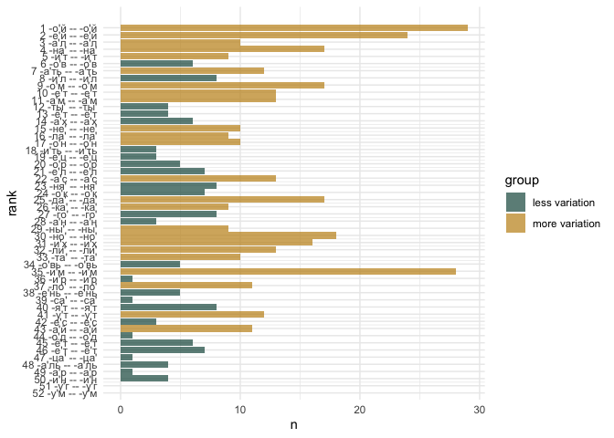
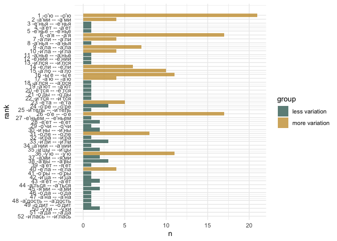
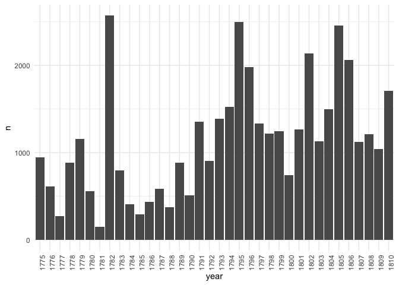
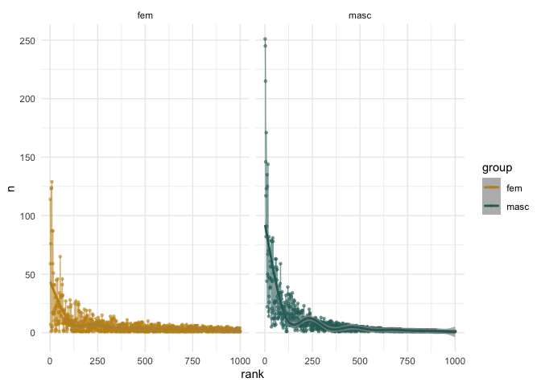

# 5.2. Rhymes: POS pairs & endings

## 5.2.2. Rhyme grammatical contrast & endings variability

Load pckg

``` r
library(tidyverse)
library(tidytext)


# library(umap)

library(MetBrewer)
library(patchwork)
theme_set(theme_minimal())
```

Load data

Metadata

``` r
meta <- read.csv("../../data/corpus1835/sql_db/texts_metadata.csv")
# glimpse(meta)
```

Meter lables

``` r
table(meta$meter)
```


    Amphibrach    Anapest     Dactyl       Iamb      Other    Trochee 
           429        142         89       3055        206        876 

``` r
meter_lables <- meta %>% 
  select(text_id, meter) %>% distinct()

head(meter_lables)
```

      text_id   meter
    1     P_1   Other
    2    P_10    Iamb
    3   P_100    Iamb
    4  P_1000    Iamb
    5  P_1001 Trochee
    6  P_1002    Iamb

Rhyme pairs

``` r
rhyme_pairs <- read.csv("../../data/corpus1835/sql_db/rhyme_pairs.csv") %>% 
  rename(text_id = poem_id) %>% 
  # remove Kulman texts
  filter(!str_detect(text_id, "C_264"))

glimpse(rhyme_pairs)
```

    Rows: 81,247
    Columns: 4
    $ text_id    <chr> "P_1938", "P_1938", "P_1938", "C_156__20", "C_156__20", "C_…
    $ from       <chr> "краса", "огневым", "красавицей", "око", "силки", "стонет",…
    $ to         <chr> "небеса", "земным", "красавице", "высоко", "легки", "догони…
    $ rhyme_alph <chr> "краса небеса", "земным огневым", "красавице красавицей", "…

Attach meter data

``` r
nrow(rhyme_pairs)
```

    [1] 81247

``` r
rhyme_pairs <- rhyme_pairs %>% 
  left_join(meter_lables, by = "text_id") 

glimpse(rhyme_pairs)
```

    Rows: 81,247
    Columns: 5
    $ text_id    <chr> "P_1938", "P_1938", "P_1938", "C_156__20", "C_156__20", "C_…
    $ from       <chr> "краса", "огневым", "красавицей", "око", "силки", "стонет",…
    $ to         <chr> "небеса", "земным", "красавице", "высоко", "легки", "догони…
    $ rhyme_alph <chr> "краса небеса", "земным огневым", "красавице красавицей", "…
    $ meter      <chr> "Other", "Other", "Other", "Trochee", "Trochee", "Trochee",…

Rhyme words

``` r
rhyme_words <- read.csv("../../data/corpus1835/sql_db/rhyme_words_upd.csv", 
                        
                        # DON'T LET R EAT IAMBS AND DO INTEGER 01 => 1
                        colClasses = c("stress_pattern" = "character",
                                       "closure_pattern" = "character")) 

# check if all words are unique
length(unique(rhyme_words$word)) == nrow(rhyme_words)
```

    [1] TRUE

``` r
# rewrite POS tags
pos_transl <- tibble(old_tag = c("S", "V", "APRO", "SPRO", 
                   "A", "ADV", "NUM", "ADVPRO",
                   "INTJ", "PART", "PR", "ANUM", "CONJ"),
       # pos = c("NOUN", "VERB", "aPRON", "nPRON", 
       #         "ADJ", "ADV", "NUM", "advPRON",
       #         "INTJ", "PART", "ADP", "adjNUM", "CONJ"),
       pos = c("NOUN", "VERB", "PRON", "PRON", 
               "ADJ", "ADV", "NUM", "PRON",
               "INTJ", "PART", "ADP", "NUM", "CONJ")) # upos

# attach to the table with all words
rhyme_words <- rhyme_words %>% 
  rename(old_tag = pos) %>% 
  left_join(pos_transl, by = "old_tag")

# extract inf, imp, etc.
rhyme_words <- rhyme_words %>% 
  mutate(pos = ifelse(str_detect(feats, "инф"),
                      "VERB_inf",
                      pos),
         pos = ifelse(str_detect(feats, "пов"),
                      "VERB_imp",
                      pos),
         pos = ifelse(str_detect(feats, "деепр"),
                      "VERB_deeprich",
                      pos),
         pos = ifelse(str_detect(feats, "прич"),
                      "VERB_prich",
                      pos))

glimpse(rhyme_words)
```

    Rows: 34,801
    Columns: 9
    $ word            <chr> "краса", "огневым", "красавицей", "око", "силки", "сто…
    $ word_acc        <chr> "краса'", "огневы'м", "краса'вицей", "о'ко", "силки'",…
    $ stress_pattern  <chr> "01", "001", "0100", "10", "01", "10", "1", "10", "010…
    $ closure_pattern <chr> "1", "1", "100", "10", "1", "10", "1", "10", "10", "1"…
    $ closure         <chr> "masc", "masc", "dactylic", "fem", "masc", "fem", "mas…
    $ old_tag         <chr> "S", "S", "S", "S", "S", "V", "S", "S", "S", "S", "APR…
    $ feats           <chr> "S,жен,неод=им,ед", "S,фам,муж,од=(дат,мн|твор,ед)", "…
    $ ending_st       <chr> "са'", "ы'м", "а'вицей", "о'ко", "ки'", "о'нет", "о'р"…
    $ pos             <chr> "NOUN", "NOUN", "NOUN", "NOUN", "NOUN", "VERB", "NOUN"…

Attach word’s features to rhyme pairs data

``` r
rhyme_pairs <- rhyme_pairs %>% 
  left_join(rhyme_words %>% 
              select(word, closure, pos, ending_st, feats) %>% 
              rename(from = word,
                     from_closure = closure,
                     from_pos = pos,
                     from_ending = ending_st, 
                     from_feats = feats),
            by = "from") %>% 
  left_join(rhyme_words %>% 
              select(word, closure, pos, ending_st, feats) %>% 
              rename(to = word,
                     to_closure = closure,
                     to_pos = pos,
                     to_ending = ending_st, 
                     to_feats = feats),
            by = "to") 

nrow(rhyme_pairs)
```

    [1] 81247

``` r
glimpse(rhyme_pairs)
```

    Rows: 81,247
    Columns: 13
    $ text_id      <chr> "P_1938", "P_1938", "P_1938", "C_156__20", "C_156__20", "…
    $ from         <chr> "краса", "огневым", "красавицей", "око", "силки", "стонет…
    $ to           <chr> "небеса", "земным", "красавице", "высоко", "легки", "дого…
    $ rhyme_alph   <chr> "краса небеса", "земным огневым", "красавице красавицей",…
    $ meter        <chr> "Other", "Other", "Other", "Trochee", "Trochee", "Trochee…
    $ from_closure <chr> "masc", "masc", "dactylic", "fem", "masc", "fem", "masc",…
    $ from_pos     <chr> "NOUN", "NOUN", "NOUN", "NOUN", "NOUN", "VERB", "NOUN", "…
    $ from_ending  <chr> "са'", "ы'м", "а'вицей", "о'ко", "ки'", "о'нет", "о'р", "…
    $ from_feats   <chr> "S,жен,неод=им,ед", "S,фам,муж,од=(дат,мн|твор,ед)", "S,ж…
    $ to_closure   <chr> "masc", "masc", "dactylic", "masc", "masc", "fem", "masc"…
    $ to_pos       <chr> "NOUN", "ADJ", "NOUN", "ADV", "ADJ", "VERB", "NOUN", "ADJ…
    $ to_ending    <chr> "са'", "ы'м", "а'вице", "ко'", "ки'", "о'нит", "о'р", "у'…
    $ to_feats     <chr> "S,сред,неод=(вин,мн|им,мн)", "A=(дат,мн,полн|твор,ед,пол…

## POS pairs

### masc

Extract only pairs where both words were detected as masculine endings

``` r
masc_pairs <- rhyme_pairs %>% 
  filter(from_closure == "masc" & to_closure == "masc")

print(paste( "Number of (true) masc pairs:", nrow(masc_pairs), 
             "out of total", nrow(rhyme_pairs) ))
```

    [1] "Number of (true) masc pairs: 38011 out of total 81247"

``` r
# check number of one masc and one other clausula type ending (most probably annotation mistakes)
rhyme_pairs %>% 
  filter(from_closure == "masc" & to_closure != "masc") %>% nrow() 
```

    [1] 3183

``` r
rhyme_pairs %>% 
  filter(from_closure != "masc" & to_closure == "masc") %>% nrow() 
```

    [1] 3464

Iamb

``` r
iamb_masc <- masc_pairs %>% 
  filter(meter == "Iamb")

t <- nrow(iamb_masc)
t
```

    [1] 25030

``` r
iamb_count <- iamb_masc %>% 
  mutate(pos_pair = paste0(from_pos, " -- ", to_pos)) %>% 
  count(pos_pair, sort = T) %>% 
  mutate(perc = round( (n/t)*100, 2 )) %>% 
  rename(n_iamb = n,
         perc_iamb = perc)

head(iamb_count, 20)
```

                   pos_pair n_iamb perc_iamb
    1          NOUN -- NOUN   8980     35.88
    2          VERB -- VERB   3183     12.72
    3          NOUN -- PRON   1743      6.96
    4          PRON -- NOUN   1681      6.72
    5          PRON -- PRON   1077      4.30
    6  VERB_inf -- VERB_inf    970      3.88
    7          NOUN -- VERB    855      3.42
    8           ADJ -- NOUN    670      2.68
    9           NOUN -- ADJ    651      2.60
    10         VERB -- NOUN    642      2.56
    11          ADV -- NOUN    422      1.69
    12          NOUN -- ADV    363      1.45
    13           ADJ -- ADJ    348      1.39
    14          ADJ -- PRON    331      1.32
    15          PRON -- ADJ    294      1.17
    16 VERB_imp -- VERB_imp    186      0.74
    17     NOUN -- VERB_inf    184      0.74
    18         NOUN -- PART    153      0.61
    19         PART -- NOUN    140      0.56
    20   NOUN -- VERB_prich    128      0.51

Trochee

``` r
tr_masc <- masc_pairs %>% 
  filter(meter == "Trochee")

t <- nrow(tr_masc)
t
```

    [1] 7045

``` r
tr_masc %>% 
  mutate(pos_pair = paste0(from_pos, " -- ", to_pos)) %>% 
  count(pos_pair, sort = T) %>% 
  mutate(perc = round( (n/t)*100, 2 )) %>% 
  rename(n_tr = n,
         perc_tr = perc) %>% 
  left_join(iamb_count, by = "pos_pair") %>% 
  head(20)
```

                   pos_pair n_tr perc_tr n_iamb perc_iamb
    1          NOUN -- NOUN 2577   36.58   8980     35.88
    2          VERB -- VERB  928   13.17   3183     12.72
    3          NOUN -- PRON  436    6.19   1743      6.96
    4          PRON -- NOUN  425    6.03   1681      6.72
    5          PRON -- PRON  283    4.02   1077      4.30
    6          NOUN -- VERB  268    3.80    855      3.42
    7  VERB_inf -- VERB_inf  261    3.70    970      3.88
    8           NOUN -- ADJ  209    2.97    651      2.60
    9           ADJ -- NOUN  206    2.92    670      2.68
    10         VERB -- NOUN  205    2.91    642      2.56
    11          ADV -- NOUN  126    1.79    422      1.69
    12          NOUN -- ADV  116    1.65    363      1.45
    13           ADJ -- ADJ   98    1.39    348      1.39
    14          PRON -- ADJ   85    1.21    294      1.17
    15          ADJ -- PRON   82    1.16    331      1.32
    16 VERB_imp -- VERB_imp   57    0.81    186      0.74
    17     NOUN -- VERB_inf   39    0.55    184      0.74
    18     NOUN -- VERB_imp   35    0.50    126      0.50
    19   NOUN -- VERB_prich   35    0.50    128      0.51
    20           ADV -- ADV   32    0.45     78      0.31

### fem

``` r
fem_pairs <- rhyme_pairs %>% 
  filter(from_closure == "fem" & to_closure == "fem")

print(paste( "Number of (true) fem pairs:", nrow(fem_pairs), 
             "out of total", nrow(rhyme_pairs) ))
```

    [1] "Number of (true) fem pairs: 34383 out of total 81247"

``` r
# check number of one masc and one other clausula type ending (most probably annotation mistakes)
rhyme_pairs %>% 
  filter(from_closure == "fem" & to_closure != "fem") %>% nrow() 
```

    [1] 3760

``` r
rhyme_pairs %>% 
  filter(from_closure != "fem" & to_closure == "fem") %>% nrow() 
```

    [1] 3476

Separate iambs & trochees

``` r
iamb_fem <- fem_pairs %>% 
  filter(meter == "Iamb")

tr_fem <- fem_pairs %>% 
  filter(meter == "Trochee")
```

``` r
t <- nrow(iamb_fem)

iamb_count <- iamb_fem %>% 
  mutate(pos_pair = paste0(from_pos, " -- ", to_pos)) %>% 
  count(pos_pair, sort = T) %>% 
  mutate(perc = round( (n/t)*100, 2 )) %>% 
  rename(n_iamb = n,
         perc_iamb = perc)

head(iamb_count, 20)
```

                             pos_pair n_iamb perc_iamb
    1                    NOUN -- NOUN  10639     43.96
    2                    VERB -- VERB   4779     19.75
    3                      ADJ -- ADJ   3045     12.58
    4                     ADJ -- NOUN    701      2.90
    5                     NOUN -- ADJ    689      2.85
    6                    PRON -- NOUN    318      1.31
    7                      ADV -- ADV    287      1.19
    8                    NOUN -- PRON    283      1.17
    9            VERB_inf -- VERB_inf    281      1.16
    10                   NOUN -- VERB    275      1.14
    11                    ADV -- NOUN    257      1.06
    12                   VERB -- NOUN    252      1.04
    13                    NOUN -- ADV    208      0.86
    14 VERB_deeprich -- VERB_deeprich    192      0.79
    15              ADJ -- VERB_prich    180      0.74
    16                     ADV -- ADJ    179      0.74
    17       VERB_prich -- VERB_prich    173      0.71
    18                     ADJ -- ADV    167      0.69
    19              VERB_prich -- ADJ    157      0.65
    20           VERB_imp -- VERB_imp    137      0.57

``` r
t <- nrow(tr_fem)

tr_fem %>% 
  mutate(pos_pair = paste0(from_pos, " -- ", to_pos)) %>% 
  count(pos_pair, sort = T) %>% 
  mutate(perc = round( (n/t)*100, 2 )) %>% 
  rename(n_tr = n,
         perc_tr = perc) %>% 
  left_join(iamb_count, by = "pos_pair") %>% 
  head(20)
```

                             pos_pair n_tr perc_tr n_iamb perc_iamb
    1                    NOUN -- NOUN 2739   43.35  10639     43.96
    2                    VERB -- VERB 1126   17.82   4779     19.75
    3                      ADJ -- ADJ  858   13.58   3045     12.58
    4                     ADJ -- NOUN  229    3.62    701      2.90
    5                     NOUN -- ADJ  217    3.43    689      2.85
    6                    NOUN -- VERB   88    1.39    275      1.14
    7                      ADV -- ADV   86    1.36    287      1.19
    8                    VERB -- NOUN   77    1.22    252      1.04
    9                     ADV -- NOUN   76    1.20    257      1.06
    10                   PRON -- NOUN   75    1.19    318      1.31
    11                     ADV -- ADJ   63    1.00    179      0.74
    12                    NOUN -- ADV   57    0.90    208      0.86
    13                   NOUN -- PRON   56    0.89    283      1.17
    14                     ADJ -- ADV   52    0.82    167      0.69
    15           VERB_inf -- VERB_inf   51    0.81    281      1.16
    16 VERB_deeprich -- VERB_deeprich   50    0.79    192      0.79
    17           ADJ -- VERB_deeprich   36    0.57    112      0.46
    18          NOUN -- VERB_deeprich   35    0.55     60      0.25
    19           VERB_imp -- VERB_imp   35    0.55    137      0.57
    20              ADJ -- VERB_prich   33    0.52    180      0.74

``` r
rm(iamb_count, pos_transl, t, iamb_fem, iamb_masc, tr_fem, tr_masc)
```

## endings

### POS pairs variability

#### masc

Masculine (all meters)

``` r
glimpse(masc_pairs)
```

    Rows: 38,011
    Columns: 13
    $ text_id      <chr> "P_1938", "P_1938", "C_156__20", "C_156__20", "C_156__20"…
    $ from         <chr> "краса", "огневым", "силки", "спор", "сном", "твоя", "тиш…
    $ to           <chr> "небеса", "земным", "легки", "простор", "лучом", "я", "по…
    $ rhyme_alph   <chr> "краса небеса", "земным огневым", "легки силки", "простор…
    $ meter        <chr> "Other", "Other", "Trochee", "Trochee", "Trochee", "Iamb"…
    $ from_closure <chr> "masc", "masc", "masc", "masc", "masc", "masc", "masc", "…
    $ from_pos     <chr> "NOUN", "NOUN", "NOUN", "NOUN", "NOUN", "PRON", "NOUN", "…
    $ from_ending  <chr> "са'", "ы'м", "ки'", "о'р", "о'м", "оя'", "не'", "ё'т", "…
    $ from_feats   <chr> "S,жен,неод=им,ед", "S,фам,муж,од=(дат,мн|твор,ед)", "S,м…
    $ to_closure   <chr> "masc", "masc", "masc", "masc", "masc", "masc", "masc", "…
    $ to_pos       <chr> "NOUN", "ADJ", "ADJ", "NOUN", "NOUN", "PRON", "NOUN", "VE…
    $ to_ending    <chr> "са'", "ы'м", "ки'", "о'р", "о'м", "я'", "не'", "ё'т", "и…
    $ to_feats     <chr> "S,сред,неод=(вин,мн|им,мн)", "A=(дат,мн,полн|твор,ед,пол…

``` r
# total number of masc pairs
t <- nrow(masc_pairs)

# view 30 mf ending pairs
masc_pairs %>% 
  mutate(ending_pair = paste0("-", from_ending, " -- -", to_ending)) %>% 
  count(ending_pair, sort = T) %>% 
  head(30) %>% 
  mutate(perc = round((n/t)*100, 2))
```

          ending_pair    n  perc
    1    -о'й -- -о'й 3802 10.00
    2    -е'й -- -е'й 2212  5.82
    3    -а'л -- -а'л 1241  3.26
    4    -на' -- -на'  964  2.54
    5    -и'т -- -и'т  886  2.33
    6    -о'в -- -о'в  858  2.26
    7  -а'ть -- -а'ть  739  1.94
    8    -и'л -- -и'л  681  1.79
    9    -о'м -- -о'м  672  1.77
    10   -е'т -- -е'т  614  1.62
    11   -а'м -- -а'м  613  1.61
    12   -ты' -- -ты'  609  1.60
    13   -ё'т -- -ё'т  589  1.55
    14   -а'х -- -а'х  575  1.51
    15   -не' -- -не'  562  1.48
    16   -ла' -- -ла'  465  1.22
    17   -о'н -- -о'н  439  1.15
    18 -и'ть -- -и'ть  381  1.00
    19   -е'ц -- -е'ц  374  0.98
    20   -о'р -- -о'р  367  0.97
    21   -е'л -- -е'л  362  0.95
    22   -а'с -- -а'с  326  0.86
    23   -ня' -- -ня'  289  0.76
    24   -о'к -- -о'к  284  0.75
    25   -да' -- -да'  281  0.74
    26   -ка' -- -ка'  270  0.71
    27   -го' -- -го'  261  0.69
    28   -а'н -- -а'н  244  0.64
    29   -ны' -- -ны'  237  0.62
    30   -но' -- -но'  218  0.57

``` r
# pull top ending pairs 
m_ranks <- masc_pairs %>% 
  mutate(ending_pair = paste0("-", from_ending, " -- -", to_ending)) %>% 
  count(ending_pair, sort = T) %>% 
  #head(1000) %>% 
  mutate(rank = row_number()) %>% select(-n)

# count POS variants inside every ending
m_ranked_pos <- masc_pairs %>% 
  mutate(ending_pair = paste0("-", from_ending, " -- -", to_ending), 
         pos_pair = paste0(from_pos, " -- ", to_pos)) %>% 
  #filter(ending_pair %in% rankss$ending_pair) %>% 
  group_by(ending_pair) %>% 
  count(pos_pair, sort = F) %>% 
  count(ending_pair, sort = T) %>% 
  left_join(m_ranks, by = "ending_pair") %>% 
  filter(rank < 101) %>% 
  mutate(label = paste0(rank, " ", ending_pair),
         group = ifelse(n < 9, "less variation", "more variation")) 

head(m_ranked_pos, 15)
```

    # A tibble: 15 × 5
    # Groups:   ending_pair [15]
       ending_pair          n  rank label               group         
       <chr>            <int> <int> <chr>               <chr>         
     1 -о'й -- -о'й        29     1 1 -о'й -- -о'й      more variation
     2 -и'м -- -и'м        28    35 35 -и'м -- -и'м     more variation
     3 -е'й -- -е'й        24     2 2 -е'й -- -е'й      more variation
     4 -ё'м -- -ё'м        24    82 82 -ё'м -- -ё'м     more variation
     5 -но' -- -но'        18    30 30 -но' -- -но'     more variation
     6 -да' -- -да'        17    25 25 -да' -- -да'     more variation
     7 -на' -- -на'        17     4 4 -на' -- -на'      more variation
     8 -о'м -- -о'м        17     9 9 -о'м -- -о'м      more variation
     9 -е'сть -- -е'сть    16    75 75 -е'сть -- -е'сть more variation
    10 -и'х -- -и'х        16    31 31 -и'х -- -и'х     more variation
    11 -а'м -- -а'м        13    11 11 -а'м -- -а'м     more variation
    12 -а'с -- -а'с        13    22 22 -а'с -- -а'с     more variation
    13 -е'т -- -е'т        13    10 10 -е'т -- -е'т     more variation
    14 -ли' -- -ли'        13    32 32 -ли' -- -ли'     more variation
    15 -а'ть -- -а'ть      12     7 7 -а'ть -- -а'ть    more variation

``` r
summary(m_ranked_pos$n) # 9.25 is 3rd Qu. if 100 first ranks taken
```

       Min. 1st Qu.  Median    Mean 3rd Qu.    Max. 
       1.00    4.00    7.00    7.76    9.25   29.00 

``` r
# plot
m_ranked_pos %>% 
  filter(rank < 51) %>% 
  ggplot(aes(x = rank, y = n, fill = group)) + geom_col(alpha = 0.7) + 
  #scale_x_continuous(breaks = im_rank_feat$rank, labels = im_rank_feat$label) + 
  #theme(axis.text.x = element_text(angle = 270)) + 
  coord_flip() + 
  scale_x_reverse(breaks = m_ranked_pos$rank, 
                     labels = m_ranked_pos$label) + 
  scale_fill_manual(values = c(met.brewer("Veronese")[6],
                               met.brewer("Veronese")[3]))
```



Analysis of the less variate pairs

``` r
m_ranked_pos %>% 
  filter(rank < 51) %>% 
  summary(n) # look into less than 1st quatrain, ie less than 4 pos pairs
```

     ending_pair              n              rank          label          
     Length:50          Min.   : 1.00   Min.   : 1.00   Length:50         
     Class :character   1st Qu.: 4.25   1st Qu.:13.25   Class :character  
     Mode  :character   Median : 8.00   Median :25.50   Mode  :character  
                        Mean   : 9.18   Mean   :25.50                     
                        3rd Qu.:12.00   3rd Qu.:37.75                     
                        Max.   :29.00   Max.   :50.00                     
        group          
     Length:50         
     Class :character  
     Mode  :character  
                       
                       
                       

``` r
less_var_pos <- m_ranked_pos %>% 
  filter(rank < 51 & n < 5
           #group == "less variation"
           ) %>% 
  arrange(-desc(rank)) %>% pull(ending_pair)

length(less_var_pos)
```

    [1] 13

``` r
masc_pairs %>% 
  mutate(ending_pair = paste0("-", from_ending, " -- -", to_ending), 
         pos_pair = paste0(from_pos, " -- ", to_pos)) %>% 
  filter(ending_pair %in% less_var_pos) %>% 
  group_by(ending_pair) %>% 
  count(pos_pair, sort = F) %>% 
  select(-n) %>% 
  summarise(n_var = n(),
    pos_list = paste0(pos_pair, collapse = ", ")) %>% 
  arrange(-desc(n_var)) %>% 
  head(length(less_var_pos))
```

    # A tibble: 13 × 3
       ending_pair    n_var pos_list                                                
       <chr>          <int> <chr>                                                   
     1 -а'р -- -а'р       1 NOUN -- NOUN                                            
     2 -и'р -- -и'р       1 NOUN -- NOUN                                            
     3 -о'д -- -о'д       1 NOUN -- NOUN                                            
     4 -са' -- -са'       1 NOUN -- NOUN                                            
     5 -ца' -- -ца'       1 NOUN -- NOUN                                            
     6 -а'н -- -а'н       3 NOUN -- NOUN, NOUN -- VERB_prich, VERB_prich -- NOUN    
     7 -е'с -- -е'с       3 NOUN -- NOUN, NOUN -- VERB, VERB -- NOUN                
     8 -е'ц -- -е'ц       3 ADV -- NOUN, NOUN -- ADV, NOUN -- NOUN                  
     9 -и'ть -- -и'ть     3 NOUN -- VERB_inf, VERB_inf -- NOUN, VERB_inf -- VERB_inf
    10 -а'ль -- -а'ль     4 ADV -- ADV, ADV -- NOUN, NOUN -- ADV, NOUN -- NOUN      
    11 -и'н -- -и'н       4 ADJ -- NOUN, NOUN -- NOUN, NOUN -- PRON, PRON -- NOUN   
    12 -ты' -- -ты'       4 NOUN -- NOUN, NOUN -- PRON, PRON -- NOUN, PRON -- PRON  
    13 -ё'т -- -ё'т       4 NOUN -- NOUN, NOUN -- VERB, VERB -- NOUN, VERB -- VERB  

#### fem

``` r
glimpse(fem_pairs)
```

    Rows: 34,383
    Columns: 13
    $ text_id      <chr> "C_156__20", "C_156__20", "C_156__20", "C_70__25", "C_70_…
    $ from         <chr> "стонет", "тучи", "тумане", "утратой", "унылой", "мною", …
    $ to           <chr> "догонит", "гремучий", "заране", "крылатой", "огнекрылой"…
    $ rhyme_alph   <chr> "догонит стонет", "гремучий тучи", "заране тумане", "крыл…
    $ meter        <chr> "Trochee", "Trochee", "Trochee", "Trochee", "Trochee", "T…
    $ from_closure <chr> "fem", "fem", "fem", "fem", "fem", "fem", "fem", "fem", "…
    $ from_pos     <chr> "VERB", "NOUN", "NOUN", "NOUN", "ADJ", "PRON", "NOUN", "N…
    $ from_ending  <chr> "о'нет", "у'чи", "а'не", "а'той", "ы'лой", "о'ю", "а'ми",…
    $ from_feats   <chr> "V,несов,нп=непрош,ед,изъяв,3-л", "S,жен,неод=(вин,мн|род…
    $ to_closure   <chr> "fem", "fem", "fem", "fem", "fem", "fem", "fem", "fem", "…
    $ to_pos       <chr> "VERB", "ADJ", "NOUN", "ADJ", "ADJ", "NOUN", "NOUN", "NOU…
    $ to_ending    <chr> "о'нит", "у'чий", "а'не", "а'той", "ы'лой", "о'ю", "а'ми"…
    $ to_feats     <chr> "V,сов,пе=непрош,ед,изъяв,3-л", "A=(вин,ед,полн,муж,неод|…

``` r
# total number of masc pairs
t <- nrow(fem_pairs)

# view 30 mf ending pairs
fem_pairs %>% 
  mutate(ending_pair = paste0("-", from_ending, " -- -", to_ending)) %>% 
  count(ending_pair, sort = T) %>% 
  head(30) %>% 
  mutate(perc = round((n/t)*100, 2))
```

              ending_pair    n perc
    1        -о'ю -- -о'ю 1251 3.64
    2      -а'ми -- -а'ми  972 2.83
    3    -е'нья -- -е'нья  871 2.53
    4      -а'ет -- -а'ет  772 2.25
    5    -е'нье -- -е'нье  741 2.16
    6        -а'я -- -а'я  719 2.09
    7      -а'ли -- -а'ли  464 1.35
    8    -а'нья -- -а'нья  438 1.27
    9      -а'ла -- -а'ла  398 1.16
    10     -и'ла -- -и'ла  355 1.03
    11   -а'нье -- -а'нье  327 0.95
    12   -е'ний -- -е'ний  283 0.82
    13   -и'лся -- -и'лся  269 0.78
    14     -е'ли -- -е'ли  231 0.67
    15     -а'ло -- -а'ло  220 0.64
    16       -ы'е -- -ы'е  216 0.63
    17       -а'ю -- -а'ю  212 0.62
    18   -а'лся -- -а'лся  206 0.60
    19     -а'ют -- -а'ют  201 0.58
    20   -ё'тся -- -ё'тся  201 0.58
    21     -о'ды -- -о'ды  197 0.57
    22   -и'тся -- -и'тся  195 0.57
    23     -е'та -- -е'та  193 0.56
    24     -о'ре -- -о'ре  189 0.55
    25 -и'тель -- -и'тель  188 0.55
    26       -о'е -- -о'е  182 0.53
    27 -е'ньем -- -е'ньем  179 0.52
    28     -е'ет -- -е'ет  174 0.51
    29     -о'чи -- -о'чи  174 0.51
    30     -и'ны -- -и'ны  169 0.49

``` r
# pull top ending pairs 
f_ranks <- fem_pairs %>% 
  mutate(ending_pair = paste0("-", from_ending, " -- -", to_ending)) %>% 
  count(ending_pair, sort = T) %>% 
  #head(1000) %>% 
  mutate(rank = row_number()) %>% select(-n)

# count POS variants inside every ending
f_ranked_pos <- fem_pairs %>% 
  mutate(ending_pair = paste0("-", from_ending, " -- -", to_ending), 
         pos_pair = paste0(from_pos, " -- ", to_pos)) %>% 
  #filter(ending_pair %in% rankss$ending_pair) %>% 
  group_by(ending_pair) %>% 
  count(pos_pair, sort = F) %>% 
  count(ending_pair, sort = T) %>% 
  left_join(f_ranks, by = "ending_pair") %>% 
  filter(rank < 101) %>% 
  mutate(label = paste0(rank, " ", ending_pair),
         group = ifelse(n < 4, "less variation", "more variation"))

head(f_ranked_pos, 15) 
```

    # A tibble: 15 × 5
    # Groups:   ending_pair [15]
       ending_pair        n  rank label             group         
       <chr>          <int> <int> <chr>             <chr>         
     1 -о'ю -- -о'ю      21     1 1 -о'ю -- -о'ю    more variation
     2 -а'я -- -а'я      17     6 6 -а'я -- -а'я    more variation
     3 -о'е -- -о'е      17    26 26 -о'е -- -о'е   more variation
     4 -у'ю -- -у'ю      11    36 36 -у'ю -- -у'ю   more variation
     5 -ы'е -- -ы'е      11    16 16 -ы'е -- -ы'е   more variation
     6 -а'ло -- -а'ло    10    15 15 -а'ло -- -а'ло more variation
     7 -е'ю -- -е'ю       9    63 63 -е'ю -- -е'ю   more variation
     8 -и'во -- -и'во     9    87 87 -и'во -- -и'во more variation
     9 -о'го -- -о'го     9    57 57 -о'го -- -о'го more variation
    10 -е'ло -- -е'ло     8    62 62 -е'ло -- -е'ло more variation
    11 -о'ле -- -о'ле     8    31 31 -о'ле -- -о'ле more variation
    12 -а'ла -- -а'ла     7     9 9 -а'ла -- -а'ла  more variation
    13 -а'та -- -а'та     7    61 61 -а'та -- -а'та more variation
    14 -е'е -- -е'е       7    65 65 -е'е -- -е'е   more variation
    15 -и'ло -- -и'ло     7    64 64 -и'ло -- -и'ло more variation

``` r
summary(f_ranked_pos$n) # 4 is 3rd qu.
```

       Min. 1st Qu.  Median    Mean 3rd Qu.    Max. 
       1.00    1.00    2.00    3.45    4.00   21.00 

``` r
# plot
f_ranked_pos  %>% 
  filter(rank < 51) %>% 
  ggplot(aes(x = rank, y = n, fill = group)) + geom_col(alpha = 0.7) + 
  coord_flip() + 
  scale_x_reverse(breaks = f_ranked_pos$rank, labels = f_ranked_pos$label) + 
  scale_fill_manual(values = c(met.brewer("Veronese")[6],
                               met.brewer("Veronese")[3]))
```



Analysis of the less variate pairs

``` r
f_ranked_pos %>% 
  filter(rank < 51) %>% 
  summary(n) # look into less than 1st quatrain, ie less than 2 pos pairs (much lower than in masc rhymes)
```

     ending_pair              n              rank          label          
     Length:50          Min.   : 1.00   Min.   : 1.00   Length:50         
     Class :character   1st Qu.: 1.00   1st Qu.:13.25   Class :character  
     Mode  :character   Median : 1.50   Median :25.50   Mode  :character  
                        Mean   : 3.62   Mean   :25.50                     
                        3rd Qu.: 4.00   3rd Qu.:37.75                     
                        Max.   :21.00   Max.   :50.00                     
        group          
     Length:50         
     Class :character  
     Mode  :character  
                       
                       
                       

``` r
less_var_pos_f <- f_ranked_pos %>% 
  filter(rank < 51 & n < 2
           #group == "less variation"
           ) %>% 
  arrange(-desc(rank)) %>% pull(ending_pair)

length(less_var_pos_f) # 25 endings with ONLY ONE POS combination
```

    [1] 25

``` r
fem_pairs %>% 
  mutate(ending_pair = paste0("-", from_ending, " -- -", to_ending), 
         pos_pair = paste0(from_pos, " -- ", to_pos)) %>% 
  filter(ending_pair %in% less_var_pos_f) %>% 
  group_by(ending_pair) %>% 
  count(pos_pair, sort = F) %>% 
  select(-n) %>% 
  summarise(n_var = n(),
    pos_list = paste0(pos_pair, collapse = ", ")) %>% 
  arrange(-desc(n_var)) %>% 
  head(length(less_var_pos_f))
```

    # A tibble: 25 × 3
       ending_pair          n_var pos_list            
       <chr>                <int> <chr>               
     1 -а'дость -- -а'дость     1 NOUN -- NOUN        
     2 -а'ет -- -а'ет           1 VERB -- VERB        
     3 -а'ет -- -я'ет           1 VERB -- VERB        
     4 -а'лся -- -а'лся         1 VERB -- VERB        
     5 -а'на -- -а'на           1 NOUN -- NOUN        
     6 -а'ний -- -а'ний         1 NOUN -- NOUN        
     7 -а'нье -- -а'нье         1 NOUN -- NOUN        
     8 -а'нья -- -а'нья         1 NOUN -- NOUN        
     9 -а'ться -- -а'ться       1 VERB_inf -- VERB_inf
    10 -а'ют -- -а'ют           1 VERB -- VERB        
    # ℹ 15 more rows

noun-noun, verb-verb, inf-inf

#### kendall cor

``` r
glimpse(m_ranked_pos)
```

    Rows: 100
    Columns: 5
    Groups: ending_pair [100]
    $ ending_pair <chr> "-о'й -- -о'й", "-и'м -- -и'м", "-е'й -- -е'й", "-ё'м -- -…
    $ n           <int> 29, 28, 24, 24, 18, 17, 17, 17, 16, 16, 13, 13, 13, 13, 12…
    $ rank        <int> 1, 35, 2, 82, 30, 25, 4, 9, 75, 31, 11, 22, 10, 32, 7, 87,…
    $ label       <chr> "1 -о'й -- -о'й", "35 -и'м -- -и'м", "2 -е'й -- -е'й", "82…
    $ group       <chr> "more variation", "more variation", "more variation", "mor…

``` r
rank_list <- m_ranked_pos %>% 
  ungroup() %>% 
  rename(rank_ending = rank) %>% 
  mutate(rank_variation = row_number()) %>% 
  select(-n, -label, -group)

# masculine ranks lists correlation
cor.test(rank_list$rank_ending, rank_list$rank_variation, 
         method = "kendall")
```


        Kendall's rank correlation tau

    data:  rank_list$rank_ending and rank_list$rank_variation
    z = 3.5261, p-value = 0.0004217
    alternative hypothesis: true tau is not equal to 0
    sample estimates:
          tau 
    0.2391919 

``` r
# fem
rank_list <- f_ranked_pos %>% 
  ungroup() %>% 
  rename(rank_ending = rank) %>% 
  mutate(rank_variation = row_number()) %>% 
  select(-n, -label, -group)

# masculine ranks lists correlation
cor.test(rank_list$rank_ending, rank_list$rank_variation, 
         method = "kendall")
```


        Kendall's rank correlation tau

    data:  rank_list$rank_ending and rank_list$rank_variation
    z = -0.077431, p-value = 0.9383
    alternative hypothesis: true tau is not equal to 0
    sample estimates:
             tau 
    -0.005252525 

#### lineplot

Curves: Correlation btw ending frequency & grammatical variation

``` r
m_ranked_long <- masc_pairs %>% 
  mutate(ending_pair = paste0("-", from_ending, " -- -", to_ending), 
         pos_pair = paste0(from_pos, " -- ", to_pos)) %>% 
  #filter(ending_pair %in% rankss$ending_pair) %>% 
  group_by(ending_pair) %>% 
  count(pos_pair, sort = F) %>% 
  count(ending_pair, sort = T) %>% 
  left_join(m_ranks, by = "ending_pair") %>% 
  filter(rank < 1001)

f_ranked_long <- fem_pairs %>% 
  mutate(ending_pair = paste0("-", from_ending, " -- -", to_ending), 
         pos_pair = paste0(from_pos, " -- ", to_pos)) %>% 
  #filter(ending_pair %in% rankss$ending_pair) %>% 
  group_by(ending_pair) %>% 
  count(pos_pair, sort = F) %>% 
  count(ending_pair, sort = T) %>% 
  left_join(f_ranks, by = "ending_pair") %>% 
  filter(rank < 1001)

glimpse(m_ranked_long)
```

    Rows: 1,000
    Columns: 3
    Groups: ending_pair [1,000]
    $ ending_pair <chr> "-о'й -- -о'й", "-и'м -- -и'м", "-е'й -- -е'й", "-ё'м -- -…
    $ n           <int> 29, 28, 24, 24, 18, 17, 17, 17, 16, 16, 15, 15, 14, 13, 13…
    $ rank        <int> 1, 35, 2, 82, 30, 25, 4, 9, 75, 31, 174, 157, 132, 11, 22,…

``` r
m_ranked_long %>% 
  ungroup() %>% 
  select(rank, n) %>% 
  mutate(group = "masc") %>% 
  rbind(f_ranked_long %>%
          ungroup() %>%
          select(rank, n) %>%
          mutate(group = "fem")
        ) %>%
  filter(rank < 1001) %>% 
  ggplot(aes(x = rank, y = n, color = group)) + 
  geom_point(alpha = 0.5, size = 0.9) + 
  geom_line(alpha = 0.6, linewidth = 0.5) + 
  geom_smooth(alpha = 0.7) + 
  facet_wrap(~group) + 
  scale_color_manual(values = c(met.brewer("Veronese")[3],
                                met.brewer("Veronese")[5]))
```

    `geom_smooth()` using method = 'gam' and formula = 'y ~ s(x, bs = "cs")'



### feats variability

``` r
# count feats variants inside every ending
m_ranked_feats <- masc_pairs %>% 
  mutate(ending_pair = paste0("-", from_ending, " -- -", to_ending), 
         feats_pair = paste0(from_feats, " -- ", to_feats)) %>% 
  #filter(ending_pair %in% rankss$ending_pair) %>% 
  group_by(ending_pair) %>% 
  count(feats_pair, sort = F) %>% 
  count(ending_pair, sort = T) %>% 
  left_join(m_ranks, by = "ending_pair") %>% 
  filter(rank < 1001)

f_ranked_feats <- fem_pairs %>% 
  mutate(ending_pair = paste0("-", from_ending, " -- -", to_ending), 
         feats_pair = paste0(from_feats, " -- ", to_feats)) %>% 
  #filter(ending_pair %in% rankss$ending_pair) %>% 
  group_by(ending_pair) %>% 
  count(feats_pair, sort = F) %>% 
  count(ending_pair, sort = T) %>% 
  left_join(f_ranks, by = "ending_pair") %>% 
  filter(rank < 1001)


m_ranked_feats %>% 
  ungroup() %>% 
  select(rank, n) %>% 
  mutate(group = "masc") %>% 
  rbind(f_ranked_feats %>%
          ungroup() %>%
          select(rank, n) %>%
          mutate(group = "fem")
        ) %>%
  filter(rank < 1001) %>% 
  ggplot(aes(x = rank, y = n, color = group)) + 
  geom_point(alpha = 0.5, size = 0.9) + 
  geom_line(alpha = 0.6, linewidth = 0.5) + 
  geom_smooth(alpha = 0.7) + 
  facet_wrap(~group) + 
  scale_color_manual(values = c(met.brewer("Veronese")[3],
                                met.brewer("Veronese")[5]))
```

    `geom_smooth()` using method = 'gam' and formula = 'y ~ s(x, bs = "cs")'


#### kendall

``` r
# glimpse(m_ranked_feats)

rank_list <- m_ranked_feats %>% 
  ungroup() %>% 
  #filter(rank < 101) %>% 
  rename(rank_ending = rank) %>% 
  mutate(rank_variation = row_number()) %>% 
  select(-n)

# masculine ranks lists correlation
cor.test(rank_list$rank_ending, rank_list$rank_variation, 
         method = "kendall")
```


        Kendall's rank correlation tau

    data:  rank_list$rank_ending and rank_list$rank_variation
    z = 32.821, p-value < 2.2e-16
    alternative hypothesis: true tau is not equal to 0
    sample estimates:
          tau 
    0.6931291 

``` r
# fem
rank_list <- f_ranked_feats %>% 
  ungroup() %>% 
  filter(rank < 101) %>%
  rename(rank_ending = rank) %>% 
  mutate(rank_variation = row_number()) %>% 
  select(-n)

# masculine ranks lists correlation
cor.test(rank_list$rank_ending, rank_list$rank_variation, 
         method = "kendall")
```


        Kendall's rank correlation tau

    data:  rank_list$rank_ending and rank_list$rank_variation
    z = 3.6452, p-value = 0.0002672
    alternative hypothesis: true tau is not equal to 0
    sample estimates:
          tau 
    0.2472727 

Look into less variable endings

``` r
m_ranked_feats %>% 
  filter(rank < 51) %>% 
  summary() # 25.25 1st Qu
```

     ending_pair              n               rank      
     Length:50          Min.   :  5.00   Min.   : 1.00  
     Class :character   1st Qu.: 25.25   1st Qu.:13.25  
     Mode  :character   Median : 49.00   Median :25.50  
                        Mean   : 67.90   Mean   :25.50  
                        3rd Qu.: 81.75   3rd Qu.:37.75  
                        Max.   :251.00   Max.   :50.00  

``` r
less_var_feats <- m_ranked_feats %>% 
  filter(rank < 51 & n < 25.25) %>% 
  pull(ending_pair)

length(less_var_feats)
```

    [1] 13

``` r
x <- masc_pairs %>% 
  mutate(ending_pair = paste0("-", from_ending, " -- -", to_ending), 
         feats_pair = paste0(from_feats, " -- ", to_feats)) %>% 
  filter(ending_pair %in% less_var_feats) %>% 
  group_by(ending_pair) %>% 
  count(feats_pair, sort = F) %>% 
  select(-n) %>% 
  summarise(n_var = n(),
            feats_list = paste0(feats_pair, collapse = " \n ")) %>% 
  arrange(-desc(n_var)) %>% 
  head(length(less_var_feats))

# write.csv(x, "feats_masc.csv")
```

Examples

``` r
# ending intersecation between less variative in terms of POS combitaion & grammar
tibble(ending_pair = intersect(less_var_pos, less_var_feats)) %>% 
  left_join(m_ranks, by = "ending_pair")
```

    # A tibble: 9 × 2
      ending_pair     rank
      <chr>          <int>
    1 -ты' -- -ты'      12
    2 -е'ц -- -е'ц      19
    3 -и'р -- -и'р      36
    4 -са' -- -са'      39
    5 -е'с -- -е'с      42
    6 -о'д -- -о'д      44
    7 -ца' -- -ца'      47
    8 -а'ль -- -а'ль    48
    9 -а'р -- -а'р      49

``` r
masc_pairs %>% 
  mutate(ending_pair = paste0("-", from_ending, " -- -", to_ending), 
         feats_pair = paste0(from_feats, " -- ", to_feats)) %>% 
  filter(ending_pair %in% intersect(less_var_pos, less_var_feats)) %>% 
  group_by(ending_pair, feats_pair) %>% 
  sample_n(1) %>% 
  select(ending_pair, rhyme_alph, from, to, from_pos, to_pos, feats_pair) %>% 
  ungroup() %>% 
  distinct(rhyme_alph, .keep_all = TRUE)
```

    # A tibble: 134 × 7
       ending_pair    rhyme_alph      from     to       from_pos to_pos feats_pair  
       <chr>          <chr>           <chr>    <chr>    <chr>    <chr>  <chr>       
     1 -а'ль -- -а'ль печаль скрыжаль скрыжаль печаль   ADV      NOUN   ADV,вводн= …
     2 -а'ль -- -а'ль жаль печаль     жаль     печаль   ADV      NOUN   ADV,прдк= -…
     3 -а'ль -- -а'ль жаль хрусталь   жаль     хрусталь ADV      NOUN   ADV,прдк= -…
     4 -а'ль -- -а'ль вдаль жаль      вдаль    жаль     ADV      ADV    ADV= -- ADV…
     5 -а'ль -- -а'ль вдаль печаль    вдаль    печаль   ADV      NOUN   ADV= -- S,ж…
     6 -а'ль -- -а'ль даль жаль       даль     жаль     NOUN     ADV    S,жен,неод=…
     7 -а'ль -- -а'ль даль печаль     даль     печаль   NOUN     NOUN   S,жен,неод=…
     8 -а'ль -- -а'ль даль хрусталь   даль     хрусталь NOUN     NOUN   S,жен,неод=…
     9 -а'ль -- -а'ль враль жаль      враль    жаль     NOUN     ADV    S,муж,од=им…
    10 -а'ль -- -а'ль даль москаль    москаль  даль     NOUN     NOUN   S,муж,од=им…
    # ℹ 124 more rows

FEM rhymes feats analysis

``` r
f_ranked_feats %>% 
  filter(rank < 51) %>% 
  summary() # 8.25 1st qu. (vs masc 25.25 1st Qu)
```

     ending_pair              n               rank      
     Length:50          Min.   :  1.00   Min.   : 1.00  
     Class :character   1st Qu.:  8.25   1st Qu.:13.25  
     Mode  :character   Median : 20.00   Median :25.50  
                        Mean   : 31.88   Mean   :25.50  
                        3rd Qu.: 41.00   3rd Qu.:37.75  
                        Max.   :129.00   Max.   :50.00  

``` r
less_var_feats_f <- f_ranked_feats %>% 
  filter(rank < 51 & n < 8.25) %>% 
  pull(ending_pair)

length(less_var_feats_f) # 13
```

    [1] 13

``` r
x <- fem_pairs %>% 
  mutate(ending_pair = paste0("-", from_ending, " -- -", to_ending), 
         feats_pair = paste0(from_feats, " -- ", to_feats)) %>% 
  filter(ending_pair %in% less_var_feats_f) %>% 
  group_by(ending_pair) %>% 
  count(feats_pair, sort = F) %>% 
  select(-n) %>% 
  summarise(n_var = n(),
            feats_list = paste0(feats_pair, collapse = " \n ")) %>% 
  arrange(-desc(n_var)) %>% 
  head(length(less_var_feats_f))

x
```

    # A tibble: 13 × 3
       ending_pair          n_var feats_list                                        
       <chr>                <int> <chr>                                             
     1 -а'дость -- -а'дость     1 "S,жен,неод=(вин,ед|им,ед) -- S,жен,неод=(вин,ед|…
     2 -е'нье -- -е'нье         1 "S,сред,неод=(пр,ед|вин,ед|им,ед) -- S,сред,неод=…
     3 -е'ньем -- -е'ньем       1 "S,сред,неод=твор,ед -- S,сред,неод=твор,ед"      
     4 -а'ний -- -а'ний         2 "S,имя,муж,од=им,ед -- S,сред,неод=род,мн \n S,ср…
     5 -а'нье -- -а'нье         2 "S,ед,сред,неод=(пр|вин|им) -- S,сред,неод=(пр,ед…
     6 -о'чи -- -о'чи           3 "S,гео,ед,жен,неод=(пр|дат|род) -- S,жен,неод=(пр…
     7 -а'нья -- -а'нья         5 "S,ед,сред,неод=род -- S,сред,неод=(вин,мн|род,ед…
     8 -е'ний -- -е'ний         5 "S,муж,од=им,ед -- S,сред,неод=род,мн \n S,муж,од…
     9 -е'нья -- -е'нья         7 "S,имя,жен,од=им,ед -- S,сред,неод=(вин,мн|род,ед…
    10 -и'тель -- -и'тель       7 "S,жен,неод=(вин,ед|им,ед) -- S,муж,неод=(вин,ед|…
    11 -и'ца -- -и'ца           7 "S,жен,неод=им,ед -- S,жен,неод=им,ед \n S,жен,не…
    12 -и'цы -- -и'цы           7 "S,жен,неод=(вин,мн|род,ед|им,мн) -- S,жен,неод=(…
    13 -у'ки -- -у'ки           8 "A=мн,кр -- S,муж,неод=(вин,мн|им,мн) \n S,жен,не…

``` r
#write.csv(x, "feats_fem.csv")
```

## words inside endings

``` r
glimpse(m_ranks)
```

    Rows: 1,450
    Columns: 2
    $ ending_pair <chr> "-о'й -- -о'й", "-е'й -- -е'й", "-а'л -- -а'л", "-на' -- -…
    $ rank        <int> 1, 2, 3, 4, 5, 6, 7, 8, 9, 10, 11, 12, 13, 14, 15, 16, 17,…

``` r
glimpse(masc_pairs)
```

    Rows: 38,011
    Columns: 13
    $ text_id      <chr> "P_1938", "P_1938", "C_156__20", "C_156__20", "C_156__20"…
    $ from         <chr> "краса", "огневым", "силки", "спор", "сном", "твоя", "тиш…
    $ to           <chr> "небеса", "земным", "легки", "простор", "лучом", "я", "по…
    $ rhyme_alph   <chr> "краса небеса", "земным огневым", "легки силки", "простор…
    $ meter        <chr> "Other", "Other", "Trochee", "Trochee", "Trochee", "Iamb"…
    $ from_closure <chr> "masc", "masc", "masc", "masc", "masc", "masc", "masc", "…
    $ from_pos     <chr> "NOUN", "NOUN", "NOUN", "NOUN", "NOUN", "PRON", "NOUN", "…
    $ from_ending  <chr> "са'", "ы'м", "ки'", "о'р", "о'м", "оя'", "не'", "ё'т", "…
    $ from_feats   <chr> "S,жен,неод=им,ед", "S,фам,муж,од=(дат,мн|твор,ед)", "S,м…
    $ to_closure   <chr> "masc", "masc", "masc", "masc", "masc", "masc", "masc", "…
    $ to_pos       <chr> "NOUN", "ADJ", "ADJ", "NOUN", "NOUN", "PRON", "NOUN", "VE…
    $ to_ending    <chr> "са'", "ы'м", "ки'", "о'р", "о'м", "я'", "не'", "ё'т", "и…
    $ to_feats     <chr> "S,сред,неод=(вин,мн|им,мн)", "A=(дат,мн,полн|твор,ед,пол…

``` r
m_1 <- masc_pairs %>% 
  mutate(ending_pair = paste0("-", from_ending, " -- -", to_ending)) %>% 
  select(from, from_ending, ending_pair) %>% 
  rename(word = from, 
         ending = from_ending)

m_2 <- masc_pairs %>% 
  mutate(ending_pair = paste0("-", from_ending, " -- -", to_ending)) %>% 
  select(to, to_ending, ending_pair) %>% 
  rename(word = to, 
         ending = to_ending)

masc_words <- rbind(m_1, m_2)


f_1 <- fem_pairs %>% 
  mutate(ending_pair = paste0("-", from_ending, " -- -", to_ending)) %>% 
  select(from, from_ending, ending_pair) %>% 
  rename(word = from, 
         ending = from_ending)

f_2 <- fem_pairs %>% 
  mutate(ending_pair = paste0("-", from_ending, " -- -", to_ending)) %>% 
  select(to, to_ending, ending_pair) %>% 
  rename(word = to, 
         ending = to_ending)


fem_words <- rbind(f_1, f_2)

fem_words_p <- fem_words %>% 
  group_by(ending_pair) %>% 
  count(word, sort = T) %>% 
  ungroup() %>% 
  count(ending_pair, sort = T) %>% 
  left_join(f_ranks, by = "ending_pair") %>% 
  filter(rank < 1001) %>% 
  mutate(group = "fem")


glimpse(masc_words)
```

    Rows: 76,022
    Columns: 3
    $ word        <chr> "краса", "огневым", "силки", "спор", "сном", "твоя", "тиши…
    $ ending      <chr> "са'", "ы'м", "ки'", "о'р", "о'м", "оя'", "не'", "ё'т", "и…
    $ ending_pair <chr> "-са' -- -са'", "-ы'м -- -ы'м", "-ки' -- -ки'", "-о'р -- -…

``` r
masc_words %>% 
  group_by(ending_pair) %>% 
  count(word, sort = T) %>% 
  ungroup() %>% 
  count(ending_pair, sort = T) %>% 
  left_join(m_ranks, by = "ending_pair") %>% 
  filter(rank < 1001) %>% 
  mutate(group = "masc") %>% 
  rbind(fem_words_p) %>% 
  
  ggplot(aes( x = rank, y = n, color = group)) + 
  geom_point(alpha = 0.5, size = 0.9) + 
  geom_line(alpha = 0.6, linewidth = 0.5) + 
 
  facet_wrap(~group) +
    geom_smooth(alpha = 0.7) +
  scale_color_manual(values = c(met.brewer("Veronese")[3],
                                met.brewer("Veronese")[5]))
```

    `geom_smooth()` using method = 'gam' and formula = 'y ~ s(x, bs = "cs")'



``` r
masc_words %>% 
  group_by(ending_pair) %>% 
  count(word, sort = T) %>% 
  ungroup() %>% 
  count(ending_pair, sort = T) %>% 
  left_join(m_ranks, by = "ending_pair") %>% 
  filter(rank < 51) %>% 
  summary() # 1st qu.: 37.25
```

     ending_pair              n               rank      
     Length:50          Min.   :  6.00   Min.   : 1.00  
     Class :character   1st Qu.: 37.25   1st Qu.:13.25  
     Mode  :character   Median : 82.50   Median :25.50  
                        Mean   :125.72   Mean   :25.50  
                        3rd Qu.:159.75   3rd Qu.:37.75  
                        Max.   :607.00   Max.   :50.00  

``` r
less_var_words <- masc_words %>% 
  group_by(ending_pair) %>% 
  count(word, sort = T) %>% 
  ungroup() %>% 
  count(ending_pair, sort = T) %>% 
  left_join(m_ranks, by = "ending_pair") %>% 
  filter(rank < 51 & n < 37.25) %>% 
  pull(ending_pair)

length(less_var_words)
```

    [1] 13

``` r
intersect(less_var_pos, less_var_words)
```

    [1] "-и'р -- -и'р"   "-са' -- -са'"   "-е'с -- -е'с"   "-о'д -- -о'д"  
    [5] "-ца' -- -ца'"   "-а'ль -- -а'ль" "-а'р -- -а'р"  

``` r
length(intersect(less_var_pos, less_var_words))
```

    [1] 7

``` r
intersect(less_var_feats, less_var_words)
```

    [1] "-а'р -- -а'р"   "-са' -- -са'"   "-е'с -- -е'с"   "-е'нь -- -е'нь"
    [5] "-а'ль -- -а'ль" "-и'р -- -и'р"   "-ца' -- -ца'"   "-о'д -- -о'д"  
    [9] "-о'вь -- -о'вь"

``` r
length(intersect(less_var_feats, less_var_words))
```

    [1] 9

Examples of unproductive endings & all less var endings

``` r
masc_words %>% 
  filter(ending_pair %in% less_var_words) %>% 
  group_by(ending_pair) %>% 
  count(word, sort = T) %>% 
  select(-n) %>% 
  summarise(n_var = n(),
            word_list = paste0(word, collapse = ", ")) %>% 
  arrange(-desc(n_var))
```

    # A tibble: 13 × 3
       ending_pair    n_var word_list                                               
       <chr>          <int> <chr>                                                   
     1 -о'вь -- -о'вь     6 любовь, вновь, кровь, бровь, приготовь, уготовь         
     2 -а'ль -- -а'ль    15 печаль, даль, жаль, сталь, вдаль, скрижаль, эмаль, вуал…
     3 -са' -- -са'      15 небеса, краса, леса, чудеса, роса, коса, полоса, паруса…
     4 -го' -- -го'      16 его, него, своего, ничего, моего, того, твоего, всего, …
     5 -е'нь -- -е'нь    18 день, тень, лень, сень, кремень, олень, ступень, дереве…
     6 -а'с -- -а'с      20 час, нас, вас, глас, погас, угас, парнас, спас, сейчас,…
     7 -е'с -- -е'с      21 небес, лес, чудес, древес, зевес, воскрес, геркулес, пе…
     8 -ня' -- -ня'      22 меня, дня, огня, коня, храня, стеня, родня, кляня, пня,…
     9 -и'р -- -и'р      25 мир, пир, эфир, кумир, лир, зефир, клир, сир, командир,…
    10 -о'д -- -о'д      28 вод, народ, свод, род, год, плод, хоровод, поход, восхо…
    11 -и'х -- -и'х      32 их, них, своих, моих, стих, твоих, других, затих, жених…
    12 -а'р -- -а'р      36 дар, жар, пожар, удар, пар, татар, шар, чар, гусар, баз…
    13 -ца' -- -ца'      37 конца, отца, венца, творца, певца, лица, мертвеца, бойц…

Most monotonous POS-wise:

NB some “monotonous” endings are easily generating a lot of words (-ить)

``` r
masc_words %>% 
  filter(ending_pair %in% less_var_pos) %>% 
  group_by(ending_pair) %>% 
  count(word, sort = T) %>% 
  select(-n) %>% 
  summarise(n_var = n(),
            word_list = paste0(word, collapse = ", ")) %>% 
  arrange(-desc(n_var)) 
```

    # A tibble: 13 × 3
       ending_pair    n_var word_list                                               
       <chr>          <int> <chr>                                                   
     1 -а'ль -- -а'ль    15 печаль, даль, жаль, сталь, вдаль, скрижаль, эмаль, вуал…
     2 -са' -- -са'      15 небеса, краса, леса, чудеса, роса, коса, полоса, паруса…
     3 -е'с -- -е'с      21 небес, лес, чудес, древес, зевес, воскрес, геркулес, пе…
     4 -и'р -- -и'р      25 мир, пир, эфир, кумир, лир, зефир, клир, сир, командир,…
     5 -о'д -- -о'д      28 вод, народ, свод, род, год, плод, хоровод, поход, восхо…
     6 -а'р -- -а'р      36 дар, жар, пожар, удар, пар, татар, шар, чар, гусар, баз…
     7 -ца' -- -ца'      37 конца, отца, венца, творца, певца, лица, мертвеца, бойц…
     8 -ты' -- -ты'      41 мечты, ты, красоты, цветы, суеты, высоты, черты, листы,…
     9 -е'ц -- -е'ц      49 венец, певец, конец, наконец, сердец, отец, творец, мер…
    10 -и'н -- -и'н      50 один, долин, властелин, исполин, господин, вершин, граж…
    11 -а'н -- -а'н      68 туман, океан, стан, обман, ураган, великан, стран, дан,…
    12 -ё'т -- -ё'т     279 поет, живет, зовет, идет, придет, найдет, несет, цветет…
    13 -и'ть -- -и'ть   300 любить, жить, говорить, пить, нить, пособить, делить, р…

Most monotonous feats-wise

``` r
masc_words %>% 
  filter(ending_pair %in% less_var_feats) %>% 
  group_by(ending_pair) %>% 
  count(word, sort = T) %>% 
  select(-n) %>% 
  summarise(n_var = n(),
            word_list = paste0(word, collapse = ", ")) %>% 
  arrange(-desc(n_var))
```

    # A tibble: 13 × 3
       ending_pair    n_var word_list                                               
       <chr>          <int> <chr>                                                   
     1 -о'вь -- -о'вь     6 любовь, вновь, кровь, бровь, приготовь, уготовь         
     2 -а'ль -- -а'ль    15 печаль, даль, жаль, сталь, вдаль, скрижаль, эмаль, вуал…
     3 -са' -- -са'      15 небеса, краса, леса, чудеса, роса, коса, полоса, паруса…
     4 -е'нь -- -е'нь    18 день, тень, лень, сень, кремень, олень, ступень, дереве…
     5 -е'с -- -е'с      21 небес, лес, чудес, древес, зевес, воскрес, геркулес, пе…
     6 -и'р -- -и'р      25 мир, пир, эфир, кумир, лир, зефир, клир, сир, командир,…
     7 -о'д -- -о'д      28 вод, народ, свод, род, год, плод, хоровод, поход, восхо…
     8 -а'р -- -а'р      36 дар, жар, пожар, удар, пар, татар, шар, чар, гусар, баз…
     9 -ца' -- -ца'      37 конца, отца, венца, творца, певца, лица, мертвеца, бойц…
    10 -ты' -- -ты'      41 мечты, ты, красоты, цветы, суеты, высоты, черты, листы,…
    11 -о'р -- -о'р      48 взор, гор, укор, приговор, разговор, пор, простор, бор,…
    12 -е'ц -- -е'ц      49 венец, певец, конец, наконец, сердец, отец, творец, мер…
    13 -о'к -- -о'к      89 ветерок, поток, цветок, восток, рок, одинок, порок, уро…

Intersections

``` r
length(intersect(less_var_pos, less_var_feats))
```

    [1] 9

``` r
length(intersect(less_var_pos, less_var_words))
```

    [1] 7

``` r
length(intersect(less_var_feats, less_var_words))
```

    [1] 9

``` r
length(intersect(intersect(less_var_pos, less_var_feats), less_var_words))
```

    [1] 7

``` r
# the most monotonous masc rhyme endings
intersect(intersect(less_var_pos, less_var_feats), less_var_words)
```

    [1] "-и'р -- -и'р"   "-са' -- -са'"   "-е'с -- -е'с"   "-о'д -- -о'д"  
    [5] "-ца' -- -ца'"   "-а'ль -- -а'ль" "-а'р -- -а'р"  

``` r
masc_words %>% 
  filter(ending_pair %in% intersect(
    intersect(
      less_var_pos, less_var_feats), 
    less_var_words)
    ) %>% 
  group_by(ending_pair) %>% 
  count(word, sort = T) %>% 
  select(-n) %>% 
  summarise(n_var = n(),
            word_list = paste0(word, collapse = ", ")) %>% 
  arrange(-desc(n_var))
```

    # A tibble: 7 × 3
      ending_pair    n_var word_list                                                
      <chr>          <int> <chr>                                                    
    1 -а'ль -- -а'ль    15 печаль, даль, жаль, сталь, вдаль, скрижаль, эмаль, вуаль…
    2 -са' -- -са'      15 небеса, краса, леса, чудеса, роса, коса, полоса, паруса,…
    3 -е'с -- -е'с      21 небес, лес, чудес, древес, зевес, воскрес, геркулес, пер…
    4 -и'р -- -и'р      25 мир, пир, эфир, кумир, лир, зефир, клир, сир, командир, …
    5 -о'д -- -о'д      28 вод, народ, свод, род, год, плод, хоровод, поход, восход…
    6 -а'р -- -а'р      36 дар, жар, пожар, удар, пар, татар, шар, чар, гусар, база…
    7 -ца' -- -ца'      37 конца, отца, венца, творца, певца, лица, мертвеца, бойца…

Fem words

``` r
fem_words %>% 
  group_by(ending_pair) %>% 
  count(word, sort = T) %>% 
  ungroup() %>% 
  count(ending_pair, sort = T) %>% 
  left_join(f_ranks, by = "ending_pair") %>% 
  filter(rank < 51) %>% 
  summary() # 1st qu.: 44 (vs masc:  37.25)
```

     ending_pair              n              rank      
     Length:50          Min.   :  3.0   Min.   : 1.00  
     Class :character   1st Qu.: 44.0   1st Qu.:13.25  
     Mode  :character   Median :101.5   Median :25.50  
                        Mean   :125.8   Mean   :25.50  
                        3rd Qu.:164.8   3rd Qu.:37.75  
                        Max.   :439.0   Max.   :50.00  

``` r
less_var_words_f <- fem_words %>% 
  group_by(ending_pair) %>% 
  count(word, sort = T) %>% 
  ungroup() %>% 
  count(ending_pair, sort = T) %>% 
  left_join(f_ranks, by = "ending_pair") %>% 
  filter(rank < 51 & n < 44) %>% 
  pull(ending_pair)

length(less_var_words_f)
```

    [1] 13

``` r
# intersect(less_var_pos_f, less_var_words_f)
# length(intersect(less_var_pos_f, less_var_words_f))
# 
# intersect(less_var_feats_f, less_var_words_f)
# length(intersect(less_var_feats_f, less_var_words_f))
```

Smallest n of words inside freq ending

``` r
fem_words %>% 
  filter(ending_pair %in% less_var_words_f) %>% 
  group_by(ending_pair) %>% 
  count(word, sort = T) %>% 
  select(-n) %>% 
  summarise(n_var = n(),
            word_list = paste0(word, collapse = ", ")) %>% 
  arrange(-desc(n_var))
```

    # A tibble: 13 × 3
       ending_pair          n_var word_list                                         
       <chr>                <int> <chr>                                             
     1 -а'дость -- -а'дость     3 радость, младость, сладость                       
     2 -о'чи -- -о'чи           3 ночи, очи, колочи                                 
     3 -у'ки -- -у'ки          10 звуки, руки, разлуки, науки, скуки, внуки, штуки,…
     4 -о'ле -- -о'ле          14 поле, воле, боле, доле, неволе, поневоле, дотоле,…
     5 -а'вы -- -а'вы          19 славы, забавы, державы, дубравы, нравы, отравы, у…
     6 -и'ра -- -и'ра          24 мира, лира, эфира, кумира, порфира, пира, зефира,…
     7 -о'ды -- -о'ды          24 природы, годы, свободы, народы, непогоды, своды, …
     8 -о'да -- -о'да          27 природа, народа, свобода, свода, года, непогода, …
     9 -о'ре -- -о'ре          27 море, горе, просторе, споре, вскоре, взоре, уборе…
    10 -о'ры -- -о'ры          35 взоры, горы, авроры, разговоры, хоры, уборы, укор…
    11 -о'дит -- -о'дит        38 бродит, находит, приходит, заводит, ходит, подход…
    12 -и'ца -- -и'ца          39 царица, денница, девица, птица, темница, столица,…
    13 -и'цы -- -и'цы          42 денницы, птицы, царицы, девицы, ресницы, гробницы…

Smallest POS pair variation – NB -енья / -енье гнезда (вдохновенье /
вдохновенья…)

``` r
fem_words %>% 
  filter(ending_pair %in% less_var_pos_f) %>% 
  group_by(ending_pair) %>% 
  count(word, sort = T) %>% 
  select(-n) %>% 
  summarise(n_var = n(),
            word_list = paste0(word, collapse = ", ")) %>% 
  arrange(-desc(n_var))
```

    # A tibble: 25 × 3
       ending_pair          n_var word_list                                         
       <chr>                <int> <chr>                                             
     1 -а'дость -- -а'дость     3 радость, младость, сладость                       
     2 -о'чи -- -о'чи           3 ночи, очи, колочи                                 
     3 -и'ра -- -и'ра          24 мира, лира, эфира, кумира, порфира, пира, зефира,…
     4 -о'ды -- -о'ды          24 природы, годы, свободы, народы, непогоды, своды, …
     5 -о'да -- -о'да          27 природа, народа, свобода, свода, года, непогода, …
     6 -о'ры -- -о'ры          35 взоры, горы, авроры, разговоры, хоры, уборы, укор…
     7 -о'дит -- -о'дит        38 бродит, находит, приходит, заводит, ходит, подход…
     8 -и'ца -- -и'ца          39 царица, денница, девица, птица, темница, столица,…
     9 -а'ний -- -а'ний        52 мечтаний, страданий, желаний, воспоминаний, упова…
    10 -а'на -- -а'на          59 тумана, океана, обмана, великана, стана, ивана, у…
    # ℹ 15 more rows

Less grammatical variation

``` r
fem_words %>% 
  filter(ending_pair %in% less_var_feats_f) %>% 
  group_by(ending_pair) %>% 
  count(word, sort = T) %>% 
  select(-n) %>% 
  summarise(n_var = n(),
            word_list = paste0(word, collapse = ", ")) %>% 
  arrange(-desc(n_var))
```

    # A tibble: 13 × 3
       ending_pair          n_var word_list                                         
       <chr>                <int> <chr>                                             
     1 -а'дость -- -а'дость     3 радость, младость, сладость                       
     2 -о'чи -- -о'чи           3 ночи, очи, колочи                                 
     3 -у'ки -- -у'ки          10 звуки, руки, разлуки, науки, скуки, внуки, штуки,…
     4 -и'ца -- -и'ца          39 царица, денница, девица, птица, темница, столица,…
     5 -и'цы -- -и'цы          42 денницы, птицы, царицы, девицы, ресницы, гробницы…
     6 -а'ний -- -а'ний        52 мечтаний, страданий, желаний, воспоминаний, упова…
     7 -и'тель -- -и'тель      90 обитель, хранитель, спаситель, истребитель, жител…
     8 -а'нья -- -а'нья        98 страданья, желанья, мечтанья, упованья, воспомина…
     9 -е'ний -- -е'ний       109 гений, вдохновений, наслаждений, песнопений, забл…
    10 -а'нье -- -а'нье       112 созданье, страданье, дыханье, очарованье, мечтань…
    11 -е'ньем -- -е'ньем     123 вдохновеньем, наслажденьем, умиленьем, презреньем…
    12 -е'нье -- -е'нье       282 вдохновенье, мгновенье, провиденье, волненье, нас…
    13 -е'нья -- -е'нья       285 вдохновенья, наслажденья, волненья, мгновенья, тв…

Intersections of all

``` r
length(intersect(less_var_pos_f, less_var_feats_f))
```

    [1] 11

``` r
length(intersect(less_var_pos_f, less_var_words_f))
```

    [1] 8

``` r
length(intersect(less_var_feats_f, less_var_words_f))
```

    [1] 5

``` r
length(intersect(intersect(less_var_pos_f, less_var_feats_f), less_var_words_f))
```

    [1] 3

``` r
# the most monotonous masc rhyme endings
intersect(intersect(less_var_pos_f, less_var_feats_f), less_var_words_f)
```

    [1] "-о'чи -- -о'чи"       "-и'ца -- -и'ца"       "-а'дость -- -а'дость"

``` r
fem_words %>% 
  filter(ending_pair %in% intersect(
    intersect(
      less_var_pos_f, less_var_feats_f), 
    less_var_words_f)
    ) %>% 
  group_by(ending_pair) %>% 
  count(word, sort = T) %>% 
  select(-n) %>% 
  summarise(n_var = n(),
            word_list = paste0(word, collapse = ", ")) %>% 
  arrange(-desc(n_var))
```

    # A tibble: 3 × 3
      ending_pair          n_var word_list                                          
      <chr>                <int> <chr>                                              
    1 -а'дость -- -а'дость     3 радость, младость, сладость                        
    2 -о'чи -- -о'чи           3 ночи, очи, колочи                                  
    3 -и'ца -- -и'ца          39 царица, денница, девица, птица, темница, столица, …

NB both for masc & fem rhymes it seems that THE most freq ending is also
the most variative (-oi, -oju),

however, some of the endings have very low N of pos/feats combinations
(-ить) but can generate very large number of words, these are mostly
verbal endings =\> seeming refusal to use this kind of rhymes

the most redundant / monotonous are though NOUN endings and rhyme pairs,
which are less plausible to include many words for non-freq endings
(such as -ец / -ца) though they include a small number of very symbolic
poetic words (венец, певец… любовь кровь… пир мир…)
