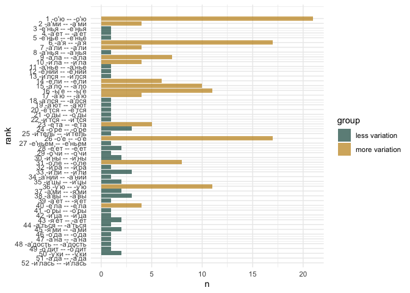
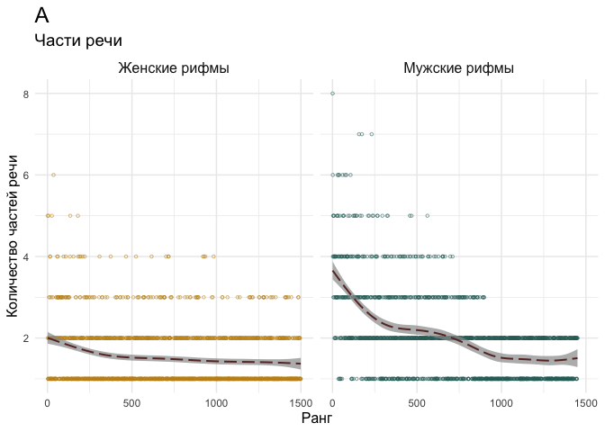

# 5.2. Rhymes: POS pairs & endings

## 5.2.2. Rhyme grammatical contrast & endings variability

Load pckg

``` r
library(tidyverse)
library(tidytext)

library(MetBrewer)
library(patchwork)
theme_set(theme_minimal())
```

Load data

Metadata

``` r
meta <- read.csv("../../data/corpus1835/sql_db/texts_metadata.csv")
# glimpse(meta)

# Meter lables

table(meta$meter)
```


    Amphibrach    Anapest     Dactyl       Iamb      Other    Trochee 
           429        142         89       3055        206        876 

``` r
meter_lables <- meta %>% 
  select(text_id, meter, feet) %>% distinct()

head(meter_lables)
```

      text_id   meter  feet
    1     P_1   Other other
    2    P_10    Iamb     3
    3   P_100    Iamb     4
    4  P_1000    Iamb     4
    5  P_1001 Trochee     4
    6  P_1002    Iamb     4

Rhyme pairs

``` r
rhyme_pairs <- read.csv("../../data/corpus1835/sql_db/rhyme_pairs.csv") %>% 
  rename(text_id = poem_id) %>% 
  # remove Kulman texts
  filter(!str_detect(text_id, "C_264"))

glimpse(rhyme_pairs)
```

    Rows: 81,247
    Columns: 4
    $ text_id    <chr> "P_1938", "P_1938", "P_1938", "C_156__20", "C_156__20", "C_…
    $ from       <chr> "краса", "огневым", "красавицей", "око", "силки", "стонет",…
    $ to         <chr> "небеса", "земным", "красавице", "высоко", "легки", "догони…
    $ rhyme_alph <chr> "краса небеса", "земным огневым", "красавице красавицей", "…

Attach meter data

``` r
nrow(rhyme_pairs)
```

    [1] 81247

``` r
rhyme_pairs <- rhyme_pairs %>% 
  left_join(meter_lables, by = "text_id") 

glimpse(rhyme_pairs)
```

    Rows: 81,247
    Columns: 6
    $ text_id    <chr> "P_1938", "P_1938", "P_1938", "C_156__20", "C_156__20", "C_…
    $ from       <chr> "краса", "огневым", "красавицей", "око", "силки", "стонет",…
    $ to         <chr> "небеса", "земным", "красавице", "высоко", "легки", "догони…
    $ rhyme_alph <chr> "краса небеса", "земным огневым", "красавице красавицей", "…
    $ meter      <chr> "Other", "Other", "Other", "Trochee", "Trochee", "Trochee",…
    $ feet       <chr> "other", "other", "other", "4", "4", "4", "4", "4", "4", "4…

Rhyme words

``` r
rhyme_words <- read.csv("../../data/corpus1835/sql_db/rhyme_words_upd.csv", 
                        
                        # DON'T LET R EAT IAMBS AND DO INTEGER 01 => 1
                        colClasses = c("stress_pattern" = "character",
                                       "closure_pattern" = "character")) 

# check if all words are unique
length(unique(rhyme_words$word)) == nrow(rhyme_words)
```

    [1] TRUE

``` r
# rewrite POS tags
pos_transl <- tibble(old_tag = c("S", "V", "APRO", "SPRO", 
                   "A", "ADV", "NUM", "ADVPRO",
                   "INTJ", "PART", "PR", "ANUM", "CONJ"),
       # pos = c("NOUN", "VERB", "aPRON", "nPRON", 
       #         "ADJ", "ADV", "NUM", "advPRON",
       #         "INTJ", "PART", "ADP", "adjNUM", "CONJ"),
       pos = c("NOUN", "VERB", "PRON", "PRON", 
               "ADJ", "ADV", "NUM", "PRON",
               "INTJ", "PART", "ADP", "NUM", "CONJ")) # upos

# attach to the table with all words
rhyme_words <- rhyme_words %>% 
  rename(old_tag = pos) %>% 
  left_join(pos_transl, by = "old_tag")

# extract inf, imp, etc.
rhyme_words <- rhyme_words %>% 
  mutate(pos = ifelse(str_detect(feats, "инф"),
                      "VERB_inf",
                      pos),
         pos = ifelse(str_detect(feats, "пов"),
                      "VERB_imp",
                      pos),
         pos = ifelse(str_detect(feats, "деепр"),
                      "VERB_deeprich",
                      pos),
         pos = ifelse(str_detect(feats, "прич"),
                      "VERB_prich",
                      pos))

glimpse(rhyme_words)
```

    Rows: 34,801
    Columns: 9
    $ word            <chr> "краса", "огневым", "красавицей", "око", "силки", "сто…
    $ word_acc        <chr> "краса'", "огневы'м", "краса'вицей", "о'ко", "силки'",…
    $ stress_pattern  <chr> "01", "001", "0100", "10", "01", "10", "1", "10", "010…
    $ closure_pattern <chr> "1", "1", "100", "10", "1", "10", "1", "10", "10", "1"…
    $ closure         <chr> "masc", "masc", "dactylic", "fem", "masc", "fem", "mas…
    $ old_tag         <chr> "S", "S", "S", "S", "S", "V", "S", "S", "S", "S", "APR…
    $ feats           <chr> "S,жен,неод=им,ед", "S,фам,муж,од=(дат,мн|твор,ед)", "…
    $ ending_st       <chr> "са'", "ы'м", "а'вицей", "о'ко", "ки'", "о'нет", "о'р"…
    $ pos             <chr> "NOUN", "NOUN", "NOUN", "NOUN", "NOUN", "VERB", "NOUN"…

Attach word’s features to rhyme pairs data

``` r
rhyme_pairs <- rhyme_pairs %>% 
  left_join(rhyme_words %>% 
              select(word, closure, pos, ending_st, feats, stress_pattern) %>% 
              rename(from = word,
                     from_closure = closure,
                     from_pos = pos,
                     from_ending = ending_st, 
                     from_feats = feats,
                     from_sp = stress_pattern),
            by = "from") %>% 
  left_join(rhyme_words %>% 
              select(word, closure, pos, ending_st, feats, stress_pattern) %>% 
              rename(to = word,
                     to_closure = closure,
                     to_pos = pos,
                     to_ending = ending_st, 
                     to_feats = feats,
                     to_sp = stress_pattern),
            by = "to") 

nrow(rhyme_pairs)
```

    [1] 81247

``` r
glimpse(rhyme_pairs)
```

    Rows: 81,247
    Columns: 16
    $ text_id      <chr> "P_1938", "P_1938", "P_1938", "C_156__20", "C_156__20", "…
    $ from         <chr> "краса", "огневым", "красавицей", "око", "силки", "стонет…
    $ to           <chr> "небеса", "земным", "красавице", "высоко", "легки", "дого…
    $ rhyme_alph   <chr> "краса небеса", "земным огневым", "красавице красавицей",…
    $ meter        <chr> "Other", "Other", "Other", "Trochee", "Trochee", "Trochee…
    $ feet         <chr> "other", "other", "other", "4", "4", "4", "4", "4", "4", …
    $ from_closure <chr> "masc", "masc", "dactylic", "fem", "masc", "fem", "masc",…
    $ from_pos     <chr> "NOUN", "NOUN", "NOUN", "NOUN", "NOUN", "VERB", "NOUN", "…
    $ from_ending  <chr> "са'", "ы'м", "а'вицей", "о'ко", "ки'", "о'нет", "о'р", "…
    $ from_feats   <chr> "S,жен,неод=им,ед", "S,фам,муж,од=(дат,мн|твор,ед)", "S,ж…
    $ from_sp      <chr> "01", "001", "0100", "10", "01", "10", "1", "10", "010", …
    $ to_closure   <chr> "masc", "masc", "dactylic", "masc", "masc", "fem", "masc"…
    $ to_pos       <chr> "NOUN", "ADJ", "NOUN", "ADV", "ADJ", "VERB", "NOUN", "ADJ…
    $ to_ending    <chr> "са'", "ы'м", "а'вице", "ко'", "ки'", "о'нит", "о'р", "у'…
    $ to_feats     <chr> "S,сред,неод=(вин,мн|им,мн)", "A=(дат,мн,полн|твор,ед,пол…
    $ to_sp        <chr> "001", "01", "0100", "001", "01", "010", "01", "010", "01…

## POS pairs & syl variation

### masc

Extract only pairs where both words were detected as masculine endings

``` r
masc_pairs <- rhyme_pairs %>% 
  filter(from_closure == "masc" & to_closure == "masc")

print(paste( "Number of (true) masc pairs:", nrow(masc_pairs), 
             "out of total", nrow(rhyme_pairs) ))
```

    [1] "Number of (true) masc pairs: 38011 out of total 81247"

``` r
# check number of one masc and one other clausula type ending (most probably annotation mistakes)
rhyme_pairs %>% 
  filter(from_closure == "masc" & to_closure != "masc") %>% nrow() 
```

    [1] 3183

``` r
rhyme_pairs %>% 
  filter(from_closure != "masc" & to_closure == "masc") %>% nrow() 
```

    [1] 3464

Iamb

``` r
iamb_masc <- masc_pairs %>% 
  filter(meter == "Iamb")

t <- nrow(iamb_masc)
t
```

    [1] 25030

``` r
iamb_count <- iamb_masc %>% 
  rowwise() %>% 
  mutate(pos_pair = paste0(sort(c(from_pos, to_pos)), collapse = " -- ")) %>% 
  ungroup() %>% 
  count(pos_pair, sort = T) %>% 
  mutate(perc = round( (n/t)*100, 2 )) %>% 
  rename(n_iamb = n,
         perc_iamb = perc)

head(iamb_count, 20)
```

    # A tibble: 20 × 3
       pos_pair                 n_iamb perc_iamb
       <chr>                     <int>     <dbl>
     1 NOUN -- NOUN               8980     35.9 
     2 NOUN -- PRON               3424     13.7 
     3 VERB -- VERB               3183     12.7 
     4 NOUN -- VERB               1497      5.98
     5 ADJ -- NOUN                1321      5.28
     6 PRON -- PRON               1077      4.3 
     7 VERB_inf -- VERB_inf        970      3.88
     8 ADV -- NOUN                 785      3.14
     9 ADJ -- PRON                 625      2.5 
    10 ADJ -- ADJ                  348      1.39
    11 NOUN -- PART                293      1.17
    12 NOUN -- VERB_inf            271      1.08
    13 NOUN -- VERB_prich          237      0.95
    14 NOUN -- VERB_imp            228      0.91
    15 ADV -- PRON                 192      0.77
    16 VERB_imp -- VERB_imp        186      0.74
    17 PRON -- VERB_prich          161      0.64
    18 NOUN -- VERB_deeprich       147      0.59
    19 PRON -- VERB                133      0.53
    20 VERB_prich -- VERB_prich     85      0.34

Syllable variation

``` r
iamb_count_syl <- iamb_masc %>% 
  mutate(# calculate number of syllables in each word
         from_n_syl = nchar(from_sp),
         to_n_syl = nchar(to_sp),
         
         # attach n_syl to pos
         from_pos_syl = paste0(from_pos, "_", from_n_syl),
         to_pos_syl = paste0(to_pos, "_", to_n_syl)) %>% 
  rowwise() %>% 
  mutate(pos_pair = paste0(sort(c(from_pos_syl, to_pos_syl)), collapse = " -- ")
         ) %>%
  ungroup() %>% 
  count(pos_pair, sort = T) %>% 
  mutate(perc = round( (n/t)*100, 2 )) %>% 
  rename(n_iamb = n,
         perc_iamb = perc) %>% 
  mutate(rank_iamb = row_number())

iamb_count_syl %>% 
  head(10)
```

    # A tibble: 10 × 4
       pos_pair         n_iamb perc_iamb rank_iamb
       <chr>             <int>     <dbl>     <int>
     1 NOUN_2 -- NOUN_2   2941     11.8          1
     2 NOUN_1 -- NOUN_2   1909      7.63         2
     3 NOUN_2 -- NOUN_3   1735      6.93         3
     4 NOUN_1 -- NOUN_1   1377      5.5          4
     5 NOUN_2 -- PRON_2   1045      4.17         5
     6 VERB_2 -- VERB_3    996      3.98         6
     7 VERB_2 -- VERB_2    943      3.77         7
     8 NOUN_2 -- PRON_1    872      3.48         8
     9 VERB_3 -- VERB_3    546      2.18         9
    10 ADJ_2 -- NOUN_2     524      2.09        10

Trochee

``` r
tr_masc <- masc_pairs %>% 
  filter(meter == "Trochee")

t <- nrow(tr_masc)
t
```

    [1] 7045

``` r
tr_masc %>% 
  rowwise() %>% 
  mutate(pos_pair = paste0(sort(c(from_pos, to_pos)), collapse = " -- ")) %>% 
  ungroup() %>% 
  count(pos_pair, sort = T) %>% 
  mutate(perc = round( (n/t)*100, 2 )) %>% 
  rename(n_tr = n,
         perc_tr = perc) %>% 
  left_join(iamb_count, by = "pos_pair") %>% 
  select(pos_pair, perc_iamb, perc_tr, n_iamb, n_tr) %>% 
  head(20)
```

    # A tibble: 20 × 5
       pos_pair             perc_iamb perc_tr n_iamb  n_tr
       <chr>                    <dbl>   <dbl>  <int> <int>
     1 NOUN -- NOUN             35.9    36.6    8980  2577
     2 VERB -- VERB             12.7    13.2    3183   928
     3 NOUN -- PRON             13.7    12.2    3424   861
     4 NOUN -- VERB              5.98    6.71   1497   473
     5 ADJ -- NOUN               5.28    5.89   1321   415
     6 PRON -- PRON              4.3     4.02   1077   283
     7 VERB_inf -- VERB_inf      3.88    3.7     970   261
     8 ADV -- NOUN               3.14    3.44    785   242
     9 ADJ -- PRON               2.5     2.37    625   167
    10 ADJ -- ADJ                1.39    1.39    348    98
    11 NOUN -- VERB_inf          1.08    0.92    271    65
    12 ADV -- PRON               0.77    0.88    192    62
    13 NOUN -- VERB_imp          0.91    0.84    228    59
    14 NOUN -- VERB_prich        0.95    0.84    237    59
    15 VERB_imp -- VERB_imp      0.74    0.81    186    57
    16 NOUN -- PART              1.17    0.75    293    53
    17 PRON -- VERB_prich        0.64    0.48    161    34
    18 ADV -- ADV                0.31    0.45     78    32
    19 PRON -- VERB              0.53    0.45    133    32
    20 ADV -- VERB               0.26    0.43     65    30

``` r
tr_count_syl <- tr_masc %>% 
  mutate(# calculate number of syllables in each word
         from_n_syl = nchar(from_sp),
         to_n_syl = nchar(to_sp),
         
         # attach n_syl to pos
         from_pos_syl = paste0(from_pos, "_", from_n_syl),
         to_pos_syl = paste0(to_pos, "_", to_n_syl)) %>% 
  rowwise() %>% 
  mutate(pos_pair = paste0(sort(c(from_pos_syl, to_pos_syl)), collapse = " -- ")
         ) %>%
  ungroup() %>% 
  count(pos_pair, sort = T) %>% 
  mutate(perc = round( (n/t)*100, 2 )) %>% 
  rename(n_tr = n,
         perc_tr = perc) %>% 
  mutate(rank_tr = row_number())

tr_count_syl %>% 
  head(10)
```

    # A tibble: 10 × 4
       pos_pair          n_tr perc_tr rank_tr
       <chr>            <int>   <dbl>   <int>
     1 NOUN_2 -- NOUN_2   873   12.4        1
     2 NOUN_2 -- NOUN_3   568    8.06       2
     3 NOUN_1 -- NOUN_2   491    6.97       3
     4 NOUN_1 -- NOUN_1   391    5.55       4
     5 VERB_2 -- VERB_2   309    4.39       5
     6 VERB_2 -- VERB_3   298    4.23       6
     7 NOUN_2 -- PRON_2   297    4.22       7
     8 NOUN_2 -- PRON_1   205    2.91       8
     9 ADJ_2 -- NOUN_2    162    2.3        9
    10 NOUN_2 -- VERB_2   149    2.11      10

``` r
iamb_count_syl %>% 
  left_join(tr_count_syl, by = "pos_pair") %>%  
  select(pos_pair, rank_iamb, rank_tr, perc_iamb, perc_tr, n_iamb, n_tr) %>% 
  head(20)
```

    # A tibble: 20 × 7
       pos_pair                 rank_iamb rank_tr perc_iamb perc_tr n_iamb  n_tr
       <chr>                        <int>   <int>     <dbl>   <dbl>  <int> <int>
     1 NOUN_2 -- NOUN_2                 1       1     11.8    12.4    2941   873
     2 NOUN_1 -- NOUN_2                 2       3      7.63    6.97   1909   491
     3 NOUN_2 -- NOUN_3                 3       2      6.93    8.06   1735   568
     4 NOUN_1 -- NOUN_1                 4       4      5.5     5.55   1377   391
     5 NOUN_2 -- PRON_2                 5       7      4.17    4.22   1045   297
     6 VERB_2 -- VERB_3                 6       6      3.98    4.23    996   298
     7 VERB_2 -- VERB_2                 7       5      3.77    4.39    943   309
     8 NOUN_2 -- PRON_1                 8       8      3.48    2.91    872   205
     9 VERB_3 -- VERB_3                 9      11      2.18    2.04    546   144
    10 ADJ_2 -- NOUN_2                 10       9      2.09    2.3     524   162
    11 NOUN_3 -- PRON_1                11      13      1.9     1.66    475   117
    12 NOUN_3 -- NOUN_3                12      12      1.89    1.8     473   127
    13 NOUN_1 -- NOUN_3                13      14      1.86    1.63    466   115
    14 PRON_1 -- PRON_2                14      19      1.81    1.31    454    92
    15 NOUN_1 -- PRON_1                15      15      1.72    1.41    431    99
    16 NOUN_2 -- VERB_2                16      10      1.64    2.11    410   149
    17 PRON_2 -- PRON_2                17      16      1.4     1.39    350    98
    18 NOUN_1 -- VERB_2                18      18      1.34    1.33    336    94
    19 VERB_inf_2 -- VERB_inf_3        19      20      1.27    1.25    317    88
    20 VERB_1 -- VERB_2                20      21      1.25    1.19    312    84

``` r
ranks_masc <- iamb_count_syl %>% 
  left_join(tr_count_syl, by = "pos_pair") %>% 
  select(pos_pair, rank_iamb, rank_tr, perc_iamb, perc_tr, n_iamb, n_tr) %>%
  drop_na() 

cor(ranks_masc$rank_iamb[1:100], ranks_masc$rank_tr[1:100], method = "kendall")
```

    [1] 0.8290909

### fem

``` r
fem_pairs <- rhyme_pairs %>% 
  filter(from_closure == "fem" & to_closure == "fem")

print(paste( "Number of (true) fem pairs:", nrow(fem_pairs), 
             "out of total", nrow(rhyme_pairs) ))
```

    [1] "Number of (true) fem pairs: 34383 out of total 81247"

``` r
# check number of one masc and one other clausula type ending (most probably annotation mistakes)
rhyme_pairs %>% 
  filter(from_closure == "fem" & to_closure != "fem") %>% nrow() 
```

    [1] 3760

``` r
rhyme_pairs %>% 
  filter(from_closure != "fem" & to_closure == "fem") %>% nrow() 
```

    [1] 3476

Separate iambs & trochees

``` r
iamb_fem <- fem_pairs %>% 
  filter(meter == "Iamb")

tr_fem <- fem_pairs %>% 
  filter(meter == "Trochee")
```

``` r
t <- nrow(iamb_fem)

iamb_count <- iamb_fem %>% rowwise() %>% 
  mutate(pos_pair = paste0(sort(c(from_pos, to_pos)), collapse = " -- ")) %>% 
  ungroup() %>% 
  count(pos_pair, sort = T) %>% 
  mutate(perc = round( (n/t)*100, 2 )) %>% 
  rename(n_iamb = n,
         perc_iamb = perc)

head(iamb_count, 20)
```

    # A tibble: 20 × 3
       pos_pair                       n_iamb perc_iamb
       <chr>                           <int>     <dbl>
     1 NOUN -- NOUN                    10639     44.0 
     2 VERB -- VERB                     4779     19.8 
     3 ADJ -- ADJ                       3045     12.6 
     4 ADJ -- NOUN                      1390      5.74
     5 NOUN -- PRON                      601      2.48
     6 NOUN -- VERB                      527      2.18
     7 ADV -- NOUN                       465      1.92
     8 ADJ -- ADV                        346      1.43
     9 ADJ -- VERB_prich                 337      1.39
    10 ADV -- ADV                        287      1.19
    11 VERB_inf -- VERB_inf              281      1.16
    12 VERB_deeprich -- VERB_deeprich    192      0.79
    13 ADJ -- VERB_deeprich              176      0.73
    14 VERB_prich -- VERB_prich          173      0.71
    15 ADJ -- PRON                       143      0.59
    16 NOUN -- VERB_deeprich             140      0.58
    17 VERB_imp -- VERB_imp              137      0.57
    18 NOUN -- VERB_prich                115      0.48
    19 ADV -- VERB                       107      0.44
    20 PRON -- PRON                       64      0.26

``` r
f_iamb_count_syl <- iamb_fem %>% 
  mutate(# calculate number of syllables in each word
         from_n_syl = nchar(from_sp),
         to_n_syl = nchar(to_sp),
         
         # attach n_syl to pos
         from_pos_syl = paste0(from_pos, "_", from_n_syl),
         to_pos_syl = paste0(to_pos, "_", to_n_syl)) %>% 
  rowwise() %>% 
  mutate(pos_pair = paste0(sort(c(from_pos_syl, to_pos_syl)), collapse = " -- ")
         ) %>%
  ungroup() %>% 
  count(pos_pair, sort = T) %>% 
  mutate(perc = round( (n/t)*100, 2 )) %>% 
  rename(n_iamb = n,
         perc_iamb = perc) %>% 
  mutate(rank_iamb = row_number())

f_iamb_count_syl %>% 
  head(10)
```

    # A tibble: 10 × 4
       pos_pair         n_iamb perc_iamb rank_iamb
       <chr>             <int>     <dbl>     <int>
     1 NOUN_3 -- NOUN_3   3046     12.6          1
     2 NOUN_2 -- NOUN_3   2433     10.0          2
     3 NOUN_3 -- NOUN_4   1928      7.97         3
     4 NOUN_2 -- NOUN_2   1456      6.02         4
     5 VERB_3 -- VERB_4   1406      5.81         5
     6 VERB_4 -- VERB_4   1037      4.29         6
     7 VERB_3 -- VERB_3    887      3.67         7
     8 ADJ_3 -- ADJ_3      842      3.48         8
     9 ADJ_3 -- ADJ_4      801      3.31         9
    10 VERB_2 -- VERB_3    605      2.5         10

``` r
t <- nrow(tr_fem)

tr_fem %>% 
  rowwise() %>% 
  mutate(pos_pair = paste0(sort(c(from_pos, to_pos)), collapse = " -- ")) %>% 
  ungroup() %>% 
  count(pos_pair, sort = T) %>% 
  mutate(perc = round( (n/t)*100, 2 )) %>% 
  rename(n_tr = n,
         perc_tr = perc) %>% 
  left_join(iamb_count, by = "pos_pair") %>% 
  select(pos_pair, perc_iamb, perc_tr, n_iamb, n_tr) %>% 
  head(20)
```

    # A tibble: 20 × 5
       pos_pair                       perc_iamb perc_tr n_iamb  n_tr
       <chr>                              <dbl>   <dbl>  <int> <int>
     1 NOUN -- NOUN                       44.0    43.4   10639  2739
     2 VERB -- VERB                       19.8    17.8    4779  1126
     3 ADJ -- ADJ                         12.6    13.6    3045   858
     4 ADJ -- NOUN                         5.74    7.06   1390   446
     5 NOUN -- VERB                        2.18    2.61    527   165
     6 ADV -- NOUN                         1.92    2.1     465   133
     7 NOUN -- PRON                        2.48    2.07    601   131
     8 ADJ -- ADV                          1.43    1.82    346   115
     9 ADV -- ADV                          1.19    1.36    287    86
    10 ADJ -- VERB_prich                   1.39    1.03    337    65
    11 NOUN -- VERB_deeprich               0.58    1       140    63
    12 ADJ -- VERB_deeprich                0.73    0.93    176    59
    13 VERB_inf -- VERB_inf                1.16    0.81    281    51
    14 VERB_deeprich -- VERB_deeprich      0.79    0.79    192    50
    15 ADJ -- PRON                         0.59    0.65    143    41
    16 ADV -- VERB                         0.44    0.59    107    37
    17 VERB_imp -- VERB_imp                0.57    0.55    137    35
    18 VERB_prich -- VERB_prich            0.71    0.47    173    30
    19 NOUN -- VERB_prich                  0.48    0.38    115    24
    20 ADJ -- VERB                         0.1     0.27     23    17

``` r
f_tr_count_syl <- tr_fem %>% 
  mutate(# calculate number of syllables in each word
         from_n_syl = nchar(from_sp),
         to_n_syl = nchar(to_sp),
         
         # attach n_syl to pos
         from_pos_syl = paste0(from_pos, "_", from_n_syl),
         to_pos_syl = paste0(to_pos, "_", to_n_syl)) %>% 
  rowwise() %>% 
  mutate(pos_pair = paste0(sort(c(from_pos_syl, to_pos_syl)), collapse = " -- ")
         ) %>%
  ungroup() %>% 
  count(pos_pair, sort = T) %>% 
  mutate(perc = round( (n/t)*100, 2 )) %>% 
  rename(n_tr = n,
         perc_tr = perc) %>% 
  mutate(rank_tr = row_number())

f_tr_count_syl %>% 
  head(10)
```

    # A tibble: 10 × 4
       pos_pair          n_tr perc_tr rank_tr
       <chr>            <int>   <dbl>   <int>
     1 NOUN_3 -- NOUN_3   815   12.9        1
     2 NOUN_2 -- NOUN_3   681   10.8        2
     3 NOUN_2 -- NOUN_2   471    7.45       3
     4 NOUN_3 -- NOUN_4   440    6.96       4
     5 VERB_3 -- VERB_4   306    4.84       5
     6 ADJ_3 -- ADJ_3     243    3.85       6
     7 ADJ_3 -- ADJ_4     233    3.69       7
     8 VERB_3 -- VERB_3   224    3.54       8
     9 VERB_4 -- VERB_4   207    3.28       9
    10 VERB_2 -- VERB_3   199    3.15      10

Syllable variation

``` r
f_iamb_count_syl %>% 
  left_join(f_tr_count_syl, by = "pos_pair") %>% 
  select(pos_pair, rank_iamb, rank_tr, perc_iamb, perc_tr, n_iamb, n_tr) %>% 
  head(20)
```

    # A tibble: 20 × 7
       pos_pair         rank_iamb rank_tr perc_iamb perc_tr n_iamb  n_tr
       <chr>                <int>   <int>     <dbl>   <dbl>  <int> <int>
     1 NOUN_3 -- NOUN_3         1       1     12.6    12.9    3046   815
     2 NOUN_2 -- NOUN_3         2       2     10.0    10.8    2433   681
     3 NOUN_3 -- NOUN_4         3       4      7.97    6.96   1928   440
     4 NOUN_2 -- NOUN_2         4       3      6.02    7.45   1456   471
     5 VERB_3 -- VERB_4         5       5      5.81    4.84   1406   306
     6 VERB_4 -- VERB_4         6       9      4.29    3.28   1037   207
     7 VERB_3 -- VERB_3         7       8      3.67    3.54    887   224
     8 ADJ_3 -- ADJ_3           8       6      3.48    3.85    842   243
     9 ADJ_3 -- ADJ_4           9       7      3.31    3.69    801   233
    10 VERB_2 -- VERB_3        10      10      2.5     3.15    605   199
    11 NOUN_4 -- NOUN_4        11      15      2.49    1.39    602    88
    12 ADJ_2 -- ADJ_3          12      11      2.29    2.69    554   170
    13 NOUN_2 -- NOUN_4        13      13      2.06    2.18    499   138
    14 ADJ_3 -- NOUN_2         14      12      1.57    2.22    381   140
    15 NOUN_3 -- NOUN_5        15      21      1.43    0.87    347    55
    16 ADJ_3 -- NOUN_3         16      14      1.3     1.65    315   104
    17 VERB_2 -- VERB_4        17      16      1.22    1.14    295    72
    18 ADJ_4 -- ADJ_4          18      18      1.09    1.04    263    66
    19 NOUN_4 -- NOUN_5        19      26      1.01    0.6     245    38
    20 NOUN_3 -- PRON_2        20      20      1       0.9     241    57

``` r
fem_ranks <- f_iamb_count_syl %>% 
  left_join(f_tr_count_syl, by = "pos_pair") %>% 
  select(pos_pair, rank_iamb, rank_tr, perc_iamb, perc_tr, n_iamb, n_tr) %>% 
  drop_na()

cor(fem_ranks$rank_iamb[1:100], fem_ranks$rank_tr[1:100], method = "kendall")
```

    [1] 0.7171717

## RNC

### Load RNC data

``` r
rnc_rhymes <- read.csv("../../data/ch5/nkrja_rhyme_pairs.csv") %>% select(-X)

# attach meters to extract only iambs
# load metadata to extract meters
load("../../data/nkrja_19th_lem.Rda")
rnc_ids <- c19 %>% 
  filter(meter %in% c("Я", "Х")) %>% 
  mutate(poem_id = paste0("RNC_", Unnamed..0, "_", year), 
         meter = meter) %>% 
  select(poem_id, meter)
  

# attach meters to rhyme data
rnc_rhymes <- rnc_rhymes %>% 
  inner_join(rnc_ids, by = "poem_id")

rm(c19, rnc_ids) # remove large c19 file & iamb-id vector

# look at the resulting data
# glimpse(rnc_rhymes)
```

Distribution of data over time - filter out rhymes after 1810

``` r
ids_before_1830 <- rnc_rhymes %>% 
  select(poem_id) %>% 
  separate(poem_id, into = c("corpus", "id", "year"), sep = "_") %>% 
  filter(as.numeric(year) < 1811) %>% 
  mutate(poem_id = paste0("RNC_", id, "_", year)) %>% 
  pull(poem_id)

# filter only rhymes before 1830
rnc_rhymes <- rnc_rhymes %>% 
  filter(poem_id %in% ids_before_1830)

rm(ids_before_1830) # remove large character vector

# add verb_inf & verb_imp categories
rnc_rhymes <- rnc_rhymes %>% 
  mutate(from_pos = ifelse(str_detect(from_feats, "VerbForm=Inf"), 
                      "VERB_inf", from_pos),
         from_pos = ifelse(str_detect(from_feats, "Mood=Imp"), 
                      "VERB_imp", from_pos)) %>% 
  mutate(to_pos = ifelse(str_detect(to_feats, "VerbForm=Inf"), 
                      "VERB_inf", to_pos),
         to_pos = ifelse(str_detect(to_feats, "Mood=Imp"), 
                      "VERB_imp", to_pos))

rnc_rhymes %>% 
  select(poem_id) %>% 
  separate(poem_id, into = c("corpus", "id", "year"), sep = "_") %>% 
  count(year) %>% 
  ggplot(aes(x = year, y = n)) + geom_col() + 
  theme(axis.text.x = element_text(angle = 90))
```


### masc

Filter only masculine rhymes

``` r
rnc_masc <- rnc_rhymes %>% 
  filter(from_closure == "masc" & to_closure == "masc")

nrow(rnc_masc)
```

    [1] 16593

Iamb

``` r
rnc_iamb_masc <- rnc_masc %>% 
  filter(meter == "Я")

t <- nrow(rnc_iamb_masc)
t
```

    [1] 14621

Syllable variation

``` r
rnc_iamb_count_syl <- rnc_iamb_masc %>% 
  mutate(# calculate number of syllables in each word
         from_n_syl = nchar(from_sp),
         to_n_syl = nchar(to_sp),
         
         # attach n_syl to pos
         from_pos_syl = paste0(from_pos, "_", from_n_syl),
         to_pos_syl = paste0(to_pos, "_", to_n_syl)) %>% 
  rowwise() %>% 
  mutate(pos_pair = paste0(sort(c(from_pos_syl, to_pos_syl)), collapse = " -- ")
         ) %>%
  ungroup() %>% 
  count(pos_pair, sort = T) %>% 
  mutate(perc = round( (n/t)*100, 2 )) %>% 
  rename(rnc_n_iamb = n,
         rnc_perc_iamb = perc) %>% 
  mutate(rnc_rank_iamb = row_number())

rnc_iamb_count_syl %>% 
  head(10)
```

    # A tibble: 10 × 4
       pos_pair                 rnc_n_iamb rnc_perc_iamb rnc_rank_iamb
       <chr>                         <int>         <dbl>         <int>
     1 NOUN_2 -- NOUN_2               1573         10.8              1
     2 NOUN_1 -- NOUN_2               1143          7.82             2
     3 NOUN_1 -- NOUN_1               1075          7.35             3
     4 NOUN_2 -- NOUN_3                794          5.43             4
     5 VERB_inf_2 -- VERB_inf_3        493          3.37             5
     6 VERB_2 -- VERB_3                473          3.24             6
     7 VERB_2 -- VERB_2                438          3                7
     8 NOUN_2 -- PRON_1                342          2.34             8
     9 NOUN_1 -- NOUN_3                304          2.08             9
    10 VERB_inf_3 -- VERB_inf_3        295          2.02            10

trochee

``` r
rnc_tr_masc <- rnc_masc %>% 
  filter(meter == "Х")

t <- nrow(rnc_tr_masc)
t
```

    [1] 1972

``` r
rnc_tr_count_syl <- rnc_tr_masc %>% 
  mutate(# calculate number of syllables in each word
         from_n_syl = nchar(from_sp),
         to_n_syl = nchar(to_sp),
         
         # attach n_syl to pos
         from_pos_syl = paste0(from_pos, "_", from_n_syl),
         to_pos_syl = paste0(to_pos, "_", to_n_syl)) %>% 
  rowwise() %>% 
  mutate(pos_pair = paste0(sort(c(from_pos_syl, to_pos_syl)), collapse = " -- ")
         ) %>%
  ungroup() %>% 
  count(pos_pair, sort = T) %>% 
  mutate(perc = round( (n/t)*100, 2 )) %>% 
  rename(rnc_n_tr = n,
         rnc_perc_tr = perc) %>% 
  mutate(rnc_rank_tr = row_number())

rnc_tr_count_syl %>% 
  head(10)
```

    # A tibble: 10 × 4
       pos_pair                 rnc_n_tr rnc_perc_tr rnc_rank_tr
       <chr>                       <int>       <dbl>       <int>
     1 NOUN_2 -- NOUN_2              206       10.4            1
     2 NOUN_1 -- NOUN_2              128        6.49           2
     3 NOUN_1 -- NOUN_1              114        5.78           3
     4 NOUN_2 -- NOUN_3              113        5.73           4
     5 VERB_2 -- VERB_3               73        3.7            5
     6 VERB_inf_2 -- VERB_inf_3       66        3.35           6
     7 VERB_2 -- VERB_2               63        3.19           7
     8 NOUN_2 -- PRON_2               50        2.54           8
     9 NOUN_3 -- NOUN_3               48        2.43           9
    10 NOUN_2 -- PRON_1               45        2.28          10

Comparison

``` r
rnc_iamb_count_syl %>% 
  left_join(rnc_tr_count_syl, by = "pos_pair") %>% 
  select(pos_pair, rnc_rank_iamb, rnc_rank_tr, rnc_perc_iamb, 
         rnc_perc_tr, rnc_n_iamb, rnc_n_tr) %>% 
  head(20)
```

    # A tibble: 20 × 7
       pos_pair       rnc_rank_iamb rnc_rank_tr rnc_perc_iamb rnc_perc_tr rnc_n_iamb
       <chr>                  <int>       <int>         <dbl>       <dbl>      <int>
     1 NOUN_2 -- NOU…             1           1         10.8        10.4        1573
     2 NOUN_1 -- NOU…             2           2          7.82        6.49       1143
     3 NOUN_1 -- NOU…             3           3          7.35        5.78       1075
     4 NOUN_2 -- NOU…             4           4          5.43        5.73        794
     5 VERB_inf_2 --…             5           6          3.37        3.35        493
     6 VERB_2 -- VER…             6           5          3.24        3.7         473
     7 VERB_2 -- VER…             7           7          3           3.19        438
     8 NOUN_2 -- PRO…             8          10          2.34        2.28        342
     9 NOUN_1 -- NOU…             9          19          2.08        1.42        304
    10 VERB_inf_3 --…            10          20          2.02        1.37        295
    11 VERB_3 -- VER…            11          21          1.94        1.32        283
    12 DET_2 -- NOUN…            12          14          1.78        1.93        260
    13 VERB_inf_2 --…            13          16          1.77        1.88        259
    14 NOUN_1 -- VER…            14          17          1.65        1.72        241
    15 VERB_1 -- VER…            15          28          1.58        0.91        231
    16 NOUN_1 -- PRO…            16          11          1.52        2.08        222
    17 VERB_inf_1 --…            17          15          1.47        1.88        215
    18 DET_2 -- PRON…            18          13          1.45        1.98        212
    19 NOUN_3 -- NOU…            19           9          1.42        2.43        208
    20 NOUN_1 -- VER…            20          12          1.4         2.03        205
    # ℹ 1 more variable: rnc_n_tr <int>

``` r
rnc_masc_ranks <- rnc_iamb_count_syl %>% 
  left_join(rnc_tr_count_syl, by = "pos_pair") %>% 
  select(pos_pair, rnc_rank_iamb, rnc_rank_tr, rnc_perc_iamb, 
         rnc_perc_tr, rnc_n_iamb, rnc_n_tr) %>%
  drop_na() 

cor(rnc_masc_ranks$rnc_rank_iamb[1:100], rnc_masc_ranks$rnc_rank_tr[1:100], method = "kendall")
```

    [1] 0.7183838

### fem rhymes

Same steps for feminine rhymes

``` r
rnc_fem <- rnc_rhymes %>% 
  filter(from_closure == "fem" & to_closure == "fem")

nrow(rnc_fem)
```

    [1] 17615

Iamb

``` r
rnc_iamb_fem <- rnc_fem %>% 
  filter(meter == "Я")

t <- nrow(rnc_iamb_fem)
t
```

    [1] 15452

``` r
rnc_fem_iamb_count_syl <- rnc_iamb_fem %>% 
  mutate(# calculate number of syllables in each word
         from_n_syl = nchar(from_sp),
         to_n_syl = nchar(to_sp),
         
         # attach n_syl to pos
         from_pos_syl = paste0(from_pos, "_", from_n_syl),
         to_pos_syl = paste0(to_pos, "_", to_n_syl)) %>% 
  rowwise() %>% 
  mutate(pos_pair = paste0(sort(c(from_pos_syl, to_pos_syl)), collapse = " -- ")
         ) %>%
  ungroup() %>% 
  count(pos_pair, sort = T) %>% 
  mutate(perc = round( (n/t)*100, 2 )) %>% 
  rename(rnc_n_iamb = n,
         rnc_perc_iamb = perc) %>% 
  mutate(rnc_rank_iamb = row_number())

rnc_fem_iamb_count_syl %>% 
  head(10)
```

    # A tibble: 10 × 4
       pos_pair         rnc_n_iamb rnc_perc_iamb rnc_rank_iamb
       <chr>                 <int>         <dbl>         <int>
     1 VERB_3 -- VERB_4       1516          9.81             1
     2 NOUN_2 -- NOUN_3       1461          9.46             2
     3 NOUN_3 -- NOUN_3       1409          9.12             3
     4 VERB_4 -- VERB_4       1223          7.91             4
     5 NOUN_2 -- NOUN_2        958          6.2              5
     6 NOUN_3 -- NOUN_4        865          5.6              6
     7 VERB_3 -- VERB_3        785          5.08             7
     8 ADJ_3 -- ADJ_3          418          2.71             8
     9 VERB_2 -- VERB_3        415          2.69             9
    10 ADJ_2 -- ADJ_3          312          2.02            10

Trochee

``` r
rnc_tr_fem <- rnc_fem %>% 
  filter(meter == "Х")

t <- nrow(rnc_tr_fem)
t # very small number of trochee feminine examples!
```

    [1] 2163

``` r
rnc_fem_tr_count_syl <- rnc_tr_fem %>% 
  mutate(# calculate number of syllables in each word
         from_n_syl = nchar(from_sp),
         to_n_syl = nchar(to_sp),
         
         # attach n_syl to pos
         from_pos_syl = paste0(from_pos, "_", from_n_syl),
         to_pos_syl = paste0(to_pos, "_", to_n_syl)) %>% 
  rowwise() %>% 
  mutate(pos_pair = paste0(sort(c(from_pos_syl, to_pos_syl)), collapse = " -- ")
         ) %>%
  ungroup() %>% 
  count(pos_pair, sort = T) %>% 
  mutate(perc = round( (n/t)*100, 2 )) %>% 
  rename(rnc_n_tr = n,
         rnc_perc_tr = perc) %>% 
  mutate(rnc_rank_tr = row_number())

rnc_tr_count_syl %>% 
  head(10)
```

    # A tibble: 10 × 4
       pos_pair                 rnc_n_tr rnc_perc_tr rnc_rank_tr
       <chr>                       <int>       <dbl>       <int>
     1 NOUN_2 -- NOUN_2              206       10.4            1
     2 NOUN_1 -- NOUN_2              128        6.49           2
     3 NOUN_1 -- NOUN_1              114        5.78           3
     4 NOUN_2 -- NOUN_3              113        5.73           4
     5 VERB_2 -- VERB_3               73        3.7            5
     6 VERB_inf_2 -- VERB_inf_3       66        3.35           6
     7 VERB_2 -- VERB_2               63        3.19           7
     8 NOUN_2 -- PRON_2               50        2.54           8
     9 NOUN_3 -- NOUN_3               48        2.43           9
    10 NOUN_2 -- PRON_1               45        2.28          10

Comparison

``` r
rnc_fem_iamb_count_syl %>% 
  left_join(rnc_fem_tr_count_syl, by = "pos_pair") %>%
  select(pos_pair, rnc_rank_iamb, rnc_rank_tr, rnc_perc_iamb, 
         rnc_perc_tr, rnc_n_iamb, rnc_n_tr) %>% 
  head(20)
```

    # A tibble: 20 × 7
       pos_pair       rnc_rank_iamb rnc_rank_tr rnc_perc_iamb rnc_perc_tr rnc_n_iamb
       <chr>                  <int>       <int>         <dbl>       <dbl>      <int>
     1 VERB_3 -- VER…             1           3          9.81        9.62       1516
     2 NOUN_2 -- NOU…             2           1          9.46       11.6        1461
     3 NOUN_3 -- NOU…             3           2          9.12       10.0        1409
     4 VERB_4 -- VER…             4           5          7.91        6.1        1223
     5 NOUN_2 -- NOU…             5           4          6.2         7.49        958
     6 NOUN_3 -- NOU…             6           7          5.6         4.25        865
     7 VERB_3 -- VER…             7           6          5.08        5.13        785
     8 ADJ_3 -- ADJ_3             8           8          2.71        3.05        418
     9 VERB_2 -- VER…             9          10          2.69        2.17        415
    10 ADJ_2 -- ADJ_3            10           9          2.02        2.68        312
    11 NOUN_2 -- NOU…            11          14          1.88        1.29        290
    12 VERB_2 -- VER…            12          13          1.74        1.43        269
    13 NOUN_4 -- NOU…            13          19          1.66        0.97        257
    14 ADJ_3 -- NOUN…            14          16          1.6         1.16        247
    15 ADJ_3 -- ADJ_4            15          11          1.56        1.76        241
    16 VERB_4 -- VER…            16          26          1.35        0.69        209
    17 NOUN_3 -- VER…            17          18          1.13        0.97        175
    18 NOUN_3 -- VER…            18          12          1.12        1.71        173
    19 NOUN_3 -- PRO…            19          17          0.89        0.97        137
    20 VERB_2 -- VER…            20          20          0.88        0.97        136
    # ℹ 1 more variable: rnc_n_tr <int>

``` r
rnc_fem_ranks <- rnc_fem_iamb_count_syl %>% 
  left_join(rnc_fem_tr_count_syl, by = "pos_pair") %>% 
  select(pos_pair, rnc_rank_iamb, rnc_rank_tr, rnc_perc_iamb, 
         rnc_perc_tr, rnc_n_iamb, rnc_n_tr) %>%
  drop_na() 

cor(rnc_fem_ranks$rnc_rank_iamb[1:100], rnc_fem_ranks$rnc_rank_tr[1:100], method = "kendall")
```

    [1] 0.679596

## compare C35 & RNC

Masc rhymes

``` r
glimpse(ranks_masc) # corpus-1835 
```

    Rows: 249
    Columns: 7
    $ pos_pair  <chr> "NOUN_2 -- NOUN_2", "NOUN_1 -- NOUN_2", "NOUN_2 -- NOUN_3", …
    $ rank_iamb <int> 1, 2, 3, 4, 5, 6, 7, 8, 9, 10, 11, 12, 13, 14, 15, 16, 17, 1…
    $ rank_tr   <int> 1, 3, 2, 4, 7, 6, 5, 8, 11, 9, 13, 12, 14, 19, 15, 10, 16, 1…
    $ perc_iamb <dbl> 11.75, 7.63, 6.93, 5.50, 4.17, 3.98, 3.77, 3.48, 2.18, 2.09,…
    $ perc_tr   <dbl> 12.39, 6.97, 8.06, 5.55, 4.22, 4.23, 4.39, 2.91, 2.04, 2.30,…
    $ n_iamb    <int> 2941, 1909, 1735, 1377, 1045, 996, 943, 872, 546, 524, 475, …
    $ n_tr      <int> 873, 491, 568, 391, 297, 298, 309, 205, 144, 162, 117, 127, …

``` r
glimpse(rnc_masc_ranks) # rnc
```

    Rows: 189
    Columns: 7
    $ pos_pair      <chr> "NOUN_2 -- NOUN_2", "NOUN_1 -- NOUN_2", "NOUN_1 -- NOUN_…
    $ rnc_rank_iamb <int> 1, 2, 3, 4, 5, 6, 7, 8, 9, 10, 11, 12, 13, 14, 15, 16, 1…
    $ rnc_rank_tr   <int> 1, 2, 3, 4, 6, 5, 7, 10, 19, 20, 21, 14, 16, 17, 28, 11,…
    $ rnc_perc_iamb <dbl> 10.76, 7.82, 7.35, 5.43, 3.37, 3.24, 3.00, 2.34, 2.08, 2…
    $ rnc_perc_tr   <dbl> 10.45, 6.49, 5.78, 5.73, 3.35, 3.70, 3.19, 2.28, 1.42, 1…
    $ rnc_n_iamb    <int> 1573, 1143, 1075, 794, 493, 473, 438, 342, 304, 295, 283…
    $ rnc_n_tr      <int> 206, 128, 114, 113, 66, 73, 63, 45, 28, 27, 26, 38, 37, …

``` r
all_masc_ranks <- ranks_masc %>% 
  left_join(rnc_masc_ranks, by = "pos_pair") %>% 
  select(pos_pair, 
         rank_iamb, rnc_rank_iamb, rank_tr, rnc_rank_tr,
         perc_iamb, rnc_perc_iamb, perc_tr, rnc_perc_tr,
         n_iamb, rnc_n_iamb, n_tr, rnc_n_tr
         )

head(all_masc_ranks, 20)
```

    # A tibble: 20 × 13
       pos_pair  rank_iamb rnc_rank_iamb rank_tr rnc_rank_tr perc_iamb rnc_perc_iamb
       <chr>         <int>         <int>   <int>       <int>     <dbl>         <dbl>
     1 NOUN_2 -…         1             1       1           1     11.8          10.8 
     2 NOUN_1 -…         2             2       3           2      7.63          7.82
     3 NOUN_2 -…         3             4       2           4      6.93          5.43
     4 NOUN_1 -…         4             3       4           3      5.5           7.35
     5 NOUN_2 -…         5            21       7           8      4.17          1.4 
     6 VERB_2 -…         6             6       6           5      3.98          3.24
     7 VERB_2 -…         7             7       5           7      3.77          3   
     8 NOUN_2 -…         8             8       8          10      3.48          2.34
     9 VERB_3 -…         9            11      11          21      2.18          1.94
    10 ADJ_2 --…        10            25       9          26      2.09          0.91
    11 NOUN_3 -…        11            31      13          24      1.9           0.66
    12 NOUN_3 -…        12            19      12           9      1.89          1.42
    13 NOUN_1 -…        13             9      14          19      1.86          2.08
    14 PRON_1 -…        14            29      19          25      1.81          0.75
    15 NOUN_1 -…        15            16      15          11      1.72          1.52
    16 NOUN_2 -…        16            22      10          23      1.64          1.29
    17 PRON_2 -…        17            23      16          18      1.4           1.28
    18 NOUN_1 -…        18            14      18          17      1.34          1.65
    19 VERB_inf…        19             5      20           6      1.27          3.37
    20 VERB_1 -…        20            15      21          28      1.25          1.58
    # ℹ 6 more variables: perc_tr <dbl>, rnc_perc_tr <dbl>, n_iamb <int>,
    #   rnc_n_iamb <int>, n_tr <int>, rnc_n_tr <int>

``` r
# drop na for cor test
r <- all_masc_ranks %>% drop_na()

cor(r$rank_iamb[1:90], r$rnc_rank_iamb[1:90],
    method = "kendall")
```

    [1] 0.6509363

``` r
cor(r$rank_tr[1:90], r$rnc_rank_tr[1:90], method = "kendall")
```

    [1] 0.6589263

Fem rhymes

``` r
all_fem_ranks <- fem_ranks %>% 
  left_join(rnc_fem_ranks, by = "pos_pair") %>% 
  select(pos_pair, 
         rank_iamb, rnc_rank_iamb, rank_tr, rnc_rank_tr,
         perc_iamb, rnc_perc_iamb, perc_tr, rnc_perc_tr,
         n_iamb, rnc_n_iamb, n_tr, rnc_n_tr
         )

head(all_fem_ranks, 20)
```

    # A tibble: 20 × 13
       pos_pair  rank_iamb rnc_rank_iamb rank_tr rnc_rank_tr perc_iamb rnc_perc_iamb
       <chr>         <int>         <int>   <int>       <int>     <dbl>         <dbl>
     1 NOUN_3 -…         1             3       1           2     12.6           9.12
     2 NOUN_2 -…         2             2       2           1     10.0           9.46
     3 NOUN_3 -…         3             6       4           7      7.97          5.6 
     4 NOUN_2 -…         4             5       3           4      6.02          6.2 
     5 VERB_3 -…         5             1       5           3      5.81          9.81
     6 VERB_4 -…         6             4       9           5      4.29          7.91
     7 VERB_3 -…         7             7       8           6      3.67          5.08
     8 ADJ_3 --…         8             8       6           8      3.48          2.71
     9 ADJ_3 --…         9            15       7          11      3.31          1.56
    10 VERB_2 -…        10             9      10          10      2.5           2.69
    11 NOUN_4 -…        11            13      15          19      2.49          1.66
    12 ADJ_2 --…        12            10      11           9      2.29          2.02
    13 NOUN_2 -…        13            11      13          14      2.06          1.88
    14 ADJ_3 --…        14            21      12          21      1.57          0.8 
    15 NOUN_3 -…        15            22      21          45      1.43          0.69
    16 ADJ_3 --…        16            14      14          16      1.3           1.6 
    17 VERB_2 -…        17            12      16          13      1.22          1.74
    18 ADJ_4 --…        18            36      18          86      1.09          0.38
    19 NOUN_4 -…        19            27      26          36      1.01          0.56
    20 NOUN_3 -…        20            32      20          23      1             0.5 
    # ℹ 6 more variables: perc_tr <dbl>, rnc_perc_tr <dbl>, n_iamb <int>,
    #   rnc_n_iamb <int>, n_tr <int>, rnc_n_tr <int>

``` r
# drop na for cor test
r <- all_fem_ranks %>% drop_na()

cor(r$rank_iamb[1:90], r$rnc_rank_iamb[1:90],
    method = "kendall")
```

    [1] 0.6459426

``` r
cor(r$rank_tr[1:90], r$rnc_rank_tr[1:90], method = "kendall")
```

    [1] 0.6833958

### network viz

Network:

from, to, corpus, meter, clausula(?)

NOUN_2 - NOUN_3 , filter n = 1

different network for different meters & periods =\> see which pos do
not meet each other in rhyme & which syl numbers are more freq

mb facet wrap for nkrja / c1835 + diff edges/colours for trochee/iamb

``` r
library(tidygraph)
```


    Attaching package: 'tidygraph'

    The following object is masked from 'package:stats':

        filter

``` r
library(ggraph)

glimpse(all_masc_ranks)
```

    Rows: 249
    Columns: 13
    $ pos_pair      <chr> "NOUN_2 -- NOUN_2", "NOUN_1 -- NOUN_2", "NOUN_2 -- NOUN_…
    $ rank_iamb     <int> 1, 2, 3, 4, 5, 6, 7, 8, 9, 10, 11, 12, 13, 14, 15, 16, 1…
    $ rnc_rank_iamb <int> 1, 2, 4, 3, 21, 6, 7, 8, 11, 25, 31, 19, 9, 29, 16, 22, …
    $ rank_tr       <int> 1, 3, 2, 4, 7, 6, 5, 8, 11, 9, 13, 12, 14, 19, 15, 10, 1…
    $ rnc_rank_tr   <int> 1, 2, 4, 3, 8, 5, 7, 10, 21, 26, 24, 9, 19, 25, 11, 23, …
    $ perc_iamb     <dbl> 11.75, 7.63, 6.93, 5.50, 4.17, 3.98, 3.77, 3.48, 2.18, 2…
    $ rnc_perc_iamb <dbl> 10.76, 7.82, 5.43, 7.35, 1.40, 3.24, 3.00, 2.34, 1.94, 0…
    $ perc_tr       <dbl> 12.39, 6.97, 8.06, 5.55, 4.22, 4.23, 4.39, 2.91, 2.04, 2…
    $ rnc_perc_tr   <dbl> 10.45, 6.49, 5.73, 5.78, 2.54, 3.70, 3.19, 2.28, 1.32, 0…
    $ n_iamb        <int> 2941, 1909, 1735, 1377, 1045, 996, 943, 872, 546, 524, 4…
    $ rnc_n_iamb    <int> 1573, 1143, 794, 1075, 204, 473, 438, 342, 283, 133, 97,…
    $ n_tr          <int> 873, 491, 568, 391, 297, 298, 309, 205, 144, 162, 117, 1…
    $ rnc_n_tr      <int> 206, 128, 113, 114, 50, 73, 63, 45, 26, 19, 22, 48, 28, …

``` r
summary(all_masc_ranks)
```

       pos_pair           rank_iamb     rnc_rank_iamb       rank_tr     
     Length:249         Min.   :  1.0   Min.   :  1.00   Min.   :  1.0  
     Class :character   1st Qu.: 63.0   1st Qu.: 31.50   1st Qu.: 63.0  
     Mode  :character   Median :125.0   Median : 71.00   Median :125.0  
                        Mean   :142.4   Mean   : 88.79   Mean   :129.7  
                        3rd Qu.:210.0   3rd Qu.:126.00   3rd Qu.:195.0  
                        Max.   :392.0   Max.   :399.00   Max.   :273.0  
                                        NA's   :142                     
      rnc_rank_tr      perc_iamb       rnc_perc_iamb        perc_tr       
     Min.   :  1.0   Min.   : 0.0000   Min.   : 0.0100   Min.   : 0.0100  
     1st Qu.: 31.5   1st Qu.: 0.0200   1st Qu.: 0.0700   1st Qu.: 0.0100  
     Median : 72.0   Median : 0.0600   Median : 0.1900   Median : 0.0600  
     Mean   : 83.0   Mean   : 0.3958   Mean   : 0.7755   Mean   : 0.3989  
     3rd Qu.:122.0   3rd Qu.: 0.2200   3rd Qu.: 0.6200   3rd Qu.: 0.2300  
     Max.   :205.0   Max.   :11.7500   Max.   :10.7600   Max.   :12.3900  
     NA's   :142                       NA's   :142                        
      rnc_perc_tr          n_iamb          rnc_n_iamb          n_tr       
     Min.   : 0.0500   Min.   :   1.00   Min.   :   1.0   Min.   :  1.00  
     1st Qu.: 0.0500   1st Qu.:   4.00   1st Qu.:  10.0   1st Qu.:  1.00  
     Median : 0.1500   Median :  14.00   Median :  28.0   Median :  4.00  
     Mean   : 0.7739   Mean   :  99.11   Mean   : 113.4   Mean   : 28.17  
     3rd Qu.: 0.7600   3rd Qu.:  56.00   3rd Qu.:  91.0   3rd Qu.: 16.00  
     Max.   :10.4500   Max.   :2941.00   Max.   :1573.0   Max.   :873.00  
     NA's   :142                         NA's   :142                      
        rnc_n_tr     
     Min.   :  1.00  
     1st Qu.:  1.00  
     Median :  3.00  
     Mean   : 15.28  
     3rd Qu.: 15.00  
     Max.   :206.00  
     NA's   :142     

Rename nodes

``` r
all_fem_ranks %>% 
  select(pos_pair) %>% 
  mutate(pos_pair = ifelse(str_detect(pos_pair, "NOUN"), 
                           str_replace_all(pos_pair, "NOUN", "СУЩ"),
                           pos_pair),
         pos_pair = ifelse(str_detect(pos_pair, "VERB"), 
                           str_replace_all(pos_pair, "VERB", "ГЛ"),
                           pos_pair),
         pos_pair = ifelse(str_detect(pos_pair, "ADJ"), 
                           str_replace_all(pos_pair, "ADJ", "ПРИЛ"),
                           pos_pair),
         pos_pair = ifelse(str_detect(pos_pair, "PRON"), 
                           str_replace_all(pos_pair, "PRON", "МЕСТ"),
                           pos_pair), 
         pos_pair = ifelse(str_detect(pos_pair, "ADV"), 
                           str_replace_all(pos_pair, "ADV", "НАР"),
                           pos_pair))
```

    # A tibble: 184 × 1
       pos_pair        
       <chr>           
     1 СУЩ_3 -- СУЩ_3  
     2 СУЩ_2 -- СУЩ_3  
     3 СУЩ_3 -- СУЩ_4  
     4 СУЩ_2 -- СУЩ_2  
     5 ГЛ_3 -- ГЛ_4    
     6 ГЛ_4 -- ГЛ_4    
     7 ГЛ_3 -- ГЛ_3    
     8 ПРИЛ_3 -- ПРИЛ_3
     9 ПРИЛ_3 -- ПРИЛ_4
    10 ГЛ_2 -- ГЛ_3    
    # ℹ 174 more rows

``` r
t <- all_masc_ranks %>% 
  # filter(n_iamb > 5,
  #        n_tr > 5,
  #        rnc_n_iamb > 5,
  #        rnc_n_tr > 5) %>%
  
  # rewrite labels
  
  mutate(pos_pair = ifelse(str_detect(pos_pair, "NOUN"), 
                           str_replace_all(pos_pair, "NOUN", "СУЩ"),
                           pos_pair),
         pos_pair = ifelse(str_detect(pos_pair, "VERB_inf"), 
                           str_replace_all(pos_pair, "VERB_inf", "ИНФ"),
                           pos_pair),
         pos_pair = ifelse(str_detect(pos_pair, "VERB"), 
                           str_replace_all(pos_pair, "VERB", "ГЛ"),
                           pos_pair),
         pos_pair = ifelse(str_detect(pos_pair, "ADJ"), 
                           str_replace_all(pos_pair, "ADJ", "ПРИЛ"),
                           pos_pair),
         pos_pair = ifelse(str_detect(pos_pair, "PRON"), 
                           str_replace_all(pos_pair, "PRON", "МЕСТ"),
                           pos_pair), 
         pos_pair = ifelse(str_detect(pos_pair, "ADV"), 
                           str_replace_all(pos_pair, "ADV", "НАР"),
                           pos_pair)) %>% 
  
  filter(rank_iamb < 50,
         rnc_rank_iamb < 50,
         rank_tr < 50,
         rnc_rank_tr < 50) %>% 
  select(pos_pair, perc_iamb, perc_tr, rnc_perc_iamb, rnc_perc_tr) %>% 
  pivot_longer(!pos_pair, names_to = "corpus", values_to = "value") %>% 
  #filter(value > 0.3) %>% # avg freq
  separate(pos_pair, into = c("from", "to"), sep = " -- ") %>% 
  drop_na()

# unique(t$corpus)

labels <- tibble(corpus = unique(t$corpus),
                 corpus_r = c("Корпус-1835, ямбы",
                           "Корпус-1835, хореи",
                           "НКРЯ до 1810, ямбы",
                           "НКРЯ до 1810, хореи"))

t <- t %>% left_join(labels, by = "corpus")

edgelist <- t %>% drop_na()
nodelist <- tibble(source = unique(c(t$from, t$to))) %>% 
  mutate(ids = row_number()) # %>% 
  #left_join(w %>% rename(source = pos_syl), by = "source")

net_t <- tbl_graph(nodes = nodelist,
                   edges = edgelist,
                   directed = FALSE)

net_t %>% 
  ggraph(layout = 'linear', circular = TRUE) +
  #ggraph(layout = "kk") + 
  geom_edge_arc(aes(width = value, #color = corpus, 
                     color = value,
                     alpha = value)) + 
  geom_edge_loop(aes(width = value, #color = corpus, 
                     color = value,
                     alpha = value)) + 
   geom_node_point(#aes(size = n)
    color = "#440154FF"
    ) + 
  geom_node_text(aes(label = source), vjust = -0.5, size = 6, fontface = "bold") + 
  facet_wrap(~corpus_r) + 
  scale_edge_color_continuous(low = "#440154FF", high = "#FDE725FF") + 
  theme(legend.position = "None",
        text = element_text(size = 28),
        panel.spacing.y = unit(4, "lines"))
```

    Warning: Using the `size` aesthetic in this geom was deprecated in ggplot2 3.4.0.
    ℹ Please use `linewidth` in the `default_aes` field and elsewhere instead.


``` r
ggsave("plots/fig_5-2-1_masc.png", plot = last_plot(), dpi = 300, 
       bg = "white", width = 16, height = 14)
```

Female

``` r
t <- all_fem_ranks %>% 
  
    # rewrite labels
  
  mutate(pos_pair = ifelse(str_detect(pos_pair, "NOUN"), 
                           str_replace_all(pos_pair, "NOUN", "СУЩ"),
                           pos_pair),
         pos_pair = ifelse(str_detect(pos_pair, "VERB_inf"), 
                           str_replace_all(pos_pair, "VERB_inf", "ИНФ"),
                           pos_pair),
         pos_pair = ifelse(str_detect(pos_pair, "VERB"), 
                           str_replace_all(pos_pair, "VERB", "ГЛ"),
                           pos_pair),
         pos_pair = ifelse(str_detect(pos_pair, "ADJ"), 
                           str_replace_all(pos_pair, "ADJ", "ПРИЛ"),
                           pos_pair),
         pos_pair = ifelse(str_detect(pos_pair, "PRON"), 
                           str_replace_all(pos_pair, "PRON", "МЕСТ"),
                           pos_pair), 
         pos_pair = ifelse(str_detect(pos_pair, "ADV"), 
                           str_replace_all(pos_pair, "ADV", "НАР"),
                           pos_pair)) %>% 
  
  
  # filter(n_iamb > 5,
  #        n_tr > 5,
  #        rnc_n_iamb > 5,
  #        rnc_n_tr > 5) %>%
    filter(rank_iamb < 50,
         rnc_rank_iamb < 50,
         rank_tr < 50,
         rnc_rank_tr < 50) %>% 
  select(pos_pair, perc_iamb, perc_tr, rnc_perc_iamb, rnc_perc_tr) %>% 
  pivot_longer(!pos_pair, names_to = "corpus", values_to = "value") %>% 
  #filter(value > 0.3) %>% # avg freq
  separate(pos_pair, into = c("from", "to"), sep = " -- ") %>% 
  drop_na()

labels <- tibble(corpus = unique(t$corpus),
                 corpus_r = c("Корпус-1835, ямбы",
                           "Корпус-1835, хореи",
                           "НКРЯ до 1810, ямбы",
                           "НКРЯ до 1810, хореи"))

t <- t %>% left_join(labels, by = "corpus")

edgelist <- t %>% drop_na()
nodelist <- tibble(source = unique(c(t$from, t$to))) %>% 
  mutate(ids = row_number()) # %>% 
  #left_join(w %>% rename(source = pos_syl), by = "source")

net_t <- tbl_graph(nodes = nodelist,
                   edges = edgelist,
                   directed = FALSE)

net_t %>% 
  ggraph(layout = 'linear', circular = TRUE) +
  #ggraph(layout = "kk") + 
  geom_edge_arc(aes(width = value, #color = corpus, 
                     color = value,
                     alpha = value)) + 
  geom_edge_loop(aes(width = value, #color = corpus, 
                     color = value,
                     alpha = value)) + 
  geom_node_point(#aes(size = n)
    color = "#440154FF"
    ) + 
  geom_node_text(aes(label = source), vjust = -0.5, size = 6, fontface = "bold") + 
  facet_wrap(~corpus_r) + 
  scale_edge_color_continuous(low = "#440154FF", high = "#FDE725FF") + 
  theme(legend.position = "None",
        text = element_text(size = 28),
        panel.spacing.y = unit(6, "lines"))
```


``` r
ggsave("plots/fig_5-2-1.png", plot = last_plot(), dpi = 300, 
       bg = "white", width = 16, height = 14)
```

``` r
iamb_masc %>% 
  filter(from_pos == "NOUN" & to_pos == "PRON") %>% 
  count(from, to, sort = T)
```

             from      to  n
    1         сон      он 40
    2       мечты      ты 36
    3        дней    моей 33
    4         час     нас 30
    5         дня    меня 27
    6       бытия       я 24
    7        огня    меня 22
    8      друзья       я 21
    9     стороне     мне 18
    10        час     вас 18
    11    красоты      ты 17
    12       дней   своей 15
    13        раз     вас 15
    14   страстей    моей 15
    15     тишине     мне 13
    16       луна     она 12
    17        сна     она 12
    18       дней     ней 11
    19      закон      он 11
    20       глас     нас 10
    21        дни     они 10
    22    небесам     там 10
    23       очей    моей 10
    24        сне     мне 10
    25      людей    моей  9
    26      людей     ней  9
    27      людей   своей  9
    28   страстей   своей  9
    29     судьбе    тебе  9
    30     высоты      ты  8
    31       глас     вас  8
    32      грудь  нибудь  8
    33      покой   тобой  8
    34        раз     нас  8
    35      цветы      ты  8
    36      бытия     моя  7
    37       глаз     нас  7
    38       дней   твоей  7
    39      любви     мои  7
    40    дикарей   своей  6
    41      душой    мной  6
    42       коня    меня  6
    43      лучей   своей  6
    44     мечтам     там  6
    45     мечтой    мной  6
    46       стон      он  6
    47       беда  всегда  5
    48      бытие     мое  5
    49     вышине     мне  5
    50   господин    один  5
    51     друзей    моей  5
    52      душой   собой  5
    53      душой   тобой  5
    54        дым   своим  5
    55      ночей   твоей  5
    56     сторон      он  5
    57     стране     мне  5
    58    судьбой   собой  5
    59    судьбой   тобой  5
    60      суеты      ты  5
    61        сын    один  5
    62     фимиам     нам  5
    63        бой   собой  4
    64  властелин    один  4
    65      волна     она  4
    66       дитя    тебя  4
    67       дней      ей  4
    68      душой     мой  4
    69       жена     она  4
    70      земля    меня  4
    71       змея       я  4
    72     кавказ     нас  4
    73      лучей     ней  4
    74      любви    свои  4
    75      любви    твои  4
    76   наполеон      он  4
    77    небесам     нам  4
    78  небосклон      он  4
    79      речей    моей  4
    80      рукой   тобой  4
    81    соловей   своей  4
    82     степей    моей  4
    83      струи     мои  4
    84     судьбе    себе  4
    85     тоской     мой  4
    86     тоской   собой  4
    87       храм     там  4
    88      черты      ты  4
    89       беда   тогда  3
    90     борьбе    тебе  3
    91        бою    свою  3
    92      бытие    твое  3
    93      весна     она  3
    94     ветвей   своей  3
    95       глаз     вас  3
    96    глубине     мне  3
    97      детей   твоей  3
    98        дне     мне  3
    99       дней     сей  3
    100       дни     мои  3
    101    друзей   твоей  3
    102    друзья     моя  3
    103     душой    твой  3
    104       дым     ним  3
    105    звезда никогда  3
    106    звезда    туда  3
    107      звон      он  3
    108     имена     она  3
    109   исполин    один  3
    110  клеветой     мой  3
    111   клеветы      ты  3
    112    красой   тобой  3
    113  красотой    свой  3
    114  красотой   собой  3
    115  красотой   тобой  3
    116      луна    одна  3
    117    мечтой   собой  3
    118   мольбой   тобой  3
    119     морей    моей  3
    120    небеса    меня  3
    121   небытия    твоя  3
    122     ночей   своей  3
    123      очей     ней  3
    124   пеленой    мной  3
    125    поклон      он  3
    126     полей    моей  3
    127     полей   своей  3
    128     порой    мной  3
    129  простоты      ты  3
    130     ручей    моей  3
    131     ручья       я  3
    132     семья       я  3
    133   скорбей    моей  3
    134     следа никогда  3
    135   соловья     моя  3
    136   соловья       я  3
    137  сторонам     нам  3
    138  страстей   твоей  3
    139    струна     она  3
    140    судьбе     мне  3
    141    толпой    мной  3
    142    тоской   тобой  3
    143      тьмы      мы  3
    144      утех    всех  3
    145      храм     сам  3
    146     царей   своей  3
    147   апполон      он  2
    148 багратион      он  2
    149       бег    всех  2
    150       бой   тобой  2
    151     бытию     мою  2
    152    вершин    один  2
    153      вино     оно  2
    154    волной   тобой  2
    155  временам     там  2
    156     герой    твой  2
    157     герой   тобой  2
    158   гименей   твоей  2
    159    главой    свой  2
    160     главы      вы  2
    161   головой    мной  2
    162   головой   собой  2
    163    головы      вы  2
    164    гостей     ней  2
    165      дитя    меня  2
    166      дитя       я  2
    167       дни    одни  2
    168     долин    один  2
    169     дугой  другой  2
    170     душой  другой  2
    171     душой    иной  2
    172      заря    тебя  2
    173    звезда  всегда  2
    174    звезда   когда  2
    175    землей   своей  2
    176     зерно     оно  2
    177     зимой     мой  2
    178    злодей   своей  2
    179     зыбей    моей  2
    180      избе    себе  2
    181     красе     все  2
    182    красой    мной  2
    183  красотой  другой  2
    184   купидон      он  2
    185     листы      ты  2
    186     любви     они  2
    187     людей    всей  2
    188    местам     нам  2
    189     мечта    туда  2
    190     мечте      те  2
    191    мечтой   тобой  2
    192     мечты      вы  2
    193       миг   своих  2
    194   миллион      он  2
    195    младой     мой  2
    196     молвы      вы  2
    197   мольбой  другой  2
    198   мольбой   собой  2
    199    москвы      вы  2
    200   небытия       я  2
    201     ночей    моей  2
    202      огне     мне  2
    203      огня     она  2
    204      огня    тебя  2
    205      окна     она  2
    206      очам     вам  2
    207    парнас     вас  2
    208    парнас     нас  2
    209    плутон      он  2
    210     покой   собой  2
    211     покой    твой  2
    212     порой    свой  2
    213     порой   собой  2
    214     порой    твой  2
    215     порой   тобой  2
    216  простоты      вы  2
    217      путь  нибудь  2
    218     редут     тут  2
    219     рекой    свой  2
    220     речей   твоей  2
    221       рим    моим  2
    222     родня    меня  2
    223     рукой    мной  2
    224     рукой    свой  2
    225     ручей     ней  2
    226    святых   своих  2
    227   скорбей   своей  2
    228    слезой    твой  2
    229    слезой   тобой  2
    230   соловей     ней  2
    231     сохой     мой  2
    232     спесь   здесь  2
    233   старине     мне  2
    234    стезей   своей  2
    235      стих      их  2
    236      стих    моих  2
    237      стих     них  2
    238      стих   своих  2
    239    страна     она  2
    240    страна   тогда  2
    241   страной    мной  2
    242  страстей     сей  2
    243     струи    свои  2
    244     струя       я  2
    245     судей   своей  2
    246   судьбой     мой  2
    247     суета      та  2
    248   темноты      ты  2
    249    толпой     мой  2
    250    толпой   собой  2
    251    толпой   тобой  2
    252       том     чем  2
    253       тон      он  2
    254     тоска    меня  2
    255    тоской    мной  2
    256      тьме     мне  2
    257    фимиам     там  2
    258      фому     ему  2
    259      храм     вам  2
    260      храм     нам  2
    261    хребты      ты  2
    262     царей   твоей  2
    263   чередой   собой  2
    264   шалунам     нам  2
    265   аквилон      он  1
    266     альта      та  1
    267     аршин    один  1
    268   бальзам     там  1
    269    баркас     нас  1
    270   беготня    меня  1
    271      беда никогда  1
    272      беда    туда  1
    273      беде     где  1
    274      беде   нигде  1
    275    бедняк    всяк  1
    276    бедняк     так  1
    277     бедой     мой  1
    278     бедой   одной  1
    279   белизна     она  1
    280   берегам     вам  1
    281   берегам     там  1
    282    берегу  одному  1
    283     богам     нам  1
    284     богам     сам  1
    285       бой    мной  1
    286  бородина     она  1
    287       бою    твою  1
    288      брак     как  1
    289    буграм     там  1
    290     бытие      ее  1
    291     бытие    свое  1
    292     бытии    твои  1
    293     бытия      ея  1
    294     бытье      ее  1
    295     вадим     ним  1
    296      валы      ты  1
    297     векам     вам  1
    298     венца     она  1
    299     весна    одна  1
    300     весне      ее  1
    301     весне    одне  1
    302    весной никакой  1
    303    весной    свой  1
    304    весной   собой  1
    305    ветвей     ней  1
    306  ветрогон      он  1
    307      вина    одна  1
    308      вина     она  1
    309      вода  всегда  1
    310      вода никогда  1
    311     водам     нам  1
    312     водам     там  1
    313     водой    свой  1
    314     водой   тобой  1
    315    вождей   своей  1
    316       вой     мой  1
    317       вой    свой  1
    318       вой   тобой  1
    319     война     она  1
    320     война    тебя  1
    321     войне     мне  1
    322    войной   собой  1
    323     волна    одна  1
    324    волнам     нам  1
    325    волнам     сам  1
    326    волной    мной  1
    327    волной     мой  1
    328    волной   такой  1
    329    волной     той  1
    330    вражда  всегда  1
    331    вражда   когда  1
    332   враждой     мой  1
    333    врачей      ей  1
    334     вреда   когда  1
    335   времена     она  1
    336   вспомин    один  1
    337    высоте      те  1
    338    вышина     она  1
    339    вышине     оне  1
    340    газель  досель  1
    341     герой    свой  1
    342     герой   собой  1
    343    главой    мной  1
    344     главу    свою  1
    345     главы  таковы  1
    346    глазам     нам  1
    347    глазам     сам  1
    348   глубине     оне  1
    349  глубиной    мной  1
    350    голова  такова  1
    351   головам     нам  1
    352   головой     мой  1
    353   головой    свой  1
    354   головой   такой  1
    355    головы  таковы  1
    356     горам     там  1
    357    города  всегда  1
    358    города никогда  1
    359     горой   тобой  1
    360   господа  всегда  1
    361  господам     нам  1
    362    гостей      ей  1
    363    гостей    моей  1
    364    гостям     там  1
    365 гражданин    один  1
    366  грамотей   своей  1
    367      грех    всех  1
    368     греха   тогда  1
    369     грехи    одни  1
    370    гробов   таков  1
    371     гроза    тебя  1
    372    грозой    мной  1
    373    грозой     мой  1
    374    грудей     ней  1
    375     груди       я  1
    376    грядой  другой  1
    377   гурьбой   собой  1
    378       дам     вам  1
    379       дам     нам  1
    380    дверей   своей  1
    381    дверей   твоей  1
    382     детей     ней  1
    383     детей   своей  1
    384      дитя    одна  1
    385       дна     она  1
    386      дней    всей  1
    387       дня    себя  1
    388       дня    тебя  1
    389       дня       я  1
    390   доброта   тогда  1
    391   доброты      ты  1
    392    дождем   своем  1
    393       дом   одном  1
    394       дом   потом  1
    395     домам     вам  1
    396    доской    твой  1
    397   дроздам     вам  1
    398    друзей      ей  1
    399    друзей     ней  1
    400    друзей   своей  1
    401    друзья    меня  1
    402   друзьям     вам  1
    403     дурак     так  1
    404     душой   какой  1
    405     душой   одной  1
    406     душой    свой  1
    407       дым    иным  1
    408       дым    моим  1
    409         е    свое  1
    410      едой   собой  1
    411      елей   своей  1
    412     ермак     так  1
    413  ерусалим      им  1
    414      жена    одна  1
    415      жена    тебя  1
    416      жене     мне  1
    417     жених      их  1
    418     житье     мое  1
    419    житьем   своем  1
    420     житья       я  1
    421     забот     тот  1
    422    заменя    меня  1
    423     зарей    моей  1
    424     зарей   своей  1
    425     затей      ей  1
    426     затей    моей  1
    427    звезда    меня  1
    428    звезда   тогда  1
    429    звезде     где  1
    430    звезде     мне  1
    431   звездой    мной  1
    432   звездой     мой  1
    433   звездой   собой  1
    434   звездой   тобой  1
    435     звено    одно  1
    436    зверей   твоей  1
    437    земель  досель  1
    438     земле     мне  1
    439    землей   твоей  1
    440     земли    твои  1
    441     земля    тебя  1
    442     земля   тогда  1
    443  землякам     сам  1
    444       зим   своим  1
    445     зимой    свой  1
    446       зло  никого  1
    447    злодей      ей  1
    448    злодей    моей  1
    449    злодей     ней  1
    450      змей    моей  1
    451      змея    твоя  1
    452      зной    мной  1
    453     зыбей   своей  1
    454   ибрагим   своим  1
    455     игрой    мной  1
    456     игрой   тобой  1
    457      игры      вы  1
    458      икон      он  1
    459      илью    свою  1
    460     имена    одна  1
    461   исполин      он  1
    462    кавказ     вас  1
    463     камин    один  1
    464  карандаш     ваш  1
    465    картин    один  1
    466  клеветой   собой  1
    467      клим  другим  1
    468    княжна    одна  1
    469    князья    твоя  1
    470    князья       я  1
    471    когтей   твоей  1
    472    когтям     нам  1
    473     козой   собой  1
    474   колдуна    одна  1
    475      коне     все  1
    476      коне     мне  1
    477      коня никогда  1
    478     копье    свое  1
    479     корму  одному  1
    480     корой    свой  1
    481    корчмы      мы  1
    482     косой    мной  1
    483    красой   одной  1
    484    красой    свой  1
    485    красой   собой  1
    486   красота    тебя  1
    487   красота    туда  1
    488   красоте      ее  1
    489  красотой   любой  1
    490  красотой    мной  1
    491  красотой     мой  1
    492     краям     там  1
    493 крепостей      ей  1
    494   крестам     там  1
    495    кресты      ты  1
    496    крупин    один  1
    497    крылом   одном  1
    498    кудрей      ей  1
    499    кудрей    моей  1
    500    кудрей   своей  1
    501    кудрей   твоей  1
    502    кустам     там  1
    503     лабаз     нас  1
    504     ладья       я  1
    505     лелей    моей  1
    506       лен      он  1
    507     лесам     там  1
    508    лесной    мной  1
    509     лилей   твоей  1
    510   линдсей    моей  1
    511     лисой   какой  1
    512       лих никаких  1
    513   лошадям     сам  1
    514     лугам     нам  1
    515      луна    меня  1
    516     лучей      ей  1
    517     лучей    моей  1
    518     лучей     сей  1
    519     лучей   твоей  1
    520      львы      вы  1
    521     льдин    один  1
    522     людей      ей  1
    523     людей     сей  1
    524     людей   твоей  1
    525  мавзолей    моей  1
    526    метлой     мой  1
    527     мечей      ей  1
    528     мечей   своей  1
    529     мечта     она  1
    530     мечта      та  1
    531    мечтам     вам  1
    532    мечтам     нам  1
    533    мечтам     сам  1
    534    мечтой    иной  1
    535    мечтой     мой  1
    536     мечту     ему  1
    537       миг    моих  1
    538       миг     них  1
    539       миг   твоих  1
    540     милон      он  1
    541    младой   одной  1
    542    младой   тобой  1
    543    молвой  другой  1
    544    молоко   никто  1
    545   мольбам     там  1
    546    мольбе     мне  1
    547   мольбой     мой  1
    548     морей     ней  1
    549     морей   своей  1
    550    морфей   своей  1
    551  мудрецам     нам  1
    552    мужчин    один  1
    553      муку   моему  1
    554     мулла    тебя  1
    555     мышам     нам  1
    556    небеса    тебя  1
    557   небесам     вам  1
    558     немых      их  1
    559    нищеты      ты  1
    560     ногам     нам  1
    561     ногой     мой  1
    562     ногой   собой  1
    563     ночам     нам  1
    564     ночей      ей  1
    565     ночей     ней  1
    566     ночей     чей  1
    567   облаков   таков  1
    568    оборот     тот  1
    569      огне     оне  1
    570     огней   своей  1
    571     огнем   твоем  1
    572      огня    туда  1
    573      окне     мне  1
    574   окружон      он  1
    575     орфей    моей  1
    576      очам     там  1
    577      очей      ей  1
    578      очей   своей  1
    579      очей   твоей  1
    580     певца    меня  1
    581   пеленой    свой  1
    582  пилигрим      им  1
    583     питье      ее  1
    584     питье     мое  1
    585    питьем   своем  1
    586    племен      он  1
    587     плода    тебя  1
    588     плоды      ты  1
    589       пни     они  1
    590  погружон      он  1
    591     показ     нас  1
    592     покой    мной  1
    593     покой     мой  1
    594     покой   одной  1
    595     полей      ей  1
    596     полей     ней  1
    597  полнотой    мной  1
    598  полнотой   тобой  1
    599   полосой     мой  1
    600   полусон      он  1
    601     полям     нам  1
    602     полям     там  1
    603     помех    всех  1
    604   поражон      он  1
    605     порой  другой  1
    606     порой     мой  1
    607     порой   одной  1
    608   правоты      ты  1
    609    приказ     нас  1
    610   прикрас     вас  1
    611    проказ     нас  1
    612  прометей   своей  1
    613 простотой    свой  1
    614 простотой   собой  1
    615     пруда   тогда  1
    616   пустота    себя  1
    617  пустотой    свой  1
    618   пустоты      ты  1
    619  пустякам     вам  1
    620     путей   твоей  1
    621     путям     сам  1
    622     путям     там  1
    623     пятам     там  1
    624       рам     там  1
    625   рассказ     вас  1
    626   рассказ     нас  1
    627      реке    твое  1
    628     рекой    мной  1
    629     рекой   тобой  1
    630     речам     там  1
    631     речей   своей  1
    632       рим   твоим  1
    633    родных     них  1
    634   родства  такова  1
    635       рой    свой  1
    636       рой   собой  1
    637     росой     той  1
    638   ротозей     сей  1
    639    рублей     ней  1
    640      рука    меня  1
    641      рука   тогда  1
    642     рукам     вам  1
    643     рукам     нам  1
    644      руке     мне  1
    645     рукой  другой  1
    646     рукой   одной  1
    647     рукой   собой  1
    648     рукой    твой  1
    649     ручей   своей  1
    650     ручья    тебя  1
    651    свечей    моей  1
    652    свинья       я  1
    653   свирель  отсель  1
    654    святых    моих  1
    655    святых     них  1
    656     седин    один  1
    657     семей   своей  1
    658    семьей   своей  1
    659     семья     моя  1
    660     семья    твоя  1
    661  семьянин    один  1
    662   серафим   своим  1
    663     сетей   твоей  1
    664      сион      он  1
    665   сиротой     мой  1
    666   сиротой   собой  1
    667   сиротой   тобой  1
    668    скалой   собой  1
    669     следа    туда  1
    670     следы      вы  1
    671     слеза   тогда  1
    672    слезам     там  1
    673    слезой     мой  1
    674    слезой   собой  1
    675     слезы      вы  1
    676   слепоты      ты  1
    677     слова     моя  1
    678     слова  такова  1
    679    словам     вам  1
    680    словам     нам  1
    681      слон      он  1
    682      снам     нам  1
    683       сне    одне  1
    684   соловей    моей  1
    685   соловей   твоей  1
    686  сопряжон      он  1
    687   старика    себя  1
    688   старина    одна  1
    689  стариной    мной  1
    690    статья    своя  1
    691    статья       я  1
    692     стена    одна  1
    693    стенам     нам  1
    694    стеной    мной  1
    695    стеной   одной  1
    696     стеня    меня  1
    697    степей   своей  1
    698    степей   твоей  1
    699    степям     там  1
    700    стопам     нам  1
    701    стопой   собой  1
    702   сторона     она  1
    703    стране     все  1
    704  страстей      ей  1
    705  страстей     ней  1
    706  страстям     сам  1
    707   стрелой  другой  1
    708   стрелой    мной  1
    709     строй   одной  1
    710    струей    моей  1
    711    струей   своей  1
    712     струя    твоя  1
    713     стыда  всегда  1
    714     стыда никогда  1
    715     стыда    тебя  1
    716       суд     тут  1
    717      суда никогда  1
    718      суда    одна  1
    719     судей    моей  1
    720     судей     ней  1
    721     судия    твоя  1
    722    судьба    меня  1
    723    судьба    себя  1
    724    судьба    тебя  1
    725    судьбе      ты  1
    726   судьбин    один  1
    727   судьбой    мной  1
    728   судьбой    твой  1
    729    судьей     сей  1
    730     судью    свою  1
    731     суета    куда  1
    732     суета    себя  1
    733    суетой     мой  1
    734    суетой    твой  1
    735     сумой   одной  1
    736     сумой    свой  1
    737     тарас     вас  1
    738  темнотой    мной  1
    739  теплотой    мной  1
    740  теплотой    твой  1
    741   теплоты      ты  1
    742   тесноте      те  1
    743   тесноты      ты  1
    744    тишина     она  1
    745    тишине      ее  1
    746    тишине     оне  1
    747    тканье     мое  1
    748     толпа    меня  1
    749     толпа    одна  1
    750     толпе     где  1
    751    толпой    твой  1
    752     толпы      вы  1
    753 торжество     его  1
    754    травой    твой  1
    755      трон      он  1
    756    тропой    мной  1
    757    трофей   своей  1
    758    трубой    иной  1
    759     труда  всегда  1
    760     труда никогда  1
    761     труда     она  1
    762     труда    себя  1
    763     труда   тогда  1
    764     труда    туда  1
    765    трудам     вам  1
    766      тьму    нему  1
    767      тьму  одному  1
    768      тьму  твоему  1
    769     углам     там  1
    770      углу     ему  1
    771      укор      он  1
    772       ума    сама  1
    773       уму  никому  1
    774       уму  потому  1
    775       умы      вы  1
    776       умы      мы  1
    777     успех    всех  1
    778      уста    меня  1
    779      уста      та  1
    780      уста   тогда  1
    781     устам     нам  1
    782      ушам     нам  1
    783       фей      ей  1
    784       фей    моей  1
    785      фраз     вас  1
    786      фрак     так  1
    787    хвалой     мой  1
    788      хлам     там  1
    789     хулой     мой  1
    790     хулой   одной  1
    791     царей      ей  1
    792     царей     ней  1
    793    цветам     там  1
    794     чалмы      мы  1
    795   чародей   своей  1
    796   часовой    мной  1
    797      челе     мне  1
    798     челне     мне  1
    799      чело    одно  1
    800   чередой  другой  1
    801   чередой    мной  1
    802       чин    один  1
    803  чистотой таковой  1
    804  чистотой     той  1
    805   чистоты      ты  1
    806    чтецам     нам  1
    807     чудак     так  1
    808       шаг     так  1
    809     юдоль  оттоль  1
    810     ярмом   потом  1

## endings

### POS pairs variability

#### masc

Masculine (all meters)

``` r
glimpse(masc_pairs)
```

    Rows: 38,011
    Columns: 16
    $ text_id      <chr> "P_1938", "P_1938", "C_156__20", "C_156__20", "C_156__20"…
    $ from         <chr> "краса", "огневым", "силки", "спор", "сном", "твоя", "тиш…
    $ to           <chr> "небеса", "земным", "легки", "простор", "лучом", "я", "по…
    $ rhyme_alph   <chr> "краса небеса", "земным огневым", "легки силки", "простор…
    $ meter        <chr> "Other", "Other", "Trochee", "Trochee", "Trochee", "Iamb"…
    $ feet         <chr> "other", "other", "4", "4", "4", "4", "4", "4", "4", "4",…
    $ from_closure <chr> "masc", "masc", "masc", "masc", "masc", "masc", "masc", "…
    $ from_pos     <chr> "NOUN", "NOUN", "NOUN", "NOUN", "NOUN", "PRON", "NOUN", "…
    $ from_ending  <chr> "са'", "ы'м", "ки'", "о'р", "о'м", "оя'", "не'", "ё'т", "…
    $ from_feats   <chr> "S,жен,неод=им,ед", "S,фам,муж,од=(дат,мн|твор,ед)", "S,м…
    $ from_sp      <chr> "01", "001", "01", "1", "1", "01", "001", "01", "01", "01…
    $ to_closure   <chr> "masc", "masc", "masc", "masc", "masc", "masc", "masc", "…
    $ to_pos       <chr> "NOUN", "ADJ", "ADJ", "NOUN", "NOUN", "PRON", "NOUN", "VE…
    $ to_ending    <chr> "са'", "ы'м", "ки'", "о'р", "о'м", "я'", "не'", "ё'т", "и…
    $ to_feats     <chr> "S,сред,неод=(вин,мн|им,мн)", "A=(дат,мн,полн|твор,ед,пол…
    $ to_sp        <chr> "001", "01", "01", "01", "01", "1", "001", "01", "001", "…

``` r
# total number of masc pairs
t <- nrow(masc_pairs)

# view 30 mf ending pairs
masc_pairs %>% 
  mutate(ending_pair = paste0("-", from_ending, " -- -", to_ending)) %>% 
  count(ending_pair, sort = T) %>% 
  head(30) %>% 
  mutate(perc = round((n/t)*100, 2))
```

          ending_pair    n  perc
    1    -о'й -- -о'й 3802 10.00
    2    -е'й -- -е'й 2212  5.82
    3    -а'л -- -а'л 1241  3.26
    4    -на' -- -на'  964  2.54
    5    -и'т -- -и'т  886  2.33
    6    -о'в -- -о'в  858  2.26
    7  -а'ть -- -а'ть  739  1.94
    8    -и'л -- -и'л  681  1.79
    9    -о'м -- -о'м  672  1.77
    10   -е'т -- -е'т  614  1.62
    11   -а'м -- -а'м  613  1.61
    12   -ты' -- -ты'  609  1.60
    13   -ё'т -- -ё'т  589  1.55
    14   -а'х -- -а'х  575  1.51
    15   -не' -- -не'  562  1.48
    16   -ла' -- -ла'  465  1.22
    17   -о'н -- -о'н  439  1.15
    18 -и'ть -- -и'ть  381  1.00
    19   -е'ц -- -е'ц  374  0.98
    20   -о'р -- -о'р  367  0.97
    21   -е'л -- -е'л  362  0.95
    22   -а'с -- -а'с  326  0.86
    23   -ня' -- -ня'  289  0.76
    24   -о'к -- -о'к  284  0.75
    25   -да' -- -да'  281  0.74
    26   -ка' -- -ка'  270  0.71
    27   -го' -- -го'  261  0.69
    28   -а'н -- -а'н  244  0.64
    29   -ны' -- -ны'  237  0.62
    30   -но' -- -но'  218  0.57

``` r
# pull top ending pairs 
m_ranks <- masc_pairs %>% 
  mutate(ending_pair = paste0("-", from_ending, " -- -", to_ending)) %>% 
  count(ending_pair, sort = T) %>% 
  #head(1000) %>% 
  mutate(rank = row_number()) %>% select(-n)

# count POS variants inside every ending
m_ranked_pos <- masc_pairs %>% 
  mutate(ending_pair = paste0("-", from_ending, " -- -", to_ending), 
         pos_pair = paste0(from_pos, " -- ", to_pos)) %>% 
  #filter(ending_pair %in% rankss$ending_pair) %>% 
  group_by(ending_pair) %>% 
  count(pos_pair, sort = F) %>% 
  count(ending_pair, sort = T) %>% 
  left_join(m_ranks, by = "ending_pair") %>% 
  filter(rank < 101) %>% 
  mutate(label = paste0(rank, " ", ending_pair),
         group = ifelse(n < 9, "less variation", "more variation")) 

head(m_ranked_pos, 15)
```

    # A tibble: 15 × 5
    # Groups:   ending_pair [15]
       ending_pair          n  rank label               group         
       <chr>            <int> <int> <chr>               <chr>         
     1 -о'й -- -о'й        29     1 1 -о'й -- -о'й      more variation
     2 -и'м -- -и'м        28    35 35 -и'м -- -и'м     more variation
     3 -е'й -- -е'й        24     2 2 -е'й -- -е'й      more variation
     4 -ё'м -- -ё'м        24    82 82 -ё'м -- -ё'м     more variation
     5 -но' -- -но'        18    30 30 -но' -- -но'     more variation
     6 -да' -- -да'        17    25 25 -да' -- -да'     more variation
     7 -на' -- -на'        17     4 4 -на' -- -на'      more variation
     8 -о'м -- -о'м        17     9 9 -о'м -- -о'м      more variation
     9 -е'сть -- -е'сть    16    75 75 -е'сть -- -е'сть more variation
    10 -и'х -- -и'х        16    31 31 -и'х -- -и'х     more variation
    11 -а'м -- -а'м        13    11 11 -а'м -- -а'м     more variation
    12 -а'с -- -а'с        13    22 22 -а'с -- -а'с     more variation
    13 -е'т -- -е'т        13    10 10 -е'т -- -е'т     more variation
    14 -ли' -- -ли'        13    32 32 -ли' -- -ли'     more variation
    15 -а'ть -- -а'ть      12     7 7 -а'ть -- -а'ть    more variation

``` r
summary(m_ranked_pos$n) # 9.25 is 3rd Qu. if 100 first ranks taken
```

       Min. 1st Qu.  Median    Mean 3rd Qu.    Max. 
       1.00    4.00    7.00    7.76    9.25   29.00 

``` r
# plot
m_ranked_pos %>% 
  filter(rank < 51) %>% 
  ggplot(aes(x = rank, y = n, fill = group)) + geom_col(alpha = 0.7) + 
  #scale_x_continuous(breaks = im_rank_feat$rank, labels = im_rank_feat$label) + 
  #theme(axis.text.x = element_text(angle = 270)) + 
  coord_flip() + 
  scale_x_reverse(breaks = m_ranked_pos$rank, 
                     labels = m_ranked_pos$label) + 
  scale_fill_manual(values = c(met.brewer("Veronese")[6],
                               met.brewer("Veronese")[3]))
```


Analysis of the less variate pairs

``` r
m_ranked_pos %>% 
  filter(rank < 51) %>% 
  summary(n) # look into less than 1st quatrain, ie less than 4 pos pairs
```

     ending_pair              n              rank          label          
     Length:50          Min.   : 1.00   Min.   : 1.00   Length:50         
     Class :character   1st Qu.: 4.25   1st Qu.:13.25   Class :character  
     Mode  :character   Median : 8.00   Median :25.50   Mode  :character  
                        Mean   : 9.18   Mean   :25.50                     
                        3rd Qu.:12.00   3rd Qu.:37.75                     
                        Max.   :29.00   Max.   :50.00                     
        group          
     Length:50         
     Class :character  
     Mode  :character  
                       
                       
                       

``` r
less_var_pos <- m_ranked_pos %>% 
  filter(rank < 51 & n < 5
           #group == "less variation"
           ) %>% 
  arrange(-desc(rank)) %>% pull(ending_pair)

length(less_var_pos)
```

    [1] 13

``` r
masc_pairs %>% 
  mutate(ending_pair = paste0("-", from_ending, " -- -", to_ending), 
         pos_pair = paste0(from_pos, " -- ", to_pos)) %>% 
  filter(ending_pair %in% less_var_pos) %>% 
  group_by(ending_pair) %>% 
  count(pos_pair, sort = F) %>% 
  select(-n) %>% 
  summarise(n_var = n(),
    pos_list = paste0(pos_pair, collapse = ", ")) %>% 
  arrange(-desc(n_var)) %>% 
  head(length(less_var_pos))
```

    # A tibble: 13 × 3
       ending_pair    n_var pos_list                                                
       <chr>          <int> <chr>                                                   
     1 -а'р -- -а'р       1 NOUN -- NOUN                                            
     2 -и'р -- -и'р       1 NOUN -- NOUN                                            
     3 -о'д -- -о'д       1 NOUN -- NOUN                                            
     4 -са' -- -са'       1 NOUN -- NOUN                                            
     5 -ца' -- -ца'       1 NOUN -- NOUN                                            
     6 -а'н -- -а'н       3 NOUN -- NOUN, NOUN -- VERB_prich, VERB_prich -- NOUN    
     7 -е'с -- -е'с       3 NOUN -- NOUN, NOUN -- VERB, VERB -- NOUN                
     8 -е'ц -- -е'ц       3 ADV -- NOUN, NOUN -- ADV, NOUN -- NOUN                  
     9 -и'ть -- -и'ть     3 NOUN -- VERB_inf, VERB_inf -- NOUN, VERB_inf -- VERB_inf
    10 -а'ль -- -а'ль     4 ADV -- ADV, ADV -- NOUN, NOUN -- ADV, NOUN -- NOUN      
    11 -и'н -- -и'н       4 ADJ -- NOUN, NOUN -- NOUN, NOUN -- PRON, PRON -- NOUN   
    12 -ты' -- -ты'       4 NOUN -- NOUN, NOUN -- PRON, PRON -- NOUN, PRON -- PRON  
    13 -ё'т -- -ё'т       4 NOUN -- NOUN, NOUN -- VERB, VERB -- NOUN, VERB -- VERB  

#### fem

``` r
glimpse(fem_pairs)
```

    Rows: 34,383
    Columns: 16
    $ text_id      <chr> "C_156__20", "C_156__20", "C_156__20", "C_70__25", "C_70_…
    $ from         <chr> "стонет", "тучи", "тумане", "утратой", "унылой", "мною", …
    $ to           <chr> "догонит", "гремучий", "заране", "крылатой", "огнекрылой"…
    $ rhyme_alph   <chr> "догонит стонет", "гремучий тучи", "заране тумане", "крыл…
    $ meter        <chr> "Trochee", "Trochee", "Trochee", "Trochee", "Trochee", "T…
    $ feet         <chr> "4", "4", "4", "4", "4", "4", "4", "other", "6", "6", "6"…
    $ from_closure <chr> "fem", "fem", "fem", "fem", "fem", "fem", "fem", "fem", "…
    $ from_pos     <chr> "VERB", "NOUN", "NOUN", "NOUN", "ADJ", "PRON", "NOUN", "N…
    $ from_ending  <chr> "о'нет", "у'чи", "а'не", "а'той", "ы'лой", "о'ю", "а'ми",…
    $ from_feats   <chr> "V,несов,нп=непрош,ед,изъяв,3-л", "S,жен,неод=(вин,мн|род…
    $ from_sp      <chr> "10", "10", "010", "010", "010", "10", "010", "10", "0010…
    $ to_closure   <chr> "fem", "fem", "fem", "fem", "fem", "fem", "fem", "fem", "…
    $ to_pos       <chr> "VERB", "ADJ", "NOUN", "ADJ", "ADJ", "NOUN", "NOUN", "NOU…
    $ to_ending    <chr> "о'нит", "у'чий", "а'не", "а'той", "ы'лой", "о'ю", "а'ми"…
    $ to_feats     <chr> "V,сов,пе=непрош,ед,изъяв,3-л", "A=(вин,ед,полн,муж,неод|…
    $ to_sp        <chr> "010", "010", "010", "010", "0010", "010", "010", "10", "…

``` r
# total number of masc pairs
t <- nrow(fem_pairs)

# view 30 mf ending pairs
fem_pairs %>% 
  mutate(ending_pair = paste0("-", from_ending, " -- -", to_ending)) %>% 
  count(ending_pair, sort = T) %>% 
  head(30) %>% 
  mutate(perc = round((n/t)*100, 2))
```

              ending_pair    n perc
    1        -о'ю -- -о'ю 1251 3.64
    2      -а'ми -- -а'ми  972 2.83
    3    -е'нья -- -е'нья  871 2.53
    4      -а'ет -- -а'ет  772 2.25
    5    -е'нье -- -е'нье  741 2.16
    6        -а'я -- -а'я  719 2.09
    7      -а'ли -- -а'ли  464 1.35
    8    -а'нья -- -а'нья  438 1.27
    9      -а'ла -- -а'ла  398 1.16
    10     -и'ла -- -и'ла  355 1.03
    11   -а'нье -- -а'нье  327 0.95
    12   -е'ний -- -е'ний  283 0.82
    13   -и'лся -- -и'лся  269 0.78
    14     -е'ли -- -е'ли  231 0.67
    15     -а'ло -- -а'ло  220 0.64
    16       -ы'е -- -ы'е  216 0.63
    17       -а'ю -- -а'ю  212 0.62
    18   -а'лся -- -а'лся  206 0.60
    19     -а'ют -- -а'ют  201 0.58
    20   -ё'тся -- -ё'тся  201 0.58
    21     -о'ды -- -о'ды  197 0.57
    22   -и'тся -- -и'тся  195 0.57
    23     -е'та -- -е'та  193 0.56
    24     -о'ре -- -о'ре  189 0.55
    25 -и'тель -- -и'тель  188 0.55
    26       -о'е -- -о'е  182 0.53
    27 -е'ньем -- -е'ньем  179 0.52
    28     -е'ет -- -е'ет  174 0.51
    29     -о'чи -- -о'чи  174 0.51
    30     -и'ны -- -и'ны  169 0.49

``` r
# pull top ending pairs 
f_ranks <- fem_pairs %>% 
  mutate(ending_pair = paste0("-", from_ending, " -- -", to_ending)) %>% 
  count(ending_pair, sort = T) %>% 
  #head(1000) %>% 
  mutate(rank = row_number()) %>% select(-n)

# count POS variants inside every ending
f_ranked_pos <- fem_pairs %>% 
  mutate(ending_pair = paste0("-", from_ending, " -- -", to_ending), 
         pos_pair = paste0(from_pos, " -- ", to_pos)) %>% 
  #filter(ending_pair %in% rankss$ending_pair) %>% 
  group_by(ending_pair) %>% 
  count(pos_pair, sort = F) %>% 
  count(ending_pair, sort = T) %>% 
  left_join(f_ranks, by = "ending_pair") %>% 
  filter(rank < 101) %>% 
  mutate(label = paste0(rank, " ", ending_pair),
         group = ifelse(n < 4, "less variation", "more variation"))

head(f_ranked_pos, 15) 
```

    # A tibble: 15 × 5
    # Groups:   ending_pair [15]
       ending_pair        n  rank label             group         
       <chr>          <int> <int> <chr>             <chr>         
     1 -о'ю -- -о'ю      21     1 1 -о'ю -- -о'ю    more variation
     2 -а'я -- -а'я      17     6 6 -а'я -- -а'я    more variation
     3 -о'е -- -о'е      17    26 26 -о'е -- -о'е   more variation
     4 -у'ю -- -у'ю      11    36 36 -у'ю -- -у'ю   more variation
     5 -ы'е -- -ы'е      11    16 16 -ы'е -- -ы'е   more variation
     6 -а'ло -- -а'ло    10    15 15 -а'ло -- -а'ло more variation
     7 -е'ю -- -е'ю       9    63 63 -е'ю -- -е'ю   more variation
     8 -и'во -- -и'во     9    87 87 -и'во -- -и'во more variation
     9 -о'го -- -о'го     9    57 57 -о'го -- -о'го more variation
    10 -е'ло -- -е'ло     8    62 62 -е'ло -- -е'ло more variation
    11 -о'ле -- -о'ле     8    31 31 -о'ле -- -о'ле more variation
    12 -а'ла -- -а'ла     7     9 9 -а'ла -- -а'ла  more variation
    13 -а'та -- -а'та     7    61 61 -а'та -- -а'та more variation
    14 -е'е -- -е'е       7    65 65 -е'е -- -е'е   more variation
    15 -и'ло -- -и'ло     7    64 64 -и'ло -- -и'ло more variation

``` r
summary(f_ranked_pos$n) # 4 is 3rd qu.
```

       Min. 1st Qu.  Median    Mean 3rd Qu.    Max. 
       1.00    1.00    2.00    3.45    4.00   21.00 

``` r
# plot
f_ranked_pos  %>% 
  filter(rank < 51) %>% 
  ggplot(aes(x = rank, y = n, fill = group)) + geom_col(alpha = 0.7) + 
  coord_flip() + 
  scale_x_reverse(breaks = f_ranked_pos$rank, labels = f_ranked_pos$label) + 
  scale_fill_manual(values = c(met.brewer("Veronese")[6],
                               met.brewer("Veronese")[3]))
```



Analysis of the less variate pairs

``` r
f_ranked_pos %>% 
  filter(rank < 51) %>% 
  summary(n) # look into less than 1st quatrain, ie less than 2 pos pairs (much lower than in masc rhymes)
```

     ending_pair              n              rank          label          
     Length:50          Min.   : 1.00   Min.   : 1.00   Length:50         
     Class :character   1st Qu.: 1.00   1st Qu.:13.25   Class :character  
     Mode  :character   Median : 1.50   Median :25.50   Mode  :character  
                        Mean   : 3.62   Mean   :25.50                     
                        3rd Qu.: 4.00   3rd Qu.:37.75                     
                        Max.   :21.00   Max.   :50.00                     
        group          
     Length:50         
     Class :character  
     Mode  :character  
                       
                       
                       

``` r
less_var_pos_f <- f_ranked_pos %>% 
  filter(rank < 51 & n < 2
           #group == "less variation"
           ) %>% 
  arrange(-desc(rank)) %>% pull(ending_pair)

length(less_var_pos_f) # 25 endings with ONLY ONE POS combination
```

    [1] 25

``` r
fem_pairs %>% 
  mutate(ending_pair = paste0("-", from_ending, " -- -", to_ending), 
         pos_pair = paste0(from_pos, " -- ", to_pos)) %>% 
  filter(ending_pair %in% less_var_pos_f) %>% 
  group_by(ending_pair) %>% 
  count(pos_pair, sort = F) %>% 
  select(-n) %>% 
  summarise(n_var = n(),
    pos_list = paste0(pos_pair, collapse = ", ")) %>% 
  arrange(-desc(n_var)) %>% 
  head(length(less_var_pos_f))
```

    # A tibble: 25 × 3
       ending_pair          n_var pos_list            
       <chr>                <int> <chr>               
     1 -а'дость -- -а'дость     1 NOUN -- NOUN        
     2 -а'ет -- -а'ет           1 VERB -- VERB        
     3 -а'ет -- -я'ет           1 VERB -- VERB        
     4 -а'лся -- -а'лся         1 VERB -- VERB        
     5 -а'на -- -а'на           1 NOUN -- NOUN        
     6 -а'ний -- -а'ний         1 NOUN -- NOUN        
     7 -а'нье -- -а'нье         1 NOUN -- NOUN        
     8 -а'нья -- -а'нья         1 NOUN -- NOUN        
     9 -а'ться -- -а'ться       1 VERB_inf -- VERB_inf
    10 -а'ют -- -а'ют           1 VERB -- VERB        
    # ℹ 15 more rows

noun-noun, verb-verb, inf-inf

#### kendall cor

``` r
glimpse(m_ranked_pos)
```

    Rows: 100
    Columns: 5
    Groups: ending_pair [100]
    $ ending_pair <chr> "-о'й -- -о'й", "-и'м -- -и'м", "-е'й -- -е'й", "-ё'м -- -…
    $ n           <int> 29, 28, 24, 24, 18, 17, 17, 17, 16, 16, 13, 13, 13, 13, 12…
    $ rank        <int> 1, 35, 2, 82, 30, 25, 4, 9, 75, 31, 11, 22, 10, 32, 7, 87,…
    $ label       <chr> "1 -о'й -- -о'й", "35 -и'м -- -и'м", "2 -е'й -- -е'й", "82…
    $ group       <chr> "more variation", "more variation", "more variation", "mor…

``` r
rank_list <- m_ranked_pos %>% 
  ungroup() %>% 
  rename(rank_ending = rank) %>% 
  mutate(rank_variation = row_number()) %>% 
  select(-n, -label, -group)

# masculine ranks lists correlation
cor.test(rank_list$rank_ending, rank_list$rank_variation, 
         method = "kendall")
```


        Kendall's rank correlation tau

    data:  rank_list$rank_ending and rank_list$rank_variation
    z = 3.5261, p-value = 0.0004217
    alternative hypothesis: true tau is not equal to 0
    sample estimates:
          tau 
    0.2391919 

``` r
# fem
rank_list <- f_ranked_pos %>% 
  ungroup() %>% 
  rename(rank_ending = rank) %>% 
  mutate(rank_variation = row_number()) %>% 
  select(-n, -label, -group)

# masculine ranks lists correlation
cor.test(rank_list$rank_ending, rank_list$rank_variation, 
         method = "kendall")
```


        Kendall's rank correlation tau

    data:  rank_list$rank_ending and rank_list$rank_variation
    z = -0.077431, p-value = 0.9383
    alternative hypothesis: true tau is not equal to 0
    sample estimates:
             tau 
    -0.005252525 

#### lineplot

Curves: Correlation btw ending frequency & grammatical variation

``` r
m_ranked_long <- masc_pairs %>% 
  mutate(ending_pair = paste0("-", from_ending, " -- -", to_ending), 
         pos_pair = paste0(from_pos, " -- ", to_pos)) %>% 
  #filter(ending_pair %in% rankss$ending_pair) %>% 
  group_by(ending_pair) %>% 
  count(pos_pair, sort = F) %>% 
  count(ending_pair, sort = T) %>% 
  left_join(m_ranks, by = "ending_pair") %>% 
  filter(rank < 1001)

f_ranked_long <- fem_pairs %>% 
  mutate(ending_pair = paste0("-", from_ending, " -- -", to_ending), 
         pos_pair = paste0(from_pos, " -- ", to_pos)) %>% 
  #filter(ending_pair %in% rankss$ending_pair) %>% 
  group_by(ending_pair) %>% 
  count(pos_pair, sort = F) %>% 
  count(ending_pair, sort = T) %>% 
  left_join(f_ranks, by = "ending_pair") %>% 
  filter(rank < 1001)

glimpse(m_ranked_long)
```

    Rows: 1,000
    Columns: 3
    Groups: ending_pair [1,000]
    $ ending_pair <chr> "-о'й -- -о'й", "-и'м -- -и'м", "-е'й -- -е'й", "-ё'м -- -…
    $ n           <int> 29, 28, 24, 24, 18, 17, 17, 17, 16, 16, 15, 15, 14, 13, 13…
    $ rank        <int> 1, 35, 2, 82, 30, 25, 4, 9, 75, 31, 174, 157, 132, 11, 22,…

``` r
m_ranked_long %>% 
  ungroup() %>% 
  select(rank, n) %>% 
  mutate(group = "masc") %>% 
  rbind(f_ranked_long %>%
          ungroup() %>%
          select(rank, n) %>%
          mutate(group = "fem")
        ) %>%
  filter(rank < 1001) %>% 
  ggplot(aes(x = rank, y = n, color = group)) + 
  geom_point(alpha = 0.5, size = 0.9) + 
  geom_line(alpha = 0.6, linewidth = 0.5) + 
  geom_smooth(alpha = 0.7) + 
  facet_wrap(~group) + 
  scale_color_manual(values = c(met.brewer("Veronese")[3],
                                met.brewer("Veronese")[5]))
```

    `geom_smooth()` using method = 'gam' and formula = 'y ~ s(x, bs = "cs")'



### feats variability

``` r
# count feats variants inside every ending
m_ranked_feats <- masc_pairs %>% 
  mutate(ending_pair = paste0("-", from_ending, " -- -", to_ending), 
         feats_pair = paste0(from_feats, " -- ", to_feats)) %>% 
  #filter(ending_pair %in% rankss$ending_pair) %>% 
  group_by(ending_pair) %>% 
  count(feats_pair, sort = F) %>% 
  count(ending_pair, sort = T) %>% 
  left_join(m_ranks, by = "ending_pair") %>% 
  filter(rank < 1001)

f_ranked_feats <- fem_pairs %>% 
  mutate(ending_pair = paste0("-", from_ending, " -- -", to_ending), 
         feats_pair = paste0(from_feats, " -- ", to_feats)) %>% 
  #filter(ending_pair %in% rankss$ending_pair) %>% 
  group_by(ending_pair) %>% 
  count(feats_pair, sort = F) %>% 
  count(ending_pair, sort = T) %>% 
  left_join(f_ranks, by = "ending_pair") %>% 
  filter(rank < 1001)


m_ranked_feats %>% 
  ungroup() %>% 
  select(rank, n) %>% 
  mutate(group = "masc") %>% 
  rbind(f_ranked_feats %>%
          ungroup() %>%
          select(rank, n) %>%
          mutate(group = "fem")
        ) %>%
  filter(rank < 1001) %>% 
  ggplot(aes(x = rank, y = n, color = group)) + 
  geom_point(alpha = 0.5, size = 0.9) + 
  geom_line(alpha = 0.6, linewidth = 0.5) + 
  geom_smooth(alpha = 0.7) + 
  facet_wrap(~group) + 
  scale_color_manual(values = c(met.brewer("Veronese")[3],
                                met.brewer("Veronese")[5]))
```

    `geom_smooth()` using method = 'gam' and formula = 'y ~ s(x, bs = "cs")'


#### kendall

``` r
# glimpse(m_ranked_feats)

rank_list <- m_ranked_feats %>% 
  ungroup() %>% 
  #filter(rank < 101) %>% 
  rename(rank_ending = rank) %>% 
  mutate(rank_variation = row_number()) %>% 
  select(-n)

# masculine ranks lists correlation
cor.test(rank_list$rank_ending, rank_list$rank_variation, 
         method = "kendall")
```


        Kendall's rank correlation tau

    data:  rank_list$rank_ending and rank_list$rank_variation
    z = 32.821, p-value < 2.2e-16
    alternative hypothesis: true tau is not equal to 0
    sample estimates:
          tau 
    0.6931291 

``` r
# fem
rank_list <- f_ranked_feats %>% 
  ungroup() %>% 
  filter(rank < 101) %>%
  rename(rank_ending = rank) %>% 
  mutate(rank_variation = row_number()) %>% 
  select(-n)

# masculine ranks lists correlation
cor.test(rank_list$rank_ending, rank_list$rank_variation, 
         method = "kendall")
```


        Kendall's rank correlation tau

    data:  rank_list$rank_ending and rank_list$rank_variation
    z = 3.6452, p-value = 0.0002672
    alternative hypothesis: true tau is not equal to 0
    sample estimates:
          tau 
    0.2472727 

Look into less variable endings

``` r
m_ranked_feats %>% 
  filter(rank < 51) %>% 
  summary() # 25.25 1st Qu
```

     ending_pair              n               rank      
     Length:50          Min.   :  5.00   Min.   : 1.00  
     Class :character   1st Qu.: 25.25   1st Qu.:13.25  
     Mode  :character   Median : 49.00   Median :25.50  
                        Mean   : 67.90   Mean   :25.50  
                        3rd Qu.: 81.75   3rd Qu.:37.75  
                        Max.   :251.00   Max.   :50.00  

``` r
less_var_feats <- m_ranked_feats %>% 
  filter(rank < 51 & n < 25.25) %>% 
  pull(ending_pair)

length(less_var_feats)
```

    [1] 13

``` r
x <- masc_pairs %>% 
  mutate(ending_pair = paste0("-", from_ending, " -- -", to_ending), 
         feats_pair = paste0(from_feats, " -- ", to_feats)) %>% 
  filter(ending_pair %in% less_var_feats) %>% 
  group_by(ending_pair) %>% 
  count(feats_pair, sort = F) %>% 
  select(-n) %>% 
  summarise(n_var = n(),
            feats_list = paste0(feats_pair, collapse = " \n ")) %>% 
  arrange(-desc(n_var)) %>% 
  head(length(less_var_feats))

# write.csv(x, "feats_masc.csv")
```

Examples

``` r
# ending intersecation between less variative in terms of POS combitaion & grammar
tibble(ending_pair = intersect(less_var_pos, less_var_feats)) %>% 
  left_join(m_ranks, by = "ending_pair")
```

    # A tibble: 9 × 2
      ending_pair     rank
      <chr>          <int>
    1 -ты' -- -ты'      12
    2 -е'ц -- -е'ц      19
    3 -и'р -- -и'р      36
    4 -са' -- -са'      39
    5 -е'с -- -е'с      42
    6 -о'д -- -о'д      44
    7 -ца' -- -ца'      47
    8 -а'ль -- -а'ль    48
    9 -а'р -- -а'р      49

``` r
masc_pairs %>% 
  mutate(ending_pair = paste0("-", from_ending, " -- -", to_ending), 
         feats_pair = paste0(from_feats, " -- ", to_feats)) %>% 
  filter(ending_pair %in% intersect(less_var_pos, less_var_feats)) %>% 
  group_by(ending_pair, feats_pair) %>% 
  sample_n(1) %>% 
  select(ending_pair, rhyme_alph, from, to, from_pos, to_pos, feats_pair) %>% 
  ungroup() %>% 
  distinct(rhyme_alph, .keep_all = TRUE)
```

    # A tibble: 131 × 7
       ending_pair    rhyme_alph      from     to       from_pos to_pos feats_pair  
       <chr>          <chr>           <chr>    <chr>    <chr>    <chr>  <chr>       
     1 -а'ль -- -а'ль печаль скрыжаль скрыжаль печаль   ADV      NOUN   ADV,вводн= …
     2 -а'ль -- -а'ль жаль печаль     жаль     печаль   ADV      NOUN   ADV,прдк= -…
     3 -а'ль -- -а'ль жаль хрусталь   жаль     хрусталь ADV      NOUN   ADV,прдк= -…
     4 -а'ль -- -а'ль вдаль жаль      вдаль    жаль     ADV      ADV    ADV= -- ADV…
     5 -а'ль -- -а'ль вдаль печаль    вдаль    печаль   ADV      NOUN   ADV= -- S,ж…
     6 -а'ль -- -а'ль даль печаль     печаль   даль     NOUN     NOUN   S,жен,неод=…
     7 -а'ль -- -а'ль даль хрусталь   даль     хрусталь NOUN     NOUN   S,жен,неод=…
     8 -а'ль -- -а'ль враль жаль      враль    жаль     NOUN     ADV    S,муж,од=им…
     9 -а'ль -- -а'ль даль москаль    москаль  даль     NOUN     NOUN   S,муж,од=им…
    10 -а'р -- -а'р   нар удар        нар      удар     NOUN     NOUN   S,гео,неод=…
    # ℹ 121 more rows

FEM rhymes feats analysis

``` r
f_ranked_feats %>% 
  filter(rank < 51) %>% 
  summary() # 8.25 1st qu. (vs masc 25.25 1st Qu)
```

     ending_pair              n               rank      
     Length:50          Min.   :  1.00   Min.   : 1.00  
     Class :character   1st Qu.:  8.25   1st Qu.:13.25  
     Mode  :character   Median : 20.00   Median :25.50  
                        Mean   : 31.88   Mean   :25.50  
                        3rd Qu.: 41.00   3rd Qu.:37.75  
                        Max.   :129.00   Max.   :50.00  

``` r
less_var_feats_f <- f_ranked_feats %>% 
  filter(rank < 51 & n < 8.25) %>% 
  pull(ending_pair)

length(less_var_feats_f) # 13
```

    [1] 13

``` r
x <- fem_pairs %>% 
  mutate(ending_pair = paste0("-", from_ending, " -- -", to_ending), 
         feats_pair = paste0(from_feats, " -- ", to_feats)) %>% 
  filter(ending_pair %in% less_var_feats_f) %>% 
  group_by(ending_pair) %>% 
  count(feats_pair, sort = F) %>% 
  select(-n) %>% 
  summarise(n_var = n(),
            feats_list = paste0(feats_pair, collapse = " \n ")) %>% 
  arrange(-desc(n_var)) %>% 
  head(length(less_var_feats_f))

x
```

    # A tibble: 13 × 3
       ending_pair          n_var feats_list                                        
       <chr>                <int> <chr>                                             
     1 -а'дость -- -а'дость     1 "S,жен,неод=(вин,ед|им,ед) -- S,жен,неод=(вин,ед|…
     2 -е'нье -- -е'нье         1 "S,сред,неод=(пр,ед|вин,ед|им,ед) -- S,сред,неод=…
     3 -е'ньем -- -е'ньем       1 "S,сред,неод=твор,ед -- S,сред,неод=твор,ед"      
     4 -а'ний -- -а'ний         2 "S,имя,муж,од=им,ед -- S,сред,неод=род,мн \n S,ср…
     5 -а'нье -- -а'нье         2 "S,ед,сред,неод=(пр|вин|им) -- S,сред,неод=(пр,ед…
     6 -о'чи -- -о'чи           3 "S,гео,ед,жен,неод=(пр|дат|род) -- S,жен,неод=(пр…
     7 -а'нья -- -а'нья         5 "S,ед,сред,неод=род -- S,сред,неод=(вин,мн|род,ед…
     8 -е'ний -- -е'ний         5 "S,муж,од=им,ед -- S,сред,неод=род,мн \n S,муж,од…
     9 -е'нья -- -е'нья         7 "S,имя,жен,од=им,ед -- S,сред,неод=(вин,мн|род,ед…
    10 -и'тель -- -и'тель       7 "S,жен,неод=(вин,ед|им,ед) -- S,муж,неод=(вин,ед|…
    11 -и'ца -- -и'ца           7 "S,жен,неод=им,ед -- S,жен,неод=им,ед \n S,жен,не…
    12 -и'цы -- -и'цы           7 "S,жен,неод=(вин,мн|род,ед|им,мн) -- S,жен,неод=(…
    13 -у'ки -- -у'ки           8 "A=мн,кр -- S,муж,неод=(вин,мн|им,мн) \n S,жен,не…

``` r
#write.csv(x, "feats_fem.csv")
```

## words inside endings

``` r
glimpse(m_ranks)
```

    Rows: 1,450
    Columns: 2
    $ ending_pair <chr> "-о'й -- -о'й", "-е'й -- -е'й", "-а'л -- -а'л", "-на' -- -…
    $ rank        <int> 1, 2, 3, 4, 5, 6, 7, 8, 9, 10, 11, 12, 13, 14, 15, 16, 17,…

``` r
glimpse(masc_pairs)
```

    Rows: 38,011
    Columns: 16
    $ text_id      <chr> "P_1938", "P_1938", "C_156__20", "C_156__20", "C_156__20"…
    $ from         <chr> "краса", "огневым", "силки", "спор", "сном", "твоя", "тиш…
    $ to           <chr> "небеса", "земным", "легки", "простор", "лучом", "я", "по…
    $ rhyme_alph   <chr> "краса небеса", "земным огневым", "легки силки", "простор…
    $ meter        <chr> "Other", "Other", "Trochee", "Trochee", "Trochee", "Iamb"…
    $ feet         <chr> "other", "other", "4", "4", "4", "4", "4", "4", "4", "4",…
    $ from_closure <chr> "masc", "masc", "masc", "masc", "masc", "masc", "masc", "…
    $ from_pos     <chr> "NOUN", "NOUN", "NOUN", "NOUN", "NOUN", "PRON", "NOUN", "…
    $ from_ending  <chr> "са'", "ы'м", "ки'", "о'р", "о'м", "оя'", "не'", "ё'т", "…
    $ from_feats   <chr> "S,жен,неод=им,ед", "S,фам,муж,од=(дат,мн|твор,ед)", "S,м…
    $ from_sp      <chr> "01", "001", "01", "1", "1", "01", "001", "01", "01", "01…
    $ to_closure   <chr> "masc", "masc", "masc", "masc", "masc", "masc", "masc", "…
    $ to_pos       <chr> "NOUN", "ADJ", "ADJ", "NOUN", "NOUN", "PRON", "NOUN", "VE…
    $ to_ending    <chr> "са'", "ы'м", "ки'", "о'р", "о'м", "я'", "не'", "ё'т", "и…
    $ to_feats     <chr> "S,сред,неод=(вин,мн|им,мн)", "A=(дат,мн,полн|твор,ед,пол…
    $ to_sp        <chr> "001", "01", "01", "01", "01", "1", "001", "01", "001", "…

``` r
m_1 <- masc_pairs %>% 
  mutate(ending_pair = paste0("-", from_ending, " -- -", to_ending)) %>% 
  select(from, from_ending, ending_pair) %>% 
  rename(word = from, 
         ending = from_ending)

m_2 <- masc_pairs %>% 
  mutate(ending_pair = paste0("-", from_ending, " -- -", to_ending)) %>% 
  select(to, to_ending, ending_pair) %>% 
  rename(word = to, 
         ending = to_ending)

masc_words <- rbind(m_1, m_2)


f_1 <- fem_pairs %>% 
  mutate(ending_pair = paste0("-", from_ending, " -- -", to_ending)) %>% 
  select(from, from_ending, ending_pair) %>% 
  rename(word = from, 
         ending = from_ending)

f_2 <- fem_pairs %>% 
  mutate(ending_pair = paste0("-", from_ending, " -- -", to_ending)) %>% 
  select(to, to_ending, ending_pair) %>% 
  rename(word = to, 
         ending = to_ending)


fem_words <- rbind(f_1, f_2)

fem_words_p <- fem_words %>% 
  group_by(ending_pair) %>% 
  count(word, sort = T) %>% 
  ungroup() %>% 
  count(ending_pair, sort = T) %>% 
  left_join(f_ranks, by = "ending_pair") %>% 
  filter(rank < 1001) %>% 
  mutate(group = "fem")


# glimpse(masc_words)

masc_words %>% 
  group_by(ending_pair) %>% 
  count(word, sort = T) %>% 
  ungroup() %>% 
  count(ending_pair, sort = T) %>% 
  left_join(m_ranks, by = "ending_pair") %>% 
  filter(rank < 1001) %>% 
  mutate(group = "masc") %>% 
  rbind(fem_words_p) %>% 
  
  ggplot(aes( x = rank, y = n, color = group)) + 
  geom_point(alpha = 0.5, size = 0.9) + 
  geom_line(alpha = 0.6, linewidth = 0.5) + 
 
  facet_wrap(~group) +
    geom_smooth(alpha = 0.7) +
  scale_color_manual(values = c(met.brewer("Veronese")[3],
                                met.brewer("Veronese")[5]))
```

    `geom_smooth()` using method = 'gam' and formula = 'y ~ s(x, bs = "cs")'


``` r
masc_words %>% 
  group_by(ending_pair) %>% 
  count(word, sort = T) %>% 
  ungroup() %>% 
  count(ending_pair, sort = T) %>% 
  left_join(m_ranks, by = "ending_pair") %>% 
  filter(rank < 51) %>% 
  summary() # 1st qu.: 37.25
```

     ending_pair              n               rank      
     Length:50          Min.   :  6.00   Min.   : 1.00  
     Class :character   1st Qu.: 37.25   1st Qu.:13.25  
     Mode  :character   Median : 82.50   Median :25.50  
                        Mean   :125.72   Mean   :25.50  
                        3rd Qu.:159.75   3rd Qu.:37.75  
                        Max.   :607.00   Max.   :50.00  

``` r
less_var_words <- masc_words %>% 
  group_by(ending_pair) %>% 
  count(word, sort = T) %>% 
  ungroup() %>% 
  count(ending_pair, sort = T) %>% 
  left_join(m_ranks, by = "ending_pair") %>% 
  filter(rank < 51 & n < 37.25) %>% 
  pull(ending_pair)

length(less_var_words)
```

    [1] 13

``` r
intersect(less_var_pos, less_var_words)
```

    [1] "-и'р -- -и'р"   "-са' -- -са'"   "-е'с -- -е'с"   "-о'д -- -о'д"  
    [5] "-ца' -- -ца'"   "-а'ль -- -а'ль" "-а'р -- -а'р"  

``` r
length(intersect(less_var_pos, less_var_words))
```

    [1] 7

``` r
intersect(less_var_feats, less_var_words)
```

    [1] "-а'р -- -а'р"   "-са' -- -са'"   "-е'с -- -е'с"   "-е'нь -- -е'нь"
    [5] "-а'ль -- -а'ль" "-и'р -- -и'р"   "-ца' -- -ца'"   "-о'д -- -о'д"  
    [9] "-о'вь -- -о'вь"

``` r
length(intersect(less_var_feats, less_var_words))
```

    [1] 9

Examples of unproductive endings & all less var endings

``` r
masc_words %>% 
  filter(ending_pair %in% less_var_words) %>% 
  group_by(ending_pair) %>% 
  count(word, sort = T) %>% 
  select(-n) %>% 
  summarise(n_var = n(),
            word_list = paste0(word, collapse = ", ")) %>% 
  arrange(-desc(n_var))
```

    # A tibble: 13 × 3
       ending_pair    n_var word_list                                               
       <chr>          <int> <chr>                                                   
     1 -о'вь -- -о'вь     6 любовь, вновь, кровь, бровь, приготовь, уготовь         
     2 -а'ль -- -а'ль    15 печаль, даль, жаль, сталь, вдаль, скрижаль, эмаль, вуал…
     3 -са' -- -са'      15 небеса, краса, леса, чудеса, роса, коса, полоса, паруса…
     4 -го' -- -го'      16 его, него, своего, ничего, моего, того, твоего, всего, …
     5 -е'нь -- -е'нь    18 день, тень, лень, сень, кремень, олень, ступень, дереве…
     6 -а'с -- -а'с      20 час, нас, вас, глас, погас, угас, парнас, спас, сейчас,…
     7 -е'с -- -е'с      21 небес, лес, чудес, древес, зевес, воскрес, геркулес, пе…
     8 -ня' -- -ня'      22 меня, дня, огня, коня, храня, стеня, родня, кляня, пня,…
     9 -и'р -- -и'р      25 мир, пир, эфир, кумир, лир, зефир, клир, сир, командир,…
    10 -о'д -- -о'д      28 вод, народ, свод, род, год, плод, хоровод, поход, восхо…
    11 -и'х -- -и'х      32 их, них, своих, моих, стих, твоих, других, затих, жених…
    12 -а'р -- -а'р      36 дар, жар, пожар, удар, пар, татар, шар, чар, гусар, баз…
    13 -ца' -- -ца'      37 конца, отца, венца, творца, певца, лица, мертвеца, бойц…

Most monotonous POS-wise:

NB some “monotonous” endings are easily generating a lot of words (-ить)

``` r
masc_words %>% 
  filter(ending_pair %in% less_var_pos) %>% 
  group_by(ending_pair) %>% 
  count(word, sort = T) %>% 
  select(-n) %>% 
  summarise(n_var = n(),
            word_list = paste0(word, collapse = ", ")) %>% 
  arrange(-desc(n_var)) 
```

    # A tibble: 13 × 3
       ending_pair    n_var word_list                                               
       <chr>          <int> <chr>                                                   
     1 -а'ль -- -а'ль    15 печаль, даль, жаль, сталь, вдаль, скрижаль, эмаль, вуал…
     2 -са' -- -са'      15 небеса, краса, леса, чудеса, роса, коса, полоса, паруса…
     3 -е'с -- -е'с      21 небес, лес, чудес, древес, зевес, воскрес, геркулес, пе…
     4 -и'р -- -и'р      25 мир, пир, эфир, кумир, лир, зефир, клир, сир, командир,…
     5 -о'д -- -о'д      28 вод, народ, свод, род, год, плод, хоровод, поход, восхо…
     6 -а'р -- -а'р      36 дар, жар, пожар, удар, пар, татар, шар, чар, гусар, баз…
     7 -ца' -- -ца'      37 конца, отца, венца, творца, певца, лица, мертвеца, бойц…
     8 -ты' -- -ты'      41 мечты, ты, красоты, цветы, суеты, высоты, черты, листы,…
     9 -е'ц -- -е'ц      49 венец, певец, конец, наконец, сердец, отец, творец, мер…
    10 -и'н -- -и'н      50 один, долин, властелин, исполин, господин, вершин, граж…
    11 -а'н -- -а'н      68 туман, океан, стан, обман, ураган, великан, стран, дан,…
    12 -ё'т -- -ё'т     279 поет, живет, зовет, идет, придет, найдет, несет, цветет…
    13 -и'ть -- -и'ть   300 любить, жить, говорить, пить, нить, пособить, делить, р…

Most monotonous feats-wise

``` r
masc_words %>% 
  filter(ending_pair %in% less_var_feats) %>% 
  group_by(ending_pair) %>% 
  count(word, sort = T) %>% 
  select(-n) %>% 
  summarise(n_var = n(),
            word_list = paste0(word, collapse = ", ")) %>% 
  arrange(-desc(n_var))
```

    # A tibble: 13 × 3
       ending_pair    n_var word_list                                               
       <chr>          <int> <chr>                                                   
     1 -о'вь -- -о'вь     6 любовь, вновь, кровь, бровь, приготовь, уготовь         
     2 -а'ль -- -а'ль    15 печаль, даль, жаль, сталь, вдаль, скрижаль, эмаль, вуал…
     3 -са' -- -са'      15 небеса, краса, леса, чудеса, роса, коса, полоса, паруса…
     4 -е'нь -- -е'нь    18 день, тень, лень, сень, кремень, олень, ступень, дереве…
     5 -е'с -- -е'с      21 небес, лес, чудес, древес, зевес, воскрес, геркулес, пе…
     6 -и'р -- -и'р      25 мир, пир, эфир, кумир, лир, зефир, клир, сир, командир,…
     7 -о'д -- -о'д      28 вод, народ, свод, род, год, плод, хоровод, поход, восхо…
     8 -а'р -- -а'р      36 дар, жар, пожар, удар, пар, татар, шар, чар, гусар, баз…
     9 -ца' -- -ца'      37 конца, отца, венца, творца, певца, лица, мертвеца, бойц…
    10 -ты' -- -ты'      41 мечты, ты, красоты, цветы, суеты, высоты, черты, листы,…
    11 -о'р -- -о'р      48 взор, гор, укор, приговор, разговор, пор, простор, бор,…
    12 -е'ц -- -е'ц      49 венец, певец, конец, наконец, сердец, отец, творец, мер…
    13 -о'к -- -о'к      89 ветерок, поток, цветок, восток, рок, одинок, порок, уро…

Intersections

``` r
length(intersect(less_var_pos, less_var_feats))
```

    [1] 9

``` r
length(intersect(less_var_pos, less_var_words))
```

    [1] 7

``` r
length(intersect(less_var_feats, less_var_words))
```

    [1] 9

``` r
length(intersect(intersect(less_var_pos, less_var_feats), less_var_words))
```

    [1] 7

``` r
# the most monotonous masc rhyme endings
intersect(intersect(less_var_pos, less_var_feats), less_var_words)
```

    [1] "-и'р -- -и'р"   "-са' -- -са'"   "-е'с -- -е'с"   "-о'д -- -о'д"  
    [5] "-ца' -- -ца'"   "-а'ль -- -а'ль" "-а'р -- -а'р"  

``` r
masc_words %>% 
  filter(ending_pair %in% intersect(
    intersect(
      less_var_pos, less_var_feats), 
    less_var_words)
    ) %>% 
  group_by(ending_pair) %>% 
  count(word, sort = T) %>% 
  select(-n) %>% 
  summarise(n_var = n(),
            word_list = paste0(word, collapse = ", ")) %>% 
  arrange(-desc(n_var))
```

    # A tibble: 7 × 3
      ending_pair    n_var word_list                                                
      <chr>          <int> <chr>                                                    
    1 -а'ль -- -а'ль    15 печаль, даль, жаль, сталь, вдаль, скрижаль, эмаль, вуаль…
    2 -са' -- -са'      15 небеса, краса, леса, чудеса, роса, коса, полоса, паруса,…
    3 -е'с -- -е'с      21 небес, лес, чудес, древес, зевес, воскрес, геркулес, пер…
    4 -и'р -- -и'р      25 мир, пир, эфир, кумир, лир, зефир, клир, сир, командир, …
    5 -о'д -- -о'д      28 вод, народ, свод, род, год, плод, хоровод, поход, восход…
    6 -а'р -- -а'р      36 дар, жар, пожар, удар, пар, татар, шар, чар, гусар, база…
    7 -ца' -- -ца'      37 конца, отца, венца, творца, певца, лица, мертвеца, бойца…

Fem words

``` r
fem_words %>% 
  group_by(ending_pair) %>% 
  count(word, sort = T) %>% 
  ungroup() %>% 
  count(ending_pair, sort = T) %>% 
  left_join(f_ranks, by = "ending_pair") %>% 
  filter(rank < 51) %>% 
  summary() # 1st qu.: 44 (vs masc:  37.25)
```

     ending_pair              n              rank      
     Length:50          Min.   :  3.0   Min.   : 1.00  
     Class :character   1st Qu.: 44.0   1st Qu.:13.25  
     Mode  :character   Median :101.5   Median :25.50  
                        Mean   :125.8   Mean   :25.50  
                        3rd Qu.:164.8   3rd Qu.:37.75  
                        Max.   :439.0   Max.   :50.00  

``` r
less_var_words_f <- fem_words %>% 
  group_by(ending_pair) %>% 
  count(word, sort = T) %>% 
  ungroup() %>% 
  count(ending_pair, sort = T) %>% 
  left_join(f_ranks, by = "ending_pair") %>% 
  filter(rank < 51 & n < 44) %>% 
  pull(ending_pair)

length(less_var_words_f)
```

    [1] 13

``` r
# intersect(less_var_pos_f, less_var_words_f)
# length(intersect(less_var_pos_f, less_var_words_f))
# 
# intersect(less_var_feats_f, less_var_words_f)
# length(intersect(less_var_feats_f, less_var_words_f))
```

Smallest n of words inside freq ending

``` r
fem_words %>% 
  filter(ending_pair %in% less_var_words_f) %>% 
  group_by(ending_pair) %>% 
  count(word, sort = T) %>% 
  select(-n) %>% 
  summarise(n_var = n(),
            word_list = paste0(word, collapse = ", ")) %>% 
  arrange(-desc(n_var))
```

    # A tibble: 13 × 3
       ending_pair          n_var word_list                                         
       <chr>                <int> <chr>                                             
     1 -а'дость -- -а'дость     3 радость, младость, сладость                       
     2 -о'чи -- -о'чи           3 ночи, очи, колочи                                 
     3 -у'ки -- -у'ки          10 звуки, руки, разлуки, науки, скуки, внуки, штуки,…
     4 -о'ле -- -о'ле          14 поле, воле, боле, доле, неволе, поневоле, дотоле,…
     5 -а'вы -- -а'вы          19 славы, забавы, державы, дубравы, нравы, отравы, у…
     6 -и'ра -- -и'ра          24 мира, лира, эфира, кумира, порфира, пира, зефира,…
     7 -о'ды -- -о'ды          24 природы, годы, свободы, народы, непогоды, своды, …
     8 -о'да -- -о'да          27 природа, народа, свобода, свода, года, непогода, …
     9 -о'ре -- -о'ре          27 море, горе, просторе, споре, вскоре, взоре, уборе…
    10 -о'ры -- -о'ры          35 взоры, горы, авроры, разговоры, хоры, уборы, укор…
    11 -о'дит -- -о'дит        38 бродит, находит, приходит, заводит, ходит, подход…
    12 -и'ца -- -и'ца          39 царица, денница, девица, птица, темница, столица,…
    13 -и'цы -- -и'цы          42 денницы, птицы, царицы, девицы, ресницы, гробницы…

Smallest POS pair variation – NB -енья / -енье гнезда (вдохновенье /
вдохновенья…)

``` r
fem_words %>% 
  filter(ending_pair %in% less_var_pos_f) %>% 
  group_by(ending_pair) %>% 
  count(word, sort = T) %>% 
  select(-n) %>% 
  summarise(n_var = n(),
            word_list = paste0(word, collapse = ", ")) %>% 
  arrange(-desc(n_var))
```

    # A tibble: 25 × 3
       ending_pair          n_var word_list                                         
       <chr>                <int> <chr>                                             
     1 -а'дость -- -а'дость     3 радость, младость, сладость                       
     2 -о'чи -- -о'чи           3 ночи, очи, колочи                                 
     3 -и'ра -- -и'ра          24 мира, лира, эфира, кумира, порфира, пира, зефира,…
     4 -о'ды -- -о'ды          24 природы, годы, свободы, народы, непогоды, своды, …
     5 -о'да -- -о'да          27 природа, народа, свобода, свода, года, непогода, …
     6 -о'ры -- -о'ры          35 взоры, горы, авроры, разговоры, хоры, уборы, укор…
     7 -о'дит -- -о'дит        38 бродит, находит, приходит, заводит, ходит, подход…
     8 -и'ца -- -и'ца          39 царица, денница, девица, птица, темница, столица,…
     9 -а'ний -- -а'ний        52 мечтаний, страданий, желаний, воспоминаний, упова…
    10 -а'на -- -а'на          59 тумана, океана, обмана, великана, стана, ивана, у…
    # ℹ 15 more rows

Less grammatical variation

``` r
fem_words %>% 
  filter(ending_pair %in% less_var_feats_f) %>% 
  group_by(ending_pair) %>% 
  count(word, sort = T) %>% 
  select(-n) %>% 
  summarise(n_var = n(),
            word_list = paste0(word, collapse = ", ")) %>% 
  arrange(-desc(n_var))
```

    # A tibble: 13 × 3
       ending_pair          n_var word_list                                         
       <chr>                <int> <chr>                                             
     1 -а'дость -- -а'дость     3 радость, младость, сладость                       
     2 -о'чи -- -о'чи           3 ночи, очи, колочи                                 
     3 -у'ки -- -у'ки          10 звуки, руки, разлуки, науки, скуки, внуки, штуки,…
     4 -и'ца -- -и'ца          39 царица, денница, девица, птица, темница, столица,…
     5 -и'цы -- -и'цы          42 денницы, птицы, царицы, девицы, ресницы, гробницы…
     6 -а'ний -- -а'ний        52 мечтаний, страданий, желаний, воспоминаний, упова…
     7 -и'тель -- -и'тель      90 обитель, хранитель, спаситель, истребитель, жител…
     8 -а'нья -- -а'нья        98 страданья, желанья, мечтанья, упованья, воспомина…
     9 -е'ний -- -е'ний       109 гений, вдохновений, наслаждений, песнопений, забл…
    10 -а'нье -- -а'нье       112 созданье, страданье, дыханье, очарованье, мечтань…
    11 -е'ньем -- -е'ньем     123 вдохновеньем, наслажденьем, умиленьем, презреньем…
    12 -е'нье -- -е'нье       282 вдохновенье, мгновенье, провиденье, волненье, нас…
    13 -е'нья -- -е'нья       285 вдохновенья, наслажденья, волненья, мгновенья, тв…

Intersections of all

``` r
length(intersect(less_var_pos_f, less_var_feats_f))
```

    [1] 11

``` r
length(intersect(less_var_pos_f, less_var_words_f))
```

    [1] 8

``` r
length(intersect(less_var_feats_f, less_var_words_f))
```

    [1] 5

``` r
length(intersect(intersect(less_var_pos_f, less_var_feats_f), less_var_words_f))
```

    [1] 3

``` r
# the most monotonous masc rhyme endings
intersect(intersect(less_var_pos_f, less_var_feats_f), less_var_words_f)
```

    [1] "-о'чи -- -о'чи"       "-и'ца -- -и'ца"       "-а'дость -- -а'дость"

``` r
fem_words %>% 
  filter(ending_pair %in% intersect(
    intersect(
      less_var_pos_f, less_var_feats_f), 
    less_var_words_f)
    ) %>% 
  group_by(ending_pair) %>% 
  count(word, sort = T) %>% 
  select(-n) %>% 
  summarise(n_var = n(),
            word_list = paste0(word, collapse = ", ")) %>% 
  arrange(-desc(n_var))
```

    # A tibble: 3 × 3
      ending_pair          n_var word_list                                          
      <chr>                <int> <chr>                                              
    1 -а'дость -- -а'дость     3 радость, младость, сладость                        
    2 -о'чи -- -о'чи           3 ночи, очи, колочи                                  
    3 -и'ца -- -и'ца          39 царица, денница, девица, птица, темница, столица, …

NB both for masc & fem rhymes it seems that THE most freq ending is also
the most variative (-oi, -oju),

however, some of the endings have very low N of pos/feats combinations
(-ить) but can generate very large number of words, these are mostly
verbal endings =\> seeming refusal to use this kind of rhymes

the most redundant / monotonous are though NOUN endings and rhyme pairs,
which are less plausible to include many words for non-freq endings
(such as -ец / -ца) though they include a small number of very symbolic
poetic words (венец, певец… любовь кровь… пир мир…)
