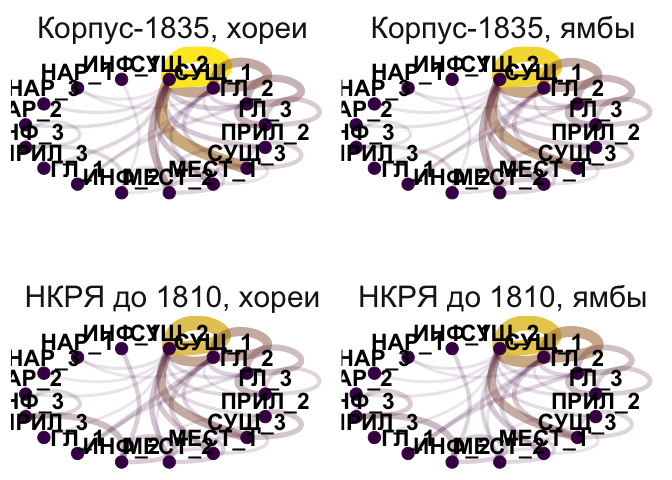
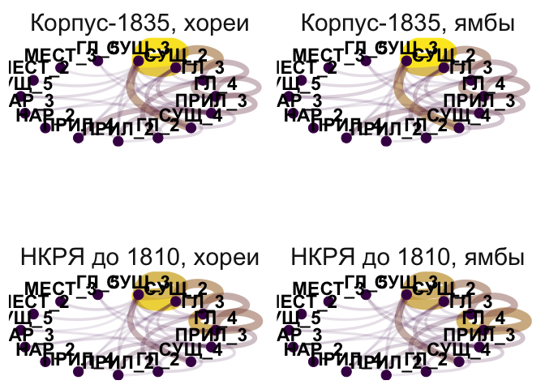

# 5.2. Rhymes: POS pairs & endings

## 5.2.2. Rhyme grammatical contrast & endings variability

Code used for analysis & plots in Chapter 5.2.2.

Load pckg

``` r
library(tidyverse)
library(tidytext)

library(MetBrewer)
# library(patchwork)
library(cowplot)
theme_set(theme_minimal())
```

Load data

Metadata

``` r
meta <- read.csv("../../data/corpus1835/sql_db/texts_metadata.csv")
# glimpse(meta)

# Meter lables

table(meta$meter)
```


    Amphibrach    Anapest     Dactyl       Iamb      Other    Trochee 
           369        138         79       3085        350        778 

``` r
meter_lables <- meta %>% 
  select(text_id, meter, feet) %>% distinct()

head(meter_lables)
```

      text_id   meter feet
    1     P_1   Other    ?
    2    P_10    Iamb    3
    3   P_100    Iamb    4
    4  P_1000    Iamb    4
    5  P_1001 Trochee    4
    6  P_1002    Iamb    4

Rhyme pairs

``` r
rhyme_pairs <- read.csv("../../data/corpus1835/sql_db/rhyme_pairs.csv") %>% 
  rename(text_id = poem_id) %>% 
  # remove Kulman texts
  filter(!str_detect(text_id, "C_264"))

glimpse(rhyme_pairs)
```

    Rows: 81,247
    Columns: 4
    $ text_id    <chr> "P_1938", "P_1938", "P_1938", "C_156__20", "C_156__20", "C_…
    $ from       <chr> "краса", "огневым", "красавицей", "око", "силки", "стонет",…
    $ to         <chr> "небеса", "земным", "красавице", "высоко", "легки", "догони…
    $ rhyme_alph <chr> "краса небеса", "земным огневым", "красавице красавицей", "…

Attach meter data

``` r
nrow(rhyme_pairs)
```

    [1] 81247

``` r
rhyme_pairs <- rhyme_pairs %>% 
  left_join(meter_lables, by = "text_id") 

glimpse(rhyme_pairs)
```

    Rows: 81,247
    Columns: 6
    $ text_id    <chr> "P_1938", "P_1938", "P_1938", "C_156__20", "C_156__20", "C_…
    $ from       <chr> "краса", "огневым", "красавицей", "око", "силки", "стонет",…
    $ to         <chr> "небеса", "земным", "красавице", "высоко", "легки", "догони…
    $ rhyme_alph <chr> "краса небеса", "земным огневым", "красавице красавицей", "…
    $ meter      <chr> "Other", "Other", "Other", "Trochee", "Trochee", "Trochee",…
    $ feet       <chr> "?", "?", "?", "4", "4", "4", "4", "4", "4", "4", "4", "4",…

Rhyme words

``` r
rhyme_words <- read.csv("../../data/corpus1835/sql_db/rhyme_words.csv", 
                        
                        # DON'T LET R EAT IAMBS AND DO INTEGER 01 => 1
                        colClasses = c("stress_pattern" = "character",
                                       "closure_pattern" = "character")) 

# check if all words are unique
length(unique(rhyme_words$word)) == nrow(rhyme_words)
```

    [1] TRUE

``` r
# rewrite POS tags
pos_transl <- tibble(old_tag = c("S", "V", "APRO", "SPRO", 
                   "A", "ADV", "NUM", "ADVPRO",
                   "INTJ", "PART", "PR", "ANUM", "CONJ"),
       # pos = c("NOUN", "VERB", "aPRON", "nPRON", 
       #         "ADJ", "ADV", "NUM", "advPRON",
       #         "INTJ", "PART", "ADP", "adjNUM", "CONJ"),
       pos = c("NOUN", "VERB", "PRON", "PRON", 
               "ADJ", "ADV", "NUM", "PRON",
               "INTJ", "PART", "ADP", "NUM", "CONJ")) # upos

# attach to the table with all words
rhyme_words <- rhyme_words %>% 
  rename(old_tag = pos) %>% 
  left_join(pos_transl, by = "old_tag")

# extract inf, imp, etc.
rhyme_words <- rhyme_words %>% 
  mutate(pos = ifelse(str_detect(feats, "инф"),
                      "VERB_inf",
                      pos),
         pos = ifelse(str_detect(feats, "пов"),
                      "VERB_imp",
                      pos),
         pos = ifelse(str_detect(feats, "деепр"),
                      "VERB_deeprich",
                      pos),
         pos = ifelse(str_detect(feats, "прич"),
                      "VERB_prich",
                      pos))

glimpse(rhyme_words)
```

    Rows: 34,801
    Columns: 9
    $ word            <chr> "краса", "огневым", "красавицей", "око", "силки", "сто…
    $ word_acc        <chr> "краса'", "огневы'м", "краса'вицей", "о'ко", "силки'",…
    $ stress_pattern  <chr> "01", "001", "0100", "10", "01", "10", "1", "10", "010…
    $ closure_pattern <chr> "1", "1", "100", "10", "1", "10", "1", "10", "10", "1"…
    $ closure         <chr> "masc", "masc", "dactylic", "fem", "masc", "fem", "mas…
    $ old_tag         <chr> "S", "S", "S", "S", "S", "V", "S", "S", "S", "S", "APR…
    $ feats           <chr> "S,жен,неод=им,ед", "S,фам,муж,од=(дат,мн|твор,ед)", "…
    $ ending_st       <chr> "са'", "ы'м", "а'вицей", "о'ко", "ки'", "о'нет", "о'р"…
    $ pos             <chr> "NOUN", "NOUN", "NOUN", "NOUN", "NOUN", "VERB", "NOUN"…

Attach word’s features to rhyme pairs data

``` r
rhyme_pairs <- rhyme_pairs %>% 
  left_join(rhyme_words %>% 
              select(word, closure, pos, ending_st, feats, stress_pattern) %>% 
              rename(from = word,
                     from_closure = closure,
                     from_pos = pos,
                     from_ending = ending_st, 
                     from_feats = feats,
                     from_sp = stress_pattern),
            by = "from") %>% 
  left_join(rhyme_words %>% 
              select(word, closure, pos, ending_st, feats, stress_pattern) %>% 
              rename(to = word,
                     to_closure = closure,
                     to_pos = pos,
                     to_ending = ending_st, 
                     to_feats = feats,
                     to_sp = stress_pattern),
            by = "to") 

nrow(rhyme_pairs)
```

    [1] 81247

``` r
glimpse(rhyme_pairs)
```

    Rows: 81,247
    Columns: 16
    $ text_id      <chr> "P_1938", "P_1938", "P_1938", "C_156__20", "C_156__20", "…
    $ from         <chr> "краса", "огневым", "красавицей", "око", "силки", "стонет…
    $ to           <chr> "небеса", "земным", "красавице", "высоко", "легки", "дого…
    $ rhyme_alph   <chr> "краса небеса", "земным огневым", "красавице красавицей",…
    $ meter        <chr> "Other", "Other", "Other", "Trochee", "Trochee", "Trochee…
    $ feet         <chr> "?", "?", "?", "4", "4", "4", "4", "4", "4", "4", "4", "4…
    $ from_closure <chr> "masc", "masc", "dactylic", "fem", "masc", "fem", "masc",…
    $ from_pos     <chr> "NOUN", "NOUN", "NOUN", "NOUN", "NOUN", "VERB", "NOUN", "…
    $ from_ending  <chr> "са'", "ы'м", "а'вицей", "о'ко", "ки'", "о'нет", "о'р", "…
    $ from_feats   <chr> "S,жен,неод=им,ед", "S,фам,муж,од=(дат,мн|твор,ед)", "S,ж…
    $ from_sp      <chr> "01", "001", "0100", "10", "01", "10", "1", "10", "010", …
    $ to_closure   <chr> "masc", "masc", "dactylic", "masc", "masc", "fem", "masc"…
    $ to_pos       <chr> "NOUN", "ADJ", "NOUN", "ADV", "ADJ", "VERB", "NOUN", "ADJ…
    $ to_ending    <chr> "са'", "ы'м", "а'вице", "ко'", "ки'", "о'нит", "о'р", "у'…
    $ to_feats     <chr> "S,сред,неод=(вин,мн|им,мн)", "A=(дат,мн,полн|твор,ед,пол…
    $ to_sp        <chr> "001", "01", "0100", "001", "01", "010", "01", "010", "01…

## POS pairs & syl variation

### masc

Extract only pairs where both words were detected as masculine endings

``` r
masc_pairs <- rhyme_pairs %>% 
  filter(from_closure == "masc" & to_closure == "masc")

print(paste( "Number of (true) masc pairs:", nrow(masc_pairs), 
             "out of total", nrow(rhyme_pairs) ))
```

    [1] "Number of (true) masc pairs: 38011 out of total 81247"

``` r
# check number of one masc and one other clausula type ending (most probably annotation mistakes)
rhyme_pairs %>% 
  filter(from_closure == "masc" & to_closure != "masc") %>% nrow() 
```

    [1] 3183

``` r
rhyme_pairs %>% 
  filter(from_closure != "masc" & to_closure == "masc") %>% nrow() 
```

    [1] 3464

Iamb

``` r
iamb_masc <- masc_pairs %>% 
  filter(meter == "Iamb")

t <- nrow(iamb_masc)
t
```

    [1] 24905

``` r
iamb_count <- iamb_masc %>% 
  rowwise() %>% 
  mutate(pos_pair = paste0(sort(c(from_pos, to_pos)), collapse = " -- ")) %>% 
  ungroup() %>% 
  count(pos_pair, sort = T) %>% 
  mutate(perc = round( (n/t)*100, 2 )) %>% 
  rename(n_iamb = n,
         perc_iamb = perc)

head(iamb_count, 20)
```

    # A tibble: 20 × 3
       pos_pair                 n_iamb perc_iamb
       <chr>                     <int>     <dbl>
     1 NOUN -- NOUN               8930     35.9 
     2 NOUN -- PRON               3411     13.7 
     3 VERB -- VERB               3168     12.7 
     4 NOUN -- VERB               1494      6   
     5 ADJ -- NOUN                1319      5.3 
     6 PRON -- PRON               1064      4.27
     7 VERB_inf -- VERB_inf        968      3.89
     8 ADV -- NOUN                 777      3.12
     9 ADJ -- PRON                 625      2.51
    10 ADJ -- ADJ                  348      1.4 
    11 NOUN -- PART                291      1.17
    12 NOUN -- VERB_inf            271      1.09
    13 NOUN -- VERB_prich          237      0.95
    14 NOUN -- VERB_imp            226      0.91
    15 ADV -- PRON                 190      0.76
    16 VERB_imp -- VERB_imp        187      0.75
    17 PRON -- VERB_prich          159      0.64
    18 NOUN -- VERB_deeprich       146      0.59
    19 PRON -- VERB                130      0.52
    20 VERB_prich -- VERB_prich     84      0.34

Syllable variation

``` r
iamb_count_syl <- iamb_masc %>% 
  mutate(# calculate number of syllables in each word
         from_n_syl = nchar(from_sp),
         to_n_syl = nchar(to_sp),
         
         # attach n_syl to pos
         from_pos_syl = paste0(from_pos, "_", from_n_syl),
         to_pos_syl = paste0(to_pos, "_", to_n_syl)) %>% 
  rowwise() %>% 
  mutate(pos_pair = paste0(sort(c(from_pos_syl, to_pos_syl)), collapse = " -- ")
         ) %>%
  ungroup() %>% 
  count(pos_pair, sort = T) %>% 
  mutate(perc = round( (n/t)*100, 2 )) %>% 
  rename(n_iamb = n,
         perc_iamb = perc) %>% 
  mutate(rank_iamb = row_number())

iamb_count_syl %>% 
  head(10)
```

    # A tibble: 10 × 4
       pos_pair         n_iamb perc_iamb rank_iamb
       <chr>             <int>     <dbl>     <int>
     1 NOUN_2 -- NOUN_2   2927     11.8          1
     2 NOUN_1 -- NOUN_2   1895      7.61         2
     3 NOUN_2 -- NOUN_3   1732      6.95         3
     4 NOUN_1 -- NOUN_1   1358      5.45         4
     5 NOUN_2 -- PRON_2   1037      4.16         5
     6 VERB_2 -- VERB_3    996      4            6
     7 VERB_2 -- VERB_2    942      3.78         7
     8 NOUN_2 -- PRON_1    872      3.5          8
     9 VERB_3 -- VERB_3    542      2.18         9
    10 ADJ_2 -- NOUN_2     522      2.1         10

Trochee

``` r
tr_masc <- masc_pairs %>% 
  filter(meter == "Trochee")

t <- nrow(tr_masc)
t
```

    [1] 6310

``` r
tr_masc %>% 
  rowwise() %>% 
  mutate(pos_pair = paste0(sort(c(from_pos, to_pos)), collapse = " -- ")) %>% 
  ungroup() %>% 
  count(pos_pair, sort = T) %>% 
  mutate(perc = round( (n/t)*100, 2 )) %>% 
  rename(n_tr = n,
         perc_tr = perc) %>% 
  left_join(iamb_count, by = "pos_pair") %>% 
  select(pos_pair, perc_iamb, perc_tr, n_iamb, n_tr) %>% 
  head(20)
```

    # A tibble: 20 × 5
       pos_pair              perc_iamb perc_tr n_iamb  n_tr
       <chr>                     <dbl>   <dbl>  <int> <int>
     1 NOUN -- NOUN              35.9    36.7    8930  2317
     2 VERB -- VERB              12.7    13.0    3168   823
     3 NOUN -- PRON              13.7    12.4    3411   780
     4 NOUN -- VERB               6       6.66   1494   420
     5 ADJ -- NOUN                5.3     5.71   1319   360
     6 PRON -- PRON               4.27    3.98   1064   251
     7 VERB_inf -- VERB_inf       3.89    3.68    968   232
     8 ADV -- NOUN                3.12    3.41    777   215
     9 ADJ -- PRON                2.51    2.33    625   147
    10 ADJ -- ADJ                 1.4     1.35    348    85
    11 NOUN -- VERB_inf           1.09    0.98    271    62
    12 ADV -- PRON                0.76    0.97    190    61
    13 NOUN -- VERB_prich         0.95    0.84    237    53
    14 NOUN -- VERB_imp           0.91    0.82    226    52
    15 VERB_imp -- VERB_imp       0.75    0.79    187    50
    16 NOUN -- PART               1.17    0.74    291    47
    17 PRON -- VERB_prich         0.64    0.51    159    32
    18 ADV -- ADV                 0.31    0.49     78    31
    19 PRON -- VERB               0.52    0.49    130    31
    20 NOUN -- VERB_deeprich      0.59    0.48    146    30

``` r
tr_count_syl <- tr_masc %>% 
  mutate(# calculate number of syllables in each word
         from_n_syl = nchar(from_sp),
         to_n_syl = nchar(to_sp),
         
         # attach n_syl to pos
         from_pos_syl = paste0(from_pos, "_", from_n_syl),
         to_pos_syl = paste0(to_pos, "_", to_n_syl)) %>% 
  rowwise() %>% 
  mutate(pos_pair = paste0(sort(c(from_pos_syl, to_pos_syl)), collapse = " -- ")
         ) %>%
  ungroup() %>% 
  count(pos_pair, sort = T) %>% 
  mutate(perc = round( (n/t)*100, 2 )) %>% 
  rename(n_tr = n,
         perc_tr = perc) %>% 
  mutate(rank_tr = row_number())

tr_count_syl %>% 
  head(10)
```

    # A tibble: 10 × 4
       pos_pair          n_tr perc_tr rank_tr
       <chr>            <int>   <dbl>   <int>
     1 NOUN_2 -- NOUN_2   786   12.5        1
     2 NOUN_2 -- NOUN_3   512    8.11       2
     3 NOUN_1 -- NOUN_2   435    6.89       3
     4 NOUN_1 -- NOUN_1   366    5.8        4
     5 NOUN_2 -- PRON_2   277    4.39       5
     6 VERB_2 -- VERB_2   270    4.28       6
     7 VERB_2 -- VERB_3   262    4.15       7
     8 NOUN_2 -- PRON_1   178    2.82       8
     9 ADJ_2 -- NOUN_2    140    2.22       9
    10 NOUN_2 -- VERB_2   133    2.11      10

``` r
iamb_count_syl %>% 
  left_join(tr_count_syl, by = "pos_pair") %>%  
  select(pos_pair, rank_iamb, rank_tr, perc_iamb, perc_tr, n_iamb, n_tr) %>% 
  head(20)
```

    # A tibble: 20 × 7
       pos_pair                 rank_iamb rank_tr perc_iamb perc_tr n_iamb  n_tr
       <chr>                        <int>   <int>     <dbl>   <dbl>  <int> <int>
     1 NOUN_2 -- NOUN_2                 1       1     11.8    12.5    2927   786
     2 NOUN_1 -- NOUN_2                 2       3      7.61    6.89   1895   435
     3 NOUN_2 -- NOUN_3                 3       2      6.95    8.11   1732   512
     4 NOUN_1 -- NOUN_1                 4       4      5.45    5.8    1358   366
     5 NOUN_2 -- PRON_2                 5       5      4.16    4.39   1037   277
     6 VERB_2 -- VERB_3                 6       7      4       4.15    996   262
     7 VERB_2 -- VERB_2                 7       6      3.78    4.28    942   270
     8 NOUN_2 -- PRON_1                 8       8      3.5     2.82    872   178
     9 VERB_3 -- VERB_3                 9      11      2.18    2.08    542   131
    10 ADJ_2 -- NOUN_2                 10       9      2.1     2.22    522   140
    11 NOUN_3 -- NOUN_3                11      12      1.91    1.7     475   107
    12 NOUN_3 -- PRON_1                12      13      1.9     1.7     473   107
    13 NOUN_1 -- NOUN_3                13      14      1.86    1.58    463   100
    14 PRON_1 -- PRON_2                14      15      1.79    1.38    446    87
    15 NOUN_1 -- PRON_1                15      16      1.75    1.36    435    86
    16 NOUN_2 -- VERB_2                16      10      1.65    2.11    411   133
    17 PRON_2 -- PRON_2                17      17      1.39    1.36    346    86
    18 NOUN_1 -- VERB_2                18      19      1.34    1.3     333    82
    19 VERB_inf_2 -- VERB_inf_3        19      20      1.27    1.25    316    79
    20 VERB_1 -- VERB_2                20      22      1.24    1.11    310    70

``` r
ranks_masc <- iamb_count_syl %>% 
  left_join(tr_count_syl, by = "pos_pair") %>% 
  select(pos_pair, rank_iamb, rank_tr, perc_iamb, perc_tr, n_iamb, n_tr) %>%
  drop_na() 

cor(ranks_masc$rank_iamb[1:100], ranks_masc$rank_tr[1:100], method = "kendall")
```

    [1] 0.840404

### fem

``` r
fem_pairs <- rhyme_pairs %>% 
  filter(from_closure == "fem" & to_closure == "fem")

print(paste( "Number of (true) fem pairs:", nrow(fem_pairs), 
             "out of total", nrow(rhyme_pairs) ))
```

    [1] "Number of (true) fem pairs: 34383 out of total 81247"

``` r
# check number of one masc and one other clausula type ending (most probably annotation mistakes)
rhyme_pairs %>% 
  filter(from_closure == "fem" & to_closure != "fem") %>% nrow() 
```

    [1] 3760

``` r
rhyme_pairs %>% 
  filter(from_closure != "fem" & to_closure == "fem") %>% nrow() 
```

    [1] 3476

Separate iambs & trochees

``` r
iamb_fem <- fem_pairs %>% 
  filter(meter == "Iamb")

tr_fem <- fem_pairs %>% 
  filter(meter == "Trochee")
```

``` r
t <- nrow(iamb_fem)

iamb_count <- iamb_fem %>% rowwise() %>% 
  mutate(pos_pair = paste0(sort(c(from_pos, to_pos)), collapse = " -- ")) %>% 
  ungroup() %>% 
  count(pos_pair, sort = T) %>% 
  mutate(perc = round( (n/t)*100, 2 )) %>% 
  rename(n_iamb = n,
         perc_iamb = perc)

head(iamb_count, 20)
```

    # A tibble: 20 × 3
       pos_pair                       n_iamb perc_iamb
       <chr>                           <int>     <dbl>
     1 NOUN -- NOUN                    10577     44.0 
     2 VERB -- VERB                     4753     19.8 
     3 ADJ -- ADJ                       3034     12.6 
     4 ADJ -- NOUN                      1376      5.72
     5 NOUN -- PRON                      599      2.49
     6 NOUN -- VERB                      522      2.17
     7 ADV -- NOUN                       463      1.93
     8 ADJ -- ADV                        341      1.42
     9 ADJ -- VERB_prich                 334      1.39
    10 ADV -- ADV                        286      1.19
    11 VERB_inf -- VERB_inf              278      1.16
    12 VERB_deeprich -- VERB_deeprich    190      0.79
    13 ADJ -- VERB_deeprich              171      0.71
    14 VERB_prich -- VERB_prich          169      0.7 
    15 ADJ -- PRON                       142      0.59
    16 NOUN -- VERB_deeprich             138      0.57
    17 VERB_imp -- VERB_imp              134      0.56
    18 NOUN -- VERB_prich                116      0.48
    19 ADV -- VERB                       108      0.45
    20 PRON -- PRON                       65      0.27

``` r
f_iamb_count_syl <- iamb_fem %>% 
  mutate(# calculate number of syllables in each word
         from_n_syl = nchar(from_sp),
         to_n_syl = nchar(to_sp),
         
         # attach n_syl to pos
         from_pos_syl = paste0(from_pos, "_", from_n_syl),
         to_pos_syl = paste0(to_pos, "_", to_n_syl)) %>% 
  rowwise() %>% 
  mutate(pos_pair = paste0(sort(c(from_pos_syl, to_pos_syl)), collapse = " -- ")
         ) %>%
  ungroup() %>% 
  count(pos_pair, sort = T) %>% 
  mutate(perc = round( (n/t)*100, 2 )) %>% 
  rename(n_iamb = n,
         perc_iamb = perc) %>% 
  mutate(rank_iamb = row_number())

f_iamb_count_syl %>% 
  head(10)
```

    # A tibble: 10 × 4
       pos_pair         n_iamb perc_iamb rank_iamb
       <chr>             <int>     <dbl>     <int>
     1 NOUN_3 -- NOUN_3   3028     12.6          1
     2 NOUN_2 -- NOUN_3   2418     10.0          2
     3 NOUN_3 -- NOUN_4   1921      7.99         3
     4 NOUN_2 -- NOUN_2   1448      6.02         4
     5 VERB_3 -- VERB_4   1402      5.83         5
     6 VERB_4 -- VERB_4   1034      4.3          6
     7 VERB_3 -- VERB_3    886      3.68         7
     8 ADJ_3 -- ADJ_3      843      3.51         8
     9 ADJ_3 -- ADJ_4      801      3.33         9
    10 NOUN_4 -- NOUN_4    597      2.48        10

``` r
t <- nrow(tr_fem)

tr_fem %>% 
  rowwise() %>% 
  mutate(pos_pair = paste0(sort(c(from_pos, to_pos)), collapse = " -- ")) %>% 
  ungroup() %>% 
  count(pos_pair, sort = T) %>% 
  mutate(perc = round( (n/t)*100, 2 )) %>% 
  rename(n_tr = n,
         perc_tr = perc) %>% 
  left_join(iamb_count, by = "pos_pair") %>% 
  select(pos_pair, perc_iamb, perc_tr, n_iamb, n_tr) %>% 
  head(20)
```

    # A tibble: 20 × 5
       pos_pair                       perc_iamb perc_tr n_iamb  n_tr
       <chr>                              <dbl>   <dbl>  <int> <int>
     1 NOUN -- NOUN                       44.0    42.6   10577  2410
     2 VERB -- VERB                       19.8    18.2    4753  1028
     3 ADJ -- ADJ                         12.6    13.5    3034   763
     4 ADJ -- NOUN                         5.72    7.14   1376   404
     5 NOUN -- VERB                        2.17    2.77    522   157
     6 ADV -- NOUN                         1.93    2.31    463   131
     7 NOUN -- PRON                        2.49    2       599   113
     8 ADJ -- ADV                          1.42    1.91    341   108
     9 ADV -- ADV                          1.19    1.41    286    80
    10 NOUN -- VERB_deeprich               0.57    1.01    138    57
    11 ADJ -- VERB_prich                   1.39    0.99    334    56
    12 ADJ -- VERB_deeprich                0.71    0.9     171    51
    13 VERB_inf -- VERB_inf                1.16    0.88    278    50
    14 VERB_deeprich -- VERB_deeprich      0.79    0.8     190    45
    15 ADV -- VERB                         0.45    0.64    108    36
    16 ADJ -- PRON                         0.59    0.62    142    35
    17 VERB_imp -- VERB_imp                0.56    0.58    134    33
    18 VERB_prich -- VERB_prich            0.7     0.46    169    26
    19 NOUN -- VERB_prich                  0.48    0.32    116    18
    20 ADJ -- VERB                         0.1     0.3      23    17

``` r
f_tr_count_syl <- tr_fem %>% 
  mutate(# calculate number of syllables in each word
         from_n_syl = nchar(from_sp),
         to_n_syl = nchar(to_sp),
         
         # attach n_syl to pos
         from_pos_syl = paste0(from_pos, "_", from_n_syl),
         to_pos_syl = paste0(to_pos, "_", to_n_syl)) %>% 
  rowwise() %>% 
  mutate(pos_pair = paste0(sort(c(from_pos_syl, to_pos_syl)), collapse = " -- ")
         ) %>%
  ungroup() %>% 
  count(pos_pair, sort = T) %>% 
  mutate(perc = round( (n/t)*100, 2 )) %>% 
  rename(n_tr = n,
         perc_tr = perc) %>% 
  mutate(rank_tr = row_number())

f_tr_count_syl %>% 
  head(10)
```

    # A tibble: 10 × 4
       pos_pair          n_tr perc_tr rank_tr
       <chr>            <int>   <dbl>   <int>
     1 NOUN_3 -- NOUN_3   702   12.4        1
     2 NOUN_2 -- NOUN_3   622   11.0        2
     3 NOUN_2 -- NOUN_2   418    7.39       3
     4 NOUN_3 -- NOUN_4   375    6.63       4
     5 VERB_3 -- VERB_4   266    4.7        5
     6 ADJ_3 -- ADJ_3     213    3.76       6
     7 VERB_3 -- VERB_3   211    3.73       7
     8 ADJ_3 -- ADJ_4     209    3.69       8
     9 VERB_4 -- VERB_4   193    3.41       9
    10 VERB_2 -- VERB_3   183    3.23      10

Syllable variation

``` r
f_iamb_count_syl %>% 
  left_join(f_tr_count_syl, by = "pos_pair") %>% 
  select(pos_pair, rank_iamb, rank_tr, perc_iamb, perc_tr, n_iamb, n_tr) %>% 
  head(20)
```

    # A tibble: 20 × 7
       pos_pair         rank_iamb rank_tr perc_iamb perc_tr n_iamb  n_tr
       <chr>                <int>   <int>     <dbl>   <dbl>  <int> <int>
     1 NOUN_3 -- NOUN_3         1       1     12.6    12.4    3028   702
     2 NOUN_2 -- NOUN_3         2       2     10.0    11.0    2418   622
     3 NOUN_3 -- NOUN_4         3       4      7.99    6.63   1921   375
     4 NOUN_2 -- NOUN_2         4       3      6.02    7.39   1448   418
     5 VERB_3 -- VERB_4         5       5      5.83    4.7    1402   266
     6 VERB_4 -- VERB_4         6       9      4.3     3.41   1034   193
     7 VERB_3 -- VERB_3         7       7      3.68    3.73    886   211
     8 ADJ_3 -- ADJ_3           8       6      3.51    3.76    843   213
     9 ADJ_3 -- ADJ_4           9       8      3.33    3.69    801   209
    10 NOUN_4 -- NOUN_4        10      15      2.48    1.29    597    73
    11 VERB_2 -- VERB_3        11      10      2.47    3.23    595   183
    12 ADJ_2 -- ADJ_3          12      11      2.26    2.7     544   153
    13 NOUN_2 -- NOUN_4        13      12      2.03    2.28    489   129
    14 ADJ_3 -- NOUN_2         14      13      1.56    2.12    375   120
    15 NOUN_3 -- NOUN_5        15      21      1.44    0.87    346    49
    16 ADJ_3 -- NOUN_3         16      14      1.3     1.68    312    95
    17 VERB_2 -- VERB_4        17      16      1.21    1.24    292    70
    18 ADJ_4 -- ADJ_4          18      18      1.1     1.01    264    57
    19 NOUN_4 -- NOUN_5        19      30      1.03    0.55    247    31
    20 NOUN_3 -- PRON_2        20      22      1       0.85    241    48

``` r
fem_ranks <- f_iamb_count_syl %>% 
  left_join(f_tr_count_syl, by = "pos_pair") %>% 
  select(pos_pair, rank_iamb, rank_tr, perc_iamb, perc_tr, n_iamb, n_tr) %>% 
  drop_na()

cor(fem_ranks$rank_iamb[1:100], fem_ranks$rank_tr[1:100], method = "kendall")
```

    [1] 0.6965657

## RNC

### Load RNC data

``` r
rnc_rhymes <- read.csv("../../data/ch5/nkrja_rhyme_pairs.csv") %>% select(-X)

# attach meters to extract only iambs
# load metadata to extract meters
load("../../data/nkrja_19th_lem.Rda")
rnc_ids <- c19 %>% 
  filter(meter %in% c("Я", "Х")) %>% 
  mutate(poem_id = paste0("RNC_", Unnamed..0, "_", year), 
         meter = meter) %>% 
  select(poem_id, meter)
  

# attach meters to rhyme data
rnc_rhymes <- rnc_rhymes %>% 
  inner_join(rnc_ids, by = "poem_id")

rm(c19, rnc_ids) # remove large c19 file & iamb-id vector

# look at the resulting data
# glimpse(rnc_rhymes)
```

Distribution of data over time - filter out rhymes after 1810

``` r
ids_before_1830 <- rnc_rhymes %>% 
  select(poem_id) %>% 
  separate(poem_id, into = c("corpus", "id", "year"), sep = "_") %>% 
  filter(as.numeric(year) < 1811) %>% 
  mutate(poem_id = paste0("RNC_", id, "_", year)) %>% 
  pull(poem_id)

# filter only rhymes before 1830
rnc_rhymes <- rnc_rhymes %>% 
  filter(poem_id %in% ids_before_1830)

rm(ids_before_1830) # remove large character vector

# add verb_inf & verb_imp categories
rnc_rhymes <- rnc_rhymes %>% 
  mutate(from_pos = ifelse(str_detect(from_feats, "VerbForm=Inf"), 
                      "VERB_inf", from_pos),
         from_pos = ifelse(str_detect(from_feats, "Mood=Imp"), 
                      "VERB_imp", from_pos)) %>% 
  mutate(to_pos = ifelse(str_detect(to_feats, "VerbForm=Inf"), 
                      "VERB_inf", to_pos),
         to_pos = ifelse(str_detect(to_feats, "Mood=Imp"), 
                      "VERB_imp", to_pos))

rnc_rhymes %>% 
  select(poem_id) %>% 
  separate(poem_id, into = c("corpus", "id", "year"), sep = "_") %>% 
  count(year) %>% 
  ggplot(aes(x = year, y = n)) + geom_col() + 
  theme(axis.text.x = element_text(angle = 90))
```


### masc

Filter only masculine rhymes

``` r
rnc_masc <- rnc_rhymes %>% 
  filter(from_closure == "masc" & to_closure == "masc")

nrow(rnc_masc)
```

    [1] 16593

Iamb

``` r
rnc_iamb_masc <- rnc_masc %>% 
  filter(meter == "Я")

t <- nrow(rnc_iamb_masc)
t
```

    [1] 14621

Syllable variation

``` r
rnc_iamb_count_syl <- rnc_iamb_masc %>% 
  mutate(# calculate number of syllables in each word
         from_n_syl = nchar(from_sp),
         to_n_syl = nchar(to_sp),
         
         # attach n_syl to pos
         from_pos_syl = paste0(from_pos, "_", from_n_syl),
         to_pos_syl = paste0(to_pos, "_", to_n_syl)) %>% 
  rowwise() %>% 
  mutate(pos_pair = paste0(sort(c(from_pos_syl, to_pos_syl)), collapse = " -- ")
         ) %>%
  ungroup() %>% 
  count(pos_pair, sort = T) %>% 
  mutate(perc = round( (n/t)*100, 2 )) %>% 
  rename(rnc_n_iamb = n,
         rnc_perc_iamb = perc) %>% 
  mutate(rnc_rank_iamb = row_number())

rnc_iamb_count_syl %>% 
  head(10)
```

    # A tibble: 10 × 4
       pos_pair                 rnc_n_iamb rnc_perc_iamb rnc_rank_iamb
       <chr>                         <int>         <dbl>         <int>
     1 NOUN_2 -- NOUN_2               1573         10.8              1
     2 NOUN_1 -- NOUN_2               1143          7.82             2
     3 NOUN_1 -- NOUN_1               1075          7.35             3
     4 NOUN_2 -- NOUN_3                794          5.43             4
     5 VERB_inf_2 -- VERB_inf_3        493          3.37             5
     6 VERB_2 -- VERB_3                473          3.24             6
     7 VERB_2 -- VERB_2                438          3                7
     8 NOUN_2 -- PRON_1                342          2.34             8
     9 NOUN_1 -- NOUN_3                304          2.08             9
    10 VERB_inf_3 -- VERB_inf_3        295          2.02            10

trochee

``` r
rnc_tr_masc <- rnc_masc %>% 
  filter(meter == "Х")

t <- nrow(rnc_tr_masc)
t
```

    [1] 1972

``` r
rnc_tr_count_syl <- rnc_tr_masc %>% 
  mutate(# calculate number of syllables in each word
         from_n_syl = nchar(from_sp),
         to_n_syl = nchar(to_sp),
         
         # attach n_syl to pos
         from_pos_syl = paste0(from_pos, "_", from_n_syl),
         to_pos_syl = paste0(to_pos, "_", to_n_syl)) %>% 
  rowwise() %>% 
  mutate(pos_pair = paste0(sort(c(from_pos_syl, to_pos_syl)), collapse = " -- ")
         ) %>%
  ungroup() %>% 
  count(pos_pair, sort = T) %>% 
  mutate(perc = round( (n/t)*100, 2 )) %>% 
  rename(rnc_n_tr = n,
         rnc_perc_tr = perc) %>% 
  mutate(rnc_rank_tr = row_number())

rnc_tr_count_syl %>% 
  head(10)
```

    # A tibble: 10 × 4
       pos_pair                 rnc_n_tr rnc_perc_tr rnc_rank_tr
       <chr>                       <int>       <dbl>       <int>
     1 NOUN_2 -- NOUN_2              206       10.4            1
     2 NOUN_1 -- NOUN_2              128        6.49           2
     3 NOUN_1 -- NOUN_1              114        5.78           3
     4 NOUN_2 -- NOUN_3              113        5.73           4
     5 VERB_2 -- VERB_3               73        3.7            5
     6 VERB_inf_2 -- VERB_inf_3       66        3.35           6
     7 VERB_2 -- VERB_2               63        3.19           7
     8 NOUN_2 -- PRON_2               50        2.54           8
     9 NOUN_3 -- NOUN_3               48        2.43           9
    10 NOUN_2 -- PRON_1               45        2.28          10

Comparison

``` r
rnc_iamb_count_syl %>% 
  left_join(rnc_tr_count_syl, by = "pos_pair") %>% 
  select(pos_pair, rnc_rank_iamb, rnc_rank_tr, rnc_perc_iamb, 
         rnc_perc_tr, rnc_n_iamb, rnc_n_tr) %>% 
  head(20)
```

    # A tibble: 20 × 7
       pos_pair       rnc_rank_iamb rnc_rank_tr rnc_perc_iamb rnc_perc_tr rnc_n_iamb
       <chr>                  <int>       <int>         <dbl>       <dbl>      <int>
     1 NOUN_2 -- NOU…             1           1         10.8        10.4        1573
     2 NOUN_1 -- NOU…             2           2          7.82        6.49       1143
     3 NOUN_1 -- NOU…             3           3          7.35        5.78       1075
     4 NOUN_2 -- NOU…             4           4          5.43        5.73        794
     5 VERB_inf_2 --…             5           6          3.37        3.35        493
     6 VERB_2 -- VER…             6           5          3.24        3.7         473
     7 VERB_2 -- VER…             7           7          3           3.19        438
     8 NOUN_2 -- PRO…             8          10          2.34        2.28        342
     9 NOUN_1 -- NOU…             9          19          2.08        1.42        304
    10 VERB_inf_3 --…            10          20          2.02        1.37        295
    11 VERB_3 -- VER…            11          21          1.94        1.32        283
    12 DET_2 -- NOUN…            12          14          1.78        1.93        260
    13 VERB_inf_2 --…            13          16          1.77        1.88        259
    14 NOUN_1 -- VER…            14          17          1.65        1.72        241
    15 VERB_1 -- VER…            15          28          1.58        0.91        231
    16 NOUN_1 -- PRO…            16          11          1.52        2.08        222
    17 VERB_inf_1 --…            17          15          1.47        1.88        215
    18 DET_2 -- PRON…            18          13          1.45        1.98        212
    19 NOUN_3 -- NOU…            19           9          1.42        2.43        208
    20 NOUN_1 -- VER…            20          12          1.4         2.03        205
    # ℹ 1 more variable: rnc_n_tr <int>

``` r
rnc_masc_ranks <- rnc_iamb_count_syl %>% 
  left_join(rnc_tr_count_syl, by = "pos_pair") %>% 
  select(pos_pair, rnc_rank_iamb, rnc_rank_tr, rnc_perc_iamb, 
         rnc_perc_tr, rnc_n_iamb, rnc_n_tr) %>%
  drop_na() 

cor(rnc_masc_ranks$rnc_rank_iamb[1:100], rnc_masc_ranks$rnc_rank_tr[1:100], method = "kendall")
```

    [1] 0.7183838

### fem rhymes

Same steps for feminine rhymes

``` r
rnc_fem <- rnc_rhymes %>% 
  filter(from_closure == "fem" & to_closure == "fem")

nrow(rnc_fem)
```

    [1] 17615

Iamb

``` r
rnc_iamb_fem <- rnc_fem %>% 
  filter(meter == "Я")

t <- nrow(rnc_iamb_fem)
t
```

    [1] 15452

``` r
rnc_fem_iamb_count_syl <- rnc_iamb_fem %>% 
  mutate(# calculate number of syllables in each word
         from_n_syl = nchar(from_sp),
         to_n_syl = nchar(to_sp),
         
         # attach n_syl to pos
         from_pos_syl = paste0(from_pos, "_", from_n_syl),
         to_pos_syl = paste0(to_pos, "_", to_n_syl)) %>% 
  rowwise() %>% 
  mutate(pos_pair = paste0(sort(c(from_pos_syl, to_pos_syl)), collapse = " -- ")
         ) %>%
  ungroup() %>% 
  count(pos_pair, sort = T) %>% 
  mutate(perc = round( (n/t)*100, 2 )) %>% 
  rename(rnc_n_iamb = n,
         rnc_perc_iamb = perc) %>% 
  mutate(rnc_rank_iamb = row_number())

rnc_fem_iamb_count_syl %>% 
  head(10)
```

    # A tibble: 10 × 4
       pos_pair         rnc_n_iamb rnc_perc_iamb rnc_rank_iamb
       <chr>                 <int>         <dbl>         <int>
     1 VERB_3 -- VERB_4       1516          9.81             1
     2 NOUN_2 -- NOUN_3       1461          9.46             2
     3 NOUN_3 -- NOUN_3       1409          9.12             3
     4 VERB_4 -- VERB_4       1223          7.91             4
     5 NOUN_2 -- NOUN_2        958          6.2              5
     6 NOUN_3 -- NOUN_4        865          5.6              6
     7 VERB_3 -- VERB_3        785          5.08             7
     8 ADJ_3 -- ADJ_3          418          2.71             8
     9 VERB_2 -- VERB_3        415          2.69             9
    10 ADJ_2 -- ADJ_3          312          2.02            10

Trochee

``` r
rnc_tr_fem <- rnc_fem %>% 
  filter(meter == "Х")

t <- nrow(rnc_tr_fem)
t # very small number of trochee feminine examples!
```

    [1] 2163

``` r
rnc_fem_tr_count_syl <- rnc_tr_fem %>% 
  mutate(# calculate number of syllables in each word
         from_n_syl = nchar(from_sp),
         to_n_syl = nchar(to_sp),
         
         # attach n_syl to pos
         from_pos_syl = paste0(from_pos, "_", from_n_syl),
         to_pos_syl = paste0(to_pos, "_", to_n_syl)) %>% 
  rowwise() %>% 
  mutate(pos_pair = paste0(sort(c(from_pos_syl, to_pos_syl)), collapse = " -- ")
         ) %>%
  ungroup() %>% 
  count(pos_pair, sort = T) %>% 
  mutate(perc = round( (n/t)*100, 2 )) %>% 
  rename(rnc_n_tr = n,
         rnc_perc_tr = perc) %>% 
  mutate(rnc_rank_tr = row_number())

rnc_tr_count_syl %>% 
  head(10)
```

    # A tibble: 10 × 4
       pos_pair                 rnc_n_tr rnc_perc_tr rnc_rank_tr
       <chr>                       <int>       <dbl>       <int>
     1 NOUN_2 -- NOUN_2              206       10.4            1
     2 NOUN_1 -- NOUN_2              128        6.49           2
     3 NOUN_1 -- NOUN_1              114        5.78           3
     4 NOUN_2 -- NOUN_3              113        5.73           4
     5 VERB_2 -- VERB_3               73        3.7            5
     6 VERB_inf_2 -- VERB_inf_3       66        3.35           6
     7 VERB_2 -- VERB_2               63        3.19           7
     8 NOUN_2 -- PRON_2               50        2.54           8
     9 NOUN_3 -- NOUN_3               48        2.43           9
    10 NOUN_2 -- PRON_1               45        2.28          10

Comparison

``` r
rnc_fem_iamb_count_syl %>% 
  left_join(rnc_fem_tr_count_syl, by = "pos_pair") %>%
  select(pos_pair, rnc_rank_iamb, rnc_rank_tr, rnc_perc_iamb, 
         rnc_perc_tr, rnc_n_iamb, rnc_n_tr) %>% 
  head(20)
```

    # A tibble: 20 × 7
       pos_pair       rnc_rank_iamb rnc_rank_tr rnc_perc_iamb rnc_perc_tr rnc_n_iamb
       <chr>                  <int>       <int>         <dbl>       <dbl>      <int>
     1 VERB_3 -- VER…             1           3          9.81        9.62       1516
     2 NOUN_2 -- NOU…             2           1          9.46       11.6        1461
     3 NOUN_3 -- NOU…             3           2          9.12       10.0        1409
     4 VERB_4 -- VER…             4           5          7.91        6.1        1223
     5 NOUN_2 -- NOU…             5           4          6.2         7.49        958
     6 NOUN_3 -- NOU…             6           7          5.6         4.25        865
     7 VERB_3 -- VER…             7           6          5.08        5.13        785
     8 ADJ_3 -- ADJ_3             8           8          2.71        3.05        418
     9 VERB_2 -- VER…             9          10          2.69        2.17        415
    10 ADJ_2 -- ADJ_3            10           9          2.02        2.68        312
    11 NOUN_2 -- NOU…            11          14          1.88        1.29        290
    12 VERB_2 -- VER…            12          13          1.74        1.43        269
    13 NOUN_4 -- NOU…            13          19          1.66        0.97        257
    14 ADJ_3 -- NOUN…            14          16          1.6         1.16        247
    15 ADJ_3 -- ADJ_4            15          11          1.56        1.76        241
    16 VERB_4 -- VER…            16          26          1.35        0.69        209
    17 NOUN_3 -- VER…            17          18          1.13        0.97        175
    18 NOUN_3 -- VER…            18          12          1.12        1.71        173
    19 NOUN_3 -- PRO…            19          17          0.89        0.97        137
    20 VERB_2 -- VER…            20          20          0.88        0.97        136
    # ℹ 1 more variable: rnc_n_tr <int>

``` r
rnc_fem_ranks <- rnc_fem_iamb_count_syl %>% 
  left_join(rnc_fem_tr_count_syl, by = "pos_pair") %>% 
  select(pos_pair, rnc_rank_iamb, rnc_rank_tr, rnc_perc_iamb, 
         rnc_perc_tr, rnc_n_iamb, rnc_n_tr) %>%
  drop_na() 

cor(rnc_fem_ranks$rnc_rank_iamb[1:100], rnc_fem_ranks$rnc_rank_tr[1:100], method = "kendall")
```

    [1] 0.679596

## compare C35 & RNC

Masc rhymes

``` r
glimpse(ranks_masc) # corpus-1835 
```

    Rows: 242
    Columns: 7
    $ pos_pair  <chr> "NOUN_2 -- NOUN_2", "NOUN_1 -- NOUN_2", "NOUN_2 -- NOUN_3", …
    $ rank_iamb <int> 1, 2, 3, 4, 5, 6, 7, 8, 9, 10, 11, 12, 13, 14, 15, 16, 17, 1…
    $ rank_tr   <int> 1, 3, 2, 4, 5, 7, 6, 8, 11, 9, 12, 13, 14, 15, 16, 10, 17, 1…
    $ perc_iamb <dbl> 11.75, 7.61, 6.95, 5.45, 4.16, 4.00, 3.78, 3.50, 2.18, 2.10,…
    $ perc_tr   <dbl> 12.46, 6.89, 8.11, 5.80, 4.39, 4.15, 4.28, 2.82, 2.08, 2.22,…
    $ n_iamb    <int> 2927, 1895, 1732, 1358, 1037, 996, 942, 872, 542, 522, 475, …
    $ n_tr      <int> 786, 435, 512, 366, 277, 262, 270, 178, 131, 140, 107, 107, …

``` r
glimpse(rnc_masc_ranks) # rnc
```

    Rows: 189
    Columns: 7
    $ pos_pair      <chr> "NOUN_2 -- NOUN_2", "NOUN_1 -- NOUN_2", "NOUN_1 -- NOUN_…
    $ rnc_rank_iamb <int> 1, 2, 3, 4, 5, 6, 7, 8, 9, 10, 11, 12, 13, 14, 15, 16, 1…
    $ rnc_rank_tr   <int> 1, 2, 3, 4, 6, 5, 7, 10, 19, 20, 21, 14, 16, 17, 28, 11,…
    $ rnc_perc_iamb <dbl> 10.76, 7.82, 7.35, 5.43, 3.37, 3.24, 3.00, 2.34, 2.08, 2…
    $ rnc_perc_tr   <dbl> 10.45, 6.49, 5.78, 5.73, 3.35, 3.70, 3.19, 2.28, 1.42, 1…
    $ rnc_n_iamb    <int> 1573, 1143, 1075, 794, 493, 473, 438, 342, 304, 295, 283…
    $ rnc_n_tr      <int> 206, 128, 114, 113, 66, 73, 63, 45, 28, 27, 26, 38, 37, …

``` r
all_masc_ranks <- ranks_masc %>% 
  left_join(rnc_masc_ranks, by = "pos_pair") %>% 
  select(pos_pair, 
         rank_iamb, rnc_rank_iamb, rank_tr, rnc_rank_tr,
         perc_iamb, rnc_perc_iamb, perc_tr, rnc_perc_tr,
         n_iamb, rnc_n_iamb, n_tr, rnc_n_tr
         )

head(all_masc_ranks, 20)
```

    # A tibble: 20 × 13
       pos_pair  rank_iamb rnc_rank_iamb rank_tr rnc_rank_tr perc_iamb rnc_perc_iamb
       <chr>         <int>         <int>   <int>       <int>     <dbl>         <dbl>
     1 NOUN_2 -…         1             1       1           1     11.8          10.8 
     2 NOUN_1 -…         2             2       3           2      7.61          7.82
     3 NOUN_2 -…         3             4       2           4      6.95          5.43
     4 NOUN_1 -…         4             3       4           3      5.45          7.35
     5 NOUN_2 -…         5            21       5           8      4.16          1.4 
     6 VERB_2 -…         6             6       7           5      4             3.24
     7 VERB_2 -…         7             7       6           7      3.78          3   
     8 NOUN_2 -…         8             8       8          10      3.5           2.34
     9 VERB_3 -…         9            11      11          21      2.18          1.94
    10 ADJ_2 --…        10            25       9          26      2.1           0.91
    11 NOUN_3 -…        11            19      12           9      1.91          1.42
    12 NOUN_3 -…        12            31      13          24      1.9           0.66
    13 NOUN_1 -…        13             9      14          19      1.86          2.08
    14 PRON_1 -…        14            29      15          25      1.79          0.75
    15 NOUN_1 -…        15            16      16          11      1.75          1.52
    16 NOUN_2 -…        16            22      10          23      1.65          1.29
    17 PRON_2 -…        17            23      17          18      1.39          1.28
    18 NOUN_1 -…        18            14      19          17      1.34          1.65
    19 VERB_inf…        19             5      20           6      1.27          3.37
    20 VERB_1 -…        20            15      22          28      1.24          1.58
    # ℹ 6 more variables: perc_tr <dbl>, rnc_perc_tr <dbl>, n_iamb <int>,
    #   rnc_n_iamb <int>, n_tr <int>, rnc_n_tr <int>

``` r
# drop na for cor test
r <- all_masc_ranks %>% drop_na()

cor(r$rank_iamb[1:90], r$rnc_rank_iamb[1:90],
    method = "kendall")
```

    [1] 0.6539326

``` r
cor(r$rank_tr[1:90], r$rnc_rank_tr[1:90], method = "kendall")
```

    [1] 0.6614232

Fem rhymes

``` r
all_fem_ranks <- fem_ranks %>% 
  left_join(rnc_fem_ranks, by = "pos_pair") %>% 
  select(pos_pair, 
         rank_iamb, rnc_rank_iamb, rank_tr, rnc_rank_tr,
         perc_iamb, rnc_perc_iamb, perc_tr, rnc_perc_tr,
         n_iamb, rnc_n_iamb, n_tr, rnc_n_tr
         )

head(all_fem_ranks, 20)
```

    # A tibble: 20 × 13
       pos_pair  rank_iamb rnc_rank_iamb rank_tr rnc_rank_tr perc_iamb rnc_perc_iamb
       <chr>         <int>         <int>   <int>       <int>     <dbl>         <dbl>
     1 NOUN_3 -…         1             3       1           2     12.6           9.12
     2 NOUN_2 -…         2             2       2           1     10.0           9.46
     3 NOUN_3 -…         3             6       4           7      7.99          5.6 
     4 NOUN_2 -…         4             5       3           4      6.02          6.2 
     5 VERB_3 -…         5             1       5           3      5.83          9.81
     6 VERB_4 -…         6             4       9           5      4.3           7.91
     7 VERB_3 -…         7             7       7           6      3.68          5.08
     8 ADJ_3 --…         8             8       6           8      3.51          2.71
     9 ADJ_3 --…         9            15       8          11      3.33          1.56
    10 NOUN_4 -…        10            13      15          19      2.48          1.66
    11 VERB_2 -…        11             9      10          10      2.47          2.69
    12 ADJ_2 --…        12            10      11           9      2.26          2.02
    13 NOUN_2 -…        13            11      12          14      2.03          1.88
    14 ADJ_3 --…        14            21      13          21      1.56          0.8 
    15 NOUN_3 -…        15            22      21          45      1.44          0.69
    16 ADJ_3 --…        16            14      14          16      1.3           1.6 
    17 VERB_2 -…        17            12      16          13      1.21          1.74
    18 ADJ_4 --…        18            36      18          86      1.1           0.38
    19 NOUN_4 -…        19            27      30          36      1.03          0.56
    20 NOUN_3 -…        20            32      22          23      1             0.5 
    # ℹ 6 more variables: perc_tr <dbl>, rnc_perc_tr <dbl>, n_iamb <int>,
    #   rnc_n_iamb <int>, n_tr <int>, rnc_n_tr <int>

``` r
# drop na for cor test
r <- all_fem_ranks %>% drop_na()

cor(r$rank_iamb[1:90], r$rnc_rank_iamb[1:90],
    method = "kendall")
```

    [1] 0.6469413

``` r
cor(r$rank_tr[1:90], r$rnc_rank_tr[1:90], method = "kendall")
```

    [1] 0.6774032

### network viz

Network:

from, to, corpus, meter, clausula

NOUN_2 - NOUN_3 , filter n = 1

different network for different meters & periods =\> see which pos do
not meet each other in rhyme & which syl numbers are more freq

mb facet wrap for nkrja / c1835 + diff edges/colours for trochee/iamb

``` r
library(tidygraph)
```


    Attaching package: 'tidygraph'

    The following object is masked from 'package:stats':

        filter

``` r
library(ggraph)

glimpse(all_masc_ranks)
```

    Rows: 242
    Columns: 13
    $ pos_pair      <chr> "NOUN_2 -- NOUN_2", "NOUN_1 -- NOUN_2", "NOUN_2 -- NOUN_…
    $ rank_iamb     <int> 1, 2, 3, 4, 5, 6, 7, 8, 9, 10, 11, 12, 13, 14, 15, 16, 1…
    $ rnc_rank_iamb <int> 1, 2, 4, 3, 21, 6, 7, 8, 11, 25, 19, 31, 9, 29, 16, 22, …
    $ rank_tr       <int> 1, 3, 2, 4, 5, 7, 6, 8, 11, 9, 12, 13, 14, 15, 16, 10, 1…
    $ rnc_rank_tr   <int> 1, 2, 4, 3, 8, 5, 7, 10, 21, 26, 9, 24, 19, 25, 11, 23, …
    $ perc_iamb     <dbl> 11.75, 7.61, 6.95, 5.45, 4.16, 4.00, 3.78, 3.50, 2.18, 2…
    $ rnc_perc_iamb <dbl> 10.76, 7.82, 5.43, 7.35, 1.40, 3.24, 3.00, 2.34, 1.94, 0…
    $ perc_tr       <dbl> 12.46, 6.89, 8.11, 5.80, 4.39, 4.15, 4.28, 2.82, 2.08, 2…
    $ rnc_perc_tr   <dbl> 10.45, 6.49, 5.73, 5.78, 2.54, 3.70, 3.19, 2.28, 1.32, 0…
    $ n_iamb        <int> 2927, 1895, 1732, 1358, 1037, 996, 942, 872, 542, 522, 4…
    $ rnc_n_iamb    <int> 1573, 1143, 794, 1075, 204, 473, 438, 342, 283, 133, 208…
    $ n_tr          <int> 786, 435, 512, 366, 277, 262, 270, 178, 131, 140, 107, 1…
    $ rnc_n_tr      <int> 206, 128, 113, 114, 50, 73, 63, 45, 26, 19, 48, 22, 28, …

``` r
summary(all_masc_ranks)
```

       pos_pair           rank_iamb      rnc_rank_iamb       rank_tr      
     Length:242         Min.   :  1.00   Min.   :  1.00   Min.   :  1.00  
     Class :character   1st Qu.: 61.25   1st Qu.: 30.50   1st Qu.: 61.25  
     Mode  :character   Median :121.50   Median : 69.00   Median :121.50  
                        Mean   :137.76   Mean   : 85.52   Mean   :125.40  
                        3rd Qu.:202.75   3rd Qu.:124.00   3rd Qu.:186.75  
                        Max.   :390.00   Max.   :381.00   Max.   :264.00  
                                         NA's   :138                      
      rnc_rank_tr       perc_iamb       rnc_perc_iamb        perc_tr       
     Min.   :  1.00   Min.   : 0.0000   Min.   : 0.0100   Min.   : 0.0200  
     1st Qu.: 29.75   1st Qu.: 0.0200   1st Qu.: 0.0775   1st Qu.: 0.0200  
     Median : 70.50   Median : 0.0600   Median : 0.1950   Median : 0.0600  
     Mean   : 81.21   Mean   : 0.4069   Mean   : 0.7956   Mean   : 0.4125  
     3rd Qu.:120.25   3rd Qu.: 0.2300   3rd Qu.: 0.6825   3rd Qu.: 0.2400  
     Max.   :205.00   Max.   :11.7500   Max.   :10.7600   Max.   :12.4600  
     NA's   :138                        NA's   :138                        
      rnc_perc_tr          n_iamb         rnc_n_iamb           n_tr       
     Min.   : 0.0500   Min.   :   1.0   Min.   :   1.00   Min.   :  1.00  
     1st Qu.: 0.0875   1st Qu.:   5.0   1st Qu.:  10.75   1st Qu.:  1.00  
     Median : 0.2000   Median :  15.0   Median :  28.50   Median :  4.00  
     Mean   : 0.7943   Mean   : 101.4   Mean   : 116.32   Mean   : 25.96  
     3rd Qu.: 0.8600   3rd Qu.:  58.0   3rd Qu.: 100.00   3rd Qu.: 15.00  
     Max.   :10.4500   Max.   :2927.0   Max.   :1573.00   Max.   :786.00  
     NA's   :138                        NA's   :138                       
        rnc_n_tr     
     Min.   :  1.00  
     1st Qu.:  1.75  
     Median :  4.00  
     Mean   : 15.68  
     3rd Qu.: 17.00  
     Max.   :206.00  
     NA's   :138     

Rename nodes

``` r
t <- all_masc_ranks %>% 
  # filter(n_iamb > 5,
  #        n_tr > 5,
  #        rnc_n_iamb > 5,
  #        rnc_n_tr > 5) %>%
  
  # rewrite labels
  
  mutate(pos_pair = ifelse(str_detect(pos_pair, "NOUN"), 
                           str_replace_all(pos_pair, "NOUN", "СУЩ"),
                           pos_pair),
         pos_pair = ifelse(str_detect(pos_pair, "VERB_inf"), 
                           str_replace_all(pos_pair, "VERB_inf", "ИНФ"),
                           pos_pair),
         pos_pair = ifelse(str_detect(pos_pair, "VERB"), 
                           str_replace_all(pos_pair, "VERB", "ГЛ"),
                           pos_pair),
         pos_pair = ifelse(str_detect(pos_pair, "ADJ"), 
                           str_replace_all(pos_pair, "ADJ", "ПРИЛ"),
                           pos_pair),
         pos_pair = ifelse(str_detect(pos_pair, "PRON"), 
                           str_replace_all(pos_pair, "PRON", "МЕСТ"),
                           pos_pair), 
         pos_pair = ifelse(str_detect(pos_pair, "ADV"), 
                           str_replace_all(pos_pair, "ADV", "НАР"),
                           pos_pair)) %>% 
  
  filter(rank_iamb < 50,
         rnc_rank_iamb < 50,
         rank_tr < 50,
         rnc_rank_tr < 50) %>% 
  select(pos_pair, perc_iamb, perc_tr, rnc_perc_iamb, rnc_perc_tr) %>% 
  pivot_longer(!pos_pair, names_to = "corpus", values_to = "value") %>% 
  #filter(value > 0.3) %>% # avg freq
  separate(pos_pair, into = c("from", "to"), sep = " -- ") %>% 
  drop_na()

# unique(t$corpus)

labels <- tibble(corpus = unique(t$corpus),
                 corpus_r = c("Корпус-1835, ямбы",
                           "Корпус-1835, хореи",
                           "НКРЯ до 1810, ямбы",
                           "НКРЯ до 1810, хореи"))

t <- t %>% left_join(labels, by = "corpus")

edgelist <- t %>% drop_na()
nodelist <- tibble(source = unique(c(t$from, t$to))) %>% 
  mutate(ids = row_number()) # %>% 
  #left_join(w %>% rename(source = pos_syl), by = "source")

net_t <- tbl_graph(nodes = nodelist,
                   edges = edgelist,
                   directed = FALSE)

net_t %>% 
  ggraph(layout = 'linear', circular = TRUE) +
  #ggraph(layout = "kk") + 
  geom_edge_arc(aes(width = value, #color = corpus, 
                     color = value,
                     alpha = value)) + 
  geom_edge_loop(aes(width = value, #color = corpus, 
                     color = value,
                     alpha = value)) + 
   geom_node_point(
    size = 4,
    color = "#440154FF"
    ) + 
  geom_node_text(aes(label = source), vjust = -0.5, size = 6, fontface = "bold") + 
  facet_wrap(~corpus_r) + 
  scale_edge_color_continuous(low = "#440154FF", high = "#FDE725FF") + 
  theme(legend.position = "None",
        text = element_text(size = 28),
        panel.spacing.y = unit(4, "lines"))
```

    Warning: The `trans` argument of `continuous_scale()` is deprecated as of ggplot2 3.5.0.
    ℹ Please use the `transform` argument instead.

    Warning: Using the `size` aesthetic in this geom was deprecated in ggplot2 3.4.0.
    ℹ Please use `linewidth` in the `default_aes` field and elsewhere instead.



``` r
ggsave("plots/fig_5-2-1_masc.png", plot = last_plot(), dpi = 300, 
       bg = "white", width = 16, height = 14)
```

Female

``` r
t <- all_fem_ranks %>% 
  
    # rewrite labels
  
  mutate(pos_pair = ifelse(str_detect(pos_pair, "NOUN"), 
                           str_replace_all(pos_pair, "NOUN", "СУЩ"),
                           pos_pair),
         pos_pair = ifelse(str_detect(pos_pair, "VERB_inf"), 
                           str_replace_all(pos_pair, "VERB_inf", "ИНФ"),
                           pos_pair),
         pos_pair = ifelse(str_detect(pos_pair, "VERB"), 
                           str_replace_all(pos_pair, "VERB", "ГЛ"),
                           pos_pair),
         pos_pair = ifelse(str_detect(pos_pair, "ADJ"), 
                           str_replace_all(pos_pair, "ADJ", "ПРИЛ"),
                           pos_pair),
         pos_pair = ifelse(str_detect(pos_pair, "PRON"), 
                           str_replace_all(pos_pair, "PRON", "МЕСТ"),
                           pos_pair), 
         pos_pair = ifelse(str_detect(pos_pair, "ADV"), 
                           str_replace_all(pos_pair, "ADV", "НАР"),
                           pos_pair)) %>% 
  
  
  # filter(n_iamb > 5,
  #        n_tr > 5,
  #        rnc_n_iamb > 5,
  #        rnc_n_tr > 5) %>%
    filter(rank_iamb < 50,
         rnc_rank_iamb < 50,
         rank_tr < 50,
         rnc_rank_tr < 50) %>% 
  select(pos_pair, perc_iamb, perc_tr, rnc_perc_iamb, rnc_perc_tr) %>% 
  pivot_longer(!pos_pair, names_to = "corpus", values_to = "value") %>% 
  #filter(value > 0.3) %>% # avg freq
  separate(pos_pair, into = c("from", "to"), sep = " -- ") %>% 
  drop_na()

labels <- tibble(corpus = unique(t$corpus),
                 corpus_r = c("Корпус-1835, ямбы",
                           "Корпус-1835, хореи",
                           "НКРЯ до 1810, ямбы",
                           "НКРЯ до 1810, хореи"))

t <- t %>% left_join(labels, by = "corpus")

edgelist <- t %>% drop_na()
nodelist <- tibble(source = unique(c(t$from, t$to))) %>% 
  mutate(ids = row_number()) # %>% 
  #left_join(w %>% rename(source = pos_syl), by = "source")

net_t <- tbl_graph(nodes = nodelist,
                   edges = edgelist,
                   directed = FALSE)

net_t %>% 
  ggraph(layout = 'linear', circular = TRUE) +
  #ggraph(layout = "kk") + 
  geom_edge_arc(aes(width = value, #color = corpus, 
                     color = value,
                     alpha = value)) + 
  geom_edge_loop(aes(width = value, #color = corpus, 
                     color = value,
                     alpha = value)) + 
  geom_node_point(
    size = 4,
    color = "#440154FF"
    ) + 
  geom_node_text(aes(label = source), vjust = -0.5, size = 6, fontface = "bold") + 
  facet_wrap(~corpus_r) + 
  scale_edge_color_continuous(low = "#440154FF", high = "#FDE725FF") + 
  theme(legend.position = "None",
        text = element_text(size = 28),
        panel.spacing.y = unit(6, "lines"))
```



``` r
ggsave("plots/fig_5-2-1.png", plot = last_plot(), dpi = 300, 
       bg = "white", width = 16, height = 14)
```

BW

``` r
net_t %>% 
  ggraph(layout = 'linear', circular = TRUE) +
  #ggraph(layout = "kk") + 
  geom_edge_arc(aes(width = value, #color = corpus, 
                     color = value,
                     alpha = value)) + 
  geom_edge_loop(aes(width = value, #color = corpus, 
                     color = value,
                     alpha = value)) + 
  geom_node_point(
    size = 4,
    color = "grey8"
    ) + 
  geom_node_text(aes(label = source), vjust = 1.5, hjust = -0.1,
                 size = 6, fontface = "bold") + 
  facet_wrap(~corpus_r) + 
  scale_edge_color_continuous(low = "grey60", high = "grey10") + 
  theme(legend.position = "None",
        text = element_text(size = 28),
        panel.spacing.y = unit(6, "lines"))

ggsave("plots/bw/fig_5-2-1.png", plot = last_plot(), dpi = 300, 
       bg = "white", width = 16, height = 14)
```

``` r
iamb_masc %>% 
  filter(from_pos == "NOUN" & to_pos == "PRON") %>% 
  count(from, to, sort = T) %>% 
  head(100)
```

             from     to  n
    1         сон     он 40
    2       мечты     ты 36
    3        дней   моей 33
    4         час    нас 29
    5         дня   меня 26
    6       бытия      я 24
    7        огня   меня 22
    8      друзья      я 21
    9     стороне    мне 18
    10        час    вас 18
    11    красоты     ты 17
    12   страстей   моей 16
    13       дней  своей 15
    14        раз    вас 15
    15     тишине    мне 13
    16       луна    она 12
    17        сна    она 12
    18       дней    ней 11
    19      закон     он 11
    20       глас    нас 10
    21    небесам    там 10
    22       очей   моей 10
    23        сне    мне 10
    24        дни    они  9
    25      людей   моей  9
    26      людей    ней  9
    27      людей  своей  9
    28   страстей  своей  9
    29     судьбе   тебе  9
    30     высоты     ты  8
    31       глас    вас  8
    32      грудь нибудь  8
    33        раз    нас  8
    34      цветы     ты  8
    35      бытия    моя  7
    36       глаз    нас  7
    37      любви    мои  7
    38      покой  тобой  7
    39    дикарей  своей  6
    40       дней  твоей  6
    41      душой   мной  6
    42       коня   меня  6
    43      лучей  своей  6
    44     мечтой   мной  6
    45       стон     он  6
    46       беда всегда  5
    47      бытие    мое  5
    48     вышине    мне  5
    49   господин   один  5
    50     друзей   моей  5
    51      душой  собой  5
    52      душой  тобой  5
    53        дым  своим  5
    54     мечтам    там  5
    55      ночей  твоей  5
    56     сторон     он  5
    57     стране    мне  5
    58    судьбой  собой  5
    59    судьбой  тобой  5
    60      суеты     ты  5
    61        сын   один  5
    62     фимиам    нам  5
    63        бой  собой  4
    64  властелин   один  4
    65      волна    она  4
    66    глубине    мне  4
    67       дитя   тебя  4
    68       дней     ей  4
    69      душой    мой  4
    70       жена    она  4
    71       звон     он  4
    72      земля   меня  4
    73       змея      я  4
    74     кавказ    нас  4
    75      лучей    ней  4
    76      любви   свои  4
    77      любви   твои  4
    78   наполеон     он  4
    79    небесам    нам  4
    80  небосклон     он  4
    81      речей   моей  4
    82      рукой  тобой  4
    83    соловей  своей  4
    84     степей   моей  4
    85      струи    мои  4
    86     судьбе   себе  4
    87     тоской    мой  4
    88     тоской  собой  4
    89       храм    там  4
    90      черты     ты  4
    91       беда  тогда  3
    92     борьбе   тебе  3
    93        бою   свою  3
    94      бытие   твое  3
    95      весна    она  3
    96     ветвей  своей  3
    97       глаз    вас  3
    98      детей  твоей  3
    99        дне    мне  3
    100      дней    сей  3

## endings

### POS pairs variability

#### masc

Masculine (all meters)

``` r
glimpse(masc_pairs)
```

    Rows: 38,011
    Columns: 16
    $ text_id      <chr> "P_1938", "P_1938", "C_156__20", "C_156__20", "C_156__20"…
    $ from         <chr> "краса", "огневым", "силки", "спор", "сном", "твоя", "тиш…
    $ to           <chr> "небеса", "земным", "легки", "простор", "лучом", "я", "по…
    $ rhyme_alph   <chr> "краса небеса", "земным огневым", "легки силки", "простор…
    $ meter        <chr> "Other", "Other", "Trochee", "Trochee", "Trochee", "Iamb"…
    $ feet         <chr> "?", "?", "4", "4", "4", "4", "4", "4", "4", "4", "4", "4…
    $ from_closure <chr> "masc", "masc", "masc", "masc", "masc", "masc", "masc", "…
    $ from_pos     <chr> "NOUN", "NOUN", "NOUN", "NOUN", "NOUN", "PRON", "NOUN", "…
    $ from_ending  <chr> "са'", "ы'м", "ки'", "о'р", "о'м", "оя'", "не'", "ё'т", "…
    $ from_feats   <chr> "S,жен,неод=им,ед", "S,фам,муж,од=(дат,мн|твор,ед)", "S,м…
    $ from_sp      <chr> "01", "001", "01", "1", "1", "01", "001", "01", "01", "01…
    $ to_closure   <chr> "masc", "masc", "masc", "masc", "masc", "masc", "masc", "…
    $ to_pos       <chr> "NOUN", "ADJ", "ADJ", "NOUN", "NOUN", "PRON", "NOUN", "VE…
    $ to_ending    <chr> "са'", "ы'м", "ки'", "о'р", "о'м", "я'", "не'", "ё'т", "и…
    $ to_feats     <chr> "S,сред,неод=(вин,мн|им,мн)", "A=(дат,мн,полн|твор,ед,пол…
    $ to_sp        <chr> "001", "01", "01", "01", "01", "1", "001", "01", "001", "…

``` r
# total number of masc pairs
t <- nrow(masc_pairs)

# view 30 mf ending pairs
masc_pairs %>% 
  mutate(ending_pair = paste0("-", from_ending, " -- -", to_ending)) %>% 
  count(ending_pair, sort = T) %>% 
  head(30) %>% 
  mutate(perc = round((n/t)*100, 2))
```

          ending_pair    n  perc
    1    -о'й -- -о'й 3802 10.00
    2    -е'й -- -е'й 2212  5.82
    3    -а'л -- -а'л 1241  3.26
    4    -на' -- -на'  964  2.54
    5    -и'т -- -и'т  886  2.33
    6    -о'в -- -о'в  858  2.26
    7  -а'ть -- -а'ть  739  1.94
    8    -и'л -- -и'л  681  1.79
    9    -о'м -- -о'м  672  1.77
    10   -е'т -- -е'т  614  1.62
    11   -а'м -- -а'м  613  1.61
    12   -ты' -- -ты'  609  1.60
    13   -ё'т -- -ё'т  589  1.55
    14   -а'х -- -а'х  575  1.51
    15   -не' -- -не'  562  1.48
    16   -ла' -- -ла'  465  1.22
    17   -о'н -- -о'н  439  1.15
    18 -и'ть -- -и'ть  381  1.00
    19   -е'ц -- -е'ц  374  0.98
    20   -о'р -- -о'р  367  0.97
    21   -е'л -- -е'л  362  0.95
    22   -а'с -- -а'с  326  0.86
    23   -ня' -- -ня'  289  0.76
    24   -о'к -- -о'к  284  0.75
    25   -да' -- -да'  281  0.74
    26   -ка' -- -ка'  270  0.71
    27   -го' -- -го'  261  0.69
    28   -а'н -- -а'н  244  0.64
    29   -ны' -- -ны'  237  0.62
    30   -но' -- -но'  218  0.57

``` r
# pull top ending pairs 
m_ranks <- masc_pairs %>% 
  mutate(ending_pair = paste0("-", from_ending, " -- -", to_ending)) %>% 
  count(ending_pair, sort = T) %>% 
  #head(1000) %>% 
  mutate(rank = row_number()) %>% select(-n)

# count POS variants inside every ending
m_ranked_pos <- masc_pairs %>% 
  mutate(ending_pair = paste0("-", from_ending, " -- -", to_ending), 
         pos_pair = paste0(from_pos, " -- ", to_pos)) %>% 
  #filter(ending_pair %in% rankss$ending_pair) %>% 
  group_by(ending_pair) %>% 
  summarise(pos_pair = paste0(pos_pair, collapse = " -- ")) %>% 
  ungroup() %>% rowwise() %>% 
  mutate(pos_var = length(
                      unique(unlist(str_split(pos_pair, " -- "))))) %>% 
  ungroup() %>% 
  left_join(m_ranks, by = "ending_pair") %>% 
  filter(rank < 101) %>% 
  arrange(-desc(rank))
  #mutate(label = paste0(rank, " ", ending_pair),
  #       group = ifelse(n < 9, "less variation", "more variation")) 

head(m_ranked_pos, 10)
```

    # A tibble: 10 × 4
       ending_pair    pos_pair                                         pos_var  rank
       <chr>          <chr>                                              <int> <int>
     1 -о'й -- -о'й   NOUN -- PRON -- NOUN -- ADJ -- PRON -- NOUN -- …       8     1
     2 -е'й -- -е'й   NOUN -- PRON -- PRON -- NOUN -- NOUN -- NOUN --…       6     2
     3 -а'л -- -а'л   VERB -- NOUN -- NOUN -- VERB -- NOUN -- NOUN --…       4     3
     4 -на' -- -на'   ADJ -- NOUN -- NOUN -- ADJ -- PRON -- VERB_pric…       5     4
     5 -и'т -- -и'т   VERB -- VERB -- VERB -- VERB -- VERB -- VERB --…       4     5
     6 -о'в -- -о'в   NOUN -- ADJ -- NOUN -- NOUN -- NOUN -- NOUN -- …       3     6
     7 -а'ть -- -а'ть VERB_inf -- VERB_inf -- ADV -- VERB_inf -- VERB…       5     7
     8 -и'л -- -и'л   VERB -- VERB -- VERB -- VERB -- NOUN -- VERB --…       3     8
     9 -о'м -- -о'м   NOUN -- NOUN -- NOUN -- ADV -- NOUN -- NOUN -- …       5     9
    10 -е'т -- -е'т   VERB_prich -- VERB_prich -- NOUN -- PART -- PAR…       4    10

``` r
summary(m_ranked_pos$pos_var) # 4 is 3rd Qu. if 100 first ranks taken
```

       Min. 1st Qu.  Median    Mean 3rd Qu.    Max. 
        1.0     2.0     3.0     3.4     4.0     8.0 

``` r
m_ranked_pos <- m_ranked_pos %>% 
  mutate(label = paste0(rank, " ", ending_pair),
  group = ifelse(pos_var < 4, "less variation", "more variation")) 


# plot
p1_m <- m_ranked_pos %>% 
  ungroup() %>% 
  filter(rank <= 20) %>% 
  ggplot(aes(x = rank, y = pos_var, fill = group)) + geom_col(alpha = 0.7) + 
  #scale_x_continuous(breaks = im_rank_feat$rank, labels = im_rank_feat$label) + 
  #theme(axis.text.x = element_text(angle = 270)) + 
  coord_flip() + 
  scale_x_reverse(breaks = m_ranked_pos$rank, 
                     labels = m_ranked_pos$label) + 
  scale_fill_manual(values = c(met.brewer("Veronese")[7],
                               met.brewer("Veronese")[4])) + 
  labs(x = "", 
       y = "Количество частей речи", 
       
       subtitle = "Наиболее частотные\nмужские окончания") + 
  theme(legend.position = "None", 
        axis.text = element_text(size = 11),
        axis.title = element_text(size = 11),
        #title = element_text(size = 16),
        plot.subtitle = element_text(size = 14))

p1_m
```


Analysis of the less variate pairs

``` r
m_ranked_pos %>% 
  filter(rank < 51) %>% 
  summary(n) # look into less than 1st quatrain, ie less than 4 pos pairs
```

     ending_pair          pos_pair            pos_var          rank      
     Length:50          Length:50          Min.   :1.00   Min.   : 1.00  
     Class :character   Class :character   1st Qu.:3.00   1st Qu.:13.25  
     Mode  :character   Mode  :character   Median :3.50   Median :25.50  
                                           Mean   :3.54   Mean   :25.50  
                                           3rd Qu.:4.00   3rd Qu.:37.75  
                                           Max.   :8.00   Max.   :50.00  
        label              group          
     Length:50          Length:50         
     Class :character   Class :character  
     Mode  :character   Mode  :character  
                                          
                                          
                                          

``` r
less_var_pos <- m_ranked_pos %>% 
  filter(rank < 51 & pos_var < 3
           #group == "less variation"
           ) %>% 
  arrange(-desc(rank)) %>% pull(ending_pair)

length(less_var_pos)
```

    [1] 12

``` r
# endings & pos pairs inside
masc_pairs %>% 
  mutate(ending_pair = paste0("-", from_ending, " -- -", to_ending), 
         pos_pair = paste0(from_pos, " -- ", to_pos)) %>% 
  filter(ending_pair %in% less_var_pos) %>% 
  group_by(ending_pair) %>% 
  summarise(pos_pair = paste0(pos_pair, collapse = " -- ")) %>% 
  ungroup() %>% rowwise() %>% 
  mutate(pos_var = length(
                      unique(
                        unlist(
                          str_split(pos_pair, " -- ")))
                      ),
         pos_pair = paste0(
                      unique(unlist(str_split(pos_pair, " -- "))), collapse = ", ")) %>% 
  ungroup() %>% 
  arrange(-desc(pos_var)) 
```

    # A tibble: 12 × 3
       ending_pair    pos_pair         pos_var
       <chr>          <chr>              <int>
     1 -а'р -- -а'р   NOUN                   1
     2 -и'р -- -и'р   NOUN                   1
     3 -о'д -- -о'д   NOUN                   1
     4 -са' -- -са'   NOUN                   1
     5 -ца' -- -ца'   NOUN                   1
     6 -а'ль -- -а'ль NOUN, ADV              2
     7 -а'н -- -а'н   NOUN, VERB_prich       2
     8 -е'с -- -е'с   NOUN, VERB             2
     9 -е'ц -- -е'ц   NOUN, ADV              2
    10 -и'ть -- -и'ть NOUN, VERB_inf         2
    11 -ты' -- -ты'   PRON, NOUN             2
    12 -ё'т -- -ё'т   VERB, NOUN             2

#### fem

``` r
glimpse(fem_pairs)
```

    Rows: 34,383
    Columns: 16
    $ text_id      <chr> "C_156__20", "C_156__20", "C_156__20", "C_70__25", "C_70_…
    $ from         <chr> "стонет", "тучи", "тумане", "утратой", "унылой", "мною", …
    $ to           <chr> "догонит", "гремучий", "заране", "крылатой", "огнекрылой"…
    $ rhyme_alph   <chr> "догонит стонет", "гремучий тучи", "заране тумане", "крыл…
    $ meter        <chr> "Trochee", "Trochee", "Trochee", "Trochee", "Trochee", "T…
    $ feet         <chr> "4", "4", "4", "4", "4", "4", "4", "v", "6", "6", "6", "6…
    $ from_closure <chr> "fem", "fem", "fem", "fem", "fem", "fem", "fem", "fem", "…
    $ from_pos     <chr> "VERB", "NOUN", "NOUN", "NOUN", "ADJ", "PRON", "NOUN", "N…
    $ from_ending  <chr> "о'нет", "у'чи", "а'не", "а'той", "ы'лой", "о'ю", "а'ми",…
    $ from_feats   <chr> "V,несов,нп=непрош,ед,изъяв,3-л", "S,жен,неод=(вин,мн|род…
    $ from_sp      <chr> "10", "10", "010", "010", "010", "10", "010", "10", "0010…
    $ to_closure   <chr> "fem", "fem", "fem", "fem", "fem", "fem", "fem", "fem", "…
    $ to_pos       <chr> "VERB", "ADJ", "NOUN", "ADJ", "ADJ", "NOUN", "NOUN", "NOU…
    $ to_ending    <chr> "о'нит", "у'чий", "а'не", "а'той", "ы'лой", "о'ю", "а'ми"…
    $ to_feats     <chr> "V,сов,пе=непрош,ед,изъяв,3-л", "A=(вин,ед,полн,муж,неод|…
    $ to_sp        <chr> "010", "010", "010", "010", "0010", "010", "010", "10", "…

``` r
# total number of masc pairs
t <- nrow(fem_pairs)

# view 30 mf ending pairs
fem_pairs %>% 
  mutate(ending_pair = paste0("-", from_ending, " -- -", to_ending)) %>% 
  count(ending_pair, sort = T) %>% 
  head(30) %>% 
  mutate(perc = round((n/t)*100, 2))
```

              ending_pair    n perc
    1        -о'ю -- -о'ю 1251 3.64
    2      -а'ми -- -а'ми  972 2.83
    3    -е'нья -- -е'нья  871 2.53
    4      -а'ет -- -а'ет  772 2.25
    5    -е'нье -- -е'нье  741 2.16
    6        -а'я -- -а'я  719 2.09
    7      -а'ли -- -а'ли  464 1.35
    8    -а'нья -- -а'нья  438 1.27
    9      -а'ла -- -а'ла  398 1.16
    10     -и'ла -- -и'ла  355 1.03
    11   -а'нье -- -а'нье  327 0.95
    12   -е'ний -- -е'ний  283 0.82
    13   -и'лся -- -и'лся  269 0.78
    14     -е'ли -- -е'ли  231 0.67
    15     -а'ло -- -а'ло  220 0.64
    16       -ы'е -- -ы'е  216 0.63
    17       -а'ю -- -а'ю  212 0.62
    18   -а'лся -- -а'лся  206 0.60
    19     -а'ют -- -а'ют  201 0.58
    20   -ё'тся -- -ё'тся  201 0.58
    21     -о'ды -- -о'ды  197 0.57
    22   -и'тся -- -и'тся  195 0.57
    23     -е'та -- -е'та  193 0.56
    24     -о'ре -- -о'ре  189 0.55
    25 -и'тель -- -и'тель  188 0.55
    26       -о'е -- -о'е  182 0.53
    27 -е'ньем -- -е'ньем  179 0.52
    28     -е'ет -- -е'ет  174 0.51
    29     -о'чи -- -о'чи  174 0.51
    30     -и'ны -- -и'ны  169 0.49

``` r
# pull top ending pairs 
f_ranks <- fem_pairs %>% 
  mutate(ending_pair = paste0("-", from_ending, " -- -", to_ending)) %>% 
  count(ending_pair, sort = T) %>% 
  #head(1000) %>% 
  mutate(rank = row_number()) %>% select(-n)

# count POS variants inside every ending
f_ranked_pos <- fem_pairs %>% 
  mutate(ending_pair = paste0("-", from_ending, " -- -", to_ending), 
         pos_pair = paste0(from_pos, " -- ", to_pos)) %>% 
  #filter(ending_pair %in% rankss$ending_pair) %>% 
  group_by(ending_pair) %>% 
  summarise(pos_pair = paste0(pos_pair, collapse = " -- ")) %>% 
  ungroup() %>% rowwise() %>% 
  mutate(pos_var = length(
                      unique(unlist(str_split(pos_pair, " -- "))))) %>% 
  ungroup() %>% 
  left_join(f_ranks, by = "ending_pair") %>% 
  filter(rank < 101) 

head(f_ranked_pos %>% select(-pos_pair), 15) 
```

    # A tibble: 15 × 3
       ending_pair          pos_var  rank
       <chr>                  <int> <int>
     1 -а'ва -- -а'ва             3    74
     2 -а'вой -- -а'вой           2    86
     3 -а'вы -- -а'вы             2    38
     4 -а'да -- -а'да             3    51
     5 -а'дость -- -а'дость       1    48
     6 -а'ды -- -а'ды             2    66
     7 -а'ет -- -а'ет             1     4
     8 -а'ет -- -я'ет             1    39
     9 -а'ешь -- -а'ешь           1    54
    10 -а'ла -- -а'ла             3     9
    11 -а'лась -- -а'лась         1    93
    12 -а'ли -- -а'ли             2     7
    13 -а'лись -- -а'лись         1    75
    14 -а'ло -- -а'ло             4    15
    15 -а'лся -- -а'лся           1    18

``` r
summary(f_ranked_pos$pos_var) # 4 is 3rd qu.
```

       Min. 1st Qu.  Median    Mean 3rd Qu.    Max. 
       1.00    1.00    2.00    2.01    3.00    6.00 

``` r
f_ranked_pos <- f_ranked_pos %>% 
  mutate(label = paste0(rank, " ", ending_pair),
         group = ifelse(pos_var < 3, "less variation", "more variation")) %>% 
  select(-pos_pair) %>% 
  arrange(-desc(rank))

# plot
p1_f <- f_ranked_pos  %>% 
  filter(rank < 21) %>% 
  ggplot(aes(x = rank, y = pos_var, fill = group)) + geom_col(alpha = 0.7) + 
  coord_flip() + 
  scale_x_reverse(breaks = f_ranked_pos$rank, labels = f_ranked_pos$label) + 
  scale_fill_manual(values = c(met.brewer("Veronese")[1],
                               met.brewer("Veronese")[3])) + 
  labs(x = "", y = "Количество частей речи", 
       title = "В",
       subtitle = "Наиболее частотные\nженские окончания") + 
  theme(legend.position = "None", 
        axis.text = element_text(size = 11),
        plot.title = element_text(size = 18),
        plot.subtitle = element_text(size = 14))

p1_f
```


Analysis of the less variate pairs

``` r
f_ranked_pos %>% 
  filter(rank < 51) %>% 
  summary() # look into less than 1st quatrain, ie less than 2 pos pairs (much lower than in masc rhymes)
```

     ending_pair           pos_var          rank          label          
     Length:50          Min.   :1.00   Min.   : 1.00   Length:50         
     Class :character   1st Qu.:1.00   1st Qu.:13.25   Class :character  
     Mode  :character   Median :1.50   Median :25.50   Mode  :character  
                        Mean   :1.92   Mean   :25.50                     
                        3rd Qu.:2.00   3rd Qu.:37.75                     
                        Max.   :6.00   Max.   :50.00                     
        group          
     Length:50         
     Class :character  
     Mode  :character  
                       
                       
                       

``` r
less_var_pos_f <- f_ranked_pos %>% 
  filter(rank < 51 & pos_var < 2
           #group == "less variation"
           ) %>% 
  arrange(-desc(rank)) %>% pull(ending_pair)

length(less_var_pos_f) # 25 endings with ONLY ONE POS combination
```

    [1] 25

``` r
# pos pairs inside non-variative endings
fem_pairs %>% 
  mutate(ending_pair = paste0("-", from_ending, " -- -", to_ending), 
         pos_pair = paste0(from_pos, " -- ", to_pos)) %>% 
  filter(ending_pair %in% less_var_pos_f) %>% 
  group_by(ending_pair) %>% 
  summarise(pos_pair = paste0(pos_pair, collapse = " -- ")) %>% 
  ungroup() %>% rowwise() %>% 
  mutate(pos_var = length(
                      unique(
                        unlist(
                          str_split(pos_pair, " -- ")))
                      ),
         pos_pair = paste0(
                      unique(unlist(str_split(pos_pair, " -- "))), collapse = ", ")) %>% 
  ungroup() %>% 
  arrange(-desc(pos_var)) 
```

    # A tibble: 25 × 3
       ending_pair          pos_pair pos_var
       <chr>                <chr>      <int>
     1 -а'дость -- -а'дость NOUN           1
     2 -а'ет -- -а'ет       VERB           1
     3 -а'ет -- -я'ет       VERB           1
     4 -а'лся -- -а'лся     VERB           1
     5 -а'на -- -а'на       NOUN           1
     6 -а'ний -- -а'ний     NOUN           1
     7 -а'нье -- -а'нье     NOUN           1
     8 -а'нья -- -а'нья     NOUN           1
     9 -а'ться -- -а'ться   VERB_inf       1
    10 -а'ют -- -а'ют       VERB           1
    # ℹ 15 more rows

#### kendall cor

Correlation between ending frequency and its POS variability (how many
POS are found inside an ending)

``` r
glimpse(m_ranked_pos)
```

    Rows: 100
    Columns: 6
    $ ending_pair <chr> "-о'й -- -о'й", "-е'й -- -е'й", "-а'л -- -а'л", "-на' -- -…
    $ pos_pair    <chr> "NOUN -- PRON -- NOUN -- ADJ -- PRON -- NOUN -- PRON -- PR…
    $ pos_var     <int> 8, 6, 4, 5, 4, 3, 5, 3, 5, 4, 4, 2, 2, 4, 4, 3, 4, 2, 2, 3…
    $ rank        <int> 1, 2, 3, 4, 5, 6, 7, 8, 9, 10, 11, 12, 13, 14, 15, 16, 17,…
    $ label       <chr> "1 -о'й -- -о'й", "2 -е'й -- -е'й", "3 -а'л -- -а'л", "4 -…
    $ group       <chr> "more variation", "more variation", "more variation", "mor…

``` r
rank_list <- m_ranked_pos %>% 
  ungroup() %>% 
  select(-pos_pair) %>% 
  rename(rank_ending = rank) %>% 
  arrange(desc(pos_var)) %>% 
  mutate(rank_variation = row_number()) 

head(rank_list)
```

    # A tibble: 6 × 6
      ending_pair  pos_var rank_ending label           group          rank_variation
      <chr>          <int>       <int> <chr>           <chr>                   <int>
    1 -о'й -- -о'й       8           1 1 -о'й -- -о'й  more variation              1
    2 -е'й -- -е'й       6           2 2 -е'й -- -е'й  more variation              2
    3 -но' -- -но'       6          30 30 -но' -- -но' more variation              3
    4 -и'м -- -и'м       6          35 35 -и'м -- -и'м more variation              4
    5 -я'т -- -я'т       6          40 40 -я'т -- -я'т more variation              5
    6 -е'т -- -е'д       6          60 60 -е'т -- -е'д more variation              6

``` r
# masculine ranks lists correlation
cor.test(rank_list$rank_ending, rank_list$rank_variation, 
         method = "kendall")
```


        Kendall's rank correlation tau

    data:  rank_list$rank_ending and rank_list$rank_variation
    z = 5.033, p-value = 4.828e-07
    alternative hypothesis: true tau is not equal to 0
    sample estimates:
          tau 
    0.3414141 

``` r
# fem
rank_list <- f_ranked_pos %>% 
  ungroup() %>% 
  rename(rank_ending = rank) %>% 
  arrange(desc(pos_var)) %>% 
  mutate(rank_variation = row_number()) 

# masculine ranks lists correlation
cor.test(rank_list$rank_ending, rank_list$rank_variation, 
         method = "kendall")
```


        Kendall's rank correlation tau

    data:  rank_list$rank_ending and rank_list$rank_variation
    z = 3.8656, p-value = 0.0001108
    alternative hypothesis: true tau is not equal to 0
    sample estimates:
          tau 
    0.2622222 

#### point plot

Curves: Correlation btw ending frequency & grammatical variation

``` r
m_ranked_long <- masc_pairs %>% 
  mutate(ending_pair = paste0("-", from_ending, " -- -", to_ending), 
         pos_pair = paste0(from_pos, " -- ", to_pos)) %>% 
  #filter(ending_pair %in% rankss$ending_pair) %>% 
  group_by(ending_pair) %>% 
  summarise(pos_pair = paste0(pos_pair, collapse = " -- ")) %>% 
  ungroup() %>% rowwise() %>% 
  mutate(pos_var = length(
                      unique(unlist(str_split(pos_pair, " -- "))))) %>% 
  ungroup() %>% 
  left_join(m_ranks, by = "ending_pair") #%>% 
  #filter(rank < 1001)

f_ranked_long <- fem_pairs %>% 
  mutate(ending_pair = paste0("-", from_ending, " -- -", to_ending), 
         pos_pair = paste0(from_pos, " -- ", to_pos)) %>% 
  #filter(ending_pair %in% rankss$ending_pair) %>% 
  group_by(ending_pair) %>% 
  summarise(pos_pair = paste0(pos_pair, collapse = " -- ")) %>% 
  ungroup() %>% rowwise() %>% 
  mutate(pos_var = length(
                      unique(unlist(str_split(pos_pair, " -- "))))) %>% 
  ungroup() %>% 
  left_join(f_ranks, by = "ending_pair") #%>% 
  #filter(rank < 1001)

glimpse(m_ranked_long)
```

    Rows: 1,450
    Columns: 4
    $ ending_pair <chr> "-а'б -- -а'б", "-а'б -- -а'п", "-а'в -- -а'в", "-а'в -- -…
    $ pos_pair    <chr> "NOUN -- VERB -- NOUN -- ADJ -- ADJ -- NOUN -- NOUN -- NOU…
    $ pos_var     <int> 3, 2, 4, 2, 3, 1, 1, 1, 1, 3, 1, 3, 4, 2, 5, 2, 1, 2, 4, 2…
    $ rank        <int> 543, 900, 152, 901, 717, 902, 903, 612, 200, 488, 274, 73,…

``` r
#pos_plot <- 
m_ranked_long %>% 
  ungroup() %>% 
  select(rank, pos_var) %>% 
  mutate(group = "Мужские рифмы") %>% 
  rbind(f_ranked_long %>%
          ungroup() %>%
          select(rank, pos_var) %>%
          mutate(group = "Женские рифмы")
        ) %>%
  filter(rank < 1500) %>% 
  ggplot(aes(x = rank, y = pos_var, color = group)) + 
  geom_point(alpha = 0.5, size = 0.9, shape = 1) + 
  #geom_line(alpha = 0.6, linewidth = 0.5) + 
  geom_smooth(alpha = 0.7, lty = 5, linewidth = 0.7, 
              color = met.brewer("Veronese")[1]) + 
  facet_wrap(~group) + 
  scale_color_manual(values = c(met.brewer("Veronese")[3],
                                met.brewer("Veronese")[5])) + 
  labs(x = "Ранг",
       y = "Количество частей речи",
       title = "A",
       subtitle = "Части речи") + 
  theme(legend.position = "None",
        axis.title = element_text(size = 12), 
        strip.text = element_text(size = 12),
        plot.title = element_text(size = 18), 
        plot.subtitle = element_text(size = 14))
```

    `geom_smooth()` using method = 'gam' and formula = 'y ~ s(x, bs = "cs")'


``` r
# pos_plot
```

### POS - rank kendall cor

Longer lists

``` r
rank_list <- m_ranked_long %>% 
  ungroup() %>% 
  filter(rank < 1001) %>% 
  select(-pos_pair) %>% 
  rename(rank_ending = rank) %>% 
  arrange(desc(pos_var)) %>% 
  mutate(rank_variation = row_number()) 

head(rank_list)
```

    # A tibble: 6 × 4
      ending_pair      pos_var rank_ending rank_variation
      <chr>              <int>       <int>          <int>
    1 -о'й -- -о'й           8           1              1
    2 -е'м -- -ё'м           7         174              2
    3 -о'м -- -ё'м           7         232              3
    4 -ё'м -- -е'м           7         157              4
    5 -е'й -- -е'й           6           2              5
    6 -е'сть -- -е'сть       6          75              6

``` r
# masculine ranks lists correlation
cor.test(rank_list$rank_ending, rank_list$rank_variation, 
         method = "kendall")
```


        Kendall's rank correlation tau

    data:  rank_list$rank_ending and rank_list$rank_variation
    z = 11.324, p-value < 2.2e-16
    alternative hypothesis: true tau is not equal to 0
    sample estimates:
          tau 
    0.2391391 

``` r
# fem
rank_list <- f_ranked_long %>% 
  ungroup() %>% 
  filter(rank < 1001) %>% 
  rename(rank_ending = rank) %>% 
  arrange(desc(pos_var)) %>% 
  mutate(rank_variation = row_number()) 

# masculine ranks lists correlation
cor.test(rank_list$rank_ending, rank_list$rank_variation, 
         method = "kendall")
```


        Kendall's rank correlation tau

    data:  rank_list$rank_ending and rank_list$rank_variation
    z = 4.5429, p-value = 5.549e-06
    alternative hypothesis: true tau is not equal to 0
    sample estimates:
           tau 
    0.09593994 

### feats variability

``` r
# count feats variants inside every ending
m_ranked_feats <- masc_pairs %>% 
  mutate(ending_pair = paste0("-", from_ending, " -- -", to_ending), 
         feats_pair = paste0(from_feats, " -- ", to_feats)) %>% 
  #filter(ending_pair %in% rankss$ending_pair) %>% 
  group_by(ending_pair) %>% 
  summarise(feats_pair = paste0(feats_pair, collapse = " -- ")) %>% 
  ungroup() %>% rowwise() %>% 
  mutate(feats_var = length(
                      unique(unlist(str_split(feats_pair, " -- "))))) %>% 
  ungroup() %>% 
  select(-feats_pair) %>% 
  left_join(m_ranks, by = "ending_pair") %>% 
  filter(rank < 1001)

f_ranked_feats <- fem_pairs %>% 
  mutate(ending_pair = paste0("-", from_ending, " -- -", to_ending), 
         feats_pair = paste0(from_feats, " -- ", to_feats)) %>% 
  #filter(ending_pair %in% rankss$ending_pair) %>% 
  group_by(ending_pair) %>% 
  summarise(feats_pair = paste0(feats_pair, collapse = " -- ")) %>% 
  ungroup() %>% rowwise() %>% 
  mutate(feats_var = length(
                      unique(unlist(str_split(feats_pair, " -- "))))) %>% 
  ungroup() %>% 
  select(-feats_pair) %>% 
  left_join(f_ranks, by = "ending_pair") %>% 
  filter(rank < 1001)


feats_plot <- m_ranked_feats %>% 
  ungroup() %>% 
  select(rank, feats_var) %>% 
  mutate(group = "Мужские рифмы") %>% 
  rbind(f_ranked_feats %>%
          ungroup() %>%
          select(rank, feats_var) %>%
          mutate(group = "Женские рифмы")
        ) %>%
  filter(rank < 1001) %>% 
  ggplot(aes(x = rank, y = feats_var, color = group)) + 
  geom_point(alpha = 0.5, size = 0.9, shape = 1) + 
  #geom_line(alpha = 0.6, linewidth = 0.5) + 
  geom_smooth(alpha = 0.7, lty = 5, linewidth = 0.7, 
              color = met.brewer("Veronese")[1]) + 
  facet_wrap(~group) + 
  scale_color_manual(values = c(met.brewer("Veronese")[3],
                                met.brewer("Veronese")[5])) + 
  labs(x = "Ранг",
       y = "Количество гр. форм",
       title = "Б", 
       subtitle = "Грамматрические формы") + 
  theme(legend.position = "None",
        axis.title = element_text(size = 12), 
        strip.text = element_text(size = 12),
        plot.title = element_text(size = 18), 
        plot.subtitle = element_text(size = 14))

feats_plot
```

    `geom_smooth()` using method = 'gam' and formula = 'y ~ s(x, bs = "cs")'


### fem / masc endings separately

Fem endings

``` r
head(f_ranked_feats)
```

    # A tibble: 6 × 3
      ending_pair        feats_var  rank
      <chr>                  <int> <int>
    1 -а'ва -- -а'ва             8    74
    2 -а'ве -- -а'ве             4   593
    3 -а'вил -- -а'вил           4   126
    4 -а'вит -- -а'вит           3   314
    5 -а'вить -- -а'вить         4   217
    6 -а'влен -- -а'влен         1   541

``` r
f <- f_ranked_feats %>% 
  mutate(group = "Грамматич. признаки") %>% 
  rename(n = feats_var)

head(f)
```

    # A tibble: 6 × 4
      ending_pair            n  rank group              
      <chr>              <int> <int> <chr>              
    1 -а'ва -- -а'ва         8    74 Грамматич. признаки
    2 -а'ве -- -а'ве         4   593 Грамматич. признаки
    3 -а'вил -- -а'вил       4   126 Грамматич. признаки
    4 -а'вит -- -а'вит       3   314 Грамматич. признаки
    5 -а'вить -- -а'вить     4   217 Грамматич. признаки
    6 -а'влен -- -а'влен     1   541 Грамматич. признаки

``` r
f_plot <- f_ranked_long %>% 
  select(-pos_pair) %>% 
  mutate(group = " Части речи") %>% 
  rename(n = pos_var) %>% 
  rbind(f) %>% 
  filter(rank < 1001) %>% 
  ggplot(aes(x = rank, y = n, color = group)) + 
  geom_point(alpha = 0.5, size = 0.9, shape = 1) + 
  #geom_line(alpha = 0.6, linewidth = 0.5) + 
  geom_smooth(alpha = 0.7, lty = 5, linewidth = 0.7, 
              color = met.brewer("Veronese")[1]) + 
  facet_wrap(~group, scales = "free") + 
  scale_color_manual(values = c(met.brewer("Veronese")[2],
                                met.brewer("Veronese")[3])) + 
  labs(x = "Ранг",
       y = "",
       title = "А", 
       subtitle = "Женские рифмы") + 
  theme(legend.position = "None",
        axis.title = element_text(size = 12), 
        strip.text = element_text(size = 12),
        plot.title = element_text(size = 18), 
        plot.subtitle = element_text(size = 14))

f_plot
```

    `geom_smooth()` using method = 'gam' and formula = 'y ~ s(x, bs = "cs")'


``` r
m <- m_ranked_feats %>% 
  mutate(group = "Грамматич. признаки") %>% 
  rename(n = feats_var)

m_plot <- m_ranked_long %>% 
  select(-pos_pair) %>% 
  mutate(group = " Части речи") %>% 
  rename(n = pos_var) %>% 
  rbind(m) %>% 
  filter(rank < 1001) %>% 
  ggplot(aes(x = rank, y = n, color = group)) + 
  geom_point(alpha = 0.5, size = 0.9, shape = 1) + 
  #geom_line(alpha = 0.6, linewidth = 0.5) + 
  geom_smooth(alpha = 0.7, lty = 5, linewidth = 0.7, 
              color = met.brewer("Veronese")[1]) + 
  facet_wrap(~group, scales = "free") + 
  scale_color_manual(values = c(met.brewer("Veronese")[5],
                                met.brewer("Veronese")[4])) + 
  labs(x = "Ранг",
       y = "",
       title = "Б", 
       subtitle = "Мужские рифмы") + 
  theme(legend.position = "None",
        axis.title = element_text(size = 12), 
        strip.text = element_text(size = 12),
        plot.title = element_text(size = 18), 
        plot.subtitle = element_text(size = 14))

# m_plot
```

### fig. 5.2.2

``` r
layout <- "
AAAAAA#CCCC
AAAAAA#CCCC
BBBBBB#DDDD
BBBBBB#DDDD
"

#pos_plot + feats_plot + p1_m + p1_f + plot_layout(design = layout)

f_plot + m_plot + p1_f + p1_m + plot_layout(design = layout)

ggsave(filename = "plots/fig_5-2-2.png", plot = last_plot(), dpi = 300,
       bg = "white", width = 12, height = 10)
```

#### feats - kendall cor

``` r
# glimpse(m_ranked_feats)

rank_list <- m_ranked_feats %>% 
  ungroup() %>% 
  filter(rank < 1001) %>% 
  rename(rank_ending = rank) %>% 
  arrange(desc(feats_var)) %>% 
  mutate(rank_variation = row_number()) 

head(rank_list)
```

    # A tibble: 6 × 4
      ending_pair    feats_var rank_ending rank_variation
      <chr>              <int>       <int>          <int>
    1 -о'й -- -о'й          33           1              1
    2 -е'й -- -е'й          31           2              2
    3 -и'л -- -и'л          25           8              3
    4 -а'л -- -а'л          24           3              4
    5 -а'ть -- -а'ть        24           7              5
    6 -ла' -- -на'          23         144              6

``` r
# masculine ranks lists correlation
cor.test(rank_list$rank_ending, rank_list$rank_variation, 
         method = "kendall")
```


        Kendall's rank correlation tau

    data:  rank_list$rank_ending and rank_list$rank_variation
    z = 25.795, p-value < 2.2e-16
    alternative hypothesis: true tau is not equal to 0
    sample estimates:
          tau 
    0.5447568 

``` r
# fem
rank_list <- f_ranked_feats %>% 
  ungroup() %>% 
  filter(rank < 1001) %>% 
  rename(rank_ending = rank) %>% 
  arrange(desc(feats_var)) %>% 
  mutate(rank_variation = row_number()) 

head(rank_list)
```

    # A tibble: 6 × 4
      ending_pair    feats_var rank_ending rank_variation
      <chr>              <int>       <int>          <int>
    1 -о'ю -- -о'ю          25           1              1
    2 -и'ла -- -и'ла        24          10              2
    3 -а'ла -- -а'ла        23           9              3
    4 -и'те -- -и'те        22          53              4
    5 -а'ю -- -а'ю          19          17              5
    6 -а'ет -- -а'ет        18           4              6

``` r
# masculine ranks lists correlation
cor.test(rank_list$rank_ending, rank_list$rank_variation, 
         method = "kendall")
```


        Kendall's rank correlation tau

    data:  rank_list$rank_ending and rank_list$rank_variation
    z = 11.805, p-value < 2.2e-16
    alternative hypothesis: true tau is not equal to 0
    sample estimates:
          tau 
    0.2493093 

Look into less variable endings

``` r
m_ranked_feats %>% 
  filter(rank < 51) %>% 
  summary() # 8.25 1st Qu
```

     ending_pair          feats_var          rank      
     Length:50          Min.   : 3.00   Min.   : 1.00  
     Class :character   1st Qu.: 8.25   1st Qu.:13.25  
     Mode  :character   Median :14.00   Median :25.50  
                        Mean   :14.24   Mean   :25.50  
                        3rd Qu.:19.00   3rd Qu.:37.75  
                        Max.   :33.00   Max.   :50.00  

``` r
less_var_feats <- m_ranked_feats %>% 
  filter(rank < 51 & feats_var < 8.25) %>% 
  pull(ending_pair)

length(less_var_feats)
```

    [1] 13

Examples

``` r
# ending intersecation between less variative in terms of POS combitaion & grammar
tibble(ending_pair = intersect(less_var_pos, less_var_feats)) %>% 
  left_join(m_ranks, by = "ending_pair")
```

    # A tibble: 7 × 2
      ending_pair     rank
      <chr>          <int>
    1 -ты' -- -ты'      12
    2 -е'ц -- -е'ц      19
    3 -и'р -- -и'р      36
    4 -са' -- -са'      39
    5 -о'д -- -о'д      44
    6 -ца' -- -ца'      47
    7 -а'ль -- -а'ль    48

``` r
masc_pairs %>% 
  mutate(ending_pair = paste0("-", from_ending, " -- -", to_ending), 
         feats_pair = paste0(from_feats, " -- ", to_feats)) %>% 
  filter(ending_pair %in% intersect(less_var_pos, less_var_feats)) %>% 
  group_by(ending_pair, feats_pair) %>% 
  sample_n(1) %>% 
  select(ending_pair, rhyme_alph, from, to, from_pos, to_pos, feats_pair) %>% 
  ungroup() %>% 
  distinct(rhyme_alph, .keep_all = TRUE)
```

    # A tibble: 96 × 7
       ending_pair    rhyme_alph      from     to       from_pos to_pos feats_pair  
       <chr>          <chr>           <chr>    <chr>    <chr>    <chr>  <chr>       
     1 -а'ль -- -а'ль печаль скрыжаль скрыжаль печаль   ADV      NOUN   ADV,вводн= …
     2 -а'ль -- -а'ль даль жаль       жаль     даль     ADV      NOUN   ADV,прдк= -…
     3 -а'ль -- -а'ль жаль хрусталь   жаль     хрусталь ADV      NOUN   ADV,прдк= -…
     4 -а'ль -- -а'ль вдаль жаль      вдаль    жаль     ADV      ADV    ADV= -- ADV…
     5 -а'ль -- -а'ль вдаль вуаль     вдаль    вуаль    ADV      NOUN   ADV= -- S,ж…
     6 -а'ль -- -а'ль жаль печаль     печаль   жаль     NOUN     ADV    S,жен,неод=…
     7 -а'ль -- -а'ль вдаль печаль    печаль   вдаль    NOUN     ADV    S,жен,неод=…
     8 -а'ль -- -а'ль даль печаль     даль     печаль   NOUN     NOUN   S,жен,неод=…
     9 -а'ль -- -а'ль миндаль шаль    шаль     миндаль  NOUN     NOUN   S,жен,неод=…
    10 -а'ль -- -а'ль даль миндаль    миндаль  даль     NOUN     NOUN   S,муж,неод=…
    # ℹ 86 more rows

FEM rhymes feats analysis

``` r
f_ranked_feats %>% 
  filter(rank < 51) %>% 
  summary() # 4.0 1st qu. (vs masc 8.25 1st Qu)
```

     ending_pair          feats_var         rank      
     Length:50          Min.   : 1.0   Min.   : 1.00  
     Class :character   1st Qu.: 4.0   1st Qu.:13.25  
     Mode  :character   Median : 7.5   Median :25.50  
                        Mean   : 9.0   Mean   :25.50  
                        3rd Qu.:12.0   3rd Qu.:37.75  
                        Max.   :25.0   Max.   :50.00  

``` r
less_var_feats_f <- f_ranked_feats %>% 
  filter(rank < 51 & feats_var < 4.1) %>% 
  pull(ending_pair)

length(less_var_feats_f) # 13
```

    [1] 14

## words inside endings

``` r
glimpse(m_ranks)
```

    Rows: 1,450
    Columns: 2
    $ ending_pair <chr> "-о'й -- -о'й", "-е'й -- -е'й", "-а'л -- -а'л", "-на' -- -…
    $ rank        <int> 1, 2, 3, 4, 5, 6, 7, 8, 9, 10, 11, 12, 13, 14, 15, 16, 17,…

``` r
# glimpse(masc_pairs)
```

``` r
m_1 <- masc_pairs %>% 
  mutate(ending_pair = paste0("-", from_ending, " -- -", to_ending)) %>% 
  select(from, from_ending, ending_pair) %>% 
  rename(word = from, 
         ending = from_ending)

m_2 <- masc_pairs %>% 
  mutate(ending_pair = paste0("-", from_ending, " -- -", to_ending)) %>% 
  select(to, to_ending, ending_pair) %>% 
  rename(word = to, 
         ending = to_ending)

masc_words <- rbind(m_1, m_2)


f_1 <- fem_pairs %>% 
  mutate(ending_pair = paste0("-", from_ending, " -- -", to_ending)) %>% 
  select(from, from_ending, ending_pair) %>% 
  rename(word = from, 
         ending = from_ending)

f_2 <- fem_pairs %>% 
  mutate(ending_pair = paste0("-", from_ending, " -- -", to_ending)) %>% 
  select(to, to_ending, ending_pair) %>% 
  rename(word = to, 
         ending = to_ending)


fem_words <- rbind(f_1, f_2)

fem_words_p <- fem_words %>% 
  group_by(ending_pair) %>% 
  count(word, sort = T) %>% 
  ungroup() %>% 
  count(ending_pair, sort = T) %>% 
  left_join(f_ranks, by = "ending_pair") %>% 
  filter(rank < 1001) %>% 
  mutate(group = "fem")


# glimpse(masc_words)
# 
# masc_words %>% 
#   group_by(ending_pair) %>% 
#   count(word, sort = T) %>% 
#   ungroup() %>% 
#   count(ending_pair, sort = T) %>% 
#   left_join(m_ranks, by = "ending_pair") %>% 
#   filter(rank < 1001) %>% 
#   mutate(group = "masc") %>% 
#   rbind(fem_words_p) %>% 
#   
#   ggplot(aes( x = rank, y = n, color = group)) + 
#   geom_point(alpha = 0.5, size = 0.9) + 
#   geom_line(alpha = 0.6, linewidth = 0.5) + 
#  
#   facet_wrap(~group) +
#     geom_smooth(alpha = 0.7) +
#   scale_color_manual(values = c(met.brewer("Veronese")[3],
#                                 met.brewer("Veronese")[5]))
```

``` r
masc_words %>% 
  group_by(ending_pair) %>% 
  count(word, sort = T) %>% 
  ungroup() %>% 
  count(ending_pair, sort = T) %>% 
  left_join(m_ranks, by = "ending_pair") %>% 
  filter(rank < 51) %>% 
  summary() # 1st qu.: 37.25
```

     ending_pair              n               rank      
     Length:50          Min.   :  6.00   Min.   : 1.00  
     Class :character   1st Qu.: 37.25   1st Qu.:13.25  
     Mode  :character   Median : 82.50   Median :25.50  
                        Mean   :125.72   Mean   :25.50  
                        3rd Qu.:159.75   3rd Qu.:37.75  
                        Max.   :607.00   Max.   :50.00  

``` r
less_var_words <- masc_words %>% 
  group_by(ending_pair) %>% 
  count(word, sort = T) %>% 
  ungroup() %>% 
  count(ending_pair, sort = T) %>% 
  left_join(m_ranks, by = "ending_pair") %>% 
  filter(rank < 51 & n < 37.25) %>% 
  pull(ending_pair)

length(less_var_words)
```

    [1] 13

``` r
intersect(less_var_pos, less_var_words)
```

    [1] "-и'р -- -и'р"   "-са' -- -са'"   "-е'с -- -е'с"   "-о'д -- -о'д"  
    [5] "-ца' -- -ца'"   "-а'ль -- -а'ль" "-а'р -- -а'р"  

``` r
length(intersect(less_var_pos, less_var_words))
```

    [1] 7

``` r
intersect(less_var_feats, less_var_words)
```

    [1] "-а'ль -- -а'ль" "-го' -- -го'"   "-е'нь -- -е'нь" "-и'р -- -и'р"  
    [5] "-ня' -- -ня'"   "-о'вь -- -о'вь" "-о'д -- -о'д"   "-са' -- -са'"  
    [9] "-ца' -- -ца'"  

``` r
length(intersect(less_var_feats, less_var_words))
```

    [1] 9

Examples of unproductive endings & all less var endings

``` r
masc_words %>% 
  filter(ending_pair %in% less_var_words) %>% 
  group_by(ending_pair) %>% 
  count(word, sort = T) %>% 
  select(-n) %>% 
  summarise(n_var = n(),
            word_list = paste0(word, collapse = ", ")) %>% 
  arrange(-desc(n_var))
```

    # A tibble: 13 × 3
       ending_pair    n_var word_list                                               
       <chr>          <int> <chr>                                                   
     1 -о'вь -- -о'вь     6 любовь, вновь, кровь, бровь, приготовь, уготовь         
     2 -а'ль -- -а'ль    15 печаль, даль, жаль, сталь, вдаль, скрижаль, эмаль, вуал…
     3 -са' -- -са'      15 небеса, краса, леса, чудеса, роса, коса, полоса, паруса…
     4 -го' -- -го'      16 его, него, своего, ничего, моего, того, твоего, всего, …
     5 -е'нь -- -е'нь    18 день, тень, лень, сень, кремень, олень, ступень, дереве…
     6 -а'с -- -а'с      20 час, нас, вас, глас, погас, угас, парнас, спас, сейчас,…
     7 -е'с -- -е'с      21 небес, лес, чудес, древес, зевес, воскрес, геркулес, пе…
     8 -ня' -- -ня'      22 меня, дня, огня, коня, храня, стеня, родня, кляня, пня,…
     9 -и'р -- -и'р      25 мир, пир, эфир, кумир, лир, зефир, клир, сир, командир,…
    10 -о'д -- -о'д      28 вод, народ, свод, род, год, плод, хоровод, поход, восхо…
    11 -и'х -- -и'х      32 их, них, своих, моих, стих, твоих, других, затих, жених…
    12 -а'р -- -а'р      36 дар, жар, пожар, удар, пар, татар, шар, чар, гусар, баз…
    13 -ца' -- -ца'      37 конца, отца, венца, творца, певца, лица, мертвеца, бойц…

Most monotonous POS-wise:

NB some “monotonous” endings are easily generating a lot of words (-ить)

``` r
masc_words %>% 
  filter(ending_pair %in% less_var_pos) %>% 
  group_by(ending_pair) %>% 
  count(word, sort = T) %>% 
  select(-n) %>% 
  summarise(n_var = n(),
            word_list = paste0(word, collapse = ", ")) %>% 
  arrange(-desc(n_var)) 
```

    # A tibble: 12 × 3
       ending_pair    n_var word_list                                               
       <chr>          <int> <chr>                                                   
     1 -а'ль -- -а'ль    15 печаль, даль, жаль, сталь, вдаль, скрижаль, эмаль, вуал…
     2 -са' -- -са'      15 небеса, краса, леса, чудеса, роса, коса, полоса, паруса…
     3 -е'с -- -е'с      21 небес, лес, чудес, древес, зевес, воскрес, геркулес, пе…
     4 -и'р -- -и'р      25 мир, пир, эфир, кумир, лир, зефир, клир, сир, командир,…
     5 -о'д -- -о'д      28 вод, народ, свод, род, год, плод, хоровод, поход, восхо…
     6 -а'р -- -а'р      36 дар, жар, пожар, удар, пар, татар, шар, чар, гусар, баз…
     7 -ца' -- -ца'      37 конца, отца, венца, творца, певца, лица, мертвеца, бойц…
     8 -ты' -- -ты'      41 мечты, ты, красоты, цветы, суеты, высоты, черты, листы,…
     9 -е'ц -- -е'ц      49 венец, певец, конец, наконец, сердец, отец, творец, мер…
    10 -а'н -- -а'н      68 туман, океан, стан, обман, ураган, великан, стран, дан,…
    11 -ё'т -- -ё'т     279 поет, живет, зовет, идет, придет, найдет, несет, цветет…
    12 -и'ть -- -и'ть   300 любить, жить, говорить, пить, нить, пособить, делить, р…

Most monotonous feats-wise

``` r
masc_words %>% 
  filter(ending_pair %in% less_var_feats) %>% 
  group_by(ending_pair) %>% 
  count(word, sort = T) %>% 
  select(-n) %>% 
  summarise(n_var = n(),
            word_list = paste0(word, collapse = ", ")) %>% 
  arrange(-desc(n_var))
```

    # A tibble: 13 × 3
       ending_pair    n_var word_list                                               
       <chr>          <int> <chr>                                                   
     1 -о'вь -- -о'вь     6 любовь, вновь, кровь, бровь, приготовь, уготовь         
     2 -а'ль -- -а'ль    15 печаль, даль, жаль, сталь, вдаль, скрижаль, эмаль, вуал…
     3 -са' -- -са'      15 небеса, краса, леса, чудеса, роса, коса, полоса, паруса…
     4 -го' -- -го'      16 его, него, своего, ничего, моего, того, твоего, всего, …
     5 -е'нь -- -е'нь    18 день, тень, лень, сень, кремень, олень, ступень, дереве…
     6 -ня' -- -ня'      22 меня, дня, огня, коня, храня, стеня, родня, кляня, пня,…
     7 -и'р -- -и'р      25 мир, пир, эфир, кумир, лир, зефир, клир, сир, командир,…
     8 -о'д -- -о'д      28 вод, народ, свод, род, год, плод, хоровод, поход, восхо…
     9 -ца' -- -ца'      37 конца, отца, венца, творца, певца, лица, мертвеца, бойц…
    10 -ты' -- -ты'      41 мечты, ты, красоты, цветы, суеты, высоты, черты, листы,…
    11 -о'р -- -о'р      48 взор, гор, укор, приговор, разговор, пор, простор, бор,…
    12 -е'ц -- -е'ц      49 венец, певец, конец, наконец, сердец, отец, творец, мер…
    13 -о'к -- -о'к      89 ветерок, поток, цветок, восток, рок, одинок, порок, уро…

Intersections

``` r
length(intersect(less_var_pos, less_var_feats))
```

    [1] 7

``` r
length(intersect(less_var_pos, less_var_words))
```

    [1] 7

``` r
length(intersect(less_var_feats, less_var_words))
```

    [1] 9

``` r
length(intersect(intersect(less_var_pos, less_var_feats), less_var_words))
```

    [1] 5

``` r
# the most monotonous masc rhyme endings
intersect(intersect(less_var_pos, less_var_feats), less_var_words)
```

    [1] "-и'р -- -и'р"   "-са' -- -са'"   "-о'д -- -о'д"   "-ца' -- -ца'"  
    [5] "-а'ль -- -а'ль"

``` r
masc_words %>% 
  filter(ending_pair %in% intersect(
    intersect(
      less_var_pos, less_var_feats), 
    less_var_words)
    ) %>% 
  group_by(ending_pair) %>% 
  count(word, sort = T) %>% 
  select(-n) %>% 
  summarise(n_var = n(),
            word_list = paste0(word, collapse = ", ")) %>% 
  arrange(-desc(n_var))
```

    # A tibble: 5 × 3
      ending_pair    n_var word_list                                                
      <chr>          <int> <chr>                                                    
    1 -а'ль -- -а'ль    15 печаль, даль, жаль, сталь, вдаль, скрижаль, эмаль, вуаль…
    2 -са' -- -са'      15 небеса, краса, леса, чудеса, роса, коса, полоса, паруса,…
    3 -и'р -- -и'р      25 мир, пир, эфир, кумир, лир, зефир, клир, сир, командир, …
    4 -о'д -- -о'д      28 вод, народ, свод, род, год, плод, хоровод, поход, восход…
    5 -ца' -- -ца'      37 конца, отца, венца, творца, певца, лица, мертвеца, бойца…

Fem words

``` r
fem_words %>% 
  group_by(ending_pair) %>% 
  count(word, sort = T) %>% 
  ungroup() %>% 
  count(ending_pair, sort = T) %>% 
  left_join(f_ranks, by = "ending_pair") %>% 
  filter(rank < 51) %>% 
  summary() # 1st qu.: 44 (vs masc:  37.25)
```

     ending_pair              n              rank      
     Length:50          Min.   :  3.0   Min.   : 1.00  
     Class :character   1st Qu.: 44.0   1st Qu.:13.25  
     Mode  :character   Median :101.5   Median :25.50  
                        Mean   :125.8   Mean   :25.50  
                        3rd Qu.:164.8   3rd Qu.:37.75  
                        Max.   :439.0   Max.   :50.00  

``` r
less_var_words_f <- fem_words %>% 
  group_by(ending_pair) %>% 
  count(word, sort = T) %>% 
  ungroup() %>% 
  count(ending_pair, sort = T) %>% 
  left_join(f_ranks, by = "ending_pair") %>% 
  filter(rank < 51 & n < 44) %>% 
  pull(ending_pair)

length(less_var_words_f)
```

    [1] 13

``` r
# intersect(less_var_pos_f, less_var_words_f)
# length(intersect(less_var_pos_f, less_var_words_f))
# 
# intersect(less_var_feats_f, less_var_words_f)
# length(intersect(less_var_feats_f, less_var_words_f))
```

Smallest n of words inside freq ending

``` r
fem_words %>% 
  filter(ending_pair %in% less_var_words_f) %>% 
  group_by(ending_pair) %>% 
  count(word, sort = T) %>% 
  select(-n) %>% 
  summarise(n_var = n(),
            word_list = paste0(word, collapse = ", ")) %>% 
  arrange(-desc(n_var))
```

    # A tibble: 13 × 3
       ending_pair          n_var word_list                                         
       <chr>                <int> <chr>                                             
     1 -а'дость -- -а'дость     3 радость, младость, сладость                       
     2 -о'чи -- -о'чи           3 ночи, очи, колочи                                 
     3 -у'ки -- -у'ки          10 звуки, руки, разлуки, науки, скуки, внуки, штуки,…
     4 -о'ле -- -о'ле          14 поле, воле, боле, доле, неволе, поневоле, дотоле,…
     5 -а'вы -- -а'вы          19 славы, забавы, державы, дубравы, нравы, отравы, у…
     6 -и'ра -- -и'ра          24 мира, лира, эфира, кумира, порфира, пира, зефира,…
     7 -о'ды -- -о'ды          24 природы, годы, свободы, народы, непогоды, своды, …
     8 -о'да -- -о'да          27 природа, народа, свобода, свода, года, непогода, …
     9 -о'ре -- -о'ре          27 море, горе, просторе, споре, вскоре, взоре, уборе…
    10 -о'ры -- -о'ры          35 взоры, горы, авроры, разговоры, хоры, уборы, укор…
    11 -о'дит -- -о'дит        38 бродит, находит, приходит, заводит, ходит, подход…
    12 -и'ца -- -и'ца          39 царица, денница, девица, птица, темница, столица,…
    13 -и'цы -- -и'цы          42 денницы, птицы, царицы, девицы, ресницы, гробницы…

Smallest POS pair variation – NB -енья / -енье гнезда (вдохновенье /
вдохновенья…)

``` r
fem_words %>% 
  filter(ending_pair %in% less_var_pos_f) %>% 
  group_by(ending_pair) %>% 
  count(word, sort = T) %>% 
  select(-n) %>% 
  summarise(n_var = n(),
            word_list = paste0(word, collapse = ", ")) %>% 
  arrange(-desc(n_var))
```

    # A tibble: 25 × 3
       ending_pair          n_var word_list                                         
       <chr>                <int> <chr>                                             
     1 -а'дость -- -а'дость     3 радость, младость, сладость                       
     2 -о'чи -- -о'чи           3 ночи, очи, колочи                                 
     3 -и'ра -- -и'ра          24 мира, лира, эфира, кумира, порфира, пира, зефира,…
     4 -о'ды -- -о'ды          24 природы, годы, свободы, народы, непогоды, своды, …
     5 -о'да -- -о'да          27 природа, народа, свобода, свода, года, непогода, …
     6 -о'ры -- -о'ры          35 взоры, горы, авроры, разговоры, хоры, уборы, укор…
     7 -о'дит -- -о'дит        38 бродит, находит, приходит, заводит, ходит, подход…
     8 -и'ца -- -и'ца          39 царица, денница, девица, птица, темница, столица,…
     9 -а'ний -- -а'ний        52 мечтаний, страданий, желаний, воспоминаний, упова…
    10 -а'на -- -а'на          59 тумана, океана, обмана, великана, стана, ивана, у…
    # ℹ 15 more rows

Less grammatical variation

``` r
fem_words %>% 
  filter(ending_pair %in% less_var_feats_f) %>% 
  group_by(ending_pair) %>% 
  count(word, sort = T) %>% 
  select(-n) %>% 
  summarise(n_var = n(),
            word_list = paste0(word, collapse = ", ")) %>% 
  arrange(-desc(n_var))
```

    # A tibble: 14 × 3
       ending_pair          n_var word_list                                         
       <chr>                <int> <chr>                                             
     1 -а'дость -- -а'дость     3 радость, младость, сладость                       
     2 -о'чи -- -о'чи           3 ночи, очи, колочи                                 
     3 -у'ки -- -у'ки          10 звуки, руки, разлуки, науки, скуки, внуки, штуки,…
     4 -о'ды -- -о'ды          24 природы, годы, свободы, народы, непогоды, своды, …
     5 -о'ры -- -о'ры          35 взоры, горы, авроры, разговоры, хоры, уборы, укор…
     6 -и'ца -- -и'ца          39 царица, денница, девица, птица, темница, столица,…
     7 -и'цы -- -и'цы          42 денницы, птицы, царицы, девицы, ресницы, гробницы…
     8 -а'ний -- -а'ний        52 мечтаний, страданий, желаний, воспоминаний, упова…
     9 -и'тель -- -и'тель      90 обитель, хранитель, спаситель, истребитель, жител…
    10 -а'нья -- -а'нья        98 страданья, желанья, мечтанья, упованья, воспомина…
    11 -е'ний -- -е'ний       109 гений, вдохновений, наслаждений, песнопений, забл…
    12 -а'нье -- -а'нье       112 созданье, страданье, дыханье, очарованье, мечтань…
    13 -е'ньем -- -е'ньем     123 вдохновеньем, наслажденьем, умиленьем, презреньем…
    14 -е'нье -- -е'нье       282 вдохновенье, мгновенье, провиденье, волненье, нас…

Intersections of all

``` r
length(intersect(less_var_pos_f, less_var_feats_f))
```

    [1] 12

``` r
length(intersect(less_var_pos_f, less_var_words_f))
```

    [1] 8

``` r
length(intersect(less_var_feats_f, less_var_words_f))
```

    [1] 7

``` r
length(intersect(intersect(less_var_pos_f, less_var_feats_f), less_var_words_f))
```

    [1] 5

``` r
# the most monotonous masc rhyme endings
intersect(intersect(less_var_pos_f, less_var_feats_f), less_var_words_f)
```

    [1] "-о'ды -- -о'ды"       "-о'чи -- -о'чи"       "-о'ры -- -о'ры"      
    [4] "-и'ца -- -и'ца"       "-а'дость -- -а'дость"

``` r
fem_words %>% 
  filter(ending_pair %in% intersect(
    intersect(
      less_var_pos_f, less_var_feats_f), 
    less_var_words_f)
    ) %>% 
  group_by(ending_pair) %>% 
  count(word, sort = T) %>% 
  select(-n) %>% 
  summarise(n_var = n(),
            word_list = paste0(word, collapse = ", ")) %>% 
  arrange(-desc(n_var))
```

    # A tibble: 5 × 3
      ending_pair          n_var word_list                                          
      <chr>                <int> <chr>                                              
    1 -а'дость -- -а'дость     3 радость, младость, сладость                        
    2 -о'чи -- -о'чи           3 ночи, очи, колочи                                  
    3 -о'ды -- -о'ды          24 природы, годы, свободы, народы, непогоды, своды, м…
    4 -о'ры -- -о'ры          35 взоры, горы, авроры, разговоры, хоры, уборы, укоры…
    5 -и'ца -- -и'ца          39 царица, денница, девица, птица, темница, столица, …
