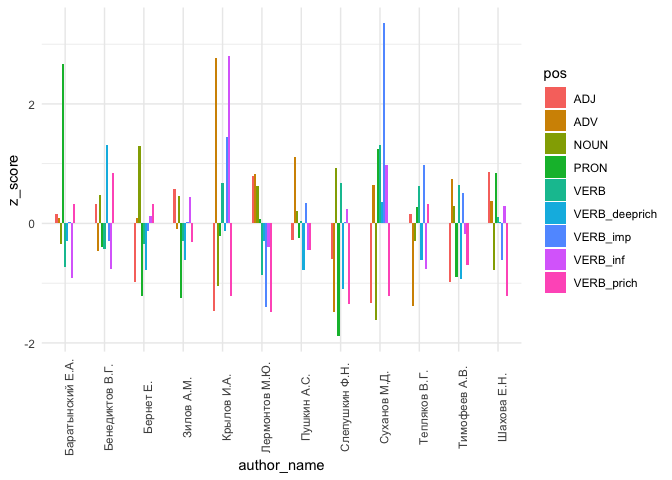
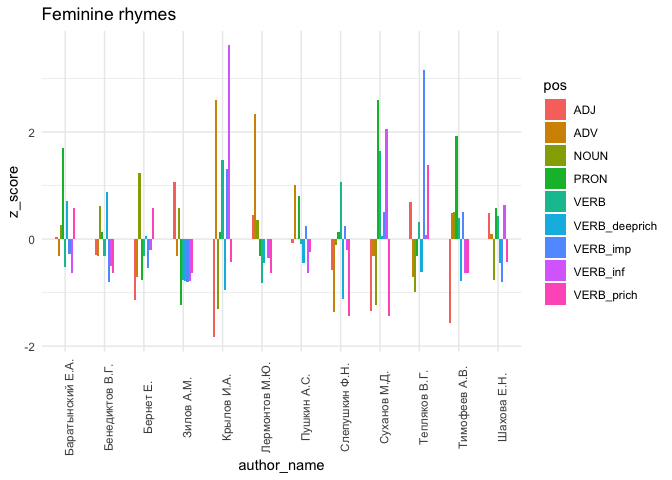

# 05.2. Code - rhyme words POS

## 5.2.1. POS in rhymes - word level

## load data & pckg

``` r
library(tidyverse)
library(tidytext)

library(kableExtra)

# library(umap)

library(MetBrewer)
library(patchwork)
theme_set(theme_minimal())
```

### meta

Import metadata

``` r
meta <- read.csv("../../data/corpus1835/sql_db/texts_metadata.csv")
glimpse(meta)
```

    Rows: 4,797
    Columns: 11
    $ text_id       <chr> "P_1", "P_10", "P_100", "P_1000", "P_1001", "P_1002", "P…
    $ source_id     <chr> "Per_1", "Per_2", "Per_3", "Per_4", "Per_4", "Per_4", "P…
    $ A_ID          <chr> "", "A_50", "A_7", "A_41", "A_139", "A_11", "A_163", "A_…
    $ text_title    <chr> "Солдатская песня", "Молния", "Ночлег чумаков", "Утешите…
    $ text_subtitle <chr> "", "", "Сельские картины", "", "", "", "", "", "", "", …
    $ first_line    <chr> "Ох жизнь, молодецкая", "Зачем с небесной высоты", "В бл…
    $ text_page     <chr> "C. 46", "C. 21", "C. 9-12", "C. 172-174", "C. 175-176",…
    $ corpus        <chr> "per", "per", "per", "per", "per", "per", "per", "per", …
    $ meter         <chr> "Other", "Iamb", "Iamb", "Iamb", "Trochee", "Iamb", "Tro…
    $ feet          <chr> "other", "3", "4", "4", "4", "4", "other", "4", "6", "5"…
    $ n_lines       <int> 38, 16, 98, 77, 28, 12, 44, 25, 31, 28, 100, 16, 17, 60,…

Meter labels

``` r
table(meta$meter)
```


    Amphibrach    Anapest     Dactyl       Iamb      Other    Trochee 
           429        142         89       3055        206        876 

``` r
meter_lables <- meta %>% 
  select(text_id, meter) %>% distinct()

head(meter_lables)
```

      text_id   meter
    1     P_1   Other
    2    P_10    Iamb
    3   P_100    Iamb
    4  P_1000    Iamb
    5  P_1001 Trochee
    6  P_1002    Iamb

### rhyme pairs

Import data & merge words + grammatical features

``` r
rhyme_pairs <- read.csv("../../data/corpus1835/sql_db/rhyme_pairs.csv") %>% 
  rename(text_id = poem_id) %>% 
  # remove Kulman texts
  filter(!str_detect(text_id, "C_264"))

glimpse(rhyme_pairs)
```

    Rows: 81,247
    Columns: 4
    $ text_id    <chr> "P_1938", "P_1938", "P_1938", "C_156__20", "C_156__20", "C_…
    $ from       <chr> "краса", "огневым", "красавицей", "око", "силки", "стонет",…
    $ to         <chr> "небеса", "земным", "красавице", "высоко", "легки", "догони…
    $ rhyme_alph <chr> "краса небеса", "земным огневым", "красавице красавицей", "…

#### attach meter info

``` r
nrow(rhyme_pairs)
```

    [1] 81247

``` r
rhyme_pairs <- rhyme_pairs %>% 
  left_join(meter_lables, by = "text_id") 

glimpse(rhyme_pairs)
```

    Rows: 81,247
    Columns: 5
    $ text_id    <chr> "P_1938", "P_1938", "P_1938", "C_156__20", "C_156__20", "C_…
    $ from       <chr> "краса", "огневым", "красавицей", "око", "силки", "стонет",…
    $ to         <chr> "небеса", "земным", "красавице", "высоко", "легки", "догони…
    $ rhyme_alph <chr> "краса небеса", "земным огневым", "красавице красавицей", "…
    $ meter      <chr> "Other", "Other", "Other", "Trochee", "Trochee", "Trochee",…

### rhyme words

``` r
rhyme_words <- read.csv("../../data/corpus1835/sql_db/rhyme_words_upd.csv", 
                        
                        # DON'T LET R EAT IAMBS AND DO INTEGER 01 => 1
                        colClasses = c("stress_pattern" = "character",
                                       "closure_pattern" = "character")) 

glimpse(rhyme_words)
```

    Rows: 34,801
    Columns: 8
    $ word            <chr> "краса", "огневым", "красавицей", "око", "силки", "сто…
    $ word_acc        <chr> "краса'", "огневы'м", "краса'вицей", "о'ко", "силки'",…
    $ stress_pattern  <chr> "01", "001", "0100", "10", "01", "10", "1", "10", "010…
    $ closure_pattern <chr> "1", "1", "100", "10", "1", "10", "1", "10", "10", "1"…
    $ closure         <chr> "masc", "masc", "dactylic", "fem", "masc", "fem", "mas…
    $ pos             <chr> "S", "S", "S", "S", "S", "V", "S", "S", "S", "S", "APR…
    $ feats           <chr> "S,жен,неод=им,ед", "S,фам,муж,од=(дат,мн|твор,ед)", "…
    $ ending_st       <chr> "са'", "ы'м", "а'вицей", "о'ко", "ки'", "о'нет", "о'р"…

``` r
# check if all words are unique
length(unique(rhyme_words$word))
```

    [1] 34801

``` r
nrow(rhyme_words)
```

    [1] 34801

#### rewrite POS tags

``` r
pos_transl <- tibble(old_tag = c("S", "V", "APRO", "SPRO", 
                   "A", "ADV", "NUM", "ADVPRO",
                   "INTJ", "PART", "PR", "ANUM", "CONJ"),
       # pos = c("NOUN", "VERB", "aPRON", "nPRON", 
       #         "ADJ", "ADV", "NUM", "advPRON",
       #         "INTJ", "PART", "ADP", "adjNUM", "CONJ"),
       pos = c("NOUN", "VERB", "PRON", "PRON", 
               "ADJ", "ADV", "NUM", "PRON",
               "INTJ", "PART", "ADP", "NUM", "CONJ")) # upos

# attach to the table with all words
rhyme_words <- rhyme_words %>% 
  rename(old_tag = pos) %>% 
  left_join(pos_transl, by = "old_tag")
```

#### extract inf & other verb forms

Infinitives

``` r
rhyme_words %>% 
  filter(pos == "VERB") %>% 
  select(feats) %>% 
  filter(str_detect(feats, "инф")) %>% count(feats, sort = T) %>% head()
```

               feats   n
    1   V,пе=инф,сов 270
    2 V,несов,нп=инф 219
    3 V,несов,пе=инф 204
    4   V,нп=инф,сов 154
    5 V,пе=инф,несов 137
    6      V=инф,сов 137

Imperatives

``` r
rhyme_words %>% 
  filter(pos == "VERB") %>% 
  select(feats) %>% 
  filter(str_detect(feats, "пов")) %>% 
  count(feats, sort = T) %>% head()
```

                      feats  n
    1   V,пе=ед,пов,2-л,сов 84
    2 V,несов,нп=ед,пов,2-л 80
    3 V,несов,пе=ед,пов,2-л 68
    4      V=ед,пов,2-л,сов 56
    5   V,нп=ед,пов,2-л,сов 55
    6   V,сов,пе=ед,пов,2-л 44

``` r
# VERB - пов
# VERB - деепр
# VERB - прич
```

``` r
rhyme_words %>% 
  mutate(pos = ifelse(str_detect(feats, "инф"),
                      "VERB_inf",
                      pos),
         pos = ifelse(str_detect(feats, "пов"),
                      "VERB_imp",
                      pos),
         pos = ifelse(str_detect(feats, "деепр"),
                      "VERB_deeprich",
                      pos),
         pos = ifelse(str_detect(feats, "прич"),
                      "VERB_prich",
                      pos)
         ) %>% 
  count(pos, sort = T) # check if rewritten properly
```

                 pos     n
    1           NOUN 13592
    2           VERB 10109
    3            ADJ  5383
    4       VERB_inf  1553
    5     VERB_prich  1302
    6       VERB_imp   893
    7            ADV   781
    8  VERB_deeprich   760
    9           PRON   289
    10           NUM    52
    11          PART    29
    12          INTJ    25
    13          <NA>    15
    14           ADP    10
    15          CONJ     8

Rewrite tags

``` r
rhyme_words <- rhyme_words %>% 
  mutate(pos = ifelse(str_detect(feats, "инф"),
                      "VERB_inf",
                      pos),
         pos = ifelse(str_detect(feats, "пов"),
                      "VERB_imp",
                      pos),
         pos = ifelse(str_detect(feats, "деепр"),
                      "VERB_deeprich",
                      pos),
         pos = ifelse(str_detect(feats, "прич"),
                      "VERB_prich",
                      pos))
```

#### 

# words

### data preparation

Merge the rhyme pairs & words features

First word

``` r
nrow(rhyme_pairs) # Number of actual pairs (should not be exceeded by either of words tables)
```

    [1] 81247

``` r
word_1 <- rhyme_pairs %>% 
  select(text_id, meter, rhyme_alph, from) %>% 
  rename(word = from) %>% 
  left_join(rhyme_words, by = "word") 

nrow(word_1)
```

    [1] 81247

``` r
head(word_1, 10)
```

         text_id   meter           rhyme_alph       word    word_acc stress_pattern
    1     P_1938   Other         краса небеса      краса      краса'             01
    2     P_1938   Other       земным огневым    огневым    огневы'м            001
    3     P_1938   Other красавице красавицей красавицей краса'вицей           0100
    4  C_156__20 Trochee           высоко око        око        о'ко             10
    5  C_156__20 Trochee          легки силки      силки      силки'             01
    6  C_156__20 Trochee       догонит стонет     стонет     сто'нет             10
    7  C_156__20 Trochee         простор спор       спор       спо'р              1
    8  C_156__20 Trochee        гремучий тучи       тучи       ту'чи             10
    9  C_156__20 Trochee        заране тумане     тумане     тума'не            010
    10 C_156__20 Trochee           лучом сном       сном       сно'м              1
       closure_pattern  closure old_tag                            feats ending_st
    1                1     masc       S                 S,жен,неод=им,ед       са'
    2                1     masc       S    S,фам,муж,од=(дат,мн|твор,ед)       ы'м
    3              100 dactylic       S                 S,жен,од=твор,ед   а'вицей
    4               10      fem       S       S,сред,неод=(вин,ед|им,ед)      о'ко
    5                1     masc       S        S,муж,неод=(вин,мн|им,мн)       ки'
    6               10      fem       V   V,несов,нп=непрош,ед,изъяв,3-л     о'нет
    7                1     masc       S        S,муж,неод=(вин,ед|им,ед)       о'р
    8               10      fem       S S,жен,неод=(вин,мн|род,ед|им,мн)      у'чи
    9               10      fem       S                 S,муж,неод=пр,ед      а'не
    10               1     masc       S               S,муж,неод=твор,ед       о'м
        pos
    1  NOUN
    2  NOUN
    3  NOUN
    4  NOUN
    5  NOUN
    6  VERB
    7  NOUN
    8  NOUN
    9  NOUN
    10 NOUN

``` r
# check errors
word_1 %>% 
  filter(is.na(word_acc))
```

         text_id      meter rhyme_alph word word_acc stress_pattern closure_pattern
    1      P_530 Amphibrach   __ дочки   __     <NA>           <NA>            <NA>
    2     P_1468    Anapest    _ зарей    _     <NA>           <NA>            <NA>
    3     P_1722       Iamb      ж нее    ж     <NA>           <NA>            <NA>
    4   C_84__21       Iamb _ предмете    _     <NA>           <NA>            <NA>
    5  C_315__19       Iamb  ль печаль   ль     <NA>           <NA>            <NA>
    6      P_409       Iamb     __ гор   __     <NA>           <NA>            <NA>
    7   C_234__9    Trochee   _ бразды    _     <NA>           <NA>            <NA>
    8  C_144__29       Iamb    б житье    б     <NA>           <NA>            <NA>
    9  C_633__55       Iamb  огурцов ф    ф     <NA>           <NA>            <NA>
    10 C_312__30       Iamb  ль печаль   ль     <NA>           <NA>            <NA>
    11  C_299__4    Trochee __ победил   __     <NA>           <NA>            <NA>
    12    P_1215       Iamb  ль печаль   ль     <NA>           <NA>            <NA>
    13  C_269__9      Other  ль печаль   ль     <NA>           <NA>            <NA>
    14     P_924       Iamb   вдаль ль   ль     <NA>           <NA>            <NA>
    15 C_241__65       Iamb   _ готовы    _     <NA>           <NA>            <NA>
    16      P_61    Trochee     б нивы    б     <NA>           <NA>            <NA>
    17 C_269__24       Iamb  ль печаль   ль     <NA>           <NA>            <NA>
       closure old_tag feats ending_st  pos
    1     <NA>    <NA>  <NA>      <NA> <NA>
    2     <NA>    <NA>  <NA>      <NA> <NA>
    3     <NA>    <NA>  <NA>      <NA> <NA>
    4     <NA>    <NA>  <NA>      <NA> <NA>
    5     <NA>    <NA>  <NA>      <NA> <NA>
    6     <NA>    <NA>  <NA>      <NA> <NA>
    7     <NA>    <NA>  <NA>      <NA> <NA>
    8     <NA>    <NA>  <NA>      <NA> <NA>
    9     <NA>    <NA>  <NA>      <NA> <NA>
    10    <NA>    <NA>  <NA>      <NA> <NA>
    11    <NA>    <NA>  <NA>      <NA> <NA>
    12    <NA>    <NA>  <NA>      <NA> <NA>
    13    <NA>    <NA>  <NA>      <NA> <NA>
    14    <NA>    <NA>  <NA>      <NA> <NA>
    15    <NA>    <NA>  <NA>      <NA> <NA>
    16    <NA>    <NA>  <NA>      <NA> <NA>
    17    <NA>    <NA>  <NA>      <NA> <NA>

``` r
word_1 %>% 
  filter(is.na(pos))
```

          text_id      meter            rhyme_alph         word      word_acc
    1       P_530 Amphibrach              __ дочки           __          <NA>
    2    C_95__21       Iamb        конец мертвець     мертвець     мертве'ць
    3      P_1468    Anapest               _ зарей            _          <NA>
    4      P_1722       Iamb                 ж нее            ж          <NA>
    5      P_1905    Trochee         оплечью речъю        речъю        речъю'
    6    C_117__5       Iamb                мы тмы          тмы          тмы'
    7  C_633__120       Iamb          ла подшутила           ла           ла'
    8       P_457       Iamb      оставляя устрояя      устрояя      устро'яя
    9    C_84__21       Iamb            _ предмете            _          <NA>
    10  C_315__19       Iamb             ль печаль           ль          <NA>
    11      P_750       Iamb своевольныхь юдольных своевольныхь своево'льныхь
    12      P_409       Iamb                __ гор           __          <NA>
    13   C_156__3    Trochee       покорныи черныи     покорныи     поко'рныи
    14   C_234__9    Trochee              _ бразды            _          <NA>
    15   C_319__5       Iamb              думы юмы          юмы          ю'мы
    16  C_144__29       Iamb               б житье            б          <NA>
    17  C_633__55       Iamb             огурцов ф            ф          <NA>
    18  C_312__30       Iamb             ль печаль           ль          <NA>
    19   C_299__4    Trochee            __ победил           __          <NA>
    20     P_1215       Iamb             ль печаль           ль          <NA>
    21  C_141__41       Iamb         сый трисвятый          сый          сы'й
    22  C_241__63       Iamb               душе ше           ше           ше'
    23   C_269__9      Other             ль печаль           ль          <NA>
    24      P_924       Iamb              вдаль ль           ль          <NA>
    25  C_241__65       Iamb              _ готовы            _          <NA>
    26  C_154__40    Trochee           скверны сый          сый          сы'й
    27       P_61    Trochee                б нивы            б          <NA>
    28  C_269__24       Iamb             ль печаль           ль          <NA>
    29  C_154__48       Iamb просвещенъе сравненье  просвещенъе  просвеще'нъе
       stress_pattern closure_pattern  closure old_tag feats ending_st  pos
    1            <NA>            <NA>     <NA>    <NA>  <NA>      <NA> <NA>
    2              01               1     masc    <NA>  <NA>      е'ць <NA>
    3            <NA>            <NA>     <NA>    <NA>  <NA>      <NA> <NA>
    4            <NA>            <NA>     <NA>    <NA>  <NA>      <NA> <NA>
    5              01               1     masc    <NA>  <NA>       ъю' <NA>
    6               1               1     masc    <NA>  <NA>       мы' <NA>
    7               1               1     masc    <NA>  <NA>       ла' <NA>
    8            0100             100 dactylic    <NA>  <NA>      о'яя <NA>
    9            <NA>            <NA>     <NA>    <NA>  <NA>      <NA> <NA>
    10           <NA>            <NA>     <NA>    <NA>  <NA>      <NA> <NA>
    11           0010              10      fem    <NA>  <NA>  о'льныхь <NA>
    12           <NA>            <NA>     <NA>    <NA>  <NA>      <NA> <NA>
    13           0100             100 dactylic    <NA>  <NA>    о'рныи <NA>
    14           <NA>            <NA>     <NA>    <NA>  <NA>      <NA> <NA>
    15             10              10      fem    <NA>  <NA>      ю'мы <NA>
    16           <NA>            <NA>     <NA>    <NA>  <NA>      <NA> <NA>
    17           <NA>            <NA>     <NA>    <NA>  <NA>      <NA> <NA>
    18           <NA>            <NA>     <NA>    <NA>  <NA>      <NA> <NA>
    19           <NA>            <NA>     <NA>    <NA>  <NA>      <NA> <NA>
    20           <NA>            <NA>     <NA>    <NA>  <NA>      <NA> <NA>
    21              1               1     masc    <NA>  <NA>       ы'й <NA>
    22              1               1     masc    <NA>  <NA>       ше' <NA>
    23           <NA>            <NA>     <NA>    <NA>  <NA>      <NA> <NA>
    24           <NA>            <NA>     <NA>    <NA>  <NA>      <NA> <NA>
    25           <NA>            <NA>     <NA>    <NA>  <NA>      <NA> <NA>
    26              1               1     masc    <NA>  <NA>       ы'й <NA>
    27           <NA>            <NA>     <NA>    <NA>  <NA>      <NA> <NA>
    28           <NA>            <NA>     <NA>    <NA>  <NA>      <NA> <NA>
    29           0010              10      fem    <NA>  <NA>     е'нъе <NA>

``` r
# remove errors
word_1 <- word_1 %>% 
  filter(!is.na(word_acc) & !is.na(pos))
```

Second word

``` r
word_2 <- rhyme_pairs %>% 
  select(text_id, meter, rhyme_alph, to) %>% 
  rename(word = to) %>% 
  left_join(rhyme_words, by = "word")

nrow(word_2) == nrow(rhyme_pairs) # must be true
```

    [1] TRUE

``` r
head(word_2, 10)
```

         text_id   meter           rhyme_alph      word   word_acc stress_pattern
    1     P_1938   Other         краса небеса    небеса    небеса'            001
    2     P_1938   Other       земным огневым    земным    земны'м             01
    3     P_1938   Other красавице красавицей красавице краса'вице           0100
    4  C_156__20 Trochee           высоко око    высоко    высоко'            001
    5  C_156__20 Trochee          легки силки     легки     легки'             01
    6  C_156__20 Trochee       догонит стонет   догонит   дого'нит            010
    7  C_156__20 Trochee         простор спор   простор   просто'р             01
    8  C_156__20 Trochee        гремучий тучи  гремучий  грему'чий            010
    9  C_156__20 Trochee        заране тумане    заране    зара'не            010
    10 C_156__20 Trochee           лучом сном     лучом     лучо'м             01
       closure_pattern  closure old_tag
    1                1     masc       S
    2                1     masc       A
    3              100 dactylic       S
    4                1     masc     ADV
    5                1     masc       A
    6               10      fem       V
    7                1     masc       S
    8               10      fem       A
    9               10      fem       S
    10               1     masc       S
                                                    feats ending_st  pos
    1                          S,сред,неод=(вин,мн|им,мн)       са' NOUN
    2  A=(дат,мн,полн|твор,ед,полн,муж|твор,ед,полн,сред)       ы'м  ADJ
    3                             S,жен,од=(пр,ед|дат,ед)    а'вице NOUN
    4                                                ADV=       ко'  ADV
    5                                             A=мн,кр       ки'  ADJ
    6                        V,сов,пе=непрош,ед,изъяв,3-л     о'нит VERB
    7                           S,муж,неод=(вин,ед|им,ед)       о'р NOUN
    8             A=(вин,ед,полн,муж,неод|им,ед,полн,муж)     у'чий  ADJ
    9                         S,имя,жен,од=(пр,ед|дат,ед)      а'не NOUN
    10                                 S,муж,неод=твор,ед       о'м NOUN

``` r
# check errors
word_2 %>% 
  filter(is.na(word_acc))
```

         text_id      meter rhyme_alph word word_acc stress_pattern closure_pattern
    1     P_1520 Amphibrach      ж мне    ж     <NA>           <NA>            <NA>
    2   C_68__74       Iamb  ль печаль   ль     <NA>           <NA>            <NA>
    3  C_633__55       Iamb    садов ф    ф     <NA>           <NA>            <NA>
    4   C_180__5       Iamb    благ ль   ль     <NA>           <NA>            <NA>
    5  C_315__16       Iamb  ль печаль   ль     <NA>           <NA>            <NA>
    6 C_633__125       Iamb  ж стороне    ж     <NA>           <NA>            <NA>
    7      P_246    Trochee    была нх   нх     <NA>           <NA>            <NA>
    8 C_633__128       Iamb       ж же    ж     <NA>           <NA>            <NA>
      closure old_tag feats ending_st  pos
    1    <NA>    <NA>  <NA>      <NA> <NA>
    2    <NA>    <NA>  <NA>      <NA> <NA>
    3    <NA>    <NA>  <NA>      <NA> <NA>
    4    <NA>    <NA>  <NA>      <NA> <NA>
    5    <NA>    <NA>  <NA>      <NA> <NA>
    6    <NA>    <NA>  <NA>      <NA> <NA>
    7    <NA>    <NA>  <NA>      <NA> <NA>
    8    <NA>    <NA>  <NA>      <NA> <NA>

``` r
word_2 %>% 
  filter(is.na(pos))
```

          text_id      meter           rhyme_alph        word     word_acc
    1      P_1520 Amphibrach                ж мне           ж         <NA>
    2    C_156__3    Trochee      покорныи черныи      черныи      черны'и
    3    C_68__74       Iamb            ль печаль          ль         <NA>
    4   C_633__55       Iamb              садов ф           ф         <NA>
    5      P_1836 Amphibrach           вдруг рукь        рукь        ру'кь
    6    C_180__5       Iamb              благ ль          ль         <NA>
    7   C_315__16       Iamb            ль печаль          ль         <NA>
    8   C_241__67       Iamb               бич ич          ич          и'ч
    9      P_1935 Amphibrach          лbлей своей       лbлей       лbле'й
    10 C_633__125       Iamb            ж стороне           ж         <NA>
    11  C_154__40    Trochee         небесный сый         сый         сы'й
    12      P_246    Trochee              была нх          нх         <NA>
    13 C_633__128       Iamb                 ж же           ж         <NA>
    14  C_154__48       Iamb обещанье просвещенъе просвещенъе просвеще'нъе
       stress_pattern closure_pattern closure old_tag feats ending_st  pos
    1            <NA>            <NA>    <NA>    <NA>  <NA>      <NA> <NA>
    2             010              10     fem    <NA>  <NA>       ы'и <NA>
    3            <NA>            <NA>    <NA>    <NA>  <NA>      <NA> <NA>
    4            <NA>            <NA>    <NA>    <NA>  <NA>      <NA> <NA>
    5               1               1    masc    <NA>  <NA>      у'кь <NA>
    6            <NA>            <NA>    <NA>    <NA>  <NA>      <NA> <NA>
    7            <NA>            <NA>    <NA>    <NA>  <NA>      <NA> <NA>
    8               1               1    masc    <NA>  <NA>       и'ч <NA>
    9               1               1    masc    <NA>  <NA>       е'й <NA>
    10           <NA>            <NA>    <NA>    <NA>  <NA>      <NA> <NA>
    11              1               1    masc    <NA>  <NA>       ы'й <NA>
    12           <NA>            <NA>    <NA>    <NA>  <NA>      <NA> <NA>
    13           <NA>            <NA>    <NA>    <NA>  <NA>      <NA> <NA>
    14           0010              10     fem    <NA>  <NA>     е'нъе <NA>

``` r
# remove errors
word_2 <- word_2 %>% 
  filter(!is.na(word_acc) & !is.na(pos))

nrow(word_2)
```

    [1] 81233

Merge all from-to words in one table

``` r
all_words <- rbind(word_1, word_2)
```

Remove obsolete data

``` r
rm(meter_lables, rhyme_words, word_1, word_2)
```

### Basic stats

``` r
table(all_words$meter)
```


    Amphibrach    Anapest     Dactyl       Iamb      Other    Trochee 
         12996       3891       1874     108752       4251      30687 

#### MFW in rhymes

Errors: hyperdactyllic edings

``` r
all_words %>% 
  filter(closure == "other") %>% 
  select(word_acc, closure_pattern) %>% 
  #distinct() %>% 
  nrow()
```

    [1] 148

``` r
# mostly wrongly annotated stresses (but very small number of words)
```

MFW iamb & trochee

``` r
closures <- c("masc", "fem", "dactylic")

all_words %>% 
  filter(meter %in% c("Iamb", "Trochee") & closure %in% closures) %>% 
  group_by(meter, closure) %>% 
  count(word_acc, sort = T) %>% 
  slice_max(order_by = n, n = 5)
```

    # A tibble: 34 × 4
    # Groups:   meter, closure [6]
       meter closure  word_acc           n
       <chr> <chr>    <chr>          <int>
     1 Iamb  dactylic рети'вое           9
     2 Iamb  dactylic ка'тится           8
     3 Iamb  dactylic окрова'вленный     8
     4 Iamb  dactylic го'лоса            7
     5 Iamb  dactylic кру'жится          7
     6 Iamb  dactylic про'снется         7
     7 Iamb  fem      тобо'ю           181
     8 Iamb  fem      мно'ю            174
     9 Iamb  fem      све'та           152
    10 Iamb  fem      душо'ю           148
    # ℹ 24 more rows

MFW 3-syll meters

``` r
all_words %>% 
  filter(meter %in% c("Dactyl", "Amphibrach", "Anapest") & closure %in% closures) %>% 
  group_by(meter, closure) %>% 
  count(word_acc, sort = T) %>% 
  slice_max(order_by = n, n = 5)
```

    # A tibble: 60 × 4
    # Groups:   meter, closure [9]
       meter      closure  word_acc          n
       <chr>      <chr>    <chr>         <int>
     1 Amphibrach dactylic ми'лого           5
     2 Amphibrach dactylic ру'сские          5
     3 Amphibrach dactylic азо'вского        4
     4 Amphibrach dactylic байка'льского     4
     5 Amphibrach dactylic до'брые           4
     6 Amphibrach dactylic каспи'йского      4
     7 Amphibrach dactylic ла'сточка         4
     8 Amphibrach fem      мо'ре            34
     9 Amphibrach fem      о'чи             29
    10 Amphibrach fem      но'чи            27
    # ℹ 50 more rows

#### total_meter

Total number of rhyme words in a meter

``` r
total_meter <- all_words %>% 
  count(meter) %>% 
  rename(total = n)

total_meter
```

           meter  total
    1 Amphibrach  12996
    2    Anapest   3891
    3     Dactyl   1874
    4       Iamb 108752
    5      Other   4251
    6    Trochee  30687

#### Number of masc / fem / dactyl endings

``` r
all_words %>% 
  filter(closure != "other" & meter != "Other") %>% 
  group_by(meter) %>% 
  count(closure) %>% 
  left_join(total_meter, by = "meter") %>% 
  mutate(perc = round((n / total) * 100, 2 ))
```

    # A tibble: 15 × 5
    # Groups:   meter [5]
       meter      closure      n  total  perc
       <chr>      <chr>    <int>  <int> <dbl>
     1 Amphibrach dactylic   381  12996  2.93
     2 Amphibrach fem       5472  12996 42.1 
     3 Amphibrach masc      7137  12996 54.9 
     4 Anapest    dactylic    53   3891  1.36
     5 Anapest    fem       1143   3891 29.4 
     6 Anapest    masc      2695   3891 69.3 
     7 Dactyl     dactylic   250   1874 13.3 
     8 Dactyl     fem        575   1874 30.7 
     9 Dactyl     masc      1044   1874 55.7 
    10 Iamb       dactylic  1324 108752  1.22
    11 Iamb       fem      53075 108752 48.8 
    12 Iamb       masc     54284 108752 49.9 
    13 Trochee    dactylic  1103  30687  3.59
    14 Trochee    fem      14091  30687 45.9 
    15 Trochee    masc     15444  30687 50.3 

``` r
# all_words %>% 
#   filter(meter == "Dactyl" & closure == "masc") %>% 
#   select(text_id, word_acc, closure_pattern) %>% sample_n(10)

# meta %>% 
#   filter(text_id == "P_294")
```

### top endings in meters

#### iamb_closures

Number of words of a particular clausula type IN iambic texts

``` r
iamb_closures <- all_words %>% 
  filter(meter == "Iamb") %>% 
  count(closure) %>% 
  rename(total_closure = n) 
```

``` r
all_words %>% 
  filter(meter == "Iamb" & closure != "other") %>% 
  group_by(meter, closure) %>% 
  count(ending_st) %>% 
  slice_max(order_by = n, n = 5) %>% 
  ungroup() %>% 
  left_join(total_meter, by = "meter") %>% 
  # percentage of all words in iamb
  mutate(perc_all_iambic = round((n / total) * 100, 2 )) %>% 
  left_join(iamb_closures, by = "closure") %>% 
  
  # percentage of word of particular clausula type
  mutate(perc_iamb_clos = round((n / total_closure) * 100, 2 )) %>% 
  select(-total, -total_closure)
```

    # A tibble: 17 × 6
       meter closure  ending_st     n perc_all_iambic perc_iamb_clos
       <chr> <chr>    <chr>     <int>           <dbl>          <dbl>
     1 Iamb  dactylic е'ния        20            0.02           1.51
     2 Iamb  dactylic е'ние        14            0.01           1.06
     3 Iamb  dactylic а'ния        13            0.01           0.98
     4 Iamb  dactylic а'тится      10            0.01           0.76
     5 Iamb  dactylic а'рая         9            0.01           0.68
     6 Iamb  dactylic и'вое         9            0.01           0.68
     7 Iamb  dactylic у'жится       9            0.01           0.68
     8 Iamb  fem      о'ю        2236            2.06           4.21
     9 Iamb  fem      а'ми       1629            1.5            3.07
    10 Iamb  fem      е'нья      1492            1.37           2.81
    11 Iamb  fem      а'ет       1451            1.33           2.73
    12 Iamb  fem      е'нье      1227            1.13           2.31
    13 Iamb  masc     о'й        5258            4.83           9.69
    14 Iamb  masc     е'й        3155            2.9            5.81
    15 Iamb  masc     а'л        1874            1.72           3.45
    16 Iamb  masc     и'т        1526            1.4            2.81
    17 Iamb  masc     на'        1446            1.33           2.66

``` r
all_words %>% 
  filter(closure == "dactylic") %>% count(word_acc, sort = T)
```

#### trochee_closures

Number of words of a particular clausula type IN trochaic texts

``` r
trochee_closures <- all_words %>% 
  filter(meter == "Trochee") %>% 
  count(closure) %>% 
  rename(total_closure = n) 
```

``` r
all_words %>% 
  filter(meter == "Trochee" & closure != "other") %>% 
  group_by(meter, closure) %>% 
  count(ending_st) %>% 
  slice_max(order_by = n, n = 5) %>% 
  ungroup() %>% 
  left_join(total_meter, by = "meter") %>% 
  # percentage of all words in iamb
  mutate(perc_all_tr = round((n / total) * 100, 2 )) %>% 
  left_join(trochee_closures, by = "closure") %>% 
  
  # percentage of word of particular clausula type
  mutate(perc_tr_clos = round((n / total_closure) * 100, 2 )) %>% 
  select(-total, -total_closure)
```

    # A tibble: 17 × 6
       meter   closure  ending_st     n perc_all_tr perc_tr_clos
       <chr>   <chr>    <chr>     <int>       <dbl>        <dbl>
     1 Trochee dactylic е'ния        21        0.07         1.9 
     2 Trochee dactylic а'ния        20        0.07         1.81
     3 Trochee dactylic а'ется       13        0.04         1.18
     4 Trochee dactylic ё'нная       12        0.04         1.09
     5 Trochee dactylic е'ние        11        0.04         1   
     6 Trochee dactylic у'щего       11        0.04         1   
     7 Trochee dactylic ю'щего       11        0.04         1   
     8 Trochee fem      о'ю         506        1.65         3.59
     9 Trochee fem      а'я         429        1.4          3.04
    10 Trochee fem      а'ет        396        1.29         2.81
    11 Trochee fem      а'ми        366        1.19         2.6 
    12 Trochee fem      е'нья       219        0.71         1.55
    13 Trochee masc     о'й        1387        4.52         8.98
    14 Trochee masc     е'й         816        2.66         5.28
    15 Trochee masc     и'т         591        1.93         3.83
    16 Trochee masc     на'         498        1.62         3.22
    17 Trochee masc     ё'т         425        1.38         2.75

### POS distribution in meters / endings

-   add pos accodring to Shaw groups

-   separate periodicals / books to compare

-   in comparison to Shaw’s data we provide more texts & a more detailed
    divisions in terms of meters & clausulas usage

-   Worth has some very detailed rhyme stats, might be interesting to
    add somewhere (but not really important)

#### iamb

Total distribution of POS (all words)

``` r
all_words %>% 
  filter(meter == "Iamb" & closure != "other") %>% 
  count(meter, pos) %>% 
  left_join(total_meter, by = "meter") %>% 
  
  # percentage of all words in iamb
  mutate(perc_all_iambic = round((n / total) * 100, 2 )) %>% 
  select(-meter, -total) %>% 
  arrange(-desc(pos))
```

                 pos     n perc_all_iambic
    1            ADJ 12510           11.50
    2            ADP    17            0.02
    3            ADV  3078            2.83
    4           CONJ    15            0.01
    5           INTJ    76            0.07
    6           NOUN 56113           51.60
    7            NUM    92            0.08
    8           PART   462            0.42
    9           PRON  8564            7.87
    10          VERB 20671           19.01
    11 VERB_deeprich  1166            1.07
    12      VERB_imp  1109            1.02
    13      VERB_inf  2959            2.72
    14    VERB_prich  1851            1.70

By clausula

``` r
all_words %>% 
  filter(meter == "Iamb" & closure != "other") %>% 
  group_by(meter, closure) %>% 
  count(meter, pos) %>% 
  ungroup() %>% 
  #left_join(total_meter, by = "meter") %>% 
  
  # percentage of all words in iamb
  #mutate(perc_all_iambic = round((n / total) * 100, 2 )) # %>% 
  left_join(iamb_closures, by = "closure") %>% 
  # 
  # # percentage of word of particular clausula type
  mutate(perc_iamb_clos = round((n / total_closure) * 100, 2 )) %>% 
  select(-total_closure, -meter) %>% head(38)
```

    # A tibble: 38 × 4
       closure  pos               n perc_iamb_clos
       <chr>    <chr>         <int>          <dbl>
     1 dactylic ADJ             343          25.9 
     2 dactylic ADV              22           1.66
     3 dactylic NOUN            601          45.4 
     4 dactylic NUM               3           0.23
     5 dactylic PRON              5           0.38
     6 dactylic VERB            194          14.6 
     7 dactylic VERB_deeprich    16           1.21
     8 dactylic VERB_imp         11           0.83
     9 dactylic VERB_inf          6           0.45
    10 dactylic VERB_prich      123           9.29
    # ℹ 28 more rows

#### trochee

Total POS

``` r
all_words %>% 
  filter(meter == "Trochee" & closure != "other") %>% 
  count(meter, pos) %>% 
  left_join(total_meter, by = "meter") %>% 
  
  # percentage of all words in iamb
  mutate(perc_all_iambic = round((n / total) * 100, 2 )) %>% 
  select(-meter, -total) %>% 
  arrange(-desc(pos))
```

                 pos     n perc_all_iambic
    1            ADJ  4113           13.40
    2            ADP     5            0.02
    3            ADV   948            3.09
    4           INTJ    33            0.11
    5           NOUN 15654           51.01
    6            NUM    26            0.08
    7           PART   104            0.34
    8           PRON  2206            7.19
    9           VERB  5734           18.69
    10 VERB_deeprich   330            1.08
    11      VERB_imp   303            0.99
    12      VERB_inf   740            2.41
    13    VERB_prich   442            1.44

By clausula

``` r
all_words %>% 
  filter(meter == "Trochee" & closure != "other") %>% 
  group_by(meter, closure) %>% 
  count(meter, pos) %>% 
  ungroup() %>% 
  #left_join(total_meter, by = "meter") %>% 
  
  # percentage of all words in iamb
  #mutate(perc_all_iambic = round((n / total) * 100, 2 )) # %>% 
  left_join(trochee_closures, by = "closure") %>% 
  # 
  # # percentage of word of particular clausula type
  mutate(perc_tr_clos = round((n / total_closure) * 100, 2 )) %>% 
  select(-total_closure, -meter, -n) %>% 
  arrange(desc(perc_tr_clos)) %>% 
  pivot_wider(names_from = closure, values_from = perc_tr_clos)
```

    # A tibble: 13 × 4
       pos            masc   fem dactylic
       <chr>         <dbl> <dbl>    <dbl>
     1 NOUN          52.3  51.2     32.7 
     2 ADJ            6.03 18.8     49.0 
     3 VERB          18.0  20.3      8.52
     4 PRON          12.8   1.58     0.09
     5 VERB_prich     1.12  1.33     7.43
     6 VERB_inf       4.06  0.79     0.09
     7 ADV            2.96  3.41     1   
     8 VERB_deeprich  0.46  1.8      0.54
     9 VERB_imp       1.35  0.63     0.45
    10 PART           0.62  0.06    NA   
    11 INTJ           0.19  0.03    NA   
    12 NUM            0.06  0.1      0.18
    13 ADP            0.03  0.01    NA   

### POS groups

Grouping according to Shaw 2004 (p. 347)

``` r
unique(all_words$pos)
```

     [1] "NOUN"          "VERB"          "PRON"          "VERB_imp"     
     [5] "ADJ"           "ADV"           "VERB_inf"      "VERB_deeprich"
     [9] "VERB_prich"    "NUM"           "INTJ"          "PART"         
    [13] "ADP"           "CONJ"         

``` r
x <- tibble(pos = c("NOUN", "ADJ", "PRON", "VERB_prich", 
               
               "VERB", "VERB_inf", "VERB_imp",
               
               "ADV", "NUM", "INTJ", "ADP", "CONJ", "VERB_deeprich", "PART"
               ),
       pos_group = c("declined", "declined", "declined", "declined",
                     
                     "verbs", "verbs", "verbs", 
                     
                     "other", "other", "other", "other", "other", "other", "other"     
                     ))

nrow(x) == length(unique(all_words$pos))
```

    [1] TRUE

``` r
x
```

    # A tibble: 14 × 2
       pos           pos_group
       <chr>         <chr>    
     1 NOUN          declined 
     2 ADJ           declined 
     3 PRON          declined 
     4 VERB_prich    declined 
     5 VERB          verbs    
     6 VERB_inf      verbs    
     7 VERB_imp      verbs    
     8 ADV           other    
     9 NUM           other    
    10 INTJ          other    
    11 ADP           other    
    12 CONJ          other    
    13 VERB_deeprich other    
    14 PART          other    

``` r
all_words <- all_words %>% 
  left_join(x, by = "pos")
```

#### iamb

total POS

``` r
all_words %>% 
  filter(meter == "Iamb" & closure != "other") %>% 
  count(meter, pos_group) %>% 
  left_join(total_meter, by = "meter") %>% 
  
  # percentage of all words in iamb
  mutate(perc_all_iambic = round((n / total) * 100, 2 )) %>% 
  select(-meter, -total) %>% 
  arrange(desc(n))
```

      pos_group     n perc_all_iambic
    1  declined 79038           72.68
    2     verbs 24739           22.75
    3     other  4906            4.51

By clausula

``` r
all_words %>% 
  filter(meter == "Iamb" & closure != "other") %>% 
  group_by(meter, closure) %>% 
  count(meter, pos_group) %>% 
  ungroup() %>% 
  #left_join(total_meter, by = "meter") %>% 
  
  # percentage of all words in iamb
  #mutate(perc_all_iambic = round((n / total) * 100, 2 )) # %>% 
  left_join(iamb_closures, by = "closure") %>% 
  # 
  # # percentage of word of particular clausula type
  mutate(perc_iamb_clos = round((n / total_closure) * 100, 2 )) %>% 
  select(-total_closure, -meter)
```

    # A tibble: 9 × 4
      closure  pos_group     n perc_iamb_clos
      <chr>    <chr>     <int>          <dbl>
    1 dactylic declined   1072          81.0 
    2 dactylic other        41           3.1 
    3 dactylic verbs       211          15.9 
    4 fem      declined  38196          72.0 
    5 fem      other      2576           4.85
    6 fem      verbs     12303          23.2 
    7 masc     declined  39770          73.3 
    8 masc     other      2289           4.22
    9 masc     verbs     12225          22.5 

#### trochee

Total POS

``` r
all_words %>% 
  filter(meter == "Trochee" & closure != "other") %>% 
  count(meter, pos_group) %>% 
  left_join(total_meter, by = "meter") %>% 
  
  # percentage of all words in iamb
  mutate(perc_all_iambic = round((n / total) * 100, 2 )) %>% 
  select(-meter, -total) %>% 
  arrange(desc(n))
```

      pos_group     n perc_all_iambic
    1  declined 22415           73.04
    2     verbs  6777           22.08
    3     other  1446            4.71

By clausula

``` r
all_words %>% 
  filter(meter == "Trochee" & closure != "other") %>% 
  group_by(meter, closure) %>% 
  count(meter, pos_group) %>% 
  ungroup() %>% 
  #left_join(total_meter, by = "meter") %>% 
  
  # percentage of all words in iamb
  #mutate(perc_all_iambic = round((n / total) * 100, 2 )) # %>% 
  left_join(trochee_closures, by = "closure") %>% 
  # 
  # # percentage of word of particular clausula type
  mutate(perc_tr_clos = round((n / total_closure) * 100, 2 )) %>% 
  select(-total_closure, -meter)
```

    # A tibble: 9 × 4
      closure  pos_group     n perc_tr_clos
      <chr>    <chr>     <int>        <dbl>
    1 dactylic declined    984        89.2 
    2 dactylic other        19         1.72
    3 dactylic verbs       100         9.07
    4 fem      declined  10273        72.9 
    5 fem      other       760         5.39
    6 fem      verbs      3058        21.7 
    7 masc     declined  11158        72.2 
    8 masc     other       667         4.32
    9 masc     verbs      3619        23.4 

``` r
rm(x, iamb_closures, trochee_closures)
```

## periodicals / books

Separate periodicals & books sources of texts

``` r
#glimpse(all_words)
# quick check
all_words %>% 
  mutate(corpus = str_extract(text_id, "^\\w")) %>% count(corpus)
```

      corpus      n
    1      C 101241
    2      P  61210

Store totals

``` r
cp_total <- all_words %>% 
  mutate(corpus = str_extract(text_id, "^\\w")) %>% 
  count(corpus) %>% 
  rename(total = n)

cp_clausulas <- all_words %>% 
  mutate(corpus = str_extract(text_id, "^\\w")) %>% 
  count(corpus, closure) %>% 
  mutate(corpus_closure = paste0(corpus, "__", closure)) %>% 
  rename(total_closure = n) %>% 
  select(-corpus, -closure)
```

All POS

``` r
all_words %>% 
  mutate(corpus = str_extract(text_id, "^\\w")) %>% 
  count(corpus, pos) %>% 
  left_join(cp_total, by = "corpus") %>% 
  mutate(perc = round( (n/total)*100, 2 )) %>% 
  select(-n, -total) %>% 
  arrange(desc(perc)) %>% 
  pivot_wider(names_from = corpus, values_from = perc)
```

    # A tibble: 14 × 3
       pos               P     C
       <chr>         <dbl> <dbl>
     1 NOUN          52.3  50.6 
     2 VERB          18.0  19.9 
     3 ADJ           12.5  11.6 
     4 PRON           7.65  7.9 
     5 ADV            2.98  2.79
     6 VERB_inf       2.38  2.78
     7 VERB_prich     1.53  1.61
     8 VERB_deeprich  1.07  1.12
     9 VERB_imp       0.94  1.06
    10 PART           0.35  0.43
    11 NUM            0.1   0.08
    12 INTJ           0.09  0.08
    13 ADP            0.01  0.02
    14 CONJ           0     0.01

By clausula

``` r
all_words %>% 
  mutate(corpus = str_extract(text_id, "^\\w")) %>% 
  count(corpus, pos, closure) %>% 
  mutate(corpus_closure = paste0(corpus, "__", closure)) %>% 
  left_join(cp_clausulas, by = "corpus_closure") %>% 
  #select(-corpus_closure) %>% 
  mutate(perc_closure = round( (n/total_closure)*100, 2 )) %>% 
  filter(closure %in% c("masc", "fem")) %>% 
  select(-corpus, -closure, -total_closure, -n) %>% 
  arrange(desc(perc_closure)) %>% 
  pivot_wider(names_from = corpus_closure, values_from = perc_closure) %>% 
  select(pos, P__fem, C__fem, P__masc, C__masc)
```

    # A tibble: 14 × 5
       pos           P__fem C__fem P__masc C__masc
       <chr>          <dbl>  <dbl>   <dbl>   <dbl>
     1 NOUN           53.3   49.8    52.2    51.9 
     2 VERB           19.4   22.9    17.2    17.5 
     3 ADJ            17.7   16.8     6.29    5.53
     4 PRON            1.8    1.9    13.3    13.8 
     5 VERB_inf        0.69   1.25    3.98    4.3 
     6 ADV             3.27   2.96    2.81    2.69
     7 VERB_prich      1.47   1.8     1.34    1.2 
     8 VERB_deeprich   1.64   1.71    0.57    0.58
     9 VERB_imp        0.48   0.71    1.38    1.4 
    10 PART            0.06   0.06    0.64    0.78
    11 INTJ            0.04   0.05    0.14    0.12
    12 NUM             0.12   0.08    0.08    0.08
    13 ADP             0      0       0.02    0.04
    14 CONJ            0.01   0      NA       0.02

``` r
rm(cp_clausulas, cp_total)
```

## authors

### load data

NB the data includes MUCH smaller samples for each author than in Shaw’s
analysis (but still more than 1k rhyme words for each author)

``` r
# load data about authors
authors_meta <- read_csv("../../data/corpus1835/sql_db/authors.csv") %>% 
  select(A_ID, author_name)
```

    Rows: 315 Columns: 10
    ── Column specification ────────────────────────────────────────────────────────
    Delimiter: ","
    chr (9): A_ID, author_name, author_full_name, author_sex, year_birth, year_d...
    dbl (1): aristocracy

    ℹ Use `spec()` to retrieve the full column specification for this data.
    ℹ Specify the column types or set `show_col_types = FALSE` to quiet this message.

``` r
# glimpse(authors_meta)

# attach authors to texts
authors <- meta %>% 
  select(text_id, A_ID) %>% 
  left_join(authors_meta, by = "A_ID") 

# attach authors to rhyme words
glimpse(all_words)
```

    Rows: 162,451
    Columns: 13
    $ text_id         <chr> "P_1938", "P_1938", "P_1938", "C_156__20", "C_156__20"…
    $ meter           <chr> "Other", "Other", "Other", "Trochee", "Trochee", "Troc…
    $ rhyme_alph      <chr> "краса небеса", "земным огневым", "красавице красавице…
    $ word            <chr> "краса", "огневым", "красавицей", "око", "силки", "сто…
    $ word_acc        <chr> "краса'", "огневы'м", "краса'вицей", "о'ко", "силки'",…
    $ stress_pattern  <chr> "01", "001", "0100", "10", "01", "10", "1", "10", "010…
    $ closure_pattern <chr> "1", "1", "100", "10", "1", "10", "1", "10", "10", "1"…
    $ closure         <chr> "masc", "masc", "dactylic", "fem", "masc", "fem", "mas…
    $ old_tag         <chr> "S", "S", "S", "S", "S", "V", "S", "S", "S", "S", "APR…
    $ feats           <chr> "S,жен,неод=им,ед", "S,фам,муж,од=(дат,мн|твор,ед)", "…
    $ ending_st       <chr> "са'", "ы'м", "а'вицей", "о'ко", "ки'", "о'нет", "о'р"…
    $ pos             <chr> "NOUN", "NOUN", "NOUN", "NOUN", "NOUN", "VERB", "NOUN"…
    $ pos_group       <chr> "declined", "declined", "declined", "declined", "decli…

``` r
all_words %>% 
  left_join(authors, by = "text_id") %>% 
  count(author_name, sort = T) %>% head(30) # quick view
```

            author_name     n
    1              <NA> 16497
    2    Жуковский В.А.  7382
    3       Крылов И.А.  6397
    4     Бороздна И.П.  4676
    5   Быстроглазов А.  4081
    6   Бенедиктов В.Г.  4009
    7         Бернет Е.  3913
    8  Баратынский Е.А.  3828
    9        Мейснер А.  3158
    10      Смирнова А.  3132
    11      Шахова Е.Н.  3088
    12    Тимофеев А.В.  2969
    13    Некрасов Н.А.  2858
    14     Демидов М.А.  2855
    15      Башкатов А.  2591
    16       Зилов А.М.  2584
    17      Меркли М.М.  2152
    18      Сушков Д.П.  2132
    19    Тепляков В.Г.  2093
    20     Суханов М.Д.  2072
    21    Полежаев А.И.  2038
    22 Подолинский А.И.  1965
    23     Бакунин И.М.  1784
    24    Мартынов А.М.  1780
    25      Ушаков А.А.  1720
    26   Лермонтов М.Ю.  1719
    27      Кашкин Д.Е.  1684
    28    Алексеев П.Ф.  1648
    29      Козлов И.И.  1602
    30  Ростопчина Е.П.  1568

``` r
# attachment & removal of NA
words_authors <- all_words %>% 
  left_join(authors %>% select(-A_ID), by = "text_id") %>% 
  filter(!is.na(author_name))

words_authors %>% 
  filter(author_name == "Кульман Е.Б.")
```

     [1] text_id         meter           rhyme_alph      word           
     [5] word_acc        stress_pattern  closure_pattern closure        
     [9] old_tag         feats           ending_st       pos            
    [13] pos_group       author_name    
    <0 rows> (or 0-length row.names)

### selection

#### canonical

``` r
# authors <- c("Жуковский В.А.", "Крылов И.А.", 
#              "Баратынский Е.А.", "Тепляков В.Г.",
#              "Пушкин А.С.",
#              "Лермонтов М.Ю.",
#              
#              "Бенедиктов В.Г.", "Тимофеев А.В.", "Бернет Е.",
#              
#              "Зилов А.М.", 
#              "Суханов М.Д.", "Слепушкин Ф.Н.", 
#              "Шахова Е.Н."
#              )

authors <- c("Крылов И.А.", "Пушкин А.С.", "Баратынский Е.А." )
```

``` r
authors_total <- words_authors %>% 
  filter(author_name %in% authors) %>% 
  count(author_name) %>% 
  rename(total = n)
```

``` r
words_authors %>% 
  filter(author_name %in% authors) %>% 
  group_by(author_name) %>% 
  count(pos) %>% 
  left_join(authors_total, by = "author_name") %>% 
  mutate(perc = round( (n/total)*100, 2 )) %>% 
  select(-n, -total) %>% 
  arrange(desc(perc)) %>% 
  pivot_wider(names_from = author_name, values_from = perc)
```

    # A tibble: 14 × 4
       pos           `Пушкин А.С.` `Баратынский Е.А.` `Крылов И.А.`
       <chr>                 <dbl>              <dbl>         <dbl>
     1 NOUN                  52.3               51.3          42.3 
     2 VERB                  18.8               13.3          25.9 
     3 PRON                   7.92              13.9           8.52
     4 ADJ                   11.8               12.9           7.07
     5 VERB_inf               1.76               0.81          6.11
     6 ADV                    3.86               2.51          5.64
     7 VERB_prich             1.22               2.25          0.88
     8 VERB_imp               0.95               0.94          1.61
     9 VERB_deeprich          0.54               1.38          0.63
    10 PART                   0.61               0.55          1.06
    11 NUM                    0.2                0.08          0.22
    12 INTJ                  NA                  0.05          0.08
    13 ADP                    0.07               0.03          0.02
    14 CONJ                  NA                  0.03          0.03

``` r
words_authors %>% 
  filter(author_name %in% authors) %>% 
  group_by(author_name) %>% 
  count(pos_group) %>% 
  left_join(authors_total, by = "author_name") %>% 
  mutate(perc = round( (n/total)*100, 2 )) %>% 
  select(-n, -total) %>% 
  arrange(desc(perc)) %>% 
  pivot_wider(names_from = author_name, values_from = perc)
```

    # A tibble: 3 × 4
      pos_group `Баратынский Е.А.` `Пушкин А.С.` `Крылов И.А.`
      <chr>                  <dbl>         <dbl>         <dbl>
    1 declined               80.3          73.3          58.7 
    2 verbs                  15.0          21.5          33.6 
    3 other                   4.62          5.28          7.68

Clausulas

``` r
authors_closures <- words_authors %>% 
  filter(author_name %in% authors) %>% 
  count(author_name, closure) %>% 
  mutate(author_closure = paste0(author_name, "__", closure)) %>% 
  select(-author_name, -closure) %>% 
  rename(total_closure = n)
```

``` r
words_authors %>% 
  filter(author_name %in% authors & closure %in% c("masc", "fem")) %>% 
  group_by(author_name) %>% 
  count(pos, closure) %>% 
  ungroup() %>% 
  # left_join(authors_total, by = "author_name") %>% 
  # mutate(perc_total = round( (n/total)*100, 2 )) %>% 
  
  mutate(author_closure = paste0(author_name, "__", closure)) %>% 
  left_join(authors_closures, by = "author_closure") %>% 
  mutate(perc_closure = round( (n/total_closure)*100, 2 )) %>% 
  
  select(-n, -total_closure, -author_closure) %>% 
  arrange(desc(perc_closure)) %>% 
  pivot_wider(names_from = author_name, values_from = perc_closure) %>% head(27)
```

    # A tibble: 27 × 5
       pos      closure `Пушкин А.С.` `Баратынский Е.А.` `Крылов И.А.`
       <chr>    <chr>           <dbl>              <dbl>         <dbl>
     1 NOUN     fem             53.4               52.2          39.1 
     2 NOUN     masc            50.9               50.6          45.4 
     3 VERB     fem             20.2               15.6          34.7 
     4 PRON     masc            14.9               23.7          14.0 
     5 ADJ      fem             16.3               20.0           8.86
     6 VERB     masc            17.3               11.5          17.8 
     7 VERB_inf masc             3.3                0.98          7.1 
     8 ADV      fem              4.19               2.58          6.4 
     9 ADJ      masc             6.31               5.71          5.29
    10 VERB_inf fem              0.51               0.66          5.12
    # ℹ 17 more rows

``` r
words_authors %>% 
  filter(author_name %in% authors & closure %in% c("masc", "fem")) %>% 
  group_by(author_name) %>% 
  count(pos_group, closure) %>% 
  ungroup() %>% 
  # left_join(authors_total, by = "author_name") %>% 
  # mutate(perc_total = round( (n/total)*100, 2 )) %>% 
  
  mutate(author_closure = paste0(author_name, "__", closure)) %>% 
  left_join(authors_closures, by = "author_closure") %>% 
  mutate(perc_closure = round( (n/total_closure)*100, 2 )) %>% 
  
  select(-n, -total_closure, -author_closure) %>% 
  arrange(desc(perc_closure)) %>% 
  pivot_wider(names_from = author_name, values_from = perc_closure)
```

    # A tibble: 6 × 5
      pos_group closure `Баратынский Е.А.` `Пушкин А.С.` `Крылов И.А.`
      <chr>     <chr>                <dbl>         <dbl>         <dbl>
    1 declined  masc                 81.6          72.8          65.4 
    2 declined  fem                  78.5          73.2          51.3 
    3 verbs     fem                  16.7          21.4          41.3 
    4 verbs     masc                 13.8          21.9          26.7 
    5 other     masc                  4.58          5.26          7.96
    6 other     fem                   4.82          5.46          7.45

#### benediktov & co

``` r
authors <- c("Бенедиктов В.Г.", "Тимофеев А.В.", "Бернет Е." )

authors_total <- words_authors %>% 
  filter(author_name %in% authors) %>% 
  count(author_name) %>% 
  rename(total = n)
```

All POS

``` r
# pos separately
words_authors %>% 
  filter(author_name %in% authors) %>% 
  group_by(author_name) %>% 
  count(pos) %>% 
  left_join(authors_total, by = "author_name") %>% 
  mutate(perc = round( (n/total)*100, 2 )) %>% 
  select(-n, -total) %>% 
  arrange(desc(perc)) %>% 
  pivot_wider(names_from = author_name, values_from = perc)
```

    # A tibble: 13 × 4
       pos           `Бернет Е.` `Тимофеев А.В.` `Бенедиктов В.Г.`
       <chr>               <dbl>           <dbl>             <dbl>
     1 NOUN                59.6            55.4              54.7 
     2 VERB                17.4            21.0              16.4 
     3 ADJ                  9.17            8.08             13.8 
     4 PRON                 4.4             6.5               6.66
     5 ADV                  2.4             3.27              2.72
     6 VERB_inf             2.81            2.12              1.5 
     7 VERB_prich           1.43            0.88              1.75
     8 VERB_deeprich        1.02            0.4               1.57
     9 VERB_imp             1.18            1.41              0.6 
    10 PART                 0.43            0.67              0.2 
    11 NUM                  0.03            0.13              0.05
    12 INTJ                 0.1             0.1              NA   
    13 CONJ                 0.03            0.07             NA   

``` r
# pos groups
words_authors %>% 
  filter(author_name %in% authors) %>% 
  group_by(author_name) %>% 
  count(pos_group) %>% 
  left_join(authors_total, by = "author_name") %>% 
  mutate(perc = round( (n/total)*100, 2 )) %>% 
  select(-n, -total) %>% 
  arrange(desc(perc)) %>% 
  pivot_wider(names_from = author_name, values_from = perc)
```

    # A tibble: 3 × 4
      pos_group `Бенедиктов В.Г.` `Бернет Е.` `Тимофеев А.В.`
      <chr>                 <dbl>       <dbl>           <dbl>
    1 declined              77.0        74.6            70.8 
    2 verbs                 18.5        21.4            24.5 
    3 other                  4.54        4.01            4.65

Clausulas

``` r
# total clausulas
authors_closures <- words_authors %>% 
  filter(author_name %in% authors) %>% 
  count(author_name, closure) %>% 
  mutate(author_closure = paste0(author_name, "__", closure)) %>% 
  select(-author_name, -closure) %>% 
  rename(total_closure = n)

# pos separately
words_authors %>% 
  filter(author_name %in% authors & closure %in% c("masc", "fem")) %>% 
  group_by(author_name) %>% 
  count(pos, closure) %>% 
  ungroup() %>% 
  # left_join(authors_total, by = "author_name") %>% 
  # mutate(perc_total = round( (n/total)*100, 2 )) %>% 
  
  mutate(author_closure = paste0(author_name, "__", closure)) %>% 
  left_join(authors_closures, by = "author_closure") %>% 
  mutate(perc_closure = round( (n/total_closure)*100, 2 )) %>% 
  
  select(-n, -total_closure, -author_closure) %>% 
  arrange(desc(perc_closure)) %>% 
  pivot_wider(names_from = author_name, values_from = perc_closure)
```

    # A tibble: 25 × 5
       pos      closure `Бернет Е.` `Бенедиктов В.Г.` `Тимофеев А.В.`
       <chr>    <chr>         <dbl>             <dbl>           <dbl>
     1 NOUN     fem           60.1              54.6            55.4 
     2 NOUN     masc          59.5              56.8            56.6 
     3 VERB     fem           18.3              18.4            22.5 
     4 VERB     masc          16.9              15.0            20.2 
     5 ADJ      fem           13.3              17.7            11.2 
     6 PRON     masc           6.72             12.3             9.44
     7 ADJ      masc           4.94              6.79            3.7 
     8 VERB_inf masc           4.75              2.4             3.29
     9 ADV      fem            2.46              2.87            3.85
    10 ADV      masc           2.4               2.72            2.99
    # ℹ 15 more rows

``` r
# pos groups
words_authors %>% 
  filter(author_name %in% authors & closure %in% c("masc", "fem")) %>% 
  group_by(author_name) %>% 
  count(pos_group, closure) %>% 
  ungroup() %>% 
  # left_join(authors_total, by = "author_name") %>% 
  # mutate(perc_total = round( (n/total)*100, 2 )) %>% 
  
  mutate(author_closure = paste0(author_name, "__", closure)) %>% 
  left_join(authors_closures, by = "author_closure") %>% 
  mutate(perc_closure = round( (n/total_closure)*100, 2 )) %>% 
  
  select(-n, -total_closure, -author_closure) %>% 
  arrange(desc(perc_closure)) %>% 
  pivot_wider(names_from = author_name, values_from = perc_closure) %>% head(25)
```

    # A tibble: 6 × 5
      pos_group closure `Бенедиктов В.Г.` `Бернет Е.` `Тимофеев А.В.`
      <chr>     <chr>               <dbl>       <dbl>           <dbl>
    1 declined  masc                77.4        72.4            70.6 
    2 declined  fem                 75.5        76.8            70.2 
    3 verbs     masc                18.5        23.5            24.9 
    4 verbs     fem                 19.2        19.3            24.7 
    5 other     fem                  5.27        3.91            5.08
    6 other     masc                 4.07        4.18            4.48

#### other authors

``` r
# authors <- c("Жуковский В.А.", "Крылов И.А.", 
#              "Баратынский Е.А.", "Тепляков В.Г.",
#              "Пушкин А.С.",
#              "Лермонтов М.Ю.",
#              
#              "Бенедиктов В.Г.", "Тимофеев А.В.", "Бернет Е.",
#              
#              "Зилов А.М.", 
#              "Суханов М.Д.", "Слепушкин Ф.Н.", 
#              "Шахова Е.Н."
#              )

authors <- c("Тепляков В.Г.", "Лермонтов М.Ю.", "Зилов А.М.", "Суханов М.Д.", "Слепушкин Ф.Н.",  "Шахова Е.Н.")
```

All POS

``` r
authors_total <- words_authors %>% 
  filter(author_name %in% authors) %>% 
  count(author_name) %>% 
  rename(total = n)

authors_total
```

         author_name total
    1     Зилов А.М.  2584
    2 Лермонтов М.Ю.  1719
    3 Слепушкин Ф.Н.  1111
    4   Суханов М.Д.  2072
    5  Тепляков В.Г.  2093
    6    Шахова Е.Н.  3088

``` r
# pos separately
words_authors %>% 
  filter(author_name %in% authors) %>% 
  group_by(author_name) %>% 
  count(pos) %>% 
  left_join(authors_total, by = "author_name") %>% 
  mutate(perc = round( (n/total)*100, 2 )) %>% 
  select(-n, -total) %>% 
  arrange(desc(perc)) %>% 
  pivot_wider(names_from = author_name, values_from = perc) 
```

    # A tibble: 14 × 7
       pos           `Зилов А.М.` `Слепушкин Ф.Н.` `Лермонтов М.Ю.` `Тепляков В.Г.`
       <chr>                <dbl>            <dbl>            <dbl>           <dbl>
     1 NOUN                 57.7             57.2             54.2            48.7 
     2 VERB                 16.3             23.3             14.4            21.1 
     3 ADJ                  13.1             10.4             15.2            14.4 
     4 PRON                  4.88             2.7              7.91            8.89
     5 VERB_inf              2.98             3.33             1.92            0.96
     6 ADV                   2.36             0.99             4.48            1.29
     7 VERB_imp              0.81             1.08             0.06            2.1 
     8 VERB_prich            1.01             0.36             0.7             1.77
     9 VERB_deeprich         0.7              0.36             0.81            0.57
    10 PART                  0.08             0.27             0.29            0.14
    11 INTJ                 NA               NA               NA              NA   
    12 CONJ                  0.04            NA               NA              NA   
    13 NUM                   0.04             0.09            NA              NA   
    14 ADP                   0.04            NA               NA               0.05
    # ℹ 2 more variables: `Шахова Е.Н.` <dbl>, `Суханов М.Д.` <dbl>

``` r
# pos groups
words_authors %>% 
  filter(author_name %in% authors) %>% 
  group_by(author_name) %>% 
  count(pos_group) %>% 
  left_join(authors_total, by = "author_name") %>% 
  mutate(perc = round( (n/total)*100, 2 )) %>% 
  select(-n, -total) %>% 
  arrange(desc(perc)) %>% 
  pivot_wider(names_from = author_name, values_from = perc) 
```

    # A tibble: 3 × 7
      pos_group `Лермонтов М.Ю.` `Зилов А.М.` `Тепляков В.Г.` `Шахова Е.Н.`
      <chr>                <dbl>        <dbl>           <dbl>         <dbl>
    1 declined             78.0         76.7            73.8          72.2 
    2 verbs                16.4         20.1            24.2          23.4 
    3 other                 5.58         3.25            2.05          4.44
    # ℹ 2 more variables: `Слепушкин Ф.Н.` <dbl>, `Суханов М.Д.` <dbl>

Clausulas

``` r
# total clausulas
authors_closures <- words_authors %>% 
  filter(author_name %in% authors) %>% 
  count(author_name, closure) %>% 
  mutate(author_closure = paste0(author_name, "__", closure)) %>% 
  select(-author_name, -closure) %>% 
  rename(total_closure = n)

# pos separately
words_authors %>% 
  filter(author_name %in% authors & closure %in% c("masc", "fem")) %>% 
  group_by(author_name) %>% 
  count(pos, closure) %>% 
  ungroup() %>% 
  # left_join(authors_total, by = "author_name") %>% 
  # mutate(perc_total = round( (n/total)*100, 2 )) %>% 
  
  mutate(author_closure = paste0(author_name, "__", closure)) %>% 
  left_join(authors_closures, by = "author_closure") %>% 
  mutate(perc_closure = round( (n/total_closure)*100, 2 )) %>% 
  
  select(-n, -total_closure, -author_closure) %>% 
  arrange(desc(perc_closure)) %>% 
  pivot_wider(names_from = author_name, values_from = perc_closure) 
```

    # A tibble: 25 × 8
       pos    closure `Слепушкин Ф.Н.` `Зилов А.М.` `Лермонтов М.Ю.` `Тепляков В.Г.`
       <chr>  <chr>              <dbl>        <dbl>            <dbl>           <dbl>
     1 NOUN   masc               64.4         59.0             54.9            53.6 
     2 NOUN   fem                51.5         56.5             55.7            44.0 
     3 VERB   fem                29.3         15.1             13.8            25.1 
     4 ADJ    fem                13.8         22.6             19.6            19.5 
     5 VERB   masc               16.0         17.3             15.5            17.1 
     6 PRON   masc                3.85         8.54            14.1            16.5 
     7 ADJ    masc                5.96         4.6              7.52            9.03
     8 VERB_… masc                5.77         5.4              3.08            0.97
     9 ADV    fem                 0.71         2.42             5.74            1.54
    10 VERB_… masc                1.35         1.39             0.11            1.07
    # ℹ 15 more rows
    # ℹ 2 more variables: `Шахова Е.Н.` <dbl>, `Суханов М.Д.` <dbl>

``` r
# pos groups
words_authors %>% 
  filter(author_name %in% authors & closure %in% c("masc", "fem")) %>% 
  group_by(author_name) %>% 
  count(pos_group, closure) %>% 
  ungroup() %>% 
  # left_join(authors_total, by = "author_name") %>% 
  # mutate(perc_total = round( (n/total)*100, 2 )) %>% 
  
  mutate(author_closure = paste0(author_name, "__", closure)) %>% 
  left_join(authors_closures, by = "author_closure") %>% 
  mutate(perc_closure = round( (n/total_closure)*100, 2 )) %>% 
  
  select(-n, -total_closure, -author_closure) %>% 
  arrange(desc(perc_closure)) %>% 
  pivot_wider(names_from = author_name, values_from = perc_closure) 
```

    # A tibble: 6 × 8
      pos_group closure `Зилов А.М.` `Тепляков В.Г.` `Лермонтов М.Ю.`
      <chr>     <chr>          <dbl>           <dbl>            <dbl>
    1 declined  fem            81.4            68.2             78.2 
    2 declined  masc           72.5            79.4             76.6 
    3 verbs     fem            15.5            29.1             14.6 
    4 verbs     masc           24.1            19.1             18.7 
    5 other     fem             3.09            2.69             7.17
    6 other     masc            3.43            1.46             4.67
    # ℹ 3 more variables: `Слепушкин Ф.Н.` <dbl>, `Шахова Е.Н.` <dbl>,
    #   `Суханов М.Д.` <dbl>

``` r
rm(authors_closures, authors_total, authors)
```

### all authors scaled

``` r
authors <- c("Крылов И.А.",
             "Баратынский Е.А.", "Тепляков В.Г.",
             "Пушкин А.С.",
             "Лермонтов М.Ю.",

             "Бенедиктов В.Г.", "Тимофеев А.В.", "Бернет Е.",

             "Зилов А.М.",
             "Суханов М.Д.", "Слепушкин Ф.Н.",
             "Шахова Е.Н."
             )

authors_total <- words_authors %>% 
  filter(author_name %in% authors) %>% 
  count(author_name) %>% 
  rename(total = n)

authors_total
```

            author_name total
    1  Баратынский Е.А.  3828
    2   Бенедиктов В.Г.  4009
    3         Бернет Е.  3913
    4        Зилов А.М.  2584
    5       Крылов И.А.  6397
    6    Лермонтов М.Ю.  1719
    7       Пушкин А.С.  1477
    8    Слепушкин Ф.Н.  1111
    9      Суханов М.Д.  2072
    10    Тепляков В.Г.  2093
    11    Тимофеев А.В.  2969
    12      Шахова Е.Н.  3088

``` r
top_authors <- words_authors %>% count(author_name, sort = T) %>% filter(n > 1000) %>% pull(author_name)
```

All POS

``` r
v <- words_authors %>% 
  filter(author_name %in% top_authors) %>% 
  group_by(author_name) %>% 
  sample_n(1000) %>% 
  count(pos) %>% 
  ungroup() %>% 
  pivot_wider(names_from = pos, values_from = n) %>% 
  select(ADJ, ADV, NOUN, PRON, VERB, VERB_inf, VERB_imp, VERB_prich, VERB_deeprich)

a <- words_authors %>% 
  filter(author_name %in% top_authors) %>% 
  group_by(author_name) %>% 
  count(pos) %>% 
  pivot_wider(names_from = pos, values_from = n) %>% select(author_name)

cbind(a, as.tibble(scale(v))) %>% filter(author_name %in% authors) 
```

    Warning: `as.tibble()` was deprecated in tibble 2.0.0.
    ℹ Please use `as_tibble()` instead.
    ℹ The signature and semantics have changed, see `?as_tibble`.

    # A tibble: 12 × 10
    # Groups:   author_name [12]
       author_name         ADJ     ADV   NOUN    PRON    VERB VERB_inf VERB_imp
       <chr>             <dbl>   <dbl>  <dbl>   <dbl>   <dbl>    <dbl>    <dbl>
     1 Баратынский Е.А.  0.160  0.0946 -0.344  2.66   -0.734    -0.916   0.0264
     2 Бенедиктов В.Г.   0.323 -0.460   0.468 -0.393  -0.431    -0.759  -0.291 
     3 Бернет Е.        -0.983  0.0946  1.29  -1.21   -0.347     0.132  -0.132 
     4 Зилов А.М.        0.568 -0.0902  0.454 -1.25   -0.297     0.447   0.0264
     5 Крылов И.А.      -1.47   2.78   -1.04  -0.216   0.678     2.80    1.45  
     6 Лермонтов М.Ю.    0.786  0.834   0.625  0.0685 -0.868    -0.392  -1.40  
     7 Пушкин А.С.      -0.275  1.11    0.212 -0.251   0.0392   -0.444   0.343 
     8 Слепушкин Ф.Н.   -0.602 -1.48    0.924 -1.89    0.678     0.237   0.0264
     9 Суханов М.Д.     -1.34   0.649  -1.61   1.24    1.32      0.971   3.36  
    10 Тепляков В.Г.     0.160 -1.38   -0.301  0.282   0.628    -0.759   0.977 
    11 Тимофеев А.В.    -0.983  0.742   0.297 -0.891   0.644    -0.182   0.502 
    12 Шахова Е.Н.       0.868  0.372  -0.786  0.850   0.106     0.289  -0.608 
    # ℹ 2 more variables: VERB_prich <dbl>, VERB_deeprich <dbl>

``` r
cbind(a, as.tibble(scale(v))) %>% filter(author_name %in% authors) %>% 
  pivot_longer(!author_name, names_to = "pos", values_to = "z_score") %>% 
  ggplot(aes(x = author_name, y = z_score, fill = pos)) + 
  geom_col(position = "dodge", width = 0.5) + 
  theme(axis.text.x = element_text(angle = 90))
```



Masc clausula

``` r
# select authors with more than 500 masc words (45)
top_authors <- words_authors %>% 
  filter(closure == "masc") %>% 
  count(author_name, sort = T) %>% 
  filter(n > 500) %>% 
  pull(author_name)

v <- words_authors %>% 
  filter(author_name %in% top_authors & closure == "masc") %>% 
  group_by(author_name) %>% 
  sample_n(500) %>% 
  count(pos) %>% 
  ungroup() %>% 
  pivot_wider(names_from = pos, values_from = n) %>% 
  select(ADJ, ADV, NOUN, PRON, VERB, VERB_inf, VERB_imp, VERB_prich, VERB_deeprich)

a <- words_authors %>% 
  filter(author_name %in% top_authors & closure == "masc") %>% 
  group_by(author_name) %>% 
  count(pos) %>% 
  pivot_wider(names_from = pos, values_from = n) %>% select(author_name)

cbind(a, as.tibble(scale(v))) %>% filter(author_name %in% authors) 
```

    # A tibble: 12 × 10
    # Groups:   author_name [12]
       author_name          ADJ     ADV    NOUN    PRON    VERB VERB_inf VERB_imp
       <chr>              <dbl>   <dbl>   <dbl>   <dbl>   <dbl>    <dbl>    <dbl>
     1 Баратынский Е.А.  0.248   0.0373  0.0234  1.91   -1.50    -1.16   -0.255  
     2 Бенедиктов В.Г.  -0.255   0.0373  0.992  -0.671  -0.736   -0.460  -0.255  
     3 Бернет Е.         0.0470 -0.115   1.28   -1.62   -0.481   -0.0142  1.24   
     4 Зилов А.М.       -0.457   0.0373  1.05   -1.02   -0.227    0.177  -0.255  
     5 Крылов И.А.      -0.457   2.78   -0.461  -0.283  -0.142    0.623  -0.00580
     6 Лермонтов М.Ю.    0.349   0.800   0.679  -0.0249 -0.524   -0.269  NA      
     7 Пушкин А.С.       0.450   0.952  -0.290   0.406  -0.0998  -0.396  -0.255  
     8 Слепушкин Ф.Н.    0.0470 -1.03    1.82   -2.22   -0.312    0.559  -0.255  
     9 Суханов М.Д.     -0.0537  0.190  -1.49    0.793   0.663   -0.0778  2.99   
    10 Тепляков В.Г.     1.76   -1.64    0.365   0.535  -0.227   -0.969  -1.00   
    11 Тимофеев А.В.    -0.255   1.41    0.593  -1.02    0.324   -0.524  -0.255  
    12 Шахова Е.Н.       1.46   -0.725  -1.12    1.65   -0.863    0.304   0.992  
    # ℹ 2 more variables: VERB_prich <dbl>, VERB_deeprich <dbl>

``` r
cbind(a, as.tibble(scale(v))) %>% filter(author_name %in% authors) %>% 
  pivot_longer(!author_name, names_to = "pos", values_to = "z_score") %>% 
  ggplot(aes(x = author_name, y = z_score, fill = pos)) + 
  geom_col(position = "dodge", width = 0.5) + 
  theme(axis.text.x = element_text(angle = 90)) + 
  labs(title = "Masculine rhymes")
```

    Warning: Removed 4 rows containing missing values (`geom_col()`).


Feminine rhymes

``` r
# select authors with more than 500 fem rhymes (40)
top_authors <- words_authors %>% 
  filter(closure == "fem") %>% 
  count(author_name, sort = T) %>% 
  filter(n > 500) %>% 
  pull(author_name)

v <- words_authors %>% 
  filter(author_name %in% top_authors & closure == "fem") %>% 
  group_by(author_name) %>% 
  sample_n(500) %>% 
  count(pos) %>% 
  ungroup() %>% 
  pivot_wider(names_from = pos, values_from = n) %>% 
  select(ADJ, ADV, NOUN, PRON, VERB, VERB_inf, VERB_imp, VERB_prich, VERB_deeprich)

a <- words_authors %>% 
  filter(author_name %in% top_authors & closure == "fem") %>% 
  group_by(author_name) %>% 
  count(pos) %>% 
  pivot_wider(names_from = pos, values_from = n) %>% select(author_name)

cbind(a, as.tibble(scale(v))) %>% filter(author_name %in% authors) 
```

    # A tibble: 12 × 10
    # Groups:   author_name [12]
       author_name          ADJ     ADV     NOUN   PRON    VERB VERB_inf VERB_imp
       <chr>              <dbl>   <dbl>    <dbl>  <dbl>   <dbl>    <dbl>    <dbl>
     1 Баратынский Е.А.  0.0372 -0.310   0.265    1.70  -0.528   -0.638    -0.279
     2 Бенедиктов В.Г.  -0.306  -0.310   0.610    0.127 -0.322   -0.496    -0.807
     3 Бернет Е.        -1.15   -0.707   1.23    -0.773 -0.322   -0.213    -0.543
     4 Зилов А.М.        1.07   -0.310   0.585   -1.22  -0.760   -0.780    -0.807
     5 Крылов И.А.      -1.83    2.60   -1.31     0.127  1.48     3.61      1.30 
     6 Лермонтов М.Ю.    0.457   2.33    0.363   -0.323 -0.811   -0.354    NA    
     7 Пушкин А.С.      -0.0772  1.01   -0.00678  0.801 -0.0901  -0.638     0.248
     8 Слепушкин Ф.Н.   -0.573  -1.37   -0.105    0.127  1.07    -0.213     0.248
     9 Суханов М.Д.     -1.34   -0.310  -1.24     2.60   1.64     2.06      0.512
    10 Тепляков В.Г.     0.686  -0.707  -0.993   -0.323  0.322    0.0709    3.15 
    11 Тимофеев А.В.    -1.56    0.482   0.511    1.93   0.399   -0.638     0.512
    12 Шахова Е.Н.       0.495   0.0859 -0.771    0.577  0.425    0.638    -0.807
    # ℹ 2 more variables: VERB_prich <dbl>, VERB_deeprich <dbl>

``` r
cbind(a, as.tibble(scale(v))) %>% filter(author_name %in% authors) %>% 
  pivot_longer(!author_name, names_to = "pos", values_to = "z_score") %>% 
  ggplot(aes(x = author_name, y = z_score, fill = pos)) + 
  geom_col(position = "dodge", width = 0.5) + 
  theme(axis.text.x = element_text(angle = 90)) + 
  labs(title = "Feminine rhymes")
```

    Warning: Removed 1 rows containing missing values (`geom_col()`).



``` r
glimpse(v)
glimpse(a)

d <- cbind(a, v) %>% 
  ungroup() %>% 
  filter(author_name %in% authors[1:3]) %>% 
  select(-author_name)

d[,1:5]

proj <- umap(d[1:5], data = "dist")
```

``` r
rm(a, authors_closures, authors_total,words_authors, authors, closures, top_authors, total_meter)
```

    Warning in rm(a, authors_closures, authors_total, words_authors, authors, :
    object 'authors_closures' not found

## blanc verse

### prep Kulmann data

-   extract Kulmann’s endwords from texts

Load full texts

``` r
authors_meta %>% filter(str_detect(author_name, "Кульман"))
```

    # A tibble: 1 × 2
      A_ID  author_name 
      <chr> <chr>       
    1 A_96  Кульман Е.Б.

``` r
kulmann_texts <- meta %>% 
  filter(A_ID == "A_96")

texts <- read_csv("../../data/corpus1835/corpus1835_texts_lemm_acc.csv")
```

    New names:
    Rows: 4797 Columns: 6
    ── Column specification
    ──────────────────────────────────────────────────────── Delimiter: "," chr
    (5): text_id, text_raw, text_cln, text_lemm, text_acc dbl (1): ...1
    ℹ Use `spec()` to retrieve the full column specification for this data. ℹ
    Specify the column types or set `show_col_types = FALSE` to quiet this message.
    • `` -> `...1`

``` r
kulmann_texts <- kulmann_texts %>% 
  left_join(texts %>% select(text_id, text_cln), by = "text_id")
```

Extract endwords

``` r
k_endwords <- kulmann_texts %>% 
  
  select(text_id, text_cln) %>% 
  # some text cleaning
  mutate(text_cln = str_replace_all(text_cln, "\n", " ------ "),
         text_cln = str_remove(text_cln, "<.*?>"),
         text_cln = str_replace_all(text_cln, " ------ ", "\n")) %>% 
  
  # extract endword
  
  separate_rows(text_cln, sep = "\n") %>% 
  # remove lines with no words
  filter(text_cln != "" & !str_detect(text_cln, "^[[:punct:]]+$|^[[:space:]]+$")) %>% 
  # remove punct in the end of the line
  mutate(text_cln = str_remove_all(text_cln, "\\W+$|\\s+$"),
         # extract endword
         endword = str_extract(text_cln, "\\w+$")) 

head(k_endwords)
```

    # A tibble: 6 × 3
      text_id  text_cln             endword  
      <chr>    <chr>                <chr>    
    1 C_264__1 С Темпейския долины  долины   
    2 C_264__1 Где на брегу Пенея   Пенея    
    3 C_264__1 Прелестная недавно   недавно  
    4 C_264__1 Преобратилась Дафна  Дафна    
    5 C_264__1 Аполл младую ветку   ветку    
    6 C_264__1 К Парнассу перенесши перенесши

``` r
# writeLines(k_endwords %>% pull(endword), 
#           "k_endwords.txt")
```

-   get POS tags

``` r
endw_pos <- read_csv("k_endwords.csv") %>% select(-`...1`)
```

    New names:
    Rows: 7847 Columns: 4
    ── Column specification
    ──────────────────────────────────────────────────────── Delimiter: "," chr
    (3): word_from, lemma, pos dbl (1): ...1
    ℹ Use `spec()` to retrieve the full column specification for this data. ℹ
    Specify the column types or set `show_col_types = FALSE` to quiet this message.
    • `` -> `...1`

``` r
nrow(k_endwords) == nrow(endw_pos)
```

    [1] TRUE

``` r
k_ew_pos <- cbind(k_endwords, endw_pos)

glimpse(k_ew_pos)
```

    Rows: 7,847
    Columns: 6
    $ text_id   <chr> "C_264__1", "C_264__1", "C_264__1", "C_264__1", "C_264__1", …
    $ text_cln  <chr> "С Темпейския долины", "Где на брегу Пенея", "Прелестная нед…
    $ endword   <chr> "долины", "Пенея", "недавно", "Дафна", "ветку", "перенесши",…
    $ word_from <chr> "долины", "Пенея", "недавно", "Дафна", "ветку", "перенесши",…
    $ lemma     <chr> "долина", "пенеть", "недавно", "дафна", "ветка", "перенести"…
    $ pos       <chr> "S,жен,неод=(вин,мн|род,ед|им,мн)", "V,несов,нп=непрош,деепр…

Extract & rewrite POS tags

``` r
k_ew_pos <- k_ew_pos %>% 
  select(-text_cln, -lemma) %>% 
  
  # extract pos
  mutate(feats = pos,
         pos = str_extract(feats, "^\\w+(,|=)"),
         pos = str_remove(pos, ',|='),
         rhyme_words = tolower(endword)
         ) %>% 
  
  # rewrite pos with UPOS tags
  rename(old_tag = pos) %>% 
  left_join(pos_transl, by = "old_tag") %>% 
  
  # separate verb forms
  mutate(pos = ifelse(str_detect(feats, "инф"),
                      "VERB_inf",
                      pos),
         pos = ifelse(str_detect(feats, "пов"),
                      "VERB_imp",
                      pos),
         pos = ifelse(str_detect(feats, "деепр"),
                      "VERB_deeprich",
                      pos),
         pos = ifelse(str_detect(feats, "прич"),
                      "VERB_prich",
                      pos)
         )
```

``` r
head(k_ew_pos)
```

       text_id   endword word_from old_tag                            feats
    1 C_264__1    долины    долины       S S,жен,неод=(вин,мн|род,ед|им,мн)
    2 C_264__1     Пенея     Пенея       V          V,несов,нп=непрош,деепр
    3 C_264__1   недавно   недавно     ADV                             ADV=
    4 C_264__1     Дафна     Дафна       S               S,имя,жен,од=им,ед
    5 C_264__1     ветку     ветку       S                S,жен,неод=вин,ед
    6 C_264__1 перенесши перенесши       V                 V,сов=прош,деепр
      rhyme_words           pos
    1      долины          NOUN
    2       пенея VERB_deeprich
    3     недавно           ADV
    4       дафна          NOUN
    5       ветку          NOUN
    6   перенесши VERB_deeprich

### count i3 pos

Attach meters & count other poems in Iamb / Iamb-3

``` r
# glimpse(meta)
# glimpse(all_words)

# all 32 Kulmann's texts are Iamb_3
meta %>% 
  filter(A_ID == "A_96") %>% 
  mutate(formula = paste0(meter, "_", feet)) %>% 
  count(formula)
```

      formula  n
    1  Iamb_3 32

``` r
# select other Iamb-3 texts
iamb3_texts <- meta %>% 
  filter(A_ID != "A_96") %>% 
  mutate(formula = paste0(meter, "_", feet)) %>% 
  filter(formula == "Iamb_3") %>% 
  pull(text_id)

length(iamb3_texts) # 53 other Iamb_3 poems
```

    [1] 53

``` r
iamb_texts <- meta %>% 
  filter(A_ID != "A_96" & meter == "Iamb") %>% 
  pull(text_id)

length(iamb_texts) # 3023 iamb texts
```

    [1] 3023

``` r
total <- all_words %>% 
  filter(text_id %in% iamb3_texts) %>% 
  #filter only fem clausula
  filter(closure == "fem") %>% 
  nrow()

total # 1098 rhyme words in iamb-3
```

    [1] 1098

``` r
i3_rhymed <- all_words %>% 
  filter(text_id %in% iamb3_texts & closure == "fem") %>% 
  count(pos) %>% 
  rename(n_rhyme_i3 = n) %>% 
  mutate(perc_rhyme_i3 = round( (n_rhyme_i3/total)*100, 2 ))

i3_rhymed
```

                 pos n_rhyme_i3 perc_rhyme_i3
    1            ADJ        190         17.30
    2            ADV         23          2.09
    3           NOUN        606         55.19
    4            NUM          2          0.18
    5           PART          1          0.09
    6           PRON         19          1.73
    7           VERB        199         18.12
    8  VERB_deeprich         12          1.09
    9       VERB_imp          5          0.46
    10      VERB_inf          7          0.64
    11    VERB_prich         34          3.10

all Iambs

``` r
total_iambs <- all_words %>% 
  filter(text_id %in% iamb_texts & closure == "fem") %>% 
  nrow()

total_iambs # 53 075 words in all iambs
```

    [1] 53075

``` r
iambs_rhymed <- all_words %>% 
  filter(text_id %in% iamb_texts & closure == "fem") %>% 
  count(pos) %>% 
  rename(n_rhyme_iambs = n) %>% 
  mutate(perc_rhyme_iambs = round( (n_rhyme_iambs/total_iambs)*100, 2 ))

iambs_rhymed
```

                 pos n_rhyme_iambs perc_rhyme_iambs
    1            ADJ          9071            17.09
    2            ADP             2             0.00
    3            ADV          1631             3.07
    4           CONJ             4             0.01
    5           INTJ            25             0.05
    6           NOUN         27119            51.10
    7            NUM            44             0.08
    8           PART            32             0.06
    9           PRON          1043             1.97
    10          VERB         11363            21.41
    11 VERB_deeprich           838             1.58
    12      VERB_imp           330             0.62
    13      VERB_inf           610             1.15
    14    VERB_prich           963             1.81

rnc i3 data load

``` r
rnc_rhymes <- read_csv("../../data/ch5/rnc_rhymes.csv")

rnc1 <- rnc_rhymes %>% select(poem_id, from, from_upos, from_feats) %>% 
  rename(text_id = poem_id,
         word = from,
         pos = from_upos,
         feats = from_feats)

rnc2 <- rnc_rhymes %>% select(poem_id, to, to_upos, to_feats) %>% 
  rename(text_id = poem_id, 
         word = to,
         pos = to_upos,
         feats = to_feats)

all_rnc <- rbind(rnc1, rnc2) 

all_rnc <- all_rnc %>% 
  mutate(pos = ifelse(str_detect(feats, "VerbForm=Inf"), 
                      "VERB_inf", pos),
         pos = ifelse(str_detect(feats, "Mood=Imp"), 
                      "VERB_imp", pos))

# load meters
load("../../data/nkrja_19th_lem.Rda")
glimpse(c19)
glimpse(rnc_rhymes)

rnc_i3_ids <- c19 %>% 
  mutate(text_id = paste0("RNC_", Unnamed..0, "_", year)) %>% 
  filter(meter == "Я" & feet == "3") %>% 
  pull(text_id) 

rm(c19)

head(rnc_i3_ids)

rnc_i3 <- all_rnc %>% filter(text_id %in% rnc_i3_ids) 

head(rnc_i3)
length(unique(rnc_i3$text_id)) # number of Iamb-3 texts with rhymes detected in rnc
```

Cound POS in rnc i3 – NB these are not only fem endings

``` r
rnc_i3_total <- nrow(rnc_i3)

rnc_i3_pos <- rnc_i3 %>% 
  count(pos) %>% 
  rename(rnc_i3 = n) %>% 
  mutate(perc_rnc_i3 = round( (rnc_i3/rnc_i3_total)*100, 2 ))
```

i3 kulmann POS

``` r
total_k <- nrow(k_ew_pos)

k_ew_pos %>% 
  count(pos) %>% 
  rename(n_kulmann = n) %>% 
  mutate(perc_kulmann = round( (n_kulmann/total_k)*100 , 2)) %>% 
  left_join(i3_rhymed, by = "pos") %>% 
  left_join(iambs_rhymed, by = "pos") %>% 
  #left_join(rnc_i3_pos, by = "pos") %>% 
  select(pos, perc_kulmann, perc_rhyme_i3, perc_rhyme_iambs
         #, perc_rnc_i3
         ) %>% 
  arrange(desc(perc_rhyme_i3))
```

                 pos perc_kulmann perc_rhyme_i3 perc_rhyme_iambs
    1           NOUN        52.58         55.19            51.10
    2           VERB        13.72         18.12            21.41
    3            ADJ        17.94         17.30            17.09
    4     VERB_prich         2.88          3.10             1.81
    5            ADV         4.33          2.09             3.07
    6           PRON         2.99          1.73             1.97
    7  VERB_deeprich         3.05          1.09             1.58
    8       VERB_inf         1.31          0.64             1.15
    9       VERB_imp         0.52          0.46             0.62
    10           NUM         0.27          0.18             0.08
    11          PART         0.32          0.09             0.06
    12          CONJ         0.01            NA             0.01
    13          <NA>         0.06            NA               NA
