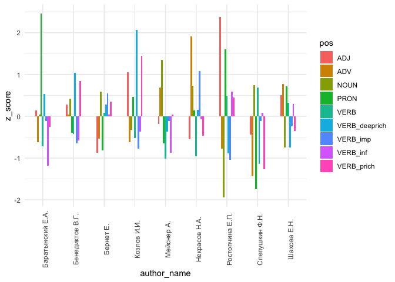
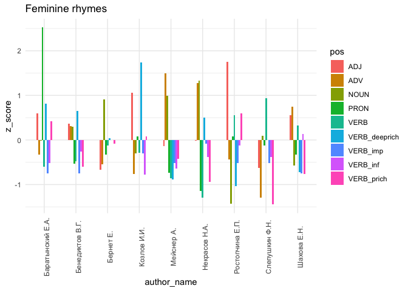
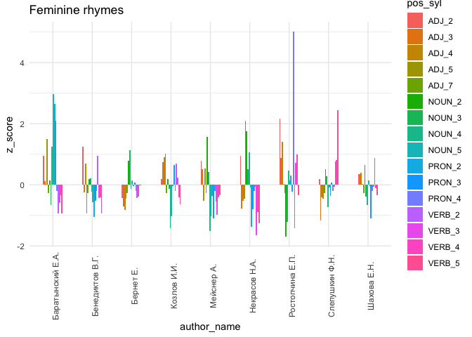

# 05.2. Code - rhyme words POS

## 5.2.1. POS in rhymes - word level

The code used for analysis in Chapter 5.2. (POS in rhyme, individual
words)

## load data & pckg

``` r
library(tidyverse)
library(tidytext)

# library(kableExtra)
# library(umap)

library(MetBrewer)
library(patchwork)
theme_set(theme_minimal())
```

### meta

Import metadata

``` r
meta <- read.csv("../../data/corpus1835/sql_db/texts_metadata.csv")
glimpse(meta)
```

    Rows: 4,799
    Columns: 12
    $ X             <int> 1, 2, 3, 4, 5, 6, 7, 8, 9, 10, 11, 12, 13, 14, 15, 16, 1…
    $ text_id       <chr> "P_1", "P_10", "P_100", "P_1000", "P_1001", "P_1002", "P…
    $ source_id     <chr> "Per_1", "Per_2", "Per_3", "Per_4", "Per_4", "Per_4", "P…
    $ A_ID          <chr> "", "A_50", "A_7", "A_41", "A_139", "A_11", "A_163", "A_…
    $ text_title    <chr> "Солдатская песня", "Молния", "Ночлег чумаков", "Утешите…
    $ text_subtitle <chr> "", "", "Сельские картины", "", "", "", "", "", "", "", …
    $ first_line    <chr> "Ох жизнь, молодецкая", "Зачем с небесной высоты", "В бл…
    $ text_page     <chr> "C. 46", "C. 21", "C. 9-12", "C. 172-174", "C. 175-176",…
    $ corpus        <chr> "per", "per", "per", "per", "per", "per", "per", "per", …
    $ n_lines       <int> 38, 16, 98, 77, 28, 12, 44, 25, 31, 28, 100, 16, 17, 60,…
    $ meter         <chr> "Other", "Iamb", "Iamb", "Iamb", "Trochee", "Iamb", "Oth…
    $ feet          <chr> "?", "3", "4", "4", "4", "4", "?", "4", "6", "5", "4", "…

Meter labels

``` r
table(meta$meter)
```


    Amphibrach    Anapest     Dactyl       Iamb      Other    Trochee 
           369        138         79       3085        350        778 

``` r
meter_lables <- meta %>% 
  select(text_id, meter) %>% distinct()

head(meter_lables)
```

      text_id   meter
    1     P_1   Other
    2    P_10    Iamb
    3   P_100    Iamb
    4  P_1000    Iamb
    5  P_1001 Trochee
    6  P_1002    Iamb

### rhyme pairs

Import data & merge words + grammatical features

``` r
rhyme_pairs <- read.csv("../../data/corpus1835/sql_db/rhyme_pairs.csv") %>% 
  rename(text_id = poem_id) %>% 
  # remove Kulman texts
  filter(!str_detect(text_id, "C_264"))

glimpse(rhyme_pairs)
```

    Rows: 81,247
    Columns: 4
    $ text_id    <chr> "P_1938", "P_1938", "P_1938", "C_156__20", "C_156__20", "C_…
    $ from       <chr> "краса", "огневым", "красавицей", "око", "силки", "стонет",…
    $ to         <chr> "небеса", "земным", "красавице", "высоко", "легки", "догони…
    $ rhyme_alph <chr> "краса небеса", "земным огневым", "красавице красавицей", "…

#### attach meter info

``` r
nrow(rhyme_pairs)
```

    [1] 81247

``` r
rhyme_pairs <- rhyme_pairs %>% 
  left_join(meter_lables, by = "text_id") 

glimpse(rhyme_pairs)
```

    Rows: 81,247
    Columns: 5
    $ text_id    <chr> "P_1938", "P_1938", "P_1938", "C_156__20", "C_156__20", "C_…
    $ from       <chr> "краса", "огневым", "красавицей", "око", "силки", "стонет",…
    $ to         <chr> "небеса", "земным", "красавице", "высоко", "легки", "догони…
    $ rhyme_alph <chr> "краса небеса", "земным огневым", "красавице красавицей", "…
    $ meter      <chr> "Other", "Other", "Other", "Trochee", "Trochee", "Trochee",…

### rhyme words

``` r
rhyme_words <- read.csv("../../data/corpus1835/sql_db/rhyme_words.csv", 
                        
                        # DON'T LET R EAT IAMBS AND DO INTEGER 01 => 1
                        colClasses = c("stress_pattern" = "character",
                                       "closure_pattern" = "character")) 

glimpse(rhyme_words)
```

    Rows: 34,801
    Columns: 8
    $ word            <chr> "краса", "огневым", "красавицей", "око", "силки", "сто…
    $ word_acc        <chr> "краса'", "огневы'м", "краса'вицей", "о'ко", "силки'",…
    $ stress_pattern  <chr> "01", "001", "0100", "10", "01", "10", "1", "10", "010…
    $ closure_pattern <chr> "1", "1", "100", "10", "1", "10", "1", "10", "10", "1"…
    $ closure         <chr> "masc", "masc", "dactylic", "fem", "masc", "fem", "mas…
    $ pos             <chr> "S", "S", "S", "S", "S", "V", "S", "S", "S", "S", "APR…
    $ feats           <chr> "S,жен,неод=им,ед", "S,фам,муж,од=(дат,мн|твор,ед)", "…
    $ ending_st       <chr> "са'", "ы'м", "а'вицей", "о'ко", "ки'", "о'нет", "о'р"…

``` r
# check if all words are unique
length(unique(rhyme_words$word))
```

    [1] 34801

``` r
nrow(rhyme_words)
```

    [1] 34801

#### rewrite POS tags

``` r
pos_transl <- tibble(old_tag = c("S", "V", "APRO", "SPRO", 
                   "A", "ADV", "NUM", "ADVPRO",
                   "INTJ", "PART", "PR", "ANUM", "CONJ"),
       # pos = c("NOUN", "VERB", "aPRON", "nPRON", 
       #         "ADJ", "ADV", "NUM", "advPRON",
       #         "INTJ", "PART", "ADP", "adjNUM", "CONJ"),
       pos = c("NOUN", "VERB", "PRON", "PRON", 
               "ADJ", "ADV", "NUM", "PRON",
               "INTJ", "PART", "ADP", "NUM", "CONJ")) # upos

# attach to the table with all words
rhyme_words <- rhyme_words %>% 
  rename(old_tag = pos) %>% 
  left_join(pos_transl, by = "old_tag")
```

#### extract inf & other verb forms

Infinitives

``` r
rhyme_words %>% 
  filter(pos == "VERB") %>% 
  select(feats) %>% 
  filter(str_detect(feats, "инф")) %>% count(feats, sort = T) %>% head()
```

               feats   n
    1   V,пе=инф,сов 270
    2 V,несов,нп=инф 219
    3 V,несов,пе=инф 204
    4   V,нп=инф,сов 154
    5 V,пе=инф,несов 137
    6      V=инф,сов 137

Imperatives

``` r
rhyme_words %>% 
  filter(pos == "VERB") %>% 
  select(feats) %>% 
  filter(str_detect(feats, "пов")) %>% 
  count(feats, sort = T) %>% head()
```

                      feats  n
    1   V,пе=ед,пов,2-л,сов 84
    2 V,несов,нп=ед,пов,2-л 80
    3 V,несов,пе=ед,пов,2-л 68
    4      V=ед,пов,2-л,сов 56
    5   V,нп=ед,пов,2-л,сов 55
    6   V,сов,пе=ед,пов,2-л 44

``` r
# VERB - пов
# VERB - деепр
# VERB - прич
```

``` r
rhyme_words %>% 
  mutate(pos = ifelse(str_detect(feats, "инф"),
                      "VERB_inf",
                      pos),
         pos = ifelse(str_detect(feats, "пов"),
                      "VERB_imp",
                      pos),
         pos = ifelse(str_detect(feats, "деепр"),
                      "VERB_deeprich",
                      pos),
         pos = ifelse(str_detect(feats, "прич"),
                      "VERB_prich",
                      pos)
         ) %>% 
  count(pos, sort = T) # check if rewritten properly
```

                 pos     n
    1           NOUN 13592
    2           VERB 10109
    3            ADJ  5383
    4       VERB_inf  1553
    5     VERB_prich  1302
    6       VERB_imp   893
    7            ADV   781
    8  VERB_deeprich   760
    9           PRON   289
    10           NUM    52
    11          PART    29
    12          INTJ    25
    13          <NA>    15
    14           ADP    10
    15          CONJ     8

Rewrite tags

``` r
rhyme_words <- rhyme_words %>% 
  mutate(pos = ifelse(str_detect(feats, "инф"),
                      "VERB_inf",
                      pos),
         pos = ifelse(str_detect(feats, "пов"),
                      "VERB_imp",
                      pos),
         pos = ifelse(str_detect(feats, "деепр"),
                      "VERB_deeprich",
                      pos),
         pos = ifelse(str_detect(feats, "прич"),
                      "VERB_prich",
                      pos))
```

#### 

# words

### data preparation

Merge the rhyme pairs & words features

First word

``` r
nrow(rhyme_pairs) # Number of actual pairs (should not be exceeded by either of words tables)
```

    [1] 81247

``` r
word_1 <- rhyme_pairs %>% 
  select(text_id, meter, rhyme_alph, from) %>% 
  rename(word = from) %>% 
  left_join(rhyme_words, by = "word") 

nrow(word_1)
```

    [1] 81247

``` r
head(word_1, 10)
```

         text_id   meter           rhyme_alph       word    word_acc stress_pattern
    1     P_1938   Other         краса небеса      краса      краса'             01
    2     P_1938   Other       земным огневым    огневым    огневы'м            001
    3     P_1938   Other красавице красавицей красавицей краса'вицей           0100
    4  C_156__20 Trochee           высоко око        око        о'ко             10
    5  C_156__20 Trochee          легки силки      силки      силки'             01
    6  C_156__20 Trochee       догонит стонет     стонет     сто'нет             10
    7  C_156__20 Trochee         простор спор       спор       спо'р              1
    8  C_156__20 Trochee        гремучий тучи       тучи       ту'чи             10
    9  C_156__20 Trochee        заране тумане     тумане     тума'не            010
    10 C_156__20 Trochee           лучом сном       сном       сно'м              1
       closure_pattern  closure old_tag                            feats ending_st
    1                1     masc       S                 S,жен,неод=им,ед       са'
    2                1     masc       S    S,фам,муж,од=(дат,мн|твор,ед)       ы'м
    3              100 dactylic       S                 S,жен,од=твор,ед   а'вицей
    4               10      fem       S       S,сред,неод=(вин,ед|им,ед)      о'ко
    5                1     masc       S        S,муж,неод=(вин,мн|им,мн)       ки'
    6               10      fem       V   V,несов,нп=непрош,ед,изъяв,3-л     о'нет
    7                1     masc       S        S,муж,неод=(вин,ед|им,ед)       о'р
    8               10      fem       S S,жен,неод=(вин,мн|род,ед|им,мн)      у'чи
    9               10      fem       S                 S,муж,неод=пр,ед      а'не
    10               1     masc       S               S,муж,неод=твор,ед       о'м
        pos
    1  NOUN
    2  NOUN
    3  NOUN
    4  NOUN
    5  NOUN
    6  VERB
    7  NOUN
    8  NOUN
    9  NOUN
    10 NOUN

``` r
# check errors
word_1 %>% 
  filter(is.na(word_acc)) %>% head()
```

        text_id      meter rhyme_alph word word_acc stress_pattern closure_pattern
    1     P_530 Amphibrach   __ дочки   __     <NA>           <NA>            <NA>
    2    P_1468    Anapest    _ зарей    _     <NA>           <NA>            <NA>
    3    P_1722       Iamb      ж нее    ж     <NA>           <NA>            <NA>
    4  C_84__21       Iamb _ предмете    _     <NA>           <NA>            <NA>
    5 C_315__19       Iamb  ль печаль   ль     <NA>           <NA>            <NA>
    6     P_409       Iamb     __ гор   __     <NA>           <NA>            <NA>
      closure old_tag feats ending_st  pos
    1    <NA>    <NA>  <NA>      <NA> <NA>
    2    <NA>    <NA>  <NA>      <NA> <NA>
    3    <NA>    <NA>  <NA>      <NA> <NA>
    4    <NA>    <NA>  <NA>      <NA> <NA>
    5    <NA>    <NA>  <NA>      <NA> <NA>
    6    <NA>    <NA>  <NA>      <NA> <NA>

``` r
word_1 %>% 
  filter(is.na(pos)) %>% head()
```

       text_id      meter     rhyme_alph     word  word_acc stress_pattern
    1    P_530 Amphibrach       __ дочки       __      <NA>           <NA>
    2 C_95__21       Iamb конец мертвець мертвець мертве'ць             01
    3   P_1468    Anapest        _ зарей        _      <NA>           <NA>
    4   P_1722       Iamb          ж нее        ж      <NA>           <NA>
    5   P_1905    Trochee  оплечью речъю    речъю    речъю'             01
    6 C_117__5       Iamb         мы тмы      тмы      тмы'              1
      closure_pattern closure old_tag feats ending_st  pos
    1            <NA>    <NA>    <NA>  <NA>      <NA> <NA>
    2               1    masc    <NA>  <NA>      е'ць <NA>
    3            <NA>    <NA>    <NA>  <NA>      <NA> <NA>
    4            <NA>    <NA>    <NA>  <NA>      <NA> <NA>
    5               1    masc    <NA>  <NA>       ъю' <NA>
    6               1    masc    <NA>  <NA>       мы' <NA>

``` r
# remove errors
word_1 <- word_1 %>% 
  filter(!is.na(word_acc) & !is.na(pos))
```

Second word

``` r
word_2 <- rhyme_pairs %>% 
  select(text_id, meter, rhyme_alph, to) %>% 
  rename(word = to) %>% 
  left_join(rhyme_words, by = "word")

nrow(word_2) == nrow(rhyme_pairs) # must be true
```

    [1] TRUE

``` r
head(word_2, 10)
```

         text_id   meter           rhyme_alph      word   word_acc stress_pattern
    1     P_1938   Other         краса небеса    небеса    небеса'            001
    2     P_1938   Other       земным огневым    земным    земны'м             01
    3     P_1938   Other красавице красавицей красавице краса'вице           0100
    4  C_156__20 Trochee           высоко око    высоко    высоко'            001
    5  C_156__20 Trochee          легки силки     легки     легки'             01
    6  C_156__20 Trochee       догонит стонет   догонит   дого'нит            010
    7  C_156__20 Trochee         простор спор   простор   просто'р             01
    8  C_156__20 Trochee        гремучий тучи  гремучий  грему'чий            010
    9  C_156__20 Trochee        заране тумане    заране    зара'не            010
    10 C_156__20 Trochee           лучом сном     лучом     лучо'м             01
       closure_pattern  closure old_tag
    1                1     masc       S
    2                1     masc       A
    3              100 dactylic       S
    4                1     masc     ADV
    5                1     masc       A
    6               10      fem       V
    7                1     masc       S
    8               10      fem       A
    9               10      fem       S
    10               1     masc       S
                                                    feats ending_st  pos
    1                          S,сред,неод=(вин,мн|им,мн)       са' NOUN
    2  A=(дат,мн,полн|твор,ед,полн,муж|твор,ед,полн,сред)       ы'м  ADJ
    3                             S,жен,од=(пр,ед|дат,ед)    а'вице NOUN
    4                                                ADV=       ко'  ADV
    5                                             A=мн,кр       ки'  ADJ
    6                        V,сов,пе=непрош,ед,изъяв,3-л     о'нит VERB
    7                           S,муж,неод=(вин,ед|им,ед)       о'р NOUN
    8             A=(вин,ед,полн,муж,неод|им,ед,полн,муж)     у'чий  ADJ
    9                         S,имя,жен,од=(пр,ед|дат,ед)      а'не NOUN
    10                                 S,муж,неод=твор,ед       о'м NOUN

``` r
# check errors
word_2 %>% 
  filter(is.na(word_acc)) %>% head()
```

         text_id meter rhyme_alph word word_acc stress_pattern closure_pattern
    1     P_1520 Other      ж мне    ж     <NA>           <NA>            <NA>
    2   C_68__74  Iamb  ль печаль   ль     <NA>           <NA>            <NA>
    3  C_633__55  Iamb    садов ф    ф     <NA>           <NA>            <NA>
    4   C_180__5  Iamb    благ ль   ль     <NA>           <NA>            <NA>
    5  C_315__16  Iamb  ль печаль   ль     <NA>           <NA>            <NA>
    6 C_633__125  Iamb  ж стороне    ж     <NA>           <NA>            <NA>
      closure old_tag feats ending_st  pos
    1    <NA>    <NA>  <NA>      <NA> <NA>
    2    <NA>    <NA>  <NA>      <NA> <NA>
    3    <NA>    <NA>  <NA>      <NA> <NA>
    4    <NA>    <NA>  <NA>      <NA> <NA>
    5    <NA>    <NA>  <NA>      <NA> <NA>
    6    <NA>    <NA>  <NA>      <NA> <NA>

``` r
word_2 %>% 
  filter(is.na(pos)) %>% head()
```

        text_id      meter      rhyme_alph   word word_acc stress_pattern
    1    P_1520      Other           ж мне      ж     <NA>           <NA>
    2  C_156__3    Trochee покорныи черныи черныи  черны'и            010
    3  C_68__74       Iamb       ль печаль     ль     <NA>           <NA>
    4 C_633__55       Iamb         садов ф      ф     <NA>           <NA>
    5    P_1836 Amphibrach      вдруг рукь   рукь    ру'кь              1
    6  C_180__5       Iamb         благ ль     ль     <NA>           <NA>
      closure_pattern closure old_tag feats ending_st  pos
    1            <NA>    <NA>    <NA>  <NA>      <NA> <NA>
    2              10     fem    <NA>  <NA>       ы'и <NA>
    3            <NA>    <NA>    <NA>  <NA>      <NA> <NA>
    4            <NA>    <NA>    <NA>  <NA>      <NA> <NA>
    5               1    masc    <NA>  <NA>      у'кь <NA>
    6            <NA>    <NA>    <NA>  <NA>      <NA> <NA>

``` r
# remove errors
word_2 <- word_2 %>% 
  filter(!is.na(word_acc) & !is.na(pos))

nrow(word_2)
```

    [1] 81233

Merge all from-to words in one table

``` r
all_words <- rbind(word_1, word_2)
```

Remove obsolete data

``` r
rm(meter_lables, rhyme_words, word_1, word_2)
```

### Basic stats

``` r
table(all_words$meter)
```


    Amphibrach    Anapest     Dactyl       Iamb      Other    Trochee 
         10787       4181       1414     108088      10499      27482 

#### MFW in rhymes

Errors: hyperdactyllic edings

``` r
all_words %>% 
  filter(closure == "other") %>% 
  select(word_acc, closure_pattern) %>% 
  #distinct() %>% 
  nrow()
# 148 words
# mostly wrongly annotated stresses (but very small number of words)
```

MFW iamb & trochee

``` r
closures <- c("masc", "fem", "dactylic")

all_words %>% 
  filter(meter %in% c("Iamb", "Trochee") & closure %in% closures) %>% 
  group_by(meter, closure) %>% 
  count(word_acc, sort = T) %>% 
  slice_max(order_by = n, n = 5) %>% 
  filter(closure == "fem")
```

    # A tibble: 10 × 4
    # Groups:   meter, closure [2]
       meter   closure word_acc     n
       <chr>   <chr>   <chr>    <int>
     1 Iamb    fem     тобо'ю     181
     2 Iamb    fem     мно'ю      175
     3 Iamb    fem     све'та     151
     4 Iamb    fem     душо'ю     150
     5 Iamb    fem     сла'вы     146
     6 Trochee fem     о'чи        64
     7 Trochee fem     но'чи       59
     8 Trochee fem     мо'ре       38
     9 Trochee fem     во'лны      36
    10 Trochee fem     ту'чи       35

``` r
all_words %>% 
  filter(meter %in% c("Iamb", "Trochee") & closure %in% closures) %>% 
  group_by(meter, closure) %>% 
  count(word_acc, sort = T) %>% 
  slice_max(order_by = n, n = 5) %>% 
  filter(closure == "masc")
```

    # A tibble: 10 × 4
    # Groups:   meter, closure [2]
       meter   closure word_acc     n
       <chr>   <chr>   <chr>    <int>
     1 Iamb    masc    я'         471
     2 Iamb    masc    све'т      322
     3 Iamb    masc    меня'      313
     4 Iamb    masc    она'       300
     5 Iamb    masc    тобо'й     293
     6 Trochee masc    я'         118
     7 Trochee masc    она'       102
     8 Trochee masc    мне'        85
     9 Trochee masc    меня'       81
    10 Trochee masc    све'т       79

``` r
all_words %>% 
  filter(meter %in% c("Iamb", "Trochee") & closure %in% closures) %>% 
  group_by(meter, closure) %>% 
  count(word_acc, sort = T) %>% 
  slice_max(order_by = n, n = 5) %>% 
  filter(closure == "dactylic")
```

    # A tibble: 19 × 4
    # Groups:   meter, closure [2]
       meter   closure  word_acc           n
       <chr>   <chr>    <chr>          <int>
     1 Iamb    dactylic рети'вое           9
     2 Iamb    dactylic про'снется         8
     3 Iamb    dactylic кру'жится          7
     4 Iamb    dactylic окрова'вленный     7
     5 Iamb    dactylic бе'рега            6
     6 Iamb    dactylic восхи'щенный       6
     7 Iamb    dactylic го'лоса            6
     8 Iamb    dactylic громо'вая          6
     9 Iamb    dactylic де'рева            6
    10 Iamb    dactylic ка'тится           6
    11 Iamb    dactylic при'нялся          6
    12 Iamb    dactylic шеве'лится         6
    13 Trochee dactylic вопию'щего        11
    14 Trochee dactylic зову'щего         11
    15 Trochee dactylic печа'льная         6
    16 Trochee dactylic жела'ния           5
    17 Trochee dactylic ненагля'дная       5
    18 Trochee dactylic ра'дости           5
    19 Trochee dactylic страда'ния         5

MFW 3-syll meters

``` r
all_words %>% 
  filter(meter %in% c("Dactyl", "Amphibrach", "Anapest") & closure %in% closures) %>% 
  group_by(meter, closure) %>% 
  count(word_acc, sort = T) %>% 
  slice_max(order_by = n, n = 5)
```

    # A tibble: 68 × 4
    # Groups:   meter, closure [9]
       meter      closure  word_acc        n
       <chr>      <chr>    <chr>       <int>
     1 Amphibrach dactylic ла'сточка       4
     2 Amphibrach dactylic ва'лится        2
     3 Amphibrach dactylic го'ренка        2
     4 Amphibrach dactylic ди'вная         2
     5 Amphibrach dactylic заве'сою        2
     6 Amphibrach dactylic завы'ванье      2
     7 Amphibrach dactylic каса'точка      2
     8 Amphibrach dactylic ле'сенка        2
     9 Amphibrach dactylic мо'лвила        2
    10 Amphibrach dactylic невиди'мкою     2
    # ℹ 58 more rows

#### total_meter

Total number of rhyme words in a meter

``` r
total_meter <- all_words %>% 
  count(meter) %>% 
  rename(total = n)

total_meter
```

           meter  total
    1 Amphibrach  10787
    2    Anapest   4181
    3     Dactyl   1414
    4       Iamb 108088
    5      Other  10499
    6    Trochee  27482

#### Number of masc / fem / dactyl endings

``` r
all_words %>% 
  filter(closure != "other" & meter != "Other") %>% 
  group_by(meter) %>% 
  count(closure) %>% 
  left_join(total_meter, by = "meter") %>% 
  mutate(perc = round((n / total) * 100, 2 ))
```

    # A tibble: 15 × 5
    # Groups:   meter [5]
       meter      closure      n  total  perc
       <chr>      <chr>    <int>  <int> <dbl>
     1 Amphibrach dactylic   103  10787  0.95
     2 Amphibrach fem       4799  10787 44.5 
     3 Amphibrach masc      5884  10787 54.6 
     4 Anapest    dactylic    70   4181  1.67
     5 Anapest    fem       1191   4181 28.5 
     6 Anapest    masc      2920   4181 69.8 
     7 Dactyl     dactylic   224   1414 15.8 
     8 Dactyl     fem        429   1414 30.3 
     9 Dactyl     masc       759   1414 53.7 
    10 Iamb       dactylic  1245 108088  1.15
    11 Iamb       fem      52766 108088 48.8 
    12 Iamb       masc     54010 108088 50.0 
    13 Trochee    dactylic   994  27482  3.62
    14 Trochee    fem      12611  27482 45.9 
    15 Trochee    masc     13834  27482 50.3 

``` r
# all_words %>% 
#   filter(meter == "Dactyl" & closure == "masc") %>% 
#   select(text_id, word_acc, closure_pattern) %>% sample_n(10)

# meta %>% 
#   filter(text_id == "P_294")
```

### top endings in meters

#### iamb_closures

Number of words of a particular clausula type IN iambic texts

``` r
iamb_closures <- all_words %>% 
  filter(meter == "Iamb") %>% 
  count(closure) %>% 
  rename(total_closure = n) 
```

``` r
all_words %>% 
  filter(meter == "Iamb" & closure != "other") %>% 
  group_by(meter, closure) %>% 
  count(ending_st) %>% 
  slice_max(order_by = n, n = 5) %>% 
  ungroup() %>% 
  left_join(total_meter, by = "meter") %>% 
  # percentage of all words in iamb
  mutate(perc_all_iambic = round((n / total) * 100, 2 )) %>% 
  left_join(iamb_closures, by = "closure") %>% 
  
  # percentage of word of particular clausula type
  mutate(perc_iamb_clos = round((n / total_closure) * 100, 2 )) %>% 
  select(-total, -total_closure)
```

    # A tibble: 16 × 6
       meter closure  ending_st     n perc_all_iambic perc_iamb_clos
       <chr> <chr>    <chr>     <int>           <dbl>          <dbl>
     1 Iamb  dactylic е'ния        17            0.02           1.37
     2 Iamb  dactylic е'ние        12            0.01           0.96
     3 Iamb  dactylic а'ния        11            0.01           0.88
     4 Iamb  dactylic а'рая         9            0.01           0.72
     5 Iamb  dactylic а'тится       9            0.01           0.72
     6 Iamb  dactylic и'вое         9            0.01           0.72
     7 Iamb  fem      о'ю        2231            2.06           4.23
     8 Iamb  fem      а'ми       1626            1.5            3.08
     9 Iamb  fem      е'нья      1483            1.37           2.81
    10 Iamb  fem      а'ет       1447            1.34           2.74
    11 Iamb  fem      е'нье      1229            1.14           2.33
    12 Iamb  masc     о'й        5237            4.85           9.7 
    13 Iamb  masc     е'й        3153            2.92           5.84
    14 Iamb  masc     а'л        1851            1.71           3.43
    15 Iamb  masc     и'т        1527            1.41           2.83
    16 Iamb  masc     на'        1447            1.34           2.68

``` r
all_words %>% 
  filter(closure == "dactylic") %>% count(word_acc, sort = T)
```

#### trochee_closures

Number of words of a particular clausula type IN trochaic texts

``` r
trochee_closures <- all_words %>% 
  filter(meter == "Trochee") %>% 
  count(closure) %>% 
  rename(total_closure = n) 
```

``` r
all_words %>% 
  filter(meter == "Trochee" & closure != "other") %>% 
  group_by(meter, closure) %>% 
  count(ending_st) %>% 
  slice_max(order_by = n, n = 5) %>% 
  ungroup() %>% 
  left_join(total_meter, by = "meter") %>% 
  # percentage of all words in iamb
  mutate(perc_all_tr = round((n / total) * 100, 2 )) %>% 
  left_join(trochee_closures, by = "closure") %>% 
  
  # percentage of word of particular clausula type
  mutate(perc_tr_clos = round((n / total_closure) * 100, 2 )) %>% 
  select(-total, -total_closure)
```

    # A tibble: 16 × 6
       meter   closure  ending_st     n perc_all_tr perc_tr_clos
       <chr>   <chr>    <chr>     <int>       <dbl>        <dbl>
     1 Trochee dactylic а'ния        20        0.07         2.01
     2 Trochee dactylic е'ния        19        0.07         1.91
     3 Trochee dactylic ё'нная       12        0.04         1.21
     4 Trochee dactylic е'ние        11        0.04         1.11
     5 Trochee dactylic у'щего       11        0.04         1.11
     6 Trochee dactylic ю'щего       11        0.04         1.11
     7 Trochee fem      о'ю         446        1.62         3.54
     8 Trochee fem      а'я         382        1.39         3.03
     9 Trochee fem      а'ет        362        1.32         2.87
    10 Trochee fem      а'ми        287        1.04         2.28
    11 Trochee fem      е'нья       190        0.69         1.51
    12 Trochee masc     о'й        1270        4.62         9.18
    13 Trochee masc     е'й         717        2.61         5.18
    14 Trochee masc     и'т         528        1.92         3.82
    15 Trochee masc     на'         444        1.62         3.21
    16 Trochee masc     ё'т         376        1.37         2.72

## POS distribution in meters / endings

#### tab. 5.2.1 - all meters & clausulas together

``` r
all_words %>% 
  filter(closure != "other") %>% 
  count(pos) %>% 
  mutate(perc_total = round(
    n / nrow(all_words %>% filter(closure != "other")) * 100, 
    2))
```

                 pos     n perc_total
    1            ADJ 19385      11.94
    2            ADP    27       0.02
    3            ADV  4647       2.86
    4           CONJ    15       0.01
    5           INTJ   140       0.09
    6           NOUN 83162      51.24
    7            NUM   144       0.09
    8           PART   646       0.40
    9           PRON 12681       7.81
    10          VERB 31207      19.23
    11 VERB_deeprich  1784       1.10
    12      VERB_imp  1647       1.01
    13      VERB_inf  4268       2.63
    14    VERB_prich  2550       1.57

Masc

``` r
all_words %>% 
  filter(closure == "masc") %>% 
  count(pos) %>% 
  mutate(perc_total = round(
    n / nrow(all_words %>% filter(closure == "masc")) * 100, 
    2))
```

                 pos     n perc_total
    1            ADJ  4808       5.82
    2            ADP    24       0.03
    3            ADV  2261       2.73
    4           CONJ    11       0.01
    5           INTJ   105       0.13
    6           NOUN 43022      52.03
    7            NUM    67       0.08
    8           PART   601       0.73
    9           PRON 11259      13.62
    10          VERB 14398      17.41
    11 VERB_deeprich   475       0.57
    12      VERB_imp  1153       1.39
    13      VERB_inf  3457       4.18
    14    VERB_prich  1038       1.26

Fem

``` r
all_words %>% 
  filter(closure == "fem") %>% 
  count(pos) %>% 
  mutate(perc_total = round(
    n / nrow(all_words %>% filter(closure == "fem")) * 100, 
    2))
```

                 pos     n perc_total
    1            ADJ 13039      17.16
    2            ADP     3       0.00
    3            ADV  2338       3.08
    4           CONJ     4       0.01
    5           INTJ    35       0.05
    6           NOUN 38822      51.08
    7            NUM    70       0.09
    8           PART    45       0.06
    9           PRON  1414       1.86
    10          VERB 16410      21.59
    11 VERB_deeprich  1280       1.68
    12      VERB_imp   476       0.63
    13      VERB_inf   790       1.04
    14    VERB_prich  1275       1.68

#### iamb

Total distribution of POS (all words)

``` r
all_words %>% 
  filter(meter == "Iamb" & closure != "other") %>% 
  count(meter, pos) %>% 
  left_join(total_meter, by = "meter") %>% 
  
  # percentage of all words in iamb
  mutate(perc_all_iambic = round((n / total) * 100, 2 )) %>% 
  select(-meter, -total) %>% 
  arrange(-desc(pos))
```

                 pos     n perc_all_iambic
    1            ADJ 12423           11.49
    2            ADP    18            0.02
    3            ADV  3061            2.83
    4           CONJ    15            0.01
    5           INTJ    75            0.07
    6           NOUN 55781           51.61
    7            NUM    91            0.08
    8           PART   460            0.43
    9           PRON  8500            7.86
    10          VERB 20566           19.03
    11 VERB_deeprich  1152            1.07
    12      VERB_imp  1099            1.02
    13      VERB_inf  2949            2.73
    14    VERB_prich  1831            1.69

By clausula

``` r
all_words %>% 
  filter(meter == "Iamb" & closure != "other") %>% 
  group_by(meter, closure) %>% 
  count(meter, pos) %>% 
  ungroup() %>% 
  #left_join(total_meter, by = "meter") %>% 
  
  # percentage of all words in iamb
  #mutate(perc_all_iambic = round((n / total) * 100, 2 )) # %>% 
  left_join(iamb_closures, by = "closure") %>% 
  # 
  # # percentage of word of particular clausula type
  mutate(perc_iamb_clos = round((n / total_closure) * 100, 2 )) %>% 
  select(-total_closure, -meter) %>% 
  filter(closure == "masc")
```

    # A tibble: 14 × 4
       closure pos               n perc_iamb_clos
       <chr>   <chr>         <int>          <dbl>
     1 masc    ADJ            3090           5.72
     2 masc    ADP              16           0.03
     3 masc    ADV            1415           2.62
     4 masc    CONJ             11           0.02
     5 masc    INTJ             50           0.09
     6 masc    NOUN          28253          52.3 
     7 masc    NUM              46           0.09
     8 masc    PART            428           0.79
     9 masc    PRON           7452          13.8 
    10 masc    VERB           9076          16.8 
    11 masc    VERB_deeprich   308           0.57
    12 masc    VERB_imp        766           1.42
    13 masc    VERB_inf       2339           4.33
    14 masc    VERB_prich      760           1.41

``` r
all_words %>% 
  filter(meter == "Iamb" & closure != "other") %>% 
  group_by(meter, closure) %>% 
  count(meter, pos) %>% 
  ungroup() %>% 
  #left_join(total_meter, by = "meter") %>% 
  
  # percentage of all words in iamb
  #mutate(perc_all_iambic = round((n / total) * 100, 2 )) # %>% 
  left_join(iamb_closures, by = "closure") %>% 
  # 
  # # percentage of word of particular clausula type
  mutate(perc_iamb_clos = round((n / total_closure) * 100, 2 )) %>% 
  select(-total_closure, -meter) %>% 
  filter(closure == "fem")
```

    # A tibble: 14 × 4
       closure pos               n perc_iamb_clos
       <chr>   <chr>         <int>          <dbl>
     1 fem     ADJ            9023          17.1 
     2 fem     ADP               2           0   
     3 fem     ADV            1624           3.08
     4 fem     CONJ              4           0.01
     5 fem     INTJ             25           0.05
     6 fem     NOUN          26960          51.1 
     7 fem     NUM              44           0.08
     8 fem     PART             32           0.06
     9 fem     PRON           1043           1.98
    10 fem     VERB          11302          21.4 
    11 fem     VERB_deeprich   827           1.57
    12 fem     VERB_imp        324           0.61
    13 fem     VERB_inf        604           1.14
    14 fem     VERB_prich      952           1.8 

``` r
all_words %>% 
  filter(meter == "Iamb" & closure != "other") %>% 
  group_by(meter, closure) %>% 
  count(meter, pos) %>% 
  ungroup() %>% 
  #left_join(total_meter, by = "meter") %>% 
  
  # percentage of all words in iamb
  #mutate(perc_all_iambic = round((n / total) * 100, 2 )) # %>% 
  left_join(iamb_closures, by = "closure") %>% 
  # 
  # # percentage of word of particular clausula type
  mutate(perc_iamb_clos = round((n / total_closure) * 100, 2 )) %>% 
  select(-total_closure, -meter) %>% 
  filter(closure == "dactylic")
```

    # A tibble: 10 × 4
       closure  pos               n perc_iamb_clos
       <chr>    <chr>         <int>          <dbl>
     1 dactylic ADJ             310          24.9 
     2 dactylic ADV              22           1.77
     3 dactylic NOUN            568          45.6 
     4 dactylic NUM               1           0.08
     5 dactylic PRON              5           0.4 
     6 dactylic VERB            188          15.1 
     7 dactylic VERB_deeprich    17           1.37
     8 dactylic VERB_imp          9           0.72
     9 dactylic VERB_inf          6           0.48
    10 dactylic VERB_prich      119           9.56

#### trochee

Total POS

``` r
all_words %>% 
  filter(meter == "Trochee" & closure != "other") %>% 
  count(meter, pos) %>% 
  left_join(total_meter, by = "meter") %>% 
  
  # percentage of all words in iamb
  mutate(perc_all_iambic = round((n / total) * 100, 2 )) %>% 
  select(-meter, -total) %>% 
  arrange(-desc(pos))
```

                 pos     n perc_all_iambic
    1            ADJ  3665           13.34
    2            ADP     4            0.01
    3            ADV   882            3.21
    4           INTJ    27            0.10
    5           NOUN 13963           50.81
    6            NUM    23            0.08
    7           PART    91            0.33
    8           PRON  1984            7.22
    9           VERB  5157           18.77
    10 VERB_deeprich   299            1.09
    11      VERB_imp   273            0.99
    12      VERB_inf   673            2.45
    13    VERB_prich   398            1.45

By clausula

``` r
all_words %>% 
  filter(meter == "Trochee" & closure != "other") %>% 
  group_by(meter, closure) %>% 
  count(meter, pos) %>% 
  ungroup() %>% 
  #left_join(total_meter, by = "meter") %>% 
  
  # percentage of all words in iamb
  #mutate(perc_all_iambic = round((n / total) * 100, 2 )) # %>% 
  left_join(trochee_closures, by = "closure") %>% 
  # 
  # # percentage of word of particular clausula type
  mutate(perc_tr_clos = round((n / total_closure) * 100, 2 )) %>% 
  select(-total_closure, -meter, -n) %>% 
  arrange(desc(perc_tr_clos)) %>% 
  pivot_wider(names_from = closure, values_from = perc_tr_clos)
```

    # A tibble: 13 × 4
       pos            masc   fem dactylic
       <chr>         <dbl> <dbl>    <dbl>
     1 NOUN          52.3  50.7     33.7 
     2 ADJ            5.89 18.7     49.3 
     3 VERB          17.9  20.7      7.65
     4 PRON          13.0   1.48     0.1 
     5 VERB_prich     1.18  1.28     7.34
     6 VERB_inf       4.07  0.87    NA   
     7 ADV            3.01  3.61     1.11
     8 VERB_deeprich  0.51  1.78     0.3 
     9 VERB_imp       1.34  0.66     0.4 
    10 PART           0.6   0.06    NA   
    11 INTJ           0.17  0.02    NA   
    12 NUM            0.06  0.11     0.1 
    13 ADP            0.02  0.01    NA   

### POS length (in syl)

How it works:

``` r
#glimpse(all_words)

all_words$stress_pattern[3]

unlist(gregexpr(pattern = "1", "0100")) # stress position
nchar("0100") # length of the word


all_words %>% 
  sample_n(10) %>% 
  select(word, pos, stress_pattern) %>% 
  mutate(stress_position = unlist(gregexpr(pattern = "1", stress_pattern)),
         syl_len = nchar(stress_pattern)
         )
```

Altogether

``` r
all_words %>% 
  select(pos, stress_pattern) %>% 
  mutate(stress_position = unlist(gregexpr(pattern = "1", stress_pattern)),
         syl_len = nchar(stress_pattern)
         ) %>% 
  group_by(pos) %>% 
  summarise(
            mean_stress_pos = round(mean(stress_position), 1),
            mean_syl_lenght = round(mean(syl_len), 1),
            
            med_stress_pos = median(stress_position),
            med_syl_length = median(syl_len)
            )
```

    # A tibble: 14 × 5
       pos           mean_stress_pos mean_syl_lenght med_stress_pos med_syl_length
       <chr>                   <dbl>           <dbl>          <dbl>          <dbl>
     1 ADJ                       2.2             3                2              3
     2 ADP                       2.1             2.3              2              2
     3 ADV                       1.9             2.5              2              2
     4 CONJ                      1.6             1.9              2              2
     5 INTJ                      1.6             1.8              2              2
     6 NOUN                      1.9             2.4              2              2
     7 NUM                       1.7             2.3              2              2
     8 PART                      1.1             1.2              1              1
     9 PRON                      1.6             1.7              2              2
    10 VERB                      2.3             2.8              2              3
    11 VERB_deeprich             2.4             3.2              2              3
    12 VERB_imp                  2.3             2.6              2              3
    13 VERB_inf                  2.3             2.5              2              3
    14 VERB_prich                2.6             3.3              2              3

Masc rhymes

``` r
m <- all_words %>% 
  filter(closure == "masc" & meter != "Other" & 
           pos %in% c("NOUN", "VERB", "ADJ", "PRON")) %>% 
  select(meter, pos, stress_pattern) %>% 
  mutate(stress_position = unlist(gregexpr(pattern = "1", stress_pattern)),
         syl_len = nchar(stress_pattern)
         ) %>% 
  group_by(meter, pos) %>% 
  summarise(
            mean_stress_pos = round(mean(stress_position), 1),
            mean_syl_lenght = round(mean(syl_len), 1),
            
            med_stress_pos = median(stress_position),
            med_syl_length = median(syl_len)
            ) %>% ungroup()
```

    `summarise()` has grouped output by 'meter'. You can override using the
    `.groups` argument.

``` r
m
```

    # A tibble: 20 × 6
       meter     pos   mean_stress_pos mean_syl_lenght med_stress_pos med_syl_length
       <chr>     <chr>           <dbl>           <dbl>          <dbl>          <dbl>
     1 Amphibra… ADJ               2.3             2.3              2              2
     2 Amphibra… NOUN              1.9             1.9              2              2
     3 Amphibra… PRON              1.6             1.6              2              2
     4 Amphibra… VERB              2.2             2.2              2              2
     5 Anapest   ADJ               2.3             2.3              2              2
     6 Anapest   NOUN              1.8             1.8              2              2
     7 Anapest   PRON              1.7             1.7              2              2
     8 Anapest   VERB              2.3             2.3              2              2
     9 Dactyl    ADJ               2               2                2              2
    10 Dactyl    NOUN              1.9             1.9              2              2
    11 Dactyl    PRON              1.7             1.7              2              2
    12 Dactyl    VERB              2.3             2.3              2              2
    13 Iamb      ADJ               2.2             2.2              2              2
    14 Iamb      NOUN              1.9             1.9              2              2
    15 Iamb      PRON              1.6             1.6              2              2
    16 Iamb      VERB              2.3             2.3              2              2
    17 Trochee   ADJ               2.3             2.3              2              2
    18 Trochee   NOUN              1.9             1.9              2              2
    19 Trochee   PRON              1.6             1.6              2              2
    20 Trochee   VERB              2.3             2.3              2              2

#### masc pos_syl counter

``` r
masc_total <- all_words %>% filter(closure == "masc" & meter != "Other") %>% 
  count(meter) %>% 
  rename(total_meter = n)
  

all_words %>% 
  filter(closure == "masc" & meter != "Other" & 
           pos %in% c("NOUN", "VERB", "ADJ", "PRON")) %>% 
  select(meter, pos, stress_pattern) %>% 
  mutate(stress_position = unlist(gregexpr(pattern = "1", stress_pattern)),
         syl_len = nchar(stress_pattern),
         pos_syl = paste0(pos, "_", syl_len)
         ) %>% 
  count(meter, pos, pos_syl) %>% 
  left_join(masc_total, by = "meter") %>% 
  mutate(perc = round((n / total_meter)*100,1 )) %>% 
  select(meter, pos, pos_syl, perc, n, total_meter) %>% 
  filter(pos == "NOUN" & meter %in% c("Iamb", "Trochee")) 
```

        meter  pos pos_syl perc     n total_meter
    1    Iamb NOUN  NOUN_1 14.2  7693       54010
    2    Iamb NOUN  NOUN_2 28.9 15591       54010
    3    Iamb NOUN  NOUN_3  8.9  4811       54010
    4    Iamb NOUN  NOUN_4  0.3   155       54010
    5    Iamb NOUN  NOUN_5  0.0     3       54010
    6 Trochee NOUN  NOUN_1 13.3  1842       13834
    7 Trochee NOUN  NOUN_2 29.7  4106       13834
    8 Trochee NOUN  NOUN_3  9.1  1263       13834
    9 Trochee NOUN  NOUN_4  0.2    23       13834

``` r
  # NB other POS can be tested via filter
```

#### fem pos_syl

Fem rhymes

``` r
f <- all_words %>% 
  filter(closure == "fem" & meter != "Other" & 
           pos %in% c("NOUN", "VERB", "ADJ", "PRON")) %>% 
  select(meter, pos, stress_pattern) %>% 
  mutate(stress_position = unlist(gregexpr(pattern = "1", stress_pattern)),
         syl_len = nchar(stress_pattern)
         ) %>% 
  group_by(meter, pos) %>% 
  summarise(
            fem_mean_stress_pos = round(mean(stress_position), 1),
            fem_mean_syl_lenght = round(mean(syl_len), 1),
            
            med_stress_pos = median(stress_position),
            med_syl_length = median(syl_len)
            ) %>% ungroup()
```

    `summarise()` has grouped output by 'meter'. You can override using the
    `.groups` argument.

``` r
f
```

    # A tibble: 20 × 6
       meter      pos   fem_mean_stress_pos fem_mean_syl_lenght med_stress_pos
       <chr>      <chr>               <dbl>               <dbl>          <dbl>
     1 Amphibrach ADJ                   2.1                 3.1              2
     2 Amphibrach NOUN                  1.7                 2.7              2
     3 Amphibrach PRON                  1.5                 2.5              1
     4 Amphibrach VERB                  2.2                 3.2              2
     5 Anapest    ADJ                   2.1                 3.1              2
     6 Anapest    NOUN                  1.6                 2.7              2
     7 Anapest    PRON                  1.6                 2.6              2
     8 Anapest    VERB                  2.2                 3.2              2
     9 Dactyl     ADJ                   2.1                 3.1              2
    10 Dactyl     NOUN                  1.8                 2.8              2
    11 Dactyl     PRON                  1.3                 2.3              1
    12 Dactyl     VERB                  2.3                 3.3              2
    13 Iamb       ADJ                   2.2                 3.2              2
    14 Iamb       NOUN                  1.9                 2.9              2
    15 Iamb       PRON                  1.5                 2.5              1
    16 Iamb       VERB                  2.3                 3.3              2
    17 Trochee    ADJ                   2.1                 3.1              2
    18 Trochee    NOUN                  1.8                 2.8              2
    19 Trochee    PRON                  1.5                 2.5              1
    20 Trochee    VERB                  2.2                 3.2              2
    # ℹ 1 more variable: med_syl_length <dbl>

``` r
fem_total <- all_words %>% filter(closure == "fem" & meter != "Other") %>% 
  count(meter) %>% 
  rename(total_meter = n)
  

all_words %>% 
  filter(closure == "fem" & meter != "Other" & 
           pos %in% c("NOUN", "VERB", "ADJ", "PRON")) %>% 
  select(meter, pos, stress_pattern) %>% 
  mutate(stress_position = unlist(gregexpr(pattern = "1", stress_pattern)),
         syl_len = nchar(stress_pattern),
         pos_syl = paste0(pos, "_", syl_len)
         ) %>% 
  count(meter, pos, pos_syl) %>% 
  left_join(masc_total, by = "meter") %>% 
  mutate(perc = round((n / total_meter)*100,1 )) %>% 
  select(meter, pos, pos_syl, perc, n, total_meter) %>% 
  filter(pos == "VERB" & meter %in% c("Iamb", "Trochee")) 
```

         meter  pos pos_syl perc    n total_meter
    1     Iamb VERB  VERB_2  3.3 1758       54010
    2     Iamb VERB  VERB_3  8.6 4643       54010
    3     Iamb VERB  VERB_4  8.3 4497       54010
    4     Iamb VERB  VERB_5  0.7  403       54010
    5     Iamb VERB  VERB_6  0.0    1       54010
    6  Trochee VERB  VERB_2  4.1  562       13834
    7  Trochee VERB  VERB_3  8.1 1116       13834
    8  Trochee VERB  VERB_4  6.4  882       13834
    9  Trochee VERB  VERB_5  0.3   48       13834
    10 Trochee VERB  VERB_6  0.0    1       13834

dactylic

``` r
d <- all_words %>% 
  filter(pos %in% c("NOUN", "VERB", "ADJ", "PRON") & closure == "dactylic" & 
           meter != "Other") %>% 
  select(meter, pos, stress_pattern) %>% 
  mutate(stress_position = unlist(gregexpr(pattern = "1", stress_pattern)),
         syl_len = nchar(stress_pattern)
         ) %>% 
  group_by(meter, pos) %>% 
  summarise(
            d_mean_stress_pos = round(mean(stress_position), 1),
            d_mean_syl_lenght = round(mean(syl_len), 1),
            
            med_stress_pos = median(stress_position),
            med_syl_length = median(syl_len)
            ) %>% ungroup
```

    `summarise()` has grouped output by 'meter'. You can override using the
    `.groups` argument.

``` r
d
```

    # A tibble: 18 × 6
       meter pos   d_mean_stress_pos d_mean_syl_lenght med_stress_pos med_syl_length
       <chr> <chr>             <dbl>             <dbl>          <dbl>          <dbl>
     1 Amph… ADJ                 2                 4                2              4
     2 Amph… NOUN                1.4               3.4              1              3
     3 Amph… VERB                1.5               3.5              1              3
     4 Anap… ADJ                 2.3               4.3              2              4
     5 Anap… NOUN                1.5               3.5              1              3
     6 Anap… VERB                1.8               3.8              2              4
     7 Dact… ADJ                 2                 4                2              4
     8 Dact… NOUN                1.9               3.9              2              4
     9 Dact… PRON                1                 3                1              3
    10 Dact… VERB                2.2               4.2              2              4
    11 Iamb  ADJ                 1.9               3.9              2              4
    12 Iamb  NOUN                1.6               3.6              1              3
    13 Iamb  PRON                1                 3                1              3
    14 Iamb  VERB                1.6               3.6              2              4
    15 Troc… ADJ                 2                 4                2              4
    16 Troc… NOUN                1.9               3.9              2              4
    17 Troc… PRON                1                 3                1              3
    18 Troc… VERB                1.7               3.7              2              4

``` r
dact_total <- all_words %>% filter(closure == "dactylic" & meter != "Other") %>% 
  count(meter) %>% 
  rename(total_meter = n)
  

all_words %>% 
  filter(closure == "dactylic" & meter != "Other" & 
           pos %in% c("NOUN", "VERB", "ADJ", "PRON")) %>% 
  select(meter, pos, stress_pattern) %>% 
  mutate(stress_position = unlist(gregexpr(pattern = "1", stress_pattern)),
         syl_len = nchar(stress_pattern),
         pos_syl = paste0(pos, "_", syl_len)
         ) %>% 
  count(meter, pos, pos_syl) %>% 
  left_join(masc_total, by = "meter") %>% 
  mutate(perc = round((n / total_meter)*100,1 )) %>% 
  select(meter, pos, pos_syl, perc, n, total_meter) %>% 
  filter(pos == "ADJ" & meter %in% c("Iamb", "Trochee")) 
```

        meter pos pos_syl perc   n total_meter
    1    Iamb ADJ   ADJ_3  0.2  90       54010
    2    Iamb ADJ   ADJ_4  0.3 165       54010
    3    Iamb ADJ   ADJ_5  0.1  52       54010
    4    Iamb ADJ   ADJ_6  0.0   3       54010
    5 Trochee ADJ   ADJ_3  1.0 135       13834
    6 Trochee ADJ   ADJ_4  1.5 209       13834
    7 Trochee ADJ   ADJ_5  1.0 135       13834
    8 Trochee ADJ   ADJ_6  0.1  11       13834

``` r
glimpse(m)
```

    Rows: 20
    Columns: 6
    $ meter           <chr> "Amphibrach", "Amphibrach", "Amphibrach", "Amphibrach"…
    $ pos             <chr> "ADJ", "NOUN", "PRON", "VERB", "ADJ", "NOUN", "PRON", …
    $ mean_stress_pos <dbl> 2.3, 1.9, 1.6, 2.2, 2.3, 1.8, 1.7, 2.3, 2.0, 1.9, 1.7,…
    $ mean_syl_lenght <dbl> 2.3, 1.9, 1.6, 2.2, 2.3, 1.8, 1.7, 2.3, 2.0, 1.9, 1.7,…
    $ med_stress_pos  <dbl> 2, 2, 2, 2, 2, 2, 2, 2, 2, 2, 2, 2, 2, 2, 2, 2, 2, 2, …
    $ med_syl_length  <dbl> 2, 2, 2, 2, 2, 2, 2, 2, 2, 2, 2, 2, 2, 2, 2, 2, 2, 2, …

``` r
cbind(m %>% select(-med_stress_pos, -med_syl_length), 
      f$fem_mean_stress_pos, f$fem_mean_syl_lenght #,
      #d$d_mean_stress_pos, d$d_mean_syl_lenght
      ) %>% 
  select(meter, pos, 
         mean_syl_lenght, `f$fem_mean_syl_lenght`,
         mean_stress_pos, `f$fem_mean_stress_pos`)
```

            meter  pos mean_syl_lenght f$fem_mean_syl_lenght mean_stress_pos
    1  Amphibrach  ADJ             2.3                   3.1             2.3
    2  Amphibrach NOUN             1.9                   2.7             1.9
    3  Amphibrach PRON             1.6                   2.5             1.6
    4  Amphibrach VERB             2.2                   3.2             2.2
    5     Anapest  ADJ             2.3                   3.1             2.3
    6     Anapest NOUN             1.8                   2.7             1.8
    7     Anapest PRON             1.7                   2.6             1.7
    8     Anapest VERB             2.3                   3.2             2.3
    9      Dactyl  ADJ             2.0                   3.1             2.0
    10     Dactyl NOUN             1.9                   2.8             1.9
    11     Dactyl PRON             1.7                   2.3             1.7
    12     Dactyl VERB             2.3                   3.3             2.3
    13       Iamb  ADJ             2.2                   3.2             2.2
    14       Iamb NOUN             1.9                   2.9             1.9
    15       Iamb PRON             1.6                   2.5             1.6
    16       Iamb VERB             2.3                   3.3             2.3
    17    Trochee  ADJ             2.3                   3.1             2.3
    18    Trochee NOUN             1.9                   2.8             1.9
    19    Trochee PRON             1.6                   2.5             1.6
    20    Trochee VERB             2.3                   3.2             2.3
       f$fem_mean_stress_pos
    1                    2.1
    2                    1.7
    3                    1.5
    4                    2.2
    5                    2.1
    6                    1.6
    7                    1.6
    8                    2.2
    9                    2.1
    10                   1.8
    11                   1.3
    12                   2.3
    13                   2.2
    14                   1.9
    15                   1.5
    16                   2.3
    17                   2.1
    18                   1.8
    19                   1.5
    20                   2.2

``` r
rm(dact_total, fem_total, masc_total, m, d, f)
```

### POS groups

Grouping according to Shaw 2004 (p. 347)

``` r
unique(all_words$pos)
```

     [1] "NOUN"          "VERB"          "PRON"          "VERB_imp"     
     [5] "ADJ"           "ADV"           "VERB_inf"      "VERB_deeprich"
     [9] "VERB_prich"    "NUM"           "INTJ"          "PART"         
    [13] "ADP"           "CONJ"         

``` r
x <- tibble(pos = c("NOUN", "ADJ", "PRON", "VERB_prich", 
               
               "VERB", "VERB_inf", "VERB_imp",
               
               "ADV", "NUM", "INTJ", "ADP", "CONJ", "VERB_deeprich", "PART"
               ),
       pos_group = c("declined", "declined", "declined", "declined",
                     
                     "verbs", "verbs", "verbs", 
                     
                     "other", "other", "other", "other", "other", "other", "other"     
                     ))

nrow(x) == length(unique(all_words$pos))
```

    [1] TRUE

``` r
x
```

    # A tibble: 14 × 2
       pos           pos_group
       <chr>         <chr>    
     1 NOUN          declined 
     2 ADJ           declined 
     3 PRON          declined 
     4 VERB_prich    declined 
     5 VERB          verbs    
     6 VERB_inf      verbs    
     7 VERB_imp      verbs    
     8 ADV           other    
     9 NUM           other    
    10 INTJ          other    
    11 ADP           other    
    12 CONJ          other    
    13 VERB_deeprich other    
    14 PART          other    

``` r
all_words <- all_words %>% 
  left_join(x, by = "pos")
```

#### iamb

total POS

``` r
all_words %>% 
  filter(meter == "Iamb" & closure != "other") %>% 
  count(meter, pos_group) %>% 
  left_join(total_meter, by = "meter") %>% 
  
  # percentage of all words in iamb
  mutate(perc_all_iambic = round((n / total) * 100, 2 )) %>% 
  select(-meter, -total) %>% 
  arrange(desc(n))
```

      pos_group     n perc_all_iambic
    1  declined 78535           72.66
    2     verbs 24614           22.77
    3     other  4872            4.51

By clausula

``` r
all_words %>% 
  filter(meter == "Iamb" & closure != "other") %>% 
  group_by(meter, closure) %>% 
  count(meter, pos_group) %>% 
  ungroup() %>% 
  #left_join(total_meter, by = "meter") %>% 
  
  # percentage of all words in iamb
  #mutate(perc_all_iambic = round((n / total) * 100, 2 )) # %>% 
  left_join(iamb_closures, by = "closure") %>% 
  # 
  # # percentage of word of particular clausula type
  mutate(perc_iamb_clos = round((n / total_closure) * 100, 2 )) %>% 
  select(-total_closure, -meter)
```

    # A tibble: 9 × 4
      closure  pos_group     n perc_iamb_clos
      <chr>    <chr>     <int>          <dbl>
    1 dactylic declined   1002          80.5 
    2 dactylic other        40           3.21
    3 dactylic verbs       203          16.3 
    4 fem      declined  37978          72.0 
    5 fem      other      2558           4.85
    6 fem      verbs     12230          23.2 
    7 masc     declined  39555          73.2 
    8 masc     other      2274           4.21
    9 masc     verbs     12181          22.6 

#### trochee

Total POS

``` r
all_words %>% 
  filter(meter == "Trochee" & closure != "other") %>% 
  count(meter, pos_group) %>% 
  left_join(total_meter, by = "meter") %>% 
  
  # percentage of all words in iamb
  mutate(perc_all_iambic = round((n / total) * 100, 2 )) %>% 
  select(-meter, -total) %>% 
  arrange(desc(n))
```

      pos_group     n perc_all_iambic
    1  declined 20010           72.81
    2     verbs  6103           22.21
    3     other  1326            4.82

By clausula

``` r
all_words %>% 
  filter(meter == "Trochee" & closure != "other") %>% 
  group_by(meter, closure) %>% 
  count(meter, pos_group) %>% 
  ungroup() %>% 
  #left_join(total_meter, by = "meter") %>% 
  
  # percentage of all words in iamb
  #mutate(perc_all_iambic = round((n / total) * 100, 2 )) # %>% 
  left_join(trochee_closures, by = "closure") %>% 
  # 
  # # percentage of word of particular clausula type
  mutate(perc_tr_clos = round((n / total_closure) * 100, 2 )) %>% 
  select(-total_closure, -meter)
```

    # A tibble: 9 × 4
      closure  pos_group     n perc_tr_clos
      <chr>    <chr>     <int>        <dbl>
    1 dactylic declined    899        90.4 
    2 dactylic other        15         1.51
    3 dactylic verbs        80         8.05
    4 fem      declined   9103        72.2 
    5 fem      other       706         5.6 
    6 fem      verbs      2802        22.2 
    7 masc     declined  10008        72.3 
    8 masc     other       605         4.37
    9 masc     verbs      3221        23.3 

``` r
rm(x, iamb_closures, trochee_closures)
```

## periodicals / books

Separate periodicals & books sources of texts

``` r
#glimpse(all_words)
# quick check
all_words %>% 
  mutate(corpus = str_extract(text_id, "^\\w")) %>% count(corpus)
```

      corpus      n
    1      C 101241
    2      P  61210

Store totals & filter only iambs for Table 5.2.2

``` r
cp_total <- all_words %>% 
  filter(meter == "Iamb") %>% 
  mutate(corpus = str_extract(text_id, "^\\w")) %>% 
  count(corpus) %>% 
  rename(total = n)

cp_clausulas <- all_words %>% 
  filter(meter == "Iamb") %>% 
  mutate(corpus = str_extract(text_id, "^\\w")) %>% 
  count(corpus, closure) %>% 
  mutate(corpus_closure = paste0(corpus, "__", closure)) %>% 
  rename(total_closure = n) %>% 
  select(-corpus, -closure)
```

All POS

``` r
all_words %>% 
  filter(meter == "Iamb") %>% 
  mutate(corpus = str_extract(text_id, "^\\w")) %>% 
  count(corpus, pos) %>% 
  left_join(cp_total, by = "corpus") %>% 
  mutate(perc = round( (n/total)*100, 2 )) %>% 
  select(-n, -total) %>% 
  arrange(desc(perc)) %>% 
  pivot_wider(names_from = corpus, values_from = perc)
```

    # A tibble: 14 × 3
       pos               P     C
       <chr>         <dbl> <dbl>
     1 NOUN          53.3  50.8 
     2 VERB          17.3  19.9 
     3 ADJ           12.2  11.2 
     4 PRON           7.94  7.83
     5 VERB_inf       2.24  2.97
     6 ADV            2.96  2.77
     7 VERB_prich     1.67  1.71
     8 VERB_deeprich  0.99  1.1 
     9 VERB_imp       0.85  1.1 
    10 PART           0.38  0.45
    11 NUM            0.09  0.08
    12 INTJ           0.05  0.08
    13 ADP            0.01  0.02
    14 CONJ           0.01  0.02

By clausula

``` r
all_words %>% 
  filter(meter == "Iamb") %>% 
  mutate(corpus = str_extract(text_id, "^\\w")) %>% 
  count(corpus, pos, closure) %>% 
  mutate(corpus_closure = paste0(corpus, "__", closure)) %>% 
  left_join(cp_clausulas, by = "corpus_closure") %>% 
  #select(-corpus_closure) %>% 
  mutate(perc_closure = round( (n/total_closure)*100, 2 )) %>% 
  filter(closure %in% c("masc", "fem")) %>% 
  select(-corpus, -closure, -total_closure, -n) %>% 
  arrange(desc(perc_closure)) %>% 
  pivot_wider(names_from = corpus_closure, values_from = perc_closure) %>% 
  select(pos, P__fem, C__fem, P__masc, C__masc)
```

    # A tibble: 14 × 5
       pos           P__fem C__fem P__masc C__masc
       <chr>          <dbl>  <dbl>   <dbl>   <dbl>
     1 NOUN           53.7   49.9    53.1    51.9 
     2 VERB           18.8   22.7    16.1    17.1 
     3 ADJ            18.0   16.7     6.18    5.5 
     4 PRON            1.84   2.04   13.9    13.7 
     5 VERB_inf        0.67   1.37    3.76    4.61
     6 ADV             3.39   2.93    2.57    2.65
     7 VERB_prich      1.57   1.92    1.57    1.32
     8 VERB_deeprich   1.43   1.63    0.6     0.56
     9 VERB_imp        0.39   0.72    1.31    1.47
    10 PART            0.07   0.06    0.68    0.85
    11 INTJ            0.04   0.05    0.07    0.11
    12 NUM             0.11   0.07    0.08    0.09
    13 ADP             0.01   0       0.02    0.03
    14 CONJ            0.01   0.01   NA       0.03

POS groups

``` r
all_words %>% 
  filter(meter == "Iamb") %>% 
  mutate(corpus = str_extract(text_id, "^\\w")) %>% 
  count(corpus, pos_group, closure) %>% 
  mutate(corpus_closure = paste0(corpus, "__", closure)) %>% 
  left_join(cp_clausulas, by = "corpus_closure") %>% 
  #select(-corpus_closure) %>% 
  mutate(perc_closure = round( (n/total_closure)*100, 2 )) %>% 
  filter(closure %in% c("masc", "fem")) %>% 
  select(-corpus, -closure, -total_closure, -n) %>% 
  arrange(desc(perc_closure)) %>% 
  pivot_wider(names_from = corpus_closure, values_from = perc_closure) %>% 
  select(pos_group, P__fem, C__fem, P__masc, C__masc)
```

    # A tibble: 3 × 5
      pos_group P__fem C__fem P__masc C__masc
      <chr>      <dbl>  <dbl>   <dbl>   <dbl>
    1 declined   75.1   70.5    74.8     72.5
    2 verbs      19.8   24.8    21.2     23.2
    3 other       5.04   4.76    4.02     4.3

``` r
rm(cp_clausulas, cp_total)
```

## authors

### load data

NB the data includes MUCH smaller samples for each author than in Shaw’s
analysis (but still more than 1k rhyme words for each author)

``` r
# load data about authors
authors_meta <- read_csv("../../data/corpus1835/sql_db/authors.csv") %>% 
  select(A_ID, author_name)
```

    Rows: 315 Columns: 11
    ── Column specification ────────────────────────────────────────────────────────
    Delimiter: ","
    chr (10): A_ID, author_name, author_full_name, author_sex, year_birth, year_...
    dbl  (1): aristocracy

    ℹ Use `spec()` to retrieve the full column specification for this data.
    ℹ Specify the column types or set `show_col_types = FALSE` to quiet this message.

``` r
# glimpse(authors_meta)

# attach authors to texts
authors <- meta %>% 
  select(text_id, A_ID) %>% 
  left_join(authors_meta, by = "A_ID") 

# attach authors to rhyme words
glimpse(all_words)
```

    Rows: 162,451
    Columns: 13
    $ text_id         <chr> "P_1938", "P_1938", "P_1938", "C_156__20", "C_156__20"…
    $ meter           <chr> "Other", "Other", "Other", "Trochee", "Trochee", "Troc…
    $ rhyme_alph      <chr> "краса небеса", "земным огневым", "красавице красавице…
    $ word            <chr> "краса", "огневым", "красавицей", "око", "силки", "сто…
    $ word_acc        <chr> "краса'", "огневы'м", "краса'вицей", "о'ко", "силки'",…
    $ stress_pattern  <chr> "01", "001", "0100", "10", "01", "10", "1", "10", "010…
    $ closure_pattern <chr> "1", "1", "100", "10", "1", "10", "1", "10", "10", "1"…
    $ closure         <chr> "masc", "masc", "dactylic", "fem", "masc", "fem", "mas…
    $ old_tag         <chr> "S", "S", "S", "S", "S", "V", "S", "S", "S", "S", "APR…
    $ feats           <chr> "S,жен,неод=им,ед", "S,фам,муж,од=(дат,мн|твор,ед)", "…
    $ ending_st       <chr> "са'", "ы'м", "а'вицей", "о'ко", "ки'", "о'нет", "о'р"…
    $ pos             <chr> "NOUN", "NOUN", "NOUN", "NOUN", "NOUN", "VERB", "NOUN"…
    $ pos_group       <chr> "declined", "declined", "declined", "declined", "decli…

``` r
all_words %>% 
  filter(meter == "Iamb") %>% 
  left_join(authors, by = "text_id") %>% 
  filter(!is.na(author_name)) %>% 
  count(author_name, sort = T) %>% head(40) # quick view
```

            author_name    n
    1    Жуковский В.А. 6518
    2       Крылов И.А. 6367
    3     Бороздна И.П. 4510
    4  Баратынский Е.А. 3438
    5       Смирнова А. 3012
    6   Быстроглазов А. 2397
    7       Башкатов А. 2249
    8         Бернет Е. 2225
    9      Демидов М.А. 2133
    10      Шахова Е.Н. 2011
    11     Суханов М.Д. 1892
    12       Мейснер А. 1866
    13       Зилов А.М. 1862
    14    Тепляков В.Г. 1843
    15    Некрасов Н.А. 1834
    16      Меркли М.М. 1580
    17  Бенедиктов В.Г. 1515
    18    Мартынов А.М. 1494
    19     Бакунин И.М. 1456
    20      Сушков Д.П. 1448
    21    Полежаев А.И. 1418
    22  Ростопчина Е.П. 1416
    23      Козлов И.И. 1392
    24    Тимофеев А.В. 1197
    25      Пушкин А.С. 1089
    26   Лермонтов М.Ю. 1045
    27   Слепушкин Ф.Н. 1037
    28     Теплова Н.С. 1004
    29        Кашаев В. 1000
    30      Кашкин Д.Е.  980
    31      Глинка Ф.Н.  916
    32       Губер Э.И.  908
    33      Менцов Ф.Н.  908
    34       Ершов П.П.  898
    35      Марков М.А.  846
    36 Подолинский А.И.  800
    37    Алексеев П.Ф.  714
    38        Кони Ф.А.  706
    39   Бутырский Н.И.  674
    40     Савурский Н.  655

``` r
# attachment & removal of NA
words_authors <- all_words %>% 
  # leave only iambic endings 
  filter(meter == "Iamb") %>% 
  left_join(authors %>% select(-A_ID), by = "text_id") %>% 
  filter(!is.na(author_name))

# words_authors %>% 
#   filter(author_name == "Кульман Е.Б.")
```

### selection

#### pushkin-like verse

``` r
author_v <- c("Баратынский Е.А.", "Козлов И.И.", "Ростопчина Е.П.")
```

``` r
authors_total <- words_authors %>% 
  filter(author_name %in% author_v) %>% 
  count(author_name) %>% 
  rename(total = n)

authors_total
```

           author_name total
    1 Баратынский Е.А.  3438
    2      Козлов И.И.  1392
    3  Ростопчина Е.П.  1416

Total POS (without masc/fem devision

``` r
words_authors %>% 
  filter(author_name %in% author_v) %>% 
  group_by(author_name) %>% 
  count(pos) %>% 
  left_join(authors_total, by = "author_name") %>% 
  mutate(perc = round( (n/total)*100, 2 )) %>% 
  select(-n, -total) %>% 
  arrange(desc(perc)) %>% 
  pivot_wider(names_from = author_name, values_from = perc)
```

``` r
words_authors %>% 
  filter(author_name %in% author_v) %>% 
  group_by(author_name) %>% 
  count(pos_group) %>% 
  left_join(authors_total, by = "author_name") %>% 
  mutate(perc = round( (n/total)*100, 2 )) %>% 
  select(-n, -total) %>% 
  arrange(desc(perc)) %>% 
  pivot_wider(names_from = author_name, values_from = perc)
```

    # A tibble: 3 × 4
      pos_group `Баратынский Е.А.` `Козлов И.И.` `Ростопчина Е.П.`
      <chr>                  <dbl>         <dbl>             <dbl>
    1 declined               80.7          76.8              70.5 
    2 verbs                  14.7          18.3              27.0 
    3 other                   4.65          4.89              2.54

Clausulas

``` r
authors_closures <- words_authors %>% 
  filter(author_name %in% author_v) %>% 
  count(author_name, closure) %>% 
  mutate(author_closure = paste0(author_name, "__", closure)) %>% 
  select(-author_name, -closure) %>% 
  rename(total_closure = n)
```

``` r
words_authors %>% 
  filter(author_name %in% author_v & closure %in% c("masc", "fem")) %>% 
  group_by(author_name) %>% 
  count(pos, closure) %>% 
  ungroup() %>% 
  # left_join(authors_total, by = "author_name") %>% 
  # mutate(perc_total = round( (n/total)*100, 2 )) %>% 
  
  mutate(author_closure = paste0(author_name, "__", closure)) %>% 
  left_join(authors_closures, by = "author_closure") %>% 
  mutate(perc_closure = round( (n/total_closure)*100, 1 )) %>% 
  
  select(-n, -total_closure, -author_closure) %>% 
  arrange(desc(perc_closure)) %>% 
  filter(pos %in% c("NOUN", "VERB", "ADJ", "PRON", "ADV")) %>% 
  pivot_wider(names_from = author_name, values_from = perc_closure)
```

    # A tibble: 10 × 5
       pos   closure `Баратынский Е.А.` `Козлов И.И.` `Ростопчина Е.П.`
       <chr> <chr>                <dbl>         <dbl>             <dbl>
     1 NOUN  fem                   52.7          47.3              39  
     2 NOUN  masc                  51            49.5              35.5
     3 ADJ   fem                   19.5          22.4              28  
     4 VERB  fem                   15.5          19.1              24.9
     5 PRON  masc                  23.8          15.5              23  
     6 VERB  masc                  11.1          12.1              21.2
     7 ADJ   masc                   5.6          10.4               8.9
     8 PRON  fem                    4.2           2.2               1.8
     9 ADV   fem                    2.6           1.9               1.7
    10 ADV   masc                   2.6           1.6               2  

``` r
words_authors %>% 
  filter(author_name %in% author_v & closure %in% c("masc", "fem")) %>% 
  group_by(author_name) %>% 
  count(pos_group, closure) %>% 
  ungroup() %>% 
  # left_join(authors_total, by = "author_name") %>% 
  # mutate(perc_total = round( (n/total)*100, 2 )) %>% 
  
  mutate(author_closure = paste0(author_name, "__", closure)) %>% 
  left_join(authors_closures, by = "author_closure") %>% 
  mutate(perc_closure = round( (n/total_closure)*100, 1 )) %>% 
  
  select(-n, -total_closure, -author_closure) %>% 
  arrange(desc(perc_closure)) %>% 
  pivot_wider(names_from = author_name, values_from = perc_closure)
```

    # A tibble: 6 × 5
      pos_group closure `Баратынский Е.А.` `Козлов И.И.` `Ростопчина Е.П.`
      <chr>     <chr>                <dbl>         <dbl>             <dbl>
    1 declined  masc                  82            79.6              69.9
    2 declined  fem                   78.8          74                70.8
    3 verbs     masc                  13.3          16.8              27.4
    4 verbs     fem                   16.4          19.8              26.7
    5 other     fem                    4.8           6.2               2.4
    6 other     masc                   4.7           3.6               2.7

``` r
words_authors %>% 
  filter(author_name %in% author_v & closure %in% c("masc", "fem")) %>% 
  filter(author_name == "Ростопчина Е.П.") %>% 
  filter(pos == "VERB") %>% sample_n(10)
```

         text_id meter              rhyme_alph        word     word_acc
    1      P_655  Iamb             увижу унижу       увижу       уви'жу
    2     P_1066  Iamb встречались поклонялись встречались встреча'лись
    3      P_819  Iamb         мечтала пропала     пропала     пропа'ла
    4  C_301__17  Iamb           блестит сулит       сулит       сули'т
    5      P_654  Iamb     забьется разнесется  разнесется  разнесё'тся
    6      P_999  Iamb      миновался раздался    раздался    разда'лся
    7      P_923  Iamb            ловил почтил      почтил      почти'л
    8      P_163  Iamb         казнит наказует    наказует    наказу'ет
    9      P_519  Iamb      завывали раздирали   раздирали   раздира'ли
    10     P_853  Iamb          готовят уловит     готовят     гото'вят
       stress_pattern closure_pattern closure old_tag
    1             010              10     fem       V
    2             010              10     fem       V
    3             010              10     fem       V
    4              01               1    masc       V
    5            0010              10     fem       V
    6             010              10     fem       V
    7              01               1    masc       V
    8            0010              10     fem       V
    9            0010              10     fem       V
    10            010              10     fem       V
                                      feats ending_st  pos pos_group
    1          V,сов,пе=непрош,ед,изъяв,1-л      и'жу VERB     verbs
    2              V,нп=прош,мн,изъяв,несов    а'лись VERB     verbs
    3            V,нп=прош,ед,изъяв,жен,сов      а'ла VERB     verbs
    4        V,несов,пе=непрош,ед,изъяв,3-л       и'т VERB     verbs
    5          V,сов,нп=непрош,ед,изъяв,3-л     ё'тся VERB     verbs
    6            V,нп=прош,ед,изъяв,муж,сов     а'лся VERB     verbs
    7            V,сов=прош,ед,изъяв,муж,пе       и'л VERB     verbs
    8  V=устар,непрош,ед,изъяв,3-л,несов,пе      у'ет VERB     verbs
    9              V=прош,мн,изъяв,несов,пе      а'ли VERB     verbs
    10       V,несов,пе=непрош,мн,изъяв,3-л     о'вят VERB     verbs
           author_name
    1  Ростопчина Е.П.
    2  Ростопчина Е.П.
    3  Ростопчина Е.П.
    4  Ростопчина Е.П.
    5  Ростопчина Е.П.
    6  Ростопчина Е.П.
    7  Ростопчина Е.П.
    8  Ростопчина Е.П.
    9  Ростопчина Е.П.
    10 Ростопчина Е.П.

#### benediktov & co

``` r
author_v <- c("Бенедиктов В.Г.", "Бернет Е.", "Шахова Е.Н." )

authors_total <- words_authors %>% 
  filter(author_name %in% author_v) %>% 
  count(author_name) %>% 
  rename(total = n)

authors_total
```

          author_name total
    1 Бенедиктов В.Г.  1515
    2       Бернет Е.  2225
    3     Шахова Е.Н.  2011

All POS

``` r
# pos separately
words_authors %>% 
  filter(author_name %in% author_v) %>% 
  group_by(author_name) %>% 
  count(pos) %>% 
  left_join(authors_total, by = "author_name") %>% 
  mutate(perc = round( (n/total)*100, 2 )) %>% 
  select(-n, -total) %>% 
  arrange(desc(perc)) %>% 
  pivot_wider(names_from = author_name, values_from = perc)

# pos groups
words_authors %>% 
  filter(author_name %in% author_v) %>% 
  group_by(author_name) %>% 
  count(pos_group) %>% 
  left_join(authors_total, by = "author_name") %>% 
  mutate(perc = round( (n/total)*100, 2 )) %>% 
  select(-n, -total) %>% 
  arrange(desc(perc)) %>% 
  pivot_wider(names_from = author_name, values_from = perc)
```

Clausulas

``` r
# total clausulas
authors_closures <- words_authors %>% 
  filter(author_name %in% author_v) %>% 
  count(author_name, closure) %>% 
  mutate(author_closure = paste0(author_name, "__", closure)) %>% 
  select(-author_name, -closure) %>% 
  rename(total_closure = n)

# pos separately
words_authors %>% 
  filter(author_name %in% author_v & closure %in% c("masc", "fem")) %>% 
  group_by(author_name) %>% 
  count(pos, closure) %>% 
  ungroup() %>% 
  # left_join(authors_total, by = "author_name") %>% 
  # mutate(perc_total = round( (n/total)*100, 2 )) %>% 
  
  mutate(author_closure = paste0(author_name, "__", closure)) %>% 
  left_join(authors_closures, by = "author_closure") %>% 
  mutate(perc_closure = round( (n/total_closure)*100, 1 )) %>% 
  
  select(-n, -total_closure, -author_closure) %>% 
  arrange(desc(perc_closure)) %>% 
  filter(pos %in% c("NOUN", "VERB", "ADJ", "PRON", "ADV")) %>% 
  pivot_wider(names_from = author_name, values_from = perc_closure) 
```

    # A tibble: 10 × 5
       pos   closure `Бернет Е.` `Бенедиктов В.Г.` `Шахова Е.Н.`
       <chr> <chr>         <dbl>             <dbl>         <dbl>
     1 NOUN  fem            59.8              54.4          46  
     2 NOUN  masc           57.2              53.5          46.1
     3 VERB  fem            19.7              17.7          24.4
     4 ADJ   fem            12.6              17.8          20.7
     5 VERB  masc           17.6              16.4          16.9
     6 PRON  masc            6.6              12.1          16.5
     7 ADJ   masc            4.7               6.9           9.3
     8 ADV   fem             1.7               3.2           3.4
     9 ADV   masc            2.1               3.3           2.8
    10 PRON  fem             1.6               1             1.4

``` r
# pos groups
words_authors %>% 
  filter(author_name %in% author_v & closure %in% c("masc", "fem")) %>% 
  group_by(author_name) %>% 
  count(pos_group, closure) %>% 
  ungroup() %>% 
  # left_join(authors_total, by = "author_name") %>% 
  # mutate(perc_total = round( (n/total)*100, 2 )) %>% 
  
  mutate(author_closure = paste0(author_name, "__", closure)) %>% 
  left_join(authors_closures, by = "author_closure") %>% 
  mutate(perc_closure = round( (n/total_closure)*100, 1 )) %>% 
  
  select(-n, -total_closure, -author_closure) %>% 
  arrange(desc(perc_closure)) %>% 
  pivot_wider(names_from = author_name, values_from = perc_closure) %>% head(25)
```

    # A tibble: 6 × 5
      pos_group closure `Бернет Е.` `Бенедиктов В.Г.` `Шахова Е.Н.`
      <chr>     <chr>         <dbl>             <dbl>         <dbl>
    1 declined  fem            76                74.7          69.2
    2 declined  masc           70.1              75.2          73  
    3 verbs     fem            20.6              19.1          26.6
    4 verbs     masc           26                19.9          23.2
    5 other     fem             3.5               6.2           4.1
    6 other     masc            3.9               5             3.9

#### other authors

``` r
author_v <- c("Слепушкин Ф.Н.",  "Мейснер А.", "Некрасов Н.А.")
```

All POS

``` r
authors_total <- words_authors %>% 
  filter(author_name %in% author_v) %>% 
  count(author_name) %>% 
  rename(total = n)

authors_total
```

         author_name total
    1     Мейснер А.  1866
    2  Некрасов Н.А.  1834
    3 Слепушкин Ф.Н.  1037

``` r
# pos separately
words_authors %>% 
  filter(author_name %in% author_v) %>% 
  group_by(author_name) %>% 
  count(pos) %>% 
  left_join(authors_total, by = "author_name") %>% 
  mutate(perc = round( (n/total)*100, 2 )) %>% 
  select(-n, -total) %>% 
  arrange(desc(perc)) %>% 
  pivot_wider(names_from = author_name, values_from = perc) 

# pos groups
words_authors %>% 
  filter(author_name %in% author_v) %>% 
  group_by(author_name) %>% 
  count(pos_group) %>% 
  left_join(authors_total, by = "author_name") %>% 
  mutate(perc = round( (n/total)*100, 2 )) %>% 
  select(-n, -total) %>% 
  arrange(desc(perc)) %>% 
  pivot_wider(names_from = author_name, values_from = perc) 
```

Clausulas

``` r
# total clausulas
authors_closures <- words_authors %>% 
  filter(author_name %in% author_v) %>% 
  count(author_name, closure) %>% 
  mutate(author_closure = paste0(author_name, "__", closure)) %>% 
  select(-author_name, -closure) %>% 
  rename(total_closure = n)

# pos separately
words_authors %>% 
  filter(author_name %in% author_v & closure %in% c("masc", "fem")) %>% 
  group_by(author_name) %>% 
  count(pos, closure) %>% 
  ungroup() %>% 
  # left_join(authors_total, by = "author_name") %>% 
  # mutate(perc_total = round( (n/total)*100, 2 )) %>% 
  
  mutate(author_closure = paste0(author_name, "__", closure)) %>% 
  left_join(authors_closures, by = "author_closure") %>% 
  mutate(perc_closure = round( (n/total_closure)*100, 1 )) %>% 
  
  select(-n, -total_closure, -author_closure) %>% 
  arrange(desc(perc_closure)) %>% 
  filter(pos %in% c("NOUN", "VERB", "ADJ", "PRON", "ADV")) %>% 
  pivot_wider(names_from = author_name, values_from = perc_closure) %>% 
  filter(closure == "fem")
```

    # A tibble: 5 × 5
      pos   closure `Слепушкин Ф.Н.` `Некрасов Н.А.` `Мейснер А.`
      <chr> <chr>              <dbl>           <dbl>        <dbl>
    1 NOUN  fem                 51.7            64           57.4
    2 VERB  fem                 30.6             9.5         13.7
    3 ADJ   fem                 13.6            15.7         19  
    4 ADV   fem                  0.8             5.5          4.8
    5 PRON  fem                  1.7             0.7          1.1

``` r
# pos groups
words_authors %>% 
  filter(author_name %in% author_v & closure %in% c("masc", "fem")) %>% 
  group_by(author_name) %>% 
  count(pos_group, closure) %>% 
  ungroup() %>% 
  # left_join(authors_total, by = "author_name") %>% 
  # mutate(perc_total = round( (n/total)*100, 2 )) %>% 
  
  mutate(author_closure = paste0(author_name, "__", closure)) %>% 
  left_join(authors_closures, by = "author_closure") %>% 
  mutate(perc_closure = round( (n/total_closure)*100, 1 )) %>% 
  
  select(-n, -total_closure, -author_closure) %>% 
  arrange(desc(perc_closure)) %>% 
  pivot_wider(names_from = author_name, values_from = perc_closure) 
```

    # A tibble: 6 × 5
      pos_group closure `Некрасов Н.А.` `Мейснер А.` `Слепушкин Ф.Н.`
      <chr>     <chr>             <dbl>        <dbl>            <dbl>
    1 declined  fem                81.1         79.8             67.2
    2 declined  masc               72.4         79.2             74.7
    3 verbs     fem                11.2         14.4             31.9
    4 verbs     masc               22.5         15.2             22.8
    5 other     fem                 7.7          5.8              0.9
    6 other     masc                5.2          5.6              2.5

``` r
rm(authors_closures, authors_total, authors)
```

### all authors scaled

``` r
author_v <- c("Баратынский Е.А.", "Козлов И.И.", "Ростопчина Е.П.",
              "Бенедиктов В.Г.", "Бернет Е.", "Шахова Е.Н.",
              "Слепушкин Ф.Н.",  "Мейснер А.", "Некрасов Н.А."
             )

authors_total <- words_authors %>% 
  filter(author_name %in% author_v) %>% 
  count(author_name) %>% 
  rename(total = n)

authors_total
```

           author_name total
    1 Баратынский Е.А.  3438
    2  Бенедиктов В.Г.  1515
    3        Бернет Е.  2225
    4      Козлов И.И.  1392
    5       Мейснер А.  1866
    6    Некрасов Н.А.  1834
    7  Ростопчина Е.П.  1416
    8   Слепушкин Ф.Н.  1037
    9      Шахова Е.Н.  2011

``` r
top_authors <- words_authors %>% count(author_name, sort = T) %>% filter(n > 1000) %>% pull(author_name)
```

All POS

``` r
v <- words_authors %>% 
  filter(author_name %in% top_authors) %>% 
  group_by(author_name) %>% 
  sample_n(1000) %>% 
  count(pos) %>% 
  ungroup() %>% 
  pivot_wider(names_from = pos, values_from = n) %>% 
  select(ADJ, ADV, NOUN, PRON, VERB, VERB_inf, VERB_imp, VERB_prich, VERB_deeprich)

a <- words_authors %>% 
  filter(author_name %in% top_authors) %>% 
  group_by(author_name) %>% 
  count(pos) %>% 
  pivot_wider(names_from = pos, values_from = n) %>% select(author_name)

cbind(a, as.tibble(scale(v))) %>% filter(author_name %in% author_v) 
```

    Warning: `as.tibble()` was deprecated in tibble 2.0.0.
    ℹ Please use `as_tibble()` instead.
    ℹ The signature and semantics have changed, see `?as_tibble`.

    # A tibble: 9 × 10
    # Groups:   author_name [9]
      author_name    ADJ     ADV    NOUN   PRON    VERB VERB_inf VERB_imp VERB_prich
      <chr>        <dbl>   <dbl>   <dbl>  <dbl>   <dbl>    <dbl>    <dbl>      <dbl>
    1 Баратынски…  0.142 -0.617   0.0440  2.46  -0.722   -1.18     -0.114    -0.258 
    2 Бенедиктов…  0.280  0.0349  0.416  -0.394 -0.429   -0.575    -0.645     0.845 
    3 Бернет Е.   -0.875 -0.536   0.595  -0.822  0.0843   0.0345    0.550     0.344 
    4 Козлов И.И.  1.05  -0.617  -0.328   0.463 -0.517   -0.372    -0.778     1.45  
    5 Мейснер А.  -0.188  0.687   1.35   -0.644 -1.01    -0.880    -0.114     0.0430
    6 Некрасов Н… -0.545  1.91    0.724   0.141 -0.956   -0.0671    1.08     -0.458 
    7 Ростопчина…  2.37  -0.780  -1.94    1.60   0.495    0.593    -1.04      0.444 
    8 Слепушкин … -0.435 -1.43    0.749  -1.75   0.685    0.0853   -0.114    -1.26  
    9 Шахова Е.Н.  0.500  0.768  -0.751   0.712  0.319    0.288    -0.247    -0.358 
    # ℹ 1 more variable: VERB_deeprich <dbl>

``` r
cbind(a, as.tibble(scale(v))) %>% filter(author_name %in% author_v) %>% 
  pivot_longer(!author_name, names_to = "pos", values_to = "z_score") %>% 
  ggplot(aes(x = author_name, y = z_score, fill = pos)) + 
  geom_col(position = "dodge", width = 0.5) + 
  theme(axis.text.x = element_text(angle = 90))
```



Masc clausula

``` r
# select authors with more than 500 masc words (45)
top_authors <- words_authors %>% 
  filter(closure == "masc") %>% 
  count(author_name, sort = T) %>% 
  filter(n > 300) %>% 
  pull(author_name)

v <- words_authors %>% 
  filter(author_name %in% top_authors & closure == "masc") %>% 
  group_by(author_name) %>% 
  sample_n(300) %>% 
  count(pos) %>% 
  ungroup() %>% 
  pivot_wider(names_from = pos, values_from = n) %>% 
  select(ADJ, ADV, NOUN, PRON, VERB, VERB_inf, VERB_imp, VERB_prich, VERB_deeprich)

a <- words_authors %>% 
  filter(author_name %in% top_authors & closure == "masc") %>% 
  group_by(author_name) %>% 
  count(pos) %>% 
  pivot_wider(names_from = pos, values_from = n) %>% select(author_name)

cbind(a, as.tibble(scale(v))) %>% filter(author_name %in% author_v) 
```

    # A tibble: 9 × 10
    # Groups:   author_name [9]
      author_name     ADJ     ADV   NOUN   PRON    VERB VERB_inf VERB_imp VERB_prich
      <chr>         <dbl>   <dbl>  <dbl>  <dbl>   <dbl>    <dbl>    <dbl>      <dbl>
    1 Баратынски… -0.354   0.325  -0.392  1.83  -0.983    -1.23   0.00830     0.252 
    2 Бенедиктов…  0.727   0.629  -0.277 -0.278  0.420    -0.455 -0.282       0.551 
    3 Бернет Е.   -1.03    0.325   0.334 -1.04   0.346     0.655  0.299       0.252 
    4 Козлов И.И.  2.21   -0.282  -0.659  0.552 -1.06     -0.122 NA           2.34  
    5 Мейснер А.  -0.489   0.933   1.59  -0.662 -1.94     -0.899 -0.282       0.252 
    6 Некрасов Н… -0.624   0.933  -0.239  0.616 -0.466     0.322 -0.282      -0.0459
    7 Ростопчина…  1.54    0.0217 -2.30   2.60   0.125     1.43  -1.15       -0.344 
    8 Слепушкин …  0.0515 -0.586   1.33  -2.26  -0.0967    0.544  0.299      -0.941 
    9 Шахова Е.Н.  1.13   -0.586  -1.00   1.13   0.199     0.322  0.00830    -0.941 
    # ℹ 1 more variable: VERB_deeprich <dbl>

``` r
cbind(a, as.tibble(scale(v))) %>% filter(author_name %in% author_v) %>% 
  pivot_longer(!author_name, names_to = "pos", values_to = "z_score") %>% 
  ggplot(aes(x = author_name, y = z_score, fill = pos)) + 
  geom_col(position = "dodge", width = 0.5) + 
  theme(axis.text.x = element_text(angle = 90)) + 
  labs(title = "Masculine rhymes")
```

    Warning: Removed 1 row containing missing values or values outside the scale range
    (`geom_col()`).


Syllable variation scaled

``` r
v <- words_authors %>% 
  filter(author_name %in% top_authors & closure == "masc") %>% 
  group_by(author_name) %>% 
  sample_n(300) %>% 
  filter(pos %in% c("NOUN", "VERB", "ADJ", "PRON")) %>% 
  mutate(syl_len = nchar(stress_pattern),
         pos_syl = paste0(pos, "_", syl_len)
         ) %>% 
  count(pos_syl) %>% 
  ungroup() %>% 
  pivot_wider(names_from = pos_syl, values_from = n, values_fill = 0) 

a <- v %>% select(author_name)

v <- v %>% select(-author_name) # remove authors for scaling

# cbind(a, as.tibble(scale(v))) %>% filter(author_name %in% author_v) 

cbind(a, as.tibble(scale(v))) %>% filter(author_name %in% author_v) %>% 
  pivot_longer(!author_name, names_to = "pos_syl", values_to = "z_score") %>% 
  ggplot(aes(x = author_name, y = z_score, fill = pos_syl)) + 
  geom_col(position = "dodge", width = 0.5) + 
  theme(axis.text.x = element_text(angle = 90)) + 
  labs(title = "Masculine rhymes")
```


Feminine rhymes

``` r
# select authors with more than 500 fem rhymes (40)
top_authors <- words_authors %>% 
  filter(closure == "fem") %>% 
  count(author_name, sort = T) %>% 
  filter(n > 500) %>% 
  pull(author_name)

v <- words_authors %>% 
  filter(author_name %in% top_authors & closure == "fem") %>% 
  group_by(author_name) %>% 
  sample_n(500) %>% 
  count(pos) %>% 
  ungroup() %>% 
  pivot_wider(names_from = pos, values_from = n) %>% 
  select(ADJ, ADV, NOUN, PRON, VERB, VERB_inf, VERB_imp, VERB_prich, VERB_deeprich)

a <- words_authors %>% 
  filter(author_name %in% top_authors & closure == "fem") %>% 
  group_by(author_name) %>% 
  count(pos) %>% 
  pivot_wider(names_from = pos, values_from = n) %>% select(author_name)

cbind(a, as.tibble(scale(v))) %>% filter(author_name %in% author_v) 
```

    # A tibble: 9 × 10
    # Groups:   author_name [9]
      author_name     ADJ    ADV    NOUN    PRON   VERB VERB_inf VERB_imp VERB_prich
      <chr>         <dbl>  <dbl>   <dbl>   <dbl>  <dbl>    <dbl>    <dbl>      <dbl>
    1 Баратынски…  0.598  -0.330 -0.0141  2.52   -0.603   -0.515  -0.743      0.425 
    2 Бенедиктов…  0.367   0.314  0.300  -0.536  -0.476   -0.254  -0.743     -0.595 
    3 Бернет Е.   -0.671  -0.545  0.906  -0.332  -0.117   NA      NA         -0.0850
    4 Козлов И.И.  1.06   -0.760 -0.306   0.0755 -0.286   -0.775  -0.299      0.0850
    5 Мейснер А.  -0.132   1.50   0.995  -0.740  -0.856   -0.645  -0.521     -0.425 
    6 Некрасов Н… -0.0171  1.28   1.33   -1.15   -1.30    -0.384  -0.0776    -0.935 
    7 Ростопчина…  1.75   -0.438 -1.43    0.0755  0.558   -0.124  -0.521      0.595 
    8 Слепушкин … -0.632  -1.30   0.0981 -0.128   0.939   -0.384  -0.521     -1.45  
    9 Шахова Е.Н.  0.560   0.744 -0.575  -0.332   0.326    0.136  -0.743     -0.765 
    # ℹ 1 more variable: VERB_deeprich <dbl>

``` r
cbind(a, as.tibble(scale(v))) %>% filter(author_name %in% author_v) %>% 
  pivot_longer(!author_name, names_to = "pos", values_to = "z_score") %>% 
  ggplot(aes(x = author_name, y = z_score, fill = pos)) + 
  geom_col(position = "dodge", width = 0.5) + 
  theme(axis.text.x = element_text(angle = 90)) + 
  labs(title = "Feminine rhymes")
```

    Warning: Removed 3 rows containing missing values or values outside the scale range
    (`geom_col()`).



Syllable variation

``` r
v <- words_authors %>% 
  filter(author_name %in% top_authors & closure == "fem") %>% 
  group_by(author_name) %>% 
  sample_n(500) %>% 
  filter(pos %in% c("NOUN", "VERB", "ADJ", "PRON")) %>% 
  mutate(syl_len = nchar(stress_pattern),
         pos_syl = paste0(pos, "_", syl_len)
         ) %>% 
  count(pos_syl) %>% 
  ungroup() %>% 
  pivot_wider(names_from = pos_syl, values_from = n, values_fill = 0) 

a <- v %>% select(author_name)

v <- v %>% select(-author_name) # remove authors for scaling

# cbind(a, as.tibble(scale(v))) %>% filter(author_name %in% author_v) 

cbind(a, as.tibble(scale(v))) %>% filter(author_name %in% author_v) %>% 
  pivot_longer(!author_name, names_to = "pos_syl", values_to = "z_score") %>% 
  ggplot(aes(x = author_name, y = z_score, fill = pos_syl)) + 
  geom_col(position = "dodge", width = 0.5) + 
  theme(axis.text.x = element_text(angle = 90)) + 
  labs(title = "Feminine rhymes")
```



``` r
rm(a, authors_closures, authors_total,words_authors, authors, author_v, closures, top_authors, total_meter)
```

    Warning in rm(a, authors_closures, authors_total, words_authors, authors, :
    object 'authors_closures' not found

    Warning in rm(a, authors_closures, authors_total, words_authors, authors, :
    object 'authors' not found

## blanc verse

### prep Kulmann data

-   extract Kulmann’s endwords from texts

Load full texts

``` r
authors_meta %>% filter(str_detect(author_name, "Кульман"))
```

    # A tibble: 1 × 2
      A_ID  author_name 
      <chr> <chr>       
    1 A_96  Кульман Е.Б.

``` r
kulmann_texts <- meta %>% 
  filter(A_ID == "A_96")

texts <- read_csv("../../data/corpus1835/corpus1835_texts_lemm_acc.csv")
```

    New names:
    Rows: 4797 Columns: 6
    ── Column specification
    ──────────────────────────────────────────────────────── Delimiter: "," chr
    (5): text_id, text_raw, text_cln, text_lemm, text_acc dbl (1): ...1
    ℹ Use `spec()` to retrieve the full column specification for this data. ℹ
    Specify the column types or set `show_col_types = FALSE` to quiet this message.
    • `` -> `...1`

``` r
kulmann_texts <- kulmann_texts %>% 
  left_join(texts %>% select(text_id, text_cln), by = "text_id")
```

``` r
# number of texts
nrow(kulmann_texts)
```

    [1] 32

``` r
# total number of lines
kulmann_texts %>% 
  summarise(total_lines_kulmann = sum(n_lines))
```

      total_lines_kulmann
    1                7851

Extract endwords

``` r
k_endwords <- kulmann_texts %>% 
  
  select(text_id, text_cln) %>% 
  # some text cleaning
  mutate(text_cln = str_replace_all(text_cln, "\n", " ------ "),
         text_cln = str_remove(text_cln, "<.*?>"),
         text_cln = str_replace_all(text_cln, " ------ ", "\n")) %>% 
  
  # extract endword
  
  separate_rows(text_cln, sep = "\n") %>% 
  # remove lines with no words
  filter(text_cln != "" & !str_detect(text_cln, "^[[:punct:]]+$|^[[:space:]]+$")) %>% 
  # remove punct in the end of the line
  mutate(text_cln = str_remove_all(text_cln, "\\W+$|\\s+$"),
         # extract endword
         endword = str_extract(text_cln, "\\w+$")) 

head(k_endwords)
```

    # A tibble: 6 × 3
      text_id  text_cln             endword  
      <chr>    <chr>                <chr>    
    1 C_264__1 С Темпейския долины  долины   
    2 C_264__1 Где на брегу Пенея   Пенея    
    3 C_264__1 Прелестная недавно   недавно  
    4 C_264__1 Преобратилась Дафна  Дафна    
    5 C_264__1 Аполл младую ветку   ветку    
    6 C_264__1 К Парнассу перенесши перенесши

``` r
# writeLines(k_endwords %>% pull(endword), 
#           "k_endwords.txt")
```

-   get POS tags

``` r
endw_pos <- read_csv("../../data/ch5/working_files/k_endwords.csv") %>% select(-`...1`)
```

    New names:
    Rows: 7847 Columns: 4
    ── Column specification
    ──────────────────────────────────────────────────────── Delimiter: "," chr
    (3): word_from, lemma, pos dbl (1): ...1
    ℹ Use `spec()` to retrieve the full column specification for this data. ℹ
    Specify the column types or set `show_col_types = FALSE` to quiet this message.
    • `` -> `...1`

``` r
nrow(k_endwords) == nrow(endw_pos)
```

    [1] TRUE

``` r
k_ew_pos <- cbind(k_endwords, endw_pos)

glimpse(k_ew_pos)
```

    Rows: 7,847
    Columns: 6
    $ text_id   <chr> "C_264__1", "C_264__1", "C_264__1", "C_264__1", "C_264__1", …
    $ text_cln  <chr> "С Темпейския долины", "Где на брегу Пенея", "Прелестная нед…
    $ endword   <chr> "долины", "Пенея", "недавно", "Дафна", "ветку", "перенесши",…
    $ word_from <chr> "долины", "Пенея", "недавно", "Дафна", "ветку", "перенесши",…
    $ lemma     <chr> "долина", "пенеть", "недавно", "дафна", "ветка", "перенести"…
    $ pos       <chr> "S,жен,неод=(вин,мн|род,ед|им,мн)", "V,несов,нп=непрош,деепр…

Extract & rewrite POS tags

``` r
k_ew_pos <- k_ew_pos %>% 
  select(-text_cln, -lemma) %>% 
  
  # extract pos
  mutate(feats = pos,
         pos = str_extract(feats, "^\\w+(,|=)"),
         pos = str_remove(pos, ',|='),
         rhyme_words = tolower(endword)
         ) %>% 
  
  # rewrite pos with UPOS tags
  rename(old_tag = pos) %>% 
  left_join(pos_transl, by = "old_tag") %>% 
  
  # separate verb forms
  mutate(pos = ifelse(str_detect(feats, "инф"),
                      "VERB_inf",
                      pos),
         pos = ifelse(str_detect(feats, "пов"),
                      "VERB_imp",
                      pos),
         pos = ifelse(str_detect(feats, "деепр"),
                      "VERB_deeprich",
                      pos),
         pos = ifelse(str_detect(feats, "прич"),
                      "VERB_prich",
                      pos)
         )
```

``` r
head(k_ew_pos)
```

       text_id   endword word_from old_tag                            feats
    1 C_264__1    долины    долины       S S,жен,неод=(вин,мн|род,ед|им,мн)
    2 C_264__1     Пенея     Пенея       V          V,несов,нп=непрош,деепр
    3 C_264__1   недавно   недавно     ADV                             ADV=
    4 C_264__1     Дафна     Дафна       S               S,имя,жен,од=им,ед
    5 C_264__1     ветку     ветку       S                S,жен,неод=вин,ед
    6 C_264__1 перенесши перенесши       V                 V,сов=прош,деепр
      rhyme_words           pos
    1      долины          NOUN
    2       пенея VERB_deeprich
    3     недавно           ADV
    4       дафна          NOUN
    5       ветку          NOUN
    6   перенесши VERB_deeprich

### count i3 pos

Attach meters & count other poems in Iamb / Iamb-3

``` r
# glimpse(meta)
# glimpse(all_words)

# all 32 Kulmann's texts are Iamb_3
meta %>% 
  filter(A_ID == "A_96") %>% 
  mutate(formula = paste0(meter, "_", feet)) %>% 
  count(formula)
```

      formula  n
    1  Iamb_3 32

``` r
# select other Iamb-3 texts
iamb3_texts <- meta %>% 
  filter(A_ID != "A_96") %>% 
  mutate(formula = paste0(meter, "_", feet)) %>% 
  filter(formula == "Iamb_3") %>% 
  pull(text_id)

length(iamb3_texts) # 53 other Iamb_3 poems
```

    [1] 57

``` r
iamb_texts <- meta %>% 
  filter(A_ID != "A_96" & meter == "Iamb") %>% 
  pull(text_id)

length(iamb_texts) # 3023 iamb texts
```

    [1] 3053

``` r
total <- all_words %>% 
  filter(text_id %in% iamb3_texts) %>% 
  #filter only fem clausula
  filter(closure == "fem") %>% 
  nrow()

total # 1098 rhyme words in iamb-3
```

    [1] 1112

``` r
i3_rhymed <- all_words %>% 
  filter(text_id %in% iamb3_texts & closure == "fem") %>% 
  count(pos) %>% 
  rename(n_rhyme_i3 = n) %>% 
  mutate(perc_rhyme_i3 = round( (n_rhyme_i3/total)*100, 2 ))

i3_rhymed
```

                 pos n_rhyme_i3 perc_rhyme_i3
    1            ADJ        190         17.09
    2            ADV         23          2.07
    3           NOUN        612         55.04
    4            NUM          2          0.18
    5           PART          1          0.09
    6           PRON         21          1.89
    7           VERB        205         18.44
    8  VERB_deeprich         12          1.08
    9       VERB_imp          5          0.45
    10      VERB_inf          7          0.63
    11    VERB_prich         34          3.06

all Iambs

``` r
total_iambs <- all_words %>% 
  filter(text_id %in% iamb_texts & closure == "fem") %>% 
  nrow()

total_iambs # 53 075 words in all iambs
```

    [1] 52766

``` r
iambs_rhymed <- all_words %>% 
  filter(text_id %in% iamb_texts & closure == "fem") %>% 
  count(pos) %>% 
  rename(n_rhyme_iambs = n) %>% 
  mutate(perc_rhyme_iambs = round( (n_rhyme_iambs/total_iambs)*100, 2 ))

iambs_rhymed
```

                 pos n_rhyme_iambs perc_rhyme_iambs
    1            ADJ          9023            17.10
    2            ADP             2             0.00
    3            ADV          1624             3.08
    4           CONJ             4             0.01
    5           INTJ            25             0.05
    6           NOUN         26960            51.09
    7            NUM            44             0.08
    8           PART            32             0.06
    9           PRON          1043             1.98
    10          VERB         11302            21.42
    11 VERB_deeprich           827             1.57
    12      VERB_imp           324             0.61
    13      VERB_inf           604             1.14
    14    VERB_prich           952             1.80

rnc i3 data load

``` r
# load rhymes data
rnc_rhymes <- read_csv("../../data/ch5/nkrja_rhyme_pairs.csv")
```

    New names:
    Rows: 146064 Columns: 17
    ── Column specification
    ──────────────────────────────────────────────────────── Delimiter: "," chr
    (16): poem_id, rhyme_alph, from, to, from_pos, to_pos, from_feats, to_fe... dbl
    (1): ...1
    ℹ Use `spec()` to retrieve the full column specification for this data. ℹ
    Specify the column types or set `show_col_types = FALSE` to quiet this message.
    • `` -> `...1`

``` r
glimpse(rnc_rhymes)
```

    Rows: 146,064
    Columns: 17
    $ ...1           <dbl> 1, 2, 3, 4, 5, 6, 7, 8, 9, 10, 11, 12, 13, 14, 15, 16, …
    $ poem_id        <chr> "RNC_3870_1777", "RNC_3870_1777", "RNC_3870_1777", "RNC…
    $ rhyme_alph     <chr> "Кантемир сатир", "пленялись равнялись", "блистал стал"…
    $ from           <chr> "кантемир", "равнялись", "блистал", "находился", "вечно…
    $ to             <chr> "сатир", "пленялись", "стал", "дивился", "бесконечно", …
    $ from_pos       <chr> "NOUN", "VERB", "VERB", "VERB", "ADV", "VERB", "NOUN", …
    $ to_pos         <chr> "NOUN", "VERB", "VERB", "VERB", "ADV", "VERB", "ADJ", "…
    $ from_feats     <chr> "Animacy=Anim|Case=Nom|Gender=Masc|Number=Sing", "Anima…
    $ to_feats       <chr> "Animacy=Anim|Case=Nom|Gender=Masc|Number=Sing", "Anima…
    $ from_sp        <chr> "001", "010", "01", "0010", "10", "010", "0010", "010",…
    $ from_cp        <chr> "1", "10", "1", "10", "10", "10", "10", "10", "10", "10…
    $ from_closure   <chr> "masc", "fem", "masc", "fem", "fem", "fem", "fem", "fem…
    $ from_ending_st <chr> "и'р", "я'лись", "а'л", "и'лся", "е'чно", "а'нет", "о'е…
    $ to_sp          <chr> "01", "010", "1", "010", "0010", "010", "010", "010", "…
    $ to_cp          <chr> "1", "10", "1", "10", "10", "10", "10", "10", "10", "1"…
    $ to_closure     <chr> "masc", "fem", "masc", "fem", "fem", "fem", "fem", "fem…
    $ to_ending_st   <chr> "и'р", "я'лись", "а'л", "и'лся", "е'чно", "а'нет", "о'е…

``` r
# load metadata to extract meters
load("../../data/nkrja_19th_lem.Rda")
rnc_meta <- c19 %>% 
  filter(meter == "Я") %>% 
  mutate(poem_id = paste0("RNC_", Unnamed..0, "_", year),
         meter = paste0("Iamb_", feet)) %>% 
  select(poem_id, meter)
  
rm(c19) # remove large c19 file

# attach meters to rhyme data
rnc_rhymes <- rnc_rhymes %>% 
  left_join(rnc_meta, by = "poem_id") %>% 
  filter(!is.na(meter)) # remove non-iambic poems


# leave only feminine endings
# collect words in one table
rnc1 <- rnc_rhymes %>% 
  filter(from_closure == "fem") %>% 
  select(poem_id, from, from_pos, from_feats, meter) %>% 
  rename(text_id = poem_id,
         word = from,
         pos = from_pos,
         feats = from_feats)

rnc2 <- rnc_rhymes %>% 
  filter(to_closure == "fem") %>% 
  select(poem_id, to, to_pos, to_feats, meter) %>% 
  rename(text_id = poem_id, 
         word = to,
         pos = to_pos,
         feats = to_feats)

all_rnc <- rbind(rnc1, rnc2) 

all_rnc <- all_rnc %>% 
  mutate(pos = ifelse(str_detect(feats, "VerbForm=Inf"), 
                      "VERB_inf", pos),
         pos = ifelse(str_detect(feats, "Mood=Imp"), 
                      "VERB_imp", pos))

glimpse(all_rnc)
```

    Rows: 103,829
    Columns: 5
    $ text_id <chr> "RNC_3870_1777", "RNC_3870_1777", "RNC_7246_1846", "RNC_7246_1…
    $ word    <chr> "равнялись", "находился", "спокоен", "друзьями", "страданьем",…
    $ pos     <chr> "VERB", "VERB", "ADJ", "ADJ", "NOUN", "NOUN", "ADJ", "ADJ", "N…
    $ feats   <chr> "Animacy=Inan|Case=Nom|Gender=Fem|Number=Sing", "Aspect=Perf|G…
    $ meter   <chr> "Iamb_6(7)", "Iamb_6(7)", "Iamb_вольная : 4,5,6", "Iamb_вольна…

Cound POS in rnc i3 – NB these are not only fem endings

``` r
rnc_i3 <- all_rnc %>% 
  filter(str_detect(meter, "Iamb_3"))

rnc_i3_total <- nrow(rnc_i3)

rnc_i3_pos <- rnc_i3 %>% 
  count(pos) %>% 
  rename(rnc_i3 = n) %>% 
  mutate(perc_rnc_i3 = round( (rnc_i3/rnc_i3_total)*100, 1 ))

rnc_i3_pos
```

    # A tibble: 17 × 3
       pos      rnc_i3 perc_rnc_i3
       <chr>     <int>       <dbl>
     1 ADJ         601        16.8
     2 ADP           2         0.1
     3 ADV         150         4.2
     4 AUX           7         0.2
     5 CCONJ         2         0.1
     6 DET          17         0.5
     7 INTJ          2         0.1
     8 NOUN       1697        47.5
     9 NUM           9         0.3
    10 PART          8         0.2
    11 PRON         90         2.5
    12 PROPN        35         1  
    13 VERB        862        24.2
    14 VERB_imp     29         0.8
    15 VERB_inf     18         0.5
    16 X             2         0.1
    17 <NA>         38         1.1

All RNC fem iambs

``` r
rnc_if_total <- nrow(all_rnc)

rnc_if_pos <- all_rnc %>% 
  count(pos) %>% 
  rename(rnc_if = n) %>% 
  mutate(perc_rnc_if = round( (rnc_if/rnc_if_total)*100, 1 ))

rnc_if_pos
```

    # A tibble: 17 × 3
       pos      rnc_if perc_rnc_if
       <chr>     <int>       <dbl>
     1 ADJ       17168        16.5
     2 ADP          24         0  
     3 ADV        3589         3.5
     4 AUX         340         0.3
     5 CCONJ        28         0  
     6 DET         608         0.6
     7 INTJ         12         0  
     8 NOUN      52385        50.5
     9 NUM         190         0.2
    10 PART         99         0.1
    11 PRON       2146         2.1
    12 PROPN       515         0.5
    13 VERB      24266        23.4
    14 VERB_imp    789         0.8
    15 VERB_inf    540         0.5
    16 X            83         0.1
    17 <NA>       1047         1  

i3 kulmann POS

``` r
total_k <- nrow(k_ew_pos)

k_ew_pos %>% 
  count(pos) %>% 
  rename(n_kulmann = n) %>% 
  mutate(perc_kulmann = round( (n_kulmann/total_k)*100 , 1)) %>% 
  left_join(i3_rhymed, by = "pos") %>% 
  left_join(iambs_rhymed, by = "pos") %>% 
  #left_join(rnc_i3_pos, by = "pos") %>% 
  select(pos, perc_kulmann, perc_rhyme_i3, perc_rhyme_iambs
         #, perc_rnc_i3
         ) %>% 
  arrange(desc(perc_rhyme_i3))
```

                 pos perc_kulmann perc_rhyme_i3 perc_rhyme_iambs
    1           NOUN         52.6         55.04            51.09
    2           VERB         13.7         18.44            21.42
    3            ADJ         17.9         17.09            17.10
    4     VERB_prich          2.9          3.06             1.80
    5            ADV          4.3          2.07             3.08
    6           PRON          3.0          1.89             1.98
    7  VERB_deeprich          3.0          1.08             1.57
    8       VERB_inf          1.3          0.63             1.14
    9       VERB_imp          0.5          0.45             0.61
    10           NUM          0.3          0.18             0.08
    11          PART          0.3          0.09             0.06
    12          CONJ          0.0            NA             0.01
    13          <NA>          0.1            NA               NA
