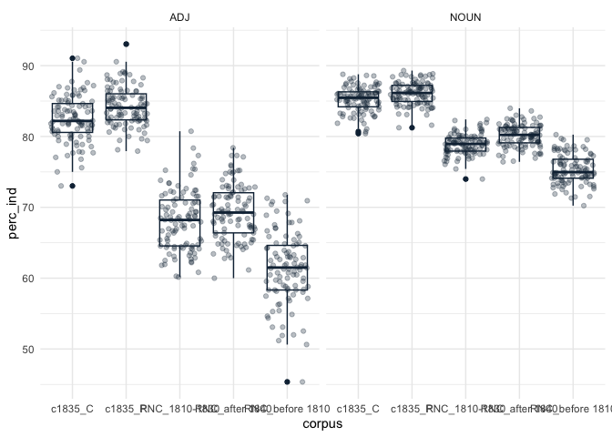
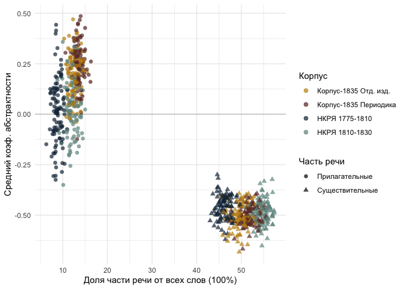

# 05_5_abstractness

## Abstract nouns & adj in rhyme

Load packages & data

``` r
library(tidyverse)
```

    Warning: package 'ggplot2' was built under R version 4.3.1

    Warning: package 'tidyr' was built under R version 4.3.1

    Warning: package 'dplyr' was built under R version 4.3.1

    Warning: package 'lubridate' was built under R version 4.3.1

    ── Attaching core tidyverse packages ──────────────────────── tidyverse 2.0.0 ──
    ✔ dplyr     1.1.4     ✔ readr     2.1.4
    ✔ forcats   1.0.0     ✔ stringr   1.5.0
    ✔ ggplot2   3.5.1     ✔ tibble    3.2.1
    ✔ lubridate 1.9.3     ✔ tidyr     1.3.1
    ✔ purrr     1.0.2     
    ── Conflicts ────────────────────────────────────────── tidyverse_conflicts() ──
    ✖ dplyr::filter() masks stats::filter()
    ✖ dplyr::lag()    masks stats::lag()
    ℹ Use the conflicted package (<http://conflicted.r-lib.org/>) to force all conflicts to become errors

``` r
library(MetBrewer)
theme_set(theme_minimal())
```

Dictionaries for abstractness / concreteness

``` r
dict_adj <- read.delim("../../data/ch5/dicts/adj_concreteness.csv", sep = ";") %>% 
  mutate(word = str_remove_all(word, "[[:punct:]]|[[:space:]]"), 
         index_c_a = str_replace_all(index_c_a, ",", "\\.")) %>% 
  mutate(index_c_a = as.numeric(index_c_a))

dict_noun <- read.delim("../../data/ch5/dicts/nouns_concreteness.csv", sep = ";") %>% 
  mutate(word = str_remove_all(word, "[[:punct:]]|[[:space:]]"), 
         index_c_a = str_replace_all(index_c_a, ",", "\\.")) %>% 
  mutate(index_c_a = as.numeric(index_c_a))

glimpse(dict_adj)
```

    Rows: 23,880
    Columns: 3
    $ word      <chr> "новенький", "кожаная", "самодельный", "шерстяной", "тоненьк…
    $ score     <chr> "76", "60", "49", "49", "46", "42", "42", "40", "36", "33", …
    $ index_c_a <dbl> 5.330733, 5.094345, 4.891820, 4.891820, 4.828641, 4.737670, …

``` r
glimpse(dict_noun)
```

    Rows: 63,951
    Columns: 3
    $ word      <chr> "туфельки", "шаровары", "сапожки", "горсовета", "плащи", "дж…
    $ score     <chr> "35", "35", "32", "31", "31", "31", "29", "27", "27", "26,75…
    $ index_c_a <dbl> 4.555348, 4.555348, 4.465736, 4.433987, 4.433987, 4.433987, …

``` r
dictionaries <- rbind(dict_adj, dict_noun) %>% rename(lemma = word) %>% select(-score)

head(dictionaries)
```

            lemma index_c_a
    1   новенький  5.330733
    2     кожаная  5.094345
    3 самодельный  4.891820
    4   шерстяной  4.891820
    5   тоненькая  4.828641
    6  старенький  4.737670

``` r
dictionaries %>% arrange(-desc(index_c_a)) %>% head()
```

              lemma index_c_a
    1     сочетание -4.914504
    2 необходимость -4.878136
    3     признание -4.878136
    4       явление -4.843045
    5   утверждение -4.843045
    6    воплощение -4.744604

## Corpus-1835 - Rhymes data

Words

``` r
rhyme_words <- read.csv("../../data/corpus1835/sql_db/rhyme_words.csv", 
                        
                        # DON'T LET R EAT IAMBS AND DO INTEGER 01 => 1
                        colClasses = c("stress_pattern" = "character",
                                       "closure_pattern" = "character")) 

#glimpse(rhyme_words)

# write.csv(rhyme_words %>% select(word), file = "../../data/ch5/rhyme_words_lemmas.csv")

lemm <- read.csv("../../data/ch5/rhyme_words_lemmas.csv") %>% select(-X)

rhyme_words <- rhyme_words %>% 
  left_join(lemm, by = "word")


# rewrite pos tags
pos_transl <- tibble(old_tag = c("S", "V", "APRO", "SPRO", 
                   "A", "ADV", "NUM", "ADVPRO",
                   "INTJ", "PART", "PR", "ANUM", "CONJ"),
       pos = c("NOUN", "VERB", "PRON", "PRON", 
               "ADJ", "ADV", "NUM", "PRON",
               "INTJ", "PART", "ADP", "NUM", "CONJ")) # upos

# attach to the table with all words
rhyme_words <- rhyme_words %>% 
  rename(old_tag = pos) %>% 
  left_join(pos_transl, by = "old_tag")

head(rhyme_words)
```

            word    word_acc stress_pattern closure_pattern  closure old_tag
    1      краса      краса'             01               1     masc       S
    2    огневым    огневы'м            001               1     masc       S
    3 красавицей краса'вицей           0100             100 dactylic       S
    4        око        о'ко             10              10      fem       S
    5      силки      силки'             01               1     masc       S
    6     стонет     сто'нет             10              10      fem       V
                               feats ending_st     lemma  pos
    1               S,жен,неод=им,ед       са'     краса NOUN
    2  S,фам,муж,од=(дат,мн|твор,ед)       ы'м     огнев NOUN
    3               S,жен,од=твор,ед   а'вицей красавица NOUN
    4     S,сред,неод=(вин,ед|им,ед)      о'ко       око NOUN
    5      S,муж,неод=(вин,мн|им,мн)       ки'     силок NOUN
    6 V,несов,нп=непрош,ед,изъяв,3-л     о'нет   стонать VERB

Pairs

``` r
# load pairs
rhyme_pairs <- read.csv("../../data/corpus1835/sql_db/rhyme_pairs.csv") %>% 
  rename(text_id = poem_id) %>% 
  # remove Kulman texts
  filter(!str_detect(text_id, "C_264"))

# separate and rebind
w1 <- rhyme_pairs %>% 
  select(text_id, from) %>% 
  rename(word = from)

w2 <- rhyme_pairs %>% 
  select(text_id, to) %>% 
  rename(word = to)

w <- rbind(w1, w2)


# attach words characteristics
rw <- w %>% 
  left_join(rhyme_words, by = "word") 
```

Metadata: book/periodicals, authors

``` r
meta <- read.csv("../../data/corpus1835/sql_db/texts_metadata.csv")

# glimpse(meta)

authors_meta <- read_csv("../../data/corpus1835/sql_db/authors.csv") %>% 
  select(A_ID, author_name)
```

    Rows: 315 Columns: 11
    ── Column specification ────────────────────────────────────────────────────────
    Delimiter: ","
    chr (10): A_ID, author_name, author_full_name, author_sex, year_birth, year_...
    dbl  (1): aristocracy

    ℹ Use `spec()` to retrieve the full column specification for this data.
    ℹ Specify the column types or set `show_col_types = FALSE` to quiet this message.

``` r
meta <- meta %>% 
  left_join(authors_meta, by = "A_ID") %>% 
  mutate(corpus = str_extract(text_id, "^\\w")) %>% 
  select(text_id, corpus, meter, author_name)
```

Attach metadata to rhyme data & select columns

``` r
c35_rw <- rw %>% 
  left_join(meta, by = "text_id") %>% 
  select(text_id, corpus, meter, author_name, pos,
         word, lemma, closure) %>% 
  mutate(corpus = paste0("c1835_", corpus))
```

    Warning in left_join(., meta, by = "text_id"): Detected an unexpected many-to-many relationship between `x` and `y`.
    ℹ Row 2118 of `x` matches multiple rows in `y`.
    ℹ Row 1014 of `y` matches multiple rows in `x`.
    ℹ If a many-to-many relationship is expected, set `relationship =
      "many-to-many"` to silence this warning.

``` r
# sample_n(c35_rw, 5)

# total number of nouns and adj
table(c35_rw$pos)
```


      ADJ   ADP   ADV  CONJ  INTJ  NOUN   NUM  PART  PRON  VERB 
    19443    27  4654    15   140 83246   144   646 12681 41507 

Attach abstractness / concreteness index

``` r
# number of ADJ & Nouns supplied by index
c35_rw %>% 
  left_join(dictionaries, by = "lemma") %>% 
  filter(!is.na(index_c_a)) %>% 
  filter(pos == "NOUN" | pos == "ADJ") %>% 
  count(pos)
```

    Warning in left_join(., dictionaries, by = "lemma"): Detected an unexpected many-to-many relationship between `x` and `y`.
    ℹ Row 51 of `x` matches multiple rows in `y`.
    ℹ Row 81857 of `y` matches multiple rows in `x`.
    ℹ If a many-to-many relationship is expected, set `relationship =
      "many-to-many"` to silence this warning.

       pos     n
    1  ADJ 17736
    2 NOUN 71321

``` r
c35_rw <- c35_rw %>% 
  left_join(dictionaries, by = "lemma") 
```

    Warning in left_join(., dictionaries, by = "lemma"): Detected an unexpected many-to-many relationship between `x` and `y`.
    ℹ Row 51 of `x` matches multiple rows in `y`.
    ℹ Row 81857 of `y` matches multiple rows in `x`.
    ℹ If a many-to-many relationship is expected, set `relationship =
      "many-to-many"` to silence this warning.

``` r
sample_n(c35_rw, 5)
```

        text_id  corpus meter    author_name  pos      word     lemma closure
    1    P_1639 c1835_P  Iamb    Панаев И.И. NOUN    суетой     суета    masc
    2  C_241__2 c1835_C  Iamb    Башкатов А. VERB      любя    любить    masc
    3  C_95__21 c1835_C  Iamb Аполлон де *** NOUN       хор       хор    masc
    4 C_315__14 c1835_C  Iamb Лермонтов М.Ю. NOUN  теплицей   теплица     fem
    5 C_142__11 c1835_C  Iamb  Бороздна И.П.  ADJ темничный темничный     fem
       index_c_a
    1 -2.0078049
    2         NA
    3  0.0756771
    4  0.5945849
    5         NA

Remove obsolete variables

``` r
rm(authors_meta, lemm, meta, pos_transl, w, w1, w2, rhyme_pairs, rhyme_words, rw)
```

## RNC rhymes

Load data

``` r
rnc_rhymes <- read.csv("../../data/ch5/nkrja_rhyme_pairs.csv") %>% select(-X)
# glimpse(rnc_rhymes)

######## metadata #########
# attach authors & meters
# load metadata to extract meters
load("../../data/nkrja_19th_lem.Rda")
rnc_ids <- c19 %>% 
  #filter(meter %in% c("Я", "Х")) %>% 
  mutate(poem_id = paste0("RNC_", Unnamed..0, "_", year), 
         meter = meter) %>% 
  select(poem_id, meter, author)

# attach to rhyme data
rnc_rhymes <- rnc_rhymes %>% 
  left_join(rnc_ids, by = "poem_id") %>% 
  rename(#text_id = poem_id, 
         author_name = author) %>% 
  separate(poem_id, into = c("corpus", "text_id", "year"), sep = "_") %>% 
  mutate(year = as.numeric(year),
         corpus = ifelse(year < 1810, "RNC_before 1810", corpus),
         corpus = ifelse(year > 1810 & year < 1830, "RNC_1810-1830", corpus),
         corpus = ifelse(year > 1840, "RNC_after 1840", corpus)) %>% 
  filter(corpus != "RNC")  ########## NB remove texts of 1830s

######## rhyme data preparation ##########
# separate rhyme pairs to just words
w1 <- rnc_rhymes %>% 
  select(text_id, corpus, from_pos, from, from_closure, meter, author_name) %>% 
  rename(pos = from_pos,
         word = from,
         closure = from_closure)

w2 <- rnc_rhymes %>% 
  select(text_id, corpus, to_pos, to, to_closure, meter, author_name) %>% 
  rename(pos = to_pos,
         word = to,
         closure = to_closure)

w <- rbind(w1, w2)

# glimpse(w)

####### lemma ##########
# add lemmata (preprocessed)
lemm <- read.csv("../../data/ch5/rnc_rhyme_words_lemmas.csv") %>% select(-X)

# glimpse(lemm)

rnc_rw <- cbind(w, lemm %>% select(lemma)) %>% 
  # reorder columns similarly as in c35_rw
  select(text_id, corpus, meter, author_name, pos, word, lemma, closure)

######## abstractness indexes #########
# attach c/a indexes by lemma
rnc_rw <- rnc_rw %>% 
  left_join(dictionaries, by = "lemma")
```

    Warning in left_join(., dictionaries, by = "lemma"): Detected an unexpected many-to-many relationship between `x` and `y`.
    ℹ Row 26 of `x` matches multiple rows in `y`.
    ℹ Row 72713 of `y` matches multiple rows in `x`.
    ℹ If a many-to-many relationship is expected, set `relationship =
      "many-to-many"` to silence this warning.

``` r
glimpse(rnc_rw) # final table
```

    Rows: 228,047
    Columns: 9
    $ text_id     <chr> "3870", "3870", "3870", "3870", "7246", "7246", "7246", "7…
    $ corpus      <chr> "RNC_before 1810", "RNC_before 1810", "RNC_before 1810", "…
    $ meter       <chr> "Я", "Я", "Я", "Я", "Я", "Я", "Я", "Я", "Я", "Я", "Я", "Я"…
    $ author_name <chr> "И. И. Дмитриев", "И. И. Дмитриев", "И. И. Дмитриев", "И. …
    $ pos         <chr> "NOUN", "VERB", "VERB", "VERB", "ADJ", "NOUN", "ADJ", "NOU…
    $ word        <chr> "кантемир", "равнялись", "блистал", "находился", "спокоен"…
    $ lemma       <chr> "кантемир", "равняться", "блистать", "находиться", "спокой…
    $ closure     <chr> "masc", "fem", "masc", "fem", "fem", "masc", "fem", "masc"…
    $ index_c_a   <dbl> NA, NA, NA, NA, -0.95686999, -0.90246759, -0.30859285, -0.…

``` r
# remove obsolete vars
rm(c19, lemm, rnc_ids, rnc_rhymes, w, w1, w2)
```

Merge RNC & Corpus-1835 data

``` r
colnames(rnc_rw) == colnames(c35_rw) # check
```

    [1] TRUE TRUE TRUE TRUE TRUE TRUE TRUE TRUE TRUE

``` r
rhyme_words <- rbind(rnc_rw, c35_rw)

sample_n(rhyme_words, 10)
```

         text_id          corpus  meter      author_name  pos         word
    1  C_241__59         c1835_C   Iamb      Башкатов А. VERB пресмыкаться
    2     P_1204         c1835_P   Iamb   Клюшников И.П. NOUN        мечты
    3   C_71__50         c1835_C Dactyl       Зилов А.М. NOUN         души
    4      17657 RNC_before 1810      Я   Г. Р. Державин VERB    прилагали
    5     P_1847         c1835_P   Iamb     Головачев Г.  ADJ     незримой
    6    C_68__1         c1835_C   Iamb Баратынский Е.А. VERB  принадлежит
    7        595 RNC_before 1810      Я    Н. П. Николев NOUN       злодей
    8   C_208__5         c1835_C  Other      Сушков Д.П. NOUN       мечтам
    9      11293  RNC_after 1840      Я      А. И. Пальм NOUN      пустяки
    10  C_84__32         c1835_C   Iamb     Савурский Н. VERB        сияет
              lemma closure  index_c_a
    1  пресмыкаться     fem         NA
    2         мечта    masc -1.6941473
    3          душа     fem -1.1413169
    4     прилагать     fem         NA
    5      незримый     fem -0.5582696
    6  принадлежать    masc         NA
    7        злодей    masc -1.2191635
    8         мечта    masc -1.6941473
    9        пустяк    masc -1.5652494
    10        сиять     fem         NA

``` r
# number of words in each sub-corpus
rhyme_words %>% count(corpus)
```

               corpus      n
    1   RNC_1810-1830 105953
    2  RNC_after 1840  39171
    3 RNC_before 1810  82923
    4         c1835_C 102593
    5         c1835_P  62065

``` r
unique(rhyme_words$corpus)
```

    [1] "RNC_before 1810" "RNC_after 1840"  "RNC_1810-1830"   "c1835_P"        
    [5] "c1835_C"        

``` r
r <- tibble(corpus = unique(rhyme_words$corpus),
            corpus_nl = c("RNC_before 1810"))
```

## canon / archive

Random samples from different subcorpora

Collections VS periodicals

### avg abstractness / concreteness

``` r
x <- NULL
y <- NULL

for (i in 1:100) {

  x <- rhyme_words %>% 
    filter(!is.na(index_c_a)) %>% 
    filter(pos == "NOUN" | pos == "ADJ") %>% 
    group_by(corpus, pos) %>% 
    sample_n(1000) %>% 
    summarise(ica = mean(index_c_a))
  
  y <- rbind(x,y)
}

n <- factor(y$corpus, levels = c("RNC_before 1810", 
                                 "RNC_1810-1830",
                                 "c1835_C",
                                 "c1835_P",
                                 "RNC_after 1840"
                                 ))

y$corpus <- n

y %>% 
  ggplot(aes(x = corpus, y = ica, fill = pos)) + 
  geom_boxplot() + 
  geom_hline(yintercept = 0, lty = 2)
```

Examples of less abstract ADJ in Corpus-1835

### abstr / rel freq of the pos

``` r
# select n rhyme words for 1 iteration
sample_size <- 1000

s <- NULL  # sample
ind <- NULL  # temp var for indexes
x <- NULL  # storage
nr <- NULL # controll number of indexed rows

for (i in 1:100) {
  # take a sample of rhyme words 
  s <- rhyme_words %>% 
    group_by(corpus) %>% 
    sample_n(sample_size) 
  
  # count POS
  # s %>% 
  #  count(pos) %>% 
  #   mutate(perc = round((n/sample_size) * 100, 1))
  
  # count mean index
  ind <- s %>% 
    filter(!is.na(index_c_a)) %>% 
    filter(pos %in% c("ADJ", "NOUN")) %>% 
    group_by(pos, corpus) %>% 
    summarise(ica = mean(index_c_a))
  
  nr <- s %>% 
    filter(!is.na(index_c_a)) %>% 
    filter(pos %in% c("ADJ", "NOUN")) %>% 
    mutate(corpus_pos = paste0(corpus, "_", pos)) %>% 
    count(corpus_pos) %>% 
    rename(n_indexed = n) %>% 
    ungroup() %>% 
    select(-corpus)
  
  # nr
  # ind
  
  ind <- ind %>% 
    ungroup() %>% 
    # add column for joining
    mutate(corpus_pos = paste0(corpus, "_", pos)) %>% 
    
    # attach counter (rel freq) of all POS in the samples
    left_join(s %>% count(pos) %>% 
          mutate(perc = round((n/sample_size) * 100, 1),
             corpus_pos = paste0(corpus, "_", pos)) %>% 
          ungroup() %>% 
          select(-corpus, -pos),
      by = "corpus_pos"
    ) %>% 
    
    # add number of indexed words
    left_join(nr, by = "corpus_pos") %>% 
    
    mutate(itr = i, # add iteration counter
           perc_ind = round((n_indexed / n) * 100, 2)
           ) 
  
  
  x <- rbind(x, ind)
}

sample_n(x, 10)
```

    # A tibble: 10 × 9
       pos   corpus              ica corpus_pos     n  perc n_indexed   itr perc_ind
       <chr> <chr>             <dbl> <chr>      <int> <dbl>     <int> <int>    <dbl>
     1 ADJ   c1835_P         0.187   c1835_P_A…   121  12.1       103    72     85.1
     2 NOUN  c1835_C        -0.556   c1835_C_N…   509  50.9       419    76     82.3
     3 ADJ   c1835_C         0.00586 c1835_C_A…   122  12.2        94    99     77.0
     4 ADJ   RNC_after 1840 -0.174   RNC_after…   120  12          78    47     65  
     5 NOUN  RNC_before 18… -0.401   RNC_befor…   457  45.7       346     8     75.7
     6 ADJ   c1835_P         0.415   c1835_P_A…   130  13         104    83     80  
     7 ADJ   RNC_1810-1830   0.131   RNC_1810-…   124  12.4        86    48     69.4
     8 ADJ   RNC_before 18…  0.00583 RNC_befor…    84   8.4        43     5     51.2
     9 ADJ   c1835_C         0.154   c1835_C_A…   124  12.4       103    28     83.1
    10 NOUN  RNC_after 1840 -0.469   RNC_after…   519  51.9       423    79     81.5

Check if number of indexed words is different in subcorpora

``` r
x %>% 
  ggplot(aes(x = corpus, y = perc_ind)) + 
  geom_boxplot(color = met.brewer("Veronese")[7]) + 
  geom_jitter(alpha = 0.3, color = met.brewer("Veronese")[7]) +
  facet_wrap(~pos)
```



``` r
unique(x$corpus)
```

    [1] "RNC_1810-1830"   "RNC_after 1840"  "RNC_before 1810" "c1835_C"        
    [5] "c1835_P"        

``` r
labels <- tibble(corpus = unique(x$corpus),
                 corpus_label = c("НКРЯ 1810-1830", 
                                  "НКРЯ после 1840",
                                  "НКРЯ 1775-1810",
                                  "Корпус-1835 Отд. изд.",
                                  "Корпус-1835 Периодика"))

pos_labels <- tibble(pos = unique(x$pos),
                     pos_label = c("Прилагательные", "Существительные"))


x %>% 
  filter(!corpus %in% c(
    #"RNC_1810-1830", 
    "RNC_after 1840")) %>% 
  left_join(labels, by = "corpus") %>% 
  left_join(pos_labels, by = "pos") %>% 
  ggplot(aes(x = perc, y = ica, color = corpus_label, shape = pos_label)) + 
  geom_point(alpha = 0.7, size = 2) + 
  geom_hline(yintercept = 0, linewidth = 0.1) + 
  #facet_wrap(~pos) + 
  labs(x = "Доля части речи от всех слов (100%)",
       y = "Средний коэф. абстрактности",
       color = "Корпус",
       shape = "Часть речи"
       #title = "More nouns -- more abstractions?",
       #subtitle = "Each dot is a random sample of 1000 rhyme words"
       ) + 
  scale_color_manual(values = c(met.brewer("Veronese")[3],
                                met.brewer("Veronese")[1],
                                met.brewer("Veronese")[7],
                                met.brewer("Veronese")[4])) + 
  scale_x_continuous(breaks = seq(0,60,10))
```



``` r
ggsave("plots/fig_5-2-3.png", plot = last_plot(), dpi = 300,
       height = 5, width = 7, bg = "white")
```

#### BW

``` r
x %>% 
  filter(!corpus %in% c(
    #"RNC_1810-1830", 
    "RNC_after 1840")) %>% 
  left_join(labels, by = "corpus") %>% 
  left_join(pos_labels, by = "pos") %>% 
  ggplot(aes(x = perc, y = ica, color = corpus_label, shape = pos_label)) + 
  geom_point(alpha = 0.7, size = 2) + 
  geom_hline(yintercept = 0, linewidth = 0.1) + 
  #facet_wrap(~pos) + 
  labs(x = "Доля части речи от всех слов (100%)",
       y = "Средний коэф. абстрактности",
       color = "Корпус",
       shape = "Часть речи"
       #title = "More nouns -- more abstractions?",
       #subtitle = "Each dot is a random sample of 1000 rhyme words"
       ) + 
  scale_color_manual(values = c("grey20", "grey10", 
                                "grey85", "grey65")) + 
  scale_x_continuous(breaks = seq(0,60,10))

ggsave("plots/bw/fig_5-2-3.png", plot = last_plot(), dpi = 300,
       height = 5, width = 7, bg = "white")
```

``` r
x %>% 
  filter(!corpus %in% c(
    #"RNC_1810-1830", 
    "RNC_after 1840")) %>% 
  ggplot(aes(x = perc, y = ica, color = corpus, shape = pos)) + 
  geom_jitter(alpha = 0.3) + 
  #geom_point(alpha = 0.8) + 
  geom_boxplot() + 
  geom_hline(yintercept = 0, linewidth = 0.1) + 
  #facet_wrap(~pos) + 
  labs(x = "POS relative frequency",
       y = "Mean conctreteness index",
       title = "More nouns -- more abstractions?",
       subtitle = "Each dot is a random sample of 1000 rhyme words") + 
  scale_color_manual(values = c(met.brewer("Veronese")[3],
                                met.brewer("Veronese")[1],
                                met.brewer("Veronese")[4],
                                met.brewer("Veronese")[7]))
```


Random samples from RNC 1810-1830 and Corpus-1835

``` r
x %>% 
  filter(!corpus %in% c(
    #"RNC_1810-1830" 
    "RNC_after 1840", "RNC_before 1810"
    )) %>% 
  ggplot(aes(x = perc, y = ica, color = corpus, shape = pos)) + 
  geom_point(alpha = 0.8) + 
  geom_hline(yintercept = 0, linewidth = 0.1) + 
  #facet_wrap(~pos) + 
  labs(x = "POS relative frequency",
       y = "Mean conctreteness index",
       title = "More nouns -- more abstractions?",
       subtitle = "Each dot is a random sample of 1000 rhyme words") + 
  scale_color_manual(values = c(met.brewer("Veronese")[3],
                                met.brewer("Veronese")[1],
                                met.brewer("Veronese")[4],
                                met.brewer("Veronese")[7]))
```


## authors

Same authors as in 5.2, only Corpus-1835 data

``` r
author_v <- c("Баратынский Е.А.", "Козлов И.И.", "Ростопчина Е.П.",
              "Бенедиктов В.Г.", "Бернет Е.", "Шахова Е.Н.",
              "Слепушкин Ф.Н.",  "Мейснер А.", "Некрасов Н.А."
             )

rhyme_words %>% 
  filter(author_name %in% author_v) %>% 
  count(author_name, sort = T) 
```

           author_name    n
    1  Бенедиктов В.Г. 4050
    2        Бернет Е. 3958
    3 Баратынский Е.А. 3890
    4       Мейснер А. 3186
    5      Шахова Е.Н. 3139
    6    Некрасов Н.А. 2884
    7      Козлов И.И. 1635
    8  Ростопчина Е.П. 1603
    9   Слепушкин Ф.Н. 1134

``` r
sample_size <- 100

s <- NULL
ind <- NULL
x <- NULL
nr <- NULL

for (i in 1:100) {
  s <- rhyme_words %>% 
    filter(author_name %in% author_v) %>% 
    group_by(author_name) %>% 
    sample_n(sample_size) %>% 
    ungroup()

  # count mean index
  ind <- s %>% 
    filter(!is.na(index_c_a)) %>% 
    filter(pos %in% c("ADJ", "NOUN")) %>% 
    group_by(pos, author_name) %>% 
    summarise(ica = mean(index_c_a))
  
  nr <- s %>% 
    filter(!is.na(index_c_a)) %>% 
    filter(pos %in% c("ADJ", "NOUN")) %>% 
    mutate(author_pos = paste0(author_name, "_", pos)) %>% 
    count(author_pos) %>% 
    rename(n_indexed = n)
  
  
  ind <- ind %>% 
    ungroup() %>% 
    # add column for joining
    mutate(author_pos = paste0(author_name, "_", pos)) %>% 
    
    # attach counter (rel freq) of all POS in the samples
    left_join(s %>% group_by(author_name) %>% count(pos) %>% 
          mutate(perc = round((n/sample_size) * 100, 1),
             author_pos = paste0(author_name, "_", pos)) %>% 
          ungroup() %>% 
          select(-author_name, -pos),
      by = "author_pos"
    ) %>% 
    
    # attach number of nouns & adj counted
    left_join(nr, by = "author_pos") %>% 
    
    mutate(itr = i, # add iteration counter
           perc_ind = round((n_indexed / n) * 100, 2)
           ) # iteration counter 
  
    x <- rbind(x, ind)
}

sample_n(x, 10)
```

    # A tibble: 10 × 9
       pos   author_name         ica author_pos     n  perc n_indexed   itr perc_ind
       <chr> <chr>             <dbl> <chr>      <int> <dbl>     <int> <int>    <dbl>
     1 NOUN  Козлов И.И.      -0.457 Козлов И.…    48    48        42    75     87.5
     2 ADJ   Некрасов Н.А.    -0.422 Некрасов …    19    19        14    86     73.7
     3 NOUN  Бенедиктов В.Г.  -0.537 Бенедикто…    50    50        44    78     88  
     4 NOUN  Баратынский Е.А. -0.797 Баратынск…    47    47        38    60     80.8
     5 ADJ   Некрасов Н.А.     0.341 Некрасов …    12    12        11    57     91.7
     6 NOUN  Ростопчина Е.П.  -1.16  Ростопчин…    42    42        32    62     76.2
     7 NOUN  Ростопчина Е.П.  -0.881 Ростопчин…    34    34        28    23     82.4
     8 ADJ   Бенедиктов В.Г.   0.248 Бенедикто…    13    13         9     5     69.2
     9 NOUN  Баратынский Е.А. -0.903 Баратынск…    59    59        42    14     71.2
    10 NOUN  Бенедиктов В.Г.  -0.765 Бенедикто…    52    52        41    89     78.8

``` r
x %>% 
  ggplot(aes(x = author_name, y = perc_ind)) + 
  geom_boxplot(color = met.brewer("Veronese")[7]) + 
  geom_jitter(alpha = 0.3, color = met.brewer("Veronese")[7]) +
  facet_wrap(~pos) + 
  theme(axis.text.x = element_text(angle = 90))
```


``` r
x %>% 
  ggplot(aes(x = author_name, y = ica, color = author_name, shape = pos)) + 
  geom_boxplot() +
  facet_wrap(~pos)
```


``` r
x %>% 
  filter(author_name %in% c("Баратынский Е.А.", "Ростопчина Е.П.",
              "Бенедиктов В.Г.", 
              "Слепушкин Ф.Н.")) %>% 
  left_join(pos_labels, by = "pos") %>% 
  ggplot(aes(x = perc, y = ica, color = author_name, shape = pos_label)) + 
  geom_point(alpha = 0.8, size = 2) + 
  geom_hline(yintercept = 0, linewidth = 0.1) + 
  #facet_wrap(~pos) + 
  labs(x = "Доля части речи от всех слов (100%)",
       y = "Средний коэф. абстрактности",
       color = "Автор", 
       shape = "Часть речи") + 
  scale_color_manual(values = c(met.brewer("Kandinsky"))) + 
  scale_x_continuous(breaks = seq(0,60,10))
```


``` r
ggsave("plots/fig_5-2-4.png", plot = last_plot(), dpi = 300,
       height = 5, width = 7, bg = "white")
```

``` r
rhyme_words %>% 
  filter(pos %in% c("ADJ", "NOUN")) %>%
  filter(author_name == "Слепушкин Ф.Н.") %>% 
  filter(!is.na(index_c_a) & index_c_a > 0.15) %>% 
  select(word, index_c_a) %>% 
  arrange(desc(index_c_a)) %>% head(20)
```

            word index_c_a
    1  шерстяной  4.891820
    2  расписных  3.944439
    3  расписной  3.944439
    4     бруски  3.772589
    5     измяты  3.639057
    6     измяты  3.639057
    7     сухари  3.197225
    8     хоромы  3.001480
    9    садовой  2.945910
    10  укромной  2.945910
    11   образок  2.540452
    12  калачами  2.466329
    13  калачами  2.466329
    14    калачи  2.466329
    15    калачи  2.466329
    16 рязанской  2.435085
    17    арканы  2.386294
    18     аркан  2.386294
    19    чуланы  2.386294
    20      штоф  2.386294

``` r
rhyme_words %>% 
  filter(pos %in% c("ADJ", "NOUN")) %>%
  filter(author_name == "Бенедиктов В.Г.") %>% 
  filter(!is.na(index_c_a) & index_c_a > 0.15) %>% 
  select(word, index_c_a) %>% 
  arrange(desc(index_c_a)) #%>% head(70)
```

                word index_c_a
    1   белокаменная 3.7725887
    2         брызги 3.2617631
    3      гранитной 3.0476928
    4      гранитной 3.0476928
    5       разбитой 2.9661189
    6         колчан 2.7917595
    7       стальную 2.6486586
    8       стальной 2.6486586
    9       спальной 2.6094379
    10       хлыстом 2.6094379
    11        акаций 2.5040774
    12        балкон 2.4663294
    13        балкон 2.4663294
    14        балкон 2.4663294
    15       затворы 2.3156841
    16     гренадера 2.2992921
    17        обойму 2.2527630
    18        кремля 2.1314021
    19        кремля 2.1314021
    20        кремля 2.1314021
    21         белом 2.1294648
    22      железном 2.1192316
    23      железные 2.1192316
    24       золотая 2.1019401
    25       золотые 2.1019401
    26      золотыми 2.1019401
    27       золотые 2.1019401
    28      золотыми 2.1019401
    29       золотой 2.1019401
    30       золотой 2.1019401
    31       золотую 2.1019401
    32         шпоры 2.0986123
    33       локотке 2.0986123
    34      смоляные 2.0986123
    35         оливы 2.0986123
    36       заливом 2.0577903
    37       заливах 2.0577903
    38   хрустальной 2.0459848
    39          зола 2.0296194
    40         золой 2.0296194
    41          зола 2.0296194
    42      истукана 2.0116009
    43    изумрудной 2.0116009
    44         губки 1.9808418
    45         тесен 1.9745596
    46         тесен 1.9745596
    47        теснее 1.9745596
    48        тесным 1.9745596
    49       повязки 1.9162907
    50       голубом 1.9132862
    51       голубое 1.9132862
    52       голубой 1.9132862
    53       голубая 1.9132862
    54       голубой 1.9132862
    55       голубое 1.9132862
    56      рукоятью 1.8873150
    57         полог 1.8842220
    58      заветной 1.8534787
    59          оков 1.8472836
    60          оков 1.8472836
    61          оков 1.8472836
    62         диван 1.8223756
    63        дороже 1.7995322
    64        старый 1.7919965
    65         руины 1.7884574
    66      казацкой 1.7732053
    67     подводной 1.7732053
    68      огромной 1.7686720
    69       огромен 1.7686720
    70      огромный 1.7686720
    71         шалаш 1.7375946
    72         шалаш 1.7375946
    73         глыбы 1.6931472
    74       оврагам 1.6931472
    75     изголовью 1.6931472
    76     изголовью 1.6931472
    77         глыбы 1.6931472
    78      косматой 1.6931472
    79      терновым 1.6931472
    80        змейки 1.6931472
    81     изголовью 1.6931472
    82     изголовью 1.6931472
    83       полками 1.6734036
    84        полков 1.6734036
    85       плотным 1.6623786
    86       столбом 1.6586593
    87        хребте 1.6523252
    88     цветочный 1.6506050
    89      хрусталь 1.6418539
    90       морская 1.6262592
    91       морской 1.6262592
    92       морской 1.6262592
    93       морская 1.6262592
    94     свинцовой 1.5978470
    95      алмазным 1.5877867
    96         рамах 1.5877867
    97       червяка 1.5877867
    98        пальцы 1.5717702
    99         южною 1.5695095
    100        южною 1.5695095
    101        молот 1.5232481
    102         куст 1.5154549
    103       кустом 1.5154549
    104       кустом 1.5154549
    105   неприметна 1.5108456
    106   заздравный 1.5108456
    107      челнока 1.5108456
    108       сапфир 1.5108456
    109       сапфир 1.5108456
    110        холмы 1.5065766
    111      уступов 1.5030757
    112        полки 1.4946962
    113    воздушной 1.4924987
    114    воздушной 1.4924987
    115       чугуна 1.4895611
    116         уста 1.4308079
    117         уста 1.4308079
    118         уста 1.4308079
    119        устах 1.4308079
    120          уст 1.4308079
    121        устах 1.4308079
    122        устах 1.4308079
    123        устах 1.4308079
    124         уста 1.4308079
    125         валы 1.4255291
    126        валов 1.4255291
    127        валов 1.4255291
    128        готов 1.4212072
    129       златом 1.4054651
    130       златое 1.4054651
    131        ножку 1.4054651
    132       златая 1.4054651
    133       златой 1.4054651
    134      прочный 1.3856705
    135        ленты 1.3772714
    136    караваном 1.3746622
    137     бороздой 1.3676940
    138       трубой 1.3505160
    139      туманов 1.3483302
    140    послушной 1.3364722
    141    послушный 1.3364722
    142        велик 1.3161966
    143      полевых 1.3118136
    144      головку 1.3112277
    145         ламп 1.3053501
    146        скаты 1.2984736
    147        скаты 1.2984736
    148       скатам 1.2984736
    149       родная 1.2978057
    150       родная 1.2978057
    151       родной 1.2978057
    152       родная 1.2978057
    153       родная 1.2978057
    154       родная 1.2978057
    155       родной 1.2978057
    156       родною 1.2978057
    157       родной 1.2978057
    158       родная 1.2978057
    159    поселенца 1.2876571
    160        локон 1.2876571
    161       штыков 1.2876571
    162      богатой 1.2876571
    163      штыками 1.2876571
    164      смерчом 1.2876571
    165       пышней 1.2754324
    166         трон 1.2682699
    167          шар 1.2632869
    168       родные 1.2513033
    169       родные 1.2513033
    170       родные 1.2513033
    171      обломки 1.2451398
    172      широкою 1.2301589
    173      широким 1.2301589
    174      родимый 1.2231436
    175         лене 1.2231436
    176      родимой 1.2231436
    177      порфире 1.2231436
    178        новой 1.2151920
    179   золотистой 1.2076644
    180    бесценной 1.2006525
    181    бесценной 1.2006525
    182    бесценной 1.2006525
    183   магнитными 1.1957312
    184     каштанов 1.1823216
    185       лугами 1.1728603
    186        эмаль 1.1670387
    187        глины 1.1625439
    188        зубом 1.1576019
    189        пепла 1.1541793
    190       густой 1.1515186
    191      густыми 1.1515186
    192       густую 1.1515186
    193       густая 1.1515186
    194       густые 1.1515186
    195  серебристой 1.1484200
    196      престол 1.1440138
    197       бровью 1.1430608
    198       бровью 1.1430608
    199     открытую 1.1394141
    200         лозу 1.1335689
    201        седой 1.1335689
    202      огневой 1.1335689
    203      огневом 1.1335689
    204        седой 1.1335689
    205        седая 1.1335689
    206      огневой 1.1335689
    207      огневая 1.1335689
    208      огневые 1.1335689
    209        седой 1.1335689
    210        сухой 1.1267208
    211    волшебным 1.1158256
    212         пены 1.1143995
    213         пена 1.1143995
    214     одинокой 1.1133287
    215     одинокой 1.1133287
    216     листками 1.1127928
    217       призма 1.1111835
    218      ледяная 1.1111835
    219      ледяная 1.1111835
    220         коры 1.0991211
    221        чужая 1.0971267
    222      берегах 1.0946736
    223      берегов 1.0946736
    224        песку 1.0870030
    225       венком 1.0689662
    226       венком 1.0689662
    227       венком 1.0689662
    228      степной 1.0645698
    229        листы 1.0599656
    230        листы 1.0599656
    231        листы 1.0599656
    232         сады 1.0308201
    233         сады 1.0308201
    234        оград 1.0289761
    235       окошку 1.0259601
    236       чертог 1.0000000
    237    незнакома 1.0000000
    238         стан 1.0000000
    239      кочевой 1.0000000
    240     дождевая 1.0000000
    241        стане 1.0000000
    242        нагой 1.0000000
    243       бедной 1.0000000
    244     дождевые 1.0000000
    245       дубрав 1.0000000
    246         змея 1.0000000
    247     отзывный 1.0000000
    248        стана 1.0000000
    249         змея 1.0000000
    250       орлица 1.0000000
    251         змей 1.0000000
    252       копыты 1.0000000
    253        бивак 1.0000000
    254        стана 1.0000000
    255        змеей 1.0000000
    256      ретивое 1.0000000
    257      жеребец 1.0000000
    258   нескладный 1.0000000
    259         змея 1.0000000
    260     отзывный 1.0000000
    261      молодая 0.9821415
    262        молод 0.9821415
    263        молод 0.9821415
    264      молодая 0.9821415
    265      молодая 0.9821415
    266      молодой 0.9821415
    267       моложе 0.9821415
    268      молодой 0.9821415
    269     молодого 0.9821415
    270      молодую 0.9821415
    271       гибкой 0.9648908
    272       гибкой 0.9648908
    273      перевал 0.9622981
    274        волос 0.9503895
    275        волос 0.9503895
    276      холодна 0.9491277
    277         стен 0.9371667
    278        стены 0.9371667
    279        стене 0.9371667
    280        стена 0.9371667
    281        кости 0.9370602
    282          гор 0.9361013
    283         горы 0.9361013
    284       горами 0.9361013
    285        горах 0.9361013
    286      великан 0.9333259
    287    великанов 0.9333259
    288    великанов 0.9333259
    289       горяча 0.9213896
    290       горяча 0.9213896
    291       сирены 0.9199823
    292     равниной 0.9060189
    293      равнины 0.9060189
    294      высокой 0.9030485
    295       кресты 0.8987422
    296      крестом 0.8987422
    297        видна 0.8946395
    298        видна 0.8946395
    299        видна 0.8946395
    300          чаш 0.8899619
    301         чаше 0.8899619
    302         чаша 0.8899619
    303          чаш 0.8899619
    304          рву 0.8855987
    305          рву 0.8855987
    306         скал 0.8822295
    307        скалы 0.8822295
    308        скалы 0.8822295
    309          пух 0.8773803
    310          пух 0.8773803
    311       камень 0.8768149
    312       камень 0.8768149
    313       камень 0.8768149
    314       камень 0.8768149
    315       хлебом 0.8701191
    316         тигр 0.8664686
    317      гранита 0.8618867
    318     гранитах 0.8618867
    319      гранита 0.8618867
    320        тупое 0.8602781
    321        венца 0.8523117
    322        венец 0.8523117
    323        венца 0.8523117
    324        венец 0.8523117
    325        венца 0.8523117
    326        венец 0.8523117
    327        венец 0.8523117
    328        венца 0.8523117
    329        венец 0.8523117
    330        венец 0.8523117
    331          дом 0.8516160
    332      корабли 0.8457993
    333       крутом 0.8418246
    334          щек 0.8330005
    335       светла 0.8301602
    336       светла 0.8301602
    337      сладкой 0.8290930
    338      сладкой 0.8290930
    339        смола 0.8256466
    340        смолы 0.8256466
    341        смола 0.8256466
    342        смола 0.8256466
    343        смолы 0.8256466
    344        смола 0.8256466
    345     небесный 0.8217103
    346     небесный 0.8217103
    347     небесная 0.8217103
    348     небесных 0.8217103
    349     небесным 0.8217103
    350     небесною 0.8217103
    351     небесный 0.8217103
    352     небесная 0.8217103
    353     небесных 0.8217103
    354     небесным 0.8217103
    355     небесною 0.8217103
    356          лес 0.8211125
    357          лес 0.8211125
    358         леса 0.8211125
    359         леса 0.8211125
    360         лесу 0.8211125
    361         лесу 0.8211125
    362      громада 0.8176384
    363   необъятная 0.8176384
    364       громад 0.8176384
    365       громад 0.8176384
    366   необъятная 0.8176384
    367         пыли 0.8110163
    368      пеленою 0.8107747
    369         свод 0.8104121
    370        свода 0.8104121
    371        лапах 0.7993515
    372       купель 0.7993515
    373     скромный 0.7956782
    374          меч 0.7849486
    375        мечом 0.7849486
    376          меч 0.7849486
    377        мечей 0.7849486
    378          меч 0.7849486
    379        мечей 0.7849486
    380    блестящим 0.7814708
    381      казаком 0.7801012
    382     каскадом 0.7768564
    383     распятья 0.7768564
    384         руно 0.7768564
    385       каскад 0.7768564
    386       кладом 0.7674372
    387       покров 0.7636446
    388       покров 0.7636446
    389      покрова 0.7636446
    390       покров 0.7636446
    391          дым 0.7475564
    392         ключ 0.7409702
    393         ключ 0.7409702
    394         ключ 0.7409702
    395         ключ 0.7409702
    396         ключ 0.7409702
    397         ключ 0.7409702
    398       храмом 0.7408406
    399       храмах 0.7408406
    400        храму 0.7408406
    401        храма 0.7408406
    402       алтарь 0.7404518
    403       алтаре 0.7404518
    404      стопами 0.7375957
    405     соборный 0.7375957
    406       альбом 0.7326433
    407       дымкой 0.7317283
    408       дымкою 0.7317283
    409        груды 0.7280600
    410      соловей 0.7255632
    411    волнистой 0.7123179
    412    державной 0.7123179
    413     пещерные 0.7123179
    414      рыболов 0.7123179
    415          рте 0.6951039
    416       клубом 0.6945612
    417          лев 0.6778645
    418          лев 0.6778645
    419          лев 0.6778645
    420       свечах 0.6714959
    421         кони 0.6714959
    422         коня 0.6714959
    423         конь 0.6714959
    424         коня 0.6714959
    425         конь 0.6714959
    426         коня 0.6714959
    427       цветка 0.6678783
    428      стрелой 0.6678783
    429      цветами 0.6678783
    430      стрелой 0.6678783
    431        цветы 0.6678783
    432      цветком 0.6678783
    433       цветах 0.6678783
    434       стрела 0.6678783
    435       цветок 0.6678783
    436      цветами 0.6678783
    437      любимый 0.6657852
    438          пар 0.6653661
    439        паром 0.6653661
    440    жемчужный 0.6635478
    441     жемчужно 0.6635478
    442    жемчужное 0.6635478
    443    прекрасен 0.6615859
    444   прекрасное 0.6615859
    445    прекрасна 0.6615859
    446   прекрасной 0.6615859
    447   прекрасный 0.6615859
    448   прекрасный 0.6615859
    449        узлов 0.6524264
    450    могильный 0.6517183
    451    могильным 0.6517183
    452    могильной 0.6517183
    453        эфира 0.6463206
    454        эфира 0.6463206
    455          ада 0.6433251
    456     круговая 0.6390301
    457     круговая 0.6390301
    458      исполин 0.6322641
    459     исполина 0.6322641
    460      исполин 0.6322641
    461       родные 0.6322641
    462    исполином 0.6322641
    463        алмаз 0.6322641
    464       алмазы 0.6322641
    465     исполина 0.6322641
    466       родные 0.6322641
    467       родные 0.6322641
    468     исполина 0.6322641
    469        долин 0.6277762
    470       долины 0.6277762
    471       уставу 0.6162475
    472      уставам 0.6162475
    473        наряд 0.6156602
    474      клубком 0.6156602
    475       боевое 0.6069574
    476  переселенца 0.5945849
    477         сова 0.5945849
    478       бедной 0.5945849
    479       иоанна 0.5945849
    480     обильной 0.5725960
    481       чистой 0.5715221
    482        чиста 0.5715221
    483        чиста 0.5715221
    484        чиста 0.5715221
    485      золотая 0.5698323
    486      золотые 0.5698323
    487     золотыми 0.5698323
    488      золотые 0.5698323
    489     золотыми 0.5698323
    490      золотой 0.5698323
    491      золотой 0.5698323
    492      золотую 0.5698323
    493          чин 0.5635085
    494          дну 0.5480720
    495          дна 0.5480720
    496          дна 0.5480720
    497          дна 0.5480720
    498       снегах 0.5442937
    499        снега 0.5442937
    500       краски 0.5431890
    501       краски 0.5431890
    502      солдату 0.5428731
    503      старины 0.5373294
    504     стариной 0.5373294
    505      старины 0.5373294
    506      старины 0.5373294
    507      старины 0.5373294
    508      старина 0.5373294
    509      старины 0.5373294
    510      старины 0.5373294
    511      двойной 0.5351033
    512   гробницами 0.5299964
    513     глашатай 0.5299964
    514     гробницу 0.5299964
    515     гробница 0.5299964
    516    покрывало 0.5299964
    517     гробница 0.5299964
    518    свободной 0.5287156
    519      коротка 0.5243806
    520    настоящим 0.5240588
    521         розы 0.5219642
    522         розы 0.5219642
    523         розы 0.5219642
    524         розы 0.5219642
    525         розы 0.5219642
    526       трупов 0.5203500
    527      головой 0.5187332
    528       голова 0.5187332
    529      головою 0.5187332
    530       голова 0.5187332
    531       голова 0.5187332
    532      головой 0.5187332
    533       головы 0.5187332
    534      головой 0.5187332
    535      головою 0.5187332
    536       голова 0.5187332
    537       голова 0.5187332
    538      головам 0.5187332
    539    бездушной 0.5145172
    540        свете 0.5125653
    541        свете 0.5125653
    542       завесу 0.5104465
    543      летучий 0.5075053
    544      летучий 0.5075053
    545        полна 0.5012676
    546        полна 0.5012676
    547        полна 0.5012676
    548       полный 0.5012676
    549        полны 0.5012676
    550        полна 0.5012676
    551       полный 0.5012676
    552       полный 0.5012676
    553        полна 0.5012676
    554       полный 0.5012676
    555        полна 0.5012676
    556        полна 0.5012676
    557        полна 0.5012676
    558        полна 0.5012676
    559        полна 0.5012676
    560        полна 0.5012676
    561      николая 0.4997846
    562       дверей 0.4974732
    563        двери 0.4974732
    564       житель 0.4930004
    565        брега 0.4891744
    566         норы 0.4891744
    567        седин 0.4891744
    568         брег 0.4891744
    569      брегами 0.4891744
    570         норы 0.4891744
    571      простом 0.4878402
    572      простой 0.4878402
    573     братской 0.4738915
    574    священный 0.4693117
    575    жемчужина 0.4693117
    576       полоса 0.4609464
    577       полоса 0.4609464
    578      полосою 0.4609464
    579       полоса 0.4609464
    580        одежд 0.4538926
    581      бальной 0.4403342
    582      пленник 0.4403342
    583      голубом 0.4361252
    584      голубое 0.4361252
    585      голубой 0.4361252
    586      голубая 0.4361252
    587      голубой 0.4361252
    588      голубое 0.4361252
    589         тучи 0.4347182
    590         тучи 0.4347182
    591          туч 0.4347182
    592     чудесною 0.4255243
    593     чудесной 0.4255243
    594     чудесною 0.4255243
    595          узы 0.4219656
    596           уз 0.4219656
    597      молоком 0.4219656
    598       дороге 0.4128331
    599   безвестный 0.4122933
    600    избранной 0.4052491
    601         орды 0.4021630
    602         бала 0.3891699
    603         мгле 0.3810322
    604         мглу 0.3810322
    605      палатам 0.3810322
    606        мглой 0.3810322
    607         мгла 0.3810322
    608         мглы 0.3810322
    609         мглы 0.3810322
    610       палаты 0.3810322
    611        палат 0.3810322
    612         мгле 0.3810322
    613         мгла 0.3810322
    614       палаты 0.3810322
    615       палаты 0.3810322
    616        слуги 0.3681360
    617       седлом 0.3556430
    618        седле 0.3556430
    619      дружина 0.3470346
    620      упорный 0.3431847
    621     мятежной 0.3431847
    622       кресел 0.3420269
    623       океане 0.3293968
    624       океана 0.3293968
    625       океана 0.3293968
    626        океан 0.3293968
    627         торг 0.3173970
    628        груди 0.3170012
    629        грудь 0.3170012
    630        грудь 0.3170012
    631        груди 0.3170012
    632        грудь 0.3170012
    633        грудь 0.3170012
    634        груди 0.3170012
    635        грудь 0.3170012
    636        грудь 0.3170012
    637        груди 0.3170012
    638        груди 0.3170012
    639        грудь 0.3170012
    640       грудью 0.3170012
    641        грудь 0.3170012
    642        груди 0.3170012
    643        грудь 0.3170012
    644        грудь 0.3170012
    645        грудь 0.3170012
    646        грудь 0.3170012
    647        грудь 0.3170012
    648        груди 0.3170012
    649        грудь 0.3170012
    650        груди 0.3170012
    651        грудь 0.3170012
    652        груди 0.3170012
    653        грудь 0.3170012
    654       дороже 0.3152177
    655         воды 0.3136298
    656          вод 0.3136298
    657         вода 0.3136298
    658         воды 0.3136298
    659          вод 0.3136298
    660        водою 0.3136298
    661         воды 0.3136298
    662         воды 0.3136298
    663          вод 0.3136298
    664     вечерний 0.3068528
    665          ков 0.3068528
    666     пернатой 0.3068528
    667   мирозданья 0.3068528
    668     стройной 0.3068528
    669    амазонкой 0.3068528
    670   мирозданья 0.3068528
    671         темя 0.3068528
    672      воротил 0.3068528
    673      белизны 0.3068528
    674       ветрил 0.3068528
    675        ладья 0.3068528
    676     подножье 0.3068528
    677     амазонка 0.3068528
    678     крестный 0.3068528
    679     фимиамом 0.3068528
    680        эдема 0.3068528
    681        трель 0.3068528
    682      фимиаму 0.3068528
    683   стремниной 0.3068528
    684     крестным 0.3068528
    685       ночная 0.3000296
    686       ночном 0.3000296
    687       ночной 0.3000296
    688       ночной 0.3000296
    689        земле 0.2970045
    690        земля 0.2970045
    691        земли 0.2970045
    692        земле 0.2970045
    693        земли 0.2970045
    694        земле 0.2970045
    695        земли 0.2970045
    696        земле 0.2970045
    697        земли 0.2970045
    698        земли 0.2970045
    699        земли 0.2970045
    700        землю 0.2970045
    701       землею 0.2970045
    702        земли 0.2970045
    703        земли 0.2970045
    704        земля 0.2970045
    705        земля 0.2970045
    706       тумана 0.2943753
    707       тумана 0.2943753
    708       тумана 0.2943753
    709       тумана 0.2943753
    710       тумана 0.2943753
    711        туман 0.2943753
    712       тумана 0.2943753
    713       тумане 0.2943753
    714        туман 0.2943753
    715       тумана 0.2943753
    716       тумане 0.2943753
    717        милой 0.2917392
    718        милой 0.2917392
    719        плечо 0.2821502
    720         плеч 0.2821502
    721        плечо 0.2821502
    722        плечо 0.2821502
    723       плечах 0.2821502
    724        плеча 0.2821502
    725        могуч 0.2654056
    726        могуч 0.2654056
    727        могуч 0.2654056
    728        могуч 0.2654056
    729       вершин 0.2651971
    730       вершин 0.2651971
    731     полярную 0.2528189
    732      родовой 0.2496473
    733        божье 0.2462532
    734     кроватью 0.2449774
    735     кроватью 0.2449774
    736       бледна 0.2409267
    737       бледна 0.2409267
    738       бледна 0.2409267
    739      бледной 0.2409267
    740       бледна 0.2409267
    741        колен 0.2379314
    742       колени 0.2379314
    743        запах 0.2230363
    744        живом 0.2145182
    745        живой 0.2145182
    746         жива 0.2145182
    747        живая 0.2145182
    748        живой 0.2145182
    749         жива 0.2145182
    750      богатой 0.2114426
    751       льдине 0.2114426
    752       святой 0.2050416
    753       святом 0.2050416
    754       святая 0.2050416
    755       святых 0.2050416
    756       святой 0.2050416
    757       святом 0.2050416
    758       святой 0.2050416
    759       святая 0.2050416
    760        цвете 0.2010478
    761         цвет 0.2010478
    762         цвет 0.2010478
    763         цвет 0.2010478
    764         цвет 0.2010478
    765       метеор 0.1889698
    766       метеор 0.1889698
    767       метеор 0.1889698
    768       метеор 0.1889698
    769    природный 0.1826492
    770    природный 0.1826492
    771       градом 0.1817430
    772         град 0.1817430
    773       глазах 0.1808360
    774         глаз 0.1808360
    775      глазами 0.1808360
    776        глаза 0.1808360
    777        глаза 0.1808360
    778      глазами 0.1808360
    779      глазами 0.1808360
    780         глаз 0.1808360
    781         глаз 0.1808360
    782      мужчины 0.1778824
    783       закату 0.1753765
    784      больной 0.1636750
    785      больной 0.1636750
    786         окна 0.1609018
    787         окон 0.1609018
    788         окон 0.1609018
    789       могилы 0.1574243
    790       могила 0.1574243
    791        могил 0.1574243
    792       могилы 0.1574243
    793       могилы 0.1574243
    794       могилы 0.1574243
    795       могила 0.1574243
    796        могил 0.1574243
    797        петра 0.1564949
    798        петра 0.1564949
    799   всесильною 0.1527688
    800      причуды 0.1527688
    801   всесильною 0.1527688
