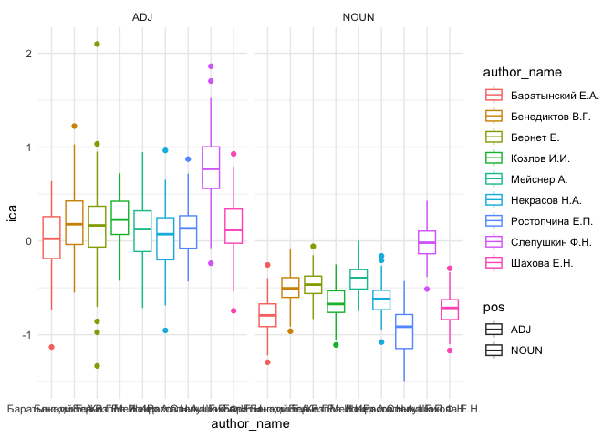

# 05_5_abstractness

## Abstract nouns & adj in rhyme

Load packages & data

``` r
library(tidyverse)
```

    Warning: package 'ggplot2' was built under R version 4.3.1

    Warning: package 'lubridate' was built under R version 4.3.1

    ── Attaching core tidyverse packages ──────────────────────── tidyverse 2.0.0 ──
    ✔ dplyr     1.1.3     ✔ readr     2.1.4
    ✔ forcats   1.0.0     ✔ stringr   1.5.0
    ✔ ggplot2   3.4.4     ✔ tibble    3.2.1
    ✔ lubridate 1.9.3     ✔ tidyr     1.3.0
    ✔ purrr     1.0.2     
    ── Conflicts ────────────────────────────────────────── tidyverse_conflicts() ──
    ✖ dplyr::filter() masks stats::filter()
    ✖ dplyr::lag()    masks stats::lag()
    ℹ Use the conflicted package (<http://conflicted.r-lib.org/>) to force all conflicts to become errors

``` r
library(MetBrewer)
theme_set(theme_minimal())
```

Dictionaries for abstractness / concreteness

``` r
dict_adj <- read.delim("../../data/ch5/dicts/adj_concreteness.csv", sep = ";") %>% 
  mutate(word = str_remove_all(word, "[[:punct:]]|[[:space:]]"), 
         index_c_a = str_replace_all(index_c_a, ",", "\\.")) %>% 
  mutate(index_c_a = as.numeric(index_c_a))

dict_noun <- read.delim("../../data/ch5/dicts/nouns_concreteness.csv", sep = ";") %>% 
  mutate(word = str_remove_all(word, "[[:punct:]]|[[:space:]]"), 
         index_c_a = str_replace_all(index_c_a, ",", "\\.")) %>% 
  mutate(index_c_a = as.numeric(index_c_a))

glimpse(dict_adj)
```

    Rows: 23,880
    Columns: 3
    $ word      <chr> "новенький", "кожаная", "самодельный", "шерстяной", "тоненьк…
    $ score     <chr> "76", "60", "49", "49", "46", "42", "42", "40", "36", "33", …
    $ index_c_a <dbl> 5.330733, 5.094345, 4.891820, 4.891820, 4.828641, 4.737670, …

``` r
glimpse(dict_noun)
```

    Rows: 63,951
    Columns: 3
    $ word      <chr> "туфельки", "шаровары", "сапожки", "горсовета", "плащи", "дж…
    $ score     <chr> "35", "35", "32", "31", "31", "31", "29", "27", "27", "26,75…
    $ index_c_a <dbl> 4.555348, 4.555348, 4.465736, 4.433987, 4.433987, 4.433987, …

``` r
dictionaries <- rbind(dict_adj, dict_noun) %>% rename(lemma = word) %>% select(-score)

head(dictionaries)
```

            lemma index_c_a
    1   новенький  5.330733
    2     кожаная  5.094345
    3 самодельный  4.891820
    4   шерстяной  4.891820
    5   тоненькая  4.828641
    6  старенький  4.737670

``` r
dictionaries %>% arrange(-desc(index_c_a)) %>% head()
```

              lemma index_c_a
    1     сочетание -4.914504
    2 необходимость -4.878136
    3     признание -4.878136
    4       явление -4.843045
    5   утверждение -4.843045
    6    воплощение -4.744604

## Corpus-1835 - Rhymes data

Words

``` r
rhyme_words <- read.csv("../../data/corpus1835/sql_db/rhyme_words_upd.csv", 
                        
                        # DON'T LET R EAT IAMBS AND DO INTEGER 01 => 1
                        colClasses = c("stress_pattern" = "character",
                                       "closure_pattern" = "character")) 

#glimpse(rhyme_words)

# write.csv(rhyme_words %>% select(word), file = "../../data/ch5/rhyme_words_lemmas.csv")

lemm <- read.csv("../../data/ch5/rhyme_words_lemmas.csv") %>% select(-X)

rhyme_words <- rhyme_words %>% 
  left_join(lemm, by = "word")


# rewrite pos tags
pos_transl <- tibble(old_tag = c("S", "V", "APRO", "SPRO", 
                   "A", "ADV", "NUM", "ADVPRO",
                   "INTJ", "PART", "PR", "ANUM", "CONJ"),
       pos = c("NOUN", "VERB", "PRON", "PRON", 
               "ADJ", "ADV", "NUM", "PRON",
               "INTJ", "PART", "ADP", "NUM", "CONJ")) # upos

# attach to the table with all words
rhyme_words <- rhyme_words %>% 
  rename(old_tag = pos) %>% 
  left_join(pos_transl, by = "old_tag")

head(rhyme_words)
```

            word    word_acc stress_pattern closure_pattern  closure old_tag
    1      краса      краса'             01               1     masc       S
    2    огневым    огневы'м            001               1     masc       S
    3 красавицей краса'вицей           0100             100 dactylic       S
    4        око        о'ко             10              10      fem       S
    5      силки      силки'             01               1     masc       S
    6     стонет     сто'нет             10              10      fem       V
                               feats ending_st     lemma  pos
    1               S,жен,неод=им,ед       са'     краса NOUN
    2  S,фам,муж,од=(дат,мн|твор,ед)       ы'м     огнев NOUN
    3               S,жен,од=твор,ед   а'вицей красавица NOUN
    4     S,сред,неод=(вин,ед|им,ед)      о'ко       око NOUN
    5      S,муж,неод=(вин,мн|им,мн)       ки'     силок NOUN
    6 V,несов,нп=непрош,ед,изъяв,3-л     о'нет   стонать VERB

Pairs

``` r
# load pairs
rhyme_pairs <- read.csv("../../data/corpus1835/sql_db/rhyme_pairs.csv") %>% 
  rename(text_id = poem_id) %>% 
  # remove Kulman texts
  filter(!str_detect(text_id, "C_264"))

# separate and rebind
w1 <- rhyme_pairs %>% 
  select(text_id, from) %>% 
  rename(word = from)

w2 <- rhyme_pairs %>% 
  select(text_id, to) %>% 
  rename(word = to)

w <- rbind(w1, w2)


# attach words characteristics
rw <- w %>% 
  left_join(rhyme_words, by = "word") 
```

Metadata: book/periodicals, authors

``` r
meta <- read.csv("../../data/corpus1835/sql_db/texts_metadata.csv")

# glimpse(meta)

authors_meta <- read_csv("../../data/corpus1835/sql_db/authors.csv") %>% 
  select(A_ID, author_name)
```

    Rows: 315 Columns: 11
    ── Column specification ────────────────────────────────────────────────────────
    Delimiter: ","
    chr (10): A_ID, author_name, author_full_name, author_sex, year_birth, year_...
    dbl  (1): aristocracy

    ℹ Use `spec()` to retrieve the full column specification for this data.
    ℹ Specify the column types or set `show_col_types = FALSE` to quiet this message.

``` r
meta <- meta %>% 
  left_join(authors_meta, by = "A_ID") %>% 
  mutate(corpus = str_extract(text_id, "^\\w")) %>% 
  select(text_id, corpus, meter, author_name)
```

Attach metadata to rhyme data & select columns

``` r
c35_rw <- rw %>% 
  left_join(meta, by = "text_id") %>% 
  select(text_id, corpus, meter, author_name, pos,
         word, lemma, closure) %>% 
  mutate(corpus = paste0("c1835_", corpus))

# sample_n(c35_rw, 5)

# total number of nouns and adj
table(c35_rw$pos)
```


      ADJ   ADP   ADV  CONJ  INTJ  NOUN   NUM  PART  PRON  VERB 
    19435    27  4648    15   140 83220   144   646 12681 41495 

Attach abstractness / concreteness index

``` r
# number of ADJ & Nouns supplied by index
c35_rw %>% 
  left_join(dictionaries, by = "lemma") %>% 
  filter(!is.na(index_c_a)) %>% 
  filter(pos == "NOUN" | pos == "ADJ") %>% 
  count(pos)
```

    Warning in left_join(., dictionaries, by = "lemma"): Detected an unexpected many-to-many relationship between `x` and `y`.
    ℹ Row 51 of `x` matches multiple rows in `y`.
    ℹ Row 81857 of `y` matches multiple rows in `x`.
    ℹ If a many-to-many relationship is expected, set `relationship =
      "many-to-many"` to silence this warning.

       pos     n
    1  ADJ 17734
    2 NOUN 71293

``` r
c35_rw <- c35_rw %>% 
  left_join(dictionaries, by = "lemma") 
```

    Warning in left_join(., dictionaries, by = "lemma"): Detected an unexpected many-to-many relationship between `x` and `y`.
    ℹ Row 51 of `x` matches multiple rows in `y`.
    ℹ Row 81857 of `y` matches multiple rows in `x`.
    ℹ If a many-to-many relationship is expected, set `relationship =
      "many-to-many"` to silence this warning.

``` r
sample_n(c35_rw, 5)
```

         text_id  corpus   meter    author_name  pos     word       lemma closure
    1   C_142__4 c1835_C    Iamb  Бороздна И.П. VERB наскучит наскучивать     fem
    2  C_208__16 c1835_C    Iamb    Сушков Д.П. VERB  дивится    дивиться     fem
    3 C_633__167 c1835_C    Iamb    Крылов И.А. VERB мелькают    мелькать     fem
    4      P_603 c1835_P Trochee Стромилов С.И. VERB    смела       сметь     fem
    5  C_249__12 c1835_C Trochee   Пожарский И. NOUN  счастья     счастие     fem
      index_c_a
    1        NA
    2        NA
    3        NA
    4        NA
    5        NA

Remove obsolete variables

``` r
rm(authors_meta, lemm, meta, pos_transl, w, w1, w2, rhyme_pairs, rhyme_words, rw)
```

## RNC rhymes

Load data

``` r
rnc_rhymes <- read.csv("../../data/ch5/nkrja_rhyme_pairs.csv") %>% select(-X)
# glimpse(rnc_rhymes)

######## metadata #########
# attach authors & meters
# load metadata to extract meters
load("../../data/nkrja_19th_lem.Rda")
rnc_ids <- c19 %>% 
  #filter(meter %in% c("Я", "Х")) %>% 
  mutate(poem_id = paste0("RNC_", Unnamed..0, "_", year), 
         meter = meter) %>% 
  select(poem_id, meter, author)

# attach to rhyme data
rnc_rhymes <- rnc_rhymes %>% 
  left_join(rnc_ids, by = "poem_id") %>% 
  rename(#text_id = poem_id, 
         author_name = author) %>% 
  separate(poem_id, into = c("corpus", "text_id", "year"), sep = "_") %>% 
  mutate(year = as.numeric(year),
         corpus = ifelse(year < 1810, "RNC_before 1810", corpus),
         corpus = ifelse(year > 1810 & year < 1830, "RNC_1810-1830", corpus),
         corpus = ifelse(year > 1840, "RNC_after 1840", corpus)) %>% 
  filter(corpus != "RNC")  ########## NB remove texts of 1830s

######## rhyme data preparation ##########
# separate rhyme pairs to just words
w1 <- rnc_rhymes %>% 
  select(text_id, corpus, from_pos, from, from_closure, meter, author_name) %>% 
  rename(pos = from_pos,
         word = from,
         closure = from_closure)

w2 <- rnc_rhymes %>% 
  select(text_id, corpus, to_pos, to, to_closure, meter, author_name) %>% 
  rename(pos = to_pos,
         word = to,
         closure = to_closure)

w <- rbind(w1, w2)

# glimpse(w)

####### lemma ##########
# add lemmata (preprocessed)
lemm <- read.csv("../../data/ch5/rnc_rhyme_words_lemmas.csv") %>% select(-X)

# glimpse(lemm)

rnc_rw <- cbind(w, lemm %>% select(lemma)) %>% 
  # reorder columns similarly as in c35_rw
  select(text_id, corpus, meter, author_name, pos, word, lemma, closure)

######## abstractness indexes #########
# attach c/a indexes by lemma
rnc_rw <- rnc_rw %>% 
  left_join(dictionaries, by = "lemma")
```

    Warning in left_join(., dictionaries, by = "lemma"): Detected an unexpected many-to-many relationship between `x` and `y`.
    ℹ Row 26 of `x` matches multiple rows in `y`.
    ℹ Row 72713 of `y` matches multiple rows in `x`.
    ℹ If a many-to-many relationship is expected, set `relationship =
      "many-to-many"` to silence this warning.

``` r
glimpse(rnc_rw) # final table
```

    Rows: 228,047
    Columns: 9
    $ text_id     <chr> "3870", "3870", "3870", "3870", "7246", "7246", "7246", "7…
    $ corpus      <chr> "RNC_before 1810", "RNC_before 1810", "RNC_before 1810", "…
    $ meter       <chr> "Я", "Я", "Я", "Я", "Я", "Я", "Я", "Я", "Я", "Я", "Я", "Я"…
    $ author_name <chr> "И. И. Дмитриев", "И. И. Дмитриев", "И. И. Дмитриев", "И. …
    $ pos         <chr> "NOUN", "VERB", "VERB", "VERB", "ADJ", "NOUN", "ADJ", "NOU…
    $ word        <chr> "кантемир", "равнялись", "блистал", "находился", "спокоен"…
    $ lemma       <chr> "кантемир", "равняться", "блистать", "находиться", "спокой…
    $ closure     <chr> "masc", "fem", "masc", "fem", "fem", "masc", "fem", "masc"…
    $ index_c_a   <dbl> NA, NA, NA, NA, -0.95686999, -0.90246759, -0.30859285, -0.…

``` r
# remove obsolete vars
rm(c19, lemm, rnc_ids, rnc_rhymes, w, w1, w2)
```

Merge RNC & Corpus-1835 data

``` r
colnames(rnc_rw) == colnames(c35_rw) # check
```

    [1] TRUE TRUE TRUE TRUE TRUE TRUE TRUE TRUE TRUE

``` r
rhyme_words <- rbind(rnc_rw, c35_rw)

sample_n(rhyme_words, 10)
```

         text_id          corpus   meter       author_name  pos       word
    1      12287   RNC_1810-1830       Я      А. С. Пушкин NOUN     взгляд
    2  C_194__18         c1835_C    Iamb Струговщиков А.Н.  ADV      везде
    3      P_287         c1835_P Anapest              <NA> NOUN        час
    4        391 RNC_before 1810       Я        И. П. Пнин VERB    создать
    5  C_241__66         c1835_C    Iamb       Башкатов А. VERB   заиграть
    6       3946 RNC_before 1810       Х    И. И. Дмитриев NOUN      зарею
    7      P_364         c1835_P    Iamb       Красов В.И.  ADJ   голубому
    8      17545 RNC_before 1810       Я    Г. Р. Державин  ADJ елисейском
    9        256   RNC_1810-1830       Я      В. Л. Пушкин PRON кантемиром
    10     17651 RNC_before 1810       Я    Г. Р. Державин NOUN      время
            lemma closure   index_c_a
    1      взгляд    masc -1.29461692
    2       везде    masc          NA
    3         час    masc -0.79938850
    4   создавать    masc          NA
    5    заиграть    masc          NA
    6        заря     fem -0.07880966
    7     голубой     fem  0.43612516
    8  елисейский     fem          NA
    9    кантемир     fem          NA
    10      время     fem -1.44299725

``` r
# number of words in each sub-corpus
rhyme_words %>% count(corpus)
```

               corpus      n
    1   RNC_1810-1830 105953
    2  RNC_after 1840  39171
    3 RNC_before 1810  82923
    4         c1835_C 102539
    5         c1835_P  62065

``` r
unique(rhyme_words$corpus)
```

    [1] "RNC_before 1810" "RNC_after 1840"  "RNC_1810-1830"   "c1835_P"        
    [5] "c1835_C"        

``` r
r <- tibble(corpus = unique(rhyme_words$corpus),
            corpus_nl = c("RNC_before 1810"))
```

## canon / archive

Random samples from different subcorpora

Collections VS periodicals

### avg abstractness / concreteness

``` r
x <- NULL
y <- NULL

for (i in 1:100) {

  x <- rhyme_words %>% 
    filter(!is.na(index_c_a)) %>% 
    filter(pos == "NOUN" | pos == "ADJ") %>% 
    group_by(corpus, pos) %>% 
    sample_n(1000) %>% 
    summarise(ica = mean(index_c_a))
  
  y <- rbind(x,y)
}

n <- factor(y$corpus, levels = c("RNC_before 1810", 
                                 "RNC_1810-1830",
                                 "c1835_C",
                                 "c1835_P",
                                 "RNC_after 1840"
                                 ))

y$corpus <- n

y %>% 
  ggplot(aes(x = corpus, y = ica, fill = pos)) + 
  geom_boxplot() + 
  geom_hline(yintercept = 0, lty = 2)
```


Examples of less abstract ADJ in Corpus-1835

### abstr / rel freq of the pos

``` r
# select n rhyme words for 1 iteration
sample_size <- 1000

s <- NULL  # sample
ind <- NULL  # temp var for indexes
x <- NULL  # storage
nr <- NULL # controll number of indexed rows

for (i in 1:100) {
  # take a sample of rhyme words 
  s <- rhyme_words %>% 
    group_by(corpus) %>% 
    sample_n(sample_size) 
  
  # count POS
  # s %>% 
  #  count(pos) %>% 
  #   mutate(perc = round((n/sample_size) * 100, 1))
  
  # count mean index
  ind <- s %>% 
    filter(!is.na(index_c_a)) %>% 
    filter(pos %in% c("ADJ", "NOUN")) %>% 
    group_by(pos, corpus) %>% 
    summarise(ica = mean(index_c_a))
  
  nr <- s %>% 
    filter(!is.na(index_c_a)) %>% 
    filter(pos %in% c("ADJ", "NOUN")) %>% 
    mutate(corpus_pos = paste0(corpus, "_", pos)) %>% 
    count(corpus_pos) %>% 
    rename(n_indexed = n) %>% 
    ungroup() %>% 
    select(-corpus)
  
  # nr
  # ind
  
  ind <- ind %>% 
    ungroup() %>% 
    # add column for joining
    mutate(corpus_pos = paste0(corpus, "_", pos)) %>% 
    
    # attach counter (rel freq) of all POS in the samples
    left_join(s %>% count(pos) %>% 
          mutate(perc = round((n/sample_size) * 100, 1),
             corpus_pos = paste0(corpus, "_", pos)) %>% 
          ungroup() %>% 
          select(-corpus, -pos),
      by = "corpus_pos"
    ) %>% 
    
    # add number of indexed words
    left_join(nr, by = "corpus_pos") %>% 
    
    mutate(itr = i, # add iteration counter
           perc_ind = round((n_indexed / n) * 100, 2)
           ) 
  
  
  x <- rbind(x, ind)
}

sample_n(x, 10)
```

    # A tibble: 10 × 9
       pos   corpus              ica corpus_pos     n  perc n_indexed   itr perc_ind
       <chr> <chr>             <dbl> <chr>      <int> <dbl>     <int> <int>    <dbl>
     1 NOUN  c1835_P         -0.530  c1835_P_N…   546  54.6       465    16     85.2
     2 ADJ   RNC_after 1840   0.251  RNC_after…   132  13.2       101    12     76.5
     3 NOUN  RNC_after 1840  -0.469  RNC_after…   524  52.4       420    12     80.2
     4 NOUN  RNC_before 1810 -0.484  RNC_befor…   461  46.1       350     3     75.9
     5 NOUN  c1835_P         -0.440  c1835_P_N…   491  49.1       430    45     87.6
     6 ADJ   c1835_C          0.292  c1835_C_A…   142  14.2       100    89     70.4
     7 ADJ   c1835_C         -0.0511 c1835_C_A…   114  11.4       100    58     87.7
     8 ADJ   c1835_C          0.315  c1835_C_A…   122  12.2       101    92     82.8
     9 ADJ   c1835_P          0.272  c1835_P_A…   126  12.6       105    76     83.3
    10 ADJ   c1835_P          0.211  c1835_P_A…   119  11.9        99   100     83.2

Check if number of indexed words is different in subcorpora

``` r
x %>% 
  ggplot(aes(x = corpus, y = perc_ind)) + 
  geom_boxplot(color = met.brewer("Veronese")[7]) + 
  geom_jitter(alpha = 0.3, color = met.brewer("Veronese")[7]) +
  facet_wrap(~pos)
```


``` r
unique(x$corpus)
```

    [1] "RNC_1810-1830"   "RNC_after 1840"  "RNC_before 1810" "c1835_C"        
    [5] "c1835_P"        

``` r
labels <- tibble(corpus = unique(x$corpus),
                 corpus_label = c("НКРЯ 1810-1830", 
                                  "НКРЯ после 1840",
                                  "НКРЯ 1775-1810",
                                  "Корпус-1835 Отд. изд.",
                                  "Корпус-1835 Периодика"))

pos_labels <- tibble(pos = unique(x$pos),
                     pos_label = c("Прилагательные", "Существительные"))


x %>% 
  filter(!corpus %in% c(
    #"RNC_1810-1830", 
    "RNC_after 1840")) %>% 
  left_join(labels, by = "corpus") %>% 
  left_join(pos_labels, by = "pos") %>% 
  ggplot(aes(x = perc, y = ica, color = corpus_label, shape = pos_label)) + 
  geom_point(alpha = 0.7, size = 2) + 
  geom_hline(yintercept = 0, linewidth = 0.1) + 
  #facet_wrap(~pos) + 
  labs(x = "Доля части речи от всех слов (100%)",
       y = "Средний коэф. абстрактности",
       color = "Корпус",
       shape = "Часть речи"
       #title = "More nouns -- more abstractions?",
       #subtitle = "Each dot is a random sample of 1000 rhyme words"
       ) + 
  scale_color_manual(values = c(met.brewer("Veronese")[3],
                                met.brewer("Veronese")[1],
                                met.brewer("Veronese")[7],
                                met.brewer("Veronese")[4])) + 
  scale_x_continuous(breaks = seq(0,60,10))
```


``` r
ggsave("plots/fig_5-2-3.png", plot = last_plot(), dpi = 300,
       height = 5, width = 7, bg = "white")
```

``` r
x %>% 
  filter(!corpus %in% c(
    #"RNC_1810-1830", 
    "RNC_after 1840")) %>% 
  ggplot(aes(x = perc, y = ica, color = corpus, shape = pos)) + 
  geom_jitter(alpha = 0.3) + 
  #geom_point(alpha = 0.8) + 
  geom_boxplot() + 
  geom_hline(yintercept = 0, linewidth = 0.1) + 
  #facet_wrap(~pos) + 
  labs(x = "POS relative frequency",
       y = "Mean conctreteness index",
       title = "More nouns -- more abstractions?",
       subtitle = "Each dot is a random sample of 1000 rhyme words") + 
  scale_color_manual(values = c(met.brewer("Veronese")[3],
                                met.brewer("Veronese")[1],
                                met.brewer("Veronese")[4],
                                met.brewer("Veronese")[7]))
```


Random samples from RNC 1810-1830 and Corpus-1835

``` r
x %>% 
  filter(!corpus %in% c(
    #"RNC_1810-1830" 
    "RNC_after 1840", "RNC_before 1810"
    )) %>% 
  ggplot(aes(x = perc, y = ica, color = corpus, shape = pos)) + 
  geom_point(alpha = 0.8) + 
  geom_hline(yintercept = 0, linewidth = 0.1) + 
  #facet_wrap(~pos) + 
  labs(x = "POS relative frequency",
       y = "Mean conctreteness index",
       title = "More nouns -- more abstractions?",
       subtitle = "Each dot is a random sample of 1000 rhyme words") + 
  scale_color_manual(values = c(met.brewer("Veronese")[3],
                                met.brewer("Veronese")[1],
                                met.brewer("Veronese")[4],
                                met.brewer("Veronese")[7]))
```


## authors

Same authors as in 5.2, only Corpus-1835 data

``` r
author_v <- c("Баратынский Е.А.", "Козлов И.И.", "Ростопчина Е.П.",
              "Бенедиктов В.Г.", "Бернет Е.", "Шахова Е.Н.",
              "Слепушкин Ф.Н.",  "Мейснер А.", "Некрасов Н.А."
             )

rhyme_words %>% 
  filter(author_name %in% author_v) %>% 
  count(author_name, sort = T) 
```

           author_name    n
    1  Бенедиктов В.Г. 4050
    2        Бернет Е. 3958
    3 Баратынский Е.А. 3890
    4       Мейснер А. 3186
    5      Шахова Е.Н. 3139
    6    Некрасов Н.А. 2884
    7      Козлов И.И. 1635
    8  Ростопчина Е.П. 1603
    9   Слепушкин Ф.Н. 1134

``` r
sample_size <- 100

s <- NULL
ind <- NULL
x <- NULL
nr <- NULL

for (i in 1:100) {
  s <- rhyme_words %>% 
    filter(author_name %in% author_v) %>% 
    group_by(author_name) %>% 
    sample_n(sample_size) %>% 
    ungroup()

  # count mean index
  ind <- s %>% 
    filter(!is.na(index_c_a)) %>% 
    filter(pos %in% c("ADJ", "NOUN")) %>% 
    group_by(pos, author_name) %>% 
    summarise(ica = mean(index_c_a))
  
  nr <- s %>% 
    filter(!is.na(index_c_a)) %>% 
    filter(pos %in% c("ADJ", "NOUN")) %>% 
    mutate(author_pos = paste0(author_name, "_", pos)) %>% 
    count(author_pos) %>% 
    rename(n_indexed = n)
  
  
  ind <- ind %>% 
    ungroup() %>% 
    # add column for joining
    mutate(author_pos = paste0(author_name, "_", pos)) %>% 
    
    # attach counter (rel freq) of all POS in the samples
    left_join(s %>% group_by(author_name) %>% count(pos) %>% 
          mutate(perc = round((n/sample_size) * 100, 1),
             author_pos = paste0(author_name, "_", pos)) %>% 
          ungroup() %>% 
          select(-author_name, -pos),
      by = "author_pos"
    ) %>% 
    
    # attach number of nouns & adj counted
    left_join(nr, by = "author_pos") %>% 
    
    mutate(itr = i, # add iteration counter
           perc_ind = round((n_indexed / n) * 100, 2)
           ) # iteration counter 
  
    x <- rbind(x, ind)
}

sample_n(x, 10)
```

    # A tibble: 10 × 9
       pos   author_name       ica author_pos       n  perc n_indexed   itr perc_ind
       <chr> <chr>           <dbl> <chr>        <int> <dbl>     <int> <int>    <dbl>
     1 NOUN  Козлов И.И.    -0.444 Козлов И.И.…    46    46        42    85     91.3
     2 ADJ   Бернет Е.      -0.116 Бернет Е._A…     6     6         5     2     83.3
     3 ADJ   Мейснер А.      0.523 Мейснер А._…    17    17        16    14     94.1
     4 ADJ   Слепушкин Ф.Н.  0.442 Слепушкин Ф…    24    24        22    80     91.7
     5 NOUN  Некрасов Н.А.  -0.856 Некрасов Н.…    48    48        34    14     70.8
     6 NOUN  Козлов И.И.    -0.674 Козлов И.И.…    43    43        41    73     95.4
     7 ADJ   Шахова Е.Н.     0.226 Шахова Е.Н.…    18    18        15    30     83.3
     8 NOUN  Шахова Е.Н.    -0.872 Шахова Е.Н.…    42    42        36    47     85.7
     9 NOUN  Бернет Е.      -0.294 Бернет Е._N…    57    57        48    79     84.2
    10 ADJ   Мейснер А.      0.549 Мейснер А._…    15    15        11    19     73.3

``` r
x %>% 
  ggplot(aes(x = author_name, y = perc_ind)) + 
  geom_boxplot(color = met.brewer("Veronese")[7]) + 
  geom_jitter(alpha = 0.3, color = met.brewer("Veronese")[7]) +
  facet_wrap(~pos) + 
  theme(axis.text.x = element_text(angle = 90))
```


``` r
x %>% 
  ggplot(aes(x = author_name, y = ica, color = author_name, shape = pos)) + 
  geom_boxplot() +
  facet_wrap(~pos)
```


``` r
x %>% 
  filter(author_name %in% c("Баратынский Е.А.", "Ростопчина Е.П.",
              "Бенедиктов В.Г.", 
              "Слепушкин Ф.Н.")) %>% 
  left_join(pos_labels, by = "pos") %>% 
  ggplot(aes(x = perc, y = ica, color = author_name, shape = pos_label)) + 
  geom_point(alpha = 0.8, size = 2) + 
  geom_hline(yintercept = 0, linewidth = 0.1) + 
  #facet_wrap(~pos) + 
  labs(x = "Доля части речи от всех слов (100%)",
       y = "Средний коэф. абстрактности",
       color = "Автор", 
       shape = "Часть речи") + 
  scale_color_manual(values = c(met.brewer("Kandinsky"))) + 
  scale_x_continuous(breaks = seq(0,60,10))
```



``` r
ggsave("plots/fig_5-2-4.png", plot = last_plot(), dpi = 300,
       height = 5, width = 7, bg = "white")
```

``` r
rhyme_words %>% 
  filter(pos %in% c("ADJ", "NOUN")) %>%
  filter(author_name == "Слепушкин Ф.Н.") %>% 
  filter(!is.na(index_c_a) & index_c_a > 0.15) %>% 
  select(word, index_c_a) %>% 
  arrange(desc(index_c_a)) %>% head(20)
```

            word index_c_a
    1  шерстяной  4.891820
    2  расписных  3.944439
    3  расписной  3.944439
    4     бруски  3.772589
    5     измяты  3.639057
    6     измяты  3.639057
    7     сухари  3.197225
    8     хоромы  3.001480
    9    садовой  2.945910
    10  укромной  2.945910
    11   образок  2.540452
    12  калачами  2.466329
    13  калачами  2.466329
    14    калачи  2.466329
    15    калачи  2.466329
    16 рязанской  2.435085
    17    арканы  2.386294
    18     аркан  2.386294
    19    чуланы  2.386294
    20      штоф  2.386294
