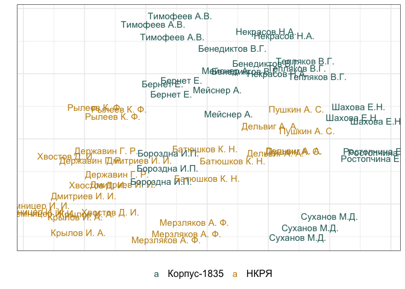
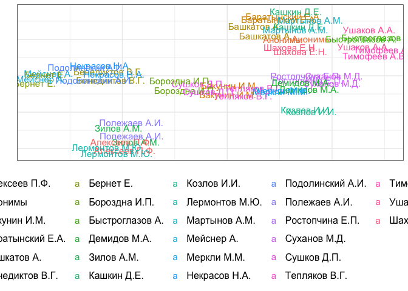

# 05_5_distances

## load data

``` r
library(tidyverse)
```

    Warning: package 'ggplot2' was built under R version 4.3.1

    Warning: package 'tidyr' was built under R version 4.3.1

    Warning: package 'dplyr' was built under R version 4.3.1

    Warning: package 'lubridate' was built under R version 4.3.1

    ── Attaching core tidyverse packages ──────────────────────── tidyverse 2.0.0 ──
    ✔ dplyr     1.1.4     ✔ readr     2.1.4
    ✔ forcats   1.0.0     ✔ stringr   1.5.0
    ✔ ggplot2   3.5.1     ✔ tibble    3.2.1
    ✔ lubridate 1.9.3     ✔ tidyr     1.3.1
    ✔ purrr     1.0.2     
    ── Conflicts ────────────────────────────────────────── tidyverse_conflicts() ──
    ✖ dplyr::filter() masks stats::filter()
    ✖ dplyr::lag()    masks stats::lag()
    ℹ Use the conflicted package (<http://conflicted.r-lib.org/>) to force all conflicts to become errors

``` r
library(umap)

library(MetBrewer)
library(ggrepel)
```

    Warning: package 'ggrepel' was built under R version 4.3.1

``` r
theme_set(theme_minimal())
```

### Corpus-1835

``` r
rhyme_words <- read.csv("../../data/corpus1835/sql_db/rhyme_words.csv", 
                        
                        # DON'T LET R EAT IAMBS AND DO INTEGER 01 => 1
                        colClasses = c("stress_pattern" = "character",
                                       "closure_pattern" = "character")) 

lemm <- read.csv("../../data/ch5/rhyme_words_lemmas.csv") %>% select(-X)

rhyme_words <- rhyme_words %>% 
  left_join(lemm, by = "word")


# rewrite pos tags
pos_transl <- tibble(old_tag = c("S", "V", "APRO", "SPRO", 
                   "A", "ADV", "NUM", "ADVPRO",
                   "INTJ", "PART", "PR", "ANUM", "CONJ"),
       pos = c("NOUN", "VERB", "PRON", "PRON", 
               "ADJ", "ADV", "NUM", "PRON",
               "INTJ", "PART", "ADP", "NUM", "CONJ")) # upos

# attach to the table with all words
rhyme_words <- rhyme_words %>% 
  rename(old_tag = pos) %>% 
  left_join(pos_transl, by = "old_tag")

############ load rhyme pairs & separate them as lists of words #######
# load pairs
rhyme_pairs <- read.csv("../../data/corpus1835/sql_db/rhyme_pairs.csv") %>% 
  rename(text_id = poem_id) %>% 
  # remove Kulman texts
  filter(!str_detect(text_id, "C_264"))

# separate and rebind
w1 <- rhyme_pairs %>% 
  select(text_id, from) %>% 
  rename(word = from)

w2 <- rhyme_pairs %>% 
  select(text_id, to) %>% 
  rename(word = to)

w <- rbind(w1, w2)


# attach words characteristics
rw <- w %>% 
  left_join(rhyme_words, by = "word") 

########## load metadata #############
meta <- read.csv("../../data/corpus1835/sql_db/texts_metadata.csv")

# glimpse(meta)

authors_meta <- read_csv("../../data/corpus1835/sql_db/authors.csv") %>% 
  select(A_ID, author_name)
```

    Rows: 315 Columns: 11
    ── Column specification ────────────────────────────────────────────────────────
    Delimiter: ","
    chr (10): A_ID, author_name, author_full_name, author_sex, year_birth, year_...
    dbl  (1): aristocracy

    ℹ Use `spec()` to retrieve the full column specification for this data.
    ℹ Specify the column types or set `show_col_types = FALSE` to quiet this message.

``` r
meta <- meta %>% 
  left_join(authors_meta, by = "A_ID") %>% 
  mutate(corpus = str_extract(text_id, "^\\w")) %>% 
  select(text_id, corpus, meter, author_name)

# attach metadata
c35_rw <- rw %>% 
  left_join(meta, by = "text_id") %>% 
  
  # add POS_syl counter
  mutate(syl_len = nchar(stress_pattern),
         pos_syl = paste0(pos, "_", syl_len)) %>% 
  
  select(text_id, corpus, meter, author_name, 
         word, lemma, closure,
         ending_st,
         pos_syl) %>% 
  mutate(corpus = paste0("c1835_", corpus))
```

    Warning in left_join(., meta, by = "text_id"): Detected an unexpected many-to-many relationship between `x` and `y`.
    ℹ Row 2118 of `x` matches multiple rows in `y`.
    ℹ Row 1014 of `y` matches multiple rows in `x`.
    ℹ If a many-to-many relationship is expected, set `relationship =
      "many-to-many"` to silence this warning.

``` r
# final view of the data
sample_n(c35_rw, 5)
```

        text_id  corpus meter    author_name     word     lemma closure ending_st
    1 C_633__18 c1835_C  Iamb    Крылов И.А.   полете     полет     fem      е'те
    2 C_111__90 c1835_C  Iamb     Мейснер А. зазвучат зазвучать    masc       а'т
    3  C_92__51 c1835_C  Iamb Жуковский В.А.    шумел    шуметь    masc       е'л
    4     P_113 c1835_P  Iamb    Козлов И.И.     бурь      буря    masc      у'рь
    5    P_1709 c1835_P  Iamb           <NA>    мечты     мечта    masc       ты'
      pos_syl
    1  NOUN_3
    2  VERB_3
    3  VERB_2
    4  NOUN_1
    5  NOUN_2

``` r
rm(authors_meta, lemm, meta, pos_transl, w, w1, w2, rhyme_pairs, rhyme_words, rw)
```

### RNC

``` r
rnc_rhymes <- read.csv("../../data/ch5/nkrja_rhyme_pairs.csv") %>% select(-X)
# glimpse(rnc_rhymes)

######## metadata #########
# attach authors & meters
# load metadata to extract meters
load("../../data/nkrja_19th_lem.Rda")
rnc_ids <- c19 %>% 
  #filter(meter %in% c("Я", "Х")) %>% 
  mutate(poem_id = paste0("RNC_", Unnamed..0, "_", year), 
         meter = meter) %>% 
  select(poem_id, meter, author)

# attach to rhyme data
rnc_rhymes <- rnc_rhymes %>% 
  left_join(rnc_ids, by = "poem_id") %>% 
  rename(#text_id = poem_id, 
         author_name = author) %>% 
  separate(poem_id, into = c("corpus", "text_id", "year"), sep = "_") %>% 
  mutate(year = as.numeric(year),
         corpus = ifelse(year < 1810, "RNC_before 1810", corpus),
         corpus = ifelse(year > 1810 & year < 1830, "RNC_1810-1830", corpus),
         corpus = ifelse(year > 1840, "RNC_after 1840", corpus)) %>% 
  filter(corpus != "RNC")  ########## NB remove texts of 1830s

######## rhyme data preparation ##########
# separate rhyme pairs to just words
w1 <- rnc_rhymes %>% 
  mutate(n_syl = nchar(from_sp),
         pos_syl = paste0(from_pos, "_", n_syl)) %>% 
  select(text_id, corpus, from_pos, from, from_closure, meter, author_name,
         pos_syl, from_ending_st) %>% 
  rename(pos = from_pos,
         word = from,
         closure = from_closure, 
         ending_st = from_ending_st)

w2 <- rnc_rhymes %>% 
  mutate(n_syl = nchar(to_sp),
         pos_syl = paste0(to_pos, "_", n_syl)) %>% 
  select(text_id, corpus, to_pos, to, to_closure, meter, author_name, 
         pos_syl, to_ending_st) %>% 
  rename(pos = to_pos,
         word = to,
         closure = to_closure,
         ending_st = to_ending_st)

w <- rbind(w1, w2)

# glimpse(w)

####### lemma ##########
# add lemmata (preprocessed)
lemm <- read.csv("../../data/ch5/rnc_rhyme_words_lemmas.csv") %>% select(-X)

# glimpse(lemm)

rnc_rw <- cbind(w, lemm %>% select(lemma)) %>% 
  # reorder columns similarly as in c35_rw
  select(text_id, corpus, meter, author_name, word, lemma, closure, 
         ending_st, pos_syl)

glimpse(rnc_rw) # final table
```

    Rows: 225,702
    Columns: 9
    $ text_id     <chr> "3870", "3870", "3870", "3870", "7246", "7246", "7246", "7…
    $ corpus      <chr> "RNC_before 1810", "RNC_before 1810", "RNC_before 1810", "…
    $ meter       <chr> "Я", "Я", "Я", "Я", "Я", "Я", "Я", "Я", "Я", "Я", "Я", "Я"…
    $ author_name <chr> "И. И. Дмитриев", "И. И. Дмитриев", "И. И. Дмитриев", "И. …
    $ word        <chr> "кантемир", "равнялись", "блистал", "находился", "спокоен"…
    $ lemma       <chr> "кантемир", "равняться", "блистать", "находиться", "спокой…
    $ closure     <chr> "masc", "fem", "masc", "fem", "fem", "masc", "fem", "masc"…
    $ ending_st   <chr> "и'р", "я'лись", "а'л", "и'лся", "о'ен", "гу'", "я'ми", "у…
    $ pos_syl     <chr> "NOUN_3", "VERB_3", "VERB_2", "VERB_4", "ADJ_3", "NOUN_2",…

``` r
# remove obsolete vars
rm(c19, lemm, rnc_ids, rnc_rhymes, w, w1, w2)
```

``` r
colnames(c35_rw) == colnames(rnc_rw)
```

    [1] TRUE TRUE TRUE TRUE TRUE TRUE TRUE TRUE TRUE

``` r
rhyme_words <- rbind(c35_rw, rnc_rw)

masc_rhymes <- rhyme_words %>% filter(closure == "masc" & corpus != "RNC_after 1840")

fem_rhymes <- rhyme_words %>% filter(closure == "fem" & corpus != "RNC_after 1840")
```

### 

### Totals - corpus

``` r
totals_masc <- masc_rhymes %>% 
  group_by(corpus) %>% 
  count()

totals_fem <- fem_rhymes %>% 
  group_by(corpus) %>% 
  count()

totals_masc %>% left_join(totals_fem %>% rename(n_fem = n), by = "corpus")
```

    # A tibble: 4 × 3
    # Groups:   corpus [4]
      corpus              n n_fem
      <chr>           <int> <int>
    1 RNC_1810-1830   50499 48582
    2 RNC_before 1810 37479 39922
    3 c1835_C         51379 47837
    4 c1835_P         31337 28195

### Totals - authors

``` r
c35_rw %>% 
  filter(!is.na(author_name)) %>% 
  group_by(author_name) %>% 
  count(sort = T) %>% 
  head(40)
```

    # A tibble: 40 × 2
    # Groups:   author_name [40]
       author_name          n
       <chr>            <int>
     1 Жуковский В.А.    7382
     2 Крылов И.А.       6402
     3 Бороздна И.П.     4676
     4 Быстроглазов А.   4082
     5 Бенедиктов В.Г.   4010
     6 Бернет Е.         3914
     7 Баратынский Е.А.  3830
     8 Мейснер А.        3158
     9 Смирнова А.       3132
    10 Шахова Е.Н.       3090
    # ℹ 30 more rows

``` r
rnc_rw %>% 
  group_by(author_name) %>% 
  count(sort = T) %>% 
  head(40)
```

    # A tibble: 40 × 2
    # Groups:   author_name [40]
       author_name         n
       <chr>           <int>
     1 В. А. Жуковский 17012
     2 А. С. Пушкин    14624
     3 Г. Р. Державин  12700
     4 Н. М. Языков     8814
     5 И. И. Дмитриев   8214
     6 П. А. Вяземский  6106
     7 И. А. Крылов     5992
     8 В. В. Капнист    5928
     9 И. И. Хемницер   5128
    10 Н. М. Карамзин   4908
    # ℹ 30 more rows

## Features

### MFW in rhyme

``` r
masc_MFW_50 <- masc_rhymes %>%  
  count(lemma, sort = T) %>%  # here I count lemmas
  head(50) %>% 
  mutate(rank = row_number())

fem_MFW_50 <- fem_rhymes %>% 
  count(lemma, sort = T) %>% 
  head(50) %>% 
  mutate(rank = row_number())

head(masc_MFW_50)
```

      lemma    n rank
    1     я 3694    1
    2   мой 2956    2
    3    ты 2201    3
    4  свой 1861    4
    5    он 1807    5
    6   она 1704    6

``` r
head(fem_MFW_50)
```

        lemma   n rank
    1   слава 801    1
    2    душа 796    2
    3    рука 766    3
    4 природа 725    4
    5   знать 692    5
    6     око 614    6

``` r
s <- rhyme_words %>% 
  group_by(corpus) %>% 
  sample_n(10000)

mfw <- s %>% 
  filter(word %in% masc_MFW_50$lemma | word %in% fem_MFW_50$lemma) %>% 
  count(lemma) %>% 
  pivot_wider(names_from = lemma, values_from = n, values_fill = 0)

# mfw

mfw[,1:7]
```

### MF endings

``` r
masc_ending_50 <- masc_rhymes %>%  
  count(ending_st, sort = T) %>% 
  head(50) %>% 
  mutate(rank = row_number())

fem_ending_50 <- fem_rhymes %>% 
  count(ending_st, sort = T) %>% 
  head(50) %>% 
  mutate(rank = row_number())

head(masc_ending_50)
```

      ending_st     n rank
    1       о'й 14738    1
    2       е'й  9364    2
    3       а'л  5788    3
    4       и'т  5221    4
    5      а'ть  4675    5
    6       о'в  4636    6

``` r
head(fem_ending_50)
```

      ending_st    n rank
    1       о'ю 6351    1
    2      а'ет 5798    2
    3      а'ми 4372    3
    4     е'нье 3235    4
    5       а'я 3143    5
    6     е'нья 3098    6

``` r
mf_endings <- s %>% 
  filter(ending_st %in% masc_ending_50$ending_st | 
           ending_st %in% fem_ending_50$ending_st) %>% 
  count(ending_st) %>% 
  pivot_wider(names_from = ending_st, values_from = n, values_fill = 0)

mf_endings[,1:7]
dim(mf_endings)
```

### MF pos_syl

``` r
masc_possyl_25 <- masc_rhymes %>%  
  mutate(pos_syl = paste0(pos_syl, "_masc")) %>% 
  count(pos_syl, sort = T) %>%  
  head(25) %>% 
  mutate(rank = row_number())

fem_possyl_25 <- fem_rhymes %>% 
  mutate(pos_syl = paste0(pos_syl, "_fem")) %>% 
  count(pos_syl, sort = T) %>% 
  head(25) %>% 
  mutate(rank = row_number())

head(masc_possyl_25)
```

          pos_syl     n rank
    1 NOUN_2_masc 49782    1
    2 NOUN_1_masc 25772    2
    3 VERB_2_masc 20226    3
    4 VERB_3_masc 14439    4
    5 NOUN_3_masc 14116    5
    6 PRON_1_masc  9369    6

``` r
head(fem_possyl_25)
```

         pos_syl     n rank
    1 NOUN_3_fem 40711    1
    2 NOUN_2_fem 27944    2
    3 VERB_3_fem 18667    3
    4 VERB_4_fem 17953    4
    5  ADJ_3_fem 14234    5
    6 NOUN_4_fem 12204    6

``` r
mf_possyl <- s %>% 
  filter(pos_syl %in% masc_possyl_50$pos_syl | 
           pos_syl %in% fem_possyl_50$pos_syl) %>% 
  count(pos_syl) %>% 
  pivot_wider(names_from = pos_syl, values_from = n, values_fill = 0)

mf_possyl[,1:7]
dim(mf_possyl)
```

MDS

``` r
x <- NULL

for (i in 1:100) {
  
  # take a sample
  s <- rhyme_words %>% 
    filter(corpus != "RNC_after 1840") %>% 
    group_by(corpus) %>% 
    sample_n(10000)
  
  # calculate inside the sample:
  mfw <- s %>% 
    filter(word %in% masc_MFW_50$word | word %in% fem_MFW_50$word) %>% 
    count(word) %>% 
    pivot_wider(names_from = word, values_from = n, values_fill = 0)
  
  mf_endings <- s %>% 
    filter(ending_st %in% masc_ending_50$ending_st | 
             ending_st %in% fem_ending_50$ending_st) %>% 
    count(ending_st) %>% 
    pivot_wider(names_from = ending_st, values_from = n, values_fill = 0)
  
  mf_possyl <- s %>% 
    filter(pos_syl %in% masc_possyl_50$pos_syl | 
             pos_syl %in% fem_possyl_50$pos_syl) %>% 
    count(pos_syl) %>% 
    pivot_wider(names_from = pos_syl, values_from = n, values_fill = 0)
  
  # bind together
  f <- cbind(mfw, mf_endings[, -1], mf_possyl[, -1])
  
  f <- f %>% 
    mutate(smpl = i)
  
  f[is.na(f)] <- 0 # remove na
  
  x <- rbind(x, f)
  
}

x

n <- x$corpus

x[is.na(x)] <- 0

xxx <- x

mtrx <- x %>% 
  ungroup() %>% 
  select(-corpus, -smpl) %>% 
  scale() %>% 
  as.matrix()

distances <- dist(mtrx, method = "euclidean")
  
mds <- cmdscale(distances, eig = TRUE, k = 2)
  
proj <- tibble(x = mds$points[,1], 
                 y = mds$points[,2],
                 corpus = n)

proj

proj %>% 
  ggplot(aes(x, y, color = corpus, shape = corpus)) + 
  geom_point(data = proj, aes(x, y))

# first take samples, as 1 sample = 1 author
# then project ALL at the same time in the same space
```

``` r
u <- umap(xxx %>% 
  ungroup() %>% 
  select(-corpus, -smpl))

tibble(x=u$layout[,1],
       y=u$layout[,2],
       author=xxx$corpus) %>%
  ggplot(aes(x,y,color=author)) + 
  geom_point() + 
  #geom_text(aes(label=author),size=6) + 
  theme_bw() + 
  #guides(color="none") + 
  scale_color_viridis_d() 
```

## Authors

### select authors

simple 10 authors selection

``` r
authors_slctd <- tibble(
  author_name = c("Бенедиктов В.Г.", "Бернет Е.", "Тимофеев А.В.", 
               "Некрасов Н.А.", "Суханов М.Д.", "Бороздна И.П.", 
               "Ростопчина Е.П.", "Мейснер А.", "Шахова Е.Н.", "Тепляков В.Г.",
               
              # "Быстроглазов А.", "Демидов М.А.", "Башкатов А.", 
              # "Зилов А.М.", "Меркли М.М.",
               
               "Г. Р. Державин", "К. Н. Батюшков", "А. С. Пушкин",
               "А. А. Дельвиг", "А. Ф. Мерзляков", "И. И. Дмитриев",
               "Д. И. Хвостов", "И. И. Хемницер", "К. Ф. Рылеев", "И. А. Крылов"
               ),
  corpus = c(rep("Корпус-1835", 10), rep("НКРЯ", 10))
)

authors_slctd
```

    # A tibble: 20 × 2
       author_name     corpus     
       <chr>           <chr>      
     1 Бенедиктов В.Г. Корпус-1835
     2 Бернет Е.       Корпус-1835
     3 Тимофеев А.В.   Корпус-1835
     4 Некрасов Н.А.   Корпус-1835
     5 Суханов М.Д.    Корпус-1835
     6 Бороздна И.П.   Корпус-1835
     7 Ростопчина Е.П. Корпус-1835
     8 Мейснер А.      Корпус-1835
     9 Шахова Е.Н.     Корпус-1835
    10 Тепляков В.Г.   Корпус-1835
    11 Г. Р. Державин  НКРЯ       
    12 К. Н. Батюшков  НКРЯ       
    13 А. С. Пушкин    НКРЯ       
    14 А. А. Дельвиг   НКРЯ       
    15 А. Ф. Мерзляков НКРЯ       
    16 И. И. Дмитриев  НКРЯ       
    17 Д. И. Хвостов   НКРЯ       
    18 И. И. Хемницер  НКРЯ       
    19 К. Ф. Рылеев    НКРЯ       
    20 И. А. Крылов    НКРЯ       

### MFW50 + MF endings 50 + MF pos-syl 25

``` r
x <- NULL

for (i in 1:3) {
  # take a sample
  s <- rhyme_words %>% 
    filter(author_name %in% authors_slctd$author_name) %>% 
    mutate(author_name = str_replace(author_name, 
                                     "(^\\w\\. \\w\\. )(\\w+)$",
                                     "\\2 \\1"
                                     )) %>% 
    group_by(author_name) %>% 
    sample_n(1000)

  # calculate inside the sample:
  mfw <- s %>% 
    filter(lemma %in% masc_MFW_50$lemma | lemma %in% fem_MFW_50$lemma) %>% 
    count(lemma) %>% 
    pivot_wider(names_from = lemma, values_from = n, values_fill = 0)
  
  mf_endings <- s %>% 
    filter(ending_st %in% masc_ending_50$ending_st | 
             ending_st %in% fem_ending_50$ending_st) %>% 
    count(ending_st) %>% 
    pivot_wider(names_from = ending_st, values_from = n, values_fill = 0)
  
  mf_possyl_masc <- s %>% 
    filter(closure == "masc") %>% 
    mutate(pos_syl = paste0(pos_syl, "_masc")) %>% 
    filter(pos_syl %in% masc_possyl_25$pos_syl) %>% 
    count(pos_syl) %>% 
    pivot_wider(names_from = pos_syl, values_from = n, values_fill = 0)
  
  mf_possyl_fem <- s %>% 
    filter(closure == "fem") %>% 
    mutate(pos_syl = paste0(pos_syl, "_fem")) %>% 
    filter(pos_syl %in% fem_possyl_25$pos_syl) %>% 
    count(pos_syl) %>% 
    pivot_wider(names_from = pos_syl, values_from = n, values_fill = 0)
  
  
  # bind together
  f <- cbind(mfw, mf_endings[, -1], mf_possyl_masc[, -1], mf_possyl_fem[, -1])
  
  f <- f %>% 
    mutate(smpl = i)
  
  f[is.na(f)] <- 0 # remove na
  
  x <- rbind(x, f)
}  
  
x
```

    # A tibble: 60 × 237
    # Groups:   author_name [20]
       author_name     блистать   бог  быть венец внимать  вода волна    вы говорить
       <chr>              <int> <int> <int> <int>   <int> <int> <int> <int>    <int>
     1 "Батюшков К. Н…        2     3     3     3       1     4     3     2        3
     2 "Бенедиктов В.…        1     2     1     2       1     3     3     2        3
     3 "Бернет Е."            1     2     4     0       2     2     1     0        3
     4 "Бороздна И.П."        5     1     6     0       0     6     2     2        1
     5 "Дельвиг А. А.…        0     7     3     2       1     1     2     6        4
     6 "Державин Г. Р…        3     4     0     3       3     2     5     0        1
     7 "Дмитриев И. И…        1     6     2     0       0     4     1     2        6
     8 "Крылов И. А. "        1     3     8     1       0     4     0     2        7
     9 "Мейснер А."           2     2     3     0       1     1     3     1        0
    10 "Мерзляков А. …        0     7     5     1       2     1     3     3        3
    # ℹ 50 more rows
    # ℹ 227 more variables: год <int>, гора <int>, грудь <int>, давать <int>,
    #   день <int>, друг <int>, душа <int>, желание <int>, жить <int>, земля <int>,
    #   золотой <int>, красота <int>, лира <int>, любить <int>, любовь <int>,
    #   мечта <int>, мечтание <int>, мир <int>, могила <int>, мой <int>,
    #   молодой <int>, море <int>, мы <int>, наслаждение <int>, небо <int>,
    #   нет <int>, огонь <int>, один <int>, око <int>, он <int>, она <int>, …

``` r
dim(x)
```

    [1]  60 237

``` r
xxx <- x
  
# matrix
mtrx <- xxx %>% 
  ungroup() %>% 
  select(-author_name, -smpl) %>% 
  scale()

u <- umap(mtrx)

tibble(x = u$layout[,1],
       y = u$layout[,2],
       author_name = xxx$author_name) %>%
  left_join(authors_slctd %>% mutate(author_name = str_replace(author_name, 
                                     "(^\\w\\. \\w\\. )(\\w+)$",
                                     "\\2 \\1"
                                     )), 
            by = "author_name") %>% 
  ggplot(aes(x, y, color = corpus)) + 
  #geom_point() + 
  geom_text(aes(label = author_name), 
            size = 4) + 
  theme_bw() + 
  scale_color_manual(values = c(met.brewer("Veronese")[5], 
                                met.brewer("Veronese")[3])) + 
  labs(x = "", y = "", color = "") + 
  theme(legend.position = "bottom",
        axis.title.x = element_blank(), 
        axis.text = element_blank(),
        axis.ticks = element_blank(),
        legend.text = element_text(size = 12))
```


``` r
ggsave("plots/fig_5-3-1_mfw-gr.png", plot = last_plot(), dpi = 300,
       bg = "white", width = 11, height = 7)
```

### Grammar: MF endings 50 + MF syl-pos 25

Same without words

``` r
x <- NULL
s <- NULL

for (i in 1:3) {
  # take a sample
  s <- rhyme_words %>% 
    filter(author_name %in% authors_slctd$author_name) %>% 
    mutate(author_name = str_replace(author_name, 
                                     "(^\\w\\. \\w\\. )(\\w+)$",
                                     "\\2 \\1"
                                     )) %>% 
    group_by(author_name) %>% 
    sample_n(1000)

  mf_endings <- s %>% 
    filter(ending_st %in% masc_ending_50$ending_st | 
             ending_st %in% fem_ending_50$ending_st) %>% 
    count(ending_st) %>% 
    pivot_wider(names_from = ending_st, values_from = n, values_fill = 0)
  
  mf_possyl_masc <- s %>% 
    filter(closure == "masc") %>% 
    mutate(pos_syl = paste0(pos_syl, "_masc")) %>% 
    filter(pos_syl %in% masc_possyl_25$pos_syl) %>% 
    count(pos_syl) %>% 
    pivot_wider(names_from = pos_syl, values_from = n, values_fill = 0)
  
  mf_possyl_fem <- s %>% 
    filter(closure == "fem") %>% 
    mutate(pos_syl = paste0(pos_syl, "_fem")) %>% 
    filter(pos_syl %in% fem_possyl_25$pos_syl) %>% 
    count(pos_syl) %>% 
    pivot_wider(names_from = pos_syl, values_from = n, values_fill = 0)
  
  
  # bind together
  f <- cbind(#mfw, 
    mf_endings, mf_possyl_masc[, -1], mf_possyl_fem[, -1])
  
  f <- f %>% 
    mutate(smpl = i)
  
  f[is.na(f)] <- 0 # remove na
  
  x <- rbind(x, f)
}  
  
#x
# dim(x)

xxx <- x
  
# matrix
mtrx <- xxx %>% 
  ungroup() %>% 
  select(-author_name, -smpl) #%>% 
  #scale()

# u <- umap(mtrx)
```

``` r
u <- readRDS("../../data/ch5/fig_5-3-1.Rds") # load projection used as Fig_5-3-1

tibble(x = u$layout[,1],
       y = u$layout[,2],
       author_name = xxx$author_name) %>%
  left_join(authors_slctd %>% mutate(author_name = str_replace(author_name, 
                                     "(^\\w\\. \\w\\. )(\\w+)$",
                                     "\\2 \\1"
                                     )), 
            by = "author_name") %>% 
  ggplot(aes(x, y, color = corpus)) + 
  geom_text(aes(label = author_name), 
            size = 4) + 
  theme_bw() + 
  scale_color_manual(values = c(met.brewer("Veronese")[5], 
                                met.brewer("Veronese")[3])) + 
  labs(x = "", y = "", color = "") + 
  theme(legend.position = "bottom",
        axis.title.x = element_blank(), 
        axis.text = element_blank(),
        axis.ticks = element_blank(),
        legend.text = element_text(size = 12)) 
```


``` r
ggsave("plots/fig_5-3-1.png", plot = last_plot(), dpi = 300, bg = "white",
       width = 10, height = 7)
```

#### BW

``` r
tibble(x = u$layout[,1],
       y = u$layout[,2],
       author_name = xxx$author_name) %>%
  left_join(authors_slctd %>% mutate(author_name = str_replace(author_name, 
                                     "(^\\w\\. \\w\\. )(\\w+)$",
                                     "\\2 \\1"
                                     )), 
            by = "author_name") %>% 
  ggplot(aes(x, y, color = corpus)) + 
  geom_text(aes(label = author_name), 
            size = 4) + 
  theme_bw() + 
  scale_color_manual(values = c("black", "grey70")) + 
  labs(x = "", y = "", color = "") + 
  theme(legend.position = "bottom",
        axis.title.x = element_blank(), 
        axis.text = element_blank(),
        axis.ticks = element_blank(),
        legend.text = element_text(size = 12)) 

ggsave("plots/bw/fig_5-3-1.png", plot = last_plot(), dpi = 300, bg = "white",
       width = 10, height = 7)
```

``` r
#saveRDS(u, file = "../../data/ch5/fig_5-3-1.Rds")
```

### MFW 200

``` r
masc_MFW_200 <- masc_rhymes %>%  
  count(lemma, sort = T) %>%  # here I count lemmas
  head(200) %>% 
  mutate(rank = row_number())

fem_MFW_200 <- fem_rhymes %>% 
  count(lemma, sort = T) %>% 
  head(200) %>% 
  mutate(rank = row_number())

head(masc_MFW_200)
```

      lemma    n rank
    1     я 3694    1
    2   мой 2956    2
    3    ты 2201    3
    4  свой 1861    4
    5    он 1807    5
    6   она 1704    6

``` r
head(fem_MFW_200)
```

        lemma   n rank
    1   слава 801    1
    2    душа 796    2
    3    рука 766    3
    4 природа 725    4
    5   знать 692    5
    6     око 614    6

``` r
x <- NULL
s <- NULL
xxx <- NULL
u <- NULL
f <- NULL

for (i in 1:3) {
  # take a sample
  s <- rhyme_words %>% 
    filter(author_name %in% authors_slctd$author_name) %>% 
    mutate(author_name = str_replace(author_name, 
                                     "(^\\w\\. \\w\\. )(\\w+)$",
                                     "\\2 \\1"
                                     )) %>% 
    group_by(author_name) %>% 
    sample_n(1000)

  #calculate inside the sample:
  mfw <- s %>%
     filter(lemma %in% masc_MFW_200$lemma | lemma %in% fem_MFW_200$lemma) %>%
     count(lemma) %>%
     pivot_wider(names_from = lemma, values_from = n, values_fill = 0)
  
  
  f <- mfw %>% 
    mutate(smpl = i)
  
  f[is.na(f)] <- 0 # remove na
  
  x <- rbind(x, f)
}  
  
x[is.na(x)] <- 0
dim(x)


xxx <- x
  
# matrix
mtrx <- xxx %>% 
  ungroup() %>% 
  select(-author_name, -smpl) #%>% 
  #scale()

# u <- umap(mtrx)
```

``` r
u <- readRDS("../../data/ch5/fig_5-3-2.Rds") # load projection used as Fig_5-3-2

tibble(x = u$layout[,1],
       y = u$layout[,2],
       author_name = xxx$author_name) %>%
  left_join(authors_slctd %>% mutate(author_name = str_replace(author_name, 
                                     "(^\\w\\. \\w\\. )(\\w+)$",
                                     "\\2 \\1"
                                     )) , by = "author_name") %>% 
  ggplot(aes(x, y, color = corpus)) + 
  geom_text(aes(label = author_name), 
            size = 4) + 
  theme_bw() + 
  scale_color_manual(values = c(met.brewer("Veronese")[5], 
                                met.brewer("Veronese")[3])) + 
  labs(x = "", y = "", color = "") + 
  theme(legend.position = "bottom",
        axis.title.x = element_blank(), 
        axis.text = element_blank(),
        axis.ticks = element_blank(),
        legend.text = element_text(size = 12)) 
```



``` r
ggsave("plots/fig_5-3-2.png", plot = last_plot(), dpi = 300, bg = "white",
       width = 10, height = 7)
```

#### BW

``` r
tibble(x = u$layout[,1],
       y = u$layout[,2],
       author_name = xxx$author_name) %>%
  left_join(authors_slctd %>% mutate(author_name = str_replace(author_name, 
                                     "(^\\w\\. \\w\\. )(\\w+)$",
                                     "\\2 \\1"
                                     )) , by = "author_name") %>% 
  ggplot(aes(x, y, color = corpus)) + 
  geom_text(aes(label = author_name), 
            size = 4) + 
  theme_bw() + 
  scale_color_manual(values = c("black", "grey70")) + 
  labs(x = "", y = "", color = "") + 
  theme(legend.position = "bottom",
        axis.title.x = element_blank(), 
        axis.text = element_blank(),
        axis.ticks = element_blank(),
        legend.text = element_text(size = 12)) 

ggsave("plots/bw/fig_5-3-2.png", plot = last_plot(), dpi = 300, bg = "white",
       width = 10, height = 7)

# saveRDS(u, file = "../../data/ch5/fig_5-3-2.Rds")
```

## Larger set of authors

Take all 1830s authors with 2k rhymes + multiple samples from unknown
authors

``` r
authors_slctd <- c35_rw %>% 
  mutate(author_name = ifelse(is.na(author_name), "Анонимы", author_name)) %>% 
  group_by(author_name) %>% 
  count(sort = T) %>% 
  filter(n > 1500 & !author_name %in% c("Жуковский В.А.", 
                                        "Крылов И.А.", 
                                        "Смирнова А.")) %>% 
  select(author_name) %>% 
  mutate(corpus = ifelse(author_name == "Бенедиктов В.Г.", "Бенедиктов", "Другие"))

authors_slctd
```

    # A tibble: 27 × 2
    # Groups:   author_name [27]
       author_name      corpus    
       <chr>            <chr>     
     1 Анонимы          Другие    
     2 Бороздна И.П.    Другие    
     3 Быстроглазов А.  Другие    
     4 Бенедиктов В.Г.  Бенедиктов
     5 Бернет Е.        Другие    
     6 Баратынский Е.А. Другие    
     7 Мейснер А.       Другие    
     8 Шахова Е.Н.      Другие    
     9 Тимофеев А.В.    Другие    
    10 Некрасов Н.А.    Другие    
    # ℹ 17 more rows

Grammar

``` r
x <- NULL

for (i in 1:2) {
  # take a sample
  s <- rhyme_words %>% 
    mutate(author_name = ifelse(is.na(author_name), "Анонимы", author_name)) %>% 
    filter(author_name %in% authors_slctd$author_name) %>% 
    # mutate(author_name = str_replace(author_name, 
    #                                  "(^\\w\\. \\w\\. )(\\w+)$",
    #                                  "\\2 \\1"
    #                                  )) %>% 
    group_by(author_name) %>% 
    sample_n(1000)

  # calculate inside the sample:
  # mfw <- s %>% 
  #   filter(lemma %in% masc_MFW_50$lemma | lemma %in% fem_MFW_50$lemma) %>% 
  #   count(lemma) %>% 
  #   pivot_wider(names_from = lemma, values_from = n, values_fill = 0)
  # 
  mf_endings <- s %>% 
    filter(ending_st %in% masc_ending_50$ending_st | 
             ending_st %in% fem_ending_50$ending_st) %>% 
    count(ending_st) %>% 
    pivot_wider(names_from = ending_st, values_from = n, values_fill = 0)
  
  mf_possyl_masc <- s %>% 
    filter(closure == "masc") %>% 
    mutate(pos_syl = paste0(pos_syl, "_masc")) %>% 
    filter(pos_syl %in% masc_possyl_25$pos_syl) %>% 
    count(pos_syl) %>% 
    pivot_wider(names_from = pos_syl, values_from = n, values_fill = 0)
  
  mf_possyl_fem <- s %>% 
    filter(closure == "fem") %>% 
    mutate(pos_syl = paste0(pos_syl, "_fem")) %>% 
    filter(pos_syl %in% fem_possyl_25$pos_syl) %>% 
    count(pos_syl) %>% 
    pivot_wider(names_from = pos_syl, values_from = n, values_fill = 0)
  
  
  # bind together
  f <- cbind(#mfw, 
    mf_endings, mf_possyl_masc[, -1], mf_possyl_fem[, -1])
  
  f <- f %>% 
    mutate(smpl = i)
  
  f[is.na(f)] <- 0 # remove na
  
  x <- rbind(x, f)
}  
  
#x
# dim(x)

xxx <- x

xxx[is.na(xxx)] <- 0

# matrix
mtrx <- xxx %>% 
  ungroup() %>% 
  select(-author_name, -smpl) #%>% 
  #scale()

u <- umap(mtrx)

tibble(x = u$layout[,1],
       y = u$layout[,2],
       author_name = xxx$author_name) %>%
  left_join(authors_slctd #%>% mutate(author_name = str_replace(author_name, 
                                     #"(^\\w\\. \\w\\. )(\\w+)$",
                                     #"\\2 \\1"
                                     #))
            , 
            by = "author_name") %>% 
  ggplot(aes(x, y, color = author_name)) + 
  geom_text(aes(label = author_name), 
            size = 4) + 
  theme_bw() + 
  # scale_color_manual(values = c(met.brewer("Veronese")[2], 
  #                               met.brewer("Veronese")[5])) + 
  labs(x = "", y = "", color = "") + 
  theme(legend.position = "bottom",
        axis.title.x = element_blank(), 
        axis.text = element_blank(),
        axis.ticks = element_blank(),
        legend.text = element_text(size = 12)) 
```


Words

``` r
x <- NULL

for (i in 1:2) {
  # take a sample
  s <- rhyme_words %>% 
    mutate(author_name = ifelse(is.na(author_name), "Анонимы", author_name)) %>% 
    filter(author_name %in% authors_slctd$author_name) %>% 
    # mutate(author_name = str_replace(author_name, 
    #                                  "(^\\w\\. \\w\\. )(\\w+)$",
    #                                  "\\2 \\1"
    #                                  )) %>% 
    group_by(author_name) %>% 
    sample_n(1000)

  # calculate inside the sample:
  mfw <- s %>%
    filter(lemma %in% masc_MFW_200$lemma | lemma %in% fem_MFW_200$lemma) %>%
    count(lemma) %>%
    pivot_wider(names_from = lemma, values_from = n, values_fill = 0)

  # mf_endings <- s %>% 
  #   filter(ending_st %in% masc_ending_50$ending_st | 
  #            ending_st %in% fem_ending_50$ending_st) %>% 
  #   count(ending_st) %>% 
  #   pivot_wider(names_from = ending_st, values_from = n, values_fill = 0)
  # 
  # mf_possyl_masc <- s %>% 
  #   filter(closure == "masc") %>% 
  #   mutate(pos_syl = paste0(pos_syl, "_masc")) %>% 
  #   filter(pos_syl %in% masc_possyl_25$pos_syl) %>% 
  #   count(pos_syl) %>% 
  #   pivot_wider(names_from = pos_syl, values_from = n, values_fill = 0)
  # 
  # mf_possyl_fem <- s %>% 
  #   filter(closure == "fem") %>% 
  #   mutate(pos_syl = paste0(pos_syl, "_fem")) %>% 
  #   filter(pos_syl %in% fem_possyl_25$pos_syl) %>% 
  #   count(pos_syl) %>% 
  #   pivot_wider(names_from = pos_syl, values_from = n, values_fill = 0)
  
  
  # bind together
  f <- cbind(#mfw, 
    mf_endings, mf_possyl_masc[, -1], mf_possyl_fem[, -1])
  
  f <- f %>% 
    mutate(smpl = i)
  
  f[is.na(f)] <- 0 # remove na
  
  x <- rbind(x, f)
}  
  
#x
# dim(x)

xxx <- x

xxx[is.na(xxx)] <- 0

# matrix
mtrx <- xxx %>% 
  ungroup() %>% 
  select(-author_name, -smpl) #%>% 
  #scale()

u <- umap(mtrx)

tibble(x = u$layout[,1],
       y = u$layout[,2],
       author_name = xxx$author_name) %>%
  left_join(authors_slctd #%>% mutate(author_name = str_replace(author_name, 
                                     #"(^\\w\\. \\w\\. )(\\w+)$",
                                     #"\\2 \\1"
                                     #))
            , 
            by = "author_name") %>% 
  ggplot(aes(x, y, color = author_name)) + 
  geom_text(aes(label = author_name), 
            size = 4) + 
  theme_bw() + 
  # scale_color_manual(values = c(met.brewer("Veronese")[2], 
  #                               met.brewer("Veronese")[5])) + 
  labs(x = "", y = "", color = "") + 
  theme(legend.position = "bottom",
        axis.title.x = element_blank(), 
        axis.text = element_blank(),
        axis.ticks = element_blank(),
        legend.text = element_text(size = 12))
```



all

``` r
x <- NULL

for (i in 1:2) {
  # take a sample
  s <- rhyme_words %>% 
    mutate(author_name = ifelse(is.na(author_name), "Анонимы", author_name)) %>% 
    filter(author_name %in% authors_slctd$author_name) %>% 
    mutate(author_name = str_replace(author_name, 
                                     "(^\\w\\. \\w\\. )(\\w+)$",
                                     "\\2 \\1"
                                     )) %>% 
    group_by(author_name) %>% 
    sample_n(1000)

  # calculate inside the sample:
  mfw <- s %>% 
    filter(lemma %in% masc_MFW_50$lemma | lemma %in% fem_MFW_50$lemma) %>% 
    count(lemma) %>% 
    pivot_wider(names_from = lemma, values_from = n, values_fill = 0)
  
  mf_endings <- s %>% 
    filter(ending_st %in% masc_ending_50$ending_st | 
             ending_st %in% fem_ending_50$ending_st) %>% 
    count(ending_st) %>% 
    pivot_wider(names_from = ending_st, values_from = n, values_fill = 0)
  
  mf_possyl_masc <- s %>% 
    filter(closure == "masc") %>% 
    mutate(pos_syl = paste0(pos_syl, "_masc")) %>% 
    filter(pos_syl %in% masc_possyl_25$pos_syl) %>% 
    count(pos_syl) %>% 
    pivot_wider(names_from = pos_syl, values_from = n, values_fill = 0)
  
  mf_possyl_fem <- s %>% 
    filter(closure == "fem") %>% 
    mutate(pos_syl = paste0(pos_syl, "_fem")) %>% 
    filter(pos_syl %in% fem_possyl_25$pos_syl) %>% 
    count(pos_syl) %>% 
    pivot_wider(names_from = pos_syl, values_from = n, values_fill = 0)
  
  
  # bind together
  f <- cbind(mfw, mf_endings[, -1], mf_possyl_masc[, -1], mf_possyl_fem[, -1])
  
  f <- f %>% 
    mutate(smpl = i)
  
  f[is.na(f)] <- 0 # remove na
  
  x <- rbind(x, f)
}  
  
x
```

    # A tibble: 54 × 227
    # Groups:   author_name [27]
       author_name      бог  быть   век венец  взор  вода волна говорить  гора грудь
       <chr>          <int> <int> <int> <int> <int> <int> <int>    <int> <int> <int>
     1 Алексеев П.Ф.      3     2     3     1     3     5     7        6     1     3
     2 Анонимы            4     5     1     1     2     3     2        2     2     1
     3 Бакунин И.М.       2     3     4     2     1     1     7        2     3     0
     4 Баратынский Е…     3     3     1     1     3     5     3        0     1     1
     5 Башкатов А.        4    10     6     2     2     0     0        3     0     0
     6 Бенедиктов В.…     0     1     1     5     0     2     5        2     0     6
     7 Бернет Е.          2     3     1     1     1     0     6        4     3     2
     8 Бороздна И.П.      2     2     1     2     2     3     0        0     5     0
     9 Быстроглазов …     0     8     1     1     1     2     4        1     2     1
    10 Демидов М.А.       3     7     1     0     3     2     4        0     4     3
    # ℹ 44 more rows
    # ℹ 216 more variables: давать <int>, день <int>, друг <int>, душа <int>,
    #   земля <int>, знать <int>, золотой <int>, красота <int>, лететь <int>,
    #   любить <int>, любовь <int>, мечта <int>, мир <int>, могила <int>,
    #   мой <int>, молодой <int>, море <int>, небесный <int>, небо <int>,
    #   ночь <int>, огонь <int>, один <int>, око <int>, он <int>, она <int>,
    #   печаль <int>, покой <int>, поле <int>, природа <int>, путь <int>, …

``` r
dim(x)
```

    [1]  54 227

``` r
xxx <- x
  
# matrix
mtrx <- xxx %>% 
  ungroup() %>% 
  select(-author_name, -smpl) %>% 
  scale()

# u <- umap(mtrx)

# saveRDS(u, file = "../../data/ch5/fig_5-3-3.Rds")
```

``` r
u <- readRDS("../../data/ch5/fig_5-3-3.Rds")

tibble(x = u$layout[,1],
       y = u$layout[,2],
       author_name = xxx$author_name) %>%
  left_join(authors_slctd #%>% mutate(author_name = str_replace(author_name, 
                                     #"(^\\w\\. \\w\\. )(\\w+)$",
                                     #"\\2 \\1"
                                     #))
            , 
            by = "author_name") %>% 
  ggplot(aes(x, y, color = corpus)) + 
  geom_text(aes(label = author_name), 
            size = 4) + 
  theme_bw() + 
  scale_color_manual(values = c(met.brewer("Veronese")[1],
                                met.brewer("Veronese")[4])) +
  labs(x = "", y = "", color = "") + 
  theme(legend.position = "None",
        axis.title.x = element_blank(), 
        axis.text = element_blank(),
        axis.ticks = element_blank(),
        legend.text = element_text(size = 12))
```


``` r
ggsave("plots/fig_5-3-3.png", plot = last_plot(), dpi = 300, bg = "white",
       width = 10, height = 7)
```

#### BW

``` r
tibble(x = u$layout[,1],
       y = u$layout[,2],
       author_name = xxx$author_name) %>%
  left_join(authors_slctd #%>% mutate(author_name = str_replace(author_name, 
                                     #"(^\\w\\. \\w\\. )(\\w+)$",
                                     #"\\2 \\1"
                                     #))
            , 
            by = "author_name") %>% 
  ggplot(aes(x, y, color = corpus)) + 
  geom_text(aes(label = author_name), 
            size = 4) + 
  theme_bw() + 
  scale_color_manual(values = c("grey70",
                                "black")) +
  labs(x = "", y = "", color = "") + 
  theme(legend.position = "None",
        axis.title.x = element_blank(), 
        axis.text = element_blank(),
        axis.ticks = element_blank(),
        legend.text = element_text(size = 12))

ggsave("plots/bw/fig_5-3-3.png", plot = last_plot(), dpi = 300, bg = "white",
       width = 10, height = 7)
```
